# 面向医学成像和临床信息的深度学习和卷积神经网络

# 前言

本书是一系列关于深度学习和深度神经网络在医学图像计算中的成功应用的第二版。回顾第一版，发现这个领域已经取得了很大的发展。后面会看到，为了更好地代表最新的工作，围绕着三个核心研究问题：

- (1) 医学图像语义分割；
- (2) 解剖结构或病理结构的检测和定位；
- (3) 大规模临床成像语义（通常使用嵌入式自然语言文本和本体知识）或深度图像-文本数据挖掘在“大数据、弱标签”主题中；

需要大量有趣且有影响力的方法和应用的发展来及时反映。

这个系列的第一版更注重于证明在医学成像计算中使用深度学习，特别是深度卷积神经网络的有效性。这些包括解剖器官分割和高性能计算机辅助疾病检测和诊断。本版的技术贡献明显展示了更有能力的方法论发展，例如超越卷积神经网络的新颖深度学习算法，使用更大的临床成像数据集进行评估，并展示更强大和准确的实证性能。所有这些都为放射学和病理学应用提供了更真实和实用的解决方案。特别是，许多作品专注于利用真正大规模和混乱的临床数据库，这可以实现更具普适性的深度学习解决方案，但代价是更大的技术挑战。这些挑战包括频繁的标签噪声、注释不一致和弱监督信号，例如非结构化的放射科医生文本报告。

展望未来，我们预计深度学习方法的发展将与这些解决方案在临床实践中的广泛应用一起稳步推进。例如，在这个领域的旗舰会议，如IEEE计算机视觉和模式识别大会以及国际医学图像计算和计算机辅助干预大会，每年都以约30%的速度迅速增长。尽管未来肯定还有许多技术和临床挑战，但现在为这些研究工作做出贡献从未如此令人兴奋。

## 组织和特点

本书涵盖了医学成像中的一系列主题，从传统任务，如分割、检测和定位，到用于深度学习的大规模放射学数据挖掘。接下来，我们简要介绍本书的内容。

第一部分讨论了关于分割任务的几项最新工作。第1章介绍了一种递归神经网络，用于解决在分割相邻图像切片中胰腺空间不连续性的问题。该网络接收卷积神经网络的输出，并通过改善形状平滑性来重新调整分割结果。第2章讨论了一种基于递归神经网络的方法，用于准确分割肌肉活检的血红蛋白和嗜酸性染色全切片标本中的周围结缔组织。这将有助于早期诊断许多肌肉炎症性疾病。第3章介绍了两种粗到细的机制，用于分割小器官，例如胰腺，其中第一阶段的预测结果被用作第二阶段的初始区域。第4章进一步扩展了胰腺分割的粗到细框架，使用体积图像数据。它还对所提出的框架受到的对抗攻击威胁进行了分析，并展示了如何抵御这种攻击。第5章介绍了一种在医学图像分割任务中使用对抗学习的无监督领域自适应方法，从特征级和像素级两个不同的角度进行自适应。这可能有助于训练更具普适性的深度学习解决方案。

第二部分展示了一些最先进的疾病/病变检测和定位问题的解决方案。第6章介绍了基于两种不同网络架构的两种最先进的青光眼检测方法，一种是利用分割信息，另一种是生成视盘和杯状物的分割。第7章介绍了一种统一的网络，用于同时识别和定位胸部X射线图像中的疾病。特别地，在多实例学习框架中提取图像的补丁，以实现更准确的疾病定位。

第8章介绍了一种逐渐聚焦于病变的搜索策略，通过逐步转换边界体积来检测乳腺病变，这不仅加快了推理时间，还提高了检测准确性。第9章讨论了图像中异常条件对准确识别椎骨位置的影响。提出了一种使用深度图像到图像网络的自动椎骨标记方法，采用消息传递和稀疏正则化技术。第10章讨论了一种学习3D卷积核的解决方案，通过将从2D图像学习到的卷积特征转移到3D各向异性体积中。这适用于两个医学图像分析应用：从数字乳腺摄影体积中检测病变和从计算机断层扫描体积中分割肝脏和肝肿瘤。

第三部分探讨了医学成像中的各种问题和应用，例如图像质量控制和恢复、图像检索、图像配准和肿瘤生长预测。第11章介绍了自动组织病理学图像分析，并讨论了几种最新的深度哈希技术及其应用。

基于内容的组织病理学图像检索，第12章介绍了一种基于两流深度卷积网络的预后肿瘤生长建模方法。实验证明，它在准确性和效率上都优于最先进的基于数学模型的方法。第13章提出了一种深度时空卷积神经网络，用于恢复低质量的CT灌注图像，这些图像是在减少的管电流、剂量和空间分辨率下获取的。第14章介绍了一种基于生成对抗网络、Wasserstein距离和感知相似性的新型CT图像去噪方法，用于低剂量CT数据。

所提出的方法不仅能够降低图像噪声水平，同时还能保留关键信息。第15章讨论了一种自动框架，用于通过使用Fisher判别和数据集不变的3D卷积神经网络来检查心脏磁共振（CMR）图像的质量（左心室从CMR图像的覆盖范围）。模型中没有考虑图像采集参数，如成像设备、磁场强度、协议执行的变化。第16章介绍了一种基于学习的图像配准方法，该方法利用深度神经网络来估计合理的配准。特别地，回顾了基于代理的医学图像配准方法，并介绍了刚体3D/3D和2D/3D配准的两个应用。第17章探讨并比较了深度学习方法与传统机器学习分类器以及它们的集成在分析fMRI扫描方面的应用。

第四部分涵盖了临床环境中大规模数据挖掘和数据合成的热门话题。第18章介绍了一种可行的解决方案，利用自然语言处理和图像处理技术在医院环境中挖掘现有的成像信息学，以建立大规模数据集，以促进数据需求量大的深度学习范式。第19章进一步讨论了如何使用基于深度学习的自然语言处理技术挖掘文本数据（放射学报告），并利用图像-文本嵌入网络进行自动生成自由文本报告。第20章概述了一种系统，用于提取放射科医生日常工作中收集的临床注释，并将其转换为可机器学习的格式。讨论了从这些提取的数据中的示例应用，例如病变检索、聚类和分类。第21章探讨了将同一受试者的低分辨率MRI模态图像合成为另一种MRI模态图像的高分辨率图像的问题。

讨论了一种跨模态字典学习方案，以及基于稀疏表示的基于补丁的全局冗余模型。

- 美国贝塞斯达 Le Lu
- 美国贝塞斯达 Xiaosong Wang
- 澳大利亚阿德莱德 Gustavo Carneiro
- 美国盖恩斯维尔 林阳


# 第一部分
分割

# 第1章 通过任务特定网络设计和循环神经上下文学习在CT和MRI中进行胰腺分割

蔡金正，陆乐，邢福勇和杨琳

摘要 计算机辅助筛查、诊断和定量评估经常需要对放射学图像（例如计算机断层扫描（CT）和磁共振成像（MRI））中的胰腺进行自动分割。然而，由于形状和体积度量的高度患者间解剖变异，胰腺是一个具有挑战性的腹部器官进行分割。最近，卷积神经网络（CNN）在胰腺的准确分割方面表现出了有希望的性能。然而，基于CNN的方法常常因图像质量噪声和胰腺边界模糊等原因而导致分割不连续。

在本章中，我们首先讨论了CNN的配置和训练目标，这导致了胰腺分割的最先进性能。然后，我们提出了一种递归神经网络（RNN）来解决相邻图像切片之间分割空间不一致的问题。RNN接收CNN的输出，并通过改善形状的平滑性来改进分割结果。

J. Cai · L. Yang (✉)
J. 佛罗里达大学生物医学工程克雷顿·普韦特家庭部门，美国佛罗里达州盖恩斯维尔，FL，电子邮件：lin.yang@bme.ufl.edu, J. Cai
电子邮件：jimmycai@ufl.edu, L. Lu
PAII公司，贝塞斯达研究实验室，6720B Rockledge Drive Ste 410，贝塞斯达，MD 20817，美国，电子邮件：le.lu@paii-labs.com; lelu@cs.jhu.edu，约翰霍普金斯大学，巴尔的摩，MD，美国，F. Xing
科罗拉多大学安舍茨医学校区生物统计与信息学系，美国科罗拉多州奥罗拉电子邮件：fuyong.xing@ucdenver.edu

## 1.1 引言

在计算机辅助诊断（CAD）中，使用医学图像检测胰腺中的异常体积变化和监测异常生长是一项关键且具有挑战性的任务。这需要从放射学图像（例如计算机断层扫描（CT）和磁共振成像（MRI）扫描）中分割出胰腺及其周围组织。准确的胰腺分割提供比横截面直径测量更可靠和定量的表示，它可以促进基于分割的生物标志物的生成，例如体积测量和三维形状/表面特征。此外，以处理数千个图像扫描为规模的自动快速准确的胰腺分割可能有助于临床试验的新协议、发现和洞察。另一方面，手动胰腺分割非常昂贵，有时甚至在非常大规模的数据集上难以处理。为了满足这一实际和重要需求，在CT和MRI模态下已经进行了许多努力，以显著提升分割性能。

在CT图像中，自动胰腺分割的一个主要方法是基于自上而下的多模板配准和标签融合（MALF）[11, 17, 26, 27]。由于来自不同患者的CT扫描中胰腺的高度可变形形状和模糊边界的挑战，报告的分割准确度（以Dice相似系数或DSC衡量）在留一患者评估协议下的范围内有限，从69.6 ±16.7% [27]到78.5 ±14.0% [11, 17]。

另一方面，基于底层深度卷积神经网络的胰腺分割工作[2, 8, 19–21, 30]展示了有希望的结果和稳定的性能改进，例如在相同的NIH 82患者CT数据集[6, 19]上进行四折交叉验证（CV）评估，结果从71.8 ±10.7% [19]、78.0 ±8.2% [20]提高到81.3 ±6.3% [21]。

基于深度学习的方法似乎表现出明显更高的分割准确性和数值更稳定的结果（标准差较低）。参考文献[20, 21]是基于完全卷积神经网络（FCN）架构[13]及其变体[28]构建的。然而，[20, 21]都依赖于随机森林的后处理来进一步改进CNN的输出，这无法将错误传播回CNN模型。同样，在79例患者的MRI数据集上进行胰腺分割时，[2]在DSC方面达到76.1 ±8.7%，其中应用了基于图的结果融合。因此，一个端到端可训练的深度学习模型对于胰腺分割可能更加理想，以实现更优秀的结果。此外，基于深度卷积神经网络的自下而上胰腺分割方法在运行时间计算效率方面也具有显著优势，例如2~4小时[11]与2~3分钟[21]来处理一个新的分割案例。

## 1.2 用于胰腺分割的卷积神经网络

为了获得具有复杂形状轮廓的对象的准确分割，许多深度学习方法已被提出 [4, 13, 18, 28, 29]以报告良好的性能。 具体而言，其中一些模型通过外观约束对深度学习输出进行正则化，即具有相似颜色和位置统计的图像像素可能来自同一对象类别，这导致了条件随机场（CRF）后处理，如[4, 29]中所述。另一方面，一些方法提出学习局部化的深度学习特征。 例如，[12, 28]中提出了深度监督，强制所有卷积层学习有效且一致的低级表示，例如边缘和物体边界。同时，U-Net架构[18]通过将它们投影回原始图像大小充分利用低级卷积特征图。 专用的反向传播结合了多个尺度的卷积层特征，从而提高了对象分割的准确性。

### 1.2.1 网络架构设计

在CT/MRI扫描中，从胰腺周围的解剖结构中描绘胰腺边界是具有挑战性的，因为其复杂的视觉外观和模糊的轮廓。 例如， 图1.1显示了CT和MRI图像中胰腺的一个示例，其中胰腺与其他软组织具有相似的强度值，并且其边界与其他腹部器官接触时模糊。 胰腺分割的这些特性启发我们将整体嵌套网络（HNN） [28]和U-Net [18]的优点结合起来，我们将这种组合命名为P-Net，因为它是专门为胰腺分割而设计的。在图1.2中， 我们直观地描述了所提出的P-Net的网络架构以及最相关的网络， 即HNN和U-Net。 P-Net继承了HNN的深度监督和U-Net的跳跃连接，用于特征的多尺度聚合。

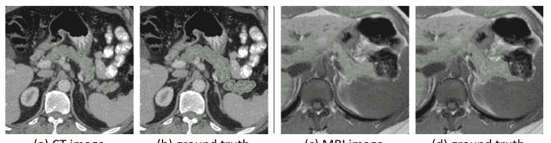

图1.1 CT和MRI中胰腺图像的示例。绿色标出了胰腺的真实边界。最佳观看效果请使用彩色显示## 1.2.2 模型训练策略的设计

除了网络架构外，提出的任务特定设计还包括从头开始训练P-Net的策略。这是因为CT和MRI模态与自然图像具有非常不同的图像统计特性。因此，直接将ImageNet [7]预训练的神经网络转移到医学领域可能不是最佳选择。同样，将模型从其他医学任务转移到P-Net以实现最佳胰腺分割也可能存在问题。在模型训练过程中，我们还观察到当从预训练模型微调网络时会出现梯度消失的问题。具体来说，网络的顶层将快速捕捉到胰腺的层次（概念）外观，但较低层次的调整效果不佳，因为梯度（从训练误差反向传播）的大小迅速减小。为了解决这个问题，我们提议从头开始初始化P-Net，并逐层训练网络。

为了正式介绍P-Net的训练算法，我们将逐层训练的步骤数表示为K。然后，相应的卷积和反卷积层可以表示为{C1, ..., CK}和{D1, ..., DK}。我们还将标准网络操作表示为上采样为Up(#)，连接为Concat([:, :])，维度缩减为R(#)。为了表示清晰，我们使用o表示两个转换的组合，使用[]表示多个转换。为了简单起见，我们在卷积层之间省略了池化操作。

首先，我们将前向传播定义为卷积层的组合

```
F_k = \prod_{i=1}^{K+1-k} C_i. \tag{1.1}
```

然后在P-Net中，特征图逐步放大，直到恢复到原始输入图像的大小。具体来说，当k等于1时，我们有

```
B_k = F_k \circ D_k, \tag{1.2}
```

否则，特征图处理可以表示为

```
B_k = Concat([B_{k-1} \circ Up(2); F_k]) \circ D_k. \tag{1.3}
```

在每个尺度（或步骤）上，分割输出为

$$\hat{Y}_k = B_k \circ Up(2^{K-k}) \circ R(1) \circ Sigmoid, \tag{1.4}$$

其中特征图 $B_k$ 首先通过 $2^{K-k}$ 的因子放大，以恢复原始输入图像的大小。然后通过 $R(1)$ 将其通道减少为1，然后通过Sigmoid激活函数 $Sigmoid$ 产生尺度（或步骤）$k$ 的分割输出 $\hat{Y}_k$。

输出 $\hat{Y}_k$ 是一个概率图，用于测量分割损失为

$$\mathcal{L}_k = H(\hat{Y}_k, Y), \tag{1.5}$$

其中 $Y$ 是真实标签图，$H(\cdot, \cdot)$ 是损失函数，例如交叉熵损失。因此，每个单元模块 $B_k$ 都有自己的梯度反向传播路径从损失 $\mathcal{L}_k$ 开始，到输入图像结束。它引入了深度监督到底部的卷积神经网络层，使我们能够从浅层训练P-Net到深层。更具体地说，P-Net的训练从 $k=1$ 开始，当 $\mathcal{L}_k$-plot收敛时，$k$ 增加1。最终的分割结果 $\hat{Y}$ 是侧输出的加权组合

$$\hat{Y} = \sum_{i=1}^{K} \omega_i \hat{Y}_i, \tag{1.6}$$

以及P-Net的总体目标是，

$$\mathcal{L} = H(\hat{Y}, Y) + \sum_{i=1}^{K} \mathcal{L}_i, \tag{1.7}$$

其中 $K=5$ 提供了最佳的胰腺分割结果。我们在算法1中总结了训练过程，并在图1.3中以 $k=1, k=2$ 和 $k=5$ 的形式直观地描述了P-Net的语义表示结构。

讨论：尽管P-Net的网络架构可以扩展到处理3D输入[5]，但我们在模型训练和推断中仍然保持当前的2D架构，因为3D版本在获得性能方面可能会计算开销较大，没有显著的性能改进[30]。 作为一种妥协，当给定中间切片的分割真值掩码时，P-Net以3个相连的切片作为输入。如第1.3节所解释的那样，P-Net被转化为一个轻量级的3D模型，并在其末尾堆叠了RNN，这使得我们的模型能够捕捉3D成像信息带有轻微的额外计算负载。这类似于使用RNN来调节、处理和聚合视频分类和理解中的CNN激活[16]。

```
结果：$\hat{Y}, \hat{Y}_1, \hat{Y}_2, \dots, \hat{Y}_K$
$K=5$，卷积层：$\{C_1, \dots, C_K\}$，反卷积层：$\{D_1, \dots, D_K\}$；
定义：$F_k=\prod_{i=1}^{K+1-k}$
对于 $k=1:K$ 执行
    如果 $k==1$ 则
    | $B_k=F_k \circ D_k$；
    否则
    | $B_k=Concat([B_{k-1} \circ Up(2); F_k]) \circ D_k$；
    结束
    $\hat{Y}_k=B_k \circ Up(2^{K-k}) \circ R(1) \circ Sigmoid$；
    $\mathcal{L}_k = H(\hat{Y}_k, Y)$；
    优化 $\sum_{i=1}^k \mathcal{L}_i$ 直到收敛；
结束
$\hat{Y} = \sum_{i=1}^K \omega_i\hat{Y}_i$；
$\mathcal{L} = H(\hat{Y}, Y)$；
优化 $\mathcal{L} + \sum_{i=1}^K \mathcal{L}_i$ 直到收敛；

**算法1：P-Net的训练算法。**
```

### 1.2.3 损失函数的设计

损失函数将分割的体积图像（例如，$\hat{Y}$）与真实标注（即，$Y$）进行比较，并产生用于模型更新的分割错误。交叉熵损失是最常用于前景-背景分割的损失函数之一。它的定义如下：

$\mathcal{L}_{ce} = -\frac{1}{|Y|} \sum_{j \in Y} [y_j \log \hat{y}_j + (1 - y_j) \log(1 - \hat{y}_j)], \quad \quad \quad (1.8)$

其中$|Y|$表示体积图像中体素的基数（或大小）。 从$\mathcal{L}_{ce}$的公式中可以观察到，每个体素的错误被等同对待。 然而，在医学图像中，感兴趣的解剖结构通常只占据图像的一个非常小的区域。 因此，直接使用$\mathcal{L}_{ce}$可能导致前景区域的遗漏或仅部分检测到。 为了自动平衡前景/背景类之间的损失，一个平衡分类交叉熵被设计来解决这个问题。它的定义如下：

$$\mathcal{L}_{cbce} = -\frac{\beta}{|Y_{+}|} \sum_{j \in Y_{+}} \log \hat{y}_{j} - \frac{1-\beta}{|Y_{-}|} \sum_{j \in Y_{-}} \log(1-\hat{y}_{j}), \tag{1.9}$$

其中，引入了一个基于每个体素项的类平衡权重 $\beta$。具体而言，我们定义 $\beta = |Y_{-}|/|Y|$和 $1 - \beta = |Y_{+}|/|Y|$，其中 $Y_{+}$和 $Y_{-}$分别表示前景和背景的真实标签集。

除了 $\mathcal{L}_{ce}$ 和 $\mathcal{L}_{cbce}$ 之外，许多工作直接优化评估指标，例如Jaccard指数和Dice分数。就优势而言，Jaccard损失使模型训练和测试的过程一致，并有助于生成无阈值的概率图。其定义如下：

$$\mathcal{L}_{jac} = \mathcal{L}(\hat{Y}, Y) = 1 - \frac{|Y_{+} \cap \hat{Y}_{+}|}{|Y_{+} \cup \hat{Y}_{+}|} = 1 - \frac{\sum_{j \in Y_{+}} (y_{j} \wedge \hat{y}_{j})}{\sum_{j \in Y_{-}} (y_{j} \vee \hat{y}_{j})} = 1 - \frac{\sum_{j \in Y_{+}} (1 \wedge \hat{y}_{j})}{|Y_{+}| + \sum_{j \in Y_{-}} (0 \vee \hat{y}_{j})}. \tag{1.10}$$

实际上，$\hat{y}_{j}$可以放宽到前景概率的值 $\in [0, 1]$，并且 $\mathcal{L}_{jac}$ 可以近似为

$$\tilde{\mathcal{L}}_{jac} = 1 - \frac{\sum_{f \in Y_{+}} \min(1, \hat{y}_{f})}{|Y_{+}| + \sum_{b \in Y_{-}} \max(0, \hat{y}_{b})} = 1 - \frac{\sum_{f \in Y_{+}} \hat{y}_{f}}{|Y_{+}| + \sum_{b \in Y_{-}} \hat{y}_{b}}. \tag{1.11}$$

然后通过梯度流更新模型

$$\frac{\partial \tilde{\mathcal{L}}_{jac}}{\partial \hat{y}_{j}} = \begin{cases} -\frac{1}{|Y_{+}|+\sum_{b\in Y_{-}}\hat{y}_{b}}, & \text{对于 } j \in Y_{+} \\ \frac{\sum_{f\in Y_{+}}\hat{y}_{f}}{(|Y_{+}|+\sum_{b\in Y_{-}}\hat{y}_{b})^{2}}, & \text{对于 } j \in Y_{-} \end{cases} \tag{1.12}$$

由于不等式 ($\sum_{j \in Y_{+}} \hat{y}_{j}) < (|Y_{+}| + |Y_{-}|$)成立，Jaccard损失 $\mathcal{L}_{jac}$ 对前景像素比背景像素具有更大的梯度，从本质上平衡了前景和背景类别。在分割小尺寸物体（例如CT/MRI图像中的胰腺）时，它在经验上比交叉熵损失 $\mathcal{L}_{ce}$ 和类别平衡交叉熵损失 $\mathcal{L}_{cbce}$ 效果更好。

### 1.2.4 实验结果

#### 1.2.4.1 实验设置

数据集和评估指标我们使用两个完全注释的胰腺数据集来验证所提出的方法。第一个是NIH-CT数据集[6, 19, 20]，其中包含82个腹部增强对比度的3D CT扫描。该数据集是公开可用的。我们组织了一个内部MRI数据集[2]，其中包含79个腹部T1加权MRI扫描。我们将CT和MRI数据集视为两个独立的组，并在两个组上重复实验。对两个组的结果进行评估以验证分割方法的泛化能力。

在图像预处理中，我们使用简单的形态学操作来找到腹部区域，并从整个图像体积中提取出来。为了生成训练图像，我们使用真实掩模来分配胰腺，然后裁剪一个以目标胰腺区域为中心的256×256的子图像。然后将裁剪的图像块用于模型训练。在数据推断阶段，我们使用256×256的扫描窗口扫描测试图像，并将输出融合在一起生成最终的分割结果。

根据[2, 19, 20]中的评估策略，我们对报告的分割结果进行四折交叉验证 (CV)。使用的评估指标包括Dice相似系数 (DSC)：$DSC = 2 * (|Y \cap \hat{Y}|) / (|Y| + |\hat{Y}|)$，Jaccard指数 (JI)：$JI = (|Y \cap \hat{Y}|) / (|Y \cup \hat{Y}|)$，前景精度：$P = |\hat{Y} \cap Y| / |\hat{Y}|$，以及前景召回率：$R = |\hat{Y} \cap Y| / |Y|$。

网络实现我们实现了HNN [20]，U-Net [18]和引入的P-Net进行比较。特别是，HNN的较低层从ImageNet [7]预训练的VGG-16模型[24]转移而来，而U-Net则从ssTEM[18]预训练模型开始。我们注意到ssTEM与CT和MRI图像具有非常不同的图像统计特性。因此，HNN和U-Net是两种基准方法，从其他领域微调而来，而提出的P-Net首先使用Xavier初始化[9]进行初始化，然后从头开始训练。

超参数是通过训练集进行模型选择确定的。具体来说，训练数据集首先被分成一个用于网络参数训练的训练子集和一个用于超参数选择的验证子集。在模型选择后，将训练准确度表示为 $Acc_t$，然后将训练和验证子集合并在一起，进一步微调网络，直到其在验证子集上的性能收敛到 $Acc_v$。还从验证子集中验证，我们观察到P-Net架构，在每个卷积/反卷积层中包含5个单元模块，每个模块有64个输出通道，产生了最佳的经验性能，同时保持了紧凑的模型大小。学习率（1e-4）以及其他超参数对于所有集合都是固定的，这样可以追溯到实验结果中观察到的感兴趣的因素。

#### 1.2.4.2 卷积神经网络比较

表1.1展示了使用不同的卷积神经网络架构训练的分割结果，这些网络使用了 $\mathcal{L}_{jac}$。不失一般性，我们将所有卷积神经网络的输出阈值设置为0.5。P-Net在CT和MRI数据集上都取得了最佳性能。具体而言，在CT和MRI分割中，它的Dice分数分别比HNN基准高出3.7%和4.8%。与U-Net基准相比，P-Net在CT和MRI分割中分别提高了3.6%和0.8%的Dice分数。

表1.1 比较了不同的卷积神经网络架构，包括P-Net、HNN [28]和U-Net [18]。具体而言，P-Net是从头开始训练的，而HNN和U-Net是从预训练模型微调的。

| 模型 | DSC (%) | JI (%) | 精确度 | 召回率 |
| :--- | :--- | :--- | :--- | :--- |
| **CT** | | | | |
| HNN [28] | 79.6 ± 7.7 [41.9, 88.0] | 66.7 ± 9.40 [26.5, 78.6] | 83.4 ± 6.5 [62.0, 94.9] | 77.4 ± 11.6 [28.3, 92.6] |
| U-Net [18] | 79.7 ± 7.6 [43.4, 89.3] | 66.8 ± 9.60 [27.7, 80.7] | 81.3 ± 7.5 [49.6, 97.0] | 79.2 ± 11.3 [38.6, 94.1] |
| P-Net | 83.3 ± 5.6 [59.0, 91.0] | 71.8 ± 7.70 [41.8, 83.5] | 84.5 ± 6.2 [60.7, 96.7] | 82.8 ± 8.37 [56.4, 94.6] |
| **MRI** | | | | |
| HNN [28] | 75.9 ± 10.1 [33.0, 86.8] | 62.1 ± 11.3 [19.8, 76.6] | 84.4 ± 6.4 [61.0, 93.5] | 70.6 ± 13.3 [20.7, 88.2] |
| U-Net [18] | 79.9 ± 7.30 [54.8, 90.5] | 67.1 ± 9.50 [37.7, 82.6] | 83.7 ± 6.9 [64.6, 94.6] | 77.3 ± 10.3 [46.1, 94.8] |
| P-Net | 80.7 ± 7.40 [48.8, 90.5] | 68.2 ± 9.64 [32.3, 82.7] | 84.3 ± 7.6 [55.8, 95.8] | 78.3 ± 10.2 [38.6, 95.0] |

#### 1.2.4.3 损失函数比较

表1.2展示了三种损失函数的比较结果，即交叉熵损失 $\mathcal{L}_{ce}$，平衡分类交叉熵损失 $\mathcal{L}_{cbce}$[28]，和Jaccard损失 $\mathcal{L}_{jac}$，在相同的P-Net分割模型下进行了四折交叉验证。 在CT数据集上，$\mathcal{L}_{jac}$的Dice分数优于$\mathcal{L}_{ce}$和$\mathcal{L}_{cbce}$分别提高了0.5%和0.2%。 在MRI数据集上，也通过Dice分数和Jaccard指数取得了最佳性能。 然后我们评估了在不同阈值下分割性能的稳定性。 CNN网络通常输出概率分割图而不是二值掩模，因此需要适当的概率阈值来获得最终的二值分割结果。 然而，在实践中找到最优的概率阈值通常是非常困难的。 图1.4直观地展示了我们的分析结果，即Jaccard损失 $\mathcal{L}_{jac}$的概率输出图在不同的输出阈值下提供了最稳定的分割结果。

根据经验，Naïve $\mathcal{L}_{ce}$在正负像素上施加相同的惩罚，因此概率阈值应该在0.5左右。 与此同时， $\mathcal{L}_{cbce}$对正像素施加更高的惩罚（由于其稀缺性），使得结果的最优阈值相对较高。 相比之下， $\mathcal{L}_{jac}$将前景像素推向概率为1.0，同时对背景像素具有强烈的区分能力。 因此， $\mathcal{L}_{jac}$的最优分割性能平台会比 $\mathcal{L}_{ce}$和$\mathcal{L}_{cbce}$更宽，因此在我们的实验中可以在较宽范围的阈值下稳定运行，即 [0.05, 0.95]。

表1.2 损失函数的比较： $\mathcal{L}_{ce}$， $\mathcal{L}_{cbce}$和 $\mathcal{L}_{jac}$与P-Net

| 损失 | 平均值 ± 标准差 [最小值，最大值] |
| :--- | :--- |
|  | **Dice分数 (%)** | **Jaccard指数 (%)** |
| **CT** | $\mathcal{L}_{ce}$ | 83.5 ± 5.6 [59.3, 91.1] | 72.0 ± 7.70 [42.2, 83.6] |
|  | $\mathcal{L}_{cbce}$ | 83.2 ± 5.7 [57.2, 90.3] | 71.6 ± 7.80 [40.1, 82.4] |
|  | $\mathcal{L}_{jac}$ | **83.7 ± 5.4 [58.4, 90.4]** | **72.3 ± 7.50 [41.3, 82.4]** |
| **MRI** | $\mathcal{L}_{ce}$ | 80.0 ± 7.60 [50.7, 89.9] | 67.3 ± 9.80 [34.0, 81.6] |
|  | $\mathcal{L}_{cbce}$ | **80.2 ± 7.20 [53.6, 90.5]** | **67.6 ± 9.50 [36.6, 82.7]** |
|  | $\mathcal{L}_{jac}$ | 80.2 ± 7.90 [51.2, 90.1] | 67.6 ± 10.3 [34.4, 82.0] |

图1.4 阈值与Dice分数（DSC）的图表： 提出的Jaccard损失 $\mathcal{L}_{jac}$在阈值范围[0.05, 0.95]内表现最稳定， 与交叉熵损失 $\mathcal{L}_{ce}$和类平衡交叉熵损失 $\mathcal{L}_{cbce}$相比。 从验证数据集中选择的阈值分别标记为 ○，以及损失函数 $\mathcal{L}_{ce}$， $\mathcal{L}_{cbce}$， 和 $\mathcal{L}_{jac}$

## 1.3 上下文学习的循环神经网络

之前的工作[2, 20, 30]在CT（或MRI）轴向切片上独立进行深度2D CNN分割，没有考虑相邻图像之间的相关性。在3D体积中进行器官分割也可以通过直接将裁剪的3D子体积作为输入传递给3D CNNs [10, 14, 15]来完成。然而，即使以计算代价高和容易过拟合的方式[30]，对于复杂形状的器官[14]或小解剖结构[10]，也没有报道非常高的分割准确性。尽管对内存要求更高，但3D CNN方法值得进一步研究。另一方面，[3, 25]使用混合CNN-RNN架构来处理/分割序列中的CT（或MRI）图像，并提出了处理CT和MRI分割的有希望的方向。然而，这些方法没有应用空间形状连续性约束或正则化来强制保持连续切片之间的分割一致性。因此，在本章中，我们提出了自己的研究，用循环神经网络调节胰腺在3D切片中的分割。

## 1.4 循环神经网络

如上所述，P-Net通过单独的2D图像切片处理胰腺分割，在经过测试的CT和MRI数据集上表现出色。然而，如图1.5的第一行所示，连续切片中得到的CNN胰腺分割区域之间的过渡可能不平滑，这经常意味着分割失败的边界。相邻的CT/MRI切片预计彼此之间存在相关性，因此连续切片的分割结果需要受到形状连续性的约束。3D物体分割模型需要能够检测和恢复切片内部异常丢失的部分（见图1.5中的$\hat{Y}_{\tau}$）。

为了实现这一点，我们在P-Net的输出端连接了一个循环神经网络（RNN）子网络，用于建模切片间的形状连续性和正则化。RNN最初是为顺序数据分析而设计的，因此自然满足处理有序图像切片的需求。具体而言，我们将CT（或MRI）体积切割成有序的2D图像序列，并使用典型的RNN架构，即长短期记忆（LSTM）单元，来学习相邻图像切片之间的分割形状连续性。然而，标准的LSTM需要矢量化输入，这将牺牲CNN输出中编码的空间信息。为了解决这个问题，我们利用卷积LSTM（C-LSTM）模型[23]通过CNN来保留2D图像分割布局。如图1.5所示，$H_{\tau}$和$C_{\tau}$。

基于C-LSTM的上下文连续性学习策略建立在直观的条件概率假设之上。前一张图像切片的分割结果被编码在细胞隐藏状态$H_{\tau-1}$中。通过将$H_{\tau-1}$和$\hat{Y}_{\tau}$一起考虑在内来决定$C_{\tau}$的值。如果CNN模型（例如P-Net）预测$\hat{Y}_{\tau}$中的位置$p_i$为胰腺组织，并且$H_{\tau-1}$中的相同位置也被编码为胰腺组织，则可以高度确信该位置$p_i$应该是$C_{\tau}$中的一个胰腺像素，反之亦然。因此，C-LSTM不仅可以恢复缺失的分割部分，还可以输出比原始CNN子网络更自信的概率图。

从形式上讲，C-LSTM单元的公式为：

$$
\begin{aligned}
i_{\tau} &= \sigma (W_{yi}*Y_{\tau} + W_{hi}*h_{\tau-1} + W_{ci} c_{\tau-1} + b_i), \quad (1.13) \\
f_{\tau} &= \sigma (W_{yf}*Y_{\tau} + W_{hf}*h_{\tau-1} + W_{cf} c_{\tau-1} + b_f), \quad (1.14) \\
c_{\tau} &= f_{\tau} c_{\tau-1} + i_{\tau} \tanh(W_{yc}*Y_{\tau} + W_{hc}*h_{\tau-1} + b_c), \quad (1.15) \\
o_{\tau} &= \sigma (W_{yo}*Y_{\tau} + W_{ho}*h_{\tau-1} + W_{co} c_{\tau} + b_o), \quad (1.16) \\
h_{\tau} &= o_{\tau} \tanh(c_{\tau}), \quad (1.17)
\end{aligned}
$$

其中 * 表示卷积操作，而 * 表示哈达玛积。门 $i_\tau, f_\tau, o_\tau$ 分别表示输入、遗忘和输出，遵循C-LSTM的原始定义。$W_{(\cdot)}$和$b_{(\cdot)}$是相应的C-LSTM单元中需要进行模型优化的权重和偏差。最后，$\sigma(\cdot)$和$\tanh(\cdot)$分别表示sigmoid和双曲正切激活函数。

### 1.4.1 双向上下文正则化

接下来，我们将上下文学习扩展到双向。对于胰腺以及其他器官，它在当前切片中的形状不仅受到前面切片的限制，还受到后面切片的限制。如果在两个方向上都采用形状正则化，输入的上下文信息可以加倍，从而进一步改善。两层C-LSTM被堆叠在一起，分别在两个相反的方向上工作，如图1.5所示。然后，两层的输出，一个在 $\tau^-$ 方向上，另一个在 $\tau^+$ 方向上，被合并为最终的分割输出。

$$
\bar{Y}_{\tau} = \sum_{i \in \{\tau^-, \tau^+\}} \lambda^{i} o_{\tau}^{i}, \quad (1.18)
$$

其中 $i$ 表示 $\tau^-$ 和 $\tau^+$ 方向，$\lambda^i$ 是从两个方向组合C-LSTM输出时学习到的权重。因此，形状连续性建模的双向设计允许明确地强制胰腺分割具有空间平滑性和高阶切片间规则化。

最后，我们根据Jaccard损失定义了上下文学习的目标，如下所示：

$$
L_{rnn} = \sum_{\tau=1}^{T} \mathcal{L}_{jac}(\bar{Y}_{\tau}, Y), \quad (1.19)
$$

其中 $T$ 是每个单元中处理的图像序列的长度，我们在实验中经验性地将 $T$ 设置为5。

### 1.4.2 实验结果

将P-Net的输出作为最佳基于CNN的分割结果，然后将双向RNN（BiRNN）子网络堆叠到P-Net的输出端，并进行端到端的训练。在每个方向上，使用一个隐藏状态和3×3卷积滤波器核实现了一个单层C-LSTM [23]。特别地，由于我们的形状连续性学习仅通过处理CNN子网络的输出概率图来简化，所以隐藏状态的数量设置为1。CNN输出 $\hat{Y}_{\tau} \in \mathbb{R}^{d_{1} \times d_{2} \times 1}$，其中 $d_{1}$ 和 $d_{2}$ 是输入图像的宽度和高度，为形状学习提供了高度压缩的表示。因此，具有隐藏状态 $H_{\tau} \in \mathbb{R}^{d_{1} \times d_{2} \times 1}$ 的BiRNN足以对CNN输出之间的形状连续性进行建模和捕捉。我们注意到，当使用较大的隐藏状态时，BiRNN无法稳定地收敛模型训练。此外，我们尝试将BiRNN应用于CNN的中间层的特征图。然而，这导致模型训练过程无法收敛。因此，我们主要关注BiRNN的当前设计，重点是学习P-Net连续分割输出之间的层间形状连续性。

表1.3 评估CT数据集上的胰腺分割。BiRNN改进了P-Net的输出，提供了更好的体积重叠（DSC）和表面距离（HD）性能。

| 方法 | HD（毫米） | DSC（%） |
| :--- | :--- | :--- |
| P-Net | 0.61 ± 0.53 [0.15, 3.48] | 83.3 ± 5.6 [59.0, 91.0] |
| BiRNN | 0.54 ± 0.53 [0.12, 3.78] | 83.7 ± 5.1 [59.0, 91.0] |

我们将分割形状的连续性建模为CT/MRI轴向切片之间的高阶切片正则化。CT和MRI的平均物理切片厚度分别为2毫米和7毫米。因此，在两个正确分割的切片之间会发生轻微的形状变化。给定地面真值中相邻切片的测量Hausdorff距离（HD），CT和MRI中形状变化的平均值±标准差分别为0.35±0.94毫米和2.69±4.45毫米。MRI体积中的剧烈形状变化表明连续的MRI图像切片实际上更加独立，因此在我们的实现中，形状连续性学习带来了微小但一致的性能改进。CT图像的改进更加明显。具体而言，我们检测CNN输出中的异常形状变化，并通过BiRNN对其进行改进。我们定义当HD($\hat{Y}_\tau$, $\hat{Y}_{\tau-1}$) > 0.5毫米时，在相邻CT切片之间发生异常形状变化，这是基于CT数据集中形状变化统计的决定。

表1.3展示了具有和没有形状连续性学习的性能，其中BiRNN通过0.4%提高了体积分割（即DSC）。更重要的是，胰腺表面重建的误差（即HD）从0.61毫米降低到0.54毫米，提高了11.5%。图1.7进一步显示了被试间有无上下文学习的分割性能差异统计。特别是，BiRNN极大地改善了DSC得分较低的情况。最后，图1.6显示了所有比较方法（即HNN [28], U-Net [18], P-Net和P-Net+BiRNN）的输出概率图的示例，在CT和MRI数据集上，后者在输出上提供了最清晰和最干净的结果。

具体而言，P-Net呈现了详细的结果，恢复了胰腺的主要部分，而HNN和U-Net则在分割召回率方面遭受了显著的下降。观察CT和MRI的BiRNN输出时，我们发现通过形状连续性学习和正则化，在CT中恢复了详细的胰腺部分，而在MRI中，BiRNN仅输出与P-Net输出具有相同形状的概率图，在MRI数据集中，当切片间形状发生剧烈变化时，这是最优的。因此，在切片厚度合理小于2毫米的情况下，例如<2 mm，BiRNN将有助于在平滑的表面上细化胰腺分割。

## 1.5 胰腺分割的最新方法

我们比较了选择的胰腺分割的最新方法。Dice分数和Jaccard指数在四折交叉验证下计算并报告在表1.4中。在CT数据集上，方法 P-Net+BiRNN表现最好，而在MRI数据集上，P-Net取得了最佳结果。我们注意到FCN 3D [22]的当前实现不如其2D分割对应方法有效，其中 P-Net+BiRNN的Dice分数比FCN 3D高出了6.9%。在单次推理中分割3D CT/MRI图像体积的问题比2D CNN方法要复杂得多，需要进一步探索网络架构以及通常需要更多的训练图像。这也被称为维度诅咒[19, 30]。在这种情况下，我们认为对于具有较大间隔厚度的胰腺分割，2D网络架构仍然是最优的。

我们还注意到，我们发展CNN-RNN组合的直觉与粗到细的胰腺定位和检测原则是正交的[21, 30]。通过结合这两种方法，可能可以获得更好的性能。

表1.4 四折交叉验证下分割的最先进方法的性能。我们以均值 ± 标准差的形式展示Dice分数和Jaccard指数。[最差情况，最佳情况]。CT和MRI上的最佳结果以粗体显示。

| 方法 | Dice分数（%） | Jaccard指数（%） |
| :--- | :--- | :--- |
| **CT** | | |
| 3D FCN [22] | 76.8 ± 9.4 [43.7, 89.4] | |
| Roth等人[20] | 78.0 ± 8.2 [34.1, 88.6] | |
| Roth等人[21] | 81.3 ± 6.3 [50.6, 88.9] | 68.8 ± 8.12 [33.9, 80.1] |
| 粗到细[30] | 82.3 ± 5.6 [62.4, 90.8] | |
| CNN+RNN [1] | 82.4 ± 6.7 [60.0, 90.1] | 70.6 ± 9.00 [42.9, 81.9] |
| P-Net | 83.3 ± 5.6 [59.0, 91.0] | 71.8 ± 7.70 [41.8, 83.5] |
| **P-Net+BiRNN** | **83.7 ± 5.1 [59.0, 91.0]** | **72.3 ± 7.04 [41.8, 83.5]** |
| **MRI** | | |
| 图形融合[2] | 76.1 ± 8.70 [47.4, 87.1] | |
| CNN+RNN [1] | 80.5 ± 6.70 [59.1, 89.4] | 67.9 ± 8.90 [41.9, 80.9] |
| **P-Net** | **80.7 ± 7.40 [48.8, 90.5]** | **68.2 ± 9.64 [32.3, 82.7]** |

图1.8直观地展示了来自CT数据集的重建的3D分割结果的示例。图1.8显示了胰腺分割结果的三维可视化，其中黄色表示人工标注，绿色表示计算机分割。三个示例的DSC分别为90%，75%和60%，从左到右。

## 1.6 总结

在本章中，我们提出了一种新颖的CNN-RNN架构，用于通过我们定制的CNN模块（P-Net）和双向C-LSTM（BiRNN）在CT和MRI扫描中进行胰腺分割。它用于规范化单个图像切片上的分割结果。形状连续性正则化允许在轴向上明确强制胰腺分割的空间平滑性，类似于通过解析和聚合连续帧来理解视频[16]。

这也可能与医生阅读放射学图像的方式有些相似。结合提出的Jaccard损失函数用于模型训练以生成无阈值的分割结果，我们的定量胰腺分割结果在CT和MRI数据集上优于先前的最先进方法[2, 20, 21, 30]，差距明显。尽管本章讨论的重点是胰腺分割，但这些方法也可以推广到医学图像分析中的其他器官分割。

## # 参考文献

- 1. Cai J, Lu L, Xie Y, Xing F, Yang L (2017) 通过循环神经网络上下文学习和直接损失函数改进CT和MRI图像中的深度胰腺分割。在：MICCAI, pp674-682. Springer
- 2. Cai J, Lu L, Zhang Z, Xing F, Yang L, Yin Q (2016) 基于图形决策融合卷积神经网络的MRI胰腺分割。在：MICCAI, pp 442-450. Springer
- 3. Chen J, Yang L, Zhang Y, Alber MS, Chen DZ (2016) 结合全卷积和循环神经网络进行3D生物医学图像分割。在：NIPS, pp 3036-3044.
- 4. Chen L, Papandreou G, Kokkinos I, Murphy K, Yuille AL (2018) Deeplab：使用深度卷积网络，空洞卷积和全连接CRFs进行语义图像分割。TPAMI 40(4):834-848
- 5. Çiçek Ö, Abdulkadir A, Lienkamp SS, Brox T, Ronneberger O (2016) 3d u-net: 从稀疏注释中学习密集体积分割。在：MICCAI, 第424-432页. Springer
- 6. Clark KW, Vendt BA, Smith KE, Freymann JB, Kirby JS, Koppel P, Moore SM, Phillips SR, Maffitt DR, Pringle M, Tarbox L, Prior FW (2013) 癌症成像存档 (TCIA)：维护和公共信息存储库。J Digit Imaging 26(6):1045-1057.
- 7. Deng J, Dong W, Socher R, Li L, Li K, Li F (2009) Imagenet：一个大规模的分层图像数据库。在：2009年IEEE计算机学会计算机视觉和模式识别会议 (CVPR 2009)，2009年6月20日至25日，美国佛罗里达州迈阿密，第248-255页
- 8. Farag A, Lu L, Roth HR, Liu J, Turkbey E, Summers RM (2017) 一种自下而上的方法用于胰腺分割，使用级联超像素和（深度）图像块标记。TMI 26(1):386-399
- 9. Glorot X, Bengio Y (2010) 理解深度前馈神经网络训练的困难。在：AISTATS, 第249-256页
- 10. Kamnitsas K, Ledig C, Newcombe VFJ, Simpson JP, Kane AD, Menon DK, Rueckert D, Glock er B (2017) 高效的多尺度3D卷积神经网络与完全连接的CRF用于准确的脑损伤分割。MIA 36:61-78
- 11. Karasawa K, Oda M, Kitasaka T, Misawa K, Fujiwara M, Chu C, Zheng G, Rueckert D, Mori K (2017) 基于血管结构的多模板胰腺分割：基于模板的选择。MIA 39:18-28
- 12. Lee C, Xie S, Gallagher PW, Zhang Z, Tu Z (2015) 深度监督网络。在：AISTATS
- 13. Long J, Shelhamer E, Darrell T (2015) 全卷积网络用于语义分割。在：CVPR, 第3431-3440页
- 14. Merkow J, Marsden A, Kriegman DJ, Tu Z (2016) 密集体积到体积的血管边界检测。在：MICCAI, 第371-379页
- 15. Milletari F, Navab N, Ahmadi S (2016) V-net：用于体积医学图像分割的全卷积神经网络。在：国际三维视觉会议，第565-571页
- 16. Ng J, Hausknecht M, Vijayanarasimhan S, Vinyals O, Monga R, Toderici G (2015) 超越短片段：用于视频分类的深度网络。在：ICCV，第4694-4702页
- 17. Oda M, Shimizu N, Karasawa K, Nimura Y, Kitasaka T, Misaw a K, Rueckert D, Mori K (2016) 基于回归森林的胰腺分割的图谱定位和方向特定图谱生成。在：MICCAI, 第556-563页. Springer
- 18. Ronneberger O, Fischer P, Brox T (2015) U-net：用于生物医学图像分割的卷积网络。在：MICCAI, 第234-241页
- 19. Roth HR, Lu L, Farag A, Shin HC, Liu J, Turkbey EB, Summers RM (2015) Deepor gan：用于自动胰腺分割的多级深度卷积网络。在：MICCAI, 第556-564页. Springer
- 20. Roth HR, Lu L, Farag A, Sohn A, Summers RM (2016) 全局嵌套网络的空间聚合用于自动胰腺分割。在：MICCAI, 第450-451页. Springer
- 21. Roth HR, Lu L, Lay N, Harrison AP, Farag A, Summers RM (2018) 全局嵌套卷积神经网络的空间聚合用于自动胰腺定位和分割。MIA 45: 94-107

# 第2章 深度学习用于肌肉病理图像分析

**谢元普，刘军，邢福勇和杨琳**

摘要 炎症性肌病（IM）是一种与肌肉功能障碍相关的异质性疾病。 鉴定IM亚型对于指导有效的患者治疗至关重要，因为每个亚型都需要不同的治疗方法。 对肌肉活检标本进行血红蛋白和嗜酸性染色（H&E染色）的图像分析被认为是有效的IM诊断的黄金标准。 准确的肌肉周围结缔组织分割在许多肌肉炎症疾病的早期诊断中起着重要作用。 然而，由于周围结缔组织形态的复杂性和其与背景区 域的模糊性，这仍然是一项具有挑战性的任务。 肌肉周围结缔组织还展示出强大的结构，覆盖整个组织，这使得当前基于局部块的方法难以捕捉到这种长程上下文信息。 在本书章节中，我们提出了一种新颖的空间时钟递归神经网络（空间CW-RNN）来解决这些问题。

除了肌间膜分割外，我们还引入了一个完全自动的全切片图像分析框架，用于使用深度卷积神经网络（DCNNs）进行IM亚型分类。

谢宇和刘飞对这项工作做出了相同的贡献。

谢宇
J. 佛罗里达大学克雷顿·普韦特家庭生物医学工程系，美国佛罗里达州盖恩斯维尔，FL 32611，电子邮件：shampoo@ufl.edu，刘飞

佛罗里达大学计算机与信息科学与工程系，美国佛罗里达州盖恩斯维尔，FL 32611，电子邮件：fujunliu@ufl.edu，邢飞·杨丽（☒）

科罗拉多大学安舒茨医学校区生物统计与信息学系，美国科罗拉多州奥罗拉，CO 80045，电子邮件：lin.yang@bme.ufl.edu，邢飞

## 2.1 引言

许多重要的形态学特性，如肌纤维的分布和其核与周肌层的关系，对于许多肌肉疾病的早期诊断是重要的生物标志物[1]。为了计算这些空间形态学参数，准确而高效地分割周肌层是一个必要的前提。然而，肌肉周肌层常常与肌内层、肌外层和血管等肌肉结构具有相似的外观。染色强度、全局结构和形态的大幅变化进一步增加了自动分割任务的复杂性。

炎症性肌病（IM）是一组与肌肉功能障碍相关的异质性疾病[2]。根据不同的临床病理特征，IM可以分为三个主要亚型：皮肌炎（DM），多发性肌炎（PM）和包涵体肌炎（IBM）。鉴别IM亚型对于指导有效的患者治疗非常重要，因为每个亚型的预后和对不同疗法的反应都不同[3]。

在临床实践中，IM亚型的诊断通常包括两个步骤：（1）病理学家进行磁共振成像（MRI）筛查，选择显示相关组织学特征的肌肉组织区域并取活检；（2）肌肉活检的数字化图像通过全切片成像（WSI）技术获得，并由病理学家进行亚型诊断分析。目前，全切片图像的诊断仍然是一个手动或者最好的情况下是半自动的过程，这种过程劳动密集且容易出错，导致高度的观察者间变异性。在这项工作中，我们提出了一个完全自动的全切片图像分析框架，使用深度卷积神经网络（DCNNs）进行IM亚型分类[4-9]。

## 2.2 肌肉周围膜分割

巨大的努力已经投入到在计算机视觉任务中利用RNN。Francesco [10] 应用GRU [11] 将图像作为一个链式结构的数据沿着四个不同的方向进行扫描，以建模上下文信息。一些开创性的研究 [12, 13] 在语义图像分割中利用多维RNN的潜力也取得了有希望的结果。然而，2D普通RNN [12] 在处理大图像时会遇到梯度爆炸或梯度消失的问题，而2D LSTM [13] 的参数比2D RNN多得多，在运行时效率低下，有时会出现过拟合问题，特别是当训练数据量有限时。

在本章中，我们提出了一种2D空间时钟RNN，将链式结构的CW-RNN [14] 扩展到2D图像领域，用于高效的周围膜分割。我们的模型直接利用图像的2D结构，并对局部图像块之间的全局上下文信息进行编码。不同于[12, 13]，我们的模型包含更少的参数，这使得它在计算上更高效，适用于具有有限训练数据的医学图像分割。在我们的算法中，我们将结构化回归[15]集成到提出的算法中，而不是进行低效的基于块的分类。这使得我们可以在训练和测试阶段都使用非重叠的步长。广泛的实验证明了我们提出的模型的有效性和效率。据我们所知，这是第一个在生物医学图像分割上取得有希望结果的2D空间CW-RNN的工作。

### 2.2.1 循环神经网络

循环神经网络（RNN）是一种具有循环连接的神经网络，使网络能够记忆过去的输入模式。对于简单的RNN（SRNN），在每个时间步骤，其当前隐藏状态 h^t 是当前输入 x^t 和上一步的隐藏状态 h^{t-1} 的非线性变换。输出 o^t 直接连接到 h^t。数学上，这些关系可以用以下方程表示：

```
h^t = f(W x^t + U h^{t-1} + b_h), \quad (2.1)
o^t = g(V h^t + b_o), \quad (2.2)
```

其中 f(.), g(.) 代表非线性激活函数, W 和 U 是连接输入单元和隐藏单元的权重矩阵，隐藏单元与自身的权重矩阵，分别。V 是连接隐藏单元和输出单元的权重矩阵。b_h 和 b_o 分别代表隐藏层和输出层的偏置项。

SRNN通常使用通过时间反向传播（BPTT）算法[16]进行判别性目标函数训练。然而，当 T 变大时，SRNN的计算梯度要么爆炸要么消失，这阻碍了SRNN学习长期时间依赖性。CW-RNN（时钟RNN）[14]通过使用巧妙的技巧解决了长期依赖性问题，而不是引入门控连接[11, 17]来复杂化模型。具体来说，隐藏单元 h 被分成 M 个模块（h^i 对于 i = 1, ..., M），每个模块的大小为 k，并与一个时钟（或时间）周期 T_i ∈ {T_1, ..., T_M} 相关联。隐藏单元的总长度为 hid = M × k。在每个时间步 t，只有当 t 满足 (t mod T_i) = 0 时，模块i中的神经元才会更新。对应较慢速率的单元能够保留长期信息。此外，隐藏单元之间的连接受限，较快的模块只能从较慢的模块接收信息，而不能反过来，这种机制进一步减少了活跃权重的总数。

#### 2.2.1.1 空间时钟RNN

由于静态图像中不存在现有的序列，上述CW-RNN不直接适用于我们的应用。虽然我们可以将包含所有图像块的张量重新整形为链式结构表示，但这种简化方式存在问题，因为图像块之间的相互作用超出了链式结构。为了改善这个问题，我们将CW-RNN扩展到二维领域，其中当前状态可以从其行和列方向的前任接收信息。我们将每个局部块的时间步骤 (r, c) 定义为该图像块在图像网格上的坐标。为了使空间CW-RNN处理图像，所有图像块都需要按照无环序列进行排序。可能的排序策略之一是 (x1, x2) < (x1', x2') 如果 ∃ i ∈ {1, 2} 使得 xi < xi' 且 xj = xj'，∀ j = i。不失一般性，我们定义对于每个当前步骤 (r, c)，其前任为在其到达当前位置之前模型处理的局部块。

具体来说，我们为行和列维度分别维护一个子隐藏状态，表示为 h 和 \tilde{h}，它们组合在一起作为隐藏状态 H = [h, \tilde{h}]。分别用 U 和 \tilde{U} 表示连接当前隐藏状态与其行和列前驱的权重矩阵，它们被分成四个 hid × hid 的块矩阵；连接输入单元和隐藏单元的 W 被分成 2 个 input\_dim × hid 的块列；偏置 b\_h 也均匀分成 2 组：

```
U = 
\begin{pmatrix}
\widehat{U}^{(1,1)} & U^{(1,2)} \\
U^{(2,1)} & U^{(2,2)}
\end{pmatrix},
\widetilde{U} = 
\begin{pmatrix}
\widetilde{U}^{(1,1)} & \widetilde{U}^{(1,2)} \\
\widetilde{U}^{(2,1)} & \widetilde{U}^{(2,2)}
\end{pmatrix},
W = (W^1 \quad W^2),
和
b = (b^1 \quad b^2)。
每个块矩阵 U^{(m,n)}, \widetilde{U}^{(m,n)} 都进一步分成 M × M 相同大小的小块矩阵 k × k。 W^m 和 b^m 被分割成 M 个块列，如下所示：
U^{(m,n)} =
\begin{pmatrix}
U_{(1,1)}^{(m,n)} & \cdots & U_{(1,M)}^{(m,n)} \\
\vdots & \ddots & \vdots \\
U_{(M,1)}^{(m,n)} & \cdots & U_{(M,M)}^{(m,n)}
\end{pmatrix},
\widetilde{U}^{(m,n)} =
\begin{pmatrix}
\widetilde{U}_{(1,1)}^{(m,n)} & \cdots & \widetilde{U}_{(1,M)}^{(m,n)} \\
\vdots & \ddots & \vdots \\
\widetilde{U}_{(M,1)}^{(m,n)} & \cdots & \widetilde{U}_{(M,M)}^{(m,n)}
\end{pmatrix},
W^m = (W_1^m \quad \cdots \quad W_M^m)
和
b^m = (b_1^m \quad \cdots \quad b_M^m)。
```

每个子隐藏状态 h 和 \tilde{h} 被分成 M 模块，每个模块以特定的时间速率运行。记 i, j ∈ {1, …, M} 为模块索引，u ∈ {1, 2} 为矩阵标识符，(r, c) 为时间步骤。为了简洁起见，我们定义如下：

```
\mathcal{H}_i^{(r,c)} = (h_i^{(r,c)} \quad \widetilde{h}_i^{(r,c)}),
\mathcal{U}_{ij}^u = 
\begin{pmatrix}
\widehat{U}_{ij}^{(u,1)} \\
U_{ij}^{(u,2)}
\end{pmatrix},
和
\widetilde{\mathcal{U}}_{ij}^u = 
\begin{pmatrix}
\widetilde{U}_{ij}^{(u,1)} \\
\widetilde{U}_{ij}^{(u,2)}
\end{pmatrix}。
```

第 i 个模块的更新规则为 h（对于 \tilde{h} 也是类似的）在时间步骤 (r, c) 给出如下：

```
$$h_i^{(r,c)} = \begin{cases} f(x^{(r,c)}W_i^1 + \sum_{j=i}^{M} \left( \mathcal{H}_j^{(r-1,c)} \mathcal{U}_{ij}^1 + \mathcal{H}_j^{(r,c-1)} \widetilde{\mathcal{U}}_{ij}^1 + b_i^1 \right) & \text{if } (r \mod T_i) = 0, \\ h_i^{(r-1,c)} & \text{否则.} \end{cases}$$
```

```
$$\widetilde{h}_i^{(r,c)} = \begin{cases} f(x^{(r,c)}W_i^2 + \sum_{j=i}^{M} \left( \mathcal{H}_j^{(r-1,c)} \mathcal{U}_{ij}^2 + \mathcal{H}_j^{(r,c-1)} \widetilde{\mathcal{U}}_{ij}^2 + b_i^2 \right) & \text{if } (c \mod T_i) = 0, \\ \widetilde{h}_i^{(r,c-1)} & \text{否则.} \end{cases}$$
```

请注意，上述方法仅考虑4个相邻补丁，即每个补丁仅从其左侧、右侧、上方和下方的相邻补丁接收信息。但是，将我们的方法扩展到8个相邻补丁是微不足道的。这两种情况都在实验部分进行了评估。

#### 2.2.1.2 结构化预测

由于空间CW-RNN的时间依赖性特性，每个局部补丁只从其前身所覆盖的区域接收上下文信息。然而，在2D图像中，每个局部补丁都被其前身和后继者所包围，因此我们希望模型能够在每个时间步骤中意识到来自其前身和后继者的双向信息。

为此，我们从四个不同的角落（左上角，左下角，右上角，右下角）扫描输入图像（或特征图）到相对的角落。对于每个局部图像块，来自四个方向扫描的激活被连接在一起作为完整的上下文表示，然后输入到后续层产生最终的预测输出。这个过程的示意图如图2.1所示。

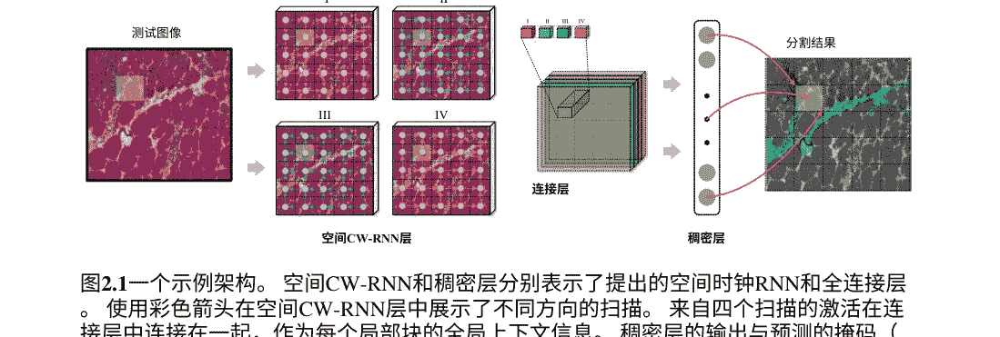

图2.1 一个示例架构。 空间CW-RNN和稠密层分别表示了提出的空间时钟RNN和全连接层。 使用彩色箭头在空间CW-RNN层中展示了不同方向的扫描。 来自四个扫描的激活在连接层中连接在一起，作为每个局部块的全局上下文信息。 稠密层的输出与预测的掩码（覆盖在原始图像上）之间的映射使用棕色箭头进行说明。

现在，我们省略模块索引$i$在$\mathcal{H}^{(r,c)}$中，并定义$\mathcal{H}_{\searrow}^{(r,c)}$，$\mathcal{H}_{\swarrow}^{(r,c)}$，$\mathcal{H}_{\nearrow}^{(r,c)}$和$\mathcal{H}_{\nwarrow}^{(r,c)}$作为每个方向扫描的总隐藏激活（包含所有模块）在时间步骤$(r,c)$上。将这些连接特征应用于一个密集层后的输出$O^{(r,c)}$可以计算为

$$O^{(r,c)} = f(\sum_{d^{\prime}} \mathcal{H}_{d^{\prime}}^{(r,c)} W_{d^{\prime}} + b),\tag{2.5}$$

其中$d^{\prime} \in \{\searrow, \swarrow, \nearrow, \nwarrow\}$表示不同的扫描方向。请注意，密集层在所有时间步骤上单独应用，并且与不同时间步骤对应的局部补丁共享相同的权重$W_{d^{\prime}}$。

给定一组训练数据$\{(X_i, Y_i)\}_{i=1}^{N}$，其中$N$是训练数据的总数，$X_i$是第$i$个训练图像，$Y_i$是相应的掩膜标签。设$R_i$和$C_i$分别表示第$i$组训练数据中行和列维度上的局部补丁的总数。将$\Theta$表示为模型的参数，$\Psi$表示我们的模型。定义在$\{(X_i, Y_i)\}$上的目标函数为

$$\mathcal{L}(\Psi(X_i; \Theta), Y_i) = \frac{1}{2} \sum_{r=1}^{R_i} \sum_{c=1}^{C_i} \left\| Y_i^{(r,c)} - O_i^{(r,c)} \right\|_2^2, \tag{2.6}$$

其中$Y_i^{(r,c)}$和$O_i^{(r,c)}$被重塑成一个向量来计算损失。

我们提出的空间CW-RNN天生具有捕捉整个图像中语义信息的能力。同时，它是完全端到端可训练的，并且可以使用标准的BPTT算法进行优化[16]。它接受任意大小的输入图像，并生成与输入图像相同大小的结果掩码。

#### 2.2.1.3 实验结果和讨论

数据集和实现细节：所提出的空间CW-RNN已经使用348个H&E染色的骨骼肌显微镜图像进行了广泛评估（每个图像大约包含$300 \times 600$个像素）。所有图像都是由两位神经肌肉病理学家手动注释和双重检查的。总共选择了150张图像进行测试，其余的用于训练。报告了定性和定量实验。骨骼肌图像中的周围肌膜形态和图像强度经常表现出较大的变化。不均匀的背景噪声以及肌纤维之间细小间隙的强相似性进一步复杂化了分割任务。

我们方法的详细架构总结在表格2.1中。第一层是一个稠密层，接下来的四个空间CW-RNN层用于在四个不同的方向上扫描输入特征图。这四个空间CW-RNN层的激活值然后被连接在一起作为整个上下文感知特征，并被传递给下一个连续的稠密层以获得最终输出。输出层使用sigmoid激活函数，而ReLU激活函数在其他层中使用。 非重叠补丁的大小设置为 10 × 10 × 3。

该模型使用学习率为0.003的RMSprop优化器进行训练。 为了防止过拟合，我们将丢弃率设置为0.4，权重衰减设置为1e-7，应用于所有层。 在第四节中，M和k的值分别为4和48。 时间段设置为指数序列： $T_i = 2^{i-1}$。

评估指标：将 $m_{ij}$ 表示为类别 $i$ 标记为类别 $j$ 的像素数， $t_i = \sum_j m_{ij}$ 表示类别 $i$ 的像素数。 我们报告了六个常用的指标，基于区域交并比（IU）和像素准确率的变体，这些指标在语义图像分割和场景解析评估中常用。 对于评估指标，我们不区分周围肌膜区域和背景，而是将它们统一视为像素预测。 对于所有比较方法，我们通过使用最大化所有方法的平均 $F_1$ 分数的阈值来将预测掩码二值化。

+   (1) 平均准确率 (MA): $(1/2) \sum_i m_{ii} / t_i$.
(2) 平均交并比 (AIU): $(1/2) \sum_i (m_{ii} / (t_i + \sum_j m_{ji} - m_{ii}))$.
(3) 加权交并比 (WIU): $(1/\sum_i t_i) \sum_i (t_i m_{ii} / (t_i + \sum_j m_{ji} - m_{ii}))$.
(4) 精确率 (P), 召回率 (R), 和 $F_1$ 得分.

与其他工作的比较: 我们将我们的方法与其他基于深度学习的框架进行比较，例如多层感知器（MLP），卷积神经网络（CNN）。 详细的性能比较见表2.2。 SCW-RNN(4)和SCW-RNN(8)分别表示4和8连通邻域的提出方法。 CNN-nips是著名的架构，用于分割神经膜，它由四个卷积层和四个最大池化层组成，然后是两个全连接层。 该网络使用较大的输入窗口大小 (95 × 95)来捕捉上下文信息。

我们还将提出的方法与U-NET [19]进行比较，U-NET是一种端到端的CNN架构。 为了展示所提出模型处理空间上下文信息的能力，我们还考虑了一个与我们模型类似架构的普通MLP网络，称为MLP-10，用于比较。 我们还尝试了更大的窗口尺寸 (48 × 48) 的MLP网络，称为MLP-48。

如表2.2所示，所提出方法的两个版本，SCW-RNN(4)和SCW-RNN(8)，在整体性能上均优于其他方法。

表格2.1 网络架构。 D代表应用于每个时间步的全连接层。 S代表空间CW-RNN，箭头表示扫描方向。 输入行指定每个层的输入的层ID。 第7层将第3、4、5和6层的输出连接作为输入

| 层ID | 1 | 2 | 3 | 4 | 5 | 6 | 7 | 8 |
| :--- | :--- | :--- | :--- | :--- | :--- | :--- | :--- | :--- |
| 层 | 输入 | 稠密 | S↙ | S↙ | S↖ | S↖ | 稠密 | 稠密 |
| 大小 | 300 | 100 | 384 | 384 | 384 | 384 | 100 | 100 |
| 输入 | - | 1 | 2 | 2 | 2 | 2 | [3,4,5,6] | 7 |

22. Roth HR, Odaa H, Zhou B, Shimizua N, Yang A Y, Hayashia Y, Odaa M, Fujiwara C M, Misawad K, Mori A K (2018) 级联3D全卷积网络在医学图像分割中的应用。ArXiv e-prints

23. Shi X, Chen Z, Wang H, Yeung D, Wong W (2015) 卷积LSTM网络：一种用于降雨预测的机器学习方法。在：NIPS，第802-810页

24. Simonyan K, Zisserman A (2015) 用于大规模图像识别的非常深的卷积网络。在：国际学习表示会议，第1-14页

25. Stollenga M F, Byeon W, Liwicki M, Schmidhuber J (2015) 并行多维LSTM，用于快速生物医学体积图像分割。在：NIPS，第2998-3006页

26. Tong T, Wolz R, Wang Z, Gao Q, Misawa K, Fujiwara M, Mori K, Hajnal J V, Rueckert D (2015) 用于腹部多器官分割的判别式字典学习。MIA 23 (1)：92-104

27. Wolz R, Chu C, Misawa K, Fujiwara M, Mori K, Rueckert D (2013) 使用特定主体的图谱生成进行自动腹部多器官分割。TMI 32(9):1723–1730

28. Xie S, Tu Z (2015) 全面嵌套边缘检测。在：ICCV，pp 1395–1403

29. Zheng S, Jayasumana S, Romera-Paredes B, Vineet V, Su Z, Du D, Huang C, Torr P H (2015) 条件随机场作为循环神经网络。在：ICCV，pp 1529–1537

30. Zhou Y, Xie L, Shen W, Fishman E, Yuille A L (2016) 腹部CT扫描中的胰腺分割：从粗到细的方法。http://arxiv.org/abs/1612.08230

## 2.2 肌肉周围膜分割结果的定量比较

### 表 2.2 肌肉周围膜分割结果的定量比较结果
T表示平均运行时间（以秒为单位）

| 方法 | P | R | F1分数 | MA | AIU | WIU | T |
|------|----|----|--------|----|-----|-----|------|
| MLP-10 | 0.768 | 0.803 | 0.776 | 0.883 | 0.787 | 0.447 | 7.36 |
| MLP-48 | 0.805 | 0.82 | 0.804 | 0.897 | 0.811 | 0.453 | 22.14 |
| U-NET [19] | 0.764 | 0.792 | 0.761 | 0.869 | 0.774 | 0.442 | 1.7 |
| CNN-nips [18] | 0.834 | 0.855 | 0.84 | 0.916 | 0.841 | 0.463 | 319.8 |
| SCW-RNN(4) | 0.854 | 0.843 | 0.842 | 0.909 | 0.842 | 0.462 | 2.6 |
| SCW-RNN(8) | 0.836 | 0.866 | 0.845 | 0.918 | 0.844 | 0.462 | 3.6 |

### 图 2.2 在三个具有挑战性的骨骼肌图像上的周围肌膜分割结果
图注：显示出强烈的全局结构，并展示了周围肌膜（真阳性）与内/外肌膜（假阳性）之间的许多外观相似性。与其他方法相比，我们的结果显示出更好的全局一致性，因为它可以捕捉到全局空间配置。

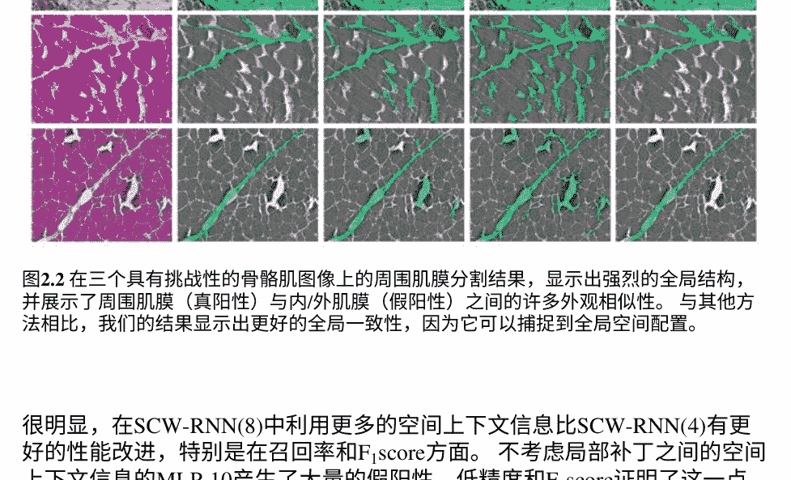

很明显，在SCW-RNN(8)中利用更多的空间上下文信息比SCW-RNN(4)有更好的性能改进，特别是在召回率和F1分数方面。不考虑局部补丁之间的空间上下文信息的MLP-10产生了大量的假阳性，低精度和F1分数证明了这一点。具有更大感受野的MLP-48明显优于MLP-10。使用真正大的窗口大小（95×95）的CNN-nips实现了与我们相当的结果，但其运行时间几乎比我们的方法慢100倍。尽管对于某些架构，可以利用快速扫描来消除卷积操作的冗余计算，但对于我们的情况，进行逐块归一化是不适用的。U-NET [19]不调用基于补丁的测试，也非常高效，但其产生的F1分数和AIU要比我们的低得多，其中一个可能的原因是我们在所有实验设置中都没有应用激进的数据增强。

为了定量比较，在图2.2中展示了一些具有分割结果叠加在原始图像上的具有挑战性的图像。可以观察到我们的方法产生了最准确的结果，并具有更好的全局一致性。这进一步证明了空间CW-RNN具有学习全局上下文信息的强大能力，这是区分肌筋膜、内筋膜、外筋膜和血管的关键。

## 2.3 WSI炎性肌肉疾病亚型分类

在本节中，我们将讨论使用深度卷积神经网络（DCNNs）进行IM亚型分类的全自动全切片图像分析框架。所提出的框架包括几个关键步骤：(1)使用先验知识自动定位诊断相关的图像感兴趣区域（ROIs）；(2)使用DCNN进行图像区域分类，并使用词袋（BoW）算法进行全切片图像分类，将补丁级别的预测聚合为全切片图像级别的分类；(3)一个两级结果可视化机制，可以帮助解释诊断过程并建立适当的决策信心。所提出框架的概述如图2.3所示。

### 2.3.1 方法论

在本节中，我们首先介绍通过炎症细胞检测生成自动肌肉图像感兴趣区域（ROI）的算法，然后提出了一个深度学习框架用于ROI分类和类别区分图像区域的可视化。最后，我们讨论如何通过聚合ROI级特征来计算WSI图像级表示进行图像分类。

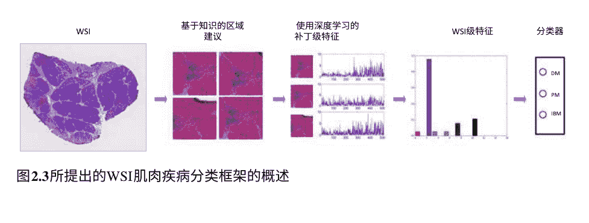

#### 2.3.1.1 通过回归进行炎症细胞检测

在肌肉图像分析中，感兴趣区域（ROI）是包含密集炎症细胞的图像区域，准确且稳健地检测炎症细胞非常重要。记训练数据为 $\mathcal{T} = \{ (x, y) \in \mathcal{X} \times \mathcal{Y} \}$，其中 $x$ 表示训练图像，$y = h * G$ 是相应的细胞中心概率图，其中 $h(i, j) = 1$ 表示像素位置 $(i, j)$ 处存在人类细胞中心注释，否则 $h(i, j) = 0$。$G$ 表示标准差为 $\sigma$ 的高斯核。设 $o$ 为输出，则损失函数可以定义为

$$
\mathcal{L}(y, o) = \frac{1}{2} \sum_{i=1}^{h} \sum_{j=1}^{w} (y_{ij} - o_{ij})^2, \quad (2.7)
$$

其中 $h$ 和 $w$ 分别表示 $x$ 的高度和宽度。更多架构细节请参考 [20]。

#### 2.3.1.2 全幻灯片图像上的炎症细胞检测

在测试阶段，使用训练好的FCN模型对WSI图像进行处理，采用两级滑动窗口方法。在第一级中，将WSI分割成5,000 × 5,000个不重叠的幻灯片块，每次加载一个幻灯片块进行处理；在第二级中，将每个5,000 × 5,000的幻灯片块进一步分割成500 × 500个不重叠的图像块，并以批处理模式将图像块传递给批量大小为20的训练好的FCN模型。训练和测试都在一台配备Intel i7处理器和一块Tesla K40c GPU的机器上进行。使用CPU加载一个5,000 × 5,000的幻灯片块需要0.5秒，使用GPU以批处理模式处理大小为500 × 500的20个图像块需要4秒。总共，对于一张10,000 × 10,000的WSI图像，检测炎症细胞大约需要80秒。

对于WSI图像 $x$，让 $o$ 表示炎症检测结果。对于ROI提案生成，$o$ 被分成一组128 × 128个不重叠的瓦片，并计算每个瓦片的权重 $w_i =$

$$
w_i = \sum_{j \in p_i} o_j, \quad (2.8)
$$

其中 $p_i$ 表示网格瓦片 $i$ 内的所有像素坐标，$o_j$ 表示像素坐标 $j$ 处的FCN输出值。所有图像瓦片按照计算得到的炎症细胞密度权重 $w$ 以非递增的顺序排列，并选择前 $k$ 个瓦片用于选择诊断分析的ROI。对于每个选定的瓦片，以该瓦片中心为中心，裁剪一个1024 × 1024的图像块作为后续诊断的ROI。

#### 2.3.1.3 ROI分类

对于每个WSI图像，所选的ROI补丁被分配相同的诊断标签，即DM，PM或IBM。在这项工作中，我们使用ResNet [9]架构对肌肉图像补丁进行分类。我们选择的原因有三个：(1) ResNet中的短连接使得网络易于训练，这对于医学图像分类至关重要，因为可用的标记数据很少；(2) ResNet可以以较少的参数实现与其他深度学习架构相媲美的准确性；(3) ResNet的最后一层是全局平均池化层（GAP），它提供了最后一个卷积层和最终分类单元之间的直接链接。GAP层已被用于定位用于分类的有区别的图像区域[21]。

#### 2.3.1.4 有区别的图像区域定位

在这个框架中，ResNet中的GAP层用于定位有区别的图像区域。记 $F \in R^{n \times k \times k}$ 为最后一个卷积映射的激活值，$W \in R^{C \times n}$ 为输出层的权重。对于类别 $c$，激活映射 $M_c \in R^{k \times k}$ 可以计算为

$$
M_c(x, y) = f(\sum_{i=1}^{n} \mathbf{W}_{c,i} * \mathbf{F}_i(x, y)), \qquad (2.9)
$$

其中 $f(\cdot)$ 是ReLU函数[5]。

图2.4中展示了在测试补丁上生成的类别激活映射（CAMs）的几个示例。正如我们所看到的，网络更加重视具有密集炎症细胞的区域，这是预期的，因为不同肌肉疾病类别之间的主要区别在于这些区域的微环境。可视化可以帮助用户建立对训练模型的信心，因为他们的结果是可解释的。

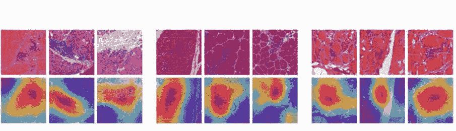

图2.4 生成的CAM示例，用于三个类别的几个样本测试补丁

#### 2.3.1.5 WSI图像分类

给定一个WSI图像 S，以及一组 D维ROI描述符 $X = [x_1, x_2, ... , x_N] \in R^{D \times N}$，我们的目标是将每个ROI表示 $X$ 聚合成一个单一的特征向量 $f$，作为 S的表示。最简单但最有效的局部描述符聚合方法之一是BoW模型[22]。给定一个学习的码本，具有 M个条目，$B = [b_1, b_2, ... , b_M] \in R^{D \times M}$，通过将每个ROI描述符 $x_i$ 分配给最接近的字典条目 $B_j$ 来计算 $f$。最终的特征表示使用 $\ell_2$ 归一化计算，$f = f / \|f\|_2$。

## 2.4 实验结果

### 2.4.1 数据集

我们在一组H&E染色的肌肉全切片图像数据集上验证了所提出的算法，该数据集包括74个个体（36个DM，24个PM和14个IBM）。这些全切片图像是在40倍物镜下拍摄的，并且诊断标签是由威斯康星医学院神经肌肉实验室（MCWNL）预先准备的。我们在实验中使用了三折交叉验证。每次实验中，我们使用两折数据进行训练，剩余的一折用于测试。所有报告的结果都是在三折测试准确率的平均值。

### 2.4.2 实现细节

补丁级别：从每个WSI中裁剪出包含最多密集炎症细胞的前30个区域作为ROI。将1,024 × 1,024的补丁调整大小为256 × 256，用于深度模型的训练和测试。在训练过程中，使用了两种数据增强策略：(1)从原始的256 × 256补丁中随机裁剪224 × 224的补丁，(2)水平翻转，概率为0.5。优化过程使用动量为0.95的随机梯度下降，权重衰减为0.005，批量大小为16。初始学习率设置为1e-4，每10个epoch衰减0.1倍。训练在60个epoch后停止。这里使用了一个18层的ResNet，详细的实现可以在开源代码中找到。¹

尽管在CNN模型中使用最后一个隐藏层的激活作为特征表示是常见的，但研究发现深度学习预测（softmax输出）在补丁级别表示中也很有效[23]。这里研究了两种特征，并对测试集上的两种特征进行了t-SNE可视化[24]。如图2.5所示。我们可以看到：(1)在两个特征空间中，大多数测试集上的ROI补丁在不同的肌肉疾病类别之间是可分离的；(2)DM类的ROI补丁展示出更多的多样性。在这项工作中，由于其更简洁的聚类模式，softmax输出被用作特征表示，如图2.5所示。WSI图像级别：使用BoW方法聚合ROI级别特征，这些特征是经过训练的深度学习模型的预测结果。对于BoW聚合，使用k-means聚类算法在训练集上构建字典B，其中k设置为16。对于WSI图像分类，训练了一个逻辑回归模型。由于k-means聚类的结果因不同的初始化而异，所有实验重复进行20次，并报告平均结果以进行稳健分析。

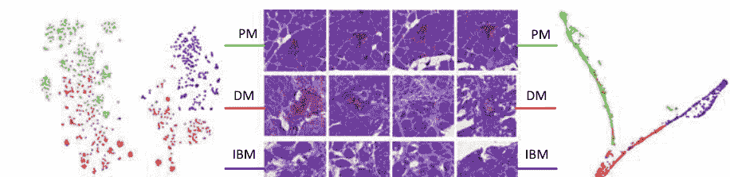

### 2.4.3 不同WSI框架的评估

在本节中，我们将提出的WSI分析框架与其他两个现有框架进行比较：

- **使用所有图像块进行训练（WSI FM-I）**：在这个框架中，WSI图像被划分为一组大小为1024 × 1024的非重叠图像块。一个WSI的所有图像块被分配相同的诊断标签（DM，PM或IBM）。GAP层的激活被用作图像块的表示。
- **使用采样进行训练（WSI FM-II）**：这是在[23]中提出的用于训练带有噪声标签的CNN。在CNN训练开始时，使用所有图像块。然后，在每五个时期之后，重新生成训练数据。对于每个WSI图像，使用加权蓄水池抽样选择30个图像块，其中权重是当前模型的分类分数计算得出的。其他配置与WSI FM-I相同。

在图2.6中提供了使用不同WSI框架进行肌肉疾病分类准确性的详细比较。请注意，为了进行比较，报告了使用GAP和Softmax输出特征的每种方法的分类结果。我们可以观察到：(1)所提出的WSI分析框架在肌肉疾病分类方面明显优于现有的WSI方法。这也证明了提出的ROI生成算法在寻找诊断相关的图像区域方面是有效的。(2)对于WSI FM-I和WSI FM-II，GAP特征产生更好的WSI分类结果；对于我们的方法，softmax输出特征提供了更高的WSI分类准确性。众所周知，深层的CNN特征比之前的层具有更强的区分能力。然而，在WSI FM-I和FM-II中，大部分局部图像补丁不包含诊断相关信息，这些噪声可能会误导CNN的训练，使得softmax特征在这种情况下对分类的指示性较低。

另一种简单而有效的WSI级别分类方法是使用ROI补丁的多数投票。多数投票和BoW的WSI分类准确性列在表2.3中。对于BoW，只报告最佳结果。与现有的WSI分析方法相比，我们的框架无论是使用多数投票还是BoW都提供了显著更好的WSI分类性能。

### 表 2.3 不同全切片图像分析框架的分类准确性
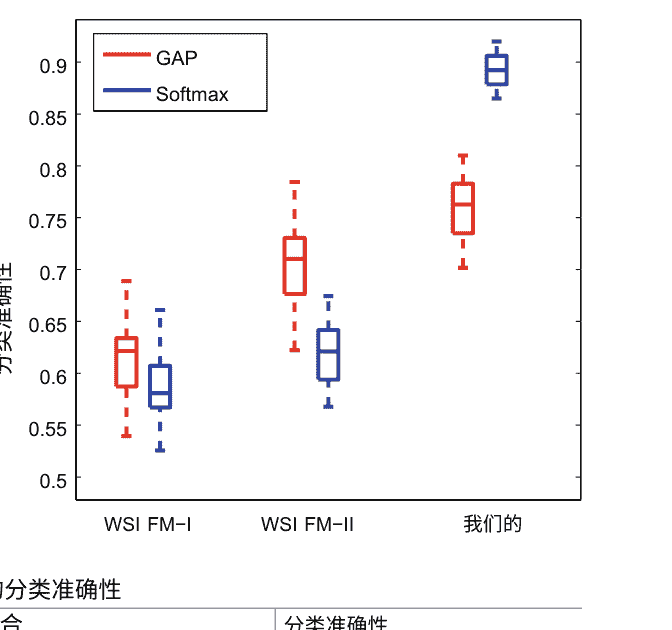

| WSI方法 | 聚合 | 分类准确性 |
| --- | --- | --- |
| WSI FM-I | MV | 0.6339 |
|  | BoW (GAP特征) | 0.6889 |
| WSI FM-II [23] | MV | 0.6739 |
|  | BoW (GAP特征) | 0.7844 |
| 我们的 | MV | 0.8650 |
|  | BoW (Softmax特征) | 0.9200 |

## 2 深度学习用于肌肉病理图像分析

### 表 2.4 使用三种深度学习架构（VGG、Inception和ResNet）的不同训练方法的比较
| 架构 | 训练方法 | MV | BoW (平均值) | BoW (标准差) |
| :--- | :--- | :--- | :--- | :--- |
| VGG [7] | 从头开始 | 0.5389 | 0.5747 | 0.0296 |
|  | 微调分类 | 0.8378 | 0.8045 | 0.0142 |
|  | 全部微调 | 0.7833 | 0.8443 | 0.0178 |
| Inception [8] | 从头开始 | 0.6339 | 0.5640 | 0.0295 |
|  | 微调分类 | 0.7422 | 0.7305 | 0.0242 |
|  | 全部微调 | 0.8517 | 0.8179 | 0.0249 |
| ResNet [9] | 从头开始 | 0.6467 | 0.5715 | 0.0329 |
|  | 微调分类 | 0.8372 | 0.8075 | 0.0214 |
|  | 全部微调 | 0.8650 | 0.8903 | 0.0210 |

### 2.4.4 不同训练方法的评估

在我们的实现中，ROI分类模型是从预训练的ResNet模型上对我们的肌肉数据集进行微调得到的。为了进行比较分析，我们还研究了另外两种训练方法：(1)从头开始训练和(2)冻结特征层中的所有模型参数，只微调分类层中的参数。为此，我们还使用另外两种流行的深度学习架构进行了这些不同训练方法的测试：VGG [7]和GoogleNet Inception V3 [8]。详细的比较结果见表2.4。请注意，在表2.4中，我们报告了多数投票和BoW的分类结果。对于BoW，我们报告了平均分类准确率和标准差。

从表2.4中，我们可以看到：(1)基于微调的方法比从头开始训练获得更好的分类结果，而微调所有层比仅微调分类层获得更好的结果；(2)我们实现中使用的18层ResNet（ResNet-18）比VGG和GoogleNet Inception V3具有更好的分类准确性，后两者的参数分别是ResNet-18的2倍和10倍。

### 2.4.5 不同ROI数量的评估

在本节中，我们研究了ROI数量对WSI图像分类的影响。在这里，我们使用三个不同的ROI数量进行了上述实验：10、20和30。详细的比较结果列在表2.5中。对于不同数量的ROI，无论是多数投票还是BoW都能在三种不同的深度学习架构上产生令人满意的分类结果；(2) ResNet模型比VGG和Inception模型效果更好。

² https://download.pytorch.org/models/resnet18-5c106cde.pth.

### 表 2.5 使用不同数量的ROI在三个深度学习架构上的WSI分类准确性比较
| 架构 | ROI数量 | MV | BoW (平均值) | BoW (标准差) |
| :--- | :--- | :--- | :--- | :--- |
| VGG [7] | 10 | 0.8917 | 0.8360 | 0.0168 |
|  | 20 | 0.8244 | 0.8506 | 0.0193 |
|  | 30 | 0.7833 | 0.8443 | 0.0178 |
| Inception [8] | 10 | 0.8517 | 0.7857 | 0.0181 |
|  | 20 | 0.8111 | 0.8292 | 0.0204 |
|  | 30 | 0.8517 | 0.8179 | 0.0249 |
| ResNet [9] | 10 | 0.9194 | 0.8895 | 0.0166 |
|  | 20 | 0.8644 | 0.8377 | 0.0180 |
|  | 30 | 0.8650 | 0.8903 | 0.0210 |

### 2.4.6 诊断解释和可视化

在我们的框架中，诊断结果可以被适当地可视化，以便解释工作系统的洞察力。为此，我们提出了一个两级可视化机制：级别（I）所提出的系统用于做出决策的ROI；级别（II）每个ROI中负责ROI分类的有区别的图像区域。

#### 2.4.6.1 预测解释

目前，大多数深度学习方法在医学应用中以黑盒方式工作，这可能具有高影响和风险。适当的可视化将帮助病理学家或医生更好地理解自动系统的工作原理，并提供视觉证据。一个例子可以在图2.7中看到。其中，所提出的系统对DM WSI进行了正确的预测。左侧是叠加在原始全幻灯图像上的ROI；右侧是每个ROI内的有区别的图像区域。正如我们所看到的，所提出的系统在进行诊断预测时可以实现良好的透明度。

#### 2.4.6.2 理解失败案例

对于医学应用研究人员来说，适当的可视化也可以帮助识别和理解失败案例。图2.8显示，提出的系统将一个DM WSI错误地预测为PM。通过仔细检查WSI，我们发现这是一个非常困难的案例，其中混合了DM和PM的临床特征。对于这些案例，医生可能需要更多信息来制定治疗计划[3]。

图2.7 我们框架中提出的两级可视化机制的示例。提出的系统正确预测了一个DM WSI。左侧：提出的系统用于进行预测的ROI；右侧：每个ROI中负责ROI分类的区域的样本结果。

图2.8 我们框架中提出的两级可视化机制的示例。在这个例子中，提出的系统将一个DM WSI预测为PM。左侧：提出的系统用于进行预测的ROI；右侧：每个ROI中负责ROI分类的区域的样本结果。

我们认为，适当的可视化或解释机制应该是计算机辅助诊断（CAD）系统的核心组成部分之一。我们框架中提出的想法可以推广到许多其他医学应用中。

## 2.5 总结

在本章中，我们讨论了深度学习在肌肉周围膜分割和全切片图像炎症性肌肉疾病分类中的应用。首先，我们介绍了一种新型2D空间时钟回归神经网络的表达式。神经网络为我们利用RNN架构处理2D生物医学图像数据铺平了道路。所提出的空间CW-RNN完全可端到端训练，并能够将全局上下文信息编码到每个局部图像块的特征中，从而极大地提高了性能。

其次，我们还提出了一种WSI炎症性肌肉疾病分类框架。所提出的方法可以直接应用于全切片图像，不需要病理学家的手动ROI注释。大量实验证明，所提出的系统可以提供稳健准确的WSI诊断预测。此外，我们还展示了所提出的机器学习系统的诊断结果可以得到适当的可视化和解释。这种可视化不仅可以帮助智能系统研究人员识别和理解失败案例，还可以建立适当的诊断信心。我们主张，这种能够提供可解释诊断的机器学习系统应该在未来得到更多的研究关注。

## 参考文献

1.  Dalakas MC, Hohlfeld R (2003) 多发性肌炎和皮肌炎 362:971–982
2.  Dalakas MC (2002) 炎症性肌病的肌肉活检结果。 风湿病临床N 美国28（4）：779–798
3.  Dalakas MC (2015) 炎症性肌肉疾病。 N Engl J Med 372（18）：1734–1747
4.  Hinton GE, Salakhutdinov RR (2006) 用神经网络降低数据的维度。 科学313（5786）：504–507
5.  Krizhevsky A, Sutskever I, Hinton GE (2012) 使用深度卷积神经网络进行Imagenet分类。 在: 神经信息处理系统的进展, 第1097–1105页
6.  Farabet C, Couprie C, Najman L, LeCun Y (2013) 学习场景的分层特征标签。 IEEE Trans Pattern Anal Mach Intell 35（8）：1915–1929
7.  Simonyan K, Zisserman A (2014) 非常深的卷积网络用于大规模图像识别. arXiv:1409.1556
8.  Szegedy C, Liu W, Jia Y, Sermanet P, Reed S, Anguelov D, Erhan D, Vanhoucke V, Rabinovich A (2015) 用卷积更深入。 在: 计算机视觉与模式识别IEEE会议论文集, pp 1–9
9.  He K, Zhang X, Ren S, Sun J (2016) 用于图像识别的深度残差学习。 在: 计算机视觉与模式识别IEEE会议论文集, pp 770–778
10. Visin F, Kastner K, Courville AC, Bengio Y, Matteucci M, Cho K (2015) Reseg: 用于目标分割的循环神经网络, vol 1. arXiv:1511.07053
11. Cho K, van Merrienboer B, Bahdanau D, Bengio Y (2014) 关于神经机器翻译的性质：编码器-解码器方法, 第1卷。 arXiv:1409.1259
12. Graves A, Fernández S, Schmidhuber J (2007) 多维递归神经网络。 在: 第17届国际人工神经网络会议, 第549–558页
13. Byeon W, Breuel TM, Raue F, Liwicki M (2015) 使用LSTM递归神经网络进行场景标记。 在: IEEE计算机视觉和模式识别会议, 第3547–3555页
14. Koutník J, Greff K, Gomez F, Schmidhuber J (2014) 时钟式RNN。 在: 第31届国际机器学习会议论文集, 第32卷, 第1863-1871页
15. Xie Y, Xing F, Kong X, Su H, Yang L (2015) 超越分类：使用卷积神经网络进行鲁棒细胞检测的结构化回归。 在: MICCAI, 第9351卷, 第358-365页
16. Werbos PJ (1990) 通过时间的反向传播：它的作用和如何实现。 Proc IEEE 78(10):1550-1560
17. Hochreiter S, Schmidhuber J (1997) 长短期记忆。 神经计算 9(8):1735–1780
18. Ciresan D, Giusti A, Gambardella LM, Schmidhuber J (2012) 深度神经网络在电子显微镜图像中分割神经膜。 在：神经信息处理系统的进展，第2843–2851页
19. Ronneberger O, Fischer P, Brox T (2015) U-net：用于生物医学图像分割的卷积网络。在：MICCAI，第234–241页
20. Xie W, Noble JA, Zisserman A (2015) 使用完全卷积回归网络进行显微镜细胞计数。在：MICCAI第一届深度学习在医学图像分析中的研讨会
21. Zhou B, Khosla A, Lapedriz a A, Oliva A, Torralba A (2016) 学习深度特征进行判别定位。在：IEEE计算机视觉和模式识别会议论文集，第2921–2929页
22. Sivic J, Zisserman A等 (2003) Video google：一种文本检索方法用于视频中的对象匹配
23. Hou L, Samaras D, Kurc TM, Gao Y, Davis JE, Saltz JH (2016) 基于补丁的卷积神经网络用于整个切片组织图像分类。在：IEEE计算机视觉和模式识别会议论文集，第2424-2433页
24. van der Maaten L, Hinton G (2008) 使用t-sne可视化数据。 J Mach Learn Res 9 (11月)：2579-2605

# 第3章 基于2D的粗到细方法用于腹部CT扫描中的小目标分割

周宇音，于启航，王岩，谢灵熙，沈伟，Elliot K. Fishman和Alan L. Yuille

摘要 深度神经网络已被广泛应用于腹部CT扫描中的自动器官分割。然而，小器官（例如，胰腺）或肿瘤（例如，胰腺囊肿）的分割准确性有时不尽人意，这可能是因为深度网络很容易受到占据输入体积大部分的复杂和可变的背景区域的干扰。在本章中，我们提出了两种粗到细的机制，它们使用第一（粗）阶段的预测来缩小第二（细）阶段的输入区域。更具体地说，第一种方法中的两个阶段以逐步方式单独进行训练，因此整个输入区域和根据边界框裁剪的区域被单独处理。而第二种方法在两个阶段之间插入了一个显著性转换模块，以便将前一次迭代的分割概率图重复转换为当前迭代的空间权重。在训练中，它允许对深度网络进行联合优化。在测试中，它通过迭代将多阶段的视觉信息传播以改善分割。

Y. Zhou和Q. Yu对这项工作做出了相同的贡献。

*   Y. Zhou · Q. Yu · Y. Wang · L. Xie · W. Shen · A. L. Yuille (✉)
    美国巴尔的摩市查尔斯街3400号约翰霍普金斯大学
    电子邮件：alan.l.yuille@gmail.com
*   Y. Zhou
    电子邮件：zhouyuyiner@gmail.com
*   Q. Yu
    电子邮件：yucornetto@gmail.com
*   Y. Wang
    电子邮件：wyanny.9@gmail.com
*   L. Xie
    电子邮件：198808xc@gmail.com
*   W. Shen
    电子邮件：shenwei1231@gmail.com
*   E. K. Fishman
    美国巴尔的摩市北布罗德韦街733号约翰霍普金斯大学医学院
    电子邮件：efishman@jhmi.edu

## 3.1 引言

本章重点研究小器官（如胰腺）和肿瘤（如胰腺囊肿）在腹部CT扫描中的分割，这是使计算机能够辅助医生进行临床工作的重要前提。这个问题属于被称为医学成像分析的研究领域。最近，深度学习，特别是卷积神经网络的快速发展，为这个领域带来了很大的进展[18, 29]。许多传统方法，如基于图像的分割方法[1或基于手工制作的局部特征[45]的方法，已经被深度分割网络所取代，这些网络通常能够产生更高的分割准确性[34, 35, 43, 44, 51]。

从CT扫描中分割微小器官、血管或肿瘤通常是具有挑战性的。由于目标通常只占输入数据的一小部分（例如，在2D图像中不到1.5%，见图3.1），深度分割网络（如FCN [29]和DeepLab [5]）很容易被背景区域所干扰，背景区域可能包含复杂和多变的内容。这激发了我们提出粗到精细的方法，其中粗略阶段提供了粗略的定位，而精细阶段执行准确的分割。

在本章中，我们提出了两种粗到精细的方法。在第一种方法中，我们使用预测的分割掩模来缩小输入区域。通过使用相对较小的输入区域（例如，由掩模定义的边界框），可以更容易地实现更准确的分割。在训练阶段，我们固定由地面实况注释生成的输入区域，并训练两个深度分割网络，即一个粗缩放网络和一个细缩放网络，分别处理整个输入区域和根据边界框裁剪的区域。在测试阶段，网络参数保持不变，粗缩放的网络首先使用网络获取小目标的粗略位置，然后多次执行细缩放网络，并迭代更新分割掩模直到收敛。迭代过程可以表示为一个固定点模型[23]。这种方法可以进一步扩展到分割胰腺囊肿，为胰腺癌的早期诊断奠定基础，其中我们首先通过粗到精细的算法找到胰腺，然后根据预测的胰腺掩模定位和分割囊肿，采用单独的粗到精细分割方法。

直观地说，胰腺囊肿通常与胰腺密切相关，因此分割胰腺（相对较容易）可以帮助定位和分割囊肿。在原始分割网络中引入了深度监督[21]策略，从而得到一个联合目标函数，同时考虑了胰腺和囊肿。

为了在训练和测试流程图之间嵌入一致性，也就是说，在训练阶段同时在粗糙和细致阶段最小化一个全局能量函数，我们提出了一种循环显著性转换网络（RSTN）。主要创新在于将粗糙和细致阶段与显著性转换模块相关联，该模块将前几次迭代的分割概率图作为当前迭代的空间先验进行重复转换。这相比第一种方法带来了两个优势。首先，在训练阶段，粗糙尺度和细致尺度的网络进行联合优化，从而提高了它们各自的分割能力。其次，在测试阶段，每次迭代的分割掩码被保留并传播到所有迭代中，从而实现了多阶段视觉线索的融合，以实现更准确的分割。为了捕捉胰腺和其内部囊肿之间的关系，我们还通过两个RSTN模块扩展了这种方法，取得了良好的结果。据我们所知，这个想法在计算机视觉领域尚未被研究，因为它需要利用CT扫描的一些特殊属性。

我们对三个CT数据集进行了小目标分割的实验。我们展示了我们的方法在NIH胰腺分割数据集[35]、JHMI多器官数据集和JHMI胰腺囊肿数据集上的优越性，这保证了它在真实临床应用中的效率和可靠性。

本章总结了我们之前的工作[48, 52, 53]并提供了更多的实验结果。本章的剩余部分组织如下。第3.2节简要回顾了相关工作，第3.3节描述了我们提出的逐步粗到细的方法，第3.4节介绍了我们提出的端到端粗到细的方法。在第3.5节和第3.6节展示了实验结果后，我们在第3.8节得出了结论。

## 3.2 相关工作

计算机辅助诊断（CAD）是一种重要的技术，可以在许多临床场景中辅助人类医生。CAD的一个重要前提是医学成像分析。作为一种流行且廉价的医学成像方式，对比增强计算机断层扫描（CECT）可以产生内部器官、骨骼、软组织和血管的详细图像。自动分割这些CT体积中的器官和/或软组织对进一步诊断非常有价值[2, 13, 42, 52]。为了捕捉不同器官的特定属性，研究人员经常为每个器官设计个性化算法。典型的例子包括肝脏[15, 27]、脾脏[28]、肾脏[1, 25]、肺部[16]、胰腺[6, 45]等。小器官（如胰腺）往往更难分割，部分原因是由于其低对比度和大小（通常是不规则）形状的解剖变异，以及复杂且不可预测的背景内容。特别是内部的肿瘤（如囊肿[7]和肿瘤[49]）还可以进一步改变胰腺的解剖特性，使其更难以识别目标。

与上述引用了传统方法进行分割的论文相比，深度学习的进展带来了更强大和高效的解决方案。特别是卷积神经网络已被广泛应用于各种视觉任务，如图像分类[14, 18, 39]、目标检测[10, 33, 41]和语义分割[5, 29]。作为相关类别的网络，循环神经网络最初设计用于处理序列数据[11, 38, 40]，后来推广到图像分类[24]和场景标记[32]任务。在医学成像分析领域，特别是器官分割方面，这些技术已被证明明显优于传统方法，例如分割肝脏[8]、肺[12]或胰腺[3, 36, 37]。请注意，医学图像与自然图像不同，数据以体积形式呈现。

为了处理这些数据，研究人员要么将3D体积切片成2D切片（如本文所示），要么直接训练3D网络[17, 30, 31, 47]。在后一种情况下，有限的GPU内存经常导致基于块的训练和测试策略。在[20]中讨论了2D和3D方法之间的权衡。

与整个CT体积相比，本章中考虑的器官和肿瘤通常占据相对较小的区域。由于像FCN [29]这样的深度分割网络在描述小目标方面不够准确，研究人员提出了两种改进检测和/或分割性能的想法。第一种类型涉及将图像重新缩放，使目标与训练样本可比[46]，第二种类型考虑为每个目标专注于图像的子区域，以获得更高的检测准确性[4]。粗到精的思想在计算机视觉领域中也被广泛研究，用于显著性检测[19]或语义分割[22, 26]。本章重点介绍了两种用于医学图像分割的粗到精框架。

## 3.3 一种逐步粗到细的方法用于医学图像分割

我们研究了从腹部CT扫描中分割器官的问题。假设CT图像是一个带有二进制地面真值分割注释的大小为W×H×L的三维体积X，其中yi=1表示前景体素。目标

### 3.3.1 深度分割网络

考虑一个分割模型 M: Z = f(X; Θ)，其中 Θ 表示模型的参数，损失函数写作 L(Z, Y)。在深度分割网络的背景下，我们通过梯度反向传播来优化 L 相对于网络权重 Θ。由于前景区域通常非常小，我们遵循[31]的方法设计了一个DSC-loss层，以防止模型对背景类别产生严重偏差。我们稍微修改了两个体素集合 A 和 B 的DSC， DSC(A, B) = 2×|A∩B| / (|A|+|B|)，转化为地面真实掩模 Y 和预测掩模 Z 之间的损失函数，即 L(Z, Y) = 1 - (2×Σ z_i y_i) / (Σ z_i + Σ y_i)。请注意，这是“软”定义的DSC，如果所有 z_i 都是0或1，则等同于原始形式。梯度计算很简单： ∂L(Z,Y) / ∂z_j = -2 × (y_j(Σ z_i + Σ y_i) - Σ z_i y_i) / (Σ z_i + Σ y_i)²。

我们为3D分割训练2D深度网络。每个3D体积 X 沿三个轴切片，即冠状视图_C、矢状视图_S 和轴位视图_A，这些2D切片分别表示为 X_C、w (w = 1, 2, ..., W)、X_S、h (h = 1, 2, ..., H) 和 X_A、l (l = 1, 2, ..., L)，其中下标C、S和A分别代表冠状、矢状和轴位。

在每个轴上，使用16层VGGNet [39]上的单独2D-FCN [29]进行训练。我们训练了三个2D-FCN模型 M_C， M_S 和 M_A 来进行分割，通过三个视图分别进行分割（来自三个视图的图像非常不同）。在测试中，通过多数投票融合了三个视图的分割结果。在训练和测试中，同时进行了多层面分割（将3个相邻切片组合为一个基本单元）和多轴融合（在三个轴上进行多数投票），以将伪3D信息纳入分割中。

### 3.3.2 固定点优化

本章研究的器官和肿瘤（例如，胰腺）相对较小。在每个2D切片中，前景像素的比例通常小于1.5%。观察到[35]，深度分割网络（如FCN [29]）在检测小器官时产生的结果较差，可能是因为网络容易受到背景区域中不同内容的干扰。很多通过使用感兴趣区域周围的较小输入区域可以获得更准确的分割。图3.2显示了一个典型的例子。

这启发我们利用预测的分割掩模来缩小输入区域。我们引入一个转换函数$r(\mathbf{X}, \mathbf{Z}^*)$，该函数根据当前分割$\mathbf{Z}^*$生成输入区域。我们将模型重写为$\mathbf{Z} = \mathbf{f}(r(\mathbf{X}, \mathbf{Z}^*); \Theta)$，损失函数为$\mathcal{L}(\mathbf{f}(r(\mathbf{X}, \mathbf{Z}^*); \Theta), \mathbf{Y})$。请注意，分割掩模（$\mathbf{Z}$或$\mathbf{Z}^*$）同时出现在$\mathbf{Z} = \mathbf{f}(r(\mathbf{X}, \mathbf{Z}^*); \Theta)$的输入和输出中。这是一个固定点模型，我们采用[23]中描述的方法进行优化，即寻找$\mathbf{Z}$的稳态解。

在训练中，地面真实注释$\mathbf{Y}$被用作输入掩码$\mathbf{Z}^*$。我们训练了两组模型（每组包含三个用于不同视图的模型），以处理不同的输入尺寸。粗粒度模型是在胰腺占据至少100个像素（约为$2^{\text{D}}$切片中的25平方毫米）的切片上进行训练的，以防止模型受到背景的严重影响。对于细粒度模型，我们根据覆盖胰腺的最小$2^{\text{D}}$框裁剪每个切片，添加一个框架，并用原始图像数据填充它。框架的顶部、底部、左侧和右侧边距是从$\{0, 1, ..., 60\}$中随机抽取的整数。这种策略被称为数据增强，有助于规范化网络并防止过拟合。

我们使用在PascalVOC图像分割任务上预训练的FCN-8s模型[29]来初始化这两个网络。粗粒度模型使用学习率为$10^{-5}$进行80,000次迭代的微调，而细粒度模型使用学习率为$10^{-4}$进行60,000次迭代。每个小批次包含一个训练样本（从3D体积中切片得到的2D图像）。

在测试中，我们使用迭代过程来找到$\mathbf{Z} = \mathbf{f}(r(\mathbf{X}, \mathbf{Z}^*); \Theta)$的稳态解。在开始时，$\mathbf{Z}^*$被初始化为整个3D体积，并使用粗粒度模型计算出粗分割$\mathbf{Z}^{(0)}$。在接下来的每个$T$次迭代中，我们切片预测的掩码$\mathbf{Z}^{(t-1)}$，找到覆盖每个切片中所有预测前景像素的最小2D框，添加一个30像素宽的边框（这是训练中使用的随机分布的均值），并使用## 算法1 分割的固定点模型

1: 输入：测试体积 $X$，粗缩放模型 $M_C$，$M_S$ 和 $M_A$，细缩放模型 $M^F_C$，$M^F_S$ 和 $M^F_A$，阈值 $R$，迭代中的最大轮数 $T$。
2: 初始化：使用 $M_C$，$M_S$ 和 $M_A$ 从 $X$ 生成 $Z^{(0)}$；
3: 对于 $t = 1, 2, ..., T$ 执行
4: &nbsp;&nbsp;&nbsp;&nbsp;使用 $M^F_C$，$M^F_S$ 和 $M^F_A$ 从 $Z^{(t-1)}$ 生成 $Z^{(t)}$；
5: &nbsp;&nbsp;&nbsp;&nbsp;如果 $DSC\left( \mathbf{Z}^{(t-1)}, \mathbf{Z}^{(t)} \right) \geq R$ 则
6: &nbsp;&nbsp;&nbsp;&nbsp;&nbsp;&nbsp;&nbsp;&nbsp;跳出循环；
7: &nbsp;&nbsp;&nbsp;&nbsp;结束条件
8: 结束循环
9: 输出：最终分割 $Z^* = Z^{(t)}$。

用于计算 $Z^{(t)}$ 的细粒度模型。当达到固定的迭代次数 $T$ 或者连续分割结果之间的相似度（$Z^{(t-1)}$ 和 $Z^{(t)}$）大于给定的阈值 $R$ 时，迭代终止。相似度被定义为迭代间的 DSC，即 $d^{(t)} = DSC \left( \mathbf{Z}^{(t-1)}, \mathbf{Z}^{(t)} \right) = \frac{2 \times \sum_{i} z_{i}^{(t-1)} z_{i}^{(t)}}{\sum_{i} z_{i}^{(t-1)} + \sum_{i} z_{i}^{(t)}}$。测试阶段在图 3.3 中进行了说明，并在算法 1 中进行了描述。

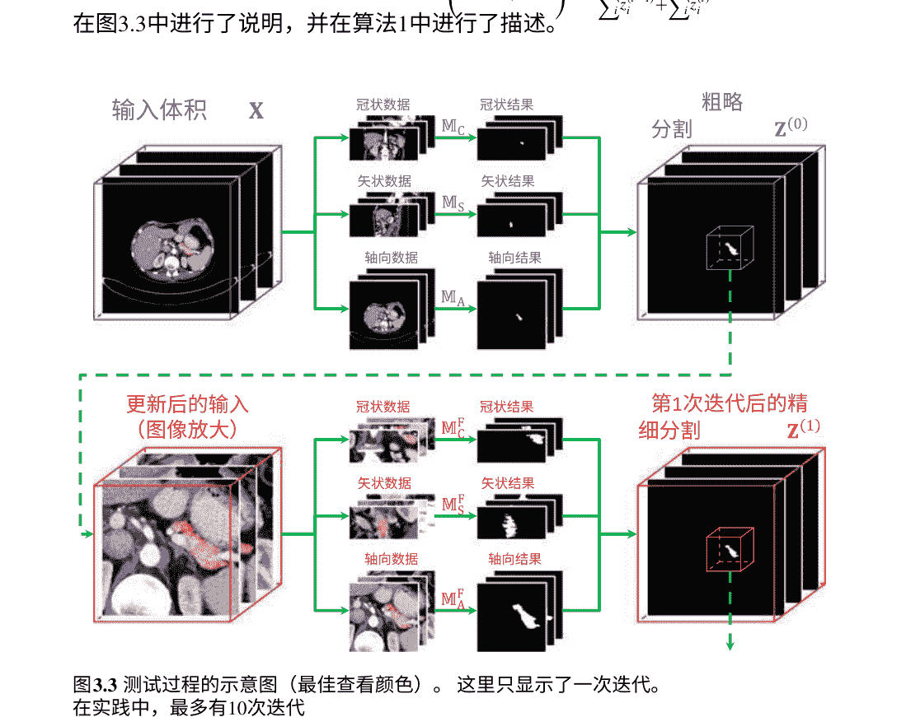

图 3.3 测试过程的示意图（最佳查看颜色）。这里只显示了一次迭代。在实践中，最多有 10 次迭代。

### 3.3.3 胰腺囊肿分割的应用

#### 3.3.3.1 公式

假设 3D CT 扫描的体积 $X$ 带有标注的胰腺分割 $P^*$ 和囊肿分割 $C^*$，它们的维度与 $X$ 相同。$P_i^* =1$ 和 $C_i^* =1$ 分别表示胰腺和囊肿的前景体素。将囊肿分割模型表示为 $M: C = f(X; \Theta)$，其中 $\Theta$ 表示模型参数。损失函数可以写为 $\mathcal{L}(C, C^*)$。在常规的深度神经网络中，如我们的基线模型，完全卷积网络(FCN) [29]，我们通过梯度反向传播优化 $\mathcal{L}$ 相对于网络权重 $\Theta$。

为了处理小目标，我们也遵循 [31] 来计算 DSC 损失函数： $\mathcal{L}(C, C^*) = \frac{2 \times \sum_i C_i C_i^*}{\sum_i C_i + \sum_i C_i^*}$。梯度 $\frac{\partial \mathcal{L}(C, C^*)}{\partial C}$ 可以很容易地计算出来。

胰腺是一个小器官，而胰腺囊肿更小。在我们新收集的数据集中，囊肿相对于整个体积的比例通常远小于 0.1%。在一个非常具有挑战性的案例中，囊肿仅占据体积的 0.0015%，或者大约占胰腺的 1.5%。这大大增加了分割甚至定位的难度。图 3.4 显示了一个代表性的例子，在这个例子中，当我们把整个 2D 切片作为输入时，囊肿分割完全失败。

为了解决这个问题，我们注意到胰腺囊肿的位置与胰腺高度相关。将胰腺的体素集合表示为 $\mathcal{P}^* = \{i | P_i^* = 1\}$，同样，将囊肿的体素集合表示为 $\mathcal{C}^* = \{i | C_i^* = 1\}$。经常情况下，$\mathcal{C}^*$ 的大部分都在 $\mathcal{P}^*$ 内（例如，在我们的数据集中，121 个案例中有 95% 以上的 $\mathcal{C}^*$ 与 $\mathcal{P}^*$ 相交）。从胰腺掩模开始可以增加准确分割囊肿的机会。图 3.4 展示了使用地面真值胰腺掩模来恢复囊肿分割失败案例的示例。

这启发我们基于相对容易检测的胰腺区域进行囊肿分割。为此，我们引入胰腺掩模 $P$ 作为我们方法的显式变量，并向损失函数添加另一个项，以同时优化胰腺和囊肿分割网络。数学上，让胰腺分割模型为 $M_P : P = f_P(X; \Theta_P)$，相应的损失项为 $\mathcal{L}_P(P, P^*)$。基于 $P$，我们通过应用变换 $X' = \sigma[X, P]$，创建一个较小的输入区域，并将 $X'$ 馈送到下一个阶段。因此，囊肿分割模型可以写为 $M_C : C = f_C(X'; \Theta_C)$。总损失函数定义为：

$$ L(P, P^*, C, C^*) = \lambda \mathcal{L}_P(P, P^*) + (1-\lambda) \mathcal{L}_C(C, C^*) \quad (3.1) $$

其中 $\lambda$ 是平衡参数，定义了两个项之间的权重。

#### 3.3.3.2 优化

我们使用梯度下降进行优化，其中涉及计算梯度 $\frac{\partial L}{\partial \Theta_P}$ 和 $\frac{\partial L}{\partial \Theta_C}$。其中， $\frac{\partial L}{\partial \Theta_C} = \frac{\partial \mathcal{L}_C}{\partial \Theta_C}$，因此我们可以通过深度神经网络中的标准反向传播来计算它。另一方面，$\Theta_P$ 涉及到两个损失项，应用链式法则得到：

$$ \frac{\partial L}{\partial \Theta_P} = \frac{\partial \mathcal{L}_P}{\partial \Theta_P} + \frac{\partial \mathcal{L}_C}{\partial X'} \cdot \frac{\partial X'}{\partial P} \cdot \frac{\partial P}{\partial \Theta_P} \quad (3.2) $$

右侧的第二项取决于 $X'$ 的定义 $X' = \sigma[X, P]$。在实践中，我们定义了一个简单的转换来简化计算。每个体素的强度值（与 CT 扫描中的 Hounsfield 单位直接相关）既不保留也不设置为 0，判据是是否存在一个附近的体素可能位于胰腺区域内：

$$ X'_i = X_i \times \mathbb{I}\{\exists j | P_j > 0.5 \wedge |i - j| < t\} \quad (3.3) $$

阈值 $t$ 在这里是指从囊肿体素到胰腺体积的最远距离。在实践中，我们将其设置为 15，并且我们的方法对该参数不敏感。根据这个公式，即 $\frac{\partial X'_i}{\partial P_j}$ 几乎处处等于 0。因此，我们有 $\frac{\partial X'}{\partial P} = 0$ 和 $\frac{\partial L}{\partial \Theta_P} = \frac{\partial \mathcal{L}_P}{\partial \Theta_P}$。这使得我们可以将优化分解为两个阶段，无论是在训练还是测试中。由于 $\frac{\partial L}{\partial \Theta_C}$ 和 $\frac{\partial L}{\partial \Theta_P}$ 分别进行优化，可以忽略公式 (3.1) 中的平衡参数 $\lambda$。整体框架如图 3.5 所示。在训练中，我们直接设置 $X' = \sigma[X, P^*]$，以便囊肿分割模型 $M_C$ 获得更可靠的监督。在测试中，从 $X$ 开始，按顺序计算 $P$、$X'$ 和 $C$。将两个阶段分别处理可以减少计算开销。也可以将第二阶段形式化为多标签分割。

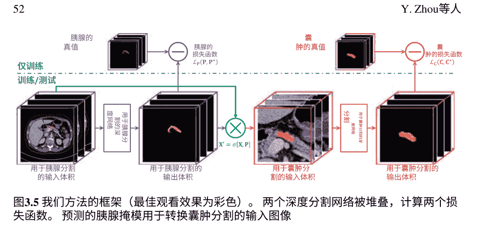

图 3.5 我们方法的框架（最佳观看效果为彩色）。两个深度分割网络被堆叠，计算两个损失函数。预测的胰腺掩模用于转换囊肿分割的输入图像。

## 3.4 一种端到端的粗到细的医学图像分割方法

逐步粗到细的方法精心设计用于微小目标分割，但在训练阶段缺乏粗网络和细网络的全局优化。这激发了我们将这两个网络连接起来，使用显著性转换模块，从而实现了我们的端到端粗到细的方法。

### 3.4.1 循环显著性转换网络

按照逐步粗到细的方法，我们还为每个视角训练了一个单独的模型。不失一般性，我们考虑沿轴向视图的二维切片，用 $X_{A,l}$ 表示。我们的目标是推断出一个二值分割掩模 $Z_{A,l}$，这是通过首先计算概率图 $P_{A,l} = f[X_{A,l}; \theta]$ 来实现的。其中 $f[\cdot;\theta]$ 是一个具有网络参数 $\theta$ 的深度分割网络，然后使用固定阈值 0.5 将 $P_{A,l}$ 二值化为 $Z_{A,l}$，即 $Z_{A,l} = \mathbb{I}[P_{A,l} \geq 0.5]$。为了辅助分割概率图，我们引入 $P_{A,l}$ 作为一个潜变量。我们引入了一个显著性转换模块，它将概率图转换为生成更新的输入图像，即 $I_{A,l} = X_{A,l} \odot g(P_{A,l}; \eta)$，并使用更新后的输入 $I_{A,l}$ 来替换 $X_{A,l}$。这里 $g[\cdot;\eta]$ 是具有参数 $\eta$ 的转换函数，$\odot$ 表示逐元素相乘，即转换函数将空间权重添加到原始输入图像中。因此，分割过程如下：

$$ P_{A,l} = f[X_{A,l} \odot g(P_{A,l}; \eta); \theta] \quad (3.4) $$

这是一个循环神经网络。请注意，显著性转换函数 $g[\cdot,\eta]$ 需要可微分，以便对整个循环网络进行优化。

### 图 3.6 我们将我们的方法表述为一个循环网络，并展开它进行优化和推理。

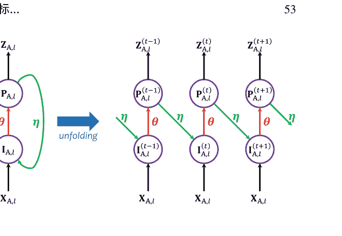

以 $X_{A,l}$ 和 $P_{A,l}$ 具有相同的空间维度，我们将 $g$ 设置为一个保持尺寸不变的集合 $[\cdot, \eta]$ 卷积，允许将权重添加到每个像素上，像素的确定由其周围小区域的分割概率决定。正如我们将在实验部分中展示的（见图 3.9），学习到的卷积核能够提取互补信息，以帮助下一次迭代。

为了优化方程 (3.4)，我们将循环网络展开成一个平面形式（见图 3.6）。给定输入图像 $X_{A,l}$ 和一个整数 $T$，它是最大迭代次数，我们更新 $I_{A,l}^{(t)}$ 和 $P_{A,l}^{(t)}$，$t=0,1,...,T$：

$$ I_{A,l}^{(t)} = X_{A,l} \odot g(P_{A,l}^{(t-1)}; \eta), \quad (3.5) $$
$$ P_{A,l}^{(t)} = f[I_{A,l}^{(t)}; \theta]. \quad (3.6) $$

请注意，原始输入图像 $X_{A,l}$ 不会改变，并且参数 $\theta$ 和 $\eta$ 被所有迭代共享。在 $t=0$ 时，我们直接设置 $I_{A,l}^{(0)} = X_{A,l}$。当分割掩模 $P_{A,l}^{(t)}$ ($t = 0,1,...,T-1$) 可用于参考时，深度网络在目标器官非常小的情况下，从缩小的输入区域中受益良多。因此，我们定义一个裁剪函数 $\text{Crop}[\cdot; P_{A,l}^{(t)}]$，它将 $P_{A,l}^{(t)}$ 作为参考图，将其二值化为 $Z_{A,l}^{(t)} = \mathbb{I}[P_{A,l}^{(t)} \geq 0.5]$，找到覆盖所有激活像素的最小矩形，并在其周围添加一个 $K$ 像素宽的边距（填充）。我们将 $K$ 固定为 20；我们的算法对这个参数不敏感。最后注意到，原始输入（整个 2D 切片）$I_{A,l}^{(0)}$ 要比裁剪后的输入 $I_{A,l}^{(t)}$（其中 $t>0$）大得多。我们训练了两个 FCN 来处理输入数据的这种重大差异。第一个被称为粗粒度分割网络，仅在第一次迭代中使用。第二个被称为细粒度分割网络，负责所有剩余的迭代。我们分别用 $\theta^C$ 和 $\theta^F$ 表示它们的参数。这两个 FCN 是联合优化的。

我们在每个概率图 $P_{A,l}^{(t)}$ 上计算一个 DSC 损失项，其中 $P_{A,l}^{(t)}$ 是一个概率向量，取值为 0 到 1。我们用 $\mathcal{L}\{ \mathbf{Y}_{A,l}, \mathbf{P}_{A,l} \}$ 来表示这个损失项，其中 $\mathbf{Y}_{A,l}$ 是真实的分割掩模，而 $\mathcal{L}\{\mathbf{Y},\mathbf{P}\} = 1 - \frac{2 \times \sum_i Y_i P_i}{\sum_i Y_i + \sum_i P_i}$ 是基于 DSC 的软版本。我们的目标是最小化总体损失：

$$ \mathcal{L} = \sum_{t=0}^{T} \lambda_t \cdot \mathcal{L} \left\{ \mathbf{Y}_{A,l}, \mathbf{P}_{A,l}^{(t)} \right\} \quad (3.7) $$

这导致了对所有迭代的联合优化，涉及网络参数 $\theta^C$, $\theta^F$ 和变换参数 $\eta$。$\{\lambda_t\}_{t=0}^T$ 控制着所有损失项之间的权衡。我们设置 $\lambda_0 = 2/(2^T + 1)$，$\lambda_1 = ... = \lambda_T = 2/(2^T + 1)$，以鼓励精确的细粒度分割。

### 3.4.2 训练和测试

训练阶段旨在最小化损失函数 $\mathcal{L}$，该函数在方程 (3.7) 中定义，该函数对所有参数可微分。在早期的训练阶段，粗粒度网络无法生成合理的概率图。为了防止精细网络被不准确的输入区域所困惑，我们使用真实掩模 $Y_{A,l}$ 作为参考图。经过足够数量的训练后，我们开始使用 $P_{A,l}^{(t)}$ 代替 $Y_{A,l}$，在第 3.5.3.1 节中，我们将看到这种“微调”策略显著提高了分割准确性。

**算法 2 RSTN 的测试阶段**

**要求：** 输入体积 $X$，视点 $V = \{C, S, A\}$
**要求：** 参数 $\theta_v^C$
**要求：** $\theta_v^F$ 和 $\eta_v$，其中 $v \in V$
**要求：** 最大迭代次数 $T$，阈值 $thr$

1. $t \leftarrow 0$, $I_v^{(0)} \leftarrow X$, $v \in V$
2. $P_{v,l}^{(0)} \leftarrow f[ I_{v,l}^{(0)}; \theta_v^C ]$, $v \in V$, $\forall l$
3. $P^{(0)} = (P_C^{(0)} + P_S^{(0)} + P_A^{(0)})/3$, $Z^{(0)} = \lceil P^{(0)} \geq 0.5 \rceil$
4. 重复
5. &nbsp;&nbsp;&nbsp;&nbsp;$t \leftarrow t + 1$
6. &nbsp;&nbsp;&nbsp;&nbsp;$I_{v,l}^{(t)} \leftarrow X_{v,l} \odot g( P_{v,l}^{(t-1)} ; \eta_v )$, $v \in V$, $\forall l$
7. &nbsp;&nbsp;&nbsp;&nbsp;$P_{v,l}^{(t)} \leftarrow f[ \text{裁剪 } I_{v,l}^{(t)}; P_{v,l}^{(t-1)}; \theta_v^F ]$, $v \in V$, $\forall l$
8. &nbsp;&nbsp;&nbsp;&nbsp;$P^{(t)} = (P_C^{(t)} + P_S^{(t)} + P_A^{(t)})/3$, $Z^{(t)} = \lceil P^{(t)} \geq 0.5 \rceil$
9. 直到 $t = T$ 或 $DSC\{ Z^{(t-1)}, Z^{(t)} \} \geq thr$
10. 返回 $Z \leftarrow Z^{(t)}$

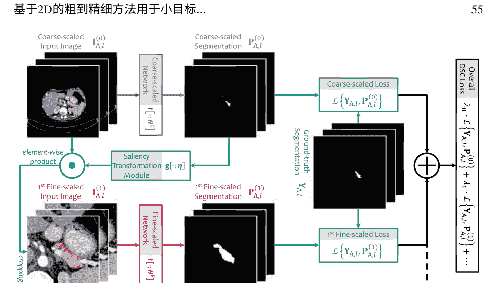

我们在轴向视图中显示一个输入图像，其中包含 3 个相邻的切片。为了节省空间，我们只绘制了粗略阶段和精细阶段的第一次迭代。

由于 GPU 内存的限制，在每个包含一个训练样本的小批量中，我们将 $T$ 设置为最大整数（不超过 5），以便将整个框架适应 GPU 内存。整体框架如图 3.7 所示。值得一提的是，我们发现将 $T=1$ 也可以获得很高的准确性，这表明联合优化带来了重大改进。

测试阶段遵循算法 2 中描述的流程图。与训练阶段相比，有两个小的差异。首先，由于没有 Ground-Truth 分割掩码 $Y$，概率图 $P$ 始终被用作图像裁剪的参考图。其次，迭代次数不再受 GPU 内存的限制，因为中间输出可以在过程中被丢弃。实际上，我们通过 DSC 来衡量两次连续预测的相似度 $DSC\{ Z^{(t-1)}, Z^{(t)} \} = \frac{2 \times \sum_i Z_i^{(t-1)} Z_i^{(t)}}{\sum_i Z_i^{(t-1)} + Z_i^{(t)}}$，达到阈值 $thr$，或执行固定数量 ($T$) 的迭代。我们将在第 3.5.3.3 节讨论这些参数。

### 3.4.3 胰腺囊肿分割应用

我们按照第 3.3.3 节的方法使用多阶段方法，首先找到常规器官（胰腺），然后通过参考该器官来定位肿瘤（囊肿）。还采用了四阶段策略，即粗放和细放的胰腺分割，以及粗放和细放的囊肿分割。这可以通过两个 RSTN 模块实现，其中第一个 RSTN 根据 CT 图像分割胰腺，而第二个 RSTN 根据胰腺裁剪区域分割胰腺囊肿。

## 3.5 胰腺分割实验

### 3.5.1 数据集和评估

我们在 NIH 胰腺分割数据集 [35] 上评估我们的方法，该数据集包含 82 个增强腹部 CT 体积。每个扫描的分辨率为 $512 \times 512 \times L$，其中 $L \in [181,466]$ 是沿身体长轴的切片数。相邻体素之间的距离范围从 0.5 到 1.0 毫米。按照标准的交叉验证策略，我们将数据集分为 4 个固定的折叠，每个折叠包含大致相同数量的样本。我们应用交叉验证，即在 4 个子集中训练模型，并在剩余的一个子集上进行测试。我们通过计算每个样本的 Dice-Sørensen 系数（DSC）来衡量分割准确性，并报告 82 个案例的平均值和标准差。

### 3.5.2 逐步粗到细方法的评估

我们使用在 PascalVOC 图像分割任务上预训练的 FCN-8s 模型 [29] 来初始化这两个网络。粗尺度模型以学习率为 $10^{-5}$ 进行 80,000 次迭代的微调，而细尺度模型以学习率为 $10^{-4}$ 进行 60,000 次迭代。每个小批次包含一个训练样本（从 3D 体积中切片的 2D 图像）。

我们首先评估基线（粗尺度）方法。使用从三个不同视角（即 $M_c$，$M_s$ 和 $M_a$）训练的粗尺度模型，我们分别得到 $66.88\% \pm 11.08\%$、$71.41\% \pm 11.12\%$ 和 $73.08\% \pm 9.60\%$ 的平均 DSC。通过多数投票将这三个模型融合，得到 $75.74\% \pm 10.47\%$，表明不同视角捕捉到了互补的信息。这将作为后续迭代的起始点 $Z^{(0)}$。

为了应用固定点模型进行分割，我们首先计算 $d^{(t)}$ 以观察迭代的收敛性。经过 10 次迭代，所有样本的平均 $d^{(t)}$ 值为 0.9767，中位数为 0.9794，最小值为 0.9362。这些数字表明迭代过程通常是稳定的。

现在，我们使用阈值 $R = 0.95$ 和最大迭代次数 $T=10$ 来研究固定点模型。平均 DSC 提高了 6.63%，考虑到相对较高的基线（75.74%），这是令人印象深刻的。这验证了我们的假设，即细粒度模型更准确地描述了小器官。

表 3.1 不同方法报告的分割准确率（以 DSC，% 表示）。我们从初始（粗糙）分割 $z^{(0)}$ 开始，探索不同的终止条件，包括固定迭代次数和固定的迭代 DSC 阈值。最后两行显示了我们方法的两个上界，即“最佳迭代”表示我们选择 10 次迭代中最高的 DSC 值，“Oracle 边界框”对应于使用地面真值分割在测试中生成边界框。我们还将结果与最先进的 [35, 36] 进行了比较，展示了我们在所有统计数据上的优势。

表 3.1 不同方法报告的分割准确率（以 DSC，% 表示）

| 方法 | 平均 DSC | 迭代次数 | 最大 DSC | 最小 DSC |
| :--- | :--- | :--- | :--- | :--- |
| Roth 等人，MICCAI'2015 [35] | 71.42 ± 10.11 | – | 86.29 | 23.99 |
| Roth 等人，MICCAI'2016 [36] | 78.01 ± 8.20 | – | 88.65 | 34.11 |
| 粗分割 | 75.74 ± 10.47 | – | 88.12 | 39.99 |
| 1 次迭代后 | 82.16 ± 6.29 | 1 | **90.85** | 54.39 |
| 2 次迭代后 | 82.13 ± 6.30 | 2 | 90.77 | 57.05 |
| 3 次迭代后 | 82.09 ± 6.17 | 3 | 90.78 | 58.39 |
| 5 次迭代后 | 82.11 ± 6.09 | 5 | 90.75 | 62.40 |
| 10 次迭代后 | 82.25 ± 5.73 | 10 | 90.76 | 61.73 |
| 大于 0.90 后 | 82.13 ± 6.35 | 1.83 ± 0.47 | **90.85** | 54.39 |
| 大于 0.95 后 | **82.37** ± 5.68 | 2.89 ± 1.75 | **90.85** | **62.43** |
| 大于 0.99 后 | 82.28 ± 5.72 | 9.87 ± 0.73 | 90.77 | 61.94 |
| 所有迭代中最好的结果 | 82.65 ± 5.47 | 3.49 ± 2.92 | 90.85 | 63.02 |
| 理想边界框 | 83.18 ± 4.81 | – | 91.03 | 65.10 |

我们还总结了不同终止条件生成的结果，见表 3.1。我们发现仅进行 1 次迭代就足以显著提高分割准确性（+6.42%）。然而，更多的迭代有助于提高最坏情况的准确性，因为对于一些具有挑战性的情况（例如，案例 #09，见图 3.8），粗分割中的缺失部分逐渐恢复。最佳平均准确性来自于设置 $R = 0.95$。使用更大的阈值（例如 0.99）不会产生准确性提升，但需要更多的迭代，因此在测试阶段需要更多的计算。平均而言，只需要不到 3 次迭代就可以达到 0.95 的阈值。在现代 GPU 上，每个测试样本大约需要 3 分钟，与最近的工作 [36] 相当，但我们报告的分割准确性要高得多（82.37% vs. 78.01%）。

作为诊断实验，我们使用每个测试案例的真实边界框来生成输入体积。这导致了 83.18% 的平均准确率（在这种情况下不需要迭代）。相比之下，我们报告了 82.37% 的平均准确率，表明我们的方法几乎达到了当前深度分割网络的上限。

我们还将我们的分割结果与最先进的方法进行了比较。使用 DSC 作为评估指标，我们的方法优于最近发表的方法。

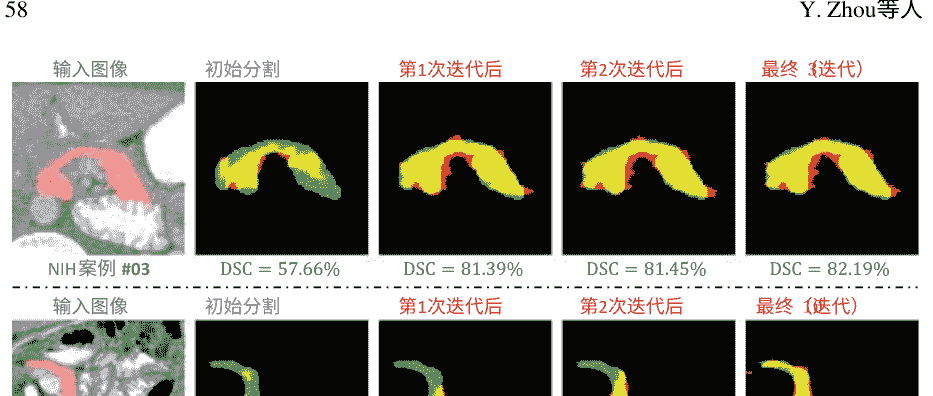

工作 [36] 显著提高。82个样本的平均准确率显著提高，从78.01增加到82.37 %，标准差从8.20减少到5.68%，表明我们的方法更加稳定。我们还实现了最近发表的一种粗到细的方法[50]，平均准确率为77.89%。特别是，[36]报告的最差情况为34.11%（一些先前的工作[6, 45]甚至报告更低的数字），而我们的方法将这个数字显著提高到62.43%。我们指出，这些改进主要是由于微调迭代造成的。

如果没有微调迭代，平均准确率为75.74%，最差情况下的准确率仅为39.99%。图3.8展示了在两个具有挑战性的案例中，分割质量如何得到改善的示例。

### 3.5.3 粗到细的端到端评估方法

#### 3.5.3.1 不同的设置

我们使用在PascalVOC [9]上预训练的FCN-8s模型[29]随机初始化上采样层的权重，将学习率设置为$10^{-4}$，并运行80,000次迭代。评估了不同选项，包括在显著性转换中使用不同的核大小，以及是否使用预测的分割作为参考图像来微调模型（详见第3.4.2节的描述）。定量结果总结在表3.2中。

表3.2 不同设置下我们方法的准确率（DSC，%）比较。请参阅第3.5.3.1节中对这些变体的详细描述

| 模型 | 平均 | 最大 | 最小 |
| :--- | :--- | :--- | :--- |
| 3×3核在显著性转换中（基本模型） | 83.47 ± 5.78 | 90.63 | 57.85 |
| 1×1内核在显著性转换中 | 82.85 ± 6.68 | 90.40 | 53.44 |
| 5×5内核在显著性转换中 | 83.64 ± 5.29 | 90.35 | 66.35 |
| 两层显著性转换（3×3内核） | 83.93 ± 5.43 | 90.52 | 64.78 |
| 使用嘈杂数据进行微调（3×3内核） | 83.99 ± 5.09 | 90.57 | 65.05 |

由于显著性转换模块是通过保持大小的卷积实现的（参见第3.4.1节），卷积核的大小决定了像素用于判断其显著性的范围。一般来说，较大的内核大小可以提高分割准确性（3×3明显优于1×1），但我们观察到边际效应：5×5相对于3×3的改进有限。由于我们使用了7×7内核，分割准确性略低于5×5。这可能是由于引入到该模块的参数数量较大。增加感受野大小的另一种方法是使用两个具有3×3内核的卷积层。这种策略虽然参数数量较少，但比使用一个5×5层效果更好。但是，我们不会添加更多的层，因为性能会饱和，而计算成本会增加。

如第3.4.2节所述，我们使用从粗放比例分割掩模中裁剪的图像对这些模型进行微调。这是为了调整模型以适应测试阶段，在该阶段中，地面真值掩模是未知的，因此需要从细放比例分割开始，并能够修正粗放比例分割掩模。我们使用较小的学习率（10^{-6}）并运行另外40,000次迭代。这种策略不仅报告了0.52%的整体准确率提升，还缓解了过拟合问题（见第3.5.3.3节）。

总之，所有这些变体的准确率都比我们的逐步粗放到细放方法（82.37%）更高，这证实了我们的端到端方法的主要贡献来自于我们的循环框架，使得联合优化成为可能。在后续实验中，我们继承了从本节学到的最佳变体，包括在大规模多器官数据集中使用（见第3.6节）。也就是说，我们使用两个3×3的卷积层进行显著性转换，并使用粗放比例分割对模型进行微调。这个设置产生了平均准确率为84.50%，如表3.3所示。

#### 3.5.3.2 性能比较

我们展示了我们的端到端粗到细的方法比逐步粗到细的方法效果更好。如表3.3所示，82个案例的平均改进为2.13 ± 2.67%。标准差（逐步方法的5.68%和端到端方法的4.97%）主要是由于扫描和标记质量的差异引起的。逐案例研究表明，我们的端到端方法在82个案例中有67个案例报告了更高的准确性，最大优势为+17.60%，最大缺陷仅为-3.85%。我们在第3.5.3.3节中分析了改进的来源。

我们简要讨论使用3D网络的优缺点。3D网络可以捕捉更丰富的上下文信息，但也需要训练更多的参数。我们的2D方法更有效地利用了3D上下文。在每次迭代的末尾，来自三个视图的预测被融合，因此显著性转换模块将这些信息传递给下一次迭代。我们实现了VNet[31]，并且对于每个案例，使用3D地面真值边界框提供了平均准确率为83.18%。如果没有地面真值，就需要使用滑动窗口的过程，这非常慢——在Titan-X Pascal GPU上平均需要5分钟。相比之下，我们的端到端方法需要1.3分钟，比我们的逐步方法慢（0.9分钟），但比其他2D方法[35,36]（2-3分钟）更快。

#### 3.5.3.3 诊断

##### 联合优化和多阶段线索

我们的端到端方法实现了联合训练，可以分别改善粗略阶段和细致阶段。我们用我们的逐步方法训练的两个网络分别表示为I<sup>C</sup>和I<sup>F</sup>，同样，用我们的方法训练的网络分别表示为J<sup>C</sup>和J<sup>F</sup>。在粗略阶段，I<sup>C</sup>报告了75.74%，J<sup>C</sup>报告了78.23%。在细致阶段，将J<sup>F</sup>应用于I<sup>C</sup>的输出上，得到了83.80%，这比82.37%（I<sup>F</sup>应用于I<sup>C</sup>）要高，但比84.50%（J<sup>F</sup>应用于J<sup>C</sup>）要低。因此，我们得出结论，粗略缩放和细致缩放的网络都受益于联合优化。更强的粗略阶段提供了更好的起点，更强的细致阶段改善了上限。

图3.9 展示了循环显著性转换在粗到细分割中的工作方式的可视化（最好以彩色查看）。通过利用上一次迭代的概率图来帮助当前迭代，分割准确性得到了很大的提高。请注意，三个权重图捕捉了不同的视觉线索，其中两个集中在前景区域，剩下的一个集中在背景区域。

在图3.9中，我们通过融合多阶段的视觉线索来可视化循环网络如何辅助分割。有趣的是，在显著性转换中，不同的通道提供了互补的信息，即其中两个集中在目标器官上，剩下的一个则主要加权到背景区域。

在不同视角和不同折叠的模型中也发生了类似的现象。这表明除了前景之外，背景和边界也对视觉识别起到了贡献[54]。

##### 收敛

我们研究收敛性，这是判断我们端到端方法可靠性的一个非常重要的标准。我们选择了报告平均准确率为84.50%的最佳模型，并记录了测试过程中的迭代间DSC：

$d^{(t)} = \text{DSC}$

$\left\{ Z^{(t-1)}, Z^{(t)} \right\} = \frac{2 \times \sum_i Z_i^{(t-1)} Z_i^{(t)}}{\sum_i Z_i^{(t-1)} + Z_i^{(t)}}$

在我们的方法中，经过1、2、3、5和10次迭代，这些数字分别为0.9037、0.9677、0.9814、0.9908和0.9964，而在我们的逐步方法中，这些数字分别为0.8286、0.9477、0.9661、0.9743和0.9774。我们端到端方法报告的每个数字都比逐步方法高得多。更好的收敛性能使我们有机会设置更严格的终止条件，例如使用thr = 0.99而不是thr = 0.95。

当我们的端到端方法中的阈值从0.95增加到0.99时，82个案例中有80个收敛（平均5.22次迭代），平均准确率从83.93%提高到84.50%。在Titan-X Pascal GPU上，每次迭代需要0.2分钟，因此使用thr = 0.99在每个测试案例中平均需要1.3分钟。

##### 过拟合问题

最后，我们通过在测试过程中利用oracle信息来研究我们的端到端方法的过拟合问题。我们使用每个切片上的真实边界框，用于在每次迭代中裁剪输入区域。请注意，在每个切片上注释边界框是昂贵的，因此在实际临床应用中不适用。这个实验旨在探索在完美定位下我们分割网络的上限。

在提供了oracle信息的情况下，我们的最佳模型报告了86.37%的准确率，这比不使用oracle信息的数字（84.50%）要高得多。如果我们不使用粗粒度分割对网络进行微调（参见表3.2），那么上述数字分别为86.26%和83.68%。也就是说，微调防止了我们的模型依赖于地面真实掩模。它不仅提高了平均准确率，还减轻了过拟合（我们的模型相对于使用oracle信息的模型的劣势减少了0.67%）。

## 3.6 JHMI多器官分割实验

为了验证我们的方法是否适用于其他器官，我们团队的放射科医生收集了一个包含200个CT扫描、11个腹部器官和5个血管的大型数据集。这个语料库花费了4名全职放射科医生约3个月的时间进行注释。据我们所知，这个数据集比任何公共数据集都要大，包含更多的器官。我们选择了5个最具挑战性的目标，包括胰腺和一个血管，以及相对较容易的两个肾脏。其他容易的器官，如肝脏，被忽略了。据我们所知，其中一些器官以前从未被研究过，但它们在诊断胰腺疾病和早期检测胰腺癌方面非常重要。我们将数据集随机分为四份进行交叉验证。每个器官都进行单独的训练和测试。当一个像素被预测为多个器官时，我们选择具有最大置信度得分的器官。

表3.4我们的逐步方法和端到端方法在我们的JHMI多器官数据集上对粗粒度（C）和细粒度（F）分割的比较。如果细粒度的准确性低于粗粒度的准确性，则用♯表示。由于训练样本数量增加和CT扫描分辨率提高，胰腺分割的准确性高于表3.3中的准确性。

| 器官 | 逐步-C | 逐步-F | 端到端-C | 端到端-F |
| :--- | :--- | :--- | :--- | :--- |
| 肾上腺 | 57.38 | 61.65 | 60.70 | **63.76** |
| 十二指肠 | 67.42 | 69.39 | 71.40 | **73.42** |
| 胆囊 | 82.57 | ♯82.12 | 87.08 | **87.10** |
| 下腔静脉 | 71.77 | ♯71.15 | 79.12 | **79.69** |
| 左肾 | 92.56 | 92.78 | 96.08 | **96.21** |
| 右肾 | 94.98 | 95.39 | 95.80 | **95.97** |
| 胰腺 | 83.68 | 85.79 | 86.09 | **87.60** |

我们的两种方法的结果总结在表3.4中。我们的端到端方法通常比逐步方法表现更好。对于5个具有挑战性的器官（不包括肾脏），平均改进了4.29%。对于一些器官，例如胆囊，我们没有观察到通过迭代获得显著的准确性提升。

## 3.7 JHMI胰腺囊肿分割实验

最后，我们对我们的方法在由我们团队的放射科医生收集的囊肿数据集上进行评估。该数据集包含131个增强对比度的腹部CT体积，每个体积都手动标记了胰腺和胰腺囊肿掩膜。每个CT扫描的分辨率为512 × 512 × L，其中 L ∈ [358,1121]是身体长轴上采样切片的数量。切片厚度从0.5到1.0 mm不等。我们将数据集分为4个固定的折叠，每个折叠包含大致相同数量的样本。我们应用交叉验证，即在4个折叠中的3个折叠上训练我们的方法，并在剩下的一个折叠上进行测试。与之前一样，我们通过计算每个3D体积的Dice-Sørens en系数（DSC）来衡量分割准确性。我们报告了来自4个测试折叠的所有131个测试案例的平均DSC分数以及其他统计数据。

我们在表3.5中报告了胰腺和囊肿分割结果，其中我们总结了胰腺分割、无胰腺监督的胰腺囊肿分割（即两阶段粗到细的方法，无深度监督）以及有胰腺监督的胰腺囊肿分割（即四阶段策略，有深度监督）的结果。有趣的 是，在没有深度监督的情况下，我们的两种方法表现相当，但是有深度监督的情况下，端到端的方法比逐步的方法效果更好。这是因为更好的胰腺分割结果（即83.81%相比于79.32%）为囊肿分割提供了更准确的上下文信息。此外，我们的

表3.5 不同目标（胰腺或囊肿）和不同方法的准确度（DSC，%）比较。对于囊肿分割，无深度监督意味着直接将我们的粗到细方法应用于囊肿分割，给定整个CT图像，而有深度监督意味着先分割胰腺，然后在由胰腺区域裁剪的输入图像中分割囊肿。

| 目标 | 方法 | 平均 | 最大 | 最小 |
|------|------|------|------|------|
| 胰腺 | 逐步 | 79.23 ± 9.72 | 93.82 | 69.54 |
| 胰腺 | 端到端 | 83.81 ± 10.51 | 94.34 | 20.77 |
| 囊肿 | 逐步，无深度监督 | 60.46 ± 31.37 | 95.67 | 0.00 |
| 囊肿 | 端到端，无深度监督 | 60.73 ± 32.46 | 96.50 | 0.00 |
| 囊肿 | 逐步，有深度监督 | 63.44 ± 27.71 | 95.55 | 0.00 |
| 囊肿 | 端到端，有深度监督 | 67.19 ± 27.91 | 96.05 | 0.00 |

通过采用更强大的骨干网络，例如，在胰腺分割的粗糙阶段中使用DeepLab [5]作为骨干网络，我们甚至可以达到69.38 ± 27.60%的囊肿分割的DSC。

据我们所知，之前很少研究胰腺囊肿分割。一个竞争对手是[7]，它在2016年发表，结合了随机游走和区域生长进行分割。然而，它要求用户事先注释感兴趣区域（ROI），并在分割过程中提供前景/背景体素的交互注释。相比之下，我们的方法可以广泛应用于自动诊断，特别适用于没有医学专业知识的普通用户。

## 3.8 结论

本研究的动机是小目标分割的困难，需要专注于局部输入区域。提出了两种粗到细的方法，即逐步粗到细和端到端粗到细。逐步算法被形式化为一个固定点模型，将分割掩模作为输入和输出。端到端算法同时优化两个网络，并且通常比逐步算法获得更好的结果。

我们的方法应用于三个数据集，用于胰腺分割、多器官分割和胰腺囊肿分割，并且明显优于基线（即最先进的方法）。经过我们团队的放射科医生确认，这些分割结果对计算机辅助临床诊断有帮助。

## 参考文献

- 1. Ali A, Farag A, El-Baz A (2007) 基于图割框架的肾脏分割与先验形状约束。 在：医学图像计算与计算机辅助干预国际会议
- 2. Brosch T, Tang L, Yoo Y, Li D, Traboulsee A, Tam R (2016) 应用于多发性硬化症病变分割的具有多尺度特征集成的深度3D卷积编码器网络和快捷方式。 IEEE Trans Med Imaging 35(5):1229–1239
- 3. Cai J, Lu L, Xie Y, Xing F, Yang L (2017) 通过循环神经网络上下文学习和直接损失函数改进CT和MRI图像中的深度胰腺分割。 在：国际医学图像计算与计算机辅助干预会议
- 4. Chen H, Dou Q, Wang X, Qin J, Heng P (2016) 通过深度级联网络在乳腺癌组织图像中检测有丝分裂。 在：AAAI人工智能会议
- 5. Chen L, Papandreou G, Kokkinos I, Murphy K, Yuille A (2015) 通过深度卷积网络和完全连接的CRF进行语义图像分割。 在：国际学习表示会议
- 6. Chu C, Oda M, Kitasaka T, Misawa K, Fujiwara M, Hayashi Y, Nimura Y, Rueckert D, Mori K (2013) 基于空间分割的概率图谱的多器官分割三维腹部CT图像。在：国际医学图像计算与计算辅助干预会议
- 7. Dmitriev K, Gutenko I, Nadeem S, Kaufman A (2016) 胰腺和囊肿分割。 在：医学成像2016：图像处理，卷9784，pp 97842C
- 8. Dou Q, Chen H, Jin Y, Yu L, Qin J, Heng P (2016) 三维深度监督网络用于自动肝脏分割。 在：国际医学图像计算与计算辅助干预会议
- 9. Everingham M, Van Gool L, Williams C, Winn J, Zisserman A (2010) Pascal视觉对象类（VOC）挑战。 Int J Comput Vis 88(2):303–338
- 10. Girshick R, Donahue J, Darrell T, Malik J (2014) 用于准确物体检测和语义分割的丰富特征层次结构。 在：计算机视觉和模式识别
- 11. Graves A, Mohamed A, Hinton G (2013) 带有深度递归神经网络的语音识别。 在：国际会议上，声学、语音和信号处理
- 12. Harrison A, Xu Z, George K, Lu L, Summers R, Mollura D (2017) 用于CT图像的病理性肺分割的渐进和多路径整体嵌套神经网络。 在：国际医学图像计算和计算机辅助干预会议
- 13. Havaei M, Davy A, Warde-Farley D, Biard A, Courville A, Bengio Y, Pal C, Jodoin P, Lar ochelleH (2017) 使用深度神经网络进行脑肿瘤分割。 在：医学图像分析
- 14. He K, Zhang X, Ren S, Sun J (2016) 用于图像识别的深度残差学习。 在：计算机视觉和模式识别
- 15. Heimann T, Van Ginneken B, Styner M, Arzhaeva Y, Aurich V, Bauer C, Beck A, Becker C, B eichel R, Bekes G et al (2009) CT数据集中肝脏分割方法的比较和评估。 IEEE Trans Med Imaging 28(8):1251–1265
- 16. Hu S, Hoffman E, Reinhardt J (2001) 准确量化体积X射线CT图像的自动肺分割。 IEEE Trans Med Imaging 20(6):490–498
- 17. Kamnitsas K, Ledig C, Newcombe V, Simpson J, Kane A, Menon D, Rueckert D, Glocker B (2017) 高效多尺度3D CNN与全连接CRF用于准确的脑损伤分割。 Med Image Anal 36:61–78
- 18. Krizhevsky A, Sutskever I, Hinton G (2012) 使用深度卷积神经网络的ImageNet分类。 在：神经信息处理系统的进展
- 19. Kuen J, Wang Z, Wang G (2016) 用于显著性检测的循环注意力网络。 在：计算机视觉和模式识别
- 20. Lai M (2015) 用于医学图像分割的深度学习。 arXiv:1505.02000
- 21. Lee C, Xie S, Gallagher P, Zhang Z, Tu Z (2015) 深度监督网络。 在：国际人工智能和统计学会议
- 22. Li G, Xie Y, Lin L, Yu Y (2017) 实例级显著目标分割。 在：计算机视觉和模式识别
- 23. Li Q, Wang J, Wipf D, Tu Z (2013) 结构化标签的固定点模型。 在：国际机器学习会议
- 24. Liang M, Hu X (2015) 用于物体识别的循环卷积神经网络。 在：计算机视觉和模式识别
- 25. Lin D, Lei C, Hung S (2006) 在腹部CT图像上的计算机辅助肾脏分割。 IEEE Trans Inf Technol Biomed 10(1):59–65
- 26. Lin G, Milan A, Shen C, Reid I (2017) RefineNet: 多路径细化网络与身份映射用于高分辨率语义分割。 在：计算机视觉和模式识别
- 27. Ling H, Zhou S, Zheng Y, Georgescu B, Suehling M, Comaniciu D (2008) 分层、基于学习的自动肝脏分割。 在：计算机视觉和模式识别
- 28. Linguraru M, Sandberg J, Li Z, Sh ah F, Summers R (2010) 使用归一化概率图和增强估计从CT图像中自动分割和定量化肝脏和脾脏。 Med Phys 37(2):771–783
- 29. Long J, Shelhamer E, Darrell T (2015) 全卷积网络用于语义分割。 在：计算机视觉和模式识别30. Merkow J, Kriegman D, Marsden A, Tu Z (2016) 密集体积到体积的血管边界检测。在：国际医学图像计算和计算机辅助干预会议

31. Milletari F, Navab N, Ahmadi S (2016) V-Net: 用于体积医学图像分割的全卷积神经网络。在：国际三维视觉会议

32. Pinheiro P, Collobert R (2014) 用于场景标注的循环卷积神经网络。在：国际机器学习会议

33. Ren S, He K, Girshick R, Sun J (2015) Faster R-CNN: 基于区域建议网络的实时目标检测。在：神经信息处理系统的进展

34. Ronneberger O, Fischer P, Brox T (2015) U-Net: 用于生物医学图像分割的卷积网络。在：国际医学图像计算和计算机辅助干预会议

35. Roth H, Lu L, Farag A, Shin H, Liu J, Turkbey E, Summers R (2015) DeepOrgan: 多层次深度卷积神经网络用于自动胰腺分割。在：国际医学图像计算与计算机辅助干预会议

36. Roth H, Lu L, Farag A, Sohn A, Summers R (2016) 空间聚合的整体嵌套网络用于自动胰腺分割。在：国际医学图像计算与计算机辅助干预会议

37. Roth H, Lu L, Lay N, Harrison A, Farag A, Sohn A, Summers R (2017) 空间聚合的整体嵌套卷积神经网络用于自动胰腺定位和分割。arXiv:1702.00045

38. Shen W, Wang B, Jiang Y, Wang Y, Yuille A (2017) 多阶段多递归输入全卷积网络用于神经元边界检测。在：计算机视觉国际会议

39. Simonyan K, Zisserman A (2015) 面向大规模图像识别的深度卷积网络。在：国际学习表示会议

40. Socher R, Lin C, Manning C, Ng A (2011) 用递归神经网络解析自然场景和自然语言。在：国际机器学习会议

41. Tang P, Wang X, Bai S, Shen W, Bai X, Liu W, Yuille AL (2018) PCL: 提议聚类学习用于弱监督目标检测。在：IEEE模式分析与机器智能交易

42. Wang D, Khosla A, Gargeya R, Irshad H, Beck A (2016) 用于识别转移性乳腺癌的深度学习。arXiv:1606.05718

43. Wang Y, Zhou Y, Tang P, Shen W, Fishman EK, Yuille AL (2018) 通过松弛的上界置信度选择样本进行多器官分割网络的训练。在：国际医学图像计算和计算机辅助干预会议

44. Wang Y, Zhou Y, Shen W, Park S, Fishman EK, Yuille AL (2018) 全局嵌套卷积神经网络的空间聚合用于自动胰腺定位和分割。arXiv:1804.08414

45. Wang Z, Bhatia K, Glocker B, Marvao A, Dawes T, Misawa K, Mori K, Rueckert D (2014) 地线段分割。在：国际医学图像计算和计算机辅助干预会议

46. Xia F, Wang P, Chen L, Yuille A (2016) 更好地放大以更清晰地看到：使用分层自动缩放网络进行人体和物体解析。在：欧洲计算机视觉会议

47. Yu L, Yang X, Chen H, Qin J, Heng P (2017) 具有混合残差连接的体积卷积神经网络用于自动化前列腺分割。在：AAAI人工智能会议

48. Yu Q, Xie L, Wang Y, Zhou Y, Fishman E, Yuille A (2018) 循环显著性转换网络：将多阶段视觉线索纳入小器官分割中。在：计算机视觉和模式识别会议

49. Zhang L, Lu L, Summers RM, Kebbew E, Yao J (2017) 通过群体学习个性化胰腺肿瘤生长预测。在：国际医学图像计算和计算机辅助干预会议

50. Zhang Y, Ying M, Yang L, Ahuja A, Chen D (2016) 用于超声图像中淋巴结分割的粗到细堆叠全卷积网络。在：IEEE国际生物信息学和生物医学会议

51. Zhou Y, Wang Y, Tang P, Bai S, Shen W, Fishman EK, Yuille AL (2019) 通过多平面协同训练的半监督多器官分割。在：IEEE应用计算机视觉冬季会议

52. Zhou Y, Xie L, Fishman E, Yuille A (2017) 腹部CT扫描中胰腺囊肿分割的深度监督。在：国际医学图像计算和计算机辅助干预会议

53. Zhou Y, Xie L, Shen W, Wang Y, Fishman E, Yuille A (2017) 用于腹部CT扫描中胰腺分割的定点模型。在：国际医学图像计算和计算机辅助干预会议

54. Zhu Z, Xie L, Yuille A (2017) 有物体和无物体的物体识别。在：国际人工智能联合会议

# 第4章 体积医学图像分割：一种三维粗到细的框架及其对抗性示例

李英伟，朱卓豚，周宇音，夏颖达，沈伟，艾略特·K·费希曼和艾伦·L·尤尔

摘要 尽管深度神经网络已经成为许多2D视觉任务的主要方法，但将它们应用于3D任务（如医学图像分割）仍然具有挑战性，因为标注的3D数据量有限且计算资源有限。在本章中，通过重新思考将3D卷积神经网络应用于分割医学图像的策略，我们提出了一种新颖的基于3D的粗到细框架，以有效地解决这些挑战。所提出的基于3D的框架在性能上远远优于其2D对应物，因为它可以利用沿三个轴的丰富空间信息。我们进一步分析了对所提出的框架的对抗攻击威胁，并展示了如何防御这种攻击。我们在三个数据集上进行了实验，分别是NIH胰腺数据集、JHMI胰腺数据集和JHMI病理性囊肿数据集，其中前两个数据集包含健康和病理性胰腺，而最后一个数据集包含病理性囊肿。

李宇和朱哲同等贡献，并按字母顺序排序。这项工作的第一部分发表在会议论文[48]中，其中Zhuotun Zhu、Yingda Xia和Wei Shen做出了贡献。第二部分由Yingwei Li、Yuyin Zhou和Wei Shen贡献。Elliot K. Fishman和Alan L. Yuille负责整个项目。

李宇·朱哲·周宇·夏颖达·沈伟·A. L. Yuille (✉)
约翰霍普金斯大学，3400 N Charles St，巴尔的摩，MD 21218，美国
e-mail: ayuille1@jhu.edu
李宇
电子邮件：yingwei.li@jhu.edu
朱哲
e-mail: ztzhu@jhu.edu
周宇
e-mail: yzhou103@jhu.edu
夏颖达
e-mail: yxia25@jhu.edu
沈伟
e-mail: wshen10@jhu.edu
E. K. Fishman
美国巴尔的摩市北百老汇733号约翰霍普金斯大学医学院，邮编21205，电子邮件：efishman@jhmi.edu
© Springer Nature Switzerland AG 2019
L. Lu等人（编），《深度学习与卷积神经网络在医学成像和临床信息学中的进展》，《计算机视觉与模式识别的进展》，https://doi.org/10.1007/978-3-030-13969-8_4

在所有这些数据集上，我们在Dice-Sørensen系数（DSC）方面达到了当前的最新水平。特别是在NIH胰腺数据集上，我们的平均性能超过了之前的最佳水平2%以上，最差情况下提高了7%，达到了近70%，这表明我们的框架在临床应用中的可靠性。

## 4.1 引言

受计算机辅助诊断系统的巨大需求的驱动，从医学图像（如计算机断层扫描（CT）和磁共振成像（MRI））中自动分割器官已成为医学图像处理和计算机视觉社区的一个活跃研究课题。这是许多临床应用的先决步骤，如糖尿病检查、器官癌症诊断和手术规划。因此，探索自动分割系统以加速医学图像分析中的计算机辅助诊断是非常值得的。

在本章中，我们专注于从CT扫描中进行胰腺分割，这是最具挑战性的器官分割问题之一[31, 46]。如图4.1所示，主要困难来自三个方面：（1）整个腹部CT体积中胰腺的小尺寸；（2）胰腺的纹理、位置、形状和大小的大变化；（3）胰腺囊肿等异常可以很大程度上改变胰腺的外观。

随着深度神经网络[17, 35]的快速发展以及它们在许多计算机视觉任务中的成功，如语义分割[4, 21]、边缘检测[33, 34, 42]和3D形状检索[7, 47]，许多基于深度学习的方法已被提出用于胰腺分割，并取得了相当大的进展[31, 32, 46]。然而，这些方法是基于2D全卷积网络（FCNs）[21]，它们通过逐层分割来执行分割，而CT体积实际上是3D数据。尽管这些2D方法使用了一些策略

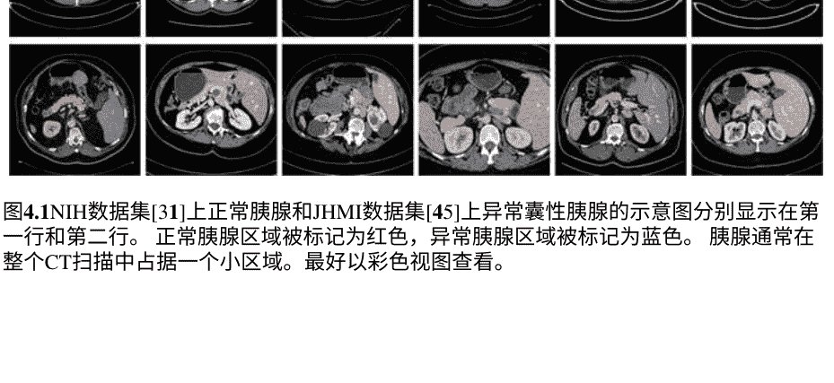

为了融合来自不同2D视图的输出以获得3D分割结果，它们不可避免地丢失了一些3D上下文信息，这对于捕捉胰腺与背景区域之间的区别特征是重要的。

训练3D深度分割网络的一个障碍是它遇到了“内存不足”的问题。2D FCN可以接受整个2D切片作为输入，但是由于有限的GPU内存大小，3D FCN无法接受整个3D体积作为输入。一个常见的解决方案是从小的子体积中训练3D FCN，并以滑动窗口的方式进行测试[1, 3, 5, 24, 43]，即逐个对密集且均匀采样的子体积进行3D分割。通常，这些相邻的采样子体积彼此重叠，以提高最终3D结果的鲁棒性。值得注意的是，重叠大小是分割准确性和时间成本之间的权衡。设置较大/较小的重叠大小通常会导致更好/更差的分割准确性，但在测试过程中需要更多/更少的时间。

为了解决这些问题，我们提出了一个简洁而有效的框架来训练用于胰腺分割的3D深度网络，可以同时实现高分割准确性和低时间成本。我们的框架被制定为一个粗糙到精细的过程。在训练阶段，我们首先从整个CT体积中采样子体积来训练一个3D FCN。我们将其称为ResDSN Coarse模型，旨在通过充分利用整体3D上下文从整个CT体积中获取目标胰腺的粗略位置。然后，我们仅从目标胰腺的真实边界框中采样子体积来训练另一个3D FCN。我们将其称为ResDSN Fine模型，可以根据粗略结果来改进分割。在测试阶段，我们首先以滑动窗口的方式将粗糙模型应用于整个CT体积，以提取胰腺的最可能位置。由于在此步骤中我们只需要目标胰腺的粗略位置，因此重叠大小设置为一个较小的值。然后，我们以滑动窗口的方式将精细模型应用于粗略胰腺区域，但设置较大的重叠大小。因此，我们可以高效地获得精细的分割结果，并将这个粗糙到精细的框架称为ResDSN C2F。

请注意，在我们的框架中，“粗到细”的含义有两个。首先，它意味着Res DSN Coarse模型和ResDSN Fine模型的输入感兴趣区域（RoIs）不同，即前者是整个CT体积，后者是目标胰腺的粗略边界框。我们将其称为粗到细的RoIs，旨在实现更好的分割性能。

粗略步骤去除了大量不相关的背景区域，然后使用相对较小的区域作为输入，细步骤可以更容易地学习区分胰腺和局部背景的线索，即利用局部上下文，从而更容易获得更准确的分割结果。其次，它意味着推理过程中ResDSN Coarse模型和ResDSN Fine模型使用的重叠大小不同，即它们分别使用小和大的重叠大小。我们将其称为粗到细的重叠大小，旨在实现高效的3D推理。

最近，人们越来越意识到深度网络对于对抗性示例的脆弱性，即那些与自然数据几乎无法区分但被网络错误分类的输入[10, 37, 41]。

对于医学学习系统来说，这个问题更加严重，因为它们可能导致错误的决策，从而误导医生。对抗性示例可能只是所有医学图像空间的一个小子集，因此在真实数据集中可能很少出现。但即使如此，它们仍然可能导致重大错误。分析这些示例可以帮助医学成像研究人员更好地了解基于深度网络的模型，从而提高其鲁棒性。在本章中，我们使用基于梯度的方法[10, 18]生成3D对抗性示例，并研究这些3D对抗性示例对我们框架的威胁。我们还展示了如何防御这些对抗性示例。

本章的贡献可以总结为两个方面：（1）一种基于3D深度网络的新颖框架，利用丰富的空间信息进行医学图像分割，在分割正常和异常胰腺方面取得了最先进的性能，并且时间成本相对较低；（2）对我们的框架中3D对抗样本的威胁以及对抗性防御方法进行了系统分析。

这项工作的第一部分发表在一篇会议论文中[48]，其中Zhuotun Zhu、Yingda Xia和Wei Shen做出了贡献。第二部分由Yingwei Li、Yuyin Zhou和Wei Shen贡献。Elliot K. Fishman和Alan L. Yuille监督整个项目。本章扩展了之前的工作[48]，包括对我们的框架进行3D对抗攻击和防御的分析以及更多的实验结果。

## 4.2 相关工作

### 4.2.1 基于深度学习的医学图像分割

医学图像分析社区面临着深度网络快速发展带来的革命 [17, 35]。深度卷积神经网络（CNN）方法在体积医学图像分割研究领域中占据主导地位，近年来取得了显著进展。一般来说，基于CNN的体积医学图像分割方法可以分为两大类：基于2D CNN和基于3D CNN。

#### 4.2.1.1 基于2D CNN的医学图像分割

基于2D CNN的方法 [12, 25, 29, 31, 32, 39, 40] 从不同视角逐层对体积进行分割，然后将2D分割结果融合以获得3D体积分割结果。在早期阶段，基于2D分割的模型是通过图像块进行训练，并以块的方式进行测试的 [31]，这种方式非常耗时。自从引入了全卷积网络（FCN）[21]，几乎所有的2D分割方法都是基于该网络构建的。

在训练和测试过程中，2D FCNs被用于进行整体切片分割。Havaei等人[12]提出了一种双通道FCN架构，通过这两个通道同时利用局部特征和更全局的上下文特征。Roth等人[32]通过一种整体学习方法进行胰腺分割，首先通过全局嵌套网络[42]对胰腺区域进行分割，然后通过使用随机森林获得的边界图来对其进行细化的鲁棒空间聚合。U-Net [29]是医学图像分割中最流行的FCN架构之一，它是一个编码器-解码器网络，但在编码器和解码器路径之间还有一个额外的短连接。基于胰腺只占整个扫描的一小部分这一事实，Zhou等人[46]提出了先找到粗略的胰腺区域，然后学习基于FCN的固定点模型来迭代地细化胰腺区域。他们的方法也基于粗到精的框架，但只考虑了粗到精的RoIs。除了粗到精的RoIs，我们的粗到精方法还考虑了粗到精的重叠大小，这是专门为高效的3D推断而设计的。

#### 4.2.1.2 用于医学图像分割的3D卷积神经网络

尽管基于2D卷积神经网络的方法取得了相当大的进展，但对于医学图像分割来说并不是最佳选择，因为它们无法充分利用体积数据中编码的3D上下文。已经提出了几种基于3D卷积神经网络的分割方法。3D U-Net [5] 扩展了之前的2D U-Net架构[29]，通过用3D操作替换所有2D操作来实现。基于3D U-Net的架构，V-Net [24] 在网络的每个阶段引入了残差结构[13] (短期跳跃连接)。Chen等人[3]提出了一种用于3D脑分割的深度体素残差网络。I2I-3D [23] 和 3D-DSN [6] 都通过辅助输出在其3D深度网络中进行了监督。尽管3D卷积神经网络在分割目标器官（如前列腺[24]和肾脏[5]）方面取得了成功，但在挑战性的胰腺分割中，很少有技术能够利用3D空间信息。Gibson等人[8]提出了DenseVNet，然而，由于计算密集的密集连接，该方法受到了浅编码器的限制。Roth等人[30]将3D U-Net扩展到胰腺分割，虽然取得了良好的结果，但该方法存在以下缺点： (1) 网络的输入固定为120 × 120 × 120，由于体积较大，计算量很大； (2) 粗略的胰腺边界框被重新采样为固定大小作为网络的输入，这会丢失信息和灵活性，并且无法处理胰腺形状和大小的固有大变化。因此，我们提出了一种适用于正常和异常CT数据的3D粗到细的框架，以确保低计算成本和高胰腺分割准确性。

### 4.2.2 对医学图像分割网络的对抗攻击和防御

深度学习在医学成像社区中越来越受到采用，用于各种任务，包括分类、分割、检测等。尽管在各种问题上取得了巨大成功，但CNN对于对抗性示例（即由人类难以察觉的扰动所制作的图像）非常脆弱[10, 37, 41]。Xie等人[41]首次为语义分割制作了对抗性示例，这与医学图像分割直接相关。Paschali等人[27]使用了Xie等人[41]的代码，并展示了Inception [36]和UNet [28]等最先进的网络对于皮肤病变分类和整个脑部分割仍然极易受到对抗性示例的影响。还证明了对抗性示例在推动网络达到极限并评估其鲁棒性方面具有优势[27]。此外，Huang等人[14]指出，基于深度学习的有限角度层析成像重建技术的鲁棒性仍然是一个令人担忧的问题，因为它容易受到对抗性示例的影响。这使得神经网络在临床应用中的鲁棒性成为一个重要的未解决问题。

为了减轻临床应用中的这种对抗效应，我们研究了对抗训练[37]在提高医学领域深度学习算法鲁棒性方面的应用。对抗训练最初是由Szegedy等人[37]提出的，通过增加对抗性示例的训练数据来增加鲁棒性。Madry等人[22]进一步验证了对抗训练模型可以对抗白盒攻击，即具有模型参数知识的攻击。请注意，深度学习的临床应用需要高水平的安全性和保密性[14]。我们的实验证明，对抗训练对于提高基于3D深度学习模型对抗性示例的鲁棒性非常有益。

## 4.3 方法

### 4.3.1 用于医学图像分割的3D粗到细的框架

在本节中，我们详细介绍了我们的3D粗到细的框架，包括一个粗阶段和一个细阶段。我们首先制定了一个分割模型，可以推广到粗阶段和细阶段。然后在第4.3.1.1节和第4.3.1.2节中，我们将分别针对这两个阶段定制分割模型。

我们用X表示一个3D CT扫描体积。这与一个人工标记的逐体素注释Y相关联，其中X和Y的大小为W × H × D，分别对应于轴向、矢状和冠状视图。真实的分割掩模Y在每个空间位置 $i$ 处具有二进制值 $y_i$, 其中 $i = 1, \ldots, W H D$, 表示 $x_i$ 是胰腺体素。用 $M$ 表示分割模型: $\mathbf{P} = \mathbf{f}(\mathbf{X}; \mathbf{\Theta})$, 其中 $\mathbf{\Theta}$ 表示模型参数, $\mathbf{P}$ 表示二进制预测体积。具体来说, 在具有 $L$ 层和参数 $\mathbf{\Theta} = \{\mathcal{W}, \mathcal{B}\}$ 的神经网络中, $\mathcal{W}$ 是一组权重, $\mathcal{B}$ 是一组偏置, 其中 $\mathcal{W} = \{\mathbf{W}^1, \mathbf{W}^2, \ldots, \mathbf{W}^L\}$, $\mathcal{B} = \{\mathbf{B}^1, \mathbf{B}^2, \ldots, \mathbf{B}^L\}$。假设 $p(y_i|\mathbf{x}_i; \mathbf{\Theta})$ 表示输出的最后一层中体素 $\mathbf{x}_i$ 属于标记类别的预测概率, 负对数似然损失可以表示为

$$ \mathcal{L} = \mathcal{L}(\mathbf{X}; \mathbf{\Theta}) = -\sum_{\mathbf{x}_i \in \mathbf{X}} \log(p(y_i|\mathbf{x}_i; \mathbf{\Theta})). \tag{4.1} $$

在我们的二进制分割设置中, 它也被称为交叉熵损失。通过对 $ \mathbf{P} $ 进行阈值处理 ($ p(y_i|\mathbf{x}_i; \mathbf{\Theta}) $), 我们可以获得二进制分割掩模 $ \mathbf{P} $。我们还在神经网络中添加了一些辅助层, 以便进行深度监督 [20]。这些辅助层形成了一个分支网络, 并促进了主流网络较低层的特征学习。每个分支网络共享主流网络的前 $ d $ 层的权重, 用 $ \mathbf{\Theta}_d = \{\mathcal{W}_d, \mathcal{B}_d\} $ 表示, 并具有自己的权重 $ \mathbf{\Theta}_d $ 来输出每个体素的预测。类似地, 辅助网络的损失可以表示为

$$ \mathcal{L}_d(\mathbf{X}; \mathbf{\Theta}_d, \mathbf{\Theta}_d) = \sum_{\mathbf{x}_i \in \mathbf{X}} -\log(p(y_i|\mathbf{x}_i; \mathbf{\Theta}_d, \mathbf{\Theta}_d)), \tag{4.2} $$

简称为 $ \mathcal{L}_d $。最后, 应用随机梯度下降来最小化负对数似然函数, 该函数由以下正则化目标函数给出:

$$ \mathcal{L}_{\text{overall}} = \mathcal{L} + \sum_{d \in \mathcal{D}} \xi_d \mathcal{L}_d + \lambda \left( \|\mathbf{\Theta}\|^2 + \sum_{d \in \mathcal{D}} \|\mathbf{\Theta}_d\|^2 \right)^2, \tag{4.3} $$

其中 $ \mathcal{D} $ 是一组用于辅助监督的分支网络, $ \xi_d $ 平衡每个辅助网络的重要性, 并且添加 $ l_2 $ 正则化以防止网络过拟合。为了简化符号表示, 我们保留从Eq. 4.3中描述的整体函数获得的分割模型, 表示为 $ M: \mathbf{P} = \mathbf{f}(\mathbf{X}; \mathbf{\Theta}) $, 其中 $ \mathbf{\Theta} $ 包括主流网络和辅助网络的参数。

## 4.3.1 粗到细分割

### 4.3.1.1 粗阶段

在粗阶段, “ResDSN Coarse”的输入是从整个CT扫描体积 $\mathbf{X}^C$ 中采样得到的, 其中粗分割模型 $\mathbf{M}_C: \mathbf{P}_C = \mathbf{f}_C(\mathbf{X}^C; \mathbf{\Theta}^C)$ 被训练的。所有的C上标表示粗糙阶段。这个阶段的目标是从复杂的背景中高效地生成一个粗略的二值分割 $\mathbf{P}^C$。

这可以摆脱被分割为非胰腺的区域，并以高置信度获得近似胰腺体积。 基于这个近似胰腺体积，我们可以从原始输入 $\mathbf{X}^{\mathrm{C}}$ 中裁剪出一个由 $\mathbf{P}^{\mathrm{C}}$ 导出的矩形立方体，以获得一个较小的3D图像空间 $\mathbf{X}^{\mathrm{F}}$，该空间被简化并且与 $\mathbf{X}^{\mathrm{C}}$ 相比具有较少的变量上下文。 数学定义of $\mathbf{X}^{\mathrm{F}}$ 被表述为

$$\mathbf{X}^{\mathrm{F}}=\mathrm{Crop}[\mathbf{X}^{\mathrm{C}}\otimes\mathbf{P}^{\mathrm{C}};\mathbf{P}^{\mathrm{C}},m], \tag{4.4}$$

其中 $\otimes$ 表示逐元素乘积。 函数 $\mathrm{Crop}[\mathbf{X};\mathbf{P},m]$ 表示通过一个矩形立方体裁剪 $\mathbf{X}$，该立方体覆盖二进制体积 $\mathbf{P}$ 中所有1的体素，同时在三个轴上添加填充边距 $m$ 。 给定 $\mathbf{P}$，对 $\mathbf{X}$ 施加的功能约束是它们在3D空间中具有完全相同的维度。 填充参数 $m$ 是通过实验经验确定的，在精细阶段用于更好地分割胰腺的边界体素。 $\mathrm{Crop}$ 操作作为降维操作，有助于精细分割，这对于减少分割的耗时非常重要。 值得注意的是，记录了指定从 $\mathbf{X}_{\mathrm{C}}$ 中裁剪 $\mathbf{X}^{\mathrm{F}}$ 的矩形立方体的3D位置，以将精细分割结果映射回完整 $\mathrm{CT}$ 扫描中的位置。

### 4.3.1.2 精细阶段

在精细阶段，ConvNet的输入是从裁剪的体积 $\mathbf{X}^{\mathrm{F}}$ 中采样得到的，我们在其上训练精细分割模型 $\mathcal{M}^{\mathrm{F}}$: $\mathbf{P}^{\mathrm{F}}=f^{\mathrm{F}}$ ($\mathbf{X}^{\mathrm{F}};\Theta^{\mathrm{F}}$)，其中 $^{\mathrm{F}}$ 上标表示精细阶段。 该阶段的目标是改进先前阶段的粗略分割结果。 实际上， $\mathbf{P}^{\mathrm{F}}$ 与 $\mathbf{X}^{\mathrm{F}}$ 具有相同的体积大小，比 $\mathbf{X}^{\mathrm{C}}$ 的原始大小要小。

### 4.3.1.3 粗到精细分割

我们的分割任务是对 $\mathbf{X}^{\mathrm{C}}$ 的每个体素进行体积预测，因此我们需要将 $\mathbf{P}^{\mathrm{F}}$ 映射回与 $\mathbf{X}^{\mathrm{C}}$ 完全相同的大小，给定为

$$\mathbf{P}^{\mathrm{C2F}}=\mathrm{DeCrop}[\mathbf{P}^{\mathrm{F}}\odot\mathbf{P}^{\mathrm{C}};\mathbf{X}^{\mathrm{F}},\mathbf{X}^{\mathrm{C}}], \tag{4.5}$$

其中 $\mathbf{P}^{\mathrm{C2F}}$ 表示最终的体积分割， $\odot$ 表示逐元素替换，DeCrop操作定义在 $\mathbf{P}^{\mathrm{F}}$, $\mathbf{P}^{\mathrm{C}}$, $\mathbf{X}^{\mathrm{F}}$ 和 $\mathbf{X}^{\mathrm{C}}$ 上，用于将 $\mathbf{P}^{\mathrm{C}}$ 内的预定义矩形立方体替换为 $\mathbf{P}^{\mathrm{F}}$，替换位置由在等式4.4中给出的从 $\mathbf{X}^{\mathrm{C}}$ 到 $\mathbf{X}^{\mathrm{F}}$ 的裁剪 $\mathbf{X}^{\mathrm{F}}$ 的定义给出。总之，在测试过程中，我们的整个基于3D的粗到细分割框架如图4.2所示。

图4.2 所提出的3D粗到细分割系统在测试阶段的流程图。我们首先使用具有小重叠滑动窗口的“ResDSN Coarse”模型获取粗略的胰腺区域，然后使用具有大重叠滑动窗口的“ResDSN Fine”模型对结果进行优化。最佳观看效果为彩色。

### 4.3.1.4 网络架构

如图4.3所示，我们提供了我们的卷积网络架构的示意图。受到V-Net [24]、3D U-Net [5]和VoxResNet [3]的启发，我们的编码器路径和解码器路径各自有四个分辨率步骤。网络的左侧部分作为特征提取器，学习越来越高级的表示，而网络的右侧部分将紧凑的特征解压缩为更细的分辨率，以预测每个体素的分割。每个层（Conv、Pooling、DeConv）的填充和步幅都经过精心设计，以确保密集预测的输出与输入大小相同。

左侧的编码器子网络被分为不同的步骤，每个步骤在不同的分辨率上工作。每个步骤由一个或两个卷积组成，其中每个卷积由3 × 3 × 3的卷积、批量归一化（BN [15]）和修正线性单元（ReLU [26]）组成，以达到更好的收敛性，然后使用2 × 2 × 2的核大小和步幅为2的最大池化层来减少分辨率和学习更紧凑的特征。最大池化实现的下采样操作可以减小中间特征图的大小，同时增加感受野的大小。较少的激活大小使得在特征聚合过程中可以将通道数翻倍，以满足有限的计算资源。

右侧的解码器子网络也由几个步骤组成，这些步骤在不同的分辨率上操作。每个步骤都有两个卷积层，每个卷积层后面跟着一个批归一化和ReLU，然后是一个核大小为4×4的反卷积。反卷积的步长为2，用于扩大特征图，最后在最后一层预测分割掩模。反卷积进行的上采样操作在每个步骤之间扩大了分辨率，这增加了中间激活的大小，因此由于GPU显卡的内存有限，我们需要将通道数减半。

除了左右子网络之外，我们还引入了一个残差连接[13]来连接低层和高层之间的特征快捷连接。在前向传播阶段，网络提取的低层线索直接添加到高层线索中，这有助于细粒度分割，例如靠近边界的小部分，在高层特征聚合时可能会被忽略，因为高层的感受野尺寸较大。至于反向传播阶段，高层层次的监督线索可以通过残差连接进行反向传播。这种机制可以防止网络梯度消失和爆炸[9]，从而阻碍训练过程中的网络收敛。

我们有一个主要的损失层连接到“Res/Conv1b”，另外还有两个辅助损失层分别连接到“Conv2b”和“Conv3b”，与真实标签相连。对于“Res/Conv1b”中的主要损失，在最后一层，数据流的大小与其中一个输入的大小相同，接下来进行1×1×1卷积，将通道数减少到标签类别数，我们的情况下为2。至于两个辅助损失层，我们连接反卷积层将特征图上采样到与输入相同的尺寸。

辅助损失所施加的深度监督为超参数选择提供了鲁棒性，因为低层次的网络层通过直接分割损失进行引导，从而加快了收敛速度。在本工作中，我们有两个辅助分支，其中默认参数在方程4.3中为ξ1=0.2和ξ2=0.4，用于控制深度监督与主要监督之间的重要性，适用于所有分割网络。

如表4.1所示，我们详细比较了网络配置的四个方面：长残差连接、短残差连接、深度监督和损失函数。我们的骨干网络架构名为“ResDSN”，与V oxResNet [3]、3D HED [23]、3D DSN [6]和MixedResNet [44]相比，采用了不同的长残差连接和短残差连接策略。在这个表格中，我们还描述了“FResDS N”和“SResDSN”，其中“FResDSN”和“SResDSN”类似于MixedResNet [44]和V oxResNet [3]。根据我们在第4.4.1.5节的定量实验结果，我们没有为网络添加短残差连接，而是只选择长残差逐元素求和，这样可以在计算效率更高的同时，甚至比配备长残差和短残差连接的“FResDSN”架构表现更好。此外，ResDSN与V-Net [24]和3D U-Net [5]有明显的区别。一方面，与3D U-Net和V-Net将较低级别的局部特征连接到较高级别的全局特征相比，我们采用这些特征之间的逐元素求和，这样可以输出更少的通道以进行高效计算。另一方面，我们通过辅助损失引入深度监督到网络中，以获得更好的收敛性。

表4.1 对医学图像分析中不同3D分割网络的配置进行比较。对于所有缩写短语，“Long Res”表示长残差连接，“Short Res”表示短残差连接，“Deep Super”表示通过辅助损失层实现的深度监督，“Concat”表示连接，“DSC”表示Dice-Sørensen系数，“CE”表示交叉熵。对于残差连接，有两种类型：连接（“Concat”）或逐元素求和（“Sum”）

| 方法 | 长残差 | 短残差 | 深度监督 | 损失 |
| :--- | :--- | :--- | :--- | :--- |
| ResDSN (我们的) | 求和 | 否 | 是 | 交叉熵 |
| FResDSN | 求和 | 求和 | 是 | 交叉熵 |
| SResDSN | 否 | 求和 | 是 | 交叉熵 |
| 3D U-Net [5] | 连接 | 否 | 否 | 交叉熵 |
| V-Net [24] | 连接 | 求和 | 否 | DSC |
| VoxResNet [3] | 否 | 求和 | 是 | 交叉熵 |
| MixedResNet [44] | 求和 | 求和 | 是 | 交叉熵 |
| 3D DSN [6] | 否 | 否 | 是 | 交叉熵 |
| 3D HED [23] | 连接 | 否 | 是 | 交叉熵 |

图4.3 我们的三维卷积神经网络用于体积分割的示意图。编码器路径是“Conv1a”和“Conv4b”之间的路径，而解码器路径是“DeConv3a”和“Res/Conv1b”之间的路径。每个卷积或反卷积层由一个卷积操作、BatchNorm和ReLU组成。为了澄清，“Conv1a, 32, 3 × 3 × 3”表示具有32个通道和3 × 3 × 3的卷积操作。“Pooling 1, max, 2”表示具有2 × 2 × 2的核大小和步长为2的最大池化操作。长残差连接由蓝色实线表示。具有相同颜色的块表示相同的操作。最好以彩色查看

## 4.3.2 3D 对抗样本

在本节中，我们讨论如何为我们的分割框架生成3D对抗样本以及防御方法。我们遵循第4.3.1节中定义的符号，即 X表示3D CT扫描体积， Y^true表示相应的真实标签， L(X; Θ)表示网络损失函数。为了生成对抗样本，目标是最大化图像X的损失 L(X + r; Θ)，同时满足生成的对抗样本 X^adv = X + r在视觉上与原始图像 X和相应的预测标签Y^adv = Y^true相似。通过施加额外的约束，如 ||r||_∞ ≤ ε，我们可以限制扰动足够小，以至于对人类来说不可察觉。

### 4.3.2.1 攻击方法

至于3D对抗攻击，我们主要采用基于梯度的方法。它们如下所示：

- 快速梯度符号方法 (FGSM): FGSM [10] 是这个攻击家族中的第一个成员，它在损失梯度 ∇_X L(X; Θ) 的方向上找到对抗扰动。更新方程为

$$X^{adv} = X + ε · sign(∇_X L(X; Θ)).$$

- 迭代快速梯度符号方法 (I-FGSM): FGSM [18] 的扩展迭代版本，可以表示为

$$X_0^{adv} = X \\ X_{n+1}^{adv} = Clip_X^ε [X_n^{adv} + α · sign(∇_X L(X_n^{adv}; Θ))],$$

其中 Clip_X^ε 表示结果图像在原始图像的 ε-ball 内被剪裁， X 表示原始图像， n 表示迭代次数， α 表示步长。

### 4.3.2.2 防御3D对抗样本

根据[22]，防御对抗样本可以表示为一个鞍点问题，包括内部最大化问题和外部最小化问题。更准确地说，我们防御3D对抗样本的目标如下所示：

$$min_Θ ρ(Θ), 其中 ρ(Θ) = E_{(X)~D} [max_{r∈S} L(X + r; Θ)].$$

S 和 D 分别表示允许的扰动集合和数据分布。

## 4.4 实验

在本节中，我们展示了实验结果，包括两个部分。 在第一部分中，我们展示了我们的框架在胰腺分割上的性能。 我们首先详细描述了我们在粗糙和精细阶段上的训练和测试过程。 然后我们给出了三个胰腺数据集的比较结果：NIH胰腺数据集[31]，JHMI病理囊肿数据集[45]和JHMI胰腺数据集。 在第二部分中，我们讨论了对我们框架的对抗攻击和防御结果。

### 4.4.1 胰腺分割

#### 4.4.1.1 网络训练和测试

我们所有的实验都在配备了NVIDIA TITAN X (Pascal) GPU的台式机上运行，并且深度神经网络是基于CAFFE [16]平台实现的，该平台定制了支持所有必要层的3D操作，例如“卷积”，“反卷积”和“池化”等。对于数据预处理，我们只是将原始强度值截断为[-100, 240]，然后对每个原始CT案例进行归一化，使其具有零均值和单位方差，以减少医学图像的物理过程[11]引起的数据方差。至于训练阶段的数据增强，与其他人使用的复杂处理方法（例如弹性变形[24, 29]）不同，我们在所有训练补丁上使用简单但有效的增强方法，即旋转（90°, 180°, 和270°）和在三个轴（轴向，矢状和冠状）上翻转，以增加3D训练样本的数量，从而缓解了昂贵的人工注释CT扫描的稀缺性。请注意，不同的CT案例具有不同的物理分辨率，但我们保持它们的分辨率不变。我们所有网络的输入大小用 $W_I \times H_I \times D_I$ 表示，其中 $W_I = H_I = D_I =64$ 。

对于粗略阶段，在训练阶段我们从整个CT扫描中随机采样了64 × 64 × 64个子体积。在这种情况下，一个子体积可以覆盖部分胰腺体素，也可以从非胰腺体素区域裁剪出来，这起到了减少假阳性的硬负样本挖掘作用。在测试阶段，对整个CT体积进行滑动窗口处理，采用粗略的步长，在每个相邻子体积之间有小的重叠。具体来说，对于一个大小为 $W \times H \times D$ 的测试体积，我们有总共 $(\frac{W}{W_I} + n) \times (\frac{H}{H_I} + n) \times (\frac{D}{D_I} + n)$ 个子体积输入到网络中，然后组合起来得到最终的预测结果，其中 $n$ 是一个控制滑动重叠的参数，较大的 $n$ 会导致较大的重叠，反之亦然。在粗略阶段为了降低时间成本，我们设置 $n =6$，以高效地定位胰腺 $\mathbf{X^F}$ 在整个CT扫描 $\mathbf{X^C}$ 中定义的区域。

对于细分阶段，我们随机裁剪了64 × 64 × 64的子体积，限制在训练期间由地面真实标签定义的胰腺区域内。在这种情况下，训练子体积被确保覆盖胰腺体素，这是专门设计用于分割细化的。在测试阶段，我们只在 $\mathbf{X^F}$ 上应用滑动窗口，大小为 $W_F \times H_F \times D_F$。要测试的子体积总数为 $(\frac{W_F}{W_I} + n) \times (\frac{H_F}{H_I} + n) \times (\frac{D_F}{D_I} + n)$。在高精度性能关注的细分阶段中，我们设置 $n =12$，以准确估计粗分割体积 $\mathbf{X^F}$ 中的胰腺掩模 $\mathbf{P^F}$。最后，我们将 $\mathbf{P^F}$ 映射回 $\mathbf{P^C}$，以获得 $\mathbf{P^{C2F}}$ 作为最终胰腺分割，如方程4.5所示，其中映射位置由 $\mathbf{X^F}$ 从 $\mathbf{X^C}$ 的裁剪位置给出。

在我们得到最终的二进制分割掩模之后，我们分别将 $\mathcal{P}$ 和 $\mathcal{Y}$ 定义为预测和真实值中的胰腺体素集合，即 $\mathcal{P} = \{i | p_i = 1\}$ 和 $\mathcal{Y} = \{i | y_i = 1\}$。评估指标由Dice-Sørensen系数定义为DSC($\mathcal{P}$, $\mathcal{Y}$) = $\frac{2 \times |\mathcal{P} \cap \mathcal{Y}|}{|\mathcal{P}| + |\mathcal{Y}|}$ 这个评估指标范围在 [0, 1]，其中1表示完美预测。

#### 4.4.1.2 NIH胰腺数据集

我们在NIH胰腺分割数据集[31]上进行实验，该数据集包含82个经验丰富的放射科医生提供的增强腹部CT体积。CT体积的大小为 512 $\times$ 512 $\times$ D，其中 D $\in$ [181, 466]，它们的空间分辨率为 w $\times$ h $\times$ d，其中 d = 1.0毫米，w = h 的范围从0.5到1.0毫米。数据预处理和数据增强在第4.4.1.1节中进行了描述。请注意，我们没有将空间分辨率归一化为相同的值，因为我们希望让网络学习处理不同体积情况之间的变化。

按照训练协议[31]，我们对82名患者进行了随机分割的四折交叉验证，用于训练和测试折叠，其中每个测试折叠分别有21, 21, 20和20个案例。我们使用16个小批量的SGD优化器训练了图4.3中所示的网络。0.9动量，基础学习率为0.01，通过多项式衰减（幂为0.9）进行80,000次迭代，权重衰减为0.0005。

在粗糙和精细阶段，两个训练网络共享相同的训练参数设置，只是它们从不同的底层分布中采样了一个 64 $\times$ 64 $\times$ 64 的输入，这些分布的细节在第4.4.1.1节中描述，其中还包括测试设置的细节。我们对滑动窗口中重叠区域的得分图进行平均，并丢弃那些占总预测比例小于0.2的小孤立预测，这样可以去除小的误报。

对于DSC评估，我们报告了所有82个测试案例的平均值、标准差、最大值和最小值统计，如表4.2所示。

首先，我们的整体粗到细的框架在平均DSC方面比之前的最新技术（Cai等人[2]和Zhou等人[46]）提高了近2.2%，这是一个很大的改进。DSC的较低标准差表明我们的方法在所有不同的CT案例中，这是最稳定和最可靠的。尽管由于饱和度的原因，我们的框架的最大DSC的提升很小，但最小DSC相对于第二好的结果（Dou等人[6]）的提升从62.53到69.62%，超过7%的进步。最差情况下的分割结果几乎达到70%，这是一个合理且可接受的结果。经过粗到精的处理，最差情况下的分割结果在三维粗分结果的基础上经过三维细化改进，提高了超过11%。整体平均DSC也提高了1.41%，证明了我们框架的有效性。

如图4.4所示，我们报告了“ResDSN Coarse”和“ResDSN C2F”在同一张切片上的分割结果以进行比较。请注意，黄色区域是正确预测的胰腺。对于NIH案例#33，即“ResDSN Coarse”和“ResDSN C2F”都报告的最小DSC案例，“ResDSN C2F”在底部成功预测了更多正确的胰腺区域，而“ResDSN Coarse”明显遗漏了这些区域。如果粗分割不好，例如案例#33和#63，我们的3D粗到细方法可以显著提高DSC达10%的分割结果。然而，如果粗分割已经非常好，例如案例#74，我们的方法不能太大幅度地改进。我们得出结论，我们提出的“ResDSN C2F”通过聚合丰富的空间信息，在2D方法上显示出其先进性，并且在具有挑战性的胰腺分割任务中比其他3D方法更强大。

表4.2 在NIH数据集上评估不同方法。与之前的最新技术相比，我们提出的框架在很大程度上达到了最新技术的水平。
| 方法 | 平均DSC (%) | 最大DSC (%) | 最小DSC (%) |
| :--- | :---: | :---: | :---: |
| ResDSN C2F (我们的) | **84.59 ± 4.86** | **91.45** | **69.62** |
| ResDSN粗糙 (我们的) | 83.18 ± 6.02 | 91.33 | 58.44 |
| Cai等人[2] | 82.4 ± 6.7 | 90.1 | 60.0 |
| Zhou等人[46] | 82.37 ± 5.68 | 90.85 | 62.43 |
| Dou等人[6] | 82.25 ± 5.91 | 90.32 | 62.53 |
| Roth等人[32] | 78.01 ± 8.20 | 88.65 | 34.11 |
| Yu等人[43] | 71.96 ± 15.34 | 89.27 | 0 |

#33粗糙58.44% #33 C2F 69.62% #63粗糙74.63% #63 C2F 84.87% #74粗糙90.84% #74 C2F 91.03%

图4.4 “ResDSN Coarse”和“ResDSN C2F”在NIH案例#33、#63和#74的轴向视图上报告的分割结果示例。“Coarse”或“C2F”后面的数字表示测试DSC。红色、绿色和黄色分别表示真实值、预测值和重叠区域。最好以彩色查看。

#### 4.4.1.3 JHMI病理性囊肿数据集

我们还在JHMI病理性囊肿数据集[45]的腹部CT扫描上验证了我们的提出的想法。与仅包含健康胰腺的NIH胰腺数据集不同，这个数据集包括了一些可能是或可能会变成癌症的病理性囊肿。胰腺癌的阶段在很大程度上影响了胰腺的形态[19]，这使得考虑到大的变异对于这个数据集来说非常具有挑战性。

表4.3 JHMI病理性胰腺评估
| 方法 | 平均DSC（%） |
| :--- | :--- |
| ResDSN C2F（我们的） | **80.56 ± 13.36** |
| ResDSN Coarse（我们的） | 77.96 ± 13.36 |
| Zhou等人[45] | 79.23 ± 9.72 |

该数据集总共有131个经增强对比度的腹部CT体积，带有人工标注的胰腺注释。CT体积的尺寸为512 × 512 × D，其中 D∈ [358, 1121]，比NIH数据集的厚度范围更广。按照训练协议[45]，我们在这个数据集上进行了四折交叉验证，其中每个测试折有33，33，32和33个案例。我们在图4.3中所示的网络上进行了训练，同时在NIH上使用相同的训练设置进行了粗糙和精细阶段的训练，只是在这个病理数据集上进行了总共300,000次迭代的训练，因为带有囊肿的胰腺比正常情况更难分割。在测试阶段，我们从滑动窗口中对重叠区域的预测图进行投票，并忽略小的孤立胰腺预测，其部分小于总预测的0.05。

如表4.3所示，我们将我们的框架与该数据集上唯一可用的已发表结果进行了比较。“ResDSN C2F”实现了平均80.56%的DSC，始终优于基于2D的粗到细方法[45]，这证实了利用沿三个轴的丰富空间信息的优势。此外，“ResDSN C2F”在平均DSC方面比“ResDSN Coarse”提高了2.60%，这是一个显著的改进，证明了提出的3D粗到细框架的有效性。[45]和我们的方法都有多个测试DSC为0的失败案例，这表明病理器官的分割是一个更困难的任务。由于这些失败案例，与NIH健康胰腺数据集上的结果相比，我们观察到在这个病理胰腺数据集上存在较大的偏差。

#### 4.4.1.4 JHMI胰腺数据集

为了进一步验证我们的3D模型的优越性，我们还评估了我们团队的放射科医生收集的大型高质量数据集上的方法。该数据集包含305个增强腹部CT体积，每个体积都手动标记了胰腺掩膜。每个CT体积由512 × 512像素的319 ~ 1051个切片组成，并且具有体素空间分辨率为 ([0.523 ~ 0.977] × [0.523 ~ 0.977] × 0.5) mm³。按照训练协议[31]，我们在所有患者中进行四折交叉验证，用于训练和测试折叠，其中每个测试折叠分别有77，76，76和76个案例。通过与2D基线[46]进行比较（见表4.4），我们证明了我们的3D模型的优越性。

表4.4 在JHMI胰腺数据集上的评估
| 方法 | 平均DSC (%) | 最大DSC (%) | 最小DSC (%) |
|---|---|---|---|
| ResDSN Coarse (我们的) | 87.84 ± 7.27 | 95.27 | 0.07 |
| Zhou等人[45] | 84.99 ± 7.42 | 93.45 | 3.76 |

### 4.4.1.5 消融研究

在本节中，我们对残差连接、时间效率和深度监督进行了消融研究，以进一步研究我们提出的胰腺分割框架的有效性和效率。

#### 残差连接

我们讨论了不同残差连接组合对NIH数据集上的胰腺分割任务的贡献。所有残差连接都是通过元素级求和实现的，并且它们共享完全相同的深度监督连接、交叉验证分割、数据输入、训练和测试设置，只是残差结构不同。如表4.5所示，在粗阶段仅比较基于3D网络的四种残差连接配置。我们的骨干网络“ResDSN”与“FResDSN”、“SResDSN”和“DSN”之间的主要区别在表4.1中描述。尽管“ResDSN”网络不像“FResDSN”那样复杂，但在平均DSC和小标准差方面表现优异，这也是我们在粗阶段采用“ResDSN”的原因之一。

表4.5 不同残差连接在NIH上的评估
| 方法 | 平均DSC (%) | 最大DSC (%) | 最小DSC (%) |
|---|---|---|---|
| ResDSN Coarse (我们的) | 83.18 ± 6.02 | 91.33 | 58.44 |
| FResDSN 粗糙 | 83.11 ± 6.53 | 91.34 | 61.97 |
| SResDSN 粗糙 | 82.82 ± 5.97 | 90.33 | 62.43 |
| DSN [6] 粗糙 | 82.25 ± 5.91 | 90.32 | 62.53 |

#### 时间效率

我们讨论了所提出的粗到细框架的时间效率，其中在粗阶段采用较小的重叠以关注低消耗时间的问题，而在细阶段采用较大的重叠以关注高预测准确性的问题。重叠大小取决于我们选择的$n$的大小，$n$在第4.4.1.1节中定义。在粗阶段我们选择$n=6$，在细阶段我们选择$n=12$。实验结果显示在表4.6中。“ResDSN Coarse”是最高效率的，但准确性是三种方法中最差的，这是因为我们更关注获取粗略的胰腺分割的效率。“ResDSN Fine”是使用较大的重叠在整个CT扫描中进行分割是最耗时的。

表4.6 不同方法的时间效率比较
| 方法 | 平均DSC (%) | $n$ | 测试时间 (秒) |
|---|---|---|---|
| ResDSN C2F (我们的) | **84.59 ± 4.86** | 6和12 | 245 |
| ResDSN 粗糙 (我们的方法) | 83.18 ± 6.02 | 6 | **111** |
| ResDSN 精细 (我们的方法) | 83.96 ± 5.65 | 12 | 382 |

在我们的粗糙到精细框架中，我们将这两个优势结合起来提出了“ResDSN C2F”，它可以在每个案例的平均测试时间成本从382秒降低到245秒，相比之下，“ResDSN Fine”取得了最佳的分割结果。相比之下，一个有经验的腹部放射学认证医师需要20分钟才能完成一个案例，这验证了我们框架的临床应用。

#### 深度监督

我们讨论了辅助损失的有效性，以展示深度监督对我们的三维粗到细框架的影响。基本上，我们在粗糙和精细阶段都没有使用任何辅助损失来训练我们的主流网络，标记为“Res C2F”，同时保持所有其他设置相同，例如交叉验证拆分、数据预处理和后处理。如表4.7所示，“ResDSN C2F”在最小DSC上的表现大大优于“Res C2F”17.79%，在平均DSC上更好0.53%，尽管在最大DSC上稍微差一些。我们得出结论，带有深度监督的三维粗到细分割在胰腺分割上表现更好，尤其更稳定。

表4.7 深度监督的评估
| 方法 | 平均DSC (%) | 最大DSC (%) | 最小DSC (%) |
|---|---|---|---|
| ResDSN C2F (我们的) | **84.59 ± 4.86** | 91.45 | **69.62** |
| Res C2F | 84.06 ± 6.51 | **91.72** | 51.83 |

## 4.4.2 对抗攻击和防御

尽管像我们提出的ResDSN这样的3D学习模型取得了成功，但神经网络在临床应用中的鲁棒性仍然是一个问题。在本节中，我们首先展示了我们训练有素的3D模型在不可察觉的对抗扰动下很容易失败（见第4.4.2.1节），然后研究如何通过采用对抗训练来提高对抗鲁棒性（见第4.4.2.2节）。我们通过在JHMI胰腺数据集上进行标准的四折交叉验证来评估我们的方法，因为该数据集在规模上最大且质量最好（见第4.4.1.4节）。

### 4.4.2.1 鲁棒性评估

为了评估我们训练有素的3D模型的鲁棒性，我们按照第4.3.2.1节中的方法攻击ResDSN粗糙模型。对于攻击方法，即FGSM和I-FGSM，我们设置 ϵ = 0.03Δ，以使最大扰动与截断强度值的范围相比足够小（Δ）。³特别是在I-FGSM的情况下，总迭代次数 N和步长 α分别设置为5和0.01Δ。按照粗糙阶段的测试策略，我们首先计算通过滑动窗口策略获得的64 × 64 ×64子体积⁴的损失梯度，然后将这些梯度组合起来计算每个整个CT体积的最终损失梯度图 ∇ₓℒ (X; Θ)。组合方法也类似于第4.4.1.3节中描述的测试方法，即如果一个体素位于重叠区域，则取损失梯度的平均值。根据公式4.6和4.7，可以使用整体损失梯度生成对抗性示例，然后攻击3D模型以进行鲁棒性评估。

### 4.4.2.2 对抗性攻击的防御

为了提高我们的3D分割模型的对抗鲁棒性，我们采用了第4.3.2.2节中描述的对抗训练策略。在每次训练迭代中，首先在 ϵ球中随机采样 X_adv，然后通过I-FGSM进行更新，以使 ℒ(X_adv; Θ)最大化。之后，X_adv被输入模型中，而不是 X，以更新参数 Θ。请注意，我们设置了与第4.4.2.1节中相同的最大扰动量ϵ、迭代次数 N和步长 α。与第4.4.1.2节中描述的训练过程类似，我们的模型使用128个小批量、0.9的动量、基础学习率为0.08（通过多项式衰减，指数为0.9）进行SGD优化，在总共10,000次迭代中进行训练，并使用0.0005的权重衰减。

### 4.4.2.3 结果与讨论

所有攻击和防御结果都总结在表4.8中。我们可以看到，攻击方法，即FGSM和I-FGSM，都可以成功地欺骗训练良好的3D ResDSN产生错误的预测图。更具体地说，I-FGSM的性能急剧下降，即85.83%（从87.84下降到2.01%），表明原始模型的对抗鲁棒性较低。同时，最大性能下降从85.83下降到13.11%，表明我们的对抗训练模型可以在很大程度上减轻对抗效应，从而提高我们的3D模型的鲁棒性。请注意，我们的基准线在“清洁”训练时的准确率为87.84%。

表4.8 对干净（在表中表示为“Clean”）和对抗样本的3D分割模型进行比较评估。使用不同的攻击方法，即FGSM和I-FGSM，生成对抗样本。我们报告了在对抗样本上性能相对于干净数据的平均准确率和Dice重叠分数以及最大性能下降的百分比。
| 攻击方法 | 干净数据 (%) | FGSM [10] (%) | I-FGSM [18] (%) | 下降 (%) |
|---|---|---|---|---|
| ResDSN粗糙 | 87.84 ± 7.27 | 42.68 | 2.01 | 85.83 |
| 对抗训练的 ResDSN粗糙 | 79.09 ± 12.10 | 67.58 | 65.98 | 13.11 |

在干净图像上进行测试，而经过对抗训练的对应模型获得了79.09%的准确率。这种对抗训练和干净训练之间的权衡在之前的研究中已经观察到。我们希望未来的研究能更好地研究这种权衡。

我们还在图4.5中展示了一个定性的例子。从插图中可以观察到，对自然训练的3D ResDSN进行的对抗攻击会产生许多误报，使得相应的结果变得嘈杂。相反，经过对抗训练的3D模型即使在应用I-FGSM后也能保持类似的性能。具体来说，3D ResDSN的原始平均Dice分数为89.30%，应用对抗攻击后性能下降到48.45%和6.06%（使用FGSM），分别为I-FGSM。然而，当将相同的攻击方法应用于对抗训练模型时，性能仅从86.41下降到80.32和79.56%。换句话说，采用对抗训练将性能下降从83.24降低到仅为6.85%。这一有希望的结果明确表明，我们的对抗训练模型可以大大提高对抗鲁棒性。

图4.5 对抗样本的定性比较及其对模型预测的影响。请注意，对人眼来说，添加的扰动几乎是无法察觉的，原始图像与对抗图像之间的差异已经放大了5×（值偏移了128）以便更好地可视化。与对原始图像的预测相比，这些制作的例子能够成功地欺骗模型生成错误的分割地图。同时，对抗训练可以有效地减轻对抗攻击的负面影响，从而提高性能到一个合理的水平。图像差异和预测从轴向视图放大以更好地可视化细节。

## 4.5 结论

在本章中，我们提出了一种名为“ResDSN”的新型三维网络，该网络与粗到细的框架相结合，以同时实现高分割准确性和低时间成本。骨干网络“ResDSN”经过精心设计，仅具有长残差连接，以实现高效的推理。此外，我们还分析了对我们框架的对抗攻击威胁，并展示了如何提高对攻击的鲁棒性。实验证据表明，与自然训练的模型相比，我们的对抗训练模型可以大大提高对抗鲁棒性。

据我们所知，提出的3D粗到细的框架是使用3D网络分割具有挑战性的胰腺的首个工作之一，该框架利用丰富的空间信息实现了最先进的技术水平。我们可以自然地将这个想法应用到其他小器官，例如脾脏、十二指肠和胆囊等。在未来，我们将针对导致不准确分割的错误原因，使我们的框架更加稳定，并将我们的3D粗到细的框架扩展到可能导致癌症肿瘤的囊肿分割，以及非常重要的肿瘤分割[49]任务。

## 参考文献

1.  Bui TD，Shin J，Moon T（2017）用于体积分割的3D密集卷积网络。 arXiv:1709.03199
2.  Cai J，Lu L，Xie Y，Xing F，Yang L（2017）通过循环神经上下文学习和直接损失函数改进CT和MRI图像中的深度胰腺分割
3.  Chen H，Dou Q，Yu L，Qin J，Heng PA（2017）Voxresnet：用于从3D MR图像进行脑分割的深度体素残差网络。NeuroImage
4.  Chen LC，Papandreou G，Kokkinos I，Murphy K，Yuille AL（2016）Deeplab：深度卷积网络、空洞卷积和全连接CRF的语义图像分割。 arXiv:1606.00915
5.  Çiçek Ö，Abdulkadir A，Lienkamp SS，Brox T，Ronneberger O（2016）3D U-Net：从稀疏注释中学习密集体积分割。在：MICCAI
6.  Dou Q，Yu L，Chen H，Jin Y，Yang X，Qin J，Heng PA（2017）3D深度监督网络用于体积医学图像的自动分割。MIA 41:40–54
7.  Fang Y，Xie J，Dai G，Wang M，Zhu F，Xu T，Wong E（2015）3D深度形状描述符。在：CVPR
8.  Gibson E，Giganti F，Hu Y，Bonmati E，Bandula S，Gurusamy K，Davidson B，Pereira SP,Clarkson MJ，Barratt DC（2018）使用密集V网络在腹部CT上进行自动多器官分割。TMI

# 第5章 通过对抗学习进行医学图像分割的无监督领域自适应ConvNets

Qi Dou, Cheng Chen, Cheng Ouyang, Hao Chen和Pheng Ann Heng

摘要深度卷积网络(ConvNets)已经实现了最先进的性能，并成为解决各种医学图像分析任务的事实标准。然而，当应用于与模型训练不同的新目标领域时，学习模型往往呈现出降级的性能。本章介绍了使用对抗学习的无监督领域自适应方法，以推广ConvNets用于医学图像分割任务。具体而言，我们从两个不同的角度提出了解决方案，即特征级自适应和像素级自适应。第一种方法是利用潜在空间中的特征对齐，已经应用于跨模态(MRI/CT)心脏图像分割。第二种方法是在外观空间中使用图像对图像的转换，已经应用于跨队列X射线图像的肺部分割。实验结果验证了这些无监督领域自适应方法的有效性，在具有挑战性的任务上表现出了有希望的性能。

## 5.1 引言

深度卷积网络(ConvNets)在各种自动医学图像分析任务中取得了广泛的成功，例如解剖结构分割[1, 2]，病变检测[3, 4]，癌症诊断[5, 6]，这要归功于网络学到的高度代表性的特征。 在典型的实践中，深度ConvNets是在所有图像来自同一数据集的数据集上进行训练和测试的，即样本来自相同的数据分布。 然而，经常观察到领域转移会导致性能下降。 当应用于使用不同协议、扫描仪或模态性获得的新目标数据时，ConvNets往往呈现出较差的结果[7, 8]。 在大规模研究或实际临床实践中，弥合性能差距至关重要。

领域自适应一直是机器学习中的一个长期话题。 研究学习系统的泛化能力是一个非常常见的挑战。 在医学成像中，一些传统的自动方法也面临类似的泛化问题。 例如，Philipsen等人[9]研究了胸部放射学数据集上基于k最近邻分类和主动形状建模的分割方法对数据分布变化的影响。 近年来，适应ConvNets的研究逐渐引起了更多关注。 在领域自适应的概念中，标记训练数据的领域被称为源领域，未见的测试数据被称为目标领域。 一个直接的解决方案是迁移学习，即使用目标领域的额外标记数据对源领域上学习的ConvNets进行微调。

值得注意的是，Ghafoorian等人[7]研究了在MRI数据集上减少脑部病变分割所需注释数量的精细调整层数。 然而，监督迁移学习（STL）的方式仍然依赖于额外的标记数据，在医学领域中获取这些数据相当昂贵，有时甚至是不可行的。

相反，无监督领域自适应（UDA）方法更具吸引力和可行性，因为这些场景在不使用额外目标域标签的情况下传递知识。 一般来说，现有文献从两个方向上基于对抗学习[10]解决无监督领域自适应任务：（1）特征级自适应与潜在空间对齐；（2）像素级自适应与图像到图像的转换。 更具体地说，对于特征级自适应，源输入和目标输入被映射到共享的潜在特征空间，这样基于这个共同空间学习的分类器可以适用于两个域。

对于像素级的适应，将目标域的图像转换为源域的外观，使得在源域上训练的ConvNets可以用于目标图像，反之亦然。 这两个解决方向的详细文献在下一节中描述。

在本章中，我们重点介绍如何在医学图像分割任务中进行无监督领域适应的ConvNets演示，其中包括两个案例研究，如图5.1所示。一个是使用特征空间对齐来适应ConvNets用于心脏分割的图像（即CT和MRI）之间的不同模态之间的比较。另一种方法是使用像素空间转换来适应不同胸部X射线图像的ConvNets进行肺部分割。我们在本章中的相关工作已经发表在[11, 12]中。

## 5.2 相关工作

域自适应旨在恢复在学习分类器之后发生的任何分布变化引起的性能下降。对于深度学习模型，这种情况也适用，并且在最近的深度神经网络研究中一直是一个活跃且富有成果的研究课题。在本节中，我们从两个不同的角度回顾了提出的无监督域自适应方法的文献，即特征级自适应和像素级自适应。

### 5.2.1 特征级自适应

一组关于无监督域自适应的先前研究集中于通过最小化从源域和目标域提取的特征之间的距离度量来对齐特征空间中的分布。先驱性工作试图最小化域统计之间的距离。例如，在[13, 14]中，最大均值差异（MMD）与任务特定的损失一起被最小化，以学习域不变和语义有意义的特征。在[15]的研究中，对层激活之间的相关性进行了对齐。后来，在[16]中，先驱性的对抗特征自适应引入了一个域鉴别器，旨在对源域和目标表示进行分类，而特征生成器则与鉴别器竞争，以产生域不变的特征。[17]引入了一种更灵活的对抗学习方法，其中权重共享是非绑定的，这有助于在存在较大领域转移的情况下的有效学习。 最近的研究[18, 19]提出了在其他低维空间中应用对抗学习，而不是在高维特征空间中进行更有效的特征对齐。

对于特征适应性的对抗性框架的有效性也在医学应用中得到了验证。Kam nitsas等人[20]最早尝试使用对抗损失来对齐跨协议MRI图像的特征分布。 对抗性框架还进一步扩展到跨模态心脏分割中[11, 21]。 最近，对抗损失与形状先验相结合，以改善超声心脏数据集上左心房分割的领域适应性性能[22]。在[23]中，通过在域之间进行对抗训练，并在目标域上使用Siamese架构进行正则化，实现了对全切片图像的适应。Dong等人[24]根据分割掩模应该是域无关的假设，对源和目标X射线上的心脏分割预测与真实掩模进行了区分。Zhang等人[25]提出了用于数据集不变的左右心室覆盖估计的多视图对抗训练方法。

### 5.2.2 像素级适应

随着生成对抗网络（GANs）[10]及其强大的扩展，如CycleGAN [26]用于生成逼真的图像，有一些研究通过图像转换在像素级别上进行适应。 一些方法首先在源领域中训练了一个ConvNet，然后将目标图像转换为类似源图像的图像，以便使用预训练的源模型对转换后的图像进行测试[12, 27, 28]。 相反，其他方法尝试将源图像转换为目标图像的外观[29-31]。 然后使用转换后的类似目标图像来训练一个任务模型，在目标领域中表现良好。 对于像素级适应，重要的是在生成的图像中保留原始图像的结构内容。 例如，Shrivastava等人[29]使用L1重建损失来确保生成的目标图像与原始图像之间的内容相似性。Bousmalis等人[30]提出了一个内容相似性损失，以确保生成的图像保留原始内容。

在使用深度学习进行医学图像分析的领域中，像素级域适应越来越频繁地被探索，以便在不同领域之间推广学习模型。赵等人[32]将标注的血管结构与目标图像风格相结合，生成类似目标的视网膜底部数据，然后使用合成数据集来训练目标领域模型。 已经提出了一些基于CycleGAN的方法来解决不同队列或不同模态的领域转移问题。 对于X射线分割，[12, 28]都将目标X射线图像转换为与源图像相似的图像，并直接应用已建立的源模型来分割生成的类似源图像。[33]中提出了一种两阶段方法，首先使用CycleGAN将CT图像转换为类似MRI的图像，然后使用生成的MRI图像和实际MRI图像一起进行训练，以及一些真实的MRI用于半监督肿瘤分割。在[34]中，应用了端到端的合成分割网络来适应MRI和CT图像，将CycleGAN与分割网络相结合。

## 5.3 特征级别的潜在空间对齐自适应

在本节中，我们提出了一个特征级别的无监督领域自适应框架，通过对抗学习应用于跨模态心脏图像分割。为了将已建立的源领域（MRI）的ConvNet转移到目标领域（CT），我们设计了一个即插即用的领域自适应模块（DAM），它将目标输入数据隐式映射到源领域的特征空间。此外，我们构建了一个鉴别器，也是一个ConvNet，称为领域批评模块（DCM），用于区分两个领域的特征分布。通过将DAM和DCM放入一个最小最大二人博弈中，可以以无监督的方式训练整个领域自适应框架，得到对抗性损失。图5.2展示了我们方法的概述。在接下来的内容中，详细介绍了网络架构、自适应方法、对抗性损失、训练策略和实验结果。

### 5.3.1 方法

#### 5.3.1.1 卷积神经网络分割器架构

给定一组$N$个标记样本$_{\left\{ \right.}$来自源域$X^s$，我们进行监督学习，建立从输入图像到标签空间$Y^s$的映射。在我们的设置中，$x_i^s$表示医学图像的样本（像素或补丁）和$y_i^s$是解剖结构的类别。为了方便表示，我们在下面省略了索引$i$，并直接使用$x^s$和$y^s$表示来自源域的样本和标签。

建立分割卷积网络以隐式学习从输入到标签空间的映射$M^s$。我们分割器的主干是用于生物医学图像像素级预测的残差网络。我们采用扩张残差块[35]从大感受野中提取代表性特征，同时保留特征图的空间精度。这是考虑到我们的网络设计进行特征空间对齐，因为我们的模型中不希望有快捷连接。具体而言，图像首先输入到一个卷积层，然后通过三个残差模块（称为RM，每个模块由两个堆叠的残差块组成）并通过8倍下采样。接下来，另外三个RM和一个扩张RM堆叠成一个深度网络。为了提取全局语义特征的感受野，RM7中使用了四个扩张卷积层，扩张因子为2。对于我们的分割任务中的密集预测，我们在Conv10层进行上采样，然后进行5×5卷积以平滑特征图。最后，使用softmax层对像素进行概率预测。

分割$ConvNet$通过最小化混合损失$\mathcal{L}_{seg}^s$来优化源域中的标记数据，该损失由多类交叉熵损失和$Dice$损失[36]组成。形式上，我们用$y_{is,c}$表示样本$x_i$的二进制标签关于类别$c$的概率预测为$\hat{p}_{is,c}$，标签预测为$\hat{y}_{is,c}$，源域分割器的损失函数如下：

```
$\mathcal{L}_{seg} = - \sum_{i=1}^{N_s} \sum_{c \in C} w_c^s y_{is,c} \log(\hat{p}_{is,c}) - \lambda \sum_{c \in C} \frac{\sum_{i=1}^{N_s} y_{is,c} \hat{y}_{is,c}}{\sum_{i=1}^{N_s} (y_{is,c} + \hat{y}_{is,c})}$  (5.1)
```

其中第一项是像素级分类的交叉熵损失，$w_c^s$是用来解决类别不平衡问题的加权因子。第二项是用于多个心脏结构的Dice损失，这在生物医学图像分割问题中常用。我们将这两个互补的损失函数结合起来应对具有挑战性的心脏分割任务。在实践中，我们也尝试过只使用一种类型的损失，但性能并不是很高。

#### 5.3.1.2 插拔式域自适应模块

在获得在源域上学习的$ConvNet$之后，我们的目标是将其推广到目标域。在迁移学习中，网络的最后几层通常会对具有新标签空间的新任务进行微调。支持的假设是网络的早期层提取低级特征（如边缘滤波器和颜色斑点），这对于视觉任务是共同的。这些上层更加任务特定，并学习用于分类器的高级特征[37, 38]。在这种情况下，需要来自目标域的标记数据来监督学习过程。不同的是，我们使用目标域的无标签数据，因为标记数据集耗时且昂贵。这在临床实践中至关重要，放射科医生希望在跨模态数据上进行图像计算，尽量减少额外的注释。

- 9. Glorot X, Bengio Y (2010) 理解训练深度前馈神经网络的困难。在：AISTATS
- 10. Goodfellow IJ, Shlens J, Szegedy C (2015) 解释和利用对抗性示例。在：ICLR
- 11. Gravel P, Beaudoin G, De Guise JA (2004) 一种用于建模医学图像中噪声的方法。TMI 23(10):1221–1232
- 12. Havaei M, Davy A, Warde-Farley D, Biard A, Courville AC, Bengio Y, Pal C, Jodoin P, Larochelle H (2017) 使用深度神经网络进行脑肿瘤分割。MIA 35:18–31
- 13. He K, Zhang X, Ren S, Sun J (2016) 深度残差学习用于图像识别。在：CVPR
- 14. Huang Y, Würfl T, Breininger K, Liu L, Lauritsch G, Maier A (2018) 关于有限角度层析成像中深度学习鲁棒性的一些研究。在：MICCAI
- 15. Ioffe S, Szegedy C (2015) 批归一化：通过减少内部协变量偏移加速深度网络训练。在：ICML
- 16. Jia Y, Shelhamer E, Donahue J, Karayev S, Long J, Girshick R, Guadarrama S, Darrell T (2014) CAFFE: 用于快速特征嵌入的卷积架构。MM
- 17. Krizhevsky A, Sutskever I, Hinton GE (2012) 使用深度卷积神经网络进行图像分类。在：NIPS
- 18. Kurakin A, Goodfellow I, Bengio S (2017) 规模化的对抗机器学习。在：ICLR
- 19. Lasboo AA, Rezai P, Yaghmai V (2010) 对胰腺囊性肿块的形态学分析。Acad Radiol 17(3):348–351
- 20. Lee CY, Xie S, Gallagher P, Zhang Z, Tu Z (2015) 深度监督网络。在：AISTATS
- 21. Long J, Shelhamer E, Darrell T (2015) 用于语义分割的完全卷积网络。在：CVPR
- 22. Madry A, Makelov A, Schmidt L, Tsipras D, Vladu, A (2018) 朝着对抗性攻击具有抵抗力的深度学习模型。在：ICLR
- 23. Merkow J, Marsden A, Kriegman D, Tu Z (2016) 密集的体积到体积的血管边界检测。在：MICCAI
- 24. Milletari F, Navab N, Ahmadi SA (2016) V-net: 用于体积医学图像分割的完全卷积神经网络。在：3DV
- 25. Moeskops P, Wolterink JM, van der Velden BHM, Gilhuijs KGA, Leiner T, Viergever MA, Isgum I (2017) 多模态医学图像分割的深度学习。CoRR arXiv:1704.03379
- 26. Nair V, Hinton GE (2010) 修正线性单元改进了受限玻尔兹曼机。在：ICML
- 27. Paschali M, Conjeti S, Navarro F, Navab N (2018) 泛化能力与鲁棒性：医学图像的对抗性示例。在：MICCAI
- 28. Ronneberger O, Fischer P, Brox T (2015) U-Net: 用于生物医学图像分割的卷积网络。在：国际医学图像计算与计算机辅助干预会议
- 29. Ronneberger O, Fischer P, Brox T (2015) U-net: 用于生物医学图像分割的卷积网络。在：MICCAI
- 30. Roth H, Oda M, Shimizu N, Oda H, Hayashi Y, Kitasaka T, Fujiwara M, Misawa K, Mori K (2018) 通过使用3D完全卷积网络在CT中实现密集体积胰腺分割。在：SPIE
- 31. Roth HR, Lu L, Farag A, Shin HC, Liu J, Turkbey EB, Summers RM (2015) Deeporgan: 用于自动胰腺分割的多级深度卷积网络。在：MICCAI
- 32. Roth HR, Lu L, Farag A, Sohn A, Summers RM (2016) 空间聚合全面嵌套网络用于自动胰腺分割。在：MICCAI
- 33. Shen W, Wang B, Jiang Y, Wang Y, Yuille AL (2017) 多阶段多递归输入全卷积网络用于神经元边界检测。在：ICCV, 第2410-2419页
- 34. Shen W, Wang X, Wang Y, Bai X, Zhang Z (2015) Deepcontour: 通过正共享损失学习的深度卷积特征用于轮廓检测。在：CVPR
- 35. Simonyan K, Zisserman A (2014) 非常深的卷积网络用于大规模图像识别。arXiv:1409.1556
- 36. Szegedy C, Vanhoucke V, Ioffe S, Shlens J, Wojna Z (2016) 重新思考计算机视觉中的初始架构。 在: CVPR
- 37. Szegedy C, Zaremba W, Sutskever I, Bruna J, Erhan D, Goodfellow I, Fergus R (2014) 神经网络的有趣特性。 在: ICLR
- 38. Tsipras D, Santurkar S, Engstrom L, Turner A, Madry A (2018) 鲁棒性可能与准确性相矛盾, p 1. arXiv:1805.12152
- 39. Wang Y, Zhou Y, Shen W, Park S, Fishman EK, Yuille AL (2018) 腹部多器官分割与器官关注网络和统计融合。 CoRR. arXiv:1804.08414
- 40. Wang Y, Zhou Y, Tang P, Shen W, Fishman EK, Yuille AL (2018) 通过放松上界置信度进行样本选择的多器官分割网络的训练。 在: MICCAI会议论文集, pp. 434–442
- 41. 谢C，王J，张Z，周Y，谢L，尤A（2017年）用于语义分割和目标检测的对抗性示例。 在：ICCV
- 42. 谢S，涂Z（2015年）全面嵌套边缘检测。 在：ICCV
- 43. 于L，程JZ，窦Q，杨X，陈H，秦J，亨PA（2017年）基于密集连接体积卷积神经网络的自动三维心血管MR分割。 在：MICCAI
- 44. 于L，杨X，陈H，秦J，亨P（2017年）用于自动化前列腺分割的混合残差连接体积卷积神经网络。 在：AAAI
- 45. 周Y，谢L，费什曼EK，尤AL（2017年）腹部CT扫描中胰腺囊肿分割的深度监督。 在：MICCAI
- 46. Zhou Y, Xie L, Shen W, Wang Y, Fishman EK, Yuille AL (2017) 一个用于腹部CT扫描中胰腺分割的定点模型。 在：MICCAI
- 47. Zhu Z, Wang X, Bai S, Yao C, Bai X (2016) 使用自编码器进行三维形状检索的深度学习表示。 神经计算204:41–50
- 48. Zhu Z, Xia Y, Shen W, Fishman EK, Yuille AL (2018) 一种用于体积医学图像分割的三维粗到细框架。 在：国际三维视觉会议，第682-690页
- 49. Zhu Z, Xia Y, Xie L, Fishman EK, Yuille AL (2018) 用于筛查胰腺导管腺癌的多尺度粗到细分割。 arXiv:1807.02941

尽可能降低成本。因此，我们建议使用无监督学习来适应ConvNet。

在我们的分割器中，源域映射M是逐层特征提取器，由堆叠的变换组成。形式上，标签的预测通过以下方式获得：

$$ \hat{y} = M(x) = M_{1:n}(x) = M_{n} \circ \cdots \circ M_{1}(x) \quad (5.2) $$

对于领域适应，源域和目标域共享相同的标签空间，即从医学MRI/CT数据中分割相同的解剖结构。我们的假设是跨模态领域之间的分布变化主要是低层特征（例如灰度值），而不是高层特征（例如几何结构）。较高层（例如M）与类别标签密切相关，可以在不同领域之间共享。在这方面，我们建议重复使用在ConvNet的较高层学到的特征提取器，而较早的层则更新为在特征空间中进行分布映射的无监督域适应。

为了对目标图像进行分割$x^{t}$，我们提出了一个域适应模块$\mathcal{M}$，将$x^{t}$映射到源域的特征空间。我们用$d$表示适应深度，即在处理目标域图像时，替换包括$l_{d}$在内的较早层为DAM。同时，在域适应学习期间，源模型的上层被冻结并用于目标推断。形式上，目标域的预测为

$$ \hat{y}^{t} = M_{l_{d}+1:l_{n}}^{s} \circ \mathcal{M}(x^{t}) = M_{l_{n}}^{s} \circ \cdots \circ M_{d+1}^{s} \circ \mathcal{M}(x^{t}), \quad (5.3) $$

其中$\mathcal{M}(x^{t}) = \mathcal{M}_{l_{1}:l_{d}}(x^{t}) = \mathcal{M}_{l_{d}} \circ \cdots \circ \mathcal{M}_{l_{1}}(x^{t})$表示DAM，它也是一个堆叠的ConvNet。总体上，我们形成了一个灵活的即插即用的领域自适应框架。在测试推理期间，DAM直接替换了在源领域上训练的模型的早期$d$层。目标领域的图像通过DAM处理并映射到源领域的深度学习特征空间。这些适应的特征对于跨模态领域转移具有鲁棒性，并且可以使用在源领域上建立的那些高层来映射到标签空间。在实践中，DAM的ConvNet配置与$\{M_{l}^{s} , ..., M_{n}\}$相同。我们使用在源领域上训练的模型初始化DAM，并通过对抗损失以无监督的方式微调参数。

#### 5.3.1.3 使用对抗损失进行学习

我们提出采用对抗损失以无监督的方式训练我们的领域适应框架。对抗训练的精神根源于生成对抗网络（GAN），其中生成器模型和判别器模型形成一个极小极大的两人博弈。生成器学习捕捉真实数据分布；判别器估计样本来自真实训练数据而不是生成数据的概率。

这两个模型交替优化并相互竞争，直到生成器能够产生判别器无法区分的真实样本。对于我们的问题，我们训练DAM，目标是使ConvNet能够从目标输入生成类似源数据的特征图。因此，从GAN的角度来看，ConvNet等同于一个生成器。考虑到准确的分割来自高级语义特征，而这些特征又依赖于早期层提取的细节模式，我们提出在源域和目标域之间对齐多个层级的特征图（见图5.2）。

在实践中，我们从冻结的较高层选择几个层，并将它们对应的特征图称为$F_H(·)$，其中$H=\{k,…,q\}$是选择的层索引集合。类似地，我们用$M_A(·)$表示DAM的选择特征图，其中$A$是选择的层集合。这样，目标域的特征空间是$(M_A(x^t), F_H(x^t))$，源域的特征空间是$(M_A^s(x^s), F_H(x^s))$。给定$(M_A(x^t), F_H(x^t))\sim\mathbb{P}_g$和$(M_A^s(x^s), F_H(x^s))\sim\mathbb{P}_s$的分布，需要最小化这两个域分布之间的距离，表示为$W(\mathbb{P}_s, \mathbb{P}_g)$。为了稳定训练，我们采用Wasserstein距离[39]来衡量这两个分布之间的距离，如下所示：

$$ W(\mathbb{P}_s, \mathbb{P}_g) = \inf_{\gamma\sim\Pi(\mathbb{P}_s,\mathbb{P}_g)} \mathbb{E}_{(x,y)\sim\gamma} [\lVert x - y \rVert], \tag{5.4} $$

其中$\Pi(\mathbb{P}_s, \mathbb{P}_g)$表示所有联合分布$\gamma(x,y)$的集合，其边缘分布分别为$\mathbb{P}_s$和$\mathbb{P}_g$。在对抗学习中，DAM与对手进行对抗：一个隐式估计$W(\mathbb{P}_s, \mathbb{P}_g)$的判别模型。我们将我们的判别器称为领域评论模块，并用$\mathcal{D}$表示。具体而言，我们构建的DCM由多个堆叠的残差块组成，如图5.2所示。在每个块中，特征图的数量加倍，直到达到512，而它们的大小则减小。我们将多个层次的特征图连接起来作为DCM的输入。这个判别器将区分源域和目标域之间的复杂特征空间。通过这种方式，我们的领域自适应方法不仅在开始时去除源特定模式，而且在更高层次上不允许它们恢复[20]。在无监督学习中，我们通过对抗损失共同优化生成器$\mathcal{M}$(DAM)和判别器$\mathcal{D}$(DCM)。具体而言，对于目标集$X^t$，学习DAM的损失为

$$ \min_{\mathcal{M}} \mathcal{L}_\mathcal{M}(X^t, \mathcal{D}) = -\mathbb{E}_{(M_A(x^t), F_H(x^t))\sim \mathbb{P}_g}[\mathcal{D}(M_A(x^t), F_H(x^t))], \tag{5.5} $$

然后，用$X^s$表示源图像集合，通过优化DCM来实现

$$ \min_{\mathcal{D}} \mathcal{L}_\mathcal{D}(X^s, X^t, \mathcal{M}) = \mathbb{E}_{(M_A(x^t), F_H(x^t))\sim \mathbb{P}_g}[\mathcal{D}(M_A(x^t), F_H(x^t))] - \mathbb{E}_{(M_A^s(x^s), F_H(x^s))\sim \mathbb{P}_s}[\mathcal{D}(M_A^s(x^s), F_H(x^s))], \text{ s.t. } \lVert \mathcal{D} \rVert_{L \leq K}, \tag{5.6} $$

其中$K$是将Lipschitz约束应用于$\mathcal{D}$的常数。

在M和D的交替更新过程中，DCM输出了来自两个领域特征空间分布之间更精确的$W(\mathbb{P}_s, \mathbb{P}_g)$的估计。更新后的DAM更有效地生成类似源域的特征图，用于进行跨模态域适应。

#### 5.3.1.4 训练策略

在我们的设置中，源域是生物医学心脏MRI图像，目标域是CT数据。所有体积MRI和CT图像都被重新采样到1×1×1 mm³的体素间距，并裁剪为以心脏区域为中心的256×256×256大小。在预处理中，我们分别对每个域进行强度标准化。为了抵抗过拟合，采用了旋转、缩放和仿射变换的增强技术。为了利用体积数据中存在的空间信息，我们沿冠状面采样连续的三个切片，并将它们输入到三个通道中。在训练2D网络时，中间切片的标签被用作真实值。

我们首先使用随机梯度下降的监督方式对源领域数据进行分割器的训练。我们采用Adam优化器，参数设置为批量大小为5，学习率为$1\times10^{-3}$，每1500次迭代进行一次步进衰减率为0.95的更新。之后，我们使用对抗损失函数交替优化DAM和DCM，实现无监督领域适应。遵循训练WGAN [39]的启发式规则，在更新DCM时，每20次更新一次DAM。在对抗学习中，我们使用RMSProp优化器，学习率为$3\times10^{-4}$，每100次联合更新进行一次步进衰减率为0.98的更新，鉴别器的权重剪裁为0.03。

### 5.3.2 实验结果

#### 5.3.2.1 数据集和评估指标

我们在MICCAI 2017多模态全心分割的公共数据集上验证了我们提出的无监督领域适应方法，用于MRI和CT图像的跨模态心脏分割[40]。该数据集包含来自40名患者的20个MRI和20个CT图像，它们是不配对的。MRI和CT数据是在不同的临床中心获取的。图像的心脏结构由放射科医生手动注释，包括MRI和CT图像。我们的ConvNet分割器旨在自动分割四个心脏结构，包括升主动脉（AA）、左心房血腔（LA-blood）、左心室血腔（LV-blood）和左心室心肌（LV-myo）。对于每种模态，我们将数据集随机分为训练集（16个主体）和测试集（4个主体），在所有实验中保持不变。

为了评估，我们采用了两种常用的指标来定量评估自动方法的分割性能[41]。DICE系数（[%]）被用来评估预测分割与实际分割之间的一致性，用于心脏结构。我们还计算了平均表面距离(ASD[voxel])来衡量分割性能，从边界的角度来看。较高的Dice系数和较低的ASD表示更好的分割性能。

这两个指标以 mean±std 的格式呈现，显示了结果的平均性能以及跨主体的变化（表5.1）。

#### 5.3.2.2 实验设置

我们将MRI图像作为源域，CT数据集作为目标域。我们通过大量实验证明了所提出的无监督跨模态域自适应方法的有效性。我们设计了几个实验设置：（1）在源域上训练和测试ConvNet分割器（称为 Seg-MRI）；（2）在注释的目标域数据上从头开始训练分割器（称为 Seg-CT）；（3）使用注释的目标域数据对源域分割器进行微调，即有监督的迁移学习（称为Seg-CT-STL）；（4）直接在目标域数据上测试源域分割器（称为Seg-CT-noDA）；（5）我们提出的无监督域自适应方法（称为 Seg-CT-UDA）。我们还与之前一种基于ConvNets的最先进的心脏分割方法进行了比较[42]。最后，我们进行了消融研究，观察自适应深度对性能的影响。

#### 5.3.2.3 跨模态心脏图像上UDA的结果

表5.1报告了不同方法的比较结果，我们可以看到，所提出的无监督领域自适应方法通过将目标CT领域的特征空间映射到源MRI领域的特征空间来取得了有效的效果。CT图像分割的定性结果如图5.3所示。在实验设置Seg-MRI中，我们首先评估源域模型的性能，该模型作为后续领域自适应过程的基础。与[42]相比，我们的ConvNet分割器在LV-blood和LV-myo上达到了有希望的性能，AA和LA-blood上的Dice相当。通过这种标准的分割器网络架构，我们进行了后续实验来验证我们的无监督领域自适应框架的有效性。

为了实验性地探索从CT数据心脏结构分割准确性的潜在上限，我们实现了两种不同的设置，即Seg-CT和Seg-CT-STL。一般来说，从Seg-MRI微调的分割器比从头开始训练的模型具有更高的Dice和更低的ASD，证明了监督迁移学习对于适应已建立网络的有效性。

表5.1 不同方法在心脏结构分割性能上的定量比较。（注：-表示该方法未报告结果。）

| 方法 | AA Dice | AA ASD | LA-blood Dice | LA-blood ASD | LV-blood Dice | LV-blood ASD | LV-myo Dice | LV-myo ASD |
| :--- | :--- | :--- | :--- | :--- | :--- | :--- | :--- | :--- |
| DL-MR [42] | 76.6±13.8 | - | 81.1±13.8 | - | 87.7±7.7 | - | 75.2±12.1 | - |
| DL-CT [42] | 91.1±18.4 | - | 92.4±3.6 | - | 92.4±3.3 | - | 87.2±3.9 | - |
| Seg-MRI | 75.9±5.5 | 12.9±8.4 | 78.8±6.8 | 16.0±8.1 | 90.3±1.3 | 2.0±0.2 | 75.5±3.6 | 2.6±1.4 |
| Seg-CT | 81.3±24.4 | 2.1±1.1 | 89.1±3.0 | 10.6±6.9 | 88.8±3.7 | 21.3±8.8 | 73.3±5.9 | 42.8±16.4 |
| Seg-CT-STL | 78.3±2.8 | 2.9±2.0 | 89.7±3.6 | 7.6±6.7 | 91.6±2.2 | 4.9±3.2 | 85.2±3.3 | 5.9±3.8 |
| Seg-CT-noDA | 19.7±2.0 | 31.2±17.5 | 25.7±17.2 | 8.7±3.3 | 0.8±1.3 | N/A | 11.1±14.4 | 31.0±37.6 |
| Seg-CT-UDA (d = 13) | 63.9±15.4 | 13.9±5.6 | 54.7±13.2 | 16.6±6.8 | 35.1±26.1 | 18.4±5.1 | 35.4±18.4 | 14.2±5.3 |
| Seg-CT-UDA (d = 21) | 74.8±6.2 | 27.5±7.6 | 51.1±11.2 | 20.1±4.5 | 57.2±12.4 | 29.5±11.7 | 47.8±5.8 | 31.2±10.1 |
| Seg-CT-UDA (d = 31) | 71.9±0.5 | 25.8±12.5 | 55.2±22.9 | 15.2±8.2 | 39.2±21.8 | 21.2±3.9 | 34.3±19.1 | 24.7±10.5 |

图5.3 不同方法对CT图像分割的结果。每行呈现一个典型示例，从左到右依次为：a) 原始CT切片 b) 地面真值标签 c) 监督式迁移学习 d) 从头开始训练的卷积神经网络 e) 直接应用MRI分割器于CT数据 f) 我们的无监督跨模态域自适应结果。AA、LA-blood、LV-blood和LV-myo的结构分别用黄色、红色、绿色和蓝色表示（最佳观看效果为彩色）。

使用额外的注释将其转移到相关的目标领域。与大多数四个心脏结构的[42]相比，这些结果是可比较的。

为了展示跨模态生物医学图像中固有的严重领域转移，我们直接将在MRI领域训练的分割器应用于CT数据，而不需要任何领域适应过程。毫不奇怪，Seg-MRI网络在CT图像上完全失败，平均Dice系数仅为14.3%。如表5.1所示，Seg-CT-noDA仅对LV-blood获得0.8%的Dice系数。该模型甚至没有对LV-blood结构的两个测试对象进行任何正确的预测（请参见图5.3中的（e））。这表明，尽管心脏MRI和CT图像具有相似的高级表示和相同的标签空间，但它们的低级特征的显著差异使得MRI分割器难以提取CT的有效特征。

通过我们提出的无监督领域自适应方法，与Seg-CT-noDA相比，在目标CT数据的分割性能上取得了很大的改进。更具体地说，我们的Seg-CT-UDA (d = 21)模型将四个心脏结构的平均Dice系数提高了43.4%。如图5.3所示，Seg-CT-UDA预测的分割掩模能够成功定位心脏结构并进一步捕捉其解剖形状。在分割AA方面的性能甚至接近于 Seg-CT-STL。这反映出AA的独特几何模式和清晰边界已经成功地被DCM捕捉到。反过来，它通过对抗学习监督DAM生成与源特征空间类似的激活模式。观察其他三个心脏结构（即LA-blood、LV-blood和LV-myo），Seg-CT-UDA的性能不如AA那么高。原因是这些解剖结构更具挑战性，因为它们具有相对不规则的几何形状或与周围组织的强度对比有限。这个不足点集中在邻近结构之间的边界不清晰，或者在ROI之外的相对均匀的组织上存在噪声预测。这导致了Seg-CT-UDA的高ASDs，其中边界被噪声输出破坏。然而，通过将目标域的特征空间映射到源域的特征空间，我们获得了极大改进和有希望的分割结果，与零数据注释的Seg-CT-noDA相比。

#### 5.3.2.4 自适应深度的消融研究

我们进行消融实验来研究自适应深度 $d$，这是我们框架中一个重要的超参数，用于确定在插入和播放域自适应过程中要替换多少层。直观上，较浅的DAM（即较小的 $d$）可能不如较深的DAM（即较大的 $d$）能够学习有效的特征映射函数M跨域。这是由于浅层DAM中参数的容量不足，以及特征分布中的巨大领域偏移。相反，随着自适应深度 $d$ 的增加，DAM对于特征映射变得更加强大，但仅使用对抗梯度训练更深的DAM将更具挑战性。

为了实验性地证明性能会受到 $d$ 和寻找最佳 $d$ 的影响，我们通过改变 $d= \{13, 21, 31\}$ 来重复实验，同时保持其他所有设置不变。从图5.4的示例中可以看出，Seg-CT-UDA (d=21)模型获得了接近真实分割掩模的结果，用于升主动脉。另外两个模型也产生了令人鼓舞的结果，捕捉到了AA的几何和边界特征，验证了我们的无监督领域适应方法的有效性。从表5.1可以看出，具有中等适应深度 ($d =21$) 的DAM在四个心脏结构中取得了最高的Dice值，超过其他两个模型很多。对于LA-blood，三个适应深度达到了可比较的分割Dice和ASD，其中 $d = 31$ 模型表现最好。值得注意的是， Seg-CT-UDA模型($d =31$)在整体上表现优于适应深度为 $d =13$ 的模型。这表明，使更多层可学习有助于改善跨模态分割的领域适应性能。

图5.4 不同自适应深度 $d$ 的Seg-CT-UDA模型对升主动脉分割的定性比较。从左到右依次为：a) 地面真值标签 b) $d=13$ c) $d=21$ d) $d=31$。

## 5.4 像素级别的图像到图像适应

在本节中，我们提出了一个像素级别的无监督领域适应框架，使用生成对抗网络应用于不同组织的X射线肺分割。与上一节中描述的特征级别适应方法不同，这种像素级别的适应方法将分割卷积神经网络与领域适应过程分离。给定一个测试图像，我们的框架进行图像到图像的转换，生成一个类似源图像的图像，直接传递给已建立的源ConvNet。为了增强图像转换过程中结构信息的保留，我们在语义标签空间中嵌入了一种新颖的语义感知损失，通过嵌套对抗学习来改进CycleGAN。我们的方法被命名为SeUDA，代表语义感知无监督领域适应，图5.5展示了它的概述。接下来将介绍网络配置、对抗损失和实验结果的详细信息。

### 5.4.1 方法

对于一组源域图像 $x^{s} \in \mathcal{X}^{s}$ 和相应的标签 $y^{s} \in \mathcal{Y}$，我们训练一个被称为 $f^{s}$ 的卷积神经网络来分割输入图像。对于一组新的目标域图像 $x^{t} \in \mathcal{X}^{t}$，我们的目标是将 $x^{t}$ 的外观调整到源图像空间 $\mathcal{X}^{s}$，以便已建立的 $f^{s}$ 可以直接推广到转换后的图像。

图5.5 我们无监督域自适应框架的概述。左：在源域上学习的分割深度神经网络；中：配对的生成器和判别器用相同的颜色表示，蓝色/绿色箭头表示数据从原始图像 ($x^{t}/x^{s}$) 流向转换后的图像 ($x^{t \rightarrow s}/x^{s \rightarrow t}$)，然后再回到重建图像 ($\hat{x}^{s}/\hat{x}^{t}$) 中的循环一致性损失，橙色部分是用于语义感知对抗学习的判别器；右：给定一个新的目标图像进行测试时的SeUDA的推理过程。

#### 5.4.1.1 ConvNet分割器架构

为了建立一种最先进的分割网络，我们同时使用了残差连接、扩张卷积和多尺度特征融合。我们分割器的主干是修改过的ResNet-101。我们用扩张卷积替换了高级残差块中的标准卷积层。为了利用具有多尺度感受野的特征，我们用四个并行的3×3扩张卷积分支替换了最后一个全连接层，分别采用扩张率{6, 12, 18, 24}。最后添加了一个上采样层，用于生成分割任务的密集预测。我们从第一层开始使用32个特征图，并在空间尺寸减半或使用扩张卷积时将特征图数量加倍。通过最小化预测 $f^s(x^s)$ 和真实标签 $y^s$ 之间的像素级多类交叉熵损失，使用标准随机梯度下降优化分割器。

#### 5.4.1.2 具有语义感知的CycleGAN图像转换

通过将源域模型 $f^s$ 映射到源输入空间 $\mathcal{X}^s$ 到语义标签空间 $\mathcal{Y}$，我们的目标是使其普遍适用于新的目标图像。鉴于标注医学数据相当昂贵，我们以无监督的方式进行领域适应。具体而言，我们将目标图像映射到源图像空间。生成的新图像 $x^{t \to s}$ 看起来像是从 $\mathcal{X}^s$ 中绘制出来的，而内容和语义结构保持不变。通过这种方式，我们可以直接应用已经建立的模型 $f^s$ 在 $x^{t \to s}$ 上，无需重新训练，并获得 $x^t$ 的分割结果。

为了实现这一点，我们使用生成对抗网络[10]，这在像素级图像转换方面取得了广泛的成功，通过构建一个生成器 $\mathcal{G}_{t \to s}$ 和一个判别器 $\mathcal{D}_s$。生成器旨在产生逼真的转换图像 $x^{t \to s} = \mathcal{G}_{t \to s}(x^t)$。判别器通过试图区分生成的假数据 $x^{t \to s}$ 和真实的源数据 $x^s$ 来与生成器竞争。GAN对应于一个极小极大的两人博弈，并通过以下目标进行优化：

$\mathcal{L}_{\text{GAN}}(\mathcal{G}_{t \to s}, \mathcal{D}_s) = \mathbb{E}_{x^s}[\log \mathcal{D}_s(x^s)] + \mathbb{E}_{x^t}[\log(1 - \mathcal{D}_s(\mathcal{G}_{t \to s}(x^t)))]$, (5.7)

其中鉴别器试图最大化这个目标来正确分类 $x^{t \to s}$ 和 $x^s$，而生成器试图最小化 $\log(1 - \mathcal{D}_s(\mathcal{G}_{t \to s}(x^t)))$ 来学习从 $\mathcal{X}^t$ 到 $\mathcal{X}^s$ 的数据分布映射。

循环一致性对抗学习。为了实现图像域适应，重要的是在生成的 $x^{t \to s}$ 中保留原始 $x^t$ 中的详细内容。受CycleGAN [26]的启发，我们在对抗学习过程中采用循环一致性损失来保持目标图像的临床线索内容。

我们构建了一个反向源到目标生成器 $G_{s\to t}$ 和一个目标鉴别器 $D_t$，将转换后的图像恢复到原始图像。这对模型是用相同的方式训练的，使用GAN损失 $\mathcal{L}_{\text{GAN}}(G_{s\to t}, D_t)$，遵循方程(5.7)。在这方面，我们推导出循环一致性损失，鼓励 $G_{s\to t}(G_{t\to s}(x^t)) \approx x^t$ 和 $G_{t\to s}(G_{s\to t}(x^s)) \approx x^s$ 的转换：

$\mathcal{L}_{\text{cyc}}(G_{t\to s}, G_{s\to t}) = \mathbb{E}_{x^t}[\|G_{s\to t}(G_{t\to s}(x^t)) - x^t\|_1] + \mathbb{E}_{x^s}[\|G_{t\to s}(G_{s\to t}(x^s)) - x^s\|_1],$    (5.8)

在生成的图像中，使用L1范数来减少模糊。这个损失对循环变换结果和输入图像之间的像素级差距施加惩罚。

语义感知对抗学习。我们的方法的有效性取决于图像质量 $x^{t\to s}$ 和生成器 $G_{t\to s}$ 的稳定性，因为我们将输入 $x^t$ 输入到 $G_{t\to s}$ 得到的结果应用于已建立的分割器 $f^s$。因此，除了循环一致性损失以外，该损失还包括生成器约束，用于保持循环输入-输出的一致性，我们进一步尝试明确增强中间转换结果 $x^{t\to s}$。具体而言，对于我们的分割领域自适应任务，我们设计了一种新颖的语义感知损失，旨在防止图像转换过程中的语义失真。

在我们的无监督学习场景中，我们通过将另一个新的鉴别器 $D_m$ 添加到系统中，建立了一个嵌套的对抗学习模块。它区分源域的真实肺部掩膜 $y^s$ 和应用分割器在源域转换图像上得到的预测肺部掩膜 $f^s(x^{t\to s})$。

我们的基本假设是解剖结构的形状在多中心医学图像中是一致的。预测 $f^s(x^{t\to s})$ 应该遵循肺部的常规语义结构，以欺骗 $D_m$，否则，生成器 $G_{t\to s}$ 将受到语义感知损失的惩罚：

$\mathcal{L}_{\text{sem}}(G_{t\to s}, D_m) = \mathbb{E}_{y^s}[\log D_m(y^s)] + \mathbb{E}_{x^t}[\log(1 - D_m(f^s(G_{t\to s}(x^t))))].$    (5.9)

这个损失对循环转换的中间结果施加了明确的约束。它的梯度可以帮助更新生成器 $G_{t\to s}$，从而有利于整个对抗学习过程的稳定性。

#### 5.4.1.3 学习过程和实现细节

我们遵循[26]的做法来配置生成器和判别器。具体来说，两个生成器具有相同的架构，包括一个编码器（三个卷积层），一个变换器（九个残差块）和一个解码器（两个反卷积层和一个卷积层）。所有三个判别器都处理70×70的图像块，并通过3个步长为2和2个步长为1的卷积层生成真/假预测。生成器和判别器的总目标如下：

$$\mathcal{L}(\mathcal{G}_{s\rightarrow t}, \mathcal{G}_{t\rightarrow s}, \mathcal{D}_s, \mathcal{D}_t, \mathcal{D}_m) = \mathcal{L}_{GAN}(\mathcal{G}_{s\rightarrow t}, \mathcal{D}_t) + \alpha \mathcal{L}_{GAN}(\mathcal{G}_{t\rightarrow s}, \mathcal{D}_s) + \beta \mathcal{L}_{cyc}(\mathcal{G}_{t\rightarrow s}, \mathcal{G}_{s\rightarrow t}) + \lambda \mathcal{L}_{sem}(\mathcal{G}_{t\rightarrow s}, \mathcal{D}_m),$$ (5.10)

其中 $\{\alpha, \beta, \lambda\}$ 表示调整每个组件重要性的权衡超参数，根据我们的实验经验设置为 $\{0.5, 10, 0.5\}$。

整个框架经过优化以获得最佳结果

$$\mathcal{G}^*_{s\rightarrow t}, \mathcal{G}^*_{t\rightarrow s} = \arg \min_{\mathcal{G}_{s\rightarrow t}, \mathcal{G}_{t\rightarrow s}} \max_{\mathcal{D}_s, \mathcal{D}_t, \mathcal{D}_m} \mathcal{L}(\mathcal{G}_{s\rightarrow t}, \mathcal{G}_{t\rightarrow s}, \mathcal{D}_s, \mathcal{D}_t, \mathcal{D}_m).$$ (5.11)

生成器 $\{\mathcal{G}_{t\rightarrow s}, \mathcal{G}_{s\rightarrow t}\}$ 和判别器 $\{\mathcal{D}_s, \mathcal{D}_t, \mathcal{D}_m\}$ 一起进行优化并连续更新。请注意，在图像转换过程中，分割器 $f_s$ 不会被更新。在实践中，训练生成对抗网络时，我们遵循[26]的策略来减少模型震荡。

具体来说，在 $\mathcal{L}_{GAN}$ 中，负对数似然被最小二乘损失取代，以稳定训练。鉴别器损失是使用之前生成的五十个图像中的一个计算的，而不是最新训练步骤中生成的图像。我们使用Adam优化器，初始学习率为0.002，每100个周期线性衰减。我们在TensorFlow平台上使用Nvidia Titan Xp GPU实现了我们提出的框架。

### 5.4.2 实验结果

#### 5.4.2.1 数据集和评估指标

我们的无监督领域自适应方法在使用两个公共胸部X射线数据集进行肺部分割验证，即Montgomery数据集（138例）[43]和JSRT数据集（247例）[44]。这两个数据集都是临床实践中典型的X射线扫描，但它们的图像分布在疾病类型、强度和对比度方面有很大的差异（见图5.6a中的第一列和第四列）。两个数据集都提供了左右肺的真值掩码。我们将每个数据集随机分为7:1:2，用于训练、验证和测试集。所有图像都调整大小为512×512，并重新缩放到[0, 255]。预测掩码经过最大连通组件选择和孔洞填充的后处理。

为了定量评估我们的方法，我们使用了四个常见的分割测量指标，即Dice系数（%），召回率（%），精确度（%）和平均表面距离（ASD）（mm）。前三个指标是基于像素级分类准确性进行测量的。ASD评估模型在边界处的性能，较低的值表示更好的分割性能。

| 方法 | 右肺 Dice | 右肺 召回率 | 右肺 精确度 | 右肺 ASD | 左肺 Dice | 左肺 召回率 | 左肺 精确度 | 左肺 ASD |
|---|---|---|---|---|---|---|---|---|
| S-test | 95.98 | 97.98 | 94.23 | 2.23 | 95.23 | 96.56 | 94.01 | 2.45 |
| T-noDA | 82.29 | 98.40 | 73.38 | 10.68 | 76.65 | 95.06 | 69.15 | 11.40 |
| T-HistM [45] | 90.05 | 92.96 | 88.05 | 5.72 | 91.03 | 94.35 | 88.45 | 4.66 |
| T-FeatDA [20] | 94.85 | 93.66 | 96.42 | 3.26 | 92.93 | 91.67 | 94.46 | 3.80 |
| T-STL [7] | 96.91 | 98.47 | 95.46 | 1.93 | 95.84 | 97.48 | 94.29 | 2.20 |
| CyUDA | 94.09 | 96.31 | 92.28 | 3.88 | 91.59 | 92.28 | 91.70 | 4.57 |
| SeUDA (我们的方法) | 95.59 | 96.55 | 94.77 | 2.85 | 93.42 | 92.40 | 94.70 | 3.51 |

#### 5.4.2.2 实验设置

在我们的实验中，源域是Montgomery数据集，目标域是JSRT数据集。我们首先独立地在源训练数据上建立分割器。接下来，我们在不同的设置下测试分割器：(1) 在源域上进行测试 (S-test); (2) 直接在目标数据上进行测试 (T-noDA); (3) 在测试之前使用直方图匹配来调整目标图像 (T-HistM); (4) 使用[20]中提出的方法将目标特征与源域对齐 (T-FeatDA); (5) 在JSRT上对标记的目标数据进行微调后进行测试 (T-STL); 此外，我们还研究了我们提出的领域自适应方法在有和无语义感知损失的情况下的性能，即 SeUDA 和 CyUDA。

#### 5.4.2.3 跨队列胸部X射线图像的UDA结果

不同方法的比较结果列在表5.2中。我们可以看到，当直接将学习到的源域分割器应用于目标数据 (T-noDA) 时，模型性能显著下降，表明领域偏移会严重影响DNN的泛化性能。具体而言，两肺的平均Dice系数从95.61下降到79.47%，平均ASD从2.34增加到11.04毫米。

通过在转换后的目标图像上应用源分割器，我们发现我们的提出的方法取得了显著的改进。与 T-noDA 相比，我们的 SeUDA 将平均Dice系数提高了15.04%。同时，两个肺的ASD显著降低。此外，我们的方法优于基准的UDA直方图匹配 T-HistM，平均Dice系数提高了3.97%，平均ASD从5.19 mm降低到3.18 mm。与特征级域自适应方法 T-FeatDA 相比，我们的 SeUDA 不仅可以获得更高的分割性能，但也提供了直观的可视化方式来展示适应过程的实现。值得注意的是，我们的无监督SeUDA的性能甚至可以与有监督的T-STL的上限相媲美。在表5.2中，Dice指标的差距很小，即右肺为1.32%，左肺为2.42%。

图5.6a中可以看到典型的转换后的目标图像，说明SeUDA成功地将目标数据的外观调整得与源图像相似。此外，在转换后，位置、内容、语义结构和临床线索都得到了很好的保留。在图5.6b中，我们可以观察到，在没有进行域适应的情况下，预测的肺部掩膜非常混乱。通过直方图匹配，可以得到明显的改进，但转换后的图像不能很好地模仿源图像。通过我们的SeUDA，肺部区域得到了准确的分割，这归功于良好的目标到源图像的外观转换。

#### 5.4.2.4 语义感知损失的有效性与消融研究

我们进行了消融实验，以研究我们为分割领域自适应设计的新型语义感知损失的贡献。我们通过从SeUDA中删除语义感知损失来实现了CyUDA。GAN的一个臭名昭著的问题是它们的训练会不稳定且对初始化状态敏感[30, 46]。在这项研究中，我们通过在不同初始化但相同超参数下运行每个模型10次来测量CyUDA和SeUDA的标准差(std)。我们观察到，在10个SeUDA模型中，分割性能的变异性明显较低，即Dice std: 0.25，ASD std: 0.16 mm，而在10个CyUDA模型中，Dice std: 2.03%，ASD std: 1.19 mm。从定性上看，我们观察到CyUDA转换的图像可能会受到扭曲的肺边界的影响。在某些情况下，请参见图5.6a中的第三行。相比之下，添加语义感知损失，转换后的图像始终呈现出高质量。这表明新颖的语义感知损失有助于稳定图像转换过程，并防止结构内容的扭曲，从而提高分割领域适应性的性能。

## 5.5 讨论

本章介绍了如何从两个不同的角度解决医学图像领域适应问题。鉴于深度学习现在已成为解决图像识别任务的最先进技术，研究卷积神经网络的泛化能力和鲁棒性是一个重要且紧迫的课题。解决这个问题将有助于推动基于大规模真实世界临床数据集的深度学习研究，该数据集由不均匀的图像组成[47]。

使用来自目标域的一组新标记图像对卷积神经网络进行微调可以提高模型在目标数据上的性能。然而，这种直接的监督解决方案仍然需要临床医生额外的努力来构建注释的微调数据集。无监督领域适应方法在长期来看更具吸引力和实用性，尽管在当前阶段技术上具有挑战性。基本上，无监督领域适应需要对不同域的潜在特征空间或外观像素空间进行建模和映射。对抗网络的洞察力很好地适应了这个范围，因为它可以通过高度非线性的网络隐式地学习如何对数据分布进行建模、转换和区分。这构成了对无监督领域适应任务频繁研究的基础。

特征级适应和像素级适应是两种独立的无监督领域适应方法，具有不同的观点。特征级适应旨在将不同的数据源转化为具有域不变特征的共享潜在空间，从而可以在这个共同空间中建立共享分类器。优点是分类器是在高质量的均质特征空间中学习的，减少了扫描仪效应的混淆因素。缺点是获得的域不变特征对于解释和直观可视化不清楚。像素级适应旨在将图像外观从一个域转化为另一个域，并使用转化后的图像来训练或测试模型。这种解决方案的优点是我们可以通过观察转化后的图像直接评估域适应的质量。缺点是合成图像和真实图像之间可能仍然存在域差异。值得注意的是，这两种独立的跨域匹配方式可以相互补充。同时利用两者是可行的，并且有很大潜力呈现出更吸引人的性能来缩小域差距。

## 5.6 结论

总之，本章介绍了使用对抗学习的无监督领域适应方法进行医学图像分割。从两个不同的角度提出了解决方案，即特征级适应和像素级适应。

特征级适应方法已在交叉模态（MRI/CT）心脏图像分割中得到验证。像素级适应方法已在交叉队列的X射线图像中进行肺分割的验证。无监督领域适应的两个应用场景已经在将ConvNets推广到未见目标领域上展示了极具潜力的结果。所提出的框架是通用的，并可以扩展到医学图像计算中的其他类似场景中的领域转移问题。

致谢本研究得到香港创新及科技署ITSP Tier 2平台计划（项目编号ITS/426/17FP）和香港研究资助局一般研究基金（项目编号14225616）的研究资助。

## 参考文献

1. Ronneberger O, Fischer P, Brox T (2015) U-net: 生物医学图像分割的卷积网络。 在: Navab N, Hornegger J, Wells WM, Frangi AF (eds) MICCAI 2015。 LNCS。 Springer, 德国慕尼黑, 第234-241页
2. Roth HR, Lu L, Farag A, Shin HC, Liu J, Turkbey EB, Summers RM (2015) : Deeporgan: 用于自动胰腺分割的多级深度卷积网络。 在: 国际医学图像计算和计算机辅助干预会议。 Springer, 柏林, 第556-564页
3. Roth HR, Lu L, Seff A, Cherry KM, Hoffman J, Wang S, Liu J, Turkbey E, Summers RM (2014) : 使用深度卷积神经网络观测的随机集合进行淋巴结检测的新的2.5D表示。 在: 国际医学图像计算和计算机辅助干预会议。 Springer, 柏林, 第520-527页
4. Dou Q, Chen H, Yueming J, Huangjing L, Jing Q, Heng P (2017) 通过3D卷积神经网络进行肺结节自动检测，采用在线样本过滤和混合损失残差学习。 在: MICCAI, 第630-638页
5. Bejnordi BE, Veta M, Van Diest PJ, Van Ginneken B, Karssemeijer N, Litjens G, Van Der Laak JA, Hermsen M, Manson QF, Balkenhol M等 (2017) 深度学习算法用于乳腺癌女性淋巴结转移的诊断评估。 Jama 318 (22) : 2199-2210
6. Esteva A, Kuprel B, Novoa RA, Ko J, Swetter SM, Blau HM, Thrun S (2017) 深度神经网络用于皮肤癌的皮肤科医生级别分类。 自然542 (7639) : 1157
7. Ghafoorian M, Mehrtash A, Kapur T, Karssemeijer N, Marchiori E, Pesteie M, Guttmann CR, de Leeuw FE, Tempany CM, van Ginneken B等 (2017) MRI领域适应性迁移学习: 用于脑损伤分割。 在: 国际医学图像计算与计算机辅助干预会议。 Springer, 柏林, 第516-524页
8. Gibson E, Hu Y, Ghavami N, Ahmed HU, Moore C, Emberton M, Huisman HJ, Barratt DC (2018) 使用深度学习的前列腺分割准确性的不同站点变异性。 在: 国际医学图像计算与计算机辅助干预会议。 Springer, 柏林, 第506-514页

## 第二部分
## 检测和定位

## 第6章
### 基于眼底图像的深度学习网络的青光眼检测

傅华柱，程军，徐彦武和刘江

摘要 青光眼是一种导致不可逆视力损失的慢性眼病。在本章中，我们介绍了两种基于深度学习技术的最先进的青光眼检测方法。第一种是多标签分割网络，名为M-Net，它同时解决了视盘和视杯的分割问题。M-Net包含一个多尺度U形卷积网络，带有边输出层，用于学习区分性表示并生成分割概率图。然后，基于分割的视盘和视杯计算垂直杯盘比（CDR）以评估青光眼风险。第二个网络是有意识的集成网络，名为DENet，它整合了全局眼底图像和局部视盘区域的深层次上下文。分别考虑了不同层次和模块上的四个深度流，即全局图像流、分割引导网络、局部视盘区域流和视盘极坐标变换流。DENet直接从图像中生成青光眼检测结果，无需分割。最后，我们将两种深度学习方法与其他相关方法在几个青光眼检测数据集上进行了比较。

## 6.1 引言

青光眼是全球不可逆盲目的主要原因[37]。青光眼导致的视力损失无法逆转，因此早期检测对于保护视力和生活质量至关重要。临床上，有三种主要的检查方法用于筛查青光眼：眼内压（IOP）测量，基于功能的视野测试和视神经头（ONH）评估。眼内压是一个重要的风险因素，但对于许多正常眼压的青光眼患者来说，不够具体，不能成为有效的检测工具。基于功能的视野测试需要专门的设备，在医疗保健诊所中并不常见。此外，早期青光眼通常没有视觉症状。相比之下，ONH评估是一种方便的筛查青光眼的方法，并且由经过培训的青光眼专家广泛进行[23, 33]。在眼底图像中，作为一个临床参数，垂直杯盘比（CDR）被临床医生广泛接受和使用[24]，它通过垂直杯直径（VCD）与垂直盘直径（VDD）的比率计算得出，如图6.1所示。一般来说，较大的CDR表示患青光眼的风险较高，反之亦然。然而，这种手动的ONH评估耗时且昂贵，也不适用于大规模筛查。因此，需要自动化的ONH评估方法。

对于自动筛查，首先提出了基于分割的方法来测量CDR，该方法分割主要结构（例如，视盘（OD）和视杯（OC）），然后计算CDR值以识别青光眼病例[2, 6, 25]。一些自动化方法从3D光学相干断层扫描（OCT）成像中测量盘和杯[14, 15, 17]。但是，由于成本高昂，OCT并不容易获得，所以大多数临床医生仍然参考眼底图像。例如，在[6]中提出了一种超像素分割方法，该方法利用超像素级别的手工特征提取视盘和视杯区域。在[8]中，提出了一种使用眼底图像的CDR评估方法，该方法采用稀疏不相似性约束编码方法，同时考虑来自一组已知CDR的参考盘的不相似性约束和稀疏性约束。重构系数用于计算测试盘的CDR。这些基于分割的方法依赖于像素级别的训练数据，并且容易受到病理区域和低对比度质量的影响。与基于分割的方法相比，基于学习的方法通过使用经过学习的分类器和各种视觉特征直接从眼底图像中筛查青光眼。这些视觉特征识别了更广泛的图像属性，其中一些与临床医生认为相关的属性无关。例如，Noronha等人[34]提出了一种基于从Radon变换应用于眼底图像中提取的高阶谱累积量的自动青光眼诊断方法。此外，Acharya等人[1]提出了一种使用从Gabor变换应用于数字眼底图像中提取的各种特征的筛查方法。提取的视觉特征可以探索更多与图像相关的信息，并且具有比临床测量更强的表征能力。然而，大多数现有方法，无论是基于分割的方法还是基于学习的方法，都是基于手工特征，缺乏足够的具有高度区分性的表示，并且容易受到病理区域和低对比度质量的影响。

深度学习技术最近已经证明能够产生高度表征，从而在许多计算机视觉任务中发挥作用[5, 21, 29]。例如，卷积神经网络（CNN）在图像分类[26]和目标分割[36]方面取得了显著的改进。对于眼部图像，深度学习系统也获得了对可引用的糖尿病视网膜病变的高灵敏度和特异性[19]。在[16, 18, 22, 22, 32]的研究中，深度学习系统在眼底分割任务上取得了最先进的性能。

在本章中，我们介绍了两种基于深度学习的青光眼检测方法，用于眼底图像。¹第一个深度网络是一种多标签分割网络[12]，名为M-Net，它将视盘和杯状体分割联合解决在一个阶段的框架中。在M-Net中，多尺度层构建图像金字塔作为多级输入，而侧输出层作为早期分类器，用于预测伴随的局部预测地图以训练早期层。最后，利用多标签损失函数来保证联合分割视盘和杯状体。

为了进一步改善分割结果，它还采用极坐标变换将原始图像转换为极坐标系。M-Net生成视盘和杯状体分割地图，然后根据分割的视盘和杯状体计算CDR以评估青光眼风险。

第二个网络是一个意识到盘区的集成网络[13]，称为DENet，它利用了四个不同级别和模块的深度流。第一个是全局图像流，它代表了图像级别上的全局图像结构，并直接在眼底图像上运行作为分类器。第二个流是一个分割引导网络，它从眼底图像中定位盘区并嵌入盘分割表示以检测青光眼。第三个流在局部盘区上工作，从盘区级别预测概率。最后一个流集中在极坐标变换的盘区，通过几何操作扩大盘和杯结构，并提高性能。最后，这四个流的所有输出被融合以产生最终的青光眼筛查结果。

## 6.2 M-Net: 多标签分割网络

图6.2显示了M-Net的框架，包括多标签分割网络和图像极坐标变换。在这种方法中，首先使用自动盘检测方法定位盘区，然后根据极坐标变换将原始眼底图像转换为极坐标系。然后，将极坐标转换后的图像输入M-Net中，预测OD和OC区域的多标签概率图。最后，逆极坐标变换将分割图恢复到笛卡尔坐标系。M-Net的架构是一个端到端的多标签深度网络，由三个主要部分组成。第一个部分是一个多尺度U形卷积网络，用于构建图像的多尺度输入并生成丰富的分层特征。第二部分是提供深度监督的侧输出层。最后，使用多标签损失函数共同分割OD和OC区域。

### 6.2.1 多尺度U形网络

U-Net [35] 被修改为M-Net的主要架构，它是一种用于图像分割的高效全卷积神经网络。与U-Net架构类似，M-Net由编码器路径（左侧）和解码器路径（右侧）组成。每个编码器路径学习一个滤波器组，生成一组编码器特征图，并使用逐元素的修正线性非线性（ReLU）激活函数。解码器路径也利用卷积层输出解码器特征图。跳跃连接将对应的特征图从编码器路径传输并连接到上采样的解码器特征图中。多尺度输入或图像金字塔已被证明有效地提高了分割的质量。与其他作品不同，其他作品将多尺度图像分别输入到多个网络中，并在最后一层组合最终输出图。M-Net则采用平均池化层自然地对图像进行下采样，并在编码器路径中构建多尺度输入。最后，最终解码器层的高维特征表示被输入到可训练的多标签分类器中。在M-Net中，最终分类器使用1×1卷积层和Sigmoid激活函数生成概率图。对于多标签分割，输出是一个K通道的概率图，其中K是类别数（本文中的OD和OC的K值为2）。预测的概率图对应于每个像素点具有最大概率的类别。

多尺度U形网络具有以下优点：（1）将多尺度输入整合到解码器层中，避免参数的大幅增长；（2）增加解码路径的网络宽度。

### 6.2.2 侧输出层

M-Net还使用侧输出层，作为早期分类器，提供一个伴随的局部输出图[28]。设 W 表示所有标准卷积层的参数，在网络中有 M 个侧输出层，相应的权重表示为 w = (w^{(1)}, ..., w^{(M)})。侧输出层的目标函数为

```
L_{side}(\mathbf{W}, \mathbf{w}) = \sum_{m=1}^{M} \alpha_m L_{side}^{(m)}(\mathbf{W}, \mathbf{w}^{(m)}),
```

其中 α_m 是每个边输出层的损失函数融合权重 (α_m = 0.25 在 M-Net 中), M是边输出的编号, L^{(m)}_{side}(, )表示多标签损失第 m 个边输出层。平均层直接用于将所有边输出映射组合为最终的预测映射。边输出层的主要优势是：(1) 边输出层可以被视为损失和早期层之间的特殊短连接，可以缓解梯度消失问题并帮助早期层的训练；(2) 多尺度输出融合可以产生更高的性能；(3) 边输出层监督每个尺度的输出映射以输出更好的局部结果。

### 6.2.3 多标签损失函数

在 M-Net 中，目标检测和目标分类分割被定义为多标签问题。现有的分割方法通常属于多类别设置，将每个实例标记为一个唯一的标签。相比之下，多标签为每个类别关注一个独立的二元分类器，并将每个实例预测为多个二元标签。特别是对于OD和OC分割，盘区域覆盖杯像素，这意味着标记为杯的像素也具有盘的标签。此外，对于青光眼病例，排除杯区域的盘像素呈环形，这使得盘标签在多类别设置下与背景标签极不平衡。因此，多标签方法将OD和OC视为两个独立区域，更适合解决这些问题。在 M-Net中，基于Dice系数的多标签损失函数被给出，其定义为

```
L_s = 1 - \sum_{k}^{K} \frac{2 w_k \sum_{i}^{N} p_{(k,i)} g_{(k,i)}}{\sum_{i}^{N} p_{(k,i)}^2 + \sum_{i}^{N} g_{(k,i)}^2},
```

其中 N是像素数，g_{(k,i)}∈ {0, 1}和p_{(k,i)}∈ [0, 1]分别是类别 k 的真实值和预测概率。K是类别数，而 ∑_k w_k = 1 是类别权重。方程 (6.2) 中的多标签损失函数等同于

9. Philipsen RH, Maduskar P, Hogeweg L, Melendez J, Sánchez CI, van Ginneken B (2015) 局部能量归一化的医学图像：应用于胸部放射学。 IEEE Trans Med Imaging 34(9):1965–1975

10. Goodfellow IJ, Pouget-Abadie J, Mirza M, Xu B等 (2014) 生成对抗网络。在：神经信息处理系统（NIPS）会议，第2672-2680页

11. Dou Q, Ouyang C, Chen C, Chen H, Heng PA (2018) 无监督的跨模态卷积神经网络领域自适应用于生物医学图像分割，具有对抗性损失。 arXiv:1804.10916

12. Chen C, Dou Q, Chen H, Heng PA (2018) 语义感知生成对抗网络用于胸部X射线分割的无监督领域自适应。 arXiv: 1806.00600

13. Tzeng E, Hoffman J, Zhang N, Saenko K, Darrell T (2014) 深度领域混淆：最大化领域不变性。 arXiv: 1412.3474

14. Long M, Cao Y, Wang J, Jordan MI (2015) 使用深度适应网络学习可迁移特征。在：机器学习国际会议（ICML），第97-105页

18. Tsai Y, Hung W, Schulte S, Sohn K, Yang M, Chandraker M (2018) 学习适应结构化输出空间用于语义分割。在：IEEE计算机视觉和模式识别会议（CVPR），第7472-7481页

19. Sankaranarayanan S, Balaji Y, Jain A, Lim SN, Chellappa R (2018) 从合成数据中学习：解决语义分割中的领域转移问题。在：IEEE计算机视觉和模式识别会议（CVPR），第3752-3761页

20. Kamnitsas K等 (2017) 对抗网络中的脑损伤分割的无监督领域适应。在：IPMI。Springer, 柏林, 第597-609页

21. Joyce T, Chartsias A, Tsaftaris SA (2018) 无需地面真实标签的深度多类别分割。在：深度学习医学成像国际会议（MIDL）

22. Degel MA, Navab N, Albarqouni S (2018) 用于左心房三维超声心动图分割的领域和几何不可知的CNN。在：MICCAI, 第630-637页

23. Ren J, Hacihaliloglu I, Singer EA, Foran DJ, Qi X (2018) 对前列腺组织病理全切片图像的对抗性领域适应进行分类。在：MICCAI, 第201-209页

24. Dong N, Kampffmeyer M, Liang X, Wang Z, Dai W, Xing E (2018) 无监督领域适应应用于心胸比例的自动估计。在：MICCAI。Springer, 柏林, 第544-552页

25. Zhang L, Pereañez M, Piechnik SK, Neubauer S, Petersen SE, Frangi AF (2018) 用于心脏MRI中左右心室覆盖估计的多输入和数据集不变的对抗性学习（MDAL）。在：国际医学图像计算和计算机辅助干预会议。Springer, 柏林, 第481-489页

26. Zhu J, Park T, Isola P, Efros AA (2017) 使用循环一致性对抗网络进行非配对图像到图像的转换。在：ICCV, pp 2242-2251

27. Russo P, Carlucci FM, Tommasi T, Caputo B (2018) 从源到目标再返回：对称的双向自适应GAN。在：IEEE计算机视觉和模式识别会议。CVPR, 第8099-8108页

28. 张勇，苗苏，曼斯，廖瑞 (2018年) 任务驱动的生成建模用于无监督领域适应：应用于X射线图像分割。在：国际医学图像计算与计算机辅助干预会议（MICCAI），第599-607页

29. Shrivastava A, Pfister T, Tuzel O, Susskind J, Wang W, Webb R (2017年) 通过对抗训练从模拟和无监督图像中学习。在：IEEE计算机视觉和模式识别会议。CVPR, 第2242-2251页

30. Bousmalis K, Silberman N, Dohan D, Erhan D, Krishnan D (2017) 无监督像素级领域自适应与生成对抗网络。在：IEEE计算机视觉与模式识别会议。CVPR, 第95-104页

31. Hoffman J, Tzeng E, Park T, Zhu J, Isola P, Saenko K, Efros AA, Darrell T (2018) Cycada:循环一致的对抗领域自适应。在：国际机器学习会议(ICML)，第1994-2003页

32. Zhao H, Li H, Maurer-Stroh S, Guo Y, Deng Q, Cheng L (2018) 通过合成对未标注的视网膜底层图像进行监督分割。IEEE医学成像交易

33. Jiang J, Hu YC, Tyagi N, Zhang P, Rimmer A, Mageras GS, Deasy JO, Veeraraghavan H (2018) 肿瘤感知的对抗领域自适应从CT到MRI的肺癌分割。在：MICCAI。Springer，柏林，第777-785页

34. Huo Y, Xu Z, Moon H, Bao S, Assad A, Moyo TK, Savona MR, Abramson RG, Landman BA (2018) SynSeg-Net:无目标模态基准的合成分割。IEEE Trans Med Imaging

35. Yu F, Koltun V, Funkhouser T (2017) 扩张残差网络。在：CVPR，第636-644页

36. Milletari F, Navab N, Ahmadi SA (2016) V-Net:用于体积医学图像分割的全卷积神经网络。在：2016年第四届国际三维视觉会议(3DV)。IEEE，第565-571页

37. Zeiler MD, Fergus R (2014) 可视化和理解卷积网络。在：ECCV。Springer，柏林，第818-833页

38. Yosinski J, Clune J, Bengio Y, Lipson H (2014) 深度神经网络中的特征可转移性如何？在：NIPS，第3328-3328页

39. Arjovsky M, Chintala S, Bottou L (2017) Wasserstein GAN. arXiv:1701.07875

40. Zhuang X, Shen J (2016) Multi-scale patch and multi-modality atlases for whole heart segmentation of MRI. Med Image Anal 31:77–87

41. Dou Q, Yu L, Chen H, Jin Y, Yang X, Qin J, Heng PA (2017) 3D deeply supervised network for automated segmentation of volumetric medical images. Med Image Anal 41:40–54

42. Payer C, Štern D, Bischof H, Urschler M (2017) Multi-label whole heart segmentation using CNNs and anatomical label configurations, pp 190–198

43. Jaeger S, Candemir S, Antani S, Wáng YXJ, Lu PX, Thoma G (2014) Two public chest X-ray datasets for computer-aided screening of pulmonary diseases. Quant Imaging Med Surg 4(6):475

44. Shiraishi J, Katsuragawa S, Ikezoe J, Matsumoto T, Kobayashi T, Komatsu Ki, Matsui M, Fujita H, Kodera Y, Doi K (2000) 开发了一个带有和不带有肺结节的胸部X射线数字图像数据库：放射科医生检测肺结节的接收器操作特性分析。Am J Roentgenol 174(1):71–74

45. Wang L, Lai HM, Barker GJ, Miller DH, Tofts PS (1998) 通过直方图匹配纠正MRI扫描仪灵敏度在脑部研究中的变化。Magn Reson Med 39(2):322–327

46. Salimans T, Goodfellow I, Zaremba W, Cheung V, Radford A, Chen X (2016) 改进了训练GAN的技术。在：神经信息处理系统的进展，第2234–2242页

47. Wang X, Peng Y, Lu L, Lu Z, Bagheri M, Summers RM (2017) ChestX-ray8:医院规模的胸部X射线数据库和弱监督分类和定位常见胸部疾病的基准。在：计算机视觉和模式识别(CVPR)，第3462-3471页通过设置 K =1，传统的Dice系数。请注意，Dice损失函数表示前景掩膜重叠比率，并且可以处理前景（即OD或OC）区域和背景像素的不平衡问题。在多标签设置下，像素可以独立地标记为OD或/和OC。因此，在OD和OC之间不存在不平衡问题。在方程（6.2）中，wk是控制OD和OC贡献的权重。对于青光眼筛查，OD和OC都很重要，因此将wk设置为 0.5。多标签损失函数Ls可以求导得到梯度

$$\frac{\partial L_s}{\partial p_{(k,i)}} = \sum_{k}^K 2w_k \left[ -\frac{g_{(k,i)}}{\sum_{i}^N p_{(k,i)}^2 + \sum_{i}^N g_{(k,i)}^2} + \frac{2p_{(k,i)} \sum_{i}^N p_{(k,i)}g_{(k,i)}}{(\sum_{i}^N p_{(k,i)}^2 + \sum_{i}^N g_{(k,i)}^2)^2} \right] \tag{6.3}$$

这个损失通过标准随机梯度下降有效地集成到反向传播中。

### 6.2.4 极坐标变换

在M-Net中，像素级极坐标变换被应用于将原始图像转换为极坐标。设p(u, v)表示原始笛卡尔坐标平面上的点，其对应的极坐标系上的点表示为p'(θ, r)，如图6.3所示，其中r和θ分别是原始点p的半径和方向角。使用三个参数来控制极坐标变换：圆心 O(μ_o, ν_o)，极径 R和极角 φ。极坐标变换可以表示为

$$\begin{cases} u = u_o + r \cos(\theta + \phi), \\ v = v_o + r \sin(\theta + \phi), \end{cases} \tag{6.4}$$

逆极坐标变换为

$$\begin{cases} r = \sqrt{(u - u_o)^2 + (v - v_o)^2}, \\ \theta = \tan^{-1}\left( \frac{v - v_o}{u - u_o} \right) - \phi. \end{cases}$$

极坐标图像的高度和宽度设置为极径 R和离散化2π/s，其中 s是步长。圆盘极坐标变换在极坐标系中提供了原始图像的逐像素表示，具有以下特性：

- (1) 空间约束：在眼底图像中，一个有用的几何约束是视盘应该在视盘区域内，如图6.3a所示。但是这种径向关系在笛卡尔坐标中很难实现。相比之下，极坐标变换将这种径向关系转化为空间关系，其中的区域如图6.3d所示，视杯、视盘和背景呈现有序的分层结构。这种分层的空间结构非常方便使用，特别是一些基于分层的分割方法[11, 27]可以作为后处理方法。

- (2) 等效增强: 由于极坐标变换是像素级映射，所以极坐标变换等效于数据增强。例如，移动扩展中心O(u_o, v_o)等同于在极坐标上进行漂移裁剪变换。使用不同的变换半径R等同于使用不同的缩放因子进行增强。因此，在极坐标变换过程中，可以通过使用不同的参数进行数据增强来有效完成深度学习的数据增强。

- (3) 平衡杯比例: 在眼底图像中，OC和背景像素的分布严重不平衡。即使在裁剪的ROI中，杯区域仍然占比较低。以图6.3c为例，杯区域仅占整个区域的约4%。这种极度不平衡的比例很容易导致训练深度模型时的偏差和过拟合。极坐标变换基于OD中心将图像展平，通过插值扩大杯区域并增加OC的比例。如图6.3d所示，在ROI上，杯区域的比例增加到23.4%，比原始眼底图像更平衡，这有助于避免模型训练中的过拟合，并进一步改善OC的分割。

## 6.3 DENet: 有意识的集成网络

第二种青光眼筛查方法是有意识的集成网络（DENet），它通过使用分类方式直接从眼底图像中检测青光眼。DENet考虑了眼底图像的全局和局部层次的信息，如图6.4所示。全局图像层次提供了整个图像的粗略结构表示，而局部盘区域用于学习盘区域周围的细致表示。

### 6.3.1 全球眼底图像水平

在DENet中，全球眼底图像水平上采用了两个流。第一个流是使用残差网络（ResNet）[20]的标准分类网络，它在卷积神经网络上使用了快捷连接来处理梯度消失问题。DENet利用ResNet-50作为骨干网络，在整个眼底图像上学习全局表示，它由五个下采样块组成，后面是一个全局最大池化层和一个全连接（FC）层用于青光眼筛查。该流的输入图像被调整为224×224，以便使用[20]中的预训练模型作为初始化。

第二个全局水平流是基于分割引导的网络，它检测视盘区域并根据盘分割表示产生筛查结果。如图6.4所示，分割引导网络的主要架构是由U形卷积网络（U-Net）[35]改编而来。与原始U-Net架构类似，DENet由编码器路径（左侧）和解码器路径（右侧）组成。从U形网络的鞍点层（尺寸最小，即40×40，通道数最高，即512D）延伸出一个新的分支。扩展的分支通过平均池化和扁平化层作为隐式向量。接下来，它连接两个全连接层层次结构用于生成青光眼分类概率。该流程通过U形网络解码器路径上的卷积滤波器嵌入分割引导表示。该流的输入图像被调整为640×640，以确保图像具有足够的细节来准确定位盘区域。

在全局眼底图像级网络中，使用了两个损失函数。第一个是用于青光眼检测层的二元交叉熵损失函数。另一个是用于评估盘分割的Dice系数[9]，其定义为

$$L_{Dice}=1-\frac{2\sum_{i}^{N} p_i g_i}{\sum_{i}^{N} p_i^2 + \sum_{i}^{N} g_i^2}, \tag{6.5}$$

其中，N是像素数，$p_i \in [0, 1]$和$g_i \in \{0, 1\}$分别表示盘区域的预测概率和二进制真实标签。Dice系数损失函数可以求导，得到梯度为

$$\frac{\partial L_{Dice}}{\partial p_i} = \frac{4p_i \sum_{i}^{N} p_i g_i - 2g_i (\sum_{i}^{N} p_i^2 + \sum_{i}^{N} g_i^2)}{(\sum_{i}^{N} p_i^2 + \sum_{i}^{N} g_i^2)^2}. \tag{6.6}$$

这两个损失通过标准随机梯度下降（SGD）有效地集成到反向传播中。

请注意，DENet使用两个阶段来训练分割引导模型。首先，使用像素级盘数据训练U-Net进行盘检测，使用Dice系数损失。然后，冻结CNN层的参数，并使用青光眼检测数据训练用于分类任务的全连接层。这两个阶段训练分割引导模型，而不是基于多任务的单阶段训练，原因如下：

- （1）在筛查中使用盘分割表示可以增加所提出网络的多样性。
- （2）盘分割的像素级标签数据比青光眼检测的图像级标签数据更昂贵。单独的训练阶段可以使用不同的训练数据集和配置（例如，不同的批次大小和图像数量）。
- （3）网络提取的盘区域影响后续流程，因此盘检测的准确性比分类分支更重要。

### 6.3.2 视盘区域水平

DENet中的第二级基于局部视盘区域，该区域是基于先前的分割引导网络进行裁剪的。盘区域保留了更多的细节信息，并具有高分辨率，有助于学习精细的表示。两个局部流用于学习局部盘区域上的表示。第一个流是基于ResNet [20]的标准分类网络，用于原始的局部盘区域，如图6.4所示，而另一个流则专注于盘极坐标变换。

## 6.4 实验

### 6.4.1 实施

M-Net和DENet都是基于Keras和Tensorflow后端的Python实现的。M-Net采用随机梯度下降（SGD）进行优化，并使用逐渐减小的学习率0.0001和动量0.9。变换半径R设置为R=400，方向角度分为400个bin，因此转换后的极坐标图像大小为400×400。产生了一个两通道的概率图，使用固定阈值0.5来获取OD和OC区域的二值掩码。最后，在OD/OC掩码中拟合的最大连通区域上拟合椭圆被用作最终的分割结果。

The DENet是基于Keras和Tensorflow后端的Python实现的。DENet系统中的四个流分别根据不同的数据增强策略进行单独训练，这是由于三个原因：

- （1）局部图像流基于全局图像流的盘片检测结果。
- （2）单独的训练阶段方便将新的流添加到集成网络中。
- （3）单独的训练阶段可以针对不同的流使用不同的训练数据集和配置。

对于全局图像流和分割引导网络，训练集上进行数据增强，包括随机旋转（0/90/180/270度）和随机翻转。对于局部盘片区域流，通过随机旋转（0/90/180/270度）、裁剪漂移（±20像素）和随机翻转进行数据增强。

对于圆盘极区，我们调整极坐标变换参数来控制数据增强，通过极角(φ = 0/90/180/270度)，极心漂移(C(u_o,v_o)±20)，和极半径(R=400×{0.8,1})。在训练过程中，我们使用随机梯度下降(SGD)来优化深度模型。我们使用逐渐减小的学习率，从0.0001开始，并且动量为0.9。ResNet-50流使用基于ImageNet的预训练参数进行初始化，并在训练过程中对所有层进行微调。

### 6.4.2 分割评估

我们首先评估M-Net的视盘和视杯分割。使用ORIGA数据集[40]，该数据集包含650张眼底图像，其中包括168个青光眼眼睛和482个正常眼睛。650张带有手动标注边界的图像被分为325张训练图像（包括73个青光眼病例）和325张测试图像（包括95个青光眼病例），与[8,38]中的设置相同。使用重叠误差(E)和平衡准确率(A)来评估分割性能。

$$E = 1 - \frac{\text{面积}(S \cap G)}{\text{面积}(S \cup G)}, \quad A = \frac{1}{2}(\text{敏感度} + \text{特异度}), \tag{6.7}$$

其中，S和G分别表示分割掩模和手动标注的真值。TP和TN分别表示真正例和真反例的数量，而FP和FN分别表示假正例和假反例的数量。

此外，我们还计算绝对CDR误差 $\delta_E$ 作为评估指标，其定义为 $\delta_E = |CDR_S - CDR_G|$，其中 $CDR_G$ 和 $CDR_S$ 分别表示经过训练的临床医生的手动CDR和分割结果。

我们将M-Net与几种最先进的分割方法进行比较，包括[25]中的相关血管弯曲（R-Bend）方法，[39]中的主动形状模型（ASM）方法，[6]中的超像素分类方法（Superpixel），[7]中的二次散度正则化支持向量机（QDSVM）方法以及[38]中的低秩超像素表示（LRR）方法。此外，我们还与U-Net [35]进行比较。我们报告了U-Net的两个输出，原始U-Net用于分割OC和OD，以及利用多标签损失函数（Joint U-Net）用于同时分割OC和OD。我们还提供了带/不带极坐标变换（PT）的分割结果。性能如表6.1所示。

R-Bend [25]基于血管弯曲提供了一种参数化技术，ASM [39]利用圆形Hough变换初始化来分割视盘和视杯区域。这些自下而上的方法分别分割视盘和视杯，对ORIGA数据集的表现不佳。超像素方法[6]利用超像素级分类器来识别视盘和视杯区域，比自下而上的方法[25, 39]获得更好的结果。方法LRR [38]和QDSVM [7]获得了良好的性能。但是，它们只关注单个视盘或视杯区域的分割，并且无法计算视杯盘比值以检测青光眼。联合U-Net使用多标签损失约束视盘和视杯区域的相互关系，比纯U-Net [35]产生更好的结果。具有多尺度的M-Net多尺度输入和边输出层的网络得分高于单尺度网络和超像素方法[6]，这证明多尺度输入和边输出层对于指导早期层的训练是有用的。

作为M-Net工作的一项贡献，极坐标变换解决了OC和OD区域的不平衡问题。一个主要优点是极坐标变换增加了杯区域的比例，并使盘/杯区域和背景的面积更加平衡。平衡的区域有助于避免模型训练过拟合，并进一步提高分割性能。在表6.1中，极坐标变换使联合U-Net的杯得分减少约0.03，M-Net的杯得分减少约0.02。请注意，带有PT的联合U-Net的性能略优于不带PT的M-Net。这表明极坐标变换的收益可能高于使用多尺度输入和边输出层。最后，带有PT的M-Net获得了最佳性能，并超过了其他最先进的方法。

图6.5展示了一些分割结果的视觉示例，其中前两行是正常眼睛，其余行是青光眼病例。对于超像素方法[6]，在青光眼病例中，分割的视杯比真实情况要小，这可能导致杯盘比被低估。深度学习方法（例如，联合U-Net和M-Net）可以更准确地得到杯盘边界，但很容易生成较大的视盘。相比之下，带有PT的M-Net可以有效且准确地分割视盘和视杯区域。图6.5中的最后一行展示了一个具有挑战性的分割案例，其中图像模糊且对于识别OC边界的对比度较低。对于这种情况，所有的方法都无法产生准确的OC分割。这个问题可能在未来的工作中通过使用更强大的网络或额外的图像增强预处理来解决。

### 6.4.3 青光眼筛查评估

在这些实验中，我们使用三个青光眼筛查数据集来评估青光眼筛查的性能。第一个是ORIGA数据集，用于分割实验，包括168个青光眼眼睛和482个正常眼睛。第二个是新加坡华人眼研究（SCES）数据集，包括1676张图像和46个青光眼病例。第三个数据集是一项基于人口的研究，包括总共5783张眼睛图像，其中113个是青光眼眼睛，5670个是正常眼睛。因为只有ORIGA数据集有视盘和杯子的真实数据，我们使用ORIGA数据集中的所有650张图像进行网络训练，包括视盘和杯子的分割和青光眼筛查。然后我们使用SCES和新收集的数据集进行筛查测试。这三个数据集中的眼底图像分辨率为3072 × 2048，裁剪的视盘区域大小为800 × 800。

为了评估，报告了接收器操作特性（ROC）曲线和ROC曲线下的面积（AUC）。此外，还使用了三个评估标准来衡量性能，即敏感性（Sen），特异性（Spe）和平衡准确性（BAcc）：

$$\text{敏感度} = \frac{TP}{TP + FN}, \quad \text{特异度} = \frac{TN}{TN + FP}, \quad BAcc = \frac{Sen + Spe}{2}$$

其中，TP和TN分别表示真正例和真负例的数量，FP和FN分别表示假正例和假负例的数量。通过调整诊断阈值，可以得到一系列的评价指标分数，然后使用具有最高平衡准确性分数的阈值作为最终阈值来报告性能。我们将M-Net和DENet与四种最先进的青光眼筛查基线方法进行比较：[10]中的小波特征方法（Wavelet），[1]中的Gabor变换方法（Gabor），[3]中的青光眼风险指数方法（GRI）以及[6]中的超像素分类方法（Superpixel）。我们还额外提供了眼内压（IOP）测量结果作为临床基线。实验结果报告在表6.2和图6.6和6.7中。从青光眼筛查结果来看，IOP在SCES数据集上的AUC为0.66，在新采集的数据集上的AUC为0.6233，表现较差。在[10]中利用小波变换图像的能量特性，但对于青光眼筛查来说，这并不提供足够的区分能力。相比之下，[3]中的SRI融合了多个图像特征（例如强度值、FFT系数和B样条系数），并获得了比[10]中的小波更好的分数。非深度学习方法，超像素[6]在SCES数据集（0.8265 AUC）和新采集数据集（0.7712 AUC）上表现出竞争力，优于眼压。在深度学习方法中，M-Net在两个数据集上都取得了更高的性能，这证明了深度学习技术的能力。DENet在SCES数据集（0.9183 AUC）和新采集数据集（0.8173 AUC）上获得了最佳性能。可以看出，在不提取临床参数（如CDR）的情况下，视觉特征可以用于青光眼筛查。一个可能的原因是临床参数是基于临床医生目前观察到的信息，而视觉特征深入地表示了更广泛的图像属性，其中一些可能与临床医生明确定义的内容无关。因此，视觉特征获得了比临床参数更多的潜在图像表示和更具有区分性的信息。此外，DENet还优于其他基于深度学习的方法。例如，[4]中的深度学习方法直接在盘区域使用CNN特征提供了一个青光眼筛查系统，在SCES数据集上获得了0.898 AUC。DENet与[4]中的深度系统相当，并且还能够从整个眼底图像中定位盘区域。

### 6.4.4 REFUGE挑战

视网膜底部青光眼挑战<sup>2</sup> (REFUGE)与MICCAI 2018年会议一起举办的青光眼挑战，包括两个任务，即视盘/杯分割和青光眼分类。我们直接加载在ORIGA数据集上训练的M-Net和DENet模型参数，没有进行任何微调，并在REFUGE训练集上进行测试。结果如图6.8所示。从结果可以看出，M-Net的性能优于DENet。其中一个主要原因是REFUGE图像以黄斑为中心，与ORIGA数据集中的盘中心眼底图像不同。不同视角的影响。

### 图6.8 REFUGE训练集上的青光眼筛查的ROC曲线和AUC分数

基于分割的方法比基于学习的方法要少得多。基于这个观察，我们可以得出结论，当有足够的训练数据与相似的图像分布时，基于学习的青光眼筛查方法可以获得更好的性能。如果训练数据与目标数据具有不同的分布，基于分割的方法表现出更好的鲁棒性。

## 6.5 结论

在本章中，我们评估了两种基于深度学习的自动青光眼筛查方法，M-Net和DENet。M-Net是一种基于分割的方法，将OD和OC分割联合解决为一阶多标签框架。DENet是一种基于学习的方法，它在不同层次和模块上集成了四个深度流，并直接从眼底图像预测青光眼。对几个青光眼数据集的实验表明，这两种方法都获得了令人满意的性能。M-Net和DENet的代码细节都可用。

## 参考文献

1.  Acharya UR, Ng EY, Eugene LWJ, Noronha KP, Min LC, Nayak KP, Bhandary SV (2015) 使用Gabor变换的青光眼决策支持系统。生物医学信号处理控制15：18-26
2.  Almazroa A, Burman R, Raahemifar K, Lakshminarayanan V (2015) 青光眼图像检测的视盘和视杯分割方法：一项调查。J Ophthalmol 2015
3.  Bock R, Meier J, Nyul L G, Hornegger J, Michelson G (2010) 青光眼风险指数：基于彩色眼底图像的自动青光眼检测。Med. Image Anal 14 (3) : 471-481
4.  Chen X, Xu Y, Yan S, Wing D, Wong T, Liu J (2015) 基于深度学习的青光眼自动特征学习。在：MICCAI会议论文集，第669-677页
5.  Cheng J, Li Z, Gu Z, Fu H, Wong DWK, Liu J (2018) 结构保持引导的视网膜图像滤波及其在视盘分析中的应用。IEEE Trans Med Imaging 37 (11)：2536-2546
6.  Cheng J, Liu J, Xu Y, Yin F, Wong D, Tan N, Tao D, Cheng CY, Aung T, Wong T (2013) 基于超像素分类的视盘和视杯分割用于青光眼筛查。IEEE医学成像杂志32(6):1019-1032
7.  程杰，陶迪，黄德文，刘杰（2017年）用于视盘分割的二次散度正则化支持向量机。生物医学光学快报8(5):2687-2696
8.  程杰，张哲，陶迪，黄德文，刘杰，巴斯卡兰，翁特，黄翔（2017年）用于杯盘比率计算的相似性正则化稀疏组套索。生物医学光学快报8(8):1192-1205
9.  Crum WR, Camara O, Hill DLG (2006年) 用于医学图像分析中的评估和验证的广义重叠度量。IEEE医学成像杂志25(11):1451-1461
10. Dua S, Rajendra Acharya U, Chowriappa P, Vinitha Sree S (2012年) 用于青光眼图像分类的小波能量特征。IEEE信息技术生物医学杂志16(1):80-87
11. Dufour PA, Ceklic L, Abdillahi H, Schröder S, De Dzanet S, Wolf-Schnurrbusch U, Kowal J(2013) 基于训练的硬约束和软约束的OCT数据的基于图的多表面分割。IEEE Trans Med Imaging 32(3):531-543
12. Fu H, Cheng J, Xu Y, Wong D, Liu J, Cao X (2018) 基于多标签深度网络和极坐标变换的联合视盘和杯分割。IEEE Trans Med Imaging 37(7):1597-1605
13. Fu H, Cheng J, Xu Y, Zhang C, Wong DWK, Liu J, Cao X (2018) 基于视盘感知的集成网络用于眼底图像的青光眼筛查。IEEE Trans Med Imaging 37(11):2493-2501
14. Fu H, Xu D, Lin S, Wong DWK, Liu J (2015) 通过低秩重构在OCT切片中自动检测视盘。IEEE Trans Biomed Eng 62(4):1151-1158
15. Fu H, Xu Y, Lin S, Wong D, Mani B, Mahesh M, Aung T, Liu J (2018) 多上下文深度网络用于前节OCT角闭合青光眼筛查。在：国际医学图像计算和计算机辅助干预会议（MICCAI），第356-363页
16. Fu H, Xu Y, Lin S, Wong DWK, Liu J (2016) DeepVessel：通过深度学习和条件随机场进行视网膜血管分割。在：MICCAI会议论文集，第132-139页
17. Fu H, Xu Y, Lin S, Zhang X, Wong D, Liu J, Frangi A (2017) 前节OCT角闭合青光眼评估的分割和量化。IEEE Trans Med Imaging 36（9）：1930-1938
18. Fu H, Xu Y, Wong D, Liu J (2016) 通过深度学习网络和全连接条件随机场进行视网膜血管分割。在：ISBI会议论文集，第698-701页
19. Gulshan V, Peng L, Coram M等（2016）开发和验证一种用于检测视网膜底部糖尿病视网膜病变的深度学习算法。J Am Med Assoc 304（6）：649-656
20. He K, Zhang X, Ren S, Sun J (2016) 深度残差学习用于图像识别。在：CVPR会议论文集，pp 770-778
21. Liu H, Wong DWK, Fu H, Xu Y, Liu J (2018) DeepAMD：在多实例学习框架中应用深度学习检测早期年龄相关性黄斑变性。在：亚洲计算机视觉会议（ACCV）
22. Jiang Y, Xia H, Xu Y, Cheng J, Fu H, Duan L, Meng Z, Liu J (2018) 用于青光眼检测的眼盘和杯子分割与去除血管的眼底图像。在：IEEE工程医学与生物学会会议（EMBC）
23. Jonas J, Budde W, Panda-Jonas S (1999) 视神经盘的眼底镜评估。Surv Ophthalmol 43(4):293–320
24. Jonas JB, Bergua A, Schmitz-Valckenberg P, Papastathopoulos KI, Budde WM (2000) 视盘变量排名用于检测青光眼视神经损伤。Invest Ophthalmol Vis Sci 41(7):1764–1773
25. Joshi GD, Sivaswamy J, Krishnadas SR (2011) 单眼彩色视网膜图像中的视盘和杯子分割用于青光眼评估。IEEE Trans Med Imaging 30（6）:1192–1205
26. Krizhevsky A, Sutskever I, Hinton G (2012) 使用深度卷积进行Imagenet分类神经网络。在：NIPS会议论文集, 第1097-1105页
27. Lang A, Carass A, Hauser M, Sotirchos ES, Calabresi PA, Ying HS, Prince JL (2013) 视网膜层分割的黄斑OCT图像使用边界分类。Biomed Opt Express 4(7):1133–1152
28. 李C, 谢S, 加拉格尔P, 张Z, 涂Z (2015年) 深度监督网络。在：国际人工智能和统计学会议
29. 李C, 郭J, Porikli F, 傅H, 庞Y (2018年) 级联卷积神经网络用于单图像去雾。IEEE Access 6:24877–24887
30. 李G, 于Y (2016年) 基于多尺度深度cnn特征的视觉显著性检测。IEEE Trans Image Process 25(11):5012–5024
31. 刘Y, 程MM, 胡X, 王K, 白X (2017年) 更丰富的卷积特征用于边缘检测。在：CVPR会议论文集
32. Maninis K, Pont-Tuset J, Arbelaez P, Gool LV (2016年) 深度视网膜图像理解。在：MICCAI会议论文集, 第140–148页
33. Morgan JE, Sheen NJL, North RV, Choong Y, Ansari E (2005) 视神经头的数字成像：单眼和立体分析。Br J Ophthalmol 89（7）:879–884
34. Noronha KP, Acharya UR, Nayak KP, Martis RJ, Bhandary SV (2014) 使用高阶累积特征自动分类青光眼阶段。Biomed Signal Process Control10（1）:174–183
35. Ronneberger O, Fischer P, Brox T (2015) U-Net：用于生物医学图像分割的卷积网络。在：MICCAI会议论文集, 第234-241页
36. Shelhamer E, Long J, Darrell T (2017) 用于语义分割的全卷积网络。IEEE Trans Pattern Anal Mach Intel 39(4):640–651
37. Tham YC, Li X, Wong TY, Quigley HA, Aung T, Cheng CY (2014) 青光眼的全球患病率和到2040年的负担预测：一项系统回顾和荟萃分析。眼科学121（11）:2081–2090
38. Xu Y, Duan L, Lin S, Chen X, Wong D, Wong T, Liu J (2014) 利用低秩超像素表示进行青光眼检测的视杯分割。在：MICCAI会议论文集
39. Yin F, Liu J, Ong SH, Sun Y, Wong DWK, Tan NM, Cheung C, Baskaran M, Aung T, Wong TY (2011) 基于模型的视神经头分割在视网膜底片图像上的应用。在：EMBC会议论文集, 第2626-2629页
40. Zhang Z, Yin F, Liu J, Wong W, Tan N, Lee B, Cheng J, Wong T (2010) ORIGA (-light)：用于青光眼分析和研究的在线视网膜底片图像数据库。在：EMBC会议论文集, 第3065-3068页

# 第7章 胸部疾病识别和定位在有限监督下

李哲, 王冲, 韩梅, 薛源, 魏伟, 李丽佳和李飞飞

摘要 从放射学图像中准确识别和定位异常在临床诊断和治疗计划中起着重要作用。构建一个高度准确的预测模型通常需要大量手动标注的带有标签和异常位置的图像。然而，在现实中，这些带有注释的数据很昂贵，特别是带有位置注释的数据。我们需要能够仅使用少量位置注释就能很好地工作的方法。为了解决这个挑战，我们提出了一种统一的方法，通过相同的基础模型同时进行疾病识别和定位。我们证明了我们的方法可以有效地利用类别信息和有限的位置注释，在分类和定位任务中明显优于比较基准线。

Z. 李 (图标) 电气工程与计算机科学系，雪城大学，900 South Crouse Ave., Syracuse, NY 13210，美国 e-mail: zli89@syr.edu
M. 韩 PAII公司，帕洛阿尔托研究实验室，3000 El Camino Real，Palo Alto Square，Ste 150，Palo Alto, CA 94306，美国 e-mail: hanmei613@paii-labs.com
C. 王 · Y. 薛 · W. 魏 · L.-J. 李 · L. 菲菲 谷歌，1600 Amphitheatre Parkway，Mountain View, CA 94043，美国 e-mail: chongw@google.com
Y. 薛 e-mail: yuanxue@google.com
W. 魏 e-mail: wewei@google.com
L.-J. 李 e-mail: lijiali@google.com
L. 菲菲 e-mail: feifeili@google.com

## 7.1 引言

自动图像分析正成为一种越来越重要的技术，以支持临床诊断和治疗计划。它通常被定义为一个分类问题，其中医学成像异常被识别为不同的临床状况[4, 26, 27, 29, 35]。 在临床实践中，支持分类结果的视觉证据，如异常部位的空间定位[2]或分割[36, 39]，是临床诊断中不可或缺的一部分，提供解释和见解。 因此，图像分析方法能够以高准确性提供分类结果和相关的视觉证据非常重要。

图7.1是我们方法的概述。我们专注于胸部X射线图像分析。我们的目标是对临床情况进行分类并确定异常位置。胸部X射线图像可能包含多个异常部位，具有单调和均匀的图像特征。这经常导致对临床情况的错误分类。由于异常部位在大小和位置上的变化，很难确定异常部位。 例如，如图7.2所示，“肺不张”（肺泡被压缩）的表现通常仅限于肺部的局部区域[11]，但可能出现在两侧的任何位置。

肺部疾病通常涉及肺部的一侧；而“心脏肥大”（心脏肥大）总是覆盖胸部的一半，并且总是在心脏周围。 缺乏大规模数据集也阻碍了自动胸部X射线诊断的进展。Wang等人提供了一个最大的公开可用的胸部X射线数据集，其中包含疾病标签¹以及用于评估的区域级注释（边界框）的一个小子集[30]。²正如我们所知，定位注释比单个疾病标签更具信息量，可以提高模型的性能，如[20]所示。然而，获取详细的疾病定位注释可能是困难和昂贵的。因此，设计能够仅使用少量定位注释就能良好工作的模型对于临床应用的成功至关重要。

在本章中，我们提出了一种统一的方法，通过仅使用包含疾病位置信息的少量X射线图像，同时改善疾病识别和定位。图7.1展示了我们模型的输出示例。与计算机视觉中的标准目标检测任务不同，我们并不严格预测边界框。相反，我们生成指示疾病的区域，这与可视化和解释疾病的目的相一致。首先，我们将CNN应用于输入图像，使模型学习整个图像的信息，并隐含地对疾病的类别和位置信息进行编码[23]。然后，我们将图像切割成一个补丁网格，以捕捉疾病的局部信息。对于带有边界框注释的图像，学习任务变成了一个完全监督问题，因为可以通过补丁与边界框之间的重叠来确定每个补丁的疾病标签。对于仅带有疾病标签的图像，该任务被制定为多实例学习（MIL）问题[3]——图像中至少有一个补丁属于该疾病。

如果图像中没有疾病，所有的补丁都必须是无病的。通过这种方式，我们将疾病的识别和定位统一到了同一个基础预测模型中，但使用了两个不同的损失函数。

我们在[30]提供的上述胸部X射线图像数据集上评估了该模型。我们的定量结果表明，尽管只有很少一部分数据集有边界框注释，但所提出的模型在疾病识别和定位方面的准确性明显优于已发表的最新研究成果。此外，我们的定性结果显示，放射科医生的注释与检测到的疾病区域之间存在着很强的对应关系，这可能会产生对疾病的进一步解释和洞察。

## 7.2 相关工作

目标检测。在R-CNN工作[9]之后，最近的进展集中在只使用一个共享的CNN[8, 12]处理所有区域，并通过直接预测边界框来消除显式的区域提议方法。在[24]中，Ren等人开发了一个区域提议网络（RPN），从锚点回归到感兴趣区域（ROIs）。然而，这些方法不能轻易地用于没有足够标注边界框的图像。为了使网络处理图像更快，Redmon等人提出了一种基于网格的目标检测网络YOLO，其中图像被分割成 S × S 个网格单元，每个单元负责预测 B 个边界框的坐标和置信度得分[23]。分类和边界框预测被统一到一个损失函数中进行联合学习。进一步地，Liu等人将图像分割成多个具有不同尺寸的网格，提出了一个多框检测器，克服了YOLO的缺点，并取得了更好的性能[21]。同样，这些方法不适用于没有边界框注释的图像。即使如此，我们仍然采用将图像处理为一组网格单元的思想，并将每个补丁视为一个分类目标。

医学疾病诊断。张等人提出了一种使用图像和可选文本进行准确预测的双注意模型[34]。在[35]中，张等人提出了一种从医学图像到诊断报告的直接映射的图像到文本模型。这两个模型在膀胱癌图像和相应的诊断报告数据集上进行了评估。王等人利用大规模胸部X射线数据集，将疾病诊断问题形式化为多标签分类问题，使用类别特定的图像特征转换[30]。他们还对每个类别的特征图可视化[33]应用了阈值方法，并推导出每种疾病的边界框。他们的定性结果显示，该模型通常生成的边界框比实际情况要大得多。黄等人[16]提出了一种自我迁移学习框架，通过图像标签监督全局池化的类别特定特征图来学习定位。这些工作与处理自然图像的类别激活映射[37]具有相同的本质。这些工作中没有直接将位置注释信息纳入损失函数中。基于特征图池化的定位未能有效捕捉到精确的疾病区域。

多实例学习。在多实例学习（MIL）中，输入是一个带有许多实例（例如图像补丁）的标记袋（例如图像）[3]。标签是在袋级别上分配的。吴等人假设每个图像都是一个双实例示例，包括其对象提议和可能的文本注释[31]。该框架在包括分类和图像注释在内的视觉任务中取得了令人信服的性能。在医学成像领域，严等人利用深度MIL框架进行身体部位识别[32]。侯等人首先在图像补丁上训练了一个CNN，然后通过补丁级别的预测直方图来生成图像级别的标签的图像级决策融合模型[15]。通过对补丁进行排序并为不同方案定义三种损失类型，朱等人提出了一种端到端的深度多实例网络用于实现对整个乳房X光片的大规模分类[38]。我们正在构建一个端到端的统一模型，有效地利用图像级标签和边界框注释。

## 7.3 模型

给定带有疾病标签和有限边界框信息的图像，我们的目标是设计一个统一的模型，同时产生疾病识别和定位。我们已经将两个任务形式化为相同的底层预测模型，以便（1）可以联合训练端到端，（2）两个任务可以相互受益。所提出的架构在图7.3中总结。

### 7.3.1 图像模型

卷积神经网络。如图7.3a所示，我们使用残差神经网络（ResNet）架构[13]，因为它在ILSVRC竞赛[25]中具有卓越的性能。我们的框架可以轻松扩展到任何其他先进的CNN模型。本章中使用的是最新版本的pre-act-ResNet [14]（我们在本章中互换地称之为ResNet-v2）。在去除最后的分类层和全局池化层之后，具有形状 $h \times w \times c$的输入图像会产生一个特征张量。

图7.3模型概述。a 输入图像首先经过卷积神经网络处理。b 图像块切片层使用最大池化或双线性插值调整卷积特征的大小。c 然后将这些区域传递给完全卷积识别网络。d 在训练过程中，我们使用多实例学习假设来制定两种类型的图像；在测试过程中，模型预测标签和类别特定的定位。红色框表示真实边界框。绿色单元格表示具有正标签的补丁，棕色表示负标签。

请注意，在训练过程中，对于未标注的图像，我们假设至少存在一个正面补丁，并且图中显示的绿色细胞并不确定形状 $h' \times w' \times c'$，其中 $h$, $w$ 和 $c$ 分别是输入图像的高度、宽度和通道数，而 $h' = h/32$, $w' = w/32$, $c' = 2048$。该网络的输出将图像编码为一组抽象特征图。

补丁切片。我们的模型将输入图像划分为 $P \times P$ 补丁网格，并为每个补丁预测 $K$ 个二进制类别概率，其中 $K$ 是可能的疾病类型数。由于 CNN 给出了尺寸为 $h' \times w'$ 的 $c'$ 输入特征图，我们通过补丁切片层将输入特征图下/上采样到 $P \times P$。请注意，$P$ 是可调节的超参数。这样，所有特征图中相同空间位置的节点对应于输入图像的一个补丁。如果特征图的尺寸小于预期的补丁网格尺寸，则对其进行上采样。否则，对其进行下采样。

上采样。我们使用简单的双线性插值将特征图上采样到所需的块网格大小。由于插值本质上是一种分数步幅卷积，因此可以在网络中进行端到端学习，并且速度快且有效[22]。对于这个简单的任务，不需要使用反卷积层[33]来处理。

下采样。如果缩放因子接近1，双线性插值才有意义用于下采样。我们使用最大池化来对特征图进行下采样。在一般情况下，输出体积的空间大小是输入宽度/高度 ($w$) 的函数，滤波器（感受野）大小 ($f$)，步幅 ($s$) 和边界上使用的零填充量 ($p$)。输出宽度/高度 ($o$) 可以通过 $\frac{w-f+2p}{s} +1$ 来获得。为了简化架构，我们设置 $p=0$ 和 $s=1$，这样使得 $f = w - o + 1$。

完全卷积识别网络。我们遵循[22]使用完全卷积层作为识别网络。其结构如图7.3c所示。首先将 $c'$ 调整大小的特征图通过 $3 \times 3$ 滤波器进行卷积，得到一组具有 $c^*$ 通道的较小特征图，然后进行批归一化[17]和修正线性单元（ReLU）[10]。需要注意的是，批归一化也对模型进行了正则化。我们设置 $c^* = 512$ 来表示补丁特征。然后，将抽象的特征图通过 $1 \times 1$ 卷积层传递，生成一组具有 $K$ 通道的 $P \times P$ 最终预测。

每个通道为所有补丁之一的类别提供预测分数，并且每个类别的预测通过逻辑函数（Sigmoid函数）进行归一化，范围在 $[0, 1]$ 之间。我们网络的最终输出是 $P \times P \times K$ 的预测张量。对于 $K$ 中的每个类别，通过 $P \times P$ 的分数计算图像级标签预测，详见第7.3.2节。

### 7.3.2 损失函数

多标签分类。一个胸部X射线图像中通常可以识别出多种疾病类型，并且这些疾病类型并不是互斥的。因此，我们在模型中为每个类/疾病类型定义了一个二元分类器。二元分类器输出类别概率。请注意，二元分类器不仅适用于整个图像，还适用于所有小块。我们将展示如何将此转化为图像级别的标注。

定位和分类的联合公式。由于我们打算构建 $K$ 个二分类器，我们只举一个例子，比如类 $k$。请注意 $K$ 个二分类器将使用相同的特征，只在它们的最后逻辑回归层中有所不同。第 $i$ 个图像 $x_i$ 被等分为一组块，$x_i= [x_{i1}, x_{i2}, ..., x_{im}]$, 其中 $m= | \mathcal{M} | = P \times P$。

带有标注边界框的图像。如图7.3d所示，假设一张图像被标注为类 $k$ 和一个边界框。我们将被边界框覆盖的块数记为 $n$，其中 $n < m$。让这个集合为 $\mathcal{N}$。集合中的每个块 $\mathcal{N}$ 作为类 $k$ 的正样本，边界框外的每个块作为负样本。请注意，如果一个块被类 $k$ 的边界框部分覆盖，我们仍然将其视为类 $k$ 的正样本。边界框信息没有丢失。对于第 $i$ 个图像中的第 $j$ 个块，令 $p_{ijk}$ 为类 $k$ 的前景概率。由于所有块都有标签，图像为类 $k$ 的正样本的概率被定义为

$$p(y_k|x_i, \text{bbox}_i^k) = \prod_{j\in\mathcal{N}} p_{ij}^k \cdot \prod_{j\in\mathcal{M}\setminus\mathcal{N}} (1 - p_{ij}^k), \quad (7.1)$$

其中 $y_k$ 是表示图像是否为类别 $k$ 的第 $k$ 个网络输出。例如，对于除 $k$ 以外的类别，该图像被视为没有边界框的负样本。当一个补丁与真实边界框重叠时，我们将其定义为类别 $k$ 的正样本，否则为负样本。

没有标注边界框的图像。如果第 $i$ 个图像被标记为类别 $k$ 而没有任何边界框，我们知道至少有一个补丁被分类为 $k$，使得该图像成为类别 $k$ 的正样本。因此，该图像对于类别 $k$ 的正样本概率被定义为图像级别得分。

$$p(y_k|x_i) = 1 - \prod_{j\in\mathcal{M}} (1 - p_{ij}^k). \quad (7.2)$$

在测试时，我们通过公式7.2计算 $p(y_k|x_i)$ 作为类别 $k$ 的预测概率。

综合损失函数。请注意， $p(y_k|x_i, \text{bbox}_i^k)$ 和 $p(y_k|x_i)$ 是图像级别的概率。类别 $k$ 的损失函数可以表示为最小化所有观测值的负对数似然，如下所示：

$$ \mathcal{L}_k = - \lambda_{\text{bbox}} \sum_{i} \eta_i p(y_k^*|x_i, \text{bbox}_i^k) \log(p(y_k|x_i, \text{bbox}_i^k)) $$
$$ \quad - \lambda_{\text{bbox}} \sum_{i} \eta_i (1 - p(y_k^*|x_i, \text{bbox}_i^k)) \log(1 - p(y_k|x_i, \text{bbox}_i^k)) $$
$$ \quad - \sum_{i} (1 - \eta_i) p(y_k^*|x_i) \log(p(y_k|x_i)) $$
$$ \quad - \sum_{i} (1 - \eta_i)(1 - p(y_k^*|x_i)) \log(1 - p(y_k|x_i)), \quad\quad (7.3) $$

其中 $i$ 是数据样本的索引， $\eta_i$ 在第 $i$ 个样本有边界框注释时为1，否则为0。$\lambda_{\text{bbox}}$ 是平衡注释样本和未注释样本贡献的因子。$p(y_k^*|x_i) \in \{0, 1\}$ 和 $p(y_k^*|x_i, \text{bbox}_i^k) \in \{0, 1\}$ 是类别 $k$ 的观测概率。显然， $p(y_k^*|x_i, \text{bbox}_i^k) \equiv 1$ ，因此方程7.3可以重写为：

$$ \mathcal{L}_k = - \lambda_{\text{bbox}} \sum_{i} \eta_i \log(p(y_k|x_i, \text{bbox}_i^k)) $$
$$ \quad - \sum_{i} (1 - \eta_i) p(y_k^*|x_i) \log(p(y_k|x_i)) $$
$$ \quad - \sum_{i} (1 - \eta_i)(1 - p(y_k^*|x_i)) \log(1 - p(y_k|x_i)). \quad\quad (7.4) $$

通过给定的边界框，训练可以在每个补丁上进行强有力的监督；如果边界框不可用，则还可以通过图像级标签进行监督。

为了实现对所有类别的端到端训练，我们将类别损失相加来定义总损失

$$ \mathcal{L} = \sum_{k} \mathcal{L}_k. \quad\quad (7.5) $$

### 7.3.3 定位生成

完整模型对输入图像中的每个补丁预测一个概率分数。我们将一个分数阈值 $T_s$ 定义为区分激活补丁和非激活补丁的标准。如果概率分数 $p_{ijk}$ 大于 $T_s$， 则认为第 $i$ 张图像中的第 $j$ 个补丁属于类别 $k$ 的定位。在本章中，我们将 $T_s$ 设置为 0.5。请注意，我们不会对疾病区域预测严格的边界框，表示定位信息的组合补丁可以是非矩形形状。

### 7.3.4 训练

我们使用 ResNet-v2-50 作为图像模型，并从 {12, 16, 20} 中选择补丁切片大小。该模型在 ImageNet 1000 类数据集 [6] 上进行了预训练，使用了 Inception [28] 的预处理方法，其中图像被归一化为 $[-1, 1]$ 并且调整大小为 $299 \times299$。我们使用预训练模型的权重初始化 CNN，这有助于模型比从头开始训练更快地收敛。在训练过程中，我们还对图像模型进行微调，因为我们认为医学图像的特征分布与自然图像不同。我们将批量大小设置为 5，将整个模型加载到 GPU 上，使用 500k 迭代的小批量数据对模型进行训练，并在每个训练数据的 10 个周期中将学习率从 0.001 衰减为 0.1。我们在损失函数中添加 L2 正则化以防止过拟合。我们使用 Adam [18] 方法对模型进行优化，并在 5 个 Nvidia P100 GPU 上进行异步训练。该模型使用 TensorFlow [1] 实现。

平滑图像级别得分。在公式7.1和7.2中，符号 $\prod$ 表示概率项 ($[0, 1]$) 的乘积，由于计算下溢，如果 $m= |\mathcal{M}|$ 很大，往往会导致乘积值为0。公式7.3中的对数损失可以缓解公式7.1的问题，但无法帮助公式7.2，因为对数函数无法直接影响其乘积项。为了减轻这种影响，我们将补丁得分 $p_{ijk}$ 和 $1 − p_{ijk}$ 从 $[0, 1]$ 归一化到 $[0.98, 1]$，以确保图像级别得分 $p(y_k|x_i, \text{bbox}_i^k)$ 和 $p(y_k|x_i)$ 在 $[0, 1]$ 范围内平滑变化。由于我们在实验中对图像级别得分进行阈值处理，我们发现这种归一化效果非常好。

符号 $p_{ijk}$ 和 $1 − p_{ijk}$ 表示一个补丁（图像 $i$ 的第 $j$ 个补丁）对于类别 $k$ 的正负概率。它们的值始终在 $[0, 1]$ 之间。我们考虑数值下溢的问题如下。在公式 7.1 和 7.2 中，乘积项 ($\prod$) 由于浮点数的有限精度，当乘积中的许多项很小时，可以迅速趋近于 0。公式 7.3 中的对数损失函数可以缓解公式 7.1 的这个问题，但无法影响公式 7.2 中的乘积项。这实际上使得公式 7.2 成为一个常数值 1，使其在更新网络参数时无关紧要。（公式 7.2 的梯度贡献将接近于 0。）在测试时也会发生类似的情况。对于一张图像进行二分类，我们通过对图像级别得分（公式 7.2）进行阈值处理来确定其标签。当得分（公式 7.2）为常数 1 时，无法找到一个在 $[0, 1]$ 之间的阈值来区分图像级别得分，所有图像将被标记为相同的类别。

幸运的是，如果我们能确保图像级别的分数 $p(y_k|x_i, \text{bbox}_i^k)$ 在 $[0, 1]$ 范围内分散而不是聚集在1，那么我们就可以找到一个适当的阈值进行二分类。为此，我们将 $p_{ijk}$ 和 $1-p_{ijk}$ 从 $[0,1]$ 归一化到 $[0.98,1]$。这样选择的原因如下。在实际系统中，我们通常使用单精度浮点数来表示实数。它可以精确表示一个实数的小数点后 $^7$ 位 [5]。如果图像中的补丁数 $m = 16\times16$，一个实数 $p \in [0,1]$ 应该大于约0.94（通过获得 $p^{256} \geq 10^{-7}$ 来获得），以确保 $p^m$ 在 $[0,1]$ 范围内对 $p$ 的变化平滑，范围为 $[0.94,1]$。为了更加保守，我们在实验中将0.98设定为下限。这种方法使得我们的方法能够有效地进行训练和测试。在评估中，阈值的数量可以是有限的，以计算AUC分数，因为图像级概率分数在 $[0,1]$ 范围内很好地表示。我们方法的一个缺点是，归一化的补丁级概率分数不一定再反映概率的含义。

在具有边界框的图像上更加重视权重。在公式7.4中，参数 $\lambda_{\text{bbox}}$ 衡量了具有注释边界框的图像的贡献。由于这类图像的数量有限，如果我们将它们与没有边界框的图像一视同仁，通常会导致性能下降。因此，我们通过交叉验证将具有边界框的图像的权重增加到 $\lambda_{\text{bbox}}=5$。

## 7.4 实验

NIH胸部X射线数据集[30]包含112,120张正面X射线图像，具有14个疾病标签（每个图像可以有多个标签）。这些标签是通过分析相关的放射学报告获得的。预计疾病标签的准确率在90%以上[30]。我们将提供的标签作为本章的训练和评估的基准。同时，该数据集还包含由董事会认证的放射科医生对880张图像进行了984个标记的边界框。请注意，提供的边界框仅对应八种疾病实例。我们将具有提供的边界框的图像与整个数据集分开。因此，我们有两组图像，分别称为“已注释”（880张图像）和“未注释”（111,240张图像）。

我们将原始的3通道图像从 $1024\times1024$ 调整为 $512\times512$ 像素以进行快速处理。每个通道中的像素值被归一化为 $[-1,1]$。我们不使用任何数据增强技术。

### 7.4.1 疾病识别

我们进行了五折交叉验证。对于每一折，我们进行了两个实验。在第一个实验中，我们使用70%的有边界框标注和70%无标注图像来训练模型，以与参考模型[30]的结果进行比较（表7.1）。据我们所知，参考模型在该数据集上具有已发表的疾病的识别的最先进性能。在第二个实验中，我们探索了有边界框标注和无标注图像的两个数据比例因子，以展示边界框提供的监督的有效性（图7.4）。我们通过每次减少80%的无边界框图像的数量来将无边界框图像的数量从80%减少到0%。然后，对于每个设置，我们通过添加80%或没有边界框标注的图像来训练我们的模型。对于这两个实验，模型始终在固定的20%有边界框标注和无标注图像上进行评估。

表7.1 与参考基准模型的AUC得分比较。结果四舍五入到两位小数以提高表格可读性。粗体数值表示更好的结果。参考基准的结果来自于[30]的最新更新。

| 疾病 | 肺不张 | 心脏肥大 | 浸润 | 水肿 | 渗出 | 肺气肿 | 纤维化 |
| :--- | :--- | :--- | :--- | :--- | :--- | :--- | :--- |
| 基准 | 0.70 | 0.81 | 0.70 | 0.81 | 0.76 | 0.83 | **0.79** |
| 我们的 | **0.80 ± 0.00** | **0.87 ± 0.01** | **0.80 ± 0.01** | **0.88 ± 0.01** | **0.87 ± 0.00** | **0.91 ± 0.01** | 0.78 ± 0.02 |
| 疾病 | 疝气 | 浸润 | 肿块 | 结节 | 胸膜增厚 | 肺炎 | 气胸 |
| 基准 | **0.87** | 0.66 | 0.69 | 0.67 | 0.68 | 0.66 | 0.80 |
| 我们的 | 0.77 ± 0.03 | **0.70 ± 0.01** | **0.83 ± 0.01** | **0.75 ± 0.01** | **0.79 ± 0.01** | **0.67 ± 0.01** | **0.87 ± 0.01** |

评估指标。我们使用AUC得分（ROC曲线下的面积）来衡量我们模型的性能[7]。较高的AUC得分意味着更好的分类器。

与参考模型的比较。表7.1给出了所有类别的AUC得分。我们公平地将我们的结果与参考基准进行比较：我们作为参考使用了ImageNet预训练的ResNet-50，之后是一个卷积层；两个工作都使用70%的图像进行训练和20%进行测试，我们还进行了五折交叉验证来展示我们模型的鲁棒性。

与参考模型相比，我们提出的模型在大多数疾病的AUC得分上取得了更好的结果。整体改进是显著的，标准误差很小。大型物体，如“心脏肥大”，“肺气肿”和“气胸”，与参考模型一样被很好地识别出来。然而，对于“肿块”和“结节”等小物体，性能显著提高。因为我们的模型将图像切割成小块，并使用边界框来监督训练过程，所以包含小物体的块在所有块中突出显示以代表完整的图像。对于“疝气”，数据集中只有227个（0.2%）样本。这些样本没有用边界框进行注释。因此，标准误差相对较大。

边界框监督改善了分类性能。我们考虑将0%的注释图像作为我们自己的基准（图7.4中的右侧组）。我们使用80%的注释图像（图7.4中的左侧组）与我们自己的基准进行比较。我们在图7.4中绘制了交叉验证的平均性能，标准误差没有绘制，但与表7.1中报告的数字类似。80%的标注图像数量只有704张，与20%的未标注图像数量（22,248）相比非常小。我们观察到在图7.4中，对于几乎所有疾病类型，使用80%的标注图像来训练模型可以提高预测性能（通过比较两组相同疾病的相同颜色的柱状图）。对于某些疾病类型，绝对改进是显著的（>5%）。我们相信这是因为所有疾病分类器共享相同的基础图像模型；使用八个疾病标注进行更好的训练的图像模型可以改善所有疾病的预测性能。

14个分类器的性能。具体来说，一些疾病，有注释和未注释的，具有相似的视觉特征。例如，“浸润”和“水肿”在肺部都会出现液体积聚，但只有“浸润”有注释。特征共享使得对“浸润”的监督能够提高“水肿”的性能。

边界框监督减少了对训练图像的需求。重要的是，它需要较少的未注释图像来实现类似的AUC分数，只需使用少量的注释图像进行训练。如图7.4中的红色圆圈所示，以“水肿”为例，使用40%（44，496）未注释图像和80%（704）注释图像（总共45，200）的组合优于仅使用80%（88，892）未注释图像的性能。

讨论。一般来说，减少未标注图像的数量（每个柱状图组中从左到右）会相应地降低AUC分数，无论是0%还是80%的标注图像组。然而，随着未标注图像数量的减少，使用标注图像进行训练会导致更小的AUC降低甚至改善。例如，我们比较了两组实验的“心脏肥大”AUC降低情况：{标注：80%，未标注：80%和20%}和{标注：0%，未标注：80%和20%}。第一组的AUC降低仅为0.07，而第二组的AUC降低为0.12（从蓝色到黄色柱状图的准确性降低）。

当未标注图像的数量减少到0%时，性能显著下降。因为在这种情况下，训练集只包含八种疾病类型的阳性样本，缺乏其他六种疾病类型的阳性样本。有趣的是，“心脏肥大”获得了第二高的分数（AUC = 0.8685，即图7.4中的第二个绿色条）仅训练有注释的图像时。可能的原因是心脏肥大的位置始终固定在图像的心脏区域，肥大的心脏特征分布与正常心脏相似。在没有未标记样本的情况下，模型很容易通过边界框的监督将肥大的心脏与正常心脏区分开来。当模型看到没有注释的心脏时，肥大的心脏被伪装起来，无法被识别。随着训练更多的未标记样本，通过图像级别的监督再次识别出肥大的心脏（AUC从0.8086增加到0.8741）。

### 7.4.2 疾病定位

同样，我们进行了五折交叉验证。对于每一折，我们进行了三个实验。在第一个实验中，我们使用所有未标记的图像，并通过20%的步长将已标记图像的数量从0增加到80%来研究边界框监督的重要性（图7.5）。在第二个实验中，我们将已标记图像的数量固定为80%，并通过20%的步长将未标记图像的数量从0增加到100%，观察未标记图像是否能够帮助已标记图像提高性能（图7.7）。最后，我们使用80%的已标记图像和一半（50%）的未标记图像来训练模型。

图7.5 使用IoR进行疾病定位准确性，其中T(IoR) =0.1。训练集：标注样本，从左到右分别为{0% (0), 20% (176), 40% (352), 60% (528), 80% (704)}；未标注样本，100% (111,240张图片）。评估集包含20%的标注样本，这些样本不包括在训练集中。对于每种疾病，随着标注样本数量的增加，准确性从左到右逐渐提高，因为更多的标注样本为联合模型提供了更多的边界框监督。

与参考基准[30]（表7.2）比较定位准确性。对于每个实验，模型始终在该折的固定20%标注图像上进行评估。

评估指标。我们使用两种测量方法：交并比（IoU）和检测区域与标注真值（GT）边界框的交并比（IoR）来评估检测到的区域（可以是非矩形和离散的）。仅对提供了真值的八种疾病类型计算定位结果。我们定义当IoU > T(IoU)或IoR > T(IoR)时，定位正确，其中T(*)是阈值。

边界框监督对于定位是必要的。我们展示了图7.5中的实验结果。阈值被设置为可容忍的T(IoR) =0.1，以显示训练数据组合对准确性的影响。尽管未标注图像的完整集合数量比评估集合（111,240对176）要多，但是在没有标注图像的情况下（每个组中最左边的柱状图），模型无法为大多数疾病类型生成准确的定位。因为在这种情况下，模型只受图像级别标签的监督，并使用来自补丁级别预测的概率近似进行优化。当我们逐渐增加标注图像的数量从0到80%，每次增加20%（从左到右在每个组中），每种类型的定位准确性相应增加。我们可以 6请注意，我们将离散检测到的区域视为一个预测区域，因此IoR类似于交叉检测边界框面积比率（IoBB）

图7.6 使用IoU进行疾病定位准确性，其中T(IoU) =0.1。训练集：标注样本，从左到右依次为0% (0)、20% (176)、40% (352)、60% (528)、80% (704)的每种疾病类型；未标注样本，100% (111,240张图片)。评估集包含20%的标注样本，这些样本不包括在训练集中。对于每种疾病，随着标注样本数量的增加，准确性从左到右逐渐增加，因为更多的标注样本为联合模型提供了更多的边界框监督。

通过观察定位准确性的增加，我们可以看出边界框监督的必要性。因此，边界框对于提供准确的定位结果是必要的，准确性与标注图像的数量成正比。

当T(*)变化时，我们得出类似的观察结果。

同样，我们通过使用所有未标注的图像，并将标注图像的数量从0%逐步增加到80%（步长为20%）（图7.6）来研究边界框监督的重要性。在没有标注图像的情况下（每组最左边的柱状图），模型仅通过图像级标签进行监督，并使用来自补丁级预测的概率近似进行优化。仅使用未标注图像的结果无法生成准确的疾病定位。随着标注图像的数量逐渐从0%增加到80%（每组从左到右），每种类型的定位准确性相应增加。

更多未注释的数据并不总是意味着定位结果更好。在图7.7中，当我们固定注释图像的数量并增加未注释图像的数量进行训练（每组从左到右），定位准确性并不相应增加。一些疾病类型在没有任何未注释图像的情况下实现了非常高的准确性（甚至最高），例如“肺炎”和“心脏肥大”。与第7.4.1节的讨论类似，未注释的图像和过多的负样本会降低这些疾病的定位性能。所有疾病类型都经历了准确性的提高随着增加，峰值分数出现，然后准确率下降（从每个组的橙色到绿色条形图）。因此，通过边界框监督，未标注的图像在某些情况下将有助于获得更好的结果，并且不必使用所有图像。

图7.7疾病定位准确性使用IoR，其中T(IoR) =0.1。训练集：注释样本80%（704张图像）；未注释样本，{0% (0) , 20% (22, 248) , 40% (44, 496) , 60% (66, 744) , 80% (88, 892) , 100% (111, 240) }从左到右对应每种疾病类型。评估集是20%的注释样本，不包括在训练集中。仅使用注释样本可以产生定位某些疾病的模型。随着未注释样本在训练集中的数量增加，定位准确性得到改善，所有疾病都可以定位。对于两种类型的样本的联合公式使得未注释样本在弱监督下提高了性能。

类似地，我们将注释图像的数量固定为80%，并通过每次增加20%的步骤将未注释图像的数量从0%增加到100%，以观察未注释图像是否能够帮助改善注释图像的性能（图7.8）。对于某些疾病，即使没有任何未注释图像，也能达到最佳准确性。对于大多数疾病，随着未注释图像数量的增加，准确性经历了增加、达到峰值和下降的过程（每组中从橙色到绿色柱形图）。一个可能的解释是过多的未注释图像会压倒来自少量注释图像的强监督。一个可能的解决方法是在训练过程中降低未注释图像的权重。

与参考模型进行比较。在每个折叠中，我们使用80%的标注图像和50%的未标注图像来训练模型，并在每个折叠中评估其他20%的标注图像。由于我们使用了五折交叉验证，完整的标注图像集已经被评估，以与参考模型进行相对公平的比较。在表7.2中，我们将我们的定位准确度与[30]中的参考模型在不同的T(IoU)下进行了比较。我们的模型可以准确预测疾病区域，不仅适用于像“心脏肥大”这样的简单任务，也适用于困难的任务。

| T(IoU) | 模型 | 肺不张 | 心脏肥大 | 渗出 | 浸润 | 肿块 | 结节 | 肺炎 | 气胸 |
| :--- | :--- | :--- | :--- | :--- | :--- | :--- | :--- | :--- | :--- |
| 0.1 | 参考 | 0.69 | 0.94 | 0.66 | 0.71 | 0.40 | 0.14 | 0.63 | 0.38 |
|  | 我们的 | **0.71 ± 0.05** | **0.98 ± 0.02** | **0.87 ± 0.03** | **0.92 ± 0.05** | **0.71 ± 0.10** | **0.40 ± 0.10** | **0.60 ± 0.11** | **0.63 ± 0.09** |
| 0.2 | 参考 | 0.47 | 0.68 | 0.45 | 0.48 | 0.26 | 0.05 | 0.35 | 0.23 |
|  | 我们的 | **0.53 ± 0.05** | **0.97 ± 0.02** | **0.76 ± 0.04** | **0.83 ± 0.06** | **0.59 ± 0.10** | **0.29 ± 0.10** | **0.50 ± 0.12** | **0.51 ± 0.08** |
| 0.3 | 参考 | 0.24 | 0.46 | 0.30 | 0.28 | 0.15 | 0.04 | 0.17 | 0.13 |
|  | 我们的 | **0.36 ± 0.08** | **0.94 ± 0.01** | **0.56 ± 0.04** | **0.66 ± 0.07** | **0.45 ± 0.08** | **0.17 ± 0.10** | **0.39 ± 0.09** | **0.44 ± 0.10** |
| 0.4 | 参考 | 0.09 | 0.28 | 0.20 | 0.12 | 0.07 | 0.01 | 0.08 | 0.07 |
|  | 我们的 | **0.25 ± 0.07** | **0.88 ± 0.06** | **0.37 ± 0.06** | **0.50 ± 0.05** | **0.33 ± 0.08** | **0.11 ± 0.02** | **0.26 ± 0.07** | **0.29 ± 0.06** |
| 0.5 | 参考 | 0.05 | 0.18 | 0.11 | 0.07 | 0.01 | 0.01 | 0.03 | 0.03 |
|  | 我们的 | **0.14 ± 0.05** | **0.84 ± 0.06** | **0.22 ± 0.06** | **0.30 ± 0.03** | **0.22 ± 0.05** | **0.07 ± 0.01** | **0.17 ± 0.03** | **0.19 ± 0.05** |
| 0.6 | 参考 | 0.02 | 0.08 | 0.05 | 0.02 | 0.00 | 0.01 | 0.02 | 0.03 |
|  | 我们的 | **0.07 ± 0.03** | **0.73 ± 0.06** | **0.15 ± 0.06** | **0.18 ± 0.03** | **0.16 ± 0.06** | **0.03 ± 0.03** | **0.10 ± 0.03** | **0.12 ± 0.02** |
| 0.7 | 参考 | 0.01 | 0.03 | 0.02 | 0.00 | 0.00 | 0.00 | 0.01 | 0.02 |
|  | 我们的 | **0.04 ± 0.01** | **0.52 ± 0.05** | **0.07 ± 0.03** | **0.09 ± 0.02** | **0.11 ± 0.06** | **0.01 ± 0.00** | **0.05 ± 0.03** | **0.05 ± 0.03** |

表7.2使用IoU进行疾病定位准确度比较，其中T(IoU)={0.1, 0.2, 0.3, 0.4, 0.5, 0.6, 0.7}。粗体数值表示最佳结果。注意为了表格的可读性，我们将结果四舍五入到两位小数。通过使用不同的阈值，我们的模型在大多数情况下优于参考基准，并且在阈值较大时仍能够定位疾病。因此，我们的模型在较少的训练数据下表现优于参考模型，并取得了显著的改进。请注意，由于我们将离散区域视为一个预测区域，所以检测到的区域及其与GT边界框的并集通常比生成多个边界框的参考工作要大。因此，对于一些疾病类型如“肺炎”，当阈值较小时，我们的结果不如参考模型好。

类似地，我们使用80%的标注图像和50%的未标注图像来训练模型，并在每个折叠中对其他20%的标注图像进行评估。与参考模型[30]相比，我们的模型在各种T(IoR)下实现了更高的定位准确性，如表7.3所示。

表7.3使用IoR进行疾病定位准确性比较，其中T(IoR)={0.1,0.25,0.5,0.75,0.9}。粗体数值表示最佳结果。请注意，我们将结果四舍五入到两位小数以提高表格可读性。使用不同的阈值，我们的模型在大多数情况下优于参考基准，并且在阈值较大时仍能够定位疾病。参考基准的结果来自于[30]的最新更新。

| T(IoR) | 模型 | 肺不张 | 心脏肥大 | 渗出 | 浸润 | 肿块 | 结节 | 肺炎 | 气胸 |
|--------|------|--------|----------|------|------|------|------|------|------|
| 0.1 | 参考 | 0.62 | 1.00 | 0.80 | 0.91 | 0.59 | 0.15 | 0.86 | 0.52 |
| 0.1 | 我们的 | 0.77±0.06 | 0.99±0.01 | 0.91±0.04 | 0.95±0.05 | 0.75±0.08 | 0.40±0.11 | 0.69±0.09 | 0.68±0.10 |
| 0.25 | 参考 | 0.39 | 0.99 | 0.63 | 0.80 | 0.46 | 0.05 | 0.71 | 0.34 |
| 0.25 | 我们的 | 0.57±0.09 | 0.99±0.01 | 0.79±0.02 | 0.88±0.06 | 0.57±0.07 | 0.25±0.10 | 0.62±0.05 | 0.61±0.07 |
| 0.5 | 参考 | 0.19 | 0.95 | 0.42 | 0.65 | 0.31 | 0.00 | 0.48 | 0.27 |
| 0.5 | 我们的 | 0.35±0.04 | 0.98±0.02 | 0.52±0.03 | 0.62±0.08 | 0.40±0.06 | 0.11±0.04 | 0.49±0.08 | 0.43±0.10 |
| 0.75 | 参考 | 0.09 | 0.82 | 0.23 | 0.44 | 0.16 | 0.00 | 0.29 | 0.17 |
| 0.75 | 我们的 | 0.20±0.04 | 0.87±0.05 | 0.34±0.06 | 0.46±0.07 | 0.29±0.06 | 0.07±0.04 | 0.43±0.06 | 0.30±0.07 |
| 0.9 | 参考 | 0.07 | 0.65 | 0.14 | 0.36 | 0.09 | 0.00 | 0.23 | 0.12 |
| 0.9 | 我们的 | 0.15±0.03 | 0.59±0.04 | 0.23±0.05 | 0.32±0.07 | 0.22±0.05 | 0.06±0.03 | 0.34±0.04 | 0.22±0.05 |

像“肿块”和“结节”这样的区域非常小。当阈值增加时，我们的模型在准确率上仍然领先于参考模型。例如，当评估指标T(IoU) =0.6时，我们的“心脏肥大”准确率仍然为73.42%，而参考模型仅达到16.03%；我们的“肿块”准确率为14.92%，而参考模型无法检测到任何“肿块”（准确率为0%）。在临床实践中，专家期望尽可能准确的定位，因此更高的阈值更受青睐。

### 7.4.3 定性结果

图7.9展示了统一诊断模型的定位结果示例。定位使得胸部X射线图像具有可解释性。直观地看，与给定的真实边界框相比，我们的模型对疾病的定位非常准确。请注意，“浸润”（图7.9第三行的第三和第四张图像）这位患者的两侧肺部都有浸润。由于数据集每个图像只有一个疾病的边界框，它没有标注出同一疾病的其他边界框。我们的模型提供了解决方案。尽管额外的区域降低了评估中的IoR/IoU分数，但在临床实践中，它为专家提供了可疑的候选区域以供进一步检查。

当定位结果没有地面真实边界框进行比较时，我们的结果与放射学征象之间也存在很强的一致性。例如，我们的模型定位到了心脏肥大区域（第一和第二行的第一张和第二张图像），暗示了“心脏肥大”，肺部边缘被突出显示（第二行的第五和第六张图像），暗示了“纤维化”与肺部边缘的网状阴影的放射学征象一致。
我们的模型准确标记了“水肿”（第四行的第一和第二张图像）和“浸润”（第四行的第三和第四张图像）。“水肿”总是出现在充满小液体渗出物的区域，就像例子中所示。“浸润”通常是一块可压缩的肺组织区域，充满液体，呈现为一个大的白色区域。该模型成功区分了这两种由相似原因引起的疾病。

图7.9测试图像上的示例定位可视化。可视化是通过将最终输出张量渲染为热图并与原始图像叠加生成的。我们列举了一些胸部疾病作为例子。每对图像中的左侧图像是原始胸部X射线图像，右侧图像是定位结果。所有示例都对应相应的标签。当数据集中提供地面真实边界框时，我们还在结果上绘制了黄色的地面真实边界框。

## 7.5 结论

我们提出了一个统一的模型，同时对有限的定位注释数据进行疾病识别和定位建模。通过相同的预测模型实现了这两个任务。定量和定性结果表明，我们的方法明显优于最先进的算法。

## 参考文献

- 1. Abadi M, Agarwal A, Barham P, Brevdo E, Chen Z, Citro C, Corrado GS, Davis A, Dean J, Devin M, Ghemawat S, Goodfellow I, Harp A, Irving G, Isard M, Jia Y, Jozefowicz R, Kaiser L, Kudlur M, Levenberg J, Mané D, Monga R, Moore S, Murray D, Olah C, Schuster M, Shlens J, Steiner B, Sutskever I, Talwar K, Tucker P, Vanhoucke V, Vasudevan V, Viégas F, Vinyals O, Warden P, Wattenberg M, Wicke M, Yu Y, Zheng X (2015) TensorFlow: large-scale machine learning on heterogeneous systems. 软件可从https://www.tensorflow.org/获得
- 2. Akselrod-Ballin A, Karlinsky L, Alpert S, Hasoul S, Ben-Ari R, Barkan E (2016) A region based convolutional network for tumor detection and classification in breast mammography. In: International workshop on large-scale annotation of biomedical data and expert label synthesis. Springer, 柏林, 第197-205页
- 3. Babenko B. 多实例学习：算法和应用
- 4. Chen X, Xu Y, Wong DWK, Wong TY, Liu J (2015) 基于深度卷积神经网络的青光眼检测。在：2015年IEEE国际工程与医学生物学会议（EMBC）第37届年会。IEEE，第715-718页
- 5. IEEE标准委员会等。754-2008年IEEE浮点算术标准。IEEE计算机学会标准，2008年，2008年
- 6. Deng J, Dong W, Socher R, Li L-J, Li K, Fei-Fei L (2009) Imagenet: 一个大规模的分层图像数据库。在：IEEE计算机视觉和模式识别会议。CVPR 2009年。IEEE，第248-255页
- 7. Fawcett T (2006) ROC分析简介。Pattern Recognit Lett 27 (8) : 861-874
- 8. Girshick R (2015) 快速r-cnn。在：IEEE国际计算机视觉会议论文集，第1440-1448页
- 9. Girshick R, Donahue J, Darrell T, Malik J (2014) 用于准确目标检测和语义分割的丰富特征层次结构。在：IEEE计算机视觉和模式识别会议论文集，第580-587页
- 10. Glorot X, Bordes A, Bengio Y (2011) 深度稀疏整流器神经网络。在：第十四届人工智能与统计学国际会议论文集，第315-323页
- 11. Gylys BA, Wedding ME (2017) 医学术语系统：以身体系统为基础。FADavis

12. He K, Zhang X, Ren S, Sun J (2014) 深度卷积网络中的空间金字塔池化用于视觉识别。在：欧洲计算机视觉会议。Springer，柏林，第346-361页

13. He K, Zhang X, Ren S, Sun J (2016) 深度残差学习用于图像识别。在：IEEE计算机视觉和模式识别会议论文集，第770-778页

14. He K, Zhang X, Ren S, Sun J (2016) 深度残差网络中的身份映射。在：欧洲计算机视觉会议。Springer，柏林，第630-645页

15. Hou L, Samaras D, Kurc TM, Gao Y, Davis JE, Saltz JH (2016) 基于补丁的卷积神经网络用于整个切片组织图像分类。在：IEEE计算机视觉和模式识别会议论文集，第2424-2433页

16. Hwang S, Kim H-E (2016) 自我迁移学习用于完全弱监督的目标定位。arXiv:1602.01625

17. Ioffe S, Szegedy C (2015) 批归一化：通过减少内部协变量偏移加速深度网络训练。在：机器学习国际会议，第448-456页

18. Kingma D, Ba J (2014) Adam：一种用于随机优化的方法。arXiv:1412.6980

19. Liao F, Liang M, Li Z, Hu X, Song S (2017) 使用3D深度泄漏噪声网络评估肺结节的恶性程度。arXiv:1711.08324

20. Liu C, Mao J, Sha F, Yuille AL (2017) 神经图像字幕中的注意力正确性。在：AAAI, pp 4176-4182

21. Liu W, Anguelov D, Erhan D, Szegedy C, Reed S, Fu C-Y, Berg AC (2016) SSD: 单次多框检测器。在：欧洲计算机视觉会议。Springer, Berlin, pp 21-37

22. Long J, Shelhamer E, Darrell T (2015) 全卷积网络用于语义分割。在：IEEE计算机视觉与模式识别会议论文集, pp 3431-3440

23. Redmon J, Divvala S, Girshick R, Farhadi A (2016) 你只需要看一次：统一的实时目标检测。在：IEEE计算机视觉与模式识别会议论文集,pp 779-788

24. Ren S, He K, Girshick R, Sun J (2015) Faster R-CNN: 基于区域建议网络的实时目标检测。在：神经信息处理系统进展，第91-99页

25. Russakovsky O, Deng J, Hao S, Krause J, Satheesh S, Ma S, Huang Z, Karpathy A, Khosla A, Bernstein M等 (2015) ImageNet大规模视觉识别挑战。Int J Comput Vis 115 (3): 211-252

26. Shi J, Zheng X, Li Y, Zhang Q, Ying S (2017) 基于多模态堆叠深度多项式网络的多模态神经影像特征学习用于阿尔茨海默病诊断。IEEE J Biomed Health Inform

27. Shin H-C, Roberts K, Lu L, Demner-Fushman D, Yao J, Summers RM (2016) 学习阅读胸部X光片：用于自动图像注释的循环神经级联模型。在：计算机视觉和模式识别IEEE会议论文集，第2497-2506页

28. Szegedy C, Liu W, Jia Y, Sermanet P, Reed S, Anguelov D, Erhan D, Vanhoucke V, Rabinovich A (2015) 深度卷积网络的深入研究。在：计算机视觉和模式识别IEEE会议论文集，第1-9页

29. 王杰，丁辉，阿扎米安，周斌，伊里巴伦，莫洛伊，巴尔迪 (2017) 利用深度学习从乳房X光片中检测心血管疾病。IEEE Transactions on Medical Imaging

30. 王晓星，彭勇，陆亮，陆忠，巴格里，萨默斯 (2017) ChestX-ray8：医院规模的胸部X光数据库和弱监督分类和定位常见胸部疾病的基准。在：2017年IEEE计算机视觉和模式识别会议 (CVPR)。IEEE，第3462-3471页

31. 吴杰，余勇，黄超，余凯 (2015) 用于图像分类和自动注释的深度多实例学习。在：IEEE计算机视觉和模式识别会议论文集，第3460-3469页

32. 严哲，詹阳，彭忠，廖松，品川阳，张帅，Metaxas DN，周晓松 (2016) 多实例深度学习：发现用于身体部位识别的有区别的局部解剖。IEEE Transactions on Medical Imaging 35(5): 1332-1343

33. Zeiler MD, Fergus R (2014) 可视化和理解卷积网络。在：欧洲计算机视觉会议。Springer，柏林，第818-833页

34. Zhang Z, Chen P, Sapkota M, Yang L (2017) TandemNet: 使用诊断报告作为可选语义参考从医学图像中提取知识。在：国际医学图像计算与计算辅助干预会议。Springer, 柏林, 第320-328页

35. Zhang Z, Xie Y, Xing F, McGough M, Yang L (2017) MdNet: 一种语义和视觉可解释的医学图像诊断网络。arXiv:1707.02485

36. Zhao L, Jia K (2016) 用于脑肿瘤分割和诊断的多尺度卷积神经网络。Comput Math Methods Med 2016

37. Zhou B, Khosla A, Lapedriza A, Oliva A, Torralba A (2016) 学习深度特征进行判别性定位。在：IEEE计算机视觉和模式识别会议论文集, 第2921-2929页

38. Zhu W, Lou Q, Vang YS, Xie X (2017) 基于稀疏标签分配的深度多实例网络用于整个乳房X光片分类。在：国际医学图像计算和计算机辅助干预会议。Springer, Berlin, pp 603-611

39. Zilly J, Buhmann JM, Mahapatra D (2017) 熵采样和集成学习用于自动视杯和视盘分割的青光眼检测。Comput Med Imaging Graph 55: 28-41

# 第8章 深度强化学习用于从DCE-MRI中检测乳腺病变

Gabriel Maicas, Andrew P. Bradley, Jacinto C. Nascimento, Ian Reid 和 Gustavo Carneiro

摘要 我们提出了一种检测模型，能够以最先进的准确性加速从动态对比增强磁共振成像（DCE-MRI）中检测乳腺病变的推理时间。与基于计算密集型穷举搜索策略的先前方法相比，我们的方法通过逐渐聚焦于病变的边界体积来减少推理时间，直到检测到病变。这种检测模型是通过强化学习进行训练的，并由深度Q网络（DQN）建模，该网络迭代地输出当前边界体积的下一个变换。我们在包含117名患者的乳腺MRI数据集中评估了我们提出的方法，该数据集包含T1加权和第一次DCE-MRI减影体积以及总共142个病变。结果显示，我们提出的基于强化学习的检测模型在大约三个假阳性检测时达到0.8的真阳性率（TPR），并且与基线方法相比，加速至少1.78倍。

G. Maicas (✉) · I. Reid · G. Carneiro
计算机科学学院，澳大利亚机器学习研究所，
阿德莱德大学，阿德莱德，南澳大利亚，澳大利亚
e-mail: gabriel.maicas@adelaide.edu.au

I. Reid
e-mail: ian.reid@adelaide.edu.au

G. Carneiro
e-mail: gustavo.carneiro@adelaide.edu.au

A. P. Bradley
科学与工程学院，昆士兰科技大学，布里斯班，昆士兰，澳大利亚
e-mail: a6.bradley@qut.edu.au

J. C. Nascimento
系统与机器人研究所，里斯本高级技术学院，葡萄牙里斯本
e-mail: jan@isr.ist.utl.pt

## 8.1 引言

乳腺癌是近年来最常见的癌症之一[1-3]，导致大量的死亡[4, 5]。为了减少乳腺癌死亡人数，通过筛查检查早期发现[6]变得越来越重要，因为较小肿瘤的治疗与更高的生存率相关[7, 8]。由于成本较低且无创性，乳腺X线摄影是筛查计划中最常用的成像方式。然而，由于乳房密度较高，乳腺X线摄影的结果不尽如人意，因为存在大量的假阳性检测[9-11]。这种高假阳性检测的数量是一个重要的限制，因为受影响的患者往往属于高风险群体，建议他们从早期开始参加筛查过程。由于他们年龄较小，乳房密度较高，乳腺X线摄影不适用[9-11]。因此，建议对这些患者进行动态对比增强磁共振成像（DCE-MRI）的筛查[12-14]，已经证明可以提高乳腺癌检测的敏感性和特异性。

解释DCE-MRI体积是一项耗时且繁琐的任务，由于体积数量和高维度，导致高的观察者间变异性[15]和错误[16]。为了减少体积解释时间、变异性和错误，正在开发计算机辅助诊断（CAD）系统，以辅助放射科医生提供第二意见。有证据表明，在这种框架下，CAD系统可以提高敏感性和特异性[17, 18]。

乳腺癌诊断的CAD系统流程可以遵循预先或事后的框架[19]。在预先系统中（即遵循预先流程的系统），首先在输入体积中定位可疑兴趣区域（ROI）。然后，分类器区分恶性和非恶性病变（其中非恶性病变可以被分类为良性或假阳性）。最终通过组合这些个体病变分类结果来产生诊断结果。另一方面，事后系统（即遵循事后流程的系统）通过首先将整个输入体积分类为阴性（正常或良性结果）或阳性（恶性结果）来进行诊断。仅对于阳性病例，该方法然后定位恶性病变。有关预先和事后方法流程的图形解释，请参见图8.1。

预先和事后方法在执行诊断时不仅在每个阶段的顺序上有所不同，而且在训练阶段所需的注释类型上也有所不同。预先方法需要一个强标记的训练集（即每个病变的体素注释），而事后方法只需要一个弱标记的训练集（即体积级别的注释）。尽管这似乎是事后方法的优势，但依赖于弱标记的数据集会导致与依赖强标记数据集训练的方法相比，病变定位性能准确性降低[19]。这种缺乏对恶性病变的精确定位是一个重要的限制，因为它可能阻止这种CAD系统在临床实践中的应用。因此，绝大多数CAD系统基于预先框架的计算机视觉和模式识别深度学习和卷积神经网络在帮助放射科医生提高诊断性能方面更有效，因为它们具有更高的真正阳性和真正阴性检测。

最初的全自动病变检测方法是基于对输入强度体积进行阈值处理[20]。这些方法通过两种方法进行改进，可以捕捉到病变中存在的更多外观和形状变异：(1)基于手工设计特征的穷举搜索[21]或(2)无监督聚类后的结构化学习[22]。这两种方法都可以捕捉到比阈值处理方法更多的变异性，但在运行时间复杂性方面效率低下，因为它们需要对整个体积进行逐像素分析。

计算机视觉社区最近开发的深度学习方法[23–25]可以帮助减少病变检测的推理时间，并且还可以进行端到端的训练用于诊断[26]。然而，这些方法的训练依赖于大规模强标记数据集的可用性，而在医学图像分析的许多问题中，特别是乳腺DCE-MRI的病变检测，这样的数据集是不可用的。因此，医学图像分析社区专注于独立改进病变检测和病变分类阶段。在这项工作中，我们专注于减少预先系统中用于病变检测阶段的昂贵搜索方法所需的大量推理时间。

为了解决大推理时间和需要大量训练集所带来的限制，我们提出了一种基于深度Q-网络（DQN）[27]的强化学习方法，用于检测DCE-MRI中的乳腺肿块。DQN模型表示了一个策略，指示如何顺序地转换一个大的边界体积，使得在每次转换后病变更加聚焦，并最终被检测到。请参见图8.2，了解我们提出的方法如何比之前的检测方法[21, 22]更快地检测到乳腺DCE-MRI体积中的病变。与最近提出的可以检测病变并进行诊断的深度学习方法相比，我们的方法可以使用较小的训练集进行训练。

图8.2 强化学习基础的检测模型，用于从乳腺DCE-MRI中检测病变。系统首先分析输入体积的大部分，并顺序地对边界体积应用多个转换，直到病变被紧密定位。

这种优势源于底层模型可以通过训练数据集中的潜在无限数量的边界体积进行训练。

我们在一个包含117名患者的乳腺DCE-MRI数据集上评估了我们方法的准确性，其中45名患者用于训练，13名用于验证，59名用于测试。训练集、验证集和测试集中的病变数量分别为57、15和69。我们的结果表明，我们提出的方法在与传统方法[21, 22]相比，能够达到与最先进的检测结果相当的同时，能够将处理时间至少缩短1.78倍。更准确地说，它可以在每个体积中以3.2个假阳性的情况下产生0.8的真阳性检测率。

## 8.2 文献综述

首个完全自动化的乳腺病变检测方法基于手工设计的特征。Vignati等人的方法[20]通过对归一化输入体积进行阈值处理来检测病变候选区。他们使用区域和动力学特征来减少误报检测的数量，但他们的方法仍然产生了相对较多的误报。为了捕捉病变中存在的更大变异性，Renz等人[28]在[20]的基础上增加了手工设计特征的数量来优化候选区。然而，由于病变的大幅增强（外观）变异性，进一步的研究需要集中在更好的搜索策略上。

候选提案转向更复杂的策略，如穷举搜索[21]，无监督聚类[22]或显著性检测[29]。这些搜索方法存在两个主要问题：手工特征的次优性和穷举搜索或聚类分析所需的大量处理时间。这两个限制都通过深度学习方法[30]得到了解决。例如，Maicas等人[31]提出了一种基于深度学习的多尺度穷举搜索，用于在不同尺度上搜索用于分类边界体积的最佳特征。然而，病变候选提案仍然是一个计算成本高昂的过程。最近开发的目标检测器[24, 25, 32]可以帮助克服病变检测的大量推理时间[26]。然而，这些方法需要大量的强标记数据集，而对于乳腺MRI分析通常不可用。

## 8.3 方法

在本节中，我们介绍数据集（第8.3.1节），介绍从乳腺DCE-MRI体积中检测病变的方法（第8.3.2节），以及我们方法的训练和推理阶段（分别在第8.3.3节和第8.3.4节）。

### 8.3.1 数据集

设 𝒟 = { (𝒃_{𝑖}, 𝒙_{𝑖}, 𝒕_{𝑖}, {𝒔_{𝑖}^{(𝑗)}}_{𝑗=1}^{𝑀} ) }_{𝑖∈{1,…,|𝒟|}} 是乳腺MRI数据集。对于第𝑖个患者，𝒃_𝑖 ∈ {left, right} 表示左侧或右侧乳房，𝒙_𝑖 表示通过从术前对比增强T1加权MRI体积中减去第一个T1加权体积计算得到的第一个减法体积，𝒕_𝑖 是T1加权体积，{𝒔_𝑖^{(𝑗)}}_{𝑗=1}^{𝑀} 是体积𝒃_𝑖 中第𝑗个病变（共𝑀个病变）的逐体素注释。由于对超快速MRI协议的兴趣日益增加，以减少成本[37]和采集时间[38]，我们的方法仅使用第一个减法图像进行分析。我们以患者为单位，随机将数据集𝒟分为训练、验证和测试集，使得一个患者属于只有一组和测试集包含大约一半的病变在 𝒟 中。

### 8.3.2 检测方法

我们提出的检测方法接收一个乳腺DCE-MRI体积作为输入，并输出包含输入体积中每个病变的几个边界体积。该方法使用几个大的边界体积进行初始化，通过应用由策略 π 决定的一系列动作进行单独的转换。为了在每个推理步骤中决定转换，策略 π 接收当前边界体积的嵌入，并输出要应用的转换。在这种情况下，我们将 π 建模为一个深度Q网络（DQN）[27]，它是一个神经网络，其输出指示可以应用于当前边界体积的每个可能转换的优化程度。

DQN的输入嵌入由 𝐱(𝐯) 表示（其中 𝐯 ∈ ℝ⁹ 表示当前边界体积的三个3D坐标），并输出用于DQN的视觉表示 𝐨，如下所示：

> $$\mathbf{o} = f(\mathbf{x}(\mathbf{v}), \theta_{\mathbf{f}}), \quad (8.1)$$

其中 θ_𝐟 是嵌入函数 f(.) 的参数。请注意，计算当前观测的表示的函数 f(.) 必须能够处理从许多不同尺寸（比例）和位置提取的边界体积。这个事实使得我们的方法能够使用大量样本进行训练，这些样本从一个相对较小的训练集中提取出来。更具体地说，函数 f(.) 是一个3D ResNet [32]，它被训练用于分类判断输入体积是否包含病变。

DQN的输出指示了每个可能的转换对于将当前边界体积 𝐱(𝐯) 最优地转换直到找到病变的程度。从以下动作集合中选择转换： 𝒜 = { l_x⁺, l_x⁻, l_y⁺, l_y⁻, l_z⁺, l_z⁻, s⁺, s⁻, w }，其中 l 表示当前边界体积在每个坐标轴的正 l⁺ 或负 l⁻ 方向上的平移，s 表示当前边界体积的缩小 s⁺ 或放大 s⁻，而 w 表示终止寻找病变的触发动作。

训练过程的目标是学习策略 π 的最优权重，该策略表示在每个推理步骤中应用的变换，以最优地找到病变。在推理过程中，我们利用学到的策略 π，其中给定每个时间步的当前边界体积 𝐱(𝐯)，我们应用策略 π 给出的变换。该策略被利用，直到最优动作是触发动作或应用了最大数量的变换（未检测到病变）。请参见图8.3中的方法示意图。

## 8.3 我们方法在每个时间步骤的示意图。对于给定的观察，我们获得其表示，该表示是输入到Q网络的，该网络将输出每个可能动作（转换）的优化程度。

### 8.3.3 训练

训练阶段的目标是学习表示策略的DQN的最优权重θ，该策略指示如何将边界体积转换为病变。
在M个时期中，对于每个时期中的训练集中的每个体积，在每个时期中，我们将一个大的中心边界体积放置为初始观察。在一系列时间步骤中，从动作集合𝒜中选择一个动作。动作的选择取决于时期编号，并遵循修改后的ϵ-贪婪策略：以概率ϵ进行探索，以概率1−ϵ进行当前策略的利用。在探索过程中，以概率κ从𝒜中选择一个随机动作，并以概率1−κ从将使Dice系数从当前转换为转换后的边界体积增加的𝒜子集中选择一个随机动作。在训练阶段开始时，我们设置ϵ=1，并线性减小ϵ的值，直到在训练阶段结束时达到0.1。探索-利用平衡的理论基础是，在训练阶段开始时，策略不存储任何关于如何转换初始x(v)以检测病变的信息。因此，动作是随机选择的，以探索哪些动作是最好的。随着训练阶段的进行，根据当前策略选择动作，允许微调学习到的知识在π中。

在将当前边界体从x(v_t)转换为x(v_{t+1})的操作应用后，将产生一个奖励，该奖励表示所选择的操作在实现病变检测的最终目标方面的准确性。终止搜索的触发操作的奖励定义如下：

$$
r(\mathbf{o}_t, a, \mathbf{o}_{t+1}) = \begin{cases} 
+\eta & \text{if} \quad \text{Dice} (\mathbf{x}(\mathbf{v})_{t+1}, \mathbf{s}) \geq \tau_w, \\
-\eta & \text{otherwise}
\end{cases} , \quad (8.2)
$$

其中 η是根据实验决定的， Dice(.., .)衡量最终观察 x(v)_{t+1}和地面真实病变之间的Dice系数， τ_w确定了考虑病变检测所需的最小Dice分数的标准， o_t和o_{t+1}表示 x(v_t)和 x(v_{t+1})的嵌入。

对于剩余的动作 a ∈ A，奖励由以下方式定义

$$
r(o_t, a, o_{t+1}) = \text{sign} (\text{Dice} (x(v)_{t+1}, s) - \text{Dice} (x(v)_t, s)), \quad (8.3)
$$

其中 sign(·)函数的值大于0时为+1，否则为 -1。 根据触发动作的不同奖励函数的理由是实验性的：我们发现更高的奖励可以鼓励算法提高病变检测的性能。

此外，对于平移和缩放动作的奖励的理由是直观的：如果动作改善了病变的定位，则奖励为正值，否则为负值。 请注意，奖励的量化使用改进了算法的学习阶段[35]。

训练过程的目标是学习在每个时间步骤上应该应用哪个动作，以最优地从初始边界体积到病变的检测。 这通过最大化应用变换序列期间获得的折扣未来奖励的总和来实现：

$$
R_T = \sum_{t'=t}^{T} \gamma^{t'-t} r_{t'}, \quad (8.4)
$$

其中 γ ∈ (0, 1)鼓励算法在尽可能少的步骤中检测到病变， r_{t'}是在时间步骤 t'应用动作后获得的奖励。

设 Q(o, a)表示动作值函数，可以解释为在选择动作 a作为下一个要应用于to的变换后，预期的折扣未来奖励的总和：

$$
Q(o, a) = \mathbb{E}[R_t | o_t = o, a_t = a, \pi], \quad (8.5)
$$

在这个背景下，由Q(o, a)表示的最优动作值函数是预期的折扣未来奖励的最大值：

$$
Q(o, a) = \max_\pi \mathbb{E}[R | o_{-t}=o, a_{-t}=a, \pi], \quad (8.6)
$$

注意，Q(o, a)表示的是能够导致未来奖励总和最高的动作a，因此应该选择的最优动作，以最大化折扣未来奖励的总和。

因此，学习过程的目标变为估计Q(o, a)。 在观察-动作空间相对较小的问题中，可以使用贝尔曼方程和Q学习算法[39]来估计最优Q值Q(o, a)：

$$
Q_{i+1}(o_t, a_t) = \mathbb{E}_{o_{t+1}} \left[ r_t + \gamma \max_{a_{t+1}} Q(o_{t+1}, a_{t+1}) | o_t, a_t \right] \quad (8.7)
$$

其中 t 和 t + 1 表示时间（迭代）步骤。

然而，我们的病变检测任务中存在着大的观测-动作空间，需要使用函数逼近器。 我们使用深度Q网络（DQN）[27]作为函数逼近器，用于估计给定观测-动作对的Q值（o, a）。 DQN可以通过最小化表示贝尔曼方程[27]的均方误差来进行训练：

$$
L(\theta_t) = \mathbb{E}_{(o_t, a_t, r_t, o_{t+1}) \sim U(\mathcal{E})} \left[ \left( r_t + \gamma \max_{a_{t+1}} Q(o_{t+1}, a_{t+1}; \theta_t^-) - Q(o_t, a_t; \theta_t) \right)^2 \right] \quad (8.8)
$$

其中 U(\mathcal{E})是从经验回放内存 \mathcal{E}_t = \{e_1, \dots, e_t\}中均匀采样的一批经验，并用于网络的任何更新。 这个经验回放内存存储了过去的元组 e_t = \{o_t, a_t, r_t, o_{t+1}\}，表示过去的经验选择一个动作 a_t 将观察 o_t 转换为观察 o_{t+1}产生的奖励 r_t。 在(8.8)中，损失是使用目标网络的参考值计算的，该目标网络具有权重 \theta_t^- 和与DQN相似的架构。 目标网络的权重 \theta_t^- 在每个时期内保持不变，并在每个时期结束时使用DQN的值进行更新。 请注意，目标网络的目标是稳定深度Q网络的训练[27]。

### 8.3.4 推理

在推理过程中，我们利用了最优策略 \theta，该策略是根据第8.3.3节中所解释的嵌入函数 x(v)学习得到的。 我们应用一系列的动作，将初始边界体积转化为覆盖输入体积不同大部分的边界体积，直到定位到病变（或达到最大步数）。 在每个时间步骤 t，我们选择最优动作：

$$
a_t = \arg \max_{a_t} Q(o_t, a_t; \theta)。 \quad (8.9)
$$

我们根据学习到的策略分别处理每个初始化，并根据产生最大未来奖励总和的动作进行处理。

## 8.4 实验

在本节中，我们描述了数据集和用于评估我们基于强化学习的检测模型的实验。 我们还展示了实验的结果。

### 8.4.1 数据集

我们对117名患者的乳腺MRI数据集进行了评估[22]。我们通过按病人的方式将数据集分为训练集、验证集和测试集[19, 31]。训练集包含45名患者和57个病变，验证集包含13名患者和15个病变，测试集包含59名患者和69个病变。训练集、验证集和测试集中分别有38个、11个和46个恶性病变，以及19个、4个和23个良性病变。所有病变都经过活检确认。请注意，虽然患者至少患有一个病变，但并非所有乳房都含有病变。

对于每个患者，都有一个未经脂肪抑制的T1加权解剖体积和一个由第一个减法体积组成的DCE-MRI动态序列。获取动态序列的步骤如下：（1）在注射对比剂之前，通过脂肪抑制获得初始的无对比剂T1加权体积，（2）在注射对比剂后45秒，通过脂肪抑制获得第一个对比剂T1加权体积，（3）通过将无对比剂体积从对比剂体积中减去，形成第一个减法体积。T1加权解剖体积的采集矩阵为512 × 512，动态序列的采集矩阵为360 × 360，切片厚度为1毫米。所有图像均使用1.5特斯拉GE Signa HDxt扫描仪采集。

### 预处理

我们专门使用每个患者的T1加权体积来提取相应的左右乳房区域。我们采用Haytons的方法[40]，与之前在这个数据集上的工作[19, 22]一样，去除胸肌并自动将乳房区域与胸壁分离开来。需要注意的是，去除胸肌是为了减少假阳性检测的数量。最后，由于我们的方法是按乳房进行操作的，乳房区域被分割成左右两个乳房，并调整大小为100 × 100 × 50的体积。

### 8.4.2 实验设置

我们根据以下指标评估我们提出的基于强化学习的检测方法的性能：(1)自由响应操作曲线（FROC），比较假阳性检测数量下的真阳性率（TPR）；(2)在一台配备有12 GB内存和Nvidia Titan X 12 GB GPU的Intel Core i7 PC上每个患者所需的推理时间。需要注意的是，只有检测到的区域与病变的Dice系数大于或等于0.2时，才被视为真阳性检测[19, 41]。

嵌入函数$f(.)$是一个3D ResNet [32]，输入尺寸为100 × 100 × 50由五个ResBlocks [42]（每个之前都有一个卷积层）、两个卷积层和一个全连接层组成。选择输入尺寸$f(.)$使得每个病变在输入体积中可见。嵌入$o$是$f(.)$的最后一个卷积层的输入，尺寸为2304。我们通过从训练数据中随机选择8K个正样本和8K个负样本的不同位置和尺度来训练$f(.)$。如果一个边界体积与任何病变的Dice系数大于0.6，则认为它是正样本。我们将此阈值设置得比决定检测是否为正样本的标准更高（至少与病变的Dice系数为0.2），以确保用于训练嵌入函数的边界体积包含相对较大的病变部分。请注意，嵌入函数$f(.)$的参数$\theta_f$在DQN的训练过程中不会被更新。模拟DQN的策略$\pi$是一个具有512个单元的两层感知器，每层有九个输出单元，对应于九个Q值，即$|\mathcal{A}|$。为了训练它，我们选择学习率为$10^{-6}$，并使用Adam优化器 [43]。

DQN的训练使用了在(8.8)中描述的损失函数，其中$\gamma = 0.9$，并且使用了从经验回放内存$\mathcal{E}$中均匀采样的100个经验的小批量进行计算，该内存最多包含10K个经验。在训练过程中，探索-利用平衡由$\epsilon$引导，该值初始化为1，并在300个时期内线性减少到0.1。在探索过程中，以概率$\kappa = 0.5$选择随机动作或将当前边界体积的Dice系数增加的动作。我们根据$\tau_w = 0.2$设置了触发动作的奖励为$\eta = 10$，否则为$\eta = -10$。我们方法的推理阶段使用了13个初始边界体积。第一个边界体积覆盖了整个输入体积的75%，并且位于中心位置。其他八个初始化大小为50 × 50 × 25，分别放置在输入体积的八个角落。最后，另外四个大小为50 × 50 × 25的初始化放置在前面八个大小为50 × 50 × 25的初始化的中心交叉点上。在训练和推理阶段，最多可以应用20次变换来检测病变，否则将不被视为检测到病变。

### 8.4.3 实验结果

图8.4和表8.1展示了我们提出的基于强化学习的检测模型取得的结果。我们将我们的方法与在相同数据集上运行的两个基准方法进行比较。我们使用[31]中提出的检测方法作为穷举搜索方法的代表。[31]中，作者提出了三个不同尺度上的级联深度学习分类器，每个尺度上的算法都会对前一步骤中获得的检测结果进行优化。我们还将我们的结果与[22]中提出的另一个基准方法进行比较，该方法包括使用无监督聚类方法（均值漂移）构建连续区域的图，然后应用结构学习来检测哪些聚类代表病变。请注意，在[22]中，作者在与该工作使用相同的数据集上评估了他们的方法。

图8.4显示了我们方法（标记为RL-Det）和两个基准方法的检测结果的FROC曲线。由于我们有检测结果，但没有每个边界体积的检测概率，我们使用不同数量的初始化（1、9和13-在图中用括号表示）运行我们的模型，以获得其FROC曲线表示。基于深度学习方法的多尺度穷举搜索的FROC曲线（标记为DL-MSC）由绿色曲线表示。无监督聚类后的结构学习基线（标记为C-SL）以红色点的形式绘制。

表8.1我们提出的基于强化学习的检测方法在测试集中的检测结果（第1行）以真阳性率（TPR）、平均假阳性检测数（FPD）和平均每个患者的推理时间为指标。我们将我们的方法与两个基准方法进行比较：（1）基于深度学习的多尺度穷举搜索（第2行）[31]和（2）无监督聚类后的结构学习方法（第3行）[22]。

| 方法 | 推理时间 | 真阳性率 | 假阳性率 |
| :--- | :--- | :--- | :--- |
| 强化学习检测（我们的方法） | 92 ± 21 秒 | 0.8 | 3.2 |
| 深度学习多尺度级联 [31] | 164 ± 137 秒 | 0.8 | 2.8 |
| 聚类 + 结构学习 [22] | ≈3600 秒 | 1.0 | 4.5 |

在本章中介绍。然而，数据的病人分区与我们的不同。

使用配对t检验，我们测试了基于我们提出的强化学习检测模型和基于深度学习的多尺度穷举搜索方法[31]之间的每个病人推理时间的差异的显著性，得到 \( p \leq 9 \times 10^{-5} \)。鉴于如此小的p值，我们得出两种方法的推理时间之间存在显著差异的结论。我们还在图8.5中展示了定性结果。

## 8.5 讨论

我们从图8.4和表8.1的结果中观察到，我们提出的基于强化学习的检测模型在显著减少推理时间的同时，实现了与最先进的病变检测结果相当的性能。更准确地说，我们的方法比基于深度学习的多尺度穷举搜索方法[31]快1.78倍。

我们还注意到，推理时间的90%用于将当前边界体积调整为嵌入函数的输入尺寸（100 x 100 x 50）。因此，我们基于强化学习的检测模型的瓶颈在于这个调整尺寸的函数，可以进行优化，从而大大减少推理时间。

根据表8.1中呈现的结果，我们观察到我们的方法在推理时间方面的变异性较小，与基于深度学习的多尺度穷举搜索方法[31]相比。我们认为这种减少的变异性是由于我们基于强化学习的检测模型能够专注于给定边界体积的最显著区域，而级联方法在忽略噪声边界体积方面不如效果好，这些噪声边界体积会进入下一个检测尺度以更高的分辨率进行分析，增加了分析时间。因此，我们的模型似乎对噪声输入更加稳健。

与无监督聚类后的结构学习基线[22]相比，我们观察到我们的方法没有达到TPR为1的水平（图8.4）。然而，我们相信更快的推理时间使得我们的方法更适合在临床实践中使用。

## 8.6 结论和未来工作

在本章中，我们提出了一种新颖的检测方法，可以提高乳腺MRI预处理系统中病变检测阶段的效率。我们的模型能够实现与最先进的病变检测结果相当的性能。

比起当前的穷举搜索方法，我们的模型在乳腺MRI上的病变检测速度快了1.78倍。这种加速是通过将初始的大边界体积转换为一系列动作直到检测到病变来实现的。我们的检测方法基于经过强化学习训练的DQN。DQN接收当前边界体积的嵌入作为输入，并输出应该应用的下一个动作，以最优地找到病变。

未来的工作包括添加更大的一组操作来改变初始化的纵横比。我们预计通过将立方体变形为在不同轴上捕捉不同尺寸的体积，可以更好地检测到小的病变。通过改变边界体积的纵横比，我们预计可以更精确地找到检测到的病变。边界体积的增加灵活性将使我们能够考虑将检测视为阳性，其最小Dice系数高于0.2，从而提高检测的质量（可能也提高乳腺病变的最终诊断质量）。为了实现与最小Dice系数高于0.2相似的TPR，可能还需要改进嵌入函数的质量。例如，我们建议在嵌入的训练中，将体积视为阳性的标准可以是最小Dice系数为0.8。最后，我们将未来留给优化所提算法的实现，这可能会导致推理时间的缩短，以及与基于U-net [34]的乳腺病变检测器的比较。

**致谢** 这项工作得到了澳大利亚研究理事会项目（DP180103232）的部分支持。IR感谢澳大利亚研究理事会：机器人视觉ARC中心（CE140100016）和杰出学者奖（FL130100102）。我们要感谢Nvidia捐赠的Titan Xp在这项工作的开发中使用。

## 参考文献

1.  Siegel RL, Miller KD, Jemal A (2019) 癌症统计, 2019年。CA癌症杂志69 (1) : 7-34
2.  Siegel RL, Miller KD, Jemal A (2017) 癌症统计, 2017年。CA癌症杂志67 (1) : 7-30
3.  Siegel RL, Miller KD, Jemal A (2016) 癌症统计, 2016年。CA: 癌症杂志66 (1) : 7-30
4.  Bray F, Ferlay J, Soerjomataram I, Siegel RL, Torre LA, Jemal A (2018) 全球癌症统计2018: Globocan估计全球185个国家36种癌症的发病率和死亡率。CA癌症J Clin 68(6):394-424
5.  Smith RA, DeSantis CE (2018) 乳腺癌流行病学。乳腺成像
6.  Lauby-Secretan B, Scoccianti C, Loomis D, Benbrahim-Tallaa L, Bouvard V, Bianchini F, Straif K (2015) 乳腺癌筛查-国际癌症研究机构工作组的观点。N Engl J Med 372(24):2353-2358
7.  Carter CL, Allen C, Henson DE (1989) 肿瘤大小、淋巴结状态和生存率的关系在24,740例乳腺癌病例中。癌症63(1):181-187
8.  Park JH, Anderson WF, Gail MH (2015) 美国乳腺癌生存率的改善和肿瘤大小和雌激素受体状态的比例解释。J Clin Oncol 33(26):2870
9.  Siu AL (2016) 乳腺癌筛查：美国预防服务工作组的建议声明。Ann Intern Med 164(4):279-296
10. Kuhl CK, Strobel K, Bieling H, Leutner C, Schild HH, Schrading S (2017) ：对乳腺癌平均风险妇女的补充乳腺MR成像筛查。放射学283 (2) : 361-370

# 第9章 使用深度图像到图像网络进行消息传递和稀疏正则化的大规模医学图像自动椎体标记

Dong Yang, Tao Xiong 和 Daguang Xu

摘要 在医学图像中高效准确地标记椎体对于脊柱疾病的纵向评估、病理诊断和临床治疗非常重要。在实践中，图像中的异常条件增加了准确识别椎体位置的困难。这些条件包括不常见的脊柱曲度，由金属植入物引起的明亮成像伪影以及成像视野的限制等。在本章中，我们提出了一种用于医学图像的高准确性和高效率的自动椎体定位和标记方法。首先，我们引入了一种深度图像到图像网络（DI2IN），用于生成椎体中心的概率图。DI2IN采用多种流行技术，包括特征串联和深度监督，以提高其性能。其次，使用消息传递方案在多次迭代中根据椎体的空间关系演化DI2IN生成的概率图。最后，使用学习到的稀疏表示对椎体位置进行细化和约束。我们在两类公共数据库（3D CT体积和2D X射线扫描）上评估了所提出的方法，涵盖了各种病理情况。实验结果表明，我们的方法在定位准确性方面优于其他最先进的方法。为了进一步提高性能，在训练DI2IN用于CT图像时，我们添加了1000个额外的3D CT体积，并进行了专家注释。结果证明，大型数据库可以提高泛化能力。

董洋和熊涛对这项工作做出了相同的贡献。

D. 杨 (✉️)
计算机科学系，罗格斯大学，新布朗斯维克，新泽西州，美国
电子邮件：don.yang.mech@gmail.com

T. 熊 (✉️)
电气与计算机工程，约翰霍普金斯大学，巴尔的摩，马里兰州，美国
电子邮件：tao.xiong@jhu.edu

D. 徐 (✉️)
NVIDIA，圣克拉拉，加利福尼亚州，美国
电子邮件：cathy.xudg@gmail.com

## 9.1 引言

自动准确的地标定位和识别，例如用于人类脊柱检测和标记，已经成为2D或3D医学成像（如计算机断层扫描（CT）、磁共振成像（MRI）、X射线等）中的关键工具。诸如病理诊断、手术规划[22]和术后评估等一般临床任务可以从这种定位和命名工具中受益。

人类椎骨检测和标记的具体应用包括椎骨分割[11, 32]、骨折检测[7]、肿瘤检测、配准[2, 26]、统计形状分析[3, 17]等。然而，设计这样一个自动准确的椎骨检测和标记框架面临着多重挑战，如病理条件、图像伪影和有限的视野（FOV），如图9.1所示。病理条件可能来自脊柱曲度、骨折、畸形和退化，其中脊柱形状与正常解剖学相比明显不同。图像伪影，如手术金属植入物，会改变图像强度分布并极大地改变椎骨的外观。此外，由脊柱聚焦扫描给出的有限FOV也增加了每个椎骨的定位和识别的困难，因为这些椎骨具有重复的特性，并且缺乏全局空间和上下文信息。为了解决这些挑战，需要一种准确高效的脊柱定位算法来实现潜在的临床应用。

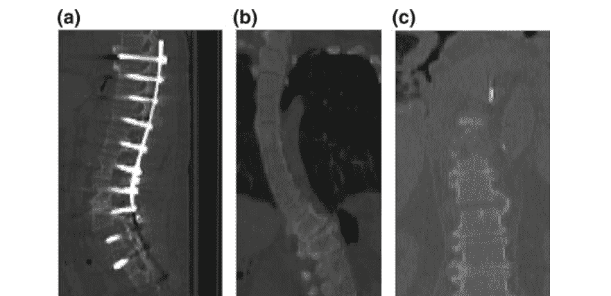

为了满足准确性和效率的要求，近十年来提出了许多方法。一般来说，它们可以分为两类：基于传统机器学习的方法和基于深度神经网络的方法。Schmidt等人[21]提出了一种将上下文形状信息融入概率图模型的脊柱检测的高效方法。通过训练数据库学习检测部分的特征，并通过多类分类器和图模型进行检测。他们的方法在MRI数据库上进行了评估，并展示了在图像中一些椎骨缺失的情况下的稳健检测。Glocker等人[8]提出了一种基于回归森林和概率图模型的算法。这种两阶段的方法在200个CT扫描上进行了定量评估，达到了81%的识别率。此外，Glocker等人[9]扩展了这种椎骨定位方法，以解决病理脊柱CT扫描中的挑战。他们的方法基于监督分类森林，并在一个具有挑战性的224个病理脊柱CT扫描数据库上进行了评估。它在病理情况下获得了小于9毫米的整体平均定位误差和70%的识别率，超过了当时病理情况下的最新技术水平。近年来，深度神经网络(DNN)在解决低级计算机视觉任务，如图像分类、场景分割和物体检测方面取得了巨大进展。DNN在医学成像中的地标检测研究中备受关注，并且与传统方法相比展示了出色的性能。

陈等人[4]提出了一个联合学习模型，使用卷积神经网络(J-CNN)来有效地定位和识别椎骨。这种方法由随机森林分类器、J-CNN和形状回归模型组成，在相同的具有挑战性的数据库[9]中，提高了鉴别率(85%)，并减小了定位误差。Suzani等人[25]提出了一种快速的自动椎骨检测和定位方法，使用深度学习。他们的方法首先从CT扫描中的体素提取基于强度的特征，然后在这些特征上应用深度神经网络来回归椎骨中心与参考体素之间的距离。与其他方法相比，它实现了更高的检测率和更快的推理速度，但平均误差较大[4, 9]。尽管大多数方法是在CT扫描上进行的，但Sun等人[24]提出了一种结构化支持向量回归方法，用于2D X射线图像中的脊柱角度估计和标记点检测。他们的方法对手工设计的特征有很强的依赖。

为了利用深度神经网络的优势并克服椎骨检测的限制，我们提出了一种有效和自动的方法，如图9.2所示，具有以下贡献。

**(a) 用于体素回归的深度图像到图像网络**
与需要从输入图像中提取手工特征的方法相比，所提出的深度图像到图像网络(DI2IN)直接在2D X射线图像或3D CT体积上进行，并生成与不同椎骨相关的多通道概率图。概率图本身明确表示了椎骨的位置和类型。此外，所提出的DI2IN不采用任何分类器来粗略地去除预处理中的异常值。通过以完全卷积的方式构建DI2IN，它在计算时间上具有显著的效率，这使其与滑动窗口方法有所区别。

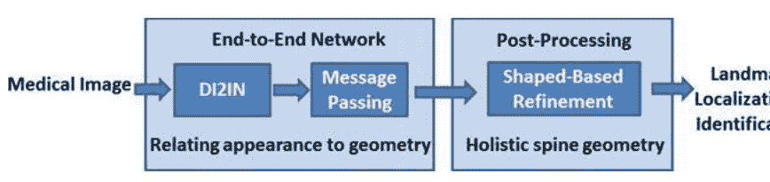

图9.2 所提出的方法由三个主要组件组成：深度图像到图像网络（DI2IN），消息传递和基于形状的优化

**(b) 通过消息传递进行响应增强**
虽然提出的DI2IN通常提供高置信度的概率图，但由于椎骨外观相似，有时会产生一些误报。脊柱的解剖结构为椎体中心提供了强大的几何先验。为了充分利用这种先验，我们引入了一种消息传递方案，可以在空间中传递邻域的信息。首先，基于椎骨结构的先验构建链式图。图连接直接定义了每个椎骨的邻域。其次，对于相邻的椎体中心，我们学习了概率图之间的卷积核。在推理过程中，从上一步得到的概率图还会与学习到的卷积核进一步卷积，以帮助改善邻居的概率图预测。消息通过邻居之间的卷积操作进行传递。经过几次迭代的消息传递后，概率图会收敛到稳定状态。椎骨的概率图得到了增强，同时对于缺失响应或误报响应等问题进行了很好的补偿。

**(c) 使用基于形状的字典进行联合细化**
给定椎骨的坐标，这些坐标是DI2IN和消息传递的输出，我们提出了一种使用字典学习和稀疏表示的联合细化方法。具体而言，我们首先在细化过程中构建了一个基于形状的字典，该字典嵌入了脊柱的整体结构。与学习形状回归模型[4]或隐马尔可夫模型[8]来拟合脊柱形状不同，基于形状的字典仅仅是由训练样本中的脊柱坐标构建而成。细化过程可以被表示为一个 $\ell$1范数优化问题，并通过预定义子空间中的稀疏编码方法来解决。这个优化目标是找到相对于字典的坐标的最佳稀疏表示。通过考虑脊柱形状的规律性，可以消除模糊的预测和误报响应。最后，所有方向上的坐标都进行联合细化，从而进一步提高性能。

在本章的先前版本中[30]，我们在一个大规模的CT数据库中验证了我们提出的方法。在本章版本中，我们扩展了我们的工作包括更多的分析、结果和实现细节。我们对几个典型的失败案例进行了深入研究，并提供了充分的解释。此外，我们还在另一个大规模数据库中验证了我们的方法，即2D胸部X射线扫描，由于其类似的成像外观，这也是具有挑战性的。实验结果表明，我们的方法在解剖标志点定位的任何通用应用中具有巨大的潜力。

本章的剩余部分安排如下：在第9.2节中，我们介绍了用于椎骨定位和识别的提出方法的详细信息，包括三个小节。在第9.3节中，我们对2D X射线和3D CT数据库上的提出方法进行了评估。我们的结果与其他最先进的工作进行了比较。第9.4节提出了结论。

## 9.2 方法论

### 9.2.1 用于脊柱重心定位的深度图像到图像网络（DI2IN）

在本节中，我们提出了一个深度图像到图像网络（DI2IN）模型，它是一个多层全卷积神经网络[1, 13]，用于定位脊柱重心。图9.3显示了在3D CT图像中使用的3D DI2IN的配置。

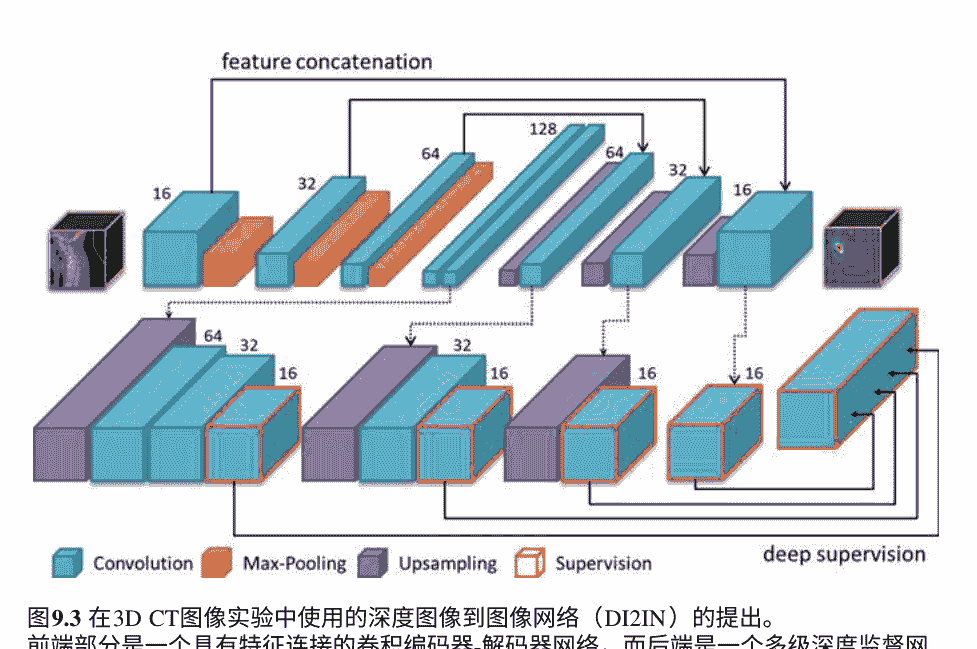

在X射线实验中使用的2D DI2IN具有类似的结构，只是所有层都是基于2D的。可以看出，DI2IN的部署是对称的，可以看作是一个卷积编码器-解码器模型。DI2IN遵循端到端的学习方式，这也保证了推理的效率。为了这个目的，多通道的真实数据是使用脊柱重心的坐标特别设计的。3D高斯分布

$$I_{\text{gt}} = \frac{1}{\sigma\sqrt{2\pi}} e^{-\|x-\mu\|^2/2\sigma^2}$$

在每个通道中，它是围绕椎骨位置定义的。向量 $x \in \mathbb{R}^3$ 表示体素坐标，向量 $\mu$ 是每个椎骨的真实位置。方差 $\sigma^2$ 是预定义的，它控制了高斯分布的大小。每个通道的预测 $I_{\text{prediction}}$ 对应于唯一的椎骨质心。它与输入图像具有相同的大小。因此，整个学习问题被转化为多通道体素回归问题。在训练过程中，我们使用每个体素输出层的平方损失

$$\|I_{\text{gt}} - I_{\text{prediction}}\|^2$$

来进行回归。我们将质心定位定义为回归任务而不是分类任务的原因是，在分类方法中，体素的标签不平衡是不可避免的，这可能导致误导性的分类准确性。

所提出网络的编码器部分使用了卷积、修正线性单元（ReLU）和最大池化层。池化层非常重要，因为它有助于增加神经元的感受野，同时减少了GPU内存的消耗。通过更大的感受野，不同层级中的每个神经元都能考虑到更丰富的上下文信息，从而更好地理解椎体重心的相对空间位置。解码器部分由卷积、ReLU和上采样层组成。上采样层采用双线性插值实现，以放大和密集化激活。它实现了逐像素的端到端训练方案。在图9.3中，最终输出层的卷积滤波器大小为$1 \times 1 \times 1$（2D图像为$1 \times 1$），其他卷积层的大小为$3 \times 3 \times 3$（2D图像为$3 \times 3$）。最大池化层的滤波器大小为$2 \times 2 \times 2$（2D图像为$2 \times 2$）。卷积层中的步幅数设置为1，以保持每个通道的大小不变。池化层中的步幅数设置为2，每个维度的特征图大小减小了两倍。

在卷积层旁边的数字表示每个层中的通道数，在图9.3中有说明。在上采样层中，输入特征图在所有方向上上采样两倍。网络以3D CT图像（体积）或2D X射线扫描作为输入，并直接输出与不同通道中的椎体中心相关的概率图。我们的框架计算概率图和重心位置，比[4, 25]中的分类或回归方法更高效。

我们的DI2IN采用了几种流行的技术。在DI2IN中，我们使用特征连接（跳跃连接），类似于参考文献[14, 18]。快捷桥直接从编码器层建立到解码器层。它将编码器的特征图转发给解码器的相应层，并将它们连接起来。连接的结果作为以下卷积层的输入。根据设计，高级和低级特征明确地结合在一起，以获得局部和全局信息的好处。

[11]. Weigel S, Heindel W, Heidrich J, Hense HW, Heidinger O (2017) 数字乳腺X线摄影筛查：程序性对乳房密度的依赖性。欧洲放射学杂志27(7): 2744-2751
[12]. Saslow D, Boetes C, Burke W, Harms S, Leach MO, Lehman CD, Morris E, Pisano E, Schnall M, Sener S等 (2007) 美国癌症协会关于乳腺MRI作为乳腺X线摄影的辅助筛查的指南。CA癌症杂志57(2): 75-89
[13]. Mainiero MB, Moy L, Baron P, Didwania AD, Green ED, Heller SL, Holbrook AI, Lee SJ, Lewin AA, Lourenco AP等 (2017) ACR适宜性标准®乳腺癌筛查。J Am Coll Radiol 14(11): S383–S390
[14]. Seely J, Alhassan T (2018) 2018年乳腺癌筛查——我们今天应该做什么？Curr Oncol 25(Suppl 1): S115
[15]. Grimm LJ, Anderson AL, Baker JA, Johnson KS, Walsh R, Yoon SC, Ghate SV (2015) 乳腺影像学家使用BI-RADS MRI词汇第五版的观察者间变异性。Am J Roentgenol 204(5): 1120–1124
[16]. Yamaguchi K, Schacht D, Newstead GM, Bradbury AR, Verp MS, Olopade OI, Abe H (2013) 在第二轮或随后的筛查MRI中检测到的乳腺癌：假阴性病例的MRI特征。Am J Roentgenol 201(5): 1155–1163
[17]. Vreemann S, Gubern-Merida A, Lardenoije S, Bult P, Karssemeijer N, Pinker K, Mann R (2018) 参与高风险MRI筛查计划的妇女中错过乳腺癌的频率。乳腺癌研究与治疗169(2): 323–331
[18]. Meeuwis C, van de Ven SM, Stapper G, Gallardo AMF, van den Bosch MA, Willem PTM, Veldhuis WB (2010) 乳腺MRI的计算机辅助检测（CAD）：在3.0 T下的效果评估。
[19]. Maicas G, Bradley AP, Nascimento JC, Reid I, Carneiro G (2018) 从乳腺DCE-MRI中预先和事后诊断和解释恶性肿瘤。arXiv:1809.09404
[20]. Vignati A, Giannini V, De Luca M, Morra L, Persano D, Carbonaro LA, Bertotto I, Martincich L, Regge D, Bert A等 (2011) 完全自动病变检测系统在乳腺DCE-MRI中的性能。
[21]. Gubern-Mérida A, Martí R, Melendez J, Hauth JL, Mann RM, Karssemeijer N, Platel B (2015) 自动定位动态对比增强磁共振成像中的乳腺癌。医学图像分析20(1): 265-274
[22]. McClymont D, Mehnert A, Trakic A, Kennedy D, Crozier S (2014) 使用均值漂移和图割在区域邻接图上进行全自动乳腺MRI病变分割。J Magn Reson Imaging 39(4): 795-804
[23]. Ren S, He K, Girshick R, Sun J (2015) Faster R-CNN: 实时目标检测与区域建议网络。见：神经信息处理系统进展，第91-99页
[24]. Liu W, Anguelov D, Erhan D, Szegedy C, Reed S, Fu CY, Berg AC (2016) SSD：单次拍摄多框检测器。见：欧洲计算机视觉会议，第21-37页。Springer
[25]. Redmon J, Divvala S, Girshick R, Farhadi A (2016) You only look once：统一的实时目标检测。见：IEEE计算机视觉和模式识别会议论文集，第779-788页
[26]. Ribli D, Horváth A, Unger Z, Pollner P, Csabai I (2018) 使用深度学习在乳腺X线照片中检测和分类病变。科学报告8(1): 4165
[27]. Mnih V, Kavukcuoglu K, Silver D, Rusu AA, Veness J, Bellemare MG, Graves A, Riedmiller M, Fidjeland AK, Ostrovski G等 (2015) 通过深度强化学习实现人类水平的控制。自然518(7540): 529
[28]. Renz DM, Böttcher J, Diekmann F, Poellinger A, Maurer MH, Pfeil A, Streitparth F, Collettini F, Bick U, Hamm B等 (2012) 通过全自动计算机辅助诊断系统检测和分类增强对比度的肿块。磁共振成像杂志35(5): 1077–1088
[29]. Amit G, Hadad O, Alpert S, Tlust T, Gur Y, Ben-Ari R, Hashoul S (2017) 结合无监督显著性分析和深度学习的乳腺MRI混合肿块检测。见：医学图像计算与计算辅助干预国际会议，第594-602页。Springer
[30]. Krizhevsky A, Sutskever I, Hinton GE (2012) 使用深度卷积神经网络的Imagenet分类。见：神经信息处理系统的进展，第1097-1105页
[31]. Maicas G, Carneiro G, Bradley AP (2017) 使用深度语义分割作为形状先验的DCE-MRI全局最优乳腺肿块分割。见：2017年IEEE第14届国际生物医学成像研讨会（ISBI 2017），第305-309页。IEEE
[32]. He K, Zhang X, Ren S, Sun J (2016) 深度残差学习用于图像识别。见：IEEE计算机视觉和模式识别会议论文集，第770-778页
[33]. Ronneberger O, Fischer P, Brox T (2015) U-net：用于生物医学图像分割的卷积网络。见：国际医学图像计算和计算机辅助干预会议论文集，第234-241页。Springer
[34]. Dalmis MU, Vreemann S, Kooi T, Mann RM, Karssemeijer N, Gubern-Mérida A (2018) 使用卷积神经网络在筛查MRI中完全自动检测乳腺癌。J Med Imaging 5(1): 014502
[35]. Caicedo JC, Lazebnik S (2015) 使用深度强化学习进行主动目标定位。见：IEEE国际计算机视觉会议论文集，第2488-2496页
[36]. Ghesu FC, Georgescu B, Mansi T, Neumann D, Hornegger J, Comaniciu D (2016) 用于医学图像中解剖标志检测的人工智能代理。见：国际医学图像计算和计算机辅助干预会议论文集，第229-237页。Springer
[37]. Mann RM, Kuhl CK, Moy L (2019) 乳腺癌筛查的增强MRI。J Magn Reson Imaging
[38]. van Zelst JC, Vreemann S, Witt HJ, Gubern-Merida A, Dorrius MD, Duvivier K, Lardenoije-Broker S, Lobbes MB, Loo C, Veldhuis W等 (2018) 超快速乳腺磁共振成像用于乳腺癌筛查的多读者研究对诊断准确性的评估。Investig Radiol 53(10): 579-586
[39]. Sutton RS, Barto AG (1998) 强化学习导论，第135卷。MIT出版社，剑桥
[40]. Hayton P, Brady M, Tarassenko L, Moore N (1997) 使用对比增强模型分析动态MR乳房图像。Med Image Anal 1(3): 207-224
[41]. Dhungel N, Carneiro G, Bradley AP (2015) 使用级联深度学习和随机森林进行乳腺X线照片中的自动肿块检测。见：2015年国际数字图像计算会议（DICTA），第1-8页。IEEE
[42]. Huang G, Sun Y, Liu Z, Sedra D, Weinberger KQ (2016) 具有随机深度的深度网络。见：计算机视觉欧洲会议，第646-661页。Springer
[43]. Kingma DP, Ba J (2014) Adam：一种用于随机优化的方法。arXiv: 1412.6980

网络。在[29]中，神经网络深度监控中的深度监督使得边界检测和分割结果优秀。在这项工作中，我们引入了一种更复杂的深度监督方法来提高性能。多个分支从主网络的中间层分离出来。

它们将每个输入特征图上采样到与图像相同的大小，然后经过几个卷积层来匹配地面真值数据的通道数。监督发生在每个分支的末尾 i，并共享相同的地面真值数据以计算损失项 l_i。最终输出由所有分支输出和解码器输出的连接的卷积确定。总损失 l_total是所有分支损失和最终输出损失的总和，如下所示的方程式：

$$ l_{\text{总计}} = \sum_{i} l_i + l_{\text{最终}} $$ (9.1)

### 9.2.2 通过消息传递增强概率图

给定输入图像 I，DI2IN通常会生成一个概率图 P (v_i|I)，表示椎骨_i的质心坐标 v_i的高置信度。概率最高的位置将被标记为 v_i的预测值。然而，DI2IN生成的概率图并不总是完美的，可能导致椎骨位置预测错误。在最坏的情况下，由于这些椎骨的成像外观非常相似，对于一些椎骨在相应的概率图中没有明确的响应。为了解决缺失响应的问题并减少误报响应，我们提出了一种利用椎骨的空间关系来增强DI2IN生成的概率图的消息传递方案（图9.4）。

消息传递算法的概念，也被称为信念传播，在图模型中已经提出了几十年[27]。它用于计算每个未观察节点的边际分布（和积算法）或推断联合分布的模式（最大积算法）。该算法在计算机视觉领域的许多应用中已经盛行[1, 2, 15, 19]。关键思想是在多次迭代中在相邻节点之间传递互信息，直到收敛，并使模型达到全局优化。类似地，我们基于脊柱的几何形状引入了一个链式结构的图。每个节点 i表示一个椎体质心，并且最多有两个相邻节点（椎骨）。

我们提出以下公式来更新消息传递的第 t次迭代时的概率图 P (v_i|I)。

$$ P_{t+1}(v_i|I) = \frac{ \alpha \cdot \frac{ \sum_{j \in \partial i} m_{j \to i} }{ |\partial i| } + P_t(v_i|I) }{Z} $$ (9.2)
$$ = \frac{ \alpha \cdot \frac{ \sum_{j \in \partial i} P_t(v_j|I) * k(v_i|v_j) }{ |\partial i| } + P_t(v_i|I) }{Z} , $$ (9.3)

其中 $\partial i$ 表示图中节点 $i$ 的邻居，也对应于相邻的椎骨。$\alpha$ 是一个常数，用于调整传递消息和先前概率图之间的加权和。 $Z$ 是用于归一化的另一个常数。消息 $m_{j \rightarrow i}$ 从节点 $j$ 传递到其相邻节点 $i$，定义为 $P_t(v_j|I) * k(v_i|v_j)$。$*$ 表示卷积操作，卷积核 $k(v_i|v_j)$ 是从真实高斯分布中学习到的。对 $i$ 和 $j$ 使用卷积核进行卷积，实际上将概率图 $P(v_i|I)$ 向 $v_i|I$ 移动。如果DI2IN在椎骨i的正确位置提供了自信的响应，那么在与学习到的卷积核进行卷积后，它的信息在椎骨j的真实位置周围也会很强。来自所有邻居的信息被聚合以增强响应。经过几次迭代的信息传递后，概率图将收敛到稳定状态，并弥补了缺失响应的问题。椎骨的位置是在增强概率图的峰值位置确定的。信息传递的基本假设是DI2IN已经对大多数椎骨给出了正确和自信的预测，这在实验中已经得到证明。

该方案的另一个优点是，当迭代次数固定时，它可以与DI2IN一起进行端到端训练（或微调），以实现更好的优化。

最近的几项研究在不同的地标检测应用中应用了类似的消息传递方案。 Chu等人[5]介绍了一种类似的消息传递方法用于人体姿势估计（或身体关节检测）。然而，由于其隐式传递方法是在不同地标的特征图之间进行的，因此其有效性可能不太清楚。我们的消息传递直接应用于椎骨的概率图之间。这更直观，有助于了解内核的工作原理并证明消息的质量。杨等人[31]还提出了一种类似的消息传递方法用于人体姿势估计。他们使用手工制作的特征来描述地标的空间关系，通常在泛化方面有限制。我们的方法使用可学习的内核来描述椎骨的几何关系。卷积核使椎骨之间能够进行成对通信。Payer等人[16]提出了一种一次性消息传递方法用于解剖标志点检测。他们的传递方案使用点积进行消息聚合，主要用于异常值去除。但在我们的框架中，缺失的响应是主要问题，而不是嘈杂的概率图，因此点积对于我们的传递方案不适用。

### 9.2.3 使用基于形状的字典进行联合细化

给定由DI2IN和消息传递增强生成的概率图，可能仍会生成一些异常值或假阳性。例如，即使DI2IN后跟消息传递增强输出了相当清晰和合理的概率图，仍然存在假阳性，如图9.5所示。这可能是由于低分辨率扫描、图像伪影或缺乏全局上下文信息引起的。

为了克服这些限制，许多研究中引入了定位细化[4, 8]。在[8]中，使用隐藏状态的隐马尔可夫模型（HMM）定义了椎骨位置、外观可能性和椎骨间形状先验，这可以基于来自森林预测的数千个候选位置得出一个精细的定位。在[4]中，提出了一个二次多项式曲线来优化垂直轴上的坐标。通过优化能量函数，学习了形状回归模型的参数来优化椎骨的坐标。然而，该模型假设脊柱的形状可以用二次形式表示。此外，只有垂直轴（从头到脚的方向）上的坐标得到了优化。

受到字典学习和稀疏表示的启发[20, 28]，我们设计了一个基于形状字典的联合优化。为了说明目的，在本节中我们使用了3D表示，该表示在3D CT实验中使用。给定一个预定义的基于形状的字典，坐标在所有的x、y和z轴上联合优化。优化本身可以被表述为一个 ℓ1-范数优化，并通过稀疏编码方法求解。具体来说，给定基于形状的字典 D ∈ ℝ^{M×N}和坐标预测 v ∈ ℝ^N，我们提出了一个联合优化算法，如算法1所示，来求解稀疏系数向量 a ∈ ℝ^M。然后，优化后的坐标向量被定义为 v̂ = Da。具体而言，基于形状的字典 D是通过训练样本中椎骨的坐标构建的。例如，符号 D_z表示与垂直轴或z方向相关的基于形状的字典。d_{z,si} ∈ ℝ^M，它是 D_z的一列，被定义为[z_{i,1}, z_{i,2}, ..., z_{i,26}]^T。例如，z_{i,1}表示第i个样本对应于椎骨 C_1的垂直真值坐标。D_x和 D_y分别表示与x和y方向相关的字典。它们的构建方式与 D_z相同。类似地，v_z被定义为[v_{z,1}, v_{z,2}, ..., v_{z,26}]，是垂直坐标的预测。v_x和 v_y的定义方式相同。

为了解决脊柱扫描中的异常值和有限视野等挑战，我们在提出的改进方法中定义了原始空间 φ₀和子空间 φ₁。原始空间表示一个包含26个椎骨索引的集合。在我们的情况下，φ₀包含了从1到26的索引，对应于椎骨 C1到S2。与原始空间 φ₀相比，子空间 φ₁表示仅包含 φ₀的部分索引的子集。基于子空间 φ₁，我们定义子字典 D_{φ₁} 和子坐标向量 v_{φ₁} 。直观地， D_{z,φ₁} 表示与轴 z相关联的子字典，也简单地是 D_{z,φ₀} 的子矩阵。基本上，优化问题是基于子空间 φ₁而不是原始空间 φ₀来解决的。

详细信息在算法1中展示。考虑到形状的规则性，我们首先通过动态规划在坐标预测 v_z中找到最大的降序子序列。我们选择垂直轴 z来确定最大子序列，而不是 v_x和 v_y的原因是人类脊柱的垂直轴与x轴和y轴相比自然地展示出最稳健的几何形状。基于步骤1生成的子空间 φ₁，我们进一步删除距离过大或过小的相邻椎骨的索引。给定子空间 φ₁，我们分别为每个轴定义子字典和子坐标向量。然后，根据相同的子空间 φ₁，分别针对x、y和z优化步骤5中的 ℓ1范数问题。最后，所有坐标都基于原始字典 D_{x,φ₀}，D_{y,φ₀} 和 D_{z,φ₀} 进行重新优化。直观地说，我们从初步预测中去除模糊的异常值，然后联合优化坐标，不包括这些异常值。基于子空间，我们在形状字典中优化问题，以找到最佳的稀疏组合。通过利用原始的基于形状的字典，所有坐标都得到了联合优化，如图9.6所示。

### 算法1 使用基于形状的字典进行联合优化

**要求**：字典 D_{x,φ₀}，D_{y,φ₀}，和 D_{z,φ₀} ∈ ℝ^{M×N}，预测的坐标向量 v_x，v_y 和 v_z，误差阈值 ε₁ 和 ε₂，以及系数 λ。M 和 N 分别表示地标点的数量和字典中的项目大小。
1.  根据DI2IN和消息传递预测的坐标 v_z，通过动态规划找到最大下降子序列。
2.  将与最大下降子序列相关的索引添加到集合 φ₁ 中。
3.  如果 |v_{z,i} - v_{z,j}| ≤ ε₁ 或 |v_{z,i} - v_{z,j}| ≥ ε₂，其中 i, j ∈ φ₁ 且 |i - j| = 1，则删除相邻索引对 {i, j}。
4.  基于子空间 φ₁，定义子字典 D_{x,φ₁}，D_{y,φ₁}，和 D_{z,φ₁} 和子坐标预测 v_{x,φ₁}、v_{y,φ₁} 和 v_{z,φ₁}。
5.  通过 ℓ₁ 范数恢复解决以下优化问题，用于垂直轴 z：
    $$ \min_{a_z} \frac{1}{2} ||v_{z,\phi_1} - D_{z,\phi_1}a_z||_2^2 + \lambda ||a_z||_1 $$
6.  对于 v_{x,φ₀} 和 v_{y,φ₀}，解决步骤5中的相同优化问题，分别。
7.  返回经过改进的坐标向量 v̂_x = D_{x,φ₀}a_x，v̂_y = D_{y,φ₀}a_y 和 v̂_z = D_{z,φ₀}a_z。

## 9.3 实验

在本节中，我们评估了所提方法在两个不同且较大的数据库上的性能。第一个数据库在[9]中介绍，包含了302个以脊柱为焦点的3D CT扫描，具有不同的病理。这些异常外观包括异常曲率、骨折以及手术后病例中的明亮视觉伪影，如手术植入物。此外，每个3D CT扫描的FOV在垂直裁剪方面差异很大。只有少数样本中可以看到整个脊柱。通常，大多数3D CT扫描包含5-15个椎骨。特别地，为了提升我们方法的性能并验证DNN对更多训练数据的偏好，我们在实验中额外引入了1000+3D CT扫描。第二个数据库包含了在[6, 10, 23]中描述的1000+2D X射线扫描。每个数据库的真值标记在每个椎骨的中心位置。每个真值的位置和标签由临床专家手动注释。需要注意的是，训练样本和测试样本之间没有重叠。

对于3D CT扫描，之前的研究采用了两种不同的设置[4, 9, 25]。第一种设置使用了112个扫描作为训练样本，另外112个扫描作为测试样本[9, 25]。第二种设置使用了总共242个扫描作为训练样本，另外60个扫描作为测试样本[4, 9]。为了与其他最先进的研究[4, 9, 25]进行公平比较，我们采用了相同的训练和测试配置，分别在表9.1和表9.2中标记为Set 1和Set 2。对于2D X射线扫描，我们采用了1170张图像作为训练样本，50张图像作为测试样本。

表9.1和表9.2总结了定位平均误差、识别率（由[8]定义）以及其他指标在Set 1和Set 2上的定量结果。我们将我们的方法与[4, 9, 25]中报告的其他结果在3D CT扫描上进行比较。具体来说，“DI2IN”、“MP”和“S”分别表示深度图像到图像网络、消息传递和基于形状的细化。“1000”表示该模型使用额外的1000个扫描进行训练，并在相同的测试样本上进行评估。为了展示性能的改进，我们列出了每个步骤后的结果进行比较。

总体而言，我们的方法在相同的评估设置下比[4, 9]的最新方法分别提高了13%和6%。对于Set 1，与[9]中的方法相比，DI2IN本身将识别率提高了6%。消息传递和基于形状的细化进一步将识别率提高到77%和80%。此外，我们已经证明额外的1000个样本将性能提升到83%。同样，与[4, 9, 25]相比，所提出的方法在Set 2中也表现出更好的性能。我们的方法在识别率方面达到了85%，定位平均误差为8.6毫米，这比最先进的工作[4]更好。利用额外的1000个样本，识别率达到了90%。此外，其他指标如标准差（Std）、中位数（Med）和最大值（Max）也直观地展示了我们方法的效率。例如，两组中的最大误差显著减小到42.3和37.9毫米。图9.6直观地说明了所提出的基于形状的垂直方向细化的改进。

### 表9.1 不同方法在Set 1中的定位误差（毫米）和识别率的比较

| 区域     | 方法               | 平均值 | 标准差 | 识别率(%) | 中位数(Med) | 最大   |
| :------- | :----------------- | :----- | :----- | :-------- | :---------- | :----- |
| 全部     | Glocker等人[9]     | 12.4   | 11.2   | 70        | 8.8         | -      |
| 全部     | Suzani等人[25]     | 18.2   | 11.4   | -         | -           | -      |
| 全部     | Chen等人[4]        | -      | -      | -         | -           | -      |
| 全部     | DI2IN              | 13.5   | 32.0   | 76        | 6.7         | 396.9  |
| 全部     | DI2IN+MP           | 11.7   | 19.7   | 77        | 6.8         | 396.9  |
| 全部     | DI2IN+MP+S         | 9.1    | 7.0    | 80        | 7.1         | **42.3** |
| 全部     | DI2IN+1000         | 10.6   | 21.5   | 80        | **5.5**     | 430.4  |
| 全部     | DI2IN+MP+1000      | 9.4    | 16.2   | 82        | 6.0         | 430.4  |
| 全部     | DI2IN+MP+S+1000    | **8.5**| **7.7**| **83**    | 6.2         | 59.6   |
| 颈椎     | Glocker等人[9]     | 7.0    | 4.7    | 80        | -           | -      |
| 颈椎     | Suzani等人[25]     | 17.1   | 8.7    | -         | -           | -      |
| 颈椎     | Chen等人[4]        | -      | -      | -         | -           | -      |
| 颈椎     | DI2IN+MP+S         | 6.6    | 3.9    | 83        | -           | -      |
| 颈椎     | DI2IN+MP+S+1000    | **5.8**| **3.9**| **88**    | -           | -      |
| 胸椎     | Glocker等人[9]     | 13.8   | 11.8   | 62        | -           | -      |
| 胸椎     | Suzani等人[25]     | 17.2   | 11.8   | -         | -           | -      |
| 胸椎     | Chen等人[4]        | -      | -      | -         | -           | -      |
| 胸椎     | DI2IN+MP+S         | 9.9    | 7.5    | 74        | -           | -      |
| 胸椎     | DI2IN+MP+S+1000    | **9.5**| **8.5**| **78**    | -           | -      |
| 腰椎     | Glocker等人[9]     | 14.3   | 12.3   | 75        | -           | -      |
| 腰椎     | Suzani等人[25]     | 20.3   | 12.2   | -         | -           | -      |
| 腰椎     | Chen等人[4]        | -      | -      | -         | -           | -      |
| 腰椎     | DI2IN+MP+S         | 10.9   | 9.1    | 80        | -           | -      |
| 腰椎     | DI2IN+MP+S+1000    | **9.9**| **9.1**| **84**    | -           | -      |

如图9.6所示，基于形状的细化考虑了脊柱的形状规律，并去除了错误的正坐标。具体来说，最大误差显著减小。

此外，为了展示我们方法的鲁棒性，我们将实验扩展到了一个用于训练和评估的2D X射线数据库中。对于2D X射线扫描，数据库[6, 10, 23]被随机分为两部分：1170个扫描用于训练样本，50个扫描用于测试样本。据我们所知，这是第一次在2D X射线扫描中评估这种方法用于人类椎骨定位和识别任务。我们使用两种不同分辨率的输入图像进行实验：0.70和0.35毫米。它们都是从原始数据库重新采样得到的。由于输入和输出数据大小增加了四倍，与0.35毫米实验中使用的DI2IN相比，卷积层中的滤波器数量较少。在0.70毫米实验中，网络以及训练中的较小批量大小。

### 表9.2 不同方法在Set 2中的定位误差（毫米）和识别率的比较

| 区域     | 方法               | 平均值 | 标准差 | 识别率(%) | 中位数(Med) | 最大   |
| :------- | :----------------- | :----- | :----- | :-------- | :---------- | :----- |
| 全部     | Glocker等人[9]     | 13.2   | 17.8   | 74        | -           | -      |
| 全部     | Suzani等人[25]     | -      | -      | -         | -           | -      |
| 全部     | Chen等人[4]        | 8.8    | 13.0   | 84        | -           | -      |
| 全部     | DI2IN              | 13.6   | 37.5   | 76        | 5.9         | 410.6  |
| 全部     | DI2IN+MP           | 10.2   | 13.9   | 78        | 5.7         | 153.1  |
| 全部     | DI2IN+MP+S         | 8.6    | 7.8    | 85        | 5.2         | 75.1   |
| 全部     | DI2IN+1000         | 7.1    | 11.8   | 87        | 4.3         | 235.9  |
| 全部     | DI2IN+MP+1000      | 6.9    | 8.3    | 89        | 4.6         | 108.7  |
| 全部     | DI2IN+MP+S+1000    | 6.4    | 5.9    | 90        | 4.5         | 37.9   |
| 颈椎     | Glocker等人[9]     | 6.8    | 10.0   | 89        | -           | -      |
| 颈椎     | Suzani等人[25]     | -      | -      | -         | -           | -      |
| 颈椎     | Chen等人[4]        | 5.1    | 8.2    | 92        | -           | -      |
| 颈椎     | DI2IN+MP+S         | 5.6    | 4.0    | 92        | -           | -      |
| 颈椎     | DI2IN+MP+S+1000    | 5.2    | 4.4    | 93        | -           | -      |
| 胸椎     | Glocker等人[9]     | 17.4   | 22.3   | 62        | -           | -      |
| 胸椎     | Suzani等人[25]     | -      | -      | -         | -           | -      |
| 胸椎     | Chen等人[4]        | 11.4   | 16.5   | 76        | -           | -      |
| 胸椎     | DI2IN+MP+S         | 9.2    | 7.9    | 81        | -           | -      |
| 胸椎     | DI2IN+MP+S+1000    | 6.7    | 6.2    | 88        | -           | -      |
| 腰椎     | Glocker等人[9]     | 13.0   | 12.5   | 80        | -           | -      |
| 腰椎     | Suzani等人[25]     | -      | -      | -         | -           | -      |
| 腰椎     | Chen等人[4]        | 8.4    | 8.6    | 88        | -           | -      |
| 腰椎     | DI2IN+MP+S         | 11.0   | 10.8   | 83        | -           | -      |
| 腰椎     | DI2IN+MP+S+1000    | 7.1    | 7.3    | 90        | -           | -      |

表格9.3和9.4展示了我们方法在0.70毫米和0.35毫米分辨率的输入图像上的定位误差和识别率的性能。由于X射线扫描中的大多数椎骨属于胸部区域（T1 - T12），我们只展示整体结果，而不是展示各个区域的结果。具体来说，DI2IN本身在0.70毫米和0.35毫米分辨率上的定位误差分别为8.4毫米和7.8毫米，识别率分别为80%和82%。我们还引入了消息传递方案和基于形状的细化来评估性能。与DI2IN本身相比，性能质量进一步提高。引入消息传递和基于形状的细化后，识别率也得到了极大的提高。总体而言，通过消息传递和细化，识别率显著提高。

### 表9.3 不同方法在2D X射线扫描（0.70毫米分辨率）上的定位误差和识别率比较

| 方法           | 平均值 (mm) | 标准差 (mm) | 识别率 (%) |
| :------------- | :---------- | :---------- | :--------- |
| DI2IN          | 8.4         | 6.2         | 80         |
| DI2IN+MP       | 7.6         | 5.1         | 83         |
| DI2IN+MP+S     | 6.2         | 3.9         | 89         |

### 表9.4 不同方法在2D X射线扫描（0.35毫米分辨率）上的定位误差和识别率比较

| 方法           | 平均值 (mm) | 标准差 (mm) | 识别率 (%) |
| :------------- | :---------- | :---------- | :--------- |
| DI2IN          | 7.8         | 5.8         | 82         |
| DI2IN+MP       | 7.0         | 4.7         | 85         |
| DI2IN+MP+S     | 5.7         | 3.6         | 91         |

## 表9.3 比较不同方法在 mm中的定位误差和识别率

| 区域 | 方法 | 平均值 | 标准差 | 识别率 (%) | 标准误 | 最大 |
|------|------|--------|--------|-----------|--------|------|
| 全部 | DI2IN | 8.4 | 14.7 | 80 | 3.7 | 283.4 |
|      | DI2IN+MP | 7.7 | 9.6 | 82 | 3.7 | 45.9 |
|      | DI2IN+MP+S | 7.1 | 9.2 | 88 | 4.2 | 44.2 |

## 表9.4 比较不同方法在 mm中的定位误差和识别率

| 区域 | 方法 | 平均值 | 标准差 | 识别率 (%) | 标准误 | 最大 |
|------|------|--------|--------|-----------|--------|------|
| 全部 | DI2IN | 7.8 | 12.1 | 82 | 3.1 | 114.0 |
|      | DI2IN+MP | 7.4 | 9.8 | 84 | 3.6 | 57.9 |
|      | DI2IN+MP+S | 6.4 | 7.8 | 91 | 3.0 | 46.2 |

最终达到了91%的更高分辨率设置。我们的实验表明，所提出的方法能够在更高分辨率的数据库上取得更好的性能。在更多的内存分配和模型容量的情况下，我们的方法可以进一步提高地标检测的质量。

尽管我们的方法在3D CT扫描和2D X射线扫描中取得了高的识别率，但仍然存在一些具有挑战性的病例。如图9.7所示，所提出的方法有时无法对共同偏移的坐标进行精细调整。这个限制可能来自于特殊的病理情况、有限的视野和低分辨率的输入图像。在我们的方法中，基本假设是大多数椎骨概率图在真实位置周围是自信且分布良好的，这是由强大的DI2IN保证的。为了解决这个限制，将进一步研究更复杂的网络。从图9.8可以看出，胸部区域的椎骨相对较难定位，因为这些椎骨具有类似的成像外观。

所有实验都在配备有Intel 3.5 GHz CPU和12 GB NVIDIA Titan X GPU的高性能集群上进行。为了减轻内存压力，对3D CT扫描和X射线扫描的实验分别以4 mm、0.7 mm和0.35 mm的分辨率进行。消息传递中卷积核的大小为23 × 23 × 23（用于3D体积）和49 × 49（用于2D图像）。

我们的方法的评估时间平均为每个3D CT案例约三秒，使用GPU进行计算。为了从噪声概率图中提取有效信息，DI2IN的响应图与启发式阈值进行逐元素比较。只有具有强响应的通道被视为有效输出。然后与这些通道相关的椎体质心被识别为存在于图像中。与其他概率图相关的椎体被识别为不存在于图像中。因此，我们能够以高效的方式同时定位和识别所有椎体。

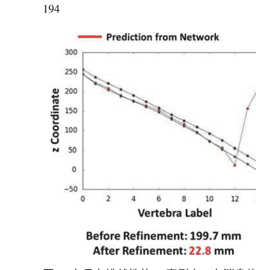

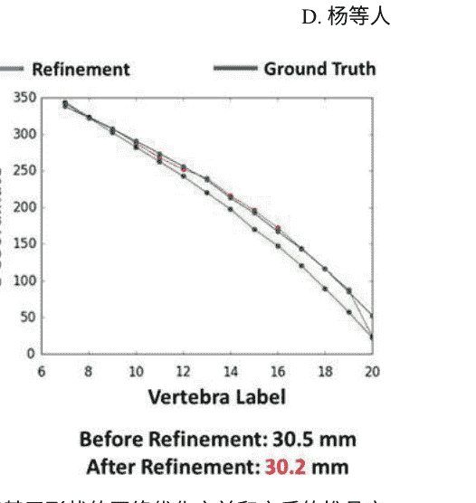

图9.7 在具有挑战性的CT案例中，在消息传递和基于形状的网络优化之前和之后的椎骨定位的最大误差

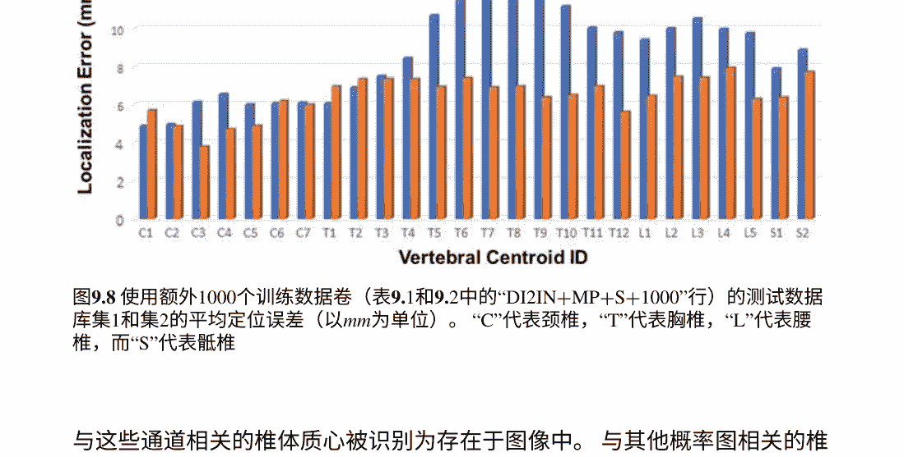

图9.8 使用额外1000个训练数据卷（表9.1和9.2中的“DI2IN+MP+S+1000”行）的测试数据库集1和集2的平均定位误差（以mm为单位）。“C”代表颈椎，“T”代表胸椎，“L”代表腰椎，而“S”代表骶椎

## 9.4 结论

我们提出并验证了一种用于医学图像中椎体标记的新方法。在3D CT体积和2D X射线图像的实验结果表明，所提出的方法与最先进的方法相比，是有效和高效的。此外，在3D CT实验中额外的1000+训练数据明显提升了所提出的DI2IN的性能，进一步证明了深度神经网络对大型数据库的重要性。

致谢我们感谢David Liu博士、Kevin Zhou博士和Mingqing Chen博士提供的见解和专业知识，对本研究有很大帮助。我们感谢华盛顿大学放射学系提供的数据。

## 参考文献

- 1. Badrinarayanan V, Kendall A, Cipolla R (2015) SegNet: 一种用于图像分割的深度卷积编码器-解码器架构。arXiv:1511.00561
- 2. Benameur S, Mignotte M, Parent S, Labelle H, Skalli W, de Guise J (2003) 使用统计模型进行脊柱侧弯椎骨的3D/2D配准和分割。计算机医学成像图形27(5):321–337
- 3. Boisvert J, Cheriet F, Pennec X, Labelle H, Ayache N (2008) 使用关节形状模型的统计数据研究脊柱变形的几何变异性。IEEE Trans Med Imaging 27(4):557–568
- 4. Chen H, Shen C, Qin J, Ni D, Shi L, Cheng JC, Heng PA (2015) 通过深度神经网络的融合学习模型自动定位和识别脊柱CT中的椎骨。在：医学图像计算与计算辅助干预国际会议，第515-522页。Springer国际出版社
- 5. Chu X, Ouyang W, Li H, Wang X (2016) 结构化特征学习用于姿态估计。在：IEEE计算机视觉与模式识别会议论文集，第4715-4723页。
- 6. Demner-Fushman D, Kohli MD, Rosenman MB, Shooshan SE, Rodriguez L, Antani S, Thoma GR, McDonald CJ (2015) 准备一组放射学检查以进行分发和检索。美国医学信息学协会杂志23(2):304–310
- 7. Genant HK, Wu CY, van Kuijk C, Nevitt MC (1993) 使用半定量技术进行椎体骨折评估。J Bone Miner Res 8(9):1137–1148
- 8. Glocker B, Feulner J, Criminisi A, Haynor D, Konukoglu E (2012) 任意视野CT扫描中椎骨的自动定位和识别。在：医学图像计算和计算机辅助干预-MICCAI，pp 590–598
- 9. Glocker B, Zikic D, Konukoglu E, Haynor DR, Criminisi A (2013) 通过稀疏注释进行病理脊柱CT中的椎体定位。在：国际医学图像计算和计算机辅助干预会议，pp 262–270。Springer
- 10. Jaeger S, Candemir S, Antani S, Wáng YXJ, Lu PX, Thoma G (2014) 用于计算机辅助肺部疾病筛查的两个公共胸部X射线数据集。Quant Imaging Med Surg 4(6):475–477
- 11. Klinder T, Ostermann J, Ehm M, Franz A, Kneser R, Lorenz C (2009) CT图像中的自动基于模型的椎骨检测、识别和分割。Med Image Anal 13(3):471–482
- 12. Komodakis N, Paragios N, Tziritas G (2007) 通过双重分解进行MRF优化：消息传递的再次研究。在：2007年IEEE第11届国际计算机视觉会议(ICCV 2007)，第1-8页。IEEE
- 13. Long J, Shelhamer E, Darrell T (2015) 全卷积网络用于语义分割。在：IEEE计算机视觉与模式识别会议论文集, pp 3431–3440
- 14. Milletari F, Navab N, Ahmadi SA (2016) V-Net: 用于体积医学图像分割的全卷积神经网络。在：2016年第四届三维视觉国际会议(3DV)，第565-571页。IEEE
- 15. Nowozin S, Lampert CH 等 (2011) 计算机视觉中的结构化学习和预测。计算机图形学和视觉中的基础和趋势® 6(3-4):185-365
- 16. Payer C, Stern D, Bischof H, Urschler M (2016) 使用CNN回归热图进行多个地标定位。在：MICCAI 2，第230-238页
- 17. Roberts M, Cootes T, Adams J (2005) 脊椎形状：动态顺序主动外观模型的自动测量。在：医学图像计算和计算机辅助干预-MICCAI 2005，第733-740页
- 18. Ronneberger O, Fischer P, Brox T (2015) U-Net: 用于生物医学图像分割的卷积网络。在：国际医学图像计算和计算机辅助干预会议，第234-241页。Springer
- 19. Ross S, Munoz D, Hebert M, Bagnell JA (2011) 学习结构化预测的消息传递推理机器。在：2011年IEEE计算机视觉和模式识别会议（CVPR），第2737-2744页。IEEE
- 20. Rubinstein R, Bruckstein AM, Elad M (2010) 用于稀疏表示建模的字典。Proc IEEE 98(6):1045–1057
- 21. Schmidt S, Kappes J, Bergtholdt M, Pekar V, Dries S, Bystrov D, Schnörr C (2007) 使用基于部件的图模型进行脊柱检测和标记。在: 医学成像中的信息处理, 第122–133页。Springer
- 22. Schwarzenbach O, Berlemann U, Jost B, Visarius H, Arm E, Langlotz F, Nolte LP, Ozdoba C (1997) 计算机辅助椎弓根螺钉定位的准确性：体内计算机断层扫描分析。Spine 22(4):452–458
- 23. Shiraishi J, Katsuragawa S, Ikezoe J, Matsumoto T, Kobayashi T, Komatsu KI, Matsui M, Fujita H, Kodera Y, Doi K (2000) 用于胸部X射线图像的数字图像数据库的开发，包括有没有肺结节的情况：放射科医生检测肺结节的接受者操作特性分析。Am J Roentgenol 174(1):71–74
- 24. Sun H, Zhen X, Bailey C, Rasoulinejad P, Yin Y, Li S (2017) 结构化多输出回归直接估计脊柱Cobb角度。在：国际医学成像信息处理会议，第529-540页。Springer
- 25. Suzani A, Seitel A, Liu Y, Fels S, Rohling RN, Abolmaesumi P (2015) 病理CT扫描中快速自动椎骨检测和定位的深度学习方法。在：国际医学图像计算与计算机辅助干预会议，第678-686页。Springer
- 26. Tomazevic D, Likar B, Slivnik T, Pernus F (2003) CT和MR对X射线图像的3D/2D配准。IEEE Trans Med Imaging 22(11):1407–1416
- 27. Wainwright MJ, Jordan MI 等 (2008) 图形模型、指数族和变分推断。机器学习基础与趋势® 1(1-2):1–305
- 28. Wright J, Ma Y, Mairal J, Sapiro G, Huang TS, Yan S (2010) 稀疏表示在计算机视觉和模式识别中的应用。Proc IEEE 98(6):1031–1044
- 29. Xie S, Tu Z (2015) 全局嵌套边缘检测。In: Proceedings of the IEEE international conference on computer vision, pp 1395–1403
- 30. Yang D, Xiong T, Xu D, Huang Q, Liu D, Zhou SK, Xu Z, Park J, Chen M, Tran TD 等 (2017) 使用深度图像到图像网络的消息传递和稀疏正则化进行大规模3D CT自动椎体标记。In: International conference on information processing in medical imaging, pp 633–644。Springer
- 31. Yang W, Ouyang W, Li H, Wang X (2016) 用于人体姿势估计的可变形部件混合和深度卷积神经网络的端到端学习。In: Proceedings of the IEEE conference on computer vision and pattern recognition, pp 3073–3082
- 32. Yao J, Burns JE, Forsberg D, Seitel A, Rasoulian A, Abolmaesumi P, Hammernik K, Urschler M, Ibragimov B, Korez R 等 (2016) 临床椎体CT分割的多中心里程碑研究。Comput Med Imaging Graph 49:16–28

## 第10章 用于三维医学图像中的异性混合网络跨维度可转移特征学习

刘思琪，徐大光，周思凯，Sasa Grbic，蔡卫东和Dorin Comaniciu

摘要 尽管深度卷积神经网络（CNN）已成功应用于2D图像分析，但将其应用于3D异性体积仍然具有挑战性，特别是当切片内分辨率远高于切片间分辨率且3D体积的数量相对较小时。一方面，直接学习具有3D卷积核的CNN缺乏数据，并且可能导致泛化能力差；GPU内存不足限制了模型的大小或表示能力。另一方面，将具有可泛化特征的2D CNN应用于2D切片会忽略切片间的信息。将2D网络与LSTM相结合以进一步处理切片间的信息并不理想，因为LSTM学习困难。为了克服上述挑战，3D异性混合网络（AH-Net）将从2D图像中学习到的卷积特征转移到3D异性体积中。这种转移继承了对切片内信息的强大泛化能力，同时自然地利用了切片间的信息进行更有效的建模。我们展示了3D AH-Net在两个示例医学图像分析应用中的有效性，即从数字乳腺断层摄影体积中检测病变，以及从计算机断层扫描体积中分割肝脏和肝肿瘤。

## 10.1 引言

三维体积图像（或体积）广泛用于临床诊断、手术规划和生物医学研究。这种体积图像提供的三维上下文信息对于可视化和分析感兴趣的对象非常重要。然而，由于增加了维度，机器对于解释3D体积比2D图像更耗时且有时更困难。许多先前的研究使用卷积神经网络（CNN）来提取人体或动物组织中结构模式的表示。

由于特殊的成像设置，许多成像模式具有各向异性体素，即三个维度的分辨率不相等。例如，在数字乳腺断层摄影（DBT）和有时计算机断层扫描（CT）的3D体积中，图像在x y平面/切片（或切片内分辨率）上的分辨率比z分辨率（或切片间分辨率）高出十倍以上。因此，x y切片保留了比z维度更多的信息。在DBT图像中，只能保证x y平面内的空间信息。然而，即使存在轻微错位，x y切片之间的3D上下文仍然携带有意义的信息进行分析（图10.1）。直接将3D CNN应用于这样的图像仍然是一个具有挑战性的任务，原因如下：（1）对于各向异性体素，一个小的3 × 3 × 3的卷积核可能很难学习到有用的特征，因为每个维度上的信息密度不同。（2）从理论上讲，与2D网络相比，3D网络需要更多的特征。3D网络的能力受限于GPU内存，限制了网络的宽度和深度。（3）与现在可以利用预训练的骨干网络的2D计算机视觉任务不同，使用数百万个2D图像[21]，3D任务大多需要从头开始训练，因此受到缺乏大规模3D数据集的困扰。此外，高数据变化使得3D网络更难训练。此外，在相对较小的图像数据集上训练的3D CNN很难推广到未见过的数据。

除了使用1×1×1和3×3×3核构建的传统3D网络外，还有其他方法可以从各向异性体素中学习表示。一些研究使用2D网络单独处理2D切片[14]。为了更好地利用3D上下文，多个图像切片被用作2D网络的输入[12, 24]。通过将完全卷积网络（FCN）架构与卷积LSTM相结合，可以按顺序查看2D切片，将相邻图像切片视为时间序列，从抽象的2D上下文序列中提取3D上下文[5]。还有一些使用各向异性卷积核的研究，将学习能力在x y平面上分布得比z轴上的学习能力更多[2, 11, 22]。

在本章中，我们介绍了3D各向异性混合网络（AH-Net）[15]，用于从具有各向异性分辨率的图像中学习信息特征。为了获得3D AH-Net，我们首先训练一个2D完全卷积ResNet [17]，该网络使用多个2D图像切片作为输入，并初始化预训练权重。然后，通过在2D卷积核中添加一个额外的维度，将这样的2D网络的特征编码器转换为3D网络。然后，我们添加一个特征解码子网络来提取3D上下文。特征解码器由各向异性卷积块组成，其中包括3×3×1和1×1×3的卷积。不同的各向异性卷积块通过密集连接进行组合[8]。与U-Net [20]类似，我们在特征编码器和解码器之间使用跳跃连接。在网络末端堆叠了金字塔体积池化模块[25]，用于提取多尺度特征。由于AH-Net可以利用在大型2D通用图像数据集（如ImageNet [21]）上预训练的2D网络，因此更容易训练和推广。各向异性卷积块使其能够利用3D上下文。作为一个3D网络的端到端推理，AH-Net在处理每个3D体积所需的GPU时间方面比传统的多通道2D网络运行速度更快。

## 10.2 相关工作

对于具有各向异性分辨率的三维体积，传统的3D神经网络使用各向同性的3×3×3卷积核很难提取稳健的表示。最直观的方法是将图像重新采样为各向同性分辨率[16]。当三个维度之间的差异较小且不同切片之间的空间信息准确时，这种方法是有效的。当z分辨率远小于x y分辨率时，图像重新采样添加的大部分体素是冗余的，从而引入不必要的额外计算成本。如果在x y方向上进行降采样，可能会导致信息丢失。

一些研究不使用3D网络，而是使用2D网络来处理体素各向异性。DeepEM3D-Net [24]只有两个3D卷积层来整合早期阶段使用3D信息，并在后续的层中进行2D卷积。DeepEM3D-Net的输入是一堆2D图像切片。通过连接2D输出切片来获得最终的3D分割结果。HDenseNet [12]首先在所有图像切片上应用2D网络。然后，将3D DenseUNet应用于连接的3D输出体积以获得最终结果。

与我们提出的网络不同，HDenseNet在2D和3D网络之间没有共享的卷积。此外，我们使用各向异性的3D卷积块来替代各向同性的3D卷积。

双向卷积LSTM（BDC-LSTM）和FCN模型被组合在一起，将切片视为时间序列[5]。BDC-LSTM通过在x y平面上应用一系列2D卷积来利用3D上下文，在传播上下文信息的同时解释3D上下文。FCN模型用于提取初始的2D特征图，这些特征图被用作BDC-LSTM的输入。最终的输出是通过softmax层从BDC-LSTM模型中获得的。尽管融合2D特征以保持切片之间的一致性的想法与我们提出的方法类似，但我们认为这可以通过堆叠各向异性卷积块来实现，这比卷积LSTM更容易训练和推广。

一些研究使用具有各向异性尺寸的3D卷积核来分配更多的学习能力到x y平面。例如，在[2]中使用了9 × 9 ×5的卷积。然而，大的卷积核会带来更高的计算成本。最近的两项研究[11, 18, 22]使用小的卷积核来模拟大的各向异性卷积核。[11]中的卷积模块以一个3 × 1 ×1的卷积开始，然后是两个3 × 3 ×3的卷积。与我们的工作类似，[18, 22]中的所有各向同性卷积都被3 × 3 ×1和1 × 1 ×3的卷积所替代。在最近的一篇关于视频学习的论文[18]中，讨论了几种结合3 × 3 ×1和1 × 1 ×3卷积核的可能设计。我们的网络与[18, 22]中的网络不同，因为我们只在特征解码器中使用各向异性的3D卷积，而编码器则使用从2D网络转移而来的预训练权重。这使得提出的AH-Net可以使用在大规模数据集上预训练的任何2D全卷积网络来初始化编码器网络。在[23]中，作者们展示了预训练网络的网络对于训练体积分割的3D模型非常有帮助。

## 10.3 各向异性混合网络

AH-Net由特征编码器和特征解码器组成。编码器是从2D网络转换而来，旨在从具有高分辨率的2D切片中提取深层表示。解码器由各向异性卷积的密集连接块构建，负责利用3D上下文并保持切片之间的一致性。网络训练分为两个阶段：首先学习编码器，然后添加3D解码器，并使用锁定的编码器参数进行微调。为了进行端到端的硬体素挖掘，我们使用了最初用于目标检测的焦点损失（FL）[13]。

### 10.3.1 学习多通道2D特征编码器

我们训练了一个2D多通道全局卷积网络（MC-GCN），类似于[17]中提出的架构，以提取不同分辨率的切片内2D特征，如图10.2所示。在本章中，我们选择了ResNet50模型[7]作为骨干网络，该网络通过在ImageNet图像[21]上进行预训练进行初始化，尽管其他预训练网络也可以工作得类似。然后，使用从3D体积中提取的2D图像切片对网络进行微调。输入

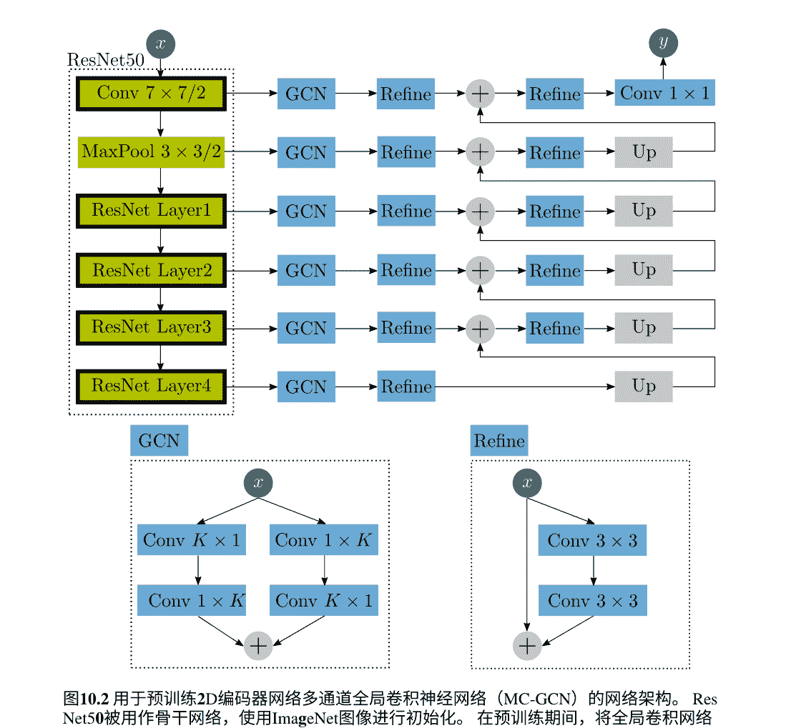

图10.2 用于预训练2D编码器网络多通道全局卷积神经网络（MC-GCN）的网络架构。ResNet50被用作骨干网络，使用ImageNet图像进行初始化。在预训练期间，将全局卷积网络模块和细化模块[17]添加到编码器网络中，以增加感受野，并将输出响应映射增加到原始分辨率。Conv K × K/S表示具有内核大小K和步长大小S的卷积层。上采样模块（Up）由Conv 1 × 1投影层和双线性上采样层组成。

对于该网络，输入是三个相邻的切片（视为RGB通道）。因此，ResNet50的整体架构保持不变。多通道2D输入可以使2D网络在早期阶段融合切片间的上下文。在编码器的陪伴下，添加了一个解码器来将响应映射放大到原始分辨率。我们选择了具有全局卷积网络（GCN）和细化块[17]的解码器架构。GCN模块通过将其分解为两个1D卷积核（1×K和K×1）来模拟一个大的K×K卷积核。包含以不同顺序排列的1D卷积核的两个分支通过求和合并。每个GCN模块的输出包含与最终输出相同数量的输出映射。GCN模拟的大卷积核确保网络在每个特征分辨率上具有大的感受野。每个细化块包含两个3×3的卷积层，中间有ReLU激活函数。每个细化块的输入也与其输出相加，形成残差连接。在每个编码器分辨率级别的末尾，将特征输入到GCN模块，核大小分别为63, 31, 15, 9, 7, 5。将输出特征输入到一个细化块中，并与从较低分辨率级别上采样的特征相加。将相加的特征输入到另一个细化块中，并通过1×1卷积和双线性上采样层进行上采样。最终输出与图像输入具有相同的分辨率。解码器的参数数量很少，计算成本很低。轻量级的解码器使得编码器特征更容易传输到3D AH-Net，因为大部分特征学习依赖于编码器网络。

### 10.3.2 将学习到的2D网络转移到3D AH-Net

所提出的3D各向异性混合网络（AH-Net）的架构如图10.3所示。在2D MC-GCN网络收敛后，我们提取其编码器的参数，并将其转移到AH-Net的相应编码器层。2D MC-GCN的解码器部分被丢弃，而我们为AH-Net设计了一个由多个级联的密集连接块组成的新解码器，后面跟着一个金字塔体积池化模块。新解码器的参数是随机初始化的。AH-Net的输入和输出现在是3D块，类似于其他传统的3D CNN。将卷积张量从2D转换为3D的过程如图10.4所示，旨在在AH-Net的编码器部分逐层对3D体积进行逐层切片的2D卷积操作。

#### 10.3.2.1 符号

2D卷积张量用 \( T_{n \times m \times h \times w}^i \) 表示，其中 \( n, m, h \) 和 \( w \) 分别表示输出通道数、输入通道数、高度和宽度。类似地，3D权重张量用 \( T_{n \times m \times h \times w \times d}^i \) 表示，其中 \( d \) 是滤波器深度。我们使用 \( P^{(b,a,c,d)}(T_{a \times b \times c \times d}) \) 表示张量 \( T_{a \times b \times c \times d} \) 的维度排列，得到一个新的张量 \( T_{b \times a \times c \times d} \)，其中第一和第二维度被交换。\( P^{(a,*,b,c,d)}(T_{a \times b \times c \times d}) \) 在张量 \( T_{a \times b \times c \times d} \) 的第一和第二维度之间添加一个身份维度，并给出 \( T_{a \times 1 \times b \times c \times d} \)。我们将卷积层定义为Conv \( K_x \times K_y \times K_z / (S_x, S_y, S_z) \)，其中 \( K_x \)，\( K_y \) 和 \( K_z \) 是卷积核的大小；\( S_x \)，\( S_y \) 和 \( S_z \) 是每个方向上的步长大小。最大池化层用MaxPool \( K_x \times K_y \times K_z / (S_x, S_y, S_z) \) 表示。当一个层在所有维度上的步长大小为1时，省略步长。

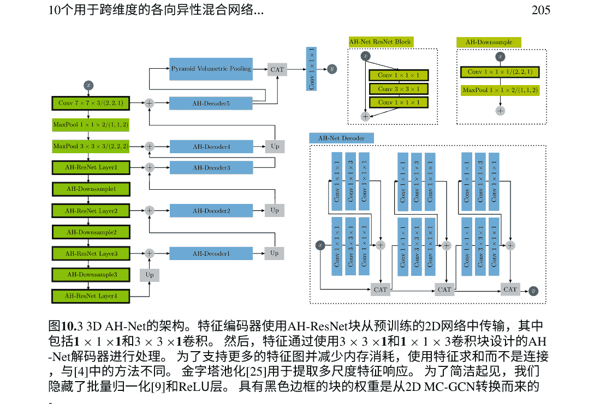

图10.3 3D AH-Net的架构。特征编码器使用AH-ResNet块从预训练的2D网络中传输，其中包括$1 \times 1 \times 1$和$3 \times 3 \times 1$卷积。然后，特征通过使用$3 \times 3 \times 1$和$1 \times 1 \times 3$卷积块设计的AH-Net解码器进行处理。为了支持更多的特征图并减少内存消耗，使用特征求和而不是连接，与[4]中的方法不同。金字塔池化[25]用于提取多尺度特征响应。为了简洁起见，我们隐藏了批量归一化[9]和ReLU层。具有黑色边框的块的权重是从2D MC-GCN转换而来的。

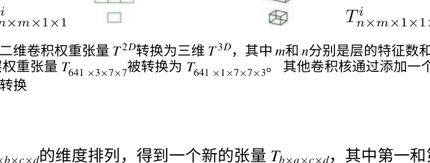

图10.4 将二维卷积权重张量$T^{2D}$转换为三维$T^{3D}$，其中$m$和$n$分别是层的特征数和通道数。第一层权重张量$T_{641 \times 3 \times 7 \times 7}$被转换为$T_{641 \times 1 \times 7 \times 7 \times 3}$。其他卷积核通过添加一个额外的维度进行转换。

#### 10.3.2.2 输入层变换

2D MC-GCN的输入层包含一个卷积权重张量 \( T_{64 \times 3 \times 7 \times 7} \) 继承自其ResNet50骨干网络。2D卷积张量 \( T_{64\times 3\times 7\times 7}^1 \) 被转换为3D，如下所示

$$P^{(1,*,3,4,2)}(T_{64\times 3\times 7\times 7}^1) = T_{64\times 1\times 7\times 7\times 3}^1 \qquad (10.1)$$

以形成一个卷积三个相邻切片的3D卷积核。为了使输出与2D网络保持一致，我们只在$xy$平面上应用步长为2的卷积，在第三个维度上应用步长为1的卷积。这导致输入层为Conv $7 \times 7 \times 3/(2, 2, 1)$。为了降采样$z$-维度，我们使用MaxPool $1 \times 1 \times 2/(1, 1, 2)$来融合每对相邻的切片。另外一个MaxPool $3 \times 3 \times 3/(2, 2, 2)$用于保持特征分辨率与2D网络一致。

#### 10.3.2.3 ResNet块变换

所有的2D卷积张量 \( T_{n \times m \times 1 \times 1}^{i} \) 和 \( T_{n\times m\times 3\times 3}^{i} \) ResNet50编码器中的被转换为

$$P^{(1,2,3,4,*)}(T_{n\times m\times 1\times 1}^{i}) = T_{n\times m\times 1\times 1\times 1}^{i} \qquad (10.2)$$

和

$$P^{(1,2,3,4,*)}(T_{n\times m\times 3\times 3}^{i}) = T_{n\times m\times 3\times 3\times 1}^{i}. \qquad (10.3)$$

通过这种方式，如图10.3所示，所有的ResNet Conv $3 \times 3 \times 1$块只对3D体积中的$xy$平面进行逐片卷积。原始的ResNet块之间的下采样是通过Conv $1 \times 1/(2, 2)$来完成的。然而，在3D体积中，Conv $1 \times 1 \times 1/(2, 2, 2)$在$z$维度上每一步都会跳过一个切片。当图像在$z$维度上只有少量切片时，这将会丢失重要信息，特别是对于检测任务。因此，我们在ResNet块之间使用Conv $1 \times 1 \times 1/(2, 2, 1)$后跟MaxPool $1 \times 1 \times 2/(1, 1, 2)$来对3D特征图进行下采样，如图10.3中的AH-Downsample块所示。这个MaxPooling操作只是在相邻切片之间沿$z$方向取最大响应。与之前避免在$z$方向上进行下采样的研究不同，我们发现在具有有限GPU内存的3D数据上使用大型和深层网络是重要的。

### 10.3.3 各向异性混合解码器

与转换编码器相配套，添加了一个各向异性3D解码器子网络，以利用3D各向异性图像上下文。在解码器中，使用了具有Conv $1\times 1\times 1$、Conv $3\times 3\times 1$和Conv $1\times 1\times 3$的各向异性卷积块。首先，将特征传递到一个Conv $3\times 3\times 1$的xy瓶颈块中，该块被两层Conv $1\times 1\times 1$包围。然后，输出被转发到另一个瓶颈块，其中间有一个Conv $1\times 1\times 3$，并与自身相加后再转发到下一个块。这个各向异性卷积块将3D卷积分解为2D和1D卷积。它首先使用2D卷积接收来自前面层的输入，保留了详细的2D特征。Conv $1\times 1\times 3$主要融合了切片内的特征，以保持z维度输出的一致性。

三个各向异性卷积块通过特征串联连接成密集连接神经网络[8]，用于每个编码特征分辨率。与LinkNet [4]类似，从编码器的每个分辨率接收到的特征首先被投影到与更高分辨率编码器特征数量相匹配的数量，使用Conv $1\times 1\times 1$。然后使用3D三线性插值进行上采样，并与来自更高分辨率的编码器特征相加。相加后的特征被传递到下一个分辨率的解码器块。

在解码器网络的末尾，我们添加了一个金字塔体积池化模块[25]，以获取多尺度特征。最后一个解码器块的输出特征首先使用四个不同的最大池化层进行下采样，分别是MaxPool $64 \times 64 \times 1$，MaxPool $32 \times 32 \times 1$，MaxPool $16 \times 16 \times 1$和MaxPool $8 \times 8 \times 1$，以获得特征金字塔图。使用Conv $1\times 1\times 1$层将特征金字塔中的每个分辨率投影到单个响应通道。然后将响应通道插值到原始大小，并与下采样之前的特征进行串联。最终的输出通过在串联特征上应用Conv $1\times 1\times 1$投影层获得。

使用相同的学习率训练AH-Net的预训练编码器和随机初始化的解码器会使网络难以优化。为了训练3D AH-Net，首先锁定所有转移的参数。只有解码器参数在优化中进行微调。然后可以同时对所有参数进行微调，以整体优化AH-Net。尽管解锁所有参数进行微调是可选的，但我们没有观察到更好的性能。

## 10.4 实验结果

为了证明所提出的3D AH-net的有效性和效率，我们进行了两个实验，即从数字乳腺断层摄影（DBT）体积中进行病变检测和从计算机断层扫描（CT）体积中进行肝肿瘤分割。我们使用ADAM [10]来优化所有比较的网络，其中β₁ = 0.9，β₂ = 0.999，和ε = 10⁻⁸。我们使用初始学习率0.0005来微调2D多通道GCN。然后，在2D网络转移后，学习率增加到0.001来微调AH-Net。我们发现3D网络需要更大的学习率才能在合理的时间内收敛。所有网络都是使用Pytorch实现的（http://pytorch.org）。

### 10.4.1 从DBT中检测乳腺病变

我们使用一个内部数据库，其中包含来自全球12个不同地点获取的2809个3D DBT体积。DBT是一种先进的乳腺X线摄影技术，使用低剂量的X射线对乳腺进行成像。与将3D信息叠加到一个2D图像中的2D乳腺X线摄影技术不同，DBT创建乳腺组织的3D图像，使放射科医生能够更容易地阅读这些图像并检测乳腺癌，特别是在密集乳腺组织中。DBT图像的x,y平面具有高空间分辨率，为0.085毫米 × 0.085毫米，远大于1毫米的z维度。在成像过程中，z维度的结构不仅被压缩，而且3D体积信息也因成像伪影而产生较大变化。

我们有经验的放射科医生对DBT体积中的病变进行注释和验证，这些体积可能包含零到多个病变。每个病变大约用一个3D边界框进行注释。为了训练所提出的网络作为病变检测网络，我们生成了与原始图像大小相同的3D多变量高斯热图。

$$f(\mathbf{p}) = \sum_{\boldsymbol{\mu}_i, \boldsymbol{\Sigma}_i} \frac{\exp\left(-\frac{1}{2} (\mathbf{p} - \boldsymbol{\mu}_i)^{\mathrm{T}} \boldsymbol{\Sigma}_i (\mathbf{p} - \boldsymbol{\mu}_i)\right)}{\sqrt{\det(2\pi \boldsymbol{\Sigma}_i)}} \qquad (10.4)$$

其中，p是一个3D坐标x, y, z；μ_i是每个病变3D边界框的中心坐标；Σ_i是由病变3D边界框的高度、宽度和深度确定的第i个高斯的协方差矩阵。请注意，我们不直接预测边界框坐标，如Faster RCNN [19]等一般的目标检测方法，因为有时很难定义乳腺病变的确切边界。此外，与边界框相比，病变存在的体素置信度图可能对临床决策支持更有帮助。

我们根据表10.1将数据库随机分成训练集和测试集。如果放射科医生注释了至少一个病变，那么一个体积或者一个3D块被认为是阳性。我们确保来自同一患者的图像只能出现在训练集或测试集中的一个。对于训练，我们提取256 × 256 × 32个3D块。训练块的70%被采样为阳性，至少包含一个病变，考虑到体素内外的平衡。这些补丁是在线异步采样的，与网络训练一起形成小批量。

除了提出的网络外，我们还使用相同的架构和参数[3, 20]训练了2D和3D U-Net作为两个基准比较。2DU-Net也是使用具有三个输入通道的输入进行训练的。3D U-Net使用与AH-Net相同的补丁采样策略进行训练。所有网络都训练至收敛，然后将L2损失函数替换为Focal Loss [13]进行硬体素挖掘。表10.2显示了卷积层和参数的数量。使用2D网络（如MC-GCN和2D U-Net）处理3D体积需要重复输入重复的图像切片。因此，当它们用于处理3D体积时，它们可能比3D网络更慢。我们通过在NVIDIA GTX 1080Ti GPU上将大小为384 × 256 × 64的3D DBT体积前向传播1000次来测量四个网络的GPU推理时间。不包括体积切片等操作所花费的时间。表10.3显示了平均GPU时间（毫秒）。尽管AH-Net具有更多的参数，但AH-Net的GPU推理速度比MC-GCN快43倍。这种速度提升主要是通过避免多通道2D网络所需的对相同切片进行重复卷积来实现的。

在网络输出图上执行非最大抑制以获取病变位置。考虑局部最大体素处的网络响应

表10.1 评估的DBT数据集中的体积数量（#体积），阳性体积数量（#阳性）和病变数量（#病变）

|      | #体积 | #阳性 | #病变 |
|------|-------|-------|-------|
| 训练 | 2678  | 1111  | 1375  |
| 测试 | 131   | 58    | 72    |

表10.2 2D-UNet、3D-UNet、ResNet50、GCN和AH-Net中的卷积层数量（#卷积层）和模型浮点参数数量（#参数）。这里将ResNet50作为参考与添加了简单解码器的GCN进行比较

| 网络      | #卷积层 | #参数      |
|-----------|---------|------------|
| 2D-UNet   | 15      | 28,254,528 |
| 3D-UNet   | 15      | 5,298,768  |
| *ResNet50 | 53      | 23,507,904 |
| GCN       | 94      | 23,576,758 |
| AH-Net    | 123     | 27,085,500 |

表10.3 不同网络在384 × 256 × 64体积上的GPU推理时间（毫秒）通过对1000次推理进行平均计算，使用NVIDIA GTX 1080Ti

|          | 2D U-Net | 3D U-Net | MC-GCN | 3D AH-Net |
|----------|----------|----------|--------|-----------|
| 毫秒     | 699.3    | 2.3      | 775.2  | 17.7      |图10.5 AH-Net能够检测到MC-GCN错过的病变，使用相同的编码器权重的两个示例案例

图10.6 两个乳腺病变示例，MC-GCN和AH-Net都无法检测到

作为癌症发现的置信度分数。图10.5显示了AH-Net能够检测到MC-GCN错过的两个示例案例的网络输出的一些视觉比较。图10.6显示了两个示例案例，病变被密集的乳腺组织包围，MC-GCN和AH-Net都无法检测到。

通过改变阈值来过滤响应值，我们可以控制假阳性率（FPR）和真阳性率（TPR）之间的平衡。如果网络检测到的病变的最大点位于放射科医生标注的3D边界框内，则认为是真阳性发现。同样，如果边界框包含最大点，则认为网络检测到了它。否则，最大点被视为假阳性发现。我们通过绘制自由响应操作特性（FROC）来评估病变检测性能。

曲线，衡量真阳性率（TPR）与允许的假阳性数（#FP）之间的关系。TPR表示成功检测到的病变的百分比。FPR表示网络预测的虚假阳性病变的百分比。如图10.7所示，提出的AH-Net在性能上超过了2D和3D U-Net。

与2D网络（多通道GCN）的性能相比，3D AH-Net在大多数阈值下生成更高的TPR，除了每卷假阳性约为0.05的区域。值得注意的是，即使每卷只允许0.01个假阳性发现，AH-Net也能获得近50%的TPR。有趣的是，尽管DBT体积具有三个维度，但3D-UNet的性能略差于2D-UNet。这可能是由于DBT图像的各向异性分辨率和GPU内存限制的参数数量有限所致。

- FROC数字总结在表10.4中。

表10.4 对比网络在DBT数据集上的定量指标。真阳性率（TPR）在允许假阳性（FP）发现的五个不同数量的样本中显示在前五列中

| | FP=0.01 | FP=0.05 | FP=0.10 | FP=0.15 | FP=0.20 | FP=0.25 |
|---|---|---|---|---|---|---|
| 2D U-Net | 0.4238 | 0.4767 | 0.5181 | 0.5723 | 0.6166 | 0.6506 |
| 3D U-Net | 0.2448 | 0.3877 | 0.4381 | 0.5592 | 0.5738 | 0.5733 |
| GCN | 0.3385 | **0.6727** | 0.6727 | 0.6909 | 0.7018 | 0.7272 |
| AH-Net | **0.4931** | 0.6000 | **0.7272** | **0.7454** | **0.7818** | **0.7818** |

### 10.4.2 CT扫描中的肝脏和肝脏肿瘤分割

第二个评估数据集来自MICCAI 2017年的肝脏病变分割挑战（lits-challenge.com），包含131个训练和70个测试的3D增强腹部CT扫描。肝脏病变是全球最常见的癌症之一。据估计，2017年将有28,920人死于肝脏病变并且将有40,710个新病例被诊断出来[1]。由于肝脏和病变的异质性和扩散性外观，自动分割肝脏和病变具有挑战性。此外，病变的数量、形状和位置在不同体积之间变化很大。数据和地面真值掩模由世界各地的临床站点提供。地面真值掩模包含肝脏和病变标签。大多数CT扫描具有各向异性分辨率：切片之间的分辨率范围从0.45到6.0毫米，而切片内的分辨率变化从0.55到1.0毫米。所有扫描都覆盖腹部区域，但可能延伸到头部和脚部。除了肝脏病变，这些数据中还可能存在其他疾病，这进一步增加了任务的难度。

在预处理中，使用基于强化学习算法[6]检测到的肝脏中心生物标记来从CT扫描中截取腹部区域。虽然这一步使网络集中在目标区域上，但其准确性并不关键，因为我们选择了一个相对较大的裁剪区域，通常范围从肺部中部到骨盆顶部。根据训练数据中肝脏和病变的强度分布，将图像强度截断到[-125, 225] HU范围内。由于训练数据数量有限，我们应用了随机旋转（在xy平面内±20度范围内）、随机缩放（在所有方向上±0.2范围内）和随机镜像（在xy平面内）来减少过拟合。

我们首先使用预训练的ResNet50作为主干网络来训练MC-GCN。堆叠的2D切片的输入尺寸为512 ×512，具有三个通道。收敛后，将MC-GCN编码器部分的权重转换为相应的权重。

表10.5 肝脏病变分割（LITS）挑战结果，使用Dice全局（DG）和Dice每个案例（DPC）。请参考挑战排行榜获取最新结果（lits-challenge.com/#results）

| 方法 | 病变 DG | 病变 DPC | 肝脏 DG | 肝脏 DPC |
|------|---------|----------|----------|----------|
| leHealth | 0.794 | 0.702 | 0.964 | 0.961 |
| H-DenseNet [12] | 0.829 | 0.686 | 0.965 | 0.961 |
| hans.meine | 0.796 | 0.676 | 0.963 | 0.960 |
| 医学 | 0.783 | 0.661 | 0.951 | 0.951 |
| deepX | 0.820 | 0.657 | 0.967 | 0.963 |
| superAI | 0.814 | 0.674 | – | – |
| GCN | 0.788 | 0.593 | 0.963 | 0.951 |
| 3D AH-Net | 0.834 | 0.634 | 0.970 | 0.963 |

图10.8 来自3D AH-Net的肝脏病变分割结果示例。肝脏（蓝色）和肝脏病变（粉色）的分割轮廓叠加在从不同方向查看的三个切片上（轴向、冠状和矢状）。分割结果在右侧以3D形式呈现。

图10.9 LITS挑战的示例测试CT体积1的多视图切片

3D AH-Net的相应层，然后使用大小为192 × 192 × 64的3D补丁进行微调。其他层的权重是随机初始化的。在这两个网络的训练中，一开始使用交叉熵损失，直到收敛，然后用于硬体素挖掘的Focal Loss取而代之[13]。

AH-Net的性能列在表10.5中，与从LITS挑战排行榜中检索到的其他六个排名靠前的提交一起。这些提交使用了各种类型的神经网络架构：2D、3D、2D-3D混合和模型融合。采用了两个评估指标：(1) Dice全局指标(DG)，它是将所有体积结合在一起的Dice分数；(2) 每个案例的Dice分数(DPC)，它是每个单独案例的Dice分数的平均值。两个掩模之间的Dice分数定义为 $DICE(A,B) = 2|A \cap B|/(|A|+|B|)$。我们的结果在四个指标中有三个达到了最先进的性能，包括病变的Dice全局分数、肝脏的Dice全局分数和每个案例的Dice分数，这证明了其有效性。

AH-Net对具有不同各向异性分辨率的3D图像进行分割的准确性。图10.8显示了一些示例视觉结果。在图10.9和10.10中，我们对来自LITS挑战的两个不同体积的MC-GCN和AH-Net的结果进行了视觉比较。AH-Net在病变和肝脏的上下边界生成的误报区域较少。

## 10.5 结论

在本章中，我们提出了3D各向异性混合网络（3D AH-Net），能够将2D图像的卷积特征传递到3D体积中，具有各向异性分辨率。通过在大规模内部DBT数据集和高度竞争的CT分割开放挑战数据集上评估所提出的方法，我们展示了我们的网络可以获得最先进的结果。由于从2D网络传递的特征和各向异性卷积块，AH-Net比传统的3D网络（如3D U-Net [3]）具有更好的泛化能力。

AH-Net的GPU推理速度也比从2D网络中堆叠结果要快得多。尽管AH-Net是为非均匀体积设计的，但我们相信它也可以应用于分辨率接近均匀的体积，如CT和MRI。

免责声明：此功能基于研究，不可商业化。由于监管原因，其未来的可用性不能保证。

## 参考文献

- 1. 美国癌症协会（2017年）癌症事实和数据2017年。美国癌症协会
- 2. Brosch T， Tang LYW， Yoo Y， Li DKB， Traboulsee A， Tam R（2016年）深度3D卷积编码器网络与多尺度特征集成应用于多发性硬化症病变分割。IEEE Trans Med Imaging 35（5）：1229-1239
- 3. Çiçek Ö， Abdulkadir A， Lienkamp SS， Brox T， Ronneberger O（2016年）3D U-Net：从稀疏注释中学习密集体积分割。arXiv e-prints arXiv:1606.066504。
- 4. Chaurasia A， Culurciello E（2017年）LinkNet：利用编码器表示进行高效语义分割。arXiv e-prints arXiv:1707.03718
- 5. Chen J， Yang L， Zhang Y， Alber M， Chen DZ（2016）结合全卷积和循环神经网络进行三维生物医学图像分割。arXiv e-prints arXiv:1609.010066。
- 6. Ghesu FC， Georgescu B， Grbic S， Maier AK， Hornegger J， Comaniciu D（2017）在不完整的三维CT数据中进行鲁棒的多尺度解剖标志点检测。
- 7. He K， Zhang X， Ren S， Sun J（2015）深度残差学习用于图像识别。arXive-prints arXiv:1512.03385
- 8. Huang G， Liu Z， van der Maaten L， Weinberger KQ（2017）密集连接卷积神经网络。在：2017年IEEE计算机视觉与模式识别（CVPR）会议上，pp 2261-2269
- 9. Ioffe S， Szegedy C（2015）批归一化：通过减少内部协变量偏移加速深度网络训练。arXiv e-prints arXiv:1502.03167
- 10. Kingma DP, Ba J (2014) Adam: 一种用于随机优化的方法。 arXiv e-prints arXiv:1412.6980
- 11. Lee K, Zung J, Li P, Jain V, Seung HS (2017) 在SNEMI3D连接学挑战中的超人类准确性。 arXiv e-prints arXiv:1706.00120
- 12. Li X, Chen H, Qi X, Dou Q, Fu CW, Heng PA (2017) H-DenseUNet: 用于CT体积的肝脏和肿瘤分割的混合密集连接unet。 arXiv e-prints arXiv:1709.07330
- 13. Lin TY, Goyal P, Girshick R, He K, Dollár P (2017) Focal loss用于密集目标检测。 arXive-prints arXiv:1708.02002
- 14. Liu F, Zhou Z, Jang H, Samsonov A, Zhao G, Kijowski R (2017) 深度卷积神经网络和三维可变形方法在肌肉骨骼磁共振成像中的组织分割。 磁共振医学 79(4):2379–2391
- 15. Liu S, Xu D, Zhou SK, Pauly O, Grbic S, Mertelmeier T, Wicklein J, Jerebko A, Cai W, Comanicu D (2018) 三维各向异性混合网络: 从二维图像到三维各向异性体积的卷积特征转移。 在: Frangi AF, Schnabel JA, Davatzikos C, Alberola-López C, Fichtinger G (eds) 医学图像计算与计算机辅助干预-MICCAI 2018。 Springer国际出版社, Cham, pp 851–858
- 16. Moeskops P, Viergever MA, Mendrik AM, de Vries LS, Benders MJNL, Isgum I (2016) 使用卷积神经网络自动分割MR脑图像。 IEEE Trans Med Imaging 35(5):1252–1261
- 17. Peng C, Zhang X, Yu G, Luo G, Sun J (2017) 通过全局卷积网络改善语义分割的大内核问题。 在: 2017年IEEE计算机视觉和模式识别（CVPR）会议上, 第1743-1751页
- 18. Qiu Z, Yao T, Mei T (2017) 使用伪3D残差网络学习时空表示。 在: 2017年IEEE国际计算机视觉会议（ICCV）上, 第5534-5542页
- 19. Ren S, He K, Girshick RB, Sun J (2015) Faster r-cnn: 利用区域建议网络进行实时目标检测。 IEEE Trans Pattern Anal Mach Intell 39: 1137–1149
- 20. Ronneberger O, Fischer P, Brox T (2015) U-net: 用于生物医学图像分割的卷积网络。 在: MICCAI
- 21. Russakovsky O, Deng J, Su H, Krause J, Satheesh S, Ma S, Huang Z, Karpathy A, Khosla A, Bernstein M, Berg AC, Fei-Fei L (2015) ImageNet大规模视觉识别挑战。 Int J Comput Vis 115(3):211–252
- 22. Wang G, Li W, Ourselin S, Vercauteren T (2017) 使用级联各向异性卷积神经网络进行自动脑肿瘤分割。 在MICCAI 2017的BrainLes研讨会上
- 23. Xia Y, Liu F, Yang D, Cai J, Yu L, Zhu Z, Xu D, Yuille A, Roth H (2018) 带有不确定性感知的多视角半监督3D学习。 arXiv e-prints arXiv:1811.12506
- 24. Zeng T, Wu B, Ji S (2017) DeepEM3D: 接近于人类水平的3D各向异性EM图像分割。 Bioinformatics 33(16):2555–2562
- 25. 赵 H, 史 J, 齐 X, 王 X, 贾 J (2017) 金字塔场景解析网络。 在: 2017年IEEE计算机视觉和模式识别会议（CVPR）, pp 6230-6239

# 第三部分 各种应用

## # 第11章 深度哈希及其在组织病理学图像分析中的应用

Xiaoshuang Shi和Lin Yang

摘要基于内容的图像检索（CBIR）在组织病理学图像分析中引起了相当大的关注，因为它可以提供更多的临床证据来支持诊断。哈希是CBIR中的重要工具，因为它在计算和存储方面都有显著的提升。由于深度学习的巨大成功，深度哈希同时学习强大的特征表示和二进制编码，在显微图像上取得了有希望的性能。

本章介绍了几种流行的深度哈希技术及其在组织病理学图像上的应用。它开始介绍自动化组织病理学图像分析，并解释了为什么深度哈希是组织病理学图像数据分析的重要和紧迫需求。然后，它具体讨论了三种流行的深度哈希技术，主要介绍了基于成对的深度哈希。最后，它介绍了它们在组织病理学图像分析中的应用。

### ## 11.1 引言

组织病理学图像在早期疾病检测和分级中起着重要作用，如肺癌、乳腺癌和脑癌[1-4]。然而，由于图像的高分辨率和病理学家的主观评估，手动评估工作繁重、昂贵、耗时且容易出错。为了减轻病理学家的工作负担并提高图像分析的客观性，计算机辅助诊断（CAD）系统，包括图像处理和现代机器学习技术，已广泛应用于组织病理学图像计算。一般来说，CAD系统可以大致分为两类：基于分类器的CAD和基于内容的图像检索（CBIR）[5-7]。与直接基于分类器的CAD相比，提供诊断结果或分级分数，CBIR不仅可以用于分类查询图像，还可以检索和可视化具有最相似形态特征的图像[8, 9]。因此，CBIR技术引起了对组织病理学图像分析的广泛关注[10-14]。

尽管传统的CBIR系统在为病理学家提供可视化相关图像和诊断信息方面表现出优势，但大多数系统仅适用于具有数十或数百张图像的疾病诊断，并且由于计算效率和存储成本的原因，无法处理大规模数据集。然而，大量注释的医学图像可能会减小现代数据驱动方法[15]中图像和诊断信息之间的语义差距（图像和标签（疾病）描述之间的差异）。为了处理大规模图像数据，基于哈希的检索方法变得有吸引力[10, 13, 16]，因为哈希可以将高维数据编码为紧凑的二进制码，并保持邻居之间的相似性[17, 18]，从而在计算和存储方面带来显著的收益[19-21]。根据是否使用语义信息，哈希方法可以分为两组：（i）无监督哈希旨在探索数据的内在结构，以在没有任何语义信息的情况下保持邻居之间的相似性，（ii）监督哈希利用语义信息生成二进制码。由于语义差距，组织病理学图像分析更倾向于使用监督哈希。由于手工制作的特征无法最优地表示图像内容并保持语义相似性，而深度学习[22, 23]可以从大规模原始图像数据中自动学习强大的特征，深度哈希[24-27]利用深度学习架构同时学习图像的特征表示和二进制码，实现了比传统哈希方法更好的检索和分类准确性。在本章中，我们将重点介绍几种流行的监督深度哈希技术及其在组织病理学图像分析中的应用。

## 11.2 深度哈希

基于语义信息的使用，监督式深度哈希方法可以大致分为三类：点对点、多对多和成对。

### 11.2.1 基于点对点的哈希

基于点对点的哈希将搜索问题转化为分类问题来学习二进制编码。它们的目标函数通常基于回归模型开发。其中最流行的目标函数之一是[20]\min_{\mathbf{B},\mathbf{W},F} \sum_{i=1}^{n} L(\mathbf{y}_i, \mathbf{W}\mathbf{b}_i) + \lambda \|\mathbf{W}\|_F^2 + \upsilon \sum_{i=1}^{n} \|\mathbf{b}_i - F(\mathbf{x}_i)\|_2^2, \quad \text{s.t.} \ \mathbf{b}_i \in \{-1, 1\}^m, \tag{11.1}

其中 b_i 是样本 x_i 的二进制向量，y_i ∈ ℝ^c 是保持 x_i 的语义信息的独热向量，W ∈ ℝ^{c×m} 是一个投影矩阵，L(·)是一个损失函数（最小二乘、合页损失或其他），F(·)表示一个非线性映射函数，c和m分别表示类别数和二进制编码的数量。

一种早期且流行的基于点对点的深度哈希方法是深度学习二进制哈希码（DLBHC）[24]，它同时学习图像表示和二进制码。由于DLBHC使用松弛策略（sigmoid函数）生成二进制码，可能会在松弛和离散二进制矩阵之间产生累积的量化误差，从而降低检索性能。为了解决这个问题，深度卷积哈希（DCH）[26]提出了一种新的损失函数，以点对点的方式共同学习图像特征和离散二进制码。它是[26]。

\min_{\mathbf{W},\mathbf{c}} E = \sum_{n=1}^{M_b} \log \frac{e^{a_{y_n}^L}}{\sum_j e^{a_j^L}} + \frac{\gamma}{2} \sum_{n=1}^{M_b} \left\| \tilde{\mathbf{b}}_n - \mathbf{b}_n \right\|_2^2, \quad \tilde{\mathbf{b}}_n = \tanh(\mathbf{a}^{L-1}), \mathbf{b}_n = \text{sgn}(\tilde{\mathbf{b}}_n), \tag{11.2}

其中 L 是网络中的层数，M_b 是批量大小，W和c代表网络的参数，y_n 表示 x_n 的类别归属，a^{L-1} 是 L-1层的输出，a_j^L denotes the linear activation of the j-th neuron in the output layer, b_n ∈ {-1, 1}^m is a binary vector, and m is the number of bits. 在公式（11.2）中，第一项是为了最大化分类准确性，正则化项是为了减少松弛和离散二进制向量之间的累积误差。

### 11.2.2 基于多项式的哈希

基于多项式（排名）的哈希旨在学习哈希函数，将原始高维数据投影到二进制空间，并同时最大化超过两个项目的相似性顺序的一致性。几种流行的算法是三元排名哈希（TRH）[28]，它提出了基于成对合页损失的三元排名损失函数，排名监督哈希（RSH）[29]，它将排名三元组信息合并到列表矩阵中以学习二进制码，排名保持哈希（RPH）[30]，它直接优化归一化折扣累积增益（NDCG）[31]以学习具有高排名准确性的二进制码。这些算法不能同时学习特征和二进制码，后来的深度哈希方法：网络中的网络哈希（NINH）[25]，可扩展位深度哈希（DRSCH）[32]和基于三元组的深度二进制嵌入（TDBE）[33]利用三元排名损失函数同时学习特征表示。

为了保留原始高维数据之间的相似性顺序，使用二进制编码。例如，给定训练三元组图像，形式为 $I, I^+, I^-$，其中 $I$ 与 $I^+$ 比 $I^-$ 更相似，要找到一个映射 $\mathcal{F}(\cdot)$生成二进制编码，使得 $\mathcal{F}(I)$与 $\mathcal{F}(I^+)$比 $\mathcal{F}(I^-)$更相似，三元组排序铰链损失定义如下：

$$\ell_{\text{三元组}}(\mathcal{F}(I), \mathcal{F}(I^+), \mathcal{F}(I^-)) = \max\left(0, 1 - \left(\|\mathcal{F}(I) - \mathcal{F}(I^-)\|_H - \|\mathcal{F}(I) - \mathcal{F}(I^+)\|_H\right)\right)$$ (11.3)

其中 $\|\cdot\|_H$表示汉明距离。基于深度语义排序的哈希（DSRH）[34]，在三元组铰链损失函数中添加自适应权重，已被提出来处理多标签检索问题。这些深度哈希方法采用松弛策略来学习二进制编码。为了进一步提高检索性能，离散语义排序哈希（DSeRH）[35]直接学习保持样本之间相似性顺序的二进制编码。

### 11.2.3 基于成对的哈希

基于成对的哈希是利用两个二进制向量的逐元素乘积来保持数据对的汉明相似性。在基于点对、多对和成对的深度哈希中，基于点对的哈希通过将搜索问题形式化为分类问题来学习二进制编码，通常忽略了邻居之间的相似性关系。基于多对的哈希对于大规模训练数据构建三元组损失是耗时的，并且由于其比基于点对和基于成对的哈希更难优化的问题，通常难以收敛。因此，基于成对的哈希比基于点对和基于多对的哈希更广泛应用于病理图像分析。在本小节中，我们介绍几种常见的传统和深度基于成对的哈希方法。

#### 11.2.3.1 传统的基于成对的哈希

几种流行的传统成对哈希方法是谱哈希（SH）[17]，它将原始的高维数据映射到一个低维的Hamming空间，以保持邻居之间的相似性，用于近似最近邻（ANN）搜索。受SH的启发，许多变种已经被开发出来，例如多维谱哈希（MDSH）[36]，弹性嵌入（EE）[37]，锚图哈希（AGH）[19]，联合核图哈希（JKGH）[12]等。最小损失哈希（MLH）[38]利用最小二乘模型来保持相似对的关系，并利用合页损失来维持不相似对的关系。半监督哈希（SSH）[16]利用汉明距离来衡量成对之间的距离，而基于核的监督哈希（KSH）[19]通过使用核函数来探索数据中隐藏的非线性结构。与线性算法相比，非线性成对哈希算法如二进制重构嵌入（BRE）[39]和KSH通常生成更有效的二进制码，因为它们利用了数据中隐藏的非线性结构。此外，许多先前的成对哈希方法通常将不可微分的离散向量松弛为可微分的连续向量，然后通过阈值化学习二进制码，从而在离散和连续矩阵之间产生累积的量化误差。为了解决这个问题，已经提出了许多离散哈希方法，例如基于核的离散监督哈希（KSDH）[18]，基于列采样的离散监督哈希（COSIDISH）[40]，非对称离散图哈希（ADGH）[21]等。

在接下来的内容中，我们简要回顾了四种流行的基于成对哈希算法：SH [17]，BRE [39]，KSH [19]和KSDH [18]。基本的SH公式要求每个哈希位中的代码平衡，以便每个哈希位都具有最大信息量，并且不同的位之间相互不相关，以便最小化这些位之间的冗余。形式上，假设 $\mathbf{h}_i = [h_1(x), h_2(x), \ldots, h_m(x)]$，由 $m$ 个哈希函数 $\{h(\cdot)\}_{i=1}^m$ 计算得到，表示数据点 $\mathbf{x}_i$ 的二进制编码，公式如下所示

\min_{\mathbf{H}} Tr\left\{\mathbf{HLH}^T\right\} \\
\mathbf{H} \in \{-1, 1\}^{m \times n}, \mathbf{H} \mathbf{1}_n = 0, \mathbf{H} \mathbf{H}^T = n \mathbf{I}_m

其中， $\mathbf{1}_n \in \mathbb{R}^n$ 是一个所有元素都为1的列向量， $\mathbf{I}_m \in \mathbb{R}^{m \times m}$ 是一个单位矩阵。约束条件 $\mathbf{H} \mathbf{1}_n = 0$ 的目的是最大化每个哈希位的信息，约束条件 $\mathbf{H} \mathbf{H}^T = n \mathbf{I}_m$ 是为了最小化不同哈希位之间的冗余。 $\mathbf{L} = \mathbf{D} - \mathbf{S}$ 是一个拉普拉斯矩阵， $\mathbf{D}$ 是一个对角矩阵，其中第 $i$ 个元素 $d_{ii} = \sum_{j=1}^n s_{ij}$。 $\mathbf{S} \in \mathbb{R}^{n \times n}$ 是一个相似性矩阵，用于描述任意两个数据点之间的权重，其定义如下：

$$s_{ij} = \begin{cases} e^{-\frac{\|x_i - x_j\|_2^2}{\tau^2}} & \{x_i, x_j\} \in \mathcal{M} \\ 0 & \text{其他情况下}, \end{cases}$$

其中， $\tau$ 是一个正则化系数， $\mathcal{M}$ 表示相似对（根据度量距离或共享相同标签的邻居）集合。解决方程（11.4）中的 NP-hard 问题是困难的。通常，使用谱松弛（或对称松弛）将离散矩阵 $\mathbf{H}$ 松弛为连续矩阵，然后通过阈值处理来计算最终的离散矩阵 $\mathbf{H}$。然而，谱松弛通常会在离散矩阵 $\mathbf{H}$ 和其松弛连续矩阵之间产生累积量化误差，从而显著降低检索准确性，特别是对于大规模训练数据[19, 20]。

与SH类似，BRE的目标也是将原始的高维数据投影到低维的汉明空间中，利用快速最近邻算法的优势。具体来说，假设矩阵 $\mathbf{X} = [\mathbf{x}_1, \mathbf{x}_2, \ldots, \mathbf{x}_n] \in \mathbb{R}^{d \times n}$ 表示了 $n$ 个原始数据点，\(\mathbf{x}_i (1 \leq i \leq n)\) 可以用一组二进制编码表示 \([h_1(\mathbf{x}_i), h_2(\mathbf{x}_i), \ldots, h_m(\mathbf{x}_i)]\)，其中第 $k$ 个哈希函数定义为

$$ h_k(\mathbf{x}) = \text{sgn} \left( \sum_{i=1}^{n_s} a_{ki} \kappa(\mathbf{x}_{ki}, \mathbf{x}) \right) $$

其中 \(\kappa(\cdot)\) 是一个核函数，\(\mathbf{x}_{ki} \in \mathbf{X}_k\) 表示从训练数据中选择的锚点，用于学习哈希函数 \(h_k\)，\(n_s\) 是锚点的数量，\(a_{ki} \in \mathbf{A}\) 是一个投影矩阵。需要注意的是，在本文中我们定义 \(\text{sgn}(\mathbf{x}) \in \{-1, 1\}\)，因此 \(h_k(\mathbf{x}) \in \{-1, 1\}\)。给定任意两个数据点 \(\mathbf{x}_i\) 和 \(\mathbf{x}_j\)，BRE的目标是最小化它们之间的欧氏距离 \(d_E\) 和汉明距离 \(d_H\) 的差异。该公式为

$$ \min_{\mathbf{A}} \sum_{(i,j) \in \mathcal{N}} (d_E(\mathbf{x}_i, \mathbf{x}_j) - d_H(\mathbf{x}_i, \mathbf{x}_j))^2, $$

其中 \(d_E(\mathbf{x}_i, \mathbf{x}_j) = \frac{1}{2} \|\mathbf{x}_i - \mathbf{x}_j\|_2^2\), \(d_H(\mathbf{x}_i, \mathbf{x}_j) = \frac{1}{4m} \sum_{k=1}^{m} \|h_k(\mathbf{x}_i) - h_k(\mathbf{x}_j)\|_2^2\)，而 \(\mathcal{N}\) 表示训练数据的配对集合。为了消除数据点的尺度，通常将原始数据点 \(\mathbf{x}\) 归一化为单位向量，使得 \(d_E \in [0, 1]\)。方程 (11.7) 可以很容易地扩展到有监督的情况，将相同标签对的距离设为零，不同标签对的距离设为一个较大的正值。由于非可微分的 \(\text{sgn}(\cdot)\) 函数，解决方程 (11.7) 中的优化问题是困难的。尽管坐标下降算法[39]可以在保持离散约束的情况下解决方程 (11.7) 中的问题，但对于大规模训练数据，通常需要较高的训练成本。

KSH旨在寻找 $m$ 个哈希函数，将数据 $\mathbf{X} \in \mathbb{R}^{n \times d}$ 投影到汉明空间中，以获得每个数据点的紧凑表示，并保持相似性。对于数据点 $\mathbf{X}$，相似的对（根据距离或共享相同标签的邻居）被收集在集合 $\mathcal{M}$ 中，不相似的对（非邻居或具有不同标签的对）被收集在集合 $\mathcal{C}$ 中。设 $\phi: \mathbb{R}^d \rightarrow T$ 为从原始空间到核空间的核映射，其中 $T$ 是一个再生核希尔伯特空间（RKHS），其核函数为 $\kappa(\mathbf{x}, \mathbf{y}) = \phi(\mathbf{x})^T \phi(\mathbf{y})$。从 $\mathbf{X}$ 中选择 $n_s$ 个点和一个投影矩阵 $\mathbf{A} \in \mathbb{R}^{m \times n_s}$，KSH的第 $k$ 个（$1 \leq k \leq m$）哈希函数定义如下：

$$ h_k(\mathbf{x}) = \text{sgn} \left( \sum_{j=1}^{n_s} \kappa(\mathbf{x}_j, \mathbf{x}) a_{jk} - b_k \right) = \text{sgn}(\mathbf{a}_k^T \bar{\kappa}(\mathbf{x})), $$

其中 $\mathbf{x} \in \mathbf{X}$ 且 $b_k = \frac{1}{n} \sum_{i=1}^{n} \sum_{j=1}^{n_s} \kappa(\mathbf{x}_j, \mathbf{x}_i) a_{jk}$。方程 (11.8) 暗示了一个平衡的哈希函数约束，即 $\sum_{i=1}^{n} h_k(\mathbf{x}_i) = 0$。基于方程 (11.8)，$h_k(\mathbf{x}) \in \{-1, 1\}$，KSH试图学习投影矩阵 $\mathbf{A} \in \mathbb{R}^{m \times n_s}$ such that $h_k(\mathbf{x}_i) = h_k(\mathbf{x}_j)$ if $(\mathbf{x}_i, \mathbf{x}_j) \in \mathcal{M}$，并且 $h_k(\mathbf{x}_i) \neq h_k(\mathbf{x}_j)$ if $(\mathbf{x}_i, \mathbf{x}_j) \in \mathcal{C}$。设每个点 $\mathbf{x}$ 的 $m$ 位哈希码为 $\text{code}_m(\mathbf{x}) = [h_1, h_2, \ldots, h_m]$。那么，如果 $(\mathbf{x}_i, \mathbf{x}_j) \in \mathcal{M}$，$\text{code}_m(\mathbf{x}_i) \circ \text{code}_m(\mathbf{x}_j) = m$；否则，$\text{code}_m(\mathbf{x}_i) \circ \text{code}_m(\mathbf{x}_j) = -m$, 其中 $\circ$ 表示代码内积。为了获得哈希函数，成对的标签矩阵 $S \in \mathbb{R}^{n \times n}$ 定义如下：

$$s_{ij} = \begin{cases} 1 & (\mathbf{x}_i, \mathbf{x}_j) \in \mathcal{M} \\ -1 & (\mathbf{x}_i, \mathbf{x}_j) \in \mathcal{C} \\ 0 & \text{其他情况}. \end{cases}$$ (11.9)

因为 $\text{code}_m(\mathbf{x}_i) \circ \text{code}_m(\mathbf{x}_j) \in [-m, m]$，而 $s_{ij} \in [-1, 1]$, KSH通过求解以下优化模型来学习投影矩阵：

$$\min_{\mathbf{H} \in \{-1,1\}^{m \times n}} \| \mathbf{H}^T \mathbf{H} - r \mathbf{S} \|_F^2,$$ (11.10)

其中 $\mathbf{H} = \text{sgn}(\mathbf{A}\bar{\mathbf{K}}) = [\text{code}_m(\mathbf{x}_1), ..., \text{code}_m(\mathbf{x}_n)] \in \mathbb{R}^{m \times n}$ 表示哈希函数生成的代码矩阵，$\bar{\mathbf{K}} \in \mathbb{R}^{n \times n}$ 是一个零均值的核矩阵。有一个隐含的条件：在方程 (11.10) 中，$\mathbf{H}\mathbf{1}_n = 0$。这个条件最大化了每个比特的信息。

为了学习一个离散矩阵并减少累积的量化误差，KSDH采用了一种非对称的松弛方法来学习二进制码，具体如下：

$$\min_{\mathbf{A}, \mathbf{H}} \| \mathbf{H}^T \mathbf{A} \bar{\mathbf{K}} - m \mathbf{S} \|_F^2, \ \mathbf{A} \bar{\mathbf{K}} \bar{\mathbf{K}}^T \mathbf{A}^T = n \mathbf{I}_m, \quad \mathbf{H} = \text{sgn}(\mathbf{A} \bar{\mathbf{K}}).$$ (11.11)

请注意，哈希函数 $\mathbf{H}$ 在目标函数中被保留。通常，累积量化误差越小，$\mathbf{A}\bar{\mathbf{K}}$ 和 $\text{sgn}(\mathbf{A}\bar{\mathbf{K}})$ 之间的重建误差越小。理想情况下，当 $\mathbf{H}^T \mathbf{A}\bar{\mathbf{K}} = m\mathbf{S}$ 时，很容易得到 $\mathbf{H} = \mathbf{A}\bar{\mathbf{K}}$。约束 $\mathbf{A}\bar{\mathbf{K}} \bar{\mathbf{K}}^T \mathbf{A}^T = n\mathbf{I}_m$ 是由约束 $\mathbf{H} \mathbf{H}^T = n\mathbf{I}_m$ 推导出来的，它强制要求 $m$ 位哈希码之间相互不相关，从而最小化这些位之间的冗余[17]。此外，约束 $\mathbf{A}\bar{\mathbf{K}} \bar{\mathbf{K}}^T \mathbf{A}^T = n\mathbf{I}_m$ 还可以减少数据点之间的冗余[41]。由于 $\text{Tr}\{ \bar{\mathbf{K}}^T \mathbf{A}^T \mathbf{H} \mathbf{H}^T \mathbf{A} \bar{\mathbf{K}} \}$ 和 $\text{Tr}\{ \mathbf{W}^T \mathbf{W} \}$ 是常数，方程 (11.11) 中的优化问题等价于以下优化问题：

$$\max_{\mathbf{A}, \mathbf{H}} \text{Tr}\{ \mathbf{H} \mathbf{W} \bar{\mathbf{K}}^T \mathbf{A}^T \}, \ \mathbf{A} \bar{\mathbf{K}} \bar{\mathbf{K}}^T \mathbf{A}^T = n \mathbf{I}_m, \quad \mathbf{H} = \text{sgn}(\mathbf{A} \bar{\mathbf{K}}).$$ (11.12)

#### 11.2.3.2 基于深度配对的哈希

上述传统方法在使用GIST [42]、HOG [43]、SIFT [42]或卷积神经网络(CNN) [22]提取特征后生成二进制码，这可能会降低它们的检索准确性，因为特征学习和二进制表示是分开进行的。为了解决这个问题，深度哈希网络-工作（DHN）[44]和深度监督对偶哈希（DSPH）[45]同时学习图像表示和二进制编码，通过维护每对之间的关系。为了利用配对标签，DSPH提出了一个有效和高效的模型，如下所示：

$$
\min_{B,W,V,\theta} J = -\sum_{s_{ij} \in S} (s_{ij} \log(1 + e_{ij})) + \eta \sum_{i=1}^n \|\mathbf{b}_i - \mathbf{W}^T \phi(\mathbf{x}_i, \theta)\|_2^2
$$

$$
\mathbf{u}_i = \mathbf{W}^T \phi(\mathbf{x}_i, \theta), \quad e_{ij} = -\mathbf{u}_i^T \mathbf{u}_j, \quad \mathbf{b}_i \in \{-1, 1\}^m, \quad (11.13)
$$

其中 $ s_{ij} \in \{0, 1\} $ 表示样本 $ \mathbf{x}_i $ 和 $ \mathbf{x}_j $ 之间的相似关系，$ \mathbf{B} $ 表示二进制码，$ \phi(\mathbf{x}_i, \theta) $ 表示由CNN提取的特征，$ \theta $ 表示其参数，$ \mathbf{W} $ 是深度哈希架构中最后一层的投影矩阵。

与DHN和DSPH类似，还开发了许多其他基于深度配对的哈希方法，以进一步提高检索性能，如深度监督哈希（DSH）[46]和HashNet [47]。由于这些哈希方法关注图像的类间差异，但忽视了同一类别内图像的相关顺序，因此提出了基于配对的深度排序哈希（PDRH）[27]，通过使用卷积神经网络和配对矩阵来同时学习特征表示和二进制码，以保持图像之间的类间差异和类内相关性。我们将在下文介绍PDRH。

给定数据 $ \mathbf{X} = [\mathbf{x}_1, \mathbf{x}_2, \dots, \mathbf{x}_n] \in \mathbb{R}^{n \times d} $，其中 $ n $ 和 $ d $ 分别是数据点和维度的数量。假设这些数据有 $ c $ 个类别，每个类别包含 $ n_k $（$ \sum_{k=1}^c n_k = n $）个数据点。如果 $ (\mathbf{x}_i, \mathbf{x}_j) \in \mathcal{M} $，则表示 $ \mathbf{x}_i $ 和 $ \mathbf{x}_j $ 属于同一类；否则，$ (\mathbf{x}_i, \mathbf{x}_j) \in \mathcal{C} $，其中 $ \mathcal{M} $ 和 $ \mathcal{C} $ 分别表示邻居对和非邻居对的集合。假设数据点 $ \mathbf{x} \in \mathbb{R}^d $ 属于第 $ k $ 类，并且它与同一类别中的数据点具有不同的相关性，相关性列表可以写成如下形式：

$$
r(\mathbf{x}, \mathbf{X}_k) = \{r_1^k, r_2^k, \dots, r_{n_k}^k\}, \quad (11.14)
$$

其中 $ \mathbf{X}_k $ 是一个包含属于 $ k $ 类的所有数据点的集合，$ r_j^k > 0 $ 表示数据点 $ \mathbf{x}_j^k $ 对 $ \mathbf{x} $ 的相关性，$ r_j^k > r_l^k $ 表示 $ \mathbf{x} $ 更类似于 $ \mathbf{x}_j^k $ 而不是 $ \mathbf{x}_l^k $。

哈希是将高维数据编码为一组紧凑的二进制码。具体而言，对于数据点 $ \mathbf{x} $，其 $ k $ 哈希函数定义如下：

$$
h_k(\mathbf{x}) = \text{sgn}(f(\mathbf{x})\mathbf{a}_k + b_k), \quad (11.15)
$$

其中 $ \text{sgn}(\cdot) $ 是一个映射函数，使得 $ \text{sgn}(f(\mathbf{x})\mathbf{a}_k + b_k) \in \{-1, 1\} $，$ f(\mathbf{x}) \in \mathbb{R}^p $ 是表示从 $ \mathbf{x} $ 提取的 $ p $ 特征的行向量，$ \mathbf{a}_k \in \mathbb{R}^p $ 是将高维特征投影到低维空间的列向量，$ b_k $ 是一个基础。在本章中，我们定义 $ h_k(\mathbf{x}) = 1 $，如果 $ f(\mathbf{x})\mathbf{a}_k + b_k \geq 0 $；否则，$ h_k(\mathbf{x}) = -1 $。让 $ m $ 位哈希码的 $ \mathbf{x} $ 为 $ \text{code}_m(\mathbf{x}) = [h_1, h_2, \dots, h_m] $，然后它满足 $ -m \leq \text{code}_m(\mathbf{x}_i) \circ \text{code}_m(\mathbf{x}_j) \leq m $。对于三个数据点 $ \mathbf{x}_i, \mathbf{x}_j $ 和 $ \mathbf{x}_k $，如果 $ \mathbf{x}_i $ 更相似于 $ \mathbf{x}_j $ 而不是 $ \mathbf{x}_k $，为了区分属于不同类别的数据点，当 $ (\mathbf{x}_i, \mathbf{x}_j) \in \mathcal{M} $ 时，让 $ \text{code}_m(\mathbf{x}_i) \circ \text{code}_m(\mathbf{x}_j) > 0 $，当 $ (\mathbf{x}_i, \mathbf{x}_j) \in \mathcal{C} $ 时，让 $ \text{code}_m(\mathbf{x}_i) \circ \text{code}_m(\mathbf{x}_j) < 0 $。考虑到数据点的类内相关性，定义一个对数据对关系进行描述的 $ \mathbf{S} \in \mathbb{R}^{n \times n} $ 的成对矩阵如下：

$$
s_{ij} = \begin{cases} 
r(\mathbf{x}_i, \mathbf{x}_j) & (\mathbf{x}_i, \mathbf{x}_j) \in \mathcal{M}, \\
-\gamma & (\mathbf{x}_i, \mathbf{x}_j) \in \mathcal{C},
\end{cases} \quad (11.16)
$$

其中 $ 0 < r(\mathbf{x}_i, \mathbf{x}_j) \leq m $ 是 $ \mathbf{x}_i $ 和 $ \mathbf{x}_j $ 之间的相关性，而 $ 0 < \gamma \leq m $ 是一个常数。尽管最大的 $ \gamma $ 可以是 $ m $，但根据经验，我们选择一个相对较小的 $ \gamma $ 以放宽哈希码的约束。在本文中，我们设置 $ \gamma = 1 $。哈希的目标是学习紧凑的二进制码以保留原始高维数据之间的关系。因为 $ \text{code}_m(\mathbf{x}) = [h_1, h_2, \ldots, h_m] $，$ -m \leq \text{code}_m(\mathbf{x}_i) \circ \text{code}_m(\mathbf{x}_j) \leq m $，且 $ -\gamma \leq s_{ij} \leq r_{\text{max}} $，目标函数可以直观地表示为：

$$
\min_{\mathbf{H}} \frac{1}{4} \left\| \frac{r_{\text{max}}}{m} \mathbf{H}\mathbf{H}^T - \mathbf{S} \right\|_F^2, \quad (11.17)
$$

其中 $ r_{\text{max}} $ 是 $ \mathbf{S} $ 中的最大元素，$ \mathbf{H} = \text{sgn}(f(\mathbf{X})\mathbf{A} + \mathbf{1}_n \mathbf{b}) $，$ \mathbf{H} \in \{-1, 1\}^{n \times m} $，$ \mathbf{A} \in \mathbb{R}^{p \times m} $，$ \mathbf{b} \in \mathbb{R}^m $ 和 $ \mathbf{1}_n \in \mathbb{R}^n $ 是一个所有元素都为1的列向量。不幸的是，方程（11.17）是非可微的，因此直接求解是困难的。为了学习投影矩阵 $ \mathbf{A} $，$ \mathbf{H} = \text{sgn}(f(\mathbf{X})\mathbf{A} + \mathbf{1}_n \mathbf{b}) \in \{-1, 1\}^{n \times m} $ 被放松为 $ \mathbf{Y} = \tanh(f(\mathbf{X})\mathbf{A} + \mathbf{1}_n \mathbf{b}) \in [-1, 1]^{n \times m} $，基于以下观察：（1）$ [-1, 1]^{n \times m} $ 是最接近非凸区域 $ \{-1, 1\}^{n \times m} $ 的凸区域；（2）$ \mathbf{Y} = \tanh(f(\mathbf{X})\mathbf{A} + \mathbf{1}_n \mathbf{b}) $ 对 $ \mathbf{A} $ 和 $ \mathbf{b} $ 可微，而 $ \mathbf{H} = \text{sgn}(f(\mathbf{X})\mathbf{A} + \mathbf{1}_n \mathbf{b}) $ 由于非光滑函数 $ \text{sgn}(\cdot) $ 而不可微。然后方程（11.17）可以重新表述如下：

$$
J_1 = \min_{\mathbf{B}} \frac{1}{4} \left\| \frac{r_{\text{max}}}{m} \mathbf{Y}\mathbf{Y}^T - \mathbf{S} \right\|_F^2, \\
\text{s.t.} \ \mathbf{Y} = \tanh(f(\mathbf{X})\mathbf{A} + \mathbf{1}_n \mathbf{b}), \quad (11.18)
$$

这是一个保留语义信息到 $ \mathbf{Y} $ 的成对损失函数。因为在 $ \mathbf{H} $ 和放松的 $ \mathbf{Y} $ 之间存在大量的累积量化误差会降低检索准确性，所以在公式（11.18）中添加了一个量化损失项 $ J_2 = \frac{\lambda_1}{2} \left\| \mathbf{H} - \mathbf{Y} \right\|_F^2 $，使得投影矩阵 $ \mathbf{A} $ 和向量 $ \mathbf{b} $ 减少累积误差，其中 $ \lambda_1 $ 是一个权重系数。此外，由于投影矩阵 $ \mathbf{A} $ 的方差对于获得稳健和稳定的解决方案很重要，所以添加了一个正则化损失项 $ J_3 = \frac{\lambda_2}{4} \left\| \mathbf{A}^T \mathbf{A} - \mathbf{I}_m \right\|_F^2 $ 被纳入到方程（11.18）中，其中 $ \mathbf{I}_m \in \mathbb{R}^{m \times m} $ 是一个单位矩阵，$ \lambda_2 $ 是一个正则化系数。因此，方程（11.18）变为

$$
J = \min_{\mathbf{B}} \frac{1}{4} \left\| \frac{r_{\text{max}}}{m} \mathbf{Y}\mathbf{Y}^T - \mathbf{S} \right\|_F^2 + \frac{\lambda_1}{2} \left\| \mathbf{H} - \mathbf{Y} \right\|_F^2 + \frac{\lambda_2}{4} \left\| \mathbf{A}\mathbf{A}^T - \mathbf{I}_m \right\|_F^2, \\
\text{s.t.} \ \mathbf{Y} = \tanh(f(\mathbf{X})\mathbf{A} + \mathbf{1}_n \mathbf{b}), \ \mathbf{H} = \text{sgn}(\mathbf{Y}), \quad (11.19)
$$

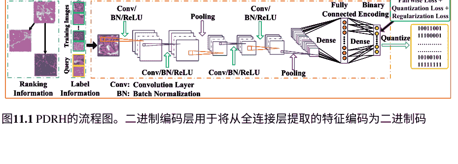

图11.1 PDRH的流程图。二进制编码层用于将从全连接层提取的特征编码为二进制码

这是PDRH的提出的目标函数。在方程（11.19）中，$ \lambda_1 $ 主要用于平衡 $ \mathbf{Y} $ 中保留的语义信息和 $ \mathbf{H} $ 和 $ \mathbf{Y} $ 之间的累积误差，即 $ \lambda_1 $ 越大，累积误差越小，但保留的语义信息越少；$ \lambda_2 $ 用于控制 $ \mathbf{A} $ 的方差，如果 $ \lambda_2 $ 过大，可能会增加累积误差并减少保留的语义信息。

为了清晰起见，我们在图(11.1)中呈现了使用一个CNN架构的PDRH的流程图和方程(11.19)。

接下来，我们将展示嵌入在CNN架构中的所提出目标函数的优化过程，方程(11.19)。

假设所提出的网络包含 $ L $ 层参数 $ (\mathbf{A}^l, \mathbf{b}^l)_{l=1}^L $，其中 $ \mathbf{A}^l $ 表示第 $ (l-1) $ 层和第 $ l $ 层之间的权重连接，$ \mathbf{b}^l $ 表示第 $ l $ 层的偏置。前 $ L-1 $ 层由CNN架构提供(请参考图11.1)。方程(11.19)是第 $ L $ 层(二进制编码)在第 $ L-1 $ 层(全连接)之后的目标函数，因此 $ \mathbf{A}^L = \mathbf{A} $ 和 $ \mathbf{b}^L = \mathbf{b} $。第 $ l $ 层的输出为

$$
\mathbf{Z}^l = \sigma \left( \mathbf{Z}^{l-1} \mathbf{A}^l + \mathbf{1}_n \mathbf{b}^l \right), \qquad (11.20)
$$

其中 $ \sigma(\cdot) $ 表示激活函数。因此，方程 (11.19) 中的参数 $ f(\mathbf{X}) $ 和 $ \mathbf{Y} $ 等价于网络中的 $ \mathbf{Z}^{L-1} $ 和 $ \mathbf{Z}^L $。

为了计算参数的梯度 $ (\mathbf{A}^l, \mathbf{b}^l)_{l=1}^L $，我们需要先计算偏导数 $ \frac{\partial J}{\partial \mathbf{A}^L} $ 和 $ \frac{\partial J}{\partial \mathbf{b}^L} $，在第 $ L $ 层中的计算如下：

$$
\frac{\partial J}{\partial \mathbf{A}^L} = \frac{\partial J_1}{\partial \mathbf{Z}^L} \frac{\partial \mathbf{Z}^L}{\partial \mathbf{A}^L} + \frac{\partial J_2}{\partial \mathbf{Z}^L} \frac{\partial \mathbf{Z}^L}{\partial \mathbf{A}^L} + \frac{\partial J_3}{\partial \mathbf{A}^L} = \mathbf{Z}^{L-1T} \boldsymbol{\Lambda}^L + \lambda_2 \mathbf{A}^L (\mathbf{A}^{LT} \mathbf{A}^L - \mathbf{I}_m), \qquad (11.21a)
$$

$$
\frac{\partial J}{\partial \mathbf{b}^L} = \frac{\partial J_1}{\partial \mathbf{Z}^L} \frac{\partial \mathbf{Z}^L}{\partial \mathbf{b}^L} + \frac{\partial J_2}{\partial \mathbf{Z}^L} \frac{\partial \mathbf{Z}^L}{\partial \mathbf{b}^L} = \frac{1}{n} \mathbf{1}_n^T \boldsymbol{\Lambda}^L, \qquad (11.21b)
$$

其中 $ \boldsymbol{\Lambda}^L = \left( \frac{r_{\text{max}}}{m} \left( \frac{r_{\text{max}}}{m} \mathbf{Z}^L \mathbf{Z}^{LT} - \mathbf{S} \right) \mathbf{Z}^L + \lambda_1 (\mathbf{H} - \mathbf{Z}^L) \right) \odot \left( \mathbf{1}_n \mathbf{1}_m^T - \mathbf{Z}^L \odot \mathbf{Z}^L \right) $，$ \odot $ 表示逐元素乘法。

偏导数 $ \frac{\partial J}{\partial \mathbf{A}^l} $ 和 $ \frac{\partial J}{\partial \mathbf{b}^l} $ 在第 $ l $ 层 ($ l < L $) 中计算如下：

$$
\frac{\partial J}{\partial \mathbf{A}^l} = \frac{\partial J}{\partial \mathbf{Z}^l} \frac{\partial \mathbf{Z}^l}{\partial \mathbf{A}^l} = \mathbf{Z}^{l-1T} \delta^l, \tag{11.22a}
$$

$$
\frac{\partial J}{\partial \mathbf{b}^l} = \frac{\partial J}{\partial \mathbf{Z}^l} \frac{\partial \mathbf{Z}^l}{\partial \mathbf{b}^l} = \frac{1}{n} \mathbf{1}_n^T \delta^l, \tag{11.22b}
$$

其中 $ \delta^l = \delta^{l+1} \mathbf{A}^{l+1T} \sigma'(\mathbf{Z}^{l-1} \mathbf{A}^l + \mathbf{1}_n \mathbf{b}^l) $ 表示 $ \mathbf{Z}^l $ 的导数。

参数 $ (\mathbf{A}^l, \mathbf{b}^l)_{l=1}^L $ 通过使用梯度下降算法进行更新如下所示：

$$
\mathbf{A}^l = \mathbf{A}^l - \eta \frac{\partial J}{\partial \mathbf{A}^l}, \tag{11.23a}
$$

$$
\mathbf{b}^l = \mathbf{b}^l - \eta \frac{\partial J}{\partial \mathbf{b}^l}. \tag{11.23b}
$$

## 11.3 实验结果与讨论

利用包括组织病理学骨骼肌和肺癌图像在内的图像数据集进行实验，评估了一些流行的哈希方法。所有的骨骼肌和肺癌图像都使用血红蛋白和嗜酸性染色（H&E）染色。骨骼肌图像包含两种主要的特发性炎症性肌病（IIM），即多发性肌炎（PM）和皮肌炎（DM）。肺癌图像分为两种类型的疾病，即腺癌（AC）和鳞状细胞癌（SC）。收集了来自威斯康星医学院神经肌肉实验室（MCWNL）的41个个体主题的5,256张（2,572张PM和2,678张DM）骨骼肌图像，并从癌症基因组图谱（TCGA）中选择和裁剪了42名患者的2,904张（1,456张AC和1,448张SC）肺癌图像。在这里，所有图像都被随机分成训练集和测试集，比例大约为3:1。具体而言，共使用了6,128张图像进行训练，其中包括3,952张（2,010张PM和1,942张DM）骨骼肌图像和2,176张（1,092张AC和1,084张SC）肺癌图像，剩余的2,032张（562张PM，736张DM，364张AC和364张SC）图像用于测试。在所有实验中，RGB原始图像直接作为所有深度哈希方法的输入，并在输入到学习流程之前将它们裁剪成大小为 $ 128 \times 128 $ 的块。此外，对于同一类别的图像，计算任意两个图像之间的欧氏距离，然后根据距离将所有图像分成八个子集。与最小距离的子集中的图像相关性为八，而与最大距离的子集中的图像相关性为一。请注意，在实践中，相关性可以根据应用程序的要求进行定义。

### 表11.1 网络配置，输入图像尺寸为128 × 128 × 3。（注意批量归一化跟随ReLU层位于两个卷积层之间或卷积和最大池化层之间。）

| 类型 | 滤波器尺寸/步长 | 输出尺寸 |
|------|----------------|----------|
| 卷积 | 3 × 3 × 3 × 32/1 | 126 × 126 × 32 |
| 卷积 | 3 × 3 × 32 × 32/1 | 124 × 124 × 32 |
| 池化 | 2 × 2/2 | 62 × 62 × 32 |
| 卷积 | 3 × 3 × 32 × 64/1 | 60 × 60 × 64 |
| 卷积 | 3 × 3 × 64 × 64/1 | 58 × 58 × 64 |
| 池化 | 2 × 2/2 | 29 × 29 × 64 |
| 全连接 | - | 512 |
| 二进制 | - | m |

我们展示了PDRH和八种非深度哈希方法，包括六种非排序哈希算法，谱哈希（SH）[17]，KSH[19]，COSDISH[40]，SDH[20]，KSDH[18]和ADGH[21]，以及两种排序哈希算法RSH[29]和RPH[30]，以及两种流行的深度哈希算法，卷积神经网络哈希（CNNH）[48]和二进制哈希码的深度学习（DLBHC）[24]。对于非深度哈希算法，整体高维特征从整个图像中提取作为输入，即首先从整个图像中检测尺度不变特征变换（SIFT）关键点，然后使用SIFT提取这些关键点周围的特征。然后，这些特征被编码成2,000维的直方图，使用词袋（BoW）方法[6]。为了比较，PDRH的全连接层的输出也被用作非深度哈希方法的输入，这些深度学习特征被称为DLF。在PDRH中，其三个关键参数被设置为γ=1, λ1=r_max和λ2=0.1。为了公平起见，所有深度哈希方法都使用表11.1中的架构。为了评估哈希算法的性能，我们使用五个主要标准：分类准确率，MAP，PR曲线，REL和NDCG。给定一组查询，其MAP，REL和NDCG分数的计算如下：

MAP是每个查询的平均精度（AP）的平均值。AP定义如下：

$AP@q = \frac{\sum_{k=1}^{q} P(k) \delta(k)}{\sum_{k=1}^{q} \delta(k)}$, (11.24)

其中q是返回样本的前几个数目，P(k)是列表中截断为k时的精度，δ(k)=1表示排名第k位的样本是相关的；否则，δ(k)=0。

$REL = \frac{1}{q} \sum_{i=1}^{q} r_i$, (11.25)

其中r_i是与查询图像相关的第i个最近邻的相关性。

$NDCG = \frac{1}{Z} \sum_{i=1}^{q} \frac{2^{r_i} - 1}{log(i+1)} \quad (11.26)$

其中 Z是一个常数，将NDCG的最大值归一化为一。

### 11.3.1 实验结果

为了计算各种哈希算法的检索准确性，我们首先采用每个算法将训练和查询图像编码为二进制码，然后利用二进制码计算查询和训练图像之间的汉明距离。接下来，我们可以根据它们的汉明距离选择每个查询图像的最近训练图像。最后，我们可以根据选择的训练图像计算每个查询图像的检索准确性。我们根据五个标准计算所有查询图像的平均值，并在11.2、11.3表和11.2、11.3、11.4、11.5图中报告它们。

表11.2显示了所有查询图像的平均检索准确性，包括各种方法的分类准确性和MAP，例如非深度算法SH、KSH、SDH、COSDISH、KSDH、ADGH、RSH、RPH和深度哈希算法CNNH、DLBHC和PDRH在8位、16位和32位哈希码上的表现。正如我们所看到的，具有DLF的非深度哈希算法比具有BoW的算法表现更好。此外，具有DLF的COSDISH、KSDH和ADGH优于深度哈希算法CNNH和DLBHC。PDRH在8位上获得更高的准确性（97.49%）和MAP（97.49和97.33%），比DLF的COSDISH、KSDH和ADGH更好，在16位和32位上它们的表现相似（差异在0.5%以内）。

图11.2显示了各种算法在8、16和32位上的PR曲线。它表明，使用DLF特征时，非深度算法SH、KSH、SDH、COSDISH、KSDH和ADGH的性能优于使用BoW特征的算法。在8位时，当召回率小于0.3时，PDRH的性能优于其他算法。在16位和32位时，PDRH可以获得所有哈希算法中最佳的检索性能。图11.3展示了各种算法在所有8、16和32位上使用汉明半径 $r = 1,2$ 和3时的精度。当 $r =1$ 或2时，PDRH在8位和16位上获得最佳精度。当 $r =3$ 时，PDRH在16位和32位上优于其他算法。

表11.3展示了提出的方法PDRH和具有16位DLF特征的比较算法在返回的5、10和50个邻居上的排名性能（REL和NDCG）。PDRH在返回的5、10和50个邻居上分别获得了最高的REL分数5.74、5.74和5.76。图11.4展示了上述算法在返回的5、10、20、50和100个图像上的相关性。它进一步说明了PDRH在不同的返回邻居或位上获得了更高的REL分数，超过了其他算法。表11.3还证明了使用16位哈希码时，PDRH、SH+DLF和RSH+DLF获得了最佳的NDCG分数。

### 表11.2 检索性能（%）以分类准确率和前100个和500个返回邻居的MAP进行测量。

| 方法 | 准确性(8) | 准确性(16) | 准确性(32) | MAP(前100)(8) | MAP(前100)(16) | MAP(前100)(32) | MAP(前500)(8) | MAP(前500)(16) | MAP(前500)(32) |
|------|-----------|------------|------------|---------------|----------------|----------------|---------------|----------------|----------------|
| SH [17]+BoW | 49.31 | 63.48 | 69.73 | 54.86 | 65.16 | 65.38 | 55.22 | 57.95 | 56.16 |
| KSH [19]+BoW | 64.22 | 75.30 | 77.66 | 64.19 | 72.33 | 73.55 | 71.09 | 71.56 | 73.32 |
| SDH [20]+BoW | 66.14 | 73.67 | 73.67 | 66.14 | 73.67 | 73.67 | 66.14 | 73.67 | 73.67 |
| COSDISH [40]+BoW | 64.42 | 69.29 | 73.08 | 68.22 | 70.63 | 76.26 | 68.68 | 71.30 | 76.44 |
| KSDH [18]+BoW | 68.36 | 66.10 | 72.83 | 68.36 | 66.10 | 72.83 | 68.36 | 66.10 | 72.83 |
| ADGH [21]+BoW | 72.15 | 71.56 | 73.57 | 72.15 | 71.56 | 73.57 | 72.15 | 71.56 | 73.57 |
| SH [17]+DLF | 85.73 | 90.26 | 92.57 | 87.25 | 88.86 | 91.42 | 83.98 | 80.08 | 82.56 |
| KSH [19]+DLF | 57.48 | 92.86 | 93.65 | 57.02 | 91.90 | 94.40 | 56.96 | 93.22 | 94.16 |
| SDH [20]+DLF | 91.68 | 95.08 | 94.98 | 91.68 | 95.08 | 94.98 | 91.68 | 95.08 | 94.98 |
| COSDISH [40]+DLF | 96.56 | **96.70** | **96.41** | 96.69 | **96.70** | **96.49** | 96.70 | **96.70** | **96.50** |
| KSDH [18]+DLF | 96.90 | 96.15 | 96.11 | 96.90 | 96.15 | 96.11 | 96.90 | 96.15 | 96.11 |
| ADGH [21]+DLF | 96.56 | **96.70** | **96.41** | 96.69 | **96.70** | **96.49** | 96.70 | **96.70** | **96.70** |
| RSH [29]+DLF | 80.27 | 80.36 | 88.63 | 83.16 | 81.38 | 87.65 | 78.88 | 74.02 | 81.33 |
| RPH [30]+DLF | 92.22 | 85.29 | 94.24 | 91.56 | 88.01 | 95.06 | 92.39 | 88.55 | 94.61 |
| CNNH [48] | 92.86 | 92.32 | 66.19 | 88.48 | 82.57 | 67.14 | 92.81 | 90.01 | 85.03 |
| DLBHC [24] | 94.49 | 92.13 | 90.80 | 82.92 | 88.30 | 89.44 | 90.86 | 91.50 | 89.27 |
| PDRH | **97.49** | **96.75** | **96.65** | **97.49** | **96.80** | **96.66** | **97.33** | **96.65** | **96.52** |

### 图11.2 不同位数算法的PR曲线

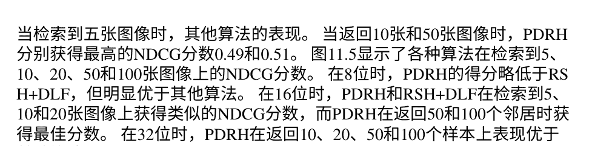

当检索到五张图像时，其他算法的表现。当返回10张和50张图像时，PDRH分别获得最高的NDCG分数0.49和0.51。图11.5显示了各种算法在检索到5、10、20、50和100张图像上的NDCG分数。在8位时，PDRH的得分略低于RSH+DLF，但明显优于其他算法。在16位时，PDRH和RSH+DLF在检索到5、10和20张图像上获得类似的NDCG分数，而PDRH在返回50和100个邻居时获得最佳分数。在32位时，PDRH在返回10、20、50和100个样本上表现优于其他算法。

### 图11.3 不同汉明半径下使用各种算法的精度与比特之间的关系（@r）

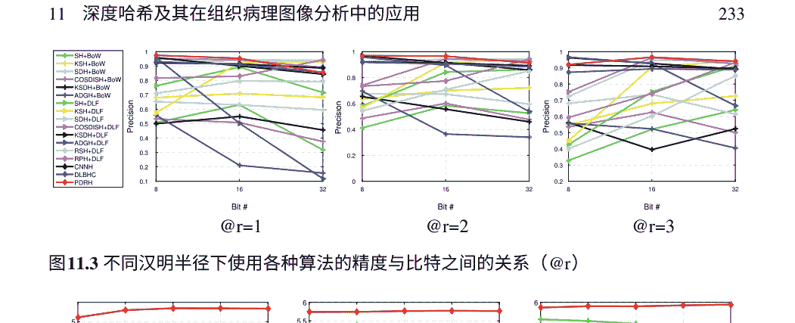

### 图11.4 不同检索图像数量下的REL

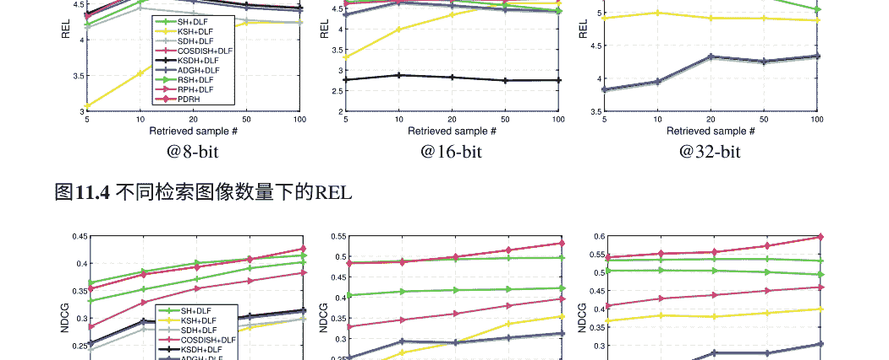

### 图11.5 不同检索图像数量下的NDCG

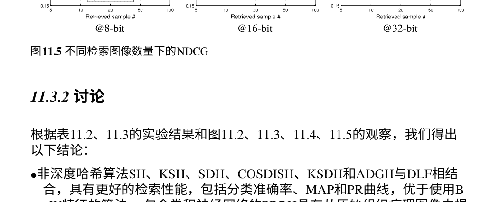

### 11.3.2 讨论

根据表11.2、11.3的实验结果和图11.2、11.3、11.4、11.5的观察，我们得出以下结论：

-   非深度哈希算法SH、KSH、SDH、COSDISH、KSDH和ADGH与DLF相结合，具有更好的检索性能，包括分类准确率、MAP和PR曲线，优于使用BoW特征的算法。包含卷积神经网络的PDRH具有从原始组织病理图像中提取特征的强大能力，并保留了重要的语义信息。相比之下，BoW通过探索内在结构提取特征，保留了重要信息而不需要任何监督，因此可能忽略了一些重要的语义信息。

-   尽管包括非深度哈希算法在内的非排名和排名哈希算法在DLF特征上表现良好，但它们通常达到与PDRH相似或更差的性能。主要可能的原因是PDRH同时提取特征和学习二进制表示，从而得到更好和更稳定的解决方案。
-   包括KSH、SDH、COSDISH、KSDH和ADGH在内的非排名哈希算法可以提供公平的检索性能，而它们的排名性能，包括REL和NDCG，相对较差。这是因为它们的亲和矩阵保持了图像的类间差异，而没有考虑同一类别内图像的相似性顺序。
-   尽管排名哈希算法RSH和RPH可以获得比大多数非排名哈希更好的排名性能，但它们通常实现较差的检索性能。这可以归因于RSH和RPH专注于图像之间的类内差异，但它们并不强调图像之间的类间差异。

## 11.4 总结

本章介绍了三种深度哈希技术，特别是基于成对的深度哈希技术，以及它们在组织病理学图像上的应用。具体而言，它讨论了基于点对、多对和成对的深度哈希，并分析了它们之间的差异。此外，它介绍了一种基于成对的深度哈希方法，可以同时从组织病理学图像中提取特征并学习它们的二进制表示，以保持图像分类中的类间差异并维持同一类中的类内相关顺序。最后，本章展示了几种流行的哈希方法在组织病理学图像数据集（包括骨骼肌和肺癌图像）上的实验结果。

-   (i) 设计一个更通用的深度哈希模型，以处理更多类型的组织病理学图像；
-   (ii) 提出快速高效的深度哈希方法，从整张切片图像中检索与某种疾病相关的图像块，这些图像通常包含数十亿个像素，对许多哈希方法构成了障碍；
-   (iii) 利用少量标记数据和大规模未标记数据实现应得的检索准确性，因为大多数当前的深度哈希方法需要大量标记图像，而对图像进行标记是病理学家费力、繁琐和耗时的工作；
-   (iv) 设计一个强大的深度哈希模型来处理带有噪声标签的组织病理学图像，因为由于病理学家的主观评估，对图像进行注释容易出错。

## 参考文献

-   1. Petushi S, Garcia FU, Haber MM, Katsinis C, Tozeren A (2006) 对组织学图像进行大规模计算揭示了乳腺癌的分级区分参数。 生物医学计算与医学影像学 6(1):1
-   2. 杨L，陈W，米尔P，萨拉鲁G，费尔德曼MD，福兰DJ (2007年) 网格上的乳腺癌标本的高通量分析。 在：国际医学图像计算和计算机辅助干预会议论文集。Springer，柏林，第617-625页
-   3. 邢F，杨L (2016年) 数字病理学和显微镜图像中的稳健核/细胞检测和分割：一项综述。IEEE Rev Biomed Eng 9: 234-263
-   4. 邢F，谢Y，杨L (2016年) 用于稳健核分割的自动学习框架。IEEE Trans Med Imag 35 (2) : 550-566
-   5. Comaniciu D, Meer P, Foran DJ (1999年) 病理学图像引导的决策支持系统。 Mach Vis Appl 11 (4) : 213-224
-   6. Caicedo JC, Cruz A, Gonzalez FA (2009年) 使用特征包和核函数的组织病理学图像分类。 在：欧洲医学人工智能会议论文集。Springer，柏林，第126-135页
-   7. Basavanahally AN, Ganesan S, Agner S, Monaco JP, Feldman MD, Tomaszewski JE, Bhanot G, Madabhushi A (2010) 计算机图像基于检测和分级的淋巴细胞在HER2+乳腺癌组织病理学中的浸润。 IEEE Trans Biomed Eng 57(3): 642-653
-   8. Zheng L, Wetzel AW, Gilbertson J, Becich MJ (2003) 基于内容的设计和分析病理图像检索系统。 IEEE Trans Inf Tech Biomed 7(4): 249-255
-   9. Akakin HC, Gurcan MN (2012) 基于内容的显微图像检索系统，用于多图像查询。 IEEE Trans Inf Tech Biomed 16(4): 758-769
-   10. Zhang X, Liu W, Dundar M, Badve S, Zhang S (2015) 朝着大规模组织病理学图像分析：基于哈希的图像检索。 IEEE Trans Med Imag 34(2): 496-506
-   11. Zhang X, Su H, Yang L, Zhang S (2015) 通过稳健分割和大规模检索进行细粒度组织病理学图像分析。在：国际会议论文集计算机视觉和模式识别，第5361-5368页
-   12. Jiang M, Zhang S, Huang J, Yang L, Metaxas DN (2015) 联合基于核的监督哈希用于可扩展的组织病理学图像分析。 在：医学图像计算与计算辅助干预，第366-373页
-   13. Shi X, Xing F, Xu K, Xie Y, Su H, Yang L (2017) 监督图哈希用于组织病理学图像检索和分类。医学图像分析

## 11 深度哈希及其在组织病理学图像分析中的应用

- 14. Shi X, Xing F, Xie Y, Su H, Yang L (2017) 细胞编码用于组织病理学图像分类。 在：医学图像计算与计算辅助干预
- 15. Zhang S, Metaxas D (2016) 大规模医学图像分析：最新方法、应用和未来方向。医学图像分析33:98-101
- 16. Wang J, Kumar S, Chang S (2012) 半监督哈希用于大规模搜索。 IEEE Trans Pattern Anal Mach Intel 34(12):2393-2406
- 17. Weiss Y, Torralba A, Fergus R (2009) 光谱哈希。 在：神经信息处理系统进展的论文集，第1753-1760页
- 18. Shi X, Xing F, Cai J, Zhang Z, Xie Y, Yang L (2016) 基于核的监督离散哈希用于图像检索。 在：欧洲计算机视觉会议论文集，第419-433页
- 19. Liu W, Wang J, Ji R, Jiang Y, Chang S (2012) 带核的监督哈希。 在：计算机视觉和模式识别国际会议论文集，第2074-2081页
- 20. Shen F, Shen C, Liu W, 田涛 (2015) 监督离散哈希。 在：计算机视觉和模式识别国际会议论文集，第37-45页
- 21. Shi X, Xing F, Xu K, Sapkota M, Yang L (2017) 非对称离散图哈希。 在：人工智能进步协会
- 22. LeCun Y, Bengio Y, Hinton G (2015) 深度学习. 自然 521(7553):436–444
- 23. Krizhevsky A, Sutskever I, Hinton GE (2012) 使用深度卷积神经网络的Imagenet分类. 在: Proceedings advances in neural information processing systems, pp 1097–1105
- 24. Lin K, Yang HF, Hsiao JH, Chen CS (2015) 用于快速图像检索的二进制哈希码的深度学习. 在: Proceedings of the IEEE conference on computer vision and pattern recognition, pp 27–35
- 25. Lai H, Pan Y, Liu Y, Yan S (2015) 同时进行特征学习和哈希编码的深度神经网络. 在: Proceedings of the IEEE conference on computer vision and pattern recognition, pp. 3270–3278
- 26. Sapkota M, Shi X, Xing F, Yang L (2018) 深度卷积哈希用于组织病理图像的低维二进制嵌入。 IEEE J Biomed Health Inform
- 27. Shi X, Sapkota M, Xing F, Liu F, Cui L, Yang L (2018) 基于成对的深度排序哈希用于组织病理图像分类和检索。 Pattern Recognition 81:14–22
- 28. Norouzi M, Fleet DJ, Salakhutdinov RR (2012) 汉明距离度量学习。 在: Proceedings of the Conference on Neural Information Processing Systems, pp 1061–1069
- 29. Wang J, Liu W, Sun AX, Jiang YG (2013) 学习具有列表监督的哈希码。 在：国际计算机视觉会议, pp 3032–3039
- 30. Wang Q, Zhang Z, Si L (2015) 保持排序的哈希用于快速相似性搜索。 在：国际人工智能联合会议, pp 3911–3917
- 31. Järvelin K, Kekäläinen J (2000) 用于检索高相关文档的IR评估方法。 在：国际ACM SIGIR会议的信息检索研究与开发的论文集。 ACM, 第41-48页
- 32. Zhang R, Lin L, Zhang R, Zuo W, Zhang L (2015) 具有正则化相似性学习的可扩展位哈希用于图像检索和人员再识别。 IEEE图像处理 24(12): 4766-4779
- 33. Zhuang B, Lin G, Shen C, Reid I (2016) 基于三元组的深度二进制嵌入网络的快速训练。 在：IEEE计算机视觉和模式识别会议论文集，第5955-5964页
- 34. Zhao F, Huang Y, Wang L, Tan T (2015) 基于深度语义排序的多标签图像检索哈希。 在：IEEE计算机视觉和模式识别会议论文集，第1556-1564页
- 35. Liu L, Shao L, Shen F, Yu M (2017) 为监督图像哈希编码语义排序进行离散编码。 在：计算机视觉和模式识别IEEE会议论文集, pp 1425–1434
- 36. Weiss Y, Fergus R, Torralba A (2012) 多维光谱哈希。 在：欧洲计算机视觉会议, pp 340–353
- 37. Carreira-Perpinán MA (2010) 弹性嵌入算法用于降维。 在： 机器学习国际会议，第10卷，pp 167–174
- 38. Norouzi M, Blei DM (2011) 用于紧凑二进制编码的最小损失哈希。 在： 机器学习国际会议，pp 353–360
- 39. Kulis B, Darrell T (2009) 学习使用二进制重构嵌入进行哈希。 在： 神经信息处理系统进展会议论文集，pp 1042–1050
- 40. Kang WC, Li WJ, Zhou ZH (2016) 基于列采样的离散监督哈希。 在： 人工智能进步协会
- 41. Shi X, Guo Z, Nie F, Yang L, You J, Tao D (2016) 二维白化重建以增强主成分分析的鲁棒性。 IEEE Trans Pattern Anal Mach Intell 38(10):2130–2136
- 42. Oliva A, Torralba A (2001) 建模场景的形状：空间包络的整体表示。 Int J Comput Vis 42 (3):145–175
- 43. Dalal N, Triggs B (2005) 用于人体检测的梯度直方图。 在： IEEE国际计算机视觉和模式识别会议论文集，pp 886–893
- 44. Zhu H, Long M, Wang J, Cao Y (2016) 用于高效相似性检索的深度哈希网络。 在： 人工智能促进协会，pp 2415–2421
- 45. Li WJ, Wang S, Kang WC (2015) 基于特征学习的深度监督哈希与成对标签。 arXiv:1511.03855
- 46. 刘H, 王R, 单S, 陈X (2016) 用于快速图像检索的深度监督哈希。 在： 计算机视觉和模式识别的IEEE会议论文集，第2064-2072页
- 47. 曹Z, 龙M, 王J, 于PS (2017) Hash net: 通过连续学习进行深度哈希。 在： 计算机视觉的IEEE国际会议论文集，第5609-5618页
- 48. 夏R, 潘Y, 赖H, 刘C, 严S (2014) 通过图像表示学习进行图像检索的监督哈希。 在： 人工智能进步协会，第1卷，第2页

# 第12章 使用卷积网络进行肿瘤生长预测

Ling Zhang, Lu Le, Ronald M. Summers, Electron Kebebew 和 Jianhua Yao

摘要 通过体积医学成像观察进行预后肿瘤生长建模是精确和预测医学中的一个具有挑战性但重要的问题。它可能意味着和导致肿瘤治疗管理和手术规划的更好结果。传统上，这个问题是通过数学建模来解决的。卷积神经网络（ConvNets）的最新进展表明，在预测肿瘤生长方面，比传统的数学模型更高的准确性和效率可以得到实现。这表明基于深度学习的数据驱动技术在解决这类问题上具有巨大潜力。在本章中，我们首先介绍了一种统计群体学习方法，用于预测肿瘤生长的模式，该方法结合了人口趋势和个性化数据，其中使用深度ConvNet来建模逐体素的时空肿瘤进展。然后，我们提出了一个双流ConvNets，直接建模和学习肿瘤生长的两个基本过程，即细胞侵袭和质量效应，并且

L. 张 (📧)
Nvidia 公司, Bethesda, MD 20814, 美国
e-mail: lingz@nvidia.com

L. 乐
PAII 公司, Bethesda 研究实验室, 6720B Rockledge Drive, Ste 410, Bethesda, MD 20817, 美国
e-mail: le.lu@paii-labs.com; lelu@cs.jhu.edu
约翰霍普金斯大学, 巴尔的摩, MD, 美国

R. M. Summers
成像生物标志物和计算机辅助诊断实验室和临床图像处理服务放射学和成像科学部, 国家卫生研究院临床中心, Bethesda, MD 20892, 美国

E. Kebebew
内分泌肿瘤分部, 国家癌症研究所, 国家卫生研究院, Bethesda, MD 20892, 美国

J. Yao
腾讯控股有限公司, 深圳 518057, 中国
e-mail: jianhuayao@tencent.com

© Springer Nature Switzerland AG 2019
L. 卢等人 (编).深度学习与卷积神经网络在医学成像和临床信息学中的应用, 计算机视觉与模式识别进展,
https://doi.org/10.1007/978-3-030-13969-8_12

## 12.1 引言

肿瘤生长的预测是一项非常具有挑战性的任务。长期以来，它一直被视为一个数学建模问题[6, 11, 31]。医学成像数据在宏观水平上提供了肿瘤随时间的非侵入性和体内测量。因此，以往关于基于图像的肿瘤生长建模的工作主要基于反应扩散方程和生物力学模型。

一些以前的肿瘤生长模型[6, 11, 31]是从一个或多个特定患者随时间的纵向成像研究中推导出来的。虽然这些方法可以产生有信息量的结果，但大多数以前的肿瘤生长模型是独立地从目标患者中估计的，而没有考虑到人群趋势的肿瘤生长模式。此外，模型参数的数量较少（例如，在[31]中为5）可能不足以表示肿瘤生长的复杂特征。除了数学建模方法外，基于数据驱动原则和统计群体学习的组合可能提供了一个潜在的解决方案，通过建立一个基于人群趋势和个性化临床特征的模型来解决这些问题。在这个方向上唯一的先驱研究[20]尝试在一个基于分类的框架中建模胶质瘤的生长模式。该模型从患者、肿瘤和体素级别的选定特征中学习肿瘤生长模式，并实现了59.8%的预测准确率。然而，这项研究只使用了肿瘤生长的人群趋势，没有结合患者特定肿瘤生长模式的历史，并且无法预测不同时间点的肿瘤生长。

此外，这项早期研究仅使用手工制作的低级特征。事实上，描述肿瘤进展的信息可能潜在地存在于肿瘤成像的潜在高级特征空间中，但这尚未得到研究。

深度神经网络[16]是具有大量（约15 M）参数的高容量可训练模型。通过使用梯度反向传播优化大量的网络参数，网络可以在没有任何特征工程的情况下发现和表示原始数据中的复杂结构。特别是，在各种传统医学成像应用中，深度卷积神经网络（ConvNets）的性能显著提高[9]。这些应用的基本思想是使用深度学习来确定像素或图像的当前状态（是否属于对象边界/区域或特定类别）。ConvNets还成功地用于预测图像/患者级别的未来二进制标签，例如预测脑部和肺部癌症患者的生存预测[22, 32]。更一般地说，在人工智能社区中，ConvNet已经展示出在图像像素级别预测下一个状态的强大能力-作为AlphaGo [19, 23]中的关键组成部分，完全ConvNets被训练来预测下一步移动（位置）

给定当前棋盘状态，预测围棋选手的下一步走法（在19 × 19围棋棋盘上），准确率达到57%。在本章中，我们研究深度卷积神经网络是否能够在像素/体素级别上预测医学问题的未来状态。我们的主要目标是设计一个深度学习预测模型，预测当前时间点的体素在下一个时间点是否会变成肿瘤体素（参见图12.1）。

我们首先提出了一个统计群组学习框架，用于预测肿瘤生长，该框架结合了从人群趋势和个性化临床因素中得出的肿瘤生长模式。我们的假设是通过将纵向多模态成像信息的视觉解释与临床因素相结合，可以预测未来肿瘤进展涉及的区域。然后，我们提出了一个双流卷积神经网络，直接从多模态肿瘤成像数据和多个时间点学习肿瘤生长的两个基本过程（细胞侵袭和肿瘤质量效应）。对胰腺肿瘤数据集进行定量实验表明，这两种方法在准确性和效率方面都明显优于基于模型的最新方法[31]。

## 12.2 肿瘤生长预测的群体学习方法

在本研究中，纵向胰腺肿瘤数据中，每个患者在三个时间点上都有多模态成像数据（双相增强CT和FDG-PET[（2-[18F]氟代脱氧葡萄糖正电子发射断层扫描）]）和临床记录，跨度为3-4年。我们设计了一个集成的训练、个性化和预测框架，如图12.2所示。首先对不同时间点获取的不同模态成像数据进行配准，然后对肿瘤进行分割。

肿瘤被分割。还计算了细胞内体积分数（ICVF）和标准摄取值（SUV）[31]。在训练和个性化阶段，从群体数据（患者1-患者n）中提取任意两个时间点（time1/time2和time2/time3）的体素级ConvNets和基于位置的特征、时间间隔和临床因素，以及从个性化数据（目标患者，表示为患者n+1）中提取的time1/time2对。接下来，使用考虑先验知识的特征选择方法对这些特征进行排序。

排名靠前的特征（m = 1, ..., M）被用来训练SVM模型，以捕捉人群趋势。然后，通过目标患者数据的时间1/时间2对SVM分类器进行个性化，以确定最佳特征集和模型参数（个性化）。在预测阶段，给定目标患者在时间2的数据，将成像和临床特征输入预测模型，以预测和估计未来时间3的体素级肿瘤区域。请注意，测试数据（即基于目标患者时间2的预测时间3）从未被预测模型看到过。

### 12.2.1 图像处理和补丁提取

为了建立肿瘤在不同时间点上的空间-时间关系，多模态成像数据基于互信息进行注册，并使用肿瘤中心对不同时间点的成像数据进行对齐[31]。之后，从多模态图像中提取三种类型的信息（SUV、ICVF和肿瘤掩膜，参见图12.3左侧面板的示例），并将其作为三通道输入用于入侵ConvNet模型。

1.  FDG-PET表征了身体中更活跃且需要更多能量来维持现有肿瘤细胞并产生新的肿瘤细胞的区域。这激发了我们使用FDG-PET来测量代谢率并将其纳入肿瘤预测模型的学习中。SUV是代谢率的定量测量[18]。为了适应ConvNets模型，PET图像中的SUV值被放大100倍，然后经过一个裁剪窗口[100 2600]，然后线性转换为[0 255]。
2.  肿瘤分级是最重要的预后指标之一，由肿瘤细胞的增殖率决定[2]。这激发了我们提取与细胞数量相关的潜在生理参数。ICVF是归一化肿瘤细胞密度的表示，通过注册的双相增强CT计算得出：

    ```
    ICVF = 1 - \frac{HU_{post\_tumor} - HU_{pre\_tumor}}{E[HU_{post\_blood} - HU_{pre\_blood}]} \times (1 - Hct), (12.1)
    ```

    其中 HU_{post_tumor}, HU_{pre_tumor}, HU_{post_blood} 和 HU_{pre_blood} 是分割肿瘤和血池处的预后和预对比CT图像的 Hounsfield 单位（主动脉）,分别。E[●]表示平均值。Hct是血细胞比容，可以通过血液样本获得，因此肿瘤的ICVF是使用血液的ICVF（Hct）作为参考计算的。得到的ICVF值放大了100倍（范围在[0 100]之间）用于ConvNets输入。
3.  肿瘤分期是另一个重要的预后指标，由肿瘤的大小和范围决定[2]。先前的研究使用肿瘤掩膜/边界来监测肿瘤形态变化和估计模型参数[6, 12, 25]。在本研究中，根据[31]，使用半自动水平集算法和区域竞争[34]在增强后的CT图像上分割肿瘤，形成具有二值（0或255）的肿瘤掩膜。

如图12.1所示，为了训练ConvNet区分未来的肿瘤和非肿瘤体素，从当前时间点附近肿瘤区域的体素中心采样大小为17 × 17体素 × 3的图像块，这些图像块反映和模拟肿瘤的生理状态。下一个时间点内或外的中心块分别标记为“1”和“0”，作为正样本和负样本进行训练。

这种基于补丁的提取方法允许嵌入围绕肿瘤体素的上下文信息。体素（补丁中心）采样范围限制在以肿瘤中心为中心的±15个像素的边界框内，因为我们的数据集中的胰腺肿瘤直径小于3厘米（约30个像素）且生长缓慢。为了避免对多数类别（非肿瘤）的分类偏差，并提高ConvNet训练的准确性和收敛速度[15, 35]，我们通过按比例对非肿瘤补丁进行欠采样来创建一个大致平衡的训练集。图12.3显示了编码为三通道RGB彩色图像的SUV、ICVF和掩膜的正负补丁的几个示例。

### 12.2.2 学习逐体素的深度表示

我们使用AlexNet [15]作为我们的网络架构。AlexNet包含五个卷积层（conv1 -conv5），三个池化层（pool1，pool2，pool5）和两个全连接层（fc6-fc7）。该网络从群组数据集的所有时间点对（time1/time2和time2/time3）开始训练。训练在预定的时期之后终止，选择具有最低验证损失的模型作为最终网络。

然后使用得到的ConvNet来提取体素/补丁的高级表示。通过将三通道的SUV-ICVF掩膜图像补丁输入个性化的ConvNet模型中，可以实现这一目标，其中fc和输出层可以被视为学习到的深度特征。考虑到ConvNet fc层的高维深度图像特征如果直接结合，可能会压倒数量较少的肿瘤级别和患者级别特征，因此将最后一层的两个节点的输出视为最终提取的深度特征。

### 12.2.3 使用多源特征学习预测模型
#### 12.2.3.1 特征提取和选择
一个通用的统计学习概念是，来自不同来源的线索可以为学习更强的分类器提供互补信息。因此，除了深度特征之外，我们还提取了其他三种类型的特征：（1）两个成像时间点之间的时间间隔，以天为单位。（2）肿瘤级别特征-每个体素在3D体积中距离其最近肿瘤表面的斑块中心的欧氏距离。如果斑块中心位于当前肿瘤区域内，则该距离值为正，否则为负。此外，还计算了肿瘤体积。（3）患者级别特征，包括年龄、性别、身高和体重。在模型训练和个性化过程中，采用SVM RFE技术[10]来找到最具信息量的特征。反映基于图像的特征对于评估肿瘤生长的重要性[31]，SVM RFE模型选择始终选择这两个基于ConvNet的特征。最后，时间间隔作为一个先验特征被用于我们的任务中，因为它是必要的。

#### 12.2.3.2 预测模型训练和个性化以及测试
一旦特征集完全排序，前 m个特征 (m= [2, 3, ..., 9]) 将逐个添加到训练一组（七个）SVM分类器的过程中，直到包含所有特征。在每次迭代中，SVM分类器在群组数据集的样本上进行训练，然后在个性化数据集的样本上进行个性化。计算并记录所有分类器的预测准确率，其中准确率指标 (ACC) 定义为 ACC = 选择最大预测 ACC的特征集和分类器。

为了更好地将预测模型从人群趋势个性化到目标患者，我们优化了一个目标函数，该函数衡量了预测肿瘤体积与目标患者未来真实体积之间的一致性。为了实现这一目标，我们首先将预测模型应用于个性化体积的搜索邻域（肿瘤生长区域）中的体素，然后对分类输出进行阈值处理。计算预测和真实肿瘤体积之间的相对体积差异 (RVD) 。如[31]所述，肿瘤生长区域被设置为围绕肿瘤的边界框，用像素距离 N_x, N_y, 和 N_z 参数化，分别表示到肿瘤表面的 x-, y-和 z-方向的距离。

在测试阶段，给定目标患者时间2的数据，预测模型以及其个性化模型参数被应用于预测时间3生长区域中每个体素的标签。

### 12.2.4 实验和结果
本节研究了7例患有von Hippel-Lindau (VHL)疾病的患者（5男2女），每例患者均患有胰腺神经内分泌肿瘤（PanNET）。VHL相关的PanNET通常被发现为非功能性的，具有恶性（癌症）潜力[14]，并且通常可以通过成像筛查识别为界定清晰的实质性肿块[29]。对于这种肿瘤的自然历史，大约60%的患者表现为非线性肿瘤生长，20%稳定，20%减小（随访时间中位数为4年）[27]。

PanNET的治疗包括积极观察、手术干预和药物治疗。如果PanNET直径不超过3厘米或肿瘤倍增时间<500天，则进行积极观察；否则，由于高转移疾病风险，应该切除PanNET[14]。中度级别的医学治疗（例如，everolimus）适用于中级级别（在前12个月内有放射学进展的PanNETs）、晚期或转移性疾病[33]。因此，在早期阶段对PanNETs的空间-时间进展进行患者特异性预测是可取的，因为它将有助于在不同治疗策略中做出决策，以更好地管理治疗或手术计划。在这个数据集中，患者在时间1的平均年龄、身高和体重分别为48.6 ±13.9岁、1.70 ±0.13米和88.1 ±16.7千克。两个时间点之间的时间间隔为418 ±142天（均值 ±标准差）。该数据集来自[31]。

ConvNet在30个epochs上进行训练。初始学习率为0.001，并在每个十个epochs时减小10倍。权重衰减和动量设置为0.0005和0.9。使用0.5的dropout比例对fc6和fc7层进行正则化。小批量大小为256。由于胰腺肿瘤的尺寸较小，图像块大小\(s\)设置为17像素。为了适应我们的ConvNet所使用的Caffe框架，原始的17×17图像块通过双线性插值上采样为256×256图像块。从七个患者中提取了36520个阳性和41999个阴性图像块。AlexNet在Caffe平台上运行[13]，使用具有12 GB内存的NVIDIA GeForce GTX TITAN Z GPU。SVM（LIBSVM库[4]）使用线性核（C=1）用于SVM RFE特征选择和SVM分类器训练。肿瘤生长区域的参数设置为\(N\_x=3\)，\(N\_y=3\)和\(N\_z=3\)，以提高预测速度，并且我们注意到预测准确性对这些参数的变化不敏感。

我们使用留一法交叉验证评估了所提出的方法，这不仅方便与最先进的基于模型的方法[31]进行比较（已知时间1和时间2的肿瘤状态，预测时间3），而且更重要的是能够学习人群趋势和个体化肿瘤生长模式。在每个七次验证中，将六个患者用作群体训练数据来学习人群趋势，将剩余患者的时间1/时间2用作个性化数据集，将剩余患者的时间2/时间3用作测试集。通过对七次交叉验证结果进行平均，得到模型的最终性能值。使用测量结果评估预测性能。

### 表12.1 我们的方法与先前方法在测试集上的性能比较。结果以均值 ±标准差报告。[最小值，最大值]
| | 召回率 (%) | 精确度 (%) | Dice系数 (%) | RVD (%) |
| :--- | :--- | :--- | :--- | :--- |
| 参考文献[31] | 83.2 ± 8.8 [69.4, 91.1] | 86.9 ± 8.3 [74.0, 97.8] | 84.4 ± 4.0 [79.5, 92.0] | 13.9 ± 9.8 [3.6, 25.2] |
| 我们的 | 87.9 ± 5.0 [81.4, 94.4] | 86.0 ± 5.8 [78.7, 94.5] | 86.8 ± 3.6 [81.8, 91.3] | 7.9 ± 5.4 [2.5, 19.3] |

通过四个指标（召回率、精确度、Dice系数和RVD，如[31]中定义）在第三个时间点的结果。

$$\text{召回率} = \frac{\text{真阳性体积}}{V_{大于}}, \quad \text{精确率} = \frac{\text{真阳性体积}}{\text{预测的}V}, \quad \text{Dice系数} = \frac{2 \times \text{真阳性体积}}{V_{\text{实际}} + \text{预测的}V} \quad (12.2)$$

其中，真阳性体积（TPV）是预测的V和实际肿瘤体积V实际之间的重叠体积。

在图12.4所示的示例中，我们的方法在Dice系数和RVD方面都比基于模型的方法更高。请注意，Dice系数和RVD的理想值分别为100%和0%。如表12.1所示，我们的方法的Dice系数（86.8 ± 3.6% vs. 84.4 ± 4.0%）更高，尤其是RVD（7.9 ± 5.4% vs. 13.9 ± 9.8%）比基于模型的方法[31]更低，因此在未来肿瘤体积预测方面更加有效。基于模型的方法在[31]中的方法需要约24小时进行模型个性化和约21秒进行模拟每个患者，而我们的方法仅需要3.5小时进行训练和个性化并且每个患者的预测时间为4.8 ± 2.8分钟。

## 12.3 卷积入侵和扩张网络 用于肿瘤生长预测
癌细胞起源于正常细胞呼吸的不可逆损伤。受损细胞中的一部分可以通过发酵能量替代失去的呼吸能量，但因此会转化为不分化和广泛生长的细胞（癌细胞）[26]。肿瘤是由这种异常的细胞/组织生长发展而来，与细胞浸润和质量效应[8]有关。细胞浸润的特征是肿瘤细胞的迁移和穿透到周围组织，质量效应是由肿瘤生长引起的组织扩张和向外推压（图12.5）。

我们提议使用ConvNets直接表示和学习肿瘤生长的两个基本过程（细胞侵袭和肿块效应），这是通过多模态肿瘤成像数据在多个时间点上实现的。我们提出的ConvNet架构部分受到了评估围棋下一步/位置的策略和价值网络混合的启发[23]，以及在视频中有效识别动作的空间和时间网络的整合[7, 24]。除了在[7, 24]中使用的x和y方向的光流幅度（即两通道图像输入），我们还添加了流方向信息以形成三通道输入，因为光流方向对于肿瘤生长估计至关重要。此外，我们对网络应用了个性化训练步骤，这对于个体化的肿瘤生长建模是必要且重要的[5, 18, 30, 31]。此外，我们专注于预测肿瘤掩膜/分割的未来标签，这被发现比直接预测并分割未来原始图像[21]要好得多。

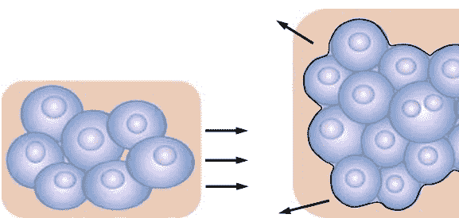

图12.5 肿瘤生长的两个基本过程：细胞侵袭和肿瘤细胞的扩张生长

### 12.3.1 学习侵袭网络
#### 12.3.1.1 图像处理和补丁提取
如第12.2.1节所述，从多模态图像中提取与肿瘤属性相关的三种信息（SUV、ICVF和肿瘤掩膜，参见图12.3左侧面板）并将其用作侵袭ConvNet模型的三通道输入。

#### 12.3.1.2 网络架构
我们使用从AlexNet [15]改编的六层ConvNet，包括四个卷积（conv）层和一个全连接（fc）层（参见图12.6上面板）。输入大小为17 × 17 × 3的图像补丁堆栈，其中三个通道分别是SUV、ICVF和肿瘤掩膜的肿瘤状态通道。所有conv层的滤波器大小为3 × 3，填充和步幅为1。从conv1到conv4层的滤波器数量分别为64、128、256和512。对于conv1和conv4层，使用3 × 3的空间窗口进行最大池化，步幅为2。对于conv1和conv2层，使用与[15]相同的局部响应归一化设置。fc5层包含256个整流器单元，并应用“dropout”来减少过拟合。所有层都配备了ReLU（修正线性单元）激活函数。输出层由两个神经元组成，对应于未来的肿瘤或非肿瘤类别，并应用softmax损失函数。侵袭ConvNet是从群体数据集的所有时间点对（time1/time2和time2/time3）的图像补丁-标签对上从头开始训练的。

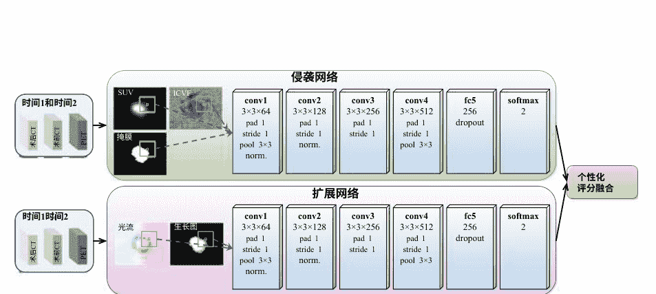

### 12.3.2 学习扩展网络
#### 12.3.2.1 图像处理和补丁提取
与侵袭网络不同，扩展网络从静态图像中进行预测，考虑了图像运动信息。其输入图像的尺寸为17 × 17 ×4，捕捉两个时间点之间的扩展运动信息。

三个通道来自于彩色编码的三通道光流图像，第四个通道来自于时间1和时间2之间的肿瘤生长图。这些图像明确地描述了肿瘤质量过去的增长趋势，作为对生长肿瘤施加的基于图像的近似生物力学力的近似。这些补丁使用与入侵网络（第12.3.1.1节）相同的限制和平衡方案进行采样。

更具体地说，对于时间1和时间2的连续肿瘤掩膜图像对（图12.7a, b），我们使用[3]中的算法进行光流估计。计算得到的稠密光流图是一组空间协调的位移矢量场，捕捉了从时间1到时间2的所有匹配像素对的位移运动。通过利用[1, 17]中的流可视化的颜色编码方案，可以将矢量场的大小和方向形成为一个三通道的彩色图像（图12.7d）。如颜色编码图（图12.7e）所示，大小和方向分别由饱和度和色调表示。

这是一个冗余但富有表现力的可视化方法，用于明确捕捉不同时间点上所有对应体素的运动动力学。这样的表示形式也自然适用于卷积神经网络。由于肿瘤和周围组织在两个时间点上的图像外观不一致，计算出的原始CT图像对之间的光流图可能会有噪声。因此，使用二值肿瘤掩膜对光流进行估计，因为它提供了肿瘤质量的增长趋势。

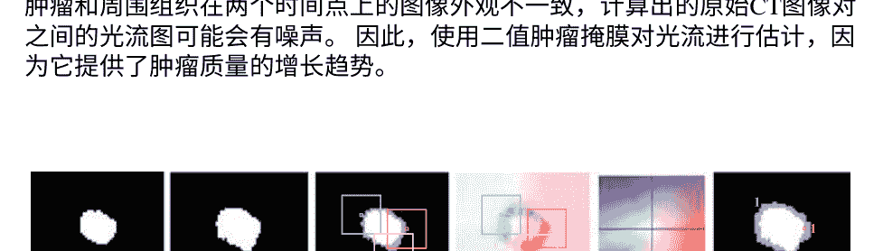

图12.7 基于肿瘤掩膜对在时间1 (a)和时间2 (b)的生成的彩色编码光流图像 (d) 的示例。流场颜色编码映射显示在 (e) 中，其中色调表示方向，饱和度表示大小。在肿瘤生长图 (c) 和 (f) 中，白色表示先前的肿瘤区域，灰色表示新生长的肿瘤区域。在c和d中，三个非肿瘤体素及其周围的图像块由三种颜色突出显示，这些颜色表示这些体素在(d)中的颜色。蓝色和红色体素表示左侧和右侧的生长趋势，并且在时间3 (f) 都变成肿瘤，而粉色体素表示非常小的运动，并且在时间3 (f) 仍然是非肿瘤。还需要注意，尽管一些体素在时间1和时间2之间显示出微小的运动（例如，左下位置），但它们从时间2到时间3的生长速度更快，表明肿瘤的非线性生长模式。

应该提到，扩张和收缩运动都可以编码在三通道图像中。

然而，这种肿瘤生长运动的表示方法存在一个潜在的限制 - 肿瘤中心周围和背景中的体素运动非常小，这可能会使卷积神经网络混淆。因此，我们额外提供了肿瘤的过去（time1和time2）位置，通过添加肿瘤生长图（图12.7c）作为第四个输入通道。具体而言，属于time1和time2重叠区域、新生长（扩张）区域、收缩区域和背景的体素分别被赋予255、170、85和0的值。这种策略隐含地表示了体素在未来是否为肿瘤的概率。

#### 12.3.2.2 网络架构
扩张子网络与其入侵对应子网络具有相同的架构（参见第12.3.1.2节和图12.6的下部面板），并通过从我们基于运动的表示中学习并推断肿瘤的未来参与区域。该网络从人群数据集的不同时间点配置（(time1→time2)/time3)开始从头训练。在[28]中，光流被用来预测扫描中肿瘤的未来位置，并且体素的未来运动直接通过其过去运动的线性组合来预测，这可能过于简化。

我们的主要区别在于预测是基于非线性ConvNet学习的2D运动和肿瘤生长图，其中保留了每个体素周围局部区域的边界/形态信息。

### 12.3.3 融合入侵和扩张网络
为了利用入侵-扩张信息，我们研究了多种融合入侵和扩张网络的方法。不同的融合策略导致网络中参数数量显著不同。

#### 12.3.3.1 双流后期融合
双流架构分别处理外观和运动线索，并进行预测。融合是通过平均两个子网络的决策/softmax分数来实现的，如图12.6所示。这种方法被称为后期融合。入侵和扩张子网络分别在所有时间点对（time1/time2和time2/time3）和三元组（(time1→time2)/time3）的人群数据上进行训练。由于它们是独立训练的，后期融合无法学习入侵和扩张特征之间的体素对应关系，即注册外观和运动线索。例如，当局部体素呈现快速增长趋势时，细胞密度和能量是多少？后期融合

#### 12.3.3.2 单流早期融合
与晚期融合相反，我们提出了一种早期融合架构，直接将三通道入侵和四通道扩张图像堆叠为七通道输入到ConvNet中。使用与入侵/扩张网络相同的网络架构。与晚期融合不同，早期融合只能在时间2/时间3对（没有时间1/时间2对）以及人群数据的三元组（（时间1→时间2）/时间3）上进行训练。因此，可以使用较少的训练样本。早期融合能够建立体素级的对应关系。然而，它将对应关系的定义留给后续层通过学习来完成。因此，由于外观图像（即SUV和ICVF）的变异性更大，网络可能无法很好地捕捉运动图像中的信息。早期融合与单个入侵或扩张网络几乎具有相同数量的参数。

#### 12.3.3.3 双流端到端融合
为了同时学习非线性静态和动态肿瘤信息，并为外观和运动线索分配足够的网络容量，我们引入了一个双流端到端融合架构。如图12.8所示，两个子网络通过一个融合层连接，该融合层在它们的conv4层之上添加了一个卷积操作。

更具体地说，融合层首先将由conv4（经过ReLU4）生成的两个特征图连接起来，并使用1 × 1 × 512的卷积滤波器进行填充和步长为1的卷积操作，然后附加ReLU5并进行3 × 3的最大池化操作。融合层的输出被馈送到后续的全连接层（fc5）。因此，融合层能够学习两个紧凑特征之间的对应关系。

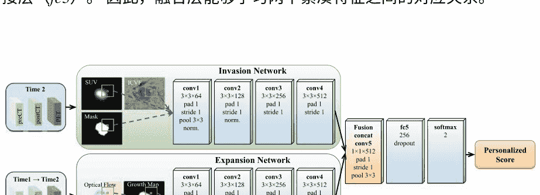

最小化联合损失函数的特征图。在ReLU4层而不是fc层进行融合是因为入侵和扩张之间的空间对应关系已经在fc层中被折叠；与在较早的conv层进行融合相比，最后一个conv层的融合具有更高的准确性[7]。端到端框架与早期融合相比，使用相同的时间对和三元组进行训练，而不是使用time1/time2对进行训练。端到端融合减少了近一半的参数在后期融合架构中，融合后仅使用一个fc层的塔。

### 12.3.4 个性化入侵和扩张网络
预测模型个性化是基于模型的肿瘤生长预测的关键步骤[5, 18, 30, 31]。在统计学习中，模型验证是优化预训练模型的一种自然方式。特别是，给定时间1和时间2的肿瘤状态已知（预测时间3），模型个性化包括两个步骤。在第一步中，入侵网络在人群数据上进行训练，并使用目标患者的时间1/time2作为验证。在预定的次数（30）的迭代之后，根据目标患者数据上的最低验证损失选择模型快照。由于扩张网络、早期融合和端到端融合没有相应的验证数据集，它们的训练在经验数（20）的迭代之后终止，以减少过拟合的风险。

为了更好地个性化入侵网络以适应目标患者，我们提出了第二步，优化一个目标函数，该函数衡量了在目标患者上任何预测肿瘤体积与其相应的未来真实体积之间的一致性。这是通过直接将入侵网络应用于个性化体积中肿瘤生长区域的体素，并通过阈值化分类输出的概率值来达到最佳目标函数。Dice系数衡量了真实值和预测值之间的一致性，在本研究中被用作目标函数：

Dice = \frac{2 \times \mathrm{TPV}}{V_{pred} + V_{gt}}, \quad (12.3)

其中TPV是真阳性体积——预测肿瘤体积V_{pred}和真实肿瘤体积V_{gt}之间的重叠体积。肿瘤生长区域被设置为围绕肿瘤的边界框，其在x-、y-和z-方向上与肿瘤表面的像素距离分别为Nx、Ny和Nz。入侵网络的个性化阈值也用于扩展网络和三个融合网络。

### 12.3.5 使用入侵和扩张网络进行预测
在测试过程中，针对目标患者在时间1和时间2的成像数据，无论是个性化入侵网络、扩张网络、后期融合、早期融合还是端到端融合，都无法用于预测未来时间3生长区域中每个体素的得分。 时间2的静态信息作为入侵信息，而时间1和时间2之间的运动/变化信息代表扩张信息。 后期融合和端到端融合分别将静态和运动信息输入到入侵和扩张子网络中，而早期融合则将静态和运动信息串联作为单流ConvNet的输入。

### 12.3.6 实验方法和结果
本节研究了10例VHL病患（男性6例，女性4例），每例患者均患有胰腺神经内分泌肿瘤（PanNET）。 在这个数据集中，每个患者有三个时间点的增强CT和FDG-PET成像，跨度为3到4年，时间间隔为405 ±133天（平均 ±标准差）。 患者在时间1的平均年龄为46.9 ±13.2岁。 CT的图像像素大小范围为0.68 × 0.68 ×1 mm³到0.98 × 0.98 ×1 mm³，PET的图像像素大小范围为2.65 × 2.65 ×1.5 mm³到4.25 × 4.25 ×3.27mm³。所有患者的肿瘤生长信息如表12.2所示。大多数肿瘤生长缓慢，而有两个肿瘤生长更为侵袭性，两个肿瘤则出现萎缩。一些肿瘤保持与过去趋势相似的生长速率，而其他肿瘤的生长速率有所变化。

### 表12.2 十名患者在第一、第二和第三个时间点的肿瘤信息
| 患者ID | 第一-第二 | | 第二-第三 | | 大小（cm³，第三） |
| :---: | :---: | :---: | :---: | :---: | :---: |
| | 天数 | 增长率（%） | 天数 | 增长率（%） | |
| 1 | 384 | 34.6 | 804 | 33.4 | 2.3 |
| 2 | 363 | 15.3 | 363 | 10.7 | 1.4 |
| 3 | 378 | 18.9 | 372 | 7.5 | 0.4 |
| 4 | 364 | 150.1 | 364 | 28.9 | 3.1 |
| 5 | 426 | 41.5 | 420 | 68.6 | 3.8 |
| 6 | 372 | 7.4 | 360 | 12.5 | 6.3 |
| 7 | 384 | 13.6 | 378 | -3.9 | 1.6 |
| 8 | 168 | 18.7 | 552 | 18.7 | 3.2 |
| 9 | 363 | 16.9 | 525 | 34.7 | 0.3 |
| 10 | 196 | -28.9 | 567 | 17.7 | 0.9 |在晚期融合中，使用了45,989个阳性和52,996个阴性图像补丁用于侵袭网络，并使用了23,448个阳性和25,896个阴性图像补丁用于侵袭网络和扩张网络的其他融合（即近乎端到端），提取自10名患者。每个图像补丁都减去了训练集上的平均图像补丁。由于在试验中没有观察到改进，所以没有进行数据增强。使用以下超参数：初始学习率为0.001，在每个第十个epoch时减少10倍；权重衰减为0.0005；动量为0.9；小批量大小为512。我们使用了0.9的较高的dropout比率来提高泛化能力。较低的dropout比率（例如0.5）不会显著降低性能。卷积神经网络使用Caffe平台[13]实现。肿瘤生长区域的参数设置为N_x=3， N_y=3，和N_z=3，以提高预测速度。我们观察到预测准确性对这些参数的选择不敏感，例如N_{x|y|z}≥4的结果相似。对于通过Dice系数目标函数进行模型个性化，我们在[0.05， 0.95]的范围内以0.05的间隔变化模型阈值值。

所提出的方法在一台DELL TOWER 7910工作站上进行测试，配备2.40 GHz的Xeon E5-2620 v3 CPU，32 GB RAM和一块12 GB内存的Nvidia TITAN X Pascal GPU。

所提出的方法使用留一交叉验证进行评估。在每次十次评估中，有九个患者被用作人群训练数据来学习人群趋势，剩下的一个患者的时间1/时间2被用作个性化数据集用于侵袭网络，剩下的一个患者的时间3被用作待预测的测试集。通过对十次交叉验证结果进行平均，得到模型的最终性能值。报告了每个提出网络中的参数数量，并使用第三个时间点的测量结果通过召回率、精确度、Dice系数（在公式12.3中定义）和相对体积差异（在公式12.2中定义）进行评估。为了建立比较的基准，我们实现了一个线性增长模型，假设肿瘤将保持其过去的生长趋势。更具体地说，我们首先计算肿瘤边界在第一和第二个时间点之间的径向扩张/收缩距离，然后使用相同的径向距离在第二个时间点扩张/收缩肿瘤边界来预测第三个时间点。

此外，我们将我们的方法的准确性和效率与两种最先进的肿瘤生长预测方法[31， 36]进行比较，这些方法已经在相同数据集的一个子集（表12.2中的4、7、10号病人除外）上进行了评估。图12.9显示了第7号病人的结果。在这种情况下，肿瘤呈现出非线性的生长趋势，它的大小从时间1增加到时间2，但从时间2到时间3稍微减小。因此，所有个性化的预测模型都过高预测了肿瘤大小（召回率高于精确率）。然而，我们的模型，尤其是两流式后期融合，仍然能够产生有希望的预测结果。

表12.3展示了十个病人的整体预测性能。与基线线性生长方法相比，我们的所有方法都显示出明显更高的性能。侵袭和扩张网络的性能是可比较的。两个网络的融合可以进一步提高预测准确性，特别是对于RVD测量。两流后融合得到最高的平均值。

图12.9 一个例子（患者7）展示了我们个体和融合网络对肿瘤生长的预测。a不同时间点的分割（真实值）肿瘤轮廓和体积。b第三个时间点的预测结果，红色和绿色分别代表真实值和预测的肿瘤边界。

表12.3 十个患者的整体性能——基线线性预测模型、侵袭网络、扩张网络、早期融合、后期融合和端到端融合。结果通过召回率、精确度、Dice系数和相对体积差异（RVD）估计，并报告为平均值±标准差。[最小值，最大值]。每个模型的参数数量已提供

|  | 召回率 (%) | 精确度 (%) | Dice系数 (%) | RVD (%) | 参数数量 |
| :--- | :--- | :--- | :--- | :--- | :--- |
| 线性 | 84.5 ± 7.0 [73.3, 97.3] | 69.5 ± 8.0 [60.7, 82.3] | 75.9 ± 5.4 [69.5, 85.0] | 23.1 ± 18.5 [5.9, 58.8] | – |
| 侵袭 | 86.9 ± 9.4 [63.7, 97.0] | 83.3 ± 5.6 [74.7, 90.2] | 84.6 ± 5.1 [73.0, 90.4] | 11.5 ± 11.3 [2.3, 30.0] | 8.11M |
| 扩展 | 87.6 ± 8.6 [68.3, 96.5] | 82.9 ± 7.6 [76.5, 97.2] | 84.8 ± 5.4 [73.2, 91.1] | 13.8 ± 6.3 [1.0, 23.5] | 8.11M |
| 早期融合 | 86.4 ± 7.9 [66.6, 94.8] | 84.7 ± 5.8 [77.0, 92.7] | 85.2 ± 5.2 [73.9, 90.6] | 9.2 ± 7.3 [2.4, 19.6] | 8.11M |
| 晚期融合 | 86.9 ± 8.8 [64.0, 95.5] | 85.5 ± 4.9 [78.6, 91.3] | 85.9 ± 5.6 [72.8, 91.7] | 8.1 ± 8.3 [1.0, 24.2] | 16.22M |
| 端到端 | 87.5 ± 8.1 [70.0, 96.9] | 84.1 ± 5.6 [75.5, 91.3] | 85.5 ± 4.8 [76.5, 91.5] | 9.0 ± 10.1 [0.3, 26.7] | 10.18M |

表12.4 七名患者的性能比较-基线线性预测模型，最先进的基于模型的[31]，统计群体学习[36]和我们的模型。结果通过召回率，精确度，Dice系数和相对体积差异（RVD）估计，并报告为均值 ±标准差。[最小值，最大值]。 EG-IM-FEM*的性能比EG-IM更高，但是作者在[31]的第六节中提到了一些问题。

| 方法 | 召回率 (%) | 精确度 (%) | Dice系数 (%) | RVD (%) |
| :--- | :--- | :--- | :--- | :--- |
| 线性 | 84.3 ± 3.4 [78.4, 88.2] | 72.6 ± 7.7 [64.3, 82.1] | 77.3 ± 5.9 [72.3, 85.1] | 16.7 ± 10.8 [5.2, 34.3] |
| EG-IM [31] | 83.2 ± 8.8 [69.4, 91.1] | 86.9 ± 8.3 [74.0, 97.8] | 84.4 ± 4.0 [79.5, 92.0] | 13.9 ± 9.8 [3.6, 25.2] |
| EG-IM-FEM* [31] | 86.8 ± 5.8 [77.6, 96.1] | 86.3 ± 8.2 [72.7, 96.5] | 86.1 ± 3.2 [82.8, 91.7] | 10.8 ± 11.2 [2.3, 32.3] |
| 群体学习 [36] | 87.9 ± 5.0 [81.4, 94.4] | 86.0 ± 5.8 [78.7, 94.5] | 86.8 ± 3.6 [81.8, 91.3] | 7.9 ± 5.4 [2.5, 19.3] |
| 侵袭 | 88.1 ± 4.6 [81.4, 94.3] | 84.4 ± 5.6 [75.0, 90.2] | 86.1 ± 3.6 [80.8, 90.4] | 6.6 ± 8.5 [2.3, 25.8] |
| 扩展 | 90.1 ± 6.3 [79.1, 96.5] | 81.9 ± 6.9 [76.5, 96.9] | 85.5 ± 3.8 [78.7, 90.5] | 14.2 ± 7.6 [1.0, 23.5] |
| 早期融合 | 88.2 ± 4.2 [81.9, 94.8] | 85.2 ± 6.5 [77.0, 92.7] | 86.5 ± 4.0 [80.7, 90.6] | 7.5 ± 6.1 [2.5, 19.0] |
| 晚期融合 | 89.1 ± 4.3 [83.4, 95.5] | 84.9 ± 5.2 [78.6, 93.3] | 86.8 ± 3.4 [81.8, 91.5] | 6.6 ± 7.1 [1.0, 21.5] |
| 端到端 | 88.8 ± 5.9 [79.1, 96.9] | 84.8 ± 5.6 [77.8, 91.3] | 86.6 ± 4.4 [80.5, 91.5] | 6.6 ± 8.3 [0.4, 24.4] |

Dice系数为85.9 ± 5.6%，RVD为8.1 ± 8.3%，但与早期融合相比，需要几乎两倍的模型参数。端到端融合具有比晚期融合更少的网络参数，但准确性仍然较高。然而，这表明融合ConvNets的机制利用了静态和动态肿瘤信息之间的互补关系。

表12.4将我们的方法与两种最先进的方法[31， 36]在我们数据的一个子集（七个患者）上进行了比较。在十个患者中，三个患者（表12.2中的患者4、7和10）具有侵袭性和萎缩性肿瘤，未被纳入实验中。因此，七个患者（表12.4）的表现优于十个患者（表12.3）。我们的单一网络已经能够实现比基于模型的方法（即EG-IM）[31]更高的准确性，特别是侵袭网络的RVD比[31]低/更好。这证明了卷积神经网络（学习侵袭信息）在未来肿瘤体积估计中的高效性。网络融合进一步提高了准确性，并实现了与群体学习方法[36]相当的性能，这得益于将深度特征、手工特征和临床因素整合到基于SVM的学习框架中。

在提出的三种融合架构中，两流后期融合表现最佳，Dice系数为86.8 ± 3.4%，RVD为6.6 ± 7.1%。

提出的两流后期融合ConvNets（我们的其他架构甚至更快）需要约5分钟进行训练和个性化，每个患者的预测时间为15秒，平均而言——比[31]中的基于模型的方法（约24小时——模型个性化；21秒——模拟）和[36]中的群体学习方法（约3.5小时——模型训练和个性化；4.8分钟——预测）要快得多。

## 12.4 总结

在本章中，我们证明了（1）我们的统计群体学习方法，将肿瘤生长模式与人群趋势、特定患者、深度图像置信特征以及时间间隔和临床因素结合在一起，是一种有效的肿瘤生长预测方法；（2）深度ConvNets可以有效地表示和学习肿瘤生长中的细胞侵袭和质量效应。将编码静态和动态肿瘤信息的复合图像输入到我们的ConvNet架构中，以预测胰腺肿瘤的未来受累区域。这两种方法在速度和准确性上都超过了最先进的基于数学模型的方法[31]。侵袭和扩张网络单独预测肿瘤生长的准确性高于[31]，而我们提出的融合架构进一步提高了预测准确性。与早期和后期融合相比，两流端到端融合可能是准确性和泛化性之间的一种权衡。

## 参考文献

1. Baker S, Scharstein D, Lewis J, Roth S, Black MJ, Szeliski R (2011) 用于光流的数据库和评估方法。IJCV 92(1):1–31
2. Bosman FT, Carneiro F, Hruban RH, Theise ND等（2010）消化系统肿瘤的WHO分类，第4版。世界卫生组织，日内瓦
3. Brox T, Bruhn A, Papenberg N, Weickert J (2004) 基于变形理论的高精度光流估计。在：ECCV，第25-36页。斯普林格，柏林
4. Chang CC, Lin CJ (2011) LIBSVM：支持向量机的库。ACM Trans Intell Syst Technol (TIST) 2(3):27
5. Chen X, Summers RM, Yao J (2013) 通过耦合反应-扩散和生物力学模型预测肾脏肿瘤的生长。IEEE Trans Biomed Eng 60(1):169–173
6. Clatz O, Sermesant M, Bondiau PY, Delingette H, Warfield SK, Malandain G, Ayache N (2005) 在MR图像中逼真模拟脑肿瘤的三维生长，将扩散与生物力学变形相结合。
7. Feichtenhofer C, Pinz A, Zisserman A (2016) 用于视频动作识别的卷积双流网络融合。
8. Friedl P, Locker J, Sahai E, Segall JE (2012) 分类集体癌细胞入侵。Nat Cell Biol 14(8):777–783
9. Greenspan H, van Ginneken B, Summers RM (2016) 深度学习在医学成像中的应用：概述和未来前景。TMI 35(5):1153–1159
10. Guyon I, Weston J, Barnhill S, Vapnik V (2002) 使用支持向量机进行癌症分类的基因选择。Mach Learn 46(1–3):389–422
11. Hogea C, Davatzikos C, Biros G (2007) 在脑部的3D MR图像中建模胶质瘤的生长和质量效应. 在: MICCAI, pp 642–650
12. Hogea C, Davatzikos C, Biros G (2008) 基于图像的反应扩散胶质瘤生长模型的参数估计问题与质量效应. J Math Biol 56(6):793–825
13. Jia Y (2013) Caffe: 一个用于快速特征嵌入的开源卷积架构. http://caffe.berkeleyvision.org/
14. Keutgen XM, Hammel P, Choyke PL, Libutti SK, Jonasch E, Kebebew E (2016) 评估和管理患有冯·希普尔-林道病的胰腺病变患者的胰腺病变。 Nat Rev Clin Oncol 13(9):537–549
15. Krizhevsky A, Sutskever I, Hinton GE (2012) 使用深度卷积神经网络进行ImageNet分类。 在: NIPS，第1097-1105页
16. LeCun Y, Bengio Y, Hinton G (2015) 深度学习。 自然 521(7553):436–444
17. Liu C (2009) 超越像素：探索运动分析的新表示和应用。 博士论文，麻省理工学院
18. Liu Y, Sadowski S, Weisbrod A, Kebebew E, Summers R, Yao J (2014) 使用多模态图像进行患者特异性肿瘤生长预测。 Med Image Anal 18(3):555–561
19. Maddison CJ, Huang A, Sutskever I, Silver D (2015) 使用深度卷积神经网络进行围棋中的移动评估。 在: ICLR
20. Morris M, Greiner R, Sander J, Murtha A, Schmidt M (2006) 使用MRI数据学习基于分类的胶质瘤生长模型。 J Comput 1(7):21–31
21. Neverova N, Luc P, Couprie C, Verbeek J, LeCun Y (2017) 预测语义分割的未来。 在: ICCV
22. Nie D, Zhang H, Adeli E, Liu L, Shen D (2016) 3D深度学习用于多模态成像引导的脑肿瘤患者生存时间预测。 在： 国际医学图像计算与计算机辅助干预会议，第212-220页。 Springer
23. Silver D, Huang A, Maddison CJ, Guez A, Sifre L, Van Den Driessche G, Schrittwieser J, Antonoglou I, Panneershelvam V, Lanctot M等 (2016) 用深度神经网络和树搜索掌握围棋游戏。 自然529(7587):484–489
24. Simonyan K, Zisserman A (2014) 用于视频动作识别的双流卷积网络. 在: NIPS, 第568-576页
25. Swanson KR, Alvord E, Murray J (2000) 灰质和白质中胶质瘤差异运动性的定量模型. 细胞增殖 33(5):317–329
26. Warburg O (1956) 癌症起源论. 科学 123(3191):309–314
27. Weisbrod AB, Kitano M, Thomas F, Williams D, Gulati N, Gesuwan K, Liu Y, Venzon D, Turkbey I, Choyke P et al (2014) 内分泌胰腺神经内分泌肿瘤的肿瘤生长评估在冯·希普尔·林道综合征中. J Am Coll Surg 218(2):163–169
28. Weizman L, Ben-Sira L, Joskowicz L, Aizenstein O, Shofty B, Constantini S, Ben-Bashat D (2012) 在纵向肿瘤随访研究中预测脑MR扫描. 在: MICCAI, 第179-187页. Springer
29. Wolfgang CL, Herman JM, Laheru DA, Klein AP, Erdek MA, Fishman EK, Hruban RH (2013) 胰腺癌的最新进展。 CA Cancer J Clin 63(5):318–348
30. Wong KC, Summers RM, Kebebew E, Yao J (2015) 利用生理数据融合的反应-扩散和超弹性生物力学模型进行肿瘤生长预测。 Med Image Anal 25(1):72–85
31. Wong KCL, Summers RM, Kebebew E, Yao J (2017) 利用弹性生长分解、图像导出运动和FDM-FEM耦合进行胰腺肿瘤生长预测。
32. Yao J, Wang S, Zhu X, Huang J (2016) 用于肺癌生存预测的成像生物标志物发现。
33. Yao JC, Shah MH, Ito T, Bohas CL, Wolin EM, Van Cutsem E, Hobday TJ, Okusaka T, Capdevila J, De Vries EG等 (2011) Everolimus用于晚期胰腺神经内分泌肿瘤。 N Engl J Med 364 (6) : 514-523
34. Yushkevich PA, Piven J, Hazlett HC, Smith RG, Ho S, Gee JC, Gerig G (2006) 用户引导的解剖结构三维主动轮廓分割：显著提高效率和可靠性。 NeuroImage 31 (3) : 1116-1128

35. Zhang L, Lu L, Nogues I, Summers R, Liu S, Yao J (2017) DeepPap: 用于宫颈细胞分类的深度卷积网络。IEEE J Biomed Health Inform 21 (6) : 1633-1643
36. Zhang L, Lu L, Summers RM, Kebebew E, Yao J (2017) 通过群体学习进行个性化胰腺肿瘤生长预测。在: MICCAI, pp 424-432

# 第13章 用于医学图像恢复的深度时空卷积神经网络

Yao Xiao, Skylar Stolte, Peng Liu, Yun Liang, Pina Sanelli, Ajay Gupta, Jana Ivanidze和Ruogu Fang

摘要计算机断层扫描灌注（CTP）有助于低成本诊断和治疗急性中风。电影扫描使用户能够几乎实时地可视化脑解剖和血流。然而，有效的可视化会使患者接受放射造影药物和延长扫描时间。更高的辐射剂量会使患者面临潜在风险，包括脱发、白内障形成和癌症。

为了减轻这些风险，可以减少辐射剂量以及管电流和/或X射线辐射暴露时间。然而，由此产生的图像可能缺乏足够的信息或受到噪声和/或伪影的影响。在本章中，我们提出了一种深度时空卷积神经网络，以在降低管电流、低空间分辨率和较短曝光时间的情况下保持CTP图像质量。该网络结构从时空数据的不同横截面的低剂量和低分辨率补丁中提取多方向特征，并重建高质量的CT体积。我们评估了网络在不同管电流和多个分辨率尺度下的图像恢复性能。结果表明，我们的网络能够从标准辐射剂量的21%以下的数据中恢复高质量的扫描。所提出的网络相比最先进的方法，在灌注图上平均改善了7%。

## 13.1 引言

急性中风导致高死亡率和慢性残疾。 每年有超过795,000人在美国中风。 其中大约140,000人丧生，约占所有死亡人数的5% [28]。 中风影响各个年龄段的人，但随着年龄增长而增加。 2009年，超过65岁的中风住院患者占总数的三分之二 [10]。 美国中风相关护理的年度费用估计约为340亿美元 [1]。

急性中风需要快速诊断和治疗，以便患者能够接受最佳护理。 中风后3个月的残疾在接受急诊室护理的人群中较少 [4]。 此外，必须迅速确定中风的具体类型，出血性还是缺血性，以确保尽快进行适当的治疗。 出血性中风是由脆弱的血管破裂引起的，而缺血性中风是由血栓形成或栓塞引起的。 计算机断层扫描（CT）能够快速评估大脑和脑血管，其高分辨率对于缺血性或出血性中风患者的分流非常有用。 临床医生可以根据这些患者的不同需求优化治疗；例如，缺血性中风通常需要进一步对脑组织血流动力学进行成像。 因此，这些患者更有可能从CT灌注（CTP）中受益，以进一步指导溶栓治疗等治疗方法。 CTP可以快速测量脑血管生理学，因此使医生能够主动监测血流。

清晰可见的脑解剖和血流需要放射性对比剂注射和重复的CT扫描。 这样做的代价是给患者带来了大量的X射线辐射暴露；例如，一个持续40秒的脑CTP扫描对急性中风患者的辐射相当于一年的自然环境辐射暴露[17, 23]。 与这样的程序相关的风险可能非常昂贵——相比之下，胸部X射线相当于大约十天的自然辐射暴露。 通过CTP/CT血管造影（CTA）获得整个大脑的数据需要平均剂量为6.8 mSv [24]，这远高于从自然背景源获得的辐射。

每年，自然环境使人们暴露于约2.4 mSv的辐射[5]。 重复的脑部扫描会累积患者的辐射暴露，从而影响健康风险的发展，如脱发/脱毛[25]、白内障形成[6]和癌症[7, 13]。 由于CT扫描提供的便利性和高可视化性，在医疗护理中越来越普遍地使用。 在美国的使用量大约相当于每年8000万次CT扫描。 因此，需要越来越多的解决方案来减少辐射剂量，同时保留重要的图像信息。

研究人员采用了许多不同的方法来降低辐射剂量；它们主要包括两个重点：优化CT系统和减少对比剂剂量。 优化CT系统包括缩短时间采样频率和减少辐射源，如管电流和射线束和接收器的数量。然而，使用这些方法降低辐射暴露会增加图像噪声和伪影。因此，放射科医生必须在图像质量和患者风险之间取得平衡，以实现有效的诊断和治疗潜力。在本文中，我们提出了一种用于图像恢复的深度时空卷积神经网络。因此，我们的目标是减少CTP对患者的辐射暴露，并保持高图像质量。

- 该网络由两个主要组件组成，包括以下内容：超分辨率去噪网络（SRDN）和多方向连接，共同解决图像超分辨率（SR）和去噪问题。这项工作提供了五个贡献：
1. SRDN从CTP图像块中提取空间和时间特征；因此，它可以同时表示空间和时间细节的交叉部分信息。
2. SRDN同时执行图像超分辨率和去噪。它有效处理具有多级噪声和多尺度分辨率的CTP图像。
3. 通过将基于不同交叉部分的多个SRDN集成到一个多方向网络中，我们在3D时空CTP数据上实现了高性能。
4. 通过大量实验证明了所提出网络在低剂量CTP图像恢复方面的能力。所提出的网络解决了低管电流、缩短曝光时间和空间分辨率差的图像中的辐射剂量降低问题。实验结果显示，与标准临床剂量下获得的图像相比，所提出的网络提供了可比较的图像质量和准确性。
5. 我们生成了展示脑血流（CBF）和脑血容量（CBV）的灌注图。这些图表明我们的方法与最先进的方法提供了可比较的结果。

我们提出的网络可以同时使用三种类型的有限数据来恢复图像，包括以下内容：使用低管电流的数据，降低时间采样率的数据和空间分辨率差的数据。以前，没有任何工作在一个深度学习结构中同时解决这些数据限制问题。尽管我们的网络使用了20%至40%较低的管电流，但与使用最先进方法的低剂量扫描相比，我们的网络的峰值信噪比（PSNR）平均提高了21%。因此，深度学习方法在减少CTP辐射暴露方面具有很高的潜力。

## 13.2 相关工作

研究人员致力于寻找减少CTP成像辐射暴露的解决方案。开发低剂量CTP协议对于减少患者过度辐射暴露的健康风险至关重要。下面，我们总结了通过调整不同的采集参数，如管电流、时间采样频率和空间分辨率，来实现这一目标的几种方法。

然而，这些参数与重建的CTP图像的质量密切相关，尤其是用于治疗决策的灌注图的生成。在本节中，我们介绍了几种剂量减少方法和恢复重建CTP图像质量的方法；本节后半部分结合了图像处理策略和深度学习方法。

### 13.2.1 辐射剂量减少

CTP成像的辐射剂量减少方法有三种，即管电流、空间分辨率和X射线曝光时间。辐射剂量和管电流呈线性关系；例如，为了减少50%的辐射剂量，我们需要将管电流降低到原始值的50%。

然而，低管电流扫描的CTP序列会有较高的图像噪声和伪影，因为图像噪声和管电流的平方根成反比关系。减少图像噪声和伪影的方法对于辐射剂量减少和图像质量保持是必要的。当前的研究表明，在降低管电流的情况下仍然可以保持图像质量的降低 [14, 18]。在[29]中，对儿童腹部、盆腔和胸部CT检查的研究表明，50%的剂量减少仍然可以保持诊断质量。与管电流的降低类似，减少X射线曝光时间会相应地减少辐射，因为患者接受辐射暴露的时间减少了。

低剂量CT扫描导致空间分辨率低。因此，从这些扫描中恢复空间分辨率可以减少患者的整体X射线辐射暴露。

### 13.2.2 图像恢复

图像恢复是通过减少噪声和恢复分辨率损失来估计清晰和原始图像的操作。

图像恢复的过程可以在两个域中进行：频域和图像域。图像恢复的最常见技术是去卷积，它是生成低质量图像的逆过程。它在应用傅里叶变换和点扩散函数之后在频域中进行操作，并消除了由退化因素引起的分辨率损失。通过直接反演点扩散函数进行去卷积的结果是矩阵条件数较差，会放大噪声并创建不完美的重建图像。

近年来，深度学习方法在各种计算机视觉任务中蓬勃发展，包括图像分类[11]和目标检测[9]，并显著提高了这些系统的性能。这些方法在图像恢复[3, 27]方面也取得了显著的改进。卷积神经网络（CNN）是最受尊敬的深度学习架构之一，对基于图像的问题显示出有希望的结果。CNN结构通常由几个卷积层和激活层组成，然后是一个或多个全连接层。CNN架构设计的目的是通过局部连接、权重共享和非线性性来利用图像结构。CNN的一个优点是它们比具有相同数量隐藏单元的全连接网络更容易训练且参数更少。

图像超分辨率旨在从观察到的低分辨率图像中恢复高分辨率图像。通过使用低分辨率图像的不同部分或分离的图像，超分辨率方法旨在近似高分辨率图像的外观。深度学习模型最近广泛应用于图像超分辨率问题[8, 15, 19, 21]。然而，大多数超分辨率框架专注于2D图像，因为涉及时间维度更具挑战性，特别是在CTP成像中。

图像去噪旨在从观察到的噪声图像中恢复清晰图像。图像去噪的主要挑战之一是准确识别并去除噪声。基于深度学习的方法[16, 30]在学习低质量图像到高质量图像的映射方面显示出许多优势，它们使用在数万个样本上训练的多层CNN实现。然而，在医学领域，成对的训练数据通常很少。因此，需要一种有效的基于学习的模型。

### 13.2.3 空间-时间架构

在我们之前的工作中，我们提出了STAR [26]用于低剂量CTP图像超-分辨率。它在减少扫描时间的同时保持图像质量，并将辐射减少到原始水平的三分之一。STAR是一种基于图像的剂量减少方法，专注于超分辨率。通过这项工作，我们发现从空间和时间方向提取的特征可以提高SR性能。多个单向网络（SDNs）的集成可以提升SR在时空CTP数据中的性能。实验结果表明，SDN的基本模型改善了空间和时-间分辨率，而多方向联合网络进一步增强了SR结果，与仅有时间或仅有空间的SR相比。然而，这项工作只解决了低空间和时间分辨率的问题，忽略了低剂量CTP中重要的噪声问题。

在本章中，我们提出了一种用于CTP图像恢复和辐射减少的深度时空网络。该网络结构同时集成了多个不同交叉截面的SRDN，用于图像超分辨率和降噪。所提出的时空网络的结构在第13.3节中进行了解释。在第13.4节中，我们提供了实验平台设置，并描述了数据采集方法和预处理过程。在第13.5节中，我们详细介绍了实验和结果。最后，在第13.6节中总结了本文。

## 13.3 方法

在本节中，我们提出了用于低剂量CTP图像恢复的深度学习方法。在第13.3.1节中，我们介绍了如何生成时空补丁。然后，在第13.3.2节中，我们描述了我们的深度时空网络结构，其中包含多个交叉截面输入。

### 13.3.1 空时补丁

从一个CTP扫描中获取的数据被存储为一系列切片。我们通过将切片连接成一个3D矩阵来转换这个序列。这个矩阵的三个维度是 X， Y和T，其中 X和 Y表示2D切片的空间维度， T表示序列的时间维度。然后，基于这三个维度生成输入的2D LR补丁，用于深度空时网络，包括在图像恢复任务中的使用：图像超分辨率和图像去噪。

我们的2D补丁包括三个方向的组合： X × Y， X × T和 Y × T。在我们的超分辨率任务中，我们通过在空间和时间方向上进行下采样来创建2D LR补丁。例如，我们通过在T方向上删除每隔一个像素来模拟两倍长的扫描间隔。在我们的去噪任务中，我们在整个CTP体积上添加频谱高斯噪声，以模拟使用较低管电流产生的图像。关于噪声模拟和数据预处理的完整描述可以在第13.4.3节中找到。我们得到的噪声模型代表了使用的三个横截面上的2D补丁。在联合去噪和超分辨率任务中，我们从噪声图像开始，并按照上述描述创建LR补丁。最后，相应的输入补丁被输入到提出的网络结构中，相关的原始CTP体积切片作为真实值。在训练过程中，网络学习将LR和/或噪声补丁映射到它们的原始补丁的空时细节。通过使用这些特征，网络在测试过程中生成HR和/或去噪输出图像。

### 13.3.2 深度时空网络

我们提出的深度时空网络是一种基于卷积的端到端架构，用于图像恢复。网络结构如图13.1所示。如第13.3.1节所述，我们使用三个交叉截面作为输入。每个交叉截面输入都经过SRDN网络，并通过一个联合层进行组合，以获得最终的高质量输出。联合层是一个简单的平均函数，计算来自三个SRDN路径的输出的平均值。将从CTP的不同方向提取的各种特征进行组合有助于增强网络推理和普适性的能力。由于多方向输入提供了3D数据的不同视角，它们不能仅仅被视为向多网络提供更多的训练数据。相反，它们相互补充，通过网络对稀疏特征进行编码。

如前所述，每个横截面输入对应一个SRDN。SRDN是一个端到端的结构，通过学习与原始图像的低分辨率/噪声补丁及其原始图像，并在测试时基于低质量输入图像输出高质量的CT图像。SRDN的主要功能部分是通过堆叠四个模块化的核调节块（KR-Block）构建的。KR-Block的结构如图13.2所示。我们的KR-Block的设计灵感来自GoogLeNet [22]，它具有不同尺寸的核的组合。具体而言，KR-Block包括两个1×1卷积层，一个7×7卷积层和一个3×3卷积层，用于调节7×7卷积层提取的特征。大尺寸和小尺寸滤波器的组合是为了平衡对细微和边缘特征的提取。此外，KR-Block嵌入了跳跃连接，允许引用先前层的特征映射并提升网络性能。

多个KR块被级联起来执行特征调节、映射和转换。通过跳跃连接执行残差学习，连接了两个相邻KR块的输出。在KR块之间使用跳跃连接可以实现更快、更稳定的训练。在输入和网络末端之间使用快捷方式是为了更好地辅助原始输入信息的最终图像重建。这是因为输入数据包含了重要的真实像素信息，可以作为先验信息，从而降低了网络推断的难度。最后一层之前的卷积层有128个大小为3 ×3的滤波器。我们使用一个大小为3 ×3的反卷积层作为最后一层。

## 13.4 平台和数据采集

### 13.4.1 计算平台

所提出的网络结构是基于深度学习框架Caffe[12]构建的。所有实验都是在一个包含四个NVIDIA PASCAL xp GPU的GPU工作站上进行的。我们使用MATLAB（版本R2016b）进行数据预处理和后分析，因为它是一种基于矩阵的图像处理的高效编程语言。

### 13.4.2 数据集

我们在23名中风患者的CTP序列上评估了所提出的方法。所有CTP序列都是使用相同的急性中风协议扫描的，扫描时间从2007年8月到2010年6月，使用GE Lightspeed或Pro-16扫描仪（通用电气医疗系统，密尔沃基，威斯康星州）。扫描仪处于cine 4i扫描模式，并以每秒一次的速度执行45秒的采集，使用80 kVp和190 mAs。以5 mL/s的速度通过静脉注射5 mL非离子性碘造影剂，延迟5秒使用动力注射器。每个序列在z轴方向的脑区域厚度为20毫米。每个序列沿z轴方向有四个切片，每个切片厚度为5毫米（横向分辨率）。脑区域在xy平面上的空间分辨率为0.43。一个CTP序列内的切片在时间上进行强度归一化和配准。一个患者的整个体积大小为512 × 512 × 4 × 119，其中512是每个CT切片的高度和宽度，4是z轴上的切片数，119是CTP序列中的帧数。在本文中，我们只选择了z轴上的一个切片；因此，得到的CTP体积的大小为512 × 512 × 119，表示为 X × Y × T。

我们随机将患者分为三组：12名患者用于训练，4名患者用于验证，7名患者用于测试。由于每个患者有119个切片，所以训练、验证和测试集分别包含1428、476和833张XY平面的图像。（空间方向）。对于其他两个平面，XT和YT，我们只保留图像中的脑部区域，即X和Y方向约300个像素。因此，对于这些平面，我们估计训练集有3600张图像，验证集有1200张图像，测试集有2100张图像。本文采用基于块的方法，因此图像进一步被裁剪成大小为41×41的块，步长为21，这导致XY平面有822,528个块和274,176个块，XT和YT平面分别有75,600个块和25,200个块，用于训练和验证。

### 13.4.3 低辐射剂量模拟和数据预处理

下面，我们解释了三种常用的模拟低辐射剂量CTP图像的方法，包括以下几种：降低管电流、缩短患者暴露于X射线辐射的时间以及降低成像系统的空间分辨率。

- 低管电流：我们通过向原始高剂量CT图像添加空间相关噪声，具体来说是高斯噪声，来模拟低剂量条件。我们的过程遵循[2]中描述的过程，原始体积在管电流 I₀=190 mAs 下进行扫描。因此，管电流 I 和噪声标准差 σ 之间存在反比关系，高斯噪声水平被修改以模拟所需的管电流，使用以下方程：
```
σ = K × √(1/I - 1/I₀)    (13.1)
```
其中 K = 103.09 mA½ 是基于幻影研究计算得出的。我们在研究中模拟了三个噪声水平，分别对应于管电流：40、60和80 mAs。

- 较短的X射线曝光时间：为了模拟患者对X射线辐射的较短暴露，我们在原始CTP体积中以指定的间隔删除帧。我们将原始CTP体积下采样为两倍较短(S₂)和三倍较短(S₃)，然后将这些体积与原始采样率下的体积进行比较。例如，我们通过使用已删除每个其他帧的原始CTP体积的下采样版本生成一个时间采样率，该采样率是原始CTP体积的两倍较短。最后，我们使用双三次插值将所有体积恢复到原始体积大小。

- 低空间分辨率：同样，我们通过减小用于观察图像体积的空间采样率来建模CT图像的低空间分辨率。例如，我们在高辐射剂量体积中以每个像素网格为单位进行采样，从而得到下采样到原始空间的一半的采样率。我们的低分辨率（LR）图像表示两个尺度 $S_i$：两倍下采样 $S_2$ 和三倍下采样 $S_3$。与时间相关的情况类似，我们使用双三次插值法将LR图像还原到原始图像尺寸。我们提出的网络的输入包括以下方向性横截面：XY、XT和YT。我们详细介绍了在这些横截面上使用的图像块，在第13.3.1节中进行相应的预处理：(1) 我们对原始CT体积分别添加高斯噪声或进行空间/时间下采样，用于去噪或超分辨率任务；(2) 我们先添加噪声，然后按顺序进行下采样，用于联合去噪和超分辨率任务。

## 13.5 实验和结果

我们使用来自12名患者不同横截面的低质量图像对所提出的网络进行训练。然后，我们使用七名患者来测试我们模型的性能，并报告平均结果。在我们的研究中，我们测试了包括以下横截面的每个横截面：仅空间（XY）、仅时间（XT和YT）以及空间和时间维度的组合。对于XT和YT横截面，我们将2D图像连接成3D体积，并根据空间（XY）方向计算性能。

### 13.5.1 评估指标

我们根据结构相似性（SSIM）指数和峰值信噪比（PSNR）来评估实验性能。SSIM使用亮度 $l(x, y)$、对比度 $c(x, y)$ 和结构 $s(x, y)$ 等术语比较两个图像，其中 $x$ 和 $y$ 是两个图像。我们根据以下方程计算SSIM：
$$
SSIM(x,y) = [l(x, y) \cdot c(x, y) \cdot s(x, y)] \quad (13.2)
$$
$$
l(x, y) = \frac{2\mu_x \mu_y + c_1}{\mu_x^2 + \mu_y^2 + c_1}, \quad c(x, y) = \frac{2\sigma_x \sigma_y + c_2}{\sigma_x^2 + \sigma_y^2 + c_2}, \quad s(x, y) = \frac{2\sigma_{xy} + c_3}{\sigma_x^2 + \sigma_y^2 + c_3} \quad (13.3)
$$
其中 $\mu_x$，$\mu_y$，$\sigma_x$，$\sigma_y$，$\sigma_{xy}$ 是图像 $x$ 和 $y$ 的局部均值、标准差和交叉协方差。$c_1$，$c_2$ 和 $c_3$ 的值分别设置为 6.5025、58.5225 和 29.26125。

PSNR与真实图像中的最大强度 $I_{max}$ 和损坏噪声 $\sigma$ 相关。损坏噪声定义了增强图像与真实图像之间的均方根误差（MSE），并在表示保真度方面起到了作用。
$$
PSNR = 20 \log_{10} \frac{I_{max}}{\sigma} \quad (13.4)
$$

### 13.5.2 空时超分辨率和去噪

我们通过在低剂量和低分辨率输入上训练我们的网络来运行去噪和超分辨率实验。图13.3显示了多尺度期望补丁对数似然（MS-EPLL）[20]，超分辨率的时空架构（STAR）[26]和提出的网络之间的PSNR比较。我们的结果显示了每种方法在七个患者的833个切片输出上的平均性能。

STAR和我们提出的方法都分别和联合地包括空间超分辨率（XY方向）和时间超分辨率（XT和YT方向）。在训练和测试阶段，我们对噪声图像进行下采样，并使用双三次插值将其重新缩放到原始大小。结果得到的低分辨率图像在边缘上更平滑，但图像伪影也被放大。

图13.3比较了三个管电流水平（40、60和80 mAs）下的去噪性能和两个下采样比例（下采样到1/2和1/3）下的超分辨率性能。对于超分辨率实验，我们沿着空间维度和时间维度对不同的空时交叉截面进行下采样。在这个图中，我们突出显示了我们提出的网络在不同下采样率和噪声水平下的最高PSNR值的结果。STAR和提出的网络都优于MS-EPLL方法。提出的网络的联合模型在所有噪声水平下两次下采样时表现最好，而提出的方法的仅时间模型在所有噪声水平下三次下采样时表现最好。我们提出的网络在低剂量CT图像中表现出优越的性能，这些图像还具有较差的空间和时间分辨率。提出的网络结构平均改进了8.08 dB。

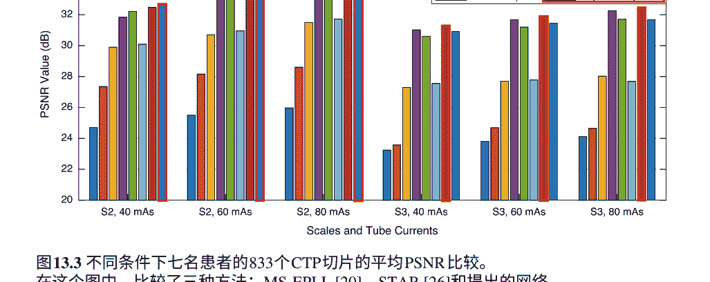

图13.3 不同条件下七名患者的833个CTP切片的平均PSNR比较。在这个图中，比较了三种方法：MS-EPLL [20], STAR [26]和提出的网络。这些条件包括三种不同的管电流（40、60、80 mAs）和两种SR比例（S2：下采样到1/2, S3：下采样到1/3）。LR表示从噪声图像中进行下采样后的低分辨率输入。不同场景下的最佳结果已突出显示。mAs是管电流-时间乘积的单位。

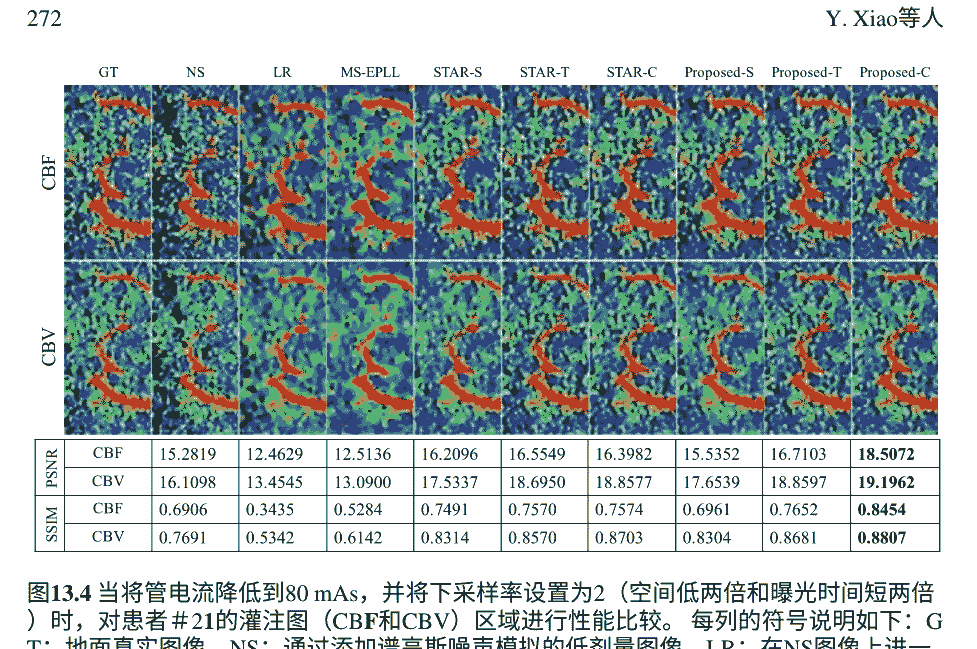

| 指标 | 方法 | GT | NS | LR | MS-EPLL | STAR-S | STAR-T | STAR-C | Proposed-S | Proposed-T | Proposed-C |
|------|------|----|----|----|---------|--------|--------|--------|------------|------------|------------|
| PSNR | CBF | 15.2819 | 12.4629 | 12.5136 | 16.2096 | 16.5549 | 16.3982 | 15.5352 | 16.7103 | 18.5072 |
| PSNR | CBV | 16.1098 | 13.4545 | 13.0900 | 17.5337 | 18.6950 | 18.8577 | 17.6539 | 18.8597 | 19.1962 |
| SSIM | CBF | 0.6906 | 0.3435 | 0.5284 | 0.7491 | 0.7570 | 0.7574 | 0.6961 | 0.7652 | 0.8454 |
| SSIM | CBV | 0.7691 | 0.5342 | 0.6142 | 0.8314 | 0.8570 | 0.8703 | 0.8304 | 0.8681 | 0.8807 |

图13.4 当将管电流降低到80 mAs，并将下采样率设置为2（空间低两倍和曝光时间短两倍）时，对患者#21的灌注图（CBF和CBV）区域进行性能比较。每列的符号说明如下：GT: 地面真实图像，NS: 通过添加谱高斯噪声模拟的低剂量图像，LR: 在NS图像上进一步下采样的LR输入，MS-EPLL: MS-EPLL方法（仅空间）的恢复结果，STAR-S: STAR的重建结果，仅空间模型，STAR-T: STAR的重建结果，仅时间模型，STAR-C: STAR的重建结果，联动模型（空间+时间），Proposed-S: 提出的网络结构的重建结果，仅空间模型，Proposed-T: 提出的网络的重建结果，仅时间模型，Proposed-C: 提出的网络的重建结果，联动模型（空间+时间）。下表是与上述图像相对应的PSNR和SSIM的定量评估。在所有方法中表现最佳的结果已用粗体字突出显示。

与LR输入相比，增益为2dB，与MS-EPLL方法相比，增益为4dB。所提出的网络在联合去噪和超分辨率任务中比最先进的方法（STAR的联动模型）平均提高了1.1%。这些结果表明，所提出的网络在低管电流和低分辨率图像上表现良好。性能尤其适用于时间方向；因此，CTP体积包含与下采样切片重建CT帧相关的更多信息，从而可以减少辐射暴露时间。

医生使用灌注图而不是CTP帧来诊断患者，因为灌注图能够显示血流过程中的血流动力学变化。因此，我们强调灌注图生成的性能以实现最佳临床相关性。图13.4比较了使用不同模型时患者#21的灌注图中感兴趣区域。从左到右，不同的列分别表示以下内容：GT: 地面实况图像，NS: 通过添加谱高斯噪声模拟的低剂量图像，LR: 在NS图像上进一步下采样的LR输入，MS-EPLL: MS-EPLL方法（仅空间）的恢复结果，STAR-S: STAR的重建结果，仅空间模型，STAR-T: STAR的时间模型的重建结果，STAR-C：STAR的重建结果，联合模型（空间+时间），Proposed-S：提出的网络结构的重建结果，仅空间模型，Proposed-T：提出的网络的重建结果，仅时间模型，Proposed-C：提出的网络的重建结果，联合模型（空间+时间）。

图13.4显示，与MS-EPLL和STAR模型相比，提出的网络生成的灌注图与真实图像更接近。 我们的网络的时空结构保留了感兴趣区域（ROI）的细节。 我们计算了灌注图的PSNR和SSIM值，如下所示。 平均而言，我们提出的网络相对于低分辨率输入具有45%更高的PSNR值，并且相对于STAR-联合方法（最先进的方法）有7%的改进。 MS-EPLL无法处理超低剂量情况，因为它生成的灌注图质量低于低分辨率图像。 在SSIM比较中，提出的网络的联合模型在所有情况下都达到了最高值，并且平均SSIM值比最先进的模型高6%。

因此，这些结果支持我们的方法在联合去噪和SR问题上更加稳健。

## 13.6 结论

在本文中，我们提出了一种新颖的多方向深度时空框架，用于恢复低剂量CTP图像，以进行中风的诊断和治疗。 它基于以较低的管电流、较短的辐射暴露时间和较低的空间分辨率进行扫描的输入，输出高分辨率和低噪声的图像。

我们的框架同时解决了图像去噪和超分辨率任务。通过适当的训练，基于CNN的SRDN通过一系列基于滤波器的KR块处理先验和数据保真度项。该块内的每个组件都具有同时处理图像噪声和分辨率问题的独特能力。

我们提出的网络基于空间和时间域的特征提取，在低分辨率和噪声条件下实现了优越的重建结果。因此，该网络成功地基于低剂量和低分辨率的补丁输入重建了高质量的CT体积。我们实验的结果支持我们的框架在以下商业标准条件下仍能保持诊断图像质量：管电流、X射线辐射暴露时间和空间分辨率分别降低到21%、1/3和1/3。因此，我们的方法在CTP成像中有效地减少了辐射暴露。在未来的工作中，我们将扩展我们的方法，以减少多模态成像中的辐射剂量。具体而言，我们将全面地结合低剂量非对比CT、CTA和CTP图像。

致谢本工作部分得到了国家科学基金会的支持，资助号为IIS-1564892，还得到了佛罗里达大学信息学研究所SEED基金和佛罗里达大学临床与转化科学研究所的支持，该研究所部分资金来自NIH国家中心。

## 参考文献

1.  Benjamin EJ, Blaha MJ, Chiuve SE, Cushman M, Das SR, Deo R, Floyd J, Fornage M, Gillespie C, Isasi C等 (2017) 心脏病和中风统计数据-2017年更新：来自美国心脏协会的报告。循环 135（10）：e146–e603
2.  Britten A, Crotty M, Kiremidjian H, Grundy A, Adam E (2004) 在具有空间相关性的图像中添加计算机模拟噪声以研究辐射剂量和图像质量：以脑部X射线CT为例。Br J Radiol 77 (916)：323–328
3.  Burger HC, Schuler CJ, Harmeling S (2012) 图像去噪：普通神经网络能与BM3D竞争吗？ 在：计算机视觉和模式识别IEEE会议。IEEE, pp 2392-2399
4.  疾病控制与预防中心 (2008) 对中风预警症状的认识-13个州和哥伦比亚特区，2005年。 Morb Mortal Wkly Rep 57 (18)：481
5.  Cho G, Kim JH, Park TS, Cho K (2017) 为公众提出一个简单的辐射刻度：辐射指数。Nucl Eng Technol 49 (3)：598-608
6.  Chodick G, Bekiroglu N, Hauptmann M, Alexander BH, Freedman DM, Doody MM, Cheung LC, Simon SL, Weinstock RM, Bouville A等 (2008) 低剂量电离辐射后白内障的风险：美国放射学技术人员的20年前瞻性队列研究。Am J Epidemiol 168 (6)：620-631
7.  de González AB, Mahesh M, Kim K-P, Bhargavan M, Lewis R, Mettler F, Land C (2009) 2007年在美国进行的计算机断层扫描的预计癌症风险。Arch Intern Med 169(22):2071–2077
8.  Dong C, Loy CC, He K, Tang X (2014) 学习用于图像超分辨率的深度卷积网络。 在：欧洲计算机视觉会议。Springer, pp 184–199
9.  Erhan D, Szegedy C, Toshev A, Anguelov D (2014) 使用深度神经网络进行可扩展的目标检测。 在：IEEE计算机视觉和模式识别会议论文集，pp 2147–2154
10. Hall MJ, Levant S, DeFrances CJ (2012) 美国医院中的中风住院，1989年至2009年。糖尿病 18(23):23
11. Erhan D, Szegedy C, Toshev A, Anguelov D (2016) 深度残差学习用于图像识别。 在：计算机视觉和模式识别IEEE会议论文集，pp770–778
12. Jia Y, Shelhamer E, Donahue J, Karayev S, Long J, Girshick R, Guadarrama S, Darrell T (2014) Caffe：用于快速特征嵌入的卷积架构。 在：第22届ACM国际多媒体会议论文集。ACM, pp 675–678
13. Journy NM, Lee C, Harbron RW, McHugh K, Pearce MS, de González AB (2017) 预测的癌症风险可能与过去、现在和未来在英国儿科CT中的实践有关，1990年至2020年。英国癌症研究杂志 116(1)：109
14. Juluru K, Shih J, Raj A, Comunale J, Delaney H, Greenberg E, Hermann C, Liu Y, Hoelscher A, Al-Khori N等 (2013年) 增加图像噪声对脑部CT灌注图像质量和定量解释的影响。Am J Neuroradiol 34 (8)：1506-1512
15. Kim J, Kwon Lee J, Mu Lee K (2016年) 使用非常深的卷积网络进行准确的图像超分辨率。 在：计算机视觉和模式识别的IEEE会议，2016年6月
16. Mao XJ, Shen C, Yang YB (2016年) 使用具有对称跳跃连接的卷积自动编码器进行图像恢复。arXiv：1606.08921
17. Mettler FA Jr, Bhargavan M等 (2009年) 美国和全球的放射学和核医学研究：频率，辐射剂量和与其他辐射源的比较-1950-2007 I.放射学 253 (2) : 520-531
18. Murphy A, So A, Lee T-Y, Symons S, Jakubovic R, Zhang L, Aviv RI (2014) 低剂量CT灌注在急性缺血性中风中的应用。 神经放射学 56(12):1055–1062
19. Oktay O, Bai W, Lee M等(2016) 使用卷积神经网络进行多输入心脏图像超分辨率。 在: 国际医学图像计算和计算机辅助干预会议。 Springer, pp 246–254
20. Papyan V, Elad M (2016) 多尺度基于补丁的图像恢复。 IEEE Trans Image Process 25(1):249–261
21. Shi W等(2016) 使用高效的亚像素卷积神经网络进行实时单图像和视频超分辨率。 在: IEEE计算机视觉和模式识别会议论文集, pp 1874–1883
22. Szegedy C, Liu W, Jia Y, Sermanet P, Reed S, Anguelov D, Erhan D, Vanhoucke V, Rabinovich A (2015) 深入卷积. 在：计算机视觉和模式识别的IEEE会议论文集, 第1-9页
23. Takei Y, Miyazaki O, Matsubara K, Shimada Y, Muramatsu Y, Akahane K, Fujii K, Suzuki S, Koshida K (2016) 对日本儿童计算机断层扫描检查中的辐射暴露进行全国调查，并提出基于年龄的诊断参考水平。 儿科放射学 46(2):280–285
24. Thierfelder KM, Sommer WH, Baumann AB, Klotz E, Meinel FG, Strobl FF, Nikolaou K, Reiser MF, von Baumgarten L (2013) 全脑CT灌注：急性缺血性中风患者体灌注缺陷评估的可靠性和重复性。 神经放射学 55(7):827–835
25. Wintermark M, Lev M (2010) FDA调查脑灌注CT的安全性。 美国神经放射学杂志 31(1):2–3
26. Xiao Y, Gupta A, Sanelli PC, Fang R (2017) STAR:超低剂量CT灌注的时空架构。 在：机器学习在医学成像中的国际研讨会。 Springer，第97-105页
27. Xie J, Xu L, Chen E (2012) 使用深度神经网络进行图像去噪和修复。 在：神经信息处理系统的进展, 第341-349页
28. Yang Q, Tong X, Schieb L, Vaughan A, Gillespie C, Wiltz JL, King SC, Odom E, Merritt R, Hong Y等 (2017) 生命体征：美国中风死亡率的最新趋势，2000-2015年。 Morb Mortal Wkly Rep 66(35):933–939
29. Yu L, Fletcher JG, Shi Y, Thomas KB, Matsumoto JM, Singh S, McCollough CH (2015年) 儿科全身CT中的辐射剂量减少，使用迭代重建和一种新颖的基于图像的去噪方法。 Am J Roentgenol 205(5):1026–1037
30. Zhang K, Zuo W, Chen Y, Meng D, Zhang L (2017年) 超越高斯去噪器：深度CNN的残差学习用于图像去噪。 IEEE Trans Image Process 26(7):3142–3155

# 第14章 生成低剂量CT图像去噪

杨庆松，闫平坤，张彦波，于恒勇，史永义，牟璇琴，Mannudeep K. Kalra，张毅，孙玲和王戈

摘要 CT在医学实践中的持续发展和广泛应用引起了公众对患者辐射剂量的关注。降低辐射剂量可能会导致增加的噪声和伪影，这可能会对放射科医生的判断和信心产生不利影响。因此，需要从低剂量CT数据中进行先进的图像重建，以提高诊断性能。

Q. 杨 · P. 颜 (📧) · G. 王
生物医学工程系，Rensselaer Polytechnic Institute，特洛伊，NY 12180，美国
e-mail: yanp2@rpi.edu
Q. 杨
e-mail: yangq4@rpi.edu
G. 王
e-mail: wangg6@rpi.edu
Y. 张 · H. 于
电气与计算机工程系，Massachusetts Lowell大学，洛厄尔，MA 01854，美国 e-mail: yanbo_zhang@uml.edu H. 于
电子邮件：hengyong-yu@ieee.org
Y. Shi · X. Mou
西安交通大学图像处理与模式识别研究所，陕西西安710049
中国
电子邮件：xqmou@mail.xjtu.edu.cn
M. K. Kalra
哈佛医学院放射学系，马萨诸塞州普通医院，波士顿
马萨诸塞州，美国
电子邮件：mkalra@mgh.harvard.edu
Y. Zhang
四川大学计算机科学学院，成都610065，中国
电子邮件：yzhang@scu.edu.cn
L. Sun
华西医院放射科，华西医学研究中心（HMRRC），四川大学，成都610041，中国
电子邮件：251834489@qq.com

由于其不适定性质，医学成像和临床信息学中的深度学习和卷积神经网络是一个具有挑战性的问题。在过去的几年中，各种低剂量CT方法取得了令人印象深刻的结果。然而，针对这个应用程序开发的大多数算法，包括最近流行的深度学习技术，旨在最小化去噪CT图像与基准真实图像之间的均方误差（MSE）在通用惩罚下。虽然峰值信噪比（PSNR）得到了改善，但基于MSE或加权MSE的方法可能会在激进去噪后损害重要结构细节的可见性。本文介绍了一种基于生成对抗网络（GAN）和Wasserstein距离以及感知相似性的新型CT图像去噪方法。Wasserstein距离是最优输运理论的一个关键概念，有望提高GAN的性能。感知损失通过在已建立的特征空间中比较去噪输出的感知特征与基准真实图像的感知特征来抑制噪声，而GAN更加关注将数据噪声分布从强到弱地迁移。因此，我们提出的方法将我们对视觉感知的知识转化到图像去噪任务中，不仅能降低图像噪声水平，还能尽量保持关键信息。我们在临床CT图像的实验中取得了令人期待的结果。

## 14.1 引言

X射线计算机断层扫描（CT）是现代医院和诊所中最重要的成像模式之一。然而，由于X射线可能引起遗传损伤并以一定概率诱发癌症，因此患者存在潜在的辐射风险[6, 11]。降低辐射剂量会增加重建图像中的噪声和伪影，可能会损害诊断信息。

因此，人们已经做出了大量努力，设计了更好的低剂量CT（LDCT）图像重建或图像后处理方法。这些方法通常可以分为三类:（a）重建前的正弦图滤波[30, 41, 42],（b）迭代重建[5, 20], 以及（c）重建后的图像后处理[10, 16, 29]。

在过去的十年中，研究人员致力于开发新的迭代算法（IR）用于LDCT图像重建。一般来说，这些算法优化一个包含准确系统模型[12, 27]、统计噪声模型[15, 33, 43]和图像域中先验信息的目标函数。常用的图像先验包括总变差（TV）及其变体[28, 35, 38], 以及字典学习[45, 47]。这些迭代重建算法极大地提高了图像质量，但仍可能丢失一些细节并存在残留伪影。此外，它们需要高计算成本，这在实际应用中是一个瓶颈。

另一方面，与迭代重建相比，正弦图预滤波和图像后处理在计算上更高效。噪声特性在正弦图域中被很好地建模，用于正弦图域滤波。然而，商业扫描仪的正弦图数据对用户来说并不容易获取，而这些方法需要访问原始数据。因此，重建后的图像后处理方法因其简单性和对扫描仪原始数据的无依赖性而受到关注。这些方法通常在图像域中操作，直接对重建后的LDCT图像进行去噪。传统的图像后处理方法包括基于滤波的方法（如各向异性扩散、总变分最小化）和基于变换的方法（如小波变换、非局部均值）。近年来，基于深度学习的方法，特别是卷积神经网络（CNN），在LDCT图像去噪中显示出了巨大的潜力。

然而，大多数现有的去噪方法，包括基于深度学习的方法，主要关注抑制噪声，而可能忽略保持重要的结构细节和纹理信息。这对于医学图像诊断至关重要，因为细微的结构特征可能包含关键的诊断信息。因此，开发一种既能有效去噪又能很好保持图像结构和感知质量的去噪方法仍然是一个重要的研究方向。

本文提出了一种基于生成对抗网络（GAN）和Wasserstein距离以及感知相似性的新型LDCT图像去噪方法。我们的方法将去噪任务视为一个图像到图像的翻译问题，旨在将低剂量、高噪声的CT图像映射到相应的高剂量、低噪声的图像。通过结合Wasserstein距离来稳定GAN的训练并提高生成图像的质量，以及使用感知损失来保持去噪图像与真实图像在感知特征上的相似性，我们的方法能够生成噪声水平低且结构细节保存完好的CT图像。我们在临床CT图像数据集上进行了广泛的实验，结果表明，与现有的去噪方法相比，我们的方法在定量指标和视觉质量上均取得了优越的性能。

# 14 生成低剂量CT图像去噪

可能会导致分辨率损失和边缘模糊。正弦图数据需要经过仔细处理，否则可能在重建图像中引入伪影。

与正弦图去噪不同，图像后处理直接作用于图像。在图像域中进行了许多努力来减少LDCT噪声和抑制伪影。例如，非局部均值（NLM）方法被改编用于CT图像去噪[29]。受压缩感知方法的启发，提出了一种改进的K-SVD方法来减少CT图像中的伪影[10]。在几个CT图像任务中，使用了块匹配3D（BM3D）算法进行图像恢复[16, 23]。通过这种图像后处理，图像质量得到了明显的改善，但通常在处理后的图像中观察到过度平滑和/或残余误差。鉴于CT图像噪声的非均匀分布，这些问题很难解决。

深度神经网络的最近爆炸性发展为医学成像领域提供了新的思路和巨大潜力[39, 40]。以LDCT去噪问题为例，可以使用深度学习技术来解决。具体来说，卷积神经网络（CNN）用于图像超分辨率[14]，最近被改进用于低剂量CT图像去噪[8]，取得了显著的性能提升。

随后，提出了更复杂的网络来处理LDCT去噪问题，例如[9]中的RED-CNN和[24]中的小波网络。小波网络直接采用了U-net[34]引入的快捷连接，而RED-CNN[27]则用卷积/反卷积对取代了U-net的池化/反池化层。

尽管这些创新的网络结构在去噪方面取得了令人印象深刻的结果，但它们属于一种端到端网络的范畴，通常使用网络输出与真实值之间的均方误差（MSE）作为损失函数。正如最近的研究[22, 26]所揭示的，这种像素级均方误差经常与过度平滑的边缘和细节丢失相关。当算法试图最小化每个像素的均方误差时，它会忽视对人类感知至关重要的微妙图像纹理/特征。合理地假设CT图像分布在某些流形上是合理的。从这个角度来看，基于均方误差的方法倾向于使用欧氏距离而不是测地距离来取高分辨率补丁的平均值。因此，除了模糊效果之外，还可能出现非均匀偏差等伪影。

为了解决上述问题，我们在这里提出使用生成对抗网络（WGAN）[4]和Wasserstein距离作为分布之间的差异度量，以及在已建立的特征空间[22, 26]中计算图像之间差异的感知损失。

使用WGAN的目的是鼓励去噪CT图像与正常剂量CT（NDCT）图像具有相同的分布。在GAN框架中，生成网络 G和判别网络 D紧密耦合合并同时训练。生成网络 G（z）被训练为从随机向量 z生成逼真的图像 G，而判别网络 D被训练为区分真实图像和生成图像[17, 18]。GAN已经在许多应用中使用，例如单幅图像超分辨率[22]、艺术创作[7, 48]和图像转换[21]。在医学成像领域，Nie等人[31]提出使用GAN从相应的MR图像估计CT图像。Wolterink等人[44]是首次应用GAN网络用于心脏CT图像去噪。而Yu等人[46]使用GAN网络处理快速CS-MRI的去混叠问题。这些工作取得了令人满意的结果。我们将在第14.3节讨论并比较这两个网络的结果，因为所提出的网络与它们的工作密切相关。

尽管GAN在这些领域取得了成功，但仍然存在训练上的显著困难[3, 17]。在原始的GAN[18]中，通过解决以下极小极大问题来训练D和G：

$$ \min_{G} \max_{D} L_{\text{GAN}}(D, G) = \mathbb{E}_{\boldsymbol{x} \sim p_{r}}[\log D(\boldsymbol{x})] + \mathbb{E}_{\boldsymbol{z} \sim p_{z}}[\log (1 - D(G(\boldsymbol{z})))] \quad (14.1) $$

其中 $\mathbb{E}(\cdot)$ 表示期望运算符，$P_{r}$ 和 $P_{z}$ 分别表示真实数据分布和噪声数据分布。生成器 $G$ 将噪声样本转化为模仿真实样本的样本，定义了一个数据分布，表示为 $P_{g}$。当 $D$ 被训练成为对于固定的 $G$ 最优的判别器时，对于 $G$ 的最小化搜索等价于最小化 $P_{r}$ 和 $P_{g}$ 的Jensen-Shannon(JS)散度，这将导致生成器 $G$ 的梯度消失[3]，并且随着训练的进行，$G$ 将停止更新。

因此，Arjovsky等人[4]提出使用生成的图像样本和真实数据之间的地球移动（EM）距离或Wasserstein度量来进行GAN，这被称为WGAN，因为在一些温和的假设下，$EM$ 距离几乎在任何地方都是连续且可微分的，而KL散度和JS散度则不是。在此之后，提出了一种改进的带有梯度惩罚的WGAN [19]以加速收敛。

感知损失背后的原理是双重的。首先，当一个人比较两张图像时，感知并不是逐像素进行的。人类视觉实际上从图像中提取并比较特征[32]。因此，我们不使用逐像素的均方误差，而是使用另一个预训练的深度卷积神经网络（著名的VGG [36]）进行特征提取，并将去噪输出与基准真实图像在提取的特征方面进行比较。其次，从数学角度来看，CT图像在高维欧几里得空间中并不均匀分布。它们更有可能存在于低维流形中。通过MSE，我们并不是在测量图像之间的内在相似性，而只是在测量它们在蛮力欧几里得距离上的表面差异。通过根据它们的内在结构进行比较，我们应该将图像投影到流形上并计算测地线距离。

因此，对于WGAN的感知损失的使用应该有助于产生不仅噪声更低而且细节更清晰的结果。

特别地，我们将LDCT去噪问题视为从LDCT到NDCT图像的转换。WGAN提供了对去噪后的LDCT和NDCT图像分布之间的良好距离估计。同时，基于VGG的感知损失在去噪后倾向于保持图像内容。本文的其余部分按照以下方式组织。所提出的方法在第14.2节中进行了描述。实验和结果在第14.3节中呈现。最后，在第14.4节中讨论相关问题并得出结论。

## 14.2 方法

### 14.2.1 降噪模型

让 $z \in \mathbb{R}^{N \times N}$ 表示LDCT图像，$x \in \mathbb{R}^{N \times N}$ 表示相应的NDCT图像。去噪过程的目标是寻找一个将LDCT $z$ 映射到NDCT $x$ 的函数 $G$：

$ G: z \rightarrow x. \quad (14.2) $

另一方面，我们也可以将 $z$ 作为LDCT图像分布的样本 $P_L$ 和将 $x$ 作为NDCT分布或真实分布 $P_r$ 的样本。去噪函数 $G$ 将来自 $P_L$ 的样本映射到某个分布 $P_g$ 中。通过改变函数 $G$，我们的目标是使 $P_g$ 接近 $P_r$。这样，我们将去噪算子视为将一个数据分布转移到另一个数据分布的过程。

通常，X射线光子测量中的噪声可以简单地建模为泊松量子噪声和高斯电子噪声的组合。相反，在重建图像中，噪声模型通常复杂且在整个图像上分布不均匀。因此，没有明确的线索表明NDCT和LDCT图像的数据分布之间的关系，这使得使用传统方法对LDCT图像进行去噪变得困难。然而，在深度学习去噪中，噪声模型的不确定性可以被忽略，因为深度神经网络本身可以通过神经网络从适度大小的图像块中高效地学习高级特征和数据分布的表示。

### 14.2.2 WGAN

与原始GAN网络相比，WGAN使用Wasserstein距离来比较数据分布，而不是JS散度。它通过解决以下极小极大问题来获得 $D$ 和 $G$ [19]：

$ \min \limits_{G} \max \limits_{D} L_{\text{WGAN}}(D, G) = -\mathbb{E}_{x}[D(x)] + \mathbb{E}_{z}[D(G(z))] + \lambda \mathbb{E}_{\hat{x}}[(\|\nabla_{\hat{x}}D(\hat{x})\|_2 - 1)^2] \quad (14.3) $

其中前两项用于估计Wasserstein距离，最后一项是网络正则化的梯度惩罚项，$\hat{x}$ 沿着连接生成样本和真实样本的直线均匀采样，$\lambda$ 是一个常数权重参数。与原始GAN相比，WGAN在损失函数中去除了对数函数，并且在判别器 $D$ 的实现中去除了最后的sigmoid层。具体而言，网络 $D$ 和 $G$ 通过交替训练来固定一个并更新另一个。

### 14.2.3 感知损失

虽然WGAN网络鼓励生成器将数据分布从高噪声转换为低噪声版本，但损失函数的另一部分是为了使网络保留图像细节或信息内容。通常使用均方误差（MSE）损失函数，该函数试图最小化去噪补丁 G(z)和NDCT图像补丁 x之间的逐像素误差[8, 9]

$$ L_{MSE}(G) = \mathbb{E}_{(x,z)}\left[\frac{1}{N^2}\|G(z) - x\|_F^2\right] \quad (14.4) $$

其中$\|\cdot\|_F$表示Frobenius范数。然而，均方误差损失可能会生成模糊的图像并导致细节的失真或丢失。因此，我们不使用均方误差度量，而是应用在特征空间中定义的感知损失函数。

$$ L_{\text{感知}}(G) = \mathbb{E}_{(x,z)}\left[\frac{1}{whd}\|\phi(G(z)) - \phi(x)\|_F^2\right] \quad (14.5) $$

其中$\phi$是特征提取器，$w$、$h$和$d$分别代表特征空间的宽度、高度和深度。在我们的实现中，我们采用了著名的预训练的VGG-19网络[36]作为特征提取器。由于预训练的VGG网络接受彩色图像作为输入，而CT图像是灰度图像，因此我们在将CT图像输入VGG网络之前复制了它们以生成RGB通道。VGG-19网络包含16个卷积层和三个全连接层。第十六个卷积层的输出是VGG网络提取的特征，用于感知损失函数。

$$ L_{VGG}(G) = \mathbb{E}_{(x,z)}\left[\frac{1}{whd}\|VGG(G(z)) - VGG(x)\|_F^2\right] \quad (14.6) $$

为了方便起见，我们称由VGG网络计算的感知损失为VGG损失。将方程（14.3）和（14.6）结合起来，我们得到总体联合损失函数表示为
$ \min_G \max_D L_{WGAN}(D, G) + \lambda_1 L_{VGG}(G) \quad (14.7) $

其中$\lambda_1$是一个权重参数，用于控制WGAN对抗损失和VGG感知损失之间的权衡。

### 14.2.4 网络结构

所提出的网络结构的整体视图如图14.1所示。为了方便起见，我们将这个网络命名为WGAN-VGG。它由三个部分组成。第一部分是生成器G，它是一个由八个卷积层组成的卷积神经网络（CNN）。按照深度学习社区的通常做法[37]，每个卷积层都使用了小的3×3卷积核。由于堆叠的结构，这样的网络可以高效地覆盖足够大的感受野。生成器G的前七个隐藏层中，每个层都有32个滤波器。最后一层只生成一个特征图，使用了一个3×3的滤波器，也是G的输出。我们使用修正线性单元（ReLU）作为激活函数。

网络的第二部分是感知损失计算器，它是通过预训练的VGG网络[36]实现的。从生成器G产生的去噪输出图像G(z)和真实图像x被输入到预训练的VGG网络中进行特征提取。然后，根据第14.6式使用从指定层提取的特征计算目标损失。然后，将重构误差反向传播到只更新G的权重，同时保持VGG参数不变。

网络的第三部分是判别器D。如图14.2所示，D有六个卷积层，其结构受到其他人的工作的启发[22, 26, 36]。前两个卷积层有64个滤波器，然后是两个有128个滤波器的卷积层，最后两个卷积层有256个滤波器。按照与G相同的逻辑，在D中的所有卷积层都具有小的3×3的核大小。在六个卷积层之后，有两个全连接层，其中第一个有1024个输出，另一个只有一个输出。按照[4]中的做法，在D的末尾没有sigmoid交叉熵层。

该网络使用图像块进行训练，并应用于整个图像。关于实验的详细信息请参见第14.3节。

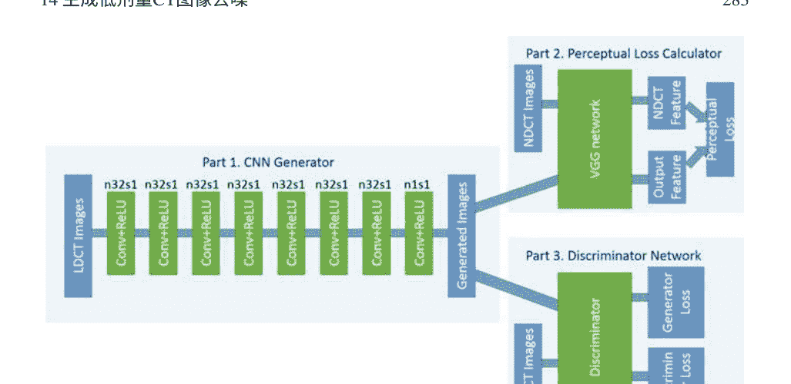

图14.1 所提出的WGAN-VGG网络的整体结构。在第一部分中，n代表卷积核的数量，s代表卷积步长。因此，n32s1表示卷积层具有32个卷积核，步长为1。

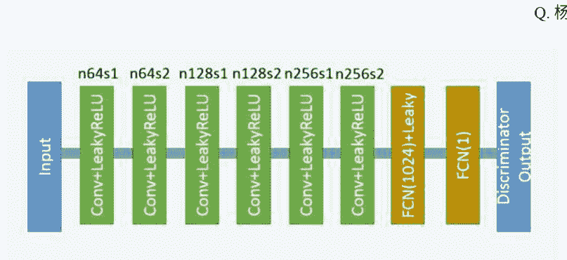

表14.1 所有训练网络的总结：它们的损失函数和可训练网络

| 网络     | 损失                                                         |
|----------|--------------------------------------------------------------|
| CNN-MSE  | 最小化 $G\ L_{\text{MSE}}(G)$                                |
| WGAN-MSE | 最小化 $G$ 最大化 $D\ L_{\text{WGAN}}(G, D) + \lambda_2 L_{\text{MSE}}(G)$ |
| CNN-VGG  | 最小化 $G\ L_{\text{VGG}}(G)$                                |
| WGAN-VGG | 最小化 $G$ 最大化 $D\ L_{\text{WGAN}}(G, D) + \lambda_1 L_{\text{VGG}}(G)$ |
| WGAN     | 最小化 $G$ 最大化 $D\ L_{\text{WGAN}}(G, D)$                 |
| GAN      | 最小化$_G$ 最大化$_D\ L_{\text{GAN}}(G, D)$                  |

### 14.2.5 其他网络

为了比较，我们还训练了其他四个网络。

- 只使用MSE损失的CNN-MSE,
- 仅使用VGG损失的CNN-VGG,
- 在WGAN框架中使用MSE损失的WGAN-MSE,
- 没有其他附加损失的WGAN,
- 原始GAN.

所有训练过的网络都总结在表14.1中。

## 14.3 实验

### 14.3.1 实验数据集

我们使用了一个真实的临床数据集，由Mayo Clinic授权用于“2016年NIH-AAPM-Mayo Clinic低剂量CT大挑战”的训练和评估提出的网络[1]。该数据集包含10个匿名患者的正常剂量腹部CT图像和模拟的四分之一剂量CT图像。在我们的实验中，我们随机从4,000个CT图像中提取了100,096对图像块作为我们的训练输入和标签。图像块的尺寸为64 ×64。此外，我们从另外2,000个图像中提取了5,056对图像块用于验证。在选择图像块时，我们排除了主要是空气的图像块。为了比较，我们实现了一种代表性的最先进的3D字典学习重建技术作为代表IR算法[45, 47]。字典学习重建是从Mayo Clinic提供的LDCT投影数据中进行的。

### 14.3.2 网络训练

在我们的实验中，所有的网络都是使用Adam算法[25]进行优化的。WGAN-VGG网络的优化过程如图14.3所示。小批量大小为128。Adam的超参数设置为 $\alpha = 1e^{-5}$, $\beta_1 = 0.5$, $\beta_2 = 0.9$, 根据我们的实验经验，我们选择 $\lambda = 10$, 如[19]中建议的那样, $\lambda_1 = 0.1$, $\lambda_2 = 0.1$。WGAN-MSE和WGAN的优化过程类似，只是将第12行改为相应的损失函数，而对于CNN-MSE和CNN-VGG，删除了2-10行，并根据它们的损失函数修改了第12行。

这些网络是使用Tensorflow库[2]在Python中实现的。本研究使用了一块NVIDIA Titan XP GPU。

### 14.3.3 网络收敛

为了可视化网络的收敛情况，我们根据方程（14.4）和（14.6）计算了5,056个图像块的验证集上的MSE损失和VGG损失，每个epoch后进行一次计算。图14.4显示了五个网络的平均MSE和VGG损失与epoch数的关系。尽管这两个损失函数在同一网络中没有同时使用，但我们仍然希望看到它们在训练过程中的变化。在这两个图中，MSE和VGG损失最初都有所下降，这表明这两个指标是正相关的。然而，就MSE损失而言，网络的损失值按照以下顺序递增: CNN-MSE < WGAN-MSE < WGAN-VGG < CNN-VGG（图14.4a）, 而VGG损失则相反（图14.4b）。GAN网络的MSE和VGG损失在收敛过程中波动。WGAN-VGG和CNN-VGG的VGG损失值非常接近，而它们的MSE损失则相差很大。另一方面，WGAN在MSE损失方面干扰了收敛过程，但在VGG损失方面平稳收敛。这些观察结果表明，这两个指标在网络使用时有不同的重点。差异

```
Require: 设置超参数，λ = 10, α = 1 × 10^{-5}, β_1 = 0.5, β_2 = 0.9, λ_1 = 0.1, λ_2 = 0.1,
Require: 设置总epoch数, N_epoch = 100, 判别器训练迭代次数, N_D = 4, 批量大小 m = 128, 图像块大小 80 × 80.
Require: 初始判别器参数 w_0, 初始生成器参数 θ_0
Require: 加载VGG-19网络参数
1: for num_epoch = 0, ..., N_epoch do
2:    for t = 1, ..., N_D do
3:        采样一批NDCT图像块 {x^{(i)}}_{i=1}^m, 潜在LDCT块 {z^{(i)}}_{i=1}^m, 和随机数 {ε^{(i)}}_{i=1}^m ~ Uniform[0, 1]
4:        for i = 1, ..., m do
5:            \hat{x}^{(i)} ← ε^{(i)} x^{(i)} + (1 - ε^{(i)}) G(z^{(i)})
6:            L^{(i)}(D) ← D(G(z^{(i)})) - D(x^{(i)}) + λ (||∇ D(\hat{x}^{(i)})||_2 - 1)^2
7:        end for
8:    end for
9:    更新 D: w ← Adam(∇_w \frac{1}{m} \sum_{i=1}^m L^{(i)}(D), w; α, β_1, β_2)
10:    采样一批LDCT块 {z^{(i)}}_{i=1}^m 和对应的NDCT块 {x^{(i)}}_{i=1}^m,
11:    for i = 1, ..., m do
12:        L^{(i)}(G) ← λ_1 L_{VGG}(z^{(i)}, x^{(i)}) - D(G(z^{(i)}))
13:    end for
14:    更新 G, θ ← Adam(∇_θ \frac{1}{m} \sum_{i=1}^m L^{(i)}(G), w; α, β_1, β_2)
15: end for
```

图14.3 WGAN-VGG网络的优化过程

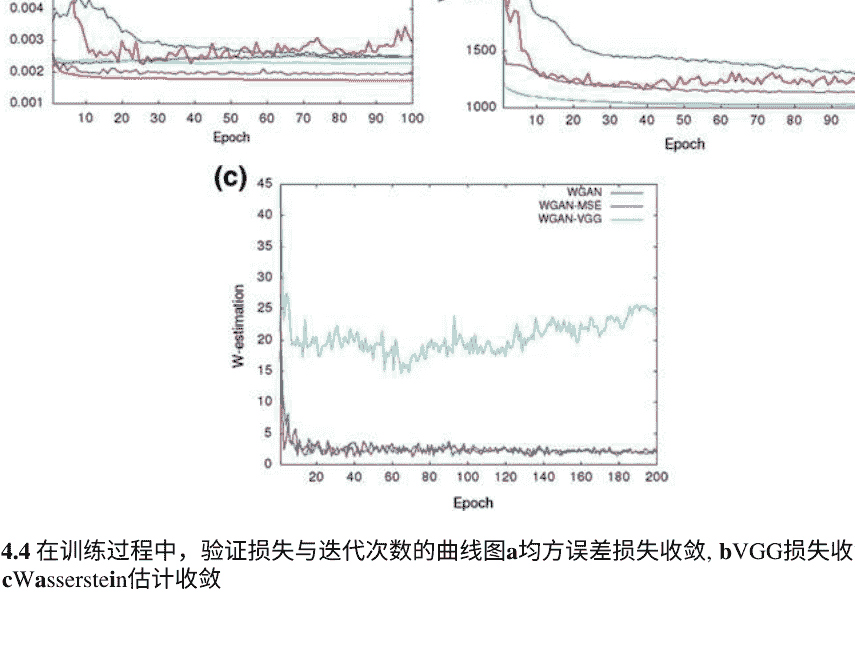

图14.4 在训练过程中，验证损失与迭代次数的曲线图 (a) 均方误差损失收敛, (b) VGG损失收敛, 和 (c) Wasserstein估计收敛通过生成器的输出图像，可以进一步揭示MSE和VGG损失之间的差异。

为了展示WGAN部分的收敛性，我们绘制了定义为|−E[D(x)]+E[D(G(z))]|的估计Wasserstein值的图像，如公式（14.3）所示。从图14.4c可以观察到，增加迭代次数确实减小了W距离，尽管衰减速率变得较小。对于WGAN-VGG曲线，引入VGG损失有助于提高感知/可见性，但代价是损失度量的折衷。对于WGAN和WGAN-MSE曲线，我们需要注意的是，我们计算的是W距离的替代值，尚未通过像素总数进行归一化，如果我们进行了归一化，曲线在100次迭代后会接近零。

### 14.3.4 降噪结果

为了展示所选网络的降噪效果，我们选择了两个代表性的切片，如图14.5和14.7所示。图14.6和14.8是图14.5和14.7中用红色矩形标记的放大感兴趣区域（ROI）。所有的网络都展示了一定的降噪能力。然而，CNN-MSE模糊了图像并引入了蜡状伪影，正如预期的那样，在图14.6e和14.8e的放大ROI中很容易观察到。WGAN-MSE通过避免过度平滑改善了CNN-MSE的结果，但仍然可以观察到一些轻微的条纹伪影，特别是与CNN-VGG和WGAN-VGG相比。同时，仅使用WGAN或GAN生成的噪声（图14.6g和14.8g）比其他网络更强，增强了WGAN/GAN生成的图像中的一些白色结构，这些结构源自LDCT图像中的低剂量条纹伪影，而与之相反的是，CNN-VGG和WGAN-VGG图像在视觉上更接近NDCT图像。这是因为CNN-VGG和WGAN-VGG中使用的VGG损失是在之前训练过的非常大的自然图像数据集[13]上计算的特征空间。通过使用VGG损失，我们将嵌入在VGG网络中的人类感知知识转移到了CT图像质量评估中。仅使用WGAN或GAN的性能是不可接受的，因为它只是将LDCT到NDCT的数据分布映射，但不能保证图像内容的对应关系。至于这两个切片中的病变检测，所有的网络都增强了病变的可见性，与原始噪声低剂量FBP图像相比，通过不同的方法降低了噪声。

对于迭代重建技术来说，重建结果在很大程度上取决于正则化参数的选择。实施的字典学习重建（DictRecon）结果相比于网络输出具有更强的正则化效果，从而实现了最激进的降噪效果。然而，它过度平滑了一些细微结构。例如，在图14.8中，绿色箭头指向的血管被模糊掉了，而在NDCT和WGAN-VGG图像中很容易识别。然而，作为一种迭代重建方法，DictRecon在后处理方法上具有优势。如图14.8中红色箭头所指出的，在DictRecon和NDCT图像中可以看到一个亮点，但在LDCT和经过神经网络处理的图像中不可见。由于WGAN-VGG图像是从LDCT图像生成的，在LDCT图像中很难观察到这个亮点，所以在神经网络处理的图像中看不到这个亮点是合理的。换句话说，我们不希望网络生成原始图像中不存在的结构。简而言之，提出的WGAN-VGG网络是一种后处理方法，FBP重建过程中丢失的信息无法恢复。

所有后处理方法都存在一个限制，即可以轻松恢复原始数据。另一方面，作为一种迭代重建方法，DictRecon算法从原始数据生成图像，其中包含比后处理方法更多的信息。

### 14.3.5 定量分析

对于定量分析，我们计算了峰值信噪比（PSNR）和结构相似性（SSIM）。总结数据见表14.2。在PSNR方面，CNN-MSE排名第一，而WGAN排名最差。由于PSNR等效于每像素损失，因此CNN-MSE被训练为最小化MSE损失，这并不令人意外。在最小化其他基于特征的损失的网络中，CNN-MSE表现优异。值得注意的是，这些定量结果与图14.4相当一致，其中CNN-MSE具有最小的MSE损失，而WGAN具有最大的损失。WGAN在PSNR和SSIM方面排名最差的原因是因为它不包括MSE或VGG正则化。DictRecon实现了最佳的SSIM和较高的PSNR。然而，它存在图像模糊的问题，并导致方块状和蜡状伪影。在生成的图像中。这表明PSNR和SSIM可能不足以评估图像质量。

在审查过程中，我们发现两篇使用相似网络结构的论文。在[44]中，Wolterink等人训练了三个网络，即GAN，CNN-MSE和GAN-MSE用于心脏CT去噪。他们的定量PSNR结果与我们的结果一致。而Yu等人[46]使用GAN-VGG处理快速CS-MRI的去混叠问题。他们的结果也与我们的结果一致。有趣的是，尽管基于MSE的网络获得了较高的PSNR，但两篇论文的作者都声称基于GAN和VGG损失的网络具有更好的图像质量和诊断信息。

表14.2 与图14.5和14.7相关的不同网络输出的定量结果

| 方法 | 图14.5 峰值信噪比 | 图14.5 结构相似性指数 | 图14.7 峰值信噪比 | 图14.7 结构相似性指数 |
|---|---|---|---|---|
| 低剂量计算机断层扫描 | 19.7904 | 0.7496 | 18.4519 | 0.6471 |
| CNN-MSE | 24.4894 | 0.7966 | 23.2649 | 0.7022 |
| WGAN-MSE | 24.0637 | 0.8090 | 22.7255 | 0.7122 |
| CNN-VGG | 23.2322 | 0.7926 | 22.0950 | 0.6972 |
| WGAN-VGG | 23.3942 | 0.7923 | 22.1620 | 0.6949 |
| WGAN | 22.0168 | 0.7745 | 20.9051 | 0.6759 |
| GAN | 21.8676 | 0.7581 | 21.0042 | 0.6632 |
| 字典重建 | 24.2516 | 0.8148 | 24.0992 | 0.7631 |

为了更深入地了解不同方法的输出图像，我们通过计算图14.5和图14.7中两个平坦区域（由蓝色矩形标记）的平均CT数（Hounsfield单位）和标准差（SD）来检查它们的统计特性。在理想情况下，降噪算法应该尽可能接近金标准的平均值和标准差。在我们的实验中，NDCT FBP图像被用作金标准，因为它们在这个数据集中具有最好的图像质量。如表14.3所示，与NDCT相比，CNN-MSE和DictRecon都产生了更小的标准差，这表明它们过度平滑了图像，并支持我们的视觉观察。相反，WGAN产生了最接近的标准差，但较小的平均值，这意味着它可以将噪声降低到与NDCT相同的水平，但却损害了信息内容。另一方面，提出的WGAN-VGG在平均CT数、标准差和最重要的视觉效果方面优于CNN-VGG、WGAN-MSE和其他选择的方法。

此外，我们对10组图像进行了盲读者研究。每组包含相同的图像切片，但经过不同的处理方法。每个组中只包含NDCT和LDCT图像作为参考，这是唯一标记的两个图像。要求两位放射科医生独立评分每个图像的噪声抑制和伪影减少程度，采用五分制（1=不可接受，5=优秀），除了NDCT和LDCT图像，它们是参考图像。此外，他们被要求为所有图像给出一个整体图像质量评分。

然后，从两位放射科医生的评分中获得均值和标准差值作为最终评估结果，显示在表14.4中。可以看出，CNN-MSE和DictRecon在噪声抑制方面得分最高，而提出的WGAN-VGG在伪影减少和整体质量改善方面优于其他方法。此外，*-VGG网络在伪影减少和整体质量方面得分较高，但在噪声抑制方面得分较低。这表明基于MSE损失的网络在噪声抑制方面表现良好，但会损失图像细节，导致图像质量下降。

表14.3 图14.5和14.7中蓝色矩形区域的统计特性。数值以Hounsfield单位（HU）表示

| 算法 | 图14.5 平均值 | 图14.5 标准差 | 图14.7 平均值 | 图14.7 标准差 |
|------|---------------|-----------|---------------|-----------|
| NDCT | 9 | 36 | 118 | 38 |
| 低剂量计算机断层扫描 | 11 | 74 | 118 | 66 |
| CNN-MSE | 12 | 18 | 120 | 15 |
| WGAN-MSE | 9 | 28 | 115 | 25 |
| CNN-VGG | 4 | 30 | 104 | 28 |
| WGAN-VGG | 9 | 31 | 111 | 29 |
| WGAN | 23 | 37 | 135 | 33 |
| GAN | 8 | 35 | 110 | 32 |
| 字典重建 | 4 | 11 | 111 | 13 |

表14.4 盲读者研究的定量结果。数值以均值±标准差表示

| 指标 | NDCT | 低剂量计算机断层扫描 | CNN-MSE | CNN-VGG | WGAN-MSE | WGAN-VGG | WGAN | GAN | 字典重建 |
|------|------|----------------------|---------|---------|----------|----------|------|-----|----------|
| 噪声抑制 | – | – | 4.35 ± 0.24 | 3.10 ± 0.23 | 3.55 ± 0.25 | 3.20 ± 0.25 | 2.90 ± 0.26 | 3.00 ± 0.21 | 4.65 ± 0.20 |
| 伪影减少 | – | – | 1.70 ± 0.28 | 2.85 ± 0.32 | 3.05 ± 0.27 | 3.45 ± 0.25 | 2.90 ± 0.28 | 3.05 ± 0.27 | 2.05 ± 0.27 |
| 整体质量 | 3.95 ± 0.20 | 1.35 ± 0.16 | 2.15 ± 0.25 | 3.05 ± 0.20 | 3.30 ± 0.21 | 3.70 ± 0.15 | 3.05 ± 0.22 | 3.10 ± 0.21 | 2.05 ± 0.36 |

诊断。与使用CNN的网络相比，使用WGAN的网络提供更好的整体图像质量，这支持了在CT图像去噪中使用WGAN的方法。

## 14.4 讨论与结论

本文的最重要动机是尽可能接近黄金标准NDCT图像。如上所述，使用Wasserstein距离和VGG损失函数研究了GAN在此目的上的可行性和优点。使用MSE损失和VGG损失之间的差异相当显著。

尽管具有均方误差（MSE）的网络会提供更高的传统指标值，但基于VGG损失的网络似乎更适合提供更好的视觉图像质量，更多的细节和更少的伪影。

实验结果表明，使用WGAN有助于提高图像质量和统计特性。比较CNN-MSE和WGAN-MSE的图像，我们可以看到WGAN框架有助于避免MSE-based图像生成器通常遭受的过度平滑效果。尽管CNN-VGG和WGAN-VGG在视觉上呈现出类似的结果，但定量分析显示WGAN-VGG在PSNR和去噪图像的统计特性方面具有更高的准确性，相对于NDCT图像而言更加忠实。然而，仅使用WGAN/GAN减少了噪声，但代价是丢失了关键特征。生成的图像并没有显示出很强的降噪效果。定量上，与LDCT相比，相关的PSNR和SSIM略有增加，但远低于其他网络产生的值。

从理论上讲，WGAN/GAN网络基于生成模型，可能会生成看起来自然但对医学诊断造成严重失真的图像。这就是为什么应该添加一个加性损失函数，如MSE和VGG损失，以确保图像内容保持不变。

需要注意的是，实验数据只包含一个噪声设置。网络应该针对不同的数据重新训练或重新调整，以适应不同的噪声特性。特别是，具有WGAN的网络试图最小化两个概率分布之间的距离。因此，它们的训练参数必须针对新的数据集进行调整。同时，由于WGAN-VGG的损失函数是特征域距离和GAN对抗损失的混合，它们在不同的数据集上应该谨慎平衡，以减少图像内容的改变量。

去噪网络是一种典型的端到端操作，其中输入是LDCT图像，目标是NDCT图像。尽管我们在WGAN-VGG网络中生成了与NDCT对应图像在视觉上相似的图像，但我们认识到这些生成的图像仍然不如NDCT图像好。此外，NDCT图像中仍然存在噪声。因此，VGG网络可能捕捉到了这些噪声特征，并将它们保留在去噪图像中。这可能是所有去噪网络的一个常见问题。如何超越所谓的黄金标准NDCT图像是一个有趣的开放问题。此外，图像后去噪方法在FBP重建过程中也会遭受信息丢失的问题。与DictRecon结果相比，观察到了这些现象。将神经网络的强拟合能力和CT数据的数据完整性结合起来的更好方法是设计一个直接从原始投影到最终CT图像的映射网络，这可能是我们工作的下一步。

总之，我们提出了一种现代深度神经网络，它使用了具有感知损失函数的WGAN框架来进行LDCT图像去噪。我们不再专注于设计复杂的网络结构，而是致力于结合协同损失函数来指导去噪过程，使得去噪结果尽可能接近黄金标准。我们对真实临床图像进行的实验结果表明，所提出的WGAN-VGG网络能够有效解决已知的过度平滑问题，并生成具有降噪和增加对比度的图像，以改善病变检测。未来，我们计划将WGAN-VGG网络与更复杂的生成器结合起来，例如[9, 24]中报道的网络，并通过制作FBP过程的神经网络对应物，将这些网络扩展到从原始数据进行图像重建。

致谢本研究部分得到了中国国家自然科学基金委员会的支持（Grant 61671312），以及美国国家生物医学成像与生物工程研究所/国立卫生研究院的支持（Grant R01 EB016977和Grant U01 EB017140）。作者还要感谢NVIDIA公司为本研究提供的Titan Xp GPU捐赠。

## 参考文献

1. AAPM（2017年）低剂量CT大挑战。 http://www.aapm.org/GrandChallenge/LowDoseCT/
2. Abadi M, Agarwal A, Barham P, Brevdo E, Chen Z, Citro C, Corrado GS, Davis A, Dean J, Devin M等（2016年）Tensorflow: 异构分布式大规模机器学习。 arXiv:1603.04467
3. Arjovsky M, Bottou L（2017年）朝着训练生成对抗网络的原则方法。 在： NIPS 2016对抗训练研讨会。 在ICLR审查中，第2016卷
4. Arjovsky M, Chintala S, Bottou L（2017年）Wasserstein GAN。 arXiv:1701.07875
5. Beister M, Kolditz D, Kalender WA（2012年）X射线CT中的迭代重建方法。Phys Med: Eur J Med Phys 28（2）：94-108
6. Brenner DJ, Hall EJ（2007）计算机断层扫描 - 一种日益增加的辐射暴露来源。 N Engl J Med 357(22):2277-2284
7. Brock A, Lim T, Ritchie JM, Weston N（2016）具有内省对抗网络的神经照片编辑。 arXiv: 1609.07093
8. Chen H, Zhang Y, Zhang W, Liao P, Li K, Zhou J, Wang G（2016）使用卷积神经网络进行低剂量CT去噪。 arXiv:1610.00321
9. Chen H, Zhang Y, Kalra MK, Lin F, Chen Y, Liao P, Zhou J, Wang G（2017）使用残差编码器-解码器卷积神经网络的低剂量CT。 IEEE Trans Med Imaging 36(12):2524-2535
10. Chen Y, Yin X, Shi L, Shu H, Luo L, Coatrieux JL, Toumoulin C（2013）使用快速字典学习处理改善腹部肿瘤低剂量CT图像。 Phys Med Biol 58(16):5803
11. De Gonzalez AB, Darby S（2004）：来自诊断X射线的癌症风险：英国和其他14个国家的估计。《柳叶刀》363（9406）：345-351
12. De Man B, Basu S（2004）：三维距离驱动的投影和反投影。 Phys Med Biol 49(11):2463
13. Deng J, Dong W, Socher R, Li L, Li K, Fei-Fei L（2009）Imagenet: 一个大规模的分层图像数据库。在：2009年IEEE计算机视觉和模式识别会议上，pp 248-255。 https://doi.org/10.1109/CVPR.2009.5206848
14. Dong C, Loy CC, He K, Tang X（2016）使用深度卷积神经网络进行图像超分辨率。 IEEE Trans Pattern Anal Mach Intell 38(2):295-307
15. Elbakri IA, Fessler JA（2002）多能量X射线计算机断层扫描的统计图像重建。 IEEE Trans Med Imaging 21（2）：89-99
16. Feruglio PF, Vinegoni C, Gros J, Sbarbati A, Weissleder R（2010）吸收光学投影断层扫描的块匹配3D随机噪声滤波。Phys Med Biol 55（18）：5401
17. Goodfellow I（2017）NIPS 2016教程：生成对抗网络。arXiv: 1701.00160
18. Goodfellow I, Pouget-Abadie J, Mirza M, Xu B, Warde-Farley D, Ozair S, Courville A, Bengio Y（2014）生成对抗网络。神经信息处理系统的进展，pp 2672-2680
19. Gulrajani I, Ahmed F, Arjovsky M, Dumoulin V, Courville A（2017）改进的Wasserstein GANs训练。arXiv: 1704.00028
20. Hara AK, Paden RG, Silva AC, Kujak JL, Lawder HJ, Pavlicek W（2009）用于减少CT体内辐射剂量的迭代重建技术：可行性研究。 Am J Roentgenol 193（3）：764-771

21. Isola P, Zhu JY, Zhou T, Efros AA (2016) 具有条件对抗网络的图像到图像转换。arXiv:1611.07004

22. Johnson J, Alahi A, Fei-Fei L (2016) 用于实时风格转换和超分辨率的感知损失。arXiv:1603.08155

23. Kang D, Slomka P, Nakazato R, Woo J, Berman DS, Kuo CCJ, Dey D (2013) 通过自适应块匹配3D算法对低辐射剂量冠状动脉CT血管成像进行图像去噪。在: SPIE医学成像, 国际光学和光子学会, pp 86,692G–86,692G

24. Kang E, Min J, Yoo JC (2016) 使用方向小波的深度卷积神经网络进行低剂量X射线CT重建。arXiv:1610.09736

25. Kingma D, Ba J (2014) Adam: 一种用于随机优化的方法。arXiv:1412.6980

26. Ledig C, Theis L, Huszar F, Caballero J, Cunningham A, Acosta A, Aitken A, Tejani A, Totz J, Wang Z, Shi W (2016) 使用生成对抗网络进行照片逼真的单图像超分辨率。arXiv:1609.04802

27. Lewitt RM (1990) 使用广义Kaiser-Bessel窗函数的多维数字图像表示。 J Opt Soc Am A 7 (10):1834–1846

28. 刘洋, 马杰, 范阳, 梁志 (2012) 自适应加权总变差最小化用于稀疏数据的低剂量X射线计算机断层扫描图像重建。 物理医学生物学57 (23) : 7923

29. 马杰, 黄健, 冯琦, 张辉, 陆海, 梁志, 陈伟 (2011) 使用先前的正常剂量扫描进行低剂量计算机断层扫描图像恢复。 医学物理学38 (10) : 5713-5731

30. Manduca A, Yu L, Trzasko JD, Khaylova N, Kofler JM, McCollough CM, Fletcher JG (2009) CT中的双边滤波和CT噪声建模的投影空间去噪以减少剂量。医学物理学36 (11) : 4911-4919

31. Nie D, Trullo R, Petitjean C, Ruan S, Shen D (2016) 具有上下文感知生成对抗网络的医学图像合成。arXiv: 1612.05362

32. Nixon M, Aguado AS (2008) 特征提取和图像处理，第二版。学术出版社, 纽约

33. Ramani S, Fessler JA (2012) 一种基于分裂的迭代算法用于加速统计x射线CT重建。 IEEE Trans Med Imaging 31(3):677–688

34. Ronneberger O, Fischer P, Brox T (2015) U-net: 用于生物医学图像分割的卷积网络。在: 国际医学图像计算和计算机辅助干预会议论文集。Springer, 第234-241页

35. Sidky EY, Pan X (2008) 圆锥束计算机断层扫描中的图像重建通过约束的总变差最小化。 Phys Med Biol 53(17):4777

36. Simonyan K, Zisserman A (2014) 用于大规模图像识别的非常深的卷积网络。arXiv:1409.1556

37. Srinivas S, Sarvadevabhatla RK, Mopuri KR, Prabhu N, Kruthiventi SS, Babu RV (2016) 计算机视觉中深度卷积神经网络的分类。前沿机器人与人工智能 2:36

38. Tian Z, Jia X, Yuan K, Pan T, Jiang SB (2011) 通过保留边缘的总变差正则化进行低剂量CT重建。物理医学与生物学 56(18):5949

39. Wang G (2016) 关于深度成像的观点。IEEE Access 4: 8914–8924

40. Wang G, Kalra M, Orton CG (2017) 机器学习将在未来5年内显著改变放射学。医学物理学 44(6):2041–2044

41. Wang J, Lu H, Li T, Liang Z (2005) 基于统计非线性滤波器的低剂量CT正弦图噪声降低。在: 医学成像2005: 图像处理, 国际光学与光子学会, vol 5747, pp 2058–2067

42. Wang J, Li T, Lu H, Liang Z (2006) 加权最小二乘法在低剂量X射线计算机断层扫描的正弦图噪声降低和图像重建中的应用。 IEEE Trans Med Imaging 25(10):1272–1283

43. Whiting BR, Massoumzadeh P, Earl OA, O’Sullivan JA, Snyder DL, Williamson JF (2006) X射线计算机断层扫描中预处理正弦图数据的特性。 Med Phys 33(9):3290–3303

44. Wolterink JM, Leiner T, Viergever MA, Isgum I (2017) 生成对抗网络用于低剂量CT中的噪声降低。 IEEE Trans Med Imaging

45. Xu Q, Yu H, Mou X, Zhang L, Hsieh J, Wang G (2012) 通过字典学习进行低剂量X射线CT重建。 IEEE Trans Med Imaging 31(9):1682–1697

46. Yu S, Dong H, Yang G, Slabaugh G, Dragotti PL, Ye X, Liu F, Arridge S, Keegan J, Firmin D et al (2017) 快速压缩感知MRI的深度去混叠。 arXiv:1705.07137

47. Zhang Y, Mou X, Wang G, Yu H (2017) 基于张量的光谱CT重建的字典学习。 IEEE Trans Med Imaging 36(1):142–154

48. Zhu JY, Krähenbühl P, Shechtman E, Efros AA (2016) 在自然图像流形上的生成式视觉操作。 在: 欧洲计算机视觉会议。Springer, pp 597–613

# 第15章 用于人群心脏磁共振成像的图像质量评估

Le Zhang, Marco Perea ez, Stefan K. Piechnik, Stefan Neubauer, Steffen E. Petersen and Alejandro F. Frangi

摘要 心脏磁共振成像（CMR）图像在心血管疾病的诊断成像中发挥着越来越重要的作用。MRI可以说是最全面的非侵入性和非电离辐射成像方法，适用于心脏和大血管的成像，因此最适合人群成像队列。确保完全覆盖左心室（LV）是CMR图像质量的基本标准。完整的LV覆盖，从基底到心尖，是准确评估心脏容积和功能的先决条件。

通过视觉检查来识别LV的不完全覆盖，这是一项耗时且通常在大型成像队列中进行的回顾性工作。在本章中，我们提出了一种新颖的自动方法，通过使用Fisher判别和数据集不变性（FDDI）三维卷积神经网络（CNN）独立于图像获取参数（如成像设备、磁场强度、协议执行的变化等）来检查CMR图像中LV的覆盖范围。所提出的模型在不同来源的多个队列上进行了训练。

L. 张 ( ✉ ) 生物医学计算成像和仿真技术中心（CISTIB），谢菲尔德大学，谢菲尔德，英国 e-mail: le.zhang@sheffield.ac.uk

M. Perea ez · A. F. Frangi 生物医学计算成像和仿真技术中心（CISTIB），利兹大学，利兹，英国 e-mail: m.pereanez@leeds.ac.uk

A. F. Frangi e-mail: a.frangi@leeds.ac.uk

S. K. Piechnik · S. Neubauer 心血管医学部，牛津临床磁共振研究中心（OCMR），牛津大学，约翰·拉德克利夫医院，牛津，英国 e-mail: stefan.piechnik@cardiov.ox.ac.uk

S. Neubauer e-mail: stefan.neubauer@cardiov.ox.ac.uk

S. E. Petersen 伦敦大学玛丽女王学院威廉·哈维研究所心血管医学和巴茨心脏中心，巴茨健康国民保健信托，英国电子邮件：s.e.petersen@qmul.ac.uk

学习外观并识别缺失的基底和顶部切片。为了解决这个问题，提出了一个两阶段的框架。首先，FDDI 3D CNN使用对抗方法从不同的CMR数据集中提取共同表示中的高级特征；然后，这些图像特征用于检测缺失的基底和顶部切片。与传统的3D CNN策略相比，所提出的FDDI 3D CNN可以最小化类内散布并最大化类间散布，适用于其他CMR图像数据的LV覆盖评估。

## 15.1 引言

左室（LV）心脏解剖学和功能在心脏病学中被广泛用于诊断和监测疾病进展，并评估患者对心脏手术和介入性程序的反应。心脏超声（US）和心脏磁共振（CMR）成像可以说是临床心脏诊断成像中最常用的技术。然而，对于人群成像研究来说，CMR仍然是首选的模态，并提供了一站式非侵入性访问心脏解剖学和功能的途径[24]。从大规模人群成像研究或大型临床试验的患者队列中量化LV解剖学和功能需要自动图像质量评估和图像分析工具。心脏图像质量的基本标准是LV覆盖率和检测缺失的心脏磁共振切片[15]。由于放射技师在计划扫描方面经验不足，自然心肌收缩、呼吸运动和触发不完美，CMR可能显示不完整的LV覆盖，这影响了LV特征化和诊断准确性[26]。例如，缺失基底切片对LV容积计算和几个派生的LV功能测量如射血分数和心输出量有重要影响。即使获得了侦察图像来使LV居中并最小化这个问题，由于患者呼吸和心脏运动，不完整的覆盖可能在心脏周期的任何时刻发生。在大规模人群成像研究中，自动质量评估非常重要，因为数据是由不同的成像站点采集的，由经验不同的工作人员采集，并且在图像存储以供将来分析之前，没有经验丰富的医生进行系统检查。此外，数据是从具有多样性构成的受试者中获取的，并且在扫描仪可用性上有严格的时间限制[5,31]。图像质量评估传统上由放射技师执行，他们确保患者不会在没有诊断可解释数据的情况下离开扫描仪。然而，他们的人类注意力是有限的，并且随着CMR检查变得更便宜和越来越受委托，一些中心可能达到无法维持一致标准的不足扫描负荷。质量评估在大规模人群成像研究中尤为重要，在核心实验室分析之前，数据是在不同的成像站点采集的，经验丰富的工作人员在实际分析之前可能存储了大量未经检查的数据[5,31]。这些重复的质量保证任务的自动方法提供了所需的一致性和可靠性。

目前几乎没有临床或其他准则能客观地确定什么是好的医学图像和好的CMR研究[8]。 为了确保CMR数据的一致性量化，自动评估完整的LV覆盖是第一步。LV覆盖仍然通过对CMR图像序列的视觉检查来评估，这是主观的、重复的、容易出错的和耗时的[1]。 需要自动覆盖评估来及时干预和纠正数据采集，或者丢弃具有不完整LV覆盖的图像，否则会影响对整个队列的聚合统计数据。 不完整LV覆盖的最常见原因是缺乏基底切片（在舒张末期看不到心房腔，因此无法确定心脏底部是否完全覆盖）和缺乏心尖切片（舒张末期仍可见LV腔）[15]。 尽管MRI硬件和脉冲序列的技术发展多年来已经实现了更快的CMR采集，但全心成像和运动补偿仍然具有挑战性。

例如，在英国生物库的CMR协议中，心脏覆盖不完整是将4%的所有CMR检查标记为不可靠或不可分析的图像数据的原因[2]。 虽然4%可能看起来很小，但挑战在于自动筛选整个数据库以识别并排除这些案例，以进行进一步的定量分析。 客观检测基底和顶部成像平面的方法是相关的，因为它们的缺失会影响诊断准确性以及解剖和功能性LV定量。

在视频处理领域，自动图像质量评估（AIQA）是一套通常用于检测多媒体通信中特征图像失真的技术[27, 32]。 这些失真通常与影响医学图像的失真非常不同。 基于无参考的图像质量评估（NR-IQA）[10, 22]对于医学成像数据是相关的，因为虽然很容易获得大量混合质量的数据集，但无法在没有某种程度的图像退化或伪影的情况下收集数据。 通常，在实际的CMR图像处理应用中，不存在完美的不完整LV覆盖图像版本，只有要评估的图像可用于我们。 评估试图突出我们评估数据集与假设的高质量图像[14]之间的差异。 最终的图像质量仅基于评估图像的特征来估计。

在医学图像分析中，有时候推断一个模态下的图像对于图像质量评估是方便或必要的。 对于CMR的切片姿势估计，一个主要的挑战来自于不同数据源之间的差异，这些差异可以是来自不同物理采集原则或参数的图像的组织外观和/或空间分辨率。 这些差异使得在特定数据集上训练的算法很难推广到其他数据源。

这不仅在源数据集和目标数据集不同的情况下是有问题的，而且在目标数据集不包含标签的情况下更加严重。 在所有这些情况下，学习在训练和测试分布之间存在偏移的判别分类器或其他预测器是非常理想的，这被称为数据集不变性。 在许多方面已经探索了实现数据集适应的一般方法。

在现有的跨数据集学习工作中，数据集适应已经被采用用于重新识别，希望源数据集中的标记数据可以提供可转移的为目标数据集提供身份鉴别信息。参考文献[11]探索了从单模态图像生成多模态图像的可能性。参考文献[18, 20]采用多任务度量学习模型来改善目标任务的效果。

然而，这些工作主要集中在线性假设上。

在本章中，我们专注于短轴（SA）心脏MRI的分析，尽管该技术也可以推广到长轴图像。我们的目标是识别3D心脏MRI体积中的缺失心尖切片（MAS）和/或基底切片（MBS）（图15.1）。在先前的工作中，我们使用了一个基于单个切片图像构建的2D CNN，并对其进行了顺序处理[34]。然而，这种解决方案忽略了跨切片包含的上下文信息，导致性能不如3D分析。我们假设3D CNN可以轻松有效地处理类内变异性和类间相似性，这是检测错误的重要来源[3]。我们希望学习一种特征表示，即使在训练数据或迭代次数较少的情况下，也能实现可靠的分类结果。同时，为了解决目标数据集没有标记数据的问题，人们希望从在特征空间上经过充分标记数据训练的源数据集模型中转移知识，但其边际分布不同，我们提出了一个数据集不变性模型，用于解决CMR中任何跨数据集的基底/心尖切片估计问题。

卷。为了解决这些问题，我们使用Fisher判别和数据集不变性（FDDI）3D CNN来解决不完整的LV覆盖检测问题，该方法利用3D卷积核在体积数据中利用空间上下文信息，并通过构建端到端的CNN架构将非线性表示从有标签的源数据集转移到无标签的目标数据集来整合对抗性特征学习。所提出的FDDI 3D CNN在全连接层上使用Fisher判别准则[33]使特征具有判别性并对几何结构变化不敏感。

据我们所知，这是第一个解决CMR中缺失顶部和底部切片自动检测问题并在非常广泛和具有挑战性的人群成像数据集上评估所提方法的工作。除了引入一种新颖的FDDI 3D CNN架构，我们还提出了一种有效的级联检测策略来识别不完整的覆盖。第一阶段对图像表示进行分类。我们训练两个独立的FDDI 3D CNN分类器来检测基底和顶部切片的缺失。第二阶段是质量验证。我们将第一阶段的分类结果结合起来确定图像上发现的不完整覆盖的类型。

## 15.2 全LV覆盖检测方法

### 15.2.1 问题表述

我们将问题分为两个任务：

- (1) 数据集不变性：给定一组3D图像 $\mathcal{V}^{s} = [\mathbf{V}_{1}^{s}, \ldots, \mathbf{V}_{N}^{s}] \in \mathbb{R}^{m \times n \times z^{s} \times N^{s}}$ 源数据集中的模态 $\mathcal{M}_{s}$ 和 $\mathcal{V}^{t} = [\mathbf{V}_{1}^{t}, \ldots, \mathbf{V}_{N}^{t}] \in \mathbb{R}^{m \times n \times z^{t} \times N^{t}}$ 目标数据集中的模态 $\mathcal{M}_{t}$。$m, n$ 是图像在轴向视图上的尺寸，$z^{s}$ 和 $z^{t}$ 表示沿z轴的图像大小，而 $N^{s}$ 和 $N^{t}$ 分别是源数据集和目标数据集中的元素数量。我们的目标是建立源（训练时）和目标（测试时）数据集之间的映射，以减少源数据集和目标数据集之间的差异。

- (2) 缺失切片检测：我们使用一个向量 $\mathbf{s}$ 表示每个切片中的像素值。一个具有完全覆盖和 $z$ 个切片的 $3D$ 心脏 $MRI$ 体积 $\mathbf{V}$ 可以描述为 $\mathbf{V} = [\mathbf{s}_{1}, \mathbf{s}_{2}, \ldots, \mathbf{s}_{z}]$。每个心脏体积 $\mathbf{V} = [\mathbf{s}_{p}, \ldots, \mathbf{s}_{q}], \quad p \leq q \in [1, z]$, 可以具有不同数量的切片，或者具有相同数量的切片但覆盖 LV 的不同部分（图 15.2）。

为了保证准确的心脏容积测量和功能测量[15]，完全覆盖 LV 是一个基本要求[21]。为了解决这个问题，我们提出了一个两个阶段检测系统首先通过FDDI 3D CNN模型计算强度表示，然后基于计算的表示检测缺失的切片。在第一阶段，我们提出了一个FDDI 3D CNN来编码空间上下文信息，并在不同来源的多个队列上分层提取高级特征，以学习表示强度。在第二阶段，通过第一阶段的结果中学到的表示验证了缺失的基底和顶部平面的预测。

### 15.2.2 数据集不变性 3D 强度表示

哪些3D强度表示？我们的数据集不变性强度表示被表示为特征分布矩阵，该矩阵整合了关于数据集中左心室形状和大小的信息。我们通过使用分布矩阵进行图像分类来检测不完整的左心室覆盖。我们定义了两个类别——MAS（缺失顶部切片）和MBS（缺失基底切片）。

给定一个可描述的视觉表示，我们可以根据公式（15.1）形式化我们对3D强度表示的概念。例如，如果我们从底部到顶部查看体积，MAS和MBS可以形式化为

$$\begin{cases} \mathbf{V}_{MBS} = [\mathbf{s}_q, \ldots, \mathbf{s}_n], \\ \mathbf{V}_{MAS} = [\mathbf{s}_1, \ldots, \mathbf{s}_p], \end{cases}$$

其中 p, q ∈ (1, n), s1是基底切片，而 sn是顶部切片。我们的强度表示分类器可以被看作是将3D堆栈 V 映射到实数值 pi的函数 f(·)。正值 pi表示表示的存在或强度，而负值表示其不存在。考虑到我们的强度表示，如果我们将 $V_1$ 和 $V_2$ 定义为 MBS 和非 MBS 样本，分别，表示函数 $f_{MBS}(\cdot)$ 可以将 $V_1$ 映射到正值，将 $V_2$ 映射到负值。这是一个二元分类函数。我们的 3D 强度表示分类器是在英国生物库数据集上训练的，因为他们提供了基于视觉检查和手动注释的可靠的地面真实标签。

数据集不变性：受对抗学习（AL）[7]和数据集适应（DA）[30]的启发，用于跨数据集转移，我们提出了一种数据集不变性对抗学习模型，它将 DA 的形式扩展为 AL 策略，并在统一框架中同时执行它们。我们方法的概述如图 15.3a 所示。给定一组切片 $\{x^s_k\}_{k=1}^N$ 和切片位置标签 $\{y^s_k\}_{k=1}^N$ 进行训练，由于数据集对抗学习满足数据集适应机制，为了学习一个能够从一个数据集泛化到另一个数据集的模型，我们通过交替 minimax 两个损失函数来最小化源和目标表示距离：一个是数据集鉴别器损失

$$
\mathcal{L}^k_d = \mathcal{L}_d(G_{disc}(G_{conv}(\mathbf{V}_s; \mathbf{W}_f, \mathbf{b}_f); \mathbf{W}_d, \mathbf{b}_d), d_k) \\ 
= - \sum_{i} \mathbb{1}[o_d = d_k] \log(G_{disc}(G_{conv}(\mathbf{V}_s; \mathbf{W}_f, \mathbf{b}_f); \mathbf{W}_d, \mathbf{b}_d), d_k), 
\quad (15.3)
$$

它可以将图像分类为来自源数据集还是目标数据集。$o_d$ 表示数据集分类器对第 $k$ 个图像的输出，$W_d, b_d$ 是用于计算网络的数据集预测输出的参数，对应于数据集不变性层；$W_f, b_f$ 是神经网络特征提取器的表示参数，对应于特征提取层；$d_k$ 表示示例切片 $k$ 来自的数据集。另一个是源数据集和目标数据集的映射不变性损失

$$
\mathcal{L}^k_f = \mathcal{L}_f(G_{conf}(G_{conv}(\mathbf{V}_s; \mathbf{W}_f, \mathbf{b}_f); \mathbf{W}_d, \mathbf{b}_d), d_k) \\ 
= - \sum_{d} \frac{1}{D} \log(G_{conf}(G_{conv}(\mathbf{V}_s; \mathbf{W}_f, \mathbf{b}_f); \mathbf{W}_d, \mathbf{b}_d), d_k), 
\quad (15.4)
$$

通过计算输出预测数据集标签与数据集标签上的均匀分布之间的交叉熵来优化受限对抗目标。$D$ 表示输入通道的数量。$G_{conv}(\cdot)$ 是一个卷积层函数，将一个示例映射到一个新的表示；$G_{sigm}(\cdot)$ 是一个标签预测层函数；$G_{disc}(\cdot)$ 和 $G_{conf}(\cdot)$ 是数据集预测和不变性层函数。

### (a)

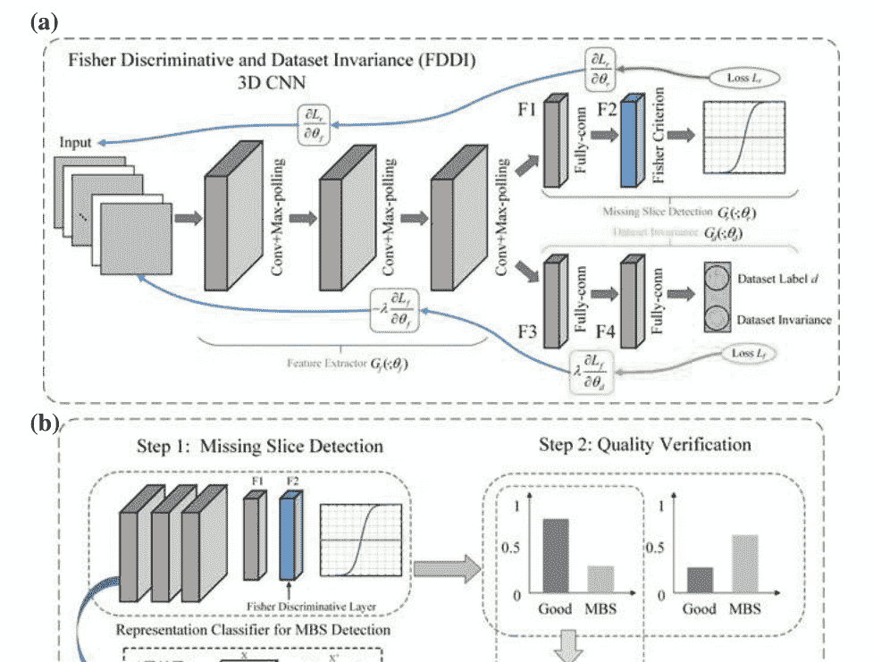

### (b)

### Step 1: Missing Slice Detection

### Step 2: Quality Verification

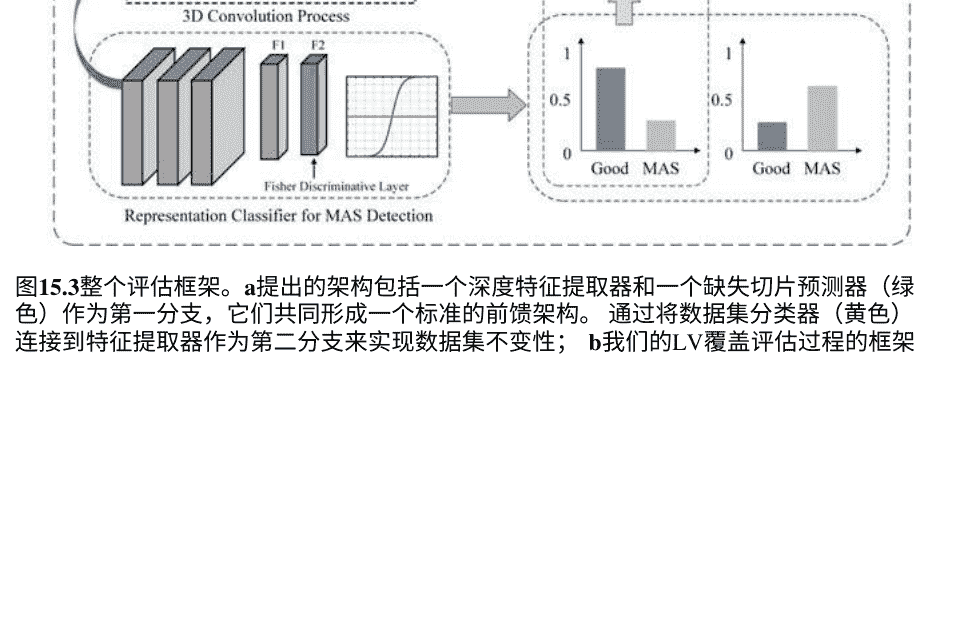

图15.3 整个评估框架。a 提出的架构包括一个深度特征提取器和一个缺失切片预测器（绿色）作为第一分支，它们共同形成一个标准的前馈架构。通过将数据集分类器（黄色）连接到特征提取器作为第二分支来实现数据集不变性；b 我们的 LV 覆盖评估过程的框架

### 15.2.3 Fisher判别式3D CNN模型

在本小节中，我们提出了一个 FD3D CNN（如图15.6c所示），用于提取高层次特征，这些特征代表 3D 强度表示。我们的 FD3D CNN 模型是通过添加一个新的 Fisher 判别式全连接层 F2 来设计的，该层使用前一层 F1 的输出作为输入。然后，将新层堆叠到传统的 3D CNN 上。为了最大化学习特征之间的类间距离，同时最小化学习特征的类内距离，我们基于 Fisher 判别准则 [33] 对 CNN 特征进行训练。

为了处理我们的主要任务——缺失切片检测，并提高 3D CNN 学习特征的判别能力，我们对它们施加了 Fisher 判别准则 [33]。给定 3D 输入数据 $V'_i$，其中 $i$ 是表示类别，具有 $i= \{1, 2\}$，对应于 MAS 和 MBS；上标 $t$ 在 $V'_i$ 中表示表示是正面还是负面，即 $t= \{0, 1\}$； $V'_i = \left[ \mathbf{v}'_{i,1}, \mathbf{v}'_{i,2}, \dots, \mathbf{v}'_{i,C} \right]$。

$\mathbf{v}'_{i,j}$ 是来自类别 $i$ 的第 $j$ 个样本的输入数据，其中 $j = 1, 2, ..., C$。我们将 $\mathbf{F}'_i$ 表示为三维卷积神经网络中用于类别 $i$ 和第 $j$ 个样本的全连接层的特征。通过使用 Fisher 准则，可以通过最小化 $\mathbf{F}'$ 的类内散布 $S_w(\mathbf{F}')$ 和最大化 $\mathbf{F}'$ 的类间散布 $S_b(\mathbf{F}')$ 来实现判别。$S_w(\mathbf{F}')$ 和 $S_b(\mathbf{F}')$ 的定义如下：

$$S_w(\mathbf{F}^t) = \sum_{i=1}^I \sum_{\mathbf{F}^t_{i,j} \in t} (\mathbf{F}^t_{i,j} - \mathbf{m}_i^t)(\mathbf{F}^t_{i,j} - \mathbf{m}_i^t)^T, \quad (15.5)$$

$$S_b(\mathbf{F}^t) = \sum_{i=1}^I n_i (\mathbf{m}_i^t - \mathbf{m}_i)(\mathbf{m}_i^t - \mathbf{m}_i)^T, \quad (15.6)$$

其中 $\mathbf{m}_i^t$ 和 $\mathbf{m}_i$ 分别是 $\mathbf{F}^t_i$ 和 $\mathbf{F}^t$ 的均值向量，$n_i$ 是来自类别 $i$ 的样本数量。Fisher 判别正则化项 $\Phi(\mathbf{F}^t)$ 的定义为 $tr(S_w(\mathbf{F}^t)) - tr(S_b(\mathbf{F}^t))$。为了获得具有深度学习特征的判别性分类结果，我们提出修改 FD3D CNN 模型的目标函数，插入 Fisher 判别正则化项：

$$J(\mathbf{W}, \mathbf{b}) = \arg \min_{\mathbf{W},\mathbf{b}} \frac{1}{I} \sum_{i=1}^I [o_d = d_k] \log(G_{disc}(G_{conv}(\mathbf{V}_{i,j}^{s,t}; \mathbf{W}_f, \mathbf{b}_f); \mathbf{W}_y, \mathbf{b}_y), y_k) + \frac{1}{2}\lambda \left( \|\mathbf{W}_f\|_2^2 + \|\mathbf{W}_y\|_2^2 \right) + \frac{1}{2}\eta \left( tr(S_w(\mathbf{F}^t)) - tr(S_b(\mathbf{F}^t)) \right), \quad (15.7)$$

其中 $\mathbf{J}$ 是我们的新代价函数，可以最小化类内散射并最大化类间散射。输出激活函数 $a(\mathbf{V}'_{i,j}; \mathbf{W}, \mathbf{b}) = 1/(1 + e^{-\mathbf{W}\mathbf{V}'_{i,j} + \mathbf{b}})$ 通常通过使用逻辑 sigmoid 函数来限制在开区间 (0, 1) 上，该函数由 $\mathbf{W}$ 和 $\mathbf{b}$ 在第 $j$ 个训练样本上进行参数化。$\|\mathbf{W}\|^2$ 是一种惩罚项，防止权重过大并帮助防止过拟合的损失函数术语。在没有大型数据集或迭代次数较少的情况下，可以调整每层中的权重以接近目标类别，并使输入数据接近相应的类别。在这里，$\lambda, \eta \in [0,1]$ 是两个权衡参数，控制每个术语的相对重要性，通常通过实验选择，根据不同的数据库和网络结构可能不同。

为了获得具有深度学习特征的数据集不变性和有区分性的分类结果，我们建议通过结合方程（15.4）和（15.7）修改 3D CNN 模型的目标函数：

$$J^*(\mathbf{W}, \mathbf{b}) = \arg \min_{\mathbf{W},\mathbf{b}} \frac{1}{I} \sum_{i=1}^{I} \mathbb{I} [o_d = d_k] \log(G_{disc}(G_{conv}(\mathbf{V}_{i,j}^{s,t}; \mathbf{W}_f, \mathbf{b}_f); \mathbf{W}_y, \mathbf{b}_y), y_k) - \sum_{d} \frac{1}{D} \log(G_{conf}(G_{conv}(\mathbf{V}_s; \mathbf{W}_f, \mathbf{b}_f); \mathbf{W}_d, \mathbf{b}_d), d_k) + \frac{1}{2}\eta(tr(S_w(\mathbf{F}^l)) - tr(S_b(\mathbf{F}^l))) + \frac{1}{2}\lambda\left( \|\mathbf{W}_f\|_2^2 + \|\mathbf{W}_y\|_2^2 + \|\mathbf{W}_d\|_2^2 \right). (15.8)$$

所有的损失都可以在标准的深度学习框架中轻松实现，只需适当设置学习率，使得方程（15.3）只更新 $W_d, b_d$，方程（15.4）只更新 $W_f, b_f$，然后可以通过标准的反向传播 [16] 进行更新。通过这些更新，我们确保学习到的表示是数据集无关的。我们的关键是计算输出单元的误差，该误差由两个子函数 $J^*(W, b)$ 的输出误差组成。为了更新参数 $W_i^l$ 和 $b_i^l$，我们首先通过前向传播计算输出层的误差 $\delta_i^{L,l}$（L 是输出层），然后采用反向传播方法 [12] 计算其他层的误差 $\delta_i^{l,l}$（l < L）。关于 $W^l$ 和 $b^l$ 的整体代价函数 $J^*(W, b)$ 的偏导数为

$$\frac{\partial J^*(\mathbf{W}, \mathbf{b})}{\partial W^{l,t}} = \sum_{t=0}^{C} \sum_{F^l \in t} \frac{\partial J(\mathbf{W}^t, \mathbf{b}^t)}{\partial W^{l,t}} + \eta \sum_{t=0}^{C} \sum_{F^l \in t} \frac{\partial \Phi(\mathbf{F}^t)}{\partial W}. (15.9)$$

$$\frac{\partial J^*(\mathbf{W}, \mathbf{b})}{\partial b^{l,t}} = \sum_{t=0}^{C} \sum_{F^l \in t} \frac{\partial J(\mathbf{W}^t, \mathbf{b}^t)}{\partial b^{l,t}} + \eta \sum_{t=0}^{C} \sum_{F^l \in t} \frac{\partial \Phi(\mathbf{F}^t)}{\partial b}. (15.10)$$

在这个阶段，我们使用了表15.1中的3D CNN模型架构。算法1给出了训练这个新网络的伪代码。在我们的3D CNN实现中，使用了修正线性单元（ReLU）[17]作为C和F1层的非线性激活函数。

```
算法1: FDDI 3D CNN训练
输入: 输入-目标对 $(v_i^l, y^l)$, 对应于类 $i$ 的第 $j$ 对, $l$ 表示正样本或负样本; $\eta_0$。
输出: FDDI 3D CNN的权重和偏差分别为 $W = [W^{1, l}, W^{2, l}, ..., W^{L, l}]$ 和 $b = [b^{1, l}, b^{2, l}, ..., b^{L, l}]$。
开始
初始化 $W_i^{l, j}$ 和 $b_i^{l, j}$。
当停止准则未满足时执行
    (1) 使用公式 (15.3) 和 (15.4) 迭代计算数据集不变性的 $W_f$ 和 $W_d$。
    (2) 优化表示分类器的 $W_f$ 和 $W_y$ 的计算。
    (3) 使用Fisher判别 $\Phi(F^l)$ 更新 $W_f$ 和 $W_y$，其中 $\Phi(F^l) = tr(S_w(F^l)) - tr(S_b(F^l))$。
    (4) 使用公式(15.9)和(15.10)更新 $W_i^{l, j}$ 和 $b_i^{l, j}$。
结束
直到连续迭代中 $J^*(W, b)$ 的值足够接近或达到最大迭代次数，返回 $W_i^{l, j}$ 和 $b_i^{l, j}$。
结束
```

表15.1 FDDI 3D CNN模型的架构

| 层 | 卷积核大小 | 步长 | 输出尺寸 | 特征体积 |
| :--- | :--- | :--- | :--- | :--- |
| 输入 | – | – | 120 × 120 × 3 | 1 |
| C1 | 7 × 7 × 2 | 1 | 114 × 114 × 2 | 16 |
| M1 | 2 × 2 × 1 | 2 | 57 × 57 × 2 | 16 |
| C2 | 13 × 13 × 2 | 1 | 45 × 45 × 1 | 16 |
| M2 | 3 × 3 × 1 | 1 | 15 × 15 × 1 | 16 |
| C3 | 10 × 10 × 1 | 1 | 6 × 6 × 1 | 64 |
| M3 | 2 × 2 × 1 | 1 | 3 × 3 × 1 | 64 |
| F1 | – | 1 | 1 × 1 × 1 | 256 |
| F2 | – | 1 | 1 × 1 × 1 | 256 |
| F3 | – | 1 | 1 × 1 × 1 | 256 |
| F4 | – | 1 | 1 × 1 × 1 | 128 |

注意 F1 和 F2 属于缺失切片检测分支，F2 是 Fisher 判别层；F3 和 F4 属于数据集不变性分支

## 15.3 材料和指标

### 15.3.1 CMR采集协议和注释

UK Biobank CMR协议：UK Biobank的CMR采集是在临床宽孔径1.5T扫描仪（MAGNETOM Aera, Syngo Platform VD13A, Siemens Healthcare, Erlangen, Germany）上进行的，包括试验、矢状、横断面和冠状部分覆盖胸部和腹部 [25]。为了测量心脏功能，会获取三个长轴心脏影像（即水平长轴—HLA，垂直长轴—VLA和左室流出道—LVOT）在矢状和冠状视图中都有。此外，还会获取完整的短轴（SA）堆栈。所有采集都使用平衡稳态自由进动（bSSFP）MRI序列，尝试对左室（LV）和右室（RV）进行全面覆盖 [23]。在本研究中，我们将重点关注SA bSSFP心脏磁共振数据。到目前为止，已扫描了超过18,800名志愿者。这些CMR图像的体素和矩阵大小分别为1.8 × 1.8 × 8.0 mm³，矩阵大小为208 × 187，每个体积大约有10个切片。每个体积序列包含约50个心脏相位。

黄金标准图像质量注释：UK Biobank（UKBB）成像资源中约有5,000名志愿者的质量评分心脏磁共振数据可用。在进行视觉检查后，使用简单的三级质量评分 [2] 进行手动注释：
(1) 用于诊断的最佳质量，
(2) 质量次优但可分析，
(3) 质量差且无法诊断。
在相同数量的志愿者中，共有5,065个SA心脏磁共振图像序列，其中4,361个序列对应质量评分1，另外527个序列对应质量评分2，剩余的177个序列对应质量评分3。所有具有最佳质量（评分1）的数据集都从基底（已存在的LVOT）到心尖（LV腔在舒张末期仍可见）完全覆盖心脏。这些数据被用于构建我们实验的基准类别。请注意，完全覆盖不应与顶部/底部切片完全对应于基底/心尖混淆。

### 15.3.2 训练和测试集定义

训练集：为了创建用于学习强度表示的训练数据集，我们从MBS检测的负样本中提取3个最顶部的切片，并从MAS检测的负样本中提取3个最底部的切片。为了创建正样本，我们选择从中间切片开始，朝基底/心尖方向选择三个切片块，分别用于MBS/MAS检测的训练。我们从具有完全覆盖的最佳质量图像中创建了训练集。

- 数据集不变性：我们在三个目标数据集上验证了提出的FDDI模型：UKBB、DETERMIN[1]和MESA[2]。为了防止由于目标数据不足而导致过拟合，并提高算法的检测率，我们采用数据增强技术人为地扩大了目标数据集。为了达到这个目的，我们选择了一组真实的旋转、缩放因子和相应的镜像图像，并将它们应用到MRI图像中。所选择的旋转角度为-45°和45°，缩放因子为0.75和1.25。这将训练样本数量增加了八倍。数据增强后，DETERMIN E和MESA数据集分别有2400和2384个序列，UKBB数据集有845,000个2D CMR切片堆栈，每个序列有50个心脏相位，质量评分为1。
这些增强数据用于第四节的实验，即IV-A、B和C。我们将其分开981个序列和质量分数为2、3的数据，供第四节D部分后续使用。据我们所知，这是迄今为止可用的最大的自动CMR质量评估的注释数据集（图15.4）。

- 缺失切片识别：我们使用三切片堆叠（或三元组）进行训练，以建模3D上下文。每个图像体积的平均切片数约为10，在训练过程中，我们提取4个三元组（两个包含基底/顶部的样本和两个不包含基底/顶部的样本）。为了最大化类间分离，最好避免训练样本之间的交叉，例如，如果我们使用四切片堆叠（对于一个10切片的体积），则基底正/负样本和顶部区域之间将存在2个切片的重叠。通过选择所提出的切片三元组，我们确保没有重叠，并增加了FDDI 3D CNN的区分能力。支持选择切片三元组的另一个重要观察结果是，CMR扫描体积实际上不是一次性获取的，而是每个切片在几个心脏周期中收集，导致一定程度的切片对切片的错位。与考虑整个3D体积相比，仅考虑切片三元组可以最小化这种效应。

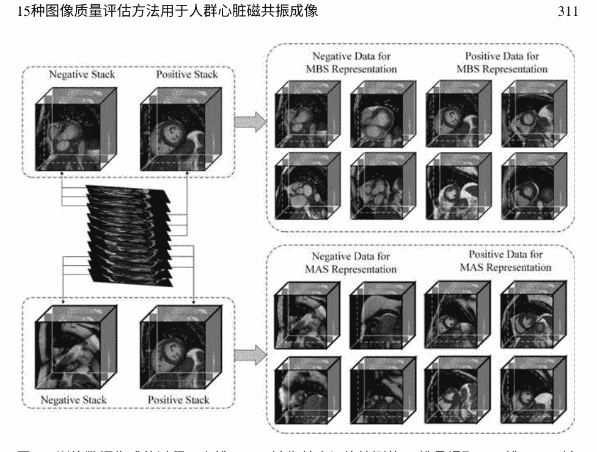

图15.4 训练数据生成的过程。上排：用于缺失基底切片检测的3D堆叠提取；下排：用于缺失顶部切片检测的3D堆叠提取

测试集：我们从顶部到底部提取每三个相邻的切片，并将这些三元组应用于强度表示分类器。已知MBS/MAS的数据是通过手动从训练集中具有最佳质量的图像中分别删除3个最顶部/最底部的切片来创建的。

[1] http://www.cardiacatlas.org/studies/determine/
[2] http://www.cardiacatlas.org/studies/mesa/在训练和测试过程中，三个切片堆栈是提出的FDDI 3D CNN的输入。输出层的分数可以解释为三元组对应于正常LV体积或缺失基底/顶部三元组的可能性。
我们的深度学习方法使用3D小块（120 × 120 × 3）处理图像，这些图像被裁剪并居中以提取感兴趣的特定区域。块大小的参数设置详见第15.4.1节。

### 15.3.3 学习性能指标

为了评估学习过程，我们使用已建立的分类指标：精确度、敏感度和错误率，其中精确度 = TP/(TP + FP)，敏感度 =TP/(TP + FN)，错误率 = (FP + FN)/N，其中TP、FP和FN分别是真正例、假正例和假负例样本的数量，N表示测试集中的主体数量。

## 15.4 实验和结果

我们进行了实验来表征我们的FDDI 3D CNN学习框架的性能。学习中使用的误差（成本）函数在范围 [0, 1]内。在所有实验中，当过去五次迭代的误差函数的标准差（SD）小于 σ = 0.01时，学习过程终止。

### 15.4.1 在英国生物库上的超参数选择

3D CNN需要一个合适的感受野（即输入大小）来实现细粒度的区分。自动选择输入模型的最佳大小是耗时的，这使得它最适合于区分性学习。具体来说，我们比较了三种块大小配置，即120 × 120 × 3（基于原始图像的中心点去除冗余背景信息），180 ×180 × 3（作为我们从英国生物库中提取和调整大小的原始大小），以及80 × 80 × 3，主要包含中心的LV部分。我们测试了比分类模型的原始块大小更小的尺寸，因为我们想验证更大的输入块和更多的上下文信息是否可以增强模型的区分能力。在这些设置下的结果如表15.2所示。使用块大小80 × 80 × 3，MAS/MBS检测精度率达到了89.01%和88.36%。在块大小为120 × 120 × 3的情况下，检测性能提高到了91.81%和90.73%，表明增加上下文信息可以增强3D CNN的区分能力。当使用非块时，对于MAS/MBS检测，检测精度率下降到90.12%和89.78%。这可能是因为过多的冗余上下文信息混淆了实际的LV特征，从而降低了检测性能。基于这些实验，我们将块大小设置为120 × 120 × 3，并实现了最佳的检测性能。

表15.2 性能与块大小的比较

| 块大小 | 精确度 (MAS (%)) | 精确度 (MBS (%)) | 敏感性 (MAS (%)) | 敏感性 (MBS (%)) |
| :--- | :--- | :--- | :--- | :--- |
| 80 × 80 × 3 | 89.01 | 88.36 | 88.24 | 87.94 |
| 120 × 120 × 3 | 91.81 | 90.73 | 90.92 | 90.25 |
| 180 × 180 × 3 | 90.12 | 89.78 | 89.63 | 88.92 |

LeCun等人[29]和Salah等人[28]使用CNN在MNIST数据集上识别手写数字，训练样本数量不同。他们的结果表明，当减少训练样本时，算法的识别率会急剧下降。不同数据源之间的差异使得将在特定数据集上训练的算法推广到其他数据源变得困难。为了展示Fisher判别准则的行为，我们通过将训练数据从10,000增加到800,000（以10,000的倍数）进行了不同数量的训练样本实验，如图15.5所示，并分别在45,000个UKB样本上测试了传统的3D CNN和Fisher判别3D CNN的性能。我们发现，两个网络在少于20,000个样本时的结果都很差。我们使用改进方法来对传统的3D CNN进行基准测试，该方法定义为（1-ER_D/ER_T）×100，其中ER_D和ER_T分别是我们的Fisher判别3D CNN和传统3D CNN的错误率。对于40,000个训练样本，我们的方法将传统3D CNN的错误率降低了约29.1%用于MBS检测。当训练样本数量大于40,000时，我们的方法仍然可以通过更好的性能改进测试结果，与传统3D CNN相比。MAS/MBS表示学习的错误率如图15.5所示。图中的数据表明，与传统3D CNN相比，我们的方法在较少的训练数据下实现了可比较的结果。我们选择了845,000个训练样本的80%并用剩下的20%样本进行测试。结果如表15.3所示。即使在较少的迭代次数下训练，我们的方法与传统3D CNN相比仍然可以取得更好的结果。

通过足够的训练样本和迭代，大多数机器学习方法可以提高其准确性，但计算成本也会更高。然而，我们通常希望在最短的时间内获得训练好的网络。这在人群成像中尤为重要，因为新的数据集可能会出现，需要重新训练。在算法开发过程中，这也是一个理想的特性，因为找到最佳架构可能需要多次不同参数设置的训练过程。我们证明了我们的Fisher判别3D CNN具有更好的错误率。

图15.5 不断增大的训练集的错误率和改进情况: a MBS检测; b MAS检测

表15.3 错误率与学习周期

| 周期 | 传统的3D CNN (MBS/MAS) | 判别性的3D CNN (MBS/MAS) | 改进（%）(MBS/MAS) |
| :--- | :--- | :--- | :--- |
| 1 | 32.4/30.7 | 28.8/27.4 | 11.1/10.8 |
| 10 | 25.4/24.2 | 19.2/17.6 | 24.4/27.3 |
| 20 | 19.2/18.7 | 11.3/10.8 | 41.1/42.2 |
| 30 | 12.7/13.1 | 8.3/8.6 | 34.6/34.4 |
| 40 | 6.3/5.6 | 4.9/4.6 | 22.2/17.9 |

图15.6 显示了用于MBS检测（顶行）或MAS检测（底行）的样本测试体积及其自动质量（AQ）和视觉质量（VQ）。每行左侧的七个样本显示了AQ和VQ之间的一致性，这意味着我们的算法给出了准确的预测；每行右侧的两个样本显示了错误的质量预测。

与其他竞争技术相比，训练样本数量和迭代次数的减少性能更好。

图15.6显示了使用提出的Fisher判别3D CNN架构的典型分类结果。测试数据集中的一些基底堆叠（顶行）和顶部堆叠（底行）以及它们的自动质量（AQ）或相应的后验概率值被显示出来。堆叠上的高分值对应于正确分类为基底或顶部三元组的可能性。具有现有LVOT的基底切片具有更高的概率值被正确分类。这表明训练已经捕捉到LVOT作为正确定位基底切片的显著特征。

### 15.4.2 数据集对抗学习性能

在第二个实验中，我们评估了我们全面的LV覆盖检测系统在独立数据集上的性能泛化。我们评估了我们的系统对成像条件、扫描仪供应商、图像分辨率等中等变化的敏感性。为此，我们评估了缺失切片检测任务的性能，包括数据集不变性（适应性与非适应性），通过将对象强度表示分类器从UKBB转移到MESA和DETERMINE。为了充分评估所提出的数据集对抗学习方法的有效性，我们对我们的方法与几种最先进的（相关的）交叉数据集切片检测方法进行了全面比较：

- 2D CNN: 使用2D CNN进行度量分类[34]。
- DI2D CNN: 具有数据集不变性的2D CNN[6]。
- 3D CNN: 使用3D CNN进行度量分类[13]。
- FD3D CNN: 使用Fisher判别式3D CNN进行度量分类。
- FDDI 3D CNN: 具有数据集不变性的判别式3D CNN。

为了评估在MESA和DETERMINE上的性能，我们手动生成了注释，具体如下：我们检查了检测到的基底切片上下各一张切片，以确认该切片是否为基底，并记录真或假，顶部也是如此。该数据集包括经过数据增强的2400个心脏MRI体积。从房室环到心尖获得了6到12个SAX图像。经验丰富的读者（LZ）通过检查从基底到心尖的切片来获得了金标准的完整LV覆盖，并进行了目视检查。原始体积用于完整的LV覆盖检测，分别使用顶部和底部切片的三元组作为MBS和MAS的负例。通过手动删除最顶部/最底部的3个切片获得MBS/MAS的正例。该数据集用作不同方法的测试集。

我们将我们的框架与非适应方法进行了比较：2D CNN，3D CNN和FD3D CNN，以及适应方法：DI2D CNN和FDDI 3D CNN。特别地，我们选择了[34]中的CNN架构作为传统的2D CNN，选择了[13]中的3D方法作为3D CNN和FD3D CNN的非适应度量，选择了[35]中的数据集对抗学习架构作为这两种适应方法的架构。对于没有适应的方法，我们只在UKBB数据集上训练网络，并在目标数据集上进行测试；对于有适应的方法，我们在源数据集和目标数据集上都进行训练。表15.4和15.5展示了适应和非适应方法在MESA和DETERMINE上缺失基底/顶部切片的精确度和敏感度。对于两个测试数据集，最好的改进结果是将这两个特征结合起来。对于MESA，精确率提高了29%，对于DETERMINE，最好的改进结果是22%。

我们还列出了使用手工特征[19]获得的结果。通过以下步骤确定基底切片：（1）选择中间切片图像作为起始图像，并按照基底方向顺序处理每个图像。（2）应用最佳阈值方法将感兴趣区域转换为二值图像。（3）识别具有二值对象的血池呈椭圆形状。（4）计算具有与二值对象相同的归一化二阶中心矩的椭圆的主轴长度L。（5）如果当前L与前一个L的比值大于预定义的阈值（例如，在本工作中为>1.2），则确定为基底切片；否则，基底切片缺失。我们使用类似的方法来确定顶切片。我们按照从基底到顶部的顺序逐个处理每个图像。如果当前L与前一个L的比值小于预定义的阈值（例如，在本工作中为<0.2），则检测到顶切片；否则，顶切片缺失。我们使用了这种特征提取过程进行预测。所提出的FDDI 3D CNN在每个表示分类器中显示出最佳的精确度和敏感性，并具有完整的LV覆盖检测性能。

表15.4 MESA上使用学习模型和手工制作的视觉表示的跨数据集性能比较

| 方法 | 精确度 MAS | 精确度 MBS | 精确度 MBS ∨ MAS | 敏感性 MAS | 敏感性 MBS | 敏感性 MBS ∨ MAS |
|------|------------|------------|------------------|------------|------------|------------------|
| FDDI 3D CNN | 88.37 ±0.31 | 89.14 ±0.34 | 88.59 ±0.38 | 87.95 ±0.41 | 89.03 ±0.38 | 88.42 ±0.40 |
| FD3D CNN | 86.32 ±0.29 | 86.91 ±0.27 | 85.63 ±0.32 | 84.92 ±0.25 | 85.48 ±0.28 | 85.67 ±0.29 |
| 3D CNN | 79.65 ±0.21 | 80.12 ±0.26 | 80.09 ±0.28 | 78.51 ±0.23 | 79.647 ±0.27 | 79.37 ±0.26 |
| DI2D CNN | 87.12 ±0.43 | 87.68 ±0.44 | 87.42 ±0.42 | 86.25 ±0.46 | 88.34 ±0.41 | 86.89 ±0.45 |
| 2D CNN | 62.38 ±0.39 | 65.42 ±0.37 | 66.75 ±0.37 | 63.21 ±0.38 | 63.83 ±0.35 | 64.71 ±0.37 |
| Lu等人[19] | 32.74 ±1.42 | 38.69 ±1.65 | 52.12 ±1.58 | 58.42 ±1.12 | 63.48 ±1.37 | 59.74 ±1.59 |

表15.5 DETERMINE上使用学习模型和手工制作的视觉表示的跨数据集性能比较

| 方法 | 精确度 MAS | 精确度 MBS | 精确度 MBS ∨ MAS | 敏感性 MAS | 敏感性 MBS | 敏感性 MBS ∨ MAS |
|------|------------|------------|------------------|------------|------------|------------------|
| FDDI 3D CNN | 89.64 ±0.28 | 89.78 ±0.29 | 89.42 ±0.26 | 88.36 ±0.28 | 89.63 ±0.30 | 89.79 ±0.29 |
| FD3D CNN | 85.69 ±0.23 | 86.60 ±0.22 | 86.13 ±0.21 | 85.46 ±0.24 | 86.05 ±0.22 | 85.71 ±0.23 |
| 3D CNN | 78.45 ±0.23 | 79.86 ±0.27 | 80.27 ±0.26 | 79.59 ±0.21 | 80.12 ±0.22 | 79.69 ±0.27 |
| DI2D CNN | 88.42 ±0.46 | 88.91 ±0.48 | 88.64 ±0.42 | 87.29 ±0.39 | 88.47 ±0.41 | 88.58 ±0.46 |
| 2D CNN | 69.65 ±0.49 | 71.42 ±0.42 | 71.87 ±0.44 | 69.32 ±0.41 | 69.76 ±0.43 | 69.83 ±0.44 |
| Lu等人[19] | 33.68 ±1.37 | 40.12 ±1.42 | 54.29 ±1.26 | 58.31 ±1.14 | 62.73 ±1.39 | 61.57 ±1.58 |

表15.6 专家心脏病学家（VQ1）和心脏图像专家的视觉（VQ2）结果的混淆矩阵。灰色数字表示正确估计的数量和比例

(a) MESA

| VQ1 \ VQ2 | MBS | MAS | MBS∨MAS | Correct |
|-----------|-----|-----|----------|---------|
| MBS       | 67  | 0   | 3        | 0.96    |
| MAS       | 0   | 65  | 2        | 0.97    |
| MBS∨MAS   | 3   | 1   | 59       | 0.94    |

(b) DETERMINE

| VQ1 \ VQ2 | MBS | MAS | MBS∨MAS | Correct |
|-----------|-----|-----|----------|---------|
| MBS       | 68  | 0   | 2        | 0.97    |
| MAS       | 0   | 64  | 3        | 0.96    |
| MBS∨MAS   | 2   | 1   | 60       | 0.95    |

### 15.4.3 全心室覆盖检测的内观者一致性

为了将自动全心室覆盖评估的结果置于背景中，我们将其与专家读者的内观者全心室覆盖检测率进行了比较。通过重新评估200个随机CMR数据集，评估了人类专家的内观者一致性[9]。为了确保结果的稳健性，设计的FDDI3D CNN使用随机参数初始化的800,000个样本进行了三次训练，并在MESA和DETERMINE数据集上进行了专家心脏病学家的视觉质量评估。全心室覆盖的观察者间一致性通过自动（AQ）和专家的视觉（VQ）结果之间的平均绝对误差（MAE）进行评估。所提出的网络在MESA和DETERMINE数据集上的AQ与VQ的混淆矩阵如表15.6a、b所示。图15.6显示了一些测试样本及其对应的VQ和AQ。根据混淆矩阵，在200个重新评估的样本中，MESA有九个样本，DETERMINE有八个样本的AQ和VQ之间存在不一致的质量，其中大部分经过咨询心脏病学顾问后被确认为原始标签过程的异常值。

通过使用Pearson的 χ²拟合度检验，将此随机选择的子集中的分布质量水平与原始数据进行比较，以确认其代表原始数据分布（p值 >0.05）。重新评估的样本与原始质量具有很高的一致性（Cohen的 κ = 0.76, p值 <0.05）。

### 15.4.4 实施注意事项

这里报告的实验是在一台运行Windows 10，配备32 GB RAM和Nvidia Quadro K620 GPU的Intel Xeon E5-1620 v3 @3.50 GHz机器上使用ConvNet库[4]进行的。网络使用梯度下降法[16]进行优化，使用以下超参数：学习率 =0.01，动量 =0.9，丢弃率 =0.1。可训练权重从高斯分布（μ =0，σ = 0.01）中随机初始化，并使用标准反向传播进行更新。当使用大小为120 ×120 ×3的800,000个体积进行训练时，模型收敛时间约为6小时。测试速度快，每个体积处理时间为3秒。

## 15.5 结论

在本文中，我们解决了在大规模人群成像数据库中检测不完整的LV覆盖的问题。我们通过在英国生物库的CMR数据上测试了一种判别性3D CNN来说明这个概念。我们的FDDI 3D CNN是通过在网络中添加一个新的Fisher判别全连接层来提出的，这在强度表示方面取得了显著的改进。对应质量类别的候选者进行了学习表示分类器的计算。我们还通过使用UKBB试点数据集进行训练并在Data Science Bowl Cardiac Challenge的CMR数据中进行交叉评估来验证我们的模型。所提出的模型与人类感知具有高度一致性，并且相比于最先进的方法，显示出了其高潜力。我们提出的FDDI 3D CNN也可以轻松应用于医学图像分析中的其他检测和分割任务，并提升结果。

## 参考文献

1.  Attili A, Schuster A, Nagel E, Reiber J, van der Geest R (2010) 心脏MRI的定量化：图像获取和处理的进展。 Int J Cardiovasc Imaging 26:27–40. https://doi.org/10.1007/s10554-009-9571-x
2.  Carneiro G et al (eds) (2016) 为英国生物库心脏MRI扫描的自由文本注释的语义丰富化。在：深度学习和数据标注用于医学应用，卷10008。Springer，柏林
3.  Cheng G, Zhou P, Han J (2016) RIFD-CNN：旋转不变和Fisher判别卷积神经网络用于目标检测。在：IEEE计算机视觉和模式识别会议（CVPR），pp 2884–2893。https://doi.org/10.1109/CVPR.2016.315
4.  Demyanov S (2017) 用于Matlab的ConvNet库。https://github.com/sdemyanov/ConvNet。于2017年10月15日访问
5.  Ferreira P, Gatehouse P, Mohiaddin R, Firmin D (2013) 心血管磁共振成像伪影。 J Cardiovasc Magn Reson 15:41. https://doi.org/10.1186/1532-429X-15-41
6.  Ganin Y, Ustinova E, Ajakan H, Germain P et al (2016) 领域对抗训练的神经网络。 J Mach Learn Res 17(1):2030–2096
7.  Goodfellow I, Pouget-Abadie J, Mirza M, Xu B, Warde-Farley D et al (2014) 生成对抗网络。神经信息处理系统的进展，第2672–2680页
8.  van der Graaf A, Bhagirath P, Ghoerbien S, G tte M (2014) 心脏磁共振成像：临床医生的伪影。 Neth Heart J 22:542–549. https://doi.org/10.1007/s12471-014-0623-z
9.  Gwet KL (2008) 内部一致性可靠性。 Wiley百科临床试验。Wiley, Hoboken, pp 1–14
10. He L, Tao D, Li X, Gao X (2012) 稀疏表示用于盲图像质量评估。在：IEEE计算机视觉和模式识别会议（CVPR），pp 1146–1153
11. Huang Y, Shao L, Frangi AF (2017) 使用弱监督联合卷积稀疏编码的3D医学图像同时超分辨率和跨模态合成。在：IEEE计算机视觉和模式识别会议（CVPR），pp 6070–6079
12. Ionescu C, Vantzos O, Smirnchisesu C (2015) 用于具有结构化层的深度网络的矩阵反向传播。在：IEEE计算机视觉会议（ICCV），pp 2965–2973。https://doi.org/10.1109/ICCV.2015.339

13. Ji S, Xu W, Yang M, Yu K (2013) 3D卷积神经网络用于人类动作识别。 IEEE Transactions on Pattern Analysis and Machine Intelligence 35(1):221–231

14. Kang L, Ye P, Li Y, Doermann D (2014) 用于无参考图像质量评估的卷积神经网络。 In: IEEE Conference on Computer Vision and Pattern Recognition (CVPR), pp 1733–1740. https://doi.org/10.1109/CVPR.2014.224

15. Klinke V, Muzzarelli S, Lauriers N, Locca D, Vincenti G, Monney P, Lu C, Nothnagel D, Pilz G, Lombardi M, van Rossum A, Wagner A, Bruder O, Mahrholdt H, Schwitter J (2013) 在欧洲CMR注册表中设置的心血管磁共振质量评估：标准化标准的描述和验证。 Journal of Cardiovascular Magnetic Resonance 15:55. https://doi.org/10.1186/1532-429X-15-55

16. Krizhevsky A, Sutskever I, Hinton GE (2012) 使用深度卷积神经网络进行ImageNet分类。 In: Advances in Neural Information Processing Systems, pp 1097–1105

17. LeCun Y, Bengio Y, Hinton G (2015) 深度学习。 Nature 521: 436–444. https://doi.org/10.1038/nature14539

18. Lisanti G, Masi I, Bagdanov AD, Del Bimbo A (2015) 通过迭代重新加权稀疏排名进行人物再识别。 IEEE Transactions on Pattern Analysis and Machine Intelligence 37(8): 1629–1642

19. Lu Y, Connelly K, Dick A, Wright G, Radau P (2011) 用于量化心脏MRI功能的基底左心室的分水岭分割。 Journal of Cardiovascular Magnetic Resonance 13: 1. https://doi.org/10.1186/1532-429X-13-S1-P4

20. Ma L, Yang X, Tao D (2014) 使用多任务距离度量学习在摄像头网络上进行人员再识别。 IEEE Transactions on Image Processing 23(8): 3656–3670

21. Marcus J, Gotte M, de Valk L, van der Geest R, de Cock CC, van Rossum A (1999) 通过平面运动对磁共振成像测量的左心室容积的影响：对图像采集和分析的影响。 Journal of Cardiovascular Magnetic Resonance 1: 1–6. https://doi.org/10.3109/10976649909080828

22. Moorthy AK, Bovik AC (2011) 盲图像质量评估：从自然场景统计到感知质量。 IEEE Transactions on Image Processing 20: 3350–3364. https://doi.org/10.1109/TIP.2011.2147325

23. Petersen S, Matthews P, Francis J, Robson M, Zemrak F, Boubertakh R, Young A, Hudson S, Weale P, Garratt S, Collins R, Piechnik S, Neubauer S (2016) 英国生物库的心血管磁共振协议。 Journal of Cardiovascular Magnetic Resonance 18: 8. https://doi.org/10.1186/s12968-016-0227-4

24. Petersen SE, Matthews PM, Bamberg F, Bluemke DA, Francis JM, Friedrich MG, Leeson P, Nagel E, Plein S, Rademakers FE 等 (2013) 人群科学中的成像：英国生物库的心血管磁共振成像 - 理论基础，挑战和方法。 Journal of Cardiovascular Magnetic Resonance 15: 46. https://doi.org/10.1186/1532-429X-15-46

25. Petersen SE, Matthews PM, Francis JM, Robson MD, Zemrak F, Boubertakh R, Young AA, Hudson S, Weale P, Garratt S 等 (2016) 英国生物库的心血管磁共振协议。 Journal of Cardiovascular Magnetic Resonance 18(1): 8

26. Pusey E, Lufkin R, Brown R, Solomon M, Stark D, Tarr R, Hanafee W (1986) 磁共振成像伪影：机制和临床意义。 Radiographics 6:891–911. https://doi.org/10.1148/radiographics.6.5.3685515

27. Saad M, Bovik A, Charrier C (2012) 盲图像质量评估：在DCT域中的自然场景统计方法。 IEEE Transactions on Image Processing 21:3339–3352. https://doi.org/10.1109/TIP.2012.2191563

28. Salah A, Alpaydin E, Akarun L (2002) 基于选择性注意力的视觉模式识别方法，应用于手写数字识别和人脸识别。 IEEE Transactions on Pattern Analysis and Machine Intelligence 24:420–425. https://doi.org/10.1109/34.990146

29. Sermanet P, Chintala S, LeCun Y (2012) 卷积神经网络应用于房屋数字分类。 In: International Conference on Pattern Recognition (ICPR). IEEE, pp 3288–3291

30. Sharmanska V, Quadrianto N (2016) 从他人的错误中学习：跨数据集学习中的匹配错误。 In: IEEE Conference on Computer Vision and Pattern Recognition (CVPR), pp 3967–3975

31. Wang Z, Wu G, Sheikh H, Simoncelli E, Yang EH, Bovik A (2006) 质量感知图像。 IEEE Transactions on Image Processing 15:1680–1689. https://doi.org/10.1109/TIP.2005.864165

32. Xue W, Mou X, Zhang L, Bovik A, Feng X (2014) 使用梯度幅度和拉普拉斯特征的联合统计盲图像质量评估。 IEEE Transactions on Image Processing 23:4850–4862. https://doi.org/10.1109/TIP.2014.2355716

33. Yang M, Zhang L, Feng X, Zhang D (2014) 基于稀疏表示的Fisher判别字典学习用于图像分类。 International Journal of Computer Vision 109:209–232. https://doi.org/10.1007/s11263-014-0722-8

34. Zhang L, Gooya A, Dong B, Hua R, Petersen SE, Medrano-Gracia P, Frangi AF (2016) 使用卷积神经网络自动评估心脏MR图像质量。 In: International Symposium on Medical Simulation and Synthetic Imaging (SASHIMI). Springer, pp 138–145. https://doi.org/10.1007/978-3-319-46630-9_14

35. Zhang L, Perez-Garcia M, Piechnik SK, Neubauer S, Petersen SE, Frangi AF (2018) 多输入和数据集不变对抗学习（MDAL）用于心脏MRI中左右心室覆盖估计。 In: International Conference on Medical Image Computing and Computer-Assisted Intervention. Springer, pp 481–489

# 第16章 基于代理的医学图像配准方法

苏敏 和 廖锐

摘要 医学成像配准是从诊断到治疗的广泛应用中的关键步骤，并且已经是一个广泛研究的领域。在深度学习流行之前，图像配准通常通过优化图像匹配度量作为成本函数来进行，以寻找最佳配准。然而，优化任务因以下原因而被认为具有挑战性：（1）匹配度量在配准参数空间上的非凸性质，以及（2）缺乏有效的鲁棒优化方法。随着深度学习和人工智能的最新进展，医学图像配准领域发生了重大的范式转变，即开发了基于学习的图像配准方法，利用深度神经网络来分析图像以估计合理的配准。在最新的基于学习的配准方法中，基于代理的方法在3D/3D和2D/3D配准中显示出显著的鲁棒性优势，超过了传统的基于优化的方法。在本章中，我们概述了基于代理的医学图像配准方法及其在刚体3D/3D和2D/3D配准上的两个应用。

## 16.1 引言

医学图像配准的目标是恢复两个医学图像之间的对应关系，这些图像可以来自于（1）不同的患者，（2）同一患者在不同时间，或者（3）不同的模态，例如荧光透视、计算机断层扫描（CT）、磁共振成像（MRI）、正电子发射断层扫描（PET）等。通过各种变换模型，例如刚体、仿射、参数样条和密集运动场[25]，将图像带入相同的坐标系。对齐的图像可以为决策提供互补信息，实现纵向变化分析或指导微创治疗[9, 16]。

根据要注册的图像的维度，医学图像配准任务主要分为两类：（1）3D/3D图像配准，其中要注册的两个图像都是3D成像模态，以及（2）2D/3D图像配准，旨在将术中2D图像与术前3D图像配准。由于这两类医学图像配准任务具有基本的相似性，它们通常可以使用相同的框架进行建模和解决。在不同的图像配准框架中，参数化图像配准是最广泛采用的方法，它使用参数化变换模型来描述配准，并搜索变换模型的最优参数以使两个图像在空间上对齐。它可以用于解决3D/3D和2D/3D图像配准问题。参数化变换模型应用于一个3D图像，将其与另一个图像对齐，该图像可以是3D图像或2D图像，分别用于3D/3D和2D/3D配准。

随着深度学习迅速改变人工智能并在各种计算机视觉任务中取得新的最先进技术，医学图像配准领域也发生了重大的范式转变，深度神经网络被用于分析图像以进行配准。

在基于学习的配准方法中，基于代理的方法首次在[15, 20]中引入，已经证明在参数化的3D/3D和2D/3D配准中具有显著的鲁棒性优势，优于传统的基于优化的方法。在本章中，我们描述了基于代理的配准方法，并展示了它们的两个用例，一个是3D/3D配准，另一个是2D/3D配准，并将它们与传统的基于优化的参数化图像配准方法进行了比较。

本章的剩余部分组织如下：第16.2节概述了医学图像配准的背景并讨论了相关工作。第16.3节描述了基于代理的参数图像配准方法。在第16.4节和第16.5节中，我们将代理方法应用于刚体3D/3D和2D/3D配准问题，并将其结果与最先进的方法进行比较。第16.6节讨论了代理方法的优缺点。

## 16.2 背景

在本节中，我们概述了参数图像配准并讨论了基于深度学习的图像配准的最新进展。我们还介绍了深度强化学习（DRL）和特殊欧几里得群SE(3)的背景，这些是在第16.3节中描述的代理方法中使用的。

### 16.2.1 参数图像配准

医学图像配准已经是一个活跃的研究领域超过二十年了[18, 23]。参数图像配准是最广泛采用的3D/3D图像配准框架，它将图像配准形式化为一个搜索问题。它使用参数化的变换模型（例如刚体变换）来描述图像配准的状态，定义一个通用的匹配度量来衡量待配准图像对的相似性，并进行优化以搜索最优的变换以最大化匹配度量[26]。在2D/3D配准中，同样采用了相同的参数图像配准框架，但被称为基于强度的配准，其中配准状态也由3D图像的变换描述，并且相似度度量是在2D图像和3D图像的2D投影图像上计算的，称为数字重建放射学（DRR）。

由于参数图像配准通常使用优化技术来解决（因此通常被称为基于优化的配准），配准的成功严重依赖于匹配度量的全局优化。流行的匹配度量大多基于低层次的测量，例如平方差距（SSD）、互信息（MI）[17]、互相关（CC）[11]、梯度相关（GC）[3]等。这些度量直接在像素级别比较图像，而不理解更高层次的结构。因此，在信噪比低和/或图像严重受损的图像上，它们通常具有许多局部最大值，这使得使用数学优化策略（例如Powell方法、Nelder-Mead、BFGS、CMA-ES）极其困难来定位全局解。

### 16.2.2 使用深度学习进行图像配准

尽管深度学习在图像分割、图像识别和图像分类方面取得了最先进的性能，但基于深度学习的图像配准仍然是一个新兴的研究领域。无监督学习使用深度学习在[28]中提出，用于提取可变形配准的特征。然而，这些特征是从图像对中分别提取的，因此不能保证对配准目的的最优。基于深度学习的回归方法在[21]中提出，用于解决2D/3D X射线图像的设备跟踪配准问题。在[4]中，使用卷积神经网络（CNN）通过监督学习提出了2D RGB图像之间的光流估计方法。

本章中描述的基于代理的配准方法首次在[15, 20]中引入，其中3D/3D和2D/3D配准被建模为马尔可夫决策过程（MDP），并使用单代理和多代理设置进行求解的强化学习技术。

### 16.2.3 深度强化学习

在强化学习（RL）[10]中，代理学习通过奖励系统，通过连续的试错来执行特定任务。虽然RL在博弈论、控制、运筹学、机器人学等领域已经广泛研究，但只有最近在深度学习中取得的突破（DRL），将RL与深度学习相结合，才能应用于更复杂的问题，达到人类水平的表现（例如Atari游戏[22]和围棋[27]）。在[2]中，使用DRL训练了一个用于定位2D RGB图像中物体的主动检测模型。类似地，在[5]中，使用DRL训练了一个用于定位3D CT图像中地标的检测代理。然而，DRL的主要挑战之一是训练过程非常耗时。通过改进策略/数据采样，引导策略搜索[14]和模仿学习[12]提出了更高效的RL方法，但这些方法并不直接适用于端到端可训练的DRL框架。本章描述的基于代理的图像配准方法采用了DRL框架，但通过深度监督学习（DSL）训练代理，以避免需要大量的环境探索，以提高训练效率。

### 16.2.4 特殊欧几里得群 SE(3)

特殊欧几里得群 SE(3) 是对应于平移和旋转的 4×4 矩阵的集合。SE(3) 的切空间可以用李代数 se(3) 来描述，它有六个生成元，对应于沿着/围绕标准轴的平移和旋转的导数。se(3) 的一个元素可以用生成元的倍数来表示

$$
\delta = (\boldsymbol{u}, \boldsymbol{v}) \in \mathbb{R}^6 \quad (16.1)
$$
$$
\delta_{\times} = u_1 G_1 + u_2 G_2 + u_3 G_3 + v_1 G_4 + v_2 G_5 + v_3 G_6 \in \mathfrak{se}(3), \quad (16.2)
$$

其中 $(G_1, G_2, G_3)$ 是平移生成元，而 $(G_4, G_5, G_6)$ 是旋转生成元。可以通过矩阵指数和对数来在 SE(3) 和 se(3) 之间转换元素。

$$
T = \exp(\delta_{\times}) \in \operatorname{SE}(3). \quad (16.3)
$$

## 16.3 基于代理的图像配准

在本节，我们描述了基于代理的图像配准的公式。我们从在第16.3.1节中将图像配准问题形式化为MDP开始，然后在第16.3.2-16.3.4节中定义了动作空间、奖励系统和代理的观察。

### 16.3.1 图像配准作为 MDP

在3D/3D配准中，有一个浮动的3D图像，表示为 $I_f: \mathbb{R}^3 \to \mathbb{R}$，和一个参考图像，表示为 $I_r: \mathbb{R}^3 \to \mathbb{R}$。浮动和参考图像可以是不同的3D图像模态（例如CT、MRI、超声等）。刚体3D/3D配准的目标是估计最优刚体变换 $T: \mathbb{R}^3 \to \mathbb{R}^3$，将浮动图像与参考图像空间对齐。在2D/3D配准中，还有一个浮动的3D图像， $I_f: \mathbb{R}^3 \to \mathbb{R}$，通常是CT或锥束计算机断层扫描（CBCT），和一个参考的2D X射线图像 $I_r: \mathbb{R}^2 \to \mathbb{R}$。刚体2D/3D配准的目标是估计最优刚体变换 $T$，将3D浮动图像的投影与2D参考图像空间对齐。CT或CBCT的投影可以通过DRR计算得到。

由于3D/3D和2D/3D图像配准都旨在估计转换 $T$，基于代理的配准方法将找到 $T$ 的问题表示为一个MDP，该MDP由五元组 {$\mathcal{T}, \mathcal{A}, P(\cdot), R(\cdot), \gamma$} 定义，其中 $\mathcal{T}$ 是可能状态的集合（即SE(3)中的变换），$\mathcal{A}$ 是动作的集合（即变换的修改），$P_A(T)$ 是在状态 $T$ 中采取动作 $A$ 后得到的状态，$R_A(T)$ 是在状态 $T$ 中采取动作 $A$ 后获得的奖励，$γ$ 是控制未来奖励重要性的折扣因子。代理根据策略选择要执行的动作，表示为 $π(\cdot)$，它是一个函数，将当前环境状态作为输入并返回一个动作。在动作空间 $\mathcal{A}$ 和奖励方案 $R(\cdot)$ 定义的情况下（详细定义见第16.3.2节和第16.3.3节），从状态 $T$ 开始，使用策略 $π$ 收集的预期总奖励可以写成

$$
V^{\pi}(T) = \sum_{t} \gamma^{t-1} r_t, \quad (16.4)
$$

其中 $r_t$ 是根据策略 $π$ 收集的奖励。 MDP 的核心问题是找到最大化预期总奖励的策略 $π^*(·)$:

$$
\pi^* = \arg \max_{\pi} V^{\pi}(T), \quad \forall T \in \mathcal{T}. \quad (16.5)
$$

为了方便起见，强化学习算法引入了一个动作值函数 $Q(T, A)$，它是一个状态-动作对的函数，返回一个实数值。 最优动作值函数 $Q^*(T, A)$ 表示代理在状态 $T$ 中选择动作 $A$，并在之后的行为中表现最优时所获得的预期总奖励。 $Q^*(T, A)$ 是一个指示在状态 $T$ 中代理选择动作 $A$ 的好坏程度。最优策略 $\pi^*$ 可以通过最大化最优动作值函数 $Q^*(T, A)$ 来获得：

$$
\pi^*(T) = \arg \max_A Q^*(T, A). \quad (16.6)
$$

流行的 $Q$ 学习算法的主要目标是估计最优的动作值函数，从中可以推导出最优策略。在深度强化学习中，假设动作空间是离散的，最优动作值函数 $Q^*(T, A)$ 由一个神经网络建模，称为 $Q$ 网络。$Q$ 网络以智能体对环境的观察（在第16.3.4节中有详细定义）和状态 $T$ 作为输入，并输出与离散动作空间 $\mathcal{A}$ 中每个动作的 $Q^*(T, A)$ 值对应的 $N = |\mathcal{A}|$ 个标量。

本章描述的基于智能体的图像配准方法采用了深度强化学习框架。动作空间、奖励机制和智能体对环境的观察是关键组成部分，需要仔细设计，我们将在下一节详细介绍。

### 16.3.2 动作空间

动作空间定义了在MDP中代理可以采取的可能动作，以改变状态。它影响了要学习的最优动作值函数的复杂性，因此需要仔细定义。为此，首先引入了代理坐标系的概念，它是定义和执行动作的坐标系。代理坐标系可以用一个从图像坐标系到代理坐标系的变换 $E$ 来描述。然后，注册变换 $T$ 可以在代理坐标系中描述，写作 $E \circ T$。由于DRL框架需要离散动作，动作空间被定义为在 $E \circ T$ 处的 $SE(3)$ 的切空间上的一组小运动，由 $se(3)$ 参数化。具体而言，动作空间包含了沿着 $se(3)$ 的6个生成元的正向和负向移动的12个动作，可以写作

$$
\mathcal{A} = \{-\lambda_1 G_1, \lambda_1 G_1, \ldots, -\lambda_6 G_6, \lambda_6 G_6\}, \quad (16.7)
$$

其中 $\lambda_i$ 是沿着生成器 $G_i$ 的动作步长。一个动作 $A \in \mathcal{A}$ 的性能表示为

$$
P_A(T) = E^{-1} \circ \exp(A) \circ E \circ T. \quad (16.8)
$$

由于动作需要相对较小的步长才能达到高精度，$\lambda_{1,2,3}$ 被设置为1，以获得1毫米的平移步长，$\lambda_{4,5,6}$ 被设置为...π/180 = 0.0174，以获得1°的旋转步长。 这样小的步长允许代理器达到相对准确的配准（在平移和旋转方面的误差最多为1毫米和1°）

### 16.3.3 奖励系统

在标准的MDP中，优化目标是长期奖励，即折扣未来奖励的累积，由于很难建立一个将即时奖励与长期目标直接关联的奖励系统。然而，对于图像配准，可以定义一个基于距离的奖励系统，使得即时奖励与配准的改进相关联。奖励方案定义为减少到地面真实变换的测地距离，描述在代理坐标系中：

$$R_A(T) = D(E \circ T, E \circ T_g) - D(E \circ T', E \circ T_g) \quad (16.9)$$

其中$T$和$T'$是动作之前和之后的变换，$T_g$是地面真实变换，$D(\cdot, \cdot)$表示SE(3)上两个变换的测地距离[7]:

$$D(T_1, T_2) = \| \log(T_2 \circ T_1^{-1}) \|_F \quad (16.10)$$
$$= (2\|u\|_2^2 + \|v\|_2^2)^{\frac{1}{2}}$$

其中$\log(\cdot)$将$T_2 \circ T_1^{-1} \in \mathrm{SE}(3)$转换为$\mathrm{se}(3)$，$u$和$v$是旋转和平移的系数，如方程16.1所述。由于旋转和平移的单位分别为弧度和毫米，与平移相比，旋转的距离影响太小。 为了平衡旋转和平移的影响，旋转系数$v$被缩放为$_{180}/\pi$（即将单位从弧度变为毫米）。

### 16.3.4 代理观察

在深度强化学习中，代理在当前状态下观察环境，并将其输入到Q网络中估计最优动作值函数。 对于图像配准，观察需要包含浮动图像和参考图像对齐的视觉线索，并且需要具有固定的大小，因为它将作为神经网络的输入。 从两个图像的重叠区域中提取的固定大小的感兴趣区域（ROI）满足这些要求，因此被用作代理的观察。 ROI的位置和方向是基于代理坐标系的原点和轴来定义的。

代理坐标系的原点通常选择位于参考图像中感兴趣的对象上，适用于3D/3D和2D/3D配准。

为了引导代理人对重要结构进行处理。然而，在3D/3D和2D/3D配准中，代理人坐标系的方向需要以稍微不同的方式进行定义。在3D/3D配准中，代理人坐标系的方向与患者的方向（左、前、头）对齐。然后，ROI被定义为以原点为中心并与三个轴对齐的3D盒子，并从参考图像和浮动图像中提取，如图16.1所示。在2D/3D配准中，代理人坐标系的方向基于X射线投影几何来定义，以使动作可学习（在第16.5节中进行更多讨论）。ROI在投影图像中被定义为以代理人坐标系原点的投影为中心，并与代理人坐标系的轴的投影对齐的2D框。ROI从参考X射线图像和DRR（即通过变换T投影的浮动图像）中提取，如图16.2所示。

### 16.3.5 使用监督学习学习策略

MDP中的核心问题是找到一个指导代理决策过程的策略。 在[22, 27]中，策略学习过程被定义为一个DRL问题，其中最优动作值函数 Q*(T, A)通过神经网络近似，并且按照Bellman方程进行迭代更新学习。然而，代理的无导向探索和动作值函数的迭代更新可能导致训练效率低下，因为代理必须尝试许多组合才能达到有效的策略。在基于代理的注册中，由于基于距离的奖励将即时奖励直接与注册的改进联系起来，可以按照贪婪注册路径计算最优动作值函数，其中采取行动以最大化即时奖励。在这种设置下，可以通过递归计算遵循监督贪婪路径的动作值函数：

$$Q(S_k, A_k) = R_{A_k}(S_k) + \gamma Q(S_{k+1}, A_{k+1}), \quad (16.11)$$

其中

$$A_k = \arg\max_{A'} R_{A'}(S_k).$$

当与真实变换的距离小于0.5时，代理成功终止。成功终止后，代理将获得奖励（例如，10）。有趣的是，如果允许代理在6维变换参数空间中以小步长（例如1毫米和1°）采取连续动作，则可以证明Eq. 16.11是最优的动作值函数 Q*(S, A)（读者可以参考[15]进行证明）。

如第16.3.1节所述，深度神经网络用于对 Q*(S, A)进行建模。用于训练网络的损失函数是

$$\text{损失} = \sum_{k=1}^{M} \sum_{i=1}^{12} \| y_i - Q^*(T_k, A_i) \|_2, \quad (16.12)$$

其中 y_i是网络对第 k个样本中的第 i个输出 (i=1...12)。由于 Q*(S, A)的真实值可以预先计算，因此可以通过DSL来训练网络。

使用DSL学习 Q*(S, A)相比使用DRL有两个主要优势。首先，通过解析给出了 Q*(S, A)的真实值，而不需要迭代估计，因此网络的训练效率更高，收敛性更稳定。其次，计算方程式16.11不需要代理的探索历史，意味着状态空间和动作空间可以随机采样，而不需要记忆回放，从而降低了内存需求。在[15]中展示了使用DSL的优势，该优势在一个2D/2D配准玩具问题中得到了证明，其中代理式配准用于配准从CT和CBCT中提取的2D切片。

DSL和DRL使用相同的网络架构和训练元参数。训练进展曲线（图16.3）显示，DSL比DRL更高效。

### 16.3.6 多智能体系统

当使用单个智能体进行注册时，感兴趣区域（即智能体坐标系的原点）需要放置在感兴趣物体上，这通常需要手动输入或额外的物体检测步骤。可以通过使用[20]中介绍的多智能体系统来避免选择位置，该系统提供自动关注并在注册过程中自适应选择最可靠的感兴趣区域。具体而言，可以使用扫描窗口在参考图像上创建感兴趣区域（ROI），每个ROI与一个观察它的智能体相关联。如果扫描窗口使用1像素作为步长，并且观察不同ROI的智能体遵循相同的策略，则可以使用扩张的全卷积网络（FCN）高效地训练网络（有关扩张的FCN训练的详细信息，请参阅[20]）。

在注册过程中，FCN被应用于生成一个密集的奖励地图，其中包含了来自输入图像的扫描窗口ROI的估计奖励。奖励地图表示为 R_i(A)，其中 i 是代理的索引，A ∈ A 是动作。对于每个代理，计算最大奖励并选择与之相关的动作：

$$\hat{R}_i = \max_{A \in \mathcal{A}} R_i(A),$$
$$A_i = \arg\max_{A \in \mathcal{A}} R_i(A). \qquad (16.13)$$

由于 \(\hat{R}_i\) 是其选择的动作 \(A_i\) 的预期奖励，它代表了代理对该动作的信心。通过信心地图，可以设计一种机制来选择具有高信心的代理（例如，在[20]中，代理通过信心分数进行阈值处理进行选择）。在选择代理之后，从所选代理中选择动作。代理被L2弦均值进一步聚合以获得最终动作：

$$\hat{A} = \arg \min_{A \in SE(3)} \sum_{i \in \mathcal{I}} \|A_i - A\|_F^2, \quad (16.14)$$

其中 $\mathcal{I}$ 表示所选代理的集合。L2弦均值可以通过全局闭式解来求解，如[7]中所述。直观地说，聚合动作是在SE(3)上与所选动作之间具有最小意义距离的动作。

# 16.4基于代理的三维/三维图像配准

在本节中，我们介绍了基于代理方法解决三维/三维图像配准问题的应用。我们首先详细介绍了基于代理的三维/三维图像配准的实现，见第16.4.1节。然后，在第16.4.2节中描述了两个三维/三维配准任务的实验和结果。

### 16.4.1 实现

主要使用单一代理设置进行3D/3D注册，这主要是因为多代理系统所需的内存消耗对于现代GPU RAM（即16 GB）而言是无法承受的。观察的ROI大小为64×64×64个体素，并手动放置在感兴趣的物体上。为了提高内存效率，将浮动图像和参考图像的ROI相减作为网络的输入。与典型CT图像的大小（例如512×512×512）相比，ROI的大小相对较小，这主要是由于GPU内存的限制。然而，网络输入的大小对于实际应用非常重要。为了兼顾鲁棒性和准确性，采用了基于注意力的分层策略，其中训练了两个独立的网络，都使用64×64×64的体积作为输入，但分辨率和视场不同。第一个网络使用降采样的体积进行粗略对齐训练，分辨率较低但视场较大，帮助代理获得全局解剖理解，从而能够在初始位移较大时进行稳健的物体对齐，而不会陷入局部最优。第二个卷积神经网络使用具有有限视场的高分辨率体积，并专注于尽可能准确地对齐物体。

相同的网络架构和元参数用于粗细配准。该网络由5个卷积层和三个全连接层组成。卷积层使用8、32、32、128、128个滤波器，全部采用3×3×3的卷积核。前两个卷积层后面都跟着一个步长为2的最大池化层。三个全连接层分别有512、512和64个激活神经元，输出有12个节点对应着12个动作。每个层后面都跟着一个非线性的修正层，并且每个层都应用了批量归一化。在训练过程中，每个训练对被增强64,000次，每个数据集的训练数据超过5M。为了训练粗配准的CNN，刚体扰动在E2中随机生成在 [±30 mm, ±30 mm, ±30 mm, ±30°, ±30°, ±30°]范围内，并且在E1中生成在 [±30 mm, ±30 mm, ±150 mm, ±30°, ±30°, ±30°]范围内，以覆盖脊柱CT中头-脚方向的大视场。为了训练细配准的CNN，刚体扰动范围缩小到 [±5 mm, ±5 mm, ±5 mm, ±5°, ±5°, ±5°]。

然后，注册任务按照以下步骤执行。首先，代理使用第一个CNN通过 \(N_1\)（经验设置为200）个连续动作来粗略对齐物体。然后，通过反向传播计算输入ROI的像素对网络输出的总和的导数来生成显著性图 \(\Omega\)。\(\Omega\)表示在粗略对齐的第一步中，给定像素对CNN网络结果的影响的重要性。通过使用95th百分位数进行阈值处理选择最具影响力的像素。然后计算它们的几何平均值，并根据其重要性加权计算ROI的中心（在图16.4中用蓝色矩形框标记）。用于精细对齐的第二步。最后，从高分辨率体积中提取ROI，并从第一步获得的最终位置开始，代理使用第二个CNN通过 \(N_2\)（经验设置为100）个连续动作。

神经网络的训练需要参考和浮动图像对，具有随机初始变换 \(T\)和已知的真实变换 \(T_g\)。初始变换是通过在给定范围内随机扰动真实变换 \(T_g\)获得的。由于在医学领域中很难获得具有已知 \(T_g\)的对齐图像对，因此需要为每个可用的对齐对生成大量的初始变换，以充分利用信息。还对接近真实变换的变换进行更密集的采样，以便更好地训练接近解决方案的网络。此外，每个对齐对还通过随机生成的仿射变换\(T_A\)进行几何共变形：

$$ T_A = I + \begin{bmatrix} c_{11} & c_{12} & c_{13} & 0 \\ c_{21} & c_{22} & c_{23} & 0 \\ c_{31} & c_{32} & c_{33} & 0 \\ 0 & 0 & 0 & 1 \end{bmatrix} , \qquad (16.15) $$

### 16.4.2 实验和结果

基于代理的三维/三维图像配准方法在两个三维医学图像配准任务上进行评估：1. (脊柱) 在CT和CBCT中注册脊柱，其中主要挑战是CT的视野比CBCT大得多，导致配准空间中存在许多局部最优解，这是由于脊柱的重复性质引起的（图16.5b）。2. (心脏) 在CT和CBCT中注册心脏，其中主要挑战是CBCT的质量较差，存在严重的条纹伪影和边界处软组织对比度较弱的问题，即心外膜（图16.5c）。

#### 16.4.2.1 实验设置

脊柱的配准精度通过手动注释的脊柱标记点的三维目标配准误差（TRE）来衡量。成功率通过TRE ≤ 10 mm来评估。心脏的配准精度通过分割的心外膜网格的平均网格距离（MMD）来衡量。成功率通过MMD ≤ 20 mm来评估。脊柱标记点和心外膜分割由专家执行。
通过迭代最近点配准[1]，然后进行视觉检查和必要时的手动编辑，以提供地面真实对齐。
对于脊柱和心脏，都进行了五折交叉验证。对于每个数据分割，脊柱训练82对，测试5对；心脏训练92对，测试5对。每个测试对都是随机解对齐的。

#### 16.4.2.2 结果

在第16.4.1节中介绍的分层注册应用于脊柱。在图16.4中展示了使用显著性图来引导代理关注感兴趣对象的有效性。在应用第一个CNN后，中位误差从3.4毫米减少到2.5毫米。对于心脏来说，由于CT和CBCT之间的大量非刚性变形，即使对于地面真实变换，MMD也是显著的。因此，细化步骤是不必要的，也没有应用/评估。

定量结果总结在表16.1中。很明显，基于代理的方法能够进行稳健的3D/3D注册。具体来说，对于脊柱，代理能够可靠地克服局部极大值，并且不会被相邻椎骨的高度相似外观所困惑。此外，代理对干扰物体和伪影具有鲁棒性，如图16.6中的绿色箭头所示（从左到右：肾脏、图像外的黑色背景和部署的支架移植物）。对于心脏来说，尽管对象的信噪比低，代理仍能够从原始高维训练数据中学习注册线索。结果表明，虽然代理的动作在每一步中受限于一组局部移动，从而使网络的训练相对容易，与一次性决策（回归）相比，代理的上下文理解和整体策略确实是全局的，帮助代理避免局部最优并实现稳健的注册。

与提出的方法相反，ITK和QS在具有挑战性的情况下经常失败，导致相对较低的成功率。虽然SR比ITK和QS更稳健，但它需要比基于代理的方法更多的训练样本，并且当数量增加时，性能显著下降，就像在脊柱中一样。这个限制来自于SR并没有将图像配准视为建立对应关系的问题，而是分别从两个图像中分割对象，然后采用标准的迭代优化方案，容易陷入局部最优解。

# 表16.1 注册结果的比较（#1和#2结果用红色和蓝色标记）

| 方法 | 脊柱（TRE mm） |  |  |  | 心脏（MMD mm） |  |  |  |
| :--- | :--- | :--- | :--- | :--- | :--- | :--- | :--- | :--- |
|  | 成功 | 第10个 | 第50个 | 第90个 | 成功 | 第10个 | 第50个 | 第90个 |
| 真值 | 不适用 | 0.8 | 0.9 | 1.2 | 不适用 | 2.1 | 4.0 | 5.9 |
| 初始位置 | 不适用 | 35.5 | 73.9 | 116.2 | 不适用 | 9.2 | 22.8 | 30.5 |
| ITK [8] | 12% | 1.9 | 77.3 | 130.4 | 14% | 14.9 | 34.9 | 47.6 |
| QS [19] | 20% | 1.6 | 60.9 | 136.2 | 14% | 16.2 | 35.9 | 58.7 |
| SR [24] | 24% | 3.0 | 34.9 | 71.0 | 72% | 7.6 | 15.3 | 30.6 |
| 基于代理 | 92% | 1.7 | 2.5 | 3.8 | 100% | 3.2 | 4.8 | 6.9 |

# 16.5基于代理的2D/3D图像配准

在本节中，我们介绍了代理方法在解决2D/3D图像配准问题上的应用。在第16.4.1节中，我们给出了基于代理的2D/3D图像配准的实现细节。在第16.4.2节中，我们展示了脊柱2D/3D配准的临床应用的实验和结果。

### 16.5.1 实现

代理坐标系的选择对于基于代理的2D/3D配准至关重要，因为它决定了最优策略是否可学习。 为了使策略可学习，代理坐标系需要考虑X射线投影几何，以便每个动作与DRR的特定外观变化相关，而这种变化在很大程度上独立于投影几何。 具体来说，变换 T在图像坐标系中描述，该坐标系的原点位于图像的左上角，其 (x, y)轴沿图像边缘，轴垂直于图像 (如图16.2所示)。 代理坐标系与图像坐标系具有相同的方向，提供了一个动作空间，其中平移动作导致DRR的2D平移和缩放，旋转动作导致DRR中对象围绕代理原点的旋转。 因此，给定动作的DRR的图像外观变化在很大程度上独立于底层X射线投影几何，这使得配准策略在不知道X射线投影几何的情况下可学习。

第16.3.6节中描述的多智能体系统用于2D/3D配准。 通过扫描窗口自动生成密集重叠的感兴趣区域 (ROIs)。 具体而言，X射线图像首先被重新采样为固定的像素间距为1毫米。以1像素步长在重新采样的图像上扫描大小为64 ×64的ROIs。 Q网络由CNN建模，观察这些密集重叠的ROIs的CNN由相应的扩张FCN在代理的训练和部署过程中建模。 表16.2显示了CNN和其相应的扩张FCN的网络配置。 图16.7显示了扩张FCN生成的置信度图的示例。 它显示了置信度分数 R̂_i与相应ROI的质量之间的强相关性：脊柱上的置信度分数较高 (即用于配准的良好视觉线索)，而软组织上的置信度分数较低；当由于医疗设备而出现严重遮挡时，遮挡区域的置信度分数较低。

然后，对置信度分数 R̂_i进行阈值处理，只选择置信度高于阈值的代理进行进一步的动作聚合。 为了确定阈值，需要在验证数据上分析置信度分数的行为。 根据它们对配准的影响 (即增加或减少与真实值之间的距离)，将动作分为正确和错误两类。 我们选择一个置信度阈值，使得所选动作的正确率超过95%。 为了避免在给定的测试图像中选择太少的代理的情况，如果满足此阈值的代理少于10%，则仍然会选择前10%的代理，而不考虑它们的置信度分数。 然后，所选代理的动作将按照第16.3.6节中描述的方法进行聚合，并在配准过程中进行迭代应用。

# 16 基于代理的医学图像配准方法

表16.2编码器/解码器CNN和它们等效的扩张FCN的层配置。卷积层的参数写作 \( m \times n \times f \)，其中 \( n \times m \)是卷积核的大小，而 \( f \)是特征图的数量。\( sk \)表示该层具有输入步长 \( k \)，而 \( dk \)表示滤波器核膨胀 \( k \)倍。所有卷积层都有零填充。SELU激活函数应用于除输入和输出层之外的所有层。“输出大小”列指定了CNN的输出大小。

|          | 层名称 | 输出尺寸 | 单智能体CNN | 多智能体FCN |
| :------- | :----- | :------- | :---------- | :---------- |
| **编码器** | 输入   | 61 × 61  | –           | –            |
|          | conv1  | 59 × 59  | 3 × 3 × 32  | 3 × 3 × 32   |
|          | conv2  | 57 × 57  | 3 × 3 × 32  | 3 × 3 × 32   |
|          | conv3  | 27 × 27  | 3 × 3 × 64, 步长2 | 3 × 3 × 64, 膨胀2 |
|          | conv4  | 25 × 25  | 3 × 3 × 64  | 3 × 3 × 64, 膨胀2 |
|          | conv5  | 11 × 11  | 3 × 3 × 128, 步长2 | 3 × 3 × 128, 膨胀4 |
|          | conv6  | 9 × 9    | 3 × 3 × 128 | 3 × 3 × 128, 膨胀4 |
|          | conv7  | 3 × 3    | 3 × 3 × 256, 步长2 | 3 × 3 × 256, 膨胀8 |
|          | fc1    | 1 × 1    | 1024        | 3 × 3 × 1024, 膨胀8 |
|          | fc2    | 1 × 1    | 1024        | 1 × 1 × 1024, 膨胀8 |
|          | 输出   | 1 × 1    | 128         | 1 × 1 × 128, 膨胀8 |
| **解码器** | 输入   | 1 × 1    | –           | –            |
|          | fc1    | 1 × 1    | 1024        | 3 × 3 × 1024, 膨胀8 |
|          | fc2    | 1 × 1    | 1024        | 1 × 1 × 1024, 膨胀8 |
|          | 输出   | 1 × 1    | 6           | 1 × 1 × 6, 膨胀8 |

图16.7图像中密集重叠的ROI的置信度图。每个像素的颜色表示以该像素为中心的ROI的置信度值。

### 16.5.2 实验和结果

基于代理的2D/3D配准在微创脊柱手术的2D/3D配准临床应用中进行评估，旨在将脊柱在3D CBCT和两个从不同角度获取的X射线图像中进行配准。这是一个具有挑战性的问题，因为手术物体（如螺钉和导丝）可以在3D和2D图像中分别呈现，从而产生严重的图像伪影和目标物体的遮挡（示例见图16.8）。

#### 16.5.2.1 实验设置

在微创脊柱手术中，CBCT和X射线图像之间的初始姿态偏移可以达到20毫米的平移和10°的旋转。因此，为了训练代理人从这个范围内开始执行配准，用于训练的X射线/DRR对具有随机旋转偏移最多10°和平移偏移最多20毫米。训练数据是从77个CBCT数据集生成的，每个CBCT数据集包含一个用于重建CBCT的CBCT和约350个X射线图像。从每个CBCT数据集中，我们提取350个X射线/DRR对。由于CBCT的数量有限，我们还从160个CT中生成了一对合成的X射线图像和DRR作为额外的训练数据，每个CT生成200对。总共，训练数据包括58,950个数据，即26,950个CBCT数据和32,000个合成数据。

使用CNN和扩张FCN分析多智能体训练效率。在CNN的训练中，从X射线和DRR中提取随机ROI作为CNN的输入，并计算并使用真实奖励作为监督。使用基于CNN和扩张FCN的训练的训练损失和正确动作率的曲线如图16.9所示。基于FCN的训练在17小时内完成，测试损失约为0.13，测试正确动作率约为90%。相比之下，经过17小时的CNN训练达到了约0.22的测试损失和约80%的测试正确动作率，接近于经过2小时训练的基于FCN的方法的性能。

单一代理系统和多代理系统进行了比较，分别称为 $agt\text{-}s$ 和 $agt\text{-}m$。为了应用基于代理的二维/三维X射线图像配准，在每一步中，从每个X射线图像中获得一个动作，并依次应用这些获得的动作。还评估了 $agt\text{-}m$ 和基于优化的方法的组合，称为 $agt\text{-}m\text{-}opt$，其中使用BOBYQA优化器对GC进行优化，从 $agt\text{-}m$ 的结果开始应用优化。将基于代理的方法与流行的基于优化的方法进行了比较。在[3]中使用CMA-ES优化器评估了多个相似度度量方法，用于脊柱二维/三维配准，报告了GC和GO取得了最佳性能。因此，将CMA-ES优化的GO和GC作为基准进行评估，分别称为 $ES\text{-}GO$ 和 $ES\text{-}GC$。配准误差通过TRE进行测量，计算为脊椎椎骨上七个解剖标志点位置的均方根误差（RMSE）。

首先，通过三折交叉验证在116个CBCT数据集上进行测试（77个用于训练，39个用于测试）。CBCT数据的典型尺寸为$512 \times 512 \times 389$，像素间距为0.486毫米。在每个数据集上，随机选择10对间隔大于60度的X射线图像（脊柱手术的常规做法），并对每对图像进行2D/3D配准，起始时使用地面真实变换的扰动，包括20毫米的平移和10度的旋转，共进行1,160个测试案例。

为了评估基于代理的2D/3D配准在真实临床环境中的表现，从CBCT数据的三折交叉验证中盲目选择一个训练好的模型，并在收集自微创脊柱手术的28个临床数据集上进行测试。每个数据集包含手术前获取的CBCT图像和手术过程中获取的两张X射线图像。地面真实配准由专家手动注释。在每个数据集上，随机生成20个地面真实变换的扰动作为2D/3D配准的起始位置，共进行560个测试案例。

表16.3 在116个CBCT数据集的1,160个测试案例和28个临床数据集的560个测试案例上进行双平面2D/3D配准的实验结果。总体失败率（GFR）考虑了TRE＞10 mm的测试案例。报告中的中位数、75th百分位数和95th百分位数的TRE。

| 方法 | GFR (%) | 中位数 (mm) | 百分位数 (mm) 75% | 百分位数 (mm) 95% | 运行时间 |
|------|---------|-------------|-------------------|-------------------|----------|
| **CBCT数据** | | | | | |
| 开始 | 93.4 | 19.4 | 23.2 | 27.8 | - |
| ES-GC | 32.2 | 1.67 | 22.1 | 44.1 | 18.7秒 |
| ES-GO | 34.3 | 1.81 | 21.0 | 38.6 | 33.9秒 |
| agt-s | 17.2 | 5.30 | 8.13 | 23.3 | 0.5秒 |
| agt-m | 4.1 | 3.59 | 5.30 | 8.98 | 2.1秒 |
| agt-m-opt | 2.1 | 1.19 | 1.76 | 4.38 | 2.6秒 |
| **临床数据** | | | | | |
| 开始 | 95.4% | 20.4 | 23.1 | 26.8 | - |
| ES-GC | 49.3 | 8.79 | 26.5 | 55.6 | 20.4秒 |
| ES-GO | 42.1 | 3.18 | 29.0 | 84.6 | 35.8秒 |
| agt-s | 45.7 | 8.42 | 14.2 | 26.4 | 0.6秒 |
| agt-m | 6.8 | 4.97 | 7.36 | 10.3 | 2.1秒 |
| agt-m-opt | 6.1 | 1.99 | 2.76 | 10.8 | 2.7秒 |

#### 16.5.2.2 结果

实验结果总结在表16.3中。基于优化的两种方法，ES-GO和ES-GC，导致相对较高的总体失败率（TRE＞10 mm，约占椎骨的1/2，被认为是明显偏离）。这主要是由于图像质量低（例如，低信噪比，CBCT中的图像伪影等），使用低级相似度度量（如CC和CC）导致高度非凸优化问题。相比之下，agt-m实现了更低的总体失败率，展示了基于代理的方法的鲁棒性优势。agt-s和agt-m的比较显示，多代理策略可以显著提高鲁棒性，通过聚合来自最自信代理的信息。中位数TRE的比较显示，虽然基于代理的方法提供了低的失败率，但其准确性低于基于优化的方法。这主要是由于1 mm和1°的离散动作，以及在Q网络中的步幅期间的位置信息丢失。通过应用opt-local来改进agt-m的结果，agt-m-opt实现了低的失败率和高的准确性。

临床数据的实验结果总结在表16.3中。所有方法在临床数据上报告的TRE都比CBCT数据上的TRE高，主要原因有三个：（1）临床数据的基准真实配准是手动注释的，可能存在1~2毫米的误差。（2）临床数据的复杂性远高于CBCT数据（即手术设备引起的伪影和遮挡，不同的成像FOV等）。（3）对于基于代理的方法，代理在没有使用任何真实的脊柱手术临床数据的情况下进行训练。由于增加了复杂性，启发式选择的ROI在使用中agt-s（即图像中心）变得更不可靠。因此，与CBCT数据相比，agt-s的鲁棒性显著下降。相比之下，多智能体系统agt-m具有比agt-s更高的鲁棒性，即使每个智能体都没有使用来自脊柱手术的任何临床数据进行训练，这证明了多智能体策略在处理复杂场景中的有效性。

## 16.6 讨论

在本章中，我们描述了基于代理的图像配准方法，并在两个用例中展示了其性能，一个是刚体三维/三维配准，另一个是刚体二维/三维配准。尽管本章中的两个用例都是刚体配准，但该方法本身是一个通用的配准框架，可以应用于其他参数化配准问题，只要根据参数化变换空间设计一个动作空间即可。例如，在[13]中，采用基于代理的配准方法进行非刚性图像配准，并取得了有希望的结果。然而，与更复杂的变换模型相关的一个挑战是自由度更高，这会指数级增加动作空间的大小，从而增加训练的复杂性。这个问题可以通过将动作空间解耦为子空间，并允许独立的策略学习来解决（例如，在B样条变换中，允许每个控制点有自己的动作空间，而不是一个动作空间移动所有控制点）。

与传统的基于优化的对比，基于代理的配准的主要优势是更大的捕获范围和更高的鲁棒性。这主要是因为策略是从非对齐的图像对中学习的，允许策略捕捉比传统基于优化方法中启发式定义的相似度度量更复杂的规则。捕获范围可以通过训练数据生成中使用的偏移采样范围来控制。具体来说，为了获得较大的捕获范围，需要使用具有较大配准偏移的图像对来训练网络，并且可能需要具有更强建模能力的网络来捕捉具有增加复杂性的配准规则。

基于代理的图像配准方法的一个局限性是离散动作空间，这在配准效率和准确性之间存在权衡。使用较大的步长可以提高配准效率，因为完成配准所需的动作和Q网络推断较少。然而，由于代理的最小移动受到动作步长的限制，为了达到高准确性，需要使用较小的步长。实现高效率和准确性的一种可能解决方案是多尺度动作学习，其中训练具有不同步长的代理（从粗到细）。在配准过程中，它们被层次应用以进行粗到细的配准。类似的方法已经在地标检测中采用，以实现实时性能[6]。

## 参考文献

- 1. Besl PJ, McKay ND (1992) 三维形状配准方法。 在：机器人学-DL暂定。国际光学与光子学学会，第586-606页
- 2. Caicedo JC, Lazebnik S (2015) 深度强化学习的主动目标定位。 在：IEEE国际计算机视觉会议论文集，第2488-2496页
- 3. De Silva T, Uneri A, Ketcha M, Reaungamornrat S, Kleinszig G, Vogt S, Aygun N, Lo S, Wolinsky J, Siewerdsen J (2016) 用于脊柱手术中目标定位的3D-2D图像配准：研究相似性度量提供内容不匹配的鲁棒性。PhysMed Biol 61（8）：3009
- 4. Fischer P, Dosovitskiy A, Ilg E, Häusser P, Hazırbas C, Golkov V, van der Smagt P, Cremers D, Brox T (2015) Flownet：使用卷积网络学习光流。arXiv：1504.06852
- 5. Ghesu FC, Georgescu B, Mansi T, Neumann D, Hornegger J, Comaniciu D (2016) 医学图像中解剖标志检测的人工智能代理。 在：国际医学图像计算与计算机辅助干预会议。Springer, Cham，第229-237页
- 6. Ghesu FC, Georgescu B, Zheng Y, Grbic S, Maier A, Hornegger J, Comaniciu D (2019) 用于CT扫描中实时3D标志检测的多尺度深度强化学习。IEEE Trans Pattern Anal Mach Intel 41（1）：176-189
- 7. Hartley R, Aftab K, Trumpf J (2011) 使用Weiszfeld算法的L1旋转平均。 在：2011年IEEE计算机视觉和模式识别（CVPR）会议上。IEEE，第3041-3048页。
- 8. Ibanez L, Schroeder W, Ng L, Cates J (2005) itk软件指南。技术报告，美国国家医学图书馆
- 9. James AP, Dasarathy BV (2014) 医学图像融合：现状调查。Inf Fusion 19:4–19
- 10. Kaelbling LP, Littman ML, Moore AW (1996) 强化学习：一项调查。J人工智能 Res 4:237–285
- 11. Knaan D, Joskowicz L (2003) 有效的基于强度的2D/3D刚性配准方法，用于透视x射线和CT。在：医学图像计算与计算机辅助干预-MICCAI 2003，第351-358页。
- 12. Kober J, Peters J (2010) 模仿和强化学习.IEEE机器人与自动化杂志 17(2):55–62
- 13. Krebs J, Mansi T, Delingette H, Zhang L, Ghesu FC, Miao S, Maier AK, Ayache N, Liao R, Kamen A (2017) 通过基于代理的行动学习实现鲁棒的非刚性配准。 在：国际医学图像计算与计算机辅助干预会议上。Springer, Cham，第344–352页
- 14. Levine S, Koltun V (2013) 引导策略搜索。ICML 3:1–9
- 15. Liao R, Miao S, de Tournemire P, Grbic S, Kamen A, Mansi T, Comaniciu D (2017) 用于鲁棒图像配准的人工智能代理。 在：AAAI，第4168–4175页
- 16. Liao R, Zhang L, Sun Y, Miao S, Chefd’Hotel C (2013) 对最小侵袭性治疗技术应用的最新进展的综述。IEEE Trans Multimedia 15(5):983–1000
- 17. Maes F, Collignon A, Vandermeulen D, Marchal G, Suetens P (1997) 最大化互信息的多模态图像配准。IEEE Trans Med Imaging 16(2):187–198
- 18. Markelj P, Tomaževič D, Likar B, Pernuš F (2012) 用于图像引导干预的3D/2D配准方法综述。Med Image Anal 16(3):642–661
- 19. Miao S, Liao R, Pfister M, Zhang L, Ordy V (2013) 用于腹主动脉瘤支架的非增强CBCT和增强CT的3D/3D配准系统和方法。In：国际医学图像计算和计算机辅助干预会议。Springer, Cham，pp 380–387
- 20. Miao S, Piat S, Fischer P, Tuysuzoglu A, Mewes P, Mansi T, Liao R (2018) 扩张fcn用于多智能体2d/3d医学图像配准。在：AAAI，第4694–4701页
- 21. Miao S, Wang ZJ, Liao R (2016) 用于实时2d/3d配准的cnn回归方法。IEEE Trans Med Imaging 35(5):1352–1363
- 22. Mnih V, Kavukcuoglu K, Silver D, Rusu AA, Veness J, Bellemare MG, Graves A, Riedmiller M, Fidjeland AK, Ostrovski G等（2015）通过深度强化学习实现人类级别的控制。自然 518 (7540) : 529-533
- 23. Murphy K, Van Ginneken B, Reinhardt JM, Kabus S, Ding K, Deng X, Cao K, Du K, Christensen GE, Garcia V等（2011）对胸部CT图像配准方法的评估：empire10挑战。IEEE Trans Med Imaging 30(11):1901–1920
- 24. Neumann D, Grbić S, John M, Navab N, Hornegger J, Ionasec R (2015) 针对微创手术中稳健的3D/3D融合的概率稀疏匹配。IEEE Trans Med Imaging 34(1):49–60
- 25. Oliveira FP, Tavares JMR (2014) 医学图像配准：一项综述。Comput Methods Biomech Biomed Eng 17(2):73–93
- 26. Razighi QR, Kehtarnavaz N, Yousefi S (2013) 评估脑图像配准的相似度度量。J Vis Commun Image Represent 24(7):977–987
- 27. Silver D, Huang A, Maddison CJ, Guez A, Sifre L, Van Den Driessche G, Schrittzwiser J, Antonoglou I, Panneershelvam V, Lanctot M et al (2016) 用深度神经网络和树搜索掌握围棋游戏。Nature 529(7587):484–489
- 28. Wu G, Kim MJ, Wang Q, Munsell B, Shen D (2015) 通过无监督深度特征表示学习的可扩展高性能图像配准框架

## 17 功能性脑连接的深度学习：我们已经到达了吗？

Harish RaviPrakash, Arjun Watane, Sachin Jambawalikar和Ulas Bagci

摘要 检测根植于神经结构和功能的行为障碍是神经影像学界的重要研究目标。最近，深度学习已成功应用于使用解剖磁共振成像（MRI）进行诊断和分割的应用。其受欢迎的原因之一是，通过重复的非线性变换，算法能够学习数据中的复杂模式。另一个优点是，在神经影像学应用中通常与机器学习算法一起使用的特征选择步骤被消除，这可能导致结果中的偏差较小。然而，这些黑盒方法在功能性磁共振成像（fMRI）中的应用进展很小。

在这项研究中，我们探索了深度学习方法与传统机器学习分类器以及它们的集成在分析fMRI扫描方面的应用。我们比较了深度学习与经典机器学习分类器集成在适当的特征选择策略下的优势。具体而言，我们关注的是临床上一个重要的问题，即注意力缺陷多动障碍（ADHD）。从ADHD和对照患者（ADHD-200）的fMRI扫描中提取功能连接信息，并通过应用各种分类器（支持向量机、支持向量回归、弹性网络和随机森林）的决策融合进行分析。我们通过非参数排名方法进行特征选择，有选择地包含特征。在初始分类完成后，

H. RaviPrakash (✉) - U. Bagci 中佛罗里达大学计算机视觉研究中心，奥兰多，佛罗里达州，美国 电子邮件：harishr@knights.ucf.edu

U. Bagci 电子邮件：bagci@crcv.ucf.edu

A. Watane 迈阿密大学米勒医学院，美国佛罗里达州迈阿密 e-mail: awatane@med.miami.edu

S. Jambawalikar 哥伦比亚大学医学中心放射科，美国纽约州纽约 e-mail: sj2532@c.cu.columbia.edu

在形成时，决策以各种排列方式进行总和，用于集成分类器，并将最终结果与基于深度学习的结果进行比较。我们在KKI数据集（ADHD-200的子集）上实现了93.93%的最高准确率，并且还确定了ADHD和对照组之间大脑连接的显著差异。在对目标数据的不同子集（北京-1）进行盲目测试时，我们实现了72.9%的最高准确率。相比之下，基于深度学习的方法在北京-1数据集上的最高准确率为70.5%，在完整的ADHD-200数据集上为67.74%，明显不及分类器集成方法。随着更多数据公开可用，fMRI中的深度学习可能显示出强大的潜力，但目前来看，深度学习并不能为基于fMRI的诊断提供神奇的解决方案。

## 17.1 引言

注意力缺陷多动障碍（ADHD）是儿童中最常见的神经系统脑疾病之一，仅在美国就影响约540万儿童[1]。被诊断出患有ADHD的儿童可能会遭受学习困难、行为异常、不服从或对权威人士表现出攻击性。这可能对他们的健康、教育和社交技能产生不利影响[2]。他们的认知冲动和情绪易变性可能表明更有可能发展成成人反社会行为和暴力冲动控制障碍[3]。

最近，人们已经付出了很多努力来发现这种疾病的潜在原因；然而，目前还没有标准化的生物学指标来诊断ADHD。相反，医生和心理学家仍然依赖于父母和教师报告的行为症状来帮助识别这种疾病。ADHD筛查包括对注意力不集中、冲动和多动症状的主观行为观察。然而，当被要求识别这些症状时，一个人可能会受到确认偏见的影响，即倾向于将任何证据解释为自己信念的确认。例如，一个母亲或教师可能会将成绩差的学生认定为“分心”。因此，诊断可能是不准确的，特别是如果父母或教师在检查之前就认为孩子患有ADHD。这可能导致对该疾病的不准确或过度诊断[4]。为了开发一种客观有效的ADHD诊断方法，科学家收集和分析遗传、成像、生理和认知数据。其中，脑结构和功能的放射学成像由于成像的非侵入性特性而具有潜力。此外，自动化机器学习方法的可用性揭示了基于成像和脑连接特征的ADHD受试者和/或受影响脑区的方法，在一定程度上补充了放射学成像方法。

一种有潜力识别神经模式的成像模态是功能性磁共振成像（fMRI），它测量大脑中由于神经活动引起的信号变化。在神经活动增加时，局部神经区域对氧气的需求增加。血管系统通过增加该区域中含氧血液的量来进行补偿。fMRI测量氧合血红蛋白与脱氧血红蛋白的比值来创建一个随时间变化的功能活动测量。然后可以利用这些数据来比较正常与神经病理学受试者之间的功能脑活动差异[5]。

人工智能和深度学习就像加密货币对在线交易一样，是计算机视觉行业的热词。这些方法的流行程度迅速扩散，并且已经在几乎所有领域找到了应用，从计算机科学[6]到化学工程[7]，从土木工程[8]到医学[9]。深度学习的高成功率使人们对其在fMRI数据中的贡献期望很高。然而，当处理更具挑战性的任务时，简单或复杂的深度学习网络无法单独生成令人满意的结果。它们通常与其他经典统计方法、机器学习范式或其他深度神经网络结合使用。其中一个任务是掌握国际象棋。DeepMind最近提出了一种结合深度学习和蒙特卡洛树搜索的算法[10]来学习国际象棋。同样，在从MRI图像中分割胰腺方面，Cai等人提出使用基于图的决策融合来结合不同深度学习算法的结果[11]。基于fMRI的诊断/预测是另一个具有挑战性的任务。为了解决这个问题，沿着Silver等人结合不同机器学习范式的思路[10]，在本章中，我们提出了一种集成分类器方法，通过识别ADHD大脑中的特定功能差异来提高诊断准确性，使用fMRI连接信息。我们还将所提出的方法与应用于相同成像数据的标准深度学习模型进行比较，以观察标准深度学习方法是否已经能够解决使用fMRI进行ADHD诊断的问题。

## 17.2 相关工作

特征选择和降维在基于图像的分类中非常流行。它们被用于认知状态和疾病分类[12, 13]。机器学习和网络图分析方法在基于静息态fMRI的疾病诊断问题中被广泛使用。例如，在阿尔茨海默病患者的静息态fMRI分析中，网络图理论被证明是有希望的[14, 15]。机器学习分类器在自闭症[16]和注意力缺陷多动症（ADHD）患者的分类以及肌萎缩性脊髓侧索硬化症（ALS）生物标志物的识别中有效地使用[17, 18]。Chu等人研究了特征选择和样本大小对解剖学MR图像分类的重要性[19]。作者发现，随着样本大小的增加，特征选择的作用越来越小，特征选择的影响取决于所选择的分类器。

与单个分类器相比，分类器集成方法已被证明能够实现更准确的结果。Cabral等人发现一组分类器能够比单个分类器更准确地解码fMRI数据中的视觉刺激[20]。此外，Richiardidi等人使用决策树集成来解码fMRI连接性[21]。在Kuncheva和Rodriguez的研究中，使用大量集成方法识别了与不同视觉刺激相关的各种脑模式[22]。

### 深度学习方法

近年来，深度学习因其生成数据的高级特征表示能力而受到欢迎。在医学成像领域，深度学习在多个不同任务中取得了巨大成功。例如，在心脏图像中分割左心房[23]，在CT图像中分割肺部[24]，在MRI中分割解剖脑区域[25]，在CT头颅图像中分割下颌骨[26]，深度学习被证明能够取得最先进的结果。深度学习在胰腺癌IPMN分类[27]，肺结节检测[28]，脑MRI疾病分类[29]等检测和分类任务中也取得了非常准确的结果。

虽然深度学习在脑部图像方面受到了广泛关注，但大多数研究都使用了MRI[29, 30]和扩散成像[31, 32]。近年来，深度学习方法在fMRI的应用也开始受到更多关注。文等人使用卷积神经网络(CNN)和fMRI记录数据来识别视觉任务与神经活动之间的关联[33]。Horikawa和Kamitani使用fMRI记录和深度神经网络进行物体识别任务[34]。为了建立更好的诊断模型，Li等人提出使用fMRI图像作为输入，通过3D卷积网络进行分类[35]，并在自闭症谱系障碍数据中识别生物标志物[36]。在一项关于阿尔茨海默病数据的研究中，Yan等人使用动态功能连接矩阵作为输入，通过双向长短时记忆网络进行轻度认知障碍诊断[37]。Li等人的研究中使用滑动窗口方法生成平均fMRI图像[35]，Yan等人的研究中使用动态功能连接生成方法[37]。然而，目前还没有已知的最佳方法来确定滑动窗口方法的最佳窗口长度和步幅。这些研究大多基于以往的工作，使用经验确定的参数。

在直接比较深度学习和传统机器学习算法方面，目前的研究工作有限。Sabuncu等人在最近的研究中，比较了深度学习和核回归在流体智力预测任务中的表现，发现深度学习并没有超越传统回归方法，但具有强大的未来潜力[38]。在类似的思路下，我们提议在疾病诊断任务中比较深度学习和标准分类器。我们使用通用的前馈1D卷积网络、标准自编码器和最近发布的适用于连接组数据的网络。

## 17.3 方法

在这项研究中，我们使用ADHD fMRI数据和一种新颖的集成分类器来测试特征选择对样本大小的影响，从而消除了分类器依赖的特征选择提升的影响。使用的集成包括支持向量机（SVM）、支持向量回归（SVR）、弹性网络（EN）和随机森林（RF）决策树的组合。对于SVR，最终的分类是基于回归输出的阈值。

ADHD-200数据集[39]包含了多个地点的数据，其中包括典型发育儿童和被诊断为ADHD的儿童。本研究使用的数据的人口统计学细节可以在表17.1中找到。

### 17.3.1 fMRI预处理和特征提取

记录的fMRI数据必须进行预处理，以最小化扫描间差异，并将分析的重点集中在相关结构上。对于我们所有的fMRI实验，我们使用ADHD-200竞赛组织者发布的预处理后的fMRI数据。预处理使用AFNI [40]和FSL [41]工具，在Athena计算机集群上计算。Athena功能数据预处理流程包括：（1）删除前四个EPI体积；（2）切片时间校正；（3）去斜校正数据集；（4）重新定向；（5）将运动校正到时间序列的第一张图像；（6）掩蔽以排除非皮质结构（头骨和颈部剥离）；（7）对体积进行平均以创建平均图像；（8）将fMRI配准到其相应的T1图像；（9）将fMRI数据和平均图像写入模板空间；（10）下采样WM和CSF掩蔽（与解剖预处理并行进行，但不用于我们的实验）；（11）提取WM和CSF的时间序列；（12）回归去除白质、脑脊液和运动时间序列的线性回归；（13）对体素时间序列进行带通滤波，排除与功能连接无关的频率；（14）使用6mm FWHM高斯滤波器对滤波和未滤波的数据进行模糊处理。在特征提取方面，使用伦敦大学学院提供的统计参数映射（SPM）工具箱对脑功能磁共振成像数据序列进行分析。由于数据已经经过预处理，以控制任何不必要的变异和扫描中的不必要结构，因此使用SPM提取特征。选择的特征提取方法是感兴趣区域（ROI）相关矩阵，包括脑结构之间的活动相关系数。使用自动解剖标签（AAL）图谱将体积分割为116个子结构，并计算结构之间的活动水平的相关系数。从这些连接矩阵中提取上右三角形，共有6670个相关系数，用于ADHD与非ADHD受试者的分类。

### 17.3.2 集成分类方法

图17.1表示了ADHD分类的提议流程。该流程的输入是经过预处理的fMRI ROI连接矩阵，即脑区之间的功能相关性。首先，提取fMRI连接矩阵的右上三角形。然后，对这些特征进行排序，即ROI功能相关性特征。接下来，选择前n个特征进行分类。对所有受试者进行十折交叉验证。最后，集成分类器输出测试受试者的最终预测诊断。

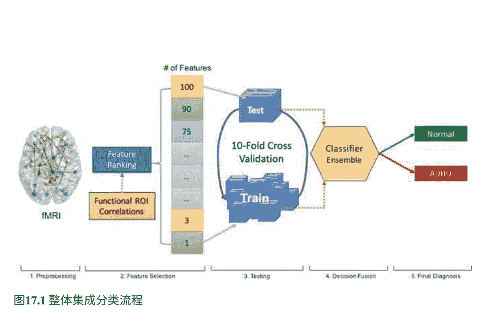

### 特征选择

医学成像应用中机器学习的一个基本问题是冗余信息。 也就是说，数据的维度（像素和体素的数量）远远超过了有助于识别特定类别（如疾病或疾病）的数据量。 因此，特征选择算法已经被优化，以通过丢弃非信息特征并仅包含显著特征作为训练和测试数据的一部分来提高分类性能。

最近的研究表明，在对fMRI进行集群分析时，几乎有70%的假阳性率[42]。因此，识别有价值的特征对于提高特异性和敏感性以及最终的准确性表现非常重要。特别是考虑到大脑之间的复杂性和共性，很多冗余和无关的特征被报道出来。因此，它们通常会降低分类器的性能。 因此，我们方法的一个重要组成部分是利用在ADHD和对照组之间显著不同的特征。

我们利用Wilcoxon秩和t检验来识别排名显著的特征。

### Wilcoxon秩和t检验

为了对特征进行排名，对ADHD组和对照组的每个特征进行Wilcoxon秩和t检验。Wilcoxon秩和t检验是一种非参数统计方法，它在识别特征在不同人群之间是否显著不同时非常理想，因为它不假设人群服从正态分布。 根据方程式17.1产生的z分数，计算p值。 通常，任何p值小于0.05的特征被认为是显著的。 在这项研究中，通过按照p值从低到高对特征进行排名，并选择不同数量的前n个显著特征进行多次实验：

$$z = \frac{T_1 - \frac{n_1(n_1 + n_2 + 1)}{2}}{\sqrt{\frac{n_1 n_2 (n_1 + n_2 + 1)}{12}}}$$，     (17.1)

其中 $T_1$是检验统计量， $n_1$和 $n_2$是样本大小。

### 17.3.3 深度学习模型

我们采用brainNetCNN[32]，该模型先前已经用于结构连接矩阵，并使用功能连接矩阵对模型进行训练。 在brainNetCNN中， 引入了三个新层：

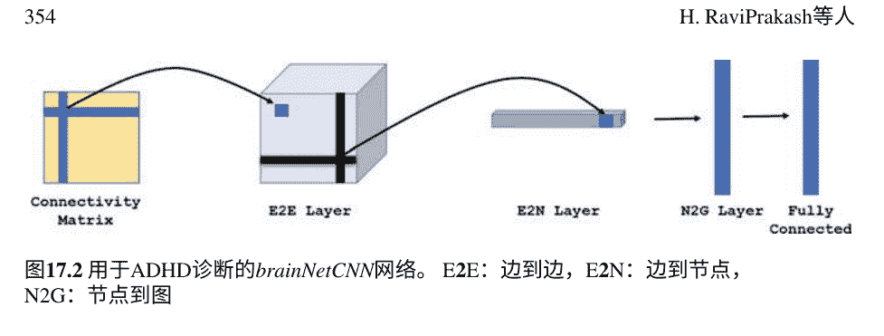

表17.2 网络设计参数

BrainNetCNN

| 层 | 滤波器尺寸 |
| :--- | :--- |
| 2D卷积 (E2E) | 16 |
| 2D卷积 (E2N) | 64 |
| 2D卷积 (N2G) | 64 |
| 稠密 | 2 |

1D卷积网络

| 层 | 滤波器尺寸 |
| :--- | :--- |
| 1D卷积 | 32, 64, 64, 64 |
| 稠密 | 64, 2 |

自编码器

| 层 | 滤波器尺寸 |
| :--- | :--- |
| 1D卷积 | 1024, 512, 1024, 6670 |

全局超参数

| 全局超参数 | 值 |
| :--- | :--- |
| BrainNetCNN & 1DConvNet | |
| 损失 | 二元交叉熵 |
| 优化器 | SGD |
| 学习率 | 0.01 |
| 丢弃率 | 0.5 |
| 学习率衰减 | 0.0001 |

自编码器

| 自编码器 | |
| :--- | :--- |
| 损失 | 均方误差 |
| 优化器 | SGD |
| 学习率 | 0.2 |
| 学习率衰减 | 0.0001 |

+   i. 边到边（E2E）层：通过组合共享节点之间的边生成一个滤波后的邻接矩阵。这类似于带有十字形滤波器的卷积层。
    ii. 边到节点（E2N）层：与E2E层不同，这里分别对行和列应用1D空间卷积，然后将它们组合生成节点响应的向量。
    iii. 节点到图（N2G）层：通过执行1D空间卷积生成节点的加权组合。

我们修改了这个架构，使其执行分类而不是回归，这是原始工作中的任务。网络架构如图17.2所示，设计参数可以在表17.2中找到。

我们还测试了基于1D卷积滤波器的架构，1DConvNet，对使用6670维连接特征向量作为输入的ADHD诊断的性能。该网络设计有四个1D卷积层和两个全连接（Dense）层。网络架构如图17.3所示，设计参数可以在表17.2中找到。

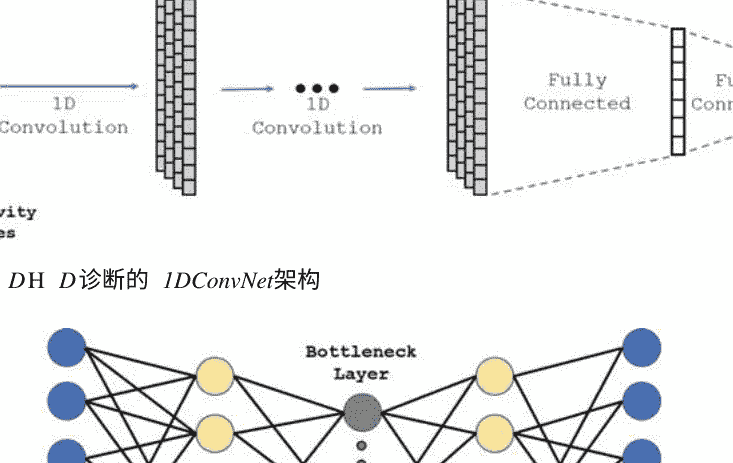

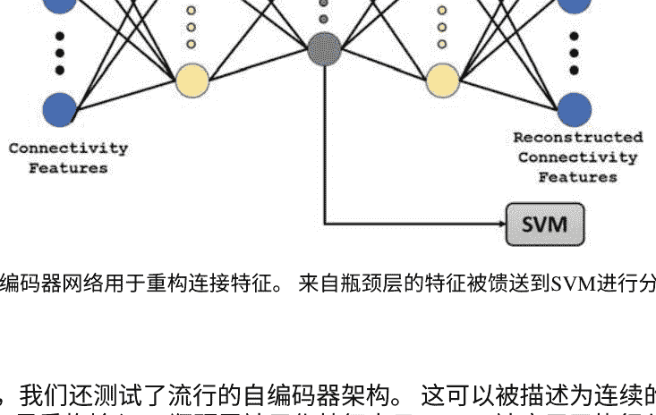

最后，我们还测试了流行的自编码器架构。这可以被描述为连续的Dense层，目标是重构输入。瓶颈层被用作特征表示，SVM被应用于执行分类。网络架构如图17.4所示，设计参数可以在表17.2中找到。采用了两种不同的训练策略：

+   - (E1) 模型使用所有可用数据进行训练，即多站点数据，并进行十折交叉验证（不区分来自A站点、B站点等的数据）。
    - (E2) 模型使用除一个之外的所有数据站点进行训练，其中一个站点用作测试集。在这种方法中，对训练数据应用十折交叉验证，并保存每个折叠的训练模型。对测试数据的最终分类基于训练模型集合的多数投票，即10个训练模型的多数决策。

上述训练策略用于测试模型的能力（E1）和模型的泛化能力（E2）。

## 17.4 结果

### 17.4.1 独立分类器

使用Wilcoxon秩和t检验比较ADHD和对照组主体集之间每个连接性相关性分布的差异。在ADHD和对照组之间存在几个显著不同（p值 <0.05）的fMRI特征。虽然在结构之间报告了近400个活动相关系数的p值 <0.05，但表17.3报告了fMRI数据中前10个显著特征。

KKI数据集和NYU数据集的独立分类器结果在图17.5和图17.6中绘制出来。在KKI中，SVM/SVR的表现优于EN；而在NYU中，EN的表现优于SVM。这些观察结果表明，在ADHD的诊断中没有单一的分类器是优越的，并且建议使用一组分类器来共同输出诊断结果。

### 17.4.2 集成分类器

在总共四个分类器之间，并保持特征选择方法的结果相互独立，评估了各种多数投票预测的组合。由于可能的组合数量很大（24个），为了节省时间并了解组合不同分类器预测是否改善性能，组合是逐步和直观地决定的。观察到在所有数据集上，SVM和SVR的性能相当。因此，只有测试涉及 SVM的组合，并且仅在最终集成分类器中使用 SVR。在图17.7中，可以看到不同分类器组合的性能。这两个数据集的结果显示了不同的最佳分类器，说明了组合不同的分类器以创建集成分类器的好处。

图17.8显示了使用不同数据集的Wilcoxon秩和特征排序方法的集成分类器结果。对于所有数据集，选择了前50个排名最高的特征，即网络连接，可以实现70%或更高的分类准确率。

在图17.9中，使用BrainNet Viewer [43]将在表17.3中确定的前显著连接进行了映射和可视化。一些已经在先前的研究中被确定的区域已经被确定出来。在ADHD患者中，罗兰迪区域的尖峰增加已经被先前确定。小脑区域的活动减少 [45]

表格 17.1 ADHD-200 数据集

| 站点 | ADHD - # 受试者 | ADHD - 年龄（平均 ±标准差） | 对照组 - # 受试者 | 对照组 - 年龄（平均 ±标准差） |
| :--- | :--- | :--- | :--- | :--- |
| *KKI* | 22 | 10.25 ± 1.27 | 61 | 10.21 ± 1.56 |
| *NeuroIMAGE* | 25 | 17.32 ± 2.57 | 23 | 16.68 ± 2.90 |
| *NYU* | 118 | 12.16 ± 3.14 | 98 | 11.26 ± 2.66 |
| *OHSU* | 37 | 8.88 ± 1.21 | 42 | 8.77 ± 1.03 |
| *北京1* | 24 | 11.19 ± 1.62 | 61 | 11.26 ± 2.31 |
| *北京2* | 35 | 11.62 ± 1.79 | 32 | 12.58 ± 1.76 |
| *北京3* | 19 | 13.20 ± 0.95 | 23 | 13.28 ± 1.35 |
| **总计** | 280 | 11.61 ± 2.88 | 340 | 11.64 ± 2.97 |

表17.3 贡献于分类/诊断的前10个功能连接区域。L：左侧，R：右侧fMRI特征

| ROI | 半球 | 半球 | ROI |
| :--- | :--- | :--- | :--- |
| 上顶叶 | 右侧 | 左侧 | 眶中额回 |
| 罗兰脑沟 | 右侧 | 左侧 | 小脑小叶II |
| 罗兰脑沟 | 右侧 | 左侧 | 小脑小叶IV, V |
| 岛叶 | 右侧 | 左侧 | 舌回 |
| 楔状回 | 右侧 | 左侧 | 扣带回 |
| 上枕叶 | 左侧 | 右侧 | 小脑小叶II |
| 下顶叶 | 左侧 | 左侧 | 枕角回 |
| 前枕叶 | 左侧 | 左侧 | 下颞回 |
| 中颞回 | 左侧 | | 小脑小叶9 |
| 前枕叶 | 左侧 | | 小脑小叶7 |

图17.5 通过Wilcoxon秩和t检验选择的fMRI特征上的独立分类器在KKI数据集上。最高准确率为93.97%，来自SVR分类器

图17.6 通过Wilcoxon秩和t检验选择的fMRI特征上的独立分类器在NYU数据集上。最高准确率为75.290%，来自EN和RF分类器在ADHD患者中也发现了小脑小叶区域的结构变化[46]。在双侧颞叶皮质[45,47]中也发现了活动减少。不同研究中发现了结构缺陷和功能活动减少[48,49]。

### 17.4.3 深度学习分类器

BrainNetCNN、1DConvNet和Auto-Encoder模型都使用训练策略 E1 和 E2进行训练直到收敛。对于自编码器架构，使用径向基函数训练SVM。这些不同模型的性能在图17.10a、b中绘制出来。模型对于 E1的精确度和敏感度，在图17.10a、b中表示为“ALL”的情况下，1DConvNet架构效果最好。对于 E2，与其他深度学习模型相比，BrainNetCNN具有更好的精确度和敏感性。

BrainNetCNN能够更好地学习连接矩阵中的拓扑结构。1DConvNet在对部分测试站点数据集进行网络微调时可能表现更好。然而，与提出的集成方法相比，性能要低得多。

为了直接比较深度学习方法与提出的集成分类器方法的泛化能力，我们在多站点数据分类任务上测试它们的性能，其中模型是在除一个站点之外的所有数据上进行训练，并在剩余站点上进行测试。结果如图17.11所示。从图17.11a、b可以看出，无论是基于深度学习的方法还是集成分类器，都没有很高的敏感性和特异性。然而，集成分类器的性能优于所有深度学习方法。

为了进一步完成分析，我们将深度学习算法与集成分类器在更多数据可用时进行比较，即全部数据任务。如图17.12所示，集成分类器在敏感性、特异性和准确性方面表现平衡，超过60%。然而，1DConvNet在敏感性和准确性方面均优于集成分类器。这表明深度学习算法在基于fMRI的疾病诊断中具有更大数据集的可用性。

混合站点数据的经典分类器的局限性也是可观察的。图17.10a显示了BrainNetCNN、1DConvNet和自动编码器算法在全部数据和多站点数据分类中的精确度和敏感性。

## 17.5 讨论与结论

在这项研究中，我们测试了不同的标准深度学习方法来进行基于fMRI的ADHD诊断任务，并将结果与我们提出的特征选择和集成分类器方法进行了比较。表现最佳的基于深度学习的方法是1DConvNet，准确率为67.7%，敏感性为76.9%，采用了E1训练策略。与基于经典分类器的集成方法相比，这表现出了较好的性能，准确率为60.6%，敏感性为67.3%。然而，当将这些方法推广到来自不同数据集的未见数据时，我们提出的集成分类器方法优于深度学习方法。

图17.11 aBrainNetCNN、1DConvNet和自编码器以及提出的集成分类器算法在多中心数据分类中的敏感性、特异性和准确性

图17.12 比较BrainNetCNN, 1DConvNet和auto-encoder以及集成分类器算法在所有数据分类任务上的表现

通过集成分类器方法，可以轻松分析和分类单个数据集。这对于深度学习方法来说是不可能的，因为它需要超过每个数据集所具有的几百个输入矩阵来训练以达到收敛而不过拟合。这些结果表明，深度学习算法需要更多的数据才能超越经典分类器。通过使用生成对抗网络[50]生成更真实和相似的fMRI数据的数据增强方法是解决数据不足问题的一种可能途径。

另一个挑战是可解释性任务。通过集成分类器方法，追溯使用的顶级特征是相对容易的，然后可以将其用作潜在的生物标志物。使用深度学习方法，解释性变得更加困难，特别是在更深的网络中。标准卷积层利用其滤波器设计的空间局部性，但在连接矩阵中，这可能很难解释。使用热图是一种常见的方法，可以将其纳入这些网络中以识别贡献的功能连接。

单个fMRI扫描包含数百万个体素的时空信息。单个扫描中的大量数据使得分析非常具有挑战性，即使对于深度学习方法也是如此，因为它们有可能过拟合到有限的扫描数据。解决这个问题的方法是生成功能连接矩阵，但这会导致时空信息的丢失，这可能意味着深度学习算法在识别确定性复杂模式方面表现出色的能力会丧失。

此外，静态功能连接可能无法捕捉到深度网络收敛到最优解所需的真实信号特征。动态功能连接方法是一个可能的方向，如Yan等人所示。然而，缺乏标准化的最佳窗口生成方法可能会影响性能。或者，可以直接使用时间序列数据与长短期记忆模块来建模不同脑区的信号特征。

尽管多中心数据有助于增加可用数据的数量，但它也带来了另一个问题，即不同的噪声水平。在每个中心，使用不同的扫描仪和协议，记录中的噪声是不同的。这些不同的噪声水平（即多中心数据）可能会给连接矩阵的解释增加困惑。

随着像人类连接组计划（HCP）[51]和OpenNeuro [52]这样的大型公开数据集的出现，深度网络将变得更加可行，并且通过使用额外的表型特征，将其应用于疾病诊断是一条可行的途径。李等人展示了使用fMRI图像进行自闭症生物标志物识别的潜力，尽管其分辨率较低，但这可能是一个潜在的方向。我们已经测试了一些基本的深度学习算法，但是通过不同的网络配置和输入（4D图像，时间序列信号，动态功能连接矩阵），深度学习有可能改善诊断。然而，深度学习方法尚未成为单独的fMRI分类的黄金标准方法。

## 参考文献

1.  Danielson ML, Bitsko RH, Ghandour RM, Holbrook JR, Kogan MD, Blumberg SJ (2018) 美国儿童和青少年中父母报告的注意力缺陷多动障碍（ADHD）诊断的患病率及相关治疗2016年。J Clin Child Adolesc Psychol 47 (2) : 199-212
2.  Biederman J (2005) 注意力缺陷/多动障碍：一种选择性概述。Biol Psychiatry 57 (11) : 1215-1220
3.  McKay KE, Halperin JM (2001) 注意力缺陷多动障碍（ADHD），攻击性和反社会行为跨越一生。Ann N Y Acad Sci 931 (1) : 84-96
4.  Merten EC, Cwik JC, Margraf J, Schneider S (2017) 在儿童和青少年中过度诊断心理障碍（在发达国家）。Child Adolesc Psychiatry Ment Health 11(1):5
5.  Matthews PM, Honey GD, Bullmore ET (2006) 神经影像学：fMRI在转化医学和临床实践中的应用。Nat Rev Neurosci 7 (9) : 732
6.  Sabour S, Frosst N, Hinton GE (2017) 胶囊之间的动态路由。神经信息处理系统的进展，第3856-3866页
7.  Spencer M, Eickholt J, Cheng J (2015) 一种深度学习网络方法用于从头预测蛋白质二级结构。IEEE/ACM计算生物学与生物信息学交易（TCBB）12 (1) : 103–112
8.  Cha YJ, Choi W, Büyüköztürk O (2017) 基于深度学习的裂纹损伤检测，使用卷积神经网络。计算辅助土木基础设施工程32 (5) : 361–378
9.  Khosravan N, Celik H, Turk bey B, Jones EC, Wood B, Bagci U (2019) 一种带有眼动跟踪、稀疏注意模型和深度学习的协作计算机辅助诊断（C-CAD）系统。医学图像分析51: 101–115
10. Silver D, Hubert T, Schrittwieser J, Antonoglou I, Lai M, Guez A, Lillicrap T (2017) 通过自我对弈使用通用强化学习算法掌握国际象棋和将棋。arXiv:1712.01815
11. Cai J, Lu L, Xie Y, Xing F, Yang L (2017) 使用基于图的决策融合在卷积神经网络上进行MRI胰腺分割。在：国际医学影像计算与计算机辅助干预会议。Springer, Cham, pp 674–682
12. Mitchell TM, Hutchinson R, Just MA, Niculescu RS, Pereira F, Wang X (2003) 从fMRI数据中分类瞬时认知状态。 在： AMIA年度研讨会论文集，卷2003。 美国医学信息学协会，第465页
13. Du W, Calhoun VD, Li H, Ma S, Eichele T, Kiehl KA, Adali T (2012) 使用静息和任务fMRI数据对精神分裂症进行高准确度分类。 Front Hum Neurosci 6:145
14. Khazaea A, Ebrahimzadeh A, Babajani-Feremi A (2015) 使用静息态fMRI和图论识别阿尔茨海默病患者。 Clin Neurophysiol 126(11):2132–2141
15. Sanz-Arigita EJ, Schoonheim MM, Damoiseaux JS, Rombouts SA, Maris E, Barkhof F, Stam CJ (2010) 阿尔茨海默病中'小世界'网络的丧失：FMRI静息态功能连接的图分析。 PloS One 5(11):e13788
16. Deshpande G, Libero L, Sreenivasan KR, Deshpande H, Kana RK (2013) 使用机器学习识别自闭症的神经连接特征签名。 Front Hum Neurosci 7:670
17. Sidhu GS, Asgarian N, Greiner R, Brown MR (2012) 基于核主成分分析的ADHD诊断中的降维方法。
18. Fekete T, Zach N, Mujica-Parodi LR, Turner MR (2013) 多核学习捕捉到肌萎缩侧索硬化症的系统级功能连接生物标志特征。 PloS One 8(12):e85190
19. Chu C, Hsu AL, Chou KH, Bandettini P, Lin C (2012) 阿尔茨海默病神经影像学倡议。 特征选择是否提高了分类准确性？ 样本大小和特征选择对使用解剖磁共振图像进行分类的影响。 Neuroimage 60(1):59–70
20. Cabral C, Silveira M, Figueiredo P (2012) 使用一组分类器从fMRI解码视觉脑状态。 Pattern Recognit 45(6):2064–2074
21. Richiardi J, Eryilmaz H, Schwartz S, Vuilleumier P, Van De Ville D (2011) 从fMRI连接图解码脑状态。
22. Kuncheva LI, Rodríguez JJ (2010) 用于fMRI数据分析的分类器集成：一个实验。 Magn Reson Imaging 28(4):583–593
23. Mortazi A, Karim R, Rhode K, Burt J, Bagci U (2017) 使用多视角CNN从MRI中分割左心房和近端肺静脉。 Springer, Cham, pp 377–385
24. LaLonde R, Bagci U (2018) 用于对象分割的胶囊。 arXiv:1804.04241
25. de Brebisson A, Montana G (2015) 深度神经网络用于解剖脑分割。 在： 计算机视觉和模式识别研讨会的IEEE会议论文集，pp 20–28
26. Torosdagli N, Liberton DK, Verma P, Sincan M, Lee JS, Bagci U (2018) 用于分割和解剖标记的深度测地线学习。 IEEE Trans Med Imaging
27. Hussein S, Kandel P, Corral JE, Bolan CW, Wallace MB, Bagci U (2018) 用规范相关分析进行深度多模态内导管乳头状黏液性肿瘤（IPMN）分类。 在： 2018年IEEE第15届国际生物医学成像研讨会（ISBI 2018）中。 IEEE, pp 800–804
28. Khosravan N, Bagci U (2018) S4ND：单次单尺度肺结节检测。 arXiv:1805.02279
29. Suk HI, Shen D (2013) 基于深度学习的AD/MCI分类特征表示。 在： 国际医学图像计算与计算机辅助干预会议。 Springer，柏林，第583-590页
30. Liu M, Zhang J, Adeli E, Shen D (2018) 基于标志点的深度多实例学习用于脑疾病诊断。 Med Image Anal 43:157-168
31. Khvostikov A, Adergahal K, Benois-Pineau J, Krylov A, Catheline G (2018) 基于3D CNN的sMRI和MD-DTI图像用于阿尔茨海默病研究的分类。 arXiv:1801.05968
32. Kawahara J, Brown CJ, Miller SP, Booth BG, Chau V, Grunau RE, Hamarneh G (2017) Brain-NetCNN：用于脑网络的卷积神经网络；向神经发育预测。 NeuroImage 146:1038-1049
33. Wen H, Shi J, Zhang Y, Lu KH, Cao J, Liu Z (2017) 使用深度学习进行动态自然视觉的神经编码和解码。 大脑皮层1-25
34. Horikawa T, Kamitani Y (2017) 使用分层视觉特征对已见和想象的对象进行通用解码。 自然通讯8:15037
35. Li X, Dvornek NC, Papademetris X, Zhuang J, Staib LH, Ventola P, Duncan JS (2018) 2通道卷积3D深度神经网络（2CC3D）用于fMRI分析：ASD分类和特征学习。在：2018年IEEE第15届国际生物医学成像研讨会（ISBI 2018）。IEEE，页1252-1255
36. Li X, Dvornek NC, Zhuang J, Ventola P, Duncan JS (2018) 使用深度学习和fMRI进行ASD的脑生物标志解释。在：国际医学图像计算和计算机辅助干预会议。Springer, Cham，页206-214
37. Yan W, Zhang H, Sui J, Shen D (2018) 通过全双向长短期记忆网络进行深度chronnectome学习，用于MCI诊断。在：国际医学图像计算与计算辅助干预会议上。Springer, Cham, 第249-257页
38. He T, Kong R, Holmes AJ, Sabuncu MR, Eickhoff SB, Bzdok D, Yeo BT (2018) 深度学习是否比回归更适用于流体智力的功能连接性预测？在：2018年神经影像模式识别国际研讨会（PRNI）。IEEE, 第1-4页
39. Bellec P, Chu C, Chouinard-Decorte F, Benhajali Y, Margulies DS, Craddock RC (2017) 神经局部ADHD-200预处理存储库。神经影像 144:275–286
40. Cox RW (1996) AFNI：功能磁共振神经影像分析和可视化软件。计算生物医学研究 29(3):162–173
41. Jenkinson M, Beckmann CF, Behrens TE, Woolrich MW, Smith SM (2012) FSL. Neuroimage 62(2):782–790
42. Eklund A, Nichols TE, Knutsson H (2016) Cluster failure: why fMRI inferences for spatial extent have inflated false-positive rates. Proc Natl Acad Sci 201602413
43. Xia M, Wang J, He Y (2013) BrainNet viewer: a network visualization tool for human brain connectomics. PloS One 8(7):e68910
44. Holtmann M, Becker K, Kentner-Figura B, Schmidt MH (2003) Increased frequency of rolandic spikes in ADHD children. Epilepsia 44(9):1241–1244
45. Schulz KP, Fan J, Tang CY, Newcorn JH, Buchsbaum MS, Cheung AM, Halperin JM (2004) Response inhibition in adolescents diagnosed with attention deficit hyperactivity disorder during childhood: an event-related FMRI study. Am J Psychiatry 161(9):1650–1657
46. Valera EM, Faraone SV, Murray KE, Seidman LJ (2007) Meta-analysis of structural imaging findings in attention-deficit/hyperactivity disorder. Biol Psychiatry 61(12):1361–1369
47. Smith AB, Taylor E, Brammer M, Toone B, Rubia K (2006) Task-specific hypoactivation in prefrontal and temporoparietal brain regions during motor inhibition and task switching in medication-naive children and adolescents with attention deficit hyperactivity disorder. Am J Psychiatry 163(6):1044–1051
48. Norman L, Carlisi CO, Lukito S, Hart H, Mataix-Cols D, Radua J, Rubia K (2016) 对ADHD和OCD的功能和结构缺陷的比较元分析。JAMA精神病学 73:815–825
49. McCarthy H, Skokauskas N, Frodl T (2014) 识别出注意力缺陷多动障碍的一致的神经功能模式：一项元分析。 Psychol Med 44(4):869–880
50. Goodfellow I, Pouget-Abadie J, Mirza M, Xu B, Warde-Farley D, Ozair S, Bengio Y (2014)生成对抗网络。神经信息处理系统的进展，第2672-2680页
51. Van Essen DC, Smith SM, Barch DM, Behrens TE, Yacoub E, Ugurbil K (2013) Wu-Minn HCP consortium. WU-Minn人类连接组计划概述。Neuroimage 80:62–79
52. Gorgolewski K, Esteban O, Schaefer G, Wandell B, Poldrack R (2017) OpenNeuro.-一个免费的在线平台，用于共享和分析神经影像数据。在：人类脑映射组织。加拿大温哥华，第1677页

# 第四部分 大规模数据挖掘和数据合成

## 第18章
## ChestX射线：医院规模的胸部X射线数据库和常见胸部疾病的弱监督分类和定位基准

王晓松，彭一帆，陆乙凡，陆志勇，Mohammadhadi Bagheri 和Ronald M. Summers

摘要：胸部X射线是最常用的放射学检查之一，用于筛查和诊断许多肺部疾病。许多现代医院的影像存档和通信系统（PACS）中积累和存储了大量的X射线成像研究以及放射学报告。另一方面，这种包含宝贵成像信息学（即，松散标记）的医院规模知识数据库如何使用仍然是一个悬而未决的问题。

X. 王—这项工作是在他在国家卫生研究院临床中心的研究期间完成的。

L. 卢—这项工作是在他在国家卫生研究院临床中心工作期间完成的。

X. 王 (✉)
Nvidia公司，美国马里兰州贝塞斯达市20814，电子邮件：xiaosong.wang@live.com, Y. 彭·Z. 卢
国家生物技术信息中心，国家医学图书馆，美国马里兰州贝塞斯达市20892，电子邮件：yifan.peng@nih.gov，Z. 卢，电子邮件：luzh@nih.gov, L. 卢

PAII公司, Bethesda 研究实验室, 6720B Rockledge Drive, Ste 410, Bethesda, MD 20817, 美国

约翰霍普金斯大学，美国马里兰州巴尔的摩市21218，电子邮件：le.lu@paii-labs.com; lelu@cs.jhu.edu，M. 巴格里·R. M. 萨默斯
成像生物标志物和计算机辅助诊断实验室，放射学和成像科学部，国家卫生研究院临床中心，美国马里兰州贝塞斯达市20892，电子邮件：mohammad.bagheri@nih.gov，R. M. 萨默斯，电子邮件：rms@nih.gov

可以用于促进数据需求量大的深度学习范式，构建真正的大规模高精度的计算机辅助诊断（CAD）系统。在本章中，我们介绍了一个胸部X射线数据库，即“ChestX-ray”，该数据库包含30,805个独特患者的121,120个正面X射线图像，使用自然语言处理从相关放射学报告中提取出的八种疾病图像标签（每个图像可以有多个标签）。重要的是，我们证明了这些常见的胸部疾病可以通过一个统一的弱监督多标签图像分类和疾病定位框架来检测甚至定位，该框架在我们提出的数据集上进行了验证。尽管最初的定量结果是有希望的，但基于深度卷积神经网络的“读取胸部X射线”（即仅使用图像级标签训练的常见疾病模式的识别和定位）对于完全自动化的高精度CAD系统仍然是一项艰巨的任务。

## 18.1 引言

在使用深度学习和大规模注释图像数据集[12, 24, 26, 37]的计算机视觉问题中，取得了快速而巨大的进展。与以前基于手工制作的图像特征构建的浅层方法相比，物体识别、检测和分割的定量性能得到了显著改善。深度神经网络表示进一步使联合语言和视觉学习任务更易于解决，例如图像字幕[21, 22, 32, 46, 47]、视觉问答[1, 45, 49, 53]和知识引导的迁移学习[3, 33]等。然而，当前最先进的目标检测和分割方法在使用PASCAL VOC [12]和使用Microsoft (MS) COCO [26]进行评估时，显示出引人注目且明显的性能差距，这表明在面对更大的挑战（由不同数据集表示）时，仍然有很大的性能改进空间。例如，MS COCO由200k张图像中的80个对象类别组成，其中包含1.2M个实例（其中350k是人），每个实例都被分割，而且许多实例都是小对象。与仅包含20个类别和11,530张图像的PASCAL VOC相比，后者包含27,450个带有边界框（B-Box）的注释对象，顶级竞争的目标检测方法在平均精度均值（mAP）下在MS COCO中达到0.413，而在PASCAL VOC中达到0.884。

深度学习在医学图像分析领域中对目标（通常是放射学成像中的人体解剖结构或病理结构）的检测和分割任务中取得了类似的性能提升。最近的重要工作包括（但不限于）对深度学习未来前景的综述[13]，以及关于淋巴结和间质性肺病检测和分类[36, 42]、脑微出血检测[10]、CT图像中肺结节检测[39]、自动胰腺分割[35]、细胞图像分割和跟踪[34]、预测脊柱放射学评分[19]的重要医学应用的集合。

以及多模态成像分割的扩展[15, 28]。主要限制在于所有提出的方法都是在一些小到中等规模的问题上进行评估的，最多只涉及几百名患者。目前的深度学习技术在扩展到数万名患者的研究中的表现仍不清楚。

在深度学习在计算机视觉领域的时候，构建各种带有不同特征的注释图像数据集[1, 12, 21, 23, 26, 32, 37, 53]的研究工作在更好地定义即将出现的问题、挑战和可能的技术进步方面起着不可或缺的重要作用。特别是，我们在这里关注图像（胸部X射线）和文本（X射线报告）之间的关系和联合学习。以前的代表性图像标题生成工作[22, 47]使用Flickr8K、Flickr30K [51]和MS COCO [26]数据集，分别包含8,000、31,000和123,000张图像，并且每张图像都通过Amazon Mechanical Turk (AMT)由五个句子进行了注释。文本通常以直接的方式描述图像上的对象和活动的注意力。基于区域级ImageNet预训练的卷积神经网络（CNN）检测器在[22, 49]中用于解析输入图像并输出属性列表或“视觉上扎根的高级概念”（包括对象、动作、场景等）。视觉问答（VQA）需要对图像内容进行更详细的解析和复杂的推理，以回答配对的自然语言问题。为了应对这一新挑战，提供了一个包含250k自然图像、760k问题和10M文本答案的新数据集[1]。此外，还引入了诸如“Flickr30k Entities”[32]、“Visual7W”[53]和“Visual Genome”[21, 23]（详细到94,000张图像和4,100,000个区域扎根的标题）的数据库，通过对象级扎根构建和学习文本描述和图像区域之间的空间密集和日益困难的语义链接。

尽管可以争论图像描述生成、视觉问答和基于图像的疾病诊断之间存在高层次的类比[40, 41]，但有三个因素使得真正大规模的基于医学图像的诊断（例如涉及数万名患者）变得非常困难。1、无法通过众包（如AMT）获得通用的、开放式的图像级解剖学和病理学标签，这对于非医学训练的注释者来说是不可行的。因此，我们利用自然语言处理（NLP）技术从附带图像的胸部X射线放射学报告中挖掘每个图像（可能是多个）的常见胸部病理学标签。放射科医生往往会写出比[26, 51]中的简单描述文本更抽象和复杂的逻辑推理句子。2、胸部X射线的空间尺寸通常为2000x3000像素。局部病理图像区域的大小或范围可能会有很大的变化，但通常与整个图像尺度相比非常小。图18.1显示了八个示例，实际的病理发现通常要小得多（因此更难检测）。在计算机视觉数据集中，通常需要对区域级边界框进行完全密集的注释（用于定位病理发现），但目前可能完全不可行。因此，我们制定并验证了一种弱监督的多标签图像分类和疾病定位框架来解决这个困难。3、到目前为止，计算机视觉中的所有图像描述和VQA技术都严重依赖于ImageNet。

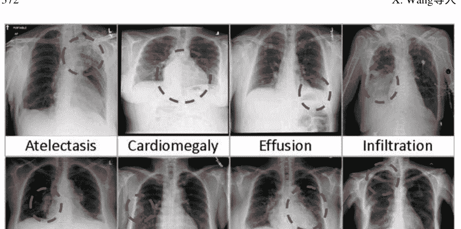

图18.1 在胸部X射线中观察到的八种常见胸部疾病，验证了完全自动化诊断的挑战性任务

预训练的深度卷积神经网络模型在大量物体类别上已经表现出很好的性能，并为进一步模型微调提供了良好的基线。然而，这种情况并不适用于医学图像诊断领域。因此，在构建弱标记的医学图像数据库的同时，我们必须学习深度图像识别和定位模型。

为了解决这些问题，我们提出了一个胸部X射线数据库，包括112,120张30,805个独特患者（从1992年到2015年收集）的正面X射线图像，以及通过自然语言处理技术从文本放射学报告中提取的八种常见疾病标签（后来扩展到14种疾病标签）。特别是，我们证明了这些常见的胸部疾病可以通过统一的弱监督多标签图像分类和疾病定位方法进行检测甚至空间定位。我们的初步定量结果是令人鼓舞的。然而，开发基于深度学习的完全自动化的“读取胸部X射线”系统仍然是一项艰巨的任务。有关访问ChestX-ray数据集的详细信息，请参阅网站。¹

### 18.1.1 最新进展

近年来，人们已经努力创建可公开获取的医学图像注释数据库[35, 36, 48, 50]，研究对象的患者数量从几个到数千个不等。

¹https://nihcc.app.box.com/v/ChestXray-NIHCC.

数百到两千个。特别是对于胸部X射线，最大的公共数据集是OpenI [29]，其中包含来自印第安纳网络患者护理系统的3,955份放射学报告和7,470份相关的胸部X射线图像存档和通信系统（PACS）中的图像。该数据库在[41]中被用作生成标题的问题，但没有报告定量疾病检测结果。我们新提出的胸部X射线数据库至少比OpenI [29]大一个数量级（参见表18.1）。为了实现更好的临床相关性，我们专注于利用弱监督多标签图像分类和常见胸部疾病的疾病定位的定量性能，类似于[49]中的“检测属性”中的中间步骤或[21, 32, 53]中的“视觉定位”。

## 18.2 数据库构建

首先，我们讨论了构建一个医院级胸部X射线图像数据库的方法，即“ChestX-ray8”，该数据库是从我们机构的PACS系统中获取的。首先，我们从放射科医生的反馈中筛选出了八个常见的胸部病理关键词，即肺不张、心脏肥大、积液、浸润、肿块、结节、肺炎和气胸（图18.1），根据这些八个文本关键词，我们搜索PACS系统，提取所有相关的放射学报告（连同图像）作为我们的目标语料库。采用了各种自然语言处理（NLP）技术来检测病理关键词并消除否定和不确定性。每个放射学报告要么与一个或多个关键词相关联，要么标记为“正常”作为背景类别。因此，ChestX-ray8数据库由112,120个正面视图X射线图像（来自30,805名患者）组成，每个图像都标有一个或多个病理关键词，否则标记为“正常”。图18.2展示了结果关键词之间的相关性。它揭示了不同病理之间的一些联系，这与放射科医生的领域知识相符，例如，浸润通常与肺不张和积液相关联。在某种程度上，这类似于理解自然图像中对象或概念之间的相互作用和关系[23]。

### 18.2.1 疾病标签挖掘

总体而言，我们的方法使用两个步骤从报告中生成标签。在第一次迭代中，我们在语料库中检测出所有的疾病概念。每个胸部X射线报告的主体通常结构化为“比较”、“指示”、“发现”和“印象”部分。在这里，我们专注于在“发现”和“印象”部分中检测疾病概念。如果报告中没有这两个部分中的任何一个，则将考虑完整的报告。在第二次遍历中，如果报告不包含任何疾病（不限于8个预定义的病理学），我们将其编码为“正常”。

#### 阶段1：病理实体提取

我们使用两个工具，DNorm [25]和MetaMap [2]，从放射学报告中挖掘疾病概念。DNorm是一种用于疾病识别和归一化的机器学习方法。它将报告中关键词的每个提及映射到医学系统化命名法-临床术语（SNOMED-CT）中的唯一概念ID，该术语是用于电子交换临床健康信息的标准化临床术语词汇。

MetaMap是另一个用于从生物医学文本语料库中检测生物概念的重要工具。与DNorm不同，它是一种基于本体的方法，用于检测统一医学语言系统®（UMLS®）元词典。在这项工作中，我们只考虑疾病或综合征和发现的语义类型（即“dsyn”和“fndg”）。为了最大化我们自动疾病检测的召回率，我们合并了DNorm和MetaMap的结果。表18.1（在

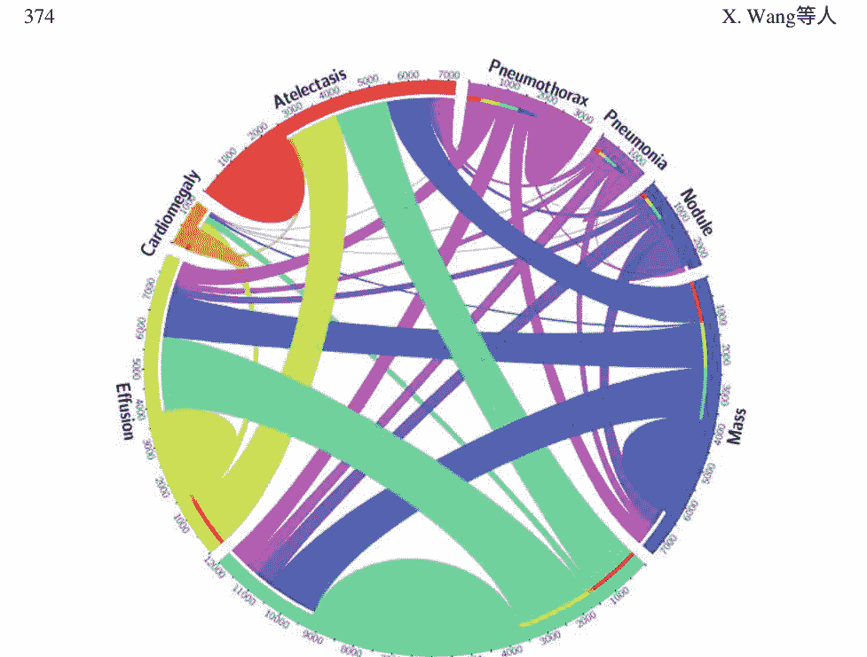

图18.2 圆形图显示了每个八个病理类别中具有多个标签的图像的比例和标签的共现统计信息

补充材料）显示了与八种目标疾病相关的相应SNOMED-CT概念（这些映射是通过在UMLS®术语服务中搜索疾病名称并由经过认证的放射科医师验证开发的。

#### 阶段2：否定和不确定性检测

疾病检测算法会定位放射学报告中提到的每个关键词，无论其是否真实存在或是否是否定。为了消除噪声标签，我们需要排除那些被否定的病理性陈述，更重要的是不确定的发现和疾病提及，例如“提示阻塞性肺疾病”。

尽管许多文本处理系统（如[5]）可以处理否定/不确定性检测问题，但它们大多数是直接在文本上利用正则表达式。使用正则表达式进行否定/不确定性检测的一个缺点是无法捕捉多个主题的各种句法结构。例如，在“清除A和B”这个短语中，正则表达式可以捕捉到“A”作为否定，但不能捕捉到“B”，特别是当“A”和“B”都是长而复杂的名词短语时（如图18.3中的“清除局灶性肺间质疾病、气胸或胸腔积液”）。

为了克服这个复杂性，我们在这项工作中手工制定了许多新的否定/不确定规则，这些规则在句法层面上定义。更具体地说，我们利用句法依赖信息，因为它与单词之间的语义关系密切相关，在生物医学文本处理中已经变得普遍。我们通过利用单词之间的依赖标签和方向信息，在依赖图上定义了我们的规则。

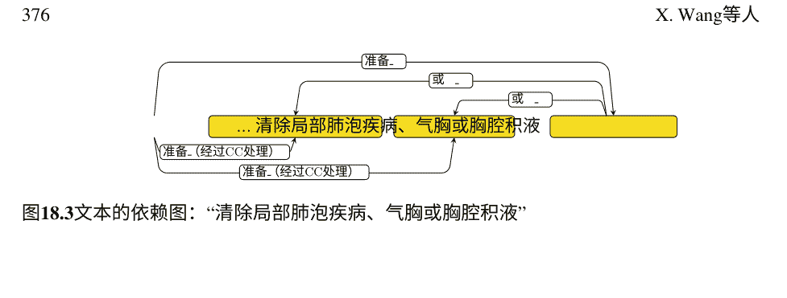

作为预处理的第一步，我们使用NLTK [4]将报告拆分和标记为句子。接下来，我们使用David McClosky的生物医学模型[27]通过Bllip解析器[6]解析每个句子。然后，我们通过在解析树上应用Stanford依赖关系转换器[7]获得句法依赖关系的“CCProcessed”表示。“CCProcessed”表示传播并联依赖关系，从而简化了协调。因此，我们可以使用更少的规则来匹配更复杂的结构。例如，如图18.3所示，我们可以使用“清除 → 准备的 → 疾病”来从文本中检测到三个否定（否定，局部肺泡疾病），(否定，气胸)和(否定，胸腔积液）。

- 如果报告中未检测到任何疾病。请注意，我们在本文中不仅考虑了八种感兴趣的疾病，还考虑了报告中检测到的所有疾病。
- 如果报告包含文本挖掘的“正常”或“正常大小”概念（分别对应SNOMED-CT概念中的CUIs C0205307和C0332506）。

### 18.2.2 挖掘疾病标签的评估

为了验证我们的方法，我们进行了以下实验。考虑到我们的数据集中不存在黄金标准标签，我们将一些现有的注释语料库作为替代。使用OpenI API [29]，我们检索到了共计3,851个唯一的放射学报告，每个OpenI报告都由人工注释者[8]分配了其关键发现/疾病名称。考虑到我们对八种疾病的关注，我们使用OpenI报告的一个子集及其人工注释作为评估我们方法的黄金标准。表18.1总结了OpenI [18, 29]报告子集的统计信息。表18.2显示了我们使用OpenI的方法的结果，以精确度（P），召回率（R）和F1分数衡量。与现有的MetaMap方法（启用NegEx）相比，我们的方法实现了更高的精确度0.90，更高的召回率0.91和更高的F1分数0.90。对于所有疾病，我们的方法获得了更高的精确度，特别是在“气胸”（0.90 vs. 0.32）和“浸润”（0.74 vs. 0.25）方面。这表明在句法层面上使用否定和不确定性检测成功地消除了假阳性案例。更重要的是，更高的精确度达到了

| 疾病 | MetaMap - P | MetaMap - R | MetaMap - F | 我们的方法 - P | 我们的方法 - R | 我们的方法 - F |
|---|---|---|---|---|---|---|
| 肺不张 | 0.95 | 0.95 | 0.95 | 0.99 | 0.85 | 0.91 |
| 心脏肥大 | 0.99 | 0.83 | 0.90 | 1.00 | 0.79 | 0.88 |
| 渗出 | 0.74 | 0.90 | 0.81 | 0.93 | 0.82 | 0.87 |
| 浸润 | 0.25 | 0.98 | 0.39 | 0.74 | 0.87 | 0.80 |
| 肿块 | 0.59 | 0.67 | 0.62 | 0.75 | 0.40 | 0.52 |
| 结节 | 0.95 | 0.65 | 0.77 | 0.96 | 0.62 | 0.75 |
| 正常 | 0.93 | 0.90 | 0.91 | 0.87 | 0.99 | 0.93 |
| 肺炎 | 0.58 | 0.93 | 0.71 | 0.66 | 0.93 | 0.77 |
| 气胸 | 0.32 | 0.82 | 0.46 | 0.90 | 0.82 | 0.86 |
| 总计 | 0.84 | 0.88 | 0.86 | 0.90 | 0.91 | 0.90 |

我们的期望是生成一个带有准确语义标签的胸部X射线语料库，为后续过程奠定坚实基础。

### 18.2.3 胸部X射线图像处理和手工标注基本事实

与流行的ImageNet分类问题相比，在典型X射线图像尺寸为3000 × 2000像素的情况下，许多疾病的空间范围显著较小，这对计算硬件的容量和深度学习范式的设计都带来了挑战。在ChestX-ray8中，X射线图像直接从DICOM文件中提取，并调整大小为1024 × 1024位图图像，与OpenI数据集中512 × 512的图像尺寸相比，没有明显丢失细节内容。它们的强度范围使用DICOM头文件中存储的默认窗口设置进行重新缩放。

作为ChestX-ray8数据库的一部分，提供了一小部分带有病理学的图像，并提供了手动标记的边界框（B-Boxes），可以用作评估疾病定位性能的基准。此外，它还可以用于一次/低样本学习设置[14]，其中只需要一个或几个样本来初始化学习，然后系统将通过更多无标签数据自行演化。我们将这留作未来的工作。

在我们的标注过程中，我们首先为每种病理选择200个实例（总共1,600个实例），包括983个图像。给定一张图像和一个疾病关键词，一位获得认证的放射科医生仅识别图像中对应的疾病实例，并用一个B-Box进行标记。然后将B-Box输出为XML文件。如果一张图像包含多个疾病实例，则对每个疾病实例进行标记。

| 项目 # | OpenI | 重叠 | ChestX-ray8 | 重叠 |
| :--- | :--- | :--- | :--- | :--- |
| 报告 | 2,435 | – | 108,948 | – |
| 注释 | 2,435 | – | – | – |
| 肺不张 | 315 | 122 | 5,789 | 3,286 |
| 心脏肥大 | 345 | 100 | 1,010 | 475 |
| 渗出 | 153 | 94 | 6,331 | 4,017 |
| 浸润 | 60 | 45 | 10,317 | 4,698 |
| 肿块 | 15 | 4 | 6,046 | 3,432 |
| 结节 | 106 | 18 | 1,971 | 1,041 |
| 肺炎 | 40 | 15 | 1,062 | 703 |
| 气胸 | 22 | 11 | 2,793 | 1,403 |
| 正常 | 1,379 | 0 | 84,312 | 0 |分别存储到单独的XML文件中。 作为提出的ChestX-ray8数据库和基准的应用，我们将演示以下胸部疾病的检测和定位。

## 18.3 构建数据库的应用

阅读和诊断胸部X射线图像可能是放射学家的入门任务，但实际上，这是一个复杂的推理问题，通常需要仔细观察和对解剖原理、生理学和病理学有良好的知识。这些因素增加了开发一种一致且自动化的读取胸部X射线图像技术的难度，同时考虑所有常见的胸部疾病。

作为ChestX-ray8数据集的主要应用，我们提出了一个统一的弱监督多标签图像分类和病理定位框架，可以检测多个病理的存在，并随后在相应的病理周围生成边界框。 具体而言，我们针对弱监督目标定位定制了深度卷积神经网络（DCNN）架构，考虑了大图像容量、各种多标签CNN损失和不同的池化策略。

### 18.3.1 分类和定位框架

我们的目标是首先检测每个X射线图像中是否存在一个或多个病理，并使用从网络中提取的激活和权重来定位它们。 我们通过训练一个多标签DCNN分类模型来解决这个问题。 图18.4展示了我们采用的DCNN架构，与几种先前的弱监督目标定位方法[11, 17, 30, 52]相似。

如图18.4所示，我们对预训练模型（使用ImageNet [9, 38]）进行网络手术，例如AlexNet [24]，GoogLeNet [44]，VGGNet-16 [43]和ResNet-50 [16]，去掉全连接层和最终分类层。 相反，我们在最后（最后一个卷积层之后）插入了一个过渡层，一个全局池化层，一个预测层和一个损失层。 与[52]中描述的类似，过渡层的深度激活（一组空间图像特征）和预测内积层的权重（训练的特征加权）的组合可以使我们找到疾病的可能空间位置。

#### 多标签分类

图像-标签表示有几种选择，以及多标签分类损失函数的选择。在这里，我们为每个图像定义一个八维标签向量y = [y₁, ..., y_c, ..., y_C], y_c ∈ {0, 1}, C = 8。其中，y_c表示图像中与相应病理学的存在与否，而全零向量[0, 0, 0, 0, 0, 0, 0, 0]表示“正常”状态（在列出的8个疾病类别范围内未发现病理学）。这个定义将多标签分类问题转化为类似回归的损失设置。

过渡层：由于我们采用了各种预训练的深度卷积神经网络架构，通常需要一个过渡层将前面层的激活转换为统一的输出维度，S × S × D，S ∈ {8, 16, 32}。D表示空间位置(i, j)处的特征维度，i, j ∈ {1, ..., S}，不同的模型设置可以有不同的值，例如GoogLeNet的D = 1024和ResNet的D = 2048。过渡层有助于以标准形式传递预训练的深度卷积神经网络模型的权重，这对于使用该层的激活进一步生成病理定位步骤中的热图至关重要。

多标签损失层：我们首先尝试了三种标准的损失函数来进行回归任务，而不是使用传统多类分类模型的softmax损失函数，即hinge损失（HL）、欧氏距离损失（EL）和交叉熵损失（CEL）。然而，我们发现模型在学习正样本时存在困难（带有病理的图像）和图像标签相对稀疏，意味着“0”的数量比“1”多得多。这是由于我们的一种独热式图像标记策略和病理和“正常”类别数量不平衡所致，因此我们引入了正负平衡因子 β_P, β_N来强制学习正例。例如，加权交叉熵损失函数（W-CEL）定义如下：

```
$$L_{W-CEL}(f(\mathbf{x}), \mathbf{y}) = \beta_P \sum_{y_c=1} -\ln(f(x_c)) + \beta_N \sum_{y_c=0} -\ln(1 - f(x_c))$$
```

其中 β_P 设置为 \frac{|P|+|N|}{|P|} 而 β_N 设置为 \frac{|P|+|N|}{|N|}，|P| 和 |N| 是图像标签批次中“1”和“0”的总数。

#### 通过热图进行疾病定位

在我们的多标签图像分类网络中，全局池化和预测层不仅设计为分类的一部分，还可以生成病理学的似然图，即热图。热图中峰值的位置通常对应于具有高概率的疾病模式的存在。图18.4的上部演示了生成此热图的过程。在过渡期之后进行全局池化，预测层中学到的权重可以作为过渡层的空间映射权重。因此，我们可以通过将过渡层的激活（大小为 S × S × D）与预测层的权重（大小为 D × C）相乘，为每个疾病类别（大小为 S × S × C）生成加权的空间激活图。

池化层在选择要传递的信息方面起着重要作用。除了传统的最大池化和平均池化之外，我们还使用了在[31]中提出的对数-求和-指数（LSE）池化。LSE池化值 x_p 被定义为

```
$$x_p = \frac{1}{r} \cdot \log \left[ \frac{1}{S} \cdot \sum_{(i,j) \in S} exp(r \cdot x_{ij}) \right]$$
```

其中 x_{ij} 是池化区域 S中的激活值，(i,j)是池化区域 S中的一个位置，S = s × s 是 S中的总位置数。通过控制超参数 r，池化值的范围从 S中的最大值（当 r → ∞）到平均值（r → 0）。它作为最大池化和平均池化之间的可调选项。由于LSE函数存在溢出/下溢问题，在我们自己的DCNN架构中实现LSE池化层时使用以下等价形式：

```
$$x_p = x^* + \frac{1}{r} \cdot \log \left[ \frac{1}{S} \cdot \sum_{(i,j) \in S} exp(r \cdot (x_{ij} - x^*)) \right]$$
```

其中 x^* = max\{|x_{ij}|, (i,j) \in S\}.

## 18.4 评估

数据：我们使用的ChestX射线数据库评估和验证统一的疾病分类和定位框架。对于病理分类和定位任务，我们将整个数据集随机分成三个子组，通过随机梯度下降（SGD）进行CNN微调：即训练（70%），验证（10%）和测试（20%）。我们仅在实验中报告测试集上的8种胸部疾病识别性能。此外，对于1,600个已注释的病理学B-Box的983个图像，这些框仅用于评估测试中的疾病定位准确性（而不用于训练目的）。

CNN设置：我们使用Caffe框架[20]实现了多标签CNN架构。ImageNet预训练模型，即AlexNet [24]，GoogLeNet [44]，VGGNet-16 [43]和ResNet-50 [16]，是从Caffe模型库中获取的。我们的统一DCNN使用这些模型的权重，只有过渡层和预测层是从头开始训练的。

由于图像尺寸较大且GPU内存有限，有必要将图像批量大小减小以加载整个模型并在GPU中保持激活状态，同时我们增加迭代次数以累积更多次数的梯度。两者的组合在不同的CNN模型中可能会有所不同，但我们将批量大小×迭代大小设置为常数80。此外，总的训练迭代次数是根据不同的CNN模型进行定制，以防止过拟合。更复杂的模型如ResNet-50实际上需要更少的迭代次数（例如10000次迭代）才能达到收敛。DCNN模型是在一台带有4个Titan X GPU的Dev-Box Linux服务器上进行训练的。

多标签疾病分类：图18.5展示了通过使用AlexNet、GoogLeNet、VGG和ResNet-50四个不同的预训练模型来初始化DCNN框架在八个病理类别上的多标签分类ROC曲线。相应的曲线下面积（AUC）值在表18.3中给出。定量性能差异很大，其中基于ResNet-50的模型取得了最好的结果。与其他组相比，“心脏肥大”（AUC =0.8141）和“气胸”（AUC =0.7891）类别始终被很好地识别出来，而对于包含小物体的病理学，如“肿块”（AUC =0.5609）和“结节”类别，检测比例相对较低。由于其内部类别外观变化巨大，肿块很难检测出来。“肺炎”（AUC =0.6333）的较低性能可能是因为总实例数量不足。我们的患者群体（少于1%的X射线标记为肺炎）。这一发现与目标检测性能的比较一致，从PASCAL VOC [12]到MS COCO [26]的性能下降，其中出现了许多小的注释对象。

接下来，我们将研究在使用ResNet-50初始化DCNN框架时不同池化策略的影响。如上所述，我们尝试了三种池化方案：平均池化、LSE池化和最大池化。LSE池化的超参数 r 在 {0.1, 0.5, 1, 5, 8, 10, 12} 范围内变化。如图18.6所示，在这个分类任务中，平均池化和最大池化的性能几乎相当。当 r 开始增加并达到最低点时，LSE池化的性能开始下降。然后，在 r = 10时达到整体最佳性能。在不同的 r 值下，LSE池化表现出类似加权池化方法或平均池化和最大池化之间的过渡方案的行为。总体而言，LSE池化（r = 10）报告了最佳性能（始终高于平均池化和最大池化）。

表18.3 不同DCNN模型设置下的多标签分类的ROC曲线下面积
(At: 肺不张; Ca: 心脏肥大; Ef: 渗出; In: 渗出; Ma: 肿块; No: 结节; Pa: 肺炎; Px: 气胸)

| 设置 | 肺不张 | 心脏肥大 | 渗出 | In | 肿块 | 否 | 肺炎 | Px |
| :--- | :--- | :--- | :--- | :--- | :--- | :--- | :--- | :--- |
| **使用不同的预训练模型进行初始化** | | | | | | | | |
| AlexNet | 0.6458 | 0.6925 | 0.6642 | 0.6041 | **0.5644** | 0.6487 | 0.5493 | 0.7425 |
| GoogLeNet | 0.6307 | 0.7056 | 0.6876 | 0.6088 | 0.5363 | 0.5579 | 0.5990 | 0.7824 |
| VGGNet-16 | 0.6281 | 0.7084 | 0.6502 | 0.5896 | 0.5103 | 0.6556 | 0.5100 | 0.7516 |
| ResNet-50 | **0.7069** | **0.8141** | **0.7362** | **0.6128** | 0.5609 | **0.7164** | **0.6333** | **0.7891** |
| **不同的多标签损失函数** | | | | | | | | |
| 交叉熵损失 | 0.7064 | 0.7262 | 0.7351 | 0.6084 | 0.5530 | 0.6545 | 0.5164 | 0.7665 |
| 加权交叉熵损失 | 0.7069 | 0.8141 | 0.7362 | 0.6128 | 0.5609 | 0.7164 | 0.6333 | 0.7891 |

最后，我们通过使用正负实例平衡的损失函数（公式18.1）来展示性能的改进。如表18.3所示，加权损失（W-CEL）相比于交叉熵损失（CEL）在整体性能上提供了更好的表现，特别是对于那些相对较少正实例的类别，例如“心脏肥大”的AUC从0.7262增加到0.8141，“肺炎”的AUC从0.5164增加到0.6333。

疾病定位：利用经过微调的DCNN模型进行多标签疾病分类，我们可以使用过渡层的激活和预测层的权重来计算疾病热图，甚至为每个病理候选生成B-Box。计算得到的边界框与手动标注的地面真值（包含在ChestX-ray8中）进行评估。尽管边界框注释的总数（1,600个实例）相对于整个数据集来说相对较小，但仍足以对弱监督疾病定位的提出框架的性能进行合理估计。

表18.4 八种疾病类别的病理定位准确率和平均假阳性数（At：肺不张；Ca：心脏肥大；Ef：积液；In：浸润；Ma：肿块；No：结节；Pa：肺炎；Px：气胸）

| T(IoBB) | 肺不张 | 心脏肥大 | 渗出 | In | 肿块 | 否 | 肺炎 | Px |
|---|---|---|---|---|---|---|---|---|
| **T(IoBB) = 0.1** |  |  |  |  |  |  |  |  |
| 准确率 | 0.7277 | 0.9931 | 0.7124 | 0.7886 | 0.4352 | 0.1645 | 0.7500 | 0.4591 |
| AFP | 0.8323 | 0.3506 | 0.7998 | 0.5589 | 0.6423 | 0.6047 | 0.9055 | 0.4776 |
| **T(IoBB) = 0.25（在x轴和y轴上比地面真实B-Box大两倍）** |  |  |  |  |  |  |  |  |
| 准确率 | 0.5500 | 0.9794 | 0.5424 | 0.5772 | 0.2823 | 0.0506 | 0.5583 | 0.3469 |
| AFP | 0.9167 | 0.4553 | 0.8598 | 0.6077 | 0.6707 | 0.6158 | 0.9614 | 0.5000 |
| **T(IoBB) = 0.5** |  |  |  |  |  |  |  |  |
| 准确率 | 0.2833 | 0.8767 | 0.3333 | 0.4227 | 0.1411 | 0.0126 | 0.3833 | 0.1836 |
| AFP | 1.0203 | 0.5630 | 0.9268 | 0.6585 | 0.6941 | 0.6189 | 1.0132 | 0.5285 |
| **T(IoBB) = 0.75** |  |  |  |  |  |  |  |  |
| 准确率 | 0.1666 | 0.7260 | 0.2418 | 0.3252 | 0.1176 | 0.0126 | 0.2583 | 0.1020 |
| AFP | 1.0619 | 0.6616 | 0.9603 | 0.6921 | 0.7043 | 0.6199 | 1.0569 | 0.5396 |
| **T(IoBB) = 0.9** |  |  |  |  |  |  |  |  |
| 准确率 | 0.1333 | 0.6849 | 0.2091 | 0.2520 | 0.0588 | 0.0126 | 0.2416 | 0.0816 |
| AFP | 1.0752 | 0.7226 | 0.9797 | 0.7124 | 0.7144 | 0.6199 | 1.0732 | 0.5437 |

任务。为了检查计算机生成的B-Box与GT B-Box的准确性，使用了两种测量方法，即标准的交并比（IoU）或检测到的B-Box面积比（IoBB）（类似于精确度或纯度的面积）。由于热图的相对低空间分辨率（32 ×32）与原始图像尺寸（1024 ×1024）相比，计算得到的B-Box通常比相应的GT B-Box更大。因此，我们通过要求 IoU > T(IoU) or IoBB > T(IoBB)来定义正确的定位。请参考补充材料以了解在不同 T(IoU)下的定位性能。表18.4展示了每种疾病类型的定位准确性（Acc.）和平均假阳性（AFP）数量，其中 T(IoBB)∈{0.1, 0.25, 0.5, 0.75, 0.9}。请参考补充材料以了解每个8种类别的定性示例疾病定位结果。

## 18.5 将常见胸部疾病标签扩展到14个

为了进一步完善胸部X射线中常见疾病的列表，我们扩展了疾病类别，包括六种更常见的疾病（即浸润、水肿、肺气肿、纤维化、胸膜增厚和疝气），并更新了NLP挖掘的标签。ChestX-ray14数据集的统计数据如表18.5和图18.7所示。在这个扩展中，病理学的边界框保持不变。

表18.5 ChestX-ray8和ChestX-ray14数据集中语料库的总数和重叠数。PT：胸膜增厚

| 项目# | ChestX-ray8 | 重叠 | ChestX-ray14 | 重叠 |
|-------|-------------|------|--------------|------|
| 报告 | 108,948 | - | 112,120 | - |
| 肺不张 | 5,789 | 3,286 | 11,535 | 7,323 |
| 心脏肥大 | 1,010 | 475 | 2,772 | 1,678 |
| 渗出 | 6,331 | 4,017 | 13,307 | 9,348 |
| 浸润 | 10,317 | 4,698 | 19,871 | 10,319 |
| 肿块 | 6,046 | 3,432 | 5,746 | 2,138 |
| 结节 | 1,971 | 1,041 | 6,323 | 3,617 |
| 肺炎 | 1,062 | 703 | 1,353 | 1,046 |
| 气胸 | 2,793 | 1,403 | 5,298 | 3,099 |
| 浸润 | - | - | 4,667 | 3,353 |
| 水肿 | - | - | 2,303 | 1,669 |
| 肺气肿 | - | - | 2,516 | 1,621 |
| 纤维化 | - | - | 1,686 | 959 |
| PT | - | - | 3,385 | 2,258 |
| 疝气 | - | - | 227 | 117 |
| 未见异常 | 84,312 | 0 | 60,412 | 0 |

### 18.5.1 NLP挖掘标签的评估

为了验证我们的方法，我们进行了以下实验。首先，我们使用一些现有的注释语料库作为替代，例如OpenI数据集。此外，我们还注释了适用于评估发现识别系统的临床报告。我们随机选择了900份报告，并要求两名注释者标记上述14种类型的发现。每份报告由两名注释者独立注释，然后就冲突达成一致。

表18.6显示了我们使用OpenI和我们提出的数据集的方法的结果，以精确度（P），召回率（R）和F1分数来衡量。与现有的MetaMap方法（启用NegEx）相比，我们实现了更高的精确度、召回率和F1分数。这表明在句法层面上使用否定和不确定性检测成功地消除了假阳性案例。

### 18.5.2基准结果

与在ChestX-ray8上的实验类似，我们在ChestX-ray14数据库上评估和验证了统一的疾病分类和定位框架。总共使用了112,120张正面X射线图像，其中51,708张图像包含-## 表18.6 在OpenI和ChestX-ray14数据集上评估图像标注结果。使用P、R、F1分数报告性能。PT：胸膜增厚

| 疾病 | MetaMap-精确度 | MetaMap-召回率 | MetaMap-F1分数 | 我们的方法-精确度 | 我们的方法-召回率 | 我们的方法-F1分数 |
|------|----------------|----------------|----------------|-------------------|-------------------|-------------------|
| OpenI |  |  |  |  |  |  |
| 肺不张 | 87.3 | 96.5 | 91.7 | 88.7 | 96.5 | 92.4 |
| 心脏肥大 | 100.0 | 85.5 | 92.2 | 100.0 | 85.5 | 92.2 |
| 渗出 | 90.3 | 87.5 | 88.9 | 96.6 | 87.5 | 91.8 |
| 浸润 | 68.0 | 100.0 | 81.0 | 81.0 | 100.0 | 89.5 |
| 肿块 | 100.0 | 66.7 | 80.0 | 100.0 | 66.7 | 80.0 |
| 结节 | 86.7 | 65.0 | 74.3 | 82.4 | 70.0 | 75.7 |
| 肺炎 | 40.0 | 80.0 | 53.3 | 44.4 | 80.0 | 57.1 |
| 气胸 | 80.0 | 57.1 | 66.7 | 80.0 | 57.1 | 66.7 |
| 浸润 | 16.3 | 87.5 | 27.5 | 77.8 | 87.5 | 82.4 |
| 水肿 | 66.7 | 90.9 | 76.9 | 76.9 | 90.9 | 83.3 |
| 肺气肿 | 94.1 | 64.0 | 76.2 | 94.1 | 64.0 | 76.2 |
| 纤维化 | 100.0 | 100.0 | 100.0 | 100.0 | 100.0 | 100.0 |
| PT | 100.0 | 75.0 | 85.7 | 100.0 | 75.0 | 85.7 |
| 疝气 | 100.0 | 100.0 | 100.0 | 100.0 | 100.0 | 100.0 |
| 总计 | 77.2 | 84.6 | 80.7 | 89.8 | 85.0 | 87.3 |
| ChestX-ray14 |  |  |  |  |  |  |
| 肺不张 | 88.6 | 98.1 | 93.1 | 96.6 | 97.3 | 96.9 |
| 心脏肥大 | 94.1 | 95.7 | 94.9 | 96.7 | 95.7 | 96.2 |
| 渗出 | 87.7 | 99.6 | 93.3 | 94.8 | 99.2 | 97.0 |
| 浸润 | 69.7 | 90.0 | 78.6 | 95.9 | 85.6 | 90.4 |
| 肿块 | 85.1 | 92.5 | 88.7 | 92.5 | 92.5 | 92.5 |
| 结节 | 78.4 | 92.3 | 84.8 | 84.5 | 92.3 | 88.2 |
| 肺炎 | 73.8 | 87.3 | 80.0 | 88.9 | 87.3 | 88.1 |
| 气胸 | 87.4 | 100.0 | 93.3 | 94.3 | 98.8 | 96.5 |
| 浸润 | 72.8 | 98.3 | 83.7 | 95.2 | 98.3 | 96.7 |
| 水肿 | 72.1 | 93.9 | 81.6 | 96.9 | 93.9 | 95.43 |
| 肺气肿 | 97.6 | 93.2 | 95.3 | 100.0 | 90.9 | 95.2 |
| 纤维化 | 84.6 | 100.0 | 91.7 | 91.7 | 100.0 | 95.7 |
| PT | 85.1 | 97.6 | 90.9 | 97.6 | 97.6 | 97.6 |
| 疝气 | 66.7 | 100.0 | 80.0 | 100.0 | 100.0 | 100.0 |
| 总计 | 82.8 | 95.5 | 88.7 | 94.4 | 94.4 | 94.4 |

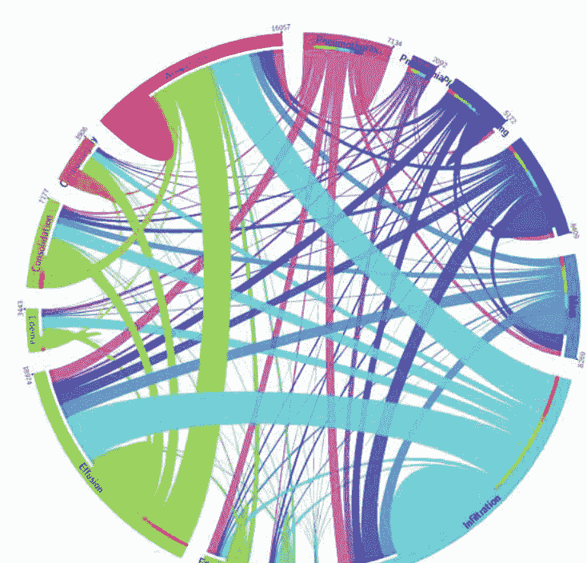

### 表18.7 使用ImageNet预训练的ResNet-50，在ChestX-ray8和ChestX-ray14上进行多标签分类性能评估（AUC）

| ResNet-50 | ChestX-ray8 | ChestX-ray14 |
| :--- | :--- | :--- |
| 肺不张 | 0.7069 | 0.7003 |
| 心脏肥大 | 0.8141 | 0.8100 |
| 渗出 | 0.7362 | 0.7585 |
| 浸润 | 0.6128 | 0.6614 |
| 肿块 | 0.5609 | 0.6933 |
| 结节 | 0.7164 | 0.6687 |
| 肺炎 | 0.6333 | 0.6580 |
| 气胸 | 0.7891 | 0.7993 |
| 浸润 | – | 0.7032 |
| 水肿 | – | 0.8052 |
| 肺气肿 | – | 0.8330 |
| 纤维化 | – | 0.7859 |
| PT | – | 0.6835 |
| 疝气 | – | 0.8717 |

图18.8 使用ImageNet预训练的ResNet，在ChestX-ray14上进行多标签分类性能评估

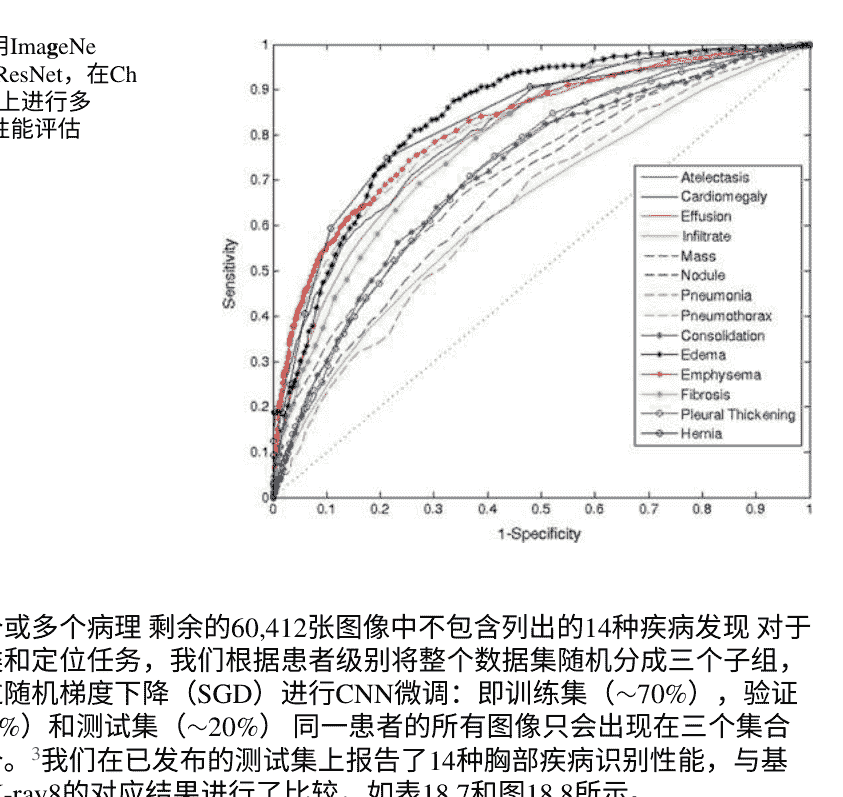

包含一个或多个病理剩余的60,412张图像中不包含列出的14种疾病发现对于病理分类和定位任务，我们根据患者级别将整个数据集随机分成三个子组，用于通过随机梯度下降（SGD）进行CNN微调：即训练集（~70%），验证集（~10%）和测试集（~20%）。同一患者的所有图像只会出现在三个集合中的一个。³我们在已发布的测试集上报告了14种胸部疾病识别性能，与基于ChestX-ray8的对应结果进行了比较，如表18.7和图18.8所示。

由于病理学的注释边界框没有改变，我们只在原始的八个类别上测试定位性能。通过检测到的边界框区域交集比（IoBB）（类似于精确度或纯度的面积）来衡量的结果在表18.8中展示。

## 18.6 总结

直到这项工作，构建具有计算机诊断性能基准的大型放射学图像数据库尚未得到解决。我们尝试构建一个“机器-人工注释”的全面胸部X射线数据库，以呈现处理至少数万名患者的现实临床和方法学挑战（类似于自然图像中的“ImageNet”）。我们还使用ChestX-ray数据库对八种常见胸部病理分类和弱监督定位进行了广泛的定量性能基准测试。主要目标是通过推广公共数据集来启动未来的努力在这个重要领域中。

构建真正的大规模、全自动的高精度医学诊断系统仍然是一项艰巨的任务。ChestX-ray可以使数据饥渴的深度神经网络范式创建临床有意义的应用程序，包括常见疾病模式挖掘、疾病相关性分析、自动放射学报告生成等。未来的工作中，ChestX-ray将扩展到涵盖更多的疾病类别，并与其他临床信息集成，例如跨时间和患者历史的后续研究。

³数据分割文件可以通过https://nihcc.app.box.com/v/ChestXray-NIHCC下载。

**致谢** 本工作得到了NIH临床中心和国家医学图书馆的内部研究计划的支持。我们感谢NVIDIA公司的GPU捐赠。

### 表18.8 胸部X射线14的病理定位准确率和平均假阳性数 (At: 肺不张; Ca: 心脏肥大; Ef: 渗出; In: 浸润; Ma: 肿块; No: 结节; Pa: 肺炎; Px: 气胸)

| T(IoBB) | 肺不张 | 心脏肥大 | 渗出 | In | 肿块 | No | 肺炎 | Px |
|---------|--------|----------|------|----|------|----|------|----|
| **T(IoBB) = 0.1** | | | | | | | | |
| 准确率 | 0.6222 | 1 | 0.7974 | 0.9106 | 0.5882 | 0.1519 | 0.8583 | 0.5204 |
| AFP | 0.8293 | 0.1768 | 0.6148 | 0.4919 | 0.3933 | 0.4685 | 0.4360 | 0.4543 |
| **T(IoBB) = 0.25 (在x轴和y轴上比地面真实B-Box大两倍)** | | | | | | | | |
| 准确率 | 0.3944 | 0.9863 | 0.6339 | 0.7967 | 0.4588 | 0.0506 | 0.7083 | 0.3367 |
| AFP | 0.9319 | 0.2042 | 0.6880 | 0.5447 | 0.4288 | 0.4786 | 0.4959 | 0.4857 |
| **T(IoBB) = 0.5** | | | | | | | | |
| 准确率 | 0.1944 | 0.9452 | 0.4183 | 0.6504 | 0.3058 | 0 | 0.4833 | 0.2653 |
| AFP | 0.9979 | 0.2785 | 0.7652 | 0.6006 | 0.4604 | 0.4827 | 0.5630 | 0.5030 |
| **T(IoBB) = 0.75** | | | | | | | | |
| 准确率 | 0.0889 | 0.8151 | 0.2287 | 0.4390 | 0.1647 | 0 | 0.2917 | 0.1735 |
| AFP | 1.0285 | 0.4045 | 0.8222 | 0.6697 | 0.4827 | 0.4827 | 0.6169 | 0.5243 |
| **T(IoBB) = 0.9** | | | | | | | | |
| 准确率 | 0.0722 | 0.6507 | 0.1373 | 0.3577 | 0.0941 | 0 | 0.2333 | 0.1224 |
| AFP | 1.0356 | 0.4837 | 0.8445 | 0.7043 | 0.4939 | 0.4827 | 0.6331 | 0.5346 |

## 参考文献

- 1. Antol S, Agrawal A, Lu J, Mitchell M, Batra D, Zitnick L (2015) Vqa:视觉问答。在：ICCV
- 2. Aronson AR, Lang FM (2010) MetaMap概述：历史视角和最新进展。J Am Med Inform Assoc 17(3):229–236. https://doi.org/10.1136/jamia.2009.002733
- 3. Ba J, Swersky K, Fidler S, Salakhutdinov R (2015) 使用文本描述预测深度零样本卷积神经网络。在：ICCV
- 4. Bird S, Klein E, Loper E (2009) 使用Python进行自然语言处理。O'Reilly Media, Inc
- 5. Chapman WW, Bridewell W, Hanbury P, Cooper GF, Buchanan BG (2001) 识别出院总结中否定的发现和疾病的简单算法。 J BiomedInform 34(5):301–310. https://doi.org/10.1006/jbin.2001.1029, http://www.sciencedirect.com/science/article/pii/S1532046401910299
- 6. Charniak E, Johnson M (2005) 粗到细的n最佳解析和MaxEnt判别重排。 在： 计算语言学协会第43届年会论文集（ACL），第173-180页
- 7. De Marneffe MC, Manning CD (2015) 斯坦福类型依赖手册。 斯坦福大学 (2015年)
- 8. Demner-Fushman D, Kohli MD, Rosenman MB, Shooshan SE, Rodriguez L, Antani S, Thoma GR, McDonald CJ (2015) 为分发和检索准备一系列放射学检查。美国医学信息学协会23(2)：304-310。 https://doi.org/10.1093/jamia/ocv080， http://jamia.oxfordjournals.org/content/jaminfo/early/2015/07/01/jamia.ocv080.1.full.pdf
- 9. Deng J, Dong W, Socher R, Li LJ, Li K, Fei-Fei L (2009) Imagenet: 一个大规模的分层图像数据库。 在： 计算机视觉和模式识别。IEEE, 第248-255页
- 10. Dou Q, Chen H, Yu L, Zhao L, Qin J, Wang D, Mok V, Shi L, Heng P (2016) 通过3D卷积神经网络自动检测脑微出血。 IEEE Trans Med Imaging 35(5)：1182-1195
- 11. Durand T, Thome N, Cord M (2016) Weldon: 弱监督学习深度卷积神经网络. IEEE CVPR
- 12. Everingham M, Eslami SMA, Van Gool LJ, Williams C, Winn J, Zisserman A (2015) Pascal视觉对象类别挑战: 回顾. Int J Comput Vis 111(1):98–136
- 13. Greenspan H, van Ginneken B, Summers RM (2016) 客座编辑深度学习在医学成像中的应用: 概述和未来前景. IEEE Trans Med Imaging 35(5):1153–1159
- 14. Hariharan B, Girshick R (2016) 低样本视觉对象识别. arXiv:1606.02819
- 15. Havaei M, Guizard N, Chapados N, Bengio Y (2016) Hemis: 异模态图像分割。 在: MICCAI, (2)。 Springer, 柏林, 第469-477页
- 16. He K, Zhang X, Ren S, Sun J (2015) 深度残差学习用于图像识别。 arXiv:1512.03385
- 17. Hwang S, Kim HE (2015) 自我迁移学习用于弱监督病变定位。在: MICCAI, (2)。第239-246页
- 18. Jaeger S, Candemir S, Antani S, Wang YXJ, Lu PX, Thoma G (2014) 两个公共胸部X射线数据集用于计算机辅助肺部疾病筛查。 Quant Imaging Med Surg 4(6)。 http://qims.amegroups.com/article/view/5132
- 19. Jamaludin A, Kadir T, Zisserman A (2016) Spinenet: 自动定位脊柱MRI中的分类证据。 在: MICCAI. Springer, 柏林
- 20. Jia Y, Shelhamer E, Donahue J, Karayev S, Long J, Girshick R, Guadarrama S, Darrell T (2014) Caffe: convolutional architecture for fast feature embedding. arXiv:1408.5093
- 21. Johnson J, Karpathy A, Fei-Fei L (2016) Densecap: fully convolutional localization networks for dense captioning. In: CVPR
- 22. Karpathy A, Fei-Fei L (2015) Deep visual-semantic alignments for generating image descriptions. In: CVPR
- 23. Krishna R, Zhu Y, Groth O, Johnson J, Hata K, Kravitz J, Chen S, Kalantidis Y, Li LJ, Shamma DA, Bernstein M, Fei-Fei L (2016) Visual genome: connecting language and vision using crowdsourced dense image annotations. https://arxiv.org/abs/1602.07332
- 24. Krizhevsky A, Sutskever I, Hinton GE (2012) 使用深度卷积神经网络进行图像分类。 在： 神经信息处理系统的进展, 第1097-1105页
- 25. Leaman R, Khare R, Lu Z (2015) 临床自然语言处理中的挑战: 自动化疾病规范化。 J Biomed Inform 57:28–37. https://doi.org/10.1016/j.jbi.2015.07.010
- 26. Lin TY, Maire M, Belongie S, Hays J, Perona P, Ramanan D, Dollár P, Zitnick L (2014) Microsoft coco: 上下文中的常见物体。 在: ECCV, (5)。 第740-755页
- 27. McClosky D (2009) 任意领域解析：自然语言解析的自动领域适应。 布朗大学计算机科学系，论文
- 28. Moeskops P, Wolterink J, van der Velden B, Gilhuijs K, Leiner T, Viergever M, Isgum I (2016) 深度学习在多模态医学图像分割中的应用。 在：MICCAI。 Springer, 柏林
- 29. Open-i: 一个开放的生物医学搜索引擎。 https://openi.nlm.nih.gov
- 30. Oquab M, Bottou L, Laptev I, Sivic J (2015) 是否可以免费进行对象定位？ -使用卷积神经网络进行弱监督学习。 在：IEEE CVPR, pp 685–694
- 31. Pinheiro PO, Collobert R (2015) 从图像级别到像素级别的标注与卷积网络。 在：IEEE计算机视觉和模式识别会议论文集, pp 1713–1721
- 32. Plummer B, Wang L, Cervantes C, Caicedo J, Hockenmaier J, Lazebnik S (2015) Flickr30k 实体：为更丰富的图像到句子模型收集区域到短语的对应关系。 在：ICCV
- 33. Qiao R, Liu L, Shen C, van den Hengel A (2016) 越少越好：通过噪声抑制从在线文本文档中进行零样本学习。 在：CVPR
- 34. Ronneberger O, Fischer P, Brox T (2015) U-net：用于生物医学图像分割的卷积网络。 在：MICCAI。 Springer, 柏林, 第234-241页
- 35. Roth H, Lu L, Farag A, Shin HC, Liu J, Turkbey EB, Summers RM (2015) Deeporgan：用于自动胰腺分割的多层深度卷积网络。 在：MICCAI。 Springer, 柏林, 第556-564页
- 36. Roth HR, Lu L, Seff A, Cherry KM, Hoffman J, Wang S, Liu J, Turkbey E, Summers RM (2014) 使用随机集合的深度卷积神经网络观察进行淋巴结检测的新的2.5D表示。 在：MICCAI。 Springer, 柏林, 第520-527页
- 37. Russakovsky O, Deng J, Su H, Krause J, Satheesh S, Ma S, Huang Z, Karpathy A, Khosla A, Bernstein M, Berg A, Fei-Fei L (2015) Imagenet大规模视觉识别挑战。 Int J Comput Vis 115(3):211–252
- 38. Russakovsky O, Deng J, Su H, Krause J, Satheesh S, Ma S, Huang Z, Karpathy A, Khosla A, Bernstein M等(2015) Imagenet大规模视觉识别挑战。 Int J Comput Vis 115(3):211–252
- 39. Setio A, Ciompi F, Litjens G, Gerke P, Jacobs C, van Riel S, Wille M, Naqibullah M, Sanchez C, van Ginneken B (2016) CT图像中的肺结节检测：使用多视角卷积网络进行假阳性减少。 IEEE Trans Med Imaging 35(5):1160–1169
- 40. Shin H, Lu L, Kim L, Seff A, Yao J, Summers R (2016) 在大规模放射学数据库上进行交错文本/图像深度挖掘以实现自动图像解释。 J Mach Learn Res 17:1–31
- 41. Shin H, Roberts K, Lu L, Demner-Fushman D, Yao J, Summers R (2016) 学习阅读胸部X射线：用于自动图像注释的循环神经级联模型。
- 42. Shin H, Roth H, Gao M, Lu L, Xu Z, Nogues I, Yao J, Mollura D, Summers R (2016) 用于计算机辅助检测的深度卷积神经网络：CNN架构、数据集特性和迁移学习。 IEEE Trans Med Imaging 35(5):1285–1298
- 43. Simonyan K, Zisserman A (2014) 用于大规模图像识别的非常深的卷积网络。 arXiv:1409.1556
- 44. Szegedy C, Liu W, Jia Y, Sermanet P, Reed S, Anguelov D, Erhan D, Vanhoucke V, Rabinovich A (2015) Going deeper with convolutions。 在：IEEE计算机视觉和模式识别会议论文集, 第1-9页
- 45. Tapaswi M, Zhu Y, Stiefelhagen R, Torralba A, Urtasun R, Fidler S (2015) Movieqa: understanding stories in movies through question-answering. 在：ICCV
- 46. Vendrov I, Kiros R, Fidler S, Urtasun R (2016) Order-embeddings of images and language. 在：ICLR
- 47. Vinyals O, Toshev A, Bengio S, Erhan D (2015) Show and tell: a neural image caption generator. 在：CVPR, 第3156-3164页
- 48. Wilke HJ, Kmin M, Urban J (2016) Genodisc数据集：多学科研究在椎间盘退变中的好处。 欧洲脊柱杂志。 http://www.physiol.ox.ac.uk/genodisc/

# 第19章 使用胸部X射线自动分类和报告多种常见胸部疾病

Xiaosong Wang, Yifan Peng, Le Lu, Zhiyong Lu and Ronald M. Summers

摘要：胸部X射线是日常临床例行检查中最常见的放射学检查之一。使用胸部X射线报告胸部疾病通常是放射科医师实习生的入门任务。然而，阅读胸部X射线图像仍然是一项具有挑战性的任务，对于以学习为导向的机器智能来说，这是因为（1）缺乏大规模可机器学习的医学图像数据集，以及（2）缺乏能够模拟人类放射科医师高级推理的技术，这需要多年的知识积累和专业培训。在本文中，我们展示了陪伴医院图片和存档通信系统中的X射线图像的临床自由文本放射学报告可以用作解决这两个关键问题的先验知识。我们提出了一种新颖的文本-图像嵌入网络（TieNet），用于提取独特的图像和文本表示。多级注意力模型被整合到端到端可训练的CNN-RNN架构中，用于突出显示有意义的文本词汇和图像区域。我们首先使用从相关报告中提取的图像特征和文本嵌入将TieNet应用于胸部X射线分类。所提出的自动注释框架在为我们的手动标签评估数据集分配疾病标签时实现了高准确性（平均AUC超过0.9）。此外，我们将TieNet转化为胸部X射线报告系统。它模拟报告过程，并可以输出疾病分类和初步报告，仅使用X射线图像作为输入。与未见过的手动标记数据集（OpenI）上的最先进基准相比，分类结果显著提高（平均AUC增加了6%）。

Wang—这项工作是在他在国家卫生研究院临床中心的研究期间完成的。

Lu—这项工作是在他在国家卫生研究院临床中心的就职期间完成的。

X. Wang (✉)
Nvidia 公司，美国马里兰州贝塞斯达市20814，电子邮件：xiaosong.wang@live.com
Y. Peng, Z. Lu
国家生物技术信息中心, 国家医学图书馆，国家卫生研究院，贝塞斯达，MD 20892，美国
e-mail: yifan.peng@nih.gov
Z. Lu
e-mail: luzh@nih.gov
L. Lu
PAII 公司, Bethesda 研究实验室, 6720B Rockledge Drive, Ste 410, Bethesda, MD 20817, 美国
e-mail: le.lu@paii-labs.com; lelu@cs.jhu.edu
约翰霍普金斯大学, 巴尔的摩, MD, 美国
R. M. Summers
影像生物标志物和计算机辅助诊断实验室，放射学和影像科学部，临床中心，国家卫生研究院，贝塞斯达，MD 20892，美国
e-mail: rms@nih.gov

## 19.1 引言

在过去的十年中，计算机视觉中的挑战性任务经历了不同的阶段，从单一图像分类到多类别多实例分类/检测/分割，再到涉及图像或视频中对象实例之间关系的更复杂的认知任务。快速而显著的性能提升部分是由于公开可访问的大规模图像和视频数据集以及质量注释的存在，例如ImageNet [8]、PASCAL VOC [10]、MS COCO [22]和Visual Genome [18]数据集。特别是ImageNet预训练的深度卷积神经网络（CNN）模型[15, 19, 21]已成为许多更高级任务的基础（确实是一个优势），例如基于循环神经网络（RNN）的图像字幕生成[11, 17, 30, 34]、视觉问答[27, 36, 38, 42]和实例关系提取[6, 14, 16]。

相反，在医学图像领域中很少有公开可用的大规模图像数据集。传统的自然图像注释方法，例如众包，无法应用于医学图像，因为这些任务通常需要多年的专业培训和领域知识。另一方面，许多医院的影像存档和通信系统（PACS）中积累了放射学原始数据（例如图像、临床注释和放射学报告）几十年。主要挑战是如何将这些回顾性放射学数据转化为可机器学习的格式。在医学成像社区中，通过胸部X射线实现这一目标是一个重要的里程碑[35]。

与当前的深度学习模型不同，放射科医生在阅读医学图像和编写放射学报告时通常会观察到多个发现。一个主要原因是这些发现通常是相关的。例如，肝转移可以扩散到区域性淋巴结或其他身体部位。通过获取和维护相关临床发现的整体图像，放射科医生将能够做出更准确的诊断。据我们所知，开发一个能够检测多种疾病类型的通用或多用途CAD框架以无缝的方式进行，仍然是一个具有挑战性的任务。然而，这样的框架是构建自动放射诊断和报告系统的关键部分。为此，我们研究了如何利用自由文本放射学报告作为先验知识，使用创新的文本-图像嵌入网络。我们将这个新颖的系统应用于两种不同的场景。我们首先介绍了一个新的框架，通过使用来自相关报告的图像特征和文本来自动注释胸部X射线。多级注意力模型被集成到端到端可训练的CNN-RNN架构中，用于突出有意义的文本词汇和图像区域。此外，我们将提出的注释框架转化为胸部X射线报告系统（如图19.1所示）。该系统通过输出疾病分类和自动生成初步报告来模拟现实世界的报告过程。从回顾性报告中学习的文本嵌入被集成到模型中作为先验知识，联合学习框架提高了两个任务的性能，相比之前的最新技术水平。

在本章中，我们讨论了自动报告的四个关键方面：（1）我们介绍了文本-图像嵌入网络，这是一个多用途的端到端可训练的多任务CNN-RNN框架。（2）我们展示了如何利用原始报告数据和配对图像来产生有意义的基于注意力的图像和文本表示，使用了提出的TieNet。由于PHI匿名化的困难，原始报告不太方便公开共享，而注意力编码句子嵌入是共享每个图像相关诊断信息的可行解决方案。（3）我们概述了开发的文本和图像嵌入能够提升自动标注框架，并实现对胸部X射线标签的极高准确性。(4) 最后，我们提出了一种新颖的图像分类框架，它仅以图像作为输入，但利用训练中的文本-图像对应关系作为先验知识注入，以产生改进的分类分数和初步报告生成。

重要的是，我们在三个不同的数据集上验证了我们的方法，并且TieNet改善了图像分类结果（在所有疾病类别下平均增加了6%的曲线下面积（AUC）），与其他机构的未见过的手工标记数据集（OpenI [7]）相比，超越了现有技术的水平。我们的多任务训练方案不仅可以帮助图像分类，还可以通过生成具有比基准方法更高BLEU分数的报告来帮助报告生成。

## 19.2 CAD中的先前工作

计算机辅助检测（CADe）和诊断（CADx）长期以来一直是医学图像处理的主要研究重点[5]。近年来，深度学习模型开始在各种任务中超越传统的统计学习方法，例如自动分类皮肤病变[9]，检测肝脏病变[4]和检测病理图像结果[40]。然而，当前的CADe方法通常针对特定类型的疾病或病变，例如肺结节，结肠息肉或淋巴结[24]。

Wang等人[35]提供了一个最近和突出的例外，他们通过使用自然语言处理（NLP）技术处理图像及其配对的放射学报告（从他们的机构PACS数据库中提取）来引入了一个大规模的胸部X射线数据集。公开可用的数据集包含30,805个独特患者的112,120张正面胸部X射线图像。然而，放射学报告中包含比简单的疾病二进制标签更丰富的信息，例如疾病位置和严重程度，应该利用现有的PACS数据集。因此，我们与Wang等人的方法不同，利用这些丰富的文本信息来生成增强的胸部X射线CADx系统。

在视觉字幕的视野中，我们的工作与[27, 29, 33, 37, 38]最接近。Xu等人[37]首次将序列到序列模型和空间注意模型引入图像字幕任务。他们在每个解码步骤中将长短期记忆（LSTM）解码器与输入图像的不同部分进行条件化，并且注意信号由先前的隐藏状态和CNN特征确定。Vinyals等人[33]将句法分析问题视为序列到序列的学习任务，通过线性化解析树。Pederoli等人[29]允许直接将字幕词与图像区域关联起来。最近，多重注意力模型[27, 38]从图像和文本中提取显著区域和词语，然后将它们结合在一起，以获得更好的对应关系表示。

在医学成像领域，Shin等人[32]提出将整个图像或显著区域与MeSH术语相关联。有关使用训练中的任务导向报告对病理图像进行总结的有希望的结果[41]也有报道。两者之间的差异在于我们的模型与他们的模型的区别在于我们采用了多重注意力模型，结合了图像和文本特征，以提供更突出和有意义的嵌入，用于图像分类和报告生成任务。除了视觉注意力外，基于文本的注意力也越来越多地应用于深度学习的自然语言处理中[2, 26, 31]。它试图解决传统的编码器-解码器框架面临的一个潜在问题，即输入过长或者信息过丰富，无法进行选择性编码。注意力机制试图通过允许解码器参考输入序列来缓解上述问题[23, 25, 39]。为此，我们的工作紧密遵循了[23]中使用的方法，引入了自注意力机制来提取可解释的句子嵌入。我们的模型将训练中基于注意力的图像和文本表示作为先验知识注入，以产生改进的分类得分。

## 19.3 统一框架中的多级注意力

放射学报告是对放射学研究中确定的所有临床发现和印象的总结。图19.1显示了一个示例报告。它通常包含比仅有疾病关键词更丰富的信息，还可能包含否定和不确定性陈述。在“发现”部分，将列出对图像中每个部位进行检查时所观察到的正常和异常情况的列表。还将注意到疾病模式的属性，例如特定位置和严重程度。此外，关键的诊断信息通常在“印象”部分中呈现，考虑到所有的发现、患者病史和以前的研究。可疑的发现可能导致对额外或随访成像研究的建议。因此，报告包含了信息的复杂混合体，机器学习的关键是提取特定应用程序的有用部分。除了挖掘疾病关键词[35]作为放射学报告的摘要外，我们还希望学习文本嵌入以捕捉原始报告中包含的更丰富信息。这里引入了多级注意力机制；图19.2展示了所提出的文本-图像嵌入网络。首先，我们讨论了两种注意力的开发和整合，即注意力编码文本嵌入（AETE，对文本信息的注意力）和显著性加权全局平均池化（SW-GAP，对图像空间信息的注意力）。然后，我们提出了一个基本的端到端可训练的CNN-RNN架构，以及一个集成了前述注意力机制的增强版本。最后，我们概述了用于优化框架的联合学习损失函数。

### 19.3.1 AETE: 文本关注

为了计算全局文本表示，我们使用了一种紧随其后的方法，该方法与[23]中使用的方法非常相似。更具体地说，我们使用注意力来结合最显著的RNN隐藏状态的部分。让 $\mathbf{H} = (\mathbf{h}_1, \ldots, \mathbf{h}_T)$ 是所有隐藏状态的 $d_h \times T$ 矩阵。注意机制输出一个 $r \times T$ 权重矩阵 $\mathbf{G}$，如下所示

$$\mathbf{G} = softmax(\mathbf{W}_{s2} \tanh(\mathbf{W}_{s1} \mathbf{H})),$$ (19.1)

其中 $r$ 是我们想从句子中提取的全局注意力的数量，$\mathbf{W}_{s1}$ 和 $\mathbf{W}_{s2}$ 分别是 $s$ 乘以 $d_h$ 和 $r$ 乘以 $s$ 的矩阵。$s$ 是一个超参数，用于控制注意力生成过程的维度和最大秩。

通过计算注意力，我们计算一个 $r \times d_h$ 的嵌入矩阵 $\mathbf{M} = \mathbf{G}\mathbf{H}$，本质上执行对 $T$ 个隐藏状态的 $r$ 加权求和，将它们聚合成一个表示。$\mathbf{G}$ 的每一行，表示为 $\mathbf{g}^i$ ($i \in \{1\ldots r\}$)，表示每个隐藏状态对最终嵌入表示的贡献程度。因此，我们可以为嵌入矩阵 $\mathbf{M}$ 的每一行绘制热图（参见图19.5的示例）。这种可视化方式可以提供关于嵌入的每个部分所编码的信息的线索，增加了一层解释。

为了提供报告中句子的最终全局文本嵌入，AETE对 $\mathbf{M}$ 执行最大池化，生成一个大小为 $d_h$ 的嵌入向量 $\hat{\mathbf{X}}_{AETE}$。

### 19.3.2 SW-GAP: 图像上的注意力

除了使用注意力提供更有意义的文本嵌入之外，我们的目标还是为了产生改进的用于分类的视觉嵌入。为了达到这个目的，我们重新使用了注意力机制，$\mathbf{G}$，只是我们进行了最大化操作，产生了一系列的显著性值，$g_t (t = 1, \ldots, T)$，对于每个单词，$\mathbf{w}_t$。这些显著性值用于加权和选择在每个时间点生成的空间注意力图，$\mathbf{a}_t$。

$$\mathbf{a}_{ws}(x, y) = \sum_t \mathbf{a}_t(x, y) * g_{t_o}$$ (19.2)

这个地图通过文本注意力引导了所有空间显著区域的编码。我们使用这个地图来突出显示具有更有意义信息的空间区域 $\mathbf{X}$:

$$\hat{\mathbf{X}}_{SW-GAP}(c) = \sum_{(x, y)} \mathbf{a}_{ws}(x, y) * \mathbf{X}(x, y, c),$$ (19.3)

其中 $x, y \in \{1\ldots D\}$ 且 $\hat{\mathbf{X}}_{SW-GAP}$ 是一个 $1 \times C$ 的向量，代表全局视觉信息，由文本和视觉注意力引导。图19.2的下半部分展示了这种汇聚策略的一个示例。

### 19.3.3 整体CNN-RNN模型

如图19.2所示，我们的端到端可训练的CNN-RNN模型接受一张图像 $I$ 和一个 1-of-V 编码的单词序列：

$$ \mathbf{S} = \{\mathbf{w}_1, \ldots, \mathbf{w}_T\}, \mathbf{w}_t \in \mathbb{R}^V, $$ (19.4)
其中 $\mathbf{w}_t$ 是一个代表报告中第 $t$ 个词的 $d_w$ 维词嵌入向量，$d_w$ 是词汇表的大小，$T$ 是报告的长度。初始的CNN组件使用了从ImageNet预训练模型中借用的层，例如ResNet-50（从Conv1到Res5c）。CNN组件还包括一个卷积层（过渡层），用于调整空间网格大小和特征维度。

我们的RNN基于Xu等人的视觉图像空间注意力模型[37]进行图像字幕生成。过渡层的卷积激活被表示为 $\mathbf{X}$，用于初始化RNN的隐藏状态 $\mathbf{h}_t$，其中完全连接的嵌入 $\phi(\mathbf{X})$ 将过渡层激活映射到维度为 $d_h$ 的LSTM状态空间。此外，$\mathbf{X}$ 也被用作RNN的输入之一。然而，与Xu等人[37]类似，我们的序列到序列模型包括一个确定性和软性的视觉空间注意力 $\mathbf{a}_t$，该注意力在输入到RNN之前与 $\mathbf{X}$ 逐元素相乘。在每个时间步，RNN还输出后续的注意力图 $\mathbf{a}_{t+1}$。

除了软加权视觉特征外，RNN还接受每个时间步的当前单词作为输入。我们采用标准的LSTM单元[13]用于RNN。下一个隐藏状态的转换可以表示为

$$ \mathbf{h}_t = LSTM ([\mathbf{w}_t, \mathbf{a}_t, \mathbf{X}], \mathbf{h}_{t-1}). $$ (19.5)

LSTM通过生成一个单词来生成报告，每个时间步都有一个上下文向量的条件，即先前的隐藏状态 $\mathbf{h}_t$，先前生成的单词 $\mathbf{w}_t$，以及维度为 $D \times D \times C$ 的卷积特征 $\mathbf{X}$。这里 $D = 16$ 和 $C = 1024$ 分别表示空间和通道维度。一旦模型训练完成，可以通过顺序采样 $\mathbf{w}_t \sim p(\mathbf{w}_t|\mathbf{h}_t)$ 并使用公式19.5更新状态来生成新图像的报告。

端到端可训练的CNN-RNN模型为处理文本和图像提供了强大的手段。然而，我们的目标也是为了获得可解释的全局文本和视觉嵌入，以用于分类的目的。出于这个原因，我们引入了AETE和SW-GAP的两个关键增强。

## 参考文献

49. Wu Q, Wang P, Shen C, Dick A, van den Hengel A (2016) Ask Me Anything: Free-Form Visual Question Answering Based on Knowledge from External Sources. In: CVPR
50. Yao J, et al. (2016) A Multi-Center Milestone Study for Clinical Vertebral CT Segmentation. Computerized Medical Imaging and Graphics 49(4):16-28
51. Young P, Lai A, Hodosh M, Hockenmaier J (2014) From image descriptions to visual denotations: New similarity metrics for semantic inference over event descriptions. In: TACL
52. Zhou B, Khosla A, Lapedriza A, Oliva A, Torralba A (2015) Learning Deep Features for Discriminative Localization. arXiv: 1512.04150
53. Zhu Y, Groth O, Bernstein M, Fei-Fei L (2016) Visual7W: Question-Based Visual Reasoning. In: CVPR## 19.3.4 联合学习

对于图像和报告计算的全局表示，必须将它们结合在一起产生最终的分类。为了实现这一点，我们将两种形式的表示$\hat{\mathbf{X}} = [\hat{\mathbf{X}}_{AETE}; \mathbf{X}_{SW-GAP}]$进行连接，并使用最后的全连接层来产生多标签分类的输出。我们模型的直觉是，CNN和RNN网络之间的连接将有助于两者的训练，因为图像激活可以调整文本嵌入任务，并且基于高文本显著性进行池化可以提取显著的图像特征。

与Wang等人类似，我们定义一个$M$维疾病标签向量$\mathbf{y} = [y_1, \ldots, y_m, \ldots, y_M]$，$y_m \in \{0, 1\}$对于每个案例，$M = 15$表示类别的数量。$y_m$表示图像中与病理学或“无发现”（列出的疾病类别）相关的存在。在训练过程中，我们采用[35]提供的NLP挖掘的标签作为“ground truth”。

不同疾病类别的实例数量非常不平衡，从几百到几万。除了[35]中介绍的正负平衡之外，我们还为与不同类别相关的实例添加权重。

$L_m(f(I, \mathbf{S}), \mathbf{y}) = \beta_P \sum_{y_m=1} -\ln(f(I, \mathbf{S})) \cdot \lambda_m + \beta_N \sum_{y_m=0} -\ln(1 - f(I, \mathbf{S})) \cdot \lambda_m, \quad (19.6)$

其中$\beta_P = \frac{|N|}{|P|+|N|}$和$\beta_N = \frac{|P|}{|P|+|N|}$分别是至少有一种疾病和没有疾病的图像的总数。$\lambda_m = (Q - Q_m)/Q$是一组预先计算的类别权重，其中$Q$和$Q_m$分别是图像的总数和具有疾病标签$m$的图像的数量。如果类别$m$的实例数量较少，$\lambda_m$将会更大。

因为TieNet也可以生成文本报告，我们还优化了RNN生成模型的损失[37]，$L_R$。因此，总损失由两部分组成，多标签分类的sigmoid交叉熵损失$L_M$和来自RNN生成模型的损失$L_R[37]$，

$L_{overall} = \alpha L_M + (1 - \alpha) L_R, \quad (19.7)$

其中$\alpha$用于平衡两种损失类型之间的巨大差异。

## 19.4 应用

### 19.4.1 胸部X射线图像的注释

TieNet的一个直接应用是自动注释任务，用于挖掘图像分类标签。通过省略生成序列单词，我们只累积和反向传播分类损失，以获得更好的文本-图像嵌入在图像分类中。在这里，我们使用NLP挖掘的疾病标签作为训练中的“ground truth”。实际上，我们希望学习输入图像-报告对和图像标签之间的映射关系。报告文本通常包含比图像侧更容易学习的特征。两者对最终分类预测的贡献应通过控制特征维度或在训练过程中丢弃部分“容易学习”的数据来平衡。

### 19.4.2 胸部疾病的自动报告

对于一个更困难但现实的场景，我们将图像-文本嵌入网络转化为一个统一的图像分类和报告生成系统，当只有未见过的图像可用时。在训练过程中，图像和报告都被输入，分别计算两个独立的损失，即图像分类损失和序列到序列建模损失。在测试过程中，只需要输入图像。生成的文本包含在LSTM单元中记录的学习文本嵌入，并在最终的图像分类任务中使用。我们将生成模型整合到文本-图像嵌入网络中，这是将图像与其注意力编码的文本嵌入相关联的关键。

## 19.5 实验

### 19.5.1 评估数据集

-   I. ChestX-ray14 [35]

ChestX-ray14是最近发布的用于常见胸部疾病分类和定位的基准数据集。它包含14个可以在胸部X光片中观察到的疾病标签，即肺不张、心脏肥大、积液、浸润、肿块、结节、肺炎、气胸、实变、水肿、肺气肿、纤维化、胸膜增厚和疝气。在实验中，我们使用NLP挖掘的标签作为模型训练和测试的“基本事实”。我们采用了与数据一起发布的患者级别数据分割。¹

> ¹https://nihcc.app.box.com/v/ChestXray-NIHCC.

#### 二、手工标注

除了NLP挖掘的标签外，我们随机选择了900个测试集报告，并请两名放射科医生对14个发现类别进行注释，以进行评估目的。首先使用了30个报告的试验集来同步两名注释者之间的标准。然后，每个报告由两名注释者独立进行注释。在本文中，我们使用了一致性评估（IRA）来衡量两个观察者之间的一致性。结果的Cohen's kappa为84.3%。之后，在不一致的情况下，两名观察者之间进行了最终决定。

#### III. OpenI [7]

OpenI是一个公开可用的由印第安纳大学收集的多个机构的放射学数据集。使用OpenI API，我们检索到了3,851个独特的放射学报告和7,784个相关的前/侧面图像，其中每个OpenI报告都带有关键概念（MeSH词），包括身体部位、发现和诊断。为了保持一致性，在实验中我们使用了与上述相同的14个发现类别。

在我们的实验中，只选择和评估了3,643个独特的正视图图像和相应的报告。

### 19.5.2 报告词汇

我们使用训练集中出现至少两次的所有15,472个独特单词。出现频率较低的单词将被一个特殊的未知词汇标记替换，并且报告的开头和结尾将被标记为特殊的{START}和{END}标记。

预训练的词嵌入向量是使用gensim word2vec实现在PubMed文章上学习的，维度设置为200。词嵌入向量将随其他LSTM参数一起演化。

### 19.5.3 评估指标

为了与之前报告的数据保持一致，我们选择不同的评估指标来比较之前的最新工作。为每个疾病类别绘制接收器操作曲线（ROC）以衡量图像分类性能，然后计算曲线下面积（AUC），这反映了不同操作点的总体性能摘要。为了评估生成的文本报告的质量，计算原始报告和生成的报告之间的BLEU分数[28]、METEOR [3]和ROUGE-L [20]。这些指标反映了单词重叠统计数据之间的关系两个文本语料库。然而，我们认为它们的能力在展示疾病词汇（以及它们的属性）在两个文本语料库之间的实际准确性方面是有限的。

### 19.5.4 训练细节

LSTM模型包含一个256维的单元，并且在生成注意力权重 G 的 W s1和 W s2中， s =2000。在训练过程中，我们对MLP使用0.5的dropout和0.0001的L2正则化。我们使用批量大小为32的Adam优化器和学习率为0.001的常数学习率。

此外，我们的自注意力LSTM具有一个隐藏层，其中包含350个单元。我们选择矩阵嵌入具有五行（r），并且对于惩罚项的系数为1。所有模型都在达到收敛时进行训练，并且测试的超参数是根据相应的最佳验证集性能选择的。

我们的文本图像嵌入网络是基于TensorFlow [1]和Tensorpack实现的。我们从Caffe模型库获取了ImageNet预训练模型，即ResNet-50 [12]，并将其转换为TensorFlow兼容格式。所提出的网络在训练过程中使用预训练模型的权重并将其固定。网络中的其他层从头开始训练。与[35]中介绍的类似，我们将小批量的大小减小到适应每个GPU中的整个模型，同时在多个迭代和多个GPU之间累积梯度，以获得更好的训练性能。DCNN模型是在一台带有4个Titan X GPU的Dev-Box Linux服务器上训练的。

### 19.5.5 图像注释评估

图19.3展示了使用三种不同输入在三个不同的测试集（即ChestX-ray14测试集，手工标记集和OpenI集）上评估的图像分类性能的ROC曲线。为每个疾病类别和“无发现”绘制了单独的曲线。

在这里，通过使用不同的输入，即仅使用报告（R）和使用图像-报告对（I+R）作为输入，训练了两个不同的自动注释框架。当仅使用报告时，该框架将不具有显著性加权的全局平均池化路径。通过这种方式，我们可以了解文本路径和图像路径各自对最终分类预测的贡献。

我们使用ChestX-ray14数据集的训练和验证集对提出的自动注释框架进行训练，并在所有三个测试集（即ChestX-ray14、手工标记和OpenI）上进行测试。表19.1显示了每个类别的AUC值。

表格 19.1 在ChestX-ray14、手工标注和OpenI数据集上的图像分类结果（AUC）评估。报告基于四种方法进行了报告，即基于报告的多标签分类（R），图像+报告（I+R），图像[35]，以及图像+生成报告（I+GR）

| 疾病 | ChestX-ray14 | | | | | 手工标注 | | | | | OpenI | | | | |
| :--- | :---: | :---: | :---: | :---: | :---: | :---: | :---: | :---: | :---: | :---: | :---: | :---: | :---: | :---: | :---: |
| | R | I+R | I[35] | I+GR | # | R | I+R | I[35] | I+GR | # | R | I+R | I[35] | I+GR | # |
| 肺不张 | 0.983 | 0.993 | 0.700 | 0.732 | 3255 | 0.886 | 0.919 | 0.680 | 0.715 | 261 | 0.981 | 0.976 | 0.702 | 0.774 | 293 |
| 心脏肥大 | 0.978 | 0.994 | 0.810 | 0.844 | 1065 | 0.964 | 0.989 | 0.820 | 0.872 | 185 | 0.944 | 0.962 | 0.803 | 0.847 | 315 |
| 渗出 | 0.984 | 0.995 | 0.759 | 0.793 | 4648 | 0.938 | 0.967 | 0.780 | 0.823 | 257 | 0.968 | 0.977 | 0.890 | 0.899 | 140 |
| 浸润 | 0.960 | 0.986 | 0.661 | 0.666 | 6088 | 0.849 | 0.879 | 0.648 | 0.664 | 271 | 0.981 | 0.984 | 0.585 | 0.718 | 57 |
| 肿块 | 0.984 | 0.994 | 0.693 | 0.725 | 1712 | 0.935 | 0.943 | 0.696 | 0.710 | 93 | 0.959 | 0.903 | 0.756 | 0.723 | 14 |
| 结节 | 0.981 | 0.994 | 0.668 | 0.685 | 1615 | 0.974 | 0.974 | 0.662 | 0.684 | 130 | 0.967 | 0.960 | 0.647 | 0.658 | 102 |
| 肺炎 | 0.947 | 0.969 | 0.658 | 0.720 | 477 | 0.917 | 0.946 | 0.724 | 0.681 | 55 | 0.983 | 0.994 | 0.642 | 0.731 | 36 |
| 气胸 | 0.983 | 0.995 | 0.799 | 0.847 | 2661 | 0.983 | 0.996 | 0.784 | 0.855 | 166 | 0.960 | 0.960 | 0.631 | 0.709 | 22 |
| 浸润 | 0.989 | 0.997 | 0.703 | 0.701 | 1815 | 0.923 | 0.910 | 0.609 | 0.631 | 60 | 0.969 | 0.989 | 0.790 | 0.855 | 28 |
| 水肿 | 0.976 | 0.989 | 0.805 | 0.829 | 925 | 0.970 | 0.987 | 0.815 | 0.834 | 33 | 0.984 | 0.995 | 0.799 | 0.879 | 40 |
| 肺气肿 | 0.996 | 0.997 | 0.833 | 0.865 | 1093 | 0.980 | 0.981 | 0.835 | 0.863 | 44 | 0.849 | 0.868 | 0.675 | 0.792 | 94 |
| 纤维化 | 0.986 | 0.986 | 0.786 | 0.796 | 435 | 0.930 | 0.989 | 0.688 | 0.714 | 11 | 0.985 | 0.960 | 0.744 | 0.791 | 18 |
| PT | 0.988 | 0.997 | 0.684 | 0.735 | 1143 | 0.904 | 0.923 | 0.679 | 0.776 | 41 | 0.948 | 0.953 | 0.691 | 0.749 | 52 |
| 疝气 | 0.929 | 0.958 | 0.871 | 0.876 | 86 | 0.757 | 0.545 | 0.864 | 0.647 | 2 | - | - | - | - | 0 |
| 未发现 | 0.920 | 0.985 | - | 0.701 | 9912 | 0.889 | 0.908 | - | 0.666 | 85 | 0.933 | 0.936 | - | 0.747 | 2789 |
| 平均 | 0.976 | 0.989 | 0.745 | 0.772 | - | 0.922 | 0.925 | 0.735 | 0.748 | - | 0.960 | 0.965 | 0.719 | 0.779 | - |
| #加权平均 | 0.978 | 0.992 | 0.722 | 0.748 | - | 0.878 | 0.900 | 0.687 | 0.719 | - | 0.957 | 0.966 | 0.741 | 0.798 | - |

根据图19.3中显示的ROC曲线计算得出。自动注释框架在ChestX-ray14和手工标注上表现出很高的性能，即仅使用报告作为输入的AUC超过0.87，在图像-报告对上的AUC超过0.90，使用样本数量加权平均（#加权平均）计算。图像和报告的组合在这个任务中展示了极大的优势。此外，基于ChestX-ray 14训练的自动注释框架在OpenI上表现出了相同的效果。这表明在大规模图像数据集上训练的模型可以轻松地推广到其他机构的未见数据。仅基于图像训练的模型也可以很好地推广到其他来源的数据集。在这种情况下，提出的方法和[35]中的方法在所有三个测试集上表现都很好。

### 19.5.6 分类和自动报告评估

当TieNet切换到自动疾病分类和报告系统时，它以单个图像作为输入，并能够输出多标签预测和相应的放射学报告。图19.3右侧的ROC曲线和表19.1显示了多用途报告系统产生的图像分类性能。我们的TieNet（I+GR）的AUC表明，在所有三个数据集上，AUC（对于所有疾病类别的#wAVG）都有持续的改善（2.3-5.7%）。多标签分类框架[35]也作为基准模型，仅使用图像作为输入。此外，对于手动标记和OpenI数据集（具有地面真实图像标签），性能改进甚至比在ChestX-ray14数据集（具有NLP挖掘标签）上的性能提升更大。这表明TieNet能够直接从原始报告中学习更有意义和更丰富的文本嵌入，并纠正嵌入特征与错误挖掘标签之间的不一致性。

表19.2显示，与基准图像字幕模型[37]相比，我们提出的系统生成的报告在所有评估指标上获得更高的分数。这可能是因为RNN的梯度被反向传播到

表19.2 使用BLEU、METEOR和ROUGE-L评估ChestX-ray14测试集中生成的报告

| | 字幕[37] | TieNet I+GR |
| :--- | :--- | :--- |
| BLEU-1 | 0.2391 | 0.2860 |
| BLEU-2 | 0.1248 | 0.1597 |
| BLEU-3 | 0.0861 | 0.1038 |
| BLEU-4 | 0.0658 | 0.0736 |
| METEOR | 0.1024 | 0.1076 |
| ROUGE-L | 0.1988 | 0.2263 |

| Image Sample cases | P | Original report | Generated Report |
|-------------------|---|-----------------|------------------|
| (a) | Atelectasis Effusion | findings : a single ap view of the chest demonstrates increasing bibasilar interstitial opacities with decreased overall aeration . increasing blunting of right costophrenic angle . ... impression : increasing bibasilar atelectasis with possible development of right pleural effusion . | findings : a single ap view of the chest demonstrates unchanged bilateral reticular opacities , consider atelectasis continued left basilar atelectasis , no evidence of developing infiltrate . the cardiac and mediastinal contours are stable . impression : no evidence of developing infiltrate . |
| (b) | No finding | Normal . no evidence of lung infiltrate . | findings : pa and lateral views of the chest demonstrate lungs that are clear without focal mass , infiltrate or effusion . the cardiomediastinal silhouette is normal size and contour . pulmonary vascularity is normal in caliber and distribution . impression : no evidence of acute pulmonary pathology |
| (c) | Nodule Pneumothorax Consolidation | findings : heart and mediastinum unchanged , multiple lung nodules . evidence of recent left chest surgery with left chest tube in place . very small left apical pneumothorax . lungs unchanged . no evidence of acute infiltrates . impression : stable chest . | findings : pa and lateral views of the chest demonstrate unchanged bilateral chest tubes . again pulmonary nodules are seen on the right and cardiac silhouette unchanged , the cardiac and mediastinal contours are stable . impression : 1. bilateral masses and left lower lung field consolidation . 2. new bilateral lung masses . |
| (d) | Mass | findings : large left suprahilar and infra hilar masses as well as the well circumscribed nodule the level of the aortic knob . no right infra hilar mass as well . no effusion . impression : metastatic lung disease . | comparison is to previous upright study of no significant interval change is seen in the appearance of the chest , the mediastinal soft tissue and pulmonary vasculature are stable , there are blast bone lesions in the chest bones , soft tissues are clear , there are calcified lymph nodes in the left lower lung , impression : sclerotic lesions in the left humeral , consistent with metastasis . |

| Image Sample cases | Original report | Generated Report |
| :--- | :--- | :--- |
|  | **Effusion Pneumothorax**

continued visualization of a small pleural effusion on the left side and slight elevation of the left hemidiaphragm. there is decrease in size of the left apical pneumothorax which is minimal now. no developing infiltrates. | findings: left picc line remains in place. small residual pleural effusion in the left lateral base has been removed. no definite infiltrates or effusions minimally. no definite pleural effusions; a very small right pleural effusion has been placed since last study. impression: resolution of right pleural effusion. |
|  | **Effusion Atelectasis pneumothorax**

findings : a single up view of the chest demonstrates stable et tube. there is no change in ng or swan. likely right pleural fluid with loculation near horizontal fissure. the cardiac and mediastinal contours are stable. impression :1. stable right pleural effusion lines tubes. | findings: there is still endotracheal tube above the carina. a small right apical pleural effusion interval removal of an nasogastric c tube. ng tube is noted. there are diffuse bilateral perihilar airspace opacities, including diffuse airspace disease and a small right pleural effusion. there are no pneumothorax pleural effusions there is no chest tubes. continued bilateral pneumothorax. 2. bilateral pleural effusion and bilateral lower lung atelectasis. |
|  | **Nodule Atelectasis Consolidation**

findings include:2. left lung nodules. 3. venous catheter, tip in superior vena cava. 4. evidence of previous bilateral axillary surgery. impression increased density left base of pleural fluid/left lower lobe consolidation. atelectasis? | findings: include unchanged in appearance of left lung opacities. no evidence of pneumothorax. one is in pleural density in the chest and maybe of uncertain location and not definitely seen. |
|  | **No finding Atelectasis**

findings:compatible with excretory phase , as requested -- no evidence of pneumothorax . | findings: include 1. blunting of costophrenic angles and linear components in the lung bases, predominantly in the chest stable and a small linear components consistent with atelectasis. 3. no evidence of pneumothorax. 3. metal clips indicative of previous left axillary surgery. impression unchanged since april 3. no evidence of acute pulmonary process. |

图19.5另外四个样本图像分类预测（P）以及原始和生成的报告。生成的文本上的文本注意力被突出显示。正确的预测用绿色标记，错误的预测用红色标记，缺失的预测用蓝色标记。

CNN部分和从过渡层调整图像特征将有利于报告生成任务。

图19.4和19.5展示了所提出的自动分类和报告系统的8个样本结果。原始图像与分类预测、原始报告和生成报告一起显示。生成报告中还突出显示了文本关注的单词。如果仅看生成的报告，我们发现它们都读得很好。然而，描述的疾病可能并不真实地出现在图像中。例如，在样本A中正确识别了“肺不张”，但错过了“渗出液”。在样本B中，“渗出液”（与否定词“无”相距不远）被错误地突出显示，但系统仍能正确分类图像为“无异常”。在样本D中，生成的报告漏掉了“肿块”，但对肺部转移的描述是正确的。一个有希望的发现是，在样本C中的错误预测（“肿块”和“浸润”）实际上可以在图像中观察到（由放射科医生验证），但在原始报告中没有注意到，这表明我们提出的网络在某种程度上能够将图像外观与文本描述关联起来。

## 19.6 总结

从回顾性数据中自动提取可机器学习的注释仍然是一个具有挑战性的任务，其中图像和报告是两个主要的有用来源。在这里，我们提出了一种新颖的文本-图像嵌入网络，集成了多级注意模型。TieNet是在端到端的CNN-RNN架构中实现的，用于学习独特的图像和文本表示的混合。然后，我们展示并讨论了在自动注释和报告任务中包含放射学报告的利弊。虽然在多标签疾病分类方面取得了显著的改进，但仍有很大的提升空间来提高生成报告的质量。对于未来的工作，我们将扩展TieNet以包括多个RNN，不仅学习疾病词汇，还学习它们的属性，并进一步将它们与生成报告中的描述和图像结果相关联。

> > 致谢本研究得到了NIH临床中心和国家医学图书馆的内部研究计划的支持。感谢Adam Harrison和Shazia Dharssi对手稿的校对。我们还要感谢NVIDIA Corporation提供的GPU捐赠。

## 参考文献

1. Abadi M, Agarwal A, Barham P, Brevdo E, Chen Z, Citro C, Corrado GS, Davis A, Dean J, Devin M, Ghemawat S, Goodfellow I, Harp A, Irving G, Isard M, Jia Y, Jozefowicz R, Kaiser L, Kudlur M, Levenberg J, Mane D, Monga R, Moore S, Murray D, Olah C, Schuster M, Shlens J, Steiner B, Sutskever I, Talwar K, Tucker P, Vanhoucke V, Vasudevan V, Viegas F, Vinyals O, Warden P, Wattenberg M, Wicke M, Yu Y, Zheng X (2016) TensorFlow:大规模机器学习在异构分布式系统上的应用
2. Bahdanau D, Cho K, Bengio Y (2015) 通过联合学习对齐和翻译的神经机器翻译 在：国际学习表示会议（ICLR），第1-15页
3. Banerjee S, Lavie A (2005) METEOR：一种自动度量机器翻译评估的指标，与人类判断的相关性有所提高 在：ACL研讨会上的机器翻译和/或摘要的内在和外在评估措施的论文集，第65-72页
4. Ben-Cohen A, Diamant I, Klang E, Amitai M, Greenspan H (2016) 用于肝脏分割和病变检测的全卷积网络在：大规模生物医学数据注释和专家标签合成国际研讨会上，第77-85页
5. Chartrand G, Cheng PM, Vorontsov E, Drozdzal M, Turcotte S, Pal CJ, Kadoury S, Tang A(2017) 深度学习：放射科医生的入门指南。 Radiogr Rev 37(7):2113–2131. 北美放射学会
6. Dai B, Zhang Y, Lin D (2017) 用深度关系网络检测视觉关系。 在：计算机视觉和模式识别（CVPR）的IEEE会议上，第3076-3086页
7. Demner-Fushman D, Kohli MD, Rosen man MB, Shooshan SE, Rodriguez L, Antani S, ThomaGR, McDonald CJ (2015) 为分发和检索准备一系列放射学检查。 J Am Med Inf Assoc 23(2):304–310
8. Deng J, Dong W, Socher R, Li LJ, Li K, Fei-Fei L (2009) ImageNet：一个大规模的分层图像数据库。 在：计算机视觉和模式识别（CVPR）的IEEE会议上，第248-255页
9. Esteva A, Kuprel B, Novoa RA, Ko J, Swetter SM, Blau HM, Thrun S (2017) 使用深度神经网络进行皮肤癌的皮肤科医生级别分类。 Nature 542(7639):115–118
10. Everingha m M, Eslami SMA, Gool LV, Williams CKI, Winn J, Zisserman A (2015) PASCAL视觉对象类别挑战：回顾。 Int J Comput Vis 111(1):98–136
11. Gan Z, Gan C, He X, Pu Y, Tran K, Gao J, Carin L, Deng L (2017) 用于视觉字幕的语义组合网络。 在：计算机视觉和模式识别（CVPR）会议上，第1-13页
12. He K, Zhang X, Ren S, Sun J (2016) 用于图像识别的深度残差学习。 在：计算机视觉和模式识别（CVPR）会议上，第770-778页
13. Hochreiter S, Schmidhuber J (1997) 长短期记忆。 Neural Comput 9(8):1735–1780
14. Hu R, Rohrbach M, Andreas J, Darrell T, Saenko K (2017) 用组合模块化网络建模指代表达中的关系。 在：计算机视觉和模式识别（CVPR）IEEE会议上，第1115-1124页
15. Jia Y, Shelhamer E, Donahue J, Karayev S, Long J, Girshick R, Guadarrama S, Darrell T (2014) Caffe：用于快速特征嵌入的卷积架构。 在：第22届ACM国际多媒体会议上，第675-678页
16. Johnson J, Karpathy A, Fei-Fei L (2016) DenseCap：用于密集字幕的全卷积定位网络。 在：计算机视觉和模式识别（CVPR）IEEE会议上，第4565-4574页
17. Karpathy A, Fei-Fei L (2017) 用于生成图像描述的深度视觉语义对齐。 IEEE Trans Patter n Anal Mach Intell 39(4):664–676
18. Krishna R, Zhu Y, Groth O, Johnson J, Hata K, Kravitz J, Chen S, Kalantidis Y, Li LJ, Shamma DA, Bernstein MS, Li FF (2016) Visual genome: connecting language and vision using crowd-sourced dense image annotations
19. Krizhevsky A, Sutskever I, Hinton GE (2012) ImageNet classification with deep convolutional neural networks. 在：神经信息处理系统的进展，第1097-1105页
20. Lin CY (2004) ROUGE：自动摘要评估包。 在：文本摘要分支扩展：ACL-04研讨会论文集，巴塞罗那，西班牙，第8卷，第1-8页（2004年）
21. Lin M, Chen Q, Yan S (2014) 网络中的网络。 在：学习表示国际会议（ICLR），第1-10页
22. Lin TY, Maire M, Belongie S, Bourdev L, Girshick R, Hays J, Perona P, Ramanan D, Zitnick CL, Dollár P (2014) Microsoft COCO: 上下文中的常见物体。 在：欧洲计算机视觉会议（ECCV），第740-755页
23. Lin Z, Feng M, dos Santos CN, Yu M, Xiang B, Zhou B, Bengio Y (2017) 一种结构化的自我注意句子嵌入。 在：第5届国际学习表示会议（ICLR），第1-15页
24. Liu J, Wang D, Lu L, Wei Z, Kim L, Turkbey EB, Sahiner B, Petrick N, Summers RM (2017) 使用深度卷积神经网络在计算机断层扫描上检测和诊断结肠炎。医学物理学44（9）: 4630-4642
25. 刘洋，孙晨，林林，王晓（2016年）使用双向LSTM模型和内部注意力学习自然语言推理
26. 孟飞，陆志，王敏，李华，姜伟，刘强（2015年）使用卷积神经网络对源语言进行编码以进行机器翻译。 在：计算语言学协会第53届年会和第7届国际联合会议自然语言处理（ACL-CoNLL），第20-30页
27. 南华，哈杰文，金杰（2017年）用于多模态推理和匹配的双重注意力网络。 在：计算机视觉和模式识别（CVPR）IEEE会议，第299-307页
28. Papineni K，Roukos S，Ward T，Zhu WJ（2002年）BLEU：一种用于自动评估的方法机器翻译。 在：计算语言学协会第40届年会上的会议（ACL），第311-318页
29. Pedersoli M，Lucas T，Schmid C，Verbeek J（2017）图像字幕的关注区域。 在：国际计算机视觉会议（ICCV），第1-22页
30. Plummer B，Wang L，Cervantes C，Caicedo J，Hockenmaier J，Lazebnik S（2015）Flickr30k entities：为更丰富的图像到句子模型收集区域到短语的对应关系。在：国际计算机视觉会议（ICCV）
31. Rush AM，Chopra S，Weston J（2015）用于抽象句子摘要的神经注意模型。 在：2015年经验方法自然语言处理会议（EMNLP），第379-389页
32. Shin HC，Roberts K，Lu L，Demner-Fushman D，Yao J，Summers RM（2016）学习阅读胸部X射线：用于自动图像注释的循环神经级联模型。 在：IEEE计算机视觉和模式识别会议（CVPR），第2497-2506页
33. Vinyals O，Fortunato M，Jaitly N（2015）指针网络。 在：神经信息处理系统进展，第2692-2700页
34. Vinyals O，Toshev A，Bengio S，Erhan D（2015）展示和描述：神经图像标题生成器。 在：计算机视觉和模式识别（CVPR）IEEE会议上，第3156-3164页
35. Wang X，Peng Y，Lu L，Lu Z，Bagheri M，Summers RM（2017）ChestX-ray8：医院规模胸部X射线数据库和弱监督分类和定位常见胸部疾病的基准。 在：计算机视觉和模式识别（CVPR）IEEE会议上，第2097-2106页
36. Wu Q，Wang P，Shen C，Dick A，van den Hengel A（2016）问我任何问题：基于外部来源的自由形式视觉问答。 在：计算机视觉和模式识别（CVPR）IEEE会议上，第1-5页

# 第20章 野外深度病变图：关系学习和重要放射学图像结果的组织在一个多样化的大规模病变数据库中

Ke Yan，王晓松，陆乐，张玲，Adam P. Harrison，Mohammadhadi Bagheri和Ronald M. Summers

摘要 放射科医生在日常工作中经常在大量的放射学图像上发现并注释重要的异常。 这些异常或病变已经积累多年并存储在医院的图像存档和通信系统中。 然而，它们基本上是未排序的，并且缺乏类型和位置等语义注释。 在本文中，我们旨在通过学习每个病变的深度特征表示来组织和探索它们。 为此任务引入了一个大规模而全面的数据集DeepLesion。 DeepLesion包含超过32K个病变的边界框和尺寸测量。 为了建模它们的相似关系，我们利用了多种监督信息，包括类型、自监督位置

K. Yan (✉) · M. Bagheri · R. M. Summers
成像生物标志物和计算机辅助诊断实验室，国家卫生研究院
临床中心，10 Center Drive, Bethesda, MD 20892, 美国
e-mail: ke.yan@nih.gov

M. Bagheri
电子邮件：mohammad.bagheri@nih.gov

R. M. Summers
e-mail: rms@nih.gov

X. Wang · L. Zhang
Nvidia公司, Bethesda, MD 20814, 美国
e-mail: xiaosongw@nvidia.com

L. Zhang
电子邮件：zhangling0722@163.com

L. Lu · A. P. Harrison
PAII公司, Bethesda研究实验室, Rockledge Drive 6720B, Ste 410, Bethesda, MD 20817, 美国
e-mail: le.lu@paii-labs.com

A. P. Harrison
电子邮件：adam.p.harrison@gmail.com

L. Lu
美国马里兰州巴尔的摩市约翰霍普金斯大学坐标和尺寸。它们需要很少的手动注释工作，但描述了病变的有用属性。然后，使用三元组网络和顺序采样策略来学习病变嵌入，以描述它们的层次结构相似性。实验证明，在病变检索、聚类和分类方面取得了有希望的定性和定量结果。学习到的嵌入还可以进一步用于构建病变图，用于各种临床应用。提出了一种用于患者内部病变匹配的算法，并通过实验证实了其有效性。

## 20.1 引言

大规模数据集具有多样化的图像和密集的注释[10, 13, 23]在计算机视觉和图像理解中起着重要作用，但往往需要大量的标注成本。在计算机视觉中，这种成本促使人们利用弱标签[6, 20, 53]，例如每天在网络上生成的大量弱标签。医学成像领域存在类似的情况，只是注释更加耗时，并且需要广泛的临床培训，这使得众包等方法不可行。幸运的是，就像计算机视觉中的网络数据一样，存在着大量的、松散标记的、基本未开发的数据源，即医院的影像存档和通信系统（PACS）。这些存档包含患者图像以及在临床工作中进行的放射学报告、标记和测量。然而，数据通常是未排序、未组织和在标准监督式机器学习方法中无法使用的。

开发充分利用PACS放射学数据库的方法成为医学成像领域的主要目标。

这项工作为实现有用地挖掘、组织和学习PACS中计算机断层扫描（CT）图像中发现的病变之间的关系的目标做出了贡献。病变的检测、表征和检索是放射学中的重要任务。基于深度学习和卷积神经网络（CNN）的最新方法已经取得了比传统手工制作的图像特征更好的结果。然而，通常需要大量具有高质量标签的训练数据。为了解决这个挑战，我们开发了一个系统，旨在利用放射科医生经常进行的常规标记和测量来分析重要发现。这些存档的测量数据对于计算机辅助医学图像分析系统来说可能是非常有用的数据来源。然而，它们基本上是未排序的，缺乏语义标签，例如肺结节、纵隔淋巴结。因此，它们是一种具有挑战性的数据来源，需要复杂的方法才能利用它们。

我们采用特征嵌入和相似性图方法来解决这个问题[52]。首先，我们提出了一个新的数据集：DeepLesion，它是从国家卫生研究院临床中心的PACS中收集的。它包含32,120个轴向CT图像。

图20.1所提出的框架。通过三元组网络，我们学习了我们全面的DeepLesion数据集中每个病变的特征嵌入。训练样本 A–E是根据顺序采样策略选择的，以使嵌入在类型、位置和大小上具有相似性。

来自4,427个独特患者的10,594个CT成像研究的切片。每个图像中有一到三个病变，并附带有界框和大小测量。这些病变是多样的但无组织的。我们的目标是理解它们并发现它们之间的关系。换句话说，我们能否将它们组织起来，以便我们能够：

- (1) 知道它们的类型和位置；
- (2) 在不同患者中找到相似的病变，即基于内容的病变检索；以及
- (3) 在同一患者中找到相似的病变，即病变实例匹配用于疾病跟踪？

正如图20.1所示，上述问题可以通过学习每个病变的特征表示来解决，该表示保持适当的相似性关系，即具有相似属性的病变应具有相似的嵌入。为了减少注释工作负载并利用CT体积内在的结构，我们使用三个弱线索来描述每个病变：类型、位置和大小。病变类型是通过将少量种子样本的标签传播到整个数据集来获得的，从而产生伪标签。3D相对身体位置是通过自监督身体部位回归算法获得的。大小直接通过放射学标记获得。然后，我们基于线索的分层组合定义了病变之间的相似性关系。利用顺序采样策略的三元组网络用于学习嵌入。我们还应用了多尺度多裁剪架构来利用病变的上下文和细节，以及迭代细化策略来改进噪声病变类型的伪标签。

定性和定量实验证明了我们的框架在几个非常重要的应用中的有效性：

- (1)，我们在基于内容的病变检索[22, 30, 44, 49]方面表现出色。解决这个问题的有效方法可以帮助识别类似的病例历史，更好地理解罕见疾病，并最终改善患者护理[24]。我们展示了我们的嵌入可以用于找到类型、位置和大小相似的病变。最重要的是，这些嵌入可以匹配与训练标签中未指定的语义相似的身体结构的病变。
- (2)，这些嵌入还成功应用于患者内部的病变匹配。接受治疗的患者通常会定期进行CT检查（研究）以评估治疗效果。将随访研究中的病变与之前研究中的相应病变进行比较是放射科医生工作量的主要部分[27]。我们提供了一个自动化工具用于病变匹配，可以显著节省时间，特别是对于有多个随访研究的患者[33]。

## 20.2 相关工作

深度度量学习：度量学习在我们想要保持样本之间某种相似性关系时是有益的[2]。孪生网络[3]是深度度量学习中的开创性工作，它最小化具有相同标签的一对样本之间的距离，并将具有不同标签的样本推开。它被三元组网络[31]改进，考虑了相对距离。三元组网络需要三个样本来计算损失：一个锚点 A，一个与 A具有相同标签的正样本P，一个具有不同标签的负样本 N。网络学习遵守以下距离关系：

```
$$\|f(A) - f(P)\|_2^2 + m < \|f(A) - f(N)\|_2^2, \quad (20.1)$$
```

其中 f是待学习的嵌入函数， m是预定义的边界。对标准三元组网络进行了各种改进[5, 38–40, 54]，这些方法中的三个关键方面是如何定义图像之间的相似性，如何对图像进行采样进行比较，以及如何计算损失函数。张等人[54]推广了多标签具有层次结构或共享属性的采样策略和三元组损失。Son等人[39]利用标签层次结构学习用于跟踪的对象嵌入，其中对象类是高级标签，检测时间戳是低级标签。我们的顺序采样策略与它们类似，但是我们在数据集中缺乏明确定义的监督线索，因此我们提出了利用弱线索的策略，例如自监督的身体部位回归器和迭代细化。

病变管理：在病变检测[43,48, 50]、分类[7, 12]、分割[4, 42]和检索[22, 30, 44, 49]方面做出了巨大努力。最近，由于前者的卓越性能，CNNs已成为手工特征的首选方法[16, 24, 35, 41]。我们的工作与基于内容的医学图像检索一致，该领域已经被[22]详细调查过。现有方法通常专注于一种类型的病变（例如肺部病变或乳腺肿块），并基于手动注释的标签[44, 49]或放射学报告[30]学习相似关系。据我们所知，还没有在大型综合数据集上利用弱线索学习深度病变嵌入的研究。

采用不同的方法，[17, 46]对图像或病变进行聚类，以发现未标记的大规模数据集中的概念。然而，他们没有利用多个线索来明确建模病变之间的语义关系。现有的一些研究关注于检测随访病变并逐像素匹配它们[18, 28, 36, 45]，这通常需要器官分割或耗时的非刚性体积配准。此外，它们设计用于特定类型的病变，而我们的病变嵌入可以用于匹配各种类型的病变。

## 20.3 数据集

DeepLesion数据集包含从一个主要机构的PACS中挖掘出的超过32K个临床重要发现。据我们所知，这个数据集是第一个从具有挑战性的PACS来源自动提取病变的集。重要的是，这里描述的工作流程可以轻松扩展并应用于多个机构的PACS，为真正大规模的数据提供了一种手段。

放射科医生经常使用箭头、线条、直径或分割等方式对医学图像进行临床意义的注释。这些图像被称为“书签图像”，在我们机构的PACS系统中已经收集了近20年。作为RECIST指南的一部分[11]，它是临床上追踪病变进展的标准，病变直径由两条线组成：一条测量最长直径，另一条测量其在测量平面上的最长垂直直径。我们从PACS服务器提取病变直径坐标，并将其转换为图像平面上的相应位置。在删除一些错误注释后，我们从4427名独立患者的10594个研究中获得了32120个轴向CT切片（主要为512×512）。每个图像中有一到三个病变，总共有32735个病变。我们在两个直径周围紧密地生成一个框，并在每个方向上添加5个像素的填充，以捕捉病变的完整空间范围。病变和边界框的样本见图20.2。有关数据集的更多介绍，请参阅[51]。

为了对DeepLesion数据集进行概述，我们绘制了散点图来展示病变类型和相对身体位置在图20.2中的分布。从病变类型和样本图像中，可以看出病变的相对身体位置与其实际物理位置一致，证明了论文中使用的位置信息的有效性，特别是自监督身体部位回归器。一些病变类型如骨骼和软组织具有广泛的位置。

邻近类型如肺/纵隔和腹部/肝脏/肾脏由于个体间的变异性而具有较大的重叠位置。此外，我们可以清楚地看到DeepLesion的相当多样性。

图20.3说明了获取病变位置和大小的方法。为了定位身体中的病变，我们首先获取轴向切片中身体的掩膜，然后计算病变中心的相对位置（0-1）以获取 x-和 y-坐标。至于 z，使用了自监督身体部位回归器（SSBR）。

12位CT强度范围被重新缩放为浮点数，在[0, 255]范围内，使用单个窗口覆盖肺部、软组织和骨骼的强度范围。每个图像被调整大小，使得间距为1毫米/像素。对于每个病变，我们在其边界框周围裁剪一个带有50毫米填充的补丁。为了编码3D信息，我们使用三个相邻的切片（以2毫米的切片间隔插值）组成一个三通道图像。没有使用数据增强。

图20.2 DeepLesion数据集的可视化（测试集）。散点图的x轴和y轴对应于每个病变的相对身体位置的x坐标和z坐标。因此，该地图类似于人体正面视图。颜色表示手动标记的病变类型。展示了样本病变，以展示DeepLesion的巨大多样性，包括：肺结节；肺囊肿；肺胸膜沟（肺）肿块/液体；乳腺肿块；肝脏病变；肾脏肿块；大腹部肿块；后大腿肿块；髂骨硬化病变；盆腔肿块；门静脉周围淋巴结；腹盆腔门静脉周围淋巴结；腹膜块；胰周围病变；脾脏病变；皮下/皮肤结节；磨玻璃样阴影；腋窝淋巴结；气管支气管淋巴结；椎体转移灶；甲状腺结节；颈部肿块

图20.3 样本病变的位置和大小。红线是放射科医生在日常工作中注释的长短直径。绿色框是根据直径计算出的边界框。黄点是边界框的中心。蓝线表示病变的相对x和y坐标。SSBR预测的z坐标。最佳观看效果为彩色。

## 20.4 方法

在本节中，我们描述了从DeepLesion中提取监督线索、学习病变嵌入并最终进行病变检索和匹配的框架。

### 20.4.1 监督线索

监督信息或线索在定义病变之间的相似关系方面起着关键作用。由于在基于PACS的数据集（如DeepLesion）中手动注释所有病变是非常耗时的，因此必须采用不同的方法。在这里，我们使用病变类型、相对身体位置和大小的线索。

大小信息（长短病变直径的长度）由放射科医生进行注释，范围从0.2到343 mm，中位数为15.6 mm。根据RECIST指南，它们是患者状况的重要指标。例如，大的淋巴结被视为病变，而短直径小于10 mm的淋巴结被视为正常[11]。虽然大小可以直接从放射科医生的标记中获得，但类型和相对身体位置需要更复杂的方法。

病变类型：在所有32,735个病变中，我们随机选择30%并手动将其分为八种类型：肺部、腹部、纵隔、肝脏、盆腔、软组织、肾脏和骨骼。这些是病变的粗略属性。经验丰富的放射科医生验证了标签。纵隔类主要包括胸部的淋巴结。腹部病变是不属于肝脏或肾脏的其他杂项病变。

软组织类别包括肌肉、皮肤、脂肪等病变。在标记的样本中，我们随机选择25%作为训练种子来预测伪标签，25%作为验证集，另外的50%作为测试集。所有子集之间没有患者级别的重叠。

没有患者级别的重叠在所有子集之间。

病变的类型与其位置有关，但后者信息不能替代前者，因为一些病变类型如骨骼和软组织具有广泛的位置。肺/纵隔和腹部/肝脏/肾脏等相邻类型很难仅通过位置进行分类。使用PACS数据的挑战在于DeepLesion中没有为每个病变提供注释的类标签。因此，我们使用带有标记的种子样本来训练分类器，并将其应用于所有未标记的样本以获得伪标签[21]。有关分类器的详细信息请参见第20.4.2.2节。相对身体位置：相对身体位置是病变表征中重要且临床相关的线索。虽然在轴向CT切片中容易获取病变的x和y坐标，但是z坐标（例如，从头到脚的0-1）并不那么直观。由于CT体积通常具有不同的扫描范围（起始、结束），更不用说身体长度和器官布局的可变性，因此无法使用体积中的切片索引来计算z。因此，我们使用自监督身体部位回归器（SSBR），它基于上下文外观提供相对的z坐标。

SSBR的操作基于体积医学图像本质上的结构性，其中器官的位置和外观相对一致。上下切片顺序可以用来学习基于外观的z。SSBR从一个体积中随机选择m个等距切片，表示为j， j+k， ...。其中j和k是随机确定的。它们通过CNN传递以获得每个切片的得分s，该得分使用以下损失函数进行优化：

```
L_SSBRA = L_order + L_dist;
L_order = -∑_{i=0}^{(m-2)} log(h (s_{j+k(i+1)}-s_{j+ki}) );
L_dist = ∑_{i=0}^{(m-3)} g(Δ_{i+1}-Δ_i),
Δ_i = s_{j+k(i+1)} - s_{j+ki},
(20.2)
```

其中，h是sigmoid函数，g是平滑的L1损失[15]。L order要求具有较大索引的切片具有较大的分数。L dist使得两个切片分数之间的差异与它们的物理距离成比例。order loss和distance loss项共同推动每个切片分数相对于其他切片朝正确的方向移动。收敛后，切片分数被归一化到[0,1]以获得z坐标，而无需知道哪个分数对应于哪个身体部位。

SSBR的框架如图20.4所示。

在DeepLesion中，一些CT体积被放大到身体的一部分，例如，只显示左半部分。为了处理它们，我们对轴向切片进行随机裁剪来训练SSBR。此外，SSBR在训练集中稀有的身体部位上表现不佳，例如头部和腿部。因此，我们首先在所有数据上训练SSBR来检测通过检查切片索引和切片分数之间的相关系数（r）来检测硬体积，其中较低的r通常表示体积中的稀有身体部位。然后，SSBR再次在过采样的困难体积的重新采样训练集上进行训练。

### 20.4.2 学习病变嵌入

为了学习病变嵌入，我们采用了一个具有顺序采样的三元组网络，如图20.1所示。

#### 20.4.2.1 顺序采样

类似于[39, 54]，我们利用多个线索来描述样本之间的关系。一个天真的策略是平等对待所有线索，可以通过平均每个线索的相似度来计算相似度。另一种策略假设线索之间存在层次结构。一些高级线索应该被赋予更高的优先级。这种策略适用于我们的任务，因为直观上，相同类型的病变应该首先被聚类在一起。在每种类型中，我们希望距离更近的病变在特征空间中也更接近。如果两个病变在类型和位置上相似，它们可以通过大小进一步排序。这是一种有条件的排序方案。

为此，我们采用顺序采样策略来选择遵循上述层次关系的一系列病变。如图20.1所示，首先随机选择一个锚定病变 A。然后，我们寻找与 A 具有相似类型、位置和大小的病变，并从候选病变中随机选择 B。同样，C是一种具有相似类型和位置但大小不同的病变； D在类型上相似但位置不同（不考虑大小）； E具有不同的类型（不考虑位置和大小）。在这里，如果两个病变具有相同的伪标签，则它们在类型上是相似的；如果它们的位置（大小）向量之间的欧氏距离小于阈值 T_{low}，则它们在位置（大小）上是相似的，而如果距离大于阈值 T_{high}，则它们是不相似的。由于存在噪声线索，我们不使用[29, 31]中的硬三元组挖掘方法。图20.5展示了一些病变的示例。

图20.5 样本训练序列。每一行都是一个序列。第1-5列分别是图20.1中的病变示例A–E序列。请注意，第四行存在标签噪声，其中病变D与A–C（软组织与盆腔）的类型不同。

选择的序列可以分解为三个三元组：ABC, ACD和ADE。然而，它们并不相等，因为我们希望具有不同类型的两个病变之间的距离要比具有不同位置的两个病变之间的距离要远，其次是大小。因此，我们对更高级别的三元组应用更大的间隔[5, 54]。我们的损失函数定义为

```
L = \frac{1}{2S} \sum_{i=1}^{S} \left[ \max(0, d_{AB}^2 - d_{AC}^2 + m_1) + \max(0, d_{AC}^2 - d_{AD}^2 + m_2) + \max(0, d_{AD}^2 - d_{AE}^2 + m_3) \right]
(20.3)
```

其中 m3 > m2 > m1 >0 是层次间的边界；S是每个小批次中的序列数；d_{ij}是嵌入中两个样本之间的欧氏距离。

图20.6 所提出的三元组网络的网络架构

空间。顺序采样的思想类似于SSBR（公式20.2）：对一系列样本进行排序，使它们自组织并移动到特征空间中的正确位置。

#### 20.4.2.2 网络架构和训练策略

我们采用VGG-16 [37]作为三元组网络的骨干。如图20.6所示，我们输入50毫米填充的病变块，然后从VGG-16的四个阶段中组合特征图，以获得具有不同填充尺寸的多尺度特征表示[14, 19]。由于病变的尺寸可变，我们使用感兴趣区域（ROI）池化层[15]分别对特征图进行池化，得到5 × 5 ×通道数的特征图。对于conv2_2、conv3_3和conv4_3，ROI是块中病变的边界框，以便关注其细节。对于conv5_3，ROI是整个块，以捕捉病变的上下文[14, 19]。然后，每个池化特征图通过一个全连接层（FC）、一个L2归一化层（L2）并进行拼接。最终的嵌入是在另一轮FC和L2归一化层之后获得的。

为了获得每个病变的初始嵌入，我们使用ImageNet [10]预训练的权重来初始化卷积层，修改ROI池化层的输出尺寸为1 × 1 × num_channel，并在图20.6中删除FC层，以获得一个1408D特征向量。我们使用标记的种子样本训练一个8类RBF核支持向量机（SVM）分类器，并将其应用于未标记的训练样本以获得它们的伪标签。我们还尝试了半监督分类方法[1, 56]，并获得了可比较的准确性。种子样本未用于训练三元组网络。然后，我们根据第20.4.2.1节进行序列采样，并训练三元组网络直到收敛。通过学习的嵌入，我们能够重新训练初始分类器以获得更清洁的伪标签，然后使用较低的学习率[46]对三元组网络进行微调。在我们的实验中，这种迭代的改进了性能。

### 20.4.3 病变检索和匹配

嵌入学习后，可以构建病变图。可以通过寻找最近邻来直接实现基于内容的病变检索。查询病变。然而，对于患者内部的病变匹配，需要额外的技术来完成。

我们假设所有研究中的病变已经被其他病变检测算法[43]检测到或由放射科医生标记，这在DeepLesion中是成立的。在本节中，我们的目标是匹配相同的病变实例并将它们分组给每个患者。潜在的挑战包括由于病变的生长/萎缩、器官移动或测量位置的变化以及不同的对比相位而导致的外观变化。请注意，对于一个患者，并不是所有的病变都出现在每个研究中，因为扫描范围不同，放射科医生只标记了少数目标病变。此外，一个CT研究通常包含多个在同一时间点扫描的系列（体积），但在图像滤波器、对比相位等方面有所不同。为了解决这些挑战，我们设计了算法1中描述的病变匹配算法。

基本思想是构建一个患者内部病变图，并删除连接不同病变实例的边。采用病变嵌入的欧氏距离作为相似度测量。首先，如果同一研究中不同序列的病变实例之间的距离小于 $T_1$，则将它们合并。然后，将它们视为一个具有平均嵌入的病变。其次，我们考虑同一患者的所有研究中的病变。如果两个病变之间的距离大于 $T_2$ ($T_2 > T_1$)，则它们不相似，其边被删除。在此步骤之后，研究1中的一个病变可能仍然与研究2中的多个病变相连，如果它们看起来相似，我们只保留距离最小的边，排除其他边。最后，剩余的边用于提取匹配的病变组。

```
算法1 患者内部病变匹配
输入：由其嵌入表示的同一患者的病变；每个病变的研究索引 $s$；内部研究阈值 $T_1$；跨研究阈值 $T_2$。输出：匹配的病变组。

1: 计算一个患者内部病变图 $G= (V, \mathcal{E})$，其中 $V$是节点（病变）， $\mathcal{E}$是边。将节点 $i$和 $j$之间的欧几里德距离表示为 $d_{i,j}$。
2: 如果 $i$和 $j$的标签相同且 $d_{ij} < T_1$，则合并节点 $i$和 $j$。
3: 阈值： $\mathcal{E} \leftarrow \mathcal{E} - \mathcal{D}$， $\mathcal{D}= \{\langle i, j\rangle \in \mathcal{E}|d_{ij} > T_2\}$。
4: 排除： $\mathcal{E} \leftarrow \mathcal{E} - \mathcal{C}$， $\mathcal{C}= \{\langle i, j\rangle \mid \langle i, k\rangle \in \mathcal{E}, \langle i, j\rangle \in \mathcal{E}, s_j = s_k, \text{且 } d_{ij} \geq d_{ik}\}$。
5: 提取：将每个具有边连接的节点组视为匹配的病变组。
```

## 20.5 实验

我们的实验旨在展示学习到的病变嵌入可以用于基于内容的病变检索和患者内部病变匹配的语义有意义的相似性图。

### 20.5.1 实现细节

我们经验性地选择方程式20.3中的分层边界为 m1 = 0.1, m2 = 0.2, m3 = 0.4。位置和大小的每个维度的最大值被归一化为1。在选择训练序列时，位置和大小的相似性阈值为 Tlow = 0.02, Thigh = 0.1。我们使用 S = 24个序列每个小批量。网络使用随机梯度下降（SGD）进行训练，学习率为0.002，在第2K次迭代中降低为0.0002。收敛后（通常在3K次迭代中），我们通过更新伪标签和微调学习率为0.0002的网络进行迭代细化。这种细化只进行一次，因为我们发现更多的迭代只会带来边际的准确性提升。

对于病变匹配，内部研究阈值 T1为0.1，我们变化外部研究阈值 T2来计算精确度-召回率曲线。

为了训练SSBR，我们随机选择了来自DeepLesion的420个受试者的800个未标记的CT体积。体积中的每个轴向切片被调整为128 × 128像素。没有进行进一步的预处理或数据增强。在每个小批次中，我们从32个体积中随机选择256个切片（每个体积中的8个等距切片，参见公式20.2）进行训练。网络使用学习率为0.002的随机梯度下降进行训练。通常在1.5K次迭代中收敛。

图20.2中的样本病变可用于定性评估学习到的切片分数或 z-坐标。我们还进行了初步实验来定量评估SSBR。收集了一个测试集，包括从140个新受试者的260个体积中子采样的18,195个切片。它们被手动标记为三个类别之一：胸部（5903个切片），腹部（6744个切片）或骨盆（5548个切片）。腹部类别从肝脏的上缘开始，到髂骨的上缘结束。然后，我们对切片分数设置了两个阈值，将它们分类到三个类别中。分类准确率为95.99%，所有分类错误都出现在过渡区域（胸部-腹部，腹部-骨盆），部分原因是由于它们的模糊性。结果证明了SSBR的有效性。更重要的是，SSBR是在每个医院数据库中丰富的未标记体积上进行训练的，因此不需要任何注释工作。

### 20.5.2 基于内容的病变检索

首先，我们在图20.7中定性地研究了学习到的病变嵌入，该图显示了1024D嵌入和一些样本病变的Barnes-Hut t-SNE可视化[25]。该可视化应用于我们手动标记的测试集，其中我们有病变类型的真值。正如我们所看到的，数据聚类与病变类型之间存在明显的相关性。有趣的是发现某些类型被分成了几个聚类。例如，肺部病变被分为左肺和右肺，肾脏病变也是如此。骨病变被分成了三个小的聚类，分别是胸部、腹部和盆腔。腹部、肝脏、肾脏病变在现实世界的位置和特征空间中都很接近。这些观察结果表明嵌入是按类型和位置组织的。图20.7中的样本病变在类型、位置和大小上都大致相似。两个例外是盆腔和软组织中示例病变的位置变异，这并不奇怪，考虑到这两组的大类内变异性很大，并且这些示例是随机选择的。

图20.8显示了使用病变嵌入的几个检索结果。它们按照与查询病变的欧氏距离进行排名。我们发现，前几个结果大多是同一患者的相同病变实例，如图20.8的第一行所示。这表明了所提出的嵌入在病变匹配方面的潜力，这将在下一节中进一步评估。为了更好地展示嵌入在查找语义相似病变方面的能力，图20.8的第2-4行描述了来自不同患者的检索病变。右肺和左腹主动脉淋巴结中的刺状结节分别在第2行和第3行中检索到。第4行描述了位于胰尾部的病变，还有一些标记为红色的失败案例。请注意，我们在监督中使用的类型标签过于粗糙，无法描述腹部淋巴结或胰腺病变（两者都包含在腹部类别中）。然而，由于类型、位置、大小和外观的相似性，该框架自然地将来自相同身体结构的病变聚类在一起，从而发现这些子类型。尽管外观不作为监督信息使用，但它在基于CNN的特征提取架构中是内在考虑的，并且通过多尺度策略得到加强。为了明确区分子类型并增强嵌入中的语义信息，我们可以从放射学报告中挖掘知识[9, 34, 47, 55]来丰富类型标签，或者整合来自其他具有更专业注释的医学图像数据集[8, 32]的训练样本。这些新标签可能是不完整或有噪声的，这符合我们系统的设置。

表20.1列出了病变检索、聚类和分类的定量实验结果。对于检索，三个监督线索都经过了彻底检查。因为位置和大小（都归一化到0-1）是连续标签，我们定义了一个评估准则称为平均检索误差（ARE）：

$$ ARE = \frac{1}{K} \sum_{i=1}^{K} \| \mathbf{t}^Q - \mathbf{t}_i^R \|_2, \quad (20.4) $$

其中 $\mathbf{t}^Q$是查询病变的位置或大小， $\mathbf{t}_i^R$是前 $i$个检索到的病变中的位置或大小在前-$K$个中。另一方面，病变类型的ARE仅仅是1减去精确度。聚类和分类准确度仅在病变类型上进行评估。纯度和归一化互信息（NMI）的聚类定义在[26]中。多尺度ImageNet特征是通过将$5 \times 5$的ROI池化替换为$1 \times 1$并移除FC层来计算的。

在表20.1中，中间部分比较了应用不同的监督信息来训练三元组网络的结果。重要的是，当位置和大小被添加为监督线索时，我们的网络在病变类型检索上表现最好——甚至比仅使用病变类型作为线索时更好。这表明位置和大小在学习相似性嵌入时提供了重要的补充信息，可能使嵌入更有组织性并起到正则化的作用。

表的底部显示了消融研究的结果，这些结果证明了多尺度特征和迭代细化的有效性，突出了从不同上下文层次组合视觉特征的重要性。当只使用粗粒度特征（conv5，conv4）时，位置ARE稍微更好，因为位置主要依赖于高层次的上下文信息。然而，融合细粒度特征（conv3、conv2）显著改善了类型和大小的预测，这表明细节在这些方面很重要。

我们还检查了病变分类的混淆矩阵（图20.9）。最容易混淆的类型是纵隔/肺病变和腹部/肝脏/肾脏病变，因为它们在外观和位置上有些相似。

### 图20.9 病变分类的混淆矩阵

### 20.5.3 患者内病变匹配

我们手动将DeepLesion中的103名患者的1313个病变分为593组进行评估。每个组包含同一病变在不同时间的实例。每组中有1-11个病变。根据[26]的定义，精确度和召回率如下，其中真正的正决策将同一实例的两个病变分配到同一组，假正的决策将不同实例的两个病变分配到同一组，等等。如图20.10所示，我们提出的嵌入方法达到了最高的曲线下面积（AUC）。位置特征表现不佳，因为不同的病变实例可能在位置上靠近。通过将位置与外观相结合并使用多尺度特征（在我们的三元组网络中实现），可以缓解这个问题。我们的算法不需要任何注释。用于训练的匹配病变的数量。它基于外观，不需要注册或器官掩膜，因此速度快。

为了直观地说明病变匹配任务，我们在图20.11中展示了一个样本患者的病变，图20.12中展示了它们的病变图，图20.13中展示了最终提取的病变序列。我们展示了病变图和论文中的算法1可以用于准确地匹配多个研究中的病变。

## 20.6 结论与未来工作

在本文中，我们提出了一个大规模且全面的数据集DeepLesion，其中包含从PACS中挖掘出的重要放射学图像发现。使用三元组网络学习病变嵌入，以建模它们在类型、位置和大小上的相似关系。唯一需要手动工作的是一些种子图像的类别标签。在基于内容的病变检索和患者内部病变匹配方面取得了有希望的结果。该框架可以用作通用的病变搜索引擎、分类器和匹配工具。在我们的系统对病变进行分类或检索后，可以进一步由其他专门的系统处理，这些系统是根据某种类型的数据进行训练的。

将来，我们计划将更细粒度的语义信息（例如，来自放射学报告、其他专门数据集或主动学习）纳入进来。例如，放射学报告包含了关于病变的丰富语义信息，如其类型、位置和其他属性。通过挖掘这些信息，我们可以训练一个更细粒度、准确且具有临床意义的病变检索和分类算法，同时减少手动注释的工作量。

致谢 本研究得到了NIH临床中心的内部研究计划的支持。我们感谢NVIDIA捐赠的GPU卡。

## 参考文献

1.  Belkin M, Niyogi P, Sindhwani V (2006) 流形正则化：从有标签和无标签的示例中学习的几何框架。 J Mach Learn Res 7:2399–2434
2.  Bellet A, Habrard A, Sebban M (2013) 特征向量和结构化数据的度量学习综述。
3.  Bromley J, Guyon I, LeCun Y, Säckinger E, Shah R (1994) 使用“Siamese”时延神经网络进行签名验证。 In: Advances in neural information processing systems, pp 737–744
4.  Cai J, Tang Y, Lu L, Harrison AP, Yan K, Xiao J, Yang L, Summers RM (2018) 使用大规模临床注释进行准确的弱监督深度病变分割：从2D RECIST到3D掩模的切片传播。
5.  Chen W, Chen X, Zhang J, Huang K (2017) 超越三元组损失：用于人物再识别的深度四元组网络。
6.  Chen X, Gupta A (2015) 卷积网络的网络监督学习。 在: IEEE国际计算机视觉会议论文集，第1431-1439页
7.  Cheng JZ, Ni D, Chou YH, Qin J, Tiu CM, Chang YC, Huang CS, Shen D, Chen CM (2016) 深度学习架构的计算机辅助诊断：应用于乳腺病变的US图像和CT扫描中的肺结节。 科学报告6(1): 24454。 https://doi.org/10.1038/srep24454, http://www.nature.com/articles/srep24454
8.  Clark K, Vendt B, Smith K, Freymann J, Kirby J, Koppel P, Moore S, Phillips S, Maffitt D, Pringle M, Tarbox L, Prior F (2013) 癌症成像存档（TCIA）：维护和运营公共信息存储库。 J Digit Imaging 26(6): 1045-1057。 https://doi.org/10.1007/s10278-013-9622-7
9.  Cornegruta S, Bakewell R, Withey S, Montana G (2016) 使用双向长短期记忆网络建模放射学语言。 arXiv:1609.08409
10. Deng J, Dong W, Socher R, Li LJ, Li K, Fei-Fei L (2009) ImageNet: 一个大规模的分层图像数据库。 在: 2009年IEEE计算机视觉和模式识别会议上，第248-255页。 https://doi.org/10.1109/CVPR.2009.5206848
11. Eisenhauer E, Therasse P, Bogaerts J, Schwartz LH, Sargent D, Ford R, Dancey J, Arbuck S, Gwyther S, Mooney M, Others (2009) 固体肿瘤的新反应评估标准：修订的RECIST指南（版本1.1）。 欧洲癌症杂志45（2）: 228-247
12. Esteva A, Kuprel B, Novoa RA, Ko J, Swetter SM, Blau HM, Thrun S (2017) 使用深度神经网络进行皮肤癌的皮肤科医生级别分类。 Nature 542(7639):115–118
13. Everingham M, Van Gool L, Williams CK, Winn J, Zisserman A (2010) Pascal视觉对象类别（VOC）挑战。 Int J Comput Vis 88(2):303–338
14. Gidaris S, Komodakis N (2015) 通过多区域和语义分割感知的CNN模型进行目标检测。 在IEEE国际计算机视觉会议论文集中，pp 1134–1142

15. Girshick R (2015) 快速R-CNN。在IEEE国际计算机视觉会议论文集中，pp 1440–1448
16. Greenspan H, van Ginneken B, Summers RM (2016) 客座编辑深度学习在医学成像中的应用：概述和未来前景。 IEEE Trans Med Imaging 35(5):1153–1159. https://doi.org/10.1109/TMI.2016.2553401, http://ieeexplore.ieee.org/document/7463094/
17. Hofmanninger J, Krenn M, Holzer M, Schlegl T, Prosch H, Langs G (2016) 无监督识别常规成像数据中的临床相关聚类。 在： 国际会议医学图像计算与计算辅助干预。 Springer, 柏林, pp 192–200
18. Hong H, Lee J, Yim Y (2008) 自动匹配顺序CT图像上的肺结节。 计算生物学医学38 (5) : 623–634。 https://doi.org/10.1016/j.compbiomed.2008.02.010, http://www.sciencedirect.com/science/article/pii/S0010482508000449
19. Hu P, Ramanan D (2017) 寻找微小的面孔。 在： CVPR。 https://doi.org/10.1109/CVPR.2017.166, http://arxiv.org/abs/1612.04402
20. Krause J, Sapp B, Howard A, Zhou H, Toshev A, Duerig T, Philbin J, Fei-Fei L (2016) 对于细粒度识别，噪声数据的不合理有效性。 在： 欧洲计算机视觉会议。 Springer, 柏林，第301-320页
21. Lee DH (2013) 伪标签： 深度神经网络的简单高效的半监督学习方法。 在： ICML的表示学习挑战研讨会，第3卷，第2页
22. Li Z, Zhang X, Müller H, Zhang S (2018) 大规模医学图像分析的检索： 综述。 Med Image Anal 43:66–84. https://doi.org/10.1016/j.media.2017.09.007, http://www.sciencedirect.com/science/article/pii/S136184151730138X
23. Lin TY, Maire M, Belongie S, Hays J, Perona P, Ramanan D, Dollár P, Zitnick CL (2014) 微软COCO： 上下文中的常见对象。 在： 欧洲计算机视觉会议。 Springer, 柏林，页码740-755
24. Litjens G, Kooi T, Bejnordi BE, Setio AAA, Ciompi F, Ghafoorian M, van der Laak JA, van Ginneken B, Sánchez CI (2017) 对医学图像分析中的深度学习的调查。 Med Image Anal 42: 60-88。 https://doi.org/10.1016/j.media.2017.07.005, http://www.sciencedirect.com/science/article/pii/S1361841517301135
25. van der Maaten L (2014) 使用基于树的算法加速t-SNE。 J Mach Learn Res 15: 3221–3245。 http://jmlr.org/papers/v15/vandermaaten14a.html
26. Manning CD, Raghavan P, Schütze H (2008) 信息检索导论。 剑桥大学出版社，剑桥。 https://nlp.stanford.edu/IR-book/
27. Moltz JH, D'Anastasi M, Kießling A, Dos Santos DP, Schülke C, Peitgen HO (2012) 工作流中心评估一种用于化疗监测的自动病变跟踪软件的CT。 欧洲放射学22 (12) : 2759-2767
28. Moltz JH, Schwier M, Peitgen HO (2009) 自动检测随访CT中匹配病变的通用框架。 在： IEEE国际生物医学成像研讨会：从纳米到宏观，2009年，ISBI'09。 IEEE, pp 843-846
29. Oh Song H, Xiang Y, Jegelka S, Savarese S (2016) 通过提升结构化特征嵌入进行深度度量学习。 在： IEEE计算机视觉和模式识别会议论文集，pp 4004-4012
30. Ramos J, Kockelkorn TTJP, Ramos I, Ramos R, Grutters J, Viergever MA, van Ginneken B, Campilho A (2016) 基于内容的图像检索通过从放射学报告中进行度量学习：应用于间质性肺疾病。 IEEE J Biomed Health Inform 20 (1) : 281-292。 https://doi.org/10.1109/JBHI.2014.2375491, http://www.ncbi.nlm.nih.gov/pubmed/25438332, http://ieeexplore.ieee.org/document/6966720/
31. Schroff F, Kalenichenko D, Philbin J (2015) FaceNet: 用于人脸识别和聚类的统一嵌入. 在： IEEE计算机视觉和模式识别会议论文集，第815-823页
32. Setio AAA, Traverso A, De Bel T, Berens MS, van den Bogaard C, Cerello P, Chen H, Dou Q, Fantacci ME, Geurts B等 (2017) ：计算机断层扫描图像中肺结节自动检测算法的验证、比较和组合：LUNA16挑战。医学图像分析42：1-13
33. Sevenster M, Travis AR, Ganesh RK, Liu P, Kose U, Peters J, Chang PJ (2015): 通过PACS集成的病变跟踪工具改进了临床工作流程中报告测量的肿瘤病变的效率。美国放射学杂志204 (3) : 576-583
34. Shin HC, Lu L, Kim L, Seff A, Yao J, Summers R (2016) 在大规模放射学数据库上进行交错的文本/图像深度挖掘，用于自动图像解释。 J Mach Learn Res 17 (1-31) : 2
35. Shin HC, Roth HR, Gao M, Lu L, Xu Z, Nogues I, Yao J, Mollura D, Summers R M (2016) 用于计算机辅助检测的深度卷积神经网络：CNN架构，数据集特征和迁移学习。 IEEE Trans Med Imaging 35 (5) : 1285-1298. https://doi.org/10.1109/TMI.2016.2528162, http://www.ncbi.nlm.nih.gov/pubmed/26886976, http://www.pubmedcentral.nih.gov/articlerender.fcgi?artid=PMC4890616, http://ieeexplore.ieee.org/document/7404017/
36. Silva JS, Cancela J, Teixeira L (2011) 快速体积注册方法用于肿瘤随访在肺部CT检查中。 J Appl Clin Med Phys 12(2):362–375
37. Simonyan K, Zisserman A (2015) 用于大规模图像识别的非常深的卷积网络。在：ICLR 2015
38. Sohn K (2016) 用多类N对损失目标改进的深度度量学习。在：神经信息处理系统，第1-9页
39. Son J, Baek M, Cho M, Han B (2017) 用四重卷积神经网络进行多目标跟踪。在：IEEE计算机视觉和模式识别会议论文集, 第5620-5629页
40. Song HO, Jegelka S, Rathod V, Murphy K (2017) 通过设施位置进行深度度量学习。在：IEEE CVPR
41. Tajbakhsh N, Shin JY, Gurudu SR, Hurst RT, Kendall CB, Gotway MB, Liang J (2016) 医学图像分析中的卷积神经网络：全面训练还是微调？ IEEE Trans Med Imaging 35 (5) : 1299-1312. https://doi.org/10.1109/TMI.2016.2535302, http://ieeexplore.ieee.org/document/7426826/
42. Tang Y, Harrison AP, Bagheri M, Xiao J, Summers RM (2018) 基于级联卷积神经网络的CT扫描的半自动RECIST标注。在：MICCAI。http://arxiv.org/abs/1806.09507
43. Teramoto A, Fujita H, Yamamuro O, Tamaki T (2016) PET/CT图像中肺结节的自动检测：使用卷积神经网络技术的集成假阳性减少。Med Phys 43 (6) : 2821-2827
44. Tsochatzidis L, Zagoris K, Arikidis N, Karahaliou A, Costaridou L, Pratikakis I (2017)基于监督内容检索方法的乳腺肿块计算机辅助诊断。模式识别
45. Vivanti R (2015) 使用卷积神经网络在随访CT研究中自动分割肝脏肿瘤。在医学图像处理中基于补丁的方法研讨会论文集中
46. Wang X, Lu L, Shin HC, Kim L, Bagheri M, Nogues I, Yao J, Summers RM (2017) 无监督联合挖掘深度特征和图像标签，用于大规模放射学图像分类和场景识别。在2017年IEEE冬季计算机视觉应用会议(WACV)上。IEEE，第998-1007页
47. Wang X, Peng Y, Lu L, Lu Z, Bagheri M, Summers RM (2017) ChestX-ray8: 医院级胸部X射线数据库和弱监督分类和定位常见胸部疾病的基准。在CVPR中。https://doi.org/10.1109/CVPR.2017.369, http://arxiv.org/abs/1705.02315
48. Wang Z, Yin Y, Shi J, Fang W, Li H, Wang X (2017) Zoom-in-Net: 深度挖掘糖尿病视网膜病变的病灶检测。Springer国际出版社，柏林，第267-275页
49. Wei G, Ma H, Qian W, Qiu M (2016) 基于核心半监督距离度量的医学图像检索中肺部肿块的相似度测量。Med Phys 43(12):6259–6269. https://doi.org/10.1118/1.4966030, http://www.ncbi.nlm.nih.gov/pubmed/27908158
50. Yan K, Bagheri M, Summers RM (2018) 基于3D上下文增强的基于区域的卷积神经网络用于端到端的病变检测。在：MICCAI, 第511-519页
51. Yan K, Wang X, Lu L, Summers RM (2018) DeepLesion: 大规模病灶注释的自动挖掘和通用病灶检测的深度学习。 医学成像杂志5. https://doi.org/10.1117/1.JMI.5.3.036501, https://www.spiedigitallibrary.org/journals/journal-of-medical-imaging/volume-5/issue-03/036501/DeepLesion-automated-mining-of-large-scale-lesion-annotations-and/10.1117/1.JMI.5.3.036501.full
52. Yan K, Wang X, Lu L, Zhang L, Harrison A, Bagheri M, Summers R (2018) 野外深度病变图：在一个多样化的大规模病变数据库中学习和组织重要的放射学图像结果。 在： CVPR。 http://arxiv.org/abs/1711.10535
53. Zhang H, Shang X, Yang W, Xu H, Luan H, Chua TS (2016) 在线协作学习用于开放词汇视觉分类器。 在： 计算机视觉和模式识别IEEE会议论文集，第2809-2817页
54. Zhang X, Zhou F, Lin Y, Zhang S (2016) 嵌入标签结构以进行细粒度特征表示。 在： 计算机视觉和模式识别IEEE会议论文集，第1114-1123页
55. Zhang Z, Xie Y, Xing F, McGough M, Yang L (2017) MDNet: 一种语义和视觉可解释的医学图像诊断网络. 在: CVPR. https://doi.org/10.1109/CVPR.2017.378, http://arxiv.org/abs/1707.02485
56. Zhu X, Ghahramani Z (2002) 通过标记和未标记的数据进行标签传播学习. 技术报告CMU-CALD-02-107, 卡内基梅隆大学

# 第21章 磁共振成像中的同时超分辨率和跨模态合成

黄亚文，邵凌和Alejandro F. Frangi

摘要 多模态磁共振成像（MRI）在临床诊断和医学研究方面取得了显著进展。应用范围从鉴别诊断到对疾病机制和表型的新见解。然而，在许多实际情况下，由于扫描时间有限，获取高质量的多模态MRI受到限制。这给多模态MRI处理工具（例如分割和配准）带来了约束。这些限制不仅在前瞻性数据采集中经常出现，而且在处理具有缺失或低质量成像数据的现有数据库时也会出现。在这项工作中，我们探讨了从同一受试者的另一种MRI模态的低分辨率图像合成对应高分辨率图像的问题。这是通过引入跨模态字典学习方案和基于稀疏表示的基于补丁的全局冗余模型实现的。我们使用高频多模态图像特征来训练字典对，在这个多模态特征空间中它们是稳健、紧凑和相关的。特征聚类步骤被整合到重建框架中，加速了重建过程中涉及的搜索。图像被分割成一组重叠的补丁，以保持相邻像素之间的一致性并进一步提高速度。在两个真实脑MR图像的多模态数据库上进行了大量实验验证，结果表明所提出的方法在两个具有挑战性的任务中（图像超分辨率和同时SR和跨模态合成）优于现有算法。我们的方法在健康受试者和患有精神分裂症的患者上进行了评估，取得了出色的结果。

Y. 黄 (✉)
马龙科技，中国深圳
e-mail: yawen.huang@malong.com

深圳马龙人工智能研究中心，中国深圳

L. 邵
Inception人工智能研究所 (IIA)，阿布扎比，阿拉伯联合酋长国
e-mail: ling.shao@ieee.org

A. F. Frangi
利兹大学，利兹，英国
e-mail: A.Frangi@leeds.ac.uk

## 21.1 引言

磁共振成像（MRI）在神经科学的临床诊断和生物医学研究方面取得了进展。由于其非侵入性和多模态成像协议的多功能性，MRI被广泛应用于揭示大脑结构和功能。每个MRI序列（以下称为MRI模态）基于与大脑组织结构和功能相关的不同图像对比机制，有助于揭示健康和疾病中大脑组织的解剖差异和生理改变[1]。例如，T1加权（T1-w）图像突出显示大脑组织的纵向弛豫时间差异，而T2加权（T2-w）图像反映横向弛豫时间，质子密度加权（PD-w）图像取决于感兴趣区域内的氢质子水平。高脂肪含量的组织（例如白质）在T1-w MRI中呈亮色，水填充的区域（例如脑脊液或CSF）在T1-w MRI中呈暗色。这对于描绘解剖结构特别有用。相反，在T2-w MRI中，水填充的区域（例如CSF）呈亮色，高脂肪组织含量的区域（例如白质）呈暗色。这对于描绘病理学很有用，因为一些病变（例如水肿、肿瘤、梗死、炎症和感染）与增加的水含量相关。还有与水扩散、组织灌注等相关的其他对比机制。

尽管具有这些好处，获取完整的MRI模态面临着增加的扫描成本、有限的扫描时间可用性和患者舒适度等限制。此外，随着MRI技术的改进，可以利用增强分辨率或新的对比机制。然而，在纵向成像队列中，其好处在研究的较早时间点上不可回溯地不可用，对数据集施加了自然的限制。这给图像分析和解释带来了额外的复杂性，因为成像协议可能会发生变化。

最后，许多原因可能导致参与大型成像研究的受试者记录不完整，包括成像伪影、采集错误和丢失或损坏的数据集。在所有这些情况下，希望可以通过可用的MRI模态来合成高分辨率的缺失数据的机制。然而，大多数解决这个问题的现有方法要么专注于图像超分辨率（SR），要么专注于跨模态合成，而不是同时解决这两个问题。

图像超分辨率旨在从低分辨率（LR）对应物中重建高分辨率（HR）图像。这是一个欠定的反问题，因为对于LR输入存在多个解决方案。为了解决这样的问题，通常通过引入强先验信息来约束解空间。在研究的早期，提出了一些基于插值的平滑方法[2-5]来放大LR图像。然而，Van Ouwerkerk [6]指出这种插值方法无法恢复在下采样过程中丢失的细节信息，甚至可能会模糊锐利的边缘。随后提出了SR技术[7-13]，这些技术考虑了退化模型（例如模糊、噪声和下采样效应）的影响。

以更高的准确性重建图像。这些方法通过学习LR和HR图像对之间的共现先验来估计HR图像[10]。

例如，Freeman等人[14]提出了一种基于学习的方法，通过马尔可夫网络和贝叶斯信念传播来估计从低分辨率输入得到的高分辨率图像。虽然分辨率通常可以有效提高，但是角落、边缘和脊线仍然模糊。基于这样的策略，Sun等人[15]通过对数百万个低分辨率-高分辨率补丁对进行计算密集型的分析来解决上述问题。然后，邻居嵌入被提出用于单图像超分辨率[12]。这包括将低分辨率特征空间中的局部几何投影到高分辨率特征空间中以估计高分辨率嵌入。尽管在训练过程中使用了一个小的数据集（部分是为了解决大量计算负载），结果仅限于少数邻居。为了充分恢复一般图像结构及其细节，提出了非局部均值（NL均值）[16， 17]，利用图像的自相似性进行噪声抑制来重建高分辨率图像。

然而，对于强降噪水平，图像在视觉上过于平滑。最近，稀疏表示被用于解决超分辨率问题。例如，杨等人[10]采用了联合字典学习框架，将低分辨率和高分辨率图像对映射到一个共同的表示空间。Rueda等人[13]利用了这个模型，并将其应用于解决脑MRI的超分辨率问题。这两种方法共同的缺点是它们只考虑图像合成中的局部图像信息，导致重建结果不够优化。

与超分辨率技术并行，研究人员一直在开发解决跨模态图像合成问题的方法[18， 18-20]。这个问题可以通过在模态之间转换MRI强度或者基于源域的补丁合成目标域的组织对比度来解决。

直方图匹配是一种将图像强度从一种模态转换到另一种模态或者在不同受试者之间归一化直方图范围的简单方法[21-25]。诸如分割和配准等应用可以通过直方图归一化和/或转换来减少结果对个体间或成像协议间强度变化的依赖性。尽管这种方法在神经影像学中被广泛使用（例如，[21-25]），但已经证明其在转换具有不一致强度和明显错误的数据方面存在弱点[26]。一种替代方法是从源MRI模态（或更一般地从任何其他成像模态）重建目标MRI模态，即基于示例的图像合成[26]。在这种方法中，分别从源模态和目标模态的配准图像对应的块中独立训练两个字典。然后，基于将块链接到目标字典中对应块的重建算法，从源数据合成目标图像。这些方法也被应用于标签融合[27]和图像幻觉[11]等相关问题，并取得了非常有希望的结果。重建目标图像的过程要求必须直接应用最优地从源字典重建源块的相同代码，以根据从一组图像对中学习到的映射从目标字典中重建目标块。为了做到这一点，最常见的方法是通过从两个域中的配准图像块进行随机采样来训练两个字典。并建立两种模态之间的补丁对应关系。这些方法根据配对补丁的强度将两个领域连接起来，导致各自模态中的两个独立字典学习过程。在这种情况下，两个领域的联合表示（并排放置两个独立计算的代码）在共同学习的代码方面是次优的，无法充分利用跨模态的相关性。此外，基于示例的方法依赖于给定的跨模态示例对，并不能捕捉到人群中图像纹理的丰富变异性。根据相同模态的训练和测试数据之间的相似度测量，Ye等人提出了一种基于补丁的模态传播方法。通过全局搜索，将输入补丁与数据集中的训练补丁进行比较。从源领域中选择具有相似属性的几个最近邻，并使用目标模态中的相应补丁进行图像合成。在[29]中，提出了一种伪CT合成算法，旨在从T1-w/T2-w输入生成类似CT的图像，使用多图谱配准和组织对比度融合。Nguyen等人提出了一种位置敏感的深度网络方法，将图像强度和空间信息整合到深度网络中进行跨模态图像合成。为了验证合成数据的有效性，Tulder等人使用受限玻尔兹曼机从训练数据中学习抽象表示，用于合成缺失的图像序列。最近，提出了一种基于非线性回归的图像合成方法[31]，用于预测目标模态中的强度。在训练过程中，该方法使用源模态和目标模态的配准图像对来学习随机森林回归器，用于回归目标模态数据。除了这些方法，Vemulapalli等人提出了一种无监督方法，在训练过程中放宽了需要配准图像对的要求，以解决合成问题。

在这项工作中，我们提出了一种新颖的MRI同时超分辨率和跨模态合成（SiSCS）方法，用于基于源模态的低分辨率图像重建目标模态的高分辨率版本，同时将每个3D体积视为2D图像的堆叠。我们同时训练基于注册的LR源模态和HR目标模态的补丁的跨模态字典对。

为了实现准确的图像合成，在高相关性的前提下，LR源模态的稀疏编码应与HR真实值的稀疏编码相同。我们将源模态和目标模态之间的注册图像对的高频（HF）特征映射到一个共同的特征空间，以适应特定风格的局部结构和分辨率。我们引入基于补丁的全局冗余，包括跨模态匹配和自相似性，以提高基于稀疏表示的图像重建质量。之前的论文，如[32, 33]和后续研究[16, 17, 34, 35]表明，自相似图像属性被用于实现精确的局部图像重建。然而，经典的NL均值[36]计算代价高昂。

为了克服这个问题，我们将一个集成的聚类算法引入到原始冗余框架中，以使同一类别的数据相关联，加快了每个子类别的相似度测量。此外，我们将补丁设置为单位，以保留像素的内在邻居信息并减少计算成本。

总之，我们的方法提供了以下四个贡献：(1) 我们将字典对的向量在HF特征空间中进行归一化（而不是在原始图像空间中），以实现强度一致的学习。(2) 提出了一种基于HF特征在两个领域中的紧凑表示的跨模态字典学习方法，以得到共现先验。(3) 同时估计与两种模态对应的字典，为给定的稀疏编码提供匹配的表示。(4) 稀疏编码预聚类提供了一个全局冗余重构方案，融入局部重构模型，增强了合成的鲁棒性并加速了编码搜索。对一个公共的脑部MR图像数据集进行了大量实验，结果表明所提出的方法在性能上与其他最先进的算法相当。据我们所知，这项工作是第一个从可用的源MRI低分辨率模态重建任意目标MRI模态的工作。

本工作的其余部分组织如下。第二部分回顾了超分辨率和字典学习技术的基础。新颖的SiSCS方法和实验设置分别在第三部分和第四部分中介绍。第四部分在脑MRI中对我们的技术进行了全面的实验评估。最后，第五部分提供了结论。

## 21.2 背景

### 21.2.1 图像退化模型

超分辨率图像重建被理解为一个逆问题，试图从低分辨率输入 $\mathbf{X}^L$ 中恢复一个高分辨率图像 $\mathbf{X}^H$ 的矩阵形式。在解决这个逆问题时，假设存在一个退化模型（图21.1）作为先验信息。在其最简单的形式中，源低分辨率图像 $\mathbf{X}^L$ 被建模为其高分辨率图像 $\mathbf{X}^H$ 的模糊和下采样版本。

$$\mathbf{X}^L = \mathcal{BS}(\mathbf{X}^H), \tag{21.1}$$

其中 $\mathcal{B}$ 和 $\mathcal{S}$ 分别表示模糊和下采样运算符 [6]。

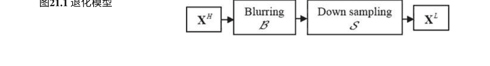

### 21.2.2 字典学习

字典学习已成功应用于图像处理中的许多问题[20, 37]，如图像恢复[38-40]，降噪[32, 34, 36]和增强[10, 39, 41]。在基于字典学习的图像重建中，图像通常被视为许多补丁的组合[10, 32, 38-40]，表示为 $\mathbf{X} = [\mathbf{x}_1, \mathbf{x}_2, \ldots, \mathbf{x}_N] \in \mathbb{R}^{k \times N}$。图像被近似为 $\mathbf{X} \approx \boldsymbol{\Phi}\mathbf{A}$，其中 $\mathbf{X}$ 是被近似的目标矩阵，$\boldsymbol{\Phi} = [\boldsymbol{\phi}_1, \boldsymbol{\phi}_2, \ldots, \boldsymbol{\phi}_K] \in \mathbb{R}^{k \times K}$ 表示具有 $K$ 个原子的投影字典，并且 $\mathbf{A} = [\boldsymbol{\alpha}_1, \boldsymbol{\alpha}_2, \ldots, \boldsymbol{\alpha}_N] \in \mathbb{R}^{K \times N}$ 是 $\mathbf{X}$ 的 $NK$ 维稀疏编码集，其中 $\|\mathbf{A}\|_0 \leq K$。通过表示方程（21.1）对于关于 $L$ 的稀疏重构的 $L$ 可以实现

$$\mathbf{X}^L \approx \boldsymbol{\Phi}^L \mathbf{A} = \mathcal{BS}(\boldsymbol{\Phi}^H\mathbf{A}), \tag{21.2}$$

其中 $\boldsymbol{\Phi}^L$ 和 $\boldsymbol{\Phi}^H$ 分别表示低分辨率字典和高分辨率字典。对于每个图像，通过求解获得稀疏分解

$$\min_{\mathbf{A}} \mathbf{X} = \boldsymbol{\Phi}\mathbf{A} \quad (\text{或} \|\mathbf{X}-\boldsymbol{\Phi}\mathbf{A}\|_p \leq \varepsilon), \tag{21.3}$$

其中 $\|\cdot\|_0$ 控制 $\mathbf{A}$ 中非零元素的数量，$\varepsilon$ 用于管理重构误差。如[42]所示，在 $l_0$ 范数和 $l_1$ 范数下，求解Eq. (21.3) 中的最小化问题是一个NP难问题，以获得近似最优解[43]。然后，通过最小化具有二次约束的最小二乘问题来完成估计，其拉格朗日乘子形式为

$$< \boldsymbol{\Phi}, \mathbf{A} > = \arg \min_{\boldsymbol{\Phi}, \mathbf{A}} \|\mathbf{X} - \boldsymbol{\Phi}\mathbf{A}\|_2^2 + \lambda \|\mathbf{A}\|_1, \tag{21.4}$$

其中 $\lambda$ 是一个正则化因子，用于权衡参数稀疏性和解的重建误差。

## 21.3 方法

提出的SiSCS方法基于联合学习的字典，使用源MRI模态的低分辨率版本计算目标MRI模态的高分辨率版本的估计。本文中的SR重建受到早期关于脑幻觉的工作的启发[11]，假设可以使用成对数据的字典在稀疏表示框架[26, 44]中从低分辨率输入中重建高分辨率图像。在这项工作中，我们将训练数据库中的图像划分为一组重叠的图像块。这些图像块同时在源空间和目标空间上构建，通过注册的源-目标图像对进行。我们提出了一种跨模态字典学习方法，强制计算联合稀疏编码。与原始数据一起工作不同，我们使用了成对的补丁，我们选择在梯度域中使用HF表示数据，因此稀疏编码在LR和HR两种模态之间促进了高相关性。简而言之，给定以矩阵形式表示的测试图像 $\mathbf{X}^{\prime}$（具有模态 $\mathcal{M}_{1}$），所提出的方法将通过基于补丁的全局冗余重建模型，从 $\mathbf{X}^{\prime}$ 合成具有模态 $\mathcal{M}_{2}$ 的SR图像 $\mathbf{Y}^{\prime}$，关于学习的跨模态字典对。SiSCS模型的整体框架如图21.2所示。

图21.2 SiSCS模型的示意图。第一步：特征收集。第二步：跨模态字典学习。第三步：全局冗余合成

### 21.3.1 数据描述

设 $\mathcal{X} = \{\mathbf{X}_1, \mathbf{X}_2, \dots, \mathbf{X}_m\}$ 为源域中模态 $\mathcal{M}_1$ 的 $m$ 训练图像，$\mathcal{Y} = \{\mathbf{Y}_1, \mathbf{Y}_2, \dots, \mathbf{Y}_m\}$ 为目标域中模态 $\mathcal{M}_2$ 的 $m$ 训练图像。我们将跨模态图像对表示为 $\{\mathbf{X}_i, \mathbf{Y}_i\}$，其中 $\mathbf{X}_i$ 和 $\mathbf{Y}_i$ 已经注册。在这项工作中，我们考虑低分辨率输入和高分辨率输出，并根据 $\mathcal{X}$ 中的高分辨率图像定义观察到的低分辨率对应物，如公式 (21.1) 所示。$\mathcal{X} = \{\mathbf{X}_1, \mathbf{X}_2, \dots, \mathbf{X}_m\}$ 然后更新为 $\mathcal{X}^L = \{\mathbf{X}_1^L, \mathbf{X}_2^L, \dots, \mathbf{X}_m^L\}$，并且跨模态图像对可以重写为 $\{\mathbf{X}_i^L, \mathbf{Y}_i\}$。在此之后，我们基于这些数据构建我们的算法。

### 21.3.2 梯度特征表示

基于HF边缘和纹理特征，构建了每对LR和HR图像之间的映射。从感知的角度来看，这种特征方案是合理的，因为人类对HF内容的变化更敏感[12]。已经表明，LR图像的HF特征表示可以被认为是预测HR图像的缺失HF分量最重要的特征[10]。这种特征表示方式还使得具有相同信息的配对数据的稀疏编码彼此靠近[12, 14, 26]。为了实现这一点，研究人员建议使用高通滤波器[14]。在这个背景下，我们定义一个特征运算符 $\mathscr{F}$ 来对LR图像集进行特征提取。为此，我们遵循[12]的方法，采用一阶和二阶梯度来表示每个LR图像 $\mathbf{X}_i^L$ 的特征。然后，导数被定义为[10,12]

$$f_1^1 = [-1, 0, 1], \quad f_1^2 = [-1, 0, 1]^T$$
$$f_2^1 = [-2, -1, 0, 1, 2], \quad f_2^2 = [-2, -1, 0, 1, 2]^T$$

其中每个LR图像都会产生四个涉及水平和垂直梯度的滤波图像，通过 $\mathscr{F} * \mathbf{X}^L$ 进行计算，其中 $*$ 表示卷积运算符，$\mathscr{F}$ 采用以下运算符之一的形式：$f$。然后我们将LR图像的特征表示为 $\mathbf{X}_i^F = \mathscr{F} * \mathbf{X}_i^L$。另一方面，对于HR图像集，我们通过直接去除相应的低频信息来捕捉它们的HF特征，这可以通过减去HR数据的均值来实现 $\mathbf{Y}_i$ [12]，即 $\mathbf{Y}_i^F = \mathbf{Y}_i - mean(\mathbf{Y}_i)$。此外，图像被视为补丁的集合，并表示为矩阵 $\mathbf{X} = [\mathbf{x}_1^L, \mathbf{x}_2^L, ..., \mathbf{x}_n^L]$ 和 $\mathbf{Y} = [\mathbf{y}_1, \mathbf{y}_2, ..., \mathbf{y}_n]$，并且相应的HF特征可以表示为 $\mathbf{X}^F = [\mathbf{x}_1^F, \mathbf{x}_2^F, ..., \mathbf{x}_n^F]$ 和 $\mathbf{Y}^F = [\mathbf{y}_1^F, \mathbf{y}_2^F, ..., \mathbf{y}_n^F]$ 在源域和目标域中分别。

### 21.3.3 跨模态字典学习

按照第二部分描述的字典学习过程，我们可以学习两个独立的字典[11]，分别针对源域和目标域：

$$\boldsymbol{\Phi}^X = \arg \min_{\boldsymbol{\Phi}^X, \mathbf{A}^X} \|\mathbf{X}^F - \boldsymbol{\Phi}^X \mathbf{A}^X\|_2^2 + \lambda \|\mathbf{A}^X\|_1,$$
$$\boldsymbol{\Phi}^Y = \arg \min_{\boldsymbol{\Phi}^Y, \mathbf{A}^Y} \|\mathbf{Y}^F - \boldsymbol{\Phi}^Y \mathbf{A}^Y\|_2^2 + \lambda \|\mathbf{A}^Y\|_1. \tag{21.5}$$

然而，这种策略耗时且导致两组独立的稀疏编码。为了解决类似的问题，Yang等人[10]探索了一种使用联合字典学习将LR数据的稀疏编码与相应的HR数据相关联的图像SR方法。这是通过将LR和HR补丁对映射到一个公共空间来实现的，以确保配对数据的稀疏编码具有相同的值。

基于这种方法，我们开发了一种跨模态字典学习算法，利用注册补丁对的特征来建立高度不相似的训练数据的映射关系。为了进行综合，应同时从涉及两种模态和分辨率的数据中训练字典对 $\Phi^{X}$ 和 $\Phi^{Y}$。为了做到这一点，我们首先捕捉两组HF特征，然后将它们投影到一个公共空间中以实现有效的相关性。一旦LR和HR补丁对被纳入特征空间，我们就可以进行联合字典学习。然而，这种策略未考虑到涉及特征空间中不一致强度尺度的不同模态。为了解决这个问题，我们引入了一个归一化函数，以便在相同范围内处理不同的特征。然后计算两个特征集的最大 $l_2$-范数值：

$$\sigma^{X} = \max \left\{ \left\| \mathbf{x}_i^{F} \right\|_2 \right\}, \quad \sigma^{Y} = \max \left\{ \left\| \mathbf{y}_i^{F} \right\|_2 \right\}. \qquad (21.6)$$

一旦获得了 $\sigma^{X}$ 和 $\sigma^{Y}$，我们将它们用于所有补丁特征的强度归一化，即

$$\hat{\mathbf{x}}_i^{F} = \frac{\mathbf{x}_i^{F}}{\sigma^{X}}, \quad \hat{\mathbf{y}}_i^{F} = \frac{\mathbf{y}_i^{F}}{\sigma^{Y}}. \qquad (21.7)$$

为了最大化两种模态中归一化特征对的相关性，我们将它们映射到一个共同的高维空间，并提出了一种跨模态字典学习方法，同时训练两个数据集的字典，导致

$$\begin{aligned} \underset{\Phi^{X}, \Phi^{Y}, \mathbf{A}}{\arg \min} \quad & \frac{1}{P} \left\| \hat{\mathbf{X}}^{F} - \Phi^{X} \mathbf{A} \right\|_2^2 + \frac{1}{Q} \left\| \hat{\mathbf{Y}}^{F} - \Phi^{Y} \mathbf{A} \right\|_2^2 \\ &+ \lambda \left( \frac{1}{P} + \frac{1}{Q} \right) \left\| \mathbf{A} \right\|_1 \quad \text{s.t.} \quad \left\| \Phi_i^{X} \right\|_2^2 \leq 1, \quad \left\| \Phi_i^{Y} \right\|_2^2 \leq 1, \end{aligned} \qquad (21.8)$$

其中 $\frac{1}{P}$ 和 $\frac{1}{Q}$ 是平衡两个误差项的正则化参数，而 $P$ 和 $Q$ 表示LR和HR补丁的大小。上述公式对于每个字典（或稀疏编码）都是凸的，假设另一个固定。

通过交替计算稀疏编码和字典对的更新来构建 $\Phi^{X}$ 和 $\Phi^{Y}$。我们在算法1中总结了我们的训练部分的SiSCS方法。

### 21.3.4 基于聚类的全局冗余码

一旦从方程 (21.8) 中获得 $\Phi^{X}$ 和 $\Phi^{Y}$，我们就通过稀疏表示 $\mathbf{X}^{t}$ 和 $\Phi^{X}$ 的归一化特征来重构测试图像 $\mathbf{X}^{t}$。这通过求解方程 (21.4) 来完成

$$\underset{\mathbf{A}^{t}}{\arg \min} \quad \left\| \hat{\mathbf{X}}^{t} - \Phi^{X} \mathbf{A}^{t} \right\|_2^2 + \lambda \left\| \mathbf{A}^{t} \right\|_1. \qquad (21.9)$$

其中，$\mathbf{X}^{l}$ 的每个补丁被视为其特征表示，并按照公式 (21.7) 进行归一化，关于 LR 和 $\mathcal{M}_1$ 模态，由 $\hat{\mathbf{X}}^l = \mathcal{F} * \mathbf{X}^l / \sigma^{\hat{\mathbf{X}}^l}$ 进行，$\mathbf{A}^l$ 表示 $\hat{\mathbf{X}}^l$ 的稀疏系数。估计的稀疏编码可以直接用于合成我们所需的模态 $\mathcal{M}_2$ 和 HR 的图像 $\mathbf{Y}^l$，通过字典 $\boldsymbol{\Phi}^y$ 中的元素的线性组合，即 $\mathbf{Y}^l = \boldsymbol{\Phi}^y \mathbf{A}^l$。

在[16, 33, 34]中成功地探索了非局部重建的整合。非局部重建方法认识到图像通常在图像领域中显示重复的模式，并且在每个位置上，局部纹理类似于其他位置上的局部纹理的加权组合[33]。然后我们假设存在与测试图像的第 $j$ 个补丁 $\mathbf{X}^j$ 相似的 $\mathbf{X}^l$ 和 $\mathbf{X}$ 中的补丁。

基于自身和交叉模态的相似补丁组被识别出来。然后，对每个目标补丁应用非局部均值（NL均值）[17, 33]来合成，该补丁被重建为所有相似补丁的加权平均。每个相邻补丁的权重与其与源图像中参考补丁的距离成反比[17]。在建立相似补丁集合的过程中，补丁相似性计算和全局搜索计算量大。为了加快计算参考补丁与训练数据库中每个补丁之间的距离，我们进行了两阶段搜索，首先排除明显不相似的补丁，然后进行局部搜索来优化。这种多级搜索对噪声更加鲁棒，并且还解决了搜索导致很少检索的问题，因为重复模式较少。第一级搜索使用源补丁的稀疏编码作为输入，基于欧氏距离进行 K 均值聚类（参见图21.3）。

令 $\boldsymbol{\Psi}$ 为从 $\hat{\mathbf{X}}^l$ 和 $\hat{\mathbf{X}}^F$ 收集的归一化HF特征的集合。然后，我们假设它们提供了 $s$ 观测值 $\{k_1, k_2, ..., k_s\}$ 导致 $s$ 系数 $\{\alpha_{k_1}, \alpha_{k_2}, ..., \alpha_{k_s}\}$。我们希望从中生成 $K$ 聚类 $\{\boldsymbol{\psi}_1, \boldsymbol{\psi}_2, ..., \boldsymbol{\psi}_K\}$。聚类计算如下

```
**算法1: SiSCS训练**

输入: 训练数据 X 和 Y, 参数 λ, μ, h, γ。

1. 通过方程 (21.1) 对 X 进行下采样和模糊处理, 得到 X^L。
2. 提取HF特征并将图像视为补丁: X^F, Y^F。
3. 通过公式 (21.7) 对补丁进行归一化。
4. 通过初始化, Φ^x_0, Φ^y_0, A_0。
5. 当未收敛时
   6. 通过公式 (21.8) 中的稀疏编码, 固定 Φ^x_i 和 Φ^y_i, 更新 A_{i+1}。
   7. 通过公式 (21.8) 中的字典学习, 使用 A_{i+1}, 更新 Φ^x_{i+1} 和 Φ^y_{i+1}。
8. 结束

输出: Φ^x, Φ^y。
```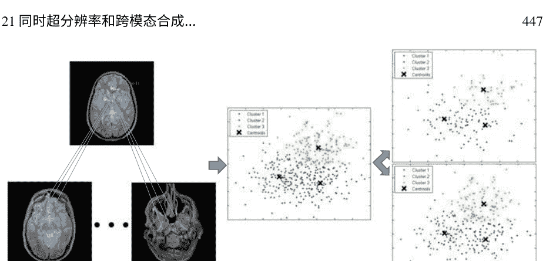

$$\arg \min_{\{\psi_c\}_{c=1}^K} \sum_{c=1}^{K} \sum_{\mathbf{k}_i \in \psi_c} \|\boldsymbol{\alpha}_{\mathbf{k}_i} - \boldsymbol{\delta}_c\|^2,\quad (21.10)$$
$$\boldsymbol{\delta}_c = \frac{1}{\psi_c} \sum_{\boldsymbol{\alpha}_{\mathbf{k}_i} \in \psi_c} \boldsymbol{\alpha}_{\mathbf{k}_i}.$$

其中$\boldsymbol{\delta}_c$是第$c$个聚类的均值向量$\{\psi_c\}_{c=1}^K$。我们从参考图像和训练集中汇集除了要合成的图像之外的补丁，这在参考图像异常或数据库较小的情况下具有特殊优势。通过对IXI数据库进行的实验，我们发现这在不到2.76%的受试者中使用。在这些情况下，非局部自相似性对交叉主体自相似性具有更强的影响。这种聚类产生了一个代表性的非局部均值补丁。我们通过加权平均与相应聚类$\psi_c$相关联的稀疏编码$\boldsymbol{\alpha}_{\mathbf{k}_i}$来估计测试图像的第$j$个补丁的稀疏编码$\hat{\boldsymbol{\alpha}}'_j$，即

$$\hat{\boldsymbol{\alpha}}'_j = \sum_{\boldsymbol{\alpha}_{\mathbf{k}_i} \in \psi_c} \Omega_{\hat{\boldsymbol{\alpha}}'_j, \boldsymbol{\alpha}_{\mathbf{k}_i}} \boldsymbol{\alpha}_{\mathbf{k}_i},\quad (21.11)$$

其中$\hat{\boldsymbol{\alpha}}'_j$是优化的稀疏编码，$\boldsymbol{\alpha}_{\mathbf{k}_i}$表示对应簇中$\mathbf{k}_i$的稀疏编码，$\Omega_{\hat{\boldsymbol{\alpha}}'_j, \boldsymbol{\alpha}_{\mathbf{k}_i}}$是计算相似度水平的权重，与$\hat{\boldsymbol{\alpha}}'_j$和$\boldsymbol{\alpha}_{\mathbf{k}_i}$之间的欧氏距离成反比，其中

$$\Omega_{\hat{\boldsymbol{\alpha}}'_j, \boldsymbol{\alpha}_{\mathbf{k}_i}} = \frac{1}{\mu} \exp \left\{ - \frac{\|\hat{\boldsymbol{\alpha}}'_j - \boldsymbol{\alpha}_{\mathbf{k}_i}\|_2^2}{h^2} \right\},\quad (21.12)$$

具有 $\Omega_{\hat{\boldsymbol{\alpha}}'_j, \boldsymbol{\alpha}_{\mathbf{k}_i}}$ 满足 $0 \leq \Omega_{\hat{\boldsymbol{\alpha}}'_j, \boldsymbol{\alpha}_{\mathbf{k}_i}} \leq 1$ 且 $\sum_{\mathbf{k}_i} \Omega_{\hat{\boldsymbol{\alpha}}'_j, \boldsymbol{\alpha}_{\mathbf{k}_i}} = 1$，$\mu$为归一化常数，$h$为标量。与NL means方法类似，具有更高相似度的系数在平均上将具有更大的权重（示例见图21.3）。簇内的向量 $\psi_c$ 不仅包含测试项，还包含训练组件。传统的非局部方法（例如NL means）无法表达MR图像中的复杂结构。在这种情况下，我们的全局冗余方法可以有效适应不同的结构。因此，满足与Eq.(21.11)相补充功能的局部稀疏表示模型（见Eq.(21.9)）将被修改为

$$\arg \min_{A'} \left\| \hat{X}^t - \Phi^X A' \right\|_2^2 + \lambda \left\| A' \right\|_1 + \gamma \left\| A' - \hat{A}^t \right\|_2^2, \quad (21.13)$$

其中 $\gamma$是可调的正则化参数。最后，我们通过 $Y' = \Phi^Y A'$ 来更新合成图像。与大多数超分辨率方法[6, 10]一样，首先通过提取每个补丁的特征来保留LR测试图像中除了HF分量之外的内容，然后将减去的均值值添加回重建的SR版本中。考虑到领域特定信息，我们使用提出的全局冗余信息来替换测试图像的每个补丁的原始均值值。然后，我们通过将伪均值值添加到获得的HF分量中生成目标图像。交叉模态合成的伪代码如算法2所示。

**算法2: SiSCS 合成**
输入: 测试图像 $X^t$, 字典对 $\Phi^X$, $\Phi^Y$.
1. 提取特征，划分补丁并进行归一化: $\hat{X}^t$.
2. 初始化 $A_0^t$.
3. 当未收敛时
4.     通过公式 (21.9) 更新 $A_i^{t+1}$.
5.     通过公式 (21.10) 执行聚类。
6.     使用公式 (21.13) 更新 $A_i^{t+1}$。
7. 结束
8. 计算 $Y_{i+1}^t \leftarrow \Phi^Y A_{i+1}^t$.
输出: 合成图像 $Y^t$.

## 21.4 实验

为了评估所提方法的性能，考虑了两种情况:

+   (1) MR图像超分辨率；
+   (2) 同时进行SR和跨模态合成。

实验使用了两个数据集：IXI（包括来自健康受试者的T1-w、T2-w和PD-w图像）和NAMIC（包括19个128 ×128×q 受试者，其中十个是正常对照组，九个是精神分裂症患者）。在我们的实验中，我们采用了留一法交叉验证，即从整个数据集中删除测试图像并学习剩余图像。对于实验设置，我们首先将每个3D体积切片作为2D堆栈，然后将2D切片视为5×5像素大小的多个补丁。我们随机采样了10万个补丁对来训练跨模态字典对。正则化参数 $h$, $\gamma$分别设置为16和0.1。我们考虑了字典大小和稀疏正则化参数的因素，并根据第21.4.1节和第21.4.2节的定量分析将字典大小固定为1024，$\lambda =0.15$。K-means的参数 $K$ 被固定为10，以确保每个聚类有足够的候选项。最后，我们采用广泛使用的峰值信噪比（PSNR）以分贝（dB）和结构相似性指数（SSIM）[45]来说明不同方法的有效性。PSNR用于衡量有损压缩编解码器的重建的定量评估，其定义为

$$PSNR(s, t) = 10 \log_{10}\left(\frac{\text{MAX}^2mn}{\sum_i^m\sum_j^n[s(i, j) - t(i, j)]^2}\right),\quad (21.14)$$

其中MAX表示最大像素值，m和n是合成图像和其真实图像的尺寸，s(i,j)和t(i,j)分别表示s和t在位置i和j处的像素。SSIM是用于测量感知视觉图像质量的度量标准[45]。SSIM的计算公式如下：

$$SSIM(s, t) = \frac{(2\mu_s\mu_t + c_1)(2\sigma_{st} + c_2)}{(\mu_s^2+\mu_t^2+c_1)(\sigma_s^2+\sigma_t^2+c_2)},\quad (21.15)$$

其中$\mu_s$和$\mu_t$分别是s和t的均值；$\sigma_s$和$\sigma_t$是它们的标准差；$\sigma_{st}$是s和t的协方差；$c_1=(k_1L)^2$和$c_2=(k_2L)^2$，其中L是图像的强度动态范围，$k_1=0.01$，$k_2=0.03$ [45]。

### 21.4.1 字典大小

更大的字典可以在更多计算的代价下提高准确性。在这个实验中，我们随机选择了10个PD-w受试者来测试四种不同字典大小（即256、512、1024和2048）对SR和同时SR和跨模态合成（PD-w→T2-w）的影响。表21.1列出了不同大小字典训练的相关时间，以及使用不同字典进行图像重建的平均PSNR和SSIM。从表21.1可以看出，更大的字典在更高的PSNR和SSIM下有更好的估计效果。

### 表21.1 字典大小对SR重建和同时超分辨率和跨模态合成的影响

|            | 字典大小 | 256   | 512   | 1024  | 2048  |
|------------|----------|-------|-------|-------|-------|
| 成本       | (min)    | 8.51  | 12.96 | 18.68 | 28.77 |
| SR         | PSNR(分贝) | 45.29 | 45.35 | 45.43 | 45.62 |
|            | 结构相似性指数 | 0.9865 | 0.9867 | 0.9867 | 0.9872 |
| SiSCS      | PSNR(分贝) | 39.54 | 39.55 | 39.57 | 40.00 |
|            | 结构相似性指数 | 0.8995 | 0.8995 | 0.8996 | 0.8997 |

计算成本。我们选择了大小为1024的尺寸，以在可接受的计算时间内获得良好的图像质量。

### 21.4.2 稀疏性

在方程式（21.4）中，$\lambda$在稀疏表示中起着重要作用，用于控制结果的稀疏性。根据经验，$\lambda$适用于0到0.85的范围，以保持模型的稳定性。在本节中，我们通过定量测量重建图像的PSNR和SSIM来评估$\lambda$对结果的影响。为了评估这一点，我们使用了在第21.4.1节中报告的相同测试数据，并将字典大小固定为1024。实验结果列在表21.2中。如图所示，$\lambda\in[0.15, 0.45]$的结果表现更好，特别是当$\lambda=0.15$时，两种情况下的结果在所有重建中获得了最高的PSNR和SSIM。为了全面分析我们算法的最适合稀疏度值，我们计算了$\lambda\in[0.10, 0.85]$的耗时，并在表21.2中展示了结果。随着$\lambda$的增加，计算成本减少，重建质量下降。因此，我们选择了较小的$\lambda$以获得更好的结果，而不是更大的值。我们最终选择了稀疏参数为0.15。

### 表21.2 SR和同时超分辨率和跨模态合成的误差测量，对于不同的稀疏度值

|            | $\lambda$ | 0.10  | 0.15  | 0.25  | 0.35  | 0.45  | 0.55  | 0.65  | 0.75  | 0.85  |
|------------|--------|-------|-------|-------|-------|-------|-------|-------|-------|-------|
| 成本       | (min)  | 12.55 | 11.06 | 10.97 | 10.34 | 9.17  | 8.13  | 8.10  | 8.02  | 8.25  |
| SR         | 峰值信噪比(dB) | 47.41 | 49.85 | 49.80 | 46.47 | 40.82 | 36.93 | 36.92 | 36.90 | 36.90 |
|            | 结构相似性指数 | 0.9935 | 0.9962 | 0.9960 | 0.9932 | 0.9831 | 0.9429 | 0.9429 | 0.9428 | 0.9428 |
| SiSCS      | 峰值信噪比(dB) | 39.36 | 39.39 | 39.32 | 37.62 | 35.46 | 34.95 | 34.95 | 34.94 | 34.93 |
|            | 结构相似性指数 | 0.9066 | 0.9077 | 0.9076 | 0.9055 | 0.8667 | 0.8500 | 0.8500 | 0.8499 | 0.8498 |

### 21.4.3 MRI超分辨率

首先，我们评估了基于聚类的全局冗余框架在IXI数据集的所有PD-w受试者的MR图像SR上的性能。通常，LR图像可以通过首先使用标准差为1.6的2D高斯核对HR图像进行模糊处理，然后在水平和垂直方向上将模糊图像进行2倍缩放来生成。为了确保每个提取的LR-HR补丁对之间的一对一对应关系，我们进一步使用双三次插值将LR图像上采样2倍（使SR问题更具挑战性），然后从中提取补丁。这确保了来自两个域的相同位置的采样指示相同的组织信息。基于提取的补丁对，我们可以训练相应的字典。最后，我们输入测试图像的LR对应图像，通过提议的模型进行重建，缩放因子为2。为了展示我们方法的性能，我们将结果与以下方法进行了比较：最近邻插值（nearest），双三次插值（Bi-cubic），非局部MRI上采样（NLM）[17]和脑MRI的单图像SR（SSR）[13]。对于所有实验，我们调整了每种方法的特性参数，并通过PSNR和SSIM在整体记录中展示了它们的最佳结果。

图21.4展示了基于不同方法的SR重建PD-w切片之间的比较。顶部行显示了一个主题的SR结果的轴向视图。在第二行和第三行，我们放大了两个特定区域以进行更好的可视化。最后一行提供了每种列出方法的PSNR和SSIM。所提出的方法优于所有其他方法，显示出最高的PSNR和SSIM。尽管NLM产生了一个噪声低于双三次插值的更清晰的图像，但其效果与双三次插值几乎相同。图21.5提供了IXI数据集中所有PD-w主题的定量结果。与其他方法相比，我们的方法实现了最高的PSNR和SSIM。

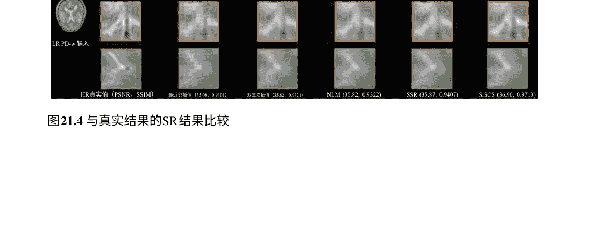

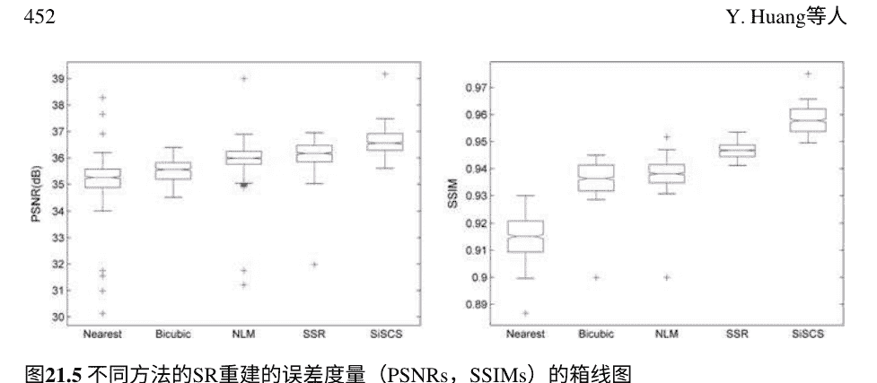

图21.5 不同方法的SR重建的误差度量（PSNRs，SSIMs）的箱线图

### 21.4.4 同时超分辨率和跨模态合成

然后，我们通过在IXI和NAMIC数据集上评估我们的SiSCS模型来解决同时超分辨率和跨模态合成的问题。首先，我们使用IXI的PD-w和T2-w受试者，考虑从同一受试者获取的LR PD-w采集来合成HR T2-w图像，反之亦然。其次，基于预处理数据（即进行颅骨剥离和偏差校正³）从LR PD-w输入生成HR T2-w图像，反之亦然。第三，我们考虑基于T2-w输入生成T1-w图像，反之亦然。我们在IXI数据集上进行了前两组实验，而第三组实验则在NAMIC数据集上进行。我们使用了代表性和最先进的合成方法，包括MR图像基于示例的对比度合成（MIMECS）[26]方法，Vemula-palli的有监督方法（V-s）[46]和Vemulapalli的无监督方法（V-us）[46]，与我们的SiSCS进行比较。然而，Vemulapalli的方法受限于在NAMIC数据集中使用的单一跨模态合成。因此，所有Vemulapalli的方法都使用原始数据（未经降级处理）。所有现有的合成方法都必须先对数据进行预处理。在我们的算法中，这种预处理是不必要的，并且可以互换，这在第一组实验中可以验证。执行预处理的好处在于减少非期望组织区域（如颅骨）的干扰。然而，这些过程也会带来问题，例如由于不精确的颅骨剥离而导致组织对比度不足。

对于前两组实验，我们评估了我们的算法，并与MIMECS进行了比较，同时在图21.6中显示结果以供视觉检查。对于每个场景，我们在PD-w和T2-w主题的IXI上应用了提出的方法，并在图21.8中报告了定量结果。我们的算法在整个数据集上表现一致，几乎对所有主题都达到了最佳性能。

³根据[28, 46]的方法，所有实验数据都进行了头骨剥离、线性配准和/或非均匀性校正。

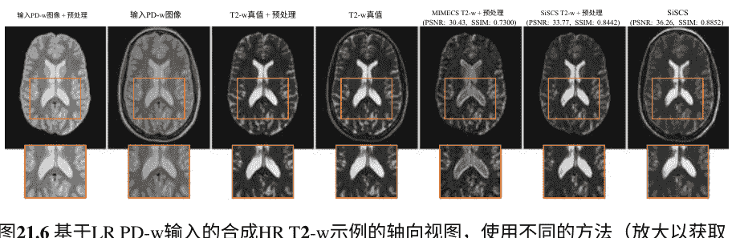

图21.6 基于LR PD-w输入的合成HR T2-w示例的轴向视图，使用不同的方法（放大以获取详细信息）

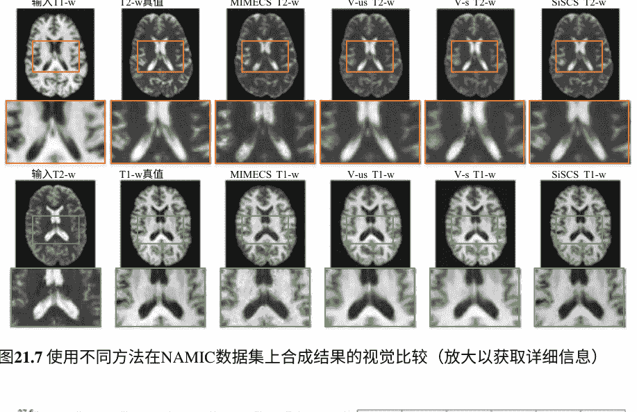

图21.7 使用不同方法在NAMIC数据集上合成结果的视觉比较（放大以获取详细信息）

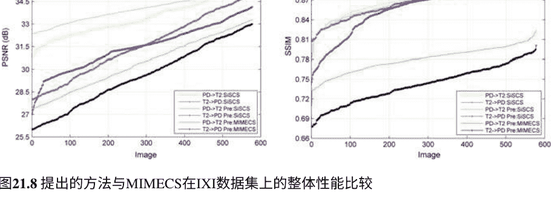

图21.8 提出的方法与MIMECS在IXI数据集上的整体性能比较

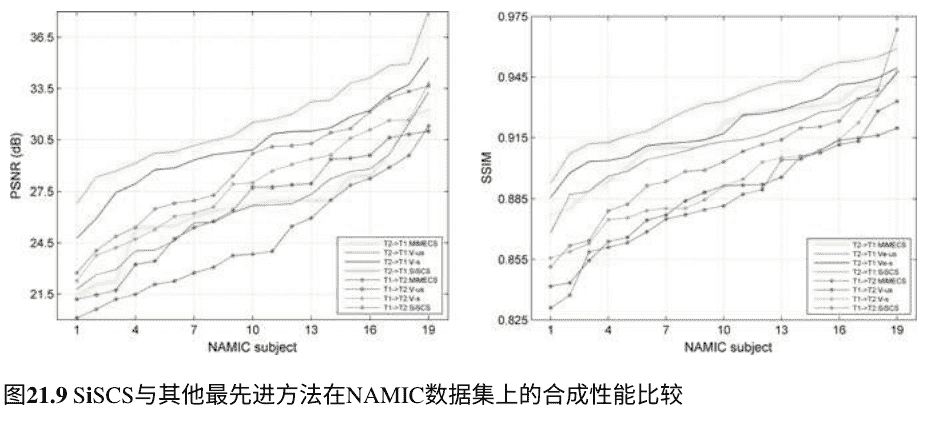

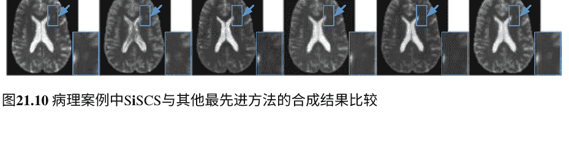

在第三种情况下，我们评估了SiSCS和相关方法，使我们能够全面比较所提出方法在健康和病理情况下与最近发表的算法的性能。SiSCS相对于其他方法的优势在图21.7中显示，并且还提供了所选部分的放大视图以获得更好的可视化效果。图21.9给出了整体性能比较。从图21.9可以看出，SiSCS始终优于MIMECS和Vemulapalli的方法。这证明了我们同时进行SR和跨模态技术的有效性。

以下实验展示了精神分裂症患者的合成图像[47]。我们在两种不同的学习场景中进行了同时进行SR和合成：a) 基于健康受试者的字典学习（表示为SiSCS-H），以及b) 基于健康和精神分裂症受试者的字典学习（表示为SiSCS）。在这两种情况下，我们仅报告与精神分裂症相关的合成结果。图21.10展示了一个示例患者的各种合成方法的视觉结果。表21.3总结了对九个精神分裂症受试者的关键定量性能指标。视觉和定量结果都表明，与早期方法相比，我们的方法提供了最佳结果。我们的实验还表明，SiSCS-H的性能不及在控制组和病理组上训练并使用交叉验证的SiSCS。

### 表21.3 九个病理病例图像合成的平均评估指标

| 案例 | MIMECS | V-us | V-s | SiSCS-H | SiSCS |
|---|---|---|---|---|---|
| T1->T2 | PSNR (分贝) | 22.95 | 23.87 | 26.69 | 24.86 | 27.03 |
|  | 结构相似性指数 | 0.8698 | 0.8701 | 0.8895 | 0.8712 | 0.8912 |
| T2->T1 | PSNR (分贝) | 27.38 | 27.47 | 29.12 | 27.91 | 30.01 |
|  | 结构相似性指数 | 0.9000 | 0.9002 | 0.9087 | 0.9003 | 0.9177 |

## 21.5 结论

我们提出了一种新颖的方法，用于脑MRI的同时超分辨率和跨模态合成（SiSCS）。SiSCS首先在高频空间中学习跨模态字典。然后，SiSCS使用基于补丁的跨模态估计模型和非局部稀疏图像表示重建目标图像。

我们在健康和精神分裂症患者中进行了广泛的实验评估。在PSNR和SSIM指标上的实验表明，SiSCS在超分辨率和联合超分辨率和跨模态合成方面优于其他三种主要技术。实验结果显示，在超分辨率和联合超分辨率和跨模态合成方面，SiSCS始终表现出色。在我们的实验中，我们发现合成精神分裂症图像的字典学习需要包含病理数据集。

## 参考文献

1.  王, Z., Lemmon, M. (2015). 弱农村电气化微电网的稳定性分析，采用droop控制的旋转和电子分布式发电机. 在: 电力和能源学会年会. IEEE, 第1-5页.
2.  Lehmann, T. M., Gonner, C., Spitzer, K. (1999). 调查：医学图像中的插值方法处理. IEEE Trans on Med Imaging, 18(11).
3.  Grevera, G. J., Udupa, J. K. (1998). 三维图像插值方法的客观比较. IEEE Trans Med Imaging, 17(4): 642-652.
4.  Herman, G. T., Rowland, S. W., Yau, M. M. (1979). 线性和修改的立方样条插值的比较研究，用于图像重建. IEEE Trans Nuclear Sci, 26(2): 2879-2894.
5.  Stytz, M. R., Parrott, R. W. (1993). 使用克里金法进行三维医学成像. 计算机医学成像图形, 17(6): 421-442.
6.  Van Ouwerkerk, J. D. (2006). 图像超分辨率调查. 图像可视化计算, 24(10): 1039-1052.
7.  Ongie, G., Jacob, M. (2015). 使用群组稀疏高阶total variation恢复不连续信号. IEEE信号处理通信, 22(9): 1414-1418.
8.  Greenspan, H., Oz, G., Kiryati, N., Peled, S. (2002). 使用超分辨率的MRI切片重建. 磁共振成像, 20(5): 437-446.
9.  Shi, F., Cheng, J., Wang, L., Yap, P. T., Shen, D. (2015). LRTV: 低秩和总变差正则化的MR图像超分辨率. IEEE医学成像传感器, 34(12): 2459-2466.

# 索引

## A
- 腹部CT, 43, 44, 46, 56, 63, 70, 82-84, 212, 285
- 腹部器官, 3
- 异常, 70, 139, 140, 348, 413
- 对抗攻击, 69, 72, 80, 88, 89
- 对抗训练, 74, 86-88, 96, 99
- 注意力, 219, 220, 300, 332, 333, 348, 350, 371, 394-397, 399, 400, 402, 404, 410
- 注意力缺陷多动障碍(ADHD), 347-349, 351-354, 356-358, 360

## B
- 基准, 255, 313, 378, 388, 402
- 边界框, 43, 44, 48, 57, 60, 62, 71, 73, 140-143, 145, 146, 150-154, 158, 167-169, 173, 208, 210, 243-245, 253, 371, 377, 378, 383, 384, 413, 415, 417, 419, 423
- 脑连接性, 348
- 乳腺病变, 166, 176, 208, 209

## C
- 胸部X射线, 140-142, 144, 158, 183, 262, 370-373, 377, 378, 384, 388, 393-396, 398, 402
- 聚类, 35, 165, 166, 173-175, 414, 427, 428, 437, 440, 446, 447
- 粗到细, 69, 71, 73, 74, 76, 77, 82-86, 89
- 计算机断层扫描(CT), 4, 70, 180, 200, 207, 262, 278, 414
- 计算机断层扫描灌注(CTP), 261-265, 268, 269, 272, 273
- 计算机辅助检测(CADe), 396
- 计算机辅助诊断(CAD), 4, 70, 164, 219, 239, 370, 394
- 基于内容的图像检索(CBIR), 219, 220
- 卷积神经网络(CNNs), 3, 23, 24, 31, 69, 72, 121, 181, 200, 239, 240, 299, 350, 371, 414
- 跨模态, 93, 96-99, 101, 102, 104, 105, 113, 437-443, 445, 448-450, 452, 454, 455

## D
- 深度哈希, 219-222, 225, 226, 229-231, 234, 235
- 深度学习, 29, 31, 33-35, 37, 39, 119, 121, 126, 131, 134, 135, 219-221, 230, 263-266, 268, 308, 323-326, 347-349, 414
- 数字乳腺断层摄影(DBT), 199, 200, 207-209, 211, 215
- 疾病定位, 141, 152-157, 370-373, 377, 381, 383, 384
- 领域适应, 93-97, 99-102, 104-112

## F
- 特征对齐, 93, 96
- 特征嵌入, 414, 415
- 功能性磁共振成像(fMRI), 347-353, 356, 357, 359, 360, 362, 363
- 眼底图像, 119, 120, 122, 123, 125–129, 131, 132, 134, 135

## G
- 生成对抗网络(GANs), 96, 106, 107, 109, 278, 362
- 青光眼检测, 119, 121, 128

## H
- 组织病理学图像分析, 219, 220

## I
- 图像分类, 31, 33, 35, 37, 121, 181, 234, 264, 304, 325, 370–373, 378, 380, 394, 396, 397, 400, 402–404, 407–409
- 图像去噪, 265, 266, 273, 278–280, 293, 294
- 图像特征, 132, 140, 142, 221, 244, 300, 370, 378, 394, 401, 410, 414, 437
- 图像质量评估, 300, 301
- 图像配准, 323–329, 333, 335–337, 343
- 图像恢复, 261, 263–266, 279, 442
- 图像分割, 13, 24, 25, 29, 69, 72–74, 122, 325, 370
- 图像超分辨率, 263, 265, 266, 279, 437, 438
- 图像合成, 439, 440, 455
- 图像对图像, 93, 94, 96, 106, 179, 181–183, 190
- 炎性肌病, 23, 229

## J
- 联合优化, 43, 54, 55, 59, 60

## L
- 地标检测, 180, 181, 186, 187, 193, 343
- 大规模, 4, 120, 141, 142, 182, 183, 202, 215, 220, 222–224, 235, 300, 370, 371, 389, 393, 394, 396, 407, 413, 414, 416, 430
- 左心室(LV), 101, 299, 310
- 肝肿瘤, 199, 207
- 纵向, 179, 240, 241, 324, 438
- 长短期记忆(LSTM), 13, 24, 199, 202, 396, 400, 402–404
- 肺部疾病, 369, 370, 375

## M
- 磁共振成像(MRI), 3, 4, 24, 70, 96, 97, 101, 102, 104, 105, 163, 166, 167, 175, 176, 180, 299, 301–303, 310, 347, 437–442, 455
- 手动注释, 305, 310, 414, 432
- 医学图像分析, 19, 70, 72, 79, 165, 167, 199, 301, 319, 370, 414
- 基于模型, 240, 241, 246, 247, 253, 257, 258
- 多标签, 119, 121–125, 130, 135, 142, 222, 370–373, 378–383, 387, 388, 401, 407, 410
- 多模态, 101, 437, 438

## N
- 自然语言处理(NLP), 370–373, 384, 396, 397
- 神经影像学, 347, 439

## P
- 胰腺分割, 3–7, 12, 13, 15–19, 50, 51, 55, 63, 64, 70, 71, 73, 80–83, 85, 86, 370
- 基于补丁的, 23, 269, 437, 440, 443, 455
- 病理图像分析, 23, 24, 31, 32, 222
- 个性化数据, 239, 242
- 图片存档和通信系统(PACS), 369, 373, 394, 396, 413, 414, 417, 420, 430
- 概率图, 7, 9, 13, 15–17, 32, 43, 45, 52, 54, 55, 61, 119, 122, 123, 129, 179, 181, 182, 184–187, 193, 194, 336

## R
- 辐射剂量, 261–264, 269, 273, 277, 278
- 放射学图像, 3, 4, 19, 139, 388, 413, 430
- 循环神经网络(RNN), 3, 8, 12–14, 23, 25, 40, 394, 400, 401, 407
- 强化学习, 163, 165, 167, 171–176, 212
- 报告生成, 389, 396, 397, 402, 410

## S
- 筛查, 3, 24, 120, 122, 125–128, 132–135, 164, 175, 348, 369
- 小器官, 43, 44, 46, 47, 50, 56, 89

## T
- 胸部疾病, 140, 158, 370, 372, 373, 378, 381, 388
- 肿瘤生长预测, 247, 253, 255, 256, 258

## V
- 椎骨标记, 179
- 体积图像, 8, 200

## W
- 弱监督, 370–373, 378, 383, 388

1.  Yang J, Wright J, Huang TS, Ma Y (2010) 通过稀疏表示进行图像超分辨率. IEEE Trans Image Process 19(11): 2861–2873
2.  Rousseau F (2008) 脑幻觉. In: European Conference on Computer Vision. Springer, Berlin, pp 497–508
3.  Chang H, Yeung DY, Xiong Y (2004) 通过邻居嵌入进行超分辨率. In: 2004 IEEE Computer Society Conference on Computer Vision and Pattern Recognition. CVPR 2004, vol 1. IEEE, pp I–I
4.  Rueda A, Malpica N, Romero E (2013) 使用过完备字典的单图像超分辨率脑MR图像. Med Image Anal 17(1):113–132
5.  Freeman WT, Pasztor EC, Carmichael OT (2000) 学习低级视觉. Int J Comput Vis 40(1):25–47
6.  Sun J, Zheng NN, Tao H, Shum HY (2003) 使用原始草图先验进行图像幻觉. In: 2003 IEEE Computer Society Conference on Computer Vision and Pattern Recognition, vol 2. IEEE, pp II–729
7.  Manjón JV, Carbonell-Caballero J, Lull JJ, García-Martí G, Martí-Bonmatí L, Robles M (2008) MRI去噪声使用非局部均值. Med Image Anal 12(4):514–523
8.  Manjón JV, Coupé P, Buades A, Fonov V, Collins DL, Robles M (2010) 非局部MRI上采样. Med Image Anal 14(6):784–792
9.  Huang Y, Shao L, Frangi AF (2017) 使用弱监督联合卷积稀疏编码的3D医学图像同时超分辨率和跨模态合成. arXiv:1705.02596
10. Huang Y, Beltrachini L, Shao L, Frangi AF (2016) 几何正则化的联合字典学习用于磁共振成像中的跨模态图像合成. In: International Workshop on Biomedical Image Simulation and Synthesis. Springer, Cham, pp 118–126
11. Huang Y, Shao L, Frangi AF (2018) 通过弱耦合和几何共正则化的联合字典学习进行跨模态图像合成. IEEE Trans Med Imaging 37(3):815–821
12. Bogunovic H, Pozo JM, Villa-Uriol MC, Majoie CB, van den Berg R, Gratama van Andel HA, Macho JM, Blasco J, San Román L, Frangi AF (2011) 使用测地活动区域在3DRA和TOF-MRA中自动分割脑血管病变: 评估研究. Med Phys 38(1):210–222
13. Nyúl LG, Udupa JK, Zhang X (2000) MRI标度标准化方法的新变体. IEEE Trans Med Imaging 19(2):143–150
14. Christensen JD (2003) 使用直方图偶数阶导数分析对脑磁共振图像进行标准化. Magn Reson Imaging 21(7):817–820
15. Robitaille N, Mouiha A, Crepeault B, Valdivia F, Duchesne S (2012) 基于组织的MRI强度标准化: 应用于多中心数据集. J Biomed Imaging 2012:425
16. Shinohara RT, Sweeney EM, Goldsmith J, Shiee N, Mateen FJ, Calabresi PA, Jarso S, Pham DL, Reich DS, Crainiceanu CM, Alzheimer's Disease Neuroimaging Initiative (2014) 磁共振成像的统计标准化技术. NeuroImage: Clin 6:9–19
17. Roy S, Carass A, Prince JL (2013) 基于磁共振图像的对比度合成示例. IEEE Trans Med Imaging 32(12):2348–2363
18. Thaipanich T, Oh BT, Wu PH, Xu D, Kuo CCJ (2010) 自适应非局部均值(ANL-means)算法改进的图像去噪. IEEE Trans Consum Electron 56(4)
19. Ye DH, Zikic D, Glocker B, Criminisi A, Konukoglu E (2013) 模态传播: 基于数据驱动的正则化的主题特定扫描的一致合成. In: International Conference on Medical Image Computing and Computer-Assisted Intervention. Springer, Berlin, pp 606–613
20. Burgos N, Cardoso MJ, Thielemans K, Modat M, Pedemonte S, Dickson J, Barnes A, Ahmed R, Mahoney CJ, Schott JM, Duncan JS (2014) PET-MR混合扫描的衰减校正合成: 应用于脑研究. IEEE Trans Med Imaging 33(12):2332–2341
21. Van Nguyen H, Zhou K, Vemulapalli R (2015) 使用高效的位置敏感深度网络进行医学图像的跨领域合成. In: International Conference on Medical Image Computing and Computer-Assisted Intervention. Springer, Cham, pp 677–684
22. Jog A, Carass A, Roy S, Pham DL, Prince JL (2017) 随机森林回归用于磁共振图像合成. Med Image Anal 35:475–488
23. Elad M, Aharon M (2006) 通过学习的字典进行图像去噪. IEEE Trans Image Process 15(12):3736–3745
24. Buades A, Coll B, Morel JM (2010) 图像去噪方法: 一种新的非局部原则.
25. Dong W, Zhang L, Shi G, Li X (2013) 非局部集中稀疏表示用于图像恢复. IEEE Trans Image Process 22(4):1620–1630
26. Zhu F, Shao L, Lin M (2013) 使用局部相似性随机森林和传感器融合的多视角动作识别. Pattern Recognit Lett 34(1):20–24
27. Yan R, Shao L, Cvetković SD, Klijn J (2012) 基于预分类和不变块匹配的改进非局部均值方法. J Display Technol 8(4):212–218
28. Huang Y, Zhu F, Shao L, Frangi AF (2016) 基于RGB-D图像的跨域学习的彩色物体识别. In: 2016 IEEE International Conference on Robotics and Automation (ICRA). IEEE, pp 1672–1677
29. Mairal J, Elad M, Sapiro G (2008) 用于彩色图像恢复的稀疏表示. IEEE Trans Image Process 17(1):53–69
30. Shao L, Gao X, Li H (2014) 图像恢复和增强: 最新进展和应用. Signal Process 103:1–5
31. Aharon M, Elad M, Bruckstein A (2006) K-SVD: 一种用于设计过完备字典的算法. IEEE Trans Signal Process 54(11):4311
32. Frangi AF, Niessen WJ, Vincken KL, Viergever MA (1998) 多尺度血管增强滤波. In: International Conference on Medical Image Computing and Computer-Assisted Intervention. Springer, Berlin, pp 130–137
33. Davis G, Mallat S, Avellaneda M (1997) 自适应贪婪逼近. Constr Approx 13(1):57–98
34. Chen SS, Donoho DL, Saunders MA (2001) 基于追踪的原子分解. SIAM Rev 43(1):129–159
35. Kainz B, Steinberger M, Wein W, Kuklisova-Murgasova M, Malamateniou C, Keraudren K, Torsney-Weir T, Rutherford M, Aljabar P, Hajnal JV, Rueckert D (2015) 从运动受损的2D切片堆栈中快速体积重建. IEEE Trans Med Imaging 34(9):1901–1913
36. Wang Z, Bovik AC, Sheikh HR, Simoncelli EP (2004) 图像质量评估: 从误差可见性到结构相似性. IEEE Trans Image Process 13(4):600–612
37. Vemulapalli R, Van Nguyen H, Zhou KS (2015) 无监督的跨模态合成特定主题的扫描. In: Proceedings of the IEEE International Conference on Computer Vision, pp 6309–638
38. Shenton ME, Dickey CC, Frumin M, McCarley RW (2001) 对精神分裂症的MRI结果的回顾. Schizophr Res 49(1-2):1–52