# 面向医疗决策支持系统的深度学习


+   - Utku Kose
- Omer Deperlioglu
- Jafar Alzubi
- Bogdan Patrut

# 计算智能研究
## 第909卷

系列编辑

Janusz Kacprzyk, 波兰科学院, 华沙, 波兰

该系列“计算智能研究”(SCI)迅速且高质量地出版计算智能各个领域的新发展和进步。 目的是涵盖计算智能的理论、应用和设计方法，以及工程、计算机科学、物理学和生命科学等领域中嵌入的方法论。 该系列包含神经网络、连接主义系统、遗传算法、进化计算、人工智能、细胞自动机、自组织系统、软计算、模糊系统和混合智能系统等计算智能领域的专著、讲义和编辑卷。 对于投稿者和读者来说，短时间的出版周期和全球范围的分发都具有特别的价值，这使得研究成果能够广泛而迅速地传播。

该系列的书籍已提交到Web of Science、EI-Compendex、DBLP、SCOPUS、Google Scholar和Springerlink进行索引。

有关该系列的更多信息，请访问http://www.springer.com/series/7092

Utku Kose · Omer Deperlioglu · Jafar Alzubi · Bogdan Patrut

# 医学决策支持系统的深度学习


Utku Kose
计算机工程系
土耳其伊斯帕尔塔
Süleyman Demirel大学

Omer Deperlioglu
计算机技术系
Afyon Kocatepe大学
Afyonkarahisar, 土耳其

Jafar Alzubi
工程学院
阿尔巴尔卡应用大学
阿尔盐, 约旦

Bogdan Patrut
计算机科学学院
亚历山大・约安・库萨大学
雅西, 罗马尼亚

ISSN 1860-949X
计算智能研究
ISBN 978-981-15-6324-9
https://doi.org/10.1007/978-981-15-6325-6

ISSN 1860-9503 (电子版)
ISBN 978-981-15-6325-6 (电子书)

©编辑 (如适用) 和作者，独家许可给 Springer Nature Singapore Pte Ltd. 2021
本作品受版权保护。 出版商独家许可所有权利，无论是整体还是部分材料，特别是翻译、再版、重用插图、朗读、广播、微缩胶片复制或以任何其他物理方式复制，以及传输或信息存储和检索、电子适应、计算机软件，或通过类似或不同的已知或今后开发的方法。
本出版物中使用的一般描述性名称、注册名称、商标、服务标志等，并不意味著，即使在没有具体声明的情况下，这些名称不受相关保护法律和法规的约束，因此可以自由使用。

出版商、作者和编辑可以安全地假设本书中的建议和信息在出版日期时被认为是真实和准确的。 出版商、作者或编辑对本书中所包含的材料不提供任何明示或暗示的保证，也不对可能存在的任何错误或遗漏负责。 出版商在已发表的地图和机构附属关系方面保持中立。

这个Springer印记由注册公司Springer Nature Singapore Pte Ltd.出版。
注册公司地址是：152 Beach Road, #21-01/04 Gateway East, Singapore 189721, Singapore

## Deepak Gupta博士的前言

人工智能从工程角度来看，是设计和开发灵活且稳健的解决方案的一种方法，可以广泛应用于现实世界相关的问题。随着许多引人注目的技术（如计算机、通信和电子技术）的发展，人工智能领域的输出已经在二十一世纪初出现在不同的领域。现在，人工智能的使用正在成为人们日常生活中广泛使用的常见事物。这是因为创新设备在全球范围内的使用、更多的信息使用、更改和变化的需求的增加导致了巨大的增长。顺便说一下，基于人工智能的方法和技术在自动决策方面的有效优势已经引起研究人员的长期关注，甚至可以追溯到人工智能的起始时期。看起来，决策支持将成为未来基于人工智能的系统中最关键的角色之一，因为更多的数字数据需要自动化的分析和评估阶段，而这可能需要时间，并且对人类来说可能非常困难，甚至没有错误。因此，我们可以看到决策支持系统在自然科学和社会科学中都有积极的应用，而医学领域也是其中之一，因为它包括在症状分析、诊断和治疗过程中的决策阶段。

能为这本书记写一篇前言对我来说是一种荣幸，因为它包含了最近的成就和技能-深度学习和医疗决策支持系统的结合。作为当前更先进的机器学习形式，深度学习是一种广泛的神经网络集合，目前在医学问题中应用的成功率有所提高。由于它与特定的数据处理技术有关，对于医疗应用来说，获得更好、更准确和更有效的结果变得更加容易和快速。在这个背景下，这本书从简要介绍基本概念开始，然后介绍与诊断相关的不同应用，包括使用不同的深度学习技术以及目标疾病。很高兴看到书中涵盖的所有主题都以足够的技术细节进行解释，并提供了进一步的信息，以便了解可以学到什么以及如何学习。

继续下一步。这些章节通常结合深度学习和数据处理，以确保自动诊断，从而提供医疗决策支持。我建议读者从第一章开始，然后阅读第2章到第9章，以更好地了解进行替代性研究的技巧。

我也喜欢最后的第10章，它对未来医疗决策支持系统的前景进行了最后的讨论，并提供了使用当前和未来技术追踪和控制大流行病的场景，这非常关键，因为现在世界和人类的存在正受到COVID-19的攻击，这是一种致命的病毒类型。

我建议在计算机科学/工程、医学和生物医学工程领域的课程中使用这本书，同时也是数据科学导向课程的良好参考。技术细节的水平和使用的语言对于学士、硕士、博士和博士后的学生都是适当的。我建议读者们也关注每章末尾作者提出的建议，以继续提高他们的知识水平。

我要感谢Utku Kose博士及其合著者Omer Deperlioglu博士、Jafar Alzubi博士和Bogdan Patrut博士的宝贵工作，也希望读者们在使用这本书的支持下有愉快的学习和研究经历。

博士 Deepak Gupta
Maharaja Agrasen Institute of Technology
新德里，印度
e-mail: deepakgupta@mait.ac.in

## 由Jose Antonio博士和Igor Litvinchev博士撰写的前言

信息技术的最新进展导致了决策支持系统的演变，涉及各种技术来分析和处理大数据。这些系统应用于广泛的学科领域，例如管理、工程和健康系统。

在医学信息学领域，设计和开发支持决策的工具受到生物特征技术进展的极大推动。在健康系统的不同应用中，医学诊断尤为重要。

诊断常常具有挑战性，因为许多体征和症状是隐藏的和非特异性的。为了解决这个问题，必须分析信息的相关性，并结合模式的识别和区分。数据分析算法是诊断程序中使用的各种技术之一。其中，神经网络和深度学习方法起着重要作用。在医学诊断中，深度学习通常比人工神经网络提供更可靠的结果。深度学习技术已成功应用于癌症诊断。许多其他医学领域也可以开发高水平的决策支持系统，比人类更好地进行诊断和治疗。

在这本书中，使用了不同的医疗数据处理技术来开发医疗决策支持系统，以诊断为视角。目标是利用所有可用信息来改善决策质量，并帮助经验较少的医生进行诊断。

讨论了与医疗决策支持系统实施相关的挑战和问题，以及其开发和验证的策略。本书描述了用于开发决策支持系统的理论基础。还介绍了不同情况下的医学诊断的基本信息。最后，讨论了医疗决策支持系统的前景，并与人工智能、深度学习和互联网健康事物等现代创新技术的进展相关联。

如今，像COVID-19这样的流行病已经测试了卫生系统应对新挑战的能力。本书对于开发医疗决策支持系统以及在未来获得更好解决方案方面具有重要影响。

博士 Jose Antonio Marmolejo-Saucedo
Universidad Panamericana
墨西哥城, 墨西哥
e-mail: jmarmolejo@up.edu.mx

博士 Igor Litvinchev
Nuevo Leon State University
San Nicolás de los Garza, 墨西哥
e-mail: igor.litvinchev@uanl.edu.mx

## 前言

深度学习目前是解决问题的最大方式和人工智能领域的技术方面。由于数字世界的使用增加以及在该世界中完成的任务所创建的数字数据，运行更先进的机器学习形式已经成为一个迫切的需求。因此，深度学习的概念被设计出来以定义先进的神经网络形式，这是最成功的机器学习技术。也许，未来会给我们带来不同的深度学习技术，超出神经网络建模方法，但很明显，深度学习现在非常受欢迎，并且似乎在未来仍将广泛应用于竞争性问题。

人工智能和深度学习在许多不同的领域得到了广泛应用。使用的主要目的通常与成功结果、效果、效率和技术发展的改进/增加有关。在这些目的的背景下，医学领域是人工智能和深度学习被广泛应用的最关键领域之一。从医学数据的预分析到诊断，从诊断到整个治疗阶段，智能系统被广泛应用以达到最终的预期结果。正如我们已经强调的深度学习，可以明确地说，深度学习技术和架构现在被有效地用于处理医学问题。通过将所有应用集中在一起，我们还可以指出，在进行的研究工作中，决策支持方法具有最高优先级。

通过将深度学习和医疗决策支持系统相结合，我们向读者介绍了我们的书籍研究：《深度学习用于医疗决策支持系统》，以供读者考虑。我们将主要主题的要点结合起来，直接解释了深度学习解决方案在诊断中的应用，并尽力制作了一本好的参考书，可供科学家、专家、不同程度的学生以及任何人使用。

有兴趣了解涵盖的主题和医学诊断过程的最新文献状态以确保医疗支持的人士可以获取相关信息。

我们可以简要解释下一章中涵盖的主题如下：第1章通过解释人工智能及其在决策支持系统开发中的作用来开启本书的新篇章。该章节通过与深度学习的联系来结束讨论。

第2章对广泛使用的深度学习架构进行了深入解释，如卷积神经网络（CNN）、循环神经网络（RNN）、自编码网络（AEN）、深度神经网络（DNN）和深度置信网络（DBF），并将其应用于医学诊断的背景下。

第3章将前一章的解释进一步发展，并专注于深度学习架构在常见领域的医学诊断中的一些最新和显著应用。

第4章通过使用来自Messidor数据库的彩色视网膜底片图像进行图像处理，并应用卷积神经网络（CNN）的深度学习方法，对糖尿病视网膜病变进行了诊断方法的解释。

第5章通过使用从牛津帕金森诊断数据集获得的声音数据，采用深度学习方法对帕金森病进行诊断的研究。

第6章重点关注使用克利夫兰心脏病数据集和自编码器网络（AEN）进行心脏疾病检测，并且证明使用AEN可以轻松提高分类成功率，而无需进行特征选择或混合方法。

第7章介绍了一种用于医学诊断的混合系统。在这个意义上，介绍了一种基于群体智能支持的自编码器循环神经网络（ARNN），用于确保一种灵活的多诊断系统，称为SIARNN。

第8章解释了使用长短期记忆（LSTM）模型和面部表情检测方法来确保心理个人支持系统，该系统可以通过问答期间或图像查看会话进行一些分析，以了解目标人员显示的情绪变化。

第9章重新审视了糖尿病视网膜病变的诊断，同时解释了图像处理和胶囊网络（CapsNet）的使用，这是一种最新的深度学习技术，以确保有效的诊断。第10章通过评估人工智能、深度学习的进展，并讨论互联网健康事物（IoHT）、可穿戴技术、机器人技术、药物研发、罕见疾病/癌症诊断等未来组成部分，对医学决策支持系统的未来展望进行了总结。该章节还针对当前全球问题：COVID-19病毒和大流行控制，提供了未来的情景展望（我们希望这对抗COVID-19有所帮助）。

现在我们邀请所有读者翻开页面，以获取关于深度学习及其在诊断相关工作中实现医疗决策支持的广泛而最新的视角。读者的想法和宝贵的反馈始终受到欢迎，我们希望大家都喜欢阅读下一章。我们还要感谢Gupta教授、Marmolejo-Saucedo教授和Litvinchev教授的亲切和宝贵的前言。

## 作者

+   - **土耳其伊斯帕尔塔**
    - 博士 Utku Kose
    - [utkukose@sdu.edu.tr](mailto:utkukose@sdu.edu.tr)
    - [http://www.utkukose.com](http://www.utkukose.com)

- **土耳其阿菲永卡拉希萨尔**
    - 博士 Omer Deperlioglu
    - [deperlioglu@aku.edu.tr](mailto:deperlioglu@aku.edu.tr)

- **约旦阿尔盐城**
    - 博士 Jafar Alzubi
    - [j.zubi@bau.edu.jo](mailto:j.zubi@bau.edu.jo)

- **罗马尼亚雅西**
    - Bogdan Patrut
    - [bogdan@info.uaic.ro](mailto:bogdan@info.uaic.ro)
    - [bogdan@edusoft.ro](mailto:bogdan@edusoft.ro)

致谢作为作者，我们要感谢Loyola D'Silva，Swetha Divakar和Springer团队在预先组织内容和出版本书方面的宝贵努力和大力支持。

# 关于本书

人工智能目前在现代生活的所有领域中都得到了应用，特别是机器学习因为它包括了能够从样本中学习以解决新遇到的情况的技术而备受欢迎。如今，一种最新的机器学习形式：深度学习在处理复杂、大量数据方面被广泛使用，因为当今的问题需要对更多数据进行详细分析。这对于特别是医学等领域至关重要。基于此，本书的目标是提供有关医学决策支持系统的深度学习架构的基本知识和一些最新应用。本书共有10章，提供了关于本书主题的最新知识，不同的基于深度学习的诊断应用以及关于医学决策支持系统未来状态的一些想法。本书的目标读者包括科学家、专家、硕士和博士研究生、博士后以及对所涵盖主题感兴趣的任何读者。本书适合作为人工智能、机器/深度学习、医学以及生物医学课程的参考书。

+   - Utku Kose
- Omer Deperlioglu
- Jafar Alzubi
- Bogdan Patrut
- (作者)

# 目录

1. 人工智能和决策支持系统
    1.1 人工智能和智能系统
        1.1.1 人工智能领域
        1.1.2 智能系统
    1.2 决策支持系统
        1.2.1 医疗决策支持系统和深度学习
    1.3 摘要
    1.4 进一步学习
    参考文献
2. 用于医学诊断的深度学习架构
    2.1 用于医学诊断的深度学习
    2.2 深度学习架构
        2.2.1 卷积神经网络
        2.2.2 循环神经网络
        2.2.3 自编码器神经网络
        2.2.4 深度神经网络
        2.2.5 深度置信网络
        2.2.6 深度强化学习
        2.2.7 其他深度学习架构
    2.3 总结
    2.4 进一步学习
    参考文献
3. 医学诊断应用简介使用深度学习
    3.1 卷积神经网络应用
    3.2 循环神经网络应用
    3.3 自编码神经网络应用
    3.4 深度神经网络应用
    3.5 深度置信网络应用
    3.6 深度强化学习应用
    3.7 使用其他深度学习架构的应用
    3.8 总结
    3.9 进一步学习
    参考文献
4. 使用血管提取技术和卷积神经网络诊断糖尿病视网膜病变
    4.1 相关工作
    4.2 材料和方法
        4.2.1 Messidor数据集
        4.2.2 图像处理
        4.2.3 使用卷积神经网络的分类
        4.2.4 性能评估
    4.3 诊断应用
    4.4 结果与讨论
    4.5 摘要
    4.6 进一步学习
    参考文献
5. 使用深度自动编码器神经网络诊断帕金森病
    5.1 相关工作
    5.2 材料和方法
        5.2.1 牛津帕金森病数据集的诊断
        5.2.2 分类
        5.2.3 评估性能
    5.3 分类应用
    5.4 结果与讨论
    5.5 摘要
    5.6 进一步学习
    参考文献
6. 早期诊断心脏疾病的实用方法通过深度神经网络
    6.1 基础
        6.1.1 克利夫兰心脏病数据集
        6.1.2 自编码器神经网络
        6.1.3 性能评估
    6.2 心脏疾病的早期诊断
    6.3 结果与讨论
    6.4 总结
    6.5 进一步学习
    参考文献
7. 一种基于群体智能支持的自编码器循环神经网络的混合医学诊断方法系统
    7.1 相关工作
    7.2 群体智能和基于自编码器的循环神经网络用于医学诊断
        7.2.1 基于自编码器的循环神经网络 (ARNN)
        7.2.2 群体智能和智能优化在SIARNN中
    7.3 SIARNN的设计
    7.4 应用和评估
        7.4.1 基于SIARNN的医学诊断应用
        7.4.2 比较评估
    7.5 结果和未来工作
    7.6 总结
    7.7 进一步学习
    参考文献
8. 心理个人支持系统与长短期记忆和面部表情识别方法
    8.1 背景
        8.1.1 面部识别和面部表情
        8.1.2 长短期记忆
    8.2 心理个人支持系统的模型
        8.2.1 面部表情的基础设施
        8.2.2 基于长短期记忆的方法用于心理测试过程
        8.2.3 API机制
    8.3 评估
    8.4 结果与讨论
    8.5 总结
    8.6 进一步学习
    参考文献
9. 用图像去雾诊断糖尿病视网膜病变和胶囊网络
    9.1 材料和方法
        9.1.1 Kaggle糖尿病视网膜病变数据库用于诊断
        9.1.2 图像处理## 第1章 人工智能和决策支持系统

人类一直通过使用工具和推导解决方案场景来解决现实世界中的问题。随着人类设计和开发的更多工具，总是获得更有效的解决方案和更好解决方案的新类型工具。最终，人类开始使用技术的概念来定义用于设计和开发不同领域解决方案的所有知识和技能[1, 2]。重要的是，人类开始通过在不同领域中对生活进行审视，并使用用于使问题解决和在这些领域内的经验更加轻松和实用的技术赋予生活以意义。技术的以下特征和机制对于生活水平的历史性提升也很重要[3-6]：

- 技术是一个动态的概念，它适应了变化的条件。
- 技术没有任何直接的特定领域范围（它可能以垂直和水平的方式影响一切）。
- 每种技术都有影响每种不同技术的能力。
- 技术既有理论方面（知识）又有应用方面（技能）来改善生活。
- 技术是一个普遍的概念。

考虑到上述特征和机制，图1.1提供了技术特征的一般视图。
根据迄今为止的解释，可以指出人类目前被许多不同的技术所包围。这些技术通常在现代生活领域的不同层次上确保不同程度的关注。与二十一世纪当前技术状态相关，可以表达的是计算机和通信技术在技术方式上都发生了革命性的变化。与计算机甚至支持组件（如电子、现代逻辑、数学背景）相关，计算机科学领域在塑造当前经历的技术状态方面有着长期的崛起。

## 图 1.1 技术的特点

在计算机科学的背景下，有不同的子领域，在这些领域中广泛讨论了计算机科学的不同理论和应用方面。由于计算机技术在技术发展中起到了触发作用，计算机科学作为科学观众的主要研究目标具有重要意义。包括工程方面，计算机科学与工程一直是有效工具和设备的有效基础，人们使用这些工具和设备来处理现实世界，并利用数字世界的力量。

在计算机科学的所有子领域中，人工智能是一个顶级领域，因为它在确保现代生活的所有领域中都有许多优势的应用。作为与人类生活和自然相关的最重要的领域之一，医学领域与人工智能有着密切的关系。

有许多不同的应用类型可以与人工智能和医学的常见使用相关联，但所有这些应用都导致决策支持的制定，因为人类在最后仍然有控制权（广泛或狭窄取决于目标医学问题）。作为本书的第一章，在本章的背景下将进行一个新的开始，通过提供关于人工智能及其子研究领域（如机器/深度学习）以及智能系统在开发决策支持系统方面的作用的简要解释，这些系统也在医学中使用。

## 1.1 人工智能和智能系统

通过简明直接的定义，人工智能可以被定义为设计和开发系统的领域，这些系统可以从人类思维、行为以及其他生物和自然界中观察到的动态中获得有效的解决方案[7-9]。人工智能是人类的产物，因为它是解决现实世界问题的非常有效和高效的工具。由于人类在过去有许多发现和发明，人工智能是最新的革命性发明，从20世纪中叶开始引起了技术发展的巨大飞跃。考虑到21世纪的当前状态，没有任何领域不使用基于人工智能的方法、技术和技巧。通过仅仅迭代的代码组，利用人工智能解决困难（甚至几乎不可能）的问题变得非常容易。所有这些都是因为人工智能具有的一些重要特征（如图1.1所示的技术）。图1.2简要描述了这些特征。

人工智能的特点使得它成为一个有效的工具，可以将不同领域的问题建模为数学和逻辑的混沌，生活本身就是一个典型的混沌，具有数学和现代逻辑的意义。具体而言，人工智能提供的解决方案遵循启发式视角的机会因素来获得解决方案。这些解决方案是通过使用学习步骤以迭代的方式进行，使得基于人工智能的技术系统能够对如何解决目标问题有足够的了解，并了解问题的最新变化，从而以不断进化的方式提高经验。通过采用数学和逻辑结构化的算法步骤的支持，所有这些都允许多学科应用作为灵活性的结果。

人工智能之所以强大，是因为它与其他领域和技术有着密切的关系。在人工智能的背景下，解决方案通常需要对目标数据（问题的数据）进行任务处理，因此与数据处理方法（图像处理/信号处理）有着显著的关系，最终人工智能的结果对于引入不同领域的技术或子领域（如数据挖掘、控制论和机器人技术）变得有用。图1.3表示了这种关系的一般视图，以及人工智能的整体世界。通过包含更多的关系，可以改进这种视图，因为人工智能在其周围环境中有着重要的关系。

目前，人工智能是不同解决方案方法的典型混合，这些方法基于不同方法的技术和算法。除了详细的根源，可以指出基于人工智能的系统在解决现实世界问题时可以实现以下内容[10-14]：

- 模式识别。
- 预测/估计。
- 数据发现。
- 数据转换。
- 优化。
- 自适应控制。
- 诊断。

所有这些问题解决方法对于人工智能来说都是必不可少的。但另一方面，不同技术-算法和随后的方法之间的多样性导致了一些子领域被引入到人工智能领域下。

### 1.1.1 人工智能领域

虽然有许多详细的观点来解释人工智能的子领域，但也可以做出更简单的解释。从这个意义上讲，人工智能技术通常分为两类：(1)学习技术，(2)直接技术。学习技术导致了机器学习子领域的崛起，成为人工智能最重要的解决方案方法。

在许多问题解决方案中，机器学习的概念直接用于表达人工智能的积极使用。机器学习也在当前仍然在深度学习的先进形式下不断发展[15-20]。另一方面，人工智能的直接技术包括模糊逻辑或自然语言处理技术等通用技术，还有以优化为导向的智能优化解决方案[21-23]。图1.4提供了关于人工智能的分类/子领域的一般方案。

### 1.1.2 智能系统

智能系统的概念可以用于逻辑上定义整个基于人工智能的系统，消除了系统中运行的具体过程和算法等技术细节。由于人工智能现在已经成为日常生活中的常见事物，这些通用概念可以用于指示不同领域中基于人工智能的解决方案的积极使用。

智能系统可以是仅软件或软件基础设施支持的形式。智能系统可以是特定问题的使用某种技术的形式，也可以是使用多种人工智能技术或不同领域的替代解决方案的混合形式。回到智能系统的逻辑意义，这些系统允许人们接收关于交互的信息。图1.5代表了这些解决方案方式的一般列表。

从图1.5可以看出，智能系统可以为另一个系统的即时运行提供一些调整值/解决方案，或者使该系统-组件在最后变得更好。另一方面，智能系统可以通过提供一个独立使用的最终解决方案来使其工作。此外，智能系统还可以获得一些面向机器设备的指令，以控制其他电子/电机系统，从人类的视角来看，这被视为机器设备之间的交互。最后，智能系统可以提供决策支持，这意味着提供的解决方案可以用于做出最终决策或完成诊断。

# 1.2 决策支持系统

决策一直是人们面临的问题。在特别重要的决策时刻，消除压力、噪音、疾病或疲劳等不同因素对于最终获得准确和真实的决策非常重要。即使在适当情况下做出的决策，不同的环境因素可能会导致后来出现意想不到的结果。因此，决策主题一直是研究工作的关键课题[24-26]。在这一点上，技术的使用也为决策过程带来了许多优势，借助计算机技术和数据分析处理方法，使决策过程更快捷、更容易。

为此，决策支持系统已经在不同领域得到发展，用于自动化决策或至少使用辅助软件系统获取建议。一般来说，决策支持系统（DSS）可以被定义为一个系统，它可以自动处理和分析一些输入数据，以达到决策作为输出[27-29]。由于人工智能与确保有效和准确的DSS密切相关，这样的系统已经以智能系统的形式提供。图1.6提供了一个DSS的结构示例[30]。

由于决策通常在所有领域中进行，文献中已经有许多替代的决策支持系统模型和研究工作。迄今为止，一些显著的领域广泛使用决策支持系统，可以列举如下：

- 金融[31–34]。
- 商业管理[35–39]。
- 能源[40–44]。
- 教育[45–47]。
- 环境工程[48–50]。
- 医疗[51–57]。

### 1.2.1 用于医疗和深度学习的决策支持系统

最近，运行决策支持系统以确保医疗问题的有效解决方案的需求非常大。正如之前所述，利用人工智能在日常生活中的上下文中使用逻辑概念对于非专业人士来说可能是有意义的。同样，决策支持系统的概念在医疗应用中被广泛使用并受到科学界的广泛研究。很明显，当前和未来的医疗领域与人工智能的结合包括了显著的决策支持系统解决方案的使用[58-60]。通常情况下，决策支持系统可以通过关注图1.7中显示的相关因素在医疗领域中使用[58-62]。

如前面的段落所解释的那样，DSS有典型的形成方式但在医学方面，满足列出的因素是至关重要的。在软件方法的背景下，设计智能系统的确切基础设施后，添加前端更容易。因此，本书更加强调解决方案本身。此外，本书下一节中解释的系统通常侧重于疾病诊断因素，因为导致诊断的过程已经使用了数据导向工作和个人支持的其他因素（例如医生、医务人员和患者）。

由于DSS与人工智能有很高的关联，人工智能领域的发展直接影响了DSS研究的方式。作为DSS需要对已知样本进行评估或从获得的数据中学习以做出最终决策，机器学习相关的方法和技术被广泛应用于在DSS的背景下。与此类似，最新形式的机器学习：深度学习已经被广泛用于设计和开发创新的DSS方法，并以此支持医学领域[63-65]。深度学习在DSS中的优势与深度学习技术的优势相关联。图1.8通常代表这些优势。

# 1.3 总结

人工智能是塑造技术发展的顶级领域。由于与不同的应用类型相关联，涉及不同的问题解决视角，它似乎在不久的将来会被越来越多地使用。此外，人工智能领域已经有了强大的子领域，如机器学习和深度学习。由于机器/深度学习技术的学习能力，甚至可以解决高级问题，并在智能系统的背景下开发出足够有效的解决方案，这是人们所知道的一个逻辑概念。

本章对人工智能的基本要素进行了介绍（在本书的范围内足够广泛），然后解释了决策支持系统的概念及其应用领域，包括医疗。作为最后的触动，本章还简要介绍了深度学习在医疗决策支持系统中的应用，并强调了诊断在本书中的重要性。

在介绍基本概念之后，更好地深入研究接下来的两章，重点关注广为人知的深度学习架构，然后评估包括深度学习架构在医学诊断中的应用在内的文献，作为决策支持方法。

# 1.4 进一步学习

关于人工智能及其根源以及相关主题还有很多可以讨论和表达的地方。对于对此感兴趣的读者，可以参考一些最近和值得注意的来源[66-76]。

目前，有许多不同的开发环境，甚至有用于开发智能系统的库。读者可以阅读[77-85]以获取关于广泛使用的编程语言和开发视角的知识和技能。

为了获得关于决策支持系统的更多信息，读者还可以阅读书籍[86-89]。

# 参考文献

1. I. McNeil (编著)，《技术史百科全书》(Roulledge, 2002)
2. N. Rosenberg, R. Nathan，《探索黑匣子：技术、经济和历史》(Cambridge University Press, 1994)
3. D. Edgerton，《旧事的冲击：自1900年以来的技术和全球历史》(Profile Books, 2011)
4. M.R. Williams，《计算技术史》(IEEE Computer Society Press, 1997)
5. J.E. McClellan III, H. Dorn,《世界历史中的科学与技术：导论》(JHU Press, 2015)
6. D.R. Headrick, 技术: 世界历史(牛津大学出版社, 2009年)
7. L. Rabelo, S. Bhide, E. Gutierrez, 人工智能: 研究与应用进展(Nova Science Publishers, Inc., 2018年)
8. J. Romportl, E. Zackova, J. Kelemen, 超越人工智能(Springer International, 2016年)
9. K. Henning, 人工智能如何改变世界, 在开发支持技术 (Springer, Cham, 2018年), 第277-284页
10. D. Tveter, 人工智能的模式识别基础(IEEE出版社, 1997年)
11. J.H. Holland, 自然和人工系统中的适应性: 生物学、控制和人工智能的简介分析(MIT Press, 1992年)
12. J. Liebowitz, 知识管理及其与人工智能的关联。专家系统应用。20(1), 1-6 (2001年)
13. C. Blum, R. Groß, 优化和机器人领域的群体智能. 在计算智能手册(Springer, Berlin, Heidelberg, 2015), 第1291–1309页
14. A. Pannu, 人工智能及其在不同领域的应用. 人工智能4(10), 79–84(2015)
15. Y. LeCun, Y. Bengio, G. Hinton, 深度学习. 自然 521(7553), 436–444 (2015)
16. P. Ongsulee, 人工智能, 机器学习和深度学习, 在 2017年第15届国际信息与知识工程会议 (ICT&KE)(IEEE, 2017), 第1–6页
17. X. Du, Y. Cai, S. Wang, L. Zhang, 深度学习概述, 在2016年第31届中国自动化学会青年学术年会 (YAC)(IEEE, 2016), 第159–164页
18. G. Nguyen, S. Dlugolinsky, M. Bobák, V. Tran, Á.L. García, J. Heredia, L. Hluchý, 大规模数据挖掘的机器学习和深度学习框架和库: 一项调查. 人工智能评论 52(1), 77–124 (2019)
19. D. Ravi, C. Wong, F. Deligianni, M. Berthelot, J. Andreu-Perez, B. Lo, G.Z. Yang, 深度学习用于医疗决策支持系统. IEEE J. Biomed. Health Inform. 21(1), 4–21 (2016)
20. E. Alpaydin, 机器学习导论(MIT Press, 2020)
21. C. Xu, Y.C. Shin, 智能系统: 建模、优化和控制(CRC Press, Inc., 2008)
22. M. Kppen, G. Schaefer, A. Abraham, 工程中的智能计算优化:技术与应用(Springer Publishing Company, Incorporated, 2011)
23. O. Senvar, E. Turanoglu, C. Kahraman, 工程中的元启发式算法应用: 文献综述, in工程、商业、经济和金融中的元启发式优化算法(IGI Global, 2013), pp. 484–528
24. C.W. Kirkwood, 战略决策(Duxbury Press, 1997)
25. S. Plous, 判断和决策的心理学(Mcgraw-Hill Book Company, 1993)
26. E. Turban, 决策支持和专家系统: 管理支持系统(Prentice Hall PTR, 1993)
27. D.J. Power, 决策支持系统: 经理的概念和资源 (Greenwood Publishing Group, 2002)
34. H.J. von Mettenheim, M.H. Breitner, 具有矩阵预测和共享层感知器的稳健决策支持系统，适用于金融和其他应用，in ICIS(2010), p. 833
35. A. Asemi, A. Safari, A.A. Zavareh, 管理信息系统（MIS）和决策支持系统（DSS）在管理者决策过程中的作用. Int. J. Bus. Manag.6(7), 164-173 (2011)
36. R. Sharda, S.H. Barr, J.C. McDonnell, 决策支持系统的有效性：一项回顾和实证测试. 管理科学. 34(2), 139-159 (1988年)
37. E.W. Ngai, F.K.T. Wat, 模糊决策支持系统用于电子商务风险分析. 决策支持系统. 40(2), 235-255 (2005年)
38. V.L. Sauter, 商业智能决策支持系统 (Wiley, 2014年)
39. K. Pal, O. Palmer, 用于商业收购的决策支持系统. 决策支持系统. 27(4), 411-429 (2000年)
40. Y.K. Juan, P. Gao, J. Wang, 用于可持续办公楼改造和能源性能改进的混合决策支持系统. 能源建筑. 42(3), 290-297 (2010年)
41. D. Voivontas, D. Assimacopoulos, A. Mourelatos, J. Corominas, 使用GIS决策支持系统评估可再生能源潜力. 可再生能源. 13(3), 333-344 (1998年)
42. J.A. Cherni, I. Dyner, F. Henao, P. Jaramillo, R. Smith, R.O. Font, 可持续农村生计的能源供应. 多准则决策支持系统. 能源政策 35(3), 1493-1504 (2007年)
43. A. Phdungsilp, 集成能源和碳建模与决策支持系统: 曼谷低碳城市发展的政策场景. 能源政策 38 (9) , 4808-4817 (2010)
44. P. Zambelli, C. Lora, R. Spinelli, C. Tattoni, A. Vitti, P. Zatelli, M. Cioli, 一种用于区域森林管理的GIS决策支持系统，以评估可再生能源的生物质可用性 能源生产. 环境模型软件 38, 203-213 (2012)
45. S.B. Kotsiantis, 使用机器学习技术进行教育目的: 预测学生成绩的决策支持系统. 人工智能评论 37 (4) , 331-344 (2012)
46. W. Yahya, N. Noor, 决策支持系统用于检测视听触学习风格的学习障碍儿童, 在第7届国际信息会议技术 (2015年) , 第667-671页
47. H. 彭, P.Y. 莊, G.J. 黃, H.C. 莊, T.T. 吳, S.X. 黃, 普遍性能支持系统作为心智工具: 教学决策和学习助手的案例研究. J. 教育技術學會 12(1), 107-120 (2009)
48. P. Haastrup, V. Maniezzo, M. Mattarelli, F.M. Rinaldi, I. Mendes, M. Paruccini, 城市廢物管理的决策支持系统. Eur. J. Oper. Res. 109(2), 330-341 (1998年)
49. J. Coutinho-Rodrigues, A. Simão, C.H. Antunes, 基於GIS的多準則空間決策支持系統用於規劃城市基礎設施. Dec is. Support Syst. 51(3), 720-726 (2011)
50. S. Feng, L. Xu, 用於模糊綜合評價城市發展的智能決策支持系統. Expert Syst. Appl. 16(1), 21-32 (1999)
51. H. Yan, Y. Jiang, J. Zheng, C. Peng, Q. Li, 基于多层感知器的心脏病诊断医疗决策支持系统. 专家系统应用. 30(2), 272-281 (2006年)
52. D. West, V. West, 模型选择用于医学诊断决策支持系统: 乳腺癌检测案例. 人工智能医学. 20(3), 183-204 (2000)
53. D.S. Kumar, G. Sathyadevi, S. Sivanesh, 使用数据挖掘的医学诊断决策支持系统. 国际计算机科学期刊 (IJCSI). 8(3), 147 (2011)
54. E. Alickovic, A. Subasi, 使用DWT和随机森林分类器的心律失常诊断医疗决策支持系统. 医学系统杂志. 40(4), 108 (2016)
55. M. Gaynor, M. Seltzer, S. Moulton, J. Freed man, 用于急救医疗服务的动态数据驱动决策支持系统, 国际计算科学会议 (Springer, 柏林, 海德堡, 2005) , pp. 703-711
56. P.K. Anooj, 临床决策支持系统: 使用加权模糊规则预测心脏病风险水平. J. King Saud Univ.-Comput. Inf. Sci. 24(1), 27-40 (2012)
57. A. Subasi, 神经肌肉疾病诊断的医疗决策支持系统, 使用DWT和模糊支持向量机. Comput. Biol. Med. 42(8), 806-815 (2012)

58. R.A. Miller, 诊断决策支持系统, in *Clinical Decision Support Systems* (Springer, Cham, 2016), pp. 181–208.
59. V. Moret-Bonillo, I. Fernández-Varela, E. Hernández-Pereira, D. Alvarez-Estévez, V. Perlitz, 医学知识和医疗决策支持系统的自动化, in *Advances in Biomedical Informatics* (Springer, Cham, 2018), pp. 187–217.
60. S. Belciug, F. Gorunescu, 智能系统与医疗革命, in *智能决策支持系统—通往更智能医疗的旅程* (Springer, Cham, 2020), pp. 259–266.
61. S. Bashir, U. Qamar, F.H. Khan, L. Naseem, HMV: 一种使用多层分类器进行疾病预测的医疗决策支持框架. J. Comput. Sci. 13, 10–25 (2016).
62. H. Ltifi, M.B. Ayed, 医疗领域的视觉智能决策支持系统: 设计与评估, in *机器学习在健康信息学中的应用* (Springer, Cham, 2016), pp. 243–258.
63. E.S. Kumar, P.S. Jayadev, 临床决策支持系统的深度学习: 从智能医疗的全景来看, in *生物医学和健康信息学的深度学习技术* (Springer, Cham, 2020), pp. 79–99.
64. S. Spänig, A. Emberger-Klein, J.P. Sowa, A. Canbay, K. Menrad, D. Heider, 虚拟医生: 基于深度学习的非侵入性糖尿病预测交互式临床决策支持系统. Artif. Intell. Med. 100, 101706 (2019).
65. J.T. Kim, 机器和深度学习算法在智能临床决策支持系统中的应用. J. Health Med. Inform 9 (05) (2018).
66. B.G. Buchanan, 人工智能的（非常）简要历史. Ai Mag. 26 (4), 53 (2005).
67. N.J. Nilsson, 追寻人工智能之路 (剑桥大学出版社, 2009).
68. N. Ensmenger, 国际象棋是人工智能的果蝇吗？ 一个算法的社会历史. 社会科学研究 42(1), 5–30 (2012).
69. S.L. 加芬克尔, R.H. 格伦斯潘, 计算机书籍: 从算盘到人工智能, 计算机科学历史上的250个里程碑 (Sterling Swift Pub Co, 2018).
70. M. 泰格马克, 生命3.0: 在人工智能时代的人类存在 (Knopf, 2017).
71. A. 阿格拉瓦尔, J. 甘斯, A. 戈德法布, 预测机器: 人工智能的简单经济学 (Harvard Business Press, 2018).
72. V.C. 米勒, N. 博斯特罗姆, 人工智能的未来进展: 专家意见调查, in *人工智能的基本问题* (Springer, Cham, 2016), pp. 555–572.
73. I. 卡特索夫, 算法营销导论: 用于营销运营的人工智能 (Ilka Katcov, 2017).
74. P. Joshi, Python人工智能 (Packt Publishing Ltd, 2017).
75. F. Hutter, L. Kotthoff, J. Vanschoren, 自动化机器学习 (Springer, 纽约, 纽约州, 美国, 2019).
76. A. Menshawy, 深度学习实例: 实现高级机器学习算法和神经网络的实践指南 (Packt Publishing Ltd, 2018).
77. S. Raschka, Python机器学习 (Packt Publishing Ltd, 2015).
78. J. Grus, 从零开始的数据科学: Python基础原理 (O'Reilly Media, 2019).
79. S. Raschka, V. Mirjalili, Python机器学习: Python、Scikit-Learn和TensorFlow 2的机器学习和深度学习 (Apress, 2019).
80. J. Moolayil, S. John, 学习Keras进行深度神经网络 (Apress, 2019).
81. J. Brownlee, 深度学习用于计算机视觉: 图像分类、目标检测和人脸识别在Python中 (Machine Learning Mastery, 2019).
82. A. Paszke, S. Gross, F. Massa, A. Lerer, J. Bradbury, G. Chanan, A. Desmaison, PyTorch: 一种命令式风格、高性能的深度学习库, in *Advances in Neural Information Processing Systems* (2019), pp. 8024–8035.
83. M. Paluszek, S. Thomas, MATLAB机器学习配方: 问题-解决方法 (Apress, 2019).
84. J.V. Stone, 人工智能引擎: 深度学习数学教程介绍 (Sebtel Press, 2019).
85. I. Livshin, 使用Java的人工神经网络 (Apress, 2019).
86. G.E. Kersten, Z. Mikolajuk, A.G.O. Yeh, 可持续发展决策支持系统： 方法和应用资源手册 (Springer Science & Business Media, 2000).
87. R. Sugumaran, J. Degroote, 空间决策支持系统： 原理与实践 (CRC Press, 2010).
88. E. Lughofer, M. Sayed-Mouchaweh (eds.), 动态系统中的预测性维护： 高级方法、决策支持工具和实际应用 (Springer, 2019).
89. S. Latteman, 海水淡化厂环境影响评估和决策支持系统的开发 (CRC Press, 2010).

# 第2章 医学诊断的深度学习架构

在第1章介绍了人工智能和决策支持系统之后，可以专注于深度学习和用于医学诊断的确切深度学习架构。

随着技术的快速发展，管理医疗数据和信息对医疗专业人员来说成为一个日益严重的问题。 患者的健康历史包括不断增长的一系列数据，如他/她的疾病、诊断和治疗方法的医疗数据。 向患者提供必要的健康服务的主要问题是在正确的时间找到并使用相关信息。 为此，设计了一些系统，将必要的数据（如一般公共卫生信息、患者个人数据、电子医疗记录（EHR）、医学参考书、网站、研究信息和统计报告）结合起来，专门用于一致可靠的决策，这些系统被称为临床决策支持系统（CDSS）。

回答为什么在任何医疗疾病的诊断和治疗的每个阶段都需要CDSS进行决策的问题非常重要。 健康专业人员的决策性能可能很低，随着复杂性的增加，问题可能会恶化。 正因为如此，医疗决策支持系统的发展变得越来越重要，并且在医学的各个领域中使用这些智能系统变得越来越普遍。 利用人工智能（AI）确保医疗决策的相关性与20世纪70年代引入的知识密集型专家咨询系统相关联。 另一方面，具有复杂功能的软件环境也在趋势中运行AI方法和方法。 因为他们还试图简化创建、验证和测试他们的医学知识库的任务。 简而言之，CDSS被定义为一种主动的智能系统，可以通过提供具体建议来帮助医疗专业人员做出具体决策。 它还根据患者特定信息和相关医学事实做出决策。 这些系统使用人工智能方法、方法或技术来做出决策。

如图2.1所示，CDSSs已经使用人工智能开发出来，用于协助医护人员完成许多医疗任务[1]。 几乎每个医学领域都有使用AI方法的助理软件。

最近，深度学习方法已经被用于这些软件系统的决策制定。一般来说，深度学习被认为是机器学习的一个子领域。在这里，高层次的概念被定义，而不是低层次的概念，这样可以帮助识别与层次特征、因素或概念对应的各种表示层次。换句话说，深度学习的概念属于基于学习表示的机器学习技术家族。

在这一点上，可以通过不同的方式确保观察表示，但是一些表示使得从示例中学习相关任务更容易，并且这个领域的研究试图定义什么是更好的表示以及如何学习[2]。

最近清楚地看到，深度学习已经在许多应用领域中使用，并且取得了很大成功。这个新的机器学习领域正在迅速发展，并且已经应用于大多数传统应用领域。快速高效的决策为研究人员提供了新的机会。有不同的解决方法，根据不同的学习方法进行定向：有监督学习、无监督学习、强化学习，以及半监督学习。进行的实验应用表明，它们在图像处理、机器翻译、计算机视觉、医学成像、语音识别、艺术、医学信息处理、生物信息学、机器人和控制、自然语言处理、网络安全等许多领域都提供了非常好的高效性能。

在深度学习（DL）领域有一些常见的方法，从深度神经网络（DNN）开始。此外，自动编码器网络（AEN）、深度置信网络（DBN）、卷积神经网络（CNN）、循环神经网络（RNN）、受限玻尔兹曼机（RBM）和深度强化学习（DRL）是最突出的深度学习方法。此外，为了良好的泛化性能，还有改进的自动编码器类型，如堆叠自动编码器（SAE）和去噪自动编码器（DAE）。

特别是一些深度学习技术与CNN和RNN结合的混合方法，如长短期记忆（LSTM）和门控循环单元（GRUs）[3]。深度学习在医学领域的临床决策支持系统中占据了重要地位。它们特别用于医学图像处理（如分割）、计算机视觉、语音识别（如帕金森病）、医学成像、医学信息处理和生物信息学。图2.2展示了在医学领域中使用的深度学习方法及其主要应用领域。

如图所示，在医学的几乎每个领域都可以遇到许多深度学习实践。其中最广泛应用的是卷积神经网络，其在图像处理方面具有优势。 在卷积神经网络之后，还有循环神经网络和自编码器网络等混合方法[4]。

## 2.1 用于医学诊断的深度学习

一般来说，深度学习在医学诊断过程中有两种方法。 第一种方法用于处理数据库中的医学数据或生物医学信号。 第二种方法用于处理医学图像。 第一种方法的示例处理步骤如图2.3所示。

在这种类型的诊断系统中，对输入数据进行预处理。 如果系统输入来自数据库的医学数据，是否存在缺失数据集？是否受控制。 缺失数据被消除或添加新数据。 如果输入数据是生物医学信号，则根据信号类型进行预处理。 例如，对于声音信号，首先将信号数字化并准备进行重采样和归一化处理。 然后进行重采样和归一化处理。 如果需要，进行这些预处理后，信号经过滤波准备进行诊断过程。 最后，使用深度学习方法之一进行分类处理，以获得样本诊断估计。

第二种方法的示例流程步骤如图2.4所示。 第二种方法的不同之处在于输入是医学图像。 当然，还可以使用其他可以获取图像的信号作为输入。 在这种方法中，首先调整图像的大小进行图像预处理。 然后根据图像的类型执行图像增强操作。 这些操作主要是对比度增强、直方图均衡化、对比度有限自适应直方图均衡化等。

在这些操作之后，进行滤波以调节颜色或调整边缘清晰度。 常用的滤波器包括高斯、导向、同态等。在图像预处理之后，对图像进行分割以选择对象或进行分类，并根据此过程进行深度学习。 在分割之后，还进行分类以预测任何疾病。

在应用深度学习技术之前，根据输入数据或图像进行适当的预处理，如两种方法所示。

## 2.2 深度学习架构

本节将简要讨论用于医学诊断的深度学习方法的架构结构。

### 2.2.1 卷积神经网络

到目前为止，在应用于数字图像的卷积神经网络（CNN）中，参数共享是深度学习中最常见的用途。 自然图像具有许多不随平移而改变的统计特征。 例如，一张猫的照片如果将一个像素向右旋转，仍然是一张猫的照片。 CNN通过在多个显示位置共享参数来考虑这个特征。 相同的属性在输入的不同位置上用相同的权重在隐藏单元上计算。

简而言之，卷积是一种特殊类型的线性过程。 卷积网络是神经网络中至少在一个层中使用卷积而不是一般矩阵乘积的神经网络。 图2.5说明了一个示例CNN的基本结构。在典型的CNN形成中，有一个或多个卷积层，即修正线性单元（ReLU）层，也称为非线性层，以及最大池化层。 典型的CNN遵循三个步骤：（1）确定数量的通过获取一系列线性激活来折叠，(2)通过非线性激活函数（如修正线性激活函数，也称为检测器步骤）进行线性激活，最后(3)根据所使用的池化函数改变层的输出[2, 6]。

通过计算每个卷积层中的局部补丁和权重向量（称为过滤器）之间的卷积，可以使用高度相关的数据子区域，从而在每个卷积层获得一组局部加权总和。此外，由于相同的模型可能与数据中的位置相关联，因此过滤器会重复应用于整个数据集，从而减少要学习的参数总数，从而提高训练效率。非线性层然后增加特征图的非线性属性。在每个定位层中，对特征图中的非重叠区域进行最大或平均子采样。

这种重叠子采样的方法使得卷积神经网络能够处理语义上相似但略有不同的特征，从而结合局部特征来识别复杂形式中的特征[6]。

最后，使用全连接神经网络层进行分类，通常在最后加上一个softmax层，为每个类别提供概率分数。直观上，卷积神经网络通过逐渐抽象化的方式对输入图像进行编码，将属性分布在网络层中，从而得到一个抽象的分类选项[7]。

### 2.2.2 循环神经网络

循环神经网络（RNNs）简要地说是一种深度神经网络模型，可以用于监督学习或无监督学习。在这里，要处理的深度可以达到数据序列的长度，这作为输入使用。而在无监督学习模式下，通过先前的数据样本，RNN用于预测未来的数据系列，而不需要额外的类别信息[2]。图2.6展示了一个示例RNN的基本结构。

从图中可以看出，设计用于使用顺序信息的RNN具有一个简单的具有循环连接的结构。由于输入数据是按顺序处理的，隐藏单元中进行了重复计算，并且具有循环连接。具体来说，历史信息存储在隐藏单元中（另一种说法是状态向量），并且使用相关的状态向量计算当前输入的输出，使用了所有先前的输入[8]。尽管RNNs吸引的注意力比DNNs和CNNs少，但它们是对顺序信息最有效的分析方法之一。因为组学数据和生物医学信号通常被认为是顺序的，并且经常是自然语言，RNNs能够将可变长度的输入序列匹配到另一个序列或固定大小的预测，使其成为生物信息学研究的理想选择[6]。

### 2.2.3 自编码器神经网络

自编码器网络（AEN）是一个前馈神经网络，它被训练来尝试将其输入复制到其输出。图2.7展示了一个示例AEN的基本结构。

深度AEN是一种特殊的深度学习方法，不需要类别标签，输出向量的维度与输入向量相同。典型的AEN模型通常用于学习原始数据的表示或运行有效编码任务。AEN是一种非线性特征提取方法，不使用类别标签。因此，即使这两个目标有时会关联在一起，提取的特征旨在保留和更好地表示信息，而不是执行分类任务[5]。

如图所示，自编码器通常运行一个输入层、隐藏层，然后是一个输出层。首先，它有一个表示原始数据或输入属性向量的输入层，例如图像中的像素或语音中的频谱。它被称为具有隐藏层的编码器。如果隐藏层的数量大于一层，则AEN被认为是一个深度神经网络。因此，它具有一个或多个表示转换属性的隐藏层。有一个与输入层匹配的输出层来重新生成编码数据。输出层与隐藏层一起被称为解码器。当目标属性是压缩时，隐藏层的大小小于输入和输出层的大小。因此，AEN具有对称的结构。当目标属性映射到更高维度区域时，隐藏层的大小大于输入和输出层的大小。AEN结构是从内向外递减的对称结构[5]。

### 2.2.4 深度神经网络

如图2.8所示，深度神经网络（DNNs）的基本模型形成包括（1）输入层，（2）多个隐藏层和（3）输出层。当输入数据导入到DNNs时，输出值沿着网络层按顺序计算。在每一层中，包含下一层每个单元的输出值的输入向量与当前层每个单元的权重向量相乘，以获得加权层。然后，采用非线性函数（如双曲正切、Sigmoid或修正线性单元ReLU）计算对应于该层的输出值。每一层的计算将下一层的表示转换为稍微更抽象的表示。它可以根据DNNs中使用的层类型和相应的学习方法进行分类[8, 9]。

可以将深度神经网络模型视为一个巨大的并行分布式处理器，可以学习和存储经验信息。信息通过DNN系统获取，然后通过模型的结构在机器自学习能力的上下文中发送。内部神经元连接力，也称为网络系统和架构中的权重，用于存储信息。在训练过程中，使用学习算法来改变网络中所有神经元单元的线性和非线性传递函数的权重，以进行DNN分类模型的训练。换句话说，学习算法根据输入数据和目标变量的输出数据调整DNN分类模型的所有权重，以在训练会话的每个迭代过程中实现最佳或更好的性能[10]。

### 2.2.5 深度置信网络

深度置信网络（DBNs）是由Hinton等人开发的第一个非进化模型之一[11]。图2.9提供了一个具有路由和非路由连接的DBN结构示例。

因此，它类似于受限玻尔兹曼机（RBM），但没有层间连接。此外，DBN可以具有多个隐藏层。因此，隐藏单元之间的连接位于不同的层。DBN所需的所有局部条件概率分布直接从构造RBM的局部条件概率分布中复制而来[5]。DBN是学习生成训练数据的深层次分层表示的图形模型。DBN是包含多个隐藏变量层的生成模型。虽然表观单元可以是二进制或实数，但隐藏变量通常是二进制的。层之间没有连接。通常，每个层上的每个单元与相邻层上的每个单元相连接，但也可以创建连接较少的DBN。输入层和两个层之间的连接没有路由。所有其他层之间的连接都是有向的，箭头指向最靠近数据的层[12]。

### 2.2.6 深度强化学习

深度强化学习（DRL）通常用于可以与环境交互并执行动作的应用程序。DRL是一种学习算法，用于训练系统参数以相互作用并通常实现特定目标。

这种学习算法可以通过试错、演示或混合方法来实现。当代理在其环境中采取行动时，奖励和结果的循环反馈训练代理更好地实现目标。通过直接监督学习学习预测专家的行动，或者通过模仿专家的目的来学习专家演示。为了成功训练一个代理，拥有一个能够接收来自环境的输入信号并输出代理后续行动的模型函数非常重要。DRL，其中深度学习模型充当模型函数，是有前途的[13, 14]。

### 2.2.7 其他深度学习架构

在解释的方法之外，文献中还包括了许多用于医学诊断的深度学习解决方案。与上述深度学习方法相比，以下是一些较少见的深度学习方法的简要描述。

- 深度玻尔兹曼机（DBM）：DBM是一种二进制马尔可夫随机场。该模型基于玻尔兹曼家族，并且在所有隐藏层之间具有单向连接。在每一层中，每个变量都是相互独立的，取决于相邻层中的变量。该模型使用自上而下的反馈结合模糊数据，因此提供了稳健的推理。然而，DBM的训练在计算方面非常昂贵。因此，无法针对大数据集[4, 15]优化参数。
- 堆叠自编码器：顾名思义，堆叠自编码器可以通过将去噪自编码器的输出代码馈送到下一层作为当前层的输入来形成深度网络。在这里，当给输入添加噪声时，网络被期望学习区分真实信号和噪声信号。逐层进行无监督预训练。每个层的输入，即上一层的输出代码，被训练为去噪自编码器，最小化重构输入时的误差。在医学数据集的情况下，这种架构变得更加重要，因为噪声本质上存在，并且清理此类数据集不仅昂贵，而且主观[4, 12]。
- 不同的方法已经尝试解决RNN的学习问题。例如，在数值梯度计算过程中开始考虑门控循环神经网络。CNN和RNN的两种常用方法是门控循环单元（GRUs）和长短期记忆（LSTM）。解决隐藏变量模型中长期信息保护和短期输入跳过的困难一直是研究的主题。Hochreiter和Schmidhuber提出了LSTM方法来解决这个问题。GRU和LSTM之间有许多共同特点。GRU方法在LSTM之前开发，并且具有稍微简单的结构[13, 16]。
- LSTM是一种使用特殊隐藏层来长时间记忆输入的网络类型。一个称为记忆单元的特殊单元充当累加器或门控泄漏神经元：它与下一个时间的权重有连接。因此，它复制了它的真实值并累积外部信号。然而，这个自连接被另一个单元乘以，该单元学会了何时清除内存内容。LSTM和RNN混合网络已经证明比普通RNN更有效。特别是当它们在每个时间步骤上有几个层时，它们提供了一个完整的语音识别系统，从声学到转录的字符串。LSTM网络或相关的单元也被广泛用于编码器和解码器网络，在机器翻译方面表现非常好[8]。

## 2.3 总结

在过去的十五年中，已经有许多深度学习方法用于医学诊断。它经常用于医学图像处理（即分割），计算机视觉，语音识别（即帕金森病），医学成像，医学信息处理和生物信息学。在深度学习（DL）领域中，有常见的方法用于医学任务，从深度神经网络（DNN）开始。此外，自动编码器网络（AEN），深度置信网络（DBN），卷积神经网络（CNN），递归神经网络（RNN），受限玻尔兹曼机（RBM）和深度强化学习（DRL）是最突出的DL方法。此外，为了良好的泛化，还有改进的自编码器类型，如堆叠自编码器（SAE）和去噪自编码器（DAE）。特别是一些DL技术用于混合方法，包括CNN和RNN，如长短期记忆（LSTM）和门控循环单元（GRU）。

几乎在医学的每个领域都有许多深度学习实践。最常见且最受青睐的是卷积神经网络，在图像处理方面具有优势。循环神经网络和自编码器网络在改进版本和混合方法中紧随卷积神经网络之后。

在解释医学应用中广泛使用的深度学习架构的基础知识之后，可以详细研究文献，以了解当前通过考虑深度学习架构进行的研究类型。以下第3章以这种方式提供了一个总体视图。

## 2.4 进一步学习

为了详细了解深度学习技术和方法的特点，读者可以参考文献[2–5, 8, 12, 13, 17]。

从研究中可以看出，DL方法的基础和不同DL方法在医疗保健中的应用被归类为生物系统、电子健康记录、医学图像和生理信号，可以看到DL方法的基础和医学DL应用广泛使用的领域[18, 19]。

可以通过使用DL方法来探索医学诊断中的详细信息[4, 6, 14, 17, 20–30]。

那些想要在医学图像处理、分类和诊断程序中进行详细研究，特别是卷积神经网络的科学家，可以参考文献中给出的示例[7, 31, 32]。

想要学习如何使用深度学习来诊断不同类型癌症的科学家，可以参考文献[33]。此外，他们还可以找到这方面的提出方法以及在这些方法中常用的公共数据库。

寻找自然语言处理、计算机视觉、强化学习和广义方法中深度学习技术的评论的读者，也可以阅读[34-39]。

对于在高声誉期刊中报道的最新进展，读者可以参考[14, 40-51]。

# 参考文献

1.  O. Deperlioglu, 受自然启发并应用于生物医学工程的智能技术，在《生物技术：概念、方法、工具和应用》(IGI Global, 2019)中，第666-692页
2.  L. Deng, D. Yu, 深度学习：方法与应用。Foundations Trends® Sig. Process. 7(3-4), 197-387 (2014)
3.  M.Z. Alom, T.M. Taha, C. Yakopcic, S. Westberg, P. Sidike, M.S. Nasrin, V.K. Asari, 关于深度学习理论和架构的最新综述。Electronics 8(3), 292 (2019)
4.  S. Srivastava, S. Soman, A. Rai, P.K. Srivastava, 健康信息学中的深度学习：最新趋势和未来方向，在《2017年计算、通信和信息学国际会议(ICACCI)》中。(IEEE, 2017), 第1665-1670页
5.  I. Goodfellow, Y. Bengio, A. Courville, 深度学习(MIT Press, 2016)
6.  S. Min, B. Lee, S. Yoon, 生物信息学中的深度学习。简报。生物信息学。18(5), 851–869 (2017)
7.  L. Lu, Y. Zheng, G. Carneiro, L. Yang, 深度学习和卷积神经网络用于医学图像计算，在计算机视觉和模式识别进展 (Springer: 纽约, 2017)
8.  Y. LeCun, Y. Bengio, G. Hinton, 深度学习。自然521(7553), 436–444 (2015)
9.  V. Nair, G.E. Hinton, 矫正线性单元改进了受限玻尔兹曼机，在第27届国际机器学习大会(ICML-10)(2010), pp. 807–814.
10. K.H. Miao, J.H. Miao, 使用深度神经网络进行冠心病诊断。国际高级计算机科学应用杂志9(10), 1–8 (2018)
11. G.E. Hinton, S. Osindero, Y.W. Teh, 一种用于深度置信网络的快速学习算法。Neural Comput. 18(7), 1527–1554 (2006)
12. 教程， 深度学习 . 发布版本 0.1, LISA实验室 (蒙特利尔大学, 2015)
13. A. Zhang, Z.C. Lipton, M. Li, A.J. Smola, 深入深度学习. 未发表草稿. 检索日期, 3, 319 (2019)
14. A. Esteva, A. Robicquet, B. Ramsundar, V. Kuleshov, M. DePristo, K. Chou, C. Cui, G. Corrado, J. Dean, 深度学习在医疗保健中的指南. Nat. Med. 25(1), 24-29 (2019)
15. G. Litjens, T. Kooi, B.E. Bejnordi, A.A.A. Setio, F. Ciompi, M. Ghafoorian, J.A. Van Der Laak, C.I. Sánchez, 关于医学图像分析中的深度学习的调查. Med. Image Anal., 42, 60-88 (2017)
16. S. Hochreiter, J. Schmidhuber, 长短期记忆. 神经计算 9(8), 1735-1780 (1997)
17. A.S. Bist, 恶意软件检测的深度学习算法综述. 计算机科学与信息安全国际期刊 (IJCSIS), 16(3) (2018)
18. I. Tobore, J. Li, L. Yuhang, Y. Al-Handarish, A. Kandwal, Z. Nie, L. Wang, 深度学习在医疗保健挑战中的干预:一些生物医学领域的考虑. JMIR移动健康uHealth 7(8), e11966 (2019)
19. A. Kandwal, Z. Nie, L. Wang, 深度学习在医疗保健挑战中的干预:一些生物医学领域的考虑
20. A. Jonsson, 医学中的深度强化学习. 肾脏疾病 5(1), 18-22 (2019)
21. A. Rajkomar, E. Oren, K. Chen, A.M. Dai, N. Hajaj, M. Hardt, M. Hardt, P.J. Liu, X. Liu, M. Sun, Sundberg, P, 利用电子健康记录进行可扩展和准确的深度学习。 NPJ Digit. Med. 1(1), 18 (2018)
22. O. Gottesman, F. Johansson, M. Komorowski, A. Faisal, D. Sontag, F. Doshi-Velez, L.A. Celi, 医疗保健中强化学习的指南。 Nat. Med. 25(1), 16-18 (2019)
23. C. Wu, C. Luo, N. Xiong, W. Zhang, T.H. Kim, 一种用于医疗疾病分析的贪婪深度学习方法。 IEEE Access 6, 20021-20030 (2018)
24. T. Davenport, R. Kalakota, 人工智能在医疗保健中的潜力。 未来医疗保健杂志。 6(2), 94 -98 (2019)
25. M. Fatima, M. Pasha, 疾病诊断的机器学习算法调查。 智能学习系统应用杂志。 9(01), 1 (2017)
26. A. Rajkomar, J. Dean, I. Kohane, 医学中的机器学习。 新英格兰医学杂志。 380(14), 1347-1358 (2019)
27. F. Wang, A. Preininger, 健康中的人工智能：现状、挑战和未来方向。 年度医学信息杂志。 28(01), 016-026 (2019)
28. C. Krittawongwat, K.W. Johnson, R.S. Rosenson, Z. Wang, M. Aydar, U. Baber, J.K. Mun, W. W.Tang, J.L. Halperin, S.M. Narayan, 心血管医学的深度学习：实用指南。 欧洲心脏杂志。 (2019)
29. A. Kassam, N. Kassam, 加拿大医疗领域的人工智能, 在 *Healthcare Management Forum*, Vol. 33(1). (Sage Publications, Sage: 洛杉矶, 2019), pp. 5-9
30. J. Mason, S. Visintini, T. Quay, 三维打印和生物打印在临床应用的概述, 出现在CADTH Issues in Emerging Health Technologies(Canadian Agency for Drugs and Technologies in Health, 2019)
31. A.S. Lundervold, A. Lundervold, 医学影像中深度学习的概述, 重点关注MRI。 Z. für Med. Phys. 29(2), 102-127 (2019)
32. J. Gao, Q. Jiang, B. Zhou, D. Chen, 用于医学图像分析中的计算机辅助检测或诊断的卷积神经网络: 概述. Math. Biosci. Eng. 16(6), 6536 (2019)
33. K. Munir, H. Elahi, A. Ayub, F. Frezza, A. Rizzi, 使用深度学习进行癌症诊断:一个文献综述. Cancers 11(9), 1235 (2019)
34. K. Suzuki, 深度学习在医学成像中的概述. 放射物理技术 10(3), 257-273 (2017)
35. S.K. Zhou, H. Greenspan, D. Shen, (编者)医学图像分析的深度学习 (Academic Press, 2017)
36. S. Bacchi, L. Oakden-Rayner, T. Zerner, T. Kleinig, S. Patel, J. Jannes, 深度学习自然语言处理成功预测了短暂性脑缺血发作的脑血管原因。 中风 50(3), 758-760 (2019)
37. Q. Chen, J. Du, S. Kim, W.J. Wilbur, Z. Lu, 结合丰富特征和深度学习在电子病历中查找相似句子，BioCreative/OH NLP挑战会议论文集, 5–8 (2018)
38. R. Miotto, F. Wang, S. Wang, X. Jiang, J.T. Dudley, 深度学习在医疗保健中的应用: 综述, 机遇和挑战. 简报. 生物信息学. 19(6), 1236–1246 (2018)
39. O. Faust, Y. Hagiwara, T.J. Hong, O.S. Lih, U.R. Acharya, 基于生理信号的医疗保健应用中的深度学习: 综述. 计算方法和程序. 生物医学. 161, 1–13(2018)
40. K.H. Yu, A.L. Beam, I.S. Kohane, 医疗保健中的人工智能. 自然生物医学工程. 2(10), 719–731 (2018)
41. M. Alloghani, T. Baker, D. Al-Jumeily, A. Hussain, J. Mustafina, A.J. Aljaaf, 机器和深度学习在生命体征分析中对改善医疗服务的前景,在自然启发的数据挖掘和机器学习(Springer, Cham,2020), pp. 113–136
42. H. Lee, S. Yune, M. Mansouri, M. Kim, S.H. Tajmir, C.E. Guerrier, S.A. Ebert, S.R. Pomerantz, J.M. Kamalian, R.G. Gonzalez, 一个可解释的深度学习算法用于从小数据集中检测急性颅内出血。 Nat. Biomed. Eng., 3(3), 173 (2019)
43. M.I. Jordan, T.M. Mitchell, 机器学习：趋势、观点和前景。 科学349(6245), 255–260 (2015)
44. S.G. Finlayson, J.D. Bowers, J. Ito, J.L. Zittrain, A.L. Beam, I.S. Kohane, 对医疗机器学习的对抗攻击。 科学 363(6433), 1287–1289 (2019)
45. B. Sanchez-Lengeling, A. Aspuru-Guzik, 使用机器学习的逆向分子设计: 用于物质工程的生成模型。 科学 361(6400), 360–365 (2018)
46. A. Mincholé, B. Rodriguez, 人工智能用于心电图。 Nat. Med. 25(1), 22–23 (2019)
47. D.S. Kermany, M. Goldbaum, W. Cai, C.C. Valentim, H. Liang, S.L. Baxter, A. McKeown, G. Yang, X. Wu, F. Yan, J. Dong, 通过基于图像的深度学习识别医学诊断和可治疗疾病。 Cell, 172(5), 1122–1131 (2018)
48. M. Koch, 人工智能正在变得自然。 Cell 173(3), 533 (2018)
49. B. Norgeot, B.S. Glicksberg, L. Trupin, D. Litiev, M. Gianfrancesco, B. Oskotsky, G. Schmajuk, J. Yazdany, A.J. Butte, 基于电子健康记录数据的深度学习模型评估类风湿性关节炎患者的临床结果预测。 JAMA Netw. Open 2(3), e190606–e190606 (2019)
50. F. Wang, L.P. Casalino, D. Khullar, 医学中的深度学习—承诺、进展和挑战。 JAMA Intern. Med. 179(3), 293–294 (2019)
51. A.D. Trister, 深度学习在肿瘤学中的临界点。 JAMA Oncol. 5(10), 1429–1430 (2019)

## 第三章 深度学习在医学诊断支持系统中的简要概述

人们认为深度学习在不久的将来将更加有效，并且在医学应用中将被更多使用。因为它不需要太多的输入参数，用户也不需要具备专业知识。此外，它不受计算量和数据增加的影响，并且比传统方法响应更快。深度学习领域的持续改进和发展也将对这一过程做出贡献。这是因为深度学习具有高度先进和灵活的架构，以及在图3.1中列出的显著优势。值得注意的是，灵活性的特点一直是人工智能的关键优势，因此它已被应用于不同的领域。这在特别是机器学习算法-技术中已经看到，得益于从数据集中学习的机制。由于深度学习是机器学习的高级形式，深度学习架构也被广泛用于不同的医学问题。

重要的是，即使医学诊断也包括许多具有不同难度级别的子问题。在本章中，将相应地解释深度学习架构在医学诊断中的一些最新和显著应用（如前一章所述）用于常见领域。

## 3.1 卷积神经网络应用

由于CNNs专门用于处理2D图像，因此它是常用的用于医学图像分类和疾病诊断的方法。因此，它是医学领域中最广泛使用的深度学习方法之一。下面给出了一些在医学诊断中使用的CNN应用。

Bakator和Radosavun对在医学领域使用深度神经网络的文章进行了全面分析。他们回顾了300多项研究。文章，其中46篇文章详细介绍。因此，他们发现在深度学习和医学图像分析方面，CNN是最广泛使用的。他们指出CNN被用于对许多医学图像进行分类、分割和自动定位，如计算机断层扫描（CT）、眼底图像、乳房X线摄影、磁共振成像（MRI）、心电图（ECG）[1]。

Neelapu等人使用CNN对医学图像进行分类。他们将这种方法与支持向量机（SVM）和极限学习机（ELM）这两种经典模型进行了比较。根据他们的结果，CNN在医学图像分类方面优于SVM和ELM。

在他的一项研究中，Deperlioglu将CNN应用于对从PASCAL和PhysioNet数据库中获取的分段和非分段心音图（PCG）进行分类。为此，他试图诊断心脏疾病，如早搏和杂音。在这项研究中，指出卷积神经网络在分类准确率方面比人工神经网络（ANN）取得了更好的结果[3, 4]。

Fujita和Cimr提出了一种计算机辅助诊断系统，用于诊断心脏疾病，如心房颤动和心房扑动。该系统仅使用原始心电图图像的归一化和特征提取，并使用CNN进行分类[5]。

Hemant和他的同事试图从Messidor数据库的彩色视网膜图像中诊断糖尿病视网膜病变。为此，他们使用对比度有限自适应直方图均衡化方法改进了视网膜图像，并使用CNN进行分类[6]。

在他们的研究中，Deperlioglu和Kose提出了一种方法，该方法包括使用HSV-V变换技术的图像处理方法和使用CNN进行分类，以诊断Kaggle数据库中的彩色视网膜图像的糖尿病视网膜病变[7]。

所有这些研究都强调CNN是一种理想的分类器，并且在通过PCG的分类诊断心脏疾病方面非常有效。

在另一项使用图像处理和CNN的研究中，Alfonso和他的同事试图诊断帕金森病。首先，对患病和健康个体进行了一些特定的绘画，并记录了信号。信号通过迭代图方法被转化为图像，其输出强调每个类别的模式。然后使用CNN进行分类。他们强调CNN是一种理想的分类器，并且在从脑信号中诊断帕金森病方面非常有效[8]。

Långkvist等人尝试使用CNN对计算机断层扫描（CT）图像进行尿路结石诊断。他们提出了直接处理高分辨率CT图像的CNN的使用，以克服尿路结石和大型高分辨率CT体积中非结石结构的形状和密度相似性的困难。他们强调他们取得了非常好的结果[9]。

Iqbal和他的同事建议使用CNN对MRI上的脑肿瘤进行分割。为了测试所提出方法的性能，他们使用了由四种不同方法获得的BRATS分割测试数据集。通过对BRATS 2015比较数据的实验结果，他们证明了所提出方法在这一研究领域的可用性及其优越性[10]。

为了识别身体部位，Yan和他的同事首先使用CNN进行学习，以去除训练切片中最具有区别性和非信息性的局部图像块。在支持阶段，先前学习的CNN通过这些局部图像块进一步增强图像分类。该方法的主要特点是通过多样本深度学习自动消除局部和非区别性图像块，从而选择具有实际信息的身体部位。因此，它可以在没有任何干预的情况下自动从外部识别[11]。

Bar等人研究了卷积神经网络在胸部放射学数据中用于病理检测的性能。他们调查了卷积神经网络在胸部X射线图像上识别不同病理学和在非医学数据中使用相同研究的可行性。

Okomato等人提出了一种通过卷积神经网络对CT图像进行分类来检测肝细胞癌（即肝癌）的方法。通过使用卷积神经网络对总共1200个DICOM格式的CT图像进行分类，证明了使用卷积神经网络进行诊断的有效性和有用性。

通过使用另一种CT和卷积神经网络，进行了一项研究来确定实现高分类准确性和低方差的医学图像分类系统所需的训练数据集的最佳大小。通过使用卷积神经网络对轴向CT图像进行分类，将图像分为六个解剖类别。他们使用六种不同大小的训练数据集（5、10、20、50、100和200）对卷积神经网络进行训练，并使用总共6000个CT图像对结果系统进行测试。所有图像都以PACS格式存储。该文章侧重于优化数据集大小以获得最佳分类准确性。

有许多使用CNN进行的研究，针对不同的疾病，在这里无法一一列举。以下只是近年来针对不同主题进行的一些应用。

从给定的应用中可以看出，CNN经常用于医学图像的处理和分类。

换句话说，对于评估医学图像并创建计算机辅助诊断系统，CNN或混合CNN被认为是科学家首先考虑的解决方案。

## 3.2 循环神经网络应用

最近，RNN在语音识别、字符识别和许多其他人工智能任务中取得了成功。然而，由于梯度消失的问题和需要大量数据集，这个模型存在许多困难。

尽管RNN的改进程度不如DNN和CNN，但它们仍然为顺序信息提供了非常强大的分析方法。由于组学数据和生物医学信号可以被处理为时间序列，RNN能够将可变长度的输入序列匹配到另一个序列或固定大小的估计值，因此在生物信息学研究中得到了广泛应用。

尽管RNN在生物医学图像处理中目前不如CNN受青睐，但人们认为随着动态CT和MRI的普及，RNN的长期重要性将得到提升。此外，人们认为RNN在自然语言处理方面的成功可能比在生物医学文本分析和生物信息学数据应用方面更加有效。

以下是一些使用RNN进行医学诊断的应用示例。

Guler等人通过使用Levenberg-Marquardt算法和RNN对脑电图（EEG）信号上的Lyapunov基进行分类，评估了诊断准确性。设计和训练与Lyapunov基一起的Elman RNN提出了一种诊断脑电图信号中癫痫发作的方法。在这项研究中，RNNs的准确率被证明比前馈神经网络模型更高[17]。

Ubeyli在她的文章中，使用不同的分类算法进行应用，并比较了分类准确率，以开发一种用于乳腺癌检测的自动决策支持系统。这些分类器包括多层传感器神经网络（MLPNN），组合神经网络（CNN），概率神经网络（PNN），重复神经网络（RNN）和支持向量机（SVM）。在她使用威斯康星乳腺癌数据库进行的研究中，SVM在诊断中表现出最佳准确率[18]。

Al-Askar等人测试了不同的RNNs，以证明像Elman网络这样的RNNs在医学时间序列数据分析的模式识别中显示出显著的改进，并在医学信号的分类中实现了高准确率。为了达到这个目的，还提出了一个使用Elman、Jordan和层递归网络对子宫电子宫颈图信号进行分类以及对孕妇的足月和预测早产的案例研究，试图展示Elman RNN的效率[19]。

历史电子健康记录（EHR）数据包括每个患者随时间的多次就诊，包括多个医疗代码，包括诊断、药物和每次就诊的患者概况。利用EHR的历史数据，可以预测患者的医疗状况和药物使用可能出现的症状。

Mu等人使用RNN对EHR数据进行分类。然而，他们提出使用双向RNN来记住过去和未来就诊的所有信息，并将一些患者特征作为该模型的附加信息。他们的研究结果表明，使用所提出的模型从EHR数据集中诊断疾病可以显著提高预测准确性，并与以往的诊断预测方法相比提供临床上有意义的解释[20]。

在另一项研究中，通过使用大量历史数据EHRs进行估计的研究，Choi等人开发了一个通用的估计系统，涵盖了观察到的医疗状况和药物使用。该系统被称为Doctor AI。Doctor AI被设计为一个临时系统，使用RNN进行测试，涵盖了260,000名患者和2128名医生的8年时间间隔的EHR数据。在这项研究中，RNN被用于估计下一次就诊的诊断和药物类别，使用诊断记录、药物代码或检查记录。在测试结束时，他们声称Doctor AI可以通过将其从一个组织调整到另一个组织而不降低准确性[21]。

在一项类似的基于EHRs的预测研究中，Jagannatha和Yu使用了双向RNN进行预测[22]。

经颅多普勒（TCD）是一种非侵入性技术，用于通过脑动脉血流速度测量诊断脑血管疾病。Seera等人使用一系列带有循环反馈的RNN模型对从TCD信号中提取的特征进行分类。除了个体RNN结果外，他们还建立了一个社区RNN模型，使用多数投票将个体RNN估计值合并为一个综合估计值。结果显示，RNN群体是一种有效的检测和分类脑部疾病引起的血流变化的方法[23]。

Szkola和他的同事们开发了一个基于计算机的临床决策支持系统（CDSS），用于诊断喉病。在他们的研究中，RNN被用于通过接受提议的CDSS中的语音信号的时间序列数据进行模式识别。因此，他们使用RNN分析语音信号。验证实验在对照组患者的语音信号上进行，其中包括两组喉病。使用由Elman网络和Jordan网络组成的混合RNN。改进的Elman-Jordan网络显示出更快、更准确地成功匹配目标模式[24]。

正如在CNN中一样，RNN也可以用于许多其他医学诊断应用。从给定的应用中可以看出，RNN通常是处理时间序列问题的首选方法之一。在这个背景下，它被用于处理和分类所有可以被视为自然语言分析或时间序列扩展的医学信号。

换句话说，RNN或混合RNN是计算机辅助诊断系统中的首选解决方案，通过评估医学信号（如心电图、心音图、脑电图）或随时间变化很大的数据（即电子病历）来获得最佳预测。

## 3.3 自编码器神经网络应用

不平衡数据的分类问题一直是机器学习领域的重要研究课题。自编码器（AE）是一种具有特定能力的神经网络，可以克服深度神经网络中的这些挑战。当合成新的少数类样本时，过采样算法具有应对过拟合和噪声问题的能力。医学诊断中数据的丰富性以及它们具有非常不同的独特特征，表明自编码器深度神经网络非常适用于这个领域。

下面给出了一些使用自编码器的医学诊断应用。

Deperlioglu使用心音的主要组成部分、S1-S2声音的分割以及自编码器，这是一种深度学习方法，进行高性能分类。在这项研究中，首先对S1-S2分割的心音进行分类，然后使用自编码器神经网络对这些分割的声音进行分类。他使用了常用的PASCAL B训练心音数据集来评估分类的成功率。分类研究中得到的结果表明，AEN比前馈人工神经网络和其他传统方法[25]取得了更好的结果。

为了更好地利用可用数据并协助医生进行医学诊断和治疗阶段，已经开发了生物医学决策支持系统。生物医学决策支持系统最重要的组成部分是评估和比较可用数据的分类过程[26]。Deperlioglu在一系列研究表明，自编码器的效率提高了BDSS的成功率。在这些研究中，通常使用了众所周知且公开可用的医学数据库来评估自编码器的性能。使用的数据集是威斯康星州乳腺癌和肝炎，这些数据集通常在加利福尼亚大学尔湾分校（UCI）机器学习实验室中使用。研究结果表明，与使用贝叶斯正则化算法学习的人工神经网络（ANN）相比，自编码器获得的准确性、敏感性和特异性值要高得多，后者在相同的医学数据库中取得了最佳的分类成功率[26]。它还表明，与之前的传统方法[25, 27, 28]相比，它具有更高的性能。

在他们的研究中，Arifoglu和Bouchachia使用了AEN来排除展现低编码错误的图像块的特征。他们检查了每个图像类别中图像块的自动编码错误的直方图，以决定哪些图像区域或图像的百分之多少将被视为相关的兴趣区域。为了验证所提出的方案，他们使用了局部二进制模式（LBP）和支持向量机（SVM）。他们使用了包含14,410张X射线图像的IRMA数据集作为测试数据。他们表示，这种方法可以在不到1%的成本下加速超过27%的准确性[29]。

在一篇关于肺结节图像分类用于早期诊断肺癌的文章中，使用了AEN网络和softmax算法。首先，肺结节图像被分成局部片段，使用AEN将其转换为固定长度的局部特征向量。基于这些特征，创建了视觉词汇。使用视觉词袋来表示肺结节图像的特征。最后，使用softmax算法对属性进行分类。使用公开可用且广泛使用的ELCAP肺图像数据库对所提出方法进行了性能评估。据称，所提出的方法在准确性、敏感性和特异性方面非常高效[30]。

AEN还可以作为CNN中解决标记数据集问题的混合方法。例如，由于隐私和安全问题，为CT分析创建足够标记的数据集是一个重大挑战。因此，提出了一种自动编码器，通过无标签数据支持学习到的肺结节的未受控制的图像特性，仅需要少量标记数据进行有效的特征学习。在评估中，它们显示出优越性，超过其他方法和卷积自动编码器方法，用于测量肺结节相似性的方法可以扩展[31]。

从给定的应用中可以看出，AENs通常是大型数值数据或统计分析中最受欢迎的方法之一。 在这种情况下，它用于处理和分类所有医学信号或医学数据，这些数据可以通过等权重特征（即特征向量或矩阵）获得。

换句话说，AENs或增强的AENs是评估医学信号（如心电图、心音图、脑电图）或非常大数据创建计算机辅助诊断系统时首先考虑的解决方案。

## 3.4 深度神经网络应用

DNN广泛用于高维和复杂分析和评估，如生物信息学数据。DNN在生物信息学中的未来发展可以使其成为从研究中编码原始数据并从中学习适当属性的最便捷方式之一[15]。

基于深度学习的医学诊断系统在许多疾病的各种医学应用情况下可以达到与医生相当的诊断性能。
为了在临床实际应用中有用，有必要对这些系统报告其决策的不确定性进行良好调整的测量。 然而，深度神经网络(DNN)通常严重依赖于其估计值，不适合直接进行概率性治疗。 为了克服这一问题，Ayhan等人提出了一种基于测试时间数据增强的直观框架，用于测量DNN对糖尿病视网膜病变诊断的不确定性[32]。

Leibig等人提出了一种使用DNN从数字彩色眼底图像诊断糖尿病视网膜病变的方法。 他们使用了Kaggle糖尿病视网膜病变数据集来测试所提出的方法。 除了高效的诊断外，这项研究还表明，带有不确定性信息的决策指导可以提高诊断性能，并在不同任务和数据集上进行泛化[33]。

此外，DNN在彩色视网膜图像中用于血管分割。Li等人提出了一种包含DNN的视网膜图像血管分割方法。 所提出的网络可以在训练过程中自动学习血管特征。 他们表明，所提出的网络是广泛且深入的，并且比其他传统神经网络具有更强的归纳能力。 该网络可以直接映射给定图像中所有像素的标签。 在估计过程中，每个像素可以由多个邻域支持，并且与一次性预测相比，减少了图像噪声和病理不确定性[34]。

使用深度学习方法进行心脏疾病的早期诊断。Miao等人进行了一项研究，以提高患者心脏疾病诊断和预后的准确性和可靠性。 在这种方法中，他们使用了具有正则化的深度多层DNN学习模型。并使用深度学习进行发布。他们使用克利夫兰诊所基金会诊断为冠心病的303例临床病例数据集作为训练数据，测试了提出的模型，并确定了潜在的新患者。据报道，心脏疾病的推荐医学诊断系统非常高效[35]。

Agravat和Raval使用MRI图像和DNN对脑肿瘤进行分割。四种MRI方法，即T1、T2、T1c和FLAIR图像，都作为肿瘤分割方法的输入。他们使用公共数据对提出的方法进行了测试。他们表示，深度神经网络具有发现优秀自动特征的能力，并且能够克服维度灾难[36]。

在另一项图像处理研究中，Cire_san等人使用深度最大池化漫游神经网络来检测乳腺组织学图像中的有丝分裂。在这项研究中，他们使用DNN作为像素分类器进行特征选择，指出了DNN在像素分类中的优势[37]。

在另一项研究中，提出了一种基于深度学习的肺癌诊断系统。该系统使用从人体尿液中通过气相色谱质谱法（GC-MS）获得的数据，通过DNN进行分类。该方法在评估患者是否患有肺癌方面取得了90%的准确率。据称，该系统对早期诊断非常有用[38]。

从给出的应用可以看出，虽然DNN通常是处理非常大的复杂医学数据或统计分析的首选方法之一，但它们也可以用于医学图像处理、医学图像分割或图像边缘选择。

## 3.5 深度置信网络应用

深度置信网络（DBN）经常用于创建和识别医学图像、语音或声音信号处理，并预测差异。以下是这些研究的一些应用示例。

梁等人使用DBN分析医院信息系统（HIS）和电子病历（EMR）中的数据。该应用包括两个阶段。在第一阶段，使用DBN进行特征提取。在第二步中，使用传统支持向量机进行这些特征的分类。

实验研究得到的结果表明，所提出的混合方法比传统方法[39]具有更好的性能。

深度置信网络（DBNs）在时间序列数据到脑电图分析中有应用实例。DBNs被应用于半控制范式中，用于建模脑电图波形的分类和异常检测。DBN的性能与相同脑电图数据集上的标准分类器进行了比较，分类时间比其他高性能分类器快1.7-103.7倍。根据他们的结果，他们指出DBNs的原始数据输入可能比其他常见技术更有效地进行在线自动脑电图波形识别[40]。

Freudenburg等人研究了DBNs的性能，将ECoG信号流减少到与神经模式最直接对应的几个组分，与任务的性能（神经相关性）有关。他们基于从DBN中的实时和增量学习开发了一个实时反馈系统，称为“脑镜”。他们表明，在真实患者数据中，与PCA相比，与DBN在线学习的组件与更多的神经模式相关[41]。

DBN也广泛用于使用一个或多个堆叠的受限玻尔兹曼机（RBM）的混合方法来识别这种时间序列扩展。例如，Al-Fatlawi等人使用了由两个堆叠的受限玻尔兹曼机（RBM）和一个输出层组成的深度网络来对帕金森病的语音信号进行分类。网络中的学习阶段包括两个阶段。在第一阶段，它使用RBM作为无监督学习。在第二阶段，他们使用反向传播算法进行微调。为了证明所提出的系统的有效性，实验结果与不同方法和相关研究进行了比较，并且是使用语音信号和DBN诊断帕金森病的有效方法[42]。

在一项类似的研究中，Taji等人提出了一种基于深度置信网络（DBN）的算法，可以区分噪声和清晰信号测量。该算法使用了三层堆叠的RBM。前两个RBM已经训练用于分类和选择数据，并将其应用于第三层的RBM。使用MIT-BIH心律失常数据库，他们发现该算法可以成功地将噪声ECG信号与清晰信号分离[43]。

在另一项研究中，An等人提出使用DBN、RBM和对比散度算法来根据运动想象任务对EEG数据进行分类。他们将所提出的方法与支持向量机进行了比较，并发现深度学习更加有效[44]。

在他们的研究中，孙等人测试了使用深度学习算法对肺部图像进行肺癌诊断的效率，并比较了深度学习算法的性能。为此，他们使用了肺部图像数据库联盟（LIDC）数据库中的CT图像和3个独立的深度网络，如卷积神经网络（CNN）、深度置信网络（DBNs）和堆叠去噪自动编码器（SDAE）。根据放射科医生提供的标志，对每个计算机断层扫描（CT）切片上的结节进行分割。它们被分类为174,412个样本，每个样本有52 × 52个像素和相应的准确性文件。他们使用支持向量机（SVM）和28个图像特征来比较深度学习算法的性能。他们发现CNN、DBN和SDAE的准确率分别为0.7976、0.8119和0.7929，SVM为0.7940。支持向量机的分类准确率略低于CNN和DBN。从这个应用实例可以看出，虽然在医学应用中DBN在医学图像处理方面并不多见，但DBN在医学图像处理方面取得了非常好的结果。即使是稍微的，它们的表现也比CNN更好[45]。

在另一项由Sun等人进行的研究中，结节根据四位放射科医生的诊断进行分组。本研究使用了三种深度学习方法：卷积神经网络（CNN）、深度置信网络（DBN）和堆叠去噪自编码器（SDAE）。用手工特征设计的系统用于比较测试。根据所得结果，测试系统的准确率为0.848 ±## 3.6 深度强化学习应用

作为机器学习的一个分支，强化学习（RL）旨在通过评估奖励反馈来加强与世界的交互经验和行为决策能力。与传统的监督学习方法不同，后者通常基于一次性、全面和监督的奖励信号，RL解决了与同时采样、评估和延迟反馈相关的问题。这些独特的特点使得RL技术成为开发强大解决方案的合适候选者，其中在各种诊断领域中，诊断决策或治疗方案通常具有长时间和顺序程序的特点[47]。RL可以用于从多个层次的生物数据中提取动态信息，以减少数据冗余，发现新的疾病检测和预防生物标志物。然而，在生物信息学中使用RL存在一些限制和改进的需求。例如，深度RL方法需要进行离线学习，以减少在训练阶段对大型标记数据集的需求。多任务和多变量学习范式必须不断发展以应对动态变化的问题[48]。在几乎所有医学诊断领域都已经使用了强化学习进行实践。

以下是一些应用示例。Asoh等人试图从糖尿病患者的纵向医疗记录中获得贝叶斯逆强化学习糖尿病治疗的建议。他们表示他们的结果很有希望[49]。Raghu使用强化学习从观察数据中学习有效的败血症医疗治疗策略。他比较了他的应用在败血症治疗中的结果。他表示Q-学习和深度Q-学习研究给出了最有效的结果[50]。Liu等人还提出了一种从观察性医疗数据中预测最佳动态治疗方案的两阶段方法。该方法旨在为医生和患者提供基于数据的个性化决策建议，第一阶段包括监督学习来预测专家行动，第二阶段使用深度强化学习来预测动态治疗方案的长期价值函数。他们在国际骨髓移植研究中心（CIBMTR）注册数据库的数据集上测试了该方法，试图预测移植后急性和慢性移植物抗宿主病的预防和治疗顺序。据称，他们的预测非常准确[51]。

Ling和他的同事在他们的文章中推荐了一种包含RL的临床诊断方法。他们报告说，在训练过程中，RL代理模仿了临床医生的认知过程，并学习了获取临床叙述的最合适诊断的最合适策略。通过在临床环境中使用RL分析候选诊断中的句子，获得了诊断估计。训练了一个深度Q网络架构来优化衡量候选诊断准确性的奖励函数。在对TREC CDS数据集进行的实验结束时，所提出的方法非常有效[52]。在线症状检查网站可用，例如WebMD和Mayo Clinic，根据患者的症状来确定可能的疾病原因和治疗方法。这些网站试图通过询问患者一系列关于他们的症状的问题并对其进行评估来预测疾病。症状控制器有两个设计目标，如确保高准确性和直观交互。

在这个背景下，高等提出了上下文敏感的分层强化学习，显著提高了传统系统上的症状控制准确性，并进行了有限的研究[53]。

Netto和他的同事在他们的文章中提出了一种包含强化学习的方法来解决肺结节分类问题。他们使用三维几何结节属性来获取分类属性。他们表示，所得结果非常令人鼓舞，表明使用结节几何特征的强化学习分类器能够有效地将良性结节与恶性肺结节区分开来，而不是使用CT图像的方法。另一方面，他们强调学习阶段需要很长时间，应该研究缩短这个过程[54]。Dai等人提出了一种使用强化学习自动跟踪轴突和血管等细长结构的方法，这在生物医学成像领域是一个困难的过程。在这种方法中，他们通过在简单的合成数据上应用亚像素级强化学习来教授如何跟踪连续的动作区域。他们在两光子显微镜图像上测试了这个网络。尽管存在领域差距，但所提出的方法在神经显微镜术中比标准分析软件获得了更好的结果。他们在微调真实数据或使用真实标记数据进行训练时显示出更好的结果[55]。Maicias等人提出了一种基于强化学习的方法，用于自动检测对比增强磁共振体积（DCE-MRI）中的乳腺病变率。他们使用称为注意机制的筛选工具来训练搜索策略以学习病变检测，并指出它加速了非常不同结构的病变的检测。他们通过在包含117个DCE-MRI体积的数据集中扩展Q网络方法来测试这种方法，以展示病变检测的准确性和加速度[56]。在另一项用于图像分类的研究中，Park等人提出了一种使用逆强化学习和演员评论家网络训练基于奖励的主动学习算法的新方法。这种半监督放大主动学习方法在胸部X射线上的肺结节的U-Net分割网络上进行了测试。所提出的方法通过实现有效减少标记负担来展示了其能力，在使用仅有50%的标记数据[57]的情况下，能够达到与标准UNet相同水平的性能。

从上述给出的应用中可以看出，深度强化网络经常用于提取或估计大量和可变的数据，如临床或健康记录。它也经常用于非常不同的医学图像的分类和区分。因此，已经发现强化学习可以在许多医学诊断和治疗领域中使用。

从迄今为止的解释中可以得出一个关于如何使用深度学习架构进行决策支持的一般机制。通过消除细节，可以绘制出关于如何在医学应用的背景下使用不同的深度学习架构的一般流程，如图3.2所示。

图3.2 深度学习架构在医疗和决策中的应用

## 3.7 使用其他深度学习架构的应用

除了上述给出的深度学习方法外，还有许多可以作为单一或混合应用的深度学习方法和应用。下面给出了一些应用。

当我们看DBM应用时，我们发现它通常用于图像处理。例如，Cao等人提出了一种基于统计图模型和深度学习的医学图像的两阶段方法。首先，他们通过从医学图像中获取视觉和文本信息来形成秘密语义分析模型，以获取语义数据。然后，他们开发了一个基于DBM的多模态学习模型，从多模态信息中学习共同的密度模型以实现缺失模态。他们表明，所提出的方法对于具有大量医学图像的医学图像索引和访问系统非常高效[58]。吴等人开发了一个形状使用DBM的模型导向级别确定方法用于心脏运动监测。对于所提出的方法，他们使用了一个心脏形状模型，该模型表征了运动数据集中心脏形状的统计变化。通过训练三层DBM来表征局部和球形心脏形状的变化。建立了一个心脏的电影MRI图像序列和一个方形图像采集和测试系统，并使用38个冠状电影MRI图像序列进行了测试。他们表示，该系统对于诊断心脏运动非常适用[59]。

正如之前提到的，受限玻尔兹曼机也是在医疗应用中广泛使用的深度学习方法之一。在他的研究中，Tomczak认为RBM应该作为一个独立的非线性分类器，对医学领域非常有用。此外，通过在学习目标中添加一个调节项，可以实现RBM中的稀有表示。他通过将该方法应用于五个不同的医学领域进行了测试[60， 61]。在他们的研究中，Zang等人专注于使用两阶段深度学习从剪切波弹性成像（SWE）数据中自动提取图像特征，并区分良性和恶性乳腺肿瘤之间的差异。为了提取SWE特征，他们创建了一个由点门玻尔兹曼机（PGBM）和受限玻尔兹曼机（RBM）组成的两层深度学习结构。该系统包括来自121名患者的22个良性肿瘤、135个良性肿瘤和92个恶性肿瘤的SWE图像。据推测，基于PGBM和RBM的这种方法可以用于从SWE图像中辅助计算临床诊断乳腺癌。RBM也被应用于通过对图像进行分类来诊断乳腺癌。该应用使用了组织病理学乳腺癌图像。这些组织病理学乳腺癌图像来自BreakHis数据集[63]。

Tran等人提出了一种利用电子病历（EMR）的方法，使用RBM进行最小人工干预。这种方法被称为EMR驱动的非负RBM，通过将医疗对象放置在低维向量空间中，得到了一种新的表示。他们在7578名自杀风险评估的心理健康患者队列上测试了ENRBM的能力。据报道，所得到的结果明显优于临床医生和支持向量机[64]所得到的结果。

堆叠自编码器神经网络（SAE）是医学诊断中最常用的方法之一。Kannadasan等人利用Pima Indian糖尿病数据的特征，使用堆叠自编码器检测了2型糖尿病。他们表示，所提出的方法显示出了高成功率，准确率为86.26%[65]。Zang等人提出了一种基于代价敏感过采样的堆叠去噪自编码器神经网络（SDAE）算法，以解决合成网络的新少数类样本时的过拟合和噪声问题。他们表示，所提出的算法显示出了不平衡数据集改善少数类分类准确率的效果[66]。在另一个医学数据库诊断应用中，Kadam等人建议基于堆叠稀疏自编码器（SSAE）和Softmax回归学习一组特征，以将乳腺癌分类为非癌性和癌性。在实践中，他们使用了UCI机器学习数据库中的威斯康星乳腺癌数据集。通过98.60%的高准确率进行了分类[67]。

Sadati等人在他们的研究中，提出了一种基于特征表示和词位技术的DL方法。在该方法中，他们使用了4种不同的DL技术：堆叠稀疏自编码器、深度置信网络、对抗自编码器和变分自编码器，从电子病历中获取有效且稳健的特征。应用结果表明，堆叠稀疏自编码器在小数据集上表现出优越的整体性能，而变分自编码器在大数据集上表现优于其他技术[68]。

Jia等人在他们的研究中，开发了一种病理性脑部检测系统，将病理性脑部图像分类为五个健康类别，如脑血管疾病、肿瘤性疾病、退行性疾病和炎症性疾病。在提出的方法中，他们使用了一个深度堆叠稀疏自编码器的soft max层进行分级。结果显示，深度堆叠稀疏自编码器在测试集上的准确率达到了98.6%。测试阶段每个图像的估计时间仅为0.070秒。这表明SSAE能够快速分类[69]。

Shin等人使用4D患者数据和多器官检测，在堆叠自编码器中进行了未经检查的特征学习。换句话说，深度学习方法被应用于MRI医学图像中的多器官识别。他们从未标记的多模态DCE-MRI数据集中提取了视觉和时间分层特征，用于从中学习分类器的对象类别。他们使用了基于概率的基于补丁的方法来检测多个器官，并使用SAE学习的特征。他们证明了所提出的方法可以在未标记的数据集或数据集中高效使用[70]。Sharma和同事提出了一种用于医学图像的DL特征提取方法。他们使用SAE将图像编码为二进制向量。为了测试所提出方法的性能，他们使用了包含14，410张X射线图像的IRMA数据集。对于这个数据集，据报道SAE在1733个测试图像中有37.6个检索错误，压缩率为74.61%[71]。

对于在CNN中很少表示的数据，可能会有代表性的损失。在RNN中，弱输入序列中可能会出现梯度损失。这些类型的CNN和RNN与长短期记忆单元（LSTM）和门控循环单元（GRUs）等技术结合使用，以消除一些表示约束。通过循环连接，长短期记忆单元（LSTMs）或门控循环单元（GRUs）用于简要使用输入数据的顺序信息，例如传感器之间的循环连接。这些的一些应用如下所示。

Kim等人专注于估计EHR中缺失的检查数据，解决了电子健康记录在未来机器学习中可能引起的问题。为此，他们尝试使用RNN和LSTM来估计缺失的数据。他们使用韩国人的医疗检查数据库对所提出的方法进行了测试。在这个数据库中，他们连续12年在13个诊所进行了所有的医学研究。每年有11，500人进行医学检查，7400人错过了中期检查。他们试图估计这些缺失检查中可能存在的问题，通过首先使用完整数据对提出的模型进行训练。根据所得结果，提出的方法在大多数检查中比传统线性回归预测效果更好[72]。Lipton等人在EHR中使用RNN和LSTM进行了另一个医学诊断应用，用于处理不规则序列数据。他们指出，医疗数据，尤其是在急诊服务等单位，可以被视为每个阶段在EHR中记录的时间序列。然而，许多EHR记录可能存在缺陷或具有非常变量的数据。他们选择了RNN和LSTM混合方法作为从由这些不规则序列组成的数据组中进行适当诊断的DL方法。特别是考虑到诊断的多标签分类，他们开发了一个模型，用于对13个诊所中的128个诊断进行分类，以处理经常给出但不规则采样的临床测量数据。他们建议，提出的方法比许多强大的估计方法表现更好[73]。

我们可以举一个混合深度学习方法的例子，其中包括使用RNN和GRU。Choi和他的同事尝试使用RNN和GRU来预测心力衰竭的初步诊断，以建模电子病历中事件之间的时间关系。为此，他们使用了一个包含3884例心力衰竭和28903例健康对照的数据组。他们开发了一个模型来确定病例之间的关系，例如疾病诊断、药物医嘱和操作医嘱，观察时间为12-18个月。他们将这些标准与常规的逻辑回归、神经网络、支持向量机和K最近邻分类器方法进行比较，以测试所提出模型的性能。在12个月的基准范围内，分类器的准确率为0.777（RNN）， 0.747（逻辑回归）， 0.765（多层感知器MLP）， 0.743（支持向量机SVM）和0.730（K最近邻KNN）。在18个月的基本间隔内，分类器的准确率分别为0.883（RNN）和0.834（MLP）。从这些结果可以看出，基于电子病历中的时间信息，使用RNN和GRU对心力衰竭进行诊断提供了最高的准确率[74]。

卷积神经网络（CNN）和长短期记忆（LSTM）广泛被一起用于从医疗数据集或医疗图像中预测医疗诊断。在他们的研究中，Rahman和Adjeroh尝试通过记录人类使用可穿戴设备进行的身体活动来估计成年人的生物年龄。他们使用了NHANES身体活动数据集，其中包括五组深度生物年龄估计，以测试所提出的方法。根据他们的结果，所提出的方法在生物年龄估计方面表现优于其他最先进的方法[75]。Ordóñez和Roggen也使用CNN和LSTM通过记录人类使用可穿戴设备进行的身体活动来区分成年人的活动，并解释了所提出方法的优点[76]。在这里，可以说CNN和LSTM混合方法首选，并且可以从传感器检测原始数据以检测此类移动活动中获得有效结果。

卷积神经网络（CNN）和长短期记忆网络（LSTM）被用于图像处理。Aditi等人尝试使用LSTM-CNN层次结构来诊断乳腺癌。Cruz-Roa等人创建的浸润性导管癌（IDC）使用所有切片图像（WSI）来测试他们提出的方法。他们首先分别使用CNN和LSTM对数据集进行分类，然后将LSTM-CNN结合在一起。LSTM-CNN获得了最高的分类准确率。在单独的研究中，LSTM的准确率高于CNN。因此，正如前面提到的，混合方法的性能通常比单独使用深度学习方法更高。

为了支持医学诊断，可靠的来源如医学图像和实验室检测结果被使用。这些方法通常过于庞大且常常是特定于患者的，这使得医疗保健工作者和使用深度学习的临床支持系统难以获得清晰的信息。深度学习应用也存在一些限制。例如，对于大多数数据进行训练的网络很难从给定情境中的少数表示中进行泛化和获取信息。同样，如果使用受控学习方法，从复杂的医学图像或不同尺寸的非线性医学数据中获得完全标记的训练数据非常困难。在分析医学数据的新的少数类样本时，模型的过拟合和噪声问题会导致问题，这使得获得准确信息变得困难。为了克服这些问题，在医学诊断深度学习应用中使用混合深度学习技术的趋势增加了。

研究人员提出了许多不同的模型和它们分析缺失和不同的医疗数据并获取正确信息的原因。卷积神经网络（CNN）和长短期记忆网络（LSTM）在各种语音识别任务中都显示出了深度神经网络（DNN）的改进。例如，Sainath等人在他们的研究中指出，CNN、LSTM和DNN在建模能力上互补，因为CNN擅长降低频率变化，LSTM擅长瞬态建模，而DNN适合将属性映射到更明显的区域[78]。虽然在实践中并不常见，但有可能利用语音记录对帕金森病和阿尔茨海默病进行医学诊断，并获得有效的诊断结果。

从上面列出的应用可以看出，如果我们列出用于对欠表示数据进行建模并提供良好泛化的混合方法，通过从缺失的、复杂的、不规则的、更重要的未标记数据中进行良好的特征提取；通常使用CNN-LSTM、RNN-LSTM和DBN-RBM进行医学图像处理。增强型自编码器类型，如SAE、SDAE或SSAE，通常用于处理不规则的医疗数据和医学图像。此外，自编码器-CNN或RNN-CNN混合方法在一些应用中也可用。

考虑到深度学习在医学问题（特别是诊断/决策支持）方面的文献状况，可以看到某些架构比其他架构更常见。由于情况可能随时间变化，可以根据相关架构的普遍使用情况进行排名，如图3.3所示。

## 3.8 总结

作为最常用的架构，有许多研究针对不同疾病使用了CNN，这里无法一一列举。在本章中，只介绍了一些应用实例，这些实例是近年来针对不同主题的研究成果。

从给定的应用实例可以看出，CNN经常用于医学图像的处理和分类。换句话说，对于通过评估医学图像创建计算机辅助诊断系统来说，CNN或混合CNN是首选解决方案。

正如在CNN中一样，还可以给出更多的医学诊断应用示例对于RNN来说。从给出的应用可以看出，RNN通常是时间序列解决方案中最受欢迎的方法之一。在这个背景下，它被用于处理和分类所有可以被视为自然语言分析或时间序列扩展的医学信号。换句话说，RNN或混合RNN是为了通过评估医学信号（如心电图、心音图、脑电图）或随时间变化很大的数据（即电子病历）获得最佳预测的计算机辅助诊断系统的首选解决方案。

AEN通常是处理大量数值数据或统计分析的最受欢迎的方法之一。在这个背景下，它被用于处理和分类所有可以通过等权重特征（即特征向量或矩阵）获得的医学信号或医学数据。换句话说，AEN或混合AEN是通过评估医学信号（如心电图、心音图、脑电图）或非常大的数据来创建计算机辅助诊断系统的首选解决方案。

尽管DNN通常是处理非常大的复杂医学数据或统计分析的首选方法之一，但它们也可以用于医学图像处理、医学图像分割或图像边缘选择。

虽然DBN通常用于一般的深度学习应用，如图像处理、视频动作识别和语音识别，但它通常用于处理时间序列扩展的医学应用。换句话说，心音是分析脑电图、心电图和类似医学信号的首选。

此外，虽然DBN在医学应用中没有太多的医学图像处理，但DBN在医学图像处理方面表现出非常好的结果。 DBN的性能与CNN相当。

此外，深度强化网络经常用于提取或估计临床或健康记录等大量和可变的数据。它也经常用于非常不同的医学图像的分类和区分。因此，已经出现了RL可以在许多医学诊断和治疗领域中使用的情况。

对于在CNN中很少表示的数据，可能会有代表性的损失。在RNN中，弱输入序列中可能会出现梯度损失。这些类型的CNN和RNN与长短期记忆单元（LSTM）和门控循环单元（GRU）等技术结合使用，以消除一些表示约束。通过循环连接，长短期记忆单元（LSTM）或门控循环单元（GRU）用于简要使用输入数据的顺序信息，例如传感器之间的循环连接。

我们可以看到深度玻尔兹曼机（DBM）通常用于图像处理。受限玻尔兹曼机（RBM）也是广泛应用于医疗应用的深度学习方法之一。RBM应该被用作独立的非线性分类器，在医学领域非常有用。

对于在CNN中很少表示的数据，可能会有代表性的损失。在RNN中，弱输入序列中可能会出现梯度损失。这些类型的CNN和RNN与长短期记忆单元（LSTM）和门控循环单元（GRU）等技术结合使用，以消除一些表示约束。通过循环连接，长短期记忆单元（LSTM）或门控循环单元（GRU）用于简要使用输入数据的顺序信息，例如传感器之间的循环连接。以下是一些示例。

为了支持医学诊断，可靠的来源如医学图像和实验室检测结果被使用。这些方法通常过于庞大且常常是特定于患者的，这使得医疗保健工作者和使用深度学习的临床支持系统难以获得清晰的信息。深度学习应用也存在一些限制。例如，对于大多数数据进行训练的网络很难从给定情境中的少数表示中进行泛化和获取信息。同样，如果使用受控学习方法，从复杂的医学图像或不同尺寸的非线性医学数据中获得完全标记的训练数据非常困难。在分析医学数据的新的少数类样本时，模型的过拟合和噪声问题会导致问题，这使得获得准确信息变得困难。为了克服这些问题，在医学诊断深度学习应用中使用混合深度学习技术的趋势增加了。

混合方法用于对不充分表示的数据建模并从缺失、复杂、不规则和更重要的无标签数据中提取良好的属性，可以列举如下。 CNN-LSTM和RNN-LSTM经常用于医学图像处理。高级自编码器类型，如SAE、SDAE或SSAE经常用于处理非规则医学数据和医学图像。此外，自编码器-CNN或RNN-CNN混合方法也被使用。

## 3.8 总结

在了解不同深度学习架构的基本要素以及它们在医学应用（考虑决策支持潜力）方面的应用后，可以详细解释一些最近的研究方法。接下来的章节将专门介绍一些针对特定疾病的显著诊断工作。

## 3.9 进一步学习

为了更好地了解传统机器学习和通用人工智能算法在医学诊断问题上的应用，读者可以阅读[79-87]。

由于深度学习在癌症研究中有许多应用示例，读者可以从[88-92]中阅读一些最新的研究成果。

由于混合系统能够改善医学诊断的研究结果，一些最新的示例可以从[93-100]中阅读。

此外，关于机器学习-深度学习在医疗保健、医学诊断和其他相关主题方面的最新书籍有[101-104]。

# 参考文献

- 1. M. Bakator, D. Radosav, 深度学习和医学诊断：文献综述。 Multimodal Technol. Interact. 2(3), 47 (2018)
- 2. R. Neelapu, G.L. Devi, K.S. Rao, 基于深度学习的传统神经网络架构用于医学图像分类。 Traitement du Signal 35(2), 169 (2018)
- 3. O. Deperlioglu, 使用卷积神经网络对心音图进行分类。 BRAIN. Broad Res. Artif. Intell. Neurosci. 9(2), 22–33 (2018)
- 4. O. Deperlioglu, 通过卷积神经网络对分割的心音图进行分类。 BRAIN. Broad Res. Artif. Intell. Neurosci. 10(2), 5–13 (2019)
- 5. H. Fujita, D. Cimr, 使用深度卷积神经网络进行心房颤动和心房扑动的计算机辅助检测。 Inf. Sci. 486, 231–239 (2019)
- 6. D.J. Hemanth, O. Deperlioglu, U. Kose, 使用深度卷积神经网络的增强型糖尿病视网膜病变检测和分类方法。 Neural Comput. Appl. 1–15 (2020)
- 7. O. Deperlioglu, U. Kose, 通过图像处理和卷积神经网络诊断糖尿病视网膜病变, 在2018年第二届多学科研究和创新技术国际研讨会 (ISMSIT) (IEEE, 2018), 第1–5页
- 8. L.C. Afonso, G.H. Rosa, C.R. Pereira, S.A. Weber, C. Hook, V.H.C. Albuquerque, J.P. Papa, 一种基于复发图的帕金森病识别方法。 Fut. Gener. Comput. Syst. 94, 282–292 (2019)
- 9. M. Längkvist, J. Jendeberg, P. Thunberg, A. Loutfi, M. Lidén, 使用卷积神经网络在薄层计算机断层扫描体积中辅助检测输尿管结石。 Comput. Biol. Med. 97, 153–160 (2018)
- 10. S. Iqbal, M.U. Ghani, T. Saba, A. Rehman, 使用卷积神经网络 (CNN) 在多光谱MRI中进行脑肿瘤分割。 Microsc. Res. Tech. 81(4), 419–427 (2018)
- 11. Z. Yan, Y. Zhan, Z. Peng, S. Liao, Y. Shinagawa, S. Zhang, X.S. Zhou, 多实例深度学习：发现体部识别的区别性局部解剖结构。 IEEE Trans. Med. Imaging 35(5), 1332–1343 (2016)
- 12. Y. Bar, I. Diamant, L. Wolf, H. Greenspan, 使用非医学训练进行深度学习用于胸部病理识别, 在 Medical Imaging 2015: Computer-Aided Diagnosis, vol.9414 (International Society for Optics and Photonics, 2015), pp. 94140V, Mar 2015
- 13. S. Okamoto, T. Yokota, J.H. Lee, A. Takai, T. Kido, M. Matsuda, 使用深度学习在CT图像中检测肝细胞癌 (2018)
- 14. J. Cho, K. Lee, E. Shin, G. Choy, 和 S. Do, 医学图像深度学习与医院PACS数据集 (2015). arXiv预印本 arXiv:1511.06348
- 15. S. Min, B. Lee, S. Yoon, 生物信息学中的深度学习。 Brief. Bioinform. 18(5), 851–869 (2017)
- 16. S. Tanwar, J. Jotheeswaran, 医学影像深度学习调查。 J. Appl. Sci. Comput. 5(7), 1608–1620 (2018)
- 17. N.F. Güler, E.D. Übeyli, I. Güler, 应用Lyapunov指数的循环神经网络进行EEG信号分类。 Expert Syst. Appl. 29(3), 506–514 (2005)
- 18. E.D. Übeyli, 实施自动诊断系统进行乳腺癌检测。 Expert Syst. Appl. 33(4), 1054–1062 (2007)
- 19. H. Al-Askar, N. Radi, Á. MacDermott, 递归神经网络在医疗数据分析和分类中的应用, 应用计算机在医学和健康领域 (Morgan Kaufmann, 2016), pp. 147–165
- 20. Y. Mu, M. Huang, C. Ye, Q. Wu, 通过递归神经网络进行诊断预测。 Int. J. Mach. Learn. Comput. 8(2) (2018)
- 21. E. Choi, M.T. Bahadori, A. Schuetz, W.F. Stewart, J. Sun, Doctor AI: 通过递归神经网络预测临床事件, 机器学习用于医疗保健会议 (2016年12月), pp. 301–318
- 22. A.N. Jagannatha, H. Yu, 双向RNN用于电子健康记录中的医疗事件检测, 计算语言学协会会议论文集。北美分会。会议, 卷2016。NIH公共访问 (2016年6月), 第473页
- 23. M. Seera, C.P. Lim, K.S. Tan, W.S. Liew, 使用个体和集成递归神经网络对经颅多普勒信号进行分类。 Neurocomputing 249, 337–344 (2017)
- 24. J. Szkoła, K. Pancerz, J. Warchol, 递归神经网络在基于计算机的喉病临床决策支持中的应用: 一项实验研究。 Comput. Intell. Neurosci. 2011, 7 (2011)
- 25. O. Deperlioglu, 使用自编码器神经网络对分割的心音进行分类, 第八届欧亚国际多学科大会 (IMCOFE’2019) 中。 ISBN: 978-605-68882-6-7, 页码: 122-128, 2019年4月24日至26日, 安塔利亚
- 26. O. Deperlioglu, 不同训练算法对医学数据库分类的影响, 第二届欧洲科学、艺术与文化会议 (ECSAC 2018), 2018年4月19日至22日, 安塔利亚, 土耳其。 ISBN: 978-605-288-553-6, 页码: 91–98
- 27. O. Deperlioglu, 使用深度神经网络进行肝炎疾病诊断, 国际第四届欧洲科学、艺术与文化会议 (ECSAC’2019) 中。 ISBN: 978-605-7809-73-5, 页码: 467–473, 2019年4月18日至21日, 安塔利亚
- 28. O. Deperlioglu, 使用自编码器深度神经网络进行乳腺癌诊断, 在国际第四届欧洲科学、艺术与文化会议 (ECSAC’2019) 中, ISBN: 978-605-7809-73-5, pp. 475-481, 2019年4月18日至21日, 安塔利亚
- 29. D. Arifoglu, A. Bouchachia, 使用递归神经网络进行活动识别和异常行为检测。 Procedia Comput. Sci. 110, 86-93 (2017)
- 30. K. Mao, R. Tang, X. Wang, W. Zhang, H. Wu, 使用深度自编码器进行肺结节图像分类的特征表示。 Complexity (2018)
- 31. M. Chen, X. Shi, Y. Zhang, D. Wu, M. Guizani, 使用卷积自编码器神经网络进行医学图像分析的深度特征学习。 IEEE Trans. Big Data (2017)
- 32. M.S. Ayhan, L. Kuehlewein, G. Aliyeva, W. Inhoffen, F. Ziemssen, P. Berens, 专家验证的深度神经网络在糖尿病视网膜病变检测中的诊断不确定性估计。 medRxiv, 19002154 (2019)
- 33. C. Leibig, V. Allken, M.S. Ayhan等, 利用深度神经网络的不确定性信息进行疾病检测。 Sci. Rep. 7, 17816 (2017). https://doi.org/10.1038/s41598-017-17876-z
- 34. Q. Li, B. Feng, L. Xie, P. Liang, H. Zhang, T. Wang, 一种用于视网膜图像中血管分割的跨模态学习方法。 IEEE Trans. Med. Imaging 35(1), 109–118 (2015)
- 35. K.H. Miao, J.H. Miao, 使用深度神经网络进行冠心病诊断。 Int. J. Adv. Comput. Sci. Appl. 9(10), 1–8 (2018)
- 36. R.R. Agravat, 和 M.S. Raval, MRI图像中用于自动脑肿瘤分割的深度学习, 在基于软计算的医学图像分析中, 学术出版社 (2018) (第183-201页)
- 37. D.C. Cireşan, A. Giusti, L.M. Gambardella, J. Schmidhuber, 用深度神经网络在乳腺癌组织学图像中检测有丝分裂, 在国际医学图像计算与计算机辅助干预会议中, Springer, Berlin, 2013年9月, 第411-418页
- 38. R. Shimizu, S. Yanagawa, Y. Monde, H. Yamagishi, M. Hamada, T. Shimizu, T. Kuroda, 用于医疗传感器系统的肺癌诊断的深度学习应用试验, 在2016年国际SoC设计会议中, IEEE, 2016年10月, 第191-192页
- 39. Z. Liang, G. Zhang, J.X. Huang, Q.V. Hu, 用于医疗决策的深度学习与EMRs, 在2014年IEEE国际生物信息学和生物医学会议中。 IEEE (2014年11月), 第556-559页
- 40. D.F. Wulsin, J.R. Gupta, R. Mani, J.A. Blanco, B. Litt, 用半监督深度置信网络对脑电波形进行建模：快速分类和异常测量。 J. Neural Eng. 8(3), 036015 (2011)
- 41. Z.V. Freudenburg, N.F. Ramsey, M. Wronkiewicz, W.D. Smart, R. Pless, E.C. Leuthardt, 在ECoG电生理学中实时进行神经相关性的朴素学习。 Int. J. Mach. Learn. Comput. 1(3), 269 (2011)
- 42. A.H. Al-Fatlawi, M.H. Jabardi, S.H. Ling, 使用深度置信网络进行帕金森病的高效诊断系统, 在2016 IEEE进化计算大会 (CEC)。 IEEE (2016年7月), 第1324-1330页
- 43. B. Taji, A.D. Chan, S. Shirmohammadi, 使用深度置信网络对测量的心电图信号质量进行分类, 在2017年IEEE国际仪器仪表技术会议 (I2MTC) 中。 IEEE (2017年5月), 第1-6页
- 44. X. An, D. Kuang, X. Guo, Y. Zhao, L. He, 基于运动想象的脑电数据分类的深度学习方法, 在国际智能计算会议中。 Springer, Cham (2014年8月), 第203-210页
- 45. W. Sun, B. Zheng, W. Qian, 使用深度学习算法进行计算机辅助肺癌诊断, 在医学影像2016年: 计算机辅助诊断中, 第9785卷 (国际光学与光子学学会, 2016年3月), 第97850Z页
- 46. W. Sun, B. Zheng, W. Qian, 使用基于深度结构算法的多通道ROI进行自动特征学习, 用于计算机辅助肺癌诊断。 Comput. Biol. Med. 89, 530-539 (2017)
- 47. C. Yu, J. Liu, S. Nemati, 医疗保健中的强化学习：一项调查 (2019)。 arXiv预印本 [arXiv:1908.08796](https://arxiv.org/abs/1908.08796)
- 48. M. Mahmud, M.S. Kaiser, A. Hussain, S. Vassanelli, 深度学习和强化学习在生物数据中的应用。 IEEE Trans. Neural Netw. Learn. Syst. 29(6), 2063-2079 (2018)
- 49. H. Asoh, M.S.S. Akaho, T. Kamishima, K. Hasida, E. Aramaki, T. Kohro, 逆强化学习在糖尿病治疗的医疗记录中的应用, 在ECMLPKDD2013 Reinforcement Learning with Generalized Feedback研讨会上 (2013年9月)
- 50. A. Raghu, 用于败血症治疗的强化学习：基线和分析, 在ICML 2019 Workshop研讨会上 (2019)
- 51. Liu N., Liu Y., Luo B., Xu Z., Tang J., Wang Y., 通过深度Q网络从医学注册数据中学习动态治疗方案。 Scientific Reports 9(1), 1495 (2019)
- 52. Ling Y., Hassan S.A., Datla V., Qadir A., Lee K., Liu J., Farooq O., 通过深度强化学习吸收临床叙述进行诊断学习, 第八届国际自然语言处理联合会议论文集 (第1卷：长篇论文) (页895-905) (2017年11月)
- 53. Gao H.C., Tang K.F., Zhang E.Y., 上下文感知症状检查用于疾病诊断的分层强化学习, 第32届AAAI人工智能大会 (2018年4月)
- 54. Netto S.M.B., Leite V.R.C., Silva A.C., Paiva A.C. de, Almeida Neto A., 基于医学图像的诊断强化学习应用。 Lecture Notes in Computer Science, 379 (2008)
- 55. T. Dai, M. Dubois, K. Arulkumaran, J. Campbell, C. Bass, B. Billot, A.A. Bharath, 等, 深度强化学习用于亚像素神经跟踪, 在深度学习医学成像国际会议 (2019年5月), 第130-150页
- 56. G. Maicas, G. Carneiro, A.P. Bradley, J.C. Nascimento, I. Reid, 深度强化学习用于动态对比增强磁共振成像中的活动性乳腺病变检测, 在医学图像计算与计算机辅助干预国际会议。 Springer, Cham (2017年9月), 第665-673页
- 57. S. Park, W. Hwang, K.H. Jung, 半监督强化主动学习用于胸部X射线肺结节检测, 在深度学习医学成像国际会议, MIDL (2018)
- 58. Y. Cao, S. Steffey, J. He, D. Xiao, C. Tao, P. Chen, H. Müller, 医学图像检索：一种多模态方法。 Cancer Inform. 13, CIN-S14053 (2014)
- 59. J. Wu, T.R. Mazur, S. Ruan, C. Lian, N. Daniel, H. Lashkari, S. Mutic, 一种基于深度Boltzmann机的水平集方法, 用于使用电影MRI图像进行心脏运动跟踪。 Medical Image Analysis 47, 68-80 (2018)
- 60. J.M. Tomczak, 应用分类限制Boltzmann机器到医学领域。 World J. Sci. Technol. 31, 69-75 (2014)
- 61. J.M. Tomczak, 应用具有判别性和稀疏学习的分类限制Boltzmann机器到医学领域。 Institute of Computer Science, Wroclaw University of Technology (2014)
- 62. Q. Zhang, Y. Xiao, W. Dai, J. Suo, C. Wang, J. Shi, H. Zheng, 基于深度学习的剪切波弹性成像乳腺肿瘤分类。 Ultrasound Med. Biol. 42, 150-157 (2016)
- 63. A.A. Nahid, A. Mikaelian, Y. Kong, 使用限制Boltzmann机器和反向传播进行组织病理学乳腺图像分类。 Biomed. Res. 29(10), 2068-2077 (2018)
- 64. T. Tran, T.D. Nguyen, D. Phung, S. Venkatesh, 通过EMR驱动的非负受限玻尔兹曼机 (eNRBM) 学习医学对象的向量表示。 J. Biomed. Inform. 54, 96-105 (2015)
- 65. K. Kannadasan, D.R. Edla, V. Kuppili, 使用深度神经网络中的堆叠自编码器进行2型糖尿病数据分类。 Clinical Epidemiology and Global Health (2018). https://doi.org/10.1016/j.cegh.2018.12.004
- 66. C. Zhang, W. Gao, J. Song, J. Jiang, 改进的自编码器神经网络的不平衡数据分类算法, 在2016年第八届国际高级计算智能会议 (ICACI) 中。 IEEE (2016年2月), 第95-99页
- 67. V.J. Kadam, S.M. Jadhav, K. Vijayakumar, 基于堆叠稀疏自编码器和softmax回归的特征集成学习用于乳腺癌诊断。 J. Med. Syst. 43(8), 263 (2019)
- 68. N. Sadati, M.Z. Nezhad, R.B. Chinnam, D. Zhu, 用自编码器进行电子健康记录的表示学习：一项比较研究 (2019)。 arXiv预印本 arXiv:1908.09174
- 69. W. Jia, K. Muhammad, S.H. Wang, Y.D. Zhang, 基于深度堆叠稀疏自编码器的病理脑图像五类别分类。 Multimed. Tools Appl. 78(4), 4045–4064 (2019)

# 参考文献

70. H.C. Shin, M.R. Orton, D.J. Collins, S.J. Doran, M.O. Leach，用于无监督特征学习和多器官检测的堆叠自编码器在4D患者数据的初步研究中。IEEE模式分析与机器智能交互 35(8)， 1930–1943 (2012)

71. S. Sharma, I. Umar, L. Ospina, D. Wong, H.R. Tizhoosh，堆叠自编码器用于医学图像搜索，在国际视觉计算研讨会上。 Springer, Cham (2016年, 12月)， 第45-54页

72. H.G. Kim, G.J. Jang, H.J Choi, M. Kim, Y.W. Kim, J. Choi，用于医学检查数据预测的循环神经网络与缺失信息插补，在2017年IEEE国际大数据与智能计算会议（BigComp）上。（IEEE, 2017年，2月）， 第317-323页

73. Z.C. Lipton, D.C. Kale, C. Elkan, R. Wetzel，使用LSTM循环神经网络进行诊断学习（2015年）。 arXiv预印本 arXiv:1511.03677

74. E. Choi, A. Schuetz, W.F. Stewart, J. Sun，使用递归神经网络模型早期检测心力衰竭发作。 J. Am. Med. Inform. Assoc. 24(2), 361–370 (2016)

75. S.A. Rahman, D.A. Adjeroh，使用卷积LSTM从体育活动中估计生物年龄。 Sci. Rep. 9(1), 1–15 (2019)

76. F. Ordóñez, D. Roggen，深度卷积和LSTM循环神经网络用于多模态可穿戴活动识别。传感器 16(1), 115 (2016)

77. Aditi, M.K. Nagda, E. Poovammal，使用混合LSTM-CNN深度神经网络进行图像分类。 Int. J. Eng. Adv. Technol. (IJEAT), 8(6), 1342–1348 (2019)

78. T.N. Sainath, O. Vinyals, A. Senior, H. Sak，卷积、长短期记忆、全连接深度神经网络，在2015 IEEE International Conference on Acoustics, Speech and Signal Processing (ICASSP). IEEE (2015, April), pp. 4580–4584

79. S.K. De, R. Biswas, A.R. Roy，在医学诊断中应用直觉模糊集.模糊集系统 117(2), 209–213 (2001)

80. F. Amato, A. López, E.M. Peña-Méndez, P. Vañhara, A. Hampl, J. Havel，在医学诊断中的人工神经网络(2013)

81. K.P. Adlassnig，在医学诊断中的模糊集理论. IEEE Trans. Syst. Man Cybernetics. 16(2), 260–265 (1986)

82. I. Kononenko，用于医学诊断的机器学习: 历史、现状和展望.人工智能医学 23(1), 89–109 (2001)

83. I. Kononenko，在医学诊断中的归纳和贝叶斯学习. Appl. Artif. Intell. Int. J. 7(4), 317–337 (1993)

84. J. Soni, U. Ansari, D. Sharma, S. Soni，预测性数据挖掘用于医学诊断: 心脏病预测概述。 Int. J. Comput. Appl. 17(8), 43–48 (2011)

85. S. Ghumbre, C. Patil, A. Ghatol，使用支持向量机进行心脏病诊断，国际计算机科学与信息技术会议（ICCSIT’）芭堤雅 (2011)

86. N. Barakat, A.P. Bradley, M.N.H. Barakat，可理解的支持向量机用于糖尿病诊断。 IEEE Trans. Inf Technol. Biomed. 14(4), 1114–1120 (2010)

87. A.T. Azar, S.M. El-Metwally，决策树分类器用于自动化医学诊断。神经计算应用 23(7–8), 2387–2403 (2013)

88. A. Yala, C. Lehman, T. Schuster, T. Portnoi, R. Barzilay，基于深度学习的乳腺摄影模型，用于改善乳腺癌风险预测。 放射学 292(1), 60–66 (2019)

89. J.N. Kather, A.T. Pearson, N. Halama, D. Jäger, J. Krause, S.H. Loosen, H.I. Grabsch, 等，深度学习可以直接从胃肠癌组织学中预测微卫星不稳定性。

90. S.K. Lakshmanaprabu, S.N. Mohanty, K. Shankar, N. Arunkumar, G. Ramirez，用于CT图像肺癌分类的最佳深度学习模型。

91. S. Khan, N. Islam, Z. Jan, I.U. Din, J.J.C. Rodrigues，基于深度学习的新框架，用于使用迁移学习检测和分类乳腺癌。模式识别。 Lett. 125, 1–6 (2019)

92. K. Nagpal, D. Foote, Y. Liu, P.H.C. Chen, E. Wulczyn, F. Tan, G.S. Corrado, 等人开发和验证了一种用于改善前列腺癌格里森评分的深度学习算法。 NPJ Dig. Med. 2(1), 1–10 (2019)

93. R. Yan, F. Ren, X. Rao, B. Shi, T. Xiang, L. Zhang, F. Zhang, 等人, 使用混合深度学习方法集成多模态数据进行乳腺癌分类, 在国际智能计算会议中. (Springer, Cham, 2019, 八月), pp. 460–469

94. K. Gjertsson, K. Johnsson, J. Richter, K. Sjöstrand, L. Edenbradt, A. Anand, 一种新颖的自动化深度学习算法, 用于低剂量CT中骨骼的分割([18] F]DCF PyL PET/CT混合成像在转移性前列腺癌患者中 (2019)

95. H. Polat, H. Danaei Mehr, 使用混合3D深度卷积神经网络架构对肺部CT图像进行分类. 应用科学. 9(5), 940 (2019)

96. L.J. Vaickus, A.A. Suriawinata, J.W. Wei, X. Liu, 自动化尿液细胞病理学巴黎系统——混合深度学习和形态学方法. 癌症细胞病理学. 127(2), 98–115 (2019)

97. J. Van, C. Yoon, J. Glavis-Bloom, M. Bardis, A. Ushinsky, D.S. Chow, D. Fujimoto, 等, 用于前列腺MRI识别的深度学习混合3D/2D卷积神经网络 (2019)

98. S. Seth, B. Agarwal, 用于检测糖尿病视网膜病变的混合深度学习模型. J. Stat.Manag. Syst. 21(4), 569–574 (2018)

99. G. Amit, O. Hadad, S. Alpert, T. Tlusty, Y. Gur, R. Ben-Ari, S. Hashoul, 结合无监督显著性分析和深度学习的乳腺MRI混合肿块检测, 在国际医学图像计算与计算机辅助干预会议 (Springer,Cham, 2017), pp. 594–602

100. D. Maji, A. Santara, S. Ghosh, D. Sheet, P. Mitra, 深度神经网络和随机森林混合架构用于学习检测眼底图像中的视网膜血管, 在2015年IEEE工程医学与生物学学会(EMBC)第37届国际会议中. (IEEE, 2015), 第3029–3032页

101. E. Topol, 深度医学: 人工智能如何使医疗保持人性 (Hachette UK, 2019)

102. S. Dash, B.R. Acharya, M. Mittal, A. Abraham, A. Kelemen, 深度学习技术应用于生物医学和健康信息学 (Springer, 2020)

103. A.Panesar, 机器学习和人工智能在医疗保健中的应用 (Apress, 2019)

104. M. Chang, 人工智能在药物研发、精准医学和医疗保健中的应用 (Chapman and Hall/CRC, 2020)

# 第四章 通过使用血管提取技术和卷积神经网络进行糖尿病视网膜病变的诊断


作为与图像处理和深度学习的重要关系，研究医学图像是一种值得注意的研究方法。作为一种重要的疾病，糖尿病视网膜病变有可能通过医学图像进行分析。在与糖尿病相关的不良事件中，如果长期未解决治疗不足的问题，会导致糖尿病视网膜病变引起视力受损。糖尿病视网膜病变（DR）是糖尿病引起的一种严重眼病，也是发达国家最常见的致盲因素。三分之一的糖尿病患者有糖尿病视网膜病变的症状，不幸的是这对他们的视力是一个非常严重的威胁。自然地，早期诊断和治疗对于预防患者受到影响或至少减缓糖尿病视网膜病变的进展非常重要。因此，对糖尿病患者进行大规模筛查非常重要[1-3]。

令人惊讶的是，世界卫生组织（WHO）已经宣布并报告了50多年有关糖尿病数据的诊断和分类的指南和发展。世界卫生组织（WHO）和国际糖尿病联合会（IDF）定期发布评论和更新，以识别、诊断和分类糖尿病及其并发症。国际糖尿病联合会（IDF）报告称，2013年全球有3.85亿糖尿病患者，其中大部分为2型糖尿病。预计到2035年，这个数字将达到总共592亿。

根据世界卫生组织的统计数据，全球范围内，2%的糖尿病患者在15年以上的时间内失明，10%的患者视力严重受损，还有32%的患者出现异常视网膜病变[4-7]。
糖尿病的经济、医疗和社会成本是一个重大的公共问题，糖尿病是全球死亡原因中的第四位[6]。
值得注意的是，与糖尿病相关的心血管宏观微观问题在生活质量和预期寿命方面出现了显著的降低[8]。因此，糖尿病的定义、诊断和分类非常重要，许多科学家，特别是在世界卫生组织和国际糖尿病联合会的指导下，正在研究这些问题。然而，手动评级可能不总是能给出准确的结果，因为它们需要丰富的经验和专业知识。因此，已经进行了许多研究，以开发计算机辅助诊断系统来辅助眼科专家。在这些研究中，大部分相关工作都是通过对彩色眼底图像进行分类来开发可靠的计算机化扫描系统 [1–3]。

糖尿病性视网膜病变（DR）是由于血管异常引起的，可以看作是一种血管并发症。因此，糖尿病患者失明的风险是没有糖尿病的人的25倍。值得注意的是，40.3%的40岁以上患者患有DR。DR有四个阶段[9]:

- 轻度增殖性视网膜病变：在这个阶段，微动脉瘤可能导致出血或硬性渗出物。
- 中度非增殖性视网膜病变：在这个阶段，视网膜培养受到剥夺，导致棉絮样斑点出现。
- 严重增殖性视网膜病变：在第三阶段，视网膜的血液供应可能受限，部分血管受到限制。
- 增殖性视网膜病变：在最后阶段，玻璃体凝胶会流入眼睛，血管无法确保足够的血液流动。

最终，视力可能会丧失，进而导致失明。

一般来说，DR被分为五种类型，根据临床特征的存在与否。分别是(1)轻度非增殖性糖尿病视网膜病变(NPDR)，(2)中度NPDR，(3)重度NPDR，(4)增殖性糖尿病视网膜病变(PDR)，以及(5)黄斑水肿(ME) [10]。图4.1显示了正常视网膜和Messidor视网膜底片数据库中的正常视网膜、黄斑水肿(ME)、增殖性糖尿病视网膜病变(PDR)和非增殖性糖尿病视网膜病变(NPDR)三种DR图像类型。

渗出物是诊断糖尿病黄斑水肿的指标，可以看到白色或黄色，这是由于微血管瘤中的脂肪和蛋白质引起的。尺寸根据形状和位置而变化。这些通常发生在线条或簇中，或者围绕着微血管瘤[9]。DR的诊断通常利用这些特征。

在本章中，通过使用从Messidor数据库获取的彩色视网膜底片图像，研究了使用深度学习方法对DR进行诊断，并强调了卷积神经网络的性能。然后，解释了诊断过程中使用的材料和方法。在介绍应用程序的基本特征之后，给出了结果的发现和讨论。

## 4.1 相关工作

由于DR的重要性，已经进行了许多用于其诊断的研究。

在这些研究中，视网膜彩色底片图像和卷积神经网络作为深度学习方法（CNN）被广泛使用。由于自动DR诊断系统的输入是视网膜底片图像，因此通过改进系统输入来提高系统性能。

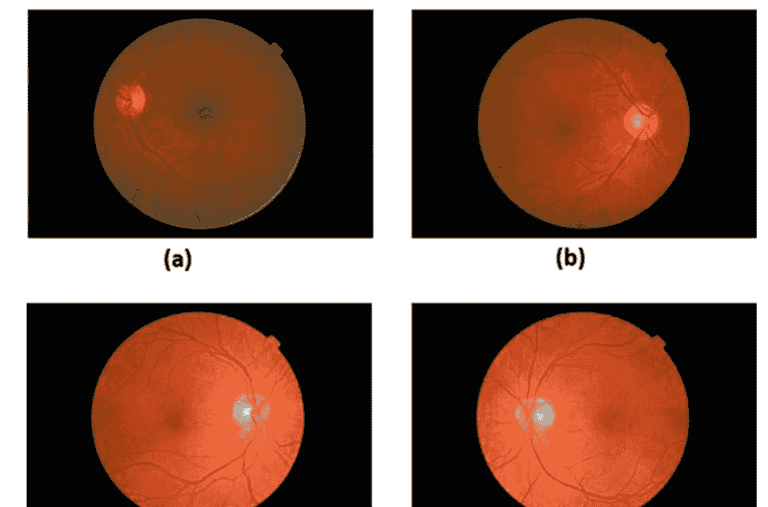

图4.1 a健康的视网膜，b黄斑水肿（ME），c增殖性糖尿病视网膜病变（PDR），和d非增殖性糖尿病视网膜病变（NPDR）

使用图像预处理和图像处理技术。然后使用CNN或增强模型进行分类。下面是使用深度学习进行DR检测的最新例子。

Sahlsten和他的同事在他们的研究中提出了一种使用CNN诊断DR的系统。此外，对于五种不同的筛查和临床分级系统，在糖尿病视网膜病变和黄斑水肿的分类中，他们提供了根据临床五级糖尿病视网膜病变准确分类图像的研究结果[11]。

与许多其他研究不同，Arcadu等人对DR的预测水平进行了研究。在这项研究中，他们提出了一种使用彩色眼底图像作为输入通过CNN预测DR进展的方法。在这里，解决方案方法是根据糖尿病视网膜病变的早期治疗严重程度分级的2阶段恶化来预测未来的DR进展。他们试图估计在6、12和24个月期间评估的DR的严重程度。他们还为指定的时间段开发了相关性图。这些地图突出了CNN模型在如何对特定查询图像进行分类时关注的区域。本研究讨论了使用患者眼底图像预测未来糖尿病视网膜病变进展的可行性和效率[12]。

Chandrakumar和Kathirvel采用三阶段解决方案来诊断糖尿病视网膜病变。第一阶段是通过从不同数据集、不同相机、不同视野、锐度、模糊度、对比度和不同图像尺寸下获取眼底图像来增加数据阶段。第二阶段进行图像预处理。在这个阶段，首先将图像转换为灰度，然后转换为L模型，最后转换为二值图像。在最后一个阶段，使用具有6层的CNN进行分类。他们在STARE和DRIVE数据集的背景下，检测糖尿病视网膜病变阶段的整体准确率约为94 %[13]。在另一项使用增强数据阶段的研究中，Gao和他的同事进行了研究。在他们的研究中，数据集构建阶段包括8个不同的步骤:（1）收集，（2）注释，（3）预处理，（4）增强，（5）模型设置，（6）评估，（7）模型部署，最后（8）临床评估。对该数据集进行的模型评估是使用CNN模型进行分类，涉及7个数据库。这些数据库分别是数字视网膜图像用于血管提取（DRIVE）数据集，标准糖尿病视网膜病变数据库校准级别0/1（DIARETDB0-DIARETDB1）数据集，视网膜结构分析（STARE）数据集，视网膜眼科学领域分割和索引技术评估方法（MESSIDOR）数据集，用于估计血管宽度的视网膜血管图像集（REVIEW）数据集，Kaggle糖尿病视网膜病变数据集和E-ophta数据集。CNN模型包括Resnet-18、Resnet-101、VGG-19、Inception@4和InceptionV3。从所得结果可以看出，改进的Inception@4模型和Inception-V3模型的性能均优于其他所有模型[14]。

特别是，卷积神经网络（CNN）已经被开发用于对图像进行分类，并在DR诊断研究中得到广泛应用。例如，Deper-lioglu和Kose使用了一种实用的图像处理方法来改进视网膜底部图像，包括HSV、V变换算法和直方图均衡化技术。他们使用CNN对图像进行分类[15]。Hemant和他的同事使用包含直方图均衡化技术（HE）和对比度有限自适应直方图均衡化技术（CLAHE）的图像处理，最后使用CNN进行分类[16]。Pratt等人推荐使用CNN对视网膜数字图像进行DR诊断，并成功地对DR的严重程度进行分类。他们采用了CNN架构，并在分类阶段进行了数据增强处理，可以检测到复杂的特征（如微血管瘤、渗出物和视网膜出血）。因此，他们开发了一个自动工作且不需要用户输入的诊断系统[17]。

Dutta等人在他们的研究中，提出了一个自动信息模型，用于从包含糖尿病视网膜病变的眼底图像中识别主要的DR前体。反向传播人工神经网络，深度神经网络（DNN）和卷积神经网络（CNN）被用于分类。加权模糊C均值算法被用于定义与目标类相关的阈值。该模型将有助于识别糖尿病视网膜病变图像的严重程度。通过提出的模型，计算了患者眼睛给予严重程度的权重。深度学习模型在分类血管、液体滴漏、渗出物、出血和微小动脉瘤等特征方面取得了更大的成功[18]。

在另一项研究中，卷积神经网络（CNN）模型在彩色眼底图像上用于识别糖尿病视网膜病变分期的性能已经得到证明。在该研究中，在图像预处理之前，使用Otsu方法裁剪图像以隔离视网膜的圆形图像。然后，使用CLAHE滤波算法对图像进行对比度调整和归一化处理。在使用来自ImageNet的GoogLeNet和AlexNet模型的研究中，GoogLeNet模型在敏感性和特异性方面达到了最高水平[19]。

从上面给出的例子可以看出，对于视网膜底部的彩色视网膜图像进行DR诊断有几种不同的诊断方法，采用了不同的图像处理技术和不同的CNN模型。

## 4.2 材料和方法

从前一节给出的例子可以看出，许多研究已经使用深度学习对视网膜底部图像进行DR诊断。在这些研究中，通常使用不同的图像处理技术和混合方法与CNN模型。本研究的目的是通过使用图像处理方法提取视网膜图像中的血管和传统卷积神经网络来展示分类可以轻松进行。因此，可以进行有效的诊断。开发的方法的流程步骤或流程图如图4.2所示。

如流程图所示，应用程序中使用了来自公共Messidor数据库的250个彩色视网膜图像。为了确保分类过程中较低的内存需求，图像的尺寸从1448 × 2240改变和缩小到149 × 224像素。然后，将图像从RGB颜色空间转换为灰度格式。然后，使用Kirsch的模板方法提取视网膜血管并完成图像处理。然后，使用8层CNN进行分类。对于所有分类研究，使用MATLAB r2017a软件。

### 4.2.1 Messidor数据集

MESSIDOR代表视网膜眼科学中评估分割和索引技术的方法（法语部分）。Messidor数据库是在Messidor项目期间创建的，旨在促进对彩色视网膜底层图像进行糖尿病视网膜病变的计算机辅助诊断研究，并评估不同的病变分割方法。在这项研究中，使用这个数据库的原因是为了指示视网膜底层图像的DR级别[20-22]。

图4.2 关于诊断方法的流程图

这个数据库已经向公众开放了十年，目的是指示视网膜底层图像的DR级别[20-22]。数据库的图像获取过程如下：眼科学的三个部门共收集了1200张眼底图像（以彩色形式），使用了一台3CCD彩色相机（在Topcon TRC NW6非显影眼底相机上，视野为45°）。在这里，相应的图像以每个颜色平面8位的方式获取，分辨率为2240 * 1488、1440 * 960或2304 * 1536像素之一。最终得到了800张瞳孔扩张的图像，以及总共400张无扩张的图像（使用一滴0.5%的托品酰胺进行）。这些图像根据专家的分类被分为四个不同的级别。在这些级别中，（1）Risk 0对应非DR图像，（2）Risk 1表示轻度DR，（3）Risk 2表示中度DR，最后，（4）Risk 3表示DR的晚期阶段。在这项研究中，数据库中给出的视网膜病变程度被用作参考。每个级别的图像数量定义如表4.1所示。

表4.1 Messidor数据库中的视网膜病变等级

| 等级 | 描述 | 图像数量 |
| :--- | :--- | :--- |
| R1 | (N<sub>MA</sub> = 0) AND (N<sub>HE</sub> = 0) | 546 |
| R2 | (0 < N<sub>MA</sub> ≤ 5) AND (N<sub>HE</sub> = 0) | 153 |
| R3 | (5 < N<sub>MA</sub> < 15) AND (0 < N<sub>HE</sub> < 5) AND (N<sub>NV</sub> = 0) | 247 |
| R4 | (N<sub>MA</sub> ≥ 15) OR (N<sub>HE</sub> ≥ 5) OR (N<sub>NV</sub> > 0) | 254 |

N<sub>MA</sub>, N<sub>HE</sub>, N<sub>NV</sub>：分别表示MAs、HEs和新生血管（NV）的数量

### 4.2.2 图像处理

图像处理方法包括调整视网膜图像的大小和从每个目标视网膜图像中提取相关血管。图4.3表示在图像处理阶段中完成的一般步骤。

在图像处理阶段，视网膜底部图像的大小主要为1488×2240像素，缩小为149×224像素。目标是仅在分类过程中减少图像所需的内存量。调整大小后，TIFF格式的RGB图像转换为灰度图像。

视网膜血管通常被称为静脉和动脉。在这里，中央视网膜动脉和静脉在视盘的中心位置彼此靠近（通常）。血管在绿色成分中最为明显。了解血管结构可以评估疾病的严重程度，并在手术过程中起重要作用。目前，对于检测人体图像中的血管，已经采用了两种不同的策略。这些分别是边缘检测和跟踪，需要关于图像中起始位置的先前信息[25]。

图4.3 图像处理的过程步骤

本研究中使用了边缘检测。 Kirsch的模板方法是边缘检测方法之一，用于提取一般视网膜图像中的血管[26]。 Kirsch的模板方法已经在许多应用中用于确保提取血管。 由于Kirsch算子可以根据图像的特性自动调整阈值，因此选择Kirsch梯度算子来减去对象的轮廓。 该算子简要地确保了八个窗口模板（H1-H8）。 这八个窗口模板（H1-H8）如图4.4所示。每个模板相对于边缘方向给出了给定方向上的最大响应。除了最外列和最外行之外，每个像素及其八个3x3邻域分别包含这八个模板的八条曲线。 因此，每个像素有八个输出，八个模板被选为该位置的值。图4.4显示了图像中P（i，j）点的灰度值和八个邻域[25，27]。 在实践中，缩放因子取为1/15。

Kirsch的模板运算符接收一个单核掩模并旋转450个图像8个罗盘方向，如北、西北、南、西南、东、东北、东南和西。边缘大小是在所有方向中获得的最大响应值。

包含八个3x3 Kirsch模板矩阵（H1-H8）及其对应的方向标签：H1 (East), H2 (West), H3 (Northeast), H4 (Southeast), H5 (North), H6 (South), H7 (Northwest), H8 (Southeast)。

一个3x3网格，显示了中心点P(i, j)及其周围八个邻域点（P0, P1, P2, P3, P4, P5, P6, P7）的位置关系。

图4.4 Kirsch运算符的八个模板和一个点及其八个邻域P(i, j)的灰度值

### 4.2.3 卷积神经网络分类

在实践中，卷积神经网络（CNN）被用于通过对数据集中的图像进行分类来诊断DR的级别或健康人。 CNN的一般结构如下所述。

卷积神经网络（CNN）是深度学习技术之一，是一种前馈神经网络，它通过对图像中个别神经元的重叠区域进行响应来进行图像识别。 CNN使用一种复杂的堆叠层架构，特别适用于图像分类。 CNN对图像中的每个特征都很稳健且敏感，特别适用于具有高输出类别的分类研究。 图4.5展示了一个示例CNN的基本结构[13]。

卷积神经网络通常由一个或多个卷积层组成，这是一个子采样步骤。 然后它由一个或多个全连接层组成，例如标准的多层神经网络。 CNN架构被设计用于利用二维（2D）图像输入的二维结构。 这通过局部连接和相关权重进行总结，导致不断变化的属性。 CNN的另一个好处是它们具有比完全连接到相同数量的网络更少的训练和更容易的参数，隐藏节点的数量。CNN通过在相邻层的神经元之间应用局部绑定模式来使用空间局部相关性[29]。

图4.5 一个示例CNN的基本结构

### 4.2.4 性能评估

在医学背景下进行的分类研究使用不同的方程来评估不同角度的性能。准确率、精确度、召回率、F-度量、特异度和敏感度是其中一些方程，这些方程计算用于评估所使用的分类模型的精确度[30]。

性能评估器在分类任务中起着重要的作用。准确率是最受欢迎的标准，表示分类器所做出的正确决策的比例。敏感度，也称为召回率，用于确定相关分类器能够识别正例的程度。此外，特异度用于确定相同分类器能够识别负例的程度。

精确率是正样本的真实预测率。已知敏感度和精确率之间存在一个递减的双曲线关系，处理这个问题的一种方法是使用ROC曲线。ROC图是一个二维图，其中横轴表示假阳性比率（1-特异性），纵轴表示精确率。此外，F-度量是敏感度和精确率的调和平均值[31]:

$$\text{准确率} = \frac{\text{真正例 + 真负例}}{\text{真正例 + 真负例 + 假正例 + 假负例}} \quad\quad\quad\quad\quad\quad (4.1)$$

$$\text{敏感度} = \frac{\text{真正例}}{\text{真正例 + 假负例}} \quad\quad\quad\quad\quad\quad\quad\quad\quad\quad (4.2)$$

$$\text{特异性} = \frac{\text{真负例}}{\text{假正例 + 真负例}} \quad\quad\quad\quad\quad\quad\quad (4.3)$$

$$\text{精确率} = \frac{\text{真正例}}{\text{真正例 + 假正例}} \quad\quad\quad\quad\quad\quad\quad\quad\quad\quad (4.4)$$

$$\text{召回率} = \text{敏感度} \quad\quad\quad\quad\quad\quad\quad\quad\quad\quad\quad\quad\quad\quad (4.5)$$

$$F\text{-度量} = 2 * \left[ \frac{\text{(精确率 * 召回率)}}{\text{(精确率 + 召回率)}} \right] \quad\quad\quad\quad\quad\quad\quad (4.6)$$

在这些方程（4.1-4.6）中，TP和FP分别表示真正阳性和假正阳性诊断的总数。TN和FN分别表示真阴性和假阴性的数量。FPTN也表示假阳性的数量，并且是从分类结果的负样本中计算出来的。

对于分类器，准确度指的是正确诊断的准确度。敏感性比率表示分类器准确定义目标类的能力。特异性比率用于定义分类器分配目标类的能力。精确度是衡量精确或准确结果质量的指标。召回率，也称为真正阳性率，提供了测试中正确定义的阳性比例。F-度量也称为F1得分，提供了测试准确性的度量。它是敏感性和召回率的加权调和平均值[32, 33]。

## 4.3 诊断应用

在所有图像处理和分类研究中，使用了MATLAB r2017a软件。在这个应用中，从Messidor数据库中随机选择了200个彩色视网膜底片数字图像，用于评估本研究中引入的方法。该数据库具有四个不同的输出类别，即正常视网膜、黄斑水肿（ME）、增殖性糖尿病视网膜病变（PDR）和非增殖性糖尿病视网膜病变（NPDR）。从Messidor数据库中随机选择了200个彩色视网膜底片数字图像，分别如下：99个正常、19个黄斑水肿（ME）、27个增殖性糖尿病视网膜病变（PDR）和最后55个非增殖性糖尿病视网膜病变（NPDR）。

这200个彩色视网膜底片数字图像按照前一节中描述的图像处理技术进行处理。使用Kirsch的模板方法进行视网膜血管提取。在图像处理结束时，提取的视网膜血管图像样本如图4.6所示。在图4.6中，提取的血管图像（a）是针对20051213_61892_0100_PP.tif图像，（b）是针对Messidor数据库中的20051213_61951_0100_PP.tif图像。这些获得的图像用于进行分类阶段。

提取的血管图像通过CNN进行分类。CNN是一种深度网络，通过其标签作为对象接收和处理图像数据。在这个模型中，CNN有8层。这些层分别是图像输入层、卷积层、ReLU层、交叉通道归一化层、最大池化层、全连接层、softmax层和分类（分级）层。相关层的详细信息见表4.2。输入层用于指定图像的值。在这项研究中，图像的值为149 × 224 × 3，这些数字分别对应图像的高度、宽度和RGB格式。该层中的数据转换，如数据归一化或数据增强，基于随机平移和相关数据的截断的思想。数据转换通常用于防止过拟合，并在训练过程开始时自动完成。

在这个CNN模型中有一个卷积层。卷积层的参数与网络过滤器的大小相关。在这一点上，过滤器大小确定为4，第二个参数关于神经元数量确定了总特征图，并绑定到与过滤器数量相同的输出区域。选择了16个。

修正线性单元（ReLU）层是一种激活函数。在ReLU层之后的卷积层中提供了一个非线性激活函数。在这里，修正线性单元的函数被相应地运行。另一方面，在CNN中包含了一个交叉通道归一化层，通道窗口的大小为2，这也对应于归一化的通道窗口大小。

最大池化层用于下采样，以减少参数的总数，从而防止过拟合问题。简而言之，该层返回由第一个参数池大小指定的区域（矩形）的最大值。在这个模型中，矩形的大小设置为[3, 4]。在图像被完全扫描时，步进函数也用于确定步长。

全连接层收集之前放置的所有相关属性，以了解图像的更大模式。为了对这些进行分类，最后一个全连接层将它们收集起来。因此，完全连接的最后一层的输出大小参数设置为目标表中的类别数。数据库包含四个输出类别，如正常视网膜、黄斑水肿（ME）、增殖性糖尿病视网膜病变（PDR）和非增殖性糖尿病视网膜病变（NPDR）。因此，输出类别（numClasses）的数量为4。CNN模型中的最后一层是分类层。在分类应用的背景下，该全连接层通常基于softmax激活函数。该层使用softmax激活函数返回的可能性来相互分配自定义类别之一。

对于提出的CNN模型，给出了一个样本截图，如图4.7所示。图4.7还显示了分类试验结束时获得的值。在分类应用中，从Messidor视网膜底层图像数据集中随机选择了160个图像（样本的80%）作为训练数据，选择了40个图像（样本的20%）作为测试数据。分类研究重复了20次，使用随机选择的不同训练和测试数据。

在提出的CNN模型中，最大的迭代次数设置为200次，隐藏层数为10。在分类应用中，从Messidor视网膜底层图像数据集中随机选择了80%的样本（160张图像）作为训练数据，20%的样本（40张图像）作为测试数据。分类研究通过随机选择不同的训练和测试数据进行了20次重复。

## 4.4 结果与讨论

实验结果通过准确率、特异度、敏感度、精确度、召回率和F-measure等性能评估指标进行评估。

图4.7 所提出的CNN模型的示例截图

通过20次分类试验获得的性能值在表4.3中给出，包括准确率、特异度、敏感度、精确度、召回率和F-measure。

从表4.3可以看出，获得了相当高的数值。为了更好地解释分类试验的性能指标，表4.4给出了每个指标的最低、平均和最高值。

从表4.4可以看出，最低的分类准确率为87.25%，平均分类准确率为89.84%，最高的分类准确率为91.50%。最低的分类敏感度和召回率为74.5%，平均分类敏感度和召回率为79.68%，最高的分类敏感度和召回率为83.0%。最低的分类特异度为91.5%，平均分类特异度为93.23%，最高的分类特异度为94.33%。

最低的分类精确率和F-measure率为74.5%，平均分类精确率和F-measure率为79.68%，最高的分类精确率和F-measure率为83.3%。

使用CNN对Messidor数据集进行的分类研究具有高准确率、敏感性和特异性。所提出模型的性能指标与之前使用相同数据库评估性能的研究进行了比较。表4.5以这种方式报告了所得到的结果。

图像处理和CNN方法获得了最高的准确率、敏感性和特异性值。在相同数据库上使用相同的CNN模型进行应用时，获得非常不同的结果[本研究，15,16]显示了图像处理的重要性。本研究提出的血管提取和CNN应用所获得的值仍高于传统方法和平均值。

表4.3 20个分类试验中获得的性能指标

| 试验编号 | 准确率 | 敏感性 | 特异性 | 精确度 | 召回率 | F-度量 |
| :--- | :--- | :--- | :--- | :--- | :--- | :--- |
| 1 | 0.8725 | 0.7450 | 0.9150 | 0.7450 | 0.7450 | 0.7450 |
| 2 | 0.8950 | 0.7900 | 0.9300 | 0.7900 | 0.7900 | 0.7900 |
| 3 | 0.8950 | 0.7900 | 0.9300 | 0.7900 | 0.7900 | 0.7900 |
| 4 | 0.8900 | 0.7800 | 0.9267 | 0.7800 | 0.7800 | 0.7800 |
| 5 | 0.9050 | 0.8100 | 0.9367 | 0.8100 | 0.8100 | 0.8100 |
| 6 | 0.9100 | 0.8200 | 0.9400 | 0.8200 | 0.8200 | 0.8200 |
| 7 | 0.8950 | 0.7900 | 0.9300 | 0.7900 | 0.7900 | 0.7900 |
| 8 | 0.8925 | 0.7850 | 0.9283 | 0.7850 | 0.7850 | 0.7850 |
| 9 | 0.8975 | 0.7950 | 0.9317 | 0.7950 | 0.7950 | 0.7950 |
| 10 | 0.8950 | 0.7900 | 0.9300 | 0.7900 | 0.7900 | 0.7900 |
| 11 | 0.9150 | 0.8300 | 0.9433 | 0.8300 | 0.8300 | 0.8300 |
| 12 | 0.8775 | 0.7550 | 0.9183 | 0.7550 | 0.7550 | 0.7550 |
| 13 | 0.9050 | 0.8100 | 0.9367 | 0.8100 | 0.8100 | 0.8100 |
| 14 | 0.9050 | 0.8100 | 0.9367 | 0.8100 | 0.8100 | 0.8100 |
| 15 | 0.9150 | 0.8300 | 0.9433 | 0.8300 | 0.8300 | 0.8300 |
| 16 | 0.8950 | 0.7900 | 0.9300 | 0.7900 | 0.7900 | 0.7900 |
| 17 | 0.9050 | 0.8100 | 0.9367 | 0.8100 | 0.8100 | 0.8100 |
| 18 | 0.9100 | 0.8200 | 0.9400 | 0.8200 | 0.8200 | 0.8200 |
| 19 | 0.9150 | 0.8300 | 0.9433 | 0.8300 | 0.8300 | 0.8300 |
| 20 | 0.8775 | 0.7550 | 0.9183 | 0.7550 | 0.7550 | 0.7550 |
| 平均值 | 0.8984 | 0.7968 | 0.9323 | 0.7968 | 0.7968 | 0.7968 |

表4.4 性能指标的最低、平均和最高值

| 标准 | 最低 | 平均值 | 最高 |
| :--- | :--- | :--- | :--- |
| 准确率 | 0.8725 | 0.8984 | 0.9150 |
| 敏感性 | 0.7450 | 0.7968 | 0.8300 |
| 特异性 | 0.9150 | 0.9323 | 0.9433 |
| 精确度 | 0.7450 | 0.7968 | 0.8300 |
| 召回率 | 0.7450 | 0.7968 | 0.8300 |
| F-度量 | 0.7450 | 0.7968 | 0.8300 |

获得的高灵敏度表明开发的模型准确地定义了目标类的形成。获得的高特异性比率表明开发的模型具有非常高的目标类分配能力。F-度量是分类器及其召回率的调和平均值。在大多数情况下，精确度和召回率之间存在平衡。如果你优化分类器来增加一个并去除另一个，调和平均值会迅速下降。然而，当灵敏度和特异性同时增加时## 4.5 总结

糖尿病视网膜病变是与糖尿病相关的重要的医学问题。这是因为如果长期不正确治疗，会导致视力受损。糖尿病视网膜病变（DR）是由糖尿病引起的严重眼病，是发达国家最常见的致盲原因。

三分之一的糖尿病患者有糖尿病视网膜病变的症状，不幸的是这对他们的视力构成了非常严重的威胁。自然地，早期诊断和治疗对于预防患者受到影响或至少减缓糖尿病视网膜病变的进展非常重要。因此，对糖尿病患者进行大规模筛查非常重要。

糖尿病视网膜病变（DR）是血管异常的结果，被称为血管并发症。因此，它使得糖尿病患者患盲症的风险比没有糖尿病的人高25倍。40.3%的40岁以上患者患有糖尿病视网膜病变。糖尿病视网膜病变有四个阶段[9]：

- 轻度非增殖性视网膜病变：在第一阶段，微动脉瘤出现并可能引起出血或硬性渗出物。
- 中度非增殖性视网膜病变：在第二阶段，因视网膜缺血而出现棉絮样斑点。
- 严重增殖性视网膜病变：在第三阶段，血液供应可以限制视网膜的许多区域和几条血管。
- 增殖性视网膜病变：在最后阶段，玻璃体凝胶会流入眼睛，血管无法确保足够的血液流动。最终，视力可能会丧失，进而导致失明。

通常，通过分析临床特征的存在，可以观察到DR的五种不同类型。这些分别是轻度非增殖性糖尿病视网膜病变（NPDR）、中度NPDR、严重NPDR、PDR和黄斑水肿（ME）[10]。图4.1显示了正常视网膜和三种DR图像，如正常视网膜、黄斑水肿（ME）、增殖性糖尿病视网膜病变（PDR）和非增殖性糖尿病视网膜病变（NPDR）在Messidor视网膜底片数据库中。

由于DR的重要性，许多研究已经进行了诊断。在这些研究中，视网膜彩色底片图像和卷积神经网络作为深度学习方法（CNN）被广泛使用。由于自动DR诊断系统的输入是视网膜底片图像，因此通过使用图像预处理和图像处理技术来改进系统输入。然后使用CNN或增强模型进行分类。

那200个视网膜底部（多彩的）数字图像是根据前一节中描述的图像处理技术进行处理的。使用Kirsch的模板方法进行了视网膜血管提取。提取的血管图像通过CNN进行分类。CNN是一种接收和处理带有对象标签的图像数据的深度网络类型。在这个模型中，CNN有8层。这些层分别是图像输入层、卷积层、ReLU层、交叉通道归一化层、最大池化层、全连接层、softmax层和分级（分类）层。

实验结果通过准确性、特异性、敏感性、精确度、召回率和F-measure等性能评估指标进行评估，这些指标是从试验中获得的。当将性能指标与使用Messidor数据集的先前研究进行比较时，图像处理和CNN方法获得了最高的准确性、敏感性和特异性值。在相同数据库的相同CNN模型的应用中获得非常不同的结果[本研究，15,16]显示了图像处理的重要性。本研究提出的血管提取和CNN应用所获得的值仍然高于传统方法和平均水平。

表4.5 分类准确率、灵敏度和特异性的比较
| 方法 | 准确率 | 敏感性 | 特异性 |
| --- | --- | --- | --- |
| 血管提取和CNN（本研究） | 0.8984 | 0.7968 | 0.9323 |
| 图像处理和CNN [15] | 0.9730 | -- | -- |
| 图像处理和CNN [16] | 0.9700 | **0.9400** | **0.9800** |
| 图像处理和CNN [34] | 0.9600 | 1 | 0.9000 |
| 深度神经网络（DNN） [35] | **0.9800** | 0.9000 | 0.9600 |
| 基于集成的框架[2] | 0.8200 | 0.7600 | 0.8800 |
| 词袋模型[3] | 0.9440 | 0.9400 | -- |
| 粒子群优化和模糊C均值 [36] | 0.9450 | 0.9100 | 0.9800 |
| 分形分析和K最近邻（KNN） [37] | 0.8917 | -- | -- |
| 纹理特征和支持向量机（SVM） [38] | 0.8520 | 0.8950 | 0.972 |
| 标记控制的分水岭变换 [39] | 0.8520 | 0.8090 | 0.9020 |
最佳值以粗体显示。

如果精确率和召回率相等，则为最大值。 如果F度量非常高，则分类器处于非常良好的状态。

本研究证明了卷积神经网络可以以接近80%和90%或更高的敏感性和特异性检测可重复的糖尿病视网膜病变，适用于Messidor数据库。它可以成功检测数据库中的四种不同类型的图像。

除了医学图像应用之外，深度学习在处理声音数据方面也非常有效。由于医疗决策支持系统应该能够处理多媒体类型的数据，使用声音数据来诊断疾病非常重要。与一种严重疾病帕金森病相关，下一章节5将专门介绍这方面的研究。

## 4.6 进一步学习

为了详细研究卷积神经网络技术和方法的特点，可以参考[29]。

可以查阅[2, 3, 36–39]中的文章，了解使用不同传统人工智能技术进行诊断DR的应用和性能。

可以查阅参考文献[2, 9, 24, 40, 41]，了解使用不同方法进行DR检测的模型，包括候选病变提取、特征集合制定和分类等过程。

可以查阅[14, 25, 28]，了解Kirsch模板方法的详细信息，该方法是边缘选择方法。 还可以查阅[42, 43]，了解在彩色眼底图像中的应用。

# 参考文献

1. Ö. Deperlioglu, U. Köse, 通过使用图像处理和卷积神经网络进行糖尿病视网膜病变的诊断. 在2018年第二届多学科研究和创新技术国际研讨会(IMSIT)上, 2018年10月(IEEE), 第1-5页
2. B. Antal, A. Hajdu, 一种基于集成的微血管瘤检测和糖尿病视网膜病变分级系统. IEEE生物医学工程学报 59(6), 1720-1726 (2012)
3. J. M. Islam, A.V. Dinh, K.A. Wahid, 使用词袋方法自动检测糖尿病视网膜病变. 生物医学科学工程杂志 10, 86-96 (2017)
4. 世界卫生组织和国际糖尿病联合会.糖尿病和中间高血糖的定义和诊断[世界卫生组织和国际糖尿病联合会报告] (2005)
5. 国际糖尿病联合会， 糖尿病地图， 第六版 (比利时布鲁塞尔， 2013年) ， https://www.idf.org/sites/default/files/EN_6E_Atlas_Full_0.pdf. Son eri sim 23 Ocak 2018
6. 国际糖尿病联合会， 糖尿病地图， 第四版 (比利时布鲁塞尔， 2009年) ， 可从https://www.idf.org/sites/default/files/IDF-Diabetes-Atlas-4th-edition.pdf获取。 引用日期为23 June 2018
7. S. Wild, G. Roglic, A. Green, R. Sicree, H. King, 全球糖尿病患病率：2000年估计和2030年预测。 Diabetes Care 27(5), 1047–1053 (2004)
8. A.I. Veresiu, C.I. Bondor, B. Florea, E.J. Vinik, A.I. Vinik, N.A. Găvan, 检测未揭示的神经病变并评估其对生活质量的影响：对25000名罗马尼亚糖尿病患者的调查。 J. Diabetes Complicat. 29, 644–649 (2015)
9. W. Luangruangrong, P. Kulkasem, S. Rasmequan, A. Rodtook, K. Chinnasarn, 使用高效的综合方法在视网膜图像中自动检测渗出物，在信号和信息处理协会年度峰会和会议（APSIPA），2014年亚太地区，2014年12月（IEEE），第1-5页
10. M.R.K. Mookiah等， 糖尿病视网膜病变的计算机辅助诊断：综述。计算机生物学和医学 43（12），2136-2155（2013年）
11. J. Sahlsten, J. Jaskari, J. Kivinen, L. Turunen, E. Jaanio, K. Hietala, K. Kaski, 深度学习对糖尿病视网膜病变和黄斑水肿分级的眼底图像分析（2019年）。arXiv 预印本 arXiv:1904.08764
12. F. Arcadu, F. Benmansour, A. Maunz, J. Willis, Z. Haskova, M. Prunotto, 深度学习算法预测糖尿病视网膜病变在个体患者中的进展。 NPJ Digit. Med. 2(1),1–9 (2019)
13. T. Chandrakumar, R. Kathirvel, 使用深度学习架构分类糖尿病视网膜病变。 Int. J. Eng. Res. Technol. 5(6), 19–24 (2016)
14. Z. Gao, J. Li, J. Guo, Y. Chen, Z. Yi, J. Zhong, 使用深度神经网络诊断糖尿病视网膜病变。 IEEE Access 7, 3360–3370 (2018)
15. O. Deperlioglu, U. Kose, 使用图像处理和卷积神经网络诊断糖尿病视网膜病变，在第二届多学科研究和创新技术国际研讨会(IMSIT)(IEEE, 2018)
16. D.J. Hemanth, O. Deperlioglu, U. Kose, 一种改进的深度卷积神经网络用于糖尿病视网膜病变检测和分类的方法。神经计算应用 (2019)。 https://doi.org/10.1007/s00521-018-03974-0
17. H. Pratt等, 用于糖尿病视网膜病变的卷积神经网络。计算机科学会议论文集90, 200-205 (2016)
18. S. Dutta, B.C. Manideep, S.M. Basha, R.D. Caytiles, N.C.S.N. Iyengar, 使用深度学习模型对糖尿病视网膜病变图像进行分类。国际网格分布式计算杂志11 (1), 89-106 (2018)
19. C. Lam, D. Yi, M. Guo, T. Lindsey, 使用深度学习自动检测糖尿病视网膜病变。AMIA峰会翻译科学论文集2018, 147 (2018)
20. MESSIDOR, 用于评估视网膜眼科领域分割和索引技术的方法。TECHNO-VISION项目。[在线]。可访问：http://messidor.crihan.fr/
21. E. Decencière, 公开分发图像数据库的反馈: Messidor数据库。图像分析与立体测量33, 231-234 (2014年)。 https://doi.org/10.5566/ias.1155
22. Messidor数据库, http://www.adcis.net/en/third-party/messidor/. 最后访问日期：2020年1月15日
23. L. Seoud, J. Chelbi, F. Cheriet, 公共数据库上的糖尿病视网膜病变自动分级, Ophthalmic Medical Image Analysis Second International Workshop的论文集, OMIA 2015, 编者: X. Chen, M.K. Garvin, J.J. Liu, E. Trusso, Y. Xu, MICCAI 2015, 慕尼黑, 德国, 2015年10月9日, pp. 97-104。可从https://doi.org/10.17077/omia.1032获得
24. C. Agurto, V. Murray, E. Barriga, S. Murillo, M. Pattichis, H. Davis, P. Soliz, 用于糖尿病视网膜病变检测的多尺度AM-FM方法。IEEE Trans. Med. Imaging 29 (2), 502-512 (2010年)
25. H. Li, O. Chutape, 脉络膜图像特征提取,在第22届年度国际IEEE工程与医学生物学会议(Cat. No. 00CH37143)中,第4卷,2000年7月(IEEE), 第3071-3073页
26. R.A. Kirsch, 计算机确定生物图像的组成结构. 计算生物医学研究. 4(3), 315-328 (1971)
27. P. Gao, X. Sun, W. Wang, 基于Kirsch算子和光流的移动物体检测,在2010年国际图像分析与信号处理会议中,2010年4月(IEEE), 第620-624页
28. A. Venmathi, E. Ganesh, N. Kumaratharan, 用于乳腺X线照片中微钙化簇的Kirsch指南针核边缘检测算法. 中东科学研究杂志. 24(4), 1530-1535 (2016)
29. 卷积神经网络 (LeNet), http://deeplearning.net/tutorial/lenet.html. 上次访问时间为10.01.2018
30. W. 张, J. 韩, S. 邓, 基于缩放谱图和张量分解的心音分类. 生物医学信号处理与控制 32, 20-28 (2017)
31. R.P. Espíndola, N.F.F. Ebecken, 关于将f-measure和g-mean指标扩展到多类问题的研究. WIT Trans. Inf. Commun. Technol. 35 (2005)
32. O. Deperlioglu, 使用卷积神经网络对心音图进行分类。BRAIN Broad Res. Artif. Intell. Neurosci. 9 (2), 23-33 (2018)
33. Q.-A. Mubarak, M.U. Akram, A. Shaukat, F. Hussain, S.G. Khawaja, W.H. Butt, 使用质量评估和同态滤波器分析PCG信号,用于心音的定位和分类. Comput. Methods Programs Biomed. (2018)。 https://doi.org/10.1016/j.cmpb.2018.07.006
34. L.R. Sudha, S. Thirupurasundari, 分析和检测视网膜图像中的出血和渗出物. Int. J. Sci. Res. Publ. 4(3), 1–5 (2014)
35. N. Ramachandran, S.C. Hong, M.J. Sime, G.A. Wilson, 使用深度神经网络进行糖尿病视网膜病变筛查。Clin. Exp. Ophthalmol. 46, 412–416 (2018)
36. K.S. Sreejini, V.K. Govindan, 从视网膜图像中对DME的严重程度进行分级：PSO和FCM与贝叶斯分类器的结合。Int. J. Comput. Appl. 81(16), 11–17 (2013)
37. D.W. Safitri, D. Juniati, 使用眼底图像的分形维度分析对糖尿病视网膜病变进行分类。AIP Conf. Proc. 18 67, 020011-1–020011-11 (2017). https://doi.org/10.1063/1.4994414
38. U.R. Acharya, E.Y.K. Ng, J.H. Tan等人，使用纹理参数识别糖尿病视网膜病变阶段的综合指数。J. Med. Syst. 36(3), 2011-2020年 (2012年)。 https://doi.org/10.1007/s10916-011-9663-8
39. S.T. Lim, W.M.D.W. Zaki, A. Hussain, S.L. Lim, S. Kusavalan, 基于眼底图像的糖尿病黄斑水肿的自动分类。IEEE Colloq. Human. Sci. Eng. 5-6, 1-4 (2011年)
40. M.U. Akram, S. Khalid, A. Tariq, S.A. Khan, F. Azam, 用于分级糖尿病视网膜病变的视网膜病变检测和分类。Comput. Biol. Med. 45, 161-171 (2014年)
41. M.R.K. Mookiah, U.R. Acharya, C.K. Chua, C.M. Lim, E.Y.K. Ng, A. Laude, 糖尿病视网膜病变的计算机辅助诊断：一项综述。Comput. Biol. Med. 43(12), 2136-2155 (2013年)
42. S. Badsha, A.W. Reza, K.G. Tan, K. Dimyati, 一种使用边缘增强和对象分类的新血管提取技术。J. Digit. Imaging 26(6), 1107-1115 (2013年)
43. A. Banumathi, R.K. Devi, V.A. Kumar, 用于自动检测视网膜图像中的血管的匹配滤波器技术的性能分析，出自TENCON 2003。亚太地区融合技术会议，第2卷，2003年10月（IEEE），第543-546页

# 第5章 使用深度自编码器神经网络诊断帕金森病

深度学习不仅在图像上表现出色（如前一章所述），而且在声音类型的数据上也很强大。可以证明在一种严重的疾病中，被称为帕金森病（PD）。PD是中枢神经系统的退行性疾病。作为阿尔茨海默病之后的疾病，PD是众所周知的重要的神经退行性疾病之一。全球患有PD的人数相当高，而且在亚洲（发展中国家）等国家，尤其是在那些国家中，这个数字正在迅速增加。奥尔姆斯特德县（梅奥诊所）报告称，男性患帕金森病的终身风险为2%。而女性的这个值为1.3。许多来源已经证实男性的发病率更高。据称，到2030年，PD患者的数量将翻倍。早期诊断PD疾病也可以减轻症状。

帕金森病的主要症状包括震颤、僵硬、动作缓慢、运动症状不对称和姿势障碍。此外，帕金森病患者常见的还有语音和言语障碍。因此，帕金森病是一种慢性进行性运动障碍，症状会随时间推移而加重。据报道，美国有近100万人患有帕金森病。目前尚不清楚帕金森病的确切原因，因此目前还没有确切的治愈方法。然而，药物治疗和手术干预等治疗措施可用于管理男性或女性患者的症状[1-6]。

帕金森病导致大脑中重要神经细胞（称为神经元）的退化和死亡，尤其是黑质神经元。这些濒临死亡的神经元可能会产生多巴胺，这种化学物质可以影响控制运动和协调的大脑部分。随着帕金森病的进展，大脑中的多巴胺总量会减少，导致人无法正常控制运动。在这里，震颤、僵硬、动作缓慢和姿势不稳定是帕金森病的四个主要症状。震颤是指手臂、手、腿或下颌的不自主震动。僵硬指的是肢体和身体的灵活性，而动作缓慢对应的是运动迟缓。另一方面，还可能出现抑郁等症状，以及情绪方面的问题。

变化。还有吞咽、咀嚼和言语困难、尿液问题或便秘、皮肤问题和睡眠障碍[4-6]。

每个帕金森病患者的运动功能障碍在进展和对药物的反应上略有不同。一般来说，准确的诊断需要一个漫长的过程。这需要医生在疾病方面有重要的经验，特别是因为在治疗过程中会发生各种变化。最近的研究表明，90%（大约）的帕金森病病例中的言语困难可以用来区分健康和帕金森病患者，甚至在疾病的早期阶段[7]。帕金森病患者的言语障碍可以分为发音障碍和口齿不清。发音障碍是由于疾病进展而可能改善的语音产生的恶化。口齿不清反映出无法正确连接。声带、发音器官和呼吸肌肉的功能障碍引起了声音病理。一些研究将言语障碍的一般效果分类为气息声、巨大声、高音、单调和沉闷。声音分析技术，如声谱图和喉电图（EGG）记录声音样本的图像，可用于识别帕金森病患者的障碍。为此，使用在特定条件和特定程序下从患者的语音记录中获得的特征[7-9]。

在这一章中，通过使用从牛津帕金森诊断数据中获得的数据，研究了使用深度学习方法对帕金森病进行诊断，并强调了深度学习的性能。然后，解释了诊断过程中使用的材料和方法。在介绍应用程序的基本特征之后，给出了关于结果的发现和讨论。

## 5.1 相关工作

迄今为止，有许多关于帕金森病诊断的深度学习研究。在这些研究中，使用脑电图（EEG）信号、SPECT图像或来自患病和健康人群的图像进行了卷积神经网络分类。很少有深度神经网络研究也利用了声音特征。以下是使用深度学习进行PD检测的研究示例。

马丁等人在他们的研究中，通过评估绘画动作使用CNN进行PD诊断。在这项研究中，使用卷积层进行特征提取，然后进行全连接层的分类。

使用数字化图形板数据集，他们获得了PD螺旋绘图数据集。研究结束时，他们得到了一个非常高效的模型，准确率为96.5%[10]。Pereira和他的同事提出了一种PD自动诊断系统，旨在学习从个体检查期间获得的信号特征以及包含一组传感器的智能笔从手写动态中接收信息。他们使用了CNN进行分类。在他们的研究中，他们使用CNN实现了98%的分类准确率。他们还表示他们的数据集是首次的，并可以作为一个示例使用[11]。

由于PD与脑异常有关，EEG信号通常被认为是早期诊断的合适选择。在他们的研究中，Oh等人提出了一种用于自动检测PD的脑电图（EEG）和CNN系统。在该研究中，使用了二十个正常受试者和属于二十个PD的EEG信号来评估引入的系统。该研究使用了一个十三层的CNN架构，充分关注了点特征。提出的模型实现了88.25%的准确率[12]。

多巴胺能退化是帕金森病的病理特征，可以通过多巴胺转运体成像（如FP-CIT SPECT）来评估。考虑到这一特征，Choi等人提出了一种基于深度学习的FP-CIT SPECT解读系统用于帕金森病的诊断。该系统使用CNN进行分类，通过对帕金森病患者和正常人的SPECT图像进行训练。研究结束时得到的估计结果与专家的诊断结果相比，具有较高的分类准确性。他们还证明了他们可以准确解读典型的帕金森病亚组（SWEDD）多巴胺能缺陷的FP-CIT SPECT[13]。Eskofier等人使用惯性测量单元从十名特发性帕金森病患者那里收集数据，并使用CNN、传统方法（如提升、决策树、最近邻和支持向量机）对其进行分类。为了测试所提出的方法，专家们使用了几个引擎标记的任务进行分类。他们使用CNN获得的结果与传统方法的结果相比。据此，CNN在分类准确性方面至少比传统方法提高了4.6%[14]。

磁共振成像（MRI）也可以显示帕金森病患者大脑中由多巴胺缺乏引起的结构变化。在Sivaranjini和Sujatha的研究中，他们使用了一个卷积神经网络结构AlexNet对健康的MR和帕金森病的MR图像进行了分类处理。通过提出的系统，MR图像的诊断准确率达到了88.9%[15]。

神经黑素敏感磁共振成像（NMS-MRI）对于识别帕金森病（PD）中黑质致密部（SNc）的异常至关重要，因为它可以显示SNc中多巴胺能神经元的丧失。今天的技术通过对NMS-MRI上显示的SNc的对比度比率进行估计，以区分PD患者和健康对照组。Shinde等人使用卷积神经网络从NMS-MRI生成了PD的预后和诊断生物标志物。在研究结束时，他们获得了80%的测试准确率和85.7%的测试准确率，用于区分PD和非典型帕金森综合征[16]。

Ortiz等人使用3D脑图像开发了一种计算机辅助的PD诊断系统。他们使用从CNN架构中开发的神经网络，如LeNet和AlexNet，进行分类过程。他们指出，3D脑图像使CNN结构复杂化，因为包含了大量的信息。他们建议使用等值面来防止复杂的CNN结构降低分类的成功率，并保留最相关的信息，减少其他信息或过度拟合。通过使用提出的方法，他们使用LeNet和AlexNet CNN架构对DaTScan图像进行分类。研究结束时，平均分类准确率为95.1%和97%。

分别。从结果来看，isosurfaces的计算显著降低了输入的复杂性，并提供了高分类准确性。也可以说，对于具有大量信息的图像，AlexNet的结果比LeNet更好[17]。

Grover等人使用UCI的帕金森病远程监测语音数据集，他们使用深度神经网络进行帕金森病预测。他们使用Python的'TensorFlow'深度学习库来实现DNN。据称，所提出的方法获得的准确度值比先前研究中获得的准确度更高[18]。

在通过语音处理诊断帕金森病的背景下，近年来进行了许多研究工作。Muthumanickam等人在他们的研究中，比较了各种机器学习、数据挖掘和深度学习算法，如K最近邻（kNN）、前馈反向传播训练人工神经网络（FBPANN）、随机树（RT）、支持向量机（SVM）、随机树（RTree）、人工神经网络（ANN）、二元逻辑回归、偏最小二乘回归（PlsR）、决策树（DT）、卷积神经网络（CNN）、深度神经网络（DNN）和深度置信网络（DBF），用于通过语音处理诊断帕金森病。在分析这些分类器之后，他们表示深度置信网络（DBF）优于所有其他分类器。

他们还指出，运行深度学习技术-医学方面的架构（例如早期诊断PD）被证明非常有效和高效[19]。文献中还有许多研究使用牛津帕金森病检测数据集和人工智能技术进行PD的诊断。其中一些作为例子给出。

Spadoto等人使用最佳路径森林（OPF）分类器和牛津数据集进行PD的自动诊断[20]。Karunanithi等人使用模糊高度逻辑方法和数学导数来更准确地诊断PD和健康值。他们使用均值和标准差值，提供了PD和健康个体的准确分离。他们使用牛津帕金森病数据集，使用模糊高度逻辑方法测试了PD和健康诊断的提出方法。他们表示，这是一种比当前研究更准确的方法[21]。Revett等人在他们的研究中，为了确定特征是否可以用于区分健康个体和被诊断为IPD的个体，他们使用了粗糙集理论，这是一种用于发现数据中模式的数据挖掘技术。研究结束时，他们表示他们以100%的准确率区分了IPD和健康个体[7]。Gill和Manuel提出了一种基于ANN和SVM的方法，以协助专家诊断PD。他们使用牛津数据库中31名患者进行的195次检查的数据测试了所提出系统的性能。他们的结果显示，SVM具有最高的准确率，为93.33%[2]。多层前馈神经网络模型（MLFNN）与反向传播算法是早期检测和诊断PD的其他推荐方法，使用K-Mean聚类算法[22]。在其他研究中，使用了各种数据挖掘技术，如贝叶斯网络、朴素贝叶斯、J48、顺序最小优化（SMO）和多层感知器，用于开发帕金森病的分类器的诊断。

疾病。最后得到的实验结果表明，与其他分类器[23]相比，多层感知器（MLP）具有最高的特异性、准确性和敏感性。

在他的研究中，张描述了使用堆叠自动编码器（SAE）选择特征并使用最近邻（KNN）分类器进行分类的PD（自动）分类。

得到的结果表明，相关方法在分类任务和机器学习方面的所有测试案例中提供了更好的性能，可以将PD分类到与医生相媲美的水平。因此，他得出结论，智能手机有可能提供具有成本效益的PD诊断护理。该文章还通过在客户/服务器系统上给出一个应用程序来报告了正常运行时间的成本。讨论了引入的远程诊断系统的优点和缺点[24]。

## 5.2 材料和方法

在本书的这一部分中，使用牛津帕金森病诊断数据集中的语音记录特征描述了帕金森病（PD）的诊断。在实践中，使用自编码器网络（AEN）通过对数据集中的特征进行分类来区分PD和健康数据。所使用数据集的属性和方法简要描述如下。对于所有的分类研究，使用MATLAB r2017a软件。

### 5.2.1 牛津帕金森病诊断数据集

在UCI ML Repository[25-27]中，对牛津帕金森病诊断数据集中的语音记录特征进行了分类和区分，区分了PD和健康个体。简而言之，该数据集由Max Little提供，与位于美国科罗拉多州丹佛市的国家声音和语音中心共同完成，语音信号在该中心被记录。关于一般声音障碍的特征提取方法在之前已经发表过，作为第一篇研究论文。

数据集包括从31个人中获得的不同生物医学声音测量，其中包括23个带有PD的人。在数据集中，每列对应于特定的声音测量。另一方面，每行是相关人员的195个语音记录之一。通过考虑显示PD的状态列和健康人的0（作为两类决策的分类方法）进行诊断。数据集包含22个属性的195个条目。这些特征及其定义在表5.1的上下文中显示[28, 29]。

表5.1 数据集中特征的定义
| 特征编号 | 特征名称 | 描述 |
|---|---|---|
| 1 | MDVP: Fo (Hz) | 平均声音基频 |
| 2 | MDVP: Fhi (Hz) | 最大声音基频 |
| 3 | MDVP: Flo (Hz) | 最小声音基频 |
| 4 | MDVP: 抖动 (%) | Kay Pentax MDVP抖动百分比 |
| 5 | MDVP: 抖动 (绝对值) | Kay Pentax MDVP绝对抖动 (微秒) |
| 6 | MDVP: RAP | Kay Pentax MDVP相对振幅扰动 |
| 7 | MDVP: PPQ | Kay Pentax MDVP五点周期扰动商 |
| 8 | 抖动: DDP | 周期之间差异的平均绝对差异除以平均周期 |
| 9 | MDVP: 颤音 | Kay Pentax MDVP局部颤音 |
| 10 | MDVP: 颤音 (分贝) | Kay Pentax MDVP局部颤音 (分贝) |
| 11 | 颤音: APQ3 | 3点振幅扰动商 |
| 12 | 颤音: APQ5 | 5点振幅扰动商 |
| 13 | MDVP: APQ | Kay Pentax MDVP十一点振幅扰动商 |
| 14 | 颤音: DDA | 连续振幅之间的连续差异的平均绝对差异之间的平均差异 |
| 15 | NHR | 噪音与谐波比 |
| 16 | HNR | 谐波噪声比 |
| 17 | RPDE | 重复周期密度熵 |
| 18 | DFA | 去趋势波动分析 |
| 19 | Spread1 | 基频的非线性测量 |
| 20 | Spread2 | 基频的非线性测量 |
| 21 | D2 | 音高周期熵 |
| 22 | PPE | 音高 |
| 23 | 状态 | 健康状态 1-帕金森病; 0-健康 |

### 5.2.2 分类

在实践中，自编码器网络（AEN）被用于通过对数据集中的特征进行分类来区分帕金森病和健康数据。AEN的一般结构简要说明如下。

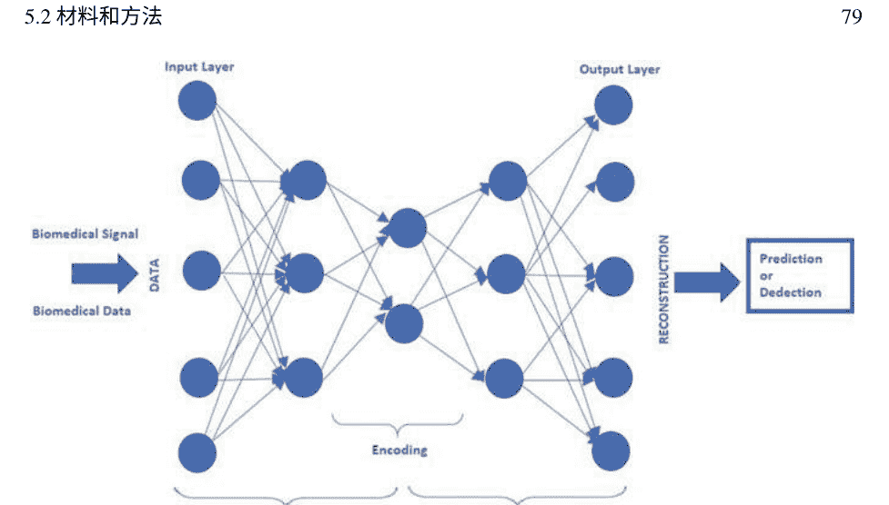

图5.1 一个示例AEN的基本结构

#### 5.2.2.1 自编码器神经网络

自编码器网络（AEN）是一种前馈神经网络，可以被训练成尝试将其输入复制到输出。图5.1说明了一个示例AEN的基本结构。

在自动编码器（AE）中，输入数据首先转换为抽象表示。然后，通过编码器函数将其返回到原始格式。此外，模型经过训练，使得整个输入被编码为一种符号，从中可以再次重建输入。事实上，AE在该过程的上下文中模拟了类似于恒等函数的东西。AE的一个重要优势是，在传播过程中能够获得一致有用的特性，并相应地过滤无用信息。此外，学习过程的效率得到提高，因为输入向量（数据）在编码过程中被转换为较低维度的表示[30]。

如前所述，AE是一种前馈神经网络，是唯一一个类似于多层感知器（MLP）的隐藏层。AE和MLP之间的主要区别与AE旨在重建输入相关，而MLP旨在估计与输入相关的目标值有关。

在典型的AE模型中，输入层和输出层的神经元总数是相同的。作为第一个任务，AE将输入向量转换为隐藏表示，这要归功于一个权重矩阵，假设为w。这被称为编码过程。随后，AE将隐藏表示映射回其原始格式，以获得另一个带有权重矩阵w'的x'。在这里，w'应该是w的转置。这个过程被称为解码。参数优化用于最小化x和x'之间的重构均方误差。在这里，均方误差（MSE）是

AE的优势在于对此重组的训练形式。在重新配置过程中，隐藏层的活动仅以输入属性的形式进行编码，并使用信息中的信息。如果模型能够完美地恢复原始输入，则有关输入的信息足够，并且由这些权重和偏差定义的学习非线性变换是一个良好的特征提取步骤。因此，堆叠这样训练过的编码器可以最小化信息损失。同时，它们保护更深层次的抽象和不可变信息。这就是为什么我们选择AE逐渐去除高光谱数据的深层属性[32]的原因。

### 5.2.3 评估性能

在这项研究中，为了评估所采用的分类模型架构的精确性，确定了准确性、精确度、召回率、F-度量、特异性和敏感性等性能指标[33]。

性能评估者在分类任务中起着重要的作用。最流行的标准是分类器所做出的正确决策的比例。敏感性，也称为召回率，显示分类器能够识别正例的程度。此外，特异性用于判断分类器在识别负例方面的能力。精确度是对正样本的真实预测率。已知敏感性和精确度之间存在着递减的双曲线关系，解决这个问题的一种方法是使用ROC曲线（这些图表用于可视化、选择和组织分类器，考虑它们的性能）。ROC图是二维的，其中FP比率（1-特异性）绘制在水平轴上，精确度绘制在垂直轴上。此外，F-度量是敏感性和精确度的调和平均值[34]：

准确率 = \frac{\text{真正例 + 真负例}}{\text{真正例 + 真负例 + 假正例 + 假负例}} (5.1)
敏感度 = \frac{\text{真正例}}{\text{真正例 + 假负例}} (5.2)
特异性 = \frac{\text{真负例}}{\text{假正例 + 真负例}} (5.3)
精确率 = \frac{\text{真正例}}{\text{真正例 + 假正例}} (5.4)
召回率 = 敏感度 (5.5)
F-度量 = 2 * \frac{(精确率 * 召回率)}{(精确率 + 召回率)} (5.6)

在这些方程式(5.1)-(5.6)中，TP和FP用于表示真正阳性的数量和假阳性诊断的数量。TN和FN分别表示真阴性和假阴性的数量。FP/TN还表示假阳性的数量，并且是从分类结果中的负样本计算得出的。

对于分类器，准确度指的是正确诊断的准确度。敏感性比率表示分类器准确定义目标类的能力。特异性比率用于定义分类器分配目标类的能力。精确度是衡量精确或准确结果质量的指标。

召回率，也称为真正阳性率，提供了测试中被正确定义为阳性的比例。F-measure也称为F1分数，提供了测试的准确性度量。它是灵敏度和召回率的加权调和平均值[34-37]。

## 5.3 分类应用

在本章中，尝试使用不同的实验找到最合适的自编码器网络。AEN的架构如图5.2所示。从图中可以看出，AEN总共有8个阶段。第一个阶段是一个隐藏层大小为10的自动识别器，它使用线性传递函数进行解码。

用于训练的损失函数对应于均方误差函数，并包括L2权重调节和冗余调节。在这里，L2权重调节系数为0.001，稀疏调节项的系数为4，稀疏比率为0.05。解码器传递函数，即Autoencoder 1的最后一个过程，选择为“purelin”。使用缩放共轭梯度下降算法来训练Autoencoder 1。AEN的第二阶段是特征1。解析编码Autoencoder 1和输入矩阵中的隐藏层中的特征。AEN的第三步是Autoencoder 2，具有与Autoencoder 1相同的特征。它是使用第一个自编码器上的特征进行训练的，而不对数据进行缩放。属性2从编码Autoencoder 2和属性1的隐藏层中提取属性。AEN的第五阶段是SoftMax层，使用Autoencoder 2的2个特征进行分类训练。为分类创建的Softmax层作为网络对象返回。Softmax层与目标矩阵的大小相同。Softmax层的损失函数是交叉熵函数。在AEN的第六阶段，编码器和softmax层堆叠在一起形成深度网络Deepnet 1。在第七阶段，使用输入和输出矩阵对深度网络进行训练，以用于声音的属性，从而创建Deepnet 2。使用Deepnet 1，Deepnet 2估计输入数据的输出类别。

每个AEN步骤的最大试验周期数为1000。

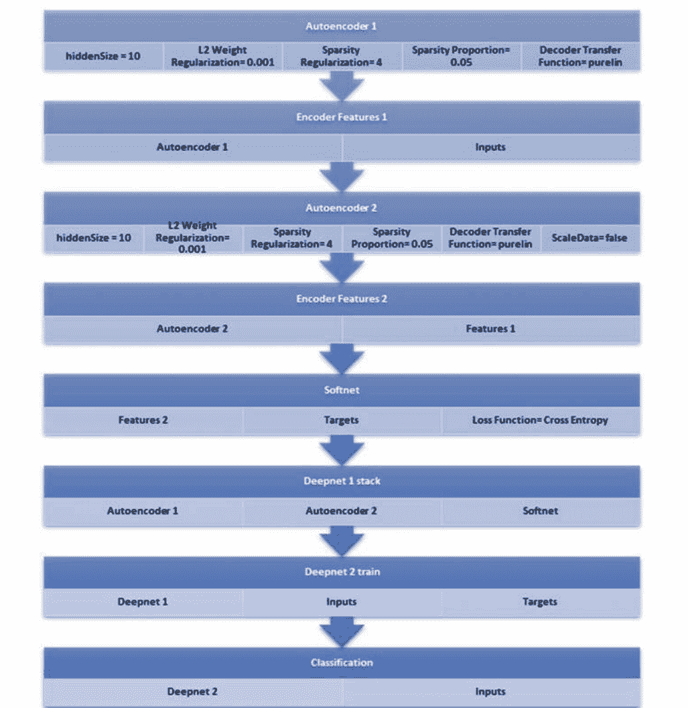

图5.2 所使用的AEN的架构

最后一步使用Deepnet 2对输入数据进行预测，预测了2个输出类别（如PD或健康）。这完成了分类并进行了预测。
在分类应用中，从牛津帕金森病诊断数据集中随机选择了80%的样本作为训练数据，剩下的20%的样本作为测试数据。分类研究重复了20次，使用了随机选择的不同训练和测试数据。

## 5.4 结果与讨论

在分类应用中，从所使用的数据集中随机选择了80%的样本作为训练数据，剩下的20%的样本作为测试数据。分类研究重复了20次，使用了随机选择的不同训练和测试数据。在分类试验中，得到的性能指标如表5.2所示，包括准确率、特异度、敏感度、精确度、召回率和F-measure。

从表中可以看出，获得了相当高的值。为了更好地解释分类试验的性能指标，表5.3给出了每个指标的最低、平均和最高值。

从表中可以看出，最低的分类准确率为91.8%，平均分类准确率为96.1%，最高分类准确率为100.0%。最低的分类敏感度和召回率为95.9%，平均分类敏感度和召回率为98.2%，最高分类敏感度和召回率为100.0%。最低的

表5.2 分类试验中获得的性能指标
| 试验编号 | 准确率 | 敏感性 | 特异性 | 精确度 | 召回率 | F-度量 |
| :---: | :---: | :---: | :---: | :---: | :---: | :---: |
| 1 | 0.9886 | 0.9924 | 0.9767 | 0.9924 | 0.9924 | 0.9924 |
| 2 | 1 | 1 | 1 | 1 | 1 | 1 |
| 3 | 0.9423 | 0.9834 | 0.8000 | 0.9444 | 0.9835 | 0.9636 |
| 4 | 0.9231 | 0.9660 | 0.7917 | 0.9342 | 0.9660 | 0.9498 |
| 5 | 1 | 1 | 1 | 1 | 1 | 1 |
| 6 | 0.9371 | 0.9774 | 0.8095 | 0.9420 | 0.9774 | 0.9594 |
| 7 | 0.9746 | 0.9864 | 0.9375 | 0.9797 | 0.9864 | 0.9831 |
| 8 | 0.9745 | 0.9829 | 0.9487 | 0.9829 | 0.9829 | 0.9829 |
| 9 | 0.9897 | 0.9932 | 0.9792 | 0.9932 | 0.9932 | 0.9932 |
| 10 | 0.9179 | 0.9524 | 0.8125 | 0.9395 | 0.9524 | 0.9459 |
| 11 | 0.9333 | 0.9728 | 0.8125 | 0.9408 | 0.9728 | 0.9565 |
| 12 | 0.9231 | 0.9660 | 0.7916 | 0.9342 | 0.9659 | 0.9498 |
| 13 | 0.9385 | 0.9728 | 0.8333 | 0.9470 | 0.9728 | 0.9597 |
| 14 | 1 | 1 | 1 | 1 | 1 | 1 |
| 15 | 0.9641 | 0.9796 | 0.9167 | 0.9730 | 0.9796 | 0.9763 |
| 16 | 0.9538 | 0.9796 | 0.8750 | 0.9600 | 0.9796 | 0.9697 |
| 17 | 0.9231 | 0.9592 | 0.8125 | 0.9400 | 0.9592 | 0.9495 |
| 18 | 0.9436 | 0.9728 | 0.8547 | 0.9533 | 0.9728 | 0.9630 |
| 19 | 0.9949 | 0.9932 | 1 | 1 | 0.9932 | 0.9966 |
| 20 | 1 | 1 | 1 | 1 | 1 | 1 |
| 平均值 | 0.9611 | 0.9815 | 0.8978 | 0.9678 | 0.9815 | 0.9745 |## 表5.3 性能指标的最低、平均和最高值

| 标准 | 最低 | 平均值 | 最高 |
| --- | --- | --- | --- |
| 准确率 | 0.9179 | 0.9611 | 1 |
| 敏感性 | 0.9592 | 0.9815 | 1 |
| 特异性 | 0.7916 | 0.8978 | 1 |
| 精确度 | 0.9342 | 0.9678 | 1 |
| 召回率 | 0.9592 | 0.9815 | 1 |
| F-度量 | 0.9459 | 0.9745 | 1 |

分类特异性率为79.2%，平均分类特异性率为89.8%，最高分类特异性率为100.0%。最低分类精确率为93.4%，平均分类精确率为96.8%，最高分类精确率为100.0%。最低分类F-measure率为94.6%，平均分类F-measure率为97.5%，最高分类准确率为100.0%。使用AEN对牛津帕金森数据集进行的分类研究具有高准确性、敏感性和特异性率。针对牛津帕金森数据开发的方法，平均整体准确率达到96.1%，性能非常高。在PD诊断的分类研究中，整体、训练和测试阶段得到的混淆矩阵如图5.3、5.4、5.5、5.6、5.7、5.8、5.9、5.10和5.11所示。图5.3、5.4和5.5表示得到最低准确率的混淆矩阵。图5.6、5.7和5.8显示了最接近平均准确率的混淆矩阵。图5.9、5.10和5.11代表了获得最高准确率的混淆矩阵。

## 图5.3 最低准确率的混淆矩阵—整体

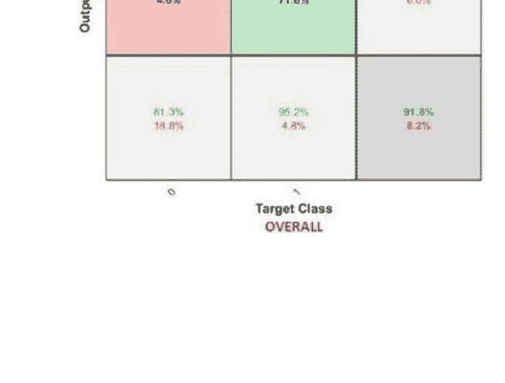

## 5.4 结果与讨论

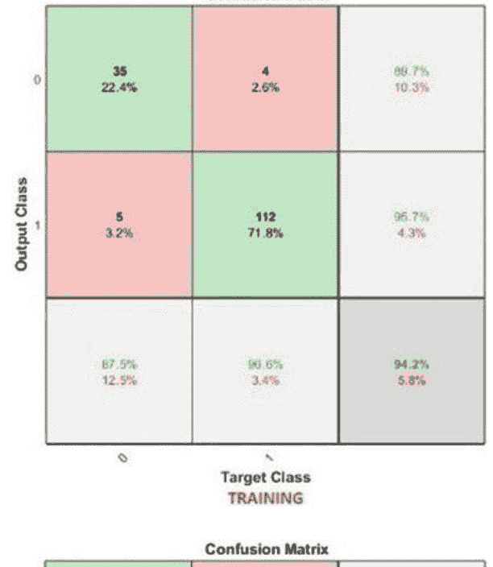

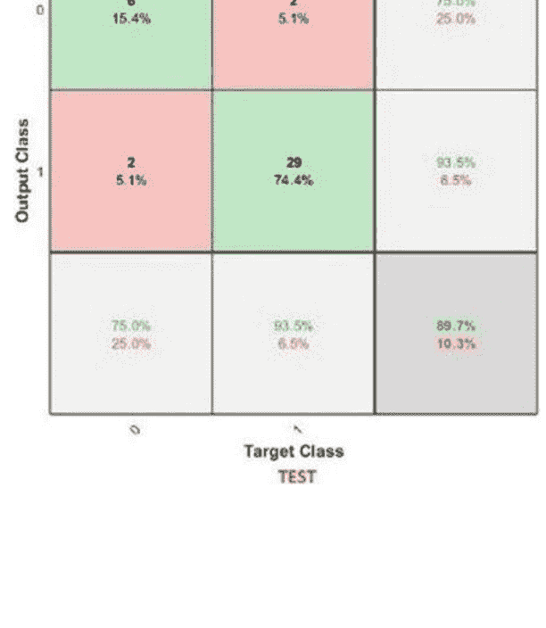

## 图5.6 平均准确率的混淆矩阵—整体

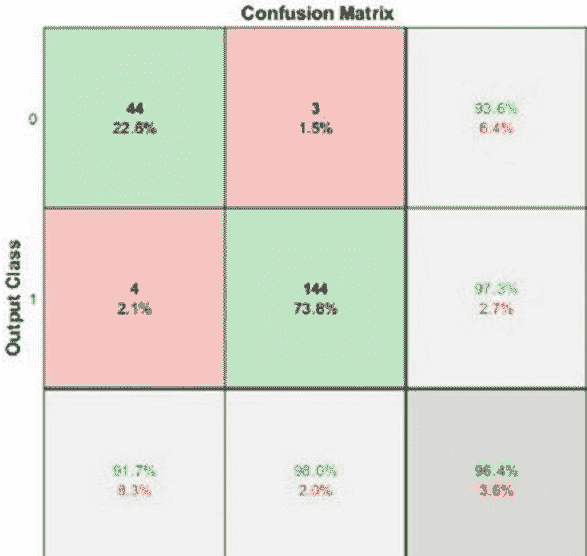

## 图5.7 平均准确率的混淆矩阵—训练

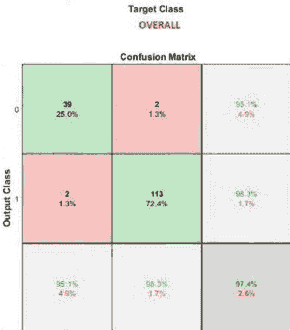

## 图5.8 平均准确率的混淆矩阵—测试

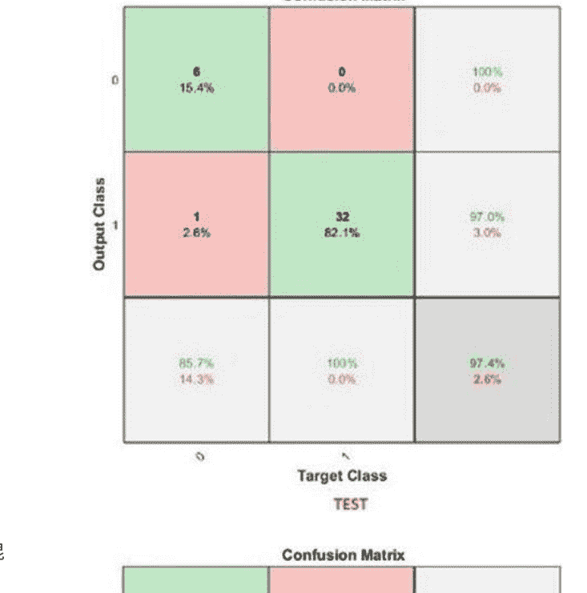

## 图5.9 最高准确率的混淆矩阵—整体

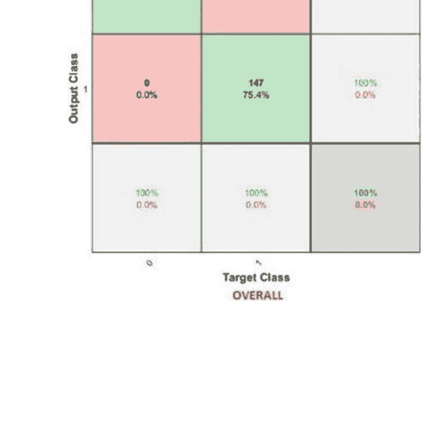

## 图5.10 最高准确率的混淆矩阵—训练

| Output Class | Target Class 0 | Target Class 1 | Row Summary |
|--------------|----------------|----------------|-------------|
| 0            | 39 (25.0%)     | 0 (0.0%)       | 100% 0.0%   |
| 1            | 0 (0.0%)       | 117 (75.0%)    | 100% 0.0%   |
| Column Summary | 100% 0.0%    | 100% 0.0%      | 100% 0.0%   |

## 图5.11 最高准确率的混淆矩阵—测试

| Output Class | Target Class 0 | Target Class 1 | Row Summary |
|--------------|----------------|----------------|-------------|
| 0            | 7 (17.9%)      | 2 (5.1%)       | 77.8% 22.2% |
| 1            | 2 (5.1%)       | 28 (71.8%)     | 93.3% 6.7%  |
| Column Summary | 77.8% 22.2%   | 93.3% 6.7%     | 89.7% 10.3% |

获得的高灵敏度表明该模型准确地定义了目标类的形成。获得的高特异性比率表明该模型具有非常高的目标类分配能力。F-度量是分类器和其召回率的调和平均值。在大多数情况下，精确度和召回率之间存在平衡。如果你优化分类器来增加一个指标并去除另一个指标，调和平均值会迅速下降。然而，当灵敏度和召回率都相等时，它是最大的。如果F-度量非常高，分类器的状态非常好。

为了帕金森病的诊断并应用于牛津帕金森病诊断数据集，通过AEN进行的分类研究所获得的结果，我们可以说AEN非常适合从大型数据集中诊断疾病，并且它们的工作非常有效和高效。

## 5.5 总结

帕金森病（PD）是中枢神经系统退行性疾病。作为阿尔茨海默病的后续，PD是众所周知的常见神经退行性疾病之一。全球患有PD的人数相当高，并且正在迅速增加。据称，到2030年，PD患者的数量将翻倍。早期诊断PD疾病也可以减轻症状。PD的显著症状包括震颤、僵硬、动作缓慢、运动症状不对称和姿势障碍。

最近的研究报告称，大约90%的PD病例中观察到的语言困难可以成为检测健康和PD患者的显著标志，甚至在疾病的早期阶段[7]。PD患者的语言障碍可以广泛分为发声障碍和发音障碍。发声障碍是语音产生的恶化，随着疾病进展可能会增加。发音障碍反映出无法正确连接。声带、发音器官和呼吸肌肉的功能障碍导致声音病理。一些研究将语言障碍的一般影响分类为风声、巨大声、高音、单调和沉闷。声音分析技术，如声谱图和喉电图（EGG）记录声音样本的图像，可用于识别PD患者的紊乱。

在本节中，我们研究了使用从牛津帕金森诊断数据获取的数据进行深度学习来诊断帕金森病，并讨论了深度学习的性能。本文描述了使用牛津帕金森病诊断数据集中的语音记录特征来诊断帕金森病（PD）。在实践中，我们使用了自编码器网络（AEN）来通过对数据集中的特征进行分类来区分PD和健康个体的数据。简要描述了数据集和使用的方法的属性和方法。对于所有分类研究，我们使用MATLAB r2017a软件。

使用AEN对牛津帕金森病数据集进行的分类研究具有很高的准确性、敏感性和特异性。对于牛津帕金森病数据，我们开发的方法达到了96.1%的平均整体准确率，具有非常高的性能。

高敏感性说明我们开发的模型能够准确地定义目标类的形成。高特异性比率表明我们开发的模型具有非常高的目标类分配能力。F-度量是分类器和其召回率的调和平均值。在大多数情况下，精确度和召回率之间存在平衡。如果你优化分类器来增加一个指标并去除另一个指标，调和平均值会迅速下降。然而，当敏感性和召回率都相等时，调和平均值最大。如果F-度量非常高，分类器的状态非常好。

为了帕金森病的诊断并应用于牛津帕金森病诊断数据集，通过AEN进行的分类研究所获得的结果，我们可以说AEN非常适合从大型数据集中诊断疾病，并且它们的工作非常有效和高效。

由于深度学习似乎是一个需要理解复杂特征的解决方案，实际上它是一种革命性的工具，用于提供决策支持工具，与传统机器学习解决方案或与之开发的混合系统相比，更易于使用。下一章旨在通过考虑心脏疾病来展示这一点。与帕金森病不同，这次是通过处理原始数据来完成的，如第6章所解释的。

## 5.6 进一步学习

为了研究AE技术和方法的特性细节，可以参考[38–45]。

可以查看[46–48]中的文章，以了解AEN在不同数据库中的应用和性能。

可以看到在语音增强噪声分类中使用自编码器的[49]。此外，可以阅读关于自编码器在语音和音频识别中的性能的文章[45, 50, 51]。

在用于帕金森病诊断的移动应用程序中，可以检查[24]以查看使用两个独立数据库的详细信息，一个用于教育，一个用于分类。

为了看到帕金森病诊断中的不同方法，可以研究使用降噪、聚类和预测方法预测帕金森病进展的混合智能系统[52]。在这项研究中，使用主成分分析（PCA）和期望最大化（EM）来解决实验数据集中的多重共线性问题并对数据进行聚类。应用自适应神经模糊推理系统（ANFIS）和支持向量回归（SVR）来预测帕金森病进展。对公共帕金森数据集的实验结果表明，显著提高了预测帕金森病进展的准确性。

所提出的方法。在混合智能系统中，可以考虑使用AEN或其他深度学习方法代替SVR。此外，为了了解帕金森病诊断的不同方法，可以阅读[1]。

# 参考文献

- 1. Z. Cai, J. Gu, C. Wen, D. Zhao, C. Huang, H. Huang, C. Tong, J. Li, H. Chen, 基于混沌细菌觅食优化增强模糊KNN方法的智能帕金森病诊断系统。计算数学方法医学 **2018**, 24 (2018)
- 2. D. Gil, D.J. Manuel, 利用人工神经网络和支持向量机诊断帕金森病。全球计算机科学技术杂志 **9** (4) , 63-71 (2009)
- 3. A. Elbaz, J.H. Bower, D.M. Maraganore, S.K. McDonnell, B.J. Peterson, J.E. Ahlskog, D.J. Schaid, W.A. Rocca, 帕金森综合征和帕金森病的风险表。临床流行病学杂志 **55** (1) , 25-31 (2002)
- 4. E. Dorsey, R. Constantinescu, J.P. Thompson, K.M. Biglan, R.G. Holloway, K. Kieburtz, F.J. Marshall, B.M. Ravina, G. Schifitto, A. Siderowf, C.M. Tanner, 2005年至2030年全球人口最多的国家中帕金森病患者的预测人数。 神经学 **68**(5),384–386 (2007)
- 5. R.G. Ramani, G. Sivagami, 使用数据挖掘算法进行帕金森病分类。国际计算机应用杂志 **3** 2(9), 17–22 (2011)
- 6. 帕金森病基金会, https://www.parkinson.org/. 最后访问日期：2020年1月4日
- 7. K. Revett, F. Gorunescu, A.B.M. Salem, 帕金森病的特征选择：粗糙集方法, 2009年国际计算机科学与信息技术多会议(IEEE, 2009), 第425–428页
- 8. S.S. Rao, L.A. Hofmann, A. Shakil, 帕金森病：诊断与治疗。美国家庭医生 **74**(12), 2046-2054 (2006年)
- 9. M. Ene, 基于神经网络的方法来区分健康人群和帕金森病患者。克拉约瓦大学数学与计算机科学系 **35**, 112-116 (2008年)
- 10. M. Gil-Martín, J.M. Montero, R. San-Segundo, 使用卷积神经网络从绘画动作中检测帕金森病。 电子 **8** (8), 907 (2019年)
- 11. C.R. Pereira, S.A. Weber, C. Hook, G.H. Rosa, J.P. Papa, 深度学习辅助帕金森病的手写动力学诊断, 于2016年第29届SIBGRAPI图形、模式和图像会议 (SIBGRAPI) (IEEE, 2016年), 第340-346页
- 12. S.L. Oh, Y. Hagiwara, U. Raghavendra, R. Yuvaraj, N. Arunkumar, M. Murugappan, Acharya, U.R. Murugappan, 一种基于深度学习的帕金森病诊断方法, 来自EEG信号。神经计算应用。1-7 (2018年)
- 13. H. Choi, S. Ha, H.J. Im, S.H. Paek, D.S. Lee, 通过基于深度学习的多巴胺转运体成像解释, 改进帕金森病的诊断。神经影像临床。 **16**, 586-594 (2017年)
- 14. B.M. Eskofier, S.I. Lee, J.F. Daneault, F.N. Golabchi, G. Ferreira-Carvalho, G. Vergara-Diaz, S.Sapienza, G. Costante, J. Klucken, T. Kautz, P. Bonato, 最近在基于传感器的运动分析中的机器学习进展：深度学习用于帕金森病评估, 在 2016第38届IEEE工程医学与生物学学会年会 (EMBC) (IEEE, 2016) , pp. 655-658
- 15. S. Sivaranjini, C.M. Sujatha, 基于深度学习的帕金森病诊断, 使用卷积神经网络。Multim ed. Tools Appl. 1–13 (2019)
- 16. S. Shinde, S. Prasad, Y. Saboo, R. Kaushick, J. Saini, P.K. Pal, M. Ingalhalikar, 使用深度神经网络在神经黑素敏感MRI上预测帕金森病的标记。Neuroimage Clin. **22**, 101748 (2019)
- 17. A. Ortiz, J. Munilla, M. Martínez, J.M. Gorriz, J. Ramírez, D. Salas-Gonzalez, 使用等值面特征和卷积神经网络进行帕金森病检测。Front.Neuroinf. 13, 48 (2019)
- 18. S. Grover, S. Bhartia, A. Yadav, K.R. Seeja, 使用深度学习预测帕金森病的严重程度。计算科学会议论文集 132, 1788–1794 (2018)
- 19. S. Muthumanickam, J. Gayathri, Daphne J. Eunice, 使用机器学习和深度学习算法进行帕金森病检测和分类-一项调查。国际工程科学发明杂志 7(5), 56–63 (2018)
- 20. A.A. Spadoto, R.C. Guido, F.L. Carnevali, A.F. Pagnin, A.X. Falcão, J.P. Papa, 通过基于进化的特征选择改进帕金森病识别, 在2011年IEEE工程医学与生物学学会年会 (IEEE,2011), pp. 7857–7860
- 21. D. Karunanithi, P. Rodrigues, 使用模糊高度诊断帕金森病。Int. J. Pure Appl. Math. 118(20), 4497–4501 (2018)
- 22. R.F. Olanrewaju, N.S. Sahari, A.A. Musa, N. Hakiem, 神经网络在早期检测和诊断帕金森病中的应用, 在2014年国际网络和IT服务管理会议 (CITSM) (IEEE, 2014), pp. 78–82
- 23. P. Durga, V.S. Jebakumari, D. Shanthi, 使用数据挖掘技术诊断和分类帕金森病。Int. J. Adv. Res. Trends Eng. Technol. 3, 86–90 (2016)
- 24. Y.N. Zhang, 一部智能手机能诊断帕金森病吗？一种深度神经网络方法和遥诊系统实施, 在帕金森病 (2017)
- 25. M.A. Little, P.E. McSharry, S.J. Roberts, D.A. Costello, I.M. Moroz, 利用非线性重复性和分形缩放特性进行语音障碍检测。生物医学工程在线 6(1), 23 (2007)
- 26. M. Little, P. McSharry, E. Hunter, J. Spielman, L. Ramig, 适用于帕金森病远程监测的失音测量。自然。Preced. 1 (2008)
- 27. 牛津帕金森病检测数据集, https://archive.ics.uci.edu/ml/datasets/pinsons。最后访问日期为2020年1月9日
- 28. R. Geetha Ramani, G. Sivagami, 使用数据挖掘算法进行帕金森病分类。Int. J. Comput. Appl. 32(9) (2011) (0975-8887)
- 29. X. Wang, 帕金森病的数据挖掘分析。数学论文, 乔治亚州立大学, 2014年2月17日
- 30. W. Liu, Z. Wang, X. Liu, N. Zeng, Y. Liu, F.E. Alsaadi, 深度神经网络结构及其应用的调查。神经计算 234, 11-26 (2017年)
- 31. Y. Bengio, P. Lamblin, D. Popovici, H. Larochelle, 深度网络的贪婪逐层训练。Adv. Neural. Inf. Process. Syst. 19, 153-160 (2007年)
- 32. Y. Chen, Z. Lin, X. Zhao, G. Wang, Y. Gu, 基于深度学习的高光谱数据分类。IEEE J. Sel. Top. Appl. Earth Observ. Rem. Sens. 7 (6) , 2094-2107 (2014年)
- 33. W. Zhang, J. Han, S. Deng, 基于缩放谱图和张量分解的心音分类。Biomed. Signal Process. Control 32, 20-28 (2017年)
- 34. R.P. Espíndola, N.F.F. Ebecken, 将F-measure和G-mean指标扩展到多类问题。WIT Trans. Inf. Commun. Technol. 35
- 35. O. Deperlioglu, 使用卷积神经网络对心音图进行分类。BRAIN Broad Res. Artif. Intell. Neurosci. 9 (2) , 23-33 (2018)
- 36. D.J. Hemanth, O. Deperlioglu, U. Kose, 使用深度卷积神经网络的增强型糖尿病视网膜病变检测和分类方法。Neural Comput. Appl. 32, 1–15(2020)
- 37. Q.-A. Mubarak, M.U. Akram, A. Shaukat, F. Hussain, S.G. Khawaja, W.H. Butt, 使用质量评估和同态滤波器分析PCG信号，用于心音的定位和分类。Comput. Methods Program. Biomed. (2018). https://doi.org/10.1016/j.cmpb.2018.07.006
- 38. L. Deng, D. Yu, 深度学习: 方法和应用。Found. Trends Sig. Process. 7(3–4), 197–387 (2014)
- 39. I. Goodfellow, Y. Bengio, A. Courville, in 深度学习 (MIT Press, 2016)## 参考文献

+   40. Y. LeCun, Y. Bengio, G. Hinton, 深度学习. Nature 521(7553), 436–444 (2015)
+   41. 深度学习教程, in Release 0.1, LISA实验室. 蒙特利尔大学, 2015年9月
+   42. A. Zhang, Z.C. Lipton, M. Li, A.J. Smola, 深入深度学习, in 未发表草稿. 检索日期, 2019年3月, 第319页
+   43. P. Baldi, 自编码器, 无监督学习和深度架构, in ICML会议论文集 无监督和迁移学习研讨会, 2012年6月, 第37–49页
+   44. Q.V. Le, 深度学习教程第2部分: 自动编码器，卷积神经网络和循环神经网络。Google Brain 1-20 (2015年)
+   45. S. Amiriparian, M. Freitag, N. Cummins, B. Schuller, 用于无监督表示学习的序列到序列自动编码器, 在DCASE 2017研讨会的论文集中, 2017年11月
+   46. O. Deperlioglu, 使用自动编码器神经网络对分段心音进行分类, 在第八届欧亚国际多学科大会（IMCOFE'2019）（安塔利亚, 2019年），4月24日至26日, 页码122-128。ISBN: 978-605-68882-6-7
+   47. O. Deperlioglu, 使用深度神经网络进行肝炎疾病诊断, 在国际第四届 欧洲科学、艺术&文化会议（ECSAC'2019）（安塔利亚, 2019年），4月18日至21日, 页码467-473。ISBN: 978-605-7809-73-5
+   48. O. Deperlioglu, 使用自编码器深度神经网络诊断乳腺癌,在国际第四届欧洲科学、艺术和文化会议（ECSAC'2019）（安塔利亚, 2019年4月18日至21日），第475-481页。ISBN: 978-605-7809-73-5
+   49. B. Xia, C. Bao, 基于维纳滤波的加权去噪自编码器和噪声分类的语音增强。语音通信。60, 13-29 (2014年)
+   50. K. Noda, Y. Yamaguchi, K. Nakadai, H.G. Okuno, T. Ogata, 使用深度学习的视听语音识别。应用智能。42 (4), 722-737 (2015年)
+   51. R.G. Malkin, A. Waibel, 使用环境音频的线性自编码对移动应用进行用户环境分类, 在ICASSP'05的会议记录中。IEEE国际会议声学、语音和信号处理, 2005年, 第5卷 (IEEE, 2005), 第v-509页
+   52. M. Nilashi, O. Ibrahim, A. Ahani, 提高预测帕金森病进展的准确性。科学报告。6, 34181 (2016年)

## 第6章
通过深度神经网络进行心脏疾病早期诊断的实用方法

如今，大多数人类死亡是由心脏疾病引起的。因此，许多研究致力于改善心脏疾病的早期诊断并减少死亡。这些研究主要旨在利用不断发展的技术开发计算机辅助诊断系统。一些计算机辅助系统是临床决策支持系统，旨在比心脏声音或相关数据更容易检测心脏疾病。这些系统是用于自动诊断心脏疾病的软件，通常基于数据的分类。大多数用于诊断心脏疾病的研究都是为了提高分类的成功率[1, 2]。

Bathia和同事们开发了一个决策支持系统，使用支持向量机和整数值编码的遗传算法对心脏疾病进行分类。在这项研究中，遗传算法被用来最大化简单支持向量机的性能，选择相关属性并删除不必要的属性[3]。Parthibane和Subramanian提出了一种基于合作神经模糊推理（CANFIS）的心脏疾病预测方法。这个CANFIS模型结合了模糊逻辑的定性方法与遗传算法，用于诊断神经网络的能力以及疾病的存在[4]。

医疗系统中有大量的数据。然而，需要有效的分析工具来探索数据中隐藏的关系和趋势。为此，信息的发现和数据挖掘是科学研究中最重要的主题之一。研究人员长期以来一直使用统计和数据挖掘技术来改善大数据集中的数据分析结果。疾病诊断是其中一个广泛应用数据挖掘技术取得成功结果的领域。Ahmed和Hannan在他们的研究中，使用数据挖掘、支持向量机、遗传算法、粗糙集理论、合并规则和人工神经网络来发现心脏疾病。他们发现决策树和SVM对心脏疾病最有效。因此，他们指出数据挖掘可以帮助识别或预测高风险或低风险的心脏疾病 [5]。另一项数据挖掘研究分析了使用更多输入特征的心脏病预测系统。数据挖掘分类技术，如朴素贝叶斯、决策树和人工神经网络，被评估在心脏病数据库上。这些相关技术的总体性能进行了比较，分别得到了人工神经网络、决策树和朴素贝叶斯的分类准确率较高 [6]。正如我们所见，人工神经网络已被广泛用于诊断心脏疾病。Das等人的相关工作和Deperlioglu的研究也是最近的研究示例 [2]。

最近，深度学习方法也被用于分类心脏声音。例如，Potes和同事提出了一种基于分类器组的方法，该方法结合了AdaBoost和卷积神经网络（CNN）的输出，用于对异常/正常心脏声音进行分类 [8]。Rubin等人提出了一种自动心脏声音分类算法，该算法允许将时频热图指示与CNN相结合 [9]。Deperlioglu在他的研究中使用CNN对分段和非分段的心音图进行分类 [10, 11]。

从上面的例子可以看出，为了增加分类成功率，通常会使用复杂的混合方法来诊断心脏病。在本章中，我们研究了一种深度学习方法，以提高对心脏疾病的诊断成功率（而不涉及更复杂的方法或算法）。本章简要介绍了使用克利夫兰心脏病数据集和自编码神经网络（AEN）来检测心脏疾病的方法。此外，本章旨在展示通过使用（AEN）而无需任何特征选择过程或混合方法即可轻松提高分类成功率。

## 6.1 基础知识

本章详细解释了使用克利夫兰心脏病数据集和AEN进行心脏疾病确定的方法，无需任何特征选择过程或混合方法即可轻松分类。下面详细介绍了研究所使用的材料和方法。

### 6.1.1 克利夫兰心脏病数据集

为了测试提出的方法，使用了来自UCI学习数据集库的克利夫兰心脏病数据库[12-15]。克利夫兰心脏病数据库包含303条记录，具有13个属性。这些属性列在表6.1中。几乎所有对这个数据库进行心脏病诊断的研究都使用了上述13个属性作为输入[6]。数据集中的数据包括5个输出类别，1、2、3、4表示心脏病的存在，0表示不存在。

表6.1 13个输入属性的定义
| 编号 | 属性 | 定义 | 值 |
|:---|:---|:---|:---|
| 1 | 年龄 | 年龄（以年为单位） | 实数（数字） |
| 2 | 性别 | 女性或男性 | 0 = 女性 / 1 = 男性 |
| 3 | CP | 胸痛类型 | 4 = 无症状<br>3 = 非心绞痛疼痛<br>2 = 典型型心绞痛<br>1 = 典型型 1 |
| 4 | Thestbps | 静息血压 | 实数值/mm 汞柱 |
| 5 | Chol | 血清胆固醇 | 实数值/mm/dl |
| 6 | Restecg | 静息状态下的心电图结果 | 0 = 正常<br>1 = 有_ST_T波异常<br>2 = 左室肥厚 |
| 7 | Fbs | 空腹血糖 | 1 ≥ 120 mg/dl<br>0 ≤ 120 mg/dl |
| 8 | Thalach | 心率的最大值 | 实数值 |
| 9 | Exang | 运动诱发心绞痛 | 0 = 否<br>1 = 是 |
| 10 | Oldpeak | 相对于休息状态由运动引起的ST段压低状态 | 实数值 |
| 11 | Slope | 峰值运动ST段的斜率 | 3 = 下倾斜<br>2 = 平坦<br>1 = 不倾斜 |
| 12 | Ca | 根据面粉的颜色，主要血管的数量 | 值在0-3之间 |
| 13 | Thal | 缺陷类型 | 7 = 可逆缺陷<br>6 = 固定的<br>3 = 正常的 |

### 6.1.2 自编码器神经网络

自编码器神经网络最早由Hinton和Salakhutdinov于2006年引入[16]。基本上，它可以被认为是前馈神经网络，训练成可靠地复制输入。但是网络模型的结构使得中间层使用的神经元比上层和下层的神经元少。因此，该网络可以被视为与包含编码表示的最少数量的神经元相关联的编码器-解码器对。因为每一层只依赖于前一层的值，所以编码的知识足以计算相应的重构[17]。通常，自编码网络通过设置每层的节点数来定义。图6.1显示了自编码器网络的模型架构。连续的节点层检测输入数据中的模式，并使用它们生成数据的编码表示。它接收相应的解码器编码，并尝试重新配置原始条目。网络训练算法涉及调整每个节点的行为，使配置更接近数据。可以定义网络通过每层节点的数量来定义。 例如，图6.1所示的网络由五个节点层通过四个神经层相互连接，是一个7-6-4-6-7的自动编码器[17]。

自动编码器属于一种无监督学习的类别学习算法，无需标记信息来进行数据处理[18]。

### 6.1.3 性能评估

准确率、敏感度和特异度是医学分类研究中常用的性能指标。 这些指标被用来评估所提出方法的精确度。 它们的计算公式如下：

```
$Ac = \frac{T_P}{T_P + F_P} \quad (6.1)$
```

```
$Se = \frac{T_P}{T_P + F_N} \quad (6.2)$
```

```
$Sp = \frac{T_N}{T_N + F_{P}} \quad (6.3)$
```

在这些方程中，TP和FP分别表示真正例和假正例的数量。另一方面，TN和FN分别表示真反例和假反例的数量。FPTN还表示分类结果中负样本的假正例数量。
分类器正确诊断的精确度取决于准确率的比率。模型正确定义目标类形成程度由敏感性的比率定义。模型目标类分离能力的程度由特异性的比率定义[10]。

## 6.2 心脏疾病的早期诊断

在克利夫兰心脏数据库数据集的大量试验结束时，获得了AEN的参数。AEN的结构和细节总共包括8个阶段，如图6.2所示。

在AEN的分类研究中，网络中有24个隐藏层。在编码阶段，使用比例算法作为比例算法，并使用交叉熵损失函数的功能。在解码阶段，使用Levenberg-Marquardt算法和均方误差方法。

通过获得的AEN，80%的数据集和20%的数据被分类为测试数据。随机选择不同的训练和测试数据，并重复分类过程20次。准确率、敏感性和特异性的比率（在这些研究中获得）被平均。实验结果显示，最低和最高准确率的混淆矩阵分别在图6.3和6.4中给出。

在20次试验结束时，平均准确率为99.13%，敏感性为97.90%，特异性为97.95%。

为了评估所提出方法的性能，将其与使用相同数据集的先前研究结果进行比较。这些研究包括：

+   1. Deperlioglu使用贝叶斯调节算法的人工神经网络(ANN) [1]。
+   2. Bathia等人使用遗传算法(GA)进行特征选择，并使用简单支持向量机(SSVM)进行分类[3]。
+   3. Kahramanli和Allahverdi使用包括人工神经网络(ANN)和模糊神经网络(FNN)的混合方法[21]。
+   4. Anooj使用加权模糊规则(WFR)。
+   5. Das等人使用神经网络集成方法(ANN) [7]。
+   6. Setiawan等人使用基于粗糙集理论的模糊决策支持系统(FDSS)和规则提取方法[20]。
+   7. - (9) 他们还使用多层感知器神经网络(MLP ANN)、k最近邻(k-NN)、C4.5和RIPPER方法进行比较[20]。
+   8. 详细信息请参见表6.2。表中最高值以粗体显示。

从表6.2可以看出，所提出的方法比许多单一或混合方法都有更好的结果。99.13%的准确率表明分类器的正确诊断能力很高。97.90%的敏感性比率表明该模型具有高度准确的判断能力目标类的形成。97.95%的特异性比率表明该模型具有广泛的目标类分离能力。

## 6.3 结果与讨论

许多生物医学决策支持系统已经被开发出来，通过开发早期诊断来减少心脏病的早期死亡。研究人员尝试过通过使用不同的方法，如优化方法和分类技术的混合方法，提高效率。本研究说明了通过使用自编码器神经网络，可以提高分类的准确性，而不使用混合方法或使用不同的优化方法进行特征选择。为此，使用加利福尼亚大学尔湾分校（UCI）机器学习实验室中广泛使用的克利夫兰心脏病数据集。所提出的方法得到的准确性、敏感性和特异性值表明该方法具有很高的性能。因此，通过更少的工作量，可以在更短的时间内诊断心脏疾病。

## 6.4 总结

由于人类死亡的大部分原因是心脏疾病，因此进行了许多替代研究以改善心脏疾病的早期诊断并减少死亡。这些研究主要旨在开发计算机辅助诊断系统使用正在发展的技术。一些计算机辅助系统是临床决策支持系统，旨在比心脏音或相关数据更容易检测心脏疾病。这些系统是用于自动诊断心脏疾病的软件，通常基于数据的分类。在这一点上，深度学习技术通过其深入分析和诊断潜力将成功水平提高到更高的值。

在本章中，根据AEN进行了一项分类研究，作为一种易于使用的诊断心脏疾病的工具。由于网络中有24个隐藏层形成的结构，使用了比例算法作为比例算法，并使用了交叉熵代价函数的函数进行有效训练。在解码阶段，使用了Levenberg-Marquardt算法和均方误差方法，同时还使用了80%的数据集进行AEN的训练，20%的数据进行测试，通过随机选择的不同训练和测试数据以及重复20次的分类过程。平均准确率为99.13%，灵敏度为97.90%，特异度为97.95%。这里的AEN解决方案还与文献进行了比较，发现其比许多单一或混合方法都能给出更好的结果。AEN的99.13%的准确率表明分类器的正确诊断能力非常高。通过灵敏度97.90%的比率中，它还具有对目标类的准确确定的高度和广泛的目标类分离能力，考虑到97.95%的特异性比率。

可以看出，使用深度学习可以构建一个易于使用甚至易于构建的诊断模型，而不需要任何复杂的混合结构或详细的预处理和分类过程。这里展示了使用AEN进行此目的的示例。

由于深度学习本身可以有效解决目标医学问题，因此仍然可以开发混合解决方案，因为某些问题可能需要不同技术的更高级协作。与传统机器学习技术类似，始终可以建立起群体智能和深度学习之间的强关系。因此，下一章提供了一个确保多疾病诊断系统的示例方法。

## 6.5 进一步学习

要了解人工智能在心脏病诊断方面的显著应用，读者可以参考[22-30]。

在文献中，还可以看到使用替代深度学习技术进行心脏病诊断的情况。
对于这方面的一些最新研究，读者可以阅读[31-37]。

由于心脏病中心脏病中占据重要地位，人工智能（机器/深度学习）的一些额外的显著研究工作可以从[38-43]中阅读。

# 参考文献

+   1. O. Deperlioglu, 不同训练算法对使用人工神经网络分类医学数据库的影响, 欧洲科学、艺术与文化会议ECSAC (2018)
+   2. Ömer Deperlioglu, 使用人工神经网络对分割的心音进行分类, 国际应用数学与电子计算杂志6 (4) , 39-44 (2018)
+   3. S. Bhatia, P. Prakash, G.N. Pillai, 基于SVM的心脏病分类决策支持系统, 使用整数编码的遗传算法选择关键特征, 世界工程与计算机科学大会论文集 (2008)
+   4. L. Parthiban, R. Subramanian, 使用CANFIS和遗传算法的智能心脏病预测系统, 国际生物与生物医学科学杂志3 (3) (2008)
+   5. A. Ahmed, S.A. Hannan, 数据挖掘技术用于心脏疾病的概述. Int. J. Innov. Technol. Explor. Eng. (IJITEE), 1(4) (2012). ISSN 2278-3075
+   6. C.S. Dangare, S. Apte Sulabha, 使用数据挖掘分类技术改进的心脏病预测系统的研究, Int. J. Comput. Appl. 47(10), 44–48 (2012).
+   7. Resul Das, Ibrahim Turkoglu, Abdulkadir Sengur, 通过神经网络集成有效诊断心脏病. Expert Syst. Appl. 36(4), 7675–7680 (2009)
+   8. C. Potes, S. Parvaneh, A. Rahman, B. Conroy, 基于特征和深度学习的分类器集成用于异常心音的检测. https://arxiv.org/pdf/1707.04642.pdf.2017
+   9. J. Rubin, R. Abreu, A. Ganguli, S. Nelaturi, I. Matei, K. Srircharan, 使用深度学习识别异常心音. https://physionet.org/challenge/2016/papers/potes.pdf (2017)
+   10. O. Deperlioglu, 通过卷积神经网络对心音图进行分类, BRAIN.Broad Res. Artif. Intell. Neurosci. 9(2) (2018)
+   11. O. Deperlioglu, 通过卷积神经网络对心音图进行分类, BRAIN. Broad Res. Artif. Intell. Neurosci. 10(1) (2019)
+   12. Cleveland心脏病数据集。http://archive.ics.uci.edu/ml/datasets/Heart+Disease。最后访问日期：2019年1月10日
+   13. Robert Detrano等人, 一种用于冠状动脉疾病诊断的新概率算法的国际应用。美国心脏病学杂志。64(5)，304-310 (1989年)
+   14. D. Aha, D. Kibler, 使用Cleveland数据库基于实例的预测心脏病存在。加州大学3(1), 3-2 (1988)
+   15. John H. Gennari, Pat Langley, Doug Fisher, 增量概念形成模型。人工智能40(1-3), 11-61 (1989)
+   16. G. Hinton, R. Salakhutdinov, 用神经网络降低数据的维度。科学313, 504-507 (2006)
+   17. Andrew P. Valentine, Trampert Jeannot, 数据空间缩减、质量评估和搜索地震图：自编码器网络用于波形数据。地球物理学国际期刊189(2), 1183-1202(2012)
+   18. Q.V. Le, 深度学习教程第2部分：自编码器、卷积神经网络和循环神经网络。Google Brain 1-20 (2015)

- 19. P.K. Anooj, 临床决策支持系统: 使用加权模糊规则预测心脏病风险水平. J. King Saud Univ.-Comput. Inf. Sci. 24(1), 27–40 (2012)
- 20. N.A. Setiawan, P.A. Venkatachalam, A.F.M. Hani, 冠状动脉疾病的诊断使用基于人工智能的决策支持系统, 在国际会议论文集上 (ICoMMS) (Batu Ferringhi, Penang, 2009)
- 21. Humar Kahramanli, Novruz Allahverdi, 设计一个混合系统用于糖尿病和心脏疾病. Expert Syst. Appl. 35(1-2), 82–89 (2008)
- 22. I. Abdel-Motaleb, R. Akula, 使用心音图信号进行心脏病诊断的人工智能算法, 在2012年IEEE国际电子/信息技术会议上 (IEEE, 2012), 第1–6页
- 23. S. Ghumbre, C. Patil, A. Ghatol, 使用支持向量机进行心脏病诊断, 在国际计算机科学与信息技术会议 (ICCSIT') 芭堤雅 (2011)
- 24. G. Manogaran, R. Varatharajan, M.K. Priyan, 基于多核学习和自适应神经模糊推理系统的心脏病诊断混合推荐系统. 多媒体工具应用 77(4), 4379–4399 (2018)
- 25. H. Yan, Y. Jiang, J. Zheng, C. Peng, Q. Li, 基于多层感知器的心脏病诊断医疗决策支持系统. 专家系统应用 30(2), 272–281 (2006)
- 26. A. Adeli, M. Neshat, 用于心脏病诊断的模糊专家系统, 在国际工程师和计算机科学家多学科会议, 香港, vol. 1(2010), pp. 28–30
- 27. J. Nahar, T. Imam, K.S. Tickle, Y.P.P. Chen, 用于心脏病诊断的计算智能: 一种基于医学知识的方法. 专家系统应用. 40(1), 96–104 (2013)
- 28. O.Y. Atkov, S.G. Gorokhova, A.G. Sboev, E.V. Generozov, E.V. Muraseyeva, S.Y. Moroshkina, N.N. Cherniy, 包括遗传多态性和临床参数的人工神经网络诊断冠心病. 心脏病学杂志. 59(2), 190–194 (2012)
- 29. E. O. Olaniyi, O.K. Oyedotun, K. Adnan, 使用神经网络仲裁进行心脏病诊断. 智能系统应用国际期刊. 7(12), 72 (2015)
- 30. M.G. Feshki, O.S. Shijani, 通过PSO和前馈神经网络的进化算法改进心脏病诊断, 在2016年人工智能和机器人学(IRANOPEN)(IEEE 2016)中, 第48-53页
- 31. S. Tuli, N. Basumatary, S.S. Gill, M. Kahani, R.C. Arya, G.S. Wander, R. Buyya, Healthfog: 一种基于深度学习的智能医疗系统, 用于集成IoT和雾计算环境中心脏病的自动诊断. 未来的计算机系统. 104, 187-200 (2020)
- 32. K.K. Wong, G. Fortino, D. Abbott, 基于深度学习的心血管图像诊断: 一个有前途的挑战. 未来的计算机系统. (2019)
- 33. R. Alizadehsani, M. Roshanzamir, M. Abdar, A. Beykikhoshk, A. Khosravi, M. Panahiazar, A. Koohestani, N. Sarrafzadegan, 用于冠状动脉疾病诊断的机器学习和数据挖掘技术数据库. 科学数据. 6 (1), 1-13 (2019)
- 34. N. Zhang, G. Yang, Z. Gao, C. Xu, Y. Zhang, R. Shi, J. Keegan, L. Xu, H. Zhang, Z. Fan, D. Firmin, 用于非增强心脏影像的慢性心肌梗死诊断的深度学习. 放射学. 291 (3), 606–617 (2019)
- 35. G.A. Tadesse, T. Zhu, Y. Liu, Y. Zhou, J. Chen, M. Tian, D. Clifton, 通过跨领域迁移学习进行心血管疾病诊断, 在2019年IEEE工程与医学生物学学会(EMBC)第41届年会上(IEEE, 2019), 第4262-4265页
- 36. A.Y. Hannun, P. Rajpurkar, M. Haghpanahi, G.H. Tison, C. Bourn, M.P. Turakhia, A.Y. Ng, 使用深度神经网络在日常心电图中进行心律失常检测和分类的心脏病专家级别. 自然医学, 25(1), 65 (2019)
- 37. A. Junejo, Y. Shen, A.A. Laghari, X. Zhang, H. Luo, 使用深度学习技术进行分子诊断并预测心血管疾病患者的功能恢复. IEEE Access 7, 120315–120325 (2019)
- 38. A. Bhardwaj, A. Kundra, B. Gandhi, S. Kumar, A. Rehalia, M. Gupta, 使用机器学习预测心脏病发作。 IITM J. Manage. IT 10(1), 20–24 (2019)
- 39. B. Ballinger, B., Hsieh, J., Singh, A., Sohoni, N., Wang, J., Tison, G. H., ... & Pletcher, M. J. (2018). DeepHeart: 半监督序列学习用于心血管风险预测。 在第三十二届AAAI人工智能大会上
- 40. A. Kishore, A. Kumar, K. Singh, M. Punia, Y. Hambir, 使用深度学习预测心脏病发作。 Heart 5(04) (2018)
- 41. S.B. Patil, Y.S. Kumaraswamy, 从心脏病仓库中提取重要模式，用于心脏病发作预测。 I JCSNS 9(2), 228–235 (2009)
- 42. R. Chitra, V. Seenivasagam, 使用模糊C均值分类器的心脏病预测系统。 IOSR J. Comput. Eng. 14, 23–31 (2013)
- 43. C. Thirumalai, A. Duba, R. Reddy, 使用机器学习和Pearson进行决策的心脏病系统。 在2017年国际电子、通信和航空技术会议 (ICECA) 中，第2卷 (IEEE, 2017), 第206-210页

# 第7章 一种混合医学诊断方法，以群体智能支持的自编码器为基础的循环神经网络系统

自从人工智能首次出现在学术和科学界以来，它已经迈出了许多步伐，这导致了建立不同的子领域，专注于不同的算法解决方案。 可以使用基于机器学习的技术从样本中学习并开发训练有素的智能系统[1, 2]。 另一方面，基于群体智能的技术可以通过从自然界中获得灵感来解决高级优化问题[3, 4]。 值得注意的是，人工智能领域与数据挖掘、机器人技术等其他计算和工程导向的领域有许多关联[5-8]。 在所有这些复杂但灵活的解决方案变体中，对于构建包含不同人工智能技术算法或传统解决方案的混合系统，也引起了越来越多的兴趣，以设计一个先进的系统来解决目标问题。 由于训练机器学习技术的实际任务只是优化其参数，因此在相关文献中广泛采用了使用群体智能进行训练阶段的混合系统方法[9-13]。

医学是最引人注目的领域之一，其中经常使用混合人工智能系统。 由于医学领域对创新技术支持非常开放，基于人工智能的方法、技术和技巧在混合形式的背景下广泛应用于解决不同的问题已经有很长时间了[14-19]。 如今，可以看到基于人工智能的系统在疾病诊断、医学专家支持、信息发现等重要问题上的有效应用[20-25]。 由于有时候处理复杂和不同类型的医学数据很困难，所以使用替代数据处理方法（图像/信号处理）[26, 27]和先进的混合系统作为有效和高效的解决方案。 显然，更先进的人工智能技术算法的使用可以为甚至最复杂的问题和数据带来更好的结果。

本章介绍了一种用于医学诊断的混合系统。 在这个意义上，一种群体智能（SI）支持的自编码器基于循环神经网络能够有效诊断疾病的ARNN被设计为确保灵活的解决方案。称为SIARNN的系统使用Python编程语言编写了一些代码，通过这种方式，可以运行预定义的SI算法来提供最佳结果数据给ARNN，从而获得了快速的计算解决方案。在这个意义上，SIARNN的总体目标是找到一个最佳的、可立即使用的系统，以获得良好的目标疾病数据结果。该系统的当前版本支持默认的ARNN模型，支持五种不同的知名和最新的SI算法：人工蜜蜂群（ABC）、涡旋优化算法（VOA）、布谷鸟搜索（CS）、蚁狮优化器（ALO）和电子搜索算法（ESA）。为了更好地了解SIARNN的有效性，进行了一些评估工作。

## 7.1 相关工作

正如在前几章中广泛讨论的那样，相关文献使用了许多不同的研究示例，应用智能系统进行医学诊断。在这里，值得注意的是神经网络模型在包括医学在内的许多问题领域中在人工智能历史上起到了重要作用。通过更加关注神经网络的应用情况，可以为不同的医学诊断问题提供广泛的观点，包括传统机器学习技术和深度学习技术的应用。

在Erkaymaz和他的朋友们的工作中[28]，通过考虑糖尿病疾病评估了Small-World前馈神经网络（SWFNN）的总体性能。具体来说，该工作报告了Newman-Watts小世界模型比Watts-Strogatz模型取得了更好的结果。Erkaymaz还有另一项关于SWFNN的工作，解释了小世界网络拓扑对传统ANN结构的影响[29]。该工作中的目标疾病仍然是糖尿病。在另一项比较性工作中，帕金森病通过使用不同的技术，包括神经网络模型进行诊断[30]。该工作报告了概率神经网络（PNN）技术提供了比其他一些分类技术更好的结果。在[31]中，Yalcin和她的朋友们使用脑电图（EEG）时间序列和运行粒子群优化（PSO）训练的ANN来研究癫痫诊断。在这项工作中，ANN-PSO模型与替代模型进行了比较，考虑了癫痫诊断问题。这项研究的作者在最近的工作[32]中使用EEG数据和运行智能优化-ANN组合的方法。具体而言，该工作提供了对使用蚁狮优化器（ALO）和ANN进行脑电图时间序列研究的详细研究。同样，该工作[33]提供了另一种最近的智能优化算法：电子搜索算法（ESA），用于训练ANFIS并处理脑电图数据。在[34]中的另一项工作展示了使用ANN诊断肝硬化和门脉高压的应用。但研究结果显示ANN在使用上并没有太多积极的效果。

结束。作为一种不同的疾病，哮喘被Badnjević和他的朋友们通过使用ANN [35]进行分类。根据这项工作，该模型以约97%的成功率诊断哮喘。通过在多层结构上使用前馈机制，[36]的研究为心脏疾病提供了诊断，使用了ANN。在结核病方面，[37]的工作提供了一个良好且最新的关于使用人工智能和神经网络导向技术的综述。在心脏疾病的背景下，Pandey和Janghel提供了一项关于使用神经网络模型诊断心律失常的研究，使用了心电图（ECG）数据[38]。该工作简要比较了反向传播前馈神经网络（BPFNN）、递归神经网络（RNN）和径向基函数网络（RBF），并显示RNN相对于其他模型具有更好的结果。

如果我们再次看诊断糖尿病，可以看到使用不同的人工智能技术。例如，工作[39]对使用涡旋优化算法（VOA）训练支持向量机（SVM）进行糖尿病诊断进行了研究。在另一项工作中，曾和他的朋友们使用SVM，并通过一种PSO的变体：延迟切换PSO进行阿尔茨海默病的诊断。为了支持SVM对糖尿病诊断的性能，Santhanam和Padmavathi在他们的工作中使用了K-Means和遗传算法（GA）。在工作[42]中，可以看到另一个优化SVM用于冠状动脉疾病诊断的例子。另一种有效的技术：随机森林（RF）在[43]中用于慢性肾脏疾病的诊断。在这项工作中，RF在与文献中的其他分类器进行比较时提供了积极的结果。戴和他的朋友们的一项工作还展示了RF对乳腺癌诊断的性能。特别是在癌症诊断方面，深度学习（DL）的有效应用经常在文献中报道。工作[45]通过DL技术提供了基于图像的癌症诊断的最新综述。值得注意的是，卷积神经网络（CNN）已成为诊断医学图像上癌症的有效工具，因为它对处理特别是图像类型的数据非常有效。通过利用超声图像，[46]中的工作提供了用于诊断甲状腺癌的CNN的研究。该工作的结果显示，CNN对比经验丰富的放射科医生具有类似的性能。另一方面，Reda和他的朋友们的工作考虑了DL在早期诊断前列腺癌中的作用。在该工作中，对MRI数据进行的应用显示出基于DL的诊断的成功率约为94%。

特别是CNN技术对于图像数据和其他类型的医疗数据都非常有效是很重要的。在Deperlioglu的工作中[48]，CNN使用心音图诊断心脏疾病。除了CNN，深度学习还有其他用于诊断癌症的技术。例如，许多最近的研究中报道了使用深度置信网络（DBN）进行癌症诊断，如[49-52]。从更广泛的角度来看，所有深度学习技术在医学诊断中都起着非常关键的作用，甚至可以在2019年的最新研究中看到[53-59]。在[60]的研究中，通过ANFIS进行了脑肿瘤的检测和分类。[61]也报道了一项特别关注检测和分割的类似研究。这两项研究的成功率都在99%左右。在[62]中，Yadollahpour和他的朋友们使用ANFIS预测慢性肾脏疾病的进展。在这里，似乎有一个显著的趋势在诊断研究中使用ANFIS。 对于早期乳腺癌的诊断，文献[63]研究了使用优化的ANFIS来解决特征选择问题。 作为替代性疾病，文献[64]和[65]分别采用ANFIS模型来诊断2型糖尿病和肝炎。 这两项研究都显示了在医学诊断中使用ANFIS的积极结果。 在文献[66]中，Ahmad和他的朋友们使用了决策支持方法，包括ANFIS、k-NN和信息增益方法。他们的系统在诊断甲状腺疾病方面取得了很高的成功率。 作为最近的一项研究，文献[67]提出了使用VOA来训练ANFIS，以诊断甲状腺、肝炎和慢性肾脏疾病。该研究在医学诊断中使用ANFIS-VOA取得了积极的结果。 最近的另一项研究由Udoh和他的朋友们提供，他们使用ANFIS来诊断前列腺癌。 该研究报告了ANFIS模型的积极结果。 文献[69]中的研究介绍了使用ANFIS来诊断心血管疾病。 在最近的一项研究中，ANFIS被纳入了一个用于评估诊断肝炎疾病的预测方法的研究中。 在文献[71]中，Padmavathy和她的朋友们进行了一项乳腺癌诊断研究，通过采用自适应聚类和ANFIS来应用于乳腺X光摄影图像。 该研究结果显示，使用面向目标诊断问题的ANFIS导向系统具有令人鼓励的性能。 读者还可以参考文献[72–76]，了解ANFIS在医学诊断导向应用中的其他一些最新用途。

从最近的研究中可以看出，文献成功地运用了人工智能的机器学习和深度学习技术进行医学诊断。 同样值得注意的是，数据处理方法如图像处理和信号处理在准备医学数据方面起着关键作用。 此外，还存在一种趋势，即通过智能优化来构建混合系统，以训练特定的诊断技术。 考虑到这一点，本研究致力于使用群体智能（SI）来训练ARNN。 值得注意的是，在解决疾病诊断问题时，ARNN模型的使用并不显著。 此外，通过智能优化对这样的模型进行预处理，可以是改进医学诊断的另一种方式。 在这个背景下，下一节将更详细地解释系统的细节。

## 7.2 群体智能和基于自编码器的循环神经网络用于医学诊断

本章的解决方案是专注于开发一种替代解决方案环境，该环境可以利用基于自动编码器的递归神经网络（ARNN）的优势，并由智能优化支持。 到目前为止，群体智能（SI）技术算法已经被用于提供更好的数据组合给默认的ARNN模型。 由于每种SI技术可能会为不同的数据集提供替代结果，设计了一种自动解决方案机制'运行不同的SI技术以获得ARNN的不同特征选择，并选择最佳结果'。该系统被称为SIARNN，是SI和ARNN的首字母缩写。下面的子章节提供了关于系统组件（ARNN，SI）和所采用的解决方案方法以及所采用的编程方法的简要信息。

### 7.2.1 基于自动编码器的递归神经网络（ARNN）

为了更好地理解基于自动编码器的递归神经网络（ARNN）的模型，有必要解释一些关于递归神经网络结构和自编码器机制的内容。递归神经网络（RNN）的模型采用了一种解决方案方法，用于处理来自内部状态的输入和输出数据序列。因此，设计了一种类似于内存的系统结构[77, 78]。从那里开始，可以说RNN模型在需要从数据序列中理解某些内容时发挥了有效作用。图7.1显示了RNN的模型结构[78]。

通过RNN进行数据处理的步骤如下[78]:

- 在 t时刻， o_t对应输出， x_t对应输入。神经网络的记忆通过 s_t来定义，它是时刻t的隐藏状态。
- 通过使用ReLU或tanh等函数， s_t可以通过 f(Ux_t + Ws_{t-1})获得，其中当前输入和上一个隐藏状态被纳入考虑（默认情况下， s_{-1}被设置为全零）。

在本研究中，RNN模型与自编码器相结合。自编码器是一种神经网络，可用于降低目标数据的高维度。通过学习输入的低层表示，

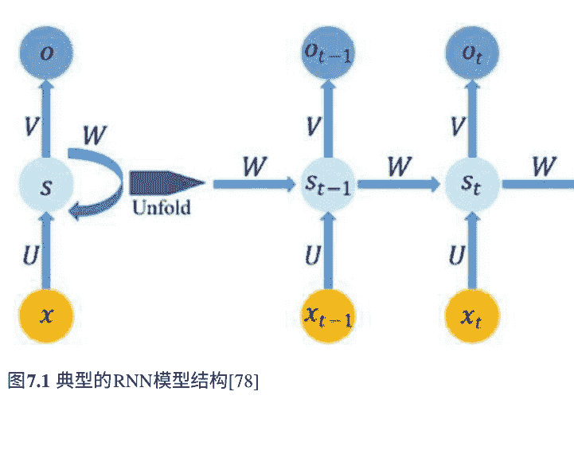

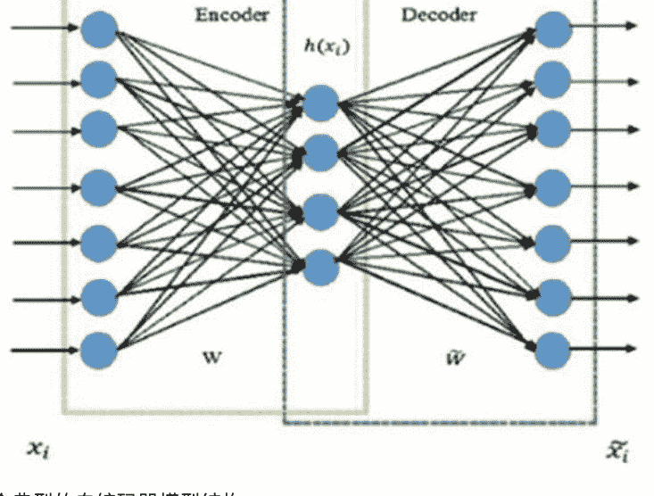

图7.2 一个典型的自编码器模型结构[80]

自编码器对于解决复杂问题特别有用。一个典型的自编码器模型包括输入层、隐藏层和输出层，其中输入和输出的神经元数量相同。在系统结构中，输入和隐藏层运行编码方案，而隐藏和输出层用于解码，从而实现目标数据的低维度[79, 80]。图7.2显示了一个典型的自编码器模型的表示[80]。

### 7.2.2 群体智能和智能优化在SIARNN中

由于传统优化方法无法解决更复杂的优化问题，人工智能的智能优化方法已经有效地使用了一段时间。由于现实生活实际上是优化问题的混合体，智能优化在具有不同优化导向视角的各个领域广泛使用，例如连续优化和组合优化。目前，有许多不同的基于智能优化的算法和技术，这些算法和技术受到自然界不同组成部分的启发[81]。因此，可以将这些算法和技术分类为不同的标题。

但最全面的是群体智能（SI）。作为人工智能的一个子领域，SI的概念指的是动物、昆虫甚至人类等（大多数）生物群体的集体、互动式问题解决行为在算法设计方面，人工智能确保数学和逻辑步骤以模拟迭代优化过程中的相关行为。通过一些粒子群解决建模的现实生活优化问题，这些粒子的参数可以相对于彼此的状态而改变在群体中[81, 84]。

SIARNN的基础设施是通过SI技术训练ARNN模型。但是由于不同SI技术之间始终存在竞争状态，以获得目标问题的更好解决方案，SIARNN被构建为在相同ARNN模型上运行不同的SI技术，以找到特定医学诊断数据的最佳解决方案。在这种情况下，SIARNN对诊断过程考虑以下规则：

- 读取目标疾病诊断数据，确定目标疾病的复杂性。
- 列出并确定过去表现最佳的SI技术用于目标疾病。
- 根据默认或用户定义的参数，开始使用每个SI技术进行特征提取，并将其输入ARNN。
- 评估每个混合ARNN-SI组合在诊断目标疾病方面的性能。

根据上述规则，SIARNN的默认运行算法如图7.3所示。

通过评估不同特征在评估指标（即方程2：准确性）上的结果，每个SI技术通过粒子实现特征选择。

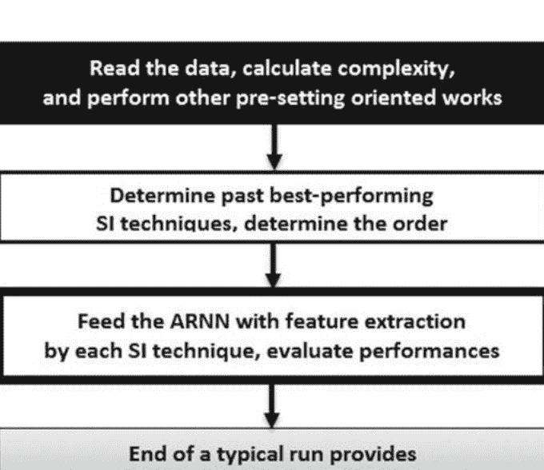

在本研究中，基于ARNN进行诊断（本研究中的诊断是一种典型的分类方法）。
本研究中的SIARNN系统包括五种不同的SI技术。这些技术的要点如下所述：

### 7.2.2.1 人工蜜蜂群

人工蜜蜂群（ABC）是一种流行的智能优化技术，由Karaboga和Basturk [85] 引入。ABC简要地受到蜜蜂的启发，并提供了一种基于角色的方法来处理高级优化问题。具体而言，ABC将优化过程作为蜜蜂展示的食物搜索行为的简单数学模拟。ABC的基本特征可以简要地表达如下[85-87]：

- 算法流程与粒子（蜜蜂）之间的相互作用以及与解空间中的值相对应的食物-花蜜源有关。
- 粒子-蜜蜂有三种角色；蜜蜂可以是雇佣蜜蜂、观察蜜蜂或侦察蜜蜂。通常情况下，所有蜜蜂通过相互作用来寻找最优值。
- 雇佣蜜蜂找到一些值-花蜜后，它们会进行舞蹈动作来吸引观察蜜蜂，如果合适的话，一些观察蜜蜂会取代雇佣蜜蜂的位置成为雇佣蜜蜂。
- 在雇佣蜜蜂和旁观者蜜蜂之间的相互作用中，侦察蜜蜂只是随机搜索更好的价值。在算法过程中，无法进一步改进的雇佣蜜蜂会转变为侦察蜜蜂。

关于ABC，可以从以下来源获取更多信息：[85, 87, 88]。

#### 7.2.2.2 涡旋优化算法

正如Kose和Arslan [89, 90]所介绍的，涡旋优化算法（VOA）基于自然界中涡旋的动力学。由于不基于特定类型的生物，VOA将粒子视为“正常流动”或“涡旋”的角色。根据粒子的状态，该技术的进化导向消除机制试图获得足够有效的良好粒子以找到所需的最优解。涡旋优化算法的一些显著特点包括[89, 90]：

- 通过迭代过程，一个粒子的角色可能会根据其性能改变为正常流或涡流。
- 根据正常流，涡流具有更好的值。因此，正常流粒子倾向于向涡流移动。
- 整个粒子群通过消除最差的粒子并在解空间中定位新的粒子来部分刷新。
- VOA还采用一种系统内优化方法来处理困难的高级优化问题。

有关VOA的更多详细信息，读者可以查阅文献：[89–91]。

#### 7.2.2.3 杜鹃搜索

杜鹃搜索（CS）是另一种基于某些杜鹃物种的寄生行为的智能优化技术。CS由Yang和Deb [92]引入，主要关注与寄生相关的杜鹃繁殖。

在优化过程中，粒子（杜鹃）通过经历具有蛋的巢穴的变量值来继续繁殖。在这个意义上，CS的一些特点如下[92, 93]：

- 每只布谷鸟都可以有一个蛋，并且该蛋可以被放置在随机的巢中，在解空间中进行搜索。在这一点上，巢穴被布谷鸟发现的价值所取代，被认为是最优解。
- 由于一些数学和逻辑步骤，布谷鸟试图找到更好的巢穴并消除外来的蛋。更好的价值巢穴在算法过程中传递给下一代。
- 值得注意的是，CS中的搜索机制是通过Levy飞行来完成的，这是一种受到许多生物运动启发的随机搜索机制[94]。

关于CS的算法结构和解决机制的更多细节可以在[92, 95, 96]中找到。

#### 7.2.2.4 蚁狮优化器

蚁狮优化器（ALO）是一种非常新的智能优化技术算法。ALO由Mirjalili [97]开发，通过模拟蚁狮在幼虫阶段的捕猎行为来实现解决机制。简而言之，蚁狮在地下建造陷阱，以捕猎蚂蚁。这种行为是将这些昆虫称为蚁狮的原因。ALO包括算法步骤，以确保蚂蚁和蚁狮之间的相互作用，它们是搜索和保持潜在最优值的粒子。考虑到算法，一些重要的要点如下[98, 99]：

- 蚂蚁狮和蚂蚁都负责在解决方案空间中搜索值。
- 在搜索过程中，采用随机漫步方法来改变位置值。
- 蚂蚁狮捕捉蚂蚁的行为只是将蚂蚁狮的位置（用于计算适应度的值）调整到目标蚂蚁的位置，这似乎具有良好的值。

有关该最新算法的更多详细信息，请参阅来源：[97-99]。

#### 7.2.2.5 电子搜索算法

正如Tabari和Ahmad [100]所介绍的，电子搜索算法（ESA）是本研究中使用的最新技术。ESA简要考虑了围绕原子核轨道上的电子的运动，并为优化问题提供了一种算法方法。解决过程是定位粒子（原子），轨道之间的转换以及更新核位置的混合。ESA的一些显著特点如下[100]：

- ESA在一些已知原理中使用数学机制，如玻尔模型或里德伯格公式，并提供了一个结构良好的解决方案过程。
- 原子是潜在的解决方案，其中电子轨道和核位置是在优化过程中确定的组件值。
- ESA采用一种称为轨道调谐器的系统内优化方法，以确保初始参数值不会直接影响性能（与其他SI技术算法不同）。

有关ESA的更多详细信息，请参阅[100]。

考虑到解释的SI技术算法，SIARNN是使用Python编程语言开发的。在这里，采用了模块化方法以实现高效使用。下一小节以这种方式介绍了SIARNN的一般设计。

## 7.3 SIARNN的设计

SIARNN是使用Python编程语言编写的，这被认为是一个足够快速和全面的环境，可以运行由不同的人工智能技术协同运行的系统。与许多类似的Python应用程序一样，设计整个SIARNN机制时还包括了一些著名的库。对于系统的进一步版本和性能调整的代码添加，采用了一种模块化方法，即使用单独的代码文件模块。SIARNN的一些值得注意的设计说明如下：

- Numpy和SciPy是两个在SIARNN中常用的Python库，用于解决过程中的数学科学计算。
- SIARNN使用Root.py文件作为系统的中央控制机制。所有其他模块，包括人工智能方面，都连接到该文件。
- DataProblemSet.py用于评估目标数据集，计算复杂度，并在优化运行之前设置初始问题变量或SI技术组件。对于每个目标疾病数据集，使用以下复杂度计算：

复杂度 = 输出类别 * \left[ (2 * 数值) + \left( \sum_{i=1}^{N} 名义_i \right) \right] (1)

在公式（1）中，输出类别代表输出属性下的总类别数，数值代表具有数值-实数的输入属性总数，名义代表每个具有名义值的输入属性的类别总数。正如可以理解的那样，不同类别或数值属性的数量的多样性会导致更高的复杂性。计算得到的值随后由系统用于提高系统在新应用中的效率。

如果一种疾病数据在之前已经评估过，并且再次用于诊断，那么直接使用具有最高成功点的SI技术（如果用户只想让SIARNN对目标输入数据进行诊断）。否则，根据每种SI技术解决的过去复杂度值与当前复杂度值之间的相似性确定SI技术与ARNN一起运行的顺序。

相似性的等价性导致随机顺序或根据成功点和/或排名确定顺序。

- Performance.py用于检测最佳性能的ARNN-SI组合并存储过去诊断性能的数据。存储的数据包括每种SI技术对目标疾病数据的排名，每种SI技术的总成功点（第一名得4分，第二名得2分，第三名得1分，其他得0分），以及用于所使用的疾病数据集的复杂度。
- ARNN和SI技术以分离的文件形式存在。只要满足Root.py和ProblemSet.py的参数，可以将单独的SI技术编码为单独的.py文件，以包含在SIARNN基础设施中。

图7.4展示了SIARNN代码设计和SIARNN模块之间的一般方案。

由于当前Python代码设计，只需在控制台上提供适当的参数，就可以运行SIARNN。对于SIARNN的非经验用户，可以通过提供一些特定参数（例如粒子数量、迭代次数）和目标数据来运行系统，但系统允许高级用户确定任何特定参数，例如每个不同SI技术算法或ARNN模型的参数。

## 7.4 应用和评估

在医学诊断的背景下，了解SIARNN的性能非常重要。为了实现这一目标，SIARNN已经应用于多个医学疾病数据集，并相应地评估了SIARNN的最佳性能值。此外，将这些最佳性能值与一些替代技术的性能进行了比较。下面的子章节提供了关于所有这些阶段的信息。

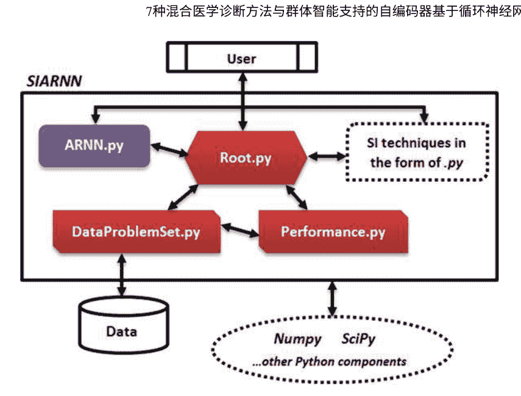

### 7.4.1 使用SIARNN进行医学诊断应用

通过考虑UCI机器学习库中的四个不同疾病数据集[101]，评估了SIARNN的医学诊断性能。作为第一个数据集，Pima印第安人糖尿病包括8个属性，其中614个用于训练，154个用于测试。作为第二个数据集，甲状腺包括21个属性，并提供2800个用于训练，972个用于测试。第三个数据集，肝炎，使用19个属性，其中100个用于训练，55个用于测试。最后，慢性肾脏病数据集基于25个属性，其中295个用于训练，105个用于测试。所有数据集将其输入属性的相应值分类为0：健康人，或1：患病的人，作为输出属性。

对于诊断应用，所有SI技术都使用了120个粒子，并将其参数设置为文献中报告的默认值。在每个疾病数据集的特征提取阶段之后，通过考虑Eq. (2)中的简单准确率计算，评估了使用不同SI技术的SIARNN在测试数据上的性能。在相关方程中，$TC$表示目标数据的真实分类（输出为0或1），而$FC$表示错误分类：

准确率 $= 100 * \frac{TC}{TC + FC}$ \quad (2)

基于五种SI技术，表7.1提供了SIARNN系统的诊断性能。众所周知，SIARNN在运行不同组合后确定了表现最佳的ARNN-SI组合。所以，表7.1显示了所有五种ARNN-SI组合的准确率和排名，而每个疾病数据集（诊断）中选择的最佳组合（排名为1）的值以粗体样式显示。

表7.1 SIARNN在每个医学诊断应用中的性能
| 应用/疾病 | ARNN-ABC | ARNN-VOA | ARNN-CS | ARNN-ALO | ARNN-ESA |
| :--- | :---: | :---: | :---: | :---: | :---: |
| 印第安皮马糖尿病 | 98.05/2 | 97.40/3 | **98.70/1** | 97.40/3 | 97.40/3 |
| 甲状腺 | 97.42/2 | 97.02/4 | 97.33/3 | **97.63/1** | 97.02/4 |
| 肝炎 | 92.73/4 | 94.55/3 | 96.36/2 | **98.18/1** | 92.73/4 |
| 慢性肾脏病 | 92.38/3 | 90.48/5 | **94.29/1** | 93.33/2 | 91.43/4 |

从表7.1中可以得出结论，对于诊断四种不同疾病，不同的ARNN-SI组合表现出良好的性能。然而，ARNN模型与ALO和CS通常优于其他模型。

### 7.4.2 比较评估

为了进一步评估SIARNN，它与其他一些人工智能技术进行了比较。在这一点上，ARNN-ALO和ARNN-CS（表7.1）的最佳性能结果与其他四种技术的性能进行了比较。在这种情况下，传统的多层感知器人工神经网络模型通过反向传播算法（ANN-BPA）[102, 103]进行训练，通过混合梯度下降和最小二乘估计器（ANFIS-GDLSE）[104, 105]进行训练的默认ANFIS模型，支持向量机（SVM）[106, 107]和K最近邻算法（K-NN）[108, 109]被包括在比较中。每种技术的诊断准确率结果如表7.2所示（最佳值以粗体显示）。

表7.2 与SIARNN、ANN-BPA、ANFIS-GDLSE、SVM和K-NN的比较评估
| 应用/疾病 | SIARNN | ANN-BPA | ANFIS-GDLSE | SVM | K-NN |
| :--- | :---: | :---: | :---: | :---: | :---: |
| 印第安皮马糖尿病 | **98.70 (ARNN-CS)** | 96.10 | 98.05 | 98.70 | 94.16 |
| 甲状腺 | **97.63 (ARNN-ALO)** | 97.33 | 97.42 | 97.74 | 97.02 |
| 肝炎 | **98.18 (ARNN-ALO)** | 92.73 | 94.55 | 96.36 | 90.91 |
| 慢性肾脏病 | **94.29 (ARNN-CS)** | 90.48 | 91.43 | 93.33 | 87.62 |

从表7.2可以看出，最佳表现的SIARNN结果通常比文献中的其他技术更好。通过同时考虑表7.1和表7.2可以表达出形成的SIARNN系统能够对不同疾病数据集进行有效的医学诊断。此外，与SIARNN一起工作很容易，因为它可以确定适用于目标数据集的最佳表现ARNN-SI组合。这个优势对于那些不知道背景上正在工作的什么类型的人工智能导向系统，但期待计算机辅助提供足够好的诊断性能的用户来说是重要的。

## 7.5 结果和未来工作

在本章中，引入了一种基于自动编码器的循环神经网络（ARNN）的群体智能（SI）支持的医疗诊断系统。具体而言，该系统包括一些预定义的SI算法，用于对目标数据集进行特征提取，以供ARNN使用。它自动检测出在最后获得更好结果的最佳ARNN和SI组合。该系统采用Python编程语言以模块化方式编写，并支持五种不同的SI算法：人工蜂群（ABC）、涡旋优化算法（VOA）、布谷鸟搜索（CS）、蚁狮优化器（ALO）和电子搜索算法（ESA）。简称为群体智能支持的自动编码器循环神经网络（SIARNN），它是一个典型的医疗诊断环境，可以在未来版本中进行改进。

为了更好地了解SIARNN的成功，它被评估了四个不同的医疗疾病数据集。根据研究结果，SIARNN能够成功诊断目标疾病，这要归功于灵活的基础设施，可以检测到最佳的ARNN和SI算法组合。研究发现，SIARNN尤其是ALO和CS可以实现比其他SI技术算法更好的诊断。此外，将SIARNN与其他一些人工智能技术进行比较表明，SIARNN可以成为智能医疗诊断的有效工具。

特别是积极的结果是考虑未来工作的重要标志。在这个背景下，可以通过添加额外的SI算法和新的模块（以编程术语）来支持SIARNN的新功能和功能（例如系统参数优化，灵活的神经网络结构）。此外，可以使用额外的数据集对系统进行评估，以更好地了解其在不同疾病上的成功情况。另一方面，可以进行更多的评估任务，例如一般处理时间和对不同医疗数据类型的性能，系统对不同来源的灵活性等。最后，还可以通过包括其他面向深度学习（DL）的神经网络来开发类似的医疗诊断系统。

## 7.6 总结

人工智能领域与特别是数据处理方法相关的不同研究领域之间一直存在着紧密的联系，这一点非常重要。由于机器/深度学习过程实际上是要解决的优化问题，因此算法-优化技术也被用于改进已知技术的能力。根据这一点，群体智能已经成为设计混合系统的成功工具，此外还使用了计算智能领域之外的计算技术进行了替代混合系统的形成方法。

本章提供了在医学诊断领域中使用群体智能（SI）的典型应用，以实现决策支持。在这个意义上，基于自动编码器的循环神经网络（ARNN）被引入到医学诊断过程中，并由SI进行训练。简称为群体智能支持的基于自动编码器的循环神经网络（SIARNN），该系统包括一些预定义的SI算法，以确保特征提取会话用于向ARNN提供目标数据集。它自动检测出最佳性能的ARNN和SI组合，以获得更好的结果。至关重要的是，SIARNN被用于不同的诊断数据集，并且在最终实现了一个多疾病/多诊断解决方案方面取得了足够成功的结果。该系统使用Python编程语言以模块化方式编码，其当前版本包括五种不同的SI算法：人工蜜蜂群算法（ABC），涡旋优化算法（VOA），布谷鸟搜索算法（CS），蚁狮优化算法（ALO）和电子搜索算法（ESA）。当然，它对于未来的改进以提高诊断率和形成更大的诊断环境是开放的。

迄今为止的章节已经显示出深度学习解决方案对于一般已知症状和体征的疾病的诊断支持需要通过物理方式进行分析。另一方面，医疗决策支持系统的一个重要用途是在心理方法的背景下，因为人们也因不同因素而出现心理和心理问题。由于这是一种非常特定、不同和复杂的医学诊断方式，深度学习的作用也应相应地加以解释。在这个背景下，下一页的第8章提供了一个基于深度学习方法的心理个人支持系统。

## 7.7 进一步学习

为了获得更多关于智能优化以及与之相关的主题，如群体智能、进化计算、启发式和元启发式的信息，读者可以阅读[110-120]。

作为最近的替代群体智能技术-算法，读者可以参考[121-125]。

对于使用机器/深度学习技术的混合系统的最新应用，请参阅[126-134]。

# 参考文献

1. E. Alpaydin, 机器学习导论 (MIT出版社，剑桥，马萨诸塞州，2009年)
2. P. Harrington, 机器学习实战 (Manning出版社，纽约，美国，2012年)
3. E. Bonabeau, D.D.R.D.F. Marco, M. Dorigo, G. Theraulaz, 群体智能：从自然到人工系统 (第1版) (牛津大学出版社，牛津，1999年)
4. X.S. Yang, Z. Cui, R. Xiao, A.H. Gandomi, M. Karamanoglu (eds.), 群体智能和生物启发计算：理论与应用 (Newnes，伦敦，2013年)
5. G. Lakemeyer, B. Nebel (eds.), 探索新千年的人工智能 (Morgan Kaufmann，洛斯阿尔托斯，加利福尼亚州，2003年)
6. B. Thuraisingham, 数据挖掘：技术、技巧、工具和趋势。 (CRC出版社，伦敦，2014年)
7. M. Brady, L.A. Gerhardt, H.F. Davidson (编辑), 机器人学和人工智能, 卷11 (斯普林格出版社, 纽约, 2012年)
8. A. Ghosal, 机器人学：基本概念和分析 (牛津大学出版社, 牛津, 2006年)
9. A. Abraham, E. Corchado, J.M. Corchado, 混合学习机器。神经计算 72 (13-15), 2729-2730 (2009年)
10. S. Wermter, 混合神经系统 (编号1778) (斯普林格出版社, 纽约, 2000年)
11. L.R. Medsker, 混合智能系统 (斯普林格出版社, 纽约, 2012年)
12. C. Grosan, A. Abraham, 混合进化算法：方法论、架构和综述, 混合进化算法 (Springer, Berlin, Heidelberg, 2007), pp. 1–17
13. S. Sahin, M.R. Tolu, R. Hassanpour, 混合专家系统：当前方法和应用的调查。专家系统应用 39(4), 4609–4617 (2012)
14. F. Jiang, Y. Jiang, H. Zhi, Y. Dong, H. Li, S. Ma, ..., Y. Wang, 医疗保健中的人工智能：过去、现在和未来。中风血管神经学 2(4), 230–243 (2017)
15. P.L. Miller (ed.), 医疗人工智能选题 (Springer, New York, 2012)
16. D.D. Luxton (编), 行为和心理健康护理中的人工智能 (爱思唯尔, 阿姆斯特丹, 2015)
17. P. Hamel, J. Tremblay, 医学中的人工智能。代谢 69, S36–S40 (2017)
18. P.J. Lisboa, A.F. Taktak, 人工神经网络在癌症决策支持中的应用：系统综述。神经网络 19(4), 408–415 (2006)
19. M. Hengstler, E. Enkel, S. Duelli, 应用人工智能和信任——自动驾驶车辆和医疗辅助设备的案例。技术预测. 社会变革. 105, 105–120 (2016)
20. F. Amato, A. López, E.M. Peña-Méndez, P. Va nhara, A. Hampl, J. Havel, 医学诊断中的人工神经网络。应用生物医学杂志. 11(2), 47–58 (2013)
21. Q.K. Al-Shayea, 医学诊断中的人工神经网络。计算机科学问题国际期刊 8(2), 150-154 (2011年)
22. E.H. Shortliffe, M.J. Sepúlveda, 人工智能时代的临床决策支持。JAMA 320(21), 2199-2200 (2018年)
23. C.C. Bennett, T.W. Doub, 心理健康护理中的专家系统：决策和咨询的人工智能应用, 行为和心理健康护理中的人工智能 (学术出版社, 伦敦, 2016年), 第27-51页
24. C. Yao, Y. Qu, B. Jin, L. Guo, C. Li, W. Cui, L. Feng, 用于在线医疗指导的卷积神经网络模型。IEEE Access 4, 4094-4103 (2016年)
25. Y. Jing, Y. Bian, Z. Hu, L. Wang, X.Q.S. Xie, 深度学习用于医疗决策支持系统：大数据时代的人工智能范式。AAPS J 20(3), 58 (2018)

26. A.C. Bovik, 图像和视频处理手册。 (Elsevier Academic Press, 2010)

27. T.K. Moon, W.C. Stirling, 信号处理的数学方法和算法 (第1卷) (Prentice Hall, Upper Saddle River, NJ, 2000)

28. O. Erkaymaz, M. Ozer, M. Perc, 小世界前馈神经网络在糖尿病诊断中的性能。 Appl. Math. Comput. 311, 22–28 (2017)

29. O. Erkaymaz, M. Ozer, 小世界网络拓扑对传统人工神经网络在糖尿病诊断中的影响。 混沌、孤立子和分形 83, 178–185 (2016)

30. O. Er, O. Cetin, M.S. Bas cil, F. Temurtas, 使用神经网络和人工免疫系统进行帕金森病诊断的比较研究。 J. Med. Imaging Health Inf. 6 (1),264–268 (2016)

31. N. Yalcin, G. Tezel, C. Karakuzu, 使用PSO学习的人工神经网络进行癫痫诊断。 土耳其电气工程与计算机科学杂志 23(2), 421–432 (2015)

32. U. Kose, 一种蚁狮优化器训练的人工神经网络系统用于混沌脑电图（EEG）预测。 应用科学 8(9), 1613 (2018)

33. J.A.M. Saucedo, J.D. Hemanth, U. Kose, 使用电-搜索优化算法训练的自适应神经模糊推理系统预测脑电图时间序列。 IEEE Access 7, 15832–15844 (2019)

34. B. Procopet, V.M. Cristea, M.A. Robic, M. Grigorescu, P.S. Agachi, S. Metivier, ... J.P. Vin el,“血清检测、肝脏硬度和人工神经网络用于诊断肝硬化和门脉高压。消化性肝病 47 (5), 411–416 (2015)

35. A. Badnjević, L. Gurbeta, M. Cifrek, D. Marjanovic, 使用人工神经网络对哮喘进行分类，在2016年第39届国际信息与通信技术、电子与微电子会议（MIPRO）中（IEEE, 2016），第387-390页

36. E.O. Olaniyi, O.K. Oyedotun, K. Adnan, 使用神经网络进行心脏疾病诊断的仲裁。 Int. J. Intell. Syst. Appl. 7(12), 72 (2015)

37. P. Dande, P. Samant, 认识人工神经网络并将其用作结核病的诊断工具：一项综述。 结核病 108, 1-9 (2018)

38. S.K. Pandey, R.R. Janghel, 使用人工神经网络对心电图心律失常进行分类，在第2届国际通信、计算和网络会议（Springer, 新加坡, 2019），第645-652页

39. S.F. Cankaya, I.A. Cankaya, T. Yigit, A. Koyun, 基于涡旋优化算法训练的支持向量机的糖尿病诊断系统，在《自然启发的智能技术解决生物医学工程问题》中。（IGI Global, 2018）, pp. 203–218

40. N. Zeng, H. Qiu, Z. Wang, W. Liu, H. Zhang, Y. Li, 一种基于新的延迟粒子群优化支持向量机算法的阿尔茨海默病诊断。 神经计算 320, 195–202 (2018)

41. T. Santhanam, M.S. Padmavathi, 应用K-means和遗传算法进行维度缩减，通过整合SVM进行糖尿病诊断。 Proc. Comput. Sci. 47, 76–83(2015)

42. A.D. Dolatabadi, S.E.Z. Khadem, B.M. Asl, 使用优化的支持向量机自动诊断冠状动脉疾病（CAD）患者。 Comput. Methods Programs Biomed. 138, 117–126 (2017)

43. A. Subasi, E. Alickovic, J. Kevric, 使用随机森林进行慢性肾脏病诊断,在CMBEBIH 2017 (Springer, 新加坡, 2017), 第589-594页

44. B. Dai, R.C. Chen, S.Z. Zhu, W.W. Zhang, 使用随机森林算法进行乳腺癌诊断,在2018年国际计算机、消费者和控制研讨会(IS3C) (IEEE, 2018), 第449-452页

45. Z. Hu, J. Tang, Z. Wang, K. Zhang, L. Zhang, Q. Sun, 基于图像的癌症检测和诊断的深度学习-一项调查。 Pattern Recogn. 83, 134-149页 (2018)

46. X. Li, S. Zhang, Q. Zhang, X. Wei, Y. Pan, J. Zhao, ..., F. Yang, 使用深度卷积神经网络模型对超声图像进行甲状腺腺癌诊断的回顾性、多中心、诊断性研究。 Lancet Oncol. 20(2), 193-201页 (2019)

47. I. Reda, A. Khalil, M. Elmogy, A. Abou El-Fetouh, A. Shalaby, M. Abou El-Ghar, ..., A.El-Baz, 深度学习在早期诊断前列腺癌中的作用。 Technol. Cancer Res. Treat.17, 1533034618775530页 (2018)

48. O. Deperlioglu, 使用卷积神经网络对心音图进行分类。 BRAIN. Broad Res. Artif. Intell. Neurosci. 9(2), 22–33 (2018)

49. J.R. Burt, N. Torosdagli, N. Khosravan, H. RaviPrakash, A. Mortazi, F. Tissavirasingham, ..., U. Bagci, 深度神经网络在诊断乳腺癌方面的最新进展，超越了猫和狗。英国放射学杂志。91(1089), 20170545 (2018)

50. S. Azizi, F. Imani, B. Zhuang, A. Tahmasebi, J.T. Kwak, S. Xu, ..., B. Wood, 基于超声波的前列腺癌检测，使用深度置信网络进行自动特征选择。在国际医学图像计算与计算辅助干预会议。（斯普林格，Cham，2015），第70-77页

51. A.M. Abdel-Zaher, A.M. Eldeib, 使用深度置信网络进行乳腺癌分类。 Expert Syst. Appl. 46, 139–144 (2016)

52. M.A. Al-antari, M.A. Al-masni, S.U. Park, J. Park, M.K. Metwally, Y.M. Kadah, ..., T.S. Kim,通过深度置信网络在数字乳腺X光中的自动计算机辅助诊断系统。 J. Med. Biol. Eng. 38(3), 443–456 (2018)

53. S. Khan, N. Islam, Z. Jan, I.U. Din, J.J.C. Rodrigues, 一种基于深度学习的新框架用于乳腺癌的检测和分类，使用迁移学习。 Pattern Recogn. Lett. 125, 1–6 (2019)

54. C.J. Wang, C.A. Hamm, B.S. Letzen, J.S. Duncan, 一种可解释的概率方法在肝癌诊断中的深度学习，出自Medical Imaging 2019: Computer-Aided Diagnosis(Vol. 10950). (国际光学与光子学学会, 2019), 第109500U页

55. A. Yala, C. Lehman, T. Schuster, T. Portnoi, R. Barzilay, 一种基于深度学习的乳腺摄影模型用于改善乳腺癌风险预测. Radiology, 182716 (2019)

56. E.J. Ha, J.H. Baek, D.G. Na, 用于甲状腺癌诊断的深度卷积神经网络模型. Lancet Oncol. 20(3), e130 (2019)

57. A. Cheng, Y. Kim, E. M. Anas, A. Rahmim, E.M. Boctor, R. Seifabadi, B.J. Wood,用于前列腺癌有限角度超声断层成像的深度学习图像重建方法，出自Medical Imaging 2019: Ultrasonic Imaging and Tomography, vol. 10955. (国际光学与光子学学会, 2019), 第1095516页

58. A. Kharrat, M. Néji, 使用个性化深度置信网络对脑肿瘤进行分类，基于MR图像：PDBN-MRI，在第11届国际机器视觉会议(ICMV 2018)中，卷11041。（国际光学与光子学学会,2019), 第110412页

59. N.A. Ali, A.R. Syafeeza, L.J. Geok, Y.C. Wong, N.A. Hamid, A.S. Jaafar,使用深度学习设计自动化的脑肿瘤辅助分类，在智能与交互计算(Springer, 新加坡,2019), 第285-291页

60. P. Thirumurugan, P. Shanthakumar, 使用ANFIS分类器进行脑肿瘤检测和诊断。国际成像系统技术杂志26(2), 157-162页(2016)

61. S. Kumarganesh, M. Suganthi, 一种增强的医学诊断可持续系统，用于脑肿瘤检测和分割，使用ANFIS分类器。 Curr. Med. Imaging Rev. 14(2),271–279 (2018)

62. A. Yadollahpour, J. Nourozi, S.A. Mirbagheri, E. Simancas-Acevedo, F.R. Trejo-Macotela, 设计和实施基于ANFIS的医学决策支持系统，以预测慢性肾脏疾病的进展。 Frontiers Physiol. 9 (2018)

63. A. Adeh, H. Demirel, P. Zarbakhsh, 使用优化的anfis和特征选择早期检测乳腺癌，在2017年第9届国际计算智能和通信网络会议（CICN）.(IEEE, 2017), pp. 39–42

64. M. Kirisci, H. Yılmaz, M.U. Saka, 一种用于诊断2型糖尿病的ANFIS视角。模糊数学和信息学年鉴。（待发表，afmi.or.kr, 2019)

65. W. Ahmad, A. Ahmad, A. Iqbal, M. Hamayun, A. Hussain, G. Rehman, ..., L. Huang, 使用自适应神经模糊推理系统和信息增益方法进行智能肝炎诊断。软计算。1-8（2018年）

66. W. Ahmad, L. Huang, A. Ahmad, F. Shah, A. Iqbal, 使用基于ANFIS、k-NN和信息增益方法的混合决策支持系统进行甲状腺疾病预测。J.应用环境生物学科。7，78-85（2017年）

67. T. Yigit, S. Celik, 基于涡旋优化算法的智能疾病诊断系统. J. Multi. Dev. 3(1), 1–20 (2019 )

68. S.S. Udoh, U.A. Umoh, M.E. Umoh, M.E. Udo, 利用软计算范式诊断前列腺癌. Global J. Comput. Sci. Technol. 19(2), 19–26 (2019)

69. L. Sarangi, M.N. Mohanty, S. Patnaik, 基于ANFIS的心血管疾病检测的电子健康护理系统设计, in国际智能与交互系统及应用会议. (Springer, Cham, 2016), pp. 445–453

70. M. Nilashi, H. Ahmadi, L. Shahmoradi, O. Ibrahim, E. Akbari, 一种利用神经模糊技术集成的预测性肝炎疾病诊断方法. J. Inf. Pub. Health12(1), 13–20 (2019)

71. T.V. Padmavathy, M.N. Vimalkumar, D.S. Bhargava, 基于自适应聚类的乳腺癌检测与AN FIS分类器使用乳房X光图像. 聚类计算. 1-10 (2018)

72. W. Rajab, S. Rajab, V. Shar ma, 基于核FCM的ANFIS方法用于心脏病预测，在专家应用和安全性的新趋势。 (Springer, 新加坡, 2019年), pp. 643-650

73. E.K. Roy, S.K. Aditya, 基于人工神经网络和自适应神经模糊推理系统方法的急性髓性白血病亚型预测，在电子与通信工程创新。 (Springer, 新加坡, 2019年), pp. 427-439

74. M. Imran, S.A. Alsuhuaibani, 用于糖尿病视网膜病变分类的神经模糊推理模型，在生物医学应用的智能数据分析。 (学术出版社, 伦敦, 2019年), pp. 147-172

75. S. Zainuddin, F. Nhita, U.N. Wisesty, 使用基于自适应网络的模糊推理系统（ANFIS）和蚁群优化（ACO）作为特征选择的肺癌和结肠肿瘤基因表达分类，在《物理学杂志：会议系列》中，卷1192，号1。 （IOP出版社, 2019年），第012019页

76. M.N. Fata, R. Arifudin, B. Prasetiyo, 使用遗传算法优化神经模糊诊断伤寒。 科学杂志。 Inf. 6 (1), 1-11 (2019年).

77. B.S. Babu, A. Suneetha, G.C. Babu, Y.J.N. Kumar, G. Karuna, 使用灰狼优化和自动编码器基于循环神经网络进行医学疾病预测。 期刊工程和自然科学。 6 (1), 229-240 (2018年)

78. W. Bao, J. Yue, Y. Rao, 一种使用堆叠自动编码器和长短期记忆的深度学习框架用于金融时间序列。 PLoS ONE 12(7), e0180944 (2017)

79. P. Baldi, 自编码器，无监督学习和深度架构，在无监督和迁移学习ICML研讨会上(2012), pp. 37–49

80. H.O.A. Ahmed, M.D. Wong, A.K. Nandi, 一种使用稀疏过完备特征从高度压缩测量中进行轴承故障的智能状态监测方法。

81. C. Blum, D. Merkle, 群体智能，在优化中的群体智能, 编者 C. Blum, D. Merkle (Springer, Boston, MA, 2008), pp. 43–85

82. A.E. Hassanienn, E. Emary, 群体智能：原理、进展和应用 (CRC Press, 伦敦, 2018)

83. X.S. Yang, Z. Cui, R. Xiao, A.H. Gandomi, M. Karamanoglu, (eds.), 群体智能和生物启发式计算：理论和应用, in Newnes, (2013)

84. R.C. Eberhart, Y. Shi, J. Kennedy, 群体智能(Elsevier, 阿姆斯特丹, 2001)

85. D. Karaboga, B. Basturk, 一种强大而高效的数值函数优化算法：人工蜂群（ABC）算法。 J. 全局优化。 39(3), 459–471 (2007)

86. D. Karaboga, B. Basturk, 人工蜂群（ABC）算法的性能研究。 Appl.Soft Comput. 8(1), 687–697 (2008)

87. D. Karaboga, B. Gorkemli, C. Ozturk, N. Karaboga, 一项全面调查：人工蜜蜂群（ABC）算法及其应用。 人工智能评论 42(1), 21–57 (2014)

88. D. Karaboga, 人工蜜蜂群算法。 Scholarpedia 5(3), 6915 (2010)

89. U. Kose, A. Arslan, 基于涡旋自然的新型人工智能优化算法的构想。 BRAIN. Broad Res. Artif. Intell. Neurosci. 5(1–4), 60–66 (2015)

90. U. Kose,基于人工智能的优化算法的发展（土耳其语），博士学位论文，塞尔丘克大学，自然科学研究所，（土耳其科尼亚，2017年）

91. U. Kose, A. Arslan,利用涡旋优化算法支持的ANFIS预测混沌时间序列：脑电图时间序列的应用。阿拉伯科学与工程杂志42(8), 3103–3114 (2017)

92. X.S. Yang, S. Deb, 通过Lévy flights进行布谷鸟搜索，在2009年世界自然与生物启发计算大会（NaBIC）中(IEEE, 2009)，第210-214页

93. P. Civicioglu, E. Besdok, 布谷鸟搜索、粒子群优化、差分进化和人工蜂群算法的概念比较。人工智能评论39(4), 315-346页（2013年）

94. Z. Cheng, R. Savit, Lévy flights中的分形和非分形行为。数学物理学杂志28(3), 592-597页（1987年）

95. X. S. Yang, S. Deb, 通过布谷鸟搜索进行工程优化。国际数学建模与数值优化杂志1(4), 330-343页（2010年）

96. X.S.杨, S. Deb, 布谷鸟搜索：最新进展和应用。神经计算应用。24（1），169-174（2014）

97. S. Mirjalili, 蚁狮优化器。先进的工程软件。83，80-98（2015）

98. S. Mirjalili, P. Jangir, S. Saremi, 多目标蚁狮优化器：用于解决工程问题的多目标优化算法。应用智能。46（1），79-95（2017）

99. A.A. Heidari, H. Faris, S. Mirjalili, I. Aljarah, M. Mafarja, 蚁狮优化器：理论，文献-自然评论，并在多层感知器神经网络中应用，出版于自然启发优化器。（Springer, Cham, 2020），第23-46页

100. A. Tabari, A. Ahmad, 一种新的优化方法：电子搜索算法。计算机化学工程103, 1-11（2017年）

101. C. Blake, C. Merz, 机器学习数据库的UCI存储库，信息与计算机科学系（加利福尼亚大学欧文分校，加利福尼亚州，美国，1998年）。（在线）。http://www.archive.ics.uci.edu/ml（2015年）

102. Y. Chauvin, D.E. Rumelhart,反向传播：理论、架构和应用（心理学出版社，2013年）

103. R. Hecht-Nielsen,反向传播神经网络的理论，在感知的神经网络中。（学术出版社，伦敦，1992年），第65-93页

104. J.S. Jang, 基于时间反向传播的自学习模糊控制器。IEEE Trans. 神经网络3（5），714-723（1992年）

105. J.S. Jang, ANFIS: 自适应网络模糊推理系统。IEEE Trans. Syst. Man Cybern. 23(3), 665–685（1993年）

106. B. Scholkopf, A.J. Smola, 使用核函数的学习：支持向量机，正则化，优化和更多（MIT Press, 剑桥, 马萨诸塞州, 2001年）

107. N. Cristianini, J. Shawe-Taylor, 支持向量机和其他基于核的学习方法简介（剑桥大学出版社，剑桥，2000年）

108. D.T. Larose, C.D. Larose, K最近邻算法，在数据中发现知识：数据挖掘简介（Wiley, 纽约, 2005年），pp. 149–164

109. Z. Song, N. Roussopoulos, 移动查询点的最近邻搜索，在国际空间和时间数据库研讨会。（Springer, 柏林, 海德堡, 2001年），pp. 79–96

110. J. Kennedy,群体智能，在自然启发和创新计算手册中（波士顿, 马萨诸塞州, 2006年, 第187-219页）

111. G. Beni, J. Wang. 细胞机器人系统中的群体智能.机器人和生物系统：走向新的仿生学？（柏林, 海德堡, 1993年, 第703-712页）

112. M.G. Hinchey, R. Sterritt, C.R ouff, 群体和群体智能。计算机40（4），111–113（2007年）

113. A. Abraham, C. Grosan, V. Ramos（编），数据挖掘中的群体智能，第34卷（柏林, 海德堡, 2007年）

114. J.C. Bansal, P.K. Singh, N.R. Pal（编），进化和群体智能算法（柏林, 海德堡, 2019年）

## 第8章 心理个人支持系统 具有长短期记忆 和面部表情识别 方法

从现实世界中收集的数据的高级处理技术广泛用于改进生活的不同领域的任务。特别是在计算机和通信技术的崛起之后，迅速处理数据并在数字世界中实现自动化决策变得非常重要。如今，来自现实世界的原始数据可以通过特别的深度学习技术[1-5]轻松处理。值得注意的是，智能系统设计和开发得益于深度学习，还可以在数据挖掘[6, 7]和图像处理[8, 9]的背景下得到一些附加的处理技术的支持。因为分析来自现实世界的静态图像或实时视频对于使智能系统的工作更容易非常重要，图像处理技术经常在智能系统中使用。在这里，典型的应用包括目标检测、医学诊断和面部识别[10-14]。在现实世界的背景下，目标检测对于理解动态事件、提高安全性，甚至进行医学诊断尤为重要，特别是对于癌症和关键疾病需要医学图像分析[15-18]。其中，面部识别是近年来研究者广泛关注的最显著的研究方向之一。当人们意识到来自人们的数据对于了解他们的本质和兴趣非常重要时，它变得越来越重要。甚至在医学领域，研究是心理工作和了解一些与大脑相关的问题的关键点[19-21]。

在所有图像处理应用中，面部识别在近年来特别受到欢迎[22-27]。因为面部识别可以自动了解人们的情绪和可能的行为，所以图像处理和深度学习的混合系统经常在不同的问题范围内使用[28-31]。另一方面，在目标领域方面，医学也有一个关键的研究基础。在医学中，重要的是了解人们的情绪状态和感受，以便进行一些心理诊断并支持患有抑郁症、焦虑症或其他心理问题的人们。通过这样做，也可以更多地预测神经问题或疾病，以便及时采取治疗措施。

根据迄今为止的解释，本章介绍了深度学习和面部表情检测方法的典型用途，以确保心理个人支持系统的运行，该系统可以在问答期间或图像查看会话中进行一些分析，以了解目标人员显示的情绪变化。该系统可以检测人的即时情绪水平并预测可能的心理问题。为了实现这一目标，采用了面部识别的图像处理和长短期记忆（LSTM）的组合。在这一点上，面部识别被用于即时了解每个人的面部表情。详细地说，使用一个简单的摄像头来分析面部表情是足够的，通过将一些其他不同的参数添加到面部数值中，形成了一组用于预测下一步要问什么的输入数据，作为深度学习模型的输入。

## 8.1 背景

本章中开发的心理个人支持解决方案基于两个重要主题：面部识别和深度学习。通过面部识别，旨在收集有关情绪状态的即时数据。

为了实现这一目标，检测与面部识别相关的面部表情。之后，旨在利用深度学习技术进一步决策，确定向目标人员提出哪些问题和/或显示哪些视觉组件。为了进行深度学习，使用长短期记忆（LSTM）模型作为有效工具。

### 8.1.1 面部识别和面部表情

面部识别简要测量面部动作，也可用于理解目标人员的情绪[32]。由于我们脸上有43块肌肉，可以产生大约10,000种不同的面部表情[33]。除了我们观察到的物理特征外，面部和表情是两个人之间沟通和理解情绪的重要组成部分[34, 35]。基于这些事实，可以说面部识别对生理学和其他相关领域非常有用。具体而言，市场营销在涉及面部识别的研究中占据重要地位。因为通过面部识别，可以了解到[36, 37]：

- 人的即时情绪表现
- 目标人的生理状态
- 目标人的未来行为兴趣
- 目标人的即时注意状态

由于人类只能从某些特定的面部表情中理解情绪，基于计算机的系统通过跟踪面部的某些点来提供更详细的数据已经足够有效。在这个背景下，图8.1展示了基于计算机的系统进行的面部识别的一些视图[38-40]。

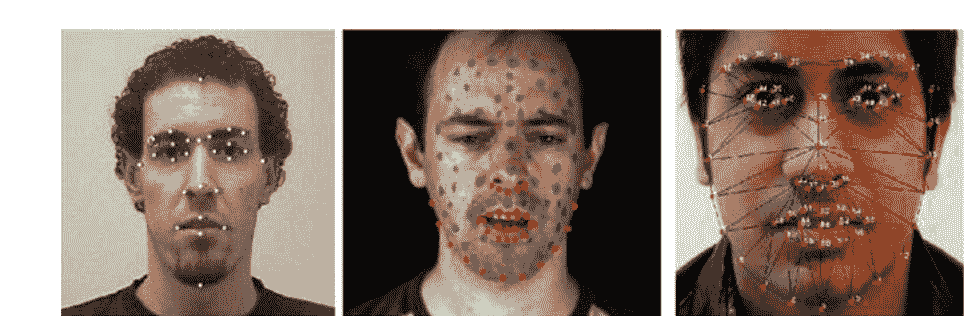

图8.1 基于计算机系统的面部识别[38-40]

一般来说，面部识别可能根据检测到的面部点而有所不同，同时这些点也可以作为机器学习技术中的一种预测数据来用于不同的目的。

### 8.1.2 长短期记忆

由于深度学习是当今最重要、最先进的机器学习形式，因此有越来越多不同的神经网络模型可用于实际问题。在这项研究中，我们使用了一种重要的深度学习技术，它具有独特而有趣的问题解决策略，用于开发的支持系统。它被称为长短期记忆，以其面向记忆的特性而命名。

长短期记忆（LSTM）是一种递归神经网络（RNN）架构类型，它包括反馈连接而不是直接的单向连接。作为一种典型的深度学习技术，LSTM能够处理数据序列[41-43]。在典型的长短期记忆模型运行中，不同的神经元-组件如细胞、输出门、输入门和遗忘门都会相应地被使用。在这里，细胞可以记住任意时间间隔内的值，而其他三个神经元（门）负责调节信息的流向和从细胞中流出。LSTM是在RNN的训练阶段中消除梯度爆炸和梯度消失问题的结果[44, 45]。图8.2显示了LSTM的典型模型[46,47]。

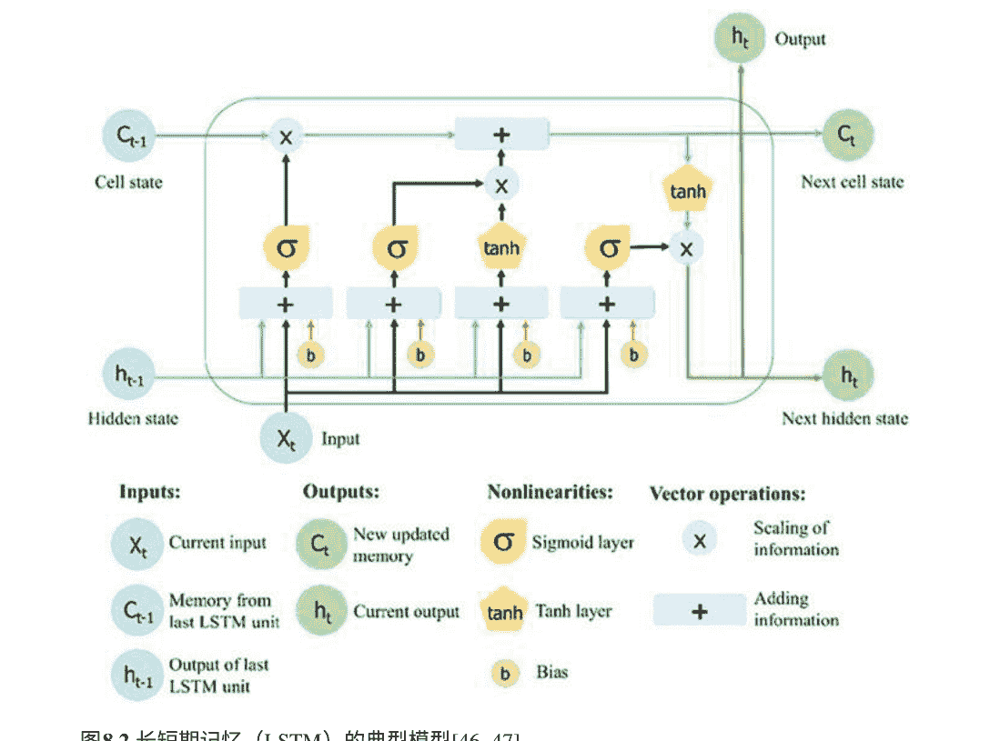

图8.3 开发的心理个人支持系统的一般结构

## 8.2 心理个人支持系统的模型

通过考虑图像处理和前一节中解释的LSTM的设置，本研究旨在确保心理个人支持的有效模型（图8.3）。以下段落简要解释了所使用的组件：

### 8.2.1 面部表情的基础设施

面部识别和情绪理解的方法是在之前的研究[48]中开发的现成基础设施的组合，并在本研究中进一步改进。在之前的研究中，通过从学习到的面部特征点（识别）移动来检测面部特征点和情绪的系统相应地开发。简而言之，这里的“检测基础设施”部分包括以下数据集的训练数据[48-51]：

- 数据集1：包含490张带有性别和总共7种情绪的照片
- 数据集2：芝加哥数据集，包含810张带有性别、种族和总共7种情绪的照片
- 数据集3：由Boz和Kose [48]随机选择的100张照片

在使用这三个数据集之前，已经获得了准确的面部识别和情绪推导相关基础设施。在本研究中，通过使用来自30个不同人的实时视频进行改进。在这里，通过Microsoft Kinect 3D相机输入LSTM的准备模型，以获取3D面部点并存储检测到的情绪。在相关文献中，Microsoft Kinect 3D经常被报道为一种有效的识别工具[52-54]。通过考虑30个不同的人，总共使用了210张照片（每个人考虑7种情绪）来改进“检测基础设施”（图8.4）。这里的情绪检测系统考虑了7种不同的情绪，包括“害怕的”、“愤怒的”、“厌恶的”、“惊讶的”、“快乐的”、“悲伤的”和“中性的”。通过将每种情绪编码为1到7，检测基础设施包括与70个面部点的x和y坐标、性别、种族（如果适用）信息以及年龄信息相关的检测数据，作为LSTM模型的训练数据，该模型负责对下一个测试类型/组件做出决策。在这一点上，模型仅通过准备好的检测基础设施给出的每种情绪的百分比进行输入，该基础设施经过了近360个情绪检测数据行的训练。

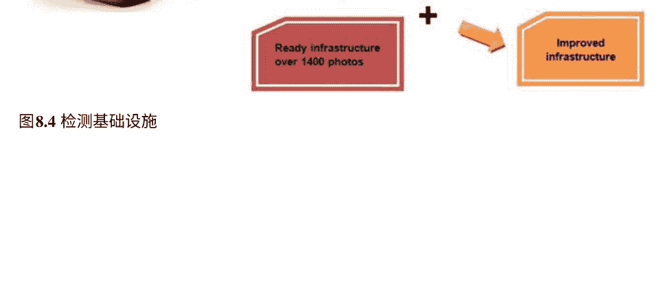

### 8.2.2 基于长短期记忆的心理测试过程

本研究开发的心理支持方法用于运行与系统交互的个体的心理状态测试。所使用的LSTM模型使用面部特征点的输入（以及其他信息，如性别、年龄，如果使用的话），用于每个情绪水平，还有医生根据测试期间从个体收集的其他输入数据。

- 心理状态等级
- 多重智力的水平值
- 先前查看的测试类型的完成百分比
- 对系统最后一个问题的回答
- 医生可以确定更多的替代数据

正如可以理解的那样，LSTM模型的输入输出平衡是根据医生的调整自适应确定的。另一方面，有三个输出，即‘测试类型’、‘情绪水平’和‘选择边界’。这些输出可以定义和解释如下：

- 测试类型：测试类型通过数字来定义，例如1：仅问题，2：视觉支持文本，3：静态视觉，4：动画，5：音乐声音，6：视频等等，这些可以随时间增加或减少。
- 情绪水平：在获取个人即时面部点状态后，该输出确定情绪强度的水平。通过考虑一个[10, 100]的范围（也可以调整），较少的值会导致不同情绪状态的混合较少，而较多的值则对应于提供更多情感互动的测试类型。在这里，如果一个人看起来很伤心，情绪水平可能会更高，以便提供一些询问和/或试图找出确切的心理问题，同时使这个人更舒适，或者至少离开悲伤的情绪。
- 选择边界：通过与不同的内容类型和情绪水平相遇，可以根据选择边界确定下一个要为个人处理的目标测试类型，这意味着过滤整个材料池的起点。

例如，选择边界的值为70，允许系统不选择选择点小于70的任何测试类型。正如可以理解的那样，系统中的每个材料也都设置了一个选择点。不同测试类型具有相同和/或接近的选择点会导致随机选择。

在这个研究的背景下，相关的网络模型已经通过由12位从事心理问题研究的医生合成准备的样本数据进行训练，这些问题包括抑郁、焦虑以及严重神经问题的面部迹象。根据总共451种测试类型，相应地创建了一个训练和测试数据集。通过考虑不同可能的心理测试等级、多种智力水平、以及参与者的其他数值数据和情绪水平。在对系统进行部分处理并执行数据清理过程以获得准确的总数后，创建了3000个数据行。在这里，数据的70%（2100个数据行）用于训练，而剩下的900个数据行（30%）用于测试训练后的系统。在LSTM模型的50次独立运行后，发现模型对测试数据的平均准确率为95.4%，这似乎可以接受，可以在实际环境中运行该系统（以进行进一步评估）。

从软件方法来看，该系统简要地类似于专家系统[55-57]，这是一种人工智能方法，它利用专家知识作为提供交互式决策支持和问题解决环境的背景。这个系统只是开始向个人提问，并根据给定的答案和个人面部的情绪表达来考虑不同类型的测试/组件。表8.1提供了开发系统中一些测试类型/组件的示例以及所提的问题。

整个支持系统的设计和开发考虑了面向对象编程原则，以实现快速和灵活的编码基础设施，并具有一些简单的功能，以允许与不同的上层软件系统通过基于API的通信渠道进行集成。

### 8.2.3 API机制

心理个人支持系统的软件系统是在模块结构的背景下设计的，它可以与可能为通用目的开发的上层软件系统进行通信（这意味着如果它们足够适合通信，该系统可以与不同的上层软件系统进行集成，采用基于API的机制）。无论是通过C语言为导向的Web编程语言编码，还是在其他环境中，系统的主要功能都是根据以下功能定义开发的（代码定义是通过消除特定语言的详细语法而进行的）。

- PSS.define_input(free_index, value, connection)：该函数用于从上层软件系统中获取评估任务值，以便通过任何空闲输入（如果没有，则可以自动创建）和软件系统的相关数据库连接详细信息来提供LSTM模型的输入。
- PSS.receive_directive(model_index)：用于运行心理个人支持系统并获取返回值作为输出。
- PSS.update_machine([input_values], TT, EL, SB)：该函数用于根据使用的模型输入（以矩阵形式）和相关的TT：测试类型、EL：情绪水平和SB：选择边界标准值来定义新的测试类型/组件。
- PSS.gather_data(connection, [source_values], [target_values])：用于从运行的上层软件的数据库中收集一些测试类型的数据，然后将其存储到心理个人支持系统的训练数据库中，以自动适应上层软件系统的传统使用特性到心理个人支持方法中。
- PSS.evaluate(template_model, [content_type, TT, EL, SB])：用于对上层软件系统存储的内容进行逆向工程，以了解在心理个人支持系统中重新定义相关测试组件所需的情绪类型-级别和测试类型。为了实现这一目标，相应地使用了一些预定义的模板LSTM模型。

## 8.3 评估

为了评估开发的系统的有效性，该系统将检测到的情绪和附加任务结合起来，以确定针对目标人员显示什么内容，由12位精通精神病学的医生在三个月的时间内使用。具体而言，医生们对总共211人的测试过程进行了评估。该系统通过医生提供的情绪/面部识别数据以及心理测试流程数据和组件进行了训练。在使用期间，医生们希望对他们使用系统的经验提供一些反馈意见。一些值得注意的评论如下：

- “该系统能够正确检测心理疾病—问题。”
- “这是一个易于使用、快速的系统，可用于自动诊断人们的心理问题。”

表8.1 心理个人支持系统中一些测试类型/组件的示例和提出的问题

| 测试类型 | 示例组件 | 示例问题 |
| :--- | :--- | :--- |
| 调查 | 利克特量表陈述；多选题陈述 | “你想了解你的多重智能吗？”<br>“你想参加有关社交生活的调查吗？”<br>“请填写关于你对工作感受的调查” |
| 问题-答案型 | 情绪状态；开放问题 | “你今天感觉如何？”<br>“那种感觉让你感到舒服吗？”<br>“你看起来厌恶。你感觉不舒服吗？”<br>“你看起来伤心。你感到孤独吗？” |
| 基于音乐的 | 情绪状态；多选题陈述；声音文件 | “请选择最好的选项来解释你的幸福”<br>“你想听一些旋律吗？”<br>“请告诉我听完下一个短旋律后你会感受到什么”<br>“哪种类型的音乐适合你当前的心情？”<br>“你看起来无聊。你想听一些充满活力的声音吗？” |
| 基于视频音乐的 | 情绪状态；多项选择语句 | “请告诉我你对下一个视频的感觉”<br>“你对那个视频中的男孩有什么感觉？”<br>“在视频显示的状态中，你选择了哪种情况？” |
| 基于动画尝试的 | Likert量表陈述；情绪状态；多项选择语句；绘画 | “请在该区域上画一个形状”<br>“哪个选项更好地解释了你的绘画？”<br>“请告诉我你刚刚观看的动画让你有什么感觉” |
| 基于视觉图像的 | 情绪状态；罗夏克测试图像；形状；照片 | “你今天感到悲伤。请告诉我你在下一张图像中看到了什么”<br>“下一张图像中哪张让你感到快乐？”<br>“请选择最能描述你当前心情的照片” |
| 基于视觉图像和问题回答的 | 洛夏克测试图像；形状；照片；情绪状态；开放性问题 | “你今天感觉如何？”<br>“你现在感到疲倦吗？”<br>“你今天起床晚了吗？”<br>“你会用什么颜色来给那座房子涂漆？”<br>“请告诉我关于你刚刚看到的照片的情况” |

1. R.S. Parpinelli, G. Plichoski, R.S. Da Silva, P.H. Narloch，对群体智能和进化计算算法中参数在线控制技术的综述。 IJBIC 13(1), 1–20 (2019)
2. X. Li, M. Clerc，群体智能， 元启发式算法手册(Springer, Cham, 2019), pp. 353–384
3. B. Inje, S. Kumar, A. Nayyar，群体智能和进化算法在疾病诊断中的应用导论，出自Swarm Intelligence and Evolutionary Algorithms in Healthcare and Drug Development. (Chapman and Hall/CRC, 2019), pp. 1–18
4. J. Del Ser, E. Villar, E. Osaba，群体智能——最新进展，新视角和应用。(InTechOpen, 2019)
5. G.R. Raidl, J. Puchinger, C. Blum，元启发式混合算法，元启发式手册(Springer, Cham, 2019), 第385-417页
6. K. Kumar, J.P. Davim，进化算法和元启发式优化：工程应用(CRC Press, Boca Raton, FL, 2019)
7. H. Tavakoli, B.D. Barkdoll，基于可持续性的优化算法。国际环境科学技术杂志17(3), 1537-1550 (2020)
8. T. Dede, M. Grzywiński, R.V. Rao，Jaya：一种用于支撑圆顶结构优化的新元启发式算法，智能技术的高级工程优化(Springer, Singapore, 2020), 第13-20页
9. M. Mafarja, A.A. Heidari, H. Faris, S. Mirjalili, I. Aljarah，龙fly算法：理论，文献综述，和在特征选择中的应用，自然启发优化器 (Springer, Cham, 2020), 页码 47–67
10. M.H. Sulaiman, Z. Mustaffa, M.M. Saari, H. Daniyal，藤壶交配优化器：一种解决工程优化问题的新的生物启发算法. 工程应用人工智能87, 103330 (2020)
11. 张勇，金智，群体教学优化算法：一种解决全局优化问题的新的元启发式方法. 专家系统应用. 148, 113246 (2020)
12. 钟旭，恩克，使用混合机器学习算法预测股市每日收益方向. 金融创新5(1), 4 (2019)
13. S. Ardabili, A. Mosavi, A.R. Várkonyi-Kóczy，机器学习建模的进展综述混合和集成方法，在国际全球研究和教育会议。 (Springer, Cham, 2019), 第215-227页
14. T. Ma, C. Antoniou, T. Toledo，网络全面交通预测的混合机器学习算法和统计时间序列模型。 交通研究C部分紧急技术111, 352-372 (2020)
15. S.N. Kumar, A.L. Fred, H.A. Kumar, P.S. Varghese, S.A. Jacob，腹部CT图像中异常的分割通过卷积神经网络和模糊支持向量机器分类，医学图像分析的混合机器智能(Springer, Singapore, 2020), 第157-196页
16. S. Bhattacharyya, D. Konar, J. Platos, C. Kar, K. Sharma (eds.),医学图像分析的混合机器智能(Springer, Singapore, 2020)
17. H.S. Shon, E. Batbaatar, K.O. Kim, E.J. Cha, K.A. Kim，使用成本敏感的混合深度学习方法对肾癌数据进行分类。 对称性12(1), 154 (2020)
18. A. Shikalgar, S. Sonavane，基于多模态数据的阿尔茨海默病分类的混合深度学习方法，工程与技术计算(Springer, Singapore, 2020), pp. 511–520
19. N.B. Khulenjani, M.S. Abadeh，用于癌症疾病分类的混合特征选择和深度学习算法。 混合深度学习模型。 科学报告10(1), 1–10 (2020)多亏了这个系统，我的工作变得更容易完成了。
- 该系统似乎在为目标人群诊断确切的心理状态提出真实的问题。
- 该系统可以通过增加其他功能来改进，以用于心理疾病的一般治疗目的。
- 我想继续使用该系统。

在评估LSTM技术的性能时，还对收集的3000行数据的不同组合进行了准确性分析。由于准确性是根据医生对每个不同输入的目标心理问题的真实检测来计算的，每个不同的训练/测试数据组合都包括70-30%的训练-测试平衡，但其中包含不同的测试类型/组件。表8.2表示不同数据组合的详细信息和成功准确性的发现。

正如可以看到的，相关的LSTM基础设施在考虑医生确定的不同心理问题的不同数据组合时获得了高准确性。数据的多样性以及目标疾病可能会降低准确性，但可以通过额外的数据来训练LSTM模型来解决这个问题。

表8.2 不同数据组合的结果和成功准确率的结果

| 组合编号 | 组合中的测试类型 | 目标疾病 | 数据行数 | 准确率 (%) |
| :--- | :--- | :--- | :--- | :--- |
| 1 | Likert量表陈述;开放问题;多选陈述 | 抑郁症 | 1090 | 88.60 |
| 2 | 情绪状态;多选陈述;Rorschach测试图像;形状 | 人格障碍 | 2056 | 93.65 |
| 3 | 多选陈述;声音文件;多选陈述;绘画 | 严重的神经系统 | 653 | 83.40 |
| 4 | 情绪状态;多选陈述 | 焦虑症 | 1981 | 95.25 |
| 5 | Likert量表陈述;多选陈述;绘画 | 精神分裂症 | 418 | 84.55 |
| 6 | Likert量表陈述;照片 | 双极性障碍 | 1587 | 91.72 |

由于经验和技术评估的支持，可以说本研究中开发的心理个人支持系统在满足期望的医疗结果和决策支持方面是有效的。

## 8.4 结果与讨论

在本章中，介绍了一种心理个人支持系统设计，它是基于图像处理的面部识别和深度学习基础设施长短期记忆（LSTM）的混合形式。具体而言，一个人的面部表情被用作LSTM模型的输入，同时还有其他可能对系统决定下一步要询问/展示的数据，以确定目标人的心理状态。在这一点上，重要的是，解决方案设计被认为是一种典型的决策/支持机制，可以作为API集成到上层软件系统中。这里开发的系统可以使用有关面部表情的数据（通过面部识别获得）以及其他数据（例如心理等级、上一次测试的完成率、上层软件系统上的其他工作的数值数据）来评估被评估人的情况。

通过将开发的解决方案纳入不同测试的过程，并要求12名医生就系统所做的决策提供反馈，对解决方案进行了评估。此外，还根据提供的数据组合对系统的准确率进行了评估，用于训练和测试。根据研究结果，该系统在确保心理决策并在这方面提供足够适当的支持方面似乎非常成功。

在未来，还可以通过额外的调整来改进这样的系统。例如，可以分析深度学习基础设施以进一步改进性能并做出更好的决策。可以通过调整LSTM的参数或将其替换为不同的深度学习技术来实现。还可以将当前系统与其他深度学习技术进行比较，例如卷积神经网络（CNN），或深度置信网络，或已知的传统机器学习技术，如决策树，支持向量机，多层人工神经网络或极限学习机，以了解系统是否可以进一步改进。另一方面，应用测试/确保问答过程的开发解决方案设计可以继续通过在不同案例和目标人群中应用来评估。最后，可以通过更多的生物特征数据来支持系统，以了解是否可以通过替代数据更多地了解即时情绪状态。

## 8.5 总结

由于当今的生活导致许多人普遍经历心理问题，因此有必要去看医生进一步讨论问题的细节，并找出如何处理和治疗这些问题。这种情况通常需要仔细评估，通过提问和试图了解目标人的心理状态、情绪和情感来进行。由于人们的面部也提供重要的迹象，可以通过考虑不同测试和情绪的组合来跟踪面部表情，并进行情感支持的智能支持过程。

在本章中，介绍了面部识别和深度学习在心理个人支持系统中的应用。该系统使用了一种特殊而卓越的深度学习技术：长短期记忆（LSTM），以实现自动化的诊断和预测下一个要显示的测试/组件的方法。此外，该系统还负责指导应用于个人的整个测试过程，以准确了解问题。评估工作显示出医生的个人使用经验和LSTM模型的检测准确性方面的积极结果。

医疗决策支持系统的未来似乎基于不同的软件系统，包括使用人工智能/深度学习来诊断特定疾病，包括心理疾病。除了诊断身体和代谢性疾病外，研究智能系统开发考虑心理问题仍存在一些未解决的问题和进一步的创新，因此相关文献也将朝这个方向扩展。

## 8.6 进一步学习

要了解更多关于心理学、精神病学和神经学导向的人工智能、机器/深度学习的研究工作，感兴趣的读者可以参考[58–67]。

为了更深入地了解最近对长短期记忆(LSTM)的应用，读者可以参考[68–76]。

要了解更多关于面部识别和情感检测的最新替代作品，读者可以阅读[77–84]。

# 参考文献

1. I. Goodfellow, Y. Bengio, A. Courville, 深度学习 (MIT Press, 2016)
2. A. Gulli, S. Pal, 使用Keras进行深度学习 (Packt Publishing Ltd, 2017)
3. N. Buduma, N. Locascio,深度学习基础: 设计下一代机器智能算法. (O'Reilly Media, Inc., 2017)
4. S.K. Zhou, H. Greenspan, D. Shen, eds. 医学图像分析中的深度学习 (Academic Press, 2017)
5. M. Fullan, J. Quinn, J. McEachen, 深度学习：激发世界，改变世界 (Corwin Press, 2017)
6. C.C. Aggarwal, 数据挖掘教程 (Springer, 2015)
7. I.H. Witten, E. Frank, M.A. Hall, C.J. Pal, 数据挖掘: 实用机器学习工具和技术 (Morgan Kaufmann, 2016)
8. A.C. Bovik, 图像和视频处理手册 (Academic Press, 2010)
9. J.C. Russ, 图像处理手册 (CRC Press, 2016)
10. E. Alpaydin, 机器学习导论 (MIT Press, 2009)
11. T.O. Ayodele, 机器学习导论 (INTECH Open Access Publisher, 2010)
12. S. Marsland, 机器学习: 算法视角 (Chapman and Hall/CRC, 2014)
13. T.M. Mitchell, 机器学习学科, vol. 9 (Carnegie Mellon University, School of Computer Science, Machine Learning Department, Pittsburgh, PA, 2006)
14. S. Mitra, S. Datta, T. Perkins, G. Michailidis, 机器学习和生物信息学导论 (Chapman and Hall/CRC, 2008)
15. R. Cipolla, S. Battiato, G.M. Farinella, 计算机视觉的机器学习, vol 5 (Springer, 2013)
16. J. Ponce, M. Hebert, C. Schmid, A. Zisserman, eds. 面向类别级别的物体识别, vol 4170 (Springer, 2007)
17. G. Shaogang, P. Alexandra, 动态视觉: 从图像到人脸识别 (World Scientific, 2000)
18. S.K. Zhou, 医学图像识别、分割和解析: 机器学习和多目标方法 (Academic Press, 2015)
19. R. Adolphs, 从面部表情识别情绪: 心理和神经机制。行为认知神经科学评论 1(1), 21–62.A (2002)
20. T.K. Shackelford, R.J. Larsen, 面部不对称作为心理、情绪和生理困扰的指标。 J. Pers. Soc. Psychol. 72(2), 456 (1997)
21. J.P. Robinson, P.R. Shaver, L.S. Wrightsman, 编辑。 个性和社会心理态度的测量: 社会心理态度的测量, 第1卷 (学术出版社, 2013)
22. W. AbdAlmageed, Y. Wu, S. Rawls, S. Harel, T. Hassner, I. Masi, R. Nevatia, 使用深度多姿态表示的人脸识别，在2016年IEEE冬季计算机视觉应用会议 (WACV), 第1-9页。 IEEE
23. B. Amos, B. Ludwiczuk, M. Satyanarayanan, Openface: 一个通用的人脸识别库，具有移动应用。 CMU计算机科学学院 (2016)
24. C. Ding, D. Tao, 基于视频的人脸识别的主干-分支集成卷积神经网络。 IEEE Trans. Pattern Anal. Mach. Intell. (2017)
25. P. Karczmarek, A. Kiersztyn, W. Pedrycz, 人脸识别的模糊测度评估, 国际人工智能与软计算会议 (Springer, Cham, 2017), pp. 668–676
26. A.T. Lopes, E. de Aguiar, A.F. De Souza, T. Oliveira-Santos, 用卷积神经网络进行面部表情识别: 应对少量数据和训练样本顺序。 Pattern Recogn. 61, 610–628 (2017)
27. Y.D. Zhang, Z.J. Yang, H.M. Lu, X.X. Zhou, P. Phillips, Q.M. Liu, S.H. Wang, 基于生物正交小波熵、模糊支持向量机和分层交叉验证的面部情绪识别。 IEEE Access 4, 8375–8385 (2016)
28. M.Z. Uddin, M.M. Hassan, A. Almogren, M. Zuair, G. Fortino, J. Torresen, 一种使用深度视频和深度学习的鲁棒面部特征的面部表情识别系统。 计算电子工程 63, 114–125 (2017)
29. V. Mavani, S. Raman, K.P. Miyapuram, 使用视觉显著性和深度学习的面部表情识别，在IEEE国际计算机视觉会议论文集, pp. 2783–2788 (2017)
30. N. Jain, S. Kumar, A. Kumar, P. Shamsolmoali, M. Zareapoor, 用于面部情绪识别的混合深度神经网络。 模式识别信件 115, 101–106 (2018)
31. S. Zhang, X. Pan, Y. Cui, X. Zhao, L. Liu, 通过混合深度学习学习情感视频特征进行面部表情识别. IEEE Access 7, 32297–32304 (2019)
32. Y. Tian, T. Kanade, J.F. Cohn, 面部表情识别.在人脸识别手册(Springer, 伦敦, 2011), pp. 487–519
33. A. Bejgu, I. Mocanu, 使用Kinect进行面部情绪识别。 J. Inf. Syst. Oper. Manag. 1 (2014)
34. P. Ekman, E.L. Rosenberg (eds.),面部表情揭示了什么：使用面部动作编码系统（FACS）的基础和应用研究（牛津大学出版社，美国，1997年）
35. A. Kendon, 语言和手势：统一还是二元的，见语言和手势：窥视思维和行动（剑桥大学出版社，剑桥，2000年）
36. A.K. Jain, S.Z. Li人脸识别手册（斯普林格，纽约，2011年）
37. H. Wechsler, J.P. Phillips, V. Bruce, F.F. Soulié, T.S. Huang, 编辑人脸识别：从理论到应用，卷163（斯普林格科学与商业媒体，2012年）
38. S. Asadiabadi, R. Sadiq, E. Erzin, 使用深度神经网络进行多模态语音驱动的面部形状动画，见2018年亚太信号与信息处理协会年会和会议（APSIPA ASC），第1508-1512页，IEEE（2018年）
39. A. Gera, A. Bhattacharya, 使用基于f-score的融合方法从音频和视觉数据中识别情绪，在2014年IKDD数据科学会议论文集中，第I-I0页
40. Y. Tie, L. Guan, 用于人脸表情的自动地标点检测和跟踪。 EURASIP J. 图像视频处理. 2013(1), 8 (2013)
41. S. Hochreiter, J. Schmidhuber, 长短期记忆。神经计算。9(8), 1735–1780 (1997)
42. H. Sak, A.W. Senior, F. Beaufays, 用于大规模声学建模的长短期记忆循环神经网络架构(2014)
43. X. Zhu, P. Sobihani, H. Guo, 用于递归结构的长短期记忆，在国际机器学习会议上，第604-1612页 (2015)
44. A. Graves, 长短期记忆，在具有递归神经网络的监督序列标注中（Springer，柏林，海德堡，2012年），第37-45页
45. Y. Zhang, G. Chen, D. Yu, K. Yaco, S. Khudanpur, J. Glass, 高速公路长短期记忆rns用于远程语音识别，在2016年IEEE国际声学、语音和信号处理会议（ICASSP），第5755-5759页。IEEE（2016年）
46. X.H. Le, H.V. Ho, G. Lee, S. Jung, 应用长短期记忆（LSTM）神经网络进行洪水预测。水11（7），1387（2019年）
47. S. Yan, 理解LSTM及其图表。在线: https://medium.com/mlreview/understanding-lstm-and-its-diagrams-37e2f46f1714。检索于2020年1月16日
48. H. Boz, U. Kose, 使用人工智能从面部表情中提取情感技术。BRAIN：广泛研究。人工智能神经科学。9（1），5-16（2018年）
49. M. Grgic, K. Delac, 人脸识别主页。在线: http://www.face-rec.org/databases/。检索于2017年12月23日
50. R. Gross, 面部数据库，在面部识别手册，由S.Z. Stan, A.K. Jain编辑（Springer，2005年）
51. D.S. Ma, J. Correll, B. Wittenbrink, 芝加哥面部数据库：一个免费的面部刺激集和标准化数据。行为研究方法47（4），1122-1135（2015年）
52. C. Cao, Y. Weng, S. Zhou, Y. Tong, K. Zhou, Facewarehouse：一个用于视觉计算的3D面部表情数据库。IEEE Trans. Visual Comput. Graphics 20（3），413-425（2014年）
53. K. Sato, T. Nose, A. Ito, Y. Chiba, A. Ito, T. Shinozaki, 使用3D面部特征点和深度神经网络生成2D逼真面部动画的研究，在智能信息隐藏和多媒体信号处理国际会议（Springer, Cham, 2017年），第112-118页
54. E. Silverstein, M. Snyder, 使用Microsoft Kinect v2传感器实现面部识别用于患者验证。医学物理学。44（6），2391-2399（2017）
55. J.C. Giarratano, G. Riley, 专家系统 (PWS Publishing Co, 1998)
56. P. Pandey, R. Litoriya, 用于作物疾病诊断和决策的预测模糊专家系统支持，在模糊专家系统和农业诊断应用（IGI Global, 2020），pp. 175-194
57. S.R. Qwaid er, S. S. Abu Naser, 用于诊断踝关节疾病的专家系统。工程信息国际期刊。Syst. (IJE AIS) (2017)
58. D.B. Dwyer, P. Falkai, N. Koutsouleris, 临床心理学和精神病学的机器学习方法。年度回顾临床心理学。14，91-118（2018）
59. D. Bone, M.S. Goodwin, M.P. Black, C.C. Lee, K. Audhkhasi, S. Narayanan, 应用机器学习促进自闭症诊断：陷阱与希望。J. Autism Dev. Disord. 45(5),1121–1136 (2015)
60. D. Bone, S.L. Bishop, M.P. Black, M.S. Goodwin, C. Lord, S.S. Narayanan, 使用机器学习改进自闭症筛查和诊断工具：有效性、效率和多仪器融合。J. Child Psychol. Psychiatry 57(8),927–937 (2016)
61. K. Panc erz, O. Mich, A. Burda, J. Gomul a, 基于MMPI测试的心理障碍计算机辅助诊断工具：概述，在Applications of Computational Intelligencein Bio medical Technology(Springer, Cham, 2016), pp. 201–213
62. Z.S. Zheng, N. Reggente, E. Lutkenhoff, A.M. Owen, M.M. Monti, 从扩散张量成像和机器学习中解开意识障碍：人脑成像38(1),431–443 (2017)
63. S. Mani, M.B. Dick, M. J. Pazzani, E. L. Teng, D. Kempler, I.M. Taussig, 使用机器学习在跨文化人群中改进痴呆筛查的神经心理学测试. 在联合欧洲人工智能医学和医疗决策会议(Springer, Berlin, Heidelberg, 1999), pp. 326–335
64. R. Dinga, A.F. Marquand, D.J. Veltman, A.T. Beekman, R.A. Schoevers, A.M. van Hemert,L. Schmaal, 从广泛的临床、心理和生物数据预测抑郁症的自然病程: 一种机器学习方法。转化精神病学8(1), 1–11(2018)
65. W. 刘, M. 李, L. 易, 基于面部处理异常的自闭症谱系障碍儿童识别: 一种机器学习框架。自闭症研究。9（8）,888-898（2016）
66. W. Jarrold, B. Peintner, D. Wilkins, D. Vergyi, C. Richey, M.L. Gorno-Tempini, J. Ogar, 通过计算机分析自发语音辅助诊断痴呆类型, 在计算语言学和临床心理学研讨会上的论文：从语言信号到临床现实，第27-37页（2014）
67. A.B. Shatte, D.M. Hutchinson, S.J. Teague, 心理健康中的机器学习：方法和应用的范围综述。心理医学。49（9）, 1426-1448（2019）
68. T. Adler, M. Erhard, M. Krenn, J. Brandstetter, J. Köfler, S. Hochreiter, 量子光学实验通过长短期记忆模型（2019）。arXiv预印本arXiv：1910.13804
69. Y.Y. Hong, J.J.F. Martinez, A.C. Fajardo, 利用格里曼角场和卷积长短期记忆进行日前太阳辐射预测。IEEE Access 8，18741-18753 (2020)
70. A. Chandra, S.K. Khatri, 使用递归神经网络和长短期记忆进行垃圾短信过滤, 在2019年第四届信息系统和计算机网络国际会议(ISCON)(IEEE, 2019), 第118-122页
71. F. Wei, U.T. Nguyen, 使用双向长短期记忆神经网络和词嵌入进行Twitter机器人检测, 在2019年第一届IEEE智能系统和应用中的信任、隐私和安全国际会议(TPS-ISA)(IEEE, 2019), 第101-109页
72. C. Li, Z. Wang, M. Rao, D. Belkin, W. Song, H. Jiang, N. Ge, 基于忆阻交叉阵列的长短期记忆网络。自然机器智能1(1), 49-57页(2019)
73. M. Al-Smadi, B. Talafha, M. Al-Ayyoub, Y. Jararweh, 使用长短期记忆深度神经网络进行基于方面的阿拉伯评论情感分析。机器学习与网络10(8), 2163-2175页(2019)
74. S.R. de Assis Neto, G.L. Santos, E. da Silva Rocha, M. Bendechache, P. Rosati, T. Lynn, P.T. Endo, 基于双向长短期记忆模型的多模态传感器数据集的人类活动检测：案例研究,在挑战和趋势中的多模态跌倒检测用于医疗保健(Springer, Cham, 2020), 第31-51页## 第9章 通过图像去雾和胶囊网络诊断糖尿病视网膜病变

正如之前在第4章中讨论的，糖尿病视网膜病变（DR）这种疾病会导致失明，最近一直是一个值得关注的医学问题。在这里，特别是视网膜病变可能是全球数百万失明病例的最大问题[1]。当详细研究所有失明病例时，报告称大约有200万例糖尿病视网膜病变导致失明，因此早期诊断在消除或至少减缓疾病因素（导致失明）方面已经迈出了许多步骤，从而最终降低失明率[2, 3]。

考虑到图9.1，这是一个比第4章提供的更详细的视图，可以看到视网膜的状态，包括血管、黄斑和视盘。由于这些组成部分的变化是DR的迹象，这种疾病可以分为两个阶段进行检查，即非增殖性DR（NPDR）和增殖性DR（PDR）。在NPDR中，糖尿病会对血管造成损害，从而使血液对视网膜的功能产生负面影响；而在PDR中，正常的血管会长在视网膜上，并最终导致失明。在这里，NPDR可能导致称为微小动脉瘤（MAs）、硬渗出物（EXs）、出血（HMs）和视网膜间微血管异常（IRMA）的不同视网膜病变迹象[1, 4]。将所有迹象状态汇总到一起，可以谈论五种类型的DR，如图9.1所示[5]。

回顾DR的诊断，可以简要地表达一些关于替代研究工作的内容。Sreejini和Govindan使用了视盘消除、渗出物分割、黄斑和黄斑区域定位，然后进行DR的分类。详细来说，他们采用了图像处理、智能优化技术：粒子群优化（PSO）和模糊C均值聚类[6]。Seoud和他的同事提出了一个分级系统，可以自动进行DR的决策方法。在他们的研究中，他们通过识别红色病变来形成一个关于病变的概率图，然后使用35个特征结合大小和概率信息进行分类方法[7]。Acharya等人使用支持向量机模型进行糖尿病大规模筛查。通过组织特性自动完成的视网膜病变诊断[8]。在另一项研究中，Safitri和Juniati通过从视网膜图像中移除微小动脉瘤（MA）的候选区域，并使用高斯混合模型和支持向量机的混合方法对相关区域进行分类，确保了MA的早期检测[9]。Savarkar和他的同事提出了一种通过分析候选像素点沿不同方向的密度值来检测MA的方法。在这种方法中，首先确定峰值，然后确定特征集并进行分类[10]。最后，Akremetal等人通过分形分析和k最近邻（kNN）技术进行了DR诊断的研究[11]。

在这一章中，使用胶囊网络（也称为CapsNet）解决了DR的诊断问题。CapsNet实际上是卷积神经网络（CNN）的改进版本，CNN是一种广泛使用的深度学习技术，利用了深度学习的重要优势[12]。除了第4章中的解决方案外，Deperlioglu和Kose之前还使用了一种实用的图像处理方法来改进视网膜底图像，包括HSV、V变换算法和直方图均衡化技术，以更好地对图像进行分类（诊断）[13]。在[14]中，还使用了CNN进行了另一项工作，采用了直方图均衡化（HE）以及对比度有限自适应直方图均衡化（CLAHE），为CNN提供了更好的数据。此外，在[15]中，Pratt等人还使用CNN开发了一种无需用户输入的诊断/决策支持系统。在这里，试图回答一个问题，即CapsNet是否可以通过图像去雾的简单技术来提高结果，特别是对抗CNN。

## 9.1 材料和方法

在这项研究中，DR的诊断采用了两步法，包括图像处理和CapsNet的分类。在训练/测试中，选择了Kaggle糖尿病视网膜病变检测数据库作为目标数据。DR诊断的相关阶段详细表示在图9.2中。

### 9.1.1 用于诊断的Kaggle糖尿病视网膜病变数据库

Kaggle平台提供的DR数据库是一个包含超过80,000张彩色眼底图像的公共数据集。第一个数据集包括来自44,351名患者的88,702张彩色眼底图像。这些图像是从加利福尼亚和其他地方的几个主要基金中心收集的，使用了各种数字眼底相机。所有文件都是jpeg格式，分辨率分别为433×289像素至5184×3456像素（中位数分辨率为3888×2592像素），相关图像被上传到EyePACS，这是一个DR筛查平台。对于每只眼睛，DR的严重程度由ETDRS [18]标度上的专家评定。这些分别是‘无DR’、‘轻度非增殖性DR（NPDR）’、‘中度NPDR’、‘重度NPDR’和‘增殖性DR（PDR）’[19]。

### 9.1.2 图像处理

在这项研究中，使用了一种简单快速的图像增强方法，其性能接近混合方法。该方法包括基于暗通道先验的图像去雾和图像引导滤波。

基于暗通道先验的方法是一种用于户外无雾图像去雾的统计方法。它利用了户外无雾图像中最重要的观察/最局部的补丁包含至少一个颜色通道中密度非常低的像素的方法。在进行雾霾成像模型之前，可以直接预测雾霾的厚度和获得高质量的无雾图像。这里的暗通道先验只是一个简单但足够强大的先验，用于去除单张图像的雾霾。通过将雾霾成像模型与先验相结合，单张图像的雾霾去除变得更加有效且更容易[20]。

去雾后，使用引导滤波器对颜色进行平滑处理和边缘锐化。引导滤波器形成了一个局部线性模型，通过网格图像的内容计算滤波输出，该网格图像可以是输入图像本身或另一幅不同的图像。在这里，可以将引导滤波器作为边缘保护直线操作符使用，例如流行的双边滤波器，但在接近相关边缘时具有更好的行为。引导滤波器还可以将方向图像的结构传输到滤波输出中，从而实现新的滤波应用，如引导羽化和去雾[21]。

### 9.1.3 分类

本研究中用胶囊网络 (CapsNet) 进行诊断DR的分类方法，这是一种有效的、最新的深度学习技术。在图像处理阶段之后，CapsNet已经被应用于相关的Kaggle数据库。

CapsNet是一种最近的深度学习架构，它采用胶囊作为数据处理组件，胶囊是一组人工神经元。CapsNet已经被开发出来作为解决卷积神经网络(CNN)中数据路由过程导致丢弃一些信息（即目标对象的位置和姿态）的问题的解决方案。在典型的CapsNet中，每个胶囊可以确定目标对象中的一个组成部分，最终，所有胶囊共同形成对象的整体结构[22-24]。作为卷积神经网络(CNN)的典型改进，CapsNet模型包括多层。图9.3代表了CapsNet的典型结构[25]。

### 9.1.4 诊断评估

在不同的医疗应用中，包括特别是诊断方面，本研究使用了以下评估指标来评估开发的解决方案[26]:

准确率 = (真正例 + 真负例)/总数 (1)

敏感度 = 真正例/阳性总数 (2)

特异度 = 真负例/总数 (3)

精确度 = 真正例/(真正例 + 假正例) (4)

召回率 = 敏感度 (5)

f分数 = 2 * [(精确度 * 召回率)/(精确度 + 召回率)] (6)

几何平均 = sqrt(敏感度 * 特异度) (7)

在相关方程的背景下，TrP和FrP分别表示所进行诊断的真正例总数和假正例总数。此外，TrN和FrN分别对应于诊断中出现的真负例总数和假阴性总数。N表示数据/样本的总数，也表示阳性(P)和阴性(N)的总和。对于特定的分类技术，正确诊断的精确度与准确率的比率相关。另一方面，敏感度是用于准确定义分类器正确定义目标类形成的程度，而特异性则用于目标类的分离能力[27, 28]。

## 9.2 应用和评估

所有图像处理和分类/诊断过程均使用MATLAB r2017a软件进行。在研究中，使用了Kaggle数据库中的200张彩色底片数字图像来评估图像处理支持的CapsNet模型的性能。此时，选择并相应地使用了包括157张无DR（0），10张轻度NPDR（1），27张中度NPDR（2），4张重度NPDR（3）和2张增殖性DR（PDR）（4）的200张图像。因此，分类的输出类别有0、1、2、3和4。

首先，对这些图像进行了图像增强处理。图9.4显示了46_left.jpeg经过图像增强步骤后的图像。在图像处理研究中，熵值和均值被用来评估所得结果。例如，对于“46_left.jpeg”图像，原始图像的熵值为2.2036。改进后的图像的熵值增加到2.6634。同样，原始图像的均值为204.2431。改进后的图像的均值增加到209.6221。由于较高的熵值和均值意味着更好的可视化效果，图像有所改进。

为了更好地理解图像的改进，图9.5只显示了原始图像和改进后的图像。

在DR诊断过程中，通过CapsNet模型对获得的彩色眼底图像进行分类。为了设计一个用于诊断DR的模型，这里的CapsNet总共包含5层。这些层分别是图像输入层（参数为[195 322 3]），卷积层（3×3×256），主要胶囊层（3×3×（1×256）），眼底胶囊层（（7×7）×256），以及输出层（分类层）。

在分类/诊断中，使用了来自Kaggle数据库的200张图像，其中80%用于训练，剩下的20%用于测试。对于随机选择的训练和测试数据，分类过程重复进行了20次。关于性能评估指标的最低-平均-最高值的获得结果见表9.1。

| 标准       | 最低   | 平均值 | 最高   |
|------------|--------|--------|--------|
| 准确率     | 0.9225 | 0.9484 | 0.9650 |
| 敏感性     | 0.8150 | 0.8468 | 0.8800 |
| 特异性     | 0.9650 | 0.9823 | 0.9833 |
| 精确度     | 0.8950 | 0.8468 | 0.8800 |
| 召回率     | 0.8150 | 0.8468 | 0.8800 |
| F分数      | 0.8150 | 0.8468 | 0.8800 |
| 几何平均   | 0.8143 | 0.8287 | 0.8406 |

从获得的结果可以看出，图像去雾和CapsNet模型的组合在不同的评估指标上具有很高的值。这表明诊断解决方案具有非常高的采样、选择和估计能力。

## 9.3 结果

在本章中，旨在解释一种简单的方法，而不是使用不同的繁琐的图像处理方法和人工智能技术来创建DR诊断方法。在这个背景下，提出了一种通过使用暗通道优先方法对眼底图像进行除雾处理和使用胶囊网络（CapsNet）进行分类的糖尿病视网膜病变的简单诊断方法。为了测试所提出方法的性能，使用Kaggle糖尿病视网膜病变诊断数据库创建了一个应用程序。经过图像处理后，使用CapsNet模型进行了分类研究。总共进行了20次试验，并取得了性能评估中使用的指标的平均值。获得的结果表明，开发的模型具有非常高的采样、选择和估计能力。

因此，所提出的方法在视网膜眼底图像的DR诊断中非常有效和高效。对于未来的工作，可以添加不同的图像处理方法，也可以实现不同变体的CapsNet。

## 9.4 总结

人类一直在处理需要早期诊断以获得更好治疗结果的严重疾病。由于糖尿病视网膜病变（DR）有导致失明的潜力，人工智能相关文献在设计诊断解决方案方面给予了显著重视，该方案具有早期诊断机制。为了实现这一目标，图像处理和机器/深度学习具有很大的协同作用，可以开发创新和强大的解决方案。同样，本章提供了一种结合图像去雾和胶囊网络（CapsNet）的替代解决方案。这里提供的解决方案只是诊断DR的另一个例子，如前面在第4章中所解释的。可以清楚地看到，存在着寻求改进所获得结果的替代解决方案的途径。第4章和本章提供的解决方案也可以应用于诊断其他疾病，这些疾病可以通过图像数据进行诊断。

由于过去的章节提供了一个关于医疗决策支持在诊断过程中的一般收集，仍然有许多其他的研究方法可以通过考虑各种各样的疾病来完成。尽管人类渴望一个无病的世界，但由于生活和自然本身的混乱，这似乎是是不可能的。然而，未来仍将与人工智能和医学领域之间的进一步发展和替代解决方案的想法相关联。通过考虑深度学习和医疗决策支持系统的主题，第10章将专门讨论深度学习导向的决策支持解决方案与医学之间的强关系可能塑造出怎样的未来。

## 9.5 进一步学习

对于对医学图像分析和图像处理技术在这方面的作用更感兴趣的读者，可以参考[29–36]。

图像处理和深度学习的组合在解决许多不同的医学问题上被使用。作为了解当前状态的最新收集，读者可以阅读[37–43]。

由于当前世界（在完成本书时）正在应对由COVID-19病毒引起的大流行，最近也有一些关于基于图像的冠状病毒/COVID-19诊断分析的研究成果。其中一些是[44-49]。

# 参考文献

1.  M. U. Akram, S. Khalid, S. A. Khan. 早期检测糖尿病视网膜病变的微小动脉瘤的识别和分类。Pattern Recognition. **46**（1）: 107-116（2013年）
2.  WHO.（2019年）。失明原因。在线: http://www.who.int/blindness/causes/priority. 检索日期2019年12月28日
3.  G. Quellec等。糖尿病视网膜病变筛查的深度图像挖掘。Medical Image Analysis. **39**：178-193（2017年）
4.  U. M. Akram等人。检测和分类糖尿病视网膜病变以进行分级。Computers in Biology and Medicine. **45**（2014）: 161-171.
5.  F. Chollet.（2015）Keras。可用: https://keras.io。最后访问2019/11/30
6.  M. R. Mookiah，Krishnan等人。糖尿病视网膜病变的计算机辅助诊断：一项综述。Computers in Biology and Medicine. **43**（12）: 2136-2155
7.  K.S. Sreejini, V.K. Govindan, 视网膜图像中DME的严重程度分级: PSO和FCM与贝叶斯分类器的组合。International Journal of Computer Applications. **81**（16）, 11-17（2013）
8.  L. Seoud, J. Chelbi, F. Cheriet, 公共数据库上的糖尿病视网膜病变自动分级, 编辑X. Chen, M. K. Garvin, J. J. Liu, E. Trusso, Y. Xu。眼科医学图像分析第二届国际研讨会OMIA 2015, 与MICCAI合作举办。（德国慕尼黑，2015年10月9日），第97-104页。可从https://doi.org/10.17077/omia.1032获得
9.  U. R. Acharya, E. Y. K. Ng, J. H. Tan, 用于识别的综合指数。J. Med. Syst. **36**(3): 2011–2020. https://doi.org/10.1007/s10916-011-9663-8
10. D. W. Safitri, D. Juniati, 使用分形维度分析眼底图像的糖尿病视网膜病变分类。国际数学会议：纯粹、应用和计算。AIP Conf. Proc. **1867**, 020011-1–020011-11; https://doi.org/10.1063/1.4994414. **(2017)**
11. S.P. Savarkar, N. Kalkar, S.L. Tade, 使用图像处理检测、分类和分析糖尿病视网膜病变。Int. J. Adv. Comput. Res. **3**(11), 585–588 (2013)
12. M.U. Akrametal, S. Khalid, S.A. Khan, 用于早期检测糖尿病视网膜病变的微小动脉瘤的识别和分类。Pattern Recognn. **46**, 107–116 (2013)
13. P. Chandrayan, 深度学习: 自编码器基础和类型, https://codeburst.io/deep-learning-types-and-autoencoders-a40ee6754663. 最后访问日期: 2018年1月25日
14. O. Deperlioglu, U. Kose, 使用图像处理和卷积神经网络诊断糖尿病视网膜病变。2018年第二届多学科研究与创新技术国际研讨会(ISMSIT), (IEEE, 2018)

14. D. J. Hemanth, O. Deperlioglu, U. Kose, 一种改进的深度卷积神经网络用于糖尿病视网膜病变检测和分类的方法。神经计算应用。(2019) https://doi.org/10.1007/s00521-018-03974-0

15. H. Pratt 等人。糖尿病视网膜病变的卷积神经网络。计算科学会议论文集。90: 200–205 (2016)

16. Kaggle，糖尿病视网膜病变数据库。在线：https://www.kaggle.com/c/diabetic-retinopathy-detection/data。2020年2月12日检索

17. J. Cuadros, G. Bresnick, EyePACS：一种适应性糖尿病视网膜病变筛查的远程医疗系统。糖尿病科学技术杂志。3(3), 509–516 (2009)

18. C. P. Wilkinson, F. L. Ferris, R. E. Klein, P. P. Lee, C. D. Agardh, M. Davis, D. Dills, A. Kampik, R. Pararajasegaram, J. T. Verdaguer, 提出的国际临床糖尿病视网膜病变和糖尿病黄斑水肿疾病严重程度评分。眼科学 110(9): 1677–1682 (2003)。https://doi.org/10.1016/s0161-6420(03)00475-5

19. G. Quellec 等，深度图像最小化糖尿病视网膜筛查医学图像分析 39, 178–193 (2017)

20. K. He, J. Sun, X. Tang, 使用暗通道先验的单幅图像去雾。IEEE Trans. Pattern Anal. Mach. Intell. 33(12), 2341–2353 (2010)

21. K. He, J. Sun, X. Tang, 引导图像滤波(欧洲计算机视觉会议, Springer, 柏林, 海德堡, 2010年)

22. S. Sabour, N. Fross, G. E. Hinton, 胶囊之间的动态路由。在神经信息处理系统的进展中, (2017年), 第3856-3866页

23. A. Mobiny, H. Van Nguyen, 用于肺癌筛查的快速胶囊网络。国际会议医学图像计算与计算机辅助干预, (Springer, Cham, 2018年), 第741-749页

24. H. Chao, L. Dong, Y. Liu, B. Lu, 使用多频带脑电信号进行情绪识别 CapsNet。传感器 19(9), 2212 (2019年)

25. W. Zhang, P. Tang, L. Zhao, 使用 CNN-CapsNet 进行遥感图像场景分类。遥感。11(5), 494 (2019年)

26. W. 张, J. 韩, S. 邓, 基于缩放谱图和张量分解的心音分类。生物医学信号处理与控制 32, 20-28 (2017)

27. O. Deperlioglu, 使用卷积神经网络对心音图进行分类, 大脑。广义研究人工智能神经科学 9 (2), 22-33 (2018)

28. D.J. Hemanth, O. Deperlioglu, U. Kose, 使用深度卷积神经网络的增强型糖尿病视网膜病变检测和分类方法。神经计算应用 (2019)。https://doi.org/10.1007/s00521-018-03974-0

29. J.S. Duncan, N. Ayache, 医学图像分析：过去二十年的进展和面临的挑战。IEEE 模式分析与机器智能 22 (1), 85-106 (2000)

30. A. P. Dhawan, 医学图像分析, 卷 31, (Wiley, 2011)

31. A. Criminisi, J. Shotton, (eds.), 决策森林用于计算机视觉和医学图像分析。(Springer Science & Business Media)

32. M. J. McAuliffe, F. M. Lalonde, D. McGarry, W. Gandler, K. Csaky, B. L. Trus, 医学图像处理、分析和可视化在临床研究中。第14届/IEEE 计算机辅助医学系统研讨会论文集 (CBMS), (IEEE, 2001), pp. 381–386

33. J. L. Semmlow, B. Griffel, 生物信号和医学图像处理, (CRC press, 2014)

34. K. M. Martensen, 放射图像分析-E-Book, (Elsevier Health Sciences, 2013)

35. R. M. Rangayyan, 生物医学图像分析。(CRC press, 2004)

36. I. Bankman (ed.), 医学图像处理与分析手册。(Elsevier, 2008)

37. J.R. Hagerty, R.J. Stanley, H.A. Almubarak, N. Lama, R. Kasmi, P. Guo, W.V. Stoecker, 深度学习和手工方法融合：黑素瘤皮肤镜图像的更高诊断准确性。IEEE J. Biomed. Health Inform. 23(4), 1385–1391 (2019)

38. Y. Gurovich, Y. Hanani, O. Bar, G. Nadav, N. Fleischer, D. Gelbman, L.M. Bird, 使用深度学习识别遗传疾病的面部表型。Nat. Med. 25(1), 60–64 (2019)

39. K. K. Wong, G. Fortino, D. Abbott, 基于深度学习的心血管图像诊断：一个有前途的挑战。未来计算机系统, (2019)

40. S. Dabeer, M.M. Khan, S. Islam, 癌症诊断在组织病理图像中：基于 CNN 的方法。Inform. Med. Unlocked 16, 100231 (2019)

41. T. Jo, K. Nho, A.J. Saykin, 深度学习在阿尔茨海默病中：诊断分类和预测使用神经影像数据。Front. Aging Neurosci. 11, 220 (2019)

42. J. Xu, K. Xue, K. Zhang, 当前临床诊断基于图像的深度学习的现状和未来趋势。Theranostics 9(25), 7556 (2019)

43. C.M. Dourado Jr., S.P.P. da Silva, R.V.M. da Nóbrega, A.C.D.S. Barros, P.P. Reboucas Filho, V.H.C. de Albuquerque, 深度学习物联网系统用于在线中风检测在头颅计算机断层扫描图像中。Comput. Netw. 152, 25–39 (2019)

44. X. Xu, X. Jiang, C. Ma, P. Du, X. Li, S. Lv, L. Yu, Y. Chen, J. Su, G. Lang, Y. Li, 深度学习系统用于筛查 2019 冠状病毒肺炎。arXiv 预印本 arXiv:2002.09334. (2020)

45. I. D. Apostolopoulos, T. Bessiana, Covid-19：利用卷积神经网络和迁移学习自动检测 X 射线图像。arXiv 预印本 arXiv:2003.11617. (2020)

46. A. Narin, C. Kaya, Z. Pamuk. 利用 X 射线图像和深度卷积神经网络自动检测冠状病毒疾病 (COVID-19)。arXiv 预印本 arXiv:2003.10849. (2020)

47. S. Wang, B. Kang, J. Ma, X. Zeng, M. Xiao, J. Guo, M. Cai, J. Yang, Y. Li, X. Meng, B. Xu, 使用 CT 图像进行深度学习算法筛查冠状病毒疾病 (COVID-19)。medRxiv. (2020)

48. F. Shan, Y. Gao, J. Wang, W. Shi, N. Shi, M. Han, Z. Xue, Y. Shi. 使用深度学习对 CT 图像中的 COVID-19 进行肺部感染定量化。arXiv 预印本 arXiv:2003.04655. (2020)

49. L. Wang, A. Wong, COVID-Net：一种专门设计用于检测胸部放射影像中 COVID-19 病例的深度卷积神经网络。arXiv 预印本 arXiv:2003.09871. (2020)

## 第10章
医疗决策支持系统的未来

在对基本主题有了介绍之后，前几章都提供了深度学习在重要疾病诊断中的有效应用，因为它们是医疗决策支持系统的基础。当然还有许多其他研究方面需要讨论，但关注医疗决策支持系统的未来也是一个很好的方法。

目前，有许多替代技术和创新发展为人类带来了革命性的变化。尽管人工智能及其当前的子领域即深度学习仍然是最重要的领域，但未来的想法可以通过思考可能会对技术变革和使现代生活更实用和可理解的主题产生重大影响。如果考虑到塑造未来的所有因素，那么可以得到非常广泛的范围，但图10.1代表了一些主要技术和主题的方案，可以被视为医疗决策支持系统未来情景的组成部分。

尽管我们仍然应该思考人工智能和深度学习，但未来可能会有新的概念。然而，智能系统的作用仍将存在，因为它们将成为不同技术和工具-设备背景下的常见组成部分。基于医疗范围和与医疗决策支持系统的关系，本章在以下段落中对未来发展进行了最终讨论。

## 10.1 健康物联网和可穿戴技术

物联网（IoT）被称为最近的技术，包括在网络环境中智能通信的日常设备，在这个网络中，数据共享、分析和协作都相应地发生[1-4]。由于数字世界的广泛使用，在我们进行的每项任务中都开始受到影响。由于互联网、无线通信等计算机和通信技术在数字世界的信息存储中起到关键作用，技术发展使得物联网成为一个解决方案，以实现智能设备围绕我们自动化的未来，使一切变得更加简单和实用（当然，每种技术都存在许多问题，但是关于物联网的讨论是另一个感兴趣的点，超出了本章/书的范围）。简而言之，物联网允许所有可以参与网络的设备之间进行通信，因此可以根据人、环境和其他设备的数据进行决策和执行一些操作，例如解决任务、调整环境因素、分析某些内容，或者至少与人们进行交互，以便向他们提供有关周围世界的信息。 在图10.2中，介绍了物联网系统的优势。

所有提到的优势和面向通信的机制都是因为人工智能和通信解决方案的创新发展，如无线传感器、无线通信标准以及移动技术和通信方法[5-8]。现在，令人注目的是物联网已经广泛应用于不同领域[9-13]。

随着这项技术在特定领域的更广泛应用，它也被赋予了新的名称，这些名称与相关领域的范围相适应。其中之一是医疗物联网（IoHT）。

IoHT 简要地是应用于医疗应用的物联网类型[14, 15]。因为未来可能充满自主设备，使用物联网和医疗物联网将成为常态，因为医疗领域将始终是从创新技术中受益的首要领域。根据图10.2，物联网系统的优势。

因此，医疗决策支持系统的未来将包括对 IoHT 系统的广泛使用。具体而言，可能的情景如下：

- 早上起床后，我们家里的智能镜子和摄像头将帮助我们准备好迎接新的一天，它们还会追踪任何情绪变化或可能的疾病。
- 厕所将成为分析尿液和粪便以诊断疾病和/或早期发现生活水平不佳的设备。
- 我们所有的医疗数据将以加密的方式存储在安全的区块链上，以便所有智能设备都能对我们的健康状况做出决策。
- 我们的汽车将跟踪我们的健康状况和可能的疲劳症状。
- 在办公环境中工作时，智能设备将跟踪我们的表现，以及我们的心理和健康状况，以防止任何疾病或健康状况下降。
- 手术将由决策智能机器人系统准确且更快地进行。
- 我们周围的智能设备将跟踪所有治疗过程，以便我们能够更快地康复。
- 多亏了智能设备的早期行动，人们不容易感染疾病，或者至少能够预防可能的疾病。
- 智能设备将支持我们拥有健康的食物，并及时跟踪我们的医疗数据，以实现健康老龄化。

由于我们仍然可以想象更多关于可能的未来场景，因此 IoHT 在支持我们拥有良好健康和幸福感方面起到了关键作用。由于未来的 IoHT 系统将与深度学习（可能还有更先进的形式和新名称）相关联，分析、诊断和治疗过程将更加快速和有效。

图10.3 未来 IoHT 系统提供的基本好处。

根据今天的情况，诊断和治疗过程将变得更加快速和有效。总结到目前为止的所有解释，图10.3 提供了未来 IoHT 系统提供的基本好处。

随着 IoHT 视角的关联，医疗决策支持系统的未来也将与可穿戴技术相结合。目前，有许多不同类型的可穿戴技术已经准备好使用（图10.4 [14]）。可穿戴技术能够有效跟踪我们的数据，并确保智能功能，以支持我们更轻松地生活，甚至进行决策。考虑到医疗领域，可穿戴技术可能成为 IoHT 上层系统的常见组成部分，并成为了解我们和人们以确保整体福祉的重要工具。

## 10.2 机器人技术

当讨论人工智能和未来时，机器人技术是一个被广泛解释的话题。因此，医疗决策支持系统的未来将与更多的机器人使用密切相关。即使在现今，不同领域已经有许多机器人使用的例子，并且它已经成为未来的一个不变组成部分[16–18]。在医疗问题和决策支持任务的背景下，可以相应地考虑以下场景：

图10.4 今天的可穿戴技术[14]。

- 将来，将会有类似售货亭的机器人系统为公共空间提供简单的医疗诊断和治疗帮助。
- 由于手术已经得到硬件和软件机器人的支持[19, 20]，未来在手术过程中将更广泛地使用机器人。这样的机器人系统不仅会执行手术支持，还将帮助医生进行决策过程。
- 人工智能已经在物理康复应用中使用[21-23]。将来，将会有更多的康复机器人，并且在家中，人们（尤其是老年人）将得到具备医学知识的个人助理机器人的支持。
- 许多在医院进行的简单医疗测试（例如采集血样）将由服务机器人完成。
- 将会有基于机器人的先进诊断室用于进行常规体检过程。
- 通常由人类执行的危险医疗任务将由机器人完成。
- 由于其优势，软性机器人的使用将更加广泛，与硬性机器人相比。
- 将有更多的机器人专家系统与人们进行问答相关的互动，以了解健康状况、可能的疾病，并收集支持医生决策的预先信息。
- 机器人系统可能会更小，更集成到可穿戴技术中，以实现更好的跟踪目的。

## 10.3 信息与药物发现

正如前几章中提到和强调的那样，信息发现是人工智能的关键解决方案之一。由于深度学习和大数据的使用，信息发现在时间上获得了更多的动力。信息发现可以用于推导出新的信息组合、更广泛的知识和新的模式，从而得出发现的确切机制和角色[24, 25]。

疾病一直是人类的问题。目前，人类甚至正在经历由冠状病毒 COVID-19 引起的大流行，因此几乎所有的医学研究工作都集中在寻找有效的 COVID-19 治疗方法上。这种情况以及过去对不同疾病的经验，这些疾病在过去曾经很强大，现在则很弱（或被消灭），表明在医学领域使用信息发现进行药物发现的重要性。从那时起，未来将密集地运行药物发现（发现药物-疫苗以及治疗策略），采用有效的算法和技术，并在先进的决策支持系统的背景下运行它们。即使在今天，仍有许多用深度学习进行的药物发现研究的例子[26-31]，因此未来的疾病、病毒感染、疾病和新型微生物往往会成为药物发现研究的对象。在这里，药物发现可以是整个医疗健康管理系统的有效步骤，包括使用智能系统进行分析、诊断、药物发现，然后在决策支持流程的背景下进行治疗，如图10.5所示。

## 10.4 罕见疾病和癌症诊断

自动化医学诊断作为医疗决策支持系统的组成部分，已经成为人类对各种疾病的有力武器。如前所述，未来的医学仍将包括处理感染、微生物以及可能是当今重要疾病的癌症的分析、诊断和治疗，都将借助运行医疗支持系统的智能系统。目前已经有研究工作完成用于有效诊断不同癌症类型的研究[32–42]。特别是在与图像处理的良好合作下，深度学习架构已经有效地用于癌症诊断（图10.6）。另一方面，还存在罕见疾病，包括病毒、细菌感染（尚未大流行时）、特定过敏和遗传性疾病[43–45]。由于一些技术工具和生活标准的改变直接或间接地影响人体新陈代谢并导致罕见疾病，因此仍需要医疗决策支持系统来处理罕见疾病。正如前面解释的那样，通过 IoHT 系统也有可能实现平衡健康的生活，但宇宙和自然界存在混乱，罕见疾病或癌症仍然有可能发生。然而，未来的智能系统将是处理这些问题的关键因素，这是对未来的一种显著洞察。

## 10.5 COVID-19 和流行病控制

如前所述，在撰写本章节时（2020年3月），人类正在应对冠状病毒类型：COVID-19，并迅速成为一种流行病。由于 COVID-19，世界各国政府采取了引人注目的政策，包括停工、学校、大学的休假，以及在家远程在线工作条件、隔离措施以防止人们感染 COVID-19，这导致短时间内出现大量死亡。总的来说，这是一种紧急状态，就像世界上的生活停滞了一样。这种情况表明，研究人员可以有效利用技术在病毒感染成为流行病之前进行早期诊断，或者至少快速进行有效的治疗和发现（即疫苗）以消除这种毁灭性疾病。如今，已经有研究专注于使用人工智能/深度学习诊断 COVID-19 并为其提供替代治疗方法[46-56]。由于这个问题教会了人类很多东西，可以明确地表达，医疗决策支持系统的未来将包括更深入地分析和追踪世界各地的数据以进行流行病控制。在这一点上，可能的系统场景可以简要表述如下（图10.7）：

- 系统的关键点是尽可能多地利用远程通信的可能性，以保持人类与任何病毒感染的密切接触。为了确保 IoHT 系统成为 COVID-19 和流行病控制系统的常见组成部分。- 基于IoHT的设备将通过云系统连接全球，并通过诸如区块链[57, 58]或纠缠[59, 60]等有效技术确保数据安全。基于IoHT的设备的全球通信将根据全球公认的标准组织起来，采用高效、优化的方法和模型。

- IoHT设备将特别包括以下设备组：（1）医院的患者追踪和治疗设备，（2）分布在城市、道路、餐馆、学校和类似公共场所的公共卫生支持设备，（3）家庭中的个人健康追踪设备（根据需要可能会进行修订）。这些设备的角色将特别包括以下内容：
  - (1) 患者追踪和治疗设备将在医院中使用，尽可能与患者进行互动，并远程跟踪患者的病情状态，包括病毒和细菌感染。这也将使医生和医务人员能够远程跟踪所有事物，并使用电子签名来下达命令或执行任何可以远程完成的任务。最终，人们之间的近距离互动将尽量减少，除非是手术、紧急行动或诊断等情况。
  - (2) 公共卫生支持设备将帮助人们保持清洁和防病。此外，这些设备将向人们提供建议，宣布紧急状态，并确保保持意识水平的培训。这些设备还将与清洁服务和其他可持续发展的绿色环境技术进行联系，涉及物联网/物联医疗。
  - (3) 个人健康追踪设备将负责检查所有人在同一家庭环境中的健康状况，并在需要建议、定期检查或紧急状态预测时与医院/医生进行远程沟通。

- 由于整个三组设备将相互连接，因此可以通过保持感染者在家中并根据隔离规定采取行动，对病毒感染案例进行控制，进行医院远程检查和控制，提高公共空间中IoHT设备完成的任务水平，以及通过运行在人工智能、传感技术、移动通信渠道、安全算法和其他技术上的IoHT设备协同完成的许多其他任务。

- 公共空间将大量使用传感器、摄像头和无人机，以实现更好的物联网导向通信，并跟踪人们的行动-公共卫生。

- 将建立全球软件环境，允许公众追踪全球病毒感染情况，并为授权用户（如医生、决策者、政府）提供详细追踪，授权级别会发生变化。

- 将建立全球最新协议，例如关于病毒-细菌疾病/感染的医疗数据将即时在全球范围内共享，确保患者个人数据的安全，并由各国负责共享这些疾病/感染的数据，由上级委员会或世界卫生组织提供。

- 当然会有专门设计的诊断、治疗技术和单独的智能医院，在任何大流行病的情况下还会有隔离房屋-酒店。
- 将会有基于人工智能/深度学习的准确-快速诊断系统、智能疫苗开发工具，以及可能是基于机器人的远程治疗服务。智能系统的分析、预测、控制将全部得到数据科学和人工智能解决方案的支持。
- 由于全球IoHT设备之间的协同作用，每个人都可以即时追踪任何大流行病的传播，就像在线流媒体视频或即时变化的经济时间序列数据一样。由于可以通过移动应用程序完成，这些应用程序还将确保全球和特定国家的有效沟通和公告。
- 所有解释的工作机制可能会被修订—更新，加入了替代技术，并在控制像COVID-19这样的大流行病中使用更多的详细任务。

正如我们所知，智能系统的使用以及数据控制—跟踪解决方案（通常使用数据科学）将为人类在抗击COVID-19等大流行病方面带来重要优势。显然，医疗决策支持系统越是结构化，采用解决方案技术的组合越多，它对于预测、跟踪、控制和治疗大流行病等重要医疗任务的鲁棒性和可持续性就越强。

## 10.6 总结

医疗决策支持系统的未来在进一步研究和创新发展方面是完全开放的。由于不同技术的改进和快速发展，其结果对日常实际技术解决方案始终产生了积极影响。在二十一世纪之后，这种状态在所有不同领域都得到了广泛应用。作为一个关键领域，医疗将始终保持最新解决方案的领先地位。在这里，智能系统的解决方案将成为解决医疗问题和为人类福祉迈出更好步伐的关键因素。

作为对本书的最后一点补充，本章讨论了一些特定的主题，作者认为这些主题对于未来的医疗决策支持系统非常重要。解释包括物联网、物联医疗、可穿戴技术、机器人技术、药物研发、癌症诊断以及罕见疾病诊断等重要研究课题。当然，作为当前对人类存在的威胁，COVID-19和流行病也在控制和治疗方面进行了讨论，这是最后一个重要的主题。

作为对本书的总结性评论，作者们提供了对于利用深度学习来提升医疗决策支持系统的最新观点。采用不同的深度学习架构，特别是将其用于诊断解决方案，从而形成医疗决策支持系统的基础，这些是快速发展的研究课题，因此始终需要这样一本参考书来更好地理解最新的研究并获得未来的思路。作者们要感谢所有读者阅读这本书，并希望未来的作品能够引起同样的兴趣。

## 10.7 进一步学习

为了从最近的作品中获得一些关于人工智能未来的更多见解以及其在医学中的作用，读者可以阅读[61-76]。

为了更多了解智能医疗应用（特别是通过物联网、移动通信和其他一些技术的支持）以及一些未来的展望，读者可以参考[77-81]。

# 参考文献

1. L. Tan, N. Wang, 未来互联网: 物联网, in 2010年第三届国际计算机理论与工程会议, 第5卷. (IEEE, 2010), pp. V5–376)
2. L. Atzori, A. Iera, G. Morabito, 物联网: 一项调查. 计算机网络. **54**(15), 2787–2805 (2010)
3. A. McEwen, H. Cassimally, 设计物联网 (Wiley, 2013)
4. S.C. Mukhopadhyay, N.K. Suryadevara, 物联网: 挑战与机遇, in 物联网. (Springer, Cham, 2014), pp. 1–17
5. P. Waher, 学习物联网 (Packt Publishing Ltd., 2015)
6. L. Da Xu, W. He, S. Li, 工业物联网综述. IEEE Trans. Ind. Inf. **10**(4), 2233–2243 (2014)
7. Z. Abbas, W. Yoon, 物联网节能机制综述: 无线网络方面. 传感器 **15**(10), 24818–24847 (2015)
8. E. Ahmed, I. Yaqoob, A. Gani, M. Imran, M. Guizani, 基于物联网的智能环境: 现状、分类和开放性研究挑战. IEEE Wirel. Commun. **23**(5), 10–16 (2016)
9. N. Shahid, S. Aneja, 物联网: 愿景、应用领域和研究挑战, in 2017 *International Conference on I-SMAC (IoT in Social, Mobile, Analytics and Cloud)* (I-SMAC) (IEEE, 2017), 第583-587页
10. N. Dlodlo, J. Kalezhi, 农业可持续发展中的物联网, 在2015年新兴网络和计算机通信趋势国际会议(ETNCC)中. (IEEE, 2015), 第13-18页.
11. P. Pruet, C.S. Ang, D. Farzin, N. Chaiwut, 在农村贫困地区探索“教育物联网”(IoET), 在2015年第12届电气工程/电子、计算机、电信和信息技术国际会议(ECTI-CON)(IEEE, 2015), 第1-5页
12. N. Papakostas, J. O’Connor, G. Byrne, 制造业中的物联网技术: 应用领域、挑战和展望, 在2016年信息社会国际会议(i-Society). (IEEE, 2016), 第126-131页
13. R. Ramakrishnan, L. Gaur, 智能电力配电在住宅区的应用: 基于物联网的先进计量基础设施和云分析。 在2016年国际物联网和应用会议(IOTA) (IEEE, 2016), 第46-51页
14. J. Rodrigues, D.B.D.R. Segundo, H.A. Junqueira, M.H. Sabino, R.M. Prince, J. Al-Muhtadi, V.H.C. De Albuquerque, 为健康物联网提供的技术。 IEEE Access 6, 13129-13141 (2018)
15. E. Tsekleves, R. Cooper, 健康物联网中的设计研究机会: 综述的综述 (2018)
16. B. Siciliano, & O. Khatib (eds.), 机器人学手册 (Springer, 2016)
17. T.R. Kurfess (ed.) 机器人与自动化手册 (CRC Press, 2018)
18. S. Madakam, R.M. Holmukhe, D.K. Jaiswal, 未来的数字化劳动力: 机器人流程自动化 (RPA)。 JISTEM-J. Inf. Syst. Technol. Manage. 16 (2019)
19. T.L. Ghezzi, O.C. Corleta, 30年的机器人手术。 世界外科学 40(10), 2550–2557 (2016)
20. J. Guo, J.H. Low, X. Liang, J.S. Lee, Y.R. Wong, R.C.H. Yeow, 一种用于数字神经修复手术中精细神经操作的混合软体机器人手术夹紧系统。 IEEE/ASME Trans. Mechatron. 24(4), 1440–1451 (2019)
21. M. Papakostas, V. Kanal, M. Abujelala, K. Tsiakas, F. Makedon, 通过EMG可穿戴设备和主观用户报告进行物理疲劳检测: 一种面向自适应康复的机器学习方法, 出版于第12届ACM国际会议论文集, 与辅助环境相关的(2019), pp. 475–481
22. D. Novak, R. Riener, 控制策略和人工智能在康复机器人中的应用. Ai Mag. 36(4), 23–33 (2015)
23. M.H. Lee, D.P. Siewiorek, A. Smailagic, A. Bernardino, S. Bermúdez i Badia, 交互式混合方法结合机器和人类智能进行个性化康复评估, in ACM健康、推理和学习会议 (2020), pp. 160–169
24. A. Moukas, Amalthaea信息发现和过滤使用多智能体进化生态系统. Appl. Artif. Intell. 11(5), 437–457 (1997)
25. M. Steyvers, P. Smyth, M. Rosen-Zvi, T. Griffiths, 概率作者-主题模型用于信息发现, in 第十届ACM SIGKDD国际会议知识发现和数据挖掘(2004), pp. 306–315
26. 张乐, 谭杰, 韩丹, 朱华, 从机器学习到深度学习: 理性药物发现的机器智能进展。 今日药物发现 22(11), 1680–1685 (2017)
27. A. Korotcov, V. Tkachenko, D.P. Russo, S. Ekins, 使用多种药物发现数据集比较深度学习与多种机器学习方法和度量。 Mol. Pharm. 14(12), 4462–4475 (2017)
28. 荆宇, 边阳, 胡志, 王磊, 谢小青山, 药物设计的深度学习: 大数据时代药物发现的人工智能范式。 AAPS J. 20(3), 58 (2018)
29. B. Ramsundar, P. Eastman, P. Walters, V. Pande, 生命科学的深度学习: 应用深度学习于基因组学、显微镜、药物发现等。 (O’Reilly Media, Inc., 2019)
30. B.J. Neves, R.C. Braga, V.M. Alves, M.N. Lima, G.C. Cassiano, E.N. Muratov, F.T. Costa, C.H. Andrade, 用于药物发现的深度学习驱动研究: 解决疟疾问题。 PLoS Comput. Biol. 16(2), e1007025 (2020)
31. H. Zhu, 用于药物发现的大数据和人工智能建模。 Annu. Rev. Pharmacol. Toxicol. 60, 573–589 (2020)
32. R. Fakoor, F. Ladhak, A. Nazi, M. Huber, 使用深度学习提升癌症诊断和分类, 在 Proceedings of the International Conference on Machine Learning, vol.28 (ACM, 美国纽约, 2013)
33. W. Sun, B. Zheng, W. Qian, 使用深度学习算法辅助肺癌诊断, 在 *Medical Imaging 2016: Computer-Aided Diagnosis*, vol. 9785. (国际光学与光子学学会, 2016), p. 97850Z
34. S. 刘, H. 郑, Y. 冯, W. 李, 使用3D深度学习进行前列腺癌诊断, 出自2017年医学成像: 计算机辅助诊断, 卷10134 (国际光学和光子学学会, 2017年), 第1013428页
35. W. 孙, T.L.B. 曾, J. 张, W. 钱, 使用未标记数据增强深度卷积神经网络方案进行乳腺癌诊断。计算机医学成像图形学57, 4-9 (2017年)
36. Z. 韩, B. 魏, Y. 郑, Y. 尹, K. 李, S. 李, 使用结构化深度学习模型从组织病理图像中进行乳腺癌多分类。科学报告7 (1), 1-10 (2017年)
37. Y. 曾, S. 徐, W.C. 查普曼 Jr., S. 李, Z. 阿里普尔, H. 阿卜杜拉尔, D. 查特吉, Q. 朱, 使用PR-OCT和深度学习进行实时结直肠癌诊断。治疗学10 (6), 2587 (2020年)
38. N. 张, Y.X. 蔡, Y.Y. 王, Y.T. 田, X.L. 王, B. 巴达米, 基于优化卷积神经网络的皮肤癌诊断。人工智能医学 102, 101756 (2020年)
39. S. Alheejawi, M. Mandal, H. Xu, C. Lu, R. Berendt, N. Jha, 基于深度学习的组织病理学图像分析, 用于黑色素瘤的自动检测和分期, 在深度学习生物医学和健康信息学技术 (学术出版社, 2020年), 第237-265页
40. J.H. 李, E.J. 哈, D. 金, Y.J. 郑, S. 赫, Y.H. 张, S.H. 安, K. 李, 应用深度学习对甲状腺癌颈部淋巴结转移的诊断: 外部验证和住院医师培训的临床效果。欧洲放射学. 1-7 (2020年)
41. W. Bulen, H. Pinckaers, H. van Boven, R. Vink, T. de Bel, B. van Ginneken, J. van der Laak, C. Hulsbergen-van de Kaa, G. Litjens。自动化深度学习系统用于前列腺癌的格里森分级使用活检: 诊断研究。柳叶刀肿瘤学。(2020年)
42. Y.Q. 江, J.H. 熊, H.Y. 李, X.H. 杨, W.T. 于, M. 高, X. 赵, H. 顾, 使用智能手机和深度学习技术帮助诊断皮肤癌。英国皮肤病学。 182 (3), e95-e95 (2020年)
43. M. I. Qadir, (编辑) 罕见和不常见疾病 (剑桥学者出版社, 2018)
44. T.F. Boat, M.J. Field (编辑), 罕见疾病和孤儿产品: 加速研究和发展 (国家学院出版社, 2011)
45. S.C. Groft, M.P. de la Paz, 准备迎接罕见疾病的未来, 在罕见疾病流行病学: 更新和概述 (斯普林格, Cham, 2017), 第641-648页
46. L. Huang, R. Han, T. Ai, P. Yu, H. Kang, Q. Tao, L. Xia, COVID-19的序列定量胸部CT评估: 深度学习方法。放射学: 心胸影像学 2 (2), e200075 (2020)
47. I.D. Apostolopoulos, T. Bessiana, Covid-19: 利用卷积神经网络的迁移学习从X射线图像中自动检测 (2020)。 arXiv: 2003.11617
48. F. Shan, Y. Gao, J. Wang, W. Shi, N. Shi, M. Han, Z. Xue, Y. Shi, COVID-19在CT图像中的肺部感染定量: 深度学习 (2020)。 arXiv: 2003.04655
49. L. Li, L. Qin, Z. Xu, Y. Yin, X. Wang, B. Kong, J. Bai, Y. Lu, Z. Fang, Q. Song, K. Cao, 人工智能在胸部CT上区分COVID-19和社区获得性肺炎。放射学200905 (2020)
50. S. Wang, B. Kang, J. Ma, X. Zeng, M. Xiao, J. Guo, M. Cai, J. Yang, Y. Li, X. Meng, B. Xu, 使用CT图像进行深度学习算法以筛查冠状病毒疾病 (COVID-19) (2020)
51. L. Wang, A. Wong, COVID-Net: 一种专门设计用于从胸部放射影像中检测COVID-19病例的深度卷积神经网络(2020)。 arXiv:2003.09871
52. C.J. Huang, Y.H. Chen, Y. Ma, P.H. Kuo, 中国COVID-19预测的多输入深度卷积神经网络模型(2020)
53. X. Xu, X. Jiang, C. Ma, P. Du, X. Li, S. Lv, L. Yu, Y. Chen, J. Su, G. Lang, 用于筛查冠状病毒疾病2019肺炎的深度学习系统(2020)。 arXiv:2002.09334
54. A. Narin, C. Kaya, Z. Pamuk, 使用X射线图像和深度卷积神经网络自动检测冠状病毒疾病 (COVID-19) (2020)。 arXiv:2003.10849
55. E. Ong, M.U. Wong, A. Huffman, Y. He, 使用反向疫苗学和机器学习设计COVID-19冠状病毒疫苗(2020)

-   56. A. Zhavoronkov, V. Aladinskiy, A. Zhebrak, B. Zagribelnyy, V. Terentiev, D.S. Bezrukov, D. Polykovskiy, Y. Yan，使用生成式深度学习方法设计的潜在COVID-19 3CL蛋白酶抑制剂。Insilico Med. Hong Kong Ltd. A **307**, E1 (2020)
-   57. D. Drescher，区块链基础，vol. 276 (Apress, Berkeley, CA, 2017)
-   58. Z. Zheng, S. Xie, H.N. Dai, X. Chen, H. Wang，区块链的挑战与机遇：一项调查。Int. J. Web Grid Serv. **14**(4), 352–375 (2018)
-   59. T. Alsboui, Y. Qin, R. Hill，使用IOTA tangle架构在物联网中实现分布式智能，在第四届国际物联网、大数据和安全会议(SciTePress, 2019)，第392–398页
-   60. M. Divya, N.B. Biradar，IOTA-下一代区块链。Int. J. Eng. Comput. Sci. **7**(04), 23823–23826 (2018)
-   61. A. Alexander, A. Jiang, C. Ferreira, D. Zurkiya，医学影像的智能未来：医学影像人工智能的市场前景。J. Am. Coll. Radiol. **17**(1), 165–170 (2020)
-   62. A.C. Solberg, K.E. Müller, C.T. Solberg，人工智能和医学的未来艺术。Tidsskrift for Den norske legeforening (2020)
-   63. V. Jahrreiss, J. Veser, C. Seitz, M. Özsoy，人工智能：尿石管理的未来？Curr. Opin. Urol. **30**(2), 196–199 (2020)
-   64. L. Floridi，人工智能的近期发展可能在《数字伦理实验室2019年鉴》(Springer, Cham, 2020年)，第127–142页
-   65. G. Briganti, O. Le Moine，医学中的人工智能：今天和明天。医学前沿。7, 27 (2020年)
-   66. H. Rivas，数字健康创业的未来，在《数字健康创业》(Springer, Cham, 2020年)，第215-219页
-   67. K.K. Sharma, S.D. Pawar, B. Bali，积极预防和基于证据的人工智能模型：未来的医疗保健，在《智能计算与智能通信2019国际会议》(Springer, 新加坡, 2020年)，第463-472页
-   68. M. Bhandari, T. Zeffiro, M. Reddiboina，人工智能和机器人手术：当前视角和未来方向。泌尿学现状。**30** (1), 48-54 (2020年)
-   69. E.B. Sloane, R.J. Silva，医疗设备和临床决策支持系统中的人工智能。在临床工程手册(Academic Press, 2020)，pp. 556–568
-   70. Y.W. Chen, K. Stanley, W. Att，牙科中的人工智能：当前应用和未来展望。Quintessence Int. **51**, 248–257 (2020)
-   71. O.F. El-Gayar, L.S. Ambati, N. Nawar，可穿戴设备，人工智能和医疗的未来。在人工智能和大数据对颠覆性创新的潜力(IGI Global, 2020)，pp. 104–129
-   72. A. Chang，人工智能在数字健康中的作用，在数字健康创业(Springer, Cham, 2020)，pp. 71–81
-   73. P.M. Doraiswamy, C. Blease, K. Bodner，人工智能和精神病学的未来：来自全球医生调查的见解。Artif. Intell. Med. **102**, 101753 (2020)
-   74. C. Webster, 和 S. Ivanov，机器人技术、人工智能和工作性质的演变，见于Digital Transformation in Business and Society(Palgrave Macmillan, Cham, 2020), pp. 127–143
-   75. K.S. Mudgal, N. Das，放射学中人工智能的道德采用。BJR Open 2(1), 20190020 (2020)
-   76. S. Dalton-Brown，医学人工智能与医生-患者关系的伦理。Camb. Q. Healthcare Ethics **29**(1), 115–121 (2020)
-   77. A. Ahad, M. Tahir, K.L.A. Yau，基于5G的智能医疗网络：架构、分类、挑战和未来研究方向。IEEE Access 7, 100747–100762 (2019)
-   78. S. Tuli, N. Basumatary, S.S. Gill, M. Kahani, R.C. Arya, G.S. Wander, R. Buyya，Healthfog：基于集成IoT和雾计算环境的深度学习智能医疗系统，用于自动诊断心脏疾病。未来的计算机系统 **104**, 187–200 (2020)
-   79. A. Ghani，医疗电子学——迈向未来智能城市的一步。ICT Express **5**(4), 256–260 (2019)
-   80. G. Sannino, G. De Pietro, L. Verde，医疗系统：当前和未来移动健康应用的最重要方面概述，在智能城市中实现连接健康（Springer, Cham 2020），pp. 213–231
-   81. O. F. El-Gayar, L.S. Ambati, N. Nawar，可穿戴设备，人工智能和未来的医疗保健，在人工智能和大数据潜力的颠覆性创新(IGI Global, 2020), pp. 104–129