# 面向可维护性开发目标的深度学习技术


## 前言

人工智能（AI）的出现正在塑造越来越广泛的领域。例如，AI被认为会影响全球生产力(1)、平等和包容性(2)、环境结果(3)以及短期和长期(4)的其他领域。

AI的潜在影响报告表明，它对可持续发展产生了积极(5)和消极(6)的影响。深度学习是人工智能（AI）的一种技术，具有巨大的潜力来改变各个领域的日常流程，引领人类进入自给自足和高效生产的时代。迫切需要检查对联合国可持续发展目标产生积极和消极影响的AI应用。目标是促进AI在可持续发展中的积极应用，并调查AI对可持续发展的负面影响。现在是讨论AI如何在实现2030年可持续发展议程中扮演促进或阻碍所有17个目标和169个目标的交付的影响的时候了。本书的重点是提供深度学习技术将如何影响SDGs实施的见解，它们的承诺、限制和新挑战。这也将为在实现联合国可持续发展目标中采用深度学习方法的研究人员提供出版途径。本书还涵盖了深度学习在SDGs各个应用中的挑战、障碍和机遇。本书的主要目标是提供关于深度学习技术在可持续发展目标上的主要应用和研究导向文章的综合调查。特别需要将研究扩展到深度学习及其在许多领域的广泛应用，并评估其对实现可持续发展目标（SDGs）的影响。

本书的章节将帮助找到深度学习在可持续发展目标的各个领域中的应用。深度学习的快速发展需要组织洞察力和监督，以支持基于人工智能的技术；在这里，我们将介绍和讨论深度学习如何实现可持续发展的交付议程的影响。

本书收集了16章的研究成果、评论和案例研究，由各个领域的专家撰写。本书以“深度学习如何帮助调控订阅经济以确保可持续消费和生产模式（可持续发展目标第12个目标）”为引言。

本书中的每一位作者都试图通过不同的现实应用来展示他/她对可持续发展目标的见解。

- 印度德拉敦
- 印度德拉敦
- 尼日利亚港口哈科特
- 维伦德尔・卡迪安
- T. P. 辛格
- 奇迪埃贝雷・乌古

## 致谢

这本可持续发展目标书籍的完成，没有我的Springer编辑团队的支持是不可能的。他们的持续鼓励将有助于完成这本书。每本书都有编辑和作者的辛勤支持，所以我要感谢Springer团队的Chandrasekaran Arjunan和Loyola Dsilva。

我对这本书的主要支持者，我的合作编辑表示感激，他们在及时完成这项任务方面给予了持续的帮助。因此，这本书的成功离不开每一位提供宝贵意见的审稿人的支持。特别感谢Amitoj Singh博士和Anupam Singh博士，他们在塑造这本书方面提出了宝贵的思考。最后，我要感谢每一位章节贡献者，没有他们这本书是不可能的。因此，我由衷地感谢他们的辛勤工作和决心。


## 贡献者

- **Abhishek Badholia**：计算机科学与工程系, MATS大学, 印度恰蒂斯加尔邦拉伊布尔
- **Gurpreet Singh Chhabra**：计算机科学与工程系, 甘地理工学院, 印度安得拉邦维萨卡帕特南
- **Mridul Dharwal**：商学院, 夏尔达大学, 印度大诺伊达
- **Vishakha Goyal**：夏尔达大学, 印度大诺伊达; 维韦坎达学院, 德里大学, 印度新德里
- **Priya Gupta**：阿塔尔・比哈里・瓦杰帕伊管理与创业学院, 贾瓦哈拉尔・尼赫鲁大学, 印度新德里
- **Shaurya Gupta**：计算机科学学院, 石油和能源研究大学, 印度德拉敦
- **安贾利・贾恩**：电气与电子工程系, 阿米蒂大学-北方邦, 诺伊达, 印度
- **阿维塔・卡塔尔**：计算机科学学院, 石油和能源大学-德拉敦, 北阿坎德邦, 印度
- **阿什什・库马尔**：计算机科学、工程与技术学院, 班尼特大学, 北方邦, 大诺伊达, 印度
- **林图・纳特, 维吉扬・普拉萨尔**：科学与技术部, 人工智能大楼, 新德里, 印度
- **斯莱什・内楚利, 哈里斯・阿尔・阿法克有限责任公司**：阿布扎比, 阿拉伯联合酋长国
- **沙伦德拉・库马尔・波赫里亚尔**：商学院, 喜马拉雅大学, 多伊瓦拉, 印度
- **阿贾伊・普拉萨德**：石油和能源大学, 德拉敦, 印度
- **迪皮卡・萨奇德夫**：应用与分析, 南亚诺基亚软件, 新加坡, 新加坡
- **阿努拉格・夏尔马**：计算机科学与工程系, 马茨大学, 赖布尔, 恰蒂斯加尔邦, 印度
- **Yogesh Sharma**：阿塔尔・比哈里・瓦杰帕伊管理与创业学院, 贾瓦哈拉尔・尼赫鲁大学, 印度新德里
- **Vinod Kumar Shukla**：工程与建筑学系, 阿米蒂大学, 迪拜, 阿联酋
- **Rajeev Sijariya**：阿塔尔・比哈里・瓦杰帕伊管理与创业学院, 贾瓦哈拉尔・尼赫鲁大学, 印度新德里
- **Amit Singh**：石油与能源研究学院计算机科学学院, 德拉敦, 印度
- **R. K. Singhal**：阿卜杜勒・卡拉姆技术大学, 勒克瑙, 印度
- **Manoj Kumar Srivastava**：管理发展学院, 古尔冈, 印度
- **Vishal Srivastava**：阿卜杜勒・卡拉姆技术大学, 勒克瑙, 印度
- **Sai Shrinvas Sundaram**：全球能力, 海得拉巴, 印度
- **Ujjwal**：电气与电子工程系, 阿米蒂大学北方邦, 诺伊达, 印度
- **Amit Verma**：计算机科学学院, UPES, 德拉敦, 北阿坎德邦, 印度
- **Jyotsna Verma**：计算机科学系, ICFAI大学, 斋普尔, 印度
- **Neelam Verma**：电气与电子工程系, 阿米蒂大学北方邦, 诺伊达, 印度
- **Sourabh Singh Verma**：Manipal大学, 斋普尔, 印度
- **Vijayant Verma**：计算机科学与工程系, MATS大学, 恰蒂斯加尔邦, 印度
- **Rubeena Vohra**：巴拉蒂维德亚佩斯工程学院, 新德里, 印度
- **Sonali Vyas**：计算机科学学院, 石油与能源研究大学, 德拉敦, 印度

# 第一章 深度学习如何帮助规范订阅经济，确保可持续消费和生产模式(SDGs的第12个目标)

Yogesh Sharma, Rajeev Sijariya 和 Priya Gupta

## 介绍

如果我们看看人类的历史并将自己与他们进行比较, 我们知道我们已经走了很长的路。我们正在快速进化和扩张[1], 由于我们星球的有限大小, 我们正在寻找其他邻近星球上的生命迹象。像杰夫・贝佐斯和理查德・布兰森这样的亿万富翁已经乘坐蓝色起源和维珍银河飞船首次飞往太空, 希望让公众也能够体验太空。我们正在迈向第四次工业革命, 通常被称为工业4.0[3], 公司正在大量投资自动化和数据交换(图1.1)。我们希望将传统工厂变成“智能工厂”, 利用物联网(IoT)、人工智能(AI)和云计算等技术来更快、更高效地管理制造业务。

图1.1 工业革命的阶段。来源：“第四次工业革命| Klaus Schwab的论文| Britannica”，2021年

根据世界银行的数据，从1988年到2018年的二十年间，全球财富增长了173.8%。根据瑞士信贷报告，2019年全球财富也有所增加，约为360万亿美元。这导致了我们的连锁经济反应，我们正在迅速消耗自然资源，将它们转化为商品和服务来满足我们的需求和要求[5]。

在COVID-19期间，由于全球封锁，世界经济陷入停滞[6]。我们的消费模式也发生了巨大变化[7,8]。虽然户外活动的消费，如旅行、使用交通工具、体育和休闲活动减少了，但室内活动的消费，如远程办公、互联网使用、娱乐、在线购物、在线流媒体订阅等，显著增加。由于巨大的潜力、与竞争对手的差异化和所有权下降的趋势，订阅服务成为近年来销售服务和产品的前进之路。在传统的“渗透定价”和“价格撇取”策略之后，公司现在提供“免费增值”策略，即服务提供商允许消费者在购买订阅服务之前体验高级功能一段时间。为了吸引客户并使他们养成订阅的习惯，公司提供潜在客户无限的视频内容、音乐、互联网、通话、健身房、食物（在休息室内）等。由于这种无限的优惠，我们的消费正在迅速增加，这给我们的自然资源带来了压力。

> 2 世界银行集团，“世界银行国民账户数据和经合组织国民账户数据文件，GDP（当前美元）1数据”，可在以下网址获取：https://data.worldbank.org/indicator/NY.GDP.MKTP.CD?end=2018&start=1989. 3 瑞士信贷集团股份有限公司[4]。

## 为什么我们需要更快更高效的制造业?

为了满足全球不断增长的人口消费需求, 各国都在着力提高其国内生产总值(GDP)增长。例如, 全球GDP增长了 1 Amos [2]。

Y. Sharma (✉)・R. Sijariya・P. Gupta
阿塔尔・比哈里・瓦杰帕伊管理与创业学院, 贾瓦哈拉尔・尼赫鲁大学, 印度新德里
电子邮件: yogesh.ysharma93@gmail.com

© 作者, 独家许可给 Springer Nature Singapore Pte Ltd. 2023
V. Kadyan 等人 (编)
深度学习技术与可持续发展目标, 高级技术与社会变革, https://doi.org/10.1007/978-981-19-5723-9_1

## 我们能够依靠我们的自然资源多久来满足我们迅速增长的消费需求？

为了确保有规范的消费，联合国在可持续发展目标（SDGs）的第12个目标中谈到“确保可持续的消费和生产模式”^4^。在COVID-19之前，世界一直在以不可持续的方式迅速使用自然资源。 为了衡量影响，联合国将物质足迹定义为“将全球物质提取归因于一个国家的国内最终需求”。 总物质足迹是生物质、化石燃料、金属矿石和非金属矿石的物质足迹之和。” 根据联合国提供的数据，全球物质足迹（GMF）在仅仅七年（即2010年至2017年）内从73.2亿吨增加到85.9亿吨，增长了17.34%。 电子废物也增长了38%，2010年至2019年间只有不到20%被回收利用。 足迹或基于消费的指标旨在改变行为，并可以帮助增加对可持续消费的意识[11]。

已经引入了各种商业模式，例如产品-服务系统（PSS），包括服务化和产品化（稍后在本章讨论）；回收利用；绿色产品和服务等等。 但是每种模式都有其风险和回报。 我们知道的另一种方法是产品的再利用，更具体地说是共享。这个想法并不新鲜；我们知道有物物交换系统[12]，在货币发明之前几个世纪就已经实行了。

4. 联合国经济和社会事务部可持续发展（2021年），可在：https://sdgs.un.org/goals/goal12 。 5. 《大问题》[14]。

那时候，商人们用货物交换其他货物。 我们不再这样做，因为现在我们有大规模制造商和财富（ATM、数字钱包和在线银行）可以在商场购物。 在线购物通过为那些没有时间外出购物的人提供一种他们以前从未体验过的购物体验，吸引了他们的注意力[13]。 COVID-19封锁措施在这种情况下起到了催化剂的作用。 尽管许多组织和国家都在谈论可持续发展的商业增长解决方案，但对我们的自然资源施加的巨大压力仍然比影响小，并引发了一些更大的问题，这些问题将在下一节中提出和回答。

嗯，不会很久。 我们对资源的消耗速度比资源补充速度更快，这导致资源枯竭。 根据英国《大问题》杂志，全球范围内有超过3.5万亿英镑的资源处于闲置状态。 他们报道了空置的房屋、停在车道上的汽车、食物浪费以及未使用的衣物、工具和机械设备。 这不仅仅局限于有形产品，还包括我们消费的服务。

## 订阅服务

其他每个网站和YouTube内容创作者都要求你订阅他们的邮件、通知或频道。订阅服务迅速增长，这是一个之前由SaaS（软件即服务）公司主导的领域。根据2019年Gartner的研究，到2023年，约75%的组织将提供订阅服务，其中只有20%的组织能够提高客户保留率[17]。尽管客户因便利、成本较低（与拥有权相比）和定制化而更喜欢订阅服务，但组织则享受确定性和可预测的收入。

如今，订阅服务基于各种不同的提供。核心产品现在与一系列服务捆绑在一起，作为增值服务，被称为服务化[18]，核心服务与一系列产品捆绑在一起，被称为产品化[19]。无论哪种方式，都导致了“产品-服务系统”[20-24]。

与产品相比，产品-服务系统（PSS）可以通过为客户提供定制解决方案来创造价值（有形和无形）[25]。为了了解各种类型的PSS，Clayton等人[26]将它们分类为：
- 1. 纯产品
- 2. 产品支持的服务
- 3. 产品和服务
- 4. 服务支持的产品
- 5. 纯服务。

PSS模型已经引起学者和企业的关注，作为减少自然资源消耗和改善整体环境可持续性的有效策略[27]。基于订阅的企业可以利用PSS模型。公司已经意识到，通过提供订阅服务，保持与客户的联系是多么重要，而不仅仅是销售他们的产品或服务并切断进一步的互动[28]。订阅服务也可以分为以下几类。

**交付方式（在线/离线/混合）**

订阅服务可以在线、离线或混合方式提供[28]。在线模式将包括在线学习、Netflix、亚马逊Prime和其他在线流媒体应用程序，离线订阅服务可以是报纸投递、牛奶投递、洗车等，而混合服务将包括在线离线银行业务、每月订阅Uber和Ola（印度的打车服务）。在这种情况下，您在线上预订、付款和提供反馈，但离线使用出租车服务。

## 支付系统（按使用/周期付费）

根据使用情况，支付系统也是灵活的[29]。客户可以选择按使用付费，也可以选择按月、按年甚至终身订阅。

按使用付费的例子可以是电力或水费订阅，按月订阅可以是健身房会员，按年订阅可以是电信服务，终身订阅可以是某个机构。

## 有限和无限订阅

订阅服务还可以根据提供方式进行区分，即有限或无限[30]。有限服务的例子可以是健身房会员，不允许顾客在同一天多次访问健身房，或者是报纸投递订阅，每天只提供一份报纸。无限订阅提供的例子很多，从机场休息室的无限自助餐到无限互联网和国内通话。

在线流媒体服务还允许客户随时随地观看尽可能多的内容。如果客户将同样的服务与有限提供进行比较，无限提供将吸引更多客户。在印度，当Reliance Jio在2016年宣布为其用户提供免费无限通话和互联网服务时[31]，大量印度人开始在Jio商店外排队订阅他们的服务。他们在推出的第一个月获得了约1600万订阅者。这是一个改变游戏规则的提供，导致包括Bharti Airtel、Idea和Vodafone在内的其他运营商提供了类似的无限套餐。竞争对手花了一些时间才能提出报价，与此同时，Jio享受着先发优势。消费者和公司都在专注于优化自身利益。虽然公司更喜欢提供无限服务以享受庞大的客户群和利润，但客户则享受无限优惠并消费超出他们所需的。这是由于对所付费用的价值进行比较，客户期望从他们为订阅付费的价格中获得最大的价值。我们在手机、电视和笔记本电脑上的屏幕时间显著增加。连续观看和在线购物的概念已经得到广泛研究。消费者的习惯正在改变，他们正在成为数字超载的消费者。过度消费对客户、公司、环境和数字基础设施的副作用将在下文中讨论。

这些公司提供无限订阅以占据更大的市场份额。他们分析顾客在特定一天内能消费多少。例如，在一天内你可以在Netflix上看多长时间的电影/节目？也许是5-10小时。在自助餐中，顾客能吃多少？也许是2-3盘食物。在健身房里，顾客最多能锻炼多少小时？也许是3-4小时。顾客可能达到了那项订阅服务的总效用[32]，并且在某些天不使用它。从长远来看，顾客可能也会觉得自己已经厌倦了探索这项服务，或者不再需要无限服务，导致取消订阅和顾客流失[33]。

对于提供无限服务的公司来说，要生产如此大量的产品或者不断更新内容并不容易。Netflix必须推出新内容，机场休息室必须准备好补充食物，其他公司也必须确保所有努力，以便他们的顾客能够享受无缝的无限服务而没有任何中断。他们在压力下工作，因为他们知道他们的顾客可能会转向提供类似订阅套餐的竞争对手。

为了阻止客户这样做，一些公司甚至设定了较高的初始费用以便客户坚持一段固定的时间[34]。

客户消费的超过了他们所需的，而公司则提前持续生产，以保证提供无限的服务，并且客户不会因等待或无法获得而受到影响。消费量大幅增加，为了满足消费需求，生产也在大幅增加[7, 8]。在这个循环中，我们给自然资源施加了很大压力。

没有系统的监管来监控客户的消费和公司的生产。

2014年，欧洲法院做出了一项具有里程碑意义的判决，涉及“被遗忘权”，允许欧盟公民要求搜索引擎删除与他们相关的“不适当、无关或过度”的内容[35]。在2020年国际电子废物日，WEEE论坛发布了一份深思熟虑的报告，讨论了互联网废物的产生及其对环境的影响。各种贵金属和矿石被用于制造不同的电器和电子设备。随着物联网的出现，对这些金属的消耗量将进一步增加，导致电子废物的增加[36]。互联网消费也将迅速增加。为了存储和传输如此庞大的数据量，需要基础设施，包括天线、服务器、数据仓库等。即使我们在发短信、阅读或听音乐，也会消耗一定的能量，并且一些数据会被使用或存储在某个地方。在开发物联网解决方案的竞争中，我们的非电气物体，如家具，也将通过互联网变得智能。但与此同时，这些物体也会消耗一定的能量。由物联网提供动力的这些非电气物体将开始对碳足迹产生不利影响。物联网设备也将由某种互联网设备或蜂窝网络提供动力，这也会消耗一定的能量，因为需要传输数据。已经进行了许多关于电子废物的研究[39-46]和使用物联网管理电子废物[47-50]。但如何管理互联网废物仍在探索中。

在此背景下，我们将关注以下四个关键维度：
- 顾客
- 公司
- 环境
- 数字基础设施

## 人工智能在订阅业务中的作用

人工智能（AI）的概念，通常称为AI，起源于20世纪50年代，但近年来由于硬件和软件领域的进步而变得流行，使数据科学家能够研究算法。它被开发出来通过采用启发式方法解决复杂问题，就像人类一样做决策。

例如，AI可以根据目录自动分类电子书并显示相关结果[51]。但要解决这类问题，它需要数据，就像人类需要经验来做出更好的决策一样。任何拥有数据的公司都是王者。数据带来利润。

在使用社交媒体和其他在线购物网站时，我们大多数人都同意条款和条件，而不阅读它们，因为我们无法理解法律术语。通过利用这一优势，许多数据科学家正在分析大量多样的过去和实时数据，基于趋势开发复杂的算法，识别客户偏好，并相应地定制产品，以有效地定位他们的客户。可以使用机器学习技术通过分析在线客户反馈来进行在线广告[52]。今天的客户是数字客户，因为他/她被各种数字触点所包围，例如社交媒体、手机应用程序、健身设备、数字广告、聊天机器人、语音识别（Siri和Alexa）、文本识别、物联网、虚拟现实等。这些都是由AI驱动的各种触点。情感分析的概念为市场研究人员提供了更深入的消费者洞察力。这一分析的适用性不仅限于营销，研究人员还使用情感分析以预测选举结果。Sankar等人[53]建议，为了确保高效的情感分析，可以使用机器学习来过滤出可以输入卷积神经网络 (CNN) 进行进一步处理的原始文本。

人工智能在检测银行欺诈方面也很有帮助，它捕捉客户的使用模式，并识别可疑交易并向银行发出警报。通过使用机器学习算法，银行可以预测客户取消信用卡订阅的意图[54]。

由于人口增长和气候变化，农业部门面临巨大压力，以确保食品供应的最佳状态。人工智能的概念可以应用于农业。通过根据作物预测喷洒肥料的最佳频率，农民可以增加产量并节省成本，从而促进联合国可持续发展目标的负责任消费和生产，并确保零饥饿[55]。同样，借助卷积神经网络 (CNN) 的帮助，灌溉管理也可以更加有效。它可以预测水需求，以便提前管理水资源[56]。

人工智能中使用的算法也会消耗一些能量。研究人员倡导开发消耗更少处理时间和能量的算法。Henderson等人[57]提出了一个框架，用于跟踪和报告机器学习实验中的实时碳排放和能量消耗，并呼吁开发能源高效的算法。

## 深度学习的演进以支持人工智能

深度学习的概念被引入以克服机器学习的局限性。由于大规模数据集的可用性和人工智能的进步，深度学习方法不仅可以解决常规问题，还可以解决超越人类水平的复杂问题。深度学习算法中使用的人工神经网络 (ANN) 由多个层次组成[58]，使其能够处理复杂问题并准确预测结果。这些多个层次可以分为三个部分，第一部分是输入层，接着是“N”个隐藏层，最后是输出层。

深度学习的概念因其在识别图像、语音、文本或手写等领域的更广泛应用而变得流行。例如，通过使用深度学习模型，Omidvar等人[59]能够预测在线新闻的质量。为了概述和确定正在进行的深度学习和订阅研究领域，图1.2展示了与深度学习相关的概念和相关术语，这些概念和术语基于广泛的文献资料。

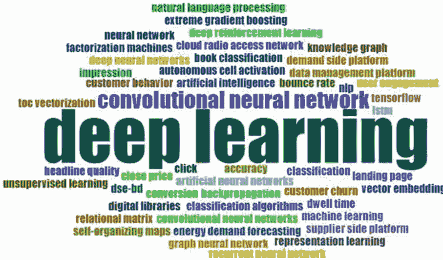

图1.2 深度学习和相关术语的词云。来源：作者根据Scopus上关于深度学习和订阅的文献编制。

## 悖论：深度学习和可持续消费

人工智能（AI）和物联网（IoT）相辅相成。为了实现人工智能，机器学习 (ML) 的概念得到了发展，并克服了机器学习的局限性。在[60]的启发下，深度学习的概念应运而生。深度学习的一些应用包括自动驾驶汽车[61]、欺诈检测[62]、虚拟助手和聊天机器人[63]、视觉识别[64]、语音识别[65]、黑白图像和视频的上色[66]、语言翻译[67]、选举预测[68]等。一方面，我们可以同意使用深度学习技术的创新有助于我们实现高质量的生活并使我们的生活更加便利；但另一方面，它们也在消耗大数据。大量的数据通过互联网传输，使用电信号进行处理和编译，并存储在一些由贵金属组成的电子设备中。

我们是否在说，我们变得越来越先进的技术，对环境造成的伤害越大？

有人可能会争辩说，我们可以利用深度学习和物联网来监管和高效管理我们的电子废物和互联网废物。这引出了另一个问题：我们能否开发出足够智能的深度学习算法，考虑到对环境的影响，并减少碳排放和物质足迹？

有大量的研究可用于探索绿色供应链管理 (GSCM) 领域，重点是使制造业可持续发展和绿色物联网 (G-IoT) 领域，重点是利用物联网进行废物管理。深度学习在管理订阅服务方面起着非常关键的作用。

## 深度学习作为调节订阅经济和确保可持续消费的解决方案

人工智能和大数据在发展可持续消费习惯和消费者的绿色行为方面的作用仍处于探索阶段，需要进一步研究[69]。为了促进联合国可持续发展目标确保可持续消费，产品和服务应设计成具有可持续属性的方式，并且应通过有限的产品和服务来规范客户选择，以促进可持续发展并减少对自然资源的压力[70]。

由于其环境性能和促进自然资源减少消耗，PSS（产品-服务系统）的作用已经被广泛讨论。当任何企业提供产品和服务的组合时，客户并不是产品服务的真正所有者，而是在一段时间内使用该产品，并仅为消费付费。制造商负责在出现故障时进行维修和维护。

通过采用深度学习算法，制造商可以监控产品的健康状况，及早发现故障并迅速采取措施，从而节省维修成本并确保产品的长寿命[27]。以下是深度学习在不同订阅服务中的应用，以规范消费。

## 减少OTT平台订阅中的客户流失

在订阅模式下，目标是与现有客户保持长期关系。因此，任何基于订阅的业务都必须尽量减少客户流失[33]，即减少取消订阅的客户数量。流失可能是由于不同的原因，这取决于业务类型。例如，根据使用频率和付款频率，我们可以预测哪些客户可能会停留更长时间。过度和不足消费是任何公司都应该避免的两个极端。假设一个客户已经订阅了一年的OTT（超级应用）服务，但他们几乎没有时间观看。另一种情况是狂热观看，即客户几乎探索了OTT平台上的每个系列，并且没有新的内容可供探索。这两个问题都可能导致客户流失。

在这种情况下，使用深度学习工具来预测客户流失并不困难，因为公司可以获得每个客户及其与OTT平台的实时互动数据。同样，借助深度学习中的向量嵌入，电信公司可以预测客户是否会继续订阅会员资格[71]。深度学习还可以帮助预测在线休闲游戏订阅的流失[72]。深度学习的实施不仅可以帮助公司减少流失和避免过度或欠度消费，还可以减轻对自然资源的负担，为可持续消费铺平道路。

## 在车辆订阅中，结合车联网（IoV）和深度学习

由于灵活性和摆脱所有权和其他责任，车辆订阅市场正迅速增长。COVID-19也成为增加对私人车辆需求的催化剂，因为人们希望避免使用公共交通工具[73]。欧洲、美国、加拿大、印度、中国等许多公司提供这些服务。这些公司与制造商合作，例如在印度，Revv（印度）与现代汽车合作，Zoomcar与大众、日产、马恒达和雷诺合作，Myles与MG Motors、丰田和马鲁蒂铃木合作。订阅价格因车型和持续时间而异。以马鲁蒂铃木为例，价格在156美元至428美元之间，持续时间在12个月至48个月之间。豪华汽车制造商也开始进入基于订阅的业务，以吸引那些渴望拥有这些品牌但不想投入巨资的客户。2020年，沃尔沃还宣布在印度提供汽车订阅服务。这种模式促进可持续消费，因为客户将根据需求订阅并归还汽车，所以汽车不会停在车库里，而是由下一个客户使用。虽然基本功能如限速器和生态模式驾驶已经可用以确保最佳燃油消耗，但深度学习的实施可以进一步提升这些模型的性能。诸如车联网（IoV）之类的技术[75]也可以用于支持绿色出行，以确保减少碳排放。物联网可以与5G技术和深度强化学习相结合，以最小化能源消耗并促进绿色物联网[76]。

## 减少食物浪费和全球饥饿

食物浪费和全球饥饿是同时存在的两个极端。全球范围内的饥饿是一个严重问题，而COVID-19大流行进一步加剧了这种情况[77]。假设一个人已经订阅了任何航空公司或联盟的常旅客计划。在这种情况下，他们可以在机场休息室享用各种无限量的食物和饮料。在无限自助餐中，一个人可以根据饥饿程度取小份的食物。但是我们大多数人都会拿比平时消耗更多的食物，然后把剩下的食物留在盘子上。因此，一个跟踪物质流动并警报食物浪费管理系统的框架可以帮助减少食物浪费[78]。可以开发深度学习算法来分析垃圾箱中的内容、休息室乘客的闭路电视录像和他们的饮食习惯。通过这样做，它可以建议最佳份量、餐具数量，并向相关的食物浪费管理系统发送警报，以将剩余食物分发给非政府组织。通过一项关于“减少食物浪费”的案例研究（HT Auto Desk [74]）以及Winnow的“计算机视觉技术”[78]（关于餐饮行业中的食物浪费问题）可知，在运输、储存、易腐性和人类消费过程中，很多食物被浪费掉。机器学习可以通过开发适当的系统来预测未来对食物的需求、库存管理、基于产品过期日期的动态定价以及预测天气和运输中断来帮助管理食品供应链。通过使用人工智能和机器学习的概念，Winnow为全球各个商业厨房提供食物浪费解决方案。他们开发了一种基于人工智能的工具，Winnow Vision，帮助厨师追踪他们的食物浪费情况。该工具通过处理一段时间内扔进垃圾箱的食物图像来进行自我训练，并将该数据呈现给厨房团队，以便在未来的运营中测量和管理食物浪费。

## 卷积神经网络 (CNN) 帮助购物者识别绿色产品

即使顾客不知道碳排放、足迹和其他环境影响等问题，他们也可以成为负责任的购物者。利用图像处理的概念和卷积神经网络 (CNN)，顾客可以在购物时获取有关各种产品碳排放的信息，促进绿色消费行为[15]。Asikis等人[80]讨论了如何利用智能手机应用程序作为个人购物助手，根据顾客评论和在线专家意见向用户推荐某些可持续产品。

## 调控能源和水消耗

最近的研究在两个领域应用了深度学习，即预测能源需求和减少能源消耗。Lenherr等人的研究[81]指出，深度学习模型注重预测结果的准确性，忽视了环境成本。作为解决方案，他们建议包括能源消耗测量在内的指标。

可以使用深度学习来预测电力消耗，并根据需求采用动态定价来调节消耗。通过使用物联网传感器，可以收集有关能源消耗的数据以预测未来的能源需求[82]。在电力订阅中，供应商可以借助与物联网智能设备连接的智能电网，在个人住宅收集需求数据并相应调整价格来预测负载[83]。例如，在高峰时段，当需求高时，电力供应商可能会采用高峰定价，即增加每单位消耗的价格，使家庭对电力消耗负责任。Kant和Sangwan[84]利用人工智能开发了一个预测模型，用于确定加工过程中的功耗。

深度学习还可以用于估计水需求和消耗，预测基础设施维护，评估水质，监测水库，并预测洪水和干旱，这些都是可持续水消耗的重要方面[85]。Bejarano等人[86]提出了一个智能水预测系统（SWaP），有助于预测未来的水消耗需求。定价可以根据水的可用性和需求进行动态调整，以调节客户的消耗。有一个关于“机器学习帮助谷歌数据中心减少40%的能源消耗”的案例研究（Sanu[87]），涉及到谷歌有限责任公司，这是一家提供各种基于互联网的服务的知名跨国公司，如在线广告、搜索引擎和云计算，在全球用户中具有很高的知名度和流行度。平均而言，谷歌的搜索引擎每秒处理63,000个查询以显示结果，需要大量的数据和数据中心来处理存储信息。如果数据中心没有得到适当的优化和管理，它们可能会消耗大量的电力。为了减少数据中心的能源消耗，谷歌与DeepMind合作找到了一个解决方案。通过使用人工智能和机器学习算法来预测未来的能源消耗，他们开发出了一种有效的方法来降低数据中心的冷却需求，从而使能源消耗减少了40%，从而有助于减少碳足迹（Prater[88]；DeepMind AI将谷歌数据中心的冷却费用降低了40%。（2016））。

另一个关于“AI可持续发展的案例研究：班加罗尔水资源”的案例研究指出，印度城市班加罗尔，被誉为“印度的硅谷”，位于印度南部。作为一个IT中心，它在企业和移民工人方面迅速发展。和其他大城市一样，它面临一些挑战，其中最令人担忧的是水危机。根据世界资源研究所（WRI）的数据，印度正面临严重的水资源短缺问题，正朝着“零日”迈进，就像开普敦一样。供水和污水处理委员会（BWSSB）负责管理该城市的供水。由于分配系统中的物理泄漏、分配系统的低效以及记录错误或故障仪表导致的商业损失等因素，他们在运营中面临挑战。这些挑战妨碍了城市和环境的长期可持续发展。SmartTerra是一家提供水管理解决方案的初创公司，开发了一种基于人工智能的智能平台，可以进行预测和高效的运营。它分析水分配损失、网络健康状况和分配效率，从而帮助城市顺利管理水分配运营。

> [9] Sanu[87].
> [10] Prater[88].
> [11] DeepMind AI将谷歌数据中心的冷却费用降低了40%。（2016）. Deepmind. https://deepmind.com/blog/article/deepmind-ai-reduces-google-data-centre-cooling-bill-40.
> [12] AI用于班加罗尔的可持续水资源[89].

## 结论

深度学习在订阅经济中的作用是巨大的，并且以确保可持续消费的方式提供订阅服务仍未被探索。然而，在本章中，我们讨论了如何通过深度学习在各种订阅服务中确保可持续消费，通过从文献中收集例子。然而，还有很多可以探索的地方。随着技术的进步，我们必须确保如何以可持续的方式实施这些创新方法，以免过度利用自然资源。

## 研究结果讨论

本章揭示了快速增长的消费对我们的自然资源产生的不利影响，使资源难以恢复。实现可持续发展目标（SDGs）对于使我们的星球对我们的后代可居住至关重要。在订阅服务下，过度和不足的消费对影响应该进行更深入的研究，因为这将使我们能够确定和调节消费的最佳水平。虽然公司正在探索并提出创新的订阅模式，但他们也应该评估其产品对环境资源消耗的影响，以免牺牲地球以获取更多利润。深度学习的范围广泛而多样，因为它在银行、金融、医学研究、建筑、交通等各个领域都有应用，但技术进步应与确保安全和健康的环境相辅相成。不仅企业，顾客也应承担同等责任。服务提供商向客户提醒其消费过度或不足的行为，可以提醒他们关注自己的消费模式。目标是使客户成为“负责任的消费者”，使公司成为“负责任的生产者”，只有这样我们才能实现可持续消费和生产模式的联合国第12个可持续发展目标。

## 未来研究的范围

本章通过强调在订阅服务领域实施深度学习技术的各种实际应用，并确保可持续消费，做出了贡献。在审查现有文献和二次数据的同时，观察到虽然关于深度学习在订阅服务和可持续消费方面的研究丰富多样，但在探索深度学习的作用时，没有尝试将可持续消费和订阅服务这两个概念联系起来。研究人员可以将本章作为进一步研究订阅经济下深度学习在各个行业中的先进应用、确保可持续消费和预测长期影响的基石。

## 从实践者的角度来看

由于资源消耗的迅速和无序增长，对于以技术驱动的增长来说，确保资源的最佳和负责任的使用已经变得至关重要。在订阅业务中提供无限优惠可能有助于在短期内获得大量客户，但在长期内可能不是一个可行的解决方案。订阅业务的重点是减少客户流失并与现有客户保持长期关系，因为获取新客户是昂贵的。深度学习是一种有助于根据客户活动分类客户并预测客户流失的方法。此外，它可以帮助检测异常活动、欺诈用户和付款。深度学习还可以学习消费者使用订阅服务的程度，并基于此发出关于过度使用的提醒，就像iPhone每周发布屏幕使用时间分析一样。关键是确保平衡消费，这将有助于可持续消费。

## 参考文献

- 1. Nutkiewicz, A., Jain, R.K.: 探索模拟和深度学习模型在城市建筑能源建模和改造分析中的整合。在：建筑模拟会议2019：IBPSA第16届会议（2019年）。 https://doi.org/10.26868/25222708.2019.2102642
- 2. Amos, J.: 理查德・布兰森爵士进行“非凡”的太空飞行。BBC新闻（2021年）。https://www.bbc.com/news/science-environment-57790040
- 3. Lasi, H., Fettke, P., Kemper, H.G., Feld, T., Hoffmann, M.: 工业4.0. 商业信息系统工程6（4），239-242（2014年）。 https://doi.org/10.1007/s12599-014-0334-4
- 4. 瑞士信贷集团：2019年全球财富报告 (2019). 可在以下网址找到：https://www.credit-suisse.com/media/assets/corporate/docs/about-us/research/publications/global-wealth-report-2019-en.pdf
- 5. 庄, 华, 张, 杰, Sivaparthipan, C.B., Muthu, B.A.: 可持续智能城市建设方法。可持续性 12(12), 4947 (2020)。 https://doi.org/10.3390/su12124947
- 6. 穆罕默德, S., 龙, X., 萨尔曼, M.: COVID-19大流行与环境污染：一种祝福？ 科学总论环境 728, 138820 (2020)。 https://doi.org/10.1016/j.scitotenv.2020.138820
- 7. Hasan, M.M., Roy, P., Sarkar, S., Khan, M.M.: 使用LSTM的股市预测Web服务。电气和电子工程师学会Inc. (2021) https://doi.org/10.1109/CCWC51732.2021.9375835
- 8. Hasan, S., Islam, M.A., Bodrud-Doza, M.: COVID-19期间的危机感知和消费模式：人口统计因素是否有差异？Heliyon 7(5), e07141 (2021). https://doi.org/10.1016/j.heliyon.2021.e07141
- 9. Feng, S., Hu, X., Yang, A., Liu, J.: 具有预售的新产品定价策略。数学问题 Eng. 2019, 1–13 (2019). https://doi.org/10.1155/2019/1287968
- 10. Oestreicher-Singer, G., Zalmanson, L.: 内容还是社区？ 社交时代内容提供商的数字业务策略。MIS Quart.: Manag. Inf. Syst. 37(2), 591–616 (2013). https://doi.org/10.25300/MISQ/2013/37.2.12
- 11. Dawkins, E., Kløcker Larsen, R., André, K., Axelsson, K.: 足迹指标是否支持瑞典公务员学习可持续消费？生态指标 120, 106846 (2021). https://doi.org/10.1016/j.ecolind.2020.106846
- 12. Liesch, P., Hill, R.S., Birch, D.: 13.6 定价和换购 (定价和易货) : 定价中的当代问题。在: 1995年世界营销大会论文集, 第197-204页 (2015年)。https://doi.org/10.1007/978-3-319-17311-5_32
- 13. Pham, Q., Tran, X., Misra, S., Maskeliunas, R., Damasevicius, R.: 越南网购中便利性、感知价值和再购意愿之间的关系。可持续性10(2), 156 (2018). https://doi.org/10.3390/su10010156
- 14. 重要问题: 共享经济如何帮助我们度过衰退 (2020年)。 可在以下网址找到: https://www.bigissue.com/opinion/how-the-sharing-economy-can-help-us-ride-out-the-recession/
- 15. 陆伟宇, 邱明诚: 应用深度学习图像识别技术促进绿色消费行为。收录于《跨学科工程进展》第10卷, 第205-213页。IOS Press BV (2019年)。https://doi.org/10.3233/ATDE190125
- 16. Gartner公司: 数字商务的十大趋势—与Gartner一起更聪明 (2019年)。 可在以下网址找到: https://www.gartner.com/smarterwithgartner/top-10-trends-in-digital-commerce/
- 17. 摩尔, S.: 数字商务的十大趋势—与Gartner一起更聪明。版权所有 (C) 2021 Gartner公司。保留所有权利 (2019年)。https://www.gartner.com/smarterwithgartner/top-10-trends-in-digital-commerce/
- 18. Vandermerwe, S., Rada, J.: 企业服务化: 通过增加服务增加价值。欧洲管理杂志 6(4), 314-324 (1988). https://doi.org/10.1016/0263-2373(88)90033-3
- 19. Leoni, L.: 产品化作为服务化战略的反面。国际商业环境杂志10(3), 247 (2019). https://doi.org/10.1504/ijbe.2019.097981
- 20. Baines, T.S., Lightfoot, H.W., Evans, S., Neely, A., Greenough, R., Peppard, J., Wilson, H.: 产品服务系统的最新技术。机械工程学会论文集, 第B部分: 工程制造(2007). https://doi.org/10.1243/09544054JEM858
- 21. Goedkoop, M.J.: 产品服务系统, 生态和经济基础产品服务系统, 生态和经济基础。 在: 荷兰环境和经济事务部报告 (1999年)
- 22. Manzini, E., Vezzoli, C., Clark, G.: 产品服务系统: 将现有概念用作可持续性的新方法。J. Des. Res. (2001年)。 https://doi.org/10.1504/jdr.2001.009811
- 23. Mont, O.K.: 澄清产品服务系统的概念。J. Clean. Prod. (2002年)。 https://doi.org/10.1016/S0959-6526(01)00039-7
- 24. Tukker, A.: 八种产品服务系统: 可持续性的八种方式? 来自suspronet的经验。 Bus. Strategy Environ. (2004年)。 https://doi.org/10.1002/bse.4142
- 25. Tukker, A., Tischner, U.: 产品服务作为一个研究领域: 过去, 现在和未来。 来自十年研究的反思。J. Cleaner Prod. (2006年)。https://doi.org/10.1016/j.jclepro.2006.01.022
- 26. Clayton, R.J., Backhouse, C.J., Dani, S.: 评估现有的产品服务系统设计方法: 与工业实践的比较。制造技术与管理杂志, 23(3), 272-298 (2012)。 https://doi.org/10.1108/17410381211217371
- 27. Ren, S., Zhang, Y., Sakao, T., Liu, Y., Cai, R.: 利用生命周期大数据和深度学习的产品服务系统的先进运营模式。精密工程制造与绿色技术国际期刊 (2021)。 https://doi.org/10.1007/s40684-021-00354-3
- 28. Nguyen, G.D., Dejean, S., Moreau, F.: 在线和离线音乐消费的互补性: 免费流媒体的案例。 文化经济学杂志, 38(4), 315-330 (2013)。 https://doi.org/10.1007/s10824-013-9208-8
- 29. Xu, J., Li, H., Tayur, S.R.: 在线到离线平台模型。SSRN电子杂志。(2019).https://doi.org/10.2139/ssrn.3449744
- 30. Lu Wang, C., Zhang, Y., Richard Ye, L., Nguyen, D.-D.: 订阅付费在线服务: 是什么促使消费者支付在线内容费用? 电子商务研究杂志。 6, 304-311(2005). 检索自http://www.isy.vcu.edu/~jsutherl/Info658/FFSINFO.pdf
- 31. Curwen, P.: Reliance Jio迫使印度移动市场重组: 关于信息产业的常规专栏|翡翠洞察。数字政策规制政府。(2017). https://doi.org/10.1108/DPRG
- 32. Alvino, L., Constantinides, E., Franco, M.: 更好地理解消费者行为: 边际效用作为神经营销研究中的参数。国际市场研究杂志。 10(1), 90 (2018). https://doi.org/10.5539/ijms.v10n1p90
- 33. Deligiannis, A., Argyriou, C.: Int. J. Inf. Eng. Electron. Bus. (IJIEEB) 12(4), 1 (2020). http://www.mecs-press.org/ijieeb/ijieeb-v12-n4/v12n4-1.html
- 34. Lee, S.H.: An exploration of initial purchase price dispersion and service-subscription duration. Sustainability 11(9), 2481 (2019). https://doi.org/10.3390/su11092481
- 35. Bowcott, O.: “Right to be forgotten” by Google should apply only in EU, says court opinion. The Guardian (2019). https://www.theguardian.com/technology/2019/jan/10/right-to-be-forgotten-by-google-should-apply-only-in-eu-says-court
- 36. Awasthi, A.K., Cucchiella, F., D’Adamo, I., Li, J., Rosa, P., Terzi, S., Wei, G., Zeng, X.: Modelling the correlations of e-waste quantity with economic increase. Sci. Total Environ. 613–614, 46–53 (2018). https://doi.org/10.1016/j.scitotenv.2017.08.288
- 37. Sun, G., Ayepah-Mensah, D., Xu, R., Boateng, G.O., Liu, G.: 基于端到端卷积神经网络的云无线接入网络中自主小区激活的深度强化学习. 网络与计算应用杂志 169 (2020). https://doi.org/10.1016/j.jnca.2020.102757
- 38. Sekaran, R., Ramachandran, M., Patan, R., Al-Turjman, F.: 多变量回归深度随机人工学习用于6G通信的能源和成本效率. 可持续计算: 信息系统 30 (2021). https://doi.org/10.1016/j.suscom.2021.100522
- 39. Grant, K., Goldizen, F.C., Sly, P.D., Brune, M.N., Neira, M., van den Berg, M., Norman, R.E.: 电子废物暴露的健康后果：一项系统综述. 柳叶刀全球健康 1(6) (2013). https://doi.org/10.1016/S2214-109X(13)70101-3
- 40. Kahhat, R., Kim, J., Xu, M., Allenby, B., Williams, E., Zhang, P.: 在美国探索电子废物管理系统。资源保护与回收。(2008).https://doi.org/10.1016/j.resconrec.2008.03.002
- 41. Osibanjo, O., Nnorom, I.C.: 发展中国家电子废物 (e-waste) 管理的挑战。废物管理研究 。 25(6), 489–501 (2007). https://doi.org/10.1177/0734242X07082028
- 42. Perkins, D.N., Brune Drisse, M.N., Nxele, T., Sly, P.D.: 电子废物：全球性危害。全球健康年鉴。(2014). https://doi.org/10.1016/j.aogh.2014.10.001
- 43. Robinson, B.H.: 电子废物：全球生产和环境影响的评估。科学总环境 (2009年)。 https://doi.org/10.1016/j.scitotenv.2009.09.044
- 44. Terazono, A., Murakami, S., Abe, N., Inanc, B., Moriguchi, Y., Sakai, S.I., 等：亚洲电子废物问题的现状和研究。材料循环废物管理杂志。 8（1），1-12 （2006年）。 https://doi.org/10.1007/s10163-005-0147-0
- 45. Wath, S.B., Dutt, P.S., Chakrabarti, T.: 印度的电子废物情况，管理及其影响。环境监测评估。 172（1-4），249-262（2011年）。 https://doi.org/10.1007/s10661-010-1331-9
- 46. Widmer, R., Oswald-Krapf, H., Sinha-Khetriwal, D., Schnellmann, M., Böni, H.: 全球对电子废物的视角。环境影响评估评论。25(5 SPEC. ISS.), 436-458 (2005)。 https://doi.org/10.1016/j.eiar.2005.04.001
- 47. Gu, F., Ma, B., Guo, J., Summers, P.A., Hall, P.: 物联网和大数据作为废弃电子设备管理问题的潜在解决方案：一项探索性研究。废物管理。68, 434-448 (2017)。 https://doi.org/10.1016/j.wasman.2017.07.037
- 48. Kang, K.D., Kang, H., Ilankoon, I.M.S.K., Chong, C. Y.: 使用物联网的电子废物收集系统：马来西亚的家庭电子废物管理。清洁生产杂志。252 (2020)。 https://doi.org/10.1016/j.jclepro.2019.119801
- 49. Maksimovic, M.: 利用物联网改革废物管理。Int. J.Agric. Environ. Inf. Syst. 9(4), 1–13 (2018)。 https://doi.org/10.4018/IJAeis.2018100101
- 50. Srikanth, C.S., Rayudu, T.B., Radhika, J., Anitha, R.: 利用物联网进行智能废物管理。Int. J. Innovative Technol. Exploring Eng. 8(9), 2518–2522 (2019)。 https://doi.org/10.35940/ijitee.g5334.078919
- 51. Giannopoulou, E., Mitrou, N.: 一种基于人工智能的自动分类方法，利用目录中的信息对多类电子书进行分类。 IEEE Access 8, 218658–218675 (2020)。 https://doi.org/10.1109/ACCESS.2020.3041651
- 52. Gharibshah, Z., Zhu, X.: 在线广告中的用户反应预测. ACM计算调查. 计算机协会(2021). https://doi.org/10.1145/3446662
- 53. Sankar, H., Subramaniyaswamy, V., Vijayakumar, V., Arun Kumar, S., Logesh, R., Umamakeswari, A.: 基于边缘计算的深度学习技术的智能情感分析方法. 软件—实践与经验. 50(6), 645–657 (2021). https://doi.org/10.1002/spe.2687
- 54. Altinisik, F., Yilmaz, H.H.: 使用机器学习算法预测打算取消信用卡订阅的客户：一个案例研究.在:ELECO2019—第11届国际电气与电子工程学术会议,pp.916-920.电气和电子工程师学会(2019).https://doi.org/10.23919/ELECO47770.2019.899056
- 55. Shankar, P., Werner, N., Selinger, S., Janssen, O.: 用于可持续农业的人工智能驱动的作物保护优化.在:IEEE/ITU国际人工智能为善会议, AI4G 2020,pp.1-6.电气和电子工程师学会(2020)https://doi.org/10.1109/AI4G50087.2020.9311082
- 56. de Oliveira e Lucas, P., Alves, M.A., de Lima e Silva, P.C., Guimarães, F.G.: 用卷积神经网络集成预测参考蒸散发时间序列。计算机电子农业 177(2020).https://doi.org/10.1016/j.compag.2020.105700
- 57. Henderson, P., Hu, J., Romoff, J., Brunskill, E., Jurafsky, D., Pineau, J.: 朝着机器学习能源和碳足迹的系统报告。机器学习研究杂志21(2020)
- 58. da Silva, I.N., Hernane Spatti, D., Andrade Flauzino, R., Liboni, L.H.B., dos Reis Alves, S.F.: 人工神经网络架构和训练过程。在:人工神经网络, pp.21-28.(2016)https://doi.org/10.1007/978-3-319-43162-8_2
- 59. Omidvar, A., Pourmodheji, H., An, A., Edall, G.: 学习确定新闻标题质量。在:ICAART2020-第12届国际代理人和人工智能会议论文集,卷1,页401-409。SciTePress(2020)。https://doi.org/10.5220/0009367504010409
- 60. Eckart, L., Eckart, S., Enke, M.: 机器学习算法和统计技术的潜力和限制的简要比较研究。E3S Web Conf. 266, 02001 (2021)。 https://doi.org/10.1051/e3sconf/202126602001
- 61. Kim, J., Lim, G., Kim, Y., Kim, B., Bae, C.: 利用虚拟环境数据的深度学习算法用于自动驾驶汽车。在:国际人工智能与信息通信会议(ICAIIIC)(2019)。https://doi.org/10.1109/icaic.2019.8669037
- 62. Roy, A., Sun, J., Mahoney, R., Alonzi, L., Adams, S., Beling, P.: 深度学习检测信用卡交易中的欺诈。在:系统与信息工程设计研讨会(SIEDS) (2018)。https://doi.org/10.1109/sieds.2018.8374722
- 63. Reddy Karri, S.P., Santhosh Kumar, B.: 深度学习技术用于聊天机器人的实施。在:国际计算机通信与信息学会议(ICCCI)(2020)。 https://doi.org/10.1109/iccci48352.2020.9104143
- 64. Pan, M., Liu, Y., Cao, J., Li, Y., Li, C., Chen, C.-H.: 基于深度学习的视觉识别用于导航标志分类。 IEEE Access 8, 32767-32775(2020).https://doi.org/10.1109/access.2020.2973856
- 65. Bae, H.-S., Lee, H.-J., Lee, S.-G.: 基于自适应MFCC和深度学习的语音识别。在:IEEE第11届工业电子与应用会议(ICIEA)。 https://doi.org/10.1109/iciea.2016.7603830
- 66. 张, R., 伊索拉, P., 埃弗罗斯, A.A.: 多彩图像着色。在:计算机视觉-ECCV, pp.649-666(2016年)。 https://doi.org/10.1007/978-3-319-46487-9_40
- 67. 辛格, S.P., 库马尔, A., 达巴里, H., 辛格, L., 拉斯托吉, A., 贾因, S.: 使用深度学习的机器翻译概述。在:国际计算机、通信和电子会议(Comptelix)(2017年)。https://doi.org/10.1109/comptelix.2017.8003957
- 68. 阿里, H., 法尔曼, H., 亚尔, H., 汗, Z., 哈比卜, S., 阿玛尔, A.: 基于深度学习的选举结果预测使用Twitter活动。(2021年)。 https://doi.org/10.21203/rs.3.rs-839553/v1
- 69. 钱德拉, S., 维尔马, S.: 大数据与可持续消费: 一项综述和研究议程。 Vision (2021).https://doi.org/10.1177/09722629211022520

- 70. Chiu, A.S.F., Aviso, K.B., Baquillas, J., Tan, R.R.: 突发事件能够触发向可持续消费的转变吗？清洁负责任的消费 1, 100001 (2020). https://doi.org/10.1016/j.circ.2020.100001
- 71. Cenggoro, T.W., Wirastari, R.A., Rudianto, E., Mohadi, M.I., Ratj, D., Pardamean, B.: 深度学习作为客户流失的向量嵌入模型。在: Procedia计算机科学，卷179，页624-631。爱思唯尔出版公司（2021）。https://doi.org/10.1016/j.procs.2021.01.048
- 72. Kim, S., Choi, D., Lee, E., Rhee, W.: 使用游戏日志数据预测移动和在线休闲游戏的流失。PLoS ONE 12(7) (2017). https://doi.org/10.1371/journal.pone.0180735
- 73. De Vos, J.: COVID-19及随后的社交距离对出行行为的影响。交通研究跨学科视角 5, 100121 (2020). https://doi.org/10.1016/j.trip.2020.100121
- 74. HT Auto Desk: 沃尔沃宣布为德里的客户推出订阅驾驶模式。印度斯坦时报汽车新闻 (2021). https://auto.hindustantimes.com/auto/news/volvo-announces-subscribe-to-drive-model-for-indian-customers-41624342015927.html
- 75. Contreras-Castillo, J., Zeadally, S., Guerrero-Ibanez, J.A.: 车联网：架构、协议和安全性。IEEE物联网杂志 5(5), 3701-3709 (2018). https://doi.org/10.1109/jiot.2017.2690902
- 76. 陈, H., 赵, T., 李, C., 郭, Y.: 绿色车联网：架构，支持技术和应用。IEEE Access 7, 179185-179198 (2019). https://doi.org/10.1109/ACCESS.2019.2958175
- 77. Udmale, P., Pal, I., Szabo, S., Pramanik, M., Large, A.: COVID-19背景下的全球粮食安全：基于场景的探索性分析。https://doi.org/10.1016/j.pdisas.2020.100120
- 78. de los Mozos, E.A., Badurdeen, F., Dossou, P.E.: 通过减少食物浪费实现可持续消费：当前状况的综述和未来研究方向。在: Procedia Manufacturing, vol. 51, pp. 1791-1798. Elsevier B.V (2020). https://doi.org/10.1016/j.promfg.2020.10.249
- 79. 食物浪费技术|Winnow. Winnowsolutions.com (2019). https://info.winnowsolutions.com/food-waste-technology
- 80. Asikis, T., Klinglmayr, J., Helbing, D., Pournaras, E.: 价值敏感设计如何赋予可持续消费力量。R. Soc. Open Sci. 8(1) (2021). https://doi.org/10.1098/rsos.20141881
- 81. Lenherr, N., Pawlitzek, R., Michel, B.: 评估边缘智能的新通用可持续性指标。Sustain. Comput.: Inf. Syst. 31 (2021). https://doi.org/10.1016/j.suscom.2021.100580
- 82. Zhang, X., Manogaran, G., Muthu, B.A.: 物联网使绿色能源融入智能城市的综合系统。Sustain. Energy Technol. Assess. 46 (2021). https://doi.org/10.1016/j.seta.2021.101208
- 83. Ustundag Soykan, E., Bilgin, Z., Ersoy, M.A., Tomur, E.: 在智能电网上进行差分隐私深度学习进行负荷预测。在：2019年IEEE全球通信大会研讨会，GC研讨会2019-会议录。电气和电子工程师学会（2019）。 https://doi.org/10.1109/GCWkshps45667.2019.9024520
- 84. Kant, G., Sangwan, K.S.: 利用人工智能技术进行加工中的功耗预测建模。Procedia CIRP 26, 403-407 (2015). https://doi.org/10.1016/j.procir.2014.07.072
- 85. Mehmood, H., Liao, D., Mahadeo, K.: 人工智能应用于实现与水相关的可持续发展目标的综述。在：IEEE/ITU国际人工智能为善大会（AI4G）（2020）。 https://doi.org/10.1109/ai4g50087.2020.9311018
- 86. Bejarano, G., Kulkarni, A., Raushan, R., Seetharam, A., Ramesh, A.: SWaP:概率图和深度学习模型用于水消耗预测。在：BuildSys 2019 - 能源高效建筑、城市和交通系统国际会议论文集，第233-242页。计算机协会，Inc. (2019) https://doi.org/10.1145/3360322.3360846
- 87. Sanu, M.: 5个AI如何帮助公司实现可持续发展的例子。Winnowsolutions.com (2019). https://blog.winnowsolutions.com/5-examples-of-how-ai-is-helping-companies-become-more-sustainable
- 88. Prater, M.: 25个必须收藏的Google搜索统计数据。Hubspot.com (2021). https://blog.hubspot.com/marketing/google-search-statistics
- 89. AI用于孟加拉国班加罗尔的可持续水资源：Indiaai.gov.in (2020). https://indiaai.gov.in/case-study/ai-for-sustainable-water-in-bengaluru

# 第二章 大数据在能源和废物管理中的深度技术应用
Jyotsna Verma

## 介绍
城市化和经济增长的不断需求导致了数据、能源消耗和废物的大量产生。技术变革和城市化所需的关键要素是数据，在手持设备的演变下，数据成为各个领域最突出的元素。由于COVID-19大流行情况，全球数据的产生呈指数增长，预计到2025年产生的数据将增长180个泽字节[1]。这种大量来自社交、工业和交易等各种来源的数据需求高能源和环境废物。

此外，全球经济增长导致了工业活动的增加和有限的自然资源，引发了能源危机和环境废物。特别是能源危机是一个重大问题，解决这个问题的最终方法是使用非传统能源和优化使用传统能源。这种解决方案有助于减少环境废物，并能满足能源需求。不仅能源需求增加，技术进步也产生了大量废物。根据欧盟指令[2]，“废物是指持有人丢弃或打算或被要求丢弃的任何物质或物体。”人类每年产生数吨全球废物，电气和电子设备（EEE）的扩散加剧了这一情况。2019年，报告称废弃的EEE产生了5360万公吨有毒废物，预计到2030年全球电子废物将达到74百万吨[3]。COVID-19大流行还带来了大量个人防护设备（PPE）废物，全球估计产生了160万吨塑料。每天产生的废物量为[4]。因此，能源和废物管理对于减少碳足迹是必要的。为了识别非传统能源来源，优化传统能源和电力的使用，并管理环境和EEE废物，需要进行数据分析。在能源和废物管理中，对数据的每一步进行适当的分析非常有帮助。

各种研究和文献表明，大数据分析在很大程度上有助于能源和废物管理。数据分析是商业、公共和政府部门发展的重要领域。这是一个研究领域，其中数据被检查、清洗、转换和建模，以发现有用的信息，并支持决策。早期，小规模数据的可用性使得数据管理和处理相当简单；然而，在许多实际场景中，缺乏足够完整的数据集使得数据分析变得困难。

然而，数据的普遍和巨大存在增加了对其处理和存储的责任。因此，考虑到当今的现实场景，使用传统方法和处理工具来管理、分析和存储海量数据是不可能的，需要大数据技术。

大数据是解决这一问题的潜在方案，并且在不久的将来，它将进入每个领域。大数据分析在各个领域的应用，如医疗保健、工业、企业、能源管理、废物管理、生物信息学，使得大数据分析成为当今更具前景和热门的话题。大数据是一个处理极大数据量的领域，通过分析这些数据来发现模式，并对市场和现实世界应用的趋势和前景进行有价值的洞察。大数据的关键特征是我们大多数人认为它处理极大数据集，但是到目前为止，还没有定义出大数据环境下存在多少数据的问题。重要的不是数据量，而是大数据关注的是分析和如何处理这些数据集。因此，将大数据与高度分析相结合，有助于在各个应用领域中减少处理时间、成本优化流程和智能决策。

有不同类型的分析可用于分析异构数据集：
- 描述性分析：描述性分析是最简单的数据分析，它分析实时或历史数据。过去的数据通过统计工具和技术进行分析，以了解未来的潜力，并对结果的正确与否有一个清晰的视图。
- 预测性分析：它通过使用统计和机器学习算法分析过去的数据模式和趋势来预测未来结果的可能性。
- 指导性分析：预测性分析之后的下一步是进行前瞻性分析，它分析未来的结果，并根据结果提供需要采取的行动数量。
- 诊断性分析：诊断性分析对数据进行详细分析，需要足够的数据来识别异常和数据之间的关系。

大数据分析为能源和废物管理提供了各种机会，用于开发新模型。然而，高维度的现实世界问题，不确定和不完整的数据集，无法访问的数据以及质量低劣的数据在设计能源和废物管理模型时增加了很多复杂性。为了解决这些问题，研究人员正在朝着深度学习技术的方向发展，这些技术可以与大数据分析结合使用。深度学习可以用于能源和废物管理。深度学习是机器学习的一个子领域，它使用统计机器学习技术来学习基于人工神经网络模拟人脑神经元的数据表示。深度学习技术使数据的收集、分析和解释更快捷、更容易。因此，将深度学习技术与大数据技术相结合，有助于高效解决复杂问题，处理不完整和不确定的数据集。应对能源危机和废物管理并不是一件容易的任务。需要解决一些挑战，如改革政府政策，确定废物来源，优化传统能源以及准确和充足的数据收集。利用深度学习技术结合大数据分析有助于解决这些问题，并帮助维持可持续的环境。

## 大数据分析中的深度学习
大数据的概念并不新鲜；自上世纪90年代以来就一直在使用。然而，由于数据的多样性、数量和速度，在过去的二十年中，这个概念变得广为流行，并为今天各种数据分析技术的发展铺平了道路。当今情景下数据分析的真正挑战是分析海量数据。数据可以采用任何形式，并且以极快的速度生成。基本上，大数据是一组结构化、非结构化和半结构化数据。结构化数据是定义明确、高度组织且定量类型的数据，例如姓名、地址、日期、信用卡号码、地理位置以及来自传感器和网络服务器的数据，通常存储在数据仓库中。这些数据容易存储、分析和处理，可以使用预定义或固定格式进行处理。

非结构化数据是一种无组织和定性类型的数据，例如社交媒体活动、监控数据、图像、音频、天气数据、邮件记录、传感器数据和丰富的媒体，通常存储在数据湖中。大数据的体量、速度和多样性使得大数据分析变得困难，并且需要更多的理解和处理能力。此外，高维度和不确定性数据的现实问题给数据分析过程增加了复杂性。因此，需要高效的策略、算法和技术来进行大数据分析，以从不同的数据集中得出结论。为此，许多研究人员提出了使用深度学习算法处理大数据集的各种数据分析技术[5-9]。数字数据爆炸产生的多样性和低质量数据[10-12]在大数据分析中引发了其他问题。深度学习模型被设计用于处理异构数据表示[13-18]和低质量数据[19-21]，这为深度学习算法在数据分析问题上的高效处理提供了有力证据。此外，还有很多关于设计处理器架构和数据布局的工作正在进行，以提高计算能力，加快学习过程，并且在大数据深度学习中证明了巨大的能力[22-27]。

深度学习是一种令人惊叹的机器学习技术，它使用有监督的、无监督的和强化学习技术，从大规模数据集中学习多层次表示和特征提取。它在准确的模式识别和数据分类中，处理了大量相互依赖的变量之间的复杂关系[28-31]。深度学习算法在解决复杂和计算密集型问题方面非常高效，因此它们可以很好地处理大数据分析问题的挑战。本章的重点是大数据分析如何利用深度学习技术为能源和废物管理提供解决方案；因此，本章不会详细介绍深度学习和大数据分析的概念，只会简要概述。

## 利用深度学习进行大数据能源管理
随着时间的推移，手持设备的需求和经济增长导致能源消耗增加。尽管可再生能源在全球范围内增长迅速，但化石燃料仍然占据了总能源消耗的大部分。然而，在2020年，由于COVID-19大流行的情况，全球能源消耗增长率下降了4%。能源需求普遍存在于各个领域，但工业部门是最大的能源消费者。随着化石燃料的枯竭，减少能源使用并为太阳能、风能、生物能、水能和潮汐能等非常规能源提供激励是必要的。有效管理能源可以确保能源资源的最佳利用，并降低能源成本[32-36]。能源管理计划的开发[37-39]被证明可以节省能源、降低成本，减少能源浪费和温室气体排放。然而，传统的能源管理方法面临着诸多困难，包括运营效率、环境浪费、能源基础设施的弹性和稳定性。因此，大数据分析对于应对这些困难并建立高效、环保和具有成本效益的能源管理系统是必要的。

## 介绍
随着大数据分析的出现，能源的生产和消费方式正在发生变化。文献中提供了几种基于大数据分析的智能能源系统。智能能源系统实际上是由各种技术、传感器和智能设备组成的，因此它可以处理来自不同领域的异构数据。能源生产、天气数据、温控数据、电动汽车数据、电力供应、清洁能源、房地产、能源数据库、行为定价和行为分析等数据被认为是控制能源消耗的重要因素。大数据可以重塑能源的方法[40]。地理信息系统也是一个提供地理属性、特征、环境和资源的传统数据源。地理信息系统不会收集实时数据；它需要时间来更新记录的数据，并帮助能源系统进行有效的决策支持[41-44]。数据源和不同格式的数据的异构性使得数据库集成成为大数据分析中能源系统的重要组成部分[45-49]。目前对于来自企业、能源和生产系统的复杂数据的集成工作还不多[50]。

研究人员通常专注于能源管理模型的开发，但是复杂和异构的数据集必须与能源管理系统集成，以支持有效的决策过程。然而，数据集中的高维度、不确定性和不完整性给能源管理的决策过程带来了困难。因此，需要深度学习技术来分析具有不合理复杂性的数据集，以获取有用的信息、模式等，以预测和优化能源消耗需求。深度学习能力的能源系统有助于解决与能源系统相关的各种大数据分析问题，例如智能电网中的负载分类问题、能源需求预测、高性能计算问题、数据集成问题和可再生能源的最佳利用。

### 使用深度学习的能源管理分析模型
为了充分利用大数据分析在能源管理中的潜力，需要一个过程模型。过程模型是智能能源管理的基本系统框架。模型中的第一步是从不同来源收集和存储数据。然后对存储的数据进行清洗和处理，将数据集转化为有组织和结构化的数据集。然后将结构化的数据集集成，并从集成的数据集中选择相关变量进行进一步处理。然后使用数据可视化方法对处理后的数据集进行图形化表示，以发现数据集中的模式和变量之间的关系。基于发现的模式，将通过实时交互进行智能决策，用于智能能源管理。对于高效的能源系统，需要在过程模型的每个阶段应用不同的分析方法。因此，将各种深度学习技术与数据分析能源模型相结合，提供更好的决策支持系统。

#### 预测分析
预测分析是一种使用历史数据集进行未来能源消耗预测的数据分析方法之一。文献披露了一种基于深度神经网络技术的预测分析能源模型[51]，用于智能城市的发展。另外，还对具有历史数据的小型工厂进行了预测性数据分析，用于制造业中的智能能源管理[52]。此外，还开发了一种使用监督学习的高性能计算预测分析能源模型[53]。

#### 描述性和时间序列分析
描述性分析处理过去和现在的数据集以预测结果，而时间序列分析处理具有日期或时间戳的特定或数值变量的一系列观察结果。这两种分析方法都是预测分析的一部分。利用时间序列分析技术开发了一种基于深度学习技术的能源模型，用于分析夜间灯光使用模式和Twitter数据量，以估计家庭电力消耗[54]。利用时间序列数据集对家庭能源需求进行了深度学习技术分析，以实现能源消耗的最小化[55]。此外，还开发了一种基于深度学习的燃油消耗模型，用于为集装箱船选择最佳航线[56]。

#### 探索性分析
为了提高住宅建筑的能源效率，通过分析欧盟的跨国能源消耗模式进行了探索性分析[57]。在另一个现实世界的场景中，分析了北京的基础设施设计、交通状况和电动车辆的驾驶行为，以改善不同交通状况和基础设施设计下的能源效率[58]。

#### 规范性分析
规范性分析根据数据分析过程的结果提供最佳行动方案。使用Zenodo数据集进行了一项研究，该数据集包括社会、经济、行为和地理因素[59]。该研究通过评估居住者的社会和经济行为来分析与能源相关的行为，主要针对三级建筑。此外，分析研究的结果确定了在工作场所需要采取的更多环保行动的数量以及不必要的障碍。

#### 讨论
能源消耗。在埃及进行了一项关于商业建筑日光性能的研究[60]。进行了一项规定性分析，并结合性能指南来提高能源效率。

深度学习技术的大数据分析实际上可以最小化能源消耗。数据分析能源模型有助于基于人口统计和环境需求的分析来预测能源需求。能源需求的预测、负载平衡和分类通常取决于数据的规模。短期数据集通常包含每日或每小时的数据，而长期数据集包含年度数据。小规模数据不能代表整个样本数据，而大规模数据集需要大量的计算工作和成本来表示特定的样本空间。通常，数据分析研究是在一个月到一年前的数据记录上进行的[61]。长期记录集通常不用于数据分析，因为数据集存在许多不确定性，并且需要长期的能源预测模型[62]。除了数据集的粒度外，商业、教育和住宅建筑的能源消耗模型也在能源管理中起着重要作用。住宅建筑消耗更多能源，但研究人员更加关注开发商业和非住宅建筑的能源消耗模型[61]。住宅建筑中缺乏传感器数据收集基础设施是较少预测模型的主要原因。

需要深度学习算法来训练数据分析能源模型从而提供优化解决方案。已经开发了多种能源模型和系统，以改善能源消耗、效率和特定能源需求在所有领域。在智能电网技术中，深度学习提供了一个更加分散和高效的能源模型，具有高操作智能和决策能力。深度学习在智能电网中很好地处理负荷预测[63]、负荷分类[64]和能源需求问题[65-68]。动态定价[69]也有助于节约能源；根据客户能源消耗行为分析开发了高效的方法和策略以识别电网损耗和能源转移[70-74]。在整个部门中，工业部门消耗的能源更多。对制造业进行了一项研究使用两种深度神经网络技术来预测建筑能源配置文件[75]。预测有助于识别能源消耗、环境条件、制造业中不可取和重要的成本。除了工业部门，基于深度学习技术还开发了交通和商业部门的能源模型[76]。对电力的增加需求和减少碳排放的愿望为风能、热能和太阳能等可再生能源的使用铺平了道路。但是，大部分可再生能源供应的固有间歇性使其难以增加其在能源组合中的渗透。文献揭示基于深度学习技术和大数据集的各种有效的可再生能源模型。开发了一种基于深度神经网络的风力发电预测系统，可以减少对风场数据集的训练时间[77]。另外，还开发了一种基于深度学习的风力发电预测模型，使用了美国缅因州风场ISO NE的数据集[78]，以最优方式维持能源的需求和供应。同样，通过深度学习方法进行热能和太阳能产量预测，以提高可再生能源的利用率[79-84]。考虑到以上情况，大数据分析结合深度学习技术为能源管理系统的多个问题提供了高效的解决方案。

## 利用深度学习进行大数据废物管理
欧盟关于废物的指令[85]旨在通过“采取措施保护环境和人类健康，通过预防或减少废物的产生和管理的不利影响，减少资源使用的总体影响，并提高资源使用的效率。”在资源稀缺时回收废物材料和商品并不是什么新鲜事；一般来说，为了满足社会需求，人类需要赋予废物更大的经济和社会价值。废物有各种来源，可以根据来源分为以下几类：
- 城市垃圾：家庭、拆迁和商业垃圾都包括在城市垃圾中。
- 危险废物：这个类别包括电子废物、工业废物、放射性垃圾和爆炸性垃圾。
- 生物医疗废物：临床废物包括在生物医疗废物类别中。

技术进步导致废物增加。根据2019年联合国报告，每年产生4400万吨电子废物，仅有20%得到回收。仅去年印度就贡献了320万吨电子废物。2020年全球电子废物报告显示，2019年全球产生了5360万吨电子废物，未来五年将增长20%。在全球COVID-19大流行的影响下，据中央污染控制委员会报道，仅印度每天产生146吨生物医疗废物。在所有生物医疗废物中，85%是非危险废物，15%是传染性、危险性和有毒性废物。除了生物医疗废物，大量固体废物也来自工业。传统的废物管理方法成本高昂[86]，这使得工业对采用适当的废物管理方法不情愿[87, 88]。缺乏严格的法规和不足的处理政策鼓励工业、市政公司和医院以任意的方式处理废物[88,89]。根据目前的危险废物增长率或者非危险废物，据估计在未来几年将增加数百万吨，这需要适当的关注、预防措施和严格的处理政策，否则会对环境和人类健康造成影响。

## 介绍
全球产生大量废物，为了管理这些废物，需要废物智能化的方法。与传统方法相比，废物智能化方法能够高效地管理废物。它有助于废物的分类、排序、源头识别和全球废物产量的测量。

大数据分析和其他使能技术如物联网、深度学习技术有助于通过提供更好的数据分析技术和模型来分析废物的产生和减少，从而提前预测废物产量。

这种预测有助于适当回收和减少废物。在废物管理过程中，最首选和最初的步骤是减少废物。管理废物的最有效方法是减少工业废物、城市废物和生物医学废物。第二步是重新使用或回收废物。重新使用和回收涉及到探索性分析。最不首选的步骤是填埋和倾倒。填埋涉及到规定性分析，并且对环境造成非常严重的影响。社会缺乏意识使得废物的分类变得困难，从而对环境产生不利影响。但实际上，填埋和倾倒是一种广泛使用的废物管理方法，这对环境造成了不良影响。利用大数据分析和深度学习方法将改善情况，使重新使用和回收成为管理废物的更好和更容易的选择。

### 使用深度学习的废物管理分析模型
为了正确管理废物，废物的分析是重要的，因此需要一个高效的分析模型。在废物管理过程的每个步骤中都需要大数据分析。图2.1显示了废物管理分析的过程。在废物管理分析过程中，第一步是获取所需数据。所需数据可以通过问卷调查、面试或在应用领域部署传感器网络来收集。特别是对于废物，废物的详细信息可以通过市政机构收集；对于城市废物，可以从医院、诊所等收集生物医学废物数据集；工业废物可以从工业企业收集。然后对收集到的数据进行预处理以进行分析。数据集可能是非结构化或不完整的，因此数据的结构化对于分析模型、统计工具等是重要的。结构化数据可能包含错误、重复或不完整，因此在分析数据集之前，数据清洗对于获取准确的信息以预测趋势和前景也非常重要。

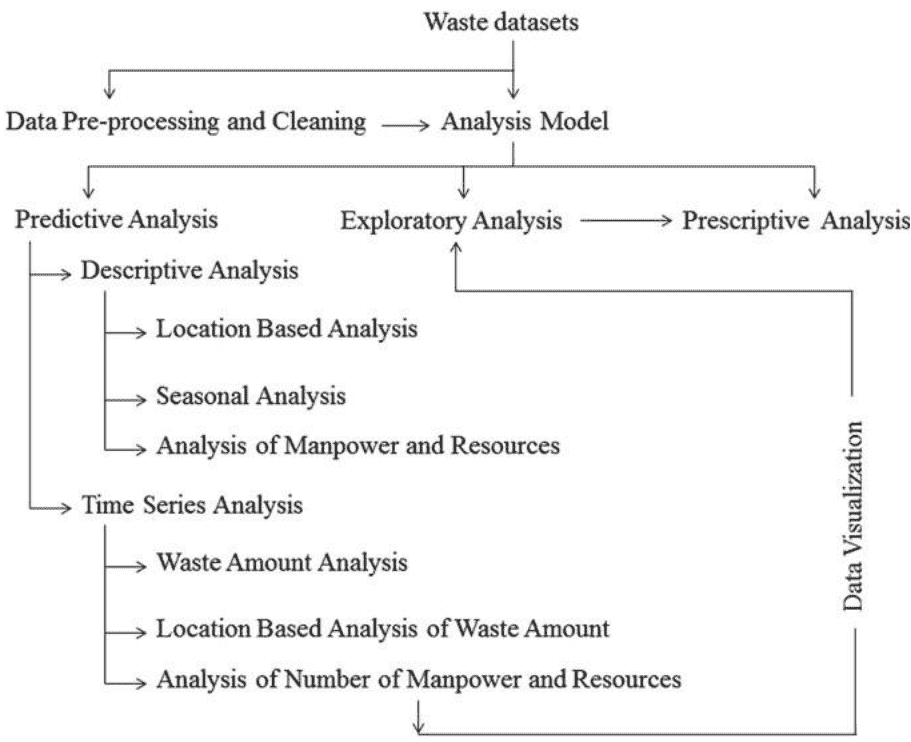

下一步是分析处理后的数据集，然后将数据集应用于适当的分析模型来管理废物。

#### 预测分析
首先将清洗后的数据集输入到预测分析模型中。预测分析使用废物数据集来预测未来结果，借助深度学习和统计技术的帮助。在这个分析模型中，识别废物来源以减少废物量。使用R分析工具开发了与大数据相关的预测分析模型[90]，用于提前预测可能性的数量。这是使用描述性分析阶段和时间序列分析阶段的初步步骤。
- (i) 描述性分析：在这个阶段，分析数据集以确定废物的位置，跟踪季节性废物模式，人力资源（清洁工，垃圾收集员，拾荒者等）和其他所需资源。使用深度学习卷积神经网络开发了一个图像识别系统[91]用于通过个人上传到废物收集公司服务器的照片来识别和分类电子废物的问题和解决方案。废物收集公司根据人力需求和位置收集电子废物。基于量子GIS的描述性和预测性分析方法[92]被用于实时废物信息的生成。使用济州岛，韩国的真实数据集对该方法进行评估，结果表明预测分析模型更适合废物管理运营优化和规划。提出了基于卷积神经网络的另一种多任务学习模型，用于废物的定位和识别[93]。
- (ii) 时间序列分析：在这个阶段，分析产生的废物数量；根据位置对废物进行分析，并确定所需的人力和其他资源。设计了一种方法，利用目标检测算法和时间序列分析在零售业中最小化食物浪费。该方法分析了智能垃圾箱中丢弃的食物废物。该分析有助于优化食品制备中使用的原材料，从而减少废物。另一个模型使用深度学习技术和时间序列数据进行固体废物管理[95]。

然后对数据集进行描述性和时间序列分析。数据可视化以图形、绘图、地图、图表或其他视觉表示形式呈现数据，以预测和理解数据集之间的模式、趋势和关系。在处理大量数据时，数据可视化非常重要。然后使用可视化的数据进行探索性分析。

#### 探索性分析
探索性分析使用从数据可视化方法生成的视觉表示来发现数据集的模式和理解主要特征。探索性分析超出了正式的假设和数据建模测试过程。它可以更好地理解和洞察数据集变量之间的关系。它有助于识别废物可以被再利用的领域和废物回收的应用。对数据集进行了各种统计和深度学习技术的探索性分析。基于深度学习提出了一种分类模型[96]，用于可回收废物图像的分类。在可回收废物的分类中使用了TrashNet数据集，并与其他深度学习分类模型相比，显示出95.87%的分类准确率。另一个智能固体废物分类模型[97]使用卷积神经网络根据其内容对废物进行分类，如玻璃、纸张、塑料和有机废物。

#### 规范性分析
在基于探索性分析产生的结果基础上，规定性分析发现需要采取的行动数量以正确处理废物。

填埋主要通过规定性分析来完成。它优化了从探索性分析中生成的结果，并预测了处理废物的最佳行动。设计了一个多层混合深度学习系统[98]用于分类处理废物。该系统在不同地点部署摄像头和传感器，收集废物的图像，自动分类可回收废物和其他物品。在意大利进行了一项研究[99]，利用聚类分析和探索性空间数据分析技术，以确定填埋处置的空间聚类和相关性。该分析有助于制定改进废物管理所需采取的适当指南。规定性基于绩效的方法对于促进污染较少的实践至关重要。所提出的方法[100]分析了挪威海洋环境的操作排放系统。

#### 讨论
实际上，监测和管理废物非常困难。传统的废物管理技术无法正确地减少、重复使用和回收废物。因此，将废物与传感器和大数据分析相结合非常重要，因为它可以提供详细的见解和实时监测。但是，实时监测会产生高维度的动态数据，还会产生不确定和不完整的数据。因此，为了解决这些问题，研究人员正在将深度学习技术应用于分析过程的各个阶段，同时还有助于设计各种废物管理系统，并提供高效的结果。使用LoRa通信协议和基于TensorFlow的深度学习模型[101]开发了一种智能废物管理系统。在该系统中，关于垃圾桶位置和填充水平的传感器数据通过LoRa协议发送，通过TensorFlow和预训练的目标检测模型进行对象的检测和分类。有限的材料可用于识别和分离固体废物，这是另一个挑战。为了解决这些问题，开发了一种方法[102]，通过训练深度卷积网络来识别材料。为了训练，创建了一个包含不同组合的相机、数据增强技术和照明的图像数据库。家庭也是废物产生的主要因素。开发了一种多站点长短期记忆（LSTM）神经网络，用于预测家庭废物产生的速率[103]。该模型针对丹麦赫宁市的家庭进行设计，并使用他们每周废物重量的历史数据。为了创建可持续且具有成本效益的废物管理运营，广泛收集废物产生的数据。

此外，来自不同注册处的地理空间数据的广泛可用。在应用领域中，研究人员设计了更详细和及时的废物生成信息的新型数据分析方法[104]。研究人员设计了各种基于数据的方法来优化废物收集和回收[104,105]。

## 挑战与前景：能源和废物管理
大数据分析中的能源和废物管理涉及各种问题和挑战，需要妥善解决。以下是使用深度学习技术进行大数据分析中能源和废物管理的问题：
- 1. 数据粒度：使用小规模数据进行深度学习建模很困难，因为它需要大量数据进行训练和学习。为所有应用程序生成大规模的能源和废物管理数据集是困难的，需要巨大的计算工作和成本。使用小规模数据训练深度学习模型会导致过拟合问题[106]。然而，数据增强在很大程度上解决了这个问题[107]。
- 2. 集成系统：能源和废物管理并不是一项容易的任务；它需要使用各种启用技术对能源和废物系统进行建模的大数据分析。云计算、深度学习算法、物联网等许多其他技术可以与大数据分析相结合，提供高效的能源和废物管理系统。
- 3. 政府政策和法规：在工业和商业领域，关于能源管理和废物处理以保护环境的政策和法规需求巨大。
- 4. 可持续环境系统：为了解决能源危机并维持可持续环境，应建设废物转能厂。废物转能厂可以产生大量能源，并对工业部门有很大帮助。大数据分析与深度学习算法可以帮助识别资源需求、熟练人力需求、能源需求等。
- 5. 数据整合：能源和废物管理组织已采用异构数据标准和协议。因此，来自各个来源的数据整合是一个大问题。已经提出了各种技术和模型来解决数据整合的问题。然而，将大数据分析与其他技术相结合在数据整合和数据共享方面仍面临挑战。
- 6. 数据处理和分析：使用深度学习算法和大数据分析开发了几个能源模型和废物系统。然而，这些开发的模型在数据粒度、空间和时间数据集的存在方面存在限制，这在数据处理和分析中构成了障碍。
- 7. 隐私和安全：保护数据集的安全和隐私非常重要。能源系统涉及许多安全问题，并且容易受到攻击。商业和住宅部门关于电力使用和需求的数据需要受到保护，因为涉及个人数据。

## 摘要
最近的技术进步和大数据分析的升级逐渐导致能源危机和大量环境废物的产生。能源危机是一个瓶颈问题，因为自然资源有限，各种应用场景缺乏高效的能源模型。将大数据分析与深度学习算法相结合，为能源需求和危机提供解决方案。深度学习提供了优化的解决方案，并有助于识别个人、商业和工业部门的能源需求和消耗。能源危机和全球废物是当今的主要问题，特别是在COVID-19大流行之后，生物医疗废物激增，给环境带来了很多问题。由于资源有限、内容多样、数据动态快速生成，传统方法无法管理能源危机和废物。由于传统方法处理废物的成本很高，工业和市政公司正在利用社会缺乏意识和松散的政策和法规任意处理废物。因此，需要严格的法规和深度学习技术和工具，以解决这些计算昂贵的问题。大数据分析与深度学习技术将准确洞察数据集模式，有助于管理能源和废物。本章讨论了大数据分析中深度学习技术在能源和废物管理中的问题。此外，还介绍了使用大数据分析和深度学习技术进行能源和废物管理的前景。

## 参考文献
- 1. https://www.statista.com/statistics/871513/worldwide-data-created/. 最后访问时间：2021/7/3
- 2. Directive, E.C.: Directive 2008/98/EC of the European Parliament and of the Council of 19 November 2008 on waste and repealing certain Directives. Official J. Eur. Union L 312(3) (2008)
- 3. https://www.itu.int/en/ITU-D/Environment/Pages/Spotlight/Global-Ewaste-Monitor-2020.aspx
- 4. Benson, N.U., Bassey, D.E., Palanisami, T.: COVID 污染:COVID-19大流行对全球塑料废物足迹的影响。Heliyon 7(2), e06343 (2021)
- 5. Raina, R., Madhavan, A., Ng, A.Y.:使用图形处理器进行大规模深度无监督学习。在第 26 届国际机器学习年会论文集中，pp. 873-880 (2009)
- 6. Ciresan, D.C., Meier, U., Gambardella, L.M., Schmidhuber, J.: 深度、大规模、简单的神经网络用于手写数字识别。神经计算。22(12), 3207-3220 (2010)
- 7. Dahl, G.E., Yu, D., Deng, L., Acero, A.: 上下文相关的预训练深度神经网络用于大词汇量语音识别。IEEE音频语音语言处理。 20(1), 30-42 (2011)
- 8. Hinton, G., Deng, L., Yu, D., Dahl, G.E., Mohamed, A.R., Jaitly, N., et al.: 深度神经网络用于语音识别中的声学建模：四个研究的共同观点。IEEE信号处理杂志。 29(6), 82-97 (2012)
- 9. Deng, L., Yu, D., Platt, J.: 可扩展的堆叠和学习用于构建深度架构。在2012年IEEE国际声学、语音和信号处理会议(ICASSP)上，pp. 2133-2136。IEEE (2012)
- 10. Saha, B., Srivastava, D.: 数据质量：大数据的另一面。在：IEEE第30届国际数据工程会议，第1294-1297页。IEEE (2014)
- 11. Becker, D., King, T.D., McMullen, B.: 大数据，大数据质量问题。在：IEEE国际大数据会议 (Big Data)，第2644-2653页。IEEE (2015)
- 12. Li, W., Xu, S., Peng, X.: 大数据环境中数据源质量的综合评价研究。计算智能系统国际期刊 (2021)
- 13. Srivastava, N., Salakhutdinov, R.: 深度玻尔兹曼机的多模态学习。在：NIPS，卷1，第2页 (2012)
- 14. Ouyang, W., Chu, X., Wang, X.: 人体姿势估计的多源深度学习。在：IEEE计算机视觉与模式识别会议论文集，第2329-2336页 (2014)
- 15. 赵, L., 胡, Q., 王, W.: 多模态深度神经网络和稀疏组 LASSO 的异构特征选择。IEEE Trans. Multimedia 17(11), 1936-1948 (2015)
- 16. Venugopalan, J., Tong, L., Hassanzadeh, H.R., Wang, M.D.: 早期检测阿尔茨海默病阶段的多模态深度学习模型。Sci. Rep. 11(1), 1-13 (2021)
- 17. 刘, D., 陈, L., 王, Z., 刁, G.: 基于深度置信网络的语音表情多模态情感觉。J. Grid Comput. 19(2), 1-13 (2021)
- 18. 李, H., 黄, J., 黄, J., 柴, S., 赵, L., 夏, Y.: 基于深度多模态学习和融合的智能故障诊断方法。北京理工大学学报 30(2), 172-185 (2021)
- 19. Vincent, P., Larochelle, H., Bengio, Y., Manzagol, P.A.: 用去噪自编码器提取和组合稳健特征。在：第25届国际机器学习大会论文集，第1096-1103页 (2008)
- 20. Vincent, P., Larochelle, H., Lajoie, I., Bengio, Y., Manzagol, P.A., Bottou, L.: 堆叠去噪自编码器：在具有本地去噪准则的深度网络中学习有用的表示。机器学习研究杂志 11(12) (2010)
- 21. Li, R., Gao, H.: 堆叠去噪自编码器对焊缝轮廓的去噪和特征提取。焊接世界 1-9 (2021)
- 22. Vanhoucke, V., Senior, A., Mao, M.Z.: 提高CPU上神经网络的速度 (2011)
- 23. Krizhevsky, A., Hinton, G.: 从小图像中学习多层特征 (2009)
- 24. Farabet, C., LeCun, Y., Kavukcuoglu, K., Culurciello, E., Martini, B., Akselrod, P., Talay, S.: 基于大规模 FPGA 的卷积网络。在：扩展机器学习：并行和分布式方法，卷13，号3，页399-419 (2011)
- 25. Qiu, C., Wang, X.A., Zhao, T., Li, Q., Wang, B., Wang, H.: 一种基于 FPGA 的卷积神经网络协处理器。无线通信。移动计算。2021 (2021)
- 26. Yoo, J., Lee, D., Son, C., Jung, S., Yoo, B., Choi, C., et al.: RaScaNet: 通过栅格扫描图像学习微型模型。在: IEEE/CVF计算机视觉和模式识别会议论文集，第13673-13682页(2021)
- 27. Shehzad, F., Rashid, M., Sinky, M.H., Alotaibi, S.S., Zia, M.Y.I.: 一种可扩展的深度神经网络片上系统加速器。IEEE Access (2021)
- 28. Wang, J., Chen, Y., Hao, S., Peng, X., Hu, L.: 基于传感器的活动识别的深度学习:一项调查。Pattern Recogn. Lett. 119, 3-11 (2019)
- 29. 孙, Y., 王, X., 唐, X.: 通过预测 10,000 个类别的深度学习人脸表示。在：计算机视觉和模式识别 IEEE 会议论文集，pp 1891-1898 (2014)

## 2 个使用大数据的深度技术：能源和废物管理
35## 使用大数据的深度学习技术：能源和废物管理

- 30. 哈桑, A., 马哈茂德, A.: 用于句子分类的卷积循环深度学习模型。IEEE Access 6, 13949-13957 (2018)
- 31. Lakshmanaprabu, S.K., Mohanty, S.N., Shankar, K., Arunkumar, N., Ramirez, G.: 用于CT图像肺癌分类的最优深度学习模型。Future Generation Computer Systems 92, 374-382 (2019)
- 32. 派, M., 麦凯恩, A.: 通过量化非能源效益来为工业能源效率提供更有力的论据。Resources Conservation and Recycling 28(3-4), 171-183 (2000)
- 33. Bunse, K., Vodicka, M., Schonsleben, P., Brülhart, M., Ernst, F.O.: 将能源效率绩效整合到生产管理中-工业需求与科学文献之间的差距分析。Journal of Cleaner Production 19(6-7), 667-679 (2011)
- 34. Conticelli, E., Proli, S., Tondelli, S.: 将能源效率和城市密集化政策整合在一起-两个意大利案例研究。Energy and Buildings 155, 308-323 (2017)
- 35. Cagno, E., Neri, A., Trianni, A.: 将工业决策者对能源效率措施采纳的视角扩展到可持续性: 一些实证证据。Energy Efficiency 11(5), 1193-1210 (2018)
- 36. Bin Abdulwahed, F.F.A.: 能源效率的隐藏好处: 当能源效率措施在欧盟的钢铁行业中实施时，非能源好处的影响的量化 (硕士论文) (2021)
- 37. Introna, V., Cesarotti, V., Benedetti, M., Biagiotti, S., Rotunno, R.: 能源管理成熟度模型: 一种促进公司持续减少能源消耗的组织工具。J. Clean. Prod. 83, 108-117 (2014)
- 38. Antunes, P., Carreira, P., da Silva, M.M.: 走向能源管理成熟度模型。Energy Policy 73, 803-814 (2014)
- 39. Sola, A.V., Mota, C.M.: 影响工业能源管理的因素。J. Clean. Prod. 248, 119263 (2020)
- 40. GigaOM: 大数据改变能源的10种方式。https://gigaom.com/2012/01/29/10-ways-big-data-is-remaking-energy/
- 41. Voivontas, D., Assimacopoulos, D., Mourelatos, A., Corominas, J.: 使用GIS决策支持系统评估可再生能源潜力。Renewable Energy 13(3), 333-344 (1998)
- 42. Jakubiec, J.A., Reinhart, C.F.: 基于LiDAR和GIS数据结合小时级Daysim模拟的方法预测城市范围内光伏板的电力增益。Solar Energy 93, 127-143 (2013)
- 43. Feng, J., Feng, L., Wang, J., King, C.W.: 基于GIS建模和EROI分析评估中国大陆的陆上风能潜力。Resources Conservation and Recycling 152, 104484 (2020)
- 44. Ferla, G., Caputo, P., Colaninno, N., Morello, E.: 城市绿化管理和能源规划：基于GIS的米兰市修剪副产品能源应用潜力评估。Renewable Energy 160, 185-195 (2020)
- 45. Parent, C., Spaccapietra, S.: 数据库集成的问题和方法。Commun. ACM 41(5), 166-178 (1998)
- 46. Devogele, T., Parent, C., Spaccapietra, S.: 关于空间数据库集成。Int. J. Geogr. Inf. Sci. 12(4), 335-352 (1998)
- 47. Stencel, K.: 异构数据集成架构的数据模型
- 48. Hasan, F.F., Bakar, M.S.A.: 同质和异构信息系统中的数据转换方法。在: 第三届人机交互、优化和机器人应用国际大会 (HORA), 第1-5页。IEEE (2021)
- 49. Mhammedi, S., Gherabi, N.: 利用语义Web技术进行大数据的异构集成。在: 大数据、语义Web和机器学习中的智能系统, 第167-177页。Springer, Cham (2021)
- 50. Bevilacqua, M., Ciarapica, F.E., Diamantini, C., Potena, D.: 应用于工业部门能源管理的大数据分析方法：案例研究。Int. J. RF Technol. 8(3), 105-122 (2017)
- 51. Tian, Y., Yu, J., Zhao, A.: 利用改进的GWO-BP预测办公楼能耗模型。Energy Reports 6, 620-627 (2020)
- 52. Kumar, M., Shenbagaraman, V.M., Shaw, R.N., Ghosh, A.: 智能工厂能源管理的预测数据分析，实现可持续发展。在: 电气和电子工程创新, 第765-773页。Springer, Singapore (2021)
- 53. Ozer, G., Garg, S., Davoudi, N., Poerwawinata, G., Maiterth, M., Netti, A., Tafani, D.: 使用监督学习构建HPC运行时系统的预测能源模型。在: 欧洲并行处理会议, 第626-638页。Springer, Cham (2019)
- 54. Thonipara, A., Runst, P., Ochsner, C., Bizer, K.: 欧盟住宅建筑的能源效率——跨国消费模式的探索性分析。Energy Policy 129, 1156-1167 (2019)
- 55. Sachin, M.M., Baby, M.P., Ponraj, A.S.: 使用RNN-LSTM和ARIMA模型分析能源消耗。在: J. Phys.: Conf. Ser. 1716(1), 012048 (2020)
- 56. Bui-Duy, L., Vu-Thi-Minh, N.: 利用基于深度学习的燃油消耗模型选择亚洲集装箱船舶航线。Asian Shipping and Logistics Journal 37(1), 1-11 (2021)
- 57. Hu, K., Wu, J., Schwanen, T.: 北京电动汽车能源消耗差异：一项探索性实地研究。交通运输学进展 (2017)
- 58. 孙, 杨, 王, 张, 陈, 吴：利用人口统计学、夜间灯光图像和Twitter数据估计本地规模的家庭用电能源消耗。Energy 226, 120351 (2021)
- 59. Casado-Mansilla, Tsolakís, Borges, Kamara-Esteban, Krinidis, Avila，等：基于ICT的社会经济效应对能源效率的说服干预在高等教育建筑中。Energy 13(7), 1700 (2020)
- 60. Elakkad, N., Ismaeel, W.S.: 埃及办公楼的性能预设日光照明原则耦合案例研究。Ain Shams Eng. J. (2021)
- 61. Amasyali, K., El-Gohary, N.M.: 数据驱动的建筑能耗预测研究综述。Renew. Sustain. Energy Rev. 81, 1192-1205 (2018)
- 62. Bianco, V., Manca, O., Nardini, S.: 使用线性回归模型预测意大利的电力消耗。Energy 34(9), 1413-1421 (2009)
- 63. Park, D.C., El-Sharkawi, M.A., Marks, R.J., Atlas, L.E., Damborg, M.J.: 使用人工神经网络进行电力负荷预测。IEEE Trans. Power Syst. 6(2), 442-449 (1991)
- 64. Yang, S.L., Shen, C.: 智能电网环境中电力负荷分类综述。Renew. Sustain. Energy Rev. 24, 103-110 (2013)
- 65. Hafeez, G., Alimgeer, K.S., Wadud, Z., Shafiq, Z., Ali Khan, M.U., Khan, I., et al.: 一个新颖的、准确且快速收敛的基于深度学习的智能电网电能消耗预测模型。Energy 13(9), 2244 (2020)
- 66. Syed, D., Abu-Rub, H., Ghrayeb, A., Refaat, S.S., Houchati, M., Bouhali, O., Bañales, S.: 基于深度学习的智能电网短期负荷预测方法，结合聚类和消费模式识别。IEEE Access 9, 54992-55008 (2021)
- 67. Hafeez, G., Alimgeer, K.S., Khan, I.: 基于深度学习和启发式算法的智能电网电负荷预测
- 68. Hong, Y., Zhou, Y., Li, Q., Xu, W., Zheng, X.: 智能电网短期住宅负荷预测的深度学习方法。IEEE Access 8, 55785-55797 (2020)
- 69. Borenstein, S.: 实时电力定价的长期效率
- 70. Oldewurtel, F., Ulbig, A., Parisio, A., Andersson, G., Morari, M.: 使用实时定价和模型预测控制减少建筑气候控制中的峰值电力需求。在: 第49届IEEE决策与控制会议(CDC), 第1927-1932页。IEEE (2010)
- 71. Chao, H.P.: 具有间歇性资源的电力市场中的高效定价和投资。Energy Policy 39(7), 3945-3953 (2011)
- 72. Gyamfi, S., Krumdieck, S., Urmee, T.: 住宅峰值电力需求响应-一些行为问题的亮点。
- 73. Jiang, T., Cao, Y., Yu, L., Wang, Z.: 基于能量存储和动态定价的负荷整形策略在智能电网中。IEEE Trans. Smart Grid 5(6), 2868-2876 (2014)
- 74. Lu, R., Hong, S.H., Zhang, X.: 一种用于智能电网的动态定价需求响应算法：强化学习方法。Appl. Energy 220, 220-230 (2018)
- 75. Mawson, V.J., Hughes, B.R.: 制造业能源预测和状态监测的深度学习技术。Energy Build. 217, 109966 (2020)
- 76. Jana, R.K., Ghosh, I., Sanyal, M.K.: 一种用于预测能源消耗的粒度深度学习方法。Appl. Soft Comput. 89, 106091 (2020)
- 77. Qureshi, A.S., Khan, A., Zameer, A., Usman, A.: 基于深度神经网络的元回归和迁移学习的风力发电预测。Appl. Soft Comput. 58, 742-755 (2017)
- 78. Mujeeb, S., Alghamdi, T.A., Ullah, S., Fatima, A., Javaid, N., Saba, T.: 基于大数据分析的风力发电预测的深度学习方法。Appl. Sci. 9(20), 4417 (2019)
- 79. Zhang, R., Feng, M., Zhang, W., Lu, S., Wang, F.: 太阳能产量预测——一种深度学习方法。在：IEEE大数据国际会议(ICBK), 第73-82页。IEEE (2018)
- 80. Almeshaiei, E., Al-Habaibeh, A., Shakmak, B.: 使用经验方法结合深度学习神经网络快速评估微型光伏太阳能系统，以支持系统制造商。J. Clean. Prod. 244, 118788 (2020)
- 81. Dodiya, M., Shah, M.: 关于使用深度学习塑造太阳能自发自用未来的系统性研究。Int. J. Energy Water Res. 1-11 (2021)
- 82. Lu, Y.S., Lai, K.Y.: 基于深度学习的余热能转换发电预测。Entropy 22(10), 1161 (2020)
- 83. Correa-Jullian, C., Cardemil, J.M., Droguett, E.L., Behzad, M.: 评估深度学习技术用于太阳能热系统预测的方法和解决方案。Renewable Energy 145, 2178-2191 (2020)
- 84. Lu, Y., Tian, Z., Zhou, R., Liu, W.: 使用深度学习方法对区域能源系统中的热负荷进行多步预测。Energy and Buildings 233, 110658 (2021)
- 85. Directive 98/EC: 欧洲议会和理事会关于废物框架指令的 98/EC。欧盟官方公报 L312, 3-30 (2008)
- 86. Prasanna, A., Vikash Kaushal, S.: 对废物的识别和分类进行调查，以实现高效处理和回收利用。International Journal of Engineering Technology 7(2.8), 520-523 (2018)
- 87. Saeed, M.O., Hassan, M. N., Mujeebu, M.A.: 评估吉隆坡市固体废物产生和可回收材料潜力。Waste Management 29(7), 2209-2213 (2009)
- 88. 袁, H., 沈, L., 王, J.: 改善中国建筑业废物管理绩效的主要障碍。Facilities (2011)
- 89. Pattnaik, S., Reddy, M.V.: 评估印度普杜切里 (波迪切里) 的城市固体废物管理。Resources Conservation and Recycling 54(8), 512-520 (2010)
- 90. Shinde, P.P., Oza, K.S., Kamat, R.K.: 大数据预测分析：使用R分析工具。在：国际社交、移动、分析和云计算 (I-SMAC) 国际会议, pp. 839-842。IEEE (2017)
- 91. Nowakowski, P., Pamula, T.: 应用深度学习目标分类器改善电子废物收集规划。Waste Management 109, 1-9 (2020)
- 92. Ahmad, S., Kim, D.H.: 基于量子GIS的废物管理的描述性和预测性数据分析，以实现有效规划。IEEE Access 8, 46193-46205 (2020)
- 93. Liang, S., Gu, Y.: 一种深度卷积神经网络，可以同时定位和识别图像中的废物类型。Waste Management 126, 247-257 (2021)
- 94. Agarwal, H., Ahir, B., Bide, P., Jain, S., Barot, H.: 使用时间序列分析和目标检测算法在零售行业中减少食物浪费。在：新兴技术国际会议 (INCET), 第1-7页。IEEE (2020)
- 95. Rashmi, G.: 基于正则化噪声的GRU模型，用于预测城市地区的固体废物产生。Turkish Journal of Computer and Mathematics Education (TURCOMAT) 12(10), 5449-5458 (2021)
- 96. Zhang, Q., Zhang, X., Mu, X., Wang, Z., Tian, R., Wang, X., Liu, X.: 基于深度学习的可回收废物图像识别。Resources Conservation and Recycling 171, 105636 (2021)
- 97. Altikat, A., Gulbe, A., Altikat, S.: 使用深度卷积神经网络进行智能固体废物分类。Environmental Science and Technology International Journal 1-8 (2021)
- 98. Agovino, M., Ferrara, M., Garofalo, A.: 对意大利废物管理的探索性分析：重点关注填埋废物。Land Use Policy 57, 669-681 (2016)
- 99. Knol-Kauffman, M., Solås, A.M., Arbo, P.: 挪威离岸废物管理的政府-工业动态：从规定性到基于风险的监管。Journal of Environmental Planning and Management 64(4), 649-670 (2021)
- 100. Chu, Y., Huang, C., Xie, X., Tan, B., Kamal, S., Xiong, X.: 废物分类和回收的多层混合深度学习方法。Computational Intelligence and Neuroscience 2018 (2018)
- 101. Sheng, T.J., Islam, M.S., Misran, N., Baharuddin, M.H., Arshad, H., Islam, M.R., et al.: 基于物联网的智能废物管理系统，使用LoRa和tensorflow深度学习模型。IEEE Access 8, 148793-148811 (2020)
- 102. Vrancken, C., Longhurst, P., Wagland, S.: 深度学习在材料回收中的应用：创建训练数据库的方法。Expert Systems with Applications 125, 268-280 (2019)
- 103. Cubillos, M.: 使用深度学习方法进行多地点家庭垃圾产生预测。Waste Management 115, 8-14 (2020)
- 104. Niska, H., Serkkola, A.: 利用数据分析方法创建废物管理和收集的废物产生概况。Waste Management 77, 477-485 (2018)
- 105. Vafeiadis, T., Nizamis, A., Pavlopoulos, V., Giugliano, L., Rousopoulou, V., Ioannidis, D., Tzovaras, D.: 用于优化废物管理程序的数据分析平台。在第15届分布式传感器系统计算机会议 (DCOSS) 上, pp. 333-338. IEEE (2019)
- 106. Xia, M., Li, T., Xu, L., Liu, L., De Silva, C.W.: 使用多个传感器和卷积神经网络进行旋转机械故障诊断。IEEE/ASME Trans. Mechatron. 23(1), 101-110 (2017)
- 107. Massaoudi, M., Abu-Rub, H., Refaat, S.S., Chihi, I., Oueslati, F.S.: 智能电网技术中的深度学习：近期进展和未来前景综述。IEEE Access 9, 54558-54578 (2021)

## 第三章
### 4G/5G异构网络中的QoS感知服务提供和资源分配

Rintu Nath

## 介绍

4G技术为移动通信提供了增强功能，并促进了相关应用和服务生态系统的创新，从而改变了信息通信技术。物联网（IoT）的增长产生了大量数据，并导致网络拥塞。来自数十亿连接设备的不可预测的数据流将影响吞吐量，并可能导致服务质量（QoS）的恶化[1]。由于物联网技术的大规模部署和4G和5G网络上不断增加的移动用户数量，提高信道效率同时确保QoS约束是具有挑战性的。新时代的移动通信系统受到异构应用、可变用户需求和不可预测的数据速率的驱动。

部署具有保证服务质量和增加频谱效率的服务通常是相互冲突和具有挑战性的。

5G网络的进步预计将提高频谱效率和吞吐量。然而，需要解决QoS提供的设计约束，以建立可靠的5G网络。架构、框架和调度算法对5G提出了新的设计挑战。在4G网络中，很难满足高容量数据的延迟有界QoS要求。为了对延迟有界的高容量数据进行QoS特征化，进行了同质统计配置，以保证每个链路的QoS。然而，在5G网络中，可以保证具有不同QoS约束的不同延迟边界的异构数据流量。

R. Nath (📧)
Vigyan Prasar, Department of Science and Technology, AI Building, Technology Bhawan, New Mehrauli Road, New Delhi 110016, India
e-mail: Rnath@vigyanprasar.gov.in

当网络配置为大缓冲区时，它变得不稳定，随后在分组交换网络中的延迟导致缓冲区膨胀。分组延迟的变化导致抖动，整体吞吐量降低。在线游戏、语音通话（VoIP）、在线交易等应用由于缓冲区膨胀和抖动而变得不可靠。为了克服这些问题并确保服务质量（QoS），存在多种解决方案。解决方案主要分为两组：端到端解决方案和网络内解决方案。4G和5G网络中的拥塞控制算法（CCA）试图确保高吞吐量和低延迟。然而，CCA在与不同网络交互时需要公平性，并且只能在确保QoS参数之后部署。

本章的目的是讨论在4G和5G网络中为各种服务、应用和用户需求提供保证QoS的各种服务提供技术和吞吐量约束资源分配。通过模拟异构统计延迟有界QoS提供与差分波特率和衰落参数，得出结果并进行讨论。

## 相关工作

在[2, 3]中列出了4G和5G网络在QoS提供、资源分配、信息流、编码和调制方案以及资源管理方面的挑战。

在QoS提供和有效吞吐量之间存在基本的权衡。唐等人[4]报告了一种功率和速率自适应方案，以在给定延迟QoS约束条件下最大化系统吞吐量。该方案应用于块衰落信道模型中，其中更高的信道相关性可以加快功率控制策略的收敛速度，并对QoS进行严格的自适应。稀缺接纳控制（CAC）为基础的QoS提供在资源管理框架中由稻叶等人[5]报告。Beshley等人[6]在4G/5G网络中提出了另一种资源管理框架，具有端到端的QoS管理算法。

作者提出了一种改进的长期演进（LTE）架构，用于物联网服务。Haile等人[7]讨论了一种端到端的拥塞控制方法，用于保证4G和5G网络的高吞吐量。介绍了各种动态网络切片和资源分配技术。然而，作者没有提供任何关于具有QoS保障的总体频谱效率的数据。

Beshay等人[8]提出了一种用于5G网络的链路耦合TCP框架。这是一种可以利用5G架构趋势的传输层解决方案。在不修改TCP客户端的情况下，可以部署LCTCP。然而，LCTCP并未解决网络延迟和相关瓶颈问题。Zhu等人[9]提出了一种基于机器学习的5G架构。作者提出了基于监督学习的QoS保障协议，以减轻网络拥塞并提高信道吞吐量。Park等人[10]提出了改进版的拥塞控制算法ExLL。该算法的主要目标是确保拥塞的降低并将延迟视为QoS约束之一。对于下行数据包的接收，ExLL利用蜂窝带宽推断，并需要最小的往返时间（RTT）。ExLL的一个缺点是它不能有效地提高信道吞吐量。张等人报道了通过统计QoS驱动的资源分配来改善信道吞吐量。所提出的分配策略适用于基于毫米波的5G网络的渐近和非渐近制度。

谢等人提出了一种拥塞控制的PBE-CC算法，通过精确测量无线容量需求的上升和下降，显著提高了信道吞吐量。Haile等人报道了另一种端到端的拥塞控制方法。作者提出了一种拥塞控制算法，确保在高度变化的网络链路中低延迟和高吞吐量。此外，作者还讨论了算法的可部署性。陈等人讨论了5G网络中的面向服务的传输协议。Sharma等人对无线回程网络和5G网络的新兴趋势进行了回顾。Ahmad等人讨论了使用认知无线电网络进行QoS约束的动态频谱共享。

## 为机器对机器通信提供服务质量保障

第四代长期演进（LTE）无线网络在机器对机器（M2M）通信的上行数据中占主导地位。LTE使用基于共享无线电信道的单载波频分多址（SC-FDMA）技术进行上行通信，使用正交频分多址（OFDMA）技术进行下行通信，用于M2M终端。本节重点介绍使用服务质量类别标识符（QCI）进行时域调度。

## 增强的LTE网络架构用于5G网络

现有的4G网络LTE架构无法处理不断增长的M2M通信数据速率。本章概述了用于5G网络的改进架构，实现了大规模部署M2M和H2M数据。

预计5G网络将满足三种用户类别，即大规模机器类通信（mMTC），增强型移动宽带（eMBB）和超可靠低延迟通信（URLLC）。mMTC的应用包括智能城市、智能家居和办公自动化。在线游戏、超高清视频需要5G的eMBB支持。自动驾驶车辆、机器人等应用需要可靠的通信网络，预计5G的URLLC将实现这一目标。

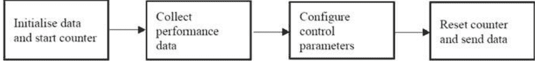

图3.1 广义拥塞控制算法流程图

端到端的蜂窝拥塞控制算法可以分为三类：(i) 预测算法，(ii) 反应算法，和(iii) 网络辅助算法。预测算法可以是固定的或动态间隔的。反应算法可以基于丢包、延迟或速率触发。网络辅助算法基于带内或带外信令。图3.1展示了一个广义拥塞控制算法流程图。对于CCA，数据被初始化，并且计数器开始计数。

在下一个阶段，收集性能数据，并配置控制参数。最后，计数器被重置，并发送数据。表3.1中提到了受QoS约束的拥塞控制算法。

CCA的两个主要约束是交叉流量和蜂窝瓶颈。通过实施每用户队列来减少交叉流量。通过将内容移动到靠近最终用户的位置来减少蜂窝瓶颈。将内容移动到蜂窝接入链路附近可以降低带宽成本并减少延迟。

## 资源分配以确保服务质量

链路自适应、接纳控制、移除和切换管理、分组交换是资源管理的一些关键特性。对于LTE和LTE-A，分组交换是在MAC层进行的，其目标是通过更大的吞吐量提高频谱效率。调度决策基于服务质量要求和信道状态信息（CSI）。

移动设备应能够连接到多个接入点，例如5G、WLAN、LTE。双连接可以利用接入点的多样性并提供高数据速率。资源分配的另一个重要概念是网络切片，通过将物理网络划分为多个逻辑实体。网络切片实现了不同用例的动态资源分配。

### LTE 4G/5G网络中的自适应信道带宽选择

对于衰落信道的3G通信，广义有限状态马尔可夫信道（FSMC）是有用的。然而，对于5G网络，使用滤波器组多载波（FBMC）。正交频分复用（OFDM）主要基于FBMC。

| 算法 | 类型 | 特点 | 设计标准 | 应用 |
|---|---|---|---|---|
| C2TCP [17] | 端到端解决方案 | 延迟敏感，不需要网络状态分析 | 建立在基于丢包的TCP之上 | 高吞吐量和低延迟应用 |
| X-TCP [18] | 5G网络和3GPP新无线电 | 提供大带宽，增加小区吞吐量 | 变化性大 | 与TCP CUBIC拥塞控制 |
| PBE-CC [12] | 物理层带宽测量 | 5G新无线电创新，增加无线容量 | 基于蜂窝的拥塞控制协议 | 软件定义无线电，PBE发送器和接收器 |
| DL-TCP [19] | 基于深度学习的TCP | TCP拥塞窗口调整 | 移动性信息，信号强度 | 5G毫米波网络 |
| LCTCP [8] | 链路耦合TCP | 传输层解决方案 | 5G接入链路隔离，轻量级信令 | 链路缓冲区，应用服务器 |
| DRWA [20] | 动态接收窗口调整 | 解决缓冲区膨胀问题，减少延迟 | TCP修改 | 无线空中（OTA）更新 |
| CQIC [21] | 跨层拥塞控制 | 物理层信息交换 | 调整数据包发送行为 | 跨层优化 |
| QTCP [22] | 强化学习Q学习框架 | 高吞吐量，低传输延迟 | 不需要硬编码规则 | 最优拥塞控制 |
| CDBE [23] | 客户驱动的带宽估计 | 下行性能增强 | 变化的蜂窝带宽 | 下行延迟的变化 |
| ExLL [10] | 极低延迟拥塞控制 | 控制拥塞窗口 | 连续带宽探测 | 动态蜂窝通道 |

### 系统架构

为了克服缓冲区过大和随后的抖动问题，首选基于点对点拥塞控制算法（CCA）的解决方案。系统架构如图3.2所示。分布式数据和每用户数据是瓶颈的两个主要原因。

CCA反馈确保网络流量中的较少拥塞。数据源包括数据链路层。这些数据链路层存储在输入缓冲区中。在下一个阶段，物理层将数据链路层分割成比特流。基于QoS约束和CCA反馈，进行自适应调制。

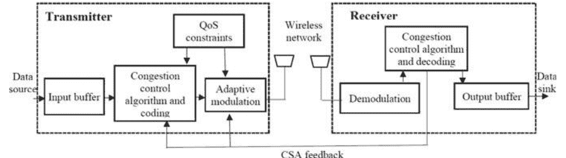

图3.2 系统架构

在接收端，按照相反的过程重建原始消息信号。解调包括一个中频阶段，降低调制信号频率。

TCP/IP传输层支持CCA。这意味着传输层信息和QoS约束是瓶颈链路访问的决定因素。这反过来对顶层应用程序有优先选择。根据接收器的反馈更新信道状态信息（CSI）。即使在无法访问链路层信息的应用程序中，也可以部署这个模型。

某些应用程序的CSI可能依赖于与较低级别的API进行交互。API交互允许CCAs进行持续的信息流动。然而，CSI和API之间的联系可能松散或紧密，这取决于应用程序所设计的具体技术。不同功能块之间的协调对于有效的通信通道非常重要，该通道不会出现任何瓶颈。CCA反馈会对输入堆栈和随后的所有下游传输层进行修改。同样，接收端的任何修改都会更新用户的网络堆栈。

### 延迟有界的QoS提供

对于延迟有界的内容交付网络（CDN），在可用容量和比特率之间进行性能权衡。增加容量时需要更大的队列。容量的未充分利用会降低吞吐量。在某些情况下，可能需要保证一些最小延迟，而CSI可能无法提供该延迟。因此，CCAs通过未充分利用队列堆栈来优先考虑QoS延迟约束。CSI主要从传输层接收延迟、丢包和数据包计数等信息。根据CSI反馈，拥塞控制算法会改变控制决策。然而，由于较低层的自适应配置可能导致瓶颈延迟。在这种情况下，传输层将无法区分由于链路重新调度和排队延迟引起的延迟之间的差异。在这种情况下，跨层反馈，即从网络堆栈接收到的反馈变得可靠并在5G网络中越来越受欢迎。这种方法还可以可靠地估计拥塞情况。

### 具有QoS类别标识符的混合调度器

使用LTE无线网络与多个服务器进行M2M通信模型。因此，上行数据流更多。一般来说，M2M流量对延迟具有容忍性，并且设计用于端到端的QoS。在3G网络之前，没有专门用于M2M通信的QoS类别。然而，4G和5G网络引入了QoS类别标识符（QCI），用于接纳控制、排队决策和拥塞控制算法。LTE接入网络和用户设备之间共享的无线电信道通过OFDMA和SC-FDMA进行通信。通过增强型基站（eNodeB）进行接纳控制、移动性监测和资源分配。LTE用户的时域和频域子载波分配都是通过eNodeB进行的。用于传输的最佳数据包集是时域调度，而将数据包映射到资源块是频域调度。

## 结论

本章讨论了内容交付网络的延迟边界QoS提供技术和性能权衡。大输入缓冲区会导致缓冲区过载和网络抖动。拥塞控制算法以及信道状态信息（CSI）反馈在减轻瓶颈和保证QoS方面起着重要作用。进一步研究高效的拥塞控制算法、延迟边界的QoS提供、用于引导天线波束形成的有效协议以及改进的纠错编码将使5G网络更加有用和用户友好。云无线接入网络（C-RAN）、异构C-RAN、软件定义网络（SDN）、大规模MIMO、自组织网络（SON）和机会网络等技术的进步将引领通信网络的新一代。能源效率理想上应该是可持续的5G网络的重要约束之一。单一技术几乎不可能满足所有标准和融合，因此，5G的逐步推出将能够满足用户期望并具有可持续性。产业、学术界和监管机构之间的合作与协调将在平衡QoS、能源效率和有效频谱利用方面发挥重要作用。

## 参考文献

- 1. Sharma, T., Chehri, A., Fortier, P.: 光学和无线回程网络的综述以及下一代5G和6G技术的新趋势。 Emerg. Telecommun. Technol. 32 (3), 1-16 (2021). https://doi.org/10.1002/ett.4155
- 2. Abdalla, I., Venkatesan, S.: 一种保持QoE的M2M感知混合调度器用于LTE上行。 In: 国际移动和无线网络选题会议(MoWNeT), vol. 7, pp. 127-132 (2013). https://doi.org/10.1109/MoWNet.2013.6613808
- 3. Akhtar, T., Tselios, C., Politis, I.: 从4G到5G及更高版本的无线资源管理: 方法和实现。 27 (1) (2021)
- 4. 唐, J., 张, X.: 无线链路上的多通道通信的服务质量驱动的功率和速率自适应。 IEEE Trans. Wirel. Commun. 6(12), 4349-4360 (2007). https://doi.org/10.1109/TWC.2007.06031
- 5. 稻叶, T., 坂本, S., 小田, T., Barolli, L., 滝沢, M.: 考虑QoS的蜂窝无线网络的新型FACS: Fuzzy C与MATLAB的比较研究。在：第18届国际网络信息系统会议论文集。NBIS 2015, pp. 338-344 (2015). https://doi.org/10.1109/NBIS.2015.52
- 6. Beshley, M., Kryvinska, N., Seliuchenko, M., Beshley, H., Shakshuki, E.M., Yasar, A.U.H.: 4G/5G网络中窄带物联网服务的端到端QoS “智能队列” 管理算法和流量优先机制。 传感器 (瑞士) 20(8) (2020). https://doi.org/10.3390/s20082324
- 7. Haile, H., Grinnemo, K.J., Ferlin, S., Hurtig, P., Brunstrom, A.: 面向4G/5G蜂窝网络的端到端拥塞控制方法，用于高吞吐量和低延迟。 计算机网络186, 107692 (2021). https://doi.org/10.1016/j.comnet.2020.107692
- 8. Beshay, J.D., Nasrabadi, A.T., Prakash, R., Francini, A.: 针对5G网络的链路耦合TCP。在：IEEE/ACM第25届服务质量国际研讨会 (IWQoS) (2017). https://doi.org/10.1109/IWQoS.2017.7969170
- 9. Zhu, G., Zan, J., Yang, Y., Qi, X.: 基于监督学习的5G网络QoS保障架构。 IEEE Access 7, 43598-43606 (2019). https://doi.org/10.1109/ACCESS.2019.2907142
- 10. Park, S., Lee, J., Kim, J., Lee, J., Lee, J., Lee, K.: ExLL:一种用于移动蜂窝网络的极低延迟拥塞控制。 In: CoNEXT 2020:新兴网络实验和技术国际会议论文集，页307-319 (2020)
- 11. Zhang, X., Wang, J., Poor, H.V.:非渐近区域中基于毫米波大规模MIMO的5G移动无线网络的异构统计QoS驱动资源分配。 IEEE J. Sel. Areas Commun. 37(12), 2727-2743 (2019). https://doi.org/10.1109/JSAC.2019.2947941
- 12. Xie, Y., Yi, F., Jamieson, K.: PBE-CC:通过端点为中心的物理层带宽测量进行拥塞控制。 In: SIGCOMM 2020: ACM特别兴趣小组年会论文集，关于应用、技术、架构和协议的数据通信，页451-464 (2020). https://doi.org/10.1145/3387514.3405880
- 13. Haile, H., Grinnemo, K.J., Ferlin, S., Hurtig, P., Brunstrom, A.: 面向4G/5G蜂窝网络的端到端拥塞控制方法，用于高吞吐量和低延迟。 计算机网络186, 107692 (2021). https://doi.org/10.1016/j.comnet.2020.107692
- 14. Chen, J., et al.: SDATP: 一种基于SDN的流量自适应和面向服务的传输协议。 IEEE Trans. Cogn. Commun. Netw. 6(2), 756-770 (2020). https://doi.org/10.1109/TCCN.2019.2963149
- 15. Sharma, T., Chehri, A., Fortier, P.: 光纤和无线回程网络的综述以及下一代5G和6G技术的新趋势。 Emerg. Telecommun. Technol. 32(3), 1-16 (2021). https://doi.org/10.1002/ett.4155
- 16. Ahmad, W.S.H.M.W., 等：5G技术：基于认知无线电网络的动态频谱共享。 IEEE Access 8, 14460-14488 (2020). https://doi.org/10.1109/ACCESS.2020.2966271
- 17. Abbasloo, S., Li, T., Xu, Y., Chao, H.J.: 蜂窝控制延迟TCP (C2TCP) 。 In: IFIP Networking Conference (IFIP Networking) and Workshops, pp 118-126 (2018). https://doi.org/10.23919/IFIPNetworking.2018.8696844
- 18. Azzino, T., Drago, M., Polese, M., Zanella, A., Zorzi, M.: X-TCP：毫米波网络中TCP上行流的跨层方法。 In: 第16届地中海自组织网络研讨会 (Med-Hoc-Net) ，第1-6页 (2017). https://doi.org/10.1109/MedHocNet.2017.8001650
- 19. Na, W., Bae, B., Cho, S., Kim, N.: DL-TCP:基于深度学习的用于5G mmWave网络的传输控制协议。 IEEE Access 7, 145134-145144 (2019). https://doi.org/10.1109/ACCESS.2019.2945582
- 20. Jiang, H., Wang, Y., Lee, K., Rhee, I.: DRWA:一种接收器为中心的解决方案，用于缓冲区膨胀在蜂窝网络中。 IEEE Trans. Mob. Comput. 15(11), 2719-2734 (2016). https://doi.org/10.1109/TMC.2015.2510641
- 21. Lu, F., Du, H., Jain, A., Voelker, G.M., Snoeren, A.C., Terzis, A.: CQIC:重新审视跨层拥塞控制对于蜂窝网络。 In: HotMobile 2015: Proceedings of the 16th International Workshop on Mobile Computing Systems and Applications, pp. 45-50 (2015). https://doi.org/10.1145/2699343.2699345
- 22. 李, W., 周, F., Chowdhury, K.R., Meleis, W.M.: QTCP：自适应拥塞控制与强化学习。 IEEE Trans. Netw. Sci. Eng. 4, 1-13 (2018). https://doi.org/10.1109/TNSE.2018.2835758
- 23. 钟, Z., Hamchaoui, I., Ferrieux, A., Khatoun, R., Serhrouchni, A.: CDBE：一种改善移动网络端到端拥塞控制的合作方式。 在：无线和移动计算、网络和通信国际会议（WiMob），2018年，第216-223页。 https://doi.org/10.1109/WiMob.2018.8589175

# 第四章 利用雾计算进行医疗保健

Avita Katal

A. Katal ()
石油和能源研究大学计算机科学学院，德拉敦，北阿坎德邦，印度电子邮件：avita207@gmail.com

©作者，独家许可给Springer Nature Singapore Pte Ltd. 2023V. Kadyan等人（编），深度学习技术用于可持续发展目标，高级技术和社会变革，https://doi.org/10.1007/978-981-19-5723-9_4

## 介绍

消费者和组织越来越依赖个人电脑和数字手机来进行日常活动。这些设备通过各种传感器和功能产生信息。因此，企业定期产生和存储大量的数据。自物联网引入以来，传感器收集的数据量急剧增加。由于产生的数据量巨大以及传统系统在处理各种形式的非结构化和结构化数据方面的困难，大数据分析在过去的时间里受到了很多关注[1]。每个企业都越来越重视数据分析，以获取相关的见解，从而做出关键的决策。由于云计算的连接性、灵活性和按需付费的特点，组织今天要求灵活的IT架构。然而，由数十亿传感器生成的大数据无法传输和分析在云端。此外，某些物联网应用必须比云端现有的容量更快地处理。雾计算(FC)的概念利用靠近客户端的设备的计算能力(空闲计算能力)来实现存储、计算和通信，可以帮助解决这个问题。

FC是一种分布式计算模型，它作为数据中心和物联网之间的链接。它通过提供计算、网络和数据存储，使基于云的解决方案能够更接近物联网设备/传感器[2]。2012年，思科引入了FC的概念，以解决传统环境中物联网应用的限制。物联网设备/传感器以及实时和延迟敏感的可用服务广泛分布在网络边缘。由于云数据中心虽然广泛分散，但它们通常无法满足全球分散的数十亿物联网设备的内存和网络需求。因此，基础设施负担过重，服务交付存在显著延迟，服务质量（QoS）较差。

FC环境通常由普通网络设备组成，如交换机、路由器、电缆盒、Web服务器、基站（BS）等，并且可以位于靠近物联网设备的区域。这些组件配备了各种计算、存储、通信和其他特性，以及简化操作性能的能力。由于其网络设备，FC能够生成广泛的基于云的操作。此外，FC还有助于位置识别、移动支持、实时互动、灵活性和兼容性。在操作延迟、能源使用、流量模式、成本和资本支出方面，FC可以是廉价的。在这方面，FC在满足物联网应用需求方面优于云计算（CC）。

正如Topol在《医学的创造性破坏》[3]中所提出的，医疗保健行业即将经历其历史上最深刻的转变。医疗保健4.0是对早期医疗保健版本的延续，受到工业4.0的启发。其目标是通过开发增强的虚拟化和个性化医疗保健领域，实现以患者为中心的系统的统一。它基于医疗保健提供者之间通过电子健康记录（EHR）存储库交换患者记录。数据共享改善了临床医生从任何地方获取数据的能力。它还使医生更容易与同事交换患者数据，以进行最准确的诊断和安排最佳的治疗。医疗保健4.0成功地通过技术将消费者和卫生系统连接起来。

然而，数据交换也带来了额外的担忧，如数据保护、数据治理、网络设备、数据验证等。除此之外，更新的技术需要技能发展才能有效使用。

无线传感器技术是推动这些发展的力量之一。传感器变得越来越小，使得它们可以在不干扰日常生活的情况下佩戴，同时仍然可以提供对越来越多的生物特征的访问[4]。

当数据必须持续收集时，这一点至关重要。例如，BioStamp[5]是一种巴掌大小的传感器，可以监测多种生物特征信号，并且可以轻松贴在皮肤上。康格等人[6]进一步描述了一种改进的过程，可以精确地将传感器印在皮肤上，使用粘性膜进行贴附。使用隐形眼镜也可以检测多种生物特征。这些改进为人们配备数百种设备铺平了道路。还有大量的健身追踪器可供选择。它们预示着一个未来，每个人都会被持续监测，无论其状况如何。然而，对于医疗管理中的许多用途来说，这种简单的传感器到云端的设计是不切实际的。在某些情况下，法规禁止将患者信息保存在诊所之外。

由于网络和数据中心的故障，依赖远程数据中心对各种用途特别是患者护理是不可接受的。在健康信息学中，雾计算是克服传感器和分析之间差距的一种方法。

## 雾计算的架构

这是一种分散式网络结构,应用特定信息不仅存储在数据中心(云)或靠近用户的设备中,而且存储在连接它们的基础设施元素中。

雾计算架构的标准设计是一个重要的研究课题。最近提出了几个雾计算概念。它们主要基于基本的三层架构。雾计算通过在源端和网络之间构建一个雾层将云存储服务带到边缘设备。图4.1显示了雾计算的架构。分层架构的三个层级如下:

- 终端层:终端层是最靠近最终用户和实际环境的层级。它由许多物联网设备组成,如传感器设备、手机、智能车辆和读卡器等。尽管手机和智能车辆具有计算能力,但在这种情况下,用户只是将其用作智能感知设备。实际上,这些设备广泛分布在地区。它们能够收集实际事物或事件的特征信息,并将其传输到上层进行存储和处理。

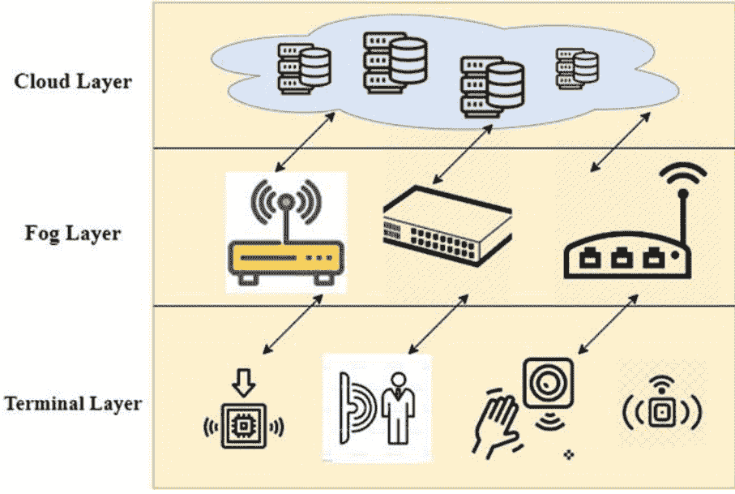

图4.1雾计算基础设施

- 雾层：此层位于网络的边缘。 FC层由多个雾节点组成，例如网关、路由器、转换器、接入点、基站、专用雾计算机等。这些雾节点广泛分布在终端源和网络中，包括咖啡馆、零售商场、公交车站、街道和公园。 它们可以固定在一个位置或者在移动车辆上。 为了获得功能，终端设备可以轻松连接到雾节点。 它们可以分析、发送和存储大量观测数据。 在雾层中可以进行实际监测和延迟敏感的操作。 此外，雾节点通过IP网络基础设施与数据中心相连，并负责与云端进行通信和协作，以获得更强大的处理能力。

- 云层：CC层由多个高级存储设备组成，提供诸如家庭自动化、智能城市、智能工厂等各种软件解决方案。它具有可观的计算和存储能力，可以进行详细的计算评估和长时间的数据管理。

## 雾计算的特点

- 异构性：雾计算是一个虚拟化框架，可以在终端节点和标准云计算数据中心之间提供存储、网络和处理操作，这些节点通常不位于网络的边缘。云和雾都基于计算、存储和网络能力。

- 边缘位置：雾计算的基础可以在为网络边缘的终端提供丰富服务的雄心壮志中看到，特别是应用程序需要更少的响应时间。

- 地理分布：尽管相对于云系统而言，雾的功能和操作需要大规模的分布式部署。 雾将积极参与通过代理服务器向行驶在高速公路和铁路上的汽车提供优质的流媒体服务。

- 大规模传感器网络：用于环境跟踪和智能电网的大规模传感器节点是固有分散过程的实例，支持分布式计算和存储能力。

- 对移动性的支持：许多雾计算应用程序需要与便携设备直接联系，这需要部署分布式目录网络。移动性方法，如定位器ID分离协议（LISP），必须得到支持，该协议将主机身份与位置标识分离。

- 互操作性和联邦性：某些服务（如流媒体）的顺畅交付需要众多供应商的参与。 因此，雾计算组件必须具备互操作性，并且操作必须在不同区域之间共享。

## 雾计算的应用

雾计算非常适用于低延迟应用[8]，因此可以在任何延迟敏感的操作中使用，例如医疗、危机和恶意软件系统。以下是雾计算应用的几个示例：

- 智能电网:它是未来的电力分配网络。智能电网包括发电站、发电机、转换器和其他设备。它通过同时进行能量和信息流来构建自动化和分散化的能源传输基础设施。智能电网是一个可见的发电系统,允许客户和行业供应商对账单、输出和实时用量进行监控。在大数据系统中,数十亿个智能电表被安装在消费者家中。雾探测器用于在系统边缘收集、评估和过滤数据,然后将其传输到云数据中心进行长期保留。

- 医疗保健系统:医疗软件系统反应迟缓,提供关键健康信息。生成的数据包含重要数据。同样,位置信息在某些情况下可能存在问题。在远程医疗和远程医学应用中,增加的不稳定性和延迟可能会产生各种问题。在这种情况下,雾计算可能适用于医疗保健生态系统。由于与嵌入式健康设备、救护车连接和可携带连接到患者医疗数据相关的低延迟,FC在重要的医疗保健操作中发挥着重要作用[9]。在[10]中,作者提出了一种针对脑部患者的技术。在所提出的系统中,FC用于识别、预测和防止中风患者晕倒。他们对边缘设备和云服务都应用了一种物体跟踪训练方法。

- 增强现实:将数字和虚拟事物围绕和叠加到实际环境中的能力被称为增强现实。增强现实数据具有低延迟和更高的数据处理速率,可以根据患者位置提供准确的数据[11]。在混合现实系统中,延迟非常重要。响应的延迟时间过长可能会危及患者的能力。AR技术需要使用图像处理算法来评估实际视频帧,同时评估其他输入,如语音,并最终在设备上创建相关适当的材料。无论如何,人类对一系列后续联系的滞后非常敏感。即使是几毫秒的处理延迟也会影响用户参与度,并导致负面的客户反应。因此,增强现实设备通过提高吞吐量并减少计算延迟而受益于FC[12]。

- 交通控制系统:车辆通信中的视频摄像头可以识别救护车的亮色,快速改变照明系统并清除道路上的拥堵,以便车辆通过。智能路灯使用传感器来识别人和自行车的存在,以及接近汽车的速度和距离。除此之外,当传感器检测到运动时,智能照明会自动开启,并在车辆经过时关闭。相邻的智能路灯作为雾节点协作,使交通信号变绿并警示接近的车辆。汽车。交通管理系统可以帮助避免事故,保持稳定的交通,并收集评估和开发产品效率所需的重要数据[13]。

## 医疗保健中的雾计算

大多数国家的医疗保健系统面临重大问题,随着人口老龄化和慢性疾病的普遍增加,这些问题将会加剧。许多国家也面临护理人员短缺的问题。同样,人们希望在提供高质量护理的同时降低费用。因此,医疗领域提倡以数据驱动的方法进行医疗保健。作为这种交付模式的一部分,个体可以远程监测,从而提高流动性、安全性、经济性和诊断的连续性,同时降低总体医疗保健成本。如今,医院在手动测量生物指标并在系统之间传输数据方面浪费了很多时间,通常需要用笔和纸。由于远程监测,护理人员将有更多的时间。其他改进包括自动监督,可以替代手动监测。Bertini等人[14]解释了监测系统相对于住院后随访的好处,特别是可能增加生存率。一个重点是改善医院流程。有各种各样的流程需要遵循。许多阶段都是手动计划的,因此按照时间顺序完成,而不是更好地利用设施。Topol [3]将此称为“数字化人类”。一个要求是数据不应该被孤立处理,而是与其他资源结合起来,并从整体上看待。一个趋势是从反应性治疗的彻底转变,即只有在发生事故后才将人们送入诊所,转向更多的预防性护理[15]。这从对正常人进行筛查开始,以尽可能长时间地使他们远离医院。改善患者在家中接受监测的能力有助于他们尽早出院。原则上,这意味着医院、家庭和其他护理场所之间的区别越来越不清晰:医学随时随地都可获得。

当前ICT技术的进展,如物联网和网络物理系统(CPS),使我们能够在日常生活(家庭/办公室)和诊所中构建更智能和预测性的医疗服务。大部分基于物联网的健康系统,特别是智能家居或诊所,需要在传感设备和互联网之间建立一个桥接点(即网关)。[16]中的作者战略性地将网关定位在网络边缘,以提供一系列更高级的功能,如本地存储、实时本地数据分析、集成数据挖掘等,从而实现智能电子健康网关。研究人员随后建议将雾计算的概念应用于医疗物联网网络,通过在传感器网络和云之间构建一个空间中介层来实现智能化。通过承担传感器节点和远程医疗中心的一些任务,他们的雾辅助开发系统解决了普遍健康系统中的许多问题,包括移动性、功耗等。

效率、适应性和可靠性。 此外，[17]中的作者提供了一个高效的集中安全框架，用于云托管的基于物联网的健康服务的端到端连接。该软件在建议的架构上利用雾计算环境运行。 医疗信息通过传感器收集，并安全传输到近边设备。 最后，数据上传到云端，以便医疗专业人员简单访问。 建议在云部署的应用程序和数据服务器之间采用异步通信。

在医疗应用中，许多传感器和设备产生大量数据，这是重要活动的重点。通过雾计算可以在网络边缘管理它们。 Mutlag等人[18]提出了一种多代理雾计算范式，用于管理医疗保健的重要活动。 多代理系统的主要功能是在三个决策表之间进行映射，以通过根据优先级、网络负载和网络资源可用性分配任务来最大化调度重要活动。

根本的CC本身并不是改变医疗挑战（如患者护理延误）的最佳解决方案。 此外，直接在CC上提供的医疗护理和应用程序并不满足医疗4.0环境的标准。 它具有某些缺点，如反应迟缓和延迟。 医疗保健中的一点小问题可能会让患者丧命：因此，FC已经进入场景以改善服务和应用程序。 FC提供及时和一致的服务交付，尽管存在延迟或抖动等困难，以及与数据传输到云端相关的成本开销。 它是一种分布式的扁平设计，通过整个CC增加存储、处理和开发平台。

生物传感、低功耗和低成本电路以及无线网络的快速发展使这个概念更加接近现实。 然而，仍然需要解决重要问题和困难，如数据存储、医疗数据的安全和隐私。 当涉及到持续的人体健康观察时，跟踪系统将首先捕捉到来自身体的所有信号。

1988年，Icker研究所设计了以患者为中心的护理（PCC）[19]，这是一种新兴的医疗保健方法。 这个策略以患者为中心，满足他们的医疗需求。 医疗4.0包括所有已经存在的医疗中心，包括大型医院公司，如机构，（ii）小型医疗专业人员，如临床医生和药房，以及（iii）卫生中心和药房，以及（ii）非临床环境，如门诊护理设施，养老院和医疗资源有限的农村地区。 远程医疗是指FC在提供护理给机构、药房和偏远地区方面可能发挥重要作用的潜在领域[20]。

### 医疗应用需求

CC可以提供普遍、按需和可访问的网络访问数字能力，这些能力可以分布和立即提供，无需人力投入或网络运营商管理。这些设备既具有集群和网格的特性，又具有独特的特性和能力，如强大的虚拟化。因此，这样的框架使得利用计算、内存和系统软件提供第三方增值解决方案变得更加容易，而无需生成必要的托管基础设施。许多健康检测系统依赖于远程云服务来收集和管理由物联网设备产生的大量数据。然而，连接延迟、位置识别和大规模数据传输存在一定的困难。随着医疗系统变得更加广泛和复杂，存储和通信错误的危险性增加，收集到的数据中的一个小错误可能导致错误的治疗建议，潜在地危及人的生命。在医疗环境中，FC是克服传感器和统计之间障碍的一种方法。

FC是一种可扩展的架构，将存储和处理放置在边缘设备附近。

用户通过提供他们的设备的一部分来托管这些服务而获得补偿。FC，如Iorga等人所定义的[21]，是一个多层次的基础设施，为灵活计算能力提供普遍连接。这个想法建立在物理和虚拟雾节点之间的手机和中央操作之间，简化了低延迟网络基础设施和技术的实施。

- 带宽—连接数量、模数转换器（ADC）的归一化步长（以位为单位）和采样率都会影响不同医疗信息的信息速率[22]。例如，内部温度只需要0.2赫兹的采样率。当仅使用12位ADC时，带宽为2.4比特/秒[23]。在120赫兹的情况下，使用12位ADC检测血压，传输速率为1.44千比特/秒[23]。对于脉搏血氧测量，需要600赫兹的采样率和7.2千比特/秒的传输速率[23]。心电图（ECG）通常需要使用时多个引线。对于医疗用途，基于脉冲宽度和记录的脉冲数，5引线心电图需要36-216千比特/秒的传输速率[22,24]。肌电图（EMG）是肌肉产生的电脉冲，可用于多种目的，如食物咀嚼识别。这种使用场景的最低带宽要求分别为20.48千比特/秒和96千比特/秒。脑电图（EEG）使用大量引线来检测脑部的电活动。一个带有192个引线的脑电图可以占用高达921.6 kbit/s的带宽。这说明了生物医学参数的比特率有多大的变化。

- 延迟 - 根据信息的计划使用，对延迟的需求差异很大。在与心脏病学家进行的实验中，[24]中的作者表明实时监控中的2-4秒的延迟是可以容忍的。从技术角度来看，这些标准相对宽松。对于触觉互联网应用，如控制让瘫痪的人行走的外骨骼，需要更严格的标准。其他延迟限制的例子来自于在网络连接不足的偏远地区运行的远程医疗计划。

- 能源效率 - 由于更换电池会影响传感器的使用，能源节约是一个重要问题。尽管一些体内监测器通过热量或运动活动获取能量，但其他设备可能需要临床手术来更换电池。

- 可靠性——系统故障对所使用的数据产生不同的影响，从小的烦恼到对患者生命的重大威胁不等。因此，一致性可能是最重要的因素，它与安全威胁抵抗密切相关。

- 安全性——由于患者数据的复杂性和可能的灾难性后果，医疗保健领域的安全标准非常严格。在远程监测方面，设备连接越多，攻击面就越大。这就需要先进的方法来检测和纠正安全漏洞。要求不仅限于设备和周围系统中使用的技术，还包括组织、监管机构和制造商必须采取的流程。

- 互操作性——系统应该与彼此兼容，即使它们由不同的供应商提供。例如，心脏病学领域的个体在不同机构之间需要转移，并且在移动过程中需要通过心电图进行仔细监督，因此需要连接到不同的设备，可能存在不匹配的情况。

### 雾计算在医疗保健中的目标

根据研究，医疗困难、相关需求和雾计算的优势之间似乎存在着联系，这表明雾计算有能力成为医疗保健中无处不在、互联设备的催化剂:

- 处理位置的可访问性-当扩展、安全性和可靠性问题使得仅依赖云的方法不可行时，雾计算可以在系统内提供所需的处理能力，以满足法律和技术要求。要有效，这些方法不仅需要传感器和云之间的计算资源可用性，还需要它们的高效管理。这样可实现程序执行的可见性，以及处理可能发生的灵活性。雾计算的位置可以是动态的，并由现代情景、环境和应用需求决定。

- 集成-在当今世界中部署新型传感设备通常需要并行创建一个架构。例如，心率跟踪系统就是需要专门设备的技术实例。当涉及到创造新的创意技术时，这是一个巨大的负担。新设备可以引入到已建立的FC系统架构中。FC还可以作为一个互连层，在不同标准之间进行转换。

- 患者移动—由于应用特定基础设施的限制，患者可以被追踪的区域也是有限的。当患者准备离开医院的重型仪器设施时，这一点尤为重要。现有的使用场景通常无法处理这种转变，这最终会延长患者的住院时间。使用FC可以更加渐进地管理不同环境之间的过渡。

- 新应用—FC允许创建全新的应用程序：雾计算将在执行复杂活动（如跌倒检测[10]）的普及和低成本设备上引入更高程度的独立性和认知，从而最大限度地减少延迟和响应时间，并节省能源。 这样的雾节点在需要高效管理网络资源或控制不同的网络相关活动时进行通信。 所需的操作以分散的方式进行。 某些挑战包括在考虑到物联网设备操作的安全、私密环境的同时，最小化开销邮件。 由于多跳网络可能不可靠，雾节点之间的交互需要端到端的保护。 为了减少在CC、网络设备或物联网设备等多个领域的信息损失，隐私是CC中的一个关键要素。

### 案例研究

FC可以在各个领域的医疗保健中使用。 其中一些在下面解释。

#### 医疗4.0与FC在农村地区的影响

农村社区在教育方面服务不足。 高质量教育的主要挑战是熟练教师的可用性。 通过使用FC和物联网等新兴创新，教育家为学习者和讲师提供了实时教程的机制。 此外，这些技术帮助学生从基础开始理解事物，这些思想交流渠道帮助他们改善未来。 这些方法还使人们能够通过共同的媒介解决问题，并与适当的人员进行即时互动。 然而，当涉及到医疗意识时，农村居民由于缺乏受过良好培训的医务人员和对医疗问题的了解而受到很大的影响。 有时，由于预算限制，当地政府和居民可能无法在他们的领土上获得受过良好培训的医务人员。 由于这些困难，人类遭受了巨大的痛苦。 农村地区的人们历来在维持良好的医疗保健方面面临困难。 农村医院和其他机构面临的问题在文献中有很好的记录，农村美国人经常缺乏重要的医疗保健。 各种因素加剧了农村地区的这些困难，包括人口增长、经济停滞、医疗专家和其他医疗专家的匮乏、大量的老年人、残疾人和失业人口，以及慢性疾病的高发率。

#### 医疗4.0心电监护 [27]

FC可以为医疗行业提供独特的服务，例如支持多样性和实际需求的满足。它适用于分析和存储无组织的信息。数字医疗扫描仪将通过动态增强FC与分散存储相结合，结合实时警报解决方案和数据分析，所有这些都将在网络边缘运行。心电图收集在治疗各种心脏疾病中被广泛使用。动态时间规整(DTW)技术用于从时间序列中提取信息波动，并在步态识别、商业、金融和心电图信号分析等各种应用中使用。主要目标是使用QRS-复合测量和RR间期来表征心律失常的心电图信号。使用实时信号处理，心电图信号创建QRS复合体。这种数据减少方法是用Python编写并在雾节点上实现的。建议的架构的心电图信号需要大约一分钟来评估雾网络。[28]中的研究人员提出了图4.2中所示的组织结构。为了减少数据，使用GNU zip软件来减少心电图时间序列。然后将压缩文件上传到云端。DTW显示的心电图时间序列样本被广播到互联网。编码表示心电图压缩算法的速率。它有助于缩短运行文件所需的时间。随后，心电图数据在智能路径中进行处理，并实际分离心率。图4.2示例了基于FC的eHealth系统的设计，包括三个层次。DL是第一层，通过不同的设备或监测器(如智能手表或智能眼镜)收集来自患者的数据。他们所需要的只是通过雾网关的链接和适当的通信协议。收集到的数据被发送到雾层进行预处理，预处理后的数据被发送到云端进行存储。卫生组织可以访问预处理的数据进行治疗。

#### 患者培训和监测支持 [29]

全球老年人医疗和社会护理的费用正在上升。远程护理被认为可以弥补传统临床接触和居家护理的减少。物联网技术无疑在传统慢性病护理的远程医疗中发挥作用，同时确保患者在家中的安全，并允许创新的技术辅助康复服务。各种传感器，无论是分散的还是移动的，都非常适合提高老年和发育障碍患者在家中的安全性。到目前为止，个人健康记录(PHRs)的典型中央服务器或基于云的数据存储库已经足够。结合运动捕捉或持续活动日常生活(ADL)监测能力的创新家庭远程护理系统的技术和隐私要求显著提高，需要采用分布式数据处理架构的替代方案。分散的雾状数据分析的优势

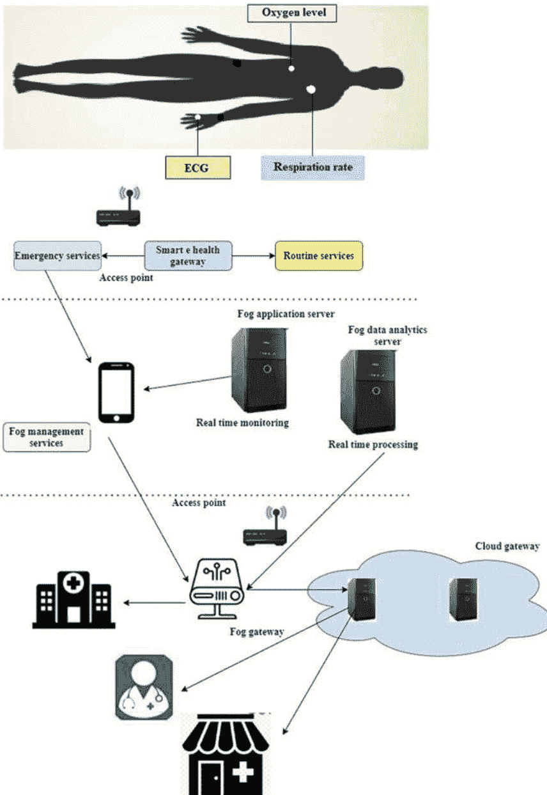
**图4.2 三层电子健康架构**

对于实时患者安全监测技术来说，过度集中的数据分析是显而易见的。通过本地数据聚合和决策，远程服务器负载和通信通道吞吐量可以大大减少。

此外，从临床角度来看，只有聚合的元信息，如活动小时数、平均活动水平、睡眠质量和异常事件（如跌倒）的存在，才具有长期价值值得在个人健康记录中保留。剩余的原始数据在临床上几乎没有用途，并且如果将其转移到私人环境之外，会引发隐私问题。在实践中，仅仅使用惯性传感器无法充分检测到人为事故，并且由于IMU中的非线性效应，计数运动监测仅在几米范围内可靠。由于意外的网络延迟，指定的传感器数据融合无法在远程站点进行。因此，传感器数据集成、基于雾计算的整合以及网关层的前瞻性思考是智能家居远程护理系统的理想解决方案，该系统提供ADL分析和危险检测。图4.3描述了日常生活活动和安全监测。在雾层中，传感器收集数据并进行预处理。然后，数据被发送到网关层进行后续操作。最后，收集到的数据被发送到云层进行未来存储。

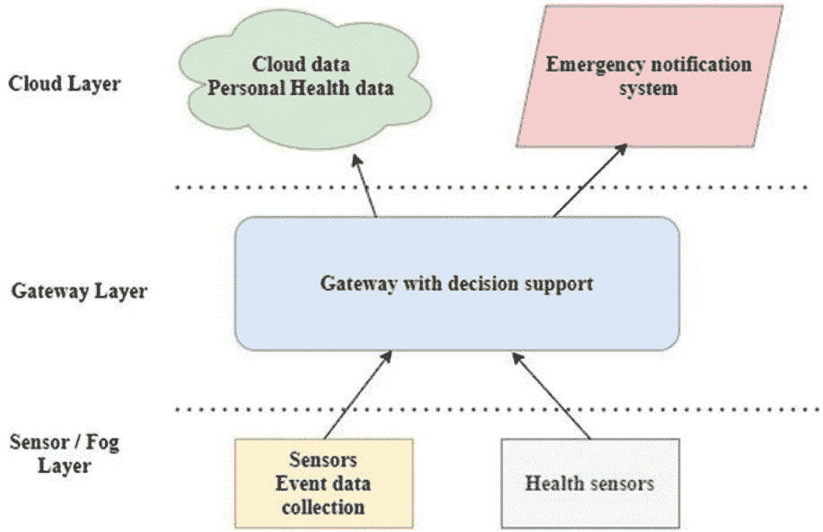

### 研究挑战

雾计算自称为减少卫生数据管理复杂性的解决方案，从而提高其可靠性。为此，在开发基于FC的医疗信息处理基础设施之前，了解相关困难至关重要，下面将对此进行解释：

- 数据管理：医生面临大量患者信息，这受到大数据的5个V的挑战：价值、速度、多样性、容量和真实性。这主要涉及雾节点 (FN) 接收、存储、解释和发送数据的能力。因此，可能观察到FC和CC之间的数据不稳定性，这应该由程序的管理设置来控制。雾层 (FL) 需要常见的协议和数据格式来管理来自各种来源 (如智能手机或手表) 的非常不同的数据，例如文本、图像文件等。
- 可扩展性：使用传感器或可携带的药品收集信息。该程序应在整个设施中提供，以便所有患者都可以使用他们的手机获取医疗保健和获得一般健康信息。此外，医疗4.0可以应用于整个社区。它节省了客户等待访问和结果的时间，并使他们立即获得最低程度的健康治疗。
- 安全性和异构性：这是主要问题，未经授权的实体不应该访问最终用户的数据。此外，这会危及个人安全。医疗4.0实施和部署的主要问题是安全性和隐私性。然而，保护在所有层面上都是必要的，包括雾层 (FL)、设备层 (DL) 和云层 (CL)，以及这些层的统一。雾计算可能会遇到的另一个困难是异构性，这指的是不同设备之间进行通信的能力。

多种多样的设备，如智能手机、自动驾驶车辆和其他物联网智能设备，位于物联网范式的最底层。物联网终端设备的异构性问题包括数据收集、数据格式化和能力问题。使网络能够与各种传感器连接，以帮助患者监测是医疗保健中可能出现的问题之一。

信息应该是异构的，以便传输到其他设备进行处理或分析。随着数据进入下一个阶段，出现了雾层。该层包括计算和网络节点、集群、路由器和其他设备。因此，多样性正在成为架构设计中的一个重要考虑因素，特别是当各种测量设备与患者接口时。

由于其在网络中的位置，雾计算中的安全性可以被视为一个研究课题。在网络边缘工作会暴露出在一个良好组织的云基础设施中不存在的风险。其中一些威胁可能是中间人攻击，攻击者在两个方之间中继和更改信息。在健康服务的情况下，攻击可能会针对诊断成像传感器和分析患者数据的雾节点之间的网关。如果攻击者篡改了正在检查的数据，可能会对患者的健康产生重大影响。

- 标准化、互操作性和规范：在医疗4.0中，各种商品和设备的协议和接口没有共同的规范和标准。为了解决这个问题，需要进行标准化活动，例如成立一个专门的组织来标准化医疗技术。它有助于实现实时反应和解决数据差异。在标准化时，应该考虑设备连接、信息收集连接器、路由协议和网关接口等方面。与设备多样性的问题类似，有多种通信协议可用，例如Wi-Fi。因此，为了具有可扩展性，FN必须在多个内部FL层（如核心网络、消息层和数据注释层）上翻译协议。此外，在医疗商品可供患者使用之前，必须建立一个监管体系。
- 雾计算安全通信：在雾层，提供了不同的收集、分析和存储信息的策略，但隐私程序并未分散。物联网实施应包括一定程度的保护和隐私。根据物联网通信安全程序，连接设备之间的交互被认为是安全的。当物联网设备想要卸载处理或存储需求时，它与雾节点进行通信。作为网络的一部分发生的任何其他操作都不被视为雾系统的一部分。不允许将处理和存储规范发布到雾节点上。即使是物联网设备也必须符合最低必要的安全协议。在物联网连接的环境中，设备应该安全地进行交互。
- 资源管理：当三个独立的范例（物联网、雾和云）在一个系统内结合时，资源管理成为一个关键问题。即使在没有使用云的情况下讨论雾计算，资源管理也可能是一个具有挑战性的问题。这是因为雾计算的计算和存储能力比云计算更少。在涉及物联网对象和与雾层的交互的资源规划中，发送和分析的数据必须具有目的，以避免共享数据冗余和浪费重要资源。当多个用户或系统的部分使用相同的资源时，资源规划变得更加重要，以便为正在使用的设备提供尽可能短的延迟。
- 能量最小化：由于雾计算需要部署大量的雾节点，计算是分散的，可能比集中式云计算模型的计算效率低。因此，在雾计算中减少能量使用是一个重要问题。
- 动态性：物联网设备最重要的特点之一是它们能够发展并不断修改其操作的组成。由于这个挑战，物联网设备的内部特性和性能将发生变化。此外，便携设备会经历软件和硬件老化，导致工作流行为和设备特性的变化。

因此，雾节点需要持续而智能地重新组织拓扑架构和可用资源。
- 存储：与云计算相比，雾节点的存储空间较小。因此，可能需要增加雾节点的数量来处理占用大量空间的数据 (图像数据)。此外，这些数据的收集和结果的处理会增加时间开销。
- 成本增加：雾节点的安装以及与传感器设备和云层之间的连接设备增加了开发的总成本。另一方面，雾计算在医疗保健领域的应用提高了健康水平，挽救了生命，并延长了寿命。

## 结论与未来工作

雾计算在智能医疗保健方面的好处包括更低的响应时间和低能耗，多样性和灵活性。本章详细介绍了雾计算的架构、特点和应用。本章还详细介绍了在医疗保健领域中使用FC的利用情况，并提供了案例研究的详细信息。还突出了在现代医疗系统中使用FC时遇到的研究问题，以便其他公司或研究团队可以进一步研究该领域。在云计算环境中，雾计算是一个流行的趋势。应用程序越来越需要广泛使用云计算。尽管硬件容量大大提高，但健康应用程序需要尽快获取信息。这是雾计算正在产生重大影响的领域。过滤、数据收集和数据预测都是人工智能解决方案的例子，它们很快将在诊所中普及。此外，由于设备的更大移动性和通信技术的进步，服务将可用于患者住所之外，并且医疗从业人员或医疗机构可以随时随地位于全球任何位置。在这些情况下，FC可以帮助减少延迟，实现实时和大规模的医疗服务，有可能惠及世界上最贫困的人口，他们无法获得优质医疗保健。预计上述问题将很快得到解决，并且在FC的帮助下将实现更高的生活水平和社区福祉。能够在设备自身的上下文中对数据进行分级和做出关键判断将有助于从可用的大量数据中提取重要见解。未来，可以通过使用物联网来实现雾计算与医疗保健的结合。可以借助物联网和雾计算来设计健康监测模型，以减少处理医疗数据的延迟。

## 参考文献

- 1. 辛格, A., 马哈帕特拉, S.: 基于网络的多媒体大数据计算在物联网环境中的应用。智能系统参考库 163, 435-452 (2020年)
- 2. 卡塔尔, A., 塞蒂, V., 兰巴, S., 乔杜里, T.: 雾计算: 问题, 挑战和工具。在: 数据挖掘和信息安全中的新兴技术, 第971-982页 (2021年)。https://doi.org/10.1007/978-981-15-9927-9_92
- 3. 托普尔, E.: 医学的创造性破坏: 数字革命和个性化医学将创造更好的医疗保健。Hir 19, 229-231 (2012年)
- 4. 马哈帕特拉, S., 辛格, A.: 基于物联网的智能设备在医疗保健中的应用, 使用雾计算。在: 大数据研究, 第263-278页 (2020年)。https://doi.org/10.1007/978-981-15-6044-6_11
- 5. 可穿戴医疗技术和设备IMC10. https://www.mc10inc.com/
- 6. Kang, D.Y., et al.: 用于粘附一体化柔性和可伸缩电子传感器的可扩展微制造工艺。传感器 15, 23459-3476 (2015)
- 7. Bonomi, F., Milito, R., Zhu, J., Addepalli, S.: 雾计算及其在物联网中的作用。https://doi.org/10.1145/2342509
- 8. Aazam, M., Huh, E.N.: 雾计算: 云-IoT/IoE中间件范式。IEEE Potentials 35, 40-44 (2016)
- 9. Masip-Bruin, X., Marin-Tordera, E., Tashakor, G., Jukan, A., Ren, G.J.: 雾云和多云雾: 协调管理雾到云计算系统的真正需求。IEEE无线通信 23, 120-128 (2016年)
- 10. 曹, Y., 陈, S., 侯, P., 布朗, D.: FAST: 一种雾计算辅助的分布式分析系统, 用于监测中风的减轻。在: 2015年IEEE国际会议论文集网络, 架构和存储, NAS, 第2-11页 (2015年)。https://doi.org/10.1109/NAS.2015.7255196
- 11. 艾, Y., 彭, M., 张, K.: 物联网的边缘计算技术: 入门指南。数字通信网络 4, 77-86 (2018年)
- 12. 易, S., 李, C., 李, Q.: 雾计算综述: 概念, 应用和问题。在: 国际移动自组网和计算研讨会 (MobiHoc) 卷2015年6月, 第37-42页 (2015年)
- 13. 更多, P.: 实施雾计算的综述。IJRET: 国际研究工程技术。4, 2319 (2015年)
- 14. Bertini, M., Marcantoni, L., Toselli, T., Ferrari, R.: 可植入设备的远程监测: 我们应该继续忽视它吗? 国际心脏病学杂志。202, 368-377 (2016年)
- 15. 转变健康: 从被动到主动和预测性护理- MaRS Discovery District。https://www.marsdd.com/news/transforming-health-shifting-from-reactive-to-proactive-and-predictive-care/
- 16. Rahmani, A.M.等: 利用智能电子健康网关在医疗互联网边缘进行: 物联网: 一种雾计算方法。未来。Gener. Comput. Syst. 78, 641-658 (2018年)
- 17. Thota, C., Sundarasekar, R., Manogaran, G., Varatharajan, R., Priyan, M.K.: 集中式雾计算安全平台用于医疗保健系统中的物联网和云。在: 雾计算: 研究与实践的突破, 第365-378页 (2018年)。https://doi.org/10.4018/978-1-5225-5649-7.CH018
- 18. Mutlag, A.A.,等人: MAFC: 用于医疗关键任务管理的多智能体雾计算模型。传感器 (瑞士) 20 (2020年)
- 19. 患者中心护理的八个原则- Onewiew Healthcare.https://www.oneviewhealthcare.com/blog/the-eight-principles-of-patient-centered-care/
- 20. Farahani, B.,等人: 走向雾驱动的物联网电子健康: 物联网在医学和医疗保健中的承诺和挑战。未来。Gener. Comput. Syst. 78, 659-676 (2018年)
- 21. Iorga, M.,等人: 雾计算概念模型。 (2018年)。https://doi.org/10.6028/NIST.SP.500-325
- 22. Eide, R.B.: 低能量无线心电图—无线心电图和低能量传感器在临床日间患者监护中的应用探索。医学（2016年）
- 23. Paksuniemi, M, Sorvoja, H., Alasaarela, E., Myllyla, R.: 手术室和重症监护室中患者监护的无线传感器和数据传输需求和技术。在：IEEE工程医学与生物学学会年度国际会议论文集，卷2005，页5182-5185（2005年）
- 24. Alesanco, Á., García, J.: 无线心电传输在实时心脏远程监测中的临床评估。 IEEE Trans. Inf Technol. Biomed. 14, 1144-1152（2010年）
- 25. Ermann, D.A.: 农村医疗保健：医院的未来（2016年）。 https://doi.org/10.1177/10775587900470010447,33-73
- 26. Xu, Q., Ren, P., Song, H., Du, Q.: 增强物联网通信的安全性，暴露于位置不确定的窃听者。 IEEE Access 4, 2840-2853（2016年）
- 27. Jain, R., Gupta, M., Nayyar, A., Sharma, N.: 在医疗4.0中采用雾计算。在：信号与通信技术3-36（2021年）。 https://doi.org/10.1007/978-3-030-46197-3_1
- 28. Kumari, A., Tanwar, S., Tyagi, S., Kumar, N.: 雾计算用于医疗4.0环境的机会和挑战。计算机与电气工程，72，1-13（2018年）
- 29. Tammemäe, K., Jantsch, A., Kuusik, A., Preden, J.S., Õunapuu, E.: 私密和安全领域中的自我感知雾计算。 在：物联网中的雾计算：边缘智能，第71-99页（2017年）。 https://doi.org/10.1007/978-3-319-57639-8_5

## 第5章

### 基于PID和模型预测方法的污水处理厂智能自整定控制设计

Ujjwal, Neelam Verma 和 Anjali Jain

## 介绍

智能调节器的智能调整是控制工程领域中最重要的功能，可以获得最优和高效的参数，从而实现最佳的系统响应[1]。在广泛的工程应用领域已经测试和实施了各种技术，但对于即将到来的技术仍然是研究的兴趣。多值和多级植物具有非常复杂的模型和高度非线性和不稳定的行为，因此在该领域中寻找最佳和能源高效的控制技术非常重要。由于参数和外部干扰在这些植物的实时操作中具有高度不可预测性和主导性，因此需要自动调整以实现满意的植物运行。在目前的工作中，动态植物被考虑用于测试建议的控制技术的有效性，该植物是污水处理厂。活性污泥工艺模型在能源高效控制方面具有优势，因为它是一种生物污水处理工艺。首先，实施了分散的PI控制器，该控制器是自整定的，并且适应于多变量系统的过程中改变的被控变量[1]。该控制器提出了一种自适应交互算法，并对生物污水处理厂进行了检验。为此，使用了一种名为相对增益阵列的交互方法，以确保植物的输入和输出变量之间的正确配对[2]。

第二种控制技术是具有良好调节参数的PID控制器，该控制器已经根据活性污泥过程模型[3]进行设计。在这种情况下，使用了两个PID控制器

Ujjwal, N. Verma(*), A. Jain(*)
阿米蒂大学北方邦诺伊达电气与电子工程系，印度
电子邮件：neelamverma11@gmail.com

A. Jain
电子邮件：anjalijain.121@gmail.com

© 作者，独家许可给Springer Nature Singapore Pte Ltd. 2023
V. Kadyan等人，深度学习技术用于可持续发展目标，高级技术与社会变革，https://doi.org/10.1007/978-981-19-5723-9_5

## 文献综述

废水处理厂采用了分散式PI控制器，这是一个非线性多变量系统[1]。此外，还使用了一种交互方法来正确配对输入和输出。PID控制器已经被设计并应用于活性污泥过程中的铵离子和硝酸盐去除[2]。这种控制器相对于其他控制器具有一些优势。在[4]中，采用了粒子群优化技术的一种降维方法来实现PID控制器的调节。在这里，自整定的PI控制器响应非常快，能够轻松跟踪给定的参考值，并且误差较小。

已经实施了四种先进的控制技术，并在[4]中讨论了它们的比较。在[5]中给出了活性污泥过程模型的先进方法模型预测控制（MPC）的实施，以及溶解氧和底物浓度的模拟结果。在论文[6]中，使用MATLAB Simulink实施了PI与MPC的控制技术，并获得了模拟结果。论文[7]展示了基于废水处理厂建模的工作。在这个工作中，研究了给定厂的建模，并引入了控制技术。

## 工作目标

本研究的主要目标是设计自适应控制方法，以减少污水处理厂的问题。由于污水处理厂受到干扰和抑制物质的严重影响，这与进水污水的组成有关。确定了首选的操纵变量和调节规则，这些规则正确地解决了将植物输出应用于活性污泥过程模型，并提出了数学方程。通过这种方式，针对多个控制系统和非线性系统以及具有多个变量的系统，提供了PI分散控制方法和调节方法。

在这里，将传统的PID控制器和先进的模型预测控制（MPC）应用于系统模型。

这项工作旨在控制污水处理厂曝气过程中的溶解氧浓度，并控制底物浓度。本研究的主要目标是为污水处理厂设计一些控制技术。此外，其他工作如下：

- 研究污水处理厂中的生物模型。
- 建立活性污泥工艺模型。
- 设计一些控制技术，有助于减少有机物含量并改善出水水质。
- 满足出水硝酸盐去除的更严格要求，以优化处理效果。
- 通过这些控制技术观察溶解氧和底物的结果。
- 比较从这些控制技术获得的模拟结果。

## 提出的控制方法论

设计动态系统的控制系统始于对系统的数学建模，考虑到所有变量/参数、干扰和噪声、外部参数变化等，然后应该实施控制技术。这是工作的拟议方法（图5.1）。

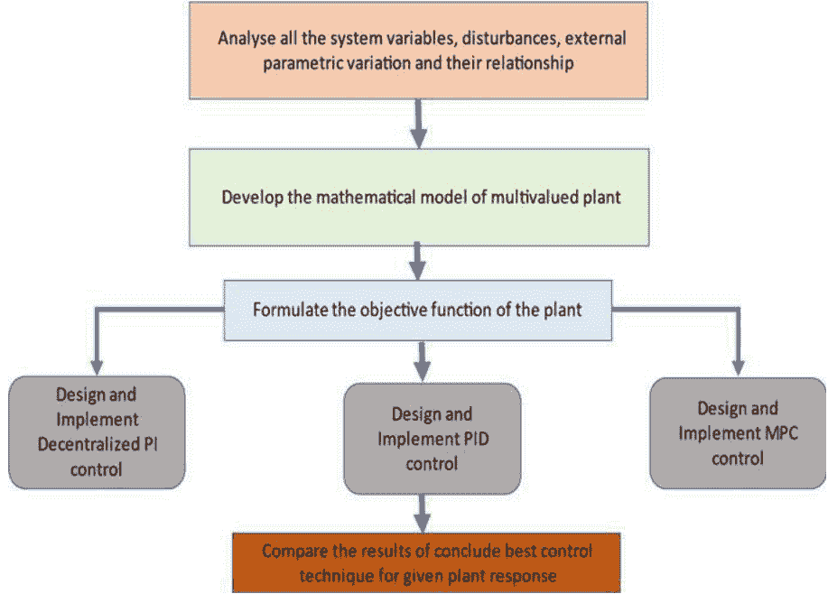
图5.1 拟议方法流程图

### 污水处理厂的建模

本节包括非线性污水处理厂的简要介绍。建立活性污泥工艺模型在该厂的设计和性能中非常常见。

#### 废水处理厂

废水是指被污染到不再有利用价值的水，在重新利用之前需要处理。在这个工厂中，图5.2有三个阶段，分别解释如下。

#### 初级处理

这是关于将悬浮固体与水分离的过程。它包括一些方法，如格栅和砂池、沉淀池和废水的氯化处理。

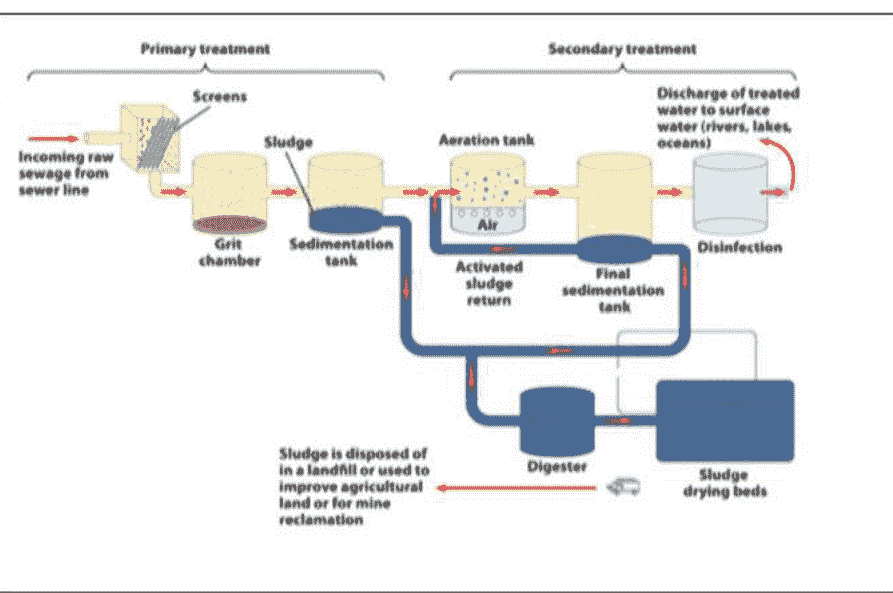
图5.2 污水处理厂的阶段[12]

#### 二级处理

这是一种生物处理方法，包括活性污泥法、滴滤法和氧化池。在活性污泥法中，同时存在好氧和厌氧细菌[11]。它促进细菌生长并分解有机物[13]。

通过这种处理，滴滤器最终满足污泥去除的条件。最后，澄清池用于沉淀污泥。然后，水流回到河流中。

#### 三级处理

在二级处理中，系统仍然含有一些致病菌和营养物质，如氮和磷。由于这些问题，水需要进行三级处理。

这个阶段包含两个过程，即硝化和反硝化[13]。

#### 活性污泥法

活性污泥法是这个过程中广泛使用的概念，它包括氧化和产生有机物的微生物[9]。然后，获得的有机物被转化为二氧化碳，并以残留形式存在于新的细胞质中。在细胞质中，存在着含有活体和死体的污泥[12]。

通常，在达到接收水体之前，该工厂用于去除有机物和悬浮物质。图5.3描述了生物反应器，其中包含曝气池和澄清沉淀池的生物过程。在第一个池中，微生物被氧化有机物。系统中的生物质存在于沉淀池中，用于产生优质的出水。然后，生物质被回收到曝气池中。质量平衡组分用于表示活性污泥法的动态建模[1,11]。

$$
\begin{aligned}
\dot{X}(t) &= \mu(t) X(t) - D(t)(1+r) X(t) + r D(t) X_r(t) \\
\dot{S}(t) &= -\frac{\mu(t)}{Y} X(t) - D(t)(1+r) S(t) + D(t) S_{\text{in}} \\
\dot{\text{DO}}(t) &= \frac{K}{Y} \mu(t) X(t) - D(t)(1+r) \text{DO}(t) + K_{\text{la}}(\text{DO}_s - \text{DO}(t)) + D(t) \text{DO}_{\text{in}} \\
\dot{X}_r(t) &= D(t)(1+r) X(t) - D(t)(1+r) X_r(t)
\end{aligned}
$$

其中各参数含义如下表所示：

| 符号 | 含义 |
| :--- | :--- |
| $X(t)$ | 生物质浓度 |
| $S(t)$ | 底物浓度 |
| $\text{DO}(t)$ | 溶解氧浓度 |
| $X_r(t)$ | 循环污泥浓度 |
| $D(t)$ | 稀释速率 |
| $S_{in}(t)$ | 进水底物浓度 |
| $\text{DO}_{in}(t)$ | 进水溶解氧浓度 |
| $\text{DO}_s$ | 最大溶解氧浓度 |

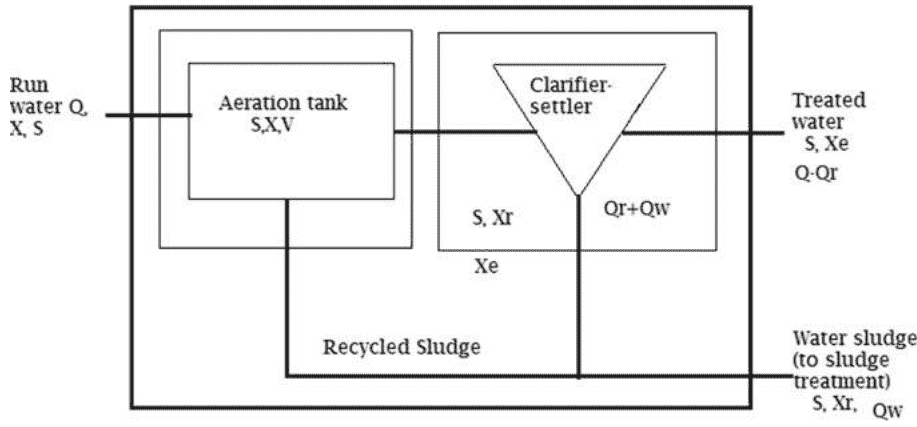
图5.3 活性污泥工艺示意图[14]

在本文中，我们有两个操纵输入，即稀释速率 ($D(t)$) 和曝气速率 ($W(t)$)，以及两个被控输出，即底物 ($S(t)$) 和溶解氧 ($\text{DO}(t)$)，用于在MATLAB Simulink [15]中进行仿真。

### 控制技术

在本章中，描述了用于废水处理厂的控制技术。这些控制技术包括具有自适应算法的分散式PI控制器、具有良好调节参数的PID控制器，以及已实施到子系统模型中的模型预测控制[8]。

#### 分散式PI控制器

这是设计多变量控制器的较简单方法之一。在多变量系统中，如果有任何输入变化，几乎所有输出都会因为输入和输出变量的相互作用而发生变化[7]。如果传递函数矩阵 $G(s)$ 是对角矩阵，则该控制器的功能非常好，因此被控对象基本上是一组独立的系统，并且 $G(s)$ 中的每个元素都可以独立发展。根据选择的适当配对，配置可以是单输入单输出（SISO）。PI控制器的方程如下所示。需要强调的是，误差信号 $e(t)$ 在产生不同动作时使用，并且随后与相应的增益相乘，再与施加于系统的控制信号 $u(t)$ 相加。

$u(t) = K_p e(t) + K_i \int e(t)dt$ (5.5)

其中，$K_p$ 是比例作用增益，$K_i$ 是积分作用增益。

以传递函数的形式，方程 (5.5) 可以写成：

$G(s) = \frac{U(s)}{E(s)} = K_p \left[ 1 + \frac{1}{T_i s} \right]$ (5.6)

在这里，$T_i$ 被称为积分时间，$G(s)$ 是一个需要通过对角控制器进行管理的系统。

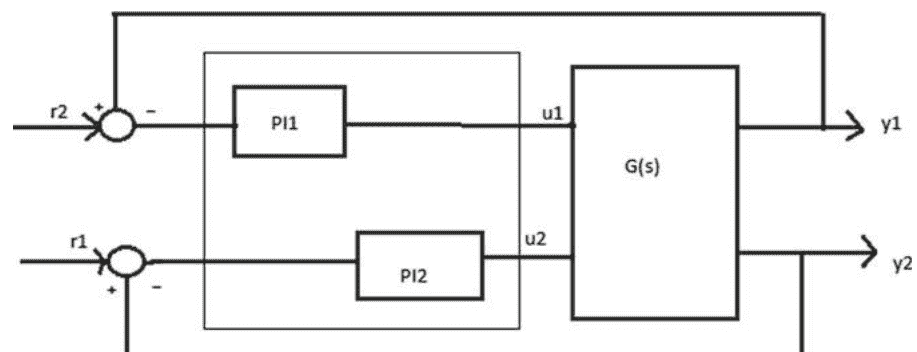

在这项工作中，考虑了一个TITO（两输入两输出）的废水处理系统。为此，给定的系统被创建为两个子系统，每个子系统具有一个输入/输出对，如 $(u_1, y_1)$ 和 $(u_2, y_2)$，分别通过PI1和PI2进行控制。必须调整PI的参数以获得良好的系统动态响应。图5.4显示了TITO系统的对角控制[14]。

在这个图中，$r_1$ 和 $r_2$ 是参考输入，其中输出的反馈被添加。系统的输入由 $u_1$ 和 $u_2$ 表示，施加于系统并产生输出。在这里，PI1和PI2是两个控制器。

#### PID控制器

PID是比例-积分-微分控制器[3]。由于其效率和可靠性，它经常被用于控制系统领域。它是一种带有反馈的控制器，用于许多控制问题。在这个控制器中，有一些设定点和一些测量变量和输出（即控制变量），利用它们，它找到误差 $e(t)$。PID控制器是工业装置中常用的控制器[4]。它直接测量参考值和装置的输出，然后找到误差并减小误差，以达到设定值。该控制器的方程式如下所示：

$u(t) = K_p e(t) + K_i \int e(t)dt + K_d \frac{de(t)}{dt}$ (5.7)

在这里，$K_p$、$K_i$ 和 $K_d$ 是PID控制器的参数。PID的每个参数代表基于误差的特定动作：比例作用、积分作用和微分作用。

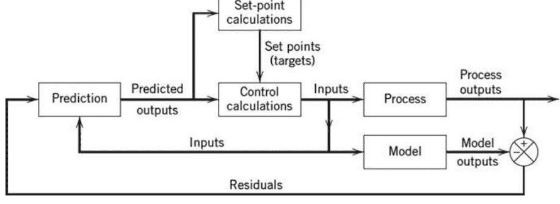
图5.5 模型预测控制[18]

#### 模型预测控制

它是最常用的控制器，基于当前测量值和未来预测值。此外，它是一种基于过程模型的优化技术，有助于预测实际输出的当前输入值。然后将实际输出与从过程模型中获得的未来值进行比较[8]。

基于值之间的差异，它继续到预测块，然后尝试在每个采样时间解决具有有限时间范围的最优控制系统问题[11,15]。MPC有三个功能块，称为状态估计、优化器和工厂（或过程）模型。优化器帮助找到模型中的最优控制信号，并在给出这些值后最小化目标函数并传递给工厂。工厂模型只是预测实际输出的未来值[7]。基于预测输出，有两个计算，即基于设定值的计算和基于设定值的控制计算，如图5.5所示[14]。当存在与PID类似的控制器的问题时（如大时间延迟，即响应时间较长，以及存在输入和输出越限），使用MPC。它还用于多输入和多输出系统[16,17]。

这种控制技术需要获得最佳控制信号，以使预测值的响应在每个时间点达到固定的目标值。

## 模拟结果和讨论

在这部分中，首先在MATLAB Simulink中创建了一个活性污泥处理的子系统。在污水处理厂中，受控输出变量是溶解氧(DO)和底物浓度(S)。被控变量是稀释率(D)和曝气率(W)。ASP模型是基于非线性微分方程建模的。

方程描述在“废水处理厂建模”章节中[19,20]。

在此之后，实施了控制技术。

首先，提出了一个分散式PI控制器，参考恒定输入，并将溶解氧浓度和底物浓度的初始条件设置为 $4\ \text{mg/L}$ 和 $2\ \text{mg/L}$。

运行模拟后，得到的结果如下所示。

从图5.6和5.7可以看出，底物浓度和溶解氧浓度随时间的变化很容易地遵循参考值，并达到稳定状态。

在此之后，对ASP模型实施了传统的PID控制器。

使用了2个PID控制器。一个用于控制底物浓度，另一个用于控制溶解氧浓度，具有一些固定的输入值。模拟结果如图5.8和5.9所示。

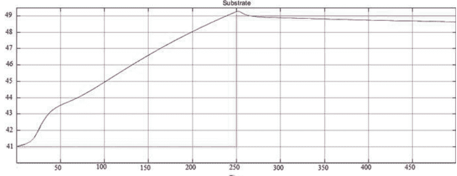
图5.6 ASP底物的模拟

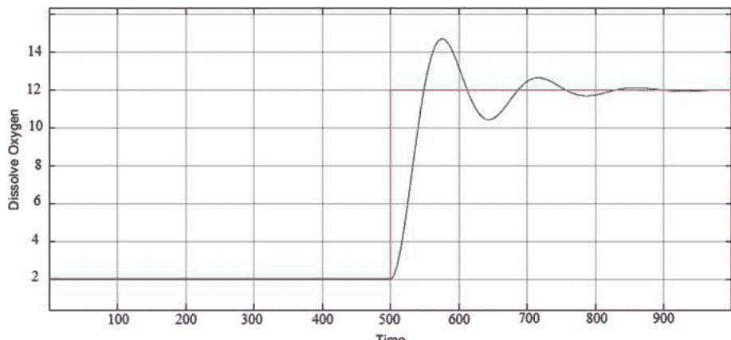
图5.7 溶解氧（mg/L）随时间的模拟

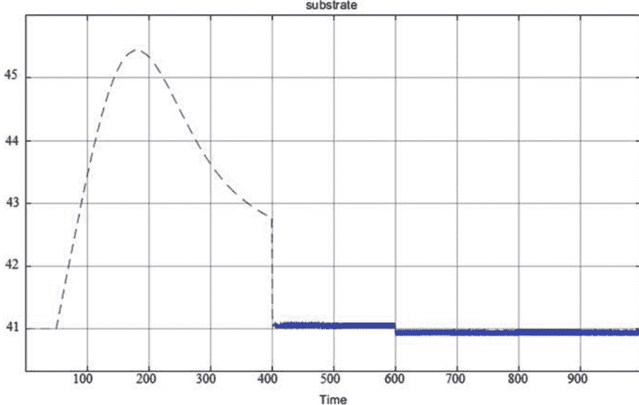
图5.8 带有PID的ASP底物的模拟结果

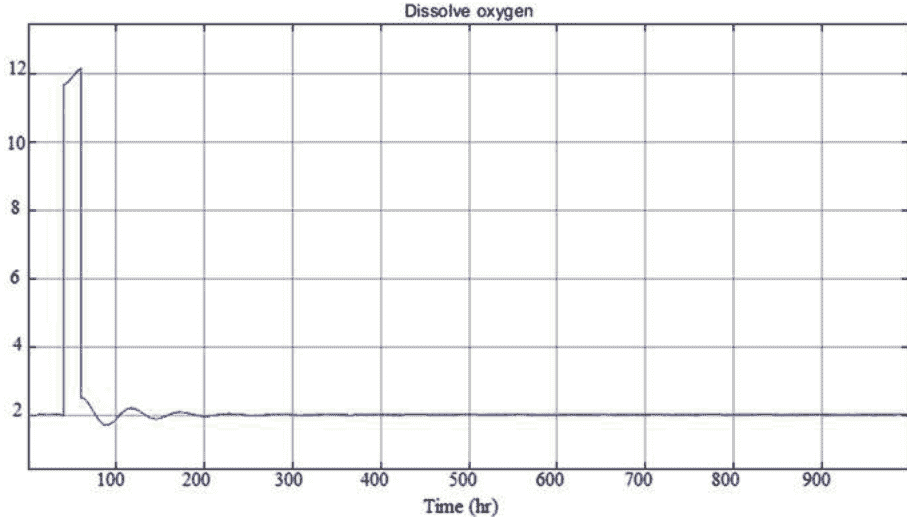
图5.9 带有PID的ASP溶解氧的模拟结果

在图5.8中，得到了底物的结果。它增加并在达到峰值后开始减少，但需要时间来稳定下来，并最终达到稳定状态，带有一些轻微的振荡。图5.9显示了带有PID的ASP溶解氧的模拟结果。溶解氧浓度也有一些振荡。

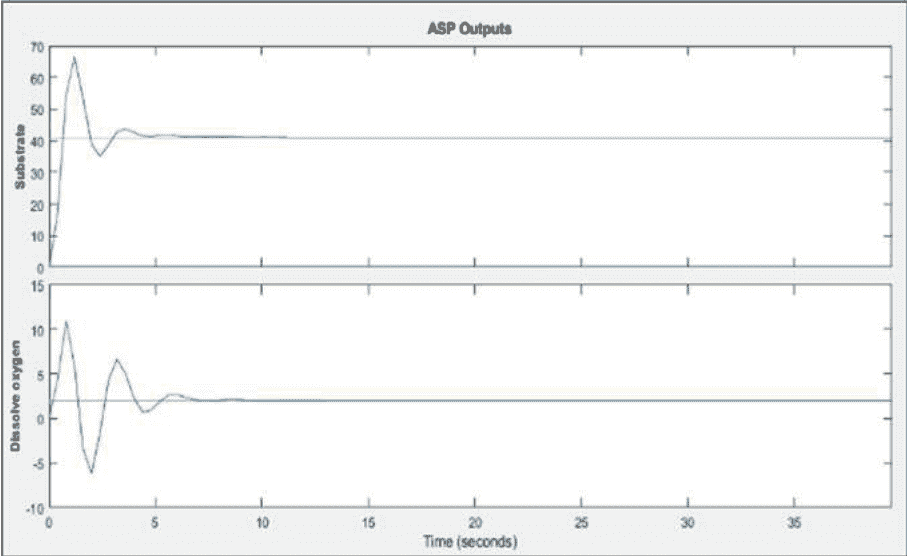
图 5.10 具有MPC的ASP输出

在分散式PI控制器和PID控制器应用于ASP之后，MPC也将被实施。

对于具有MPC的ASP，我们必须在MATLAB中设计这个控制器。在这个控制器中，控制视界被定义为10，预测视界被定义为7，采样时间为0.04秒。然后将其转换为离散时间域。然后绘制其输出。ASP模型使用这些控制技术的输出结果如图5.10所示。已经获得了MPC的输出结果。底物需要8.73秒才能稳定下来，并出现轻微振荡。在溶解氧中，它轻松地遵循其参考路径，出现两次振荡，但在8.38秒后，它开始稳定下来并最终达到稳定状态。

## 结论

智能地调节最优控制在多变量系统领域中非常重要，因为它消耗了大量的能源来进行操作。这项工作展示了PID和模型预测控制（MPC）应用于所考虑的多变量系统[18]。已经发现首选的智能自整定控制技术有效地跟踪了简单和非线性系统的参考点，并对系统的调节产生了令人印象深刻的结果。该系统的仿真结果已经获得并使用MATLAB Simulink进行绘制，如前几节所讨论的。在本文中，MPC控制技术提供了最优和能源高效的结果。

## 未来的展望

我们必须关注去除对我们和环境有害的所有无机物质。总有一天，今天的污水问题将得到解决，水将变得可饮用。我们应该关注如何重复使用水，去除微污染物和病原体，回收养分产生能源，并重复使用含有资源的污泥。对于同一废水处理厂，可以实施一些先进的控制技术以提高性能。

未来工作的范围还包括以成本效益方式管理废水处理厂中使用的能源，同时在不影响处理水质量的情况下最大限度地减少固体产生的体积和数量。此外，这些工厂应该自给自足，以处理处理所需的能源。还需要加强研究，以进行养分（如氨、氮和磷）的开采和回收，并重复使用生物固体。此外，在这个流行病时代，未来的研究包括废水处理厂应对新的病毒和细菌菌株，或任何泄漏事件的准备。

## 参考文献

1. Samsudin, S.I., Rahmat, M.F., Wahab, N.A., Razali, M.C., Gaya, M.S., Salim, S.N.S.: 一种自适应分散式PI控制多变量系统。在: IEEE国际控制系统、计算和工程会议, 马来西亚槟城, 2012年11月23-25日。
2. Yadav, A.K. 等: 软计算在电气和机械系统的状态监测和诊断中的应用。在: IEEE智能系统和计算进展的一部分, 卷1096, 第496页。Springer Nature, 2020年, ISBN 978-981-15-1532-3. https://doi.org/10.1007/978-981-15-1532-3
3. Kodaly, R.K.: 智能废水处理。在: 2017年IEEE第10区域研讨会(TENSYMP)
4. Blondin, M.J.: 控制系统中的优化算法。在: 多约束和非线性系统的控制器调谐优化方法, 第1-9页。Springer, Cham (2021)
5. Choo, H.P., Sablan, S., Eek, R.T.P., Wahab, N.A.: 自整定活性污泥系统的PID控制器。在: IEEE第8届工业电子与应用会议(ICIEA) (2013)
6. Rahmat, M.F., Samsudin, S.I.: 污水处理厂的控制策略。澳大利亚基础与应用科学杂志 5(8), 446-455 (2011)
7. Holenda, B., Domokosa, E., Redey, A., Fazakas, J.: 利用模型预测控制的活性污泥废水处理过程中的溶解氧控制。计算机化学工程 32, 1270-1278 (2008)
8. Harja, G., Nascu, I.: MPC先进控制在活性污泥废水处理厂中溶解氧方面的应用和解决方案。www.researchgate.net/publication/305674235
9. Srivastava, A., Prasad, L.B.: 分散式PI和模型预测控制技术在液位过程系统中的性能比较分析。Int. J. Dyn. Control 1-12 (2021)
10. Hamad, D., Dhib, R., Mehrvar, M.: 光解UV/H₂O₂化学反应器中水性聚乙烯醇降解的识别和模型预测控制（MPC）。J. Polym. Environ. 1-13 (2021)
11. Norhaliza A. Wahab, Reza Katebi, Jonas Balderud: “具有硝化和反硝化的活性污泥过程的多变量PID控制设计”，Biochemical Engineering Journal, Elsevier, vol.45, pp. 239-248, 2009
12. Cho, J.-H., Sung, S.W., Lee, I.-B.: 外部碳剂量在预硝化过程中的级联控制策略。水科学技术。45(4-5), 53-60 (2002)
13. Srivastava, S., et al.: 人工智能技术在工程领域的应用—卷1。在: IEEE Advances in Intelligent Systems and Computing的一部分，卷698，643页。Springer Nature (2018). ISBN 978-981-13-1819-1. https://doi.org/10.1007/978-981-13-1819-1
14. Nikita, S., Lee, M.O.: 使用继电器自整定控制废水处理厂。韩国化学工程杂志。36(4), 505-512 (2019)
15. Bristol, E.: 关于多变量过程控制的新交互度量。IEEE Trans. Autom. Control 76, 133-134 (1965)
16. Schnobrich, M.R., Chaplin, B.P., Semmens, M.J., Novak, P.J.: 在含有高溶解氧和硝酸盐浓度的模拟地下水中刺激氢氧化菌反硝化. 水资源研究 41(9), 1869-1876
17. Flanagan, M.J., Bracken, B.D., Ressler, J.F.: 自动溶解氧控制. 环境工程学报 103(4), 707-722 (1977)
18. Rahman, M.F., Shamsuddin, S.I., Wahab, N.A., Salim, S.N.S., Gaya, M.S.: 污水处理厂的控制策略. 澳大利亚基础与应用科学杂志 5(8), 446-455 (2011) ISSN 1991-8178
19. Srivastava, S., et al.: 工程中人工智能技术的应用—卷2。在: IEEE智能系统和计算的一部分，第697卷，647页。Springer Nature (2018年)。ISBN 978-981-13-1822-1。 https://doi.org/10.1007/978-981-13-1822-1
20. Halverson, B: 多变量控制系统中的交互分析。乌普萨拉科学与技术学院学位论文第92卷，162页。乌普萨拉。ISBN 978-91-554-7781-3

# 第6章 深度学习模型对旅游业技术可持续性的影响使用大数据分析

Ashish Kumar 和 Rubeena Vohra

作者信息：
A. Kumar
计算机科学、工程与技术学院，贝内特大学，北方邦大诺伊达，印度
电子邮件：ashish.gupta14d@gmail.com
R. Vohra
印度新德里的巴拉蒂·维迪亚佩斯工程学院

## 介绍

旅游业是一个服务业，需要准确预测与旅游规划、需求预测、个性化旅行推荐、定价策略等相关服务相关的信息。为了改善客户满意度和体验，需要分析可用的结构化和非结构化数据。为了未来的旅游增强，需要对可用的大数据进行精确分析，以进行旅游规划、情感分析、意见分析和情绪分析[1, 2]。为此，深度学习被认为是支持技术，不仅改善了旅游业的未来，还为客户提供了定价比较、住宿预订和竞争分析等服务。

基于深度学习的方法在旅游业中提供了预订流程、旅游规划、定价和商业策略的自动化。利用循环神经网络（RNN）、长短期记忆（LSTM）和字符级卷积神经网络（CharCNN）等深度学习技术的旅游模型已被提出用于预测旅游需求[2]、旅游流量[3]和文本情感分析[4]。图6.1说明了旅游模型的架构。深度学习模型在旅游领域的各种应用被分为三个层次。首先，探索输入信息的来源。然后，利用深度学习技术，详细介绍了用于旅游模型分析的方法。这些模型基于游客的先前信息，包括过去的预订、酒店住宿、探索的地点和其他潜在影响因素。最后，获得的信息被分析以改进旅游模型。基于这些信息的分析可以被旅游规划者用来为客户提供高效合理的服务[5]。许多大型旅行公司在移动应用和网站中利用基于深度学习的语音和文本识别系统来改善业务。此外，机器学习技术，如朴素贝叶斯、自组织映射、支持向量机（SVM）广泛用于自动化旅游相关的情感分析、个性化推荐系统和预订取消[6-8]。

在COVID时代，旅游业受到了很大的影响，人们提出了克服挑战的担忧。由于这个原因，与前一年相比，取消预订的情况更加严重，这使得情况变得更糟，因为人们不愿意旅行[8]。顾客不仅害怕COVID-19感染，还受到政府对旅行和隔离规定的限制[9]。为了在这场大流行中持续发展，旅游业品牌需要探索吸引顾客的新创新方式。行业需求在考虑旅行行为的基础上摆脱这种局面。

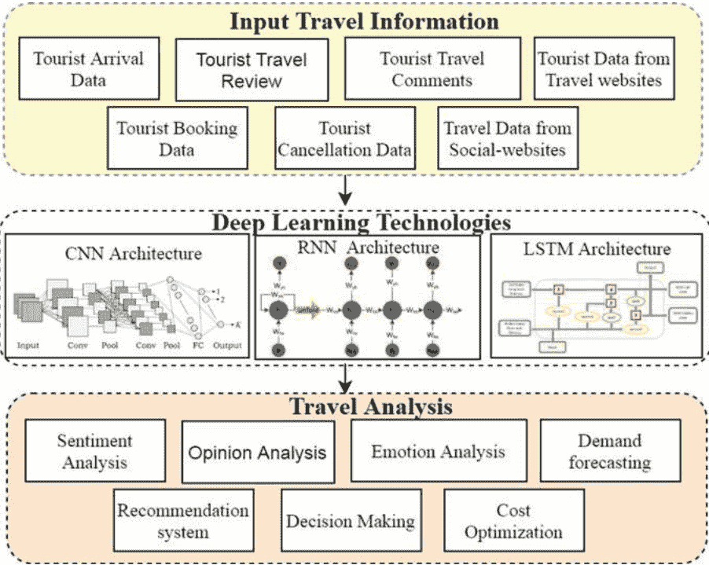

和限制。此外，行业需要一些基于深度学习技术的最新和先进模型，以预测吸引顾客增加业务的创新方式。基于深度学习的旅游模型可以分析大量的在线数据，包括顾客评论、评价和推荐。这些模型可以帮助预测某些可能被其他技术忽视的结果。总之，深度学习可以通过实施基于可用大型在线数据的分析模型来提升旅游业。这可以通过为当前动态顾客需求和不断变化的政府规定提供混合方式来帮助旅行者和行业应对COVID-19大流行。

随着技术的进步，旅游业对大数据分析的需求增加了。数据可以从环境或客户本身收集。环境包括目的地地理位置信息、位置照片、气候详情和其他季节信息[10]。客户本身可以利用其先前的旅行经历或来自已经体验过服务的旅行者的评论和评价。换句话说，信息可以通过线下或在线方式收集。随着旅行者模式和需求的变化，在线信息已成为向客户推荐的主要来源。通过在线订票、酒店预订、预订取消和其他优惠，旅游业的大数据分析已大大吸引了客户。

在本章中，我们将探讨在旅游领域中利用基于深度学习的方法。我们将回顾现有的解决方案并分析它们的优点和缺点。我们将检查可以帮助旅游业改善业务、吸引客户和优化成本的创新思路。此外，可以分析现有的工作，提供有效、高效和合理的解决方案来改进当前情况下的行业。

## 旅游业中的深度学习进展

在最近的一年里，基于深度学习的旅游模型在行业中获得了动力。基于深度学习的模型提供了有见地和创新的建议，对行业的增长和客户的利益有帮助。

在这个方向上，提出了旅游需求预测模型，利用了人工神经网络架构，如多层感知器[11]、径向基函数神经网络[11]和去噪神经网络[12]。在Claveria等人的研究[11]中，作者利用了一个具有最佳神经元数量的单隐藏层感知器模型。此外，径向基函数神经网络也被应用于相同的数据集。Silva等人[12]提出了用于预测欧洲国家旅游季节需求的去噪神经网络。在旅游需求预测领域的进一步进展中，已经提出了许多基于深度学习的模型[13, 14]。这些模型利用了集成深度学习、GRU、LSTM和BiLSTM来预测旅游需求。同样，对于情感分析最近的研究利用卷积神经网络、长短期记忆模型等模型已经被提出[15-18]。提出了基于深度学习的聊天机器人，以增强旅游文化体验[19]。图6.2展示了过去几年深度学习方法在各种旅游模型中的进展。

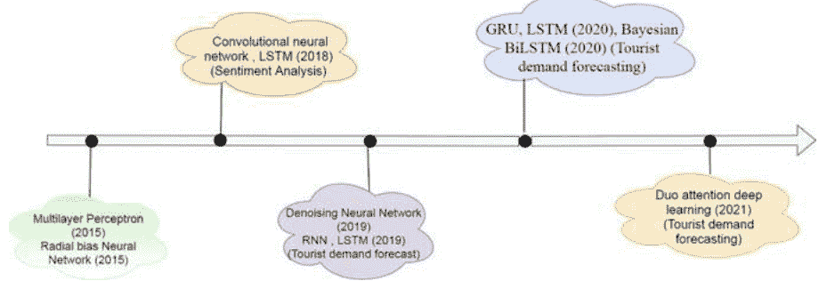

随着深度学习在旅游业中的进展，该行业已经数字化转型，为客户提供先进的资源和应用。基于深度学习的人脸识别系统减少了纸质流程的要求。对于移民检查、客户身份验证和其他安全相关的流程，随着该领域的创新，流程得到了简化。分析社交媒体和旅行者网站上的客户评论和情感，以向客户提供更好的推荐。这些模型可以减少客户的时间和精力，并为他们提供人工分析无法实现的选择。为了更好地为游客提供便利，利用深度学习设计了旅游需求预测系统。这些模型帮助旅游规划者解决资源需求、预订数据和其他设施方面的问题，以满足一组旅行者的需求。此外，还设计了聊天机器人和对话应用程序，以减少客户的努力。这些功能可以理解客户的需求，并根据他们指定的偏好提供建议。总之，深度学习是一项创新技术，影响了旅游业的每个领域，并提供了强大的应用。这些应用不仅吸引了客户，还减少了旅行社在时间和人力方面的工作量。此外，基于深度学习的旅游应用可以帮助减少旅行规划者的支出，并支持该行业在COVID-19情况下的持续发展。

## 基于深度学习的旅游模型

深度学习已经影响了许多实时领域，如计算机视觉、人脸识别、物体跟踪和旅游业[12, 20]。在旅游领域，深度学习主要可以完成一些任务，包括找到最佳转化候选人、更好地分析用户的旅行模式和优化成本以改善行业现状。深度学习在旅游领域的应用可以提供强大的应用程序，如聊天机器人、预测系统、推荐系统、需求预测、成本管理和销售管理。各种旅游模型及其特定的应用领域和所采用的方法将依次讨论。

### 基于深度学习的旅游推荐系统

在旅游业中，已经提出了许多基于人工智能的推荐系统，为客户提供偏好，为他们的旅行提供建议[7]。一般来说，旅游领域提出了基于内容过滤和集成学习的协同推荐系统[5, 7]。在Nilashi等人的研究[7]中，作者们提出了一种使用聚类集成方法在TripAdvisor数据集上的旅游推荐系统。超图分割算法被应用于聚类结果，以提高所获得数据的准确性。然而，作者们利用CNN和DNN为客户提出了个性化的推荐系统[5]。

文本数据以产品评论和推荐的形式进行分析，以提供个性化推荐。然而，由于没有使用图像数据进行分析，该模型的效果较差。Nilashi等人[14]提出了一种基于偏好学习的推荐系统，用于推荐环保型酒店。通过对旅行者评分的大量数据集进行聚类，为酒店预订提供了包括成本、位置、清洁度和其他参数在内的偏好。然而，用户的在线评论未被考虑在评估范围内。然而，在Nilashi等人[15]的研究中，作者提出了使用客户在社交网络网站上的评论进行多标准协同过滤的推荐代理。该方法基于多标准客户评论进行酒店推荐。表6.1总结了旅游推荐系统的相关工作。除了推荐系统外，还提出了用于旅游需求预测和情感分析的预测系统。

表6.1 旅游推荐系统的代表性工作
| 参考文献 | 使用的技术 | 数据集 | 描述 |
|---|---|---|---|
| Nilashi等人[7] | 聚类集成 | TripAdvisor | 用于比较的高效性能指标 |
| Wang [5] | CNN, DNN | 使用网络爬虫收集的数据 | 天气对推荐没有考虑影响 |
| Nilashi等人[14] | 偏好学习 | TripAdvisor | 处理旅行者的评级以推荐环保酒店 |
| Nilashi等人[15] | 基于协同过滤，模糊规则 | TripAdvisor | 基于多标准客户评级的推荐代理 |

### 基于深度学习的旅游需求预测模型

旅游需求预测对旅游规划者非常重要。基于深度学习方法的需求预测模型有助于规划者在资源组织、旅行管理和预订管理方面的工作[16-18, 21]。在这个方向上，张等人[16]通过分析复杂模型上的有限数据提出了一种基于深度学习的模型。这种方法有助于预测短期决策和分析风险管理。所提出的方法在与现有的深度学习方法相比表现出了更好的性能。作者们通过使用集成学习提出了一个基于深度学习的旅游模型来预测北京的旅游到达数据[17]。为此，作者们分析了以往的旅游和经济数据统计以进行旅游预测。此外，该工作考虑了搜索强度指数，该指数被认为是最具代表性的旅游需求准确估计的标准。然而，在Sun等人[18]中，作者们提出了一个利用LSTM和GRU进行摩洛哥旅游到达预测的深度学习旅游模型。预测结果与基于机器学习的模型相比更准确。Kulshrestha等人[21]提出了一个基于BiLSTM的深度学习旅游模型，用于预测新加坡从五个国家的旅游需求。贝叶斯网络用于优化超参数。

实验结果证明了所提出方法在与其他基于深度学习的模型相比较时的优越性。在Silva等人的研究[12]中，提出了两种模型，即参数化模型和非参数化模型，使用去噪神经网络。该模型应用于欧洲国家的旅游到达数据。该方法与最近的模型进行了比较，并在统计上表现出色。总之，基于深度学习的旅游需求框架可以比其他模型更准确地预测旅游需求。旅游规划者可以采用这些方法根据游客的需求来管理他们的服务。此外，结果可以帮助旅游规划者为客户提供更好的体验。表6.2列出了使用深度学习技术的各种需求预测模型。下一节将详细介绍深度学习在旅游领域的下一个应用。

表6.2 基于深度学习的旅游需求预测模型的代表性工作
| 参考文献 | 使用的技术 | 数据集 | 描述 |
|---|---|---|---|
| Zhang等人[16] | STL, DADLM | 来自香港官方网站的旅游到达数据 | 深度模型中的双注意力层，以防止模型过拟合 |
| Sun等人[17] | 集成深度学习，基于核的极限学习机 | 从北京官方旅游网站获取的旅游到达数据 | 在深度模型中使用Bagging和SAE来防止模型过拟合 |
| Laaroussi和Guerouate [18] | GRU, LSTM | 摩洛哥的游客到达数据 | 用于配置模型以提高准确性的参数调整 |
| Kulshrestha等人[21] | 贝叶斯双向LSTM | 新加坡旅游数据集 | 考虑了来自五个不同国家的新加坡旅游需求 |
| Silva等人[12] | 去噪神经网络 | 欧洲游客到达数据集 | 基于季节时间序列的统计确定的客户需求 |

### 基于深度学习的旅游业情感分析模型

在旅游业的其他研究领域中，情感分析和情绪分析可以通过基于人们在社交网站或旅游网站上的评论和评价提供建议，从而改变整个业务[22-25]。在这个方向上，作者们利用了社交媒体上客户的评论，并进行了情感分析，使用了语义聚类[22]。所提出的方法不仅利用了文本信息，还利用了时间、地理和天气信息，为客户提供高质量的建议。由于考虑了多个上下文参数来研究评论情感，该系统在建议方面更加精确。在李等人的研究[23]中，作者提出了基于词典的深度学习模型，集成了CNN-LSTM。实验结果证明了该方法在中国旅游评论中的优越性。另一方面，作者利用视觉信息来分析客户行为和感知[24]。为了向客户推荐旅行目的地，使用了Flickr图像。在李等人的研究[25]中，使用了领域特定的新词汇。

表6.3 旅游业情感分析的代表性工作
| 参考文献 | 使用的技术 | 数据集 | 描述 |
|---|---|---|---|
| Abbasi-Moud等人[22] | 聚类 | TripAdvisor | 考虑多个因素,根据情感分析提供推荐 |
| Li等人[23] | CNN-LSTM | 斯坦福情感树库 | 模型在计算上复杂 |
| Zhang等人[24] | 深度学习模型 | 来自Flickr的图像 | 基于游客行为和感知的目的地推荐 |
| Li等人[25] | 基于词典的模型 | 来自去哪儿网和携程网的评论 | 检测旅游领域的新词汇进行情感分析 |
| Chang等人[26] | CNN | TripAdvisor | 考虑顾客的多个信息与评论相关 |

提出了处理旅游领域用户未定义词汇的方法。通过分析情感得分和其他参数，使用词语传播提供质量情感分析。Chang等人[26]提出了一种使用多特征和CNN分析酒店评论、顾客回应和评论的模型。该研究为顾客和酒店员工提供了建议。总之，大量以用户评论和意见形式存在的非结构化数据可供分析。基于深度学习的旅游情感分析模型能够为客户提供更好的推荐选项，以改善该地区的业务。旅游情感分析模型的重要参数和细节在表6.3中列出。

## 旅游可持续性与COVID-19

由于COVID-19的传播，旅游业受到了广泛影响。然而，在当前情况下，必须采取预防措施以确保旅游业的可持续发展。在COVID-19时代，旅游业通过在许多领域部署深度学习而发生了转变。在旅游业中部署深度学习可以确保满足旅游者的需求。此外，应用程序必须注重成本优化，以减少行业面临的损失。为此，行业已经引入了基于人工智能的社交媒体查询系统、基于自动化的客户评论和旅行应用程序，以减少人力投入[27, 28]。

此外，为了提供客户满意的体验，行业应注重竞争情报。在这个时代，酒店的客房清洁和送餐服务可以借助机器人来提供。可以在客房中安装语音控制的电子设备，以减少人机之间的物理互动。酒店入住可以使用面部识别设备进行，以避免纸质工作和身体接触。这可以通过深度学习在该领域实现。这将帮助行业解决已经以多种方式修改的挑战。为了获得客户的信心和信任，行业的努力必须朝着克服形势需求的方向发展。

## 旅游业挑战的应用

在今天的互联网时代，旅行者可以通过网站计划旅行、比较选择、预订房间和取消预订。随着技术的进步，现在用户更喜欢通过移动应用程序完成所有这些事情，这被认为是易于访问的。然而，为了提供快速访问服务、推荐和更好的旅行者体验，公司现在更加强调更先进和创新的方法。为此，旅行公司还专注于通过基于语音的交互系统提供个性化推荐。在这个方向上，已经提出了面部表情识别系统和对话旅行应用程序[29, 30]。会话应用程序[30]根据客户最近的问题和历史提供个人帮助。这样可以节省时间和精力，因为用户不需要花时间阅读长篇文件来做决策。聊天机器人[19]也用于解决客户的特定问题，并为公司节省成本。提出了面部表情识别模型，通过情感分析[29]来衡量客户满意度。利用面部表情进行情感分析为公司提供了改善服务以吸引更多业务的方向。

近年来，为了提升旅行者的体验，智慧旅游的概念变得非常流行[31, 32]。智慧旅游利用信息通信技术（ICT）和人工智能为智慧城市的智慧目的地提供个性化推荐的创新方式。智慧旅游注重将社会和组织组件结合在一起，为客户提供优质体验。随着人工智能的进步，智慧旅游依靠智能处理数据来在业务和运营方面进行技术升级。将最新技术整合到旅游业中，为跨部门业务提供帮助，有助于制定智慧旅游的业务策略。这将确保客户获得智慧体验，推动该行业的发展并确保其稳定增长。

为了应对当前形势和该行业的繁荣，该行业应专注于为客户提供创新和新的设施[33]。这些设施必须包括涉及客户非常少的身体活动的功能。必须为客户提供简单的指导，以促进新方法的使用。应提供在线预订和付款，并提供安全选项以建立客户的信任。用户可以在不需要复杂程序的情况下预订、取消和推迟航班预订或酒店预订。此外，还可以根据客户过去的旅行和评论为客户提供推荐，以提升其体验。在这个时代，还应对方法进行审查，以改善营销和客户保留。

总结一下，利益相关者正在采用旅游业的最新趋势来满足客户的期望。语音技术、虚拟现实、可穿戴设备、基于机器人的助手、物联网酒店客房是旅游业的最新增加，以吸引客户。这些技术创新可能会吸引那些不愿意旅行的客户，因为它们确保了政府的Covid-19旅行政策和限制。高科技的基于深度学习的技术可以减少Covid-19的传播风险，因为在多个领域限制了人为干预。

## 新冠疫情对旅游业的影响

在新冠疫情时代，由于预订取消和退款，全球旅游业受到了严重打击[9, 34]。这增加了资金的外流，导致了裁员，并严重影响了旅游经济。政府的隔离规定和限制是旅游生态系统快速恢复的主要障碍[35]。在这次大流行中，旅游业是首个关闭的行业，也是最后一个重新启动的行业。只有当旅行者的需求增加时，旅游业才能恢复势头。然而，由于持续的长期疫情，旅行者的行为和信心受到了影响。为了解决这些问题，我们需要采取一些措施，以确保行业的整体增长。

我们需要限制服务的支出。然而，对向客户提供的服务质量不应有任何妥协。重点应放在替代和创新的想法上，以确保客户满意度和需求在当前情况下的变化。

大流行病对印度旅游业产生了影响，导致该行业陷入经济危机[36]。由于当前形势，2020年国际旅行者抵达印度的人数急剧下降。这导致外汇、就业机会的下降，并对与该行业相关的本地供应商产生了影响。传统模型在有效应对当前形势方面证明了其效率低下。这些模型忽视了当前形势中以Covid-19形式出现的风险分析。然而，随着技术的进步，将提出新的创新模型，为该行业提供更好的洞察力和未来。借助互联网和其他数字方法，该行业准备重新获得势头[37]。

## 旅游可持续性: Covid-19后

多年来，旅游业受到自然危机或人为危机的影响。在2020年，该行业不仅受到影响，而且在全球范围内造成了经济危机[38]。为了应对当前问题和形势，需要制定新的政策和策略，以确保该行业快速恢复。人们已经认识到有必要深入分析旅游业目前面临的挑战。在Covid-19当前形势下，市场参与者需要一个框架来确保该行业的可持续发展[39]。此外，旅行者的规划者、旅游需求预测者和决策者需要调查该领域的重要领域，以吸引客户改善业务。

未来，旅游业应该专注于减少人力投入，利用替代性的思路和创新来确保顾客满意。考虑到目前的情况，可以借助最新的技术手段[40]来为顾客提供适当的消毒、热情好客、设施和其他服务。后疫情时代应该更加注重引入基于技术的设施，如机器人、聊天机器人、语音应用程序和其他最新发明。这种技术进步可以确保政府对社交距离的限制，并能吸引顾客对旅游业的信心。社交距离要求旅游业改变人们的旅行体验。旅行公司为顾客提供的旅行活动、团体活动和个人活动需要重新设计，以赢得顾客的信任。在疫情期间，人们的互动、依赖和生活方式更多地依赖虚拟设备。在该领域的采用可以改善顾客统计数据并增强经济生态系统。

减少顾客流动、收入管理和预订取消是COVID-19对旅游业的一些负面影响。与该行业相关的人们失去了就业机会、动力和健康[41]。此外，旅游教育面临学生招生和研究资金减少的问题。我们需要调整新的在线教学方式，以吸引更多的学生和政府对旅游业的资助。有必要在这个领域投资，以找到维持社交距离规范、恢复顾客信心和为行业人员提供灵活技能的替代方法。总之，旅游业由于当前的大流行病正面临人力和收入危机。为了恢复势头，应该专注于与现实情况同步的新方法。所有利益相关者，包括顾客、规划者和支持人员，都应接受培训并配备最新的工具，以促进旅游业的快速恢复。

## 结论

在本章中，我们回顾和分析了利用深度学习方法的最新旅游模型。深度学习在旅游领域的各种应用已经进行了深入讨论。众所周知，深度学习在旅游业中引入了创新，并利用方法改善了顾客的满意度和体验。情感分析、推荐系统和旅游需求预测模型为顾客提供了个性化的建议和推荐。在COVID-19时代，这些领域的努力引入了有助于行业可持续发展的措施。然而，旅游模型能够利用这些方法在该领域进行成本优化，并节省资源以应对当前的挑战。

在这项研究中，我们收集了旅游业中的新创新趋势，这些趋势可能有助于行业的快速恢复。将这些新趋势纳入领域中可以降低成本支出。旅游需求预测模型、酒店推荐系统、基于语音的对话应用、聊天机器人、基于情感分析和意见分析的预测模型可以减少规划者的努力，并为客户提供世界级的体验。这些措施可以增加该行业的收入，并支持其快速恢复。

## 参考文献

1. Martín, C.A., Torres, J.M., Aguilar, R.M., Diaz, S.: 使用深度学习预测情感：旅游案例研究。复杂性2018 (2018)
2. Law, R., Li, G., Fong, D.K.C., Han, X.: 旅游需求预测：一种深度学习方法。Ann. Tour. Res. 75, 410–423 (2019) 提出了一种部署分布式无人机的框架。
3. Zhang, B., Li, N., Shi, F., Law, R.: 一种基于深度学习的每日游客流量预测方法，使用消费者搜索数据。亚太旅游研究，25(3)，323-339 (2020)
4. Kim, Y., Jernite, Y., Sontag, D., Rush, A.M.: 基于字符的神经语言模型。 在：第30届AAAI人工智能大会 (2016)
5. Wang, M.: 将互联网信息技术与深度学习应用于旅游协同推荐系统。 PLoS ONE，15(12 )，e0240656 (2020)
6. Kirilenko, A.P., Stepchenkova, S.O., Kim, H., Li, X.: 旅游中的自动情感分析：方法比较。旅游研究，57(8)，1012-1025 (2018)
7. Nilashi, M., Bagherifard, K., Rahmani, M., Rafe, V.: 使用聚类集成和预测机器学习技术的旅游行业推荐系统。计算机工业工程，109，357-368 (2017)
8. Sánchez-Medina, A.J., Eleazar, C.: 使用机器学习和大数据进行酒店预订取消的高效预测。国际酒店管理，89，102546 (2020)
9. iLibrary, O.: 旅游政策对冠状病毒（COVID-19）的应对措施 (2020)
10. Paolanti, M., Mancini, A., Frontoni, E., Felicetti, A., Marinelli, L., Marcheggiani, E., Pierdicca, R.: 使用情感分析和地理位置信息的旅游目的地管理：一种深度学习方法。信息技术旅游，23 (2) ，241-264 (2021)
11. Claveria, O., Monte, E., Torra, S.: 旅游需求预测与神经网络模型：处理信息的不同方式。国际旅游研究杂志 17(5), 492–500 (2015)
12. Silva, E.S., Hassani, H., Heravi, S., Huang, X.: 用去噪神经网络预测旅游需求。旅游研究年鉴 74, 134–154 (2019)
13. Srisawatsakul, C., Boontarig, W.: 基于用户公开Instagram照片的旅游推荐系统。在：第五届信息技术国际会议(InCIT), pp. 276-281. IEEE (2020)
14. Nilashi, M., Ahani, A., Esfahani, M.D., Yadegaridehkordi, E., Samad, S., Ibrahim, O., et al.:偏好学习用于环保酒店推荐：多标准协同过滤方法。清洁生产杂志 215, 767-783 (2019)
15. Nilashi, M., Ibrahim, O., Yadegaridehkordi, E., Samad, S., Akbari, E., Alizadeh, A.: 旅行者在社交网络网站上使用在线评论进行决策：以TripAdvisor为例。计算机科学杂志28, 168-179 (2018)
16. Zhang, Y., Li, G., Muskat, B., Law, R.: 旅游需求预测：一种分解的深度学习方法。旅游研究杂志60（5），981-997（2021）
17. Sun, S., Li, Y., Guo, J.E., Wang, S.: 旅游需求预测：一种集成的深度学习方法（2020）。arXiv:2002.07964
18. Laaroussi, H., Guerouate, F.: 用于旅游需求预测的深度学习框架。在：IEEE国际技术管理、运营和决策会议（ICTMOD），第1-4页。IEEE（2020）
19. Sperli, G.: 使用基于深度学习的聊天机器人支持旅游者旅程的文化遗产框架。Expert Syst. Appl. 115277 (2021)
20. Kumar, A., Walia, G.S., Sharma, K.: 基于多线索的视觉跟踪的最新趋势：一项综述。Expert Syst. Appl. 162, 113711
21. Kulshrestha, A., Krishnaswamy, V., Sharma, M.: 用于旅游需求预测的贝叶斯BILSTM方法。Ann. Tour. Res. 83, 102925 (2020)
22. Abbasi-Moud, Z., Vahdat-Nejad, H., Sadri, J.: 基于语义聚类和情感分析的旅游推荐系统。Expert Syst. Appl. 167, 114324 (2021)
23. Li, W., Zhu, L., Shi, Y., Guo, K., Cambria, E.: 用户评论：使用词典集成的双通道CNN-LSTM家族模型进行情感分析。Appl. Soft Comput. 94, 106435 (2020)
24. Zhang, K., Chen, Y., Li, C.: 通过分析照片的视觉内容和计算机深度学习模型发现旅游目的地的游客行为和感知：以北京为例。Tour. Manage. 75, 595-608 (2019)
25. 李, W., 郭, K., 石, Y., 朱, L., 郑, Y.: DWWP: 用于旅游领域情感分析的领域特定新词检测和词传播系统。知识基础系统146, 203-214（2018）
26. 张, Y.C., 库, C.H., 陈, C.H.: 使用深度学习和可视化分析探索酒店评论和回应。旅游管理 80, 104129 (2020)
27. http://www.travelweekly.com/Travel-News/Airline-News/Artificial-intelligence-driving-KLM-social-media-strategy
28. https://www.buzzfeed.com/josephbernstein/the-algorithm-that-predicts-what-the-ultra-wealthy-want?utm_term=.jbB9jB2WJ#.mr7kjVQ3P
29. González-Rodríguez, M.R., Díaz-Fernández, M.C., Gómez, C.P.: 面部表情识别：通过情绪测量旅游满意度的新方法。Telematics Inform. 51, 101404 (2020)
30. https://www.30secondstofly.com/ai-software/ultimate-travel-botlist/#3_Lola_an_iPhone_app_connecting_users_to_travel_agents
31. Gretzel, U., Sigala, M., Xiang, Z., Koo, C.: 智能旅游：基础和发展。Electron Mark 25(3), 179-188 (2015)
32. Tsaih, R.H., Hsu, C.C.: 智能旅游中的人工智能：一个概念框架。In: Artificial Intelligence (2018)
33. Tussyadiah, I., Miller, G.: 对人工智能的感知影响和对积极行为改变干预的回应。In: Information and Communication Technologies in Tourism2019, pp. 359-370. Springer, Cham (2019)
34. COVID-19对全球旅游业的影响：跨区域比较
35. Jaipuria, S., Parida, R., Ray, P.: COVID-19对印度旅游业的影响。旅游与休闲研究46(2), 245-260 (2021)
36. Chandel, R.S., Kanga, S., Singh, S.K.: COVID-19对印度拉贾斯坦邦旅游业的影响。地球科学目标7(2), 224-243 (2021)
37. Prentice, C., Dominique Lopes, S., Wang, X.: 人工智能和员工服务质量对客户满意度和忠诚度的影响。酒店市场管理杂志29(7), 739-756 (2020)
38. Kreiner, N.C., Ram, Y.: Covid-19大流行期间的国家旅游战略。旅游研究年鉴 (2020)
39. Kaushal, V., Srivastava, S.: COVID-19大流行期间的酒店和旅游业: 来自印度的挑战和经验。国际酒店管理杂志, 92, 102707 (2021)
40. Sharma, G.D., Thomas, A., Paul, J.: COVID-19后恢复旅游业: 一个弹性框架。旅游管理视角, 37, 100786 (2021)
41. Sigala, M.: 旅游业和COVID-19: 推动和重置行业和研究的影响和意义。商业研究杂志, 117, 312-321 (2020)

# 第7章 基于云系统的无人机管理研究

Sonali Vyas, Sourabh Singh Verma和Ajay Prasad

## 介绍

近年来，无人机在无人机及其应用、识别和监视以及基础设施测试方面引起了越来越多的关注[1]。无人机在遥感、智能城市、安全、灾害管理和恢复、监视、飞机测试、边境安全等领域的潜力被开发者越来越多地认识到，因此变得越来越常见。

虽然这种低成本的无人机可以用于许多有价值的方式，但有限的处理能力和低内部存储会带来许多挑战。实际上，无人机并不能完全满足计算应用（如机载图像处理）的要求，这些要求包括实时数据处理和可靠性问题[2]。无人机是一种不断发展的技术，它有能力改变有利可图的企业和公共基础设施。无人机可以加速自然灾害后的恢复过程，并可用于私人交通系统。城市中充满活力的无人机系统的兴起是由于无人机的入侵和多个无人机的商业组织。由于无人机飞行器的空域是受限的，因此有必要利用先进的碰撞回避技术来维护大多数无人机系统[3]。

S. Vyas, A. Prasad: 印度石油和能源研究学院, 德拉敦
S. S. Verma (✉): Manipal University, Jaipur, India
e-mail: ssverma80@gmail.com

© 作者 (们), 在Springer Nature Singapore Pte Ltd.的独家许可下。2023年V. Kadyan等人 (编辑), 深度学习技术用于可持续发展目标, 先进技术和社会变革, https://doi.org/10.1007/978-981-19-5723-9_7

## 无人机的需求和好处

- **农业需求**
  农业作为主要的食品生产来源变得极其重要，以满足地球上的人口需求。另一方面，农业为国家提供了许多好处，如食品和非食品产品、交通运输和环境平衡。对食品安全的需求给决策者带来了压力，以确保我们的世界有足够的食物供应全球。因此，使用无人机是管理农场并提高产量的替代方法。为了促进无人机在农业中的使用，以支持其可持续性[4]。农业发展对社会和经济利益尤为重要，农业增加了食品产量，增加了净收入，提高了家庭生产力，减少了农村农业就业和城市工厂工人收入不平衡，并改善了整体环境状况[5]。

- **信息映射**
  无人机（UAV）基于映射的概念和当前系统发展以及空间信息行业的需求。通过探索无人机技术的历史概念和当前发展，并研究该技术在各种映射和非映射应用中的使用，发现在测绘和空间行业中存在许多优势和潜在技术[6]。测量师和空间科学家的角色受到挑战，需要用新颖的技术和方法改变传统实践，例如使用无人机技术的地理信息系统（GIS）。通常情况下，航空业在商业意义上比空间行业更多地采用了无人机技术。实际情况是，无人机可以使用数码相机捕捉航空照片，以高效地生成数字地图。

- **森林监测**
  考虑到低成本和高效数据获取的森林监测，无人机可以用于观察入侵者活动的关键区域或了解森林中任何感兴趣对象的当前状态[7]。

- **碰撞避免系统**
  碰撞避免是实现无人机在军事或民用应用中真正融入现实生活的关键因素。长期以来，已经有大量的工作来解决这个问题。由于成本低、安全性好和灵活性强，无人机在许多任务中有潜力取代有人驾驶的飞行器，并且在传统有人驾驶飞行器无法执行的课程中表现良好。然而，由于没有人类控制，无人机的使用面临着几个需要克服的挑战，其中之一就是碰撞避免。为了能够使用，无人机需要能够确保避免与静态和移动障碍物发生碰撞的能力。虽然无人机的碰撞避免与航空交通和移动机器人的碰撞避免有一些相似之处，但无人机肯定具有许多需要考虑的独特特性，使其成为一个有趣的研究领域[8]。

- **云系统**
  将无人机与基于云的系统结合应用于灾害感知引起了极大的兴趣。然而，无人机的计算能力有限，能源资源较低，对于实时数据处理、网络和政策制定等方面提出了重大挑战，这对于许多与灾害相关的应用，如油污检测和洪水等，至关重要[9]。用于分析的数据量非常大，这给间歇性和有限的网络资源带来了挑战。基于云的框架支持管理这些庞大数据的各个方面，包括视频采集、数据调度、数据卸载和处理，以实现稳定的网络状态，提供可扩展和高效的系统。在客户端，一组组件托管在无人机上，选择性地将捕获的数据卸载到基于云的服务器。

## 云系统的架构

无人机和云系统相互连接，形成一个高效的可持续环境，为建设智能城市提供所有实体的收集，一个像智能城市紧急管理这样的激励区域经常会突然出现，需要实时优化，以及部署和整合临时和灵活的智能无人机舰队。还需要制定一个计划，改进基于云的数据收集和信息传播，以及个体和地面支持控制中心之间的信息传递。无人机也被用于预防性监视。因此，有必要训练无人机设定干扰的限制。通过降低其噪音和可见性水平来实现，与快速操作期间可能发生的噪音和视觉功能相对比。在智能城市中，使用多个无人机提供了融合其综合能力的机会，这可以带来对环境的更深入的理解。然而，合并数据以创建新知识并使无人机以一致的方式做出适当的响应，需要更高的计算方法。无人机板上可以进行的处理能力不足以做出一致的决策。此外，与无人机相关的事件或从数据分析中提供的事件将导致对实时计算需求的爆炸性增长[10]。基于云的系统被认为是实现更高效无人机的新混合模型。

该系统使用机器学习算法（模糊逻辑）[11]、云模型[12]，一种以数学期望、熵和超熵为特征的有效认知过程。标准云原型主要用于诸多领域，如质量测试[13]。无人机的自主能力指的是无人机在检测、分析、通信、规划和决策方面的能力[14]（图7.1）。

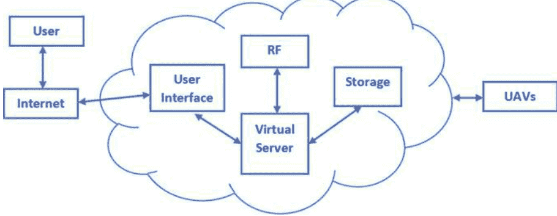

**图7.1** 基于云的无人机架构[10]

## 无人机监控和管理系统

智能无人机监控系统在人群管理中起着重要作用，因为它们已被证明能够提供有效和有利可图的解决方案。利用这种系统可以检测人群中的异常情况，以确保公共安全，特别是在流行病或社会动荡时，技术旨在取代人为因素，以确保可扩展性和降低风险。相反，现代自主无人机系统的框架需要在边缘和云的资源上处理嵌入式数据，需要传输和/或重新传输嵌入式数据。在传输过程中，这种数据安全风险可能会危及技术支持。因此，这需要一个高效的计划来实现一个安全的框架，考虑到仅限于无人机代理的计算能力和分布式系统。作为一种分布式网络技术，区块链为无人机系统提供了安全、透明和高效的网络[15]。

区块链技术被用于完成日志记录监控并支持交易监控团队的决策。近年来，无人机的广泛使用导致了与无人机发明相关的研究设施的快速增长。此外，具备执行各种无人机流程能力的控制系统的发展是最受关注和动态的。目前，研究人员对开发可称为智能系统的控制系统感兴趣，这些系统适用于解决规划、优先级确定、结构集成等任务，并确保无人机具有高度的自主性。智能控制系统设计中的一个主要问题涉及传统上在机器人中使用的各种方法和模型，旨在解决动力学、信号处理控制、位置映射、路径规划等任务[16]（图7.2）。

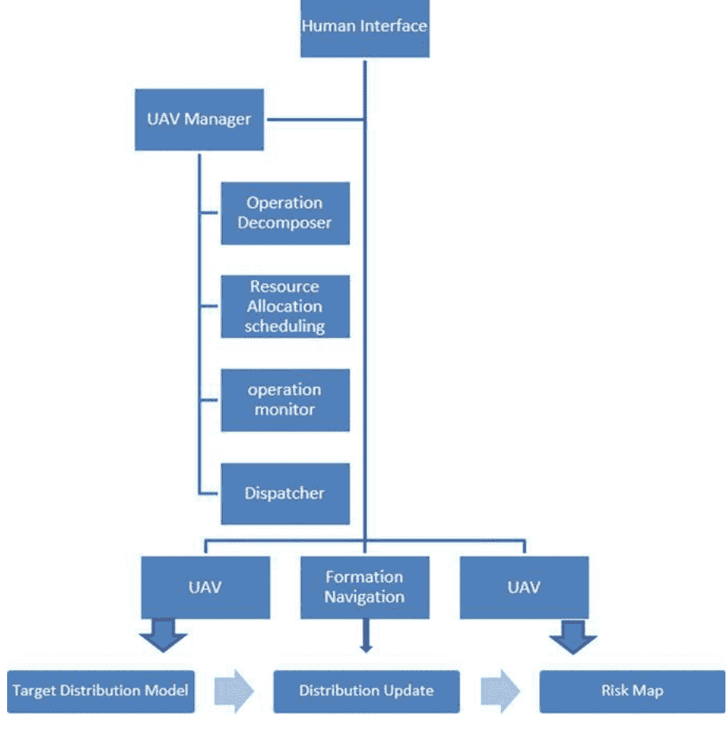

**图7.2** 无人机的基本架构设计

## 自分配分布式架构用于协作无人机

集中式和分布式控制架构是多无人机协同控制的两种类型的框架[17]。除了改善无人机的性能外，具有高可靠性、低计算和通信的共享结构架构已成为研究的重点[18, 19]（图7.3）。

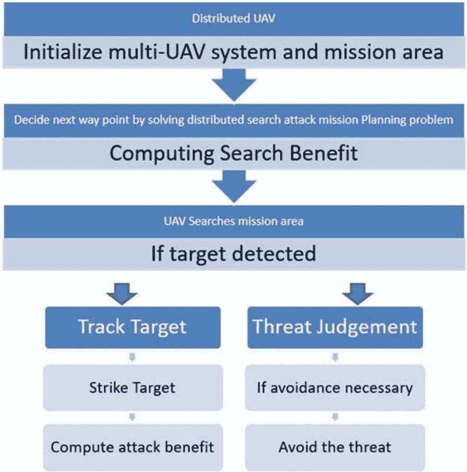

**图7.3** 自主分配的协同无人机架构

## 云计算和智能物体

近年来, 由于应用范围不断扩大, 无人机受到了广泛关注。然而, 利用传统方法在紧密集成的项目中构建无人机组合系统需要大量的开发工作、时间和成本。无人机云基础设施提供了一组服务和API, 可以构建程序。由于这些无人机的容量有限, 采用轻量级框架。无人机资源在面向资源的架构中得到了展示[20]。嵌入这些架构的智能物体具有系统可以高效运行的配置。这种智能物体的开发依赖于这些轻量级无人机的能力。

## 无人机-云框架层

无人机在云计算范式中的框架使得无人机的分布式服务得以开发。云计算被扩展以包容潜在的计算服务器和嵌入式系统。物联网可以被理解为将智能物体整合到互联网上，尽管提供其资源和服务被称为物联网。无人机具有低功耗和最小资源，如电池、数据处理器和存储设备，可以利用云资源提高分布式无人机的性能。因此，无人机不需要具备强大的能力和多样的资源，使用常见的通信协议实现这种技术可以减少应用开发的时间和成本。无人机可以利用强大的云服务，而云系统的应用可以利用无人机作为服务提供者。无人机服务的部署是与位置和容量相关的。

因此，云计算提供了一个平台来管理规划和交易服务，而无人机为特定功能提供特殊服务，如识别和执行。每个对象的任务分配限制了在此平台之外构建应用所需的努力。此外，这允许将多个无人机安装为即插即用系统。

### 云计算和无人机框架

- 1. UAV IaaS：该层将无人机和其他功能整合在一起。无人机的属性包括处理器、内存、传感器和其他设备。附加元素是提供资源的对象，例如云连接设备和用于存储和高效处理的服务器。
- 2. UAV PaaS：它将基础设施层与应用层分离。这提供了应用层的服务资源。它允许集成云服务和无人机服务以利用潜在的无人机系统。该平台包含无人机服务和云资源，如协作设备规划和资源规划服务。协作无人机的发展意味着创建2~3个主要的决策技能：设备规划、任务分配和系统实施[21, 22]。
- 3. UAV SaaS：SaaS是一种通过API在PaaS的顶部访问的简单应用程序。设计师开发用户应用程序来请求特定的无人机任务，例如用于在特定农业区域喷洒种子的软件。用户使用该应用程序指定农田的位置，并请求无人机喷洒种子。它还提供了一个控制用户界面，用于跟踪任务进展和完成情况。无人机利用修改后的服务来检测温度、拍照、更新和请求其他需要实时数据的服务。由于实体责任的划分，这些系统可以在类似的无人机上轻松开发（图7.4）。

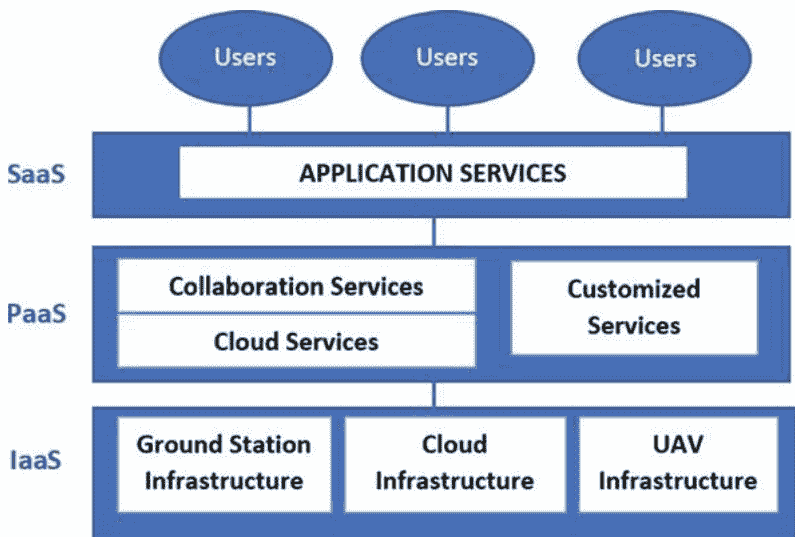

图7.4 无人机云框架层

## 无人机云用户

无人机云用户通过API和基于授权给每个用户的身份识别来利用云计算。

- 1. 终端用户
  终端用户是使用SaaS应用程序启动无人机功能的用户。终端用户通过浏览器使用在线应用软件来请求提供一定服务限制的任务。反馈和结果通过用户友好界面和一些通信功能提供。
- 2. 应用工程师
  工程师或开发人员注册平台以访问服务和API，用于构建新应用程序。他们利用框架应用程序和设施，将其与具有预定义格式和合作协议的API结合起来构建应用程序。因此，开发人员概述了启动该服务所需的设备和无人机服务。同样，工程师描述了终端用户必须规定的约束条件来请求任务。
- 3. 无人机的受益者
  他们是已注册的无人机持有人，由工程师读取和使用以执行特定任务。只要无人机基于通用接口概述应用程序，并利用API来获取访问其数据。
- 4. 经理/高管
  经理拥有平台并跟踪最终用户和资源。经理负责维护和支持无人机和云处理过程。此外，利用技术和应用程序来维护和控制任务。

注册的无人机成为无人机IaaS云和平台API的一部分。

## 无人机-云元素

研究的重点是“无人机云平台”层，将“无人机”整合到“云”中，并为应用程序设计提供合适的基础。在传统的发展中，为显式系统设计应用程序通常意味着使用系统所需的所有必要组件。这种方法效率较低，同时消耗更多的时间和能源。然而，这些元素被设计为服务形式，并在需要时组合成应用程序。

服务包括与集体无人机相关的合作伙伴服务，根据无人机的能力提供和实施。在这些服务上创建应用程序可以降低成本和时间，提高无人机系统的集成程度。

## 无人机云平台架构

云平台架构包括两种基本的架构模型：

- Web服务架构：主要有两种类型的Web服务框架。首先，标准Web服务框架的设计，客户端发出请求，响应服务的对象通过使用“SOAP”进行处理，并通过“XML”在Web上传输。其次，创建一个“表述性状态转移（RESTful）”Web服务框架，该框架使用“统一资源标识符（URIs）”和“超文本传输协议（HTTP）”来识别组件。
- 基于资源的“无人机云”框架：这是一种面向服务的体系结构，其中捐助者完成服务。然而，所提供的通信是服务以及传感器数据或海量存储数据等事实。在无人机的情况下，这些组件被称为“资源”。因此，对于无人机服务来说，SOA是不够的，更适合表示它的是ROA。

### “REST架构”

- 资源识别手段：URI用于识别每个无人机资源。
- 统一接口：具有通过公认的通信语义（或HTTP）进行通信的资源可访问性，具有用于优化资源连接的过程组。

“自定义消息”伴随着HTTP通信，在验证设置中客户端和服务器之间交换消息集。对于面向机器的服务，有两种基于HTTP的媒体类型：“XML和JSON”。由于JSON格式可被用户和系统访问，并且与JavaScript不同，它可以直接分离，因此它在嵌入式程序中得到了广泛支持。

无状态通信，这意味着服务器不具有任何影响任何类型需求的先前状态数据。因此，每个应用程序都包含满足需求所必需的数据。请求细节包含在HTTP中，对于JSON项目有一个可理解的消息。

- 1. “RESTful HTTP”元素
  HTTP接口检索资源。该接口包括以下特定片段：(1)进程，(2)内容协商，和(3)状态码。
- 2. “RESTful模型”
  各种模型设置可用于即时访问的嵌入式系统资源[23,24]。

构建UAV层：将UAV与云相结合的主要问题是连接。许多UAV提供Wi-Fi连接，因此它们可以与网络连接。此外，3G/4G技术通过外部保护支持移动设备和嵌入式设备进行连接。通过这种方式，UAV获得独特的IP地址，以获得不同的互联网身份。就像在智能城市中一样，许多应用领域允许连接部署。然而，监视卫星连接释放了广泛的应用领域。“物联网”有助于研究智能连接，并为其分配地址并在其上部署“IPv4或IPv6”。将云和UAV相结合意味着UAV资源可以以普遍的方式在线访问用户。用户是使用基于Web的应用程序的人，是检索第三方资源的UAV，是与UAV或使用类似协议的其他嵌入式设备一起工作的其他系统。因此，关键阶段是识别应该向客户提供的服务。

无人机数据库：该数据库包含多个包含记录的表。此类数据在无人机注册时提供给代理商。之后需要一个资源表来存储无人机资源。这包括可以视为资源URI、进程和受益者的API数据。

这些基本信息组件对于无人机在其经纪人注册期间是必不可少的。随后，所有分配任务的无人机都存储在一个单独的数据库中。

开发经纪人层：将无人机与云相结合的讨论是无人机的分类和提供API服务和资源给众多用户的可扩展性。尽管“ROA”是针对客户端-服务器框架的，“RESTful”应用程序提供集成、可用和灵活的服务。此外，当工程师开发实用程序或用户创建任务时，会注意无人机的资源。因此，RESTful资源利用代理/经纪人框架之间的基本服务进行交互。

对于应用程序的无人机分配，负责任经纪人/代理人充当中间代理，根据受益人的能力和服务交付接受广告。随后，用户向卖家请求一项具体规定所需参数的服务。代理人随后将对所需服务的比较与所有可用广告进行匹配，并与最佳匹配的提供者进行协调。之后，代理人与受益人进行沟通并请求服务。当受益人收到服务请求时，它会提供并返回服务结果给供应商。最后，经纪人将结果返回给客户[25]。

- 前端应用程序：前端应用程序是客户端的在线软件，用户使用它来启用无人机部署。它是在UAV-Cloud系统平台上开发的，与Web应用程序开发相同。随后，在云系统上执行，并由“协作服务层”组合请求，在Web浏览器中显示可理解的界面。这个可视化平台提供了用户设置任务和提供无人机控制的能力。由于RESTful自由集成结构，应用程序层通过使用开发者API在服务平台上开发。因此，通过经纪人层操作的类似无人机集合创建了各种应用。

## 无人机资源实施

实施包括开发无人机资源并提供API。随后，代理人被升级以将申请人与无人机资源分离。

供应商与无人机存储基地以及资源详细信息相连。其资源被四架无人机使用。每架无人机都有自己独特的RESTful API、IP地址和资源。

尽管如此，无人机共享相同的源代码，以相似的方式描述API。为了方便起见，开发仅通过GET方法实现。数据表在PostgreSQL中使用。供应商可以通过其配置访问、写入和修改数据库。

## 评估无人机的响应时间

总体而言，请求无人机服务的响应时间在180毫秒到470毫秒之间不等，平均为266毫秒。通过计算代理层的过载情况，比较了直接访问和间接访问的资源响应时间。不同的响应时间取决于资源的活动情况。然后，供应商层通过向代理提供服务名称来请求无人机资源，确保所请求的资源的可访问性，并根据其相应的接口请求无人机并返回结果。每个无人机的每个服务平均进行十次。

## 无人机云与其他相关解决方案

轻松开发无人机应用程序，分离无人机服务责任并将其整合，有许多好处。无人机云平台克服了许多性能和开发障碍，克服了传统的点对点RF连接。此外，利用传统方法创建独特的无人机系统需要付出努力和时间，因为它需要每个无人机的知识和规划。无人机的性能也受到特定设备的限制。此外，在“RF”连接的情况下，用户的位置必须在设备范围内。

无人机被认为是网络服务器的一部分，以从无处不在的云计算中获益，并利用Web工具和流程来改进无人机的互操作性系统。随后的云端Web发展触发了构建与桌面相关的应用程序以及移动无人机应用程序的能力。此外，这些应用程序可以在操作系统之外访问。无人机不仅提供服务，还提供资源。“RESTful ROA”实现是一种简单、可更新且免费集成的Web服务。与复合Web服务相比，这对于有限的无人机资源非常合适。因此，利用“RESTful Web服务”进行无人机的规划，通过HTTP接口连接器提供服务。这些HTTP API由无人机及其组件提供，经经纪人层访问和需求。

然而，执行该架构存在一些缺点。它没有指定经纪人的评级和处理无人机的数量限制。它支持大量可以同时处理的应用程序。此外，在响应时间和经纪人行为期间，类似请求的影响没有被调查。模型的实施使用了固定设备；因此，灵活性和空间扩展性没有被充分利用。只执行了拉取模型，但认为可以使用推送/订阅模型。尽管API提供了不同的设备，但无人机的实施基于相同的Arduino设备，资源各不相同。

无人机云是私有的，仅通过私有云提供服务和结构，可以由私有云或第三方处理。私有云管理无人机，并根据其需求和性能制定计划。相反，公共无人机使用开放网络提供服务。这也为公共业务应用提供了无人机的平台，在这种情况下，用户不负责无人机管理，而是从使用中获益。尽管一些文件只涉及此功能的一部分，并且没有计划为利用云计算能力的无人机组件制定标准平台。

## 结论

它提供便利的服务来促进应用程序的扩展。就像这样，将无人机和云计算模型集成起来，为其资源和服务提供普遍的访问。在“面向资源的架构”模型中，无人机和云计算模型集成起来，为其资源和服务提供普遍的访问，并追求UAV的架构资源和服务。这是一种可扩展的Web服务创建和自由集成通信的新模式。因此，它们可以通过HTTP作为“表述性状态转移”服务进行访问。此外，研究建议利用供应商属性来增加效率，通过分离任务。因此，它将用户端的需求与提供者分开。它还承担将应用程序分配给现有和适当的UAV的责任。为了分析所讨论的结构，UAV的设备被开发为一个子系统，然后提供互联网连接。随后，使用RESTful应用程序编程接口（API）建立了相同的服务标识符和接口。设置了一个代理服务和包含枚举的UAV和设备详细信息的数据。通过在浏览器界面上分配请求来验证系统元素，以寻找并请求适当的UAV中的服务。进行了测试，以从UAV获取数据并请求执行操作。

## 未来工作

无人机不是唯一的独立程序，它们经常与其他程序互动和交换信息。讨论的基础设施可以扩展到利用RESTful架构解锁应用能力，将无人机以及全球系统结合起来。因此，应用程序包含许多组件，以最大化性能和能力。此外，无人机提供了大量收集的数据集，这使得“大数据技术”能够评估各种应用中的数据以做出决策。尽管无人机已经采用了“RESTful”架构，但仍然存在标准不足的问题。例如，它没有设置标准格式来表示无人机数据和服务实体。

## 参考文献

1. Bhaskaranand, M., Gibson, J.D.: 用于无人机侦察和监视的低复杂度视频编码。 在：军事通信会议（MILCOM），第1633-1638页。IEEE（2011年）
2. Koubâa, A., Qureshi, B., Sriti, M.F., Javed, Y., Tovar, E.: 面向服务的基于云的无人机管理系统。
3. Itkin, M., Kim, M., Park, Y.: 基于云的无人机监控和管理系统的开发。 传感器 16 (11) ，1913（2016年）
4. Norasma, C.Y.N., Fadzilla, M.A., Roslin, N.A., Zanariah, Z.W.N., Tarmidi, Z., Candra, F.S.: 农业中的无人机应用。 在：IOP会议系列：材料科学与工程，卷506，第1期，第012063页。 IOP出版社（2019年）
5. Othman, K.: 马来西亚的综合农业系统和农业多功能性。 在： 第15届国际园艺经济与管理研讨会，第291-296页。 ISHS Acta Horticulturae 655，马来西亚（2004年）
6. Samad, A.M., Kamarulzaman, N., Hamdani, M.A., Mastor, T.A., Hashim, K.A.: 无人机在民用和测绘应用中的潜力。 在：IEEE第3届国际系统工程与技术会议，第313-318页。IEEE (2013年)
7. Saadat, N., Sharif, M.M.M.: 用于森林监测和数据采集的无人机系统应用框架。 在：国际工程技术和技术创业大会 (ICE2T) ，第1-6页。IEEE (2017年)
8. Pham, H., Smolka, S.A., Stoller, S.D., Phan, D., Yang, J.: 无人机碰撞回避系统综述 (2015). arXiv:1508.07723
9. Luo, C., Nightingale, J., Asemota, E., Grecos, C.: 用于灾难感知应用的无人机云系统。 In: IEEE第81届车载技术会议(VTC Spring)，第1-5页。IEEE(2015年)
10. Cochez, M., Periaux, J., Terziyan, V., Kamlyk, K., Tuovinen, T.: 用于合作无人机协调的进化云。 In: 数学信息技术系报告。C系列，软件工程和计算智能，(1/2014) (2014年)
11. Feng, Y., Liu, S., Xie, W.: 基于云模型和综合权重理论的地面攻击无人机自主能力评估。数学问题工程。 2021 (2021年)
12. Gong, X., Yu, C.: 基于云模型的改进TODIM方法用于备选方案评估。
13. 王, D., 刘, D., 丁, H., 等: 一种基于云模型的水质评估方法。 环境研究 148, 24-35 (2016年)
14. 刘, S., 茹, L., 王, K.: 无人机自主评估方法的新进展。 航空航天。 Mis. Jou 2, 43-49 (2018年)
15. 肖, W., 李, M., 阿尔扎哈尼, B., 阿洛塔伊比, R., 巴纳维, A., 艾, Q.: 基于区块链的安全 crowd 监控系统使用无人集群。 IEEE网络 35 (1) ， 108-115 (2021年)
16. Emel'yanov, S., Makarov, D., Panov, A.I., Yakovlev, K.: 多层认知架构用于 UAV控制。认知系统研究 39, 58-72 (2016年)
17. Cummings, M.L.: 操作员与集中式与分散式无人机架构的交互。 在：无人机手册，第977-992页 (2015年)
18. Cristian, R.A., David, C.: 用于多无人机规划的约束多目标优化。 环境智能和人类计算杂志 10(6), 2467-2484页 (2019年)
19. Luo, F., Jiang, C., Du, J., Yuan, J., Ren, Y., Yu, S., 等: 一种用于无人机网络的分布式网关选择算法。 IEEE交易。新兴主题计算 3(1), 22-33页 (2017年)
20. Mahmoud, S. Y.M., Mohamed, N.: 用于无人机资源和服务的云平台。 在：IEEE第四届网络云计算和应用研讨会 (NCCA) ，第23-30页。 IEEE (2015年)
21. Lemaire, T., Alami, R., Lacroix, S.: 多无人机环境下的分布式任务分配方案。 在：2004年IEEE国际机器人与自动化大会，ICRA'04，卷4，第3622-3627页 (2004年)
22. Gerkey, B.P., Mataric, M.J.: 用于研究多机器人任务分配的框架 (2003年)
23. Duquennoy, S., Grimaud, G., Vandewalle, J.-J.: 物联网：高可用性和性能的设备互联。 在： 2009年嵌入式软件和系统国际会议，ICESS'09，第323-330页 (2009年)
24. Bozdag, E., Mesbah, A., Van Deursen, A.: AJAX的推送和拉取技术的比较。 在：第9届IEE网站演进研讨会，WSE 2007，第15-22页 (2007年)
25. Fasli, M.: 电子商务的代理技术，第86卷。 Wiley，奇切斯特 (2007年)

# 第8章 区块链在工业4.0中的当代作用

Shaurya Gupta, Sonali Vyas和Vinod Kumar Shukla

## 介绍

如今，像云计算、雾计算、物联网（IoT）、服务互联网（IoS）、物理网络系统（CPS）等技术专长除了创新的商业模式外，还为商业开辟了新的道路。除此之外，这些技术在自动化、效率、成本效益、一致性和卓越性方面提供了许多补偿，同时也为不同的商业和制造领域提供了灵活性。

这些潜在因素导致了第四次工业革命，即工业4.0[1]，旨在提升包括制造工程在内的不同工业部门。在工业4.0框架下考虑智能制造的首要准则是增强各种工业组件、设施、设备、经销商和供应商之间的连接，包括制造子公司，从而形成整个制造价值链中有价值的智能工业制造网络[2]。这将有助于自动化、协作和优化流程，从而提高灵活性、安全性和效率，从而实现成本优化和增加生产力。图8.1中显示的智能制造网络改变了制造业的作业模式，并在价值链和其组成部分之间实现了互动。这将有益于制造商开发更加灵活和改进的产品。此外，它还能够在可定制的工业制造设施方面提供框架，以实现响应式产品的进展和引入。

将产品推向市场。尽管工业4.0的技能和技术在工业制造领域提供了许多补偿，但在实现最大利润时仍需解决一些挑战。这些挑战涉及不同机器、组件、位于不同组织中的地点之间的连接和信息交换，以及制造价值链中的各个单元。一些障碍包括安全性、信任和可靠性，除了更好地将组件整合到价值链中 [3]。区块链最初提供了一个平台，用于支持和使用数字货币，如比特币 [4]。然而，已经证实区块链不仅适用于各种应用，包括工业制造应用，而且作为区块链的主要优势之一，它能够使一组单位就特定活动达成共识，并在没有任何控制权的帮助或授权下进行注册。区块链整合了点对点系统的实践，并将密码学概念融入到用户或官方机构网络中的分散共享账本中。

共识可以在公司、个人、机器人、智能设备和软件代理之间达成，以一种完全参与的方式对其细节进行批准，并且交易将非常安全地进行，无法在附加到链上之后进行更改或修改。此外，区块链允许生成可见的不可撤销的审计追踪、可量化的组成部分以及对链中记录的交易处理的全面信息的访问，从而实现全面的认证和追踪。

图8.1 IIoT启用的智能制造系统

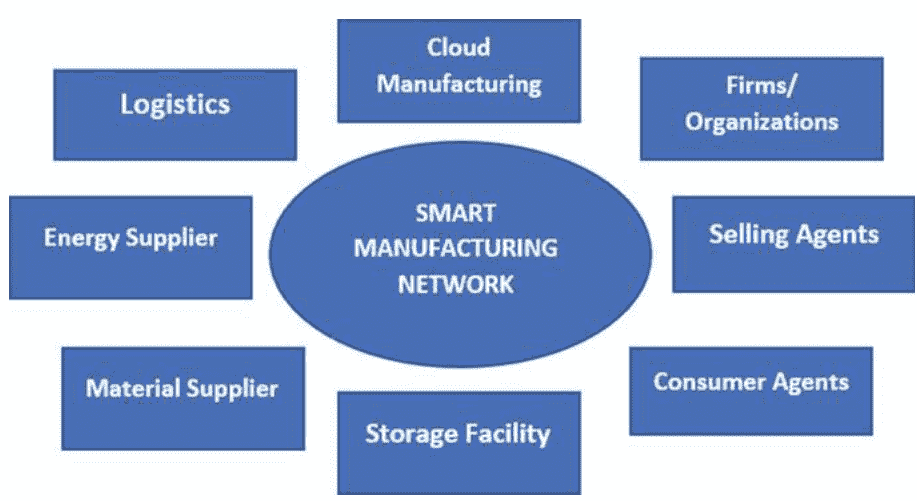

## 文献综述

在这个技术进步的时代，由于网络技术领域的快速发展，世界变得越来越紧密[6]。网络技术70年代由国防高级研究计划局的分支机构创建，目的是实现传播和信息交换服务的分散化。互联网已经完全改变了教育的存在方式，学生或研究人员通过在线访问所有学习材料或将讲座复制到个人系统上进行学习，此外，内容可以出售给教育机构进行教育目的。作者已经讨论了从1.0到4.0版本的网络开发[7]。这种转变已经演变成了包括人工智能、情感处理、社交技术结合在内的Web4.0，如图8.2所示[8]。然而，在区块链领域的一个重要应用领域涉及通过安全交换存储货币数据，除了在探索和扩展区块链应用方面的各种尝试之外，还涉及到了除了医疗保健、供应链、工业制造和教育等领域之外的其他领域[9]。区块链1.0通常与加密货币和比特币等费用相关联。区块链2.0与智能合约的计算数字业务相关联[10,11]。区块链3.0更加关注智能城市和工业4.0等数字社会需求[12]。

工业4.0除了其他相关技术之外，主要是物联网的重要组成部分。2011年，德国政府首次描述了工业4.0[13]，现在已经得到商业和学术界的广泛认可。

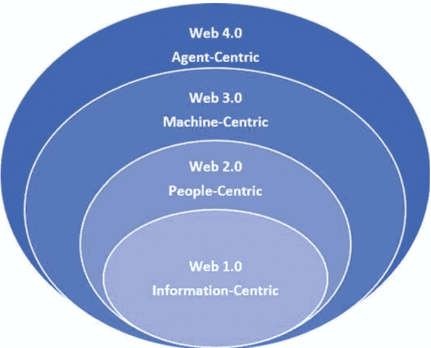

图8.2 从1.0到4.0的Web演变

现在已经得到商业和学术界的广泛认可。工业4.0通常与智能车间或工业单元的设置相关。一切事物的互联互通和数字化以及部分物联网设备的出现，促进了从过时的工业到智能工业或工业物联网的转变。除了简化数据收集[15,16]和存储方法[17,18]之外，还有努力将区块链的重要概念应用于工业物联网的安全性[14]。[19-21]中的作者研究了区块链在物联网中的应用，并讨论了应用区块链在不同应用中的好处和限制。除了[22-31]中讨论了区块链在特定商业应用中的应用外，还讨论了涉及边缘计算[32]和分布式网络安全服务[3]的应用。2011年，德国提出了2020年的工业4.0概念。工业4.0导致了具有技术支持的高度自动化和活跃的制造网络系统的传播，这些技术支持是必要实施的责任。

像以下这些因素：

- 工业物联网
- 区块链
- 大数据
- 人机设备通信
- 开源软件

通过在工业4.0中使用相互关联的网络物理系统（CPS），实现了制造结构的计算机化，从而使工业基础设施和制造过程变得独立和活跃[34]。作为集成网络的一部分，单元不仅作为智能设备进行通信，而且以非传统的方式相互工作和通信，以实现共同的目标[35]。在考虑工业发展的可持续性时，信息和通信技术（ICT）在支持普遍的财务、社区和生态可持续性方面发挥着重要作用[36]。在[37]中，工业4.0讨论了一些主要范例，例如第一个范例是智能产品，它控制资本并完全协调工业化过程。第二个范例涉及使用智能机器，即网络物理系统，传统的工业制造过程转变为分散、可调整、灵活和自管理的生产渠道。最后一个范例涉及增强处理器，增加了制造或工业组织中人工操作员的灵活性和效率。它旨在增加员工的能力，并提供支持性的工作环境，通过人机界面改变制造周期，实现整个工业环境的联结。通过数字网络实现多个对象或单元之间的实时信息分发，并具备远程大规模处理器的数据存储能力，这是通过互联网实现的。工业4.0意味着将传统车间发展为具有明确的智能车间，这些车间在资源管理方面更加高效，并且在适应变化方面更加灵活。

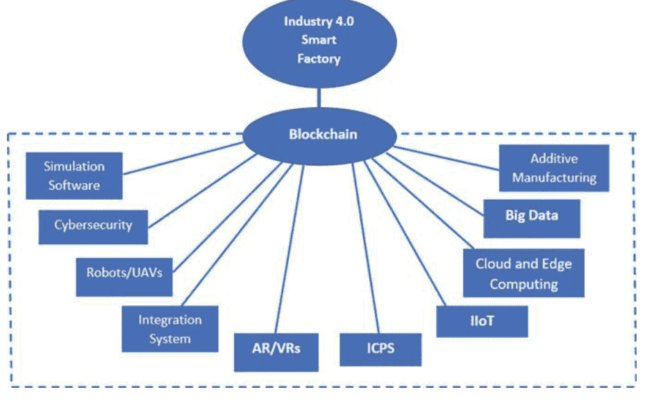

图8.3 受工业4.0影响的技术

制造业必需品[38]。工业4.0背后的观念首次由德国政府在2011年定义[39,40]。然而，工业4.0的实施概念与工业物联网（IIoT）[41]、互联网+[42]或中国制造2025 [43]非常相似。工业4.0包括来自价值链各个环节的数据群。工业4.0标准推荐使用能够在车间中分布的多个制造设备单元之间实现独立通信的技术，借助互联网。图8.3展示了一些赋能技术的示例。工业4.0原型培养了与各种技术相关的应用，以实现工业单元现有设计向所有单元都参与工业过程信息交换的设计演变，即点对点（P2P）网络。在工业化环境中最有前景的技术是区块链，它源于加密货币的概念。比特币 [44] 的目的是创建分散式应用程序，这些应用程序在跟踪和存储交易方面非常有帮助，这些交易是由众多用户和设备进行的。

## 工业物联网

工业物联网涉及机械、处理器和人员的结合，通过先进的数据分析实现智能工业化过程，从而实现商业转型的结果 [45]，因为它使得无线传感器网络的整合成为可能。通过赋予智能工业操作观察、探索和管理功能，除了互联网基础设施之外的通信协议可以实现智能工业化运作。制造系统框架中的组件互联网有助于实现工业化制造的自动化，并提高智能、效率和安全性[46]。工业物联网架构有三层，第一层是物理层，包括传感器、执行器和工业设备等物理设备单元。通信层涉及执行器的使用，以及无线传感器网络（WSN）、5G和机器对机器（M2M）的消息交换，这有助于将各种硬件设备单元纳入物理层，用于工业化工程和自动化。这些层构建了一个支持工业化和制造应用层的CPS，考虑到智能工厂等的发展。网络和控制框架使得制造系统的智能化过程成为可能。

## 制造业

在其中，建筑师必须为需要在保护细分领域传播的产品发布程序手册。技术账本需要及时更新并解放出来，这是一个繁琐的过程，涉及大量的官方程序。通过实施区块链技术，技术出版物利用了可供区块链用户使用的框架。区块链通过在共享账本上上传数据，显著提高了工业商业的运营效率。考虑到汽车业的情况，追踪备件非常重要，因为在实时情况下，这些零件的可获得性是未知的。区块链通过在共享账本上更新备件的相关信息，并且对每个涉及的实体（如汽车制造商、仓库供应商等）都是可访问的，从而解决了这个问题，如图8.4所示。


图8.4 在汽车行业中使用区块链进行备件定位

## 区块链技术与工业4.0

工业4.0的专业知识可能会受益于区块链的实施，然而目前在各个方面使用也带来了挑战。区块链的应用可以帮助云计算解决方案提供存储冗余，尽管目前在IIoT节点上复制本地区块链部署非常困难，因为存储和操作的限制。因此，当这项技术与工业4.0应用相结合时，需要权衡使用区块链的利弊。

### 水平和垂直整合结构

水平和垂直整合对于促进行业内的信息交流以及与经销商和客户的互联至关重要。传统上，这些整合是通过制造执行系统、产品生命周期管理和组织规划来实现的；然而，需要与工业4.0进行高级整合，以便上述框架可以公开。例如，基于区块链与其他行业合作伙伴的水平整合（因此需要额外的整合，通常是昂贵的）在电子行业中得到了应用[47]。

其中一章提出了利用区块链以合作方式开发替代电力供应的建议。这种合作关系发生在制造商和一支工程师团队之间。基于区块链的生产商发布的多链[48]切换设计的报价，技术人员研究和评估这些提案，并决定是否完成提议的奖励。工业制造和供应链方法中所需的并行集成旨在基于区块链的改进，因为它具有分布式交易和数据管理能力。在供应链中，交换是记录交易和确定所有权的重要部分。交易记录有助于跟踪资产并向第三方提供透明度。

例如，就基于区块链的垂直连接而言，已经通过在复杂材料制造商业的供应链中实施区块链进行评估，该商业为汽车、航空公司或铁路等企业制造商品[49]。利用区块链自动协商5G基础设施提供的资源的操作。移动网络和运营商可以以动态且简便的方式进行按需预订。

### 跨学科的网络物理系统 (ICPS)

ICPS或网络物理生产系统 (CPPS) 具有收集、处理和存储数据以及调节物理过程的能力。 ICPS的各个元素仍然分散在具有分散式数据处理和分析[50]以及实时决策的智能工厂中。由于分散式ICPS及其对数据检索的需求，区块链被证明是这种系统的良好伙伴。区块链证明是各种组织中ICPS的支撑。许多研究人员专注于通过生成声誉系统并为与系统合作的不同组织提供适当的奖励，提高CPS 可靠性。此外，许多学者提出通过分发和生成ICPS来改善生产程序，以进行管理和监管[51]。在这种情况下，研究人员关注ICPS区块链的利用优势，如协调本地实时方法，但在市场扩展之前仍需讨论问题，即事务序列化，它会导致性能阻塞并影响可扩展性。

## 区块链技术在制造系统中的好处

### 区块链计算

区块链是链式结构、共识算法、密码技术和智能合约的组合。它包含了分散的高效数据块。每个数据块都包含了时间戳和与前一个块的链接。区块链涵盖了完整的历史信息，以便可以将数据库中的每个交易识别为来源。区块链被视为一种安全且可共享的计算模型。制造业中的区块链实施通常是基于典型区块链框架提供的结构。区块链提供了一系列分布式数据结构、协作方法和计算模型，为交换信息、服务或产品提供安全措施[52]。

### 使用区块链的度量标准

在制造系统中运行区块链的度量标准包括网络安全、决策架构、系统性能和信任改进。从网络安全的角度来看，区块链为在互联网上管理分布式记录提供了灵活高效的方式。链式基础设施将数据块连续连接起来，并以加密方式保护共同账本免受篡改或复制。M1度量标准为制造商提供了分散决策的能力，包括安全产品设计、所有权认证和组件认证，而无需中介控制。此外，区块链允许实现数据提供(M2)，这在传统上很难实现，并使系统更加透明[53]。

## 挑战

尽管区块链技术提供了许多优势，但在工业4.0的发展和扩展中仍面临重要挑战，需要进一步研究：

- **可扩展性**：为了支持工业4.0中的区块链应用，所提供的框架需要能够抵御产生的巨大流量。这个巨大的数量可能会成为传统云架构的问题，因为传统云架构通常提供基本服务，如雾计算架构[54]。
- **算法选择的一致性**：由于共识算法对区块链的效率至关重要，因此必须谨慎选择。值得注意的是，并不一定需要使用更具共识性的协议来给予所有矿工相同的权重进行投票，因为在一些区块链中，系统将容易受到Sybil攻击，而单个单位将能够控制整个区块链。除了比特币等使用PoW共识算法之外，还有一些其他共识算法，如权益证明、实用拜占庭容错(PBFT) [55]。
- **能源效率和延迟**：与延迟和吞吐量相关的问题早在与工业物联网和物理计算系统相关的应用中就已经定义过，并且区块链的不同应用也会引发这些问题。对于能源效率而言，挖矿和不完全的P2P原则以及复合密码计算过程会导致能源消耗增加，尽管这些因素对于使用电池供电的设备来说是具有挑战性的。就区块链的吞吐量和延迟而言，共识算法的处理方式以及区块的嵌入方式会对它们产生影响。实际上，这两个因素都会增加延迟并显著降低吞吐量，例如传统的数据系统，因此很难生成实时的事件响应。

## 结论

工业4.0是一种改变企业工作方式的标准，包括最新的技术。像区块链这样的技术，在加密货币中得到有效实施，并且可以通过增强安全性、可靠性、稳定性、效率、去中心化和智能合约的高度自动化来改进工业4.0技术。本章对工业4.0技术中区块链的益处进行了详尽的研究，并提出了一些挑战。随后，提供一种标准化的方法来确定区块链的实施是工业4.0系统的一种可行性。此外，还对工业4.0的每个领域中区块链的适当实施进行了预谋，同时还提出了一些主要挑战。通过这样的方式，本文提供了与新兴的工业4.0应用相关的研究，并将帮助软件开发人员分析如何通过实施区块链来改进下一代安全工业应用。

## 参考文献

1. Lasi, H., Fettke, P., Kemper, H.G., Feld, T., Hoffmann, M.: 工业4.0. 商业信息系统工程. 6(4), 239-242 (2014)
2. Lu, Y.: 工业4.0: 技术、应用和开放研究问题的调查. 工业信息集成. 6, 1-10 (2017)
3. Zhou, K., Liu, T., Zhou, L.: 工业4.0: 迈向未来的工业机会和挑战. 在: 第12届模糊系统与知识发现国际会议 (FSKD), pp. 2147-2152. IEEE (2015)
4. Ozisik, A.P., Bissias, G., Levine, B.: 比特币维基百科 (2017年)
5. Al-Jaroodi, J., Mohamed, N.: 区块链的工业应用。 在： IEEE第9届年度计算与通信研讨会（CCWC），pp. 0550-0555. IEEE (2019年)
6. Benito-Osorio, D., Peris-Ortiz, M., Armengot, C.R., Colino, A.: Web 5.0: 高等教育中情感能力的未来。全球商业视角。 1(3), 274-287 (2013)
7. Nath, K., Dhar, S., Basishtka, S.: Web 1.0到Web 3.0-网络的演变及其各种挑战。 在：可靠性优化和信息技术国际会议(ICR OIT)，第86-89页。IEEE (2014)
8. Dwivedi, Y., Williams, M., Mitra, A., Niranjan, S., Weerakkody, V.: 理解网络技术的进步：从Web 2.0到Web 3.0 (2011)
9. Taylor, P.J., Dargahi, T., Dehghantanha, A., Parizi, R.M., Choo, K.K.R.: 区块链网络安全的系统性文献综述。数字通信网络。 6(2), 147-156 (2020)
10. Parizi, R.M., Dehghantanha, A.: 区块链上的智能合约编程语言：可用性和安全性的实证评估。 在：区块链国际会议，第75-91页。Springer, Cham (2018)
11. Puthal, D., Malik, N., Mohanty, S.P., Kougianos, E., Das, G.: 关于区块链的一切你想知道的：它的承诺、组成部分、过程和问题。IEEE消费电子杂志 7(4), 6-14 (2018)
12. Efanov, D., Roschin, P.: 区块链技术的无处不在。 Procedia Comput. Sci. 123, 116-121 (2018)
13. Meyer, U.: 愿景未来的出现。 在德国“工业4.0”案例中的意义构建。 Futures 109, 130-141 (2019)
14. Miller, D.: 区块链和物联网在工业领域的应用。 IT Prof. 20(3), 15-18 (2018)
15. Huang, J., Kong, L., Chen, G., Wu, M.Y., Liu, X., Zeng, P.: 朝着安全的工业物联网发展：基于信用的共识机制的区块链系统。 IEEE Trans. Industr. Inf. 15(6), 3680-3689 (2019)
16. 梁, W., 唐, M., 龙, J., 彭, X., 徐, J., 李, K.C.: 一种基于安全织物区块链的工业物联网数据传输技术。 IEEE Trans. Industr. Inf. 15(6), 3582-3592 (2019)
17. 赵, S., 李, S., 姚, Y.: 区块链启用的工业物联网技术。 IEEE Trans. Comput. Soc. Syst. 6(6), 1442-1453 (2019)
18. Fernández-Caramés, T.M., Fraga-Lamas, P.: 区块链在物联网中的应用综述。 IEEE Access 6, 32979-33001 (2018)
19. Ferrag, M.A., Derdour, M., Mukherjee, M., Derhab, A., Maglaras, L., Janicke, H.: 物联网的区块链技术：研究问题挑战。 IEEE Internet Things J. 6(2), 2188-2204 (2018)
20. Ali, M.S., Vecchio, M., Pincheira, M., Dolui, K., Antonelli, F., Rehmani, M.H.: 区块链在物联网中的应用: 一项综合调查. IEEE通信调查教程 21 (2), 1676-1717 (2018)
21. Dai, H.N., Zheng, Z., Zhang, Y.: 物联网的区块链: 一项调查. IEEE物联网杂志 6 (5), 8076-8094 (2019)
22. Shen, C., Pena-Mora, F.: 城市的区块链—一项系统性文献综述. IEEE Access 6, 76787-76819 (2018)
23. Fraga-Lamas, P., Fernández-Caramés, T.M.: 用于先进和网络弹性汽车工业的区块链技术综述. IEEE Access 7, 17578–17598 (2019)
24. Lu, H., Huang, K., Azimi, M., Guo, L.: 区块链技术在石油和天然气行业的应用: 一项应用、机会、挑战和风险的综述. IEEE Access 7, 41426–41444 (2019)
25. Xie, J., Tang, H., Huang, T., Yu, F.R., Xie, R., Liu, J., Liu, Y.: 区块链技术在智能城市中的应用调查：研究问题和挑战。 IEEE通信调查教程 21(3), 2794–2830 (2019)
26. Wan, J., Li, J., Imran, M., Li, D.: 基于区块链的智能工厂安全和隐私增强解决方案。 IEEE工业信息交流 15(6), 3652–3660 (2019)
27. Kassab, M.H., DeFranco, J., Malas, T., Laplante, P., Neto, V.V.G.: 探索区块链在医疗保健领域的研究和未来规划。 IEEE新兴计算领域交易 (2019)
28. Fernandez-Carames, T.M., Fraga-Lamas, P.: 区块链在下一代网络安全工业4.0智能工厂中的应用综述。 IEEE Access 7, 45201–45218 (2019)
29. Musleh, A.S., Yao, G., Muyeen, S.M.: 区块链在智能电网中的应用-综述和框架。 IEEE Access 7, 86746–86757 (2019)
30. Abou Jaoude, J., Saade, R.G.: 区块链应用-在不同领域的使用。 IEEE Access 7, 45360–45381 (2019)
31. Yang, R., Yu, F.R., Si, P., Yang, Z., Zhang, Y.: 集成区块链和边缘计算系统-调查、一些研究问题和挑战。 IEEE Commun. Surv. Tutorials 21(2), 1508–1532 (2019)
32. Salman, T., Zolanvari, M., Erbad, A., Jain, R., Samaka, M.: 使用区块链的安全服务-现状调查。 IEEE Commun. Surv. Tutorials 21(1), 858–880 (2018)
33. Bortolini, M., Ferrari, E., Gamberi, M., Pilati, F., Faccio, M.: 在工业4.0时代的装配系统设计-一个通用框架。 IFAC-PapersOnLine 50(1), 5700–5705 (2017)
34. Shrouf, F., Ordieres, J., Miragliotta, G.: 工业4.0中的智能工厂-概念综述和基于物联网范式的生产能源管理方法。 在：IEEE国际工业工程与工程管理会议，第697-701页。IEEE (2014年)
35. 吴, J., 郭, S., 黄, H., 刘, W., 项, Y.: 可持续发展目标的信息与通信技术：现状、需求和展望。IEEE通信调查教程 20 (3)，2389-2406 (2018年)
36. Munera, E., Poza-Lujan, J.L., Posadas-Yagüe, J.L., Simo, J., Blanes, J.F., Albert os, P.: 智能工厂环境中的控制内核：智能资源集成。 在：IEEE自动化、控制和智能系统的网络技术国际会议（CYBER），第2002-2005页。IEEE (2015年)
37. Weyer, S., Schmitt, M., Ohmer, M., Gorecky, D.: 面向工业4.0的标准化作为高度模块化、多供应商生产系统的关键挑战。 Ifac-Papersonline 48 (3)，579-584 (2015年)
38. Prifti, L., Knigge, M., Kienegger, H., Krcmar, H.: 《工业4.0》员工的能力模型 (2017)
39. Hermann, M., Pentek, T., Otto, B.: 工业4.0场景的设计原则。 在: 2016年第49届夏威夷国际系统科学会议(HICSS)，第3928-3937页。IEEE (2016)
40. Da Xu, L., He, W., Li, S.: 工业领域的物联网调查。 IEEE工业信息学 10(4), 2233-2243页 (2014)
41. Wang, Z., Chen, C., Guo, B., Yu, Z., Zhou, X.: 中国的互联网+。IT专业人员 18(3), 5-8页 (2016)
42. Glaser, B.S.: 中国制造2025和美国工业的未来。战略国际研究中心
43. 中本聪, S.: 比特币：一种点对点的电子现金系统，第21260页。 分散式商业评论 (2008年)
44. 斯旺, M.: 区块链：新经济的蓝图。 O'Reilly Media, Inc. (2015年)

## 8 区块链在工业4.0中的当代角色

45. Matthyssens, P.: 重新构想工业4.0和工业物联网的价值创新。商业与工业市场杂志 (2019年)
46. Gupta, S., Vyas, S., Sharma, K.P.: 通过机器学习对物联网的安全性调查。在：国际计算机科学、工程和应用会议（ICCSEA），第1-5页。IEEE (2020年)
47. Yan, Y., Duan, B., Zhong, Y., Qu, X.: 区块链技术在互联网+中的应用：功率电子设备的协同发展。在：IECON 2017-第43届IEEE工业电子学会年会，第922-927页。IEEE（2017年）
48. Adam, K.: 白皮书：“项目飓风”-或者如何在德国房地产交易中实施区块链技术（2017年）
49. Backman, J., Yrjölä, S., Valtanen, K., Mämmelä, O.: 5G中的区块链网络切片经纪人：未来工厂中的切片租赁用例。在：物联网商业模式、用户和网络，第1-8页。IEEE（2017年）
50. Harrison, R., Vera, D., Ahmad, B.: 面向网络化自动化系统的工程方法和工具。IEEE会议论文104(5)，973-985（2016年）
51. Afanasev, M.Y., Fedosov, Y.V., Krylova, A.A., Shorokhov, S.A.: 区块链和智能合约在机器对机器通信中的应用于网络化生产系统。在：IEEE工业物联网系统（ICPS），第13-19页。IEEE（2018年）
52. Andrews, C., Broby, D., Paul, G., Whitfield, I.: 在先进制造业中利用金融区块链技术（2017年）
53. Lee, J.H., Pilkington, M.: 区块链革命将如何重塑消费电子行业[未来方向].IEEE消费电子杂志6(3),19-23(2017)
54. Preden, J.S., Tammemae, K., Jantsch, A., Leier, M., Riid, A., Calis, E.: 雾计算和迷雾计算中自我意识和注意力的好处。计算机48(7),37-45(2015)
55. Castro, M., Liskov, B.: 实用的拜占庭容错。在：OSDI，第99卷，第1999号，第173-186页（1999年）

## 第9章
### 联合国2030年文件规定的可持续发展目标
Vishakha Goyal和Mridul Dharwal

## 介绍
发展本身就是一个完整的现象。从长远来看，任何经济发展都无法在没有社会和环境发展的情况下持续下去。为了实现这个更广泛的目标，联合国开发计划署向其189个会员国提出了一个愿景。

在2000年，共有八个千年发展目标被提出/制定，并交给其成员国追求。这八个千年发展目标涵盖了将贫困减少50%到为所有人提供基本卫生和教育的范围。目标应在2015年实现。联合国正在与所有政府合作，为所有弱势群体提供保障基础。随着千年发展目标的实现，联合国开始为下一步做准备，为其成员国提供更广阔的视野[1]。2015年9月，联合国大会通过了可持续发展议程。实现这些目标的目标是2030年。当世界朝着经济发展迈进时，保护环境是必要的，这样生产才能得到保护。如果人类发展以特定地区或种族为中心，经济发展是不完整的。每个人都应该分享快乐、健康、发展和和平。然而，这并不是联合国第一次在国际层面超越经济发展开始工作。人类发展指数（HDI）的概念被制定出来，旨在引起各国对超越人均收入和国民总收入的思考。资源的平等分配与可持续发展有着深刻的联系。

HDI排名是根据平均受教育年限、预期寿命和收入等不同参数计算的[2]。这个排名也提醒各国,仅仅集中努力增加国民总收入是不够的。这个HDI的一个主要缺点是,它每年只发布一次。为了克服这个缺陷并对所有国家产生影响,世界卫生组织和联合国儿童基金会成立了一个名为联合监测计划（JMP）的联合倡议。该机构负责发布其成员国的不同发展参数数据。这个联合监测计划为这种方法带来了新的维度。它从不同政府、国际机构收集数据,并分析这些数据,以给出世界各地区发展的整体图景。

## 可持续发展目标 (SDGs)
从MDG到SDG,平等增加了一个新的维度。可持续发展目标的基本原则是“不让任何人掉队”,这意味着特别强调身体残疾、妇女和其他边缘化社群。在MDG期间,虽然在全球范围内实现了目标,但与国内相比存在很大差异。因此,这一次需要在有限的时间内实现更广泛的视野。这个全球目标必须在2030年之前实现。总共有17个主要目标,每个目标都有相应的指标[3]。

### SDG 1: 消除贫困
这个目标的主要重点是“消除一切形式的贫困”,这意味着从各个维度攻击贫困。目标是让人们的收入超过每天1.25美元[4]。这意味着减少贫困而不进行任何性别歧视[5]。目标1.2侧重于减少贫困人口一半,包括男性、女性和儿童。这个目标的另一个维度是为所有弱势社群提供社会保障 (目标1.3) 和平等的经济资源权利（目标1.4）。在提供平等机会的同时,不能忽视对微金融、继承和财产权的获取。任何自然灾害/环境冲击的最受影响的人群都是贫困人口,因此国家有责任为所有贫困人口提供一些保障,以吸收/抵御这些问题。

国家也有责任制定支持性别敏感发展的政策框架（目标1.5）。

### SDG 2: 零饥饿
食物是人类生存的基本需求,因此饥饿是对人类的首要威胁。当人们面临严重的食物短缺并不得不空腹数日时,可以定义为饥饿。尽管自然资源无处不在,但2020年仍有大约23.7亿人因食物短缺而数日空腹[6]。这个目标致力于减少弱势群体的数量。这其中包括儿童、婴儿和妇女（目标2.1）。婴儿和儿童的营养不良对任何国家的发展都是最危险的。发育迟缓和消瘦是营养不良的常见结果，这阻碍了儿童成为健康的成年人。目标2.2是减少导致发育迟缓和消瘦的因素的数量。这意味着，应该减少孕妇/哺乳期妇女、青少年女孩和5岁以下儿童的营养不良。解决饥饿问题的最简单方法是提高农业生产效率。目标2.3是通过平等获取土地和市场来增加小农户的家庭收入，从而使整个地区实现粮食安全。气候变化是当今的现实，农业将是其首要受害者，因此目标2.4是发展可持续的农业实践以进行粮食生产。这意味着需要建立一个完整的框架来应对洪水、干旱，并改善土壤质量。在种子、野生物种和动物的生产方面，科学发展是实现这一目标的关键。这个目标的另一个方面是发展农村基础设施，这对于农业贸易（包括出口和进口）的顺利进行是必要的。还有一点需要注意的是，饥饿也是食物浪费的结果，发展供应链可以帮助减少食物浪费。农产品易腐性和体积庞大使得农产品运输变得困难，因此需要智能供应链，包括包装，以使整个行业更加高效。这可以降低食品价格、减少食物短缺，最终减少营养不良。

### SDG 3: 良好的健康与福祉
孕产妇死亡率仍然是一个严重的问题，特别是对于发展中国家来说。目标3的重点是将孕产妇死亡率降低到每10万活产中不超过70人。这个目标的另一个维度是将新生儿死亡率降低到每1000活产中不超过12人，将5岁以下儿童死亡率降低到每1000活产中不超过25人（目标3.2）。这些是健康的基本指标，此外还有减少传染病和非传染病（如艾滋病、疟疾、结核病等）的目标（目标3.3）。首次，心理健康也在全球目标中得到了应有的重视，应该减少药物滥用和心理健康问题（目标3.4、3.5）。为了使世界变得更美好，有必要关注计划生育方法和包括基本疫苗接种在内的全民健康覆盖（目标3.6、3.7、3.8）。各国应该减少烟草消费。

### SDG 4: 优质教育
这个目标的重点领域是为所有人提供包容和公平的优质教育，确保有效的学习成果。教育并不是联合国关注的新领域，但在可包容的教育目标下，教育可以适应所有人（不受性别或经济偏见的限制）。这一次的重点不仅仅局限于初等教育或识字能力，而是要向高等教育传授知识，为所有人创造平等的机会[7]。教育是人类发展的基本手段。它还能提高社会对环境和社会的意识。教育还将鼓励非暴力、文化多样性和全球公民意识的概念[8]。

### SDG 5: 性别平等
性别平等是实现一个平衡世界的必要条件。消除性别歧视是SDG5的主题。对妇女和女孩的暴力行为可能扰乱社会的平衡。为妇女提供安全的环境（摆脱性/身体和心理虐待）不仅可以促进社会的经济和谐，还可以给家庭带来心灵的平静。强迫婚姻/女性生殖器切割也被视为一种性虐待。一个国家应该制定强有力的公共政策来减少这种社会规范。只有妇女在领导和经济机会中平等参与，才能实现这个目标。应该制定明确的法律，为15岁以上的妇女提供性自由[3]。性生殖的决定权也应该掌握在15至49岁的妇女手中。

妇女应该享有平等的财产权和继承权。技术，尤其是通信技术，可以促进妇女的赋权。因此，应该增加妇女使用手机的比例。

### 可持续发展目标 6: 清洁水和卫生设施
人类生存的首要需求是饮用水和安全排便设施。可持续发展目标6涉及这一基本问题。到2030年，有必要向所有公民提供这两种基本设施，不分任何歧视。安全和负担得起的饮用水对许多地区来说正在成为一个挑战。气候变化给此增加了困难。同样的情况也适用于安全的排便选择。在制定可持续发展目标时，终结露天排便是一个关键领域，定义安全卫生的范围已经扩大[9]。这个概念从为所有人提供厕所的使用权开始，不分任何歧视。没有人应该被剥夺这一基本权利，这意味着每个性别、每个种姓/社会群体/身体残疾人都应该享有平等使用厕所的权利。性别问题已经得到特别关注，因为厕所还可以为妇女、年轻女孩、身体残疾人和跨性别者提供安全防护，以防止不同的社会犯罪。仅仅提供使用权并不能解决整个问题，因此安全卫生应确保人类排泄物不会通过任何方式直接接触人类。如果这些废物通过露天排水沟或倾倒在孤立的地方流动，对人类和环境健康同样有害。因此，在可持续发展目标下，对污泥处理系统的发展给予了充分重视。可持续发展目标6.2的第三个目标是洗手。大多数病毒/细菌通过手或指甲进入胃。为了减少感染风险，重要的是在排便后和用水和一些消毒剂（如肥皂）进食前用水洗手。对于妇女和女孩来说，安全卫生变得更加重要，应为她们提供公平的卫生设施，包括月经卫生。将污泥倾倒在河流、池塘和其他水体中会污染饮用水，因此成为许多疾病的原因，因此在安全管理的卫生设施中考虑了污泥管理。废水在与自然水体混合之前应该得到安全处理。还采取了综合水资源管理措施，以确保未来几年的水资源可用性。

> 1 https://www.who.int/news-room/fact-sheets/detail/sanitation.
> 2 JMP方法论：2017年更新和SDG基线。

### 可持续发展目标 7: 可负担的清洁能源
能源是社会发展的基本资源。这个目标致力于为所有人提供可负担的能源普及。应通过高比例的可再生能源来鼓励使用清洁燃料。目标是将可再生能源的比例提高到全球能源改善速度的两倍。国际条约可以促进可再生能源的生产和提高能源效率。借助这项技术进步，世界可以减少全球排放量和对化石燃料的依赖。

### 可持续发展目标 8: 体面工作和经济增长
经济增长是每个国家的长期目标。为低收入和中等收入国家每年实现7%的国内生产总值增长率设定了目标。为了实现这个目标，技术升级和创新可以提高生产效率，提供高附加值。特别是对于最不发达国家来说，失业是一个重大问题。通过增加生产机会，可以增加就业机会。需要制定强有力的公共政策来促进创业活动，因此应重点关注金融服务（目标8.3）。经济增长不应伴随环境保护（目标8.4）。此外，该目标旨在实现男性、女性和残疾人的工资平等（目标8.6）。为了经济发展，应以计划的方式解决童工或人口贩运问题。劳动法应符合国际劳工组织（ILO）的规定，以帮助弱势群体（目标8.8）。地方层面的就业创造也可以促进旅游业，从而有助于增加区域就业机会（8.9）。

### 可持续发展目标 9: 工业、创新和基础设施
为了实现经济的长期目标，必须提供健全的基础设施来支持经济和人类福祉。在现代，国际贸易起着至关重要的作用；因此，基础设施应该在区域和国际层面上提供（9.1）。制造业可以创造大量就业机会，因此应该更加重视这个行业。更好的基础设施可以提高资源效率，并降低排放。为了实现这个目标，有必要专注于能够为发展中国家提供弹性基础设施的研究。

### 可持续发展目标 10: 减少不平等
任何形式的不平等都会在提升个人的自然能力方面造成障碍。因此，减少不平等是可持续发展目标的核心。不平等有许多方面和方向。它可能存在于一个国家内部，也可能存在于不同国家之间。收入不平等是所有不平等的一个重要方面。通过提供平等的贸易机会，可以帮助减少各国之间的相对收入不平等。通过为金字塔底部（人口的最底层40%）提供高于国家平均水平的收入增长，可以解决财富不平等问题。这将增加贫困人口的社会、经济和政治包容性。如果增长的果实无法惠及全体人民，一个国家无法真正实现增长。确保增长红利惠及到金字塔底部。除了收入和财富之外,还存在其他不平等,如性别、身体/精神残疾、年龄、种姓或种族。根据可持续发展目标 10 ,一个国家应该确保保护这些弱势群体的权利。为此,需要制定强有力的公共政策和法律,以提供工资或社会保护的平等机会。为了实现更大的全球平等,发展中国家应在不同的国际论坛上获得更多的代表权。最近的COVID-19 大流行凸显了移民劳工的脆弱性。因此,一个国家需要有计划地促进劳动力的国际和区域迁移。到2030年,将汇款交易成本降低到不到3%是另一个议程。

### 可持续发展目标 11: 可持续城市与社区
这个目标共有7个指标。目标是确保人们能够获得足够、安全和负担得起的住房。贫民窟在新兴发展城市中非常普遍。这个目标承诺消除贫民窟,而是确保每个国家能够为所有人提供基本的负担得起的住房设施。这些负担得起的房屋可能离人口稠密的城市有些远,因此一个发达的交通系统可以缩小这个差距。因此,到2030年,提供负担得起和安全的公共交通系统对于满足妇女、儿童、残疾人和老年人的特殊需求非常重要。对于像印度这样拥有丰富文化遗产的国家来说,保护自然遗产也非常重要。通过这种方式,可以减少气候变化和人为灾害的不良影响。可持续发展目标11的下一个目标是保护人们免受水相关疾病等自然灾害的影响。到2030年,减少人均排放量以保护城市免受负面环境影响非常重要。为此,市政当局必须特别关注通过适当的废物管理来维护空气质量。为实现这个更广泛的目标,还包括了三个小目标。

### 可持续发展目标 12: 负责任的消费和生产
消费心理学法则表明,随着收入的增加,消费也会增加。世界上的自然资源是有限的,高收入国家的人均收入较高,消费也会更多。因此,这个目标致力于以一种平衡的方式来消费,以便每个人都能得到应有的物品和服务。这个目标有八个指标和三个子指标。

实现资源的可持续管理,使自然资源能够以高效的方式使用。目前的危机在于食品产品。有些人面临饥饿和饥荒,而另一部分人则有足够的食物浪费。这个目标的一个指标是到2030年将全球人均食物浪费减少一半。农业食品的性质非常易腐,因此,如果农业食品作物的供应链得到良好发展,可以减少食物的浪费。

农药或肥料中过多的化学物质可能对人体健康产生不利影响。因此,减少并维持一些全球认可的标准也很重要。这也有助于减少排放,并保护空气、水、土壤和环境。减少、回收和重复利用这三个“R”可以减少浪费,使自然资源能够用于为贫困人口生产。一个明确定义的公共采购政策也可以增加可持续性,符合[国家]优先事项。只有人们意识到可持续生活方式, 增加与自然的和谐, 才能实现所有这些。为了促进可持续生活方式和可持续旅游, 重要的是在本地创造就业机会, 并推广产品和本地文化。

### 可持续发展目标 13: 气候行动
根据IPCC特别报告（2018年）, 由于全球范围内的温室气体排放, 全球温度将从工业化前水平上升1.5°C [12]。 为了维持工业生产和减少贫困, 减少温室气体排放至关重要。制定强有力的公共政策监测排放量, 以减少气候变化的影响。 人们的意识和生产技术的改进可以起到催化剂的作用。 发达国家可以投资改进技术并在其工业中进行替换, 因此发达国家有责任帮助发展中国家。

根据《联合国气候变化框架公约》, 到2020年, 需要从各种来源每年筹集1000亿美元的资金, 以满足发展中国家采取必要行动的需求。

### 可持续发展目标 14: 水下生活
海洋生物具有很高的经济、工业和环境价值。 沿海资源为许多人提供就业机会。 这个行业占全球GDP的5%（联合国可持续发展目标, 目标14网页http://www.un.org/sustainabledevelopment/oceans/）。 人类造成的污染使海洋生物窒息, 大约40%的海洋受到严重污染, 对海洋生物构成威胁[13]。 因此, 这个目标致力于保护海洋和沿海生物。 第一个目标是到2025年实现, 减少陆地活动导致的海洋污染。 海洋酸化是一个新时代的挑战, 因此该目标的下一个目标是采取措施增加科学合作, 减少海洋酸化。 要控制过度捕捞/无监管捕捞, 以维护生物多样性。

### 可持续发展目标 15: 陆地生活
为了可持续生活, 保护陆地生命是必要的。 目标15致力于保护沙漠、森林、山脉和湿地。 保护和恢复陆地和内陆淡水、森林、山脉和干旱土地是另一个目标[14]。 到2030年, 恢复退化的土地和土壤以减少干旱和洪水的频率非常重要。 为了拯救不同物种的生命, 恢复和保护山地生态系统同样重要。

终结偷猎和贩运是该目标下的一个重要目标。为了保护可持续的生活方式, 同样重要的是保护植物和动物物种。各国必须采取严厉措施打击非法野生动物产品贸易。

### 可持续发展目标 16: 和平、正义与强大机构
为了使世界成为一个更好的居住地, 增加和谐与和平是必要的, 为此需要减少各种形式的暴力。任何形式的虐待对任何人的身心成长都是危险的。这个目标旨在保护所有弱势群体免受虐待/剥削或折磨。信息技术在其中可以创造奇迹。如果透明度能够提高，腐败/贿赂可以大幅减少，以保护所有弱势社群的权利。该目标下一个目标是向所有人提供公共信息，以增加国家和国际合作。这也将有助于打击恐怖主义和跨国犯罪。

### 可持续发展目标 17: 实现目标的伙伴关系
为了实现雄心勃勃的可持续发展目标，有必要以最佳方式利用世界资源。为此，国际合作和外国投资可以成为催化剂。与不同国家建立牢固的联系可以将生产成本降至最低。只有在国际关系和谐的情况下，才能实现知识共享和资源流动。发达国家可以帮助发展中国家采用环境安全技术进行发展。联合国为可持续发展目标17制定了19个目标。这17个可持续发展目标内部有更小的目标。总共有169个具体目标需要关注，以实现这17个主要目标。每个可持续发展目标与其他目标有很高的联系。没有一个单独的目标可以孤立地实现。观察发现，一个地区的所有行动对附近地区有很大影响。

## 结论
可持续发展目标的基本原则是以平等的方式实现这17个目标，需要高度监测。在制定可持续发展目标时，几乎每个发展参数都得到了很好的关注，而没有技术的帮助，不仅无法监测个别目标的增长，环境退化的不良影响也不会局限于单个国家。如果一个国家的边界存在问题，它也会影响全球环境。富裕国家可以负担得起更先进的技术来减少排放，从而保护其公民生活的负面影响，但对于一个贫穷的国家来说，很难在人们中间创建足够的意识以对环境产生敏感。替换生产中的技术也是一项困难的任务。

这就是人工智能和深度技术的作用。已经证明，不同的深度技术可以在医疗保健方面创造奇迹，或通过及时发出警告来避免自然灾害等等。人工智能可以帮助实现不同的目标，具有透明度和成本效益。这样，好处可以更有效地渗透到社会的较低阶层。已经证明，这些计算技术在提高生产效率和积极影响全球生产力方面起着重要作用[15]。人工智能在自然资源的最优利用方面非常有效。例如，水是一种自然资源，它通过自然本身得到补充，但仍然成为一种稀缺资源。水如此重要，以至于它可以迫使人们迁移，从而改变整个地区的人口统计。借助人工智能的帮助，可以对这种资源进行预测。最好的部分是可以采取及时措施来拯救人类免受严重缺水的影响。

短缺。印度农业基本上依赖于季风，如果能够及时预测并向农民传达水资源短缺情况，那么播种模式可以相应调整。低中等收入国家的另一个常见问题是水污染。水相关疾病在最不发达国家非常普遍。全球有20亿人被迫饮用被粪便污染的饮用水（世界卫生组织2019年）。在所有这些情况下，人工智能可以用于跟踪饮用水的质量。人工智能技术还可以用于维护水库水位在水坝建设中的平衡[16]。通过人工智能还可以监测河流管理和水质维护。此外，所有这些人工智能技术都具有高成本效益。通过这种方式，人工智能可以用于监测可持续发展目标3、6、11和15。

平等和包容是可持续发展目标的两个支柱，计算技术可以实现这两个目标[17]。通过深度技术，教育成本可以大幅控制。教育可以传达给每个想学习的人，并且成本最低。可持续发展目标的另一个隐藏原则是控制负面外部性，通过吸收和分析数据，更容易控制外部性[18]。对于一个低中等收入国家来说，以区域平等的方式实现所有可持续发展目标是非常雄心勃勃的。通过定期监测不同可持续发展目标的数据，逐渐提高基准则是可能的。

## 未来的展望

在危机发生之前，深度技术可以帮助识别当地问题。甚至可以以成本效益的方式向社区提供可能的解决方案。深度技术可以在任何自然灾害发生之前向社区和地区发出警告。深度技术是一种工程创新，可以为气候变化、慢性疾病、清洁能源生产等复杂问题提供简单的解决方案。与传统技术不同，深度技术的重点是为解决当地问题提供解决方案。像机器人技术、视觉和语音算法这样的技术已经在许多发达国家的生产中发挥作用，但在发展中国家，需要应用这些技术来解决不同的区域性问题。发展中国家通常在自然资源方面具有巨大的未开发潜力。

可以有效利用不同的深度技术来发现这些资源。借助这些技术，可以将较大的区域划分为较小的区域，以解决类似的问题。大数据还可以帮助维护透明度、安全性和道德标准。这可以用于公平分配资源，以减少贫困。总的来说，不同的深度技术可以以高效的方式应对每个可持续发展目标。没有这样的科学创新，很难按时实现这些雄心勃勃的目标。

3 https://www.who.int/news-room/fact-sheets/detail/drinking-water.

## 参考文献
- 1. Ferri, N.: 联合国大会。 Int. J. Mar. Coast. Law 25(2), 271–287 (2010). https://doi.org/10.1163/157180910X12665776638740
- 2. Todaro, M.P., Smith, S.C.: 经济发展: Addison-Wesley经济系列 (2015)
- 3. UNDP: 2019年人类发展报告: 超越收入, 超越平均水平, 超越今天, 联合国开发计划署 (2019)
- 4. Nayyar, D.: 在: R. Findlay (ed.) 追赶: 发展中国家在世界经济中。 牛津大学出版社 (2013)
- 5. Johnston, R.B.: 砷和可持续发展2030议程。 在: 砷研究和全球可持续性——第六届国际砷环境大会AS 2016论文集, 第12-14页 (2016). https://doi.org/10.1201/b20466-76. 联合国粮食及农业组织: 世界粮食安全与营养转型食品系统可负担健康饮食的状态, 世界的状态 (2020). 可在以下网址获取: https://doi.org/10.4060/ca9692en
- 7. Ferguson, T., et al.: SDG4—优质教育 (2018). https://doi.org/10.1108/9781787694231
- 8. UNESCO: 关于SDG 4—优质教育的讨论. 可持续发展高级别政治论坛, 第14页 (2019). 可在以下网址获取: https://sustainabledevelopment.un.org/content/documents/23669BN_SDG4.pdf
- 9. Aid, W.: 水、卫生与营养之间的相互关系 (WASH) 第2卷 (2019)
- 10. 联合国-可持续发展高级别政治论坛: 2018年可持续发展目标实施回顾: SDG 11—使城市和人类定居点包容、安全、有弹性和可持续. 可持续发展高级别政治论坛, 第1-11页 (2018)
- 11. Le Blanc, D., 联合国环境规划署: 问题简报 SDG 12: 确保可持续的生产和消费模式. 经济和社会事务部 1(141), 1–17 (2017). 可在以下网址获取: https://wedocs.unep.org/bitstream/handle/20.500.11822/25764/SDG12_Brief.pdf?sequence=1&isAllowed=y
  http://www.un.org/sustainabledevelopment/sustainable-consumption-production/
  http://www.un.org/esa/desa/papers/2015/wp141_2015.pdf
- 12. Masson-Delmotte, V., Zhai, P., Pörtner, H.-O., Roberts, D., Skea, J., P.R.S., Pirani, A., Moufouma-Okia, W., Péan, C., Pidcock, R., Connors, S., Matthews, J.B.R., Chen, Y., Zhou, X., Gomis, M.I., Lonnoy, E., T. M., Tignor, M., T. W. (eds.): (1981) IPCC 2018. Nature 291(5813), 285. https://doi.org/10.1038/291285a0
- 13. Cicin-Sain, B.: 保护和可持续利用海洋、海洋资源以实现可持续发展。 联合国纪事 51(4), 32–33 (2015). https://doi.org/10.18356/8fcfd5a1-en
- 14. Broady, P.A.: 陆地上的生活。 探索最后的大陆。 第201-228页 (2015). https://doi.org/10.1007/978-3-319-18947-5_11
- 15. Toro Suarez, L.Y.: 人工智能经济学 (2015)
- 16. Mehmood, H., Liao, D., Mahadeo, K.: 人工智能应用于实现与水相关的可持续发展目标的综述。 在: 2020年IEEE/ITU国际人工智能大会, AI4G 2020。 电气和电子工程师学会Inc.，第135-141页 (2020). https://doi.org/10.1109/AI4G50087.2020.9311018
- 17. Beder, S.: 推荐引文 推荐引文 Beder, Sharon, 技术在可持续发展中的作用 (2000)
- 18. Fisher, J., 等: 去偏置词嵌入。 在: 第30届神经信息处理系统会议 (NIPS 2016) ，第1-9页 (2020年) 。 可在: https://code.google.com/archive/p/word2vec/ 上找到。

## 第10章
### 医疗保健4P：使用区块链技术的去中心化信任应用的系统性回顾
Deepika Sachdev, Shailendra Kumar Pokhriyal, Sylesh Nechully和Sai Shrinvas Sundaram

## 介绍
在过去几年中，广泛的技术采用引入了4P医学的概念-预测、预防、个性和参与。互联网、物联网和连接设备的可访问性使全球的医生、患者和研究人员能够访问可靠的信息，以推动医疗保健服务的进步。医疗保健4P通过确保医疗保健的自动化、先进和可靠，推动了第四次工业革命。正如Azarm-Daigle等人所提到的，验证和可信数据的可用性对医疗保健4P的成功至关重要[1]。

区块链是一种新兴技术，可以实现所有利益相关方之间的信任、自动化和去中心化。然而，它也存在一些已知的挑战，如可扩展性、监管合规性和运营开销，正如Abadi等人在[2]中提到的那样。本书章节的目标是分析区块链在医疗保健领域信息共享中的适用性和挑战，涵盖临床数据可用性用于研究、患者健康信息共享以及绩效支付等关键用例。

D. Sachdev (✉)
南亚诺基亚软件公司应用与分析部，新加坡，新加坡
e-mail: deepipaa.sachdev@gmail.com

S. K. Pokhriyal
喜马拉雅大学商学院，印度Doiwala

S. Nechully
哈里斯·阿尔·阿法克有限责任公司，阿布扎比，阿拉伯联合酋长国

S. S. Sundaram
Aptitude Global，印度海得拉巴

© 作者，独家许可给Springer Nature Singapore Pte Ltd. 2023 V. Kadyan等人，深度学习技术与可持续发展目标，高级技术与社会变革，https://doi.org/10.1007/978-981-19-5723-9_10

正如世界经济论坛所解释的，当今社会正在经历第四次工业革命，人类和技术相结合形成了“网络物理系统”，而区块链将在其中发挥重要作用[3]。

当今医疗保健行业面临的主要挑战包括信息安全、可信和高质量数据的获取，以利用先进的健康技术和透明度。尽管数据分析和大规模数据的可用性可以加速医疗保健行业的研究，但由于高质量医疗保健数据的获取困难，这一点受到了严重挑战。区块链以其不可变性、去中心化和去中介化的关键原则，将为医疗保健提供独特的模式，通过在医疗保健提供者和患者之间以可信、安全和高效的方式共享信息，如Pilkington [4]所指出的。这将有助于解决医疗保健中的信息互操作性问题，从而在医疗保健领域实现财务和运营效益。它将有助于克服医疗保健行业中可信数据、集中式数据访问平台以及数据所有者控制的问题。这将为医学科学研究带来快速改进。随着技术的进步，有多种区块链框架可满足医疗保健行业的需求。本章回顾了当前医疗保健行业存在的问题。本文根据使用案例确定了行业挑战。它基于已知的行业挑战对行业中的区块链框架进行了分析。其结果是创建了一个可重复使用的基于区块链的医疗应用矩阵。它还提供了关于区块链路线图特性的建议，以实现医疗机构之间的信任和互操作性。

### 分析区块链应用在消除医疗行业信息共享障碍方面的作用

## 研究方法学
本章节使用扎根理论和框架分析技术来验证目标，因为它具有预先定义的问题和响应者集合。

扎根理论有助于从定性数据中生成理论，这些数据已经被系统地分析。正如其名称所示，该理论是基于研究人员收集的数据。扎根理论可以帮助识别数据和转录中隐藏的关系模式。

框架分析是一种定性技术，用于从实施政策的用户那里获得反馈。框架分析为定性数据分析提供了一种“系统化的方法”。它在科学上帮助将访谈转录减少或总结为框架矩阵的行和列。

### 分析医疗垂直领域中的现有障碍
《健康信息国家趋势调查》数据突出了数字化对医疗保健的影响，据Hesse等人报道，患者在咨询医疗专业人员之前越来越多地在网上进行信息搜索[5]。此外，区块链研究在PubMed期刊中越来越受欢迎，大约有40篇论文专注于在医疗保健中引入信任和去中心化的信息共享，正如Wilson等人所指出的[6]。

Berwick等人恰当地将成功的医疗保健三重目标定义为在护理、健康和成本之间实现优化的平衡。这将通过5G、物联网、区块链和人工智能的组合来实现。根据德勤报告[8]，通过物联网设备进行健康监测和诊断的IoMT（医疗保健监测和诊断）在2017年报告的金额为149亿美元，预计到2022年将增至522亿美元。

连接设备将在改善护理标准和成本优化方面发挥关键作用，以实现向价值为基础的护理转型。为了加速这一进程，根据Onik等人的数据，医疗保健行业的分析正在以27.3%的指数增长，预计到2022年将达到298.4亿美元[9]。

通过应用开放、轴向和选择性编码的组合，本书章节分析了当前基于区块链的健康垂直应用。目标是根据行业使用案例（图10.1）识别健康保健中的关键障碍。

用于研究的聚合临床/行政数据可用性：医疗保健行业已经从纸质记录过渡到在线记录，然而，医疗保健提供者之间的数据交换仍然有限[3]。患者的医疗保健信息在各种医疗机构中生成，并由医疗计划提供者拥有。

这些信息以专有格式和安全协议存储在各自的孤立系统中。这成为了患者、提供者、保险机构和支付者之间信息和支付共享的障碍。

根据Brailer等人的研究[10]，互操作性是经济从电子医疗记录中获得社会和经济效益的主要先决条件。正如Kruse[12]所解释的那样，如果没有互操作性，行业中存在的孤立系统将进一步加强，因为医疗保健提供者将获得对患者信息的独占权。

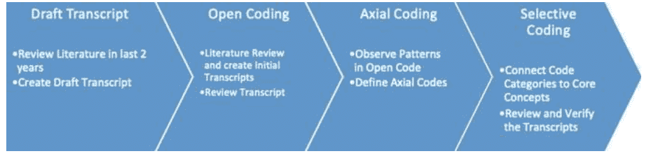
图10.1概念镜头的创作

正如Taylor等人[8]所解释的，医疗技术相关（MedTech）公司制造了超过五十万种不同类型的医疗设备，包括可穿戴医疗仪器、固定医疗设备和植入物。
为了优化相同的情况，Kruse等人[12]分析认为，标准化的数据结构、访问安全性以及可信存储将是确保连接设备数据改善医疗大数据分析的关键。

患者数据的安全性：《健康保险可携带性和责任法案》（HIPAA）规定了患者数据的隐私保护规定。正如Kumar等人[13]所解释的，必须保护患者的医疗记录免受修改或安全漏洞的影响。重要的是要强调，患者信息必须可共享和可访问，包括保险提供商在内的相关方。

然而，针对医疗记录的恶意软件攻击非常常见。Pilkington[4]详细说明，2017年5月，数千名英国患者因美国网络战争特工创建的恶意软件影响了全国卫生服务（NHS）的全面服务，导致治疗推迟。大约有30个卫生服务组织遭受了恶意软件攻击，还有更多组织作为预防措施而暂时关闭。

通过连接设备增加数据应该是实现患者医疗信息可移植性的关键驱动因素。要使这一目标成功实现，需要考虑以下重要因素：
- 在各个医疗服务提供商之间建立互操作网络，用于验证医疗信息的访问控制[9]。
- 如布拉姆等人所解释的，通过使用自动化协议实现微支付，以便访问医疗文献和触发收入共享。

正如Gellman等人所提到的[14]，受监管和非监管组织的数据需求之间的一个关键区别是准确性水平。市场营销人员的准确性水平可能较低，而医疗服务提供者的准确性水平较高。因此，安全需求因业务需求和使用案例而异。

### 绩效支付（P4P）：
如科瓦奇等人所解释的[15]，绩效支付（P4P）方案是基于对医疗工作者或机构的财务激励，以实现预定的关键绩效指标（KPI）。对绩效支付方案的研究表明，成功的结果取决于绩效计划的定义、基于过程的实施和执行。另一个重要观察结果是，许多机构未能公布KPI和测量技术，导致实施失败。

正如Ayvaci [16]所解释的，促进基于P4P模型的关键驱动因素是准确提供信息跟踪点的数字健康信息交换（HIE）的可用性。然而，这种HIE的有效性取决于提供者的信任，并且可以被医疗保健提供者操纵以篡改结果。

### 区块链类型在医疗保健领域的见解
根据IBM进行的一项研究，约有16%的医疗保健专业人员正在考虑将区块链纳入他们的发展路线图中。 区块链在医疗保健垂直领域的重要特征包括：
- 透明性和不可变性：区块链数据的关键特征是其不可变性，这意味着无论是链外还是链上数据存储的任何更新都可以被追踪和审计[15]。 因此，区块链数据存储确保了跨组织共享的信息对所有人都是可见、可审计和透明的，正如Liang等人的研究所指出的[17]。
- 分散化：杨等人通过分散化信息存储分析[18]，确保没有单个机构控制医疗信息。 信息是民主可得的，因为没有单个实体拥有区块链[19]。
- 可扩展性：库马尔在[13]中指出，区块链医疗的潜在挑战之一是可扩展性，因为可用计算能力与医疗记录数据存储之间的成本权衡可能限制了区块链在医疗领域的潜力[19]。
- 互操作性：目前的区块链平台不基于统一的协议，因此在互操作性方面存在限制，如Siyal等人所验证的[20]。 此外，正如Deepika [21]所强调的，由于各个提供商之间存在专有格式的限制。

以下是基于文献研究确定的行业应用中当前区块链在医疗领域的详细评估。

### 用于研究的临床数据
- 守护时间：是一家总部位于阿联酋的医疗保健提供商，正在开创在医疗保健领域应用区块链的先河。 它在KSI区块链上以在线和离线模式运行，该区块链采用权威证明算法。 它是一种混合区块链，既能够高效利用能源，又因为受到有限的参与者控制而具有有限的去中心化。 每个验证节点都会发布其区块，然后由其他具有拒绝权力的节点进行验证。 正如Matthias Mettler所强调的，冰岛、爱沙尼亚[22]和匈牙利政府都使用它来维护疫苗接种信息：
- 疫苗接种证明：类似于黄卡，用于维护疫苗接种信息[23]。
- 优先管理资格：帮助政府实现公正和可问责的优先管理流程。
- 监测人群接种情况：对疫苗进行地理监测，以确保传播减少。

### 患者信息安全
- Mediledger：与Genentech和Abbvie合作，Pfizer进行了一个名为Mediledger的区块链项目试点。它使用了一个封闭/私有的区块链，用于记录患者和药物的可追溯性，正如Epiphaniiou等人所述[23]。通过仅授予制造商序列号和产品ID关联的访问权限，可以在源头上阻止假药的生产。正如Beck等人所解释的使用零知识证明来确保组织间的数据隐私。它采用数据最小化的关键原则，确保强大的隐私和安全安排，正如Deepika等人所解释的教育部门一样。此外，患者可以控制自己的信息，包括查看谁访问了他们的信息[1]。
- MedRec [27]：由麻省理工学院媒体实验室和贝斯以色列迪肯斯医疗中心领导的区块链试点项目正在解决医疗数据的互操作性问题。MedRec在离线存储模式下运行，只存储处方的哈希值在区块链上[27]。患者可以完全访问信息，并查看访问信息的人。MedRec基于以太坊。然而，与典型的基于区块链的系统不同，存在一个限制，即用户必须信任发布到区块链中的信息，因为没有集成的验证系统与外部第三方，正如Esposito等人所解释的[28]。

### 通过区块链跟踪疫苗接种情况
COVID-19疫情加速了疫苗信息需要以一种可以提供给航空旅行公司、边境控制和各种访问场所的方式存储，而不会有欺诈风险[4]。这要求追踪疫苗剂量，并且发出的疫苗证书必须安全存储，并且是一个不可变的记录，可以轻松验证[29]。

下图显示了各个政府和国际组织使用区块链进行疫苗认证 (表10.1) 。

尽管COVID-19加速了对这些解决方案的需求，但这些解决方案可以用于从出生开始维护个人的疫苗接种记录，实现全球移动和追踪个人的疫苗接种状态，并确保这些记录保持最新状态，例如通过智能合约提醒父母安排预约和预订疫苗接种时间段。然后，可以在区块链上维护个人的疫苗接种状态，以便在任何时候或紧急情况下清楚地了解其疫苗接种状态，并采取适当的行动。

表10.1 使用区块链进行疫苗追踪的组织

| 公司名称 | 基础技术 | 解决方案中使用的技术 |
|---|---|---|
| Algorand | 开源公共区块链 | VitalPass在哥伦比亚使用，并计划扩展到拉丁美洲 |
| Evernym | R3/CuLedger/Hyperledger | IATA旅行通行证解决方案 |
| Accredify | 哈希存储在区块链上 | 数字健康护照用于存储拭子结果和疫苗证书 |
| VXPass | RelayX和比特币计算机 | 通过整合医疗服务提供者生态系统中的各方进行疫苗凭证的验证 |

可以采取[29]。这也可以帮助确保区域疫苗需求的验证，特别是对于儿童，可以通过智能合约自动验证和触发适当的提醒[3]。

互操作性将是一个关键要求，因为个人和家庭在休闲、商务和永久或临时迁移中跨越国家，各个地理区域可能都有私人和公共区块链解决方案[20]。

特别是对于贫困儿童，有一种追踪疫苗接种并创建后续接种触发器的机制可以减少儿童死亡率，并确保不会错过疫苗接种，并且有一个真实可信的医疗记录来源。

上述内容还可以支持联合国可持续发展目标（SDG）3.b.1的指标，即“人口中以可持续方式获得负担得起的药品和疫苗的比例”，并使各国能够透明可信地跟踪疫苗接种并报告。

### 流行病的预警信号

一旦健康记录被放置在区块链上，通过使用智能合约，可以开始识别流行病的早期预警信号，例如，监测/审查匿名患者数据以获取关键指标（例如发热、咳嗽等），并识别某一地区的共同特征，并触发警报以进一步调查数据[6]。需要进一步的工作来确保患者隐私与整个社区的需求保持平衡和一致[9]。

### 患者数据的货币化

在大多数国家，对于患者数据的使用有严格的规定，医院或其他医疗机构使用匿名数据集。通过区块链，可以实现对数据的精细控制，患者有可能控制共享的数据并通过微支付进行数据的货币化处理。通过加密货币或代币[30]。这使得患者完全掌控自己的数据，并且可以根据自己的舒适程度披露[29]。

### 图10.2 健康护理的信任要求

### 医疗保健垂直领域标准区块链类型的障碍和应用的总结视图

参见图10.2和表10.2。

### 医疗保健部门区块链模型分析

### 基于文献综述的概念镜头总结

该概念镜头基于三个医疗保健使用案例中分析的六个关键主题，并在九个关键节点项目中进行了验证。每个主题都包含互斥且完全穷尽的特征。访问控制对于确保患者数据仅对合法方可用至关重要。业务规则需要用于验证以及支付自动化。去中心化确保数据由单一所有者拥有。不可变性通过确保数据未被篡改带来信任。

### 表10.2 医疗保健区块链模型分析

| 区块链类别 | 区块链提供商 | 使用案例 | 应用 | 访问控制 | 体积测量 | 障碍 |
|---|---|---|---|---|---|---|
| 公共许可 | MediLedger [23] |  | 用于药物所有权验证的ZK证明 | 许可阅读 | 存储病人记录 | 与其他区块链的互操作性 |
| 私人的 | Guard Time [31] | 发放和验证防篡改和永久的健康证书 | 与其他区块链解决方案相比，它允许更灵活的基于API的集成 | 许可阅读和写入 | KSI确保消除了容量限制 | 源数据验证 |
| 公共的 | MedRec [19] | 具有访问控制的患者医疗信息 | 通过真正分散的平台实现版权民主化 | 公共访问 | 以太坊强制实施 | 系统支持的交易量 |

### 表10.3 数据分析的矩阵编码

| 使用案例/主题 | 绩效支付 | 用于研究的临床数据 | 患者数据安全 |
|---|---|---|---|
| 访问控制 | 6 | 8 | 8 |
| 业务规则 | 6 | 2 | 4 |
| 分散化 | 4 | 3 | 2 |
| 不可变性 | 9 | 9 | 7 |
| 互操作性 | 2 | 3 | 2 |
| 技术使用障碍 | 5 | 5 | 5 |

上述内容还可以支持联合国可持续发展目标（SDG）3.b.1的指标，即“人口中以可持续方式获得负担得起的药品和疫苗的比例”，并使各国能够透明可信地跟踪疫苗接种并报告。已被篡改[32]。互操作性对于确保数据可以在各个医疗服务提供商之间交换至关重要。而且，最重要的是技术应该易于被大众操作（表10.3）。

### 初始访谈方案

附上了用于进行调查的初始访谈方案（表10.4）。

### 信息共享中的挑战

上述概念性视角已经通过从2020年5月至8月进行的随机调查进行验证，该调查收集了医疗保健领域的100多位专家在P4P、临床数据研究和患者信息安全以及使用区块链方面面临的挑战，并使用区块链和医疗保健领域专家审查的选定问题。医生和患者强调了回答者的简历，以确保调查在两个领域提供适当的个人资料（表10.5）。

根据以上对大约一百名回答者的调查，可以以75%的置信度确定以下是医疗保健垂直挑战中区块链需求的总结（表10.6）。

### 根据调查结果的最终访谈方案

见表10.7。

### 表10.4 调查的访谈方案

| 类别 | 问题/描述 |
|---|---|
| 信息类别 | 您在组织之间分享的信息类别有哪些？ |
| 信息类别 | 您在信息共享方面遵循的流程是什么？ |
| 技术使用障碍 | 您是否认为组织之间的更多信息交流将带来运营效率？ |
| 技术使用障碍 | 您是否曾经遇到过您组织的信息被他人未经您组织同意而剽窃的情况？ |
| 技术使用障碍 | 在您的组织中，数字化信息共享系统可能面临哪些障碍？ 例如，基础设施缺乏/员工技能不足/高维护成本/数字化成本高？ |
| 信息数据存储和容量 | 你们医院分享的信息量是多少？ |
| 信息数据存储和容量 | 你们医院是如何维护不同的数据集的？ |
| 信息数据存储和容量 | 组织的规模（大/小）是否影响信息共享的效率？ 例如，大型组织在部门间信息分享需要更多时间/小型组织由于人力和基础设施不足导致信息分享延迟？ |
| 不可变性和去中心化 | 如果你分享的信息被第三方机构修改，会有什么影响？ 例如，如果学生篡改学位证书或者课程内容被修改 |
| 不可变性和去中心化 | 如果你的信息被第三方修改，你会得到反馈吗？ |
| 不可变性和去中心化 | 是否有一些组织可以修改信息而其他组织不能，即一些可信任的方？ |
| 不可变性和去中心化 | 当需要进行更正时，数据如何更新？ 整个过程需要多长时间？ |
| 互操作性和监管对数据共享的影响是什么？ | 是否有一种情况，你无法与其他组织交换信息，因为数据格式不匹配？ |
| 互操作性和监管对数据共享的影响是什么？ | 是否有一种情况，你无法从其他组织接收信息，因为存在监管挑战？ |
| 信息共享的成本 | 你的部门有多少人参与信息共享？ |
| 信息共享的成本 | 参与信息共享的人员的平均月薪总额是多少？ |
| 信息共享的成本 | 组织内共享的数据总量是多少？ |
| 信息共享的成本 | 在你的观点中，如何降低这个成本？ 这将如何影响组织所产生的总收入？ |
| 数据安全/访问控制/信任/角色基于访问控制/身份管理/审计追踪/所有权 | 你的组织如何确保数据安全？ |
| 数据安全/访问控制/信任/角色基于访问控制/身份管理/审计追踪/所有权 | 在维护安全系统方面面临的挑战是什么？ |
| 数据安全/访问控制/信任/角色基于访问控制/身份管理/审计追踪/所有权 | 有多少次信息泄露被报告？ 采取了哪些措施来防止信息泄露？ |
| 表格10.4（继续） | 在与合作伴共享信息中，信任的重要性是什么？ |
| 表格10.4（继续） | 为组织中的实体提供唯一身份的过程是什么？ |
| 表格10.4（继续） | 你是否认为在信息共享中需要基于角色的访问控制？ |
| 业务规则/互操作性/知识产权保护-医疗保健 | 当病人从一个医院转到另一个医院时，他需要重复检查吗？ |
| 业务规则/互操作性/知识产权保护-医疗保健 | 有没有办法审查药企输入数据库的数据？ |
| 业务规则/互操作性/知识产权保护-医疗保健 | 在组织间可获得的医疗信息中是否有足够的透明度？ |
| 区块链信息共享的感知益处 | 组织是否考虑使用区块链进行信息共享，并且是否存在已知的挑战（例如：缺乏信息共享的商业愿景，对技术系统的信任不足）？ |
| 区块链信息共享的感知益处 | 是否存在被认为区块链将为组织带来显著益处的使用案例？ |
| 区块链信息共享的感知益处 | 引入区块链进行信息共享是否能够实现运营成本节约？ （例如，减少人力投入，减少文书工作，加快上市时间）？ |
| 区块链信息共享的感知益处 | 引入区块链进行信息共享是否能够增加与合作伴的透明度和信任？ |
| 区块链信息共享的感知益处 | 引入区块链进行信息共享是否能够实现成本节约？ （例如：流程自动化，减少文书工作和人力投入） |
| 区块链信息共享的感知益处 | 您是否通过引入区块链进行信息共享，看到了新的商机？ （例如：信息变现，新的大学合作伙伴等） |
| 区块链信息共享的感知益处 | 通过引入区块链进行信息共享，您是否看到了利益相关者满意度的提高？ |
| 区块链信息共享的感知益处 | 为了安全起见，数据是否需要存储在链上/链下？ |

### 采访回答

上述调查的分析摘要已进一步与行业专家共享，包括GB Pant医院（新德里）的高级教授，Celcom的创新负责人（马来西亚），西门子医疗的高级副总裁（班加罗尔）和飞利浦创新园区的主任（班加罗尔）。主要观察结果如下：

- 医疗机构之间缺乏足够的信任，可以在未经所有者许可的情况下修改信息。还观察到医疗部门工作人员缺乏IT意识，导致增加了挑战。
- 区块链具有不可变数据库的优点。然而，由于区块限制和性能问题，它对存储的数据大小有限制。典型的医疗数据包括电子成像记录，需要大量存储空间，无法完整存储在区块链上。这就需要使用混合区块链来存储大数据量。然而，这引入了难以证明的复杂性。除了作为不可变数据库外，区块链的独特卖点是信任因素。区块链的关键应用案例有。

### 表10.5 调查主题/问题与观察结果

| 调查主题/问题 | 重要性 | 观察 |
|---|---|---|
| **IS-RQ1**: 受访者的个人资料是什么 | 基于个人资料信息的特征化，我们试图了解专业知识分布、对当前工作的依附程度（和持续时间）以及在组织中的资历。<br>有一个普遍的概念，即信息共享由年轻的受访者主导，他们对新思想持开放态度。因此，研究问题集中在年龄、人口统计学、职业和资历上。 | • 大多数受访者年龄在20-30岁和70岁以上之间<br>• 只有约7.4%的受访者在线获取处方<br>• 这7.4%的受访者分布在各个年龄组中 |
| **IS-RQ2**: 受访者在信息共享方面的主要目标是什么 | 了解医疗保健中的重要用例和挑战 | • 由于医生提供的数字信息不足，记录的验证成为超过67%的回应者面临的重要问题，导致操作问题和时间增加 |
| **IS-RQ3**: 需要不可变性在组织和外部组织信息共享中进行信息共享 | 研究问题的重点是了解数据不可变性对组织是否至关重要，因为这是区块链的一个重要特征 | • 约80%的受访者不愿与任何外部组织或任何可能被窃取数据的公共来源共享数据<br>• 根据收集到的回应，7.4%的受访者认为他们的健康信息被非法使用 |
| **IS-RQ4**: 基于角色的访问控制（RBAC）用于部门间的信息交流 | 研究问题的目的是根据组织需求了解信任和安全性的需求 | • 约74%的受访者在数字处方的情况下，他们的数据被同一组织的医生访问，不允许外部组织的医生访问他们的数据<br>• 除了常规健康检查之外，电子健康记录数据被保密，并且只有有限的人可以访问 |

### 表格10.5 (续)

| 调查主题/问题 | 重要性 | 观察 |
|---|---|---|
| IS-RQ5: 可互操作的：平均次数信息在组织间和外部组织间共享 | 研究问题的目标是了解部门间数据交换频率的详细信息 | • 约36.1%的受访者需要将数据从一个卫生中心转移到另一个卫生中心<br>• 在36.1%的受访者中，约91.3%的人以书面形式进行数据转移，即书面处方<br>• 在36.1%的受访者中，约5.8%的人以数字方式转移数据<br>• 在46.3%的受访者中，当他们需要从一家医院转到另一家医院时，他们不得不重复进行医学检查 |
| BC-RQ1: 分散的：在健康领域应用关心垂直验证去中心化的需求 | 与行业专家审查在医疗保健垂直领域中区块链的需求 | • 对区块链技术的认识较少<br>• 超过80%的受访者认为区块链在存储和共享数据方面更安全可靠 |

### 表10.6 区块链需求评估矩阵

| 使用案例 | 不可变性 | 读写权限 | 分散化 | 互操作性 | 业务规则 | 技术障碍 |
|---|---|---|---|---|---|---|
| 绩效支付 | 高 | 中 | 高 | 高 | 中 | 低 |
| 用于研究的临床数据 | 中 | 高 | 高 | 高 | 高 | 中 |
| 患者信息安全 | 高 | 低 | 中 | 中 | 高 | 低 |

### 表10.7 最终访谈方案

| 类别 | 问题/描述 |
|---|---|
| 信息类别 | 您在组织间共享的信息类别有哪些 |
| 信息类别 | 您在信息共享方面遵循什么流程 |
| 技术使用障碍 | 您是否遇到过您的组织的信息被他人未经同意抄袭的情况 |
| 技术使用障碍 | 在您的组织中，可能会出现哪些数字化信息共享系统的障碍 例如基础设施缺乏/员工技能不足/高维护成本/数字化成本高 |
| 信息数据存储和容量 | 信息共享的量有多大 |
| 信息数据存储和容量 | 组织的规模（大/小）是否影响信息共享的效率 例如大型组织在部门间信息共享需要更多时间/小型组织由于人力和基础设施不足导致信息共享延迟 |
| 不可变性和去中心化 | 如果您分享的信息被第三方组织修改，会有什么影响？ 例如，如果学生篡改学位证书或者课程内容被修改 |
| 不可变性和去中心化 | 监管对数据共享的影响是什么 |
| 信息共享的成本 | 在您的部门中有多少人参与信息共享 |
| 信息共享的成本 | 参与信息共享的人员的平均月薪总额是多少？ |
| 信息共享的成本 | 在你的观点中，如何降低这个成本？ 这将如何影响组织所产生的总收入？ |
| 访问控制 | 你的组织如何确保数据安全？ |
| 访问控制 | 在维护安全系统方面面临的挑战是什么？ |
| 访问控制 | 有多少次信息泄露被报告？ 采取了哪些措施来防止信息泄露？ |
| 访问控制 | 为组织中的实体提供唯一身份的过程是什么？ |
| 访问控制 | 您是否认为在信息共享中需要基于角色的访问控制 |
| 业务规则-医疗特定查询 | 当病人从一个医院转到另一个医院时，是否需要重新进行检查 |
| 业务规则-医疗特定查询 | 在组织间是否有足够的透明度的医疗信息可用 |
| 区块链上的信息共享 | 组织是否考虑使用区块链进行信息共享，并且是否存在已知的挑战（例如：缺乏信息共享的商业愿景，对技术系统的信任不足） |
| 区块链上的信息共享 | 是否存在被认为区块链将为组织带来显著好处使用案例 |
| 表10.7（续） | 通过引入区块链进行信息共享，您是否看到了运营成本的节省？ （例如，减少人力投入，减少文书工作，加快上市时间） |
| 表10.7（续） | 您是否通过引入区块链进行信息共享，看到了新的商机？ （例如：信息变现，新的大学合作伙伴等） |
| 表10.7（续） | 需要存储在区块链中的数据量是多少？ |
| 表10.7（续） | 数据是否需要存储在链上/链下？ |
| 表10.7（续） | 您是否认为需要与可信赖的财团或任何不受信任的全球方共享需求？ |

专注于涉及各方不信任人为机构并需要消除中介的领域。

- 基于健康保健的P4P被认为是区块链的一个强大用例，因为它能够建立信任。 P4P需要根据疾病登记进行绩效评估。 疾病登记是医疗保健领域的账本等效物。 它们记录有限的数据集，例如每月访问时的血压、心率，因此不需要高数据存储或链外存储需求。 此外，还有广泛记录的激励规则集，可以使用智能合约进行编码。 此外，根据智能合约触发规则，支付可以自动化。
- 所有这些都说了，区块链技术的可信度并不排除现实世界中审计的必要性。 在区块链上维护的注册必须通过实地访问医生和与一些患者会面来验证注册中记录的数字。
- 多个区块链之间的互操作信息引发了严重的担忧，并导致部门之间缺乏信息交流和验证。

### 对区块链类别的挑战进行回顾

本文分析了基于区块链内容的三种行业模型中现有医疗保健部门信息共享的六个关键障碍。 以下是发展路线图中确定的差距摘要。

### 区块链互操作性

医疗行业垂直领域之间交换信息非常重要。 存在以下互操作性问题：

- 监管协议：需要在国际和国家层面解决，以确保医疗保健组织之间的互操作性改善。
- 专有协议：数据存储标准对每个应用程序都是独特的。它们经常导致组织间数据交换的限制和时间延迟。由于缺乏跨组织的互操作标准，医疗保健组织之间的数据交换经常受到限制。
- 开放API：类似于开放银行倡议，在各种应用程序之间创建以标准格式共享信息的API，并采取适当的安全控制，将加速采用。

### 数据存储限制

区块链医疗保健面临的一个明确挑战是可扩展性，这是由于计算资源成本所致。考虑到电子健康记录的数量，将其存储在区块链上是不经济的。虽然有离线存储的选择，但这会增加安全风险。为了确保经过验证的记录只存储一次，并且可以通过底层应用程序存储的信息在区块链网络中访问，需要定义并由各个医疗保健提供商共同同意医疗记录共享的标准。

### 验证数据上传

欺诈性机构可以将无效的源数据注入到区块链中。由于区块链的架构，不存在自动验证过程来验证发布到区块链上的源数据的真实性。

存储在区块链中的数据是不可变的，但现有的区块链模式没有单独的身份验证服务来验证源数据的真实性。这可能导致系统中的无效主信息，从而导致数据损坏。

### 健康保健验证框架

下面的框架描述了基于访谈回应创建的最终概念镜头的医疗保健（图10.3）。

### 对文献的贡献

多个挑战阻碍了行业中的信息共享。信息共享的需求因行业的信任要求而异。区块链为信息共享提供了安全可信的解决方案。本研究论文对文献的贡献如下：

### 保健验证框架

## 10个医疗4P：去中心化应用的系统性回顾...

#### Technology Barriers
- Pay For Performance
- Digitization of Patient Data for Measurement
- Ease of Uploading

#### Patient Data Privacy
- Operational Training
- Ease of UI

#### Interoperability
- Patient Data Privacy
- Intra-organizational, EHR platforms are also fragmented
- Core issues in current health/medical records (EHR/EMR) is maintaining the interoperability among various involved stakeholders

#### Clinical Data for Research
- Complying with various national and international standards and protocols is critical

#### Decentralization
- Clinical Data for Research
- Current EHR systems use centralized architecture which restricts Global Access
- Patient Data Privacy
- Patient is less likely to repeat diagnostic tests with decentralization

#### Transaction Volumes
- Patient Data Privacy
- Amount of EMR and sensor data from patients and wearable IoT devices in increasing
- Clinical Data for Research
- With a 48% rate of annual increase in health care data volume will be in yottabyte (one yottabyte = 10^24 bytes) range by 2050
- Pay For Performance
- Transaction Volumes can be limited to Numeric Values

#### Business Rules
- Patient Data Privacy
- Limited access to health records by Patient
- Pay For Performance
- Coordination, elimination of duplication, and outcome tracking is key to tracking
- Relying on new payment systems for automated pay-outs
- Quantitative metrics needed for Pay for Performance Data
- Clinical Data For Research
- Sharing of healthcare data is essential to improve the quality

#### Access Control
- Clinical Data for Research
- Data security and privacy violated in EHR
- Only the minimum health information necessary should be shared
- Patient Data Privacy
- Different users of health data have different roles
- More data are stored in a public cloud leading to increased Privacy Issues
- Pay For Performance
- Develop EHR systems with user-centric access control and privacy preservation.

## 结论和未来展望

本书章节回顾了与医疗保健领域的挑战相关的区块链行业标准模型，以分析问题和确定整体适用性。每个行业标准的区块链模式提供不同程度的不可变性、去中心化和基于角色的访问控制。下面是基于调查的三个用例的业务需求摘要（表10.8）。

对行业中的区块链模型进行分析，得出以下摘要，涵盖了各种区块链类别及其特点（表10.9）。临床数据聚合适用于在大量数据共享组织中与不受信任的各方合作。因此，适用于临床数据聚合的是许可和公共区块链标准。然而，对于决定限制去中心化程度的情况，也可以成为私有许可区块链模式的候选。

由于数据可能由多个机构提供且这些机构之间没有已知的信任关系，患者数据安全对去中心化和访问控制有很高的要求。此外，由于通常医疗保健文件的数量庞大，数据量也很大。权限控制和公共区块链模型具有更高的去中心化程度，因此适用于患者数据安全保护。

然而，在机构决定限制去中心化程度的情况下，它也可以成为私有权限控制区块链模式的候选方案。

P4P的数据存储要求较低，因为验证数据所需的数据量有限。由于可以在可信组织之间运行以进行信息交换，去中心化和访问控制权限的需求有限。

此外，业务规则已经明确定义，因此可以证明业务规则的复杂性适中。可能还有其他需要加入联盟的医疗机构，因此互操作性的需求很高。根据此用例的需求，它成为了公共权限控制区块链的候选方案。基于这项研究，基于成本模型的交易分析将成为进一步研究的范围。区块链处于采用的早期阶段，运营成本尚不清楚。此外，垂直领域的交易成本包括声誉和机会等无形变量。因此，在

## 表格 10.8 用例需求摘要
| 使用案例 | 分散化 | 业务规则 | 访问控制 | 交易量 | 互操作性 | 技术障碍 |
|---|---|---|---|---|---|---|
| 聚合的临床行政数据可用性用于研究 | 非常重要，因为需要被不受信任的方访问 | 中等复杂性减少价值链中的实体 | 中等重要，因为访问控制由可信方的规则定义 | 高容量，可被所有人访问和大数据量 | 高需求，需要多平台访问 | 高障碍，因为被医院员工使用 |
| 患者数据隐私 | 非常重要，因为需要被不受信任的方访问 | 中等多方价值链 | 非常重要，因为需要基于角色的访问控制来控制权 | 高容量，可被所有人访问和大数据量 | 高需求，可被多个平台访问 | 高障碍，因为被医院员工使用 |
| 绩效支付 | 不太重要，因为需要被不受信任的方访问 | 中等；规则限制为预定义集合 | 中等重要，因为访问控制由可信方的规则定义 | 由于数据集较小，数据量较低 | 多平台可访问的高要求 | 由于需要熟练的员工使用，中等障碍 |

## 表格 10.9 区块链模型摘要
| 区块链框架 | 分散化 | 业务规则 | 访问控制 | 交易量 | 互操作性 | 技术障碍 |
|---|---|---|---|---|---|---|
| 公共无许可 | 非常重要, 因为没有中央机构 | 中等复杂性, 因为更改必须传输到公共节点 | 有限, 因为公共访问受控制 | 由于链上数据存储, 支持低数据量 | 中等, 因为受中央监管控制 | 高, 因为涉及公钥和操作系统升级 |
| 私人无许可 | 中等重要性, 因为由财团拥有但无需许可 | 高复杂性, 因为由财团拥有 | 可以根据用户角色控制写入访问 | 支持高容量 | 由私人方控制, 因此低 | 由私人控制, 因此中等 |
| 公共许可 | 由公众但受许可控制, 因此中等重要 | 中等复杂性, 因为更改必须传输到公共节点 | 基于用户角色控制写入访问权 | 支持中等容量 | 中等, 因为受中央监管控制 | 高, 因为涉及公钥和操作系统升级 |
| 私人许可 | 由财团拥有和受许可控制, 因此低 | 高复杂性, 因为由财团拥有 | 基于用户角色控制写入访问权 | 支持高容量 | 由私人方控制, 因此低 | 由私人控制, 因此中等 |

目前还无法创建现有实施成本与区块链运营实际成本之间的直接成本相关矩阵。这将成为未来研究的一部分。

## 参考文献
- 1. Azarm-Daigle, M., Kuziemsky, C., Peyton, L.: 跨组织医疗数据共享综述. Procedia Comput. Sci. 63, 425-432 (2015)
- 2. Abadi, J., Brunnermeier, M.: 区块链经济学. Princeton U. Work. Pap. 1-53 (2018)
- 3. Ingraham, A., St. Clair, J.: 医疗信息技术的第四次工业革命: 解锁区块链解决方案的关键业务组成部分. 区块链医疗保健. 今天1-4 (2020)
- 4. M. Pilkington, 区块链能改善医疗管理吗? 消费者医疗电子产品和IoMT. SSRN电子期刊 (2017)
- 5. Hesse, B.W., Nelson, D.E., Kreps, G.L., Croyle, R.T., Arora, N.K., Rimer, B.K., Viswanath, K.: 信任和健康信息来源. Arch. Intern. Med. 165, 2618 (2005)
- 6. Kamel Boulos, M.N., Wilson, J.T., Clauson, K.A.: 地理空间区块链：在健康和医疗领域的承诺、挑战和场景. Int. J. Health Geogr. 17, 1-10 (2018)
- 7. Berwick, D.M., Nolan, T.W., Whittington, J.: 三重目标：护理、健康和成本. Health Aff. 27, 759-769 (2008)
- 8. Taylor, K., Sanghera, A., Steedman, M., Thaxter, M.: 医疗科技和医疗物联网：连接的医疗设备如何改变医疗保健. 德勤公司 (2018)
- 9. Onik, M.M.H., Aich, S., Yang, J., Kim, C.-S., Kim, H.-C.: 区块链在医疗保健中的挑战与解决方案. 爱思唯尔公司 (2019)
- 10. Brailer, D.J.: 互操作性：未来医疗保健系统的关键. 健康事务 (Millwood) Suppl Web 19-21 (2005)
- 11. Khezr, S., Moniruzzaman, M., Yassine, A., Benlamri, R.: 区块链技术在医疗保健中的综述和未来研究方向. 应用科学 9, 1-28 (2019)
- 12. Kruse, C.S., Goswamy, R., Raval, Y., Marawi, S.: 大数据在医疗保健中的挑战和机遇：一项系统性综述. JMIR Med. Inf. 4, e38 (2016)
- 13. Kumar, T., Ramani, V., Ahmad, I., Braeken, A., Harjula, E., Ylianttila, M.: 区块链在医疗保健中的应用: 关键要求和挑战. 在: 2018年IEEE第20届国际电子健康网络、应用和服务会议. 2018, pp. 1-7 (2018)
- 14. Gellman, R.: 超越HIPAA的健康信息隐私: 2018年主要趋势和挑战的环境扫描 (2017)
- 15. Kovacs, R.J., Powell-Jackson, T., Kristensen, S.R., Singh, N., Borghi, J.: 低收入和中等收入国家的医疗保健绩效支付计划的设计如何？分类和系统文献综述. BMC Health Serv. Res. 20, 1-14 (2020)
- 16. Ayvaci, M., Cavusoglu, H., Kim, Y., Raghunathan, S.: 付款机制、采纳激励和健康信息交换(HIEs)的价值. SSRN Electron. J. 1-48 (2017)
- 17. Liang, X., Zhao, J., Shetty, S., Liu, J., Li, D.: 在移动医疗应用中集成区块链进行数据共享和协作. 在: 国际个人、室内和移动无线电通信研讨会PIMRC, pp. 1-5 (2018)
- 18. Yang, Z., Zhang, L.: 供应链中的信息共享: 一项综述. J. Digit. Inf. Manag. 11, 125-130 (2013)
- 19. Labazova, O., Dehling, T., Sunyaev, A.: 从炒作到现实：区块链应用的分类. 在：第52届夏威夷国际系统科学会议论文集 (2019)
- 20. Siyal, A.A., Junejo, A.Z., Zawish, M., Ahmed, K., Khalil, A., Soursou, G.: 区块链技术在医学和医疗保健中的应用：挑战和未来展望. 密码学 3, 3 (2019)
- 21. Sachdev, D., Studies, E., Management, H.E., Studies, E., Studies, E.: 分析基于区块链的数字内容元数据模型 11, 277-292 (2020)
- 22. Mettler, M.: 区块链技术在医疗保健中的革命从这里开始. 在：2016年IEEE第18届电子健康网络、应用和服务会议. 2016年，第16-18页.
- 23. Epiphaniou, G., Daly, H., Al-Khateeb, H.: 区块链与医疗保健. 高级科学技术安全。应用。 1-29 (2019)
- 24. Beck, R., Avital, M., Rossi, M., Thatcher, J.B.: 区块链技术在商业和信息系统研究中的应用. 商业信息系统工程 59, 381-384 (2017)
- 25. Lemieux, V.L., Ph, D., Hofman, D., Batista, D.: 区块链技术与记录目录 (2019)
- 26. Choudhury, T.: 教育4.0：基于工业案例的去中心化信任的障碍和应用的系统性综述, 第57卷, 第882-893页 (2020)
- 27. Azaria, A., Ekblaw, A., Vieira, T., Lippman, A.: MedRec: 使用区块链进行医疗数据访问和权限管理. 在：第二届国际会议论文集开放大数据，OBD 2016，第25-30页 (2016)
- 28. Esposito, C., De Santis, A., Tortora, G., Chang, H., Choo, K.K.R.: 区块链: 医疗云数据安全与隐私的万灵药? IEEE云计算 5, 31-37 (2018)
- 29. Agbo, C.C., Mahmoud, Q.H.: 医疗保健中的区块链. 国际健康信息系统与信息学杂志 15, 82-97 (2020)
- 30. Radjenovic, Z.: 区块链技术作为数据完整性工具的节省成本作用: 电子健康场景. KnE社会科学 2020, 339-352 (2019)
- 31. Sullivan, C., Burger, E.: 电子居民身份和区块链. 计算机法律与安全评论国际技术法律实践杂志 1-12 (2017)
- 32. Aggarwal, A.: 政府应用中基于所有权的区块链框架综述. 年度机构创新技术管理杂志 3, 22-32 (2016)

## 10个医疗4P：去中心化应用的系统性回顾...

## 第11章

## 使用混合分类方法实施基于物联网的水灾和灾害管理系统
- Abhishek Badholia, Anurag Sharma, Gurpreet Singh Chhabra和Vijayant Verma

## 介绍

灾害管理可以被描述为“一系列旨在维持对灾难和紧急情况的控制，并为帮助处于风险中的个人防止或从灾难的影响中恢复提供框架的行动谱”。当自然灾害或人为灾害发生时，灾害管理是处理和预防危险的学科。为了最小化或减少源于危险的灾难的影响，灾害管理是一个持续的过程，通过这个过程，人们、团体和社区以高效的方式管理风险。

## 基于物联网的洪水灾害检测系统

自然灾害是全球各国政府关注的问题。自然灾害经常发生在人类居住的地方。自然灾害或人为灾害是最常见的。该国仅有2%的面积可以支持世界六分之一的人口。2019年印度的一场暴雨导致至少200人死亡，数百万人流离失所。喀拉拉邦和马哈拉施特拉邦遭受了最严重的灾害。在沿海地区、河流和水坝附近发生洪水是很常见的。

为了实时减少暴露于洪水之中，需要一个实时监测和预警系统。如果能够及时发现灾害，就可以避免灾害。三个雨量传感器和三个水位传感器分别位于三个不同的位置，该系统还使用了带有水位传感器和雨量传感器的微控制器。系统会预测到洪水并向相关部门发送警报。

通过物联网（IoT），向周围社区发送警告。

除了计算洪水时间外，该系统还估计了水流到达指定区域所需的时间。与测量降雨强度（以毫米为单位）的雨量传感器不同，水流传感器监测水体中的水量。可以从远程位置访问完整的信息，在物联网平台上提供必要的信息。洪水预测主要受降雨影响。过去已经测试了许多机器学习方法用于洪水预测模型。本章的主要贡献在于深度学习模型的作用。通过改进洪水预测模型的努力，减少了人员伤亡、减少了灾害发生，并减少了资产损失。为了预测洪水的到来，本章提出了一种混合深度学习方法，利用过去几个月的降雨数据来估计未来一个月的降雨量。

建模不需要其水文和地理特征的气象或地理信息。研究发现了许多洪水预测模型，包括雷达系统、水文分析、雨量计网络和河流网络，以及统计模型和时间序列分析预测模型。为了训练CDNN+ANN，使用了DL模型。当涉及到季风季节时，降雨预测被认为是非常重要的。在本文中，使用大数据和推荐的CDNN+ANN来识别洪水。涉及到两个阶段的训练和测试。它从一个与洪水相关的大数据集开始，其中包含水流和水位的数据，以及来自雨量和湿度传感器（HM）的信息。在剩余的过程中，使用了Hadoop分布式文件系统和MapReduce技术。在归一化过程之后，使用这些特征生成一个函数。混合分类器使用组合属性函数作为输入，并将洪水检测分为有机会和无机会。这是当IoT值被用作分类过程的输入时。剩余的过程与训练阶段相同，包括HDFS、预处理和数据分类。本章的剩余部分可以组织如下，第一节“引言”包括洪水灾害管理及其重要性的描述。第二节“相关工作”包括基于IoT的灾害管理的相关工作。第三节“问题陈述”描述了问题陈述。第四节“提出的方法”包括所提出过程的概述。第五节“结果与讨论”包含对所提出过程的解释。第六节“结论”总结了这项工作。

## 相关工作

在后COVID时代，如何创建和测试由物联网驱动的无线传感器网络，用于捕获墨西哥科利马-维拉德腊尔斯市的河流水位和土壤湿度数据，并通过物联网消息队列遥测传输协议实时传送到服务器和Web应用程序中。作为2019年热带气旋季节的一部分，科利马地区经历了三次不同的热带风暴。热带风暴经过了科利马地区。例如，热带风暴表明智能水网可以收集实时的水文气象数据。Rani等人提出了一种既有效又适应性强的洪水检测技术和报警系统。诸如机器学习（ML）之类的技术进步对工程领域非常有益，因为它们在监测任何系统的正常和异常行为方面非常有效。在这个项目中，我们将对洪水问题进行调查。降雨预测在很大程度上依赖于神经网络，这些网络被广泛使用并表现良好。这个项目使用的技术不仅可以检测水位，还可以测量水位上升的速度，并向居民发出警报。这个项目使用瀑布模型作为一种方法。可以使用树莓派收集水传感器的数据，并将其发送到GSM模块，以向您的智能手机发送短信警报。例如，将展示如何将树莓派与智能手机连接，以发送警报。

为了保证系统能够提供准确可信的数据，它在由两个独立环境组成的实验中进行评估。作为一个基于物联网的项目，支持物理系统基础设施，该项目符合工业4.0革命[4]。基于谷歌地图，使用超声波高度检测器、Arduino Uno微控制器和U-Blox Neo 6m GPS模块和GSM模块创建了一个原型洪水监测系统。原型设计提供了洪水高度数据和位置信息[5]。本章介绍了使用LoRa技术设计的洪水监测系统的设计，以及其安装和测试结果。为了能够连接多种类型的传感器，而不需要对提议的节点架构进行重大硬件更改，整个系统都是从模块化的角度构建的。

使用传感器和微控制器来保存数据。然后对数据进行分析并存储在在线结构中，如果发生洪水，则创建警报功能[6]。基于大数据和高性能计算（HPC）的物联网智能洪水监测和预测架构被提出。六边形网络被用于有效部署能源高效的物联网设备。它们利用大数据和高性能计算（HPC）方法来识别所有产生洪水或预防洪水的特征。使用奇异值分解（SVD）算法来减少特征数量。采用一种称为“K均值聚类”的技术来评估任何区域的当前洪水和洪水等级，同时利用Holt-Winters方法来预测任何位置的洪水[7]。在发生洪水时，发送短信警告。通过使用短信，作者打算让相关部门采取必要的行动。传感器是一种检测和响应物理数据的设备。早在1981年，英特尔就推出了8051微控制器。该示例中的微控制器具有8位架构。40个DIP引脚中包含了两个定时器和16位。该封装中包含了两个定时器。它具有四个并行的8位端口，可以根据需要进行编程。当GSM调制解调器，也称为GSM模块，与另一个网络建立联系时，它使用GSM移动技术进行通信。这些开关既用作水箱的液位传感器，又用作流体控制装置。在冷凝器中，电能储存在磁场中。因为它有两个端口，所以它是一种被动的电子设备。

当电流通过发光二极管（LED）时，它会发出光。

LCD的缩写是液晶显示器。许多电子设备使用微型平面显示器来显示数据。通过使用数字电平转换器[8]，信号可以从一个逻辑或电压域转换到另一个域。人工神经网络 (ANN)、长短期记忆 (LSTM) 和门控循环单元 (GRU) 是我们用于洪水预测的一些模型。Kumar等人[9]描述了一个将我们的系统与实时云连接起来与我们的手机交互以检查水位的系统。在这里，我们使用物联网来根据Arduino Uno的输出预测洪水，并通知相关部门。此外，该系统预测洪水到达的时间，并向个人提供IVR和警报，以便他们可以疏散或合理安排时间。

Khalid和Shafiai [10]概述了马来西亚政府在洪水灾害发生前、期间和之后对洪水受害者的救援系统的作用。目前，以技术为中心的洪水控制、预测、警报和疏散系统主导了洪水管理的救援系统，强调使用现代技术。当马来西亚发生洪水灾害时，国家安全委员会 (MKN) 负责管理国家的灾害管理系统。本文还将讨论马来西亚采用的洪水救援系统的类型，并与其他国家的救援系统进行类比[11]。通过分析降雨量和河水水位来确定它们之间的时间相关性，以进行洪水预测研究。在洪水预测方面，物联网 (IoT) 方法用于从传感器收集数据并通过Wi-Fi进行通信，而人工神经网络 (ANN) 用于分析数据。Wijekoon等人[12]确定了一个合适的、集成的软件解决方案来解决这个问题。这些操作是通过物联网技术 (如Android、云和Windows应用程序) 的集成方式进行的[13]。基于地理信息系统 (GIS) 的分析和选择疏散路线，既有效又安全免受洪水影响。Ghapar等人[14]回顾了已经进行的洪水数据管理的物联网研究。因此，该文章提出了一个洪水数据管理的物联网架构，可以作为安装物联网基础设施来收集、传输和管理洪水相关数据的基础[15]。使用基于规则的Mamdani模糊推理系统来研究洪水事件的预测。有三个参数决定了模型的输入和输出：人口密度、海拔和降雨量。每个变量的隶属函数有三到四个。

## 问题陈述

全球范围内，自然灾害导致了大量财产损失，以及身体伤害甚至死亡。然而，尽管自然灾害是不可预测的，但减灾技术可以减轻这些事件造成的损害程度。通过实施有效的防洪技术，可以减少自然灾害的影响。因此，从可靠的来源收集信息非常重要。社区中的风险评估和风险管理需要有效和及时的数据传输。最常见的之一亚洲的自然灾害之一是洪水。人类活动的增加会增加洪水的危险和影响。拥有一个集成的洪水预防和减灾系统非常重要。因此，地理数据整合、快速准确的灾害信息以及来自物联网数据分析即服务（IoT DAAS）的洪水淹没区域的有效检测工具，如果存在的话，可以作为一个早期预警系统，限制可能的损害。在灾害管理中，问题不在于技术或信息的缺乏。通常是因为信息不容易获取。

寻找灾难恢复解决方案需要一种探究精神和利用信息技术的愿望，以有效地发现和组织信息，对其进行批判性分析并正确应用于解决问题。因此，识别、获取和访问数据以及做出决策对于有效应对问题至关重要。在线信息分发被广泛认为是互联网技术的一个好处。在服务提供商和用户之间，它作为一种交流手段。由于这些发展，互联网应用程序和服务的数量显著增加，包括网络地图服务。传感器，例如，是向公众提供环境信息的物联网服务提供商。由于它快速且易于使用，有数百万人使用这项服务。这些物联网服务应用程序提供传感器信息。

在典型的环境中，它们擅长发现区域或定位位置。其中大多数不作为实时灾难预警系统工作，但在自然灾害如洪水警报的情况下，它们无法发挥其功能。灾害管理的主要指导原则是对洪水事件立即做出反应。在紧急期之前、紧急期间和紧急期之后，这包括在三个阶段获取紧急数据以及及时沟通的方式。在洪水灾害发生时，传感器是一个潜在的选择。从传感器数据中检测洪水区域也是必要的。

## 提出的方法论

在后COVID时代，迫切需要一个能够实时收集和监测洪水数据，并及时处理和传播的系统。开发一种通过交互系统检测淹没区域的算法是尚未确定的重要角色之一。这是空间信息系统的重要组成部分，在洪水灾害情况下可以用于构建有用的应用程序。

此外，通过改善对传感器数据的访问，它提高了对洪水应用的反应效力和效率。

该机制在图11.1中有所描述。总体而言，该计划要求建立一个技术基础设施，以实现合理的决策，并实施和开发用于处理传感器数据的算法方法。将物联网硬件和物联网平台结合起来，创建一个可以从远程地方监视的洪水监测系统，如图11.2所示。在系统的下一个阶段，使用深度学习模型来预测降雨。A.物联网接口块图：例如，带有Wi-Fi模块的树莓派3，带有LED显示屏的水传感器、降雨传感器和湿度传感器都是洪水监测模块的一部分。其他组件包括二极管、带有LCD的PCB板、变压器/适配器以及按钮、开关和IC。除了树莓派外，还将在不同位置放置四个传感器来监测数据。水体水位上升，蜂鸣器响起，提醒您剩余时间直到该地区发生洪水。

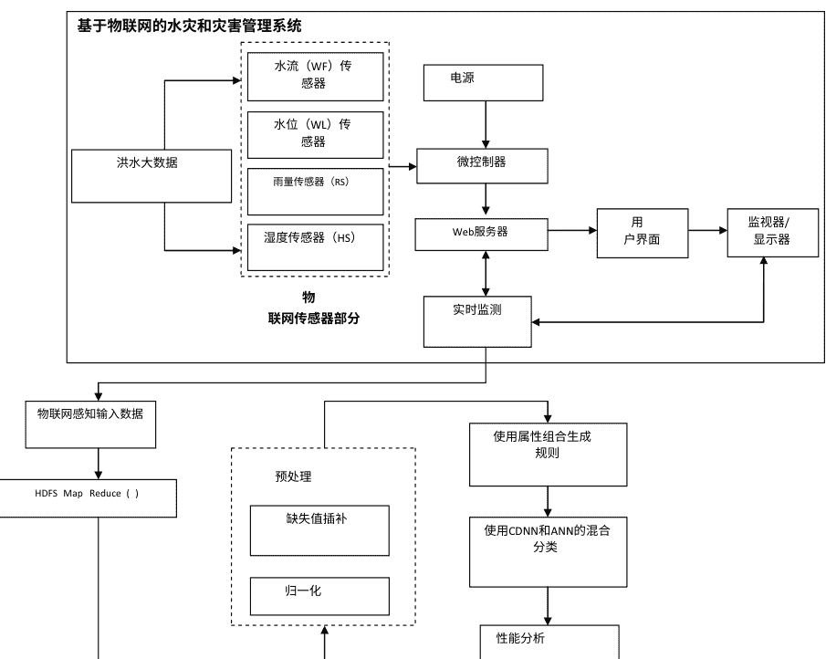
图11.1 建议方法的示意图

图11.3显示了建议的物联网电路原型的原理图描述。在这种情况下，物联网组件将与水文系统紧密连接。超声波传感器测量管道中的水位，雨水传感器检测天气情况。Arduino Uno微控制器与以太网盾集成，用于分析额外的数据，如高度和降雨量。通过网络服务器，数据处理的结果将发布到IP地址上，可以使用Web服务器的IP地址访问洪水监测信息系统，本例中为192.168.0.4。通过IP地址访问，用户可以了解网络上的降雨情况。实时洪水预警系统是使用HTML和JavaScript编程开发的，与Arduino Uno微控制器板上集成的C语言相结合。

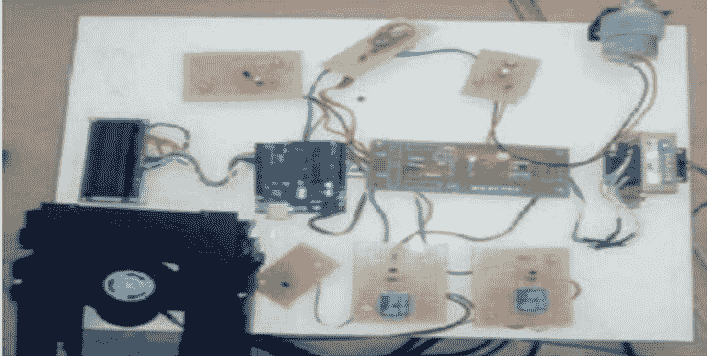
图11.2 实验设置

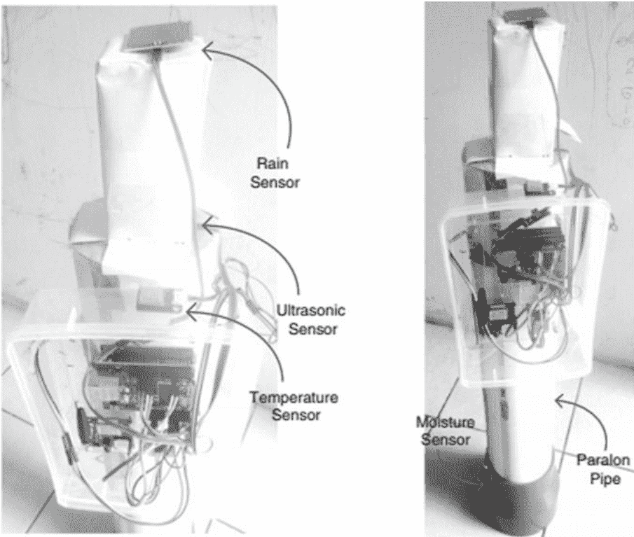
图11.3 系统原型电路

建造一个5英寸的设备，使用超声波传感器和管道上部的雨水传感器来测量管道的洪水高度。作为横截面，一个软木浮子被插入超声波传感器触发组件以反射回波信号。浮力随洪水的高度增加。系统提供关于洪水的预警信息，包括实时的洪水信息和降雨情况，以及风险信息。

### (a) 归一化

可以通过使用HDFS MapReduce框架与数据分析相结合，以提取所需的关键特征来进行归一化。由于将数据分布到小型集群中，MapReduce框架提供了良好的结果，并有助于处理大型数据集。该过程从大量的数据中创建子群。必须评估子群之间的相互关系，以避免主要问题。

根据数据的大小和种类进行分组。在聚类之后，可以找到各个个体的值。利用特征矩阵向量来确定矩阵，并将数据投影到一个等效或更小的新子空间中，从而从大型数据集中选择一个最优的可比变量子集。

$$
F = \frac{\lambda_1 + \lambda_2 + \lambda_3 \dots \lambda_k}{\lambda_1 + \lambda_2 + \dots + \lambda_k + \dots \lambda_d}
$$

其中 $\lambda$ 是特征值；$F$ 是新的数据特征集；$d$ 是原始特征。

为了反映具有低维向量的数据记录，我们需要估计导致最高特征值的 $n$ 个特征向量。

$$
\phi = [l_1, l_2, \dots, l_m]
$$

$$
A = \operatorname{diag}(\lambda_1, \lambda_2, \dots, \lambda_m)
$$

在这里，$A$ 定义了误差值的对角矩阵，我们已经得到了协方差矩阵，

$$
K \phi = \phi A
$$

然后使用以下准则确定特征的数量

$$
\frac{\sum_{i=1}^{T} \lambda_i}{\sum_{i=1}^{P} \lambda_i} > M
$$

其中 $P$ 是误差值的总数。指定的错误被提取出来。

在消除所有错误和缺失值之后，需要对数据进行归一化处理。在计算平均值之前，需要将将在不同平衡点获得的数字归一化到理论上相似的尺度。只需要对特定的归一化形式进行重新缩放过程，以获得与其他元素相关的值。由于对数据参数的熟悉，我们可以轻松纠正我们的错误。在大多数情况下，一旦纠正了错误，传感器数据值将不会随机分布。在归一化过程中，获取Z得分是一个初步步骤。如公式11.5所示，Z得分将被表示。

$$
Z = [(G - \mu)/\sigma]
$$

其中 $\mu$ 是数据的平均值，$\sigma$ 是传感器数据的标准差。

$$
Z = \frac{G - \overline{G}}{S}
$$

其中 $\overline{G}$ 是样本的平均值，$S$ 是样本的标准差。

然后可以使用公式(11.7)计算帽子矩阵$(H)$。

$$
H = L * \left(G^T G\right)^{-1} G^T
$$

帽子矩阵的方差表示为公式11.8

$$
Var(\hat{\epsilon}_i) = \sigma^2(1 - h_{ii})
$$

$$
Var\left(\hat{\epsilon}_i\right)=\sigma^2\left\{1-\frac{1}{n}-\left[\left(x_i-\overline{x}^2\right) / \sum_{j=1}^i\left(x_j-\overline{x}^2\right)\right]\right\}
$$

然后可以使用公式(11.10)计算残差。

$$
t_i = \frac{\hat{\epsilon}_i}{\hat{\sigma}} \sqrt{1 - h_{ii}}
$$

其中 $\hat{\sigma}$ 是对 $\sigma$ 的估计，$\mu$ 是均值。

$$
\sigma^k = \sqrt{(E(G - \mu)^K)^2}
$$

其中 $G$ 是一个随机变量，$E$ 是期望值。

使用均值 $\mu$ 来标准化通常有序分布的变量的分布。

$$
C_v = \frac{S}{G} \quad (11.12)
$$

其中 $C_v$ 是方差系数。

使用特征缩放技术，可以获得从0到1的所有值。由于这种方法，基于连续性的标准化被使用。标准化方程的形式为 $G'$：

$$
G' = \frac{(G - G_{\min})}{(G_{\max} - G_{\min})} \quad (11.13)
$$

通过对数据进行标准化，可以使光谱和数据的变异性相等。数据的冗余性在很大程度上被最小化或完全消除。然后可以将它们用作后续处理的输入。

### (b) 分类

分类的初始阶段是为分类器生成规则。

#### 规则生成

这是一种使用分类器系统以机器方式设计规则的制造方法。网络中的服务器将可靠地检查数据包是否已接收并处理。规则生成过程如图11.4所示。该系统在接收到信息后进行分析，并确定是否下雨。此外，规则将生成一个新规则，并且如果新规则应存储在分类系统中，则将与旧规则进行比较。如果规则已经存在，则生成的新规则将不会被记录，因为旧规则已经存在。如果该规则以前从未存在过，则将该规则输入系统。一旦一个数据包没有被过滤，它就会被发送回原始服务器。在输入新文件时，该过程将迅速恢复并完成。为了使文件验证时间不超过一分钟，系统将预先规划和安排该过程。规则生成被定义为一个重要的步骤，可以将其编码成一个模块，根据输入自动生成规则。

混合CDNN和ANN被用于洪水数据分类框架，通过利用传感器数据的特征，即 $x_i, x_j, \dots, x_k$，来准确分类密集数据中的危险情况，使用 $C$ 作为正集训练分类器，然后计算每个主体到每个分类器的分离超平面的距离。对于每个主体，存在一个向量 $d=(d_1, d_2, \dots, d_k)$，其中 $d_i$ 表示主体到第 $i$ 个分类器的距离。对于一个双类训练示例，$k$ 解决以下方程。使用第 $i$ 个度量方法计算数据 $i$ 和 $j$ 之间的距离如下：

$$
d_{ij}=\text{trace}(M(x_i-x_j)(x_i-x_j)^T) \quad (11.14)
$$

$$
A(s) = \left[0, \sum(2r(s_1) - 1) \dots \sum(2r(s_m) - 1)\right] \quad (11.15)
$$

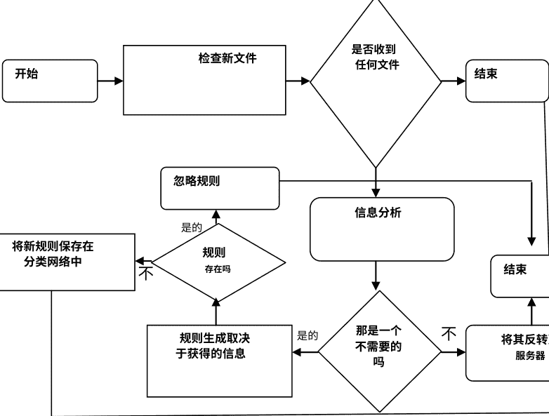
图11.4 分类规则生成过程

其中 $\sum$ 以累积方式定义求和，$m$ 是最大迭代次数，$s$ 表示随机运动步数，$r(s)$ 以随机方式定义函数(11.16)：

$$
r(s)=\left\{\begin{array}{l} \text { 如果 } r_{\mathrm{no}}>0.5 \\ \text { 如果 } r_{\mathrm{no}} \leq 0.5 \end{array}\right. \quad (11.16)
$$

如图(11.17)所示，$A^{l}$ 和 $B^{l}$ 分别表示第 $l$ 次迭代中变量的最低值和极值。

$$
z=10^{y} \frac{u}{U} \quad (11.17)
$$

其中 $z$ 是洪水水位的比率。在这里，$u$ 表示当前迭代，$U$ 表示危险阈值。

一旦距离可以计算，分类器就会识别危险情况，并对危险级别进行分类（危险、警惕或安全）。

$$
A^{l}=\frac{A^{I}}{Z} \quad (11.18)
$$

$$
B^{l}=\frac{B^{I}}{Z} \quad (11.19)
$$

### 算法1：混合CDNN和ANN

```
输入：雨水数据的详细信息
输出：洪水预测
初始化网络中的所有权重和偏置
当终止条件未满足时，对于数据扩增 X in D / {
    //数据扩增为：
    对于每个输入层单元 j {
        OJ = Ij;
        //输入单元的输出是每个单元的真实输入值，可以是输入或输出层的输入单元
        J {
            //计算每个单元j相对于前一层输入层的输入净值;
            对于每个单元的输出层 r(s) = -β(W)^2
            //计算隐藏层每个单元j的误差，从最后一个隐藏层到第一个隐藏层
            //计算隐藏层每个单元j的输出值，
            z = 10^y u / (U Z) 每个网络权重的 r(s)
            //计算下一层的危险水平
        }
    }
}
结束
```

## 结果与讨论

它还具有水位移动动画，如图11.5所示，洪水高度为32厘米，显示了危险水平，以及有关湿润条件的信息。

数据可以根据其输入进行分析。图11.5显示了如何从数据中确定洪水分类的详细信息。基于对数据分类的其他当前方法的性能比较[16]，提出了分类技术的性能进行比较。真正阳性（TP）是指被正确分类为阳性的实例数量。假阳性（FP）是指实际为阴性却被错误分类为阳性的情况。假阴性（FN）是指实际为阳性却被错误分类为阴性的情况。真阴性（TN）是指被正确分类为阴性的记录。

根据图11.6，交叉验证的正面预测在提出的方法论中高于任何其他现有方法论。

误报是二元分类错误，即测试结果错误地指示了洪水情况的存在，而实际上洪水没有发生。从图11.7可以看出，建议的方法论的误报率比任何其他现有方法论都要低。

图11.8显示了提出的方法和当前方法的比较准确性分析。x轴表示数据量，y轴表示准确性。结果表明，所提出的机制可以提供比传统技术更高的分类准确性。

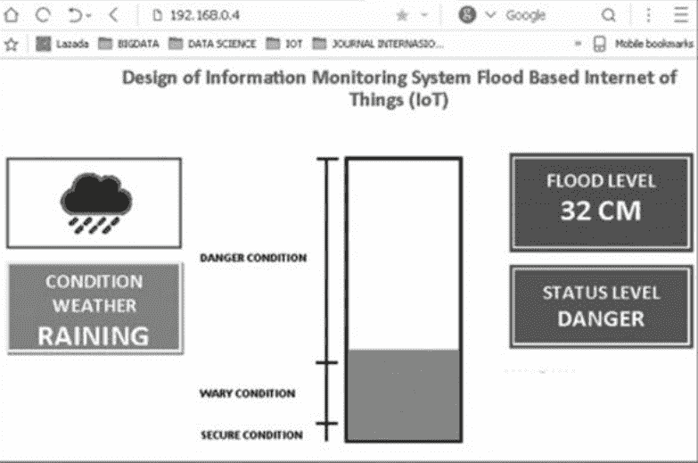
图11.5 总体输出

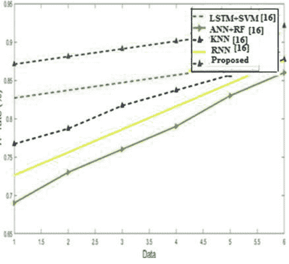
图11.6 数据与TP率

图11.9显示，所提出的方法论的最大精度为91.2%，优于其他方法。

图11.10显示了所提出的方法的最大召回率为91.3%，比其他方法更好。与其他现有方法相比，建议的方法表现出色。

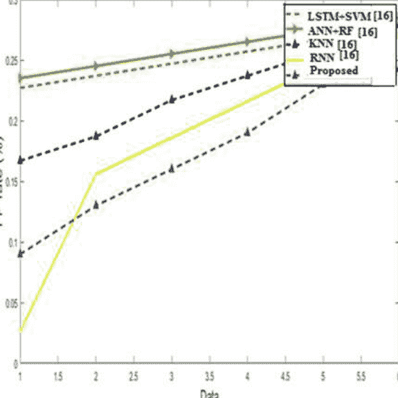
图11.7 数据与FP率

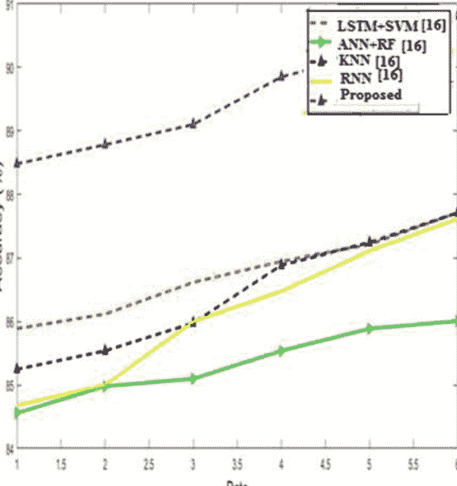
图11.8 准确性与提出的工作比较

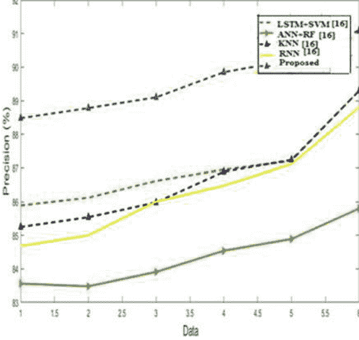
图11.9 数据与精确度

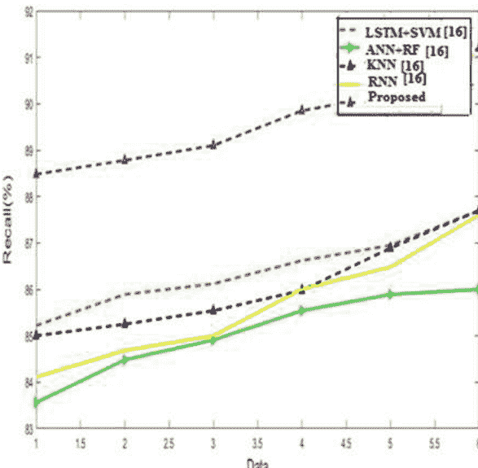
图11.10 数据与召回率

## 结论

基于网络系统的集成数据提取工具可用于研究特定研究计划的洪水监测和预警系统，例如Sentinel Asia项目。因此，危机管理将比以往任何时候都更加有效。此外，监测数据的可用性和物联网网络的可靠性和稳定性至关重要。将来的发展中将包括来自现场数据的天气和水文信息，从而实现更准确的洪水分析。将创建一个更准确、可信赖和高效的预测系统。然而，灾害管理系统中的空白可以通过各种变量来填补。例如，需要考虑水流和河流水位。除此之外，当地组织应自动接收和整合传感器数据和支持数据（如土地利用/覆盖、道路），作为疏散和管理计划所需的数据的一部分。使用基于Web的系统来评估和提取信息是这项研究的独特之处和核心。

目标包括创建一个易于使用、低成本的数据处理接口，可以尽早识别出洪水地区。技术和非技术用户都可以从建议的解决方案中受益。有多种方法可以应用这个系统的想法。根据作者的说法，这个想法将扩展未来实时灾害监测系统的研究领域。系统从手动检测转向自动检测和交付。作为一个现实的计划，预计会取得成功。这个系统支持广泛的操作系统，旨在提供快速的处理服务和良好的用户体验。提出的研究提出了一种混合CDNN-ANN分类技术来管理大数据集样本。通过使用聚类方法和混合CDNN-ANN分类器，经过训练的持久分类器可以可靠地使用降雨数据集预测洪水。以下是需要在未来进一步讨论的问题：

- 传感器网络启用 (SWE)：开放地理空间联盟 (OGC) 致力于推动该领域。如何为连接地球观测设备与基于Web的标准开发标准将成为研究小组的重点。在接下来的几个月中，将密切关注使用传感器观测系统获取卫星图片的努力，使用OGC的测量标准。对于没有照片的用户，目标是访问传感器数据。
- 水文数据：根据从现场获得的水位和降雨数据计算出入河流的水量。通过对传感器收集的信息进行最终评估和整合，验证整个释放量。
- 区域提取算法：为了获得更好的结果，应改进高海拔地区的淹没区域提取算法。应该检查各种卫星图片，如Aster图像。
- 积极沟通和发布：当局和当地居民必须密切合作，制定全面的策略，及时发布警告。为用户提供实用和有用的信息，并鼓励他们使用该系统。

## 参考文献

- 1. Mendoza-Cano, O., Aquino-Santos, R., López-De la Cruz, J., Edwards, R.M., Khouakhi, A., Pattison, I., 等: 基于物联网的墨西哥科利马洪水监测的实验。水文信息学杂志 23, 385-401 (2021年)
- 2. Rani, D.S., Jayalakshmi, G., Baligar, V.P.: 基于低成本物联网的洪水监测系统，使用机器学习和神经网络：洪水警报和降雨预测。 在: 2020年第二届创新机制在工业应用国际会议（ICIMIA），pp. 261-267（2020年）
- 3. Shah, W.M., Arif, F., Shahrin, A., Hassan, A.: 基于物联网的洪水警报系统的实施。国际先进计算机科学应用杂志 9, 620-623（2018年）
- 4. Satria, D., Yana, S., Munadi, R., Syahreza, S.: 基于Arduino和GSM模块的Google地图洪水监测系统原型。国际研究工程技术期刊 4, 1044-1047 (2017)
- 5. Ragnoli, M., Barile, G., Leoni, A., Ferri, G., Stornelli, V.: 一种自主低功耗基于LoRa的洪水监测系统。低功耗电子应用杂志 10, 15 (2020)
- 6. Sood, S.K., Sandhu, R., Singla, K., Chang, V.: 基于物联网、大数据和高性能计算的智能洪水管理框架。可持续计算与信息系统 20, 102-117 (2018)
- 7. Chaduvula, K., Markapudi, B.R., Jyothi, C.R.: 基于微控制器8051的物联网洪水警报监测系统的设计与实现。今日材料: 会议论文集 (2021)
- 8. Mousavi, F.S., Yousefi, S., Abghari, H., Ghasemzadeh, A.: 使用机器学习设计基于物联网的洪水早期检测系统。 在: 2021年第26届国际计算机会议 , 伊朗计算机学会 (CSICC), 第1-7页 (2021)
- 9. Kumar, M.A., Singh, V., Chaubey, V.K., Singh, V.: 基于物联网的洪水检测器和早期预防方法指导以避免任何危险事件
- 10. Khalid, M.S.B., Shafiei, S.B.: 马来西亚的洪水灾害管理：洪水传递系统效果评估。国际社会科学与人文学报 5, 398 (2015)
- 11. Bande, S., Shete, V.V.: 使用物联网和神经网络的智能洪水灾害预测系统。在: 2017年智能国家智能技术国际会议（SmartTechCon）上，pp. 189-194 (2017)
- 12. Wijekoon, N.S., Pallewatte, C.D., Sandareka, P., Pradeep, R.: 洪水灾害管理的综合解决方案系统 (使用物联网和地理信息系统)
- 13. Atmojo, P.S., Sachro, S.S.: 灾害管理：由于洪水灾害而选择疏散路线。工程论文 171, 1478-1485 (2017)
- 14. Ghapar, A.A., Yussof, S., Bakar, A.A.: 互联网物联网(IoT)架构用于洪水数据管理. Int. J. Future Gener. Commun. Netw 11, 55-62 (2018)
- 15. Sumitra, I., Supatmi, S.: 万达地区使用三个参数的Mamdani模糊推理系统进行洪水灾害预测. In: IOP Conference Series: Materials Science and Engineering, p. 042008 (2019)
- 16. Khalaf, M., Alaskar, H., Hussain, A.J., Baker, T., Maamar, Z., Buyya, R., et al.: 通过集成机器学习模型实现物联网(IoT)洪水严重程度预测. IEEE Access 8, 70375-70386(2020)

# 第12章 人工神经网络(ANN): 概念与在脑肿瘤分割中的应用
Amit Verma

## 介绍
如今，人工智能（AI）已经成为几乎所有领域改善准确性和自动化工作的一部分，具有更高的精度。在医疗领域，仍然有很多领域可以在AI方面发挥重要作用，以实现更好的诊断。脑肿瘤分割是一个新兴领域，许多研究人员正在进行基于医学磁共振成像（MRI）的脑肿瘤分割过程的自动化工作。从广义上讲，脑肿瘤分割的术语意味着在MR图像中识别肿瘤的存在或不存在。它不仅限于识别肿瘤的存在或不存在，还可以通过基于AI的算法确定肿瘤的确切区域，从而帮助医生进行更好的诊断。迄今为止，已经提出了各种自动和半自动的分割方法[1-3]。完全自动化的方法[4,5]需要非常高的计算时间，并且种子像素由算法自动选择。而在半自动方法[6-8]中，用户手动选择感兴趣区域（ROI）作为算法的输入，因此与完全自动化方法相比，计算时间较短。许多研究人员广泛使用人工神经网络（ANN）来实现脑肿瘤分割的自动化/半自动化过程，以提高准确性。ANN基于大脑的工作和结构，如图12.1所示，大脑的基本结构类似于神经网络。树突作为ANN中的输入层，从用户那里接收输入并将其提供给神经元进行处理，然后发送到输出层。如图12.1b所示，有三个输入被提供给神经元进行一些处理，并具有一些特定的权重。神经元处理信息并提供结果。

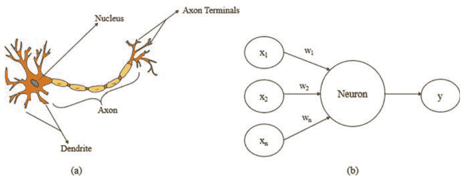
图12.1 脑神经元结构被描绘为ANN基本结构

ANN用于从医学图像中提取信息，用于MRI中的脑肿瘤分割和分类。基于ANN的方法与机器学习方法相比产生更好的结果，主要使用两种方法进行分割/分类方法，即基于块的方法和语义分割[13-17]。

## 人工神经网络（ANN）和激活函数的概念
一个非常基本或单层的神经网络包括输入层、神经元和输出层。神经元根据输入层提供的信息和分配的权重进行处理，并提供输出。每个神经元执行两个步骤，首先将输入值和权重求和，并在求和结果上应用激活函数，如图12.2所示。在第一步中，输入值和权重的求和如方程12.1所示，其中n是特征的数量（x1，x2，...，xn）。

图12.2 神经元
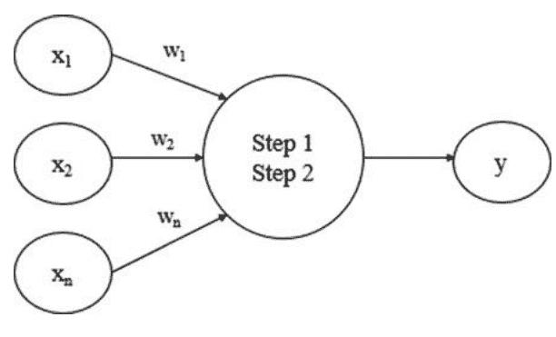

$$S=\sum_{i=1}^{n} W_{i} X_{i} \quad (12.1)$$

第二步是将激活函数应用于特定的神经元。激活函数根据S的值决定神经元是否被激活或保持非激活状态。在从左到右的前向传播过程中，激活函数决定哪些神经元将参与预测最终结果y'，如图12.3所示。现在，将预测结果y'与该输入（数据集的单行）的实际y进行比较。现在，调整权重以使y'和y之间的差异最小化，如方程12.2所示。该方程被平方以消除负号。调整权重的过程将继续，直到C的值接近零为止。

$$C=\frac{1}{2}\left(y^{\prime}-y\right)^{2} \quad (12.2)$$

将权重进行递归调整以最小化C，即均方误差（MSE）的过程称为反向传播[18,19]。

图12.3 基于激活函数的前向传播过程
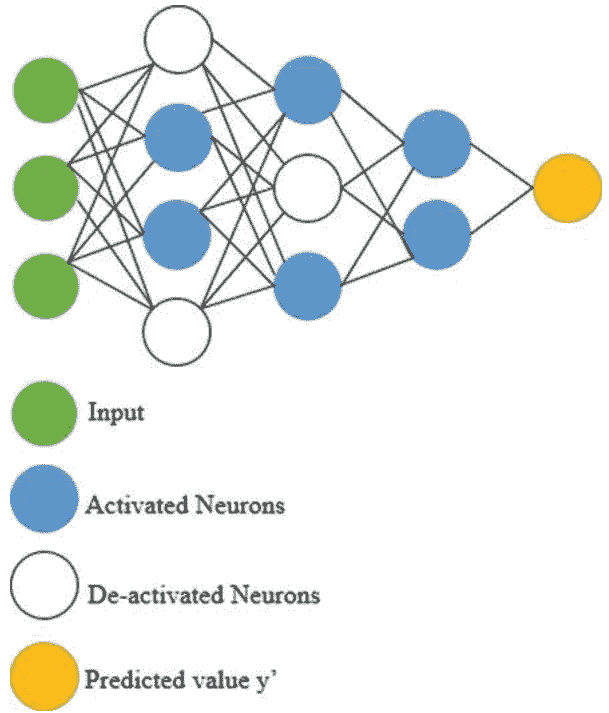

### 激活函数($\Phi$)
根据激活函数决定特定神经元是否对结果的预测有贡献。激活函数$\varphi$应用于$S$的值。根据问题可以使用多种激活函数[20-25]。

### 阈值函数
它用于二元分类问题，即结果属于两个类别之一（例如0或1，$A$或$B$）。阈值函数不能用于多类问题。阈值函数的图示如图12.4所示，其中$y$轴表示预测输出$y'$，$x$轴表示输入和分配权重的总和。现在，让我们使用神经网络和阈值函数来解决AND运算的正确输出问题。

考虑到AND操作的表12.1，现在我们将设计一个神经网络来预测基于输入和权重的结果。

考虑到图12.5，第一个节点是有偏置的单元，其他两个节点是输入和权重，它们的连接都被赋予蓝色，即每个连接都是10。现在，当第一行作为输入传递给网络时，在神经元中计算$S$，并对其应用阈值激活函数以获得$y$的值。

```
S = 10 + 10 * x1 + 10 * x2
S = 10 + 10 * 0 + 10 * 0
S = 10
```

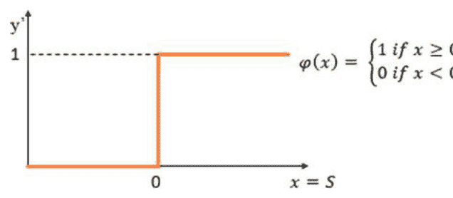
图12.4 阈值激活函数

表12.1 AND操作
| X1 | X2 | Y |
|---|---|---|
| 0 | 0 | 0 |
| 0 | 1 | 0 |
| 1 | 0 | 0 |
| 1 | 1 | 1 |

图12.5 第一个输入的神经网络
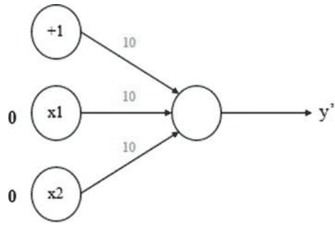

现在，在S的值上应用激活函数：
```
φ(S) = φ(10)
```
根据图12.4，φ(10)的值将等于1，所以对于这个特定的输入，y′将等于1。但是，根据表12.1，它必须等于0。

因此，根据方程12.2，C的值等于1/2，这是非常高的。现在为了最小化C的值，进行反向传播来调整权重，如图12.6所示。

现在，我们再次使用新的权重计算新的y′，如下所示：
```
S = -30 + 20 * x1 + 20 * x2
S = -30 + 20 * 0 + 20 * 0
S = -30
```

现在，在S的值上应用激活函数：
```
φ(S) = φ(-30)
```

图12.6 具有新权重的神经网络
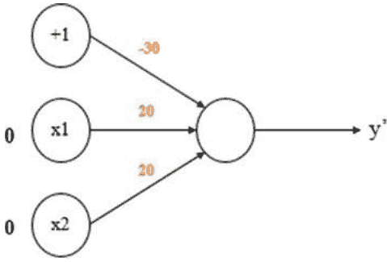

图12.7 第二个输入在输入层中给出
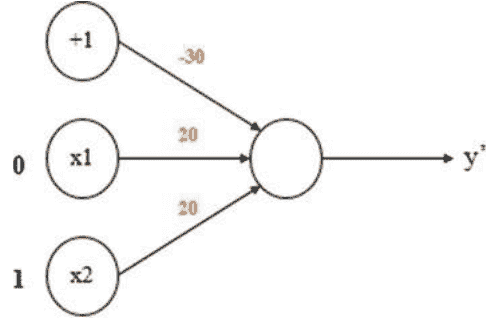

根据图12.4，φ(-30)的值将等于0，因此对于这个特定的输入，y'将为0。由于这个特定输入的实际值y也是0，因此我们将考虑这些权重，并计算另一组输入（第二行）的值，如图12.7所示。

再次计算S和φ(S)的值以计算y'的值。
S = -30 + 20 * x1 + 20 * x2
S = -30 + 20 * 0 + 20 * 1
S = -10

现在，在S的值上应用激活函数：
φ(S) = φ(-10)
根据图12.4，φ(-10)的值将等于0，所以对于这个特定的输入，y'将等于0。由于这个特定输入的实际值y也是0，因此我们将考虑这些权重并计算另一组输入的值（第三行）。

S = -30 + 20 * x1 + 20 * x2
S = -30 + 20 * 1 + 20 * 0
S = -10
现在，在S的值上应用激活函数：
φ(S) = φ(-10)
再次，φ(-10)的值为0，所以对于这个特定的输入，y'将等于0。由于这个特定输入的实际值y也是0，因此我们将考虑这些权重并计算另一组输入的值（最后一行）。

S = -30 + 20 * x1 + 20 * x2
$$S = -30 + 20 * 1 + 20 * 1$$
$$S = 10$$

现在，在S的值上应用激活函数：
$$\varphi(S) = \varphi(10)$$
根据图12.4，φ(10)的值将等于1，所以对于这个特定的输入，y'将等于1。由于这个特定输入的实际值y也是1，因此我们的模型在预测AND操作的结果时工作正确和准确。

### Sigmoid函数
Sigmoid函数的工作原理与前一节讨论的相同，唯一的区别是Sigmoid函数的图形或表示方式不同，如图12.8所示。根据图中的说明，y轴表示预测输出y'，x轴表示输入和分配权重的总和。

在这种情况下，我们将看到Sigmoid函数在相同的AND逻辑下的工作原理，并将加权神经网络表示如图12.7所示。当将表12.1的第一行作为输入提供给神经网络时，神经元中的S和φ(S)的值将被计算得到。

$$S = -30 + 20 * x1 + 20 * x2$$
$$S = -30 + 20 * 0 + 20 * 0$$
$$S = -30$$

根据图12.8中显示的Sigmoid图，当S = -30时，即x = -30，x的值远离0；因此，φ(x)的值将为0，即y' = 0。而实际标签y的值也为0，因此该模型在这些权重下工作得很好。同样地，第二行作为输入传递给神经网络，计算得到S和φ(S)的值。

图12.8 表示Sigmoid激活函数
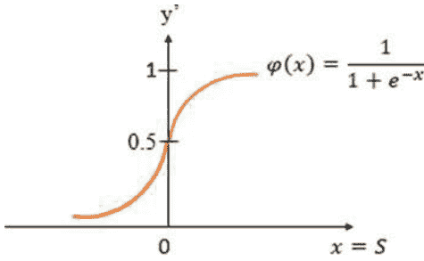

$$S = -30 + 20 * x1 + 20 * x2$$
$$S = -30 + 20 * 0 + 20 * 1$$
$$S = -10$$

根据Sigmoid图，x仍然位于0的左侧；因此，φ(x)的值将接近于0，即y'=0。按照类似的过程，将为第三个输入行预测输出。

$$S = -30 + 20 * x1 + 20 * x2$$
$$S = -30 + 20 * 1 + 20 * 0$$
$$S = -10$$

再次，x的值在0的左边；因此，φ(x)将接近于0，即y'=0。最后，我们计算最后一行的输入。

$$S = -30 + 20 * x1 + 20 * x2$$
$$S = -30 + 20 * 1 + 20 * 1$$
$$S = 10$$

在这种情况下，S的值为10，x的值为10，根据S型曲线图，x将位于0的右侧。因此，φ(x)将接近于1，即y'=1。

### 双曲正切（tanh）
这个激活函数与S型函数非常相似，唯一的区别是它接受任何输入值并将其缩放到-1到1的范围内，而S型函数将输入缩放到0到1的范围内。如果输入是一个较大的实数，则输出将接近于1；如果输入到激活函数的值为较大的负数，则激活函数的输出将接近于-1，如图12.9所示。

### 整流器函数（ReLU）
它只传播正输入，即如果 S 的值大于0，其中 S 是权重和输入的乘积的总和，如公式12.1所示。ReLU的图形显示在图12.10中，如果 x > 0，则 φ(x) 的值将等于 x，其中 x = S。

图12.9 ReLU激活函数的表示
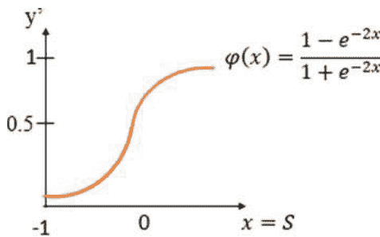
图12.10 整流器激活函数的表示
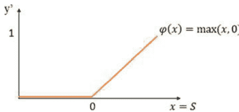

ReLU激活函数是神经网络中最常用的函数之一，用于多层网络，或者可以说它是多层神经网络中的默认激活函数。由于阈值激活函数只能用于二元分类问题，sigmoid和tanh激活函数在反向传播中面临梯度消失的问题[26]，无法调整权重。

## 人工神经网络中的步骤
在这里，我们将讨论应用人工神经网络解决特定问题所需的基本步骤。
- 步骤1：随机分配第一层的权重，建议权重接近于0但不为0，可以在-0.5到+0.5的范围内。
- 步骤2：将数据集的第一行输入到输入层，输入层的节点数应等于独立输入的数量，即特征数或列数。
- 步骤3：现在，从左到右传播网络，通过分配权重和应用激活函数，直到得到预测输出y'。这个过程称为前向传播。
- 步骤4：现在，计算预测输出y'与实际输出y之间的差异，并从最后一层向第一层调整权重，通常是从右到左调整。应该以这样的方式调整权重，使得误差最小化。从右到左调整权重的过程称为反向传播。
- 步骤5：现在，重复上述4个步骤，可以一次性为每个输入完成，然后在此之后调整权重，也可以一次性为一批输入完成，然后在获取特定批次的误差后更新权重。
- 步骤6：在一个时代之后，可以重复该过程多次，直到获得全局最小值。这里，时代意味着在网络中输入所有数据后获得神经网络（带有权重）。可以进行更多的时代，直到达到全局最小值。

## 应用人工神经网络（ANN）进行脑肿瘤分割
图像分割被定义为从图像中分割出感兴趣区域的过程。它在医学科学领域有广泛的应用。主要用于脑肿瘤分割、组织分类、骨折检测、肿瘤体积计算、肺肿瘤分割等等。脑肿瘤被认为是任意形状的组织异常增长。它可以是恶性或良性，只有恶性细胞是癌细胞，其增殖或生长速度非常快。MRI被认为是脑肿瘤分割领域的一项进化发展。

MRI提供了关于不同模态的脑组织的重要信息，如FLAIR，T1，T1c和T2。根据BraTS2013数据集[27]，图12.11显示了具有分割掩模的各种模态的MR图像。这些MRI由放射科医生进行手动或基于知识的脑肿瘤分割分析，以生成相应的报告。这些报告对人为错误非常敏感。此外，基于MR图像的脑肿瘤手动分割是一项非常繁琐的任务。由于这些报告在患者诊断中起着关键作用，因此，脑肿瘤分割的准确性和来自不同MRI机器的报告的一致性是医学科学领域的两个主要问题。

考虑到上述要求，使用高准确性的自动化方法对脑肿瘤MR图像进行分割是不可或缺的。因此，许多研究人员为脑肿瘤分割贡献了各种半自动化和全自动化的方法。随着机器学习的发展，许多研究人员提出了在脑肿瘤分割方面取得显著结果的各种方法。支持向量机，随机森林，KNN和K均值聚类是一些主要用于脑肿瘤分割的机器学习算法。然而，基于机器学习的模型的准确性仍有很大的提升空间。此外，即使提供了大量的数据，机器学习模型的准确性仍然停滞不前。随着高质量MRI数据的丰富可用性，神经网络成为各种研究人员的新兴方法。

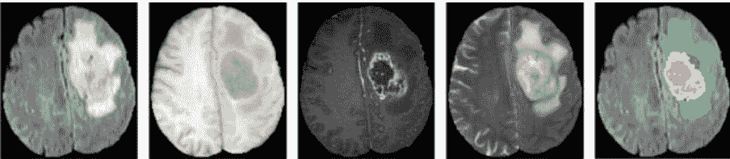
图12.11 脑肿瘤MRI模态FLAIR、T1、T1c和T2的示例

人工神经网络被研究人员采用作为脑肿瘤分割的有希望的方法。此外，它还用于像素级的二进制分类，即肿瘤或非肿瘤[28-30]。此外，多类别分类模型使用人工神经网络的结果比其他机器学习方法具有更高的准确性。人工神经网络是一个由人工神经元和多个隐藏层组成的复杂网络。输入层接收输入，在经过隐藏层的网络中传递，然后产生相关的输出。前向和反向传播用于微调网络以提高准确性或最小化损失。在[31]中，作者提出了一种融合SVM和人工神经网络的新方法进行脑肿瘤分割。图12.12显示了MR图像中分割的脑肿瘤。

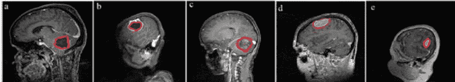
图12.12 脑肿瘤分割

前馈神经网络（FNN）是用于脑肿瘤分割的简单人工神经网络之一[32-35]。信息从输入层流向输出层，穿过多个隐藏层。FNN模型可以使用前向和反向传播方法进行训练。前馈神经网络[36]在准确率方面优于一些标准机器学习算法，如贝叶斯和KNN，准确率达到80%。

在[37]中，作者提出了一种基于反馈脉冲耦合神经网络的脑肿瘤分割方法，图像特征使用DWT提取。此外，还通过主成分分析减少了维度，以改善计算过程。Shenbagarajan等人[38]提出了一种新颖的脑肿瘤分割模型，将基于区域的主动轮廓模型与人工神经网络进行了集成分类。

## 结论
在这里，我们讨论了人工神经网络在解决复杂问题中的概念和重要性。详细讨论了激活函数的作用和类型，以及在特定问题中应该使用哪种激活函数。

人工神经网络在自动化分割各种医学图像（例如，脑肿瘤分割）的过程中起着至关重要的作用。通过这种自动化，可以在MR图像的结果中保持一致性，以便医生能够更好地诊断患者。激活函数在设计任何神经网络时起着重要作用。前向传播和反向传播的概念也被讨论。在未来，深度学习和机器学习算法可以在许多其他医学领域中使用，这些领域目前仍未被许多研究人员所探索，以在医学领域做出一些有用的贡献。

## 参考文献
1. Clark, M.C., Hall, L.O., Goldgof, D.B., Velthuizen, R., Murtagh, F.R., Silbiger, M.S.: 使用基于知识的技术进行自动肿瘤分割。 IEEE Trans. Med. Imaging 17 (2), 187-201 (1998)
2. Lynn, M., Lawrence, O.H., Dmitry, B., Goldgof, R.M.F.: 非增强型脑肿瘤的自动分割。 人工智能医学, 21, 43-63 (2001)
3. Wang, T., Cheng, I., Basu, A.: 流体向量流及其在脑肿瘤分割中的应用。 IEEE Trans. Biomed. Eng. 56 (3), 781-789 (2009)
4. Salah, M.B., 等: 使用两种MRI模态的完全自动化脑肿瘤分割。 在:视觉计算国际研讨会。Springer,柏林(2013)
5. Alqazzaz, S., 等: 使用多模态MR图像的自动化脑肿瘤分割 SegNet。计算视觉媒体 5 (2), 209-219 (2019)
6. Dubey, R.B., 等: MRI脑肿瘤的半自动分割。ICGST-GVIP J. 9 (4), 33-40 (2009)
7. Lim, K.Y., Mandava, R.: 一种多阶段半自动方法用于多序列脑肿瘤图像分割。专家系统应用。 112, 288-300 (2018)
8. Guo, X., Schwartz, L., Zhao, B.: 使用主动轮廓的多模态脑肿瘤半自动分割。多模态脑肿瘤分割。 27 (2013)
9. Raudys, Š: 一个神经元的演化和泛化: I. 单层感知器作为七个统计分类器。神经网络。 11 (2), 283-296 (1998)
10. Shynk, J.J.: 单层感知器的性能曲面。 IEEE Trans. Neural Netw. 1 (3), 268-274 (1990)
11. Auer, P., Burgsteiner, H., Maass, W.: 一个非常简单的通用逼近器的学习规则,由单层感知器组成。神经网络。 21 (5), 786-795 (2008)
12. Marcialis, G.L., Roli, F.: 通过具有类别分离损失函数的单层感知器融合多个指纹匹配器。模式识别信函。 26 (12), 1830-1839 (2005)
13. Kao, P.-Y., et al.: 通过利用位置信息改进基于补丁的卷积神经网络用于MRI脑肿瘤分割。前沿神经科学。 13, 1449 (2020)
14. Cordier, N., et al.: 基于补丁的脑组织分割。 MICCAI多模态脑肿瘤分割挑战。 IEEE (2013)
15. Sharif, M., 等: 一种基于补丁的融合特征方法用于脑肿瘤检测。 Cogn. Syst. Res. 59, 273-286 (2020)
16. Rezaei, M., 等: 一种用于脑肿瘤语义分割的条件对抗网络。 In: International MICCAI Brainlesion Workshop. Springer, Cham (2017)
17. Pereira, S., Alves, V., Silva, C.A.: 自适应特征重组和校准用于脑肿瘤分割:应用于MRI的研究。
18. Hecht-Nielsen, R.: 反向传播神经网络的理论。Neural Networks for Perception, pp. 65-93. Academic Press (1992)
19. Li, J., 等: 反向传播 (BP) 神经网络算法及其改进的简介。 In: Advances in Computer Science and Information Engineering, pp. 553-558. Springer, 柏林 (2012)

## 12 人工神经网络:在脑肿瘤分割中的概念和应用

- 20. Plagianakos, V.P., Vrahatis, M.N.: 使用阈值激活函数和约束整数权重训练神经网络。在: IEEE-INNS-ENNS国际联合会议论文集。 IJCNN 2000年。神经计算:新千年的新挑战和视角,第5卷。 IEEE (2000年)
- 21. Huang, G.-B.等: 阈值网络可以直接训练吗? IEEE Trans. Circuits Syst. II Express Briefs 53 (3) , 187-191
- 22. Jamel, T.M., Khammas, B.M.: 使用FPGA实现神经网络的S型激活函数。在: Al-Ma'moon大学学院第13届科学会议,第13卷(2012年)
- 23. Pratiwi, H.等: 选择人工神经网络最佳模型的S型激活函数。J. Phys. Conf. Series 1471 (1) (2020年)
- 24. Sartin, M.A., Da Silva, A.C.R.: 使用混合方法近似双曲正切激活函数。在: 2013年第8届可重构和通信中心芯片国际研讨会(ReCoSoC)。IEEE(2013年)
- 25. Agarap, A.F.: 使用修正线性单元(ReLU)的深度学习。arXiv预印本arXiv:1803. 08375 (2018)
- 26. Roodschild, M., Sardiñas, J.G., Will, A.: 解决Sigmoid激活函数中梯度消失问题的新方法。
- 27. Hu, K., 等: 使用多级级联卷积神经网络和条件随机场进行脑肿瘤分割。 IEEE Access 7, 92615-92629 (2019年)
- 28. Kharrat, A.,等: 一种基于遗传算法和支持向量机的脑MRI自动分类的混合方法。 Leonardo J. Sci. 17(1),71-82(2010)
- 29. Zacharaki, E.I.,等: 一种基于MRI纹理和形状的机器学习方案的脑肿瘤类型和级别分类。Magn. Reson. Med. Official J. Int. Soc. Magn. Reson . Med.62(6), 1609-1618(2009)
- 30. El-Dahshan, E.-S., Hosny, T., Salem, A.-B.: MRI脑图像分类的混合智能技术。Digit. Signal Process. 20(2),433-441(2010)
- 31. Chithambaram, T., Perumal, K.: 使用遗传算法和ANN技术进行脑肿瘤分割。在: 2017年IEEE国际电力、控制、信号和仪器工程学术会议(ICPCSI)。 IEEE(2017)
- 32. Kavitha, A.R., Chellamuthu, C., Rupa, K.: 基于改进的区域生长和神经网络的MRI图像脑肿瘤检测的高效方法。在: 国际计算机电子电气技术会议(ICCEET)1087-1095(2012年)
- 33. Damodharan, S., Raghavan, D.: 结合组织分割和神经网络进行脑肿瘤检测。国际阿拉伯信息技术杂志。12(1) , 42-52 (2015年)
- 34. Wang, S., Zhang, Y., Dong, Z., Du, S., Ji, G., Yan, J., Yang, J., Wang, Q., Feng, C., Phillips, P .: 通过PSO和ABC的混合优化的前馈神经网络用于异常脑部检测。国际图像系统技术杂志。25(2), 153-164 (2015年)
- 35. Muhammad, N., Fazli, W., Sajid, A.K.: 一种用于脑MRI分类的简单智能方法。智能模糊系统杂志28(3), 1127-1135 (2015)
- 36. El-Dahshan, El-Sayed, A., 等: 通过MRI进行人脑肿瘤的计算机辅助诊断: 调查和新算法。专家系统应用41(11),5526-5545(2014)
- 37. Damodharan, S., Raghavan, D.: 结合组织分割和神经网络进行脑肿瘤检测。国际阿拉伯信息技术杂志12(1)(2015)
- 38. Shenbagarajan, A., Ramalingam, V., Balasubramanian, C., Palanivel, S.: 使用ACM分割和ANN-LM分类技术进行MRI脑图像的肿瘤诊断。印度科学技术杂志9(1)

## 第13章

## 使用深度学习自动化脑肿瘤分割

Amit Verma

## 缩写

| 缩写 | 全称/含义 |
|---|---|
| BT | 脑肿瘤 |
| BTS | 脑肿瘤分割 |
| CAD | 计算机辅助诊断 |
| CNN | 卷积神经网络 |
| FCL | 全连接层 |
| GAP | 全局平均池化 |
| GMP | 全局最大池化 |
| ML | 机器学习 |
| MRI | 磁共振成像 |
| SOP | 乘积之和 |

© 作者 (们),在Springer Nature Singapore Pte Ltd.的独家许可下。2023年V.K adyan等人(编),深度学习技术用于可持续发展目标,先进技术和社会变革,https://doi.org/10.1007/978-981-19-5723-9_13
+   A. Verma (回)
    计算机科学学院,UPES,德拉敦,北阿坎德邦,印度
    e-mail: amit.verma@ddn.upes.ac.in

## 介绍

现在癌症是一种广泛传播的疾病,原因可能是不健康的饮食习惯、竞争激烈的世界中的压力增加,或其他原因。根据ASCO [1]的数据,由于癌症导致的死亡率正在迅速增加。脑肿瘤被认为是组织异常生长形成的肿块。BT可以广泛分为两种类型:恶性和良性,其中良性被认为是非癌性的[2]。良性BT生长缓慢或不生长,这些肿瘤可以通过手术轻松根除,并且几乎不会再次生长。然而,恶性肿瘤生长迅速,含有癌细胞组织,恶性BT是危及生命的。并且应密切监测它们的增长，以便及早发现恶性BT。此外，良性肿瘤大多具有均匀的形状，而恶性肿瘤则具有不规则的形状[3]。MRI是检测BT的一种成功和常用的技术[4]。它提供了大脑的解剖结构，并在分析大脑中肿瘤的存在时起重要作用。因此，放射科医生可以查看MRI并使用一些图形工具（如CAD）对肿瘤进行分割。医生可以使用报告对患者进行初步调查。在MRI中识别和标记肿瘤，并提供其大小的过程称为BT分割。这是根据放射科医生的经验手动完成的[5]。为了保持报告的一致性和更高的准确性，非常有必要开发一种自动化BT分割过程的算法。许多研究人员为使用脑部MRI分割肿瘤的过程贡献了各种最先进的。

自动BT分割是一项具有挑战性的任务，因为由于纹理相似性，很难区分恶性和相邻的健康组织。因此，全球研究人员将其分割为更高准确性的BT成为一个快速增长的研究领域[6]。基于机器学习（ML）开发了各种方法，例如需要手动选择种子点的区域生长方法[7]，水平集方法，模糊C均值(Fuzzy C-Means)和K-Means聚类基于模糊聚类方法。模糊聚类方法还需要数据的知识[8,9]。传统的机器学习方法需要先验知识的数据分布和特征，因此很难构建一个算法来自动化脑肿瘤分割的过程。因此，深度学习吸引了各种研究人员来实现这个目的。使用深度学习开发了多种自动化BT分割的方法，例如生成对抗网络[10]，深度玻尔兹曼机，变分自编码器，堆叠自编码器，CNN，其中CNN是医学领域中最常用的深度学习算法，用于自动化脑肿瘤在MR图像中的分割过程[11]。与机器学习相比，深度学习可以处理更大的数据集，并且可以提供最小人为干预的特征提取算法[12]。在过去的几十年中，已经开发了多个基于深度学习概念CNN [13,14]的架构，以使用BraTS数据集自动化BT分割的过程，以获得更好的准确性。在本章中，我们讨论了卷积神经网络的介绍。讨论了CNN的各种层，如卷积，最大池化，全连接网络，并介绍了CNN在脑肿瘤分割中的应用。

## 卷积神经网络

CNN在张量上工作[15]，张量可以被定义为高阶矩阵，其中y∈R^{A×B×C}是三阶张量，粗体字母表示向量符号，A，B，C是三个元素。RGB格式的每个彩色图像都是三阶的。以前，彩色图像被转换为2D图像，导致颜色的丢失。颜色的丢失可能是丢失重要信息，特别是在医学成像中，通过使用张量来解决将彩色图像转换为灰度图像的问题。CNN的输入参数是张量，CNN中也使用了更高阶的张量。张量可以被向量化[16]，如下所示是$2 \times 2$矩阵的向量化。要将$2 \times 2$矩阵向量化，首先将第一列向量化，然后是第二列，如公式13.1所示。

$$ A=\left[\begin{array}{ll} 1 & 2 \\ 4 & 5 \end{array}\right], \text{vec}(A)=(1\ 4\ 2\ 5)^{\mathrm{T}} $$

一般来说，对于n阶张量的向量化，首先将第一列向量化，然后是第二列，以此类推，然后将所有向量连接起来。CNN学习过程使用链式法则，假设$a \in R$和$b \in R$，其中'a'是一个标量单位，'b'是一个向量。现在，假设'c'是'b'的函数，方程13.2表示'c'对'b'的偏导数。

$$ \left|\frac{\partial c}{\partial b_{i}}\right|=\frac{\partial c}{\partial b_{i}} $$

现在，如果一个向量是另一个向量的函数，即$b \in R^{H}$和$d \in R^{W}$，并且'b'是'd'的函数。那么偏导数将如方程13.3所示。

$$ \left|\frac{\partial b}{\partial d_{j}}\right|=\frac{\partial b_{i}}{\partial d_{i}} $$

两个向量的偏导数将成为一个矩阵，其中'$i$'和'$j$'表示矩阵的行和列。因此，使用方程（13.2）和（13.3）我们可以推导出方程13.4。

$$ \frac{\partial c}{\partial d^{\mathrm{T}}}=\frac{\partial c}{\partial b^{\mathrm{T}}} \cdot \frac{\partial b}{\partial d^{\mathrm{T}}} $$

CNN架构是各种层和输入的组合，这些输入是张量，从每个层中处理，以使得一个层的输出成为另一个层的输入。CNN模型有三个主要层，即卷积层、池化层和全连接层，如图13.1所示。

### 卷积层

卷积层用于识别基本的边缘，如水平和垂直边缘。在深度卷积中，还可以识别出其他更复杂的边缘。

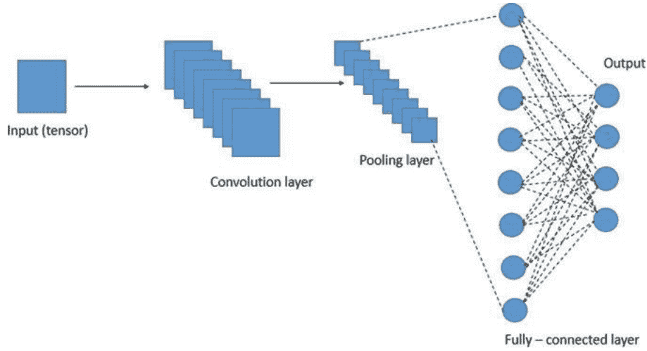
图 13.1 卷积神经网络

为了了解卷积层的工作原理，让我们考虑一个 3 ×4 的输入图像和一个 2 ×2 的卷积核。我们将卷积核与图像重叠，并根据图 13.2 中所示计算乘积。

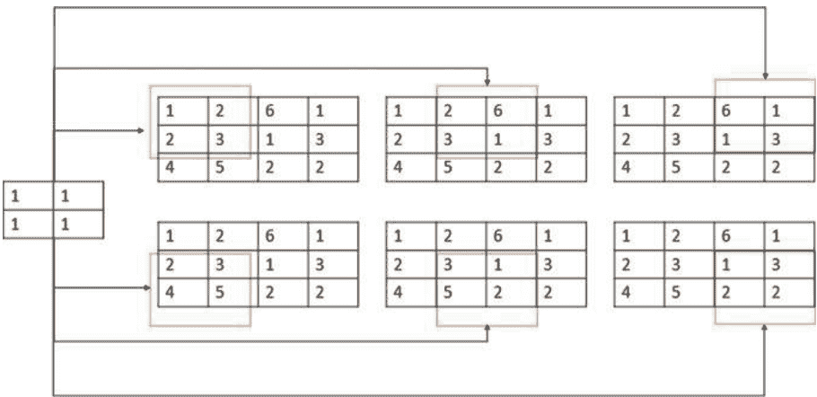
图 13.2 2 ×2 的卷积核与 3 ×4 的输入图像重叠

卷积核放置在输入图像的最右下角，并计算乘积。然后将其向下移动一个像素以计算新的乘积，并递归地进行该过程，直到卷积核矩阵达到图像底部像素，如图 13.3 所示。在图 13.3 中，乘积的求和是从右上到下的。当卷积核矩阵放置在

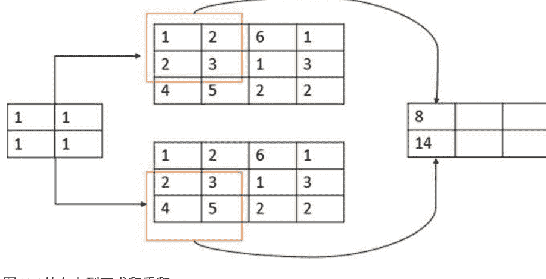
图13.3从右上到下求和乘积

如果将右上角作为起点，重叠像素的乘积之和将为(1×1)+(1×2)+(1×2)+(1×3)=8。同样地，将卷积核矩阵向下移动一个像素，并计算重叠像素的乘积之和，即(1×2)+(1×4)+(1×3)+(1×5)=14。

现在，我们将卷积核矩阵移动到顶部，并计算重叠像素的乘积之和，即(1×2)+(1×3)+(1×6)+(1×1)=12。

然后，计算下方窗口的乘积之和，即(1×3)+(1×5)+(1×1)+(1×2)=11。 这个过程继续进行，直到处理完剩余的像素，如图13.4和13.5所示。通过从输入图像的右上角开始计算乘积之和，将卷积窗口向下移动，并从下一个顶部到底部重新开始，我们得到最终的结果矩阵，如图13.5所示。

边缘检测是脑肿瘤检测中的一个主要问题。 卷积网络提供各种核心滤波器来检测几乎所有的边缘。 在卷积网络中，这些核心的大小主要为3×3×3。 更具体地说，用于检测或创建特征图以突出图像中水平线(KH)和垂直线(KV)的细节的滤波器（图13.6）。

### 池化层

卷积层的输出被传递给池化层，池化层分别应用于每个特征图，以减小特征图的大小，实现快速计算，并减少内存需求。 通过减少参数的数量，池化层控制过拟合[17]。 池化的最常见形式是在卷积层的输出上使用2D滤波器，对每个特征图进行尺寸缩小。 池化可以广泛分为三种类型：最大池化、平均池化和全局池化。在最大池化的情况下，2D滤波器在每个特征图上滑动，通过在块中取特征图的值中的最大值来减小特征图的大小，如图13.7所示。


图13.4计算输入图像中从中间顶部到底部重叠像素的SOP


图13.5计算从顶部到底部的最后一个SOP和最终矩阵


图13.6用于检测水平和垂直边缘的卷积核
```
$K_H = \left[ \begin{array}{ccc} 1 & 1 & 1 \\ 0 & 0 & 0 \\ -1 & -1 & -1 \end{array} \right] \quad K_V = \left[ \begin{array}{ccc} 1 & 0 & -1 \\ 1 & 0 & -1 \\ 1 & 0 & -1 \end{array} \right]$
```
其中一个块在4×4特征图上滑动，将特征图下采样为2×2。在平均池化的情况下，不是取块中的值的最大值，而是取所有值的平均值。如

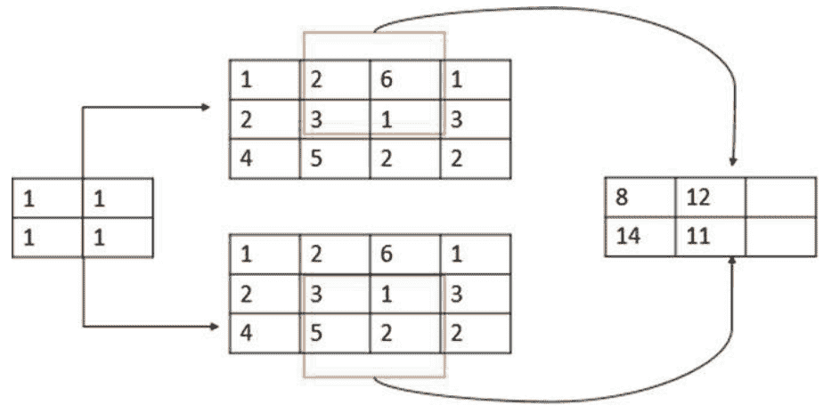
图13.7最大池化

如图13.8所示, 取进入块中的特征图的所有值的平均值。 池化分别应用于所有特征图, 因此每个特征图的大小都会减小。 当“不重要”的特征根本不重要时, 使用最大池化, 我们只考虑滑动块下的特征图的最大值。 而平均池化可以是更好的选择, 当我们不想完全忽略“不重要”的特征时。 最大池化和平均池化的主要区别在于, 在最大池化的情况下, 只考虑最强的特征, 而忽略其他所有特征, 但在平均池化的情况下, 不会发生这种情况。

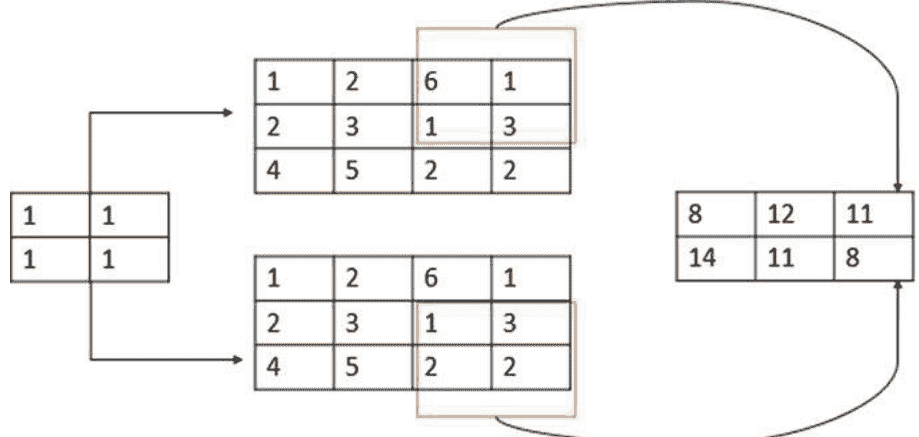
图13.8 平均池化

### 全连接层

池化层的输出被展平成一列向量。 假设最大池化的结果体积为3×3×100, 这意味着有100个3×3维度的矩阵。
然后, 输出体积被展平成1×900的列向量, 并作为卷积网络的全连接层的输入。 输入层的神经元数量将等于列向量的长度 (在本例中为900)。 这些输入在第一次前向传播步骤之前通过多个隐藏层和激活函数传递, 如图13.11所示。绿色框表示隐藏层的神经元数量。 输入层与第一个隐藏层完全连接。
这意味着输入层的每个神经元都与第一个隐藏层的每个神经元相连, 如图中所示, 第一个神经元与第一个隐藏层的每个神经元相连。 所有隐藏层也都是完全连接的。 类似地, 最后一个隐藏层与输出层完全连接。 为了保持图示简单, 各层之间的全连接用单箭头线表示。

图13.11卷积神经网络模型的全连接层


## 卷积神经网络在脑肿瘤分割中的应用

脑肿瘤可以广泛分为两类: 恶性和良性[18]。恶性肿瘤细胞分裂快, 生长迅速。恶性肿瘤具有生命威胁，因此脑肿瘤分割主要关注恶性肿瘤的分割。由于脑肿瘤的异常生长和不规则形状，准确地分割脑肿瘤始终是一个具有挑战性的任务。

MRI在脑肿瘤分析和提供不同模态的脑部图像方面起着关键作用。脑肿瘤的基本模态包括FLAIR、T1和T2，如图13.11所示[19]。基于这些MRI图像，机器操作员和放射科医生会准备一份关于肿瘤当前状态的报告。手动分割脑肿瘤是一项非常繁琐的任务，它依赖于操作员的知识和经验。这种手动分割始终容易出现人为错误，并且在不同环境下两台不同机器的报告之间存在不一致性。

放射科医生的报告被视为医生开始给患者开药的基础。此外，正确治疗脑肿瘤高度依赖于MRI的报告。

为了克服上述所有缺点，非常有必要基于MRI开发一种自动化的高精度脑肿瘤分割方法。因此，在过去几十年中，许多研究人员提出了多种方法和最新技术，以提供一种高效的自动化手段来进行手动分割，并提供高精度的所有病变分割。

直到2015年，研究人员使用机器学习算法如SVM [20]、逻辑回归 [21]、随机森林 [22]、KNN [23]和K均值聚类 [24]来提出各种半自动化和自动化的脑肿瘤分割方法。这些机器学习方法非常高效，计算时间要求很低。之所以优先选择这些方法，是因为它们在有限的数据量上可以获得更好的结果 [25-27]。然而，观察到即使增加训练数据，这些方法的准确性也基本保持不变，如图13.12所示。此外，机器学习方法需要手工设计特征提取用于训练模型的代码[28-31]。 任何基于机器学习的模型的结果在很大程度上取决于从训练图像中提取特征的能力。 一些高效的方法，如GLCM [32] ，run-length编码[33]，LBP [34]和HMM [35]，被研究人员用于从训练图像中提取特征。 从图像中提取手工特征是一项繁琐的任务，并增加了跳过重要信息的可能性。 深度学习算法几乎完全克服了使用机器学习算法的两个主要缺点。 深度学习方法提高了随着训练数据增加的准确性，如图13.13所示。此外，在训练模型之前不需要任何预处理过程进行特征提取。 凭借这些深度学习方法的巨大优势，在过去的十年中，脑肿瘤分割的研究领域被深度学习为基础的研究文章所淹没。

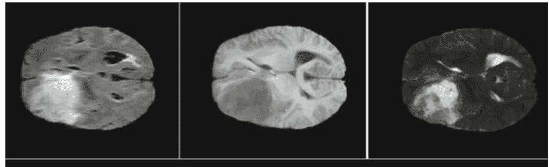
图13.12 MRI中的不同脑肿瘤模态

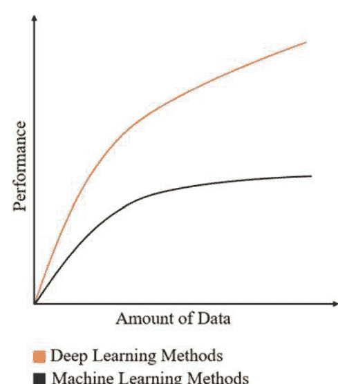
图13.13随着数据量的增加，基于机器学习和深度学习的方法的性能变化

## 结论

在本章中,我们讨论了医生使用MRI诊断脑肿瘤的方法,以及在MRI报告中提供自动分割脑肿瘤的方法的重要性。深度学习算法在提供自动检测脑MRI中的肿瘤细胞方面具有重要意义。CNN是最常见和广泛使用的深度学习算法,被各种研究人员用于解决这个目的。因此,我们主要讨论了卷积神经网络方法,重点介绍了卷积和池化的过程。还提到了基于卷积神经网络的提出的架构在使用MR图像分割脑肿瘤方面的应用。

## 参考文献

1. 美国临床肿瘤学会 (ASCO)。http://www.asco.org/
2. 约翰, P.: 基于小波和纹理的神经网络进行脑肿瘤分类。国际科学工程研究杂志 3(10), 1-7 (2012)
3. 阿方斯, M., 塞勒姆, A.B.M.: 使用支持向量机通过MRI自动分类脑肿瘤。埃及计算机科学杂志 40(3) (2016)
4. 佩雷拉, S., 平托, A., 阿尔维斯, V., 席尔瓦, C.A.: 使用卷积神经网络在MRI图像中进行脑肿瘤分割。IEEE医学成像杂志 35(5), 1240-1251 (2016)
5. 丹迪尔, E., 恰基罗-格鲁, M., 埃克-西, Z.: 基于MR图像的恶性和良性脑肿瘤的计算机辅助诊断。在: ICT创新国际会议, 第157-166页。斯普林格, Cham (2014)
6. Xiao, Z., Huang, R., Ding, Y., Lan, T., Dong, R., Qin, Z., et al.: 基于深度学习的脑肿瘤分割方法在MR图像中的应用。在: 2016年IEEE第六届国际生物和医学科学计算进展会议 (ICCABS), 第1-6页。IEEE (2016)
7. Balasubramanian, C., Saravanan, S., Srinivasan, K.G., Duraiswamy, K.: 基于区域生长技术的脑肿瘤自动分割。生命科学杂志 10(2) (2013)
8. Selvakumar, J., Lakshmi, A., Arivoli, T.: 使用K均值聚类和模糊C均值算法在脑MR图像中进行脑肿瘤分割及其面积计算。在: IEEE-国际工程、科学和管理进展会议 (ICAESM-2012), 第186-190页。IEEE (2012)
9. Clarke, L.P., Velthuizen, R.P., Camacho, M.A., Heine, J.J., Vaidyanathan, M., Hall, L.O., et al.: MRI分割: 方法和应用。磁共振成像 13(3), 343-368 (1995)
10. Pouyanfar, S., Sadiq, S., Yan, Y., Tian, H., Tao, Y., Reyes, M.P., et al.: 关于深度学习的调查: 算法、技术和应用。ACM计算机调查 (CSUR) 51(5), 1-36 (2018)
11. Pereira, S., Alves, V., Silva, C.A.: 自适应特征重组和校准用于语义分割: 应用于MRI中的脑肿瘤分割。在: 国际会议医学图像计算与计算机辅助干预, 第706-714页。斯普林格, Cham (2018)
12. Najafabadi, M.M., Villanustre, F., Khoshgoftaar, T.M., Seliya, N., Wald, R., Muharemagic, E.: 深度学习在大数据分析中的应用和挑战. J. Big Data 2(1), 1-21 (2015)
13. Gao, X.W., Hui, R., Tian, Z.: 基于深度学习网络的CT脑图像分类. 计算方法程序生物医学 138, 49-56 (2017)
14. Zhao, L., Jia, K.: 基于判别机制的深度特征学习用于脑肿瘤分割和诊断. 在: 2015年智能信息隐藏和多媒体信号处理国际会议 (IIH-MSP), pp. 306-309. IEEE (2015)
15. Wu, J.: 卷积神经网络简介. 新软件技术国家重点实验室第5卷, 第23页. 中国南京大学 (2017)
16. Stock, K., Pouchet, L.N., Sadayappan, P.: 使用机器学习改进自动向量化。ACM Trans. Architecture Code Optimization (TACO) 8(4), 1-23 (2012)
17. O'Shea, K., Nash, R.: 卷积神经网络简介。arXiv预印本arXiv:1511.08458 (2015)
18. Rezaeil, K., Agahi, H.: 使用加权核宽度的SVM进行恶性和良性脑肿瘤分割和分类。Signal Image Process. Int. J. (SIPIJ) 8(2), 25-36 (2017)
19. Bakas, S., et al.: 在BRATS挑战中识别最佳的机器学习算法进行脑肿瘤分割、进展评估和总体生存预测。arXiv预印本arXiv:1811.02629 (2018)
20. Amin, J., 等: 使用统计和机器学习方法进行脑肿瘤检测。Comput. Methods Programs Biomed. 177, 69-79 (2019)
21. Havaei, M., 等: 用于脑肿瘤分割的脑内分类。Int. J. Comput. Assist. Radiol. Surg. 11(5), 777-788 (2016)
22. Zhao, X., 等: 集成FCNNs和CRFs的深度学习模型用于脑肿瘤分割。Med. Image Anal. 43, 98-111 (2018)
23. Işın, A., Direkoğlu, C., Şah, M.: 基于MRI的脑肿瘤图像分割的深度学习方法综述. Procedia Comput. Sci. 102, 317-324 (2016)
24. Havaei, M., 等：使用深度神经网络进行脑肿瘤分割。Med. Imag. Anal. 35, 18-31 (2017)
25. Magadza, T., Viriri, S.: 深度学习用于脑肿瘤分割的最新研究综述. J. Imag. 7(2), 19 (2021)
26. Suthaharan, S.: 支持向量机. 用于大数据分类的机器学习模型和算法, 第207-235页. Springer, Boston, MA (2016)
27. Peng, C.-Y.J., Lee, K.L., Ingersoll, G.M.: 逻辑回归分析和报告简介. J. Educ. Res. 96(1), 3-14 (2002)
28. Livingston, F.: 实施Breiman的随机森林机器学习算法. ECE591Q Mach. Learn. J. Paper 1-13 (2005)
29. Bijalwan, V., et al.: 基于KNN的文本和文档挖掘的机器学习方法. Int. J. Database Theory Appl. 7(1), 61-70 (2014)
30. Ahmad, A., Dey, L.: 一种用于混合数值和分类数据的k均值聚类算法。数据知识工程 63(2), 503-527 (2007)
31. Mohanaiah, P., Sathyanarayana, P., GuruKumar, L.: 使用GLCM方法进行图像纹理特征提取。国际科学研究出版社 3(5), 1-5 (2013)
32. Bradley, S.D.: 优化游程编码方案。IEEE会议录 57(1), 108-109 (1969)
33. Guo, Z., Zhang, L., Zhang, D.: 一种用于纹理分类的局部二值模式算子的完整建模。IEEE图像处理期刊 19(6), 1657-1663 (2010)
34. Miller, David, R.H., Leek, T., Schwartz, R. M.: 一种隐藏马尔可夫模型信息检索系统。在：第22届年度国际ACM SIGIR会议研究与开发中心和信息检索论文集 (1999)
35. Angulakshmi, M., Lakshmi Priya, G.G.: 自动化脑肿瘤分割技术——综述。国际影像系统技术杂志 27(1), 66-77 (2017)
36. Wang, F., et al.: 应用系列多池化卷积神经网络进行医学图像分割。国际分布式传感器网络杂志 13(12), 1550147717748899 (2017)
37. Menze, B.H., Jakab, A., Bauer, S., et al.: 多模态脑肿瘤图像分割基准 (BRATS) 。IEEE T Med. Imaging 34(10), 1993-2024 (2015)
38. Kistler, M., Bonaretti, S., Pfahrer, M., et al.: 虚拟骨骼数据库：用于生物医学研究和合作的开放获取存储库。医学互联网研究杂志 15(11), e245 (2013)
39. Pereira, S., et al.: 关于使用完全卷积神经网络在MRI中进行分层脑肿瘤分割的初步研究。在：2017年IEEE第五届葡萄牙生物工程会议 (ENBENG) 。IEEE (2017)
40. Hussain, S., Anwar, S.M., Majid, M.: 使用深度卷积神经网络对脑部胶质瘤进行分割。 神经计算 282, 248-261 (2018)

# 第14章 使用物联网进行交通管理
## 深度学习预测各种交通状态
Amit Singh

## 介绍

在公共和私人车辆中运输通用商品是需要进行适当规划的最大任务之一，并且需要与规划和监控机构进行合作。由于公共和私人车辆的不断增加，道路交通也越来越拥堵，因此交通事故和堵塞是常见的问题。根据所提供的服务等级，规划和监控机构必须决定一个满足多约束条件的最优解决方案。图14.1显示了与运输管理系统相关的多个维度，从产品的制造到交付给消费者。

全球都面临着与交通系统相关的这些问题。在[1]中讨论了荷兰铁路运输系统背景下社会变革的动态。该文章重点介绍了世界一流的客货运输所面临的挑战和市场需求。

Tyan等人在[2]中讨论了用于电子商务设施的协同运输管理(CTM)以减少交货时间和可靠性。在[3]中考虑了基于启发式优化的算法，其中包括安全和环境成本等关键参数，用于西班牙的物流管理支持。为了减少印度的道路拥堵、污染和事故，提出了一篇鼓励公共交通并抑制私家车的文章[4]。

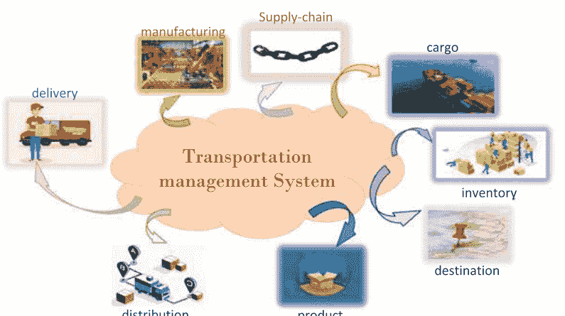
图14.1 运输管理系统的组成部分

发达国家也无法避免交通运输方面的挑战。Msigwa提出了坦桑尼亚的挑战和补救措施，并强调了事故、空气污染、交通拥堵和能源消耗等问题，并提出了减少这些问题的建议措施[5]。

任何企业的成功都取决于运输管理系统的效率和及时性，即如何将货物从仓库运送到消费者的地方。手动完成订单分割、路线规划和订单与车辆映射等任务无法保证工作的准确性。这种二十一世纪的手动机制可能会导致业务绩效和利润方面的问题。现有文献显示了大量文章，展示和解决了公共和货物运输领域的运输管理挑战，包括空运、公路运输和水运[6]。根据货物运输过程中的实时问题，图14.2列出了一些运输管理的挑战。

图14.2 传统交通系统的问题
- 交通挑战：
  - 最优性
    - 未使用的车辆容量
    - 最短距离航线
    - 运输成本
  - 顾客需求
    - 货物跟踪
    - 不便的订单交付
  - 库存管理
    - 物流支持
    - 库存管理不善

根据货物类型、运输方式和交付方式的不同，问题的种类也各不相同。上述问题如下：

### 车辆容量的低效利用

传统的交通系统管理方式有时无法准确估计车辆容量和订单-车辆映射等信息。此外，当系统过大时，资源的利用率总是不足。这些不足会降低各个领域的效率，如货物运输、道路、水路和空中交通的乘客车辆。

### 路线优化

实时交通信息需要与车辆驾驶员共享，以便在运行时做出决策，避免道路拥堵和坑洼不平的道路。由于其他因素可能会导致目的地延误，最短路线并不总是一个好选择。

### 订单跟踪

特别是在运行时跟踪货物是另一个具有挑战性的问题，因为一旦货物离开仓库，我们就无法再监控它。因此，使用传统的运输管理系统需要大量人力资源，通过多次通话与车辆人员联系以获取更新。

### 货物的延迟交付

运输系统的另一个困扰是货物按计划交付的延迟原因。一些货物，如蔬菜和水果，具有非常短的保质期，需要尽快送达消费者的地方。这种挑战直接影响客户的满意度和体验。

### 库存和物流的低可见性

人力资源可以管理事物，然而，自动系统可以更好地完成工作。物流和库存控制可以通过提高效率来减少人力资源。

### 运输成本

成本取决于货物的高效运输。需要多少人力资源，需要以多快的速度将物品运输到目的地，以及如何更新库存以确保供应链管理。

传统的运输管理系统存在许多难题，可以通过使用技术来解决。传感器和RFID技术的最新进展在开发智能设备和现实世界的物体方面引起了关注。通过物联网，物理设备可以智能地相互交互并传输其数据以进行进一步的应用[7]。

## 物联网在运输管理中的应用

构建智能城市和智能建筑的概念基于物联网系统。任何物理设备，如房屋、道路上行驶的车辆、路边杆、树木等都可以配备物联网设备[8]。无论是静态还是动态，配备物联网的物体可以与其他物体共享其运行时信息，并相互通信。例如，如果在道路上行驶的汽车可以相互通信，它可以利用其他汽车驾驶员的信息来避免拥堵和崎岖不平的道路。在交通管理中，道路交通被分析为“社会交通”[9]。作者将其称为交通中的车辆间通信。

物联网设备之间的通信是通过互联网进行的[10,11]。尽管物联网设备中使用互联网存在一些需要解决的挑战，但这是研究的另一个维度。然而，运输使用商业公共和私人车辆将产品从制造商运送到仓库，从仓库运送到经销商，从经销商运送到零售商，最后运送给消费者。同时，交通系统也用于日常人员通勤。如果这些乘客和货物车辆配备了物联网技术，可以通过互联网与另一辆车共享运行时数据，上述与交通相关的问题可以得到更好的解决。

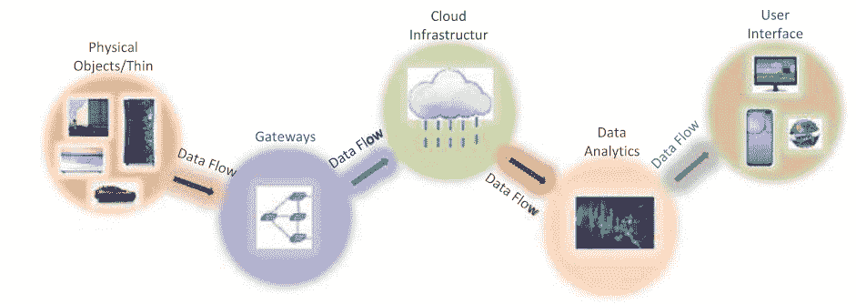
图14.3 物联网的元素

## 物联网组件和信息实现

物联网模块是由独立的电子组件组合而成,例如传感器/执行器、射频识别系统(RFID)、用于信息处理的软件等。任何智能物体都可以使用物联网处理组件与附近的另一个智能物体进行通信,如图14.3所示。如图14.2所示,物理对象配备了不同类型的传感器,可以收集周围环境的数据并通过网关将其传输到云基础设施。云端接收到的数据可以根据用户的需求进行不同的应用分析。得到的结果可以进一步传输到用户界面进行决策。物联网启用的物理对象收集环境模拟数据、处理信息并向用户提供适当解决方案的步骤。

物联网技术收集数据并将其发送到云端以进行处理,以获得所需的输出形式。在云端处理庞大的数据并不是一项容易的任务,因此,基于深度学习的神经网络技术是处理未标记或非结构化数据的高效解决方案。深度学习[12,13]是机器学习的一个分支,涵盖并讨论了受到大脑组织和活动启发的算法,通常被称为人工神经网络(ANN)[14,15]。深度学习应用于原始数据的多个层次,以提取更高级别的特征。本章探讨了深度学习技术的深度和广度,以及它们在物联网设备收集的数据上的应用于交通管理。

## 物联网在交通管理中的维度

如图14.1所示,制造、库存、交付、产品、运输等是业务流程的几个重要维度。货物的运输通过物联网可以监控不同城市、州和国家的生产单位到供应商仓库的运输过程，以增强透明度和监视。管理道路上的乘用车辆是其中的一个挑战。尽管物联网在交通管理系统中的应用非常广泛，但其中一些重点如图 14.4 所示。

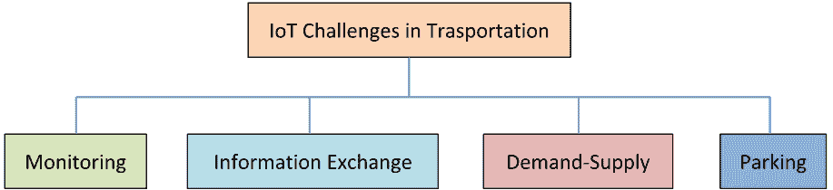
图14.4 物联网在交通领域的挑战

### 运行时的监控和信息传播
在运输管理的背景下，实时跟踪在途货物是物联网措施之一。因此，将信息传播到相应的站点变得容易，改善了业务策略，从而有助于交通部门。液体运输的监控和控制在 [16] 中提出，并通过机器学习对数据进行分析。在 [17] 中，通过预测性维护对物联网智能汽车进行监控，以实现最佳燃料使用和排放。

### 管理供应链
作为一个复杂的过程，供应链需要快速沟通、适应变化、风险管理和利益相关者之间的理解。此外，通过物联网部署，资源的可用性可以轻松跟踪，并且可以实现对实际需求的有效满足。物联网配备的运输管理系统还可以减少供应过剩和需求短缺的情况。供应链交通信息可以提前了解道路情况，从而车辆可以通过物联网信息（如 3G、RFID 和 GPS）进行风险和案例推理，并进行绕行。模拟结果显示出更好的性能。当涉及到信息不足或缺乏时，决策试验和评估实验室（N-DEMATEL）技术与层次分析过程（AHP）在中性环境中被提出并验证，与传统的供应链管理进行比较。

### 交通避免和重新路线规划
车辆间通信共享避免被困在堵车中。Masek 等人 [23] 提出了一个物联网驱动的交通建模环境。类似的工作用于并行交通管理在 [24] 中提出，以控制和管理道路交通。对静态和动态交通信号灯系统（TLS）、RFID 和物联网进行了详细的回顾 Avatefipour 和 Sadry [25] 用于智能交通管理（ITS）。

### 停车控制和管理
道路上的车辆数量每天都在增加，因此，停车空间和安全的挑战也在上升智能城市面临的最大问题是停车。Abdulkader等人[29]提出了一种安全和受控的停车解决方案，利用无线传感器网络、RFID和物联网技术进行集成。目标是实现实时停车场预订和电子支付解决方案，以避免拥堵并提高用户满意度。

在[30]中，使用深度长短记忆网络对停车位置、星期几和每天的小时数进行实验。使用伯明翰停车传感器数据集，利用物联网云基础设施和传感网络进行停车位预测。

为了解决这些问题，基于机器学习的预测模型对于处理大型数据集非常有帮助。基于人类神经系统的人工神经网络和受启发的深度学习模型可以在一定程度上解决问题。

## 基本人工神经网络和深度学习[31-33]

深度学习技术是从人工神经网络（ANN）发展而来的，包括深度神经网络（DNN）、深度置信网络（DBN）、深度强化学习（DRL）、循环神经网络（RNN）和卷积神经网络（CNN）。深度学习的应用领域不仅限于计算机视觉、自然语言处理、语音识别、机器翻译和医疗保健分析。深度学习中无限数量的多层有界长度对于最简单的单层无界大小的人工神经网络更加应用导向和优化。图14.5显示了多层（2隐藏层）和简单（1隐藏层）人工神经网络的图示表示。图14.5a是一个人工神经元，模仿人类神经元结构，用于构建人工神经网络。这些人工神经元之间的连接（即权重），具有适当阈值（即偏差），共同形成了图14.5b、c所示的人工神经网络结构。输入层接收带标签或未标签的数据，而经过处理的数据和期望的结果通过输出层获得。

随着隐藏层数量的变化，对于非线性数据集，人工神经网络的效率增加。具有超过1个隐藏层的人工神经网络被认为是深度神经网络。

### 在交通运输中使用物联网进行深度学习

深度学习在自然语言处理、推荐系统、计算机视觉和音频识别领域取得了巨大成功。在交通管理系统的背景下，使用物联网进行数据收集，并进一步转化为数据集用于深度神经网络，可以显著提高交通性能。对深度学习进行了详尽的调查。

在[34]中介绍了交通领域中的一些学习技术，探讨了多层感知器（MLP）、深度置信网络（DBN）和稀疏自编码器（SAE）等基本的深度神经网络。

以下部分介绍了一些用于交通空间和时间依赖性的预测模型。通过均相对误差（MRE）、均方根误差（RMSE）、平均绝对误差（MAE）和平均绝对百分比误差（MAPE）来衡量预测性能，如公式（14.1）-（14.4）所示：

$$
\text{MRE} = \frac{1}{N} \sum_{i=1}^{N} \left[ \frac{Y_i - \hat{Y}_i}{Y_i} \right] \tag{14.1}
$$

$$
\text{RMSE} = \sqrt{ \frac{1}{N} \sum_{i=1}^{N} (Y_i - \hat{Y}_i)^2 } \tag{14.2}
$$

$$
\text{MAE} = \frac{1}{N} \sum_{i=1}^{N} |Y_i - \hat{Y}_i| \tag{14.3}
$$

$$
\text{MAPE} = \frac{1}{N} \sum_{i=1}^{N} \left| \frac{Y_i - \hat{Y}_i}{Y_i} \right| \tag{14.4}
$$

其中：
- $N$：样本测试数量
- $Y_i$：从物联网设备接收到的实际交通数据
- $\hat{Y}_i$：模型预测的交通流量。

这些参数用于测量和比较预测模型的准确性。下一节介绍了一些交通状态，如流量、车速和行驶时间，这些状态是通过实时交通或模拟模型进行预测的。

## 交通流量预测

交通流量预测是一种基于观测位置上一段时间内收集的数据来预测未来交通趋势的时间序列问题。

### 基于深度学习的受限玻尔兹曼机（RBM）

RBM用于分析短期交通流量预测[35]。通过车联网（IoVs）进行实时多媒体交通数据聚合以训练模型。实验结果显示相对传统神经网络的性能提升。使用洛杉矶高速公路10天的实际短期交通流量数据作为样本数据，从2017年4月3日开始。考虑数据收集的时间间隔为每5分钟的上午7:00到上午10:00。通过MRE和RMSE（如公式（14.1）和（14.2）所述）来衡量预测的准确性。

作者展示的结果经过与传统框架的验证，并声称交通流量预测接近实时交通流量，对于控制和管理道路交通非常有用。

如表14.1所示，作者将性能与传统方法进行了比较，如人工神经网络（ANN）、反向传播（BP）、支持向量回归机（SVR）和自回归综合移动平均（ARIMA）。

基于深度学习的受限玻尔兹曼机（RBM）在混沌时间序列的预测中表现优于其他传统神经网络。

通过增加RBM的训练样本，作者声称可以提高混沌时间序列的预测能力和非线性拟合。

### 轻量级DeepTrend 2.0

另一个轻量级模型DeepTrend 2.0在[36]中提出，它从去趋势和深度学习的概念中得到了基本继承。作者声称基于卷积神经网络（CNN）的DeepTrend 2.0优于图卷积神经网络（GCNN）。数据已经从多个传感器收集的数据用于多对多预测。作者使用残差交通数据而不是原始交通流数据，这被称为去趋势化，包括以下三个步骤[37]：
- (i) 基于收集的数据计算趋势；
- (ii) 根据前一步骤捕获的残差时间序列对趋势进行分类；
- (iii) 为残差时间序列开发预测模型。

作者使用简单平均方法计算交通趋势，即每个传感器的周期性交通流的平均值。

通过评估指标（如均方根误差、平均绝对误差和平均绝对百分比误差）对模型进行实验和验证，用于交通流预测。

作者声称通过去趋势化对交通数据进行预处理，以放大趋势，并随后使用深度学习技术提高交通预测性能的重要性。此外，作者声称在复杂的基于深度学习的交通流预测中，在模型复杂性和准确性之间取得平衡。

Polson等人[38]提出了一个短期交通预测模型，用于芝加哥足球比赛和暴风雪事件期间的突发交通流量。该模型通过基本的输入-输出对 $(y_i, x_i)_{i=1}^N$ 来最小化训练目标 $(y_i)$ 和预测值 $(\hat{y}(x_i))$ 之间的差异来进行训练。作为预处理器，使用中值滤波器来减少传感器数据收集过程中的物理噪声。

作者计算了残差，即实际流量和预测流量之间的差异 $(r_i = Y_i - \hat{Y}_i)$，用于衡量预测的准确性。这个残差用于提高模型的效果。最佳线性模型的预测效率（VARM8L）稍微高于具有一个隐藏层的神经网络。然而，对于深度学习模型（DLM8L），预测性能提升了14%。

### 基于混合DNN的交通流预测（DNN-BTF）

基于CNN的空间特征和基于RNN的时间特征收集的混合方法用于数据交通的空间特征和时间特征的收集[39]。使用开放数据集PeMS验证DNN-BTF对长期交通预测的有效性。利用CNN在图像和视频的空间属性方面的主要特征，利用RNN在时间相关性方面的影响能力。

使用最小绝对收缩和选择算子（LASSO）、BP神经网络、SAE、基于DNN的空间-时间数据预测模型（DeepST）和StoS进行模型准确性验证，评估指标为MAE、MRE和RMSE。作者声称DNN-BTF在平均相关性方面表现最佳。考虑不同条件的误差分析，如时间、星期几和空间位置，以研究对预测模型的影响。

### 带有注意机制的序列到序列学习（Seq2Seq-Att）

编码器-解码器基于RNN最早由Cho等人[40]提出，后来在学习方面进行了进一步改进[41]，并被视为Seq2Seq学习模型的原型。Seq2Seq模型如图14.6所示，由一系列RNN/LSTM组成。

如图14.6所示，RNN/LSTM网络的序列用于构建序列到序列框架，模型的左侧和右侧分别表示编码器和解码器。编码器从输入中生成固定大小的向量，将其馈送到模型中，解码器系统用于可视化输出。固定大小的向量被馈送到解码器系统的初始层输入，以影响解码器系统的输出结果。

在[42]中，展示了Seq2Seq学习模型与注意力机制的应用于大规模地铁系统的短期客流预测，并进行了分析。注意力的整合


注意机制是为了增强预测性能而专注于输入数据集的特定部分。实验结果与传统深度学习方法进行了验证，取得了显著的性能改进。

随着近年来自动驾驶车辆数量的增加，研究方向现在正专注于不同类型挑战的解决。在[43]中回顾了用于自动驾驶车辆的交通流预测的另一个有趣的研究领域。在开发交通流预测的深度学习技术时，考虑了图14.7中显示的以下参数。高效的交通流预测可以获得实时路线指导，减少交通拥堵，旅行决策，节省时间等。

基于深度学习的卷积神经网络（CNN）、循环神经网络（RNN）、长短期记忆网络（LSTM）、门控循环单元（GRU）、时延神经网络（TDN）、深度玻尔兹曼机（DBM）、受限玻尔兹曼机（RBM）、深度置信网络（DBN）和小波神经网络（WNN）在自动驾驶领域得到了广泛的研究，其优缺点也得到了详细的评述。

通过之前收集的历史数据进行未来交通流量预测，以避免道路拥挤和堵塞。从而缓解交通流量。

## 交通速度预测

预测在给定时间点通过某一点的车辆数量被称为交通速度预测。文献中强烈推荐了一些基于深度学习的方法用于速度预测，如下所示：

### 基于路径的深度学习框架用于关键路径（PBDL-CP）

在[44]中，通过基于路径的深度学习框架来解决空间-时间交通状态问题。道路网络被划分为关键路径（即最常使用的路径），每个路径通过双向长短期记忆神经网络（Bi-LSTM NN）和多个Bi-LSTM层进行建模。这两个神经网络


用于收集交通的时间信息，进一步捕捉在预测交通速度时的空间-时间信息。PBDL-CP框架如图14.8所示。

关键路径选择是通过历史轨迹和道路网络提供给框架的上层进行的。这些关键路径由中间层使用双向LSTM神经网络分析，用于收集道路网络不同段的空间-时间信息。进一步地，空间和时间的信息被用于在下层并行训练模型。

对于K最近邻（KNN）、人工神经网络（ANN）、卷积神经网络（CNN）和长短期记忆神经网络（LSTM NN），PBDL-CP的平均均方误差分别降低了 $35.40\%$、$21.09\%$、$9.92\%$ 和 $16.90\%$。作者随后得出结论，该模型在解决问题类别中是最佳的预测表现者。已经证明，随着输入时间跨度和预测时间跨度的增加，基于深度学习的模型展现出更好的隐藏层利用能力，以解决非线性复杂问题。道路网络被划分为段，并验证了112个段数据集，以在不同的解决方案中进行均方误差比较。然而，在短期预测中，预测大约获得了 $86\%$ 的段落，在长期预测中获得了 $70\%$ 的段落，并验证了PBDL-CP模型在城市交通速度预测中的适用性。

### 注意力图卷积序列到序列模型（AGC-Seq2Seq）

[45]已经进行了大量的工作，以通过Seq2Seq解决多步交通速度预测问题，以解决交通状况的时空依赖性。

模型和GCNN。道路拓扑被视为图形，图形卷积捕捉交通的空间信息。此外，Seq2Seq模型由两个连接的RNN（用于编码和解码操作的门控循环单元）结构组成，将时空序列数据转化为时空依赖关系。

由于训练和测试时间段之间输入的差异分布，设计了一种新的训练策略，以协调时空交通速度变量的多维特征。作者考虑了历史统计交通信息和时间的输入，而历史信息用于训练和测试阶段，从而提高了预测准确性。

在实验过程中，通过实时数据集A-map验证了模拟结果，衡量了预测误差参数，如MAPE、MAE和RMSE。基于深度学习的方法比机器学习模型获得更好的预测性能，但计算时间更长。

尽管该模型在改进预测性能方面优于Graph-CNN和Seq2Seq-Att，但所提出的AGC-Seq2Seq的时间复杂度略高。

### 深度学习融合[46]

它的模型旨在解决车道级交通速度问题。采用基于熵的灰色关联分析方法来选择相关车道段，以克服描述交通状态所需高质量数据的收集问题。

此外，使用两层深度学习框架来预测交通速度。深度学习模型使用LSTM和GRU神经网络的组合来实现这一目的。远程交通微波传感器（RTMS）用于训练、测试和验证所提出工作的交通数据收集。根据MAE、RMSE、MAPE和绝对百分比误差方差（VAPE）评估指标，实验结果在ARIMA、LWR、MLP、KF、RBFNN、CNN和LSTM方面显著改善。VAPE的度量方式如公式14.5所示。

$$
\text{VAPE} = \sqrt{ \frac{L \sum_{i=1}^{N} \left[ \left( \frac{\hat{y}_i - Y_i}{Y_i} \right)^2 - \left( \sum_{i=1}^{L} \left( \frac{\hat{y}_i - Y_i}{Y_i} \right) \right)^2 \right] }{L(L - 1)} } \tag{14.5}
$$

其中L是预测序列的大小。与其他测量参数不同，VAPE评估的是预测模型的稳定性而不是准确性。

### 多任务学习模型[47]

另一种基于深度学习的交通预测方法是在多任务学习模型上引入的。该模型的基础是：
- (i) 使用基于抽象的Granger因果分析来揭示空间-时间关系的最具信息性的特征；
- (ii) 使用计算效率高的贝叶斯优化来控制影响参数的影响。

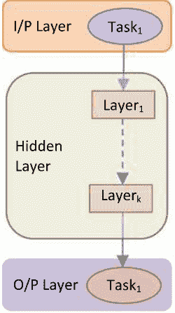

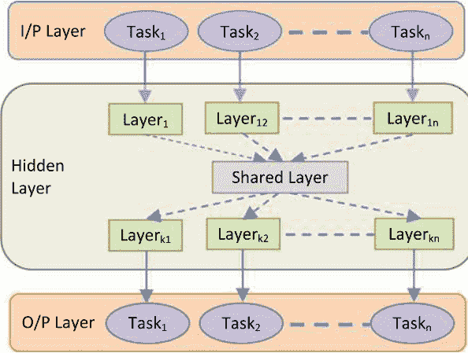
(a) Single Task Learning
(b) Multitask Learning
图14.9单任务和多任务架构[47]

作者声称该模型在大规模道路网络上具有较高的预测准确性和效率。为了捕捉时空模式，多任务层被分为两个级别，与图14.9所示的单任务学习模型不同。在第一级别中，模型针对每个道路段进行训练，并合并到一个共享层中；而在第二级别中，GRU接收共享层的输入。

提出的MTL-GRU模型与STL-GRU、STL-LSTM、Conv-GRU、时间卷积网络（TCN）和一些经典方法（如v-SVM、k-NN和EFNN）进行了比较。作者记录了在MAPE方面相对于上述方法的显著改进。

### 几何深度学习方法[48]

使用基于数据驱动的深度学习模型分析了整个城市的交通数据以进行速度预测。使用图卷积和注意机制来捕捉几何交通数据的依赖关系。传承编码器-解码器架构来探索时间数据关系。该模型与ARIMA、SVR、贝叶斯连接LSTM（B-LSTM）、扩散卷积RNN和时态GCN进行了比较，并在整个城市交通速度预测的MAE、MAPE和RMSE方面取得了显著改进。

与交通流预测类似，交通速度预测需要分析未来道路段的拥堵情况，并为驾驶员提供指导，以估计目标道路段的通过时间。

## 旅行时间预测

在货物运输中所需的时间持续性在高效的运输管理系统中起着重要作用。然而，旅行时间预测是一个具有挑战性和有趣的问题，并且可以通过深度学习技术有效解决。

本节介绍了一些主要的技术，如下所示：

### 使用数据预处理的深度多层感知机[49]

基于多步骤的深度学习算法从数据预处理开始，经过特征分析、特征提取和聚类算法，以改善时空特征空间。使用深度堆叠的自编码器和具有丢弃层的解码器来表示特征。最后，深度多层感知机被训练用于预测旅行时间。模型的框架如图14.10所示。交通历史数据在初始阶段用于异常值拟合，然后在第二和第三阶段加载以实现训练数据的多样化、特征分析和提取。在将数据输入深度多层感知机进行预测之前，通过堆叠自编码器来表示数据。

评估指标MAE、MAPE和RMSE经过验证，与将原始数据直接应用于深度神经网络相比，平均改善了4分钟。该模型对过拟合问题具有鲁棒性。

### 深度学习模型和分位数回归（QR）[50]的混合模型

在这项研究中，创建了一个状态空间矩阵来关联交通数据的时空依赖关系。完成了特征分析和提取过程

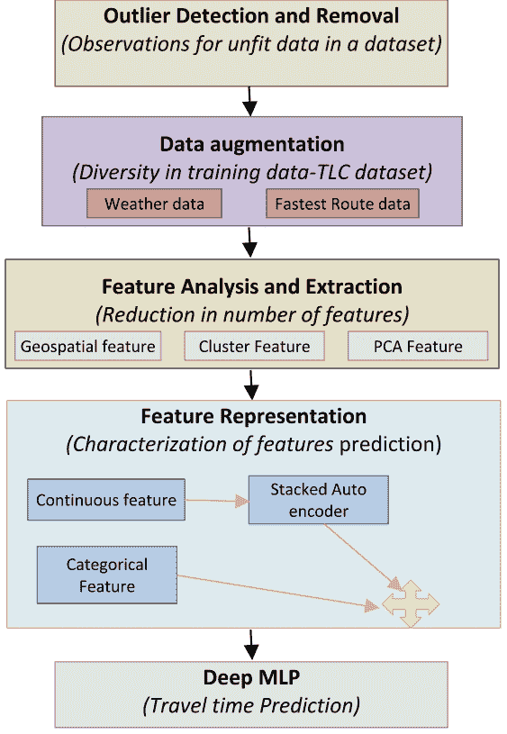
图14.10 特征集成旅行时间预测:架构[49]

使用多个堆叠的高斯伯努利受限玻尔兹曼机（GBRBM）。然而，最终的预测是通过深度置信神经网络的回归层获得的。通过使用QR进一步改进了模型的准确性，以生成预测区间。将实时数据集应用于提出的模型，并与基准模型进行对比。

评估指标，如MAE、RMSE和MAPE针对确定性旅行时间预测的ARIMA、BPNN、LSTM和PSO-ELM进行测量。然而，平均覆盖误差（ACE）、区间锐度（IS）和连续排名概率得分（CRPS）指标被验证用于一步和多步概率性旅行时间预测，用于类似的基准模型，并声称具有更好的预测准确性。

旅行时间估计取决于交通拥堵，特定道路段的天气，当前道路状态等。上述深度学习模型在一定程度上能够提前预测短期情况，以便通勤者能够做出适当的决策。

## 交通拥堵预测

道路上的车辆数量日益增加，因此交通拥堵管理在交通管理领域中显得非常重要。基于深度神经网络的解决方案在研究界引起了广泛关注，以提供时空相关性并在预测误差方面建立高效的预测性能。

### 基于LSTM神经网络的区域交通拥堵模型[51]

在这项研究工作中，使用Newell的简化运动波理论来预测交通拥堵。该模型的适用性和可扩展性在邻域交通条件下进行了测试。提出的基于图卷积神经网络和LSTM神经网络的注意力模型在预测准确性上优于Holt-Winters（HW）模型、1-最近邻（1-NN）模型和随机森林（RF）模型，适用于四种类型的信号：
- (i) 在旅行需求背景下，将区域参数按源和目的地进行分类；
- (ii) 确定区域链接中车辆的平均行驶时间；
- (iii) 捕捉链接上的车辆集结情况；
- (iv) 研究工作中使用的拥堵状态，即拥堵分数，是指目标空间周围的拥堵情况。

所有上述四个信号已经进行了交通拥堵预测的实验，并通过均方根误差进行了评估，并在需求的日常不确定性和模型可扩展性方面得出了更好的结果，尤其是在网络规模较大的情况下。

PrePCT [52] 创建了一个相对位置拥堵张量来支持交通拥堵预测。选择了特定区域来记录交通数据，并将其转换为三维时空张量，并应用于LSTM神经网络，以预测未来的拥堵情况。将所提出的模型与基准框架进行了比较，如线性回归、支持向量回归、随机森林、梯度提升回归和LSTM。通过对PeMS数据集进行全面实验，与基准预测技术进行了MAE和RMSE的比较。

随后，使用与多维上下文信息相关的时间交通速度数据来预测交通拥堵，并实现了90%的准确率[53]。类似地，使用深度学习网络对事件和时间相关数据进行分类预测，并在[54]中获得了高达98%的准确率。

交通拥堵会减慢交通速度和流动，因此需要谨慎解决。

## 旅行风险预测

为了减少高速车辆甚至低速车辆在拥堵道路上发生的交通事故和碰撞的不利影响，交通管理部门需要采取适当的预防措施。下面探讨了几种基于深度学习的解决方案。

### 时空卷积短期记忆网络（STCM-Net）

随着道路上车辆的增加，事故风险也在增加。Bao等人提出了短期风险预测[55]。收集了多个数据集，包括预测区域附近的天气、人口、事故数据、大规模出租车GPS数据、道路拓扑数据等，提出了时空卷积短期记忆网络（STCM-Net）进行风险预测。根据收集的数据，在实验过程中考虑了三种类型的变量：

- (i) 在保持时间不变的情况下改变空间数据，尤其是长期数据收集。
- (ii) 在保持空间依赖性静态的情况下使用时间数据。
- (iii) 同时考虑空间和时间数据，并建立相关性进行预测。

实验结果声称在预测准确性方面更好，并以更好的方式指导交通系统管理。基于深度学习的模型与各种基于机器学习的基准模型进行验证，例如ARIMA、随机参数、随机效应和GWR模型，以建立在MSE、MAE和MAPE方面的改进。此外，还分析了所提出模型的性能随着预测的时空分辨率降低而下降，因此在小时级风险预测的准确性方面表现不佳。

基于深度学习的CNN模型具有丢弃特性。通过路边雷达传感器实时收集的数据，探索了基于深度学习的解决方案的可行性[56]。交通流量、速度和传感器占用数据用于实验。在短期（1分钟、5分钟和10分钟）内估计事故风险预测。使用基于深度学习的CNN模型和丢弃特性来分类交通事故发生并预测事故风险。

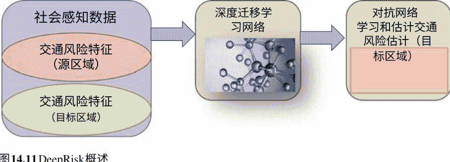

### DeepRisk

DeepRisk [57] 使用社交媒体帖子来预测道路风险。图14.11显示了模型的概述。使用深度迁移学习网络(DTNC)来学习模型，使用前一阶段（第一阶段）的提取特征和对抗网络学习和估计(ADNL)来测量风险预测。

在基准框架上，模拟结果显示了MAE的改进。

印度在2019年报告了超过15.1万人在这类道路事故中丧生，而美国每年有超过3.8万人丧生。中国每年有超过6万人丧生。统计数据显示，俄罗斯在2020年发生了14.5万起碰撞事故。为了降低如此高的死亡率，需要进行基于数据的道路风险预测。

## 交通污染监测

车辆排放是空气污染的一个因素。利用物联网系统，可以有效地识别违反污染控制委员会规定的车辆，并使用深度学习模型进行处理。Kundu和Maulik[58]提出了一种基于图像迁移学习模型。这些图像是通过另一个物联网车辆或安装在道路上的监控摄像头捕获的，并可以传送到监控控制室进行进一步处理。捕获的数据或图像通过深度学习模型进行实时处理，并能够在低光和恶劣天气条件下工作。

在韩国首尔市，结合了CNN和LSTM（ConvLSTM）[59]模型用于交通污染预测。在道路交通方面，交通量和平均车速是空气污染的两个主要问题。该研究解决了空间和时间上的交通依赖性，以预测城市的空气质量。

使用RNN和LSTM的组合来实时估计车载传感器中的CO₂排放[60]。实时捕获的传感器数据上传到云端，并提供结果给车载诊断端口。通过公共车辆数据验证了模型的可扩展性和效率。

城市化的扩张和砍伐树木是空气污染的主要原因。此外，不断增加的车辆数量加剧了空气污染问题，需要关注未来的世代。

## 停车位占用预测

限制路边停车和有限的停车位可用性导致交通拥堵和红绿灯处的瓶颈问题。

### 用于长期短期记忆的聚类增强(CALM)

用于长期短期记忆的聚类增强(CALM) 提出了一种基于CNN和LSTM的深度特征学习方法CALM来解决停车位占用问题[61]。CALM由同时异构聚类和回归学习组成，用于处理时空交通数据。将块级停车位占用与多层LSTM和LASSO进行评估，得到7.8%的平均绝对百分比误差。

### 块级停车位

块级停车位。通过GCNN提出了一种基于块级的停车位占用，用于处理具有时空特征的空间数据和带有LSTM的RNN用于时态数据收集[62]。基于这两个集成模型，预测停车位占用并与多层LSTM、MSTARMA、卡尔曼滤波器、SVR和LASSO进行比较，平均绝对百分比误差为10.6%。停车位占用的预测提前10分钟生成。在实验过程中考虑了区块附近的天气条件和交通速度。研究中还涉及到对驾驶员的有效停车指导和动态停车收费，并解决了执法停车定价的问题。

为了避免交通拥堵和因寻找可用停车位而造成的时间损失，在[63]中提出了同时预测交通和停车位的方法。道路和停放的汽车被视为一个矢量，融合了空间和时间信息。

在市场附近、拥挤的道路和居住区附近进行车辆停车管理对于尊重社区和乘客至关重要。预测附近停车位的可用性可以缓解驾驶员的心理紧张感。

## 14 使用物联网进行运输管理

## 章节结论和未来展望

智能管理交通系统是当前时代的需求。不断变化的生活方式和破坏性的自然环境正在剥夺我们的生态系统。基于深度学习的技术需要大量的数据来学习系统，并为更好的未来进行预测。实时捕捉数据并不是一件容易的事情，但需要足够的噪声消除来获取所需的数据。数据中存在的噪声会影响预测模型的效率和准确性。然而，物联网提供了设备间的通信，物体可以共享信息并做出相应的决策。

在本章中，我们将讨论交通管理问题，并提出基于人工智能的解决方案。我们使用各种多层神经网络来解决交通流量、速度和拥堵预测问题。

在交通管理领域已经进行了大量的研究。然而，作为未来的方向，我们可以进行以下研究：

- (i) 提前预测交通流量、速度和拥堵的时间跨度还不够长，需要进一步延长，以便驾驶员可以提前计划目标位置。然而，由于存在许多空间和时间上的依赖关系，这个任务并不容易，但可以通过新的专门滤波器和学习数据存储技术来改进。
- (ii) 旅行时间和风险预测的准确性还不够好，需要考虑更加现实的参数，例如道路段的突发交通情况。需要进行区域特定的研究，而不是泛化的研究。
- (iii) 尽管在车辆污染检测和监控方面的研究已经进行了，但还有很多工作有待完成。这种自动污染检测对于像印度这样在生态系统平衡方面遭受很多困扰的发展中国家来说可能是一个改变游戏规则的因素。
- (iv) 另一个需要强调的工作方向是安全性和安全。基于云的物联网解决方案可以确保车辆对车主的安全。

有很多研究文章可供参考，但还需要更多来解决交通系统的实际场景。随着智慧城市项目和工业革命4.0在发展中国家的推进，预计技术的使用将在一定程度上丰富这些项目。

## 参考文献

1. van Dongen, Leo, A.M., Frunt, L., Rajabalinejad, M.: 交通运输中的问题和挑战。在：交通系统，第3-17页。Springer，新加坡（2019年）
2. Tyan, J.C., Wang, F.K., Du, T.: 在全球第三方物流中应用协作运输管理模型。计算机集成制造国际期刊，16(4-5)，283-291 (2003)
3. Faulin, J., Lera-López, F., Juan, A.A.: 在西班牙的运输管理中以安全和环境标准优化路线：一个案例研究。信息系统与供应链管理国际期刊，4(3)，38-59 (2011)
4. Singh, S.K.: 印度城市交通综述。公共交通期刊，8(1), 5 (2005)
5. Msigwa, R.E.: 坦桑尼亚城市交通面临的挑战。数学理论与模型期刊，3(5), 18-26 (2013)
6. Loveless, S.M., Welch, J.S.: 迎接挑战的增长：运输管理协会的新兴角色。交通研究记录，1659(1)，121-128 (1999)
7. 王飞跃：智能企业的出现：从CPS到CPSS。IEEE智能系统。25(4)，85-88（2010年）
8. Stankovic, J.A.: 物联网的研究方向。IEEE物联网杂志。1(1)，3-9（2014年）
9. 王飞跃：扫描问题及其后续：众包用于现场交通研究和服务。IEEE智能交通系统交易。16(1)，1-8（2015年）
10. Athreya, A.P., Tague, P.: 物联网中的网络自组织。在：传感器、通信和网络国际会议论文集（SECON），第25-33页（2013年）
11. 陈，徐，刘，胡，王：物联网的愿景：中国视角下的应用、挑战和机遇。IEEE物联网杂志。1(4)，349-359（2014年）
12. Goodfellow, I., Bengio, Y., Courville, A.: 深度学习。麻省理工学院出版社（2016年）
13. Kelleher, J.D.: 深度学习。麻省理工学院出版社（2019年）
14. Abiodun, O.I., Jantan, A., Omolara, A.E., Dada, K.V., Mohamed, N.A., Arshad, H.: 人工神经网络应用的最新技术：一项调查。Heliyon 4 (11), e00938 (2018)
15. Zhang, Z.: 人工神经网络。在：气候和环境研究中的多元时间序列分析，第1-35页。斯普林格出版社，Cham（2018年）
16. Bhaskaran, P.E., Maheswari, C., Thangavel, S., Ponnibala, M., Kalavathidevi, T., Sivakumar, N.S.: 基于物联网的流体输送监控与控制的机器学习。计算机与电子工程 89，106899 (2021)
17. Husni, E., Hertantyo, G.B., Wicaksono, D.W., Hasibuan, F.C., Rahayu, A.U., Triawan, M.A.: 应用物联网 (IoT)：使用IBM BlueMix的汽车监控系统。在：2016年智能技术及其应用国际研讨会（ISITIA），417-422页。IEEE（2016年）
18. Ben-Daya, M., Hassini, E., Bahroun, Z.: 物联网和供应链管理：文献综述。国际生产研究杂志。57 (15-16) ，4719-4742 (2019年)
19. de Vass, T., Shee, H., Miah, S.J.: 供应链管理中的物联网：关于零售业可持续性的叙述。国际物流研究与应用。1-20（2020年）
20. 高, Q., 郭, S., 刘, X., Manogaran, G., Chilamkurti, N., Kadry, S.: 基于物联网信息平台的供应链风险管理系统的仿真分析. 企业信息系统 14 (9-10), 1354-1378 (2020)
21. Abdel-Basset, M., Manogaran, G., Mohamed, M.: 物联网(IoT)及其对供应链的影响: 构建智能、安全和高效系统的框架. 未来世代计算机系统 86, 614-628 (2018)
22. Elkin, D., Vyatkin, V.: 交通管理中的物联网: 对道路交通调控现有方法的综述. 在: 计算机科学在线会议, pp. 536-551. Springer, Cham (2020)
23. Masek, P., Masek, J., Frantik, P., Fujdiak, R., Ometov, A., Hosek, J., Andreev, S., Mlynek, P., Misurec, J.: 智能城市中交通管理的统一视角: 面向道路交通建模的新型物联网驱动环境. 传感器 16 (11), 1872 (2016)
24. Zhu, F., Lv, Y., Chen, Y., Wang, X., Xiong, G., Wang, F.-Y.: 并行交通系统: 迈向物联网智能城市交通控制和管理. IEEE智能交通系统 21 (10), 4063-4071 (2019)
25. Avatefipour, O., Sadry, F.: 使用物联网技术的交通管理系统-一项比较评论。在：2018年IEEE国际电子/信息技术会议(EIT)，pp. 1041-1047. IEEE (2018)
26. Mainetti, L., Patrono, L., Stefanizzi, M.L., Vergallo, R.: 基于物联网协议和新兴技术的智能停车系统。在：2015年IEEE第二届世界物联网论坛(WF-IoT)，IEEE，pp. 764-769 (2015)
27. Khanna, A., Anand, R.: 基于物联网的智能停车系统。在：2016年国际物联网和应用会议(IOTA)， pp. 266-270. IEEE (2016)
28. Ajchariyavanich, C., Limpisthira, T., Chanjarasvichai, N., Jareonwatanan, T., Phongphanpanya, W., Wareechuensuk, S., Srichareonkul, S., et al.: Park King: 一种基于物联网的智能停车系统。在：2019年IEEE国际智能城市会议 (ISC2) ，第729-734页。IEEE (2019)
29. Abdulkader, O., Bamhdi, A.M., Thayananthan, V., Jambi, K., Alrasheedi, M.: 一种基于WSN，RFID和IoT集成的新颖且安全的智能停车管理系统 (SPMS) 。在：2018年第15届学习与技术会议 (L&T) ，第102-106页。IEEE (2018)
30. Ali, G., Ali, T. , Irfan, M., Draz, U., Sohail, M., Glowacz, A., Sulowicz, M., Mielnik, R., Faheem, Z.B., Martis, C.: 基于深度长短期记忆网络的物联网智能停车系统。电子 9(10), 1696 (2020)
31. Bengio, Y., Goodfellow, I., Courville, A.: 深度学习，第1卷。麻省理工学院出版社，马萨诸塞州，美国 (2017)
32. 郭，Y.，刘，Y.，奥尔勒曼斯，A.，劳，S.，吴，S.，刘，M.S.: 深度学习用于视觉理解：一个综述。神经计算 187，27-48（2016年）
33. Schmidhuber, J.: 神经网络中的深度学习概述。神经网络 61，85-117 (2015年)
34. 王，Y.，张，D.，刘，Y.，戴，B.，李，L.H.: 通过深度学习提升交通系统：一项调查。交通研究部分C：新兴技术 99，144-163（2019年）
35. 孔，F.，李，J.，江，B.，宋，H.: 基于深度置信网络的智能多媒体互联网车辆短期交通流预测。未来。生成。计算机系统 93，460-472（2019年）
36. 戴，X.，傅，R.，赵，E.，张，Z.，林，Y.，王，F.-Y.，李，L.: DeepTrend 2.0：一种轻量级多尺度交通预测模型，使用去趋势法。交通研究C部分紧急技术 103，142-157 (2019年)
37. 李，Z.，李，Y.，李，L.: 去趋势模型和多制度模型在交通流预测中的比较。IEEE智能交通系统杂志 6（4），34-44（2014年）
38. 波尔森，N.G.，索科洛夫，V.O.: 短期交通流预测的深度学习。交通研究C部分紧急技术 79，1-17（2017年）
39. 吴，Y.，谭，H.，秦，L.，冉，B.，江，Z.: 一种基于深度学习的混合交通流预测方法及其理解。交通研究C部分紧急技术 90，166-180（2018年）
40. Cho, K., Van Merriënboer, B., Gulcehre, C., Bahdanau, D., Bougares, F., Schwenk, H., Bengio, Y.: 使用RNN编码器-解码器学习短语表示用于统计机器翻译。arXiv预印本arXiv：1406.1078。（2014年）
41. Sutskever, I., Vinyals, O., Le, Q.V.: 序列到序列学习与神经网络. In:神经信息处理系统的进展，第3104-3112页（2014）
42. Hao, S., Lee, D.-H., Zhao, D.: 序列到序列学习与关注机制用于大规模地铁系统的短期乘客流量预测. 交通研究. C部分. 新兴技术. 107, 287-300页（2019）
43. Miglani, A., Kumar, N.: 深度学习模型用于自动驾驶车辆的交通流预测: 一项综述，解决方案和挑战. 车辆通信. 20, 100184页（2019）
44. Wang, J., Chen, R., He, Z.: 城市交通网络的交通速度预测: 一种基于路径的深度学习方法. 交通研究. C部分. 新兴技术. 100, 372-385（2019）
45. Zhang, Z., Li, M., Lin, X., Wang, Y., He, F.: 交通网络上的多步速度预测: 一种考虑时空依赖性的深度学习方法. 交通研究. C部分. 新兴技术. 105, 297-322（2019）
46. 顾，Y.，温琪，李琴，李明，邵志：车道级交通速度的短期预测：融合深度学习模型。交通研究C部分新兴技术 106，1-16（2019）
47. 张，K.，郑，L.，刘，Z.，贾，N.: 基于深度学习的网络范围内的多任务模型交通速度预测。神经计算 396，438-450（2020）
48. 詹姆斯，J.Q.: 城市交通速度预测：一种几何深度学习方法。基于知识的系统 212，106592（2021）
49. 阿卜杜拉希，M.，哈勒吉，T.，杨，K.: 使用深度学习的集成特征学习方法进行旅行时间预测。专家系统应用 139，112864（2020）
50. Li, L., Ran, B., Zhu, J., Bowen, D.: 深度学习模型和分位数回归的耦合应用，利用不同维度的数据对旅行时间及其区间进行估计。应用软计算，93，106387（2020）
51. Mohanty, S., Pozdnukhov, A., Cassidy, M.: 利用深度学习进行区域范围的拥堵预测和控制。交通研究C部分新兴技术，116，102624（2020）
52. Bai, M., Lin, Y., Ma, M., Wang, P., Duan, L.: PrePCT: 相对位置拥堵张量在智能城市中的交通拥堵预测。神经计算，44(4), 147-157（2021）
53. Kim, D.H., Hwang, K.Y., Yoon, Y.: 通过深度神经网络预测首尔的交通拥堵。韩国智能交通系统研究院杂志，18（4），44-57（2019）
54. Sun, F., Dubey, A., White, J.: DxNAT—用于解释非重复交通拥堵的深度神经网络。在：2017年IEEE国际大数据会议（Big Data），第2141-2150页。IEEE（2017年）
55. Bao, J., Liu, P., Ukkusuri, S.V.: 一种用于城市短期事故风险预测的时空深度学习方法，使用多源数据。事故分析与预防。122，239-254（2019年）
56. Huang, T., Wang, S., Sharma, A.: 使用深度学习进行高速公路事故检测和风险估计。事故分析与预防。135，105392（2020年）
57. Zhang, Y., Wang, H., Zhang, D., Wang, D.: Deeprisk：一种用于智能交通中可迁移交通风险估计的深度迁移学习方法，使用社交感知。在：2019年第15届分布式传感器系统计算机会议（DCOSS），第123-130页。IEEE (2019)
58. Kundu, S., Maulik, U.: 使用深度学习从图像中检测车辆污染。在：智能化研究，第1-5页。Springer，新加坡（2020）
59. Le, V.-D., Bui, T.-C., Cha, S.-K.: 用于城市空气污染插值和预测的时空深度学习模型。在：2020年IEEE国际大数据和智能计算会议（BigComp），第55-62页。IEEE（2020）
60. Ghosal, S.S., Bani, A., Amrouss, A., El Hallaoui, I.: 使用集群增强学习方法预测停车位占用的深度学习方法。在：2019年国际数据挖掘研讨会（ICDMW），第581-586页。IEEE（2019）
61. Yang, S., Ma, W., Pi, X., Qian, S.: 一种将多个时空数据源纳入交通网络实时停车位占用预测的深度学习方法。交通运输研究C部分紧急技术107, 248-265（2019年）
62. Ziat, A., Leroy, B., Baskiotis, N., Denoyer, L.: 联合预测城市道路交通和停车位占用情况的表示学习。在：2016年IEEE第19届智能交通系统国际会议（ITSC），第725-730页。IEEE（2016年）
63. Lu, E.H.C., Liao, C.H.: 基于时空分析的停车位占用预测方法。在：亚洲智能信息和数据库系统会议，第500-509页。Springer, Cham（2018年）

# 第15章 通过优先考虑零售业中以客户为中心的驱动因素来提高顾客忠诚度

Vishal Srivastava, Manoj Kumar Srivastava和R.K. Singhal

## 介绍

随着数字技术的出现，购物者和卖家之间的差距已经缩小。此外，全球经济政策的变化也使实体零售店与购买者之间的差距缩小。零售业的全球化促使成熟市场零售商进入其他各种经济阶段市场，全球化供应链和物流以及零售创新实践[40]。毫无疑问，这些变化对零售业有所帮助，但另一方面，零售商面临着许多挑战，如竞争、供应链和零售仿冒品[41]等，以保留他们的客户群体。按照传统的营销理念，企业相信通过提供更高的客户满意度来赢得市场[3, 35]。实践证明，提供更好的质量服务与更好的客户保留率密切相关[51]。为了实现更高的客户满意度并保护他们的市场份额，零售商正在应用各种实践。启用以客户为中心的方法是其中一种方法，这是由许多营销哲学家提倡的[37]。作为一种方法，客户为中心性被认为是组织对理解客户需求和提供以客户为中心的解决方案的关注程度[16]。然而，市场总是对向客户提供最优数量的期望利益或服务感兴趣[30]。客户至上意味着组织将焦点转向客户的盈利能力、客户的终身价值、客户的权益，并从市场份额转向客户权益份额[42]。商业智能的先进工具也可以帮助实现以客户为中心的方法[20]。

## 过载的不良影响

提供的服务或产品不仅无效，而且会使客户失去动力[27]。

参考市场营销的基本概念，哲学家们对以客户为中心的方法提出了质疑，并将其定义为“范式陷阱”，以确保组织的商业存在[37]。因此，实现以客户为中心的方法必须谨慎进行，以确保客户和组织的福祉。

在本文中，我们确定了在零售店铺中建立以客户为中心的关键驱动因素。该研究基于各种相关研究，并关注客户对建议的以客户为中心的驱动因素的意见。

## 以客户为中心的驱动因素

数字技术的发展使营销人员和消费者之间的互动变得更加容易。并行发展的数据科学工具可以轻松理解客户的复杂购买行为，这在以前并不容易[33]。为了实施以客户为中心的方法，组织需要了解客户对所需服务、优惠或因素的需求。观察发现，许多组织只声称以客户为中心，但在实践中并非如此[47]，这是因为对客户需求和欲望缺乏明确的认识。一些研究将以客户为中心的驱动变量分为三个类别，即环境层面、组织层面和部门层面[55]。

为了确定以客户为中心的驱动因素，该研究调查了各种相关文献。该研究引用了不同行业不同时期的参考文献。该研究通过深入文献调查确定了独特的92个以客户为中心的驱动因素。详细信息请参见表15.1。如上所述，这些大变量会导致混乱的状态。在制定采用以客户为中心的政策时，营销人员发现自己处于一个犹豫不决的位置。任何运营活动或流程的增加或删除都是一项代价高昂的事情。以客户为中心的名义，一个人可以盲目地在他或她的商业系统中添加或删除任何功能或活动。

以客户为中心被定义为通过满足客户的需求并提供所需服务来关注客户的福祉[1]。研究还提倡服务差异化为营销人员带来竞争优势[19]。但是提供所有所需服务或满足客户需求并不总是对组织有利的。组织必须在以客户为中心和以组织为中心之间进行权衡。

本研究解决了在零售行业实现以客户为中心时各种建议的驱动变量之间的权衡所面临的主要挑战。由于最大化客户需求的满足与最小化成本之间存在冲突，因此需要进行权衡。

表15.1 以客户为中心的驱动因素文献综述
| 序号 | 参考文献 | 变量 |
|---|---|---|
| 1 | [47] | 与客户建立关系，突出产品的优势 |
| 2 | [2] | 专注于顾客便利的零售店 |
| 3 | [4] | 影响同事、朋友和亲戚 |
| 4 | [5] | 有能力的柜台工作人员 |
| 5 | [6] | 与客户进行适当的沟通 |
| 6 | [7] | 购物过程中耗时较少 |
| 7 | [9] | 提供信用服务 |
| 8 | [10] | 第一次零缺陷 |
| 9 | [13] | 质量信息共享流程 |
| 10 | [14] | 产品质量，自有品牌数量，知名品牌，生鲜柜台质量，折扣日的高频率，靠近家庭，靠近工作，有效的交通和停车管理，令人印象深刻的布局设计，更宽敞的购物车驾驶，购物便利，快速结账设施，换货保证政策，返现优惠，服务客户类型 |
| 11 | [15] | 以客户为中心的创新，无缝网络运营，创造机会的合作伙伴关系，增值服务，产品和服务的特殊性 |
| 12 | [17] | 与关键供应商建立良好关系，详细说明定制需求，确保为客户提供价值 |
| 13 | [18] | 会议需求 |
| 14 | [23] | RFID支付系统 |
| 15 | [25] | 价值创造过程 |
| 16 | [31] | 充足的停车场，提供婴儿区域，商品配送服务，产品新鲜度，提供耐用产品，高品种产品，舒缓的音乐和环境，正确的价格实践，高品种产品，提供有竞争力的价格，提供会员卡 |
| 17 | [32] | 低价优惠 |
| 18 | [36] | 创新会员计划 |
| 19 | [38] | 丰富的产品种类 |
| 20 | [39] | 准确计费，立即提供交易文件，快速回复客户电话，有能力的店员，确保财务安全，保证共享信息的机密性，使用适当的通信媒体，正确记录文件，店铺氛围令人印象深刻，负责任地提供服务，服务人员的热情，更新的设备，外观吸引人的实体设施，员工形象良好，承诺的正确记录，及时履行承诺的服务，对客户问题表示同情，零售店的信誉，及时交付服务，准确记录，员工对客户有礼貌，员工得到店铺的适当支持，店铺给予顾客个别关注，营业时间方便顾客 |
| 21 | [44] | 在线提供服务 |
| 22 | [45] | 产品搜索的便利性，产品拥有的便利性，电话和互联网访问的便利性，智能客户互动系统，强大的库存位置，一站式购物优惠 |
| 23 | [48] | 独特的产品组合，无法模仿的产品组合，建立强大的价值主张 |
| 24 | [49] | 持续的售后服务 |
| 25 | [53] | 友好的销售人员 |
| 26 | [54] | 捆绑商品和服务 |

## 问题讨论

从20世纪50年代初开始，各种管理和营销大师都在倡导以客户为先的口号，作为成功的关键[12, 29]。在2003年的Gartner集团报告中，不仅强调以客户为中心的方法，还将其视为未来成功的最佳工具[33]。全球范围内，每个组织都相信以客户为中心的方法对于增长和生存至关重要[11]。尽管如此，即使经过六十年的发展，许多组织仍在努力并面临成为真正以客户为中心的挑战[33]。

当我们谈论零售行业时，情况变得更具挑战性。随着全球化和技术升级的加快，零售行业也在同时发生变化。以客户为中心的概念似乎很容易采纳，但对于企业来说也带来了挑战[21]。确立以客户为中心的挑战既有内部因素，也有外部因素。在确立以客户为中心的过程中，对客户需求和欲望的不清楚是一个主要挑战。确立以客户为中心没有捷径可走[22]。

本研究的目的是确定最重要的以客户为中心的推动因素，这些因素受到购物者的赞赏。该研究旨在为零售商开发一个模型，帮助他们决定更系统和结构化的采用以客户为中心的方法。

## 研究方法学

这项探索性和描述性研究旨在了解对零售行业最具吸引力的以客户为中心的驱动因素。最初，从广泛的文献调查中确定了92个这样的变量（表15.1）。许多确定的变量发现彼此相关或相似。为了减少变量的数量，使其更具适用性，变量/驱动器使用文本选择排序技术 (TST) [46]进行排序。TST是一种将相似变量分组的经过验证的工具[52]。排序将92个已识别的变量减少为20个驱动器 (表15.2)。

为了了解顾客需求，对1200名购物者进行了调查，以评估他们对零售运营的购买偏好和期望。该研究采用随机抽样方法从城市中和来自印度全国的半城市人口中选取样本。使用结构化问卷收集数据。该工具由05点量表问题组成。量表问题在最不喜欢到最喜欢之间进行校准。最初，在德里-全国首都区的26名购物者上进行了试点测试。可靠性测试接受构建(表15.3: 克朗巴赫 $\alpha=0.897$ )。

表15.2 以客户为中心的驱动因素
| 序号 | 驱动因素 | 变量 (TLA) |
|---|---|---|
| 1 | 氛围 (D1) | 令人印象深刻的布局设计 (ILD) 舒缓的音乐和氛围 (SMA) 店铺令人印象深刻的氛围 (IAS) 视觉上吸引人的实体设施 (VAP) |
| 2 | 关心顾客 (D2) | 确保共享信息的机密性 (ACS) 以负责任的方式提供服务性能 (SRM) 与客户的关系管理 (MRC) 快速回拨客户电话 (QCC) 服务人员的热情 (ESP) 对客户问题的同情 (SCP) 零售店的信誉 (TRS) 店员给予个人关注顾客 (SIC) 友好的销售人员 (FSP) |
| 3 | 便利性 (D3) | 零售店致力于顾客便利 (RDC) 离家近 (CtH) 离工作地近 (CtW) 更宽敞以便推车 (EDT) 购物便利 (EoS) 到达店铺便利 (ERS) 营业时间方便顾客 (OCC) 在线提供服务 (PSO) 方便的电话和互联网接入 (CTI) 一站式购物优惠 (OSO) |
| 4 | 送货服务 (D4) | 商品的送货服务 (DSG) 大量的收银台 (GCC) 快速结账设施 (ECF) 及时提供服务 (TDS) |
| 5 | 信息共享 (D5) | 使用适当的通信媒体 (USC) 突出产品的好处 (HPF) 适当详细说明定制需求 (PDC) 质量信息共享流程 (QIS) 正确解释服务 (PES) 与客户进行适当沟通 (PCC) |
| 6 | 支付服务 (D6) | 提供信用服务 (OCS) RFID启用的支付系统 (REP) 胜任的柜台人员 (CCS) 准确的计费 (AIB) |
| 7 | 购买后服务 (D7) | 根据需求进行会议 (CTR) 交换保证政策 (EGP) 创造机会的合作伙伴关系 (OCP) 持续的售后服务 (CAS) |
| 8 | 定价政策 (D8) | 正确的价格实践 (CPP) 对服务成本进行适当解释 (PEC) 提供有竞争力的价格 (OCP) 低价优惠 (LPO) |
| 9 | 产品可用性 (D9) | 与关键供应商建立良好关系 (GRK) 库存充足 (SIP) |
| 10 | 产品质量 (D10) | 产品质量 (QoP) 知名品牌 (WKB) 生鲜柜台质量 (QFC) 产品新鲜度 (FoP) 提供耐用产品 (ODP) |
| 11 | 产品种类 (D11) | 自有品牌数量 (NOB) 高产品种类 (HPV) 大量产品种类 (SoA) |
| 12 | 促销政策 (D12) | 高频折扣日 (HFD) 返现优惠 (CBO) 创新会员计划 (IMP) 提供会员卡 (OMC) |
| 13 | 适当的文件/透明度 (D13) | 提供跨国文件过度提供 (PTD) 确保财务安全 (EFS) 适当记录文件 (PDR) 准确记录 (KRA) 承诺的适当文件 (PDC) |
| 14 | 购物辅助服务 (D14) | 购物过程中时间消耗较少 (LTS) 捆绑商品和服务 (BGS) |
| 15 | 社会形象 (D15) | 服务客户类型 (SCT) 影响同事、朋友和亲戚 (ICFR) |
| 16 | 员工效能 (D16) | 外表良好的员工 (WAE) 产品搜索便利 (CPS) 产品拥有便利 (CPP) 首次零缺陷 (ZDF) 能力强的店员 (CSP) 员工得到适当的店铺支持 (EPS) 服务人员的热情 (EnSP) 及时履行承诺的服务 (TFP) 员工对客户有礼貌 (EPC) |
| 17 | 先进技术 (D17) | 无缝网络运营 (SNO) 最新设备 (UDE) 以客户为中心的创新 (CFI) 智能客户互动系统 (ICS) |
| 18 | 独特性 (D18) | 产品和服务的特殊性 (SPS) 独特的产品组合 (UPA) 无法模仿的产品组合 (IPA) 产品组合包装 (PCP) |
| 19 | 增值服务 (D19) | 增值服务 (VAS) 有效的交通和停车管理 (ETM) 充足的停车位 (SPL) 提供婴儿区 (OBA) |
| 20 | 参观价值 (D20) | 价值创造过程 (VCP) 确保客户价值 (EVC) 建立强大的价值主张 (ESV) |

表15.3 信度测试结果
| 克朗巴赫α | 基于标准化项目的α | 项目数量N |
|---|---|---|
| 0.897 | 0.898 | 20 |

为了测试构建效度，使用皮尔逊积矩相关系数来测试[24]。测试后，两个驱动变量D4（交付服务）和变量D15（社会形象）被排除在进一步研究之外。所提及的变量与其他测试变量之间显示出非-显著关系 (表 15.4)。

最终构建用于从之前提到的 1200 个购物者中收集数据。在收集的数据集中，有 166 条记录由于一些数据收集错误，如不完整的回应，人为回应等而不适合使用。因此，最终使用了 1034 条数据记录进行本研究。给出了样本的描述性统计。

表15.4 皮尔逊积矩相关性矩阵（测试效度）
| 驱动因素 | D1 | D2 | D3 | D4 | D5 | D6 | D7 | D8 | D9 | D10 | D11 | D12 | D13 | D14 | D15 | D16 | D17 | D18 | D19 | D20 |
|---|---|---|---|---|---|---|---|---|---|---|---|---|---|---|---|---|---|---|---|---|
| D1 | 1 | 0.735** | 0.319** | 0.613** | 0.587** | 0.681** | 0.509** | 0.564** | 0.123** | 0.427** | 0.120** | 0.429** | 0.652** | 0.220** | 0.079* | 0.320** | 0.437** | 0.714** | 0.572** | 0.447** |
| D2 | | 1 | 0.268** | 0.730** | 0.570** | 0.779** | 0.533** | 0.603** | 0.191** | 0.594** | 0.077* | 0.173** | 0.558** | -0.03 | -0.04 | 0.112** | 0.443** | 0.765** | 0.474** | 0.525** |
| D3 | | | 1 | 0.134** | 0.091** | 0.112** | 0.142** | -0.107** | -0.235** | -0.083** | 0.445** | 0.427** | 0.550** | 0.033 | 0.190** | 0.211** | 0.247** | 0.280** | 0.355** | -0.100** |
| D4 | | | | 1 | 0.452** | 0.709** | 0.488** | 0.681** | 0.505** | 0.708** | 0.175** | 0.070* | 0.363** | -0.03 | 0.02 | 0.131** | 0.151** | 0.632** | 0.405** | 0.714** |
| D5 | | | | | 1 | 0.580** | 0.576** | 0.569** | 0.169** | 0.430** | 0.120** | 0.188** | 0.365** | 0.298** | 0.311** | 0.203** | 0.263** | 0.743** | 0.616** | 0.345** |
| D6 | | | | | | 1 | 0.535** | 0.693** | 0.220** | 0.578** | -0.122** | 0.189** | 0.505** | 0.033 | -0.142** | 0.113** | 0.483** | 0.723** | 0.404** | 0.572** |
| D7 | | | | | | | 1 | 0.558** | 0.244** | 0.419** | 0.081** | 0.346** | 0.416** | 0.394** | 0.181** | 0.343** | 0.246** | 0.521** | 0.588** | 0.448** |
| D8 | | | | | | | | 1 | 0.534** | 0.670** | -0.062* | 0.090** | 0.251** | 0.175** | 0 | 0.185** | 0.161** | 0.557** | 0.371** | 0.719** |
| D9 | | | | | | | | | 1 | 0.674** | 0.182** | -0.190** | -0.227** | 0.048 | 0.252** | 0.076* | -0.460** | 0.098** | 0.111** | 0.693** |
| D10 | | | | | | | | | | 1 | 0.107** | -0.150** | 0.112** | -0.067* | 0.105** | 0.005 | -0.05 | 0.492** | 0.273** | 0.639** |
| D11 | | | | | | | | | | | 1 | 0.190** | 0.188** | 0.046 | 0.584** | 0.198** | -0.224** | 0.154** | 0.346** | 0.01 |
| D12 | | | | | | | | | | | | 1 | 0.655** | 0.501** | 0.143** | 0.637** | 0.338** | 0.170** | 0.507** | 0.01 |
| D13 | | | | | | | | | | | | | 1 | 0.232** | -0.01 | 0.400** | 0.603** | 0.548** | 0.541** | 0.108** |
| D14 | | | | | | | | | | | | | | 1 | 0.312** | 0.577** | 0.02 | 0.070* | 0.479** | 0.082** |
| D15 | | | | | | | | | | | | | | | 1 | 0.238** | -0.404** | 0.131** | 0.443** | 0 |
| D16 | | | | | | | | | | | | | | | | 1 | 0.06 | 0.114** | 0.462** | 0.141** |
| D17 | | | | | | | | | | | | | | | | | 1 | 0.423** | 0.186** | -0.04 |
| D18 | | | | | | | | | | | | | | | | | | 1 | 0.595** | 0.396** |
| D19 | | | | | | | | | | | | | | | | | | | 1 | 0.271** |
| D20 | | | | | | | | | | | | | | | | | | | | 1 |

**相关性在 0.01 水平上显著（双尾）
*相关性在 0.05 水平上显著（双尾）

| 描述性 | 性别 | 地点 | 收入（每月） | 职业 | 年龄 |
|---|---|---|---|---|---|
| 中位数 | 2.00 | 1.00 | 2.00 | 3.00 | 3.00 |
| 众数 | 2（男性） | 1（大都市） | 2（从INR 25,001到INR 50,000/-） | 2（政府/私人工作） | 3（35岁到50岁） |
| 最小 | 1.00 | 1.00 | 1.00 | 1.00 | 1.00 |
| 最大 | 2.00 | 4.00 | 5.00 | 4.00 | 5.00 |
| 计数 | 1034 | 1034 | 1034 | 1034 | 1034 |

为了数据分析目的，在这项研究中使用了描述性统计方法。为了计算样本描述性和方差分析，使用了SPSS-20软件。虽然有许多软件工具可供选择，如专家选择、超级决策和决策镜头；但在这项研究中，使用了MS-Excel电子表格进行AHP分析。

## 数据分析

由Saaty [43]开发的分析层次过程工具。如上所述，该研究使用了分析层次过程（AHP）工具，以获得一个全面和合理的框架来确定重要因素。该工具在全球范围内用于各种决策情境[34]，并确定人类判断过程[28]。它以排名已确定的替代方案以生成决策矩阵而闻名[8]。该分析使用了研究中所用的变量的成对比较方阵。对于成对比较，研究中使用的矩阵如下所示：

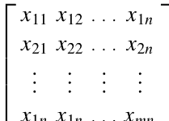

这里，n和m分别是列和行的编号。为了应用AHP，从城市地区随机收集了142名购物者的偏好数据。根据AHP模型，要求受访者在9个点的成对比较尺度上给出他们的偏好。统计学家和研究人员提倡在AHP的评估方法中使用少量关键变量。为了减少变量（驱动因素），研究中采用了一因素方差分析排名（ROVA）[26]。该方法用于确定更一致的变量。

该方法基于变量的方差进行排名。该概念假设方差越小，排名越高。对于专家调查的AHP方法，研究选择了一致性排名前9个变量（表15.6）。

## 表15.6 通过单一标准方差分析进行变量选择

| 变量 | 方差 | 一致性 |
|---|---|---|
| D01 | 0.32 | 5<sup>a</sup> |
| D02 | 0.58 | 17 |
| D03 | 0.22 | 3<sup>a</sup> |
| D04 | 0.42 | 12 |
| D05 | 0.48 | 13 |
| D06 | 0.33 | 6<sup>a</sup> |
| D07 | 0.2 | 2<sup>a</sup> |
| D08 | 0.4 | 11 |
| D09 | 0.76 | 18 |
| D10 | 0.36 | 8<sup>a</sup> |
| D11 | 0.51 | 15 |
| D12 | 0.48 | 14 |
| D13 | 0.39 | 10 |
| D14 | 0.19 | 1<sup>a</sup> |
| D17 | 0.3 | 4<sup>a</sup> |
| D18 | 0.53 | 16 |
| D19 | 0.37 | 9<sup>a</sup> |
| D20 | 0.35 | 7<sup>a</sup> |

a选定的变量

在确定AHP的变量后，研究制定了一级配对比较矩阵。在该表中，计算了每个单元格的权重。

不受青睐的单元格值被计算为相应有利单元格值的倒数。表示为（公式15.1）

```
$x_{mn} = \frac{1}{x_{nm}}$

(15.1)
```

通过对配对比较的平均分数进行计算，得出首选变量的权重。为了计算偏好或非偏好的权重，本研究遵循以下规则。

- (a) 平均分数1到3 = 不优先于其他
- (b) 平均分数4和5 = 变量之间无差异
- (c) 平均分数6到9 = 分数为6、7、8和9时的偏好权重分别为1、2、3和4。

因此，通过计算偏好和非偏好权重，本研究制定了其第一个AHP表格——“驱动因素的配对比较矩阵一级”（表15.7）。在优先级归一化过程中，本研究采取了两个步骤。首先，将每个驱动因素的值除以列总和（公式15.2）。

```
$x_{nm} = \frac{x_{nm}}{\sum_{i=1}^{n} x_{nm}} \quad (15.2)$
```

新形成的输出矩阵被称为配对比较矩阵级别2用于优先向量（表15.8）。在表15.8中添加了两列。列和是归一化的第一步后的行总和。

最后一列是优先权重归一化的第二个和最终步骤。在这一步中，每行总和除以变量的数量（本研究中为九个）。公式（Eq. 15.3）为

```
$w_{n} = \frac{\sum_{i=1}^{n} x_{nm}}{n} \quad (15.3)$
```

## 表15.7 驱动因素的配对比较矩阵级别1
| 变量 | D01 | D03 | D10 | D11 | D14 | D16 | D17 | D19 | D20 |
|---|---|---|---|---|---|---|---|---|---|
| D01 | 0.000 | 3.000 | 1.000 | 3.000 | 3.000 | 3.000 | 3.000 | 2.000 | 2.000 |
| D03 | 0.333 | 0.000 | 0.333 | 0.333 | 0.500 | 2.000 | 2.000 | 2.000 | 2.000 |
| D10 | 1.000 | 3.000 | 0.000 | 3.000 | 3.000 | 3.000 | 3.000 | 3.000 | 3.000 |
| D11 | 0.333 | 3.000 | 0.333 | 0.000 | 2.000 | 3.000 | 3.000 | 3.000 | 3.000 |
| D14 | 0.333 | 2.000 | 0.333 | 0.500 | 0.000 | 1.000 | 0.500 | 2.000 | 1.000 |
| D16 | 0.333 | 0.500 | 0.333 | 0.333 | 1.000 | 0.000 | 0.500 | 0.500 | 0.333 |
| D17 | 0.333 | 0.500 | 0.333 | 0.333 | 2.000 | 2.000 | 0.000 | 0.500 | 0.500 |
| D19 | 0.500 | 0.500 | 0.333 | 0.333 | 0.500 | 2.000 | 2.000 | 0.000 | 2.000 |
| D20 | 0.500 | 0.500 | 0.333 | 0.333 | 1.000 | 3.000 | 2.000 | 0.500 | 0.000 |
| 总和 | 3.667 | 13.000 | 3.333 | 8.167 | 13.000 | 19.000 | 16.000 | 13.500 | 13.833 |

## 表15.8 优先向量的配对比较矩阵级别2
| 变量 | D01 | D03 | D10 | D11 | D14 | D16 | D17 | D19 | D20 | 总和 | 归一化 |
|---|---|---|---|---|---|---|---|---|---|---|---|
| D01 | 0.091 | 0.039 | 0.100 | 0.041 | 0.077 | 0.000 | 0.031 | 0.037 | 0.024 | 0.440 | 0.049 |
| D03 | 0.136 | 0.039 | 0.100 | 0.041 | 0.077 | 0.158 | 0.125 | 0.037 | 0.000 | 0.713 | 0.079 |
| D10 | 0.091 | 0.000 | 0.100 | 0.041 | 0.039 | 0.105 | 0.125 | 0.148 | 0.145 | 0.793 | 0.088 |
| D11 | 0.091 | 0.039 | 0.100 | 0.041 | 0.154 | 0.105 | 0.000 | 0.037 | 0.036 | 0.603 | 0.067 |
| D14 | 0.136 | 0.039 | 0.100 | 0.041 | 0.039 | 0.105 | 0.125 | 0.000 | 0.145 | 0.729 | 0.081 |
| D16 | 0.091 | 0.154 | 0.100 | 0.061 | 0.000 | 0.053 | 0.031 | 0.148 | 0.072 | 0.710 | 0.079 |
| D17 | 0.091 | 0.231 | 0.100 | 0.000 | 0.154 | 0.158 | 0.188 | 0.222 | 0.217 | 1.360 | 0.151 |
| D19 | 0.273 | 0.231 | 0.000 | 0.367 | 0.231 | 0.158 | 0.188 | 0.222 | 0.217 | 1.886 | 0.210 |
| D20 | 0.000 | 0.231 | 0.300 | 0.367 | 0.231 | 0.158 | 0.188 | 0.148 | 0.145 | 1.767 | 0.196 |
| 总和 | 1.000 | 1.000 | 1.000 | 1.000 | 1.000 | 1.000 | 1.000 | 1.000 | 1.000 | 9.000 | 1.000 |

归一化值确定了研究中对变量的优先级的最终评级。然而，正如AHP工具建议的那样，在做出任何声明之前，需要检查一致性。Saaty [43]建议测试主特征值以测试一致性。归一化的优先权和优先矩阵的变量总和之间存在关系。公式Eq.（15.4）用于计算主特征值（λmax）

$$\lambda_{\max }=\sum(\text{列评级} \times \text{行归一化值}) \quad \text{(15.4)}$$

对于研究中的变量，找到了以下主要特征值（表15.9）。

在AHP中，主要特征值是计算估计变量的一致性比率（CR）的非常重要的验证参数。为了测试一致性，[43]提出了随机一致性指数（RI）（表15.10），计算模型一致性指数（Eq. 15.5）和模型一致性比率（Eq. 15.6）的方程。

$$\mathrm{CI}=\frac{\lambda_{\max }-n}{n-1} \quad (15.5)$$
$$\mathrm{CR}=\frac{\mathrm{CI}}{\mathrm{RI}} \quad (15.6)$$

研究模型的CI为0.1215（Eq.15.7）。而一致性比率（$n=9$和$RI=1.41$）为0.0861（Eq. 15.8），远小于标准值（0.1）。计算结果证实了模型的一致性和可接受性。

$$\mathrm{CI}=\frac{\lambda_{\max }-n}{n-1}=\frac{9.923-9}{9-1}=0.1215 \quad \mathrm{CR}=\frac{\mathrm{CI}}{\mathrm{RI}}=\frac{0.1215}{1.41}=0.0861 \quad (15.7)$$

然而，在整个分析之后，考虑到归一化的优先权重，观察到的驱动因素的排名如下（表15.11）。

## 表15.9 主特征值（λ）最大值
| 项目 | D01 | D03 | D10 | D11 | D14 | D16 | D17 | D19 | D20 | λ_max |
|---|---|---|---|---|---|---|---|---|---|---|
| 列评分之和 | 3.6667 | 13.000 | 3.3333 | 8.1667 | 13.000 | 19.000 | 16.000 | 13.500 | 13.8333 | |
| 列权重 | 0.4583 | 0.0881 | 0.2096 | 0.1511 | 0.0789 | 0.0488 | 0.0669 | 0.0810 | 0.0792 | |
| 归一化乘积 | 1.6806 | 1.1457 | 0.6986 | 1.2341 | 1.0260 | 0.9278 | 1.0711 | 1.0934 | 1.0951 | |
| 特征值 | | | | | | | | | | 9.97232 |

## 表15.10 随机不一致性指数（RI）对于 N = 10
| N | 1 | 2 | 3 | 4 | 5 | 6 | 7 | 8 | 9 | 10 |
|---|---|---|---|---|---|---|---|---|---|---|
| RI | 0 | 0 | 0.58 | 0.9 | 1.12 | 1.24 | 1.32 | 1.41 | 1.46 | 1.49 |

来源 Saaty [43]

## 表15.11 驱动因素的优先权重排名
| 变量 | D10 | D01 | D11 | D03 | D19 | D20 | D14 | D17 | D16 |
|---|---|---|---|---|---|---|---|---|---|
| 优先权重分数 | 0.2096 | 0.196 | 0.1511 | 0.0881 | 0.081 | 0.0792 | 0.079 | 0.0669 | 0.0488 |
| 排名 | 1 | 2 | 3 | 4 | 5 | 6 | 7 | 8 | 9 |

## 模型

当我们按照客户偏好的确定顺序排列驱动因素时，结果显示出一种特定类型的模式，这些驱动因素可以被分组（图15.1）。这些分组如下。

- **1. 核心或基本驱动因素：**
  研究确定了与客户的基本购物需求相关的前三个驱动因素。它包括产品质量、产品种类和零售店的氛围。因此，我们可以将它们称为核心或基本驱动因素。
- **2. 影响驱动因素：**

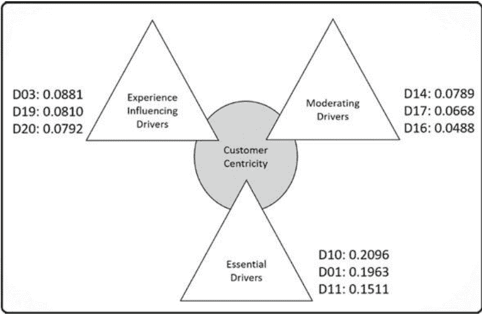
图15.1 零售客户中心驱动因素

在核心驱动因素之后，下面的三个驱动因素是便利性、增值服务和访问价值。这些驱动因素与顾客的体验有关，与零售的核心服务无关。
- **3. 调节驱动因素：**
  驱动因素的第三部分是购物协助、先进技术和高效员工。在核心驱动因素缺失的情况下，这些驱动因素没有价值。这些驱动因素的存在可以建立商店的良好形象。本研究确定了这些驱动因素的组成部分和标准，如图15.2所示。

研究表明，这三个因素都有助于建立以顾客为中心的理念。这些驱动因素及其标准的层次结构可以用来实现零售业中的顾客中心化，如本研究所示的模型（图15.3）。尽管实现顾客中心化需要这三个变量，但零售商必须按照一种系统的方式来应用上述三个因素。

根据这个模型，首先，零售商必须确保在高品质环境中提供大量种类的优质产品。在关键驱动因素之后，零售商需要致力于影响消费者体验的驱动因素。最后，调节驱动因素的存在确立了零售业务中的客户至上原则（图15.3）。

## 研究意义

这项研究回答了如何实现客户至上的问题。正如之前讨论的那样，零售商在实现客户至上方面面临着许多挑战。他们心中仍然存在一个基本问题，那就是如何在零售业务中采用客户至上的理念？

这项研究提供了一种结构化的系统方法来实现零售业中的客户至上。作为实现客户至上的过程，零售商主要需要关注关键驱动因素以及影响消费者体验的驱动因素。这些驱动因素的协同效应更有力地确保了客户至上。调节驱动因素是不断变化的；因此，零售商需要定期升级他们的运营方式（图15.3）。

这项研究同样适用于有组织的、无组织的和在线零售。在任何零售形式中，产品质量和产品种类这两个关键驱动因素是普遍适用的，而环境则可以被视为RATER工具的有形维度之一[50]。因此，对于实体店铺来说，环境意味着店铺的外观、布局和装饰，而对于在线店铺来说，环境维度则指的是网页设计、网页结构和内容等。忽视这些主要特征将无法建立以客户为中心的零售运营。

为了改善体验影响因素，零售商需要在购物时间方面提供便利，增加访问价值，提供协助服务，使顾客的访问难忘。这同样适用于所有类型的零售格式。对于在线零售，可以使用聊天辅助、推荐工具、以前的搜索支持等作为影响驱动力的体验。调节驱动因素因零售格式而异。然而，它们背后的基本意图保持不变。决策辅助、与客户需求的连接以及CRM必须是任何此类活动的基本目标，由零售商作为调节驱动力使用。在这个竞争激烈且动态变化的环境中，这个模型成为零售商可以依靠的战略工具。然而，他们的成功将取决于对这个模型的执行水平。

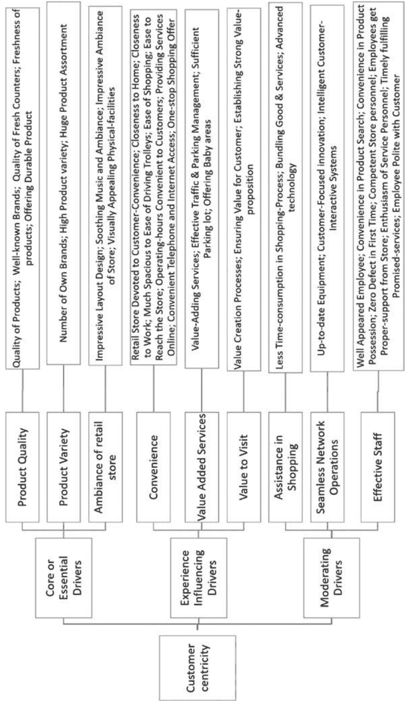
图15.2 驱动因素、组件和零售客户中心化的标准

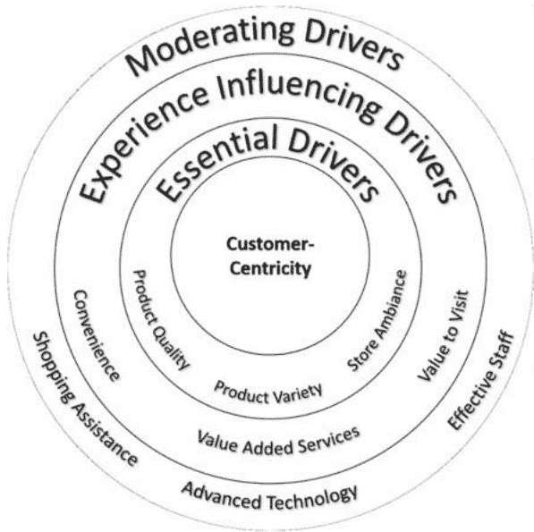
图15.3 建立零售业客户中心化的模型

## 结论

本研究的主要目的是确定与客户偏好相一致的零售客户中心化驱动因素。本文分析了影响零售选择决策的各种零售客户中心化驱动因素。该研究为零售商提供了一个层次分析法模型，以实现其零售运营的客户中心化。该研究使用层次分析法来确定客户中心化驱动因素的层次结构。

上述讨论和分析建立了一个模型，描述了与客户优先级相一致的任何零售组织的以客户为中心的驱动因素。这项研究主要在城市和都市地区进行。进一步的研究可以包括未覆盖的地理区域，如郊区或农村地区。此外，通过扩展文献调查，还可以将此研究扩展到在线零售的重点领域，或通过识别新的变量。


## 参考文献

- 1. Ambaram, M. 等：在从产品导向战略转向以客户为中心的战略时，促使客户至上和组织设计的变化因素。博士论文，普利托里亚大学（2013年）
- 2. Anderson, W.T.：便利性导向和消费行为。零售杂志。48 (3)，49（1972年）
- 3. Armstrong, Gary, Agnihotri, P.K.P.T.：营销原理，第17版。Pearson India（2018年）
- 4. Ashokan, C., Hariharan, G.: 零售消费者的个人资料和感知-帕拉卡德区的实证研究。印度市场杂志。38(2) (2008)
- 5. Baker, J., Parasuraman, A., Grewal, D., Voss, G.B.: 多个商店环境线索对感知商品价值和购买意愿的影响。市场学杂志。66(2), 120-141 (2002)
- 6. Ballantyne, D., Frow, P., Varey, R.J., Payne, A.: 价值主张作为沟通实践：从更广泛的视角看。工业市场管理。40(2), 202-210 (2011)
- 7. Bellizzi, J.A., Hite, R.E.: 便利消费和角色超负荷便利。学术市场科学杂志。14(4), 1-9 (1986)
- 8. Bentes, A.V., Carneiro, J., da Silva, J.F., Kimura, H.: 组织绩效的多维度评估：整合BSC和AHP。商业研究杂志 65(12), 1790-1799 (2012)
- 9. Berry, L.L., Seiders, K., Grewal, D.: 理解服务便利性。市场学杂志 66(3), 1-17(2002)
- 10. Crosby, P.B.: 质量是免费的：确保质量的艺术，第94卷。 McGraw-Hill, 纽约 (1979)
- 11. Day, G.S.: 管理市场关系。学术市场科学杂志 28(1), 24-30 (2000)
- 12. Drucker, P.F.: 管理实践：对美国社会最重要职能的研究。哈珀和兄弟出版社 (1954)
- 13. Eid, M.I.: 沙特阿拉伯电子商务客户满意度、信任度和忠诚度的决定因素。 电子商务研究杂志 12(1), 78 (2011)
- 14. Eroglu, E. 等：影响消费者对零售业和零售商选择的因素使用层次分析法。 Kafkas Universitesi Iktisadi ve Idari Bilimler Fakultesi Dergisi 4(6), 43-57 (2013)
- 15. Fairchild, A.M., Peterson, R.R.: 金融服务中的企业间价值驱动因素和电子商务基础设施：全球市场和网络中的协作商务。 在：第36届夏威夷国际系统科学会议论文集，第10页。 IEEE (2003)
- 16. Frankenberger, K., Weiblen, T., Gassmann, O.: 网络配置、以客户为中心和开放商业模式的绩效：解决方案提供者的视角。工业市场管理。42(5), 671-682 (2013)
- 17. Galbraith, J.R.: 设计以客户为中心的组织：战略、结构和过程指南。约翰·威利和儿子（2011年）
- 18. Garvin, D.: 质量在线。哈佛商业评论。65-75（1983年）
- 19. Gebauer, H., Gustafsson, A., Witell, L.: 制造公司通过服务差异化获得竞争优势 J.商业研究。 64 （12），1270-1280（2011年）
- 20. Hanel, T., Felden, C.: 运营商业智能在以客户为中心的服务提供中的作用（2014年）
- 21. Hart, C.W.: 顾客就是你的生意。市场管理。 8 （4），6（1999年）
- 22. Hemel, C.v.d., Rademakers, M.F.: 构建以客户为中心的组织：塑造因素和障碍。创造价值杂志。 2 （2），211-230（2016年）
- 23. Jones, P., Clarke-Hill, C., Shears, P., Comfort, D., Hillier, D.: 英国的射频识别技术：机遇与挑战。国际零售分销管理杂志32(3), 164-171 (2004)
- 24. Karras, D.J.: 统计方法学：II. 研究设计中的可靠性和变异性评估，第A部分。学术紧急医学杂志4(1), 64-71 (1997)
- 25. Kowalkowski, C.: 服务功能作为一个整体管理概念。商业与工业市场杂志26(7), 484-492 (2011)
- 26. Kruskal, W.H., Wallis, W.A.: 在单一标准方差分析中使用等级。美国统计协会杂志47(260), 583-621 (1952)

- 27. Kumar, V., Reinartz, W.: 创造持久的客户价值. J. Mark. 80(6), 36-68 (2016)
- 28. Lee, W.B., Lau, H., Liu, Z.-Z., Tam, S.: 模块化产品设计中的模糊层次分析方法. Expert. Syst. 18(1), 32-42 (2001)
- 29. Levitt, T.: 营销近视眼. 波士顿 (1960)
- 30. Loonam, M., O’Loughlin, D.: 在线银行电子服务质量的观察分析. J. Fin. Serv. Market. 13(2), 164-178 (2008)
- 31. Lu, P., Lukoma, I.: 对ICA/NARA和Coop Forum零售商的客户满意度. diva-portal. Gotland University (2011)
- 32. Lumpkin, J.R., Burnett, J.J.: 确定成熟消费者股票类型选择决定因素. J. Appl. Bus. Res. (JABR) 8(1), 89-102 (1992)
- 33. Marcus, C., Collins, K.: 21世纪的前10个营销流程. Gartner集团报告 SP-20-0671 (2003). http://www.gartner.com
- 34. Munasinghe, D., Hemakumara, G., Mahanama, P.: 在斯里兰卡卡拉特纳普拉市政委员会地区寻找最佳住宅用地的GIS应用. Int. Res. J. Earth Sci. 5(10), 11-22 (2017)
- 35. Naik, C.K., Gantasala, S.B., Prabhakar, G.V.: 服务质量（SERVQUAL）及其对零售业客户满意度的影响. Eur. J. Soc. Sci. 16(2), 231-243 (2010)
- 36. Ondrus, J., Pigneur, Y.: 在零售业中将移动支付与CRM相结合. In: IADIS国际电子商务会议论文集，葡萄牙里斯本 (2004)
- 37. Osborne, P., Ballantyne, D.: 客户为中心营销的范式陷阱. Mark. Theory 12(2), 155-172 (2012)
- 38. Pan, Y., Zinkhan, G.M.: 零售顾客选择决定因素: 元分析的视角. 零售学杂志 82(3), 229-243 (2006)
- 39. Parasuraman, A., Zeithaml, V.A., Berry, L.L.: 服务质量的概念模型及其对未来研究的影响. 市场学杂志 49(4), 41-50 (1985)
- 40. Reinartz, W., Dellaert, B., Krafft, M., Kumar, V., Varadarajan, R.: 全球化零售市场环境中的零售创新. 零售学杂志 87, S53-S66 (2011)
- 41. Rosenbaum, M.S., Cheng, M., Wong, I.A.: 零售仿冒品: 消费者对非正宗零售商的接受与拒绝. 商业研究杂志 69(7), 2448-2455 (2016)
- 42. Rust, R.T., Moorman, C., Bhalla, G.: 重新思考营销. 哈佛商业评论 88(1/2), 94-101 (2010)
- 43. Santy, T.: 分析层次过程: 规划、优先级设置、资源分配. 决策系列，麦格劳希尔，纽约，美国 (1980)
- 44. Sciglianaglia, D., Ely, D.: 互联网银行: 以客户为中心的视角. 在: 第35届夏威夷国际系统科学会议论文集，第2420-2429页. IEEE (2002)
- 45. Seiders, K., Berry, L.L., Gresham, L.G.: 零售商们注意了! 你们的便利策略有多方便? 麻省理工学院斯隆管理评论 41(3), 79 (2000)
- 46. Shabaz, M., Kumar, A.: S排序: 一种用于大规模数据的新型排序技术. 计算机网络与通信杂志 (2019)
- 47. Shah, D., Rust, R.T., Parasuraman, A., Staelin, R., Day, G.S.: 通往客户至上的道路. J. Serv. Res. 9(2), 113-124 (2006)
- 48. Sorescu, A., Frambach, R.T., Singh, J., Rangaswamy, A., Bridges, C.: 零售业务模式的创新.
- 49. Srivastava, V.: 乘用车车主对服务中心售后服务质量的感知：对服务质量维度的评估. Srivastava, V.: 评估各个年龄群体在加济阿巴德对Idea、Airtel和Vodafone电信服务的广告接受度. Srivastava, V., Tyagi, A.: 乘用车售后服务对客户保留的影响研究.
- 52. 田中石井, K., 手塚, S., 寺田, H.: 按可读性对文本进行排序. 计算机语言学 36(2), 203-227 (2010)
- 53. 陶波, E.M.: 市场营销笔记和沟通：为什么人们购物？ 市场学 36(4), 46-49 (1972)
- 54. 图利, K.R., 科利, A.K., 巴拉德瓦杰, S.G.: 重新思考客户解决方案：从产品捆绑到关系过程. 市场学 71(3), 1-17 (2007)
- 55. 弗拉西奇, G., 图特克, E.: 客户中心化的驱动因素：环境层次、组织层次和部门层次变量的作用. 萨格勒布国际经济商业评论 20(2), 1-10 (2017)