# 面向安全与隐私保护的深度学习


### 关于编辑

博士 Aaisha Makkar 在英国德比大学科学与工程学院担任计算机科学讲师。在 2020/21 年，她在韩国首尔科技大学计算机科学系担任博士后（研究）教授。在此之前，她在塔帕尔大学担任研究员，并获得博士学位。她的博士研究目标是利用人工智能技术进行网络安全研究。在研究生涯中，她参与了多个研究项目，如国家研究基金会项目的研究科学家。她还获得了来自 SERB DST、IEEE CIS 等知名组织的多项差旅津贴。她相信进行面向行业的技术研究，如联邦学习，尽管她的兴趣包括机器学习、深度学习和主动学习。Aaisha 博士在这些研究领域展示了专业知识，发表了研究论文、书籍章节和书籍。她是 CRC（Taylor & Francis）出版社《认知物联网中的机器学习》一书的作者。截至 2022 年 3 月，她在 IEEE（TII、IoT）和 Elsevier（FGCS、SCSI、IPM）等知名期刊上发表了 20 多篇 SCI 论文（第一作者）。她积极参与编辑服务，担任副编辑、客座编辑和程序主席。

教授 Neeraj Kumar 是 2019 年和 2020 年来自 WoS 的高被引研究员，并在顶级期刊和会议上发表了 400 多篇技术研究论文（DBLP: [https://dblp.org/pers/hd/k/Kumar_0001:Neeraj](https://dblp.org/pers/hd/k/Kumar_0001:Neeraj)），这些论文被全球知名研究人员引用超过 26930 次，目前的 h 指数为 88，i-10 指数为 446（Google 学术: [https://scholar.google.com/citations?hl=en&user=gL9gR-4AAAAJ](https://scholar.google.com/citations?hl=en&user=gL9gR-4AAAAJ)）。他是 2019 年和 2020 年 Web of Science（WoS）发布的高被引研究员名单中的研究员。

他指导了许多研究学者获得博士学位和硕士学位。他的研究得到了来自全球各个竞争机构的资助。他的广泛研究领域包括绿色计算和网络管理、物联网、大数据分析、深度学习和网络安全。他还与国际/国内出版商如 IET、Springer、Elsevier、CRC 合作编辑/撰写了 10 本书。

电子医疗记录的安全与隐私：概念、范式和解决方案（*ISBN-13: 978-1-78561-898-7*），认知物联网的机器学习，CRC 出版社，区块链、大数据和机器学习，CRC 出版社，工业垂直领域的区块链技术，Elsevier，物联网应用的多媒体大数据计算：概念、范式和解决方案（*ISBN: 978-981-13-8759-3*），第一届计算、通信和网络安全国际会议（*IC4S 2019*）论文集（*ISBN: 978-981-15-3369-3*），基于区块链的物联网应用的概率数据结构，CRC 出版社。2019 年在 *Springer* 出版的一本名为“物联网应用的多媒体大数据计算：概念、范式和解决方案”的编辑教材已经下载了 350 万次（截至 2020 年 6 月 6 日），吸引了全球研究人员的关注。

（*https://www.springer.com/in/book/9789811387586*）

他担任 *ACM Computing Surveys*、*IEEE Transactions on Sustainable Computing*、*IEEE Systems Journal*、*IEEE Network Magazine*、*Elsevier Journal of Network and Computer Applications*、*Elsevier Computer Communications*、*Wiley International Journal of Communication Systems* 的编辑。此外，他还组织了来自 *IEEE*、*Elsevier*、*Springer* 等知名期刊的各种专题问题。他曾担任 *IEEE Globecom 2018*、*IEEE Infocom 2020*（*https://infocom2020.ieee-infocom.org/workshopblockchain-secure-software-defined-networking-smart-communities*）、*IEEE ICC 2020*（*https://icc2020.ieee-icc.org/workshop/ws-06-secsdn-secure-and-dependable-software-defined-networking-sustainable-smart*）的研讨会主席，以及 *IEEE MSN 2020*（*https://conference.cs.cityu.edu.hk/msn2020/cf-wkpaper.php*）的安全与隐私主席。我还是 *IEEE MASS 2020*、*IEEE MSN 2020* 等国际会议的 *TPC* 主席和成员。他曾获得 *IEEE Systems Journal* 2018、2020 年的最佳论文奖，以及 *IEEE ICC 2018* 年最佳论文奖。我连续八年获得了母机构的最佳研究员奖。我还获得了 *JNCA 2021*、*IEEE TrustCom 2021* 的最佳论文奖。我还获得了 *IEEE Technical Committee on Scalable Computing* 的中期研究奖。

## 第一章
## 使用深度学习改变工业物联网的形态

Asmita Biswas 和 Deepsubhra Guha Roy

### 1.1 引言

物联网被发明为一个强大的、相互通信和相互连接的独立设备聚合体，以实现各种目的，且经常是协作的。作为一项发展中的技术，物联网需要提供有用的讨论，以修改多个现有工业系统（如运输和生产系统）的过程和角色。例如，在使用物联网构建智能交通系统时，交通管理机构可以追踪各个车辆的当前位置，控制其移动，并预测其预期位置和可行的道路交通情况。密切的安全研究应该确定谁有权访问哪些内容、在什么情况下以及何时访问。标准模型将组织的安全计划表示为一组方法、指南，或在假定/原始公司操作环境中所必需的安全命令。为物联网协作提供正确的访问控制范式是一个重要但严峻的问题。

当然，授权和认证问题通过当前协议来审查在受限条件下使用数据的问题。然而，在受限条件下，这些影响仍然存在。进一步，多个需求模型对应多个保护规则的应用提出了挑战。需求提升到一个细粒度且有用的访问控制设备，以对用户进行指导。

> 工业物联网（IIoT）似乎描述了物联网在工业中的利用，利用了执行器、传感器、机器对机器（M2M）等破坏性因素、交互界面、控制系统和增强安全设备，以发展工业操作并形成未来的智能工业概念。

A. Biswas  
计算科学学院，信息技术系，Maulana Abul Kalam Azad University of Technology, Simhat, Haringhata, Nadia, Kolkata, West Bengal 741249, India

D. Guha Roy（✉）  
移动与云实验室，计算机科学研究所，Tartu 大学，Ulikooli 17-324, Tartu 50090, 爱沙尼亚  
电子邮件: roysubhraguha@gmail.com

© 作者，独家许可给 Springer Nature Singapore Pte Ltd. 2021  
A. Makkar 和 N. Kumar, 深度学习用于物联网的安全和隐私保护，信号与通信技术  
[https://doi.org/10.1007/978-981-16-6186-0_1](https://doi.org/10.1007/978-981-16-6186-0_1)

在工业环境和使用链中引入物联网，使企业、生产者和运营者能够更高效地生产。它对许多领域产生了重大影响，如工业制造、自动化、物流、贸易流程、方法控制和运输。与核心制造方法的整体发展同步，数字化转型进程和不断增长的节点互连性使新的应用程序出现，通常与过程优化、自动化、资源消耗优化、安全增强和独立系统生成相关。如今，人们认识到工业物联网彻底改变了商品生命周期，从而形成了一种新的商业理念，并对其整体模拟产生积极影响。工业物联网将产品和流程整合起来，最终将产业效率从批量生产转向批量定制。工业物联网通过提供适当的状态数据，在生命周期中以实时、自主、交互和优化的方式转变制造业，从而优化整个利益链。

在追求提高生产力的目标时，需要解决一些独特挑战，而最关键的困难是保护工业基础设施和要素。对关键行业和基础设施的网络攻击引起了人们的关注，因为这些干预行为造成的损失是巨大的。因此，有必要从目前工业成为攻击目标的事件中学习，并迫切需要解决这一问题。IIoT 指的是运营技术（OT）和信息技术（IT）的结合，其中 IT 包括商业网络，OT 包括生产工厂网络。

这两个要素有许多安全要求，需要在理解工业物联网基础设施时加以考虑。Maw 等人 [1] 处理了访问控制问题和无线传感器网络（WSN）环境。Sicari 等人 [2] 研究了物联网环境中的安全性、隐私性和保证性，但并未完全解决访问控制问题。Atzori 等人 [3] 研究了物联网技术和当前中间件解决方案，并提出了隐私和安全的开放问题，但没有发现机制和模型之间的联系。Miorandi 等人 [4] 选择了物联网中的主要挑战，包括数据隐私、机密性和安全性等安全条件，并回顾了主要研究情况（即项目、影响区域和标准化实践）。Weber [5] 仅代表了安全和隐私困难中的一个权威观点；Yan 等人 [6] 首先关注基于物联网的信任组织。Roman 等人研究了分布式和去中心化隐私与安全结构在物联网环境中的利弊，分析了主要攻击威胁和原型 [7]。Gubbi 等人 [8] 对不同物联网特性进行了代表性调查，如应用程序、相关技术、服务质量、云平台、安全问题、架构、功耗和数据挖掘连接。

### 1.2 现有框架

物联网的定义是：通过唯一标识物品的扩散而出现，并可在网络支持下进行交互 [9]。最初通过射频识别标签引入，以展示 EPC（电子产品代码）。物联网包括多个独立设备相互连接，应用多种技术和协议以提供动态连接互操作性。准确地说，物联网定义了一个无需人类支持即可独立组装和共享数据的物品网络。这些物品的例子包括监测和测量环境湿度或温度的各种传感器、远征装置或定位对象。物联网应用情境各不相同，从智能家电到健身设备不一而足。

虽然安全与信息安全不完全等同，但在工业物联网的发展过程中至关重要。需要考虑这一点，以防止可能威胁人类和机械完整性及服务可用性的事故。访问控制模型并未将保护视为集成的方案特性，因此在执行访问控制指南时应考虑潜在保护需求。

国际电信联盟（ITU）已经发布了 ITU-T Y.2060 [10]，这是一个有助于对物联网进行概述的提案。通过这个提案，物联网延续了“任何地方”和“任何时间”对话的第三个维度，甚至可以通过传统 ICT 方法来呈现。这个新维度被称为“任何事物”，描述了网络设备与人-物、物-物、人-人之间的交互。物指的是存在于动态世界中的对象，可以被分类和感知。分类可以使用隐含事物进行操作，这些事物可能存在而没有实际物质形态。它定义了相关学术和非学术文献中最常用的表达方式（虽然并非完整列表）。工业 4.0 是为了在优化产出效果和提高产品状态方面保障生产的努力。该倡议的基本理论将物联网整合到传统产品领域的自动数据系统中，形成新概念，即工业物联网（IIoT）。机器改进使 IIoT 机器通信、易用性和网络性能得到了提升，完整性受到了 4G、5G 改进及 LoRaWAN、6LoWPAN 等规则的影响，并应对了资源受限、连接性差、异构性等物联网挑战。在工业环境中，保护条件也是重要方面 [11]。

对于“工业 4.0”的描述，其英文对应词汇是 IIoT。贡献者将其解释为兼容的概念和技术，我们将工业 4.0 描述如下：工业 4.0 是一个结合价值链组织的概念与技术阶段。在工业 4.0 的每个集成智能车间中，它创建了动态世界的虚拟图像；CPS 控制物理方法并执行分散决策。CPS 通过物联网实时连接、支持人类。跨组织和内部服务由价值链合作伙伴通过服务互联网（IoS）提供 [12]。

虽然存在各类物联网定义，但对于工业应用来说，重要的是准确识别嵌入日常用途的智能元素类型，以及设计 CPS（网络物理系统）。以下是三个重要描述：

- 物联网可描述为“一组相互连接的相关对象与基础设施，并提供它们的授权、信息挖掘和数据入口”，其中相关对象是“执行特定目的并能与不同设备交互的执行器和传感器”[13]。
- “物联网一词涵盖了计算技术扩展到传感器、设备和物品以及网络连接。这些物品（物品、对象、传感器）通常不被视为计算机。这些智能设备期望在生成、传输和应用信息时减少社交干扰；它们通常强调与既有数据采集、解释和管理能力的连接。”[14]
- “物联网表示每个设备或‘物品’都由传感器支持，并自动具备与其他设备和自动系统在上下文中进行交互的能力。各种设备意味着它在虚拟网络中是一个节点，不断广播关于自身和周围环境的大量信息……”[15]

### 1.3 物联网和工业物联网系统的分层架构

工业物联网包括信息分析、传感器驱动计算和智能设备利用，以适应性能、可扩展性和互操作性，从而快速提升关键基础设施自动化并提高公司效能 [16]。尽管实现了先进控制目标，但保护工业基础设施及其组件仍面临诸多困难。针对关键基础设施和行业的网络攻击表明，造成的损失可能是巨大的。因此可以预期，工业部门目前是攻击者的主要目标，并迫切需要找到问题根源。工业物联网通常涉及信息技术（IT）和运营技术（OT），其中 OT 包括制造业界面，IT 包括业务网络。安全通常采用服务器-客户端模式，二者之间使用标准协议，如 UDP（用户数据报协议）、TCP（传输控制协议）、IP（互联网协议）和 HTTP（超文本传输协议）。成功攻击通常导致声誉和金钱损失，并伴随安全威胁。然而，OT 系统旨在以安全可靠方式运行工业过程。OT 元素与子系统在网络隔离和物理安全措施方面并不总能提供充分安全性，这些措施也并非绝对，因为攻击者仍可能利用某些技巧发起攻击。

图 1.1 IIoT 的分层架构

将 OT 网络分离可能阻止来自外部网络的部分攻击，但无法完全限制对系统的攻击。恶意软件仍可有效部署到隔离网络内的系统。因此，我们需要分析 IIoT 结构的不同层次。图 1.1 展示了 IIoT 的如下层次元素：

- 第一层：传感器、安装设备、发射器、执行器和电机在这里完成物理过程。
- 第二层：可编程逻辑控制器（PLCs）、分布式控制系统（DCS）和网关通过第一层设备进行通信。
- 第三层：数据采集设备、监控控制与数据采集系统（SCADA）以及人机界面（HMI）应用网络协议与基于 IP 的技术，构成这一层。
- DMZ：非军事区用于隔离 IT 和 OT 网络。必要工具（如应用服务器和 Web 服务器）部署在此层，避免直接进入 OT 网络，并通过防火墙等设备实施安全。
- 第四层：内部网络服务、Web 服务、办公应用和邮件服务在这一层扩展。对于站点业务规划，这一层通常较可靠。
- 第五层：数据分析、云计算、企业应用、互联网和移动设备在这一层负责数据隧道与分析，并在互联网和移动设备上执行学习方法。

工业 4.0 计划引入了 RAMI 4.0（工业 4.0 参考架构模型），其被识别为 DIN 模型（DIN SPEC 91345）和 IEC PAS 63088（国际预标准）。RAMI 4.0 基于一个三维模式，覆盖整个工业体系在商品生命周期中的特征。其 3D 维度包括：（a）架构，提供系统架构；（b）层级，代表 IIoT 的功能区（从智能工厂、智能产品到互联世界）；（c）产品生命周期，包括制造、开发和维护特性。围绕这些架构维度，RAMI 4.0 展示了 6 个层次：

- 资产层：描述物理区域，包括工具、硬件组件和人类环境。
- 集成层：说明资产控制服务和信息数据的采集。
- 通信层：应用标准化连接，结合更高层与资产层的利用，并始终遵守集成层信息形式。
- 信息层：处理事件生成和信息预处理；在这些事件下，资产控制服务可能被请求。
- 功能层：从信息层获取预处理数据，并执行规则与决策推理。此外，功能层也是信息层以下若干独占访问点，并保护信息以确保数据完整性。
- 业务层：功能层在此组合成特定业务流程。

### 1.4 访问控制的要求

访问控制在所有需要通过流程或用户收集系统资源的场景中都必不可少，用于调节和定义操作或服务。访问控制（AC）方法包括三个概念：AC 模型、方法和机制。AC 系统用于执行访问控制方法，并基于这些概念阻止违规。AC 方法是定义用户或流程何时以及如何访问资源的高级术语。

访问控制方法在访问控制设备中得到强化，以允许或拒绝访问路径。AC 模型是一种概念容器，将访问控制工具应用组合与访问控制方法的逻辑结构保持一致。因此，访问控制模型填补了方法和访问控制系统机制之间的重要差距。在 [17] 中，展示了在智能交通系统中应用雾计算概念的物联网生态系统。关于访问控制问题的产品给出了以下条件：

- 上下文感知：上下文学习描述了实体的情况和条件 [18]。上下文可能影响访问控制决策，并支持流程执行，分析超越主体与客体身份的因素。访问控制方法还可设计为在特定情境下保护敏感数据安全。
- 责任：审计需要促进各个利益相关者的落实，包括控制和揭示每个系统误用违规行为的能力。
- 隐私支持：隐私是部署所有 ICT 解决方案（按方案分离）时必须考虑的重要组成部分。它是欧盟宪制框架的一部分，也是 2018 年《通用数据保护条例》（GDPR）确立的要求。访问监控设备应设计为不持续泄露个人信息流程。
- 跨域流程：工业物联网部署于不同领域，鼓励私营部门在相同管理授权下运作。任何访问控制方案都应充分支持不同区域之间的连续流程。
- 可管理性：应有集中流程来生成、配置和实施方法，这些方法不应引入额外延迟，并可在低带宽网络中执行，即使网络偶尔不可用也能运行。
- 资源能力：在框架设计中最大化设备利用率以完成特定任务，并尽可能降低功耗。目标是高可访问资源（无论处理能力还是存储方面），因此设计中的若干元素应考虑具体约束条件。

如上所述，条件列表并不详尽，但在选择更相关的支持方案时起到了作用。下面进一步介绍工业物联网生态系统中访问控制范式与结构的更多内容。

#### 1.4.1 不同访问控制的方法

尽管物联网提供了吸引人的机会和新的商业模式，它也存在安全和隐私问题。重点是保护物联网设备和资源（数据、服务、应用程序）免受未授权用户访问。解决该问题的一个良好方式是采用访问控制方法，确保只有被允许的对象（设备和用户）可以访问物联网资源和设备。访问控制系统的设计方法通常包括三个关键组成部分：

- 策略：描述访问控制改进的保障条件。
- 模型：提供对访问控制程序和修正的正式描述。
- 机制：描述系统中所需限制的底层实现方式。

为此，我们首先对最新的访问控制范式进行调查。然后，我们介绍了访问控制系统和标准的要求，无论是通过物联网推荐的支持结构执行，还是通过 AC（访问控制）程序正式设计来执行访问控制范式。文献中提供了各种原型，特定表示具有不同的特性，这可能会影响其在物联网中的适用性。此外，我们对各种普遍的访问控制范式进行了总结。

尽管在工业物联网生态系统中存在大量相关的访问控制范式，但在这里我们对重要的访问控制家族模式进行了提炼。数据共享模式中的撤销影响根源于相应的模式家族和指导原则，这些模型的主要特征得到了说明。主要包括基于属性、基于使用、基于角色、基于能力和基于限制的家族模式。

#### 1.4.2 基于能力的访问控制

基于能力的访问控制（CapBAC）基于能力的概念[19]，该概念被认为是可传输且不可伪造的权限标识。能力还包括主体授予访问权限的支持列表。

因此，在类似于访问控制记录的过程中，访问控制矩阵考虑可能包含对象、主体和支持。在 CapBAC 中，权限分配给主体，因此在主体和对象之间形成一对多关系。主体和对象分别对应用户和资源。

权限用于授权主体对对象可执行的操作。CapBAC 还支持通过能力进行授权和撤销。这些机制分别用于授权（间接地）不同主体的访问和撤销访问。CapBAC 系统通过扩展并适配物联网条件来定义其思想和方法。基于能力的授权提供了以下额外特性，以对早期基于能力的方法进行必要修改：

- 1. 授权委托：一个主体可以允许不同主体访问，并可委托全部或部分权限。授权强度可以在每个步骤进行控制。
- 2. 数据粒度：能力可以支持对已授予权利进行细粒度调整。通过这种方式，服务提供者可以改进行为，并根据能力令牌中的状态提供信息。
- 3. 能力放弃：经过适当授权的主体可以取消能力，通过处理相关能力请求并在共享环境中生效。

最初由 Lampson 引入的可变访问控制可通过 ACM（访问控制矩阵）表示，其中一个维度描述主体，另一个维度描述对象。两种流行的访问控制范式是访问控制列表（ACL）和基于能力的访问控制。

通过天然嵌入的访问控制列表（ACL）实现多粒度控制并不理想，容易出现特定故障，且可扩展性不足。CapBAC 基于能力概念，包括授予每个设备的权限。能力概念还包括标签、令牌或代码，允许持有者访问计算机系统中的项目。CapBAC 在多种大规模设计中得到应用，并广泛用于物联网领域。将能力模型的原始概念直接用于物联网访问控制原型会产生一些缺点。能力配置和取消在传统能力设计中存在两个重要问题，Gong 指出了这些挑战，并提出了安全的 ICAP（基于身份的能力系统）。

ICAP 主要用于扩展能力方法：每个主体或用户若要访问特定工具或资源，需要获得相应能力。如果主体的能力与控制实体或设备中记录的能力匹配，则授予访问权限。ICAP 的特点是将用户身份或上下文纳入机制中；与常规能力系统相比，ICAP 的参与更精确。在此过程中，ICAP 对能力生成要求更高，并通过减少能力收集节点（如“对象服务器”“网关”或“接入点”）提高可扩展性。ICAP 框架以及能力实现目标控制可表示为 ICAP = (ID, AR, Rnd)，其中 AR 是机器的访问偏好集合，ID 是设备标识符，Rnd 是用于限制重放的随机数。其结果通过哈希函数生成。该机制不需要在访问请求中附带过多连接数据。其独特之处在于为物联网场景提供了基于 ICAP 的访问控制与身份认证的一体化视图。

该设计被称为身份认证和基于能力的访问控制（IACAC）。在 IACAC 中，通过访问点连接设备，然后允许基于能力的访问控制访问其他设备。其能力访问支持个体建立连接。仅在能力验证后，设备才能与其他设备通信。想与其他设备交互的设备可通过向目标设备发送请求发起连接。下一步是确认请求方设备是否可与目标设备交互。该访问许可通过请求设备的能力进行验证，并与设备连接关系结合。其适应性与以下参数相关：粒度、可扩展性和生产时保护。此外，还提出了一种分析设计，以改进 IACAC 的队列解释（图 1.2）。

图1.2 访问控制与基于能力的授权模型

#### 1.4.3 基于角色的访问控制

在基于角色的访问控制（RBAC）[20] 中，系统资源访问依赖于用户角色以及角色的预定义权限。RBAC 可采用多种策略，如职责分离、最小权限和职能执行，使其适用于组织环境。核心 RBAC 设计包含五个静态组件：用户、角色、权限，以及应用于这些组件关系的操作，包括将角色分配给用户、将权限分配给角色。某些关联是多对多的，例如一个用户可拥有多个角色，多个用户也可拥有同一角色。相应实现是通过授权责任完成的——否定授权在 RBAC 中通常不推荐。RBAC 具有两个方面：设计时和运行时。

在设计阶段，系统控制器可将个别任务分配给系统组件。系统责任在运行时由模型执行，依据设计阶段定义的安全策略，通过会话概念进行实例化。一些终端定义了基于组设备的 RBAC。通过会话，允许用户激活其角色的子集。这意味着用户在某一时刻可能被授予多个角色，但不要求同时全部激活。通过该机制，RBAC 有助于实施最小权限策略。

在会话期间还可强制执行多种约束。除核心模型外，RBAC 还支持角色间权限继承，该机制在管理策略方面提供了较大灵活性。

具体而言，一个角色可快速继承另一个角色，而无需重复分配后者的相同权限。

例如，考虑两个权限集合 PR1=(P1, P2) 和 PR2=(P3, P4)，以及两个角色 R1 和 R2。若角色 R1 获得角色 R2，则表示 R1 具有 R2 的全部权限。R1 的有效权限可表示为 PR1 与 PR2 的组合。以图表示时，权限直接继承关系可用符号或弧线表示用户与权限关联继承。在上述例子中，有 R1 → R2。

用户关联表示用户在角色中承担职责。在这种情况下，用户可直接或通过继承体系获得分配给角色的全部权限。然而，层次化 RBAC 的附加特性还支持“完全权限”和“受限权限”。完全权限包括角色继承中的常见情况；受限权限则用于更严格环境。它涉及层次结构中的直接子角色或祖先角色，类似树形结构。RBAC 通过静态和动态职责分离进一步增强约束能力。静态职责分离用于防止利益冲突。两种约束的主要目的是保障系统安全并防止违规。

例如，设 R1 和 R2 为互斥角色，用户 U1 已分配给 R1。通过在 R1 与 R2 间实施静态职责分离，RBAC 可防止 U1 同时拥有 R2，因为两角色不兼容。该限制在 RBAC 设计阶段建立并强制。

在会话场景下，动态职责分离用于管理业务策略冲突。在存在角色层次结构时，静态完整性分离需对所有直接继承与分配角色统一处理。用户拥有可在该实例中激活的一组角色。动态职责分离在设计时定义，但在运行时约束两个或多个冲突角色的同步激活；与静态分离类似，仅对层次结构中的特定角色集合生效。

文献[21] 的作者利用面向服务的方法发布物联网方案[22,23]，其中物联网设备应按常规职责扩展其功能。服务在执行前通过访问控制确认请求目的。作者通过累积设备状态上下文来扩展 RBAC 原型，以纳入位置、时间等上下文信息。网络服务技术在异构系统间具有良好互操作性。尽管作者未明确定义设备目标与一个或多个网络服务的映射方式，也未详细说明上下文信息如何从设备状态中实时组合并应用，但该方法相较于一般物联网生态更适合用于网络服务中的上下文感知访问控制模型。其他研究多关注物联网用户而非设备，以及智能设备在访问决策生成中的作用。相关方案更多通过案例研究解释，而非完整实现。

#### 1.4.4 基于使用情况的访问控制

UCON（使用控制）由[24]提出，被认为是下一代访问控制模型。它提出了许多区别于标准访问控制（如 ABAC 和 RBAC）的创新点。其核心在于对授权在访问前、访问中和访问后进行持续管理。此外，它强调属性的可变性。这意味着访问是动态的：若访问属性变化，已授予权限可被撤销，安全策略随之调整。UCONBAC 模型包括八个元素：对象属性、主体属性、授权、对象、权利、义务和条件。对象与主体概念及其属性关联较为直观。

每个对象都可与对象属性关联。主体可被视为系统中的实体，其特征或能力通过主体属性表示。主体可对对象持有权限偏好，据此允许对对象使用或访问。需要指出的是，对象和主体属性都可能变化，这些值可通过操作执行而调整，而不仅由用户活动直接决定。

UCONBAC 的创新主要来自其余元素。权利元素表示主体对对象的操作许可，可被检查和执行。类似 RBAC 中角色作用，UCONBAC 的理论结构也帮助管理偏好。需注意，权利不是优先级，而是访问许可本身。访问决策由策略函数给出，并综合义务、主体与对象属性、条件和授权等因素。在 UCONBAC 中，授权是用于决策评估的谓词。

换言之，授权评估用于判定主体是否可访问对象。授权评估基于请求权利、对象与主体属性，以及一组策略规则。授权可分为预授权和持续授权。前者在访问前评估，后者在访问期间持续评估。

此外，UCONBAC 的条件用于约束主体请求对象方法时必须满足的要求。如前所述，它们用于访问评估与授权判定。义务也分为预义务与持续义务：前者通常用于记录或前置动作，后者用于验证访问期间条件是否变化并影响权限。最终，UCON 中的条件用于捕获系统上下文中的约束。条件与其他变量（如授权和义务）之间的语义关系可能随时间变化，且不一定与主体直接绑定。

#### 1.4.5 基于属性的访问控制

ABAC（基于属性的访问控制）在分布式网络和系统（如互联网）发展中获得了广泛认可，被视为一种逻辑访问控制方法[25]。相较 RBAC，标准化 ABAC 信息在稳定性方面仍有差异。根据 NIST 在[25]中的定义，ABAC 可通过评估策略规则、属性值和环境条件来作出访问决策。在系统中，对象和主体可拥有属性状态，而不依赖预先绑定的策略对象关系。此外，ABAC 的优势在于：无需系统对对象与主体具有先验经验，即可通过属性表达策略，从而提升权限控制清晰度。

ABAC 范式包括六类元素：主体、对象、属性、策略、环境条件和操作。属性由名称-值集合构成，是结构化元组；对象和主体属性还可包含元属性。属性是对象、主体或环境条件的特征。环境条件提供了对对象与主体组合之外情境的引用。

ABAC 支持通过策略函数进行判定，提供统一标准下的权限连接机制。主体可具备一个或多个属性。主体通常表示用户或进程，用于访问应用并对对象执行操作。ABAC 系统管理的对象可为程序、文件夹、设备、图形、记录、方法、通道或区域等，涵盖信息、服务、应用、网络和工具。操作是主体对对象请求执行的行为，常见包括读取、写入、编辑、删除、复制、执行和修改。系统通过关系与规则，根据主体特征、目标对象与环境条件决定是否批准访问。环境条件是访问发生时的情境因素，如当前时间、星期、威胁等级和用户位置。上述描述有助于理解 ABAC 及其术语。下文简要说明流行的 ABAC 框架。

访问控制框架可在访问控制系统实施时提供指导。NGAC（下一代访问控制）和 XACML（可扩展访问控制标记语言）是 ABAC 中最具代表性的框架。它们都支持策略管理、决策评估和执行机制。NGAC 和 XACML 通过定义关键组件术语（如策略执行点、策略决策点和功能操作）来加速基于属性的决策过程。我们将 NGAC 和 XACML 作为先行研究，用于分析 IIoT 生态系统中的相关访问控制系统。

### 1.5 深度学习方法

许多系统设计师、研究人员和软件开发人员对在现代物联网系统中应用深度学习方案以解决漏洞和安全威胁表现出越来越大的兴趣。与经典机器学习方法相比，这些方法通常取得了更优成果，尤其在大规模数据集场景下。深度学习提供了可应用多层非线性处理的计算架构，以不同抽象层级学习数据表示，因此也被称为分层学习技术。多数最新深度学习技术依赖神经网络（NNs），在训练过程中可分为判别式（如卷积 NN、循环 NN），以及无监督或半监督方法（如自动编码器、深度玻尔兹曼机、深度置信网络）。

CNN（卷积神经网络）通过参数共享、稀疏交互和不变特征分析来减少层间连接。

它由两类层组成：

- 1. 卷积层：将输入数据与多个同尺寸滤波器进行卷积。
- 2. 池化层：对输出进行子采样并缩小后续层规模。

与传统神经网络相比，CNN 具有更好的可扩展性和更低训练复杂度，其广泛应用还得益于可从原始数据自动学习特征。尽管如此，将其集成到资源受限设备中仍具挑战。CNN 已成功用于恶意软件检测[26]和密码破解实现[27]。

此外，近年来 CNN 也被用于 1D 序列数据分析，包括多种工业物联网应用。CNN 的特征学习通常通过交替堆叠卷积层与池化层完成。卷积层以局部卷积核从输入中提取不变局部特征；池化层使用固定长度滑动窗口，从未训练表示中提炼隐含特征。

常见池化技术包括平均池化和最大池化。

最大池化选择区域特征图中的最大值作为该区域代表特征。

平均池化计算区域平均值并作为汇聚结果。需要注意，最大池化更适合稀疏特征提取；而平均池化并非在所有场景下都是最佳选择。多特征学习后，全连接层将 2D 特征图转换为 1D 向量，并输入激活层以获得更合适的表示。

在 CNN 中最常用的激活函数是 SoftMax，它通常将前一层输出转换为类别概率分布。这种逐层架构在工业物联网应用中非常有用，例如识别制造过程中的表面缺陷。CNN 主要通过基于梯度的反向传播，最小化交叉熵（CE）和最小均方误差（MMSE）等损失函数进行训练。CNN 相比其他神经网络具有多项优势，包括参数共享和局部连接性。

RNN（循环神经网络）适用于视频、语音、传感器测量等顺序数据场景。其通过在展开图结构中递归复用权重来建模时序依赖。RNN 在处理自适应序列数据方面非常有效，但也面临梯度消失或爆炸问题[28]。循环神经网络在顺序建模中具备神经元间层次连接能力[29]。图 1.3 展示了 RNN 的基本架构，包括输入、输出和隐藏层。

输入变量表示为 $x_{t-1}, x_t, x_{t+1}$，输出变量表示为 $y_{t-1}, y_t, y_{t+1}$。术语 U、V、W 表示对应权重矩阵，其值在每个时间步共享更新，隐藏状态可表示为 $S_t = f(x_t + W S_{t-1})$ [30]。因此，RNN 能从连续数据中学习时序关系，通过隐藏状态捕捉历史信息。RNN 的展开形式用于有效计算不同时间步之间的变化。RNN 将数据向量作为持续输入，在激活函数作用下更新当前隐藏状态。首个时间步基于当前输入计算；后续时间步结合前一时刻隐藏状态。随后根据隐藏状态得到目标输出。

SoftMax。完成整个序列处理后，隐藏状态可表征连续输入数据的学习模型。此外，传统多层感知器可添加在顶部用于目标映射（图 1.3）。自动编码器由编码器和解码器两部分组成，前者将输入映射为代码（抽象表示），后者将代码重构为输出。编码与解码通过最小化重构误差进行学习。

图1.3 递归神经网络的通用逐层架构

图1.4 IIoT 市场和规模影响

尽管训练数据集应足够描述目标数据集，但特征维度压缩和高层特征提取对于减少先验知识需求至关重要，而其他方法往往消耗较多计算时间。先前研究已将自动编码器用于提取特征，以检测 WiFi 环境中的行为攻击和雾计算系统中的网络攻击。自动编码器在 IIoT 应用中的关键优势在于能够降低输入维度并学习无标签数据特征。自动编码器还可提升 IIoT 网络安全，因为它有助于识别 IIoT 环境中的异常干扰。因此，可采取预防措施，避免工业过程中的生产、安全和仓储灾难。

受限玻尔兹曼机（RBM）本质上是具有两层结构的人工神经网络，包括可见层和隐藏层。在 RBM 中，仅可见层与隐藏层相连，同层节点之间无连接。它是一种基于能量的模型：可见层负责输入信息，隐藏层负责属性推断。此外，隐藏节点在给定可见层时相互条件独立。可见层和隐藏层的偏置与权重通过训练更新，以拟合输入数据。总体而言，隐藏层可视为可见层的另一种表示。RBM 的逐层架构中，隐藏层用于实现维度压缩和多种编码机制。监督学习方法如朴素贝叶斯、支持向量机、线性回归和置信传播常用于回归与分类任务。RBM 通常可自适应地从训练集学习所需特征，并有助于缓解局部最优问题。RBM 也常作为基础学习模块用于构建其他变体模型。

#### 1.5.1 工业物联网为何需要深度学习

随着数字化转型在多个行业推进，工业物联网（IIoT）市场迅速扩大。IIoT 利益相关者与已部署应用之间的紧密连接，激发了全球企业参与 IIoT 市场的热情，预计到 2021 年市场规模将达到 1238.9 亿美元（见图 1.4）。这种创新的 IIoT 技术或产品方式与以往技术显著不同，因此也常被称为“工业革命”。近年来，IIoT 技术明显改变了人们的工作模式与日常生活。通常，IIoT 系统通过低成本生产互联的工业组件来实现高效率，这依赖于实时监控、精确任务执行和对整体工业系统的有效控制。随着联网设备数量指数级增长，产生了海量数据。在 IIoT 场景下，数据的数量和属性都需要适当的考虑，因为工业物联网应用的性能无疑与来自各种实时资源的大数据的智能处理相关。因此，工业物联网网络中的大数据分析需要使用深度学习技术进行智能建模才能实现。

根据之前的讨论，自动化对于工业物联网来说最关键的因素是数据分析、范式和实时支持处理。深度学习在分类、回归和预测方面的应用在数据分析项目中对工业物联网系统具有最大的潜力。深度学习过程可以自动从给定的数据中学习、识别模式并做出具体决策。

借助深度学习方法提供的先进技术，工业物联网可以转变为高度优化的设施。使用深度学习的优势包括降低运营成本、不受消费者需求变化的影响、提高生产力、减少停机时间、获得更好的市场视角以及从运营中提取有价值的信息。值得注意的是，基于深度学习的先进分析框架可以满足智能制造的机会性需求。在工业物联网中使用智能制造、制造和生产智能非常重要，这可以带来多种优势。最近，基于传感器数据的工业物联网解决方案正在显著增长，这些数据具有各种结构、格式和语义。工业物联网技术产生的数据来自多个制造资源，包括产品线、设备和工艺、劳动操作和环境条件。因此，在制造业中，数据标记、数据建模和数据分析在实现智能化方面起着重要作用。它们是处理大量数据和支持实时数据处理的重要组成部分。

深度学习 (DL) 是一种强大的机器学习 (ML) 技术，通过处理大量数据并具有多层结构，可以将制造业升级为高度优化的智能设施。DL 评估可以从不明确的感知数据中提供计算智能，从而实现智能制造。DL 技术以其自动数据学习行为、识别潜在模式和做出智能决策的能力而受到广泛应用。DL 相对于传统机器学习方法的一个优势是特征学习是自动完成的，无需设计单独的算法来完成这一部分。在工业物联网中，DL 与传统技术的比较可以在图 1.5 中进行分析。不同的数据分析方法可以用于解释工业物联网数据，例如描述性分析、预测性分析、指导性分析和诊断性分析。在捕获和分析操作参数、产品状态和环境之后，我们可以总结发生了什么，这被称为描述性分析。

预测性分析利用统计模型，并根据提供的历史数据提供未来设备制造或退化的前景。

我们使用诊断分析来找出根本原因并报告故障或降低产品性能。相比之下，预测性分析建议一个或多个行动方案以及其后的一切。数据分析技术的措施用于分类以开发生产结果或改善问题，描述每个评估的可能结果。

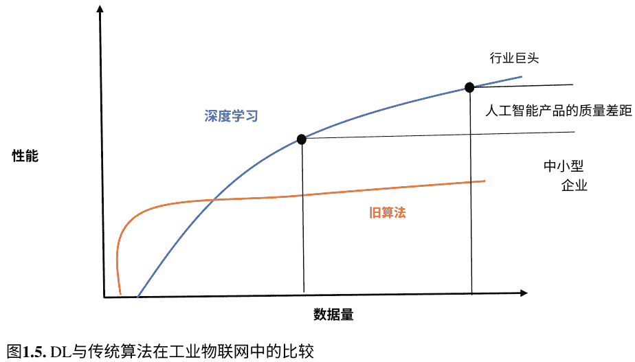

### 1.6 工业物联网系统的详细评估

虽然有各种各样的物联网描述，但对于工业应用而言，重要的是将智能元素嵌入到熟悉的物体中，包括物联网设备和 CPS（网络物理系统）的设计组件。三个适当的描述是：

- * IoT 的描述需要是“互连的物体、基础设施的组合，以及实现人们生成的监控、数据挖掘和信息访问”的组合，其中功能性物体是“传感器和执行器”，它们具有特定的目的，可以与其他设备进行交互”[30, 31]。
- “IoT 代表了一个概要，其中所有的‘物’或对象都被传感器嵌入，并能够自动与另一个对象通信并在上下文中进行自动操作。个体物定义了虚拟接口中的一个链接，持续传输关于自身及其附近的大量数据…” [32]。

基于上述定义，IIoT 的初始定义可能是在技术背景下使用一些 IoT 术语、一些智能设备和一些物理方法来促进特定于行业的目标。简单的解释确实提供了对 IIoT 的描述模板，因为它准确地试图通过应用于两个基本特征来确定 IIoT: (1) 这些技术所追求和目的的特征，以及 (2) 在 IIoT 环境中使用的技术类型。我们需要一个具有这种结构的定义，但它需要更加深入地发展 (1) 和 (2)。简化概念的一个好处是它澄清了应用于不同行业的适用技术。它构成了我们对 IoT 进行分类的基本基础。

来自工业物联网项目的设备。例如，智能水壶和智能自行车锁在工业应用中没有帮助。简单的观点准确地将这些事物归为非工业物联网项目。尽管有这项服务，但其含义仍然不明确。此外，在尝试理解工业物联网时，要避免将其表示为其他结论，这与工业物联网本身的概念没有区别，这将提供不明确的描述。

#### 1.6.1 工业物联网中的访问控制

AAA 系统旨在为区域云中的物联网系统提供细粒度和安全的访问控制。AAA 系统、服务消费者和生产者之间的通信顺序。AAA 方法包括身份验证、授权和计费。

身份验证：当前工作系统使用 CoAP 的 DTLS（数据报传输层安全）来实现物联网设备和 AAA 之间的稳定和安全连接。CoAP 协议支持四种安全模式：预共享密钥、无安全性、证书和原始公钥。应用这些方法获得的身份验证类型如下所述：

- * PSK（预共享密钥）：在两个交互对象之间共享的密钥，在此方法中它们互相验证。它得出的结论是，密钥在之前安全地传递给双方。对于物联网本地云之间的通信，PSK 对于所有物联网项目来说并不可行。
- 无安全性：此协议不提供安全性。因此，它不适用于认证。
- 认证：在此方法中，通常使用并由可信源（例如，证书颁发机构（CA））批准 X.509 证书。如果设备专门管理一个与该云相关的 CA，则可以在区域云中相互进行认证。
- RPK（原始公钥）：物联网设备维护一个非对称密钥对来保护 DTLS 连接；然而，在此方法中，通信方的身份验证无法验证。

在 DTLS 协议中，通常发起连接的伴侣是客户端而另一个伴侣是服务器。CoAP 的 DTLS 与 TLS（传输层安全）相关；如果没有 TLS，它使用 UDP（用户数据报协议）。除了 DTLS 安全过程之外，认证过程是在区域云连接中实现身份验证的适当模型。因此，它在当前工作中使用。客户端（浏览器）以单向验证服务器的证书，并且双向握手是任意的，服务器也可以验证客户端的身份验证在 TLS 中。虽然两个通信对象都扮演着关键角色，但 AAA 应该确认服务用户是请求进入 IoT 的同等公司。

客户端。客户端还应确保它正在要求从相应的 AAA 策略获取访问权限，并且他们需要通过进行双向握手来验证每个差异。ECC（椭圆曲线加密）密钥被优先选择，因为它们提供了与 RSA 密钥相同的加密安全性，但密钥长度更小在 X.509 证书生成中。所有这些系统都有一个信任存储，并且 CA 的证书已添加到其中。物联网设备可以在其有限的内存中收集特定的证书，并在较小的握手信息中加快连接速度，并减小证书的大小。它适用于表示 AAA 系统的证书和区域云中的所有其他对象-如果它们保持相同的 CA 证书，则 DTLS 连接被视为已验证。

此外，AAA 系统通过使用 Common Name (CN) 字段来建立服务用户的身份识别，该字段在其记录中收集服务用户的唯一方法名称在一个受限制的云中。

授权：同时满足服务客户的访问需求，授权辅助支持访问偏好。如果访问允许，授权策略将生成一个授权特权令牌给服务用户。在接受令牌后，服务用户向特定的服务生成器提交一个辅助申请和令牌。这些令牌的有效期可以根据用例而定。生成器在接受来自服务用户的令牌时对其进行解密，确认其有效性（即确认该令牌是否分配给相应的用户，以及验证该令牌的真实性是否已过期），并授予其服务直到令牌过期。个别令牌必须进行加密，包括服务生成器的公钥，以使其免受任何未经授权的访问。所有这些令牌都是自我维持的，它们提供了服务替换所需的数据，以便每个服务生成器不需要通过 AAA 系统验证令牌。在服务用户和服务生成器之间进行辅助交换时，令牌的有效性在此活动中指的是一个“会话”。如果不再需要所需的服务，服务用户还可以向服务生成器提交一个关闭服务申请，以在令牌的到期之前终止会话。

计费：会话的服务提供者和消费者需要考虑到边缘的相关数据进入 AAA 系统的计费辅助中心通过区域云。一个示例数据集输入到会话中，如下所示：

- 会话期间可以是服务消费者的第一个服务请求的时间变化，也可以是 AAA 系统中设置的令牌过期时间和会话中的关闭辅助应用；
- 响应/请求通信中的服务交换次数；
- 会话中的 IP 地址修改；
- 会话终止的原因；
- 请求的最大和最小数据包大小

这些数据对于任何区域云都是通用的，必须为额外的安全和重要的计费要求开发精确的用例计费。会计数据可以估计用于测量统计数据的服务生成器的付款，例如

安全分析，每个设备的表示。学习，例如服务传输的数量，加快微支付。诸如会话时间、数据包大小、终止和 IP 地址修改情况等数据可以准备每个安全漏洞，例如对受限工具（服务提供者）的拒绝服务（DoS）攻击和会话中的服务消费者的结算。

#### 1.6.2 工业物联网系统中的深度学习

DL（深度学习）是 ML（机器学习）的一个子类，专注于训练数据符号。基于人工神经网络，大多数深度学习提案使用一系列非线性处理单元的级联来保护信息特征。渐进层将前一输入层的输出应用于当前层。深度学习提案还可以包含监督和无监督设计，其主要特点是能够获取与各种抽象级别相对应的各种设备和深层次的通信。

本节描述了基于 DL 的 IIoT 的可能机会，该技术可以处理底层智能节点的资源和通信。现代智能制造的关键部分之一是计算智能，它能够为高效可靠的未来决策提供精确的数据洞察。正如我们之前提到的，DL 是研究不同制造生命周期阶段的顶级领域之一，涵盖了概念、设计 [33]、生产、评估、维持和运营。接下来，我们将讨论 IIoT 网络中 DL 的各种用例（表 1.1）。

### 1.7 工业物联网的分析框架

展示了 IIoT 分析框架，分析了现有的宣称的材料，重点关注 IIoT 分类和一系列特定制造商、工业元素、问题分析和技术报告描述特定的生产或实施。在教育研究中，对三种宣称的 IoT 分类进行了分类，涉及到的 IoT 并没有明确地聚焦于工业物联网。

#### 1.7.1 现有分类学回顾

目标是建立一个结构，使我们能够分析 IIoT 设备的方面和成为一个衰减和威胁分析过程的方法。没有分类法描述设备属性的足够覆盖范围，以帮助实现目标。
分类法的适当条件总结如下：

表 1.1 工业物联网框架中的深度学习模型比较

| 深度学习模型 | 应用 | 优势 | 限制 |
| :--- | :--- | :--- | :--- |
| 卷积神经网络 (CNN) | 通过累积池化和卷积层进行特征学习 | 最小化可扩展性、移位和变化 | 更高的分层模型需要复杂的计算 |
| 循环神经网络 (RNN) | 短暂的框架在循环连接中，分配的类别是时间序列信息 | 时间相关性，在具有短期信息保留的渐进数据中被理解 | 模型训练很难保持长期的依赖关系 |
| 自动编码器 (AE) | 编码在数据中进行无监督学习和降维 | 仅存储重要的输入信息，而不合适的数据被澄清 | 逐层错误概念和稀疏表示不能保证 |
| 受限玻尔兹曼机 (RBM) | 隐藏层变量详细说明了输入和输出之间的连接 | 对输入的不确定性至关重要，预训练步骤不需要设计训练 | 执行参数优化需要很长时间 |

- 设备中心的分类法 [13]——该提案提供了设备级别的有用特性，如通信、能源、本地接口、功能属性、硬件和软件来源，但提供了有关设备性能、机械、结构位置以及应用的每个部分的数据；
- 基于物联网的智能生态系统分类 [34]——它是一种有界服务，从安全的角度来看，对于网络模型、通信使能器、区域无线模式、技术、特性和目的的分析至关重要，技术要素是全面的，而设备水平上的愿望（成本减少）很难分配；
- 物联网设计分类 [35]——结合了商业设计或架构和技术特性，如允许的技术、网络拓扑、应用、架构需求、业务目标和物联网标准结构类型。然而，仅考虑六个分析因素，对于分析设备来说价值有限。

由于当前的分类法都不满足条件，因为它们要么太高要么不完整，无法对设备进行准确的描述，因此本研究调查了当前工业物联网的引入和明确的解释，以改进工业物联网系统的分析结构。基于已发表的研究条件，已经开发了一个框架来描述工业物联网设备。所提出的建议详细描述了基于四个部分和一些子部分使用可编程逻辑控制器（PLC）对设备进行描述：

- 1. 设备特性;
- 2. 位置;
- 3. 技术;
- 4. 用户

#### 1.7.2 设备特性

所针对设备的子部分的中心解释如下:

- * 功能：该部分用于表示设备的基本功能。考虑到通过分析函数的系统，所使用的算法特性是合适的。
- 关键性：它集中于设备对整体操作方法的关键性，以及修复或替换有缺陷设备的简易性。
  修复或替换更为重要且具有挑战性；任何与设备冲突的分析都会带来更高的安全风险。安全关键设备必须受到监督并按照先进标准进行规划，具有小的影响和简易的替换方式。
- 管理界面：它与设备的配置相关联，除非受到规定或开关控制。
- 关系：该部分用于理解设备与其他系统和流程、设备或其所处环境之间的关联。
  例如，一个区域中的温度传感器通过设备进行连接或控制，其目的是估计安装位置的区域温度，并且它是大气调节过程的一部分，它会影响到窗户或门在内部位置的开锁或上锁。

PLC 可以使用以下类别进行定义:

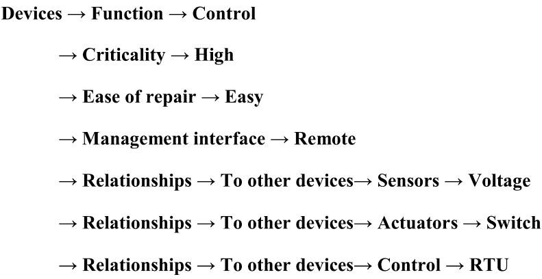

#### 1.7.3 位置

提出的分类考虑了 IIoT 设备从物理和网络安全方面的位置，与从多个方面考虑的前景相关。以下是四个子类的提议:

- 1. 普渡模型——普渡模型是一个完全被认可的制造业范例，将设备和装置分为分类功能。. 该模型使用区域将 ICS 和企业网络划分为可以执行类似功能的模块。
- 2. 生态系统——有几个模型可用于提供物联网环境，但这些模型都不是专有的，也没有明确地包含 IIoT 实现。
  物联网生态系统的表示与工业目的直接相关。目标分类计划从设计中适应，除了延长以包括一些更广泛的项目 IT 以提供操作技术、数据和极端情况的合并，还包括了 Thing 类中的一个子类“监视器”，以支持具有比测量（例如 CCTV 摄像机）更广泛操作性的设备 [37]。
- 3. 物理——该组件旨在描述设备安装的环境，以考虑物理安全和脆弱性水平。. 例如，外部设备预计要足够抵御机械损坏、防止欺诈以及暴露于各种自然灾害和元素的影响 [37]。
- 4. 移动性——该元素记录设备是使用固定位置还是在个体或作为操作元素的情况下进行重新定位。. 移动设备需要使用无线通信设备来传输信息并允许控制和配置，从而使设备容易受到干扰或威胁。此外，还需要对设备进行地理定位或跟踪，以准确解释其提供的信息 [37]。

PLC 可以使用以下类别进行定义:

**Location → Ecosystem → Concentrator → Data acquisition**

**→ Purdue Model → Cell/Area → 1 – Basic Control**

**→ Physical → External → Above Ground**

**→ Mobility → Fixed**

#### 1.7.4 技术

所提出的工业物联网设备技术的重点是需要强制改变设备配置或标记更新能力的技术特征。每个能源来源、硬件特性和能量使用都是必不可少的。这些可以迫使设备的处理能力发生变化，改变安全方法以保护连接并限制修复或升级工具的能力。设备生产商的识别和新的标识符需要布局监督计划。随着工业物联网设备的特性及其软件的广泛应用，保真度的概念是一个基本的技术方面。因此，对于软件作为保真度的个体来源的组件，如果结果被认为是显著或关键的，就应该要求和展示高水平的忠诚度。

基于 Arduino，可使用类别来定义 PLC：

- **Technology** → **Power Source** → **Hardware** → **Mains**
- → **Energy use** → **Always on**
- → **Operating System** → **Hardware & Software** → **Arduino**
- → **Software type** → **Open source**
- → **Software update** → **Methods** → **Manual**
- → **Hardware** → **CPU type** → **ATmega2560**
- → **Hardware** → **CPU speed**
- → **Hardware** → **Memory size**
- → **Hardware** → **Storage capacity**

#### 1.7.5 用户

所提出的用户属性旨在允许交互设备的分类。
用户模型可以是机器或人类，用于监控或系统控制，设备感知并提供机器对机器（M2M）接口。为了使用户能够有意识地进行通信，设备需要：

- 直接的，可以是主动的（例如，触摸敏感的交互显示器，允许对物质状态和任何方向进行调查）

或者是被动的（例如，温度显示但不允许用户控制的温控器）；

- 间接的，即设备可以通过 IIoT 系统中的另一个设备进行检查；无头的，没有设备操作、测量或状态的暗示。

PLC 可以使用以下类别进行定义：

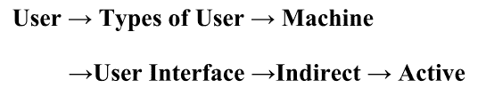

### 1.8 限制

在工业物联网环境中使用深度学习来建立访问控制基础设施时，我们的工作存在一些限制。

- 1. 如果某些访问控制与令牌相关联，根据政策进行修改，需要采取措施删除未执行的规则。
- 2. 如果访问控制逻辑驻留在本地设备中，则很难管理和更新策略。这些需要动态更新。此外，受限设备可能不支持访问控制逻辑。
- 3. 与基于集中式方法定义网络边缘相比，分散式方法可能获得更多的信任。

### 1.9 未来范围

在工业物联网方法中，基于安全的数据集的可用性是一个重要挑战，需要解决。深度学习提供了形成逼真、消除和高质量实践数据的可能性，其中包含了多种可能的攻击。必要的未来分析出现在技术众包的方式上，用于创建与物联网攻击和 [38] 威胁相比较的数据集。这个提议可能指导一些在强烈实践数据集中形成的潜在攻击的信息，这些攻击可以“标准化新算法”的准确性。然而，需要注意的是，在这些技术方面的巨大异质性中，形成一个不断改进的物联网合作威胁数据集，包括新的攻击，是一个实际的挑战。由于关键和敏感的知识可能会公开共享，特别是在工业和医疗物联网设备上，出现了几个隐私问题。有几个版本可用于研究和分析与工业物联网相关的隐私和安全问题；小活动专门关注工业物联网环境。建议更好地应用分类

学习工业物联网生态系统和连接威胁全景，以识别漏洞和潜在的安全和隐私问题。

### 1.10 结论

本章介绍了几种深度学习方法的工作原理，重点是识别和减轻自动化物联网漏洞和安全威胁。因此，它期望通过解决设备或端到端安全困难来作为实用的、辅助支持的研究人员来开发物联网系统的防御。

工业 4.0 将物联网（IoT）作为自动化应用的一种整合。物联网技术的性能实现了有效的（D2D）设备对设备的交互，并为有效的通信和安全提供了各种要求。分析访问控制框架通过应用区域云来处理这些条件的特征。一个关键条件是保护，包括（AAA）认证、授权和计费，结合了一些 NGAC 设计，使用了一个简单的分区警告用例，涵盖了许多投资者的设备。

参考文献

- 1. Maw, H.A., Xiao, H., Christianson, B., Malcolm, J.A.: 无线传感器网络中访问控制模型的调查。J. Sens. Actuator Netw. 3(2), 150–180 (2014)
- 2. Sicari, S., Rizzardi, A., Grieco, L.A., Coen-Porisini, A.: 物联网中的安全、隐私和信任：前景展望。计算机网络。15(76), 146-164 (2015 年)
- 3. Atzori, L., Iera, A., Morabito, G.: 物联网综述。计算机网络。54(15), 2787-2805 (2010 年)
- 4. Miorandi, D., Sicari, S., De Pellegrini, F., Chlamtac, I.: 物联网：愿景、应用和研究挑战。Ad Hoc. Netw. 10(7), 1497-1516 (2012 年)
- 5. Weber, R.H.: 物联网 - 新的安全和隐私挑战。计算机法律与安全评论。26(1), 23-30 (2010 年)
- 6. Yan, Z., Zhang, P., Vasilakos, A.V.: 关于物联网的信任管理调查.J. Netw. Comput. Appl. 1(42), 120–134 (2014)
- 7. Roy, D.G., Mahato, B., De, D., Buyya, R.: 物联网中应用感知的端到端延迟和消息丢失估计—MQTT-SN 协议.Futur. Gener. Comput. Syst. 1(89), 300–316 (2018)
- 8. Gubbi, J., Buyya, R., Marusic, S., Palaniswami, M.: 物联网 (IoT)：一个愿景，架构要素和未来方向.Futur. Gener. Comput. Syst 29(7), 1645–1660 (2013)
- 9. Atzori, L., Iera, A., Morabito, G.: 物联网综述。Comput. Netw.
- 10. Molina, A.G., Escalante, R.P.: 物联网：智能城市中的异构互操作网络架构。在：2019 年国际信息系统和计算机科学会议（INCISCOS）2019 年 11 月 20 日，第 131-135 页。IEEE
- 11. Serpanos, D., Wolf, M.: 物联网（IoT）系统：架构、算法、方法。Springer (2017 年)

## 第二章 深度学习模型及其计算机视觉应用的架构：一项综述

**Tanima Dutta, Randheer Bagi 和 Hari Prabhat Gupta**

T. Dutta · R. Bagi (✉) · H. P. Gupta
计算机科学与工程系，印度理工学院（BHU）瓦拉纳西分校，瓦拉纳西，
北方邦，印度
电子邮件：randheerbagi.rs.cse17@iitbhu.ac.in

T. Dutta
电子邮件：tanima.cse@iitbhu.ac.in

H. P. Gupta
电子邮件：hariprabhat.cse@iitbhu.ac.in

© 作者，独家许可给 Springer Nature Singapore Pte Ltd. 2021
A. Makkar 和 N. Kumar，物联网中的安全和隐私保护的深度学习，
信号与通信技术，
https://doi.org/10.1007/978-981-16-6186-0_2

### 2.1 引言

近年来，深度学习技术在多媒体和物联网 (IoT) 领域取得了巨大的进展，尤其在目标检测和识别、运动跟踪、动作识别、人体姿态估计、场景文本识别和语义分割方面 [3–6, 10, 12]。深度学习是一系列使用深度神经网络架构学习高级特征表示的方法。当一个网络具有多个隐藏层时，它就是深度神经网络架构。深度学习的本质是计算层次化特征，即高层特征由低层特征派生而来。深度学习技术包括神经网络、层次概率模型以及各种无监督和监督特征学习算法。它支持在计算模型的多个处理层进行学习。深度学习技术的主要目标是通过模仿人脑的感知和实现多模态信息的过程来创建一个模拟人脑的系统。

推动深度学习技术的显著因素是多媒体和物联网设备（如智能手机、平板电脑、相机等）的进步。这些设备为多媒体和物联网 (IoT) 任务的研究分析产生了大量的视觉和感知数据。另一个因素是计算机的赋能，如并行 GPU 计算。这些计算能力增强的机器显著加速了深度学习模型的训练。此外，强大的框架（如 TensorFlow、Theano、Keras 和 MXNet）的发展使得深度学习模型的快速原型设计成为可能。在本章中，我们回顾了多媒体和物联网（IoT）应用中深度学习模型的进展。它有助于选择深度学习模型，供对多媒体和物联网（IoT）分析感兴趣的研究人员使用，以了解最新技术。

#### 2.1.1 深度学习的动机

机器学习在计算机科学领域的增长解决了许多科学和工程应用。机器学习需要人工操作员在使用少量训练数据进行训练时纠正错误。机器学习中的特征提取需要领域专业知识，依赖于人类的知识来进行模型学习。机器学习第一个障碍是在几种实际情况下开发准确可靠模型所需的手工特征的稀缺性。

不幸的是，即使是针对特定应用的最佳算法，在新领域中测试时也会导致性能不佳。在这种情况下，深度学习发挥了重要作用，因为它通过利用大规模神经网络对海量数据进行自学习。深度学习增强了特征生成过程，并在没有任何人为干预的情况下嵌入了高级和低级特征。

特征的自动生成减少了人力投入，并最小化了准确性的错误率。然而，深度学习面临额外的计算成本的挑战。

- 本章的其余部分安排如下：第 2.2 节描述了深度学习模型的术语
- 接下来，我们将在第 2.3 节讨论深度学习模型
- 深度学习的应用在第 2.4 节中描述，最后我们将在第 2.5 节中总结本章。

### 2.2 预备知识

在本节中，我们将讨论在深度学习模型中使用的术语和概念，这些术语和概念在多媒体和物联网中构建了不同类型的神经网络架构。以下是其中一些描述：

1. 输入/输出：卷积神经网络通常以图像作为输入数据，并生成与输入图像数据相对应的输出预测分数。它将图像视为值矩阵，其中每个值根据位大小进行编码。
2. 特征：特征在卷积操作之后被嵌入，它们在观察输入数据模式方面具有独特特性和帮助性。特征是从数据中反复出现以获得突出地位。
3. 滤波器（卷积核）：滤波器也被称为卷积核。它是深度网络分层架构的基本部分。卷积核与给定的输入体积进行卷积，得到一个称为“激活图”的映射。激活图中的值取决于卷积核的大小。
4. 卷积（conv）：卷积操作在输入体积上使用固定的卷积核后产生特征图 [17, 29, 37]。
5. 最大池化：通过从输入特征图中选择高级特征来最小化深度网络的复杂性。同时，它会导致低级特征的丢失 [17, 29, 37]。
6. 填充：在卷积操作中，我们面临维度不匹配和信息丢失的问题。因此，填充用于减轻深度网络的分层架构中的此错误 [17, 29, 37]。
7. 丢弃：它用于深度神经网络的分层架构中的正则化，以防止网络过拟合。请注意，我们在测试阶段不使用丢弃 [17, 29, 37]。
8. 梯度下降：它是深度学习模型中使用的一种优化技术。梯度下降被定义为函数的斜率，用于衡量一个变量相对于另一个变量的变化程度。在分层架构中使用了三种梯度下降的类型：批量梯度下降、随机梯度下降和小批量梯度下降。
9. 反向传播：在反向传播中，计算从最后一层开始，停止在第一层。它通过修改深度网络层之间的激活图、权重和偏差等参数来提高准确性。此外，它还减少了成本函数 [17, 29, 37]。
10. 动量：通过利用随机梯度下降优化来加速训练过程。动量使用梯度的移动平均值，在训练过程中防止网络陷入局部最小值。此外，较高的动量值会超过其最小值，使网络不稳定。
11. 学习率：在网络训练过程中分析的步长，加速训练过程。然而，确定学习率的值是敏感的。网络中较大的 $\eta$ 值可能导致损失发散而不是收敛，如果选择一个较小的值，则网络可能无法收敛。
12. 激活函数：它通过使用 ReLU、Tanh、Elu 和 Sigmoid 等激活函数为深度网络添加非线性，解决梯度消失的问题 [17, 29, 37]。
13. 全连接层：它与深度神经网络的分层架构中的上一层的输出完全连接。通常用于从学习模型中构建所需数量的输出。

### 2.3 深度学习模型

#### 2.3.1 深度神经网络的分类

- 深度卷积神经网络：卷积网络将矩阵乘法操作替换为网络中的卷积操作。卷积神经网络（CNN）在多媒体和物联网的许多复杂应用中取得了成功。多年来，CNN 因此受到了相当大的关注；开发了几种 CNN 变体。
- 顺序神经网络：在顺序模型中，每个层都有一个输入张量和一个输出张量。它以顺序数据作为输入，预测序列出现的得分。输入数据可以是文本流、音频片段、视频片段、时间序列数据。一些流行的顺序模型包括循环神经网络（RNN）、长短时记忆（LSTM）和门控循环单元（GRU）。
- 深度生成网络（DGNs）：由于其对无标签数据的监督能力，生成模型在过去几年中取得了巨大的成功。它采用零和博弈的方法，其中称为生成器和判别器的两个网络相互竞争。生成器的目标是确定训练数据的原始数据分布，以创建具有一些修改的新数据点，如图 2.1 所示。
- 图神经网络：图神经网络（GNN）是一种通过节点之间的消息传递来捕捉图的依赖关系的连接主义模型。GNN 的训练具有挑战性，因为它接受非结构化数据作为输入。GNN 的一些应用领域包括社交网络分析、推荐系统、视觉问答和交互检测（图 2.2）。

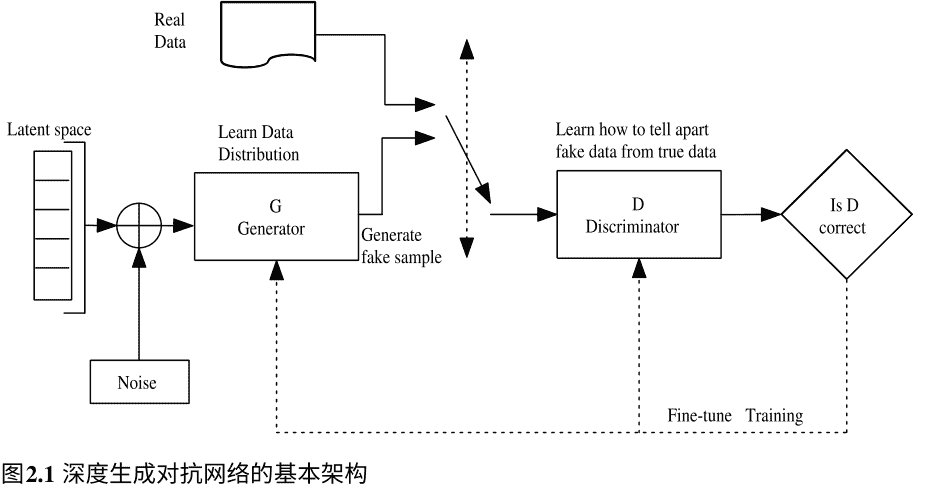
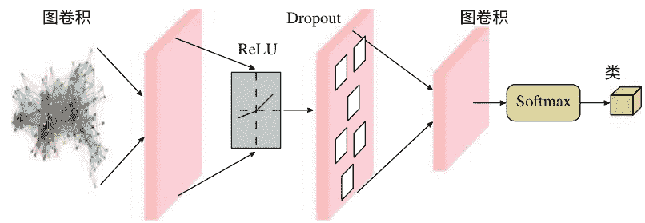

图 2.2 图神经网络的基本架构

#### 2.3.2 卷积神经网络的分类

##### 2.3.2.1 深度卷积神经网络

CNN [14, 29] 由多层神经网络组成，以高效的方式识别图像中的视觉模式。这里的高效性是通过减少计算要求与传统深度神经网络模型相比实现的。CNN 的设计机制迫使其通过直接解释像素来识别图像的视觉模式。该架构与传统的深度学习模型类似，通过将数据 (图像/传感器值) 作为输入来生成类别分数或类别概率。CNN 的内部结构包括卷积（缩写为"conv"）、非线性激活函数（"ReLU/Sigmoid/Tanh"）和池化层（"average/max pool"）等不同操作。网络的末端添加了全连接（"dense"）层，然后是 Softmax 层以生成类别标签概率。CNN 的基本架构如图 2.3 所示。所示架构具有从 100 × 100 滤波器到 25 × 25 滤波器逐渐减少的卷积操作。目标函数的评估结果为：

$$J(\Theta) = \frac{1}{m} \sum_{i=1}^{m} \mathcal{L}(\hat{y}_i^\theta, y_i) \qquad (2.1)$$

其中 $m$ 表示训练集大小， $\Theta$ 表示模型参数， $\mathcal{L}$ 表示损失函数。

在完全连接操作之前，所有层都被堆叠在一维数组中。为了执行堆叠操作，使用连接层将多维输出转换为单一维度。此外，完全连接层将相应的输出映射到 Softmax 操作，从而得到类别标签的概率。近年来，CNN 结构在不同领域如图像处理、移动感知物联网等方面进行了高级修改，以满足不断增长的需求。不同的结构通过塑造 CNN 架构来体现。它采用 3 × 3 大小的滤波器进行卷积操作卷积层。最大池化中的感受野大小限制为 3 × 3。当我们增加感受野大小时，会导致从数据中丢失信息 [21]。

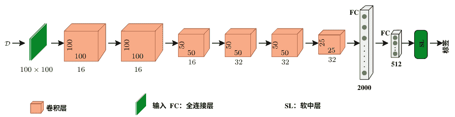

图 2.3 深度神经网络的基本架构

##### 2.3.2.2 AlexNet

AlexNet [29] 是卷积神经网络的一种变体，被视为基础深度学习模型之一。AlexNet 广泛应用于不同的操作，包括使用传感器数据集（基于图像/机械）进行分类、定位和检测。它由五个卷积层和连续的最大池化层组成。然后在深度网络的末尾添加一个全连接层。在 AlexNet 中，ReLU 激活函数通过在网络中的每个卷积操作之后添加非线性。这里，进行数据增强以忽略不完整的输入数据。在数据增强操作中，进行图像平移、水平翻转和补丁提取。它使用两个 GPU 并行进行模型训练，SGD 过程进行参数调整。

#### 2.3.3 ZF 网络

ZF Net 是一个经典的卷积神经网络，是 AlexNet 的一个更精细的架构。滤波器尺寸缩小到 7 × 7，并且与 AlexNet 相比，所有右侧卷积层的滤波器数量翻倍。它在卷积层旁边还有反卷积层，用于移植特征图的可视化 [44]。ReLU 添加了非线性，交叉熵测试损失函数中的错误。通过使用 SGD 过程调整参数来提高准确性。

##### 2.3.3.1 VGG Net

VGGNet 相对于 ZFNet 减少了参数数量。它使用 3×3 的卷积滤波器堆叠在一起。这些小的滤波器有助于增加网络的深度，并减少每层生成的输入数据维度 [38]。该网络在每个卷积层后将滤波器数量翻倍，并使用 MaxPooling 操作减小体积大小。在训练阶段，使用批量梯度进行参数调整，并强制使用 ReLU 激活进行非线性处理。该模型在 4 个 GPU 上进行训练，并用于图像分类和定位应用。

##### 2.3.3.2 谷歌网络

GoogleNet [40] 是之前基于 CNN 的深度网络（如 VGGNet 和 ResNet）的扩展。该网络通过利用多级特征提取技术改进了之前模型的计算复杂度和空间复杂度。GoogleNet 在同一个模块中引入了 1×1、3×3 和 5×5 的卷积操作，以实现并行运算，该模块被称为 Inception 模块。该架构由卷积、最大池化和 Inception 模块组成。Inception 模块使用平均池化而不是最大池化，并通过 Softmax 层生成概率。

##### 2.3.3.3 ResNet

ResNet 关注的是在深度网络架构中，堆叠层会在某个点上降低准确性的观察结果 [18, 23]。ResNet 架构引入了“identity shortcut connections"。这些连接跳过两个或多个层，通常被称为残差块。这些残差块由卷积、批归一化和 ReLU 组成。它可以对架构进行控制，因为在超深网络中，调整参数是具有挑战性的。通过在反向传播时使用跳跃连接，它指数级地降低了错误率。它使用 8 个 GPU 来训练模型，如图 2.4 所示。

##### 2.3.3.4 胶囊网络

胶囊网络 [33] 是为了模拟人类视觉系统而生成的。它回答了基本深度神经网络即卷积神经网络的实际挑战。传统方法无法解决与图像旋转、图像颜色变化或光照条件变化相关的问题。胶囊网络通过活动向量保留了关于物体外观和方向的所有信息。它在深度神经网络中不使用池化操作。

12. Hermann, M., Pentek, T., Otto, B.: 工业 4.0 场景的设计原则：一项文献综述。2015 年。http://www.snom.mb.tu-dortmund.de/cms/de/forschung/Arbeitsberichte/Design-Principles-for-Industrie-4_0-Scenarios.pdf。2017 年 9 月。
13. Dorsemaine, B., Gaulier, J.P., Wary, J.P., Kheir, N., Urien, P.: 物联网：定义和分类。在：2015 年第 9 届下一代移动应用、服务和技术国际会议 2015 年 9 月 9 日，第 72-77 页。IEEE
14. Roy, D.G., Das, M., De, D.: 利用边缘云实现传统 WiFi 基础设施的负载平衡分组方法：队列组装。在：当代计算框架的方法和应用问题 2018 年，第 93-108 页。新加坡，Springer 出版社
15. Satyavolu, P.: 制造业的物联网设计。Cognizant 报告，2014 年。[在线]. 可获取：https://www.cognizant.com/InsightsWhitepapers/Designing-for-Manufacturings-Internet-of-Things.pdf
16. Hassanzadeh, A., Modi, S., Mulchandani, S.: 工业物联网中有效的安全控制分配方法。在：2015 年 IEEE 第二届物联网世界论坛（WF-IoT）2015 年 12 月 14 日，第 795-800 页。IEEE
17. Salonikias, S., Mavridis, I., Gritzalis, D.: 利用雾计算进行交通基础设施的访问控制问题。在：2015 年国际关键信息基础设施安全会议 10 月 5 日，第 15-26 页。新加坡，Springer 出版社
18. Abowd, G.D., Dey, A.K., Brown, P.J., Davies, N., Smith, M., Steggles, P.: 对上下文和上下文感知的更好理解。在：1999 年 9 月 27 日国际手持和普适计算研讨会，第 304-307 页。Springer，柏林，海德堡
19. Wilkes, M.V., Needham, R.M.: 剑桥 CAP 计算机及其操作系统
20. Jin, X., Krishnan, R., Sandhu, R.: 一个统一的基于属性的访问控制模型，涵盖 DAC，MAC 和 RBAC。在：IFIP 年会上的数据和应用安全与隐私 2012 年 7 月 11 日，第 41-55 页。Springer，柏林，海德堡。
21. Zhang, G., Tian, J.: 一个扩展的基于角色的访问控制模型，用于物联网。在：2010 年国际信息、网络和自动化会议（ICINA）2010 年 10 月 18 日，卷 1，第 V1-319 页。IEEE
22. Roy, D.G., Mahato, B., De, D.: 用于物联网服务分发的竞争性享乐消费估计。在：2019 年 URSI 亚太无线电科学会议（AP-RASC）2019 年 3 月 9 日，第 1-4 页。IEEE
23. Spiess, P., Karnouskos, S., Guinard, D., Savio, D., Baecker, O., De Souza, L.M., Trifa, V.: 基于 SOA 的物联网与企业服务的集成。在：2009 年 IEEE 国际网络服务会议 2009 年 7 月 6 日，第 968-975 页。IEEE
24. Zhang, X., Parisi-Presicce, F., Sandhu, R., Park, J.: 用途控制的形式模型和策略规范。ACM Trans. Inf. Syst. Secur. (TISSEC). 8(4), 351-387 (2005)
25. Hu, V.C., Ferraiolo, D., Kuhn, R., Friedman, A.R., Lang, A.J., Cogdell, M.M., Schnitzer, A., Sandlin, K., Miller, R., Scarfone, K.: 属性访问控制（ABAC）定义和考虑因素指南（草案）。NIST 特别出版物，2013 年 4 月; 800 (162)
26. McLaughlin, N., Martinez del Rincon, J., Kang, B., Yerima, S., Miller, P., Sezer, S., Safaei, Y., Trickel, E., Zhao, Z., Doupé, A., Joon Ahn, G.: 深度安卓恶意软件检测。在：第七届 ACM 数据与应用安全与隐私会议 2017 年 3 月 22 日，第 301-308 页
27. Maghrebi, H., Portigliatti, T., Prouff, E.: 使用深度学习技术破解密码实现。在：2016 年 12 月 14 日国际安全、隐私和应用密码工程会议，第 3-26 页。Springer, Cham
28. Pascanu, R., Mikolov, T., Bengio, Y.: 关于训练循环神经网络的困难。在：2013 年 2 月 13 日国际机器学习会议，第 1310-1318 页
29. Sherstinsky, A.: 循环神经网络（RNN）和长短期记忆（LSTM）网络的基础。Phys. D: Nonlinear Phenomena. 2020 年 3 月 1 日; 404: 132306
30. Khalil, R.A., Jones, E., Babar, M.I., Jan, T., Zafar, M.H., Alhussain, T.: 使用深度学习技术的语音情感识别：综述。IEEE Access。19(7), 117327-117345 (2019)
31. Roy, D.G., Mahato, B., Ghosh, A., De, D.: 面向物联网的云端服务感知资源管理。微系统技术。4, 1–5 (2019)
32. Satyavolu, P.: 为制造业的物联网设计，Cognizant (2014)
33. Roy, D.G., Das, P., De, D., Buyya, R.: 基于区块链机制的物联网 QoS 感知安全交易框架。网络与计算应用杂志。15(144), 59–78 (2019)
34. Ahmed, E., Yaqoob, I., Gani, A., Imran, M., Guizani, M.: 基于物联网的智能环境：现状、分类和开放性研究挑战。IEEE 无线通信。23(5), 10–16 (2016)
35. Yaqoob, I., Ahmed, E., Hashem, I.A., Ahmed, A.I., Gani, A., Imran, M., Guizani, M.: 物联网架构：最新进展、分类、需求和开放挑战。IEEE 无线通信 24(3), 10–16 (2017)
36. Williams, T.: 企业参考架构普渡大学，国际自动化学会。Elsevier 24(2–3), 141–158 (1994)
37. Boyes, H., Hallaq, B., Cunningham, J., Watson, T.: 工业物联网（IIoT）：分析框架。计算机工业 1(101), 1–2 (2018)
38. Lukáč, D.: “第四次基于 ICT 的工业革命”工业 4.0—HMI 和 EPLAN P8 的 CAE/CAD 创新案例。在：2015 年第 23 届电信论坛 Telfor(TELFOR) 2015 年 11 月 24 日，第 835–838 页。IEEE

#### 2.3.4 基于区域的卷积神经网络 (RCNN)

基于区域的卷积神经网络基于选择性搜索算法 [32]。基于区域的卷积网络配备了区域建议网络 (RPN)。RPN 创建了一组矩形框，这些框被识别为对象建议 [13, 19]。生成的一组区域建议被馈入卷积神经网络，用于提取每个区域的特征向量。然后，利用边界框回归器从特征向量中获取边界框坐标，并使用线性支持向量机 (SVM) 对每个建议的类别得分进行预测。

##### 2.3.4.1 YOLO

YOLO 在其深度神经网络中使用了最快的目标检测算法之一 [31]，使其适用于场景图像中的实时物体检测。YOLO 检测算法将图像划分为小网格；然后，每个包含物体的网格都被边界框包围。当边界框的计算类别分数概率高于特定的固定阈值时，它会定位图像中的物体。YOLO 的准确性较 RCNN 差，但在测试准确性方面每秒大约快 40 帧。它也不适用于给定图像中的小物体检测。

#### 2.3.5 Mask RCNN

Mask R-CNN [19] 用于物体实例分割。它分为两个阶段；在第一阶段，使用 RPN 生成带有边界框的候选框。在第二阶段，对每个感兴趣区域添加了二进制分割掩码，与 softmax 分类和边界框回归并行。

#### 2.3.6 顺序神经网络的分类

##### 2.3.6.1 循环神经网络 (RNN)

迄今为止提出的传统深度网络架构对于顺序或时间序列数据并不令人满意和高效。它们无法捕捉顺序事件之间的时间依赖性，在预测序列中的下一个输出中起着关键作用。顺序数据的可变长度在空间模型（如卷积神经网络）中管理起来很繁琐。因此，需要一种网络，既能促进时间特征共享，又能处理输入数据的不同长度 [36, 39]。循环神经网络（RNN）处理顺序数据，并捕捉时间特征以提供更快的下一个输入序列预测。RNN 可以被视为感知器，通过使用隐藏层来存储关于输入序列的信息，如图 2.5 所示。它还提供了动态更新隐藏单元的机制。RNN 通过仅使用先前用于预测的信息来捕捉时间特征。尽管具有不同的优势，RNN 在捕捉长期依赖性方面存在滞后。RNN 架构中的变量为 $x_t$, $y_t$和 $h_t$，它们分别表示时间 $t$ 时的输入、输出和隐藏状态。在这里，$h_t$和 $y_t$的公式为：

$$h_t = \phi(U.x_t + W.h_{t-1}) \text{ 和 } y_t = \psi(V.h_t) \eqno(2.2)$$

其中 $h_{t-1}$ 是在时间戳 $(t - 1)$ 时随机初始化的隐藏状态值，$\psi$ 和 $\phi$ 都是非线性函数。此外，$U, V$ 和 $W$ 是各种线性回归参数，在非线性激活之前。目标函数的评估方式为：

$$J(\Theta) = \frac{1}{m} \sum_{i=1}^m \sum_{t=1}^{N_y^{(i)}} \mathcal{L}(\hat{y}_t^{(i)}, y_t^{(i)}) \eqno(2.3)$$

其中 $m$ 是训练集大小，$\Theta$ 是模型参数，$N$ 是 epochs 的数量，$\mathcal{L}$ 表示成本函数。

##### 2.3.6.2 长短期记忆 (LSTM)

LSTM [20] 是另一代 RNN，可以缓解与之相关的问题。LSTM 架构能够处理数据集中的长期依赖性。它在网络中引入了记忆单元，用于捕捉这些长期依赖关系。因此，它可以被视为 RNN 的扩展版本，增加了记忆能力并通过时间序列数据提高性能。通常，RNN 具有“短期记忆”，用于捕捉模型的先前输出和当前输入序列，以预测下一个输出序列。因此，它有助于减少保留先前信息所需的额外工作。这些存储的信息提高了对顺序数据的性能。LSTM 有助于缓解梯度消失问题，在网络的某些层之后，隐藏神经元的学习（或权重更新）在反向传播过程中可以忽略不计。LSTM 包括四个基本单元，包括遗忘门、输入门、输出门和细胞状态。这些单元在内存块中持久存在，通过多个层进行连接。LSTM 在自然语言处理、图像处理、时间序列分析、语音识别 [16] 和图像字幕等方面实现了高阶性能 [20, 34]。

##### 2.3.6.3 门控循环单元 (GRU)

门控循环单元 [9] 是长短期记忆的兄弟，在某些方面有一些不同之处。GRU 不像 LSTM 那样具有输出门。它们也类似于 LSTM 的方式解决了循环神经网络中的梯度消失问题。通过消除输出门，GRU 减少了网络的计算需求，并在各种情况下实现了与 LSTM 相同的性能。然而，在时间序列分析的分类任务中，LSTM 有时会超越识别性能。GRU 包含不同的门操作，包括输入、更新和重置。这些门控制网络内部信息的流动。更新门负责控制信息进入内存。重置门管理来自内存的信息流动。这两个门也被视为决定哪些信息将传递给输出的两个向量。它们训练网络以确保过去信息的持久性，并删除预测中的无关信息。因此，GRU 可以被视为在减少计算的情况下修复循环神经网络中梯度消失问题的有效机制。

图 2.5 递归神经网络的基本架构

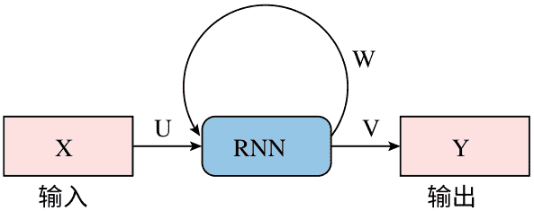

#### 2.3.7 深度生成对抗网络的分类

##### 2.3.7.1 自编码器 (AE)

自编码器 [28] 使用神经网络将高维数据压缩成小的表示形式，而不会丢失大量数据。它由编码器和解码器网络组成。编码器将输入数据压缩，解码器试图重构输入数据。AE 通过计算编码器输入和解码器输出之间的每个像素差异来估计重构损失。重构损失计算公式为：

$$\text{损失} = \| \text{输入数据} - \text{重构数据} \|^2. \quad (2.4)$$

##### 2.3.7.2 变分自编码器 (VAE)

变分自编码器 [1] 是一种基于似然的生成模型，包括编码器网络、解码器网络和损失函数。编码器将数据样本嵌入离散潜变量中。解码器网络根据离散潜变量重构输入样本，而不会丢失大量输入数据。

##### 2.3.7.3 生成对抗网络 (GANs)

它基于零和博弈 [15] 的方法。它由两个神经网络组成，分别命名为生成器 ($G$) 和判别器 ($D$)，其中一个网络充当对手。生成器试图模仿原始数据的模式，以误导判别器。判别器将假数据与原始数据区分开来 [8, 22, 25]。生成对抗网络的代价函数在生成器和判别器之间达到纳什均衡后进行优化。形式上，GAN 目标函数可以写成一个具有值函数 $V(G, D)$ 的两人零和博弈：

$$\min_G \max_D V(G, D) = E_{x \sim p_{data}(x)}[\log D(x)] + E_{z \sim p_z(z)}[\log (1 - D(G(z)))] \quad (2.5)$$

其中 $D(x)$ 表示 $x$ 来自真实数据的概率，而 $p_z(Z)$ 是噪声输入变量。

##### 2.3.7.4 深度卷积生成对抗网络 (DCGAN)

它引入了显著稳定了 GAN 的训练。它还由两个网络组成；第一个网络是称为生成器的 CNN，而第二个是称为鉴别器的反卷积网络。在 DCGAN [30] 中，生成器的分层架构用步幅卷积操作替换了所有的池化层操作。此外，生成器和鉴别器分别使用 ReLU 和 Leaky-ReLU 作为激活函数，并进行批归一化。

##### 2.3.7.5 Wasserstein 生成对抗网络（WGAN）

这是 GAN 的扩展，训练过程中鉴别器模型的更新次数比生成器模型多得多 [2]。在这里，鉴别器被称为评论家。评论家和生成器两个模型都使用“Wasserstein 损失”进行训练，该损失是评论家对原始值和预测值的平均乘积。评论家很快学会区分假数据和原始数据。然而，评论家无法饱和，收敛到一个产生非常干净的梯度的线性函数。

##### 2.3.7.6 渐进增长 GAN（PGGAN）

这是一个多尺度 GAN 网络，生成器和鉴别器的训练从低分辨率图像开始，并逐渐增加模型的深度。PGGAN 的关键思想是同步地增长生成器和鉴别器。PGGAN 的增长训练方法 [24] 有助于大分辨率下两个网络的稳定学习，并减少训练时间。

##### 2.3.7.7 BigGAN

这是最好的 GAN 模型之一，可以训练更大的神经网络，具有更多的参数，并且可以生成更详细的图像，而不会有任何性能下降。BigGAN 可以对输出进行精确控制 [7]。它支持插值现象，这意味着它可以计算两个图像之间的中间图像，并且对于给定两个图像，则可以提供最佳的 Inception 分数。

#### 2.3.8 图神经网络 (GNNs) 的分类

##### 2.3.8.1 图注意力网络

在传统的图卷积网络中，每个目标节点的聚合都由所有邻居节点平等贡献。图注意力网络 [41] 通过学习为所有节点分配不同级别的重要性来克服这个缺点，在目标节点的邻域中。此外，图注意力网络对于未见过的节点也是可推广的。它尝试通过采用自注意力机制来学习传播权重，如下所示：

$$\begin{aligned} \alpha_{i,j} &= \text{softmax}(a(W x_i, W x_j)) & (2.6) \\ &= \frac{\exp(\text{LeakyReLU}(b^T [W x_i || W x_j]))}{\sum_{k \in \mathcal{N}(i)} \exp(\text{LeakyReLU}(b^T [W x_i || W x_k]))} \end{aligned}$$

其中 $a(.,.)$ 表示神经网络，$||$ 表示连接运算符，而 $b \in \mathbb{R}^{2F}$ 是传播权重的可学习向量。

##### 2.3.8.2 卷积图神经网络 (ConvGNNs)

它将卷积操作从网格数据推广到图数据。主要概念是通过聚合邻居的特征和自身的特征来创建一个节点。在这种情况下，通过堆叠多个图卷积层提取高级节点表示。ConvGNNs [11, 26, 35] 在开发许多其他图神经网络模型中非常有用。假设单层 ConvGNN 使用函数 $f(A)$ of 邻接矩阵传播节点属性 $h$，则输出为：

$$F(A, h) = \sigma(f(A) \cdot h \cdot W + b) \tag{2.7}$$

其中 $f$ 定义了传播规则，$h$ 是第 $i$ 个节点属性，$W$ 表示权重矩阵，$b$ 表示偏差。

##### 2.3.8.3 图自编码器 (GAEs)

这是一种无监督学习框架，它将节点或图编码成潜在向量空间，并从编码信息中重构图数据 [27]。它用于学习图和网络嵌入的生成分布。它通过重构图结构信息（如网络嵌入的图邻接矩阵）来学习潜在节点表示。对于图生成，一些方法逐步生成图的节点和边，而其他方法一次性输出整个图。

##### 2.3.8.4 循环图神经网络 (RecGNNs)

它涵盖了图神经网络的先驱工作。它旨在通过循环神经网络结构学习节点表示。它假设图中的一个节点定期向其邻居节点传递消息，直到达到稳定平衡。RecGNN [35] 是重要的，它激励研究人员进行更多的卷积图神经网络研究。特别是，消息传递的思想与基于空间的卷积图神经网络相结合。

##### 2.3.8.5 时图神经网络 (STGNNs)

它从空时图中学习隐藏的模式，在各种应用中起着重要作用，如交通速度预测、驾驶员操纵预测和人体动作识别 [42, 43]。关键思想是同时考虑空间和时间依赖性。许多现代研究将图卷积与 RNN 或 CNN 相结合，以捕捉空间依赖性和建模时间依赖性。

### 2.4 多媒体和物联网中的应用

在本节中，我们将回顾一些深度学习模型的实际应用。由于其处理大量无标签数据的能力，深度学习模型提供了处理大数据分析的强大工具。深度学习技术在多媒体和物联网领域起着重要作用。我们简要总结了深度网络在不同应用中的一般描述：对象分类、对象定位、对象检测、图像分割、风格转移、图像着色、图像超分辨率和图像合成。

- 1. 对象分类：在对象分类任务中，根据预测的类别得分为测试图像分配一个标签。
- 2. 对象定位：在分类任务之后，找到给定分类图像中单个对象的位置被称为对象定位。
- 3. 对象检测：在这个任务中，识别给定测试图像中的多个对象。单个测试图像中的对象可能属于同一类别组或另一个类别组。
- 4. 图像分割：在分割任务中，测试图像像素根据属性的相似性进行分组。分割算法取决于其使用的应用类型。
- 5. 风格转移：在风格转移中，算法从一个或多个图像中学习风格，并将该风格应用于另一个图像。
- 6. 图像上色：图像上色的任务是使用深度学习模型将灰度图像转换为全彩图像。
- 7. 图像重建：图像重建的任务也被称为图像修复。在这个任务中，对于图像中缺失或损坏的部分进行填充。
- 8. 图像超分辨率：在图像超分辨率任务中，我们生成一个比原始输入图像分辨率更高的新版本图像。此外，它可以用于图像恢复和修复应用。
- 9. 图像合成：它是一个涵盖各种应用的广泛研究领域。在图像合成中，深度学习模型会生成给定图像的修改版本或完全改变给定图像作为新图像。通过图像合成，我们可以改变对象的风格并向场景图像中添加新对象。

### 2.5 结论

深度学习技术在多媒体和物联网领域的巨大增长令人印象深刻且令人鼓舞，它优于传统技术。我们在计算能力增强、维护大型数据集以及开发新的思想和算法以改进深度学习模型架构方面取得了可观的进展。本章根据网络架构和多媒体与物联网任务的问题解决性质对深度学习模型进行分类。我们还解释了每个类别中深度学习模型的变体，这有助于选择适用于不同多媒体与物联网任务的最佳学习架构。尽管我们在将人脑功能模仿到深度学习模型方面取得了成功，但我们仍处于完全复制人脑功能的早期阶段。这是因为我们对人脑功能机制知之甚少。我们不知道需要达到何种数量级才能将人脑的完整功能转化为不同的学习模型。因此，我们期待未来能有更高效和先进的学习模型。

### 参考文献

- 1. An, J., Cho, S.: 基于变分自编码器的异常检测，使用重构概率。在：IEEE 专题讲座 (2015)
- 2. Arjovsky, M., Chintala, S., Bottou, L.: Wasserstein 生成对抗网络。Proc. ICML 70, 214–223 (2017)
- 3. Bagi, R., Dutta, T.: 使用深度网络在模糊场景图像中进行成本效益的智能文本感知识别。IEEE Sens. J. 1–8 (2020)
- 4. Bagi, R., Dutta, T., Gupta, H.P.: 混乱文本识别：一种端到端可训练的轻量级场景文本识别方法。IEEE Access 8, 111433–111447 (2020)
- 5. Bagi, R., Dutta, T., Gupta, H.P.: 用于计算机视觉应用的深度学习架构：一项研究。在：数据和信息科学进展，Springer, pp. 601–612 (2020)
- 6. Bagi, R., Mohanty, S., Dutta, T., Gupta, H.P.: 利用智能设备进行场景文本保留图像风格化：一种深度游戏方法。IEEE MultiMedia 27(2), 19–32 (2020)
- 7. Brock, A., Donahue, J., Simonyan, K.: 大规模 GAN 训练用于高保真度自然图像合成。在：ICLR 会议论文集 (2019)
- 8. Choi. Y., Choi, M., Kim, M., Ha, J., Kim, S., Choo, J.: StarGAN: 统一生成对抗网络用于多域图像翻译。CoRR abs/1711.09020 (2017)
- 9. Chung, J., Gulcehre, C., Cho, K., Bengio, Y.: 基于序列建模的门控循环神经网络的实证评估。在：NIPS 2014 深度学习研讨会 (2014)
- 10. Deng, S., Li, S., Xie, K., Song, W., Liao, X., Hao, A., Qin, H.: 用于无人机视角角色目标检测的全局 - 局部自适应网络。IEEE Trans. Image Proc. 30, 1556–1569 (2021)
- 11. Gama, F., Marques, A.G., Leus, G., Ribeiro, A.: 卷积图神经网络。在：ACSSC 会议论文集，pp. 452–456
- 12. 高，Z.，郭，L.，关，W.，刘，A.A.，任，T.，陈，S.: 一种用于跨领域少样本动作识别的成对注意力对抗网络-R2. IEEE Trans. ImageProc. 30, 767–782 (2021)
- 13. Girshick, R.: 快速 R-CNN。在：IEEE ICCV 会议论文集，pp. 1440–1448 (2015)
- 14. Goodfellow, I., Bengio, Y., Courville, A.: 深度学习。MIT Press (2016)
- 15. Goodfellow, I.J., Pouget-Abadie, J., Mirza, M., Xu, B., Warde-Farley, D., Ozair, S., Courville, A., Bengio, Y.: 生成对抗网络。在：NIPS 会议论文集，pp. 2672–2680 (2014)
- 16. Graves, A., Mohamed, A., Hinton, G.: 深度递归神经网络的语音识别。在：IEEE ICASSP 会议论文集，第 6645-6649 页 (2013)
- 17. 郭，T.，董，J.，李，H.，高，Y.: 简单的卷积神经网络用于图像分类。在：IEEE ICBDA 会议论文集，第 721-724 页 (2017)
- 18. 何，K.，张，X.，任，S.，孙，J.: 深度残差学习用于图像识别。CoRR abs/1512.03385 (2015)
- 19. 何，K.，Gkioxari, G., Dollár, P., Girshick, R.: Mask R-CNN。在：IEEE ICCV 会议论文集，第 2980-2988 页 (2017)
- 20. Hochreiter, S., Schmidhuber, J.: 长短期记忆。神经计算。9(8), 1735-1780 (1997)
- 21. 胡，B.，卢，Z.，李，H.，陈，Q.: 用于匹配自然语言句子的卷积神经网络架构。Adv. Neural. Inf. Proc. Syst. 27, 2042-2050 (2014)
- 22. Jaiswal, A., AbdAlmageed, W., Natarajan, P.: CapsuleGAN: 生成对抗胶囊网络。在：ECCV Workshops (2018)
- 23. Kaiming, H., Zhang, X., Ren, S., Sun, J.: 深入研究整流器：超越人类级别的 ImageNet 分类性能。在：IEEE ICCV 会议论文集，第 1026-1034 页 (2015)
- 24. Karras, T., Aila, T., Laine, S., Lehtinen, J.: 渐进增长的 GANs 以提高质量、稳定性和变化性。在：ICLR 会议论文集 (2018a)
- 25. Karras, T., Laine, S., Aila, T.: 面向生成对抗网络的基于风格的生成器架构。CoRR abs/1812.04948 (2018b)
- 26. Kipf, T.N., Welling, M.: 带图卷积网络的半监督分类。在：ICLR 会议论文集 (2017)
- 27. Kipf, T.N., Welling, M.: 变分图自编码器。在：NeurIPS 会议论文集，第 1-11 页 (2019)
- 28. Kramer, M.A.: 使用自联想神经网络的非线性主成分分析。AIChE J. 37(2), 233-243 (1991)
- 29. Krizhevsky, A., Sutskever, I., Hinton, G.E.: 使用深度卷积神经网络的 ImageNet 分类。Adv. Neural Inf. Proc. Syst. 25, 1097-1105 (2012)
- 30. Mehralian, M., Karasfi, B.: RDCGAN: 带有正则化的无监督表示学习深度卷积生成对抗网络。在：ICAIR 和 ICAPIS 的论文集，第 31-38 页 (2018)
- 31. Redmon, J., Divvala, S., Girshick, R., Farhadi, A.: You only look once: 统一的实时物体检测。在：IEEE CVPR 的论文集，第 779-788 页 (2016a)
- 32. Ren, S., He, K., Girshick, R., Sun, J.: Faster R-CNN: 面向实时物体检测的区域建议网络。Adv. Neural Inf. Proc. Syst. 28, 91-99 (2015)
- 33. Sabour, S., Frosst, N., Hinton, G.E.: 胶囊之间的动态路由。CoRR abs/1710.09829, 1710.09829 (2017)
- 34. Sak, H., Senior, A.W., Beaufays, F.: 基于长短期记忆的递归神经网络架构用于大词汇语音识别。CoRR abs/1402.1128 (2014)
- 35. Scarselli, F., Gori, M., Tsoi, A.C., Hagenbuchner, M., Monfardini, G.: 图神经网络模型。IEEE Trans. Neural Netw. 20, 61–80 (2009)
- 36. Schuster, M., Paliwal, K.: 双向递归神经网络。Trans. Sig. Proc. 45(11), 2673–2681 (1997)
- 37. Shin, H., Roth, H.R., Gao, M., Lu, L., Xu, Z., Nogues, I., Yao, J., Mollura, D., Summers, R.M.: 深度卷积神经网络用于计算机辅助检测：CNN 架构，数据集特征和迁移学习。IEEE Trans. Med. Imag. 35(5), 1285–1298 (2016)

- 38. Simonyan, K., Zisserman, A.: 非常深的卷积网络用于大规模图像识别。CoRR abs/1409.1556 (2014)
- 39. Sutskever, I., Vinyals, O., Le, Q.V.: 序列到序列学习与神经网络。Adv. 神经信息处理系统 27, 3104–3112 (2014)
- 40. Szegedy, C., Liu, W., Jia, Y., Sermanet, P., Reed, S., Anguelov, D., Erhan, D., Vanhoucke, V., Rabinovich, A.: 用卷积更深入。在: IEEE CVPR会议论文集, 第1–9页 (2015)
- 41. Veličković, P., Cucurull, G., Casanova, A., Romero, A., Liò, P., Bengio, Y. (2018) 图注意力网络。在: ICLR会议论文集
- 42. 吴, Z., 潘, S., 陈, F., 龙, G., 张, C., 于, P.S.: 关于图神经网络的综合调查。IEEE Trans. Neural Netw. Learn. Syst. 32(1), 4–24 (2021)
- 43. 于, B., 尹, H., 朱, Z.: 时空图卷积网络：一种用于交通预测的深度学习框架。在: IJCAI会议论文集, 第3634–3640页 (2018)
- 44. Zeiler, M.D., Fergus, R.: 可视化和理解卷积网络。CoRR (2013)

**Tanima Dutta** 在2014年从印度古瓦哈提理工学院获得计算机科学与工程博士学位。目前，她是印度理工学院（BHU）瓦拉纳西分校计算机科学与工程系的助理教授。她的研究兴趣包括计算机视觉和深度网络。

**Randheer Bagi** 在2015年从印度南比哈尔中央大学获得计算机科学硕士学位。他目前正在印度理工学院（BHU）计算机科学与工程系攻读博士学位。他的研究兴趣包括深度学习、计算机视觉和人机交互。

**Hari Prabhat Gupta** 在2010年和2014年分别从印度古瓦哈提理工学院获得计算机科学与工程硕士和博士学位。目前，他是印度理工学院（BHU）瓦拉纳西分校计算机科学与工程系的助理教授。他的研究兴趣包括无线网络和博弈论。

## 第三章 基于机器学习区块链的物联网数据安全：风险与对策

**Koustav Kumar Mondal 和 Deepsubhra Guha Roy**

### 3.1 引言

我们已经看到产业从仅生产商品转变为发展成为被称为物联网（IoT）的产品网络，并最终生成了一个提供各种不可替代连接服务的智能产品网络[1, 2]。根据Aksu等人的研究[3]，每三分钟就有两个设备连接到互联网。由于这种连接性，网络流量的增加以及物联网设备的指数级发展导致了越来越多的网络流量。由于这种连接性，出现了保护和保密运营商数据以及验证和确认策略的挑战[4]。例如，在2013年，黑客入侵了十亿雅虎账户[5]。在2014年，eBay的一亿四千六百万客户遭受了攻击[6]。在2017年，一亿四千四百万Equifax客户的个人信息被泄露，这种攻击趋势不断增长。同样，正如[7]所指出的，2017年五十亿美元的玩具行业滥用了其八十二万个消费者账户。

网络安全灾难充满了最近的网络历史，从重大数据泄露到数十亿计算机芯片的安全漏洞，再到计算机网络被封锁直至付款完成[8]。物联网设备每天都面临着众多保护和隐私问题。安全和隐私因此成为动态且受限制的物联网环境中的重大挑战，并且需要有效解决。随着攻击增多以及物联网日益复杂，安全问题也在不断增加。

Milosevic等人[9]强调，具有影响力的计算策略（如台式计算设备）可以使用专门工具检测恶意软件。然而，物联网系统资源有限。同样，传统网络安全框架和应用程序无法有效识别攻击中的微小变化或零日爆发[10]，同时又必须定期修改。此外，这些变化对提供者并非实时可访问，从而使网络容易受到攻击。机器学习算法可用于改进物联网设置（如智能设备和物联网入口）[11]，并提高网络安全系统效率。基于对网络威胁的现有知识，这些过程可以分析网络流量、更新危险信息记录，并保持基础网络免受新型攻击威胁[12]。除使用机器学习算法外，研究人员还开始使用创新的区块链（BC）技术来保护底层结构[9, 13–17]。尽管机器学习过程和区块链方法在处理物联网虚拟威胁方面已取得技术进展，但将二者结合仍是相对较新的领域，尚需进一步研究。

保密性与安全性相辅相成。Price等人将保密性描述为基于应用程序的一系列规则[18]。作者解释，数据流动规则取决于数据使用者、处理程序、频率和访问原因。许多应用涉及个人信息安全与隐私保护，如可穿戴设备[3]、车载自组织网络（VANET）、医疗保健和智能家居[19, 20]等。例如，基于从VANET等众感应用程序收集的设备数据，网络可以对当前交通状况做出智能决策。然而，由于缺乏隐私保护措施及相关风险，计算机用户可能不愿参与。近年来，围绕机器学习过程和区块链过程的研究已广泛开展[9, 12–17]，以保护系统数据并维护用户隐私。

### 3.2 物联网中的挑战

物联网是指大量不同感知设备在局域网或互联网上相互通信[21]。由于终端设备可用资源差异，物联网风险与传统网络[2]有很大不同。物联网设备内存和处理能力有限，而传统互联网中的服务器和计算机资源丰富。因此，多因素安全层和复杂协议虽可保护传统网络，却往往超出实时物联网设备承受能力。与传统网络相比，物联网系统使用较少受保护的无线通信网络，如LoRa、ZigBee、802.15.4和802.11a/b/n/g/p。最后，物联网设备具有不同的数据内容和格式。

由于应用特定特性及缺乏统一操作系统，建立标准安全协议变得困难[22]。这两个缺点使物联网易受各种安全与保密威胁攻击，并成为不同类型爆发的初始场所。在一个网络中，爆发可能性会随网络规模增大而增加。因此，物联网网络比传统网络（如公司办公室）具有更多漏洞。

此外，多供应商设备通常具备不同规格和协议，这些物联网设备彼此通信本身就是挑战，需要可信第三方作为桥梁[23]。此外，许多报告还对每天数十亿智能设备的软件更新提出问题[15, 24]。物联网设备计算资源有限，因此应对未来威胁的能力受影响。物联网漏洞既有独特也有普遍类型。比如，物联网设备面临电池耗尽攻击、标准化不足和缺乏信任等独特漏洞，而网络空间相关漏洞可视为公共漏洞。过去研究[25]已识别许多物联网威胁及其分类。我们讨论历史时期最常见的物联网威胁，并尝试将其归类为安全与隐私类别。

#### 3.2.1 安全威胁

安全与保密的基本原则围绕CIA三元组[26]：数据保密性、信息完整性和网络可用性。在物联网中，信息可以是任何内容，如用户身份信息、安全摄像头提交到服务器端的数据、操作员提供给车辆的密钥设施，或两个个体间的多媒体对话。任何未经授权的信息披露都会导致机密性、完整性或可用性被侵犯。当威胁影响机密性时，即构成隐私威胁。数据完整性和网络稳定性都会受到安全威胁影响。

##### 3.2.1.1 拒绝服务

在所有安全威胁中，拒绝服务（DoS）最易实施。此外，越来越多的故障物联网设备使DoS成为入侵者偏好的武器。DoS爆发的主要目的是通过无效请求消耗网络能力（如带宽），使服务设施实际不可访问。分布式拒绝服务（DDoS）是增强版DoS：多个源同时攻击一个目标，使检测与阻止更困难[27, 28]。尽管DDoS事件形式多样，但目标相同。SYN洪泛[29]（入侵者持续向目标发送SYN）、Internet控制消息协议（ICMP）爆发[28]（大量ICMP数据包使用伪造IP发送）、冲突爆发[30]（使用全面和动态僵尸网络执行）以及用户数据报协议（UDP）洪水，都是DDoS变体。僵尸网络攻击[31]是IoT网络中的一种DDoS攻击。僵尸网络是一组IoT系统（传感器），协同攻击特定目标，如银行数据库。

恶意软件入侵可在多种协议上进行，如MQTT、DNS和超文本传输协议（HTTP）[31]。在IoT环境中已提出多种方法预防DoS。Diro等人[32]利用神经网络（DL）自动学习能力诊断雾到物威胁。Abeshu等人[27]建议使用分散式DL调控雾计算中的DDoS爆发。Tan等人的入侵检测方法（IDS）是一系列利用ML和DL算法减轻DDoS攻击的研究工作。Sharma等人和Tselios等人分别解决了软件定义网络（SDN）洪水问题，强调由于未经验证的纯文本TCP站点，SDN顶层易受相关爆发影响。

##### 3.2.1.2 中间人攻击

中间人攻击是虚拟世界最古老的威胁之一[33]。欺骗和冒充可归为中间人攻击。例如，节点X打算与目标B通信，但冒充B的中间人可能进行干扰。同样，入侵者可利用已认证链路，却在不安全HTTP连接上发起攻击，从而对认证剥离后的数据库实施攻击。近期研究集中于改进中间人攻击防御[3, 23, 34]。Ahmad等人[35]研究了一个医疗场景：患者即时注射胰岛素，该程序易受内部威胁。Tang等人暴露了无线网络存储库中针对用户流量的攻击；Chatterjee等人[36]强调无线移动设备当前认证方法在冒充攻击下的问题，涉及隐藏密钥。该密钥被保存并用于非易失性存储中的数字签名或基于哈希的加密。除易受攻击外，该技术能效也不高。另如OAuth 2.0这一常见物联网协议，易受跨站请求伪造（CSRF）攻击。OAuth机制本身也是耗时的手动设备认证过程。Wang等人还指出无线认证中的物理层安全弱点：在动态网络中，最新无线信道知识相关性分析常难以有效比较系统状态，例如将Alice信道历史与Wi-Fi通信中的Eve侦测器进行对比。

##### 3.2.1.3 恶意软件

病毒是恶意软件的一种。过去几年中，物联网设备数量持续增长，同时物联网软件包频繁更新，黑客可能借更新发送垃圾邮件并实施欺诈。恶意软件通常包括间谍软件、蠕虫、木马、根套件或恶意广告[37]。可能受影响的设备包括智能家居、医疗设备和车辆传感器。在战场物联网（IoBT）中，Azmoodeh等人研究了恶意软件[38]。此类犯罪分子通常经验丰富且具高素质，常带有国家支持背景。Aonzo等人[12]、Feng等人[39]和Wei等人尝试采用多种监督式机器学习算法，保护资源受限的安卓设备免受恶意软件攻击。在[15, 40]中，对恶意软件识别进行了全面审查，并强调了安卓平台上的一系列安全漏洞，尤其在应用层面。

#### 3.2.2 隐私威胁

除安全风险外，物联网节点及其信息也易受多种匿名攻击，如嗅探、去匿名化和推断攻击。无论数据处于传输中还是静止状态，都会影响数据安全。本章将处理多个隐私威胁。

##### 3.2.2.1 中间人攻击

我们可将中间人攻击分为主动中间人攻击（AMA）和被动中间人攻击（PMA）。在两设备间的数据传输中，PMA以被动方式监听。虽PMA侵犯隐私，但通常不修改数据。入侵者在发动攻击前可能悄悄监视系统数月。随着物联网中摄像头数量增长，PMA、唤醒和嗅探等攻击对玩偶、智能手机和手表等设备影响显著。然而，AMA会操纵数据，影响更大。通过接触并冒充他人消费者（如冒名顶替、授权攻击或未经同意访问个人资料），攻击者可获取信息。

##### 3.2.2.2 数据隐私

数据机密性攻击可分为主动数据机密性攻击（ADPA）和被动数据机密性攻击（PDPA）。数据安全与数据库盗窃、数据滥用、身份盗窃和重新识别相关[41]。重新识别事件也称推理爆发，基于去匿名化、位置识别和知识聚合[41]。这类攻击主要目标是从不同来源收集数据并识别目标。攻击者可利用收集数据冒充特定目标。任何更改信息的攻击（如数据盗窃）可归类为ADPA，而重新识别和统计数据泄露属于PDPA案例。

### 3.3 使用机器学习算法作为解决方案的现有综述文献

随着新兴技术出现，常规攻击预防方法变得繁琐。对资源受限物联网系统而言，防护更具挑战性。常用方法之一是利用机器学习算法辅助检测攻击。基于获得的知识，机器学习可定义为数据能力与模型性能调整能力[21]。机器学习使系统能够从以往结果学习并改进，从而实现更好输出。许多定量方法对降低安全与隐私风险非常有帮助。接下来章节将深入分析这些策略。

#### 3.3.1 安全工作

该过程提高了信息交流与交互方案，并超越传统网络空间。如今我们拥有先进且可配置的软件定义网络（SDN）设备，可按客户需求配置。在此背景下，Restuccia等人[42]尝试展示当代物联网安全威胁分类及其在SDN中的解决方案。他们还建议将数据获取方式分为三个层面，即物联网验证、物联网跨域网络和物联网信息收集与验证。物联网系统主要任务是从设备收集数据。该研究提供了简明机器学习算法概述，用于缓解安全驱动问题，例如使用贝叶斯学习区分跨层恶意攻击，以及使用神经网络估计信息效能。然而，该报告要求读者具备机器学习基础知识。Sharmeen等人[43]旨在在工业物联网应用开发过程中，支持设计人员持续使用应用程序接口（API）。作者提出可利用潜在、有效和异构三类叙述来训练机器学习模型识别恶意软件。

通过数据集生产度量、特征方法、特征选择标准、效率和发现过程，实现了对个体特异类型的精确剖析。研究评估了特定领域集合的多功能发现安排，其中RF、SVM、KNN、J48和NB较常使用。Sharmeen等人[43]指出，多样化解释在选择潜在与变化因素方面有助于增强识别确定性。然而，本文仅限于一个应用（Android设备）和一种安全爆发（恶意软件）。Costa等人[44]选取2015至2018年的论文，认为现有任务尚未在“ML对IoT入侵的全面理解”上作出深入贡献。为增强IoT安全，研究检查了先进及过时的基于ML方案，并讨论了与IoT安全相关的常用数据集和方法。但该论文未检查IoT当前安全或隐私风险。同样，Chaabouni等人[10]也关注IoT基于信道干预的检测系统。作者提出了IoT架构及分层问题，并按区域（感知层、链路层、应用层）和挑战（异质性、多样性、依赖与隔离、供应阻塞、可访问性和数据共享）进行分析。研究梳理了传统IoT安全工具，包括异常检测与混合网络IDS（ANIDS），并给出了IoT操作处理与创新结果下的NIDS标准鉴定。此外，还解释了基于学习的IoT NIDS如何应对传统IoT系统挑战，并比较了顶级IoT NIDS方案中的ML算法。

#### 3.3.2 隐私工作

机器学习可从原始数据中获得有用信息，而隐私仍需由数据隐藏机制保护[45]。根据Al-Rubaie等人[41]，机器学习方法包含三个模块：(i) 信息，(ii) 估计，(iii) 生成。该比较还指出，若仅由单一不可分割的个体主导三模块，隔离性才可得到保护。当前数十亿物联网项目（如智能手机、健康追踪传感器、活动摄像头及温度传感器）在全球收集数据，因此难以确认单一所有权。正如前述，这一问题促使研究者提出改进型机器学习隐私保护算法。比如，张等人指出VANET环境缺乏隐私安全机制。VANET中的车辆节点偏好协同学习，带来隐私问题：恶意节点可能通过推断观察数据访问机密信息。单节点计算与内存能力受限。为管理分散协同角色，相关ML算法结合隐私问题，建议采用有效差分隐私原则以保护训练数据集机密性。

交通监管系统与医疗设备等，仍是多种标准物联网传感应用中的关键场景，且持续发展。对上述应用，每一份高价值数据通常通过移动众包感知（MCS）从用户即时获取。肖等人研究了MCS相关隐私风险，涉及收集关注细节并将参与者感知报告上传至MCS服务器。这类信息交换对参与方和MCS服务器隐私构成严重风险。系统易发生隐私泄露、虚假感知攻击（向服务器发送虚假报告以限制感知压力）以及持续泄露（长期造成隐私泄露）。此外，该研究建议对DNN和CNN进行隐私保护，并提出DBN和DQN应对虚假感知的对策。然而，该研究仅限于一种应用（MCS）。

### 3.4 使用区块链作为解决方案的现有综述论文

这项臭名昭著加密货币背后的技术是区块链，常被误认为比特币同义词。区块链是存储在区块中的分布式账本。区块按顺序连接，并通过密码学连接过程将数据转换为计算上不同的部分[46]。该框架具备不可变性、去中心化、容错性、责任制、可验证性、可审计性和可信性[32, 45]。区块链形式并无统一共识，但通常包括无许可（公有）、个体（私有）和联盟（财团）类型。无许可区块链对所有人开放，任何人都可访问[47]。个体/授权区块链在特定规则下由一个或多个实体执行，因此并非所有人可访问。此类交易更快，且仅少数参与方可获得性能，从而实现统一管理。为突出区块链技术重要性，已有大量综述与批评性研究发表[22, 24, 31, 32, 37, 45, 48–50]，对深入研究区块链授权机制者具有参考价值。本节回顾了管理物联网安全（包括使用区块链方案进行隐私隔离）的最新研究。

#### 3.4.1 安全工作

对于物联网使用的所有情况，安全一直是关注的主要问题。在物联网领域中，有很多需要解决的安全问题，工作重点放在区块链技术上。Banerjee等人[51]提出了一份关于物联网安全的报告，其中包括入侵检测和防御系统（IDPS）、协作安全以及恶意令牌等安全措施。此外，IDPS还通过技术、链构建和利用等方式进行定义。在此之后，协作安全进一步得到了深入研究。协作保护方法也被网络架构和应用程序的同一研究进行了分类。

与物联网中的密钥管理、路由管理和协作管理相关的安全问题在Khan等人[52, 52]的另一项研究中得到了解决。他们将这些安全威胁分为不同的IoT层，并基于区块链提出了相应的解决方案。低级、中级和高级安全问题被归类为物联网安全问题。Khan等人[52]认为，低级安全问题包括敌对压缩、不安全的初始化、伪装、脆弱的环境接口以及休眠剥夺等问题。中级安全问题包括重放、RPL路由攻击、陷阱、Sybil攻击以及传输层端到端安全、组装验证和身份验证。不安全的接口、CoAP互联网安全、不安全的应用程序和中间件安全是高级安全问题。然后，分析对那些影响各种IoT架构区域的问题进行了全面映射。在每个点上，作者探讨了如何使用区块链技术解决一些最重要的物联网安全问题。这项研究突出了与物联网中各层相关的安全不确定性，但未解决基于区块链的解决方案对这些安全问题的实际供给。

此外，Reyna等人在[17]中研究了物联网中的BC方法，理论上可以提高安全性（数据可靠性）。由于整个BC过程的调用，每项研究都列出了安全威胁。多数攻击、双花攻击和DoS攻击是报告中确定的安全威胁。研究还强调了BC方法、BC应用和BC原则与物联网的整合。然而，这项研究并没有涵盖许多不同的物联网相关安全攻击，这是这项调查的一个缺点。

另一方面，在扩展到安全问题时，物联网中的新进展（包括BC整合）方面，Panarello等人[53]全面分析了BC共识协议。过去的文献基于领域措施进行分类，并伴随对具体当代基于BC解决方案的全面概述。

Kumar等人[54]提供了关于物联网安全问题的简明总结，包括诸如虚假身份验证和欺骗等困难。防篡改数据、会话动态信息、鲁棒性以及授权信息分发是大规模物联网系统的一些好处之一。他们在后续审查时提出了面向请求的区块链物联网挑战。文献[55]的作者强调了物联网安全问题，并基于区块链提出了解决方案。这一思想突出强调了物联网安全及其在六个独立应用领域下的障碍，如智能城市、医疗保健、智能电网、交通、智能家居以及工业。作者在之前的物联网安全分类中提到了保密性的全面准备。还研究了适用于各种物联网的具体程序。

#### 3.4.2 隐私工作

以前的研究中使用了强加密步骤，例如[56]，以防止恶意第三方，并提供可追责的物联网路由。然而，作为其工具之一，他们既没有使用机器学习，也没有使用区块链。Kshetri等人[7]展示了与基于云服务的传统网络相比，区块链技术可以提供更好的隐私保护解决方案。

该研究还强调了BC在身份管理和访问控制方面的主导地位。研究表明，使用BC技术可以限制对IoT系统的入侵。然而，在这篇文献中，使用BC过程获得了一种详细的隐私保护IoT模式。Kumar等人提出了关于IoT隐私问题的简要总结，如数据共享。随后的工作提出了基于BC的解决方案，进一步探索了BC在许多应用领域的实施。与此相反，该论文讨论了BC在每个IoT应用中的问题，指出需要对IoT安全和隐私进行详细研究。这些作者强调了IoT隐私问题，并提出了基于BC的解决方案。隐私保护技术的主要目标是实现匿名性、不可链接性和韧性的“三位一体”。基于传统加密技术，已经讨论了关键安全服务，如机密性、隐私和可用性。研究探讨了IoT信息分发、信息保护和用户行为等方面的问题，并探索了数据标记、零知识证明、伪名和k-匿名模型等解决方案。在传统身份管理（IdM）方案中，朱等人强调了隐私漏洞，特别是由于其集中式架构和对所谓可信第三方的依赖。缺乏隐私干预措施（如网络钓鱼和信息泄露）可能导致这些漏洞。作者认为，由于某些基本IoT特性（如可扩展性、多功能性和易用性），标准IdM方案在IoT生态系统中无法直接迁移。该研究进一步阐述了传统IdM系统中的隐私问题，并探讨了基于BC的解决方案。

Hassan等人[57]提出了关于基于区块链的物联网策略中隐私终端的综合概述。在基于区块链的物联网网络相关隐私攻击中，之前提到了标签重用、去匿名化、Sybil攻击、通信欺骗以及关联攻击。该研究进一步研究了五种不同且广泛使用的隐私保护机制（加密、智能合约、匿名化、混合以及差分隐私）在基于区块链物联网中的实施情况。Ali等人[58]分析了物联网隐私问题及其新的基于区块链解决方案。在任何集中式物联网范式中，记录保护和信息机密性都会引发隐私问题。当前的集中式隐私解决方案（如隐私代理、群签名、k-匿名性和别名）完全依赖第三方合作。该研究对基于区块链的物联网隐私解决方案进行了全面分析，以应对这些问题。

## 3.5 IoT威胁的解决方案

安全专家已经在缓解零日安全或隐私风险方面做出努力，可追溯到早期病毒（Creeper）以及2019年5月15日前后的Whatsapp攻击事件。在这方面，已经提出了多种解决安全和隐私问题的方案。然而，在上述部分中，我们集中讨论了针对特定物联网领域的安全和隐私保护方法的最新论文建议。

我们主要利用机器学习算法作为指导来解决关键问题，同时引入区块链方法，最终将两者结合。

#### 3.5.1 使用机器学习（ML）算法的现有解决方案

ML意味着我们在每个应用中都使用数据处理流水线。例如，一个ML原型可以分析数据流量并生成明智决策。图3.1显示了物联网ML风险模型的关键设备。此外，该图还提供了攻击者目标场景（如数据和输出）的概览。

在物联网节点间的信息数据上，可能发生探索性攻击或污染攻击，这对ML设计构成威胁。诚信攻击和反转攻击也可能影响性能[59]。因此，整个系统必须受到保护，并保障隐私，才能全面抵抗攻击。

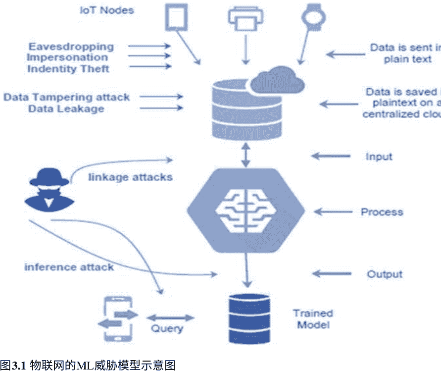

#### 3.5.2 使用区块链（BC）技术的现有解决方案

BC网络具有安全、容错、透明、可验证和可审计等特点[60, 61]。去中心化、P2P、开放、无信任、永久性，是常用于解释BC优势的关键词。这些特点使BC比基于信任的传统客户-服务器系统更安全。智能合约是一种BC编程协议，可确保预定事件被执行[46]。根据Restuccia等人的说法，区块链保障数据完整性和真实性[42]，使其成为应对物联网设备数据篡改的有效方案。

针对供应链、身份识别、访问控制和物联网管理提出了多种BC策略。然而，当前方法没有考虑时延，并且不适用于资源受限的物联网设备。与其他实验相比，部分研究只考察了物联网设备的时间响应。Machado等人提出了一个三层CPS架构：物联网（内部）架构、雾（中间）架构和云（外部）架构。首先，同一网络实体中的物联网设备使用Proof-of-Trust（PoT）协议。在雾层中，Proof-of-Luck（PoL）用于生成容错加密数据，并通过SHA-256对第一级数据进行处理并临时存储。随后达成共识，并将数据保存在云端的分布式账本中。除数据完整性外，还包括密钥管理方法和节点定位。多普勒定位用于节点定位，时间同步由TSTP提供。虽然提出了PoT和PoL等共识机制，但忽略了一些隐私问题。

有出版物展示了一种利用公共BC（DroneChain）确保数据隐私的方法，包括四个元素：无人机、控制系统、云和BC网络。无人机由控制器操作，数据在云中利用分布式BC处理和加密。结果系统具有准确、最新数据及容错后端。然而，该研究没有使用工作量证明（PoW），尽管面向包含无人机在内的实时物联网应用。此外，该服务未涉及侧链数据，且加密机制效果未充分展示。

DoS攻击因实施简单且可利用设备数量不断增长而被广泛采用。由于物联网技术成本低，攻击者很容易控制多台机器发起攻击。SDN易受暴力破解攻击，也易遭受DoS/DDoS攻击。在轻量级多标准物联网环境中，既有防护方法可能不够高效。此外，SDN还易遭受洪泛、饱和和中间人攻击，这与未认证数据在未加密TCP通道中传输有关。相关研究的论点是，BC可提供更强网络攻击防护并维护多供应商设备间信任；同时，BC具备容错与防篡改特性。尽管这些理论具有吸引力，但多数尚缺乏实践验证。

在先前研究中，Sharma等人提出了分布式SDN-IoT中的增强防护措施DistNet。该BC方案用于检查、验证并下载正确的流规则表。DistNet与已有技术进行了对比，结果显示其在实时漏洞监测和开销方面表现更优。研究人员还发现MiTM攻击中的重大漏洞：攻击者可轻易篡改互联网传输的用户数据。此外，由于电网缺乏预警功能，用户无法及时审查高额电费。为解决这些问题，研究建议在BC上采用公私钥和加密传输，提供一种持久、稳定、透明的方法。

然而，PoW并不总是低成本，也较为资源密集。

据称，当前物流网络在透明和可信方面仍不理想。现有网络虽已去中心化，利用多个第三方信任机构，但仍将能源集中于单一传输点。Hasan等人[57]引入了区块链配送方法。节点可扮演买家、卖家、快递服务和智能合约验证者（SCAA）。合约部署在IPFS上，并在双方一致后执行。根据物品规格，货物在多个承运方之间流转（本文中最多三次）。当货物交付并支付后，客户释放资金给供应商。若交易被拒绝，仲裁者介入，解决分歧并重新分配金额。该物流分发方法可防止中间人和DoS攻击，但对身份管理和数据隐私关注较少。

在Gupta等人[63]的论文中，作者处理了物理或程序化Sybil攻击及IoT网络中的重放问题。问题不仅在于现有IoT设计存在额外层，更在于最初并未纳入该层。作者以交易、区块和内存池（mempool）术语阐释了其算法、概念和流程。IDS（也称NetFlow）是追踪异常与恶意流量模式的主要方法之一。Golomb等人的报告指出，新的异常检测IDS效果不佳，因为训练阶段仅使用无害流量[64]。利用该漏洞，对手可注入被误判为安全的恶意数据。其次，训练好的模型可能缺乏事件驱动IoT流量（如火灾告警）样本。CIoTA（协作式IoT异常检测）方法可缓解这些问题：所有BC-IoT设备在各自流量上训练本地模型，再协作形成全局模型，从而降低对手攻击风险。CIoTA实验证明了其对抗攻击的有效性。然而，独立模型的IoT节点会增加信息量开销。

在针对数据隐私、DoS、MiTM等风险的补充研究中，Sharma等人提出了一种低成本、持续可用的云架构方法。该方法将SDN和BC引入网络以保护雾节点，并将资源下沉到物联网侧以提升安全性并降低端到端时延。开发者称该模型具有灵活性，能结合已观测风险和攻击并简化管理流程。其主要目标是构建可扩展、稳定、强健的BC-云架构，评价指标包括吞吐、响应时间和误报率。但该方案对数据保护、用户ID管理和密钥管理关注不足。

关于统一基础设施，Sharma等人认为当前移动设备管理（MDM）在应对安全威胁方面缺乏稳健性。他们报告称其提出系统在保持原网络架构完整性同时，增加了时延和能耗。不幸的是，该论文采用了能耗高且用户保护有限的PoW共识。

#### 3.5.3 使用机器学习（ML）和区块链（BC）的现有解决方案

Agrawal等人通过组合ML算法与BC方法来移除欺骗攻击[65]。在合法IoT区域中，通过持续监控用户、确保设备连接并在通信日志中保留BC记录，可追踪重复事件。当前用户认证方法常依赖一次性密码（OTP）或密保问题，验证方式单一。研究人员通过使用分布式账本进行IoT区域识别、IoT令牌创建和凭证认证来解决该问题。然而，研究也发现区块链可能成为颠覆去中心化理念的通信核心。

该研究未关注用户端或数据库保护，且DNN模型的数据收集规模较小。Android的开放性在安全上带来新的威胁。Gu等人[66]指出，勒索软件、木马等对Android网络攻击日益活跃。传统程序（也可归类为静态分析）存在缺点，如计算耗时高，以及代码混淆（如混淆和加密）[67]。Gu等人在Android平台实现了一种新型多特征范式（MFM），其中恶意代码索引由BC网络用于恶意软件检测和证据检索（CB-MDEE）。与过去模拟相比，CB-MDEE具有更高准确率和更短运行时间。

所提架构利用Exonum BC平台和DNN算法，通过BC的信息传输和资产交易来管理与未来控制健康数据[68]。存储泄露不会直接导致数据泄露，因为存储数据已加密。为保证用户记录的接收性和真实性，系统使用哈希特征和公钥签名。

为最大化目标受众，许多企业依赖大型数据集。然而，这些信息包含敏感隐私细节（如政治观点），一旦滥用可能带来利润驱动风险。因此，保护客户机密性十分重要。此外，大量数据在某些方面对设计和技术有益，但也可能与私有实体共享。收集数据还可能被篡改，引发可信度质疑。上述模型已在多项报告中改进，如[69, 70]。Mendis等人[15]提出了由独立贡献者进行分布式协作的方法，在不影响后续整体效率和功能性的情况下进行改进[16]。在每种情况下，超过94%的CNN样本规模与CNN模型的领域适配进行了比较。点对点交易通过智能合约激励机器贡献者。其分析[16]中，编码时间增加了100%。此外，该构建以加密货币BC为中心。

教学过程时间呈楔形增长，在某些场景中可能不切实际，例如合法IoT项目中的视频传输。DeepChain提出了一个价值驱动的区块链激励系统以解决安全问题。在模型训练过程中，DeepChain保证数据保护和可审计性。其机密性机制采用具有同态加法属性的Threshold Paillier算法。因此，参与联合训练的参与方越多，DeepChain在CNN协议和MNIST数据集上的训练精度越高。

ML分类方法需要数据集训练。由于涉及机密性问题（如数据窃取、数据机密性和托管），这些数据库来自多个个体，而个体通常不希望其通信被暴露，且用户不确定信息如何使用。为保护这类机密性问题，沈等人[37]计划将机器学习与加密货币结合。一个隐私保护的SVM分类构建被用于处理来自远程设备、经身份验证的信息，同时区块链系统在多个服务提供者之间提供数据共享服务。

### 3.6 基于深度学习的物联网数据隐私和安全

在本节中，基于深度学习策略的检测设备得到说明。如图3.2所示，有十种用于入侵检测的监督神经网络方法，分别包括：（1）DNN；（2）FFDNN；（3）RNN；（4）CNN；（5）RBM；（6）DBN；（7）DA等。

图3.2在计算机防御中用于入侵检测的深度学习技术。FFDNN：前馈深度神经网络；CNN：卷积神经网络；DNN：深度神经网络；RNN：循环神经网络；DBN：深度置信网络；STL：自学习；ReNN：神经网络复制器。


#### 3.6.1 深度神经网络

唐等人[10]建议使用深度学习方法对软件定义网络框架进行网络监控。在SDN控制器中可监控所有OpenFlow交换，引入了所提方法框架。该研究使用了NSL-KDD二分类（即正常类和异常类）数据集，其中包括四组：（1）DoS攻击，（2）R2L攻击，（3）U2R攻击，（4）Probe攻击。实验发现，由于AUC表现，0.001学习率比其他阈值更有效。

Potluri等人[71]将这种深度神经技术作为管理大规模网络统计数据的复杂分类器。他们采用了包含39种检测特征、聚类为四类攻击因子的NSL-KDD统计模型。其分析表明，二分类（正常与攻击）具有良好检测准确性。Kang等人[48]基于DNN为车载网络提出了入侵检测流程。恶意数据包被注入车载控制器区域网络总线进行场景攻击。为区分两类数据包（正常包与突发包），系统将特征向量输入输入节点，并通过激活函数（如ReLU）计算输出，再连接到下一隐藏层。

在假阳性率低于1–2%时，所提系统检测率达到99%。周等人[72]提出基于DNN的入侵检测流程以识别网络突发。系统包括三个阶段：（1）数据采集（DAQ），（2）数据预处理，（3）神经网络深度分类。对于学习率0.01、训练轮次10、输入特征86的SVM对比模型，该策略实现了0.963准确率。结果显示，该技术略优于三种机器学习方法：（1）逻辑回归（LR），（2）随机森林（RF），（3）k近邻（KNN）。

冯等人[26]提出了一种即插即用框架，使用网络数据包工具和缓解范式跟踪拒绝服务（DoS）与自组织网络事件。所提模型采用两类深度学习处理：卷积神经网络（CNN）和长短期记忆网络（LSTM），用于XSS和SQL攻击场景。该框架使用深度神经网络检测DoS攻击。研究使用KDD CUP 99数据库，按70%训练、30%测试。结果报告深度神经网络和卷积神经网络在识别XSS攻击方面的效率分别为0.57和0.78。

张等人[25]提供了对抗学习与预测学习用于网络入侵检测的实例。通过数据增强和先进分类技术，对多种网络入侵进行分类。所提方法包含两个组件：生成器和判别器。神经网络作为判别器拒绝增强后的渗透信息，而生成器用于产生扩展入侵数据。金等人[73]进行了研究。

在1999年的KDD数据集上运行了一个具有不断变化结构的深度神经网络。在建议的入侵防护方案中，使用了设计变量：4个隐藏层和100个隐藏单元。ReLU被用作激活函数，同时使用模拟退火机制进行深度神经网络测试。分类结果约为99%的精度。张等人[46]提出了一种称为CAN IDS的两阶段检测方法，用于检测自动驾驶恶意攻击。在第一阶段使用了一个稳健的基于规则的方法，而在异常检测方面，第二阶段使用了深度学习网络。评估结果使用了包括本田协议、亚洲品牌和美国品牌汽车在内的3个数据集。训练数据库仅提供了来自这3个数据集的常规流量，而测试集包含正常流量和恶意活动，包括丢包攻击、直接攻击、零识别攻击、漏洞扫描和欺骗攻击。

#### 3.6.2 前馈深度神经网络

对于入侵检测，Kasongo等人使用了前馈深度神经网络（FFDNN）[34]。为了在无线网络中创建具有最小冗余的最佳特征子集，使用FFDNN作为依赖于目标函数的特征选择技术。主要训练数据集被划分为两个主要集合，即用于训练的数据集和用于评估的数据集，由所提出的入侵检测系统完成。随后进行了归一化和特征转换。最后，所提出的方法利用FFDNN进行模型训练和研究。数据库NSL-KDD被弃用，选择了KDDTrain+和KDDTest+。结果估计表明：正确率为99.69%，误报率为0.05，3个隐藏层中30个神经元被有效使用。

#### 3.6.3 循环神经网络

Kim等人的框架使用了1999年KDD Cup数据库，用于基于长短期记忆框架的循环神经网络监测模型[74]。这些结果被用作输出向量的特征向量（41个特征），类别为4种攻击和1种非攻击。研究还使用了步长100、批大小50以及500个训练周期。入侵检测率被认为在总攻击中达到98.8%。Loukas等人[75]提出了一种用于检测车辆网络攻击的网络入侵检测设备。该方法同时使用了NN循环架构和DMP，相比传统机器学习方法（如k-means聚类和SVM）更高效。研究使用不同类别的注入控制来评估车辆模型：引导攻击、拒绝访问干预以及可能的网络适配器漏洞攻击。

Taylor等人[1]建议使用异常检测器来检测基于循环神经网络架构的汽车算法。作为RNN，使用了LSTM，它被训练用于预测并检测新帧中继值中的异常。在一种用于监督分类学习的IDS方法中，Yin等人[76]尝试引入循环神经网络。该研究使用了NSL-KDD数据集的3个性能指标，即特异性、低误报率和真正率。使用反向传播率=0.1和隐藏神经元=80进行异常检测，结果显示出更高精度。

该文还强调了循环神经网络在渗透分区方案中的优势。唐等人[19]建议在软件定义网络中使用概率神经网络单元进行端点保护的数学计算。论文揭示了在最少特征数量下可达到89%的识别率。NSL-KDD数据集用于网络质量评估，包括4个测量参数：召回率、F-Measure、精确率和准确率。

江等人[20]开发了一种利用循环神经网络长短期记忆的交叉入侵检测方法。NSL-KDD数据集被用于评估新的爆发识别分类有效性。该循环神经网络的检测率为99.23%，误差率为9.86%，精确率为98.94%。

#### 3.6.4 卷积神经网络

Basumallik等人[49]使用卷积神经网络检测基于相量测量单元状态估计中的数据包异常。为了从相量测量单元中提取案例指纹（特征），他们使用了基于卷积神经网络的数据滤波器。IEEE-30总线和IEEE-118总线结构通过相量幅值设备总线进行分析。结果表明，在含512个神经元、dropout为0.5的全连接层配置下，精度达到98.67%。作者表示，该神经滤波器在性能上优于RNN、LSTM、SVM、Bagging和Boosting等方法。

Fu等人[77]构建了基于卷积神经网络的设计，用于监控欺诈事件固有模式，应用于信用卡欺诈检测。Zhang等人[69]使用B2C银行机构在线交易信息进行训练与分析，使用卷积神经网络。一个月数据被划分为训练集和测试集，报告显示准确率91%、召回率94%。相对于Fu等人[77]的工作，这些结果分别提高了26%和2%。Nasr等人[13]提出了名为DeepCorr的入侵关联分类方法，该方法基于卷积网络学习差异关系。

DeepCorr主要关注两个全连接隐藏层与网络层结构。实验发现，在学习率0.001、误报率为10^-3时，DeepCorr真实阳性率约为0.8。张等人[78]引入了一个两层神经网络检测模型，其中核心层为改进卷积特征网络LeNet-5。张等人的方法实现了长期记忆能力。

#### 3.6.5 受限玻尔兹曼机

对于入侵检测，Fiore等人使用受限玻尔兹曼机，结合生成模型能力和良好分类能力，采用了判别式受限玻尔兹曼机[79]。使用了包含41个特征和97,278个样本的KDD Cup 1999数据集。Salama等人[80]结合了受限玻尔兹曼机和支持向量机用于入侵检测，使用了包含22种训练攻击和17种新型攻击的NSL-KDD数据集。训练结果显示，该组合比单独使用SVM具有更高分类率。

Alrawashdeh和Purdy[24]使用了基于受限玻尔兹曼机的深度置信网络，并采用KDD 1999数据集（494,022条训练记录和311,028条测试记录）。检测算法使用C++和Microsoft Visual Studio 2013实现。研究表明，92%的攻击可被该模型分类。该论文结合Salama等人的结果，显示出更高精度和检测速度。Aldwairi等人提出了一项基于受限玻尔兹曼机的黑客远程监控模拟研究[81]。分析表明，RBM在区分NetFlow正常与异常流量方面高效。研究还扩展至ISCX[82]数据库，在学习率为0.004时，最高精确率为78.7±1.9%；相比之下，最高准确率分别为74.9±4.6%和82.4±1.8%。

高等人将入侵识别扩展到多层非规则训练程序[83]。研究采用受限玻尔兹曼机与两层深度神经网络：
- 在小规模n层基础上训练玻尔兹曼机；
- 对整个玻尔兹曼机参数进行微调。

研究表明，KDD Cup 1999上全连接网络质量优于基于受限玻尔兹曼方法构建的SVM和遗传算法。Alom等人[64]提出了一种使用受限玻尔兹曼机的入侵检测设备，目标是识别异常或恶意事件。本文使用NSL-KDD数据集并划分为5种攻击类型。结果表明，在测试中仅使用40%样本时，实验精度约97.5%。因此，杨等人[84]提出了基于SVM-RBM（支持向量机-受限玻尔兹曼机）的新方法，提升流量检测能力。为训练特征表示，使用受限玻尔兹曼机，并在特征提取过程中调整隐藏层单元数量。获得较好特征后，作者建议使用梯度下降算法训练可学习参数的支持向量过程。SVM-RBM算法的结果显示，最大精度接近80%。

#### 3.6.6 深度置信网络

Thamilarasu等人[40]使用深度置信框架进行漏洞扫描。他们选择深度置信网络为物联网设备开发前馈型模型，并引入二元交叉熵预测误差以最小化IDS总体成本。Keras库、Cooja网络仿真器和Texas Instruments CC2650 SensorTag也用于流程优化。理论原型经过5类攻击验证：
- sinkhole；
- wormhole；
- blackhole攻击；
- 机会主义服务攻击；
- DDoS攻击。

结果显示，DDoS检测精确率达96%，召回率达98.7%。赵等人[85]在另一项研究中使用了基于协议的深度置信网络和认知确定性网络。该研究将KDD Cup 1999数据集中10%训练数据与10%参考数据集用于评估。结果显示，相比以下三种方法，该方法更强：
- 经典概率神经网络；
- 通用概率神经网络关键组件方法；
- 非优化深度置信网络算法。

张等人[63]分析了如何将增强遗传算法与深度置信网络结合来预测计算机安全入侵。研究使用多个受限玻尔兹曼机，导致对数据学习更充分。在性能评估中，深度置信框架分为两个阶段：
- 每个受限玻尔兹曼机独立训练；
- 整个深度置信网络最后一层形成神经分类网络。

NSL-KDD数据库结果显示检测率达到99%。

#### 3.6.7 深度自动编码器

深度自动编码器被Shone等人用于识别网络安全干扰[86]。与深度置信网络相比，为提升分类性能，他们将自动编码器与不同分类器结合。研究使用KDD Cup'99和NSL-KDD两个数据集，评估5项指标：精确率、准确率、误警率、F-score和召回率。KDD Cup'99结果表明，所开发框架平均优于[24]中的方法，达到97.85%。此外，NSL-KDD评估结果显示，对抗模型累计精确率达到85%，比深度置信训练算法提高5%。

Khan等人[53]提出了两阶段深度学习入侵检测方法（TSDL）。TSDL框架包含一个堆叠softmax自动编码模块及三层结构：输入层、隐藏层、输出层。该结构类似前馈神经网络。分析使用了KDD99和UNSW-NB15两个公共数据集。KDD99识别率高达99.996%，UNSW-NB15识别率高达89.134%。

Papamartzivanos等人[67]提出使用自动编码器技术开发对等网络与自动违规攻击检测系统。框架基于5个阶段：
- 跟踪；
- 观察；
- 准备；
- 练习；
- 信息。

监测方法用于识别需要改进传感器网络的活动。为将原始流量转化为可分析网络流，审计过程使用Argus和CICFlowMeter等网络审计工具。

#### 3.6.8 深度迁移学习

对于网络安全入侵检测，Li等人使用了深度迁移学习[87]。该分析将深度学习模型与入侵检测方法结合。根据本文，深度迁移学习可分为4类，包括技术变量迁移过程、仿真样本方法及相关信息迁移方法。

研究使用KDD Cup 99中10%训练样本作为实验数据。多数测试中，选择随机汇集的1000条数据集作为分类模型，以及抽样的1000条知识集作为原型测试集。结果显示平均精度为91.05%，假阳性率为0.56‰。

#### 3.6.9 自学习

Javed等人使用自学习检测信息安全攻击。所提方法在监督学习中使用分类阶段，并结合特征学习与表示获取[88]。研究验证采用NSL-KDD数据集。方案包含3种分类形式：
- 2类（正常和异常）；
- 5类（正常和4个独立攻击组）；
- 23类（正常和22个不同攻击）。

研究采用10折交叉验证来确定自学习在这3种模式下的一致性。

##### 3.6.9.1 复制神经网络

Cordero等人[89]使用认知复制模型检测网络安全干扰。为定位异常，分析采用dropout方法。熵提取分3步：第一步是数据包聚合；第二步将流量按服务时间分割；最后收集这些流量的关键特征。研究将工程化攻击（如SYN DDoS）注入数据源以进行性能评估，并使用原始数据。

### 3.7 机器学习算法分类的讨论

确定每个数据集在扩展算法中所起的作用。仍需搜索相关或异常数据点来构建算法特征，并研究数值类别或假设。

通常使用聚类算法解释非结构化数据集，这有助于识别模式。由于K-means最常用且可处理大量、多类型数据，在大规模数据处理中可提供显著性能。许多文献[26]（结合K和F）已建立使用K-means进行智慧城市和智慧家庭数据管理（长期与日常采集）的方法。Web数据库（包括CitizensWire和Oracle）也被用于聚类数据库扫描公民网站，通过Oracle特定索引对两库数据分组[5]。

通过使用异常数据点检测与异常检测算法两种技术，可以定位智能数据中的不规则和异常事实。这些技术包括单类和多标签支持向量机（SVM）以及谱主成分分析（PCA），可准确识别异常、低质量或噪声数据。文献[40,85]使用单类SVM检测人类行为，并证明有效。

线性回归与机器学习是对序列数据进行预测的两类广泛接受方法。数据通常规模庞大，需要高效处理与训练以实现高速高精执行。例如，[83,80]使用了简单回归算法进行实时预测。另一种已证明对快速分类和趋势检测有用的方法是分类与回归树（CART），也被用于解决公民行为问题。

在预测任务中，神经网络有助于确定多种功能，适合作为学习模型。多类神经网络的一个优势在于通过时间学习与信息累积达到较高准确率。FFNN的应用示例之一是降低潜在能源需求，包括预测数据产出及未来数据替代方式。另一种分类方法是SVM，它能管理大规模数据并正确分类各类别。由于SVM能处理大数据集和多样特征，因此广泛应用于机器学习任务中，例如结果识别。

通过添加组件增强功能时，PCA和CA是两种提升整体数据特征的方法。此外，CCA能够展示两类不同数据间的关联。在非扩展系统中，PCA和CCA也常用于异常发现。文献[66]中，PCA和CCA被应用于公共区域和社交场所，以识别、捕获并记录关键数据。

算法必须被正确应用和设计，才能得出正确结论。

### 3.8 研究挑战

#### 3.8.1 物联网中的机器学习算法挑战

在多个数据集上实践后，机器学习算法可合理达到所需性能。例如，这些模型可用于机器导航或语言理解。为分析网络安全威胁，机器学习算法也被高效采用。尽管如此，在物联网系统中仍存在不足，机器学习技术依赖以下方面：

- 可扩展性和复杂性：近期研究中，一些机器学习算法成功降低了网络攻击影响。但由于多种缺点，AI系统并非IoT实施的最佳选择。Diro等人指出传统机器学习算法在可扩展性、特征提取和准确性方面受限[34]。Moustafa等人[31]认为许多机器学习算法无法解决资源受限、复杂分布式设备中的实际问题。Abeshu等人[27]也表明，传统机器学习算法在某些IoT大型分布式账本中效率低且精度不足。近期研究发现，与现代机器学习算法相比，深度学习模型通常通过预训练降维，既可缓解问题，也可通过减少冗余降低特征维度[54,88,90]。
- 延迟：一些作者（如肖等人）建议使用集成机器学习算法解决上述问题。集成框架优于单一神经网络，但计算代价高。多数研究指出，相比传统机器学习，深度学习是更适合IoT的替代方案。
- 漏洞：防御安全与隐私攻击是IoT中机器学习/深度学习策略的核心问题之一。对抗攻击可能降低模型系统性能，并显著降低输出准确性[91]。攻击强度决定对手可获取的数据量，这类攻击非常难以防御[71]。

#### 3.8.2 物联网中的区块链挑战

- 延迟和速度：虽然区块链技术早已提出，但其实际价值近年才被充分理解。以往研究尝试将区块链用于运输、营养、电力城市、车联网、5G、医疗和运营支出等应用。然而，现有方案仍难满足区块链延迟要求，也不适配普通IoT设备[19,62]。PoW是最常见机制之一。PoW速度慢且资源消耗大（每秒约7笔交易），相比全国平均每秒约2000笔网络支付数据差距明显。
- 计算、处理和数据存储：在大型P2P网络中维护区块链[72]需要高计算、能耗和内存成本。Song等人指出，比特币账本在2018年5月已超过196GB。对IoT设备而言，这些限制意味着难以满足运行需求。虽然可将计算卸载到云端或雾节点，但网络延迟仍存在。
- 兼容性和标准化：区块链与其他新兴技术类似，面临标准化挑战，并需要立法更新[90]。未来预期会形成一定保护和隐私保障，减少IoT安全漏洞风险。尽管如此，“合理”的保护与隐私标准仍需通过协议规范落实。每个IoT系统都应具备一组基础安全与隐私功能。
- 漏洞：分布式框架的可靠性仍取决于平台入口点。即使区块链具备不可否认、去信任、去中心化和防篡改特性，公共链数据内容仍可被访问与查看。私有链可缓解部分问题，但会引入可信第三方、集中化管理和用户访问控制等新问题。总体而言，IoT方案应满足以下安全要求：
  - 存储数据的安全与保密传输；
  - 数据传输安全；
  - 稳定且负责的数据交换；
  - 身份与不可否认属性保护；
  - 个人信息共享管理；
  - 提升IoT解决方案共享安全性。

#### 3.8.3 机器学习（ML）和区块链（BC）在物联网中的挑战

我们认为，单一设备或工具（无论BC还是ML）都不足以为IoT网络提供最大化安全与隐私。BC与ML的融合仍需学术界长期研究以提升IoT稳定性和匿名性。主要挑战如下：

- 存储：如第3.4节[27,28]所述，ML算法在大数据集上表现更好；但BC数据持续增长会阻碍性能[70]。关键研究问题是选择适合IoT系统的融合方式。
- 延迟挑战：在某些场景下，IoT网络会产生海量数据，需要更多预处理和计算时间，这会影响分类器整体效率（即增加延迟）[19,62]。
- 可扩展性：ML和BC在计算与连接成本上都较高。随着流量增长，多个ML算法的计算与通信成本上升，这在许多IoT网络中不可避免。与此同时，BC在用户和节点数量增加时也会管理失效[76]。以太坊在标准IoT实现中每秒约11笔交易，比特币更低[62]。
- 选择正确算法：可选算法众多，且大多公开可用。算法设计应遵循基本规则：算法应能适配多种设计场景，尽管某些特例下会有更优选择。错误且昂贵的算法选择将导致无效结果。

或者拖延项目数月的时间，意味着努力的最终结果将是无用的，或者被无限期地延迟。

- 机器学习中的数据收集：垃圾进，垃圾出。必须仔细注意数据的一致性、数量、规划和收集，以确保其有效性。由于多种因素，数据可能存在偏见：必须仔细选择数据，以防止偏见影响结果，特别需要选择能够反映所有事件的数据。
- 数据准备：数据存在从缺失值到无效值的质量问题，这使得结果难以信任；不可靠的数据会严重影响数据归一化过程。转换、截断、重构和清理这些数据可能非常耗时。特征属性和特征需求必须进行研究，并且必须加入包括特征缩放在内的策略，以帮助避免其主导蓝图。
- 数据标注：这些是用于监督式机器学习算法的标签，使分类和推荐过程更加直观和准确。对于新实施的算法、无监督算法，这可能是一个非常漫长且困难的操作，通常涉及许多徒劳的扩展和重新扩展周期。只有监督式机器学习算法需要在标注结果上进行训练。这是一项需要大量努力的工作，而且不能完全依赖外包，因此数据标注必须作为流程的一部分进行。

例如，由于其财务状况的不稳定性，医疗保健服务是福祉领域的经典测试案例。为了使预测性诊断有效，需要标注相关的医学证据。标注依赖医疗专业人员和医生的定期反馈，但这些人往往认为这类标注活动是在浪费时间。

除了这些障碍，还有很多其他障碍。与开发人员合作、开发和维护产品变体、创建和处理结果的单独副本等，都是每个从事挑战性项目的人都知道并理解的问题：很难找到优秀的机器学习工程师；如果他们频繁更换团队，也会带来挑战，工作会变得压力巨大。这是一个持续进行的过程，随着时间推移，系统规格会发生变化，算法应持续更新，以便适应环境。

漏洞：虽然机器学习和区块链可以显著提高安全性和保密性，但也存在许多挑战。在实时物联网平台上，发现和防止威胁（即恶意软件和有害程序）的难度正在增加。机器学习的训练阶段需要更长时间；虽然可以检测恶意流量，但只有经过良好训练的模型才能做到这一点[50]。账本可以确保数据不可否认，并可追溯其转换。然而，问题在于数据在访问区块链之前就可能已经泄露。

此外，传感设备的故障在被识别之前往往无法检测到。文献[17]已对此进行测试。除此之外，由于收集的数据与所有利益相关者相关且公开可用，公共区块链容易受到隐私侵犯。解决这些挑战的一种方法是使用私有区块链，这将限制对成功实现机器学习所需大量信息的访问[62]。

### 3.9 结论和未来工作

在本节中，我们讨论并分类了物联网的最新风险，包括安全与隐私问题，并简要提及其后果、攻击类型、交互层以及响应方式。相应地，我们还讨论并概述了新型物联网在健康与安全研究方面的不足，涉及机器学习与区块链架构。本文提出了结合神经网络与区块链方法的物联网安全与隐私策略。为了更好地解释物联网机器学习中的安全与隐私问题，我们尝试展示并回顾了先前研究者的相关分析。总之，我们围绕物联网不同分类器、物联网区块链方法以及物联网中机器学习与区块链融合问题提出了一系列研究关注点。数字网关对于数据收集、存储、研究和通信至关重要。需要通过遵循最佳实践和持续测试等举措，开展全面工作，以开发无漏洞框架。由于恶意活动是动态的，设备应能够应对新的威胁创新（零日攻击）。在这方面，机器学习/深度学习在流量研究中非常有帮助。同时，在物联网环境中，区块链将维护日志和通信目录。由于这些信息不可更改，可作为法庭证据并获得信任。

其中大多数工作应聚焦于确保物联网防御能力或匿名性。我们认为，保护与隐私对于系统安全同样重要。此外，最关键的方面是数据保护，而这只有在端到端考虑时才能实现。当前框架忽视了仅用于创建网络的数据库可信度。这些数据集可能被对手篡改以实现其期望效果。当前，机器学习算法正在与区块链技术结合，以实现物联网保护与隐私；这是一个相对较新的领域，仍需更多探索。然而仍有关键问题：  
(i) 通过将区块链与机器学习算法结合，是否可以消除物联网网络上的DDoS攻击？  
(ii) 资源受限的物联网系统能否利用区块链的加密机制实现实时性能？  
(iii) 区块链能否在基于协作机器学习的传统物联网入侵防御机制中建立信任？

此外，许多组织依赖物联网设备生成的数据，无论是公共还是私有。无论数据在传输中还是静态存储中，我们如何信任这些数据？在基于云的集中式物联网架构中，这个问题更难解决。我们的数据可通过机器学习算法保护隐私，而区块链应维持保护与信任。我们计划在未来建立并创建一个隐私保护型物联网平台，该平台将提供数据共享与隐私保护的数据分析能力。

### 参考文献

1. Taylor, A., Leblanc, S., Japkowicz, N.: 使用长短期记忆网络对汽车控制网络数据进行异常检测。In: 2016年IEEE国际数据科学与高级分析会议（DSAA）. IEEE; 2016. pp. 130–139.  
2. CICIDS2017数据集. https://www.unb.ca/cic/datasets/ids-2017.html. 最后访问日期: 2019年5月30日。  
3. Hidayet Aksu, A., Uluagac, S., Bentley, E.: 使用蓝牙识别可穿戴设备。IEEE Trans. Sustain. Comput. 2018, 1–1 (2018).  
4. Song, H., Fink, G.A., Jeschke, S.: 物理网络系统中的安全与隐私：基础、原则和应用, pp. 1–472. Wiley.  
5. Goel, V., Perlroth, N.: 雅虎表示10亿用户账户被黑客攻击 (2016). https://www.nytimes.com/2016/12/14/technology/yahoo-hack.html  
6. Peterson, A.: 数据泄露后，eBay要求1.45亿用户更改密码 (2014). https://www.washingtonpost.com/news/the-switch/wp/2014/05/21/ebay-asks-145-million-users-to-change-passwords-after-data-breach/  
7. Kshetri, N.: 区块链在加强网络安全和保护隐私方面的作用。Telecommun. Policy 41(10), 1027–1038 (2017). https://doi.org/10.1016/j.telpol.2017.09.003  
8. Giles, M.: 2019年需要担心的五个新兴网络威胁 (2019). https://www.technologyreview.com/s/612713/five-emerging-cyber-threats-2019/  
9. Milosevic, J., Malek, M., Ferrante, A.: 朋友还是敌人？使用内存和CPU特征检测恶意软件。In: ICETE 2016 Proceedings, Vol. 4, pp. 73–84.  
10. Chaabouni, N., Mosbah, M., Zemmari, A., Sauvignac, C., Faruki, P.: 基于学习技术的物联网安全网络入侵检测。IEEE Commun. Surv. Tutor. 21(3), 2671–2701 (2019).  
11. Dartmann, G., Song, H., Schmeink, A.: 物联网的大数据分析：机器学习与物联网。Elsevier, pp. 1–360 (2019).  
12. Aonzo, S., Merlo, A., Migliardi, M., Oneto, L., Palmieri, F.: 基于数据驱动的安卓低资源足迹恶意软件检测。IEEE Trans. Sustain. Comput. 1–1 (2017). http://ieeexplore.ieee.org/document/8113505/  
13. Nasr, M., Bahramali, A., Houmansadr, A.: 使用深度学习对Tor进行流量相关攻击。In: ACM CCS 2018, pp. 1962–1976.  
14. Ferdous, M.S., Chowdhury, M.J.M., Biswas, K., Chowdhury, N., Muthukkumarasamy, V.: 利用区块链技术实现智能汽车的不可变自传。Knowl. Eng. Rev. 22, e3 (2020).  
15. Song, J., Takakura, H., Okabe, Y.: 京都大学基准数据描述; 2006. http://www.takakura.com/Kyoto_data/BenchmarkData-Description-v5.pdf (访问于2016年3月15日).  
16. MAWI数据集. http://www.fukuda-lab.org/mawilab/data.html. 最后访问于2019年5月30日。  
17. Reyna, A., Martín, C., Chen, J., Soler, E., Díaz, M.: 区块链及其与物联网的整合：挑战与机遇。Future Gener. Comput. Syst. 88, 173–190 (2018).  
18. Price, W.N., Cohen, I.G.: 医疗大数据时代的隐私。Nat. Med. 25(1), 37–43 (2019). https://doi.org/10.1038/s41591-018-0272-7  
19. Tang, T.A., Mhamdi, L., McLernon, D., Zaidi, S.A.R., Ghogho, M.: 基于SDN网络的入侵检测深度递归神经网络。In: IEEE NetSoft 2018, pp. 202–206.  
20. Jiang, F., Fu, Y., Gupta, B.B., Lou, F., Rho, S., Meng, F., et al.: 基于深度学习的多通道智能攻击检测用于数据安全。IEEE Trans. Sustain. Comput. (2018).  
21. Hussain, F., Hassan, S.A., Hussain, R., Hossain, E.: 机器学习用于蜂窝和物联网网络资源管理的潜力、现有方案与挑战。IEEE Commun. Surv. Tutor. 2020, 1–1 (2020).  
22. Makhdoom, I., Abolhasan, M., Lipman, J., Liu, R.P., Ni, W.: 物联网威胁解剖。IEEE Commun. Surv. Tutor. 21(2), 1636–1675 (2019).  
23. Brass, I., Tanczer, L., Carr, M., Elsden, M., Blackstock, J.: 标准化移动目标：物联网安全标准的发展与演化。In: Living in the Internet of Things: Cybersecurity of the IoT, pp. 1–9.  
24. Alrawashdeh, K., Purdy, C.: 基于深度学习的在线异常入侵检测系统研究。In: IEEE ICMLA 2016, pp. 195–200.  
25. Zhang, H., Yu, X., Ren, P., Luo, C., Min, G.: 入侵检测中的深度对抗学习：一种数据增强框架 (2019). arXiv:1901.07949.  
26. Feng, F., Liu, X., Yong, B., Zhou, R., Zhou, Q.: 基于深度学习模型的自组网异常检测：即插即用设备。Ad Hoc Netw. 84, 82–89 (2019).  
27. Abeshu, A., Chilamkurti, N.: 深度学习：雾计算中分布式攻击检测前沿。IEEE Commun. Mag. 56(2), 169–175 (2018).  
28. Elejla, O.E., Belaton, B., Anbar, M., Alabsi, B., Al-Ani, A.K.: 基于ICMPv6的DDoS攻击检测中分类算法比较。Lect. Notes Electr. Eng. 481, 347–357 (2019).  
29. Otoum, S., Kantarci, B., Mouftah, H.: 用于关键基础设施无线传感器集群的自适应监督与入侵感知数据聚合。In: IEEE ICC 2018, pp. 1–6.  
30. Rezazad, M., Brust, M.R., Akbari, M., Bouvry, P., Cheung, N.M.: 使用流量分析与监督学习检测目标区域链路洪水DDoS攻击。Adv. Inf. Commun. Netw., pp. 180–202 (2018). https://doi.org/10.1007/978-3-030-03405-4_12  
31. Moustafa, N., Turnbull, B., Choo, K.K.R.: 基于统计流特征的集成入侵检测技术以保护物联网网络流量。IEEE IoT J. 6(3), 4815–4830 (2019).  
32. Diro, A., Chilamkurti, N.: 利用LSTM网络进行雾计算到物联网通信攻击检测。IEEE Commun. Mag. 56(9), 124–130 (2018).  
33. Roy, D.G., Das, P., De, D., Buyya, R.: 基于区块链机制的物联网QoS感知安全事务框架。J. Netw. Comput. Appl. 144, 59–78 (2019).  
34. Kasongo, S.M., Sun, Y.: 一种基于滤波器特征工程的无线入侵检测深度学习方法。IEEE Access 7, 38597–38607 (2019).  
35. Ahmad, U., Song, H., Bilal, A., Saleem, S., Ullah, A.: 利用深度学习和手势识别保护胰岛素泵系统。In: TrustCom/BigDataSE 2018, pp. 1716–1719.  
36. Maity, S., Sen, S.: RF-PUF：通过现场机器学习对无线节点进行身份验证以增强物联网安全。In: IEEE HOST 2018, pp. 205–208.  
37. Shen, M., Tang, X., Zhu, L., Du, X., Guizani, M.: 智慧城市中基于区块链的加密物联网数据上的隐私保护SVM训练。IEEE Internet Things J. 2019, 1–1 (2019).  
38. Azmoodeh, A., Dehghantanha, A., Choo, K.K.R.: 使用深度特征空间学习进行物联网（战场）设备强健恶意软件检测。IEEE Trans. Sustain. Comput. 1–1 (2018). http://ieeexplore.ieee.org/document/8302863/  
39. Fu, K., Cheng, D., Tu, Y., Zhang, L.: 使用卷积神经网络进行信用卡欺诈检测。In: International Conference on Neural Information Processing 2016, pp. 483–490.  
40. Thamilarasu, G., Chawla, S.: 面向物联网的深度学习驱动入侵检测。Sensors 19(9), 1977 (2019).  
41. Al-Rubaie, M., Chang, J.M.: 隐私保护机器学习：威胁和解决方案。IEEE Security & Privacy (2018).  
42. Restuccia, F., D’Oro, S., Melodia, T.: 在机器学习和软件定义网络时代保障物联网安全。IEEE IoT J. 1(1), 1–14 (2018).  
43. Sharmeen, S., Huda, S., Abawajy, J.H., Ismail, W.N., Hassan, M.M.: 面向工业移动物联网网络的恶意软件威胁与检测。IEEE Access 6, 15941–15957 (2018).  
44. da Costa, K.A., Papa, J.P., Lisboa, C.O., Munoz, R., de Albuquerque, V.H.C.: 基于机器学习的物联网入侵检测方法综述。Comput. Netw. 151, 147–157 (2019). https://doi.org/10.1016/j.comnet.2019.01.023  
45. Ji, Z., Lipton, Z.C., Elkan, C.: 差分隐私与机器学习：综述与评论。CoRR abs/1412.7584 (2014). http://arxiv.org/abs/1412.7584  
46. Zhang, L., Shi, L., Kaja, N., Ma, D.: 用于入侵检测的两阶段深度学习方法。In: GVSETS Proceedings, pp. 1–11 (2018).  
47. Fernández-Caramés, T.M., Fraga-Lamas, P.: 区块链在物联网中的应用综述。IEEE Access 6, 32979–33001 (2018).  
48. Kang, M.-J., Kang, J.-W.: 一种基于深度神经网络的车载网络安全入侵检测系统。PLoS ONE 11(6), e0155781 (2016).  
49. Ferrag, M.A., Maglaras, L.: DeepCoin：一种新颖的基于深度学习与区块链的智能电网能源交换框架。IEEE Trans. Eng. Manage. (2019).  
50. 应用互联网数据分析中心（CAIDA）. https://www.caida.org/data/overview/. 最后访问日期：2019年5月30日。  
51. Banerjee, M., Lee, J., Choo, K.K.R.: 区块链在物联网安全中的未来：立场论文。Digit. Commun. Netw. 4(3), 149–160 (2018). https://doi.org/10.1016/j.dcan.2017.10.006  
52. Khan, M.A., Salah, K.: 物联网安全：综述、区块链解决方案与开放挑战。Future Gener. Comput. Syst. 82, 395–411 (2018). https://doi.org/10.1016/j.future.2017.11.022  
53. Khan, F.A., Gumaei, A., Derhab, A., Hussain, A.: TSDL：一种高效网络入侵检测的两阶段深度学习模型。IEEE Access (2019).  
54. Kumar, N.M., Mallick, P.K.: 区块链技术在物联网安全问题与挑战中的应用。Procedia Comput. Sci. 132, 1815–1823 (2018). https://doi.org/10.1016/j.procs.2018.05.140  
55. Kouicem, D.E., Bouabdallah, A., Lakhlef, H.: 物联网安全：自上而下的调查。Comput. Netw. 141, 199–221 (2018). https://doi.org/10.1016/j.comnet.2018.03.012  
56. Ferretti, L., Longo, F., Colajanni, M., Merlino, G., Tapas, N.: 授权透明性：实现对物联网服务的可追溯访问。In: 2019 IEEE ICIOT, pp. 91–99.  
57. Hassan, M.U., Rehmani, M.H., Chen, J.: 针对基于区块链的物联网系统的隐私保护：整合问题、前景、挑战和未来研究方向。Future Gener. Comput. Syst. 97, 512–529 (2019). https://doi.org/10.1016/j.future.2019.02.060  
58. Ali, M.S., Vecchio, M., Pincheira, M., Dolui, K., Antonelli, F., Rehmani, M.H.: 区块链在物联网中的应用：综合调查。IEEE Commun. Surv. Tutor. 21(2), 1676–1717 (2019).  
59. LBNL数据集. https://powerdata.lbl.gov/download.html. 最后访问于2019年6月23日。  
60. Baxter, R., Hastings, N., Law, A., Glass, E.J.: 区块链的未来用途。Vol. 39, pp. 561–563. https://www.thestreet.com/technology/cybersecurity/five-future-uses-for-blockchain-14589274  
61. Christidis, K., Devetsikiotis, M.: 区块链和智能合约用于物联网。IEEE Access 4, 2292–2303 (2016). http://ieeexplore.ieee.org/document/7467408/  
62. Salah, K., Rehman, M.H.U., Nizamuddin, N., Al-Fuqaha, A.: 区块链用于人工智能：回顾与开放研究挑战。IEEE Access 7, 10127–10149 (2019).

63. Zhang, Y., Li, P., Wang, X.: 基于改进遗传算法和深度置信网络的物联网入侵检测。IEEE Access 7, 31711–31722 (2019)

64. Alom, M.Z., Bontupalli, V., Taha, T.M.: 使用深度置信网络进行入侵检测。在：2015年全国航空航天电子会议（NAECON）。IEEE, 2015年, pp. 339–344

65. Agrawal, R., Verma, P., Sonanis, R., Goel, U., De, A., Kondaveeti, S.A., Shekhar, S.: 使用区块链进行物联网的持续安全性, 6423–6427 (2018)

66. 顾, J., 孙, B., 杜, X., 和高级会员: 基于联盟区块链的移动设备恶意软件检测。IEEE Access 6 (2018)

67. Ikram, M., Beaume, P., Kâafar, M.A.: DaDiDroid: 一种用于检测Android恶意软件的混淆韧性工具，通过加权有向调用图建模。在：第16届国际电子商务和电信联合会议 ICETE 2019 - 卷2: SECRYPT, 捷克共和国布拉格, 2019年7月26日至28日。SciTePress, pp. 211–219。https://doi.org/10.5220/0007834602110219

68. Homoliak, I., Barabas, M., Chmelar, P., Drozd, M., Hanacek, P.: ASNM: 用于攻击向量描述的高级安全网络度量。在：国际会议论文集安全与管理（SAM）。计算机科学世界大会指导委员会, 2013年, p. 1

69. 冯, P., 马, J., 孙, C., 徐, X., 马, Y.: 一种新颖的动态安卓恶意软件检测系统与集成学习。IEEE Access 6, 30996–31011 (2018)

70. 宋, J.C., Demir, M.A., Prevost, J.J., Rad, P.: 用于可信分散式物联网的区块链设计网络。在：2018年第13届系统工程大会（SoSE 2018）

71. Potluri, S., Diedrich, C.: 用于增强入侵检测的加速深度神经网络系统。在：2016年IEEE第21届国际新兴技术和工厂自动化会议（ETFA）。IEEE, 2016年, pp. 1–8

72. 周, L., 欧阳, X., 应, H., 韩, L., 程, Y., 张, T.: 通过深度神经网络在智能电网中进行网络攻击分类。在：第二届国际计算机科学与应用工程大会论文集。ACM, 2018年, p. 90

73. 金, J., 辛, N., 赵, S.Y., 金, S.H.: 使用深度神经网络的入侵检测方法。在：2017年IEEE国际大数据和智能计算会议（BigComp）。IEEE, 2017年, pp. 313–316

74. 罗伊, D.G., 达斯, M., 德, D.: 集群组装：一种使用边缘云的传统WiFi基础设施负载平衡分组方法。在：2018年当代计算框架方法和应用问题（pp. 93–108）。Springer, 新加坡

75. 卢卡斯, G., 阮, T., 赫特菲尔德, R., 萨凯拉里, G., 尹, Y., 甘, D.: 基于云的车辆网络入侵检测的深度学习方法。IEEE Access 6, 3491–3508 (2017)

76. 尹, C., 朱, Y., 费, J., 何, X.: 使用循环神经网络的入侵检测的深度学习方法。IEEE Access 5, 21954–21961 (2017)

77. Basumallik, S., Ma, R., Eftekharnejad, S.: 使用卷积神经网络在基于PMU的状态估计器中进行数据包异常检测。国际电力能源系统杂志 107, 690–702 (2019)

78. Zhang, Y., Chen, X., Jin, L., Wang, X., Guo, D.: 基于深度分层网络和原始流数据的网络入侵检测。IEEE Access 7, 37004–37016 (2019)

79. Roy, D.G., Mahato, B., De, D., Buyya, R.: 物联网（IoT）- MQTT-SN协议中的应用感知端到端延迟和消息丢失估计。Future Generation Computer Systems 89, 300–316 (2018)

80. Salama, M.A., Eid, H.F., Ramadan, R.A., Darwish, A., Hassanien, A.E.: 混合智能入侵检测方案。在：2011年工业应用中的软计算。pp. 293–303, Springer

81. Aldwairi, T., Perera, D., Novotny, M.A.: 作为异常网络入侵检测模型的受限玻尔兹曼机性能评估。Computer Networks 144, 111–119 (2018)

82. Jing, X., Yan, Z., Jiang, X., Pedrycz, W.: 一种新颖的可逆草图用于网络流量融合和抗DDoS洪水攻击的分析。Information Fusion 51, 100–113 (2019). https://doi.org/10.1016/j.inffus.2018.10.013

83. Gao, N., Gao, L., Gao, Q., Wang, H.: 基于深度置信网络的入侵检测模型。在：2014年第二届云计算和大数据国际会议。IEEE, 2014年, pp. 247–252

84. Yang, J., Deng, J., Li, S., Hao, Y.: 基于受限玻尔兹曼机的支持向量机改进的流量检测。Soft Computing 21(11), 3101–3112 (2017)

85. Zhao, G., Zhang, C., Zheng, L.: 使用深度置信网络和概率神经网络的入侵检测。在：2017年IEEE计算科学与工程国际会议和IEEE嵌入式与普适计算国际会议（CSE/EUC）, 卷1。IEEE, 2017年, pp. 639–642

86. Shone, N., Ngoc, T.N., Phai, V.D., Shi, Q.: 一种用于网络入侵检测的深度学习方法。IEEE Trans. Emerg. Top. Comput. Intell. 2(1), 41–50 (2018)

87. Javaid, A., Niyaz, Q., Sun, W., Alam, M.: 一种用于网络入侵检测系统的深度学习方法。在：Proceedings of the 9th EAI International Conference on Bio-inspired Information and Communications Technologies, 2016, pp. 21–26

88. Roy, D.G., Mahato, B., De, D.: 一种用于物联网服务分发的竞争性享乐消费估计。在：2019 URSI Asia-Pacific Radio Science Conference (AP-RASC), 2019年3月9日, pp. 1–4. IEEE

89. Iscx数据集。https://www.unb.ca/cic/datasets/ids.html。最后访问于2019年6月23日

90. Niwa, H.: 为什么区块链是物联网的未来？（2007年）。https://www.networkworld.com/article/3200029/internet-of-things/why-blockchain-is-the-future-of-iot.html

91. Roy, D.G., Mahato, B., Ghosh, A., De, D.: 面向物联网的云端服务感知资源管理用于数据离线处理。微系统技术 4, 1–5 (2019)

## 第4章 关于物联网上的网络犯罪综述

Mohan Krishna Kagita, Navod Thilakarathne, Thippa Reddy Gadekallu, Praveen Kumar Reddy Maddikunta 和 Saurabh Singh

### 4.1 引言

物联网（IoT）正在迅速发展，并提供各种各样的服务，使其成为增长最快的技术，并对社会和商业基础设施产生重大影响。物联网已成为人类现代生活的一部分，如教育、各种类型的企业、医疗保健、存储有关公司和个人的敏感数据、有关金融交易的信息、产品的开发以及其营销[1, 2]。在物联网中，来自连接设备的传输已经产生了对安全性的巨大需求，因为数百万和数十亿的用户在互联网上进行敏感交易。网络威胁和攻击的复杂性和数量每天都在上升。潜在的攻击者随着网络的增长而增加，他们使用的工具或方法也变得更加有效、高效和复杂[3]。因此，为了充分发挥物联网的潜力，需要保护它免受威胁和攻击[4]（图4.1）。

M. K. Kagita (✉)  
计算与数学学院，查尔斯·斯图尔特大学，墨尔本，澳大利亚  
e-mail: mohankrishna4k@gmail.com

N. Thilakarathne  
ICT系，科伦坡大学，科伦坡，斯里兰卡  
e-mail: navod.neranjan@ict.cmb.ac.uk

T. R. Gadekallu · P. K. R. Maddikunta  
信息技术与工程学院，维洛尔理工学院，维洛尔，印度  
e-mail: thippareddy.g@vit.ac.in

P. K. R. Maddikunta  
e-mail: praveenkumarreddy@vit.ac.in

S. Singh  
工业与系统工程系，东国大学，首尔，韩国  
e-mail: saurabh89@dongguk.edu

© 作者，独家许可给 Springer Nature Singapore Pte Ltd. 2021  
A. Makkar 和 N. Kumar, 深度学习在物联网安全和隐私保护中的应用，信号与通信技术，  
https://doi.org/10.1007/978-981-16-6186-0_4

图4.1 物联网系统模型的高级别

这些智能技术确实有很多优势，但仍然存在许多漏洞，可能导致网络攻击，对生命和财产造成巨大损害。在当今的情况下，采用具有适当安全系统的技术对整个生态系统来说变得至关重要，以消除黑客或欺诈的可能性。所有物联网设备流量中有98%是未加密的，暴露了个人和机密数据在网络上[5]。在办公空间中，最常用的物联网设备是IP电话，占企业物联网设备的44%，但与其他物联网设备相比，安全问题仅占5%。摄像机面临着33%的风险，但在商业世界中仅占5%的使用率[6, 7]（图4.2）。

根据澳大利亚网络安全中心的报告，每10分钟就有一起报告的事件，给澳大利亚经济造成了3.28亿美元的年度损失。针对澳大利亚人的前五种网络犯罪类型包括身份盗窃、在线欺诈和购物诈骗、大规模勒索、在线浪漫诈骗、电汇诈骗和商业电子邮件欺诈[8]。根据Agari在2019年12月至2020年6月的数据，68%的基于欺骗身份的攻击旨在冒充信任的个人或品牌。根据卡巴斯基的报告，从276,000个独特IP地址发起的攻击中，估计有1.05亿次攻击针对物联网设备。网络犯罪分子利用网络感染智能设备，以进行DDoS攻击作为代理服务。此外，51%的医疗保健设备遭受攻击，主要涉及医疗领域成像设备[9]。新技术，例如点对点命令和蠕虫式特性，用于感染同一网络上的易受攻击的物联网设备[10]（图4.3）。

图4.2 物联网设备的工业应用

图4.3 Agari的电子邮件欺诈和身份欺骗趋势

### 4.2 文献综述

卢和徐[11]探讨了物联网如何在全球范围内现代化网络，包括智能设备、人类、智能物体和信息。物联网提供了增加完整性、机密性、可访问性和可用性的机会。显然，物联网仍处于发展阶段，存在许多需要解决的问题[11]。系统安全是物联网扩展的基础。本研究对网络安全进行了深入研究。主要关注的是各种智能设备和信息通信技术的保护和整合。本研究对未来想要在物联网领域进行研究的其他研究人员和专家提供了有用的信息[12]。该研究展示了物联网上的网络安全研究、物联网网络安全的分类和架构、策略以及研究和挑战的其他趋势。

Hilt等人[13]认为物联网正在影响当今社会的各个领域。物联网的持续进展成为网络犯罪分子的诱惑[13]。已经进行了各种研究，研究犯罪分子如何攻击物联网以及对其造成的影响。本研究选择了物联网犯罪地下组织，以收集不同思维中对当前恐惧的想法。分析了五个地下组织，根据社区中的讨论语言进行分类，即英语、西班牙语、葡萄牙语、俄语和西班牙语。收集了许多关于黑客攻击方法、漏洞利用的研究和教程，但没有发现犯罪集团对物联网结构造成巨大破坏的任何迹象。网络犯罪分子通常受到经济利益的驱使，迄今为止，攻击物联网的赚钱方式很少。网络犯罪分子发明了新设备，通过这些感染方式找到了新的赚钱途径。

Venckauskas等人[14]发现，物联网可以被描述为一个将互联网上所有类型的物理事物连接起来的物理系统。物联网的规模、范围和广泛的物理分布使其难以保护免受网络犯罪的威胁和攻击[15]。物联网的限制，如低功耗，通过禁止使用高安全性但资源消耗大的加密技术，为问题增添了一份贡献[16]。物联网为网络犯罪提供了一个舞台。黑客或攻击者利用物联网技术用户对物联网技术和安全措施的低水平理解来欺骗他们。随着现有和未来的威胁和攻击数量日益增加，物联网中的数字取证需要增加。新技术和新策略不断发展，为数字取证带来新的挑战。物联网拥有大量的信息。

物联网的巨大范围、大量数据、多样化的性质以及信息共享、组合和处理的方法需要数字取证调查新策略的发明。发现传统的取证方法在调查网络犯罪方面毫无效果，因为网络犯罪分子开发了新的工具和设备来欺骗物联网用户[17]。

Abomhara和Koien[18]发现在物联网安全领域，商家和终端用户仍然有很多工作要做。有必要找出物联网安全的限制。由于物联网的快速发展，物联网安全问题变得越来越重要。物联网基础设施的威胁和攻击应该进行彻底研究，以及这些威胁和攻击对物联网的后果[18]。建议在产品开发初期就要注意有效的安全设备，用于控制访问、身份验证、身份管理和灵活的信任管理结构。这项研究对于研究物联网安全领域的研究人员非常有用，可以帮助他们找到物联网安全的主要问题，并清楚地了解威胁和攻击以及来自各种组织或情报机构的因素。这项研究有助于更清楚地了解各种威胁及其来自各种窃贼（如情报机构和组织）的因素[19]。

找到威胁和漏洞的过程对于构建健康和完全安全的物联网，以及确保安全解决方案足够安全以防止恶意攻击，非常重要。

Iqbal和Beigh[20]发现，随着互联网的使用在世界范围内不断增加，网络犯罪也以同样的速度增长，尤其是在印度。物联网覆盖了全球各地的广阔区域，就像网络犯罪不受特定地理区域的限制一样。因此，这些犯罪无法受到当地法律的控制。在印度的背景下，网络法律仍处于早期发展阶段。印度已与俄罗斯达成了许多关于网络犯罪的双边协议，与美国达成了基本协议，并与以色列达成了框架网络协议，以使其网络空间现代化。但是这些双边协议的范围有限，效果不佳，无法应对网络犯罪。该研究发现，印度应制定多边条约，将其法律与共同刑事政策相结合，以在国际合作下降低全球范围内的网络犯罪。这项条约将有助于制定积极的法规和强大的分析方法，从而增加国际合作来控制网络犯罪[21]。欧洲的布达佩斯公约是一项多边国际条约，旨在全球范围内进行国际合作打击网络犯罪。印度还应加入这个布达佩斯公约，因为美国和以色列已经加入了这个网络犯罪公约。

Sarmah等人[22]发现随着新技术的发展，相关的犯罪也在增加；网络犯罪实际上对人们构成威胁，因此有必要采取措施保护物联网免受网络犯罪的侵害，以维护社会、文化和国家的安全。印度政府已经通过了2000年的IT法案来控制网络犯罪问题。网络犯罪不受任何特定地理区域的限制。它通过互联网跨越国界，给调查和指控犯罪带来了法律和技术上的困难。因此，有必要采取适当的行动来在国际上控制网络犯罪。各个国家之间的适当合作和协调对于打击网络犯罪是必要的。本研究的主要目标是提高普通人对网络犯罪的意识。重要的是，成为网络犯罪受害者的用户应该站出来，对网络犯罪分子提起诉讼，以便对他们采取严厉的行动，并为未来的网络犯罪分子树立榜样。

Anisha[23]认为，网络犯罪的主要原因是技术和危险的物联网基础设施。随着物联网用户比例的增加，不同类型的网络犯罪风险也在增加。由于新技术的发展，犯罪是不可预测的。基于技术的犯罪日益增多，有必要优先解决这些问题[23]。网络犯罪不仅限于计算机，还包括电子设备，如通信工具、金融交易机等。物联网的多样性使得发现网络安全问题变得困难，从而导致对安全问题的无知。

建议组织免费广告和研讨会，以帮助非政府组织和政府向用户传播意识。网络犯罪问题和威胁应该从基层开始认识，即学院、学校、大学、计算机中心等。印度政府已经采取了许多有效的措施来控制网络犯罪，例如通过了2000年的信息技术法。但是，固定的网络法律在网络犯罪背景下并不有效，因为物联网具有广泛和多样化的特性，新型犯罪不断涌现。因此，有必要让网络法律密切关注网络犯罪，并根据需要更新法律和规定。

Husamuddin和Qayyum[24]探讨了物联网作为一项重要技术的发展。通过RFID标签或传感器传输的信息包括敏感数据，应该防止未经授权的访问。物联网通信的两个节点之间没有安全性，物联网的安全性不应该受到妥协[24]。为了获得更安全的通信，物联网应该具备端到端环境、实时访问控制、关键基础设施保护和加密等服务。很难预测或超越网络犯罪分子。未来可以预期智能设备将包括隐私安全，这将帮助用户通过物联网更方便地执行更多任务。通过改进隐私保护方法和道德实践，物联网将在这个互联世界中获得用户的信任和信心。

Marion[25]认为，欧洲理事会关于网络犯罪的协议被研究为代表性机制。这项研究表明，该协议包括象征性政策的特点，如安抚用户采取适当行动来控制网络犯罪、教育用户有关网络犯罪，并对那些犯下网络犯罪的人起到警示作用。这导致了物联网的严重后果[25]。

与计算机相关的犯罪不受任何特定国家的约束，而是国际事务。各国应该合作并制定同步的法律，以控制网络犯罪。CEO条约是全球网络犯罪控制的重要一步。由于网络犯罪的范围非常广泛，因此很难对其进行有效控制。

在制定这项条约时，来自不同国家的代表讨论和争论在互联网上犯下的行为，并定义可以采取的行动来打击网络犯罪[26]。使用可靠的国际方法来控制网络犯罪，包括在执法机构和调查机关之间的合作。研究结果显示，CEO条约的有效性值得怀疑，因为在这项条约中所做的决议实际上是象征性的，例如与隐私有关的问题、调查人员的权力，以及在各国之间强制执行合作的困难。这项条约存在许多漏洞，导致犯罪分子继续活动。

犯罪行为。为了拥有更有效和高效的条约，需要更多的国家签署该条约，并制定国家法律并根据新类型的犯罪行为不断更新法律。

Moitra [27]在这项研究中探讨了与网络犯罪相关的各种重要问题。各种关注点或问题分为5个问题，即1.罪犯，2. 犯罪行为，3. 网络犯罪的发生，4. 对受害者的影响和5. 社会的反应。本研究还讨论了为何每个关注点在制定政策时都很重要。欧洲理事会于2001年签署了《关于网络犯罪的协议》，欧盟还推出了各种控制网络犯罪的举措。本研究还讨论了网络犯罪的共同分类所需的标准化和协调。

在制定网络法规之前，需要对黑客行为、受害者反应、法律活动和刑事司法政策等进行深入研究。有必要进一步研究网络犯罪，因为未来可能会出现新问题和新类型的网络犯罪，尽管各国仍然存在各种政策，如美国的网络犯罪协议（欧盟）、2000年信息技术法，但需要及时升级。研究结果表明，在制定新政策之前需要收集和评估可靠的信息。

本研究提出的建议可以帮助那些仍处于制定政策阶段的国家。本研究存在一些限制，例如仅限于一些显著特征，还有许多其他因素仍未涉及。

Oriwoh等人[28]为使用或从事物联网（IoT）的供应商、消费者、政府和立法者提出了一些指导原则。通常，新技术和现有技术的新应用展示了未来的前景和适当的用途。各种研究者都承认，在物联网的早期阶段，安全问题的重要性。已经存在法律，新法律也为物联网的用户提供指导，确保在使用技术时不会出现欺诈或违规行为；如果发现违规行为，则应采取适当的行动来惩罚违规者[29]。因此，重要的是要制定适当的指导原则，以向有兴趣的用户介绍相关法律。

Maung和Thwin [30]发现，随着新的和最新的操作系统的出现，网络犯罪取证面临着新的挑战。一方面，这些新版本的Windows使用户的事情变得容易，另一方面，新犯罪的可能性也出现了。网络犯罪取证调查并不是一个新的领域，但是必须更新其方法以抓住网络犯罪分子。计算机取证专家根据质量、效果、法律义务和灵活性进行网络犯罪调查。调查的目标必须定制、专业、系统化和全面，以便在较短的时间内完成调查过程并收集和调查相关信息[31]。网络犯罪中的数字证据指的是显示犯罪已经发生以及受害者与犯罪或犯罪分子之间存在关系的数字数据。

在这个数字化世界中，IT安全非常困难，因为它们面临各种威胁和恶意软件，如病毒、间谍、蠕虫和特洛伊木马，几乎每天都会影响物联网[32]。这项研究展示了可以系统地使用的各种解决方案来获得声音证据取证。这些解决方案有助于在云、静态和社交网络等各种取证领域收集证据信息[33]。本研究的主要目标是为缅甸找到一个合适的解决方案。

### 4.3 物联网设备的网络攻击类型

#### 4.3.1 物理攻击

当物联网设备被物理访问时，可能发生物理攻击。这种攻击可以由具有物联网设备访问权限的同一公司员工执行。

#### 4.3.2 加密攻击

当物联网设备未加密时，可以进行加密攻击，攻击者可以借助入侵者嗅探数据。加密攻击直接针对你的算法系统的核心。黑客分析和推断你的加密密钥，以弄清楚你是如何创建这些算法的。一旦加密密钥被解锁，网络攻击者可以安装自己的算法并控制你的系统。

#### 4.3.3 DoS（拒绝服务）攻击

这种攻击可能不会窃取像网站这样的服务的数据[34]。攻击者使用大量僵尸网络向服务发送成千上万个请求，使其崩溃，从而使服务不可用。

#### 4.3.4 固件劫持

当物联网设备没有及时更新时，可以进行固件类攻击。攻击者可以劫持设备并下载恶意软件。计算机包含大量固件，其中所有固件都有可能受到黑客攻击。

#### 4.3.5 僵尸网络攻击

当物联网设备被远程控制成为机器人网络的一部分时，可以进行机器人网络攻击。机器人网络可以连接到网络并传输私密和敏感数据。机器人网络攻击有两种类型：
- Mirai机器人网络
- PBot恶意软件

#### 4.3.6 中间人攻击

当黑客入侵两个系统之间的通信时，可以进行中间人攻击。通过窃听两方之间的通信[35]。有7种类型的中间人攻击：
- IP欺骗
- DNS欺骗
- HTTPS欺骗
- SSL劫持
- 邮件劫持
- Wi-Fi窃听
- 窃取浏览器cookie

#### 4.3.7 勒索软件攻击

勒索软件是一种攻击类型，当黑客加密数据并锁定访问时。然后黑客以自己的价格出售解密。这种攻击会干扰日常业务[36]。勒索软件攻击类型：
- 恐吓软件
- 屏幕锁定器
- 加密勒索软件

#### 4.3.8 窃听攻击

窃听是一种攻击类型，当黑客拦截网络流量以获取通过物联网设备和服务器之间的弱连接访问敏感和私密数据[37]。使用个人防火墙、保持杀毒软件更新和使用虚拟专用网络可以防止窃听攻击。

##### 4.3.8.1 特权提升攻击

在这种特定的攻击中，黑客寻找物联网设备的漏洞以获取访问权限。在这种攻击中，黑客利用他们新获得的权限部署恶意软件。黑客利用应用程序或操作系统中的错误、设计缺陷或配置错误来获取通常不可用的资源的提升访问权限。

##### 4.3.8.2 暴力破解密码攻击

在这种攻击中，黑客使用密码哈希或密码破解软件来尝试可能的密码。直到黑客获得正确的凭证。黑客使用试错法来猜测登录凭证、加密密钥或查找隐藏的网页。暴力破解攻击的类型：
- 简单暴力破解攻击
- 字典攻击
- 混合暴力破解攻击
- 反向暴力破解攻击
- 凭证填充

### 4.4 智能家居及其子系统

智能家居配备了先进的自动化互联网连接设备，使您的生活更加轻松，如多媒体套件、自动门窗操作器、智能家电等，但是在硬币的另一面，如果您的智能家居设备中有一个存在漏洞且未加密，您的数据将会在网络上，如Google dorks、Shodan，这是黑客首先搜索的地方[38]。智能家居设备主要由三个重要组成部分组成：物理组件、通信系统和智能信息处理。这使得最复杂的智能家居设备。

将物联网技术引入我们的家庭将引发更多的安全问题和挑战，因为基于物联网的智能家居设备比其他设备更容易受到攻击[39]。如果智能家居设备受到攻击并被入侵，就有可能侵犯用户的隐私并窃取个人信息，还可以进行监视[40]（图4.4）。

### 4.5 当前方法面临的挑战

#### 4.5.1 测试的缺点

由于当前物联网设备的测试和更新不足，即大约有300亿设备连接到互联网，这使得物联网设备容易受到网络攻击。一些物联网制造商提供固件更新，但不幸的是，由于缺乏根据零日漏洞自动更新的功能，这些设备暴露在互联网上，容易受到黑客攻击[41]。

图4.4 智能家居和子系统

#### 4.5.2 默认密码

根据一些政府报告，建议制造商不要销售带有默认凭据（admin/password）的物联网设备[42]。弱密码和物联网设备的默认密码被认为是最容易受到密码破解和暴力破解攻击的设备。

#### 4.5.3 物联网勒索软件

勒索软件依赖加密来完全封锁不同的用户，使用不同的设备和平台[43]。勒索软件可能会保护设备免受攻击，但最终黑客可以使用恶意软件封锁一些个人数据[44]。

#### 4.5.4 物联网人工智能和自动化

传感器和物联网收集的数据量日益庞大。AI工具和自动化已经被用于将大量信息从网络转移到网络[45]。然而，使用这些AI工具做出自主决策可能会影响基础设施的数百万个功能，如医疗保健、交通等[44,45]。

#### 4.5.5 僵尸网络攻击

当黑客创建了一个感染恶意软件的僵尸网络集合，并每秒发送数千个请求，使目标崩溃，这被称为僵尸网络攻击[46]。单个感染恶意代码或恶意软件的物联网设备可能没有任何真正的威胁[47]。当黑客使用数千个IP摄像头、家庭路由器、智能设备进行DDOS攻击，并指示它们攻击DSN提供商平台，如Netflix、GitHub等[48]。

### 4.6 未来发展方向

根据我们的审查，我们注意到针对物联网生态系统的网络犯罪日益增加，给安全专家、物联网设备制造商和学术界带来了巨大的问题。随着网络犯罪的指数增长，应对这些网络攻击的方法也在增加。因此，本节的主要目的是为读者提供对未来网络犯罪解决方案的简要了解。与其他支持技术的整合将强对抗网络犯罪的能力。人工智能（AI）、机器学习、大数据分析、区块链等技术将进一步推动网络犯罪缓解方法的发展。这些例子包括使用人工智能进行预测性威胁分析，以便在攻击开始之前，授权人员有权力进行缓解。另一方面，安全将成为物联网制造的重要组成部分，因为设备制造商对设备安全的关注程度前所未有。由于这种强大的安全模式，我们可以预期物联网生态系统受网络犯罪带来的损害将减少。

### 4.7 物联网设备的网络安全建议

尽快安装更新的固件，制造商发布了所有漏洞的补丁，以前的设备版本中发现了[49]。通过更新固件可以保护免受旧版本软件中的错误攻击。建议更改预安装的密码或制造商默认密码，这样可以使您的设备默认密码免受攻击。

当您认为设备表现异常或注意到可疑活动时，始终重新启动设备[50]。这可能有助于摆脱现有的恶意软件。通过本地VPN限制对物联网设备的访问可以防止攻击。

### 4.8 结论

物联网在这个互联世界中对每个人都非常重要。物联网使世界变得如此之小。每个人都通过使用互联网与彼此相连。在物联网上进行了大量交易，犯罪的机会会增加了。网络犯罪不受特定位置或国家的限制，其范围非常广泛[51]。不能忽视与网络攻击相关的风险，因此在定期采用物联网时，采取适当的措施非常重要。用户可以采取的简单步骤来保护自己，例如安装软件防火墙、防病毒软件、反恶意软件等。应该加强对物联网中各种网络犯罪类型以及如何避免的认识。各种国际条约被执行以控制网络犯罪。当前的多边和本地法律设备和国家法律包括不同的概念和内容，以及它们对犯罪化、调查权力和方法、数字证据、风险和规定以及国际间的控制和合作的覆盖范围[39]。这些条约在地理范围上有所不同，如多边或区域性，其适用性也不同。这些差异导致在识别、调查和采取行动打击网络犯罪分子以及在网络犯罪中采取预防措施方面存在障碍。因此，可以得出结论，应该在各国之间形成一个共同、合作和灵活的国际条约，以便在物联网上到处遵循相同的法律，避免混淆。

应对网络犯罪分子采取严厉的惩罚措施，以使潜在的犯罪分子放弃任何犯罪的念头。应确保制定的法律必须得到适当遵守，对互联网访问和内容的任何限制都不应被忽视[52]。这些法律应符合人类的法律和权利[53]。由于网络法律在不同国家的范围和影响，挑战产生了，例如在一个国家互联网上的内容是可以接受的，而在其他国家同样的内容是非法的，这样就很难制定共同的全球法律[54]。

### 参考文献

1. Bhattacharya, S., Kaluri, R., Singh, S., Alazab, M., Tariq, U.: 一种新颖的基于PCA-萤火虫的GPU加速XGBoost分类模型用于网络入侵检测。电子学报9(2), 219 (2020)
2. Hathaliya, J.J., Tanwar, S., Tyagi, S., Kumar, N.: 在医疗4.0中保护电子医疗记录的生物特征方法。计算机与电气工程 76, 398–410 (2019)
3. Carruthers, K.: 物联网及其延伸: 网络物理系统-IEEE物联网. IEEE物联网. 新闻通讯 2014 (2016)
4. 童，J.，孙，W.，王，L.：智能电网家庭区域网络的信息流安全模型。在：自动化、控制和智能系统的网络技术（CYBER），2013年IEEE第三届年度国际会议，第456-4 61页。IEEE，（2013）
5. Maddikunta, P.K.R., Srivastava, G., Gadekallu, T.R., Deepa, N., Boopathy, P.: 物联网网络中电池寿命的预测模型。IET Intell. Trans. Syst. (2020)
6. Padyab, A.M., Paivarinta, T., Harnesk, D.: 基于流派的信息和知识安全风险评估。在：2014年夏威夷国际会议系统科学（HICSS）上，第3442-3451页。IEEE（2014）
7. McCune, J.M., Perrig, A., Reiter, M.K.: 见证就是相信：使用手机摄像头进行人类可验证的身份认证。在：安全与隐私，2005年IEEE研讨会，第110-124页。IEEE (2005)
8. Ch, R., Gadekallu, T.R., Abidi, M.H., Al-Ahmari, A.: 使用机器学习对网络犯罪行为进行分类的计算系统。可持续性 12(10), 4087 (2020)
9. Krishna Kagita, M., Varalakshmi, M.: 对物联网（IoT）的安全和隐私进行详细研究。国际计算机科学与网络杂志 9(3), 109-113 (2020)
10. Krishnasamy, L., Dhanaraj, R.K., Ganesh Gopal, D., Reddy Gadekallu, T., Aboudaif, M.K., Abouel Nasr, E.: 用于传感器网络中安全统计数据聚合的启发式角度聚类框架。传感器 20(17), 4937 (2020)
11. 杨璐和李大旭：物联网（IoT）网络安全研究：对当前研究主题的综述。IEEE IoT. J. 6(2), 2103-2115 (2019)
12. Alazab, M., Layton, R., Broadhurst, R., Bouhours, B.: 恶意垃圾邮件的发展和作者归属。在：2013年第四届网络犯罪和可信计算研讨会, pp. 58-68. IEEE (2013)
13. Hilt, S.; Kropotov, V.; Merces, F.; Rosario, M., Sancho, D.: 网络犯罪地下世界中的物联网。趋势科技研究。1-46 (2017)
14. Venckauskas, A., Damasevicius, R., Jusas, V., Toldinas, J., Rudzika, D., Dregvaite, G.: 物联网中的网络犯罪综述：技术、调查方法和数字取证。Int. J. Eng. Sci. Res. Technol. Venckauskas 4(10):460–477 (2015)
15. Azab, A., Layton, R., Alazab, M., Oliver, J.: 挖掘恶意软件以检测变种。在：2014年第5届网络犯罪和可信计算会议, 第44-53页。IEEE, (2014)
16. Madakam, S., Ramaswamy, R., Tripathi, S.: 物联网(IoT): 文献综述。J. Comput. Commun. 3(05), 164 (2015)
17. Iwendi, C., Jalil, Z., Javed, A.R., Reddy, T., Kaluri, R., Srivastava, G., Jo, O.: KeySplitWatermark: 零水印算法用于软件保护防御网络攻击。IEEE Access 8, 72650–72660 (2020)
18. Abomhara, M., Koien, G.M.: 物联网的网络安全和隐私保护：漏洞、威胁、入侵者和攻击。《网络安全杂志》4期，65-88页（2015）
19. RM, S.P., Maddikunta, P.K.R., Parimala, M., Koppu, S., Reddy, T., Chowdhary, C.L., Alazab, M.: 一种用于IoMT架构中入侵检测的混合PCA-GWO的DNN有效特征工程。计算机通信 (2020)
20. Iqbal, J., Beigh, B.M.: 印度的网络犯罪：趋势和挑战。创新与先进计算国际期刊，第6卷，第12期，187-196页（2017）
21. Bali, R.S., Kumar, N.: 车载网络物理系统中的安全聚类以实现高效数据传播。未来一代计算机系统，第56卷，476-492页（2016）
22. Sarmah, A., Sarmah, R., Baruah, A.J.: 印度网络犯罪和网络法律的简要研究。Int. Res. J. Eng. Technol. 04(06), 1633–1641 (2017)
23. Anisha, M.S.: 防止网络犯罪的意识和策略：印度视角。Indian J. Appl. Res. 7(4), 114–116 (2017)
24. Husamuddin, M., Qayyum, M.: 物联网安全和隐私威胁的研究。In: IEEE组织的第二届国际反网络犯罪大会 (ICACC) (2017)
25. Marion, N.E.: 欧洲理事会的网络犯罪条约: 象征性立法的实践。Int. J. Cyber Criminol. 4(12), 699–712 (2010)
26. Numan, M., Subhan, F., Khan, W. Z., Hakak, S., Haider, S., Reddy, G. T., ... Alazab, M.: A systematic review on clone node detection in static wireless sensor networks. IEEE Access, 8, 65450–65461 (2020)
27. Moitra, S.: Developing policies for cybercrime. Euro. J. Crime Crim. Law Crim. Justice 13(3), 435–464 (2005)
28. Oriwoh, E., Sant, P., Epiphaniou, G.: Guidelines for Internet of Things deployment approaches—the thing commandments. In: The 4th International Conference on Emerging Ubiquitous Systems and Pervasive Networks, pp. 122–131 (2013)
29. Singh, A., Maheshwari, M., Kumar, N.: Security and trust management in MANET. In: International Conference on Advances in Information Technology and Mobile Communication, pp. 384–387. Springer, Berlin, Heidelberg (2011)
30. Maung, T.M., Thwin, M.M.S.: 提出了缅甸网络犯罪调查的有效解决方案。国际工程科学杂志 6(1), 01–07 (2017)
31. Garg, S., Singh, A., Batra, S., Kumar, N., Yang, L.T.: 无人机增强的边缘计算环境，用于智能车辆的网络威胁检测。IEEE网络 32(3), 42–51 (2018)
32. Alazab, M., Venkatraman, S., Watters, P., Alazab, M.: 信息安全治理: 检测隐藏恶意软件的艺术。在: IT安全治理创新: 理论与研究, pp. 293–315. IGI Global (2013)
33. Holmberg, D.G., BACnet广域网安全威胁评估，技术报告，国家标准与技术研究所，2003
34. 伍德，D.，斯坦科维奇，J.A.：传感器网络中的拒绝服务。IEEE计算机 35(10)，54-62 (2002)
35. 萨维奇，K.：物联网设备正在黑客攻击您的数据并窃取您的隐私-信息图表(2017)
36. 维杰，M.：基于软件定义的物联网网络的更新安全架构。国际研究期刊计算机科学IRJ CS 5，77-81 (2018)
37. 雷迪，T.，RM, S.P.，帕里玛拉，M.，乔德哈里，C.L.，哈卡克，S.，汗，W.Z.：基于深度神经网络的连续海洋环境监测模型。计算机通信。(2020)
38. 安蒂，E.，威廉姆斯，L.，斯洛维斯卡，M.，西奥多拉科普洛斯，G.，伯纳普，P.：智能家居物联网设备的监督入侵检测系统。IEEE物联网。J. (2019)
39. 伊文迪，C.，马迪昆塔，P. K. R.，加德卡卢，T. R.，拉克什曼纳，K.，巴希尔，A. K.，皮兰，M.J.：物联网网络中能源效率的元启发式优化方法。软件。实践。经验。(2020)
40. Radanliev, P., De Roure, D.C., Nurse, J.R., Burnap, P., Anthi, E., Ani, U., Maddox, L., Santos, O., Montalvo, R.M.: 物联网技术在供应链中的网络风险——数字经济中供应链决策支持系统的讨论。牛津，2019
41. Alazab, M., Huda, S., Abawajy, J., Islam, R., Yearwood, J., Venkatraman, S., Broadhurst, R.: 一种用于恶意软件检测的混合包装器-过滤器方法。网络杂志。9(11), 2878-2891 (2014)
42. Chaudhary, R., Kumar, N., Zeadally, S.: 雾和云计算中的网络服务链路在5G环境中的数据管理和安全挑战。IEEE通信杂志。55(11), 114-122 (2017)
43. Patel, H., Singh Rajput, D., Thippa Reddy, G., Iwendi, C., Kashif Bashir, A., Jo, O.: 对无线传感器网络中不平衡数据的分类综述。国际分布式传感器网络杂志。16(4), 1550147720916404 (2020)
44. Deepa, N., Prabadevi, B., Maddikunta, P.K., Gadekallu, T.R., Baker, T., Khan, M.A., Tariq, U.: 基于人工智能的医疗分析智能系统，使用Ridge Adaline随机梯度下降分类器。超级计算杂志。(2020)
45. Vora, J., Italiya, P., Tanwar, S., Tyagi, S., Kumar, N., Obaidat, M. S., Hsiao, K. F.: 确保电子健康记录的隐私和安全。在: 2018年国际计算机、信息和电信系统会议 (CITS) (pp. 1–5). IEEE, (2018)
46. Paul, L.: 新的收割者IoT僵尸网络使3.78亿个物联网设备潜在易受攻击 (2017)

- 47. Schiefer, M.: 智能家居定义和安全威胁。在：IT安全事件管理与IT取证（IMF），2015年第九届国际会议，第114-118页。IEEE（2015）
- 48. Azab, A., Alazab, M., Aiash, M.: 基于机器学习的僵尸网络流量识别。在：2016 IEEE Trustcom/BigDataSE/ISPA，第1788-1794页。IEEE（2016）
- 49. Krishna Kagita, M.: 商业智能在物联网中的安全和隐私问题。在：第12届全球安全、安全和可持续发展国际会议论文集，ICGS3 2019 [8688023]（2019）
- 50. Gubbi, J., Buyya, R., Marusic, S., Palaniswami, M.: 物联网（IoT）：一个愿景、架构要素和未来方向。Future Generation Computer Systems 29(7), 1645-1660（2013）
- 51. Maddikunta, P.K.R., Gadekallu, T.R., Kaluri, R., Srivastava, G., Parizi, R.M., Khan, M.S.: 使用混合优化算法的物联网网络中的绿色通信。Computer Communications（2020）
- 52. RM, S.P., Bhattacharya, S., Maddikunta, P.K.R., Somayaji, S.R.K., Lakshmanna, K., Kaluri, R., ... Gadekallu, T.R.: 使用风驱动和萤火虫算法平衡物联网中的能源云。J. Parallel Distrib. Comput.（2020）
- 53. Farivar, F., Haghighi, M.S., Jolfaei, A., Alazab, M.: 人工智能在工业物联网中的应用：用于检测、估计和补偿非线性网络攻击。IEEE Trans. Industrial Informatics 16(4), 2716–2725（2019）
- 54. Thilakarathne, N.N., Kagita, M.K., Gadekallu, T.R.: 互联网在医疗保健中的作用：一项系统而全面的研究。国际工程管理研究 10(4), 145-159（2020）

## 第五章
## 用于物联网启用系统中异常检测的深度学习框架

B. Selvakumar, S. Sridhar Raj, S. Vijay Gokul 和 B. Lakshmanan

### 5.1 引言

物联网（IoT）迅速 gaining popularity，并成为一种新颖范式，广泛存在于各种应用领域。物联网使我们能够与其他设备连接，在现代无线通信中智能监视和交换数据[1]。物联网系统广泛应用于各种日常生活场景，如医疗保健[2-6]、智能交通系统[7-9]、智能城市和家庭[10-14]。随着数据处理能力的提高，人们越来越熟悉使用物联网传感器数据来提取用于预测任务的有用模式。如今，机器学习算法与物联网结合用于各种应用，例如使用辐射图像进行疾病预测、解释心电图和脑电图信号、在生物信息学中对基因组数据进行模式分析，以及所有需要机器学习技术的复杂操作[15]。在基于物联网的系统中，物理事件通过网络路由器或基站进行监视，并与远程用户通信以获取数据。随着物联网网络系统的快速增长和需求增加，物联网设备现在更容易受到复杂攻击。

在基于物联网的设备中，安全漏洞是一个主要问题。由于物联网基础设施不断复杂化，物联网更容易受到不良影响。通过无线介质传输数据是最容易被攻击的目标[16]，而基于物联网系统中的攻击会对物联网站点产生毁灭性影响，因为物联网系统覆盖范围更广。

因此，研究了一种高效的深度学习模型，并提出了用于分类物联网系统中各种类型攻击异常行为的模型。

深度学习框架的关键贡献如下：

- (a) 设计用于检测物联网网络系统中异常的深度学习框架。
- (b) 分析影响网络攻击检测性能的各种因素。
- (c) 对不同类别的攻击进行分类。

本章组织如下：第2节介绍物联网系统中异常检测的最新文献；第3节描述我们工作的方法论；第4节讨论数据集描述、实验设置、结果以及与现有最先进方法的比较；第5节给出结论和未来发展方向。

B. Selvakumar（✉）· B. Lakshmanan  
计算机科学与工程系，Mepco Schlenk Engineering College，  
Sivakasi, Tamilnadu 626005，印度  
e-mail: selvakumar.b@mepcoeng.ac.cn

B. Lakshmanan  
电子邮件：lakshmanan@mepcoeng.ac.cn

S. Sridhar Raj · S. Vijay Gokul  
电子与通信工程系，梅普科·斯伦克工程学院，塞瓦卡西，泰米尔纳德邦 626005，印度

### 5.2 相关工作

已经开发了许多自动异常检测方法，用于防止网络系统中的攻击。如今，物联网网络系统的安全性受到广泛关注，需要开发高效且经济的异常检测应用来适应此类环境。通过广泛的文献研究，本节介绍了少量针对物联网网络系统的深度学习方法。

Aloqaily 等人[17]提出了一种名为深度置信组合决策树的混合入侵检测系统，用于智能城市环境中的联网车辆。该算法分两步设计：(a) 用于降维的深度置信网络；(b) 用于分类入侵类型（如拒绝服务攻击、用户到根攻击、探测攻击、远程到本地攻击和正常流量）的决策树算法。作者使用 NS3 收集的流量数据集和 NSL-KDD 数据集进行测试。该算法准确率达到 99%，检测率达到 99.92%，误报率为 0.96%，漏报率为 1.53%。

Anthi 等人[18]采用三层监督方法检测 IoT 网络系统上的攻击。系统具有三个主要功能：(a) 对 IoT 系统类型分类并建模其行为；(b) 检测恶意数据包；(c) 对攻击类型分类。其方法在智能家居测试平台上成功评估。通过检测和分类 4 种基于网络的攻击类型评估了该方法优越性。第一个功能的 F-score 为 0.962，第二和第三个功能分别为 0.90 和 0.98。

Rahman 等人[19]提出了一种半分布式和分布式方法，执行特征提取与选择，然后进行雾计算分析。作者设计了用于监测物联网网络恶意流量的算法。在该工作中，新颖的网络入侵检测系统可在物联网环境中检测多种攻击类型。他们使用了 AWID 数据集。在构建模型的最低 CPU 时间（73.52 秒）下，实现了 97.80% 的检测准确率。

Alhakami 等人[20]讨论了用于检测已知和未知入侵的非参数贝叶斯模型。通过构建数学贝叶斯模型将网络流量行为分组为多类别，解决了入侵异常分类问题。该模型在 KDD Cup'99、Kyoto 2006+ 和 ISCX 数据集上测试。

Selvakumar 等人[40]提出了基于互信息的萤火虫算法 NIDS，用于选择适当特征检测网络攻击，并使用决策树和贝叶斯网络评估其有效性。Elsaeidy 等人[21]在智能城市环境中使用受限玻尔兹曼机进行入侵检测，使用智能水配送系统相关数据集，实现了 0.9 的 F-score。Li 等人[22]回顾了用于入侵检测系统的深度迁移学习模型。该算法使用深度迁移模型进行智能建模，将入侵检测技术与深度学习模型结合。该算法在 KDD CUP 99 数据集上测试，作者得出其方法具有更高检测率和更短检测时间。

Tekouabou 等人[23]使用由物联网和集成预测模型组成的综合系统检查智能停车场车位可用性。他们在伯明翰停车场数据集上测试，在性能上比其他最先进技术提高了 6.6%，同时降低了系统复杂性。

Shafiq 等人[24]提出通过双射软集方法识别物联网网络中的攻击，并从一组机器学习（ML）算法中选择有效算法。他们使用 BoT-IoT 数据集和从全数据集中选取的 44 个有效特征。结论显示其方法优于其他方法。

Mishra 等人[25]引入一种基于云的智能系统，用于改善智能城市中的人类生活质量。该系统可提醒并发送警告以记忆和回顾日常活动。作者建议需要设计新方法来保护物联网系统安全。

Li 等人[26]提出描述私人车辆活动模式的方法，并描述用于收集本地物联网信息的基于位置的城市车辆网络（LUV）框架。该模型还降低了物联网环境中的数据收集成本。

Alrashdi 等人[27]使用随机森林算法进行物联网系统异常检测。该模型展示了在分布式雾环境中高效检测异常的能力。其方法在现代数据集上测试，分类准确率为 99.34%。

Hasan 等人[28]回顾并比较了各种机器学习模型在预测物联网网络系统攻击和异常行为方面的性能。作者使用支持向量机（SVM）、决策树（DT）、随机森林（RF）、逻辑回归（LR）和人工神经网络（ANN）进行实验。其方法在 DT、ANN 和 RF 上实现了 99.4% 的准确率，并建议 RF 优于其他机器学习算法。

Pajouh 等人[29]讨论了用于入侵检测的两层降维和两层分类框架。该框架旨在检测网络环境中的恶意活动。作者使用朴素贝叶斯作为分类模块，并使用 k 最近邻算法识别异常行为，采用 NSL-KDD 数据集进行评估。结果表明其方法在检测 U2R（用户到根）和 R2L（远程到本地）攻击方面优于其他方法。

邓等人[30]提出结合主成分分析（PCA）和模糊 C 均值（FCM）聚类算法的入侵检测方法。作者讨论了物联网的各种安全问题、安全特性、安全架构，并进一步讨论了密钥管理。使用 KDD-CUP99 数据集验证后，该方法表现出更高检测准确率和更低误报率。

刘等人[31]提出了包含三个主要功能的模型：(a) 信任估计，(b) 信任感知路由，(c) 轻量级探针路由。该方法能够准确识别恶意节点并降低错误率。作者得出其模型优于其他方法。

### 5.3 材料和方法

#### 5.3.1 数据集描述

实验在 BoT-IoT 数据集上进行。该数据集包含多种攻击类型，如 DoS、DDoS、操作系统和服务扫描、键盘记录和数据泄露攻击，并包括模拟与合法的物联网网络流量数据。数据集还包含智能家居配置下的正常/良性网络流量。在该配置中，考虑了五种物联网设备：智能冰箱、天气监测系统、智能车库门、智能灯和智能温控器。

BoT-IoT（UNSW-NB15）数据集[32]总共包含 73,360,900 条记录（包括服务扫描、操作系统指纹识别、DDoS、DoS、键盘记录、数据盗窃等攻击）。其中 5% 的数据使用相关系数和联合熵选择了 10 个重要特征，分别为 srate、drate、rate、max、state number、mean、min、stddev、gs number、seq。为实验目的，提供了包含 1,048,575 条记录的训练集和包含 733,705 条记录的测试集。

图5.1 提出的基于深度学习的异常检测系统的框图。

#### 5.3.2 基于深度学习的物联网网络系统保护框架

机器学习技术常用于各种应用以获得良好准确率。学习通常分为监督学习和无监督学习。在监督学习中，算法处理带类标签的输入数据；在无监督学习中，处理无类标签数据。

在本工作中，我们使用近年来表现优异的深度神经网络，并以监督方式进行端到端训练。最流行的深度学习架构是卷积神经网络（CNN）及其变体 LeNet-5。

提出的物联网环境异常检测深度学习框图如图5.1所示。在该系统中，异常检测模型由 CNN 构建。CNN 输入为特征矩阵，该矩阵由 BoT-IoT 数据增强特征构成。

下一节讨论用于检测物联网网络系统异常的深度学习框架。

##### 5.3.2.1 特征增强与特征矩阵构建

LeNet-5 CNN 架构需要 32 × 32 的输入矩阵。为扩大现有特征集规模，我们通过复制原始特征进行增强。增强特征被转换为特征矩阵，并作为 CNN 模型输入。

##### 5.3.2.2 卷积神经网络（CNNs）

深度学习方法广泛用于入侵检测系统，以检测物联网系统异常[33-37]。CNN 是一种多层前馈神经网络，模拟人类神经系统功能，由 LeCun 等人提出[38]。CNN 广泛用于图像分类、目标检测、人脸识别等应用。深度神经网络整合低/中/高层特征[39]，并以端到端多层堆叠方式训练。CNN 的目标是从输入图像提取高级特征（如边缘、角点）。随着网络加深，可识别更复杂特征（如形状、人脸、数字），特征层次更丰富。在 CNN 中，输入图像被处理为张量（带附加维度的数字矩阵）。

CNN 由两个主要部分组成：
- (a) 特征学习
- (b) 分类

一般来说，CNN 执行四个主要操作：
- 1. 卷积操作层
- 2. 池化层
- 3. 激活函数
- 4. 全连接层

###### 卷积操作层

卷积的主要功能是从输入数据中提取特征。该层在输入数据上应用一组卷积核滤波器，产生“特征图”或“卷积特征”。将所有卷积结果堆叠后得到该层最终输出。

假设深度卷积网络表示为 g，堆叠顺序为 l 层，即 \((g_1, g_2, g_3 \dots g_l)\)，输入向量 v 映射到输出向量 o。

数学上表示为式（5.1）：
\[
\begin{aligned}
o &= g(v; h_1, h_2, \dots h_l) \\
  &= g_1(.; v_1) \circ g_2(.; v_2) \dots g_l(.; v_l)
\end{aligned}
\quad (5.1)
\]

其中 \(h_l\) 表示网络偏置和第 l 层权重向量。对于给定训练集 N（含输入输出对），可通过求解数值优化问题得到参数 \(h_1 \dots h_l\)，并可通过反向传播、随机梯度下降等方法实现。

图5.2 最大池化操作。

###### 池化层

该层有时称为子采样层，用于降低特征图维度。池化常用方法有：(1) 平均池化，(2) 最大池化。图5.2 给出了 2×2 滤波器大小下的最大池化操作。该操作通过在窗口内选择最大元素实现。

###### 激活函数

激活函数用于确定神经网络输出，如真或假。输出值可映射到 0~1、-1~1 等范围。

一般分两类：
- (1) 线性激活函数
- (2) 非线性激活函数

本工作使用非线性激活函数 ReLU（修正线性单元），其数学表达式为式（5.2）：
\[
f(x) = \max(0, x) \quad (5.2)
\]

###### 全连接层

该层接收前一层输出并产生单一向量，作为下一层输入。输出层使用 softmax 函数。还可使用其他分类器，如支持向量机、随机森林、线性判别分析等。

##### 使用 LeNet-5 CNN 架构构建模型

LeNet-5 被认为是多种应用中表现最佳的框架之一。其架构如图5.3所示，细节见文献[38]。模型参数见表5.1。

图5.3 LeNet-5 卷积神经网络模型架构。

表5.1 LeNet-5 卷积神经网络模型参数

| 层 | 特征图 | 大小 | 卷积核大小 | 步长 | 激活函数 |
|---|---|---|---|---|---|
| 输入图像 | 1 | 32 × 32 | – | – | – |
| 卷积-1 | 6 | 28 × 28 | 5 | 1 | tanh |
| 平均池化-1 | 6 | 14 × 14 | 2 | 2 | tanh |
| 卷积-2 | 16 | 10 × 10 | 5 | 1 | tanh |
| 平均池化-2 | 16 | 5 × 5 | 2 | 2 | tanh |
| FC-1 | – | 120 | – | – | tanh |
| FC-2 | – | 84 | – | – | tanh |
| FC-3 | – | 5 | – | – | Softmax |

图5.4 CNN-10 模型架构。

##### 使用 CNN-10 架构构建模型

该模型构建 10×10 特征矩阵作为输入，并馈入 CNN 模型，用于 IoT 启用系统中的异常检测，如图5.4所示。CNN-10 的模型参数见表5.2。

表5.2 CNN-10 模型参数

| 层 | 特征图 | 大小 | 卷积核大小 | 步长 | 激活函数 |
|---|---|---|---|---|---|
| 输入图像 | 1 | 10 × 10 | – | – | – |
| 卷积-1 | 6 | 8 × 8 | 3 | 1 | tanh |
| 最大池化-1 | 6 | 4 × 4 | 2 | 2 | tanh |
| 卷积-2 | 16 | 2 × 2 | 3 | 1 | tanh |
| 最大池化-2 | 16 | 1 × 1 | 2 | 2 | tanh |
| FC-1 | – | 120 | – | – | tanh |
| FC-2 | – | 84 | – | – | tanh |
| FC-3 | – | 5 | – | – | Softmax |

### 5.4 结果与讨论

为研究所提异常检测模型的有效性，我们使用精确率（P）、检测率（DR）和 F1 度量（F1）作为评估标准。深度神经网络在 DDoS、DoS 和 Reconnaissance 攻击上表现良好。然而，对于信息窃取攻击仍有改进空间，因为该类数据实例较少，导致检测效果较差。表5.3 显示了 CNN-10 和 LeNet-5 在 BoT-IoT 数据集上的性能。深度学习框架比较见图5.5。深度学习模型在 BoT-IoT 上的整体准确率见图5.6，显示 LeNet-5 性能优于 CNN-10。

### 5.5 结论

本研究介绍了物联网启用网络系统中的安全攻击问题。我们使用 CNN-10 和 LeNet-5 深度学习模型，并进行比较以确定其有效性。考虑了准确率、检测率、精确率和 F1 度量等性能指标，并在 BoT-IoT 数据集上进行了实验。研究展示了深度学习方法在物联网环境中分类异常的适应性，并取得了更好结果。未来可结合各种优化技术进行特征选择，并设计启用类权重的 CNN 模型，以在攻击记录较少时仍提高检测率。

## 表5.3 BoT-IoT数据集上深度学习模型的性能

| 技术/攻击 | DDoS DR | DDoS P | DDoS F1 | DoS DR | DoS P | DoS F1 | 正常 DR | 正常 P | 正常 F1 | 侦察 DR | 侦察 P | 侦察 F1 | 盗窃 DR | 盗窃 P | 盗窃 F1 |
| :--- | :---: | :---: | :---: | :---: | :---: | :---: | :---: | :---: | :---: | :---: | :---: | :---: | :---: | :---: | :---: |
| CNN10* | 0.95 | 0.98 | 0.96 | 0.98 | 0.94 | 0.96 | 0.22 | 0.63 | 0.33 | 0.91 | 0.82 | 0.87 | 0.0 | 0.0 | 0.0 |
| LeNet-5 | 0.95 | 0.98 | 0.97 | 0.98 | 0.95 | 0.96 | 0.04 | 0.40 | 0.07 | 0.96 | 0.82 | 0.88 | 0.0 | 0.0 | 0.0 |

*CNN10——自定义设计的具有10×10特征矩阵的CNN网络。*

图5.5 比较CNN-10和LeNet-5在BoT-IoT数据集上的评估指标

图5.6 比较CNN-10和LeNet-5的整体准确率

### 参考文献

- 1. Atzori, L., Iera, A., Morabito, G.: 物联网综述. 计算机网络 (2010). https://doi.org/10.1016/j.comnet.2010.05.010
- 2. Rohokale, V.M., Prasad, N.R., Prasad, R.: 用于农村卫生监测和控制的合作物联网(IoT). In: 2011年第二届国际无线通信、车载技术、信息理论和航空航天与电子系统技术会议论文集(WirelessVITAE), pp. 1–6, IEEE (2011)
- 3. 范, Y.J., 尹, Y.H., 徐, L.D., 曾, Y., 吴, F.: 基于物联网的智能康复系统. IEEE工业信息学 10(2), 1568–1577 (2014年)
- 4. Farahani, B., Firouzi, F., Chang, V., Badaroglu, M., Constant, N., Mankodiya, K.: 走向雾驱动的物联网电子健康：物联网在医学和医疗保健中的承诺和挑战。未来计算机系统 (2017年)
- 5. Catarinucci, L., de Donno, D., Mainetti, L., 等: 智能医疗保健的物联网感知架构。IEEE物联网杂志 2(6), 515–526 (2015年)
- 6. Riazul Islam, S.M., Kwak, D., Humaun Kabir, M., Hossain, M., Kwak, K.-S.: 互联网物联网在医疗保健中的应用：综合调查。IEEE Access 3, 678–708 (2015年)
- 7. 杨, Z., 王, X., 孙, H.: 基于物联网的城市ITS架构研究。In: LTLGB 2012, pp. 139–143, Springer (2013)
- 8. Ibáñez, J.A.G., Zeadally, S., Contreras-Castillo, J.: Integration challenges of intelligent transportation systems with the connected vehicle, cloud computing, and Internet of Things technologies. IEEE Wireless Commun. Mag. 22(6), 122–128 (2015)
- 9. Siegel, J.E., Erb, D.C., Sarma, S.E.: A survey of the connected vehicle landscape—architectures, enabling technologies, applications, and development areas. IEEE Trans. Intelligent Transp. Syst. (2017)
- 10. Li, B., Yu, J.: Research and application on the smart home based on component technologies and internet of things. Proc. Eng. 15, 2087–2092 (2011)
- 11. Kelly, S.D.T., Suryadevara, N.K., Mukhopadhyay, S.C.: Towards the implementation of IoT for environmental condition monitoring in homes. IEEE Sens. J. 13(10), 3846–3853 (2013)
- 12. Zanella, A., Bui, N., Castellani, A., Vangelista, L., Zorzi, M.: Internet of things for smart cities. IEEE IoT J. 1(1), 22–32 (2014)
- 13. 蔡凯龙, 刘飞燕, 尤伊: 基于无线智能插座和物联网的住宅能源控制系统。IEEE Access 4, 2885–2894 (2016)
- 14. Sotres, P., Santana, J.R., Sanchez, L., Lanza, J., Munoz, L.: 从部署和管理智能城市物联网基础设施中获得的实践经验：SmartSantander testbed案例。IEEE Access 5, 14309–14322 (2017)
- 15. Deo, R.C.: 医学中的机器学习。Circulation 132(20), 1920–1930 (2015)
- 16. 刘欣, 刘洋, 刘安, 杨乐天: 在工业通信系统中使用轻量级探测消息防御开关攻击。IEEE Trans. Ind. Inf. 14(9), 3801–3811 (2018)
- 17. Aloqaily, M., Otoum, S., Al Ridhawi, I., Jararweh, Y.: 智能城市中连接车辆的入侵检测系统。自组织网络 90, 101842 (2019年)
- 18. Anthi, E., Williams, L., Slowinska, M., Theodorakopoulos, G., Burnap, P.: 智能家居物联网设备的监督入侵检测系统。IEEE物联网杂志, 9042–9053 (2019年)
- 19. Rahman, M.A., Asyhari, A.T., Leong, L.S., Satrya, G.B., Hai Tao, M., Zolkipli, M.F.: 面向物联网智能城市的可扩展机器学习入侵检测系统。可持续城市社会 61, 102324 (2020年)
- 20. Alhakami, W., Alharbi, A., Bourouis, S., Alroobaea, R., Bouguila, N.: 使用非参数贝叶斯方法和特征选择的网络异常入侵检测。IEEE Access 7, 52181–52190 (2019年)
- 21. Elsaeidy, A., Munasinghe, K.S., Sharma, D., Jamalipour, A.: 使用受限玻尔兹曼机的智能城市入侵检测。J. Netw. Comput. Appl. 135, 76–83 (2019)
- 22. Li, D., Deng, L., Lee, M., Wang, H.: 基于深度迁移学习的智能城市IoT数据特征提取和入侵检测系统. Int. J. Inf. Manage. 49, 533–545 (2019)
- 23. Koumetio Tekouabou, S.C., Abdellaoui Alaoui, E.A., Cherif, W., Silkan, H.: 基于IoT和集成模型的智能城市停车可用性预测的改进. J. King Saud Univ. Comput. Inf. Sci. (2020). https://doi.org/10.1016/j.jksuci.2020.01.008
- 24. Shafiq, M., Tian, Z., Sun, Y., Du, X., Guizani, M.: 选择有效的机器学习算法和Bot-IoT攻击流量识别，用于智能城市中的物联网。未来计算机系统 107, 433–442 (2020年)
- 25. Mishra, K.N., Chakraborty, C.: 利用云和基于物联网的技术提高智能城市生活质量的新方法, 第19–35页 (2020年)
- 26. Li, H., Liu, Y., Qin, Z., Rong, H., Liu, Q.: 用于智能城市中物联网的大规模城市车辆网络框架。IEEE Access 7, 74437–74449 (2019年)
- 27. Alrashdi, I., Alqazzaz, A., Aloufi, E., Alharthi, R., Zohdy, M., Ming, H.: AD-IoT: 使用机器学习在智能城市中检测物联网网络攻击的异常。论文发表于：2019年IEEE第9届计算与通信研讨会和会议（CCWC）, 0305–0310 (2019年)
- 28. Hasan, M., Islam, M.M., Zarif, M.I.I., Hashem, M.M.A.: 使用机器学习方法在IoT传感器中检测攻击和异常。物联网 7, 100059 (2019年)
- 29. Pajouh, H.H., Javidan, R., Khayami, R., Dehghantanha, A., Choo, K.-K.R.: 用于IoT骨干网络中基于异常的入侵检测的两层降维和两层分类模型。IEEE Trans. Emerg. Top. Comput. 7(2), 314–323 (2019年)
- 30. Deng, L., Li, D., Yao, X., Cox, D., Wang, H.: 基于迁移学习算法的IoT系统移动网络入侵检测。Cluster Comput. 22(S4), 9889–9904 (2019年)
- 31. Liu, X., Liu, Y., Liu, A., Yang, L.T.: 在工业通信系统中使用轻量级探测消息防御ON-OFF攻击。IEEE Trans. Ind. Informatics 14(9), 3801–3811 (2018年)
- 32. Koroniotis, N., Moustafa, N., Sitnikova, E., Turnbull, B.: 为网络取证分析的物联网中的真实僵尸网络数据集的发展而努力：Bot-IoT数据集。Futur. Gener. Comput. Syst. (2019). https://doi.org/10.1016/j.future.2019.05.041
- 33. Vinayakumar, R., Alazab, M., Soman, K.P., Poornachandran, P., Al-Nemrat, A., Venkatraman, S.: 智能入侵检测系统的深度学习方法。IEEE Access (2019). https://doi.org/10.1109/ACCESS.2019.2895334
- 34. Gamage, S., Samarabandu, J.: 网络入侵检测中的深度学习方法：一项调查和客观比较。J. Netw. Comput. Appl. (2020). https://doi.org/10.1016/j.jnca.2020.102767
- 35. Bu, S.J., Cho, S.B.: 一种基于卷积神经网络的学习分类器系统，用于检测通过内部攻击进行的数据库入侵。信息科学（纽约）(2020年). https://doi.org/10.1016/j.ins.2019.09.055
- 36. Nguyen, M.T., Kim, K.: 用于入侵检测系统的遗传卷积神经网络。Futur. Gener. Comput. Syst. (2020年). https://doi.org/10.1016/j.future.2020.07.04
- 37. Bhuvaneswari Amma, N.G., Selvakumar, S.: 雾环境中使用向量卷积深度学习方法的物联网流量异常检测框架。Futur. Gener. Comput. Syst. (2020年). https://doi.org/10.1016/j.future.2020.07.020
- 38. LeCun, Y., Bottou, L., Bengio, Y., Haffner, P.: 基于梯度的学习应用于文档识别。IEEE会议录 (1998年). https://doi.org/10.1109/5.726791
- 39. Zeiler, M.D., Fergus, R.: 可视化和理解卷积神经网络。在：ECCV (2014)
- 40. Selvakumar, B., Muneeswaran, K.: 基于萤火虫算法的网络入侵检测特征选择。计算机安全 81 (2019). https://doi.org/10.1016/j.cose.2018.11.005

## 第6章 使用无监督机器学习算法进行异常检测

Pavitra Kadiyala, K.V. Shanmukhasai, Sai Shashank Budem, 和 Praveen Kumar Reddy Maddikunta

### 6.1 引言

异常是偏离预期值的值。根据偏差，造成的损失或伤害的程度有所不同[1]。它们对其他机器或人类构成风险，也会导致金钱损失[2]。如果一个机器由于任何传感器异常而停止工作，与其连接的其他机器也可能受到影响[3]。因此，它们对公司的安全构成巨大风险。机器学习是学习数据并预测未来。因此，我们将对一些参数进行建模并预测异常的可能性[4]。

异常发现有点像我们人类的思维不断地尝试察觉一些奇怪的、不正常的或者不符合标准的东西[5]。异常检测是识别不符合给定群体正常模式的数据点、物品、观察或功能的过程。这些异常情况很少发生，但可能意味着巨大而严重的威胁[6]。异常识别在调查和其他形式的分析中被广泛应用，以帮助了解这些异常情况的发现、识别和预测。

在机器学习中，异常检测是找出数据集中不属于该数据集的异常项的任何过程[7-9]。这些异常情况可能突显出异常的网络流量、发现传感器故障或不工作，或者在分析之前识别需要清理的数据[10-12]。

机器学习主要有3种类型：监督学习、无监督学习和强化学习。监督学习是指我们有标记的数据，而无监督学习中的数据没有标记[13-15]。对于异常检测，两种方法都可以使用。我们可以在有监督学习中使用SVM（支持向量机）和KNN（K最近邻分类器）等算法，在无监督学习中可以使用统计和神经网络模型[16-18]。

异常可以有不同的类型。其中一些包括数据清理、入侵检测、欺诈检测、系统健康监测、传感器网络和机器中的检测、生态系统干扰[16,19,20]。

我们主要关注机器中的异常检测。我们使用无监督的数据方法来确定是否存在异常。这种预测主要取决于机器的三个因素：

- 1. 循环次数：这是机器引擎的使用时间/持续时间。这告诉我们机器的年龄，以及机器停止的可能性会随时间增加。
- 2. 设置细节：机器引擎的基本设置细节。
- 3. 传感器详情：机器中所有传感器的详情对于异常检测非常重要。即使一个值偏离了理想值，也会对机器构成威胁。

一些现有的异常检测方法包括：

- 1. 使用KVM（基于内核的虚拟机）：可以在其中运行多个虚拟机并分析数据。但是这里的缺点是一次只能运行3个虚拟机，而且需要更多的功率和金钱。
- 2. 手动检查和检测：检查读数并与实际值进行比较。这非常繁琐和耗时。

机器学习帮助我们轻松分析大量数据，并可根据需要进行调整，从而更快地确定异常[21,22]。我们提出使用自编码神经网络和主成分分析进行机器的异常检测和状态监测。我们的输入包括引擎编号、周期编号、设置详情和传感器详情。我们根据计算阈值并将值与阈值进行比较来预测是否存在异常。计算阈值的方法因模型而异。本文的其余部分安排如下：第6.2节介绍文献调研，第6.3节介绍提出的架构，第6.4节解释结果和讨论，最后在第6.5节给出结论。

### 6.2 文献综述

在[23]中，为了解决保护物联网设备的困难，他们提出在物联网网关内使用机器学习来帮助保护框架。他们利用人工神经网络进行研究，作为识别从机器发送的数据中的异常的网关。他们相信这种方法可以提高物联网框架的安全性。

这种方法可以提高物联网框架的安全性。他们根据训练数据集训练了神经网络，然后在测试数据集上进行了测试。该模型能够预测是否存在异常。

在[24]中，总结了智能制造业十年来的工作，以评估在制造业中推动机器学习所付出的努力程度。随着物联网的使用增加，产生了大量的数据。这项工作区分了机器学习使用的两个主要领域和众所周知的算法。这使得他们能够突出显示机器学习可以在关键任务中发挥作用的任何差距或领域。他们还使用自然语言处理技术对报告和研究关键领域的大量数据进行分类。

本文的结果是介绍了机器学习在制造业中的当前中心领域和差距，特别强调了跨领域数据利用。提供了一份完整的技术和发现列举。

他们得出结论，像支持向量机（SVM）和神经网络这样的算法在低投资下能够高效工作。

在[25]中，他们提出了一种用于物联网设备安全的算法。他们使用了神经网络和El Gamal算法。他们的模型主要关注神经网络和加密模型。这种方法耗时较少，但尚未实施。

在[26]中，已经对一些机器学习模型进行了对比，以准确预测物联网系统中的异常情况。在这里使用的机器学习（ML）算法包括逻辑回归（LR）、支持向量机（SVM）、决策树（DT）、随机森林（RF）和人工神经网络（ANN）。

他们比较了这些机器的性能，系统对于决策树、随机森林和ANN这三个模型的准确性相同。但由于其他特征，如精确度、召回率和F1分数，他们预测随机森林分类器比其他模型更好。但是他们使用的数据集是有监督的机器学习数据集，因此模型可能已经在之前的输出上进行了训练。

在[27]中，他们利用堆叠的LSTM网络来识别时间序列中的异常。网络在非异常数据上进行训练，并在不同的时间步长上用作指示器。随后的预测误差被表示为多变量高斯分布，用于评估异常行为的概率。这种方法的有效性在四个数据集上得到了证明：心电图、太空飞船、电力需求和多传感器运动数据集。

在[28]中，提供了在物理环境中测试异常情况的软件模块执行和调整形式模型与规则的执行。这包括具有深度学习能力和智能用户界面的软件。然后，还提供了将模块转移到现代环境中的初步评估和商业模型，并对机器人和钢铁等不同领域的异常检测进行了概述。

在[29]中，他们对物联网网络的安全要求、攻击向量和当前的安全解决方案进行了有效审查。然后，他们着重讨论了这些安全解决方案中存在的空白，需要采用机器学习和深度学习方法来解决。他们还详细讨论了当前用于解决物联网网络中各种安全问题的机器学习和深度学习解决方案。最后，考虑到当前的解决方案，

### 6.3 基础知识和提出的架构

他们研究了基于机器学习（ML）和深度学习（DL）的物联网（IoT）安全的未来探索方向。他们研究了多种算法及其在物联网安全中的应用。

考虑到LSTM模型[27]和神经网络的优势，我们提出使用LSTM-Autoencoder神经网络和主成分分析（PCA）进行状态监测和异常检测预测。

我们使用了两种机器学习算法进行异常检测，它们分别是自编码器神经网络和主成分分析。我们使用的数据集来自NASA涡轮风扇发动机数据集。训练数据集由多个多变量时间序列组成，以机器周期作为时间单位，每个周期有21个传感器读数和一些设置细节。每个周期由不同的引擎生成。在数据集中，假设在初始阶段引擎正常工作，随着时间的推移逐渐退化。零件的退化逐渐加剧。当达到预定限制时，该引擎被视为危险，不能继续运行。每个时间序列中的最后一个周期可以视为故障或相应引擎的最终点。测试数据与训练数据具有相似的数据模式。唯一的区别是测试数据不显示故障发生的时间（换句话说，最后一个时间点不表示故障或极限）。也不显示该引擎在故障前还能持续多少个周期。因此，这是无监督数据，因为输出未知。

图6.1和6.2是数据集的片段。我们使用的算法是自编码器神经网络和主成分分析算法。我们首先导入所需的库并对数据进行预处理。在预处理中，我们了解数据并对数据进行归一化处理。一旦完成预处理，就可以应用所需算法进行异常检测。

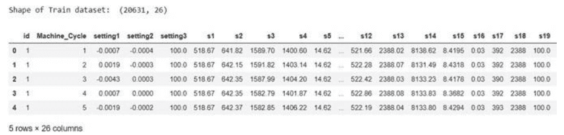

图6.1 训练数据集的片段

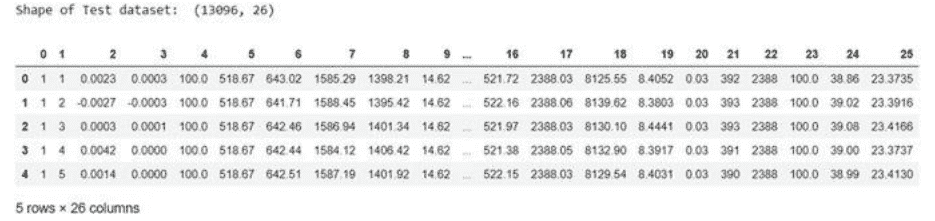

图6.2 测试数据集的片段

#### 6.3.1 自编码神经网络

自编码器是一种用于以无监督方式学习有效信息编码的人工神经网络（ANN）。自编码器旨在学习一组信息的表征（编码），通常用于降维，通过训练网络来忽略信号噪声。因此，它对于大型未知数据集非常有用。

自编码器尝试复制输入数据并生成输出数据，并观察两者之间的差异。我们利用重建损失（均方误差）的分布或图形作为训练数据模型输出，以识别异常。通过这样做，我们可以定义一个阈值来判断什么是异常。目前，评估引擎退化的策略包括计算测试数据集中所有数据点的重建损失，并将损失与定义的阈值进行比较，以标记异常设备。

一个重要特点是神经网络中的隐藏层应有所限制，以便从训练数据集中提取与信息相关的重要见解，而不必保留全部数据，从而起到有损压缩的作用，并且该过程应由模型自动完成，这对于无监督数据非常有帮助。编码后输入和输出的相似度越高，自编码器效果越好。

自编码器算法：

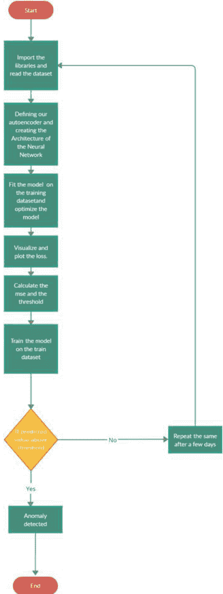

编码是通过神经网络完成的。在神经网络中，模型主要有3层：输入层、隐藏层和输出层。隐藏层用作编码层，输出层用作解码层。它使用反向传播算法来估计无监督数据的输出（图6.3）。

图6.3 神经网络模型

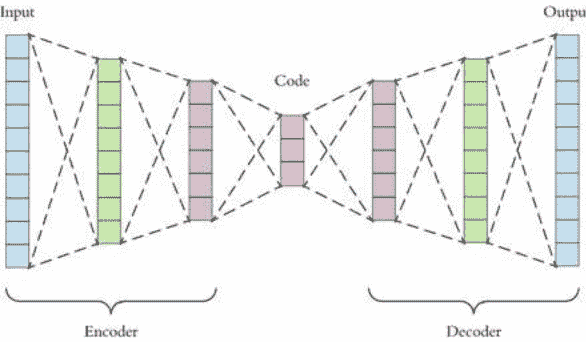

图6.4 损失分布

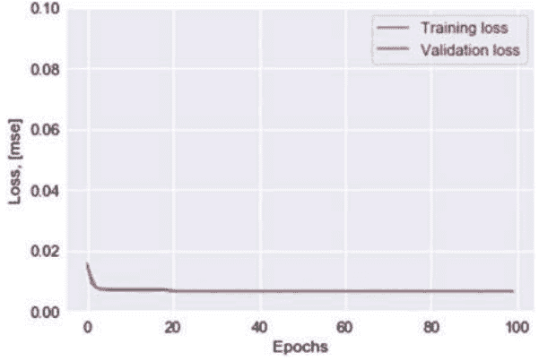

在我们的模型中，我们使用LSTM神经网络单元。LSTM（长短期记忆）可以存储数据以供进一步使用。此外，LSTM可以包含多变量特征。我们使用均方误差来计算和比较模型中的损失。也可以使用平均绝对误差替代均方误差进行相同计算。

以下三个图表提供了更多关于自编码器模型的信息。图6.4展示了100个周期中训练/验证损失的分布情况，图6.5展示了自编码器神经网络模型的准确性，图6.6展示了训练集中计算损失的分布情况，这有助于我们获得阈值。

#### 6.3.2 主成分分析

主成分分析（PCA）是一种将数据集转换为称为主成分的新特征集的计算方法。通过这样做，数据集中大部分信息可以有效地压缩到较少的组件中。这样可以实现降维，并可视化类别或群集的分离。该过程广泛用于突出数据集中的多样性并捕捉强模式。它将一组大量变量转化为一个更小的变量集，同时仍包含大数据集中的大部分信息。

图6.5 模型的准确度

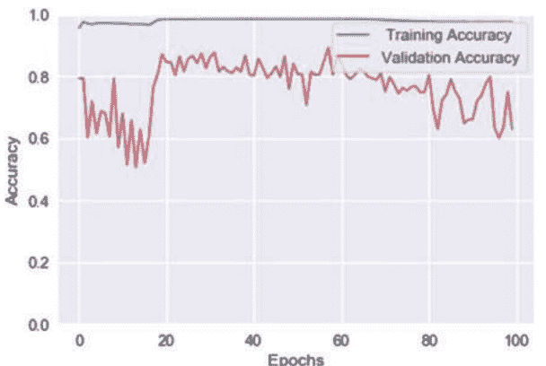

图6.6 损失：均方误差

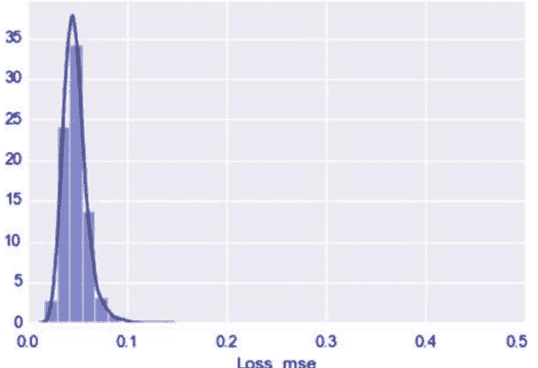

PCA算法：

- 1. 导入数据集
- 2. 预处理数据
- 3. 定义PCA模型：
  - (a) 协方差矩阵定义
  - (b) 马氏距离定义
  - (c) 检测异常值和阈值
  - (d) 检查矩阵中的所有特征向量是否都是正定的
- 4. 建立模型：
  - (a) 计算协方差矩阵
  - (b) 计算马氏距离
  - (c) 绘制距离与阈值的关系图
- 5. 与阈值进行比较并检测异常

图6.7 马氏距离

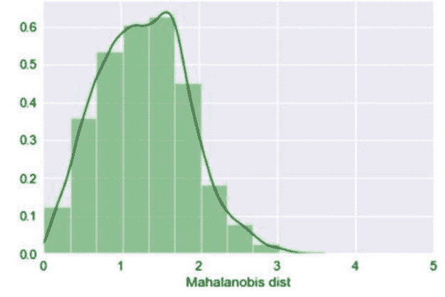

图6.7展示了马氏距离，它帮助我们得到阈值。马氏距离广泛应用于聚类分析和分类技术。

### 6.4 结果和讨论

传感器异常对系统和附近环境构成巨大风险，预测它非常重要。我们使用了两种无监督机器学习算法，即自编码器和主成分分析，来预测给定传感器详细信息中的异常百分比。这两种方法都给出了类似结果，可以提前预测实际故障的发生。根本区别在于如何定义合理阈值，以避免错误预测。自编码器比主成分分析更复杂且成本更高。这些模型降低了数据集复杂性，有助于更容易计算。

图6.8和6.9描述了自编码器模型的结果。阈值取自图6.6的观察结果。然后将均方误差与阈值比较，如果损失值大于阈值，则存在异常。图6.8给出了表格比较，图6.9给出了图形。红线表示阈值，蓝线表示损失值。如果MSE损失线触及阈值线，则存在异常。

图6.10和6.11描述了PCA模型的结果。阈值取自图6.7的观察。如果距离小于阈值，则没有异常，否则存在异常。图6.10给出了表格比较，图6.11给出了图形。红线表示阈值，绿线表示马氏距离。如果马氏距离线触及阈值线，则存在异常。

|   | Loss_mse | Threshold | Anomaly |
|---|---:|---:|---|
| 0 | 0.050477 | 0.125 | False |
| 1 | 0.055452 | 0.125 | False |
| 2 | 0.037016 | 0.125 | False |
| 3 | 0.043015 | 0.125 | False |
| 4 | 0.034332 | 0.125 | False |

图6.8 自动编码器检测

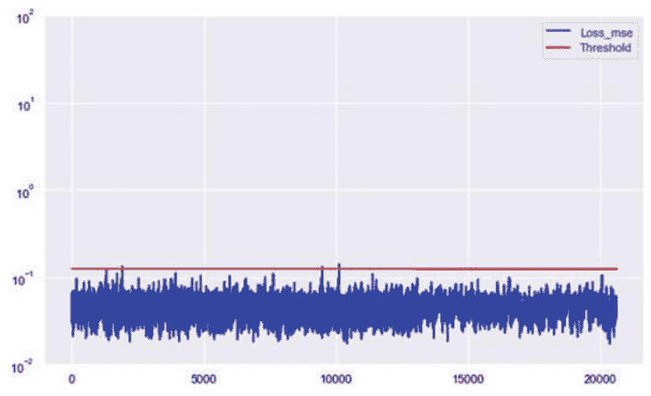

图6.9 自动编码器检测图

图6.10 PCA检测

|   | Mob dist | Thresh | Anomaly |
|---|---:|---:|---|
| 0 | 1.957307 | 3.880702 | False |
| 1 | 2.124568 | 3.880702 | False |
| 2 | 1.933620 | 3.880702 | False |
| 3 | 1.982727 | 3.880702 | False |
| 4 | 2.077709 | 3.880702 | False |

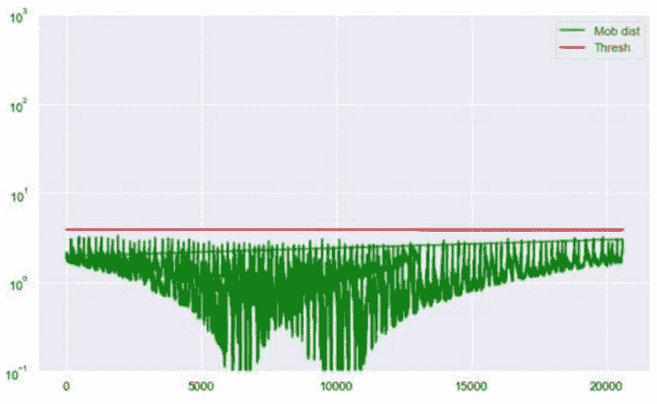

图6.11 PCA检测图

自动编码器没有绑定权重，即编码器和解码器上的权重不相等，并且具有单位范数属性，即每层权重单位范数（这对于获得高效的方差值很有用）。这些在PCA模型中存在，因此将PCA纳入自动编码器模型可以得到更好、更高效的模型。

### 6.5 未来展望

在未来工作中，我们打算提出一种适用于各种领域的异常检测算法，其中传感器网络作为主要数据源，且异常检测较为复杂。该模型还可以预测引擎故障前的天数。我们还计划将测试平台扩展到多个接入点，以探索与行业相关的新的异常方面。我们还将致力于使所提出系统更加稳健和有效，并在其他参数上测试模型。自编码器有许多有趣应用，如计算机视觉、图像编辑。它们可用于将黑白照片转换为彩色照片，也用于图像去噪。自编码器模型可以与PCA模型结合，并进一步训练以获得单位范数和绑定权重属性，以提高模型效率。在大规模场景下，该模型可以部署在具有良好界面的网站上，便于用户使用。这也可用于大规模预防世界任何地方的机器退化。用户只需提供引擎和传感器详细信息即可获得异常详情。

### 6.6 结论

物联网的使用日益增加，物联网安全需求在其中起着非常重要的作用。异常检测非常重要。可以使用机器学习算法来预测异常。自编码器和主成分分析帮助我们实现这一目标。当机器细节作为输入时，模型可预测异常的可能性。

### 参考文献

- 1. Venkatraman, S., Alazab, M., Vinayakumar, R.: 用于有效恶意软件检测的混合深度学习基于图像的分析。信息安全应用杂志 47, 377–389 (2019)
- 2. Pham, Q.-V., Mirjalili, S., Kumar, N., Alazab, M., Hwang, W.-J.: 具有无线网络资源分配应用的鲸鱼优化算法。IEEE交通技术杂志 69(4), 4285–4297 (2020)
- 3. Patel, K., Mehta, D., Mistry, C., Gupta, R., Tanwar, S., Kumar, N., Alazab, M.: 使用AI技术的面部情感分析：最新技术、分类和挑战。IEEE Access 8, 90495–90519 (2020)
- 4. MK, M., Srivastava, G., Somayaji, S.R.K., Gadekallu, T.R., Maddikunta, P.K.R., Bhattacharya, S.: 基于区块链技术的COVID-19激励性方法。arXiv预印本 arXiv:2011.01468 (2020)
- 5. Bodkhe, U., Tanwar, S., Parekh, K., Khanpara, P., Tyagi, S., Kumar, N., Alazab, M.: 工业4.0的区块链：一项全面综述。IEEE Access 8, 79764–79800 (2020)
- 6. Khan, R.U., Zhang, X., Kumar, R., Sharif, A., Golilarz, N.A., Alazab, M.: 一种自适应多层次僵尸网络检测技术，使用机器学习分类器。应用科学 9(11), 2375 (2019)
- 7. Reddy, G.T., Reddy, M.P.K., Lakshmanna, K., Kaluri, R., Rajput, D.S., Srivastava, G., Baker, T.: 对大数据的降维技术分析。IEEE Access 8, 54776–54788 (2020)
- 8. Bhattacharya, S., Kaluri, R., Singh, S., Alazab, M., Tariq, U., et al.: 基于PCA-firefly的XGBoost分类模型在使用GPU的网络入侵检测中的应用。Electronics 9(2), 219 (2020)
- 9. RM, S.P., Maddikunta, P.K.R., Parimala, M., Koppu, S., Reddy, T., Chowdhary, C.L., Alazab, M.: 一种用于IoMT架构中入侵检测的混合PCA-GWO的DNN有效特征工程。见：计算机通信 (2020)
- 10. Deepa, N., Khan, M.Z., Prabadevi, B., Vincent, P.D.R., Maddikunta, P.K.R., Gadekallu, T.R.: 使用多元统计方法进行农业发展的多类模型。IEEE Access (2020)
- 11. Bhattacharya, S., Maddikunta, P.K.R., Pham, Q.-V., Gadekallu, T.R., Chowdhary, C.L., Alazab, M., Piran, M.J., et al.: 深度学习和医学图像处理用于冠状病毒（COVID-19）大流行的调查。见：可持续城市与社会, p. 102589 (2020)
- 12. Gadekallu, T.R., Rajput, D.S., Reddy, M.P.K., Lakshmanna, K., Bhattacharya, S., Singh, S., Jolfaei, A., Alazab, M.: 一种基于PCA-鲸鱼优化的深度神经网络模型用于使用GPU对番茄植物疾病进行分类。J实时图像处理, 1–14 (2020)
- 13. Maddikunta, P.K.R., Srivastava, G., Gadekallu, T.R., Deepa, N., Boopathy, P.: 物联网网络中电池寿命的预测模型。IET智能交通系统 14(11), 1388–1395 (2020)
- 14. Deepa, N., Prabadevi, B., Maddikunta, P.K., Gadekallu, T.R., Baker, T., Khan, M.A., Tariq, U.: 基于Ridge-Adaline随机梯度下降分类器的人工智能智能系统医疗分析。J.超级计算 (2020)
- 15. Alazab, M., Khan, S., Krishnan, S.S.R., Pham, Q.-V., Reddy, M.P.K., Gadekallu, T.R.: 用于预测智能电网稳定性的多方向LSTM模型。IEEE Access 8, 85454–85463 (2020)
- 16. Gadekallu, T.R., Kumar, N., Hakak, S., Bhattacharya, S., et al.: 基于区块链的攻击检测机制，用于基于物联网的电子健康应用。arXiv预印本。
- 17. Ch, R., Srivastava, G., Gadekallu, T.R., Maddikunta, P.K.R., Bhattacharya, S.: 使用区块链技术保护无人机数据的安全与隐私。J.信息安全应用 55, 102670 (2020)
- 18. Deepa, N., Pham, Q.-V., Nguyen, D.C., Bhattacharya, S., Gadekallu, T.R., Maddikunta, P.K.R., Fang, F., Pathirana, P.N., et al.: 区块链与大数据的调查：方法、机会和未来方向。arXiv预印本 arXiv:2009.00858 (2020)
- 19. Rajadurai, S., Alazab, M., Kumar, N., Gadekallu, T.R.: 使用定时自动机评估异构处理器上SDFGs的延迟。IEEE Access 8, 140171–140180 (2020)
- 20. Alazab, M., Layton, R., Broadhurst, R., Bouhours, B.: 恶意垃圾邮件的发展和作者归属。见：第四届网络犯罪和可信计算研讨会。IEEE, pp. 58–68 (2013)
- 21. Gadekallu, T.R., Khare, N., Bhattacharya, S., Singh, S., Maddikunta, P.K.R., Srivastava, G.: 深度神经网络预测糖尿病视网膜病变。
- 22. Gadekallu, T.R., Khare, N., Bhattacharya, S., Singh, S., Reddy Maddikunta, P.K., Ra, I.-H., Alazab, M.: 基于PCA-firefly的深度学习模型早期检测糖尿病视网膜病变。Electronics 9(2), 274 (2020)
- 23. Canedo, J., Skjellum, A.: 使用机器学习保护物联网系统。见：第14届隐私、安全和信任年会（PST）。IEEE, pp. 219–222 (2016)
- 24. Sharp, M., Ak, R., Hedberg, T., Jr.: 智能制造中机器学习的应用和发展调查。制造系统杂志 48, 170–179 (2018)
- 25. Alam, M.S., Husain, D., Naqvi, S., Kumar, P.: 通过机器学习和同态加密技术保护物联网安全。见：新工程与技术趋势国际会议（ICNTET）, 印度 (2018)
- 26. Hasan, M., Islam, M.M., Zarif, M.I.I., Hashem, M.: 使用机器学习方法检测物联网传感器在物联网站点中的攻击和异常。物联网 7, 100059 (2019)
- 27. Malhotra, P., Vig, L., Shroff, G., Agarwal, P.: 长短期记忆网络用于时间序列中的异常检测。见：会议论文集, 第89卷。Presses universitaires de Louvain, pp. 89–94 (2015)
- 28. Sonntag, D., Zillner, S., van der Smagt, P., Lörincz, A.: 智能工厂项目的CPS概述：深度学习、知识获取、异常检测和智能用户界面。见：工业物联网。Springer, Berlin, pp. 487–504 (2017)
- 29. Hussain, F., Hussain, R., Hassan, S.A., Hossain, E.: 物联网安全中的机器学习：当前解决方案和未来挑战。IEEE通信调查与教程 (2020)

## 第7章

## 基于博弈论的隐私保护物联网中的协作深度学习方法


**Deepti Gupta, Smriti Bhatt, Paras Bhatt, Maanak Gupta, 和 Ali Saman Tosun**

### 7.1 引言

近年来，物联网（IoT）成为我们生活中无处不在的现实，拥有数十亿且不断增加的物联网设备。这些智能设备与用户连接或关联，并产生大量数据，从用户健康信息[7]到用户社交网络[5]信息。这些大量宝贵数据使得可以利用深度学习（DL）模型来训练并增强各种数据驱动的物联网应用的智能性。

一般来说，这些设备资源有限，并利用云计算服务和平台来扩展其存储和分析能力[8,10]。因此，大多数物联网设备连接到中央云平台[6,21,25,26]以使用。

D. Gupta (✉) · A. S. Tosun  
德克萨斯大学圣安东尼奥分校计算机科学系，圣安东尼奥，TX 78249，美国  
e-mail: deepti.mrt@gmail.com

A. S. Tosun  
e-mail: ali.tosun@utsa.edu

S. Bhatt  
普渡大学计算机与信息技术系，西拉法叶，IN 47905，美国  
e-mail: smbhatt@purdue.edu

P. Bhatt  
德克萨斯大学圣安东尼奥分校信息系统与网络安全系，圣安东尼奥，TX 78249，美国  
e-mail: paras.bhatt@utsa.edu

M. Gupta  
田纳西理工大学计算机科学系，库克维尔，TN 38505，美国  
e-mail: mgupta@tntech.edu

远程服务。这些服务对于数据集的存储和机器学习（ML）模型至关重要。然而，当这些智能设备与云服务进行交互时，会产生额外的延迟。为了解决这个问题，边缘计算正在塑造一种新的范式，实现物联网设备和边缘设备（如智能手机）之间的低延迟实时通信。

这些边缘设备，也被称为边缘云端[9, 27]，然后将与云服务进行通信。边缘设备在本地进行数据训练，并且还可以用于保护个人数据的隐私。与受限制的物联网设备不同，这些边缘网关具备支持机器学习模型的能力。一个简单的例子是一个视频门铃，它在本地数据集上进行训练，并识别门口的人。

DL模型通常与训练数据集的大小相关。在训练学习机制或模型时，大量的训练数据将提高训练模型的准确性和性能。在当今互联世界和大数据新时代中，数据通常分布在多个智能设备、边缘云节点和云端，由于用户隐私限制，无法将数据聚集在一起。协作深度学习（CDL）允许多个物联网设备训练它们的模型，而不暴露任何相关的敏感和私密数据。CDL在用户隐私和数据集效用之间提供了一个有吸引力的权衡。

最近的研究[13, 22, 24, 29]讨论了本地训练设备的隐私问题以及边缘网关和参数服务器之间的通信延迟的影响。然而，之前的研究没有讨论理性本地训练网关的策略行为，即作者假设所有物联网设备都是利他主义的。利他主义设备是指始终按照最初决定的建议协议行事的设备，无论它们是否通过遵循特定协议获益。然而，在实际情况中，设备并不是利他主义的，它们是理性的。理性设备是指如果它们认为通过遵循不同的协议可以获得更多利益，它们将偏离建议的协议。在我们提出的系统模型中，我们假设所有移动边缘设备或边缘网关都是理性的。

一般来说，具有低质量数据的移动边缘设备总是希望成为CDL的一部分，以提高其本地模型的准确性。而其他具有高质量数据的移动边缘设备由于隐私问题不愿与低质量数据持有者的移动边缘设备合作共享其本地梯度。

因此，移动边缘设备是否成为CDL的一部分存在困境。在本章中，我们通过提出CDL博弈模型和一种新颖的公平合作策略来解决学习者困境问题，该策略使每个参与者能够根据形成的聚类在CDL中合作，以实现自身在训练本地ML模型方面的整体利益。我们还使用ARAS数据集[2]在智能家居部署中评估了我们的CDL博弈模型和新颖的公平合作策略。本研究的主要贡献总结如下。

- 1. 我们确定了CDL中参与者不公平合作的问题。换句话说，一个具有低质量数据并建立其学习模型以从其他具有高质量数据的设备中获益的本地训练设备。
- 2. 我们提出了一个博弈论模型，用于分析移动边缘物联网设备的行为，其中每个设备旨在以最小的参与成本来最大化其本地模型的准确性。
- 3. 我们提出了一种新颖的公平合作策略，以解决物联网设备之间不公平合作的问题。
- 4. 我们还在ARAS数据集[2]上实现了我们的公平合作策略，并且结果表明所提出的解决方案在协作式深度学习中引发了合作。

本章的其余部分组织如下。第7.2节介绍相关工作和相关背景。第7.3节介绍了适用于物联网的不同类型的深度学习技术。第7.4节讨论了系统模型以及合理的假设。第7.5节解释了博弈模型和博弈分析。第7.6节介绍了在ARAS智能家居数据上提出的系统模型的实现以及结果分析。第7.7节总结了这项工作，并提出了未来的研究方向。

### 7.2 背景和相关工作

在本节中，我们描述了物联网中深度学习模型信息泄露的相关工作，并对隐私保护技术进行了简要概述。在这里，我们还讨论了博弈论模型，这些模型已被用于保护用户的个人数据。

#### 7.2.1 物联网中深度学习模型的信息泄露

用户个人数据的信息泄露已成为深度学习模型中的一个众所周知的问题。意外透露个人信息是一个常见问题。为了避免这种情况，各种数据掩码技术，如伪匿名化和匿名化，已被用于保护数据以确保用户隐私。理解伪匿名化数据和匿名化数据之间的区别非常重要。在伪匿名化中，有可能将数据追溯到其原始状态，而在匿名化中，将数据恢复到其原始形式变得不可能。然而，数据可以间接地追溯到其原始形式。例如，Netflix发布了一亿条包含唯一订阅者ID、电影标题、发行年份和订阅者评分日期的匿名化电影评分数据。这个匿名化的Netflix数据集与从互联网电影数据库（IMDb）爬取的数据进行了匹配。即使只有50个IMDb用户的小样本，也很容易识别出两个用户的记录。因此，伪匿名化和匿名化方法仍然容易受到某些推理攻击，从而危及用户数据隐私。

如今，包括谷歌和亚马逊在内的大型互联网巨头已经提供了机器学习作为一项服务，任何具有特定数据集和数据分类任务的客户都可以将该数据集上传到该服务中，并支付费用来构建一个机器学习模型。然后，该模型通常作为一个黑盒API提供给客户使用，这种API容易受到攻击，攻击者可以观察到模型的预测结果，但无法访问模型参数或任何计算过程。

但在云平台上仍然存在一些数据泄露的可能性。关于黑盒API的成员推断攻击在[51, 57]中进行了讨论。攻击者使用数据记录查询目标模型，并获取该记录上模型的预测结果。攻击者还可以构建算法来追踪数据持有者的模型训练数据集。Rahman等人[48]表明，差分隐私深度模型也可能无法抵御成员推断攻击。Nasr等人[42]提出了一种新颖的白盒成员推断攻击。这种攻击衡量了其训练数据集对深度学习算法的成员泄露情况。

在白盒攻击中，对手可以访问完整的模型，包括模型预测、模型参数和各个不同层次的中间计算。Melis等人[37]证明了更新的参数会意外泄露数据持有者的训练数据信息；因此，他们开发了被动和主动推理攻击来利用这种泄露。

#### 7.2.2 隐私保护的深度学习

在协作模型中，每个参与者都有自己的敏感数据集，并且已经提出了各种隐私保护机制来保护隐私并防止交换参数，例如安全多方通信（SMC）[31]、同态加密（HE）[49]和差分隐私[15]。SMC有助于保护多个参与方在其专有输入上进行协作机器学习的中间步骤。Mohassel等人[40]采用了一个用于隐私保护训练的双服务器模型，这是先前关于通过SMC进行隐私保护深度学习的工作常用的模型[18, 43, 44]。在这个模型中，在设置阶段，数据持有者在两个非合谋的服务器之间处理和加密他们的数据；在计算阶段，这两个服务器可以在数据持有者的联合数据上训练各种模型，而不会学习任何超出训练模型的信息。

然而，Aono等人[3, 4]表明，本地数据信息可能实际上泄漏给一个诚实但好奇的服务器。为了模糊个人身份，差分隐私（DP）向个人使用模式的一个小样本添加数学噪声。之前的研究[1, 29, 50, 53]在保护训练数据隐私的隐私保护协作深度学习系统中采用了差分隐私（DP）。然而，Hitaj等人[28]指出上述工作未能保护数据隐私，并证明一个好奇的参数服务器可以通过生成对抗网络（GAN）学习来学习私人数据。

通过深度学习方法，优化损失函数的主要技术是随机梯度下降（SGD）。SGD是一种寻找最优解的方法，用于机器学习算法的参数配置。它通过对机器学习网络配置进行小幅调整来减小网络误差。在文献中，SGD已经应用于各种保护隐私的深度学习模型[1, 37, 40, 42]。

此外，分布式选择性SGD[50]假设两个或多个数据持有者独立并同时进行训练。在每轮本地训练之后，数据持有者异步地共享他们的梯度。另一方面，Downpour SGD[3]是异步SGD的一种变体，其中为神经网络初始化了一个全局向量。

在每次迭代中，神经网络的副本在本地数据集上运行，并将相应的本地梯度向量发送到服务器。本地模型的子集或梯度与服务器共享。服务器通过使用不同的方法（如轮询、随机顺序[50]、余弦距离[12]、基于时间[53]）从数据持有者接收梯度。然后，服务器使用联邦平均算法[36]和加权聚合策略[12]对这些接收到的参数进行聚合。

CDL中的另一个挑战是减少客户端与服务器之间的通信。引入了一种时间加权聚合策略，以降低通信成本并提高模型准确性。虽然存在许多保护隐私的解决方案，用于在训练模型的过程中安全地聚合参数，但[54]中讨论了参与者之间平衡隐私损失和准确性增益的合理框架。

尽管大部分先前的研究都集中在设计最佳的隐私机制上，但选择特定的隐私机制来处理特定的数据集（例如非独立同分布的数据集、高质量的数据集和低质量的数据集）是一个重要的要求。赵等人[58]提出了一种减少低质量数据持有者影响的解决方案。尽管已经有许多关注数据保护的隐私机制研究，但这些研究仅限于特定的场景，例如交换参数的隐私保护，这使得将这些技术应用于保护和确保整个训练数据集的隐私变得困难。

#### 7.2.3 博弈论

博弈论已经应用于数据隐私博弈中，用于分析隐私和准确性。Pejo等人[46]定义了一个两个玩家的博弈，其中一个玩家关注隐私，另一个玩家不关注。Esposito等人[16]提出了一个博弈模型，用于分析提供者（全局机器学习模型）和请求者（本地机器学习模型）在CDL模型中的交互。Gupta等人[20, 23]在他们之前的工作中提出了面向理性玩家的CDL。在本章中，我们构建了一个用于理性移动边缘设备在CDL中合作的博弈模型，并对该博弈进行了分析。

### 7.3 物联网中的深度学习

物联网架构从设计上与多方面数据的生成相关联。从传感器到自动响应，物联网设备输出了大量的数据点，非常适合机器学习任务。在机器学习领域中，最近开始使用各种技术来利用物联网传感器和设备提供的数百万数据点的能力。关于深度学习，我们将讨论一些最流行的技术如下。

#### 7.3.1 卷积神经网络（CNN）

在其基本形式中，CNN深度学习算法区分一组输入图像，以输出用户指定的所需图像类别。CNN模型的效率来自于学习数据中的滤波器和特征，否则这些特征需要手工设计。经过足够的训练，CNN模型可以自行完成这一过程。使用程序员手工设计的特征来策划解决特定问题的学习，不能推广到解决其他类似问题。

一个强大的通用学习过程，用一组预定义的算法取代程序员，从而可以用于获得更广泛问题域的有效解决方案。这就是CNN真正的力量所在。有足够的数据和计算能力，学习远远超过编程[32]。

图7.1 a）表示CNN模型中层的通用视图，对应于：1）卷积层，负责从一组输入图像中提取高级特征；2）池化层，旨在减少处理数据所需的计算能力；以及3）全连接层，通过softmax函数帮助对所需图像进行分类。最近，CNN在物联网领域被广泛使用。一个经典的例子是装有摄像头的无人机，可以收集作物、道路上的交通或土地利用的图像。然后，这些图像可以整理成一个大型数据集，然后用于预测作物疾病、交通拥堵或干旱条件等特定应用领域。它已成为一种在不同物联网领域中使用的流行深度学习工具，包括精确农业[38]、智能交通管理[45]和医学诊断[33]。

#### 7.3.2 循环神经网络（RNN）

循环神经网络（RNN）可以理解为具有内部记忆的学习模型。顾名思义，RNN模型是通过设计实现循环的，对每个输入执行相同的功能。在这里，产生输出的同时，模型在内部记忆中保留了该输出的副本，并在预测过程中同时使用当前输入和过去的输出来做出决策。这个模型有一些变体，扩展了内部记忆的概念，主要是长短期记忆（LSTM）模型[30]。图7.1 b）展示了一个RNN模型的架构。如图所示，在第一步中，模型接收一个初始输入，然后根据它产生相应的输出。然后，在下一步中，模型使用第一步得到的输出加上一个新的输入。以此类推，模型记住了训练过程的上下文。

循环神经网络已经应用于包括物联网安全在内的多个物联网领域。更具体地说，它已被用于检测针对物联网智能家居环境的攻击[17]。在工业物联网的背景下，循环神经网络已被用于预测工业和商业设施的维护需求[47]。循环神经网络还被部署用于数据分析，以从物联网和智能城市部署所生成的时间序列数据中学习[55]。

#### 7.3.3 生成对抗网络（GAN）

生成对抗网络（GAN）主要由两个网络组成，它们共同产生合成和高质量的数据。生成网络产生数据，鉴别网络区分生成的数据和真实输入数据[19]。生成器试图欺骗鉴别器，使其接受生成的数据，就像它来自合法来源一样。这两个网络在GAN模型中被视为对手。在这样的模型中，目标函数对应于存在两个网络，其中一个试图最大化值函数，另一个试图最小化它。如果鉴别器准确地将生成器产生的数据分类为伪造的，则认为鉴别器运行良好。同样地，对于生成器来说，如果它产生的数据能够欺骗鉴别器接受它是真实的，则认为生成器表现良好[39]。

在生成给定图像的描述性文本这一新颖探索中已经使用了GAN[14]，这对于帮助视觉障碍人士尤其重要。它们还被用于优化物联网设备的能源消耗[34]。此外，它们还被用于医疗保健领域，以获取可靠的数据，从而支持模型训练，并实现临床决策[56]。

#### 7.3.4 联邦深度学习（FDL）

一种新的隐私保护协作范式是联邦深度学习（FDL）。深度学习需要有标签的数据来训练准确的模型，可以执行高度结构化的任务，如分类和预测。然而，标记数据集在隐私方面有额外的成本。数据点的识别可能对生成此类数据的来源即用户产生严重影响，这对安全和隐私构成风险。使用这种带有标签的数据，可以识别出数据的来源，这会带来安全和隐私风险。为了在这种情况之下保护隐私，联邦深度学习已经成为一种可靠的解决方案。

智能手机的普及和移动计算的日益流行导致了应用领域的产生，这些领域很有用，但同时也很脆弱。随着智能手机的采用，隐私侵犯的潜在可能性无疑增加了，尤其是在过去几年里。许多物联网设备，如可穿戴设备和医疗设备，收集用户的个人数据并存储在用户的智能手机上。用户普遍对共享个人数据持谨慎态度，对手机上可能存在的其他敏感数据也是如此。

研究人员提出，用户应该能够使用新颖的模型和机制（如基于属性的通信控制）来定义保护其数据的基于隐私的策略[11]。然而，在获取个性化模型方面，使用这些数据可以带来显著的好处，这些模型是通过多种人群进行训练的。在人们可能不想共享自己的数据的情况下，FDL提供了一种解决方案。通过在用户的智能手机上本地训练模型，然后仅传输模型到中央服务器，可以帮助减少隐私风险。因为只有模型被传输，用户的数据得到了保护。

模型与外部服务器进行通信时，不包含任何用户的个人信息。通过聚合多个本地用户的模型，可以训练出一个高效的全局模型，其中不包含个人信息。

联邦深度学习对移动设备具有重大影响，因为它们是个体模型训练的主要平台。图7.2展示了如何在物联网环境中部署联邦深度学习框架。

联邦深度学习可以帮助解决物联网领域中一直存在的难题。通过在移动设备上直接使用和训练学习模型，有效地保护了用户的隐私。此外，还可以在通信延迟、成本和速度方面获得好处。FDL已成功用于工业物联网，通过确保隐私保护数据共享来提高服务质量[35]。此外，FDL可以通过减少在网络上共享数据的需求来优化边缘计算系统的资源利用率。取而代之的是，只能共享模型参数。这将导致获得与使用传统机器学习技术训练的模型相当的模型性能[52]。

### 7.4 系统模型

在这里，我们详细介绍了CDL模型的细节，其中移动边缘设备或边缘网关以协作方式进行训练。我们假设在CDL模型中，所有移动边缘设备都是无私的。此外，我们分析了CDL模型中移动边缘设备的理性问题（表7.1）。

### 表7.1 符号列表

| Symbol | Definition |
| :--- | :--- |
| $N$ | Number of mobile edge devices |
| $n$ | Total number of IoT devices |
| $K$ | Batch size |
| $H$ | Numbers of local epoch |
| $D_i$ | Generated data from IoT device i |
| $\Delta w_i$ | Local gradient of participant i |
| $w^{global}$ | Global parameter |
| $\alpha$ | Learning rate |
| $M$ | Privacy mechanism |
| $\theta_i$ | Loss value of participant i, train individually |
| $\phi_i$ | Loss value of participant i, train collaboratively |
| $\tau_i$ | Loss value of participant i, train individually on auxiliary dataset |
| $B$ | coefficient |
| $c^{local}$ | Computation cost to build a local model |
| $c^{global}$ | Computation cost to build a global model |
| $c^m$ | Communication cost to upload the parameters to PS |
| $c^{m'}$ | Communication cost to download the parameters from PS |
| $c_i^t$ | Total cost for build a ML model |
| $C_i$ | Number of cooperative participants |
| $N - C_i$ | Number of defective participants |

##### 7.4.1 物联网中的协作深度学习模型

系统模型允许多个参与者协作构建他们的机器学习模型。图7.3展示了我们的CDL模型，展示了系统模型的主要模块。在这个模型中，我们考虑到有$N$个移动边缘设备或边缘网关与多个物联网设备相连。这些物联网设备产生大量数据，有助于增强其本地机器学习模型的智能性。CDL模型通过交换本地梯度而不是原始数据来提高训练数据的隐私性，而不会损害数据隐私。每个移动边缘设备保留一个本地向量$w^i$的机器学习模型，PS也保留另一个单独的参数向量$w^{global}$。成为CDL的一部分后，每个边缘网关开始初始化参数（权重）$w^i$，其中$i=1,2,3,..N$，随机选择。为了提高本地机器学习模型的效率，这些初始化参数（权重）$w^i$也通过从PS下载其更新的参数$w^{global}$来进行更新。移动边缘设备或边缘网关参与CDL以构建其本地机器学习模型以实现共同的目标。在这个系统模型中，使用SGD方法来优化损失值。权重样本是随机选择的，这个优化过程会持续运行，直到SGD达到局部最优。

**图 7.3 协作深度学习系统模型**

损失值 $E$，即目标函数的真实值与网络计算输出之间的差异，该值通过 $L^2$ 范数或交叉熵计算。反向传播算法计算 $E$ 相对于 $w^k$ 中每个参数的偏导数，并更新参数以减小其梯度。所有移动边缘设备或边缘网关同时构建其本地机器学习模型。

```
算法 1：移动边缘设备 i 的伪代码
1: 定义初始参数 $w^i$，学习率 $\alpha$ 和本地迭代次数 H。
2: 重复所有步骤，直到获得最小误差：
3: 从 PS 下载全局参数 $w^{global}$ 以学习共同的学习目标。
4: LocalTraining (i, $w^i$)：在每个设备上对本地数据进行训练以构建自己的机器学习模型。
5: 将本地数据集 $D_i$ 分割为大小为 K 的小批量，并包含在集合 $K_i$ 中。
6: 对于每个本地迭代次数 j 从 1 到 H 执行
7:   对于每个 $k \in K_i$，执行
8:     $\Delta w^i = \Delta w^i - \alpha \frac{\partial E_i}{\partial w^i}$
9:   结束循环
10: 结束循环
11: 每个参与者将本地梯度 $\Delta w^i$ 上传到 PS
12: 每个参与者下载更新的参数全局参数 $w$ 和每个参与者的损失值 $\tau_i$
```

CDL 系统模型不允许参与的移动边缘设备之间进行一对一的通信，但它们可以通过 PS 间接影响彼此的训练。当每个边缘网关从 PS 接收到更新的参数 $\Delta w^{global}$ 时，有许多方法将参数从 PS 传递到移动边缘设备。在这个模型中，PS 不需要等待所有边缘设备的本地梯度聚合过程，它以异步方式工作。这个训练和参数交换过程会一直持续，直到模型达到目标。

```
**算法 2：** 参数服务器的伪代码
1: 设置初始全局参数 $w^{global}$
2: PS 在辅助数据集上运行这些局部梯度 $\Delta w^i$ 并计算每个参与者的损失值 $\tau_i$；PS 还异步地聚合这些局部梯度 $\Delta w^i$
$$w^{global} = w^{global} + \Delta w^i$$
```

##### 7.4.2 边缘网关的训练成本

我们定义了 CDL 系统模型中移动边缘设备或边缘网关承担的计算和通信两个主要成本。

该系统模型包括训练和参与两个不同的阶段。每个移动边缘设备或边缘网关在训练时构建一个本地模型，并初始化其权重/参数以训练其本地机器学习模型。然后，每个移动边缘设备或边缘网关在参与时上传其计算得到的局部梯度到 PS。PS 接收所有的局部梯度并聚合它们，然后发送回每个移动边缘设备或边缘网关。这个训练过程会一直持续，直到损失值变得可以忽略。

在每一轮训练中，移动边缘设备构建机器学习模型的总成本是基于两个阶段的执行。移动边缘设备支付成本 $c^{plocal}$ 和 $c^{pglobal}$，这是构建本地机器学习模型的计算成本，并在训练阶段中使用更新的全局参数构建本地模型。

在参与阶段，移动边缘设备支付另外的成本 $c^m$ 和 $c^{m'}$，这是将其参数上传到 PS 并从 PS 下载更新的参数的通信成本。CDL 系统中每个时代参与的移动边缘设备的平均成本 $c_i^l$ 被定义为

$$c_i^l = c^{plocal} + c^{pglobal} + c^m + c^{m'} \eqno(7.1)$$

在特定情况下，参与者可能不参与 CDL，并避免支付一些特定的成本 $c^m, c^{m'}$，和 $c^{pglobal}$。在下一节中，我们提出了合理性假设，该假设提供了基于策略选择避免支付一些特定成本的详细信息。

##### 7.4.3 合理性假设

大部分的研究都是在分布式深度学习方面进行的，这项研究 [12] 表明移动边缘设备或边缘网关受到对手的控制。如果移动边缘设备或边缘网关表现为恶意参与者，它们可以任意偏离 CDL 中建议的协议，并且可以任意中断移动边缘设备和 PS 之间的通信。在我们的研究中，我们假设移动边缘设备或边缘网关和物联网设备是诚实的，但它们会自私地以最小的成本获得自己的利益。理性的移动边缘设备或边缘网关的概念意味着它会决定是否参与以最大化其在 CDL 中的利润。

### 7.5 协作深度学习博弈

这项工作的一个重要贡献是展示了如何通过博弈模型来训练物联网设备和移动边缘设备或边缘网关。我们描述了协作深度学习游戏，该游戏控制多个移动边缘设备或边缘网关的行动，并强制它们在隐私保护机制下进行数据训练。这个 CDL 游戏 G 引入了 $N$ 个玩家，并且这些玩家同时与 PS 进行通信。为了在不损害数据隐私的情况下学习共同的目标，每个移动边缘设备将本地梯度发送给 PS。PS 汇总所有的梯度并将其发送回来，这有助于提高本地模型的准确性。然而，一些边缘网关仍然无法通过网关从其他物联网设备中获得利益。

#### 7.5.1 博弈论模型

博弈论是一种用于建模竞争参与者之间冲突情况并分析各参与者行为的理论框架。在 CDL 游戏 G 中，移动边缘设备或边缘网关是参与者，这些网关与多个物联网设备连接，但对其他参与者没有任何意识，并同时与 PS 进行通信。这个游戏 G 是一个静态游戏，因为所有参与者必须同时选择他们的策略。游戏 G 是一个元组 $(P, S, U)$，其中 $P$ 是参与者的集合，$S$ 是策略的集合，$U$ 是收益值的集合。

- **参与者 ($P$)**: 参与者的集合 $P = \sum_{i=1}^N P_i$ 对应于移动边缘设备或边缘网关的集合，在 CDL 游戏 G 中，每个设备都会收到 PS 的目标，以建立自己的本地模型。
- **策略 ($S$)**: CDL 游戏 G 有两种不同的策略 $S_i(i)$ 合作 ($CP$) 或 (ii) 缺陷 ($DF$)，每个玩家 $P_i$ 都可以在这两种策略之间选择。我们将一组策略称为 $S = \{CP, DF\}$。这些策略决定了玩家 $P_i$ 是否参与 CDL 模型的构建。如果玩家 $P_i$ 选择 $CP$ 策略，它可以将本地梯度发送给 PS，并从 PS 下载更新的参数来更新本地模型。根据 $CP$ 策略，需要支付各种成本，包括通信成本 $(c^m, c^{m'})$ 和计算成本 $(c^{plocal}, c^{pglobal})$。相反，如果玩家 $P_i$ 选择 $DF$ 策略，它既不上传本地梯度到 PS，也不从 PS 下载更新的全局参数。根据这种策略，玩家只支付本地计算成本 $c^{plocal}$。这意味着该玩家不是 CDL 的一部分，只在其网关设备上单独训练本地模型。

- **回报 ($U$)**: 在 CDL 游戏 G 中，每个玩家的目标是最大化他们的回报，这是损失值和各种成本的函数。我们的工作没有展示任何玩家的恶意一面。在这个游戏中，每个玩家根据模型的准确性获得利益，并支付各种成本来训练本地模型。

在我们的 CDL 游戏 G 中，回报值取决于模型的损失值和各种成本。然而，损失值和成本值不在同一尺度上。为了使它们相似，我们引入一个系数 B，它与损失值相乘。

现在，我们计算每个移动边缘设备在这个游戏中的回报 $u_i$。如果我们假设参与者 $P_i$ 是合作的，即 $P_i \in CP$。同样，如果 $P_i$ 是有缺陷的，即 $P_i \in DF$，每个移动边缘设备的回报 $u_i$ 定义如下。

$$u_i(CP) = B\left(\frac{1}{\phi_i}\right) - (c^{plocal} + c^m + c^{m'} + c^{pglobal}) \qquad (7.2)$$

$$u_i(DF) = B\left(\frac{1}{\theta_i}\right) - (c^{plocal}) \qquad (7.3)$$

其中，$\phi_i$ 是使用 CDL 训练模型的损失值，$\theta_i$ 是单独训练模型的损失值。基于上述定义的方程，我们分析了我们的 CDL 游戏 G。

#### 7.5.2 博弈分析

我们应用了最基本的博弈论概念，即纳什均衡，由约翰·纳什 [41] 引入，以了解玩家的行为。

**定义 1** 纳什均衡是博弈论的一个概念，其中没有玩家可以单方面改变策略以增加自己的收益。

简而言之，如果两个策略相互最佳响应，那么没有玩家有动机单方面偏离给定策略，这是一个纳什均衡策略配置。例如，囚徒困境博弈表明，个体玩家总是有动机选择缺陷，对于个体而言，这不是最优的结果。如果两个玩家都选择合作 -CP 策略，那么对于两个玩家来说，这是最好的结果。相反，如果两个玩家决定不互相合作，他们选择有缺陷 -DF 策略来从其他玩家那里获得利益。在囚徒困境中，有缺陷的策略严格占优于合作策略。因此，在囚徒困境中，唯一的纳什均衡是相互背叛。

基于移动边缘设备学习神经网络模型的成本和收益，我们构建了一个一次性的 CDL 博弈模型 G。在以下定理中，我们展示了这个博弈 G 是一个公共物品博弈。

**定理 1** 在具有 $N$ 个移动边缘设备或边缘网关的协作深度学习博弈 $G$ 的迭代中，如果聚合参数在所有参与者之间平均共享以构建其本地机器学习模型，那么这个博弈 $G$ 就会简化为一个公共物品博弈。

证明：我们假设所有 $N$ 个玩家都遵循有缺陷 -DF 策略，并且不将他们的本地梯度发送到 PS，也不从 PS 下载更新的全局参数。在这种情况下，每个边缘网关都更喜欢单独构建本地 ML 模型，并节省各种成本，包括通信成本 $c^m, c^{m'}$ 和全局计算成本 $c^{pglobal}$。每个参与者 $P_i$ 都旨在最小化其损失值 $\theta_i$ 以实现其 ML 模型的高准确性。没有参与者可以单方面改变他的策略配置文件。现在我们考虑，如果一个参与者单方面从有缺陷 -DF 策略偏离到合作的 -CP 策略，那么该参与者将支付各种成本 ($c^m + c^{m'} + c^{pglobal} + c^{plocal}$)。合作的 -CP 策略的总收益小于有缺陷 -DF 策略，因此全体 -DF 是一个纳什均衡配置文件，G 是一个公共物品博弈。

$\square$

定理 2 表明，在 CDL 游戏 G 中，我们永远无法强制实施全合作 -CP 策略，因此，当所有玩家选择合作 -CP 策略时，纳什均衡无法建立。

**定理 2** 在具有 $N$ 个移动边缘设备或边缘网关的协作深度学习游戏 $G$ 的迭代中，如果聚合参数在所有参与者之间平等共享以构建其本地机器学习模型，则我们无法建立全合作策略作为纳什均衡。

证明：我们假设 $N$ 个玩家选择合作 -CP 策略，并准备在协作深度学习中合作。在这种情况下，玩家需要支付各种成本，包括通信成本 ($c^m, c^{m'}$) 和计算成本 ($c^{pglobal} + c^{plocal}$)。每个玩家的总收益 $P_i$ 由公式 7.1 计算。现在，如果一个玩家单方面从合作 -CP 转变为缺陷 -DF，那么该玩家只需支付本地计算成本，该成本在公式 7.2 中定义，该收益始终大于公式 7.1 中的合作收益。因此，每个参与者都有动机单方面偏离并增加其收益。因此，全合作 -CP 策略永远不是纳什均衡。

$\square$

#### 7.5.3 公平协作策略

每个移动边缘设备或边缘网关将其本地梯度发送到 PS，并在辅助数据集上运行这些本地梯度以计算每个数据集的损失值。每个移动边缘设备从 PS 下载更新的全局参数和损失值矩阵。在开始 CDL 游戏 G 之前，每个参与者必须选择自己的策略来玩这个游戏 G。然而，在游戏开始时，参与者对自己的策略并不确定，这将取决于其他参与者的策略。因此，所有参与者在选择策略时都面临着在 $CP$ 和 $DF$ 之间选择的困境。通过提出一种新颖的公平协作策略来解决这个问题。K-means 聚类是一种无监督的机器学习技术，其目的是将数据集分割成 K 个簇。每个参与者对所有损失值（一维数据）应用 k-means 聚类算法。

```
算法 3：基于聚类的公平策略
--------------------------------------------
1: 对参与者 i 的损失值应用 k-means 聚类算法。
2: 生成簇
3: 如果参与者 i 与至少一个其他参与者 j 属于同一簇
   然后
4:   $P_i, P_j \in CP$
5: 否则
6:   $P_i \in DF$
7: 结束如果
```

### 7.6 实施与分析

我们在基于真实世界的物联网智能家居数据集上实施了我们的新颖公平协作策略，以分析结果。

#### 7.6.1 数据收集

对于这个实验，我们选择了公开可用的 ARAS 数据集 [2] 来构建智能家居交互模型。ARAS 数据集是真实世界的物联网数据集，其中设置了各种物联网设备来捕捉用户的活动。在这个智能家居中，居住者没有遵循任何特定的规则。该数据集包含两个真实的智能家居数据，持续一个月。它包含了在智能家居中通过 26 百万个传感器读数捕捉到的 3000 个日常生活活动。各种传感器捕捉到居民的各种活动，包括洗碗、睡觉、学习、打电话和其他活动。最常见的传感器，如光电传感器、接触传感器、声纳距离、温度传感器都连接在这些智能家居上。该数据集还为活动提供了真实标签，可以开发出新的复杂的机器学习智能家居交互模型。

#### 7.6.2 数据分析

我们提出了一套绝对的数值模拟来验证我们提出的公平合作策略。在这个实验中，我们模拟了基于我们提出的公平合作策略的移动边缘设备的系统模型。

我们根据参与者进行了两个不同的实验。第一个 CDL 实验设置在 10 个智能家居参与者之间，第二个 CDL 实验设置在 30 个智能家居参与者之间。根据我们的系统模型的需求，我们将 ARAS 数据集不均匀地分成不同数量的参与者（例如，10 个，30 个参与者）。每个参与者（例如，移动边缘网关设备）都与多个物联网设备连接。一些移动边缘设备或边缘网关连接了大量的物联网设备；然而，一些边缘网关连接了较少的物联网设备。与边缘网关连接的物联网设备的数量代表数据集的数量，而每个边缘网关的损失值代表数据集的质量。对于不平衡的数据集设置，数据按类别排序并分为两种情况：（a）低质量数据集，参与者从一个类别接收数据分区，（b）高质量数据集，参与者从 27 个类别接收数据分区。图 7.4 显示了数据集的不平衡分区，这是我们的第一个实验。智能家居 -1 生成高质量数据，其中大量物联网设备连接到网关设备，而智能家居 -10 生成低质量数据集，只有少量物联网设备连接。

算法 1 和 2 使用以下参数：批量大小 $K=10$ 或 100，$H=1$ 或 3，$\alpha=0.01$。

#### 7.6.3 实验结果

在这项工作中，我们开发了一种新的策略来强制参与者在 CDL 中合作。这种提出的公平协作策略将那些在 CDL 中具有相似数据类型的参与者聚集在一起。

博弈论的方法证明，如果他们彼此没有得到好处，参与者会开始离开游戏。缺席的证明在第 7.5 节中呈现。为了验证公平协作策略，

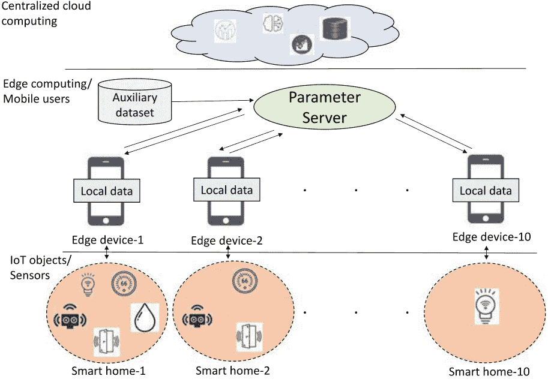

**图 7.4 所提出的游戏模型的实验设置**

基于 k-means 聚类，这些基于智能家居的聚类显示在图 7.5 和 7.6 中。聚类的范围取决于每个参与者的损失值。图 7.5

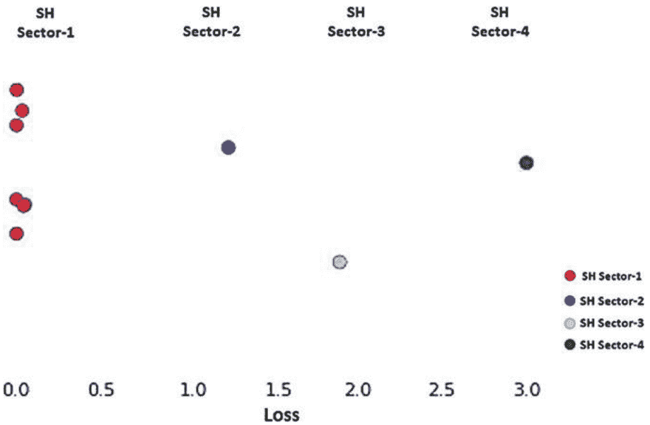

**图 7.5 一维损失值中的 10 个参与者的聚类可视化**

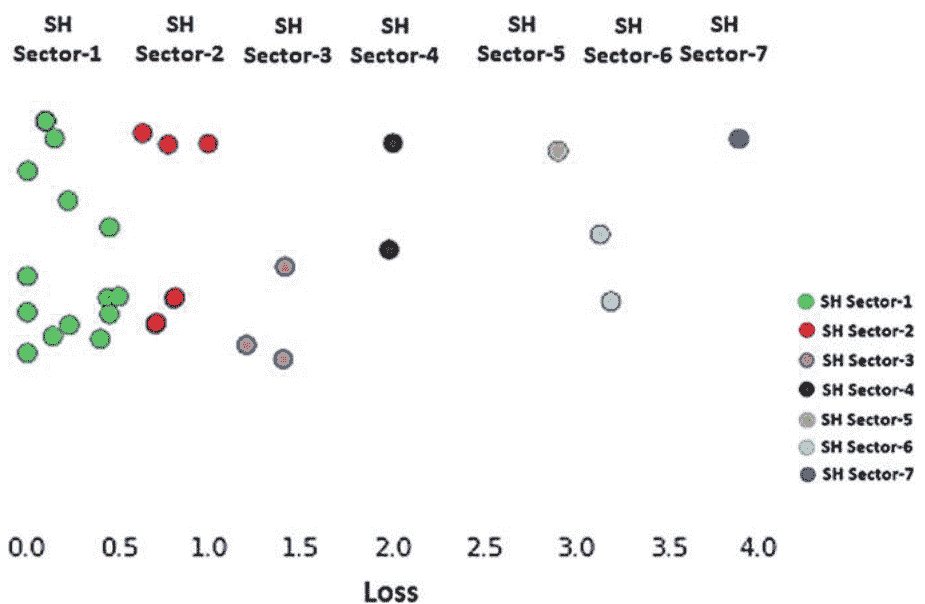

**图 7.6 30 个参与者在一维损失值上的聚类可视化**

展示了使用我们公平协作策略的 10 个参与者之间的合作，并且类似的参与者加入了聚类。在 10 个参与者中存在 4 个不同的聚类，被称为 SH（智能家居）部门。每个 SH 部门的集合为：SH 部门 -1 = {SH1, SH2, SH4, SH5, SH7, SH8, SH9}，SH 部门 -2 = {SH3}，SH 部门 -3 = {SH6}，SH 部门 -4 = {SH10}。上述定义的集合表示智能家居 -1 与智能家居 -2、智能家居 -4、智能家居 -5、智能家居 -7、智能家居 -8 和智能家居 -9 进行协作，而其他智能家居则单独学习其本地机器学习模型。

图 7.6 还显示了参与者的聚类形式，每个 SH 部门的集合为：SH 部门 -1 = {SH1, SH2, SH3, SH4, SH5, SH6, SH7, SH8, SH9, SH11, SH17, SH18, SH19, SH20, SH26, SH27}，SH 部门 -2 = {SH10, SH16, SH21, SH22, SH28}，SH 部门 -3 = {SH12, SH13, SH25}，SH 部门 -4 = {SH24, SH30}，SH 部门 -5 = {SH14}，SH 部门 -6 = {SH15, SH23}，SH 部门 -7 = {SH29}。智能家居的一些损失值可能相同，并且在评估图表中可能重叠。这些图表显示，更多的参与者与其他参与者合作，而个体参与者较少。总体结果还显示，大多数参与者使用我们提出的公平协作策略与其他参与者合作。

### 7.7 结论和未来工作

在本章中，我们介绍了 CDL 的系统模型，并介绍了 CDL 系统中移动边缘设备的参与者理性行为问题。我们使用博弈论模型评估了 CDL 中移动边缘设备的理性行为。我们为每个场景建立了纳什均衡 (NE) 策略配置文件，在这些配置文件中，学习移动边缘设备被强制合作使用我们的新颖公平协作策略在 CDL 中。这是对参与者行为的非理性导致的非合作行为在 CDL 中的影响的更深入理解的第一步。作为未来工作的一部分，我们计划提出新的和修订的公平协作策略，通过应用更高效的聚类算法来处理重叠的集群问题。我们还计划计算每个本地 ML 模型的准确性，并将我们提出的模型应用于其他物联网领域的数据集。

### 参考文献

- 1. Abadi, M., Chu, A., Goodfellow, I., McMahan, H.B., Mironov, I., Talwar, K., Zhang, L.: 具有差分隐私的深度学习。在：2016 年 ACM SIGSAC 计算机与通信安全会议论文集，第 308-318 页。ACM (2016 年)
- 2. Alemdar, H., Ertan, H., Incel, O.D., Ersoy, C.: 多个住宅中多个居民的 Aras 人类活动数据集。在：2013 年第 7 届国际普适计算技术与医疗保健研讨会论文集，第 232-235 页。IEEE (2013 年)
- 3. Aono, Y., Hayashi, T., Wang, L., Moriai, S., et al.: 隐私保护的深度学习：再探讨和增强。在：应用与信息安全技术国际会议论文集，第 100-110 页。Springer (2017 年)
- 4. Aono, Y., Hayashi, T., Wang, L., Moriai, S., et al.: 通过加法同态加密实现隐私保护的深度学习。IEEE Trans. Inf. Forens. Secur. 13(5), 1333–1345 (2018)
- 5. Atzori, L., Iera, A., Morabito, G., Nitti, M.: 社交物联网 (SIoT) -当社交网络遇上物联网：概念、架构和网络特性。Comput. Netw. 56(16), 3594–3608 (2012)
- 6. Awaysheh, F.M., Alazab, M., Gupta, M., Pena, T.F., Cabaleiro, J.C.: 下一代大数据联邦访问控制：参考模型。Fut. Generat. Comput. Syst. 108, 726–741 (2020)
- 7. Baker, S.B., Xiang, W., Atkinson, I.: 智能医疗的物联网：技术、挑战和机遇。IEEE Access 5, 26521–26544 (2017)
- 8. Bhatt, S., Lo'ai, A.T., Chhetri, P., Bhatt, P.: 云基物联网中的授权：当前趋势和用例。在：2019 年第四届雾计算和移动边缘计算国际会议 (FMEC)，第 241-246 页。IEEE (2019 年)
- 9. Bhatt, S., Patwa, F., Sandhu, R.: 云可穿戴物联网的访问控制框架。在：2017 年 IEEE 第三届协作与互联网计算国际会议 (CIC)，第 328-338 页。IEEE (2017 年)
- 10. Bhatt, S., Patwa, F., Sandhu, R.: 用于 AWS 物联网的访问控制模型。在网络和系统安全国际会议，第 721-736 页。Springer (2017 年)
- 11. Bhatt, S., Sandhu, R.: ABAC-CC：面向物联网的属性访问控制和通信控制。在：第 25 届 ACM 访问控制模型和技术研讨会论文集，第 203-212 页 (2020 年)
- 12. 陈，X., 季，J., 罗，C., 廖，W., 李，P.: 当机器学习遇见区块链：一种分散、隐私保护和安全设计。在：2018 年 IEEE 国际大数据会议 (Big Data)，第 1178-1187 页。IEEE (2018 年)

- 13. 陈, Y., 孙, X., 金, Y.: 具有异步模型更新和时间加权聚合的通信高效联邦深度学习。arXiv预印本 arXiv:1903.07424（2019年）
- 14. 戴, B., Fidler, S., Urtasun, R., Lin, D.: 通过条件GAN实现多样化和自然的图像描述。在: IEEE国际计算机视觉会议论文集, 第2970-2979页（2017年）
- 15. Dwork, C., Roth, A., 等: 差分隐私的算法基础。Foundat. Trends® Theoret. Comput. Sci. 9(3-4), 211-407（2014年）
- 16. Esposito, C., Su, X., Aljawarneh, S.A., Choi, C.: 在对抗场景中保护工业应用中的协同深度学习。IEEE Trans. Ind. Inf. 14(11), 4972-4981（2018）
- 17. Farsi, M.: 将集成RNN深度神经网络应用于通过物联网环境进行跌倒检测。Alexandria Eng. J.（2020）
- 18. Gascón, A., Schoppmann, P., Balle, B., Raykova, M., Doerner, J., Zahur, S., Evans, D.: 在垂直分割的数据集上进行安全线性回归。IACR Cryptology ePrint Archive 2016, 892（2016）
- 19. Goodfellow, I., Pouget-Abadie, J., Mirza, M., Xu, B., Warde-Farley, D., Ozair, S., Courville, A., Bengio, Y.: 生成对抗网络。在: 神经信息处理系统进展, 第2672-2680页（2014）
- 20. Gupta, D., Bhatt, P., Bhatt, S.: 合作智能农业的博弈论分析。arXiv预印本 arXiv:2011.11098（2020）
- 21. Gupta, D., Bhatt, S., Gupta, M., Kayode, O., Tosun, A.S.: 用于Google云IoT的访问控制模型。在: 2020年IEEE第六届云安全大数据（BigDataSecurity）国际会议、IEEE高性能和智能计算国际会议（HPSC）和IEEE智能数据与安全国际会议（IDS）, 第198-208页。IEEE（2020）
- 22. Gupta, D., Bhatt, S., Gupta, M., Tosun, A.S.: 未来智能互联社区应对COVID-19疫情的方法。物联网 13, 100342（2021）
- 23. Gupta, D., Kayode, O., Bhatt, S., Gupta, M., Tosun, A.S.: 协作深度学习中的物联网设备训练策略。在: 2020年IEEE第六届物联网世界论坛（WF-IoT）, 第1-6页。IEEE（2020）
- 24. Gupta, M., Abdelsalam, M., Khorsandroo, S., Mittal, S.: 智能农业中的安全与隐私保护：挑战与机遇。IEEE Access 8, 34564-34584（2020）
- 25. Gupta, M., Awaysheh, F.M., Benson, J., Azab, M.A., Patwa, F., Sandhu, R.: 云端工业智能车辆的基于属性的访问控制。IEEE Trans. Ind. Inf. https://doi.org/10.1109/TII.2020.3022759（2020）
- 26. Gupta, M., Benson, J., Patwa, F., Sandhu, R.: 下一代智能汽车的动态群组和基于属性的访问控制。在: 第九届ACM数据与应用安全和隐私会议论文集, 第61-72页（2019）
- 27. Gupta, M., Benson, J., Patwa, F., Sandhu, R.: 使用云端实现智能交通中的安全V2V和V2I通信。IEEE Trans. Serv. Comput.（2020）
- 28. Hitaj, B., Ateniese, G., Pérez-Cruz, F.: GAN下的深度模型：来自协作深度学习的信息泄露。在: 2017年ACM SIGSAC计算机与通信安全会议论文集, 第603-618页。ACM（2017年）
- 29. Jiang, L., Tan, R., Lou, X., Lin, G.: 关于物联网对象的轻量级隐私保护协作学习。arXiv预印本 arXiv:1902.05197（2019年）
- 30. Kayode, O., Gupta, D., Tosun, A.S.: 在智能家居环境中实现分布式估计器。在: 2020年IEEE第六届物联网世界论坛（WF-IoT）, 第1-6页。IEEE（2020年）
- 31. Kerschbaum, F., 等: 关于安全多方计算协议的通信复杂性的实际重要性。在: 2009年ACM应用计算学术会议论文集, 第2008-2015页。ACM（2009年）
- 32. Krizhevsky, A., Sutskever, I., Hinton, G.E.: 使用深度卷积神经网络进行ImageNet分类。ACM通信 60(6), 84-90（2017）
- 33. Liu, C., Cao, Y., Alcantara, M., Liu, B., Brunette, M., Peinado, J., Curioso, W.: 使用卷积神经网络在胸部X光图像中检测结核病。在: 2017年IEEE国际图像处理会议（ICIP）, 第2314-2318页。IEEE（2017）
- 34. Liu, S., Li, M.: 用于能源效率和云分类的多模态GAN在物联网中。IEEE物联网杂志 6(4), 6034-6041（2018）
- 35. Yunlong, L., Huang, X., Dai, Y., Maharjan, S., Zhang, Y.: 区块链和联邦学习用于工业物联网中的隐私保护数据共享。IEEE工业信息学报 16(6), 4177-4186（2019）
- 36. McMahan, H.B., 等: 分散数据中深度网络的通信高效学习。arXiv预印本 arXiv:1602.05629（2016）
- 37. Melis, L., Song, C., De Cristofaro, E., Shmatikov, V.: 利用协作学习中的意外特征泄漏。（2019）
- 38. Milioto, A., 等: 利用卷积神经网络中的背景知识，实时对农作物和杂草进行语义分割的精准农业机器人。在: 2018年IEEE国际机器人与自动化会议（ICRA）, 第2229-2235页。IEEE（2018）
- 39. Mohammadi, M., Al-Fuqaha, A., Sorour, S., Guizani, M.: 物联网大数据和流式分析的深度学习综述。IEEE通信调查与教程 20(4), 2923-2960（2018）
- 40. Mohassel, P., Zhang, Y.: SecureML: 一个可扩展的隐私保护机器学习系统。在: 2017年IEEE安全与隐私研讨会（SP）, 第19-38页。IEEE（2017）
- 41. 纳什, J.: 非合作博弈。数学年鉴, 286-295（1951）
- 42. 纳斯尔, M., 肖克里, R., 侯曼萨德尔, A.: 深度学习的全面隐私分析：在被动和主动白盒推理攻击下的独立和联邦学习。arXiv预印本 arXiv:1812.00910（2018）
- 43. 尼古拉耶科, V., 伊奥安尼迪斯, S., 韦恩斯伯格, U., 乔伊, M., 塔夫特, N., 博内, D.: 隐私保护矩阵分解。在: 2013年ACM SIGSAC计算机与通信安全会议论文集, 第801-812页。ACM（2013）
- 44. 尼古拉耶科, V., 韦恩斯伯格, U., 伊奥安尼迪斯, S., 乔伊, M., 博内, D., 塔夫特, N.: 数亿条记录上的隐私保护岭回归。在: 2013年IEEE安全与隐私研讨会, 第334-348页。IEEE（2013）
- 45. 潘, X., 史, J., 罗, P., 王, X., 唐, X.: 空间作为深度：用于交通场景理解的空间CNN。arXiv预印本 arXiv:1712.06080（2017年）
- 46. Pejó, B., 唐, Q., Biczók, G.: 协作学习中的隐私代价。在: 2018年ACM SIGSAC计算机与通信安全会议论文集, 第2261-2263页。ACM（2018年）
- 47. Rahhal, J.S., Abualnadi, D.: 基于物联网的预测性维护使用LSTM RNN估计器。在: 2020年电气、通信和计算机工程国际会议（ICECCE）, 第1-5页。IEEE（2020年）
- 48. Rahman, M.A., Rahman, T., Laganiere, R., Mohammed, N., 王, Y.: 针对差分隐私深度学习模型的成员推断攻击。数据隐私传输 11(1), 61-79（2018年）
- 49. Rivest, R.L., Adleman, L., Dertouzos, M.L., 等: 关于数据银行和隐私同态加密。Found. Sec. Comput. 4(11), 169-180（1978）
- 50. Shokri, R., Shmatikov, V.: 隐私保护的深度学习。在: 第22届ACM SIGSAC计算机与通信安全会议论文集, 第1310-1321页。ACM（2015）
- 51. Shokri, R., Stronati, M., Song, C., Shmatikov, V.: 针对机器学习模型的成员推断攻击。在: 2017年IEEE安全与隐私研讨会（SP）, 第3-18页。IEEE（2017）
- 52. Wang, S., Tuor, T., Salonidis, T., Leung, K.K., Makaya, C., He, T., Chan, K.: 资源受限边缘计算系统中的自适应联邦学习。IEEE J. Select. Areas Commun. 37(6), 1205-1221（2019）
- 53. 翁, J., 等: 基于区块链的可审计和隐私保护深度学习。密码学 ePrint 存档, 报告 2018/679（2018年）
- 54. 吴, X., 吴, T., 汗, M., 倪, Q., 窦, W.: 基于博弈论的相关隐私保护大数据分析。IEEE Trans. Big Data（2017年）
- 55. 谢, X., 吴, D., 刘, S., 李, R.: 使用深度学习的物联网数据分析。arXiv预印本 arXiv:1708.03854（2017年）
- 56. 杨, Y., 南, F., 杨, P., 孟, Q., 谢, Y., 张, D., 穆罕默德, K.: 基于GAN的半监督学习方法用于健康物联网平台的临床决策支持。IEEE Access 7, 8048-8057（2019年）
- 57. Yeom, S., Giacomelli, I., Fredrikson, M., Jha, S.: 机器学习中的隐私风险：分析与过拟合的关系。在: 2018年IEEE第31届计算机安全基础研讨会（CSF）, 第268-282页。IEEE（2018年）
- 58. 赵, 李, 张, 王, 陈, 王, 邹: 隐私保护的协作深度学习与不规则参与者。arXiv预印本 arXiv:1812.10113（2018）

## 第8章 基于深度学习的物联网安全保护：工业机器健康监测场景

Aneesh G. Nath 和 Sanjay Kumar Singh

### 8.1 引言

物联网（IoT）是连接到互联网的设备或物体的集合，可以通过Wi-Fi、RFID、蓝牙、蜂窝、卫星、以太网等不同的通信系统自动传输或接收数据。研究表明，每秒有127个新的物联网设备连接到互联网。根据Statista [1] 的数据，到2025年，大约有754.4亿台设备连接到互联网，这些连接设备将产生79个泽字节的数据。这给连接设备带来了实时大数据处理问题和安全漏洞 [2, 3]。此外，还有另一个维度来看待数据感知问题，更好地描述为“风险”而不是安全。其中一些风险包括传感器故障、传感器的不规则触发、嘈杂或异常数据等。

在各个领域中，如健康、交通监控、农业、智能电网和节能等，物联网应用中的工业应用更为重要。由于工业生产的轻微增长将使全球GDP增加数万亿美元，物联网在工业领域的应用引起了大量的研究关注。与此同时，工业物联网（IIoT）的主要目标在于提高效率和改善工业生产的健康/安全性，而物联网则试图为最终用户提供更好的体验。除此之外，工业物联网利用物联网技术来增强网络的智能性和安全选项，以实现工业自动化过程及其优化。物理过程由可编程逻辑控制器管理和控制。它们收集感知数据并向执行器发送命令，因为传感器-执行器之间无法直接通信。最后，整个网络配置了服务器、计算机和其他设备，并在其之上提供互联网服务。

A. G. Nath · S. K. Singh（✉）  
印度理工学院（BHU）计算机科学与工程系，瓦拉纳西，北方邦 221005，印度  
电子邮件：sks.cse@itbhu.ac.in

A. G. Nath  
电子邮件：aneeshgnath.rs.cse18@itbhu.ac.in

© 作者（们），独家许可给 Springer Nature Singapore Pte Ltd. 2021  
A. Makkar 和 N. Kumar，深度学习用于物联网中的安全和隐私保护，信号与通信技术，  
https://doi.org/10.1007/978-981-16-6186-0_9

#### 8.1.1 深度学习和工业物联网

“在决策时获得正确的信息和数据”这一理念是数据驱动的故障检测、预测性维护和制造业的推动力，通过这一理念，组织正在转变为革命性的工业4.0。故障检测和预测性维护在制造业的自动化中起着重要作用。通过监测不同的机械组件，利用各种传感器和其他设备，确保最佳的成本、安全性、可用性和可靠性。如今，由于低成本传感器和大数据的可用性，数据驱动的方法比模型驱动的技术更受欢迎。

自2006年以来，深度学习（DL）开始改进所有最先进的模型，并且从未停止成为一个快速增长的研究领域，涵盖了广泛的领域。由于其自动特征工程、无监督预训练和高度抽象的能力，DL在短时间内变得流行起来。即使在资源受限的网络中，DL也能更好地应用这些特性。

此外，DL已经广泛实施，具有提供更准确结果和更快处理时间的潜力。互联网连接的低成本传感器使现代制造系统变得流行，这些系统生成大量机械数据。大数据需要深度学习的处理和分析能力，因此DL在大型机械数据的决策制定 [4, 5] 中发挥着重要作用。

与传统的基于物理的模型 [6] 相比，基于数据驱动的机器健康监测系统提供了一种自下而上的解决方案。在某些故障发生后的故障检测被称为诊断，对未来工作条件和剩余寿命的预测被称为预测。

#### 8.1.2 安全和风险

在物联网中，安全性要求满足完整性、机密性、身份验证、可用性和访问控制。在这些要求中，完整性和可用性是最关键的特性之一，是工业物联网系统所必需的。安全服务提供商通常开发出精细的物联网系统，以防止基于物联网的攻击、保护机密性、身份验证等。这些安全要求已经被大数据技术考虑到，并且深度学习算法在安全攻击检测方面表现出色。在这个背景下，本研究调查了深度学习和大数据技术在工业物联网安全方面的应用，以SRF诊断为视角。

物联网已被证明容易受到安全漏洞的攻击。工业物联网设备往往会产生大量的数据，具有多样性和真实性。这迫使其采用大数据技术来更好地处理数据并提高性能。同样，环境因素、噪声和数据缺失问题在工业物联网数据采集中普遍存在。在本研究中，它们被归类为风险类别，而不是安全类别。当数据上传到云端进行决策时，安全挑战变得更加复杂。Pan等人讨论了物联网和人工智能与网络安全的重要挑战和机遇。

#### 8.1.3 旋转机械的安全性和完整性问题：背景

在日常生产过程中，大约40%的机械由旋转机械组成，它在任何行业中都很普遍 [8]。几乎所有的制造过程都涉及相关的旋转机器。所有这些机器都有其限制，当超出其特定限制时，可能会发生故障，影响机器部件的结构完整性。这会对产品质量和设备性能产生不利影响。不幸的是，在大多数情况下，这些故障可能还会引发次要故障。在这样的案例中，由于机器错位，导致高振动和轴承磨损，进而导致泄漏的轴封或热耦合。类似于错位，不平衡和松动也会产生多种影响。这些被称为“结构故障” [8]，在旋转机械中非常常见。本研究关注工业物联网安全问题和深度学习在旋转机械故障诊断中的应用。在此过程中，主要使用的物联网设备是传感器，用于数据采集。在转子故障诊断场景中，完整性和数据感知问题主要通过振动数据反映出来，大部分工作都使用振动作为数据源；我们的讨论主要集中在基于振动的故障分类和分析上。不平衡、错位和松动是旋转机械振动的主要原因 [9]。

大约40%的转子相关问题是由于不平衡，30%是由于错位，20%是由于共振，剩下的10%是由于其他原因 [10]。根据我们考虑的故障分类，SRF之后是影响轴的故障，这是振动的次要原因。此外，断裂转子棒（BRB）故障也包含在故障类别列表中。最常见的弯曲轴（BS）、轴裂纹（SC）、摩擦冲击故障（RIF）以及腐蚀和磨损（Cr&Wr）是影响轴的故障。它们经常与SRF相关，并被认为属于轴故障类别。这种分类如图8.1所示。轴故障被认为是结构转子故障的次要现象。通常，影响转子的振动是高度非线性和复杂的振动运动，如周期性、准周期性和混沌振动。转子轴承系统是一个多故障系统，可能存在不同程度的非线性，但是剩下的讨论使用了一个单故障转子系统的假设，这通常是一个理想化的情况。

图8.1 结构转子故障分类

#### 8.1.4 用于案例分析的结构转子故障

当转子中的质量分布不均匀时，会导致转子不平衡，并使转子的惯性轴与几何轴不对齐。

导致不对齐的原因包括不正确对齐的联轴器和轴承、热变形、不对称负载等，这些都会在转子中引起振动。不对齐的影响是轴承必须承受比它们特别设计的更大的负载。机械长时间运行或不正确的组装会导致机械松动，它有两种类型：结构松动和部件松动。松动效应类似于不平衡，而部件松动会导致脱落和二次损坏。摩擦故障是由于静止部件与转子之间的接触而产生的，其间隙更小。热和机械应力会产生裂纹，使轴无法承受正常运行力。断裂转子条故障是典型的感应电动机转子故障，由于不均匀的电流流动而引起热量和弯曲问题。环境因素加剧了电化学反应，导致轴上的腐蚀故障。

### 8.2 框架描述

图 8.2 展示了一个理想的框架，用于处理基于工业物联网的故障诊断和预测。工业制造系统使用设备和生产过程来创建产品，由制造和运营控制模块控制。这个制造过程必须进行监控，以预测故障并保护免受意外停机的影响。因此，连接到它的一个模块称为数据采集模块。框架中有六个主要模块：（1）数据采集模块，（2）特征处理模块，（3）决策模块，（4）性能检查模块和（5）维护计划和纠正决策模块。

#### 8.2.1 数据采集模块

这一步收集机械诊断和预测的数据。传感器模块选择和传感器策略开发是与该模块相关的两个主要功能。通信技术，特别是无线通信，有助于将数据传输到其他模块。数据采集过程将原始数据转换为不同的格式，将其转换为适合进一步处理的适当表示。

数据采集系统的主要参数包括采样率、通道数和分辨率等。数据的无线传输是通过无线传感器网络（WSN）完成的，该网络包括其他无线传感器。WSN 由数据采集通信、处理和融合等不同阶段组成。主要使用的传输协议包括 Modbus、BACnet、DNP3、MQTT 等。这些协议存在以下安全漏洞：

**Modbus 无法提供身份验证、完整性或机密性。** 由于 Modbus 通信时没有加密，所以缺乏机密性。由于没有公钥/私钥管理，因此无法提供身份验证。安全检查不足会导致数据完整性受损。洪水攻击可能会限制可用性。

**BACnet 没有适当的机制来维护数据的机密性，从而导致侦察攻击。** 使用了数据加密标准 (DES) 和高级加密标准 (AES) 加密机制，但没有提供身份验证的过程。容易受到拒绝服务 (DoS) 攻击。

**DNP3 相对可靠但缺乏足够的安全机制，因此无法提供身份验证、加密和访问控制。** 缺乏消息认证功能导致数据完整性问题，缺乏加密导致窃听和欺骗。DoS 攻击也很常见。工业物联网设备中的公钥基础设施 (PKI) 也不可行。

**MQTT 没有实现加密方法。** 通过访问单个客户端的身份，所有客户端信息都暴露给入侵者。数据完整性由基于哈希的消息认证码 (HMAC) 等消息认证码提供，它使用轻量级的加密哈希函数。工业物联网中常用的传感器有：

- 加速度计
- 速度传感器
- 位移或距离传感器（红外传感器、LVDT 或霍尔效应传感器等）
- 压电传感器

如前所述，振动传感器是最常用的。从数据可用性的角度来看，它有一些缺点。读数的有效性会影响传感器的安装位置。此外，它的接触性质会对传感器读数产生许多干扰。收集到的振动信号有三种类型：位移、速度和加速度。其他感知方法包括声发射 [11]、声音 [12]、电压和电流 [13] 以及温度 [14]，在条件分类中越来越多地应用。转子故障诊断中感知方法的统计数据如图 8.3 所示。

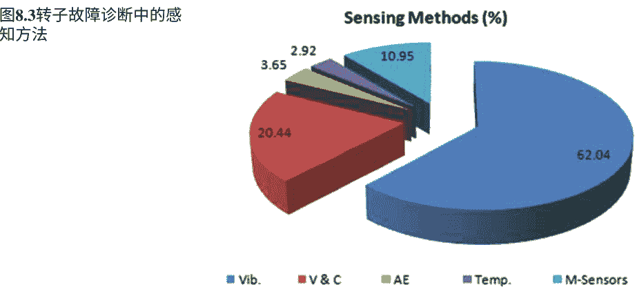

图 8.3 转子故障诊断感知方法统计

#### 8.2.2 特征处理

特征处理提取原始信号中隐藏的信息，抑制噪音，并识别特定故障的最具体特征，并呈现对于决策制定来说，它使用各种信号处理技术分为两个阶段，即特征提取和特征选择。特征处理阶段使用了各种信号处理技术，如滤波、数据压缩、放大、数据验证和去噪，这些是最常用的。在特征选择阶段，使用特定的准则选择突出的特征，并使用技术消除不需要的和非敏感的特征。特征选择旨在选择具有突出特征的技术，并使用特定的准则消除不需要的和非敏感的特征 [15]。

信号处理技术使用各种算法对原始数据进行预处理，并提取不同故障的特征。这些重要方法分为三个领域：频域、时域和时频域。时频分布、小波和小波包方法、经验模态分解（EMD）、谱峭度（SK）、包络分析和最小熵去卷积是这三种旋转机械故障诊断方法的一些子类。这些方法包括傅里叶变换、统计矩、自回归、Walsh 变换、功率谱密度和熵。流行的降维技术如主成分分析（PCA）、线性判别分析（LDA）、独立成分分析（ICA）等属于第一类，人们在第二类方法中使用粗糙集理论（RST）、遗传算法（GA）和顺序选择 [15]。

#### 8.2.3 决策模块

决策模块可以分为四类，即 (i) 物理模型，(ii) 统计模型，(iii) 数据驱动模型和 (iv) 混合模型。数据驱动和混合模型是当今故障诊断系统中最常见的模型。由于传感器产生了大量数据，并且历史数据随时可用，数据驱动方法在识别中已被证明是理想的。故障和评估机器的健康状况。当没有足够的数据可用于数据驱动模型时，混合模型被使用。在这种情况下，也会使用半监督技术。诊断和预测是维护决策制定中的两种策略。故障诊断只在故障发生后才采取诸如故障检测、隔离和识别等行动，而预测则是在故障发生之前进行预测。

数据驱动模型现今主要分为浅层学习（或简单机器学习）和深度学习。根据架构、设计哲学、基本原理和输入类型，这些模型进一步分为子类别。机器学习模型使用从特征处理阶段提取的特征，而基于深度学习的模型直接处理原始数据。这种特征处理需要广泛的领域专业知识和时间。在 RFD 中，最广泛使用的机器学习分类器是支持向量机（SVM）和人工神经网络（ANN）。SVM 尝试了不同的核函数，而 ANN 则使用了各种学习算法和激活函数。在基于实例的算法类别中，最流行的是 k 最近邻（k-NN），而基于概率的贝叶斯方法也在 RFD 中得到了证明。然后，决策树（DT）和随机森林（RF）算法在 RFD 中也被广泛使用。除了这些模型，文献中还可以找到简单的分类器，如线性判别分析（LDA）、逻辑回归（LR）等。一些研究人员通过组合知名模型的假设，尝试了集成分类算法 AdaBoost（AB）。

深度学习算法不受学习非线性特征关系的限制。它通过更深的层次学习输入数据的更高抽象层次，减少了特征处理所需的时间，并避免了对领域专业知识的需求。通过多层深度架构，DL 能够自行发现多个复杂特征。与其他 DL 模型相比，CNN 是最受认可的模型之一。CNN 在 RFD 中对于图像具有时间数据充分的解决方案，用户需要提供适当的输入表示。堆叠自编码器（SAE）、堆叠去噪自编码器（SDAE）等是基于自编码器的常见 IIoT 基于 RFD 框架的模型。在生成式混合模型类别中，多个 RBM 或 AE 被堆叠在一起生成深度置信网络（DBN），在这个领域中被广泛使用。

为了处理时间数据，已经探索了顺序 DL 模型，如循环神经网络（RNN）、长短期记忆（LSTM）、门控循环单元（GRU）等。生成对抗网络（GAN）是深度生成模型中广泛使用的一种。

#### 8.2.4 性能检查模块

该模块通过一些关键绩效指标可视化和分析制造过程的性能。在这个模块中使用的主要工具是图表、图形、报警等。它可以直接从传感器收集的原始数据或通过前面的步骤传递的处理数据进行可视化。这些指标帮助操作员通过对绩效指标的可视检查来评估绩效并做出决策。

#### 8.2.5 维护计划和纠正决策模块

根据绩效指标的输出，通过调度优化和其他基于算法的技术 [17] 进行维护计划和纠正决策。在这个模块中使用了一些优化算法，如遗传算法 (GA)、粒子群优化算法 (PSO)、蚁群算法 (ACO) 和蜜蜂群算法 (BCA)。维护调度或其他纠正措施是该模块的结果。最后，通过制造控制模块执行纠正措施，该模块通过 IIoT 协议向制造单元和传感器提供必要的指令。基于维护决策模块和其他先前模块的决策的反馈控制是该模块的触发源。

### 8.3 工业物联网安全问题和攻击

工业物联网处理的数据与一般大数据具有不同的特点。为了更好地了解工业物联网数据分析和安全问题的需求，需要探索工业物联网数据的特性。必须解决工业物联网数据是大规模流数据的事实。工业物联网传感器广泛分布在不同的应用中，并持续地传输数据。这导致生成具有时间关系和大量数据的数据。与此相关的是，由于数据采集设备的真实性，数据的异质性属性必须被考虑。为了与时间和位置信息相关联，工业物联网数据必须包含时间戳。传感器的感知频率和其他分辨率信息也很重要。从工业中收集的数据非常嘈杂。传感器的不规则触发和恶劣的工作环境导致生成不规则和嘈杂的数据。所有这些问题都会影响表 8.1 中讨论的与安全相关的数据操作。

**表 8.1 攻击和安全问题**

| 受影响的层 | 攻击类别 | 描述 | 影响 |
| :--- | :--- | :--- | :--- |
| 感知层 | 僵尸网络 | 一种感染配置错误的设备或攻击服务器的恶意软件 | 攻击物理对象并影响基础设施 |
| | 睡眠剥夺攻击 | 干扰电池供电设备的睡眠模式，并延长唤醒时间 | 电池耗尽和关机 |
| | 节点篡改和干扰 | 节点完全或部分进行物理更换或无线传感器节点的无线电频率受到干扰 | 它干扰节点，导致服务被拒绝 |
| | 窃听 | 攻击者窃听通过私人通信渠道传递的信息 | 影响消息的机密性。RFID 受到最大影响 |
| 网络层攻击 | 中间人攻击 (MitM) | 攻击者完全控制通信渠道 | 攻击者读取、更改、删除和插入消息 |
| | ARP 缓存投毒 | 伪造网络上另一台主机的 ARP 数据包 | 使攻击者能够冒充他人 |
| | DNS 欺骗 | 恶意映射信息伪造递归 DNS 查询的响应 | 恶意映射信息已存储在 DNS 解析器中 |
| | 会话劫持 | 攻击者获取用户的会话标识符 | 传输攻击者的会话而不是用户的会话 |
| | 拒绝服务 (DoS) / 分布式拒绝服务 (DDoS)：UDP 洪水、SYN 洪水、ICMP 洪水、死亡之 Ping、Slowloris、NTP 放大 | 恶意攻击旨在消耗真实用户的资源或带宽。<br>攻击者使用多个 UDP 数据报、连续的 ICMP Echo-Request 数据包、TCP SYN 数据包、大型 ping 数据包、TCP SYN 数据包、多个 HTTP 请求 | 真正的用户将无法在正确的时间获得服务 |
| | 路由攻击：Sybil 攻击，选择性转发攻击，汇聚点攻击，Hello 洪泛攻击，虫洞攻击 | 破坏路由操作。选择节点来破坏网络，吸收流量，选择性转发，隧道消息等 | 错误的路由和消息传递 |
| | 中间件攻击：基于云的云恶意软件注入，云洪泛身份验证攻击 - 暴力破解，字典攻击，重放攻击签名包装攻击 | 信息窃取，洪泛攻击等，通过恶意活动在云中间件组件上发生。受害者服务实例的恶意副本将被上传。<br>身份验证攻击通过多种方法利用身份验证过程找到登录凭据 | 使用用户信息冒充那个人 |
| 应用层攻击 | 恶意软件 | 攻击者通过固件漏洞使用可执行代码来干扰设备 | 破坏整个物联网架构 |
| | 钓鱼攻击：鱼叉式钓鱼、克隆钓鱼、鲸鱼式钓鱼 | 攻击者伪装成可信实体，从个人用户、组织、重要官员等处获取关键信息，如用户名和密码 | 物联网应用的安全漏洞 |
| | 代码注入攻击：SQL 注入、脚本注入、Shell 注入 | 恶意可执行代码被部署到受害者进程的地址空间中 它注入 SQL 数据库语句、脚本和命令 | 物联网应用故障 |

#### 8.3.1 深度学习处理工业物联网安全的方式

深度学习通过基于规则、基于签名、基于流量和基于流量的机制有效地发现安全问题。传统的数据流和工作条件是预定义的；它可以成功检测异常活动。但是频繁的网络更新和拓扑变化以及智能计划的攻击，检测系统也应该是智能的。传感器网络流量是深度学习方法识别安全问题的主要指标之一。从异常检测的角度来看，深度学习将系统中的异常视为与标准模式不同的模式。前面提到的任何安全问题以及故障条件都会产生异常模式。例如，入侵者对受害者的连接进行干扰，会产生异常流量和异常数据流。这些异常被分为三类，即点异常、上下文异常和集体异常。

数据集中，一个数据实例与正常模式不同，被认为是一个点异常，但在特定上下文中，数据实例的异常行为被称为上下文异常。与整个数据集相比，一组相似数据实例的异常行为被称为集体异常。使用主机入侵检测系统（HIDS）[18] 来监控网络中主机的异常活动。这些监控系统也被部署在远程设备上。类似地，通过入侵检测系统（NIDS）[19] 来分析不同的网络层，以检测任何可能的安全威胁。深度学习可以静态或动态地分析或检测恶意软件。在静态分析中，以二进制形式进行，而在动态分析中，通过执行二进制文件来监控活动。深度学习可以识别勒索软件攻击，其中恶意软件加密受害者的计算机，以索要解密的赎金。同样，深度学习可以检测到三种类型的入侵者，即冒名者、错误行为者和秘密用户。冒名者是试图获取未经授权访问的人，而错误行为者试图访问用户不应该访问的特权功能。秘密用户试图获得对系统的监督控制，以避免审计和访问控制。深度学习通过避免攻击者远程控制连接到公共协议基础设施的设备，来检测物联网僵尸网络攻击 [20]。通过将设备变成僵尸，可以进行各种攻击，包括分布式拒绝服务攻击（DDoS）等。

当入侵者与网络元素没有直接接触时，情况变得难以检测。由于深度学习能够检测到小的异常，它可以识别出对人类来说难以发现的异常模式。在完整性方面，深度学习是一种非常有效的检测数据完整性问题的工具。基于深度学习的系统通过正常工作条件和传感器数据流进行训练。在故障或攻击（如命令注入）的情况下，深度学习模型可以识别出模式差异。深度学习算法可以识别出破坏数据完整性的节点，并阻止其以保持可信度。因此，对于针对安全元素的攻击，深度学习是一种非常有效的工具。服务拒绝攻击在传感器网络中非常关键，它严重影响数据的可用性。深度学习方法在检测广播节点方面起着重要作用，具有陌生地址的源，大量不合理的流量使节点易于被深度学习算法发现。它可以执行简单网络分析仪的操作，以检测 DoS 攻击，并像人类操作员一样分析网络日志。

在影响数据机密性的攻击情况下，可以用来找到入侵者。如果入侵者仅仅窃听网络流量，使用深度学习很难检测出来。攻击者必须改变网络流量以通过深度学习算法检测到他的存在。但是一旦入侵者参与改变网络流量的活动，深度学习将能够识别异常行为。通常，恶意活动比窃听攻击更严重，并被归类为其他攻击类型。当安全元素成为目标时，网络的认证将面临挑战。当攻击针对安全元素时，这是一种更为重要的安全控制技术。“预防胜于治疗”的策略对于这类攻击最为适用。在这种情况下，加密、良好的密码管理、频繁更改密码、密钥管理等都很重要。尽管这些技术有其弱点，但它们提高了系统对未经授权访问的鲁棒性。授权问题可以通过经过验证用户的正常流量模式的变化来指示。这些活动包括执行异常命令、操纵传感器和执行器，或在网络上发送随机流量。如果学习技术的敏感性很高，深度学习最终将揭示入侵者的攻击。学习到的系统的正常状态可以找到滥用命令、未经授权的用户或入侵者。如果深度学习方法没有经过仔细训练，有可能将正常流量误认为攻击。但是，工业物联网安全问题要求过于谨慎，因为未检测到的攻击可能导致比误报更高的成本。

#### 8.3.2 工业物联网安全实施的挑战

- (1) 数据安全和隐私
  来自大量不同类型的 IIoT 设备的数据的安全性和隐私保护是非常具有挑战性的。因此，安全规则应与这些组件保持一致。在 IIoT 中，避免不必要和无关的数据也是至关重要的。当数据必须与移动和云平台打交道时，数据必须符合其监管结构。

- (2) IoT 软件相关问题
  有可能 IoT 软件会干扰对计算机系统的访问。随着 IIoT 设备数量的日益增加，这种威胁也在同样的速度增长。因此，我们必须减少此类问题，并应对 IoT 勒索软件带来的挑战。

- (3) 缺乏升级
  IoT 设备和软件没有及时更新以应对新出现的安全威胁。每天都有大量的 IIoT 设备被制造出来以满足市场需求，而不考虑安全问题。但即使在实施之后，这些设备也没有经过安全攻击的检查或更新。

- (4) 网络问题
  一个正确配置的网络系统对于物联网设备的平稳运行至关重要。网络中的许多因素会影响工业物联网的安全性。因此，组织必须制定安全策略来保护工业物联网设备。攻击者可以通过开放端口、缓冲区溢出和拒绝服务攻击来访问网络。此外，必须小心配置设备以保护它们免受攻击。

- (5) 数据整合和转换
  数据整合和传输必须考虑安全问题。在工业物联网中，数据的隐私涉及到各种过程，如数据分离、避免敏感信息。此外，为了防止未经授权访问设备，数据会被编码。但是，如果大量智能物联网设备无法加密用户数据，就有可能出现恶意软件。适当加密数据，不会给黑客带来任何威胁。不推荐使用弱加密，因为它会导致入侵者在数据交换过程中获得数据访问权限。

- (6) 强密码使用
  只有使用强密码并且经常更改密码，密码安全才能有效。工业物联网不能使用默认密码和其他凭据来增强安全性。具有弱密码的智能设备最容易受到黑客攻击。当默认密码不足以保护安全时，与工业物联网设备相关的会话管理和锁定问题存在，凭据可能会暴露，用户界面将会失败。

- (7) 物联网硬件
  工业物联网硬件必须经过芯片制造商的严格检查，以使其与安全问题保持最新。电池备份问题是制造商必须解决的连接问题，以实现长时间备份。

#### 8.3.3 工业物联网安全解决方案

尽管存在大量入侵，但超过 40% 的安全问题是由暴力攻击或恶意软件引起的。安全性假设有四个层次，分别是设备、通信、云和生命周期管理。但是行业的快速增长使得安全解决方案难以跟上，因此没有完整的端到端安全解决方案可用。分割网络是一种解决方案，其中控制设备和被控设备被保留为一个单独的网络。第二种方法是确保基本结构，即在几次错误尝试后锁定凭据，并在激活后更改默认凭据。强制实施多级密码身份验证的严格规则也可以控制未经授权的访问。它必须确保缓冲区溢出不会影响服务，并且在使用时不应保持端口开放。这样的做法将限制攻击者入侵的机会。以有纪律的方式进行固件开发和升级将在很大程度上解决安全问题。与行业标准和协议保持同步，参与和合作开发等，将帮助行业摆脱许多小的安全问题。保持一个解决这些问题的基本架构，其标准化和包含将使服务提供商摆脱某些简单问题，并集中精力解决密集的安全问题。这种基本架构提供了基本的安全保证，以便购买者和服务提供商最少关心部署平台的安全性。因此，服务必须将安全性作为平台的一部分才能在未来生存。

#### 8.3.4 用深度学习进行工业物联网安全的 SRF 案例研究

我们对已经处理了 IIoT 安全问题的 SRF 诊断工作进行了文献综述。但是很少有研究人员尝试解决与数据相关的问题，这些问题可以通过 DL 来处理 IIoT 的数据安全。姚等人的一项工作就是这样做的 [21]。原始数据转换为彩色和极坐标图像，从而解决了许多数据安全问题。同样，朱等人通过将原始输入数据转换为对称化点图案（SDP）[22]。信号的功率谱函数被转换为 2D 图像形式，并应用于具有 VGG16 架构的批量正则化 CNN 中，Yu 等人 [23]。为了处理多传感器数据，袁等人提出了一种多流 CNN 的方法 [24]。一些工作尝试进行数据融合和/或未来融合方法。有几种尝试通过数据融合或特征融合方法以及结构改变使 CNN 适用于多传感器数据。类似地，我们可以找到 1D 卷积，多通道 CNN 等。同样，从 IIoT 安全的角度分析 SRF 中的 DL 工作 [25]，没有严格处理 IIoT 安全问题的论文。

### 8.4 结论

我们讨论了与转子故障诊断相关的工业物联网安全挑战，而不是提供物联网安全挑战和深度学习在其中的作用的一般情景。给出了旋转机械故障分类、安全和完整性问题、风险等的一般描述。最重要的是，一个工业物联网深度学习处理转子故障的框架解释了安全保护。还演示了安全攻击的逐层分类及其影响，以更好地理解安全攻击的类型。此外，还讨论了工业物联网安全问题中的深度学习方法，并分析了挑战。简要描述了工业物联网安全解决方案的市场情况。最后，我们调查了工业物联网安全挑战在RFD场景中的文献，发现迄今为止还没有严肃的研究在这方面进行。因此，我们建议在工业物联网安全研究中进行更多的工作，以提供更可靠的故障诊断环境。

### 参考文献

- 1. https://www.statista.com/statistics/1101442/iot-number-of-connecteddevicesworldwide/#:~:text=全球连接设备的物联网活跃连接2025年之前将达到750亿台
- 2. Mohan, N., Kangasharju, J.: 边缘雾云：物联网计算的分布式云. In: 云化物联网会议论文集 (CIoT), 2016, 第1-6页. https://doi.org/10.1109/CIOT.2016.7872914
- 3. Habeeb, R.A.A., Nasaruddin, F., Gani, A., Hashem, I.A.T., Ahmed, E., Imran, M.: 实时大数据处理用于异常检测的调查. 信息管理国际期刊 45, 289–307 (2019)
- 4. Yin, S., Li, X., Gao, H., Kaynak, O.: 基于数据的现代工业技术综述. IEEE工业电子学 62(1), 657–667 (2015)
- 5. Jeschke, S., Brecher, C., Song, H., Rawat, D.B.: 工业物联网
- 6. Li, Y., Kurfess, T., Liang, S.: 滚动轴承的随机预测. 机械系统信号处理 14(5), 747–762 (2000)
- 7. Pan, J., Yang, Z.: 新边缘计算+物联网世界中的网络安全挑战与机遇. In: 2018年ACM国际软件安全研讨会软件定义网络和网络功能虚拟化, ACM, 2018, pp. 29–32
- 8. Chen, P.: 旋转机械的条件诊断技术的基础与应用. 三景社, 日本 (2009)
- 9. Patel, T., Darpe, A.: 不对中转子的振动响应. 声音振动杂志 325, 609–628 (2009)
- 10. Fahy, F., Thompson, D.: 声音和振动基础. CRC出版社, 博卡拉顿 (2016). https://doi.org/10.1201/b18348
- 11. Caesarendra, W., Kosasih, B., Tieu, A.K., Zhu, H., Moodie, C.A., Zhu, Q.: 基于声发射的条件监测方法：低速回转轴承的综述与应用. 机械系统信号处理 72, 134–159 (2016)
- 12. Lu, S., He, Q., Zhao, J.: 基于嵌入式系统中的快速在线阶次分析方法的永磁同步电机轴承故障诊断. 机械系统信号处理 113, 36–49 (2018)
- 13. Oumaamar, M.E.K., Maouche, Y., Boucherma, M., Khezzar, A.: 利用三相鼠笼式感应电动机线中性电压的转子槽谐波进行静态气隙偏心故障诊断. 机械系统信号处理 84, 584–597 (2017)
- 14. Lu, Y., Wang, F., Jia, M., Qi, Y.: 基于定性模拟和热参数的离心压缩机故障诊断. 机械系统与信号处理 81, 259–273 (2016)
- 15. Guyon, I., Elisseeff, A.: 变量和特征选择简介. 机器学习研究杂志 3, 1157–1182 (2003)
- 16. Nath, A.G., Sharma, A., Udmale, S.S., Singh, S.K.: 一种改进结构转子故障诊断的早期分类方法. IEEE仪器与测量汇刊 70, 1–13 (2020)
- 17. Konar, P., Sil, J., Chattopadhyay, P.: 使用数据挖掘进行多类感应电动机故障诊断的知识提取. 神经计算 166, 14–25 (2015). https://doi.org/10.1016/j.neucom.2015.04.040
- 18. Cox, K., Gerg, C.: 使用Snort和IDS工具管理安全性. O'Reilly系列. O'Reilly Media, Inc. (2004). ISBN 978-0-596-00661-7
- 19. Mazini, M., Shirazi, B., Mahdavi, I.: 基于可靠的混合人工蜜蜂群和AdaBoost算法的异常网络入侵检测系统. 沙特国王大学计算机科学与信息科学学报 31(4), 541–553 (2019)
- 20. Soe, Y.N.等: 基于机器学习的IoT-Botnet攻击检测与顺序架构. 传感器 20(16), 4372 (2020)
- 21. Yao, Y., Li, Y., Zhang, P., Xie, B., Xia, L.: 基于自感知电机驱动系统的卷积神经网络数据融合方法. In: IECON 2018会议论文集—IEEE工业电子学会第44届年会, 第1卷, 第5371–5376页 (2018)
- 22. Zhu, X., Hou, D., Zhou, P., Han, Z., Yuan, Y., Zhou, W., Yin, Q.: 使用对称化点图像的卷积神经网络进行转子故障诊断. Measurement 138, 526–535 (2019)
- 23. 于, W., 黄, S., 肖, W.: 基于光谱图和卷积神经网络的故障诊断方法及其在风力发电系统中的应用. Energies (2018)
- 24. 袁, Z., 张, L., 段, L.: 旋转机械故障的多源监测融合诊断. In: 年度可靠性与可维护性研讨会, 2019, Vol. 1, pp. 1–7 (2019). https://doi.org/10.1109/RAMS.2019.8769018
- 25. Nath, A.G., Udmale, S.S., Kumar Singh, S. (2020): 人工智能在转子故障诊断中的作用：一项综述. 人工智能评论. https://doi.org/10.1007/s10462-020-09910-w

## 第9章 深度学习模型：一种可理解的解释性方法

Reenu Batra 和 Manish Mahajan

### 9.1 引言

机器学习和深度学习的新发明在低级问题上产生了强烈的回响，如对象识别和行为跟踪。在当前情景下，许多研究人员正在探索这些技术如何在高级问题（如医疗保健、股票市场、军事和其他决策应用）中也能发挥作用。由于许多决策辅助应用程序都以机器学习的方式实施，用户需要权衡其辅助作用。对于任何设计模型来说，最重要的要素是可解释性。可解释性定义了用户必须能够理解和合理解释模型的输出。近年来，已经进行了许多基于可解释性的研究。例如，多层神经网络在分类和预测工作中取得了巨大的成就，几乎达到了人类的准确性。但是它们无法解释为什么在模型的训练中选择了某些特征而不是其他特征。

它们也没有提供关于为什么选择某条路线而不选择其他路线的信息。神经科学演化是深度学习模型的主要驱动力，因为它能够区分人类和神经网络的大脑工作理解[1]。人类具有思考的能力，这可以帮助人类通过一系列选择来预测、证明和合理化。

人类的证明特性有助于为决策过程关联一个度量的信心。我们可以将可解释性定义为深度学习模型中的人类思维能力。由于机器学习算法的存在，人类的证明必须与低级参数及其更新相关。仔细观察人类思维过程，我们发现我们的大脑工作并不是基于低级参数来解释的。基于预测的理由很难在学习模型上进行证明。

基于模型的先验信息，提供合理性是非常典型的。可解释性概念不仅仅局限于低级参数，还可以定义为模型的功能操作、学习算法以及模型和算法的组合。可解释性可以从多个维度来描述，总结如下：

#### 9.1.1 使用的模型的透明度

模型的透明度可以基于三个变量来定义：

- (a) 模拟性：为了产生预测模型中使用的每个计算步骤，需要在某些输入数据上进行处理。通过利用训练数据模型，可以改变参数，这将有助于人们理解模型。
- (b) 可分解性：所有模型参数都可以通过固有解释来描述。
- (c) 算法的透明度：它是解释算法工作的能力。例如，在支持向量机（SVM）学习算法中，可以使用两个变量，即边缘点和决策边界，来选择超平面。在深度神经网络中，每个层都添加了非线性特征[2]。这使得难以理解或知道输出中使用了哪些特征。

#### 9.1.2 使用的模型的功能

模型的功能可以用三个因素来描述：

##### 9.1.2.1 文档描述

模型的输出可以通过文本语义描述来描述，该描述可以通过组合两个模型来创建，一个用于预测，另一个用于生成模型输出的文本描述。

##### 9.1.2.2 可视化

通过解释模型的工作原理，可以理解模型的功能。这可以通过对模型中使用的参数进行适当的可视化来实现。虽然有很多方法可以用于可视化。例如，t-SNE是一种用于可视化高维数据的机制之一。

##### 9.1.2.3 本地变化描述

有时候，对于一个使用的模型，只需要描述或定义特定输入向量对于给定输出类别所产生的局部变化，而不是解释涉及的所有参数映射[3]。在神经网络的情况下，所有受输入向量影响的变化以及了解特定权重只需要输出的梯度。

本章主要强调基于上述维度的机器可解释性，并且在训练可解释的深度神经网络模型时识别所有挑战。

### 9.2 迄今为止的工作

在本章的引言部分中，介绍了与可解释性相关的一些维度。在所有维度上都进行了大量工作，以更好地理解深度神经网络的可解释性概念。最近对深度学习可解释性的研究主要依赖于理解算法的透明性，即一个特定网络学到了什么以及为什么是这个网络。

### 9.3 深度学习方法

深度学习基本上是机器学习技术的一部分。它主要利用多层进行特征提取、预测和转换等。在深度学习模型中，信息主要以非线性方式处理，低级信息用于处理高级数据或信息[4]。深度学习主要用于许多应用，如语音识别、信息检索、图像处理等。对于预测、识别和分类等所有任务，可以使用许多深度学习方法。

有一些深度学习方法的例子，如卷积神经网络（CNN）、循环神经网络（RNN）、去噪自编码器（DAE）、深度置信网络（DBN）、长短期记忆（LSTM）。让我们讨论所有这些深度学习方法的例子。

#### 9.3.1 卷积神经网络（CNN）

卷积神经网络（CNN）是深度学习方法中最常见的框架。CNN最适用于与图像处理相关的应用。CNN主要由三种类型的层组成。所有这些层都与彼此完全连接。CNN中的训练部分也通过名为前馈和反向传播的两个阶段完成。

前馈阶段和反向传播阶段。GoogleNet、VGGNet、AlexNet是一些常见的CNN框架的例子。

CNN架构还可以用于作物产量预测、能源资源（如风力涡轮机）监测、医学图像处理等领域。CNN主要通过收集小块信息然后在网络中更深层次地进行处理来工作[5]。CNN模型通过考虑网络的第一层（图9.1）进行边缘检测，然后进一步的层次将检测到的边缘转化为不同形状和不同尺度的模板。CNN架构可以应用于能源计算系统、计算力学和遥感等领域。

#### 9.3.2 循环神经网络（RNN）

循环神经网络主要用于涉及语音识别、图像识别、文本识别和模式识别等应用。在RNN架构中，输入和输出是相互关联的，并且存在一系列输入和输出向量的序列。单元之间的连接形成了一种循环结构，利用循环计算。

在RNN中，每个层都使用标准参数（图9.2），模型可以通过使用反向传播方法进行训练。许多应用程序遵循一种名为双向循环神经网络的RNN变体[6]。

双向循环神经网络同时作用于先前的输出和预期的未来输出。在双向和单向循环神经网络中，引入隐藏层可能导致深度学习的概念。RNN模型可以用于风速预测、音乐类型识别、股票价格预测等应用。

#### 9.3.3 去噪自编码器（DAE）

去噪自编码器可以被视为自编码器（AE）的扩展。它主要是一个非对称神经网络模型，主要从嘈杂的数据中学习特征。DAE架构主要由三层组成：输入层、编码层和解码层。

该模型通过使用前馈算法（图9.3）进行学习。通过在网络中包含多个隐藏层，可以引入深度学习的概念。DAE可以应用于电力负荷预测、欺诈检测、预测和图像分类等应用[7]。许多网络安全应用程序可能使用DAE算法的概念。DAE可以被认为是深度学习建模中最有效的算法。

#### 9.3.4 深度置信网络（DBN）

借助深度置信网络（DBN），可以学习高维数据。DBN由多个层组成。除了每层内的单元之外，所有层之间都相互连接。层之间的连接可以是有向的，也可以是无向的[8]。DBN网络主要是通过受限玻尔兹曼机（RBM）实现的。DBN网络可以被视为多个RBM层的网络。每个RBM层与其前一层和后一层都有连接。DBN网络中有多个RBM层。

在DBN网络中，RBM可以被视为特征提取器。RBM层可以是隐藏层（图9.4），也可以被视为可见层[9]。DBN网络的应用包括时间序列预测、人类情绪识别、乳腺癌诊断和风速识别。在深度学习中使用DBN的主要优点是其高准确性和高计算效率。

DBN网络可以解决许多工程和科学问题[10]。

图9.4 DBN架构

#### 9.3.5 长短期记忆（LSTM）

长短期记忆（LSTM）是一种用于深度学习建模的人工循环神经网络（RNN）类型。需要注意的是，LSTM主要由反馈连接组成，可以一次处理一系列数据，而不是处理单个数据点。LSTM的应用主要包括手写识别、语音识别、空气质量和大气环境预测以及地震预测[11]。

LSTM架构主要由细胞和门组成。门可以是输入门、输出门和遗忘门。这些值可以在任意时间间隔内通过细胞记住（图9.5），并且可以通过输入门、输出门或遗忘门调节信息流入和流出细胞。换句话说，我们可以说细胞的工作可以通过这三种类型的门来管理。LSTM可以用于时间序列应用，如数据预测应用、数据分类应用等。可以使用优化算法来训练使用LSTM的RNN。这可以通过训练序列[12]以监督方式完成。在LSTM中，错误通常从输出门向后传播，但它仍然存在于LSTM单元的细胞中。如果我们将LSTM网络与传统的RNN网络进行比较，它被证明比RNN更有效。

### 9.4 深度学习的重要性

深度学习基本上是一种机器学习（ML）技术，可以通过示例来帮助计算机学习。正是深度学习的概念支持无人驾驶汽车，使汽车本身能够识别移动标志、停止标志或者找到行人与路灯柱之间的不匹配[13]。深度学习（DL）基本上是一种具有多个参数和层的神经网络。它可以采用四种基本架构之一：无监督预训练神经网络、卷积神经网络、循环神经网络和递归神经网络。

借助深度学习，可以训练模型根据图像、文本和声音进行分类。借助深度学习，可以实现高水平的准确性或识别[14]。随着深度学习领域的许多进展，进一步在许多困难的问题领域取得了最先进的结果。许多应用程序包括黑白图像的自动上色、无声电影添加声音、照片中对象的分类和检测等。深度学习主要依赖于大量标记数据。深度学习可以与云计算、大数据等其他技术结合，从而减少开发团队成员的培训时间[15]。

在过去的五年中，各个应用领域中的DL模型迅速增长。图9.6说明了2018年DL模型的广泛应用，相比过去几年有了很大的进展。深度学习可以应用于如下领域：

语音和文本翻译、航空航天和国防等领域都主要采用深度学习，其核心概念是神经网络架构。有时深度学习模型也被称为深度神经网络[16]。深度学习模型主要由多个隐藏层组成，而传统神经网络只包含2到3个隐藏层。

### 9.5 深度学习的未来

深度学习（DL）主要是围绕名为神经网络（NN）的算法技术。新的方法和新的技术将不断发展。在现代技术环境中，深度学习可以分为三种学习范式[14]。每种范式都有助于扩大深度学习的范围。

#### 9.5.1 混合学习

混合学习范式包括从监督和无监督方法中学习。在这种学习中，可以使用深度学习方法处理大量未使用的无标签数据。混合学习可以应用于许多业务应用程序，其中大量数据主要是无标签的。

#### 9.5.2 组合学习

在组合学习中，将多种方法或模型组合在一起，进一步形成一个组合模型。这个组合模型在高效数据处理和生产力方面比单个模型更加有效[15]。组合学习有助于根据从各种模型获得的知识来处理数据，而不是仅仅依赖一个模型。

#### 9.5.3 减少学习

为了获得更好的性能，需要减小深度学习模型的大小和信息流量。这可能导致具有相同或更高的预测能力。

### 9.6 机器学习与深度学习

深度学习基本上是机器学习的一部分。每当需要处理小数据集以进行工作时，最好使用机器学习以获得更高的准确性[16]。另一方面，大数据集是基于深度学习进行处理的。

机器学习背后的问题解决方式是将问题任务分解成许多子任务，然后分别解决每个子任务。最后的结果可以通过合并各个子任务的结果来计算。在深度学习的情况下，问题可以作为一个整体来解决并找到结果。与深度学习相比，机器学习在模型训练方面所需的时间较短。深度学习技术主要依赖于高端机器，另一方面，机器学习需要低端机器。

### 9.7 结论

深度学习的概念完全基于人工神经网络的概念。深度学习可以处理大量非结构化数据。它还利用许多数学算法来处理数据并进一步分析数据。本章主要描述了在各种应用中处理数据时使用的各种深度学习方法。除了深度学习方法外，本章还详细阐述了深度学习在各种应用中的重要性。深度学习概念可以与大数据和云计算概念相结合，以增强其在各种应用中的能力。

### 参考文献

1. Diamant, A., 等：深度学习在头颈癌预测中的应用。科学报告 (2019)
2. Liu, Y.：使用深度学习-长短期记忆循环神经网络进行新型波动率预测。专家系统应用 **132**, 99-109 (2019)
3. Ludwiczak, J., 等：PiPred——一种用于预测蛋白质序列中 $\pi$-螺旋的深度学习方法。科学报告 (2019)
4. Matin, R., Hansen, C., Mølgaard, P.：使用文本段的深度学习预测困扰。专家系统应用 **132**, 199-208 (2019)
5. Nguyen, D., 等：使用深度学习从患者解剖学预测前列腺癌患者的最佳放射治疗剂量分布的可行性研究。科学报告 (2019)
6. Shickel, B., 等：DeepSOFA：使用临床可解释的深度学习对危重病患者进行连续的严重程度评分。科学报告 (2019)
7. Wang, K., Qi, X., Liu, H.：基于深度学习神经网络的日前光伏发电功率预测模型比较。Appl. Energy (2019)
8. Aram, F., 等：一种用于分析心理地图的计算程序的设计和验证：aram/心理地图分析器。Sustainability (Switzerland) (2019)
9. Asadi, E., 等：伊朗大不里士（Tabriz）含水层饮用和农业用地地下水质量评估 (2019)
10. Bemani, A., Baghban, A., Shamshirband, S., Mosavi, A., Csiba, P., Várkonyi-Kóczy, A.R.：应用 ANN、ANFIS 和 LSSVM 模型估计超临界 CO2 中酸性溶剂溶解度。Preprints, 2019060055 (2019). doi: https://doi.org/10.20944/preprints201906.0055.v2
11. Choubin, B., 等：使用机器学习方法预测雪崩危险。J. Hydrol. (2019)
12. Choubin, B., 等：使用多元判别分析、分类和回归树以及支持向量机的集成预测洪水易感性。Sci. Total Environ. **651**, 2087–2096 (2019)
13. Dehghani, M., 等：使用灰狼优化自适应神经模糊推理系统预测水电发电量。Energies (2019)
14. Dineva, A., 等：旋转电机设计和控制中的软计算模型综述。Energies (2019)
15. Dineva, A., 等：用于旋转电机故障诊断的多标签分类 (2019)
16. Farzaneh-Gord, M., 等：增加测量精度的 CNG 站减振器压力脉动数值模拟。Eng. Appl. Comput. Fluid Mech. 642–663 (2019)