# 面向工程师和科学家的高级深度学习


## EAI/Springer 通信和计算创新

**编辑**
Kolla Bhanu Prakash
Ramani Kannan
S. Albert Alexander
G. R. Kanagachidambaresan

---

## 系列编辑
EAI/Springer 通信和计算创新

Imrich Chlamtac，欧洲创新联盟，比利时根特

---

## 编辑注

信息技术的影响正在创造一个尚未完全理解的新世界。在日常生活中已经感受到的经济、生活方式和社会变化的程度和速度，如果不了解其背后的技术驱动力，很难估计。本系列介绍了在这一过程中起关键作用的各种信息工程技术的最新研究和发展。

主要关注通信和计算工程的主题范围包括但不限于无线网络；移动通信；设计和学习；游戏；交互；电子健康和普遍医疗保健；能源管理；智能电网；物联网；认知无线电网络；计算；云计算；无处不在的连接性，以及更多。该系列出版了一系列扩展论文，这些论文是从欧洲创新联盟（EAI）主办和赞助的会议中精选出来的，既呈现了尖端的全球研究，又提供了对传统相关工程领域的新视角。这些内容与对书名和单独章节的征稿相结合，共同维护了 Springer 和 EAI 的高学术水准。这些书籍的受众包括研究人员、行业专业人士、高级水平的学生，以及相关领域的从业人员，包括信息和通信专家、安全专家、经济学家、城市规划师、医生，以及总体上受到和为信息革命做出贡献的各行各业的代表。

索引：该系列在 Scopus、Ei Compendex 和 zbMATH 中有索引。

## 关于 EAI

EAI 是一个由企业、公共机构、私营机构和政府机构合作发起的基层会员组织，旨在应对欧洲未来竞争力的全球挑战，并将欧洲研究社区与全球同行联系起来。EAI 与全球各大洲的数十万个个人订阅者保持联系，并与包括财富 500 强公司、政府机构和教育机构在内的机构会员基础展开合作，提供免费的研究和创新平台。

通过其开放的免费会员模式，EAI 推动了一种基于合作、连接和卓越认可的新型研究和创新文化。

有关该系列的更多信息，请访问 http://www.springer.com/series/15427

---

## 编辑信息

Kolla Bhanu Prakash • Ramani Kannan
S. Albert Alexander
G. R. Kanagachidambaresan

编辑

## 高级深度学习
### 实用方法

## 编辑

Kolla Bhanu Prakash
KL Deemed to be University
Vijayawada, AP, India

S. Albert Alexander
Kongu Engineering College
Perundurai, Tamil Nadu, India

Ramani Kannan
电气与电子工程
Universiti Teknologi Petronas
Seri Iskandar, Perak, Malaysia

G. R. Kanagachidambaresan
计算机科学与工程系
Vel Tech Rangarajan Dr Sagunthala R&D
科学与技术研究所
印度泰米尔纳德邦钦奈

ISSN 2522-8595
ISSN 2522-8609 (电子版)
EAI/Springer 通信和计算创新
ISBN 978-3-030-66518-0
ISBN 978-3-030-66519-7 (电子书)
https://doi.org/10.1007/978-3-030-66519-7

© 编辑（如适用）和作者，独家许可给 Springer Nature Switzerland AG 2021
本作品受版权保护。出版商保留所有权利，无论是全部还是部分材料，特别是翻译、重印、插图重用、背诵、广播、胶片复制或以任何其他方式复制，以及信息传输或存储和检索，电子适应、计算机软件，或类似或不同的方法现在已知或今后开发。
在本出版物中使用一般描述性名称、注册名称、商标、服务标志等并不意味着，即使在没有特定声明的情况下，这些名称免于相关保护法律和法规的约束，因此可以自由使用。
出版商、作者和编辑可以安全地假设书中的建议和信息在出版日期时是真实准确的。出版商、作者或编辑对本书中所含材料不提供明示或暗示的保证，也不对可能存在的任何错误或遗漏负责。出版商在已发表的地图和机构关系方面保持中立。

这个 Springer 印记是由注册公司 Springer Nature Switzerland AG 出版的
注册地址是：瑞士 Cham 市 Gewerbestrasse 11 号，6330

---

## 致谢

我们感谢全能者、我们的父母和我们的配偶在我们的生活各个阶段给予我们无尽的支持、指导和爱。我们感谢我们亲爱的家人在我们整个职业生涯中一直站在我们身边，通过编辑这本书来推动我们的职业发展。

我们特别感谢印度 KL 大学总裁 Sri. Koneru Satyanarayana，对本书的准备给予的持续支持和鼓励。我们将这本书献给他、我们的合作者和我们的家人。

我们非常感谢我们的学生，他们投入了时间和精力来支持和贡献。我们对所有支持、分享、讨论、阅读、写作、提供评论、允许我们引用他们的言论以及在编辑、校对和设计方面提供帮助的人表示感激。

我们相信作者团队提供了知识和技能的完美结合，用于撰写本书。我们感谢每一位作者为本书的付出时间、耐心、毅力和努力；我们认为这对所有从事这一领域研究的人都将是一项重要资产！

我们感谢斯普林格出版社的团队，他们向我们展示了撰写本书的方法。如果没有他们的支持和知识，我们就不会冒险开始并创作这本书。他们对我们的信任和指导——提供必要的时间和资源——使我们有了管理本书的自由。

最后但并非最不重要的，我们感谢我们的读者，他们给予了我们信任——我们希望我们的工作能够激励和指导他们。

Kolla Bhanu Prakash Ramani Kannan S. Albert Alexander G. R. Kanagachidambaresan

---

## 关于本书

本书包含了 11 个重要的贡献，解决了当前的实时问题。这个流行病时期吸引了许多研究人员建立许多与医疗保健相关的项目和算法，用于疾病预测和诊断方法。深度学习能够处理非结构化的输入，这需要人类提取相关信息的更多时间。工业 4.0 CPS 标准认识到了深度学习方法的威力，并将人工智能系统应用于工业机器和智能城市的发展中。本书将是一个有用的资源，用于认识和理解深度学习在智能城市项目和医疗领域中的潜力，供研究人员和工程师使用。

---

# 目录

- 深度学习介绍 .................................................................................. 1
  R. Indrakumari, T. Poongodi 和 Kiran Singh
- 使用 Python 的深度学习应用 ............................................................ 23
  Nahil Ahmed Hassan, Abhigith Neil Abraham 和 Ajeesh Ramanujan
- 用于字符识别的深度学习 ............................................................... 61
  B. R. Kavitha, Govindaraj Ramya 和 P. Kumaresan
- Keras 和 TensorFlow: 实践经验 ........................................................ 85
  Ferdin Joe John Joseph, Sarayut Nonsiri 和 Annop Monsakul
- 部署深度学习模型以应用于各种实时应用使用 Keras ................... 113
  D. Sumathi 和 Kumarraju Alluri
- 高级深度学习技术 .......................................................................... 145
  Yellapragada Sai Srinivasa Bharadwaj
- 深度学习在生物信息学中的潜在应用大数据分析 ...................... 183
  Jayakishan Meher
- 动态映射和可视化马来西亚的登革热发生情况使用机器学习技术 .. 195
  Nirbhay Mathur, Vijanth S. Asirvadam, Sarat C. Dass 和 Balvinder Singh Gill
- 使用机器学习进行矢量传播疾病爆发预测技术 .......................... 227
  Sandali Raizada, Shuchi Mala 和 Achyut Shankar
- 从人类 GPCR 预测真核质膜胆固醇使用支持向量机的 K-Means ... 243
  Ramamani Tripathy 和 Rudra Kalyan Nayak
- 早期检测糖尿病视网膜病变技术调查 .......................................... 259
  D. Vanusha, B. Amutha, Siddhartha Dhar Choudhury 和 Aayush Agarwal
- 索引 ................................................................................................... 275

---

## 关于编辑

**Kolla Bhanu Prakash** 在印度安得拉邦维贾亚瓦达 KL 大学计算机科学与工程系担任教授和研究小组负责人。他在印度古古尔特的阿查亚·纳加朱纳大学获得物理学硕士和哲学硕士学位，并在印度金奈的萨蒂亚巴马大学获得计算机科学工程硕士和博士学位。他在学术界、研究、教学和学术管理方面拥有超过 15 年的经验。他的研究兴趣包括人工智能、深度学习、数据科学、智能电网、物联网系统、加密货币、区块链技术和图像处理。他是 IEEE 高级会员和 Fellow-ISRD，ACM Amaravathi 分会财务主管，印度 LMISTE、MIAENG 和 SMIRED 会员。他审查了超过 125 个被 Publons 索引的同行评审期刊。他是 Elsevier、CRC Press、Springer、Wiley 和 De Gruyter 出版社的六本书的编辑。他发表了 65 篇研究论文、5 项专利、5 本书和 4 篇已接受的论文。他的 Scopus H 指数为 12。他经常担任主流会议和同行评审期刊的编辑委员会成员和 TPC 成员。

他是 Inderscience Publishers 和 IEEE Access 等期刊的审稿人，Springer Nature，Applied Soft Computing Journal (Elsevier)，Wireless Networks，IET，KSII 和 IEEE Computer Society。他是 Wiley 的 Next Generation Computing & Communication Engineering 系列的系列编辑；在这个系列下，他已经签署了五本书的协议。

**Ramani Kannan** 是马来西亚的 Universiti Teknologi PETRONAS 的高级讲师，他在印度的 Bharathiyar 大学获得了 BE 学位。后来，他在 Anna 大学获得了 ME 和博士学位，专业是电力电子与驱动。他在国际和国内著名期刊和会议上发表了 120 多篇论文。他是英国特许工程师 (CEng)，IEEE (美国) 的活跃高级会员，IE(I)，IET(英国)，ISTE(I) 和 Institute of Advanced Engineering and Science (IAENS) 的成员。他曾获得多个奖项，如 2012 年来自印度 AICTE 的年轻教师职业奖，2015 年电力电子与驱动领域的青年科学家奖，2017 年最高研究出版奖，2019 年在马来西亚 UTP 获得杰出表现、服务和奉献奖，2019 年 UTP Q Day 杰出研究员奖，最佳演讲者奖，IEEE-CENCON 2019 国际会议奖项，印度尼西亚。自 2020 年以来，他一直担任 IEEE 电力电子学会马来西亚分会秘书。

他是《亚洲科学研究》（2011-2018）的主编和《国际计算机辅助工程与技术杂志》（Inderscience Publisher，英国）的区域编辑，自 2015 年起。他是 IEEE Access（2018 年至今）和 Advanced Materials Science and Technology（2020 年至今）的副编辑。他担任 Elsevier、Inderscience、IGI Global、CRC、Taylor & Francis、Bentham Science 和 IJPAM 的客座编辑。他的研究兴趣包括功率电子学、逆变器、感应电动机建模、人工智能、机器学习和优化技术。

**S. Albert Alexander** 是来自美国马萨诸塞州波士顿东北大学的博士后研究员。他是印度政府大学拨款委员会颁发的著名拉曼研究奖学金的获得者。他的研究重点是太阳能能量转换系统和智能电网的故障诊断系统。他拥有 14 年的学术和研究经验。他在国际和国内期刊（包括 IEEE Transactions、IET、Elsevier、Taylor & Francis 和 Wiley）上发表了 25 篇技术论文，并在国内外会议上发表了 23 篇论文。

他已经完成了由印度政府资助的四个项目，并且还有一个多边项目正在进行中，总拨款金额为 103 万卢比。他的博士研究关于电能质量，因此他获得了 ISTE 的国家奖，并且他还因其卓越的学术和研究成就获得了 25 个奖项（例如 IE（I）的青年工程师奖和 SPRERI 的青年科学家奖）。他还获得了印度政府的 MHRD 颁发的国家教学创新奖。他是 AICTE（印度政府）的认可"Margadarshak"。他是 Atal 创新使命下的认可导师。他指导了 32 个本科和研究生项目。他目前正在指导七名研究学者，其中一名已经在他的指导下完成了博士学位。他是各种国家和国际论坛的成员，并担任重要职位（例如 IEEE 的高级会员和印度节能协会的副主席）。他曾受邀在印度和美国的 215 个项目中担任演讲嘉宾。他组织了 12 个活动，包括教师发展项目、研讨会和研讨会。

他已经从 Bharathiar 大学获得了电气与电子工程的研究生学位，并从 Anna 大学获得了研究生学位。目前，他在 Kongu 工程学院 EEE 系担任副教授，并在人工智能控制器、智能医疗系统、智能电网、太阳能光伏和电力质量改进技术方面进行研究工作。他在自己的研究领域撰写了以下几本书：(1) 太阳能光伏系统的功率电子变换器，Elsevier；(2) 增强电力质量的计算范式技术，CRC Press；(3) 基础电气、电子和测量工程，Anuradha Publishers；和 (4) 特殊电机，Anuradha Publishers.

G. R. Kanagachidambaresan 于 2010 年从 Anna 大学获得了电气与电子工程学士学位，并于 2012 年从 Anna 大学获得了普适计算技术硕士学位。他于 2017 年从 Anna 大学获得了博士学位（无线身体区域网络和医疗保健）。他目前是 Veltech Rangarajan Dr Sagunthala R&D Institute of Science and Technology 计算机科学与工程系的副教授。他的研究兴趣包括身体传感器网络和容错无线传感器网络。他在知名期刊上发表了多篇文章，并为多家跨国公司提供了多项咨询服务。他担任多个同行评审期刊的编辑审稿人，并在 Springer 出版了多个特刊和书籍。他目前正在进行 ISRO、DBT 和 DST 的多个政府资助研究项目。

## 深度学习简介

R. Indrakumari, T. Poongodi 和 Kiran Singh

## 1 引言

人脑是一个令人难以置信的器官，它决定了从声音、视觉、嗅觉、触觉和味觉中接收到的信号。大脑储存情感、经历、记忆和梦想。大脑做出决策并解决许多问题，即使是强大的超级计算机也无法做到 [1]。基于此，研究人员梦想构建像大脑一样的智能机器。后来的研究人员发明了机器人来辅助人类活动，自动疾病检测显微镜和自动驾驶汽车。这些发明仍然需要人类干预来解决一些计算问题。为了解决这个问题，研究人员希望构建一台可以自主学习并以人脑的速度解决更复杂问题的机器。这些必需品为人工智能领域中最活跃的深度学习铺平了道路。

## 2 神经元

人脑的基本单位是神经元。大脑的非常小的部分，大约和小麦一样大，有超过 10,000 个神经元，与其他神经元有超过 6000 个连接 [2]。大脑感知到的信息被神经元捕捉到，并传递给其他神经元进行处理，最终结果被发送给其他细胞。如图 1 所示。树突是神经元中接收输入的类似天线的结构。


图 1 生物神经元的结构

根据使用频率，输入被分类为强化和削弱。连接强度估计了与神经元输出相关的输入的参与程度。输入信号通过连接强度加权并在细胞体中集中求和。计算得到的总和形成一个新的信号，并沿着细胞轴突传递到目标神经元。

1943 年，沃伦·S·麦卡洛克和沃尔特·H·皮茨 [3] 专注于对人脑中存在的神经元的功能理解，并创建了一个基于计算机的人工模型，如图 2 所示。

与生物神经元类似，人工神经元接收输入 x1, x2, x3....xn，并分别乘以特定的权重 w1, w2, w3....wn，计算得到的和被视为神经元的逻辑回归：

```
Z = \sum_{i=0}^{n} w_i x_i
```

某些逻辑回归可能包括一个称为偏差的常数值。最后，逻辑回归通过函数 f 传递，以产生所需的输出 y = f(z)。

## 3 深度学习的历史

深度学习的历史可以追溯到 20 世纪 40 年代早期，当时沃伦·麦卡洛克和沃尔特·皮茨开发了一个关注人类神经系统的计算机模型。他们应用数学和算法，并称之为“阈值逻辑”来模拟思维过程。深度学习是机器学习的一个后续派生，它应用算法，处理数据，并发展抽象概念。各种算法被应用于处理数据，识别对象和人类语音。前一层的输出作为下一层的输入提供。

1960 年，Henry J. Kelley 开始开发反向传播模型，并在 1962 年由 Stuart Dreyfus 扩展。早期版本的反向传播不太高效且笨拙。此后，1965 年，Valentin Grigor'evich Lapa 提出了控制论和预测技术，Alexey Grigoryevich Ivakhnenko 提出了使用多项式激活函数的数据处理方法。通过统计选择的最佳特征手动传递给下一层。

Kunihiko Fukushima 开发了第一个具有多个池化和卷积层的卷积神经网络。后来在 1979 年，他开发了 neocognitron，这是一个多层次和分层的人工神经网络设计，可以识别视觉模式。据说 neocognitron 是当时最好的模型，它使用了自上而下的连接的新学习方法。它包含了选择性注意模型，可以识别个体模式。开发的 neocognitron 能够通过一种称为推理的概念识别未知和缺失的信息。

在 1970 年代末，Seppo Linnainmaa 为反向传播编写了一段 Fortran 代码。1985 年，Williams 和 Hinton 研究了反向传播可以提供“有趣”的分布表示。Yann LeCun 在 1989 年的贝尔实验室将反向传播与卷积神经网络相结合，并展示了第一个实际的手写数字识别演示。后来许多乐观的研究人员

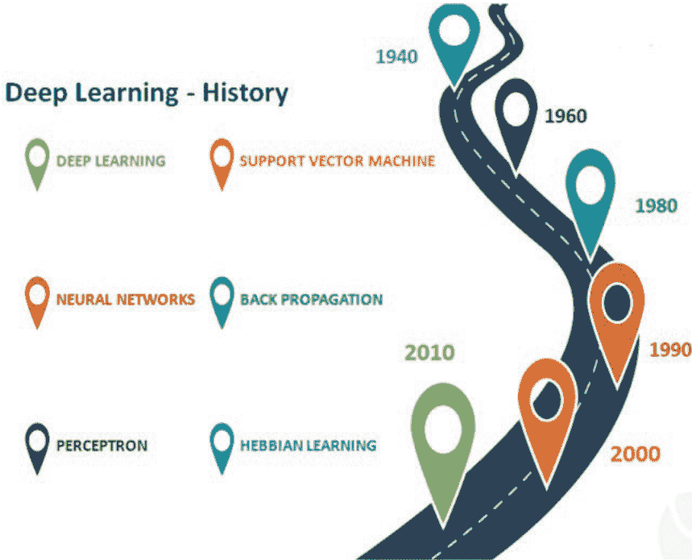

夸张的人工智能；特别是在 1995 年，Dana Cortes 和 Vladimir Vapnik 提出了一种称为支持向量机的模型来映射和识别相似数据。1997 年，Sepp Hochreiter 和 Juergen Schmidhuber 提出了用于递归神经网络的长短期记忆（LSTM）（图 3）。

深度学习的新时代始于 1999 年，因为它是图形处理单元（GPU）的演进。2000 年，出现了梯度消失问题，为长短期记忆的发展铺平了道路。AI 专家 Fei-Fei Li 组织了 ImageNet，可以处理超过 1400 万个带标签的图像。在 2011 年和 2012 年期间，卷积神经网络 AlexNet 赢得了许多国际比赛。2012 年，Google Brain 宣布了一个名为“猫实验”的项目，克服了无监督学习的局限性。目前，人工智能的演进和大数据的处理依赖于深度学习。

## 4 前馈神经网络

人脑中的神经元排列成层状结构，甚至大部分智力部分——大脑皮层，也是由六层组成的 [4]。感知信息从一层传递到另一层，直到从感觉输入中获得概念理解。

在图 4 中，显示了一个包含具有非线性激活函数的神经元的隐藏层的三层感知器。通过三层感知器可以轻松地进行任意复杂的决策和计算任何似然函数。

从图 4 可以看出，连接从低层传递到高层，并且同一层中的神经元之间以及从高层到低层之间没有通信。因此，这种设置被称为前馈网络。图 4 中的中间层是隐藏层，在神经网络尝试解决复杂问题时发生魔术。图 4 中的每一层都有相同数量的神经元，这是不强制的。输入和输出被表示为向量。线性神经元由形式为 $f_z = a_z + b$ 的线性函数表示。线性神经元易于计算，但受到限制。只包含线性神经元的前馈网络不包含隐藏层，这使用户可以从输入层获取重要特征。在实践中，有三种可能的神经元类型，即 sigmoid 神经元、tanh 神经元和 ReLU 神经元，它们消除了非线性概念。sigmoid 神经元使用函数

$$ f = \frac{1}{1 + e^{-z}} $$

上述方程表示当 logit 的值实际上很小时，输出非常接近于 0，而当 logistic 的值非常大时，输出为 1。

在 0 和 1 之间的值范围内，神经元的形状呈 S 形，如图 4 所示。

根据神经网络架构的连接类型，可以将其分为“循环神经网络”，其中存在从输出到输入的突触连接，而在“前馈神经网络”中，存在从输出到输入的反馈操作。神经网络可以构建为单层或多层。


图 4 具有连续输入、两个输出和两个隐藏层的三层感知器网络

### 4.1 反向传播

反向传播是神经网络训练的核心，它微调了上一轮中获得的神经网络的权重。它于 1970 年开发，并在 1986 年 David Rumelhart、Geoffrey Hinton 和 Ronald Williams 发表了一篇论文后，研究人员充分认识到它的重要性。该论文描述了反向传播的工作速度更快，并为以前无法解决的问题提供了解决方案。反向传播是一种用于多层人工神经网络（ANNs）的监督学习方法，应用范围包括分类、模式识别、医学诊断等。反向传播算法使多层感知器网络在神经网络研究中占据了重要地位。多层感知器被视为输入节点和输出节点之间具有多个节点层的前馈网络。它通过将梯度向量向后传播到输入来更新突触权重，其中元素被定义为参数的误差度量的导数。误差信号是实际输出与期望输出之间的显著差异。

反向传播算法被认为是最小均方（LMS）算法的广义视图，它包括前向传递和后向传递。反向传播特别计算所有偏导数

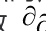

其中 w_i 是第 i 个参数，f 是输出。

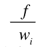

考虑一个多层前馈神经网络，如图 2 所示。假设一个神经元 i 存在于输出层，并且第 n 次迭代的误差信号由以下方程给出

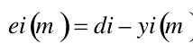

其中 d_i 是神经元 i 的期望输出，y_j(m) 是神经元 i 的实际输出，在第 m 次迭代时使用网络的当前权重计算得到。方程 2 表示神经元 i 的瞬时误差能量值 y 为

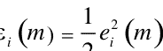

瞬时值 ε_i(m) 是输出层所有神经元 ε_i(m) 的总和，如方程 3 所示

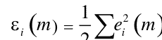

其中 S 是输出层中所有神经元的集合。考虑一下，假设训练集包含 N 个模式，并且网络的平均平方能量由方程 4 给出：

反向传播算法的模式有两种：(a) 批处理模式和 (b) 顺序模式。在批处理模式下，权重更新在一个时期完成后进行。与此相反，顺序模式或随机模式的更新是在每个训练样本呈现后进行的。

下面的方程给出了神经元 i 的输出表达式

```
y_i(m) = f \left[ \sum_{i=0}^{n} w_{ij}(m) y_i(m) \right]
```

其中 n 表示神经元 i 从前一层接收的输入总数，f 是神经元 i 中使用的激活函数。

应用于神经元 i 的权重的更新权重与相应权重的瞬时误差能量 $\varepsilon(n)$ 的偏导数成正比，表示为

```
\frac{\partial \varepsilon(m)}{\partial w_{ij}(m)}
```

使用微积分的链式法则，可以表示为

```
\frac{\partial \varepsilon(m)}{\partial w_{ij}(m)} = \frac{\partial \varepsilon(m)}{\partial e_i(m)} \frac{\partial e_i(m)}{\partial y_i(m)} \frac{\partial y_i(m)}{\partial w_{ij}(m)}
```

方程 10 是从方程 (2)，(1) 和 (5) 得到的

```
\frac{\partial \varepsilon(m)}{\partial e_i(m)} = e_i(m)
```

```
\frac{\partial e_i(m)}{\partial y_i(m)} = -1
```

```
\frac{\partial y_i(m)}{\partial w_{ij}(m)} = f' \left[ \sum_{i=0}^{m} w_{ij}(m) y_i(m) \right] \frac{\partial \left[ \sum_{i=0}^{m} w_{ij}(m) y_i(m) \right]}{\partial w_{ij}(m)} = f' \left[ \sum_{i=0}^{m} w_{ij}(m) y_i(m) \right] y_i(m)
```

其中

```
\varepsilon_{avg} = \frac{1}{N} \sum_{n=1}^{N} \varepsilon(m)
$$f' \left[ \sum_{i=0}^{m} w_{ij}(m) y_i(m) \right] = \frac{\partial f \left[ \left[ \sum_{i=0}^{m} w_{ij}(m) y_i(m) \right] \right]}{\partial \left[ \left[ \sum_{i=0}^{m} w_{ij}(m) y_i(m) \right] \right]}$$

将方程 (8)，(9) 和 (10) 代入方程 9，得到以下表达式

$$\frac{\partial \varepsilon(n)}{\partial w_{ij}(m)} = -e_j(m) f' \left[ \sum_{i=0}^{m} w_{ij}(m) y_i(m) \right] y_i(m) \quad (13)$$

Delta 规则用于提供校正 $\Delta w_{ij}(m)$，表示为

$$\Delta w_{ij}(m) = -\eta \frac{\partial \varepsilon(n)}{\partial w_{ij}(m)} \quad (14)$$

其中 $\eta$ 是一个预先确定的常数参数，用于反向传播算法中的学习率。

## 5 深度学习网络类型

深度学习网络根据用于特定应用（如合成、分类和识别）的技术和架构分为三类。它们被分类为：

- (i) 无监督深度学习网络
- (ii) 监督深度学习网络
- (iii) 混合深度学习网络

无监督深度学习网络在没有明确目标类别定义时，捕捉更高阶的相关数据以进行综合。在深度网络的监督学习中，通过描述数据上习惯的类别分布，为模式分类提供了区分能力。它也被称为判别式深度网络。混合深度神经网络利用了判别性和生成性组件。此外，混合深度神经网络模型通过汇聚同质卷积神经网络 (CNN) 分类器来构建。CNN 分类器被训练为对预测类别输出为 1，对其他所有类别输出为 0。

## 6 深度学习架构

在这个深度学习架构部分，讨论了常用的深度学习方法。表示是深度学习中的一个重要因素。在传统方法中，输入特征是从原始数据中提取出来供机器学习算法使用的。它依赖于领域知识和从业者的专业知识来确定模式。传统的软件工程方法，如创建、分析、选择和评估，耗时且繁琐。相比之下，适当的特征直接从数据中学习，无需任何人为干预，并有助于发现数据之间可能隐藏或未知的潜在关系。

在深度学习，复杂的数据表示通常被表达为较简单表示的组合。大多数深度学习算法是基于人工神经网络 (ANN) 的概念框架构建的，它由相互连接的节点（称为“神经元”）组成，这些节点按照图 5 所示的层次结构组织。这两个层次中不存在的神经元称为隐藏单元，并且它存储了一组权重 W。

人工神经网络的权重可以通过最小化损失函数（例如负对数似然）来增强，其在方程 15 中表示为：

```
E(\theta, D)=-\sum_{i=0}^{D}\left[\text { 对数 } P\left(Y=y_{i} \mid x_{i}, \theta\right)\right]+\lambda \quad \theta \quad p (15)
```

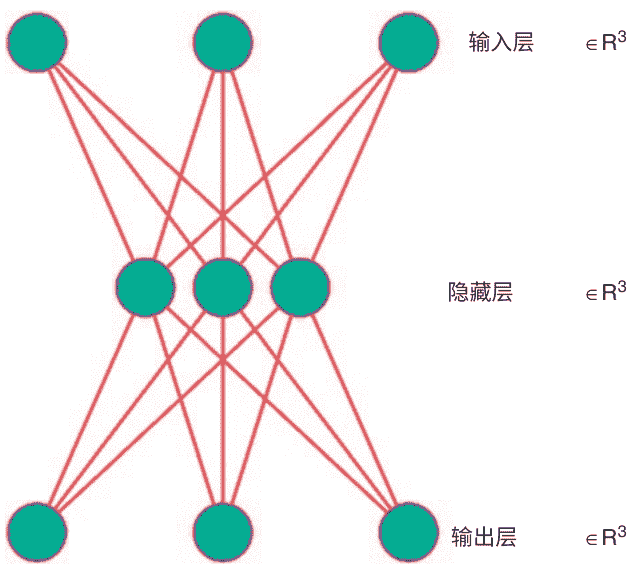

图 5 具有 1 个输入层、2 个隐藏层和 1 个输出层的神经网络

第一项最小化整个训练数据集 D 的总对数损失。第二项最小化学习参数θi 的 p-范数，并且由可调参数λ控制。

它被称为正则化，并且防止模型过拟合。通常，损失函数可以使用反向传播机制进行优化，它用于权重优化，通过从网络中的最后一层向后遍历来减少损失。一些深度学习开源工具包括 Keras、Theano、TensorFlow、Caffe、DeepLearning4j、CNTK、PyTorch 和 Torch。讨论的一些常用深度学习模型基于优化策略和人工神经网络的架构。深度学习算法分为监督和无监督技术。监督深度学习架构包括卷积神经网络、多层感知器和循环神经网络。无监督深度学习架构包括自编码器和受限玻尔兹曼机（图 6）。

### 6.1 监督学习

#### 6.1.1 多层感知器（MLP）

多层感知器具有许多隐藏层；基层中的神经元 i 完全连接到下一层中的神经元。这种类型的网络限制了最小的隐藏层，并且数据只允许单向传输。从隐藏层中接收到的输出计算出每个隐藏单元的加权和。方程 16 表示计算和的非线性激活函数σ。此时，d 表示前一层中可用的单元数，xj 被称为前一层 jth node 接收到的输出。bij 和 wij 被视为与每个 xij 相关联的偏置和权重项。Tanh 或

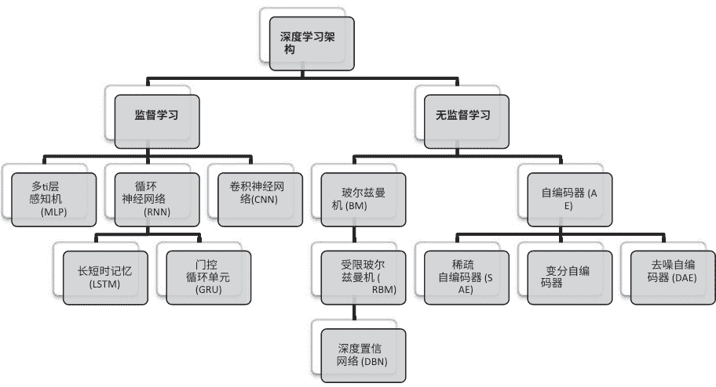

图 6 深度学习架构和输出层

在传统网络中，采用 sigmoid 作为非线性激活函数，而现代网络中使用修正线性单元 (ReLU) [8]。

多层感知器由多个隐藏层组成，其中

$$ h i = \sigma\left(\sum_{j=1}^{d} x_{j} w_{i j}+b_{i j}\right) $$

在训练过程中优化隐藏层权重，学习输入 x 和输出 y 之间的相关性。由于隐藏层的非线性激活，许多隐藏层的存在使得输入数据以高级抽象视图的形式表示。它是其他学习架构中最简单的模型之一，最后一层完全连接的神经元。

#### 6.1.2 循环神经网络 (RNN)

如果输入数据具有整齐的空间结构（例如，图像中的像素集合），则 CNN 是一个合适的选择；如果输入数据按顺序排列（例如，自然语言或时间序列数据），则 RNN 是一个合理的选择。一维序列被馈送到 CNN 中；提取特征的输出将是浅层的 [8]，意味着仅考虑了少数邻居之间的封闭局部关系来进行特征表示。RNN 能够处理长期的时间依赖性。在 RNN 中，隐藏状态 ht 根据当前输入 xt 在时间 t 上的触发以及先前的隐藏状态 ht-1 进行更新。因此，在处理整个序列后，最终的隐藏状态包含了来自所有元素的完整信息。RNN 包括

- 长短期记忆 (LSTM)
- 门控循环单元 (GRU)

RNN 的符号表示如图 7 所示，其中包括三个输入单元、三个隐藏单元和一个输出的扩展表示。输入时间步与依赖于先前隐藏状态的当前隐藏状态相结合。

RNN 包括 LSTM 和 GRU 模型，最流行的变体被称为门控 RNN。传统的 RNN 由相互连接的隐藏单元组成，而


图 7 具有扩展表示的 RNN

门控 RNN 被一个包含内部循环的细胞所取代，而且该模型中的门控机制控制着信息的流动。门控 RNN 的主要优势在于对长期顺序依赖关系的建模。

#### 6.1.3 卷积神经网络 (CNN)

CNN 是近年来特别在图像处理中广泛使用的工具，受到猫的视觉皮层组织的启发 [5]。CNN 对原始数据施加了局部连接。例如，将图像视为一组局部像素块而不是将 50 x 50 的图像视为 2500 个不相关的像素，可以提取更显著的特征。一维时间序列也可以被视为一组局部信号片段。特别地，一维卷积的方程为

```
C_{1d} = \sum_{a=-\infty}^{\infty} x(a) \cdot w(t-a)
```

其中 x 指的是输入信号，w 指的是权重函数或卷积滤波器。

给出了二维卷积的方程，其中 k 是一个核心，X 是一个 2D 网格：

```
C_{2d} = \sum_{m} \sum_{n} X(m,n) K(-m,j-n)
```

通过计算滤波器或核心中输入的权重来提取特征图。CNN 包含了通常被认为是小于输入的滤波器的稀疏交互，从而导致参数数量较少。CNN 中相应地鼓励参数共享，因为每个滤波器对整个输入都起作用。然而，在 CNN 中，相同的输入来自前一层，完美地学习了几个较低层次的特征。子采样被应用于聚合提取的特征。CNN 架构由两个卷积层和一个池化层组成，如图 8 所示。CNN 在计算机视觉领域 [6, 7] 中应用最佳。


图 8 卷积神经网络和输出层

### 6.2 无监督学习

#### 6.2.1 自编码器（AE）

自编码器（AE）是深度学习模型，它体现了无监督表示学习的概念。最初，它与有限标记数据的监督学习模型相关，但它仍然对完全无监督学习（如表型发现）非常有用。在自编码器中，输入被编码为一个低维空间 z，然后通过重构输入 x 进行进一步解码。因此，编码和解码过程分别在具有单个隐藏层的方程中给出。编码和解码权重分别表示为 W 和 W'，并且最小化重构误差。Z 是可靠的编码表示。

$$z=\sigma(W x+b)$$

$$(19)$$

$$\bar{x}=\sigma\left(W^{\prime} z+b^{\prime}\right)$$

$$(20)$$

一旦自编码器训练良好，然后将单个输入馈送到网络中，并激活最内层隐藏层，作为编码表示的输入（图 9）。

输入数据被转换成一个结构，其中 AE 存储了最重要的派生维度。它类似于传统的降维技术，即奇异值分解（SVD）和主成分分析（PCA）。深度自编码器网络可以以贪婪的方式进行训练，这被称为堆叠过程。一些自编码器的变种包括：

- 1. 稀疏自编码器（SAE）
- 2. 变分自编码器（VAE）
- 3. 去噪自编码器（DAE）

#### 6.2.2 受限玻尔兹曼机（RBM）

RBM 是一种无监督学习架构，用于学习输入数据的表示。它几乎与自编码器相似；不同之处在于 RBM 估计了可用输入数据的概率分布。因此，它被视为一个生成模型，其中数据是在底层过程中生成的。典型的 RBM 模型由二进制可见单元 v 和隐藏单元组成，其能量函数如方程所示。

$$E(v, h)=-b^{T} v-c^{T} v-W v^{T} h$$

$$(21)$$

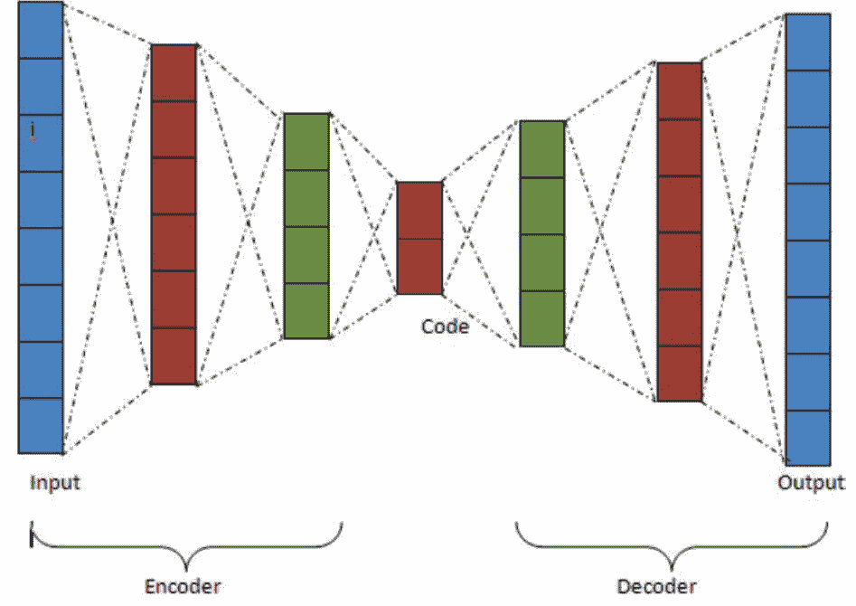

图 9 自编码器示例和输出层

在玻尔兹曼机（BM）中，每个单元都是完全连接的，而在受限玻尔兹曼机中，隐藏单元之间没有连接。受限玻尔兹曼机通常使用随机优化（如吉布斯采样）进行训练，并产生给定输入数据的学习表示，该表示被视为 h 的最终形式。此外，RBMs 可以层次化堆叠以构建深度置信网络（DBN），特别适用于监督学习。

# 7 深度学习框架平台

许多软件包可供研究人员使用，以便简化深度学习架构的构建，但几年前，非深度学习专业人员在处理软件包时面临许多困难。这种情况一直持续到 2012 年 Google 推出 DistBelief 系统。在 DistBelief 之后，类似的软件包如 TensorFlow、Microsoft Cognitive Toolkit（以前的 CNTK）、DeepLearning4j、Caffe、Torch、Keras、Neural Designer、H2o.ai 和 DeepLearning Kit 广泛推动了该行业（图 10）。

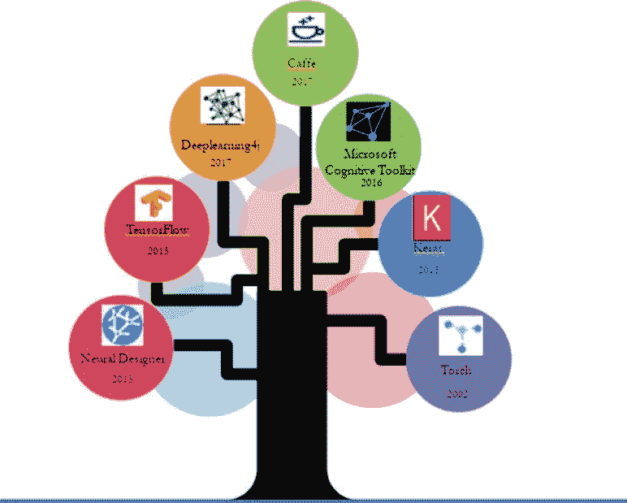

图 10 深度学习平台和输出层

## 7.1 TensorFlow

TensorFlow 的概念与工程和物理中涉及的数学密切相关。后来，TensorFlow 进入了与逻辑和离散数学相关的计算机科学领域。高级机器学习概念利用了张量的操作和微积分。TensorFlow 是一个用于生产和研究的开源端到端机器学习库。它提供了面向专家和初学者的 API，用于开发云端、移动端、Web 和桌面应用程序。对于初学者，TensorFlow 推荐使用 Keras API 来开发和训练深度学习模型。对于像前向传播、自定义层和使用自动微分进行训练循环等高级操作，建议使用定义即运行接口 API。预制估计器可用于实现常见的机器学习算法。TensorFlow 的架构分为四个功能部分，即数据处理器、模型构建器、训练和模型估计。它接受张量或多维数组作为输入，构建操作流程图解，解释对输入进行的多个操作，并最终生成输出。因此，TensorFlow 的名称由于张量在一系列操作中流动并在另一侧产生所需的输出。TensorFlow 基于静态图计算，可以使用 TensorBoard 可视化构建的神经网络。TensorFlow 支持分类、线性回归、深度学习模型、深度学习分类、提升树分类和提升树回归等算法。

## 7.2 微软认知工具包

微软认知工具包也是一个将神经网络视为一系列计算过程的深度学习工具包，使用有向图。这个工具包的前一个版本是计算网络工具包 (CNTK)。最新版本是 CNTK v.2.0 Beta 1，使用 BrainScript 作为自己的语言，提供新的 Python 和 C++ API。计算网络工具包库是使用 C++ 语言开发的。Python API 保留了模型定义、数据读取、学习算法和分布式训练的抽象。CNTK 2 被认为是 Python API 的补充，具有由 Google 开发的协议缓冲区序列化功能。CNTK 2 支持 Fast R-CNN 算法，支持目标检测算法。Fast R-CNN 算法基于可重用性概念，通过添加 ROI 池化方案从卷积层中重用计算。微软认知工具包是一个开源的、支持多 GPU 的机器，非常适合用于分类和识别图像、文本和语音的神经网络训练。微软认知工具包是 Skype 实时翻译、Xbox、Bing 和 Cortana 的支撑。它支持一系列神经网络类型，如卷积神经网络 (CNN)、前馈网络 (FFN)、循环/长短期记忆 (RNN/LSTM)、带有注意力的序列到序列和批量归一化。微软认知工具包支持无监督学习、强化学习、生成对抗网络和自动超参数调整。即使对于 GPU 内存中最大的模型，也可以实现最高精度的并行计算。

## 7.3 Caffe

卷积架构用于特征提取 (Caffe) 是由伯克利人工智能研究开发的深度学习框架，具有速度、表达力和模块化等特点。Caffe 的速度使其适用于工业开发和研究工作。它可以使用单个 NVIDIA K40 GPU 每天处理近 60M 张图像。可扩展的代码功能促进了积极的开发。富有表现力的架构鼓励创新和应用。在模型开发中，尽量减少硬编码的使用。

## 7.4 DeepLearning4j

DeepLearning4j 是一个基于 Java 的免费开源深度学习库，为 CPU 和 GPU 上的深度预测挖掘和知识发现等各种应用提供完整的解决方案。

DeepLearning4j 集成了人工智能（AI）算法和适用于网络取证、商业智能、机器人流程自动化（RPA）、预测分析、网络入侵检测和预防、人脸识别、推荐系统、异常检测、回归等领域的技术。DeepLearning4j 可以从 Keras、Theano、Caffe 和 TensorFlow 等先进的深度学习框架中导入模型。DeepLearning4j 可以在 Python 和 Java 编程之间无缝切换，没有任何兼容性问题。DeepLearning4j 的特点基于微服务架构。它在 Hadoop 上提供大数据的可扩展性，并支持 Amazon Web Services（AWS）云上的 GPU 可扩展性。它基于分布式架构，支持多线程；提供 Java、Python 和 Scala 的 API；支持 CPU 和 GPU，并且可以使用集群处理大量数据。与 DeepLearning4j 相关的库和组件有 ND4j、JavaCPP、DataVec 和 RL4J。ND4j 是 NumPy 和 Java 虚拟机（JVM）的综合应用。ND4j 是一个库，提供矩阵数据的快速处理、数值计算和性能感知的多维对象执行，包括线性代数、信号处理、优化、梯度下降、变换等。JavaCPP 是一个用于 C++ 和 Java 的接口和桥接工具，无需任何第三方和中间应用程序。DataVec 是一个用于 ETL（提取、转换和加载）的工具，它可以将原始数据转换为向量格式，并进行预处理，以便在机器学习实现中进行训练。它支持二进制、视频、图像、文本、CSV 等格式。RL4J 是 Java 平台上的强化学习，集成了 Deep Q-Learning、异步 Actor-Critic Agents（A3C）等算法。

## 7.5 Keras

Keras 是由 François Chollet 开发的开源神经网络库，具有快速、模块化和用户友好的特性，适用于 Python 平台，可以在 TensorFlow 或 Theano 之上运行。Backend 是 Keras 内部的一个库，用于处理低级计算，因为 Keras 专注于高级 API 封装。Backend 通过 Theano 或 TensorFlow 的帮助执行低级计算，例如卷积、张量乘法。它可以在 Theano、CNTK 或 TensorFlow 之上运行。Keras 的高级 API 通过编译模型，设计优化器和损失函数，并使用 fit 函数处理训练过程。Keras 可以支持许多平台和设备，可以在支持.js 的 Web 浏览器、树莓派、支持 CoreML 的 iOS、支持 TensorFlow Android 的 Android 和云引擎中部署。Keras 支持并行数据处理，因此可以处理大量数据并加快训练过程的速度。

## 7.6 神经设计师

神经设计师是一种深度学习工具，用于实现分析算法并使其易于处理。它采用图形用户界面设计，定义工作流程并提供准确的结果。由于没有编程或块图涉及，因此它易于处理。用户界面帮助用户并以明确定义的方式指导过程。神经查看器是一种可视化工具，以可导出的图表、表格和图片形式显示正确的结果。神经设计师具有先进的算法，允许用户构建无与伦比的预测模型。借助复杂的数据预处理方法，可以轻松计算主成分并清除异常值。在神经设计师中，用户可以借助各种误差和正则化方法构建最强大的预测模型。除此之外，还包括了一些强大的策略，如 Levenberg-Marquardt 和拟牛顿方法，以产生更精确的计算。它还包含了一些用于测试预测模型的泛化能力的策略。通过 CUDA 和 OpenMP 的 GPU 加速，它具有更高的处理速度和更好的内存管理能力。

## 7.7 Torch

Torch (Lua) 是一个类似于 Matlab 的环境，用于具有灵活张量实现功能的深度学习和非深度学习的机器学习解决方案。一些特性自动计算梯度并保持多后端张量以加快 CPU/GPU 计算速度，支持高级语言，可以进行快速原型设计。

# 8 深度学习应用

## 8.1 语音识别

语音识别利用深度学习概念，并谨慎使用其能力成为深度学习的主要应用。2010 年，深度学习在语音识别应用中留下了自己的足迹。高斯混合模型 (GMM) 是基于隐马尔可夫模型 (HMMs) 的传统语音识别系统。在这里，语音信号被认为是短时稳定信号或分段稳定信号，因此马尔可夫模型非常适合这个应用。这种方法的局限性在于对非线性函数建模效率低下 [20]。

与 HMMs 相比，神经网络在判别式训练中证明了其效率。神经网络对于短时信号提供更好的结果；当处理连续语音信号时，效率值得怀疑，因为它无法建模时间依赖性。

对于连续信号的依赖性。2012 年，微软宣布了他们 Microsoft Audio Video Indexing Service (MAVIS) 的基于深度学习的新版本。微软发布的结果清楚地显示，基于深度学习的应用与高斯混合模型相比，可以降低词错误率（WER）[21]。

## 8.2 深度学习在医疗保健中的应用

医疗保健系统通过利用先进技术为患者提供正确的治疗，迎来了一个新时代。深度学习是最强大的工具，它允许机器从大量数据中学习并做出决策。

研究人员发现，使用多层神经网络处理药物信息可以在各种临床应用中产生准确的预测决策。深度学习架构基于分层学习结构，具有整合异构数据以产生更好泛化能力的能力。许多研究证明，深度学习为下一代医疗保健系统铺平了道路，可以容纳数十亿条患者记录，用于预测疾病、个性化处方、临床试验和治疗建议。使用时间深度学习方法，王等人在识别帕金森病亚型的帕金森病进展标志倡议数据挑战中获胜 [9]。传统的基于矩阵或向量的方法并不被认为是最佳方法，因为帕金森病的进展非常快，并且很难识别疾病的进展模式。此外，王等人使用 LSTM RNN 模型识别出另外三种帕金森病亚型，这证明了深度学习模型在医疗问题中的优势和潜力。

适用于医疗系统的深度学习架构主要是基于循环神经网络（RNNs）[10]、卷积神经网络（CNNs）[11]、自编码器（AEs）[12] 和受限玻尔兹曼机（RBMs）[13]。深度学习在医疗系统中的主要应用是图像处理，特别是使用磁共振成像（MRI）扫描来预测阿尔茨海默病 [14, 15]。可以使用表示低场膝关节 MRI 的 CNNs 来自动分割软骨，从而检测骨关节炎的风险。深度学习用于在多通道 3D MRI 中分割多发性硬化症病变，以预测恶性和良性乳腺结节。深度学习正在用于处理电子健康记录（EHR）数据，包括实验室检验、诊断、药物和自由文本临床记录。受试者工作特征曲线下面积和 F-score 方法证明深度学习的准确性优于传统机器学习过程 [16]。DeepCare 是一个具有长短期记忆（LSTM）隐藏单元、池化和词嵌入的循环神经网络（RNN），它可以识别疾病的当前状态并预测未来的后果 [17]。Choi 等人 [18] 开发了 Doctor AI 模型，使用带门控循环单元（GRU）的 RNN 来预测诊断和药物。Miotto 等人 [19] 使用三层堆叠去噪自编码器（SDA）并提出了基于随机森林分类器的深度患者表示，以预测风险。

## 8.3 自然语言处理中的深度学习

自然语言处理 (NLP) 是一种用于自动分析人类语言的计算方法。信号处理社区中的文档文本和语言研究活动现在正在增加。深度学习的贡献在于语言建模，为语言符号或单词序列提供概率。自然语言处理 (NLP) 始于批处理和穿孔卡的时代，分析需要长达 7 分钟 [22]。深度学习算法和架构在模式识别领域取得了令人印象深刻的进展。Collobert 等人 [23] 解释说，深度学习 [24] 框架在许多自然语言处理任务（如语义角色标注 (SRL)，命名实体识别 (NER) 和词性标注 [25]）中表现良好。在 Collobert 等人的研究之后，各种版本的基于先进深度学习的算法已经发展起来，以解决各种困难的自然语言处理任务 [26-28]。

# 9 结论

深度学习是一种机器学习算法的分支，它利用由多个非线性变换组成的架构对数据进行建模。本章介绍了深度学习的基础，并讨论了其演变过程。详细阐述了架构、学习方法及其应用。

深入讨论了平台及其品牌，并介绍了它们的应用。清楚地解释了深度学习在医疗保健系统中的一般应用和救生应用。深度学习的未来非常光明，深度学习的一个伟大之处在于它在处理大量不同的相关数据方面表现出色，这在当前智能传感器收集大量信息的时代非常重要。

# 参考文献

- 1. Kuhn, Deanna, et al. Handbook of Child Psychology. Vol. 2, Cognition, Perception, and Language. Wiley, 1998
- 2. Restak, Richard M. and David Grubin. The Secret Life of the Brain. Joseph Henry Press, 2001
- 3. McCulloch, W.S., Pitts, W.: 神经活动中固有思想的逻辑演算。数学生物物理学报 5(4), 115-133 (1943)
- 4. Mountcastle, V.B.: 猫体感觉皮层单个神经元的模态和拓扑特性。神经生理学杂志 20(4), 408-434 (1957)
- 5. Hubel, D.H., Wiesel, T.N.: 猴子纹状皮层的感受野和功能结构。生理学杂志 195, 215-243 (1968)
- 6. Krizhevsky, A., Sutskever, I., Hinton, G.E.: 使用深度卷积神经网络进行 ImageNet 分类。Adv Neural Inf Process Syst, 1097-1105 (2012)
- 7. Szegedy C, Liu W, Jia Y, et al. 使用卷积进行更深入的研究。 在 2015 年 IEEE 计算机视觉和模式识别会议（CVPR）中，1-98. Goodfellow, I., Bengio, Y., Courville, A.: 深度学习。MIT 出版社（2016）
- 9. 迈克尔·J·福克斯帕金森病基金会：使用深度学习模型对帕金森病进行亚型划分。 https://www.michaeljfox.org/foundation/grant-detail.php
- 10. 威廉姆斯，R.J., 齐普塞尔，D.: 一种用于持续运行完全递归神经网络的学习算法。神经计算。1, 270-280（1989 年）
- 11. Lecun, Y., Bottou, L., Bengio, Y.等：基于梯度的学习应用于文档识别。IEEE 会议录。86, 2278-2324（1998 年）
- 12. Hinton, G.E., Salakhutdinov, R.R.: 使用神经网络降低数据的维度。科学。313, 504-507（2006 年）
- 13. Smolensky P. 动态系统中的信息处理：和谐理论的基础（编号 CU-CS-321-86）。科罗拉多大学博尔德计算机科学系 1986 年
- 14. Liu S, Liu S, Cai W, 等。使用深度学习进行阿尔茨海默病的早期诊断。在北京，中国 2014 年生物医学成像国际研讨会，1015-1018
- 15. Brosch, T., Tam, R.: 通过深度学习对脑部 MRI 进行流形学习。Med Image Comput Comput Assist Interv。16, 633-640（2013 年）
- 16. Manning, C.D., Raghavan, P., Schutze, H.: 信息检索导论，第 3 卷。剑桥大学出版社，剑桥（2008 年）
- 17. Pham T, Tran T, Phung D, 等。深度护理：一种用于预测医学的深度动态记忆模型。arXiv 2016 年。https://arxiv.org/abs/1602.00357
- 18. Choi E, Bahadori MT, Schuetz A, 等。Doctor AI：通过循环神经网络预测临床事件。arXiv 2015 年。http://arxiv.org/abs/1511.05942v1
- 19. Miotto, R., Li, L., Kidd, B.A., 等：深度患者：一种无监督的表示来预测电子健康记录中患者的未来。科学报告。6, 26094（2016 年）
- 20. Singh, H., Bathla, A.K.: 关于语音识别的调查。Int. J. Adv. Res. Comput. Eng. Technol. 2（6），2186-2189（2013 年）
- 21. 谢，Y., 乐，L., 周，Y., 拉加万，V.V.: 深度学习用于自然语言处理。 在：统计手册。爱思唯尔，荷兰阿姆斯特丹（2018 年）
- 22. Cambria, E., White, B.: 跳跃 NLP 曲线：自然语言处理研究综述。IEEE Comput. Intell. Mag. 9（2），48-57（2014 年）
- 23. Collobert, R., Weston, J., Bottou, L., Karlen, M., Kavukcuoglu, K., Kuksa, P.: 自然语言处理（几乎）从零开始。J Machine Learn Res. 12（Aug），2493-2537（2011 年）
- 24. Prakash, K. B., Ruwali, A., Kanagachidambaresan, G. R.: 引言，进入张量流，使用张量流进行编程，EIA/Springer 通信和计算创新。https://doi.org/10.1007/978-3-030-57077-4_1
- 25. JHA, A.K., Ruwali, A., Prakash, K.B., Kanagachidambaresan, G.R.: TensorFlow 基础，使用 TensorFlow 进行编程，EIA/Springer 通信和计算创新。https://doi.org/10.1007/978-3-030-57077-4_2
- 26. Kanagachidambaresan, G.R., Manohar Vinoothna, G., Prakash, K.B.: 可视化，使用 TensorFlow 进行编程，EIA/Springer 通信和计算创新。https://doi.org/10.1007/978-3-030-57077-4_3
- 27. Prakash, K.B., Ruwali, A., Kanagachidambaresan, G.R.: 回归，使用 TensorFlow 进行编程，EIA/Springer 通信和计算创新。https://doi.org/10.1007/978-3-030-57077-4_4
- 28. Vadla, P.K., Ruwali, A., Lakshmi, M.V.P., Kanagachidambaresan, G.R.: 神经网络，使用 TensorFlow 进行编程，EIA/Springer 通信和计算创新。https://doi.org/10.1007/978-3-030-57077-4_5

女士 Indrakumari 在加尔各答大学计算科学与工程学院担任助理教授。她在马农马尼亚姆·苏达拉纳尔大学获得计算机与信息技术硕士学位。她的主要研究领域是大数据、物联网、数据挖掘、数据仓库以及 Tableau、QlikView 等可视化工具。

女士 Kiran Singh 目前在 Galgotias 大学计算机科学与工程系担任助理教授。她于 2008 年获得 Maharshi Dayanand 大学的 MCA 学位，2015 年获得 Rajiv Gandhi Proudyogiki Vishwavidyalaya 的计算机科学与工程硕士学位。她拥有 11 年的工作经验。她的研究兴趣包括图像处理、大数据和物联网。她在国际期刊和会议上发表了论文。

T. Poongodi 博士在加尔各答大学计算科学与工程学院担任副教授。她在安娜大学获得信息技术 (信息与通信工程) 博士学位。她的主要研究领域是大数据、物联网、自组织网络、网络安全和云计算。她是大数据、无线网络和物联网领域的先驱研究者，并在各种国际期刊上发表了 25 多篇论文。她在国内/国际会议上发表过论文;在 CRC Press、IGI Global 和 Springer 出版了书籍章节;并编辑了书籍。

# 使用 Python 的深度学习应用

Nahil Ahmed Hassan, Abhijith Neil Abraham 和 Ajeesh Ramanujan

N. A. 哈桑 ( · A. 拉马努金
计算机科学系，特里凡得琅工程学院，特里凡得琅，印度
e-mail: ajeesh@cet.ac.in

A. N. 亚伯拉罕
电气工程系，特里凡得琅工程学院，特里凡得琅，印度

©作者，独家许可给 Springer Nature Switzerland AG 2021 K. B. Prakash 等人，工程师和科学家的高级深度学习，EAI/Springer 通信和计算创新，https://doi.org/10.1007/978-3-030-66519-7_2

## 1 引言

用于处理深度学习模型部署的编程语言最理想的特性之一是能够快速进行原型设计，减少工作量。这个特性以及其他众多好处使得 Python 在深度学习社区中非常受欢迎。Python 环境中包含了全面的数据预处理、可视化和模型开发框架，使得深度学习工作流程更简单，只需几行代码即可完成。

Python 以其一致、易读的代码而闻名，在易用性和清晰度方面几乎无与伦比，特别适合初学者。编程的简洁性使得开发人员能够在深度学习实现复杂的算法和网络，而无需了解语言的内部工作原理。这个特性还有助于更快地开发和全面测试模型，这在这个领域非常重要。

可扩展性是使 Python 适用于深度学习应用的另一个特性。Python 拥有丰富的模块和库集合，可以方便地支持深度学习问题的各个阶段，从而提高开发效率，减少编码时间。流行的深度学习框架与 Python 的兼容性非常好。

TensorFlow 和 PyTorch 与 Python 一起使用，还有像 NumPy 和 SciPy 这样的库进行科学计算，Matplotlib 进行可视化，Scikit-Learn 进行数据分析，使得该语言成为学习和解决深度学习问题的理想场所。

作为一种解释性语言，Python 的执行速度比其他编译性语言如 C++ 和 Java 要慢。在需要高性能的情况下，这种执行时间的限制可能是一种约束。然而，高效的数据结构和减少的开发时间在一定程度上可以弥补执行时间的不足。

本章的以下部分将介绍深度学习在最近过去的不同应用领域中产生了重大影响。每个部分都包括对问题的简要介绍，过去解决问题所使用的方法，以及深度学习方法如何能够获得更好的结果。

在此之后，每个部分都将有一个完整的实际 Python 实现，涵盖了处理挑战的整个工作流程。

## 2 人脸识别的深度学习

### 2.1 简介

人脸识别是最突出的生物识别技术之一，用于身份验证和验证。它是基于人脸照片来识别个体。人脸识别技术广泛应用于公共安全、社交媒体和其他商业领域的日常生活中。

人脸识别系统可以自动识别静态图像甚至视频中的人脸。廉价且功能强大的嵌入式设备的大量增加，引发了人脸识别应用和研究的巨大增长 [18, p. 1]。

从 1990 年代开始，面部识别引起了计算机视觉研究人员的极大兴趣。面部识别中最早流行的方法之一是特征脸方法 [38]。但是这种方法无法解决模型假设中面部的不可控变化。这个缺点导致了基于局部特征的模型的出现，如 Gabor [28] 和 LBP [2]，通过局部过滤克服了之前模型的弱点。然而，所有这些工作都在面部外观的复杂变化中遇到了困难。

深度学习模型，特别是卷积神经网络（CNNs），在 AlexNet [26] 赢得 ImageNet 竞赛后获得了巨大的流行。CNNs 能够在不同的抽象层次上捕捉和学习各种表示，从而对不同的面部外观变化具有强大的不变性。2014 年，DeepFace [37] 使用包含 400 万张图像的数据集训练的 9 层 CNN 在 LFW [16] 基准数据集上实现了接近人类水平的性能。

面部图像。在此之后，出现了几项基于深度学习的面部识别研究，最终在短时间内极大地提高了准确性。VGGFace [33]、VGGFace2 [5] 和 FaceNet [35] 是面部识别领域的其他重要作品，它们能够产生最先进的结果。

### 2.2 数据集

大规模数据库的存在是面部识别系统有效工作的必要条件。随着在简单数据库（如 LFW [16]）上性能的饱和，研究人员开始开发大规模复杂数据库以获得更好的结果。大多数早期的最先进作品，如 DeepFace [37] 和 FaceNet [35]，是使用大规模私有数据库进行训练的。

这种情况导致研究人员无法复现这些作品所取得的结果，也无法通过缺乏公共数据集来比较他们的模型。

CASIA-Webface [42] 是第一个广泛使用的公共数据集，用于人脸识别，包含了 10,000 位名人的 0.5 百万张图像。随着时间的推移，出现了越来越多的公共数据集，其中包含大量图像用于训练深度模型。像 MS-Celeb-1 M [14]、VGGFace2 [5] 和 MegaFace [23] 这样的数据集，包含超过 1 百万张图像，并广泛用于人脸识别研究。

### 2.3 实际例子

在本节中，使用 VGGFace2 数据集训练的 ResNet50 [15, p.775] 模型用于进行人脸识别。VGGFace 的作者已经开源了他们的模型，并发布了适用于 Caffe 和 PyTorch 等流行框架的实现，但没有适用于 TensorFlow 或 Keras 的实现。keras-vggface [29] 是一个基于 Python 的开源库，它在 Keras 中实现了 VGGFace 和 VGGFace2 的预训练模型。它还提供了各种用于预处理图像和解码预测的实用函数。

可以使用 pip 命令安装该库。

```
>>> pip install keras_vggface
```

MTCNN 或“多任务级联卷积神经网络”[19] 是用于图像中人脸检测的常用模型之一，取得了出色的结果。Python 中的 mtcnn[6] 库将 MTCNN 模型的 Keras 实现加载到 Python 程序中。

也可以使用 pip 命令进行安装。

```
>>> pip install mtcnn
```

成功安装这些库后，将导入所需的库。

```python
import keras_vggface
import mtcnn
import matplotlib.pyplot as plt
from PIL import Image
from numpy import asarray
from mtcnn.mtcnn import MTCNN
from keras import layers, Model
```

现在应该实现一个从图像中检测人脸的函数。该函数将以两个参数作为参数，即 img 和 req_size。img 参数需要用于人脸提取的图像数组，req_size 参数指定提取的人脸图像的大小。

要使用 mtcnn 库，我们必须调用 MTCNN() 构造函数来实例化网络。mtcnn 库提供了一个名为 detect_faces() 的实用函数，允许直接从图像中检测人脸。该函数返回一个 JSON 对象列表，其中这些对象的键是“box”、“confidence”和“keypoints”。“box”JSON 对象的值将提供边界框的坐标，形式为 [x, y, 宽度，高度]。这些坐标用于从图像中提取人脸进行检测。

```python
#function to extract face from an image
def face_detect(img,req_size):
    #Initialising the MTCNN model with default weights
    model = MTCNN()
    #Detecting the faces in the image
    result = model.detect_faces(img)
    #Extracting the coordinates of the bound box
    x, y, width, height = result[0]['box']
    #Extracting the face from the image
    face = img[y : y + height, x : x + width]
    #Resizing the result to our required size
    pixels = Image.fromarray(face)
    image = pixels.resize(req_size)
    image = asarray(image)
    return image
```

现在，我们选择了女演员艾玛·阿特金斯的一张图片。让输入图片命名为“emma-atkins.jpg”，如图 1 所示。使用 plt.imread() 函数将图像加载到 NumPy 数组中。将该数组与所需的大小 (224,224) 一起作为参数传递给从图像中检测人脸的函数调用。


# 使用 Python 的深度学习应用

图 1 输入图像以及提取的输出图像

```python
# loading the image
img = plt.imread('emma-atkins.jpg')
# function call with image and required size passed as argument
face = face_detect(img, (224,224))
# Plotting the input image along with extracted face
f = plt.figure(figsize=(7,7))
f.add_subplot(1,2,1)
plt.title("Input:")
plt.imshow(img)
f.add_subplot(1,2,2)
plt.imshow(face)
plt.title("Output:")
# show the plot
plt.show()
```

现在，从加载的图像中提取出人脸后，在图 1 中对输出照片进行人脸识别。为此，使用 keras-vggface 库加载预训练的 ResNet50 模型。使用库中的 VGGFace() 构造函数，将模型参数设置为“resnet50”来实例化 VGGFace 模型。

```python
# importing the VGGFace() constructor
from keras_vggface.vggface import VGGFace
# load the pretrained resnet50 model
model = VGGFace(model='resnet50')
# previewing the input and output shape of the loaded model
print('VGGFace Input Shape:', model.inputs[0].shape)
print('VGGFace Output Shape:', model.outputs[0].shape)
```

```console
>>> VGGFace Input Shape: (None, 224, 224, 3)
VGGFace Output Shape: (None, 8631)
```

```python
from keras_vggface.utils import preprocess_input
from keras_vggface.utils import decode_predictions
from numpy import expand_dims

face = face.astype('float32')
face_array = expand_dims(face, axis=0)
face_array = preprocess_input(face_array, version=2)
# carrying out the prediction of the image
yhat = model.predict(face_array)
# converting predictions into identities
preds = decode_predictions(yhat)
# printing out the top five predictions
for prediction in preds[0]:
    print('{0}:
{1:3.3f}%'.format(prediction[0].replace('b', '').replace("'", ""), prediction[1]*100))
```

```console
>>> Emma_Atkins: 98.658%
Irán_Castillo: 0.171%
Gráinne_Seoige: 0.109%
Cobie_Smulders: 0.050%
Delphine_Batho: 0.036%
```

上述代码片段的输出指定了 VGGModel 最终密集层中的 8631 个神经元。这一观察结果与 VGGFace2 模型在 MS-Celeb-1M 数据集中使用了 8631 个输出类别的事实相一致。

在此之后，需要从 keras-vggface 库中导入两个实用函数，即 preprocess_input 和 decode_predictions。preprocess_input 函数按照与训练 VGGFace 模型时相同的方式对图像的像素值进行缩放。使用 preprocess_input 函数对提取的人脸进行预处理后，使用 model.predict() 函数预测图像的身份。这将返回一个包含最终密集层中每个 8631 个输出神经元的输出概率值的 NumPy 数组。decode_predictions 函数将这个 NumPy 数组映射到相应的名人姓名标签，并获取具有最高概率的前五位名人。

```python
import numpy as np
import matplotlib.pyplot as plt
import tensorflow as tf
from tensorflow.keras import layers
from tensorflow.keras.models import Model
from sklearn.utils import shuffle
from sklearn.model_selection import train_test_split
from imgaug import augmenters as iaa
```

可以看到，预训练的 ResNet50 模型能够以 98.658% 的概率正确识别图像中的 Emma Atkins 的面部。为了理解如何从输入图像中提取特征，直观地可视化卷积神经网络的中间输出是很有帮助的。这些可视化结果有助于理解连续的卷积层如何转换其输入以及每个滤波器对接收到的输入图像的影响。


图 2 (a, b) 可视化网络的前两个卷积层的所有通道

图 2 显示了预训练的 VGGFace 模型的前两个卷积层的中间输出的可视化结果，当输入图像被前向传递到模型中时。可以推断出，特定层提取的特征越来越抽象，即第一个卷积层几乎保留了输入图像中的所有信息，但是对最后几层的中间输出进行仔细分析会发现它们很难被解释并且携带的与输入图像相关的信息较少。

图 3 描述了在本示例中使用的 ResNet50 网络的末尾放置的由 512 个滤波器组成的“conv5_3_3x3”层的输出。这个中间输出几乎不携带我们输入的图像的信息，但是它包含了越来越多与图片的类别或目标标签相关的信息。网络不断过滤掉不必要的特征，并更加关注图像中有用的信息，这有助于网络进行分类。

## 3 指纹识别的深度学习

### 3.1 简介

指纹识别是基于比较两个指纹来识别个体的过程。基于指纹的识别被认为是最可靠的生物识别技术之一，因为几乎不可能伪造一个特定身份的签名。

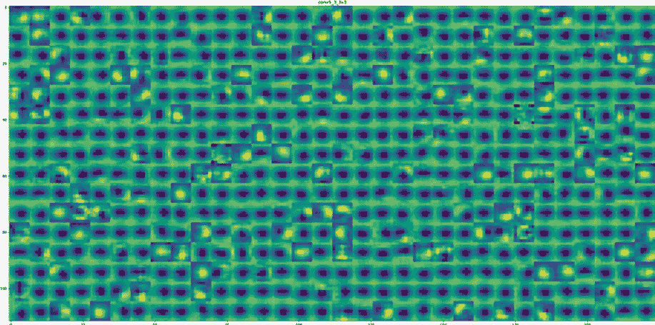

特定身份的签名。该技术广泛应用于法医学、机场安全等领域。自动指纹识别系统是一个利用数字图像处理能力获取、存储和分析指纹数据的系统。这样的系统还允许将一个指纹与另一个指纹进行匹配，以实现识别和鉴定的目的。随着新的方法和技术的出现，可以在没有任何人工辅助的情况下匹配指纹，指纹识别在其以前的版本上有了显著的改进。

许多解决方案和研究都围绕着常规的细节匹配问题展开。还有一些基于手工特征构建和指纹配对的工作。这些方法需要进行大量的数据预处理和使用多个手工特征，这在处理包含大量图像和输出类别的数据集时可能不是最优的。

在最近的过去中，深度学习方法在图像识别和分类任务中取得了巨大的成功。特别是卷积神经网络（CNN）能够提取远远优于基于传统手工特征的模型的特征。已经有许多研究将 CNN 应用于指纹识别任务，取得了出色的结果。Shrein [45] 使用了一个包含五个卷积层的网络，在 NIST-DB4 数据集上达到了 95.9% 的准确率。其他类似的指纹识别研究包括 [9, 34] 等。

### 3.2 数据集

指纹识别数据集包括从现场扫描传感器获取的指纹数据和从文件中数字化的指纹印象。FVC 数据库 [11] 是为每个组织的 FVC 竞赛创建的数据库。

在 2000 年、2002 年、2004 年和 2006 年。这些数据集是使用不同的传感器获得的，如低成本光学传感器、低成本电容传感器等。另外，还有一组流行的公共数据集用于指纹识别，这些数据集是由美国国家标准与技术研究所 (NIST) 发布的。NIST 发布了几个特殊的生物特征数据库，如 NIST-DB4、NIST-DB9 和 NIST-DB14，每个数据库都专注于不同的识别挑战。还有其他一些知名的公共数据集，能够整合现场扫描传感器获取的特征，如 MCYT 双数据库 [32]、BIOMET 多模数据库 [12] 等。

### 3.3 实际示例

本节将使用一个孪生卷积神经网络 [24] 来进行指纹识别。该网络由共享相同权重的相同 CNN 组成。将同一类别或不同类别的一对图像作为网络训练的输入。输入图像对的相似性准则是通过网络学习的，辅以对比损失函数。对于一个平均大小的数据集来说，训练一个孪生 CNN 比从头开始训练一个传统 CNN 要节省计算资源。

模型的训练是使用 SoCoFing 数据集完成的 [36]。该数据集包含来自 600 个非洲受试者的 6000 个指纹图像。该数据集还包括这些指纹的合成变体。图 4 显示了一个随机身份的样本指纹图像及其变体。该数据集可供研究目的免费获取，网址为 https://www.kaggle.com/ruizgara/socofing。数据集中的变体图像根据用于变体的参数设置的难度分为三类，即易、中、难。

首先，导入所有必要的库。imgaug 是一个支持对图像进行广泛增强技术的 Python 库。sklearn 库中的 `train_test_split` 函数用于将数组随机分割为训练集和测试集。


图 4 样本指纹及其变体及其对应的标签

```python
x_real = np.load('dataset/x_real.npz')['data']
y_real = np.load('dataset/y_real.npy')
x_easy = np.load('dataset/x_easy.npz')['data']
y_easy = np.load('dataset/y_easy.npy')
x_medium = np.load('dataset/x_medium.npz')['data']
y_medium = np.load('dataset/y_medium.npy')
x_hard = np.load('dataset/x_hard.npz')['data']
y_hard = np.load('dataset/y_hard.npy')

x_data = np.concatenate([x_easy, x_medium, x_hard], axis=0)
y_data = np.concatenate([y_easy, y_medium, y_hard], axis=0)

x_train, x_val, label_train, label_val = train_test_split(x_data,
                                                          y_data,
                                                          test_size=0.1)

print(x_data.shape, y_data.shape)
print(x_train.shape, label_train.shape)
print(x_val.shape, label_val.shape)
print(x_real.shape, y_real.shape)

>>> (6000, 96, 96, 1) (6000, 4)
>>> (49270, 96, 96, 1) (49270, 4)
>>> (44343, 96, 96, 1) (44343, 4)
>>> (4927, 96, 96, 1) (4927, 4)
```

一旦导入了库，数据集必须加载到程序中。使用 `np.load()` 函数加载合成修改后的图像和真实图像及其对应的标签。标签以 NumPy 数组的形式加载，形式为 `[subject_id, gender, left/right, finger]`。这些标签属性从每个图像的文件名中提取。所有合成修改的图片及其对应的标签分别被分组为 NumPy 数组 `x_data` 和 `y_data`。

这些 NumPy 数组作为输入提供给 `train_test_split()` 函数，将这些指纹图像及其对应的标签分为训练集和验证集。

```python
# creating a mapping between index and label
match_dict = {}
for i, y in enumerate(y_real):
    key = y.astype(str)
    key = ''.join(key).zfill(6)
    match_dict[key] = i
```

为了创建包含在 `x_real` 数据集中的图像索引与其对应标签之间的映射，创建了一个字典。在准备训练数据的批次时，这将非常有用。

由于使用了 Siamese CNN，需要生成图像的批次进行训练。为了实现这一点，定义了一个自定义数据生成器类，类型为 `tf.keras.utils.Sequence`，用于指定如何从数据集中生成每个数据批次进行训练。要将输入 Siamese 网络的图像批次创建成这样的一种方式，即从批次中随机选择一对图像，并根据这对指纹是否属于同一身份，为其对应的目标变量 Y 赋予适当的值。该类的 `__getitem__` 函数允许我们实现这一点。该函数还使我们能够在生成的批次上实现 `imgaug` 库提供的各种数据增强技术，从而使模型不容易过拟合。在每个时期结束时，使用 `on_epoch_end` 函数对图像批次进行洗牌，最终使模型更加稳健。有关所使用函数的进一步解释，请参阅 `tf.keras.utils.Sequence` 官方文档。

```python
class DataGenerator(tf.keras.utils.Sequence):
    # constructor function
    def __init__(self, x, y, x_real, match_dict, batch_size=32, aug=True):

        self.x = x
        self.y = y
        self.x_real = x_real
        self.match_dict = match_dict
        self.batch_size = batch_size
        self.aug = aug

        self.on_epoch_end()

    # specifies the no of batches in the sequence
    def __len__(self):
        return int(np.floor(len(self.x) / self.batch_size))

    # generation of a batch of dataset for training
    def __getitem__(self, index):
        inp_img1 = self.x[ index*self.batch_size : (index+1)*self.batch_size ]
        img1_label = self.y[ index*self.batch_size : (index+1)*self.batch_size ]

        inp_img2 = np.empty((self.batch_size, 96, 96, 1), dtype=np.float32)
        batch_label = np.zeros((self.batch_size, 1), dtype=np.float32)

        # augmentation using the imgaug library
        if self.aug:
            seq = iaa.Sequential([
                iaa.GaussianBlur(sigma=(0, 0.5)),
                iaa.Affine(
                    scale={"x": (0.9, 1.1), "y": (0.9, 1.1)},
                    translate_percent={"x": (-0.1, 0.1), "y": (-0.1, 0.1)},
                    rotate=(-30, 30),
                    order=[0, 1],
                    cval=255
                )
            ], random_order=True)

            x1_batch = seq.augment_images(inp_img1)

        # preparing pairs of images by matching and unmatching
        for i, l in enumerate(img1_label):
            key = l.astype(str)
            key = ''.join(key).zfill(6)

        # randomly generating matched or unmatched pairs
        if random.random() > 0.5:
            # get matched image with same key
            inp_img2[i] = self.x_real[self.match_dict[key]]
            batch_label[i] = 1.
        else:
            # get unmatched image with different key
            while True:
                unmatch_key, index = random.choice(list(self.match_dict.items()))
                if unmatch_key != key:
                    break

            inp_img2[i] = self.x_real[index]
            batch_label[i] = 0.

        # return the batch generated
        return [inp_img1.astype(np.float32) / 255., inp_img2.astype(np.float32) / 255.], batch_label

    # to shuffle the order of the examples at the end of each epoch
    def on_epoch_end(self):
        if self.aug == True:
            self.x, self.y = shuffle(self.x, self.y)
```

定义的孪生网络具有两个相同的 CNN，具有相同的权重。每个 CNN 由两组卷积层块组成，每组块包含 32 个维度为 `(3,3)` 的过滤器，后跟一个维度为 `(2,2)` 的最大池层，以减少图像的维度。每个网络的输入是尺寸为 `(96,96)` 的指纹图像。一对图像通过这些子网络后，提取的相应图像特征张量被相减。

然后将它们传递给另一个卷积层块，后跟具有相同先前配置的最大池层。Flatten 层将 `(n*n)` 维图像转换为维度为 `(n²* 1)` 的向量。下面的全连接层以 ReLU 激活函数将这个 `(n²* 1)` 维向量作为输入。

最后，密集层连接到最后一层，该层由一个单一的神经元和一个 softmax 激活函数组成，用于产生最终的输出。如果指纹对属于同一身份，则模型输出为 1，否则输出为 0。提出的模型的架构使用 `model.summary()` 函数显示在输出中。

```python
x1 = layers.Input(shape=(96, 96, 1))
x2 = layers.Input(shape=(96, 96, 1))

# share weights both inputs
inputs = layers.Input(shape=(96, 96, 1))

feature = layers.Conv2D(32, kernel_size=3, padding='same', activation='relu')(inputs)
feature = layers.MaxPooling2D(pool_size=2)(feature)

feature = layers.Conv2D(32, kernel_size=3, padding='same', activation='relu')(feature)
feature = layers.MaxPooling2D(pool_size=2)(feature)

feature_model = Model(inputs=inputs, outputs=feature)

# 2 feature models that sharing weights
x1_net = feature_model(x1)
x2_net = feature_model(x2)

# subtract features
net = layers.Subtract()([x1_net, x2_net])

net = layers.Conv2D(32, kernel_size=3, padding='same', activation='relu')(net)
net = layers.MaxPooling2D(pool_size=2)(net)

net = layers.Flatten()(net)

net = layers.Dense(64, activation='relu')(net)

net = layers.Dense(1, activation='sigmoid')(net)

model = Model(inputs=[x1, x2], outputs=net)

model.compile(loss='binary_crossentropy', optimizer='adam', metrics=['acc'])

model.summary()
```

```markdown
Model: "model_1"
================================================================================
Layer (type)                 Output Shape              Param #   Connected to
================================================================================
input_1 (InputLayer)         [(None, 96, 96, 1)]       0         -
input_2 (InputLayer)         [(None, 96, 96, 1)]       0         -
model (Model)                (None, 24, 24, 32)        9568      input_1[0][0]
                                                                                             input_2[0][0]
subtract (Subtract)          (None, 24, 24, 32)        0         model[1][0]
                                                                                             model[2][0]
conv2d_2 (Conv2D)            (None, 24, 24, 32)        9248      subtract[0][0]
max_pooling2d_2 (MaxPooling2D) (None, 12, 12, 32)       0         conv2d_2[0][0]
flatten (Flatten)            (None, 4608)              0         max_pooling2d_2[0][0]
dense (Dense)                (None, 64)                294976    flatten[0][0]
dense_1 (Dense)              (None, 1)                 65        dense[0][0]
================================================================================
Total params: 313,857
Trainable params: 313,857
Non-trainable params: 0
================================================================================
```

现在，模型和数据都已按要求设置好，可以使用 `model.fit()` 函数进行网络的训练，训练和验证对象是自定义数据生成器类的参数。将 epochs 的数量设置为 10。

```python
train_gen = DataGenerator(x_train, label_train, x_real, match_dict, aug=True)
val_gen = DataGenerator(x_val, label_val, x_real, match_dict, aug=False)
history = model.fit(x=train_gen, epochs=10, validation_data=val_gen)
```

在十个 epochs 结束时，Siamese CNN 实现了 97.87% 的训练准确率和 98.47% 的验证准确率。现在，使用 Keras 提供的 `history` 回调绘制结果。回调函数跟踪训练和验证数据集的损失和准确率等各种指标。当调用 `model.fit()` 函数时，返回 `history` 对象。结果的损失和准确率曲线如图 5（图 6）所示。

```python
# plotting the loss and accuracy curves
f = plt.figure(figsize=(12,5))
f.add_subplot(1,2,1)
plt.plot(history.history['acc'])
plt.plot(history.history['val_acc'])
plt.title('model accuracy')
plt.ylabel('accuracy')
plt.xlabel('epoch')
plt.legend(['train', 'val'], loc='upper left')
f.add_subplot(1,2,2)
plt.plot(history.history['loss'])
plt.plot(history.history['val_loss'])
plt.title('model loss')
plt.ylabel('loss')
plt.xlabel('epoch')
plt.legend(['train', 'val'], loc='upper left')
plt.show()
```

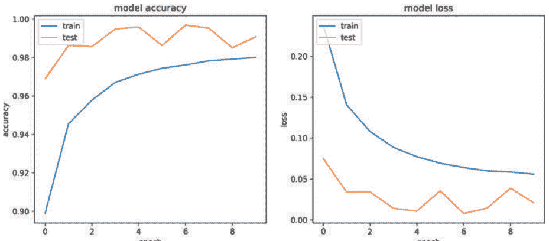

图 5 训练和验证准确率和损失曲线

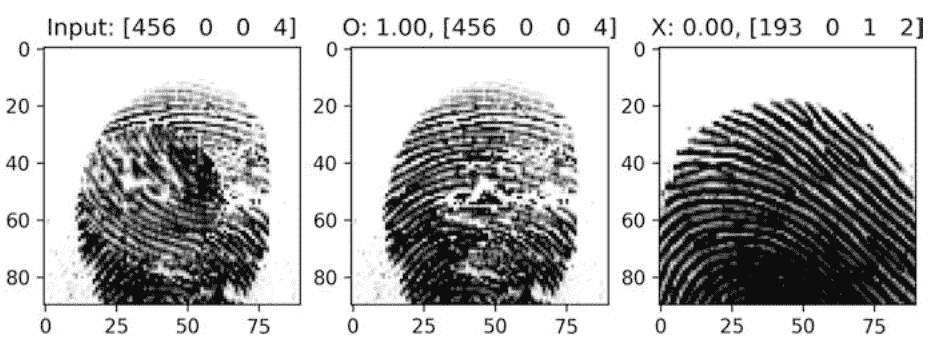

图 6 选择的随机图像及其匹配和不匹配的图像对的绘制。模型输出也显示在每个指纹旁边。

为了测试在这个例子中训练的 Siamese CNN，将从验证集中选择一个随机指纹，并从选择的图像中创建一对图像，其中一对属于相同的身份，而另一对属于另一个随机身份。这两对图像都被输入到网络中，并绘制相应的结果。该模型对指纹对产生了输出 1，其中身份匹配，对于不匹配的指纹对产生了输出 0。

```python
# choosing a random image and label for testing and reshaping
random_index = random.randint(0, len(x_val))
test_img = x_val[random_index]
test_label = label_val[random_index]
test_img = test_img.reshape((1, 96, 96, 1)).astype(np.float32) / 255.

# generating a matched pair with the test image
matched = test_label.astype(str)
matched = ''.join(matched).zfill(6)
matched_x = x_real[match_dict[matched]].reshape((1, 96, 96, 1)).astype(np.float32) / 255.
matched_y = y_real[match_dict[matched]]

# feed-forwarding the matched pair
pred_matched = model.predict([test_img, matched_x])

# generating an unmatched pair with the test-image
while True:
    unmatched, index = random.choice(list(match_dict.items()))
    if unmatched != matched:
        break
unmatched_x = x_real[index].reshape((1, 96, 96, 1)).astype(np.float32) / 255.
unmatched_y = y_real[index]

# feed-forwarding the unmatched pair
pred_unmatched = model.predict([test_img, unmatched_x])

# plotting the outputs produced by the model
plt.figure(figsize=(8, 4))
plt.subplot(1, 3, 1)
plt.title('Input: %s' %test_label)
plt.imshow(test_img.squeeze(), cmap='gray')
plt.subplot(1, 3, 2)
plt.title('O: %.02f, %s' % (pred_matched, matched_y))
plt.imshow(matched_x.squeeze(), cmap='gray')
plt.subplot(1, 3, 3)
plt.title('X: %.02f, %s' % (pred_unmatched, unmatched_y))
plt.imshow(unmatched_x.squeeze(), cmap='gray')
```

为了可视化训练模型得到的结果，展示了 Siamese CNN 中卷积层的中间输出。图 7 和图 8 展示了在将随机指纹和从上一个代码片段中获得的匹配指纹作为一对输入到 Siamese 网络时，子网络中的卷积层的中间输出。图 9 展示了在从各自的子网络中获取相应的图像特征张量之后，网络的其余部分的激活情况。

## 4 字符识别的深度学习

### 4.1 简介

字符识别是将文本中的字符获取并转换为数字化格式的问题。这涉及从纸质文件、触摸屏设备、扫描文件等中检测字符。这也是计算机视觉出现之前的早期任务之一。字符识别技术是


图 7 在将随机指纹输入前，子网络中卷积层的中间输出


图 8 在将匹配指纹输入前，子网络中卷积层的中间输出


图 9 (a) 在获取与图像特征张量对应的子网络后，从减法层激活 (b) 在减法层后的卷积层的中间输出

广泛应用于银行、法律和其他行业。一旦检测到的字符转换为机器可读形式，您可以将数据导出为支持的文件格式进行编辑或处理收集到的数据以供进一步使用。尽管已经有几项工作取得了令人钦佩的结果，但由于存在许多变化，如不同的书写风格、噪音和其他因素，这个识别任务仍然是最具挑战性的之一。

字符识别问题可以分解为其子域，数字识别和字母识别。机器学习方法（如支持向量机（SVM）、随机森林（RF）、k 最近邻（kNN）和决策树（DT））与图像分类技术的结合，推动了过去十年字符识别的进展。

这些传统的基于机器学习的方法在模式识别任务方面往往提供有限的精度。深度学习模型，特别是卷积神经网络（CNN），能够减轻这些缺点并产生更准确的解决方案。CNN 能够在不需要手动调整网络的情况下提取高度代表性的图像特征，使其在字符识别任务中非常受欢迎。这导致了研究工作的大量增加，试图将深度学习模型应用于各种语言的字符识别 [1,7]，并且他们的努力已经超过了以前的结果。

### 4.2 数据集

字符识别问题有很多好的基准用于分析各种方法和技术。其中最受欢迎的是 MNIST [27, p. 2287] 数据集。MNIST 数据集是 NIST（国家标准与技术研究所）特殊数据库 19 的一个子集，是一个易于访问的公共数据集，包含 60,000 个灰度图像，其中包括从 0 到 9 的手写数字。由于数据集的简单性，大多数深度学习模型和 CNN 在其上能够达到极高的准确性。

EMNIST [8, pp.2922–2924] 数据集是从 NIST 特殊数据库 19 派生的另一个数据集。该数据集直接匹配 MNIST 数据集的图像规格和数据集结构。然而，该数据集在类间相似性和输出类别的数量上更具挑战性。此外，该数据集包含各种子集，每个子集都解决了研究人员面临的不同挑战。EMNIST 数据集的一些示例在图 10 中绘制。

还有其他几个基于不同语言的识别数据集。最广泛使用的区域数据集之一是 Devanagari 手写字符数据集 [1]，该数据集包含约 1800 个手写的 Devanagari 字符。Chars74K [10] 和中文字符 [44] 等其他语言数据集也广泛用于识别任务。


### 4.3 实际示例

如前一小节所述，整个 EMNIST 数据集由多个子集组成，以解决与数据集相关的不同问题。在这个示例中，使用 EMNIST 平衡数据集进行字符识别。

这个 47 类数据集包含了所有不同类别的一个公平子集，不同于完整的 EMNIST 数据集。以下代码片段导入了所有必要的库。TensorFlow 数据集库使用户能够轻松地将一组公共研究数据集加载到程序中，而无需编写不同的脚本。这个包用于将平衡版本的 EMNIST 数据集加载到程序中。

```python
python
import tensorflow_datasets as tfds
import matplotlib.pyplot as plt
import numpy as np
import random
from tensorflow.keras.models import Sequential
from tensorflow.keras import optimizers
from tensorflow.keras import layers
```

现在使用 tensorflow_datasets 包将数据集加载到程序中。tfds.load() 函数从源下载并准备数据集，然后将其加载到程序中。有关该包及其各种辅助函数的详细信息可以在官方 TensorFlow 文档中找到。

```python
# load the balanced emnist dataset using tfds.load()
ds, info = tfds.load("emnist/balanced", with_info = True)
# creating objects of train and test datasets
emnist_train, emnist_test = ds["train"], ds["test"]
# setting up the training data
X_train = []
Y_train = []
for example in emnist_train.as_numpy_iterator():
    image, label = example['image'],example['label']
    X_train.append(image)
    Y_train.append(label)
# setting up the test data
X_test = []
Y_test = []
for example in emnist_test.as_numpy_iterator():
    image, label = example['image'],example['label']
    X_test.append(image)
    Y_test.append(label)
```

现在已将数据集加载到单独的训练集和测试集中，必须对其进行预处理。由于像素值的范围是 0 到 255，通过将整个 NumPy 数组除以 255 将其转换为 0-1 的范围。这个操作将进一步减少计算的量级。此外，默认情况下，所有 EMNIST 图像都是水平翻转并旋转 90 度。

因此，必须对训练集和测试集中的所有图片进行 np.transpose() 操作以使其变直。这些操作的结果可以在图 11 中看到。

# Before Rotation:

# After Rotation:

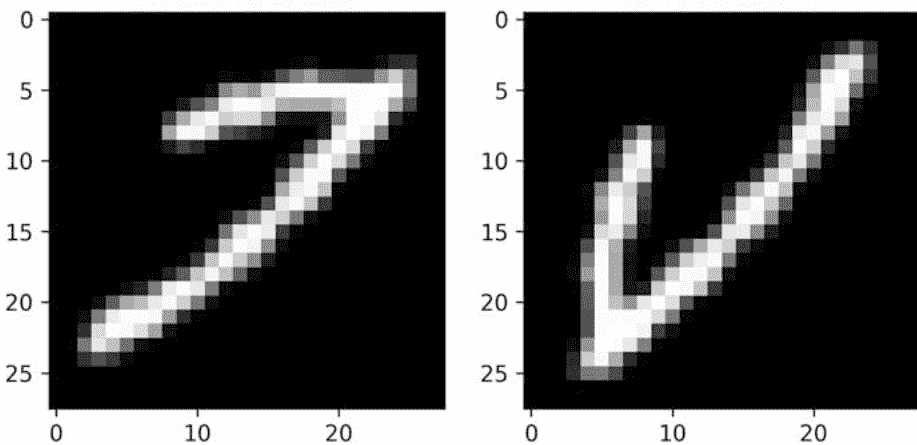

图 11 反转和旋转之前和之后

```python
X_train, X_test = np.array(X_train) / 255. , np.array(X_test) / 255.
X_train = X_train.reshape(len(X_train), 28, 28)
X_test = X_test.reshape(len(X_test), 28, 28)
train_images = X_train.astype('float32')
test_images = X_test.astype('float32')
# plot the image before rotation
f = plt.figure(figsize=(7,7))
f.add_subplot(1,2,1)
plt.title("Before Rotation:")
plt.imshow(train_images[0], cmap='gray')
# To rotate and reverse these images
# for train data
for i in range(train_images.shape[0]):
    train_images[i] = np.transpose(train_images[i])
# for test data
for i in range(test_images.shape[0]):
    test_images[i] = np.transpose(test_images[i])
# plot the image after rotation
f.add_subplot(1,2,2)
plt.imshow(train_images[0], cmap='gray')
plt.title("After Rotation:")
# show the plot
plt.show()
```

此外，标签必须经过预处理，使标签数组转换为二进制类矩阵。这可以使用 tf.keras.utils.to_categorical 函数来执行，该函数将返回输入的二进制矩阵表示。

```python
train_labels = tf.keras.utils.to_categorical(Y_train, 47)
test_labels = tf.keras.utils.to_categorical(Y_test, 47)
```

下一步是为此示例建模所需的 CNN。由于 EMNIST 数据集由于内在变化而比 MNIST 数据集更复杂，因此需要更深的 CNN 来捕捉其特征以获得更好的预测结果。使用 Keras 提供的 Sequential 模型对网络进行建模。由于数据集包含多个类别，因此将使用 categorical_crossentropy 损失函数以及 Adamax 优化器来编译模型。以下代码将为此示例建模网络。

```python
python
from tensorflow.keras.models import Sequential
from tensorflow.keras.layers import Convolution2D as Conv2D
from tensorflow.keras.layers import BatchNormalization, Dropout, Flatten, Dense, Reshape
from tensorflow.keras import optimizers
model = Sequential()
model.add(Conv2D(32, kernel_size = 3, activation='relu', input_shape = (28, 28, 1)))
model.add(BatchNormalization())
model.add(Conv2D(32, kernel_size = 3, activation='relu'))
model.add(BatchNormalization())
model.add(Conv2D(32, kernel_size = 5, strides=2, padding='same', activation='relu'))
model.add(BatchNormalization())
model.add(Dropout(0.4))

model.add(Conv2D(64, kernel_size = 3, activation='relu'))
model.add(BatchNormalization())
model.add(Conv2D(64, kernel_size = 3, activation='relu'))
model.add(BatchNormalization())
model.add(Conv2D(64, kernel_size = 5, strides=2, padding='same', activation='relu'))
model.add(BatchNormalization())
model.add(Dropout(0.4))

model.add(Conv2D(128, kernel_size = 4, activation='relu'))
model.add(BatchNormalization())
model.add(Flatten())
model.add(Dropout(0.4))
model.add(Dense(47, activation='softmax'))

opt = optimizers.Adamax(lr=0.002, beta_1=0.9, beta_2=0.999, epsilon=None, decay=0.0)
model.compile(loss='categorical_crossentropy', optimizer=opt, metrics=['accuracy'])
```

一旦定义了模型，就可以使用 model.fit() 函数对其进行训练。训练和测试图像以及它们的标签将传递给该函数。批量大小以及训练的时期数也作为参数指定。

```python
python
history = model.fit(train_images, train_labels, validation_data=(test_images, test_labels), batch_size=128, epochs=20)
```

训练模型经过 20 个 epochs 后，达到了 90.03% 的训练准确率和 89.78% 的验证准确率。训练和验证准确率曲线是使用返回的历史回调函数绘制的。生成的图形如图 12 所示。

```python
python
f = plt.figure(figsize=(12,5))
f.add_subplot(1,2,1)
plt.plot(history.history['acc'])
plt.plot(history.history['val_acc'])
plt.title('model accuracy')
plt.ylabel('accuracy')
plt.xlabel('epoch')
plt.legend(['train', 'test'], loc='upper left')
f.add_subplot(1,2,2)
plt.plot(history.history['loss'])
plt.plot(history.history['val_loss'])
plt.title('model loss')
plt.ylabel('loss')
plt.xlabel('epoch')
plt.legend(['train', 'test'], loc='upper left')
plt.show()
```


现在模型已经训练好了，可以通过从测试图像堆中随机选择一张图像，并将其输入到网络中进行前向传播来进行测试。使用 random 模块提供的 randrange 函数来选择随机图像的索引。使用 model.predict() 函数来生成网络的预测结果。使用 np.argmax() 函数来获取具有最大概率的类别的索引。

```python
random_idx = random.randrange(0, len(test_images))
test_img = np.expand_dims(test_images[random_idx], 0)
result = model.predict(test_img)
result = np.argmax(result, axis=1)
test_img = np.reshape(test_img, (28,28))
plt.imshow(test_img, cmap='gray')
plt.title("Predicted: " + class_mapping[result[0]])
plt.show()
```

在上面的代码片段中，使用 matplotlib 库绘制了随机图像以及预测的类别标签。结果如图 13 所示。图 14 显示了在上一个代码片段中选择的随机图像进行前向传播时，网络中前三个卷积层产生的中间输出。观察到随着深入 CNN，输入图像的特征变得更加具体。

# 智能电网的深度学习

## 5.1 简介

智能电网技术是从一个有着百年历史的传统电网系统演变而来的。标准电网只能从发电到消费者提供单向通信，而智能电网可以提供双向通信。

# 使用 Python 的深度学习应用

图 13 用于预测的随机图像及其预测的类别标签

图 14 (a-c) 在前向传递随机选择的图像进行测试时，来自前三个卷积层的中间输出

通信网络还可以汇总所有用户的行为，并以更低的损耗、更高的质量和更可靠的性能，以及环境可持续性和经济效益，为整个系统提供服务。智能电网的出现导致数字信息的增加，更多的控制功能以及对电网系统分析的更多要求。

深度学习在智能电网中的负荷预测、微电网管理、需求响应、故障分析等方面取得了显著的成功。针对这些问题，可以提供面向应用的深度学习系统，从而实现更高的准确性和可靠性。与智能电网相关的最流行的术语之一是智能计量。智能计量是记录电能消耗的技术，并定期将信息更新给供应商。典型的智能电表以每小时或更频繁的频率记录能量，并至少每天报告一次。可以应用深度学习技术来预测住宅智能电表的能量消耗，考虑到天气、用户活动模式和其他统计数据。

在智能电网中，早期的深度学习应用工作通常包括 CNN（卷积神经网络）、K-means、LSTMs（长短期记忆网络）、GRUs（门控循环单元）或者它们的组合，用于预测每小时或每日负荷 [30, 43]。可再生资源的增加和用户参与导致了一个不确定且复杂的环境。为了确保电力系统的安全稳定运行，可以使用 DRL（深度强化学习）来计算准确的决策和控制方案 [31, 41]。

## 5.2 数据集

对于智能电网来说，最易获取的数据集之一是伦敦的智能电表数据（“伦敦智能电表”，2020 年），其中包含了伦敦市 5567 个家庭的能源消耗读数，这些数据贡献给了低碳伦敦项目，时间跨度从 2011 年 11 月到 2014 年 2 月。智能电表数据仅与电力消耗相关。

其他流行的数据集包括住宅能源消费调查数据集 [40]，其中包含有关住房单位的能源特征、使用模式和家庭人口统计信息。另一个是参考能源分解数据集 [25]，它包括在六个不同家庭中收集的几周的功率数据以及两个家庭的高频电流/电压等主要供电特性。

## 5.3 实际例子

在这个例子中，使用深度学习模型来预测时间序列数据中的平均能量消耗（以千瓦时为单位）。该模型是使用前一节提到的伦敦智能电表获取的数据集进行训练的。该数据集包含有关不同时间段内每个家庭的能源消耗信息。数据还包括每小时和每天的天气条件，这必须考虑在数据框的准备中。

能源消耗数据是按每天每个家庭获取的。这样做有助于对家庭数量进行数据归一化，因为该数量在数据集中往往不一致。

通过为天气数据创建聚类，然后将天气标识符添加到日级数据中，探索了天气条件和能源消耗之间的关系。将英国假日数据添加为日级数据的指标，然后使用 GRU（门控循环单元）对时间序列数据进行预测。

首先，导入所有必要的库。

```python
import pandas as pd
import numpy as np
from matplotlib import pyplot as plt
from sklearn.cluster import KMeans
from sklearn.preprocessing import MinMaxScaler
from sklearn.model_selection import train_test_split
import math
from sklearn.metrics import mean_squared_error
from keras.models import Sequential
from keras.layers import Dense
from keras.layers import GRU
```

对未来的能源需求进行预测。因此，只考虑能源总和，即给定家庭每天的总能源使用量。根据这些需求，使用以下代码片段从整个数据集准备数据。

```python
for num in range(0, 112):
    df = pd.read_csv("../input/daily_dataset/daily_dataset/block_"+str(num)+".csv")
    df = df[['day', 'LCLid', 'energy_sum']]
    df.reset_index()
    df.to_csv("hc_"+str(num)+".csv")

fout = open("energy.csv", "a")
# first file:
for line in open("hc_0.csv"):
    fout.write(line)
# now the rest:
for num in range(0, 112):
    f = open("hc_"+str(num)+".csv")
    f.readline() # skip the header
    for line in f:
        fout.write(line)
    f.close()
fout.close()
```

该代码将创建一个名为"energy.csv"的文件，包含四列：索引、日期、LCLid 和能源总和。从数据集中可以观察到，不同日期收集的能源数据具有不同数量的家庭。这种观察可能是由于伦敦智能电表的增加现象引起的。这可能导致错误地解释某一天的能源可能很高，而实际上只是收集了更多的房屋数据。为了验证这一观察结果，观察每天的房屋数量。

```python
housecount = energy.groupby('day')[['LCLid']].nunique()
housecount.head(4)
```

| Index | day | LCLid |
| --- | --- | --- |
| 0 | 2011-11-23 | 13 |
| 1 | 2011-11-24 | 25 |
| 2 | 2011-11-25 | 32 |
| 3 | 2011-11-26 | 41 |

家庭之间的数据收集不一致。因此，“每个家庭的能源”将成为预测的目标，而不仅仅是能源本身。

```python
energy = energy.groupby('day')[['energy_sum']].sum()
energy = energy.merge(housecount, on = ['day'])
energy = energy.reset_index()
energy.count()
```

```
  day        829
  energy_sum 829
  LCLid      829
  dtype: int64
```

现在获得了每日平均能源：

```python
energy.day = pd.to_datetime(energy.day, format='%Y-%m-%d').dt.date
energy['avg_energy'] =  energy['energy_sum']/energy['LCLid']
```

使用数据集中的暗天 API 获取包含 32 列的每日天气信息。只选择与天气数据相关的属性，并且还删除了包含空值的行。

```python
weather = pd.read_csv('weather_daily_darksky.csv')
weather.head(4)
weather['day']= pd.to_datetime(weather['time']) # day is given as timestamp
weather['day']= pd.to_datetime(weather['day'], format='%Y%m%d').dt.date
# selecting numeric variables
weather = weather[['temperatureMax', 'windBearing', 'dewPoint', 'cloudCover', 'windSpeed',
'pressure', 'apparentTemperatureHigh', 'visibility', 'humidity',
'apparentTemperatureLow', 'apparentTemperatureMax', 'uvIndex',
'temperatureLow', 'temperatureMin', 'temperatureHigh',
'apparentTemperatureMin', 'moonPhase', 'day']]
weather = weather.dropna()
```

现在将天气数据与能源数据合并，以分析天气条件与电力消耗之间的关系。

```python
weather_energy = energy.merge(weather, on='day')
```

相关矩阵包含天气变量的列，与能源消耗有显著相关性。

```python
cor_matrix = weather_energy[['avg_energy','temperatureMax','dewPoint', 'cloudCover', 'windSpeed','pressure',
'visibility', 'humidity','uvIndex', 'moonPhase']].corr()
```

必须创建天气聚类，以查看是否可以基于温度和降水等特征来定义当天的天气，并避免天气数据中的不必要信息。在创建聚类之前，必须将值归一化到 0-1 的特征范围内。使用 sklearn 库提供的 MinMaxScaler() 函数实现归一化。一旦值被归一化，就可以使用同一库提供的 KMeans 函数创建聚类。

```python
weather_scaled = scaler.fit_transform(weather_energy[['temperatureMax','humidity','windSpeed']])
kmeans = KMeans(n_clusters=3, max_iter=600, algorithm = 'auto')
kmeans.fit(weather_scaled)
weather_energy['weather_cluster'] = kmeans.labels_
```

英国银行假期数据现已加载为指标。

```python
holiday = pd.read_csv('uk_bank_holidays.csv')
holiday['Bank holidays'] = pd.to_datetime(holiday['Bank holidays'],format='%Y-%m-%d').dt.date
holiday.head(4)
```

| | Bank holidays | Type |
| --- | --- | --- |
| 0 | 2012-12-26 | Boxing Day |
| 1 | 2012-12-25 | Christmas Day |
| 2 | 2012-08-27 | Summer bank holiday |
| 3 | 2012-05-06 | Queen's Diamond Jubilee (extra bank holiday) |

在天气能源数据中现已创建了一个假期指标，并从数据框中获取了系列数据的值，如下所示。

```python
weather_energy = weather_energy.merge(holiday, left_on = 'day', right_on = 'Bank holidays', how = 'left')
weather_energy['holiday_ind'] = np.where(weather_energy['Bank holidays'].isna(), 0, 1)
dataframe = weather_energy.loc[:, 'avg_energy']
dataset = dataframe.values
dataset = dataset.astype('float32')
```

这些值的系列需要转换为一个监督学习问题，以便传入深度学习模型进行预测。这可以通过从行中取一组样本并将其制表到列中来完成，最后一列的值被设置为要预测的目标。定义并应用"convert_to_supervised"函数到数据集，并显示前五行的监督数据。

```python
def convert_to_supervised(data, n_in=1, n_out=1, dropnan=True):
    columns, names = list(), list()
    df = pd.DataFrame(data)
    n_var = 1
    # input sequence (t-n, ... t-1)
    for i in range(n_in, 0, -1):
        columns.append(df.shift(i))
        names += [('var%d(t-%d)' % (j+1, i)) for j in range(n_var)]
    # forecast sequence (t, t+1, ... t+n)
    for i in range(0, n_out):
        columns.append(df.shift(-i))
        if i == 0:
            names += [('var%d(t)' % (j+1)) for j in range(n_var)]
        else:
            names += [('var%d(t+%d)' % (j+1, i)) for j in range(n_var)]
    # put it all together
    con = pd.concat(columns, axis=1)
    con.columns = names
    # drop rows with NaN values
    if dropnan:
        con.dropna(inplace=True)
    return con
```

```python
supervised = convert_to_supervised(dataset, 7, 1)
supervised.head()
```

| | var1(t-7) | var1(t-6) | var1(t-5) | ... | var1(t-2) | var1(t-1) | var1(t) |
| --- | --- | --- | --- | --- | --- | --- | --- |
| 7 | 6.952693 | 8.536480 | 9.499782 | ... | 9.103382 | 9.274873 | 8.813513 |
| 8 | 8.536480 | 9.499782 | 10.267707 | ... | 9.274873 | 8.813513 | 9.227707 |
| 9 | 9.499782 | 10.267707 | 10.850805 | ... | 8.813513 | 9.227707 | 10.145910 |
| 10 | 10.267707 | 10.850805 | 9.103382 | ... | 9.227707 | 10.145910 | 10.862155 |
| 11 | 10.850805 | 9.103382 | 9.274873 | ... | 10.145910 | 10.862155 | 12.351882 |

在使用天气集群数据和假期索引重新索引监督数据后，数据框被转换为一系列的值。

```python
supervised['weather_cluster'] = weather_energy.weather_cluster.values[7:]
supervised['holiday_ind'] = weather_energy.holiday_ind.values[7:]
supervised = supervised.reindex(['weather_cluster', 'holiday_ind', 'var1(t-7)', 'var1(t-6)', 'var1(t-5)',
'var1(t-4)', 'var1(t-3)', 'var1(t-2)', 'var1(t-1)', 'var1(t)'], axis=1)
supervised = supervised.values
```

在将数据转换为 0 到 1 之间的特征范围后，使用 sklearn 的 train_test_split 函数将数据分割为训练集和测试集，使用 MinMaxScaler 函数。

```python
scaler = MinMaxScaler(feature_range=(0, 1))
supervised = scaler.fit_transform(supervised)
# split into train and test sets
train_X, test_X, train_y, test_y = train_test_split(supervised[:, :-1], supervised[:, -1], test_size=0.3, shuffle=False)
train_X = train_X.reshape((train_X.shape[0], 1, train_X.shape[1]))
test_X = test_X.reshape((test_X.shape[0], 1, test_X.shape[1]))
```

模型架构在以下步骤中定义。输入通过输入层传递后，通过 GRU（门控循环单元）层，最后通过一个密集层。这里使用的损失函数是 MSE（均方误差），在时间序列应用中广泛使用。

```python
model = Sequential()
model.add(GRU(50, input_shape=(train_X.shape[1], train_X.shape[2])))
model.add(Dense(1))
model.compile(loss='mse', optimizer='adam')
```

现在数据在模型上进行了 50 个 epochs 的训练，批量大小为 72。训练损失是从训练集计算出来的，并使用 matplotlib 的 pyplot 模块进行绘制。结果显示在图 15 中。

```python
history = model.fit(train_X, train_y, epochs=50, batch_size=72, verbose=1, shuffle=False)
plt.figure(1)
plt.plot(history.history['loss'], label='train loss')
plt.xlabel('epochs', fontsize=14)
plt.ylabel('loss', fontsize=14)
plt.legend()
plt.show()
```

预测如图所示，并从实际值和预测值计算 RMSE（均方根误差）。

```python
# make a prediction
transformed_pred = model.predict(test_X)
test_X = test_X.reshape(test_X.shape[0], test_X.shape[2])
# invert scaling for forecast
prediction = np.concatenate((test_X, transformed_pred), axis=1)
prediction = scaler.inverse_transform(prediction)
# invert scaling for actual
test_y = test_y.reshape((len(test_y), 1))
actual_y = np.concatenate(( test_X, test_y), axis=1)
actual_y = scaler.inverse_transform(actual_y)
act = actual_y[:,-1]
pred = prediction[:,-1]

# calculate RMSE
rmse = math.sqrt(mean_squared_error(act, pred))
print('Test RMSE: %.3f' % rmse)
```

```
Test RMSE: 0.793
```

实际平均能量和预测值如图 16 所示绘制。

```python
predicted_gru = pd.DataFrame({'predicted':pred,'avg_energy':act})
plt.figure(2)
plt.plot(predicted_gru['avg_energy'], label='actual')
plt.plot(predicted_gru['predicted'], label='predicted')
plt.xlabel('test sample number', fontsize=14)
plt.ylabel('Energy in kWh', fontsize=14)
plt.legend()
plt.show()
```

# 6 可再生能源和可持续发展中的深度学习

## 6.1 简介

随着能源生产需要在更大的规模上进行，优化当前可用能源的使用和输出是一个重要问题。太阳能和风能是可再生能源的两个主要来源，但它们是不稳定的。构建一个最佳可再生能源系统面临着不稳定性和功率输出限制的挑战。如今，深度学习在能源系统的生产、使用等方面得到广泛应用。

使用深度学习在可再生能源领域解决的一个常见问题是预测。用于预测的典型机器学习方法包括线性回归技术和人工神经网络（ANN）。这些技术包括许多统计方面的内容，包括长短期记忆（LSTM）、门控循环单元（GRU）、自动编码器 LSTM（Auto-LSTM）以及一种新提出的技术，即自动门控循环单元（Auto-GRU）[3, 13]。基于 LSTM 的方法是对循环神经网络（RNNs）的修改，以解决梯度消失问题。LSTM 具有内存单元，可以长时间存储信息，从而在反馈循环中促进学习过程。

在预测可再生能源时，可以考虑各种因素和方法。在预测风能方面的早期工作是通过预测风速并将其映射到给定功率曲线上的风力来完成的 [46]。这涉及预测位于风场上的不同风力涡轮机的速率。在考虑太阳能时，可以通过使用太阳路径、大气条件、散射过程和太阳能电池板的其他属性来预测太阳能的捕获能力 [17]。输出结果高度依赖于气候，夏季很可能吸引更多的太阳能。此资源的丰富度也仅限于一天中的几个小时。

## 6.2 数据集

加利福尼亚可再生能源生产数据集（“加利福尼亚可再生能源生产 2010-2018”，2020）包括 2010 年至 2018 年加利福尼亚州每小时的电力生产计量。它包括来自各种功率源的兆瓦级别的电力报告。熟悉的来源包括地热能、小型水电、生物质、沼气、风能、光伏（PV）和太阳能热能。数据的来源是加利福尼亚 ISO 可再生能源和排放报告 [4]。

国际能源统计（International Energy Statistics, 2020）提供了各个层次的能源统计数据，包括新能源和可再生能源的数据，如风能和太阳能。这个数据集是由联合国统计司 [39] 获取的。

## 6.3 实际例子

在本节中，我们将训练一个深度学习模型来预测太阳能光伏的输出。我们将使用 LSTM 进行单变量时间序列预测 [47]。该模型将使用加利福尼亚可再生能源生产 2010-2018 年的数据集进行训练。该数据集以 CSV（逗号分隔值）格式提供，包含各种电源的每小时计量功率生产细节。其中，我们只考虑太阳能光伏数据。数据被转换为包含系列批次的行，模型学习预测系列中的下一个项 [48]。我们使用均方误差（MSE）作为回归问题中最常用的损失函数。MSE 计算实际值和目标值之间距离的平方和 [49]。

导入必要的库。Pandas 是一个开源的 Python 库，在数据分析和处理任务中非常有用。使用 sklearn 库对数据值进行特征转换，将其归一化到 0-1 的范围内 [50]。

```python
import pandas as pd
from pandas import DataFrame
from pandas import concat
from sklearn.preprocessing import MinMaxScaler
from sklearn.metrics import mean_squared_error
from sklearn.model_selection import train_test_split
from keras.models import Sequential
from keras.layers import Dense
from keras.layers import LSTM
from matplotlib import pyplot as plt
from math import sqrt
from numpy import concatenate
```

导入必要的库后，使用 read_csv 函数加载数据。这里的"usecols"参数接受一个只包含所需列的数组，将其放入数据框中。现在，根据时间戳对获取的数据进行排序，并使用 notna() 函数过滤掉包含 NaN 或 null 值的行。可以使用 head() 函数获取数据框的前五行。

```python
data = pd.read_csv('all_breakdown.csv', usecols=["TIMESTAMP","SOLAR PV"])
data = data.sort_values(by=['TIMESTAMP'])
df = data[data['SOLAR PV'].notna()]
print(df.head())
```

| | TIMESTAMP | SOLAR PV |
|---|---|---|
| 35280 | 2012-11-26 00:00:00 | 0.0 |
| 35281 | 2012-11-26 01:00:00 | 0.0 |
| 35282 | 2012-11-26 02:00:00 | 0.0 |
| 35283 | 2012-11-26 03:00:00 | 0.0 |
| 35284 | 2012-11-26 04:00:00 | 0.0 |

value 属性返回数据框中的值。检索包含单变量时间序列数据的列，并使用 astype 函数确保所有数据都是相同的 float32 类型。然后，将值归一化为 0 到 1 的特征。

```python
values = df.values[:, 1:]
# ensure all data is float
values = values.astype('float32')
# normalize features
scaler = MinMaxScaler(feature_range=(0, 1))
scaled = scaler.fit_transform(values)
```

在训练模型之前，对数据进行预处理，将时间序列数据转换为监督学习数据。这个过程是通过将一组特定的样本放在同一行中进行制表，使得最后一列是需要预测的样本。然后将得到的归一化数据传递给这个函数，以返回一个能够进行监督学习的数据框的形式。

```python
def convert_to_supervised(data, n_in=1, n_out=1, dropnan=True):
    columns, names = list(), list()
    df = pd.DataFrame(data)
    n_var = 1
    # input sequence (t-n, ... t-1)
    for i in range(n_in, 0, -1):
        columns.append(df.shift(i))
        names += [('var%d(t-%d)' % (j+1, i)) for j in range(n_var)]
    # forecast sequence (t, t+1, ... t+n)
    for i in range(0, n_out):
        columns.append(df.shift(-i))
        if i == 0:
            names += [('var%d(t)' % (j+1)) for j in range(n_var)]
        else:
            names += [('var%d(t+%d)' % (j+1, i)) for j in range(n_var)]
    # put it all together
    con = pd.concat(columns, axis=1)
    con.columns = names
    # drop rows with NaN values
    if dropnan:
        con.dropna(inplace=True)
    return con
```

```python
supervised = convert_to_supervised(scaled, 2, 2)
print(supervised.head())
```

The result of the above function is shown by displaying the first five entries of the data in supervised form.

| | var1(t-2) | var1(t-1) | var1(t) | var1(t+1) |
|---|---|---|---|---|
| 2 | 0.0 | 0.0 | 0.000000 | 0.000000 |
| 3 | 0.0 | 0.0 | 0.000000 | 0.000000 |
| 4 | 0.0 | 0.0 | 0.000000 | 0.000000 |
| 5 | 0.0 | 0.0 | 0.000000 | 0.000960 |
| 6 | 0.0 | 0.0 | 0.00096 | 0.016964 |

现在数据已经按照要求准备好了，可以使用 train_test_split 函数对训练集和测试集进行划分。为了匹配训练参数的大小，训练集和测试集都被重新调整形状。

```python
train = supervised.values
train_X, test_X, train_y, test_y = train_test_split(train[:,:-1], train[:,-1], test_size=0.3)
train_X = train_X.reshape((train_X.shape[0], 1, train_X.shape[1]))
test_X = test_X.reshape((test_X.shape[0], 1, test_X.shape[1]))
```

现在可以定义模型的架构。添加一个 LSTM 层，然后是两个全连接层。均方误差是回归问题中首选且最流行的损失函数。模型运行 50 个 epochs，批量大小为 20。

```python
model = Sequential()
model.add(LSTM(200, input_shape=(train_X.shape[1], train_X.shape[2])))
model.add(Dense(64))
model.add(Dense(1))
model.compile(loss='mse', optimizer='adam')
# fit network
history = model.fit(train_X, train_y, epochs=50, batch_size=20, verbose=1, shuffle=False)
```

在 50 个 epochs 结束时，训练损失在 9.3 * 10^-4 的范围内。使用 model.fit() 函数返回的 history 回调函数来绘制训练损失曲线。回调值使用 matplotlib 库的 pyplot 函数绘制。结果损失曲线显示在图 17 中。

```python
plt.figure(1)
plt.plot(history.history['loss'], label='train')
plt.xlabel('epochs', fontsize=14)
plt.ylabel('loss', fontsize=14)
plt.legend()
plt.show()
```


图 17 训练损失曲线

模型现在可以使用 model.predict() 函数预测测试集，并返回一个包含所有预测值的列表。预测值和实际值被传递给逆变换函数，将它们从归一化值转换回实际数据。通过计算 RMSE 来分析模型的性能。

```python
transformed_pred = model.predict(test_X)
test_X = test_X.reshape((test_X.shape[0], test_X.shape[2]))
# invert scaling for forecast
prediction = concatenate((transformed_pred, test_X[:, 1:]), axis=1)
prediction = scaler.inverse_transform(prediction)
```

```python
# make a prediction
transformed_pred = model.predict(test_X)
test_X = test_X.reshape(test_X.shape[0], test_X.shape[2])
# invert scaling for forecast
prediction = np.concatenate((test_X, transformed_pred), axis=1)
prediction = scaler.inverse_transform(prediction)
# invert scaling for actual
test_y = test_y.reshape((len(test_y), 1))
actual_y = np.concatenate((test_X, test_y), axis=1)
actual_y = scaler.inverse_transform(actual_y)
act = actual_y[:, -1]
pred = prediction[:, -1]
```

```python
# calculate RMSE
rmse = math.sqrt(mean_squared_error(act, pred))
print('Test RMSE: %.3f' % rmse)

>>> Test RMSE: 469.556
```

### 使用 pyplot

函数绘制预测值和实际功率值之间的图，结果显示在图 18 中。

```python
plt.figure(2)
plt.plot(inv_y[:50], label='actual')
plt.plot(inv_yhat[:50], label='predicted')
plt.xlabel('test sample number', fontsize=14)
plt.ylabel('power in MW', fontsize=14)
plt.legend()
plt.show()
```

## 7 结论

深度学习的应用范围不仅限于计算机科学领域，还延伸到日常生活的许多方面。从人脸识别到智能电网领域，深度学习已经证明自己是一种有效的工具。在本章中，我们讨论了使用像 Python 这样的高级语言以及其与深度学习框架和实用库的兼容性。

促进从业者在开发过程中的应用。我们还看到了深度学习如何影响不同的应用和领域，并全面介绍了在每个子部分中创建解决方案的不同步骤的 Python 实现。


图 18 实际与预测功率 (兆瓦)

# 参考文献

- 1. Acharya, S., Pant, A.K., Gyawali, P.K.: 基于深度学习的大规模手写梵文字符识别。在 2015 年第 9 届软件、知识、信息管理和应用国际会议 (SKIMA) 中 (第 1-6 页)。IEEE (2015 年 12 月)
- 2. Ahonen, T., Hadid, A., Pietikainen, M.: 本地二进制模式的人脸描述：应用于人脸识别。IEEE Trans. Pattern Anal. Mach. Intell. 28(12), 2037-2041 (2006)
- 3. Slam, M., Lee, J.M., Kim, H.S., Lee, S.J., Hong, S.: 考虑微电网安装的长期太阳辐射预测的深度学习模型：一项比较研究。能源。13(1), 147 (2020)
- 4. 加利福尼亚 ISO，加利福尼亚 ISO-可再生能源和排放报告，caiso.com, http://www.caiso.com/market/Pages/ReportsBulletins/RenewablesReporting.aspx (访问日期: 2020 年 5 月 17 日)
- 5. Cao, Q., Shen, L., Xie, W., Parkhi, O.M., Zisserman, A.: Vggface2: 一个用于识别不同姿势和年龄的人脸数据集。在 2018 年第 13 届 IEEE 国际自动人脸和手势识别会议 (FG 2018) (第 67-74 页)。IEEE (2018 年 5 月)
- 6. Centeno, Iván de Paz. 2020. “Mtcnn”. Pypi. https://pypi.org/project/mtcnn/
- 7. Chen, L., Wang, S., Fan, W., Sun, J., Naoi, S.: 超越人类识别：基于 CNN 的手写字符识别框架。在 2015 年第 3 届 IAPR 亚洲会议上模式识别 (ACPR) (第 695-699 页)。IEEE (2015 年 11 月)
- 8. Cohen, G., Afshar, S., Tapson, J., Van Schaik, A.: EMNIST：将 MNIST 扩展到手写字母。在 2017 年国际联合神经网络大会（IJCNN）上（第 2921-2926 页）。IEEE (2017 年 5 月)。
- 9. Darlow, L.N., Rosman, B.: 使用深度学习进行指纹细节点提取。在 2017 年 IEEE 国际联合生物特征大会（IJCB）上（第 22-30 页）。IEEE (2017 年 10 月)
- 10. De Campos, T., Bodla, R. B., Varma, M.: chars74k 数据集 (2009 年)
- 11. FVC-onGoing 2009 在线指纹识别算法评估，https://biolab.csr.unibo.it/fvcongoing
- 12. Garcia-Salicetti, S., Beumier, C., Chollet, G., Dorizzi, B., Les Jardins, J.L., Lunter, J., Ni, Y., Petrovska-Delacretaz, D.: BIOMET：包括人脸、声音、指纹、手和签名等多模态人员认证数据库。在：基于音频和视频的生物特征人员认证国际会议，第 845-853 页。Springer, 柏林，海德堡 (2003 年 6 月)
- 13. Gensler, A., Henze, J., Sick, B., Raabe, N.: 太阳能发电预测的深度学习——使用 AutoEncoder 和 LSTM 神经网络的方法。在 2016 年 IEEE 国际会议上，系统、人类和控制论 (SMC) (pp. 002858-002865)。IEEE (2016 年 10 月)
- 14. Guo, Y., Zhang, L., Hu, Y., He, X., Gao, J.: Ms-celeb-1m: 用于大规模人脸识别的数据集和基准。在：欧洲计算机视觉会议，pp. 87-102。Springer, Cham (2016 年 10 月)
- 15. He, K., Zhang, X., Ren, S., Sun, J.: 深度残差学习用于图像识别。在 IEEE 计算机视觉和模式识别会议上的论文 (pp. 770-778) (2016)
- 16. Huang, G.B., Mattar, M., Berg, T., Learned-Miller, E.: 野外标记人脸数据库：用于研究非受限环境中人脸识别的数据库 (2008 年 10 月)
- 17. Inman, R.H., Pedro, H.T., Coimbra, C.F.: 可再生能源整合的太阳能预测方法。能源与燃烧科学进展。39(6), 535-576 (2013)
- 18. Jain, A.K., Li, S.Z.: 人脸识别手册，第 1 卷。Springer, 纽约 (2011)
- 19. Jiang, B., Ren, Q., Dai, F., Xiong, J., Yang, J., Gui, G.: 实时动态人脸识别方法的多任务级联卷积神经网络。在：国际通信、信号处理和系统会议，第 59-66 页。Springer, 新加坡 (2018 年 7 月)
- 20. Kaggle, “加利福尼亚可再生能源生产 2010-2018”, kaggle.com, https://www.kaggle.com/chedcheed/california-renewable-production-20102018 (访问日期：2020 年 5 月 17 日)
- 21. Kaggle, “伦敦的智能电表”, kaggle.com, https://www.kaggle.com/jeanmidev/smart-meters-in-london/ (访问日期：2020 年 5 月 17 日)
- 22. Kaggle, “国际能源统计数据”, kaggle.com, https://www.kaggle.com/unitednations/international-energy-statistics (访问日期：2020 年 5 月 17 日)
- 23. Kemelmacher-Shlizerman, I., Seitz, S.M., Miller, D., Brossard, E.: The megaface benchmark:1 百万张人脸用于大规模识别。In 计算机视觉和模式识别的 IEEE 会议论文集 (第 4873-4882 页) (2016 年)
- 24. Koch, G., Zemel, R., Salakhutdinov, R.: 用于一次性图像识别的连体神经网络。In ICML 深度学习研讨会（第 2 卷） (2015 年 7 月)
- 25. Kolter, J.Z., Johnson, M.J.: REDD：用于能源分解研究的公共数据集。In: 可持续发展中的数据挖掘应用研讨会（SIGKDD）, 第 25 卷，第 59-62 页。Citeseer, 圣地亚哥，加利福尼亚州 (2011 年 8 月)
- 26. Krizhevsky, A., Sutskever, I., Hinton, G.E.: 使用深度卷积神经网络进行 Imagenet 分类。在神经信息处理系统进展（第 1097-1105 页） (2012)
- 27. LeCun, Y., Bottou, L., Bengio, Y., Haffner, P.: 基于梯度的学习应用于文档识别。IEEE 会议录。86 (11), 2278-2324 (1998 年)
- 28. Liu, C., Wechsler, H.: 基于增强的 Fisher 线性判别模型的 Gabor 特征分类用于人脸识别。IEEE 图像处理期刊。11 (4), 467-476 (2002)
- 29. Malli, R., 2020. Keras-Vggface. [在线] PyPI. 可在：https://pypi.org/project/keras-vggface [访问日期：2020 年 5 月 17 日]

# 参考文献

- 30. Marino, D.L., Amarasinghe, K. and Manic, M., 2016 年 10 月。使用深度神经网络进行建筑能量负载预测。在 IECON 2016-42nd Annual Conference of the IEEE Industrial Electronics Society(pp. 7046-7051). IEEE

- 31. Mbuwir, B., Ruelens, F., Spiessens, F., Deconinck, G.: 基于强化学习的太阳能微电网电池能量管理。Energy Open. 2(4), 36 (2017)

- 32. Ortega-Garcia, J., Fierrez-Aguilar, J., Simon, D., Gonzalez, J., Faundez-Zanuy, M., Espinosa, V., Satue, A., Hernaez, I., Igarza, J.J., Vivaracho, C., Escudero, D.: MCYT 基线语料库：一个双模态生物特征数据库。IEE Proceedings-Vision, Image and Signal Processing. 150(6), 395-401 (2003)

- 33. Parkhi, O.M., Vedaldi, A. and Zisserman, A., 2015. 深度人脸识别

- 34. Peralta, D., Triguero, I., García, S., Saeys, Y., Benitez, J.M. and Herrera, F., 2017. 使用深度神经网络对不同指纹副本进行鲁棒分类，以降低数据库渗透率。arXiv 预印本 arXiv:1703.07270

- 35. Schroff, F., Kalenichenko, D. and Philbin, J., 2015. Facenet: 一种用于人脸识别和聚类的统一嵌入。在计算机视觉和模式识别的 IEEE 会议论文集中 (pp. 815-823)

- 36. Shehu, Y.I., Ruiz-Garcia, A., Palade, V., James, A.: 使用深度卷积神经网络检测指纹篡改。在：人工神经网络国际会议上，pp. 51-60. Springer, Cham (2018 年 10 月)

- 37. Taigman, Y., Yang, M., Ranzato, M.A.和 Wolf, L., 2014. Deepface: 在人脸验证中缩小与人类水平性能的差距。在计算机视觉和模式识别的 IEEE 会议论文集中(pp. 1701-1708)

- 38. Turk, M., Pentland, A.: 用于识别的特征脸。J. Cogn. Neurosci. 3(1), 71-86 (1991)

- 39. UNdata, “UNdata | explorer”, data.un.org, http://data.un.org/Explorer.aspx (访问日期：2020 年 5 月 17 日)

- 40. 美国能源信息管理局 (EIA) , “住宅能源消费调查 (RECS) -数据 - 美国能源信息管理局 (EIA)”, eia.gov, https://www.eia.gov/consumption/residential/data/2015/ (访问日期：2020 年 5 月 17 日)

- 41. Wang, H., Huang, T., Liao, X., Abu-Rub, H., Chen, G.: 在智能微电网之间的能源交易游戏中的强化学习。IEEE Trans. Ind. Electron. 63(8), 5109-5119 (2016)

- 42. Yi, D., Lei, Z., Liao, S. and Li, S.Z., 2014. 从零开始学习人脸表征。arXiv 预印本 arXiv:1411.7923

- 43. Zhang, D., Han, X., Deng, C.: 深度学习和强化学习在智能电网中的研究与实践综述。CSE E Journal of Power and Energy Systems. 4(3), 362-370 (2018)

- 44. Zhou, S., Chen, Q. and Wang, X., 2010 年 6 月。HIT-OR3C: 用于中文字符开放识别的语料库。在第 9 届 IAPR 国际文档分析系统研讨会论文集(pp. 223-230)

- 45. Shrein, John M. “使用卷积神经网络和脊椎方向图像进行指纹分类。”在 2017 年 IEEE 计算智能研讨会系列(SSCI)上，(pp.1-8) IEEE (2017).

- 46. Ghaderi, Amir, Borhan M. Sanandaji, 和 Faezeh Ghaderi. “深度预测：基于深度学习的时空预测。”arXiv 预印本 arXiv:1707.08110 (2017)

- 47. JHA, A. K., Ruwali, A., Prakash, K.B ., Kanagachidambaresan, G.R.: TensorFlow 基础，使用 TensorFlow 进行编程，EAI/Springer 通信和计算创新。https://doi.org/10.1007/978-3-030-57077-4_2

- 48. Kanagachidambaresan, G. R., Manohar Vinoothna, G., Prakash, K.B.: 可视化，使用 TensorFlow 进行编程，EAI/Springer 通信和计算创新。https://doi.org/10.1007/978-3-030-57077-4_3

- 49. Nagapawan, Y.V.R., Prakash, K.B., Kanagachidambaresan, G.R.: 卷积神经网络，使用 TensorFlow 进行编程，EAI/Springer 创新的通信和计算。https://doi.org/10.1007/978-3-030-57077-4_6

- 50. Kanagachidambaresan, G.R., Ruwali, A., Banerjee, D., Prakash, K.B.: 循环神经网络，使用 TensorFlow 进行编程，EAI/Springer 创新的通信和计算。https://doi.org/10.1007/978-3-030-57077-4_7

## 用于字符识别的深度学习

B. R. Kavitha, Govindaraj Ramya 和 P. Kumaresan

### 1 字符识别

字符识别是一种计算机视觉应用，处理机器如何解释以图像形式呈现的文本。机器通过它们的 Unicode 格式理解文本。每种语言都有一组由计算机通过它们的 Unicode 格式识别的字符。但是如果文本以图像形式呈现呢？

图像由一系列像素值表示。机器从图像中获得的只有像素值。我们需要算法来确定图像中的内容，无论是动物、文本、人脸还是汽车。识别图像中的文本是计算机视觉中具有挑战性的任务之一。

文本可以存在于扫描或以照片形式捕获的文档中，也可以存在于自然图像、名牌、车牌、明信片和邮政封套中，这些图像中的字符可能是打印、打字或手写的字符 (见图 1)。

将文本图像转换为机器编码的文本称为光学字符识别 (OCR)。OCR 分为两类：在线 OCR 和离线 OCR。在线 OCR 通常指手写字符的在线识别。在线手写数据的大小会比离线数据小，因为离线数据包含像素强度。

场景文本识别是指识别自然图像中存在的文本。首先，需要定位场景中的文本，然后确定文本所属语言的脚本。它可以是单一语言或多语言。

B. R. Kavitha (✉) · G. Ramya · P. Kumaresan 印度维洛尔理工学院，维洛尔，泰米尔纳德邦 电子邮件：kavitha.br@vit.ac.in;ramya.g@vit.ac.in;pkumaresan@vit.ac.in

© The Author(s), under exclusive license to Springer Nature Switzerland AG 2021 K. B. Prakash et al. (eds.),工程师和科学家的高级深度学习，EAI/Springer 创新的通信和计算，https://doi.org/10.1007/978-3-030-66519-7_3


图 1 包含文本的样本图像

英文文本和数字是自然图像中最常见的语言。其次，应该对单词进行分割，或者对单个字符进行分割。对于单词，应该使用字典识别完整的单词，对于字符，应该识别每个字符。对于字符识别，在自然图像中，需要识别文本区域，分割每个字符并识别字符，并以机器可理解的格式呈现。本章通过实现卷积神经网络，即最重要的深度学习方法之一，来解释对孤立的单个字符的识别。

**应用** 字符识别是一种广泛使用的应用，随着越来越多的设备的发展，它在这些天越来越流行。例如，Google Lens 是一个众所周知的应用程序，它可以将文本作为图像捕捉并转换为机器编码格式，进而可以进一步翻译成任何本地语言。随着我们向智能城市和更多互联网连接的事物迈进，我们需要以更快的速度自动化理解文本的许多场景。自动驾驶车辆应该能够读取名称牌，除了标志牌，并相应地采取行动。或者一个不懂某个特定地方的本地语言的人可以只需扫描文本并将其翻译成他/她容易理解的语言。

### 1.1 字符识别中的挑战

常见的挑战包括视点、尺度、变形、光强度、背景杂乱和遮挡的变化。

在文档识别的情况下，数据采集可能发生在不同的条件下，如照明、捕获设备、距离、角度、比例等。文档图像可以从高质量扫描仪或移动相机获得。两个图像的质量可能会有所不同，如图 2 所示。以前，要将纸质文档数字化，需要使用分辨率较高的扫描仪扫描文档。现在，可以使用智能手机或平板电脑等移动设备扫描文档。可以直接拍摄图像，也可以使用一些专门的移动应用程序，如 Adobe 扫描仪。从高质量扫描仪获得的图像会在平坦表面下具有均匀的照明，没有任何扭曲。

智能手机或数码相机拍摄的图像可能在以下任何条件下有所不同：

视角 文本图像可能是从不同角度和不同距离拍摄的。图像可能会被放大或者从较远的距离拍摄。

大小 文本的大小在实际中可能会更小或更大，当以图像形式捕获时，会导致不同比例的文本。


图 2 (a) 扫描文档 ( b) 以照片形式拍摄的文档

变形 在文本文档的情况下，纸张可能会皱折，导致图像失真。

光照条件 来自直射阳光、闪光灯和其他光源的外部光照会在一定程度上影响图像质量。不均匀的光照或照明不良会导致质量低下的图像，其中文本可能不清晰。

字体类型 两个不同图像中的相同文本可能具有不同的字体类型。在手写文本的情况下，每个人的书写方式都会有所不同。

### 2 字符识别的深度学习方法

深度学习已经在许多计算机视觉应用中取得了成功，几乎或在某些情况下甚至比人类的准确性更好。在过去的十年里，许多使用传统机器学习方法的工作已经发生。任何机器学习的核心组成部分都是特征提取，这是通过许多算法 (如边缘检测器、SIFT、SURF 和 ORB) 完成的。这种特征提取在深度学习方法中是自动化的。深度学习通常被称为模拟人脑的学习模式。在深度学习中，给定一组示例，特征会自动从中推断出来。

虽然其他深度学习模型对于某些计算机视觉应用效果良好，但卷积神经网络对于许多应用以及字符识别效果最好。LeNet5 是由 Yann LeCun 开发的最早用于手写数字识别的卷积神经网络 [1,2]。2012 年，Ciregan 等人开发了多列深度神经网络 (MCDNN)，并对数字、拉丁字符和汉字进行了测试 [3]。但是，卷积神经网络直到 2012 年在 ImageNet 竞赛中取得突破性成果后才变得流行 [4]。研究人员开始将卷积神经网络视为最佳解决方案，并尝试将其应用于每个计算机视觉应用。

### 2.1 卷积神经网络

CNN 由一个或多个以下层的堆叠组成：卷积层 (conv 层), 池化层 (pool 层) 和全连接层 (fc 层)。每个 conv 层都会通过一组滤波器 (即特征) 进行传递，这些特征在每个训练数据中进行搜索并保存为特征图。初始层将寻找简单的几何形状，如线条，曲线和边缘。连续的层将寻找复杂的组件，如圆和正方形。

池化层通过减小像素数量来减少计算量。这将对区域的一部分进行汇总，以确定该区域是否存在特征。在最大池化技术中，取窗口的邻域中具有最大值的像素，而在平均池化技术中，取窗口的邻域中所有像素的平均值。

全连接层类似于普通神经网络的隐藏层，它将从卷积和池化层获得的基于区域的值展平为一个向量。这些层将寻找在初始层中识别出的特征的组合。假设在英语中，两条垂直线代表字母 L。但是字母 T 也有两条垂直线。在这里，这两条线的位置或位置也将帮助我们确定字符，这也是一个特征。

当这些特征存在于图像中时，它被识别为 L 或 T。使用 CNN 模型的字符识别系统的典型工作流程如图 3 所示。

CNN 与传统网络有何不同？经典神经网络将一层中的每个神经元连接到后续层中的每个神经元。因此，训练普通神经网络需要更多的参数。在 CNN 中，保留了小区域内相邻像素的空间信息和关系。在普通神经网络中，每个像素都是输入层节点的输入。因此，空间信息丢失了。

激活函数在神经网络中，如果输入值超过阈值，神经元就会被激活。自从卷积神经网络的突破以来，最广泛采用的激活函数是修正线性单元 (ReLU)，因为它在计算上更简单，收敛速度更快。这个函数的形式是 z = (0, max x)，这将导致小于零的值变为零，而其他值保持不变。


图 3 使用卷积神经网络进行字符识别的工作流程

ReLU 的几种类型已经发展出来，例如泄漏 ReLU(LReLU)，参数化 ReLU(PReLU) 和指数线性单元 (eLU)。

损失函数 损失函数确定在更新权重时的误差。在训练过程中，对于每次前向传播，都会计算权重，并获得与实际值的差异。通过在反向传播过程中更新权重，将这个误差在多次迭代中最小化。

优化器 需要优化算法来最小化损失函数。在反向传播网络时，这些算法计算梯度，有助于达到最小成本函数。有各种优化算法可用，如随机梯度下降（SGD）、RMSprop、Adam、Adagrad、Adadelta 等等。所有优化器都有其他参数，如学习率和动量，可以根据应用进行微调以获得更好的结果。

批量大小 不是为每次迭代计算所有训练数据的梯度（这将需要更多内存用于更大的数据集），而是将数据样本分批传递，并在每个批次中更新参数。根据内存容量可以确定批量大小。

### 3 各种字符集的回顾

世界上有许多起源于不同地区的语言，其中一些语言已经传播到世界各地。这些语言使用各种不同的书写系统书写。大多数语言都有自己的书写系统，而有些书写系统被多种语言共享。所有这些字符都有计算机可以理解的唯一 Unicode 格式。

**数字** 表示 0-9 的数字用于表示源自印度 - 阿拉伯数字系统的拉丁字母脚本中的数字，这是世界上最广泛使用的数字脚本。用于数字的标准数据集是修改后的国家标准与技术研究所（MNIST）数据集 [5]。这个数据集是一个手写数字图像（0-9）的集合，基本上是从一个更大的数据集 NIST 数据库中得到的。这些数据是从一个由 250 名不同年龄段的成员组成的群体中收集的，包括人口普查局的学生和员工。它由 70,000 个灰度手写数字图像组成（分为 60,000 个用于训练和 10,000 个用于测试），尺寸为 28×28，其中数字居中在 20×20。这个数据集已经成为许多机器学习算法在计算机视觉应用中进行测试的最多的数据集。对于深度学习模型的研究人员或开发人员来说，这个数据集将是他们的第一个测试数据集的理想选择（就像机器学习算法的“HelloWorld”一样）。

**英文字母** 拉丁字母用于书写英文字母。拉丁字母表中包含的 26 个大写和小写字母是在 1960 年代由国际标准化组织 (ISO) 标准化的，而之前是由美国信息交换标准代码 (ASCII) 标准化的。

NIST 特殊数据库 19 数据集 [6] 包含了手写的小写字母 (a-z)、大写字母 (A-Z) 和数字 (0-9) 的集合。该数据库中共有 731,668 个训练数据和 82,587 个测试数据。这个数据集的结构稍微复杂，因此访问这个数据集并不容易。NIST 数据库的一个变种现在作为扩展 MNIST(EMNIST)[7] 可用，它具有与 MNIST 数据集类似的结构。

**汉字** 汉字用于书写中文。它还用于书写许多其他亚洲语言，如日语 (称为汉字)、韩语和越南语。汉字的数量非常庞大，超过一万个，但最常用的汉字范围在 3000 到 4000 个之间。

它们已经从传统的繁体中文演变为简化的汉字，笔画数量减少。中国科学院自动化研究所 (CASIA) 和国家模式识别实验室 (NLPR) 开发了 OLHWDB 用于在线手写数据库和 HWDB 用于离线手写数据库的数据集，其中包含 3755 个类别的近一百万个字符样本，每个类别有 300 个样本 [8]。尽管拥有最多的字符，但中文字符识别显示出最佳结果。其中一些工作在 [9-11] 中有报道。

**阿拉伯字符** 很少有脚本从右到左书写的方法。阿拉伯文就是这样一种脚本，它由 28 个字符组成，在第一级别上，每个字符根据其在单词中的位置可以采用不同的形状。OIHACDB 和 AHCD 是一些阿拉伯字符的基准数据集。OIHACDB 有 40 个类别，共有 30,000 张图像，而 AHCD 有 16,800 张图像，共有 28 个类别 [12]。阿拉伯字符识别也显示出深度学习方法的最佳结果 [13,14]。

**孟加拉字符** 孟加拉语、阿萨姆语和曼尼普尔语等语言使用孟加拉语字母表作为它们的字母表。它基本上由 50 个字符和 10 个数字组成。虽然有几个复合字符，但并不是所有的字符都在孟加拉数据集中。有几个标准数据集可用于孟加拉语字母表 [15-18]。在印度语字母表中，为了孟加拉字符识别，尝试了各种深度学习方法 [19,20]。

**场景文本数据集** 与扫描文档相比，从自然图像中检测和识别文本是一项具有挑战性的任务，因为其背景不均匀。有几个数据库可用于场景文本检测和单个字符识别。ICDAR 主要举办的鲁棒阅读竞赛主要关注自然图像上的文本检测和识别 [21]。Chars74K 数据集 [22] 是一个包含 74,000 个自然图像的集合，其中包含英文字母。

表 1 显示了各种字符数据集及其训练样本数量和类别数量。

| 脚本（语言） | 数据集 | 类别数量 | 训练样本数 |
| :--- | :--- | :--- | :--- |
| 数字 | MNIST | 10 | 60,000 |
| 拉丁文（英语） | NIST SD-19 | 62 | 731,668 |
| 中文 | CASIA (OLHWDB1.1) | 3755 | 1,123,132 |
| 泰米尔文 | 惠普实验室 | 156 | 82,928 |
| 阿拉伯文 | AHCD | 28 | 16,800 |
| 阿拉伯文 | OIHACDB | 40 | 30,000 |
| 孟加拉文 | ISIHCD | 50 | 37,858 |

大写字母（A-Z），小写字母（a-z），数字（0-9）和卡纳达字符。COCO-Tex 数据集 [23] 包括 63,000 张印刷和手写文本图像，具有超过 173k 个文本注释，具有自然图像背景。中文自然场景文本检测在 [24] 中提出。

### 4 使用 Keras 和 TensorFlow 实现字符识别的 4 个步骤

**TensorFlow** TensorFlow 是由 Google Brain 团队开发的基于 Python 的开源平台，用于实现机器学习算法 [25]。它可以在各种异构系统上使用，从大量分布式系统到移动设备和嵌入式 GPU 设备。它可以在 Linux、Windows、macOS、Android 和 iOS 等各种计算平台上运行。

TensorFlow 源自两个关键词：“tensor”指的是多维数据表示，“flow”指的是数据流编程模型。

**Keras** Keras 是一个易于使用的机器学习 API，主要用于使用 Python 构建深度学习模型。它在深度学习框架（如 TensorFlow 和 Theano）上运行，这些框架使用张量进行计算，张量是一种多维数组。使用 TensorFlow 作为后端的 Keras 是广泛使用的框架。对于初学者来说，这将是正确的选择，因为它提供了抽象化，易于学习，并且具有更快的实现。在不了解底层数学计算的情况下，可以使用 API 构建模型并进行训练。

**模型** 模型是 Keras 的基本构建块。可以定义、编译和拟合模型以预测新数据。神经网络由至少三层组合表示，包括输入层、输出层和隐藏层。深度卷积神经网络由许多隐藏层组成。卷积神经网络具有一种特殊的## 用于字符识别的深度学习

卷积层、池化层和激活层等层次。通过连接这些层次来构建神经网络模型的是 Keras 模型。

构建这些模型的两种方式是顺序模型和函数式 API 模型。顺序模型通过将层次一个接一个地堆叠来构建，而函数式 API 则将输入和输出作为两个参数来定义每个层次。顺序模型简单且易于构建，提供了高度的抽象，主要用于构建简单模型。Keras 有许多内置的预训练模型，如 VGG、ResNet 和 Inception，可以用于对新数据进行训练。

功能性 API 用于构建复杂模型。它们可以用于处理多输入和多输出或多输入和单输出。这些 API 提供了更多的灵活性，可以构建具有共享层的模型，例如 ResNet。Keras 中提供了几种方法来使用机器学习算法的各种功能，例如编译、训练、拟合、评估和预测。

### 开发用于字符识别的 CNN 模型的步骤

本节介绍了如何构建用于识别手写泰米尔字符的卷积神经网络。泰米尔字符的数据集可通过 HP Labs，印度 [26] 的孤立手写泰米尔字符数据集获得。它由近 82,000 个训练图像组成，包含 156 个类别。对于我们的示例，我们将只选择这个泰米尔字符数据集的 13 个类别。这 13 个类别的一些示例图像显示在图 4 中。


图 4 泰米尔字符数据集的 13 个字符子集

该子集包含每个类别约 500 个训练数据集样本图像和每个类别恰好 50 个测试集样本图像。这些图像的大小不同，因此被调整为固定大小 (64,64)。这些调整大小的图像被转换为二进制形式，反转，并转换为 numpy 数组。

### 开发 CNN 模型的以下步骤：

- 创建模型
- 编译模型
- 训练模型
- 测试模型

#### 创建模型

在这里，我们将创建一个基本卷积神经网络的顺序模型。

### 导入库

首先，我们将导入构建、编译和训练模型所需的 Keras 库。

```python
from tensorflow.keras import models, layers, losses
from tensorflow.keras.layers import Conv2D, MaxPooling2D
from tensorflow.keras.layers import Dense, Flatten, Activation, Dropout
from tensorflow.keras.optimizers import Adam
```

为了创建顺序模型，使用以下方法。

```python
model = models.Sequential()
```

### 添加层

可以使用 `add()` 函数添加层。要添加的层的类型作为参数传递给函数。

要添加卷积层，使用以下方法：

```python
model.add(Conv2D(filters, (filter_width, filter_height), padding="same", name="Conv1", input_shape=(width, height, channels)))
```

其中 `Conv2D` 是表示二维卷积层的函数，并接受以下参数：
- `filters` – 过滤器数量。
- `(filter_width, filter_height)` – 以逗号分隔的过滤器大小（宽度，高度）。
- `padding` – 无零填充，相同零填充。
- `name` – 卷积层的名称。
- `input_shape` – 仅对于第一层，将输入的形状作为另一个参数传递。输入维度的形状采用（宽度，高度，通道）的格式。

要添加激活层：

```python
model.add(Activation("relu"))
```

其中 `Activation function` 表示要在特征图上使用的激活函数。激活函数的名称作为参数传递。一些激活函数的值包括 relu、elu、lrelu、prelu、tanh 等等。

要添加池化层，使用 `add()` 函数并传递一个池化函数，如：

```python
model.add(MaxPooling2D(pool_size=(2, 2)))
```

其中 `MaxPooling2D` 函数表示具有池化参数的最大池化函数。窗口大小。还可以使用其他池化函数，如 `AveragePooling2D` 和 `GlobalAveragePooling`。

对于任何卷积神经网络，这三个层都将构成特征提取部分。这三个层的组合会叠加在一起。层数也是定义模型的一个参数，可以制作任意数量的这种组合。在示例中，有三个这样的层组合。

最后一个卷积层的输出连接到一个或多个全连接层。在连接到全连接层之前，来自卷积层的输出必须使用 `Flatten()` 函数转换为一维向量。此函数应该在不带任何参数的 `add()` 函数中传递。

要添加一个全连接层，使用 `Dense()` 函数。`flatten` 函数和 `Dense` 函数的添加方式为：

```python
model.add(Flatten())
model.add(Dense(类别数量))
```

最后一层是输出层，具有 n 个神经元，其中 n 对应于类别的数量。它也是由 `Dense` 函数添加的，并且需要激活函数，通常是多类分类器中的 softmax 函数，或者是二分类中的 sigmoid 函数。

```python
model.add(Dense(类别数量))
model.add(Activation(分类器))
```

图 5 用于定义字符识别模型的代码

```python
model = models.Sequential()

model.add(Conv2D(16, (3, 3), padding="same", name="Conv1",
                 input_shape=(width, height, 1)))
model.add(Activation("relu"))
model.add(MaxPooling2D(pool_size=(2, 2)))

# first CONV => RELU => POOL
model.add(Conv2D(32, (3, 3), padding="same", name="Conv2"))
model.add(Activation("relu"))
model.add(MaxPooling2D(pool_size=(2, 2)))

model.add(Conv2D(64, (3, 3), padding="same", name="Conv3"))
model.add(Activation("relu"))

model.add(Flatten())
model.add(Dense(100))
model.add(Dense(200))

# softmax classifier
model.add(Dense(number_of_classes))
model.add(Activation("softmax"))
```

上述步骤组合在一起，并显示在图 5 中。

模型已创建，可以通过 `model.summary()` 查看模型的整体架构，如图 6 所示。这将提供有关用于训练的总参数数量以及逐层输入和输出参数详细信息的详细信息。

### 编译模型

现在模型已定义。应使用特定参数值对此模型进行编译，并使用输入数据集进行训练。Keras 提供了 `model.compile()` 函数来执行此操作。`compile()` 函数用于执行此操作。它指定了优化器和损失函数的选择。将以下参数传递给此函数。

```python
model.compile(optimizer, loss, metrics)
```

- `optimizer` – 优化器的值可以是 sgd、rmsprop、Adam、Ada 和 Adagrad。优化器的参数，如学习率和动量，也可以进行设置。
- `loss` – 损失函数可以是以下任意一种：均方误差、平均绝对误差、分类交叉熵和二元交叉熵。

| Layer (type) | Output Shape | Param # |
| :--- | :--- | :--- |
| Conv1 (Conv2D) | (None, 64, 64, 16) | 160 |
| activation_21 (Activation) | (None, 64, 64, 16) | 0 |
| max_pooling2d_9 (MaxPooling2D) | (None, 32, 32, 16) | 0 |
| Conv2 (Conv2D) | (None, 32, 32, 32) | 4640 |
| activation_22 (Activation) | (None, 32, 32, 32) | 0 |
| max_pooling2d_10 (MaxPooling2D) | (None, 16, 16, 32) | 0 |
| Conv3 (Conv2D) | (None, 16, 16, 64) | 18496 |
| activation_23 (Activation) | (None, 16, 16, 64) | 0 |
| flatten_5 (Flatten) | (None, 16384) | 0 |
| dense_13 (Dense) | (None, 100) | 1638500 |
| dense_14 (Dense) | (None, 200) | 20200 |
| dense_15 (Dense) | (None, 13) | 2613 |
| activation_24 (Activation) | (None, 13) | 0 |

Total params: 1,684,609
Trainable params: 1,684,609
Non-trainable params: 0

图 6 模型摘要

- `metrics` – 此参数用于评估模型的性能。一些值可以是准确率、二进制准确率和前 k 个分类准确率。

下面是设置优化器、损失函数和指标的示例：

```python
optimizer = Adam(lr=0.001, beta_1=0.9, beta_2=0.999, epsilon=None, decay=0.0)
loss = "categorical_crossentropy"
model.compile(loss=loss, optimizer=optimizer, metrics=['accuracy'])
```

### 训练模型

训练模型是机器学习的部分，使机器能够识别新的字符。

分割、裁剪、隔离的字符图像被输入到模型中。这些图像构成了训练数据集。模型将使用训练数据集来学习从字符图像中提取的特征。权重的更新可以基于训练数据集进行。训练数据的数量、种类和质量将导致具有高准确性的模型。

除了训练集之外，还存在另一个称为验证集的数据集，该数据集从训练数据中分割出来。在训练过程中，需要使用验证数据集来评估模型的性能。在模型上完成整个训练集的正向和反向遍历后，将验证数据集输入到模型中，并确定准确性。比较训练准确性和验证准确性有助于理解模型的学习情况。如果验证准确性远远低于训练准确性，则可以理解为模型过拟合，这证明模型对训练数据更具体。如果训练准确性和验证准确性都非常低，则说明模型欠拟合，即模型没有学习到任何好的特征。

在 Keras 中，训练集和验证集的拆分可以事先完成或在运行时完成。以下代码在运行时拆分训练集和验证集。

```python
X_trainset, X_testset, y_train_lbl, y_test_lbl = train_test_split(x, y, test_size=0.2, random_state=2)
```

这个测试代表验证集而不是测试集。（注意：测试数据将在下一小节中讨论。）值 `x` 和 `y` 分别表示训练数据和它们的标签。训练数据和验证数据的拆分可以是任意比例，如 90:10、80:20 或 60:40。

在示例中，我们通过将 `test_size` 参数设为 0.2 来将其拆分为 80:20。该函数返回训练图像（`X_trainset`）、验证图像（`X_testset`）、训练标签（`y_train_lbl`）和验证标签（`y_test_lbl`）。

使用 `fit()` 方法对完整的训练数据进行一定数量的 epochs 训练模型。在每个 epoch 之后测试验证数据。记录准确率和损失。

```python
hist = model.fit(X_trainset, y_train_lbl, batch_size=64, epochs=30, verbose=1,
                 validation_data=(X_testset, y_test_lbl))
```

### 以下参数作为参数传递：

- `X_trainset` - 作为 numpy 数组的训练图像
- `y_train_lbl` - 训练标签
- `batch_size` - 每次输入模型的训练图像数量
- `epochs` - 训练模型的轮数
- `verbose` - 可以取值 (0,1,2) 的冗余度
- `validation_data` - 作为 numpy 数组的验证图像 (`X_testset`)，标签 (`y_test_lbl`)

训练过程以 verbose 1 的方式运行 30 个轮次，显示在图 7 中。截图中的第一行显示了样本的训练和验证分割。然后，对于每个轮次，报告了训练和验证的准确性和损失。它显示了每个轮次的训练时间。该模型的训练准确性和验证准确性分别为 100% 和 95.12%。这意味着模型过拟合，需要添加一些正则化方法。

它返回一个历史对象，该对象提供每个时期的损失和准确性的详细信息。训练好的模型可以保存并随时用于测试新数据。在 Keras 中，权重和模型可以保存为 .h5 扩展名。


图 7 泰米尔字符子集的训练过程，持续 30 个时期

### 测试模型

一旦使用已知的训练图像进行训练并具有更好的准确性，就可以使用未知的新测试数据进行测试。理想情况下，测试数据集不应来自与训练数据集相同的队列。使用 `predict()` 方法对测试图像进行预测来进行测试。预测的输出标签以 numpy 数组的形式返回。

测试数据应采用与训练数据相同的格式（训练数据的预处理步骤也应用于测试数据），并且应以与训练数据相同的批量大小输入。

为了确定测试数据的准确性，预测的标签和实际的标签进行比较。正确预测的样本数与总预测数之比得出测试图像的准确性。确定测试数据集的准确性的代码如图 8 所示。`test_data` 是一个经过预处理的测试图像的 numpy 数组。

```python
predictions = model.predict(test_data, batch_size=64)
```

CNN 模型的调优通过改变一些参数可以修改 CNN 模型以提高性能。这些参数可以是卷积层的数量、池化方法、激活函数的选择、优化器或初始化器、增加/减少批次大小或训练轮数、训练和验证分割比例等。这些是一级超参数。第二级超参数可能是优化器的学习率或动量。

上述模型尝试了不同的卷积和池化层的组合，并得到了这个模型。卷积层的数量增加到 5 个，最大池化层增加到 3 个，全连接层增加到 2 个。所有卷积层的过滤器数量都发生了变化。通过以上改变，训练所需的参数数量从 1,684,609 减少到 875,677 个参数。

除此之外，为了避免模型过拟合，使用了一种流行的技术叫做 Dropout [27]，它会使一些神经元处于非活动状态，从而允许网络在每个训练轮次中遍历不同的架构。在 Keras 中，我们可以指定保留神经元数量的概率作为参数。图 9 显示了所有调优参数和 dropout 的完整模型。

该模型使用 Adam 优化器进行编译，并且学习率固定为 0.001。该模型经过 100 个周期的训练，在 CPU 机器上训练 100 个周期的时间为 47 分钟（图 10）。过拟合后，验证准确率提高到 97.33%，训练准确率略有下降。训练和验证损失以及训练和验证准确率分别显示在图 11 和图 12 中。测试集上的准确率报告为 95.2%。绘制图形的代码显示在图 13 中。使用从 `model.fit()` 函数返回的 `history` 对象，绘制损失和准确率。为了绘制图形，我们需要导入 `matplotlib.pyplot` 库。

```python
import matplotlib.pyplot as plt
```

用于衡量模型性能的另一个指标是混淆矩阵，如图 14 所示。在混淆矩阵中，真实标签在 y 轴上，预测标签在 x 轴上。对角线表示被正确分类的字符数量。对于类别 0（Aa）、类别 2（Ee）、类别 4（Uu）和类别 12（Ak），所有字符都被正确预测。由于字符之间的相似性和书写模糊性，有些字符被错误预测。最高的错误分类数量出现在类别 9（O）和类别 10（Oo），为 5 个。

图 8 用于识别测试数据的代码

```python
predictions = model.predict(test_data, batch_size=64)
preds = np.argmax(predictions, axis=1)
# Create a boolean array whether each image is correctly classified.
correct = (test_labels == preds)
num_test = 650
correct_sum = correct.sum()
acc = float(correct_sum) / num_test
# Print the accuracy.
msg = "Accuracy on Test-Set: {0:.1%} ({1} / {2})"
print(msg.format(acc, correct_sum, num_test))
```

图 9 带有 dropout 的调整后的 CNN 模型的代码

```python
model = models.Sequential()
# first CONV => RELU => POOL
model.add(Conv2D(16, (3, 3), padding="same", name="Conv1", input_shape=(width, height, 1)))
model.add(Activation("relu"))
model.add(Conv2D(16, (3, 3), padding="same", name="Conv2"))
model.add(Activation("relu"))
model.add(MaxPooling2D(pool_size=(2, 2)))
model.add(Conv2D(32, (3, 3), padding="same", name="Conv3"))
model.add(Activation("relu"))
model.add(MaxPooling2D(pool_size=(2, 2)))
model.add(Conv2D(32, (3, 3), padding="same", name="Conv4"))
model.add(Activation("relu"))
model.add(MaxPooling2D(pool_size=(2, 2)))
model.add(Conv2D(64, (3, 3), padding="same", name="Conv5"))
model.add(Activation("relu"))
model.add(Flatten())
model.add(Dense(200))
model.add(Dropout(0.5))
model.add(Dense(100))
model.add(Dense(number_of_classes))
model.add(Activation("softmax"))
optimizer = Adam(lr=0.001, beta_1=0.9, beta_2=0.999, epsilon=None, decay=0.0)
loss = 'categorical_crossentropy'
model.compile(loss=loss, optimizer=optimizer, metrics=['accuracy'])
```

Epoch 98/100
5240/5240 [==============================] - 28s 5ms/step - loss: 0.0097 - accuracy: 0.9975 - val_loss: 0.2966 - val_accuracy: 0.9771
Epoch 99/100
5240/5240 [==============================] - 28s 5ms/step - loss: 0.0103 - accuracy: 0.9968 - val_loss: 0.2504 - val_accuracy: 0.9764
Epoch 100/100
5240/5240 [==============================] - 28s 5ms/step - loss: 0.0131 - accuracy: 0.9971 - val_loss: 0.3179 - val_accuracy: 0.9733
Training time: 2834.814829826355

图 10 使用 dropout 训练的 CNN 模型进行 100 个 epochs 的训练

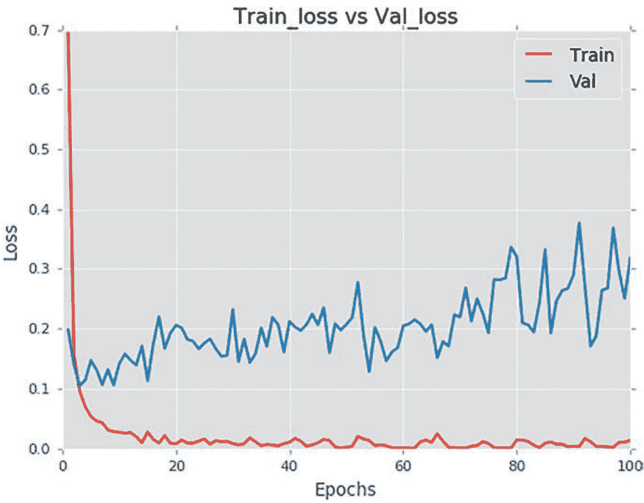

图 11 训练损失和验证损失

预处理在字符识别中，模型在训练期间对完全新的字符进行测试时的性能可能不同。对于手写字符来说，情况会更糟，因为每个人的书写方式都不同。可能无法获取所有类型的手写数据。训练数据可能来自属于特地点或年龄的群体。数据可能没有较大的变化。只有当模型从各种数据 (所有可能的手写版本) 进行训练时，模型才能展现出高度泛化。

因此，在开始训练之前，最好将训练数据修改为共同的表示形式。需要进行大量的预处理，新数据也将遵循相同的步骤，以使其看起来几乎与训练数据相同。

# 用于字符识别的深度学习


在大多数情况下，从文本图像中分割出的字符会被转换为灰度图像或二值图像，因为文本的颜色在大多数情况下不提供任何有用的信息。此外，与 RGB 图像相比，二值图像或灰度图像的处理更容易。

在训练之前使用的一些预处理方法如下所述。实际上，大部分预处理都是使用 opencv 函数完成的。

## 尺寸归一化

所有训练图像可能不具有相同的尺寸。因此，所有图像都应该进行尺寸归一化，以固定的尺寸而不失去纵横比，可以使用任何合适的插值方法。有几种插值方法可供选择，包括双线性插值、双三次插值等。

## 阈值化

这有助于将感兴趣的前景图像或对象与图像的其余部分分离开来。这是通过将所有像素值高于阈值的像素值转换为某个值，将剩余像素转换为另一个值来实现的。另一种方法是使用自适应阈值化方法，该方法还考虑了邻近像素的值，以便可以使用不同的阈值测试图像的不同部分 [28-29]。

```
# visualizing losses and accuracy
train_loss=hist.history['loss']
val_loss=hist.history['val_loss']
train_acc=hist.history['accuracy']
val_acc=hist.history['val_accuracy']
xc=range(100) #Number of epochs
plt.style.use(['ggplot'])
plt.figure(1,figsize=(7,5))

plt.plot(xc,train_loss)
plt.plot(xc,val_loss)
plt.xlabel('Epochs')
plt.ylabel('Loss')
plt.title('Train_loss vs Val_loss')
plt.grid(True)
plt.legend(['Train','Val'])

plt.figure(2,figsize=(7,5))
plt.plot(xc,train_acc)
plt.plot(xc,val_acc)
plt.ylim(0,1.1)
plt.xlabel('Epochs')
plt.ylabel('Accuracy')
plt.title('Train_acc vs Val_acc')
plt.grid(True)
plt.legend(['Train','Val'],loc=4)
```

图 13 绘制图形的代码

## 膨胀和腐蚀

这些对于改善字符图像的清晰度非常有用，这些图像可能是损坏的或非常细。膨胀会通过将像素的值分配给固定窗口的所有相邻像素来增加前景中的字符的厚度，如果值等于 1。腐蚀是膨胀的逆过程，通过丢弃邻域中的像素来减小前景中的字符的厚度。

## 居中

当从完整文档或场景文本图像中分割文本时，字符之间的间距可能非常小。因此，此过程在所有边上添加一些空白边框，以使字符居中并确保不丢失任何信息。

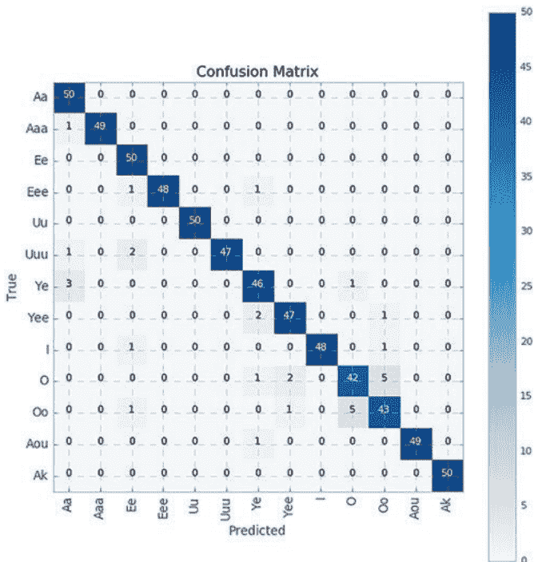

| Chars | Names | Class |
| :--- | :--- | :--- |
| Aa | Aa | 0 |
| Aaa | Aaa | 1 |
| Ee | Ee | 2 |
| Eee | Eee | 3 |
| Uu | Uu | 4 |
| Uuu | Uuu | 5 |
| Ye | Ye | 6 |
| Yee | Yee | 7 |
| I | I | 8 |
| O | O | 9 |
| Oo | Oo | 10 |
| Aou | Aou | 11 |
| Ak | Ak | 12 |

图 14 13 个泰米尔字符的测试数据混淆矩阵

## 二值化

该过程将灰度图像转换为二值图像，背景值为 0，前景值为 1。

## 缩放

缩放是另一种归一化方法，将所有样本缩放到相同的尺度。图像的像素值会根据内容而变化。此过程将所有值缩放到 (0,1) 之间。

## 5 摘要

本章的概念是使用深度学习方法提供字符识别的基础知识。 CNNs 一直是最常用的深度学习方法，对于许多脚本语言 (如中文、阿拉伯语、日语等) 的字符识别都取得了最佳结果。还介绍了各种字符数据集及其详细信息。以泰米尔离线手写字符识别为例，解释了在 Keras 和 TensorFlow 平台上实现字符识别的方法。

# 参考文献

1. LeCun, Y., Bottou, L., Bengio, Y., Haffner, P.: 基于梯度的学习应用于文档识别。IEEE 会议录。86(11), 2278–2324 (1998)
2. LeCun, Y., Boser, B.E., Denker, J.S., Henderson, D., Howard, R.E., Hubbard, W.E., Jackel,L. D.: 使用反向传播网络进行手写数字识别。在神经信息处理系统进展中 (pp. 396–404) (1990).
3. Ciregan, D., Meier, U., Schmidhuber, J.: 用于图像分类的多列深度神经网络。在 2012 年 IEEE 计算机视觉和模式识别会议上（第 3642-3649 页）。IEEE（2012 年 6 月）
4. Krizhevsky, A., Sutskever, I., Hinton, G. E.: 使用深度卷积神经网络进行图像分类。在神经信息处理系统的进展中（第 1097-1105 页）（2012 年）
5. LeCun, Y., Cortes, C., Burges , C. J: MNIST 手写数字数据库，1998 年。网址 http://yann.lecun.com/exdb/mnist, 10, 34（1998 年）
6. Grother, P. J.: NIST 特殊数据库 19 手写表格和字符数据库。国家标准与技术研究所（1995 年）
7. Cohen, G., Afshar, S., Tapson, J., Van Schaik, A.: EMNIST:将 MNIST 扩展到手写字母。在 2017 年国际神经网络联合会议 (IJCNN) 上 (pp. 2921–2926)。IEEE (2017 年 5 月)
8. Liu, C. L., Yin, F., Wang, D. H., Wang, Q. F.: CASIA 在线和离线中文手写数据库。在 2011 年国际文件分析与识别会议上 (pp. 37–41)。IEEE (2011 年 9 月)
9. Liu, C.L., Yin, F., Wang, D.H., Wang, Q.F.: 在新数据库上进行在线和离线手写中文字符识别的基准测试。Pattern Recogn. 46(1), 155–162 (2013)
10. Zhang, X.Y., Bengio, Y., Liu, C.L.: 在线和离线手写中文字符识别：一项全面研究和新的基准测试。Pattern Recogn. 61, 348–360 (2017)
11. Yin, F., Wang, Q. F., Zhang, X. Y., Liu, C. L.: ICDAR 2013 中国手写识别竞赛。在 2013 年第 12 届国际文件分析与识别会议上 (pp. 1464–1470)。IEEE (2013 年 8 月)
12. Lawgali, A., Angelova, M., Bouridane, A.: HACDB: 手写阿拉伯字符数据库用于自动字符识别。在欧洲视觉信息处理研讨会 (EUVIP) (pp. 255–259). IEEE (2013 年 6 月)
13. Boufenar, C., Kerboua, A., Batouche, M.: 关于离线手写阿拉伯字符识别的深度学习研究。认知系统研究。50, 180–195 (2018)
14. El-Sawy, A., Loey, M., Haze m, E.B.: 使用卷积神经网络进行阿拉伯手写字符识别。WSEAS 计算机研究交易 5, 11–19 (2017)
15. Rabby, A.S.A., Haque, S., Islam, M.S., Abujar, S., Hossain, S.A.: Ekush: 一个多功能和多类型的综合数据库，用于在线离线孟加拉手写字符。在：国际图像处理和模式识别近期趋势会议上，第 149-158 页。Springer，新加坡（2018 年 12 月）
16. Biswas, M., Islam, R., Shom, G.K., Shopon, M., Mohammed, N., Momen, S., Abedin, A.: Banglalekha-isolated：一个多功能的孤立孟加拉手写字符综合数据集。数据简报。12，103-107（2017 年）
17. Sarkar, R., Das, N., Basu, S., Kundu, M., Nasipuri, M., Basu, D.K.: CMATER db1：一个无约束的孟加拉和孟加拉 - 英文混合脚本文档图像数据库。国际 J. Doc. An alys. & Recog. (IJDAR). 15（1），71-83（2012 年）
18. 印度统计研究所 ISI 手写字符数据库。https://www.isical.ac.in/~ujjwal/download/database.html。引用日期：2020 年 5 月 1 日
19. Bhattacharya, U., Shridhar, M., Parui, S.K., Sen, P.K., Chaudhuri, B.B.: 离线识别手写孟加拉字符：一种高效的两阶段方法。模式分析应用 15(4),445–458 (2012)
20. Rahman, M.M., Akhand, M.A.H., Islam, S., Shill, P.C., Rahman, M.H.: 使用卷积神经网络的孟加拉手写字符识别。国际图像、图形和信号处理杂志 (IJIGSP). 7(8), 42–49 (2015)
21. Karatzas, D., Gomez-Bigorda, L., Nicolaou, A., Ghosh, S., Bagdanov, A., Iwamura, M., ...Shafait, F.: ICDAR 2015 鲁棒阅读竞赛。在 2015 年第 13 届国际文件分析和识别会议 (ICDAR) (pp. 1156–1160). IEEE (2015 年 8 月)
22. De Campos, T., Bodla, R. B., Varma, M.: chars74k 数据集 (2009)
23. Veit, A., Matera, T., Neumann, L., Matas, J., Belongie, S.: Coco-text: 数据集和基准用于自然图像中的文本检测和识别。arXiv 预印本 arXiv:1601.07140 (2016)
24. Yuan, T. L., Zhu, Z., Xu, K., Li, C. J., & Hu, S. M: 野外中文文本。arXiv 预印本 arXiv:1803.00085 (2018)
25. Abadi, M., Agarwal, A., Barham, P., Brevdo, E., Chen, Z., Citro, C., ...Ghemawat, S.: Tensorflow: 大规模机器学习在异构分布式系统上。arXiv 预印本 arXiv:1603.04467 (2016)
26. HP Labs 孤立手写泰米尔字符数据集，http://lipitk.sourceforge.net/datasets/tamilchardata.htm
27. Srivastava, N., Hinton, G., Krizhevsky, A., Sutskever, I., Salakhutdinov, R.: Dropout: a simple way to prevent neural networks from overfitting. J Machine Learn Res. 15(1), 1929–1958 (2014)
28. Prakash, K.B., Ruwali, A., Kanagachidambaresan, G.R.: 引入张量流，使用张量流进行编程，EIA/Springer 通信和计算创新。https://doi.org/10.1007/978-3-030-57077-4_1
29. Kanagachidambaresan, G.R., Manohar Vinoothna, G., Prakash, K.B.: 可视化，使用张量流进行编程，EIA/Springer 通信和计算创新。https://doi.org/10.1007/978-3-030-57077-4_3
30. Vamsidhar, E., Kanagachidambaresan, G.R., Prakash, K.B.: 机器学习和深度学习的应用，使用 TensorFlow 进行编程，EIA/Springer 通信和计算创新。https://doi.org/10.1007/978-3-030-57077-4_8

# Keras 和 TensorFlow：实践经验

Ferdin Joe John Joseph，Sarayut Nonsiri 和 Annop Monsakul

## 介绍

以一种使读者理解为前提的方式解释了 TensorFlow 架构，以便了解为什么需要学习作为 Keras 的先决条件 [1]。为此，解释了 Python 中 TensorFlow 及其支持库。需要理解这些库之间的互操作性才能理解 TensorFlow。本章组织如下：

1. TensorFlow 架构
2. Keras 简介
3. 在 Jupyter Notebooks 中安装 TensorFlow 和 Keras - 硬件方面
4. 在 Jupyter Notebooks 中安装 TensorFlow 和 Keras - 软件方面
5. 使用 Keras 进行线性回归 - 案例研究
6. 使用 Keras 进行二元分类 - 案例研究
7. 多类别分类 - 案例研究

在获得先决条件之后，介绍了 Keras。使用 TensorFlow 作为后端，解释了 Keras。解释了 Keras 的理论方面。接下来是 Keras 库在深度学习应用中的操作功能。

通过 Python 代码片段解释了 Keras 的操作功能。这些是 Keras 的理论方面。

要在深度学习中使用 Keras，需要一个关于如何安装和配置库的部分。这包括硬件和软件方面。Google Colab 在云中使用 TPU，但独立版本需要 GPU。列出了 TensorFlow 和 Keras 支持的 GPU 列表。还列出了其他硬件要求和需要安装的驱动程序，包括 NVIDIA。

F. J. 约翰·约瑟夫 (✉)·S. Nonsiri·A. Monsakul
泰国尼奇技术学院信息技术学院，曼谷，泰国
e-mail: ferdin@tni.ac.th

© 作者，独家许可给 Springer Nature Switzerland AG 2021 K. B. Prakash 等人，工程师和科学家的高级深度学习，EAI/Springer 通信和计算创新，https://doi.org/10.1007/978-3-030-66519-7_4


软件。在 Jupyter Notebooks 的硬件方面安装 TensorFlow 和 Keras 提供了足够的信息，以便准备一台个人电脑或笔记本电脑，使其足够兼容 TensorFlow 和 Keras。本章的这一部分将逐步介绍如何在个人电脑或笔记本电脑上激活 GPU 并启用 CUDA 处理单元的过程。

一旦系统的硬件与 TensorFlow 和 Keras 兼容，则必须安装软件。本节介绍了 GPU 与 Keras 和 TensorFlow 之间的互操作性。这包括了如何逐步安装 TensorFlow 中的 Keras 的过程。步骤包括命令提示符语句在 Anaconda Navigator 和 Jupyter Notebooks 中创建环境所需的。创建环境后，逐步介绍了如何使 GPU 与使用 Anaconda Navigator 设置的环境同步的过程。在进行所有同步后，逐步介绍了 TensorFlow 中 Keras 的库和屏幕截图。安装 Keras 后，使用一些 TensorFlow 库函数检查环境和库的有效性。

在成功安装 Keras 之后，通过案例研究来解释如何使用 TensorFlow 和 Keras 进行编码。线性回归和二元和多元分类通过案例研究进行解释。Jupyter 笔记本被共享，并解释了代码片段。这包括从外部来源导入数据，包括 MNIST 数据集等库数据。导入的数据经过预处理，并设置 CNN 参数，如隐藏层、卷积和最大池化层。这些案例研究的输出通过代码和每次训练执行中的迭代次数进行解释。

线性回归通过钻石价格预测进行演示。这个钻石价格数据集是以 CSV 格式提供的。该数据集包含 54,000 个钻石记录。使用 Pandas 库来解释 CSV 格式数据集的用法。使用人工神经网络（ANN）算法创建预测模型。

二元分类通过猫狗分类进行演示，其中涉及预测图像是否包含狗或猫。实验部分是使用免费的 Kaggle 数据集演示深度学习卷积神经网络的使用。训练数据包含 25,000 张狗和猫的图像，测试数据包含 12,500 张图像。使用 Seaborn 库测量准确性，并创建和可视化混淆矩阵。

使用内置的 Keras 数据集 MNIST，介绍了多类别分类，该数据集是计算机视觉中常用的标准数据集。该数据库包含 10 个数字的 28×28 灰度图像。

训练集包含 70,000 个图像，而测试集包含 10,000 个未经训练的图像。在实验部分，通过准确性比较了多层感知器（MLP）和卷积神经网络（CNN）算法。所有这些应用都使用领域知识和源代码进行了解释。源代码文件的 GitHub 链接在下面的链接 [2] 中共享。

```
https://github.com/ferdinjoe/Chapter-4-Working-with-Keras
```

## 1 TensorFlow 架构

在探索 Keras 之前，需要详细讨论 TensorFlow。TensorFlow 是 Google 开发的最著名的机器学习和深度学习库。该库可以在 CPU、GPU、物联网处理器 (如 Jetson Nano、神经网络棒等) 上运行。该库于 2015 年首次公开。然而，自 2017 年以来，稳定版本已在 Apache 开源许可下提供。Apache 开源许可下的库允许使用、修改和重新分发，而无需向 Google 支付任何版税。TensorFlow 的架构包括以下三个部分 (图 1)。

输入进入 TensorFlow 的是一个多维数组，这些数组被称为张量。多维数组的流动给了 TensorFlow 这个名字。这些张量从一端作为输入进入系统，经过各种操作，最终产生输出。

在 Python 中，可以通过以下导入语句来激活 TensorFlow。

```python
import tensorflow as tf
```

开发人员广泛使用“tf”符号来表示代码中使用了 TensorFlow。

这有两个阶段：

- 1. 开发阶段
- 2. 运行阶段

开发阶段用于训练数据，可以在高性能工作站、个人电脑或笔记本电脑上使用 GPU 进行。运行阶段可以在任何类型的机器上进行，包括台式机、云端或移动设备。

TensorFlow 2.0 中的算法列表如下。

```python
from keras.models import Sequential
model = Sequential()
```

在研究人员和数据科学家广泛使用 TensorFlow 之后，Keras 在 TensorFlow 之上开发出来。


图 1 TensorFlow 架构

## 2 Keras 入门

Keras 是一个基于 Python 的神经网络 API，用于运行 TensorFlow、CNTK 和 Theano。它与 TensorFlow 2.0 一起使用，在本章中列出的源代码中嵌入了最新版本的 Keras 和版本：Keras 2.3.0。在 Python 中，Keras 与 tf.keras 符号一起使用。它有以下四个工作原则：

- 1. 用户友好性
- 2. 模块化
- 3. 易于扩展
- 4. 与 Python 一起使用

模型是 Keras 中最重要的数据结构。Sequential 是一个广泛使用的模型。使用 Sequential 模型的步骤如下：

```python
tf.keras.layers.Dense(units, activation=None, use_bias=True,
    kernel_initializer="glorot_uniform",
    bias_initializer="zeros",
    kernel_regularizer=None,
    bias_regularizer=None,
    activity_regularizer=None,
    kernel_constraint=None,
    bias_constraint=None, **kwargs)
```

### Keras 层的类型

有 11 种不同类型的 Keras 层可用于配置深度学习神经网络，如下所示：

- 1. 核心层 Dense
它在密集连接的神经网络层中用作核心层。

```python
keras.layers.Activation(activation)
```

上述代码片段获取 n 维张量并输出 n 维张量。输入以其维度和批次大小的 D 维批次大小为参数。通过该核心层传递后，该输入产生与输入相同大小的输出。

**激活**
将给定的输入应用激活函数。输入和输出的大小相同。下面的代码片段展示了该层函数的用法。

```python
keras.layers.Dropout (rate, noise_shape=None, seed=None)
```

**丢弃**
输入层给出了丢弃的转换。

```python
keras.layers.Flatten(data_format=None)
```

**展平**
```python
keras.layers.Reshape(target_shape)
```
用于展平输入，不影响输入和输出的大小。该层通常用于与数据模型对应的层中进行训练和测试。

**重塑**
重塑用作将输入张量的形状转换为输出张量大小的层。

```python
keras.layers.Permute(dims)
```

**置换**
该层使用排列来改变输入的维度。它在像连接循环神经网络 (RNN) 和卷积神经网络 (ConvNets) 的场景中使用。

```python
keras.layers.RepeatVector(n)
```

**RepeatVector**
将输入向量重复 n 次。

```python
keras.layers.Lambda(function, output_shape=None, mask=None, arguments=None)
```

**Lambda**
Lambda 用于将任意表达式封装为层对象。

```python
keras.layers.ActivityRegularization(l1=0.0, l2=0.0)
```

**活动正则化**
活动正则化用于根据输入活动对代价函数进行更新。

```python
conda create --name tensorflow --clone root
```

类似地，还有一些其他核心层，如掩蔽层和空间 1D、2D 和 3D 的丢弃层。

- 2. 卷积层
与 TensorFlow 相同，Keras 中的卷积层包括 Conv 1D、Conv 2D、可分离 Conv 1D、可分离 Conv 2D、深度卷积 1D、深度卷积 2D、卷积 2D 转置以及上述所有层的 3D。

- 3. 池化层
Keras 的池化层包括最大池化、平均池化、平均最大池化、全局最大池化等。

- 4. 本地连接层
本地连接 1D 和本地连接 2D 是本地连接层中的层。

- 5. 循环层
循环层包括仅与循环神经网络 (RNN)、门控循环单元 (GRU) 和长短期记忆 (LSTM) 层一起使用的功能。

- 6. 嵌入层
- 7. 合并层
- 8. 高级激活层
这些是通常的激活层，但是为特殊情况而开发的。LeakyReLU 是修正线性单元的修正版本，而 PReLU 是 ReLU 的参数化变体。除了 ReLU 和 softmax 之外，Keras 还提供了指数线性单元 (ELU) 和阈值 ReLU。

- 9. 归一化层
BatchNormalization 是 Keras 提供的一种归一化层。

## 3 在 Jupyter 笔记本中安装 TensorFlow 和 Keras

### 硬件方面

Keras 的理想配置通常需要以下内容：在 Windows 10 操作系统中。

- NVIDIA GeForce GTX 1060 6GB GDDR5 及以上
- Core i7-7700 HQ 及以上或 i5 第十代
- 16GB DDR4 RAM 及以上

Keras 在 TensorFlow 之上运行。因此，硬件依赖性与 TensorFlow 相同。通常建议使用 NVIDIA GPU 进行 Keras 安装。

除 NVIDIA 之外的其他品牌尚未支持 Keras 和 TensorFlow。这是由于 TensorFlow 和 NVIDIA GPU 之间的 CUDA 中间件的相互依赖性。安装所需的 NVIDIA GeForce GTX 或 RTX 驱动程序以使 GPU 与操作系统同步。必须安装 TensorFlow 的 GPU 版本。安装从 https://developer.nvidia.com/cuda-toolkit 下载的 CUDA 工具包。按照 GitHub 链接中的自述文件部分进行操作。

一旦环境变量设置完成，重新启动机器。重新启动机器后，按照第 4.4 节的步骤进行操作。


图 2 安装 Keras 所需的软件

### 软件方面

安装 Keras 需要以下软件（图 2）。

通过从 https://www.anaconda.com/download 下载安装 Anaconda Navigator。默认情况下，安装了带有 Python 发行版的 Jupyter Notebook。有两种安装 TensorFlow 和 Keras 的方法：
- 1. 从源代码安装。
- 2. 在 Anaconda Navigator 的 Jupyter Notebook 中的虚拟环境中安装。

本章的教程涉及 Anaconda Navigator 中的 Jupyter Notebook。在所有上述安装之上，安装 Visual Studio 2015。现在再次重新启动机器。硬件和软件支持的安装现在已完成。

重新启动机器后，按照下面的步骤将 GPU 与 Keras 和 TensorFlow 同步。

- 1. 为 TensorFlow 安装环境
打开 Anaconda 提示符，输入以下命令：

```bash
activate tensorflow
pip install --ignore-installed --upgrade tensorflow-gpu
```

– 克隆根目录将继承默认 Python 到 TensorFlow 环境的库。

- 2. 安装 GPU 版本的 TensorFlow
输入以下命令：

```bash
call activate tensorflow
```

- 3. TensorFlow 验证
打开 Anaconda 提示符并输入

```python
import tensorflow as tf
print(tf.__version__)
```

然后打开 Anaconda Navigator 并输入

```bash
activate tensorflow environment
```

上述两个语句的响应必须显示已安装的 TensorFlow 版本。

## 4 安装和验证 Keras

在 Anaconda 提示符中，打开 TensorFlow 环境并输入

```bash
conda install keras
```

现在输入

```python
import keras
Using TensorFlow backend.
print(keras.__version__)
```

安装 Keras 完成后，可以使用下面的语句检查库功能。

```python
from tensorflow.python.client import device_lib
print(device_lib.list_local_devices())
```

## 5 检查 Keras 和 TensorFlow 是否在 GPU 上运行

```python
[name: "/device:CPU:0"
device_type: "CPU"
memory_limit: 268435456
locality {
}
incarnation: 14869837826445014983
, name: "/device:GPU:0"
device_type: "GPU"
memory_limit: 7103961498
locality {
bus_id: 1
links {
}
}
incarnation: 9950417734109268282
physical_device_desc: "device: 0, name: GeForce GTX 1070 Ti, pci bus id: 0000:01:00.0, compute capability: 6.1"
]
```

此语句的输出将类似于下面的输出。

## 使用 Keras 进行线性回归：案例研究

在本节中，我们将探讨如何使用 Keras 创建线性回归模型，以确定独立输入变量和依赖输出变量之间的关系。波士顿房屋数据集用于演示训练模型以预测波士顿地区房价的价值。这个数据集 [3] 是由美国人口普查局收集的。可以从 StatLib 存档中访问 (http://lib.stat.cmu.edu/datasets/boston)，该存档由卡内基梅隆大学 (CMU) 维护。共有 506 条记录，每条记录都包含 13 个房屋特征和 1 个目标变量 (MEDV)。

- 1. 使用 Keras 加载波士顿房价数据集

为了加载波士顿房价数据集，Keras 提供了一个 load_data() 方法，可以直接从 keras.dataset 模块中下载数据集。该方法返回两个元组，包含训练数据 (x_train, y_train) 和测试数据 (x_test, y_test)。这个方法对用户非常有益，因为他们不需要使用从其他来源下载的 CSV 文件。

```python
import pandas as pd
attributes_name = ['crim', 'zn', 'indus', 'chas', 'nox', 'rm', 'age', 'dis', 'rad', 'tax', 'ptratio', 'black', 'lstat']
df = pd.DataFrame(x_train)
df.columns = attributes_name
df['medv'] = y_train
df.head(10)
```

Pandas 是一个用于数据处理和分析的开源 Python 库。在这个例子中，它被用来以表格形式探索训练样本。代码的第一行是导入一个名为 pd 的 pandas 库，以便在程序中引用任何 pandas 函数。x_train 变量被加载到 pandas DataFrame 对象中。由于内置的 Keras 数据集没有可用的列名，所以加载了这个变量。attributes_name 变量包含一个属性名称列表，并赋值给 DataFrame 的列名 (df.columns)。y_train 作为目标变量被添加到一个新的 DataFrame 列中。The df.head(10) method returns the first ten rows of the training data.

```python
print('Training data:', x_train.shape)
print('Testing data:', x_test.shape)
```

对于波士顿房屋数据集，有 506 条记录。这些信息被分成两部分进行训练和测试，如上所示。训练数据 (x_train) 包含 404 条记录，测试数据 (x_test) 包含 102 条记录。The x_train.shape and x_test.shape commands return the number of training and testing data dimensions in (rows, columns) format. 结果显示，训练数据的形状为 (404, 13)，测试数据的形状为 (102, 13)。这意味着训练数据有 404 行和 13 列，测试数据有 102 行和 13 列。

```python
from keras.models import Sequential
from keras.layers import Dense
```

训练数据：(404, 13)
测试数据：(102, 13)

将必要的模块导入到包含相关函数的 Python 环境中，例如 Sequential 和 Dense 模块。

```python
model = Sequential()
model.add(Dense(14, input_dim=13, activation='relu'))
model.add(Dense(6, activation='relu'))
model.add(Dense(1, activation='linear'))
model.compile(loss='mean_squared_error', optimizer='adam')
model.summary()
```

从以下代码块中，这是定义和编译模型的一步。Sequential 类允许我们使用 add() 方法堆叠不同的层来构建神经网络模型。Sequential() 构造函数实例化为一个模型变量。Dense 类是一个完全连接的神经网络层，其中每个输入都连接到每个输出。

对于模型中的第一层密集层，输入维度需要通过将 input_dim 参数设置为与 x_train 和 x_test 变量的列数相同来指定 [4]。在这个例子中，有 13 个特征。这一层有 14 个神经元。选择 ReLU(“relu”) 作为激活函数。因此，这一层传入了三个参数。第二层通过传递两个参数来定义：六个神经元和 ReLU(“relu”) 激活函数。最后一层是一个输出层，只有一个神经元，并且激活函数是线性的。

compile() 方法是指定学习过程。均方误差(“mean_squared_error”) 被选为损失函数，优化器参数是“adam”算法。因此，这个简单的架构由三层组成。summary() 方法用于显示神经网络的架构，例如层数、输出形状和参数数量。

Model: "sequential_1"

| Layer (type) | Output Shape | Param # |
|---|---|---|
| dense_1 (Dense) | (None, 14) | 196 |
| dense_2 (Dense) | (None, 6) | 90 |
| dense_3 (Dense) | (None, 1) | 7 |
| Total params: 293 |
| Trainable params: 293 |
| Non-trainable params: 0 |

返回以下结果：

```python
history = model.fit(x_train, y_train, epochs=1000)
```

使用训练数据 (x_train) 和目标数据 (y_train) 来训练回归模型的 fit() 方法。此外，epochs 参数是将所有训练数据通过神经网络模型前向和后向传递以更新权重的迭代次数。在这个例子中，epochs 参数设置为 1000。

Epoch 1000/1000
404/404 [==============================] - 0s 59us/step - loss: 20.2829

在训练过程中，显示训练统计信息如下：

```python
performance = model.evaluate(x_test, y_test)
print(performance)
```

evaluate() 方法用于使用测试数据 (x_test 和 y_test) 评估训练模型的性能。较低的损失值表示更好的性能。结果表明，性能约为 29.27。

```
102/102 [==============================] - 0s 205 微秒/步
29.270214753992416
```

从所有前面的代码块中，它实现了一个简单的神经网络架构。然而，这个训练模型的性能可以得到改善。在接下来的章节中，介绍了几种技术来最小化损失函数的值，例如数据重新缩放、正则化、批归一化和 Dropout。

这些技术可以提供更好的结果。

数据重新缩放是用来克服数据集值具有不同范围的技术之一。这个问题可能导致一些更大范围的特征对更小范围的特征产生更大的影响。因此，在训练模型之前，我们需要对训练和测试数据进行重新缩放。

Scikit-learn 是一个开源的 Python 机器学习库，但我们用它来进行数据预处理。MinMaxScaler() 类中的 fit_transform() 方法用于将每个特征在训练 (x_train) 和测试 (x_test) 数据中转换为 0 到 1 之间的值。

```python
from sklearn import preprocessing
min_max_scaler = preprocessing.MinMaxScaler()
x_train = min_max_scaler.fit_transform(x_train)
x_test = min_max_scaler.fit_transform(x_test)
```

从下面的代码中，使用 pandas 库以表格形式探索经过重新缩放的训练样本，返回以下结果，所有特征都在 0 和 1 之间重新缩放。

```python
attributes_name = ['crim', 'zn', 'indus', 'chas', 'nox', 'rm', 'age',
                   'dis', 'rad', 'tax', 'ptratio', 'black', 'lstat']
df = pd.DataFrame(x_train)
df.columns = attributes_name
df['medv'] = y_train
df.head(10)
```

这个神经网络被设计用来进行回归分析。导入额外的 Keras 模块以防止过拟合问题，例如正则化器、Dropout 和 BatchNormalization。

因此，损失值可以显著降低，低于之前的回归模型。

kernel_regularizer 参数可以用于对层的内核施加惩罚。我们可以在 Keras 层中添加正则化。默认值为 None。在这个例子中，将 keras.regularizers.l2() 方法添加到 Dense 层中。这种方法是 l2 正则化类型，正则化强度在 0 和 1 之间。在这个例子中，l 为 0.1。过高的正则化强度值可能导致模型欠拟合。如果需要 l1 正则化，只需将 keras.regularizers.l2() 替换为 keras.regularizers.l1() 方法。

```python
model.add(Dense(14, input_dim=13,
             activation='relu',
             kernel_regularizer=regularizers.l2(0.1)))
```

dropout 技术是在训练过程中基于一定比例随机丢弃输入和隐藏层的神经元。这种技术有助于模型在未见数据上进行足够的泛化。在这个例子中，dropout 层被添加到模型中，且丢弃比例为 0.01，如下所示:

```python
model.add(Dropout(.01))
```

BatchNormalization() 方法是一种用于减少隐藏层输出并加速训练过程的技术。要将批归一化层添加到模型中，只需使用 model.add() 方法，如下所示:

```python
model.add(BatchNormalization())
```

定义并编译了新模型，并且模型摘要如下:

```python
from keras.models import Sequential
from keras.layers import Dense, Dropout
from keras import regularizers
from keras.layers.normalization import BatchNormalization

model = Sequential()
model.add(Dense(14, input_dim=13, activation='relu',
                kernel_regularizer=regularizers.l2(0.1)))
model.add(BatchNormalization())
model.add(Dropout(.01))
model.add(Dense(6, activation='relu', kernel_regularizer=regularizers.l2(0.1)))
model.add(BatchNormalization())
model.add(Dropout(.01))
model.add(Dense(1, activation='linear'))
model.compile(loss='mean_squared_error', optimizer='adam')
model.summary()
```

## Keras 和 TensorFlow：实践经验

```
# Model: "sequential_2"
```

| Layer (type) | Output Shape | Param # |
| :--- | :--- | :--- |
| dense_4 (Dense) | (None, 14) | 196 |
| batch_normalization_1 (Batch Normalization) | (None, 14) | 56 |
| dropout_1 (Dropout) | (None, 14) | 0 |
| dense_5 (Dense) | (None, 6) | 90 |
| batch_normalization_2 (Batch Normalization) | (None, 6) | 24 |
| dropout_2 (Dropout) | (None, 6) | 0 |
| dense_6 (Dense) | (None, 1) | 7 |

Total params: 373
Trainable params: 333
Non-trainable params: 40

以下代码是将训练数据分为两部分 (训练数据和验证数据) 来拟合模型。validation_split 参数设置为 0.1，意味着训练数据占总数据的 90%，验证数据占 10%。

```python
history = model.fit(x_train, y_train, epochs=1000, validation_split=0.1, verbose=2)
```

返回以下结果:

```
Epoch 1000/1000 - 0s - loss: 10.8459 - val_loss: 4.9475
```

Matplotlib 库是 Python 中的开源可视化工具。在 Jupyter Notebook 中显示图形，可以使用 `%matplotlib inline` 命令将输出图形嵌入到笔记本中。使用给定的 x 和 y 变量绘制线图的是 pyplot 模块。“import matplotlib.pyplot as plt”是从 Matplotlib 库导入 pyplot 模块，并将其命名为 plt。在这个例子中，它用于显示损失和验证损失值之间的比较图，如下所示:

```python
%matplotlib inline
import matplotlib.pyplot as plt
loss = history.history['loss']
val_loss = history.history['val_loss']
epochs = range(len(loss))
plt.plot(epochs, loss, label='Training Loss')
plt.plot(epochs, val_loss, label='Validation Loss')
plt.title('training loss and validation loss')
plt.legend(loc=0)
plt.savefig('Training loss vs. Validation loss.png', dpi=150)
plt.figure()
```

前面的代码返回结果，如图 3 所示。model.evaluate() 方法用于使用测试数据评估模型的性能。

```python
performance = model.evaluate(x_test, y_test)
print(performance)
```

model.predict() 方法用于使用训练好的模型预测测试数据集。

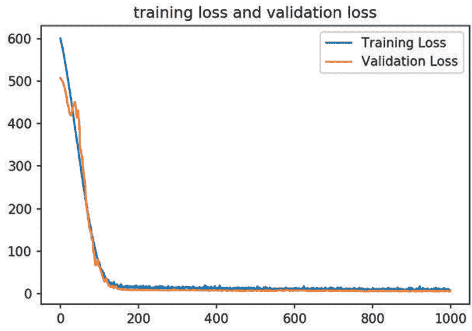

图 3 训练损失 vs. 验证损失

```python
y_pred = model.predict(x_test)
print(y_pred)
```

## 使用 Keras 进行二元分类：案例研究

本节将探讨如何使用 Keras [5] 构建深度神经网络模型来对猫和狗的图像进行分类。本节使用的数据集可以从以下链接下载：https://storage.googleapis.com/mledu-datasets/cats_and_dogs_filtered.zip。文件大小约为 66MB。其中包含 2000 个训练图像和 1000 个验证图像。

在第一步中，从 Keras 导入库和模块到 Python 环境中。

```python
import keras
from keras import Model
from keras.models import Sequential
from keras.layers import Dense, Flatten, Dropout, BatchNormalization
from keras.layers.convolutional import Conv2D, MaxPooling2D
import os
```

在这一步中，将 cats_and_dogs_filtered 文件夹设置为根路径，并包含用于训练和验证图像的文件夹目录。每个文件夹都包含用于创建模型的猫和狗图像子文件夹。

```python
root_path = 'cats_and_dogs_filtered'

train_folder = os.path.join(root_path, 'train')
validation_folder = os.path.join(root_path, 'validation')

train_dogs_folder = os.path.join(train_folder, 'dogs')
train_cats_folder = os.path.join(train_folder, 'cats')

validation_dogs_folder = os.path.join(validation_folder, 'dogs')
validation_cats_folder = os.path.join(validation_folder, 'cats')
```

下面的代码是用来定义训练和验证目录中的猫和狗的文件名。结果显示了每个文件夹的前五个文件名。

```python
train_dog_filenames = os.listdir(train_dogs_folder)
train_cat_filenames = os.listdir(train_cats_folder)
validation_dog_filenames = os.listdir(validation_dogs_folder)
validation_cat_filenames = os.listdir(validation_cats_folder)

print('Train filenames:')
print(train_dog_filenames[:5])
print(train_cat_filenames[:5])

print('Validation filenames:')
print(validation_dog_filenames[:5])
print(validation_cat_filenames[:5])
```

训练文件名：
['dog.0.jpg', 'dog.1.jpg', 'dog.10.jpg', 'dog.100.jpg', 'dog.101.jpg']
['cat.0.jpg', 'cat.1.jpg', 'cat.10.jpg', 'cat.100.jpg', 'cat.101.jpg']

验证文件名：
['dog.2000.jpg', 'dog.2001.jpg', 'dog.2002.jpg',
'dog.2003.jpg', 'dog.2004.jpg']
['cat.2000.jpg', 'cat.2001.jpg', 'cat.2002.jpg',
'cat.2003.jpg', 'cat.2004.jpg']

上述代码是用来检查猫和狗图像的数量。

```python
dogs_num = len(train_dog_filenames)
cats_num = len(train_cat_filenames)

print('training dog:', dogs_num)
print('training cat:', cats_num)

val_dogs_num = len(validation_dog_filenames)
val_cats_num = len(validation_cat_filenames)

print('validation dog:', val_dogs_num)
print('validation cat:', val_cats_num)
```

训练狗：1000
训练猫：1000
验证狗：500
验证猫：500

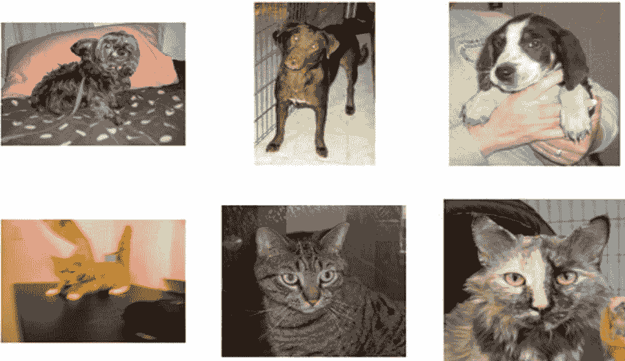

图 4 猫和狗样本

这是使用 Matplotlib 模块绘制猫和狗的前三张图像 (图 4)。

```python
import matplotlib.pyplot as plt
import matplotlib.image as mpimg

dog_path = train_dogs_folder + '/'
cat_path = train_cats_folder + '/'

plt.subplot(231)
plt.imshow(mpimg.imread(dog_path + train_dog_filenames[0]))
plt.axis('Off')
plt.subplot(232)
plt.imshow(mpimg.imread(dog_path + train_dog_filenames[1]))
plt.axis('Off')
plt.subplot(233)
plt.imshow(mpimg.imread(dog_path + train_dog_filenames[2]))
plt.axis('Off')
plt.subplot(234)
plt.imshow(mpimg.imread(cat_path + train_cat_filenames[0]))
plt.axis('Off')
plt.subplot(235)
plt.imshow(mpimg.imread(cat_path + train_cat_filenames[1]))
plt.axis('Off')
plt.subplot(236)
plt.imshow(mpimg.imread(cat_path + train_cat_filenames[2]))
plt.axis('Off')
plt.savefig('Dog Cat.png', dpi=100)
plt.show()
```

上述代码是使用 ImageDataGenerator 类对训练和验证图像进行数据增强和重新缩放。

```python
from keras.preprocessing.image import ImageDataGenerator
train_datagen = ImageDataGenerator(rescale = 1.0/255.,
                                   shear_range=0.2,
                                   zoom_range=0.2,
                                   horizontal_flip=True)
validation_datagen = ImageDataGenerator(rescale = 1.0/255.)
```

这一步是使用 flow_from_directory() 方法定义训练和验证文件夹。批量大小设置为 100，因为这是一个批次中的训练图像数量。由于这是一个二分类问题，“二进制”被赋给 class_mode 参数。target_size 参数用于设置图像的高度和宽度。在此设置中，每个图像为 150×150 像素。

```python
train_generator = train_datagen.flow_from_directory(train_folder,
                                                    batch_size=100,
                                                    class_mode='binary',
                                                    target_size=(150, 150))
validation_generator = train_datagen.flow_from_directory(validation_folder,
                                                         batch_size=100,
                                                         class_mode='binary',
                                                         target_size=(150, 150))
```

通过定义、编译和训练模型来构建二分类器。

```python
model = Sequential()
model.add(Conv2D(32, (3, 3), activation='relu', input_shape=(150, 150, 3)))
model.add(BatchNormalization())
model.add(MaxPooling2D(pool_size=(2, 2)))
model.add(Dropout(0.25))
model.add(Conv2D(64, (3, 3), activation='relu'))
model.add(BatchNormalization())
model.add(MaxPooling2D(pool_size=(2, 2)))
model.add(Dropout(0.25))
model.add(Conv2D(128, (3, 3), activation='relu'))
model.add(BatchNormalization())
model.add(MaxPooling2D(pool_size=(2, 2)))
model.add(Dropout(0.25))
model.add(Flatten())
model.add(Dense(512, activation='relu'))
model.add(BatchNormalization())
model.add(Dropout(0.5))
model.add(Dense(1, activation='sigmoid'))
model.compile(loss='binary_crossentropy', optimizer='rmsprop', metrics=['accuracy'])
history = model.fit(train_generator, validation_data=validation_generator, epochs=1000, verbose=2)
```

验证准确率为 82%，如下结果所示：

```
Epoch 999/1000 - 9s - loss: 0.0104 - accuracy: 0.9970 - val_loss: 1.2515 - val_accuracy: 0.7960
Epoch 1000/1000 - 9s - loss: 0.0094 - accuracy: 0.9960 - val_loss: 1.1365 - val_accuracy: 0.8200
```

在训练二分类器模型后，我们将测试一张之前未见过的新图像 [6]，然后加载和预处理一张新图像（图 5）以供使用 `predict()` 函数进行预测。

图 5 猫.jpg


```python
from keras.preprocessing import image
import numpy as np

# load a new image
filename = 'cat.jpg'
img = image.load_img(filename, target_size=(150, 150))

# preprocess a new image
img = image.img_to_array(img)
img = np.expand_dims(img, axis=0)

# predict a new image
predicted_result = model.predict(img)
print(predicted_result[0][0])
if predicted_result[0][0] == 0:
    result = 'This image is a Cat.'
else:
    result = 'This image is a Dog.'
print(result)
```

前面的代码返回结果 `[0.]`。这张图片是一只猫。

`train_generator.class_indices` 属性返回一个包含类名和索引的字典。例如，{"猫": 0, "狗": 1}。这意味着如果 `predicted_result[0][0]` 为 0，则预测的图片是一只猫。否则，图片是一只狗。因此，其 `predicted_result[0][0]` 为 `[0.]`，并打印“这张图片是一只猫”。最终，模型可以正确预测图片。

## 多类别分类：案例研究

在本节中，我们将介绍在 Keras 中使用卷积神经网络（CNN）对 MNIST（Modified National Institute of Standards and Technology）数据集进行多类别分类。MNIST 是一个手写数字数据集 [7]。训练图像有 60,000 张，测试图像有 10,000 张。每个图像是灰度的 28 x 28 像素 [8, 9]。

导入库、模块和 MNIST 数据集 [10, 11]。

```python
import keras
from keras.datasets import mnist
from keras import Model
from keras.models import Sequential
from keras.layers import Dense, Flatten, Dropout
from keras.layers.convolutional import Conv2D, MaxPooling2D
```

`mnist.load_data()` 方法用于从 Keras 模块加载 MNIST 数据集。结果返回训练数据 `(x_train, y_train)` 和测试数据 `(x_test, y_test)`。

```python
(x_train, y_train), (x_test, y_test) = mnist.load_data()
```

`x_train.shape` 和 `x_test.shape` 命令返回训练和测试数据的维度，以图像数量和像素数量的格式表示。结果显示训练数据的形状为 `(60000, 28, 28)`，测试数据的形状为 `(10000, 28, 28)`。这意味着训练数据 `(x_train)` 包含 60,000 个图像，测试数据 `(x_test)` 包含 10,000 个记录，每个图像的尺寸为 28 x 28 像素。

```python
print('Train image:', x_train.shape)
print('Test image:', x_test.shape)
```

训练图像：(60000, 28, 28)
测试图像：(10000, 28, 28)

导入 Seaborn 和 NumPy 库以探索手写数字样本的分布。

```python
import seaborn as sns
import numpy as np
(number, counts) = np.unique(y_train, return_counts=True)
g = sns.countplot(y_train)
print(number)
print(counts)
```

上述代码返回结果，如图 6 所示。此代码块使用 Matplotlib 库绘制图像，如图 7 所示。

```
[0 1 2 3 4 5 6 7 8 9]
[5923 6742 5958 6131 5842 5421 5918 6265 5851 5949]
```

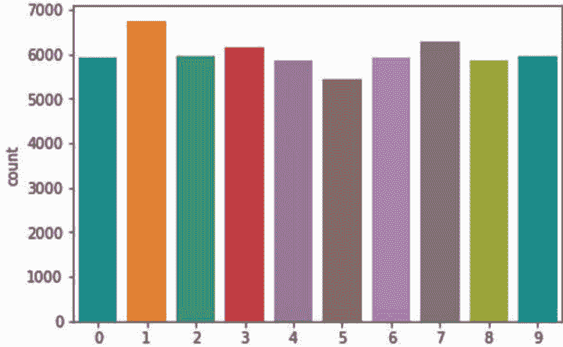

图 6 训练数据图

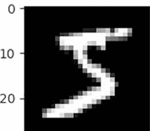
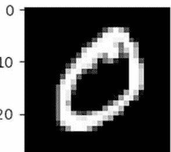
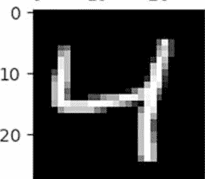
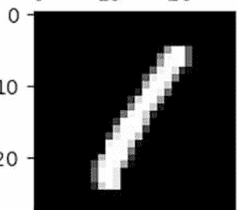

图 7 手写数字样本

```python
import matplotlib.pyplot as plt
plt.subplot(221)
plt.imshow(x_train[0], cmap='gray')
plt.subplot(222)
plt.imshow(x_train[1], cmap='gray')
plt.subplot(223)
plt.imshow(x_train[2], cmap='gray')
plt.subplot(224)
plt.imshow(x_train[3], cmap='gray')
plt.savefig('Number.png', dpi=100)
plt.show()
```

图像结果如下所示：通过定义和编译来构建一个简单的神经网络模型。

```python
model = Sequential()
model.add(Flatten(input_shape=(28, 28)))
model.add(Dense(128, activation='relu'))
model.add(Dense(10, activation='softmax'))
model.compile(loss='sparse_categorical_crossentropy', optimizer='adam',
metrics=['accuracy'])
```

使用训练数据来训练 CNN 模型。

```python
history = model.fit(x_train, y_train, epochs=1000)
```

使用 `model.evaluate()` 方法评估模型性能。

```python
v_loss, v_acc = model.evaluate(x_test, y_test)
print(v_loss, v_acc)
```

下一节讨论如何构建卷积神经网络模型。导入相关模块。

```python
from keras.models import Sequential
from keras.layers import Dense, Dropout, Flatten
from keras.layers.convolutional import Conv2D, MaxPooling2D
from keras.utils import np_utils
```

`keras.datasets.mnist.load_data()` 方法用于从 Keras 模块加载 MNIST 数据集。结果返回训练数据 `(x_train, y_train)` 和测试数据 `(x_test, y_test)`。

```python
(x_train, y_train), (x_test, y_test) = keras.datasets.mnist.load_data()
```

对训练和测试图像进行预处理。

```python
x_train = x_train.reshape(x_train.shape[0], 1, 28, 28).astype('float32')
x_test = x_test.reshape(x_test.shape[0], 1, 28, 28).astype('float32')
x_train = x_train / 255
x_test = x_test / 255
y_train = np_utils.to_categorical(y_train)
y_test = np_utils.to_categorical(y_test)
num_classes = y_test.shape[1]
```

定义和编译 CNN 模型。

```python
model = Sequential()
model.add(Conv2D(32, (5, 5), input_shape=(1,28, 28), activation='relu',padding='same'))
model.add(MaxPooling2D(pool_size=(2, 2),padding='same'))
model.add(Dropout(0.2))
model.add(Flatten())
model.add(Dense(128, activation='relu'))
model.add(Dense(num_classes, activation='softmax'))
model.compile(loss='categorical_crossentropy', optimizer='adam', metrics=['accuracy'])
```

使用训练和验证数据来训练 CNN 模型。

```python
model.fit(x_train, y_train, validation_data=(x_test, y_test),
          epochs=100, batch_size=200, verbose=2)
```

```
Epoch 100/100 - 1s - loss: 0.0045 - accuracy: 0.9984 - val_loss: 0.0485 - val_accuracy: 0.9906
```

```python
scores = model.evaluate(x_test, y_test, verbose=0)
print('CNN Model Accuracy:', scores[1])
print(scores)
```

CNN 模型准确率：0.9905999898910522 [0.048527146894724975, 0.9905999898910522]

# 参考文献

- 1. Keras,“开发者指南”，谷歌，2020 年。[在线]。 可用：https://keras.io/guides/
- 2. F. J. 约翰·约瑟夫,“使用 Keras 工作”，GitHub，2020 年。[在线]。 可用：https://github.com/ferdinjoe/Chapter-4-Working-with-Keras
- 3. Belsley, D.A., Kuh, E., Welsch, R.E.: 回归诊断：识别有影响的数据和共线性来源，第 571 卷。Wiley(2005 年)
- 4. Joe, J.F., Ravi, T., Justus, C.J.: 使用 HoVer 表示法对相关子空间进行分类-人口普查数据。在：2011 年国际电气和计算机技术新趋势国际会议，第 906-911 页 (2011 年)
- 5. Golle, P.: 针对 Asirra CAPTCHA 的机器学习攻击。在：第 15 届 ACM 计算机与通信安全会议论文集，第 535-542 页 (2008 年)
- 6. Chatterjee, S., Bhoumik, S., Sarkar, A., Kumar, A., 约翰·约瑟夫，F.J.: 使用全连接神经网络从 X 射线图像预测 Covid 19。在：第 11 届国际计算系统 - 生物学和生物信息学会议 (2020 年)
- 7. 邓，L.: 用于机器学习研究的手写数字图像的 mnist 数据库 [最佳网络资源]. IEEE 信号处理杂志 29(6), 141-142(2012)
- 8. Prakash, K.B., Ruwali, A., Kanagachidambaresan, G.R.: 引入 TensorFlow，使用 TensorFlow 进行编程，EIA/Springer 通信和计算创新. https://doi.org/10.1007/978-3-030-57077-4_1
- 9. JHA, A. K., Ruwali, A., Prakash, K.B., Kanagachidambaresan, G.R.: TensorFlow 基础，使用 TensorFlow 进行编程，EIA/Springer 通信和计算创新. https://doi.org/10.1007/978-3-030-57077-4_2
- 10. Kanagachidambaresan, G.R., Manohar Vinoothna, G., Prakash, K.B.: 可视化，使用 TensorFlow 进行编程，EIA/Springer 通信和计算创新. https://doi.org/10.1007/978-3-030-57077-4_3
- 11. Prakash, K.B., Kumar, A.J.S., Kanagachidambaresan, G.R.: 聊天机器人，使用 TensorFlow 进行编程，EIA/Springer 通信和计算创新。https://doi.org/10.1007/978-3-030-57077-4_9

# 使用 Keras 部署深度学习模型用于各种实时应用

D. Sumathi 和 Kumarraju Alluri

D. Sumathi (✉) · K. Alluri
VIT-AP 大学，阿马拉瓦蒂，安得拉邦，印度
e-mail: bksp.kumar@vitap.ac.in

## 1 Keras

它是 TensorFlow 的丰富级 API（应用程序接口），用于模型的构建，并且在堆叠层方面与之相似。此外，Keras 还用于使用多个函数编译开发的模型，例如损失和优化器。此外，训练过程是使用 fit 函数完成的。“后端引擎”负责处理低级 API。在这里，“后端”一词指的是通过几个库（即 Theano 或 TensorFlow）进行的所有低级计算。默认的后端引擎是 TensorFlow。根据需要，还可以部署其他后端引擎，例如 Theano 或 Microsoft Cognitive Toolkit 或 CNTK。Keras 的特点有：

- 易于学习和使用
- 一个多后端，有助于编码任务的快速完成。
- 快速原型设计
- 通过深度学习库（如 TensorFlow）与低级别进行集成
- 处理大量数据并提高模型训练速度

我们可以按照以下步骤安装 Keras：

- 1. 可以使用“pip install Keras”命令在您的环境中部署 Keras。
- 2. 我们可以使用“pip list | grep Keras”命令确认 Keras 的安装版本。
- 3. Keras 安装确认。
- 4. 使用 git 命令“git clone https://github.com/kerasteam/keras.git”。

## 2 Keras 模型

Keras 的核心数据结构是模型。模型可以分为顺序模型、函数式模型、共享层模型、标准网络模型和多输入多输出模型。

### 2.1 顺序模型

层次结构被排列以构建一个 Keras 模型。一个模型可以被定义为一组层。当存在一个普通的层堆栈时，顺序模型是合适的，在每个层中必须有一个输入和一个输出张量。顺序模型可以被创建，并且由一系列层函数组成。

人工神经网络的层以线性顺序排列，数据从一个层传输到另一个层，按照指定的顺序，直到数据到达输出层。让我们看看构建顺序模型的步骤。顺序模型的设计如图 1 所示。

- 步骤 1:
使用顺序 API 创建模型。必须导入所需的 Keras 类。在这种情况下，模型是顺序的。模型构建所需的层是密集层和激活层。

- 步骤 2:
可以创建顺序模型的实例，并将其分配给变量 `model`。

```python
model = Sequential(layers)
```

- 步骤 3:
我们需要定义层。有各种类型的层。这里我们使用了密集层。例如，考虑已在图 2 中描述的神经网络。在这里，输入层有五个神经元。隐藏层包括四个神经元和两个输出层神经元。

输入层是第一层，隐藏层是第二层，输出层是第三层。隐藏层节点与输出层节点相连，因此它是一个密集连接层：

```python
Layers = [ Dense (units=3, input_shape=(2,), activation ='relu'), Dense (units =2, activation ='softmax') ]
```

## 图 1 顺序模型架构

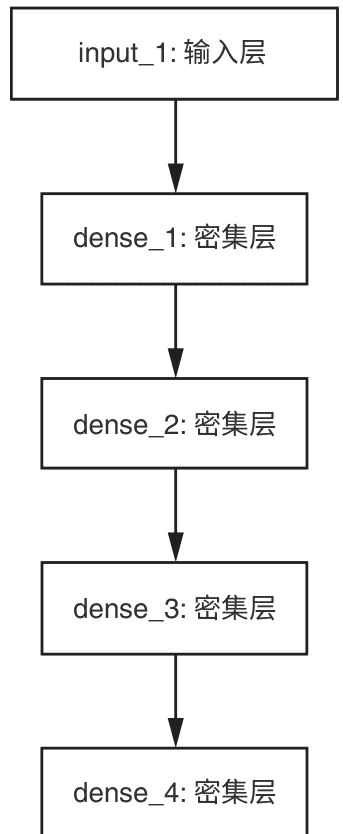

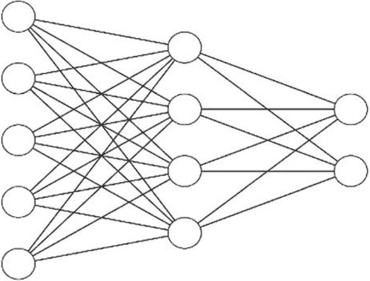

## 图 2 样本 ANN 的架构

在上面的例子中，输入层的输入为 2，并且由参数 `input_shape` 表示。这里使用的激活函数是 `softmax` 和修正线性单元（ReLU）。

除了密集层之外，还可以根据应用程序使用其他层，如池化层、循环层和卷积层。

卷积层可用于处理图像的模型构建，而循环层则用于处理时间序列数据的模型。

步骤 3:
在顺序模型中创建输入层和隐藏层的另一种方法如下所示:

```python
model.add(Dense(units=10, input_shape =2, activation ='relu', kernel_initializer='uniform'))
```

传递给函数的参数如下所示:

`add` 函数用于在所有层中部署。
`Dense()` 表示神经网络是密集连接的，`input_shape` 和 `units` 分别用于表示输入层和隐藏层中的节点数。

激活函数应用于每个节点。`Sigmoid`、线性和 `ReLU` 是各种激活函数。

`Kernel_initializer` 用于分配层的初始随机权重。

第 4 步:
隐藏层和输出层分别使用以下函数构建:

```python
model.add(Dense(units=15, activation ='relu', kernel_initializer='uniform'))
model.add(Dense(units=1, activation ='sigmoid', kernel_initializer='uniform'))
```

此处使用的激活函数可以分为 `sigmoid`、修正线性单元和 `softmax`。

ANN 分类器必须进行编译。语法如下:

```python
model.compile(loss='binary_crossentropy', optimizer='adam', metrics=['accuracy'])
```

在训练之前，模型必须使用优化和损失函数进行编译。有各种优化函数，如 SGD、Nadam 和 Adam。根据应用程序，可以选择优化器。损失函数用于计算错误和损失。应用程序的性质决定了损失函数。最后一个参数 `'accuracy'` 用于衡量模型的准确性。

第 5 步: 模型必须与训练数据集拟合。为了拟合模型，使用 `model.fit()` 语法将周期设置为 20，组大小设置为 20。

在这里，`epochs` 指的是对所有数据的单次执行，批量大小表示一次可以执行的样本数。

第 6 步：必须使用 `evaluate()` 函数对模型进行测试集的评估。

### 2.2 Keras 功能模型

为了解决复杂模型，可以实现功能 API。当问题涉及到巨大的维度或复杂性时，建议使用功能模型。当存在多个输入和输出时，可以使用共享层设计模型，这需要使用功能 API。第一步是通过导入函数导入模型和层。

例如，假设数据的形状是一个 6000 维向量的组。

在这种情况下，只需考虑每个样本的形状来开发模型。

```python
inputs = keras.Input(shape=(6000,))
```

第一阶段是指定输入。在这里假设，张量形状为 `(32,32,3)` 被视为样本的形状。

因此，必须使用以下语法创建输入层：

```python
input_layer = keras.Input(shape=(32, 32, 3))
```

下一层是连接层。在这里，通过标记输入的起点并识别每个新层，进行成对连接。

在密集层函数中，使用单元和激活函数。这里使用 `'ReLU'` 激活函数：

```python
dense = layers.Dense(64, activation='relu')
x = dense(input_layer)
print(x)
```

要添加更多层，使用 32 个单元和 ReLU 激活函数调用密集函数：

```python
x = layers.Dense(32, activation='relu')(x)
outputs = layers.Dense(12)(x)
print(outputs)
```

在输出层中，分配了 12 个神经元，并且分配的激活函数是 `softmax`。最后，使用输入和输出构建 Keras 模型。

使用以下语法创建具有指定输入和输出的模型：

```python
model = keras.Model(inputs=inputs, outputs=outputs, name='model')
```

`model.summary()` 提供了功能模型的详细信息。

模型："model"

| 层 (类型) | 输出形状 | 参数 # |
| :--- | :--- | :--- |
| input_24 (InputLayer) | [(None, 32, 32, 3)] | 0 |
| dense_28 (Dense) | (None, 32, 32, 64) | 256 |
| dense_29 (Dense) | (None, 32, 32, 32) | 2080 |
| dense_30 (Dense) | (None, 32, 32, 12) | 396 |

总参数：2,732
可训练参数：2,732
不可训练参数：0

### 2.3 标准网络模型

一些标准的网络模型，如多层感知器 (MLP)、卷积神经网络 (CNN) 和循环神经网络 (RNN)，已经被详细描述。

#### 2.3.1 多层感知器 (MLP)

它是传统类型的神经网络之一。MLP 被定义为一个感知器，其中多个感知器组成的层被排列在一起以解决复杂问题。图 3 显示了一个具有三层的 MLP，其中第一层是输入层，将信号传输到第二层，称为隐藏层，然后将信号传递到最后一层 (输出层)。

MLP 的主要应用是基于标签或类别预测分类。它主要适用于被视为输入的实值数字。在各种输入中，计算输出。基于输入权重进行组合，然后通过一些非线性激活函数将其传递给输出。可以定义为公式 1:


### 2.3.1 多层感知器 (MLP) (续)


图 3 MLP 的架构

在公式 1 中，w 表示神经元的权重，x 表示输入，b 表示偏置函数，激活函数表示为 $\phi$。部署在该网络中的神经元用于获取关于非线性表示的知识。激活函数用于将非线性引入神经元的输出。根据应用可以部署多个激活函数。

Sigmoid 函数：

Sigmoid 函数是逻辑函数的特例，表示为公式 2：

$$ \sigma(x)=\frac{1}{1+e^{-x}} $$
(2)

一旦应用权重，它主要用于控制数据输入的总和。函数应用后的输出位于 0 到 1 的区间内。

双曲正切函数：

在部署 Sigmoid 函数时，有可能在函数的中间位置卡住。这种卡住的原因是由于存在负输入。这将使输出变为零。前馈激活用于计算参数梯度，从而减少了更新模型属性的频率。因此，函数中断。Sigmoid 的替代方法是使用双曲正切函数。

双曲正切函数可以定义为：

$$ \tanh (x)=\frac{e^{z}-e^{-z}}{e^{z}+e^{-z}} $$
(3)

这也类似于 Sigmoid 函数，但值的范围是 -1 到 +1。

Softmax 函数：

该函数用于识别多个类别的可能性。函数的输出以概率的形式推导出来。它用于输出层。

该函数的约束是，如果类别增加，则部署 Softmax 函数的成本会很高：

$$ s(x)=\frac{e^{x_{i}}}{\sum_{j}e^{x}_{j}} $$

该函数的输出将在 0 和 1 之间。

修正线性单元（ReLU）函数：

如果输入为正，则该函数生成输出，否则将输出为零。许多神经网络基于这个激活函数工作，由于模型的更好性能和训练模型更容易，它被视为默认激活函数：

$$ \operatorname{ReLU}(x)=\max \left(0, x\right) $$

#### 2.3.2 卷积神经网络（CNN）

CNN 架构由三个部分组成。它们的描述如下：

**卷积层：** 该层的目的是从输入源图像中提取特征。通过使用输入数据的小方块来获取图像特征，从而保持像素之间的空间关联。由于在不丢失重要特征的情况下处理数据可能更容易，因此图像大小会缩小。在这个函数中，使用了一个核、过滤器或特征检测器。从该层获得特征图或激活图。当过滤器的值变化时，对于相同的输入图像将获得不同的特征图或激活图。通过运行更多的过滤器来更好地识别模式，从而提取更多的特征。在每次卷积操作结束时，必须应用非线性函数。

**池化层：** 在这一层中进行特征的下采样。这样做是为了降低维度。池化层的功能包括：

- 特征的维度减少。
- 网络中的约束和计算数量减少。
- 对于输入图像的局部邻域中的最大值，网络对于小的变化和转换没有变化。

**全连接层：** 将前面层确定的特征级别化为向量，并进行图像的可能性计算。这一层的目标是根据特征对输入图像进行分类为几个类别。分类取决于训练数据集。CNN 的架构如图 4 所示。

在 Keras 中，采用以下步骤来构建模型：

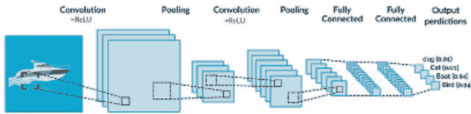

图 4 卷积神经网络的架构

1. 使用 `reshape()` 函数将输入数据重新整形为适合卷积层的格式。
2. 在基于类别的分类中，使用 `to_categorical()` 函数进行类别的独热编码。
3. 模型必须使用 `sequential.add()` 来构建。为了构建一个 2D 卷积层：

```python
model.add(Conv2D(64, kernel_size=(7,7), activation='relu', input_shape=(28,28,1)))
```

4. 池化层被添加为下一个阶段。
5. 必须创建 Flatten 层以生成完全连接层的向量。
6. 如果需要，可以添加一个或多个完全连接层。
7. 模型必须被编译。
8. 训练模型，然后预测类别。

#### 2.3.3 循环神经网络 (RNN)

它属于神经网络的一类。它在处理时间序列数据或自然语言处理 (NLP) 方面表现良好。存在多种 RNN 架构。输入和输出的数量用于分类。它们有很多对很多、很多对一和一对很多。很多对很多用于翻译目的。很多对一用于情感分析，一对很多可以用于序列的生成。

### 2.4 共享层模型

从名称上看，可以解释为可能有多个层用于从输入中推断出特征提取层或多个特征提取层的输出。

在共享输入层中，使用多个具有不同内核大小的卷积层来推断输入图像。通过以并行方式应用子模型，可以确定用于序列分类的长短期记忆 (LSTM) 特征提取器的输出。

### 2.5 多输入和多输出模型

这些模型的目标是构建一个复杂的模型，其中它接受多个输入和输出。

在多输入的情况下，会提供多个输入。例如，主输入层和辅助输入层如下所示：

```python
one_inputs = Input(shape=(32,1))
in_layer=Conv1D(16, 5, activation='ReLU')(one_inputs)
in_layer=AveragePooling1D(3)(in_layer)
in_layer = Flatten()(in_layer)
```

数据的排序是通过 Conv1D 来完成的。通过这个 Conv1D 层构建输出特征图。输入经过滤波器并逐元素相乘，从而创建输出特征图。接下来，将值展平为单个维度：

```python
a_input=Input(shape=(12,1))
in_layer=Concatenate()([in_layer,a_input])
```

辅助输入作为额外的输入添加到最终的密集层中。在这个例子中，输入是一维的。然后，将两个输入层连接并通过密集层进行处理：

```python
Outputs=Dense(20, activation='sigmoid')(in_layer)
New_model = Model(inputs=[one_inputs,a_input], outputs=outputs)
```

同样，可以开发多输出模型。

## 3 框架比较

表 1 给出了 TensorFlow、Keras 和 PyTorch 的比较。

| 特点 | Keras | TensorFlow | PyTorch |
| :--- | :--- | :--- | :--- |
| 支持的语言 | 支持 Python 语言。支持 Go，可以体验高级 API。 | Python、C++和 JavaScript。可以提供高级和低级 API。 | 支持 Java、C++和 Python。API 低级 API。 |
| 架构 | 简单。 | 不易使用。 | 复杂。 |
| 数据集 | 用于小数据集，模型性能较慢。 | 用于大型数据集，模型的性能很高。 | |
| 模型 | 可以构建神经网络模型。 | 使用各种计算方法。 | 模型利用 NLP 和神经网络。 |

## 4 顺序模型的示例

例如，顺序模型构建被说明。以下是顺序模型构建的示例：

```python
import pandas as pd
import seaborn as sns
import matplotlib.pyplot as plt
import numpy as np
from keras.models import Sequential
from keras.layers import Dense

df=pd.read_csv("heart.csv")
model = Sequential()
X = df.iloc[:,0:12]
Y=df.iloc[:,13]
model.add(Dense(150,input_dim=X.shape[1],activation='relu'))
model.add(Dense(12,activation='relu'))
model.add(Dense(1,activation='sigmoid'))
model.compile(loss='binary_crossentropy', optimizer='adam', metrics=['accuracy'])
history = model.fit(X,Y,epochs=50,batch_size=40,validation_split=0.2,verbose=2)
accuracy = model.evaluate(X, Y)
print(accuracy)
```

输出：
303/303 [==============================] - 0s 36us/step
[0.7296317540379641, 0.5445544719696045]

从输出中，得到的损失为 72%，准确率为 54%。由此可见，必须调整超参数以获得模型的精度。

## 5 非结构化数据和结构化数据

### 5.1 非结构化数据

非结构化数据可能是服务日志、社交媒体数据和投诉。对这些数据的影响进行了广泛的研究，以分析其对业务后果的影响。除此之外，还关注了关于服务和产品的在线评论。大部分研究工作旨在确定评论的影响，并提供将这些因素纳入预测模型的机制。表 2 中详细分析了各研究者对非结构化数据的使用情况。

公司意图提高销售业绩。这可以通过各种社交媒体网站来实现。通过这些评论，记录响应，并使用多个预测模型对当前数据集进行详细分析。这有助于公司吸引更多用户，改进产品，并根据客户需求修改其服务。可以开发机器学习模型来确定内容产生的不同数据之间的价值和关系。

### 案例研究 1

对文本数据进行简化的文本处理。可以提供一个简单的 API 来执行自然语言处理（NLP）操作，如情感分析、翻译、分类、提取名词短语和词性标注。在这个过程中，分析推特上发布的推文的情感极性。

| 序号 | 参考文献 | 描述 |
| :--- | :--- | :--- |
| 1 | Sun 等人 [1] | 销售预测是通过极限学习方法 (ELM) 来完成的。 |
| 2 | Thomassey 和 Hapiette [2] | 通过实施模糊推理系统和神经网络等软计算方法来预测销售。 |
| 3 | Teucke 等人 [3] | 应用决策树来识别需要重新排列的文章。然后应用支持向量机来确定原始预测以实现准确性。 |
| 4 | 于等人 [4] | 对在线电影评论数据集进行分析，以表达情感。通过概率潜在语义分析 (PLSA) 进行情感检测。通过部署自回归情感感知模型进行销售预测。 |
| 5 | [5-9] | 对博客、新闻和社交网络服务 (SNS) 进行了广泛研究，以进行公众情绪与股票价格之间的相关性分析。 |
| 6 | [10] | 支持向量机已被用于从新闻文章中检索信息，以预测经济资产的日内价格波动。 |

步骤 1:

`TextBlob` 是用于文本处理的库。导入它。获取一条推文并将其分配给文本。

```python
from textblob import TextBlob

text = """
“恭喜会计部的罗布·琼斯赢得我们的#NFL 足球
游泳池！”；附有一张胜利的罗布的照片。

‘#周五，我们一直像狗一样工作！’；附有一张睡觉的小狗的照片。

你看到佩顿·曼宁扭伤的脚踝了吗？应该戴上我们的
#AcmeOrthotics；附有产品链接。
"""
```

第 2 步：创建 TextBlob 对象。

第 3 步：通过访问 blob 对象的属性 (如句子和单词) 来检索标记。

```python
blob = TextBlob(text)

blob.tags
# [('Congratulations', 'NNP'), ('accounting', 'NN'), ('Rob', 'NNP'), ('Jones', 'NNP'), ('winning', 'VBG'), ...]

blob.noun_phrases
# WordList(['Rob Jones', 'NFL', 'football pool', 'Peyton Manning', 'AcmeOrthotics'])
```

对于 `blob.sentences` 中的每个句子:

打印 `(sentence, sentence.sentiment.polarity)`

```text
“恭喜我们会计部的 Rob Jones 赢得了我们的#NFL 足球游戏!" ... 0.625
'#周五了，我们一直像狗一样工作！' ... 0.0
你看到 Peyton Manning 扭伤的脚踝了吗？ ... -0.5
我们应该戴上我们的#AcmeOrthotics ... 0.0
```

从输出中可以理解，句子的极性是单独计算并显示的。

### 5.2 结构化数据

结构化数据以表格形式存在。结构化数据的示例以 CSV、XLS 和 TXT 文件的形式存在。在这些文件中，使用分隔符来分隔变量。分隔符可以是变量或固定宽度。数据必须进行分析，并且需要清晰的理解。为了进一步分析，数据必须进行预处理、分析、检查、清洗和可视化。数据需要进行广泛的探索，以便获得清晰的理解。此外，人们可以从数据中确定证据，制定假设和假设，并对数据的质量进行验证，以进行进一步的分析。

**案例研究：Keras 在结构化数据上的应用** 可以对结构化数据进行分类。可以使用 Keras 部署模型。让我们来看看数据的行为。用于分析的数据集是：Real estate.csv

首先，

1.  导入所需的库，如 pandas、TensorFlow 和 NumPy。Pandas 用于读取数据并将其存储在数据框中。

2.  加载数据。

```
dataset = pd.read_csv('Real estate.csv')
# 用于读取和导入数据集
# 数据来源于 Kaggle
```

3.  探索数据。

```
dataset.columns
```

```
Index(['No', 'X1 transaction date', 'X2 house age',
       'X3 distance to the nearest MRT station',
       'X4 number of convenience stores', 'X5 latitude', 'X6 longitude',
       'Y house price of unit area'],
dtype='object')
```

数据集中的列包括与房屋相关的交易日期、房屋年龄、距离最近的地铁站的距离、房屋附近的商店数量、地理坐标和房屋价格。

4.  通过定义三层来构建深度学习模型，即输入层、隐藏层和输出层。

第一层被定义为输入层，其维度必须设置为独立变量的数量。在这里，独立变量的数量为六。隐藏层和输出层由神经元定义。在输出层中，神经元的数量为一个，用于预测房屋价格。

```
from keras.models import Sequential
from keras.layers import Dense
model = Sequential()
model.add(Dense(50, input_dim=6, activation="ReLU"))
model.add(Dense(20, activation="ReLU"))
model.add(Dense(1))
model.summary() # 打印模型摘要
```

输入层神经元=6。第一个隐藏层神经元=50。第二个隐藏层神经元=20。输出层=1 个神经元。

5.  模型必须进行编译。通过优化器可以改变权重和偏差。可以使用损失度量和均方误差来评估模型的性能。

```
model.compile(loss="mean_squared_error", optimizer="adam", metrics=["mean_squared_error"])
```

6.  模型必须适应训练集。训练集和测试集的比例为 80:20。

```
from sklearn.model_selection import train_test_split
# test size=0.2 indicates the percentage of the data that should be held over for testing.
X_train, X_test, y_train, y_test = train_test_split(X, y, test_size=0.20)
model.fit(X_train, y_train, epochs=10)
```

## 6 部署深度学习工作站

构建深度学习工作站的硬件要求根据考虑的情况或工作范围而异。无论如何，为了系统的合理性能，最低要求是 32 GB 的 RAM。GPU- NVIDIA，硬盘容量为 1 TB。选择正确的 GPU 是一个棘手的阶段，这取决于几个因素，例如：有多少张量核心可用？GPU 中提供了多少 FLOPs？内存带宽高吗？GPU 是否具有至少 16 位的处理能力？

在选择构建深度学习工作站之前，人们必须了解其中的风险，例如系统在一段时间后可能会过时，由于硬件故障/维护可能会产生额外的费用。如果您的业务需求不会以很高的速度超载，并且您担心安全性，那么个人深度学习工作站是一个更好的选择。

一旦 GPU、RAM 和硬盘组装到主板上，然后按照以下步骤进行：

- 1. 安装操作系统（OS）：任何操作系统都可以，但强烈推荐使用开源服务器版本（这里我们选择了 Ubuntu Server）。安装 Python 和 R 库。
- 2. 安装 GPU 的驱动程序（这里是 NVIDIA）：

```
sudo apt-get install nvidia-367
```

- 3. 创建一个虚拟容器以动态使用服务：

```
sudo apt-get install apt-transport-https ca-certificates
sudo apt-key adv \
  -- keyserver hkp://ha.pool.sks-keyservers.net:80 \
  --recv-keys 58118E89F3A912897C070ADBF76221572C52609D
sudo apt-get install linux-image-extra-$(uname -r) linux-image-extra
sudo apt-get install docker-engine
sudo service docker start
```

您可以为 Docker Engine 创建一个单独的用户并运行其服务。

- 4. 将 Docker 服务与 GPU 集成。
- 5. 在 Docker 中安装 DL 库：

```
git clone https://github.com/saiprashanths/dl-docker.git
cd dl-docker
docker build -t floydhub/dl-docker:gpu -f Dockerfile.gpu
```

您已经准备好在您的工作站上运行深度学习算法。

epochs 的数量表示模型运行的频率。模型的性能与 epochs 之间存在关联。如果运行更多的 epochs，模型将会有所改善。

```
Epoch 1/10 331/331 [================================] - 0s 69us/step - loss: 34.2135 - mean_squared_error: 34.2135
Epoch 2/10 331/331 [================================] - 0s 57us/step - loss: 33.0375 - mean_squared_error: 33.0375
Epoch 3/10 331/331 [================================] - 0s 51us/step - loss: 32.1954 - mean_squared_error: 32.1954
Epoch 4/10 331/331 [================================] - 0s 42us/step - loss: 31.2572 - mean_squared_error: 31.2572
Epoch 5/10 331/331 [================================] - 0s 42us/step - loss: 30.4676 - mean_squared_error: 30.4676
Epoch 6/10 331/331 [================================] - 0s 42us/step - loss: 29.7005 - mean_squared_error: 29.7005
Epoch 7/10 331/331 [================================] - 0s 47us/step - loss: 29.0260 - mean_squared_error: 29.0260
Epoch 8/10 331/331 [================================] - 0s 48us/step - loss: 28.1258 - mean_squared_error: 28.1258
Epoch 9/10 331/331 [================================] - 0s 47us/step - loss: 27.4899 - mean_squared_error: 27.4899
Epoch 10/10 331/331 [================================] - 0s 63us/step - loss: 26.4776 - mean_squared_error: 26.4776
```

如果均方误差值较低，则模型性能更好。从输出中可以推断出均方误差值较小。

## 7 二元分类

### 情景描述

假设您是一家在线音乐商店的所有者，并且您提前发布音乐作为高级优惠。在某些情况下，您观察到一些客户使用此服务，而其他客户则没有。作为所有者，您对返回的客户感兴趣，基于此您可以进行定向广告和折扣。为了解决这个问题，您联系了一家当地的初创公司，他们以以下方式解决了问题：

步骤：

- 1. 使用 read_csv 函数加载数据集。这里使用的数据集是 songs_review_with_column_names.csv
- 2. 了解数据

```
df.dtypes
```

| 列名 | 数据类型 |
|---|---|
| ID | int64 |
| 专辑长度 | float64 |
| 价格 | float64 |
| 评论_1 | int64 |
| 评论_2 | float64 |
| 分钟列表 | float64 |
| 完成度 | float64 |
| 生成的请求 | int64 |
| 目标 | int64 |
| 数据类型 | object |

所有列的数据类型都正确，并且没有问题。让我来解释一下数据集中的属性：

ID 是客户 ID，专辑长度表示以分钟为单位的专辑长度，价格表示以美元为单位的成本，评论_1 是用户给出的评价（0-不喜欢，1-喜欢）。评论_2 是评论家给出的评价，范围为 1 到 10。分钟列表告诉你实际听过歌曲/专辑的分钟数。完成度表示客户是否完成了专辑的听取，生成的请求表示客户使用客户服务的次数，最后，“目标”是指客户返回商店的可能性，即 1-返回，0-未返回。

3. 由于大部分初始行属于可能会返回的客户，所以在测试阶段会导致效率低下，需要对数据进行洗牌。

```
df = df.sample(frac=1).reset_index(drop=True)
```

4. 检查类别不平衡。

```
df.Target.value_counts()
```

```
# 输出:
0    11847
1     2237
Name: Target, dtype: int64
```

在这里，不太可能回访的数量非常高。这将导致系统预测多数类别并忽略或将少数类别视为噪声。为了避免这些问题，我们将平衡数据，无论是否有数据损失。

```
import numpy as np

indexNames = df[df['Target'] == 0].index

break_point = (df.shape[0]-int(np.sum(df.Target)))-int(np.sum(df.Target))

count = 0

for i in indexNames:
    count = count + 1
    df.drop(i, inplace=True)

if (count==break_point):
    break
```

### 确认类别平衡

```
df.Target.value_counts()
1    2237
0    2237
Name: Target, dtype: int64
```

数据集完全平衡。在实时环境中，你不需要绝对平衡，但我们应该确保类别不平衡不会导致误导性结论。

5. 将数据分为训练集、验证集和测试集。

```
from sklearn.model_selection import train_test_split

df_train, df_val, df_test = split_stratified_into_train_val_test(df, stratify_colname='Target',
frac_train=0.80, frac_val=0.10, frac_test=0.10)
```

实际数据中，80% 用于训练，10% 用于验证，10% 用于测试模型。

我们将每个数据子集 (训练集、验证集和测试集) 分为输入和目标。

```
train_inputs = df_train.iloc[:,1:8]
train_targets = df_train.iloc[:,8]
val_inputs = df_val.iloc[:,1:8]
val_targets = df_val.iloc[:,8]
test_inputs = df_test.iloc[:,1:8]
test_targets = df_test.iloc[:,8]
```

6. 标准化输入。

```
min_max = preprocessing.MinMaxScaler()
data_train = min_max.fit_transform(train_inputs)
changed_train_inputs = pd.DataFrame(data_train)
```

在这里，我们对训练集的输入进行了标准化。我们可以对验证集和测试集采取相同的过程。

7. 将预处理的数据集保存为.npz 格式。

```
np.savez('data_train', inputs=changed_train_inputs, targets=train_targets)
np.savez('data_validation', inputs=changed_val_inputs, targets=val_targets)
np.savez('data_test', inputs=changed_test_inputs, targets=test_targets)
```

8. 加载处理过的数据集。

```
import numpy as np
import tensorflow as tf

npz = np.load('data_train.npz')
train_inputs = npz['inputs'].astype(np.float)
train_targets = npz['targets'].astype(np.int)

npz = np.load('data_validation.npz')
validation_inputs = npz['inputs'].astype(np.float)
validation_targets = npz['targets'].astype(np.int)

npz = np.load('data_test.npz')
test_inputs = npz['inputs'].astype(np.float)
test_targets = npz['targets'].astype(np.int)
```

### 9. 设置神经网络模型参数

导入 NumPy 作为 np
导入 tensorflow 作为 tf
输入大小=7
输出大小=2
隐藏层大小=100

设置神经网络模型的参数。在我们的数据集中，我们有七个输入变量（即 input_size=7）和两个类别的类标签（即 output_size=2）。
通过指定所需参数来构建模型。Keras 层具有关于神经网络架构的各种属性。
我们使用了 Dense 层，其中我们设置了激活函数和隐藏层的大小。您可以通过进一步更改隐藏层的数量、隐藏层的大小、更改激活函数等进行实验。

```
model = tf.keras.Sequential([
    tf.keras.layers.Dense(hidden_layer_size, activation='ReLU'),
    tf.keras.layers.Dense(hidden_layer_size, activation='ReLU'),
    tf.keras.layers.Dense(output_size, activation='softmax') ])
```

最常用的 adam 优化器是使用 Keras 模型进行编译，每个时期报告损失和准确性。

```
model.compile(optimizer='adam', loss='sparse_categorical_crossentropy', metrics=['accuracy'])
```

设置其他相关参数最终构建模型。

```
batch_size = 100
max_epochs = 100
early_stopping = tf.keras.callbacks.EarlyStopping(patience=3)
model.fit(train_inputs,
    train_targets,
    batch_size=batch_size,
    epochs=max_epochs,
    callbacks=[early_stopping],
    validation_data=(validation_inputs,
    validation_targets),
    verbose = 2
)
```

model.fit() 函数将为数据分析员提供各种选项。例如，为了避免模型过拟合，我们使用了 early stopping。这将有助于在与上一次迭代相比，当损失增加时自动停止模型构建。有时，损失的增加可能非常小，这不应该停止模型构建。这通过设置另一个参数来处理，称为耐心（允许损失增加指定次数）。由于 verbose 设置为 true，我们可以看到每个时期的结果（准确性 vs 损失），下面是一个示例：

```
Epoch 15/100
36/36 - 0s - loss: 0.4737 - accuracy: 0.7351 - val_loss: 0.4647 - val_accuracy: 0.7405
Epoch 16/100
36/36 - 0s - loss: 0.4765 - accuracy: 0.7267 - val_loss: 0.4739 - val_accuracy: 0.7315
Epoch 17/100
36/36 - 0s - loss: 0.4775 - accuracy: 0.7158 - val_loss: 0.4644 - val_accuracy: 0.7427
Epoch 18/100
36/36 - 0s - loss: 0.4706 - accuracy: 0.7301 - val_loss: 0.4639 - val_accuracy: 0.7338
Epoch 19/100
36/36 - 0s - loss: 0.4694 - accuracy: 0.7284 - val_loss: 0.4629 - val_accuracy: 0.7360
Epoch 20/100
36/36 - 0s - loss: 0.4650 - accuracy: 0.7438 - val_loss: 0.4704 - val_accuracy: 0.7204
Epoch 21/100
36/36 - 0s - loss: 0.4619 - accuracy: 0.7362 - loss: 0.4648 - accuracy: 0.7383
```

10. 将模型应用于测试数据。

```
test_loss, test_accuracy = model.evaluate(test_inputs, test_targets)
```

输出：

14/14 [==============================] - 0s 1ms/step - loss: 0.4663 - accuracy: 0.7634

观察到总体准确率为 76.34 的准确率。

结论：音乐店的所有者可以以 77% 的准确率预测顾客是否会再次光顾。性能会根据超参数和激活函数的不同而变化。

### 8 多类别分类

### 场景描述

手写数字的分类是深度学习的经典问题。在文献中，世界各地的研究人员使用这个数据集来测试他们提出的解决方案。在这个过程中，我们发现“基于 DropConnect 的正则化”达到了最高的准确率，超过了 99.5%，而使用深度神经网络的目标编码得到了最低的准确率之一，为 85.47%。在同一数据集上的其他相关工作可以在 [11-14] 中看到，它们都取得了良好的性能，但是它们都定制了底层的深度神经网络架构。在本章中，我们

## 不使用 CNN 的 MNIST 数据集处理

在不使用 CNN 和遵循基本的图像展平过程的情况下，可以达到 98.5% 的准确率。

在 MNIST（修改后的国家标准与技术研究所）网站上，按照传统的过程，他们只能达到 92% 的准确率，而我们的目标是在不触及先进的神经网络架构的情况下提高这一准确率。

本章旨在通过调整超参数来提高准确性的感觉。

关于数据集：MNIST 有 70,000 个手写数字，每次将神经网络输入手写图像并预测 10 个可能的数字之一。每个图像是一个 28×28 像素的灰度图像。像素范围从 0 到 255，其中 0 表示纯黑，255 表示纯白。由于我们的重点不是使用 CNN，因此我们将展平每个图像，这样我们将得到一个 784×1 的向量作为神经网络的输入。为了增加非线性，我们可以根据需求添加隐藏层，并将中间结果发送到具有十个神经元的输出层。

我们遵循的广泛步骤是：

- A. 加载和预处理。
- B. 使用适当的激活函数、损失函数和优化器构建模型。
- C. 在测试数据上运行模型。

1. 导入诸如 NumPy 和 TensorFlow 之类的库。

数据集随 TensorFlow 数据集一起提供，我们将其加载如下：

```
digits_dataset, digits_info = tfds.load(name='digits', with_info=True, as_supervised=True)
```

`as_supervised = True` 会将数据加载为两个独立的实体，即输入和目标，并且 `with_info` 会提供关于数据集的元数据，我们将在代码的下几行中使用。

2. 将数据分为训练集和测试集。

```
digits_train, digits_test = digits_dataset['train'], digits_dataset['test']
```

从训练数据中提取验证数据。我们使用训练数据的 10% 作为验证数据。

```
total_validation_samples = 0.1 * digits_info.splits['train'].total_examples
total_validation_samples = tf.cast(total_validation_samples, tf.int64)
```

3. 归一化有助于稳定结果，以下代码用于实现此目的：

```
def modify(image, label):
    image = tf.cast(image, tf.float32)
    image /= 255
    return image, label
```

调用函数应用于训练数据。

```
changed_train_and_validation_data = digits_train.map(modify)
```

同样对于测试数据，

```
test_data = digits_test.map(modify)
```

4. 对训练数据集进行洗牌。

```
BUFFER_SIZE = 10000

shuffled_train_and_validation_data = changed_train_and_validation_data.shuffle(BUFFER_SIZE)
```

我们无法对整个数据集进行洗牌，尤其是对于大型数据集来说是如此。为了处理这个问题，我们在每个实例中指定洗牌的范围。然后，我们将训练数据分成验证数据和剩余的训练实例。

```
validation_data = shuffled_train_and_validation_data.take(total_validation_samples)
train_data = shuffled_train_and_validation_data.skip(total_validation_samples)
```

5. 创建批次：

```
BATCH_SIZE = 150

train_data = train_data.batch(BATCH_SIZE)
```

批次将有助于稳定结果，批次的大小取决于底层数据集。我们不需要为验证数据创建批次，因为权重不会从一个批次更新到另一个批次中的验证集。相同的概念也适用于测试数据。但是，需要将验证数据的总样本数表示为一个批次，并将测试数据的总实例表示为一个额外的批次。

```
validation_data = validation_data.batch(total_validation_samples)
test_data = test_data.batch(total_test_samples)
```

将验证数据分为输入和目标。

```
validation_inputs, validation_targets = next(iter(validation_data))
```

## 6. 构建模型

为模型设置超参数，如隐藏层大小、隐藏层数量、激活函数等。我们使用 Keras 的 flatten 函数，因为我们的目标是在不使用 CNN 的情况下实现良好的性能。对于每个隐藏层，Keras 的 dense() 函数将执行输入和权重的点积。这还支持各种激活函数，我们目前使用的是 ReLU，对于输出层，使用 softmax 激活函数进行分类，应该基于概率进行分类。

```
input_size = 784
output_size = 10
hidden_layer_size = 5000
```

```
model = tf.keras.Sequential([
    tf.keras.layers.Flatten(input_shape=(28, 28, 1)),
    tf.keras.layers.Dense(hidden_layer_size, activation='relu'),
    tf.keras.layers.Dense(hidden_layer_size, activation='relu'),
    tf.keras.layers.Dense(hidden_layer_size, activation='relu'),
    tf.keras.layers.Dense(hidden_layer_size, activation='relu'),
    tf.keras.layers.Dense(hidden_layer_size, activation='relu'),
    tf.keras.layers.Dense(hidden_layer_size, activation='relu'),
    tf.keras.layers.Dense(hidden_layer_size, activation='relu'),
    tf.keras.layers.Dense(hidden_layer_size, activation='relu'),
    tf.keras.layers.Dense(hidden_layer_size, activation='relu'),
    tf.keras.layers.Dense(output_size, activation='softmax')])
```

## 7. 选择优化器和损失函数

```
model.compile(optimizer='adam', loss='sparse_categorical_crossentropy', metrics=['accuracy'])
```

我们选择了最常用的优化器"Adam"，损失函数是 `sparse_categorical_crossentropy`，因为模型将输出视为独热编码变量。

| 步骤 | 详情 |
| :--- | :--- |
| 8. 运行模型 | `TOTAL_EPOCHS = 10`<br>`model.fit(train_data, epochs=TOTAL_EPOCHS, validation_data=(validation_inputs, validation_targets), verbose=2)` |
| | 使用指定的参数构建神经网络，并从训练数据中构建模型，并通过验证样本进行交叉检查。<br>输出（图 5）：<br>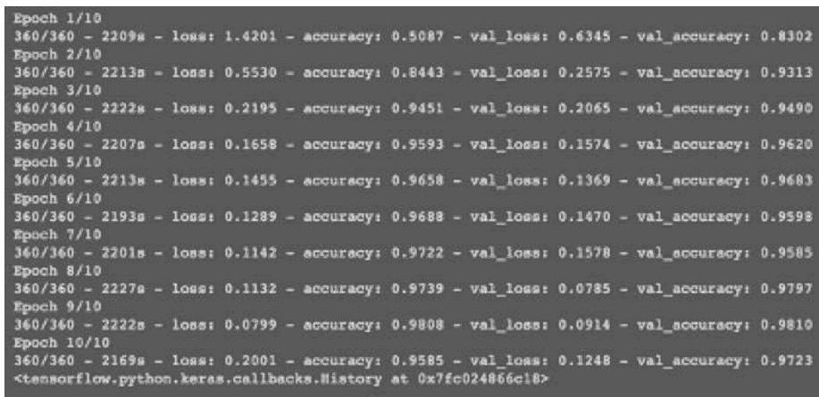<br>图 5 输出 |
| 9. 测试模型 | 请注意，一旦模型构建并应用于测试数据，我们不应该返回并更改超参数，否则会导致过拟合。<br>`test_loss, test_accuracy = model.evaluate(test_data)`<br>输出：<br>损失=1.44，准确率=98.56 %<br>请注意，如果测试准确率接近验证准确率，则表明不会过拟合。 |
| 结论 | 达到大于 98% 的准确率是很好的，而且不需要使用 CNN 和将图像展平也可以实现。<br>尽管这里展示的应用是经典的，但我们通过调整超参数仅仅改进了准确率。 |

## 使用 Keras 进行线性回归

由于其简单性和易于部署，Keras 库被认为是构建深度学习模型的高级 API。通过 Keras，可以用更少的代码开发复杂的深度学习网络。

### 问题陈述

成年人超重和肥胖是日常生活中常见的问题，尤其是在大流行期间的封锁情况下，这个问题已经全球范围内发生。肥胖被发现是一个主要问题，仅仅通过 BMI 的测量是不足以支持临床医生的评估和患者的肥胖相关健康风险 [15]。肥胖的表型可能随时间变化，这对腹部脂肪积聚产生影响，如参考文献 [16] 所述。在参考文献 [17] 中，腰围与健康结果相关联 [18]。因此，腰围测量被认为是提高患者健康的重要指标。为了分析它，可以使用 Keras 进行线性回归 [19]。

### 步骤 1：导入所需的库

导入所需的库、必要的模块和特定于 Keras 的库。

```
import pandas as pd
import numpy as np
import matplotlib.pyplot as plt
import sklearn
# Import necessary modules
from sklearn.model_selection import train_test_split
from sklearn.metrics import mean_squared_error
from math import sqrt
# Keras specific
import keras
from keras.models import Sequential
from keras.layers import Dense
```

### 步骤 2：获取数据源

```
dataset = pd.read_csv('WC_AT.csv')
```

### 步骤 3：确定目标变量并进行归一化

确定目标变量，并通过将数据值缩放到 0 和 1 之间进行归一化。

```
target_column = ['AT']
predictors = list(set(list(dataset.columns))-set(target_column))
dataset[predictors] = dataset[predictors]/dataset[predictors].max()
dataset.describe()
```

### 步骤 4：分割训练集和测试集

将依赖变量和独立变量放入数组中，以便将数据集按照 80:20 的比例分割为测试集和训练集。

```
X = dataset[predictors].values
y = dataset[target_column].values
X_train, X_test, y_train, y_test = train_test_split(X, y, test_size=0.20, random_state=40)
print(X_train.shape); print(X_test.shape)
```

### 步骤 5：定义顺序模型

使用线性层堆叠定义顺序模型。第一层的输入维度为 1，激活函数为 ReLu。隐藏层的处理过程相同。最后，输出层以一个节点表示，确定为输出。

```
# Define model
model = Sequential()
model.add(Dense(100, input_dim=1, activation="relu"))
model.add(Dense(20, activation="relu"))
model.add(Dense(1, activation="linear"))
model.add(Dense(1))
```

### 步骤 6：定义优化器和损失度量

必须定义优化器和训练的损失度量。这里使用的优化器是"adam"，损失度量是"均方误差"。当使用 adam 优化器时，不需要指定学习率。

建立的模型必须适应训练数据集。这里提到的迭代次数为 1000 [20]。

```
model.compile(loss="mean_squared_error", optimizer="adam", metrics=["mean_squared_error"])
model.fit(X_train, y_train, epochs=1000)
```

输出：


从输出结果可以推断出损失函数在减小。

### 步骤 7：模型预测

对训练数据集和测试数据集进行模型预测。确定了均方根值。

```
pred_train = model.predict(X_train)
print(np.sqrt(mean_squared_error(y_train, pred_train)))
pred = model.predict(X_test)
print(np.sqrt(mean_squared_error(y_test, pred)))
```

输出：


从结果可以推断出训练数据和测试数据的均方根误差值分别为 34.38 和 25.95。如果均方根误差值较低，则模型的性能较好 [21]。

## 结论

由于测试集和训练集的均方根误差值变化不大，该模型表现稳定。通过改变 epochs、层中的神经元数量和增加更多隐藏层，可以对模型进行测试。

# 10. 结论

本章重点介绍了用于部署基于 Keras 的深度学习的高级 Python 库。它深入探讨了 Keras 模型，并对各种框架进行了比较。还解释了处理结构化和非结构化数据的过程。讨论了二元和多类分类的各种案例研究。此外，使用 Keras 部署了多个模型，以解决日常活动中的各种问题。

# 参考文献

- 1. Sun, Z.-L., Choi, T.M., Au, K.-F., Yu, Y.: 使用极限学习机进行销售预测，在时尚零售中的应用。决策支持系统。46(1), 411-419 (2008)
- 2. Thomassey, S.: 服装行业的销售预测：供应链管理的关键成功因素。生产经济国际期刊。128(2), 470-483 (2010)
- 3. Teucke, M., et al.: 季节性服装产品的预测。在：Kotzab, H., Pannek, J., Thoben, K.-D. (eds.) 物流动态。第四届国际会议，LDIC 2014 德国不来梅，2014 年 2 月会议论文集。Springer, Cham (2014)
- 4. Yu, X., Yang, L., Huang, X., Aijun: An: mining online reviews for predicting sales performance: a case study in the movie domain. IEEE Trans. Knowl. Data Eng. 24(4), 720-734 (2012)
- 5. Nofsinger, J.R.: Social mood and financial economics. J. Behav. Finance. 6(3), 144-160(2005)
- 6. 陈伟胜：新闻和非新闻对股票价格的反应：头条新闻后的漂移和逆转。金融经济学杂志 70(2), 223-260(2003 年)
- 7. Strauß, N., Vliegenthart, R., Verhoeven, P.: 落后了吗？荷兰报纸文章中的情绪和股票市场价格。公共关系评论 42(4), 548-555(2016 年)。https://doi.org/10.1016/j.pubrev.2016.03.010
- 8. Ranco, G., Aleksovski, D., Caldarelli, G., Grčar, M., Mozetič, I.: Twitter 情感对股票价格回报的影响。PLoS One. 10(9), e0138441(2015)
- 9. Bollen, J., Mao, H., Zeng, X.: Twitter 情绪预测股市。J. Comput. Sci. 2(1), 1-8(2011)
- 10. Luss, R., d'Aspremont, A.: 使用文本分类从新闻中预测异常回报。Quant. Finance. 15(6), 999-1012(2015)
- 11. Wan, Li, et al.: 使用 DropConnect 正则化神经网络。国际机器学习会议 (2013)
- 12. Sato, I., Nishimura, H., Yokoi, K.: 增强模式分类的神经网络。arXiv.(2015) 预印本 arXiv:1505.03229
- 13. 梁，M., 胡，X.: 用于物体识别的循环卷积神经网络。IEEE 计算机视觉和模式识别会议论文集（2015）
- 14. 廖，Z., 卡内罗，G.: 深度学习中归一化层的重要性与分段线性激活单元。2016 年 IEEE 冬季计算机视觉应用会议（WACV）。IEEE（2016）
- 15. Afshin, A., Forouzanfar, M.H., Reitsma, M.B., Sur, P.: 超重和肥胖对 195 个国家 25 年来的健康影响。N. Engl. J. Med. 377, 13-27（2017）
- 16. Walls, H.L. 等：澳大利亚城市成年人 BMI 的趋势，1980-2000 年。公共卫生营养 13, 631-638（2010）
- 17. Ross, R., Neeland, I.J., Yamashita, S., Shai, I., Seidell, J., Magni, P., Santos, R.D., Arsenault, B., Cuevas, A., 胡，F.B., Griffin, B.A., Zambon, A., Barter, P., Fruchart, J.C., Eckel, R.H., Matsuzawa, Y., Després, J.P.: 腰围作为临床实践中的重要指标：来自 IAS 和 ICCR 腹部肥胖工作组的共识声明。Nat. Rev.Endocrinol. 16（3）, 177-189（2020）。https://doi.org/10.1038/s41574-019-0310-7
- 18. JHA, A.K., Ruwali, A., Prakash, K.B., Kanagachidambaresan, G.R.: Tensor flow 基础知识，使用 tensor flow 进行编程，EIA/Springer 通信和计算创新https://doi.org/10.1007/978-3-030-57077-4_2
- 19. Kanagachidambaresan, G.R., Manohar Vinoothna, G., Prakash, K.B.: 可视化，使用张量流进行编程，EIA/Springer 通信和计算创新。https://doi.org/10.1007/978-3-030-57077-4_3
- 20. Prakash, K.B., Ruwali, A., Kanagachidambaresan, G.R.: 回归，使用张量流进行编程，EIA /Springer 通信和计算创新。https://doi.org/10.1007/978-3-030-57077-4_4
- 21. Imambi, S., Prakash, K.B., Kanagachidambaresan, G.R.: pyTorch，使用张量流进行编程，EIA/Springer 通信和计算创新，https://doi.org/10.1007/978-3-030-57077-4_10

# 1 卷积神经网络

## 1.1 卷积神经网络简介

卷积神经网络（ConvNets）是卷积神经网络的简称，与你在之前章节中学习的普通神经网络非常相似。卷积神经网络也由具有权重和偏差的神经元组成，作为学习参数。我们添加到卷积神经网络的额外层是卷积层。卷积源自拉丁术语“convolver”，其意思类似于“滚动在一起”。从数学上讲，它是一个函数与另一个函数重叠的积分计算。

```
$$ (f * g)(t) = \int_{0}^{t} \sin(t - \tau) \cos\tau \, d\tau $$
```

然而，网络看起来仍然像是从输入层接收图像，并从输出层提供类别分数。卷积神经网络架构假设输入是一张图像，然后向前传递到网络；换句话说，卷积神经网络通过处理原始输入图像，通过层来预测类别得分，从而识别图像。

在神经网络中，CNN 广泛用于图像识别、图像分类、目标检测和人脸检测。实时应用之一可以在 OCR（光学字符识别）中看到；对于初学者来说，OCR 是从图像中识别文本的技术。最重要的 OCR 之一是手写数字识别 [1]。银行业最常用它进行文件验证和检查、支票批准、信用卡处理等等。任何开始深度学习、计算机视觉或机器学习的人都会至少经历一次这个项目；事实上，许多 AI 从业者将这个项目视为深度学习的入门项目 [1]。

## 1.2 层

图像是由像素组成的。灰度图像是二维的，图像中有两个通道：白色和黑色；对于彩色图像，有三个通道 - 红色、绿色和蓝色 - 使其成为三维图像。在这两种情况下，像素值的范围是从 0 到 255。

ConvNets 架构可以分为两个阶段：特征学习和分类。一般的特征学习阶段包括三个函数，卷积函数、激活函数和池化函数，具体顺序如下。它们可以像图 1 [2] 所示一样重复多次。这里的输入层是卷积层本身，由激活函数激活。这一层的主要目标是特征提取；它以 [宽度×高度×深度] 的格式接收输入，其中深度取决于图像的类型。灰度图像的深度为 2，彩色图像的深度为 3。但是，只有图像的一部分被考虑用于卷积，因为如果所有像素都进入该层，网络可能会变得非常计算密集。

激活函数决定哪个神经元可以继续到下一层，哪个不能。最常用的激活函数之一是 ReLU。ReLU 代表修正线性单元。它在计算上非常高效，通过将负输入转换为零来逐个激活神经元；基本上它不考虑负输入。当对具有 128 个神经元的图像应用卷积时，将生成 128 个特征图；每个特征图都由激活函数接收，以选择输入图像的突出特征，但在罕见情况下，负区域的特征可能会饱和，无法进一步处理。在这种情况下，我们使用泄漏 ReLU 激活函数。一旦提取出特征，图像的大小就是每边减少 1 个像素，这意味着 28×28 的输入图像被缩小为 26×26。这是因为我们在卷积时省略了边界像素。无论在哪里添加卷积层，我们都需要提及四个参数：

- 1. 卷积数量
- 2. 核映射大小
- 3. 激活函数
- 4. 输入形状（仅在将卷积视为输入层时才需要）

在 Python 中使用 TensorFlow，可以将输入卷积层表示为（根据平台，语句可能会有所不同）

```
keras.layers.Conv2D(64, (3,3), activation='relu', input_shape=(28,28,1)),
```

具有 64 个 3x3 核的卷积层通过 ReLU 激活函数对 28x28 灰度图像输入进行激活。核将映射到输入图像的每个 3x3 子矩阵，使输出成为输入图像的增强版本，如图 2 所示。对于输入图像中的每个像素，都会使用相邻像素计算出一个新值。

值 $e_{2,2} = 10*0.1+11*0.2+12*0.3+16*0.4+17*0.5+18*0.6+22*0.7+23*0.8+24*0.9 = 58.49$

广义公式可以表示为

$y[a,b] = \sum_{j=-\infty}^{\infty} \sum_{i=-\infty}^{\infty} x[i,j] h[a-i, b-j]$

在这里，h 是核映射，y 是图像 x 的卷积输出。从图像中提取特征作为特征图，但这些对输入图像的位置敏感。池化层将对特征进行下采样，从而降低了敏感性。常见的池化方法是平均池化和最大池化，它们代表了平均像素存在和最大像素存在。在卷积层之后向网络添加池化层被认为是一种常见做法。池化是在特征图上应用池化操作类似于应用滤波器的操作，其大小远小于原始图像或特征图。2×2 的池化操作符将特征图减少一半，如图 3 所示 [3]。每个 2×2 的子矩阵都被简化为它们的最大等价物。同样，对于平均池化，计算子矩阵的平均值。这种方法有助于保留特征同时减小图像的尺寸。从卷积层得到的大小为 26×26 的 64 个特征可以进一步减小，使得结果特征图为 13×13。我们可以多次重复卷积 + 池化层以获得更好的结果。

在分类阶段，二维特征图被展平成一个一维数组或向量，以供分类器使用。训练和测试数据都会经过特征提取阶段。这样，卷积神经网络会逐层地将原始像素值转化为类别得分。下面总结了一个简单的用于手写数字识别的卷积神经网络。


图 1 ConvNet 的基本架构。(Hidaka 等人 [2])

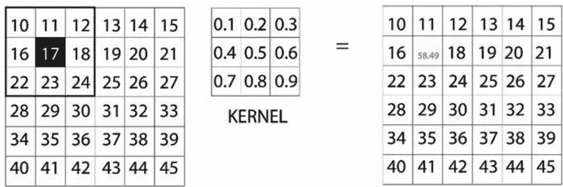

图 2 使用核进行卷积操作


图 3 展示了卷积和池化的过程。(Verschoof-van der Vaart 等人 [3])

# ==================== modelSummary ====================

模型： "sequential"

| 层 (类型) | 输出形状 | 参数 # |
|---|---|---|
| conv2d (Conv2D) | (None, 26, 26, 64) | 640 |
| max_pooling2d (MaxPooling2D) | (None, 13, 13, 64) | 0 |
| flatten (Flatten) | (None, 10816) | 0 |
| dense (Dense) | (None, 28) | 302876 |
| dense_1 (Dense) | (None, 10) | 290 |

在手写数字识别系统中，数据由不同书写风格的像素化图像组成 [1]。对于训练，整个数据集的一个子集会经过特征提取和分类阶段。当一个测试样本进入网络时，模型会分析其特征并基于这些特征进行分类，就像任何分类器一样。在许多情况下，输出层会通过 softmax 激活函数激活，用于多类别分类，而在二元分类中则使用 sigmoid 激活函数。添加多个卷积层会提高预测准确率的机会。网络越深，处理特征的复杂性就越高。流行的卷积神经网络版本包括 ResNet、AlexNet、VGG16 和 Inception Networks，这些网络在公共平台上可用。

使用 Keras 在 Python 中构建 ConvNet 非常简单，不需要任何计算。第一步是获取数据并对其进行预处理以满足我们网络的需求。

```
import tensorflow as tf
from tensorflow import keras
import numpy as np

handwriting_mnist = keras.datasets.mnist
(train_images, train_labels), (test_images, test_labels) = handwriting_mnist.load_data()
train_images = train_images.reshape(len(train_images), 28, 28, 1)
test_images = test_images.reshape(len(test_images), 28, 28, 1)
```

这里使用的 ConvNet 的结构是一对卷积和最大池化层，如上面的模型表示所示。

```
model = keras.models.Sequential([
    keras.layers.Conv2D(64, (3, 3), activation='relu', input_shape=(28, 28, 1)),
    keras.layers.MaxPool2D(2, 2),
    keras.layers.Flatten(),
    keras.layers.Dense(28, activation='relu'),
    keras.layers.Dense(10, activation='softmax')
])
```

```
model.compile(optimizer='adam', metrics=['acc'], loss='sparse_categorical_crossentropy')
```

```
class handwriting_acc_callback(keras.callbacks.Callback):
    def on_epoch_end(self, epoch, logs={}):
        if logs.get('acc') >= 0.9:
            print(" 模型已达到 90% 的准确率！恭喜！！！")
            self.model.stop_training = True
```

```
handwriting_acc_callback = handwriting_acc_callback()
```

```
model.fit(train_images, train_labels, epochs=100, callbacks=[handwriting_acc_callback])
model.evaluate(test_images, test_labels)
```

这里的回调函数将限制训练过程过度拟合；我们将在后续单独的主题中详细了解。

## 1.3 构建和架构

卷积层是卷积神经网络的主要构建模块，几乎完成了所有的繁重工作。每个滤波器在空间上都很小，但在整个图像上延伸。

当处理高维资源（如图像）时，我们将每个神经元连接到输入空间的一个局部区域。在前向传播过程中，我们遍历整个图像以计算点积，就像我们之前做过的那样。但是在考虑神经连接时，有一个处理特殊范围的超参数，即神经元的感受野，它实际上就是滤波器的大小。该滤波器的作用不仅限于宽度或高度，它还连接到深度；事实上，连接延伸到整个图像的深度。

例如，如果将一个尺寸为 32×32×3 的 RGB CIFAR-10 图像与一个 5×5 的滤波器进行卷积，那么层中的每个神经元与输入区域中的 5×5×3 具有相同的权重。因此，总共建立了 75 个与输入体积的连接。

与输出神经元的排列相比，从卷积层到输入层的连接非常简单直接。有三个参数负责控制输出的维度：

- 1. 深度：它类似于使用的滤波器数量，并且对于每个周期，它会提供一个不同的输入。.例如，如果卷积的第一个周期输人了原始图像，那么同一空间中的其他神经元可能会被该图像的任何属性（如边缘或颜色）激活。
- 2. 步幅：这决定了滤波器在像素之间的跳跃比例。.对于步幅为 1，滤波器每次移动一个像素。步幅越大，输出特殊体积越小。
- 3. 零填充：就像我们之前看到的，卷积会忽略边界像素。零填充允许我们通过用零填充边界来控制边界；因此，图像大小不会减小。

使用输入体积大小 (W)、卷积区域大小 (F)、步幅 (S) 和零填充级别 (P) 的函数，可以给出输出空间神经元的适应性为 (W - F+ 2P) /S+ 1。例如，一个 7x7 的输入图像和一个 3x3 的核/滤波器，步幅和填充分别为 1 和 0，可以产生一个 5x5 的输出 [4]。

在一个更大的网络中，控制这些参数是一个麻烦和令人困惑的任务。因此，我们使用参数共享方案来控制影响整个网络的参数数量。例如，赢得 2012 年 ImageNet 挑战赛的架构使用 227x227x3 的图像对网络进行训练。第一个卷积层使用具有 F=11, S=4, P=0, K=96 的神经元；因此，输出大小可以计算为 (227-11)/4+1=55，加 1 是因为偏差。

第一个卷积层中的神经元数量可以为 55 * 55 * 96 = 290,400。

每层中的权重数量可以计算为 11 * 11 * 3 = 363。它们共计为第一层单独提供了 290,400 * 364 = 105,705,600 个参数。为了减少参数，我们可以表示一个二维深度切片，即通过考虑 96 个唯一的值组合（如权重和偏差），即 96 * 11 * 11 * 3 = 34,944 个唯一的参数权重和 96 个唯一的偏差 [5]。

对于一个输入形状为 11 × 11 × 4, P=0, F=5, S=3 的情况，输出体积为 (11-5)/3+1=3，因此激活图 V(特定卷积层的输出) 可以表示为

```
V[0,0,0] = np.sum(X[:5,:5,:] * W0) + b0
V[1,0,0] = np.sum(X[3:8,:5,:] * W0) + b0
V[2,0,0] = np.sum(X[5:10,:5,:] * W0) + b0
V[3,0,0] = np.sum(X[7:12,:5,:] * W0) + b0
```

这里的 w0 是形状为 5 × 5 × 4 的权重向量，我们使用相同的权重和偏置（参数共享）。可以通过沿其他维度进行多个激活图的形成，比如

```
V[0,0,1] = np.sum(X[:5,:5,:] * W1) + b1
V[1,0,1] = np.sum(X[3:8,:5,:] * W1) + b1
V[2,0,1] = np.sum(X[5:10,:5,:] * W1) + b1
V[3,0,1] = np.sum(X[7:12,:5,:] * W1) + b1
```

通过更改这些参数来观察它们如何影响输出。尝试沿不同的轴和维度改变图像 X 的限制像素。例如，V[0,1,1] = np.sum(X[:,5,3:8,:])*W1) +b1 (沿 y 轴的示例)，V[1:3] = np.sum(X[5:10,7:12,:])*W1) +b1 (同时沿两个轴)。简而言之，卷积层接受具有四个参数 (K,F,S,P) 的 W1×H1×D1 体积大小，产生一个 W2×H2×D2，其中 W2=(W1-F+2P)/S+1, H2=(H1-F+2P)/S+1, D2=K。常见的超参数值为 F=3, S=1, P=1。

由于在连续的卷积层之间包含池化层是一种常见做法，因此它也具有一些特征。该层通过调整输入中的每个深度切片来独立操作。池化的常见过滤器大小为 2x2，步幅大小为 2。尽管它通过丢弃近 75% 的激活来进行下采样，但深度保持不变。卷积层的输出。在这里，卷积层的输出被视为输入，具有 W1×H1×D1 的体积大小，接受两个参数。使用 F 和 S 生成 W2、H2 和 D2，其中 W2=(W1-F)/S+1, H2=(H1-F)/S+1, D2=D1。

# 2. RNN、LSTM 和 GRU

神经网络的流行受到移动技术的影响，如苹果的 Siri、亚马逊的 Alexa 和微软的 Cortana。这些语音助手可以记住输入以处理即将到来的查询。例如，一个用户提出了一个问题“意大利有什么著名的食物？”，助手以一个合适的答案回答了这个问题，因为这个查询很直接。如果用户提出另一个查询，比如“那里的天气如何？”，这个查询不明确，因为关键词“那里”与问题无关；这时候就需要用到 RNN。RNN 代表递归神经网络；这个算法通过内部记忆逻辑记住了它的输入，使其适用于理解和预测序列数据结构。

从前面的例子中，助手现在可以理解到术语“there”不相关，但它与前一个查询相关，其中主题是指术语“Italy”。因此，网络将查询更新为“意大利的天气如何？”。由于 RNN 具有这种能力，它还可以非常精确地预测下一个查询序列。这就是为什么许多 AI 从业者更喜欢 RNN 而不是其他算法来处理金融数据、音频、视频、时间序列、天气等数据。

在像 ConvNets 这样的前馈网络中，信息是单向的（从输入，通过隐藏层，到输出），不会两次访问一个神经元/节点。与它们不同，RNN 通过循环来传递信息，在做出决策时考虑了这些信息。

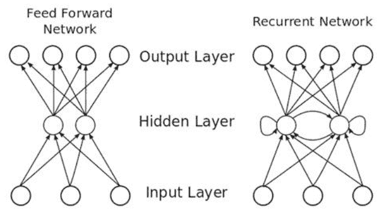

图 4 前馈网络 vs 循环神经网络。(Dana and Correll [6])

当前周期已经经历了之前的知识或信息，如图 4 所示 [6]。在理解 RNN 时，一个重要的注意事项是它们对当前和先前的输入应用权重；此外，通过梯度下降和反向传播来进行权重调整。与前馈网络不同，RNN 能够将事务从一个到多个、多个到一个和多个到多个神经元进行映射。要对 RNN 有一个清晰的理解，你需要了解正常的前馈网络和序列数据的工作原理。你已经在之前看过前馈网络的工作原理，现在让我们来看看序列数据。

顺序数据是按照有序方式排列的数据，但不一定按照时间顺序排列。顺序数据的例子包括商店中的客户购买数据、网络历史记录、职业发展等等。时间序列数据也是一种顺序数据，具有连续的时间间隔。时间序列数据的一个最佳例子是天气数据。典型的循环神经网络包含一个短期记忆，能够记住最近的过去，但对于更长的序列，需要从未知持续时间的数据中获取信息；对于这种应用，我们使用 LSTM 与 RNN 结合使用。LSTM 代表长短期记忆，它们专门设计用来解决传统 RNN 中的长期依赖问题。所有循环网络都由一系列重复模块连接而成；传统上，这个重复模块是一个单一的 tanh 层，但在 LSTM 中，重复模块由四个交互层组成，如图 5 所示 [7]。从数学上讲，LSTM 单元中的门可以描述为

```
i_t = \sigma(x_t U^i + h_{t-1} W^i)
```


图 5 LSTM 的结构。(Yuan 等人 [7])

$$\widetilde{C}_{t}=\tanh \left(x_{t} U^{g}+h_{t-1} W^{g}\right)$$
$$C_{t}=\sigma\left(f_{t} * C_{t-1}+i_{t} * \widetilde{C}_{t}\right)$$
$$h_{t}=\tanh \left(C_{t}\right) * o_{t}$$

其中 W 是当前节点和前一个节点之间的循环。U 包含从输入到隐藏层的权重，C 被称为候选隐藏状态，C 是记忆单元。

在 RNN 中的反向传播被称为“通过时间的反向传播”。在使用任何框架构建 RNN 时，反向传播会自动处理，但理解它对于调试模型运行中的任何问题很重要。

RNN 中的权重传递通常称为滚动；前向滚动称为滚动，而后向滚动称为展开。通过函数描述当前滚动到下一个滚动的输出的变化被称为梯度。数学上，梯度是函数相对于其输入的偏导数。梯度越高，模型学习的性能越好。标准 RNN 中的两个关键问题是梯度爆炸问题和梯度消失问题。

当算法给无关紧要的细节分配更高的权重时，就会发生爆炸现象，可以通过压缩或省略一些梯度来解决这个问题。当梯度太小以至于可以忽略时，就称为梯度消失问题；可以使用 LSTM 来解决这个问题，因为它将梯度保持在一个阈值水平以保持训练的最小值和准确率。LSTM 的过程是交互式的，因为包含了细胞状态的加入。细胞状态就像工作流一样，激活函数的输出加入到相应网络的主流中，知道当前状态和先前状态是什么。

# 高级深度学习技术


图 6 GRU 的结构。(Su 和 Kuo[8])

函数的输出加入到相应网络的主流中，直到当前状态和先前状态是什么。构建 LSTM 非常简单，只涉及几个张量操作和一个循环。

一个更小的 LSTM 版本，几乎具有相同的功能，是 GRU (门控循环单元)。GRU 的开发主要是为了解决梯度消失问题。GRU 是标准 RNN 的改进版本；它只包含两个门，一个更新门和一个重置门。这两个门将决定哪些信息通过网络，哪些信息是不相关的，只使用四个操作，如图 6 所示 [8]。更新门 (Z_t) 负责传递过去的信息。时间步骤 t 的更新门 z_t 可以表示为


其中 x 是输入，当连接到网络时，权重 W(z) 会与之相乘，而 h_t 是相对于时间的候选激活。与 x 一样，前一个候选激活在连接到网络时，会与自己的权重 U(z) 相乘。两个结果相加，并通过 sigmoid 激活函数将结果保持在 0 和 1 之间。这个操作消除了梯度消失问题的风险。另一个门是重置门，负责清除记忆 (决定要忘记多少过去的信息); 可以使用


GRU 的输出受当前记忆内容和当前时间步的影响。当前记忆输出 h_t 可以通过从过去恢复信息来实现

$$h_{t}^{\prime}=\tanh \left(W x_{t}+r_{t} \odot U h_{t-1}\right)$$

当前记忆的重要性与重置门的影响相关联。重置门和先前记忆内容及其权重 $U h_{t-1}$ 的乘积之间的 Hadamard 乘积 $(\odot)$ 将决定应该删除哪些信息。最后，更新门与先前记忆内容的 Hadamard 乘积之和以及更新门的补数 $(1-Z_t)$ 与当前记忆内容的 Hadamard 乘积

$$h_{t}=z_{t} \odot h_{t-1}+\left(1-z_{t}\right) \odot h_{t}^{\prime}$$

由于模型不会在每次新信息通过网络时将输入排除在外，ConvNets 被认为优于循环网络。我们已经看到了用于图像分类任务的 ConvNets；现在让我们看看卷积如何帮助处理序列数据。

# 使用 ConvNets 进行序列处理

之前我们已经学习了卷积以及它如何解决计算机视觉问题。卷积的特性，如从 2D 图像的输入空间中提取特征，使得 ConvNets 在计算机视觉领域蓬勃发展。这些相同的特性可以进一步扩展到序列处理，因为时间本身可以被视为一个特殊的维度。通常，一维卷积在计算上比循环网络更高效，但是在音频翻译和生成领域的最新研究中，使用了具有更好结果的扩张卷积核，用于简单任务，如预测和文本分类。

我们之前看到的是 2D 卷积，通过应用 2D 滤波器或内核提取 2D 特征图。同样，我们可以使用 1D 卷积提取 1D 序列。主要思想与 2D 卷积相同; 从输入中的时间窗口获取特征图。应用于窗口 (输入的一部分) 的转换在整个序列中是相同的—因此，一个位置上的模式可以在另一个位置上被识别，这被称为平移不变性。

例如，假设一个 1D ConvNet 正在使用窗口大小为 5 处理符号或字符的序列; 这意味着网络能够学习长度为 5 的序列片段。每当再次遇到这个片段时，网络将能够在输入序列中识别这些单词以建立上下文。对于构建上下文的序列中的片段和段的理解被称为词形态学。

与 2D ConvNets 类似，1D ConvNets 也有与卷积层相关的池化层，并且 1D 池化的操作等同于 2D 池化，从补丁 (子序列) 中输出最大值或平均值。就序列而言，池化也可以称为子采样。使用 Keras 在 Python 中构建 1D ConvNet 与构建 2D ConvNet 完全相同。首先，我们需要获取数据并进行预处理。

```python
from keras.datasets import imdb
from keras.preprocessing import sequence
max_features = 100
max_length = 5

print('正在加载数据...')
(x_train, y_train), (x_test, y_test) = imdb.load_data(num_words = max_features)
print(len(x_train), '个训练序列')
print(len(x_test), '个测试序列')

print('填充序列 (样本 x 时间) ')
x_train = sequence.pad_sequences(x_train,  maxlen=max_length)
x_test = sequence.pad_sequences(x_test,  maxlen=max_length)
print('x_train shape:', x_train.shape)
print('x_test shape:', x_test.shape)
```

在 2D ConvNet 中，我们堆叠了一对带有最大池化 2D 层的卷积层。在这里，最大池化变为 1D 层，一个主要的变化是卷积核的大小。在 2D 网络中，我们将卷积核大小表示为 3x3 或 5x5，分别对应 9 个或 25 个像素，但在 1D 中，3 个窗口大小只包含 3 个特征，这相对较小，所以我们根据需要增加大小。7 作为窗口大小对于这个程序是最优的。

```python
from keras.models import Sequential
from keras import layers
from keras.optimizers import RMSprop

model = Sequential()
model.add(layers.Embedding(max_features, 128, input_length=max_length))
model.add(layers.Conv1D(32, 7, activation='relu'))
model.add(layers.MaxPooling1D(5))
model.add(layers.Conv1D(32, 7, activation='relu'))
model.add(layers.GlobalMaxPooling1D())
model.add(layers.Dense(1))
model.summary()
model.compile(optimizer=RMSprop(lr=1e-4), loss='binary_crossentropy', metrics=['acc'])
history = model.fit(x_train, y_train, epochs=10, batch_size=128, validation_split=0.2)
```

与 LSTM 相比，1D ConvNet 在 CPU 和 GPU 上的运行时间更短。同样，2D 卷积在图像上表现良好，1D 卷积在时间数据上表现良好。因为 RNN 在处理长序列时计算成本高昂，可以将 1D CNN 用作预处理步骤，以压缩序列以供 RNN 使用。

# 4 Keras 回调和 TensorBoard

## 4.1 回调函数

构建模型，无论是 CNN 还是 RNN，只是工作的四分之一；其余的工作是调试和故障排除模型。Keras 提供的最好的调试工具之一是回调函数。这些帮助我们在代码运行时理解代码的工作方式。换句话说，我们可以在训练过程中获取模型的统计和内部状态信息。回调函数不是一个层或一个单独的模型；它是一个我们在拟合时调用的函数。如果需要，我们可以编写自己的回调函数，但在大多数情况下，这是不必要的，因为 Keras 提供了各种回调函数 [19]。

### BaseLogger 和 History

这是一个基本的回调函数，默认应用于模型。当拟合模型时，一般的语句是 model.fit()；这不会将结果分配给任何变量，但是当我们将相同的语句分配给一个变量时，那么该变量将被分配给一个包含每个时期的平均准确性和损失信息的对象 keras.callbacks.history 作为一个字典。

### 模型检查点

在成功的时期之后，这个回调函数将以我们所期望的名称将模型保存为 HDF5 格式的检查点。当我们在云中运行我们的模型并且需要更多时间时，这个回调函数非常有帮助。

### CSVLogger

正如其名称所示，这个回调函数将 epoch 的信息或关于 epoch、准确性和损失的日志写入 CSV 文件中。这有助于理解模型在训练、验证和测试过程中的行为。这将有助于我们比较应用程序中的不同模型。

### EarlyStopping

过拟合是机器学习中的一个主要问题，它相当于人类的过度自信。EarlyStopping 回调函数将在训练完成之前终止训练。我们可以将学习指标指定为一个值，以帮助这个回调函数理解指标的变化和转变。

### 远程监控

这个回调的主要目的是将机器学习模型与网络服务集成起来。这个回调使用 HTTP POST 以 JSON 格式发送状态，有助于远程监控和处理特定任务。

### 学习率调度器

神经网络中的优化对于最小化成本和最大化适应性至关重要。这个回调有助于调整优化器的学习率。其中一种优化器是梯度下降；这个回调有助于强调在过程中需要采取的步长。

### Lambda 回调

如果您没有找到适合您需求的合适回调，那么这是您的选择。这使您可以创建一个返回时期、批次或训练信息的基本回调。对于复杂的回调，您必须继承 keras.callbacks.Callback 类。这使您可以对回调的执行有控制权。

以上所有的回调都有助于有效快速地构建模型。在一个模型中使用一个回调没有限制；您可以使用任意数量的回调。还有一个回调是许多人工智能从业者或熟悉 TensorFlow 的人喜欢的：TensorBoard。

### TensorBoard

一个受欢迎的回调函数，将日志写入一个目录，进而可以在 TensorFlow 的可视化工具中使用。这个回调函数被命名为 TensorBoard。最重要的是，它还可以与 CNTK 或 Theano 等 TensorFlow 的替代品一起使用。

### 4.2 TensorBoard

TensorFlow 是一个很好的起点，用于使用用户友好的 Keras API 构建机器学习模型。它由 Google 开发，利用图形表示进行有效的计算。TensorFlow 程序包含两个阶段：一个是添加节点，另一个是为图执行提供输入的节点。例如，在 TensorFlow 中两个数字的相加看起来像这样：

```python
x = tf.Variable(3, name = 'x')
y = tf.Variable(4, name= 'y')
sum = x + y
print(sum)
```

通过运行上述代码，你可能认为我们会得到 7 作为输出，但实际上我们会得到这个：

```python
Tensor("add_1:0", shape=(), dtype=int32)
```

正如前面提到的，我们通过提供输入来执行图形。 TensorFlow 将从我们要计算的节点和操作构建一个图形。对于上面的代码，图形将如下所示：


这个可视化可以在 TensorBoard 中看到。TensorBoard 提供了在工作流程中进行测量和可视化的工具。这与我们之前看到的没有什么不同。我们只需要在拟合语句中添加一个回调函数，专门为 TensorBoard 创建日志。在 Python 中，我们需要先导入 tensorboard 库：

```python
from tensorflow.keras.callbacks import TensorBoard
```

让我们构建一个可以对猫和狗进行分类的模型：

```python
NAME = "cats-vs-dogs-cnn-64x2".format(time.time())
tensorboard = TensorBoard(log_dir="logs/{}".format(NAME))
```

现在，tensorboard 变量是可被 TensorBoard 读取的模型，但它本身不包含任何信息。我们可以使用之前看到的回调函数将训练信息传递给它：

```python
model.fit(X, y,
    batch_size=32,
    epochs=3,
    validation_split=0.3,
    callbacks=[tensorboard])
```

这里提供的回调是一个列表。我们还可以在列表中提供其他回调。现在让我们构建我们的模型：

```python
import tensorflow as tf
from tensorflow.keras.datasets import cifar10
from tensorflow.keras.preprocessing.image import ImageDataGenerator
from tensorflow.keras.models import Sequential
from tensorflow.keras.layers import Dense, Dropout, Activation, Flatten
from tensorflow.keras.layers import Conv2D, MaxPooling2D
import pickle
import time
pickle_in = open("X.pickle","rb")
X = pickle.load(pickle_in)

pickle_in = open("y.pickle","rb")
y = pickle.load(pickle_in)

X = X/255.0
```

```python
model = Sequential()

model.add(Conv2D(256, (3, 3), input_shape=X.shape[1:]))
model.add(Activation('relu'))
model.add(MaxPooling2D(pool_size=(2, 2)))

model.add(Conv2D(256, (3, 3)))
model.add(Activation('relu'))
model.add(MaxPooling2D(pool_size=(2, 2)))

model.add(Flatten()) # 这将我们的 3D 特征图转换为 1D 特征向量

model.add(Dense(64))

model.add(Dense(1))
model.add(Activation('sigmoid'))
model.compile(loss='binary_crossentropy',
              optimizer='adam',
              metrics=['accuracy'],
              )
```

如果您检查程序目录，将会创建一个名为 logs 的新文件夹；该文件夹包含一个以我们提供的名称命名的另一个目录 - 在本例中为 'cats-vs-dogs'。要查看该日志，我们需要从主目录（log 文件夹所在的位置）访问命令行，然后使用以下命令触发 TensorBoard：


图 7 猫与狗的 TensorBoard 仪表板

```bash
tensorboard --logdir='logs/'
```

成功执行上述命令后，我们将获得一个 URL，该 URL 将带您进入类似于图 7 的 TensorBoard 可视化仪表板。

初学者通常使用 matplotlib 来可视化他们的 epochs，这无疑是一个强大的可视化工具，但是 TensorBoard 提供了许多功能，如图形过滤、正则表达式和在不重新运行模型的情况下运行样本。在训练过程中监视模型的行为是解决问题的好方法; 使用 tensorboard，我们也可以做到这一点。假设您想监视权重单元的分布。我们可以将 tf.summary.histogram 添加到我们想要的输出中。这个过程被称为自定义日志记录。例如，如果您想可视化使用 LearningRateScheduler 回调实现的梯度下降步骤更改，我们可以通过将 tf.summary.scalar 附加到调度器函数来实现，如下面的代码所示:

```python
logdir = "logs/scalars/" + datetime.now().strftime("%Y%m%d-%H%M%S")
file_writer = tf.summary.create_file_writer(logdir + "/metrics")
file_writer.set_as_default()

def lr_schedule(epoch):
  """
  返回随着 epochs 进展而减少的自定义学习率。
  """
  learning_rate = 0.2
  if epoch > 10:
    learning_rate = 0.02
  if epoch > 20:
    learning_rate = 0.01
  if epoch > 50:
    learning_rate = 0.005

  tf.summary.scalar('learning rate', data=learning_rate, step=epoch)
  return learning_rate
```

```python
lr_callback = keras.callbacks.LearningRateScheduler(lr_schedule)
tensorboard_callback = keras.callbacks.TensorBoard(log_dir=logdir)

model = keras.models.Sequential([
    keras.layers.Dense(16, input_dim=1),
    keras.layers.Dense(1),
])

model.compile(
    loss='mse', # keras.losses.mean_squared_error
    optimizer=keras.optimizers.SGD(),
)

training_history = model.fit(
    x_train, # 输入
    y_train, # 输出
    batch_size=train_size,
    verbose=0, # 抑制冗长的输出；使用 Tensorboard 代替
    epochs=100,
    validation_data=(x_test, y_test),
    callbacks=[tensorboard_callback, lr_callback],
)
```

如果我们再次查看面板（图 8），

# 5 深度梦境和神经风格转换

在执行迭代模型时，TensorBoard 非常方便。许多 AI 从业者也使用 TensorBoard 来理解数据。你越了解你的数据，你构建的模型就越好。

之前我们已经看到了 CNN（卷积神经网络）用于对图像进行分类的工作原理。图像分类是一个很大的问题，因为机器很难区分不同类型的对象。一个可以体验图像分类的平台是 Google 图像搜索。在这里，任何人都可以上传一张图片来识别它是什么，但正如你所看到的，它并不完美。统计数据显示，人类需要一点时间才能检测到我们以前没有见过的不同的狗，而且当狗的形态不典型时，如图 9 所示，分类变得更加困难 [9]。当对狗及其品种进行分类时，人类可以做到毫不犹豫，但机器却失败了，因为几何特征非常相似，很难进行隔离，如图 10 所示。为了解决这个问题，研究人员他们提出了一个解决方案，开始查看每个隐藏层的输出，并将其标记为训练数据，然后将其反馈到网络中。基本上，他们在每一层都添加了经过处理的图像，并根据原始图像将其标记为训练数据集，从而为单个狗品种图像形成了数百万个图像。这个实验被称为“深度梦境”。

特征是图像分类中最重要的部分。在图 10 中，两只狗的特征非常相似，从而欺骗了网络的判断。通过深度梦境，我们可以将特征作为图像来提取更多的特征；这样我们可以从图像中获得更多的孤立特征。

网络中的每一层处理不同抽象层次的特征，因此特征的复杂性取决于选择的层次。一张图像经过第一层，看起来类似于图 11。第一层通常从图像中提取出硬笔画和简单的图案，因为它们对边缘敏感。在网络的进一步层次中，层次会以极细节的方式提取复杂的特征。如果网络通过一个循环，将其输出作为输入应用于自身，可以获得极端的网络知识流。当将图像通过预训练模型的大量知识进行特征提取，并将其特征应用于通过的图像时，我们可以观察到应用于图像的不同风格，这被称为神经风格转移技术，简称 NST。

NST 将一个图像的模式转移到另一个图像上。例如，让我们以一座桥的图像作为内容图像，以文森特·梵高的《星夜》作为风格图像。结果图像是两个图像的混合，如图 12 所示 [10]。

调节风格的度量取决于优化网络。然而，基本思想是获取两个图像（风格图像和内容图像）并找出它们的特点。对于内容图像，不应该去除细节而不改变图像的几何特征。从风格图像中，需要提取抽象特征，如画笔图案、色彩笔触、色调等。一旦完成，我们将这两个图像输入到一个网络中，将这两个图像合并成一个图像。但并非所有图像的组合都能得到很好的结果；有些组合会搞砸。NST 的主要用例是改变天气。例如，它可以使春天的图像看起来像冬天，夏天的图像看起来像春天。它甚至可以将白天变成夜晚，反之亦然。

NST 的实现可以分为五个简单的步骤：

- 1. 数据可视化
- 2. 预处理
- 3. 损失函数
- 4. 模型创建
- 5. 优化损失函数

在这里，我们使用了一个预训练的 VGG19 模型。VGG19 模型由许多层组成，有助于更好地提取风格。在开始实际过程之前，让我们先设置环境。

### 设置

这种技术的结构在 TensorFlow 的命令式编程环境（即时执行）中效果更好，可以更快地评估操作。

```python
tf.enable_eager_execution()
print("即时执行：{}".format(tf.executing_eagerly()))
```

您可以使用任何您想要的图像。这里，我提供了一些示例图像，并且可以直接在 Google Colab 的运行环境中下载它们的方法：

```python
import os
img_dir = '/tmp/nst'
if not os.path.exists(img_dir):
    os.makedirs(img_dir)
```

```python
!wget --quiet -P /tmp/nst/  https://upload.wikimedia.org/wikipedia/commons/d/d7/Green_Sea_Turtle_grazing_seagrass.jpg
```

```python
!wget --quiet -P /tmp/nst/  https://upload.wikimedia.org/wikipedia/commons/0/0a/The_Great_Wave_off_Kanagawa.jpg
```

```python
!wget --quiet -P /tmp/nst/  https://upload.wikimedia.org/wikipedia/commons/b/b4/Vassily_Kandinsky%2C_1913_-_Composition_7.jpg
```

```python
!wget --quiet -P /tmp/nst/  https://upload.wikimedia.org/wikipedia/commons/0/00/Tuebingen_Neckarfront.jpg
```

```python
!wget --quiet -P /tmp/nst/  https://upload.wikimedia.org/wikipedia/commons/6/68/Pillars_of_creation_2014_HST_WFC3-UVIS_ffull-res_denoised.jpg
```

```python
!wget --quiet -P /tmp/nst/  https://upload.wikimedia.org/wikipedia/commons/thumb/e/ea/Van_Gogh_-_Starry_Night_-_Google_Art_Project.jpg/1024px-Van_Gogh_-_Starry_Night_-_Google_Art_Project.jpg
```

现在你应该知道 Python 需要包，所以让我们继续导入一些必要的包：

```python
import matplotlib.pyplot as plt
import matplotlib as mpl
mpl.rcParams['figure.figsize'] = (10,10)
mpl.rcParams['axes.grid'] = False

import numpy as np
from PIL import Image
import time
import functools
```

```python
%tensorflow_version 1.x
import tensorflow as tf
from tensorflow.python.keras.preprocessing import image as kp_image
from tensorflow.python.keras import models
from tensorflow.python.keras import losses
from tensorflow.python.keras import layers
from tensorflow.python.keras import backend as K
```

让我们通过指定内容和样式图像来完成设置。在这里，我使用海龟图像作为内容图像，而神奇的冲浪作为样式图像：

```python
content_path = '/tmp/nst/Green_Sea_Turtle_grazing_seagrass.jpg'
style_path = '/tmp/nst/The_Great_Wave_off_Kanagawa.jpg'
```

现在让我们开始通过可视化我们的图像数据。为此，让我们创建两个函数：load_img 和 imshow：

```python
def load_img(path_to_img):
    max_dim = 512
    img = Image.open(path_to_img)
    long = max(img.size)
    scale = max_dim/long
    img = img.resize((round(img.size[0]*scale), round(img.size[1]*scale)), Image.ANTIALIAS)
    img = kp_image.img_to_array(img)
    img = np.expand_dims(img, axis=0)
    return img
```

这个函数将预处理图像并将缩放后的图像赋给一个变量：

```python
def imshow(img, title=None):
    out = np.squeeze(img, axis=0)
    out = out.astype('uint8')
    plt.imshow(out)
    if title is not None:
        plt.title(title)
    plt.imshow(out)
```

这个函数将绘制传递给它的图像。现在让我们绘制这些图像：

```python
plt.figure(figsize=(10,10))
content = load_img(content_path).astype('uint8')
style = load_img(style_path).astype('uint8')
imshow(content, 'Content Image')
imshow(style, 'Style Image')
plt.show()
```

输出将以图形样式显示，如图 13 所示。

下一步是对数据进行预处理。正如之前提到的，我们在这里使用的是 VGG19 模型。该模型配有自己的预处理方法：

```python
def load_and_process_img(path_to_img):
    img = load_img(path_to_img)
    img = tf.keras.applications.vgg19.preprocess_input(img)
    return img
```

内容损失函数确定输出（x）和内容（p）之间的距离，图像和 Cmn（X）是网络 VGG19。VGG19 模型包含许多层用于分类，但我们的目标不是对图像进行分类，而是提取图像中的风格并应用于另一幅图像。所以让我们从模型中提取出必要的层。设 F_ij^x() 表示 x 的中间层特征，P_ij^p() 表示在层 l 的中间层特征 p。因此，损失函数可以描述为

L_{内容}^l(p,x) = \sum_{i,j} (F_{ij}^l(x) - P_{ij}^l(p))^2

```python
def get_content_loss(base_content, target):
    return tf.reduce_mean(tf.square(base_content - target))
```

总风格损失可以表示为

E_l = \frac{1}{4N_l^2M_l^2} \sum_{i,j} (G_{ij}^l - A_{ij}^l)^2

然而，每个层的损失贡献可以表示为

L_{风格}(a,x) = \sum_{l\in L} w_l E_l

```python
def gram_matrix(input_tensor):
    channels = int(input_tensor.shape[-1])
    a = tf.reshape(input_tensor, [-1, channels])
    n = tf.shape(a)[0]
    gram = tf.matmul(a, a, transpose_a=True)
    return gram / tf.cast(n, tf.float32)
```

```python
def get_style_loss(base_style, gram_target):
    # 特征图和滤波器的数量
    height, width, channels = base_style.get_shape().as_list()
    gram_style = gram_matrix(base_style)

    return tf.reduce_mean(tf.square(gram_style - gram_target))# /
    (4. * (channels ** 2) * (width * height)    ** 2)
```

```python
content_layers = ['block5_conv2']
style_layers = ['block1_conv1',
                'block2_conv1',
                'block3_conv1',
                'block4_conv1',
                'block5_conv1'
               ]
num_content_layers = len(content_layers)
num_style_layers = len(style_layers)
```

在实现损失函数的基础上，让我们构建一个只包含 VGG19 层中间层的模型：

```python
def get_model():
    vgg = tf.keras.applications.vgg19.VGG19(include_top=False,
    weights='imagenet')
    vgg.trainable = False
    style_outputs = [vgg.get_layer(name).output for name in
    style_layers]
    content_outputs = [vgg.get_layer(name).output for name in
    content_layers]
    model_outputs = style_outputs + content_outputs
    return models.Model(vgg.input, model_outputs)
```

最后一部分是优化：

```python
import IPython.display

def run_style_transfer(content_path,
                       style_path,
                       num_iterations=1000,
                       content_weight=1e3,
                       style_weight=1e-2):
    # 我们不需要 (或不想) 训练模型的任何层，
    # 所以我们将它们的
    # trainable 设置为 False。
    model = get_model()
    for layer in model.layers:
        layer.trainable = False

    # 获取风格和内容特征表示 (从我们
    # 指定的中间层)
    style_features, content_features = get_feature_representations(model, content_path, style_path)
    gram_style_features = [gram_matrix(style_feature) for style_feature in style_features]

    # 设置初始图像
    init_image = load_and_process_img(content_path)
    init_image = tf.Variable(init_image, dtype=tf.float32)
    # 创建优化器
    opt = tf.train.AdamOptimizer(learning_rate=5, beta1=0.99,
    epsilon=1e-1)

    # 用于显示中间图像
    iter_count = 1

    # 存储我们的最佳结果
    best_loss, best_img = float('inf'), None

    # 创建一个良好的配置
    loss_weights = (style_weight, content_weight)
    cfg = {
        'model': model,
        'loss_weights': loss_weights,
        'init_image': init_image,
        'gram_style_features': gram_style_features,
        'content_features': content_features
    }
```

# 高级深度学习技术

```python
# 用于显示
num_rows = 2
num_cols = 5
display_interval = num_iterations/(num_rows*num_cols)
start_time =  time.time()
global_start = time.time()

norm_means =  np.array([103.939, 116.779,  123.68])
min_vals = -norm_means
max_vals = 255   - norm_means
imgs = []

for i in range(num_iterations):
    grads, all_loss = compute_grads(cfg)
    loss, style_score, content_score = all_loss
    opt.apply_gradients([(grads, init_image)])
    clipped = tf.clip_by_value(init_image,  min_vals, max_vals)
    init_image.assign(clipped)
    end_time =  time.time()

if loss < best_loss:
    # 更新最佳损失和最佳图像的总损失。
    best_loss = loss
    best_img = deprocess_img(init_image.numpy())

if i % display_interval==0:
    start_time = time.time()

# 使用 .numpy() 方法获取具体的 numpy 数组
plot_img = init_image.numpy()
plot_img = deprocess_img(plot_img)
imgs.append(plot_img)
IPython.display.clear_output(wait=True)
IPython.display.display_png(Image.fromarray(plot_img))
print('迭代次数:{}'.format(i))
print('总损失:{:.4e}, '
    '风格损失:{:.4e}, '
    '内容损失:{:.4e}, '
    '时间:{:.4f}秒'.format(loss, style_score, content_score,
time.time() - start_time))
print('总时间:{:.4f}秒'.format(time.time() - global_start))
IPython.display.clear_output(wait=True)
plt.figure(figsize=(14,4))
for i, img in  enumerate(imgs):
    plt.subplot(num_rows,num_cols,i+1)
```

```python
plt.imshow(img)
plt.xticks([])
plt.yticks([])

return best_img, best_loss
```

这里使用的优化器是 Adam 优化器。Adam 优化器非常适合最小化损失。在这里，我们不更新权重，而是减小损失；为此，需要计算损失和梯度 [11]。

# 6 变分自编码器

神经网络非常适合分类任务，但这并不意味着它们不能进行回归或聚类任务。任何生成模型都需要一些与训练数据相似的随机数。但更广泛地说，模型经常需要对我们已有的数据进行变化的探索。在这里，变分自编码器效果更好。

通常，自编码器网络中有一个编码器和一个解码器，它们将输入分割成较小的密集特征，解码器将这些特征组合成原始输入。由于您已经熟悉卷积，您将毫无问题地学习自编码器。就像 ConvNet 将大图像压缩成较小但更密集的表示，然后输入到完全连接的网络中一样，编码器使用编码函数将输入减少到较小的表示。自编码器利用这一点并嵌入了一个解码函数，而 ConvNets 无法做到这一点。

标准自编码器在重构方面存在局限性。将输入转换为编码向量的空间称为潜在空间。在标准自编码器中，这个潜在空间是不连续且难以插值的。例如，当我们使用标准自编码器对 MNIST 数据进行 2D 潜在空间可视化时，形成了明显的聚类，但在解码时可能会丢失部分数据，但规模不会很大。但是，当我们尝试从中构建一个生成模型时，我们需要从连续的潜在空间中生成变化。如果空间不连续，那么解码器将生成一些随机不相关的不现实的输出；这是因为解码器不知道潜在空间的工作原理。

变分自编码器在潜在空间设计上与传统自编码器不同；这使它们在生成模型中更有用，可以轻松进行随机插值和采样（图 14）。

与普通编码器不同，这个自编码器不仅给出一个大小为 n 的向量，而是给出两个向量：一个是均值向量，另一个是标准差向量。通过这个均值和标准差，我们可以生成具有正态分布的样本

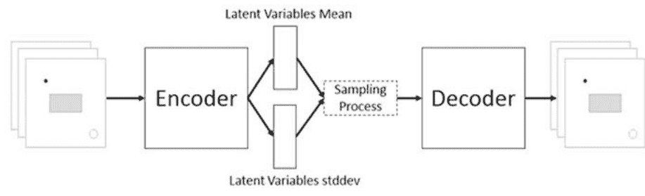

图 14 变分自编码器的结构。（Reichstaller 和 Knapp [13]。使用变分自编码器压缩均匀测试套件。https://doi.org/10.1109/QRS-C.2017.128）

$F(x) = \frac{1}{\sqrt{2\pi\sigma^2}} e^{-\frac{(x-\mu)^2}{2\sigma^2}}$

其中 $\mu$ 和 $\sigma$ 分别是随机数 $X_1$ 的均值和标准差；然后将得到的编码传递给解码器。例如，假设 $\mu=[0.1, 1.2,0.2,0.8,...]$, $\sigma=[0.2,0.5,0.8,1.3]$；可以从 $[X_1 \sim N(0.1, 0.2^2), X_2 \sim N(1.2, 0.5^2), X_3 \sim N(0.2, 0.8^2), X_4 \sim N(0.8, 1.3^2), ...]$ 生成随机数得到样本向量 $[0.28,1.65,0.95,1.98,...]$。这个生成样本向量的过程称为随机生成。均值和标准差与随机生成样本的输入相同。

均值向量是样本的基础，标准差决定了要编码多少均值；均值和标准差控制的空间被称为分布。添加到分布中的新样本将扩大样本生成的空间。另一方面，解码器学习到样本不是从单个点生成的，而是遵循连续潜在空间中的分布。从单个点扩展的区域仅局限于该点，并且其对模型的暴露程度因程度而异，从而形成局部空间的平滑性。一组样本的这种平滑局部空间被称为聚类。

为了直观理解变分自编码器，让我们以一个具有不同面孔的大型数据集为例。我们的目标是对相似的图像进行聚类。香草自编码器首先将每个图像编码为潜在空间，如图 15 所示。正如你所看到的，图像用单值潜在属性来描述。单值属性对于检测目的来说很难，相反，最好有一系列值。例如，假设查尔斯·巴贝奇的照片被编码为 0.12 的微笑值，这与 0.99 非常不同，但仍属于微笑的聚类。变分自编码器将为每个潜在属性提供概率分布，如图 16 所示。

在解码时，我们将从每个潜在属性中取样以生成一个样本向量，然后将其传递给解码器。这样，输入的轻微变化将导致准确的输出（重构）[12]。

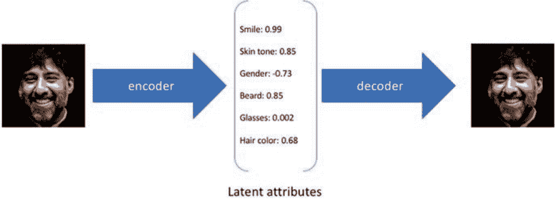

图 15 使用普通自编码器对图像进行潜在空间表示。（https://www.jeremy-jordan.me/variational- autoencoders/）

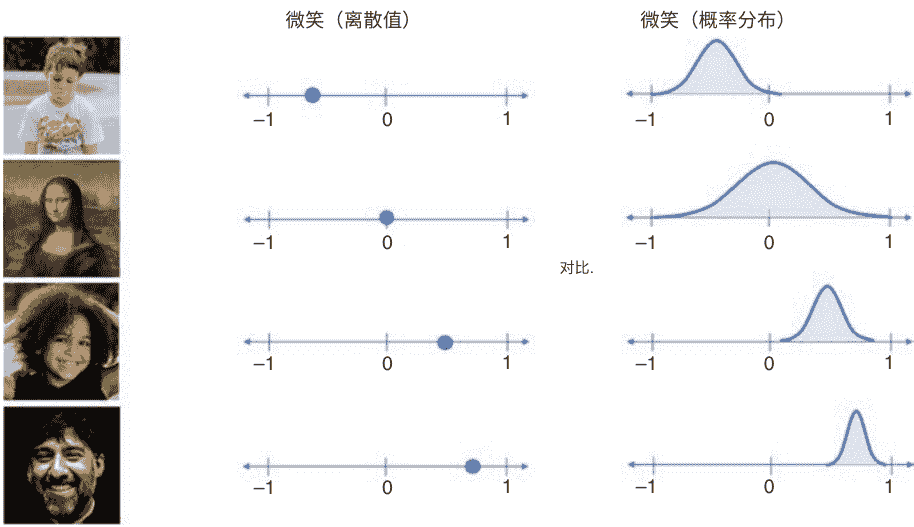

图 16 使用变分自动编码器对图像进行潜在空间表示。（https://www.jeremyjordan.me/variational- autoencoders/）

从统计学上讲，该方法使用贝叶斯理论。如果要从观察值 $x$ 生成 $z$ 个样本，我们将计算 $z$ 相对于 $x$ 的概率（$p(z|x)$）：

```
$$ p(z|x) = \frac{p(x|z)p(z)}{p(x)} $$
```

然而，$p(x)$ 的值只能估计，因为其分布难以处理：

```
$$ p(x) = \int p(x|z)p(z)dz $$
```

一般来说，$p(x|z)$ 被近似为另一个可处理的分布 $q(x|z)$。为了确保 $p(x|z)$ 和 $q(x|z)$ 相似，我们必须最小化它们之间的差异。这里的差异被测量为 KL 散度：

$$\min KL\left( q(z | x), p(z | x) \right)$$

这可以推导为

$$E_{q(z|x)}\{\log p(z | x) - KL(q(z | x) || p(z | x))\}$$

这里，第一项是似然重建，第二项是与分布 $q$ 类似的分布。这扩展到损失函数有两个项，一个处理似然重建误差，另一个是分布 $q$ 的支持函数：

$$L\left( x, \hat{x} \right) + \sum_j KL\left( q_j(z | x) \parallel p(z) \right)$$

变分编码器的主要优势是学习平滑的能力。

然而，通过从潜在空间生成样本，我们可以生成一个具有生成新数据能力的解码网络，从而使其成为生成模型的关键灵感。

# 7 DCGAN

在解释变分自编码器时，一个词出现了很多次，那就是生成模型。生成模型可以被描述为一种自动模型，用于通过输入数据中的模式发现模式并生成新的数据。与训练这种模型相关的网络被称为生成对抗网络（GANs）[14]。DCGAN 是一个流行的 GAN 框架。它代表深度卷积生成对抗网络 [15]。正如其名称所示，它处理卷积。

该网络由许多卷积层组成，有两种卷积实现方式。一种是带有步幅的卷积，另一种是转置卷积。转置卷积有助于放大图像，许多研究人员将其称为反卷积，但我认为这是错误的。假设一个 5x5 的图像与一个 3x3 的滤波器进行卷积，得到一个 2x2 的图像，当我们通过反向数学过程将该 2x2 的图像反卷积为一个 5x5 的图像时，转置卷积不是这样的；它在周围添加一些填充，然后执行熟悉的卷积函数。一个 2x2 的图像被填充成每个像素形成一个 3x3 的空间，如图 17 所示 [16]。

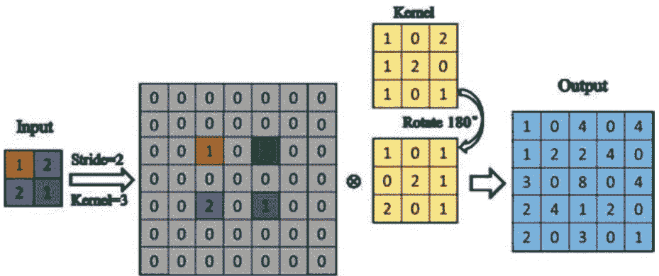

图 17 转置卷积的演示。(张等人 [16])

DCGAN 的基本结构与任何 ConvNets 相同，但每个池化层都被卷积步幅替代。添加了一个转置卷积来进行上采样。让我们看看 GAN 网络的工作原理：

```python
def generator(img_shape, z_dim):
    model = Sequential()
    # 隐藏层
    model.add(Dense(128, input_dim=z_dim))
    # Leaky ReLU
    model.add(LeakyReLU(alpha=0.01))
    # 带有 tanh 激活函数的输出层
    model.add(Dense(28*28*1, activation='tanh'))
    model.add(Reshape(img_shape))
    z = Input(shape=(z_dim,))
    img = model(z)
    return Model(z, img)
```

这里使用了 LeakyReLU 激活函数，允许一些负值的梯度。因此，在反向传播过程中，它将允许小的负梯度。现在，参考上面的代码，让我们构建一个 DCGAN 的代码 [17]。

```python
def generator(img_shape, z_dim):
    model = Sequential()

    # 通过完全连接的层将输入重塑为 7x7x256 张量
    model.add(Dense(256*7*7, input_dim = z_dim))
    model.add(Reshape((7,7,256)))

    # 转置卷积层，从 7x7x256 到 14x14x128 张量
    model.add(Conv2DTranspose(
            128, kernel_size = 3, strides = 2, padding='same'))

    # 批量归一化
    model.add(BatchNormalization())

    # Leaky ReLU
    model.add(LeakyReLU(alpha=0.01))

    # 转置卷积层，从 14x14x128 到 14x14x64 张量
    model.add(Conv2DTranspose(
            64, kernel_size=3, strides=1,    padding='same'))

    # 批量归一化
    model.add(BatchNormalization())

    # Leaky ReLU
    model.add(LeakyReLU(alpha=0.01))

    # 转置卷积层，从 14x14x64 到 28x28x1 张量
    model.add(Conv2DTranspose(
            1, kernel_size = 3, strides   = 2, padding='same'))

    # 双曲正切激活
    model.add(Activation('tanh'))
    z = Input(shape=(z_dim,))
    img = model(z)
    return Model(z, img)
```

上述架构的输入是从一个 100×1 的生成样本投影而来的，然后将其放大为 1024×4×4 的张量，通过卷积直到获得 64×64×3 的输出，如图 18 所示 [18]。DCGAN 的简单性是其受欢迎的主要原因。对于初学者来说，DCGAN 是一个很好的起点 [20,21]，用于生成模型。现在大多数使用的 GAN 都受到 DCGAN 架构的启发 [22-24]。

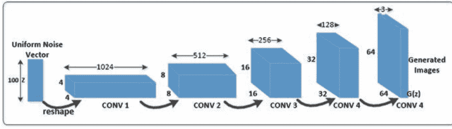

图 18 DCGAN 结构或架构。(Shorten 和 Khoshgoftaar [18])

# 参考文献

- 1. Yellapragada, B., Kolla, B.: 使用深度卷积神经网络进行有效的手写数字识别。Int. J. Adv. Trends Comput. Sci. Eng. **9**(2020). https://doi.org/10.30534/ijatcse/2020/66922020
- 2. Hidaka, A., Kurita, T.: 通过典型相关分析进行连续维度降低以可视化卷积神经网络。IS CIE 国际随机系统理论应用研讨会论文集，160-167 页 (2017 年)。https://doi.org/10.5687/sss.2017.160
- 3. van der Vaart Wouter, V., Lambers, K.: 学习查看 LiDAR: 在荷兰 LiDAR 数据中自动检测考古物体的 R-CNN 的使用。计算机应用考古学杂志 **2**, 31-40 页 (2019 年)。https://doi.org/10.5334/jcaa.32
- 4. Hossain, Md. M., Talbert, D., Ghafoor, S., Kannan, R.: FAWCA: 一种用于图像识别问题的灵活贪婪方法找到良好调整的 CNN 架构。(2018 年)
- 5. Krizhevsky, A., Sutskever, I., Hinton, G.: 使用深度卷积神经网络进行 ImageNet 分类。神经信息处理系统 **25** (2012 年)。https://doi.org/10.1145/30653866
- 6. Hughes, D. & Correll, N.: 在耦合感知、执行、计算和通信的材料中进行分布式机器学习。(2016 年)
- 7. 袁，X., 李，L., 王，Y.: 具有监督的长短期记忆网络的非线性动态软传感器建模。IEEE Trans. Ind. Inf., 3168-3176 (2019)。https://doi.org/10.1109/TII.2019.2902129
- 8. 苏，Y., 郭，C.: 关于扩展的长短期记忆和依赖的双向递归神经网络。Neurocomputing. **356**, 151-161 (2018)。https://doi.org/10.1016/j.neucom.2019.04.044
- 9. Naber, M., Hilger, M.: Wolfgang Einhäuser; 自然场景中的动物检测和识别：图像统计和情感价值。J. Vis. **12** (1), 25 (2012)。https://doi.org/10.1167/12.1.25
- 10. 陈，J., 杨，G., 赵，H., 等：使用浅层卷积网络和随机滤波器进行音频风格转换。多媒体工具应用程序 **79**, 15043-15057 (2020 年)。https://doi.org/10.1007/s11042-020-08798-6
- 11. Gatys, L., Ecker, A., Bethge, M.: 一种艺术风格的神经算法。arXiv, https://doi.org/10.1167/16.12.326. (2015 年)
- 12. Doersch, C.: (2016 年)。变分自动编码器教程，arXiv-1606.05908, https://arxiv.org/abs/1606.05908
- 13. Reichstaller, A., Knapp, A.: 使用变分自动编码器压缩均匀测试套件。在：IEEE 软件质量、可靠性和安全性伴侣国际会议 (QRS-C), 第 435-440 页。IEEE (2017 年)。https://doi.org/10.1109/QRS-C.2017.128
- 14. Nghiém, P., Phan, N.: 生成对抗网络 (2019 年)。https://doi.org/10.13140/RG.2.2.31946.62401
- 15. Goodfellow, Ian. (2016). NIPS 2016 教程：生成对抗网络
- 16. Zhang, Y., Zhao, X., Liu, P.: 基于全卷积神经网络和智能手机的多点位移监测。IEEE Access. **7**, 139628–139634 (2019). https://doi.org/10.1109/ACCESS.2019.2943599
- 17. Jakub, L., Vladimir, B.: GANs in Action, 第 3 章, September 2019 ISBN 9781617295560
- 18. Shorten, C., Khoshgoftaar, T.: 关于深度学习图像数据增强的调查。J. Big Data. **6** (2019). https://doi.org/10.1186/s40537-019-0197-0
- 19. Poots, J.: Tensorflow: 超越基础知识。(2019)
- 20. Prakash, K.B., Ruwali, A., Kanagachidambaresan, G.R.: 引言到张量流，张量流编程，EIA /Springer 通信和计算创新。https://doi.org/10.1007/978-3-030-57077-4_1
- 21. JHA. A.K., Ruwali, A., Prakash, K.B., Kanagachidambaresan, G.R.: 张量流基础，张量流编程，EIA/Springer 通信和计算创新。https://doi.org/10.1007/978-3-030-57077-4_2
- 22. Kanagachidambaresan, G.R., Manohar Vinoothna, G., Prakash, K.B.: 可视化，张量流编程，EIA/Springer 通信和计算创新。https://doi.org/10.1007/978-3-030-57077-4_3
- 23. Prakash, K.B., Ruwali, A., Kanagachidambaresan, G.R.: 回归，张量流编程，EIA/Springer 通信和计算创新。https://doi.org/10.1007/978-3-030-57077-4_4
- 24. Vadla, P.K., Ruwali, A., Lakshmi, M.V.P., Kanagachidambaresan, G.R.: 神经网络，张量流编程，EIA/Springer 通信和计算创新。https://doi.org/10.1007/978-3-030-57077-4_5

# 深度学习在生物信息学大数据分析中的潜在应用

Jayakishan Meher

Centurion University of Technology and Management, Gajapati, Odisha, India

© 作者，独家许可给 Springer Nature Switzerland AG 2021 K. B. Prakash 等 (编者),工程师和科学家的高级深度学习，EAI/Springer 通信和计算创新，https://doi.org/10.1007/978-3-030-66519-7_7

## 1 引言

近年来，生物数据的增长速度似乎每 15 个月翻一番。大量的序列、生物医学图像和信号被收集用于医学和健康研究。这些组学大数据必须经过分析，转化为生物信息学研究领域的有用知识，因此仍然是计算生物学中的一个关键问题。

机器学习模型已被用于从组学数据中找到有用的信息。这些算法利用训练数据揭示模式并确定预测。 机器学习方法处理从数据中学习的关系，不需要预先定义 [1-3]。传统的机器学习算法依赖于特征数据，因此其性能是确定的。基因组学 [4,5]、蛋白质组学 [6] 以及代谢组学研究 [7] 领域的密集预测任务依赖于这些机器学习技术。

深度学习技术是人工智能的进化代表，也是机器学习的进步，最近在图像处理、信号处理和序列分析的大数据分析中展现出了出色的预测性能 [8-10]。深度学习是从人工神经网络中继承而来的，具有先进的特性 [11-17]。深度学习神经网络 (DNNs) 以其适用于分析高维数据的特性而闻名。由于生物数据似乎是高维和复杂的，因此 DNN 方法适用于生物信息学研究。DNNs 可以确定未知的抽象模式和相关性，以识别数据的特征 [18,19]。生物信息学中的 DNNs 将有助于对原始数据进行编码和有效地研究特征。本综述的目的是总结深度学习在生物信息学大数据分析中的重要概念和潜在应用。

## 2 个生物信息学大数据集

生物数据的数量和增长程度随着新的和自动化的序列方法的发现而呈指数级累积。生物信息学随着公开可用的大型数据库以及大量的生物信息学工具的出现而发展。GenBank [20] 中的 DNA 和蛋白质结构中的蛋白质数据库 (PDB) [21] 激发了许多数据科学家和研究人员有效地进行生物分子大数据分析的动力。大量的生物医学数据，包括图像、序列和其他类型的组学数据，为生物医学和医疗保健研究提供了潜在的应用。

计算平台 (如机器智能和信号处理) 的进步激发了生物分子数据分析的新维度。

最广泛使用的生物数据库包括基因组和蛋白质序列数据库，它们作为实验结果的主要来源存储库。

互联网上最广泛使用的生物数据库资源是基因组学、蛋白质组学和微阵列信息 [22, 23]。序列数据库适用于核酸序列 (如 GenBank、EMBL-Bank 和 DDBJ) 和蛋白质序列 (如 PDB、Gene3D、PIR 等)。

微阵列数据库由代表基因的图像阵列组成，允许同时分析成千上万个基因。这些数据库，如 GEO、Genset、ArrayExpress 等，包含从微阵列实验 [24, 25] 中获得的数据。表 1 总结了该领域几个知名数据库的数据存储库。

## 3 个深度神经网络的概念

深度学习作为机器学习的一个分支，随着人工智能 (AI) 的进步而发展，用于分析大数据 [26]。机器学习从已知数据集中找到模式，但在处理原始数据方面有一定限制。深度学习已经显示出学习复杂特征的能力。深度学习的架构由多个非线性层的人工神经网络组成，这些层次化的数据形式可以通过不断增长的抽象阶段来揭示 [27]。

在 DNN 的基本结构中，有三层，包括输入层、中间的多个隐藏层和最后的输出层，如图 1 所示。

当前层中每个单元的权重向量与信号的乘积之和产生输出表达式。可以通过将加权和应用于非线性函数 (如 sigmoid、修正线性单元等) 来计算输出值 [28]。

## 表 1 生物信息学数据库总结

| 生物信息学数据库 | 描述性特征 |
| :--- | :--- |
| EMBL (www.ebi.ac.uk/embl) | 这个数据库维护核苷酸序列 |
| GenBank (www.ncbi.nlm.nih.gov) | 这个数据库提供核酸序列 |
| DDBJ (www.ddbj.nig.ac.jp) | 这是一个核苷酸序列数据库的存档 |
| TAIR (www.arabidopsis.org) | 它维护了拟南芥基因组信息的数据库 |
| dbEST (www.ncbi.nlm.nih.gov/dbEST) | 它包含了表达序列标签的数据库 |
| PIR (pir.georgetown.edu) | 这个网站维护了蛋白质序列和功能信息的数据库 |
| Swiss-Prot (www.expasy.org/sprot) | 这是蛋白质序列和功能信息的来源 |
| UniProt (www.pir.uniprot.org) | 这是蛋白质序列和功能的存储库 |
| PDB (www.rcsb.org/pdb) | 这是一个蛋白质结构和生物大分子的 3D 结构档案 |
| NDB (ndbserver.rutgers.edu) | 它维护了核酸结构信息的数据库 |
| SMD (genome-www5.stanford.edu) | 该网站维护了微阵列数据的数据库 |
| 耶鲁微阵列数据库 (www.med.yale.edu/microarray) | 它维护了微阵列数据的数据库 |

通过使用链式法则在反向传播中最小化训练中的误差，以反向传播误差信号。计算网络中所有权重的梯度 [29]。基于随机梯度下降（SGD）的优化算法用于更新权重参数 [30]。在训练中，正则化执行策略以消除过拟合并获得更好的泛化性能 [31-33]。

根据数据集的性质和目标，有许多形式的深度学习，如深度神经网络（DNNs）[34-38]，卷积神经网络（CNNs）[39-41]，循环神经网络（RNNs）[42-45] 等。最重要的进展在语音和图像检测 [46-52]，自然语言处理 [53, 54] 和语言转换 [55, 56] 方面。目前，深度学习在生物信息学研究应用中越来越广泛使用。


图 1 DNN 的基本结构


图 2 生物信息学研究目标中的深度学习

## 生物信息学中 DNN 的 4 个应用

深度学习在生物信息学研究领域中有几个潜在应用，如图 2 所示。深度学习架构 (如 DNN、CNN 和 RNN) 在生物信息学领域 (如组学研究、生物医学图像处理和生物医学信号处理) 中的应用正在这里展示。

### 4.1 用于组学研究的深度学习

深度学习在生物信息学中广泛应用于组学研究，如基因组、蛋白质组和转录组数据，并提供了最常见的原始生物序列数据，如 DNA、RNA 和氨基酸序列。作为深度学习的输入。此外，物理化学性质 [57, 58]、一维结构性质 [59, 60] 和位置特异性评分矩阵 (PSSM) [61] 从序列中提取的特征被用作处理高维生物数据的深度学习算法的输入。蛋白质接触图表示蛋白质三维结构中氨基酸对的距离，微阵列图像基因表达也被用于此 (表 2)。熊等人 [62] 应用 DNN 成功预测剪接活性，Alipanahi 等人 [63] 分析了 DNA 和 RNA 结合蛋白或表观遗传标记的特异性。

### 4.2 蛋白质结构的深度学习

DNN 在蛋白质组学研究中得到了广泛应用 [64–67]，因为在三维空间中进行预测是复杂的。Heffernan 等人 [65] 使用 SAE 成功预测蛋白质的二级结构和扭转角。类似地，Spencer 等人 [66] 利用 DBN 对氨基酸序列进行蛋白质二级结构预测，使用了 PSSM 和 Atchley 特征等。DNN 也被用于基因表达调控 [67–73]。Lee 等人 [68] 在理解基因表达中的剪接位点预测中应用了 DBN。Asgari 等人 [75] 采用了 skip-gram 模型（MLP 的一种变体）来高效地学习蛋白质家族分类中的序列分布形式。

### 表 2 生物信息学中的深度学习应用

| 生物信息学研究领域 | 研究问题 | 输入数据集 | 深度学习技术 |
| :--- | :--- | :--- | :--- |
| 基因组学和蛋白质组学 | 蛋白质二级结构预测<br>蛋白质功能分类<br>异常分类<br>基因表达数据调控 | 测序数据：DNA、RNA、氨基酸序列)<br>特征：PSSM、<br>物理化学性质<br>一维结构<br>属性<br>接触图<br>微阵列基因表达 | DNN<br>CNN<br>RNN |
| 生物医学图像处理 | 异常分类<br>分割<br>识别<br>脑解码 | 放射学图像<br>磁共振图像<br>组织病理学图像<br>视网膜图像<br>正电子发射<br>断层扫描 | DNN<br>CNN |
| 生物医学信号处理 | 脑解码<br>异常分类 | ECoG<br>ECG<br>EMG<br>EOG<br>EEG | DNN<br>CNN<br>RNN |

### 4.3 生物医学图像处理中的深度学习

深度学习的应用已经扩展到生物医学图像处理领域，其中生物医学图像如 MRI、正电子发射断层扫描 (PET)、放射学图像和组织病理学图像已被用于异常分类 [76-78]、识别 [79,80]、分割 [81] 和脑解码 [82,83] 的分析。Plis 等人 [84] 使用 DBN 对脑 MRI 进行了精神分裂症患者分类，而徐等人 [85] 使用 SAE 从组织病理学图像中检测细胞核。

### 4.4 生物医学信号处理

深度学习的另一个有前途的领域是生物医学信号处理，它使用来自心电图 (ECG)、脑电图 (EEG)、电极脑电图 (ECoG)、眼电图 (EOG) 和肌电图 (EMG) 的信号进行分析。记录的信号通常带有噪声，因此这些信号会被分解成小波分量，以输入深度学习算法。An 等人 [86] 利用 DBN 对脑电图信号的频率分量进行分类，以识别左手和右手的运动想象技巧。此外，Jia 等人 [87] 利用 DBN，Jirayucharoensak 等人 [88] 利用 SAE 进行情绪分类。

### 4.5 多模态深度学习

多模态深度学习是生物研究进展的一种有前途的方式，它探索来自多个资源的信息进行整合，除了组学数据、图像和信号之外，还可以获得其他形式的数据，如 X 射线、CT、MRI 和 PET。Suk 等人 [89] 利用脑脊液和 MRI、PET 扫描中的脑部图像进行阿尔茨海默病分类分析。Soleymani 等人 [90] 利用面部图像和脑电图信号 [91–93] 进行情绪检测。

## 5 结论

深度学习技术是生物信息学中最有前景的机器学习工具，用于从大数据中提取隐藏知识。已经对生物信息学研究中使用深度学习技术的异质输入数据和领域研究目标进行了广泛的综述。可以看到深度学习架构，如 DNN、CNN 和 RNN，在生物信息学研究领域，如组学、生物医学图像处理和生物医学信号处理方面得到了广泛应用，产生了有希望的结果。深度学习的应用是推动生物信息学未来研究成功的关键。

# 参考文献

- 1. Hastie, T., Tibshirani, R., Friedman, J., Franklin, J.: 统计学习的要素：数据挖掘、推断和预测。数学智能 27, 83-85(2005)
- 2. Murphy, K.P.: 机器学习：概率观点。麻省理工学院出版社，剑桥 (2012)
- 3. Michalski, R.S., Carbonell, J.G., Mitchell, T.M.: 机器学习：一种人工智能方法。Springer Science & Business Media, Berlin/Heidelberg (2013)
- 4. Libbrecht, M.W., Noble, W.S.: 机器学习在遗传学和基因组学中的应用。Nat. Rev. Genet. 16, 321-332(2015)
- 5. Märtens, K., Hallin, J., Warringer, J., Liti, G., Parts, L.: 从基因组和表型预测定量性状，准确率接近完美。Nat. Commun. 7, 11512(2016)
- 6. Swan, A.L., Mobasheri, A., Allaway, D., Liddell, S., Bacardit, J.: 机器学习在蛋白质组学数据中的应用：后基因组生物学中的分类和生物标志物鉴定。OMICS. 17, 595-610(2013)
- 7. Kell, D.B.: 代谢组学、机器学习和建模：迈向对细胞语言的理解。生物化学学会交流。33, 520-524(2005)
- 8. Hinton, G.E., Salakhutdinov, R.R.: 用神经网络降低数据的维度。科学 313, 504-507(2006). https://doi.org/10.1126/science.1127647
- 9. LeCun, Y., Bengio, Y., Hinton, G.: 深度学习。自然 521, 436(2015). https://doi.org/10.1038/nature14539
- 10. Nussinov, R.: 计算生物学的进展与挑战。PLoS Comput. Biol. 11, e1004053(2015). https://doi.org/10.1371/journal.pcbi.1004053
- 11. Mnih, V., Kavukcuoglu, K., Silver, D., Rusu, A.A., Veness, J., Bellemare, M.G., 等：通过深度强化学习实现人类级控制。自然。518, 529-533(2015)。https://doi.org/10.1038/nature14236
- 12. Schmidhuber, J.: 神经网络中的深度学习概述。神经网络。61, 85(2015)。https://doi.org/10.1016/j.neunet.2014.09.003
- 13. Mamoshina, P., Vieira, A., Putin, E., Zhavoronkov, A.: 深度学习在生物医学中的应用。分子药学。13, 1445-1454(2016)。https://doi.org/10.1021/acs.molpharmaceut.5b00982
- 14. Bengio, Y., LeCun, Y.: 将学习算法扩展到人工智能。在：Bottou, L., Chapelle, O., DeCoste, D., Weston, J. (eds.) Large-Scale Kernel Machines. The MIT Press, Cambridge, MA(2007)
- 15. Alipanahi, B., Delong, A., Weirauch, M.T., Frey, B.J.: 通过深度学习预测 DNA 和 RNA 结合蛋白的序列特异性。自然生物技术。33, 831-838(2015). https://doi.org/10.1038/nbt.3300
- 16. Libbrecht, M.W., Noble, W.S.: 遗传学和基因组学中的机器学习应用。自然遗传学评论。16, 321-322(2015). https://doi.org/10.1038/nrg3920
- 17. Zhang, S., Zhou, J., Hu, H., Gong, H., Chen, L., Cheng, C., Zeng, J.: 用于建模 RNA 结合蛋白靶标结构特征的深度学习框架。核酸研究。44, e32(2016). https://doi.org/10.1093/nar/gkv1025
- 18. Esteva, A., Kuprel, B., Novoa, R.A., Ko, J., Swetter, S.M., Blau, H.M., Thrun, S.: 用深度神经网络对皮肤癌进行皮肤科医生级别的分类。自然。542, 115-118(2017). https://doi.org/10.1038/nature21056
- 19. Ching, T., Himmelstein, D.S., Beaulieu-Jones, B.K., Kalinin, A.A., Do, B.T., Way, G.P., et al.: 生物学和医学中深度学习的机遇和障碍。J. R. Soc. Interface. 15, 20170387 (2018). https://doi.org/10.1098/rsif.2017.0387
- 20. Benson, D.A., Karsch-Mizrachi, I., Lipman, D.J., Ostell, J., Rapp, B.A., Wheeler, D.L.: Nucleic Acid Res. 28, 15-18 (2000)
- 21. Berman, H.M., Westbrook, J., Feng, Z., Gilliland, G., Bhat, T.N., Weiss, H., Shindyalov, J.N., Bourne, P.E.: Nucleic Acids Res. 28, 235-242 (2000)
- 22. Barker, W.C., Garavelli, J.S., PB, M.G., Marzack, C.R., Orcutt, B.C., Srinivarsarao, G.Y., Yeh, L.S., Mewes, H.W., Pfeiffer, F., et al.: Nucleic Acid Res. 27, 39-43 (1999)
- 23. Bairoch, A., Apweiler, R.: Nucleic Acid Res. 27, 44-48 (1999)
- 24. Schena, M., Shalon, D., Davis, R.W., Brown, P.O.: Quantitative monitoring of gene expression patterns with a complementary DNA microarray. Science. 270, 467-470 (1995)
- 25. Ball, C.A., Awad, I.A., Demeter, J., et al.: The Stanford microarray database accommodates additional microarray platforms and data formats. Nucleic Acids Res. 33(Database issue), D580-D582 (2005)
- 26. LeCun, Y., Bengio, Y., Hinton, G.: 深度学习。自然。521(7553), 436-444 (2015)
- 27. LeCun, Y., Ranzato, M.: 深度学习教程。在：国际机器学习大会教程 (ICML'13). Citeseer (2013)
- 28. Nair, V., Hinton, G.: 矫正线性单元改进了受限玻尔兹曼机。在：第 27 届国际机器学习大会 (ICML-10) 论文集，pp. 807-814 (2010)
- 29. Hecht-Nielsen, R.: 反向传播神经网络的理论。在：国际神经网络联合会议，1989. IJCNN, pp. 593-605. IEEE, 华盛顿特区，美国 (1989)
- 30. Bottou, L.: 神经网络中的随机梯度学习。神经。N1mes. 91(8), 12 (1991)
- 31. Moody, J., Hanson, S., Krogh, A., 等：简单的权重衰减可以改善泛化能力。Adv. Neural Inf. Proces. Syst. 4, 950-957 (1995)
- 32. Srivastava, N., Hinton, G., Krizhevsky, A., 等：Dropout: 一种防止神经网络过拟合的简单方法。J. Mach. Learn. Res. 15(1), 1929-1958 (2014)
- 33. Baldi, P., Sadowski, P.J.: 理解 dropout。In: Advances in Neural Information Processing Systems, NeurIPS Proceedings. pp. 2814-2822 (2013)
- 34. Svozil, D., Kvasnicka, V., Pospichal, J.: 多层前馈神经网络简介。Chemom. Intell. Lab. Syst. 39(1), 43-62 (1997)
- 35. Vincent, P., Larochelle, H., Bengio, Y., 等：使用去噪自编码器提取和组合稳健特征。在：第 25 届国际机器学习大会论文集，第 1096-1103 页。ACM，纽约 (2008 年)
- 36. Vincent, P., Larochelle, H., Lajoie, I., 等：堆叠去噪自编码器：使用本地去噪准则在深度网络中学习有用的表示。机器学习研究杂志，第 11 卷，第 3371-3408 页 (2010 年)
- 37. Hinton, G., Osindero, S., Teh, Y.-W.: 深度信念网络的快速学习算法。神经计算，第 18 卷 (7), 第 1527-1554 页 (2006 年)
- 38. Hinton, G., Salakhutdinov, R.R.: 用神经网络降低数据的维度。科学。313(5786), 504-507 (2006)
- 39. LeCun, Y., Boser, B., Denker, J.S., 等：用反向传播网络进行手写数字识别。在：神经信息处理系统的进展，Citeseer(1990)
- 40. Lawrence, S., Giles, C.L., Tsoi, A.C., 等：人脸识别：一种卷积神经网络方法。IEEE Trans. Neural Netw. 8(1), 98-113 (1997)
- 41. Krizhevsky, A., Sutskever, I., Hinton, G.: 用深度卷积神经网络进行 Imagenet 分类。在：神经信息处理系统的进展，第 1097-1105 页 (2012)
- 42. Williams, R.J., Zipser, D.: 一种用于持续运行完全循环神经网络的学习算法。Neural Comput. 1(2), 270-280 (1989)

- 43. Bengio, Y., Simard, P., Frasconi, P.: 用梯度下降学习长期依赖性是困难的. IEEE Trans. Neural Netw. 5(2), 157-166 (1994)
- 44. Hochreiter, S., Schmidhuber, J.: 长短期记忆. Neural Comput. 9(8), 1735-1780 (1997)
- 45. Gers, F.A., Schmidhuber, J., Cummins, F.: 学会遗忘：使用 LSTM 进行持续预测. Neural Comput. 12(10), 2451-2471 (2000)
- 46. Farabet, C., Couprie, C., Najman, L., 等：学习场景标签的分层特征. IEEE Trans. Pattern Anal. Mach. Intell. 35(8), 1915-1929 (2013)
- 47. Szegedy, C., Liu, W., Jia, Y., 等：通过卷积进行更深入的研究。arXiv 预印本 arXiv:1409.4842 (2014)
- 48. Tompson, J.J., Jain, A., LeCun, Y., 等：用于人体姿势估计的卷积网络和图模型的联合训练。在：神经信息处理进展，第 1799-1807 页 (2014 年)
- 49. Liu, N., Han, J., Zhang, D., 等：使用卷积神经网络预测眼球注视点。在：IEEE 计算机视觉和模式识别会议论文集，第 362-370 页 (2015 年)
- 50. Hinton, G., Deng, L., Yu, D., 等：语音识别中的声学建模的深度神经网络：四个研究小组的共同观点。IEEE 信号处理杂志 29(6), 82-97 页 (2012 年)
- 51. Sainath, T.N., Mohamed, A.-R., Kingsbury, B., 等：用于 LVCSR 的深度卷积神经网络。在：2013 年 IEEE 国际声学、语音和信号处理会议 (ICASSP), 第 8614-8618 页。IEEE, 纽约 (2013 年)
- 52. Chorowski, J.K., Bahdanau, D., Serdyuk, D., 等：基于注意力的语音识别模型。Adv. Neural Inf. Process. Syst. 2015, 577-585 (2015)
- 53. Kiros, R., Zhu, Y., Salakhutdinov, R.R., 等：跳跃思维向量。Adv. Neural Inf. Process. Syst. 2015, 3276-3284 (2015)
- 54. Li, J., Luong, M.-T., Jurafsky, D.: 用于段落和文档的分层神经自动编码器。arXiv 预印本 arXiv:1506.01057 (2015)
- 55. Luong, M.-T., Pham, H., Manning, C.D.: 基于注意力的神经机器翻译的有效方法。arXiv 预印本 arXiv:1508.04025 (2015)
- 56. Cho, K., Van Merriënboer, B., Gulcehre, C., 等：使用 RNN 编码器 - 解码器学习短语表示进行统计机器翻译。arXiv 预印本 arXiv:1406.1078 (2014)
- 57. Ponomarenko, J.V., Ponomarenko, M.P., Frolov, A.S., 等：转录因子结合位点特异的构象和物理化学 DNA 特征。Bioinformatics. 15(7), 654-668 (1999)
- 58. Cai, Y.-D., Lin, S.L.: 支持向量机用于预测 rRNA、RNA 和 DNA 结合蛋白质的氨基酸序列。Biochim. Biophys. Acta (BBA) – Protein. Proteomics. 1648(1), 127-133 (2003)
- 59. Branden, C.I.: 蛋白质结构导论。Garland Science, 纽约 (1999)
- 60. Richardson, J.S.: 蛋白质结构的解剖学和分类学。Adv. Protein Chem. 34, 167-339 (1981)
- 61. Jones, D.T.: 基于位置特异性评分矩阵的蛋白质二级结构预测。J. Mol. Biol. 292(2), 195-202 (1999)
- 62. Xiong, H.Y., Alipanahi, B., Lee, L.J., Bretschneider, H., Merico, D., Yuen, R.K.C., Hua, Y., Gueroussov, S., Najafabadi, H.S., Hughes, T.R., Morris, Q., Barash, Y., Krainer, A.R., Jojic, N., Scherer, S.W., Blencowe, B.J., Frey, B.J.: 人类剪接密码揭示了疾病遗传决定因素的新见解。Science. 347, 1254806 (2015)
- 63. Alipanahi, B., Delong, A., Weirauch, M.T., Frey, B.J.: 通过深度学习预测 DNA 和 RNA 结合蛋白的序列特异性。自然生物技术。33, 831-838 (2015)
- 64. Lyons, J., Dehzangi, A., Heffernan, R., 等：通过堆叠稀疏自编码深度神经网络从蛋白质序列预测主链 Ca 角和二面角。计算化学。35(28), 2040-2046 (2014)
- 65. Heffernan, R., Paliwal, K., Lyons, J., 等：通过迭代深度学习改进蛋白质的二级结构、局部主链角度和溶剂可及表面积的预测。科学报告。5, 11476 (2015)
- 66. Spencer, M., Eickholt, J., Cheng, J.: 一种深度学习网络方法用于从头预测蛋白质的二级结构。IEEE/ACM 计算生物学与生物信息学交易。12(1), 103-112(2015)
- 67. Nguyen, S.P., Shang, Y., Xu, D.: DL-PRO: 一种新颖的深度学习方法和用于蛋白质模型质量评估。在:2014 年国际神经网络联合会议(IJCNN), pp. 2071-2078. IEEE, 纽约(2014 年)
- 68. Leung, M.K., Xiong, H.Y., Lee, L.J., 等：组织调控剪接代码的深度学习。生物信息学。30(12), i121-i129(2014 年)
- 69. Lee, T., Yoon, S.: 用于计算预测剪接位点的提升分类限制玻尔兹曼机。在:国际机器学习大会，法国里尔，pp. 2483-2492(2015 年)
- 70. Zhang, S., Zhou, J., Hu, H., 等：一种用于建模 RNA 结合蛋白靶标结构特征的深度学习框架。核酸研究。44(4), e32(2015 年)
- 71. 陈，Y., 李，Y., 纳拉扬，R., 等：深度学习的基因表达推断。生物信息学。32(12), 1832-1839(2016 年)
- 72. 李，Y., 史，W., 沃斯曼，W.W.: 使用监督深度学习方法进行全基因组的顺式调控区域预测。bioRxiv, 041616(2016 年)
- 73. 刘，F., 任，C., 李，H., 等：通过深度学习在人类基因组中的新生识别复制时序域。生物信息学。32, 641-649(2015 年)
- 74. 尼尔森，T.W., 格雷夫利，B.R.: 通过选择性剪接扩展真核生物蛋白质组。自然。463(7280), 457-463(2010 年)
- 75. 阿斯加里，E., 莫夫拉德，M.R.: 连续分布式表示生物序列用于深度蛋白质组学和基因组学。PLoS One。10(11), e0141287(2015 年)
- 76. Plis, S.M., Hjelm, D.R., Salakhutdinov, R., 等：神经影像学的深度学习：一项验证研究。Front. Neurosci. 8, 229(2014)
- 77. Hua, K.-L., Hsu, C.-H., Hidayati, S.C., 等：通过深度学习技术对计算机断层扫描图像中的肺结节进行计算机辅助分类。Onco. Targets. Ther. 8, 2015-2022(2015)
- 78. Suk, H.-I., Shen, D.: 基于深度学习的 AD/MCI 分类特征表示。在：医学图像计算与计算机辅助干预-MICCAI, vol. 2013, pp. 583-590. Springer, 纽约(2013)
- 79. Xu, J., Xiang, L., Liu, Q., 等：基于堆叠稀疏自编码器(SSAE) 的乳腺癌组织病理学图像核的检测。IEEE Trans. Med. Imaging. 35(1), 119-130(2015)
- 80. Chen, C.L., Mahjoubfar, A., Tai, L.-C., 等：无标签细胞分类中的深度学习。Sci. Rep. 6, 21471(2016)
- 81. 李，Q., 冯，B., 谢，L., 等：一种用于视网膜图像中血管分割的跨模态学习方法。IEEE Trans. Med. Imaging. 35(1), 108-109(2015)
- 82. Gerven, M.A.V., De Lange, F.P., Heskes, T.: 具有分层生成模型的神经解码。Neural Comput. 22(12), 3127-3142(2010)
- 83. 小山田，S., 志贺内，Y., 中江，K., 等：fMRI 大数据的深度学习：一种新的主体转移解码方法。arXiv 预印本 arXiv:1502.00093(2015)
- 84. Plis, S.M., Hjelm, D.R., Salakhutdinov, R., 等：神经影像学的深度学习：一项验证研究。Front. Neurosci. 8, 229(2014)
- 85. Xu, J., Xiang, L., Liu, Q., 等：基于堆叠稀疏自编码器(SSAE) 的乳腺癌组织病理学图像核检测。IEEE Trans. Med. Imaging. 35(1), 119-130(2015)
- 86. An, X., Kuang D., Guo, X., 等：基于运动想象的 EEG 数据分类的深度学习方法。在：智能计算生物信息学，第 203-210 页。Springer, Heidelberg(2014)

# 深度学习在生物信息学大数据分析中的潜在应用

- 87. Jia, X., Li, K., Li, X., 等：一种新颖的半监督深度学习框架用于情感状态识别的 EEG 信号。在：2014 年 IEEE 国际生物信息学和生物工程学会议 (BIBE),第 30-37 页。IEEE, 纽约 (2014)
- 88. Jirayucharoensak, S., Pan-Ngum, S., Israsena, P.: 基于主成分的协变量转移适应的 EEG 情感识别的深度学习网络。Sci. World J. **2014**, 627892 (2014)。https://doi.org/10.1155/2014/627892
- 89. Suk, H.-I., Shen, D.: 基于深度学习的 AD/MCI 分类特征表示。在：医学图像计算与计算机辅助干预-MICCAI 2013, 第 583-590 页。Springer, 纽约 (2013)
- 90. Soleymani, M., Asghari-Esfeden, S., Pantic, M., 等：使用 EEG 信号和面部表情进行连续情绪检测。在：2014 年 IEEE 国际多媒体和博览会 (ICME), 第 1-6 页。IEEE, 纽约 (2014)
- 91. Prakash, K.B., Ruwali, A., Kanagachidambaresan, G.R.: 引言到张量流，张量流编程，EIA/Springer 通信和计算创新。https://doi.org/10.1007/978-3-030-57077-4_1
- 92. JHA, A.K., Ruwali, A., Prakash, K.B., Kanagachidambaresan, G.R.: 张量流基础，张量流编程，EIA/Springer 通信和计算创新。https://doi.org/10.1007/978-3-030-57077-4_2
- 93. Bharadwaj, Prakash, K.B., Kanagachidambaresan, G.R.: 核支持向量机，使用 TensorFlow 进行编程，EIA/Springer 通信和计算创新。https://doi.org/10.1007/978-3-030-57077-4_11

# 使用机器学习技术动态映射和可视化马来西亚的登革热发生情况

Nirbhay Mathur, Vijanth S. Asirvadam, Sarat C. Dass 和 Balvinder Singh Gill

## 1 引言

登革热是一种威胁生命的疾病，它是由人体暴露在属于 Aedes 属的雌蚊叮咬引起的 [1]。 当 Aedes albopictus 叮咬并传播登革病毒时，人体上可以观察到登革热。 登革热被宣布为一种媒介传播的疾病，具有关节炎病毒的症状 [2]。 这种疾病已成为公共卫生的主要关注点之一。 根据世界卫生组织（WHO）的数据，登革热病例的报告和分类不准确。 从数据来看，每年估计有大约 3.9 亿例登革热病例，其中有 9600 万例临床报告 [3]。 在 19 世纪 70 年代末（1870-1873 年），第一例登革热病例被报告，后来被宣布为“大流行病”，发生在东非沿海地区、阿拉伯海岸和苏伊士港 [4-6]。

传播登革热的蚊子属于黄病毒科的特殊品种 - 蚊。传播登革热的蚊子被命名为埃及伊蚊和白纹伊蚊


图 1 黄病毒科蚊子 (a) 埃及伊蚊雌蚊，(b) 白纹伊蚊雄蚊 [7]

其中雌性蚊子是携带登革热病毒的蚊子，即白纹伊蚊，如图 1 所示。

登革热的发生取决于一些因素，但主要参数是气候条件，如降雨、温度、风和湿度。在提到的变量中，降雨被认为是登革病毒传播的最重要因素。已经注意到，高降雨量后的 5-7 天，登革热病例报告更多。雨后，雨水会积聚在一些垃圾场所，并储存在未使用的容器中，如旧轮胎、水箱、破碎的塑料容器、破碎的水箱 [8,9]。

大部分埃及伊蚊的雌性蚊子会在容器的内表面上产卵，在储水的上层产卵。记录显示，一只雌性蚊子每次繁殖时可以产下 100-250 个卵。一旦卵在容器的水面上产生，它们需要 7-9 天才能发育成为第一阶段的登革病毒携带者——幼虫。需要另外四个前期发育阶段才能达到第二阶段;这个阶段需要 25℃的温度来使幼虫进化。在第二阶段，还需要 2-3 天才能发育成为蛹，蛹也可以被视为蚊子的半发育阶段。再过 2 天，它们就会成为完全成熟的成蚊。埃及伊蚊会等待它们的翅膀干燥，一旦干燥完成，它们就准备好飞行和传播登革病毒了 [10]。

一旦蚊子准备叮咬人体，人体就成为感染源，并携带病毒在传播病例中进行繁殖。在感染的人体中出现第一个症状后，他/她可以传播感染物 4-5 天，最长限制为 12 天。DENV 有四种不同的血清型:DENV1、DENV2、DENV3 和 DENV4。如果患者发热并具有以下活动之一:头痛、肌肉疼痛、出血表现、皮疹和白细胞减少 (图 2)[11],则确认为登革热 (DF)。

约有 5% 被诊断为登革热的人患有更严重的疾病，1% 患有严重的危及生命的感染 [12]。马来西亚的研究揭示了

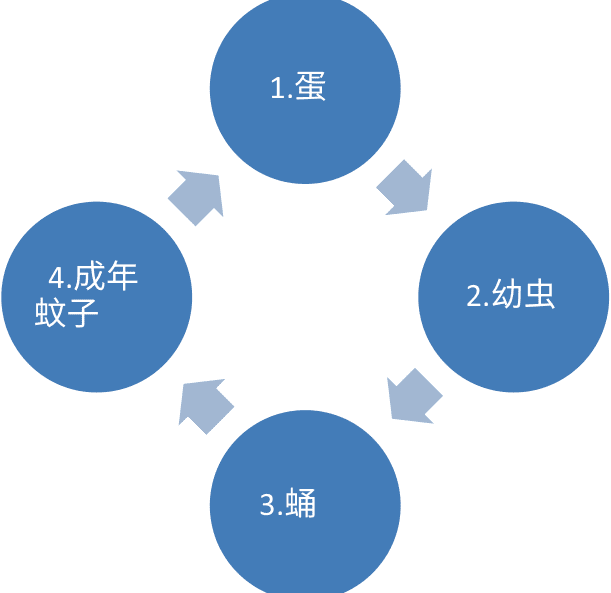

图 2 埃及伊蚊 雌性蚊子的生命周期

一个涉及树冠饲养的猴子和 Aedes niveus 的广泛丛林登革热传播循环，后者是一种同时以猴子和人类为食的物种 [13]。登革热感染由城市媒介 Aedes aegypti 和 Aedes albopictus 传播 [14]。Aedes aegypti 主要是大陆沿海的物种，通常分布在热带地区。该病毒也存在于澳大利亚、美国和巴西等国家 [15]。

1902 年，登革热病毒的首次爆发在 11 月至 12 月的槟城得到了通报 [16]。在第一次爆发之后，槟城和吉隆坡的城市发展区域记录了许多其他病例 [17-20]。到了 20 世纪 60 年代，登革热在马来西亚被宣布为地方性病，并且在 1962 年，槟城报告了第一个经实验室确认的登革热病例 [17]。许多研究已经进行并仍在进行中。进行了一项研究，其中微气候是研究的主要参数，通过变化纬度在赤道的北部和南部增加了 13 度，影响登革热 [21-23]。发现了一项研究，其中天气是探索马来西亚登革热发病率的主要参数，通过计算发生登革热病例的密度 [24]。其他一些研究讨论了温度和风速等气候参数对于找到登革热爆发和降雨之间的滞后时间的影响 [25, 26]。尽管进行了所有的研究，但仍然缺少一个可视化因素，也没有找到预测发病情况的实时映射。

这项研究的主要动机是使用 GIS 开发实时位置上的登革热发生的空间映射。这项研究还预测了脆弱性

马来西亚州登革热发生的映射。这篇研究文章的结构如下:

第 2 节：本节将讨论已完成的相关工作的概述和其他取得的成就，以及登革热传播。本节还将讨论马来西亚的登革热病毒传播以及气候条件如何使其成为可能。此外，所有预测模型将被总结，以了解从预测角度来看，可以使用哪些工具来开发登革热空间映射。

第三节：本节将详细介绍本研究中使用的方法论。将讨论映射技术和机器学习预测模型。本节还将解释聚类技术，例如使用 $k$ 均值预测登革热病例和优化技术，例如 K-NN，并验证结果期望最大化 (EM) 算法将被讨论。

第四节：本节将基于预测和分类展示登革热发病的时空映射结果。将使用动态映射来理解登革热发病的趋势和行为，这将帮助我们了解登革热发病最易受影响的区域。

第五节：最后，本节将根据提出的方法总结结果。在这里，作者将对提出的工作、有用的发现和未来工作建议进行详细讨论。

## 2 背景

### 2.1 马来西亚的登革热

登革热 (DF) 已经成为一种全球性疾病，在世界各地蔓延。图 3 显示了传播情况，大多数发达国家都受到登革病毒的困扰。

根据世界卫生组织的数据，登革热流行病的总花费在每个时间间隔都在增加；在亚洲和美洲等一些国家，他们通常花费 8.28 亿美元，而且还在继续增加 [27]。根据数据，2008 年至 2010 年记录的病例总数约为 136,992 例，是有史以来最高的记录 [28]。马来西亚在记录登革热发病率方面排名第二，仅次于老挝人民民主共和国，如表 1 所示。

据报道，马来西亚 35-74 岁年龄段的人群中，91.6% 的人被检测出登革热阳性 [29]。从 2010 年到 2013 年，登革热发病率随机增加了 16% 至 0.62%[30,31]。2010 年，在森美兰进行了一项研究，记录了 1,466 例登革热发病例；受影响的最小年龄为 8 个月，最大年龄为 89 岁，因为图 3 全球登革热传播风险。（来源：哈佛大学公共卫生学院）

研究得出结论，马来西亚登革热发生的平均年龄在 32.2 至 15.8 岁之间 [32]。这项研究还讨论了马来西亚的民族群体，其中马来人是患登革热最多的群体，其次是华人，印度人最少，比例约为 4.1:1.5:1。此外，这项研究还指出，男性比女性更容易受到登革热的影响，比例为 1.4:1.0，男性受影响更多 [9]。

根据世界卫生组织的说法，登革热病毒的疫苗正在进行临床试验，因此建议使用病媒控制方法来控制这种流行病。马来西亚也在实施病媒控制方法，如环境管理、成蚊灭活、幼蚊灭活和综合控制。马来西亚还在登记病例区域进行喷雾杀灭登革热蚊子的化学处理 [33]。

马来西亚还推出了行为影响沟通（COMBI）计划，通过搜索和销毁登革热病毒来控制疾病传播 [34]。

为了控制这种流行性恐慌，马来西亚政府在 2009 年至 2013 年期间制定了一些战略计划，如图 4 所示。

这些计划分为七个阶段，如下所示：第一阶段是进行监测并设计能够更新登革热发生情况的系统。在第二阶段，将执行一个综合的媒介管理系统。在第三阶段，将进行登革热管理以确认登革热病例。一旦确认了登革热病例，第四阶段将开始进行所有必要的沟通和社会动员。在第五阶段，登革热爆发团队将参与响应并观察控制传播的情况。一旦爆发团队了解了病例，将提供所有所需的数据给研究团队，他们将在提到的参数上进行登革热研究。最后一个阶段将是在特定区域实施计划。

| 国家/地区† | 病例 | 通知 (每 100,000 人) | 死亡 | 病例病死率 (%) 人 | 人口 (×1000) |
| :--- | :--- | :--- | :--- | :--- | :--- |
| **亚洲子区域** | | | | | |
| 文莱达鲁萨兰国 | 25 | 6.16 | 0 | 0 | 406 |
| 柬埔寨 | 15,980 | 119.29 | 73 | 0.46 | 13,396 |
| 中国 | 124 | 0.01 | 0 | 0 | 1,370,537 |
| 中国香港 | 30 | 0.42 | 0 | 0 | 7,068 |
| 日本 | 104 | 0.08 | 0 | 0 | 128,056 |
| 韩国 | 72 | 0.15 | 0 | 0 | 48,875 |
| 老挝人民民主共和国 | 3905 | 63.72 | 7 | 0.18 | 6128 |
| 中国澳门 | 3 | 0.54 | 0 | 0 | 552 |
| 马来西亚 | 19,884 | 70.38 | 36 | 0.18 | 28,251 |
| 蒙古 | 0 | 0.00 | 0 | 0 | 2,780 |
| 菲律宾 | 125,975 | 134.00 | 654 | 0.52 | 94,013 |
| 新加坡 | 5330 | 102.82 | 6 | 0.11 | 5,184 |
| 越南 | 69,680 | 81.00 | 61 | 0.09 | 86,025 |
| **子区域总计** | **241,112** | **13.46** | **837** | **0.35** | **1,791,271** |
| **太平洋子区域** | | | | | |
| 澳大利亚 | 820 | 3.67 | 0 | 0 | 22,342 |
| 库克群岛 | 0 | 0.00 | 0 | 0 | 23 |
| Fiji | 245 | 28.69 | 0 | 0 | 854 |
| 法属波利尼西亚 | 12 | 4.46 | 0 | 0 | 269 |
| 马绍尔群岛 | 1257 | 2327.78 | 0 | 0 | 54 |
| 密克罗尼西亚联邦 | 1024 | 994.17 | 2 | 0.20 | 103 |
| 新喀里多尼亚 | 1 | 0.41 | 0 | 0 | 246 |
| 新西兰 | 42 | 1.01 | 0 | 0 | 4,143 |
| 帕劳 | 334 | 1590.48 | 0 | 0 | 21 |
| 瓦努阿图 | 33 | 14.10 | 0 | 0 | 234 |
| **子区域总计** | **3768** | **13.32** | **2** | **0.05** | **28,289** |
| 总计 | 244,880 | 13.46 | 839 | 0.34 | 1,819,560 |

来源：世界卫生组织
+表示在表格中使用的领土

根据马来西亚卫生部的调查，2012 年登革热与往年相比，只有 3% 的登革热。在另一项调查中，城市地区有 77% 的人患有登革热病毒，而农村地区只有 23%。由于登革热病毒的威胁，许多研究人员为了了解登革热病毒在医学科学方面做出了贡献；许多研究都是为了了解登革热病毒的行为。一些研究还评估了登革热的空间风险因素。研究人员还研究了遥感和地理信息系统参数，以创建登革热发生的地图。还进行了许多统计研究

并且 在预测登革热病例方面得到了 70.3% 的显著性 [35]。根据研究，马来西亚根据血清学结果指出森林地区的登革热病例，数据显示有 2,300 只野生和家养动物代表超过 55 个物种的 28 个属，从城市收集了超过 25,000 只成年蚊子 [36]。

表 2 显示了基于不同技术用于登革热预测的比较表。不同的研究关注不同的概念来理解登革病毒的行为。由于马来西亚仍然记录了许多病例，因此提出的研究用于了解马来西亚的登革热方面。将开发空间映射来预测和可视化登革热发生情况。根据地图，将向喷雾团队传递信息，让他们集中注意特定区域，而不是盲目寻找。

## 3 研究领域

这项研究是为了马来西亚进行的，因为向量控制无法控制这种地方性疾病。

如图 5 所示，雪兰莪州报告的病例数最多。从 2010 年到 2012 年，全国总病例数的 40% 来自雪兰莪州 [38]。

## 4 数据收集

数据收集在预测中起着非常重要的作用。因此，从许多来源对数据进行了收集以进行这项研究。

首先，从马来西亚卫生部（MoH）收集了数据。数据包括有关患者的所有信息，包括通知 ID，年份（流行病年），流行病周，坐标（纬度和经度），地区（地区），区域（区域）和诊断类型。

一旦从来源收集到数据，就需要根据数据结构进行数据过滤。例如，在我们的案例中，接收到的数据与纬度和经度混合在一起，因为需要填充才能获得原始位置。一旦过滤完成，就可以进行预测算法以获得未来的预测结果。

### 4.1 使用机器学习进行数学建模

在最新的趋势中，机器学习已经在所有过程和计算中占据了重要地位。根据数据集和需求，学习可以进行监督或无监督。当它与数学建模相结合时，这种方法效果很好。数学模型广泛应用于科学、工程、商业等各个领域。数学模型有助于发展并设计动态系统、动力系统、统计模型或博弈论等等。该研究还专注于使用无监督学习 [42] 进行概率建模来预测登革热病例。

### 4.2 高斯混合建模

混合模型是一种包含多个组成函数的密度模型。高斯混合模型（GMM）是一个参数化的概率密度函数（PDF），表示为高斯组分密度的加权和。GMM 参数是使用训练数据估计的，该数据是从经过良好训练的先验模型迭代期望最大化（EM）或最大后验（MAP）算法 [43] 估计得到的。高斯混合模型也可以看作是一种广义的径向基函数网络，其中每个高斯组分是一个基函数或“隐藏”单元。

在数学上，我们将 GMM 定义为

$$p(x \mid \Phi)=\sum_{i=1}^{m} \alpha_{i} p_{i}\left(x \mid \phi_{i}\right)$$

其中，$x=\left(x_{i}, \ldots, x_{d}\right)^{T} \in R^{d}, \phi_{i}=\left(\mu_{i}, \Sigma_{i}\right), \Phi=\left(\alpha_{i}, \ldots, \alpha_{m}, \phi_{i}, \ldots, \phi_{m}\right) \epsilon \Omega$, 每个$p_i$都是一个 $d$-维多元高斯分布，表示为

$$p_{i}\left(x \mid \phi_{i}\right)=\frac{1}{(2 \pi)^{d / 2}\left(\operatorname{det} \Sigma_{i}\right)^{1 / 2}} e^{-1 / 2\left(x-\mu_{i}\right)^{T} \Sigma_{i}\left(x-\mu_{i}\right)}$$

其中 $\Sigma_i$ 是对应于第 $i$ 个值的 $d \times d$ 对称正定协方差矩阵。集合 $\alpha_i$ 被称为模型的混合比例，即，这里的所有 $\alpha_i$ 表示随机选择的概率。概率密度函数（pdf）可以表示如下 [44]：

$$
\begin{gathered}
\sum_{i=1}^{m} \alpha_{i}=1 \\
=\sum_{i=1}^{m} \int^{R^{d}} p_{i}\left(x \mid \phi_{i}\right) d x \\
=\int_{-\infty}^{\cdot} \sum_{i=1}^{m} \alpha_{i} p_{i}\left(x \mid \phi_{i}\right) d x \\
=\int_{-\infty}^{R^{d}} p(x \mid \Phi) d x
\end{gathered}
$$

要开始高斯混合模型，我们需要定义一个似然估计，如下所示：假设我们有一个随机的 n 元组向量 $X = (X_1, X_2, ..., X_n)$

这些向量是分别生成的，并且等概率分布（iid）。我们还假设 X 的分布取决于未知的固定参数，即 $\theta=(\theta_1,...,\theta_m)$，其取值在参数空间 $\Theta$ 中。由于 $X_i \in X$，$X_i$ 的个体概率密度函数（pdf）表示为

$X_i \sim f(x_i | \theta)$

对于 $i=1, ..., n$。因此，联合概率密度函数可以表示为

$f(x | \theta) = \prod_{i=1}^{n} f(x_i | \theta)$

这里，$x = (x_1,...,x_n)$ 表示 $X_1,..., X_n$ 的观测值。现在我们可以计算给定高斯模型的最大似然估计（MLE）。让$f(x| \theta)$表示随机样本$X = (X_1...X_n)$的概率密度函数，如公式 3 所定义。

似然函数被定义为

$L(\theta | x) = L(\theta | x_1,...,x_n) = f(x | \theta) = \prod_{i=1}^{n} f(x_i | \theta)$

为了理解似然函数，我们必须了解 $L(\theta|x)$ 和 $f(x| \theta)$ 之间的区别。如果我们谈论 $f(x| \theta)$，这里 $\theta$ 被假定为未知的固定数量，而 $x$ 则允许在样本空间中变化所有可能的值。

而在似然函数 $L(\theta | x)$ 中，我们将 $x$ 视为已知的数量，而 $\theta$ 则允许在参数空间中变化。现在，在找到 GMM 的似然度之后，我们计算最大似然度，从观察到的样本 $x$ 中计算最大似然度。

$\hat{Y}(x) \in \arg\max_{\theta \in \Theta} L(\theta | x)$

在这里， $\hat{Y} (x)$ 是基于 $x$ 的最大似然估计，而 $\arg\max L(\theta | x)$ 表示所有最大化似然函数 $L(\theta | x)$ 在参数空间 $\Theta$ 上的集合。在看完基本的高斯模型之后，现在我们将进入另一个步骤，进行最大似然估计并生成一些聚类来定位估计值，因为聚类方法将在下面的部分中讨论。

数据聚类，也称为聚类分析、分段分析、分类分析或非监督分类，是一种以允许非常具体的对象的方式创建项目或聚类组的方法。

从那时起，各种数据代表方法已经创造出了广泛而有时令人困惑的聚类方法范围，这些方法能够衡量元素之间的接近度（相似性）[46]。了解聚类和判别分析之间的区别很重要。在聚类分析中，主要使用无监督分类技术，其中问题是将给定的未标记模式集合分组为有意义的聚类；而在判别分析中，我们有带有标记模式集合的监督分类，问题是对新遇到的但未标记的模式进行标记。聚类

图 6 马来西亚边界地图，显示了所有 13 个州，其中包括雪兰莪州及其子城市。(来源：地图使用 GIS 工具和形状文件 (GADM) 在 R 软件中开发)

表 2 登革热爆发预测方法和其他研究人员提出的技术

| Prediction Model | Features | Algorithm | Authors | Remarks |
|---|---|---|---|---|
| Spatio-temporal modelling | Risk mapping | co-kriging | [83] | Using population density and rainfall as the models. |
| | Risk mapping | Spatial modelling and GIS | [81] | Spatial analysis in planning and implementation for DF and DHF. |
| | Seasonal climate forecast | Spatio-temporal model GLM | [43] | Dengue predictions are found to be enhanced both spatially and temporally when using the GLMM and the Bayesian framework. |
| | Early warning systems | Spatio-temporal modelling and random effects with Bayesian framework | [84] | 75%(approx.) |
| | Spatio-temporal | Bayesian modelling | [12] | Forecasts for June, 2014, showed that dengue risk was likely to be low in the host cities. |
| | Time lag | Generalized linear model(GLM) | [85] | The wavelet analysis identified non-stationary local effects of these meteorological variables. |
| Linear & non-linear modelling | Analytical approaches | GAM, Bayesian models, non-linear models | [10] | Updated GMC(global circulation model) |
| | Temperature, relative humidity and SOI associated with dengue cases | Poisson regression, sinusoidal function. | [86] | Temporal trends of dengue were noticeable. |
| | Rainfall was correlated with dengue cases | GAM | [31] | A climate change does have influence on dengue outbreak |
| | Significant difference in the timing of epidemics between jungle and coastal regions was observed | Wavelet time series | [87] | Results proves the timing of the seasonal temperature cycle |
| | Weather parameters | Poisson generalized additive model, non-linear lag model | [6] | Cumulative 95% |
| | Epidemiology | Transmission dynamics | [42] | Global determinants of dengue risk and provides a basis for understanding the ecology of dengue endemicity. |
| | Relative risk | Spatial and space-time scan statistics, address and aggregation level | [22] | Geographical analysis in heterogeneous environment with focus on clustered |

根据马来西亚统计局的数据，雪兰莪州是马来西亚半岛的主要城市之一。马来西亚共有 13 个州。雪兰莪州位于西部，与南部的森美兰州、北部的霹雳州以及东部的彭亨州相邻，西边是马六甲海峡。

| STATES | 2011 CASES | DEATHS | CFR | 2012 CASES | DEATHS | CFR |
|---|---|---|---|---|---|---|
| PERLIS | 110 | 0 | 0.00 | 172 | 1 | 0.58 |
| KEDAH | 514 | 0 | 0.00 | 817 | 4 | 0.49 |
| PULAU PINANG | 1,579 | 3 | 0.19 | 791 | 1 | 0.13 |
| PERAK | 1,411 | 2 | 0.14 | 1,716 | 5 | 0.29 |
| SELANGOR | 7,758 | 14 | 0.18 | 9,113 | 12 | 0.13 |
| WP KL&PUTRAJAYA | 2,038 | 2 | 0.10 | 1,814 | 5 | 0.28 |
| NEGERI SEMBILAN | 737 | 3 | 0.41 | 552 | 2 | 0.36 |
| MELAKA | 450 | 0 | 0.00 | 449 | 0 | 0.00 |
| JOHOR | 1,583 | 7 | 0.44 | 1,650 | 1 | 0.06 |
| PAHANG | 894 | 1 | 0.11 | 641 | 1 | 0.16 |
| TERENGGANU | 675 | 1 | 0.15 | 739 | 0 | 0.00 |
| KELANTAN | 743 | 1 | 0.13 | 1,245 | 0 | 0.00 |
| SARAWAK | 974 | 0 | 0.00 | 1,519 | 1 | 0.07 |
| SABAH | 402 | 2 | 0.50 | 672 | 2 | 0.30 |
| WP LABUAN | 16 | 0 | 0.00 | 10 | 0 | 0.00 |
| MALAYSIA | **19,884** | **36** | **0.18** | **21,900** | **35** | **0.16** |

图 5 马来西亚 2011-2012 年登革热病例报告 [40]

人口统计图可以在图 6 中可视化。雪兰莪州的总面积为 8104 平方公里，人口为 5,411,324 人，人口密度为 670 人/平方公里。雪兰莪州分为九个区，分别是乌鲁冷岳、乌鲁雪兰莪、龙邦、巴生、瓜拉雪兰莪、瓜拉冷岳、沙白安南、八打灵再也和雪邦。

为了这项研究，还从雪兰莪的不同辅助气象站（AWS）收集了天气数据。根据天气数据估计，雪兰莪全年相对湿度为 80%，平均降雨量为 2500 毫米 [41]。在深入研究数据后，可以明确地说，八打灵再也也是雪兰莪其他地区登革热病例最多的地方。而八打灵再也的总面积相对较小，即 97.2 平方公里，总人口为 638,516 人。根据八打灵再也气象局的数据，整体气温较高（有些炎热的日子），白天晴朗，傍晚相对凉爽。平均气温在 23°C 至 33°C 之间。

根据统计数据，从 2009 年到 2013 年，登革热病例呈指数增长。在雪兰莪州的八打灵县发现了 93 个（约 90%）热点区域 [37]。于 2014 年 7 月 10 日进行了一项调查，据称吉隆坡和布城报告了 4007 例登革热病例，其中 7 人死亡，与雪兰莪州的总病例数 16441 例和 36 人死亡相比。


## 4 数据收集

数据在数据预测中起着非常重要的作用。因此，从许多来源对数据进行了收集以进行这项研究。

首先，从马来西亚卫生部（MoH）收集了数据。数据包括有关患者的所有信息，包括通知 ID，年份（流行病年），流行病周，坐标（纬度和经度），地区（地区），区域（区域）和诊断类型。

一旦从来源收集到数据，就需要根据数据结构进行数据过滤。例如，在我们的案例中，接收到的数据与纬度和经度混合在一起，因为需要填充才能获得原始位置。一旦过滤完成，就可以进行预测算法以获得未来的预测结果。

### 4.1 使用机器学习进行数学建模

在最新的趋势中，机器学习已经在所有过程和计算中占据了重要地位。根据数据集和需求，学习可以进行监督或无监督。当它与数学建模相结合时，这种方法效果很好。数学模型广泛应用于科学、工程、商业等各个领域。数学模型有助于发展并设计动态系统、动力系统、统计模型或博弈论等等。该研究还专注于使用无监督学习 [42] 进行概率建模来预测登革热病例。

### 4.2 高斯混合建模

混合模型是一种包含多个组成函数的密度模型。高斯混合模型（GMM）是一个参数化的概率密度函数（PDF），表示为高斯组分密度的加权和。GMM 参数是使用训练数据估计的，该数据是从经过良好训练的先验模型迭代期望最大化（EM）或最大后验（MAP）算法 [43] 估计得到的。高斯混合模型也可以看作是一种广义的径向基函数网络，其中每个高斯组分是一个基函数或“隐藏”单元。

在数学上，我们将 GMM 定义为

$$p(x \mid \Phi)=\sum_{i=1}^{m} \alpha_{i} p_{i}\left(x \mid \phi_{i}\right)$$

其中，$x=\left(x_{i}, \ldots, x_{d}\right)^{T} \in R^{d}, \phi_{i}=\left(\mu_{i}, \Sigma_{i}\right), \Phi=\left(\alpha_{i}, \ldots, \alpha_{m}, \phi_{i}, \ldots, \phi_{m}\right) \epsilon \Omega$, 每个$p_i$都是一个 $d$-维多元高斯分布，表示为

$$p_{i}\left(x \mid \phi_{i}\right)=\frac{1}{(2 \pi)^{d / 2}\left(\operatorname{det} \Sigma_{i}\right)^{1 / 2}} e^{-1 / 2\left(x-\mu_{i}\right)^{T} \Sigma_{i}\left(x-\mu_{i}\right)}$$

其中 $\Sigma_i$ 是对应于第 $i$ 个值的 $d \times d$ 对称正定协方差矩阵。集合 $\alpha_i$ 被称为模型的混合比例，即，这里的所有 $\alpha_i$ 表示随机选择的概率。概率密度函数（pdf）可以表示如下 [44]：

$$
\begin{gathered}
\sum_{i=1}^{m} \alpha_{i}=1 \\
=\sum_{i=1}^{m} \int^{R^{d}} p_{i}\left(x \mid \phi_{i}\right) d x \\
=\int_{-\infty}^{\cdot} \sum_{i=1}^{m} \alpha_{i} p_{i}\left(x \mid \phi_{i}\right) d x \\
=\int_{-\infty}^{R^{d}} p(x \mid \Phi) d x
\end{gathered}
$$

要开始高斯混合模型，我们需要定义一个似然估计，如下所示：假设我们有一个随机的 n 元组向量 $X = (X_1, X_2, ..., X_n)$

这些向量是分别生成的，并且等概率分布（iid）。我们还假设 X 的分布取决于未知的固定参数，即 $\theta=(\theta_1,...,\theta_m)$，其取值在参数空间 $\Theta$ 中。由于 $X_i \in X$，$X_i$ 的个体概率密度函数（pdf）表示为

$X_i \sim f(x_i | \theta)$

对于 $i=1, ..., n$。因此，联合概率密度函数可以表示为

$f(x | \theta) = \prod_{i=1}^{n} f(x_i | \theta)$

这里，$x = (x_1,...,x_n)$ 表示 $X_1,..., X_n$ 的观测值。现在我们可以计算给定高斯模型的最大似然估计（MLE）。让$f(x| \theta)$表示随机样本$X = (X_1...X_n)$的概率密度函数，如公式 3 所定义。

似然函数被定义为

$L(\theta | x) = L(\theta | x_1,...,x_n) = f(x | \theta) = \prod_{i=1}^{n} f(x_i | \theta)$

为了理解似然函数，我们必须了解 $L(\theta|x)$ 和 $f(x| \theta)$ 之间的区别。如果我们谈论 $f(x| \theta)$，这里 $\theta$ 被假定为未知的固定数量，而 $x$ 则允许在样本空间中变化所有可能的值。

而在似然函数 $L(\theta | x)$ 中，我们将 $x$ 视为已知的数量，而 $\theta$ 则允许在参数空间中变化。现在，在找到 GMM 的似然度之后，我们计算最大似然度，从观察到的样本 $x$ 中计算最大似然度。

$\hat{Y}(x) \in \arg\max_{\theta \in \Theta} L(\theta | x)$

在这里， $\hat{Y} (x)$ 是基于 $x$ 的最大似然估计，而 $\arg\max L(\theta | x)$ 表示所有最大化似然函数 $L(\theta | x)$ 在参数空间 $\Theta$ 上的集合。在看完基本的高斯模型之后，现在我们将进入另一个步骤，进行最大似然估计并生成一些聚类来定位估计值，因为聚类方法将在下面的部分中讨论。

数据聚类，也称为聚类分析、分段分析、分类分析或非监督分类，是一种以允许非常具体的对象的方式创建项目或聚类组的方法。

从那时起，各种数据代表方法已经创造出了广泛而有时令人困惑的聚类方法范围，这些方法能够衡量元素之间的接近度（相似性）[46]。了解聚类和判别分析之间的区别很重要。在聚类分析中，主要使用无监督分类技术，其中问题是将给定的未标记模式集合分组为有意义的聚类；而在判别分析中，我们有带有标记模式集合的监督分类，问题是对新遇到的但未标记的模式进行标记。聚类可以通过多个任务来执行，例如基因表达数据、健康心理学和生物医学研究中的聚类、市场研究中的聚类以及图像分割中的聚类。数据聚类问题已经得到了广泛的研究，尽管对于数据聚类没有统一的定义，并且可能存在参考文献 [47-49]。

数据聚类过程可以通过遵循聚类过程来设计，其中包括以下四个阶段：数据表示、建模、优化和验证 [50]。如图 7 所示。在第一个过程中，即数据表示阶段，预先确定了可以在数据中发现的聚类结构的类型，因为建模阶段定义了聚类的符号以及将期望的群组结构与不利的群组结构分开的标准 [45]。在选择最佳数据表示之后，进行建模过程，证明了可以使用什么样的聚类建模。

聚类问题建模可以分为不同的聚类模型，这些模型可以进一步分为几个子模型，如图 8 所示。在选择模型之后，下一个过程是对模型进行优化，优化后对所采用的模型进行验证。聚类在数据挖掘、模式识别和其他生物应用中被使用。聚类的一般方法是将其视为密度估计问题。在基于密度估计的聚类中，为给定的数据集估计概率密度函数以搜索密度较高的区域。有几种算法可以解决这个问题；广泛使用的算法是 EM 算法和 k-均值聚类算法，这些算法在下面的章节中提到 [51]。


图 7 基本数据聚类流程图

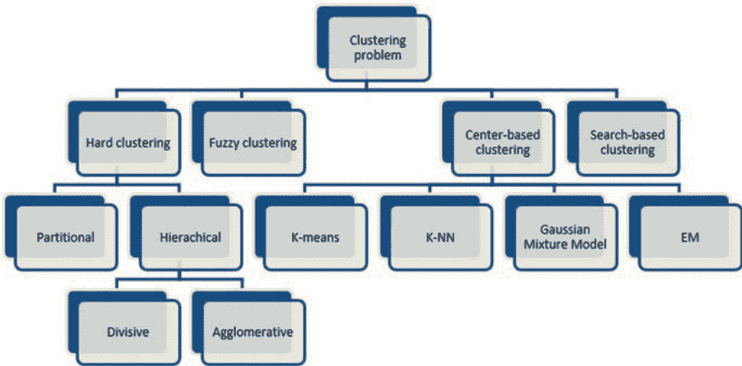

聚类问题可以通过许多不同的方式来解决问题，例如硬聚类、模糊聚类、基于中心的聚类、基于搜索的聚类和许多其他聚类过程。在这项研究中，我们使用了基于中心的聚类，因为与其他类型的聚类方法相比，基于中心的聚类对于聚类大型数据库和高维数据库非常高效。由于在本节中描述了一种最常用的聚类算法 k-均值算法，该算法首先由 Macqueen [52] 描述。

### 4.3 k-均值算法

均值算法被归类为分区或非层次聚类方法 [53]。在该算法中，假定聚类数 k 是固定的，并且该算法中存在一个错误函数，该函数根据给定的初始 k 聚类将剩余数据分配给最近的聚类，然后根据错误函数重复更改聚类的成员资格，直到错误函数不再显著变化或聚类的成员资格不再变化。传统的 k-均值算法可以描述如下 [54, 55]：

$$
\sum_{k=1}^{K} \sum_{x \in c_k} d\left(x, \mu\left(c_k\right)\right)
$$

在方程 1 中，令 D 为具有 n 个实例的数据集，令 $c_1, c_2, c_3..., c_k$ 为 D 的 k 个不相交的簇。这里，$\mu(c_i)$ 是簇 $c_i$ 的质心，$d(x, \mu(c_i))$ 表示 x 和 $\mu(c_i)$ 之间的距离。

该算法可以分为两个部分：初始化阶段和迭代阶段。在初始化阶段，算法随机将案例分配到 k 个簇中，在迭代阶段，算法计算每个案例与每个簇之间的距离，并将案例分配给最近的簇。目标函数可以如方程 2 所示定义：

$$
P(W,Q) = \sum_{i} \sum_{l} w_{il} d_{euc}(x_i, q_l)
$$

(7)

其中 $Q= \{q_l, l= 1, 2..., k\}$ 是一组目标，$d_{euc}(.，..)$ 是欧几里德距离，而 W 是一个满足以下条件的 n X k 矩阵：

- 1. $w_{il} \in \{0, 1\}$ 对于 $i = 1,2..., l = 1,2...,k$,
- 2. $\sum_{l=1}^{k} w_{il} = 1$ 对于 $i = 1,2,...,n$, 取值为 1。

## 5 k-means 算法

要求：数据集 D，聚类数目 k，维度 d:

- 1. 初始化阶段
- 2. 迭代阶段
- 3. $(C_1, C_2, ..., C_k) = D$ 的初始分区。
- 4. 重复
- 5. $d_{ij}$ = 案例 i 和聚类 j 之间的距离;
- 6. $n_i = \arg min_{1 \le j \le k} d_{ij}$
- 7. 将案例 i 分配给聚类 $n_i$;
- 8. 重新计算上述任何更改的聚类的聚类均值;
- 9. 直到在完整迭代中不再发生聚类成员变化
- 10. 输出结果。

### 5.1 k-means 聚类算法创建初始流程图

k-means 聚类是一种无监督学习算法，用于聚类问题。它关注每个聚类的 K 个中心点；所有中心点都放置在不同的位置。然后，将属于数据的每个点与最近的中心点相关联；如果没有待处理的点，则完成分组。然后我们重新计算 K 个新的中心点，作为每个聚类的重心。最后，循环将被创建，并且我们可以注意到中心点会逐步移动，直到不再发生更改为止。

$$
J = \sum_k \sum_{j=1}^{i=1} \| x_i^{(j)} - c_j \|^2
$$

其中 $\| x_i^{(j)} - c_j \|^2$ 是数据点 $x$ 和聚类中心 $c_j$ 之间的距离度量。

要在我们的数据集中实现上述公式，我们采取的第一步是：在输入数据集中随机初始化 K 个聚类中心。之后，我们从输入数据集中随机选择数据点 $\pi_i$，并对于 j=1,2,3...k，计算类成员函数 I(x_i,j)。每个点都被分配到其最接近的中心点所在的聚类中。之后，对于所有 K 个聚类中心，将 $c_i$ 设置为聚类 $C_i$ 中所有点的质心。

$$
c_i = \frac{1}{|c_i|} \sum_{x_i \in c_i} x_i
$$

重复这个过程，直到所有的聚类中心保持不变或者直到它们改变到某个阈值。通常选择停止阈值值非常小，或者设置迭代次数的上限为某个阈值，因为聚类中心将会被确定。

### 5.2 最近邻算法（K-NN）

K-NN 是一种基于测试样本和指定训练样本之间的欧几里德距离的机器学习算法。K-NN 被用作数据集的分类技术，该数据集被分为测试集和训练集，通过求和核密度的最大值进行分类。

在 K-NN 算法中，邻居是特征空间中最接近的样本。邻居样本的数量被定义为 k，它取决于数据的特性。较大的 k 值减少了噪声的影响，但也使类别之间的边界不太明显。输出是一个类别成员资格。一个对象被其邻居的多数投票分类，该对象被分配给其 k 个最近邻居中最常见的类别（k 是一个正整数，通常较小）。

如果 k=1，则对象只是分配给最近的单个邻居的类。

在这项研究中，使用欧几里德距离选择了 k=3、5、8 和 10 作为基于先前研究性能的分类依据。

### 5.3 期望最大化（EM）算法

EM 算法是一种广泛适用的方法，用于迭代计算最大似然（ML）估计，在各种不完整数据问题中非常有用 [56]。具有缺失值的数据被称为被审查数据。这些数据可能具有一些不完整的信息，但也有其他有用的信息。获得一些不完整的信息，但具有其他有用的信息。EM 算法具有处理缺失数据和未识别变量的能力，因此在各种不完整数据问题中变得有用。EM 算法不仅可以应用于不完整的数据集，而且在数据缺失、截断分布、审查或分组观察等情况下也可以完美地工作，甚至在数据不完整性并不那么自然或明显的各种情况下也可以。在 EM 算法的每次迭代中，有两个步骤：期望步骤或 E 步骤和最大化步骤或 M 步骤。

EM 算法的基本思想是将给定的不完整数据问题与计算上更易处理的完整数据问题相关联。现在我们来制定一般的 EM 算法；假设我们有一个随机不完整数据集 X，其中有一些概率分布和未观察到的观测 Y，因此最终的数据集可以被定义为 Z=(X, Y)，这是一个完整的数据集。现在，为了进一步推导，我们做一些符号表示如下：让 f(z|Φ)=f(x, y|Φ) 表示随机变量 X 和 Y 的联合概率密度函数；我们还取 X 的边缘概率密度函数，表示为 g(x|Φ)。我们还让 Y 的条件概率分布表示为 k(y|x, Φ)。EM 的主要目标是最大化不完整数据的对数似然函数，表示为

log [L(Φ | X)] = log [g(x | Φ)] (9)

通过使用 f(x, y|Φ) 和 g(x|Φ) 之间的关系，可以得到 Φ ∈ Ω 的上界。现在，可以得到基本方程

f(z|Φ) = f(x, y, |Φ) = k(y|x, |Φ)g(x|Φ)x ∈ X, y ∈ Y (10)

方程 9 可以用于分类过程的 EM 算法，通过找到称为 E 步骤的第一步，即找到完全数据对数似然的期望值，可以定义为 log[L(Φ|X)] = log[g(x|Φ)] 并关联一些当前参数进行估计 Φᶜ ∈ Ω。

因此，

Q(Φ | Φᶜ) = E[log f(x, y, |Φ)|, x, | Φᶜ] x ∈ X, y ∈ Y, Φᶜ ∈ Ω (11)

其中 Q 表示对数似然的期望值和 E[ ]。表示期望运算符。现在进入第二步，即 M 步骤，寻求使 E 步骤最大化的 Φ⁺ ∈ Ω，即选择 Φ⁺ ∈ Ω 使得

Φ⁺ ∈ argmax Q(Φ | Φᶜ) (12)

一般的 EM 迭代如下所示：

- (1) E 步：计算 Q(Φ|Φᶜ).
- (2) M 步：选择 Φ⁺ ∈ argmax Q(Φ | Φᶜ).
- (3) 令 Φᶜ = Φ⁺.
- (4) 根据需要重复 (1) - (3) .

### 5.4 EM 算法的模型选择

要使用 EM 算法，需要选择最适合的模型，以最好地拟合可用数据集。有许多模型准则可用于选择最佳模型。在这项研究中，我们使用贝叶斯信息准则 (BIC) 作为有限模型集中的模型选择。选择是基于 BIC 的计算值进行的；如果模型具有最低的 BIC 值，则被认为是最佳拟合模型。

形式上，BIC 可以通过以下方程定义：

$$
BIC = - \frac{1}{2} \text{log} \hat{L} + k \left( \ln(n) \right)
$$

和

$$
\hat{L} = p \left( x \mid \hat{\theta}, M \right)
$$

其中，

- $\hat{\theta}$ = 最大化似然函数的参数值
- $x$ = 观察到的数据
- $\theta$ = 模型的参数
- $n$ = 数据点的数量
- $k$ = 要估计的自由参数的数量
- $\hat{L}$ = 似然函数的最大化值

### 5.5 结果和讨论

本节将展示从所有上述方法生成的结果。数据被分成每周数据，并通过分配过程 (k-3, 5, 8, 10) 进行初始聚类。

表 3 显示了不同 k 值的 k-均值计算的值。在这个表中，数据集被分成了 3 个月的类别。第一个是一月、七月和十二月。

### 5.6 K-最近邻 (K-NN) 分类结果

为了验证 k-均值的值，使用 K-NN 分类器来估计算法的最佳拟合。在表 4 中，使用不同的数据集来计算基于不同 k 值的 K-NN 值。这个表还显示了均方误差值和用于拟合数据的最佳核形状。

| 数据集 | K=3 | K=5 | K=8 | K=10 |
| :--- | :--- | :--- | :--- | :--- |
| 一月 (2014 年第 1 周) N=219 | 63.1% | 84.2% | 89.1% | 91.4% |
| 一月 (2014 年) 第 2 周 N=428 | 61.1% | 77.7% | 86.4% | 88.3% |
| 一月 (2014 年) 第 3 周 N=595 | 54.7% | 69.3% | 87.7% | 89.7% |
| 一月 (2014 年) 第 4 周 N=636 | 61.0% | 81.3% | 85.9% | 88.5% |
| 七月 (2014 年) 第 1 周 N=509 | 61.9% | 73.0% | 86.0% | 88.5% |
| 七月 (2014 年) 第 2 周 N=661 | 59.4% | 81.6% | 87.7% | 90.8% |
| 七月 (2014 年) 第 3 周 N=526 | 66.9% | 77.7% | 90.0% | 92.7% |
| 十二月 (2014 年) 第 1 周 N=520 | 64.8% | 80.7% | 87.9% | 90.8% |
| 十二月 (2014 年) 第 2 周 N=663 | 66.4% | 82.0% | 88.1% | 91.3% |
| 十二月 (2014 年) 第 3 周 N=868 | 64.8% | 81.6% | 88.8% | 90.8% |
| 十二月 (2014 年) 第 4 周 N=1085 | 64.3% | 80.7% | 86.9% | 89.8% |

| 数据集 | 算法 | 最佳核函数 | 均方 | 误差 | k 的数量 |
| :--- | :--- | :--- | :--- | :--- | :--- |
| 一月 (2014 年) 第 1 周 N=219 | K-NN | 矩形 | 0.00286 | 4456 | 10 |
| 一月 (2014 年) 第 2 周 N=428 | K-NN | 三角形 | 0.002699823 | | 10 |
| 一月 (2014 年) 第 3 周 N=595 | K-NN | 最优的 | 0.002977822 | | 10 |
| 一月 (2014 年) 第 4 周 N=636 | K-NN | 矩形 | 0.00225 | 7728 | 9 |
| 七月 (2014 年) 第 1 周 N=509 | K-NN | 最优的 | 0.00245263 | | 10 |
| 七月 (2014 年) 第 2 周 N=661 | K-NN | 最优的 | 0.002359995 | | 8 |
| 七月 (2014 年) 第 3 周 N=526 | K-NN | 三角形 | 0.001981571 | | 10 |
| 十二月 (2014 年) 第 1 周 N=520 | K-NN | 三角形 | 0.002353327 | | 10 |
| 十二月 (2014 年) 第 2 周 N=663 | K-NN | 三角形 | 0.0023470.37 | | 10 |
| 十二月 (2014 年) 第 3 周 N=868 | K-NN | 三角形 | 0.002521785 | | 10 |
| 十二月 (2014 年) 第 4 周 N=1085 | K-NN | 三角形 | 0.002572776 | | 10 |

估计最大化算法是使用 R 软件计算的，其中使用了 Mclust 包来生成结果。如图 9、10 和 11 所示，所有的图形都基于 EM 聚类来可视化动态映射。根据聚类密度和聚类半径，一些可以被标记为未来预测的热点。坐标 101.5 到 101.7 和 3.1 到 3.29 非常密集和聚集。

### 5.7 密度图

如图 12、13、14、15 和 16 所示，所有的图形都用于基于坐标和登革热发病率可视化密度函数。在 2014 年 1 月数据集的密度图中，注意到一些聚类具有高峰点，可以被映射为热点点以关联热点；簇图在密度图上方提到以定位正确位置。从数据集中，2014 年 1 月的第一周有一些密集的簇，其中最高峰密度从 101.45 到 101.55 和从 3.00 到 3.15，而对于第二周，从 101.6 到 101.7 和 3.0 到 3.2 是最密集的区域。进一步进行第三步

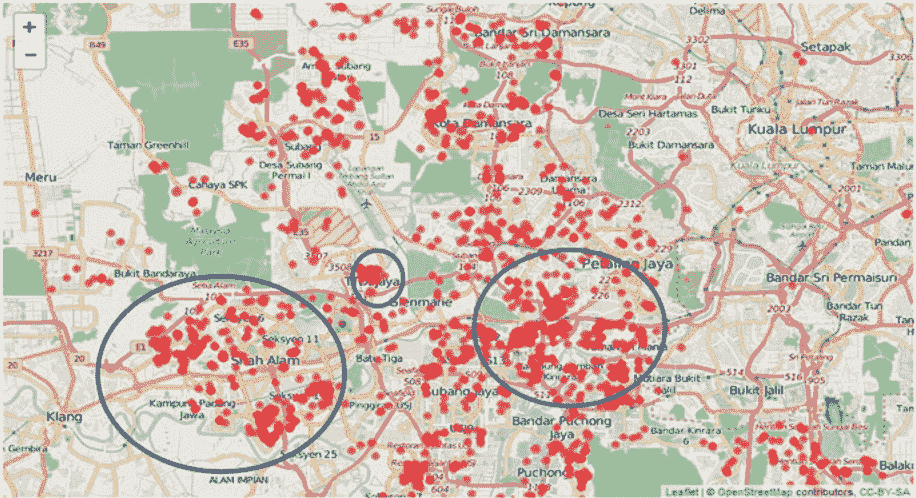

# (a)

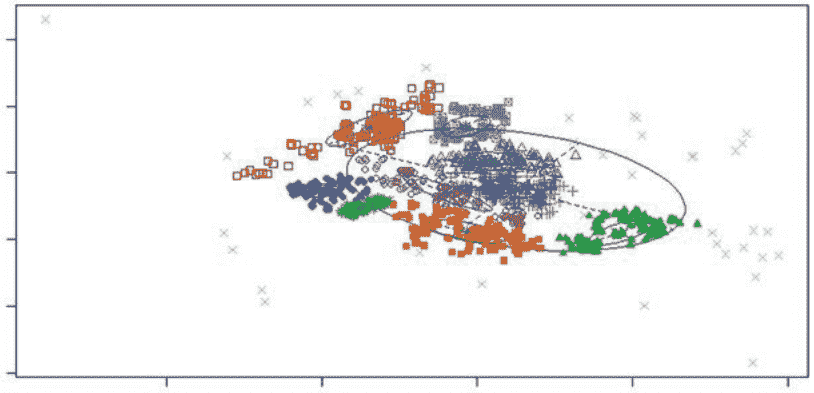

图 9 (a) 显示了 2014 年 1 月发生的登革热发病情况，圈出的区域是高度感染区域；从图 (b) 可以看出，登革热发病情况使用 EM 进行聚类，表示从 101.55 3.10 3.11 到 101.655 3.20 的区域高度感染。一周的通知，坐标从 101.45 到 101.60 和 3.00 到 3.20，第四周从 101.50 到 101.65 和 3.05 到 3.10。

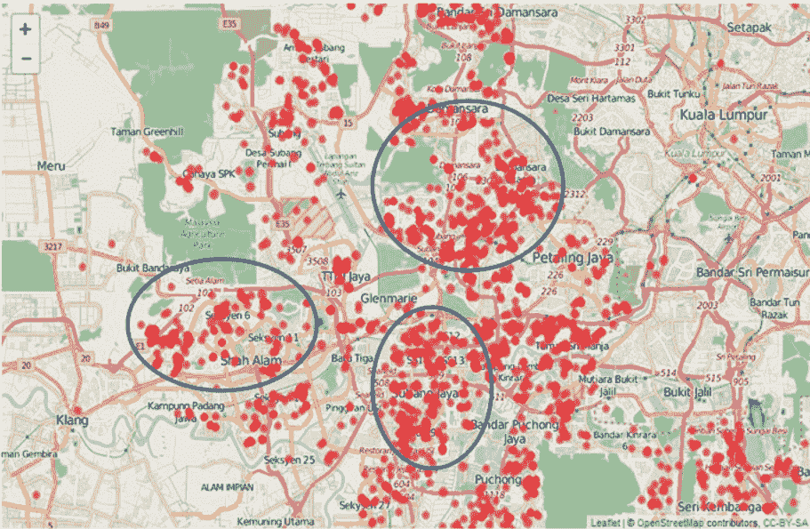

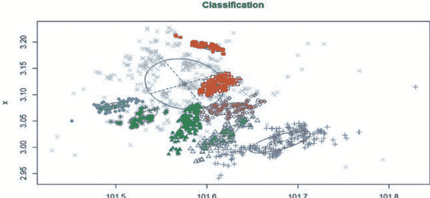

图 10 (a) 显示了 2014 年 7 月发生的登革热发病率，并且圈出的区域是高度感染区域；从图 (b) 中可以看出，使用 EM 对登革热发病率进行了聚类，表示从 101.59 3.10 3.00 到 101.700 3.15 的区域高度感染。

从图 17 我们可以看到时间序列的变化，并将其与人类活动相关联，在图 17a 中显示了登革热发病率在 2014 年 1 月份最高，因为报告的登革热发病率数量很大，随后是季风季节，还有中国新年，如图 (d) 所示，与同一个月份相同，因为我们可以从一个点到另一个点可视化发病情况的变化，在图 (b) 中显示了 2014 年 6 月的发病情况，这也是高度报告的发病情况，因为在哈里·拉亚节期间，如图 (e) 所示，也有庆祝活动由于公众的大量活动，可以注意到从一个点到另一个点的移动

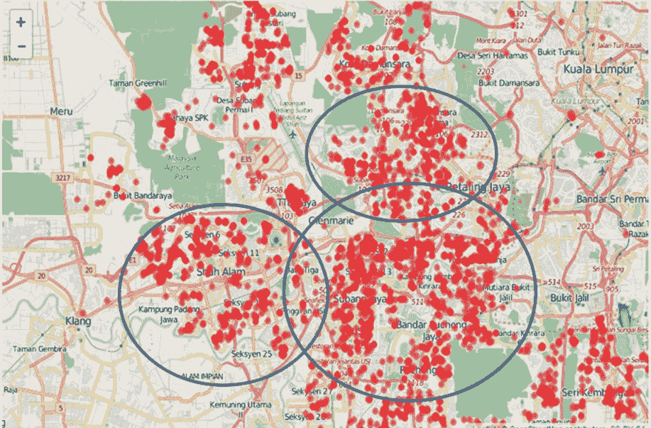

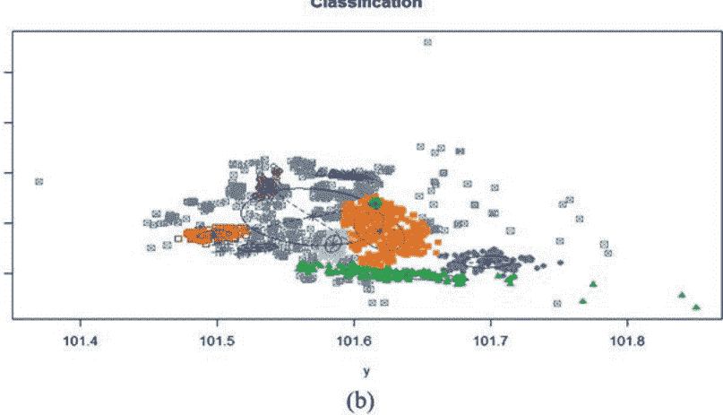

图 11 (a) 显示了 2014 年 12 月的登革热发病情况，圈出的区域是高感染区域；从图 (b) 可以看出，使用 EM 对登革热发病情况进行了聚类，表示从 101.58 2.90 到 101.65 3.30 的区域高度感染

## 使用机器动态映射和可视化马来西亚的登革热发生

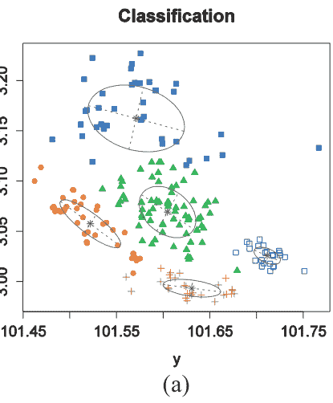

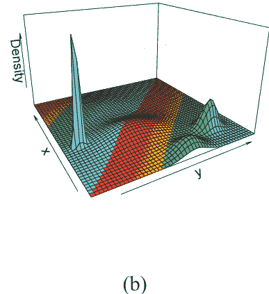

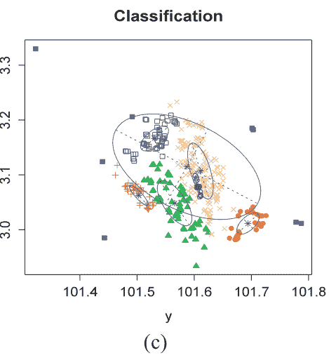

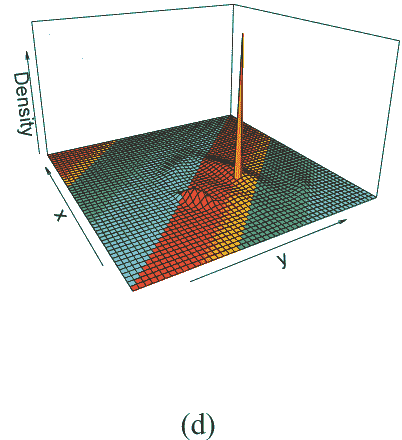

图 12 (a) 显示了 2014 年 1 月第一周基于 EM 的聚类；密度在 (b) 中显示，高密度区域为 3.05 101.50 (Kampung Padang Jawa)；(c) 显示了 2014 年 1 月第二周的聚类情况，与 (d) 中的密度相关，该区域为 3.1 101.59 (Kelang Jaya)

假期 (c) 显示了 2014 年 12 月的登革热发病情况，该时期也有很多公共假期。可以看出，坐标为 2.95 101.3 到 3.69 101.65 的地方有最多的登革热发病情况；该区域有几所学院和学校，因为从这些地区可以观察到发病情况的移动。

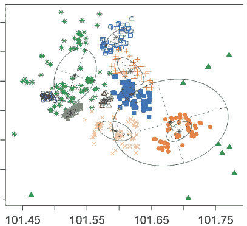

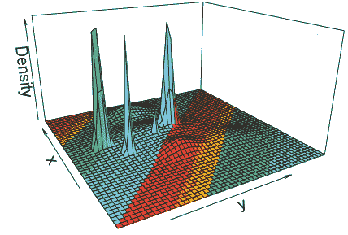

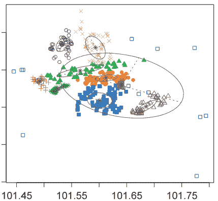

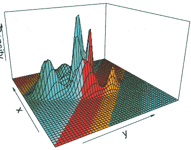

图 13 (a) 显示了 2014 年 1 月第三周基于 EM 的聚类; (c) 显示了发生密度，高密度区域为 3.00 101.51 (Taman Sepakat), 3.10101.55 (Ilham apartment) 和 3.05 101.58 (Persian Perpaduan); (b) 显示了 2014 年 1 月第四周的聚类图与密度的相关性，密度为 3.09 101.59 至 3.0 101.49 (U1 shah alam)

# 使用机器动态映射和可视化马来西亚的登革热发生

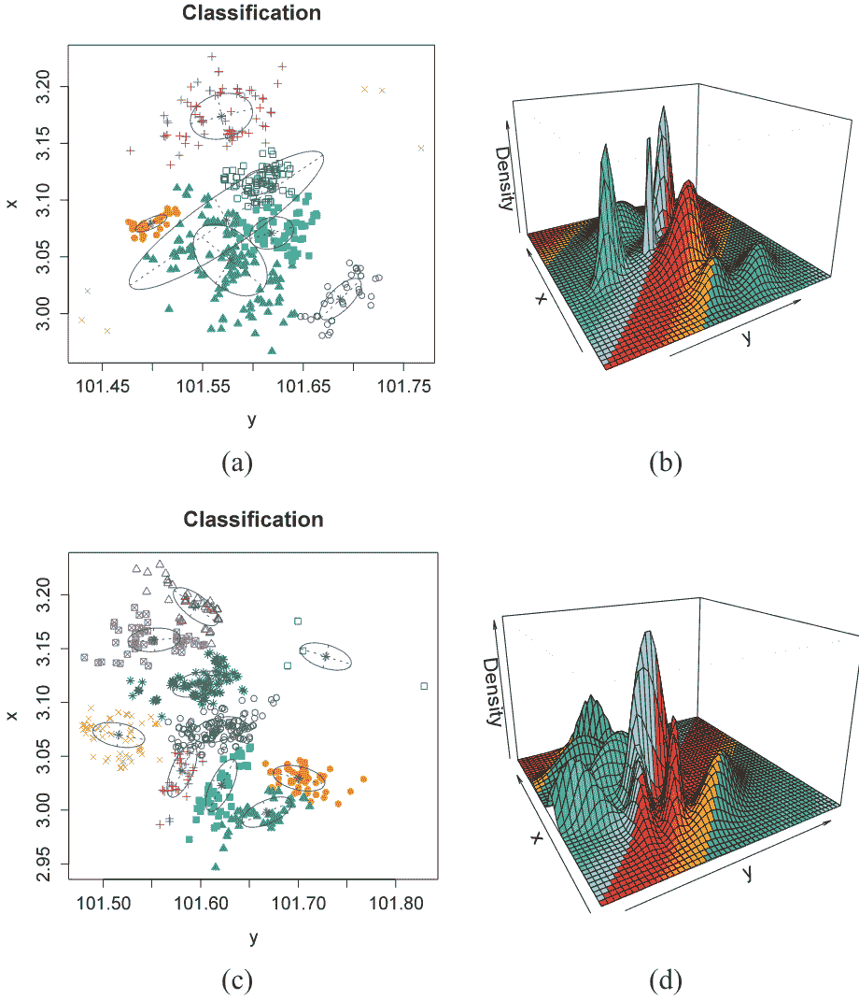

图 14 (a) 显示了 2014 年 7 月第一周基于 EM 的聚类;(b) 显示了发生密度，高密度区域为 3.09, 101.63 (Seksyen 51);(c) 显示了 2014 年 7 月第二周的聚类图与密度的相关性，密度为 3.06, 101.53 至 3.07, 101.63 (Seksyen 15)

## Classification

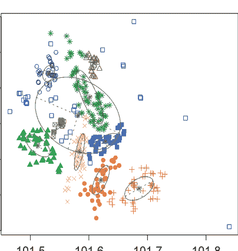

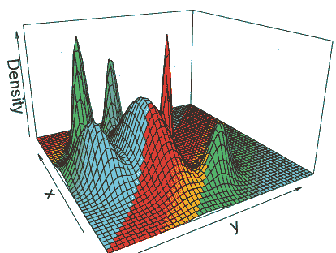

(a)

(b)

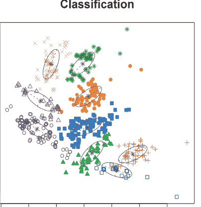

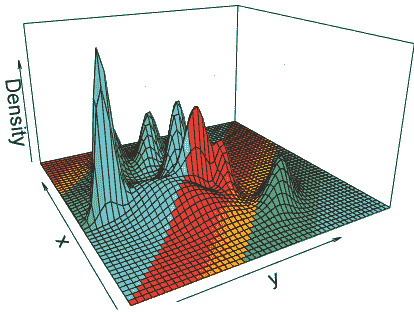

(c)

(d)

图 15 (a) 显示了基于 EM 的 2014 年 12 月第一周的聚类；(b) 显示了事件密度，高密度区域为 3.06, 101.52 到 3.15, 101.63（第 2 区）；(c) 显示了 2014 年 12 月第二周的聚类图与密度 (d) 相关，密度范围为 2.98, 101.67 到 3.13, 101.70（Taman Lestari Permai, Taman Kota Perdana, Taman Pinggiran Putra）

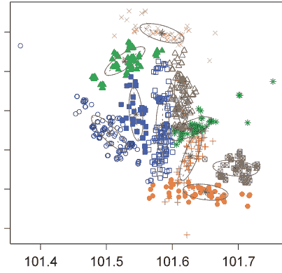

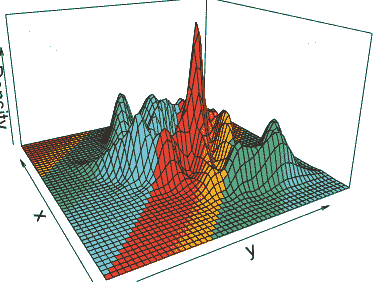

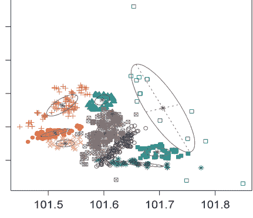

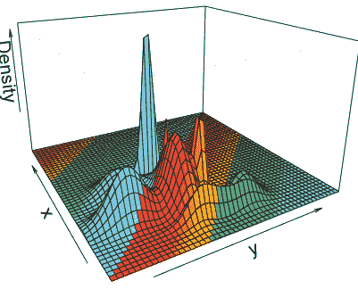

图 16 (a) 显示了基于 EM 的 2014 年 12 月第三周的聚类；(b) 显示了事件密度，高密度区域为 3.07, 101.58 到 3.06, 101.61 (Bandar Sunway)；(c) 显示了 2014 年 12 月第四周的聚类图与密度 (d) 相关，密度范围为 3.00, 101.59 到 3.11, 101.63 (Taman Paramount, Wilayah Persekutuan, KL)

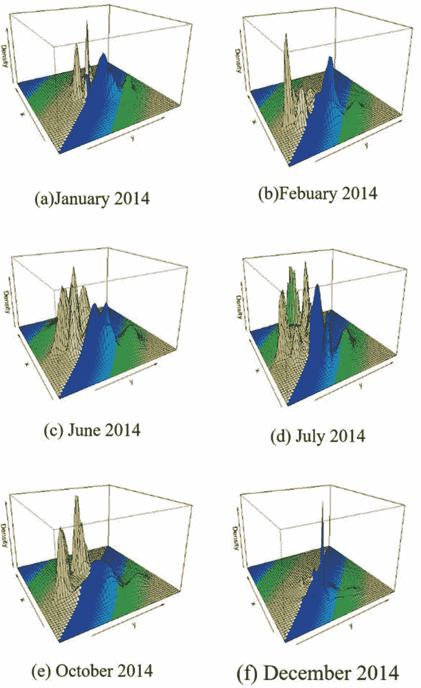

图 17 (a) 显示了 2014 年 1 月的登革热发病情况；(b) 显示了 2014 年 2 月发生的登革热发病情况；(c) 显示了 2014 年 6 月发生的登革热发病情况；(d) 显示了 2014 年 7 月发生的登革热发病情况；(e) 显示了 2014 年 10 月报告的发病情况；(f) 显示了 2014 年 12 月的登革热发病情况

# 6 结论和讨论

本研究提出了马来西亚雪兰莪州及其地区登革热报告病例的可视化。2014 年，登革热爆发的最高点出现在 5 月至 6 月期间；最多的发病次数可以定位到特定的坐标。

这些结果支持对八打灵区及其下属区域（如武吉拉惹、双溪毛糯、白沙罗和八打灵）进行空间映射的发现，根据马来西亚卫生部提供和收集的数据，澄清了特定时间段内登革热发病次数的最大值。基于映射和聚类算法，我们可以看到一个基准，可以证明登革热的发生。因此，八打灵的子区域和区域中识别出的聚类可能是由人类流动性驱动的，而不是空间上的矢量作用 [57, 58]。一周降雨后，通知了最多的登革热病例。为了控制登革热发病情况，我们专注于预测映射技术，以改善登革热爆发的风险管理 [59]。

监视和准确的数据是任何映射模型的支撑，在这项研究中，我们专注于雪兰莪州，并对该地区进行了监视并收集了该地区的数据。建议的预测模型为确定和绘制登革热发生率提供了有力证据。所提及地区的簇数较多，还计算了其他依赖变量，如对数似然和其他提及的算法，以获得更好的结果 [60]。

大部分聚类区域的纬度范围为 3.00 至 3.15，经度范围为 101.45 至 101.70。因此，脆弱性映射的可视化可以帮助使用 k-means 进行映射技术的早期警报生成，以验证中心点 k-means，我们提出了广泛使用的分类器函数，即 K-NN。在分析 k-means 的结果后，我们从中扩展到 EM 算法，以确定每个簇的类别，并为最佳模型选择使用 BIC 模型选择。因此，EM 算法能够确定登革热发生的正确位置，这些坐标将被提议给矢量控制单位进行熏蚊操作和控制登革热病毒 [61]。

# 参考文献

1. Gubler, D.J.: 登革热和登革出血热。临床微生物学评论。11(3), 480–496 (1998)
2. Halstead, S.B.: 登革热。柳叶刀。370, 1644–1652 (2007)
3. Bhatt, S., Gething, P.W., Brady, O.J., Messina, J.P., Farlow, A.W., Moyes, C.L. et al.: 登革热的全球分布和负担。自然。496, 504–507 (2013)
4. Siler, J.F., Hall, M.W., Kitchens, A.: 登革热：其历史、流行病学、传播机制、病因、临床表现、免疫和预防。菲律宾科学局 (1926)
5. Cheong, Y.L., Burkart, K., Leitão, P.J., Lakes, T.: 评估马来西亚登革热疾病的天气影响。国际环境研究与公共卫生杂志。10, 6319–6334 (2013)
6. Chen, C., Nazni, W., Lee, H., Selena, B., Mohadi, S., Jiang, Y., et al.: 在吉隆坡和雪兰莪的四个登革热流行区域中，埃及伊蚊（Ae. aegypti L.）和白纹伊蚊（Ae. albopictus Skuse）的杂交繁殖。热带生物医学杂志 23, 224-227 (2006)
7. Karim, M.M.: 登革热：一种来到欧洲的热带病。生物医学中心 (2014)
8. Chen, S.-C., Liao, C.-M., Chiu, C.-P., Chuang, H.-H., Yu, S.-H., Cheng, Y.-H.: 滞后温度效应与蚊子传播潜力解释了台湾南部登革热的变异性：来自统计分析的见解。科学总环境 408, 4069-4075 (2010)
9. Nash, S., Dale, P., Mackenzie, J.S., McBride, J., Menshen, K., Tong, S.: 气候变化和登革热：定量建模方法的关键和系统性综述。BMC 传染病 14, 167 (2014)
10. Mathur, N., Asirvadam, V.S., Dass, S.C.: 使用高斯核的时空可视化登革热发生率。在：2018 年智能和先进系统国际会议 (ICIAS)，第 1-6 页。IEEE (2018)
11. Khormi, H.M., Kumar, L.: 基于社会经济和环境变量在地理信息系统环境中评估登革热风险。地理空间健康。6, 171-176 (2012)
12. Lowe, R., Barcellos, C., Coelho, C.A., Bailey, T.C., Coelho, G.E., Graham, R., et al.: 巴西世界杯登革热展望：由实时季节性气候预测驱动的早期预警模型框架。柳叶刀传染病。14, 619-626 (2014)
13. Rudnick, A., Lim, T.W., Ireland, J., Perubatan, I.P.: 马来西亚的登革热研究。马来西亚医学研究所，吉隆坡 (1986)
14. Moncayo, A.C., Fernandez, Z., Ortiz, D., Diallo, M., Sall, A., Hartman, S., et al.: 邓格热的出现和对周边家蚊的适应。新兴传染病。10, 1790-1796 (2004)
15. Bi, P., Tong, S., Donald, K., Parton, K.A., Hobbs, J.: 气候变异与昆士兰州汤斯维尔的登革热爆发，1992-93 年。环境健康。1, 54 (2001)
16. Skae, F.M.T.: 槟城的登革热。英国医学杂志。2, 1581-1582 (1902)
17. Rudnick, A., Tan, E.E., Lucas, J.K., Omar, M.: 马来亚的蚊媒性出血热。英国医学杂志。1, 1269-1272 (1965)
18. Smith, C.E.G.: 从马来西亚的一次当地爆发病例中分离出三株 I 型登革热病毒。J. Hyg. 54, 569-580 (1956)
19. Smith, C.E.G.: 吉隆坡的登革热局部爆发：流行病学和临床方面。Med. J. Malaya. 10, 289-303 (1956)
20. Smith, C.E.G.: 吉隆坡的登革热局部爆发：血清学方面。J. Hyg. 55, 207-223 (1957)
21. Gagnon, A.S., Bush, A.B., Smoyer-Tomic, K.E.: 登革热流行和厄尔尼诺南方涛动。Clim. Res. 19, 35-43 (2001)
22. García, C., García, L., Espinosa-Carreón, L., Ley, C.: Aedes aegypti (Diptera: Culicidae) 的丰度和分布以及墨西哥瓜萨韦市登革热的传播。Int. J. Trop. Biol. Conserv. 59 (2010)
23. Gomes, A.F., Nobre, A.A., Cruz, O.G.: 里约热内卢市 2001-2009 年登革热与气象变量之间的时间分析。Cad. Saude Publica. 28, 2189-2197 (2012)
24. Rozilawati, H., Zairi, J., Adanan, C.: 马来西亚槟城市选定城市和郊区地区的白纹伊蚊季节性丰度。Trop. Biomed. 24, 83-94 (2007)
25. Li, C., Lim, T., Han, L., Fang, R.: 雨量、埃及伊蚊丰度和马来西亚雪兰莪登革热感染。Southeast Asian J. Trop. Med. Public Health. 16, 560-568 (1985)
26. Fairos, W.W., Azaki, W.W., Alias, L.M., Wah, Y.B.: 用泊松分布和负二项分布模型对登革热和登革出血热爆发进行建模。Int. J. Math. Comput. Sci. Eng. 4, 809-814 (2010)
27. 世界卫生组织研究部门，传染病和热带病研究所，世界卫生组织流行病警报：登革热：诊断、治疗、预防和控制指南。世界卫生组织 (2009)
28. 马来西亚统计局 (2014)
29. Azami, N.A.M., Salleh, S.A., Neoh, H.-m., Zakaria, S.Z.S., Jamal, R.: 马来西亚的登革热流行病学：不再是主要城市疾病。BMC. Res. Notes. 4, 216 (2011)
30. 马来西亚卫生部 (2009): 国家登革热战略计划 2009-2013 年。
31. M. o. H. M. A. R. 2012: 马来西亚卫生部。2012 年年度报告。(2012)
32. Khormi, H.M., Kumar, L.: 基于社会经济参数、国籍和年龄组的登革热风险建模：基于 GIS 和遥感的案例研究。Sci. Total Environ. 409, 4713-4719 (2011)
33. Lee, H., Chen, C., Masri, S.M., Chiang, Y., Chooi, K., Benjamin, S.: 在马来西亚雪兰莪州的登革热流行地区使用苏云金杆菌制剂 Vectobac WG® 进行幼虫灭活对登革热蚊媒的影响。东南亚热带医学公共卫生杂志。39, 601-609 (2008)
34. Elder, J., Lloyd, L.: 实现登革热控制的行为变革：方法、扩大规模和可持续性。世界卫生组织，日内瓦 (2006)
35. Shafie, A.: 使用 GIS 应用程序评估登革热和登革出血热高发风险因素的空间因素。马来西亚科学杂志。40, 937-943 (2011)
36. Rudnick, A.: 马来西亚登革热生态学研究：初步报告，1, 2. (1965)
37. Chowell, G., Cazelles, B., Broutin, H., Munayco, C.V.: 地理和气候因素对秘鲁登革热流行时间的影响，1994-2008 年。BMC 传染病。11, 164 (2011)
38. Feldstein, L.R., Brownstein, J.S., Brady, O.J., Hay, S.I., Johansson, M.A.: 岛屿上的登革热：理解登革病毒全球生态的贝叶斯方法。热带医学与卫生学会议。trv012 (2015)
39. Ling, C.Y., Gruebner, O., Krämer, A., Lakes, T.: 马来西亚的登革热时空模式：结合地址和子区级别。地理健康。9, 131-140 (2014)
40. M. o. H. M. N. d. s. p. 2009-2013: 马来西亚卫生部 (2009): 国家登革热战略计划 2009-2013 年。
41. Olaniyi, A.O., Abdullah, A.M., Ramli, M.F., Sood, A.M.: 影响蔬菜生产农用土地利用的因素——以马来西亚雪兰莪州为例。非洲农业研究。7, 5939-5948 (2012)
42. Cummings, D.A., Iamsirithaworn, S., Lessler, J.T., McDermott, A., Prasanthong, R., Nisal, A., et al.: 人口转变对泰国登革热的影响：来自统计分析和数学建模的见解。PLoS Med。6, e1000139 (2009)
43. Reynolds, D.: 高斯混合模型。在：生物识别学百科全书，pp. 659-663. Springer (2009)
44. Plas, J.H.: 使用 Anderson 加速的多元高斯混合模型中的 EM 算法。Worcester Polytechnic Institute (2013)
45. Gan, C.M., Wu, J.: 数据聚类：理论、算法和应用，第 20 卷。Siam (2007)
46. Jain, A.K., Murty, M.N., Flynn, P.J.: 数据聚类：一项综述。ACM Comput. Surv. (CSUR)。31, 264-323 (1999)
47. Estivill-Castro, V.: 为什么有这么多聚类算法：一个立场文件。ACM SIGKDD Explor. Newsl. 4, 65-75 (2002)
48. Dubes, R.C.: 最佳的聚类数是多少？-一个实验。Pattern Recogn. 20, 645-663 (1987)
49. Fraley, C., Raftery, A.E.: 有多少个聚类？哪种聚类方法？通过基于模型的聚类分析获得答案。Comput. J. 41, 578-588 (1998)
50. Arbib, M.A.: 《大脑理论和神经网络手册》。麻省理工学院出版社，剑桥，马萨诸塞州 (2003)
51. Ranganathan, S.: 《改进 k-means 聚类》。(2013)
52. MacQueen, J.: 《一些多元观测分类和分析方法》。在第五届伯克利数理统计和概率研讨会论文集中，1(4), 281-297 (1967)
53. Jain, A.K., Dubes, R.C.: 《数据聚类算法》。Prentice-Hall, Inc, Upper Saddle River (1988)
54. Hartigan, A.: 《聚类算法》。Wiley，纽约（1975）
55. Hartigan, J.A., Wong, M.A.: 算法 AS 136：一种 k-means 聚类算法。应用统计学，100-108 (1979)
56. McLachlan, G., Krishnan, T.: 《EM 算法及其扩展》。Wiley，霍博肯（382，2007）
57. Teurlai, M., Huy, R., Cazelles, B., Duboz, R., Baehr, C., Vong, S.: 能否通过人类活动解释柬埔寨登革热的异质传播？PLoS Negl Trop Dis.12 (2012)
58. Lin, C.-C., Huang, Y.-H., Shu, P.-Y., Wu, H.-S., Lin, Y.-S., Yeh, T.-M., et al.: 台湾登革热病情特点：2002-2007 年。美国热带医学与卫生杂志。82, 731-739 (2010)
59. Kanagachidambaresan, G.R., Manohar Vinoothna, G., Prakash, K.B.: 可视化，使用 TensorFlow 进行编程，EIA/Springer 通信和计算创新。https://doi.org/10.1007/978-3-030-57077-4_3
60. Kanagachidambaresan, G.R., Mahima, V., Prakash, K.B.: 使用单板计算机编程 TensorFlow，使用 TensorFlow 进行编程，EIA/Springer 通信和计算创新。https://doi.org/10.1007/978-3-030-57077-4_12
61. Vadla, P.K., Ruwali, A., Lakshmi, M.V.P., Kanagachidambaresan, G.R., 神经网络，使用 TensorFlow 进行编程，EIA/Springer 通信和计算创新. https://doi.org/10.1007/978-3-030-57077-4_5

# 使用机器学习技术进行媒介传播疾病爆发预测

Sandali Raizada, Shuchi Mala 和 Achyut Shankar

## 1 引言

世界卫生组织认识到，超过 17% 的传染病是由媒介传播疾病引起的。全球 97 个国家发生疟疾传播，约有 34 亿人处于风险之中。全球超过 40% 的人口面临登革热的风险。2006 年，包括印度在内的多个国家爆发了基孔肯雅热，报告了 140 万例病例。美国等国家在 2013 年报告了 51,258 例媒介传播疾病病例。全球媒介控制响应认识到媒介控制是预防媒介传播疾病的基本方法，也是控制爆发的一种响应。印度政府宣布了 98.7 亿美元的卫生部门拨款，并计划到 2022 年将医疗保健资金增加到国内生产总值 (GDP) 的 3%。现在迫切需要预测媒介传播疾病的爆发。

随着数据挖掘的发展，[1] 早期使用数据挖掘技术和神经网络方法来分析心脏病数据集。Shraddha Shivhare 等人 [2] 探索了核是否足以对白细胞进行分类，使用了带有五折交叉验证的神经网络。Md. Osman Goni Nayeem 等人 [3] 提出了一个神经网络，首先使用神经网络将患者分类为感染性或非感染性，然后使用两个隐藏层预测疾病类型。考虑的疾病包括肝脏疾病、心脏病和肺癌。一项工作实施了一个预测系统来预测心脏病 [4]。Marios Anthimopoulos 等人 [5] 提出并评估了一个卷积神经网络(卷积神经网络) 可用于肺部疾病模式分类，提出了另一个用于胸部疾病诊断的 CNN [6]。

阿古斯·科马鲁丁·穆尼尔等人创建了一个登革热监测系统 [7]，可用于预测特定区域登革热传播。他的系统旨在控制登革热的传播，通过使用三种算法来预测一年内登革热的传播。胡安·M·斯卡武佐等人 [8] 研究了三种以蚊子为媒介的疾病。该研究依赖于遥感技术，并包括基于时间序列的卵沉积活动建模，该时间序列是使用卫星图像提取的数据。除了线性模型，还使用了其他机器学习技术以提供更好的结果。B·马哈拉克什米等人 [9] 专注于寨卡病毒的预测。问题陈述是找出怀孕妇女优先考虑的人体中是否存在寨卡病毒。所使用的数据是通过收集互联网上的病毒症状而创建的，存储在云端，然后使用人工神经网络（ANN）作为分类器。目的是构建具有理想节点的网络，以提供高质量的解决方案。还进行了与其他各种分类算法的比较分析，旨在用于未来其他疾病的预测。

V. Janani 等人 [10] 使用数据挖掘技术和机器学习研究了登革热的预测。提出了一种顺序最小优化框架，建议使用网络分类技术，首先提取演员的潜在关联，然后应用现有的数据挖掘技术进行分类。对于登革热的症状数据集，也使用了 Weka 工具，并进行了不同算法的测试。因此，已经证实人工神经网络是医学诊断任务中最强大的分类器之一。然而，每年有超过 120 万人死于疟疾，而由媒介传播的登革热是增长最快的疾病。

机器学习技术的发展导致了对使用网络预测人类疾病类型或将其分类为传染性及非传染性的关注增加。大多数研究都关注患者的病史，而忽视了地区的气候条件和生活习惯。疾病的传播可以与媒介的数量相关联，而媒介的数量取决于生物和非生物环境因素，可以用于预测疫情爆发。提出了一种基于环境数据预测雌性蚊子数量的模型，并应用了各种验证方法 [11]。另一项研究发现环境因素与疾病爆发之间存在关系，并支持使用分类算法的模型。发现第二个模型支持向量机（SVM）准确度高，可以用于疟疾爆发的预测 [12]。然而，自动选择了保留类别的最小特征集。据我们所知，目前没有任何现有的研究使用人工神经网络对印度次大陆各邦的数据进行 5 年的分析。此外，一系列不同的特征影响着疫情的爆发。

为了限制传播媒介传播的疾病并解决这些问题，我们探索了包括环境和社会因素在内的对比特征。首先，对于结构化数据，我们寻求专家的建议和意见，以提取有意义的特征。其次，我们预测全国各地区的疫情严重程度。第三，我们使用统计分析来确定主要的媒介传播疾病。最后，我们提出了一种 ANN 多模态疾病爆发预测（ANN-MDOP）算法。

本研究的其余部分安排如下：数据和模型描述在第 2 节中概述。然后，在第 3 节中介绍了方法的介绍。在第 4 节中进行了 ANN-MDOP 算法的性能评估。总体结果在第 5 节中追踪。第 6 节是最后一节，包含了工作的结论。

## 2 数据集和模型描述

本研究中使用的数据已经被描述。此外，本节还提供了疾病爆发预测模型和评估方法。

### 2.1 人口数据

本研究中使用的人口数据包括三种疾病的阳性病例：基孔肯雅热、疟疾和登革热。数据存储在数据中心中。

数据包括按州排列的每年阳性病例数。我们使用了 2013 年至 2017 年的 5 年数据集。我们的数据集关注的是 5,415,958 个阳性病例。

### 2.2 气象数据

使用的气象数据包含存储在数据中心中的真实天气数据。气象部门提供的数据包括 2013 年至 2017 年的 5 年内的温度、湿度和降雨量。我们关注的是包括印度次大陆上的 28 个邦和 8 个联邦属地的按州划分的数据集。数据包含两种类型的数据，结构化的数值数据和一些文本数据。

表 1 包含从印度收集的数据。数据被分类和分离成两个类别，即人口数据和气象数据。为了找出影响印度地区的主要疾病，我们对受影响患者数量、平均湿度、平均温度、平均降水和重大疾病病例进行了统计分析。

| 数据类别 | 项目 | 描述 |
| :--- | :--- | :--- |
| 人口统计数据 | 阳性病例 | 一个州的阳性病例数 |
| 气象数据 | 温度 | 一个州的年平均温度 |
| | 湿度 | 一个州的年平均湿度 |
| | 降雨量 | 一个州的年降水量 |

| 统计 | 2013 | 2014 | 2015 | 2016 | 2017 |
| :--- | :--- | :--- | :--- | :--- | :--- |
| 阳性病例数 | 958,958 | 1,144,041 | 1,271,865 | 1,198,999 | 842,095 |
| 平均降雨量 | 65028.2 | 56416.3 | 59816.3 | 58912.1 | 66181.4 |
| 平均温度 | 864.375 | 872.9028 | 884.5 | 887.2083 | 886.7639 |
| 平均湿度 | 2217.917 | 2118.74 | 2134.167 | 2136.083 | 2124.875 |

每年从数据中获得。从表 2 中，我们可以获得一年中的阳性病例数并推断 2015 年报告的患者人数最多。此外，气象数据由气象部门提供，表明一个地区的天气不能是决定媒介种群的唯一特征。在这项工作中，我们主要关注生物和非生物特征来预测爆发。

### 2.3 疾病爆发预测

可以从表 2 中获取该地区主要媒介传播疾病的爆发情况。此分析的目的是预测该地区的高风险区域、中等风险区域和低风险区域。

该模型展示了一种优秀的机器学习案例，它使用了有监督学习技术。作为输入提供的值是由生物和非生物因素组成的特征值，X=(x1,x2,...,xn)。这包括该地区三种主要传播病的阳性病例，该地区的年降雨量以及该地区的温度和湿度。

区域的可视化或分类为低风险、中风险或高风险取决于输出值 Y。Y={Y0,Y1,Y2} 其中 Y0 表示该地区处于低风险，Y1 表示该地区处于中风险，而 Y2 表示该地区处于高风险。接下来，我们将简要概述数据集的分布、数据集的特征、实验设置和学习算法。

对于数据集，通过与专家的深入交流，我们专注于以下数据集以达到一个结论：

- 阳性和天气数据（P&W 数据）：阳性病例和天气数据被多维度融合，以预测一个地区的风险等级是低风险、中风险还是高风险。

在这个实验中，我们选择了印度次大陆的所有 28 个邦和 8 个联邦直辖区，并将它们分为 60% 的训练集、20% 的测试集和 20% 的交叉验证集。因此，训练集、交叉验证集和测试集的比例为 6:2:2。

接下来，我们使用 Python 和 TensorFlow 来识别深度学习和机器学习技术。在这项工作中，对于 P 数据，根据获得的统计数据，我们提取了约 5,415,958 个正例。然后，我们将这些案例分为基孔肯雅热、疟疾和登革热三种特征。对于 W 数据，我们首先提取了印度 52 个主要城市的天气数据，并取平均值得到了该州的天气条件。

接下来，我们追踪了在这项工作中使用的机器学习和深度学习技术。我们使用了三种广泛用于神经网络的机器学习算法，即前馈（FF）、反向传播（BP）和梯度下降（GD）算法，来预测疫情爆发。

该网络具有成本函数，并通过基本的前馈、反向传播和梯度下降机器学习算法来计算和更新权重的值。成本函数和算法将在下面进行讨论。

#### 2.3.1 成本函数

每个算法都拥有一个成本函数来分析其性能。它是可微分的函数，用于量化预测值和期望值之间的误差。它要么最小化（返回错误），要么最大化（返回奖励）。

基于逻辑成本函数的神经网络的成本函数如（1）所示。

$$J(p) = \frac{1}{m} \sum_{t=0}^{m} \sum_{k=0}^{K} [y_{k}^{(t)} \log (h_{p}(x^{(t)}))_{k} + (1-y_{k}^{(t)}) \log (1-h_{p}(x^{(t)})_{k}) + \frac{\mu}{2m} \sum_{l=1}^{L-1} \sum_{i=1}^{a_{i}} \sum_{j=1}^{a_{i+1}} (\rho_{j, i}^{(l)})^2]$$

其中 L = 总层数，q = 除偏置单元外的单元数，K = 输出类别数，h p (x)k = 导致第 k 个输出的假设。

我们添加了嵌套的 \sum 来使其对多个输出节点负责。

方程的第一部分讨论了一个嵌套的 \sum，它循环遍历输出节点的数量。接下来的部分是正则化，我们使其对多个 rho 矩阵负责。然后我们对每个项进行平方。

#### 2.3.2 前馈

前馈算法的目标是计算输出神经元的值。它通过计算每个神经元在每一层的值（除了输入层）来工作。网络分配的初始权重帮助算法确定这些值。

$$n_{1}^{(2)} = g(\rho_{10}^{(1)} x_{0} + \rho_{11}^{(1)} x_{1} + \rho_{12}^{(1)} x_{2} + \rho_{13}^{(1)} x_{3} \ldots)$$

$$n_{2}^{(2)} = g(\rho_{20}^{(1)} x_{0} + \rho_{21}^{(1)} x_{1} + \rho_{22}^{(1)} x_{2} + \rho_{23}^{(1)} x_{3} \ldots)$$

$$n_{3}^{(2)} = g(\rho_{30}^{(1)} x_{0} + \rho_{31}^{(1)} x_{1} + \rho_{32}^{(1)} x_{2} + \rho_{33}^{(1)} x_{3} \ldots)$$

$$h_{\theta}(x) = n_{1}^{(3)} = g(\rho_{10}^{(2)} n_{0}^{(2)} + \rho_{11}^{(2)} n_{1}^{(2)} + \rho_{12}^{(2)} n_{2}^{(2)} + \rho_{13}^{(2)} n_{3}^{(2)})$$

其中 n = 激活节点，\rho = 权重矩阵和 x = 输入。

通过使用 (2)，(3) 和 (4) 可以确定具有三个神经元和来自上一层的 n 个输出的第 2 层的激活节点，并且使用 (5) 可以计算包含一个神经元的最终输出，该神经元从第 2 层获取输出。

#### 2.3.3 反向传播

反向传播算法的目标是最小化实际值和预测值之间的误差。为了实现这一目标，它计算每个激活单元的误差并更新权重的值。因此，它通过计算成本函数的偏导数来最小化成本函数。

步骤如下：

给定训练集 \{ (x_{1}, y_{1})..., (x_{m}, y_{m}) \}

设置 $\Delta_{i, j}^{(l)} = 0$ 对于所有 (l,i,j)，创建一个全零矩阵

例如，在训练 t = 1 到 m 时：

- 1. 从设置 $n^{(1)} = x^{(t)}$ 开始
- 2. 接下来，使用前馈计算 $n^{(l)}$ 从 2 到 L 的 l
$$ \delta^{(L)} = n^{(L)} - y^{(t)} $$

其中 L 是总层数，n^{(L)} 是最终输出层的激活感知器单元的输出向量。

计算 $\delta^{(L-1)}, \delta^{(L-2)}, \ldots, \delta^{(2)}$ 使用 $\delta^{(l)} = \left( (\rho^{(l)})^T \delta^{(l+1)} \right) .* n^{(l)} .* (1 - n^{(l)} )$

然后使用逐元素乘法乘以一个名为 g-prime 的函数。该函数是激活函数 g 在输入值 given by $z^{(l)}$ 的导数：

$$g'(\mathbf{z}^{(l)}) = \mathbf{n}^{(l)} .* \left( 1 - \mathbf{n}^{(l)} \right)$$

$$\Delta_{i,j}^{(l)} = \Delta_{i,j}^{(l)} + \mathbf{n}_j^{(l)} \boldsymbol{\delta}_i^{(l+1)}$$

或者使用向量化，$\Delta^{(l)} = \Delta^{(l)} + \boldsymbol{\delta}^{(l+1)} \left( \mathbf{n}^{(l)} \right)^T$

因此，我们更新我们的新 $\Delta$ 矩阵：

$$D_{i,j}^{(l)} = \frac{1}{m} \left( \Delta_{i,j}^{(l)} + \mu \rho_{i,j}^{(l)} \right) \text{if } j \neq 0$$

$$\mathbf{D}_{i,j}^{(l)} = \frac{1}{m} \left( \Delta_{i,j}^{(l)} \right) \text{if } j = 0$$

#### 2.3.4 梯度下降

这些算法通过梯度检查来确保反向传播正常工作。一旦我们确认反向传播算法正常工作，我们需要关闭它，因为它可能会减慢我们的工作速度。

通过使用多个权重矩阵，我们可以表示成本函数对 $\theta_j$ 的导数：

$$\frac{\partial}{\partial \rho_j} \mathbf{J}(\boldsymbol{\rho}) \sim \frac{\mathbf{J}\left(\rho_{1}, \ldots, \rho_{j}+\epsilon, \ldots \rho_{n}\right) - \mathbf{J}\left(\rho_{1} \ldots, \rho_{j}-\epsilon, \ldots \rho_{n}\right)}{2 \epsilon}$$

使用上述算法训练网络的伪代码如下：

- 1. 随机初始化权重。
- 2. 对于任意的 $x^{(i)}$，进行前向传播计算 $p(x^{(i)})$。
- 3. 引入成本函数。
- 4. 使用反向传播计算偏导数。
- 5. 接下来使用梯度检查来验证反向传播是否正确。然后禁用梯度检查。
- 6. 最后，使用梯度下降算法来最小化带有权重 $\rho$ 的成本函数。

最终，通过使用 ANN-MDOP 算法对 P&W 数据进行预测和区域分类。在下一节中，将介绍 ANN-MDOP 的详细信息。

### 2.4 评估方法

为了评估性能，我们定义真正例、真负例、假阳性和假阴性。然后，我们计算准确率、召回率、精确率和 F1 得分。

```
准确率 = \frac{真正例 + 真负例}{真正例 + 假阳性 + 真负例 + 假阴性}, 召回率 = \frac{真正例}{真正例 + 假阴性}, 精确率 = \frac{真正例}{真正例 + 假阳性}, F1 得分 = \frac{2 * 精确率 * 召回率}{精确率 + 召回率}
```

其中准确率是正确预测的比例，而精确率和召回率试图回答正例的正确比例和识别实际正例的正确比例。F1 得分计算为召回率和精确率的加权调和平均值。对于多类分类，可以计算上述值的平均微观和平均宏观。

除了评估标准外，我们还可以规范偏差和方差，并使用学习曲线来诊断和获得更好的洞察。

此外，我们还可以计算错误预测的损失惩罚。从形式上来说，它表示对一个示例的预测有多糟糕。对于分类问题，我们计算交叉熵损失如下：

```
CE = - \sum_{i=1}^{C} t_i \log(s_i)
```

对于多类分类，此损失是 softmax 激活加上交叉熵损失，如下所示：

```
(14) Softmax = f(s)_i = \frac{e^{s_i}}{\sum_{j=1}^{C} e^{s_j}} 
(15) CE = - \sum_{i=1}^{C} t_i \log(f(s)_i)
```

获取更多的训练样本，尝试在较小的特征集上进行，并增加学习速率以修复高方差。添加特征和多项式特征，并降低学习速率以修复高偏差。我们专注于实现低方差和低偏差。

此外，神经网络可能容易出现欠拟合或过拟合。具有较少参数的模型容易出现欠拟合，并且计算成本较低。具有更多参数的算法容易出现过拟合，并且计算成本较高。在这种情况下可以使用正则化。

## 3 种方法

我们在本节中概述了数据插补和归一化以及 ANN 多模态疾病爆发预测（ANN-MDOP）算法。

### 3.1 数据插补和归一化

阳性案例数据中包含一些缺失的数据值。因此，我们需要填充数据。在第一步中，我们需要识别不确定的数据，然后对其进行修改以提高数据的质量。然后，我们集成数据并执行数据的预处理。对于数据插补，我们识别空值并用相应属性的均值替换它们。因此，我们填充缺失的数据并为模型准备数据。

### 3.2 基于 ANN 的多模态疾病爆发预测 (ANN-MDOP) 算法

为了数据处理的目的，我们使用 ANN 多模态疾病爆发预测 (ANN-MDOP) 算法。这可以分为六个步骤。

#### 3.2.1 文本数据表示

对于数据中的每个文本单词，我们将其转换为一个分类变量，即文本以类别表示，其中每个条目属于一个或多个类别 (图 1)。


图 1 建议的深度学习网络的架构

在这项工作中，每个文本单词将被转换为一个虚拟变量。因此，一个文本被表示为表示一个类别的数值变量。

#### 3.2.2 ANN 的输入层

这一层用于将输入馈送到神经网络中。包含 42 个输入特征的数据通过这一层馈入网络。理想情况下，该层中的感知器或节点数量应等于所使用的特征数量。该层还包括一个偏置项。

单位'X o'的值为 1。ReLU 被用作激活函数

$$ \text{ReLu} = R(z) = \max(0, z) $$

其中 z=0,1,2…0.42

#### 3.2.3 ANN 的隐藏层

隐藏层位于第一层（输入）和最后一层（输出）之间，负责通过激活函数处理输入。大多数问题只需要使用一层隐藏层就可以解决。该层还可以包含偏置单元。
我们使用了 1 层隐藏层，神经元的数量为 23，以获取前一层的输出，并使用 ReLU 激活函数确定输出。

$$ \text{ReLu} = R(z) = \max(0, z) $$

其中 z=0,1,2...0.23

#### 3.2.4 ANN 的输出层

输出层提供网络确定的输出。每个网络的输出层至少有一个神经元。该层使用三个神经元，分别用于低风险、中等风险或高风险区域。该层使用 softmax 作为激活函数。

$$ \text{Softmax} = \sigma(z)_I = \frac{e_j^z}{\sum_{j=1}^k e_j^z} $$

其中 j=0,1,2.

#### 3.2.5 激活函数

该函数用于将值映射到 0 和 1 之间或 -1 和 1 之间。激活函数可以有两种类型：

- 1. 线性 – 一个不受范围限制的函数，例如 f(x) = x
- 2. 非线性 – 一个受范围限制的函数，例如 sigmoid 或 tanh 函数

我们使用了在 (16)，(17) 和 (18) 中解释的 ReLU(修正线性单元) 和 softmax 激活函数。

#### 3.2.6 数据归一化

数据归一化需要一个定义好的尺度；选择的尺度越准确，效果越好。在这项工作中，我们从数据中心提取了疫情数据。在对这些数据进行处理后，我们将它们分为训练集、交叉验证集和测试集。使用缩放函数，首先对训练数据集进行拟合，计算参数到给定的范围，然后进行转换。交叉验证集和测试集只是进行了转换。

#### 3.2.7 训练 ANN-MDOP 的参数

在 ANN-MDOP 算法中，训练参数被定义为 X（特征输入）和 Y（特征输出）。我们使用 rmsprop 方法来训练参数，并在区域处于低风险、中等风险或高风险时达到闭合。rmsprop 的更新规则如下

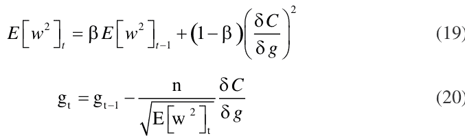

其中 E[w] 是平方梯度的移动平均值，dC/dg 是代价函数相对于权重的梯度，n 是学习速率，beta 是移动平均参数。

## 4 实验结果

本节讨论了 ANN-MDOP 算法在多个方面的性能。

### 4.1 神经元和隐藏层的影响

在人工神经网络的情况下，首先需要确定网络中隐藏的神经元数量和隐藏层的数量。在这个实验中，每层选择的神经元有 42 个神经元在第一层（输入层）。这些神经元的数量等于数据中的特征数量，并且在最后一层（输出层）有三个神经元，等于数据需要分类的类别数。

对于隐藏层，我们首先选择数字为三，并且通过早停和丢弃法在每一层中减少一半的神经元数量。图 2a, b 展示了性能，其中第一个隐藏层有 23 个神经元，第二个隐藏层有 12 个神经元，第三个隐藏层有 6 个神经元。对于隐藏层的数量为 1，有 23 个神经元的情况，性能如图 2c, d 所示，使用早停和丢弃法。图 2d 中包含了选择的神经元数量和层数，训练集上的损失和准确率分别为 0.3073 和 0.8889，在交叉验证集上的损失为 0.5532，准确率为 0.7500，共进行了 163 个 epoch。在测试集上，损失为 0.4135，准确率为 0.8611。

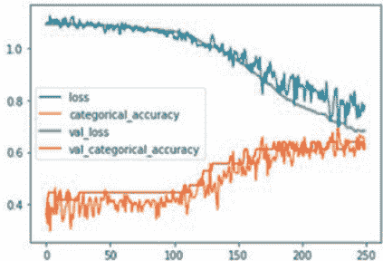

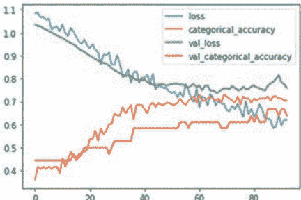

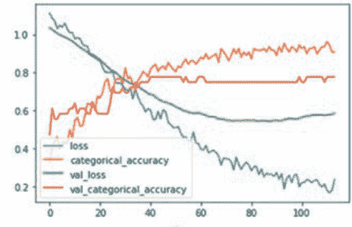

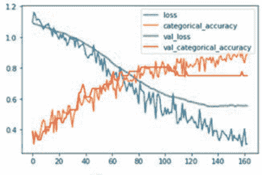

图 2 (a) 当隐藏层为 3 且丢弃率为 0.5 时的性能。(b) 当隐藏层为 3 且丢弃率为 0.2 时的性能。(c) 当隐藏层为 1 且丢弃率为 0.2 时的性能。(d) 当隐藏层为 1 且丢弃率为 0.5 时的性能。

### 4.2 丢弃率的比较

我们比较了使用丢弃率为 0.2 和 0.5 的 ANN-MDOP 算法的性能。在这里，我们设置了相同的 ANN 迭代次数为 250，并使用早停和丢弃来防止过拟合。在图 2 中比较了丢弃率为 0.2 和 0.5 的情况。该图还显示了不同丢弃率对模型性能的影响 [13]。该算法在选择的规格上达到了 0.5 的精度。

### 4.3 迭代效果

我们用迭代次数来说明训练损失和准确率。如图 2 所示，神经元数量、隐藏层和丢弃率的增加对模型收敛的迭代次数有很大影响；ANN-MDOP 算法的损失减少，准确率增加。在图 2a 中，当隐藏层数量为 3，丢弃率为 0.5 时，迭代次数为 250。类似地，图 2b 显示了当隐藏层数量为 3，丢弃率为 0.2 时，迭代次数为 87。在图 2c 和 2d 中，当隐藏层数量为 1，神经元数量为 23，丢弃率分别为 0.2 和 0.5 时，迭代次数分别为 108 和 163 [14]。因此，在图 2d 中具有指定目标的规格的训练更加经济实惠，可以获得更少的损失和更高的准确率。

## 5 结果分析

在这里，我们提供了关于 P&W 数据的整体结果分析。

### 5.1 正例和天气数据 (P&W 数据)

如上所述，我们提供了在 ANN-MDOP(P&W 数据) 算法下绘制的损失、准确率、精确度和学习曲线。在这项工作中，输入层选择了 42 个神经元，输出层选择了 3 个神经元。此外，还考虑了 1 个包含 23 个神经元的隐藏层。迭代次数为 250 次。然而，由于提前停止和丢弃，算法运行了 163 次并收敛。图 2d 显示了选择的神经元和层的损失和准确率，训练集上的损失为 0.3073，准确率为 0.8889，交叉验证集上的损失为 0.5532，准确率为 0.7500，位于第 163 个时期。在测试集上，损失为 0.4135，准确率为 0.8611。因此，我们可以得出结论，ANN-MDOP(P&W 数据) 在选择的规格下预测爆发的性能最佳。总之，爆发预测的准确性取决于对比特征，即相关性越低，特征之间的差异越大，准确预测的机会就越高。对于一些低风险的疾病，只有少数特征就可以很好地预测爆发情况。但对于一种复杂的疾病，如基孔肯雅热、疟疾和登革热，只有少数高度相关的数据特征是不正确的预测爆发的方式。如图 2d 所示，该算法的准确性适中，约为 80%。因此，在这项工作中，我们不仅掌握了阳性病例统计数据，还掌握了各地区的天气条件数据。因此，我们推断通过将这两个数据集与更多特征结合起来，可以进一步提高准确率，以更好地评估由于病媒生物引起的疾病爆发的预测。

## 6 结论

在这项工作中，提出了一种基于人工神经网络的多模式爆发预测（ANN-MD OP）算法，利用对比数据。据我们所知，现有的研究中没有专注于对比数据在医学数据分析领域的应用。我们提出的 ANN 算法的预测准确率为 86%。

# 参考文献

- 1. K. Usha Rani：使用神经网络方法分析心脏疾病数据集。国际数据挖掘与知识管理过程期刊（IJDKP）第 1 卷，第 5 期，2011 年 9 月
- 2. Shraddha Shivhare 和 Rajesh Shrivastava：使用核仁形态颗粒特征的自动骨髓白细胞分类。东方计算机科学与技术杂志 ISSN：0974-6471，第 5 卷，2012 年 6 月
- 3. Md. Osman Goni Nayeem, Maung Ning Wan 等：使用人工神经网络的多层感知器预测疾病水平，用于患者监测国际软计算与工程期刊（IJSCE）ISSN：2231-2307，第 5 期，2015 年 9 月
- 4. Sivaranjani.R：用于早期预测心脏功能的人工智能模型，使用多层感知器。物理和纳米科学期刊：物理学会议系列 1362（2019 年）
- 5. Marios Anthimopoulos, Stergios Christodoulidis 等：使用深度卷积神经网络进行肺部模式分类的间质性肺疾病。IEEE 医学成像交易，第 35 卷，第 5 期，2016 年 5 月
- 6. Rahib H. Abiyev 和 Mohammad Khaleel Sallam Ma'aitah：用于胸部疾病检测的深度卷积神经网络。2018 年医疗工程学杂志第 7 卷
- 7. Agus Qomaruddin Munir 和 Edi Winarko：基于预测技术的流行病区疾病风险分类模型登革热爆发预测患者、死亡、IR 和 CFR。国际计算机应用杂志，2015 年
- 8. Juan M. Scavuzzoa, Francisco Truccoa 等：使用遥感数据和机器学习建模登革热媒介物种群（提交给 Acta Tropica 的预印本，2018 年）
- 9. B. Mahalakshmi 和 G. Suseendran：使用云计算的多层感知器神经网络（MLPNN）预测寨卡病毒。国际最新技术与工程杂志（IJRTE），第 8 卷，2019 年 9 月
- 10. V. Janani, N. Maadhuryaa, D. Pavithra 和 S. Ramya Sree：使用多层感知器的登革热预测 - 一种机器学习方法。国际工程、科学和管理研究杂志，第 3 期，2020 年 3 月
- 11. Oladimeji Mudele, Fábio M. Bayer 等人：利用大型地球观测数据建模埃及伊蚊的时间人口分布（预印本），2019 年
- 12. Vijeta Sharma, Ajai Kumar 等人：使用机器学习的疟疾爆发预测模型。国际高级计算机工程与技术研究杂志（IJARCET），第 4 卷，第 12 期，2015 年 12 月
- 13. Prakash, K.B., Ruwali, A., Kanagachidambaresan, G.R.: TensorFlow 介绍，TensorFlow 编程，EAI/Springer 通信和计算创新。https://doi.org/10.1007/978-3-030-57077-4_1
- 14. Prakash, K.B., Ruwali, A., Kanagachidambaresan, G.R.: TensorFlow 介绍，TensorFlow 编程，EAI/Springer 通信和计算创新。https://doi.org/10.1007/978-3-030-57077-4_1
- 15. Kanagachidambaresan, G.R., Manohar Vinoothna, G., Prakash, K.B.: 可视化，TensorFlow 编程，EAI/Springer 通信和计算创新。https://doi.org/10.1007/978-3-030-57077-4_3
- 16. Prakash, K.B., Ruwali, A., Kanagachidambaresan, G.R.: 回归，TensorFlow 编程，EAI/Springer 通信和计算创新。https://doi.org/10.1007/978-3-030-57077-4_4

# 利用机器学习技术预测媒介传播疾病爆发

# 使用 K-Means 和支持向量机从人类 GPCR 预测真核细胞胆固醇的质膜

Ramamani Tripathy 和 Rudra Kalyan Nayak

**R. Tripathy**
印度奥里萨邦布巴内斯瓦尔的联合商学管理学院计算机应用硕士部门

**R. K. Nayak (✉)**
印度安得拉邦冈纳鲁康纳鲁拉克什迈亚教育基金会（被认定为大学）计算机科学与工程系

© The Author(s), under exclusive license to Springer Nature Switzerland AG 2021
K. B. Prakash et al. (eds.), Advanced Deep Learning for Engineers and Scientists, EAI/Springer Innovations in Communication and Computing, https://doi.org/10.1007/978-3-030-66519-7_10

243

## 1 引言

### 1.1 细胞膜的定义

所有的生物体，例如人类，基本上包含数万亿个可计数的细胞。在生物体中，不同的细胞具有多样化的功能。它们是所有生物体的基本构建单元。人体中常用的细胞类型包括神经细胞、肌肉细胞、平滑细胞、红细胞、干细胞等。细胞膜被视为所有细胞的结构，也被称为细胞壁，它在外叶片和内叶片之间形成了一个边界。细胞膜负责控制细胞内外每种物质的运动。细胞膜的另一个名称是质膜。它是一个磷脂双层结构，其主要作用是包围细胞。质膜有许多职责，例如有选择地允许某些物质进入细胞，并保持外部和内部环境之间的屏障。另一个重要的作用是在不同细胞之间进行细胞信号传递和通信 [1-5]。

### 1.2 细胞膜的组成部分

通常，细胞膜可分为四个不同的组分：磷脂双层、胆固醇、碳水化合物和蛋白质。

#### 1.2.1 磷脂双层

我们知道所有的细胞膜都由磷脂双层组成。这个双层由两个亲水性的脂肪酸尾部和一个亲水性的磷酸盐基团头部组成。这意味着头部基团被水吸引，而脂肪酸尾部被水排斥 (图 1)。

#### 1.2.2 碳水化合物

碳水化合物是细胞膜的另一个组成部分，基本上存在于细胞的外层。这些碳水化合物链可能由 2-60 个单糖单位组成，可以是直链或分支链。碳水化合物的结构由糖分子组成，包括葡萄糖和果糖，它们是单糖。复杂碳水化合物是食物中的淀粉，如小麦、土豆和豆类，通常由大量的糖分子结合在一起 [2-6]。

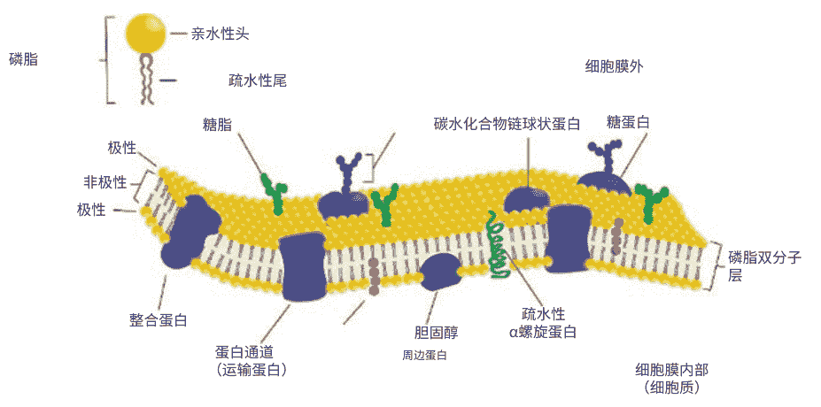

图 1 细胞膜及其组分的结构。 (https://biologydictionary.net/细胞膜)

#### 1.2.3 蛋白质

细胞膜的另一个最重要的组分是蛋白质。细胞膜中有两种类型的蛋白质；一种是周围蛋白质，另一种是内在蛋白质。在膜的内外两侧，周围蛋白质松散地存在于磷脂双分子层的亲水表面上。它是一种临时蛋白质，可以通过极性试剂的应用从膜上分离而不破坏膜。但是内在膜存在于膜内，并且它在无水区域中存在。最重要的内在蛋白质是跨膜蛋白质，它具有从膜内到膜外的多通道特性。跨膜蛋白质是一条长的氨基酸链，因此它具有多通道的性质 [1-6]。

#### 1.2.4 胆固醇

除了其他成分外，人体还有另一个重要成分，即胆固醇。胆固醇是一种蜡状脂肪物质。它在细胞膜中分布不均，并且具有疏水性质。它降低了脂质膜的渗透性，这意味着它限制了分子进入细胞膜。胆固醇的主要功能是产生维生素 D，分泌胆汁和合成类固醇激素 (图 2)。

胆固醇的结构由四个融合的环组成，分别命名为 A、B、C 和 D，并且附加在 D 环上的是一个由八个碳原子组成的支链烃链。

### 1.3 G 蛋白偶联受体

G 蛋白偶联受体 (GPCR) 是质膜上最大的受体家族。通常，不同数量的受体位于哺乳动物细胞中，并且这些受体被称为具有结合特定分子能力的蛋白质。结合分子被视为配体，它可以是从无机矿物到有机物质（如蛋白质、激素）的任何分子。


图 2 胆固醇的结构。(https://themedicalbiochemistrypage.org/cholesterol.php)

和神经递质。由于 GPCR 蛋白质具有长链的氨基酸，在细胞膜内通过七次。可能，GPCR 家族中有超过 820 个基因可用。在这里，存在许多亚家族。所有蛋白质具有不同的序列和功能。GPCR 蛋白家族有许多亚家族，如 A 类罗多普辛样、B 类分泌素样、C 类代谢型谷氨酸/信息素、F 类 frizzled (FZD)、味觉受体 (TAS1R、TAS2R)、嗅觉受体 (VN1R、VN2R) 和 7TM 孤儿受体 [1-10]。

我们知道 GPCR 受体包含在具有七个跨膜螺旋的整合膜蛋白中。这些结构表明配体在受体的细胞外侧结合会导致受体的胞内侧发生构象变化。图 3 中有七个螺旋。每次，一个螺旋进入膜并从膜中退出。每个螺旋在其跨膜区域具有不同的氨基酸序列。螺旋的总跨度从 N-末端到 C-末端。GPCR 在人类药物发现中起着重要的作用。根据细胞生物学，质膜的所有组分都很重要，但胆固醇在膜上具有额外的关键特性。胆固醇在人体中可以完成各种类型的检测；此外，它对 GPCR 的功能和配体结合性质具有调节作用。胆固醇是人类细胞膜的关键成分，同时也是 GPCR 功能和配体结合性质的已证实的调节作用 [5-18] (图 4)。

随着时间的推移，越来越多的研究人员对细胞胆固醇在膜受体如 GPCR 上的作用进行了研究。为了预测目的，采用了许多方法。最有可能的技术是机器学习、软计算、数据挖掘等。聚类就是将相似的对象分组到一个聚类点中。有许多算法被用于对相同的数据点进行聚类。在所有算法中，K-means 是一个重要的算法。


图 3 GPCR 受体的结构。(https://upload.wikimedia.org/wikipedia/commons/1/12/GPCR_structure_and_receptor.svg)

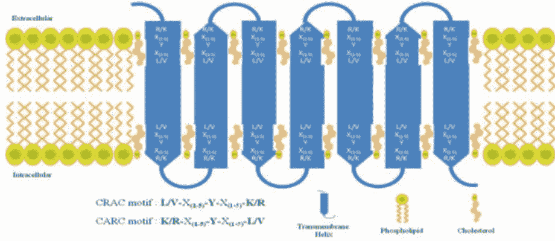

图 4 胆固醇与 GPCR 蛋白靶点的七个螺旋

当你有无标签的数据时，支持向量机（SVM）在预测和分类不同对象中起着重要的作用。为此，我们开发了一种混合方法，将 K-means 与支持向量机相结合，用于预测膜蛋白 GPCR 与膜胆固醇的相互作用 [17-20]。在这里，我们探索了一种基于 K-means 和支持向量机的混合方法。通过分析，我们展示了质膜胆固醇如何靶向膜 GPCR 受体的螺旋位点，并找出了有效的结构域位点。我们将通过提出的方法以及实验分析和结论来讨论我们的手稿。

## 2 工作流程详述（图 5）

- 步骤 1：从 UniProt [21] 数据库中收集了所有受体蛋白的数据集。通常，螺旋数据根据其跨膜区域具有不同的序列。GPCR 的膜受体中总共有七个螺旋。每个文件中包含了 900 多个蛋白质。
- 步骤 2：在胆固醇之后，使用滑动窗口概念创建字典。

  $D = \{d_5, d_6, d_7, d_8, d_9d_{10}, d_{11}, d_{12}, d_{13}\}$

  使用（L/V-X(1-5)-Y·X(1-5)-R/K）前向（CRAC）和（R/K-X(1-5)-Y-X(1-5)-L/V）后向（CARC）算法，我们设置了细胞膜脂质字典。

- 步骤 3：在设置了所有数据集之后，我们根据模体类型将它们分开，例如 11, 12, 13, 14, 15, 21, 22, 23, 24, 25, 31, 32, 33, 34, 35, 41, 42, 43, 44, 45, 51, 52, 53, 54, 55，还有前向和后向的模体序列。
- 步骤 4：移动到下一个步骤，我们使用 K-means 算法找到了很多聚类点。然后，我们应用支持向量机方法对聚类点进行分类。


图 5 我们提出的工作流程

**表 1 从 GPCR 蛋白中观察到的正向胆固醇模体序列**

| 模体 - 长度 | L-X(1-5)-Y-X(1-5)-R 和 L-X(1-5)-Y-X(1-5)-K | V-X(1-5)-Y-X(1-5)-R 和 V-X(1-5)-Y-X(1-5)-K | 总和 |
| :--- | :--- | :--- | :--- |
| 5 | 69 | 60 | 129 |
| 6 | 420 | 220 | 640 |
| 7 | 103 | 124 | 227 |
| 8 | 470 | 322 | 792 |
| 9 | 717 | 240 | 957 |
| 10 | 240 | 128 | 368 |
| 11 | 161 | 320 | 481 |
| 12 | 104 | 162 | 266 |
| 13 | 30 | 65 | 95 |
| 总计 | 2314 | 1641 | 3955 |

第 5 步：在最后一步中，我们找到了具有生物相关性的有效模体序列，以及它们的权重和氨基酸优先级，这对于所有药物设计师都具有生物学意义。

从表 1 和表 2 中，我们发现了 CRAC 和 CARC 的总映射模体序列。在表 1 中，总正向模体为 3955，在反向部分中，总模体数量为 1726，这在表 2 中有所提及。

**表 2 从 GPCR 蛋白中观察到的反向胆固醇模体序列**

| 模体 - 长度 | R-X(1-5)-Y-X(1-5)-L 和 R-X(1-5)-Y-X(1-5)-V | K-X(1-5)-Y-X(1-5)-L 和 K-X(1-5)-Y-X(1-5)-V | 总和 |
| :--- | :--- | :--- | :--- |
| 5 | 43 | 28 | 71 |
| 6 | 77 | 58 | 135 |
| 7 | 101 | 71 | 172 |
| 8 | 125 | 75 | 200 |
| 9 | 225 | 193 | 418 |
| 10 | 210 | 205 | 415 |
| 11 | 96 | 90 | 186 |
| 12 | 47 | 48 | 95 |
| 13 | 120 | 94 | 214 |
| 总计 | 1044 | 862 | 1726 |

## 3 方法论讨论

近日来，聚类技术被认为是最常见的数据分析方法之一，用于获取适当的数据集结构。它还负责识别数据点之间的相似性和不相似性的群组。因此有很多聚类算法。在所有算法中，k-means 算法是一种将所有数据集分成 K 个预定义不相似子部分而不重叠的算法，而每个数据点都适合于单个群组 [22-25]。

### 3.1 K-Means 聚类

- 步骤 1：确定聚类点 K。
- 步骤 2：根据数据点选择质心，然后任意选择 K 个数据点作为质心，没有替代。
- 步骤 3：保持迭代，直到质心不再发生变化。
- 步骤 4：计算数据点之间的平方距离之和，以及每个质心。
- 步骤 5：然后将每个数据部分放入最接近的簇中。
- 步骤 6：通过计算所有数据部分的每个簇的质心，找到最终有效的模式序列。

目标函数是

$$ W = \sum_{n} \sum_{K} x_{ik} y^{i} - \mu_{k}^{2} \quad (1) $$

对于每个数据部分，如果它属于簇 k，则 xik = 1；否则，xik = 0。此外，μ_k 被视为 y_i 的簇的质心。同样，μ_k 被视为 y_i 的簇的质心。

### 3.2 支持向量机

最小化过程有两个步骤。首先，我们最小化 $W$ 关于 $x_{ik}$ 与 $\mu_k$。接下来，我们最小化 $W$ 关于 $\mu_k$ 与 $x_{ik}$。最后，我们对 $W$ 关于 $x_{ik}$ 进行微分，首先加上更新的聚类分配（E 步骤）。

之后，我们对 $W$ 关于 $\mu_k$ 进行微分，然后根据前一步的聚类分配重新计算质心（M 步骤）。结果是，E 步骤为：

$$
\begin{aligned}
\frac{\partial W}{\partial x_{ik}} & = \sum_{i=1}^{n} \sum_{k=1}^{K} x_{ik} \| y^i - \mu_k \|^2 \\
\Rightarrow x_{ik} & = \begin{cases} 
1, & \text{如果 } k = \text{argmin}_j \| y^i - \mu_j \|^2 \\
0, & \text{否则} 
\end{cases}
\end{aligned}
$$

另一种方法是将计算的数据部分 $y_i$ 分配给附近的聚类，根据其与聚类质心的平方距离之和进行判断。

同时，M 步骤是：

$$
\begin{aligned}
\frac{\partial W}{\partial \mu_k} & = 2 \sum_{i=1}^{n} x_{ik} \left( y^i - \mu_k \right) = 0 \\
\Rightarrow \mu_k & = \frac{\sum_{i=1}^n x_{ik} y^i}{\sum_{i=1}^n x_{ik}}
\end{aligned}
$$

无论如何，都要重新计算每个聚类的质心以反映新的分配。

支持向量机是由 Boser、Guyon 和 Vapnik 在 COLT-92 中引入的。它现在是一个非常被接受的算法，已经被提出用于统计学习理论。由于这个算法已经被使用了几十年并且表现良好，许多研究人员将其应用于许多新兴领域，如图像识别、数据分类、微阵列基因表达和生物信息学。SVM 是一种有监督学习算法，其结果取决于训练和测试数据集。基本上，SVM 方法使用核技巧技术来转换给定的数据，然后根据转换的基础上可能的输出获得一个最优边界 [26-30]。

包含标签对 $(x_i, y_i)$ 的训练集，$i=1, ..., n$，其中 $x_i \in \Re^n$ 和 $y_i \in \{\text{类别标签}\}$，使用优化问题得到 SVM 方法的结果如下所示：

$$
\min_{w, b, \xi} \frac{1}{2} \|w\|^2 + C \sum_{i=1}^{n} \xi_i
$$

Subject to: $y_i (w^T \Phi(x_i) + b) \ge 1 - \xi_i, \xi_i \ge 0.$

在等式 (6) 中，决策函数表示为：

$$
f(x) = \sum_{i=1}^n \alpha_i y_i K(x_i, x) + b
$$

通过核函数 $\phi$ 将训练向量 $x_i$ 映射到高维空间中。在错误的情况下，$D>0$ 也被视为惩罚结构。根据 SVM 理论，每次通过超平面计算数据点，尽管在二维空间中找到线性解不合适。因此，我们通过核函数 $k(x_i, x_j) \equiv \Phi(x_i)^T \Phi(x_j)$ 来解决多维数据的问题。利用不同的核函数，在下面的等式 (7)、(8) 和 (9) 中详细说明了 SVM 方法的所有步骤。

*   线性核：$\langle x_i, x_j \rangle = x_i^T x_j$
*   多项式核：$f(x_i, x_j) = (\gamma x_i^T x_j + r)^\epsilon, \gamma > 0,$
*   径向基核 (RBF)：$\exp \left(-\gamma \| x_i - x_j \|^2 \right), \gamma$

基于训练数据大小，所有核参数都是自由设定的。

## 4 实验和结果分析

本文基于 Intel i5 处理器、8GB 硬盘和 Windows10 操作系统进行测试，并且整个结果分析都是用 Python 3 编写的。为了计算我们的实验分析，我们探索了混合算法和许多其他概念。在这里，我们详细描述了我们的整个工作流程，使用以下阶段：

1.  第 1 阶段：在开始阶段，我们从 UniProt 数据库中检索了所有蛋白质数据集，根据螺旋名称以及计算的胆固醇结合位点。
2.  第 2 阶段：一旦过滤过程在两个数据集之间结束，我们将以 L/V 或 R/K 开头的序列残基分离出来，用于正向模式和以 R/K 或 L/V 开头的序列用于反向模式。
3.  第 3 阶段：在收集到两个数据集的模式序列之后，我们对 CRAC 和 CARC 都应用滑动窗口概念，窗口大小可以从 5、6、7、8、9、10、11、12 到 13 不等。可以使用 CRAC(L/V-X(1-5)-R/K) 和 CARC(R/K-X(1-5)-Y/F-X(1-5)-L/V) 计算这个胆固醇字典。
4.  第 4 阶段：在完成第三阶段的工作后，我们进入下一步，我们实施了我们计划中的算法 K-means 和支持向量机，用于预测膜胆固醇与膜受体 GPCR。K-means 算法是一种将所有数据集分成 K 个预定义的不相似子部分而不重叠的方法，而每个数据点都适合于单个组 [31]。

在这个算法中，质心以循环方式重新计算，使用分配给该质心簇的所有数据点。每个质心定义了一个簇。在这一步中，每个数据点根据平方欧氏距离被分配到最近的质心。更正式地说，如果 $c_i$ 是集合 $C$ 中的质心集合，那么每个数据点 $x$ 根据其分配到一个簇。

$$
c_i = \frac{1}{|S_i|} \sum_{x_i \in S_i} x_i \tag{10}
$$

此外，我们还使用了另一个算法，用于预测目的。SVM 是一种监督学习算法，其结果取决于使用测试数据集进行训练。基本上，SVM 方法使用核技巧技术来转换给定的数据，然后根据转换的基础上可能的输出获得一个最优边界。

使用优化问题得到 SVM 方法如下所示：

$$
\min_{w, b, \xi} \frac{1}{2} \|w\|^2 + C \sum_{i=1}^{n} \xi_i \tag{11}
$$

表 3 显示了来自前向区域的膜受体对于质膜胆固醇的预测输出，表 4 显示了来自后向区域的膜受体对于质膜胆固醇的预测输出。根据我们的实验，我们得出结论 CARC 模体比 CRAC 模体具有更多的目标区域。

CARC 和 CRAC 都针对所有螺旋位点，并给出了良好的预测结果。这些结果具有生物学重要性。模体类型越高，目标位点在哺乳动物细胞质膜的 CARC 区域中发现的越多 [32,33]。

**表 3 从膜受体预测的细胞膜胆固醇的输出结果（前向区域）**

| 螺旋 | 序列和模式类型 | ID 名称 |
| :--- | :--- | :--- |
| 螺旋 5 | LIVGFCYVRIWTK (55) | Q13585 |
| 螺旋 5 | LAIISIYYYHIAK (55) | P28336 |
| 螺旋 5 | LVILLSYVRVS VK (55) | P49683 |
| 螺旋 5 | LVICLCYLIVVK (55) | P32745 |
| 螺旋 5 | LAMSFCYLVIIIR (54) | P32248 |
| 螺旋 5 | LIMLFCYGFTLR (54) | P25025 |
| 螺旋 5 | LCLSILYGLIGR (54) | O43193 |
| Helix 5 | LVISVCYSLMIR (54) | P41146 |
| Helix 5 | LLTLAAYGALGR (54) | Q96G91 |
| Helix 5 | LLMLVLYGRIFR (54) | P08908 |
| Helix 5 | LIMGVCYFITAR (54) | Q9NPB9 |
| Helix 5 | VLGLTYARTLR (44) | O43603 |
| Helix 5 | VMAVAYGLISR (44) | P32239 |
| Helix 5 | VTCTVYA IKTR (44) | Q14833 |
| Helix 7 | VVNPIIYSYK (52) | Q9UBY5 |
| Helix 7 | VLNPIVYSVK (52) | Q8NH63 |
| Helix 7 | VSLGMLYMPK (52) | Q14833 |
| Helix 7 | VSLGMLYVPK (52) | O15303 |
| Helix 7 | VALGMLYMPK (52) | Q14831 |
| 螺旋 7 | VSLGMLYMPK (52) | O00222 |
| 螺旋 7 | VVNPIVYAYR (52) | P29275 |
| 螺旋 7 | LDPVLYFLAGQR (45) | P41231 |
| 螺旋 7 | LNPLVYVIVGKR (45) | P30411 |

胆固醇存在于人体中，即坏胆固醇和好胆固醇。我们还知道，膜胆固醇受膜蛋白的调节。在这里，我们关注 GPCR 蛋白的跨膜位点，以及细胞膜内的胆固醇靶位点。一直以来，膜胆固醇都会靶向细胞膜内的每个螺旋，从而导致许多目标序列的产生。同样生成目标位点，然后我们应用了我们的方法 K-means 与支持向量机进行预测。从这个分析中，我们发现一些亚家族更喜欢正向模体，一些更喜欢反向模体，还有一些两者都喜欢。在正向和反向序列中，这里观察到更多数量的反向模体，这些模体具有生物学相关性。

因此，我们最终得出的混合算法也能够以高可靠性预测 CRAC/CARC 模式序列，并在医学和分子靶向领域产生了巨大的影响。

## 5 结论

日复一日，对哺乳动物生物学的研究一直是所有科学家面临的挑战因素。由于环境的变化，在人体中出现了几种未知疾病。为了解决这些新问题，在当前情况下采用了不同的技术。在人体中，质膜胆固醇起着重要的作用。

从文献中可以得知，胆固醇在体内是自动形成的，但有时数量不足。还有一种方式可以从外部物质中获取胆固醇。一般有两种类型的胆固醇。

**表 4 预测输出：胆固醇的细胞膜从膜受体到后向区域**

| 螺旋 | 序列和模式类型 | ID 名称 |
| :--- | :--- | :--- |
| 螺旋 2 | KSVDIYLLNLAL (55) | P49238 |
| 螺旋 2 | KTATNIYIFNLAL (55) | P41143 |
| 螺旋 2 | KTATNIYIFNLAL (55) | P41145 |
| 螺旋 2 | KTATNIYIFNLAL (55) | P41146 |
| 螺旋 2 | KHPAVIYMANLAL (55) | P55085 |
| 螺旋 2 | KFHNRMYYFFIGNL (55) | Q99500 |
| 螺旋 2 | KRVENIYLLNLAV (55) | O00421 |
| 螺旋 2 | KSAFQVYMINLAV (55) | Q9Y271 |
| 螺旋 2 | KTVPDIYICNLAV (55) | Q969V1 |
| 螺旋 2 | KTPTNYYLFSLAV (55) | Q9GZQ4 |
| 螺旋 2 | KTATNIYLLNLAV (55) | P31391 |
| 螺旋 2 | KKVSSIYIFNLAV (55) | P50052 |
| 螺旋 2 | RTTTNLYLGSMV (55) | O43193 |
| 螺旋 2 | RTPTNYYLFSLAV (55) | Q9HB89 |
| 螺旋 2 | KLTVPRLMCNL (54) | P23945 |
| 螺旋 2 | KLTVPRLMCNL (54) | P22888 |
| 螺旋 2 | KLNVPRLMCNL (54) | P16473 |
| 螺旋 2 | KKSRMTFFVTQL (54) | Q6W5P4 |
| 螺旋 2 | KHSRLF FFMKHL (54) | P30559 |
| 螺旋 2 | KLSTIG FILTGL (54) | Q9NYW0 |
| 螺旋 2 | RPMYYFIGNLAL (45) | P21453 |
| 螺旋 2 | RALSVFIKDAAL (45) | P43220 |
| 螺旋 2 | RQPSNYLIV (42) | P34969 |
| 螺旋 2 | RTVTNYFLV (42) | P29371 |
| 螺旋 2 | RTVTNYFIV (42) | O43613 |
| 螺旋 2 | RTVTNYFIV (42) | O43614 |
| 螺旋 2 | RRWVYYCLV (42) | O95977 |
| 螺旋 2 | RTVTNYFIV (42) | P21452 |
| 螺旋 2 | RTVTNYFLV (42) | P25103 |
| 螺旋 2 | RTPTNYFIV (42) | P35368 |
| 螺旋 2 | RQPLNYILV (42) | P03999 |
| 螺旋 3 | RHHWVFGVL (42) | Q86VZ1 |
| 螺旋 3 | RYLSIFWVL (42) | Q9NYW4 |
| 螺旋 3 | KMSFFSGMLLL (35) | P32248 |
| 螺旋 3 | KEVNFYSGILL (35) | P25024 |
| 螺旋 3 | KLQRFIFHVN L (35) | P47900 |
| 螺旋 3 | KLVRFLFYTNL (35) | P41231 |
| 螺旋 3 | KFVRFLFYWNL (35) | P51582 |
| 螺旋 3 | KIANFSNYIFL (35) | Q9NYW0 |
| 螺旋 6 | RTVKLIFAIV (52) | P46094 |
| 螺旋 6 | RAMRVIFAVV (52) | P25024 |
| 螺旋 6 | RAMRVIFAVV (52) | P25025 |
| 螺旋 6 | RTVKMTFIIV (52) | P30559 |
| 螺旋 6 | RTVKMTFVIV (52) | P37288 |
| 螺旋 6 | RTVKMTFVIV (52) | P47901 |
| 螺旋 6 | RIHIFWLL (32) | P49019 |
| 螺旋 6 | RRRTFCLL (32) | P49683 |
| 螺旋 6 | RSALFQIL (32) | O14514 |
| 螺旋 6 | RIGVFSVL (32) | Q9UP38 |
| 螺旋 6 | RIGLFSVL (32) | Q9ULW2 |
| 螺旋 6 | RIGVFSVL (32) | Q14332 |
| 螺旋 6 | RIGVFSVL (32) | O75084 |
| 螺旋 6 | RLGLFTVL (32) | Q9H461 |

# 参考文献

1. Tripathy, R., Mishra, D., Konkimalla, V.B., Nayak, R.K.: 基于光谱聚类和模糊 C 均值算法的计算方法用于挖掘胆固醇及其潜在靶点对 GPCR 七螺旋的影响。智能模糊系统杂志 **35**(1), 305–314 (2018)
2. Ahmed, M.R., Zhan, X., Song, X., Kook, S., Gurevich, V.V., Gurevich, E.V.: 泛素连接酶 parkin 促进 Mdm2-Arrestin 相互作用，但抑制 Arrestin 泛素化。生物化学.**50**(18), 3749–3763 (2011)
3. Alvarez-Curto, E., Inoue, A., Jenkins, L., Raihan, S.Z., Prihandoko, R., Tobin, A.B., Milligan, G.: 有针对性地消除 G 蛋白和阻滞蛋白定义了它们对 G 蛋白耦合受体信号的强度和持续时间的特定贡献。生物化学杂志 **291**(53),27147–27159 (2016)
4. Tripathy, R., Mishra, D., Konkimalla, V.B.: 从人类 G 蛋白偶联受体 (GPCR) 中发现胆固醇共识基序的一种新颖的模糊 C 均值方法。Karbala Int.J. Modern Sci. **1**(4), 212–224 (2015)
5. Attramadal, H., Arriza, J.L., Aoki, C., Dawson, T.M., Codina, J., Kwatra, M.M., et al.: Beta-arrestin2，阻滞蛋白/β-阻滞蛋白基因家族的新成员。J. Biol. Chem. **267**(25), 17882–17890 (1992)
6. Baameur, F., Morgan, D.H., Yao, H., Tran, T.M., Hammitt, R.A., Sabui, S., et al.: G 蛋白偶联受体激酶 5 和 6 的 G 蛋白信号调节同源结构域在β2肾上腺素受体和视红质磷酸化中的作用。Mol. Pharmacol. **77**(3),405–415 (2010)
7. Baylor, D.A., Lamb, T.D., Yau, K.W.: 视网膜杆细胞对单个光子的响应。J. Physiol. **288**(1), 613–634 (1979)
8. Benovic, J.L., DeBlasi, A., Stone, W.C., Caron, M.G., Lefkowitz, R.J.: β-肾上腺素受体激酶：主要结构勾勒出一个多基因家族。Science. **246**(4927), 235–240 (1989)
9. Benovic, J.L., Kühn, H., Weyand, I., Codina, J., Caron, M.G., Lefkowitz, R.J.: β-肾上腺素受体的功能性脱敏化由β-肾上腺素受体激酶介导：可能与视网膜蛋白阻滞素（48-kDa 蛋白质）的类似物有关。Proc. Natl. Acad.Sci. **84**(24), 8879–8882 (1987)
10. Benskey, M.J., Perez, R.G., Manfredsson, F.P.: α-突触蛋白对神经元的存活和功能的贡献 - 对帕金森病的影响。神经化学杂志。**137**(3),331–359 (2016)
11. Carman, C.V., Parent, J.L., Day, P.W., Pronin, A.N., Sternweis, P.M., Wedegaertner, P.B., et al.: G 蛋白偶联受体激酶 GRK2 中 RGS 结构域对 Gαq/11 的选择性调节。生物化学杂志.**274**(48), 34483–34492 (1999)
12. Bockaert, J., Pin, J.P.: G 蛋白偶联受体的分子调控：一种进化成功。EMBO J. **18**(7), 1723–1729 (1999)

+ 13. Gimpl, G.: 蛋白偶联受体和胆固醇的相互作用。化学物理脂质。199, 61–73 (2016)
14. Greenwood, A.I., Tristram-Nagle, S., Nagle, J.F.: 脂质和胆固醇的部分分子体积。化学物理脂质。143(1–2), 1–10 (2006)
15. Jafurulla, M., Tiwari, S., Chattopadhyay, A.: 在 G 蛋白偶联受体中鉴定胆固醇识别氨基酸共识 (CRAC) 基序。生物化学和生物物理研究通讯。404(1), 569–573 (2011)
16. Oates, J., Watts, A.: 揭示脂质、胆固醇和 GPCR 激活之间的密切关系。当前结构生物学观点。21(6), 802–807 (2011)
17. Oddi, S., Dainese, E., Fezza, F., Lanuti, M., Barcaroli, D., De Laurenzi, V., Maccarrone, M.: 在人类 1 型大麻素受体中对假定的胆固醇结合序列 (CRAC) 进行功能特性化。神经化学杂志。116(5), 858–865 (2011)
18. Sun, X., Whittaker, G.R.: 在病毒进入和感染中，流感病毒包膜胆固醇的作用。J. Virol. 77(23), 12543–12551 (2003)
19. Epand, R.M., Thomas, A., Brasseur, R., Epand, R.F.: 胆固醇与分区到膜域的蛋白质的相互作用：概述。在：胆固醇结合和胆固醇运输蛋白，第 253–278 页。Springer, Dordrecht (2010)
20. Hamouda, A.K., Chiara, D.C., Sauls, D., Cohen, J.B., Blanton, M.P.: 胆固醇与 T 型鱼电亚乙酰胆碱受体的跨膜α螺旋 M1、M3 和 M4 的相互作用：使用 [3H] azidcholesterol 的光标记研究。Biochemistry. 45(3), 976–986 (2006)
21. UniProt Consortium: 通用蛋白质资源 (UniProt)。Nucleic Acids Res. 36(suppl_1), D190–D195 (2007)
22. Fahim, A.M., Salem, A.M., Torkey, F.A., Ramadan, M.A.: 一种高效的增强型 k-means 聚类算法。浙江大学学报 A. 7(10), 1626–1633 (2006)
23. Naik, P.P.S., & Gopal, T.V.: 使用集成模糊 KMeans 聚类的磁共振脑肿瘤分割
24. Fatma, M., Sharma, J.: 使用 K-means 聚类和 HSI 颜色图像分割的白血病图像分割。国际计算机应用杂志。94(12), 6–9 (2014)
25. Xu, R., Wunsch, D.: 聚类算法综述。IEEE 神经网络杂志. 16(3), 645–678 (2005)
26. Cortes, C.: 支持向量网络。机器学习. 20, 1–25 (1995)
27. 张，X., 郑，X.: 基于机器学习的文本情感分析比较。在：2016 年第 15 届并行与分布式计算国际研讨会 (ISPDC), 第 230-233 页。IEEE (2016 年 7 月)
28. Upadhyay, V.P., Panwar, S., Merugu, R., Panchariya, R.: 使用支持向量机中的各种核函数预测股票市场走势。在：国际信息通信技术与计算国际会议论文集，第 1-5 页 (2016 年 8 月)
29. Nayak, R.K., Mishra, D., Rath, A.K.: 用于印度货币市场的优化 SVM-k-NN 货币兑换预测模型。神经计算和应用。31(7), 2995-3021 (2019)
30. Chandra, N.: 用于预测药物与 P-糖蛋白结合的支持向量机分类器。J. 蛋白质组学生物信息学。2, 193-201 (2009)
31. Prakash, K.B., Ruwali, A., Kanagachidambaresan, G.R.: 引言到张量流，张量流编程，EAI/Springer 通信和计算创新。https://doi.org/10.1007/978-3-030-57077-4_1
32. JHA, A.K., Ruwali, A., Prakash, K.B., Kanagachidambaresan, G.R.: 张量流基础，张量流编程，EAI/Springer 通信和计算创新。https://doi.org/10.1007/978-3-030-57077-4_2
33. Kanagachidambaresan, G.R., Manohar Vinoothna, G., Prakash, K.B.: 可视化，张量流编程，EAI/Springer 通信和计算创新。https://doi.org/10.1007/978-3-030-57077-4_3

博士 Rudra Kalyan Nayak 目前在印度安得拉邦瓦德斯瓦拉姆的 Koneru Lakshmaiah Education Foundation（被认定为大学）的计算机科学与工程系担任副教授。他在印度奥里萨邦 Siksha 'O' Anusandhan（被认定为）大学获得了信息技术硕士学位和计算机科学与工程博士学位。他拥有超过 11 年的教学、指导和研究经验。他的研究兴趣包括人工智能、机器学习、金融工程、生物信息学、数据挖掘和计算机视觉。他是 ISTE 和 ACM 的专业会员。

博士 Ramamani Tripathy 目前在印度奥里萨邦布巴内斯瓦尔的 United School of Business Management 的 Master of Computer Applications 系担任助理教授。她在 USBM 拥有 10 多年的教学、指导研究和学术经验。她在奥里萨邦 SOA 大学获得计算机科学与工程 (CS&E) 的博士学位。她是 ISTE 和 ACM 的专业会员。她的研究兴趣包括生物信息学、金融工程和数据挖掘。

# 早期检测糖尿病视网膜病变技术调查


D. Vanusha, B. Amutha, Siddhartha Dhar Choudhury 和 Aayush Agarwal

## 1 引言

糖尿病性视网膜病变是一种与眼睛有关的疾病，会损害视网膜的血管，从而导致视力模糊，并且使患者难以辨别颜色。视网膜是眼睛的重要部分，覆盖在眼睛的后部，是一个对光敏感的区域。视网膜的主要任务是将照射到眼睛上的光转化为信号传递给大脑。病情进展可能导致视力丧失。通过手动测试和手动筛查可以预防这种情况。有视网膜手术可以治疗这种情况。

控制糖尿病的严重程度并管理早期出现的症状可以帮助患者，避免视力丧失的发生。荧光血管造影和光学相干断层扫描是诊断糖尿病性视网膜病变的两种方法。前者是将荧光染料注入眼睛（静脉）拍摄了明显显示出渗漏血管的图片，而后者是视网膜的图像扫描。

D. Vanusha (✉)
印度卡坦库拉图尔的 SRM 科学与技术学院
电子邮件：vanushad@srmist.edu.in

B. Amutha
印度泰米尔纳德邦钦奈的 SRM 科学与技术学院计算机科学与工程系
电子邮件：amuthab@srmist.edu.in

S. D. Choudhury
美国华盛顿州西雅图的 Avalara 软件工程师
电子邮件：siddhartha.dharchoudhury@avalara.com；Aa4290@srmist.edu.in

A. Agarwal
印度卡坦库拉图尔的 SRM 科学与技术学院
电子邮件：Aa4290@srmist.edu.in

© 作者，独家许可给 Springer Nature Switzerland AG 2021
K. B. Prakash 等人，工程师和科学家的高级深度学习，EAI/Springer Innovations in Communication and Computing, https://doi.org/10.1007/978-3-030-66519-7_11

259

这篇调查论文的想法是分析从传统机器学习算法到当前深度学习技术在早期检测糖尿病视网膜病变方面存在的各种趋势。最近技术的进步使得克服手动筛查和应用染料在眼睛中的额外工作量成为可能，这可能会对患者造成刺激或灼痛。由于 Kaggle、MESSIDOR 和 DIABETRET 等大型公开可用数据集的可用性，机器学习算法使得对 DR 的不同类别进行分类成为可能。机器学习算法的主要缺点是特征提取，这需要更多的时间来提取特征。深度学习模型试图模拟人脑分析物体的方式，通过 Inception v3、ResNet50、VGG 16 等最先进的 CNN 模型来填补机器学习算法所造成的空白。这些模型的结果与人类评分相媲美。

传统的计算机视觉算法优先于深度学习算法。尽管深度学习在当今具有更吸引人的特点，但传统的计算机视觉算法不能轻视，因为即使在需要手动提取特征和提取特征所需的时间更长的情况下，它们也能给出显著的结果。深度学习具有点对点处理，而计算机视觉算法则不然。在计算机视觉算法中，实现预测或分类的目标是检测颜色、边缘和角点。人工设计的特征对于预测或分类任务的准确性具有重要意义。因此，模型的可靠性基于人工设计的特征。传统的视觉算法如“SURF(加速稳健特征)、SIFT(尺度不变特征变换)”和 BRIEF(二进制稳健独立基本特征) 在从原始和未经处理的图像中提取特征方面起着重要作用。这类算法的主要问题是在分类时难以选择来自实际图像的特征。当分类过程中类别数量增加时，当图像的清晰度受损或图像质量受到影响时，传统视觉算法将无法给出令人信服的输出。图 1 描述了传统算法和深度学习算法的工作流程。

糖尿病视网膜病变有四个不同的阶段：
- 1. 轻度非增殖性视网膜病变：在视网膜的血管中，形成类似气球的微小动脉瘤。
- 2. 中度非增殖性视网膜病变：在这个阶段，与视网膜连接的几条血管被阻塞。
- 3. 重度非增殖性视网膜病变：在这个阶段，更多的血管被阻塞，完全剥夺了视网膜的多个区域的血液供应。
- 4. 增殖性视网膜病变：这被认为是 DR 的高级和关键阶段，在视网膜上形成新的组织。它们是脆弱的，当它们开始渗漏时，可能会导致视力丧失。

图 2 表示 DR 的不同阶段，微小动脉瘤 (MA)，渗出物和棉絮斑点。
图 3 显示了正常视网膜和 DR 受影响视网膜之间的差异。

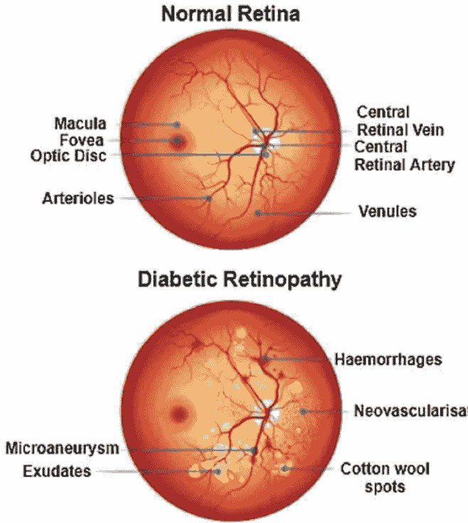
图 3 正常视网膜和受影响的视网膜。机器学习方法的调查 in 微小动脉瘤 辨别。 (https://www.researchgate.net/publication/338418132_Investigation_of_Machine_Learning_Methodologies_in_Microaneurysms_Discernment)

MA 的发生表明疾病的初期阶段，它是一个类似气球的小袋，可以渗漏并在疾病进展时引起出血。为了对图像进行像素级别的分析，需要进行分割，这将大大简化图像。分割包括诸如以下方法：
- 阈值分割
- 边缘检测
- 分水岭技术
- 偏微分方程
- 基于聚类的方法

这些分割技术中的任何一种都可以应用于像 DR 这样的医学图像诊断，以获得显著的结果。

“本文的工作流程在后面的部分中结构化如下：
- 传统的计算机视觉算法用于 DR 的检测
- 用于 DR 分类的深度学习方法
- 使用基于 CNN 的目标检测模型进行 DR 病变检测的深度学习方法
- 使用分割进行 DR 检测的深度学习方法”

## 2 文献综述

### 2.1 传统的计算机视觉算法用于 DR 的检测

Hann C 等人的论文 [1] 提出了计算机视觉方法，用于“分离和检测两种最常见的 DR 病变——点状出血 (DH) 和渗出物。算法使用特定的颜色通道和分割方法，将这些 DR 表现与数字眼底图像中的生理特征分离开来。来自眼底照片的颜色、形态和强度梯度提供了检测渗出物和 DH 数量的手段，从而确定 DR 的存在。算法在已发表数据库的前 100 张图像上进行了测试。报告了诊断结果和相应的阳性和阴性预测值 (PPV 和 NPV)。前 50 张图像由专家确定了每个单独渗出物和/或 DH 的真实情况，并与算法识别进行了比较。诊断的渗出物识别具有 96.7% 的敏感性和 94.9% 的特异性 (PPV=97%, NPV=95%)。点状出血的识别具有 98.7% 的敏感性和 100% 的特异性 (PPV=100%, NPV=96%)。在标记的前 50 张图像中，算法发现了超过 95% 的真实渗出物和点状出血，假阳性率不到 0.5%。本文与已有方法的改进之处在于使用颜色通道来识别 DR 病变，这直接将临床专业知识和观察纳入算法中，提供了潜在的更优结果。

通过其高灰度变化，只能找到渗出物，并且形态学重建技术有助于提取轮廓。检测视盘是一项具有挑战性的任务。Walter 等人的论文 [2] 通过使用形态学滤波技术和另一种被广泛称为分水岭变换的独特技术来检测视盘。该算法在一个小型图像数据库上进行了测试，平均灵敏度为 92.8%，平均预测值为 92.4%。鲁棒性特征是相对于参数变化而确保的。渗出物的存在由算法和人工评分员进行验证。

该算法分为四个类别，首先是图像增强过程，然后是校正阴影，归一化图像。第二步是检测模式，对应于 MA，通过直径闭合和“自动阈值方案”实现。第三步是特征提取，最后导致第四步，即 MA 的自动分类，通过核密度估计实现。

在 Yun W.L 等人的论文 [3] 中，使用了 124 张视网膜图片，研究了糖尿病视网膜病变的不同阶段，并将其分为四组，即“正常视网膜、中度非增殖性糖尿病视网膜病变、严重非增殖性糖尿病视网膜病变和增殖性糖尿病视网膜病变”。通过一个全连接的三层神经网络实现了对这四类的分类。“使用图像处理技术，从原始输入中提取特征”，并将其作为分类器的输入。在这项工作中，灵敏度超过 90%，特异度为 100%。

Hann 等人的工作 [4] 使用计算机视觉技术对硬性渗出和点状出血进行了分级。它使用了 100 张数字眼底图像。在这种情况下，特异度和灵敏度在 95% 至 100% 之间。之所以能够达到如此高的灵敏度，是因为采用了轮廓查找方法，结合了红色和绿色通道。在应用中值滤波器后，还使用了图像梯度技术。

### 2.2 深度学习方法用于 DR 的检测

Tymchenko 等人的论文 [5] 简要介绍了在糖尿病视网膜病变中的自动检测，应用了深度学习和单个眼底图像。它还坚持使用迁移学习方法，为网络提供标准的权重和偏差，在过去取得了显著的结果。敏感性和特异性达到了 0.99，该方法在 2943 种方法中排名第 54。在 APTOS 2019 数据集上，它取得了 0.925466 的 kappa 得分，包括 13,000 张图像。为了减少元特征和图像之间的相关性，使用了数据增强技术。使用三个 CNN 架构 EfficientNet-B5、SEResNeXt50 和 EfficientNet-B4 进行集成，获得了 QWK 得分 0.818462/0.924746。这项工作对先前的工作的改进在于通过使用网络集成增加了泛化性并减小了方差，该网络集成应用于大型数据集。

通常，CNN 的过程被认为是一个黑盒子。因此，王等人的这项工作 [6] 提出了一种可解释的 DR 检测方法，从而减轻了 CNN 的黑盒效应。通过包含回归激活图，实现了可解释性。该方法有助于定位感兴趣区域。

激活图是神经网络在不同层次上的激活数字的可视化表示，当给定的图像通过不同的线性代数运算进入不同的层次时产生。在本文中，构建的 CNN 只有卷积层和池化层，没有全连接层。回归激活图 (RAM) 提供了输入图像中每个像素的贡献分数。这个 RAM 分数减轻了 CNN 的可解释性，并使追踪疾病原因的人能够更加透明地了解它。这种方法的主要思想是：
- 1. 重新采样应用于所有类别，以使类别平衡表示。
- 2. 为了初始化权重和偏置，使用正交初始化。它在 128 像素图像上训练较小的网络，然后在 256 像素图像上初始化中等网络，在 512 像素图像上初始化大型网络。
- 3. 使用数据增强来获取不同角度的输入图像。
- 4. 特征融合。网络在 256 像素图像上实现了 0.70 的 kappa 分数，在 512 像素图像上实现了 0.80 的 kappa 分数，在 768 像素图像上实现了 kappa 分数。所达到的 kappa 得分为 0.81。通过 RAM 对每个像素的贡献得分是该网络在检测 DR 任务中的关键优势。

Birajdar 等人的论文 [7] 提出了一个预训练的 DenseNet121 网络，并在 APTOS 2019 数据集上进行了一些改进和训练。图像数据生成器被用来对数据集中的所有图像进行随机缩放 0.15，甚至进行垂直翻转。它利用 DenseNet 的优势来缓解梯度消失问题，增强特征传播，促进特征重用，并减少参数数量。对五个类别进行了宏平均和加权平均的精确度、召回率和 F1 得分评估。宏平均分别为 0.75、0.67 和 0.70，加权平均分别为 0.86、0.87 和 0.86，分别记录了精确度、召回率和 F1 得分。对多标签分类技术进行了基于验证数据的二次加权 kappa 文件评估，发现为 91.96%。单标签技术的训练准确率和验证准确率分别为 95.98% 和 94.44%。然而，多标签技术的训练准确率和验证准确率分别为 97.54% 和 96.40%。这种方法在传统 CNN 架构中具有最高的准确率，并且次高的召回率。

iv. Birajdar 等人提出的框架 [8]“基于卷积神经网络，并利用了 AlexNet 进行训练，其中使用了一个受糖尿病视网膜病变影响的人眼数据库进行训练。考虑的数据库是 Kaggle 数据库，其中包含超过 2000 张图片，用于训练模型。训练好的模型可以识别出糖尿病视网膜病变的存在，并根据严重程度进行进一步的特征化。最终模型的准确率可达 88%。整个眼睛的图像被分成 227×227 的小块。这将一个完整的图像转换为多个小图像。网络独特地训练了两个类别，即没有疾病的清晰眼睛和带有病变的感染眼睛。这使得系统能够区分给定眼睛图像的某个部分是否包含疾病。图像的每个部分都被“识别”，并且每个部分都被赋予特定的权重。权重越大，如果眼睛的那个特定部分被识别出病变，优先级就越高。较高的权重被赋予靠近视盘和眼睛中心的区域，随着离开这个区域，权重逐渐减小。通过使用迁移学习，该方法实现了高准确率。

### 2.3 深度学习方法用于检测 DR 中的病变使用基于 CNN 的目标检测模型

黄永华等人的论文 [9] 提出了一种新的方法来检测糖尿病视网膜病变图像中的出血。这篇论文值得称赞的一点是它使用了粗略标注的眼底图像，这可能会让神经网络模型感到困惑。所提出的模型使用传统计算机视觉模型和基于神经网络的目标检测器的流水线来改进目前的最新技术，而最新技术是基于粗略标注的眼底图像的 RetinaNet 目标检测。

基于 RetinaNet 的目标检测是在粗略标注的眼底图像上进行训练的。该模型包括三个步骤：图像预处理，使用神经网络对粗略标注的数据进行细化，最后使用卷积神经网络的目标检测器以及标签平滑过程。图像预处理步骤改善了图像质量，同时增强了图像的照明效果。

下一步是使用一种称为边界框细化网络 (BBR-net) 的新型神经网络对粗略标注的数据集进行细化；这有助于在数据集中提供更准确的边界框预测。最后，使用改进的眼底图像进行目标检测的 RetinaNet 进行训练，以检测病变。他们的表现比纯粹基于 RetinaNet 的模型更好，并且获得了 0.875 的出色 IoU(交并比) 得分。纯粹基于 RetinaNet 的模型的前 3% mAP 得分为 60.9，而所提出的流水线实现了 67.4，提高了 6.5 个 mAP 得分点。在前 4% mAP 得分上有显著提高 11.1，在前 5% mAP 得分上有 22.9 的显著提高。这项工作在粗略标注的糖尿病视网膜病变眼底图像中检测出出血方面表现出色。

Zhang, L. 等人的论文 [10] 旨在检测糖尿病视网膜病变眼底图像中的微小动脉瘤。微小动脉瘤是最早可检测到的糖尿病视网膜病变病灶。本文旨在使用基于神经网络的带有注意机制的目标检测器来检测这些病灶。引入注意机制在微小动脉瘤检测结果中显示出显著的改进，因为注意力能够在检测过程中聚焦于特征图中的重要特征。该技术首先使用传统图像处理技术 (如均衡化操作) 改善图像质量。然后，将注意力应用于各种特征图，以提取和融合导致正确预测的重要特征；然后将这些特征传递给负责在病灶周围创建边界框的微小动脉瘤检测神经网络。他们在 IDRiD_VOC 数据集上训练了他们的模型，并获得了 0.868 的敏感性得分；这非常重要，因为敏感性定义了真阳性的数量 (患有糖尿病视网膜病变并被检测出来)，可以在实际人类眼科医生之前用于糖尿病视网膜病变的初步筛查。他们还以 0.4 置信度时的 0.874 精确度、0.6 置信度时的 0.885 精确度和 0.8 置信度时的 0.895 精确度进行了展示。他们通过注意力集中在特征图的不同部分来预测最佳边界框值，从而实现了这一点。

在微小动脉瘤检测方面表现出色，从而有助于早期检测糖尿病视网膜病变。

Chen, Q. 等人的论文 [11] 使用基于神经网络的目标检测器来检测眼底图像中的病变，以预测糖尿病视网膜病变。研究人员指出，病变检测的主要障碍是病变大小与图像大小的比例极小，这使得一些常见的目标检测算法 (如 YOLO 和 SSD) 在这种类型的数据集上表现不佳。他们表示他们改进的技术称为大尺寸特征金字塔网络 (LFPN)，相比现有的 FPNs(特征金字塔网络)，取得了显著的改进。该模型基本上是一个更深的 FPN，允许模型发现更多的特征图并专注于图像的较小部分。当使用他们提出的 LFPN 和中心焦点提议策略时，他们成功实现了 93.01% 的准确率，这是目前在出血斑点检测方面的最新技术水平。他们还在微小动脉瘤检测 (使用 LFPN 和无中心焦点提议) 方面展示了最新的技术水平 (91.96%)，硬性渗出物检测 (使用 LFPN 和中心焦点提议，准确率为 93.79%)，以及棉絮斑点检测 (使用 LFPN 和中心焦点提议，准确率为 79.73%)。因此，他们的模型在早期检测糖尿病视网膜病变的四个最重要技术方面取得了最新的技术水平，这可以帮助眼科医生更快地检查大量数据，并提高人们治愈这种疾病的机会。预测糖尿病视网膜病变的出血斑点、微小动脉瘤、硬性渗出物和棉絮斑点检测任务的最新技术水平。

Chen, Q. 等人的论文 [12] 旨在检测视网膜底部图像中的病变，以预测糖尿病性视网膜病变。这里使用的数据集并没有完全标记，因此被称为伪标记数据集，从而使问题成为半监督学习任务。该论文描述了两个主要障碍：(1) 数据集没有完全标记，(2) 图像大小与整个视网膜图像的比例非常小。在这项工作中，特征提议网络 (FPNs) 被用于检测视网膜图像中的这些小型病变。该流程的第一步是使用无监督技术 (如聚类) 为未标记的数据点提供标签，该技术找到数据点之间的相似性并相应地将它们聚类到其对应的预测类别。现在获得的整个有监督数据集被传递给 FPN 以检测病变。通过深度特征提议网络 (DFPN) 和多轮 (MR) 训练，在视网膜图像中检测病变方面，他们以 0.1 的置信度阈值取得了 93.04% 的准确率，达到了最先进的结果。该工作的改进是在伪标记和未标记图像上进行训练。

### 2.4 使用分割进行 DR 检测的深度学习方法

Saha 等人的论文 [13] 描述了使用 CNN 对眼底图像、视网膜和视盘进行自动分割的方法。可训练的分割框架包括编码器和解码器，后面还跟着像素级分类的过程，鼓励对不同的病变 (如渗出物 (硬性和软性)、出血和微动脉瘤) 进行分割。此外，本文中的网络使用二元交叉熵进行训练，并在最后一层使用了 sigmoid 激活函数。此外，为了增强单个类别的响应，还使用了 softmax 层。使用的性能指标包括敏感性、准确性和阳性预测值 (ppv)。通过分割输出图来定位视盘的位置。

由于缺乏全局视图，之前的实验无法区分视盘和渗出物。本研究的主要目标是捕捉图像的全局特征，因为视盘和硬性渗出物的亮度水平相同，当仅考虑局部特征时很难识别它们。

Nayak C 等人的论文 [14] 使用了两种独特的技术，如多层阈值技术和曲线变换进行血管分割。曲线变换作为一种多尺度对象表示技术，具有各向异性缩放定律和方向性等特点。由于这两个特点，边缘的表示比传统小波更高效。作为一种非自适应技术，曲线变换在图像处理和科学计算等领域比传统小波更重要。应用形态学操作进行血管分割。此外，应用不同的阈值，并迭代地进行血管的连续层跟踪。敏感性和特异性是用于评估临床结果的指标。在这项工作中，图像分辨率高于传统小波变换。

自动分割可以加快诊断速度，帮助眼科医生定义感兴趣区域，并简化分级过程。Sambyal N 等人的论文 [15] 简要介绍了基于残差网络的修改 UNet 架构，该架构周期性地对卷积到附近的子像素进行洗牌。对 IDRiD 数据集进行微小动脉瘤和硬性渗出物分割的验证和训练结果显示准确率为 99.88%，敏感性为 99.85%，特异性为 99.95%，Dice 分数为 0.998。在 e-ophtha 数据集上训练时，该模型对微小动脉瘤分割的准确率为 99.98%，敏感性为 99.88%，特异性为 99.89%，Dice 分数为 0.9998。使用预训练模型 ResNet34 作为编码器。残差网络最小化了退化问题。此外，一种新的上采样技术对卷积到附近的子像素进行洗牌，初始为卷积最近邻调整大小。与现有工作相比，该提出的方法在 DR 病变的语义分割方面取得了最先进的结果，该方法使用的是 ResNet18 模型。

卷积神经网络 (CNN) 等深度学习模型的成功基于大规模数据集。当数据集的大小变小时，这些模型容易出现大的领域转移。为了解决这个问题，Bahdanau D 等人在论文 [16] 中使用了一种端到端的医学图像分割模型，渐进式对抗语义分割 (PASS)，它在训练期间无需任何领域特定数据的情况下帮助改善分割预测。领域转移问题是一个严重的问题，在预测时容易出错。领域转移问题发生在来自一个数据源的数据无法正确分割的情况下，这是由于缺乏泛化能力。在领域内和跨领域评估中，即使样本大小较小且领域转移较大，PASS 的表现也很好。

Luong M.T 等人在论文 [17] 中使用了转换器和卷积神经网络进行目标检测任务，并在目标检测中取得了最先进的结果。该模型中包含两个不同的神经网络，一个是卷积神经网络，另一个是变换器（编码器/解码器）。他们决定使用基于多头注意力机制的变换器，而不是完全卷积网络或在末尾添加全连接层进行目标检测。

| S. | 未使用算法 | 数据集 | 类别 (计算机视觉、目标检测、分割) | 结果 |
| :--- | :--- | :--- | :--- | :--- |
| 1 | 直接计算机视觉方法 | Diaretdb1 数据库 | 传统的计算机视觉 | 96.7% 的敏感性和 94.9% 的特异性用于诊断 (PPV = 97%, NPV = 95%) [2] |
| 2 | 形态学滤波技术 | 30 张 640x480 的数字图像，使用 SONY 彩色视频 3CCD 相机在 Topcon TRC 50 IA 视网膜摄影机上拍摄 (没有使用数据集) | 传统的计算机视觉 | 敏感性为 92.8%，平均预测值为 92.4% |
| 3 | 分类算法 | 124 张视网膜图像 | 传统的计算机视觉 | 在此方法中，敏感性超过 90%，特异性为 100% [4] |
| 4 | 轮廓查找方法和图像梯度技术 | 100 张视网膜图像 | 传统计算机视觉 | 特异性和敏感性从 95% 到 100% |
| 5 | 三个 CNN 架构 (EfficientNet-B5, SEResNeXt50, EfficientNet-B4) | Kaggle 糖尿病性视网膜病变检测挑战 2015 年，IDRiD, MESSIDOR, 在 APTOS 2019 上的评估 | DR 的分类 | 敏感性和特异性达到 0.99，kappa 得分为 0.925466 |
| 6 | 回归激活映射 (RAM) | Kaggle 糖尿病性视网膜病变检测数据 | DR 的分类 | 对于 256 像素图像，kappa 得分为 0.70，对于 512 像素图像，kappa 得分为 0.80，对于 768 像素图像，得分为 0.81 [7] |
| 7 | 预训练 DenseNet-121 网络 (APTOS 2019) | - | DR 的分类 | 多标签技术的训练准确率和验证准确率分别为 97.54% 和 96.40%，而单标签技术的训练准确率和验证准确率分别为 95.98% 和 94.44% |
| 8 | AlexNet | Kaggle 糖尿病视网膜病变数据 | DR 的分类 | 最终模型的准确率可达 88% |
| 9 | 使用传统计算机视觉模型和基于神经网络的目标检测器而不是纯粹的 RetinaNet 进行目标检测的流水线 | IDRiD，私有的数据集未公开供公众使用 | DR 纯 RetinaNet-based 模型的检测结果 | 前 3% mAP 得分 60.9，而提出的流水线实现了 67.4，提高了 6.5 个 mAP 得分点 [10] |
| 10 | 引入注意力机制在微小动脉瘤检测结果中显示出显著的改进 | IDRiD_VOC | DR 的检测 | 灵敏度得分为 0.868，精确度为 0.874 (0.4 置信度)，0.885 (0.6 置信度)，0.895 (0.8 置信度) [11] |
| 11 | 大尺寸特征金字塔网络 (LFPN) 相对于现有的 FPN (特征金字塔网络) 有显著的改进 | 私人数据集不对公众使用发布 | DR 的检测 | 检测准确率为 93.01% [12] |
| 12 | 特征提议网络 (FPNs) 已经被使用 | 私人数据集不对公众使用发布 | DR 的检测 | 检测准确率为 93.04%，检测病变的置信度阈值为 0.1 [12] |
| 13 | 基于视网膜图像的分割框架由编码器和解码器组成，后续进行像素级分类的过程 | IDRiD, Drishti-GS | DR 中的分割 | 敏感性，准确性，阳性预测值 (ppv) [13] |
| 14 | 多层阈值技术和 Curvelet 变换用于血管分割 | DRIVE 和 STARE 数据库 | DR 中的分割 | - [14] |
| 15 | 使用预训练模型 ResNet34 作为编码器 | e-ophtha 和 IDRiD 数据集 | DR 中的分割 | 对于 IDRiD 数据集，网络获得 99.88% 的准确率，99.85% 的敏感度，99.95% 的特异度和 0.9998 的 Dice 分数，用于微小动脉瘤和渗出物分割。当在 e-ophtha 上进行训练并在 IDRiD 数据集上进行验证时，网络显示出 99.98% 的准确率，99.88% 的敏感度，99.89% 的特异度和 0.9998 的 Dice 分数，用于微小动脉瘤分割。[15] |
| 16 | 渐进对抗语义分割 (PASS) | ARIA 和 CHASE 数据集 | DR 中的分割 | 在 SVHN (55%) 和 MNIST (98.7%) 上的无监督分类 [16] |

注意力允许对象在创建边界框时专注于图像的某些部分，围绕病变。首先，图像通过卷积神经网络，其中包含一系列的卷积和池化层，最后特征图被展平并传入编码器解码器变换器。

由于变压器允许高度并行化，这个模型可以用于实时目标检测，这对于像糖尿病视网膜病变这样的问题非常重要。

### 2.5 推理

在对早期检测糖尿病视网膜病变的各种方法进行调查后，我们可以得出结论，这三个作品为这个任务提供了最佳模型：[7] Birajdar 等人在多标签和单标签设置下取得了最高的准确性，[11] Chen Q 等人在私有数据集上取得了有希望的结果，[10] Zhang, L 等人不仅提供了可能在某些情况下误导的准确性指标，还提供了敏感性和特异性等指标，清楚地显示了他们的模型的优越性 [20]；这在一定程度上是由于使用了注意机制。在我们未来的工作中，我们将专注于胶囊网络和基于变压器的模型来解决这个问题 [21–23]。

# 3 结论和未来工作

在本节中，我们将讨论一些我们认为对于糖尿病视网膜病变检测解决方案有用的技术。我们主要讨论了深度学习领域的两个最新进展，这些进展在计算机视觉和其他人工智能问题中都提供了最先进的结果。这两个算法中的第一个被称为"Transformers"。由于剩下的技术在某种程度上依赖于 Transformers，因此这将是第一个需要熟悉的技术。Transformers 首次在 2017 年由 Google 的研究人员在论文"Attention is all you need"中引入。Transformers 是解决处理数据集中时间关系问题的一种方法，而以前通常使用"循环神经网络 (RNNs) 或其变体"长短期记忆 (LSTM) 和门控循环单元来完成这一任务。这项工作解决了 RNN 神经网络家族的一个主要缺点，即它们无法并行处理具有时间依赖性的数据。

Transformer 使用一种称为注意力的技术，以及多层感知器 (MLPs) 并行解决这些问题。由于最近计算机视觉的大部分进展都在其架构中使用 Transformer 模型，我们相信在糖尿病视网膜病变的背景下值得探索。借助注意力机制 (它是 Transformer 模型的一部分)，模型可以通过考虑上下文中的邻近像素来学习一种有效的方法来检测或分割眼底图像中的病变，这可以帮助神经网络在糖尿病视网膜病变的真实世界数据集中表现良好。我们认为第二种方法在糖尿病视网膜病变的早期检测背景下将是有用且值得探索的方法是"胶囊网络"。胶囊网络是计算机视觉领域的最新发展，它提出将图像特征表示为胶囊——这是在论文《堆叠胶囊自动编码器》中提出的实体。这个主要思想来自计算机图形学：除了胶囊中的对象特征外，还应考虑图像中该对象的方向向量——这样做可以帮助系统在空间上具有不变性，不像当前的选项 (卷积神经网络)。因此，胶囊提供了图像的更好表示，并且对于视点变化引起的错误更不容易受到影响。在准确性至关重要的领域 (医学成像) 中，引入胶囊将导致系统的重大突破，从而产生并减少由于人为错误引起的错误分类。这些使用一种称为集合变压器的技术，它是在计算机视觉背景下改进的传统 Transformer 模型。总之，我们的工作主要集中在基于胶囊网络的分类、检测和分割眼底图像中的病变；我们还将专注于提出解决这个特定问题和计算机视觉问题的新 Transformer 架构。这将帮助我们专注于基于注意力的神经网络来解决这个特定问题，在过去已经显示出有希望的结果。

# 参考文献

- 1. Hann, C., Revie, J., Hewett, D., Chase, J., Shaw, G.: 使用计算机视觉和生理标志物筛查糖尿病视网膜病变。糖尿病科技杂志 3(4), 819–834 (2009). https://doi.org/10.1177/193229680900300431
- 2. Walter, T., Klein, J.C., Massin, P., Erginay, A.: 图像处理对糖尿病视网膜病变诊断的贡献 - 在人类视网膜彩色底片图像中检测渗出物。IEEE Trans. Med. Imaging. 21(10), 1236–1243 (2002)
- 3. Yun, W.L., Acharya, U.R., Venkatesh, Y.V., Chee, C., Min, L.C., Ng, E.Y.K.: 使用视网膜光学图像识别糖尿病视网膜病变的不同阶段。Inf. Sci. 178(1), 106–121 (2008)
- 4. Hann, C.E., Chase, J.G., Revie, J.A., Hewett, D., Shaw, G.M.: 使用计算机视觉进行糖尿病视网膜病变筛查。IFAC Proc. Vol. 42(12), 298–303 (2009)
- 5. Tymchenko, B., Marchenko, P., Spodarets, D.: 糖尿病视网膜病变检测的深度学习。arXiv 预印本 arXiv, 2003.02261. 糖尿病视网膜病变 (2020)
- 6. Wang, Z., Yang, J.: 通过深度卷积网络进行糖尿病视网膜病变检测，用于区分定位和视觉解释。在第三十二届 AAAI 人工智能大会的研讨会上 (2018 年 6 月)
- 7. Chaturvedi, S.S., Gupta, K., Ninawe, V., Prasad, P.S.: 使用深度卷积神经网络进行自动糖尿病视网膜病变分级。arXiv 预印本 arXiv, 2004.06334 (2020)
- 8. Udayan & Gadhave, Sanket & Chikodikar, Shreyas & Dadhich, Shubham & Chiwhane, Shwetambari: 使用 AlexNet 卷积神经网络架构检测和分类糖尿病视网膜病变。(2020). https://doi.org/10.1007/978-981-15-0790-8_25
- 9. Huang, Y., et al.: 在糖尿病视网膜病变中从粗略注释的眼底图像中自动检测出血。在 2020 年 IEEE 第 17 届国际生物医学成像研讨会 (ISBI) 上，位于美国爱荷华州爱荷华市，页码 1369-1372 (2020). https://doi.org/10.1109/ISBI45749.2020.9098319
- 10. Zhang, L., Feng, S., Duan, G., Li, Y., Liu, G.: 基于注意机制的眼底图像微血管瘤检测。基因. 10(10), 817 (2019)
- 11. Chen, Q., Sun, X., Zhang, N., Cao, Y., Liu, B.: 通过大规模 CNN 特征检测糖尿病视网膜病变图像中的小病变。在：2019 年 IEEE 第 31 届人工智能工具国际会议 (ICTAI), pp. 348–352. IEEE (2019 年 11 月)
- 12. Chen, Q., Liu, P., Ni, J., Cao, Y., Liu, B., Zhang, H.: 用于糖尿病视网膜病变图像中小病变检测的伪标签。arXiv 预印本 arXiv. 2003, 12040 (2020)
- 13. Saha, O., Sathish, R., Sheet, D.: 用于与糖尿病视网膜病变相关的彩色眼底图像中解剖结构和病理的全卷积神经网络。arXiv 预印本 arXiv, 1902.03122 (2019)
- 14. Nayak, C., Kaur, L.: 使用多层阈值法进行糖尿病视网膜膜血管分割。国际科学研究杂志 (IJSR). 4(6), 1520–1526 (2015)
- 15. Sambyal, N., Saini, P., Syal, R., Gupta, V.: 用于糖尿病视网膜病变图像语义分割的改进 U-net 架构。生物控制与生物医学工程. 40, 1094–1109 (2020)
- 16. Bahdanau, D., Cho, K., Bengio, Y.: 通过联合学习对齐和翻译进行神经机器翻译。arXiv 预印本 arXiv. 1409, 0473 (2014)
- 17. Luong, M.T., Pham, H., Manning, C.D.: 基于注意力的神经机器翻译的有效方法。arXiv 预印本 arXiv, 1508.04025 (2015)
- 18. Kosiorek, A., Sabour, S., Teh, Y.W., Hinton, G.E.: 堆叠胶囊自编码器。在：神经信息处理系统的进展，pp. 15512–15522 (2019)
- 19. Vaswani, A., Shazeer, N., Parmar, N., Uszkoreit, J., Jones, L., Gomez, A.N., Kaiser, L., Polosukhin, I.: 注意力就是你所需要的。arXiv 2017 年。arXiv 预印本 arXiv, 1706.03762 (2017)

# 参考文献

20. Prakash, K.B., Ruwali, A., Kanagachidambaresan, G.R.: 引言到张量流，张量流编程，EAI/Springer 通信和计算创新。https://doi.org/10.1007/978-3-030-57077-4_1

21. JHA, A.K., Ruwali, A., Prakash, K.B., Kanagachidambaresan, G.R.: TensorFlow 基础，使用 TensorFlow 进行编程，EAI/Springer 通信和计算创新。https://doi.org/10.1007/978-3-030-57077-4_2

22. Kanagachidambaresan, G.R., Mahima, V., Prakash, K.B.: 使用单板计算机编程 TensorFlow，使用 TensorFlow 进行编程，EAI/Springer 通信和计算创新。https://doi.org/10.1007/978-3-030-57077-4_12

23. Kanagachidambaresan, G.R., Manohar Vinothana, G.: 可视化，使用 TensorFlow 进行编程，EAI/Springer 通信和计算创新。https://doi.org/10.1007/978-3-030-57077-4_3

# 索引

## A

- 激活函数，71, 146
- 激活图，264
- 活动正则化，90
- Adam，137
- Adam 优化器，76, 174
- Adamax，42
- 自适应阈值法，79
- add() 函数，71
- add() 方法，95
- 埃及伊蚊雌性蚊子生命周期，197
- AlexNet，4, 265, 270
- 亚马逊网络服务 (AWS)，17
- 亚马逊的 Alexa，152
- 美国信息交换标准代码 (ASCII)，67
- Anaconda Navigator，86, 92
- ANN 分类器，116
- ANN 多模态疾病爆发预测 (ANN-MDOP) 算法
  - 激活函数，237
  - 对比数据，240
  - 数据插补和归一化，235
  - 数据归一化，237
  - 人口统计数据，229
  - 疾病爆发预测模型，229
  - 丢弃率，239
  - 评估方法，234
  - 隐藏层，236
  - 输入层，236
  - 迭代效果，239
  - 气象数据，229, 230
  - 神经元和隐藏层，238
  - 输出层，236
  - P&W 数据，239, 240
  - text 数据表示，235, 236
  - 训练参数，237
- 病媒传播疾病 (见病媒传播疾病预测)
- Apache 开源许可证，87
- 苹果的 Siri，152
- 阿拉伯字符，67
- 人工智能 (AI)，4, 183
- 从业者，146
- 人工神经网络 (ANN)，6, 9, 10, 53, 86, 114
- ANN-MDOP 算法 (见 ANN 多模态疾病爆发预测 (ANN-MDOP) 算法)
- 分类器，228
- 印度次大陆数据，228, 230
- 异步演员 - 评论代理 (A3C)，17
- 注意机制，266, 270-272
- 自动编码器 LSTM (Auto-LSTM)，53
- 自动编码器 (AE)，13, 14, 19, 174-177
- 自动指纹识别系统，30
- 自动检测，264-265
- 辅助气象站 (AWS)，203
- AveragePooling2D，71

## B

- 反向传播 (BP)，231-233
- 开发，3
- Fortran 代码，3
- 学习率，8
- 反向传播 (BP)（续）
- LMS，6
- 模式，7
- 多层感知器网络，6
- 神经网络训练，6
- 监督学习方法，6
- 时间反向传播，154
- 坏胆固醇，253
- 孟加拉字符，67
- 银行业，146
- BatchNormalization，90
- 贝叶斯信息准则 (BIC)，212, 223
- 贝叶斯理论，175
- 偏差，2
- 大数据，183, 186, 188
- 二值化，81
- 二元分类，86, 130-134
  - 使用 Keras 进行二元分类构建，104
  - 数据集，101
  - flow_from_directory() 方法，104
  - ImageDataGenerator 类，104
  - Matplotlib 模块，103
  - 前面的代码，106
  - predict() 函数，105
  - Python 环境，101
  - train_generator.class_indices 属性，106
  - 训练和验证目录，101
  - 验证准确率，105
- 二元交叉熵，267
- 二进制鲁棒独立元特征 (BRIEF)，260
- 生物信息学大数据分析自动化序列方法，184
- 生物医学和医疗研究，184
  - GenBank，184
  - 基因组和蛋白质序列数据库，184
  - 微阵列数据库，184
- 生物信息学研究，188
- 生物神经元，2
- 生物医学图像处理，188
- 生物医学信号处理，188
- BIOMET 多模态数据库，31
- 波士顿房屋数据集，94
- 边界框精化网络 (BBR-net)，266

## C

- 回调函数
  - 基础记录器和历史记录，158
  - CSV 记录器，158
  - 调试工具，158
  - 早停法，158
  - Lambda 回调函数，159
  - 学习率调度器，159
  - 模型检查点，158
  - 远程监控，158
  - TensorBoard, 159-164
- 候选人的隐藏状态，154
- 碳水化合物，244
- CARC, 248, 251-253
- 卡内基梅隆大学 (CMU), 94
- 分类交叉熵损失函数，42
- 细胞膜
  - 组成部分，244-247
  - 定义，243
  - 螺旋，253 (另见细胞膜)
- 细胞膜脂质，247
- 人口普查局组织，66
- 质心的聚类，252
- 加利福尼亚可再生能源生产数据集，53

## 字符识别

- 应用，62
- 挑战，39, 63
- CNNs, 39, 42
- 计算机视觉应用，61
- 卷积层，44, 45
- 深度学习，64-66
- 检测，37
- EMNIST 数据集，39, 40
- 实现
  - Keras, 68
  - TensorFlow, 68
- 语言，39
- 机器学习方法，39
- MNIST 数据集，39
- model.fit() 函数，43
- model.predict() 函数，44
- np.transpose() 操作，41
- OCR, 61
- 预测的类别标签，44, 45
- 问题分解，39
- 场景文本识别，61
- 智能手机/数码相机图像，63
- TensorFlow 数据集合，40, 41
- tf.keras.utils.to_categorical 函数，42
- 训练和测试集，41
- 训练和验证准确率，43, 44

## 字符集

- 阿拉伯字符，67
- 孟加拉字符，67
- 中文字符，67
- 英文字符，67
- 数字，66

## D

- 数据增强，264
- 数据聚类过程，207
- 数据挖掘技术，227
- DataVec, 17
- 决策树 (DT), 39
- decode_predictions 函数，28
- 解码器，174, 175, 267, 268, 271
- 深度自动编码器网络，13
- 深度置信网络 (DBN), 14
- 深度卷积生成对抗网络 (DCGAN), 177-180
- 深度梦境，164-174
- 深度特征提案网络 (DFPN), 267
- 深度学习，146
  - 算法，10
  - 架构，9, 10, 189
  - 历史，2-4
  - 机器学习算法，20
  - 网络类型，8
  - 开源工具，10
  - 实时应用 (见 Keras)
- 深度学习算法，260
  - 工作流程，260, 261
- 深度学习应用
  - 医疗系统，19
  - 自然语言处理，20
  - 语音识别，18, 19
- 深度学习模型，127
- 深度学习平台/框架
  - Caffe, 16
  - DeepLearning4j, 16, 17
  - DistBelief 系统，14
  - Keras, 17
  - Microsoft Cognitive Toolkit, 16
  - Neural Designer, 18
  - TensorFlow, 15
  - Torch, 18
- 深度学习工作站，128, 129
- 深度神经网络 (DNN), 134
  - 人工智能，184
  - 生物信息学应用 (见 DNNs 生物信息学应用)
  - 生物数据，183
  - 数据集和目标，185
  - 基本结构，184, 186
  - 优化算法，185
- 深度 Q 学习，17
- 深度强化学习 (DRL), 46
- DeepCare, 19
- DeepFace, 24
- DeepLearning4j, 16, 17
- 登革热 (DF)
  - 雌性蚊子，196
  - 感染，196, 197
  - 危及生命的疾病，195
  - 发生密度，197
  - 发生因素，196
  - 大流行，195
  - 研究，197
  - 血清型，196
  - 传播蚊子，195
  - 症状，196
  - 媒介传播疾病，195
  - 病毒，197, 198
  - 世卫组织，195, 198
- 马来西亚登革热发病率
  - AWS, 203
  - 病例，201, 203, 223
  - COMBI, 199
  - 数据预测，201
  - 数据可视化，223
  - 民族群体，199
  - 发病率，198
  - 机器学习 (见机器学习技术) 映射技术，200
  - MoH, 200, 223
  - 规划阶段，199
  - 预测，223
  - 研究，数据收集，204
  - 雪兰莪，202
  - 统计学，203
  - 疫苗接种，199
- 登革热预测，228
- 登革热空间映射，198
- 密集函数，71
- Dense() 函数，71
- DenseNets, 265
- 基于密度估计的聚类，207
- 检测出出血 (DHs), 265
- 检测模式，263
- 梵文手写字数据集，39
- DF 监测系统，228
- 糖尿病视网膜病变 (DR)
  - 自动检测，264-265
  - 基于 CNN 的目标检测
    - 模型，265-267
    - 计算机视觉算法，260, 263-264
  - 诊断，259
  - 不同阶段，261
  - 荧光血管造影，259
  - 推理，271
  - MA, 266
  - 机器学习算法，260
  - 轻度非增殖性视网膜病变，261
  - 中度非增殖性视网膜病变，261
  - 正常视网膜膜和受影响的视网膜膜，261, 262
  - 光学相干断层扫描，259
  - 增殖性视网膜病变，261
  - 视网膜，259
  - 分割，261, 267-271
  - 语义分割，268
  - 严重非增殖性视网膜病变，261
  - 症状，259
  - 传统视觉算法，261
  - 膨胀，80
  - 直接计算机视觉方法，269
  - 判别式深度网络，8
  - DistBelief 系统，14
  - 分布，175
  - DNA 和 RNA 结合蛋白，187
  - DNNs 生物信息学应用
    - 生物医学图像处理，188
    - 生物医学信号处理，188
    - 深度学习，187
    - 多模态深度学习，188
    - 组学研究，186
    - 蛋白质组学研究，187
  - 领域转移问题，268
  - 点状出血 (DHs), 263
  - 基于 DropConnect 的正则化，134

## E

- EarlyStopping 回调，158
- 边缘检测，262
- 特征脸方法，24
- 电皮层图 (ECOG), 188
- 肌电图 (EMG), 188
- 电子健康记录 (EHR), 19
- 眼电图 (EOG), 188
- EMNIST 平衡数据集，40
- EMNIST 数据集，39
- 编码器，174, 267, 268, 270, 271
- 端到端医学图像分割模型，268
- 英文字符，67
- 欧几里得距离，252
- 真核细胞
  - 质膜 (见质膜)
- Evaluate() 方法，97
- 期望最大化 (EM), 198, 205
  - 密度图，213, 215, 217, 219
  - E-步骤，211
  - 迭代，211
  - M-步骤，211
  - 最大似然估计，210
  - 模型选择，212
  - 概率分布，211
  - R 软件，213
  - 未知变量，211
- 指数线性单元 (eLU), 66, 90
- 扩展 MNIST(EMNIST), 67
- 提取、转换和加载 (ETL), 17
- 极限学习方法 (ELM), 124
- 渗出物，263, 264, 267, 268

## F

- 面部识别
  - 应用领域，24
  - 生物特征技术，24
  - 卷积神经网络，24
  - 数据集，25
  - DeepFace, 24
  - 特征脸方法，24
  - 嵌入式设备，24
  - 函数参数，26
  - keras-vggface, 27
  - 库，26
  - 局部过滤，24
  - model.predict() 函数，28
  - MTCNN, 25, 26
  - plt.imread() 函数，26
  - ResNet50 模型，28, 29
  - 实用函数，28
  - VGGFace, 25
  - VGGFace2, 25, 28
  - 可视化，28-30
- 更快的 R-CNN，266
- 特征融合，264
- 特征提案网络 (FPNs), 266, 267, 270
- 前馈 (FF), 231, 232
- 前馈网络 (FFN), 5, 6, 16
  - vs. RNN, 152, 153
  - 和序列数据，153

## 指纹识别

- 准确率和损失曲线，35, 36
- 自动化系统，30
- 生物特征技术，29
- 卷积神经网络，30, 31, 34
- 卷积层，37, 38
- 数据集，30, 31
- 定义，29
- 生成器类，32
- 手工特征，30
- 人工辅助，30
- 层，34
- 库函数，31, 32
- 映射，32
- 匹配和不匹配的对，36
- model.fit() 函数，35
- model.summary() 函数，34
- Sokoto Coventry 指纹数据集，31
- 解决方案和研究，30

## G

- fit() 方法，74, 96
- fit_transform() 方法，97
- Flatten() 函数，71
- 荧光血管造影，259
- 免费 Kaggle 数据集，86
- 全连接层，120
- 功能 API, 69
- FVC 数据库，30
- 哺乳动物细胞，245
- 膜受体，247
- 调节作用和配体结合性质，246
- 结构，246
- 跨膜位点，253
- GPU 同步，92, 94
- 梯度，154
- 梯度下降 (GD) 算法，231
- 图形处理单元 (GPUs), 4
- 绿色通道，264
- 国内生产总值 (GDP), 227
- 门控循环单元 (GRU), 19, 47, 50, 53
  - 当前记忆，155, 156
  - 当前时间步，155
  - 发展，155
  - Hadamard 乘积，156
  - 结构，155
  - 更新门和重置门，155
- 高斯混合模型 (GMM), 18
  - 聚类问题，207, 208
  - 协方差矩阵，205
  - 数据聚类，206, 207
  - EM, 205
  - 似然函数，205, 206
  - MLE, 206
  - 多元高斯分布，205
  - PDF, 205, 206
- 生成对抗网络 (GANs), 177
- 生成模型，177
- 基因组学，183
- 地理信息系统 (GIS), 197, 200
- 全球矢量控制响应，227
- 全局平均池化，71
- 好胆固醇，253
- 谷歌 Colab, 85
- 谷歌图像搜索，164
- 谷歌镜头，62
- 谷歌的 Colab, 167
- G-prime, 233
- G 蛋白偶联受体 (GPCR)
  - 氨基酸，246
  - 反向胆固醇模体序列，249, 252, 254-255
  - 胆固醇，246, 247
  - 检测，246
  - 家族和亚家族，246
  - 正向胆固醇模体序列，248, 252, 253
  - 螺旋，246
  - K-means, 246, 247
  - 机器学习，246

## H

- 手写数字识别系统，148, 149
- head() 函数，54
- 医疗保健，19, 20, 227
- 螺旋，246
- 出血，267
- 隐马尔可夫模型 (HMMs), 18
- 印度-阿拉伯数字系统，66
- 人脑，1
- 人为干预，1
- 混合深度学习网络，8

## I

- IDRiD 数据集，268
- 图像增强过程，263
- 图像梯度技术，264, 269
- 图像预处理，266
- 图像处理技术，263, 266, 268
- ImageNet, 4, 64
- imgaug, 31, 32
- Boltzmann 机器 (BM), 14
- 自变量，127
- 推理，271
- 整合蛋白质，245
- 国际能源统计，53
- 互联网连接的物品，62
- 可解释性，264

## J

- JavaCPP, 17
- JSON 对象，26
- Jupyter 笔记本，86, 99

## K

- k 最近邻居 (kNN), 39
- Kaggle 数据库，265
- Keras, 17, 69, 74

©作者，独家许可给 Springer Nature Switzerland AG 2021 K. B. Prakash 等人 (编者), 工程师和科学家的高级深度学习，EAI/Springer 通信和计算创新，https://doi.org/10.1007/978-3-030-66519-7

# 索引

后端引擎，113

二元分类，130–134

卷积层，90

### 核心层

- 激活，88
- 活动正则化，90
- 密集，88
- 丢弃，89
- 展平，89
- Lambda, 89
- 排列，89
- RepeatVector, 89
- 重塑，89

数据结构，114

深度学习工作站，128, 129

特征，113

功能模型，117, 118

GPU, 85

硬件，86

安装，86

安装和验证，93

库，86

线性回归，138–142

局部连接层，90

模型，88

多类别分类，134–138

多输入和输出模型，122

噪声层，91

归一化层，90

池化层，90

基于 Python 的神经网络 API, 88

循环层，90

顺序模型，114, 116, 117, 122, 123

共享层模型，121, 122

标准网络模型（见标准网络模型）

结构化数据，126–128

训练过程，113

非结构化数据，124–126

工作原理，88

keras.regularizers.l2() 方法，98

keras-vggface, 25, 27

kernel_regularizer 参数，98

KL 散度，176

K 均值，246, 247, 249, 250, 252, 253

聚类方法，208
- 传统的，208
  - 初始化阶段，209
  - 迭代阶段，209
  - 目标函数，209

K 均值聚类算法，209, 210

KMeans 函数，49

K 最近邻（K-NN）算法，210

K-NN 分类器，212

## L

LambdaCallback, 159

大尺寸特征金字塔网络（LFPN）, 267, 270

潜在空间，174

Leaky ReLU (LReLU), 66, 90, 178

LearningRateScheduler, 159

似然函数，5, 206

似然重构，177

线性神经元，5

线性回归，86, 138–142

## 使用 Keras 的线性回归

- Adam 算法，96
- add() 方法，95
- BatchNormalization() 方法，98
- 波士顿住房数据集，94, 95
- CMU, 94
- compile() 方法，96
- DataFrame 列，94
- 密集层，95
- dropout 技术，98
- evaluate() 方法，97
- fit() 方法，96
- kernel_regularizer 参数，98
- load_data() 方法，94
- Matplotlib 库，99
- 模型性能，97
- 模型摘要，98
- model.evaluate() 方法，100
- model.predict() 方法，100
- 神经网络，97
- Pandas, 94, 97
- 正则化，98
- ReLU ("relu"), 95
- 重新缩放数据，97
- Sequential 和 Dense 模块，95
- Sequential() 构造函数，95
- 训练统计，96
- 美国人口普查服务，94
- validation_split 参数，99

生物体，243

load_data() 方法，94

基于局部特征的模型，24

局部连接层，90

伦敦数据，46

长短期记忆（LSTM）, 4, 19, 53, 122

细胞状态，154

循环神经网络（RNN）, 153

较小版本，155

结构，153, 154

张量运算和一个循环，155

低碳伦敦项目，46

## M

机器学习，246

机器学习算法，64, 260

机器学习模型，159

## 机器学习技术

- 意识，228
- 大数据分析，184, 188
- EM 算法（见期望最大化 (EM) 算法）
- GMM, 205 (另见高斯混合模型 (GMM))
- *k* 均值（见*k*均值算法）
- K-NN 算法，210
- 数学建模，204
- 组学数据，183

磁共振成像 (MRI), 19

疟疾爆发预测，228

哺乳动物生物学，252

数学建模，204

Matplotlib 库，44, 56, 99, 107

matplotlib.pyplot 库，76

最大后验 (MAP), 205

最大似然估计 (MLE), 206

*MaxPooling2D* 函数，71

MCYT 双模数据库，31

均方误差 (MSE), 50, 54, 56, 127, 128

均值向量，175

内存单元，154

八打灵再也气象部门，203

微小动脉瘤 (MA), 261, 262, 266–268

Microsoft 音视频索引服务 (MAVIS), 19

Microsoft 认知工具包，16, 113

Microsoft 的 Cortana, 152

马来西亚卫生部 (MoH), 204

MinMaxScaler() 类，97

MinMaxScaler() 函数，49

MNIST, 135

MNIST 数据可视化，174

MNIST 数据集，39, 86

移动技术，152

model.compile() 函数，72

model.evaluate() 方法，100

model.fit() 函数，35, 43, 56, 76

model.predict() 函数，44, 57

model.predict() 方法，100

model.summary() 函数，34, 72

模型的混合比例，205

中度非增殖性糖尿病性视网膜病变，263

修改的国家标准与技术研究所 (MNIST), 66, 106

修改的 UNet 架构，268

形态滤波技术，263, 269

MS-Celeb-1M 数据集，28

M 步骤，211

MTCNN(), 26

多类分类，86, 134–138, 234
- Matplotlib 库，107
- MNIST, 106
- mnist.load_data() 方法，107, 110
- model.evaluate() 方法，109
- NumPy 库，107
- 简单神经网络，109
- 训练和测试数据维度，107

多列深度神经网络 (MCDNN), 64

多头注意力，268–271

多层前馈神经网络，6

多层感知机 (MLP), 10, 11, 86, 118–120, 272

多层阈值技术，268, 270

多模态深度学习，188

多轮 (MR) 训练，267

多任务级联卷积神经网络 (MTCNN), 25

肌肉细胞，243

## N

命名实体识别 (NER), 20

国家标准与技术研究所 (NIST), 31
- 自然语言处理 (NLP), 20, 121, 124
- ND4j, 17

负预测值 (NPV), 263

神经元计算机，3

神经元，243

神经连接，150

神经设计师，18

神经网络，263–266, 272

神经网络方法，227

神经网络架构，266

基于神经网络的目标检测器，266

神经风格转换 (NST), 164–174

神经元，1, 2, 9, 119

NIST 生物识别数据库，31

NIST 特殊数据库，39, 67

NIST-DB4 数据集，30

噪声层，91

非自适应技术，268

正常视网膜，261–263

notna() 函数，54

np.argmax() 函数，44

np.load() 函数，32

np.transpose() 操作，41

## O

数字，66

NumPy 数组，26, 28, 32

NVIDIA 软件，85–86

目标检测任务，268

离线字符识别，61

组学大数据，183

组学研究，186, 187

on_epoch_end 函数，33

一维卷积，156

opencv 函数，79

视盘，265, 267, 268

光学字符识别 (OCR), 61, 145

光学相干断层扫描，259

优化算法，66

优化技术，198

产卵活动，228

## P

Pandas, 54, 94, 126

Pandas 库，86

并行性，16

参数化 ReLU (ReLU), 66

参数化概率密度函数 (PDF), 205

帕金森病进展标志物计划，19

偏微分方程，262

性能指标，267

周边蛋白质，245

磷脂双层，244
- 碳水化合物，244
- 胆固醇，245, 253–255
- 组分，244
- 哺乳动物细胞，252
- 磷脂双层，244
- 蛋白质，245
- 结构，244

plt.imread() 函数，26

池化函数，146

池化层，120

POS 标记，20

位置特定评分矩阵 (PSSM), 187

正面和天气数据 (P&W 数据), 231, 233, 239

正面预测值 (PPV), 263, 267

正电子发射断层扫描 (PET), 188

predict() 方法，75

预测映射技术，223

准备 CUDA 兼容的机器，91

预处理方法，78, 79

主成分分析 (PCA), 13

概率潜在语义分析 (PLSA), 124

编程语言，23

渐进对抗语义分割 (PASS), 268, 271

增殖性糖尿病视网膜病变，263

蛋白质数据银行 (PDB), 184

蛋白质，245

蛋白质组学，183

伪标记数据集，267

pyplot 函数，56, 57

pyplot 模块，99

Python, 147, 149, 156, 160, 167
- 字符识别，37–44
- 比较，24
- 复杂算法和网络，23
- 深度学习，23
- 可扩展性，23
- 人脸识别（见面部识别）
- 指纹识别，29–37
- 实施，58
- 库，24
- 可再生能源系统，53–57
- 智能电网，44–51
- 使用和清晰度，23

Python 3, 251

## Q

二次加权 kappa 文件，265

## R

随机森林 (RF), 39

实时映射，197

修正线性单元 (ReLU) 函数，11, 65, 120

循环层，90

循环神经网络 (RNN), 5, 11, 12, 53, 121
- AI 从业者，152
- 算法记忆，152
- 反向传播，154
- 能力，152
- 梯度爆炸问题，154
- 预测和文本分类，156
- 知识/信息，153
- LSTM, 153
- 梯度消失问题，154
- 权重转移，154

红细胞，243

## 参考能量分解

- dataset, 46

回归激活图 (RAM), 264, 265, 269

正则化，10, 98, 234

ReLU, 146

ReLU 激活，34

远程监控，158

## 可再生能源系统，Python

- astype 函数，55
- 挑战，53
- CSV, 54
- 数据集，53, 54
- 深度学习，53
- 预测，53
- 逆变换函数，57
- 库，54
- 模型架构，56
- pyplot 函数，57
- read_csv 函数，54
- 太阳能光伏输出，54
- 测试集划分，56
- 训练损失曲线，56

RepeatVector, 89

## 住宅能源消费调查

- dataset, 46

ResNet, 69

ResNet34, 268, 271

ResNet50 模型，28, 29

## 受限玻尔兹曼机 (RBM)

- 13, 14, 19

视网膜，259

RetinaNet, 266, 270

RGB CIFAR-10 图像，150

RL4J, 17

RNN 模型，11

RNN 符号表示，11

均方根误差 (RMSE), 51

## S

## 尺度不变特征变换

- (SIFT), 260

缩放，81

场景文本数据集，67, 68

场景文本识别，61

Scikit-learn, 97

Seaborn 库，86

分割，261–263, 267–272

语义角色标注 (SRL), 20

语义分割，268

半监督学习任务，267

序列数据库，184

Sequential API, 114

Sequential 类，95

序列数据，153

## 顺序最小优化

- 框架，228

## 顺序模型

顺序模型，42, 69, 114, 116, 117, 122, 123

Sequential() 构造函数，95

## 严重非增殖性糖尿病视网膜病变，263

共享层模型，121, 122

孪生 CNN, 32, 35–37

孪生网络，34, 37

Sigmoid 激活函数，155

Sigmoid 函数，119

更简单的表示，9

单标签技术，265

单值潜在属性，175

奇异值分解 (SVD), 13

尺寸归一化方法，79

sklearn 库，49, 54

## 智能电网

- 传统电网，44
- 相关矩阵，49
- 每日平均能量，48
- 数据收集，48
- 数据集，46
- 深度学习，46, 47, 49
- 数字信息使用，46
- 能耗数据，47
- energy.csv 文件，48
- GRU, 47
- 假日指示器，49
- 模型架构，50
- 重新索引，50
- RMSE, 51
- 训练损失曲线，51, 52
- 双向通信，44
- 天气聚类，49
- 天气信息，48

## 智能手机/数码相机图像

- 杂乱的背景，64
- 字体类型，64
- 光照条件，64
- 大小，63
- 视角，63
- 扭曲，64

平滑细胞，243

社交网络服务 (SNS), 124

Softmax 函数，120

Sokoto Coventry 指纹数据集，31

空间映射，201

语音识别，18, 19

加速稳健特征 (SURF), 260

标准差向量，174

## 标准网络模型

- CNN, 120, 121
- MLP, 118–120
- RNN, 121

## 干细胞，243

## 随机生成，175

## 随机梯度下降 (SGD), 185

## 结构化数据，126–128

## summary() 方法，96

## 监督式深度学习网络，8

## 监督学习

- CNNs, 12
- MLP, 10, 11
- RNN, 11, 12

## 支持向量机 (SVM), 39, 124, 228, 247, 250–253

## train_test_split() 函数，31, 32

## 可训练分割框架，267

## 迁移学习方法，264

## 变换器，268

## 平移不变性，156

## 跨膜蛋白，245

## 乌龟图像，168

## 泰米尔字符数据集，70

## 泰米尔字符识别，69, 75, 81

## Tanh 函数，119

## 味觉受体 (TAS1R, TAS2R), 246

## 时间建模，228

## TensorBoard, 159–164

## TensorFlow, 15, 68, 113, 126, 147, 159, 167

- 算法，87
- 架构，85, 87
- GPU 版本，92
- GPU, 85
- 硬件，86
- 库，87
- 库函数，86
- 多维数组，87
- 符号“tf”, 87
- 部分，87
- 阶段，87
- Python, 85, 87
- 验证，92

## TensorFlow 和 Keras 配置

## Jupyter 笔记本

## 硬件方面，91

## 软件方面，92–94

## TensorFlow 数据集库，40

## tensorflow_datasets 包，41

## TextBlob, 125

## tf.keras.utils.Sequence, 33

## tf.keras.utils.to_categorical 函数，42

## tfds.load() 函数，41

## Theano/TensorFlow, 113

## 三层感知器网络，5

## 阈值逻辑，2

## 阈值化，262

## 时间分布包装器，91

## 时间序列数据，121

## Torch (Lua), 18

## 传统机器学习算法，183

## 传统矩阵/向量方法，19

## 传统视觉算法，261

## 工作流程，260, 261

## U

## UniProt 数据库，251

## 非结构化数据，124–126

## 无监督深度学习，8

## 无监督学习

- 自编码器，13, 14
- 受限玻尔兹曼机，13, 14
- 无监督技术，267

## V

## 纯编码器，174

## 梯度消失问题，154

## 基于向量的疾病预测

- 印度次大陆，231
- 神经网络
  - BP 算法，232, 233
  - 代价函数，231
  - FF 算法，232
  - 梯度下降，233
  - P&W 数据，231
  - 阳性病例，230
  - 目的，230
  - 地区，230
  - TensorFlow, 231
  - 可视化/分类，230

## VGG19 模型，166, 169

## VGGFace2 模型，25, 28

## 挥发性嗅觉受体 (VN1R, VN2R), 246

## W

## 分水岭技术，262

## 分水岭变换，263

## 词错误率 (WER), 19

## 词形态学，156

## 世界卫生组织 (WHO), 227

### 是

## Yann LeCun, 64

## YOLO, 266

## Z

## 零填充，151

## 寨卡病毒，228