# 面向无人系统的深度学习

# 前言

深度学习（DL）已被应用于广泛的研究领域，如预测、分类、图像/语音识别和视觉，并且在很大程度上超越了传统方法。与其他方法和深入研究的主要区别在于通过学习和多层表示来进行神经网络层的计算模拟。因此，深度学习可以轻松理解大数据集的动态特性。因此，深度学习模型可以揭示大数据集的复杂结构。由于来自各种来源（如视觉、音频、医疗、社交和传感器）的复杂数据丰富，深度学习方法在多个任务中表现优于先前的最先进技术。

## 本书的目标

编辑本书的主要原因是对深度学习（DL）、无人系统（USs）的需求不断增长，以及过去几年中无人系统的指数级增长和演化。本书旨在研究深度学习在任何无人系统、机器人、无人机、水下等理论和实践领域的最新应用。本书讨论了深度学习在无人机和机器人领域的不同应用，其中强化学习方法具有出色的潜力。无论是初学者还是专家读者都应该将本书作为无人系统深度学习和强化学习领域的有用参考。

## 本书的组织结构

这本结构良好的书包含20个完整的章节。

## 本书特点

+   这些章节涉及强化学习控制无人机和深度学习无人机系统（UASs）的最新研究问题。
-   这些章节介绍了深度学习在机器人应用中的各种技术。
-   这些章节包含了一份很好的文献调查，列出了很多参考文献。
-   这些章节写得很好，对研究问题、方法论、模块图和数学技术进行了很好的阐述。
-   这些章节用数字例子和模拟进行了清晰的说明。
-   这些章节讨论了应用的细节和未来的研究领域。

## 受众

本书主要面向从事工程、控制工程、机器人学、机电一体化、生物医学工程、机械工程和计算机科学等研究领域的学术界和工业界的研究人员。本书也可以在研究生或高级本科水平上使用，以及其他许多人。

## 致谢

作为编辑，我们希望这本结构良好的书中的章节能够激发对基于强化学习控制和深度学习的无人机系统的进一步研究，并将其应用于实际应用中。

我们真诚地希望这本涵盖了如此多不同主题的书对所有读者都非常有用。

我们要感谢所有审稿人对这些章节进行认真审查的辛勤工作。

特别感谢Springer，特别是书籍编辑团队。

Anis Koubaa
计算机与信息科学学院,
沙特阿拉伯利雅得, 沙特阿拉伯
akoubaa@psu.edu.sa

Ahmad Taher Azar
计算机与信息科学学院,
沙特阿拉伯利雅得, 沙特阿拉伯
ahmad_t_azar@ieee.org
aazar@psu.edu.sa

计算机与人工智能学院,
本哈大学, 本哈, 埃及
ahmad.azar@fci.bu.edu.eg

# 无人驾驶自主车辆的深度学习：综述

Alaa Khamis, Dipkumar Patel和Khalid Elgazzar

摘要 近年来，作为机器学习的一个子领域，深度学习因其在赋予自主系统自动学习不同抽象层次数据的潜在优势、从简单概念构建复杂概念以及通过经验不断提高而无需显式编程的能力而受到越来越多的关注。本书章节全面回顾了深度学习在无人驾驶自主车辆中的应用。我们重点关注采用深度学习技术赋予自主车辆不同认知功能的特定研究工作，遵循自主车辆的认知循环。这种感知-意识-决策-行动-适应-学习的认知循环扩展了感知-决策-行动的思考循环，为自主车辆增加了情境感知、适应和学习能力。本章节重点介绍了深度学习的潜在应用和主要挑战。

-   关键词 无人系统 · 无人机 ·
-   感知 · 推理 · 自主性 · 机器学习 · 深度学习

## 1 引言

人工智能（AI）和机器学习（ML）特别是构成了我们目前正在见证的许多成功颠覆性行业的基础。这些行业包括但不限于自动驾驶、认知医疗等辅助技术、精准农业、家庭智能和工业 4.0 等等。人工智能和机器学习技术已经推出了许多商业产品，例如个人数字助理、语音识别引擎、物体识别引擎、自然语言理解、机器翻译、聊天机器人等。它们还展示了许多成功案例，作为更大工作流程中的组成工具/服务，例如汽车预测系统、搜索引擎、ATM 中的纸币自动验证、在线购物者行为识别等等。

不同的资助机构在将人工智能和机器学习知识从研究实验室转移到工业和市场方面起到了关键作用。 这种财政支持已经取得了许多成果，创造了高需求的新产品和服务。

无人驾驶车辆是将受益于人工智能（AI）、机器学习（ML）和深度学习（DL）的领域之一，DL是ML的一个子领域。无人驾驶车辆是指在陆地、空中或水下没有人员搭乘的自主车辆。 例如，无人机（UAVs）、无人地面车辆（UGVs）、无人水下车辆（UUVs）和无人水面车辆（USVs）都是无人驾驶车辆的例子。 这些车辆将在不久的将来实现许多有前景和革命性的民用和军事应用，将改变我们的生活。

这些应用包括但不限于监视、搜救、环境监测、基础设施监测、无接触交付车辆、自主船只、精准农业和输电线路检查等。 例如，水面上行驶的无人车需要检测水面以减少计算量。 分割水域可以帮助减少计算量。 基于计算机视觉的技术，如霍夫变换和Canny边缘检测，可以用于分割水面[1]。 DL模型也可以用于在未知环境中分割水域[2]。 作者提出了一种多阶段自适应分割方法来生成标记的训练样本。

在精确农业中，Rebetetz等人[3]提出了一种用于高分辨率无人机图像的作物分类的混合深度神经网络。 使用无人机捕获的图像已经识别出不同类型的作物。 作者提出了一种新的混合神经网络架构，使用直方图和卷积神经网络。 高分辨率图像有助于利用像素级细节进行卷积神经网络。 卷积神经网络与直方图输出相结合，相比单独使用其中之一，实现了更高的准确性。 这个应用程序可以扩展到许多任务，如精确的害虫喷洒、作物健康监测、点对点处理等。手动传输线检查可能非常危险和具有挑战性。Hui等人[4]提出了一种新的导航方案，使用无人机进行自主传输线检查。作者使用了R-CNN检测方法来定位输电塔，并应用消失点来估计沿输电线行进的距离。

一般来说，深度学习可以赋予无人驾驶车辆从个体和群体层面上的低级到高级的认知能力。 个体层面上的低级行为可能包括上下文感知数据收集、物体检测、避障、语音识别和利用可用执行器对环境进行操作。 群体的低级行为示例包括合作上下文感知数据收集、信息交换和合作操纵。多个无人系统之间的关系。个体无人系统的高级行为包括解释收集到的数据，理解情况，预测未来的后果并从经验中学习。在群体层面上，高级行为可能包括共享情境意识，达成共识，合作决策，群体形成，通信中继和多智能体学习。

在本书章节中，我们对深度学习在无人系统，特别是无人飞行器（UAV）方面的研究和开发活动的最新进展进行了全面回顾。

我们特别关注采用深度学习技术赋予无人飞行器不同认知功能的研究工作。这种感知-意识-决策-行动-适应-学习的认知循环扩展了无人系统的决策循环，增加了情境意识，适应和学习能力。

本书章节结构如下。第2节介绍了人工智能和机器学习，并强调了当前统计机器学习浪潮的机遇和限制。第3节描述了自主车辆的认知循环。第4、5、6和7节分别回顾了情境感知、决策制定、发展型无人驾驶车辆和自适应无人驾驶车辆的深度学习。最后，在第8节总结了结论。

## 2 人工智能和机器学习：承诺与限制

图1突出了人工智能、机器学习和深度学习之间的区别。以下小节更详细地介绍了这些领域。

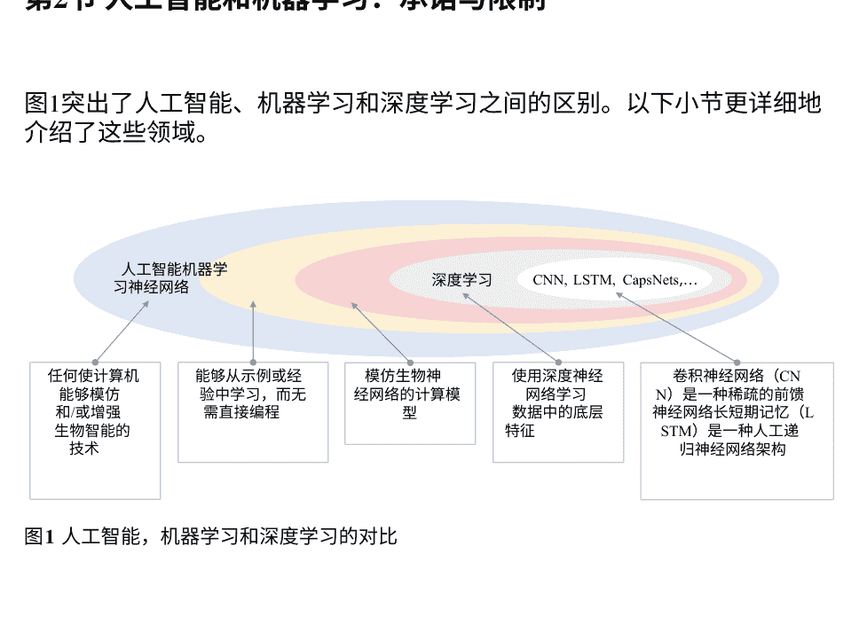

### 2.1 人工智能

在这里，人工智能被定义为一种不断发展的技术，旨在模仿/逆向工程和增强生物智能，以构建能够在结构化、非结构化、静态、动态、完全和部分可观察环境中自主运行和交互的智能系统和流程[5]。人工智能包括许多子领域，如感知、知识表示、认知推理、机器学习、数据分析、问题解决、分布式人工智能及其具体化、机器人技术。人工智能是一种不断发展的技术，因为它的根源可以追溯到古典哲学家及其对人类思维建模的努力，这导致了作为一种思维过程的“连接主义”。这些根源在二战期间得到了实践的种植。人们应该区分两种人工智能方法，即自上而下的方法（也称为白盒或生成方法）和自下而上的方法（也称为黑盒、判别或数据驱动方法）。传统人工智能技术采用自上而下的演绎推理方法，它们从现有知识和少量示例出发，制定关于世界的抽象和广泛的假设。它们根据这些假设的正确性对数据应该是什么样子进行预测，然后根据这些预测的结果和接收到的更多观察结果修正它们的假设[6]。相比之下，现代人工智能技术或计算智能技术以自下而上的归纳推理为特征（即，通过对数值数据进行推断符号），并试图从原始数据（成千上万或数百万个示例）中提取模式。这些现代人工智能技术为不同的产品和服务提供动力，使它们能够发现和识别存档、流式或实时数据中的复杂模式和趋势（类别、聚类或异常）。这些技术通过在不同抽象层次上从示例/观察中学习来预测未来的值/状态。例如，在汽车行业中，现代统计机器学习技术被用于开发许多新功能，如地图制作、智能控制、自动驾驶、主动安全和预测性维护。人工智能有潜力影响车辆的每个方面，从设计到制造再到运营。

### 2.2 机器学习

机器学习是人工智能的一个子领域，它使得人工系统能够在没有明确编程的情况下从经验和观察中学习。Mitchell [7] 将机器学习定义为：“如果一个计算机程序在任务类别 T 上的性能，通过性能度量 P，随着经验 E 的增加而提高，那么它就被认为是从经验 E 中学习的。”现代统计机器学习算法遵循自底向上的归纳推理范式，从大量的数据中发现模式。它们基于实验结果，简单模型在超大数据集上的训练优于用较少数据训练的复杂模型。数据 [8]. 统计机器学习是一种归纳推理过程（即从一组示例中推断出一般规则），它找到对于大多数数据集样本通常正确的规则 [9].

机器学习算法通常分为监督学习、无监督学习和强化学习算法。监督学习使用归纳推理来近似数据和标签/类别之间的映射函数。这个映射是使用已经标记的训练数据来学习的。分类（预测离散或分类值）和回归（预测连续值）是监督学习中常见的任务。例如，分类寻求一个评分函数:

$$f : \mathbf{X} \times \mathbf{C} \rightarrow \mathbf{R} \quad\quad\quad\quad (1)$$

其中 $\mathbf{X}$ 表示训练数据空间， $\mathbf{C}$ 表示标签/类别空间。这个映射可以通过 $N$ 个训练样例来学习，形式如下：$\{(\mathbf{x}_{11}, \mathbf{x}_{21}, \ldots, \mathbf{x}_{k1}, \mathbf{c}_{1}),(\mathbf{x}_{12}, \mathbf{x}_{22}, \ldots, \mathbf{x}_{k2}, \mathbf{c}_{2}),\ldots, (\mathbf{x}_{1N}, \mathbf{x}_{2N}, \ldots, \mathbf{x}_{kN}, \mathbf{c}_{N})\}$ 其中 $\mathbf{x}_{i}$ 是第 $i$ 个样例的特征向量， $k$ 是特征的数量， $\mathbf{c}_{i}$ 是相应的类别。预测的类别是使得 $f$ 得分最高的类别，即:

$$\mathbf{c}(\mathbf{x}) = \arg \max_{\mathbf{c}} f(\mathbf{x}, \mathbf{c}) \quad\quad\quad\quad (2)$$

无监督学习通过聚类和数据关联等技术处理无标签数据。例如，在聚类中，给定$n$个对象（每个对象可以是一个特征向量）的任务是根据某些相似性度量将它们分组成$c$个组（簇），使得同一组中的所有对象之间具有“自然”关系，而不在同一组中的对象则有所不同。

机器学习算法的第三类是强化学习（RL），它是一种通过反馈循环或试错学习的弱监督学习技术。RL学习如何做出决策（即如何将情境映射到行动），以最大化数值奖励函数。DeepMind使用深度强化学习开发了一个模型，能够在没有任何人类指导的情况下比人类熟练玩家更好更快地玩Atari视频游戏，并最近在40天内探索和揭示了积累了3000年的围棋之谜。在自动驾驶汽车或无人驾驶汽车的背景下，可以使用监督学习进行行人检测、交通信号识别、车道检测、语音生物特征识别、驾驶员分心识别等。无监督学习可用于众感知、预测性和预测性维护，而强化学习则用于学习驾驶员的偏好以及如何在未知的动态环境中导航。

### 2.3 深度学习

深度学习（DL）是机器学习的一个子领域，它使用深度神经网络来学习数据中的潜在特征，使人工系统能够从简单的概念中构建复杂的概念。深度学习的示例包括但不限于堆叠自编码器（SdA）、深度置信网络（DBN）、前馈神经网络、卷积神经网络（CNN）、长短期记忆（LSTM）、生成对抗网络（GAN）和胶囊网络（CapsNet）。下面的小节描述了SdA和DBN。

#### 2.3.1 堆叠自编码器 (SdA)

堆叠自编码器（SdA）模型用于学习新的通用特征，因此属于表示学习系统的范畴。SdA是一种深度学习方法，由一系列单层自编码器堆叠而成，如图2所示。

SdA使用自编码器作为构建块，创建一个深度网络，可以从输入数据中提取复杂的特征。直到最近，深度网络被错误地认为是太难训练，因此没有得到广泛应用。2006年，Geoffrey Hinton和他的同事[11]引入了预训练步骤，以初始化深度网络架构中的权重，从而解决了初始化问题。

他们展示了快速、逐层贪婪和无监督算法如何用于初始化一个较慢的算法，该算法微调学习到的权重并提供非常好的结果。

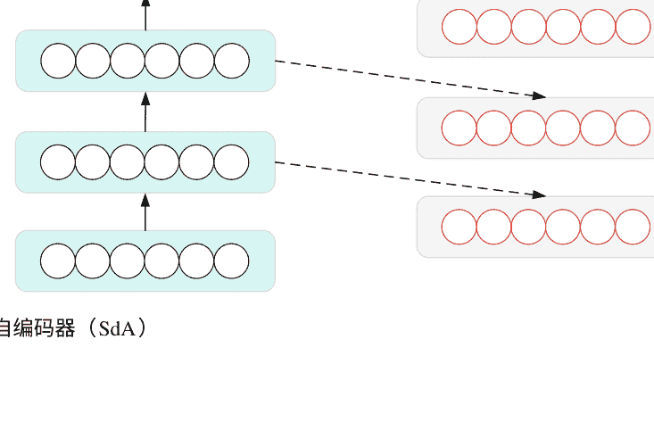

深度网络取得了良好的结果。这个结果使机器学习研究重新焕发了活力，并且深度架构已经成为各种分类和预测问题的首选工具[12]。逐层训练的基本思想如图2所示。在训练完一层后，自编码器的输出层被丢弃，特征（y）作为下一层的输入。因此，训练是贪婪和逐层进行的。最后一步是使用反向传播算法以监督方式微调网络。

#### 2.3.2 深度置信网络 (DBN)

DBN在处理由复杂互联系统生成的大量数据时特别适用。DBN通过堆叠RBM来形成，然后使用无监督算法进行贪婪训练[11]。RBM是一种无向图模型，其可见层（x）和隐藏层（h）之间没有连接，如图3所示。

RBM是基于层间相互作用能和偏置能开发的。数学上，RBM的能量函数定义为：

$$ E(\mathbf{x}, \mathbf{h}) = -\mathbf{b}^\top \mathbf{x} - \mathbf{c}^\top \mathbf{h} - \mathbf{h}^\top \mathbf{W} \mathbf{x} $$

其中 b 和 c 分别是隐藏层和可见层的偏置向量，W是可见层和隐藏层之间的权重矩阵。我们用 θ 表示参数集合 b, c, 和 W。RBM定义了一个涉及隐藏单元的分布，该分布覆盖了可见单元。基于能量的隐藏和可见单元的联合配置的概率分布如下：

$$ P(\mathbf{x}, \mathbf{h}) = \frac{e^{-E(\mathbf{x},\mathbf{h})}}{Z} $$

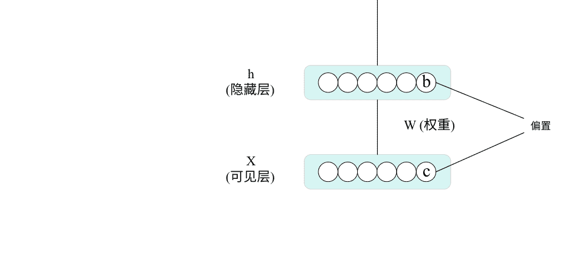

其中 Z是分区函数。使用方程 (4)，观察到一组可见单元的分布定义如下：

$$P(\mathbf{x})=\sum_{\mathbf{h}}P(\mathbf{x},\mathbf{h})=\exp\frac{-F(\mathbf{x})}{Z}\quad(5)$$

其中 $F(\mathbf{x})$被称为自由能项， $H$是隐藏层数量，定义如下：

$$F(\mathbf{x})=\exp\left(\mathbf{c}^{\top}\mathbf{x}+\sum_{j=1}^{H}\log(1+\exp(b_j+\mathbf{W}_{(j,:)}\mathbf{x}))\right)/Z\quad(6)$$

为了训练一个RBM，需要最小化所有训练点 ($t=1,...,T$) 的平均负对数似然 (NLL) 函数。NLL函数定义如下：

$$NLL=\frac{1}{T}\sum_{t}l(f(\mathbf{x}^{(t)}))=\frac{1}{T}\sum_{t}-\log P(\mathbf{x}^{(t)})\quad(7)$$

然后，使用随机梯度下降算法对NLL函数进行优化；优化的结果定义为：

$$-\frac{\partial\log P(\mathbf{x}^{(t)})}{\partial\theta}=\mathbb{E}_{\mathbf{h}}\left[\frac{\partial E(\mathbf{x}^{(t)},\mathbf{h})}{\partial\theta}\middle|\mathbf{x}^{(t)}\right]-\mathbb{E}_{\mathbf{x},\mathbf{h}}\left[\frac{\partial E(\mathbf{x},\mathbf{h})}{\partial\theta}\right]\quad(8)$$

其中， $\mathbb{E}$表示在$\mathbb{E}_{\mathbf{h}}$的先验知识情况下的期望，以及在$\mathbb{E}_{\mathbf{x},\mathbf{h}}$的观察和先验知识情况下的期望。方程右侧的第二项很难计算，因为我们需要对 $\mathbf{x}$和 $\mathbf{h}$进行指数求和。为了解决这个问题，Carreira等人提出了对比散度算法，该算法包括三个主要步骤：

1.  估计一个点 $\tilde{\mathbf{x}}$来替代期望 $\mathbb{E}_{\mathbf{x},\mathbf{h}}$。
2.  使用吉布斯采样估计点。
3.  从每个观测点 $\mathbf{x}^{(t)}$开始采样链。

如图4所示，RBM中层内单元的条件独立性允许我们迭代应用吉布斯采样来采样可见单元和隐藏单元。

为了执行吉布斯采样，根据公式 (9) 计算条件分布 $P(\mathbf{h}|\mathbf{x})$和 $P(\mathbf{x}|\mathbf{h})$。

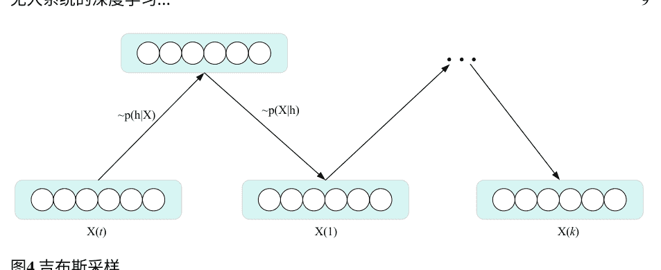

$$\begin{align} P(\mathbf{h}|\mathbf{x}) &= \prod_{i} P(h_i|\mathbf{x}) \\ P(\mathbf{x}|\mathbf{h}) &= \prod_{k} P(x_k|\mathbf{h}) \end{align}\quad(9)$$

如果 $\mathbf{x}_k$ 和 $\mathbf{h}_j$ 是二进制单位，则以下适用

$$\begin{align} P(h_j = 1|\mathbf{x}) &= \frac{1}{1 + \exp\left(-(b_j + \mathbf{W}_{(j,:)}\mathbf{x})\right)} \\ &= \operatorname{sigm}(b_j + \mathbf{W}_{(j,:)}\mathbf{x}) \\ P(x_k = 1|\mathbf{h}) &= \frac{1}{1 + \exp\left(-(c_k + \mathbf{h}^\top \mathbf{W}_{(:,k)})\right)} \\ &= \operatorname{sigm}(c_k + \mathbf{h}^\top \mathbf{W}_{(:,k)}) \end{align}\quad(10)$$

在估计负样本 $\mathbf{x}(k)=\tilde{\mathbf{x}}$ 之后，计算等式 (8) 中期望的点估计如下:

$$\begin{align} \mathbb{E}_{\mathbf{h}}\left[ \frac{\partial E(\mathbf{x}^{(t)}, \mathbf{h})}{\partial \theta} \middle| \mathbf{x}^{(t)} \right] &\approx \frac{\partial E(\mathbf{x}^{(t)}, \tilde{\mathbf{h}})}{\partial \theta} \\ \mathbb{E}_{\mathbf{x},\mathbf{h}}\left[ \frac{\partial E(\mathbf{x}, \mathbf{h})}{\partial \theta} \right] &\approx \frac{\partial E(\tilde{\mathbf{x}}, \tilde{\mathbf{h}})}{\partial \theta} \end{align}\quad(11)$$

即使只有一步采样 (即，$k=1$)，该算法已被证明对无监督训练[13]是成功的。使用公式 (11)，RBM的参数 $\theta$ are updated according to the following equation:

$$\theta^{(t+1)} = \theta^{(t)} - \alpha \left( \nabla_{\theta} \left(-\log P(\mathbf{x}^{(t)})\right) \right)\quad(12)$$

其中 $\alpha$ 是学习率。 对于每个参数 $\mathbf{W}$, $\mathbf{b}$, 和 $\mathbf{c}$, 更新方程如下：

$$\begin{aligned}
\mathbf{W}^{(t+1)} &= \mathbf{W}^{(t)} - \alpha \left(\mathbf{h}(\mathbf{x}^{(t)}){\mathbf{x}^{(t)}}^{\top} - \mathbf{h}(\tilde{\mathbf{x}}){\tilde{\mathbf{x}}}^{\top}\right) \\
\mathbf{b}^{(t+1)} &= \mathbf{b}^{(t)} - \alpha \left(\mathbf{h}(\mathbf{x}^{(t)}) - \mathbf{h}(\tilde{\mathbf{x}})\right) \\
\mathbf{c}^{(t+1)} &= \mathbf{c}^{(t)} - \alpha \left(\mathbf{x}^{(t)} - \tilde{\mathbf{x}}\right)
\end{aligned} \qquad (13)$$

其中 $\mathbf{h}(\mathbf{x}) \triangleq \mathrm{sigm}(\mathbf{b} + \mathbf{W}\mathbf{x})$.

此外，一旦无监督训练完成，所得到的参数将用于初始化将使用监督反向传播算法进行训练的神经网络。 在这项工作中，神经网络被训练以在多类别环境中学习音素。 图5描述了一个带有Softmax层的多类别分类在堆叠的RBM之上。

在自动驾驶车辆的背景下，深度学习需要具有在不同驾驶条件下捕获的所有传感器读数的数据集，以支持实时决策。 训练数据集的大小和变化越大，模型的智能性就越高。 获取足够的数据来训练这些模型是一项耗时且繁琐的过程。 许多汽车公司和研究实验室已经创建了通过在道路上运行车辆以收集不同场景和各种条件下的丰富数据的大型数据集。 其中一些公司已经公开发布了供研究社区使用的数据集。 尽管有许多公开可用的数据集，但这里只提到了其中几个用于分析目的的数据集。 表1显示了一些公开可用的数据集，可以用于基于研究应用的深度学习模型训练。

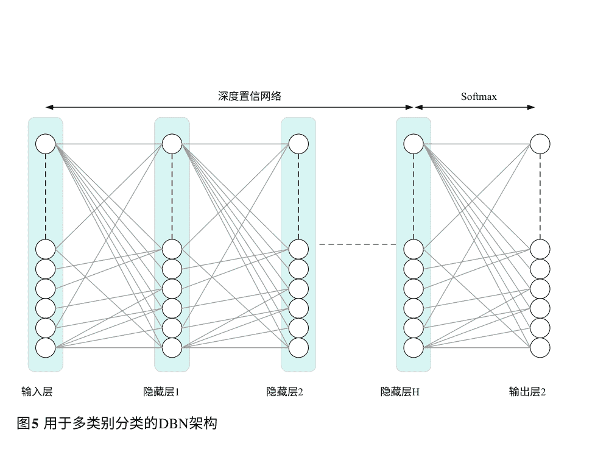

| 提供者 | 发布日期 | 大小 | 使用的传感器 | 国家 | 参考文献 |
| :--- | :--- | :--- | :--- | :--- | :--- |
| | | | 相机 | 激光雷达 | GPS/GNSS | IMU | | |
| 密歇根大学 | 2009 | ~100 GB | × | × | × | × | 美国 | [14] |
| 牛津 | 2014-2015 | ~23 TB | × | × | × | | 英国 | [15] |
| 斯坦福 | 2009-2010 | ~6 GB | | × | × | × | 美国 | [16] |
| 优达学城 | 2016 | ~223 GB | × | × | × | × | 美国 | [17] |
| CADCD | 2020 | ~558 GB | × | × | × | × | 加拿大 | [18] |
| Waymo | 2019 | ~3 TB | × | × | - | - | 美国 | [19] |
| Apollo Scape | 2018 | >TB | × | × | × | × | 中国 | [20] |
| KITTI | 2011 | ~180 GB | × | × | × | × | 德国 | [21] |

## 3 无人系统的认知循环

自主性（古希腊语：auto-“自我”+ nomos-“法律”）是现代系统中的一个理想特征。自主性意味着系统能够适应其环境或自身的变化，并继续达到其目标。自主系统可以基于不同的架构构建，具有不同复杂性的层次，从简单的反应式架构到审慎的架构再到认知架构。反应式系统基于简单的感知-行动循环，而审慎系统采用更复杂的感知-决策-行动循环，赋予系统推理和决策能力。更复杂的自主系统可以基于感知-认知-决策-行动-适应-学习的认知循环[22]构建，通过添加情境感知、适应和学习能力来扩展感知-决策-行动的审慎循环，如图6所示。

在这些系统中，从不同的硬件和软件数据源收集到了与互联网容量一样大的数据。硬数据是从物理传感器（例如相机、雷达、激光雷达）收集的，软数据包括虚拟感知、融合数据、人工输入和社交媒体数据。收集到的数据经过处理，以实现不同级别的情境感知，例如在特定的时间和空间约束内感知环境中的元素，理解它们的含义，并预测它们在不久的将来可能的状态和后果[23]。感知结果是环境的一个综合图像，可能包括多个子过程，如物体定位（或跟踪）、物体识别和标识。理解能力将这些信息整合起来，产生一个更全面的世界图像，显示出识别对象之间的关系。预测能力预测环境中物体的未来动作。一般来说，情境感知能力的输出是一个

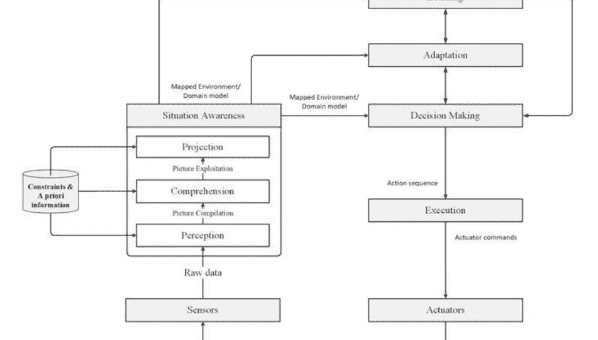

图6 无人系统的认知循环 [22]

映射环境或包含初始状态、目标状态、机器人可能状态、原始动作或活动、硬约束和软约束、不确定性（传感器和执行器）、先验知识和低或高定义的静态/动态地图。

决策模块负责在缺乏确定性的情况下做出决策。如果不正确处理这种不确定性，可能会导致对其状态和/或环境状态的错误信念，从而导致错误的行动。适应模块使系统能够根据从情境感知模块提取的上下文来调整其行为。情境信息回答与情境相关的问题，例如何时、何地，以便以位置、身份、活动、时间和状态的方式来描述工作环境和系统的代理。适应可以采取更改角色分配或协调模式或重新规划和控制传感和执行资源的形式，以协同地改善数据收集过程，最终提高情境感知和决策能力。

从以前的经验中学习是自主系统的一个关键特征。可以设计一个学习模块，使系统能够学习新任务或自动化重复过程，并在需要时为人类提供智能指导。

运动规划是一项复杂的活动，它确定了自主机器人从初始状态到特定目标状态的未来行动/活动。

指定的目标状态。规划通常涉及在不确定性下进行推理，特别是在非结构化、动态和部分可观察的环境中。为了正确规划运动，自主机器人必须计算从起始位置到给定目标位置的无碰撞最优路径，同时避开一系列障碍物。虽然路径规划关注运动的空间方面，轨迹规划包括基于轨迹、速度、时间和运动学的如何移动，考虑到机器人的机械限制。在运动规划的背景下，决策模块代表将映射的环境/领域模型作为输入并使用规划方法/求解器生成计划的规划实体。然后将计划发送到执行模块或计划实体，以生成发送给机器人执行器的执行命令。

通过情境感知能力和适应能力，可以持续监控计划的执行情况，并通过计划修复或重新规划算法在必要时调整计划。学习能力可以通过示例和/或互动不断提高未来的决策能力。

NASA的机器人、远程机器人和自主系统路线图工作组在自动化系统和自主系统之间做出了有趣的区分[24]。他们将自动化系统定义为“遵循脚本的系统，尽管可能是相当复杂的脚本；如果遇到未计划的情况，它会停下来等待人类的帮助。选择要么已经做出并以某种方式编码，要么将由系统外部做出。相比之下，自主系统是一个可以自行解决选择的系统。系统试图实现的目标由另一个实体提供；因此，系统对于实现目标的实体是自主的。决策过程可能实际上很简单，但选择是在本地进行的。”车辆/机器人可以根据自主级别分为人工操作、半自主和完全自主的车辆。图7说明了这三个级别以及与[25]中提出的控制分类的关系，涉及控制类型、系统角色、人类任务和每个级别中的关键信息[22]。

人工操作的机器人代表着必须由人员现场或远程操作的车辆。在半自主车辆中，系统的作用变得更大，车辆本身可以控制和监控多个任务。自主车辆是一个目标导向的智能系统，可以在结构化、非结构化、静态、动态和可观察或部分可观察的环境中自主地运行、决策和交互，无需明确的人类指导[26]。完全自主的车辆并不存在，因为这些系统应具有自我管理或自我控制的能力，如自我配置和管理、自适应性、自我保护、自我诊断和自我修复、自我优化、自我同步、自我组织和自我学习。完全自主的系统还必须具备在动态环境中处理瞬态故障的能力和弹性。

Hollnagel [27]描述了四个中心能力来表征具有弹性的系统：预测可能发生的事情（预期发生什么），监控正在发生的事情（寻找什么），在发生某事时有效地做出反应（该做什么）以及从过去的经验中学习（了解发生了什么）。

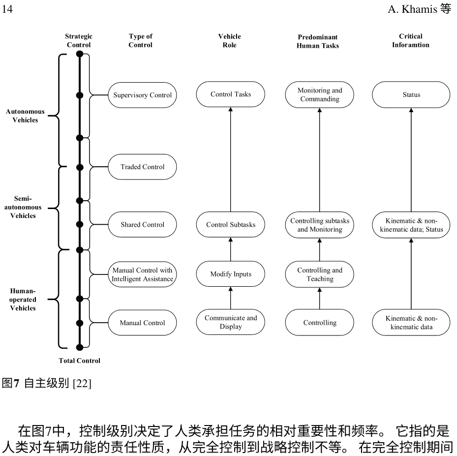

图7 自主级别 [22]

在图7中，控制级别决定了人类承担任务的相对重要性和频率。它指的是人类对车辆功能的责任性质，从完全控制到战略控制不等。在完全控制期间，人类对所有决策负责，从战略规划到轨迹控制。在这个连续体的另一端，人类只对相对长期的计划负责；至少在车辆执行任务时是如此。如图7所示，控制级别为[22]:

-   手动控制：在这个级别上，人类操作员完全控制机器人功能；机器人的任务是显示操作和上下文信息，并根据人类输入采取行动。
-   带智能辅助的手动控制：随着机器人智能的增加，人类可以教机器人有关工作场所的基本信息，例如定义不得进入的区域。机器人能够修改信息显示并修改人类输入以提供指导。随着机器人变得更加能干，人类能够减轻更多责任。
-   共享控制：在这个级别上，人类负责控制一些子任务，而机器人同时控制其他任务。
-   交替控制：机器人和人类轮流负责子任务，即有时机器人完全控制，有时人类控制。

监督控制：在这个级别上，机器人负责控制任务，人类监控并在紧急情况下偶尔干预。只有在出现异常情况时，人类用户才进入控制循环。

自动驾驶车辆是自主无人驾驶汽车的一种形式，根据SAE International [28]，它们有5个自动化级别。在0级，驾驶员负责所有的控制动作和状态监测。在这个级别上，车辆可以被视为具有手动控制的人工操作系统。在1级，车辆执行一些驾驶任务，如纵向运动控制（巡航控制和自适应巡航）或横向运动控制（车道保持），以及一些与对象和事件检测、识别、分类和响应（OEDR）相关的有限功能。驾驶员仍然负责大部分其他控制和状态监测任务。在2级，车辆可以执行与车辆运动控制相关的横向和纵向控制，以实现自适应巡航控制和车道保持等功能。1级和2级可以被视为具有智能辅助的手动控制，因为驾驶员不被允许将手从方向盘上拿开。3级代表有条件的自动化，其中所有驾驶系统都是自动化的，但人类驾驶员应该适当地响应请求进行干预或回退。

在3级自主性的车辆中，如果需要回退，被认为是半自主的无人驾驶汽车，具有共享/交易控制。在4级中实现了更高级别的自动化，通过自动驾驶系统实现了驾驶模式特定的性能，即使驾驶员在某些条件下没有适当地响应请求进行干预。5级是最高级别的自动化，通过道路和环境条件下的自动驾驶系统实现了动态驾驶任务的全方位性能。只有在4级和5级时，车辆才能被视为自主无人驾驶汽车。在自动驾驶车辆时代（4级和5级），零乘客车辆（ZOV）可以被视为无人驾驶的自主车辆，在乘客下车后和重新定位、等待、行驶在空驶返回行程以及前往停车空间时是空的。

空中出租车、河流出租车、自主船舶、监视/搜救无人机是基于上述认知循环的其他自主车辆的示例。以下各节对无人机深度学习的研究和开发活动进行了全面回顾，遵循了感知-意识-决策-行动-适应-学习的认知循环。

## 4 情景感知的深度学习

传统编程的无人机使用复杂的PID控制器算法实现自主飞行。传统编程以非线性方式进行PID调整，而深度学习通过将深度学习模型应用于控制器，在随机环境中克服了控制器的非线性和模糊性，而无需进行任何额外的计算。为了在无人机中提供智能，深度学习需要通过本地感知环境来进行决策和路径规划。情境感知意味着根据时间感知环境对象和运动。下面的小节深入探讨了用于定位、特征提取和目标检测的深度学习方法。

### 4.1 定位

定位是为了检测周围环境中的不同物体。对于自动驾驶车辆来说，可以是车道检测、行人检测、附近车辆检测等。对于无人机在户外导航的情况下，可以是树木、建筑物、其他飞行物体或塔楼。对于室内导航，可以是室内环境中的任何物体。在高空飞行的无人机不需要太多的处理，并且可以根据GPS输入进行飞行。根据导航类型（室内、室外、高空或低空），采用不同的定位方法。对于无人机来说，一个特定的挑战是穿过门。由于摄像头的图像可能受到不同的光照条件、速度和拍摄角度的影响，因此门的感知可能具有挑战性。Jung等人提出了一种基于CNN的方法来检测不同光照条件下的门[29]。作者提出了一种实时通过指定时间内的各种门的视线引导算法，用于无人机的飞行。Kim等人提出了一种深度学习辅助的自动视觉控制方法，用于同样的任务，在NeurIPS 2019的无人机竞赛中，他们能够在81.19秒内通过21个门[30]。

对于无人系统来说，定位也是至关重要的，特别是对于自动驾驶车辆的车道检测。车道可以使用传统的计算机视觉方法或者使用深度学习方法来检测。传统的计算机视觉方法使用Canny边缘检测、霍夫变换和滑动窗口协议等方法[31-33]。最近，研究人员尝试应用基于深度学习的方法来进行车道检测。Perng等人提出了一种卷积神经网络方法，该方法使用卷积自编码器来除去除车道标记以外的所有物体[34]。车道标记特征被提取出来进行车道检测。作者使用粒子滤波器来连续跟踪车道线。Liu等人使用Mask R-CNN来改进车道检测性能[35]。Wang等人提出了LaneNet，一种两阶段的深度神经网络方法，该方法使用像素级车道边缘分类[36]。通过引入预处理阶段来增强输入图像可以提高车道检测性能。Kim等人提出了一种基于CNN的方法，首先通过去除噪声和非必要障碍物来增强图像[37]。作者使用极限学习机（ELM）来训练模型。他们的性能评估显示出显著的训练时间减少，这使得可以在大型数据集上进行训练。根据[38]的说法，深度学习方法存在模型庞大和训练不直观的问题。Chen等人提出了一种端到端的车道检测算法，可以直接从视频流中获取车道线点的坐标[38]。所提出的方法受到YOLO架构的启发。Ma等人提出了一个由YOLO网络组成的深度神经网络，用于检测和去除图像中的车辆。

### 4.2 特征提取

特征提取可以被视为对3D世界的维度约简。它从安装在无人机上的摄像头提取重要特征并生成边界或轮廓以感知世界。特征提取方法可以是基于像素或基于对象的。基于像素的方法关注像素级细节以从帧中映射和提取特征，而基于对象的方法使用对象的属性进行相同的任务。基于对象的方法是模型驱动的，可以开发模型来识别不同大小的对象。基于像素的方法是数据驱动的，因为它们严重依赖对象的大小。在后一种情况下，开发DL模型是困难的，但是提取低级细节是有用的。特征提取工作流程包括预处理、图像分割、线提取，然后是轮廓生成。图像分割创建对象的分割。存在监督和无监督模型来执行此任务。Nassar等人[42]开发了一个U-Net（编码和解码）模型，以消除或减少对GPS的依赖，并帮助使用图像分割驾驶无人机。该方法通过将提取的轮廓映射到地图上的瓦片来预测GPS坐标。关键任务场景，如紧急救援，要求高精度和较少的处理时间以便快速采取行动。Bejiga等人[43]提出了一种使用CNN和SVM模型的流水线快速分割对象的方法。一个具有多个卷积和池化层的CNN架构提取判别特征，然后线性SVM模型检测任务中感兴趣的对象。他们的实验工作得出结论，检测性能随分辨率的增加而增加。更快的CNN和其他深度学习模型可以追踪人类，这在许多场景中都很有帮助，例如体育赛事中专注于一个球员，电影摄影或在救援任务中或战争中无人机跟随人类指挥官。刘等人[44]提出了一种R-CNN方法来更快地检测行人并从远处检测。

### 4.3 目标识别

目标识别在使无人机避免空中碰撞中起着重要作用。无人机可以根据其任务识别感兴趣的对象，例如农业、救援、监视和最后一公里配送。无人机还可以通过识别着陆标志确定高度和着陆区域。可以开发DL模型来通过使用不同尺寸和形状的着陆标志的图像对模型进行训练以识别着陆区域。Cherian等人[45]提出了一种半监督的DL方法，使用单个相机的航拍图像计算无人机的高度。作者们开发了一种DL方法，通过从训练数据集中使用回归方法学习航拍图像与高度之间的关系。他们开发了一个时空马尔可夫随机场模型，并在真实直升机飞行中进行了测试。Bartak等人[46]证明了DL模型可以使用监督和无监督模型处理完全自主飞行，以学习不同事件的控制信号和无人机的活动映射原始传感器数据。这种方法可以消除复杂的飞行控制器的要求。作者们开发了一款软件，可以收集来自真实无人机飞行的传感器读数，并生成用于深度学习模型训练的丰富数据集。他们生成了一个带有时间注释的原始传感器读数数据集，以及一个相应时间内发送给无人机的命令数据集。在他们的实验中，高斯混合模型（GMM）、k-means、层次聚类和隐马尔可夫模型取得了令人满意的结果，但决策树表现良好。

## 5 深度学习用于决策制定

无人机的决策制定包括路径规划、路由、与其他无人机进行合作操作的通信等任务。决策制定过程从情境感知模块获取输入，并执行行动以实现安全、协调和经济的飞行。本节介绍了在这个范围内使用深度学习方法的情况。

### 5.1 路径规划

路径规划是无人机自主飞行的重要任务。在定位无人机后，路径规划决定要遵循的轨迹，并将其发送给运动控制器以跟随路径。路径规划的主要目标是具有较低的计算成本和最优的飞行时间。从这些技术生成的路径应该是最优的，以便消耗最少的能量并在最短时间内到达目标点。路径规划可以用于单个和多个无人机。深度学习已经被用于路径规划，其中模型可以预训练或在线使用现场处理。CNN模型可以映射地形，找到从无人机当前位置到目的地的路径。预训练的CNN模型可以用于应用，但需要大量的训练数据集。另外，还有许多模拟环境可用，如AirSim，可以生成不同虚拟场景中的原始传感器数据和分割地图。另一方面，Delmerico等人提出了一种现场处理模型来对地形进行分类。由于这是一种现场处理类型的模型，它可以使用实时飞行数据进行快速训练和部署。在导航到未探索区域时，这种方法非常有帮助。作者证明了所提出的模型在仅飞行60秒后就可以开始生成地形图。这对于使用一架无人机来引导自主地面车辆非常有用。无人机可以使用现场处理模型在短时间内进行训练，然后通过实时地形分类来引导地面车辆。

路径规划工作流程由预处理和查询阶段组成。在预处理阶段，路径规划算法将位置信息作为输入，并将输入空间转换为基于图的模型，其中障碍物是节点，通过边连接。可以应用不同的表示技术来创建这样的图。图的表示在不同的方法之间可能会有所不同。在查询阶段，可以计算当前位置和目标位置之间的最优路径。不同类型的基于图的搜索技术用于此任务。

Qu等人[48]在3D环境中引入了一种强化学习方法来进行路径规划。作者使用一种称为RLGWO的灰狼优化算法来通过最小化成本函数获得优化路径。该方法包括四个阶段：探索、开发、几何和优化调整。生成的飞行路线通过三次B样条曲线进行平滑处理。该方法与改进的灰狼优化算法(IGWO)、改进的灰狼优化算法(MGWO)和增强探索的灰狼优化算法(EEGWO)进行了测试，并取得了良好的结果。

Zhan等人[49]提出了一种用于多个无人机的碰撞避免和路径规划的合作算法。合作和几何学习算法（CGLA）使用个体成本和权重矩阵进行最优路径规划。基于多个无人机传递的距离和风险信息，个体权重矩阵进行更新。所提出方法的参数经过调整以实现安全和经济的飞行。Junell等人[50]提出了一种用于未知灾难现场的单个无人机导航的强化学习方法。强化学习的代理在访问灾难现场时获得奖励。代理收集的图像越多，获得的奖励越多。代理首先学习最优值函数，然后使用生成的策略找到最优路径。

深度学习在构建知识库时严重依赖训练数据集。然而，在救援任务等关键任务中收集足够的数据是具有挑战性的。此外，由于电池限制，无人机的旅行时间有限。所有这些因素都影响了航空器的数据集收集。然而，迁移学习可以用来解决这个问题。在迁移学习中，从汽车或自行车等地面车辆收集的数据集可以用来训练无人机的模型。迁移学习允许模型从先前训练过的具有相关数据的模型开始。这些预训练模型减少了总体训练时间。Loquercio等人[51]提出了一个名为DroNet的新型卷积神经网络模型，用于创建民用无人机，实现在城市街道上的自主飞行。 DroNet以航拍图像作为输入，并生成飞行延续的转向角和碰撞概率。 碰撞概率有助于无人机做出安全飞行的决策。 由于DroNet是使用汽车和自行车收集的大型数据集进行训练的，它是一个更通用的模型，可以在室内环境（如走廊和停车场）中工作。

### 5.2 碰撞避免

由于设备成本高昂和合作操作场景的重要性，无人机的碰撞避免至关重要。经典机器学习方法在两个不同的阶段进行特征提取和学习，而深度学习可以直接在原始传感器数据上执行这两个任务。通过对专家飞行员行为进行训练，无人机可以在自主模式下实现安全飞行。DroNet是一种通过驾驶学习飞行的方法，可以直接将原始传感器数据映射到一组可能的动作。深度图计算路径中障碍物的距离，以帮助无人机通过重新计算路径函数来改变其里程计，以达到目标位置。杨等人[52]提出了一种使用深度网络的碰撞避免技术。它们主要通过原始传感器输入图像直接预测轨迹，主要用于室内场景。在他们的方法中，通过衍生成本函数选择最优轨迹。作者提出了一种从图像中标记轨迹以创建大型训练数据集的自动方法。他们使用公共的NYUv2数据集进行训练。然后开发了一个CNN模型来预测深度图和表面模式。这些值用于预测轨迹。在自主飞行的情况下，路径观测（如深度图、控制信号、避免障碍物）可以被暂时保存以进一步提高DL方法的准确性。

## 6 发展中的无人机深度学习

周围环境不断变化，人们希望得到这些变化的信息。持续学习是闭环反馈控制系统的重要组成部分，使自主系统更加智能并增强其能力。例如，当自主车辆遇到一个新的未分类对象（即，以前从未见过，也没有包含在训练数据中），系统将该对象添加到知识库中（通过强化学习等方式），使其更加智能。Schultz等人[53]展示了连续和嵌入式学习（也称为随时学习）的模拟环境，该环境不断更新和学习模块，并生成新的策略以应对更新的情况。

## 7 自适应无人机深度学习

在道路设计、交通规则和标志方面，世界的多样性非常高。深度学习模型在高效训练、识别和行动采取方面严重依赖数据集。使用美国道路交通标志训练的自动驾驶车辆在其他国家可能效率不高。从头开始重新训练深度学习模型非常耗时和计算密集。在这种情况下，领域适应算法可以提供帮助。对于自动驾驶车辆，可能有许多原因需要进行领域适应（例如，由于低分辨率、亮度、透视变化和安装摄像头位置的变化导致图像质量的变化）。Kellenberger等人[56]展示了一种学习策略，以重用深度卷积神经网络目标检测器用于新的数据集。他们使用来自无人机的图像创建了一个动物检测器，并且分类器被重复使用。提出了转移采样（TS）来在CNN激活空间中找到源数据集和目标数据集之间的对应区域。优化深度学习检测并减少所需计算的另一种方法是通过跟踪现有（已识别）的对象来避免冗余的对象识别。Panico等人[57]提出了一种自适应检测/跟踪算法来提高无人机感知的性能。作者引入了一种深度学习方法，利用无人机执行自主海岸线巡逻。他们的适应算法在检测新对象和跟踪现有对象之间取得了平衡。

## 8 结论

本书章节全面回顾了与深度学习相关的自主车辆研究和开发活动，特别关注无人机（UAV）领域。深度学习技术通常用于赋予无人机认知能力，如情境感知、决策制定和学习与适应。深度学习在无人机领域的应用仍然是一个未被充分探索的研究领域，存在着许多机遇和挑战需要解决。目前在这一领域的大部分研究都是在虚拟环境和模拟场景下进行的。这意味着仍然存在着巨大的挑战，需要在外部真实干扰和来自风和地面效应的噪音因素下测试无人机控制器。在实际环境中部署强化学习和深度学习技术可能面临不确定性，因为受控虚拟环境与真实世界场景之间存在差异。然而，先进的深度学习技术和适应算法在支持无人机执行关键任务和民用应用方面显示出巨大的潜力。随着深度学习建模和高性能的最新进展，无人机的应用领域是无限的，包括应急响应、情境感知、智能交通、智慧城市、城市发展和执法场景等。

## 参考文献

- 1. Zafarifar B, Weda H等（2008年）基于天空颜色和边缘特征的地平线检测。在：视觉通信和图像处理，第6822卷。国际光学和光子学学会，第682220页
- 2. Zhan W, Xiao C, Wen Y, Zhou C, Yuan H, Xiu S, Zhang Y, Zou X, Liu X, Li Q（2019年）无人表面舰船导航的自主视觉感知。传感器19（10）：2216
- 3. Rebetex J, Satizábal HF, Mota M, Noll D, Büchi L, Wendling M, Cannelle B, Pérez-Uribe A, Burgos S（2016年）用本地直方图增强卷积神经网络-高分辨率无人机图像中的作物分类案例研究。ESANN
- 4. Hui X, Bian J, Zhao X, Tan M（2018年）基于深度学习的无人机输电线路检测自主导航方法。在：第10届国际高级计算智能会议（ICACI）。IEEE，第455-460页
- 5. Khamis A（2019）生物与非生物/人工智能。在：走向数据科学
- 6. Gopnik A（2017）一个像孩子一样了解世界的人工智能。科学美国人。心智28(5)：21–28
- 7. Mitchell T（1997）机器学习。麦格劳-希尔
- 8. Halevy A, Norvig P, Pereira F（2009）数据的不合理有效性。IEEE智能系统24(2)：8–12
- 9. Goodfellow I, Bengio Y, Courville A, Bengio Y（2016）深度学习，卷1。麻省理工学院出版社，剑桥
- 10. Mnih V, Kavukcuoglu K, Silver D, Rusu AA, Veness J, Bellemare MG, Graves A, Riedmiller M, Fidjeland AK, Ostrovski G, et al（2015）通过深度强化学习实现人类级别的控制。自然518(7540)：529–533
- 11. Hinton GE, Osindero S, Teh Y-W（2006）深度信念网络的快速学习算法。神经计算18（7）：1527–1554
- 12. Meyer D（2015）自动编码器入门
- 13. Carreira-Perpinan MA, Hinton GE（2005）对比散度学习。在：Aistats，vol 10. Citeseer，pp 33–40
- 14. 密歇根（2019）密歇根自动驾驶汽车数据集。访问日期：2020年10月11日
- 15. 牛津（2014）牛津机器人汽车数据集。访问日期：2020年10月11日
- 16. 斯坦福（2009）斯坦福自动驾驶汽车数据集。访问日期：2020年10月11日
- 17. 优达学城（2016）优达自动驾驶汽车数据集。访问日期：2020年10月11日
- 18. Pitropov M, Garcia D, Rebello J, Smart M, Wang C, Czarnecki K, Waslander S (2020) 加拿大不良驾驶条件数据集。arXiv预印本arXiv:2001.10117
- 19. Waymo (2019) Waymo自动驾驶汽车数据集。访问日期：2020年10月11日
- 20. Scape A (2018) Apollo Scape自动驾驶汽车数据集。2020年10月11日访问
- 21. Geiger A, Lenz P, Stiller C, Urtasun R (2013) 视觉与机器人技术相遇：kitti数据集。国际机器人研究杂志（IJRR）
- 22. Khamis A (2021) 智能移动性：探索基础技术和更广泛的影响。APress (Springer Nature), ISBN: 978-1-4842-7101-8
- 23. Endsley MR (2016) 设计情境感知：一种以用户为中心的设计方法。CRC Press
- 24. Council NR et al (2012) NASA空间技术路线图和优先事项：恢复NASA的技术优势，为太空新时代铺平道路。National Academies Press
- 25. Draper V (1994) 环境恢复和废物管理计划远程操作手柄：情境人因评估。OAK Ridge National Laboratory, Departamento de Energia de los Estados Unidos, Reporte
- 26. Bayat B, Bermejo-Alonso J, Carbonera J, Facchinetti T, Fiorini S, Goncalves P, Jorge VA, Habib M, Khamis A, Melo K et al (2016) 为自主机器人构建本体的要求。Ind Robot Int J 43(5)
- 27. Hollnagel E (2009) 弹性工程的四个基石
- 28. International S (2016) 驾驶自动化系统相关术语的分类和定义。SAE Int (J3016)
- 29. Jung S, Hwang S, Shin H, Shim DH (2018) 使用深度学习的室内自主无人机赛车的感知、导航和引导。IEEE Robotics and Automation Letters 3(3):2539–2544
- 30. Kim D, Ryu H, Yonchorhor J, Shim DH (2020) 在游戏中的自主无人机赛车中使用深度学习辅助的自动视觉控制方法。In: NeurIPS competition and demonstration track. PMLR, pp 37–46
- 31. Mammeri A, Boukerche A, Tang Z (2016) 实时车道标记定位、跟踪和通信系统。计算机通信 73:132–143
- 32. Niu J, Lu J, Xu M, Lv P, Zhao X (2016) 基于两阶段特征提取和曲线拟合的鲁棒车道检测。模式识别 59:225–233
- 33. Yi S-C, Chen Y-C, Chang C-H (2015) 基于智能视觉的车道检测方法。计算机与电气工程 42:23–29
- 34. Perng JW, Hsu YW, Yang YZ, Chen CY, Yin TK (2020) 基于深度学习的嵌入式道路边界检测系统的开发。在：图像与视觉计算，第103935页
- 35. Liu B, Liu H, Yuan J (2019) 基于掩膜 R-CNN 的车道线检测。在：第三届机电工程与信息技术国际会议 (ICMEIT). Atlantis Press
- 36. Wang Z, Ren W, Qiu Q (2018) Lanenet：用于自动驾驶的实时车道检测网络。arXiv 预印本 arXiv:1807.01726
- 37. Kim J, Kim J, Jang G-J, Lee M (2017) 使用极限学习机的卷积神经网络快速学习方法及其在车道检测中的应用。神经网络 87:109–121
- 38. Chen Z, Liu Q, Lian C (2019) Pointlanenet: 高效的端到端卷积神经网络用于准确实时车道检测。在: IEEE智能车辆研讨会（IV）. IEEE, pp 2563–2568
- 39. Ma Y, Havyarimana V, Bai J, Xiao Z (2018) 基于视觉的车道检测和车道标记模型推断：一种三步深度学习方法。在: 第9届国际并行体系结构、算法和编程研讨会（PAAP）. IEEE, pp 183–190
- 40. Lee S, Xie K, Ngoduy D, Keyvan-Ekbatani M (2019) 一种先进的深度学习方法，用于实时估计信号化交叉口基于车道的排队长度。交通研究部分C：新兴技术 109:117–136
- 41. Zakaria N, Shapiai M, Rahman MA, Yahya W (2020) 基于深度学习的车道线检测，将两种类型的输入应用于网络模型。马来西亚汽车工程学会4（2）42. Nassar A, Amer K, ElHakim R, ElHelw M (2018) 基于深度卷积神经网络的增强型航空图像配准框架，应用于无人机地理定位。在：计算机视觉和模式识别研讨会的IEEE会议论文集，第1513-1523页。
43. Bejiga MB, Zeggada A, Nouffidj A, Melgani F (2017) 一种卷积神经网络方法，用于辅助无人机图像的雪崩搜救行动。遥感9 (2) : 100。
44. Liu T, Fu HY, Wen Q, Zhang DK, Li LF (2018) 用于长距离人体检测的扩展快速R-CNN：在无人机图像中找到行人。在：IEEE国际消费电子会议 (ICCE)。IEEE，第1-2页。
45. Cherian A, Andersh J, Morellas V, Papanikolopoulos N, Mettler B (2009) 使用单个机载摄像头自主估计无人机的高度。在：IEEE/RSJ国际智能机器人与系统会议。IEEE，第3900-3905页。
46. Barták R, Vomlelová M (2017) 使用机器学习识别飞行无人机的活动。在：第13届国际FLAIRS会议。
47. Delmerico J, Giusti A, Mueggler E, Gambardella LM, Scaramuzza D (2016) 用于自主空地协作团队中地形分类的即时训练。在：国际实验机器人学术研讨会Springer，第574-585页。
48. Qu C, Gai W, Zhong M, Zhang J (2020) 一种基于强化学习的灰狼优化算法用于无人机路径规划。Appl Soft Comput 84。
49. Zhang B, Liu W, Mao Z, Liu J, Shen L (2014) 具有有限信息的无人机路径规划的合作和几何学习算法。Automatica 50(3):809–820。
50. Junell JL, Van Kampen EJ, de Visser CC, Chu QP (2015) 强化学习应用于自主飞行中的四旋翼导航定律。在：AIAA导航、制导和控制会议，第1990页。
51. Loquercio A, Maqueda AI, Del-Blanco CR, Scaramuzza D (2018) Dronet：通过驾驶学习飞行。IEEE机器人与自动化快报 3(2):1088–1095。
52. Yang S, Konam S, Ma C, Rosenthal S, Veloso M, Scherer S (2017) 基于深度网络的中间感知的障碍物避免。arXiv预印本 arXiv:1704.08759。
53. Schultz AC, Grefenstette JJ (2000) 自主车辆的连续和嵌入式学习：适应传感器故障。在：无人地面车辆技术II，第4024卷。国际光学与光子学学会，第55-62页。
54. Kira Z, Schultz AC (2006) 多智能体系统的连续和嵌入式学习。在：IEEE/RSJ国际智能机器人与系统会议。IEEE，第3184-3190页。
55. Ahlawat A, Kabir KS, Pathak K, Singh S, Kaushal S, Kumar S 使用云机器学习和互联网控制的智能监控无人机。
56. Kellenberger B, Marcos D, Lobry S, Tuia D (2019) 半个百分点的标签就足够了：使用深度卷积神经网络和主动学习在无人机图像中进行高效动物检测。IEEE遥感与遥感学报57(12):9524–9533。
57. Panico A, Fragonara LZ, Al-Rubaye S (2020) 自适应检测跟踪系统用于自主无人机海上巡逻。在：IEEE第7届航空航天计量学国际研讨会(MetroAeroSpace)，第539-544页。

# 深度学习和强化学习用于自主无人机系统：从理论到部署的路线图

# Jithin Jagannath， Anu Jagannath， Sean Furman和Tyler Gwin

摘要 无人机系统（UAS）正在越来越多地用于商业、民用和军事应用。当前UAS的最新技术仍然依赖于远程人类控制器和稳定的无线连接来执行这些应用程序的几个功能。缺乏自主性限制了UAS可以部署的应用领域和任务。在战术和救援场景中，UAS需要在恶劣的操作环境中运行，并且无线连接不可靠，这一点更加重要。赋予UAS自主性和智能将有助于克服这一障碍，提高安全性和效率。在这个数字时代，计算资源的指数增长和大量数据的可用性导致机器学习从上一次的冬天中复苏。因此，在本章中，我们讨论了机器学习中一些进展，特别是深度学习和强化学习如何被利用来开发下一代自主UAS。我们首先通过讨论当前UAS的应用、挑战和机遇来激发本章的兴趣。然后，我们概述了本章中讨论的一些关键深度学习和强化学习技术。实现UAS自主性所必需的一个关键领域是计算机视觉。因此，我们讨论了深度学习方法如何被用于完成一些有助于提供无人系统自主性的基本任务。然后，我们讨论了如何利用强化学习来利用这些信息为无人系统提供自主控制和导航。接下来，我们为读者提供选择适当的仿真套件和硬件平台的指导，这将有助于快速原型化基于机器学习的无人系统解决方案。此外，我们还讨论开发自主无人机解决方案的每个方面的开放问题和挑战，以揭示潜在的研究领域。最后，在结束本章之前，我们简要介绍了无人机安全和法规的情况。

## 1 引言

当前的无人机系统（UAS）时代已经对民用、商业和军事应用做出了重要贡献[1,2]。无需人类操作员/飞行员在驾驶舱中，就能让航空系统执行任务的能力使得这些系统能够以不同的尺寸、形式、能力进行演变，执行以前危险或不可行的任务和使命。由于无人机进入我们生活的不同领域的渗透只会增加，因此了解当前的最新技术水平，确定开放性挑战，并提供克服这些挑战的路线图非常重要。

无人机的相关性以每年15.5%的复合年增长率指数级增长，预计到2025年将达到458亿美元[3]。尽管这种增长看起来非常有前景，但在无人机实现其全部潜力之前，还需要克服一些挑战。其中大部分无人机主要由操作员控制，并依赖可靠的无线通信链路来保持控制和完成任务。随着这些系统数量的增加和任务复杂性的升级，自主性将在下一代无人机中发挥关键作用。在未来十年内，我们将看到对无人机自主性的巨大推动，就像自主性在制造业、汽车行业和其他机器人相关市场领域的发展一样。

当涉及到自主性时，制造商提出了几个定义和级别的自主性。同样，文献中存在着对各种自主性级别的几个定义和要求。根据[4]，无人机系统中的自主性可以分为以下五个级别：

- 第1级-飞行员辅助：在这个初始级别上，无人机操作员仍然对整个操作和安全负责。同时，无人机可以在有限的时间内接管至少一个功能（以支持导航或保持飞行稳定性）。因此，在这个级别上，无人机永远不会同时控制飞行速度和方向，所有这些控制都始终由操作员掌握。
- 第2级-部分自动化：在这个级别上，无人机能够在某些有限的情况下控制高度、航向和速度。重要的是要理解，操作员仍然对无人机的安全操作负责，并且需要在需要时监控环境和飞行路径以便控制。这种类型的自动化主要用于预先规划的路径和时间表的应用。在这个级别上，无人机被认为具有感知能力。
- 第3级-条件自动化：这种情况与之前描述的2级类似，唯一的例外是如果需要干预，无人系统可以使用机载传感器通知操作员。这意味着操作员可以比2级更少参与，并充当备份控制器。重要的是要理解，在这个级别上，操作场景相对静态。如果检测到操作条件有任何变化，无人系统将提醒操作员接管控制权。在这个级别上，无人系统被认为具备感知和避障的能力。
- 第4级-高度自动化：在这个级别上，无人系统被设计为在多种情况下无需控制器的要求下运行，具备使用多个内置功能、规则集或基于机器学习的算法来检测和避开障碍物的能力，这些功能、规则集或算法部署在无人系统上的嵌入式计算机上。虽然操作员可以接管无人系统的控制权，但并非必需，因为有多个备份系统可确保在一个系统故障时的安全性。这是一个理想系统预计能够使用强大的机器学习等技术适应高度动态的环境。在这个级别上，无人系统被认为已经实现了完全的感知和导航能力。
- 第5级全自动化：在这个最终级别中，无人机完全自主运行，无论操作场景如何，都不需要操作员干预。这不仅包括感知和导航，还包括学习和适应其目标和目标，甚至优化其运营目标并根据需要进行必要的变更。

今天的许多无人机都具有有限的半自主模式（1到3级），这要求无人机执行一些自主动作，例如返回到初始位置，按照预定的飞行路径进行飞行，执行机动动作，并从一些标准不稳定性中恢复，等等。完全自主的系统（4级和5级），可以在动态环境中进行交互和生存，而无需人为干预，目前仍然远未实现或以安全有效的方式部署。

机器学习是人工智能的一个子集，在各个领域中得到了广泛应用。机器学习的复苏归因于两个主要原因：（一）过去十年计算资源的指数增长，（二）现代时代的数字化提供了大量可用于训练这些机器学习模型的数据。今天，我们看到机器学习算法成功应用于计算机视觉[5-7]、自然语言处理[8, 9]、医疗应用[10]、无线通信[11, 12]、信号智能[13, 14]、机器人技术[15]、语音识别[16]等领域。机器学习领域的这些进展使其成为实现无人机自主性的理想候选者。为此，在本章中，我们讨论了机器学习领域，特别是深度学习和强化学习在实现无人机自主性方面所取得的进展。我们还关注需要解决的关键挑战和开放性研究问题。我们希望本章对初学者和经验丰富的研究人员在这些研究领域取得更大进展提供了很好的指导。

### 1.1 无人机应用

无人机的应用可以大致分为以下几个方面，(i) 情报、监视和侦察，(ii) 载荷/产品交付，以及(iii) 维护和修理，如图1所示。目前，情报、监视和侦察是无人机在商业和军事领域中最常见的应用。无人机被用于监视和遥感，利用传统相机或其他传感器（如声学、红外、雷达等）来绘制感兴趣区域的地图。无人机还用于监测和勘测油田、农作物、电网和其他操作员难以接近的地区。这些调查还用于教育、环境和气候研究、旅游、地图制作、农作物评估、天气、交通监控和边境管理。同样，无人机在人道主义援助和救援行动中也被用于灾害（如洪水和地震）中，这些地区无法通过道路进入或无法进入。

无人系统也正在积极设计和开发，以成为有效的载荷交付代理。这些载荷包括来自在线零售商的包裹，医疗用品送往医院或灾区，商业和民用领域中的维修部件送往偏远地区。可以想象，不同类型的载荷交付对于一些军事任务也至关重要，无人系统可能提供一种更安全的替代方案，在有限可访问性的敌对地区完成这种交付。尽管目前还不普遍，但预计无人系统将为航空航天工业、电网、风力发电场和其他难以进入的操作提供维护和修复任务的市场。

目前，无人系统已经部署用于监测和检测故障，并提供维护警报以减少运营费用。预计在不久的将来，机器人技术使能的无人系统也将会能够在检测到故障或需要维修时进行干预。

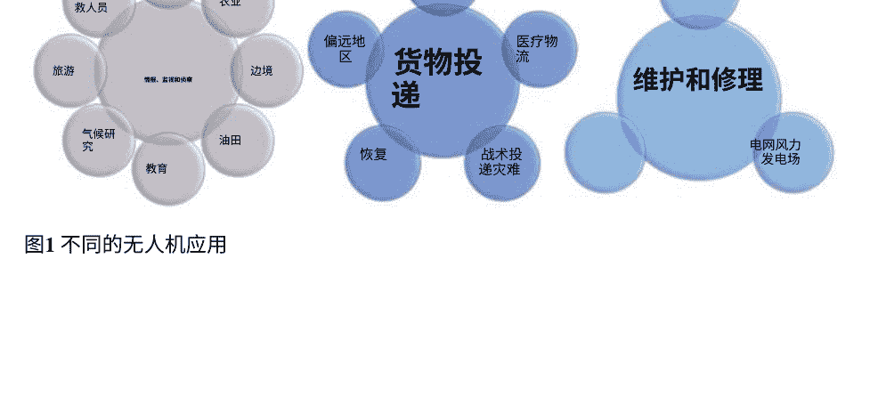

图1 不同的无人机应用

### 1.2 无人机的分类

从前面关于无人机应用的讨论可以明显看出，无人机设计需要具备多样性。由于这些原因和无人机在未来的巨大潜力，无人机已经演变成不同的形式和尺寸。虽然本章的大部分讨论不针对任何特定类型的无人机平台，但我们在图2中提供了一个简洁的无人机分类。有几个特征被用来分类不同类型的无人机。在这里，我们介绍了三个最常见的特征。第一个是国防部采用的无人机分类，根据重量、飞行高度和速度将系统分为五组。另外两个分类是基于机翼类型和起降方式的。所有这些都在图2中总结了。

### 1.3 章节组织

本章是为了使广大读者受益而编写的，这些读者在这个研究领域有不同的理解和经验水平。因此，为了使相对新手的读者受益，我们首先提供了本章中探讨的具体机器学习技术的概述。这些技术的详细解释将确保即使是机器学习领域的初学者也能掌握这些技术，并从本章的其他讨论中受益。本章的核心贡献将在接下来的四个部分中呈现。其中，两个部分专门讨论了为无人机探索的各种深度学习和强化学习。在每个部分中，我们还讨论了开放的问题和挑战，以激发研究人员进一步探索这些领域。由于每个研究努力的目标是确保新颖的算法和解决方案能够有效地部署在无人系统的深度学习。

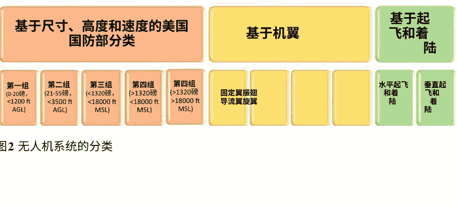

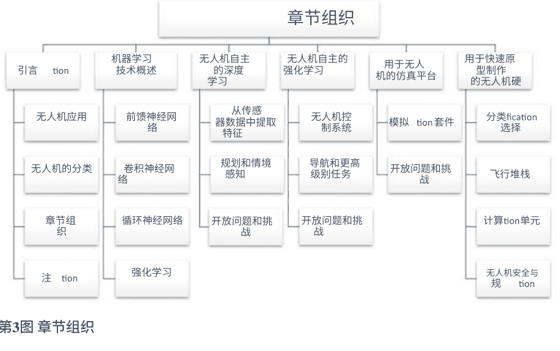

在接下来的两节中，我们将看看可以帮助加快这个过程的模拟套件和硬件平台。最后，我们在最后一节中总结本章。图3显示了整个章节的组织结构。

### 1.4 符号

在这里，我们介绍一些将在本章中使用的标准符号。矩阵和向量将用粗体大写和小写字母表示，分别。对于向量 \(\mathbf{x}\)，\(x_i\)表示第\(i\)个元素，\(\| \mathbf{x} \|\)表示欧几里德范数，\(\mathbf{x}^\mathrm{T}\)表示其转置，\(\mathbf{x} \cdot \mathbf{y}\)表示 \(\mathbf{x}\)和 \(\mathbf{y}\)的欧几里德内积。对于矩阵 \(\mathbf{H}\)，\(H_{ij}\)表示第\(i\)行第\(j\)列的元素。符号 \(\mathbb{R}\)和 \(\mathbb{C}\)分别表示实数和复数集。符号 \(\mathbb{E}_{x \sim p(x)} [f(x)]\)用于表示函数 \(f(x)\)的期望值或平均值，其中随机变量 \(x\)从分布 \(p(x)\)中抽取。当随机变量 \(x\)的概率分布在一组参数 \(\theta\)的条件下时，我们写作\(p(x; \theta)\)以强调 \(\theta\)参数化了分布，并将典型的条件分布符号，\(p(x|y)\)，保留给随机变量 \(\mathbf{x}\)在随机变量 \(\mathbf{y}\)的条件下的分布。我们使用标准符号表示集合上的运算，其中 \(\cup\)和 \(\cap\)是表示两个集合的并集和交集的中缀运算符。我们使用 \(S_k \subseteq S\)来表示 \(S_k\)是集合 \(S\)的真子集或等于 \(S\)，\(x \in S\)表示 \(x\)是集合\(S\)的元素。\(\varnothing\)用于表示空集，\(| S|\)表示集合\(S\)的基数。最后，卷积运算符表示为 \(*\)。

## 2 机器学习技术概述

机器学习是人工智能的一个分支，能够从原始数据中学习模式和/或从环境中观察采样中学习，使计算机系统获得知识。机器学习广泛分为有监督、无监督和强化学习，这些又进一步细分为图4所示的子类别（这只是这个广阔领域的一个非常有限/相关的表示）。在本节中，我们详细介绍了本章中主要使用的机器学习技术（在图4中表示为灰色框），以帮助读者理解用于无人机自主性的深度学习方法。

### 2.1 前馈神经网络

前馈神经网络（FNN）也被称为多层感知器，是一种没有内部反馈连接的有向分层神经网络。数学上，FNN执行一个映射，即 \(f: X \rightarrow Y\)。一个N层的FNN是一个复合函数 \(Y = f(X; \theta) = f_N(f_{N-1}(\dots f_1(X)))\) 将输入向量 \(X \in \mathbb{R}^m\) 映射到标量输出 \(Y \in \mathbb{R}\)。这里， \(\theta\) 表示神经网络参数。神经网络中的层数决定了深度，而层中的神经元数量定义了网络的宽度。输入和输出层之间的层称为隐藏层，其输出不可见。

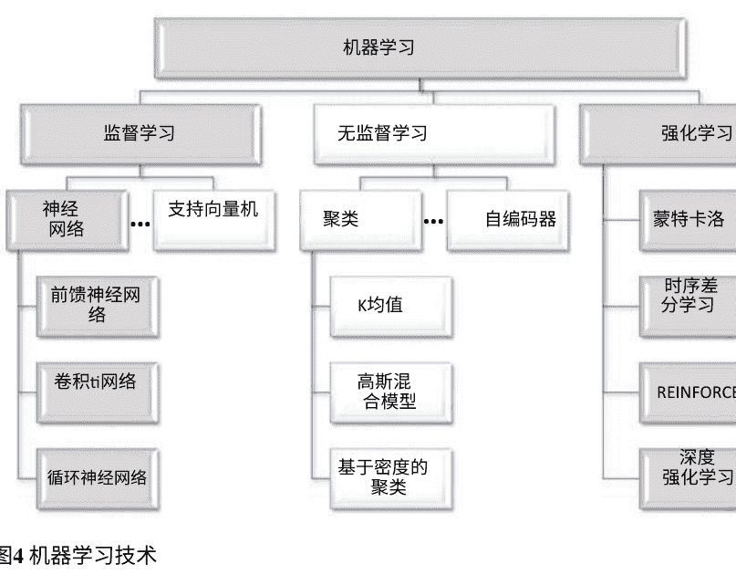

图4 机器学习技术

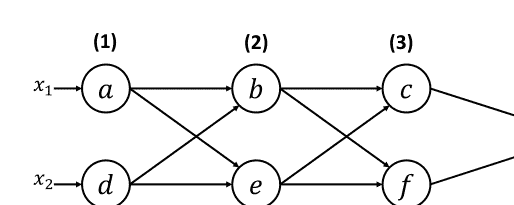

图5显示了一个接受二维输入向量 $\mathbf{x} \in \mathbb{R}^2$ 并将其近似为标量输出 $y \in \mathbb{R}$ 的三层FNN。在图中，每个节点表示一个神经元，节点 $i$和$j$之间的连接被赋予权重 $w_{ij}$。三层FNN的复合函数为

$$y = f(\mathbf{x}; \theta) = f_3(f_2(f_1(\mathbf{x}))) \tag{1}$$

换句话说，图5中的3层FNN是等价于方程(1)中的复合函数的有向无环图。第一层的映射是

$$\mathbf{h}_1 = f_1(\mathbf{x}) = \mathcal{A}_1(\mathbf{W}_1\mathbf{x} + \mathbf{b}_1) \tag{2}$$

其中 $\mathcal{A}_1(\circ)$是激活函数，$\mathbf{b}_1$是偏置向量，$\mathbf{W}_1$表示第一层和第二层之间的权重矩阵。这里，权重矩阵$\mathbf{W}_1$被定义为输入层和第二层神经元之间的连接权重。

$$\mathbf{W}_1 = \begin{bmatrix} w_{ab} & w_{db} \\ w_{ae} & w_{de} \end{bmatrix}. \tag{3}$$

类似地，第二层的映射可以表示为

$$\mathbf{h}_2 = f_2(\mathbf{h}_1) = \mathcal{A}_2(\mathbf{W}_2\mathbf{h}_1 + \mathbf{b}_2) \tag{4}$$

最后，输出是

$$y = f_3(\mathbf{h}_2) = \mathcal{A}_3(\mathbf{W}_3\mathbf{h}_2 + \mathbf{b}_3) \tag{5}$$

第二层和最后一层的权重矩阵是

$$\mathbf{W}_2 = \begin{bmatrix} w_{bc} & w_{ec} \\ w_{bf} & w_{ef} \end{bmatrix} \text{ 和 } \mathbf{W}_3 = \begin{bmatrix} w_{co} & w_{fo} \end{bmatrix}.$$

神经网络参数 $\theta= \{\mathbf{W}_1, \mathbf{W}_2, \mathbf{W}_3, \mathbf{b}_1, \mathbf{b}_2, \mathbf{b}_3\}$包括层间的权重矩阵和偏置向量。训练算法的目标是学习最优的 $\theta^*$以获得目标复合函数 $f^*$从可用的样本中得到的$\mathbf{x}$。

### 2.2 卷积神经网络

卷积网络或卷积神经网络（CNN）是一种专门的前馈神经网络，其至少在其中一层执行卷积操作。CNN的特征提取能力模仿了动物视觉皮层的神经活动[17]。视觉皮层由对感知场景的子区域敏感的复杂细胞排列组成。CNN中的卷积操作模拟了大脑视觉皮层的这一特性。因此，CNN在计算机视觉领域得到了广泛应用[5, 6, 18–24]。

卷积是一种有效的特征提取方法，可以减少数据维度，从而减少网络的参数。因此，与其完全连接的前馈对应物相比，CNN更高效且更容易训练（第2.1节）。

一个典型的CNN架构通常涉及卷积、池化和输出层。CNN对输入张量 $\mathbf{X} \in \mathbb{R}^{W \times H \times D}$ 进行操作，其中宽度为 $W$，高度为 $H$，深度为 $D$，将由与输入张量具有相同深度的卷积核（滤波器） $\mathbf{K} \in \mathbb{R}^{w \times h \times D}$ 进行操作，生成一个输出特征图 $\mathbf{M} \in \mathbb{R}^{W_1 \times H_1 \times D_1}$。特征图的维度是输入和卷积核维度、卷积核数量 $N$、步长 $S$ 和零填充量 $P$ 的函数。同样，特征图的维度可以推导为 $W_1 = (W - w + 2P) / S + 1$，$H_1 = (H - h + 2P) / S + 1$，$D_1 = N$。每个卷积核切片从操作区域的输入中提取特定的特征。卷积核指的是一组权重和偏置。卷积核根据步长以滑动窗口的方式对输入切片进行操作。步长指的是卷积核沿着输入切片滑动的步数。因此，输入的每个深度切片都使用相同的卷积核，或者换句话说，共享相同的权重和偏置——参数共享。图6演示了卷积核对输入切片 $\mathbf{x}$ 进行的卷积操作 $\mathbf{k}$。这里，$b$ 表示与卷积核切片相关联的偏置，$\mathcal{A}(\circ)$ 表示非线性激活函数。

卷积操作的结果输出被称为特征图。特征图的每个元素可以被视为一个神经元的输出，该神经元专注于输入的一个小区域—感受野。图7展示了卷积交互的神经描述。

显然，每个层中的神经元与相邻层中的神经元局部连接—稀疏连接。因此，每个神经元在产生对空间局部最强响应的同时，不受其感受野外变化的影响。

| Input Slice | Kernel | Feature Map |
|-------------|--------|-------------|
| $\begin{bmatrix} x_{11} & x_{12} & x_{13} \\ x_{21} & x_{22} & x_{23} \\ x_{31} & x_{32} & x_{33} \end{bmatrix}$ | $\begin{bmatrix} k_{11} & k_{12} \\ k_{21} & k_{22} \end{bmatrix}$ | $\begin{bmatrix} m_{11} = \mathcal{A}(x_{11}k_{11} + x_{12}k_{12} + x_{21}k_{21} + x_{22}k_{22} + b) & m_{12} = \mathcal{A}(x_{12}k_{11} + x_{13}k_{12} + x_{22}k_{21} + x_{23}k_{22} + b) \\ m_{21} = \mathcal{A}(x_{21}k_{11} + x_{22}k_{12} + x_{31}k_{21} + x_{32}k_{22} + b) & m_{22} = \mathcal{A}(x_{22}k_{11} + x_{23}k_{12} + x_{32}k_{21} + x_{33}k_{22} + b) \end{bmatrix}$ |

图6 输入切片与卷积核的卷积

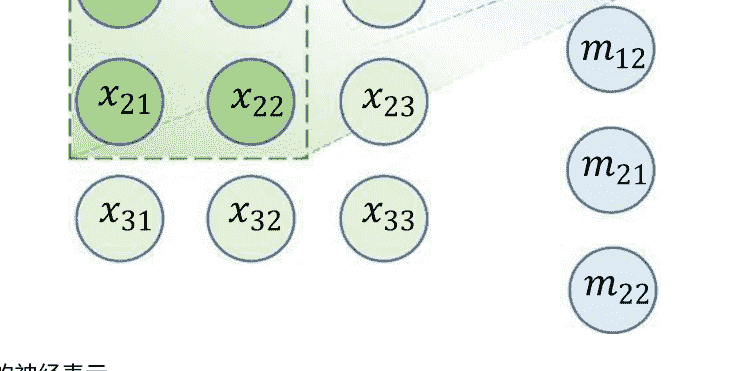

### Input Slice
| 5 | 3 | 1 |
|---|---|---|
| 2 | 10 | 14 |
| 2 | 2 | 6 |

**2 × 2 Max Pool =**

### Pooled Output
| 10 | 14 |
|----|----|
| 10 | 14 |

### Input Slice
| 5 | 3 | 1 |
|---|---|---|
| 2 | 10 | 14 |
| 2 | 2 | 6 |

**2 × 2 Mean Pool =**

### Pooled Output
| 5 | 7 |
|---|---|
| 4 | 8 |

输入模式。特征图被传递到后续层，直到达到回归或分类任务的输出层。池化是CNN中的典型操作，可以显著降低维度。它在输入的子区域上操作，根据池化操作的类型将其映射为单个摘要统计量—最大值、平均值、L2-范数、加权平均值等。通过这种方式，池化对其输入进行下采样。典型的池化尺寸为2x2。较大的池化尺寸可能会丢失重要信息。图8展示了最大和平均池化操作。

在操作输入大小为 $W_1 \times H_1 \times D_1$ 的输入体积时，具有尺寸 $W_p \times H_p$ 的池化层，步长为 $S_1$，将产生一个输出体积 $W_2 = (W_1 - W_p)/S_1, H_2 = (H_1 - H_p)$。池化层对平移具有不变性，即如果池化层的输入发生了微小的平移，池化输出将基本上不受影响[25]。

正如我们所讨论的，卷积神经网络的三个基本特征，即参数共享、稀疏连接和降维，有助于统计效率和可训练性。卷积神经网络在图像分类、目标检测、语义场景分类等计算机视觉任务中表现出优越性能。因此，卷积神经网络在无人机图像和导航应用中的使用越来越多[26]。最著名的卷积神经网络架构包括LeNet-5 [19]、AlexNet [6]、VGG-16 [23]、ResNet [5]、Inception [24]和SqueezeNet [18]。

### 2.3 循环神经网络

循环神经网络[27]是一种专门用于从序列数据中捕捉时间依赖性的前馈神经网络类型。RNN具有内部记忆状态和它们之间的循环连接，以捕捉序列历史。RNN的这种特性使其能够利用数据的时间相关性，使其适用于图像字幕、视频处理、语音识别和自然语言处理应用。与CNN和传统的前馈神经网络不同，RNN可以使用相同的模型处理可变长度的输入序列。

RNN在不同的时间步骤上对输入序列向量 $\mathbf{x}^t$ 进行操作并将其映射到输出序列向量 $\mathbf{y}^t$。RNN中的循环关系由参数化的 $\theta$ 确定，可以表示为

$\mathbf{h}^t = \mathcal{F}(\mathbf{h}^{t-1}, \mathbf{x}^t; \theta)$ (6)

其中 $\mathbf{h}^t$ 表示时间 $t$ 的隐藏状态向量。循环关系表示了一个递归动态系统。通过这种比较，RNN可以被定义为由外部信号驱动的递归动态系统，即输入序列 $\mathbf{x}^t$。

方程(6)可以展开两次，得到

$$
\begin{aligned}
\mathbf{h}^t &= \mathcal{F}(\mathbf{h}^{t-1}, \mathbf{x}^t; \theta) \\
&= \mathcal{F}(\mathcal{F}(\mathbf{h}^{t-2}, \mathbf{x}^{t-1}; \theta), \mathbf{x}^t; \theta) \\
&= \mathcal{F}(\mathcal{F}(\mathcal{F}(\mathbf{h}^{t-3}, \mathbf{x}^{t-2}; \theta), \mathbf{x}^{t-1}; \theta), \mathbf{x}^t; \theta)
\end{aligned}
$$ (7) (8) (9)

展开的方程显示了RNN如何处理整个过去的序列 $\mathbf{x}^t, \mathbf{x}^{t-1}, \cdots, \mathbf{x}^1$ 以产生当前的隐藏状态 $\mathbf{h}^t$。展开表示中的另一个显著推断是参数共享。与CNN不同，CNN在空间局部性上共享参数，在RNN中，参数在不同的时间位置上共享。因此，RNN可以处理可变长度的序列，使模型能够学习和泛化到不同形式的输入。

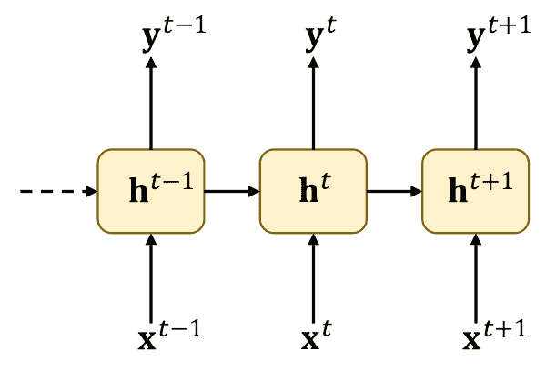

图9 多对多RNN架构

另一方面，传统的前馈网络不共享参数，并且每个输入特征都有一个特定的参数，这使得它无法推广到在训练期间未见过的输入形式。同时，CNN在一个小的空间位置上共享参数，但是在处理可变长度的输入方面不如RNN泛化得好。图9展示了一个简单的多对多RNN架构，将多个输入序列映射到多个输出序列。

为了简化表示，让我们假设RNN由 $\theta$ 和 $\phi$ 参数化，其中输入到隐藏、隐藏到隐藏和隐藏到输出的权重矩阵分别为 $\mathbf{W}_{ih}$、$\mathbf{W}_{hh}$ 和 $\mathbf{W}_{ho}$。时间 $t$ 的隐藏状态可以表示为

$$\mathbf{h}^t = \mathscr{F}\left(\mathbf{h}^{t-1}, \mathbf{x}^t; \theta\right) \quad (10)$$
$$\quad = \mathcal{A}_{h}\left(\mathbf{W}_{hh}\mathbf{h}^{t-1} + \mathbf{W}_{ih}\mathbf{x}^t + \mathbf{b}_{h}\right). \quad (11)$$

其中 $\mathcal{A}_{h}(\circ)$ 是隐藏单元的激活函数，$\mathbf{b}_{h}$ 是偏置向量。
时间 $t$ 的输出可以作为时间 $t$ 的隐藏状态的函数获得

$$\mathbf{y}^t = \mathcal{G}\left(\mathbf{h}^t; \phi\right) \quad (12)$$
$$\quad = \mathcal{A}_{o}\left(\mathbf{W}_{ho}\mathbf{h}^t + \mathbf{b}_{o}\right) \quad (13)$$

其中 $\mathcal{A}_{o}(\circ)$ 是输出单元的激活函数，$\mathbf{b}_{o}$ 是偏置向量。
其他典型的RNN架构如图10所示。
到目前为止，讨论的循环神经网络架构仅捕捉过去的隐藏状态。一些应用还需要除过去状态外的未来状态。这是通过双向循环神经网络[28]实现的。简单来说，双向循环神经网络

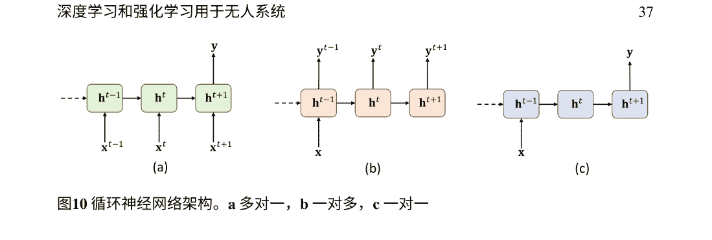

将依赖于过去状态的循环神经网络（即从 $h^1, h^2, h^3, ..., h^t$）与查看未来状态的循环神经网络（即从 $h^t, h^{t-1}, h^{t-2}, ..., h^1$）相结合。

### 2.4 强化学习

强化学习关注的是一个目标导向的代理与环境的交互，基于其对环境的观察。强化学习的主要目标是使代理学会如何行动，即在给定的环境状态下执行什么动作，以最大化奖励信号。

代理人通过观察环境状态、选择和执行动作，在一系列离散的时间步骤中与环境反复交互。代理人选择的动作可能会影响下一个时间步骤中环境的状态。代理人从环境中接收到奖励信号，并转移到一个新的状态。

代理人具有一定的能力来感知环境状态；非正式地说，状态可以被认为是对环境的任何信息，这些信息对代理人是可用的。代理人通过遵循一个策略来选择可能采取的行动，该策略是一个函数，通常是随机的，将状态映射到行动：奖励信号用于定义问题的目标。代理人在每个时间步骤接收到的奖励指定了当前状态的即时可取性。强化学习代理的目标是最大化累积奖励，通常由一个值函数定义，该值函数定义了代理的长期好处。代理人通过与环境持续交互来实现目标。

这种交互涉及在权衡短期和长期回报的同时采取行动，使强化学习成为许多自主问题的潜在解决方案[30]。

强化学习问题通常使用有限马尔可夫决策过程在数学上表示。有限马尔可夫决策过程由以下元组 $(S, A, P, R)$ 定义，其中 $S$、$A$、$P$ 和 $R$ 分别是状态空间、动作空间、转移函数和奖励函数。请注意，在有限马尔可夫决策过程中，状态、动作和奖励空间都由有限数量的元素组成。在每个时间步骤中，代理观察到状态 $s \in S$，选择并执行动作 $a \in A$，接收奖励 $r$，并转移到新状态 $s' \in S$。转移函数指定了从状态 $s$ 转移到状态 $s'$ 的概率。选择行动的结果是作为一个，

$$P(s, a, s') = Pr(S_{t+1} = s' | S_t = s, A_t = a)$$ (14)

奖励函数 $R$ 定义了代理在从状态 $s$ 转移到状态 $s'$ 并采取行动 $a$ 后所获得的预期奖励，即

$$R(s, a) = \mathbb{E}[R_t | S_t = s, A_t = a]$$ (15)

可以看出，函数 $P$ 和 $R$ 定义了马尔可夫决策过程的动态。强化学习代理使用策略在给定的状态下选择行动。策略，表示为 $\pi(s, a)$ 提供了状态到行动的概率映射，如

$$\pi(s, a) = Pr(A_t = a | S_t = s)$$ (16)

正如前面讨论的，值函数用于定义代理的长期好处。在数学上，状态值函数表示为

$$v_\pi(s) = \mathbb{E}_\pi \left[ \sum_{k=0}^{\infty} \gamma^k R_{t+k+1} | S_t = s \right], \forall s \in S$$ (17)

状态值函数指定了预期回报，即从状态 $s$ 开始，如果代理遵循策略 $\pi$，折现奖励的总和。折现率 $\gamma$，$0 \le \gamma \le 1$，用于逐渐减少未来的奖励权重。例如，当 $\gamma$ 接近零时，代理只关注即时奖励，而当 $\gamma$ 接近一时，代理更加重视未来的奖励。预期折现回报用 $G_t$ 表示，即

$$G_t = \sum_{k=0}^{\infty} \gamma^k R_{t+k+1}$$ (18)

此外，策略 $\pi$ 的动作值函数在数学上表示为

$$q_\pi(s, a) = \mathbb{E}_\pi \left[ \sum_{k=0}^{\infty} \gamma^k R_{t+k+1} | S_t = s, A_t = a \right]$$ (19)

动作值函数指定了在策略 $\pi$ 下，代理在状态 $s$ 下采取动作 $a$ 时的预期回报。

利用环境的马尔可夫决策过程动力学和价值函数的概念，已经开发出多种算法。在马尔可夫决策过程完全已知的情况下，即代理具有 $P$ 和 $R$ 的知识时，可以使用动态规划方法（规划算法）如策略迭代和值迭代来解决马尔可夫决策过程的最优策略或最优值函数。

然而，在强化学习中，通常不假设对马尔可夫决策过程动力学的了解。求解强化学习问题存在基于模型和无模型的方法。求解强化学习问题的方法既有基于模型的方法，也有无模型的方法。在基于模型的强化学习中，代理尝试直接学习环境的模型，通过学习 $P$ 和 $R$ ，然后使用环境模型来使用类似策略迭代和值迭代的算法规划动作。在无模型强化学习中，代理不尝试直接学习环境的模型，而是尝试学习最优值函数或策略。本章讨论主要集中在无模型方法上。

一般来说，无模型强化学习算法可以分为值函数和策略梯度两种方法。在值函数方法中，代理尝试学习一个最优值函数，通常是动作值函数，从中可以找到一个最优策略。值函数方法包括蒙特卡洛、状态-动作-回报-状态-动作（SARSA）和Q学习。策略梯度方法尝试通过策略参数的标量性能度量的梯度直接学习最优参数化策略。REINFORCE算法是策略梯度方法的一个例子。

#### 蒙特卡洛

蒙特卡洛方法可以通过与环境的直接经验来学习价值函数和最优策略。特别是，代理与环境进行交互（直接或模拟），可以获得状态、动作和奖励的序列，并通过对从状态-动作对开始的回报进行平均来估计价值函数。蒙特卡洛方法通常用于分集任务。代理按照环境中的策略 $\pi$ 生成一个剧集（状态、动作、奖励的序列），并在每个剧集结束时更新价值函数估计。蒙特卡洛方法可以用于控制，即通过执行策略改进来找到最优策略。策略改进使策略贪婪地依赖于当前的动作-值函数估计。对于动作-值函数，贪婪策略被定义为对于每个状态 $s$，选择具有最大动作-值的动作，即

> $\pi(s) \doteq \arg\max_{a \in A} q(s, a).$ (20)

使用蒙特卡洛方法进行值函数预测和强化学习时，一个重要的考虑因素是保持探索。为了学习动作值函数，需要探索所有状态-动作对。实现这一点的一种方法被称为探索起点，即每个回合都从特定的状态-动作对开始，并且所有状态-动作对在回合开始时具有非零的选择概率。探索起点保证在无限次回合的极限下，每个状态-动作对都会被访问无限次数。另一种方法是利用允许持续探索的策略。一个例子是 $\epsilon$-贪婪策略，在大多数情况下选择最大化动作值函数的动作（概率为 $1 - \epsilon$），而偶尔会以概率 $\epsilon$ 选择一个随机动作，即

$$\pi(s, a) = \begin{cases} 1 - \epsilon + \frac{\epsilon}{|A|}, & \text{if } a = a^* \\ \frac{\epsilon}{|A|}, & \text{否则} \end{cases}$$

有两种方法可以确保持续的探索：on-policy和off-policy方法。在on-policy方法中，算法试图评估和改进在环境中选择动作的策略，而off-policy方法则改进了与选择动作的策略不同的策略。在off-policy方法中，代理试图通过使用允许探索的另一个策略生成动作来学习一个最优策略（称为目标策略），该策略称为行为策略。由于策略学习是从收集的数据“离线”学习目标策略，这些方法被称为off-policy。on-policy和off-policy蒙特卡罗控制方法都存在。

#### 时序差分学习

时序差分学习定义了另一类基于值函数的强化学习方法。与蒙特卡罗方法类似，时序差分通过与环境的交互来学习值函数。时序差分和蒙特卡罗的主要区别在于时序差分在每个时间步更新其对值函数的估计，而不是在回合结束时更新。

换句话说，值函数的更新是基于后续状态的值函数估计。根据估计的回报（$R_{t+1} + \gamma V(S_{t+1})$）而不是蒙特卡洛中的实际（完整）回报来更新值函数的想法被称为自举。值函数的简单时序差分更新方程为

$$V(S_t) = V(S_t) + \alpha[R_{t+1} + \gamma V(S_{t+1}) - V(S_t)]$$

其中 $\alpha$ 是一个步长参数。在上述方程中，可以看到时序差分方法在下一个时间步更新值函数估计。时序差分更新的目标值变为 $R_{t+1} + \gamma V(S_{t+1})$，与当前值函数估计 ($V(S_t)$) 进行比较。目标值与当前估计之间的差异被称为时序差分误差，即

$$\delta_t \doteq R_{t+1} + \gamma V(S_{t+1}) - V(S_t)$$

可以看出，时序差分方法的一个优点是其能够在每个时间步更新值函数预测，从而实现在线学习。

SARSA: 是一个基于策略的时序差分控制算法的示例。上述时序差分更新方程扩展为动作值函数预测，得到状态-动作-奖励-状态-动作动作值更新规则，如下所示：

$$Q(S_t, A_t) \leftarrow Q(S_t, A_t) + \alpha[R_{t+1} + \gamma Q(S_{t+1}, A_{t+1}) - Q(S_t, A_t)]$$如公式（24）所示，在每个序列（…，S_t, A_t, R_{t+1}, S_{t+1}, A_{t+1},…）之后进行更新，这导致了状态-动作-奖励-状态-动作的命名。值得注意的是，Q的估计是基于从行为策略（R_{t+1} + γQ(S_{t+1}, A_{t+1})）生成的样本数据进行更新的。从控制算法的角度来看，通常会使用贪婪策略，如ε-贪婪策略。

## Q-Learning:
是一种离策略的时序差分控制算法，其更新规则如下。

```
Q(S_t, A_t) \leftarrow Q(S_t, A_t) + \alpha [R_{t+1} + \gamma \max_a Q(S_{t+1}, a) - Q(S_t, A_t)] (25)
```

作为一种离策略方法，学习到的动作值函数估计Q试图直接逼近最优动作值函数Q*。这可以从更新方程式(25)中看出，目标值为R_{t+1} + γ max_a Q(S_{t+1}, a)，与状态-动作-奖励-状态-动作的R_{t+1} + γQ(S_{t+1}, A_{t+1})进行比较。与SARSA不同，Q值的更新是基于贪婪策略进行动作选择，而不是行为策略。SARSA不会学习最优策略，而是学习由ε-贪婪动作选择产生的动作值。然而，Q-learning学习到的是由ε-贪婪动作选择产生的最优策略，导致在线性能偶尔下降[29]。

时间差分方法可以进一步与n步引导方法相结合，这是蒙特卡罗和时间差分方法之间的一种中间方法。n步方法通过利用下一个n个奖励、状态和动作来推广之前讨论的时间差分方法中的值函数或动作值函数更新。

到目前为止，所讨论的基于值函数的方法都是以表格方法的形式呈现的。这些算法是表格型的，因为状态值函数或动作值函数被表示为表格或数组。在许多实际问题中，状态空间非常大，使用表格方法学习最优策略变得难以处理，因为需要大量的时间、数据和内存来填充表格。此外，在庞大的状态空间中，通常会出现先前未见过的状态，需要从类似状态的经验中进行泛化。当环境状态被表示为相机图像时，状态空间非常庞大；例如，一个8位、200×200像素的RGB图像会产生256^{3*200*200}个可能的状态。为了应对这些挑战，可以利用函数逼近技术来近似表示值函数和策略，从而得到最优策略。在强化学习中，可以应用监督学习中使用的不同函数逼近技术。将深度神经网络作为函数逼近的一种手段，被称为深度强化学习，并在本节中进行了讨论。

在使用函数逼近技术时，使用参数化的状态值函数或动作值函数来逼近值函数。状态值估计可以表示为\hat{v}(s; w) \approx v_{\pi}(s)，动作值估计可以表示为\hat{q}(s, a; w) \approx q_{\pi}(s, a)，其中w \in \mathbb{R}^d是参数向量。原则上，任何监督学习技术都可以用于逼近值函数。

## 强化
与基于值函数的方法相比，策略梯度方法试图直接学习最优的参数化策略，而无需显式学习动作值函数。所学习的策略被定义为

$$\pi(a|s, \boldsymbol{\theta}) = Pr(A_t = a | S_t = s, \boldsymbol{\theta}_t = \boldsymbol{\theta})$$ (26)

它指定了在状态 $s$ 的第 $t$ 步采取行动 $a$ 的概率，并由向量 $\boldsymbol{\theta} \in \mathbb{R}^m$ 参数化。策略梯度方法根据性能度量 $J(\boldsymbol{\theta})$ 相对于参数的梯度来学习策略的值。在情节性案例中，性能度量可以根据假设情节从初始状态 $s_0$ 开始的状态值函数来定义

$$J(\boldsymbol{\theta}) \doteq v_{\pi_{\boldsymbol{\theta}}}(s_0)$$ (27)

REINFORCE是策略梯度算法的一个例子，它源自策略梯度定理

$$\nabla J(\boldsymbol{\theta}) \propto \sum_{s} \mu(s) \sum_{a} q_{\pi}(s, a) \nabla_{\theta} \pi(a|s, \boldsymbol{\theta})$$ (28)

其中 $\mu(s)$ 是状态的分布，梯度是关于参数向量 $\boldsymbol{\theta}$ 的列向量。策略梯度定理提供了关于性能度量相对于参数向量的梯度的表达式。

根据策略梯度定理，可以得到以下方程，用于计算 $J(\boldsymbol{\theta})$ 的梯度。

$$\nabla J(\boldsymbol{\theta}) = \mathbb{E}_{\pi} \left[ G_t \frac{\nabla_{\theta} \pi(A_t | S_t, \boldsymbol{\theta})}{\pi(A_t | S_t, \boldsymbol{\theta})} \right]$$ (29)

使用随机梯度下降，可以推导出策略参数向量 $\boldsymbol{\theta}$ 的REINFORCE更新规则。

$$\boldsymbol{\theta}_{t+1} = \boldsymbol{\theta}_t + \alpha G_t \frac{\nabla_{\theta} \pi(A_t | S_t, \boldsymbol{\theta}_t)}{\pi(A_t | S_t, \boldsymbol{\theta}_t)}.$$ (30)

更新方程式 (30) 将参数朝着增加在未来访问状态 $S_t$ 时采取行动 $A_t$ 的概率的方向移动，与回报 $G_t$ 成比例增加。这使得参数更倾向于产生最高回报的行动。

归一化防止选择具有更高概率但实际上可能不产生最高回报的行动。

可以通过添加基线来推广策略梯度定理和REINFORCE更新规则，用于与动作值或回报进行比较。基线可以是任意函数或随机变量。使用基线的动机是减少策略参数更新的方差。带有基线的REINFORCE算法的更新规则如下

$$\theta_{t+1} = \theta_t + \alpha (G_t - b(S_t)) \frac{\nabla_{\theta} \pi(A_t | S_t, \theta_t)}{\pi(A_t | S_t, \theta_t)} \quad (31)$$

其中 b(S_t)是基准。常见的基准是由权重向量 w ∈ R^l 参数化的状态值估计 v̂(S_t, w)。使用状态值函数作为基准的想法可以通过演员-评论家方法进行扩展。在演员-评论家方法中，使用一个称为评论家的状态值函数来评估一个称为演员的策略的性能。评论家引入了对演员梯度估计的偏差，这可以大大减少方差。

最近的两种策略梯度方法是信任区域策略优化和近端策略优化。信任区域策略优化在[31]中引入，以通过引入优化约束-库尔巴克-莱布勒（KL）散度来防止政策的剧烈变化。策略基于信任区域进行更新，而KL约束确保策略更新与原始策略不会相差太远。在优化问题中引入KL约束会引入计算和实现上的困难。然而，近端策略优化在[32]中引入，通过将约束项纳入目标函数中来减轻这种实现障碍。PPO计算新策略和旧策略之间的概率比。PPO有两个变体-带KL惩罚的PPO和带剪辑目标的PPO。在第一个变体中，KL约束被引入为目标函数中的惩罚项，以便在最小化成本函数的同时计算出一个不太偏离先前策略的策略更新。在第二个变体中，KL散度被替换为剪辑目标函数，以便如果概率比在范围1 ± φ之外，则将优势函数剪辑。与TRPO相比，PPO的实现和调优更简单。

#### 深度强化学习
深度强化学习是当前研究的热门领域，结合了深度学习和强化学习的技术[33]。特别是，深度神经网络被用作函数逼近器，用于表示传统强化学习算法中的动作-值函数和策略。这对于涉及大状态和动作空间的问题尤为重要，使用表格方法或传统的监督学习函数逼近器来表示这些问题变得困难。深度学习架构的一个关键能力是能够从原始数据中自动学习表示（特征）。例如，经过图像分类训练的深度神经网络将自动学习识别特征如边缘、角点等。深度学习的使用使得策略可以以端到端的方式进行学习，例如直接从原始传感器值中学习控制策略。一个著名的深度强化学习算法是将$Q$-Learning与深度卷积神经网络相结合来表示动作值函数[34]的深度$Q$网络。深度$Q$网络能够仅使用视觉信息、奖励信号和可用动作（即不提供游戏特定信息给智能体）在几个Atari游戏上实现超人类的表现。深度$Q$网络采用两种方法来解决使用神经网络近似$Q$函数时可能出现的已知收敛问题[35]。这些方法是经验回放和使用单独的目标网络进行$Q$更新。经验回放机制在回放内存中存储过去的经验序列，即$(s_t, a_t, s_{t+1}, r_{t+1})$，跨多个回合使用。过去的经验在后续的$Q$函数更新中使用，从而提高数据效率，消除样本之间的相关性，并减少更新的方差。单独的目标网络$\hat{Q}$用于生成$Q$-Learning更新中的目标。

目标网络每$C$个时间步更新一次，作为当前$Q$网络的克隆；使用目标网络可以减少振荡和发散的可能性。深度递归$Q$网络的变种，称为深度递归$Q$网络[36]，添加了一个长短期记忆层，以帮助学习时间模式。其他变种包括双重深度$Q$网络和决斗双重深度$Q$网络。此外，深度强化学习还应用于具有连续动作空间的问题。在[37]中，提出了一种基于确定性策略梯度的演员-评论家算法，该算法利用了经验重放和来自深度$Q$网络的目标网络的思想，以及批归一化。深度确定性策略梯度成功应用于许多连续控制问题。在[38]中，通过添加循环长短期记忆，将循环确定性策略梯度引入到深度确定性策略梯度中。深度强化学习的特性和能力值得进一步研究，以应用于自主无人机应用。

不同的无模型强化学习算法的总结显示在图11中。

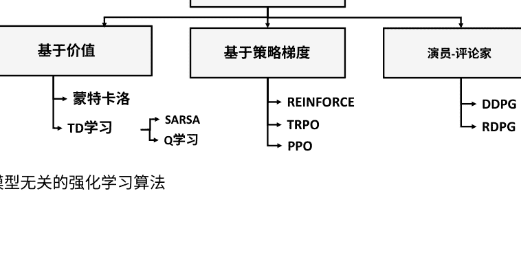

## 3 无人机自主深度学习
深度学习已经展示了从真实环境数据中学习复杂表示的巨大潜力。它出色的学习能力在解决步态分析、场景感知、导航等自主机器人任务方面展示了出色的结果，[39, 40]。相同的方面可以应用于使无人机实现自主性。深度学习可以应用于场景感知、导航、障碍和碰撞回避、群体操作和情境感知等各种无人机关注领域。这也在图12中得到了体现。

深度学习已被应用作为特征提取系统，从原始传感器输出中学习高维数据表示。另一方面，规划和情境感知涉及多个子任务，如查询或测量航空图像、导航控制/引导、碰撞回避、位置相关的控制动作等。因此，我们将本节分为两个大类：（i）从传感器数据中提取特征和（ii）无人机航路规划和情境感知。

### 3.1 从传感器数据中提取特征
[41]的作者展示了一个监督式深度学习图像分类器处理单目图像的准确性。分类器预测了森林路径的方向，如左、右或直行，并声称在相同的图像分类任务上测试时与人类的准确性相当。这个场景感知任务需要微型无人机感知路径并采取行动以保持在路径上。作者采用了典型的卷积神经网络架构来完成监督式图像分类任务。该卷积神经网络包括四个卷积层和交替的最大池化层，并以两个全连接层结束。输出全连接层采用softmax分类，得出输入图像属于特定类别的概率。该网络使用随机梯度下降进行训练。从CNN得到的方向估计被扩展为提供导航控制。自主跟踪路径的导航控制在与笔记本电脑和独立四旋翼飞行器连接的Parrot AR Drone上进行了测试。该论文报告了在真实测试条件下的分类精度较低，而在训练数据集中的GoPro图像质量较好。

AlexNet [6] 架构被用于从航拍图像中检测和计数棕榈树 [42]。这些图像是从QuickBird卫星收集的。采用窗口大小为17 × 17像素和步长为3像素的滑动窗口技术来收集图像数据集。只有中心位置有棕榈树的样本被分类为正棕榈树检测。获取检测到的棕榈树类别的空间坐标，并将与同一棕榈树样本对应的坐标合并。将欧氏距离低于一定阈值的空间坐标分组为一个坐标。剩余的坐标表示检测到的棕榈树的实际坐标。该研究区域中棕榈树的准确检测率为96%。

Faster R-CNN [22] 架构被用于从低空无人机图像中检测汽车[43]。Faster R-CNN包括一个区域建议网络（RPN）模块和一个快速 R-CNN 检测器。RPN 模块是一个深度卷积架构，用于生成不同尺度和长宽比的区域建议。区域建议不一定包含目标对象。这些区域建议被快速 R-CNN 检测器进一步优化。RPN 和快速 R-CNN 检测器模块共享其卷积层，并进行联合训练以进行目标检测。对于汽车检测任务，采用了 VGG-16 模型 [23] 来构建共享的卷积网络。RPN 以 2k框分类和 4k框回归输出的形式生成区域建议。框回归输出对应于k区域建议的坐标，而框分类表示目标性得分，即每个建议包含目标对象（汽车）的概率。Faster R-CNN 使用多任务损失函数进行训练，包括分类和回归组件。汽车检测图像是使用安装在DJI Phantom-2四旋翼飞行器上的GoPro Hero Black Edition-3收集的。该论文报告了94.94%的汽车检测准确率，并展示了该方法对尺度、方向和光照变化的鲁棒性。为了简单起见，快速 R-CNN 架构如图13所示。

在[44]中，更快的R-CNN架构被应用于从无人机RGB图像中检测玉米花序。在这里，不同的CNN架构被用于形成RPN和快速R-CNN检测器模块之间的共享层。该论文报告了在600 × 600的图像分辨率和15米的无人机高度下，ResNet [5]相对于VGGNet具有更高的准确性。

在[46]中，将更快的R-CNN架构与You Only Look Once (YOLOv3) [45]进行了无人机图像中的汽车检测的比较。YOLOv3是其前身YOLOv1 [47]和YOLOv2 [48]的进步。与其前身不同，YOLOv3可以对检测到的对象进行多标签分类。其次，边界框预测将与预测框重叠的对象赋予1的对象性得分。真实框超过预定义阈值。 这样，YOLOv3 为每个真实目标分配一个边界框。此外，YOLOv3 在3个不同的尺度上预测边界框。 最后，它采用了一个名为Darknet-53 的53层卷积神经网络特征提取器。研究发现，YOLOv3 和 faster R-CNN 在对图像中的汽车对象进行分类方面表现出类似的良好性能。尽管 YOLOv3 在处理时间和灵敏度方面（即能够识别图像中的所有汽车）优于 faster R-CNN。

在[49]中，部分共享的深度神经网络用于紧急救援任务中的人声识别。 嵌入在 Parrot Bebop 无人机上的麦克风阵列用于收集声学数据。 PS-DNN 被提出作为一种多任务学习框架，实现两个同时进行的任务——声源分离和声源识别。 用于多任务学习的 PS-DNN 是一个前馈神经网络，两个子网络之间具有部分共享的隐藏层。 通过对声学信号应用窗口化的短时傅里叶变换，得到的 Mel 滤波器组特征向量被作为输入提供给 PS-DNN。该网络使用 Adam 学习优化器 [50] 进行训练，学习率为 2 × 10^{-4}。 研究表明，在使用部分注释的数据集时，取得了令人满意的准确性。

在[51]中，对三种事件声音分类模型——CNN、RNN和高斯混合模型进行了实验，以便在真实嘈杂的环境中检测商用无人机。 数据集包含普通的真实生活噪音和来自3DR Solo、DJI Phantom-3、DJI Phantom-4和DJI Inspire等商用无人机的声音。 研究表明RNN模型的性能优于CNN和GMM模型。 RNN架构是一个具有3层和300个LSTM单元的双向长短期记忆网络。 在训练阶段采用了早停策略，如果准确率和损失在3个周期后没有改善，训练将停止。 RNN在未见过的数据类型上表现出良好的泛化能力，F-score为0.6984，具有平衡的精确率和召回率，而CNN则导致了误报。 另一方面，GMM在检测性能上优于CNN，但低F-score限制了实际应用。

基于卷积神经网络（CNN）、循环神经网络（RNN）和卷积循环神经网络（CRNN）的无人机声学指纹识别在[52]中提出。CRNN [53]利用CNN和RNN的优势来提取时空特征。利用这三种不同的架构来提取飞行无人机的独特声学特征。作者通过在室内环境中录制无人机螺旋桨产生的声音来收集无人机声学数据集。本研究利用了Parrot家族的两种无人机，分别是Bebop和Mambo。神经网络将音频输入分类为无人机和非无人机。该研究表明，在准确率、精确度、F1分数和召回率方面，CNN的性能优于RNN和CRNN，而RNN的训练时间较短。然而，RNN在所有方面的性能都非常差，这可能归因于音频片段的短时长，而不是长时序数据。然而，CRNN在性能上优于RNN，并且与CNN具有相当的性能，同时还具有更短的训练时间。作者还将他们的工作扩展到多标签分类，以识别音频片段为Bebop、Mambo和Unknown。在这个任务中，观察到了与二元分类相似的性能趋势。

### 3.2 无人机路径规划和态势感知
在[54]中考虑了一种基于CNN的自主室内无人机导航控制策略。室内环境中全球定位系统的有限精度和无法携带重量传感器使得室内导航成为一项具有挑战性的任务。CNN旨在学习一个控制策略，以模仿专家飞行员的导航决策。使用一架Parrot Bebop Drone上的单个前置摄像头收集了七个独特的室内位置的数据集。通过使用手动标记的专家飞行指令进行训练，分类器被训练为返回飞行指令——向左移动、向右移动、向前移动、向左旋转、向右旋转和停止。CNN分类器采用了CaffeNet [55]架构，包括五个卷积层和三个全连接层。分类器在NVIDIA GTX 970M图形处理单元上使用NVIDIA cuDNN [56]进行训练。训练好的分类器在不同的环境中进行了组合的熟悉和未知测试，包括不同的物体、光照和几何形状。分类器在测试位置的成功率在60%至80%之间，表明在不同物体和几何形状的建筑物中自主飞行具有可接受的鲁棒性。

在[57]中采用了一种有趣的无人机导航方法，通过撞击来教导它飞行。在这里，作者们通过在不同场景下撞击无人机11500次，创建了一个撞击数据集，同时还从相同轨迹中采样了非撞击数据。换句话说，无人机通过撞击来学习避免与物体碰撞。碰撞数据是通过将Parrot AR. Drone 2.0放置在随机位置，然后允许其随机起飞并沿直线路径行驶直到碰撞而收集的。这样，模型就可以学习在特定方向上直行是否是好的。网络架构采用了部分共享的深度神经网络，两个子网络共享部分隐藏层，分别用于声源分离和声源识别任务。输入特征是对声学信号应用窗口化短时傅里叶变换得到的梅尔滤波器组特征向量。该网络使用Adam优化器进行训练，学习率为2×10^{-4}。研究表明，在使用部分标注的数据集时，该模型取得了令人满意的准确率。

AlexNet [6]在ImageNet [58]上进行了预训练。预训练的权重作为网络权重的初始值，而不是随机初始化的权重，除了最后一个全连接层。AlexNet架构包括五个卷积层和三个全连接层。最后一层采用二元softmax激活函数，用于对无人机的导航动作进行分类。给定输入图像，网络决定是向左、向右还是直行。实验演示展示了这种监督学习方法在避免玻璃墙/门、走廊和走廊方面的有效性，与图像深度估计方法相比。

在[59]中提出了一种用于室内导航的回归卷积神经网络。通过基于机载单目摄像头的视觉输入，预测与碰撞的距离，实现自主室内导航。作者采用自监督方法收集了室内飞行数据集，并在三个不同的发散方向上注释了距离最近障碍物的距离。借助于安装在无人机上指向相机视野不同方向的红外线和超声波传感器的三对，实现了自动标注。回归卷积神经网络采用了两流架构，其中前两层流与AlexNet卷积神经网络的相似。两个流通过融合来连接来自流的特征图，然后通过类似于AlexNet的第三个卷积层进行处理。单流部分的后两个卷积层也采用了AlexNet的最后两个卷积层，除了AlexNet中的分类器单元被替换为一个单一的全连接回归层。回归卷积神经网络的训练采用了带有动量的随机梯度下降算法，在30个epoch中进行，每个mini-batch大小为128。实现和训练是在一台配备Intel Xeon E5-2630处理器、64GB内存和GTX1080图形处理单元的MATLAB桌面服务器上进行的。无人机是一架配备720p前置摄像头的Parrot AR-Drone 2.0。

在实验过程中，无人机与一台配备Intel Core i7-6700HQ、16 GB RAM和GTX 1070显卡的笔记本电脑建立了WiFi连接，用于进行CNN推理和运动规划。作者将所提出的回归CNN的性能与之前讨论过的两种最先进的方案[54]和[57]进行了比较。与[54]和[57]相比，回归CNN表现出了持续的无碰撞导航时间，分别为4.6×和1.7×。

在[60]中提出了一种由微型空中飞行器辅助的监督式深度学习方法，用于地面机器人路径规划以执行搜救任务。路径规划分为三个阶段进行。初始阶段涉及人操作员以视觉辅助模式驾驶微型空中飞行器，以定位目标位置，如地面机器人或受害者。在这个初始飞行过程中，从微型空中飞行器的摄像头图像中收集用于初始地形分类的数据。通过单目3D重建将地形映射到精确的高程图上。CNN分类器在现场进行训练，没有任何先验信息。现场分类器训练包括操作员驾驶微型空中飞行器，并从实时摄像头图像中标记一些感兴趣的区域。[60]的作者还通过裁剪落在先前标记区域上的补丁，收集了许多训练补丁。报告卷积神经网络的训练时间为10-15分钟。训练后，将补丁分类并投影到地形图上。在找到目标位置后，第二阶段涉及自主视觉引导的飞行到一系列航点。路径探索通过对候选路径进行详尽搜索，以有效减少响应时间。作者通过模拟和现场试验证明了他们的方法的有效性。用于现场试验的微型飞行器配备了惯性测量单元、四旋翼、向下摄像头、Odroid U3四核计算机和PIXHAWK自动驾驶软件。

实验中的地面机器人是一台能够在崎岖地形上行驶的Bluebotics Absolem。峡谷和车道场景的现场试验证明了在多个地形类别、高度变化和无法通过的地形上的可行和高效的路径探索。

另一个卷积神经网络架构—whereCNN—在[61]中提出，用于执行地面到空中地理定位。该方法旨在将街景查询图像映射到城市规模的空中视图图像上的相应位置。用于交叉视图图像匹配的卷积神经网络架构受到了孪生网络[62]的启发，由两个相同的卷积神经网络组成，以学习在街景和空中视图图像对之间共享的深度表示。使用对比损失函数作为整体损失来训练whereCNN，使得匹配的图像对受到它们的欧氏距离的平方惩罚，而不匹配的图像对受到小于边界的欧氏距离的平方惩罚。较小的边界会导致网络受到更难的负样本的影响。数据集由78k对Google街景图像及其对应的空中视图组成。whereCNN在NVIDIA Grid K520图形处理单元上训练了4天。作者证明，在未见过的数据上，whereCNN在不共享参数的情况下训练得相当好。

该方法在查尔斯顿、圣地亚哥和旧金山的交叉视图匹配准确率超过22%。

在表1中，我们总结了使无人机应用实现自主的深度学习技术。

### 3.3 开放问题和挑战

在第3节中，我们讨论了实现各种无人机任务的最新深度学习技术。具体而言，我们讨论了如何利用深度学习从传感器数据中提取特征、规划和情境感知。然而，在实现无人机任务的完全自主性之路上，仍存在一些开放的研究挑战。以下是其中的一些：

- 1. 缺乏真实数据集：模拟和实际部署场景之间的真实差距对部署的深度学习解决方案构成了严峻的挑战。在现实环境中，无人机可能面临各种不同的，例如在遍历路径中的各种障碍物，目标检测任务中的遮挡或视觉伪影目标，以及机载传感器引起的影响等，在虚拟环境中很难建模。此外，从实际的无人机生成这样一个逼真的数据集，并对其进行注释是一项费力的任务。

- 2. 快速深度学习：将监督深度学习解决方案推广到未见过的数据，例如那些不被训练数据集所代表的数据，是一个开放的研究挑战。即时学习意味着在有限的场景快照上对神经网络进行训练，这将有助于模型在不忘记过去知识的情况下继续学习新的场景。最近引入的模型无关元学习（MAML）[63]为开发这种快速学习技术打开了大门。

- 3. 资源密集型深度学习技术：深度学习架构的计算复杂性是另一个重要障碍，对延迟、重量、飞行时间、功耗和成本提出了严格的限制。更密集的架构需要强大的计算平台，如图形处理单元，这往往超出了无人机预先构建的机载计算能力，需要辅助计算单元。这样的额外计算平台会增加无人机的成本、重量、飞行时间和功耗。

- 4. 对网络攻击的脆弱性：已部署的深度学习技术对各种安全攻击的脆弱性是一个严重关注的问题。欺骗攻击、信号干扰、身份伪造等都可能破坏无人机的预期操作，导致资产损失和损坏。将对抗学习技术整合到应用特定的深度学习方法中可能是解决此类安全威胁的一种方式。

## 4 强化学习用于无人机自主性

强化学习提供了一个学习框架，允许代理通过与环境的连续交互来进行最优行动。与监督学习或无监督学习相比，强化学习允许代理利用从环境交互中获得的自身经验。此外，强化学习通过奖励和惩罚机制为代理设定目标。强化学习的这些特性已经引起了许多关于其在自主无人机应用中的研究工作。强化学习主要应用于调节无人机速度、姿态和导航等低级控制系统任务以及其他高级任务。

### 4.1 无人系统控制系统

由于非线性飞行动力学，稳定控制无人系统是一项复杂的任务。传统的控制方法，如比例积分微分控制器，已经成功地用于稳定环境下无人机的姿态和速度控制。然而，这些控制器在动态或恶劣环境下的性能可能会下降。比例积分微分控制的主要缺点在于它是一个恒定参数反馈控制器。在这种控制器中，控制努力本质上是反应性的，控制器没有对环境的先验知识或学习环境的能力。自适应和鲁棒控制技术可以为设计能够适应动态环境并在存在不确定性的情况下有效运行的控制器提供见解。然而，这些传统控制技术的一个缺点是它们通常需要环境动力学的数学模型，并且不能明确地从过去的经验中学习。强化学习算法提供了解决无人系统控制问题的潜在解决方案，因为它们能够适应未知环境。

已经有很多研究工作专注于将强化学习应用于无人系统的控制 [64-71]。大部分研究都集中在四旋翼无人机上，然而早期的一些工作涉及到自主直升机。本节讨论的许多基于强化学习的控制系统是针对无人机的姿态控制，但也有一些工作考虑到轨迹跟踪和机动控制。此外，已经研究了几种算法方法，包括在线和离线方法，与传统控制算法以及基于深度强化学习的方法结合使用。

早期将强化学习应用于无人机控制问题的工作主要集中在自主直升机上 [72-75]。在这些工作中，从一个人类驾驶遥控直升机收集数据，并离线学习其动力学。从学习到的动力学中，使用强化学习算法设计了各种机动控制器，包括悬停、轨迹跟踪以及一些高级机动，如倒置悬停、翻转、翻滚、隧道等，这些都来自于模型航空学院（AMA）遥控直升机比赛。

第一项使用强化学习控制四旋翼无人机高度的工作是这样做的[70]。利用基于模型的强化学习算法，奖励准确跟踪和良好阻尼性能，找到了最优控制策略。为了与传统方法进行对比，还实现了一个积分滑模控制器。在斯坦福自主旋翼飞行器多智能体控制四旋翼上进行的测试表明，强化学习和积分滑模控制器的性能相当，都明显超过传统线性控制策略。

在[65]中，使用拟合值迭代设计了四旋翼无人机的速度控制系统。将强化学习FVI控制器与使用非线性控制技术设计的级联速度和姿态控制器进行了比较。使用MATLAB/SIMULINK进行数值模拟比较了每个控制器的性能。虽然两个控制器都产生了令人满意的结果，但强化学习控制器在稳定时间方面表现不如，但过冲百分比较低。作者指出，对于值函数估计的非参数方法，如使用小波网络，可能会使强化学习控制器的性能更好。作者强调，强化学习控制器的优点是不需要任何关于四旋翼动力学的先验数学知识就能产生令人满意的行为。

在[66]中，使用了一种称为有限动作集学习自动机的学习自动机强化学习算法来学习非线性轨迹跟踪和姿态控制的最优参数。传统方法，如比例积分微分、滑模和后退控制器被用来与有限动作集学习自动机进行对比。在不同的非线性干扰（包括风和地面效应）下，对控制器的性能进行了模拟分析。强化学习调整的控制器在跟踪误差方面优于数学调整的控制器。

在[71]中，使用一种离策略方法，模型预测控制用于引导策略搜索无人机避障的深度神经网络策略。在训练过程中，MPC使用完整状态的知识生成无人机的控制动作，同时使用状态观测来在监督学习环境中训练策略网络。在测试过程中，只有状态观测是可用的给策略神经网络。进行了模拟实验，证明了所提出的方法能够成功地推广到新的环境。在[67]中，使用基于神经网络的强化学习训练的策略被用于轨迹跟踪和恢复机动。作者提出了一种新的强化学习方法，使用确定性策略优化和自然梯度下降。实验在仿真和真实的四旋翼无人机Ascending Technologies Hummingbird上进行，证明了所提方法的有效性。在仿真中，所提方法优于流行的算法Trust Region Policy Optimization和Deep Deterministic Policy Gradient。轨迹跟踪测试结果显示出小但可接受的稳态误差。此外，通过手动将四旋翼无人机颠倒，进行了恢复测试，证明了自主无人机的稳定性。所提算法的一个好处是计算时间较短，平均时间为6 μs。

在[69]中，使用深度模型驱动的强化学习来进行四旋翼无人机的低级控制。深度模型驱动的强化学习用于学习四旋翼的前向动力学模型，然后使用模型预测控制作为控制框架。使用Crazyflie纳米四旋翼进行了算法评估。通过使用3分钟的训练数据，实现了稳定悬停6秒，强调了在有限数据和不假设任何先验动力学模型的情况下生成功能控制器的能力。

在[68]中，评估了多个基于神经网络的强化学习算法用于无人机的姿态控制。评估的算法包括深度确定性策略梯度、信任区域策略优化和近端策略优化。在仿真环境中，将强化学习算法与比例积分微分控制系统进行了姿态控制的比较。作者还开发了一个利用OpenAI的开源训练环境，并使用Gazebo模拟器进行评估。仿真结果表明，使用PPO训练的智能体在上升时间、超调量和平均跟踪误差方面优于经过调整的PID控制器。

在[64]中，将近端策略优化方法应用于固定翼无人机的姿态控制。选择近端策略优化方法主要是基于[68]中的成功报告。在仿真环境中，训练了PPO控制器来控制无人机的姿态（俯仰、横滚）和空速到指定的设定点。结果表明，深度强化学习控制器能够很好地适应具有湍流的环境。在高湍流场景中，深度强化学习控制器在成功率、上升时间、稳定时间和超调量等多个性能指标上优于PID控制器。

本文提出了一种用于四旋翼无人机的深度强化学习鲁棒控制算法[76]。该算法使用确定性策略梯度，这是一种演员-评论家方法。此外，类似于经典控制设计，DPG还使用积分补偿器来消除稳态误差。此外，定义了一个由离线和在线学习阶段组成的两阶段学习协议来训练模型。离线训练使用简化的四旋翼模型完成，但是通过改变模型参数和添加干扰，在模拟中验证了模型的强健泛化能力。通过更快的响应时间和较少的超调，演示了该模型在线学习改进策略的能力，与离线学习的原始策略相比。

### 4.2 导航和更高级别任务

在本节中，研究了强化学习在导航、避障和着陆机动等更高级别规划任务中的应用。

在[77]中，一种基于模型的强化学习算法被用作无人四旋翼飞行器在未知环境中的高层控制方法。一种名为TEXPLORE的强化学习算法[78]被用于对既不确定又有潜力的状态进行有针对性的探索，以便最终制定策略。这与Q-learning等试图穷尽状态空间的算法形成对比。TEXPLORE使用决策树和随机森林来学习环境模型。具体而言，决策树用于预测相对状态转换和转换效果。随机森林用于学习环境的多个模型，因为单个决策树可能学习到不准确的模型。最终模型是通过对随机森林中的决策树进行平均得到的。然后，TEXPLORE使用一种名为上置信界限应用于树的算法进行有针对性的探索。作者实现并比较了TEXPLORE算法和Q-Learning算法在导航任务中的表现。导航任务涉及无人机在电池约束下从起始状态到达目标状态，即无人机在任务期间需要充电才能到达目标。导航任务在使用ROS和Gazebo实现的模拟网格环境中进行。结果表明，TEXPLORE算法学习到了有效的导航策略，并且在很大程度上优于Q-Learning算法。

在[79]中，提出了一种用于在未知环境中导航无人机的比例积分微分和Q学习算法。该问题被建模为一个有限马尔可夫决策过程。环境被建模为一个有限的球体集合，其中心形成一个网格，无人机的状态是其近似位置，即网格上的一个点，代理可以选择的动作是向北、向南、向东或向西。在这项工作中，假设飞行高度恒定，因此状态空间是二维的。代理的目标是在未知环境中按照最短路径导航到目标位置。在未知环境中，使用比例积分微分和Q学习算法来导航无人机到目标位置。代理使用Q学习算法和 ϵ 贪婪策略，在给定当前状态的情况下选择下一个动作。然后将动作转换为期望位置，并输入到比例积分微分控制器中，该控制器输出控制命令以完成所需的动作。所提出的算法在模拟和Parrot AR Drone 2.0上进行了实现和测试。在模拟和实验的情况下，无人机在经过38次试验后学会了最短路径到达目标。在[80]中，[79]的作者利用了一种近似的Q-Learning算法，结合之前描述的比例积分微分和Q-Learning控制算法，用于无人机导航任务。函数逼近用于处理庞大的状态空间，并提供更快的收敛时间。固定稀疏表示用于将Q表表示为参数向量。与[79]中的工作相比，状态表示包括无人机与目标的相对距离以及使用机载雷达获取的四个方向上的障碍物的相对距离。模拟和实际测试都证明了更快的收敛速度和无人机导航到目标位置。

在[81]中，作者介绍了一种DRL算法，一种称为Fast-RDPG的循环确定性策略梯度的变体，用于大型复杂环境中的自主无人机导航。Fast-RDPG与RDPG不同之处在于它使用非稀疏奖励，使得代理能够在线学习并加快收敛速度。讨论了奖励函数设计，包括过渡（即，向目标前进）、障碍物接近惩罚、自由空间和时间步骤惩罚。Fast-RDPG算法在成功率、崩溃和偏离指标方面优于RDPG和DDPG。还讨论了将Fast-RDPG算法推广到不同大小、不同目标高度和3D导航环境中的方法。

在[82]中，提出了一种具有时间注意力的深度循环Q网络作为无人机避障任务的控制器。该模型使用条件生成对抗网络从单目RGB图像预测深度图。然后使用预测的深度图来选择最优控制动作。时间注意力机制用于加权考虑一系列观测值随时间的重要性，这对于避障任务很重要。将所提出的方法与Deep Q-Network、Dueling Double Deep Q-Network和没有时间注意力的深度循环Q-Network算法进行了比较，并在模拟中表现出更好的性能。

在[83]中，使用了一种名为Deep Deterministic Policy Gradient的深度强化学习算法，使得先进的无人机能够在移动平台上进行机动和降落。作者将Deep Deterministic Policy Gradient算法集成到他们的强化学习仿真框架中，该框架使用Gazebo和机器人操作系统进行实现。所提出方法的训练阶段在仿真环境中进行，测试阶段在仿真和真实飞行中进行。实验证明了所提出算法在完成自主降落任务方面的可行性。此外，这项工作还表明在仿真中训练的智能体能够在真实飞行中有效执行。和下降机动问题。在研究中没有考虑着陆机动；然而，作者指出可以使用闭环比例积分微分控制器来解决这个问题。使用深度Q网络进行地标检测组件，并使用双重深度Q网络进行下降。此外，作者提出了一种新的优先经验重放形式，称为分区缓冲重放，以处理稀疏奖励。进行了各种模拟实验，结果表明所提出的深度强化学习方法能够执行着陆机动，并能够有效地推广到新的场景。

在表2中，我们总结了使自主无人机应用成为可能的强化学习技术。

| 提出的解决方案 | 架构 | 应用 |
|---|---|---|
| Giusti等人[41] | 卷积神经网络 | 室外无人机导航 |
| Li等人[42] | AlexNet | 棕榈树检测和计数 |
| Xu等人[43] | 更快的R-CNN | 从低空无人机图像中检测汽车 |
| Liu等人[44] | 更快的R-CNN | 玉米穗检测 |
| Benjdira等人[46] | 更快的R-CNN，YOLOv3 | 从无人机图像中检测汽车 |
| Morito等人[49] | PS-DNN | 紧急救援任务 |
| Jeon等人[51] | 循环神经网络 | 无人机识别 |
| Al-Emadi等人[52] | 卷积神经网络，循环神经网络，CRNN | 无人机识别 |
| Kim和Chen [54] | CaffeNet | 室内无人机导航 |
| Gandhi等人[57] | AlexNet | 室内无人机导航 |
| Kouris和Bouganis [59] | 卷积神经网络 | 室内无人机导航 |
| Delmerico等人[60] | 卷积神经网络 | 无人系统的深度学习 |
| Lin等人[61] | whereCNN | 地面到空中的地理定位 |

| 提出的解决方案 | 强化学习技术 | 应用 |
|----------------|--------------|------|
| Bagnell和Schneider [73] | 基于模型的，PEGASUS | 直升机控制 |
| Kim等人 [74] | 基于模型的，PEGASUS | 直升机悬停和机动 |
| Ng等人[75] | 基于模型的，PEGASUS | 直升机倒置悬停 |
| Abbeel等人 [72] | 差分动态规划 | 直升机特技机动 |
| Waslander和Hoffmann [70] | 基于模型；局部加权线性回归，策略迭代 | 四旋翼高度控制 |
| Bou-Ammar等人 [65] | 拟合值迭代 | 四旋翼速度控制 |
| dos Santoes等人 [66] | 有限动作集学习自动机 | 四旋翼轨迹跟踪和姿态控制 |
| Zhang等人 [71] | MPC引导的策略搜索 | 四旋翼避障 |
| Hwangbo等人 [67] | 神经网络策略 | 航点跟踪和恢复测试 |
| Lambert等人[69] | 深度模型为基础的 | 悬停 |
| Koch等人[68] | DDPG, TRPO, PPO | 姿态控制 |
| Bøhn等人[64] | PPO | 姿态控制 |
| Wang等人[76] | DPG | 无人机控制 |
| Imanberdiyev等人[77] | 基于模型，TEXPLORE | 无人机导航 |
| Pham等人[79] | Q学习 | 无人机导航 |
| Pham等人[80] | 带有函数近似的Q学习 | 无人机导航 |
| Wang等人[81] | 快速-RDPG | 无人机导航 |
| Singla等人[82] | 具有时间注意力的深度循环Q网络 | 避障 |
| Rodriguez-Ramos等人[83] | DDPG | 在移动平台上降落 |
| Polvara等人[84] | DQN | 自主降落 |

### 4.3 开放问题和挑战

强化学习为基于自主无人机解决方案带来了一些尚未解决的问题和挑战。许多问题和挑战与从模拟到硬件的过渡有关。这在现实生活测试中对执行高复杂度规划任务的强化学习解决方案的性能的限制结果中得到了证明。与过渡相关的一个挑战是管理模拟和实际测试之间的现实差距。此外，由于算法的计算要求和无人机的尺寸、重量和功耗限制，将深度强化学习解决方案集成到嵌入式无人机平台上可能会变得具有挑战性。

其他挑战领域包括开发算法解决方案，实现更高程度的自主性。例如，更复杂的任务和任务可能需要无人机通过自然用户界面与其他自主系统和/或人类合作。此外，大多数已发表的作品考虑了动态环境中静态任务目标的情景；然而，一般来说，自主代理需要能够在任务目标和环境都是动态的情况下运行。还有可能任务将包括需要同时完成的多个目标。

## 5 无人系统的模拟平台

在真实操作环境中准确模拟无人机系统的能力是一种宝贵的能力。这主要是因为对无人机系统进行基于真实硬件的测试既耗时又昂贵。与基于硬件的测试相关的主要挑战是可能导致伤害、损失和损坏。其他挑战和限制包括有限的电池寿命以及户外飞行的法律和规定。

在深度学习和强化学习的自主解决方案中，这些挑战在很大程度上加剧，因为它们需要大量的训练数据和经验才能学习有效的行为，并且在训练阶段通常不稳定。此外，为基于机器学习的自主无人系统算法收集充足的训练数据可能具有挑战性和/或成本高昂。

物理上和视觉上逼真的无人机系统模拟是解决这些挑战的潜在解决方案。例如，可以使用逼真的视觉模拟操作环境来创建深度学习算法的数据集。此外，模拟提供了一种测试无人机系统在现实生活中难以创建的场景（例如故障模式、恶劣环境条件等）的方法。模拟还提供了一种建立易于重复的环境进行算法比较和软件回归测试的方法。

### 5.1 模拟套件

本节现在介绍了无人系统的流行模拟软件平台的调查。之前在[85-87]中进行的调查介绍了各种应用的大多数可用的无人系统模拟平台。本节讨论主要集中在开源模拟器上，这些模拟器对于无人机自主应用的研究和开发似乎很有用。

Gazebo [88, 89] 是一个开源的机器人模拟器，能够在室内和室外环境中模拟多个机器人。这得益于它与高性能物理引擎（如Open Dynamics Engine、Bullet、Simbody和Dynamic Animation and Robotics Toolkit）的集成，以及对各种传感器、噪声和环境效应的建模能力。Gazebo的架构是模块化的，可以使用模拟描述格式文件来定义世界和对象，同时可以添加传感器和环境效应模块作为插件。Gazebo使用面向对象的图形渲染引擎[90]来实现对环境的高保真度视觉渲染，捕捉不同的纹理和光照。Gazebo也是与流行的机器人中间件包机器人操作系统（ROS）集成的默认模拟器之一。单独使用Gazebo不能提供模拟无人机的能力，但已经有多个工作定义了必要的模型、传感器和控制器插件，以便进行无人机模拟，并在此进行了讨论。使用Gazebo进行无人机模拟的示例如图14所示。

在使用Gazebo和机器人操作系统进行四旋翼无人机的[91, 92]模拟时，实现了一个名为hector_quadrotor的开源软件包。hector_quadrotor软件包提供了四旋翼无人机的几何、动力学和传感器模型。传感器模型包括惯性测量单元、气压计、超声波传感器、磁场和全球定位系统，以及Gazebo提供的默认传感器模型，如激光雷达和摄像头。扩展卡尔曼滤波器和级联比例积分微分控制器分别用于状态估计和控制。软件包的文档中包含了将基于激光雷达的同时定位与地图构建算法与模拟无人机集成的教程示例。

RotorS是另一个使用Gazebo和机器人操作系统的开源微型飞行器模拟器[93, 94]。模拟器中包含了各种多旋翼无人机的模型，包括AscTec Hummingbird、AscTec Pelican和AscTec Firefly。默认的模拟器传感器包括惯性测量单元、通用里程计传感器和视觉惯性传感器。与hector_quadrotor类似，RotorS通过定义所需的无人机、传感器和控制器配置文件和插件，提供了一个基准的Gazebo UAV模拟。RotorS软件包提供了一个文档完善且功能齐全的无人机模拟器，研究人员可以用它来快速原型设计新的自主无人机控制算法。

在[68]中，引入了一个名为GymFC的框架，用于调整无人机飞行控制系统。该框架集成了流行的强化学习工具包OpenAI Gym [96]和Gazebo模拟器，以促进研究并使用深度强化学习开发姿态飞行控制系统。GymFC定义了三个层，以提供无缝集成的基于强化学习的无人机控制算法：数字孪生层，通信层和环境接口层。数字孪生层包括模拟的无人机和环境，以及与通信层的接口。通信层是数字孪生和环境接口层之间的接口，实现低级功能，以实现对无人机和模拟的控制。环境接口层实现了由OpenAI Gym API定义的环境接口，强化学习代理与之交互。在原始工作[68]中，提出的基于深度强化学习的姿态控制器仅在模拟中进行了评估。开源的Neuroflight框架[97]已经引入，用于在真实的无人机上部署基于神经网络的低级飞行控制固件。Neuroflight利用GymFC在模拟环境中进行控制器的初始训练和测试，然后将训练好的模型部署到无人机平台上。Neuroflight的初始测试表明，在无人机上运行基于神经网络的控制器时，飞行和机动执行稳定。

Aerostack软件框架[98–100]定义了一种架构设计，以实现先进的无人机自主性。此外，Aerostack已被用于无人机自主研究和开发，包括模拟（使用RotorS模拟器[94]）和硬件，如Parrot AR Drone。

Microsoft AirSim [101, 102]是一款开源模拟器，可用于航空和地面车辆。AirSim使用虚幻引擎提供了逼真的模拟环境可视化，如图15所示。AirSim被设计为一个模拟平台，以促进人工智能驱动的自主地面和空中车辆的研究和开发，这激发了在开发深度学习和强化学习无人机解决方案时使用它的动机。该软件跨平台，可在Linux、Windows和Macintosh操作系统上使用。

AirSim软件配备了广泛的文档、教程和应用程序编程接口，用于与车辆、传感器和环境进行接口以进行程序控制和数据收集以进行模型训练。最近，AirSim被用作托管基于模拟的无人机竞速比赛，名为“无人机之战[103]”。

最后一个考虑因素是流行的飞行控制堆栈——PX4和ArduPilot（在第6.2节中详细讨论）都可以与Gazebo和AirSim集成，用于软件在环和硬件在环模拟。由PX4维护的Gazebo接口源自RotorS项目。

### 5.2 开放问题和挑战

尽管在UAS模拟领域取得了进展，但仍存在多个问题和挑战。第一个问题是任何在不同领域使用的开源平台都存在的典型问题——没有官方或行业公认的标准平台。例如，两个最受欢迎的开源飞行控制堆栈ArduPilot和PX4都支持多个模拟器，但没有指定的官方/默认模拟器适用于它们。目前看来，Gazebo或AirSim都有潜力用于自主无人机系统研究与开发。

与Gazebo模拟器相关的一个挑战是，虽然它在无人机系统模拟中被广泛使用，但从技术上讲，它并不提供本地无人机系统模拟支持。像[92, 94]这样的工作实现了所需的插件、配置和基线控制器，以实现使用Gazebo进行无人机模拟。此外，与开源软件一样，开源模拟器通常存在有限的软件维护、开发支持和文档问题。

与无人机系统模拟相关的另一个挑战是，高级使用和软件开发可能存在陡峭的学习曲线。安装和运行模拟器提供的示例似乎很简单；然而，熟悉模拟器的配置、开发工作流程和软件API可能需要一些时间。例如，开发人员可能需要为新的无人机平台、传感器类型或针对研究应用程序的环境添加支持。随着这些平台的广泛使用和统一的标准，这个问题在一定程度上可以得到缓解，并且可以将新功能提供给社区使用。

一个开放的问题是评估模拟和实际部署之间的现实差距。随着自主无人机系统算法的研究和开发的进一步进行，这个问题将会得到进一步的研究。其他开放问题与无人机群体操作的看似有限考虑、通过自然用户界面或地面控制站进行人机交互以及无人机系统所使用的通信系统有关。

## 6 用于快速原型设计的无人机硬件

基于硬件的快速无人机系统原型设计是部署和验证机器学习解决方案的重要步骤。选择自定义原型设计路线的驱动因素包括深度学习解决方案的独特要求和商业市场上商用无人机的成本。深度学习解决方案的要求可能因所考虑的问题而异，因此需求也会有所不同。例如，目标检测任务可能需要一个稳定的飞行平台和高质量的图像传感器。然而，目标跟踪或基于声学的搜索和救援任务可能需要具有机动性的平台，分别搭载图像传感器和声学传感器。用于测试深度学习解决方案的无人机原型设计涉及多个步骤，例如选择适当的硬件平台、传感器、计算资源、存储单元、飞行控制器软件等，这些取决于无人机平台的尺寸、重量和搭载能力。本节将作为选择适当的无人机平台、飞行控制软件、计算资源以及无人机原型设计中遇到的各种挑战的综合指南。

## 6.1 分类选择

无人机根据其机翼、大小、着陆等进行分类，如本章开头所示（第1.2节）。然而，在本节中，我们将重点关注固定翼和旋翼无人机。各种无人机分类将指导读者了解平台的悬停、机动、有效载荷能力等方面的细微差别，从而实现特定应用的选择。

固定翼无人机具有刚性机翼和翼型，可以通过偏转来产生所需的升力和空气动力学效应。虽然它们不能在一个地方悬停并保持低速，但它们支持长时间的飞行。此外，它们需要一个无障碍的跑道来起飞和降落。然而，与旋翼相比，它们携带更重的有效载荷，并且由于其滑翔特性而具有能源效率。MQ-9 Reaper是固定翼无人机的一个例子，如图16所示。

旋翼无人机具有两个或更多旋转叶片，固定在一个轴上以实现所需的空气动力推力。旋翼平台能够进行悬停任务、低空飞行，并进行垂直起降。与固定翼相比，它们由于旋转叶片而具有灵活的机动性优势。旋翼无人机进一步分为单旋翼、多旋翼和固定翼混合型[105]。

单旋翼无人机依靠一个前旋翼保持飞行。尽管它们具有一个尾旋翼来控制航向，如图17所示，但它不计入旋翼数量。前进所需的气流是由旋翼叶片产生的。它们还能够进行垂直起降和悬停任务。由于依靠单个旋翼保持飞行，单旋翼无人机的叶片通常较长。与多旋翼无人机相比，它们能够携带更重的有效载荷，并且由于单个旋翼的功率要求较低，具有更高的能源效率。能源高效的运行使其与多旋翼平台相比具有更长的飞行时间。因此，单旋翼平台可能在需要携带更重有效载荷的航测应用中具有优势和延长的飞行时间。直升机是单旋翼无人机的一个例子。

另一方面，多旋翼无人机使用多个旋翼叶片来实现所需的空气动力推力，如图18所示。这个类别最常见的例子是三旋翼、四旋翼（四轴）、六旋翼和八旋翼。多旋翼平台可以执行复杂的机动和悬停任务，但载荷能力和飞行续航能力有限。它们还为航空检查、摄影和精密农业应用提供了稳定的平台。

固定翼混合型无人机平台结合了固定翼和旋翼无人机类的气动优势（图19）。这种耦合增加了垂直起降、悬停、增加的飞行速度和长时间续航能力。由于混合课程的相对较新，目前还没有很多可用于该课程的发展资源。本节讨论将使得开发者可以根据其独特的机器学习解决方案的要求选择合适的无人机平台。

## 建造还是购买

在这里，我们将思考购买与建造无人机的利弊。市场上可购买的商用无人机将作为一种更容易和经济的选择，用于快速测试深度学习解决方案。然而，特定的任务要求可能会促使建造定制模型。

商用无人机通常是预先编程和测试过的，以确保稳定性。它们大多数都是即插即用的，只需要进行最少的设置即可使用。预构建的无人机提供有限的定制选项，并且可能难以修复和/或更换组件。深度学习解决方案的一个重要要求是计算能力，然而，预构建的无人机平台具有有限的内置计算资源，需要外部处理器。一种更昂贵的选择可能是根据任务要求定制的商用无人机附件。

相反，无人机原型制作提供了几个好处。通常开发人员可以为即将飞行的无人机平台添加自定义传感器、电池和计算单元，以便快速部署和测试。无人机的升力和有效载荷能力决定了其飞行持久力和稳定性。实现飞行稳定性受到几个因素的指导，例如正确的组件平衡和地面控制器的飞行员技能。构建一个即将飞行的无人机将需要巨大的电气和机械技能，这既可以视为优点也可以视为缺点。原型制作过程可能耗时，而获得电气机械技能将会增加知识。在构建自定义原型时，另一个主要要求是控制和导航无人机所需的飞行控制器软件。总之，我们在表3中列出了一些商用无人机及其规格。下一小节将介绍飞行堆栈软件。

表3 商用无人机

| 无人机平台 | 规格 | 机载外部深度学习处理 | 软件开发工具包 | 预计成本 |
| :--- | :--- | :--- | :--- | :--- |
| Ryze Tello EDU [109] | 重量 87 克,<br>飞行时间 13 分钟,<br>WiFi 802.11n,<br>测距仪,<br>气压计 LED,<br>相机 | 通过 SDK 外部 | Tello-Python | $129.00 |
| DJI Inspire 2 [110] | 重量 3.44 千克,<br>有效载荷 4.25 千克,<br>飞行时间 27 分钟,<br>2.4000–2.4835 GHz,<br>5.725–5.850 GHz,<br>GPS, GLONASS, GALILEO,<br>相机, 视觉系统用于避障 | 通过 SDK 外部 | 移动 SDK | $3,299.00 |
| DJI Matrice 100 [111] | 重量 2.355 千克,<br>有效载荷 3.6 千克,<br>飞行时间 13–40 分钟,<br>5.725–5.825 GHz,<br>922.7–927.7 MHz,<br>2.400–2.483 GHz (Lightbridge) | 通过Manifold 2-C或Manifold 2-G上船 | Onboard SDK，移动SDK | 不适用 |
| DJI Matrice 200 系列V2 [112] | 4.91千克重量,<br>1.23千克有效载荷,<br>33分钟飞行时间,<br>2.4000–2.4835 GHz,<br>5.725–5.850 GHz,<br>不同的有效载荷配置 | 通过Manifold 2-C或Manifold 2-G上船 | Onboard SDK,<br>有效载荷SDK,<br>移动SDK | 请求报价 |
| DJI Matrice 300 RTK [113] | 6.3千克重量,<br>2.7千克有效载荷,<br>55分钟飞行时间,<br>2.4000–2.4835 GHz,<br>5.725–5.850 GHz,<br>相机云台,<br>红外ToF感应系统,<br>FPV相机, GPS | 通过Manifold 2-C或Manifold 2-G上船 | Onboard SDK,<br>有效载荷SDK,<br>移动SDK | 请求报价 |
| DJI Matrice 600 Pro [114] | 9.5千克重量,<br>15.5千克有效载荷,<br>16–38分钟飞行时间,<br>920.6–928 MHz,<br>5.725–5.825 GHz,<br>2.400–2.483 GHz,<br>相机云台,<br>避障系统, GPS, GLONASS | 通过Manifold 2-C或Manifold 2-G上船 | Onboard SDK, 移动SDK | $5699.00 |
| DJI Mavic 2 企业版 [115] | 905克重量,<br>1100克有效载荷,<br>29分钟飞行时间,<br>2.400–2.4835 GHz,<br>5.725–5.850 GHz,<br>GPS, GLONASS, 视觉相机,<br>全向障碍物感知,<br>扬声器, 信标, 聚光灯 | 通过SDK外部 | 移动SDK, Windows SDK | 请求报价 |
| DJI Mavic 2 企业版 Dual [115] | 899克重量,<br>1100克有效载荷,<br>29分钟飞行时间,<br>2.400–2.4835 GHz,<br>5.725–5.850 GHz,<br>GPS, GLONASS, 热像相机,<br>视觉相机, 扬声器,<br>全向障碍物感知, 信标, 聚光灯 | 通过SDK外部 | 移动SDK, Windows SDK | 请求报价 |
| DJI Mavic 2 Pro [116] | 905 克重量,<br>31分钟飞行时间,<br>2.400-2.4835 GHz,<br>5.725-5.850 GHz,<br>GPS, GLONASS, 专业相机,<br>全向障碍物感知 | 通过 SDK 外部 | 移动 SDK, Windows SDK | $1,599.00 |
| DJI Mavic 2 变焦 [116] | 905 克重量,<br>31分钟飞行时间,<br>2.400-2.4835 GHz,<br>5.725-5.850 GHz,<br>GPS, GLONASS, 变焦相机,<br>全向障碍物感知 | 通过 SDK 外部 | 移动 SDK, Windows SDK | $1349.00 |
| DJI P4 多光谱 [117] | 1487克重量,<br>27分钟飞行时间,<br>2.4000-2.4835 GHz,<br>5.725-5.850 GHz,<br>GPS, GLONASS, GALILEO,<br>RGB相机, 5个单色传感器 | 通过 SDK 外部 | 移动 SDK | 请求报价 |
| DJI Phantom 4 Pro V2.0 [118] | 1375克重量,<br>30分钟飞行时间,<br>2.4000-2.4835 GHz,<br>5.725-5.850 GHz,<br>GPS, GLONASS, GALILEO,<br>RGB相机, 红外传感器 | 通过 SDK 外部 | 移动 SDK | $1,599.00 |

## 表3(继续)

| 无人机平台 | 规格 | 机载外部深度学习处理 | 软件开发工具包 | 预计成本 |
| --- | --- | --- | --- | --- |
| DJI Phantom 4 RTK [119] | 1391克重，30分钟飞行时间，2.400-2.4835 GHz 5.725-5.850 GHz, GPS, GLONASS, GALILEO, RGB相机，红外传感器 | 通过 SDK 外部 | 移动 SDK | 请求报价 |
| Parrot ANAFI ANAFI Thermal [120] | 315克重，26分钟飞行时间，Wi-Fi 802.11a/b/g/n, GPS, GLONASS，气压计，磁力计，垂直摄像头，超声波，6轴，IMU，3轴加速度计，3轴陀螺仪，热成像相机，4k相机 | 通过 SDK 外部 | Parrot Ground SDK | $1,900.00 |
| Parrot ANAFI USA [121] | 500克重，32分钟飞行时间，Wi-Fi 802.11a/b/g/n, GPS, GLONASS, GALILEO，气压计，磁力计，垂直摄像头，超声波，6轴，IMU，4k相机，3轴加速度计，3轴陀螺仪，32倍变焦相机 | 通过 SDK 外部 | Parrot Ground SDK | 即将推出 |

| 无人机平台 | 规格 | 机载外部深度学习处理 | 软件开发工具包 | 预计成本 |
| --- | --- | --- | --- | --- |
| Parrot ANAFI 工作[122] | 321克重量，25分钟飞行时间，Wi-Fi 802.11a/b/gn，GPS，GLONASS，气压计，磁力计，垂直摄像头，超声波，6轴，IMU，3轴加速度计，3轴陀螺仪，热成像相机，4k相机 | 通过SDK外部 | Parrot Ground SDK | $999.00 |

### 6.2 飞行堆栈

飞行堆栈是飞行控制器软件，包括一组定位、导航指导和控制算法、接口和通信链路，指导无人机的飞行路径和机动性。飞行堆栈通常由固件、中间件和接口层组成，如图20所示[123]，其中中间件支持通信链路以实现命令和控制（C2）以及遥测数据消息传递。软件层通过通信链路协议进行固件的接口处理。软件层指的是地面控制站软件，用于执行无人机配置和监控。

如今有许多开源飞行控制软件可供选择，包括：ArduPilot、PX4、Paparazzi等。飞行控制软件使得特定无人机平台（机身）具备自主操作能力。这包括故障检测和处理、C2链路协议、电池监控、避障、降落、返航功能、数据记录等。故障检测和处理支持诸如失去C2链路时降落、失去C2链路时返航、自动降落伞释放、电池电压警告、地理围栏、电池电量低时降落/返航、传感器错误的安全检查等功能。一些C2链路协议包括MavLink、UAVTalk、XBUS、Xbee、FrSky、HoTT、Pulse Position Modulation和Lightweight Telemetry（LTM）。

ArduPilot是一款开源飞行控制软件，采用GNU General Public License（GPL）发布，支持包括固定翼无人机、多旋翼无人机、单旋翼无人机、船只和潜艇在内的广泛车辆范围[124]。它可以在基于Linux的操作系统（OS）上运行，支持单板计算机到完整PC系统。ArduPilot具有用于Linux、Windows和Macintosh OS的桌面地面控制站软件，用于任务规划和校准。

它还支持MAVLink、FrSky和LTM通信协议。ArduPilot还支持使用多个无线电控制接收器进行冗余、故障转移和/或移交。

PX4飞行控制器[125]来自DroneCode合作项目[126]，在伯克利软件分发许可证下发布，支持固定翼和多旋翼机架。PX4可以与QGroundControl GCS软件一起使用，用于配置和监控无人机。ArduPilot和PX4都支持卫星航点导航和卫星位置保持。ArduPilot和PX4还分别支持立体视觉导航功能和跟随我自主导航功能。

Paparazzi飞行控制器支持固定翼、振翼、混合和多旋翼机架，并在GNU GPL [127]下发布供公众使用。Paparazzi的GCS软件可以用于无人机配置、监控和自定义飞行计划配置以进行导航控制和引导。支持的C2链路协议包括MAVLink、XBee、SBus和脉冲位置调制。Paparazzi还支持ArduPilot和PX4提供的所有自主导航功能，以及自动起飞和降落。

还有其他值得一提的开源飞行控制软件有Open-Pilot [128]，LibrePilot [129]，BetaFlight [130]，dRonin [131]和INAV [132]。

### 6.3 计算单元

在部署深度学习解决方案时，无人机上的计算资源是一个主要关注点。无人机的有效载荷能力和处理器的功耗是选择机载处理器的两个主要决定因素。此外，对于两个重量相当的处理器平台，选择的一个重要性能指标可能是深度学习解决方案的推理速度与处理器功耗的比值。选择的其他指标可能包括处理器的内存空间和体积。

有几种计算平台，如Raspberry Pi 4 Model B，OdroidXU4，Jetson Tegra K1，SnapDragon 飞行板，Jetson TX1等，具有片上中央处理单元和图形处理单元。表4显示了这些平台在内存、中央处理单元、中央处理单元速度、图形处理单元、图形处理单元性能和尺寸等各种指标方面的比较。

树莓派4型号B（Pi 4B）是一个小型、低成本的1.5 GHz 64位ARM Cortex-A72中央处理单元硬件平台，具有多个随机存取存储器选项，用于教育目的。与此同时，Pi还配备了一个Broadcom VideoCore VI图形处理单元。然而，与其前身相比，Pi 4型B的功耗非常高。

Odroid XU4是一个基于三星Exynos 5422的开发平台八核中央处理单元和ARM Mali-T628 6核图形处理单元。XU4由两个插槽组成，其中一个插槽配备了1.4 GHz ARM Cortex-A7，另一个插槽配备了2 GHz ARM Cortex-A15中央处理单元。Mali-T628支持OpenGL ES 3.1/2.0/1.1 [133]和OpenCL 1.2 [134]全功能。

Jetson Tegra K1（TK1）是NVIDIA的一个开发套件，包括Kepler图形处理单元，具有192个CUDA核心和4-Plus-1四核ARM Cortex-A15中央处理单元。TK1的功耗非常低，同时能够进行300亿次32位浮点计算每秒的计算。另一方面，Jetson TX1配备了一颗NVIDIA Maxwell 256 CUDA核心GPU和四核ARM Cortex-A57 CPU。典型的CUDA负载功耗在8-10W范围内。与TK1相比，TX1的尺寸要小得多，为50mm × 80mm。

基于骁龙 801 处理器的骁龙飞行板由高通引入，用于自主车辆平台。该板配备了2.26 GHz的高通 Krait 四核中央处理器和高通 Adreno 330 图形处理器，几乎每秒可执行148亿次浮点运算，并配备4GB的随机存取内存。与 TX1 和 TK1 相比，骁龙飞行板的尺寸更小，为58mm × 40mm。这样更小的尺寸（几乎是信用卡尺寸的一半）和轻量级（<13g）将成为无人机的理想负载选择。

在这里，我们简要讨论了几个可能能够在无人机平台上实现深度学习解决方案的计算平台，并根据它们的物理和性能规格进行了对比。接下来，我们将讨论无人机的安全性和规定，以防止对人员和财产造成风险和/或伤害。

| 平台 | CPU | GPU | 尺寸 | 内存 |
| :--- | :--- | :--- | :--- | :--- |
| 树莓派4B | ARM Cortex-A72<br>速度：1.5 GHz | Broadcom VideoCore VI<br>32亿浮点运算每秒 | 85 毫米×56 毫米 | RAM 选项：<br>2 GB、4 GB、8 GB |
| Odroid XU4 | ARM Cortex-A7<br>速度：1.4 GHz<br>ARM Cortex-A15<br>速度：2 GHz | ARM Mali-T628<br>102.4亿浮点运算每秒 | 83 毫米×59 毫米 | 2 GB RAM<br>eMMC5.0 HS400<br>闪存 |
| Jetson TK1 | ARM Cortex-A15<br>速度：2.3 GHz | Kepler 192 CUDA 核心<br>300亿浮点运算每秒 | 127 毫米×127 毫米 | 2 GB内存<br>16 GB闪存 |
| Jetson TX1 | ARM Cortex-A57<br>速度：2 GHz | Maxwell 256 CUDA核心<br>每秒1兆浮点运算 | 50 mm × 87 mm | 4 GB内存<br>16 GB闪存 |
| 骁龙飞行 | 高通Krait 400<br>速度：2.26 GHz | 高通Adreno 330<br>148亿浮点运算每秒 | 58 mm × 40 mm | 2 GB随机存取内存<br>32GB闪存 |

### 6.4 UAS安全与规定

#### 安全

近年来，无人机在个人爱好、摄影、航空测量、精确农业、输电线路检查、娱乐、战术监视、边境安全等各种应用中越来越受欢迎。联邦航空管理局预计，无人机在未来几年中的采用率将进一步增加，预计到2021年将达到近350万架[135]。无人机的出现带来了重大的安全和安全挑战。安全包括对人员和基础设施的物理风险以及无人机的网络安全风险。联邦航空管理局报告称，2014年至2017年间发生了4889起严重伤害人员和基础设施的事件[136]。在进行任何无人机任务之前，必须仔细评估无人机碰撞、人为因素、流氓无人机、电池不及时以及传感器错误等风险因素。当选择自设计的无人机而不是商用无人机时，这种风险评估变得越来越重要。

如第6.2节所讨论的，大多数商用无人机都将一般安全措施作为飞行控制器软件的一部分，例如避障、低电量或传感器错误时返回家中或降落、地理围栏等。因此，必须以研究和监管的方式进行严格的无人机安全评估，以减轻对任务、人员和基础设施的风险。

#### 规定

在美国，联邦航空管理局是负责执行航空交通控制规则的监管机构。商业和业余使用的无人机必须遵守联邦航空管理局根据[137]中详细说明的规定。根据重量、覆盖距离、应用、速度和飞行高度等因素执行规则和规定。规定限制了在人群附近、特定的空域（机场、军事设施或禁飞区）以及非视线操作中操作无人机，以避免事故和伤害。商业无人机操作需要飞行员获得执照，并且受限于白天操作。娱乐飞行遵循类似的规定，例如注册无人机、视线操作、白天操作、无人机高度不超过地面400英尺、禁止在有人飞机、人员、汽车附近操作，以及在无人机操作期间保持精神和身体警觉。

## 7 结论

本章介绍了现代机器学习如何克服挑战并加速实现真正自主无人机系统的过程。我们首先介绍了基本深度学习和强化学习技术的教程研究，以提高读者的认知并为进一步研究做好准备。接下来，深入审查了深度学习和强化学习技术在各种自主无人机任务中的最新进展。明确指出了机器学习技术在自主无人机系统任务中面临的固有挑战和未解决问题，为未来的研究打开了大门。此外，为了弥合仿真和硬件实现之间的差距，我们详细介绍了各种仿真套件、无人机平台、飞行堆栈和监管标准。还讨论了在为机器学习解决方案原型设计无人机时需要考虑的各种挑战和因素。此外，本章将作为一本全面的手册，为未来在追求自主无人机系统解决方案的研究和开发铺平了清晰的道路。

## 首字母缩略词

- 人工智能： 人工智能
- AGL： 地面以上高度
- 人工神经网络： 人工神经网络
- CPU： 中央处理器
- COTS： 现货
- CAGR： 复合年增长率
- CNN： 卷积神经网络
- CRNN： 卷积循环神经网络
- D3QN： 对决双重深度Q网络
- DART： 动态动画和机器人工具包
- DPG： 确定性策略梯度
- DDPG： 深度确定性策略梯度
- DoD： 国防部
- DPG： 确定性策略梯度
- DQN： 深度Q网络
- DRL： 深度强化学习
- EKF： 扩展卡尔曼滤波器
- ESC： 事件声音分类
- FALA： 有限动作集学习自动机
- FLOPS： 每秒浮点运算次数
- FVI： 拟合值迭代
- GPU： 图形处理单元
- GCS： 地面控制站
- GMM： 高斯混合模型
- 全球定位系统： 全球定位系统
- 惯性测量单元： 惯性测量单元
- 红外线： 红外线
- ISR： 情报、监视和侦察
- LSTM： 长短期记忆
- LWLR： 局部加权线性回归
- MBRL： 基于模型的强化学习
- MSL： 平均海平面
- MAV： 微型空中飞行器
- MDP： 马尔可夫决策过程
- MPC： 模型预测控制
- NUI： 自然用户界面
- ODE： 开放动力学引擎
- OGRE： 面向对象的图形渲染引擎
- PPM： 脉冲位置调制
- PPO： 近端策略优化
- PID： 比例-积分-微分
- PS-DNN： 部分共享深度神经网络
- RAM： 随机存取存储器
- RDPG： 循环确定性策略梯度
- RNN： 循环神经网络
- RL： 强化学习
- ROS： 机器人操作系统
- SARSA： 状态-动作-奖励-状态-动作
- SDF： 模拟描述格式
- SLAM： 同时定位与地图构建
- STARMAC： 斯坦福自主旋翼机多智能体控制测试台
- STFT： 短时傅里叶变换
- SGD： 随机梯度下降
- SWaP： 尺寸、重量和功耗
- TD： 时序差分
- TRPO： 信任区域策略优化
- UAS： 无人机系统
- UAV： 无人机
- UCT： 置信上界应用于树
- VTOL： 垂直起降
- SDK： 软件开发工具包
- API： 应用程序编程接口
- RTF： 即插即飞
- FAA： 联邦航空管理局
- AMA： 模型航空学院
- GPL： GNU通用公共许可证
- BSD： 伯克利软件发行版
- MAVLink： 微型飞行器通信协议
- GUI： 图形用户界面

## 参考文献

1. 国防部 (DoD) (2010年) 美国陆军-无人机系统路线图 2010-2035年。 网址 https://fas.org/irp/program/collect/uas-army.pdf。 访问日期 2020年6月27日 2020年
2. Gupta SG, Ghonge D, Jawandhiya PM等 (2013年) 无人机系统 (UAS) 综述。 Int J Adv Res Comput Eng Technol (IJARCET) 2
3. 无人机市场。网址https://www.marketsandmarkets.com/Market-Reports/unmanned-aerial-vehicles-uav-market-662.html。访问日期2020年6月27日
4. Tech Talk—揭开无人机自主性的5个级别。网址https://dronelife.com/2019/03/11/droneii-tech-talk-unraveling-5-levels-of-drone-autonomy/。访问日期2020年6月27日
5. He K, Zhang X, Ren S, Sun J (2016年) 深度残差学习用于图像识别。在：IEEE计算机视觉和模式识别 (CVPR) 会议论文集，pp 770–778
6. Krizhevsky A, Sutskever I, Hinton GE (2012) 使用深度卷积神经网络进行Imagenet分类。在：第25届国际神经信息处理系统会议论文集第1卷，NIPS'12。红钩，纽约，美国，第1097-1105页
7. Sebe N, Cohen I, Garg A, Huang TS (2005) 计算机视觉中的机器学习，第29卷。Springer科学与商业媒体
8. Collobert R, Weston J (2008) 自然语言处理的统一架构：深度神经网络与多任务学习。在：国际机器学习会议论文集，ICML'08。计算机协会，纽约，纽约，美国，第160-167页
9. Otter DW, Medina JR, Kalita JK (2020) 深度学习在自然语言处理中的应用调查。在：IEEE神经网络和学习系统交易中，第1-21页
10. Litjens G, Kooi T, Bejnordi BE, Setio A AA, Ciompi F, Ghafoorian M, Van Der Laak JA, Van Ginneken B, Sánchez CI (2017) 医学图像分析中深度学习的调查。Med Image Anal 42:60-88
11. Jagannath A, Jagannath J, Melodia T (2020) 重新定义6G的无线通信：信号处理与深度学习相遇。arXiv预印本 arXiv:2004.10715
12. Jagannath J, Polosky N, Jagannath A, Restuccia F, Melodia T (2019) 物联网中的无线通信机器学习：综合调查。Ad Hoc Netw(Elsevier) 93:101913
13. Jagannath A, Jagannath J (2021) 自动调制和无线信号分类的多任务学习方法。在IEEE国际通信大会 (ICC) 论文集中。加拿大蒙特利尔
14. Jagannath J, Polosky N, Jagannath A, Restuccia F, Melodia T (2020) 信号情报的神经网络：理论与实践。在未来无线通信的机器学习中。Wiley出版社，第243-264页
15. Polydoros AS, Nalpantidis L (2017) 基于模型的强化学习综述：机器人应用。J Intell Robot Syst 86 (2) : 153-173
16. Afouras T, Chung JS, Senior A, Vinyals O, Zisserman A (2018) 深度视听语音识别。在：IEEE模式分析与机器智能交易，第1页
17. Kuzovkin I, Vicente R, Petton M, Lachaux J, Baciu M, Kahane P, Rheims S, Vidal JR, Aru J (2018) 深度卷积神经网络的激活与人类视觉皮层的伽马波活动对齐。Commun Biol 1
18. Iandola FN, Moskewicz MW, Ashraf K, Han S, Dally W, Keutzer K (2017) Squeezenet: Alexnet级别的准确性，参数减少 50倍， <1mb模型大小。ArXiv abs/1602.07360
19. Lecun Y, Bottou L, Bengio Y, Haffner P (1998) 基于梯度的学习应用于文档识别。Proc I IEEE 86(11):2278–2324
20. LeCun Y, Kavukcuoglu K, Farabet C (2010) 卷积网络及其在视觉中的应用。In: Proceedings of IEEE international symposium on circuits and systems, pp 253–256
21. Nasse F, Thurau C, Fink GA (2009) 基于GPU的卷积神经网络的人脸检测。In: Proceedings of the 13th international conference on computer analysis of images and patterns, CAIP’09. Springer-Verlag, Berlin, Heidelberg, pp 83–90
22. Ren S, He K, Girshick R, Sun J (2017) Faster R-CNN: 基于区域建议网络的实时目标检测。IEEE Trans Pattern Anal Mach Intell 39(6):1137–1149
23. Simonyan K, Zisserman A (2015) 非常深的卷积网络用于大规模图像识别。In: Bengio Y, LeCun Y (eds) Proceedings of 3rd international conference on learning representations, ICLR
24. Szegedy C, Liu W, Jia Y, Sermanet P, Reed S, Anguelov D, Erhan D, Vanhoucke V, Rabinovich A (2015) 用卷积深入研究。在：IEEE计算机视觉和模式识别（CVPR）会议论文集，第1-9页
25. Goodfellow I, Bengio Y, Courville A (2016) 深度学习。 MIT出版社,剑桥, 麻萨诸塞州,美国
26. Carrio A, Sampedro C, Rodriguez-Ramos A, Campoy P (2017) 无人机深度学习方法和应用综述。传感器杂志
27. Rumelhart DE, Smolensky P, McClelland JL, Hinton GE (1986) PDP模型中的模式和顺序思维过程。在：并行分布式处理：微结构探索，第2卷：心理和生物模型。 MIT出版社,剑桥,麻萨诸塞州,美国,第7-57页
28. Schuster M, Paliwal KK (1997) 双向递归神经网络。IEEE信号处理杂志 45(11):2673–2681
29. Sutton RS, Barto AG (2018) 强化学习导论，第2版- 30. Kober J, Bagnell J, Peters J (2013) 机器人强化学习综述。国际机器人研究杂志 32:1238–1274。 https://doi.org/10.1177/0278364913495721

- 31. Schulman J, Levine S, Moritz P, Jordan MI, Abbeel P (2015) 信任区域策略优化

- 32. Schulman J, Wolski F, Dhariwal P, Radford A, Klimov O (2017) 近端策略优化算法

- 33. Arulkumaran K, Deisenroth MP, Brundage M, Bharath AA (2017) 深度强化学习综述。IEEE信号处理杂志 34(6):26–38

- 34. Mnih V, Kavukcuoglu K, Silver D, Graves A, Antonoglou I, Wierstra D, Riedmiller M (2013) 使用深度强化学习玩ATARI游戏

- 35. Tsitsiklis JN, Van Roy B (1997) 使用函数逼近的时序差分学习分析 IEEE Trans Automat Control 42(5):674–690

- 36. Hausknecht M, Stone P (2015) 用于部分可观察MDPS的深度循环q学习

- 37. Lillicrap TP, Hunt JJ, Pritzel A, Heess N, Erez T, Tassa Y, Silver D, Wierstra D (2015) 使用深度强化学习进行连续控制

- 38. Heess N, Hunt JJ, Lillicrap TP, Silver D (2015) 基于记忆的控制与循环神经网络

- 39. Zhou B, Lapedriza A, Xiao J, Torralba A, Oliva A (2014) 使用场景数据库学习深度特征 In: Ghahramani Z, Welling M, Cortes C, Lawrence ND, Weinberger KQ (eds) Advances in neural information processing systems 27. Curran Associates, Inc., pp 487–495

- 40. 邹 Q, 王 Y, 王 Q, 赵 Y, 李 Q (2020) 基于深度学习的野外智能手机步态识别。IEEE信息取证与安全交易 15: 3197-3212

- 41. Giusti A, Guzzi J, Cireşan DC, He F, Rodríguez JP, Fontana F, Faessler M, Forster C, Schmidhuber J, Caro GD, Scaramuzza D, Gambardella LM (2016) 机器学习方法用于移动机器人对森林小径的视觉感知。IEEE机器人与自动化通信 I（2）：66.

- 42. 李 W, 傅 H, 于 L, Cracknell A (2016) 基于深度学习的高分辨率遥感图像油棕树检测和计数。遥感 9（1）：22. http://dx.doi.org/10.3390/rs9010022

- 43. 徐 Y, 于 G, 王 Y, 吴 X, 马 Y (2017) 使用更快的R-CNN从低空无人机图像中检测汽车。J Adv Transp 2017: 1-10。 https://doi.org/10.1155/2017/2823617

- 44. 刘 Y, 岑 C, 车 Y, 曹 R, 马 Y, 马 Y (2020) 使用更快的R-CNN从无人机RGB图像中检测玉米雄穗。Remote Sensing 12 (2) : 338

- 45. Redmon J, Farhadi A (2018) Yolov3: 一种渐进改进。ArXiv abs/1804.02767

- 46. Benjdira B, Khursheed T, Koubaa A, Ammar A, Ouni K (2019) 使用无人机进行汽车检测：更快的R-CNN和YOLOv3的比较。在：第1届阿曼无人车辆系统国际会议（UVS）论文集，第1-6页

- 47. Redmon J, Divvala S, Girshick R, Farhadi A (2016) 你只看一次：统一的实时目标检测。在：IEEE计算机视觉和模式识别（CVPR）会议论文集，第779-788页

- 48. Redmon J, Farhadi A (2017) YOLO9000: 更好、更快、更强。在：IEEE计算机视觉和模式识别（CVPR）会议论文集，第6517-6525页

- 49. Morito T, Sugiyama O, Kojima R, Nakadai K (2016) 部分共享的深度神经网络在无人机嵌入式麦克风阵列中的声源分离和识别中的应用。在：IEEE/RSJ国际智能机器人与系统（IROS）会议论文集，第1299-1304页

- 50. Kingma DP, Ba J (2014) Adam: 一种随机优化方法。ArXiv abs/1412.6980

- 51. Jeon S, Shin J, Lee Y, Kim W, Kwon Y, Yang H (2017) 在实际环境中使用深度神经网络进行无人机声音检测的实证研究。在：欧洲信号处理会议（EUSIPCO）论文集，第1858-1862页

- 52. Al-Emadi S, Al-Ali A, Mohammad A, Al-Ali A (2019) 基于深度学习的音频无人机检测和识别。在：国际无线通信移动计算会议(IWCMC)论文集，第459-464页

- 53. Arik SÖ, Kliegl M, Child R, Hestness J, Gibiansky A, Fougner C, Prenger R, Coates A (2017) 用于小型关键词检测的卷积循环神经网络。ArXiv

- 54. Kim D, Chen T (2015) 用于实时自主室内导航的深度神经网络。ArXiv abs/1511.04668

- 55. Jia Y, Shelhamer E, Donahue J, Karayev S, Long J, Girshick R, Guadarrama S, Darrell T (2014) Caffe: 用于快速特征嵌入的卷积架构。在：第22届ACM国际多媒体会议(MM'14)论文集，计算机协会，纽约，美国，第675-678页。https://doi.org/10.1145/2647868.2654889

- 56. Chetlur S, Woolley C, Vandermersch P, Cohen J, Tran J, Catanzaro B, Shelhamer E (2014) cuDNN: 用于深度学习的高效原语。ArXiv abs/1410.0759

- 57. Gandhi D, Pinto L, Gupta A (2017) 学习通过坠毁飞行。在：IEEE/RSJ国际智能机器人和系统会议（IROS）论文集，第3948-3955页

- 58. Deng J, Dong W, Socher R, Li L, Li K, Li F-F (2009) Imagenet: 一个大规模的分层图像数据库。在：IEEE计算机视觉和模式识别（CVPR）会议论文集，第248-255页

- 59. Kouris A, Bouganis C (2018) 学习自己飞行：一种自我监督的基于CNN的自主导航方法。在：IEEE/RSJ国际智能机器人和系统会议论文集，第1-9页

- 60. Delmerico J, Mueggler E, Nitsch J, Scaramuzza D (2017) 主动自主空中探索-用于地面机器人路径规划。IEEE机器人自动化快报 2（2）：664-671

- 61. Lin T, Yin C, Belongie S, Hays J (2015) 学习地面到空中的深度表示地理定位。在：IEEE计算机视觉和模式识别（CVPR）会议论文集，第5007-5015页

- 62. Chopra S, Hadsell R, LeCun Y (2005) 通过学习相似度度量来进行面部验证的研究。在：IEEE计算机学会计算机视觉和模式识别会议（CVPR）第1卷的论文集中。

- 63. Finn C, Abbeel P, Levine S (2017) 用于深度网络快速适应的模型无关元学习。在：机器学习国际会议论文集第70卷，ICML'17，第1126-1135页。JMLR.org

- 64. Bøhn E, Coates EM, Moe S, Johansen TA (2019) 使用近端策略优化的深度强化学习姿态控制固定翼无人机。在：国际无人机系统会议（ICUAS）。美国佐治亚州亚特兰大，第523-533页

- 65. Bou-Ammar H, Voos H, Ertel W (2010) 使用强化学习进行四旋翼无人机控制器设计。在：IEEE控制应用国际会议（CCTA）。日本横滨，第2130-2135页

- 66. dos Santos SRB, Nascimento CL, Givigi SN (2012) 使用强化学习设计四旋翼机器人的姿态和路径跟踪控制器。在：IEEE航空航天会议。美国蒙大拿州大天空，第1-16页

- 67. Hwangbo J, Sa I, Siegwart R, Hutter M (2017) 使用强化学习控制四旋翼机器人。IEEE机器人与自动化通信 2(4)：2096-2103

- 68. Koch W, Mancuso R, West R, Bestavros A (2019) 无人机姿态控制的强化学习。ACM交互物理系统杂志 3(2)。https://doi.org/10.1145/3301273

- 69. Lambert NO, Drew DS, Yaconelli J, Levine S, Calandra R, Pister KSJ (2019) 使用深度模型驱动的强化学习对四旋翼机器人进行低级控制。IEEE机器人与自动化通信 4(4)：4224-4230

- 70. Waslander SL, Hoffmann GM, Jung SJ, Tomlin CJ (2005) 多智能体四旋翼试验台控制设计：积分滑模与强化学习。在：IEEE/RSJ国际智能机器人与系统会议（IROS）。加拿大阿尔伯塔省埃德蒙顿，第3712-3717页

- 71. Zhang T, Kahn G, Levine S, Abbeel P (2016) 学习用于自主飞行器的深度控制策略：MPC引导的策略搜索。在：IEEE国际机器人与自动化会议（ICRA）。瑞典斯德哥尔摩，第528-535页

- 72. Abbeel P, Coate A, Quigley M, Ng A (2006) 强化学习在特技直升机飞行中的应用，第1-8页

- 73. Bagnell JA, Schneider JG (2001) 使用强化学习策略搜索方法的自主直升机控制。在：IEEE国际机器人与自动化会议（ICRA）论文集，第2卷。韩国首尔，第1615-1620页

- 74. Kim HJ, Jordan MI, Sastry S, Ng AY (2004) 通过强化学习实现无人直升机飞行。在：Thrun S, Saul LK, Schölkopf B (eds) 神经信息处理进展，第16卷。MIT出版社，第799-806页。 http://papers.nips.cc/paper/2455-autonomous-helicopter-flight-via-reinforcement-learning.pdf

- 75. Ng A, Coates A, Diel M, Ganapathi V, Schulte J, Tse B, Berger E, Liang E (2004) 通过强化学习实现倒立无人直升机飞行。在：国际实验机器人学术会议论文集

- 76. Wang Y, Sun J, He H, Sun C (2019) 具有积分补偿器的确定性策略梯度用于鲁棒四旋翼控制。IEEE Trans Syst Man Cybernet Syst 50(10):3713–3725

- 77. Imanberdiyev N, Fu C, Kayacan E, Chen I (2016) 实时基于模型的强化学习用于无人机自主导航。在：控制、自动化、机器人和视觉国际会议(ICARCV)，第1-6页。

- 78. Hester T, Stone P (2013) Texplore: 机器人实时高效强化学习。机器学习 90: https://doi.org/10.1007/s10994-012-5322-7

- 79. Pham HX, La HM, Feil-Seifer D, Nguyen LV (2018) 使用强化学习的自主无人机导航

- 80. Pham HX, La HM, Feil-Seifer D, Van Nguyen L (2018) 使用函数逼近的自主无人机导航的强化学习。在：IEEE国际安全研讨会。安全和救援机器人(SSRR)。美国宾夕法尼亚州费城，第1-6页

- 81. Wang C, Wang J, Shen Y, Zhang X (2019) 大规模复杂环境中的无人机自主导航：一种深度强化学习方法。IEEE交通技术杂志 68(3):2124–2136

- 82. Singla A, Padakandla S, Bhatnagar S (2019) 基于记忆的深度强化学习用于具有有限环境知识的无人机避障。IEEE智能交通系统交易 pp 1–12

- 83. Rodríguez Ramos A, Sampedro Pérez C, Bavle H, de la Puente P, Campoy P (2018) 无人机自主降落的深度强化学习策略。智能机器人系统。 https://doi.org/10.1007/s10846-018-0891-8

- 84. Polvara R, Patacchiola M, Sharma S, Wan J, Manning A, Sutton R, Cangelosi A (2018) 通过深度强化学习实现无人机自主降落的端到端控制。在：无人机系统国际会议（ICUAS）。达拉斯，德克萨斯州，美国，pp 115–123

- 85. Ebeid ESM, Skriver M, Terkildsen K, Jensen K, Schultz U (2018) 开源无人机飞行控制器和飞行模拟器调查。Microprocess Microsyst 61 https://doi.org/10.1016/j.micpro.2018.05.002

- 86. Hentati AI, Krichen L, Fourati M, Fourati L C (2018) 用于无人机系统性能分析的仿真工具、环境和框架。在：第14届国际无线通信移动计算会议（IWCMC），第1495-1500页

- 87. Mairaj A, Baba AI, Javaid AY (2019) 应用特定的无人机模拟器：最新进展和挑战。Simulat Model Pract Theory 94:100–117。http://dx.doi.org/10.1016/j.simpat.2019.01.004

- 88. Gazebo。网址 http://gazebosim.org/。于2020年7月15日访问

- 89. Koenig N, Howard A (2004) Gazebo的设计和使用范例，一个开源的多机器人模拟器。IEEE/RSJ智能机器人系统国际会议(IROS) 3:2149–2154

- 90. OGRE—开源3D图形引擎 | 一个令人惊叹的渲染引擎的主页。https://www.ogre3d.org/。于2020年7月15日访问

- 91. hector_quadrotor—ROS Wiki。http://wiki.ros.org/hector_quadrotor。于2020年7月15日访问

- 92. Meyer J, Sendobry A, Kohlbrecher S, Klingauf U, Von Stryk O (2012) 使用ROS和Gazebo全面模拟四旋翼无人机。在第三届国际自主机器人模拟、建模和编程会议(SIMPAR)论文集中，第7628卷，第400-411页。https://doi.org/10.1007/978-3-642-34327-8_36

- 93. rotors_simulator—ROS Wiki。http://wiki.ros.org/rotors_simulator。于2020年7月15日访问

- 94. Furrer F, Burri M, Achtelik M, Siegwart R (2016) 机器人操作系统（ROS）：完整参考（第1卷），第 RotorS—一个模块化的Gazebo MAV模拟器框架。Springer国际出版社, Cham, 第595-625页。http://dx.doi.org/10.1007/978-3-319-26054-9_23

- 95. Gazebo模拟图像。URL https://dev.px4.io/v1.9.0/assets/simulation/gazebo.png

- 96. Brockman G, Cheung V, Pettersson L, Schneider J, Schulman J, Tang J, Zaremba W (2016) Openai gym

- 97. Koch W, Mancuso R, Bestavros A (2019) Neuroflight: 下一代飞行控制固件。arXiv预印本 arXiv:1901.06553

- 98. Aerostack。https://github.com/Vision4UAV/Aerostack。2020年7月18日访问

- 99. Sanchez-Lopez J, Pestana J, de la Puente P, Campoy P (2015) 一种可靠的开源系统架构，用于快速设计和原型制作自主多无人机系统：模拟和实验。J Intell Robotic Syst 84 https://doi.org/10.1007/s10846-015-0288-x

- 100. Sanchez-Lopez JL, Suárez Fernández RA, Bavle H, Sampedro C, Molina M, Pestana J, Campoy P (2016) Aerostack: 一种用于航空机器人的架构和开源软件框架。在：无人机系统国际会议 (ICUAS)。阿灵顿，弗吉尼亚州，美国，第332-341页

- 101. AirSim。https://github.com/Microsoft/AirSim。2020年7月15日访问

- 102. Shah S, Dey D, Lovett C, Kapoor A (2017) Airsim: 高保真视觉和物理模拟用于自主车辆。在：现场和服务机器人 (FSR)。https://arxiv.org/abs/1705.05065

- 103. Madaan R, Gyde N, Vemprala S, Brown M, Nagami K, Taubner T, Cristofalo E, Scaramuzza D, Schwager M, Kapoor A (2020) Airsim无人机竞赛实验室。arXiv预印本 arXiv:2003.05654

- 104. Airsim图像。https://www.microsoft.com/en-us/research/wp-content/uploads/2017/02/AirSimDemo-480x280.png

- 105. Chapman A (2019) 无人机类型：多旋翼 vs 固定翼 vs 单旋翼 vs 混合垂直起降。URL https://www.auav.com.au/articles/drone-types/

- 106. Mq-9 收割者 (2015) https://www.af.mil/About-Us/Fact-Sheets/Display/Article/104470/mq-9-reaper/

- 107. 韩 S (2018) 无人机和无人系统的不同类型指南。https://www.evergladesuniversity.edu/guide-different-types-drones-unmanned-aerial-systems/

- 108. 具有传统固定翼无人机巡航效率的VTOL UAV。https://technology.nasa.gov/patent/LAR-TOPS-241

- 109. Ryze tello。https://www.ryzerobotics.com/tello-edu

- 110. Dji inspire 2。https://www.dji.com/inspire-2

- 111. Dji matrice 100。https://www.dji.com/matrice100/info

- 112. Matrice 200 series v2。https://www.dji.com/matrice-200-series-v2

- 113. Matrice 300 rtk。https://www.dji.com/matrice-300

- 114. Dji matrice 600 pro。https://www.dji.com/matrice600-pro

- 115. Mavic 2 enterprise。https://www.dji.com/mavic-2-enterprise?site=developer

- 116. Mavic 2。https://www.dji.com/mavic-2

- 117. P4 multispectral。https://www.dji.com/p4-multispectral/

- 118. Dji phantom 4 pro v2.0。https://www.dji.com/phantom-4-pro-v2/

- 119. Phantom 4 rtk。https://www.dji.com/phantom-4-rtk

- 120. Anafi热像 (2020) https://www.parrot.com/business-solutions-us/parrot-professional/anafi-thermal

- 121. Anafi美国 (2020) https://www.parrot.com/us/drones/anafi-usa

- 122. Anafi工作 (2020) https://www.parrot.com/business-solutions-us/parrot-professional/anafi-work

- 123. Caleberg: 开源无人机： Ardupilot飞行堆栈简介 (2019) https://dojofordrones.com/ardupilot-flight-stack/

- 124. Ardupilot。https://ardupilot.org/

- 125. 无人机的开源自动驾驶仪—px4自动驾驶仪。https://px4.io/

- 126. DroneCode项目。https://www.dronecode.org/

- 127. Paparazzi。https://wiki.paparazziuav.org/

128. Openpilot源代码。 https://github.com/openpilot/OpenPilot/
129. Librepilot团队，librepilot项目。 http://librepilot.org/
130. Boris B Betaflight源代码。 https://github.com/betaflight/betaflight/
131. dRonin文档。 http://dronin.org/docs/
132. INAV源代码。 https://github.com/iNavFlight/inav/
133. Segal M, Akeley K (2012) OpenGL图形系统：规范（版本1）。 https://www.khronos.org/registry/OpenGL/specs/gl/glspec10.pdf
134. Stone JE, Gohara D, Shi G (2010) OpenCL：异构计算系统的并行编程标准。 计算机科学与工程 12(3)： 66-73
135. Atkinson W (2018) 无人机越来越受欢迎。 https://www.ecmag.com/section/your-business/drones-are-gaining-popularity
136. 民用无人机安全事故不断增加。 https://www.insurancejournal.com/news/national/2017/12/08/473529.htm
137. 美国联邦航空管理局。 https://faadronezone.faa.gov/

# 无人机的反应式避障方法

马兆伟，胡佳，牛一峰和于洪波

摘要 在未知环境中，避障对于无人机飞行非常重要。本文从两个不同的视角结合无人机前视感知信息，提出了无人机在未知环境中的避障方法。其中一个是从优化的角度提出了一种局部实时规划方法。另一个是结合强化学习提出了一种避免动作选择的方法。本文进行了仿真实验和比较实验，证明了该方法的有效性。

关键词：无人机系统 · 反应式避障 · 实时规划方法 · 强化学习方法

## 1 引言

由于低成本、快速响应时间、灵活部署和适应恶劣环境的独特优势，无人机广泛应用于军事领域，如集群探测、城市作战等，以及资源调查、电力巡检、物流运输、搜救等民用领域[1]。然而，空地之间的有限通信能力和弱人机交互给无人机的自主性和安全性能带来了巨大挑战。特别是在处理意外障碍物时，无人机需要依靠传感器和控制器实现自主感知和自主避让。

然而，无人机的有限预先规划能力和基于程序的自动控制策略无法确保无人机在复杂的城市环境中的飞行安全。随着人工智能和高性能计算技术的发展，利用机载智能芯片和智能算法实现自主飞行、自主感知和自主避障将是无人机发展的重要趋势之一。因此，实时感知和自主避障已成为无人机发展的关键挑战之一。

为了确保在未知环境中的安全飞行，需要无人机能够根据自身传感器自主感知和预测外部环境，并实现快速的避障控制策略。由于空中传感器的有限范围和高度动态的空间环境，全局路径规划往往难以实现。因此，在未知环境中，局部路径重新规划在避障中起着重要作用。本文将介绍无人机避障的两种方法。本文主要使用视觉传感器作为轻型无人机的主要感知源，旨在探索在自身负载能力和有限计算能力条件下的感知与避障控制技术和自主学习方法。具体贡献如下。

- (1) 设计了一种使用循环缓冲区构建局部OctoMap的方法。结合局部OctoMap，设计了一种局部轨迹规划器，该规划器结合了基于RRT*的路径规划方法，以找到初始安全路径，并使用基于B样条的方法将路径转换为平滑和动态可行的轨迹。该规划器能够在未知环境中实时生成无碰撞的轨迹。
- (2) 第二种方法使用深度强化学习方法来建立视觉感知和无人机回避动作之间的映射关系。深度图像被用作输入，最终直接输出无人机的回避动作，实现无人机的反应式自主避障。最后，它将为改进无人机的自主避障提供一定的理论基础和工程经验。

我们在第2节讨论相关研究。介绍了基于OctoMap和均匀B样条的四旋翼实时轨迹重新规划方法，详见第3节。详细介绍了基于深度强化学习的反应式避障方法，详见第4节。在第5节中，对论文进行了总结。

## 2 相关工作

在本节中，我们介绍了关于无碰撞轨迹规划的相关研究。首先，我们讨论了三维环境建图的不同表示方法。然后，我们讨论了生成无碰撞轨迹的现有方法和在四旋翼上的应用。

### (1) 环境表示

为了实现碰撞检测，需要对环境占用信息进行表示。在[2]中使用了基于体素的环境表示。这种方法将空间划分为规则的体素网格，每个体素存储其占用信息。这种方法的优点是可以快速访问任何元素，缺点是占用内存较大。为了解决这个问题，Nieβner等人在[3]中提出了一种体素哈希算法，只对测量场景表面上的体素进行划分，从而减少内存使用量。在[4]中开发了一个voxblox系统，用于基于优化的规划，构建截断有符号距离场（TSDF）和欧几里得有符号距离场（ESDF）。在[5]中使用voxblox构建的ESDF用于获取碰撞成本和梯度。

另一种表示环境的方法是使用基于八叉树的概率三维映射框架（OctoMap）[6]，它可以对任意环境进行建模，而无需对其进行先验假设，并且可以随时添加新的信息或传感器读数。OctoMap具有高存储效率和灵活表达的优点，在轨迹规划中被广泛使用。

### (2) 轨迹规划

本地避障方法主要分为两类。第一种是纯反应式方法，不需要环境地图，直接使用传感器数据进行规划[7,8]。虽然这些方法非常快速，但在杂乱环境中效果不佳。第二种是本地轨迹规划方法，通过传感器数据构建本地地图生成无碰撞轨迹。我们的方法属于这一类别。

轨迹规划方法主要分为基于采样的方法和基于优化的方法。

LaValle提出了快速探索随机树（RRT）[9]。该方法通过在状态空间中随机选择采样点，引导树生长到目标点，并通过碰撞检测避免空间建模。然而，RRT存在计算成本过高的问题。研究人员提出了各种改进RRT的方法来解决这个问题，如RRT-Connect[10]和Dynamic-RRT[11]。RRT-Connect同时从初始点和目标点生成两棵树，提高了算法的效率。Dynamic RRT通过修剪和合并操作移除无效节点。RRT的另一个问题是它不是渐近最优的。Karaman和Frazzoli[12]总结了渐近最优运动规划的基于采样的算法，包括RRT*算法、PRM*算法等。Webb等人[13]提出了一种动态RRT*方法，通过使用固定最终状态自由最终时间控制器来确保渐近最优性并增加收敛速度。

虽然基于采样的方法可以找到安全路径，但通常需要优化路径以生成平滑的轨迹，以便四旋翼飞行器可以跟随。Mellinger等人[14]提出了一种最小捷径轨迹生成算法，该算法将轨迹生成问题表述为一个二次规划问题（QP），通过最小化由位置的四阶导数（即捷径）的范数组成的代价函数来获得最优轨迹。轨迹由分段多项式函数表示。Richter等人[15]将约束QP问题重构为无约束QP问题，从而消除了约束QP问题的过程，提高了计算效率。

Oleynikova等人[16]提出了连续时间轨迹优化方法，用于设计一个以高速运行并连续重新计算本地安全轨迹的本地重新规划器。然而，该方法无法处理优化过程中的局部最小值问题。Gao等人[17]提出了一种基于梯度信息的四旋翼在线轨迹规划框架，该框架遵循了该公式，并具有100%的成功率来找到无碰撞的轨迹[16]。Oleynikova[18]提出了一个完整的本地轨迹生成系统，该系统通过一种探索启发式的中间目标寻找策略来避免优化中的局部最小值。本文提出的方法不涉及代价函数的最小化，从而避免了局部最小值问题。

### (3) 基于学习的避障方法

然而，由于大量的手动设计工作，局部路径重新规划方法更加复杂。如何使无人机具备观察前方场景并能推断下一步行动的能力是一个值得研究的问题。然而，基于深度强化学习的反应式避障方法[19-21]只需要输入当前所见的场景图像，并能输出指令级控制命令，实现从图像到动作的端到端控制。这种反应式控制架构可以直接完成从感知到行为的映射，并为无人机感知避障提供了新的思路。

深度强化学习已经应用于各个领域，并在机器人自主避障方面做了大量工作。Yen [22] 讨论了强化学习算法的改进，并成功应用于动态环境下的避障。Cheng等人[23]研究了未知环境中无人船的自主避障。基于深度强化学习算法，Xie等人[24]仅使用单目摄像头作为传感器，完成了地面机器人的自主避障。该算法基于dueling网络[25]和双DQN网络[26]构建。然后，他们使用经典控制器（如PID控制器）加速深度强化学习神经网络[27]的训练。在无人机的自主导航和避障方面，Ma [28]提出了一个通用框架，将自主避障检测模块和强化学习（RL）模块集成起来，为无人机开发了反应式避障行为。Kim等人[29]提出了一种基于强化学习的无人机自主飞行路径规划策略。González-Prelcic等人[30]设计了一个基于单目RGB图像的增强型自主空中机器人导航系统，该系统学习了隐含的世界几何模型进行路径规划。Wang等人[31]提出了一种用于无人机在大规模复杂环境中进行聚类和导航的深度强化学习方法。

总结一下，深度强化学习知识的发展为从高维数据到无人机执行器的端到端控制方法开辟了一条途径。深度强化学习只需要输入当前正在观察的场景图像，就能输出指令级控制命令。它不需要基于地图来实现从图像端到动作端的控制。这种反应式控制架构可以直接完成从感知到行为的映射，具有快速执行和灵活性。

## 使用OctoMap和均匀B样条的四旋翼实时轨迹重新规划

本文提出了一种用于未知杂乱环境中四旋翼的实时局部轨迹重新规划方法。在跟随全局轨迹的过程中，使用基于八叉树的环境地图来构建，该地图使用机载传感器进行建立。地图存储在一个固定大小的三维循环缓冲区中，以构建一个以四旋翼为中心的局部地图，并随着四旋翼的移动实时更新。基于局部地图，我们采用基于采样的路径规划方法来找到通过障碍物的初始安全路径，然后使用均匀B样条将由线段组成的路径转换为平滑且动态可行的轨迹。

### 3.1 使用OctoMap和循环缓冲区进行本地地图构建

- (1) OctoMap构建

我们使用RGB-D相机获取点云。相机的多个视角存在重叠，并且在重叠区域有大量密集的点，占用了大量存储空间。我们使用体素滤波器对点云进行下采样，保证固定大小的体素中只有一个点，而不破坏点云本身的几何结构。

由于点云地图较大且无法处理移动物体，我们将其转换为基于八叉树的网格地图（OctoMap）。当获得点的有效深度数据时，表示该点被占用。

为了更准确地表示，OctoMap采用概率形式来表示点是否被占用。占用概率由 $x \in (0, 1)$ 表示，概率越大，点被占用的可能性越高。

我们使用 $y \in \mathbb{R}$ 来表示点的状态。当点被感知为占用时， $y$ 的值增加；否则， $y$ 的值减少。 $x$ 和 $y$ 之间的转换关系定义如下。
> $y = \text{logit}(x) = \log( x / (1 - x)) \in (-\infty, +\infty)$  (1)

$$x = \text{logit}^{-1}(y) = \frac{\exp(y)}{\exp(y)+1} \in (0,1)$$ (2)

其中 $y$ 从 $-\infty$ 变化到 $+\infty$，相应地，$x$ 从0变化到1。通过概率对数变换，我们可以实时更新地图并动态建模环境中的障碍物。

- (2) 使用循环缓冲区进行局部八叉树地图构建

需要一个有界映射来执行局部轨迹重新规划。我们使用了一种方法[2]来使用三维循环缓冲区构建局部地图。除了表示环境的占用信息外，缓冲区还需要随着四旋翼的移动清除一些不必要的数据，以减少内存使用和查询时间。

循环缓冲区由大小为 $N(N=2^p)$ 的三维数组组成。我们假设OctoMap的分辨率为 $r$，将三维空间划分为大小为 $r$ 的立方体。我们需要将点 $p(x,y,z)$ 从三维空间映射到点 $p'(x',y',z')$ 在缓冲区中。映射过程如下：
$$\begin{cases} x' = x/r \\ y' = y/r \\ z' = z/r \end{cases}$$ (3)

映射是可逆的。假设缓冲区的中心是 $O(o_1,o_2,o_3)$，根据这些信息，我们可以检查一个点是否在缓冲区内。
$$\text{insideBuffer}(p') = (0 \leq x'-o_1 < \frac{N}{2}) \& (0 \leq y'-o_2 < \frac{N}{2}) \& (0 \leq z'-o_3 < \frac{N}{2})$$ (4)

为了确保缓冲区以四旋翼飞行器为中心，需要不断改变 $O$ 的值与四旋翼飞行器的移动相对应。假设四旋翼飞行器的坐标是 $Q(q_1,q_2,q_3)$，缓冲区的初始中心位置是四旋翼飞行器的起始点。随着四旋翼飞行器的飞行，当 $q_i - o_i > 0$，$o_i = o_i + d$；否则，$o_i = o_i - d$，$d$ 是缓冲区中心的移动步长。

### 3.2 实时局部轨迹重新规划

#### (1) 基于RRT*的航点生成

我们利用RRT*算法生成航点。RRT*可以快速找到初始路径，然后随着样本点的增加不断优化路径，直到找到目标点或达到迭代次数。RRT*算法是逐步优化的，无法在有限时间内找到最优路径。因此，RRT*的收敛时间是一个突出的研究点。

RRT*算法的伪代码如算法1所示。首先，初始化树以生成第一个节点 $x_{init}$，并在每次迭代期间生成一个随机点 $x_{rand}$。然后，遍历树中的所有节点，并计算它们与随机点之间的距离，以找到最接近随机点的节点，表示为 $x_{nearest}$。接下来，在 $x_{nearest}$ 和 $x_{rand}$ 之间的连接方向上生成一个新节点 $x_{new}$。RRT*在 $x_{new}$ 附近的指定范围内搜索邻近节点作为替换其父节点的选择，并最终选择最小化路径成本的节点作为 $x_{new}$ 的父节点，如图1所示。此外，RRT*通过重连树来减少路径成本，如图2所示。

图1: RRT*为新节点选择最优父节点。
图2: RRT*的重连操作。

#### Algorithm 1: RRT* algorithm
```
1  T ← InitializeTree();
2  T.init_node( x_init );
3  for i = 1 to K do
4      x_rand ← Random_State();
5      x_nearest ← Nearest_Neighbor( x_rand ,T);
6      x_new ← Steer( x_rand , x_nearest );
7      if ( || x_new - x_goal || < d ) then
8          break;
9      endif
10     if CollisionFree( x_nearest , x_new ) then
11         X_near_neighbor ← Find_Near(T, x_new ,r);
12         T.add_node( x_new );
13         cost_min ← Cost( x_init , x_nearest ) + Cost( x_nearest , x_new );
14         foreach x_near ∈ X_near_neighbor do
15             if CollisionFree( x_near , x_new )∧(Cost( x_init , x_near )+Cost( x_near , x_new ) < cost_min )
16                 x_new_parent ← x_near ;
17                 cost_min ← Cost( x_init , x_near ) + Cost( x_near , x_new );
18             endif
19         T.add_edge( x_new_parent , x_new );
20         foreach x_near ∈ X_near_neighbor do
21             if CollisionFree( x_near , x_new )∧(Cost( x_init , x_new )+Cost( x_new , x_near ) < Cost( x_near ))
22                 x_parent ← Parent( x_near );
23             endif
24         T.delete_edge( x_parent , x_near )∧T.add_edge( x_new , x_near );
25         endif
26     end
27  return T;
```

#### (2) 使用均匀B样条生成轨迹

我们采用均匀B样条方法来拟合RRT*找到的航点，以生成平滑的轨迹。B样条的阶数的值 $k – 1$ 可以用以下公式表示如下公式：
$$ p(t) = \sum_{i=0}^{n} p_i B_{i,k}(t) $$ (5)

其中 $p_i \in \mathbb{R}^3$ 是B样条的控制点，时间为 $t_i, i \in [0, \ldots, n]$，而 $B_{i,k}(t)$ 是可以通过De Boor-Cox公式[32]计算得到的基函数。
$$\begin{cases} B_{i,1}(t) = \begin{cases} 1 & t_i < t \leq t_{i+1} \\ 0 & \text{否则} \end{cases} \\ B_{i,k}(t) = \frac{(t-t_i)B_{i,k-1}(t)}{t_{i+k-1}-t_i} + \frac{(t_{i+k}-t)B_{i+1,k-1}(t)}{t_{i+k}-t_{i+1}} \end{cases}$$

均匀B样条的控制点之间存在固定的时间间隔 $\Delta t$，简化了基函数的计算。对于度为 $k-1$ 的均匀B样条，在时间 $t \in [t_i, t_{i+1})$， $p(t)$ 的值仅取决于 $k$ 个连续的控制点，即 $[p_i, p_{i+1}, \ldots, p_{i+k-1}]$。
$$u(t) = \frac{t - t_i}{t_{i+1} - t_i} = \frac{t - t_i}{\Delta t}, t \in [t_i, t_{i+1}]$$

根据De Boor-Cox公式的矩阵表示，公式 (5) 可以写成如下形式:
$$p(u(t)) = \begin{pmatrix} 1 \\ u \\ u^2 \\ \vdots \\ u^{k-1} \end{pmatrix}^T M^k \begin{pmatrix} p_i \\ p_{i+1} \\ p_{i+2} \\ \vdots \\ p_{i+k-1} \end{pmatrix}$$

其中 $M^k$ 是一个 $k \times k$ 大小的矩阵。
$$M_{i,j}^k = \frac{1}{(k-1)!} C_{k-1}^{k-1-i} \sum_{s=j}^{k-1} (-1)^{s-j} \times C_k^{s-j} (k - s - 1)^{k-s-i}$$

而 $P$ 被定义为 $[p_i, p_{i+1}, \ldots, p_{i+k-1}]^T$。根据公式 (8) ，我们可以在轨迹的任何时间计算速度（位置的一阶导数）和加速度（位置的二阶导数）
$$\begin{cases} p'(u(t)) = \frac{1}{\Delta t} [0 \ 1 \ u \ u^2 \ \ldots \ u^{k-2}] M^k P \\ p''(u(t)) = \frac{1}{\Delta t^2} [0 \ 0 \ 1 \ u \ \ldots \ u^{k-3}] M^k P \end{cases}$$

B样条的一个重要特点是局部控制。我们将 $[t_i, t_{i+1})$ 设计为一个单一的跨度，该跨度仅由 $k$ 个控制点 $[p_i, p_{i+1}, \ldots, p_{i+k-1}]$ 控制。这意味着B样条曲线的一个跨度仅由 $k$ 个控制点控制，任何控制点只能影响 $k$ 个跨度。这个特性使得B样条更适合局部轨迹规划，因为控制点的插入只会影响轨迹的一小部分。

图3 轨迹规划方法的描述。红线是通过RRT*算法得到的初始路径。绿线是由B样条生成的轨迹，仍然可能与障碍物发生碰撞，如(a)所示。增加路径点的方法如(b)所示。

为了使四旋翼飞行器能够跟随轨迹，需要满足无人机的动力学约束。如[6,15]所示，轨迹必须延续到位置的四阶导数（snap）。我们使用均匀B样条来表示轨迹。

平滑的轨迹仍然存在碰撞的危险，因为它会偏离初始路径，如图3a所示。我们通过在路径段中添加中点来解决这个问题，如图3b所示。p1，p2和p3是由RRT*规划的路径点，m1和m2分别是线段p1p2和p2p3的中点。

中点是无碰撞的，因为它位于RRT*搜索算法返回的最优分段线性路径上。然后我们计算线段m1m2的中点p2'。如果线段p1p2'和p2'p3不与障碍物相交，则用p2'替换路径中的p2。我们采用增加航点的方法来解决平滑后的B样条轨迹与障碍物相交的问题，如有必要则重复该过程。

### (3) 实时局部轨迹重新规划

由于机载传感器的感知范围有限，我们设计了一种实时局部轨迹重新规划策略。在飞行开始之前，设置目标点并使用[15]中的方法得到到达目标的全局轨迹。在飞行过程中，根据实时构建的局部地图，使用局部规划器在线重新规划局部轨迹，如图4所示。

我们使用一个定时器，每隔t秒执行一次本地轨迹重新规划。每次重新规划的目标点是全局轨迹上对应时刻的位置，以确保重新规划的轨迹不偏离全局轨迹。在本地规划器中，首先使用RRT*在本地OctoMap中找到航点，然后将航点作为控制点插入到B样条曲线中。如果目标点被占据或超出了本地地图的范围，计划将被放弃，并将最后一个航点复制到B样条曲线中。这样可以使得无人机在本地规划器不生成新的航点时保持悬停在最后一个控制点上。

图4 实时本地轨迹重新规划策略的示意图。全局路径以黑色显示。蓝色区域表示我们构建的本地地图。本地重新规划得到的轨迹以橙色表示。详细信息请参见第4.3节。

### 3.3 实验和分析

我们使用gazebo中的rotors_simulator系统构建了一个实验平台，以验证我们提出的局部轨迹重新规划方法。我们使用的机载传感器是一个RGB-D相机，可以提供图像的点云。仿真环境如图5所示。我们将计算得到的位置、速度和加速度数据提供给[33]中开发的控制器，以控制四旋翼飞行。

#### (1) 局部地图构建结果

我们在第三节讨论了局部地图的构建。为了评估降采样方法的有效性，我们记录了降采样前后点云中的点数以及将点云插入地图所需的时间。我们将体素滤波器中的网格大小设置为0.2m×0.2m×0.2m。在四旋翼的整个飞行过程中，共接收到192个数据，以直方图的形式表示，如图6所示。降采样后的点数比过滤前少一个数量级。将点云插入地图所需的时间也减少了一半。

图6 降采样前后点云中点数的比较和插入地图所需时间，a和b是点云中点数的直方图，c和d是插入时间的直方图

我们将循环缓冲区的大小设置为长度为64的三维数组，根据需要可以进行更改。OctoMap的分辨率设置为0.2m³，实验结果如图7所示。

#### (2) 轨迹规划方法性能

我们利用RRT*算法在OctoMap上搜索初始航点，然后使用均匀B样条曲线拟合航点生成平滑轨迹，如图8a所示。

从图8a可以看出，平滑轨迹偏离了初始路径并与障碍物碰撞。我们通过添加航点来解决这个问题，如图8b所示。

我们将本文提出的方法与Richter等人的方法[15]进行了比较。我们都使用RRT*算法获取航点，但他们使用多项式来表示轨迹。为了比较这两种方法，我们在同一地图中使用它们来拟合相同的航点。结果如图9所示。

图7 局部OctoMap的结果

图8 轨迹规划策略的结果。红线表示RRT*获得的初始路径。绿色曲线表示使用B样条曲线拟合后的轨迹，a表示曲线，绿色点由图3b中的方法计算得出。

两种方法都能得到平滑的轨迹。多项式的特点是通过所有航点，但也使得轨迹不够灵活。

从图9可以看出，在航点数量较少或分布不规则的情况下，多项式可能无法得到合理的结果。因此，B样条生成的轨迹可能更适合四旋翼飞行器。

#### (3) 实时局部轨迹重新规划结果

我们在图10中展示了实时局部轨迹重新规划方法的仿真结果。在实验中，四旋翼被命令飞向目标点。首先，进行全局轨迹规划。由于环境未知，全局轨迹可能与障碍物相交。通过将RGB-D相机获取的点云插入循环缓冲区并使用它进行局部轨迹重新规划，建立了局部OctoMap。

本地地图构建、碰撞检测和轨迹生成都是在线进行的，没有关于环境的任何先验信息。本地规划器的时间间隔为1秒，四旋翼飞行器与障碍物之间的最小距离设置为0.5米。如图10所示，本地地图随着四旋翼飞行器的移动实时更新。无碰撞区域的本地轨迹与全局轨迹一致，但当与障碍物相交时，会生成平滑的轨迹以避开障碍物。

## 基于深度强化学习的无人机反应式避障方法

本节解决了在深度强化学习背景下，旋翼机无人机的端到端反应式自主避障问题。本文的目标是让无人机在没有任何先验知识的情况下学习自主避障控制策略。深度强化学习方法是用于建立视觉感知和无人机规避动作之间的映射关系。以配备深度摄像头的旋翼飞行器无人机为研究对象，主要研究其在未知环境中的自主感知和避障方法。深度图像被用作输入，最终直接输出无人机的规避动作，实现无人机的反应式自主避障。最终将为改善无人机的自主避障提供一定的理论基础和工程经验。

图10 实时局部轨迹重新规划的示意图。预先规划的全局轨迹由紫色表示，本地重新规划的轨迹以绿色显示。

### 4.1 强化学习的背景

在强化学习中，代理不断与环境进行交互，在学习过程中生成一个包含状态、动作和奖励的序列$(s_1, a_1, r_1, s_2, a_2, r_2, ..., a_{t-1}, s_t)$。这个过程是一个通用的序列决策过程，通常可以用马尔可夫决策过程来描述。时间$t$时的状态$s_t$只与时间$t-1$的状态$s_{t-1}$和动作$a_{t-1}$有关，与历史状态无关。马尔可夫决策过程可以用四元组$(S, A, R, P)$来描述，其中$S$是状态空间，表示代理在每一步中的状态集合；$A$是动作空间，表示代理在每一步中可以执行的动作集合；$P$是状态转移概率分布$p(s_{t+1}|s_t, a_t)$，表示代理在状态$S_t$时执行动作$A_t$后转移到状态$S_{t+1}$的概率；$R$是奖励函数$R(s_t, a_t)$，表示代理在状态$S_t$时执行动作$A_t$后的奖励。

强化学习的目标是在马尔可夫决策过程中找到一种最优策略，以最大化累积奖励。对于每条轨迹，累积奖励函数是所有单步奖励的函数$R = f(r_0, r_1, ..., r_T)$。任务的预期累积奖励定义为，

$$E_R = E \left[ \sum_{t=0}^{T-1} \gamma^{t} r_t \right] \quad \quad (11)$$

智能体的目标是找到最大化累积预期奖励的策略。

$$\pi^* = \max_{\pi} E^{\pi} \left[ \sum_{t=0}^{T-1} \gamma^{t} r_t \right] \quad \quad (12)$$

Q学习算法是一种基于瞬时策略的无模型强化学习方法，由Watkins [34]提出。它是根据基于值的学习方法[35]获得的，该方法在迭代过程中使用状态-动作值函数作为估计函数。DQN算法使用了Q学习框架，但无法克服Q学习算法的过度估计缺点。过度估计意味着估计的值函数大于实际值函数。这种情况的根本原因是Q学习算法中用于更新值函数的最大化操作。

DDQN算法[26]主要解决DQN算法中的严重高估问题。DDQN将动作的选择与目标Q值的评估分开，并让它们使用不同的Q网络。在DQN算法中，目标Q值的计算公式定义如下：

$$r + \gamma \max_{a'} Q(s', a'; \theta^-) \quad \quad (13)$$

在DDQN算法中，不是直接找到目标Q网络中每个动作的最大Q值，而是首先找到当前Q网络中对应最大Q值的动作。计算公式如下：

> $a_{\max} = \arg \max_{a'} Q(s', a'; \theta) \quad (14)$

然后使用选定的动作$a_{\max}$来计算目标网络中的目标Q值。计算公式如下：

> $r + \gamma Q\left(s', \arg \max_{a'} Q(s', a'; \theta); \theta^{-}\right) \quad (15)$

### 4.2 基于DDQN的避障算法

无人机的端到端自主避障问题可以用MDP模型表示。模型的三个要素如下所述。

- 1. 状态

在未知环境中的自主避障问题可以定义为：

DRL网络需要找到映射函数$f$。函数的输入定义如下。本文使用在Gazebo仿真环境中无人机上安装的Kinect相机获取的深度图像作为DDQN网络的输入之一。目标信息$m_t$被设置为引导无人机运动方向的飞行目标点。

无人机与终点之间的相对位置信息如图11所示。它可以表示为数组$[v_t, \omega_t, d_t, \theta_t]$，其中$v_t$和$\omega_t$是无人机在时间$t$的速度和角速度，$d_t$和$\theta_t$是无人机相对于终点的距离和角度。目标信息是无人机与终点之间的距离，以及无人机当前方向和距离之间的角度，以便无人机在训练后能够朝着目标方向飞行。

历史信息：上一刻的速度将影响当前无人机的确定速度。因此，上一刻的速度也被添加到网络的输入中。

- 2. 动作和奖励

在DDQN算法中，离散动作被选为动作空间，如表1所示。我们将无人机的线速度设置为固定值1米/秒，算法的输出是无人机的角速度控制，即通过偏航角来控制无人机的飞行方向。

本文设计的避障奖励规则如表2所示。

**表1 动作空间的定义**

| 动作编号 | 线速度（米/秒） | 角速度（弧度/秒） |
| :--- | :--- | :--- |
| 0 | 1 | -1 |
| 1 | 1 | -0.5 |
| 2 | 1 | 0 |
| 3 | 1 | 0.5 |
| 4 | 1 | 1 |

**表2 奖励函数的设置**

| 无人机状态 | 奖励值 |
| :--- | :--- |
| 距离障碍物0.5米内 | -100 |
| 从t-1到t的距离 | 10×(d_{t-1} - d_t) - 0.2 |
| 距离目标1米内 | 1000 |

### (3) DDQN网络结构

端到端网络结构如图12所示。高维图像往往掩盖低维物体和运动信息。因此，图像的高维信息需要提前处理。

使用卷积神经网络提取图像特征，然后将低维图像特征与其他信息一起输入决策层。首先，将深度图像输入并进行预处理和帧处理（4帧），使其成为图像。然后使用三个卷积层和一个池化层提取图像特征。然后将图像特征、上一时刻的动作信息和目标信息组合作为深度神经网络的输入。

图12 DDQN网络结构

端到端网络结构如图12所示。在端到端网络中，前四层用于提取观测到的视觉特征。在学习过程中，这些层的参数与两个全连接层的参数一起更新，大大增加了完成环境中的避障任务所需的经验。

本文使用DDQN算法实现了旋翼飞行器的端到端自主避障。无人机在RL中被映射为一个代理，代理在DDQN算法中与环境进行连续交互，学习控制策略并更新网络参数。

## Algorithm 2 DDQN algorithm for avoidance

Input: $N_s$ Maximum training steps per round; $N_{\text{max}}$ Maximum number of training rounds

Initialize: Initialize experience pool D with capacity $N$; Randomly initialize main network parameters $\theta$; Initialize the target network parameters $\theta^{-} = \theta$;

- 1. Random initialization state $s$
- 2. for t=1... $N_s$ do:
- 3. Choose a yaw action $a_t$ with probability $\varepsilon$;
- 4. If the small probability event does not occur, use the greedy strategy to choose the action $a_t = \arg\max_a Q(\phi(s_t), a; \theta)$;
- 5. Perform action $a_t$ in the simulator and observe the return $r_t$, image $x_{t+1}$ at the current moment, generating the state at the next moment $s_{t+1} = s_t, a_t, x_{t+1}$;
- 6. Store state transition data tuple $(s_t, a_t, r_t, s_{t+1})$ in experience pool D;
- 7. Randomly sample $N_b$ samples in D $(s_j, a_j, r_j, s_{j+1}) (i=1,2,...,N_b)$;
- 8. Calculate the target Q value for each tuple of data: $y_j = r_j + \gamma \max_{a'} Q(s_{j+1}, \arg\max_{a'} Q(s_{j+1}, a'; \theta); \theta^{-})$;
- 9. Update the main network parameters $\theta$ of the action value function approximation $\Delta\theta = \alpha [target_j - Q(\phi_j, a_j; \theta)] \nabla Q(\phi_j, a_j; \theta)$ and $\theta = \theta + \Delta\theta$;
- 10. Update target network parameters $\theta^{-}$: $\theta^{-} = \tau\theta + (1-\tau)\theta^{-}$;
- 11. end for
until training rounds

### 4.3 实验与分析

#### (1) 仿真环境

针对无人机端到端自主避障问题，本文使用Gazebo仿真环境构建了一个完整的无人机自主避障学习环境。仿真环境如图5所示。场景中的障碍物是半径为0.1米、长度为3米的圆柱体。环境中随机放置了32个障碍物。本文使用深度图像作为网络的输入。

#### (2) 算法的参数

本文在Python环境中基于TensorFlow框架构建了一个DDQN网络。DDQN的网络参数都使用Adam优化算法进行更新。批量大小设置为32，最大训练轮数设置为25,000。每轮的最大步数设置为300。当步数超过此限制时，轮数将终止，不会有额外的惩罚。在训练过程中，网络的学习率设置为0.0001。Q值的衰减系数设置为0.99。贪婪策略终止参数设置为0.1，并根据训练步数线性减小，从初始值1.0开始。训练过程的参数如表3所示。

#### (3) 算法训练结果

单轮的累积奖励是评估模型训练的重要指标。本文记录了训练过程中的累积奖励，如图13所示。图表显示训练25000轮后的累积奖励。由于训练轮数较多，在本文中我们每100次取平均奖励。从图表中可以看出累积奖励曲线的趋势是上升的。经过大约15000轮的训练后，曲线趋于稳定并且奖励值稳定在约800。这意味着每百轮的平均奖励约为800。

**表3 DDQN参数表**

| 参数 | 数值 |
| :--- | :--- |
| γ | 0.99 |
| τ | 0.0001 |
| ε | 0.1 |
| N_max | 25,000 |
| D | 10,000 |
| N_s | 300 |
| N_b | 32 |
| 帧数 | 4 |

图13 DDQN算法训练期间的累积奖励曲线

为了比较，本文使用DQN算法进行了无人机避障对比实验。对比结构图如图13所示。从图表中可以看出DQN算法的累积奖励也在上升，但在前1000轮中，DQN的累积奖励曲线基本平坦，没有明显的上升趋势。经过20000轮的训练后，虽然有收敛的趋势，但曲线波动更明显。可以看出DDQN在训练速度和效果上都有显著改善。

#### (4) 模型测试结果

模型的训练和测试在Ubuntu 16.04下的ROS和Gazebo中进行。当DDQN在图13中的累积奖励曲线稳定后，无人机已能成功实现端到端的自主避障。为了进一步验证基于DDQN算法的避障模型的有效性，本文在训练完成后单独模拟深度神经网络模型。为了测试模型的泛化性能，验证时使用了与训练时不同的起始点和终点。本节从不同的起始位置开始，进行多次实验。实验的仿真环境和结果如图14所示。环境中不同颜色的圆圈表示障碍区域，三角形表示无人机飞行的起始位置，五角星表示无人机飞行的终点。

图14 无人机DDQN模型测试结果的轨迹

对于每组起点和终点，进行了三次实验，即每张图片中有三条轨迹。从图中可以看出，每条轨迹并不完全相同，因为无人机的深度图像在每次实验的同时并不完全相同，所以选择的动作也不同。但最终，无人机成功到达了终点，反映了基于DDQN算法的端到端自主避障模型在无人机自主避障应用中的有效性。同时，对于不同的起点和终点，无人机能够成功避开障碍物并安全到达终点，反映了自主避障模型的更好适应性、鲁棒性和泛化能力。

图15展示了两种方法（DQN和DDQN）在相同起点和终点条件下的轨迹比较。从图中可以明显看出，使用DDQN方法得到的轨迹比基于DQN方法的轨迹更好。

## 5 结论

为了解决无人机在未知环境中的自主避障问题，本文提出了基于规划和深度强化学习方法的两种无人机方法。实时本地轨迹重新规划方法首先预先规划全局轨迹并命令四旋翼飞行器跟随其行动。规划器将本地轨迹重新规划问题分为基于采样的路径规划和基于B样条的轨迹生成。基于八叉树的局部地图通过使用循环缓冲区来实现障碍物映射和碰撞检测。规划算法必须依赖于环境的先前感知和先前信息。因此，基于学习的第二种避障方法完成了深度强化学习神经网络的训练，并实现了无人机自主避障的端到端控制。DDQN算法解决了无人机在离散和连续运动空间中的自主避障问题。

在未来，我们将继续探索无人机避障方法，并继续探索规划方法和学习方法在无人机避障中的应用，并比较两种方法之间的差异。

## 参考文献

1.  Nonami K, Kendoul F, Suzuki S等 (2010) 自主飞行机器人：无人机和微型飞行器。 Springer Science & Business Media
2.  Usenko V, von Stumberg L, Panger cic A等 (2017) 基于均匀B样条和3D循环缓冲的MAV实时轨迹重新规划。 IEEE/RSJ Int Conf Intell Robots Syst (IROS) 2017:215-222
3.  Nießner M, Zollhöfer M, Izadi S等 (2013) 基于体素哈希的实时3D重建。 ACM Trans Graph (ToG) 32(6):1-11
4.  Oleynikova H等 (2016) Voxblox：用于规划的构建3D有符号距离场。 arXiv-1611
5.  Oleynikova H等 (2018) 用于在杂乱未知环境中重新规划的安全局部探索微型飞行器。 IEEE机器人与自动化快报：1474-1481
6.  Hornung A, Wurm KM, Bennewitz M等 (2013) OctoMap：基于八叉树的高效概率3D映射框架。 自主机器人34（3）：189-206
7.  胡杰，牛勇，王哲 (2017) 使用realsense相机的旋翼无人机避障方法。 在：2017年中国自动化大会（CAC）。 IEEE，第7151-7155页
8.  马泽，王超，牛勇等 (2018）基于显著性的强化学习方法用于无人机避免飞行障碍物。 机器人与自主系统100：108-118
9.  LaValle SM (1998) 快速探索随机树：路径规划的新工具
10. Kuffner JJ, LaValle SM (2000) RRT-connect：一种高效的单查询路径规划方法。 在：2000年ICRA会议。千年会议。 IEEE国际机器人与自动化会议。研讨会论文集。 IEEE，卷2，pp 995-1001
11. Shan E, Dai B, Song J等 (2009) 基于B样条的动态RRT路径规划算法。 在：2009年第二届国际计算智能与设计研讨会。 IEEE，卷2，pp 25-29
12. Karaman S, Frazzoli E (2011) 用于最优运动规划的基于采样的算法。 Int J Robot Res 30（7）：846-894
13. Webb DJ, Van Den Berg J (2013) 动力学RRT *：具有线性动力学的渐近最优运动规划。 在：2013年IEEE国际机器人与自动化会议。 IEEE，pp 5054-5061
14. Mellinger D, Kumar V (2011) 最小捷径轨迹生成和控制四旋翼。 在：2011年IEEE国际机器人与自动化大会。 IEEE，第2520-2525页
15. Richter C, Bry A, Roy N (2016) 多项式轨迹规划用于密集室内环境中的激进四旋翼飞行。 机器人研究：649-666
16. Oleynikova H, Burri M, Taylor Z等 (2016) 在线无人机连续时间轨迹优化重新规划。 在：2016年IEEE/RSJ国际智能机器人与系统大会(IROS)。 IEEE，第5332-5339页
17. Gao F, Lin Y, Shen S (2017) 基于梯度的在线安全轨迹生成用于复杂环境中的四旋翼飞行。 在：2017年IEEE/RSJ国际智能机器人与系统大会(IROS)。 IEEE，第3681-3688页
18. Oleynikova H, Taylor Z, Siegwart R等 (2018) 用于微型飞行器在杂乱未知环境中重新规划的安全局部探索。 IEEE机器人与自动化快报3（3）：1474-1481
19. Li Y (2018) 深度强化学习（2018）：ICASSP 2018—2018 IEEE国际会议论文集（ICASSP）
20. Li Y (2017) 深度强化学习综述
21. Mnih V, Badia A P, Mirza M等 (2016) 用于深度强化学习的异步方法
22. Yen GG, Hickey TW (2004) 用于机器人导航的强化学习算法在动态环境中。 ISA Trans 43（2）：217-230
23. Cheng Y, Zhang W (2018) 简洁的深度强化学习障碍物避免非驱动无人海洋船只。 神经计算：272
24. 谢L，王S，马克汉姆A等 (2017) 通过深度强化学习实现基于单目视觉的避障
25. 王Z，舒尔T，赫塞尔M等 (2016) 用于深度强化学习的对决网络架构 在：机器学习国际会议，第1995-2003页
26. Van Hasselt H，Guez A，Silver D (2015) 双Q学习的深度强化学习计算科学
27. 谢L，王S，罗莎S等 (2018) 学习与训练轮：通过简单控制器加速深度强化学习的训练
28. 马Z (2018) 基于学习的无人机感知与避障。国防科技大学
29. 金I，申S，吴J等 (2017) 在模拟环境下使用强化学习的无人机避障路径规划 在：冲绳电子、电气工程、计算机科学第三届国际会议，第34-36页
30. González-Prelcic N，Akl N，Behroozi A等 (2018) 使用单眼RGB图像进行深度强化学习的无人机障碍物避免
31. Wang C，Wang J，Zhang X (2018) 一种用于大规模复杂环境中无人机集群和导航的深度强化学习方法 在：2018年IEEE全球信号与信息处理大会 (GlobalSIP)。IEEE，pp 1228-1232
32. Qin K (2000) B样条的一般矩阵表示。可视化计算机16 (3-4) : 177–186
33. Lee T，Leok M，McClamroch NH (2010) 在SE (3) 上对四旋翼无人机进行几何跟踪控制 在：第49届IEEE决策与控制会议 (CDC)。IEEE，pp 5420–5425
34. Watkins CJCH，Dayan P (1992) 技术注释：Q学习。机器学习8 (3-4) : 279–292
35. Rangel A，Camerer C，Montague PR (2008) 研究基于价值的决策的神经生物学框架。Nat Rev Neurosci 9(7):545–556

## 使用鲁棒控制理论保证学习控制系统的性能

Balázs Németh和Péter Gáspár

摘要关于无人系统性能的保证，模型控制和学习控制方法之间存在显著差异。模型控制系统能够提供性能规范的保证，而学习控制系统通过训练过程可以进一步提高性能。本章的目标是提出具有主要（即安全）性能保证的控制设计框架，其中可以纳入具有不同结构的学习控制代理。这些框架需要通过迭代方法设计鲁棒的线性参数变化（LPV）控制器和基于优化的监督器。迭代的目的是改善无人控制系统的次要（例如舒适性、经济性）性能，从而考虑到学习控制元素的优势。通过模拟示例（例如自动驾驶车辆的巡航控制设计和移动机器人的臂部定位），说明了设计框架的有效性。

-   保证性能
-   基于学习的控制
-   鲁棒和线性参数变化的控制系统

## 1 引言和控制系统中的性能保证动机

无人系统需要能够替代各种复杂人类功能的控制策略。几种基于深度学习的方法能够提供有效的控制解决方案，以满足用户的期望，例如强化学习[22]或模仿学习[28, 31]。学习为基础的最重要领域之一控制与自动驾驶汽车的控制有关，其中有几个驾驶特性必须自动化，以减少人为干预的作用，例如感知环境、做出决策、轨迹设计、控制和智能执行器的干预。在基于学习的技术中，存在有效的学习解决方案方法，但所得到的控制系统可能具有很高的复杂性，例如深度卷积神经网络。复杂的架构包含传统的控制系统（例如基于模型的鲁棒和最优解决方案）和其他解决方案，特别是机器学习方法。然而，控制系统的复杂性增加带来了对设计者性能保证的挑战。

对无人控制系统的性能要求可以根据其优先级分为两个主要组别。主要（安全）性能要求必须在整个无人系统的运行过程中得到保证[10]。例如，在各种机器人、车辆和医疗控制系统中，跟踪误差的限制是一个必要条件。控制系统必须考虑次要性能，例如舒适性、能源消耗、污染物排放，但在关键情况下可以违反这些要求，例如如果预测到车辆碰撞或行人事故。考虑主要和次要性能会导致控制系统设计中的多目标优化问题。控制设计的一个挑战是在控制策略中区分主要和次要性能，并对主要要求提供保证。

尽管不同类型的增强学习控制方法能够有效处理各种性能要求，但其实际性能水平并没有理论上的保证。学习样本的数量和质量可以选择任意大小，但这并不能保证在紧急情况下避免性能下降或对故障和干扰具有鲁棒性。解决这个问题的一个可能方案是提供一种控制策略，其中同时使用基于学习和基于模型的控制系统。其动机在于基于模型的控制设计方法在性能方面具有理论保证的优势。在基于模型的控制系统设计中，系统的性能可以以数学形式定义，因此产生的控制器能够保证闭环系统的性能水平，这是通过设计实现的。由于各种性能之间可能存在冲突，必须在性能水平之间找到平衡[38]，例如应用加权函数或迭代调整等。因此，在控制导向模型的数学计算和实际实施可能性方面，必须限制控制设计中的模型复杂性和大量性能规范。

因此，无人系统在性能满意度和模型控制方法与机器学习技术之间的保证方面存在差距：基于模型的控制系统能够提供保证，而基于机器学习的控制可以提供改进的性能。然而，自主系统的控制必须提供安全保证，同时性能必须具有高效率。这需要传统控制解决方案和机器学习方法的综合应用，是控制理论的当前方向。这个挑战的一个原因是机器学习算法的数学结构和传统动态控制器的表达方式不同。这种复杂性使得难以检查通过它们的互连产生的系统。基于机器学习的控制系统可能对控制理论的传统分析方法的闭环系统评估复杂。

在本文的其余部分中，提供了相关工作的概述。此外，本章的贡献，即基于鲁棒和线性参数变化（LPV）控制设计的设计框架被提出。第2节提出了控制系统的设计框架，其中基于学习的代理的作用是提供参考信号。第3节提出了一个设计框架，在其中基于学习的代理也在控制回路中。通过模拟示例，展示了这些方法的有效性。最后，在第5节中找到了结论和未来的挑战。

### 1.1 相关工作和方法

文献中提出了各种方法来为基于机器学习的控制系统提供稳定性和性能问题的保证。这些研究大部分是近年来发表的，这凸显了该主题的重要性和新颖性。下面简要回顾一下研究领域的一些结果。

机器学习与模型预测控制（MPC）方法的应用可以在例如[1, 36]中找到。由于计算时间可能是MPC方法的一个关键问题，学习方法能够改善其实时应用。例如，神经网络的作用是通过对各种情景的最优解进行训练过程来近似模型预测控制的输出。然而，近似的一个挑战是保证稳定性和约束条件，参见[14]。[17]的工作中提出了一种统计验证策略，或者在[26]中开发了一种随机MPC方法来提供保证。在[18]中，使用终端集约束来递归地保证每次迭代中存在安全控制动作的存在，从而得到具有可证明高概率安全保证的基于学习的模型预测控制方案。另一种基于MPC的重复学习方法在[29]中提出。该方法的目标是从先前迭代的状态和输入轨迹中递归地构建终端集和终端成本，同时保证可行性和性能的非递减性。该方法为保证问题提供了一个可接受的解决方案，因为学习特性被纳入了MPC框架中，例如通过迭代学习终端集和终端成本。然而，该方法与不同的机器学习结构不兼容。

在安全控制领域中，已经提出了其他保证措施的方法。[21]提出了一种基于安全集的技术，用于修改可能危及系统安全的控制输入。同时，它接受来自学习过程的安全输入。在[10]中提出了一种基于Hamilton-Jacobi可达性方法的通用安全框架，可以与任意学习算法结合使用。它导致了一种最不限制、保护安全的控制法则，只有在计算的安全保证要求时才会进行干预，或者在新观察结果下计算的保证信心减弱时才会进行干预。

在一些其他方法中，传统控制系统和机器学习代理一起运行，但它们在控制任务中的角色是不同的。例如，[35]提出了一类离散时间单输入单输出非仿射不确定非线性系统的设计。在设计中，线性动态控制器的目的是稳定线性化系统，而状态和输出反馈自适应神经网络处理非线性。通过线性矩阵不等式（LMIs）证明了闭环系统的稳定性。类似地，在[37]中开发了一种新颖的切换控制器，它由传统自适应神经控制器和额外的鲁棒控制器组成，用于将来自近似域外部的瞬态拉回。由于该方法，系统输出收敛到参考信号的一个小邻域，闭环系统是全局稳定的。

在存在先验动态不确定性的情况下，提出了一种用于模型参考自适应控制器设计的另一种方法，该方法在跟踪成功方面具有在线性能保证[7]。

在深度神经网络中提供保证是机器学习方法的一个特殊领域。它受到基于视觉的系统的高度激励，例如交通标志识别问题。可以说明，由于划痕或摄像机角度或光照条件的变化，对检查图像的微小扰动可能导致错误分类。因此，在[15]中提出了一种基于可满足性模理论的前馈多层神经网络自动验证框架。证明了预定义形式的两人对弈游戏的解可以保证神经网络的鲁棒性，参见[34]。类似地，在[12]中提出了一种自动识别输入空间安全区域的方法，该方法对网络内的对抗性扰动具有鲁棒性。尽管这些方法对于深度神经网络的安全验证很有前景，但它们的贡献在图像处理问题中可以有效应用。

在强化学习（RL）方面还有进一步的工作。由于强化学习是一种通过剧集实现高效控制干预的创新方案，因此在RL的情况下提供性能保证非常重要。[27]中介绍了具有不同安全定义的安全探索技术的概述。在[25]中提出了一种安全的在线RL方法。RL模型是在线训练的，但如果系统进入不安全的状态空间区域，将使用一个简单的已知安全的备用策略。在[24]中提供了另一种方法，该方法依赖于在探索阶段对代理的动态间隔估计，假设代理对即将到来的致命状态的感知能力有限。通过[19]的工作，将鲁棒控制设计和RL相结合。在这个概念中，一个神经网络被放置在

### 1.2 鲁棒控制设计框架的贡献

本节的目的是为无人系统提出控制设计框架，其中可以将基于学习的代理与各种结构相结合。设计过程基于鲁棒控制和线性参数变化（LPV）控制理论，主要性能得到保证，次要性能纳入设计过程中。由于无人控制系统中基于机器学习的代理通常具有两个重要特征，因此提供了两个设计框架。

代理可以为控制器提供参考信号，例如，基于机器学习的代理通过处理视觉和LiDAR（光探测和测距）信息为车辆提供参考轨迹和速度。在这种情况下，代理不在控制回路中（见图1a），但参考信号对无人系统的性能有很大影响。因此，提供保证性能的任务是（1）检查参考信号的可行性和（2）设计能够处理参考信号变化的鲁棒控制器（见图1b）。因此，在受控系统的结构中，基于学习的代理的参考信号的可行性由监督员处理。可行性过程基于比较，将基于学习的代理的参考信号与具有简化功能的代理提供的另一个参考信号进行比较。简化代理能够提供一个参考信号，其中主要性能得到保证，但次要性能不予处理。因此，监督员使得如果主要性能没有受到侵害，则基于学习的代理的参考信号被启用，否则简化代理的参考信号被启用。稳健控制设计的挑战是设计一个能够在其启用变化的整个范围内跟踪变化参考信号的控制器。在第2节中提出了提供性能保证的稳健控制框架。

基于机器学习的代理可以位于控制环内，并为系统提供控制输入，参见图2a。例如，在自动转向的端到端学习解决方案[23]中，神经网络通过摄像头信息提供转向信号。基于机器学习的代理直接确定闭环系统的性能水平，因此，提供保证性能的任务是(1)检查学习控制信号对系统的影响，以及(2)设计一个稳健的控制器，能够在学习控制信号不可接受时提供控制信号，以避免性能水平下降(参见图2b)。因此，在控制系统的结构中，学习控制和稳健LPV控制共同运行，在监督者的监控下。通常情况下，尤其是在正常操作条件下，监督者使用由机器学习控制计算得出的控制信号。然而，在紧急情况下，保证主要性能至关重要。在这种情况下，监督者使用控制信号鲁棒控制器覆盖当前控制信号。因此，通过应用鲁棒LPV控制器实现了理论上保证的性能水平。在第3节中，提供了解决保证性能问题的鲁棒LPV设计框架。

所提出的设计框架最重要的优点之一是它们与应用控制的结构无关。由于自主车辆的动机，本文关注基于机器学习的控制。然而，在所提出的方法中，没有考虑学习方法或机器学习的特殊性。由于所提出的方法仅使用应用控制系统的输入和输出信号，因此可以有效地用于各种深度学习方法，而不考虑其内部结构。

此外，鲁棒和LPV框架具有成熟的设计工具和在各种控制问题上的多个应用，因此在新的控制环境中结合机器学习方法时，现有的控制领域经验提供了有益的背景。所提出方法的一个缺点是鲁棒LPV控制的设计需要制定一个面向控制的模型，其准确性会影响设计的有效性。通过两个与所提出的设计框架相关的无人车仿真示例，即自主车辆的巡航控制设计和移动机器人的定位，展示了所提出的控制设计方法的应用。

## 2 基于学习的代理的鲁棒控制框架
在参考信号生成中

### 2.1 通过监督器对参考信号进行检查

在这个结构中，学习型代理的输出，即参考信号，被记为$r_L$。此外，结构中还有一个基于模型的参考信号生成器（见图1b），其输出为$r_0$。控制器的参考信号$r$由监督器提供，其输入为$r_L$和$r_0$。

监督器的目的是判断 $r_L$ 的可信度。对信号的检查基于 $r_L$ 与 $r_0$ 的比较。监督器的输出是参考信号 $r$，其形式为

$$r = r_0 + \Delta_l^*, \quad \text{if} \quad \Delta_l^* \in \Lambda_l,$$ (1)

其中 $\Delta_l^*$ 是一个标量设计参数，而 $\Lambda_l$ 是一个域。选择 $\Delta_l^*$ 的值，使得如果条件 $\Delta_l^* \in \Lambda_l$ 的成立得到保证，则 $r = r_L$，例如

$$\Delta_l^* = r_L - r_0.$$ (2)

但是，如果关系在(1)中的条件不能得到保证，则 $\Delta_l$ 受到域 $\Lambda_l$ 的边界限制。这意味着参考信号公式的一般规则是

$$r = r_0 + \Delta_l,$$ (3)

其中

$$\Delta_l = \min \left( \max(\Delta_l^*; \Delta_{l,\max}); \Delta_{l,\min} \right),$$ (4)

其中 $\Delta_{l,\min}$，$\Delta_{l,\max}$ 是 $\Lambda_l$ 的边界。在(3)–(4)中提出的规则表达了 $r$ 在有限环境内的位置。如果环境中有 $r_L$，则 $r = r_L$，但对于其他情况，$r_L$ 通过边界进行覆盖，参见图3。

参考信号与保证性能之间的关系可以从监督器设计问题和控制器设计问题的角度来形成。

-   ●给定的是基于学习的代理、基于模型的代理用于计算 $r_L$、$r_0$ 和鲁棒控制器（见图1b）。监督器设计的任务是确定系统的鲁棒性能的最大值 $\Delta_{l}$。

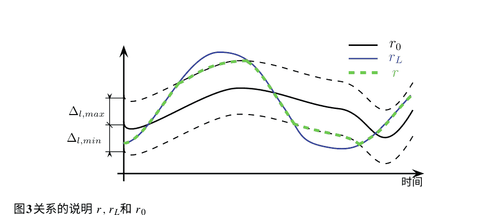

保证。如果系统的控制器是固定的且不能更改，则这种设计问题是相关的。

-   ● 给定的是基于学习的代理、基于模型的代理用于计算 $r_L$, $r_0$ 和具有预定义 $\Delta_l$ 的监督者。鲁棒控制设计的任务是设计一个能够保证系统对于变化的 $r$ 具有鲁棒性能的控制器。如果对参考信号有预定义的要求，则这种设计问题是相关的。

本节的其余部分将重点讨论第二个问题，即鲁棒控制器的设计。因此，假设对 $\Delta_l$ 的要求已经给定，并且必须设计一个鲁棒控制器。

### 2.2 鲁棒控制器的设计过程

鲁棒控制器的设计需要通过状态-空间表示来描述系统，如

$$\dot{x} = Ax + B_1w + B_2u, \tag{5}$$

其中， $x$是状态向量， $w$是干扰向量， $u$是控制输入向量。控制设计的目标是最小化性能，这些性能组成了向量 $z = [z_1 \dots z_n]^T$ 作为

$$|z_i| \rightarrow \min, \quad \forall i = 1 \dots n. \tag{6}$$

性能 $z_i$ 的形式取决于当前的控制问题。然而，由于图1中的参考跟踪结构，存在与参考信号 $r$ 相关的性能。假设 $z_j$, $1 \leq j \leq n$ 具有以下形式

$$z_j = x_j - r, \tag{7}$$

其中， $x_j$ 是由 $x$, $w$ 和 $u$ 的凸组合得到的信号，必须跟踪参考信号 $r$。可以使用(3)对性能 $z_j$ 进行改进

$$z_j = x_j - r_0 + \Delta_l, \tag{8}$$

其中 $r_0$ 和 $\Delta_l$ 被认为是测量干扰。测量干扰之间有一个重要的区别：

-   ● $r_0$ 由基于模型的代理生成。基于模型的代理的数学结构被认为是已知的，并且使用 $r_0$ 可以保证系统的主要性能。因此，控制设计师可以对 $r_0$ 的属性有确切的了解，即其值的范围或信号的频率内容。

-   ● $\Delta_l$ 取决于基于模型和基于学习的代理，并且它们的界限由 $\Lambda_l$ 确定。由于在确定基于学习的代理的属性时可能存在更多的不确定性，因此对 $\Delta_l$ 的表征可能是一个复杂的问题。在鲁棒控制设计的实践中， $\Delta_l$ 的特性可以通过保守的近似来覆盖。

由于测量干扰信号的动态不同，建议在控制设计中单独处理它们。

动态方程、性能（42）和测量方程被转化为一个联合状态空间表示。

$$
\begin{aligned}
\dot{x} &= Ax + B_1 w_{ext} + B_2 u, \quad (9a) \\
z &= C_1 x + D_{11} w_{ext} + D_{12} u, \quad (9b) \\
y &= C_2 x + D_{21} w_{ext} + D_{22} u, \quad (9c)
\end{aligned}
$$

其中 $A, B_1, B_2$ 和 $C_1, C_2, D_{11}, D_{12}, D_{21}, D_{22}$ 是矩阵，扰动向量 $w$ 被扩展为 $w_{ext} = [w \ r_0 \ \Delta_l]^T$。测量向量 $y$ 包含用于鲁棒控制器输出生成的信号。

控制设计基于鲁棒 $H_\infty$ 方法，该方法可以保证系统对干扰的鲁棒稳定性和性能要求。设计方法要求使用加权函数增加闭环系统的性能，参见图4中的三个性能示例。

互连结构包含多个加权函数，其作用是在性能和信号之间进行权衡和缩放。权重 $W_n$ 与测量中的传感器特性相关，其中 $n$ 表示噪声。$W_{dist}$ 缩放纵向干扰力。

权重 $W_0$ 的作用是考虑参考信号 $r_0$ 的动态特性。类似地， $W_1$ 缩放干扰 $\Delta_l$。 该权重的选择形式为

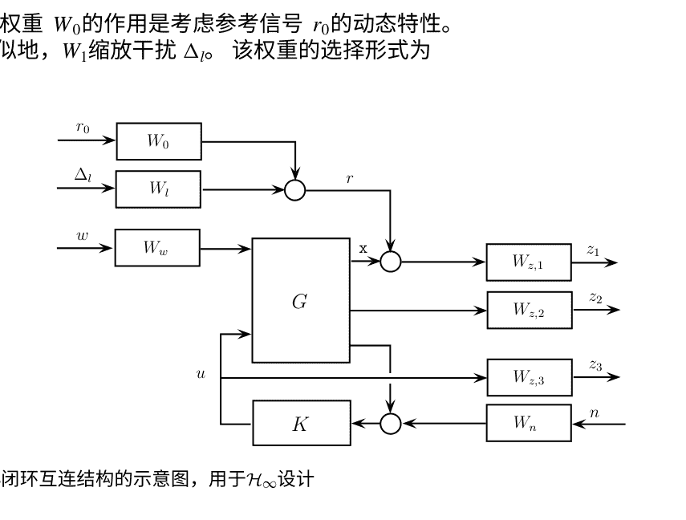

其中，$T_{12}$ 和 $T_{11}$ 是设计参数，代表信号的动态。所选的形式保证了扰动的值在稳态时为 $\Delta_{l,1,m}, \Delta_{l,2,m}$。

$$W_{l} = \frac{\max(\Delta_{l,\min}; \Delta_{l,\max})}{T_{12}s^2 + T_{11}s + 1}, \quad (10)$$

$W_{z,1}, W_{z,2}$ 和 $W_{z,3}$ 是(42)中性能的权重，代表对它们的最小化。权重 $W_{z,1}$ 在控制的整体性能方面起着重要作用，因为它缩放了跟踪误差(8)。权重的形式为

$$W_{z,1} = \frac{\bar{e}_{j}}{T_2s + 1}, \quad (11)$$

其中 $T_2$ 是设计参数，$\bar{e}_j$ 是预期的最大跟踪误差。所选的形式保证了跟踪误差在稳态下为 $\bar{e}_j$。

在控制系统的设计中，$\mathcal{H}_{\infty}$ 性能问题是选择控制器，使得闭环系统具有二次稳定性，并且从 $w_{ext}$ 到 $z$ 的引入 $\mathcal{H}_{\infty}$ 范数小于 $\gamma$。因此，闭环控制系统的状态空间表示如下所示：

$$
\begin{aligned}
\dot{x}_{cl} &= A_{cl}x_{cl} + B_{cl}w, \quad (12a) \\
z &= C_{cl}x + D_{cl}w. \quad (12b)
\end{aligned}
$$

$\mathcal{H}_{\infty}$ 控制的目标是最小化传递函数 $T_z$。更准确地说，问题可以表述如下[5, 30]。$\mathcal{H}_{\infty}$ 性能的LMI问题可以表述为：从 $w$ 到 $z$ 的闭环RMS（功率到功率）增益不超过 $\gamma$ 当且仅当存在一个对称矩阵 $X$ 使得

$$\left[\begin{array}{ccc} A_{cl}P + PA_{cl}^T & PB_{cl} & C_{cl}^T \\ B_{cl}^T P & -\gamma I & D_{cl}^T \\ C_{cl} & D_{cl} & -\gamma I \end{array}\right] < 0 \quad (13)$$

对于系统 $P$，找到一个满足以下设计准则的可接受控制 $K$：

-   -   闭环系统必须渐近稳定，
-   -   从 $w_{ext}$ 到 $z$ 的闭环传递函数满足约束条件：

$$\|T_{z, w_{ext}}(s)\|_{\infty} < \gamma, \quad (14)$$

对于给定的实数正值 $\gamma$，其中 $T_{z, w_{ext}}(s)$ 是传递函数。

## 3 基于学习型代理的鲁棒控制框架

### 在控制回路中

学习型代理在无人系统的控制回路内的应用是解决几个控制问题的创新解决方案。 在这种情况下，代理具有控制目的，这意味着它使用测量信号提供控制输入，参见图2。 本节的目的是提出鲁棒框架的基本原理，监督者的设计和鲁棒LPV控制器。

### 3.1 设计框架的概念

该概念的目标是形成具有可以保证主要性能要求的鲁棒设计框架的结构。 该框架的理念是，如果可以保证主要性能要求，则系统的控制输入等同于学习型代理的输出。 但是，如果主要性能被违反，则学习型控制的输出将被监督者覆盖。 关于主要性能违反的决策是通过比较学习型代理的输出和鲁棒LPV控制器的输出来执行的。

基于学习的控制器的输出是向量 $u_L$，具有 $n$ 个元素，如下所示

$$
\begin{aligned}
u_L &= \mathcal{F}(y_L), \qquad\qquad\qquad (15a) \\
u_L &= [u_{L,1}\ u_{L,2}\ \dots\ u_{L,n}]^T, \qquad (15b)
\end{aligned}
$$

其中 $y_L$ 向量包含控制器的输入，具有 $m_L$ 个元素。$\mathcal{F}$ 表示学习型控制器本身，例如深度学习神经网络，它在其输入层上激活。 此外，鲁棒LPV控制器的输出是向量 $u_K$，具有 $n$ 个元素，如下所示

$$
\begin{aligned}
u_K &= \mathcal{K}(\rho_L, y_K), \qquad\qquad\qquad (16a) \\
u_K &= [u_{K,1}\ u_{K,2}\ \dots\ u_{K,n}]^T, \qquad (16b)
\end{aligned}
$$

其中 $\mathcal{K}$ 表示LPV控制器，$y_K$ 是测量信号的向量，具有 $m_K$ 个元素。 在(16)中，$\rho_L \in \rho_K$ 向量包含控制器的调度变量，被认为至少有 $n$ 个元素。

设计方法的基本假设是系统的控制输入信号 $u = [u_1\ u_2\ \dots\ u_n]^T$ 可以表示为 $u_K$ 的函数，以线性形式，在预定义条件下。线性公式中的参数被选择为保证 $u = u_L$，如果主要性能的要求由 $u_L$ 保证。 因此，$u, u_K$ 和 $u_L$ 之间的关系与条件形成

$$u = u_L = I_{n \times n} \circ (\rho_L^* J_{1 \times n}) u_K + \Delta_L^*, \quad \text{如果} \quad \rho_{L,i}^* \in \rho_{L,i}, \quad \Delta_{L,i}^* \in \Lambda_{L,i}, \quad \forall i = 1 \ldots n, \tag{17}$$
其中 $\circ$ 表示哈达玛积，$I_{n \times n}$ 是一个 $n \times n$ 单位矩阵，$J_{1 \times n}$ 是一个只有一行的全1矩阵，$\rho_L^*$ 和 $\Delta_L^*$ 是 $n \times 1$ 向量。

$$
\begin{aligned}
\rho_L^* &= [\rho_{L,1}^* \ \rho_{L,2}^* \ \ldots \ \rho_{L,n}^*]^T, \tag{18a} \\
\Delta_L^* &= [\Delta_{L,1}^* \ \Delta_{L,2}^* \ \ldots \ \Delta_{L,n}^*]^T. \tag{18b}
\end{aligned}
$$

$n$ 是时间相关的加权信号。$\rho_{L,i}=[ \rho_{L,i,\min}; \rho_{L,i,\max}], \Lambda_{L,i}=[\Delta_{L,i,\min}; \Delta_{L,i,\max}]$ 表示(17)中的定义域，其中 $\rho_{L,i,\min}, \rho_{L,i,\max}, \Delta_{L,i,\min}, \Delta_{L,i,\max}$ 是标量。定义域的集合用 $\rho_L, \Lambda_L$ 表示。由于 $I_{n \times n} \circ (\rho_L^* J_{1 \times n})$ in (17) 得到的是一个 $n \times n$ 对角矩阵，相关元素 $\rho_{L,i}^*, u_i$ 仅依赖于 $u_{K,i}$。

如果条件(17)对于 $\rho$ 成立 当满足条件 $\rho_{L,i}^*$ 和 $\Delta_{L,i}^*$ 时，系统的控制输入 $u$ 等于 $u_L$。但是，如果存在至少一个 $i \in [1; n]$，其中 $\rho_{L,i}^* \notin \rho_{L,i}$ 或 $\Delta_{L,i}^* \notin \Lambda_{L,i}$，变量 $\rho_{L,i}^*, \Delta_{L,i}^*$ 受到 $\rho_{L,j}$ 和 $\Lambda_{L,j}$ 边界的限制，在计算控制信号 $u_i$ 时。在这种情况下，$u = u_{L}$ 包含两种情况的一般控制规则形成如下

$$u = I_{n \times n} \circ (\rho_L J_{1 \times n}) u_K + \Delta_L, \tag{19}$$
其中
$$
\begin{aligned}
\rho_L &= [\rho_{L,1} \ \rho_{L,2} \ \ldots \ \rho_{L,n}]^T, \tag{20a} \\
\Delta_L &= [\Delta_{L,1} \ \Delta_{L,2} \ \ldots \ \Delta_{L,n}]^T, \tag{20b} \\
\rho_{L,i} &= \min \left( \max \left( \rho_{L,i}^*; \rho_{L,i,\min} \right); \rho_{L,i,\max} \right), \quad \forall i = 1 \ldots n, \tag{20c} \\
\Delta_{L,i} &= \min \left( \max \left( \Delta_{L,i}^*; \Delta_{L,i,\min} \right); \Delta_{L,i,\max} \right), \quad \forall i = 1 \ldots n. \tag{20d}
\end{aligned}
$$

关系(20c)–(20d)保证 $\rho_L \in \rho_L$ 和 $\Delta_L \in \Lambda_L$。整个系统操作域内的LPV控制器确定了最小性能水平，而在 $\rho_L, \Lambda_L$ 的域内，通过基于学习的控制提高了性能水平。因此，学习控制的优点可以实现，同时通过最小性能水平消除了其在某些场景中的性能下降。

在图5中，给定控制架构的结构被呈现出来。在提出的概念中，反馈回路包含LPV控制器，而基于学习的控制器则在控制方面处于辅助回路中。监督器块的作用是选择 $\rho_L, \Delta_L$。系统上的激励控制输入 $u$ 取决于 $u_K, \rho_L, \Delta_L$。

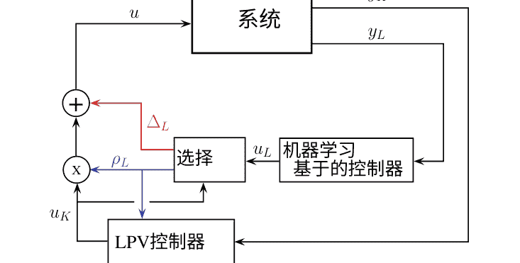

图5 控制架构的结构

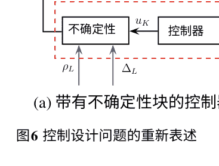

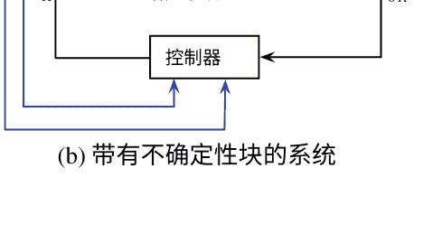

图6 控制设计问题的重新表述

(a) 带有不确定性块的控制器

(b) 带有不确定性块的系统

图6提供了对控制架构背后思想的更深入理解。控制规则（19）可以被处理为带有不确定性块的固定控制器的结果（图6a）。在这种方法中，监督器被处理为系统中的一种不确定性。在设计框架的提出的控制问题中，控制器-不确定性结构的方案被重新表述：系统增广了不确定性块。因此，在控制器的设计问题中，信号 $\rho_L, \Delta_L$ 和域 $\rho_L, \Lambda_L$ 被纳入设计过程中，参见图6b。重新表述的增广系统由于参数变化激发了LPV理论的使用。$\rho_L$ 的元素被处理为调度变量，$\Delta_L$ 被称为系统的已知干扰向量。

-   控制架构的设计需要以下步骤进行。
1.  需要选择 $\rho_L, \Delta_L$ 和域 $\rho_L, \Lambda_L$ 的值，如(19)-(20)中所定义。
2.  必须设计鲁棒的LPV控制，其中包含域 $\rho_L, \Lambda_L$。

控制设计的挑战在于 $\rho_L, \Lambda_L$ 的确定和LPV设计彼此不独立。控制设计需要选择域，而有效选择域需要对设计控制的性能有经验。作为解决这一异常的方法，提出了一种迭代设计方法，它将域选择和LPV设计融入其中。所提出的方法侧重于迭代设计，而学习型控制被认为是已知的。

### 3.2 监督选择策略

选择策略基于的思想是无人系统的性能水平必须最大化。$\rho_P$ 和 $\Delta_P$ 的选择策略是基于这个思想的。如果 $u = u_L$ (17)，这个目标可以实现。然而，监督还必须保证主要性能的预定义最低水平。性能水平问题导致了一个受限制的优化问题。通过最小化成本函数来实现性能水平的最大化，并通过约束条件保证主要性能的最低水平。监督的作用是基于当前信号，在线执行优化问题。

优化问题的变量是 $\rho_P, \Delta_P$，用于计算 $u$ (19)。

优化的目标是最小化控制输入向量 $u$ 和基于学习的代理输出 $u_L$ 之间的差异。因此，成本函数形成如下：

$$\sum_{i=1}^n (u_i - u_{L,i})^2 \rightarrow \min . \tag{21}$$

使用(19)重排(21)的目标函数为二次形式

$$\sum_{i=1}^n (u_i - u_{L,i})^2 = \sum_{i=1}^n \left( \begin{bmatrix} \rho_{L,i} \\ \Delta_{L,i} \end{bmatrix}^T \begin{bmatrix} u_{K,i}^2 & u_{K,i} \\ u_{K,i} & 1 \end{bmatrix} \begin{bmatrix} \rho_{L,i} \\ \Delta_{L,i} \end{bmatrix} + \begin{bmatrix} -2u_{L,i}u_{K,i} \\ -2u_{L,i} \end{bmatrix}^T \begin{bmatrix} \rho_{L,i} \\ \Delta_{L,i} \end{bmatrix} + u_{L,i}^2 \right) = \begin{bmatrix} \rho_L \\ \Delta_L \end{bmatrix}^T \beta \begin{bmatrix} \rho_L \\ \Delta_L \end{bmatrix} + \omega^T \begin{bmatrix} \rho_L \\ \Delta_L \end{bmatrix} + u_L^2, \tag{22}$$

其中 $u_L^2$ 与 $\rho_L, \Delta_L$ 无关，因此在最小化过程中可以消除。

优化的约束条件基于系统的状态空间表示：

$$\dot{x} = Ax + B_1w + B_2u, \tag{23}$$其中，$x$ 表示状态向量，而 $A$、$\hat{B}_1$、$\hat{B}_2$ 是系统表示中的矩阵。系统的状态空间表示通过预定义的控制策略（19）重新表达为 $u_K$ 而不是 $u$。因此，系统的状态空间表示（23）通过之间的关系重新表达为

$$ \dot{x} = Ax + B_1 w_K + B_2(\rho_L)u_K, \quad \quad (24) $$

其中，干扰向量 $w_K$ 在状态空间表示（24）中组成为 $w_K = [w \quad \Delta_L]^T$。矩阵为

$$ B_1 = [\hat{B}_1 \quad \hat{B}_2], \quad \quad \quad \quad \quad \quad \quad \quad \quad \quad \quad \quad \quad \quad \quad \quad \quad (25a) $$
$$ B_2(\rho_L) = \mathcal{B}_2(I_{n\times n} \circ (\rho_L J_{1\times n})). \quad \quad \quad \quad \quad \quad \quad \quad \quad \quad (25b) $$

因此，系统被转化为LPV表示。

无人系统的主要性能要求通常可以形成对状态和控制输入的凸组合的不等式约束，如下所示：

$$ \Theta_{min} \leq \Theta_1 x + \Theta_2 u \leq \Theta_{max}, \quad \quad (26) $$

其中 $\Theta_{min}$，$\Theta_{max}$ 表示约束的向量。$\Theta_1$，$\Theta_2$ 是基于 $x$ 和 $u$ 之间关系形成的矩阵。在优化问题中将(26)作为约束的应用需要根据 $L$、$\rho_L$ 的不同重新制定(26)。

- 约束中的状态被重新制定如下。假设优化问题在线上以 $T$ 的采样时间求解。约束的作用是保证在时间步骤 $t+T$ 时满足(26)，其中 $t$ 表示当前时间。为了计算 $x(t+T)$，状态空间表示(24)被转化为具有 $T$ 采样时间的离散形式。

$$ x(k+1) = A_d x(k) + B_{1,d} w_K(k) + B_{2,d}(\rho_L(k)) u_K(k), \quad \quad (27) $$

其中 $x(k+1)$ 等于 $x(t+T)$ 和 $A_d, B_{1,d}, B_{2,d}$ 是矩阵。假设当前状态向量 $x(k) = x$ 已知，即已测量或估计。

由于 $w_K(k) = w_K$ 是系统中的干扰向量，不能测量其所有元素。$B_{1,d} w_K$ 可以分为 $\hat{B}_{1,d} w+ \hat{B}_{2,d} \Delta_L$ 的分量。第二项 $\hat{B}_{2,d} \Delta_L$ 包含优化问题的变量 $\Delta_L$，而第一项 $\hat{B}_{1,d} w$ 可能包含未测量的干扰。因此，对于 $\hat{B}_{1,d} w$ 的确切信息，可以用干扰向量的下限和上限来表示：

$$ \Theta_{\text{min},w} \leq \Theta_1 x + \Theta_2 w \leq \Theta_{\text{max},w} \quad \quad (28) $$

其中 $\Theta_{\text{min},w}$, $\Theta_{\text{max},w}$ 是表示干扰向量的下限和上限的向量。在向量 $\Theta_{\text{min},w}$, $\Theta_{\text{max},w}$ 中，干扰被逐元素考虑。

- 通过(19)提供了(26)中 $u$ 的重新表述。约束(26)的不等式被重新表述为

$-\Theta_1\left(A_{d}x + \Theta_{\text{min},w}B_{2,d}\Delta_L + B_{2,d}(\rho_L) u_K\right) - \Theta_2\left(I_{n\times n} \circ (\rho_L J_{1\times n}) u_K + \Delta_L\right) \leq -\Theta_{\text{min}}$
(29a)

$\Theta_1\left(A_{d}x + \Theta_{\text{max},w} + B_{2,d}\Delta_L + B_{2,d}(\rho_L)u_K\right) + \Theta_2\left(I_{n\times n} \circ (\rho_L J_{1\times n}) u_K + \Delta_L\right) \leq \Theta_{\text{max}}$
(29b)

可以写成紧凑形式

$\Theta_A \begin{bmatrix} \rho_L \\ \Delta_L \end{bmatrix} \leq \Theta_B$
(30)

其中 $\Theta_A$ 是一个矩阵，$\Theta_B$ 是一个向量。约束优化问题包含目标函数（22），状态和控制输入（26）上的约束以及优化变量上的约束，如下所示：

$\min_{\rho_L,\Delta_L} \begin{bmatrix} \rho_L \\ \Delta_L \end{bmatrix}^T \beta \begin{bmatrix} \rho_L \\ \Delta_L \end{bmatrix} + \omega^T \begin{bmatrix} \rho_L \\ \Delta_L \end{bmatrix}$
(31a)

受限于

$\Theta_A \begin{bmatrix} \rho_L \\ \Delta_L \end{bmatrix} \leq \Theta_B$
(31b)

$\rho_L \in \rho_L$
(31c)

$\Delta_L \in \Lambda_L$
(31d)

优化问题的结果是 $\rho_L$ 和 $\Delta_L$。监督器的输出是 $u$，通过使用 $\rho_L$，$\Delta_L$ 和 $u_K$ 通过(19)计算得到。

### 3.3 通过鲁棒LPV方法设计控制器

鲁棒LPV控制器的设计基于系统的状态空间表示，该表示通过 $\Delta_L$, $\rho_L$ 进行扩展，参见（24）。鲁棒LPV设计的目标是找到一个具有最小主要性能保证的控制器。然而，在控制的设计中，还可以考虑其他性能，即次要性能。这些性能被纳入性能向量 $z$ 中。

性能向量 $z$ 通过控制输入 $u$ 和现有的干扰 $w$ 来表示。

$$z = C_2x + D_{21}w + D_{22}u. \qquad \qquad (32)$$

类似于状态空间表示 (23) - (24)，性能方程 (32) 通过 $u = I_{n \times n} \circ (\rho_L J_{1 \times n} )u_K + \Delta_L$ 进行重新表述。

$$z = C_2x + D_{21}w_K + D_{22}(\rho_L)u_K, \qquad \qquad (33)$$

其中矩阵为

$$D_{21} = [\hat{D}_{21} \ \hat{D}_{22}], \qquad \qquad (34a)$$

$$D_{22}(\rho_L) = \mathscr{D}_{22}(I_{n \times n} \circ (\rho_L J_{1 \times n})). \qquad \qquad (34b)$$

LPV控制器的测量信号由向量 $y_K$ 组成，参见图5。控制器的基于模型的设计要求将 $y_K$ 的表达式表示为关于 $x$、$w$ 和 $u$ 的函数。测量方程形式为

$$y_K = C_1x + D_{11}w + D_{12}u. \qquad \qquad (35)$$

通过关系 $u = I_{n \times n} \circ (\rho_L J_{1 \times n})u_K + \Delta_L$，测量方程被重新表达为

$$y_K = C_1x + D_{11}w_K + D_{12}(\rho_L)u_K, \qquad \qquad (36)$$

矩阵(36)的位置

$$D_{11} = [\hat{D}_{11} \ \hat{D}_{12}], \qquad \qquad (37a)$$

$$D_{12}(\rho_L) = \mathscr{D}_{12}(I_{n \times n} \circ (\rho_L J_{1 \times n})). \qquad \qquad (37b)$$

最后，使用(24)，(33)和(36)设计鲁棒LPV控制器的增广系统被制定为：

$$\dot{x} = Ax + B_1w_K + B_2(\rho_L)u_K, \qquad \qquad (38a)$$

$$z = C_2x + D_{21}w_K + D_{22}(\rho_L)u_K, \qquad \qquad (38b)$$

$$y_K = C_1x + D_{11}w_K + D_{12}(\rho_L)u_K. \qquad \qquad (38c)$$

LPV控制设计方法的目标是提供闭环系统的二次稳定性，并且从干扰向量 $w_K$ 到 $z$ 的引起的 $\mathcal{L}_2$ 范数小于标量 $\gamma>0$。解决二次LPV $\gamma$-性能问题的控制器存在可以表示为一组LMIs的可行性，可以通过数值方法求解。由LMIs设置的约束条件不是有限的。通过一个有限的、足够细的网格来缓解约束的无限性。为了指定LPV设计的性能权重的网格，通过查找表定义了调度变量。网格化反映了性能权重的定性变化，即调度变量 $\rho_L \in \rho_{L^o}$。闭环系统的稳定性和性能水平由设计过程[6, 33]保证。二次LPV性能问题是选择参数变化的控制器 $K(\rho_L, y_K)$，使得得到的闭环系统是二次稳定的，并且从干扰和性能引起的 $L_2$ 范数小于值 $\gamma$。最小化任务如下：

$$ \inf_{\substack{\mathcal{K}(\rho_L, y_K) \\ \rho_L \in \rho_{L^o} \\ \|w_K\|_2 = 0, \ w_K \in \mathcal{L}_2}} \frac{\|z\|_2}{\|w_K\|_2}. $$

解决二次LPV γ-性能问题的控制器的存在性可以表示为一组线性矩阵不等式的可行性，可以通过数值方法求解。

最后，构建了LPV控制 $K(\rho_L, y_K)$ 的状态空间表示，参见[32, 33]。优化问题(39)是离线求解的，得到的控制器 $K(\rho_L, y_K)$ 用于在线控制输入计算。这导致了控制输入 $u_K$(16)，它与 $\rho_L, \Delta_L$ 的选择一起用于计算 $u$(19)。控制规则导致闭环系统的最小性能水平由 $K(\rho_L, y_K)$ 确定。

选择 $\rho_L$ 和设计 $K(\rho_L, y_K)$ 之间的关系已经在第3.1节中介绍。通过设计 $K(\rho_L, y_K)$ 来扩展性能水平需要预先选择 $\rho_L$ 和 $\Lambda_L$。类似地，通过选择 $\rho_L$ 和 $\Delta_L$ 来扩展性能水平需要预先设计 $K(\rho_L, y_K)$。此外，鲁棒LPV控制器(39)的设计问题和监督器(31)中的优化问题由于 $\rho_L$ 和 $\Lambda_L$ 而不是相互独立的。解决该问题的一种可能方法是创建一个迭代设计过程，其中控制设计、选择 $\rho_L$ 和监督器中的优化按照迭代方法进行排序和执行。

迭代的目标是最小化 $u, u_L$ 之间的差异，并最小化界限 $\rho_L, \Lambda_L$。拟合的结果是减少域的范围和控制器 $K(\rho_L, y_K)$ 的保守性。通过迭代过程实现域的拟合。通过迭代可以实现域的范围和控制干预特性之间的平衡。因此，在迭代中融入了域和干预特性，从而得到以下优化任务。

$$ \min_{\substack{\rho_{L,i,\min} > 0, \\ \rho_{L,i,\max} > 0}} \sum_{i=1}^n R_i \left( \rho_{L,i,\max} - \rho_{L,i,\min} \right) + D_i \left( |\Delta_{L,i,\max}| - |\Delta_{L,i,\min}| \right) + T_i \bar{E}_i, $$

在约束条件 $\rho_{L,i,\max} > \rho_{L,i,\min}$ 的情况下，$\bar{E}_i$ 是 $u_i$ 和 $u_{L,i}$ 的平均相对误差。$n$ 个标量是设计参数。

通过选择 $T_i$，可以缩放 $u_i$ 和 $u_{L,i}$ 的平均相对误差。增加 $T_i$ 的动机是设计一个LPV控制器，其输出尽可能接近基于学习的控制器的输出。如果 $u_i$ 接近 $u_{L,i}$，则LPV控制器近似于基于学习的控制器的有利动态。其结果是 $\rho_{L,i}$ 和 $\Lambda_{L,i}$ 的定义域增加。然而，在一个性能损失的学习控制器的情况下，$u_i$ 可以长时间接近 $u_L$，这可以降低系统的最低性能水平。这激发了 $T_i$ 的限制。$R_i$ 和 $D_i$ 参数的作用是缩放域并保证它们之间的平衡。因此，$R_i$ 和 $D_i$ 的值表达了调度变量域的减小和干扰域之间的优先级。选择 $R_i$ 和 $D_i$ 的动机是为了便于LPV控制设计。如果增加 $\rho_{L,i}$ 的域，LPV设计的网格也会增加。由于网格边缘之间的差异增加，LPV控制器的设计过程可能会变得困难，因为具有冻结调度变量的系统的域很高。同样，如果增加 $\Lambda_{L,i}$ 的域，需要对系统增加鲁棒性。这两种影响都可能导致LPV控制设计中的不可行的LMI问题。因此，有必要限制 $R_i$ 和 $D_i$。

- 在第一步中选择高的域 $\rho_{L,i} = [\rho_{L,i,\min}; \rho_{L,i,\max}]$ 和 $\Lambda_{L,i} = [\Lambda_{L,i,\min}; \Lambda_{L,i,\max}]$。选择 $\rho_{L,i,\min}$ 的初始值 $\rho_{L,i,\min} = \varepsilon_i$，其中 $0 < \varepsilon_i$ 具有一个小值。最初，选择高的 $\rho_{L,i,\max}$，同样地，$|\Lambda_{L,i,\min}|$ 和 $|\Lambda_{L,i,\max}|$ 也具有高值，这导致保守的LPV控制。迭代设计过程的目标是通过适当选择边界来减少保守性。
- 使用(39)设计了具有选定域的LPV控制。
- 通过各种场景分析了具有设计的 $\mathcal{K}(\rho_L, y_K)$ 和域 $\rho_L$, $\Lambda_L$ 的闭环系统。它产生了信号 $u_L$ 和 $u_K$。
- 由于场景结果，边界被修改以减少优化问题(40)的成本函数。通过优化算法选择了 $\rho_{L,i,\min}$, $\rho_{L,i,\max}$ 和 $\Lambda_{L,i,\min}$, $\Lambda_{L,i,\max}$ 的新值，其中 $i = 1 ... n$，例如通过单纯形搜索或信赖域反射方法[9, 20]。
- LPV设计，场景和评估（步骤2-4）一直执行，直到达到最小值 (40)。如果设计的控制的最小性能水平不合适，或者域的范围导致频繁地在边界上进行控制干预，则必须修改参数 $R_i$, $D_i$ 和 $T_i$（步骤1），然后再次执行迭代。

迭代过程的结果是鲁棒LPV控制器和域 $\rho_L$, $\Lambda_L$。

## 将提出的鲁棒控制应用于无人系统问题的4个应用

本节介绍了提出的设计框架的两个示例。在第一个示例中，通过巡航控制设计问题说明了第2节的设计框架的有效性。其次，将第3节的框架应用于移动机器人系统的控制问题。

### 4.1 自主车辆巡航控制设计

所提出的巡航控制问题的目标是通过车辆运动实现对参考速度曲线的跟踪，以实现最小能量消耗。在参考速度曲线的计算中，包含了广泛的信息，例如道路坡度值、速度限制、即将到来的道路段的交通流速度。这导致了一个层次化的多目标优化问题，其解决可能需要大量的数值计算 [11]。因此，对于实时应用程序的优化实现可能会很困难。解决实现问题的一个有效方法可能是通过神经网络学习大量的速度曲线，这可以用较少的工作量来实现。

学习过程的结果示例如图7所示。多目标优化的结果是神经网络的参考信号 $v_{qp}$ 和参考速度信号 $v_{AI}$。神经网络通过监督学习技术对 $v_{qp}$ 和 $v_{AI}$ 进行拟合训练，这需要一个用于训练和测试的数据集。在图7的示例中，数据集是通过超过150万个不同的场景生成的，其中进行了多目标优化过程。在数据收集过程中，场景的初始参数是随机选择的，例如道路上的速度限制。

神经网络的结构包括一个输入层，一个输出层和10个隐藏层中的神经元。隐藏层和神经元的数量是通过使用k折交叉验证技术[2]来选择的。网络的输入层上的输入向量包含

- 海拔值和
- 预测时间段内各段点的速度限制。

网络的一个关键部分是应用的激活函数。尽管在训练过程中可以使用许多函数，但在这个估计问题中使用了修正线性单元（ReLU）和对数sigmoid函数，因为它们可以很容易地调整到非线性问题。训练网络时使用了Levenberg-Marquardt算法[13]。

在图7的示例中，一辆乘用车在一段长50公里的多山公路上行驶，在38-40.5公里段有速度限制。道路示例中的路段具有真实的地形特征，代表从布达佩斯到维也纳方向的匈牙利M1高速公路，参见图7a。

进行了两次模拟：通过基于二次规划的算法和神经网络计算参考速度。图7b的说明表明神经网络的学习过程是成功的，车辆的速度曲线彼此接近。此外，两种情景之间的能量消耗差异仅为0.55%，基于神经网络的算法使能量消耗减少了7.1%，与车辆跟踪当前最大速度限制的情景相比。

尽管在巡航控制算法的实现中，对 $v_{qp}$ 的近似具有很大的优势，但神经网络对系统性能提出了新的挑战。例如，对 $v_{qp}$ 的跟踪可以保证最小能量消耗和车速的限制。尽管神经网络的训练取得了成功，但对 $v_{AI}$ 的跟踪并不能提供能量或速度限制的保证。因此，在道路地形特征与训练集中的道路段明显不同的情况下，$v_{AI}$ 可能导致性能下降。在给定的巡航控制场景中，性能## 巡航控制的有效性示例

性能退化可能意味着选择危险的速度曲线或显著增加能量消耗。

避免危险速度是控制系统的首要性能要求，在整个车辆巡航过程中必须得到保证。然而，能量消耗的最小化是次要性能，必须在车辆中保持。因此，第2节的设计框架被应用于鲁棒巡航控制的设计。参考信号的选择如下：$r_L = v_{AI}$ 和 $r_0 = v_{\lim}$，其中 $v_{\lim}$ 是道路上的当前速度限制。

假设选择 $v_{\lim}$ 为0时，保证系统的优先性能。与 $v_{\lim}$ 的差异通过预定义的 $\Delta_{l,\min}$，$\Delta_{l,\max}$ 值进行限制。此外，$\Delta^*_l$ 通过 (2) 定义为

$$ \Delta^*_l = v_{AI} - v_{\lim} \tag{41}$$

鲁棒控制器的设计基于简化的纵向车辆模型 $m\dot{v} = F_l - F_d$，其中 $m$ 是车辆质量，$F_l$ 是纵向控制力而 $F_d$ 包含干扰，例如空气阻力、滚动阻力等。它被转化为状态空间表示 (5)，其中状态向量 $x^T = [v \quad \xi]$ 包括车速 $v$ 和车辆的纵向位移 $\xi$。系统的干扰是 $w = F_d$，控制输入是 $u = F_l$。

在控制器设计中，两个控制性能准则 (42) 被制定为

$$ \begin{aligned} z_1 &= v - v_{ref}, & |z_1| &\to \min, \ z_2 &= F_l, & |z_2| &\to \min, \end{aligned} \tag{42a, 42b}$$

即跟踪误差 ($z_1$) 和控制干预 ($F_l$) 的最小化。性能向量压缩为：$z = [z_1 \quad z_2]^T$。

使用控制性能、状态空间模型和 $\Delta_{l, \min}$，$\Delta_{l, \max}$ 的 $\mathcal{H}_{\infty}$ 设计 (13) 进行。

在该示例中，受控车辆行驶在一段新的道路上，其数据与初始训练和测试集的数据不同。高速公路路段的地形特征在图8中显示，该图代表了阿尔萨斯地区穆尔豪斯和贝尔福之间法国A36高速公路的真实性质。由于道路段包含神经网络的未知输入信息，网络的输出可能导致车辆性能的显著降低。图9显示了车辆速度曲线的一个示例，其中未考虑 $v_{AI}$，而应用了参考速度信号 $v_{AI}$。可以看出，这种情况可能导致车辆速度显著降低，停在上坡段的顶部。这个例子说明了使用所提出的方法来提供速度变化的保证性能的必要性。

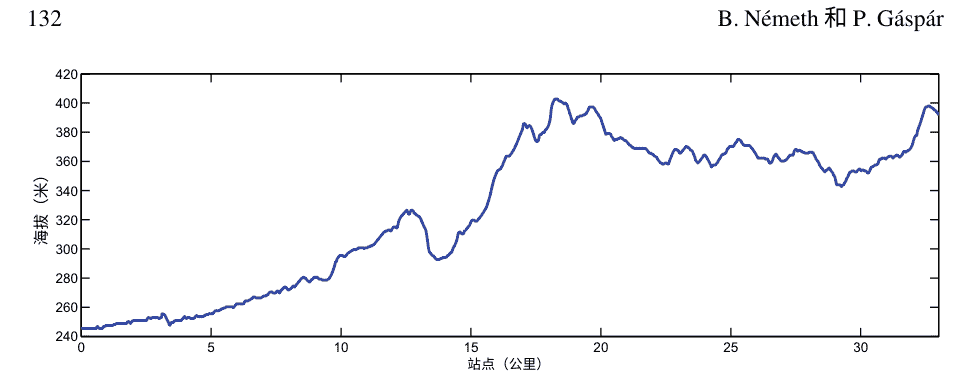

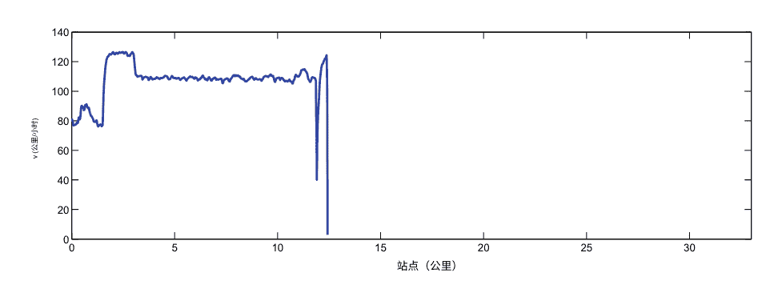

图10展示了通过(3)规则选择 r 的场景。
图10a显示了由于选择 $\Delta_{l, min} = 5m/s$ 和 $\Delta_{l, max} = 0m/s$ 而显著减少的速度曲线变化。因此，鲁棒控制器与 r 的选择规则一起保证了性能。然而，从图10b可以看出，在高速公路路段中 $\Delta_l$ 与 $\Delta_l^*$明显不同。
这意味着 $v_{AI}$ 经常被覆盖，对能源消耗产生不利影响。

## 能源消耗性能的维护

增加的 $\Delta_l^*$ 覆盖次数是由于道路段的未知地形特征。通过对神经网络进行重新训练，可以减少覆盖次数，其中训练集扩展了新的道路段。此过程具有以下要求。

- 需要检测能耗性能要求被违反的道路段落。
- 必须保存监测道路段的地形特征，并且必须离线计算 $v_{qp}$。
- 重新训练过程必须基于扩展的训练集进行。计算 $v_{qp}$ 和重新训练过程是离线任务，无法在车辆中执行。在以下概念中，道路段的数据是由车辆收集，但计算 $v_{qp}$ 和神经网络的重新训练在云中进行。重新训练后的神经网络在更新过程中上传到自动驾驶车辆中，例如在服务或休息时间内。

为了保持能源消耗性能，已经开发了以下方法。

1.  有必要检测给定道路视野中 $v_{qp}$ 和 $v_{AI}$ 之间的显著差异。由于 $v_{qp}$ 的值不是在线计算的，所以基于信号 $\Delta_l^*$ ， $\Delta_l$ 来检测性能的违规。检测的思想如下：与预定义的训练和测试集显著不同的情景导致 $v_{qp}$ 和 $v_{AI}$ 之间的差异较大。

由于 $\Delta_{l,\ min}$ ， $\Delta_{l,\ max}$ 对 $v_{ref,\ 0}$ 的变化有限，速度信号 $v_{AI}$ 很可能超出范围，而 $v_{qp}$ 始终在范围内。因此，如果 $v_{AI}$ 超出范围，则 $v_{ref} = v_{AI}$ 且 $\Delta_l^* = \Delta_l$ 。定义采样 $i$ 的误差函数 $\varepsilon$ 如下：

$$\varepsilon(i) \triangleq \begin{cases} 0, & \text{如果 } \Delta_{l}^{*}(i)=\Delta_{l}(i) \\ |\Delta_{l}^{*}(i)-\Delta_{l}(i)|, & \text{如果 } \Delta_{l}^{*}(i) \neq \Delta_{l}(i) \end{cases} \tag{43}$$

误差函数表示了当 $v_{AI}$超出预定义速度范围时， $\Delta_{l}^{*}$和 $\Delta_{l}$之间的差异。在所有 $i$采样中，误差函数的值被总结为一个长度为 $N$的向后视野。如果条件

$$\sum_{i=-N}^{0} \varepsilon(i) > E \tag{44}$$

满足，则必须对 $N$视野中的重新训练过程进行。请参阅以下步骤。值 $E$是一个预定义的标量，必须根据初始训练的经验进行设置。一个可能的选择算法是分析初始训练和测试集的拟合结果来选择 $E$。误差函数(43)及其和为 $E_{j}=\sum_{i=-N}^{0} \varepsilon(i)$ 必须计算所有 $j$情景集合中的$\varepsilon(i)$。选择 $E$的值为 $E_{j}$的最大值。这意味着如果代理在实际情景中的输出结果的总和值（44）高于初始训练和测试集的最坏情景，则重新训练过程开始。

2.  使用多目标优化方法[11]，必须计算给定道路视野的最佳速度曲线 $v_{qpo}$。

3.  神经网络的训练和测试集必须扩展为新的数据集。神经网络的训练必须继续适应扩展集合，这需要拟合优化方法。

所提出的方法提供了对准确检测的保守近似。它仅检测显著差异，忽略了$|v_{q p}-v_{AI}|$的小差异。尽管这种方法可能导致能耗最小化的性能水平降低，但它不需要在线计算 $v_{q p}$，这是该方法的一个重要优势。此外，所提出的重新训练过程无法为能耗提供确切的保证性能，原因有三。首先，它基于一个学习过程，其结果不能准确保证。其次，检测方法的结果是性能违规的保守近似。第三，性能违规的检测是向后确定的。尽管该方法存在这些限制，但在实践中可以实现对车辆能耗的适当维护。

图11展示了在先前的道路部分上使用重新训练的神经网络的模拟结果。速度曲线显示出车辆的运动更加平稳，参见图11a。这是由于 $\Delta_{l}$和 $\Delta_{l}^{*}$之间的差异减小所导致的，参见图11b。在巡航场景中使用原始神经网络（图10b），覆盖 $\Delta_{l}^{*}$导致 $\sum_{i=-N}^{0} \varepsilon(i)=31941$，其中 $N$表示整个高速公路路段。由于选择了 $E$为5400，必须进行重新训练过程以保持能量消耗的性能最小化。相比之下，重新训练系统的 $\sum_{i=-N}^{0} \varepsilon(i)$的值为4112，低于E的值。重新训练过程导致7.43%的能量消耗减少，与初始神经网络的结果相比。
因此，所提出的方法能够保证速度变化的性能限制，并保持能量消耗的性能最小化。

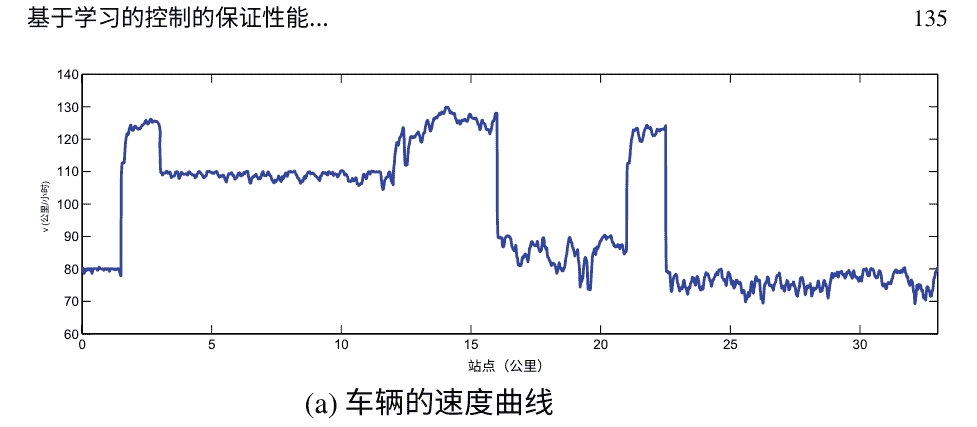

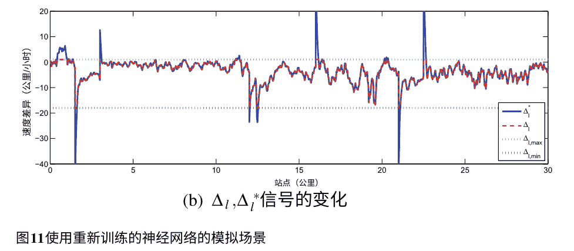

图11使用重新训练的神经网络的模拟场景

### 4.2 移动机器人控制设计的示例

在第二个示例中，基于学习的代理程序位于控制回路内，其结构如图2所示。因此，在下面的示例中，介绍了第3节中该方法的有效性。

目的是控制移动机器人的手臂，如图12所示。
控制器必须设置手臂的位置，这导致了一个参考角度的跟踪问题。

系统的模型形成为[3]

$$\ddot{\varphi} = -M \sin \varphi - D \dot{\varphi} + u, \tag{45}$$

其中 $M$ , $D$ 是正常数，$\varphi$ 是系统的状态，$u$ 是控制输入。从物理模型的角度来看，$M$ 包括了臂的质量和长度值，$D$ 是摩擦系数，$\varphi$ 表示臂的角度，$u$ 是驱动扭矩。由于系统只有一个控制输入 $(n=1)$，在下文中省略了符号 $i$ 。控制设计的目的是最小化参考信号 $r$ 和 $\varphi$ 之间的差异。设计的困难在于系统是非线性的，这可能使得在广泛范围的 $\varphi$ 上的控制设计更加困难，无法通过经典控制技术解决。

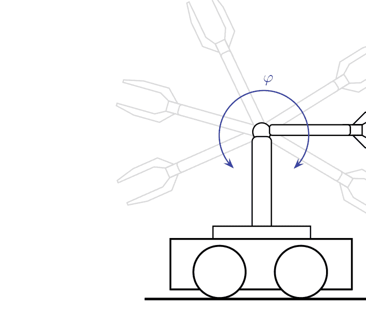

在跟踪控制示例中，使用监督学习训练神经网络 $\mathscr{F}$ 来解决跟踪问题[3]。所选学习控制的优点是能够在训练集的选定范围内提供非线性系统的可接受跟踪性能。为了生成训练集中的信号，使用参考模型 $\ddot{y}_r = -M_r y_r - E_r \dot{y}_r + F_r r$，其中 $M_r$, $E_r$, $F_r$ 是非负常数。训练的参考信号 $r$ 被选为在范围 $-0.7 \leq r \leq 0.7$ 内的随机信号，采样间隔在0.1s和2s之间。在学习过程中，隐藏层的大小被选为13。

LPV控制器 $\mathcal{K}(\rho_L, y_K)$ 的设计需要将系统(45)以状态空间形式(23)进行公式化。它需要对 $\sin \varphi$ 的线性公式化，近似为 $\zeta \varphi$，其中 $\zeta$ 是一个正常数。利用这个近似，系统(45)被重新公式化为

$$\dot{x} = Ax + B_2u, \tag{46}$$

其中 $x=[\varphi \quad \dot{\varphi}]^T$。系统的性能包括参考信号的跟踪和控制输入的最小化，例如 $z_1 = r - \varphi, z_2 = u$。类似地，测量信号是跟踪误差 $y = r - \varphi$。在LPV控制设计中选择加权函数时，参考信号被缩放为 $|r| \leq 1$。

基于（19）式的$u$和$u_K$之间的关系是$u = \rho_L u_K + \tau_{L}$。通过对状态、性能和测量方程式使用$u$的表达式进行重新构建，得到以下LPV系统：

$$\begin{aligned}
\dot{x} &= Ax + B_1 w_K + B_2(\rho_L) u_K, &\quad &(47a) \\
y_K &= C_1 x + D_{11} w_K, &\quad &(47b) \\
z &= C_2 x + D_{21} w_K + D_{22}(\rho_L) u_K. &\quad &(47c)
\end{aligned} \tag{47}$$

其中

$$\begin{aligned}
B_1 &= [0 \quad B_2], \quad &w &= \begin{bmatrix} r \\ \Delta_L \end{bmatrix}, \quad B_2(\rho_L) &= B_2 \rho_L, \\
C_1 &= [0 \quad -1], \quad D_{11} &= [1 \quad 0], \\
C_2 &= \begin{bmatrix} 0 & -1 \\ 0 & 0 \end{bmatrix}, \quad D_{21} &= \begin{bmatrix} 1 & 0 \\ 0 & 1 \end{bmatrix}, \quad D_{22}(\rho_L) &= \begin{bmatrix} 0 \\ \rho_L \end{bmatrix}.
\end{aligned}$$

通过迭代过程设计系统 (47) 上的 LPV 控制。
在下面的示例中，将神经网络基于控制器的仿真结果与三个基于 LPV 的控制进行比较，这些控制是使用不同的 $R$、$D$ 和 $T$ 权重设计的。使用 LPV 控制的 $\gamma$ 值进行迭代的结果显示在表 1 中。在所有的迭代过程中，初始值被选择为 $\rho_{L,\text{min}} = 0.25, \rho_{L,\text{max}} = 0.5$。

表 1 中的结果显示了设计参数 $T$ 的变化对结果的影响。比较的目的是研究 $\rho_L$, $\Delta_L$ 和 $\bar{E}$ 之间的权衡。可以看出，如果在固定的 $R$、$D$ 下减小 $T$，边界 $\rho_{L,\text{min}}$, $\rho_{L,\text{max}}$ 和 $\Delta_{L,\text{min}}$, $\Delta_{L,\text{max}}$ 会更加接近。这导致大部分仿真中禁用 $u = u_L$，这意味着控制的跟踪性能接近 LPV 控制的保证跟踪性能。这导致 $\bar{E}$ 增加，参见表 1。

| $R$ | $D$ | $T$ | $\rho_{L, \text{min}}$ | $\rho_{L, \text{max}}$ | $\Delta_{L, \text{min}}$ | $\Delta_{L, \text{max}}$ | $\bar{E}$ (%) | $\gamma$ |
|:---:|:---:|:---:|:---:|:---:|:---:|:---:|:---:|:---:|
| 3 | 5 | 0.1 | 0.4997 | 0.5104 | -0.7855 | 0.7009 | 8.1 | 0.3886 |
| 3 | 5 | 0.5 | 0.01 | 1.13 | -0.6380 | 1.7414 | 2.2 | 0.3898 |
| 3 | 5 | 1 | 0.01 | 1.5393 | -3.4616 | 3.2791 | 0.7 | 0.4009 |

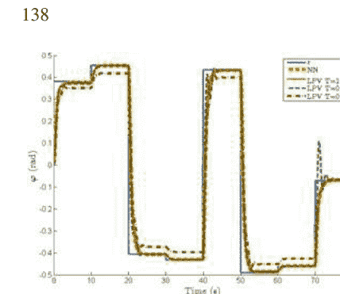

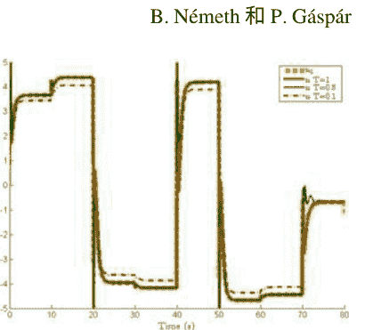

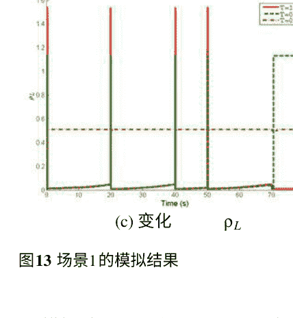

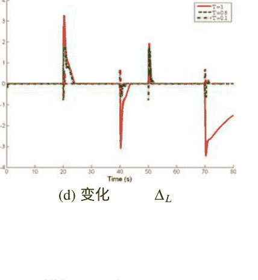

图13 场景1的模拟结果

模拟结果显示在图13和图14中。比较已在两个模拟场景中进行。在场景1中，参考信号的值被选为在边界 |r| ≤ 0.5内的随机信号。在场景2中，参考信号的边界被设置为 |r| ≤ 0.9。两个场景之间的主要区别在于，在第一种情况下，r在神经网络的训练集内，而在第二种情况下，r可能在训练集之外。然而，在LPV控制的设计中，参考信号被缩放为 |r| ≤1，这意味着LPV控制器的性能在两种场景下都得到保证。

在场景1中，模拟结果呈现在图13中。图13a显示，基于神经网络的非线性系统控制器能够以适当的小误差精确跟踪。因此，训练是成功的。同样，基于LPV的控制器也能够保证跟踪，但它们的跟踪性能不同。

在基于LPV的控制中，当 R=3, D=5, T=1时，$\rho_L$ 信号在整个仿真场景中几乎相同。在LPV控制中，当 T=0.5 和 T=0.1时，存在更高的跟踪误差：LPV with T=0.5会导致超调，而LPV with T=0.1会导致增加的稳态误差。图13b展示了控制输入和相关的 $\rho_L$, $\Delta_L$ 信号，例如不同 T设置下的 $u_L$ 和 $u$。当 T=1时，输入 $u_L$ 被 $u$ 精确跟踪，这是由于增加的域 $\rho_L$, $\Delta_L$ 所导致的，可以看到高变化率。

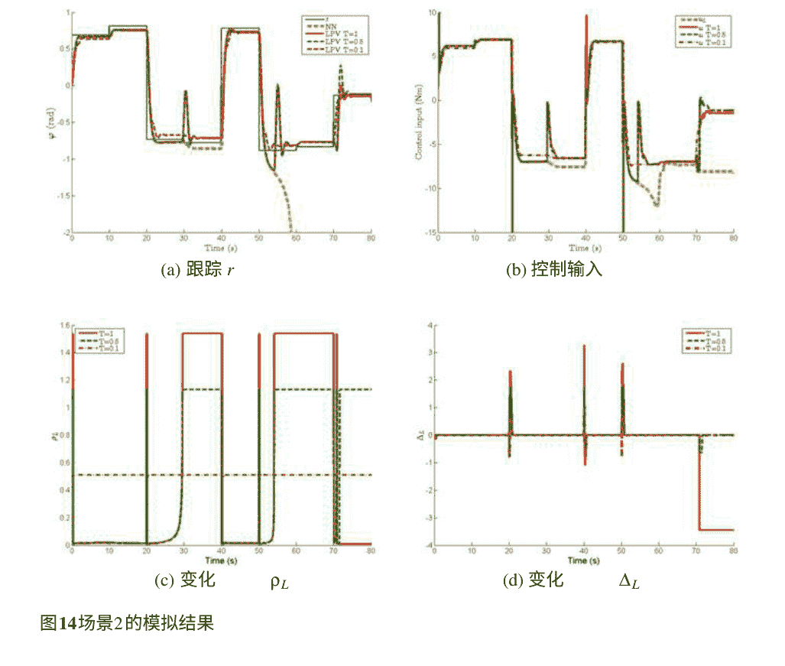

$\rho_L$, $\Delta_L$ 在图13c,d中。在T=0.5时，$u$ 也接近于 $u_L$，但是减小的域 $\rho_L$, $\Delta_L$ 导致了更高的差异。在T=0.1时，$u$ 与 $u_L$ 的差异是显著的（见图13），因为 $\rho_L$ 和 $\Delta_L$ 只能有很小的变化。这意味着LPV控制器通常在 $\rho_L$, $\Delta_L$ 的边界上运行。

增加范围为 r 的场景2的结果如图14所示。可以在图14a中看到对 r 的跟踪。模拟表明，基于神经网络的控制在整个模拟过程中无法跟踪参考信号。其原因可能是该场景未包含在训练集中。然而，所有LPV控制器都能够保证最低性能水平，如图14a所示。控制输入可以在图14b中看到，相关的 $\rho_L$,$\Delta_L$ 信号在图14c,d中。可以看出，在所有的T设置下，控制输入 $u$ 与 $u_L$ 不同，这取决于 $\rho_L$ 和 $\Delta_L$ 的变化。例如，52s 后的 $u_L$ 会导致跟踪性能的显著降低，但通过基于 $\rho_{L,\text{max}}$ 的LPV控制操作可以避免，参见图14c。

此外，模拟的结果表明，设置为T=0.1的LPV控制具有最平滑的 $u$ 信号，而在T=0.5和T=1时，由于增加的域 $\rho_L$、$\Delta_L$，信号 $u$ 具有快速的瞬态。尽管高T设计参数在可接受的 $u_L$（见图13）时可能有优势，但在 $\rho_L$、$\Delta_L$ 的边界上频繁工作的LPV控制器存在缺点。

在不可接受的 $u_L$ 时，当LPV控制器在 $\rho_L$、$\Delta_L$ 的边界上工作时，会经常出现问题。
仿真示例表明，所提出的基于LPV的控制策略能够保证闭环系统的性能水平，这意味着性能的显著降低可以避免。
作为进一步的结果，在(40)中选择 $R$、$D$和 $T$ 的设计参数对受控系统的性能水平有很大影响。
因此，可以提供一种用于优化(40)的调整参数 $R$、$D$、$T$ 的过程。
首先，建议选择 $R$和 $D$ 的比例来平衡调度变量和测量干扰的领域。
其次，对 $\mathcal{F}$ 进行模拟可以提供有关基于机器学习的控制的跟踪特性的信息。它可以帮助确定 $\bar{E}$ 的期望值。
第三，调整 $T$ 的值以设置期望的 $\bar{E}$。最初，建议将 $T$ 设置为一个较小的值，这会导致增加的 $\bar{E}$。然后，逐渐增加 $T$ 的值以减小 $\bar{E}$，直达到期望的平均误差。

## 5 结论

本章提出了两种框架，用于提供学习控制系统的性能保证。这两种框架都包括一个监督算法和一个鲁棒控制器，但是它们的设计因为学习控制器的功能而有所不同。这些方法在无人控制系统上的有效性已经得到了证明，例如自动驾驶车辆的巡航控制和移动机器人臂的定位。

研究的未来挑战有两个方面。第一个挑战是为无人系统提供面向控制的模型，这些模型可以用于设计鲁棒控制器的设计框架。由此得到的鲁棒控制器及其控制信号在很大程度上取决于模型，而对于复杂的无人系统来说，模型的制定是一项具有挑战性的任务。未来的挑战是将提出的设计框架与基于数据驱动的识别过程相结合。因此，模型的制定、学习过程和鲁棒控制设计可以集成到一个数据驱动的方法中。

第二个挑战是将提出的框架扩展和应用于为基于学习的观察者和预测器提供性能保证。深度学习方法的重要应用是在智能交通系统领域中对过程的预测。然而，一个挑战是为观察者和预测器提供性能保证，即使基于学习的代理因大量新数据的频繁更新而更新。
一个任务是重新制定提出的监督者和基于鲁棒控制的观察和预测问题的控制理论背景。

致谢：该研究得到了创新与技术部国家自主系统实验室计划框架内的支持。该研究部分得到了国家研究、开发和创新办公室（NKFIH）根据OTKA Grant Agreement No. K 135512的支持。

Balázs Németh的工作部分得到了匈牙利科学院János Bolyai研究奖学金和创新与技术部国家研究、开发和创新基金的资源下的ÚNKP-20-5新国家卓越计划的支持。

## 参考文献

- 1. Åkesson, B.M., Toivonen, H.T. (2006). 神经网络模型预测控制器。 *J Process Control*, 16(9): 937–946.
- 2. Arlot, S., Celisse, A. (2010). 模型选择的交叉验证程序综述。 *Stat Surv*, 4: 40–79.
- 3. Beale, M.H., Hagan, M.T., Demuth, H.B. (2019). 深度学习工具箱用户指南。 MathWorks.
- 4. Berkenkamp, F., Turchetta, M., Schoellig, A., Krause, A. (2017). 具有稳定性保证的安全基于模型的强化学习。 见：Guyon, I., Luxburg, U.V., Bengio, S., Wallach, H., Fergus, R., Vishwanathan, S., Garnett, R. (编) *神经信息处理系统的进展，第30卷*. Curran Associates, Inc., pp 908–918.
- 5. Boyd, S., Ghaoui, L.E., Feron, E., Balakrishnan, V. (1997). 系统和控制理论中的线性矩阵不等式。 工业和应用数学学会，费城.
- 6. Briat, C. (2015). 线性参数变化和时滞系统。 *时滞和动力学的进展*. Springer-Verlag，柏林，海德堡.
- 7. Calliess, J. (2019). 在线优化用于在线学习和控制-从无悔到广义误差收敛。 见：第18届欧洲控制会议（ECC）.
- 8. Cheng, R., Orosz, G., Murray, R., Burdick, J. (2019). 通过安全函数实现端到端安全强化学习，用于安全关键连续控制任务。 见：第三十三届AAAI人工智能大会，第3387-3395页.
- 9. Coleman, T., Li, Y. (1996). 一种面向非线性最小化的内部信任区域方法，受限于边界。 *SIAM J Optim*, 6: 418–445.
- 10. Fisac, J.F., Akametalu, A.K., Zeilinger, M.N., Kaynama, S., Gillula, J., Tomlin, C.J. (2019). 一种适用于不确定机器人系统中基于学习的控制的通用安全框架。 *IEEE Trans Autom Control*, 64(7): 2737–2752.
- 11. Gáspár, P., Németh, B. (2019). 使用道路和交通信息的预测巡航控制。 Springer Verlag.
- 12. Gopinath, D., Katz, G., Pasareanu, C.S., Barrett, C. (2018). Deepsafe: 一种基于数据驱动的评估神经网络鲁棒性的方法。 见：自动化技术验证和分析-第16届国际研讨会，ATVA 2018，洛杉矶，加利福尼亚州，美国，7-10 Oct 2018，pp 3-19.
- 13. Hagan, M., Demuth, H., Beale, M. (1996). 神经网络设计。 PWS Publishing，Boston.
- 14. Hertneck, M., Köhler, J., Trimpe, S., Allgöwer, F. (2018). 学习具有保证的近似模型预测控制器。 *IEEE控制系统通信*, 2(3): 543-548.
- 15. Huang, X., Kwiatkowska, M., Wang, S., Wu, M. (2018). 深度神经网络的安全验证。 *Proc Int Conf Comput Aided Verif CAV 2017*, 10426: 3–29.
- 16. Jin, M., Lavaei, J. (2018). 控制理论分析平稳性以实现稳定认证的强化学习。 见：2018年IEEE决策与控制会议（CDC），pp 6840–6847.
- 17. Karg, B., Lucia, S. (2019). 基于学习的鲁棒非线性预测控制的状态估计近似。 见：第18届欧洲控制会议（ECC）.
- 18. Koller, T., Berkenkamp, F., Turchetta, M., Krause, A. (2018). 基于学习的模型预测控制用于安全探索。 见：2018年IEEE决策与控制会议（CDC），pp 6059–6066.
- 19. Kretchmar, R.M., Young, P.M., Anderson, C.W., Hittle, D.C., Anderson, M.L., Delnero, C.C. (2001). 具有静态和动态稳定性的强化学习控制。 *Int J Robust Nonlinear Control*, 11(15): 1469–1500.
- 20. Lagarias, J.C., Reeds, J.A., Wright, M.H., Wright, P.E. (1998). Nelder-mead单纯形法在低维度中的收敛性质。 *SIAM J Optimiz*, 9(1): 112–147.
- 21. Larsen, R.B., Carron, A., Zeilinger, M.N. (2017). 具有有界不确定性的分布式系统的安全学习。 见：第20届IFAC世界大会，IFAC-PapersOnLine，卷50，号1，第2536–2542页.
- 22. Liu, C., Xu, X., Hu, D. (2015). 多目标强化学习：综述。 *IEEE Trans Syst Man Cybern Syst*, 45(3): 385–398.
- 23. Maciel-Pearson, B.G., Akçay, S., Atapour-Abarghouei, A., Holder, C., Breckon, T.P. (2019). 多任务回归学习用于无人机在非结构化户外环境中的飞行控制。 *IEEE机器人与自动化快报*, 4(4): 4116-4123.
- 24. Mannucci, T., van Kampen, E., de Visser, C., Chu, Q. (2018). 强化学习控制器的安全探索算法。 *IEEE神经网络与学习系统交易*, 29(4): 1069-1081.
- 25. Mao, H., Schwarzkopf, M., He, H., Alizadeh, M.I. (2019). 计算机系统中的安全在线强化学习。 见：2019年12月8日加拿大温哥华的第33届神经信息处理系统会议.
- 26. McKinnon, C.D., Schoellig, A.P. (2019). 学习未知环境中安全预测控制的概率模型。 见：第18届欧洲控制会议（ECC）.
- 27. Pecka, M., Svoboda, T. (2014). 自主系统建模与仿真，第8906卷。 *计算机科学讲义*，安全探索技术的强化学习概述。 斯普林格，Cham.
- 28. Piot, B., Geist, M., Pietquin, O. (2017). 模仿学习与逆向强化学习之间的桥梁。 *IEEE Trans Neural Netw Learn Syst*, 28(8): 1814–1826.
- 29. Rosolia, U., Borrelli, F. (2018). 学习模型预测控制的迭代任务。 一个数据驱动的控制框架。 *IEEE Trans Autom Control*, 63(7): 1883–1896.
- 30. Scherer, C., Weiland, S. (2000). 线性矩阵不等式在控制中的讲义。 荷兰代尔夫特理工大学，代尔夫特.
- 31. Schilling, F., Lecoeur, J., Schiano, F., Floreano, D. (2019). 通过模仿学习在无人机群中学习基于视觉的飞行。 *IEEE Robot Autom Lett*, 4(4): 4523–4530.
- 32. Sename, O., Gáspár, P., Bokor, J. (2013). 鲁棒控制和线性参数变化方法。 Springer Verlag，柏林.
- 33. Wu, F., Yang, X., Packard, A., Becker, G. (1996). 带有有界参数变化速率的LPV系统的诱导L2范数控制器。 *J Robust Nonlinear Control*, 6: 983–98.
- 34. Wu, M., Wicker, M., Ruan, W., Huang, X., Kwiatkowska, M. (2020). 具有可证明保证的深度神经网络的基于游戏的近似验证。 *理论计算机科学*. 见：理论计算机科学的创始人Maurice Nivat的纪念，第二部分，卷807，页码298–329.
- 35. Zhai, L., Chai, T., Ge, S. (2007). 稳定自适应神经网络控制非仿射非线性离散时间系统及应用。 见：2007 IEEE第22届智能控制国际研讨会，页码602–607.
- 36. Zhang, T., Kahn, G., Levine, S., Abbeel, P. (2016). 使用MPC引导的策略搜索学习无人机的深度控制策略。 见：2016年IEEE国际机器人与自动化大会（ICRA），第528-535页.
- 37. Zhao, D., Chen, W., Wu, J., Li, J. (2016). 基于神经网络逼近的不确定严格反馈系统的全局稳定自适应跟踪控制。 *亚洲控制学报*, 18(2): 527-538.
- 38. Zhou, K., Doyle, J., Glover, K. (1996). 强鲁棒和最优控制。 Prentice Hall.

# 用于工业机器人位置估计的级联深度神经网络

林伟阳, 叶超, 周娇菊, 任新阳和童明思

摘要：从图像中估计物体的位置和方向在工业机器人和视觉伺服领域中起着重要作用，视觉控制系统的性能深度依赖于图像处理模型和算法。在深度学习广泛应用于计算机视觉之前，传统的图像处理方法在处理低维图像特征信息方面取得了成功，但传统的图像处理方法在处理具有高维特征信息的复杂图像时经常失败。在这个研究章节中，我们的主要贡献是提出了一个级联卷积网络，可以获得高精度的姿态估计。其中，使用单次多框检测器（SSD）来获取物体的边界框，以缩小识别范围。卷积神经网络被用于检测物体的方向。该方法设计用于工业检测任务，因此优化后的方法可以实时运行并提取样本图像的弱特征。为了验证基于深度学习的检测方法在工业系统中的效果，建立了一个用于检测无线遥控单元的手眼系统。对该系统进行了一系列实验，使用了提出的方法和传统方法。总的来说，与传统算法相比，提出的方法在准确性和识别率方面具有优势。

- 关键词：卷积神经网络 · 级联深度神经网络 · 物体检测 · 位置估计

## 1 引言

计算机、通信和消费电子（3C）行业[6, 46]在快速发展的技术中变得越来越重要。3C行业是计算机、通信和消费电子的结合。工业机器人是智能制造中最重要的设备之一，如护理、3C组装、焊接等。它将在未来几年占据全球市场的大份额，使得对工业机器人的需求[38]迫切增加，机器人行业蓬勃发展。在智能控制机器人的过程中，获取物体的位置和方向[22]尤为重要。这种普遍发展趋势导致了物体识别算法成为研究的热点。

尽管一些算法[5, 10, 12, 24, 47]可以完成特定的功能，但它们有许多缺点。用于目标检测的神经网络有限制，并且无法确定物体的方向。因此，它必须与其他有效的算法结合起来实现方向确定。这样，在目标定位问题上，传统的神经网络算法以及canny算子和Hough变换的集成算法在工作过程中都存在低准确性的问题。当图像处于复杂背景[45]且有很多噪声时，通过结合canny算子和Hough变换的方向检测算法并不理想。此外，这种方法还存在计算成本大的问题。基于这种方法的局限性，本章提出了一种新的方法，预测神经网络的级联。它打破了传统方法预测角度的限制。

在本章中，使用深度神经网络模型SSD [29]来检测图像中物体的位置。在SSD中，使用了经过减少的VGG-16预训练模型作为基础网络。每个卷积层中的通道数设置为原始网络的2到8倍 [21]。然后使用卷积神经网络(CNN) [27]来实现物体的角度识别和方向解决方案。在模型训练过程中，网络的输入是带有预标签的原始图像 [11]，而提取特征的特征类型取决于神经网络的连接参数。这些参数通过其特征学习规则算法自主更新，例如反向传播算法 [3, 25]。

本章的其余部分组织如下。物体姿势识别的相关工作在第2节中讨论。深度学习的基础知识在第3节中描述。手眼系统的架构概述在第4节中介绍。在第5节中，介绍了位置和方向估计算法，并在算法中使用了两个神经网络，包括SSD和五层CNN。在第6节中，介绍了网络训练过程，包括数据集的获取、数据集增强策略以及几种避免过拟合现象的方法，如正则化策略[31]。在第7节中，将CNN的结果与原始Canny算子边缘检测和霍夫变换的组合结果进行了比较，以测量物体角度。结论和未来工作在第8节中给出。

## 2 相关工作

获取物体的位置和方向已成为一种普遍趋势。许多学者在这个领域做了一系列的研究。对于物体识别，越来越多的研究者正在使用神经网络在复杂背景中获取物体的位置和类别。例如，多频率天线阵列SAR用于估计慢速和快速移动物体的位置[41, 43]，基于神经网络的贝叶斯最优方法也可以用于检测物体的位置[1]。此外，在算法中需要方向时，通常会使用Canny算子和霍夫变换的组合。霍夫变换是图像处理中的一种特征提取技术。它通过投票算法检测具有特定形状的对象。经典的霍夫变换用于检测图像中的直线，后来霍夫变换扩展到了对任意形状对象的识别，主要是圆和椭圆。

根据[7]，获取物体角度的传统方法首先依赖于Canny算子的边缘检测来获取图像中物体的边缘。然后，应用Hough变换[48]到边缘点上，以获取具有最多边缘点的直线[15]。直线的方向被视为图像的轴方向，从而得知物体的角度。除了所有这些努力之外，还提出了一种基于Canny算子和改进的Hough变换的边缘定位方法，专门解决矩形物体的边缘定位问题[20, 30]。

广泛使用将图像特征描述和支持向量机（SVM）[4]结合起来进行目标姿态回归。根据[2]，为蛋白质的亚细胞定位构建了四个支持向量机，分别用于核、细胞质、细胞外和线粒体。在[32]中，该方法通过基于梯度直方图（HOG）描述符和SVM设计的模型准确地定位虹膜，即HOG-SVM。如今，对支持向量分类（SVC）的研究已经相当深入，这主要体现在SVC参数选择问题已经解决。然而，支持向量回归（SVR）参数选择的研究很少。主要采用交叉验证方法。即分别尝试不同参数的不同核函数。具有最小误差的核函数是最好的。提取图像特征描述和BP神经网络的组合也是一种有效的目标姿态回归方法。在[47]中，提出了一种基于组合特征和BP神经网络的车牌字符识别和定位方法。

神经网络[10]可以识别存在噪声和变形的输入模式。通过神经网络，识别过程可以通过将预处理集成到一个过程中来压缩，以获得大规模自适应并行处理[5, 12]和高度容错性[24]的优势。在工业生产中，同时获取物体的位置和方向非常重要，本章提出的方法可以通过应用两个网络模型来实现这一功能。网络结构非常稳健且相对实时，无论背景模糊和复杂程度如何，都可以获得非常准确的结果。这是一个可以用于工业控制的重要优势。

## 3 深度学习基础

### 3.1 卷积神经网络

卷积神经网络可以从浅层到深层检测图像的边缘特征、局部特征和整体轮廓，并且随着网络层数的增加，卷积核将逐渐扩大感受野并减小特征图的大小。卷积神经网络通常定义为由卷积层（CONV）、池化层（POOL）、修正线性单元（RELU）和全连接层（FC）组成的组合。最常见的卷积网络架构遵循以下模式：输入→[[卷积→修正线性单元]*N→池化?]*M→[全连接→修正线性单元]*K→全连接

其中*表示重复，POOL? 表示可选的池化层，N ≥0（通常N ≤ 3），M ≥0，K ≥0（通常K < 3），最后一个全连接层保存输出（例如类别得分）。

#### 3.1.1 卷积层

卷积可以推广到多维张量：卷积通常以3D张量x ∈ ℝ^{C*H*W}作为输入，称为输入特征图；一个核u ∈ ℝ^{C*h*w}沿着输入特征图的高度和宽度滑动。大小h * w是接受域的大小；在每个位置，计算核与它重叠的输入元素的逐元素乘积，并将结果求和。最终输出o是一个大小为(H – h + 1) * (W – w + 1)的2D张量，称为输出特征图，满足以下条件：

oj,i = b_{j,i} + \sum_{c=0}^{C-1} (x_c \circledast u_c)[j,i] = b_{j,i} + \sum_{c=0}^{C-1} \sum_{n=0}^{h-1} \sum_{m=0}^{w-1} (x_{c,n+j,m+i} u_{c,n,m}) \quad (1)

其中u和b是共享的学习参数。D卷积可以以相同的方式应用于产生一个D * (H – h + 1) * (W – w + 1)特征图，其中D是深度。用3D卷积在通道上滑动通常没有意义，除非通道索引具有一定的度量意义。

卷积有三个额外的参数。填充指定了在输入周围添加的零帧的大小，填充对于控制特征图的空间维度非常有用，例如，使其在层之间保持恒定。步幅指定了在信号上移动内核时的步长，步幅对于通过一个常数因子减小特征图的空间维度非常有用。扩张调制了滤波器的扩展而不增加权重。扩张通过添加零行和零列来调制内核支持的扩展。在系数之间，具有大于一的膨胀系数会增加单位的相应场大小，而不增加参数的数量。

如果函数 f 对于 g 是等变的，那么 f(g(x)) = g(f(x))。卷积层中使用的参数共享使得该层对于平移是等变的，如果 g 是将输入进行平移的任意函数，卷积函数对于 g 也是等变的。当我们知道某个局部函数在任何地方都有用时（例如边缘检测器），等变性是有用的，但是卷积对于其他操作（如尺度变化或旋转）不是等变的。

#### 3.1.2 池化层

当输入体积较大时，池化层可以用于减小输入维度，同时保持其全局结构，类似于缩小操作，池化在其公式中与卷积非常相似。考虑一个大小为 h * w 的池化区域和一个3D输入张量 x ∈ R^{C*(rh)*(sw)}。最大池化产生一个张量 o ∈ R^{C*r*s}，使得

$$o_{c,j,i} = \max_{n<h, m<w} X_{c, rj+n, si+m}$$ (2)

平均池化产生一个张量 o ∈ R^{C*r*s}，使得

$$o_{c,j,i} = \frac{1}{hw} \sum_{n=0}^{h-1} \sum_{m=0}^{w-1} X_{c, rj+n, si+m}$$ (3)

如果 f 是对 g 不变的函数，那么 f(g(x)) = f(x)。池化层在一个单元格内提供对任何排列的不变性，并且导致对局部平移的伪不变性。如果我们更关心模式的存在而不是其确切位置，这将非常有帮助。

#### 3.1.3 激活函数

这一层用于添加非线性元素。由于卷积操作是线性的，对于样本来说不一定是线性可分的，因此引入了非线性元素。激活函数必须确保输入和输出是可微分的。以下是常用的激活函数。

##### (1) ReLU函数

现代神经网络大多基于ReLU函数：

$$ReLU(x) = \max(0, x)$$ (4)当 $x \leq 0$ 时，输出始终为0；当 $x > 0$ 时，输出线性增加。请注意，ReLU函数的导数为

$$\frac{\mathrm{d}}{\mathrm{d}x}ReLU(x) = \begin{cases} 0 & \text{如果 } x \leq 0 \\ 1 & \text{否则} \end{cases} \qquad (5)$$

##### (2) Sigmoid函数

Sigmoid函数可以将元素的值转换为0到1之间。

$$\sigma(x) = \frac{1}{1 + \exp(-x)} \qquad (6)$$

当输入接近0时，Sigmoid函数接近线性变换。根据链式法则，Sigmoid函数的导数为

$$\sigma'(x) = \sigma(x)(1 - \sigma(x)) \qquad (7)$$

当输入为0时，Sigmoid函数的导数达到最大值0.25。当输入偏离0时，Sigmoid函数的导数趋近于0。

##### (3) 双曲正切函数

双曲正切函数可以将元素的值转化为-1到1之间。

$$\tanh(x) = \frac{\exp(x) - \exp(-x)}{\exp(x) + \exp(-x)} \qquad (8)$$

当输入接近0时，tanh接近线性变换并在坐标系原点对称。根据链式法则，tanh的导数为

$$\tanh'(x) = 1 - \tanh(x)^2 \qquad (9)$$

Sigmoid函数和双曲正切函数的关系：$\tanh(x) = 2\sigma(2x) - 1$。图1显示了激活函数及其导数。

#### 3.1.4 全连接层

全连接意味着每个节点都与前一层的所有节点相连，并用于整合从前一层提取的特征。也就是说，所有的特征都被连接并输出，然后发送到分类器，例如Softmax分类器。

LeNet-5 [26] 由两个CONV+POOL层组成，后面是三个全连接层，这个网络也是许多最近神经网络架构的起点。AlexNet [23] 由8层卷积组成，神经网络采用3层MLP，原始实现分为两部分，以适应两个GPU。VGG [37] 由5个VGG块组成，包含CONV + POOL层，然后是一组全连接层，其名称来自章节作者所在的Visual Geometry Group实验室。网络深度增加到19层，而卷积核大小减小到3，通过使用连续的 $3 \times 3$ 卷积核（如 $11 \times 11$、$7 \times 7$、$5 \times 5$）来替换AlexNet中较大的卷积核。

有效的感受野是通过之前的卷积层间接影响给定单元的视觉输入的一部分，随着深度线性增长。GoogLeNet [40] 由两个 CONV + POOL层、一个由9个inception块组成的堆叠层和一个全局平均池化层组成。每个inception块本身都被定义为一个具有4个并行路径的卷积网络。ResNet [14] 由类似于GoogLeNet [40] 的前几层、一个由4个残差块组成的堆叠层和一个全局平均池化层组成。扩展考虑了更多的残差块，最多可以达到152层的ResNet-152。之所以能够训练这么深的网络，是因为残差块中的跳跃连接允许梯度绕过层而不会消失。

### 3.2 反向传播算法

它执行梯度下降来尝试最小化网络输出值与给定目标值之间的误差平方和。网络前向传播激活以产生输出，反向传播误差以确定权重变化，神经元之间的连接权重在两个方向上传递值。神经网络的前向和后向传播过程如图2所示。

为了方便公式的推导，图2中符号的含义如下：下标 $i$ 表示输入层。下标 $j$ 表示隐藏层。下标 $k$ 表示输出层。$w_{ji}$ 表示从输入到隐藏层的权重。$w_{kj}$ 表示从隐藏层到输出层的权重。

前向传递：通过遍历图形，从输入到输出给定 $x_i$、$w_{ji}$ 和 $w_{kj}$ 计算值 $x_j$、$y_j$、$x_k$ 和 $y_k$。

$$x_j = \sum_i w_{ji}x_i$$
$$y_j = \sigma (x_j)$$
$$x_k = \sum_j w_{jk}y_j$$
$$y_k = \sigma (x_k) \qquad (10)$$

我们可以将反向传播学习算法视为对均方误差的梯度下降。网络的总误差由以下方程给出

$$E = \frac{1}{2} \sum_k (y_k - \hat{y}_k)^2 \qquad (11)$$

我们希望调整网络的权重以减小这个总误差。

$$\Delta w \propto -\frac{\partial E}{\partial w} \qquad (12)$$

我们将从输出层的特定权重开始。

$$\Delta w_{kj} = -\frac{\partial E}{\partial w_{kj}}$$

然而，误差并不直接是权重的函数。我们将其展开如下

$$\Delta w_{kj} = -\xi \frac{\partial E}{\partial y_k} \frac{\partial y_k}{\partial x_k} \frac{\partial x_k}{\partial w_{kj}}$$

让我们依次考虑每个偏导数。请注意，$E$ 求和中只有一个项具有非零导数：与我们正在考虑的特定权重相关的项。根据前向传播和微积分规则，我们有

$$\begin{aligned}
\frac{\partial E}{\partial y_k} &= -(y_k - \hat{y}_k) \\
\frac{\partial y_k}{\partial x_k} &= (x_k) * (1 - x_k) \\
\frac{\partial x_k}{\partial w_{kj}} &= x_j
\end{aligned}$$

现在将这些结果代回我们的原方程，我们有：

$$\begin{aligned}
\Delta w_{kj} &= \xi (y_k - \hat{y}_k)(x_k) * (1 - x_k)x_j \\
\delta_k &= (y_k - \hat{y}_k)(x_k) * (1 - x_k) \\
\Delta w_{kj} &= \xi \delta_k x_j
\end{aligned}$$

现在我们必须确定输入到隐藏层权重的适当变化。这更加复杂，因为它取决于所有节点的错误，这个加权连接可能导致。

$$\begin{aligned}
\Delta w_{ji} &\propto -\left[ \sum_{k} \frac{\partial E}{\partial y_k} \frac{\partial y_k}{\partial x_k} \frac{\partial x_k}{\partial y_j} \right] \frac{\partial y_j}{\partial x_j} \frac{\partial x_j}{\partial w_{ji}} \\
\Delta w_{ji} &= \xi \left[ \Sigma_k (y_k - \hat{y}_k)(x_k) * (1 - x_k) w_{kj} \right] (x_j) * (1 - x_j) x_i \\
\Delta w_{ji} &= \xi \left[ \Sigma_k \delta_k w_{kj} \right] (x_j) * (1 - x_j) x_i \\
\Delta \delta_j &= \left[ \Sigma_k \delta_k w_{kj} \right] (x_j) * (1 - x_j) \\
\Delta w_{ji} &= \xi \Delta \delta_j x_i
\end{aligned}$$

### 3.3 网络模型的训练策略

#### 3.3.1 网络拟合

拟合意味着曲线能够很好地描述一些样本，并具有良好的泛化能力。过拟合意味着模型过于深入地学习了数据，以至于也学习了噪声数据的特征，这导致在后续测试中无法很好地识别数据，即无法正确分类，模型的泛化能力太差。欠拟合意味着模型无法很好地捕捉数据特征以适应数据，或者模型过于简单以适应或区分样本。

防止过拟合的方法包括：
- 正则化（L0、L1和L2正则化，一般是在目标函数后面加上相应的范数）
- 数据增强（指增加训练数据集的数量）
- 重新清洗数据（过拟合可能是由于数据不纯导致的）
- 提前停止（在模型收敛于训练数据集之前停止迭代）
- 随机失活（在训练过程中以一定概率使神经元不工作）

防止欠拟合的方法包括：
- 添加其他特征项（例如“组合”、“泛化”、“相关性”、“上下文特征”、“平台特征”等）
- 添加多项式特征（例如将二次或三次项添加到线性模型中，使模型更加通用）
- 减小正则化参数（正则化用于防止过拟合，可以减小以防止模型的欠拟合）

#### 3.3.2 数据增强

在深度学习模型的训练过程中，数据增强是一个重要的部分。现有的深度学习参数很多，一般模型可以训练的参数数量基本上在数万到百万级别，而训练集样本数量很难有这么多，数据增强可以扩展样本空间。数据增强通常不会改变标签：对于目标检测，数据增强会改变目标的坐标位置。对于图像分割，有许多数据增强方法：颜色空间、尺度空间和样本空间，同时，根据不同的任务，数据增强也会有相应的差异。对于图像分类，数据增强会改变像素标签。

数据扩展的方法包括：
- 裁剪（中心裁剪、随机裁剪、随机宽高比裁剪、上下左右中心裁剪）
- 翻转和旋转（概率为p的水平翻转、概率为p的垂直翻转和随机旋转）
- 随机遮挡
- 图像变换（尺寸变换、标准化、填充、亮度、对比度和饱和度的修改、转换为灰度、线性变换、仿射变换等）

样本不足和正负类别不平衡的问题将影响在具有挑战性场景中的检测网络的在线训练。我们可以使用GAN作为图像数据增强器，生成多样化的正样本，以提高网络的准确性。此外，还有一些标准的数据增强技巧来生成各种图像。包括随机裁剪、旋转、平移、水平翻转、色调、饱和度、颜色偏移和曝光偏移。

#### 3.3.3 IoU（交并比）和mAP

对象检测的标准性能指标是评估预测边界框 $\hat{B}$ 和注释边界框 $B$ 之间的IoU。

$$IoU(B, \hat{B}) = \frac{area B \cap \hat{B}}{area B \cup \hat{B}}$$

如果 $IoU(B, \hat{B})$ 大于一个固定的阈值，通常为 $\frac{1}{2}$，则预测的边界框是有效的，即真正例，否则为错误的，即假正例。TP和FP值在预测置信度的所有阈值上累积。得到的精确率-召回率曲线下的面积是考虑类别的平均精确度。所有类别的平均值是平均平均精确度。

滑动窗口方法在许多位置和尺度上评估分类器。这种方法通常非常计算密集，因为性能直接取决于输入给分类器的窗口的分辨率和数量。越多越好，但也越昂贵。

#### 3.3.4 优化器

为了最小化形式为 $L(\theta)$ 的损失

$$L(\theta) = \frac{1}{N} \sum_{n=1}^{N} l(y_n, f(x_n; \theta))$$

标准批量梯度下降（GD）是应用更新规则

$$g_t = \frac{1}{N}\sum_{n=1}^{N} \nabla_{\theta} l(y_n, f(x_n; \theta_t))$$
$$\theta_{t+1} = \theta_t - \gamma g_t \qquad (20)$$

其中 $y_n$ 是真实值，$f(x_n; \theta)$ 是网络的预测，$\gamma$ 是学习率。虽然计算梯度是有意义的。计算梯度需要时间，并且对于大的 $N$ 来说效率低下，它是对隐藏数量（即期望风险）的经验估计，任何部分和也是无偏估计，尽管方差更大。为了说明部分和是良好的估计，考虑一个理想情况，训练集是相同的 $M$ 个样本复制 $K$ 次，总样本数 $N=KM$。然后

$$L(\theta) = \frac{1}{N} \sum_{n=1}^{N} l(y_n, f(x_n; \theta))$$
$$= \frac{1}{N} \sum_{k=1}^{K} \sum_{m=1}^{M} l(y_m, f(x_m; \theta))$$
$$= \frac{1}{N} K \sum_{m=1}^{M} l(y_m, f(x_m; \theta)) \qquad (21)$$

然后，不是对所有样本求和并移动 $\gamma$，我们可以只访问 $M = \frac{N}{K}$ 个样本，并以 $K\gamma$ 的步长移动，这将减少计算量 $K$。虽然这是一个理想情况，但实际上存在冗余，导致类似的行为。

为了减少计算复杂度，随机梯度下降（SGD）在每个样本之后更新参数

$$g_t = \nabla_{\theta} l(y_n, f(x_n; \theta_t))$$
$$\theta_{t+1} = \theta_t - \gamma g_t \qquad (22)$$

SGD的随机行为有助于避免局部最小值。虽然计算速度比批量梯度下降快，但SGD使用的梯度估计可能非常嘈杂，并且SGD不会从批处理的加速中受益。相反，小批量SGD包括访问小批量样本并在每次更新参数时进行更新

$$g_t = \frac{1}{B} \sum_{b=1}^{B} \nabla_{\theta} l(y_{n(t,b)}, f(x_{n(t,b)}; \theta_t))$$
$$\theta_{t+1} = \theta_t - \gamma g_t \qquad (23)$$

其中访问样本的顺序 $n(t, b)$ 可以是顺序的也可以是随机的。增加批量大小 $B$ 可以减小梯度估计的方差，并加快批处理的速度。批量大小 $B$ 和 $\gamma$ 之间的相互作用仍然不清楚。

梯度下降方法对于以下方面做出了强烈的假设：设置步长的局部曲率的大小，以及曲率的各向同性，使得相同的步长 $\gamma$ 在所有方向上都有意义。

在小但一致的梯度情况下，例如通过山谷底部，梯度下降移动得非常缓慢。改进梯度下降的方法是使用动量来在选择步长方向时增加惯性，即

$$ u_t = \alpha u_{t-1} - \gamma g_t $$
$$ \theta_{t+1} = \theta_t + u_t \qquad (24)$$

新变量 $u_t$ 是速度。它对应于学习动态进展时参数移动的方向和速度，被建模为负梯度的指数衰减移动平均。具有动量的梯度下降有三个好的特性：它可以穿过局部障碍，如果梯度变化不大，它会加速，它会减弱窄谷中的振荡。

超参数 $\alpha$ 控制最近梯度对当前更新的影响。通常，$\alpha = 0.9$，$\alpha > \gamma$，如果我们在每次更新时观察到 $g$，步长将为 $u= -\frac{\gamma}{\alpha} g$。因此，对于 $\alpha = 0.9$，相对于当前方向，它就像将最大速度乘以10。另一种方法是模拟速度方向的一步，然后计算梯度并进行修正。

$$ g_t = \frac{1}{N} \sum_{n=1}^N \nabla_{\theta} l(y_n, f(x_n; \theta_t + \alpha u_{t-1})) $$
$$ u_t = \alpha u_{t-1} - \gamma g_t $$
$$ \theta_{t+1} = \theta_t + u_t \qquad (25)$$

香草梯度下降假设曲率的各向同性，因此相同的步长 $\gamma$ 适用于所有参数。按照其历史值的平方和的平方根对每个参数进行缩放。

$$ r_t = r_{t-1} + g_t \cdot g_t $$
$$ \theta_{t+1} = \theta_t + \frac{\gamma}{\delta + \sqrt{r_t}} \cdot g_t \qquad (26)$$

AdaGrad消除了手动调整学习率的需要。大多数实现默认使用 $\gamma = 0.01$。当目标是凸的时候很好。在训练过程中，$r_t$ 会无限增长，这可能导致步长缩小并最终变得无限小。

与AdaGrad相同，但累积梯度的指数衰减平均值。

$$ r_t = \rho r_{t-1} + (1-\rho) g_t \cdot g_t $$
$$ \theta_{t+1} = \theta_t - \frac{\gamma}{\delta + \sqrt{r_t}} \cdot g_t \qquad (27)$$

RMSProp在非凸设置中表现更好，并且不会无限增长。与带有动量的RMSProp类似，但对第一和第二时刻的偏差校正项进行了修正。

$$\begin{aligned} s_t &= \rho_1 s_{t-1} + (1 - \rho_1)g_t \\ \hat{s}_t &= \frac{s_t}{1 - \rho_1^t} \\ r_t &= \rho_2 r_{t-1} + (1 - \rho_2)g_t \quad g_t \\ \hat{r}_t &= \frac{r_t}{1 - \rho_2^t} \\ \theta_{t+1} &= \theta_t - \gamma \frac{\hat{s}_t}{\delta + \sqrt{\hat{r}_t}} \end{aligned}$$

Adam是深度学习中的默认优化器之一，与带动量的SGD一起。良好的默认值为 $\rho_1 = 0.9, \rho_2 = 0.999$。

尽管每个参数的自适应学习率方法通常很有帮助，但随着时间的推移，逐渐降低学习率 $\gamma$ 是有益的。阶梯衰减：每隔几个时期将学习率降低一定因子。指数衰减：$r_t = r_0 exp(-kt)$，其中 $r_0$ 和 $k$ 是超参数。$^1$衰减：$r_t = \frac{r_0}{1+kt}$，其中 $r_0$ 和 $k$ 是超参数。

### ### 3.3.5 标准化

先前的权重初始化策略依赖于保持激活方差在层之间恒定，最初假设输入特征方差相同。也就是说，

$$\mathbb{V}[x_i] = \mathbb{V}[x_j] \triangleq \mathbb{V}[x]$$

对于所有的特征对 $i, j$。一般来说，这个约束条件不能满足，但可以通过特征标准化来强制执行输入数据。

$$\begin{aligned} x' &= (x - \hat{\mu}) \frac{1}{\hat{\sigma}} \\ \hat{\mu} &= \frac{1}{N} \sum_{x \in d} x \\ \hat{\sigma}^2 &= \frac{1}{N} \sum_{x \in d} (x - \hat{\mu})^2 \end{aligned}$$

对于训练神经网络来说，保持激活和导数的正确统计数据至关重要。在前向传播过程中，可以通过重新归一化来显式地强制执行这个约束条件。批量归一化是第一个引入这个思想的方法。在训练过程中，批量归一化根据均值进行平移和重新缩放。并且在批处理上估计方差。在测试期间，根据训练期间估计的经验矩进行移位和重新缩放。

让我们考虑训练中的一小批样本，其中$u_b \in \mathbb{R}^q, b = 1, ..., B$是在计算图中某个位置计算的中间值。在节点u后的批处理归一化中，首先计算批处理的每个分量的均值和方差。

$\hat{\mu}_{批次} = \frac{1}{B} \sum_{b=1}^B u_b$
$\hat{\sigma}_{批次}^2 = \frac{1}{B} \sum_{b=1}^B (u_b - \hat{\mu}_{批次})^2$ (31)

从中计算标准化$u'$，$b \in \mathbb{R}^q$被计算为

$u_b' = \gamma \frac{(u_b - \hat{\mu})}{\hat{\sigma}_{批次}} + \beta$ (32)

其中$\gamma, \beta \in \mathbb{R}^q$是要优化的参数。在推断过程中，批归一化根据训练期间估计的经验矩来移动和重新缩放每个组件：

$u' = \gamma \frac{(u - \hat{\mu})}{\hat{\sigma}} + \beta$ (33)

给定单个输入样本$x$，可以采用类似的方法对层中的激活u进行标准化，而不是对整个批次进行标准化。

### 3.4 目标检测中的锚点

锚点广泛应用于许多流行的目标检测算法，如R-CNN [9]、Fast RCNN [8]、Faster RCNN [34]、YOLO [33]、SSD [29]、Mask RCNN [13]和RetinaNet [28]，因此只有对锚点机制有深入和熟练的理解，才能真正理解这些算法。

锚点是指一组预定义的框，其宽度和高度与数据集中的对象的宽度和高度相匹配。预设的锚点包含了数据集中存在的对象大小的组合，自然包括了数据集中存在的不同的长宽比和比例。通常，在图像的每个位置预设4-10个锚点。训练目标检测网络的典型任务包括：生成锚点，搜索潜在的锚点，将生成的锚点与可能的真实值配对，将剩余的锚点分配给背景类别，然后进行采样和训练。推理过程是对锚点进行分类和回归。得分大于阈值的锚点进一步回归，得分小于阈值的锚点被丢弃为背景，从而得到目标检测的结果。

生成锚点以确定一组适合大多数对象的框，将假设均匀分布的框放置在图像上，并创建规则将卷积特征映射的输出映射到图像中的每个位置。锚点的生成需要从两个方面考虑：宽高比和尺度。确定宽高比的方法：找出数据集中大多数对象的宽高比。这些对象的比率指的是对象的长度或宽度与包含图像的总长度或宽度之间的比率。确定尺度的方法：选择最能代表数据的一组尺度，可以考虑具有最极端值的对象度量，即数据集中所有对象的宽度和高度之间的最小值和最大值，例如最大尺度、最小尺度、最大和最小尺度的平均值。假设有 m 个宽高比和 n 个尺度，则锚点的数量为 m * n。假设检测器网络输入的特征图为 W * H * C，则可以在每个单元格的中心生成具有不同宽高比和尺度的 m * n 个锚点，总共为 W * H * m * n 个。

检测器不预测锚点，而是预测每个锚点的一组值，包括锚点坐标偏移和每个类别的置信度得分。
回归任务：在训练过程中，网络学习的目标是回归任务的偏移量，而不是特征图上每个位置的所有锚点的偏移量，而与地面实况匹配的锚点的实际偏移量，以及背景帧的锚点偏移量保持为零。这意味着一旦将锚点内的像素空间完全视为背景，则锚点不需要调整坐标。
分类任务：通常在总背景框的子集中使用分类损失来处理类别不平衡。在特征图中的 W * H * m * n 锚点中，大部分都是背景帧，导致严重的类别不平衡。解决方案包括困难负样本挖掘和减少易分类实例的权重损失。
推理过程：为了获得最终的目标检测集合，将网络的预测偏移应用于相应的锚点。

可能会有数百或数千个候选帧，但最终，检测器将忽略所有预测的背景。Box 保留通过某些标准的前景检测结果，并应用 NMS 来纠正相同对象的重叠预测。

## 4 手眼系统的架构概述

本章中的手眼系统如图3所示。无线电远程单元（RRU）是机械手臂末端的目标位置，图4显示了代表性的3C产品RRU。在工厂中组装RRU设备后，需要使用电源电缆和信号电缆对RRU进行测试。在工业机器人将连接器插入RRU上的电源端口和光纤端口之前，需要通过机器视觉识别RRU上电源端口或光纤端口的位置和方向。具有实时和高速识别能力。

根据插入特征的反馈，工业机器人可以智能地插入电源连接器或光纤连接器。

图3中的变换矩阵 $\mathbf{T}_E^C$ 需要提前通过手眼校准获得，而 $\mathbf{T}_B^E$ 可以实时从机器人获得。如果可以计算从相机到RRU的变换矩阵，即 $\mathbf{T}_C^{R^1}$、$\mathbf{T}_C^{R^2}$和$\mathbf{T}_C^{R^3}$，则可以通过公式34计算机器人的目标姿态。

$\mathbf{T}_{B}^{R1} = \mathbf{T}_{B}^{E} \cdot \mathbf{T}_{E}^{C} \cdot \mathbf{T}_{C}^{R1}$
$\mathbf{T}_{B}^{R2} = \mathbf{T}_{B}^{E} \cdot \mathbf{T}_{E}^{C} \cdot \mathbf{T}_{C}^{R2}$
$\mathbf{T}_{B}^{R3} = \mathbf{T}_{B}^{E} \cdot \mathbf{T}_{E}^{C} \cdot \mathbf{T}_{C}^{R3}$
(34)

由于RRU的高度是确定的，并且与地面平行，因此在二维平面上，物体的特征可以用两个平移和一个旋转来描述。物体的特征向量可以描述为$\mathbf{f} = (x, y, \theta)$如图4b所示。两个平移运动$(x, y)$用于描述物体的位置，一个旋转运动$\theta$用于描述相对于z轴的旋转角度[39]。在某些应用中，例如视觉伺服，需要预测特征的实时位置和方向以控制机器人。

在接收到物体图像后，本章提出的检测器使用单次多框检测方法获取物体的类别和坐标。图像中的特征对象通过矩形边界框裁剪出来，然后通过CNN进行预测[16]，从而可以获得物体的角度信息。因此，机器人可以根据这些信息进行相应的后续动作。流程图如图5所示。

## 5 位置和方向估计算法

### 5.1 基于SSD网络的位置确定

SSD是由魏刘等学者在2016年提出的一种方法。它是一种使用单一端到端训练深度神经网络在图像中检测物体的优秀方法。SSD是一个前馈卷积网络，主要包括基本的CNN，去除了全连接层，如VGGNet [44]和MobileNet [42]，以及额外的卷积层。主要的识别原理是在不同大小的特征图上的多个位置生成不同大小和长宽比的矩形框。SSD将边界框空间离散化为每个特征图位置的一组默认框形状，并使用卷积核（$3 \times 3$）来预测每个位置的边界框偏移和物体概率[29]。

此外，它使用卷积预测器进行得分预测，然后进行非最大抑制以获得最终的检测结果。该网络可以将不同尺寸的多个特征图的预测组合起来，以适应不同尺寸的对象。此外，SSD网络考虑了检测的准确性和速度。

### 5.2 基于CNN的方向确定

在本章中，介绍了一种改进的五层卷积神经网络，该网络使用L2正则化来检测物体的角度。该网络由四个卷积池层和一个全连接层组成，如图6所示。每个特征图对应一个卷积核，其大小为3×3。不同的卷积核可以提取图像中包含的不同类型的特征。

卷积层利用卷积核，将图像分成若干相同大小的像素块，每个像素块被视为一个神经元，并进行卷积运算。CNN中定义的权值共享意味着分别对每个神经元进行相同的卷积计算。卷积计算与像素块的位置无关，因此图像中的像素块被视为相同。另一方面，权值共享可以将该层中涉及的参数数量指数级地减少。泄漏的Relu函数被用作激活函数，以为网络添加非线性元素。这样可以增强网络的表达能力，该函数始终跟随卷积层，并且在图6中没有显示出来，因为空间有限。

池化层是一个维度缩减运算符，可以保留图像中的大部分信息。有各种方法，如最大池化、平均池化、随机池化等。在我们的检测系统中，角度检测网络模型中包含的池化层是最大池化层，局部感受野的大小为2×2。具体过程是在特征图上选择2×2的局部感受野，并提取其中的最大像素值。特征图将池化层的输入压缩成较小的尺寸，其大小为原始尺寸的四分之一。

在我们的检测系统中，原始图像作为角度检测网络的输入，通过卷积层和池化层连续提取和组合特征。从底层卷积层的细胞层提取的特征是简单的低层次特征，如角点，可以重新整合形成高层次特征。因此，网络识别的检测能力得到了极大增强。此外，检测角度是一个回归问题，因此最终层由一个全连接层和一个输出神经元构成。一般来说，最终层的输出是输入图像中物体的倾斜角度。

## 6 级联深度神经网络的训练

### 6.1 获取具有不同特征的数据集的方法

对于一个网络模型来说，数据集应该足够大，以使模型训练更加高效。这里讨论的不仅仅是数据集中的图像数量，还包括组件的差异。实质上，数据集的图像应该包含不同位置和方向的对象集合。数据集中的组件之间应该有足够的差异，这样网络可以从中学习更多特征，并提高模型的泛化能力。

该过程如图7所示。

我们的检测系统从数据集的一小部分开始进行网络训练，以获得性能高的网络模型。然后使用网络模型对剩余的数据集进行预测并获得结果。当某个图像的预测结果存在重大偏差时，意味着该图像与原始数据集中的图像存在显著差异。如果预测结果正确，则进行下一张图像的预测。如果预测结果错误，则将该图像从数据集中排除。当图像数量超过阈值时，我们获得差异数据集。或者剩余的图像经过相同的操作，直到获得最终的差异数据集。

### 6.2 避免过拟合现象的研究

#### 6.2.1 神经网络中的过拟合现象

过拟合是神经网络中的典型现象。如果发生这种现象，神经网络的参数通常也会非常大，如方差和偏差。这种过拟合现象可以在图8中说明。

从图8中可以看出，预测曲线需要满足所有样本点，当出现这种现象时，拟合曲线会非常剧烈地波动。

网络的损失函数值和方差特别大，导致估计的参数值特别大。在这种情况下，新的测试数据集中的误差可能非常大，导致网络的泛化能力差，并限制了训练网络的应用。因此，采取几项措施来避免过拟合现象非常重要。

#### 6.2.2 数据增强

在训练过程中，应用大量的数据可以有效地防止神经网络过拟合。然而，手动获取角度标签非常困难。为了解决这个问题，使用SSD网络的检测结果构建感兴趣的数据集。使用感兴趣的数据集生成随机旋转角度，并通过收集所有随机图像获得增强数据集。增强数据集的图像随机添加椒盐噪声，以模拟实际收集的图像。增强数据集的一些带噪声的样本如图9所示。

### 6.3 网络模型的L2正则化

正则化是确保训练网络准确性的另一种有效方法。 损失函数表示为方程式35。

损失(x, y) = 1/N * Σ_{i=1}^{N} |x - y|^2  (35)

正则化是通过限制参数范数的值来避免过拟合现象的一种方法。 常见的正则化方法通常有L1正则化和L2正则化。 L1正则化是一种稀疏数据的方法，可以用于提取特征，但在本章中不适用于防止过拟合。 然而，L2可以在一定程度上避免过拟合。 下面将介绍L2正则化的工作机制。网络的输出是物体的角度，因此应将其归类为线性回归问题。 为解决这个问题，使用L2正则形式[32]来更新参数。

成本函数可以重新定义为方程36。

$J(\omega; \mathbf{v}, u) = J(\omega; \mathbf{v}, u) + \alpha \cdot \Omega(\omega), \text{其中} \alpha \in [0, \infty) \qquad (36)$

通过添加一个正则项 $\Omega(\omega)$，成本函数不再仅与网络预测值和真实值的误差相关，还与参数 $\omega$相关。

L2正则化直接在成本函数后面添加一个正则项，表示为方程37。

$\Omega(\omega) = \frac{\lambda}{2n} \sum_{\omega} |\omega|^2 \qquad (37)$

其中 $\lambda$是正则化系数，$n$是训练样本集的大小。通过 $\omega$找到方程36。

$\frac{\partial J}{\partial \omega} = \frac{\partial J}{\partial \omega} + \frac{\lambda}{n} \omega \qquad (38)$

通过 $b$找到方程36。

$\frac{\partial J}{\partial b} = \frac{\partial J}{\partial b} \qquad (39)$

将方程式38与方程式39进行比较，我们可以得到一个结果，即 L2正则化项不会影响 $b$的更新，但只会影响 $\omega$的变化速率。
在每次迭代中，$\omega$的变化可以表示为方程式40。

$\omega_n = (1 - \eta \frac{\lambda}{n}) \omega_{n-1} - \eta \frac{\partial J}{\partial \omega_{n-1}} \qquad (40)$

其中，$\omega_n$是当前的权重值，$\omega_{n-1}$是上一次的权重值。
在方程式40中，$\omega$的系数变为 $(1 - \eta \frac{\lambda}{n})$，由于$\eta$、$\lambda$和$n$都大于零，$\omega$不断减小。权重较小时，得到的拟合函数波动较小，泛化能力可以提高。权重 $\omega$越小，网络的复杂性越低，数据拟合效果越好。在实际应用中，与未经调整的网络相比，L2正则化网络[31]的预测效果通常可以显著提高。 这样可以有效避免过拟合。

为了避免提到的现象，我们在检测系统中引入了正则化，以防止参数的范数过大。

### 6.4 模型训练过程

我们的检测系统中的网络训练过程主要分为两个部分。第一部分是SSD神经网络的训练，训练数据集包括带有类别标签框和矩形边界框的图像。

当来自方程式36的代价函数值降至足够小的值时，训练过程可以停止，并获得高性能的网络模型。

在SSD训练图像中，需要给出真实值到固定输出框的映射。如前所述，SSD的输出是一组预定义大小的边界框。当训练图像中的真实值对应于固定输出框时，更新损失函数的端到端计算和反向传播的计算。为了使模型对各种输入对象的大小和形状更具鲁棒性，每个训练图像都是通过以下选项之一进行随机采样的：使用整个原始输入图像。采样一个补丁，使其与对象的最小Jaccard重叠为0.1、0.3、0.5、0.7或0.9。随机采样一个补丁。

第二部分是卷积神经网络的训练，用于预测角度，输入数据集应包括带有角度标签的图像。与SSD神经网络类似，当损失值降至可接受的较小值时，可以终止训练，并获得能够有效检测物体角度的网络模型。两个模型训练过程中损失值的变化曲线如图10和图11所示。

## 7 比较实验

为了展示我们的检测系统的有效性，进行了以下角度测量的比较实验，比较了新颖的检测算法和传统算法。通过比较所得结果可以得出分析结论。

从卷积神经网络得到的结果与原始Canny算子边缘检测和Hough变换的组合结果进行比较。

### 7.1 测试对象的角度测量

在这个实验中，计算真值的方法是将样本图像放入GIMP图像处理软件中，然后使用标尺工具在图像中勾勒出物体的边缘线，从而可以自动获取倾斜角度。 这些真值在表1中显示。 根据公式41计算真值和预测值之间的误差。

总和均值 = $\frac{1}{n} \sum_{i=1}^{1} (\hat{y_i} - y_i)^2$ (41)

其中$\hat{y_i}$表示预测值， $y_i$表示真值， $n$表示样本图像的数量。

### 7.2 基于单个样本图像的比较

选择一个单个样本进行新颖检测算法和传统算法的比较实验。结果如图12所示。基于这个单个样本图像，实验得到的数据如表1所示。在原始图像中，物体的测量角度为2.6°。对于使用 Canny 算子处理样本图像并检测物体边缘，检测到的边缘如图12 c所示，其中红线被选为代表性边缘线。Canny 算子计算得到的角度为0.3079°。而本章设计的神经网络算法用于识别物体的位置和倾斜角度，检测到的物体角度为2.762202°。基于不同方法的实验数据，我们可以得出结论，神经网络算法的准确性高于Canny算子。当神经网络检测到物体的姿态信息时，首先识别物体的位置，然后检测物体本身的角度，而不是检测整个图像的角度。通过这种方式，预测范围被缩小，预测的准确性大大提高。因此，我们模型的准确性远高于传统算法。

表1 Canny 算子和神经网络算法的比较
单样本比较（测量值2.6°）

| | 检测值（°） | 误差值（°） | 运行时间（秒） |
| :--- | :--- | :--- | :--- |
| Canny算子 | 0.3079 | -2.2921 | 2.301 |
| 神经网络 | 2.762202 | 0.162202 | 0.5601 |

### 7.3 基于多个样本图像的对比

#### 7.3.1 Canny算子

在利用单个样本进行两种算法比较之后，使用多个样本图像来比较新的检测算法和传统算法。表2显示了预测值和预测与真实值之间的误差。

从表2的数据可以得出以下结论。与Canny算子的传统算法相比，新的检测算法得到的角度更接近测量值。在比较两种算法的效率过程中，使用神经网络算法提取40个图像进行预测和运行时间计算。结果为40帧的运行时间为23.46919秒，因此单个图像的运行时间为0.5867秒。

然后，使用一张图像来估计传统算法的运行时间，即Canny算子和Hough变换的组合。运行时间为2.4219秒。相比之下，神经网络算法比Canny算子检测更快。此外，在预测角度时，神经网络首先识别物体，然后检测特定物体的角度，而不是检测整个图像。因此，预测的准确性大大提高，高于传统算法。

#### 7.3.2 组合提取图像特征描述和SVM或BP神经网络

ORB算法[35]是最杰出的特征提取和匹配算法之一，分为两部分，即特征点提取和特征点描述。特征提取是由加速段测试（FAST）算法开发的，特征点描述是基于二进制鲁棒独立元素特征（BRIEF）特征描述算法改进的。特征提取和匹配效果如图13所示。

从图像中提取的物体的关键点信息和角度信息被作为模型的输入。交叉验证不仅适用于选择SVM的核函数和参数，还适用于确定BP网络隐藏层神经元的数量。对于SVM，核函数的参数选择和相应结果如表3所示。可以看出，SVM在训练数据集上的误差非常小，而在测试数据集上的误差非常大。在交叉验证过程中，当选择具有一定参数或输入维度过高的核函数时，可能会导致SVM振荡并使SVM始终寻找一个好的拟合。对于BP网络，选择的隐藏层数量和结果如表4所示。

表2 Canny算子和神经网络算法在角度识别中的比较

| 实验项目 | 1        | 2      | 3         | 4         | 5         | 6         | 7         | 8         | 9         | 10       |
|----------|----------|--------|-----------|-----------|-----------|-----------|-----------|-----------|-----------|----------|
| Canny算子| -0.2363  | 0      | 0.228     | 0.1814    | 0.3079    | 0         | 0.2055    | 0.1611    | 0         | 0        |
| 神经网络 | 3.042547 | -0.01  | 3.778201  | 1.309128  | 2.762202  | 3.91736   | 0.405742  | 0.076202  | 0.076202  | 0.28     |
| 真实值   | 3.0      | 0      | 4.0       | 1.5       | 2.6       | 2.5       | 0.8       | 0         | 0         | 0        |
| Canny算子的平均误差 | 3.84359 |        |           |           |           |           |           |           |           |          |
| 神经网络的平均误差 | 0.5271  |        |           |           |           |           |           |           |           |          |

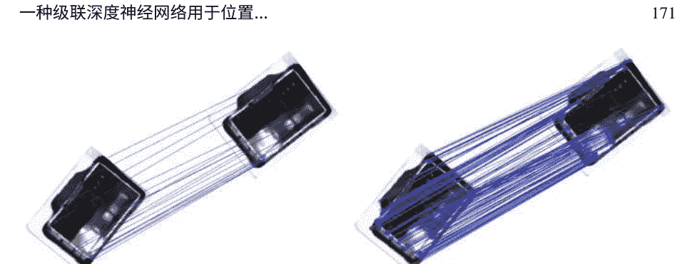

## 图13 特征提取和匹配效果

## 表3 ORB-SVM的参数和结果

| 核函数 | C | Gamma/度 | 训练误差(°) | 测试误差(°) | 时间(秒) |
|--------|---|----------|-------------|-------------|----------|
| rbf | 10^3 | 10^{-8} | 0.0997510382 | 16.6012642108 | 0.1723151118 |
| 线性 | 10^3 | | 0.0998771011 | 12.8642332457 | 0.1758304400 |
| 多项式 | 10^3 | 2 | 0.0998901670 | 13.0103611065 | 0.1837612599 |

## 表4 选择的隐藏层数量和ORB-BP的结果

| 隐藏层大小 | 训练误差(°) | 测试误差(°) | 时间(秒) |
|------------|-------------|-------------|----------|
| 50 | 0.19889250 | 22.731051119 | 0.2181158640 |
| 100 | 0.03821719 | 22.627580091 | 0.2214471888 |
| 150 | 0.07885761 | 22.755288988 | 0.2267020058 |
| 200 | 0.86117539 | 22.609794301 | 0.2268664281 |
| 500 | 0.94524188 | 22.655616959 | 0.2541489720 |
| 1000 | 0.62328782 | 23.099631085 | 0.2812944601 |

当传统算法用于检测复杂背景图像时，即图像中存在许多物体轮廓时，Canny算子在检测图像时无法区分物体边缘和背景边缘。在检测过程中，轮廓的提取和角度的预测需要与其他算法结合使用，应用于不同的背景时方法也不同。在某些情况下，很难获得一个合适的算法。因此，显然Canny算子存在局限性和相对较大的误差。当背景像素值与物体的像素值不是非常不同时，Canny算子无法检测到物体，因此传统方法无法准确应用。神经网络的预测结果明显优于传统方法，主要原因是神经网络能够准确识别物体。对于特定对象的识别通常会得到良好的结果。神经网络的预测结果较少受图像背景影响较小，对像素值差异也较不敏感，同时具有良好的自适应效果和高预测准确性。

此外，Canny算子在第9和第10次实验中取得了理想的预测结果，因为第9和第10次实验的图像清晰且噪声较少。传统算法总是失去检测精度，而使用神经网络的新型检测算法几乎保持稳定的检测精度，因此证明神经网络在方向检测中比Canny算子更具鲁棒性。

## 8 结论

物体位置和方向的图像识别是智能机器人控制中的基本和重要的图像处理任务。我们提出了一种级联深度神经网络识别算法，可以获得高精度和稳健的RRU光纤接口姿态估计。其中，使用SSD获取物体的边界框以缩小识别范围。并且利用卷积神经网络来检测物体的方向。混合算法设计用于复杂背景和噪声干扰下的工业检测任务，提出的检测系统可以提取样本图像的特征并实时运行。最后，比较实验表明，混合深度神经网络的检测系统具有高准确率和识别率，且比传统算法更具鲁棒性。

进一步的研究课题包括将这两个模型与一个时变的状态估计器相结合。在工业控制领域，控制过程始终是连续且实时的。然而，本章提出的方法主要用于识别图像统计信息。通过应用递归滤波和事件触发传输机制[17-19]，我们可以提高模型的性能并使其适用于在线应用。

## 参考文献

1. Adams S, Nolte L (1975) Bayes最优阵列检测已知位置的目标。J Acoust Soc Am 58(3):656-669
2. Bhasin M, Raghava G (2004) Eslpred: 基于SVM的用于真核蛋白质亚细胞定位的方法，使用二肽组成和psi-blast。Nucleic Acids Res 32(suppl_2):W414-W419
3. Cao W, Wang X, Ming Z, Gao J (2018) 关于具有随机权重的神经网络的综述。神经计算 275:278-287
4. Cortes C, Vapnik V (1995) 支持向量网络。机器学习 20(3):273-297
5. Fan Y, Levine MD, Wen G, Qiu S (2017) 用于实时检测自然场景中跌倒人类的深度神经网络。神经计算 260:43-58
6. Fang S, Huang X, Chen H, Xi N (2016) 基于视觉引导的3C产品双臂机器人装配系统。在：2016年IEEE国际机器人与仿生学会议（ROBIO）。IEEE，pp 807-812
7. Gall J, Yao A, Razavi N, Van Gool L, Lempitsky V (2011) 用于目标检测、跟踪和动作识别的Hough森林。IEEE模式分析与机器智能 33(11):2188-2202
8. Girshick R (2015) 快速R-CNN。在：IEEE国际计算机视觉会议论文集，pp 1440-1448
9. Girshick R, Donahue J, Darrell T, Malik J (2014) 用于准确目标检测和语义分割的丰富特征层次结构。在：计算机视觉和模式识别IEEE会议论文集，第580-587页
10. Goodfellow I, Bengio Y, Courville A (2016) 深度学习。MIT出版社
11. Gu J, Wang Z, Kuen J, Ma L, Shahroury A, Shuai B, Liu T, Wang X, Wang G, Cai J等（2018）卷积神经网络的最新进展。Pattern Recogn 77:354-377
12. Gutierrez-Galan D, Dominguez-Morales JP, Cerezuela-Escudero E, Rios-Navarro A, Tapiador-Morales R, Rivas-Perez M, Dominguez-Morales M, Jimenez-Fernandez A, Linares-Barranco A (2018) 用于实时动物行为分类的嵌入式神经网络。神经计算 272:17-26
13. He K, Gkioxari G, Dollár P, Girshick R (2017) Mask R-CNN。在：IEEE国际计算机视觉会议论文集，pp 2961-2969
14. He K, Zhang X, Ren S, Sun J (2016) 深度残差学习用于图像识别。在：IEEE计算机视觉与模式识别会议论文集，pp 770-778
15. He T, Li X, Jiang Y (2014) 基于Canny边缘算子的改进HT目标检测算法。J Multimedia 9(9):1089
16. Howard AG, Zhu M, Chen B, Kalenichenko D, Wang W, Weyand T, Andreetto M, Adam H (2017) Mobilenets: 高效卷积神经网络用于移动视觉应用。arXiv:1704.04861
17. Hu J, Wang Z, Alsaadi FE, Hayat T (2017) 基于事件的滤波器用于多个缺失测量的时变非线性系统，其中缺失概率不确定。信息融合 38:74-83
18. Jie Hu, Zhi Wang, Song Liu, Hua Gao (2016) 一种方差约束的递归状态估计方法，用于具有缺失测量的时变复杂网络。Automatica 64:155-162
19. Jie Hu, Zhi Wang, Bo Shen, Hua Gao (2013) 一类具有乘性噪声和缺失测量的非线性系统的量化递归滤波。Int J Control 86(4):650-663
20. 惠江伟 (2016) 通过将Canny算子与Hough变换相结合来进行轴部件的边缘检测。机械电子工程技术 9:7
21. Jeong J, Park H, Kwak N (2017) 通过连接特征图来增强SSD进行目标检测。arXiv:1705.09587
22. Jiang Lijuan, Wang Guorong (2005) 一种用于恢复对称旋转物体位置和姿态的立体视觉方法。
23. Krizhevsky A, Sutskever I, Hinton GE (2012) 使用深度卷积神经网络进行Imagenet分类。在：神经信息处理系统的进展，第1097-1105页
24. LeCun Y, Bengio Y, Hinton G (2015) 深度学习。自然 521(7553):436-444
25. LeCun Y, Boser BE, Denker JS, Henderson D, Howard RE, Hubbard WE, Jackel LD (1990) 使用反向传播网络进行手写数字识别。在：神经信息处理系统的进展，第396-404页
26. LeCun Y, Bottou L, Bengio Y, Haffner P (1998) 基于梯度的学习应用于文档识别。Proc IEEE 86(11):2278-2324
27. Li H, Lin Z, Shen X, Brandt J, Hua G (2015) 用于人脸检测的卷积神经网络级联。在：计算机视觉和模式识别的IEEE会议论文集，第325-334页
28. Lin TY, Goyal P, Girshick R, He K, Dollár P (2017) 密集目标检测的焦点损失。在：IEEE国际计算机视觉会议论文集，第2980-2988页
29. Liu W, Anguelov D, Erhan D, Szegedy C, Reed S, Fu CY, Berg AC (2016) SSD: 单次拍摄多盒检测器。在：欧洲计算机视觉会议。Springer，第21-37页
30. Ma J, Lu Y, Li L, Lu X, He F, Zhong Z (2017) 基于Canny算子和改进的Hough变换的边缘定位方法。Autom Inf Eng 38(03): 32-36
31. Ng AY (2004) 特征选择，l1与l2正则化以及旋转不变性。在: 第二十一届国际机器学习会议论文集，第78页
32. Radman A, Zainal N, Suandi SA (2017) 使用HOG-SVM和GrowCut在非受限制环境中自动分割虹膜图像。数字信号处理 64: 60-70
33. Redmon J, Divvala S, Girshick R, Farhadi A (2016) 你只看一次：统一的实时目标检测。在: IEEE计算机视觉和模式识别会议论文集，第779-788页
34. Ren S, He K, Girshick R, Sun J (2015) 更快的R-CNN: 面向实时目标检测的区域建议网络。在: 神经信息处理系统的进展, 第91–99页
35. Rublee E, Rabaud V, Konolige K, Bradski G (2011) ORB: SIFT或SURF的高效替代品。在: 2011年国际计算机视觉会议。IEEE, 第2564-2571页
36. Rumelhart DE, Hinton GE, Williams RJ (1986) 通过反向传播错误学习表示。自然 232 (6088): 533-536
37. Simonyan K, Zisserman A (2014) 用于大规模图像识别的非常深的卷积网络。arXiv: 1409.1556
38. Spong MW, Vidyasagar M (2008) 机器人动力学与控制。Wiley
39. Stewart D (1965) 六自由度平台。机械工程学会 180(1):371–386
40. Szegedy C, Liu W, Jia Y, Sermanet P, Reed S, Anguelov D, Erhan D, Vanhoucke V, Rabinovich A (2015) 卷积网络的深入研究。在: IEEE计算机视觉和模式识别会议论文集, 第1-9页
41. Tavana M, Abtahi AR, Di Caprio D, Poortarigh M (2018) 用于银行流动性风险评估的人工神经网络和贝叶斯网络模型。Neurocomputing 275:2525–2554
42. Thrun S, Saul LK, Schölkopf B (2004) 神经信息处理系统16的进展: 2003年会议论文集, 第16卷。MIT出版社
43. Wang G, Xia XG, Chen VC, Fielder R (2004) 使用多频天线阵列sar检测、定位和成像快速移动目标。IEEE航空航天与电子系统交易 40(1):345–355
44. Wang L, Guo S, Huang W, Qiao Y (2015) Places205-vggnet模型用于场景识别。arXiv:1508.01667
45. Xi J, Zhang JZ (2012) 基于Canny算子和Hough变换的遥感图像边缘检测。在: 计算机科学与工程的进展。Springer, pp 807–814
46. Zhang J, Dong Y, Wangning H, Donghai L (2017) 用于3C产品制造的工业机器人的硬件和算法设计。Mach Des Res 231:2912–2924
47. Zhang Y, Xu Y, Ding G (2008) 基于填充函数方法训练bp神经网络的车牌字符识别算法。在: 2008年中国控制与决策会议。IEEE, 第3886-3891页
48. Zhou Z, Zhang J (2007) 基于自适应Canny算子和gm (1, 1) 模型的目标检测和跟踪。在: 2007年IEEE国际灰色系统和智能服务会议。IEEE, 第434-439页

# 为无人系统管理深度学习不确定性

Armando Plasencia Salgueiro, Lynnette González Rodríguez和Ileana Suárez Blanco

摘要 无人或自主系统在一个不确定的世界中行动。为了规划和做出决策，自主系统只能依赖于嘈杂的感知和近似模型。由于传感器收集的数据本质上是不确定的，因为存在噪声、不完整性和不一致性。对这么大量的数据进行分析需要先进的分析技术，以便高效地审查和/或预测未来的行动方案，并采用高精度和先进的决策策略。由于数据量、种类和速度的增加，其中的不确定性也增加，导致对所得分析过程和所做决策的信心不足。在这些条件下，只有在存在一定的预测不确定性时，深度学习算法才能完全集成到机器人系统中。深度神经网络中的预测不确定性通常来自两个来源: 数据不确定性和模型不确定性。前者是由于数据中的噪声引起的，通常是由传感器的缺陷引起的。后者则是由于训练数据分布的不平衡而产生的。该文章描述了在感知、规划和控制三个层面上开发完全自主车辆的情况。人工智能的思想也被用来解决自主车辆的规划问题。自主车辆必须应对动态的、非稳定的和高度不可预测的操作环境。为了正确理解这个过程，文章描述了最知名的控制策略、地图表示技术、与外部系统的交互，包括在物联网和大数据不确定性下的与行人的交互。为了验证理论解释，提出了一些模拟工具，用于可视化和解释不确定性。

在该环境中先前提到的模型和物联网框架中，对教学和研究有用。

关键词：自主系统 · 贝叶斯深度学习 · 深度学习 · 不确定性 · 模糊逻辑，模拟

## 1 引言

仅在2015年，美国就发生了超过六百万起机动车事故，其中27%导致受伤或死亡[1]。另一项研究表明，99%的这些事故是由驾驶员行为错误引起或导致的。

为了理解、描述和尽可能预测交通中的驾驶员行为，研究人员在过去的四十年中提出了基于多种方法的不同驾驶员模型。然而，驾驶员建模仍然是一项困难的任务，因为驾驶员行为受到不同的个体因素的影响，如性别、年龄、经验、驾驶者的攻击性等。消除驾驶员行为错误的最有希望的想法可能是完全解放驾驶员的驾驶负担，即开发完全自动驾驶车辆。

自动驾驶车辆能够在没有驾驶员输入的情况下检测环境并导航，通过使用多种感知技术，如雷达、激光雷达、超声波、定位和计算机视觉，以及能够分析感知数据并规划和实现所需路径到目的地的先进控制技术。

预计自动驾驶车辆将显著改善交通拥堵，减少碰撞和伤害，提高儿童、老年人和残疾人的移动性，并减少城市停车位的需求。由于过去二十年来感知和计算技术的快速发展，自动驾驶车辆领域的研究取得了巨大进展，相关的自动驾驶技术在近年来已经成熟。

卡内基梅隆大学的Navlab于1988年开发了第一辆自动驾驶车辆。谷歌于2009年启动了自动驾驶汽车项目（2016年后更名为Waymo），已经在六个州的公共道路上测试了约800万英里的自动驾驶车辆。2016年，福特成为第一家在雪地和黑暗环境中测试其自动驾驶车辆的汽车制造商，并计划在2021年推出一款商用完全自动驾驶车辆。沃尔沃推出了第一个大规模自动驾驶项目，并计划在2017年让100位客户提前在瑞典公共道路上体验自动驾驶XC90。

在开发完全自主驾驶车辆方面，存在三个主要技术问题，即感知、规划和控制，如图1所示。感知层包括环境数据的感知和过滤。感知系统由多个传感器组成，提供有关车辆状态和环境的信息。

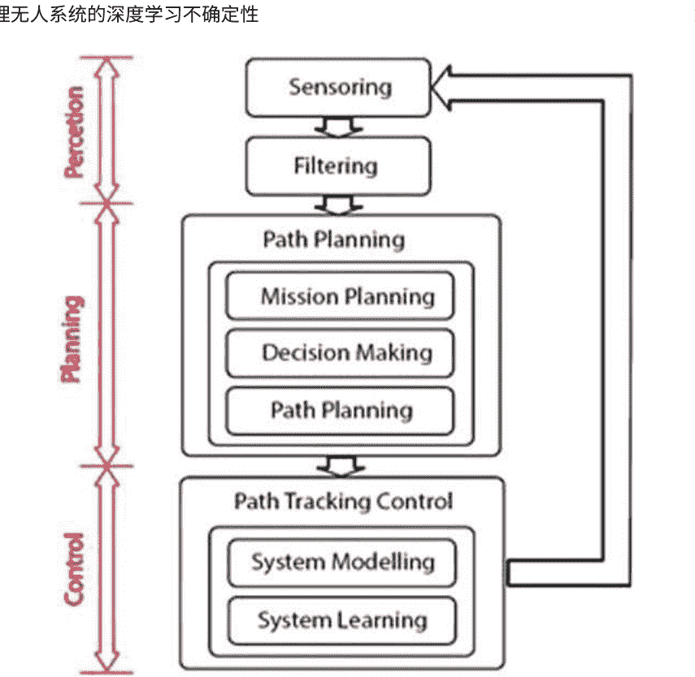

图1 不同层次的自主控制架构[1]

自动驾驶车辆技术的快速进展主要得益于机器学习领域的进步，特别是深度学习(DL)。人工智能(AI)的思想也被用于解决自主驾驶车辆的规划问题。这些包括监督学习、深度学习和强化学习。

应用强化学习需要对奖励函数有所了解，并需要仔细设计。另一种方法是通过展示所需驾驶行为的示范来学习最优驾驶策略。

机器学习和深度学习技术开始变得有效和可靠，即使对于安全关键系统，对于这种类型的系统的完全安全保证仍然是一个悬而未决的问题。当前汽车行业的标准和规定无法完全映射到这种系统，需要制定针对深度学习的新安全标准。

在现代自动驾驶系统中，有固定的模块（图2）。在真实的自动驾驶汽车中，传感器分布如图3所示。自动驾驶车辆（AV）必须处理动态、非平稳和高度不可预测的操作环境。在设计时考虑操作环境的所有细节是一个棘手的任务。相反，操作

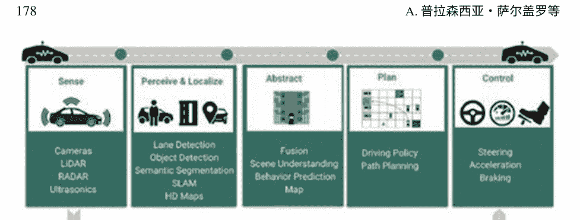

感知估计位置：车道位置、汽车、行人、交通灯和其他语义对象等等。它还通过结合地图[2]提供了更大空间和时间尺度上的道路占用情况。

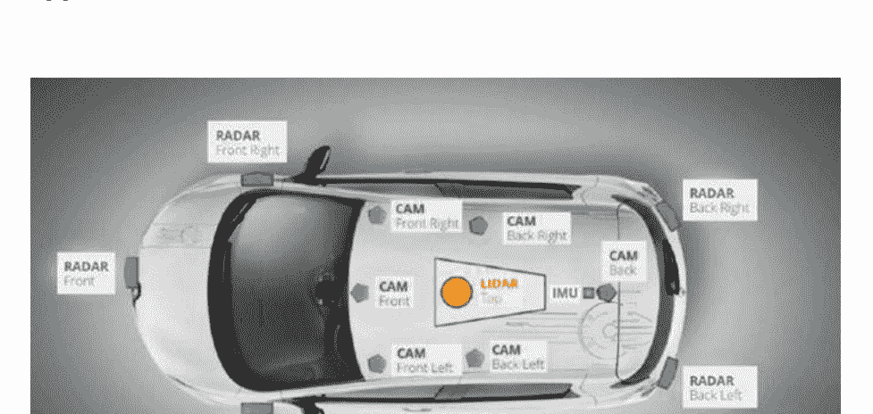

环境受限，只考虑系统在操作中可能遇到的一部分情况。这个过程被称为采用操作设计域（ODD）概念，并且安全要求是基于ODD规范的基础上建立的[4]。

在系统ODD内的受限操作环境中，确保AV的安全性需要通过对AV进行建模来识别不熟悉的上下文。

不确定性。然而，影响系统性能的因素不仅仅与环境有关，还引入了一定程度的不确定性。Arnez [4]确定了一组因素，这些因素对AV的感知功能的不确定性产生影响，从而影响其性能。在这组因素中，我们特别关注传感器属性、模型不确定性、情况和场景覆盖以及操作域不确定性因素。在深度神经网络（DNNs）的背景下，前两个因素可以通过使用不确定性估计方法进行建模，而后两个因素对应于数据集的一定程度的偏移（即，打破训练和测试数据之间的独立和同分布假设）和超出分布（OOD）样本。

传感器的属性，如范围、分辨率、噪声特性和校准，可以影响训练或测试期间传递给机器学习模型的样本中的信息量。因此，这些属性的影响被捕获为噪声和样本固有的不确定性。数据中的这种噪声被称为随机不确定性，代表了完全感知环境细节的能力的不足。

随机不确定性可以进一步分为同方差不确定性（对不同样本保持恒定的不确定性）和异方差不确定性（在样本之间可以变化的不确定性）。

模型不确定性通常被称为认知不确定性，并考虑了模型参数的不确定性。这种不确定性捕捉了模型对不正确表示ODD的数据集或不够足够大的数据集的无知。在未知情况下（例如不同环境ODD条件，如天气或照明），认知不确定性预计会增加，并且可以通过加入更多数据来解释。

情况和场景覆盖与在训练和操作阶段中反映在ODD中的情况和场景的程度有关；而操作域不确定性是指训练中出现的ODD情况和场景与操作中遇到的情况和场景之间的差异（例如，来自两个不同ODD的场景）。在这两种情况下，可以通过增加更多数据或调整ODD规范来减少不确定性。

然而，检测和发现OOD样本（即异常值）尤其重要，特别是那些以前没有见过的样本，因为这些样本可能导致高度自信但错误的预测，即未知-未知情况。

哈瓦那的控制论、数学和物理研究所在博士项目“应用控制论”中自2017年以来一直开设“机器学习”课程。该课程有两个连续的模块，一个是“强化学习”，另一个是“深度强化学习”。在DL算法的应用中，不确定性的作用是教授中较难的主题之一。

此外，在航空安全、机器人导航、帕金森病患者监测、人类免疫系统模拟系统和可再生能源渗透网格系统等领域存在一些研究项目，其中应用了深度强化学习（DRL）算法，正确处理不确定性非常重要。

## 在本章中，我们将涵盖以下主题：

- 首先，我们介绍了最佳控制策略、地图表示技术、与外部系统的交互，包括在物联网（IoT）的信息概念下的行人交互以及大数据不确定性和机器学习中的不确定性，特别是在DRL中。
- 其次，在方法部分，我们展示了使用贝叶斯深度学习（BDL）和模糊深度强化学习模型进行不确定性估计。
- 第三，在讨论部分，我们选择了一些模拟工具，可以在不同环境中可视化和解释先前提到的模型中的不确定性，对教学和研究非常有用。
- 第四，总结中，我们展示了研究的结果和未来的方向。

本章分为5个部分。第1节是介绍部分，第2节介绍了控制策略和物联网的信息概念，以及面对大量数据不确定性的自主系统的物联网机器人事物的一般框架，使用强化学习和深度强化学习等机器学习算法，第3节讨论了用于表示自主车辆和物联网机器人事物框架中的不确定性的方法和模型，选择了贝叶斯深度学习和模糊深度强化学习两种方法。第4节介绍了使用模拟进行自主系统不确定性评估的可能性，包括先前提到的模型和物联网模拟。第5节是结论。

## 2 背景

### 2.1 控制策略

移动机器人的机械结构必须受控以执行任务并实现其目标。控制系统涉及三个不同的支柱：感知、处理和认知以及行动。感知系统提供有关环境、机器人本身以及机器人与环境之间关系的信息[5]。

这些信息被处理后，适当的命令被发送到执行器，从而移动机械结构。一旦环境和机器人的方向、目的地或目的已知，机器人的认知架构必须规划机器人必须采取的路径以实现其目标。因此，机器人的认知层是机器人用来实现高级目标的决策和执行部分。基于传感器和机器人的目标信息，认知和控制系统必须决定如何行动以及如何实现其目标。此外，控制系统负责协调所有输入数据并规划机器人的运动，以使其能够相应地移动。机器人可能需要一个“认知”模型。

认知模型旨在表示机器人、环境以及它们之间的交互方式。计算机视觉和模式识别用于跟踪物体。

根据分析的属性（局部稳定性、固定点的分叉、相图、等值线、吸引子等）和非线性动力学方程的处理方式，控制策略可以分为以下几类：

- (1) 全局线性化控制：这些方法将系统的非线性动力学转化为等效的线性状态空间。控制器使用状态反馈来解决相关的状态估计问题。而全局方法可以根据微分平坦系统和李代数的理论进行分类。
- (2) 近似线性化控制：在这些方案中，通过使用局部平衡点处获得的局部线性模型来实现非线性控制问题的解决。局部线性模型必须确保控制器的稳定性。局部控制器的参数应该被选择以确保控制回路对外部扰动和模型参数不确定性的鲁棒性。
- (3) 李亚普诺夫理论控制：这些方法试图通过最小化李亚普诺夫函数来确保控制回路的渐近稳定性。基于李亚普诺夫的技术有两个主要方向：线性化方法和李亚普诺夫的直接方法。第一个为使用线性控制方法提供了基础。它表明，如果非线性系统的线性近似的所有特征值都在开放的左半平面上，则系统局部稳定；如果至少有一个特征值在开放的右半平面上，则系统不稳定。李亚普诺夫的直接方法依赖于一个物理性质，即总能量 V(t)不断耗散的系统最终必定达到一个平衡点。然而，如何选择最佳的 V(t)函数来表示系统的动能和势能并不明显。控制设计的目标和测量的约束导致系统状态的定义，这通常指导了李亚普诺夫函数的开发。

最著名的控制策略将在下面进行描述。

- a. 计算力矩控制方法：计算力矩是通过位置的二阶导数、期望位置和质量矩阵来定义的，以传统方式表示，具有比例和导数误差（反馈）的明确增益。
- b. 鲁棒控制方法：这些方法与计算力矩控制方法类似，但增加了一个依赖于任意小的正设计常数 E的鲁棒化反馈组件。
- c. 滑模控制方法：增加控制器的频率可以改善系统的稳态误差。如果将设计参数 E设为零，控制器需要无限的执行器带宽，状态误差消失。这种不连续的控制器被称为滑模控制器。
- d. 自适应方法：与之前的方法相比，对机器人动力学的精确知识要求较低，该方法使用线性参数假设。这些方法使用前馈项的估计，从而降低了对高增益和高频率的要求，以补偿动态模型中的不确定性/干扰。
- e. 神经网络（NN）方法：这些方法使用函数逼近。函数逼近的优势在于不需要建模不确定性。神经网络可以逼近通用的非线性连续函数。任何连续函数都可以使用激活函数和函数重构误差来表示。可以使用各种函数作为激活函数。
- f. 模糊逻辑方法：模糊逻辑理论用于处理感知系统固有的不确定性和模糊性。它也使用函数逼近。可以区分三种类型的模糊系统：Mamdani型模糊系统，第二类型模糊系统（这是第一类型的特殊情况），以及Takagi-Sugeno模糊系统。这些方法还使用对机器人动力学的宽松知识。
- g. 不变流形方法：使用这种方法，动态方程被分解为其组成部分，使得每个坐标都有自己的函数。
- h. 零力矩点控制：这是与机器人的控制和动力学相关的概念，例如用于人形机器人。它确定了在脚和地面之间的动态反作用力不会产生任何力矩的点，也就是说，总的水平惯性和重力力量为零的点。这个概念意味着接触区域是平面的，并且具有足够的摩擦力以防止脚像Asimo机器人一样滑动。

### 2.2 地图表示技术

提供足够的关于机器人位置的信息是非常重要的，以便它能够导航。因此，定位技术对导航过程至关重要。此外，移动机器人导航还需要额外的技能。

其中之一是轨迹规划。给定地图和目标位置，它涉及获取机器人必须遵循的轨迹以达到目标位置。轨迹规划是机器人学中非常重要的问题，当机器人必须在长期内选择如何实现其目标时。第二个技能是避障。这在轨迹规划中起着重要作用，以避免碰撞。传感器的数据可能调节机器人的轨迹以避免碰撞。一种重要的技术变种已被证明对于避障是有效的。

计算得出的机器人运动既是机器人传感器读数的函数，也是机器人目标位置和与目标位置相关的位置的函数。避障算法依赖于全局地图的存在以及机器人对其位置与地图的准确知识。

如果机器人打算到达特定位置，它需要一个环境模型或地图，以便规划到达目标的路径。这意味着定位是一个广泛的问题，不仅包括确定机器人在空间中的绝对位置，还包括构建地图并确定机器人相对于地图的位置。因此，传感器（感知系统）在定位任务中是基础性的。

传感器的任何不准确和不完整都会影响机器人的定位。此外，传感器噪声和混叠会降低所捕获的有用信息。必须将不确定性和错误降至最低。它们必须帮助对机器人及其环境进行映射。地图的准确性应满足机器人的工作准确性。地图的精度还必须满足机器人传感器返回的准确性和数据类型。重要的是要记住，地图表示的复杂性会影响对映射、定位和导航进行推理的计算复杂性。

在路径规划中已经使用了许多地图表示技术。一组技术如下所示：

- 1. 基于概率地图的定位。
- 2. 马尔可夫定位。
- 3. 卡尔曼滤波定位。
- 4. 蒙特卡洛定位。
- 5. 基于地标的导航。
- 6. 全局唯一定位。
- 7. 定位信标系统。
- 8. 基于路线的定位。
- 9. 自主地图构建。
- 10. 随机地图技术。
- 11. 循环环境。
- 12. 动态环境。

## 路径、轨迹和运动规划

路径规划关注的是找到最佳路径，使移动机器人在不发生碰撞的情况下到达目标，从而允许移动机器人在初始配置和另一配置之间穿越障碍物。

已经出现了许多试图解决应用于移动机器人的运动规划的方法论。现有的算法和技术可以分为五个广泛的类别：

- I. “经典方法”。
- II. “概率方法”。
- III. “启发式规划器”。
- IV. “进化算法”。
- V. “基于传感器的规划器”。

在这个评论中，只讨论了“启发式规划器”或基于图搜索的启发式搜索策略算法，例如：A*，贪婪搜索，Dijkstra算法和D*。主要关注贪婪搜索。这种技术通过在每个阶段搜索局部最优选择来解决问题，试图找到全局最优解。通常，贪婪搜索算法不能产生最佳解决方案，但贪婪启发式可能会在最短时间内产生近似全局最优解的局部最优解。

用于防止碰撞的算法可能是：

- (1) 基于地图：这些算法依赖于环境的几何模型或拓扑地图。
- (2) 无地图：这些算法根本不使用环境的显式表示。它们依赖于传感器系统来观察环境。矢量场直方图和动态窗口方法是两种与3D和激光扫描仪传感器一起很好地避免碰撞的算法。

### 2.3 与外部系统的交互

外部系统与自动驾驶车辆进行交互，就像物联网概念下的一个系统。根据[6, 7]的定义：“物联网是一个可以通过各种具有感知、计算、执行和通信能力的设备，从物理世界收集信息或控制物理世界的对象，并通过信息的传输、分类和处理，维持人与物之间或物与物之间的通信。”

#### 2.3.1 物联网的信息概念

根据[8]，在物联网中，物品被分为三个领域，人、机器（例如传感器、执行器、嵌入式设备）和信息。通过研究人类如何处理数据[9]（图4），可以更好地理解定义中给出的信息交换过程。

作为信息处理的结果，这些知识层次是通过三种类型的交互获得的，人与机器（P2M）、人与人（P2P）和机器与机器（M2M），如图5所示。

因此，我们可以说IoE中的“知识层次金字塔”有三个面，分别对应每种表达的交互，即P2M的交互有一个面，P2P的交互有另一个面，M2M的交互有第三个面。金字塔中的每个层次对应于特定的技术和工具，这些技术和工具与我们正在处理的交互不同。

图4 人类将数据转化为智慧 [10]

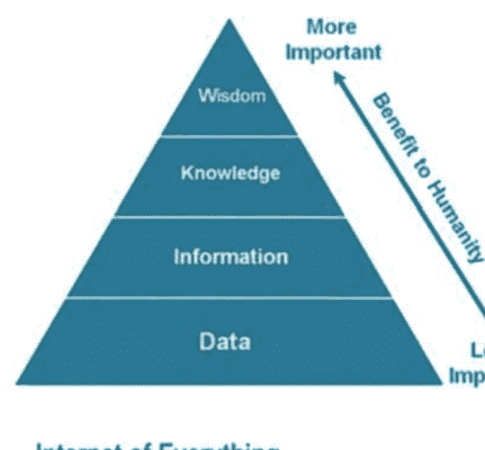

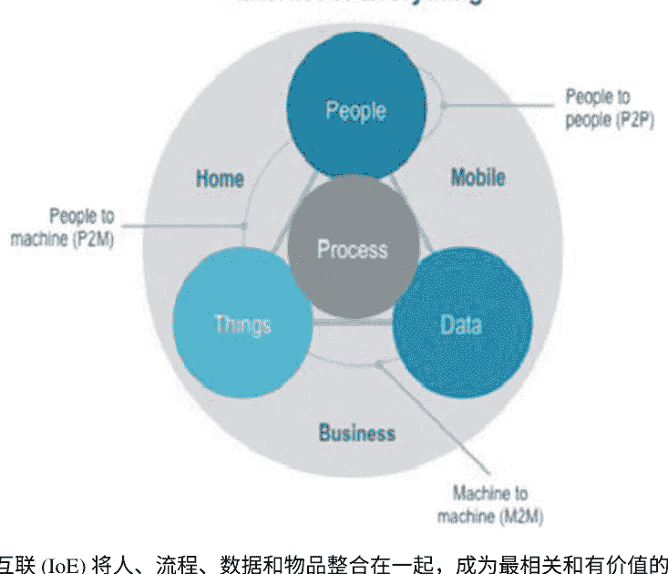

图5 万物互联 (IoE) 将人、流程、数据和物品整合在一起，成为最相关和有价值的网络连接 [11]

现实世界自主车辆面临的主要挑战是在包含人员的环境中运行。与静态和弹道环境不同，人们是复杂的互动主体，拥有自己的目标、效用和决策系统，与他们的互动必须考虑这些因素，以便预测他们的行为并相应地进行规划。互动是递归和复杂的：自动驾驶车辆的行为将影响到人的行为，反之亦然。这在交通规则没有明确定义优先权的环境中至关重要，例如在未标记的交叉路口，自动驾驶车辆和行人必须协商谁先通过 [12]。

解决上述情况的一种方法是使用人类活动识别 (HAR) [13]。这是一种基本技术，在医疗保健和监控领域很受欢迎。特别是基于可穿戴物理传感器信号处理的HAR已广泛应用于普适应用，并在不明显侵犯个人隐私的情况下深刻改变了我们的日常生活。

移动技术可以用于HAR实现。具体而言，它利用商用智能手机监测行人的移动，而不需要用户的意识，但与自动驾驶车辆进行交互。这是减少行人行为不确定性的另一个信息来源[14]。但是，这种解决方案的缺点之一是产生大量数据，需要使用大数据不确定性技术进行管理。

#### 2.3.2 机器人物联网

机器人物联网 (IoRT) 的概念由ABI Research的机器人实践总监Dan Kara提出[15]。根据Dan Kara的说法，“目前，大多数物联网项目侧重于使用带有简单、被动传感器的连接设备来管理、监控和优化系统及其流程，通常作为供应链优化工作的一部分。先进的感知、通信、本地和分布式处理以及执行将物联网的原始愿景提升到一个完全不同的水平，为物联网和机器人解决方案提供商以及他们产品的用户开辟了全新的机会领域。”

根据ABI研究，IoRT被定义为“能够监测事件，融合来自各种来源的传感器数据，利用本地和分布式的‘智能’来确定最佳行动方案的智能设备”。

从技术的角度来看，以下技术将帮助IoRT执行复杂任务并在多维环境中运行[16]。

- 通信技术：多种无线接入技术充当连接边缘智能设备的桥梁，并催生了需要高效配置、管理和定期更新以适应下一代机器人事物的异构移动网络。
- 人工智能：借助人工智能技术，基于物联网的机器人系统可以与各种物联网应用无缝集成，并为现实世界中的复杂问题创建优化解决方案。
- 认知物联网技术：认知物联网技术将在增强系统智能方面发挥重要作用，以实现所有复杂业务运营的效率，并探索新的商业机会。

因此，IoRT系统应能够在IoT环境中高效处理所有复杂情况和挑战。


图6 分布式边缘IoT平台和应用[17]

IoRT的概念被视为下一代智能、自主机器人或“物”类，结合了人工智能、机器人边缘计算和物联网（图6）。

以下几点突出了IoRT系统的特点[17]：

- 感知：是IoT和机器人系统的常见功能，与其他IoT设备和人们进行交互，以促进M2M和P2M通信。在这个特性下，感知即服务已经在不同的解决方案中实施。
- 执行：被认为是在IoT领域中目前不可用的各种物理/虚拟活动中采取必要行动。执行需要寻找一个可信、受保护和安全的开放多供应商IoT应用服务的开发、部署和运营。最近的研究进展提出了一个新的概念，即“执行即服务”，以确保IoT设备的用户适应性和交互。
- 控制：通过物联网，可以为物联网机器人系统提供先进的控制机制，通过控制回路或一系列回路。控制回路可以轻松映射到几乎任何东西，从虚拟对象到物理对象，从云到各种网络，为物联网机器人系统提供更多的自主控制。
- 规划：在这个领域，物联网机器人系统将被赋予新颖的能力，即协调组织逻辑，以有效地与内部平台组件协调，以满足服务请求并在整个服务生命周期中监控质量水平。规划依赖于自动化工作流引擎，以基于每个服务请求初始化所需的功能。
- 感知：通过物联网，机器人的感知能力可以得到极大增强。在机器人领域，感知被视为传感器信息的组合。

图7 物联网机器人系统 = 物联网 + 边缘计算 + 云计算 + 云机器人 + 机器人 [17]

通过知识建模，使机器人能够在软件工程、云计算、大数据、机器学习、传感器通信和人工智能等多个领域中与人类进行交互。通过物联网，IoRT机器人可以更加智能地感知实时环境并执行复杂操作。

-   **认知**：通过物联网，基于IoRT的系统可以感知来自其他设备的传感器数据。换句话说，IoRT可以分析环境中发生的各种事件的数据，并采取必要的行动。通过这种方式，IoRT设备可以利用本地和分布式智能。

下图7更好地展示了IoRT的概念。

## 2.3.3 IoRT架构

近年来，物联网制定了不同的新颖架构、标准和平台。为了更深入地了解IoRT，让我们来看一下基于IoRT的机器人系统的一般架构。图8展示了IoRT的深入架构。

## 2.4 自主物联网

自主物联网（AIoT）的概念[19]被提出作为探索其未来潜力的下一个浪潮[20]。

# 图8 IoRT的总体架构[18]

AIoT系统提供了一个动态和交互式的环境，拥有许多AIoT设备，这些设备感知环境并做出控制决策以做出反应。如图9所示，一个AIoT系统通常包括一个物理系统，其中部署了带有传感器和执行器的AIoT设备。物联网设备通常通过无线网络连接到访问点（AP），例如移动基站（BS）作为连接到互联网的网关，云服务器部署在其中。此外，与云服务器相比，具有有限数据处理和存储能力的边缘/雾服务器可以部署在AP上[21]。物联网设备从传感器获取代表物理系统完整或部分状态的数据后，需要处理数据并生成控制决策以做出反应。数据处理任务可以在物联网设备、边缘/雾服务器或云服务器上本地执行。

# 图9 自主物联网系统[19]

## 2.5 大数据不确定性

一般来说，“不确定性是涉及未知或不完善信息的情况”[22]。物联网在其交互中产生了大量的数据，被称为大数据。

不确定性存在于大数据学习的每个阶段[7]，并来自许多不同的来源，例如数据收集（例如环境条件的变异和与采样相关的问题）、概念变异（例如分析的目标不相似）和多模态性（例如来自多个传感器的患者健康记录引入的复杂性和噪声，包括数值、文本和图像数据）。

大数据和大数据分析中存在各种形式的不确定性，可能对结果的有效性和准确性产生负面影响。例如，如果训练数据在任何方面存在偏差、不完整或通过不准确的采样获得，使用受损训练数据的学习算法很可能输出不准确的结果。

因此，增强大数据分析技术以处理不确定性至关重要。

尽管存在各种技术来分析大数据，但如果忽视数据或技术本身的不确定性，分析的准确性可能会受到负面影响。概率论、模糊理论、粗糙集理论等不确定性模型可以用于增强大数据分析技术，提供准确和更有意义的结果。基于以前的研究，贝叶斯模型和模糊集理论是建模不确定性和决策的常见方法。表1比较和总结了我们认为相关的技术，包括不同的不确定性策略的比较，重点关注概率论、香农熵、模糊集理论和粗糙集理论。

## 2.6 机器学习中的不确定性

机器学习算法中的不确定性可以分为两种类型：(a) 随机性或数据相关性，其中模型捕捉到数据中的噪声，导致训练输入的模糊性；(b) 知识性或模型依赖性被视为熟悉度的一种度量，因为它表示模型在处理操作输入时的模糊性。更准确地说，处理基于机器学习的解决方案时的主要关注点如下[23]：

-   (i) 训练数据的不完整性：传统软件系统是根据预定义的一组功能要求开发的。然而，在神经网络和更一般的机器学习算法中，系统的功能要求是隐含在训练数据中的，期望训练数据代表操作环境。然而，训练数据的缺点在于它在定义上是不完整的，因为它只代表系统在操作过程中可能遇到的所有可能输入的一个子集。因此，当操作环境没有完全在训练集中得到体现时，就会出现不足。在自动驾驶车辆的情况下，关键和模糊的条件，车辆被期望以可预测的方式行动，通常会成为问题。这是因为这些情况，由于其极其罕见或极其危险的性质，往往在训练集中被低估。
-   (ii) 分布变化：在自动驾驶车辆的情况下，操作环境是高度不可预测的，因为它不断地根据系统内的参与者而变化。因此，即使有一个良好且接近完美的训练集，操作输入可能与训练集不相似。换句话说，操作数据的分布可能与原始训练数据有所偏移，导致系统行为不可预测。
-   (iii) 训练环境和操作环境之间的差异：操作环境中的微小变化可能导致神经网络的不可预测行为。在某个特定设置下微调的神经网络在设置改变时无法保证以完全相同的方式工作。

# 表1 大数据不确定性相关技术[22]

### 2.6.1 强化学习

强化学习（RL）是一类算法，允许智能体在不同情况下学习如何行动。换句话说，如何建立一个从情况（状态）到最大化数值奖励信号的行动的映射或策略。RL已成功应用于许多不同领域，如直升机控制[2]。

RL是一种通用的学习工具，智能体与环境交互以在没有任何先验知识的情况下学习如何在环境中行为，通过学习最大化数值定义的奖励（或最小化惩罚）。在采取行动后，RL智能体在每个时间步骤t从环境中接收关于其行动表现的反馈。利用这个反馈（奖励或惩罚），它迭代地更新其行动策略以达到最优控制策略。

RL从与环境的经验中学习，展示了一种类似于人类学习的试错式学习[24]。

在强化学习中，探索和利用之间存在着基本的权衡，平衡了新动作和学习动作。从计算的角度来看，强化学习是一种数据驱动的方法，通过迭代计算出最优控制策略的近似解。因此，它也被称为近似动态规划，是动态规划中的一种顺序优化问题类型。

在一般的强化学习模型中，一个由算法控制的代理在每个时间步骤观察系统状态s_t，并在采取行动后从环境/系统中获得奖励r_t。在根据当前策略π采取行动后，系统转移到下一个状态s_{t+1}。在每次交互之后，强化学习代理更新其对环境的知识。图10显示了强化学习过程的示意图。

强化学习方法正式来自马尔可夫决策过程（MDP），它是一种用于顺序决策算法的通用数学框架。

-   一组状态 S
-   一组动作 A
-   转移函数 T(s_{t+1}|s_t, a_t)，它将每个时间t的状态动作对映射到下一个状态s_{t+1}的分布，
-   奖励函数 R(s_t; a_t; s_{t+1})，它给出从状态s_t到下一个状态s_{t+1}采取动作a_t的奖励，
-   折扣因子 γ 在0和1之间，用于未来的奖励。

马尔可夫性质的关键是，给定当前状态s_t，系统的下一个状态s_{t+1}与之前的状态(s_0; s_1, ..., s_{t-1})无关。在包括交通系统在内的控制系统中，MDP模型大多是以每个周期为基础的，每个周期都有一个终止点，基于结束时间T或结束状态s_T。MDP代理的目标是找到最佳策略π*，使得每个状态s的预期累积奖励E[R_t|s, π]和累积折扣奖励（即回报）最大化。

$$ R_t = \sum_{i=0}^{T-1} \gamma^{i} r_{t+1}, \quad (1) $$

具有反映未来奖励重要性的折扣参数γ。选择0到1之间的较大γ值意味着代理的行动对未来奖励有更高的依赖性。而较小的值会导致行动主要关注即时奖励r_t。

一般来说，强化学习代理可以通过两种方式行动：(i) 通过了解/学习从状态s_t到s_{t+1}的转移概率T，这被称为基于模型的强化学习；(ii) 通过在不学习转移模型的情况下探索环境，这被称为无模型强化学习。无模型强化学习算法也分为两个主要组别，即基于值和基于策略的方法。在基于值的强化学习中，代理在每次迭代中更新将每个状态-动作对映射到值的值函数，而在基于策略的方法中，策略在每次迭代中使用策略梯度进行更新。

开发能够推理感知和控制未知环境中的强化学习算法，理解不确定性并安全探索对于在安全关键系统上部署强化学习算法至关重要。

自主系统的预探索活动（图1的规划）可以用奖励和惩罚行为来建模，可以使用强化学习代理来缓解这种情况。强化学习基于行为心理学，代理通过从环境中获得奖励来学习将情境映射到动作，否则会受到惩罚。该解决方案的目标是通过两个可训练的组件来增强学习，如图11所示。图11a显示了负责探索环境的强化学习代理，图11b描述了以标准方式实现的在线神经网络组件。强化学习代理通过探索和与环境交互来学习，因此可以通过模拟训练来探索甚至负面结果，在测试中这些结果不会对生命构成真正威胁。通过这样做，强化学习代理将能够学习。

强化学习中的一个核心挑战是机器人只能通过执行动作本身来学习动作的结果。考虑一个机器人在未知环境中学习导航并避免碰撞。这种情况似乎带来了一个困境：机器人需要学习如何避免碰撞以实现所需的任务，但为了学习如何避免碰撞，机器人必须在训练过程中经历（可能是灾难性的）碰撞[25]。

为了实现这种安全的、对不确定性敏感的导航，[25]提出了一种基于模型的学习方法，机器人通过学习碰撞预测模型并使用模型不确定性的估计来调整导航策略。通过使用与速度相关的碰撞成本以及对不确定性敏感的碰撞估计，导航策略在不确定性较高时自然选择谨慎移动，以仅经历无害的低速碰撞，并仅在预测模型的置信度较高的区域增加速度。

已经提出了几种基于模型的机器人学习算法，明确地考虑了不确定性[3, 26]。不确定性估计已被用于进行风险规避和风险追求的乐观探索[19]。不确定性估计的作用是在模型获得足够的自信之前，在训练时避免不安全的行动，这在很大程度上与寻求改进探索以加速学习的先前工作是正交且互补的。将这两个方向结合起来是未来工作的一个有希望的方向。

### 2.6.2 深度强化学习

在高维状态空间中，标准的强化学习算法无法高效地计算所有状态的值函数或策略函数。尽管一些线性函数逼近方法被提出来解决强化学习中的大状态空间问题，但它们的能力仍然有限。在高维和复杂的系统中，标准的强化学习方法无法学习到环境的信息特征以进行有效的函数逼近。然而，这个问题可以通过基于深度学习的函数逼近器轻松处理，其中DNN被训练来学习最优策略或值函数。在大状态空间中，使用不同的神经网络结构，如卷积神经网络（CNN）和循环神经网络（RNN），来训练强化学习算法[24]。

深度学习的主要概念是从数据中提取有用的模式。深度学习模型大致受到人类神经系统的多层结构的启发。如今，深度学习在包括计算机视觉、语音识别、自然语言处理和深度强化学习应用在内的广泛领域中有应用。

-   **1. 深度 Q 网络**：由于基于值的强化学习算法通过填充 Q 表来学习 Q 函数，在大状态空间和连续动作问题中访问所有状态和动作是不可行的。解决这个问题的主要方法是称为深度 Q 网络（DQN），它使用深度神经网络来近似 Q 函数。原始 DQN 使用原始输入图像作为状态，并使用卷积神经网络从中估计 Q 值。用θ表示神经网络参数，Q 函数的近似写作 $Q(s; a; \theta)$。神经网络的输出是根据[6]使用一组离散的近似动作值选择的最佳动作。

有两种新技术可以稳定DNN的学习：目标网络和经验回放。原始的DQN算法在几个经典的Atari视频游戏上明显优于专家人类表现。

完整的DQN算法包括经验回放和目标网络，具体算法如算法1所示。

# 算法1

```
Algorithm 1 DQN algorithm
1: Input Replay memory size M, batch size d, number of
   episodes E, and number of time steps T
2: Initialize Main network weights θ
3: Initialize Target network weights θ⁻
4: Initialize Replay memory
5: for e = 1,...,E do
6:    Initialize state s₁, and action a₁
7:    for t = 1,...,T do
8:        Take action a_t = argmax_a Q^π(s_t, a; θ) with probability 1 - ε or a random action with probability ε
9:        Get reward r_t and observe next state s_{t+1}
10:       if Replay capacity M is full then
11:           Delete the oldest tuple in memory
12:       end if
13:       Store the tuple (s_t, a_t, r_t, s_{t+1}) to replay memory
14:       Sample random d tuples from replay memory
15:       y_t = { r_t,                   if t = T.
               r_t + γ max_a Q^π(s_{t+1}, a_{t+1}; θ⁻),  otherwise.
16:       Perform policy gradient using y_t for updating θ
17:       Update target network every N step, θ⁻ = θ
18:   end for
19: end for
```

-   **(2) 双重Dueling DQN**：DQN是标准Q-Learning算法的改进版本，具有单个估计器。由于只有单个Q函数估计，DQN和Q-Learning都会对一些动作进行过高估计。一些作者提出使用主网络进行动作选择和目标网络进行动作评估，通过两倍估计器在损失最小化中分别进行，类似于表格双Q-learning技术。双重DQN网络不是使用目标网络选择最大未来奖励的Q值，而是使用主网络选择动作并使用目标网络进行评估。这两个网络的组合输出是一组离散动作的Q值，通过一个聚合层进行计算。这样，dueling DQN学习了重要的状态值，而不考虑它们对动作的影响，因为状态值函数V^π(s)是一个无动作估计。这两个在DQN算法上使用优先经验回放的模型被认为是离散动作驱动的深度强化学习的最新技术。

-   **(3) 演员-评论家方法**：演员-评论家强化学习模型介于基于策略的算法和基于值的算法之间，因为它具有两个估计器：一个使用Q值估计的演员和一个使用状态值函数估计的评论家（见图12）。演员根据策略控制代理的行为，评论家根据价值函数评估采取的行动。最近有一些论文使用DRL方法处理演员-评论家模型的变体，其中演员和评论家的函数逼近器都基于DNN。标准的DQN技术适用于低维离散动作空间。最近引入了一种名为深度确定性策略梯度（DDPG）的演员-评论家算法，用于解决高维连续控制问题，其采用了基于状态空间而不是基于状态和动作空间的确定性策略梯度方法进行估计。DDPG与标准DQN的一个区别是它使用了一个新的软目标更新模型进行频繁的软更新。

-   **(4) 异步方法**：硬件系统的改进使得强化学习研究人员能够使用多个中央处理器单元（CPUs）或图形处理器单元（GPUs）进行并行计算，从而提高了学习速度。第一个在DQNs上测试的并行模型在训练时间较短和收敛结果较高方面提高了代理的性能。例如，[24]中提出的异步多个演员学习者模型在连续和离散动作空间中都能达到非常高的性能。多个演员学习者使得强化学习代理能够以不同的探索率探索环境。此外，异步更新不需要回放记忆，并且学习者在预定义的更新周期$T$中使用多个累积梯度进行实验。异步优势演员-评论家（A3C）是一种先进的深度强化学习算法，可以异步地在并行处理器上更新策略和价值网络。每个网络在更新周期$T$内分别进行更新，而共享的主网络则进行更新。关于参数$\theta^{\pi}$和$\theta^{V}$A3C) 的研究，一种先进的方法是优势演员-评论家(A2C)。

深度强化学习是最成功的人工智能模型之一，也是最接近人类学习的机器学习范式。它结合了深度神经网络和强化学习，用于更高效和稳定的函数逼近，特别是在高维和无限状态问题上[24]。

-   **自助法**：自助法是一种使用重采样来估计模型不确定性的简单有效方法，可与任何判别式训练模型一起使用[25]。
-   **丢弃法**：相比之下，丢弃法是一种计算成本较低的方法，用于改善不确定性估计。丢弃法通常用于减少神经网络的过拟合，在训练过程中随机丢弃神经网络的单元。

使用强化学习算法进行探索的一个核心目标是直接处理来自高带宽传感器（如摄像头）的原始输入，这就需要使用丰富和表达力强的模型，如深度神经网络。对于深度神经网络的不确定性估计更具挑战性，因为这些模型本质上是判别式的。还需要使用这些数据的融合。

基于丢弃法的贝叶斯神经网络公式，以及用于安全目的的探索的自助法用于不确定性估计。丢弃法和自助法的组合为强化学习任务提供了可行的不确定性估计。[25]

### 2.6.3 自主物联网的通用强化学习模型

典型的AIoT架构由图13所示的三个基本构建模块组成：

-   **感知层**：它对应于物理自主系统，其中具有传感器和执行器的物联网设备与环境交互以获取数据并执行控制动作；
-   **网络层**：它对应于物联网通信网络，包括无线接入网络和互联网，用于发现和连接物联网设备到边缘/雾服务器和云服务器以进行数据和控制命令传输；
-   **应用层**：它对应于物联网边缘/雾/云计算系统，用于数据处理/存储和控制动作决策。

AIoT系统的强化学习模型是复杂的模型。环境可以包括AIoT架构中的一个或多个层。代理可以位于物联网设备、边缘/雾/云服务器和无线接入点。基本的强化学习元素可以分别定义为每个层的状态、动作和奖励。当环境包括所有三个层作为系统的一部分时，可以定义强化学习元素，如图13所示。

# 图13 自主物联网的通用RL模型[19]

## 3 种方法

### 3.1 贝叶斯深度学习

DL方法已经为不同应用提供了最先进的准确性。然而，由于模型的不确定性，DL方法无法处理给定任务的不确定性。这些学习方法接受输入并假设类别概率，但没有合理的解释。2015年，两名非洲裔美国人被图像分类系统识别为大猩猩。有几个应用领域可能出现不确定性，包括自动驾驶汽车[26]。

BDL是DL和贝叶斯概率方法的交叉，对于不同的应用和问题的不确定性有更好的结果。通过对模型权重应用概率分布或映射输出的概率来估计不确定性。

在[27]中介绍了一种基于反向传播的算法，用于学习神经网络权重的概率分布，称为Bayes by Backprop。它通过最小化压缩成本来正则化权重。也被称为变分自由能或边际似然的期望下界。

所提出的神经网络中的所有权重都由可能值的概率分布表示，而不是像通常那样具有单个固定值（参见图14）。因此，学到的表示和计算必须在权重扰动下具有鲁棒性，但每个权重展示的扰动量也是以一种连贯地解释训练数据变异性的方式进行学习的。因此，与其他集成方法不同，该方法通常只会使参数数量翻倍，但使用无偏的蒙特卡洛估计的梯度来训练一个无限集成。

隐藏单元中的不确定性允许表达对特定观察的不确定性，权重中的不确定性是互补的，因为它捕捉到对适当的神经网络的不确定性，从而实现权重的正则化和模型平均化。这种不确定性可以用于使用汤普森抽样在上下文强化学习问题中进行探索。具有更大不确定性的权重会在网络所做的决策中引入更多的变异性，从而自然地导致探索。随着观察到更多的数据，不确定性可以减少，使得网络所做的决策在环境更好地理解时变得更加确定性。

#### 3.1.1 在深度学习中表示模型不确定性

标准的回归和分类深度学习工具无法捕捉模型的不确定性。在分类中，通常将在管道末端（softmax输出）获得的预测概率错误地解释为模型的置信度。即使具有高softmax输出的模型也可能在其预测中存在不确定性（图15）。通过将函数的点估计（实线a）通过softmax（实线b）传递，会导致对远离训练数据的点具有不合理高置信度的外推。

例如，点 x*将以1的概率被分类为类别1。然而，通过将分布（阴影区域a）通过softmax函数（阴影区域b）更好地反映远离训练数据的分类不确定性[28]。

对于深度学习从业者来说，模型不确定性是必不可少的。有了模型的置信度，可以明确处理不确定的输入和特殊情况。例如，在分类问题中，模型可能返回具有较高不确定性的结果。在这种情况下，它可能决定将输入传递给人类进行分类。这可以发生在邮局，根据邮政编码对信件进行分类，或者在核电站中，负责关键基础设施的系统。不确定性在强化学习中也很重要。有了不确定性信息，代理可以决定何时利用环境，何时探索环境。强化学习的进展已经利用了神经网络来近似Q值函数。这些函数估计代理可以采取的不同动作的质量。经常使用ε贪婪搜索，其中代理以一定的概率选择最佳动作，否则进行探索。通过对代理的Q值函数进行不确定性估计，可以使用Thompson采样等技术来更快地学习。

贝叶斯概率论提供了数学上可靠的工具来推理模型的不确定性，但通常会带来计算成本过高的问题。令人惊讶的是，最近的深度学习工具可以被视为贝叶斯模型，而不需要改变模型或优化方法。在[28]中，证明了在神经网络中使用dropout（及其变种）可以被解释为一个著名概率模型的贝叶斯近似：高斯过程（GP）。

在深度学习中，Dropout被用于许多模型中，作为避免过拟合的一种方式，并且Dropout近似地整合了模型的权重。已开发的工具用于表示现有Dropout神经网络的模型不确定性——提取迄今为止被丢弃的信息，详见[28]（代码和演示可在http://yarin.co上获取）。这样可以在不牺牲计算复杂性或测试准确性的情况下，缓解在深度学习中表示模型不确定性的问题。

#### 3.1.2 集成到机器人系统的深度学习算法

只有当可用的预测不确定性度量时，深度学习算法才能完全集成到机器人系统中。事实上，估计不确定性可以实现贝叶斯传感器融合，并在决策过程中提供有价值的信息[29]。

Loquerio等人[29]提出了一种新颖的不确定性估计框架，通过将贝叶斯信念网络与蒙特卡洛采样相结合，更好地捕捉预测的不确定性，优于现有的最先进的方法。为了实现这一目标，他在以往的工作基础上提出了两个主要创新：利用关于数据的先验信息（例如传感器噪声）来计算数据的不确定性，并对数据和模型不确定性之间的关系进行建模。他在理论上和实验证明，这些创新使得该框架能够产生比最先进方法更高质量的不确定性估计。此外，该框架具有以下特点：(i) 对神经网络架构和任务是不可知的；(ii) 不需要对优化或学习过程进行任何更改；(iii) 可以应用于已经训练好的神经网络。这些特点使得这种方法成为学习感知或控制算法更好地集成到机器人系统中的一个吸引人的解决方案。在同一项工作[29]中，对四个具有挑战性的任务进行了实验：端到端的转向角预测、障碍物未来运动预测、物体识别和四旋翼飞行器的闭环控制。

已经提出的估计不确定性的方法和一系列在机器人系统中使用这些信息的方法如下：

##### A. 神经网络预测中的不确定性估计

神经网络通常由大量参数和非线性激活函数组成，这使得网络预测的（多模态）后验分布难以处理。为了近似后验分布，现有的方法使用不同的技术，主要基于贝叶斯推断和蒙特卡洛采样。

为了恢复概率预测，贝叶斯方法通过参数分布（例如指数族）表示神经网络的权重。因此，网络的预测也可以用相同的分布表示，并且可以使用非线性信念网络或图模型进行解析计算。最近，其他作者提出了自然参数网络，它通过高斯分布对输入、参数、节点和目标进行建模。总的来说，这些方法族可以以一种原则性的方式恢复不确定性。然而，它们通常以超线性方式增加可训练参数的数量，并且需要特定的优化技术，这限制了它们在实际应用中的影响。

为了减少计算负担，建议用分布替换网络的输入、激活和输出，同时保持网络的权重确定性。类似地，概率深度状态空间模型在序列数据中检索数据的不确定性，并将其用于基于学习的过滤。然而，忽略权重的不确定性通常会导致过于自信的预测，特别是对于在训练数据中没有很好表示的输入。

与使用概率分布表示神经网络参数和激活相反，第二类方法提出使用蒙特卡洛采样来估计不确定性。通常使用神经网络集合来计算蒙特卡洛样本。预测集合可以通过不同训练的网络生成，也可以在测试时保持dropout。虽然这类方法可以通过采样很好地表示多模态后验，但通常不能表示数据的不确定性，例如传感器噪声。一种可能的解决方案是调整dropout率；然而，总是可能构造出这种方法会产生错误预测的例子。

为了建模数据的不确定性，还提出了在每个输出中添加一个“方差”变量的方法，该方法通过最大似然（也称为异方差）数据损失进行训练。结合蒙特卡洛采样，这种方法可以预测模型和数据的不确定性。然而，这种方法需要改变架构，因为需要添加方差，并且需要使用异方差损失进行训练，这并不总是可行的。

与前面提到的方法类似，可以使用蒙特卡洛采样来预测模型的不确定性。

##### B. 机器人中的不确定性估计

考虑到安全的重要性，自动驾驶研究已经将大量注意力放在了感知和控制方面的不确定性估计问题上。预测不确定性也被证明对于应对自动驾驶中的传感器故障以及加速实际机器人上的强化学习过程至关重要。

对于自主无人机竞速任务，通过使用不确定性估计和滤波，已经证明了将最优控制方法与基于网络的感知系统相结合的可能性。对于机器人操作任务，不确定性估计也被证明在提高学习效率和保证机械臂安全方面起着重要作用。

为了将深度学习完全整合到机器人技术中，学习系统应该可靠地估计其预测的不确定性。由于生成预测可能需要大量（可能是非线性的）操作，后验分布 $p(y|x)$，其中 $y$ 是输出预测，$x$ 是输入样本，是难以处理的。形式上，总预测不确定性被定义为 $\sigma_{tot} = \text{Var}_{p(y|x)}(y)$。这种不确定性来自于数据和模型的不确定性。为了估计它们，可以导出一个可处理的近似值 $\hat{p}(y|x)$。接下来，将通过使用贝叶斯推断来推导这个近似值，并得到预测 $\sigma_{tot}$ 的算法（如图16所示）。

图16 给定一个输入样本x，与噪声v⁽⁰⁾相关联，并且经过训练的神经网络，该框架计算与网络输出相关的置信度。为了实现这一点，首先将给定的网络转化为贝叶斯信念网络。然后，使用在测试时启用了dropout的T个这样的网络集合来生成最终的预测μ和不确定性σₜₒₜ。[29]

#### 3.1.3 端到端训练的神经网络

端到端训练的神经网络是一种令人信服的自主车辆控制方法，因为它们能够在没有手动工程规则决策的情况下学习复杂任务。然而，具有挑战性的道路条件、模糊的导航情况和安全考虑要求可靠的不确定性估计，以便最终采用全尺度的自主车辆。基于深度学习的方法通过近似给定一组训练数据的权重的后验分布来估计不确定性。在深度神经网络中使用Dropout训练可以近似贝叶斯推断，从而用于估计模型的不确定性。

在[30]中，提出了一种用于端到端控制的贝叶斯神经网络，通过在训练过程中利用特征图相关性来估计不确定性。与传统的逐元素Dropout相比，这种方法实现了更好的模型拟合，并提供了更紧密的不确定性估计。这些算法在一个具有挑战性的数据集上进行评估，该数据集涵盖了许多不同的道路类型、时间和天气条件，并展示了如何将不确定性与人类控制器在并行自主设置中结合使用[30]。

端到端的深度学习方法在自主车道跟随和完全端到端驾驶方面取得了有希望的结果。转向控制输出（Y）可以通过找到由权重W参数化的映射f，通过从原始传感器数据（X）中学习来最小化某个目标误差。尽管强大，但这些深度神经网络作为黑盒子进行端到端训练，因此缺乏与输出相关的明确的置信度度量。将这些模型集成到可部署或共享控制框架中需要一种确定预测不确定性的方法。

贝叶斯神经网络旨在学习权重的后验分布P(W|X,Y)，从而为确定模型不确定性提供了一个基于数学的框架。在实践中，直接从大量且常常带有噪声的观测数据中学习后验分布P(W|X)是计算上不可行的。因此，变分推断（VI）方法已被用于获得后验的近似值，以估计模型的确定性。然而，变分推断方法也可能面临计算上的限制。成本。丢弃采样已经成为一种准确、计算高效的估计模型不确定性的方法。在NN的每个权重层之前应用丢弃近似于深度高斯过程，因为丢弃NN模型最小化了近似后验和真实后验P(W|X,Y)之间的Kullback-Liebler散度。因此，丢弃采样提供了预测方差的估计。丢弃最初是为了在训练过程中避免过拟合而开发的，它在每个神经元上放置独立同分布的伯努利随机变量，以某种概率“丢弃”或“保留”它。当单个学习到的特征图呈现强相关性时，这种方法存在问题，例如计算机视觉应用中的初步网络层。空间丢弃克服了这个限制，并在促进卷积特征图之间的独立性的同时实现了不确定性估计。在自主车辆的端到端学习系统中，需要可靠的不确定性估计（图17）。

### 3.2 模糊深度强化学习

基于模糊逻辑和神经网络的人工智能技术经常一起应用。将这两种范式结合起来的原因是由于每个独立范式的困难和固有限制。一般来说，当它们以组合方式使用时，被称为神经模糊系统。然而，这个术语通常用来指代集成了这两种技术的特定类型的系统。这种类型的系统的特点是使用输入-输出模式来调整模糊集和模糊规则。神经模糊系统有几种不同的实现方式，每个作者都定义了自己的模型[31]。

#### 3.2.1 使用模糊推理系统的深度强化学习模型

深度神经网络被广泛认为是黑盒子。这意味着深度神经网络的内部工作方式很难理解，使得人类难以解释学习到的策略成为一项困难的任务。然而，在许多应用安全领域，可解释性是机器学习模型的关键属性。

解决这个问题的一个选择是使用策略蒸馏，将从DQN到ANFIS控制器的学习策略蒸馏[32]。神经模糊控制器（如ANFIS）的优势在于它们可以像神经网络一样进行训练，但更易于解释。然而，这种可解释性并不是模型固有的，必须采取特定的预防措施，以确保结果尽可能可解释。出于这个原因，在[32]中扩展了原始策略蒸馏算法，增加了预处理和后处理步骤，以最大化模型的可解释性。策略蒸馏是一种将知识从教师代理传递给学生代理的方法。这是通过使用教师的输出Q值来以监督的方式训练学生来完成的。在模糊控制中，应用模糊逻辑原理创建控制系统（模糊控制器）。这些模糊控制器由一组模糊IF-THEN规则{Ri}组成。这是一个形式为IF x IS Ai THEN y IS Bi的规则，其中 x是输入， y是输出。 Ai是一个模糊集合， Bi可以是模糊集合或清晰值。系统的输出是输出{Bi}的加权组合，其中权重是从成员度{Ai}中导出的。在这项工作中，ANFIS控制器，ANFIS将一些模糊IF-THEN规则编码到NN架构中，允许使用梯度下降法找到参数。DQN可以在众所周知的小车杆环境中使用单隐藏层的128个节点进行训练。接下来，在使用模糊推理系统的学习模型实验中，可以使用该网络作为蒸馏设置中的教师模型，ANFIS作为学生模型。该设置包括三个步骤：在第一个预处理步骤中，使用减法聚类来初始化ANFIS权重。接下来，使用蒸馏设置。最后，后处理步骤通过对参数进行平均来合并相似的模糊集合和输出值，从而简化模型[32]。

实验结果显示在图18中。首先，使用经典Q学习训练了30个模糊规则的ANFIS（蓝色曲线）。这个代理无法解决这个问题。接下来，训练了DQN（红色曲线）并使用了逼近方法将其蒸馏到ANFIS中（棕色曲线）。这个蒸馏后的代理每次只需要20个回合就能解决任务，而且只使用了3到6个模糊规则。在每次实验运行中，通过迭代合并最相似的输出值，将不同输出值的数量减少到2个，而对性能几乎没有明显影响。这是最小合理的输出值数量，因为小车杆环境中只有2种可能的动作。因此，尽管ANFIS无法使用相对较多的模糊规则学习令人满意的策略，但通过蒸馏方法可以解决问题。还可以在不显著影响性能的情况下将结果规则库简化到一定程度。这为可解释性研究开辟了新的方向，包括应用更多的启发式方法。

图18 DQN与ANFIS Q-learning与DQN到ANFIS的蒸馏在小车杆环境上的对比。实验重复了50次，曲线显示了每个回合的奖励的第20、50和80个百分位数[32]。

在蒸馏后简化规则库的方法，以及在蒸馏过程中保持规则库可解释性的正则化技术，或者探索新的模糊架构。

#### 3.2.2 具有多层模糊神经网络的强化学习系统

具有多个模糊推理层的自组织模糊神经网络(MLFNN)是模糊神经网络中的一种可能配置。更深的模糊推理层与普通的模糊神经网络一样包括模糊隶属函数和模糊规则，但是它提取了输入数据的抽象状态。

在实验中使用了一个目标导向的探索问题来验证[33]中提出的RL系统的有效性。MLFNN基于传统的自组织模糊神经网络(SOFNN)。MLFNN的主要目标是通过SOFNN减少状态推理的维度。在MLFNN中，基于传统的自组织模糊神经网络，设计者设计了一些抽象状态，这些状态对SOFNN给出的状态进行了分类。在[33]中，进行了一个目标导向的探索问题的实验，以证明所提出的MLFNN的有效性。

为了识别环境的状态，提出了一种自组织模糊神经网络（SOFNN）。图19展示了带有SOFNN的RL系统。

在MLFNN中，假设模糊规则 φk(x(t))的输出是第二个模糊网络的一部分输入。此外，还设计了一组用于抽象状态的隶属函数。

带有MLFNN的RL系统（见图20）可以由模糊网络和时间差分（TD）学习算法（例如Q学习和Sarsa学习）组成。

图19带有模糊神经网络（FNN）的RL系统[33]

图20带有MLFNN的RL结构[33]

目标导航问题实验中使用的环境如图21所示。

计算机模拟实验中使用了一个目标导航问题（图21）。在图21a中，起始位置有2个代理a和b。探索的2D空间大小为16×16，中心有一个4×4的障碍区域，起始位置的对面有一个4×4的目标区域。观测到的数据（输入到RL系统）是代理位置的坐标，代理的动作是四个方向的移动，每次移动一步（即离散空间中RL系统的输出）。在图21b中，有为MLFNN的第二个模糊层设计的3个中间目标区域。给出了从目标到R₁、R₂、R₃中心的距离。在实验中比较了三种RL方法：Q表(1)，FNN(模糊神经网络)(10)，和MLFNN(图22)。

目标导航问题实验证明了所提出方法与传统的基于Q表或SOFNN的Sarsa学习相比的优越性。

### 3.3 深度强化学习在自主物联网中的应用

AIoT感知层-智能车辆
物联网技术的发展推动了智能交通系统(ITS)的发展。在车联网(IoV)中，具有物联网能力的智能车辆包括感知、通信和数据处理，可以拥有人工智能来增强驾驶辅助。关于DRL在智能车辆中的应用的现有研究主要包括自动驾驶、车联网和车辆边缘/雾计算[19]的研究。

- (1) 自主驾驶：现有研究中探讨了将深度强化学习方法应用于自主车辆控制的问题。自主驾驶问题可以被建模为马尔可夫决策过程（MDP），其中自主车辆的位置、速度以及附近的其他非自主车辆等驾驶状态通常被描述为状态，而自主车辆的加速度和变道等驾驶决策被描述为动作。奖励通常与驾驶操作的评估标准（如平稳性和速度）相关。

在自主驾驶中，通过基于深度强化学习的算法，深度Q学习被应用于控制模拟车辆。基于强化学习的方法结合了形式化安全验证，以确保任何时候只选择安全的动作。通过在模拟高速公路上进行合理的变道，DRL代理学习尽可能接近期望速度的驾驶技能。借助深度强化学习的进展，代理使用Flow在混合自主交通场景中开发可靠的控制器。此外，在应用基于强化学习的方法控制车辆速度时，还考虑了前车和交通信号灯的定时条件。自动驾驶车辆在车道之间的导航问题被建模为MDP，并通过基于强化学习的方法得到解决。在MDP模型中，考虑了道路几何形状，以便适用于更多样化的驾驶风格。可以应用连续的、无模型的深度强化学习算法进行自动驾驶。自动驾驶车辆行驶的距离用于评估模型中的奖励。开发者的目标是优化自动驾驶车辆的驾驶效用，并使自动驾驶车辆能够同时选择在道路上执行的运动规划动作和查询基础设施感知信息的通信动作。采用长短期记忆（LSTM）解决自动驾驶中的匝道合并问题，用于生成包含历史驾驶信息的内部状态，并应用DQN进行Q函数逼近。

还有关于多车辆协同驾驶的研究。在协同运动规划的方法中，应用强化学习解决两辆车如何协调运动以避免碰撞并返回预定路径的决策任务。应用多智能体多目标强化学习交通信号控制框架，模拟驾驶员在空间和时间维度上的行为，例如加速或减速。

### (2) 车联网：车联网的概念为车辆带来了新的连接水平，并成为智能交通系统（ITS）的关键驱动因素。车联网中的控制功能可以根据其用途分为三个部分，包括通信控制、计算控制和存储控制。在车联网中，资源分配、缓存和网络等问题可以通过DRL进行建模和解决。讨论了机器学习在研究车联网动态和优化网络性能方面的应用。此外，DRL方法可以用于车辆间（V2V）广播通信中的联合资源分配和调度。

在该系统中，每辆车根据其本地观测做出决策，无需等待全局信息。提出了一种基于回声状态网络（ESN）单元的DRL算法，为网络连接的无人机提供一种干扰感知的路径规划方案。设计师开发了一个集成框架，可以动态编排网络、缓存和计算资源，以提高车联网的性能。

资源分配策略被制定为一个联合优化问题，其中网络、缓存和计算的收益都被考虑在内。为了解决这个问题，提出了一种双重对决深度Q网络算法。类似地，深度Q学习被应用于学习调度策略，可以同时保证安全性和服务质量（QoS）在一个高效的车载网络中。

### (3) 车载边缘/雾/云计算：新兴的车载应用需要更多的计算和通信能力，以在计算密集型和延迟敏感的任务中表现良好。车载云计算车载云计算（VCC）提供了一种新的范式，车辆可以相互交互和协作，感知环境、处理数据、传播结果，更一般地共享资源。此外，车载边缘/雾计算（VEC/VFC）侧重于将计算资源移动到网络边缘，以解决延迟限制和减少云入口流量，并专注于IoV中的服务卸载问题。多任务的卸载决策被视为一个长期规划问题。提出了服务卸载决策框架，可以通过深度强化学习提供最优策略。

存在一个命题，用于最大化车载云计算系统的总长期预期回报的最优计算资源分配方案。通过多点接入边缘计算技术，路边单元（RSU）可以为移动车辆提供快速的缓存服务，以供内容提供商使用。开发人员应用MDP来建模缓存策略，并提出了一种基于LSTM网络的车辆移动预测的启发式Q学习解决方案。

## 4 讨论

### 4.1 使用模拟评估自主系统的不确定性

在本节中，使用经典RL和DRL方法访问了自动驾驶（AD）系统的不同模块。表2列出了更常见（非详尽）的用于自主系统任务的数据集和模拟器列表。为了本章的目的，研究了使用概率约束实现的模拟框架，并选择了基于演示的安全增强值估计（SAVED）方法。

**表2 一组用于评估自动驾驶算法的数据集和模拟器**

| 数据集 | 描述 |
|--------|------|
| 伯克利驾驶数据集（Xu等，2017年） | 从示范中学习驾驶策略 |
| 百度ApolloScape | 多传感器和驾驶员行为配置文件 |
| 本田驾驶数据集（Ramanishka等，2018年） | 4驱动程序行为配置文件的级别注释（刺激、动作、原因和注意对象） |
| **模拟器** | **描述** |
| CARLA（Dosovitskiy等，2017年） | 具有相机、LiDAR、深度和语义分割的城市驾驶模拟器 |
| 赛车模拟器TORCS（Wymann等，2000年） | 测试车辆的控制策略 |
| AIRSIM（Shah等，2018年） | 类似VARLA，支持无人机 |
| GAZEBO（Koenig和Howard，2004年） | 用于规划和控制的多机器人模拟器 |

对于机器人的强化学习具有挑战性，因为手工设计密集的成本函数很困难，这可能导致意外行为，而动态不确定性使得探索和约束满足具有挑战性。在[34]中，这些问题通过一种新的基于模型的强化学习算法SAVED得到解决，该算法仅使用任务完成和一组适度的次优示范来约束探索并有效地学习，同时处理复杂的约束。

基于深度模型的强化学习（deep MBRL）因其在各种任务中相对于无模型方法具有采样效率优势而备受关注，例如运动。

然而，过去在深度MBRL中的研究通常需要密集的手工设计成本函数，这很难设计并可能导致意外行为。在成本函数中简单地指定任务完成将更容易，但由于缺乏表达性的监督，这种设置具有挑战性。这促使使用演示，允许用户粗略地指定所需的行为而无需进行大量的工程工作。此外，在许多机器人任务中，安全探索对于确保机器人不会损坏自身或对周围环境造成伤害至关重要。为了实现这一点，深度MBRL算法还需要具备满足复杂约束的能力。

在[34]中，开发了一种方法，可以在具有稀疏成本和复杂约束的动态不确定环境中高效使用深度MBRL。它通过使用少量次优演示来提供关于稀疏成本环境中延迟成本的信号，从而解决了手工设计成本函数的困难，并根据代理经验进行更新。然后，为了实现稳定的策略改进和约束满足，它施加了两个概率约束，以(1)通过确保代理能够规划回到任务完成的区域来限制探索，并且(2)利用学习到的动力学的不确定性估计来实现机会约束。约束的概率实现使得这种方法具有广泛的适用性，因为它可以处理具有显著动态不确定性的设置，在这些设置中，精确执行约束是困难的。

该平台引入了一种新的算法，受深度模型预测控制（MPC）和鲁棒控制的启发，名为SAVED，它能够在满足提供的约束条件的同时，通过少量次优演示实现对稀疏成本任务的高效学习。具体考虑具有紧密起始状态分布和固定已知目标集的任务，并且仅使用指示任务完成的监督。

研究表明，在某些正则性假设和已知随机非线性动力学的情况下，SAVED在预期性能上具有保证的迭代改进，扩展了对已知随机线性动力学类似方法的先前分析。

本研究提出了（1）一种受任务完成置信驱动的约束探索新方法，（2）一种利用模型不确定性以概率方式强制执行复杂约束的技术，实现避障或优化演示轨迹同时保持所需属性，（3）对SAVED的分析，为已知随机非线性系统的预期性能提供了迭代改进的保证，以及（4）实验评估。

对8个不同环境下的3个最先进的无模型和有模型强化学习基准进行了对比。结果表明，SAVED在所有考虑的领域中都实现了更高的样本效率、成功率和约束满足率，并且可以在真实机器人上高效且安全地进行直接学习。

### A. 假设和前提条件。

本研究考虑了具有仅识别任务完成的成本函数的随机、未知的动态系统。假设(1)任务具有迭代性质，因此具有固定的低方差起始状态分布和固定的已知目标集合G。这在各种重复性任务中很常见。此外，假设(2)有一组适度的次优但成功的演示可用，例如手动调整的PID控制器。这使得可以粗略地指定所需的行为，而无需设计密集的成本函数。使用标准的MDP形式概述了MB RL的框架。

### B. 算法概述。

- 1. 深度模型预测控制：SAVED通过使用MPC在每个状态下优化一系列动作的成本来优化代理轨迹。

然而，当使用MPC时，由于当前控制是通过求解有限时间段近似的无限时间段控制问题来计算的，代理可能会采取短视行动，这可能使完成任务变得不可能，例如在不考虑即将到来的曲线的情况下规划赛车的轨迹（图23）。

代码和补充材料可在https://tinyurl.com/saved-rl上获得。

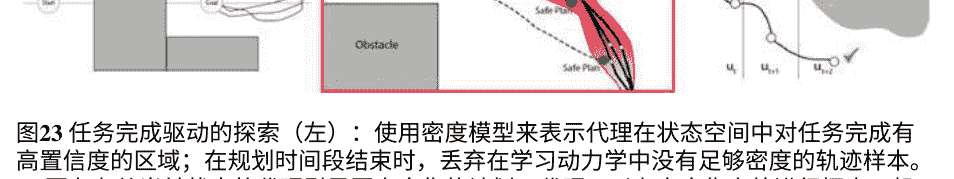

图23 任务完成驱动的探索（左）：使用密度模型来表示代理在状态空间中对任务完成有高置信度的区域；在规划时间段结束时，丢弃在学习动力学中没有足够密度的轨迹样本。只要存在从当前状态将代理引导回安全集的计划，代理可以在安全集之外进行探索；机会约束执行（右）：通过对相同动作序列进行多次学习动力学的想象推演采样，并通过违反约束的推演百分比来估计约束违反的概率。

### 4.2 模糊DRL模拟

机器人模拟器通常用于设计和测试不同平台的控制算法。但它们也可以在更广泛的人工创造物[35]的背景下看到。这是认知范式的自然发展。考虑到上述思想，选择了一个开源的机器人模拟器平台来建模和实现RL、DRL和模糊逻辑的教学过程。它由Gym和机器人模拟器V-REP [36]的结合组成。

#### 4.2.1 Gym和V-REP

OpenAI成立于2015年底，是一个非盈利组织，其使命是“构建安全的人工通用智能（AGI），并确保AGI的好处尽可能广泛而均匀地分布。”除了探索关于AGI的许多问题之外，OpenAI对机器学习界的一个重要贡献是开发了Gym和Universe软件平台。

Gym是一个用于测试和开发RL算法的环境/问题集合，它可以帮助用户避免创建复杂的环境。Gym是用Python编写的，有多个环境，如机器人模拟或Atari游戏。还有一个在线排行榜供人们比较结果和代码。

OpenAI Gym (https://openai.com/) 提供了一个丰富和通用的标准化RL环境集合，旨在支持机器学习社区评估和比较算法。所有环境都可以通过一个简单、统一的接口访问，该接口要求代理提供一个动作，并返回当前状态的观察和奖励。该工具包包括一系列不同的环境，复杂程度各不相同，从低维度完全离散的环境（例如FrozenLake）到高维度完全连续的任务（例如Humanoid）。OpenAI Gym环境在不同版本之间的一致性支持研究人员复现和扩展先前的工作，并允许系统化地对学习算法及其实现进行基准测试和比较。不同任务的易于访问性促进了研究进展，使研究人员能够专注于学习算法，而不是特定环境的基本实现细节，并促使研究人员在许多不同任务上评估其算法的性能。

#### 4.2.2 V-REP模拟器

V-REP (http://www.coppelarobotics.com) 是由Coppelias Robotics开发的机器人模拟器，总部位于瑞士苏黎世。它是一款商业软件，教育版本可以免费获取。V-REP支持Windows、Linux和Mac操作系统。 可以使用7种不同的编程语言与V-REP一起使用，默认语言是Lua。它还提供了许多其他功能，以下是一个非详尽列表：

- 网格编辑。
- 在模拟过程中与虚拟环境进行交互。
- 物理引擎： ODE、Bullet和Vortex。

V-REP提供传感器、机制和机器人模型，用于碰撞检测、规划、逆运动学，还支持不同的模拟模式，并且可以高度定制（例如，C++插件）。

V-REP允许用户同时选择各种编程技术；嵌入式脚本、附加组件、插件、远程API客户端和ROS节点。

非常有用的V-REP接口之一是与Matlab/Simulink的接口。这使得快速原型设计（调试 +测试）复杂控制算法、调试、作用域、显示、后处理、绘图、日志记录、强大的脚本语言、巨大的库 +文件交换、外部C/C++代码（MEX文件和s函数）的集成、自动代码生成、加速执行时间和部署到其他平台（例如，机器人本身）成为可能。

Matlab和V-REP之间的接口是ROS。它是开源的，广泛传播，得到了大型开发者社区的支持，提供了许多标准驱动程序/算法，提供了用于日志记录/绘图/调试的附加工具，与模拟和真实机器人使用相同的代码（只需更改一些节点和主题名称），并且由V-REP +自定义插件vrep_ros_bridge（GIT存储库：https://github.com/lagadic/vrep_ros_bridge）提供本地支持。

Matlab的官方支持正在进行中，但也有许多非官方的解决方案可用（例如，在C++的s-function中集成ROS）。

### OpenAI Gym的V-REP实现。

有一个针对V-REP的OpenAI Gym环境。这个环境应该为涉及V-REP中的机器人的任何强化学习项目提供一个可用的基线。但是，开发者可能仍然需要根据自己的需求配置环境，并且可能需要扩展基本环境以包含更多的V-REP功能（https://github.com/bhyang/gym-vrep）。根据创建者的说法，这不是一个成品。

为了模拟模糊逻辑，使用了与Fernando Von Zuben教授的人工智能课程作业[35]中相同的实验。在这个作业中，学生被要求使用模糊逻辑和多层感知器创建一个机器人控制器。在原始作业中，不仅需要设计控制算法，还需要设计环境模拟。为此，机器人应被视为在一个由二维平面上的墙壁组成的迷宫中移动的一个点。机器人有三个距离传感器——一个面向前方，另外两个与中央传感器成45度角。机器人的前进速度在模拟中应保持恒定，控制算法必须在每个时刻确定机器人的最佳角速度。不需要同时创建控制系统和在模拟世界中，ROS与V-REP集成，取代了理论上的点式机器人，而是使用了虚拟的三维机器人模型。所选择的模型是Pioneer 2DX，因为它是一个众所周知的机器人，并且已经在模拟器的模型数据库中。在模糊逻辑实验的部分，控制系统由36个命题组成的模糊规则集。每个规则由3个前提（分别对应每个接近传感器）和一个结论（与角速度相关）组成。中央接近传感器范围被分为4个模糊粒度，而侧面的传感器每个有3个粒度，因此总共有36种可能的组合。结论有4个粒度。

模拟的目的是确定每个规则的最佳结论。V-REP没有原生的ROS节点。这意味着目前还不能将其作为ROS系统的一部分在单个启动文件中运行，而是需要在另一个Linux终端中同时运行。这并不是一个大问题。另一方面，V-REP提供了一个默认的ROS插件，可以在V-REP Lua脚本中用于创建ROS发布者和订阅者。比这更有用的是法国INRIA研究所的Lagadic研究小组创建的软件包。该软件包在[37]中可以找到，它试图复制Gazebo ROS软件包的功能。同样，它还在其操纵器处理程序插件中提供了差分驱动功能。然而，对于接近传感器，需要使用V-REP Lua脚本创建发布者，将传感器读数传输到ROS主题上。

### 4.3 物联网模拟

云计算提供基础设施级别的服务，可以满足物联网存储和处理的需求。然而，监控HAR和紧急响应等应用需要低延迟，将数据传输到云端再返回应用会严重影响它们的性能。为了克服这个限制，提出了雾计算范式，将云服务扩展到网络边缘，以减少延迟和网络拥塞。为了实现雾计算和物联网范式在实时分析方面的全部潜力，如DRL，需要解决几个挑战。第一个也是最关键的问题是设计资源管理技术，确定将哪些分析应用模块推送到每个边缘设备，以最小化延迟并最大化吞吐量。为此，需要一个评估平台，以可重复的方式在物联网或雾计算基础设施上量化资源管理策略的性能。为此，可以使用一个名为iFogSim的模拟器，对物联网和雾环境进行建模，并测量资源管理技术对延迟、网络拥塞、能耗和成本的影响[38]。

该框架的设计使其能够评估适用于雾环境的资源管理策略对延迟（及时性）、能量消耗、网络拥塞和运营成本的影响。iFogSim还允许应用程序设计人员根据成本、网络使用和感知延迟等指标测试其应用程序的设计。它模拟边缘设备、云数据中心和网络链路用于测量性能指标。iFogSim考虑的主要应用模型是Sense-Process-Actuate模型，其中传感器定期或基于事件发布测量数据，运行在雾设备上的应用程序订阅并处理来自传感器的数据，最后，获得的洞察力被转化为发送给执行器的动作。

iFogSim中的Fog计算环境架构（如图24所示）由多个层组成，每个层负责特定任务，以促进更高层的运行。在架构中，最底层由与现实世界互动并且是数据的源或汇的物联网设备组成。物联网传感器作为应用程序的数据源，分布在不同的地理位置，感知环境并通过网关将观测值传输到上层进行进一步处理。同样，物联网执行器在架构的最底层操作，并负责控制机制或系统。执行器通常被设计为根据传感器捕获的信息，根据应用程序对环境变化做出响应。物联网中的每个设备都是数据的源或汇，因此可以分别由传感器或执行器建模。

iFogSim基于雾计算的定义，将其作为一个基础设施，具有与云计算类似的特性，但靠近网络边缘。它不支持设备间的通信，因为它假设了一个雾设备的分层组织。应用程序的部署是以南北方向进行的，目前不可能将模块转移到同一层次的另一个设备上。因此，当前版本不支持智能手机之间的模块转移。除此之外，在当前版本中，由于分层组织的原因，两个设备之间的直接通信也是不可能的。

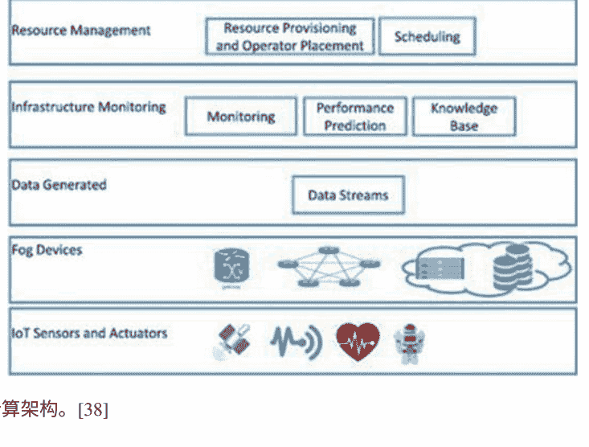

图24 雾计算架构。

物联网数据流是由设备发出的一系列值（在iFogSim中称为元组），它们构成了架构的下一层。这些流可以由传感器发出（在这种情况下它们包含原始数据），也可以从一个应用程序模块传输到另一个应用程序模块，甚至从一个应用程序模块传输到执行器。数据流也由雾设备生成，以资源使用详细信息的形式，这些信息由监控层处理，以了解设备的状态。

监控层跟踪资源使用情况、功耗和传感器、执行器和雾设备的可用性。监控组件向资源管理层提供此信息，并根据需要提供给其他服务。为了简化iFogSim，相对复杂的监控层组件（如性能预测和知识库）未包含在当前版本中。然而，可以通过编写处理雾设备生成的资源使用统计数据和所有雾实体发出的可用性消息的实体来实现这些组件。

资源管理是架构的核心组件，由协调管理雾设备层资源的组件组成，以满足应用层的QoS约束并最小化资源浪费。

为此，放置和调度组件起着重要作用，通过跟踪可用资源的状态（由监控服务提供的信息）来识别托管应用模块的最佳候选者，并分配设备的资源给该模块。该层根据应用层提出的服务质量要求进行操作，以使各个应用组件可以体验到他们所需的质量。资源管理策略可以足够复杂，以允许组件的迁移和设备资源分配的动态变化，也可以简单到在雾设备上静态配置组件。此外，资源管理层的实现可以是分布式的（每个设备管理其自己的资源，没有全局知识）或集中式的（所有设备将资源信息发送到中央资源管理器），或两者的混合。然而，当前版本的iFogSim提供了静态的应用放置策略——应用模块被静态分配给雾设备。

这个政策可以被动态政策所取代，这些政策可以根据能源消耗和感知延迟等标准将模块迁移到其他雾设备上。

应用（编程）模型。为了在雾中部署开发的应用程序基于分布式数据流（DDF）模型。一个应用程序被建模为一组模块，这些模块构成了数据处理元素。由模块i生成的数据作为模块j的输入使用，从而产生模块i和j之间的数据依赖关系。这种应用程序模型允许我们以有向图的形式表示应用程序，其中顶点表示应用程序模块，有向边显示模块之间的数据流动。

雾计算出现的主要驱动因素之一是对实时响应和增加可扩展性的需求，这与物联网的普及同时出现。物联网应用往往具有传感器作为数据源，这些数据通常以元组的形式存在。提出的iFogSim架构支持用于物联网应用的两种模型：

- 1. 感知-处理-执行模型。 传感器收集的信息以数据流的形式传输，这些数据流由运行在雾设备上的应用程序处理，并将结果命令发送给执行器。
- 2. 流处理模型。 流处理模型在雾设备上运行一组应用程序模块，持续处理从传感器发出的数据流。 从传入的数据流中提取的信息存储在数据中心进行大规模和长期的分析。

### 模拟物联网环境和测试资源管理技术的方法

本节介绍在iFogSim中模拟物联网/雾环境以分析应用程序和资源管理策略性能的高级步骤（图25）。

- 1. 首先，需要创建物理实体并指定它们的能力和配置。这些实体包括传感器、网关和云虚拟机，以及描述这些实体如何连接的链接。如前所述，可以通过使用GUI或以编程方式使用前述的iFogSim类来实现。为了对系统的工作负载进行建模，首先，我们应该使用transmitDistribution（Sensor类中的一个属性）设置传感器的元组传输速率。

建模工作负载的下一步是确定处理元组所需的资源量。为了定义资源使用，包括CPU和RAM，必要的变量在元组类中被定义。

- 2. 其次，需要对应用程序进行建模。
- 3. 最后，需要定义将应用程序模块映射到雾设备的放置和调度策略。这些策略可以考虑一系列标准，包括端到端处理延迟、吞吐量、成本、功耗和设备限制。

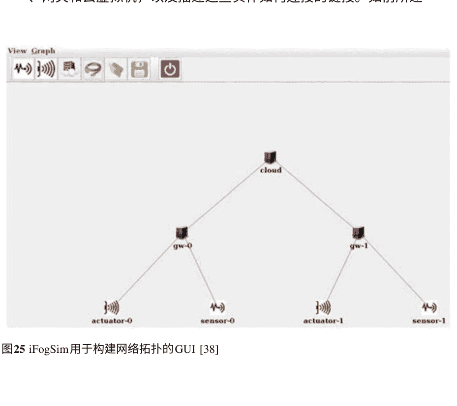

iFogSim可以从CLOUDS实验室网站下载：http://www.cloudbus.org/cloudsim.

## 5 结论

自主车辆中DL算法中的不确定性管理基于对机器学习模型中的两个基本不确定性来源的信息管理，即来自传感器在数据捕获期间的不确定性和来自模型本身或认知不确定性的数据信息。

不确定性管理的概念基于经典控制和智能控制的一般假设，机器学习算法表示的模型以及物联网中的不确定性管理，特别是由传感器生成的要处理的大数据不确定性和参与者之间的相互关系。

由于生成行人行为的真实模型的困难，提出了使用基于可穿戴物理传感器信号处理的HAR或智能手机的HAR。

所选的机器学习模型的算法是DRL算法，其中应包含不确定性管理。所选的算法是贝叶斯DRL和模糊DRL。这些算法应继续开发，特别是模糊DRL，因为由于其构思，它们需要较低的计算负载。

自主系统被构想为自主IoT方案的RL模型的一部分。为了验证所提出的模型，提出了三种仿真工具，用于概率实现约束的SAVED，用于模糊DRL仿真的Coppelia Robotics' V-REP和OpenAI Gym，以及用于建模IoT和雾环境并测量资源管理技术对延迟、网络拥塞、能源消耗和成本的影响的iFogSim，即关于其在不确定性下运行的信息。

尽管本章关于管理不确定性的结论特指自动驾驶车辆，但其结果可应用于其他领域，例如能源、健康或安全等需要管理机器学习模型不确定性的应用。

所有章节都探讨了使用仿真来管理自主系统中的DRL不确定性的可能性。

建议继续开发具有不确定性的机器学习算法，并将其与CARLA或SUMO等其他工具集成。还需要开发包含有关不确定性的权重信息的NNs算法，并进一步开发包括真实事物动态特性的自主IoT系统。

## 参考文献

- 1. You C等人（2019年）使用强化学习和深度逆强化学习进行自主车辆的高级规划，第39页
- 2. Talpaert V等人（2019年）探索深度强化学习在真实世界自主驾驶系统中的应用。arXiv:1901.01536v3 [cs.LG]
- 3. Grigorescu S等人（2020年）关于自主驾驶的深度学习技术调查。arXiv: 1910.07738v2 [cs.LG] 2020年3月24日
- 4. Arnez F等人（2020年）对深度学习组件中的不确定性估计方法进行了比较，第9页
- 5. Rubio F等人（2019年）对移动机器人进行了综述：概念、方法、理论框架和应用。Int J Adv Robot Syst https://doi.org/10.1177/17298814198395966.
- 6. Plasencia A（2016年）用于教学和物联网研究的工具。第1部分。先决条件，问题情况和定义。研究报告ICIMAF No. 808. ISSN 0138-891.
- 7. CCSA 2011年普适网络术语，CCSA标准YDB 062-2011
- 8. Turcu C等（2012年）融合物联网和机器人技术。Suceava Stefan cel Mare大学。ISBN: 978-1-61804-108-1
- 9. 云机器人和自动化。访问日期：2016年2月22日。可用：http://goldberg.berkeley.edu/cloud-robotics/
- 10. Evans D（2011年）物联网：互联网的下一个演进如何改变一切。思科互联网业务解决方案集团（IBSG）
- 11. Mitchell S等（2013年）城市物联网连接人、流程、数据和物品，以改善城市和社区的“宜居性”。思科。
- 12. Camara F等（2018年）对自主车辆控制的行人-车辆交互的过滤分析。利兹大学，交通研究所，英国
- 13. Chen K等（2019年）用于人类活动识别的半监督循环卷积注意模型。IEEE Trans Neural Netw Learning Syst. https://doi.org/10.1109/TNNLS.2019.2927224
- 14. Zhang H等（2019年）PDMove：基于智能手机步态评估的帕金森病被动用药依从性监测。在：ACM Interact.Mob. Wearable Ubiquitous Technol. 3, Article 123. https://doi.org/10.1145/335128115.
- 15. ABI Research-机器人物联网可用: https://www.abiresearch.com/market-research/product/1019712-the-internet-of-robotic-things/. 2016年2月20日访问
- 16. Nayyar A等 (2018年) 互联网机器人事物: 推动未来智能机器人的概念、架构、应用和技术。IEEE。https://doi.org/10.1109/ICCS.2018.00033。978-1-5386-8025-4/18。
- 17. Vermesan O (2017年) 互联网机器人事物-融合感知/执行、超级连接、人工智能和物联网平台。章节https://doi.org/10.13052/rp-9788793609105
- 18. Ray PP (2016年) 互联网机器人事物: 概念、技术和挑战。IEEE Access 4:9489–9500
- 19. Lei等 (2019年) 用于自主物联网的深度强化学习: 模型、应用和挑战。arXiv:1907.09059v1 [cs.LG] 22 Jul.
- 20. 更智能的自主物联网。可用: http://gdruck.com/smarter-things-autonomous-iot/。于2016年2月2日访问
- 21. Mohammadi M, Al-Fuqaha A, Sorour S, Guizani M (2018) 物联网大数据和流媒体分析的深度学习综述。IEEE通信调查教程20(4):2923–2960
- 22. Hariri R等(2019)大数据分析中的不确定性:调查、机遇和挑战J大数据6:44。可用: https://doi.org/10.1186/s40537-019-0206-3
- 23. Shafaei S等(2018)机器学习中的不确定性:对自动驾驶的安全视角。慕尼黑工业大学，德国。
- 24. Haydari A等(2020)智能交通系统的深度强化学习综述。arXiv:2005.00935v1 [cs.LG] 2020年5月2日
- 25. Kahn G等(2017)用于避碰的不确定性感知强化学习。arXiv:1702.01182v1 [cs.LG] 2017年2月3日
- 26. Alom M等 (2019年) 深度学习理论和架构的最新调查。电子学8:292 https://doi.org/10.3390/electronics8030292
- 27. Blundell C等 (2015年) 神经网络中的权重不确定性。arXiv:1505.05424v2 [stat.ML] 2015年5月21日
- 28. Gal Y等 (2016年) Dropout作为贝叶斯近似: 在深度学习中表示模型不确定性。arXiv: 1506.02142v6 [stat.ML] 10月4日
- 29. Loquercio A等 (2020年) 深度学习中不确定性估计的通用框架。IEEE机器人自动化快报
- 30. Amini A等 (2019年) 端到端控制的空间不确定性采样。arXiv:1805.04829v2 [cs.AI] 5月24日
- 31. Viera J等 (2004年) 神经模糊系统: 一项调查。Escola Superior de Tecnologia de Castelo Branco
- 32. Gevaert A等 (2019年) 使用模糊推理进行深度强化学习模型的蒸馏。论文。根特大学。可获取: https://lib.ugent.be/catalog/rug01:00278293433。
- 33. Kurmeoto T等 (2017年) 具有多层模糊神经网络的强化学习系统。日本工业应用工程学会。https://doi.org/10.12792/icisip2017.08134。
- 34. Thananjeyan B等 (2019年) 从示范中增强价值估计 (SAVED ) : 用于稀疏成本机器人任务的安全深度模型基于RL。arXiv:1905.13402v3 [cs.LG] 2019年10月10日
- 35. Nogueira L (2014年) Gazebo和V-REP机器人模拟器的比较分析。Campinas大学
- 36. Plasencia A等 (2019年) 用于教授深度强化学习算法的开源机器人模拟器平台。在: Proceedings计算机科学, 第162-170页。 https://doi.org/10.1016/j.procs.2019.02.031
- 37. Zuben FJ Von Ea072—概念和计算练习2 (ecc2) 。2014 [在线]。可用: http://tinyurl.com/vonzubenec2:
- 38. Gupta H等 (2016) iFogSim: 物联网、边缘和雾计算环境中资源管理建模和仿真工具包。Wiley可用: https://doi.org/10.1002/spe.2509

# 具有深度强化学习的不确定性感知自主移动机器人导航

Lynnette González-Rodríguez和Armando Plasencia-Salgueiro

摘要 自主机器人能够根据其环境中获得的信息做出决策，而不仅仅是按照程序执行。强化学习是一种广泛应用于自主机器人的机器学习范例，因为它们的原理非常相似。强化学习基于人类和动物通过试错学习感知、推理和行动环境的方式，学习哪些行动更好，哪些行动更差，取决于它们产生的奖励。同样，机器人使用传感器感知其环境，并使用执行器、电机和末端执行器来执行动作。强化学习的主要缺点是在涉及大量状态和动作的空间的过程中的高计算成本。然而，深度学习的使用已经缓解了这个问题，它通过自动发现原始和高维数据中的相关特征和表示来提供了一个出色的解决方案。这种组合产生了一个被称为深度强化学习的新范式，已成功应用于导航和操作等机器人任务。机器人技术的发展使得机器人能够存在于越来越动态、不可预测、非结构化和部分可观察的环境中，其中不确定性是由于信息缺乏而产生的关键因素。因此，应对不确定性的能力对于自主机器人至关重要。

然而，大多数机器人学研究忽视了这种信息的稀缺性为了简单起见，导致了不准确、近似和不安全的解决方案。为了改善导航以及其他机器人任务，从而提高机器人本身和周围所有物体和生物的安全性，需要更多关于处理不确定信息的不同方法和策略的研究。本章旨在概述深度强化学习算法和策略，以处理不确定性的移动机器人导航。

- 自主机器人
- 深度强化学习
- 移动机器人导航
- 多机器人系统
- 不确定性

## 1 引言

机器人可以被认为是在感知和行动之间建立智能连接的机器[48]。总的来说，机器人的基本操作与人类和动物的行为方式并没有太大不同。首先，它们感知环境。在这样做的过程中，动物使用它们的感官，而机器人则利用它们的传感器。其次，它们对这些感知进行推理，并确定行动的方向：动物在大脑中，机器人在它们的处理单元中。最后，它们执行所选择的行动。在这种情况下，动物可以使用它们的器官或肢体，而机器人则依赖它们的执行器和致动器。

机器人具有感知和执行能力的事实使它们与无法修改现实世界的常规计算机有所区别。这个优势特点使它们在众多应用中具有吸引力。

移动机器人与机械臂不同，可以在地面、空中或水中移动。尽管这种能力很有用，但也带来了许多风险和挑战，需要解决以确保安全和效率。虽然大多数机器人在历史上一直在已知的、结构良好的环境中工作，例如工业装配线，但最近它们正在进入越来越未知、不结构化和不可预测的环境中。自主机器人能够根据对环境的感知做出决策，而不是按照预先编程的一组动作[14]。在动态和未知的环境中导航的机器人必须准备好对新的的经验做出反应和适应，因此必须是自主的。

强化学习（RL）非常适用于自主机器人。它的基础是一种称为马尔可夫决策过程的顺序决策过程，非常类似于机器人通过观察和执行与环境交互的方式。然而，RL方法在连续和高维感知和行为方面的计算效率不高。为了解决这个问题，RL已经与深度学习技术相结合，形成了一种称为深度强化学习（DRL）的新范式，该范式在移动机器人导航方面取得了非常好的结果，并且目前是这个机器人领域中最常用的方法之一。

所有现实世界的系统都受到不确定性的影响，机器人也不例外。这给移动机器人带来了另一个挑战，因为适当处理不确定性虽然计算成本更高，但可以使机器人的认知和控制策略更加稳健，并且可以避免可能危及导航过程的错误。

本章的目的是阐述使用DRL算法和处理不确定性的移动机器人导航过程的理论，以及关于这个主题的相关工作的简要总结。这项研究补充了关于机器人导航任务中不确定性领域的现有文献。它概述了机器人领域中不确定性的基本原理和各种处理策略。此外，它描述了几种用于移动机器人导航的先进DRL算法，并介绍了最近研究的研究，其中采用了最先进的基于DRL的方法来处理不确定性。

本章的其余部分组织如下。 第2节讨论了使用DRL算法进行移动机器人导航和处理不确定性的相关工作。第3节介绍了移动机器人导航过程的基本概念。第4节展示了关于不确定性的理论，以及它在机器人技术中的影响和现有的处理方法。 第5节和第6节分别解释了RL和DRL的基础知识，以及它们最常用的算法。 第7节总结。

## 2 相关工作

大多数将DRL应用于移动机器人导航的工作都是端到端方法，即机器人直接从高维感知数据（如图像）中学习策略并选择动作。 其中一个最早的例子是Tai和Liu [44]的工作，他们使用深度Q网络（DQN）算法从RGB-D深度图像输入中学习探索和避障策略。 在这种情况下，感知过程的特征提取由预训练的卷积神经网络（CNN）执行。 另一个使用相同算法的例子是[53]中的例子。

在[52]中，软演员-评论家（SAC）方法用于在无地图环境中导航。 该算法接收激光扫描数据和目标信息作为输入，并输出线性和角速度的连续值。

另一种路径规划解决方案在[12]中提出。 在这种情况下，机器人使用基于深度Q学习的社交感知碰撞避免DRL算法在一个有很多行人的环境中自主导航。 因此，机器人能够以人类步行速度避免与行人碰撞。

在[9]中提出了一种非完整移动机器人的解决方案。 它考虑了这种机器人的运动学和动力学约束。 深度确定性策略梯度（DDPG）算法处理连续状态和动作空间，因为它接收位置、速度和方向，并输出轮子的加速度和转向角的调整。 非完整约束也在[21]中得到解决。 这项工作专注于运动控制问题，提出了一种基于DDPG算法的点稳定运动控制定律。

在[8]中，Brunner等人使用异步优势演员-评论家（A3C）算法来教导一个代理在2D地图上定位自己，以其3D环境观测作为输入。 代理的目标是找到通往未知迷宫出口的最短路径。 尽管它没有通过机器人进行模拟或测试，但它显然是移动机器人导航的有效解决方案。 这项研究的结果表明，该代理能够正确地推广到不同甚至更大的迷宫。

多机器人系统面临着形成和协作导航等挑战。 文献[11]中使用了DDPG算法的扩展，称为并行深度确定性策略梯度（PDDPG），用于直接从LiDAR传感器输入执行形成构建和协作导航任务。

最近，谭等人[45]提出了一种新的算法，称为DeepMNavigate，基于近端策略优化（PPO），用于全局多机器人导航和避碰。使用接收机器人运动信息地图的CNN，该方法成功生成了避免系统中所有代理的碰撞的动作。

### 2.1 处理不确定性

不确定性已经在许多关于机器人应用的强化学习算法中得到了解决。特别是 一些基于模型的技术，如概率推理学习控制（PILCO）[15]和贝叶斯方法[5， 38]已经被用于处理机器人环境中的不确定性。最近，神经网络也已经被调整，以表达它们的模型不确定性[6]。这种度量已经被用于强化学习中，以 便将探索重点放在高度不确定的区域，从而加快训练[36]。

Kahn等人[25]提出了一种基于模型的强化学习算法，用于避免碰撞。这项工作基于一个想法，即机器人只能在执行了某个动作之后才能学习到该动作的结果。因此，为了学习避免碰撞，它必须首先经历碰撞。由于高速、灾难性的碰撞可能会损坏机器人，作者提出碰撞应该只是轻微的。因此，当不确定性很高时，导航策略必须小心移动，而当不确定性很低时，即在已知区域时，它可以增加速度。本文提出了一个用神经网络训练的碰撞预测模型，该模型接收机器人的原始、高维度的传感器读数和一系列控制作为输入。它的输出是发生碰撞的概率。此外，引导[36]和丢弃[19]技术被用于从神经网络中获得不确定性估计。碰撞预测模型输出与速度相关的碰撞成本，这些成本由强化学习算法聚合以改进模型。这种方法成功地减少了危险碰撞的发生，同时确保机器人学习达到目标。作者强调他们的不确定性估计技术不仅限于基于模型的强化学习方法，还可以扩展到无模型的方法。

在[31]中，提出了一种类似的方法来估计认知不确定性，该方法使用引导和蒙特卡洛丢弃[19]。然而，在这种情况下，考虑到机器人可能碰撞的障碍物是动态的。作者指出，在需要高安全性的任务中，如自动驾驶车辆，避免与其他车辆甚至行人发生碰撞至关重要。在这种情况下，对先前未知数据的错误但自信的预测可能导致致命的故障。因此，他们以模型不确定性的形式表达新的观察结果，主要思想是为了机器人避开高度不确定的区域。长短期记忆网络（LSTM），它是一种循环神经网络，用于预测碰撞概率，而蒙特卡洛丢弃和自助法则通过计算模型不确定性的随机估计来获得对这些预测的分布。然后，模型预测控制器使用该信息在新颖的场景中谨慎选择行动。与不考虑不确定性的基线相比，这种解决方案证明了采取更安全的决策。

在[10]中提出的工作使用图神经网络和DRL来探索和建立在未知环境中的定位不确定性。与DRL中常见的从原始的高维数据（如图像）学习的常见方法相反，这种解决方案提出的探索图减少了状态空间的维度。因此，该策略可以在不同的环境中进行训练，使其具有鲁棒性和泛化能力。目标是通过DRL策略在随机位置的地标的环境中估计下一个最佳视点。本文提出了一种使用图卷积网络、门控图神经网络和图U-Net的新方法，以及DQN和优势演员-评论家（A2C）算法的同时定位和建图（SLAM）。它成功实现了几乎实时的可行决策。

最近提出了一种比较基于模型的深度贝叶斯强化学习和基于模型的深度强化学习算法的多机器人方法[23]。模型为基础的方法的一个显著优势在于其样本效率，使得机器人能够在比完全依赖探索的无模型解决方案更少的试验中学习。本研究采用的贝叶斯深度强化学习算法是Deep PILCO [20]，它通过考虑模型不确定性来进一步提高学习速度的概率转移模型。所使用的强化学习算法是DQN。进行的实验是机器人之间的战斗。这些机器人配备了LiDAR和惯性测量单元（IMU）传感器，其测量结果用于在环境地图中定位自己和敌人。结果表明，Deep PILCO在学习效率和学习速度方面均超过了DQN，证实了将不确定性纳入规划可以提高效率和可扩展性的观点。

## 3 移动机器人导航

移动机器人能够运动，然而，它们可以以几种不同的方式移动。它们实现的许多运动机制受到动物运动的启发，如行走、跳跃、奔跑、滑动、游泳和飞行。然而，最广泛使用的方法是滚动，它利用轮子在平坦地面上实现高能量速度比效率[14, 42]。

轮子有四个类别[42]，如图1所示。标准和万向轮有两个自由度，而瑞典和球形轮有三个自由度。自由度（DOF）定义了轮子在三个轴上的可能方向，即：俯仰、偏航和滚动。

![图1轮子的种类。从左到右：标准轮、万向轮、球形轮和瑞典轮[33]](img/0045054e114ce12092fdfa7fc20ecded_237_0.png)

标准轮子围绕轮轴和与地面接触点旋转。万向轮也围绕万向轴旋转，这是一个偏移的转向连接。瑞典轮是一个标准轮，其周长上有非驱动滚子，可以以45°或90°的角度定位，并且可以围绕滚子轴旋转以实现全向行为。球形轮可以在任意方向上旋转，但其实现在技术上是困难的。

在设计移动机器人时，选择轮子类型以及轮子数量和其在机器人底盘中的排列方式（也称为轮子几何）非常重要。三个轮子可以保证稳定平衡，尽管两个轮子的机器人也可以稳定。当使用四个或更多的轮子时，在不平坦的地形上需要悬挂系统来保持与地面的接触。移动机器人有几种不同的轮子配置，其中一些在图2中显示。

运动学处理机器人的几何参数与其轨迹上的约束之间的关系[48]。正向或直接运动学是通过集成使用本体感知传感器（如编码器）测量的速度值来计算移动机器人的位置的过程。逆向运动学是相反的过程。非完整机器人，例如具有差分轮配置的机器人，使运动学计算变得复杂，因为在配置空间中的闭合轨迹可能无法在现实世界中返回到其原始状态。

配置空间是具有k自由度的机器人的k维表示，其中一个点表示机器人的状态或配置。动力学处理作用在机器人上的力以及由此产生的加速度。它包括加速度和加加速度，它们分别是位置的二阶和三阶导数。

导航是使移动机器人从初始位置安全移动到最终或目标位置的过程，避免与静态和/或动态障碍物发生碰撞。它包括四个任务：感知、定位、路径规划和运动控制，如图3所示。

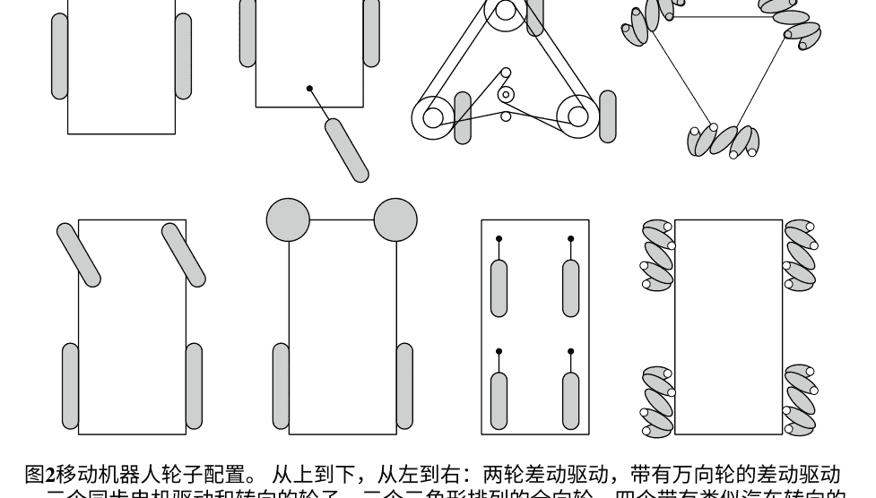

图2移动机器人轮子配置。从上到下，从左到右：两轮差动驱动，带有万向轮的差动驱动，三个同步电机驱动和转向的轮子，三个三角形排列的全向轮，四个带有类似汽车转向的轮子，两个差动牵引轮和两个全向轮，四个电机驱动和转向的万向轮，以及四个矩形排列的全向轮[33]。

图3移动机器人导航任务的图示

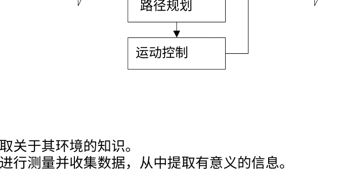

### 3.1 感知

机器人通过感知过程获取关于其环境的知识。首先，它们利用传感器进行测量并收集数据，从中提取有意义的信息。

#### 3.1.1 传感器

传感器的种类非常广泛，但可以根据两个主要标准进行分类：它们是否测量内部或外部值，以及它们是否接收或发射能量[42]。

本体感知传感器测量机器人的内部值，例如电机的速度、扭矩、力和电池电压。

外部感知传感器从环境中收集信息，例如物体和表面的距离、光强度和声音振幅。

被动传感器测量进入传感器的环境能量，例如温度探头、麦克风和摄像头。

主动传感器发射能量，然后测量环境的反应。一些例子包括正交编码器、超声波传感器和激光测距仪。

最常见的本体感知传感器是编码器，通常安装在电机轴上以测量其角位置。有几种不同类型的编码器，包括光学、磁性、感应和电容式。在机器人技术中，最流行的类型被称为增量光学编码器，最常用的版本是正交编码器，如图4所示。该设备使用一个金属或玻璃盘，上面有两个交错的缝隙通道，允许光从光发射器通过到光电二极管，输出电信号。通过计数电脉冲并知道盘中缝隙的数量，可以检测和计算角位置的变化。为了确定运动的方向，第二个通道变得必要，使编码器具有一个四分相位的交错模式，如图4所示。将外环视为通道A，内环视为通道B，顺时针运动将导致A领先B，而逆时针运动将导致B领先A[14]。

加速度计是惯性传感器，能够测量最多三个轴的平移加速度，并且非常擅长估计机器人相对于重力的姿态[14]。陀螺仪是一种航向传感器，可以提供机器人相对于地球参考系的旋转方向的绝对测量值。

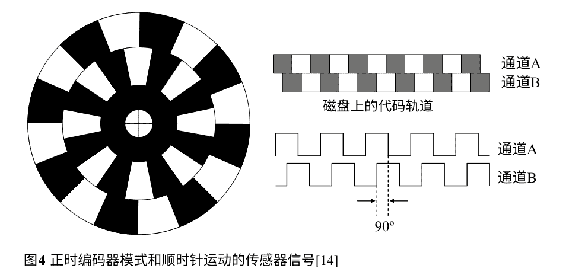

帧。另一方面，指南针通过测量地球磁场的方向来提供航向信息[42]。前面三个传感器的组合是惯性测量单元（IMU），它提供绝对方向以及有关六个自由度（即三个平移轴和三个旋转轴）运动的信息。

对于障碍物检测，移动机器人高度依赖主动测距传感器。它们的主要优点是价格低廉，提供直接且易于解释的距离测量。这种传感器有两个组成部分：发射器和接收器。

红外近距离传感器发射红外光并测量反射信号的强度或幅度。根据反射原理，物体越近，反射的光就越多。激光测距传感器具有类似的工作原理，但它们测量的是反射波的相位差。超声波距离传感器发射超声波脉冲并感知其反射。通过测量声音返回所需的时间，可以计算到最近物体的距离，考虑到声音的速度约为300米/秒。

室外地面和飞行机器人的一种常用方法是使用全球定位系统（GPS）。它由24颗运行中的卫星组成，每12小时在高度为20.190公里的轨道上运行，分布在六个平面上，每个平面有四颗卫星，与赤道的倾角为55°[13]。所有卫星都配备原子钟，连续同步地发射调制的无线电信号，指示它们的位置和当前时间。为了确定机器人在三个轴上的位置，它必须接收来自四颗卫星的GPS信号。到达时间差允许计算机器人与相应卫星的相对距离，第四个信息使得时间校正成为可能，因为GPS接收器时钟是一个简单的石英钟，与卫星不同步。该系统的一个主要缺点是传输功率非常低，需要直接的视线通信才能读取它们。因此，这种方法不适用于室内或受限空间，以及密集的森林。它也无法为小型移动机器人提供足够的精度，因此需要使用IMU或类似的传感器[13, 42, 48]。

虽然GPS是最复杂的人工信标，但其他方法，如使用附加到环境已知固定位置的信标，更适用于室内解决方案。主动信标通常发射无线电或超声信号，而被动信标，如二维条形码或红外反射贴纸，则可以被机器人的主动传感器检测到。

图像是机器人的另一个非常好的有用信息来源。它们由具有电荷耦合器件或互补金属氧化物半导体的相机捕获，能够将光子转换为电信号。

LiDAR传感器用激光照射表面并测量光返回所需的时间。通过快速重复此过程，传感器可以创建所述表面的三维表示。

#### 3.1.2 特征提取

虽然有时直接使用原始传感器数据来确定机器人的行为，但通常首先从各种传感器中提取更高级别的信息。这个过程被称为特征提取，其目的是识别机器人环境中可识别的元素结构。在图像的情况下，特征提取尤为重要，因为简单的像素数组本身并不提供任何有价值的信息。因此，必须应用能够找到相关特征的技术，尽管通常它们会给机器人的处理器带来显著的计算成本。

线条、圆圈或多边形被认为是低级特征，而门、桌子或边缘等物体则是高级特征。它们都在创建环境模型方面非常有用，这将有助于机器人在后续导航任务中。

### 3.2 定位

对于移动机器人来说，了解它在世界中的位置非常重要；不仅是在地球参考系中的绝对位置，还包括相对于物体、人类和其他障碍物的姿态。这就是为什么简单的方法，比如给机器人附加一个GPS接收器，不能单独解决定位问题的原因。因此，机器人必须利用其传感器来确定其在环境中的位置。然而，有一种基于行为设计的导航方法，可以实现所需的机器人运动，避免对定位和位置进行明确推理，如图5所示。虽然这种方法可以快速实施于单个环境中的少数目标位置，但在更大或不同的环境中缺乏可扩展性。此外，必须仔细设计程序，考虑到特定的机器人硬件和环境特性，以生成预期的动作，这是一项非常耗时的任务。

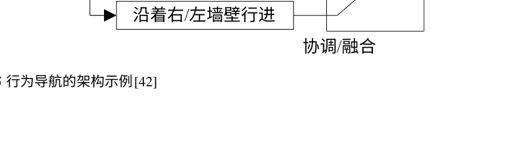

定位的最常见方法是根据从传感器中提取的信息构建环境地图，并根据此信息估计机器人的位置。如果正确开发，该系统可以推广并保证在各种环境中成功地进行地图绘制和导航。另一方面，该解决方案的主要缺点是它基于机器人对其位置和环境的信念。如果该模型与现实发生偏差，则可能无法实现所需的行为。

现有的定位技术分为两类：相对定位和绝对定位[47]。前者通过惯性导航或里程计进行，而后者可能使用主动信标、地标识别或模型匹配。

里程计利用编码器提供的轮子旋转位置测量。通过整合旋转速度，可以获得位置值。然而，这种方法会导致错误逐渐累积。

陀螺仪和加速度计用于惯性导航，用于测量机器人的旋转和角加速度。类似于里程计，速度和加速度值被整合以获得位置。因此，这种技术在长时间内容易出现错误。

在工业和军事应用中最常用的技术是部署主动信标系统，例如GPS [42]。机器人必须知道全局坐标系中信标的位置，以便能够全局定位自己。这些系统非常可靠，但即使环境发生微小变化，也需要大量和谨慎的重新工程设计。

基于地标的导航通常需要人类在环境中放置人工标记，如条形码、几何形状等，尽管以前已知的自然地标也可以使用。这些标志通常具有固定的已知位置，有助于机器人估计其相对位置。为了使机器人能够识别它们，地标的特征必须已经存储在内存中。当机器人看不到地标时，每次移动都会积累位置的不确定性。另一个缺点是需要修改机器人的环境以确保定位和导航。

模型匹配涉及对环境地图和传感器收集的信息进行比较，以估计机器人的绝对位置[47]。

一种特殊的技术称为SLAM，在机器人探索环境的同时创建地图。这是一种非常复杂的方法，如图6所示的图表所示。

概率方法包括马尔可夫定位和卡尔曼滤波等方法。后者在第4.2.3节中介绍，用于处理定位过程中的不确定性。

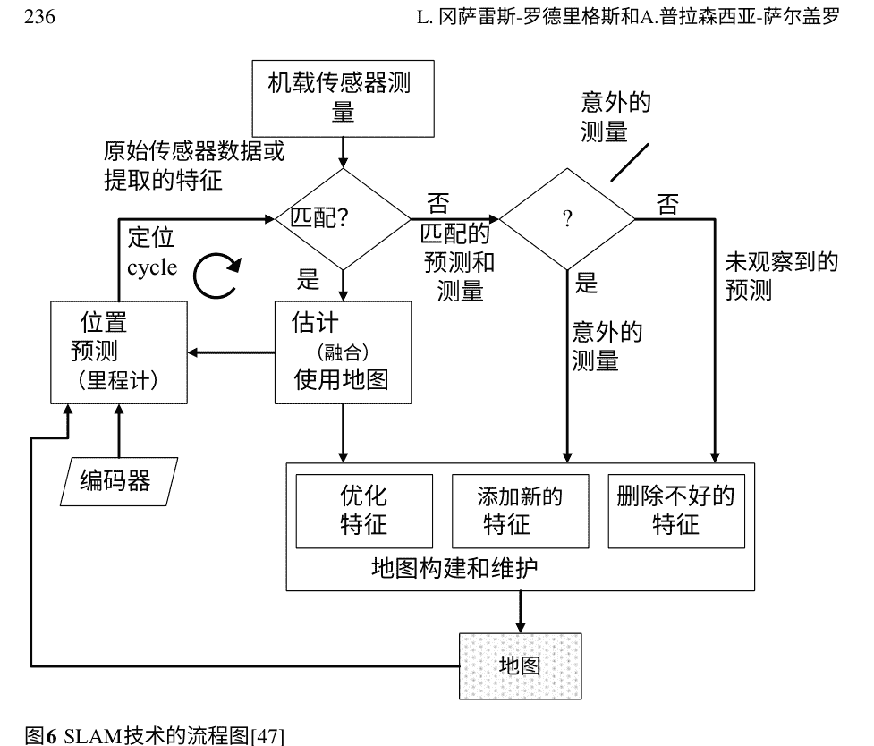

图6 SLAM技术的流程图[47]

### 3.3 路径规划

在估计出机器人在环境中的位置后，机器人必须确定其行动方向，以实现其目标。路径规划包括找到一条轨迹，使移动机器人能够避免与已知障碍物发生碰撞并到达目的地。这个过程的结果应该是具有最低成本的路径，无论是因为它是最短路径还是最优路径，甚至是次优路径。此外，环境中可能存在动态和未知的障碍物，机器人可能不知道这些障碍物，如果盲目地按照最初计划的路径行进，可能会与这些障碍物发生碰撞。避障是根据机器人的实时传感器测量结果调节机器人轨迹以避免碰撞的过程。

当机器人在导航开始之前就知道环境的所有信息时，它采用全局路径规划策略；否则，它必须采用局部路径规划方法[56]。

路径规划包括三个主要步骤：环境建模，根据特定标准进行优化，以及路径搜索算法。环境建模可以使用概率路线图、单元分解、拓扑方法、自由空间和框架空间方法来完成。优化标准包括路径长度、平滑度和计划路径的安全性等因素。

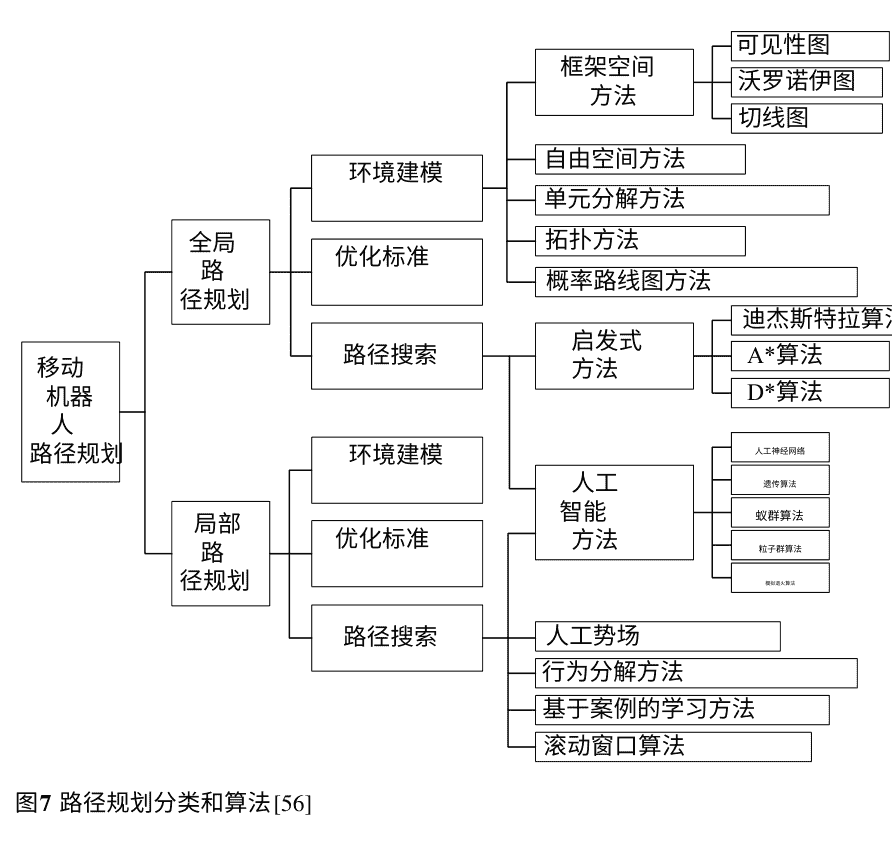

轨迹。全局路径规划有许多路径搜索算法，其中一些在图7中显示。该图中使用的缩写为：ANN表示人工神经网络，GA表示遗传算法，ACO表示蚁群优化，PWO表示粒子群优化，SA表示模拟退火。张等人[56]在2018年的一项调查显示，文献中最常用的技术是遗传算法。

### 3.4 运动控制

在规划了一条安全的轨迹，避开环境中的障碍物之后，机器人必须通过控制装备的电机来操纵车轮，以按照预定路径达到目标。

移动机器人的控制过程分为两个步骤：第一步是运动学跟踪/稳定控制，利用机器人的运动学模型输出机器人的线速度和角速度的控制规律；第二步是动态跟踪控制。 在机器人领域经典应用的控制器有：比例积分控制器、基于李雅普诺夫函数的控制器、计算力矩控制器、解决运动速率控制器和解决运动加速度控制器[48]。

已经在机器人领域广泛应用的控制器有：比例积分控制器、基于李雅普诺夫函数的控制器、计算力矩控制器、解决运动速率控制器和解决运动加速度控制器[48]。

当存在不同程度的参数变化或不确定性时，会使用自适应和鲁棒控制等方法。这些控制器的例子有：模型参考自适应控制（MRAC）、自整定控制和滑模控制（SMC）方法。

此外，模糊逻辑（FL）和人工神经网络（ANN）可用于控制和其他任务，如识别和规划。FL提供了从不确定或模糊数据中得出结论的方法，而ANN提供了学习能力，并允许应用机器学习方法，例如监督、无监督和强化学习。FL和ANN的组合被称为神经模糊系统，通常能提高性能。

一种更现代的策略是基于视觉的控制，它利用了计算机视觉技术的最新进展。它分为三类：动态观察和移动系统直接计算控制信号并使用视觉稳定机器人；基于位置的控制，在目标的几何模型也被使用；以及基于图像的控制，如果控制信号是使用图像特征计算的，则不需要解释。

### 3.5 多机器人系统

多机器人系统是指一组在相同环境中操作的机器人。在许多情况下，机器人合作以实现共同目标，而其他时候它们只是共存。在移动机器人的特定情况下，群集一词指的是一组旨在共同行动的移动机器人 [24]。

当任务可以分解为几个独立子任务，并且每个机器人被委托完成其中之一时，这特别有用。因此，任务可以并行执行，这显著提高了速度。这种方法的一个常见示例是环境的映射。

另一个优势在于容错性，因为一个机器人的故障可以通过分配另一个机器人来继续其任务来纠正。此外，群体中的异构机器人提供不同的感知、行动和导航能力，因此具有更大的灵活性。

然而，多机器人系统中的任务分配和协调是基本挑战。在群体中可以使用不同的控制方法。分散方案建议每个机器人根据其他机器人的活动信息自主进行决策。在集中式方法中，一个机器人协调和监控其他机器人的移动。

通信是群体中的一个重要主题，因为它保证了机器人之间的信息交流。可以确定两种主要的通信方式：通过消息传递直接通信的代理之间的通信；通过修改环境状态和感知这些修改来进行间接通信。

最近出现的物联网机器人技术（IoRT）[37]领域将机器人视为物联网（IoT）的一个独立组成部分，扩展了关于多机器人系统的当前概念。这种范式提出了通过互联网在多个机器人之间分发信息的概念，以及利用集中式云服务为机器人提供更多存储和处理能力。

## 4 不确定性

不确定性表示缺乏确定性和信心，通常是由于对某事物的信息不足或知识不完整。它可以分为[30]：

- 随机不确定性，当它源于自然界的固有随机性，例如抛硬币。
- 认知不确定性，如果它源于对物理世界的知识不足。

前者无法消除或减少。后者可以减少，甚至有时可以消除。然而，即使无法纠正不确定性，处理它也很重要，以避免因处理不当或忽视而导致的不良结果。

### 4.1 机器人中的不确定性

Thrun等人[46]确定了导致机器人不确定性的五个因素：

- 环境，由于其不可预测性。
- 传感器，其不完美，对噪声敏感，并受物理定律限制。
- 执行器，主要是电机，也会受到噪声和磨损的影响。
- 模型，由于其固有的不准确性，无法完全表示机器人和环境的物理特性。
- 计算，通常受到机器人实时约束的限制，并导致使用近似算法。

传感器是感知的基本输入，其依赖于导航过程的其余部分。然而，它们本质上是不完美的，并且具有系统性和随机性误差。前者可以通过正确校准仪器来纠正，而后者则无法纠正。因此，它们是不确定性的源泉。

例如，传感器噪声降低了传感数据的有用性。特别是，它影响传感器读数的一致性，这意味着相同状态下的多次测量会产生不同的值。降低噪声的重要来源

相机拍摄的彩色图像的有价值内容包括：光照依赖性、图像抖动、信号增益、花样和模糊。

由于移动机器人从多个传感器中合并信息以构建环境模型，因此需要将单个传感器的不确定性扩展到整个机器人系统的不确定性。

在定位中，环境的表示，即地图，以及机器人对地图上位置的信念都容易受到不确定性的影响。路径规划算法也受到影响，因为它依赖于环境的表示以及传感器的读数。在这个任务中，不确定性的处理变得非常重要，以最小化可能导致机器人损坏的碰撞的可能性。

执行器也受到噪声的影响。在这种情况下，动作的结果以及未来状态是不确定的。例如，机器人的轮子可能打滑，或者地板可能倾斜。如果不考虑这种不确定性，随着每次运动，不确定性可能会增加，使得导航不安全，因为机器人无法对其位置的估计产生信任。

机器人认为这是里程计误差，但实际上是由于环境模型的不完整性导致的，因为存在未建模的误差源。他们挑衅说机器人的预期运动、实际物理运动和传感器对运动的估计不一致。然而，如果定位和路径规划都经过仔细处理，可以减少不确定性和噪声的影响。

另一方面，里程计误差也容易随时间累积。位置是通过运动和航向测量来估计的，这些测量由编码器等传感器提供，然后进行积分。任何感知误差也会被积分。因此，其他定位技术必须频繁更新机器人的位置，以避免这种效应。

### 4.2 不确定性处理

虽然有许多成功应用于处理不确定性的技术，但最常见的是概率和模糊理论[30]。另一种有用的决策方法是信息缺口理论，它能够处理无法轻易计算概率的严重不确定性。 它使用期望值周围的范围来表示认知不确定性。

模糊理论使用FL [54, 55]来建模认知不确定性。 这是一种表示模糊性的方法，因为模糊集合包含一组值和一个成员函数，该函数指示每个值对集合的成员资格程度，范围从零到一。

概率论可以处理两种类型的不确定性。 它旨在通过对事件是否发生的信念来描述随机现象，即它们的概率。 基于经典概率论，一些方法如蒙特卡洛、贝叶斯和证据理论已经发展起来。

蒙特卡洛方法 [32]在使用确定性算法计算精确结果困难时非常有用。它通过重复随机抽样来近似精确值。贝叶斯方法 [3]源于贝叶斯规则，因此是一种很好的推理工具。它基于一个具有先验和条件概率的图形模型追求精确值。证据理论 [16, 41]，也称为Dempster-Shafer理论，通过从不同来源收集的证据计算包含精确概率的置信区间。

#### 4.2.1 概率论

传感器的噪声特性使得它们的测量可以被视为随机变量。这种变量可以根据特定的概率规律取多个值。概率推理允许计算从其他随机变量派生的随机变量的概率规律，例如模拟传感器数据的随机变量。

随机变量 $X$取值为 $x$的概率记作 $p(X = x)$。有时，为了缩写，该记法中省略了随机变量，只写作 $p(x)$。所有概率都是非负的，离散概率之和为一。另一方面，连续概率由可以取连续值的随机变量所特征。它们通常具有概率密度函数（PDF）。其中最常见的函数是具有均值 $\mu$和方差 $\sigma^2$的正态分布，适用于建模机器人中的随机过程。该分布的一个示例在图8中绘制。

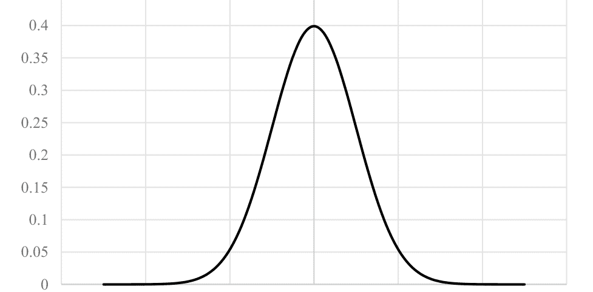

图8正态分布 $\mu =0$ 和 $\sigma^2 = 1$

当$x$不是一个标量值，而是一个多维向量时，正态分布被称为多元的，并且由均值向量$\mu$和协方差矩阵$\Sigma$来描述。概率密度函数总是积分为一，尽管它没有上界。

两个随机变量$X$和$Y$的联合分布，即$X$取值为$x$且$Y$取值为$y$的概率，用$p(x, y)$表示。有时，随机变量依赖于其他随机变量。在这种情况下，条件概率可以写成$p(x|y)$。如果变量是独立的，则：

$$p(x, y) = p(x)p(y) \tag{1}$$

贝叶斯定理，用方程式(2)表示，将条件概率$p(x|y)$与其“逆”$p(y|x)$相关联，并要求$p(y) > 0$。

$$p(x|y) = \frac{p(y|x)p(x)}{p(y)} \tag{2}$$

在这个表达式中，$p(x)$是先验概率分布，因为它总结了在合并数据$y$之前关于$X$的知识。$p(x|y)$被称为后验概率分布。贝叶斯定理利用“逆”概率$p(y|x)$以及先验概率$p(x)$来计算这个概率。

在机器人技术中，这种逆概率通常被称为生成模型，因为它描述了状态变量$X$如何导致传感器测量$Y$。

概率法则控制着机器人状态的演变。通常，时间$t$时环境的状态，表示为$x_t$，是随机生成的。测量数据提供关于当前状态的信息，表示为$z_t$；而控制数据表示引起状态变化的动作，表示为$u_t$，即使它表示从状态$t-1$到状态$t$的变化。描述状态演变的概率法则可以写成以下概率分布式：

$$p(x_t|x_{0:t-1}, z_{1:t-1}, u_{1:t}) \tag{3}$$

其中：

$$x_{0:t-1} = x_0, x_1, x_2, ..., x_{t-1} \tag{4}$$

$$z_{1:t-1} = z_1, z_2, z_3, ..., z_{t-1} \tag{5}$$

$$u_{1:t} = u_1, u_2, u_3, ..., u_t \tag{6}$$

如果状态$x$是完整的，即包含了所有过去的知识，以便成为未来的最佳预测器，则$x_{t-1}$是所有先前测量和控制数据($z_{1:t-1}$和$u_{1:t-1}$)的充分统计量。因此：这个表达式被称为状态转移概率。它表示一种条件独立性，当某些变量在给定第三组变量（称为条件变量）的值时，它们与其他变量是独立的。另一种条件独立性被称为测量概率，它在模拟测量生成过程中非常重要。它可以表示如下：

$$p(z_t|x_{0:t}, z_{1:t-1}, u_{1:t}) = p(z_t|x_t)$$ (8)

方程（7）和（8）中定义的概率共同描述了机器人与其环境之间的动态随机系统的相互作用。由于所有不确定性的来源，移动机器人必须对环境的状态保持内部信念。信念通过条件概率分布来表示。状态的信念 bel(x_t)通过以下后验概率来表示和定义：

$$bel(x_t) = p(x_t|z_{1:t}, u_{1:t})$$ (9)

另一个有用的信念是在执行控制 u_t 之后，但在融合测量数据 z_t 之前。它被表示为 bel (x_t) 并且定义为：

$$\bar{bel}(x_t) = p(x_t|z_{1:t-1}, u_{1:t})$$ (10)

#### 4.2.2 贝叶斯滤波器

贝叶斯滤波器旨在通过计算信念分布 bel来估计环境状态。它有两个迭代步骤：控制更新和测量更新。首先，它计算信念 bel (x_t) 通过将信念在先前状态和控制可能导致从 x_{t-1} 到 x_t 的过渡的概率上积分，计算bel (x_t):

$$\overline{bel}(x_t) = \int p(x_t|u_t, x_{t-1}) bel(x_{t-1}) dx$$ (11)

然后，计算得到的信念乘以测量可能观察到的概率 z_t。常数 η 用于对结果进行归一化，因为有时可能不会积分为1，这对于概率来说是无效的值。

$$bel(x_t) = \eta p(z_t|x_t) \overline{bel}(x_t)$$ (12)

对于每个假设的后验状态 $x_t$，都会重复执行更新操作。如方程（11）所示，计算后验信念需要一个初始信念 $bel(x_0)$。根据对初始状态 $x_0$ 的了解，可以使用不同的分布。完全无知可以用对 $x_0$ 的域的均匀分布来表示，部分知识可以用非均匀分布来定义，完全知识可以用点质量分布来描述，该分布将所有概率质量集中在已知的 $x_0$ 值上，并将所有其他值分配为零。

贝叶斯滤波器是一个棘手的算法：它只能用于具有有限状态空间的非常简单的估计问题。然而，它是处理机器人不确定性的大多数技术的基础。

#### 4.2.3 卡尔曼滤波器

高斯滤波器是贝叶斯滤波器在连续空间中流行的可行实现。 它们假设信念由多元正态分布表示，定义为：

$$p(x) = \det(2\pi\Sigma)^{-\frac{1}{2}} \exp\left\{-\frac{1}{2}(x-\mu)^T \Sigma^{-1} (x-\mu)\right\}$$

其中 $\mu$ 是均值向量，$\Sigma$ 是协方差矩阵。卡尔曼滤波器[26]是贝叶斯滤波器在连续状态下最常用的实现，因为它具有计算效率。它在时间 $t$ 的信念由均值 $\mu_t$ 和协方差 $\Sigma_t$ 表示。后验概率 $bel(x_t)$ 为高斯分布必须满足三个属性。首先，下一个状态概率 $p(x_t|u_t, x_{t-1})$ 必须是其参数的线性函数，加上高斯噪声：

$$x_t = A_t x_{t-1} + B_t u_t + \varepsilon_t$$

其中，$x_t$、$x_{t-1}$ 和 $u_t$ 是向量；$A_t$ 和 $B_t$ 是矩阵；$\varepsilon_t$ 是模拟转换中的随机性的高斯随机向量，其均值为零，协方差表示为 $R_t$。

其次，测量概率 $p(z_t|x_t)$ 在其参数中必须是线性的，带有高斯噪声：

$$z_t = C_t x_t + \delta_t$$

其中，$x_t$ 和 $z_t$ 是向量；$C_t$ 是矩阵；$\delta_t$ 是模拟测量噪声的高斯随机向量，其均值为零，协方差表示为 $Q_t$。

第三，初始信念 $bel(x_0)$ 必须是具有均值 $\mu_0$ 和协方差 $\Sigma_0$ 的正态分布：

$$bel(x_0) = p(x_0) = \det(2\pi\Sigma_0)^{-\frac{1}{2}} \exp\left\{ -\frac{1}{2}(x_0 - \mu_0)^T \Sigma_0^{-1}(x_0 - \mu_0) \right\}$$

该算法计算了预测的信念 $\bar{bel} (x_t)$，由 $\bar{\mu}$和 $\bar{\Sigma}$表示 使用方程（17）和（18），其中 $R_t$表示 $\varepsilon_t$的协方差：

$$\bar{\mu}_t = A_t \mu_{t-1} + B_t u_t$$

$$\bar{\Sigma}_t = A_t \Sigma_{t-1} A_t^T + R_t$$

接下来，使用方程（19）计算卡尔曼增益，其中 $Q_t$是 $\delta_t$的协方差。该增益表示测量结果被纳入新的状态估计的程度。

$$K_t = \bar{\Sigma}_t C_t^T (C_t \bar{\Sigma}_t C_t^T + Q_t)^{-1}$$

然后，使用卡尔曼增益调整后验均值和协方差，使用方程（20）和（21），其中 $I$表示单位矩阵。

$$\mu_t = \bar{\mu}_t + K_t (z_t - C_t \bar{\mu}_t)$$

$$\Sigma_t = (I - K_t C_t) \bar{\Sigma}_t$$

## 5 强化学习

强化学习是机器学习的三大范式之一。它的目标是学习如何将情境映射到行动，以最大化奖励信号。通过试错，代理必须学会哪些行动产生最大的奖励。在强化学习环境中，它被描述为马尔可夫决策过程（MDP），代理与环境进行交互，如图9所示。

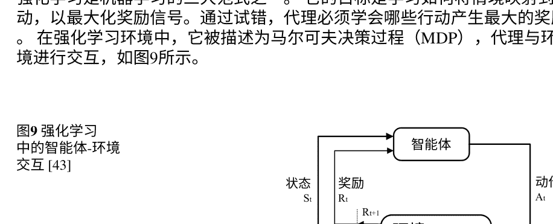

MDP是一个由以下5元组定义的离散时间随机控制过程:

- $S$, 状态空间,
- $\mathcal{A}$, 动作空间,
- $T : S \times \mathcal{A} \times S \rightarrow [0, 1]$, 转移函数,
- $R : S \times \mathcal{A} \times S \rightarrow \mathbb{R}$, 奖励函数,
- $\gamma \in [0, 1)$, 折扣因子.

马尔可夫性质表明随机过程的未来只取决于当前状态和动作，而不取决于之前的状态和动作.

初始时，智能体和环境都处于状态 $S_t$. 基于这些信息，智能体选择并执行动作 $A_t$, 导致智能体和环境过渡到状态 $S_{t+1}$. 环境还提供奖励 $R_{t+1}$, 使智能体能够评估状态-动作对$(S_t, A_t)$, 从而确定在某些状态下哪些动作更好，哪些更差. 这种设置与人类、动物和机器人与环境交互的方式非常相似，通过感知周围环境的状态，选择并执行动作，并观察其结果，以便在未来改进决策能力. 这就是为什么强化学习在机器人领域被广泛使用的原因.

强化学习代理的主要目标是最大化回报，即加权和的期望奖励，如公式（22）所示，其中 $\gamma \in [0; 1]$是一个称为折扣率的参数。如果折扣率接近0，则更重视即时奖励；如果接近1，则更重视未来奖励。当 $\gamma < 1$ 时，确保回报是有限的。

$$ G_t = \sum_{k=0}^{\infty} \gamma^k R_{t+k+1} $$ (22)

公式（23）显示了连续时间步长之间的回报关系。

$$ G_t = R_{t+1} + \gamma G_{t+1} $$ (23)

当代理与环境的交互可以分为子序列（称为episode) 时，这被称为一个episode任务，并且其特点是具有终止状态，即episode结束的状态。然后，系统被重置为起始状态或从起始状态的标准分布中进行采样。当代理与环境的交互不能被分割成episode，而是持续进行时，这被称为连续任务。在这种类型的任务中，公式（22）中定义的折扣回报非常重要，因为简单的奖励求和会导致无限回报。

为了最大化回报，代理必须学习最优策略。策略，$\pi$, 是从状态到选择每个可能动作的概率的映射。$\pi(a|s)$是当 $S_t = s$ 时 $A_t = a$ 的概率。策略使用值来确定每个状态的最佳动作。在强化学习中，有两种类型的值函数：状态值函数和动作值函数。它们估计某些状态或状态-动作对的好坏，这是以预期回报的形式定义的。

状态值函数，v_π(s)，定义为在策略π下从状态s开始并随后遵循策略π时的预期回报，如等式（24）所定义，其中𝔼_π[·]表示在代理遵循策略π的情况下随机变量的期望值。

$$v_\pi(s) = \mathbb{E}_\pi[G_t | S_t = s] \quad (24)$$

动作-值函数q_π(s, a)表示在策略π下，在状态s采取动作a的价值，即从状态s开始，采取动作a，并随后遵循策略π所得到的预期回报，如公式(25)所示。

$$q_\pi(s, a) = \mathbb{E}_\pi[G_t | S_t = s, A_t = a] \quad (25)$$

回报是奖励的加权和，如果在长期内获得了大量奖励，则可以最大化回报。对于所有状态，如果一个策略π的预期回报大于或等于另一个策略π'的预期回报，则称该策略π优于或等于另一个策略；即π ≥_π'当且仅当对于所有可能的状态S，v_π(s) ≥ v_π'(s)。最佳策略称为最优策略，用π_*表示。然而，如果所有最优策略都相等，则可能存在多个最优策略。最优策略共享相同的状态值函数和动作值函数，分别表示为v_*和q_*，如公式(26)和(27)所定义。

$$v_*(s) = \max_\pi v_\pi(s) \quad (26)$$

$$q_*(s, a) = \max_\pi q_\pi(s, a) \quad (27)$$

可以使用不同类型的策略。贪婪策略总是选择具有最高价值的动作，这似乎是实现最大回报的最佳选择。然而，其他动作可能会产生更大的奖励和回报。这就是强化学习中探索的重要性所在。ε-贪婪策略以概率1-ε贪婪地选择动作，并以概率ε随机选择动作，其中ε ∈ [0, 1]。当ε = 1时，策略将始终进行探索，即选择随机动作；而当ε = 0时，它将始终进行利用，即选择具有最高估计值的动作。

强化学习中价值函数的一个基本特性是它们满足递归关系，如公式（22）所示，用于计算回报。这是一个自治条件，由贝尔曼方程[4]给出，它表达了一个状态的值与其后继状态的值之间的关系，即起始状态的值必须等于预期下一个状态的折现值加上沿途预期的奖励。最优值函数具有贝尔曼最优性方程，对于状态值函数是（28），对于动作值函数是（29）。

$$v_*(s) = \max_{a} \mathbb{E}_{\pi_*} \left[ R_{t+1} + \gamma \, v_*(S_{t+1}) \mid S_t = s, A_t = a \right] \tag{28}$$

$$q_*(s, a) = \mathbb{E}_{\pi_*} \left[ R_{t+1} + \gamma \max_{a'} q_*(S_{t+1}, a') \mid S_t = s, A_t = a \right] \tag{29}$$

另一个相关的函数是优势函数 $a_\pi(s, a)$，它表示相对状态-动作值。它通过以下关系表示动作的相对优势[1]:

$$a_\pi(s, a) = q_\pi(s, a) - v_\pi(s) \tag{30}$$

当代理无法完全观察当前状态时，决策问题被制定为部分可观察的MDP (POMDP)，其特征为7元组:

- $\mathcal{S}$，状态空间，
- $\mathcal{A}$，动作空间，
- $T: \mathcal{S} \times \mathcal{A} \times \mathcal{S} \rightarrow [0, 1]$，转移函数，
- $R: \mathcal{S} \times \mathcal{A} \times \mathcal{S} \rightarrow \mathcal{R}$，奖励函数，
- 观察集合，
- $\mathcal{O}: \mathcal{S} \times \rightarrow [0, 1]$，条件观察概率集合，
- $\gamma \in [0, 1)$，折扣因子.

有时，代理无法通过直接与环境交互来进行训练，只能访问有限的数据来进行学习。这是离线学习的情况，它是一种非常有限和受限制的方法，有时在现实世界的问题中会出现。另一方面，在线设置允许代理同时学习和积累环境经验。

### 5.1 强化学习算法

已经开发了各种解决方案来解决强化学习问题。一方面，有几种基于值的方法来估计值函数以找到最优策略。另一方面，策略搜索方法直接搜索最优策略，无需值函数。动态规划提供了一组算法，可以获得最优策略，但它们依赖于对环境的完美模型，这在实际应用中很少可用。蒙特卡洛方法不需要对环境有完全的了解。它们以逐步的方式在每个情节中更新策略和值。时序差分（TD）方法可以用于非情节任务，不需要环境模型，并从其他估计中学习其值估计。此外，旨在改进与决策不同的策略的算法称为离策略方法，而使用单一策略的算法称为在策略方法。

Q学习[50]是一种离策略的时序差分算法，是最流行的强化学习方法之一。无论遵循何种策略，由方程(31)定义的动作值函数近似于最优动作值函数。

$$Q(S_t, A_t) \leftarrow Q(S_t, A_t) + \alpha \left[ R_{t+1} + \gamma \max_{a} Q(S_{t+1}, a) - Q(S_t, A_t) \right]$$

该算法为每个状态-动作对保留一个动作值表，也称为Q值表。它要求状态-动作对以离散方式表示，并且必须在所有状态下重复采样所有动作，以保证收敛到最优动作值函数。然而，当状态-动作空间是连续的或高维的时，无法满足这些要求。

策略梯度方法在选择动作时不需要查阅值函数，而是学习一个参数化策略。策略记作 \(\pi(a|s, \theta)\)，其中 \(\theta \in \mathbb{R}^d\) 是策略的参数向量。这种算法基于性能度量 \(J(\theta)\) 相对于策略参数的梯度来学习策略参数。由于它们旨在最大化性能，它们使用梯度上升更新。例如，REINFORCE方法[51]使用以下更新公式：

$$\theta_{t+1} = \theta_t + \alpha G_t \frac{\nabla \pi(A_t|S_t, \theta_t)}{\pi(A_t|S_t, \theta_t)}$$

同时学习价值函数的策略梯度方法被称为演员-评论家方法，其中演员代表学习的策略，评论家指的是价值函数。

## 6 深度强化学习

受生物神经网络的启发，人工神经网络是一种具有从经验中学习的能力而无需显式编程的计算系统。在人工神经网络中，处理单元或元素是神经元，也称为感知器，它通过应用激活函数来组合其输入信号的值并修改结果。一些常见的函数包括sigmoid函数、双曲正切函数和修正线性单元（ReLU）函数。神经元的输出可以连接到一个或多个其他处理单元的输入，当这种情况发生时，会应用连接权重。许多处理单元组成的神经网络按照一系列相互连接的层进行组织。图10显示了一个前馈人工神经网络的示例，称为多层感知器（MLP）。它具有一个输入、一个输出和至少一个隐藏层。输入层接收应用于网络的值。单元的输出输入层中的单元与隐藏层中的单元单向连接，并且这些单元与输出层中的神经元相连。最初，人工神经网络必须经过学习阶段，即使用可以是监督的、无监督的或自我监督的学习方法进行训练。第一个情况发生在监督者，即程序员，向网络提供带标签的数据并教导它正确和错误的响应。在无监督学习中，数据没有标签，结果是输入数据的聚类。自我监督学习引入了一个反馈循环，以纠正对数据的解释错误。可以使用诸如反向传播、Kohonen特征映射和Hopfield等多种学习规则。

在网络训练完成后，它会被输入新数据，并且预期按照所学到的知识进行操作。这被称为回忆阶段。一些种类的人工神经网络具有相关的能量函数，而在回忆过程中，网络的每个状态都有一个需要最小化的能量值。为了达到这个目标，网络会被迭代地修改，直到能量函数达到一个局部最小值。

深度学习（DL）的特点是由一系列多个处理（隐藏）层组成的人工神经网络，它对数据应用非线性变换。因此，可以学习到不同层次的抽象概念[29]。强化学习（RL）和深度学习（DL）技术的结合被称为深度强化学习（DRL），在具有高维状态和/或动作空间的问题中特别有用[18]。

卷积神经网络（CNN）在深度学习中非常重要。它们被用于具有视觉传感器（如摄像头）的机器人，因为这些网络处理以多个数组形式呈现的数据，例如一维信号和序列、二维图像和音频频谱图，以及三维视频或体积图。它们被用于诸如图像分类等任务，可以实现物体检测。

卷积神经网络（CNN）的结构如图11所示，它由一系列阶段组成，这些阶段由两种类型的层组成：卷积层和池化层。卷积层中的神经元以特征图的形式组织，每个单元通过一组称为滤波器组的权重与前一层的特征图中的局部区域相连。通常会对加权和的结果应用非线性函数，如ReLU（33）。

$$f(x) = \max(0, x)$$ (33)

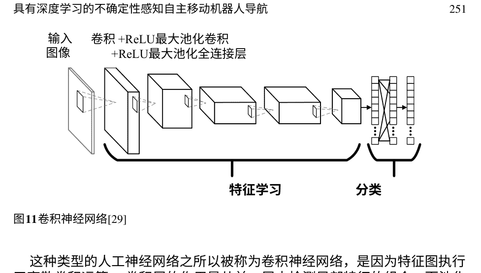

这种类型的人工神经网络之所以被称为卷积神经网络，是因为特征图执行了离散卷积运算。卷积层的作用是从前一层中检测局部特征的组合，而池化层将语义上相似的特征合并为一个。池化单元计算一个特征图或几个特征图中局部区域的最大值。相邻的池化单元从移动了一个以上行或列的区域获取输入，从而降低了表示的维度，并对小的平移和扭曲具有不变性。通常，卷积、非线性函数和池化的两到三个阶段被堆叠在一起，然后是更多的卷积层和全连接层。

所有滤波器组中的权重都是通过反向传播梯度来训练的，通过CNN。根据它们是基于值、策略还是模型，可以确定三种类型的DRL算法。

### 6.1 基于值的算法

基于值的方法通过估计值函数来定义基于它们的策略。DQN算法基于Q-learning，但能够处理高维状态空间，如ATARI游戏的帧。它使用深度神经网络作为非线性动作值函数逼近器，以预测当前状态下所有可能动作的值。使用两个神经网络，即目标网络和在线网络，以防止不稳定性的快速传播。目标网络的参数 θ^{-} 保持不变，仅在每 C ∈ N 迭代时更新，这降低了发散的风险，而在线网络的参数 θ 在每次迭代时更新。参数更新如公式（34）所示，目标值由公式（35）给出：$$\theta_{t+1} = \theta_t + \alpha \big( Y_t^Q - Q(S_{t+1}, a; \theta_t) \big) \nabla_{\theta_t} Q(S_{t+1}, a; \theta_t)$$

$$Y_t^Q = R_{t+1} + \gamma \max_{a' \in \mathcal{A}} Q(S_{t+1}, a; \theta_t^-)$$

此外，为了提高样本效率，还使用了经验回放技术。经验，即形式为 $<S_t, A_t, R_{t+1}, S_{t+1}>$ 的元组，存储在回放内存中，在学习过程中进行随机采样，使代理能够重复使用过去的经验。这种技术涵盖了广泛的状态-动作空间，并有助于打破连续样本之间的相关性。

双重深度Q网络（DDQN）[49]被提出来解决Q学习中由于最大化偏差[43]导致的过度估计问题。在这种情况下，每个变量都有两个估计值，这允许选择一个估计器及其值的解耦。在DDQN中，目标值由方程（36）定义，这导致Q学习值的过度估计减少，同时提高了稳定性和性能。

$$Y_t^{DDQN} = R_{t+1} + \gamma \, Q(S_{t+1}, \underset{a \in \mathcal{A}}{\text{argmax}} Q(S_{t+1}, a; \theta_t); \theta_t^-)$$

### 6.2 策略梯度算法

基于策略的方法旨在直接估计最优策略，而不一定计算值函数。在这些方法中，策略被参数化为一个神经网络$\pi_{\theta}$，并使用随机梯度上升技术的变体来更新参数$\theta$。目标是优化期望的累积奖励或其他性能目标[18]。这些被称为策略梯度方法，它们的结果可以是随机的或确定性的策略。

确定性策略梯度适用于具有连续动作空间的情况，因为它们只在状态空间上进行积分，导致样本较少。为了保证足够的探索，在学习确定性目标策略时，根据另一个应该是随机的策略选择动作。DDPG算法遵循动作值函数的梯度，如公式（37）所示：

$$\nabla_{\theta} V_{\pi_{\theta}}(s_0) = \mathbb{E}_{s \sim \rho_{\pi_{\theta}}} \left[ \nabla_{\theta} (\pi_{\theta}) \nabla_{a} (Q_{\pi_{\theta}}(s, a)) \big|_{a=\pi_{\theta}(s)} \right]$$

信任区域策略优化（TRPO）[39]旨在更新策略而不大幅偏离先前的策略。主要思想是通过当前策略和新策略之间的Kullback-Leibler（KL）散度来限制每个策略梯度更新。更新基于优势函数估计，如公式（38）所示：

$$ \max_{\Delta \theta} \mathbb{E}_{s \sim \rho_{\pi_{\theta}}, a \sim \pi_{\theta}} \left[ \frac{\pi_{\theta + \Delta \theta}(s, a)}{\pi_{\theta}(s, a)} A_{\pi_{\theta}}(s, a) \right] $$

PPO [40] 是TRPO算法的一种变体，当策略变化过大时，通过剪切替代目标函数提出了一种惩罚。形式上，PPO修改了目标函数，以惩罚使得$R_t(\theta)$在方程(39)中远离1的策略变化。PPO最大化的剪切目标由方程(40)给出，其中是一个超参数：

$$ R_t(\theta) = \frac{\pi_{\theta + \Delta \theta}(s, a)}{\pi_{\theta}(s, a)} $$

$$ \mathbb{E}_{s \sim \rho_{\pi_{\theta}}, a \sim \pi_{\theta}} \left[ \min \left( R_t(\theta) A_{\pi_{\theta}}(s, a), \text{clip}(R_t(\theta), 1 - \epsilon, 1 + \epsilon) A_{\pi_{\theta}}(s, a) \right) \right] $$

另一种常见的方法是演员-评论家架构[28]。这些是混合方法，结合了基于策略和基于价值的算法的优点。演员是选择动作的策略结构，评论家是估计值函数，通过评估结果并将其与预期结果进行比较，对演员选择的动作进行批评。使用两个神经网络函数逼近器用于估计最优策略和最优值函数。

A3C算法[34]使用优势函数和异步梯度下降进行优化。代替保留回放内存，这需要大量的存储容量，代理在多个环境的并行实例上异步执行。这个解决方案稳定了训练过程并减少了经验之间的相关性。A2C [34]是A3C的同步版本，只有在所有代理完成其经验后才执行更新。SAC方法[22]还将熵项添加到奖励函数中以同时最大化预期回报并尽可能地进行探索。

### 6.3 基于模型的算法

基于模型的方法使用规划算法和环境模型，可以通过学习或事先知道。在学习可能是部分可观察的高维环境的模型的情况下，函数逼近器非常有帮助。

代理可以与模型交互，而不是与真实环境交互，以提出行动建议。这个过程被称为规划。当行动空间是离散的时候，前瞻搜索通常通过生成潜在轨迹来完成。

连续动作空间需要轨迹优化。

前瞻搜索是建立一个决策树，其根节点是当前状态。所得到的相互作用结果存储在节点中，这允许找到有潜力的轨迹。然而，这种方法的主要缺点是在成功平衡探索和利用之间存在困难。

## 7 结论

本文回顾了移动机器人导航的最重要方面。同样，介绍了强化学习（RL）和深度强化学习（DRL）的基本概念，以及两种范式中最常用的算法。研究了将这些技术应用于移动机器人导航，结果是有利的，即使对于多机器人系统也是如此。此外，还介绍了不确定性的概念，以及它对机器人技术的影响和处理不确定性的常见方法。在移动机器人应用中，使用DRL估计模型不确定性主要通过神经网络来实现，其中dropout和bootstrapping等技术非常有帮助。最近的方法涉及使用循环神经网络、图神经网络和深度贝叶斯RL，这些方法被证明是学习快速且具有泛化能力的好解决方案。

未来的研究将集中在将概率论以及更高级的技术，如辍学和自助法，应用于DRL算法，以处理移动机器人导航任务中的不确定性。此外，还将研究和测试模糊逻辑和神经模糊强化学习方法，并比较不同技术的性能和结果。还将通过使用各种控制和通信策略以及在单机器人方法中使用的具有不确定性感知的DRL方法来进行多机器人系统的实验。

## 参考文献

- 1. Arulkumaran K, Deisenroth MP, Brundage M, Bharath AA (2017) 深度强化学习：简要调查。IEEE信号处理杂志34（6）：26-38
- 2. Badoni P (2015) 机器人控制器：文献综述。 国际工程研究技术杂志 (IJERT) 4 (10) : 502-508
- 3. Bayes T, Price R (1763) 试图解决机会学说中的一个问题的论文。由已故的Rev. Bayes先生通过一封信向John Canton先生，M.A.和F.R.S.传达给Price先生。伦敦皇家学会哲学。转录53: 370-418
- 4. Bellman RE (1957) 动态规划。 普林斯顿大学出版社，普林斯顿，新泽西州
- 5. Berkenamp F, Krause A, Schoellig AP (2016) 具有安全约束的贝叶斯优化：机器人中的安全和自动参数调整。 arXiv预印本arXiv:1602.04450
- 6. Blundell C, Cornebise J, Kavukcuoglu K, Wierstra D (2015) 神经网络中的权重不确定性。 arXiv预印本arXiv:1505.05424
- 7. Browne CB, Powley E, Whitehouse D, Lucas SM, Cowling PI, Rohlfshagen P, Tavener S, Perez D, Samothrakis S, Colton S (2012) 蒙特卡洛树搜索方法综述。 IEEE Trans Computat Intell AI Games 4(1):1-43
- 8. Brunner G, Richter O, Wang Y, Wattenhofer R (2017) 用深度强化学习教机器阅读地图。 arXiv预印本arXiv:1711.07479
- 9. Butyrev L, Edelhäuser T, Mutschler C (2019) 深度强化学习用于移动机器人运动规划的研究。 arXiv预印本 arXiv:1912.09260
- 10. Chen F, Martin JD, Huang Y, Wang J, Englot B (2020) 基于图的深度强化学习在不确定性下的自主探索。 arXiv预印本 arXiv:2007.12640
- 11. Chen W, Zhou S, Pan Z, Zheng H, Liu Y (2019) 基于深度强化学习的无地图协作导航多机器人系统。应用科学 9:4198
- 12. Chen YF, Everett M, Liu M, How JP (2017) 基于深度强化学习的社交感知运动规划。 在：2017年IEEE/RSJ国际智能机器人与系统(IROS)会议。IEEE，1343-1350
- 13. Cook G (2011) 移动机器人：导航、控制和远程感知。Wiley, Hoboken, NJ
- 14. Correll N (2016) 自主机器人导论。 科罗拉多大学博尔德分校，博尔德，CO
- 15. Deisenroth M, Rasmussen CE (2011) PILCO：一种基于模型和数据高效的策略搜索方法。 在：第28届国际机器学习大会（ICML-11）。Omnipress，465-472
- 16. Dempster AP (1967) 由多值映射引起的上下概率。 Ann Math Stat 38(2): 325-339
- 17. Doriya R, Mishra S, Gupta S (2015) 多机器人通信和协调的简要总结和分析。 在：计算、通信和自动化国际会议（ICCCA2015）。IEEE，1014-1021
- 18. François-Lavet V, Henderson P, Islam R, Bellemare MG, Pineau J (2018) 深度强化学习简介。 Foundat Trends Mach Learning 11(3-4):219-354
- 19. Gal Y, Ghahramani Z (2016) 丢弃法作为贝叶斯近似：在深度学习中表示模型不确定性。 In: Proceedings of the 33rd international conference on machine learning(ICML-16). JMLR, 1050-1059
- 20. Gal Y, McAllister R, Rasmussen CE (2016) 用贝叶斯神经网络动力学模型改进PILCO。 In: Data-efficient machine learning workshop. ICML
- 21. Gao R, Gao X, Liang P, Han F, Lan B, Li J, Li J, Li S (2019) 使用深度强化学习进行非完整约束移动机器人的运动控制。 In: 2019 IEEE 4th international conference on advanced robotics and mechatronics (ICARM). IEEE, 348-353
- 22. Haarnoja T, Zhou A, Abbeel P, Levine S (2018) 软演员评论员：基于策略的最大熵深度强化学习与随机演员。 arXiv预印本 arXiv:1801.01290
- 23. Huang J, Rosendo A (2020) 深度对深度贝叶斯：多机器人竞争实验中的强化学习。 arXiv预印本 arXiv:2007.10675
- 24. Kagan E, Shvalb N, Ben-Gal I (2019) 自主移动机器人和多机器人系统：运动规划、通信和集群. Wiley, Hoboken, NJ
- 25. Kahn G, Villaflor A, Pong V, Abbeel P, Levine S (2017) 碰撞回避的不确定性感知强化学习。 arXiv预印本 arXiv:1702.01182
- 26. Kalman RE (1960) 线性滤波和预测问题的新方法. Trans ASME J Basic Eng 82(1):35–45
- 27. Kiran BR, Sobh I, Talpert V, Mannion P, Al Sallab AA, Yogamani S, Pérez P (2020) 自主驾驶的深度强化学习：一项调查. arXiv预印本 arXiv:2002.00444
- 28. Konda VR, Tsitsiklis JN (2000) 演员-评论家算法. 在：神经信息处理系统的进展. MIT Press, 1008–1014
- 29. LeCun Y, Bengio Y, Hinton G (2015) 深度学习. 自然 521(7553):436–444
- 30. Li Y, Chen J, Feng L (2012) 处理不确定性: 理论和实践综述. IEEE Trans Knowl Data Eng 25(11):2463–2482
- 31. Lütjens B, Everett M, How JP (2019) 具有模型不确定性的安全强化学习估计. 在: 2019国际机器人与自动化会议 (ICRA). IEEE, 8662–8668
- 32. Metropolis N, Ulam S (1949) 蒙特卡洛方法. J Am Stat Assoc 44(247):335–341
- 33. Mihelj M, Bajd T, Ude A, Lenarcic J, Stanovnik A, Munih M, Rejc J, Slaajpah S (2019) 移动机器人. 在: 机器人学. Springer, 189–208
- 34. Mnih V, Badia AP, Mirza M, Graves A, Lillicrap T, Harley T, Silver D, Kavukcuoglu K (2016) 深度强化学习的异步方法. 在: 国际会议机器学习. OmnIpess, 1928-1937
- 35. Mnih V, Kavukcuoglu K, Silver D, Rusu AA, Veness J, Bellemare MG, Graves A, Riedmiller M, Fidjeland AK, Ostrovski G, Petersen S, Beattie C, Sadik A, Antonoglou I, King H, Kumaran D, Wierstra D, Legg S, Hassabis D (2015) 通过深度强化学习实现人类水平的控制. 自然 518(7540):529-533
- 36. Osband I, Blundell C, Pritzel A, Van Roy B (2016) 通过引导DQN进行深度探索. 在: 神经信息处理系统的进展. 麻省理工学院出版社, 4026-4034
- 37. Ray PP (2016) 机器人事物的互联网: 概念、技术和挑战. IEEE Access 4:9489-9500
- 38. Richter C, Vega-Brown W, Roy N (2015) 用于未知环境中安全高速导航的贝叶斯学习. 在: 机器人研究-第15届国际研讨会ISRR.Springer, 325–341
- 39. Schulman J, Levine S, Abbeel P, Jordan M, Moritz P (2015) 信任区域策略优化. 在: 机器学习国际会议. OmnIpess, 1889–1897
- 40. Schulman J, Wolski F, Dhariwal P, Radford A, Klimov O (2017) 近端策略优化算法. arXiv预印本 arXiv:1707.06347
- 41. Shafer G (1976) 证据的数学理论. 普林斯顿大学出版社, 普林斯顿, NJ
- 42. Siegwart R, Nourbakhsh IR (2004) 自主移动机器人导论. 麻省理工学院出版社, 剑桥, MA
- 43. Sutton RS, Barto AG (2018) 强化学习导论. The MIT Press, 剑桥, 麻省
- 44. Tai L, Liu M (2016) 基于CNN的移动机器人探索. 机器人仿生学 3(1):24
- 45. Tan Q, Fan T, Pan J, Manocha D (2019) DeepMNavigate: 深度强化多机器人导航，统一局部和全局避碰. arXiv预印本 arXiv:1910.09441
- 46. Thrun S, Burgard W, Fox D (2006) 概率机器人学. The MIT Press, 剑桥, 麻省
- 47. Tzafestas SG (2014) 移动机器人控制导论. Elsevier, 伦敦
- 48. Tzafestas SG (2018) 移动机器人控制与导航: 全局概览. J Intell Rob Syst 91(1):35–58
- 49. Van Hasselt H, Guez A, Silver D (2016) 双Q学习的深度强化学习. arXiv预印本 arXiv:1509.06461
- 50. Watkins CJCH, Dayan P (1992) Q学习. 机器学习8 (3-4) : 279-292
- 51. Williams RJ (1992) 简单的统计梯度跟随算法用于连接主义强化学习. 机器学习8 (3-4) : 229-256
- 52. 向杰, 李琦, 董旭, 任志 (2019) 基于深度强化学习的移动机器人导航连续控制. 在: 2019年中国自动化大会 (CAC). IEEE, 1501-1506

## 53. 辛杰，赵华，刘丹，李明 (2017) 深度强化学习在移动机器人路径规划中的应用。 在：2017年中国自动化大会（CAC）。IEEE，pp 7112-7116
54. Zadeh LA (1965) 模糊集。信息与控制 8(3)：338-353
55. Zadeh LA (1988) 模糊逻辑。计算机 21(4)：83-93
56. 张海洋，林伟民，陈爱新 (2018) 移动机器人的路径规划：综述。对称性 10(10):450

## 深度强化学习用于微网中的自主移动网络

Marco Miozzo，Nicola Piovesan，Dagnachew Azene Temesgene和Paolo Dini

摘要 在本章中，我们描述了通过深度学习实现对能源自持移动网络的控制方案的设计。目标是通过使用可再生能源，使基站大部分脱离电网运行，实现智能能源管理。为了实现这一目标，我们考虑了集中式和分布式深度强化学习实现，制定了一个在线电网能量和网络吞吐量优化问题。我们对参考场景、采用的技术、实现的性能、复杂性和提出模型的可行性以及实现的能源和成本节约进行了详尽的讨论。结果表明，基于深度Q学习的算法是实现移动网络在微网中能源自持的可行且经济上合适的解决方案。

关键词 能源可持续性·能源效率·移动网络·边缘计算·能量收集·深度强化学习·深度学习

## 缩略语和符号

-  ANN  人工神经网络
-  BB  基带
-  BS  基站
-  DRL  深度强化学习
-  DDRL  分布式深度强化学习
-  DP  动态规划
-  DQL  深度Q学习
-  EH  能量收集
-  FQL  模糊Q学习
-  MBS  宏基站
-  MDP  马尔可夫决策过程
-  MEC  多接入边缘计算
-  MRL  多智能体强化学习
-  NFV  网络功能虚拟化
-  RAN  无线接入网络
-  RL  强化学习
-  SBS  小型基站
-  SDN  软件定义网络
-  SGD  随机梯度下降
-  vBS  虚拟小型基站
-  $A^{t}$  在时隙 $t$ 中的SBS的操作状态（控制动作）
-  $B^{t}$  时隙 $t$ 开始时电池中存储的能量
-  $H^{t}$  时隙 $t$ 中SBS收集的能量
-  $h^{t}$  时隙 $t$ 中的一天中的小时
-  $m^{t}$  时隙 $t$ 中的月份
-  $L^{t}$  时隙 $t$ 中vBS覆盖范围内生成的流量负载
-  $r_{t}$  标量奖励信号
-  $X^{t}$  时隙 $t$ 中vBSs的状态
-  $\alpha$  学习率
-  $\varepsilon$  探索参数
-  $\gamma$  折扣因子

M. Miozzo (✉) · P. Dini
CTTC/CERCA, 西班牙巴塞罗那
e-mail: marco.miozzo@cttc.es

P. Dini
e-mail: paolo.dini@cttc.es

N. Piovesan
华为技术公司，巴黎研究中心，布洛涌-比扬库尔，法国
e-mail: nicola.piovesan@huawei.com

D. A. Temesgene
爱立信研究，斯德哥尔摩，瑞典
e-mail: dagnachew.azene.temesgene@ericsson.com

© 作者，独家许可给 Springer Nature Switzerland AG 2021 A. Koubaa 和 A. T. Azar (eds.), 无人系统的深度学习, 计算智能研究 984, https://doi.org/10.1007/978-3-030-77939-9_8

## 1 引言

在过去的十年中，我们在绿色通信网络方面进行了大量的研究，特别是在移动领域，这被认为是信息和通信技术（ICT）的驱动力[14]。如今，能源是网络设备的关键绩效指标之一，如欧洲电信标准化协会（ETSI）标准[14]和3GPP规范[1]所报道。据估计，到2030年，ICT能源消耗可能达到全球电力生产的51%，主要是由于移动网络[5]。

此外，移动网络运营商（MNOs）对能源问题的态度发生了巨大变化。电信运营商每年消耗254 TWh的电力（ICT全球电力消耗的77%），年增长率超过10%[19]。2012年移动网络的碳足迹与飞机的温室气体排放相当，并预计将进一步增加。事实上，能源现在成为移动网络运营商运营支出（OPEX）的重要部分，其智能管理被认为对网络设计和运营至关重要[19]。

从科学文献中可以看出，减少移动网络能耗最有希望的方法是在低流量时段启用一些活动网络元素的休眠模式[16]。然而，由于运营商对覆盖漏洞和网络设备由于频繁开关而可能导致的故障的担忧，这些提议在运营网络中的影响仍然很少。

另一方面，如今我们正在目睹电网部门对可持续能源的追求，以减少由人类活动引起的温室气体排放。智能电网（SG）是提出的技术范式，旨在实现从发电机到消费者的整个链条上高效的能源生产、输送和消费[20]。特别是，一个关键概念是设计微电网，美国能源部将其定义为“在明确定义的电力边界内，由相互连接的负载和分布式能源资源（主要是可再生能源）组成的一组，与电网相比作为一个可控实体”[50]。微电网可以与电网连接和断开，使其能够在电网连接和孤岛模式下运行。类似地，欧盟最近发布了欧盟冬季计划，旨在为下一代电网提供指导方针。主要思想是通过为当地能源社区提供岛模式下工作的基础设施和基于市场的零售能源价格来促进合作。因此，我们可以应用SG的解决方案，实现从发电机到消费者的整个链条上高效的能源生产、输送和消费[20]。

可持续能源用于供应基站（BS）最近引起了移动网络研究界的关注[17]。这种兴趣是由移动设备的更高效率和额外能量收集硬件的可负担价格所驱动的，特别是当安装用于供应小型基站时[42]。这种解决方案不仅在农村地区，甚至在城市环境中都被证明在环境和经济上是可持续的[55]。

然而，可持续能源供应商也面临着自己的挑战，主要是由于它们间歇性和不稳定的能源供应，并且将它们安装到（一些）移动网络元素（即小型基站）中将为系统的正确运行带来新问题。我们强调，这些新问题在ICT行业中完全未被探索，但它们必须明确地受到控制，并纳入移动运营商通常采用的网络管理工具中。

当前趋势表明，下一代移动网络将基于两个主要范式：密集化和软件化。密集化依赖于多层架构（所谓的HetNets）[27]，通过频率重用显著增加了向终端用户提供的容量。相反，软件化将使移动边缘计算（MEC）技术[3]成为可能，在该技术中，基站可以利用计算能力并共享部分计算过程，从而实现自动化的网络管理、灵活性和成本降低[34]。基于这些技术范式，我们设想了一个无线接入网络（RAN）设置，其中在同一地理区域内部署了具有不同比例因子、传输功率、计算能力和覆盖范围的分层蜂窝结构。具有边缘计算能力的基站联合供应由分布式能量收集器和储能系统组成的微网[50]，其运营由能量管理系统协调。

## 范围

在本章中，我们详细阐述了实现移动网络中这种新的架构概念的控制方法，并重点关注吞吐量-能量权衡，即实现不同基站操作模式和基站之间的能量共享机制，以最小化从电网中消耗的能量，同时满足用户的流量需求。

我们确定深度强化学习（DRL）是一种关键的控制方法，并讨论了为什么它是解决我们问题的合适工具，以及如何在网络架构中实施它以实现更高的性能和节能。我们将考虑两种不同的控制范式：集中式和分布式。我们详细阐述了每种实施方法的优缺点。然后，我们验证它们在不同网络场景和配置中的性能，证明这两种解决方案在节能和系统故障方面具有更高的性能，并且能够控制高密度场景，而其他最先进的方法由于复杂性和内存问题而失败。

总结起来，本章讨论了所包含的贡献。

-  设计一个能够控制能量流入和在具有能量收集和边缘计算能力的微网中花费的自动框架。
-  在提出的网络场景中定义一个能量吞吐量优化问题。
-  确定深度强化学习作为所述优化问题的合适解决方案。
-  研究集中式和分布式强化学习方法的优势和缺点。
-  分析集中式和分布式控制模型在不同网络设置中的结果和性能评估。
-  识别可持续网络和计算中未解决问题和未来研究方向。

本章的组织如下。在第2节中，我们介绍了我们的框架，用于控制微网中的能源感知无线电接入网络。第3节定义了系统模型，并介绍了保证微网中能源感知移动网络自主运行的控制问题。在第4节中，我们介绍了在这项工作中使用的强化学习（RL）解决方案。在第5节和第6节中，我们分别解释了用于我们的控制问题的集中式和分布式深度RL算法的实现，以及它们的数值结果。最后，在第7节中，我们总结了贡献的主要成果，并提出了识别出的开放性研究挑战。

## 2 参考场景

最近的趋势表明，下一代移动网络将由密集部署的异构基站组成，可能包括不同的无线技术（LTE，新无线电，毫米波等）用于无线接入和前/后传。预计将采用多层架构，其中宏基站（MBS）提供基线覆盖和容量，小基站（SBS）主要部署在热点区域以增强容量（也称为HetNet）。密集化通过频率复用显著增加了向终端用户提供的容量。

尽管其灵活性，下一代移动网络架构由于要管理的元素（和资源）数量更多而变得越来越复杂。移动边缘计算（MEC）架构，与软件定义网络（SDN）和网络功能虚拟化（NFV）范式[34]一起，是实现高效自动化网络管理、灵活性和成本降低的候选方案。在MEC-H场景[36]中，多层MEC服务器被放置在基站上，并具有不同的计算和传输能力（即，MBS是高功率和高计算节点）。在这项工作中，我们对于集成MEC服务器的MBS可以支持SBS并实现一些网络功能的计算卸载感兴趣，例如基带处理（BB）操作。为了实现这一点，可以使用标准化接口，例如OpenFlow [21]，来实现MBS和SBS之间的交互。这样，SBS的传输功能与专有硬件相关的实现解耦，并可以在网络的不同硬件资源上执行。

在这方面，3GPP已经为新无线电（NR）无线技术[2]定义了分布式单元和集中单元之间的不同功能分割，对于我们来说，分布式基站（SBSs）和主基站（MBSs）分别是如此。这种类型的分布式基站（vSBSs）可以在资源分配和管理方面提供更高的灵活性。我们研究中考虑的功能分割选项的详细信息在第2.2节中介绍。

### 2.1 能源感知移动网络场景

我们提出的框架的表示如图1所示。移动网络被划分为簇，每个簇由一个主基站（MBS）和一组分布式基站（SBSs）组成。每个簇可以实现HetNet或MEC-H。在MEC-H架构的情况下，分布式基站（SBSs）的BB功能可以被机会性地在MBS站点上本地或在MEC服务器上进行。MBS连接到电网，从而确保基线覆盖、容量和处理的可靠连接。SBS仅由光伏（PV）面板和电池供电，并用于增强容量。

在其他收集技术中，太阳能被认为是最合适的，因为商业光伏面板的效率高，太阳能能源在典型安装中广泛可用[26]。

每个集群形成一个微网，可根据“收集-存储-共享”方法管理可再生能源流入。光伏面板产生的电力由SBS消耗，多余的电力存储在电池中以备后用。当电池达到最大容量时，多余的电力与MBS共享，以减少电网能耗。通过部署电力线路来实现微网。MBS和SBS之间的短距离保证了低电阻损耗（即导线以热能形式损失的能量）。当SBS具有不需要的多余能量时，该能量在本地消耗，而不注入微网。通过这种方式，微网中的能量平衡得以维持。

需要设计和尺寸化适当的收获和储存系统，以避免停电和能源浪费。事实上，可能会发生SBS必须关闭的情况，因为光伏发电量不足，电池已经耗尽，或者光伏电池产生的一部分电能因无法储存或共享而丢失。

当SBS关闭时，连接的用户可能被迫切换到MBS；然而，在SBS处于关闭状态且需求高峰期时，MBS可能会过载并丢失部分流量。必须避免这种停电情况。因此，控制架构对于延长网络的生存时间和防止系统停电至关重要，如下一节所讨论的。控制工具负责在HetNets中机会性地开关SBS的开关。此外，它们决定在MEC-H部署中执行SBS的基带功能的位置（即SBS的功能分离配置）。两种架构中SBS的不同操作状态取决于流量需求和能量收获到达的动态。因此，控制架构应该预测这两个过程（即流量需求和能量到达）的演变，并决定SBS的最佳配置，以防止在可再生能源到达量低和流量需求高的时期发生停电。

本章研究了两种控制方法：集中式和分布式，如图1所示。这两种提出的实现方式在概念上是不同的。中央控制器实现在MBS站点，并返回集群中所有SBS的配置。分布式控制器在SBS站点本地实现，每个控制器仅返回其SBS的配置。

### 2.2 MEC-H场景中的功能分割

根据标准[2]，我们选择了两种功能分割选项，基于它们对vSBS能耗的影响：

-  PHY-RF分割：所有协议，包括物理层（PHY）和更高层，都在MBS的MEC服务器上实现。vSBS仅用于信号传输和接收，因此行为类似无线电频率（RF）收发器；
-  MAC-PHY分割：RF功能和PHY层相关处理在vSBS上进行，而介质访问控制（MAC）和更高层功能在MEC服务器上执行。

PHY-RF和MAC-PHY分割选项对vSBS的能源需求产生了显著不同的影响，这允许对本地能源消耗进行动态控制。其他功能分割选项对能源利用几乎没有影响，如Temesgene等人在[49]中所示。这些功能分割选项在图2中与传统的eNodeB架构一起描述。

## 3 控制问题

在本节中，我们定义了能源感知移动网络场景下的控制问题，即保证由可再生能源和电池供电的微网中的无线接入网络元素（即基站）的自主运行。具体而言，我们关注完整的系统模型定义，包括网络架构、流量需求以及能源收集和存储硬件。至于网络架构，我们设想了两种不同的场景，即HetNet和MEC-H，包括不同的基站能源感知配置选项，如前一节所述。因此，介绍了这些基站操作模式的功耗模型。最后，本节讨论了已经研究的不同方法，以解决我们的控制问题。

### 3.1 问题陈述

我们考虑一个由一个MBS和 \( N \) 个非重叠的SBS群组成的双层RAN。群组中的基站之间不会相互干扰。当一个SBS关闭时，相关的UE将被移交给MBS继续传输。然而，MBS可能达到其容量限制，无法为所有UE提供服务，在这种情况下，受影响的UE将会经历服务中断。

系统随着交通负载和能量的变化而随时间演化，能量储存在电池中。集群中的SBS在时间 \( t \) 时的交通负载定义为 \( \mathbf{L}^{(t)} = \left[L_1^{(t)}, L_2^{(t)}, \dots, L_N^{(t)}\right] \)，其中 \( L_i^{(t)} \in [0, 1] \; \forall i \)。

时间 \( t \) 时的能量收集定义为 \( \mathbf{H}^{(t)} = \left[H_1^{(t)}, H_2^{(t)}, \dots, H_N^{(t)}\right] \)。

时间 \( t \) 时储存在电池中的能量定义为 \( \mathbf{B}^{(t)} = \left[B_1^{(t)}, B_2^{(t)}, \dots, B_N^{(t)}\right] \)。

使用上述定义，下一个时间步骤开始时存储在电池中的能量可以根据以下方式计算：

\[
\mathbf{B}^{(t+1)} = \min \left( \mathbf{B}^{(t)} + \mathbf{H}^{(t)} - \mathbf{P}^{(t)} \Delta_t, \; B_{\text{cap}} \right)
\]

其中 \(\mathbf{P}^{(t)} = \left[P_1^{(t)}, P_2^{(t)}, \ldots, P_N^{(t)}\right]\) 是时间 \( t\) 时SBSs消耗的功率， \(B_{\text{cap}}\) 是电池的容量， \(\Delta_t\) 是时间步长的持续时间。需要注意的是，当电池电量低于阈值时，SBSs会自动关闭。

\[
X^{(t+1)} = \max\left(\mathbf{B}^{(t)} + \mathbf{H}^{(t)} - \mathbf{P}^{(t)}\Delta_t - B_{\text{cap}}, 0\right)
\]

如第2节所预期，我们考虑两种类型的SBS：标准（SBS）和虚拟（vSBS）。标准SBS可以打开为其覆盖范围内的用户提供服务，也可以关闭以节省本地能量。或者，在MEC模式下，每个vSBS可以处于三种操作模式之一。用 \(A^t\) 表示vSBS的模式，在时间槽 \(t\) 中，第 \(n\) 个vSBS的模式为 \(A_n^t\)，给出如下：

-  \(A_n^t = 0\) 如果第 \(n\) 个vSBS关闭
-  \(A_n^t = 1\) 如果第 \(n\) 个vSBS处于PHY-RF模式
-  \(A_n^t = 2\) 如果第 \(n\) 个vSBS处于MAC-PHY模式

网络范围内的顺序决策问题由马尔可夫决策过程（MDP）定义为 \(X^{t+1} = f(X^t, A^t, L^t, H^t)\)，其中 \(X^t \triangleq [X_1^t, X_2^t, \ldots, X_N^t]\) 表示 (v) SBS在时隙 \(t\) 的状态， \(A^t \triangleq [A_1^t, A_2^t, \ldots, A_N^t]\) 是 (v) SBS的控制操作/模式，而 \((L^t, H^t)\) 是环境随机变量，即流量和能量收集（EH）随机过程。特别地，我们定义每个状态 \(X_i^t, i=1,\ldots\) 因此，时隙 \(t\) 中第 \(i\) 个 (v) SBS的状态由每个 (v) SBS的电池电量 \(B^t\)，其流量负载 \(L_i^t\)，运行的月份 \(m^t\) 和一天中的小时数 \(h^t\) 表示。

我们有两个目标：(i) 在MBS上最小化电网能耗，和 (ii) 最小化由于(v)SBS处于关闭模式而无法满足的流量需求。因此，每个决策时隙 \(t\) 的优化目标将是在有限的时间范围 \(T\) 内最小化总加权成本，表示为：

\[
\text{P1: 最小化} \sum_{t=i}^{T+i} \omega \cdot E(A^t) + (1 - \omega) \cdot D(A^t),
\]

其中 \(t = i\) 表示第 \(i\) 个决策时隙， \(E_m(A^t)\) 和 \(D(A^t)\) 分别表示归一化的电网能耗和流量丢包率，下面将对其进行定义。网格能量消耗等同于MBS站点的能量消耗，因为(v)SBS仅依赖于收集的能量。网格能量消耗相对于MBS的最大可能能量消耗进行了归一化，即当MBS处于满负荷状态并执行(v)SBS的PHY-RF模式下的基带（BB）处理时。因此，归一化的网格能量消耗计算如下：其中$\mathrm{P}(\boldsymbol{A}^t)$是(v)SBS在时间 $t$的运行模式下的功耗，$\mathrm{P}^{\mathrm{MAX}}$是MBS在满负荷状态下的功耗。

在这项工作中，我们考虑了两种优化情况：(i) 具有能量共享的标准SBS 和 (ii) 没有能量共享的MEC启用的vSBS (即 $X^t =0$，收集过程的多余能量被浪费掉)。

### 3.2 流量模型

根据Auer等人[6]提出的模型，我们考虑每个(v)SBS区域内随机分布的$N_{\mathrm{UE}}$个用户，可以根据其对流量的需求分为普通用户和重度用户。具体而言，普通用户每小时需求112.5 MB，而重度用户每小时需求900 MB。根据Auer等人[6]，高峰时段活跃用户的数量占订阅用户的16%，活跃用户数量和每个活跃用户的流量变化由函数$\vartheta(t)$来建模。因此，每个SBS在时间 $t$时请求的平均流量定义为：

$$T_{\mathrm{SBS}}(t) = N_{\mathrm{UE}} \cdot \vartheta(t) \cdot [(1 - r_h) \cdot 112.5\ \mathrm{MB/h} + r_h \cdot 900\ \mathrm{MB/h}], \quad\quad (6)$$

在这里$r_h$是重度用户的比例。流量配置函数$\vartheta(t)$已经通过考虑Xu等人[53]中描述的真实流量配置来设计，这些配置是通过结合数千个蜂窝塔的时间、位置和频率信息得出的。
根据真实移动通信流量的测量结果，将流量的变化性添加到配置中，其均值为零，标准差由实际移动通信流量的测量结果得出[51]。

图3 展示了一周内流量（黑线）和能量收集过程（蓝线）的时间变化示例。

徐等人[53]的分析表明，城市移动交通使用可以用五个基本的时间域模式来描述，分别对应于住宅、办公、交通、娱乐和综合功能区。本文重点研究住宅和办公场所的流量特征，因为它们在大都市地区的流量密集程度最高。图3展示了它们的流量特征。我们可以看到，两个特征都在白天活动较多，夜晚活动较少。然而，办公特征和住宅特征的流量最高分别集中在白天（即上午10点到下午6点）和晚上（即下午6点到凌晨12点）。资源分配方案采用了Mezzavilla等人[29]定义的方法。调制和编码方案根据每个用户设备的信号与干扰噪声比（SINR）来分配：

$$\text{SINR} = \frac{|g_0|^2 P_{t,0}}{\sum_{i=1}^{N_I} |g_i|^2 P_{t,i} + \sigma_0^2}, \quad (7)$$

其中 $P_{t,0}$ 和 $g_0$ 分别表示有用传输的传输功率和信道增益，$N_I$ 是干扰源的数量，$|g_i|^2$ 和 $P_{t,i}$ 表示第 $i$ 个干扰源的信道增益和传输功率。最后，$\sigma_0^2$ 是热噪声的功率。

### 3.3 能量收集模型

美国国家太阳辐射数据库[35]提供了覆盖20年（1991-2010年）的太阳辐射实测数据。该数据库包含有关太阳辐射和其他气象数据的每小时信息。通过考虑Miozzo等人[30]和Piovesan和Dini[38]介绍的模型，将太阳辐射转化为收集到的太阳能。

太阳能迹线通常呈钟形，白天中心小时有一个峰值，而夜间收集的能量可以忽略不计。此外，它们的大小取决于位置（例如，经度和纬度）和年份（即季节）。图3显示了洛杉矶12月一周的太阳能迹线示例。

### 3.4 功耗模型

根据Desset等人[12]提出的模型，估计(v)SBS的功耗，该模型是BS的一种通用灵活功耗模型，并提供每秒十亿次操作（GOPS）的功耗。应用与技术相关的GOPS到瓦特的转换因子来确定功耗为瓦特。在这项工作中，我们将功能分割选项的各种BB处理任务映射到其功耗需求估计。总BS功耗由以下公式给出：

$$P_{\text{BS}} = P_{\text{BB}} + P_{\text{RF}} + P_{\text{PA}} + P_{\text{overhead}}, \tag{8}$$

其中，$P_{\text{BB}}$是由BB处理引起的功耗，$P_{\text{RF}}$是射频电路的功耗，$P_{\text{PA}}$是功率放大器的功耗，而$P_{\text{overhead}}$是额外的功耗（例如，冷却系统）。BB功耗，$P_{\text{BB}}$，包括空闲模式的功耗和OFDM处理、滤波、频域处理和前向纠错的功耗。根据[12]，所有这些组件都与天线数量和带宽成比例，频域处理和前向纠错的功耗还取决于流量负载。当vSBS处于PHY-RF分离模式时，它们的功耗模型不包括相应的$P_{\text{BB}}$，因为BB处理发生在MBS站点。另一方面，SBS和vSBS在MAC-PHY分离模式下的功耗包括$P_{\text{BB}}$项，因此由公式（8）给出。考虑到上述模型描述，MBS消耗的电网功率计算如下：

$$P_{\mathrm{m}} = P_{\mathrm{BS}}^{\mathrm{MBS}} + \sum_{i \in \mathcal{G}} P_{\mathrm{BB}}^{i}, \tag{9}$$

其中 $P_{\mathrm{BS}}^{\mathrm{MBS}}$是根据(8)计算的MBS功耗，$P_{\mathrm{BB}}^{i}$ 是第$i$个vSBS的BB功耗，$\mathcal{G}$是包含vSBS在PHY-RF分裂模式下的索引的集合。

### 3.5 问题表述

我们的优化问题有两个目标: (i)最小化MBS的电网能耗, (ii)减少系统的停机时间，即最小化无法满足的流量需求。这在公式(4)中明确表达了，该公式将我们的控制问题表示为一个顺序决策过程。最优解（也称为策略）可以通过建模两个随机过程（即流量需求和能量到达）来找到；然而，这种方法是NP-hard的，会使计算复杂度爆炸。

因此，我们采用学习方法并使用无模型算法来找到在每个决策时刻采取的最佳行动。在众多机器学习解决方案中，我们使用强化学习。与大多数常用的监督方法相反，这类算法的优势在于不需要标签。此外，强化学习算法通过与环境的交互直接学习最优/接近最优的策略，同时实现系统整体目标，例如高效利用收集的能量，并且不需要环境变量的模型（例如用户需求，能量到达情况）。我们提出了两种不同的方法来解决我们的控制问题：集中式和分布式。第一种方法基于一个放置在MBS站点的单个代理，并实施强化学习算法，该代理负责在每个决策时刻决定集群中所有SBS的最佳配置选项。主要优点在于中央控制器可能拥有进行决策所需的所有信息，或者换句话说，它对环境具有完全了解，包括需求概况、能量到达情况、集群中的用户数量、集群中SBS的操作模式。另一方面，它存在众所周知的单点故障问题。此外，中央代理中实施的算法可能具有较高的计算复杂性和内存需求，并且经历长时间的收敛和训练阶段。中央控制器的上述缺点可以通过将决策分散在集群中的多个代理之间来解决，其中一个代理是一个SBS。然而，在这种情况下，多个代理只观察到局部环境（例如其覆盖区域的流量需求），并且对环境没有完全了解。因此，需要协调以在不同行动中达成共识，以最小化代理之间的冲突行为并最大化系统整体收益。

在这项工作中，我们提出了基于深度强化学习算法的集中式和分布式实现。最近，深度学习模型已经被应用于强化学习中，主要是为了解决由连续变量引起的复杂性和内存问题。事实上，经典的表格强化学习方法，即Q学习（QL），被认为适用于离散状态/动作空间，并需要对连续状态进行量化处理，就像我们的情况一样。因此，量化级别的数量必须适当确定，以在引入近似和累积奖励、收敛时间和内存占用性能之间找到合理的平衡。另一方面，深度强化学习方法，即深度Q网络，使用人工神经网络（ANNs）作为函数逼近，以解决表格方法的量化问题，并且可以处理连续状态空间。事实上，ANNs需要更小的内存，并且比表格方法更快地收敛。这在我们的研究案例中转化为更高的能源节约和系统故障性能。

## 4 强化学习

本章旨在提供关于我们两个控制器实现所使用的学习方法的背景信息，包括关键概念和已知问题，以实现真实世界的应用。具体而言，我们重点介绍强化学习算法（第4.1节），多智能体强化学习（第4.2节）和深度强化学习（第4.3节）。

### 4.1 简要概述

强化学习是一类具有在线学习行为和自动适应系统时间动态的学习解决方案[7]。在每个时间步骤中，代理感知环境的状态并采取行动转移到新的状态。环境返回一个标量奖励（或成本），用于评估所选择行动的影响。因此，强化学习被应用于创建自主系统，这些系统通过每个周期中积累的经验来不断改进自己。

MDPs为建模决策过程提供了数学框架，其中结果部分是随机的，部分受决策者控制。MDP是一个离散时间随机最优控制问题。

在这里，运算符采取动作的形式，即作为动态系统的输入，以概率性地确定后继状态。MDP是通过一个离散时间随机动态系统来定义的，该系统具有有限状态集合$S=\{s_1, \ldots, s_n\}$，根据时间步骤序列$t=0,1,\ldots,\infty$演化。在每个时间步骤中，控制器从可接受动作的有限集合$A=\{a_1, \ldots, a_l\}$中选择一个动作$a_k$，基于感知到的系统当前状态$s_i$。然后，该动作被应用为系统的输入，系统从状态$s_i$演化到$s_j$，具有状态转移概率$P_{i,j}$。作为在状态$s_i$中执行动作$a_k$的结果，环境返回即时奖励$r(s_i, a_k)$。在接下来的内容中，我们通过它们发生的时间步骤来引用状态、动作和即时奖励，使用$s_t, a_t$和$r_t$，其中$a_t \in A, s_t \in S$和$r_t = r(s_t, a_t)$分别是时间步骤$t$的状态、动作和奖励。总结一下，MDP由以下组成：

- 一组状态 $S$。
- 一组动作 $A$。
- 奖励函数 $R: S \times A \to \Re$。
- 状态转移函数 $P: S \times A \to \Delta(S)$，其中$\Delta(S)$的成员是一个概率分布，将状态映射到概率。

状态转移函数以概率的方式定义了环境的下一个状态，作为当前状态和代理的动作的函数。奖励函数根据当前状态和动作指定了预期的即时奖励。

为了成为马尔可夫模型，状态转移必须独立于任何先前的环境状态或代理动作。MDP问题的目标是找到最大化每个状态的奖励的策略。因此，目标是为无限时间折扣模型找到最优策略，依赖于结果，即在这种情况下存在一个最优的确定性稳定策略[7]。

为了解决MDP问题，有三种基本方法，即动态规划（DP），蒙特卡洛和时序差分（TD）学习。第一种方法依赖于从状态$s$到状态$v$的状态转移概率函数$P(s,v)(a)$的知识。另一方面，第二种和第三种方法在没有任何转移概率函数的知识的情况下解决MDP问题。当可以构建状态、动作和奖励的样本转移模型时，蒙特卡洛可以应用的方法。或者，如果收集关于环境的信息的唯一方法是与之交互，那么必须应用TD方法。通过这样做，TD方法结合了DP和蒙特卡洛的元素: 它们直接从经验中学习，就像蒙特卡洛方法一样，并逐渐更新先前的估计值，就像DP一样。

RL算法的核心是计算值函数。值函数 $V(s)$衡量了一个代理在给定状态下的好坏程度，基于未来的预期奖励。相反，状态-动作值函数$Q(s, a)$衡量了执行一个动作的好坏程度，基于未来的预期奖励。代理在未来的预期奖励取决于它将采取的行动，因此值函数取决于所遵循的策略。状态$s$的状态-值被定义为从状态$s$开始执行完整的决策策略 $\pi$时，代理获得的奖励的无限折扣和的期望值。

$$V^{\pi}(s) = \mathbb{E}_{\pi} \left\{ \sum_{t=0}^{\infty} \gamma^{t} r_{t} | s_{t} = s \right\} \tag{10}$$

其中 $0 \leq \gamma < 1$ 是一个决定未来预期奖励对现在决策影响程度的折扣因子。类似地，Q-值 $Q(s, a)$是在状态 $s$执行动作 $a$并按照策略 $\pi$后预期折扣奖励的期望值，详细说明如下:

$$Q^{\pi}(s, a) = \mathbb{E}_{\pi} \left\{ \sum_{t=0}^{\infty} \gamma^{t} r_{t} | s_{t} = s, a_{t} = a \right\} \tag{11}$$

因此，为了解决强化学习问题，必须找到长期内的最佳回报。这被称为寻找最优策略，即能够提供最大预期回报的策略。我们将状态 $s$的最优值定义为:

$$V^{*}(s) = \max_{\pi} V^{\pi}(s) \tag{12}$$

根据贝尔曼最优性原理[7]，这个最优值函数是唯一的，并且可以定义为方程的解:

$$V^{*}(s) = \max_{a} \left( R(s, a) + \gamma \sum_{v \in S} P_{s, v}(a) V^{*}(v) \right) \tag{13}$$

这意味着状态 $s$的值是预期奖励 $R(s, a) = \mathbb{E}\{r(s, a)\}$，加上采取最佳可用行动时下一个状态 $v$的预期折扣值。给定最优值函数，我们可以指定最优策略为:

$$\pi^{*}(s) = \arg \max_{a} \left( R(s, a) + \gamma \sum_{v \in S} P_{s, v}(a) V^{*}(v) \right) \tag{14}$$

现在我们定义一个中间最大值$Q(s,a)$，记为$Q*(s,a)$，应用贝尔曼准则在动作值函数中，其中每个可能的下一个状态-动作对$(v,a')$的中间评估函数被最大化，并且最优动作是相对于每个下一个状态$v$执行的。因此，$Q*(s,a)$为：

$$Q^*(s, a) = R(s, a) + \gamma \sum_{v \in S} P_{s,v}(a) \max_{a' \in \mathcal{A}} Q^*(v, a') \tag{15}$$

最后，我们可以确定相对于当前状态$s$的最优动作它代表$\pi*$。通过这种方式，$Q*(s,a*)$是最大的，并且可以表示为：

$$Q^*(s, a^*) = \max_{a' \in \mathcal{A}} Q^*(s, a') \tag{16}$$

我们在这项工作中考虑的强化学习解决方案基于Q学习[45]。Q-学习属于离线TD学习强化学习算法的一类。TD基于在每个时间步骤进行更新的方式来估计状态-动作对的Q值，而不需要等待最终回报[45]。因此，这些方法在时间步骤t+1基于它们在t的现有估计进行更新，并且这些方法能够从原始经验中学习而无需环境模型。

我们可以通过MDP来定义一个Q-learning问题，如上所介绍的。具体而言，每个代理i负责维护一个本地策略和一个本地Q函数$Q(x_t^i, a_t^i)$，表示在状态$x_t^i$中采取行动$a_t^i$的方便程度，其中t是决策时刻（时隙）。作为执行此操作的结果，环境返回一个与代理相关的奖励$r_t^i$，这允许对Q值进行本地更新，即$Q(x_t^i, a_t^i)$。根据以下规则计算Q值：

$$Q(S_t, A_t) = Q(S_t, A_t) + \alpha [r_t + \gamma \max_{A} Q(S_{t+1}, A) - Q(S_t, A_t)] \tag{17}$$

其中$\alpha$是学习率，$\gamma$是折扣因子，$A_t$是当前动作，$r_t$是即时奖励，$S_t$和$S_{t+1}$分别是当前状态和下一个状态。因此，通过公式（17），控制策略可以通过探索环境来学习。Q-learning中最常见的探索过程是$\epsilon$-贪婪法[45]，它包括一个学习代理策略$(x_t^i)$，该策略以概率$\epsilon$随机选择一个次优动作，并以概率$1-\epsilon$选择具有最高Q值的动作，即$(x_t^i)=\arg \max_{a'} Q(x_t^i, a')$。这种选择最大Q值使得Q-learning成为一种离策略算法，因为生成行为的策略与评估策略无关。事实上，它使用贪婪探索来估计长期奖励，而Q值根据公式（17）进行评估。

当问题具有状态的表格表示时，Q-learning效果很好。然而，在许多情况下，这并不成立，并且学习每个状态的值变得太慢。这是大型状态-动作空间的情况，在其中有太多的状态和/或动作需要存储在内存中，并且在连续状态空间中。为了克服这个问题，可以使用函数逼近方法来估计值函数。

可以使用函数逼近方法来学习大型状态空间的策略。

$$V_{\theta}(s) \approx V^{\pi}(s) \tag{18}$$

$$Q_{\theta}(s, a) \approx Q^{\pi}(s, a) \tag{19}$$

其中$\theta$是函数逼近方法的参数集，其大小远小于$|S|$。这样，函数逼近可以从一个巨大的已见状态空间推广到一个较小的未见状态空间，并且可以节省空间。因此，通过根据特定的学习范式更新$\theta$参数，可以实现方程（18）或（19）的满足，而无需存储Q值。有许多函数逼近器，例如人工神经网络、决策树、最近邻、Fourier/小波基、粗编码，可以应用于这类问题。

### 4.2 多智能体强化学习

分布式学习系统是满足以下特征的系统：(i) 多个智能且不协调的节点做出智能决策；(ii) 节点部分观察整体情景；(iii) 它们对智能决策过程的输入因节点而异，因为它们来自空间分布的信息源。多智能体系统是分布式学习系统的一个特定子集，其中每个节点是一个独立的智能体。

理论框架基于随机博弈 [15]，并由五元组$\{\mathcal{N}; S; \mathcal{A}; P; \mathcal{R}\}$描述。具体如下：

- $\mathcal{N}$是代理集合，其中$|\mathcal{N}| = N$，范围从1到N；
- $S=\{s_1, s_2, \ldots, s_n\}$是可能状态的集合，或者等价地说，是一个N代理阶段博弈的集合；
- $\mathcal{A}$是由乘积集$\mathcal{A}^1 \times \mathcal{A}^2 \times \cdots \times \mathcal{A}^N$定义的联合动作空间，其中$\mathcal{A}^i=\{a_1^i, a_2^i, \ldots, a_{l_i}^i\}$是第i个代理可用的动作集；
- $P$是一个概率转移函数，定义了在执行某个联合动作的情况下从一个状态转移到另一个状态的概率；
- $\mathcal{R}=\{r^1 \times r^2 \times \cdots \times r^N\}$，其中$r^i$是游戏中第i个节点的奖励，在某个阶段是所有N个节点的联合动作的函数。

多智能体系统是处理复杂、大规模和不可预测问题的有效方法，因为它们可以将解决方案的实现分布在不同的代理之间，实现模块化。代理可以具有离线行为，也可以在线学习新的行为，从而迭代地改进单个代理或整个系统的性能。离线方案通常通过博弈论来解决。然而，有时候环境的复杂性使得无法事先设计代理的行为成为困难或不可能的。

我们的能源感知移动网络场景中，变量和操作的数量太多，使问题难以建模和解决。

因此，在线多智能体强化学习（MRL）解决方案代表了一种可行的方法，可以优化智能体的行为，而不需要对系统动态有任何先验知识，这得到了活跃的研究活动的证明[9]。在这种方法中，在每个时隙 t，智能体根据从其本地环境观察到的状态采取行动。行动导致环境转移到新的状态，并允许智能体评估过渡中产生的收益，即所谓的奖励。

通过尝试不同的行动，智能体可以通过累积奖励来学习系统的最优行为。这个阶段被称为探索，并旨在为稳定阶段训练算法，称为利用，智能体将在其中使用学到的策略。探索是一项非常敏感的任务，因为智能体不仅要探索自己的局部环境，还要获取关于其他智能体的信息并适应它们的行为。实际上，任何一个智能体对环境的行动也取决于其他智能体采取的行动。因此，每个智能体都面临着一个移动目标学习问题：随着其他智能体的策略变化，最佳策略也会发生变化[8]。这种情况导致了非稳态环境和次优的系统行为。

### 4.3 深度强化学习

强化学习最重要的问题之一是其在现实生活应用中的适用性。事实上，强化学习算法以前仅限于可以手工制作有用特征的领域，或者仅限于具有完全观察到的低维状态空间的领域。然而，深度学习的最新进展为一种新的强化学习代理铺平了道路，称为深度Q-网络（DQN），它可以直接从高维输入空间中学习成功的策略[31]。为了实现这一点，DQN将强化学习与深度神经网络相结合，将其用作函数逼近器来表示动作值函数或Q函数。

然而，当使用非线性函数逼近器（如神经网络）时，强化学习通常是不稳定的，甚至会发散。这种不稳定性的原因有几个：

1.  观察序列中存在的相关性
2.  Q函数的小更新可能会显著改变策略，从而改变数据分布和动作值（Q函数）与目标值之间的相关性 $r_t + \gamma \max_{a'} Q(S', a')$

DQN基本上通过两个关键思想来解决这些不稳定性问题。首先，DQN使用一种生物启发机制，称为经验回放，对数据进行随机化处理，从而消除观察序列中的相关性，并平滑数据分布的变化。其次，DQN迭代地将动作值（Q函数）调整到仅定期更新的目标值，从而减少与目标的相关性。

在DQN中，使用深度神经网络对近似值函数 $Q(s, a; \theta_i)$进行参数化，其中 $\theta_i$是第 $i$次迭代的参数（即权重）。为了进行经验回放，代理存储了经验 $(s_t, a_t, r_t, s_{t+1})$的数据集 $D_t = \{e_1, \dots, e_t\}$在每个时间步 $t$。在训练过程中，DQN从存储的样本池中随机均匀抽取经验 $(s, a, r, s')$的样本（或小批量），并应用Q-learning更新。第 $i$次迭代的Q-learning更新使用以下损失函数：

$$
L_i(\theta_i) = \mathbb{E}_{(s,a,r,s')} [r_t + \gamma \max_{a'} Q(S', a'; \theta_i^-) - Q(S, a; \theta_i)] \quad\quad (20)
$$

其中 $\gamma$是决定代理人视野的折扣因子，$\theta_i$是迭代 $i$时神经网络的参数，$\theta_i^-$是用于计算迭代 $i$时目标的网络参数。目标网络参数 $\theta_i^-$仅在每 $C$步更新一次，并在个别更新之间保持固定。

有关更详细的信息，读者可以参考Mnih等人的研究[32]。相反，为了了解它们在我们的情景中的适用性，我们将指向本章的第5和第6节。

## 5 集中式方法

在本节中，我们介绍了一种集中式的深度强化学习算法，其中位于MBS站点的控制器通过开关SBSs来操作网络。在这种情况下，我们还设想SBS站点的能量超过电池容量时可以与MBS共享。本文所报告的分析基于我们之前的工作[39]。

### 5.1 中央控制问题定义

在分布式强化学习算法的集中式实现中，所有信息都可在代理站点获得，主要问题在于降低计算复杂性和内存消耗。这需要正确定义状态-动作对的数量以及适合我们优化问题的奖励函数，接下来将进行解释。

### 5.2 算法细节

接下来，我们将描述状态、动作和奖励函数，以及我们提出的算法的步骤。

#### 5.2.1 状态

系统在时间 $t$ 的状态被定义为 $x^{(t)} = [B^{(t)}, h^{(t)}]$，其中 $B^{(t)} = [B_1^{(t)} ... B_N^{(t)}]$ 是表示集群中SBSs的电池电量值的向量，$h$ 是表示一天中的小时数的变量。正如Piovesan等人[40]所示，使用电池电量和小时数来建模状态足以捕捉环境的动态，并获得高性能。

#### 5.2.2 行动

可能的行动集是集群中所有SBS的ON/OFF配置，$a^{(t)} = [a_1^{(t)}, a_2^{(t)}, ..., a_N^{(t)}]$，其中

$$
a_i^{(t)} = \begin{cases}
0, & \text{如果第$i$个SBS关闭} \\
1, & \text{如果第$i$个SBS打开}.
\end{cases}
$$

#### 5.2.3 奖励

在我们的提议中，代理在时间 $t$ 采取行动 $a^{(t)}$ 并处于状态 $x^{(t)}$ 后获得的奖励定义为：$r^{(t)} = -\text{E}_{\text{m}}(x^{(t)}, a^{(t)}) + 1(D^{(t)} \le D_{\text{th}})$，其中 $1(\cdot)$ 是阶跃函数。这个方程的理论基础是模拟(4)中的优化问题：每当代理能够将下降水平保持在阈值 $D_{\text{th}}$ 以下时，它将获得一个奖励为1，并且按比例减少消耗的电网能量。

#### 5.2.4 算法实现

在DQN方法中，使用神经网络逼近器[31]来估计Q函数。具体来说，Q函数由函数 $Q(x^{(t)}, a^{(t)} | \theta)$ 近似，其中 $\theta$ 表示神经网络参数。系统的状态是ANN的输入，而输出层对应于输入状态的预测Q值的个别动作。更详细地说，输入层的神经元数量等于 $N + 1$，即小时和所有SBS的电池电量值，而输出层的神经元数量等于 $2^N$，即集群中SBS的所有可能的ON/OFF操作模式的组合。

#### 算法1 中央化深度Q学习算法

```
将回放记忆 $\mathcal{R}$ 初始化为容量 $L$
使用随机权重初始化ANN
对于 episodes = 1, ..., M 执行
    初始化状态 $x^{(1)}$
    对于 t = 1, ..., T 执行
        以概率 $1 - \epsilon$ 选择动作 $a^{(t)} = \max_{a'} Q(x^{(t)}, a'; \theta)$，否则以概率 $\epsilon$ 随机选择一个动作。
        执行动作 $a^{(t)}$ 并观察奖励 $r^{(t)}$ 和下一个状态 $x^{(t+1)}$
        将经验 $(x^{(t)}, a^{(t)}, r^{(t)}, x^{(t+1)})$ 存储在 $\mathcal{R}$ 中。
        从 $\mathcal{R}$ 中随机抽取一个批次的 $l$ 个经验 $(x^{(j)}, a^{(j)}, r^{(j)}, x^{(j+1)})$
        如果是终止状态 $x^{(j+1)}$，则设置 $y^{(j)} = r^{(j)}$，否则 $y^{(j)} = r^{(j)} + \gamma \max_{a'} Q(x^{(j+1)}, a'; \theta)$
        进行一次梯度下降步骤，针对损失 $(y^{(j)} - Q(x^{(j)}, a^{(j)}; \theta))^2$
    结束循环
结束循环
```

每个时间步骤 $t$ 的代理经验 $e_t = (x^{(t)}, a^{(t)}, r^{(t)}, x^{(t+1)})$，被存储到一个回放记忆 $\mathcal{R} = \{e_1, \ldots, e_L\}$，其维度为 $L$。从 $\mathcal{R}$ 中随机抽取一批 $l$ 个经验，并用于通过训练ANN来更新Q函数。这个阶段被定义为经验回放。

在ANN的训练过程中，使用随机梯度下降（SGD）来最小化每个训练迭代中变化的一系列损失函数 $i$，

$$
L_i(\theta_i) = \mathbb{E}_{x,a\sim\rho(\cdot)} [(y_i - Q(x^{(t)}, a^{(t)}; \theta_i))]^2 \quad (23)
$$

其中 $y_i = \mathbb{E}_{x',a'\sim\mathcal{E}} [r + \gamma \max_{a'} Q(x', a'; \theta_{i-1}) | x^{(t)}, a^{(t)}]$ 是第 $i$ 次迭代的目标，$\rho(x, a)$ 是状态和动作的概率分布，称为行为分布。在优化损失函数 $L_i(\theta_i)$ 时，保持上一次迭代的ANN参数 $\theta_{i-1}$ 不变。在每次迭代中更新参数，并用行为分布 $\rho$ 和状态分布 $\mathcal{E}$ 的单个样本替代期望值。值得注意的是，这种特殊的解决方案可以在ANN中进行一次前向传递，同时更新给定状态下所有可能动作的Q值。在更新ANN参数后，根据 $\epsilon$-greedy策略选择一个动作。每个智能体在训练过程中以概率 $\epsilon$ 选择随机动作（探索），以 $1 - \epsilon$ 的概率选择具有最大Q值的动作（利用）。DQN算法的详细步骤列在算法1中。

这种方法相对于标准的QL具有几个优点。DQN允许轻松处理连续的输入空间，并利用ANN的泛化能力来估计Q函数。实际上，在训练单个状态-动作对时，所有的ANN参数 $\theta$ 都会被更新。相反，QL根据其表格形式独立地估计每个状态-动作对的Q函数。此外，采用经验回放和重放缓冲区的随机化可以通过打破代理的存储经验的连续样本之间的相关性来减小ANN参数 $\theta$ 的方差。

### 5.3 数值结果和讨论

在这里，我们讨论了我们广泛的模拟活动之后取得的数值结果。特别是，我们展示了训练阶段的性能，分析了学习到的策略和微网中的能量共享。之后，我们提供了关于电网能量消耗和丢弃的流量的网络性能分析。最后，我们讨论了所提出的RAN架构所实现的能量和货币成本节省。

#### 5.3.1 模拟场景

在这个分析中考虑的场景包括一个位于1 km²区域中央的单个1 MBS集群和随机部署的N个SBS。为了避免重叠，SBS之间的距离至少为100米，并且SBS的最大传输功率为38 dBm。UE在每个SBS周围50米的半径范围内分布，以模拟热点场景[4]。每个SBS由一个4.48 m²面积的太阳能电池板和一个2 kWh容量的锂离子电池供电。太阳能电池板由16×16个Panasonic N235B太阳能模块的太阳能电池组成，单个电池的效率约为21%。这些尺寸可以在典型的冬天一天内完全充电，并且与Piovesan等人在[41]中得到的结果一致。太阳能能量的到达根据洛杉矶市生成，遵循第3.3节中描述的方法。交通需求被建模为

**表1 仿真参数**

| 参数 | 数值 |
| :--- | :--- |
| 太阳能电池板尺寸 (m²) | 4.48 (16×16) |
| 太阳能电池板效率 (%) | 21 |
| 电池容量 (kWh) | 2 |
| MBS传输功率 (dBm) | 43 |
| SBS传输功率 (dBm) | 38 |
| 带宽 (MHz) | 20 |
| 信道模型 | Okumura-Hata [18] |
| 重用户流量 (MB/h) | 900 |
| 普通用户流量 (MB/h) | 112.5 |
| 重用户百分比 (%) | 50 |
| 流量配置 | 住宅，办公室 |
| 电池阈值 $B_{th}$ (%) | 20 |
| 高丢包率 $D_{th}$ (%) | 10 |
| $\Delta_t$ (h) | 1 |

根据第3.2节的描述，考虑重用户比例为50%。有关仿真参数的更多详细信息请参见表1。

最后，学习算法的训练是在考虑了一个由3个SBS组成的集群上进行的。模拟是在一台配备有Intel®Core™i5-6300U CPU @ 2.40GHz和8 GB RAM的计算机上运行的。

#### 5.3.2 训练分析

本节针对DQN算法的学习参数对训练性能的影响进行了分析。具体而言，图4报告了在不同学习率和批次大小的情况下所达到的性能。

图4a展示了DQN智能体在三个不同学习率下每个回合所获得的平均奖励。折扣因子和批次大小分别固定为 $\gamma = 0.9$ 和 $l =20$。收敛值和收敛所需的回合数受学习率的影响。具体而言，较大的 $\alpha$ 值使得平均奖励迅速稳定，而较小的学习率导致收敛速度较慢，但长期内平均奖励较高。

图4b展示了批次大小 $l$ 对训练性能的影响。如果不使用经验回放（即 $l =1$ ），每个回合的平均奖励会出现较大波动和较慢的收敛。相反，启用经验回放可以减小波动幅度和收敛所需的回合数。需要强调的是，这并不是以执行时间为代价的。事实上，每个回合的运行时间与批次大小 $l$ 的维度成线性关系，因为前向和后向传播的次数与 $l$ 成线性关系。

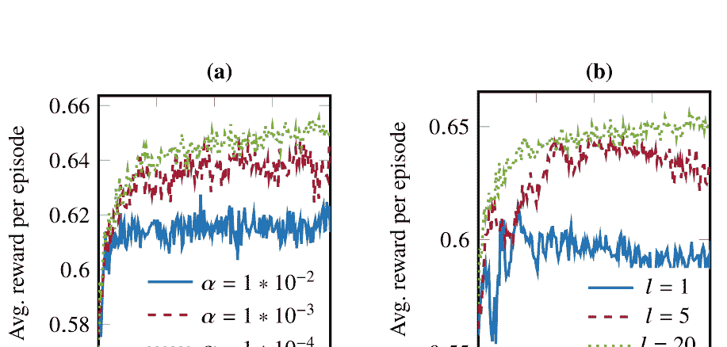

最终，通过改变每层的神经元数量和层数，得到的每个回合平均奖励在表2中报告。每个回合平均奖励随着ANN的维度增加而增加，直到达性能极限。增加ANN的维度只会导致训练时间变长，对每个回合平均奖励没有任何积极影响。最佳每个回合平均奖励是由两层组成的ANN架构实现的，每层都由50个神经元组成。此外，最佳结果是使用线性激活函数（即，$f_a(x) = x$）作为输出层的激活函数，使用ReLU激活函数（即，$f_a(x) = \max(0, x)$）作为输入和隐藏层的激活函数。我们实验观察到ReLU的性质可以将任何负参数转换为零，有助于收敛速度和每个回合平均奖励的收敛。

**表2 不同ANN架构的每个回合平均奖励**

| 第一层神经元数量 | 第二层神经元数量 | 第三层神经元数量 | 每个回合平均奖励 |
| :--- | :--- | :--- | :--- |
| 10 | – | – | 0.63 |
| 20 | – | – | 0.64 |
| 20 | 20 | – | 0.64 |
| 50 | – | – | 0.65 |
| 50 | 50 | – | 0.66 |
| 50 | 50 | 50 | 0.65 |
| 100 | – | – | 0.65 |
| 100 | 100 | – | 0.65 |

#### 5.3.3 开/关策略

在本节中，我们分析了DQN代理在3个SBS群集中经历的每日平均SBS开关打开率。特别是，我们分析了开关打开率的经历

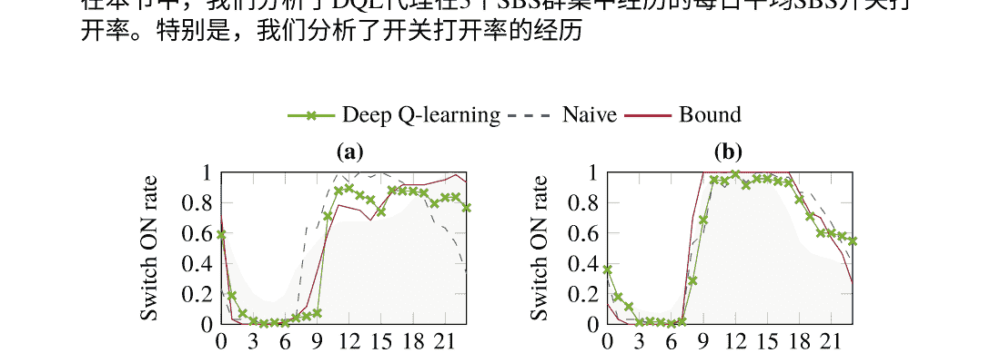

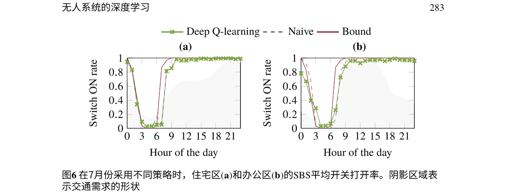

分别在12月和7月的住宅区和办公区的情况如图5和图6所示。这些月份分别代表了能源收集方面的最差和最佳情况。阴影区域表示交通需求的形状。将DQN代理与一种简单的方法进行比较，该方法在SBS的电池电量低于阈值 $B_{\text{th}}$ 时关闭它们，在电量高于阈值时打开它们。使用基于DP的离线优化和对环境变量的先验知识[37]进行性能边界的优化也在图中作为参考报告。具体而言，问题被表示为一个图，并被陈述为最短路径搜索。使用标签修正方法来探索图并找到最佳的开/关策略。我们将此策略称为 Bound policy。

一般来说，该政策的工作方式是在夜间节约能源，当交通量较低时提供服务。夜间关闭时间的长短取决于能源的可用性，因此也取决于一年中的季节。特别是在12月，交通区域通常观察到较长的关闭时间。

图5a显示了12月份住宅区的开启率。边界政策在交通高峰期（即下午6点到午夜）的平均开启率为0.94，而上午10点到下午3点的平均开启率为0.75。这意味着边界政策在这些时间段部分关闭SBS以节约提供高峰时段所需的能源。天真政策是在早上足够收集到能源后立即开启SBS。因此，高开启率在上午10点到下午3点之间测量，即与收集过程的高峰相对应。然后，一旦能源储备低于阈值 $B_{\text{th}}$ ，开启率下降，并在交通需求高峰期间达到较低值，导致交通量大幅下降。DQN政策的平均开启率为0.8，在上午10点到下午3点之间。这个值突出了所采用政策遵循边界政策的行为：在白天部分关闭SBS，并在交通需求高峰期间将开启率保持在0.8的平均水平。我们在这里强调边界政策的行为方式

DQN策略遵循边界策略的行为，但由于能量和流量过程的随机性，存在一些差异。

图5b显示了12月份办公区的开关开启率。办公区的流量配置更容易管理，因为流量需求的高峰期与能量到达的高峰期（即中午左右）重合。在所有情况下，SBS在夜间休眠后从上午7点开始开启，并且在所有策略中，从上午10点到下午5点都经历了高开启率（即在流量需求的高峰期）。

最后，图6a、b分别显示了7月份住宅区和办公区的开关开启率。在这两种情况下，边界策略在上午6点后显示出开关开启率的增加，而在天真和DQN代理的情况下，它从上午7点开始增加。

#### 5.3.4 共享能源评估

在本节中，我们分析了DQN代理在每日能量共享方面的行为，包括SBS和MBS之间的能量共享。图7和图8分别报告了12月和7月份MBS使用的平均能量。我们提供了住宅区和办公区的结果。

一般来说，能量在一年中的中午左右共享，在这段时间内的持续时间取决于季节。12月份的能量在上午11点到下午3点之间共享，而7月份的能量在上午10点到下午4点之间共享，这段时间更长，因为夏季SBS收集更多的太阳能。

在所有考虑的情况下，边界策略共享的能量较少。这是因为边界策略最大化了转移到SBS的流量量，从而增加了本地使用的收集能量。这种行为从图5和图6中的高开关开启率得到了确认，并且是由于对能量和流量过程的时间变化的先前知识的存在。

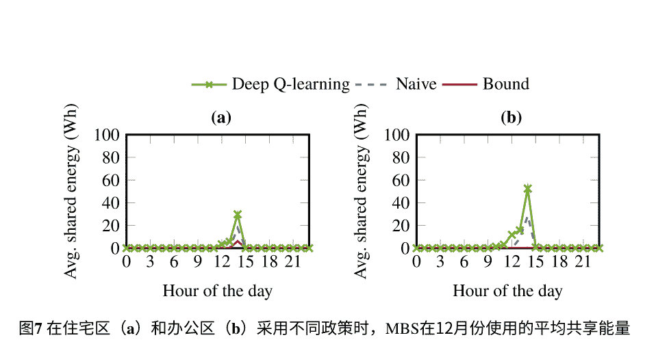相比DQL代理采用的策略，朴素策略共享的能量较少。事实上，朴素策略会保持SBS处于活动状态，只要它们有能量可用。这种策略降低了电池充满的概率，从而减少了多余能量的共享。

DQL代理在12月份的一个工作日中，在住宅区和办公区平均共享39瓦特时和89瓦特时。7月份的数值较高，在住宅区和办公区分别平均共享2.54千瓦时和2.51千瓦时的能量。

#### 5.3.5 网络性能

在本节中，我们分析了所提出的DQL代理在网格能耗和流量下降方面的性能。结果是通过设置具有最佳训练参数配置的算法获得的，如第5.3.2节所讨论的。特别是，我们关注在12月份（即在能量收获方面最差的月份）所实现的性能。

图9和图10展示了在住宅区和办公区考虑不同集群大小时实现的流量下降和网格能耗性能。

图10 在12月份采用天真策略和所提出的学习方法获得的策略时，经历的网格能耗。

分别。特别是，我们考虑了一个场景，每个SBS的区域部署了100个UEs，这样随着集群中部署的SBS数量的线性增加，流量需求也在增加。

图9显示了住宅区和办公区的流量下降情况。对于所有考虑的集群维度，DQL算法导致的流量下降比朴素方法更低。对于住宅区部署的SBS数量超过4个和办公区部署的SBS数量超过6个的情况，这一方面更加明显。在这些情况下，朴素策略导致的流量下降随着SBS数量的增加呈线性增加。我们在这里强调，DQL相对于朴素算法在两种流量配置下都能实现显著的节省，高达90%。

MBS在12月份消耗的电网能量的数量在图10中报告，分别针对住宅区和办公区的流量配置。DQL在所有配置中都能减少电网能量消耗，唯一的例外是住宅区中SBS数量超过4个的集群。这种行为是由于该策略无法提供的大量流量所导致的。

#### 5.3.6 能源节约和成本分析

在本节中，我们对一年内网格能源消耗和五年和十年后不同集群维度下的货币成本进行了分析，这是操作员通过实施所提出的DQL算法可以实现的。它们在表3中报告，考虑到两个不同的交通区域，即住宅区和办公区。请注意，在此分析中，DQL代理的训练版本在一个新环境中实现，该环境的能量到达和交通需求过程的实例与训练阶段使用的实例不同。通过这种方式，我们可以推广代理的行为，并获得尽可能接近实际操作网络中的性能。

将DQL实现的性能与所有基站由电网供电的网络场景进行比较，也称为连接到电网。我们认为-

### 表格 3 能源和成本分析

| 交通 | SBS数量 | 电网能耗（千瓦时） | | | 5年成本（美元） | | | 10年成本（美元） | | |
| :--- | :---: | :---: | :---: | :---: | :---: | :---: | :---: | :---: | :---: | :---: |
| | | **接入电网** | **DQL** | **节省（%）** | **接入电网** | **DQL** | **节省（%）** | **接入电网** | **DQL** | **节省（%）** |
| **住宅** | 2 | 8312 | 5753 | -31 | 8728 | 7735 | -11 | 17,455 | 13,775 | -21 |
| | 4 | 10,580 | 5932 | -44 | 11,109 | 9617 | -13 | 22,218 | 15,845 | -29 |
| | 6 | 12,848 | 6292 | -51 | 13,490 | 11,689 | -13 | 26,981 | 18,295 | -32 |
| | 8 | 15,116 | 6560 | -57 | 15,872 | 13,664 | -14 | 31,744 | 20,552 | -35 |
| | 10 | 17,384 | 7236 | -58 | 18,253 | 16,068 | -12 | 36,506 | 23,666 | -35 |
| **办公室** | 2 | 8301 | 5500 | -34 | 8716 | 7469 | -14 | 17,432 | 13,244 | -24 |
| | 4 | 10,554 | 5512 | -48 | 11,081 | 9617 | -17 | 22,163 | 14,963 | -32 |
| | 6 | 12,806 | 5536 | -57 | 13,447 | 10,895 | -19 | 26,893 | 16,708 | -38 |
| | 8 | 15,059 | 5504 | -63 | 15,812 | 12,555 | -21 | 31,624 | 18,334 | -42 |
| | 10 | 17,312 | 5576 | -68 | 18,178 | 14,325 | -21 | 36,355 | 20,180 | -44 |

此外，太阳能电池板的成本为1.17美元/瓦（包括安装成本），电池的成本为131美元/千瓦时。此外，电网能源的成本为0.21美元/千瓦时。

基于DQL的采集/存储硬件和集中式网络控制使得在交通区域中减少了电网能耗。节省的比例随着网络部署的密度增加而增加（即簇中的SBS数量增加）：在住宅区域比接入电网情况下高出31%至58%，在办公区域高出34%至68%。OPEX相应减少。

在10年后，住宅区和办公区的成本显著降低了35%和44%。

## 6 分布式方法

在本节中，我们介绍了分布式方法的实现。具体而言，我们设计了一种分布式DRL算法（DDRL），其中每个vSBS被建模为一个DRL代理，与其他vSBS代理协调决策。此处的分析基于我们之前的工作[48]。

### 6.1 分布式控制问题定义

如第3节所述，在分布式DRL的实现中，解决的主要问题是在每个决策时刻确保多个代理之间的协调，以避免冲突行为并实现系统整体收益。

在这里，我们提议通过交换特定的本地状态信息来实现代理之间的高度协调。换句话说，我们共享来自其他代理的知识（即它们的一部分本地状态），以减少冲突行为，并最终收敛到具有更高系统整体收益的稳定策略。

这种方法的主要挑战是状态空间维度的指数增长，这可能会减慢学习过程甚至危及其收敛性。表格化的MRL方法，例如QL和模糊QL（FQL），通过将每个状态映射到一个值来工作；因此，每个状态-动作对都需要得到适当的探索。在我们这样具有连续状态变量的问题中，这种映射是通过量化或模糊推理系统来执行的，可能导致状态空间很大。例如，Temsgene等人在[47]中提出的解决方案依赖于广播MBS流量负载，并且具有4个状态变量，分别对应能量、电池、本地和MBS流量负载。以z表示量化级别，Temsgene等人在[47]中的每个代理的状态空间大小为z=4。如果SBSs交换电池状态信息以实现更好的协调，状态的数量将乘以一个因子zN，其中N是系统中SBSs的数量。这意味着状态空间的大小从Temsgene等人在[47]中的625增加到在3个和15个SBSs的情况下分别为78,125到1.9073486e13，对应z=5。这样大的状态空间无法应用表格化的MRL方法。

### 6.2 算法细节

接下来，我们将描述状态、动作和奖励函数，以及DDRL算法的过程。

#### 6.2.1 状态

根据第3节定义的系统模型，第i个vSBS在时间槽t的状态定义为 X_i^t = (h^t, m^t, L_i^t, B^t)，其中 h^t 表示一天中的小时数，m^t 表示月份，L_i^t 表示vSBS的流量负载，B^t 表示所有vSBS的电池状态向量。输入流量负载和电池状态变量的值，即 L_i^t 和 B^t，都相对于它们的最大值进行了归一化。另一方面，对于循环输入的 h^t 和 m^t，应用正弦变换。因此，小时值范围为 [0, 23]，月份范围为 [0, 11]，它们被转换为介于 [-1, 1] 之间的正弦值，并保持了它们的循环特性。这些经过归一化的状态变量是神经网络的输入，用于估计该状态下所有动作的Q值。由于所有vSBS的电池电量水平是状态的一部分，因此神经网络的输入大小为

在深度强化学习中，使用深度神经网络来近似状态-动作对的Q值 [31]。深度强化学习通过Q值估计来处理大规模的状态和动作空间，而无需使用大而不实用的查找表。因此，我们提出了一种分布式深度强化学习（DDRL）算法，用于具有能量收集功能的SBS中的动态功能分割选项的动态控制，其中每个SBS被建模为一个独立的基于深度强化学习的代理，与其他SBS代理协调决策。

与表格型强化学习（MRL）相反，DDRL允许通过本地状态信息交换来协调学习代理的策略，而不需要面对实际上不可行的状态-动作表。

分布式设计确保可扩展性，同时通过避免指数级增长的动作数量来保持控制器的复杂性在合理水平，这需要进行Q值估计。例如，在我们的场景中，每个虚拟SBS有3种可能的操作模式/动作，因此存在3^N种可能的操作模式组合，其中 N 是虚拟SBS的数量，从而导致潜在的不同网络性能，即电网能耗和流量丢失率。因此，集中式方法需要探索所有3^N种可能的动作。这意味着必须估计的Q值数量达到14,348,907，对于15个虚拟SBS。相反，在我们的DDRL实现中，每个虚拟SBS采取自己的动作，并且代理之间的协调通过电池状态信息交换以及全局奖励信号来实现，其中每个虚拟SBS接收相同的系统级反馈。接下来，我们描述DDRL算法的状态、动作和奖励函数。

每个vSBS代理的网络取决于vSBS的数量，并且表示为 $3 + N$，其中 $N$是vSBS代理的数量。

#### 6.2.2 动作

可能的动作集是vSBS的可能操作模式， $A^t$。第 $i$个vSBS的动作集包括关闭、PHY-RF分离模式或MAC-PHY分离模式。因此，整个DDRL解决方案的动作集是每个vSBS的三种操作模式的组合。

#### 6.2.3 奖励

奖励函数确定每个DRL代理在执行特定动作后获得的即时奖励。优化目标是在减少系统丢包率的同时最小化从电网中耗电。因此，奖励函数可以表示为：

$$r_t = 1 - [\omega \cdot \text{E}_\text{m}(A^t) + (1 - \omega) \cdot \text{D}(A^t)]$$

在第3节中定义了 $\text{E}_\text{m}(A^t)$ 在我们的DDRL实现中，每个代理在(24)中接收相同的奖励信号，以实现协调学习。

为了改善DRL算法的收敛行为，我们将使用经验回放技术，使用具有维度 $L$的回放内存 $\mathcal{R} = \{e_1, \dots, e_L\}$，其中存储了代理的先前经验，包括状态、动作、奖励和下一个状态的元组。然后我们从这个经验缓冲区中随机抽样小批量数据，用于训练DRL代理的神经网络。用于估计Q值的神经网络使用随机权重进行初始化，而一个-$\epsilon$-贪婪策略将输入状态映射到动作；其中以概率选择随机动作，即探索，否则选择具有最高Q值的动作，即利用。每个vSBS代理都应用了算法2中的过程。

### ## 算法 2 基于DDRL的控制

```
用维度为$L$的重播记忆 $\mathcal{R}$ 初始化
用随机权重 $\theta_i$初始化动作值函数 $Q_i$
对于每个回合执行以下操作：
    初始化观测 $X_i^t = (h^t, m^t, L_i^t, \mathbf{B}^t)$ - 场景中的观测
    对于每个步骤 $t$, 在回合$i$中执行以下操作：
        作：以概率选择一个随机动作 $A^t$否则 $A^t = \max_A Q_i(X_i^t, A; \theta_i)$ 执行动作 $A^t$, 获得奖励 $r_t$并观察下一个状态 $X_i^{t+1}$
        将转换 $(X_i^t, A_i^t, r_t, X_i^{t+1})$存储在 $D_i$中
        从$D_i$中随机抽取一个小批量 $K$的转换
        从 $D_i$中抽取$(X^j, A^j, r_j, X^{j+1})$
        设置目标值 $y_j = r_j + \gamma \max_{\hat{A}} Q_i(X^{j+1}, \hat{A}; \theta_i)$
        对于$\theta_i$执行梯度下降步骤 $(y_j - Q_i(X^j, A^j; \theta_i))^2$
    结束循环
结束循环
```

### ## 6.3 数值结果

我们首先分析了在离线训练时系统的行为。特别地，我们将一年作为一个时间段，每小时为一个时间粒度，因为这样可以正确地确定用于蜂窝基站的太阳能系统的尺寸。因此，每小时代理选择对应于三种可能操作模式之一的动作，目标是最小化电网能量消耗和流量丢失率的加权和。

#### ### 6.3.1 训练分析

如第6.2.1节所述，每个DRL代理的状态集大小为 $N +3$，其中$N$表示vSBS的数量。在将这些输入馈送到每个vSBS代理的神经网络之前，重要的步骤是归一化和转换，如第6节所述。通过模拟试验和评估，我们选择了一个具有256、128和64个神经元的3层稠密神经网络架构。ReLU激活函数用于隐藏层，而线性激活函数应用于输出层。此外，训练中使用带有动量和学习率衰减的SGD优化器。对于每个DRL代理，我们采用了大小为 $L =2000$的经验回放缓冲区，并选择了大小为32的小批量进行训练。每个具有经验回放的DRL代理的训练过程如算法2所示。假设一个情节持续1年，每小时采取行动，则在一个训练情节中有8640个时间步。在训练过程中，从回放缓冲区中随机抽取小批量的经验进行前向和

| 参数 | 数值 |
| :--- | :--- |
| 学习率（α） | 0.01 |
| 折扣因子（γ） | 0.9 |
| 初始探索（ε） | 0.9 |
| 学习率衰减 | 0.01 |
| 探索衰减 | 0.9 |
| 优化器 | SGD |
| 小批量大小 | 32 |
| 层数 | 3 |

在采取行动之前，每小时进行的反向传播步骤。在小批量通过之后，应用-贪婪策略。在典型的RL应用中，建议从较高的探索水平开始，并随着训练的进行逐渐降低探索率。我们DDRL实现中用于训练的参数总结在表4中。这些超参数是通过模拟试验选择的，并且它们对应于导致DRL代理与所提出的神经网络架构收敛的最佳值。

在住宅和办公区交通配置文件中，vSBS代理的训练过程中的累积奖励显示在图11中。每个DRL代理的训练在45个剧集中进行。如图11所示，具有更多vSBS的场景需要相对较长的训练阶段才能达到稳定性和更高的奖励。此外，随着vSBS数量的增加，达到收敛的最大累积奖励减少。这主要是由于环境的非稳态性，反映了vSBS策略之间的冲突。最后，我们注意到办公室配置文件在训练阶段更快，行为更稳定达到收敛。在办公室场景中，交通和EH现象是同步的相比之下，住宅场景中的交通需求较高出现在晚上。

#### 6.3.2 策略特征

在本节中，我们研究了vSBSs采用的DDRL策略的特征。在DDRL中，每个代理与其他代理协调选择其策略，共同目标是同时最小化电网能耗和丢包率。因此，即使代理的策略可能不同，每个代理获取的奖励信号是相同的，如式（24）所示。这有助于代理共同学习自己的策略，朝着实现系统整体目标的方向发展。此外，这里还展示了FQL策略进行比较。FQL控制器的设计和训练过程在Temesgene等人的论文[47]中描述。重要的是要注意，FQL控制器的状态空间包括vSBS的电池。

图11 累积奖励与vSBS数量的关系：a住宅，b办公室流量配置文件。

水平，能量到达和vSBS和MBS的流量负载水平。因此，FQL中的代理只通过MBS的流量负载进行协调，他们不知道其他vSBS的电池状态。对于3个vSBS的情况，DDRL和FQL解决方案与基于DP [49]的离线解决方案进行比较，在图中标为离线。由于离线模型的计算复杂性，我们无法展示更多vSBS的比较。

离线、FQL和DDRL控制器在住宅区域3个vSBS的平均每小时冬季和夏季日策略分别显示在图12和图13中。我们选择12月作为冬季，即最差的能量收集情况，选择8月作为夏季，即最好的能量收集情况，并对每个月观察到的策略进行平均每小时以表示平均冬季和夏季的日行为。可以观察到DDRL更好地逼近离线策略，即选择三种操作模式的比例。例如，FQL、DDRL和离线策略的平均冬季MAC-PHY选择比例分别为56%、61%和67%，而在夏季，这些比例分别增加到65%、78%和87%。有趣的是从图13中可以观察到，离线策略在8月份没有PHY-RF选择，这要归功于更高的能量生成，并且表明在vSBS处本地处理大部分BB功能的好处。另一方面，DDRL和FQL在夏季分别导致8%和17%的PHY-RF选择。

通过DDRL获得的住宅区冬季和夏季政策的平均值，具有更高数量的vSBSs，如表5所示。从表5可以看出，在夏季相对于冬季政策中，MAC-PHY选择率增加，PHY-RF选择率相对减少，而关闭率在冬季更高。这表明DDRL政策对更高的能源生成进行了调整，即选择MAC-PHY策略，以便vSBSs在本地执行大部分BB过程，从而节省更多的电网能量。平均而言，夏季政策的MAC-PHY选择率比冬季日政策高20.37%，关闭率低18.82%。

DDRL和FQL在住宅区12个vSBSs的网络设置下获得的每日政策示例（即无平均值）分别显示在图14和图15中。这些图表显示，使用DDRL和FQL，每个vSBS学习到不同的政策，其特征是三种操作模式（PHY-RF、MAC-PHY和关闭）的不同选择率。此外，我们可以看到DDRL和FQL学习到的政策不同。例如，对于12个vSBS的情景，DDRL和FQL的冬季政策的MAC-PHY选择率分别为41%和32%。而在夏季，DDRL和FQL的MAC-PHY选择率分别增加到58%和49%。DDRL的较高MAC-PHY选择率伴随着相对较低的PHY-RF选择率。这表明DDRL政策根据季节性能源输入具有更好的灵活性。

通过选择更多的PHY-RF模式，FQL导致vSBS的能源政策不那么激进，从而更多地依赖于MBS进行BB处理，这导致了更高的电网能耗（如第6.3.3节所示）。这是因为FQL控制器仅依赖于标准化的MBS流量负载信息进行协调，而不依赖于电池状态，因此鼓励保持开启以减轻MBS的负载并选择PHY-RF模式，这是具有较低能耗的操作模式。

此外，从图14和图15所示的策略特征来看，DDRL策略倾向于具有更稳定的行为，即vSBS更喜欢在一个操作模式下停留更长的时间，而不是FQL代理。为了更好地说明这种行为，我们在图16和图17中分别展示了冬季和夏季月份的FQL和DDRL的平均日策略，场景中有12个vSBS。这些行为是通过对12月每天观察到的vSBS策略进行平均计算得出的。

## 图12 3个虚拟小基站的平均冬季策略： a 离线 b FQL c DDRL

## 图13 3个虚拟小基站的平均夏季策略： a 离线 b FQL c DDRL

表5 住宅区平均策略特征

| 虚拟小基站数量 | 冬季 离线(%) | 冬季 物理射频(%) | 冬季 介质访问控制-物理射频(%) | 夏季 离线(%) | 夏季 物理射频(%) | 夏季 介质访问控制-物理射频(%) |
| :--- | :---: | :---: | :---: | :---: | :---: | :---: |
| 3 | 20.8 | 18.1 | 61.1 | 13.9 | 8.3 | 77.8 |
| 5 | 32.7 | 23.0 | 44.3 | 15.7 | 17.5 | 66.8 |
| 7 | 33.9 | 26.9 | 39.2 | 15.2 | 28.0 | 56.8 |
| 10 | 33.6 | 24.7 | 41.7 | 16.4 | 21.5 | 62.1 |
| 12 | 38.4 | 20.3 | 41.3 | 18.1 | 23.9 | 58.0 |
| 15 | 36.7 | 26.2 | 37.1 | 17.6 | 25.1 | 57.3 |

图14 12个虚拟小基站的典型冬季策略：a DDRL b FQL

如图16和17所示，DDRL策略在某些时间段内表现出类似的行为，而FQL策略在一天内的变化相对较大。DDRL策略的相对稳定性有利于限制SDN/NFV框架中移动虚拟网络功能的开销，并减少部署基础设施中操作模式更改的频率。

#### 6.3.3 网络性能

在本节中，我们将评估DDRL控制器在年度网络电网能耗和平均交通丢包率方面的性能。作为比较基准，我们还展示了FQL策略的性能。FQL解决方案依赖于广播归一化的MBS流量负载以进行协调。正如Temesgene等人[47]所示，这种广播导致了3.81 – 9.77%的电网能耗节约，以及相对于没有归一化MBS负载信息的FQL解决方案而言，年度交通丢包率的0.3 – 2.21%的降低。这突显了重要性。

## 无人系统的深度学习

图15具有12个vSBS的典型夏日策略： a DDRL b FQL

图16具有12个vSBS的平均冬日策略： a DDRL b FQL

图17 12个vSBS的平均夏季日策略： a DDRL b FQL

在多智能体场景中，知识交流对协调学习至关重要。在这里，我们通过电池状态的交换来比较DDRL的性能，与通过MBS的流量负载来协调的FQL解决方案进行比较。此外，对于3个vSBS的情况，DDRL和FQL的网络性能与Temesgene等人在[49]中研究的离线边界进行了评估。

表6显示了DDRL和FQL策略与3个vSBS的离线边界的性能比较。在住宅和办公场景中，DDRL和FQL策略的性能接近离线边界，仅增加了1.4 – 2.1%和4.8 – 5.3%的年度电网能耗。DDRL的性能更接近。

表6 与离线边界的比较，用于 3 个虚拟小基站

| 算法 | 电网能耗 (千瓦时) - 住宅 | 电网能耗 (千瓦时) - 办公室 | 平均丢包率 (%) - 住宅 | 平均丢包率 (%) - 办公室 |
| :--- | :--- | :--- | :--- | :--- |
| 离线 | 6775 | 6712 | 0.0 | 0.0 |
| DDRL | 6874 (+1.4%) | 6857 (+2.1%) | 0.0 | 0.0 |
| FQL | 7136 (+5.3%) | 7037 (+4.8%) | 0.0 | 0.0 |

图 18 离线优化、DDRL 和 FQL 策略的累积奖励比较

图 19 DDRL 和 FQL 在住宅配置文件中的网络性能比较: a电网能耗 (千瓦时) b平均丢包率 (%)

离线边界可以通过图 18 中的累积奖励图来确认，可以看到 DDRL 累积了离线策略获得的奖励的 97%，而 FQL 累积了 94%。

在住宅和办公区域中， DDRL 和 FQL 控制器在更多虚拟小基站的情况下，一年运行中的网络电网能耗和流量丢包率比较分别显示在图 19 和图 20 中。结果展示了DDRL相对于FQL控制器获得的更好性能。与FQL相比，DDRL在住宅和办公室场景中分别实现了超过13%和5%的年度电网能耗减少。此外，与FQL相比，DDRL控制导致办公室和住宅场景中的交通丢包率分别减少了2.6%和1.3%。与FQL相比，DDRL的更好性能也可以从相同仿真场景中的累积奖励中看出。图21显示了DDRL和FQL在住宅和办公室区域交通配置文件中获得的最大累积奖励。它显示了DDRL获得的相对较高的累积奖励，这意味着更好的网络性能，即更低的电网能耗和系统丢包率，正如图19和图20所证明的。此外，随着虚拟小基站数量的增加，累积奖励的差距也在增加，这意味着DDRL能够在代理之间实现更好的协调。

图20 DDRL和FQL在办公室场景中的网络性能比较: a电网能耗（千瓦时） b平均丢包率（%）

图21 最大累积奖励: a住宅, b办公室场景

#### 6.3.4 能源节约和成本分析

在表7中，我们将基于强化学习的控制器，即FQL和DDRL，与一种情景进行比较，即所有的vSBSs和MBS都由电网供电，称为Grid-Connected (G-C)。对于5年和10年的运营时间，都估计了资本支出（CAPEX）和运营成本（OPEX）以及运营费用。太阳能电池板和储能设备的成本在第5.3.6节中给出。

如表7所示，无论是FQL控制器还是DDRL控制器都能够实现显著的能源节约，相比于G-C解决方案，FQL和DDRL的能源节约率分别达到了54%和61%。在成本节约方面，FQL在5年和10年的运营期间分别实现了11%和32%的成本降低。对于DDRL控制器，在5年和10年的运营期间，成本节约率分别提高到了17%和39%。此外，DDRL比FQL控制器提供更多的能源和成本减少。这些结果令人鼓舞，因为它们表明利用智能控制的可再生能源来为移动网络供电不仅环保，而且还是成本效益的解决方案。

表7 节能和成本

| vSBS 数量 | 算法 | 能源(kW)消耗(1年) | 成本 ($) |  |  |  |
| :--- | :--- | :--- | :--- | :--- | :--- | :--- |
|  |  |  | CAPEX | OPEX (1年) | 成本 (5年) | 成本 (10年) |
| 3 | G-C | 11,334 | 0 | 2380 | 11,900 | 23,801 |
|  | FQL | 7136 | 2541 | 1498 | 10,033 | 17,526 |
|  | DDRL | 6814 | 2541 | 1430 | 9695 | 16,850 |
| 5 | G-C | 14,051 | 0 | 2950 | 14,753 | 29,507 |
|  | FQL | 8199 | 4235 | 1721 | 12,843 | 21,452 |
|  | DDRL | 7331 | 4235 | 1539 | 11,932 | 19,630 |
| 7 | G-C | 16,769 | 0 | 3521 | 17,607 | 35,214 |
|  | FQL | 8647 | 5929 | 1815 | 15,008 | 24,087 |
|  | DDRL | 8057 | 5929 | 1691 | 14,388 | 22,848 |
| 10 | G-C | 20,845 | 0 | 4377 | 21,887 | 43,774 |
|  | FQL | 9910 | 8470 | 2081 | 18,875 | 29,281 |
|  | DDRL | 8736 | 8470 | 1834 | 17,642 | 26,815 |
| 12 | G-C | 23,562 | 0 | 4948 | 24,740 | 49,480 |
|  | FQL | 10,844 | 10,164 | 2277 | 21,550 | 32,936 |
|  | DDRL | 9404 | 10,164 | 1974 | 20,038 | 29,912 |
| 15 | G-C | 27,638 | 0 | 5803 | 29,019 | 58,039 |
|  | FQL | 12,510 | 12,705 | 2627 | 25,840 | 38,976 |
|  | DDRL | 10,760 | 12,705 | 2259 | 24,003 | 35,301 |

## 7 结论

在本章中，我们提出了DRL作为一种可能的能源感知RAN设置的控制方案，其中在同一地理区域内部署了具有不同比例因子、传输功率、计算能力和覆盖区域的BS的分层蜂窝结构。这些BS的联合形成了一个微网：SBS由分布式能源收集器和存储设备供应，只有MBS连接到电网。能源管理系统负责控制来自可再生能源的间歇性和不稳定的能源预算，同时确保满足用户的流量需求。

已经研究了两种不同的控制方法：集中式和分布式。由于状态/动作空间的规模较大，集中式解决方案具有很高的复杂性。然而，使用DQN使得算法收敛到累积奖励高于其他表格解决方案的水平，后者经常遇到内存问题并陷入困境。通过分布式方法，我们提出了一种不同的解决方案来解决环境复杂性问题，该解决方案基于将问题分解为多个SBS站点上的多个代理之间的问题。在这种情况下，我们还通过本地状态信息广播引入了代理之间的协调，这增加了状态/动作空间的维度。与集中式方法类似，使用DQN使得算法能够收敛到相对于基准表格实现更高的奖励。因此，深度强化学习在解决所考虑的问题方面显示出有希望的结果，无论是系统中断还是节能方面，都优于基准方法。

在第7.1节中，我们总结了主要成就，并强调了每种方法的优点和缺点，以及相应的未解决问题。最后，在第7.2节中，我们开展了进一步的讨论，为未来研究方向铺平道路。

### 7.1 结果和未解决问题总结

#### 7.1.1 集中式实现

在第5节中，我们报告了一个集中式DRL算法的数值结果，该算法能够同时控制微网内的睡眠模式和能量共享。针对我们的场景，提出的DQL算法在节能和系统故障方面表现出更高的性能，并且能够控制比其他最先进的基准测试更密集的SBS场景。还展示了DQL控制器选择的策略与离线计算的最优边界接近。最后，报告的能量和成本分析为运营商在具备能量收集能力的RAN设置的中央控制器中实施我们的DQL算法提供了洞察。

已识别的未解决问题

我们的DQL实现使用基于多层感知器的人工神经网络架构。我们认为需要进一步研究其他神经网络架构，因为它们可能在性能和复杂性方面提供改进。特别是需要研究循环神经网络[28]作为函数逼近器的应用，因为我们的环境变量（即能量到达和流量需求）具有时序特征。

我们参考模型中引入的移动网络的集群化允许扩展集中控制器的复杂性。然而，集群中负载（即SBSs）的增加可能导致大量的动作空间，对学习算法来说难以管理。能够对一组动作进行泛化是处理负载数量增加的场景所必需的。一些最近的文献在大离散动作空间[13]和连续控制[24]的情况下研究了这个问题，考虑了基于演员-评论家方法[45]和DRL的方法。我们相信这些新方法可以使我们提出的集中式架构扩展，以处理更复杂的场景。

#### 7.1.2 分布式实现

在第6节中，我们报告了我们分布式控制方法的性能分析。它管理着由EH供电并配备可充电电池的vSBSs的自适应功能分割，可以在与MBS共同位置的网格连接边缘服务器上机会性地执行。通过交换代理的电池状态信息，实现了多个代理之间的协调学习。我们评估了提出的DDRL控制器的网络性能，以电网能量消耗和流量丢失率为指标，并将结果与离线优化界限和基于表格的MRL控制器进行了比较。结果证实，通过交换电池状态的有限协调可以实现累积奖励接近离线界限，同时需要有限的计算复杂性。使用流量和EH数据的大量数值结果证实，所提出的DDRL策略确保了更高的网络性能，更好地适应了变化的环境，并且相对于基于FQL实现的基准方案具有更高的成本节约。

已识别的未解决问题

获得的节能结果是将解决方案扩展到非常密集的vSBSs（例如，高于15）的良好起点。然而，这里提出的DDRL解决方案在这种情况下可能面临收敛问题，因为环境是非稳态的。与集中式方法相比，DDRL解决方案在计算复杂性较低的情况下扩展得更好（通过避免在动作和状态空间中呈指数增长）。然而，DDRL解决方案也有其局限性，因为状态空间和解决方案取决于vSBSs/agents的数量。此外，优化可以是多目标的，例如最小化电网能耗和延迟同时满足流量需求。因此，将DRL与其他方法结合，例如分层RL [22]，基于策略的RL [43]或多目标RL [52]，可以确保控制器更加稳健和稳定，对超参数的敏感性更小。

### 7.2 未来研究方向

接下来，我们简要描述了我们所确定的开放问题，并可能作为未来基础研究方向的指导。

### 能量共享和替代能量收集系统

在本章中，我们强调了基站之间的能量共享是减少移动网络电网能耗的有效方法。从架构的角度来看，共享能力可以消除在每个小基站站点上都需要太阳能电池板的要求，就像本章中所呈现的场景一样。我们相信在某些场景中（例如，低流量需求的小基站），每个小基站使用一个太阳能电池板可能比使用更少但更大尺寸的太阳能电池板更节能且更具成本效益。因此，可以进行不同数量和尺寸的收集设备的成本和效益分析。此外，收集设备还可以与小基站解耦，并部署在其附近，以利用更大的空间。

此外，异构资源和负载的整合可以通过微网中不同元素之间的合作实现高能量节约。特别是需要研究部署异构可再生能源（例如太阳能电池板和风力涡轮机），因为这种方法预计能够提高微网的自给自足性，从而从不同能源过程之间的低相关性中获益。

另一方面，可以引入不同类型的负载到框架中，由提出的控制器实现进行管理。例如，我们设想基于智能路灯的新兴概念智能街道照明[23, 33]的部署。这些智能路灯将配备存在检测器，以在不需要光照时减少灯的功耗。因此，灯负载的随机过程与移动交通相比，取决于不同的变量（例如可用的自然光，人员存在）。管理新负载需要更复杂的控制器，但它为更高效地利用收集的能量打开了新的可能性。

### 超密集场景的控制方法

预计下一代移动网络将是超密集的，拥有与移动用户一样多的SBSs [27]。由于系统变量的数量很大，对这些密集网络进行自动化和节能的控制是一个非常复杂的问题。

由于场景的复杂性和动态性，在线控制方案的设计变得至关重要。为了达到接近最优性能而不影响服务质量，控制解决方案变得至关重要。在这方面，集中式解决方案可能会因为状态/动作空间较大而变得复杂。相反，多智能体解决方案可能会因为SBSs数量较多而导致非稳态，从而产生冲突行为的概率较高。因此，研究应用新颖的DRL方法非常重要，如第7.1节简要介绍的方法。这些方法可以受到基于策略的DRL方法的启发，可以学习具有随机策略而无需进行值估计。使用循环Q网络也可以有效地捕捉和推广，基于系统动态的演变。

此外，对于超密集场景的分层控制架构的研究是一个有前途的未来研究方向。此外，对于控制算法复杂性和实用性之间的权衡的研究至关重要，以寻找可行的解决方案。这涉及估计控制算法的能量和计算处理要求，并将它们纳入算法性能的评估中。

### 联合能源和服务感知网络管理

动态和灵活的服务部署被认为是5G及其后续网络的关键要求之一。为此，网络切片和MEC被确定为确保快速服务部署时间的推动因素。因此，将能量感知控制方法与网络切片集成以确保切片内部和切片间的效率是至关重要的。

不同的服务将具有不同的要求。例如，移动宽带服务需要高数据速率和低延迟，而机器类型通信需要可靠、低延迟和弹性的通信链路。在这方面，实现虚拟功能在网络基础设施中的能源和服务感知放置是有前途的，并需要进一步研究。此外，网络可以涉及具有本地、边缘和云级部署的多层架构。因此，考虑更多的功能分割选项，并在优化目标中包括服务部署时间和服务特定要求，以设计能够以服务感知和能源高效的方式在本地/边缘/云资源上放置虚拟网络功能的控制器是很重要的。为此，将问题分解为子问题的层次结构的机器学习技术，例如分层强化学习，适用于处理复杂的优化目标。

### 边缘智能

边缘计算被提出将云服务推向终端用户的近距离。计算和信息源之间的接近具有许多好处，例如更低的延迟、能源效率和上下文感知。

另一方面，我们最近在电信领域经历了人工智能的广泛应用，这是由于网络内部交换的数据的高可用性。特别是，网络边缘正在成为大量数据的重要来源，主要是由于智能手机和物联网。因此，将人工智能潜力推向数据源，即网络边缘，催生了所谓的边缘智能范式[11, 54]，旨在利用网络边缘的资源来解锁人工智能的洞察力。

这种范式在资源受限环境中实现智能网络应用的新前沿。因此，对于5G及更高级别的网络，利用边缘智能的有前景的能力来进行网络控制应用非常重要。

边缘智能赋予边缘设备近实时地收集、生成、通信和分析数据的能力。这使得设计具有近实时决策粒度的上下文感知控制解决方案成为可能。正如上面讨论的，计算复杂性是将此处提出的控制方法扩展到超密集场景的主要挑战之一。在我们看来，边缘智能通过使用针对资源受限环境（在网络边缘）量身定制的学习方法，提供了一个扩展本章中提出的能源和服务感知控制算法的平台，通过分散（而不一定是分布式）实现。例如，联邦学习[10]允许通过聚合仅在本地计算的更新来在服务器上训练模型，同时保留在边缘设备上生成的数据。这样可以实现分散实现、减少通信开销以及保护隐私。其他技术包括梯度压缩[25, 46]用于减少通信开销和知识传输学习[44]，适用于边缘设备，因为它大大减少了资源需求。

致谢

本工作得到了欧盟Horizon 2020研究和创新计划下的Marie Skłodowska-Curie资助协议号675891 (SCAVENGE) 以及西班牙MINECO资助协议号TEC2017-88373-R (5G-REFINE) 的资助。

## 参考文献

1.  3GPP (2017) TR 21.866. Study on energy efficiency aspects of 3GPP standards (Release 15).
2.  3GPP (2017) TS 38.801. Study on new radio access technology: Radio access architecture and interfaces (Release 14).
3.  Abbas N, Zhang Y, Taherkordi A, Skeie T (2018) Mobile edge computing: A survey. IEEE Internet of Things Journal 5(1):450–465
4.  Access EUTR (2010) Further advancements for E-UTRA physical layer aspects, 3GPP TS 36.814, V9.0.0, March.
5.  Andrae AS, Edler T (2015) On Global Electricity Usage of Communication Technology: Trends to 2030. MDPI Challenges 6(1):117-157
6.  Auer G, Blume O, Giannini V, Godor I, Imran M, Jading Y, Katranaras E, Olsson M, Sabella D, Skillernmark P et al (2013) EARTH deliverable D2.3: Energy efficiency analysis of the reference systems, areas of improvements and target breakdown. Project deliverable D2.3, www.ict-earth.eu
7.  Bellman R (1957) Dynamic programming. Princeton University Press, Princeton, New Jersey

# 自主变形控制和无人机集群的强化学习

Dan Xu和Gang Chen

摘要 人类可以通过观察和研究鸟类的飞行状态来获得灵感，并期望设计一种能够模拟鸟类飞行的飞行器。 就像鹰的飞行一样，翅膀非常灵活，可以根据鹰在不同自然环境中的需求自由变化。 翅膀可以伸展、扭曲或收缩，以确保飞行中的最佳翼载荷。 在此启发下，各种仿生可变形无人机（UAV）成功问世。 同时，它已成为实现不同飞行环境和作战需求下自主形状优化控制的关键技术。

面对高度对抗性、高度不确定性和高度动态的战场环境，无人机的作战模式逐渐从单一平台作战发展为多平台集群作战。 多个无人机通过互补能力和相互协调进行合作作战，可以扩展无人机的能力，提高整体作战效能。 因此，研究一种高效的自主协同控制智能算法是一个紧迫的问题。 为了真正实现变形无人机集群的自主和协同作战，本章提出使用深度确定性策略梯度（DDPG）算法实现自主变形控制，并采用多智能体深度确定性策略梯度（MADDPG）算法完成集群协同作战。 目标是实现智能集群作战并抢占未来的空中作战主动权。

关键词
- 仿生变形无人机
- 自主变形控制
- 深度确定性策略梯度
- 多智能体系统
- 集群协同控制
- 多智能体深度确定性策略梯度

D. Xu (✉)
西安交通大学陕西省先进飞行器服务环境与控制重点实验室，中国西安710049电子邮件： xudan888@stu.xjtu.edu.cn

G. Chen
西安交通大学机械结构强度与振动国家重点实验室，中国西安710049电子邮件： aa chengang@xjtu.edu.cn

## 术语

- s 当前观测状态
- a 根据状态 s 的策略选择的动作
- s' 动作后的下一个状态
- Q(s, a) Q值函数：在状态 s 选择动作 a 的评论家
- R(s, a) 奖励函数：在状态 s 选择动作 a 的奖励
- P(s'|s, a) 概率函数：选择动作 a 以获得状态 s' 的倾向
- π 强化学习策略
- θ 策略参数
- r 奖励
- J 目标函数
- L 损失函数
- π 强化学习策略
- θ^μ 演员函数分布参数
- θ^Q 评论家函数分布参数
- μ 演员函数分布
- Q 评论家函数分布
- γ 奖励衰减系数
- α 学习率
- τ 目标更新因子
- N_t 随机过程噪声
- N 小批量大小

## 1 引言

随着航空技术、材料科学和人工智能的快速发展，人们在设计飞机时追求更高的机动性和飞行效率，并希望新一代飞机能够在高度动态的环境（高度、马赫数等）中执行各种任务（如起飞和降落、巡航、机动、悬停、攻击等）同时保持最佳性能[1-5]。根据动态飞行环境和不断变化的任务目标，变形飞机可以使用智能材料和智能算法自主完成变形并保持最佳气动外形，因此在国内外得到了蓬勃发展。除了一些公司（如NASA和DARPA）早期进行的相关项目研究外，许多大学也在不同形式上对变形飞机的设计进行了研究[6]，并对实现变形翼型结构、飞行动力学和控制技术的方法进行了大量的理论分析[7-16]。

然而，目前对智能变形飞行器的研究主要集中在智能可变形材料的设计[17]和可变形结构[18-22]上。自主变形控制算法的研究仍然不足。因此，近年来，全球越来越多的大学开始研究关于变形自适应控制的各种智能算法，并在一些简单的抽象模型上进行测试[23]。

为了使新一代飞行器能够在不同任务和飞行条件下完成快速自主变形和气动性能优化，我们利用深度学习（DL）[24, 25]的强感知和泛化特性以及强化学习（RL）[26–29]的强决策能力来研究自主变形的智能控制算法。针对变形过程中结构/气动/控制的高耦合问题，我们使用深度神经网络和强化学习技术设计控制策略。考虑到变形飞行器模型的不确定性以及状态空间和动作空间的连续性，采用基于Actor-Critic网络的基于Deep Deterministic Policy Gradient（DDPG）算法[30]作为无模型算法，应用于变形飞行器的自主形状优化控制。学习框架使用DDPG算法构建，并使用风洞试验和遥控飞行的数据进行训练。在训练过程中，框架参数不断更新和调整，最终通过自主学习获得了变形控制的最优策略。通过模拟进一步确认了使用强化学习实现仿生变形飞行器的自主形状优化控制的可行性。

随着计算机硬件和智能技术的快速发展，无人机集群的智能作战将成为未来战场的主要战斗模式。这要求无人机集群能够以更高效、更智能的方式执行任务。无人机集群作为一个多智能体系统（MAS）[31–34]，与单一智能体系统（SAS）相比，需要考虑其他智能体的行动以及MAS环境对其自身行为策略的影响。因此，传统的单一智能体强化学习（SARL）算法[35–38]已不再适用。为了真正实现无人机集群的自主和协同作战，多智能体强化学习（MARL）算法[39–43]已成为研究热点。考虑到MAS环境的不稳定性和智能体之间的相互作用，基于对DDPG的先前研究，提出了基于Actor-Critic网络和Deep Q网络的多智能体深度确定性策略梯度（MADDPG）算法[44]。该算法采用了集中式训练和分散式执行的框架。在此基础上，我们对算法的学习网络进行了一些改进，使得Q值的计算更加准确。新改进的MADDPG算法可以在预先计划的任务下克服行为决策，并实现集群的完全自主作战模式。这个新算法不仅适用于合作任务，也适用于对抗任务。通过进行两个常规作战任务的仿真测试，进一步验证了新改进的MADDPG算法可以通过自主学习和策略优化使无人机集群实现智能协同控制。

本章的组织结构如下。

第2节主要介绍了自变形变形飞行器的研究现状和发展趋势，以及无人机集群作战的优势和困难。

第3节首先介绍了强化学习（RL）算法。RL算法分为两类：一类是单智能体强化学习（SARL），另一类是多智能体强化学习（MARL）。SARL是从最原始的Q学习算法开始介绍的。由于基于值的强化学习算法的缺点，发展了基于策略梯度的强化学习算法。然后，提出了将基于值的强化学习算法与基于策略的强化学习算法相结合的Actor-Critic（AC）方法。最后，提出了改进的DDPG算法，这是一种用于自主决策控制变形无人机的智能算法。不幸的是，SARL无法有效解决未来无人机集群作战的自主决策和控制问题，因此有必要使用MARL来实现集群协同作战的控制。

从多智能体系统的角度来看，详细介绍了在多智能体强化学习研究中需要考虑的困难和问题。然后，基于DDPG算法的实现原理，针对这些问题提出了MADDPG算法，并将其应用于传统的集群作战任务。最后，详细解释了MADDPG算法的网络架构、实现原理、计算公式和流程。

第4节主要关注自主变形控制问题。首先，介绍了变形无人机的发展需求和研究现状。然后，介绍了DDPG变形控制算法和仿生鸟折叠翼无人机控制模型。详细解释了如何使用DDPG算法与模型进行交互，以及算法设计时的具体参数设置和网络构建。最后，通过仿真实验验证了算法实现无人机自主形状优化控制的可行性。

第5节主要关注无人机集群的合作控制问题。首先，通过分析当前的科技水平和战场需求，确认了集群作战的发展前景和优势。然后，提出了一种可行的多智能体合作控制算法，称为MADDPG，并详细介绍了MADDPG算法的实现流程。最后，通过设置两个常规集群作战任务场景进行仿真实验，进一步验证了算法的可行性。

第6节总结了整章的内容，解释了需要改进和实现的剩余问题。

8. Busoniu L, Babuska R, De Schutter B (2010) 多智能体强化学习：概述。 Springer, 柏林, pp 183–221

9. Busoniu L, Babuska R, Schutter BD (2008) 多智能体强化学习的综合调查。 IEEE Trans Syst Man Cybern Part C (Appl Rev) 38 (2) : 156–172

10. 陈强，郑忠，胡超，王东，刘峰 (2019) 边缘上的多任务数据驱动任务分配迁移学习。在：2019年IEEE第39届国际分布式计算系统（ICDCS）会议，pp 1040–1050

11. 邓斯，赵辉，方伟，尹杰，达斯达尔S，佐马亚AY (2020) 边缘智能：边缘计算和人工智能的汇合。IEEE物联网杂志7（8）：7457–7469

12. Desset C, Debaillie B, Giannini V, Fehske A, Auer G, Holtkamp H, Wajda W, Sabella D, Richter F, Gonzalez MJ等 (2012) LTE基站的灵活动力建模。在：2012年IEEE无线通信和网络会议（WCNC）。 IEEE, 2858–2862

13. Dulac-Arnold G, Evans R, van Hasselt H, Sunehag P, Lillicrap T, Hunt J, Mann T, Weber T, Degris T, Coppin B (2015) 大规模离散动作空间中的深度强化学习。arXiv预印本arXiv:1512.07679

14. ETSI (2017) ES 203 208; 环境工程（EE）；移动网络能效评估（v1.2.1）

15. Fudenberg D, Levine DK (1998) 博弈论学习理论, 第1卷. MIT出版社图书, MIT出版社

16. Han F, Zhao S, Zhang L, Wu J (2016) 异构网络中关闭基站的策略调查,为更环保的5G系统. IEEE Access 4:4959–4973

17. Hassan HAH, Nuaymi L, Pelov A (2013) 蜂窝网络中的可再生能源:一项调查.在:2013 IEEE在线绿色通信会议(OnlineGreenComm),第1–7页

18. Hata M (1980) 陆地移动无线电服务传播损耗经验公式. IEEE Trans Veh Technol 29(3):317–325

19. Heddeghem WV, Lambert S, Lannoo B, Colle D, Pickavet M, Demeester P (2014) 2007年至2012年全球ICT电力消耗趋势。Comput Commun 50:64–76

20. Kabalci Y (2016) 智能计量和智能电网通信综述。Renew Sustain Energy Rev 57:302–318

21. Lara A, Kolasani A, Ramamurthy B (2014) 使用OpenFlow的网络创新综述。IEEE Commun Surv Tutorials 16(1):493–512

22. Le TP, Vien NA, Chung T (2018) 部分可观察马尔可夫决策过程中的深层分层强化学习算法。IEEE Access 6:49089–49102

23. Leccese F, Leonowicz Z (2012) 智能无线街道照明系统。在：2012年第11届环境和电气工程国际会议。IEEE, pp 958–961

24. Lillicrap TP, Hunt JJ, Pritzel A, Heess N, Erez T, Tassa Y, Silver D, Wierstra D (2016) 深度强化学习的连续控制。在：ICLR

25. Lin Y, Han S, Mao H, Wang Y, Dally WJ (2017) 深度梯度压缩：减少分布式训练的通信带宽

26. Lindemark B, Oberg G (2001) 太阳能供电用于无线电基站（RBS）站点应用，包括系统尺寸确定、小区规划和运营。在：第二十三届国际电信能源会议INTELEC 2001，第587-590页

27. López-Pérez D, Ding M, Claussen H, Jafari AH (2015) 迈向1 Gbps/UE的蜂窝系统：理解超密集小区部署。IEEE Commun Surv Tutorials 17(4):2078–2101

28. Marhon SA, Cameron CJF, Kremer SC (2013) 循环神经网络

29. Mezzavilla M, Miozzo M, Rossi M, Baldo N, Zorzi M (2012) 用于LTE网络在ns-3中的仿真的轻量级和准确的链路抽象模型。在：第15届ACM国际会议的论文集，无线和移动系统的建模、分析和仿真，MSWiM'12。ACM, 纽约, 第55-60页

30. Miozzo M, Zordan D, Dini P, Rossi M (2014) SolarStat: 通过随机马尔可夫过程对光伏源进行建模。在：IEEE国际能源会议（ENERGYCON），克罗地亚卡夫塔特，第688-695页

31. Mnih V, Kavukcuoglu K, Silver D, Graves A, Antonoglou I, Wierstra D, Riedmiller M (2013) 使用深度强化学习玩雅达利游戏。 在： NIPS深度学习研讨会

32. Mnih V, Kavukcuoglu K, Silver D, Rusu AA, Veness J, Bellemare MG, Graves A, Riedmiller M, Fidjeland AK, Ostrovski G, Petersen S, Beattie C, Sadik A, Antonoglou I, King H, Kumaran D, Wierstra D, Legg S, Hassabis D (2015) 通过深度强化学习实现人类水平的控制。 自然 518(7540):529-533

33. Müllner R, Riener A (2011) 一种能源高效的行人感知智能路灯系统。 普适计算与通信国际期刊

34. NEC (n.d.) NFV C-RAN用于高效的RAN资源分配。在线白皮书。于2016年3月16日访问

35. NREL，美国国家可再生能源实验室 (n.d.) 可再生能源数据中心。 http://www.nrel.gov/rredc/

36. Park C, Lee J (2020) 移动边缘计算启用的异构网络。IEEE无线通信杂志1

37. Piovesan N, Dini P (2017) 可再生能源供电小型基站的最优直接负荷控制：最短路径方法。互联网技术信件e7-n/a.e7

38. Piovesan N, Dini P (2018) 从太阳能数据中无监督学习表示。在：2018年IEEE第29届个人、室内和移动无线电通信国际研讨会 (PIMRC)，第1-6页

39. Piovesan N, Lopez-Perez D, Miozzo M, Dini P (2020)：可再生能源驱动的小型基站的联合负载控制和能量共享：一种机器学习方法。IEEE Trans Green Commun Networking 1

40. Piovesan N, Miozzo M, Dini P (2020)：深度强化学习中的环境建模：能量收集基站的案例。在：ICASSP 2020-2020 IEEE国际会议论文集 (ICASSP)。IEEE, pp 8996–9000

41. Piovesan N, Temesgene DA, Miozzo M, Dini P (2019)：微网中5G移动网络的联合负载控制和能量共享的自主运行。IEEE Access 7:31140–31150

42. Piro G, Miozzo M, Forte G, Baldo N, Grieco LA, Boggia G, Dini P (2013)：由可再生能源驱动的HetNets：可持续的下一代蜂窝网络。IEEE Internet Comput 17(1):32–39

43. Sewak M (2019) 基于策略的强化学习方法。Springer, 新加坡, pp 127–140

44. Sharma R, Biookaghazadeh S, Li B, Zhao M (2018) 现有的知识转移技术对边缘设备上的深度学习有效吗？在: 2018 IEEE国际边缘计算会议 (EDGE), pp 42–49

45. Sutton RS, Barto AG (1998) 强化学习: 一种介绍。MIT出版社, 剑桥

46. Tang H, Gan S, Zhang C, Zhang T, Liu J (2018) 分散式训练的通信压缩。在: Bengio S, Wallach H, Larochelle H, Grauman K, Cesa-Bianchi N, Garnett R (eds)神经信息处理系统31的进展。Curran Associates Inc., pp 7652–7662

47. Temesgene DA, Miozzo M, Dini P (2019) 动态控制能量收集虚拟小型蜂窝的功能分割:一种分布式强化学习方法。计算机通信148:48–61

48. Temesgene DA, Miozzo M, Gunduz D, Dini P (2020) 分布式深度强化学习用于能量收集虚拟小型基站的功能分割控制。IEEE Trans Sustain Comput 1

49. Temesgene DA, Piovesan N, Miozzo M, Dini P (2018) 能量收集虚拟小型基站的基带功能的最佳放置。在：2018年IEEE第88届车载技术会议 (VTC-Fall)，第1-6页

50. Ton DT, Smith MA (2012) 美国能源部的微电网计划。电子杂志25 (8) : 84-94

51. Trinh HD, Bui N, Widmer J, Giupponi L, Dini P (2017) 使用真实跟踪数据分析和建模移动通信流量。在：2017年IEEE第28届年度个人、室内和移动无线电通信研讨会 (PIMRC)。IEEE，第1-6页

52. Van Moffaert K, Nowé A (2014) 使用帕累托支配策略集的多目标强化学习。 J Mach Learn Res 15(1):3483–3512

53. Xu F, Li Y, Wang H, Zhang P, Jin D (2017) 理解城市环境中大规模蜂窝塔的移动流量模式。 IEEE/ACM Trans Networking 25(2):1147–1161

54. Zhou Z, Chen X, Li E, Zeng L, Luo K, Zhang J (2019) 边缘智能：用边缘计算铺设人工智能的最后一英里。 Proc IEEE 107(8):1738–1762

55. Zordan D, Miozzo M, Dini P, Rossi M (2015) 当电信网络遇上能源网格：具有能量收集和交易能力的蜂窝网络。 IEEE Commun Mag 53(6):117–123

## 2 相关工作

### 2.1 变形无人机的发展现状

人们早就意识到鸟类可以根据环境变化灵活调整姿态，以高效地进行滑翔、悬停和攻击操作[45]。但由于航空航天材料、系统硬件和控制算法的发展限制，目前使用的飞行器基本上是传统布局的飞行器。这些传统飞行器只能保持固定形状，因此它们的优势只体现在特定的飞行任务和某些特定的飞行条件中。当飞行环境发生变化时，传统飞行器的性能会下降。近年来，随着智能技术的快速发展，包括材料、传感器、执行器及其相关的硬件和微电子学[46, 47]，飞机设计中对高机动性和高飞行效率的追求不断增加。飞机在复杂的战斗环境中实现多目标和多任务的能力也必须不断提高。这反过来使得对智能变形飞机的研究变得像鸟类一样高效和灵活成为学术界和工程界的热点[1]。

通过新智能材料、执行器、传感器和智能控制系统的综合应用，智能变形飞机可以在飞行过程中连续自主地改变零件或整个机身的形状，以适应不同的飞行环境，完成各种任务，并保持最佳的空气动力性能[2-5]。这种具有飞行适应能力的新概念飞机的研究被认为是未来航空航天工业最具颠覆性和变革性的战略发展方向之一。与目前使用的传统飞机相比，智能变形飞机具有更多的优势和潜力。首先，智能变形可以在执行起飞、降落、巡航、机动、侦察和地面攻击等各种机动中保持最佳的空气动力性能。其次，智能变形技术可以有效解决超音速飞行时的空气动力性能在偏离设计状态时急剧恶化的问题。第三，通过变形形成了一种新的方向舵表面设计方法和新的流动控制方法，有效提高了飞机的操纵和控制效率。

此外，微型仿生飞行器的自主变形还可以提高风阻稳定性，并实现低能耗的远程飞行。考虑到智能变形技术的巨大优势和应用潜力，国内外已经进行了大量智能变形设计概念和尝试。这些研究主要涵盖以下领域：任务适应性机翼、主动柔性翼型、主动气动弹性翼型、智能翼型/转子、变形飞行器。除了NASA和DARPA之外，国外许多大学也开始研究和设计不同形式的变形飞行器。对于实现变形翼型结构、飞行动力学和控制技术的方法进行了大量的理论分析。

例如，在变形飞行器的设计中，伊利诺伊大学与北卡罗来纳大学合作，通过模拟鸟羽毛中钩状结构的作用，开发了分段式机翼模型，并通过风洞实验完成了气动效应评估。受快速飞行鸟类的启发，布朗大学工程学院和瑞士洛桑联邦理工学院智能系统实验室共同开发了一种可变形翼型。它可以通过将羽毛向后折叠来改变机翼面积、后掠角和展弦比。这种变形翼型是基于离散的羽毛状元素设计的。

目前，对于智能变形飞机，已经进行了大量关于智能可变形材料[17]和可变形翼型结构的研究。但是，对于智能变形飞机的智能飞行控制方法的研究相对不足。如何使可变形翼型结构成为飞行控制的主要操纵机构，并具有独立决策的能力，根据任务需求完成自主形状优化，一直是一个困难的问题。在智能变形材料和其他关键技术突破之后，变形翼型的形状优化成为一项紧迫的核心技术难题。谷歌DeepMind团队提出的深度强化学习（DRL）策略可以感知环境的变化，通过试错机制与环境进行交互，并通过最大化累积奖励来学习最优策略。DRL算法的可行性已在AlphaGo Zero [49-53]上得到验证。随后，美国和欧盟都开始推动和实施智能变形飞机的飞行示范实验。并专注于DRL智能控制算法的研究和改进[53-58]。目标是在实际环境中实现对变形飞机连续动作和状态的处理，从而完成变形飞机的智能飞行控制。在此基础上，应用Valasek等人提出的强化学习算法[18-20]研究了变形无人机的气动特性和可变形结构，以实现气动外形的最优控制。

此外，Goecks等人[5, 21, 22]通过适当的DRL策略和形状记忆合金实现了气动弯曲的智能控制。

作为无人机的重要机制，自动驾驶系统通常由内环和外环组成。内环主要负责提供稳定性和控制，而外环负责任务级目标，如导航和路径跟踪。对于变形无人机，内环的控制系统包括高度控制和结构变形控制。固定翼飞机的姿态控制已经比多旋翼无人机更复杂，而变形无人机的姿态控制将更加复杂，因为需要考虑结构变形的影响。在本章中，我们对变形无人机的变形结构控制的研究主要体现在舵机的智能控制上。我们希望固定在可变形机翼上的舵机能够根据飞行状态和作战任务的变化自主地提供适当的力量，以分别改变机翼的形状为最佳气动外形。我们还希望改变升力和阻力通过对称变形特性和非对称变形提供飞机的滚转控制 [59]。考虑到动态变化的环境和变形飞机的复杂模型结构，我们计划采用无模型的深度强化学习方法。无模型算法意味着可以实现对机翼自主变形的控制，而无需建立变形飞机的动态模型，从而解决了建立变形飞机模型的难题。深度强化学习算法不仅具有深度学习的强感知能力和泛化特性，还具有强化学习的良好决策能力，因此可以很好地解决定量和连续变形控制问题。

### 2.2 集群作战的优势和困难

考虑到未来高度对抗性、高度不确定性和高度动态的战场环境，单一平台作战模式无法满足任务需求，因此多平台集群作战将成为未来战场的主要作战模式。一方面，未来战场将变得越来越复杂，单一无人机的作战任务能力将受到限制，其生存能力也将不断受到挑战。而多个无人机通过互补能力和相互协调的合作方式，可以扩展单一无人机的任务能力，并提高多无人机系统的整体作战效能。另一方面，未来战场对作战实时性和智能性的要求将越来越高，这就要求无人机集群具备更高效、更智能地执行任务的能力。近年来，随着计算机硬件和智能技术的快速发展，无人机逐渐从简单的遥控和程序控制发展到人机智能融合的交互控制，甚至完全自主控制 [9, 58, 60]。这将使无人机集群更有希望实现自主任务规划和决策控制，并能更快、更高效地执行任务。因此，为了实现未来无人机集群的自主和智能协同作战，智能控制算法的研究和在不同集群作战任务中的应用已成为工程和科学研究的热点之一 [61–65]。

作为相对复杂的机器人控制和管理活动，无人机集群的合作作战需要多种基本技术支持。硬件设备、机载计算机、无线局域网和各种信息测量设备的快速发展已经能够确保无人机之间的快速数据计算和大量信息交换。为了实现智能无人机集群，智能控制算法已成为一个迫切需要研究的项目。从机器学习[66, 67]（ML）到深度学习[24, 25]（DL），再到强化学习[26–29]（RL），不断改进算法的优化使得代理能够更自主地感知和与环境交互，无需人为干预和先验知识。

无人机集群是一个多智能体系统，需要考虑其他智能体的行为对一个智能体的行为策略的影响以及多智能体系统的环境。传统的SARL方法，如Q-Learning [35, 36]和PG [37, 52]，已不再适用。单个智能体会受到多智能体系统中其他智能体的影响，导致状态转换的差异，这使得经验回放方法在DQN算法 [38, 49]中不再适用。智能体数量的增加和多智能体系统环境的持续变化将进一步增加PG算法中原本存在的学习方差。因此，我们提出使用MARL算法来实现无人机集群的协同控制技术研究。对无人机集群智能协同控制的研究主要是利用MARL算法构建多智能体学习网络。

考虑到环境的不稳定性和MAS中代理之间的相互作用，我们计划采用MADDPG算法[44]，该算法不需要了解环境的动态模型，也不需要特殊的通信条件来协同控制无人机集群，并在MADDPG算法的基础上进行一些改进，以提高学习效率。

## 3 强化学习算法

### 3.1 单智能体强化学习算法

单智能体强化学习（SARL）算法适用于环境中只有一个智能体的情况。该智能体通过“试错”方法与环境进行交互，并通过自身学习最优策略以最大化自身效用。SARL相对简单，人类已经进行了大量研究并取得了很大进展，包括基于值的强化学习和基于策略梯度的强化学习，以及一些改进的算法。

算法1作为一种基于值的强化学习算法，Q-Learning算法[35, 36]通过计算每个状态和动作对的Q值来指导智能体的行动，并将这些Q值存储在Q表中。Q值是基于贝尔曼方程计算的：

```
$$ Q^*(s, a) = \sum_{s'} P(s'|s, a) \left( R(s, a, s') + \gamma \max_{a'} Q^*(s', a') \right) $$ (1)
```

其中 $P(s'|s, a)$ 是当前状态 $s$ 选择动作 $a$ 后转移到下一个状态 $s'$ 的概率，$R(s, a, s')$ 表示在状态 $s$ 下执行动作 $a$ 得到新状态 $s'$ 的奖励。动作对应的Q值越大，代理人越有可能选择该动作。

Q-Learning通过不断探索和更新Q表来计算最优动作策略。更新过程如公式(2)所示：

```
$$Q(s, a) \leftarrow Q(s, a) + \alpha \left[ R(s, a) + \gamma \max_{a'} Q(s', a') - Q(s, a) \right] \quad (2)$$
```

其中 $\alpha$ 是学习率，$\gamma$ 是奖励衰减系数。$R(s, a) + \gamma \max_{a'} Q(s', a')$ 是实际计算的Q值，方括号中的 $Q(s, a)$ 是估计的Q值。Q学习算法利用实际计算的Q值和估计的Q值之间的差异来更新Q表中的Q值。重复更新过程直到训练停止并获得最佳的Q表。然而，这个算法只适用于状态空间和动作空间相对较小且离散的环境。当状态或动作空间的维度较高时，很难快速找到所需的Q值。而在实际控制模型中，状态空间和动作空间都很大。如果使用Q表记录每个状态对应的所有可能动作的Q值，那么表格会非常大。然后查询最大的Q值将需要很长时间。

算法2 为了解决实际控制模型中状态和动作空间过大无法在Q表中查询的问题，考虑到深度神经网络（DNN）在复杂特征提取方面具有良好效果，提出使用神经网络预测Q值，并通过不断更新神经网络来学习最优动作策略。深度Q网络[49]（DQN）作为最基本的算法，结合了Q学习算法和DNN的优点。DQN算法属于无模型深度强化学习算法，它有三个关键技术改进：首先，算法使用目标网络更新目标Q值以确保参数收敛，其次是使用深度卷积神经网络（CNN）来逼近值函数，第三是使用经验回放来存储采样数据，从而打破了神经网络中随机采样的相关性，提高了更新效率。这种基于值的强化学习算法是根据当前状态计算每个可能动作的Q值，然后根据$\epsilon$贪婪策略选择具有最大Q值的动作。DQN算法在更新神经网络参数时与Q学习算法非常相似。它还利用损失函数来更新参数 $\theta_i$，唯一的区别是添加了目标Q函数。

```
$$L(\theta_i) = \mathbb{E}_{s,a\sim\pi} \left[ \left( R(s', a') + \gamma \max_{a'} Q_{\text{目标}}(s', a'; \theta_{i-1}) - Q_{\text{预测}}(s, a; \theta_i) \right)^2 \right] \quad (3)$$
```

其中，$R(s', a') + \gamma \max_{a'} Q_{\text{目标}}(s', a'; \theta_{i-1})$ 代表真实计算值，$Q_{\text{预测}}(s, a; \theta_i)$ 代表预测值。这个公式看起来很复杂，但实际上它是很容易理解的。它是一个残差模型，类似于最小二乘法，即真实值与预测值之间的差的平方。DQN通过不断更新来学习最优策略，以最小化损失。尽管DQN算法已经能够解决高维状态和动作空间的问题，但这种基于值的强化学习算法仅适用于离散空间，对于高维连续空间的处理能力不足，并且无法解决随机策略的问题。

算法3 如果我们省略中间步骤，直接根据当前状态选择动作，我们可以得到另一种强化学习算法，即基于策略的强化学习算法。策略梯度 [52] (PG) 作为一种经典的基于策略的强化学习算法，可以用来学习连续的行为控制策略。与DQN算法相比，PG算法可以解决高维连续空间和随机策略的问题。在PG学习过程中，每一步计算策略梯度都需要在整个动作空间中进行积分。并且在通过PG算法学习随机策略之后，我们还需要对得到的最优策略概率分布进行采样，以获得动作的具体值。奖励值直接用于增强和削弱选择动作的可能性。对于高奖励的动作，下一次选择它的概率将增加，而对于低奖励的动作，下一次选择它的概率将减弱。主要思想是使用梯度下降 $\nabla_{\theta} J(\theta)$来更新参数$\theta$，以最大化目标函数 $J(\theta)$。

$J(\theta) = V^{\pi_\theta}(s) = E_{\pi_\theta}(\mathbf{r}_1 + \gamma \mathbf{r}_2 + \gamma^2 \mathbf{r}_3 + \cdots | \pi_\theta) \quad (4)$

$\nabla_{\theta} J(\theta) = E_{\pi_\theta}[\nabla_{\theta} \log \pi_\theta(a|s) Q^{\pi_\theta}(s, a)] \quad (5)$

行动空间通常是高维的，因此无疑会导致计算能力的巨大浪费。此外，PG算法得到的策略通常收敛到局部最优而不是全局最优。

算法4 确定性策略梯度[53] (DPG) 算法可以直接在每一步中获得确定的动作值。它不需要模型动力学来学习控制策略，并且可以使用不同的控制策略来探索状态空间，而不是之前学到的一个。因此，DPG算法是一种无模型和离线策略算法。确定性策略相对于随机策略。对于某些动作集，它们可能是连续值或非常高维的离散值，因此动作的空间维度将非常大。如果我们使用随机策略，我们需要研究所有可能动作的概率，如DQN算法，并计算每个可能动作的Q值，计算量将相当大。因此，提出了确定性策略来简化问题。可以通过计算所选动作来直接获得每一步动作的确定值。在某些条件下，我们可以写成目标函数的梯度 $J(\theta)$为：

```
$$\nabla_\theta J(\theta) = E_{s\sim D}[\nabla_\theta \pi_\theta(a|s)\nabla_a Q^\pi(s, a)|_{a=\pi_\theta(s)}] \tag{6}$$
```

由于该定理依赖于 $\nabla_a Q^\pi(s, a)$，因此需要动作空间（以及确定性策略 $\pi_\theta$）应该是连续的。

算法5 当将基于值的强化学习算法与基于策略的强化学习算法相结合时，生成了一种名为**Actor-Critic [54-56]** (AC) 方法的新算法。该算法不仅可以在连续动作空间中选择适当的动作，还可以通过计算每一步的奖励来评估所选择的动作。对于AC算法，模型涉及两个神经网络：演员网络和评论家网络。它们是AC算法中的两个不同的网络。演员网络是一个用于通过空间探索进行动作选择的策略网络，而评论家网络是一个用于评估策略函数的值函数网络。演员策略和评论家策略也是两个不同的策略。

演员策略是一个随机策略，以确保足够的探索，但评论家策略是一个确定性策略，可以通过梯度计算实现累积奖励的最大化。因此，演员网络与PG算法具有相同的功能，负责生成动作并与环境进行交互。它可以在连续动作空间中选择适当的动作，因为采用了策略函数。但是演员基于轮次更新，所以学习效率相对较低。我们可以将值函数算法应用于评论家网络以实现单步更新，例如Q-Learning，这使得AC算法比传统的PG算法更快。算法中采用的值函数负责评估演员的表现并指导演员的下一阶段动作。

每次参数更新都是在连续空间中进行的，并且每次参数更新之前和之后都存在相关性。也就是说，模型的训练数据不再是独立和相同分布的，这导致神经网络只能单方面地看待问题。此外，算法的优缺点取决于评论家的价值判断。评论家很难收敛，当演员更新时，更难收敛。

算法6 为了解决上述问题，提出了一种改进的强化学习算法，称为深度确定性策略梯度（DDPG）[22, 23, 30, 61]。它不仅借鉴了经验回放机制和目标网络的关键技术，还解决了收敛困难的问题。DDPG是DPG的一个变种，采用CNN作为策略函数 $\mu$ 和 $Q^\mu$ 的模拟。我们将 $\mu$ 和 $Q^\mu$ 定义为策略网络和Q网络，然后使用深度学习方法训练这两个网络。

策略网络类似于演员网络，而Q网络与评论家网络具有相同的功能。我们通过最小化损失来更新Q网络（评论家值）：

```
$$L = \frac{1}{N} \sum_{i}\left[r_i + \gamma Q^{\prime}\left(s_{i+1}, \mu^{\prime}\left(s_{i+1} \mid \theta^{\mu^{\prime}}\right) \mid \theta^{Q^{\prime}}\right) - Q\left(s_i, a_i \mid \theta^Q\right)\right]^{2} \tag{7}$$
```

并使用采样梯度来更新演员策略：

$\nabla_{\theta^\mu}\mu|_{s_i} \approx \frac{1}{N} \sum_{i} \nabla_a Q(s, a|\theta^Q)|_{s=s_i, a=\mu(s_i)} \nabla_{\theta^\mu}\mu(s|\theta^\mu)|_{s_i} \quad (8)$

DDPG算法使用目标网络，就像DQN一样，目标网络通过 $\theta^{Q'} \leftarrow \tau\theta^Q + (1 - \tau)\theta^{Q}$和$\theta^{\mu'} \leftarrow \tau\theta^\mu + (1 - \tau)\theta^\mu$进行更新。DDPG算法可以仅使用低维观测学习竞争策略。此外，另一个优点是它可以进行离策略探索。对于连续动作空间，DDPG算法比DQN算法更好，因为收敛速度更快。

### 3.2 多智能体强化学习算法

近年来，强化学习的研究重点已从SARL转向MARL。MARL意味着MAS中的每个智能体通过“试错”方法与环境进行交互，每个智能体都会影响其他智能体和整体环境。智能体之间可能存在复杂的相互作用，利益可能一致、不完全一致或完全相反。智能体之间的关系可能是合作的、竞争的，甚至两者兼而有之。在这种环境条件下，每个智能体学习最优策略以最大化其效用。因此，MARL比SARL要复杂得多。

对于单智能体系统，环境是稳定的。但在MAS中，每个智能体通过与环境的持续交互学习，并根据奖励值改进策略。因此，从每个智能体的角度来看，环境是复杂且动态不稳定的。不稳定的环境不符合传统强化学习算法的收敛条件，因此SARL算法无法处理多智能体问题。在一定程度上，仅通过改变智能体自身的策略是不可能使传统强化学习算法适应动态和不稳定的环境的。相反，这将给学习过程带来更多困难。

为了研究MARL算法，我们需要关注以下问题：

- (1) 维度爆炸。在SARL中，需要将状态值或状态-动作值存储在经验回放缓冲区中。然而，在MARL中，随着代理数量的增加，状态空间变得更大，而连接动作空间（连接动作指的是每个代理当前动作组合而成的MAS当前动作集）呈指数增长。因此，MAS的空间维度非常大，这使得计算复杂且耗时。
- (2) 确定目标奖励的困难。MAS中每个代理的任务可能不同，但它们彼此相互关联并相互影响。

奖励函数的设置将直接影响学习策略的优势和劣势。

### 3. 不稳定性
在MAS中，多个代理同时学习。当任何一个代理的策略发生变化时，所有其他代理的策略也可能发生变化。它将影响算法的收敛性。

### 4. 探索利用
探索不仅应考虑自己对环境的探索，还应探索其他代理的策略变化。每个代理的探索可能会对其他代理的策略产生影响，例如打破其他代理策略的平衡。这将导致算法难以稳定，学习效率降低。

我们认为MAS中任何代理的行为都会影响系统环境和其他代理的动作选择。对于DQN算法，代理自身的状态转换将受到其他代理状态的不同影响，导致经验回放方法不再适用。对于PG算法，环境的变化和代理数量的增加将导致学习方差进一步增加。因此，在熟悉SARL算法，特别是DDPG算法的实现原理后，提出了MADDPG算法。它是一种结合了Actor-Critic网络和DQN算法的MARL算法，可以克服上述四个困难，并具有以下三个特点：

1.  通过学习获得的最优策略只需要局部信息来给出最优动作；
2.  算法的实现不需要了解环境的动态模型，也不需要特殊的通信要求；
3.  不仅适用于合作环境，也适用于竞争环境。

MADDPG算法本质上是一个演员-评论家网络，但在AC算法的基础上进行了一系列改进。这些改进使得MADDPG算法适用于传统强化学习算法无法处理的复杂多智能体场景。MADDPG算法采用了集中式训练和分散式执行的策略[44]。在训练过程中，演员网络和评论家网络使用集中式学习进行训练。演员根据当前状态随机选择一个动作执行，评论家根据动作的反馈计算其Q值。评论家根据估计的Q值和实际Q值进行训练，演员根据评论家的反馈更新策略。在测试过程中，只需要演员完成动作，不再需要评论家的反馈。因此，为了获得更准确的Q值，在训练过程中可以向评论家添加一些额外的信息，例如其他智能体的状态和动作。也就是说，每个智能体评估当前动作的价值不仅基于自身的状态-动作对，还基于其他智能体的行为。集中式训练的概念因此得以体现。

分散执行意味着每个代理在完全训练后，只需要使用本地信息来选择动作，不再需要其他代理的状态和动作。对于存储在经验回放缓冲区中的数据，我们还进行了一些改进，将观察变量从单个代理的状态和动作改变为所有代理的联合状态和动作。

此外，我们还通过使用策略集效果优化方法使每个代理学习多种策略，并使用所有策略的整体效果进行优化改进。这些改进的目标是提高算法的稳定性和鲁棒性。实际上，MADDPG算法本质上也是DPG算法。对于每个代理，需要全局信息的评论网络和需要本地信息的演员网络可以通过训练获得。而且，每个代理都可以拥有自己的奖励函数。因此，MADDPG算法不仅可以用于合作任务，还可以用于对抗任务。

MADDPG算法的结构主要包括两个网络：Q网络和P网络，如图1所示。Q网络的网络结构与DQN算法中的网络一致。唯一的区别是输入数据从单个智能体的状态和动作扩展到多个智能体的状态和动作。然而，P网络的网络结构更复杂，我们将详细描述它。首先，P网络的前半部分是智能体的动作执行网络，相当于演员网络。最终的训练结果也是获得最优动作输出。

P网络的后半部分类似于评论家网络的角色，只是它使用所有智能体的信息作为输入。从图1可以得出结论，这些信息与Q网络的输入参数一致。所有智能体的动作和状态网络。关键是P网络的结构与传统的AC网络结构不同。它将演员和评论家视为一个用于训练的网络，并旨在最大化Q值。

## 4 变形控制

### 4.1 变形控制算法

#### 4.1.1 仿生鸟折叠式无人机模型

受到鸟翅膀折叠机制和羽毛配置的启发，并基于鸟类在低速飞行时展翅和高速飞行时收缩翅膀的能力，我们的团队参考了鸽子的翅膀，开发了一种新型的仿生鸟折叠式无人机。翼展大小也参考了普通鸽子。如图2a-c所示，模型在极限情况下显示了三种变形状态。空气动力剖面的每一侧由最内部的固定部分和最外部的羽毛部分组成。空气动力剖面的最内部部分称为碳纤维骨架，不能变形。而最外部部分则装有八个3D打印的人工羽毛，连接到前缘，可以像鸽子一样展开或折叠成不同的配置。通过旋转前缘相对于碳纤维骨架，可以主动改变空气动力剖面的表面。折叠角度 αfold可以从完全展开状态的0°连续变化到完全折叠状态的50°。

数值模拟表明，这种变形机制不仅可以提高机动性和抗风能力，还可以通过两个翼型的非对称折叠提供滚转控制。

#### 4.1.2 DDPG算法

由于复杂多变的战斗环境和不同的任务需求，变形飞行器的飞行姿态和空气动力学形状也会随时间变化。传统的DQN算法只能给出离散的动作空间，而纯粹的DPG算法无法探索环境。总之，这些经典的智能算法无法提前控制未知的飞行情况，因此它们已经不再适用。我们需要一种智能控制算法，它必须具备实时处理能力，并能应对状态和动作空间的连续性。因此，我们使用DQN算法并改进DPG算法来研究一种新的深度强化学习变形控制算法。基于Actor-Critic框架提出了DDPG算法。这种新算法通过使用神经网络函数逼近器在线学习大的状态和动作空间，并可用于解决深度强化学习变形控制问题。

连续动作空间。 DDPG算法根据代理计算的每个动作的奖励不断优化控制策略，并使后续动作更准确。

然而，对于DDPG算法，仍然存在一些需要改进的缺点。 首先，大多数优化算法假设样本是独立且同分布的。 但是当样本是从顺序探索中生成时，很明显这个假设不再成立。 其次，为了充分利用硬件优化，建议进行采样学习。 在小批量学习中，而不是在线学习。 DDPG算法采用经验回放缓冲区来解决这个问题。 该算法将代理与环境交互获得的状态(s)、动作(a)和奖励(r)等信息存储在一个空的回放缓冲区R中，该缓冲区被创建为有限大小的缓存。 这些信息根据探索策略从环境中采样并存储为一个元组 (s_t, a_t, r_t, s_{t+1})。 在元组中，s_t表示当前时刻的状态，a_t表示根据当前状态 s_t中的策略选择的动作，r_t表示选择动作 a_t的奖励，而 s_{t+1}表示选择动作 a_t后的新状态，即下一个时刻的状态。 当回放缓冲区已满时，最早存储的元组将被挤出缓存。 代理与环境之间的每次交互都被计为一个时间步t。演员和评论家在每个时间步通过从回放缓冲区均匀采样一个小批量进行更新。 因为DDPG是一种离策略的无模型算法，该算法可以从一组不相关的转换中学习，这允许回放缓冲区设置得很大。 最后，网络 Q的更新 (s, a|θ^Q)也用于计算目标值，这使得Q值的更新容易发散。 我们的解决方案是分别创建演员网络和评论家网络的副本来计算目标值，然后使这些目标值慢慢跟踪学习的网络以更新这些目标网络的权重。 DDPG算法通过一定数量的剧集（表示为M）完成足够的探索和训练，并最终学习到最优策略。 一个剧集由给定数量的时间步骤组成进行迭代。 在每个剧集的开始，将一个随机初始化的过程N添加到动作探索中，并将代理给予一个随机的初始状态 s_1作为观察变量。 对于每个时间步骤，从演员网络选择的动作需要添加探索噪声N。 之所以使用带有噪声的动作，是因为带有噪声的动作可以让代理在策略之外探索状态空间，并导致更高的未来奖励。

根据当前策略、探索噪声和接收到的初始观测状态 s_t选择动作。

```
a_t = μ(s_t|θ^μ) + N_t
```

执行动作 a_t，然后观察奖励 r_t和新状态 s_{t+1}。 将转换元组 (s_t, a_t, r_t, s_{t+1}) 存储在重放缓冲区 R 中。 从 R 中随机抽取一个大小为 N 的小批量转换 (s_i, a_i, r_i, s_{i+1})来计算损失 L。

```
y_i = r_i + γ Q'(s_{i+1}, μ'(s_{i+1}|θ^{μ'})|θ^{Q'})
$$L = \frac{1}{N} \sum_{i} (y_i - Q(s_i, a_i | \theta^Q))^2$$
```

通过最小化损失来更新评论家，并使用采样梯度更新演员策略。

```
$$\nabla_{\theta^\mu} \mu(s_i | \theta^\mu) \approx \frac{1}{N} \sum_{i} \nabla_a Q(s, a | \theta^Q) \big|_{s=s_i, a=\mu(s_i)} \nabla_{\theta^\mu} \mu(s | \theta^\mu) \big|_{s_i}$$
```

最后，更新目标网络参数：

```
$$\theta^{Q'} \leftarrow \tau \theta^Q + (1 - \tau) \theta^{Q'}$$
$$\theta^{\mu'} \leftarrow \tau \theta^\mu + (1 - \tau) \theta^{\mu'}$$
```

设置迭代计算步骤T来实现多次计算，以便学习、不断优化参数和策略。

#### 4.1.3 算法结构和参数设置

对于我们独立开发的仿生鸟折叠式无人机，强化学习的目标是使机翼两侧的舵机能够提供适当的力量，完成整个飞行包线的机翼结构优化。而机翼结构优化的规则是在大量训练和学习之后，针对一些特定的飞行状态提出经验策略。本质上，它是使用 DDPG 算法实现舵机控制回路。图3显示了 DDPG 算法如何控制仿生鸟折叠式无人机模型。该算法根据当前策略将当前状态映射到最优动作，并根据接收到的奖励计算梯度来更新网络参数。同时，该算法将过去的经验存储在内存缓冲区中。最终，通过持续学习和更新，获得了变形的最优策略，而无需建立机翼的动态模型。

DDPG算法的结构由评论家网络和演员网络组成，如图4所示。评论家网络也被称为值函数网络，用于计算Q值。演员网络也被称为策略函数网络，根据 ε-贪婪策略选择动作。这两个网络架构都由充当隐藏层的神经元组成。关于隐藏层的设置，一般认为增加隐藏层数量会减少网络错误并提高准确性。但这也会使网络变得复杂，导致训练网络所需的时间增加，甚至导致过拟合。因此，在设计神经网络时，隐藏层很少使用超过三层的层数，大多数设置为一到两层。为了实现更高的准确性和更好的训练结果，人们通常选择增加节点数。 每个隐藏层（节点是每层的神经元）而不是增加隐藏层数。在构建神经网络时，为了平衡网络的训练时间和准确性，我们决定使用两个隐藏层进行网络构建，这使得每个隐藏层中的节点数量的选择尤为重要。在确定隐藏层数量的情况下，每层神经元的数量不仅对神经网络的学习效率和准确性有很大影响，而且是训练过程中过拟合的直接原因。然而，目前还没有科学的理论来确定神经元的数量。为了避免训练过程中的过拟合现象，并确保神经网络具有高准确性和泛化能力，确定隐藏层节点数量的最基本原则是在满足准确性要求的前提下尽可能采用紧凑的结构，即尽可能少的隐藏层节点。研究表明，隐藏层节点的数量不仅与输入层和输出层的节点数量有关，还与要解决的问题的复杂性、转换函数的类型和样本数据的特征有关。因此，根据网络结构的复杂性和准确性，应合理增加或减少隐藏层节点的数量。首先，我们参考[22]将第一个隐藏层的节点数设置为400，第二个隐藏层的节点数设置为300。但准确性不够高，导致训练效果不理想。经过多次调整，节点数分别确定为800和500。

图4所示的网络结构显示了每层神经元之间的连接形式，每层中使用的特定激活函数以及网络输出的附加操作。两个网络的每一层都采用全连接的形式，即每个节点与前一层的所有节点相连，以便在计算中考虑从前面提取的特征。激活函数为神经元引入了非线性因素，使得神经网络能够任意逼近任何非线性函数，从而使神经网络能够应用于许多非线性模型。在神经网络中，sigmoid（S）函数、双曲正切（Tanh）函数和修正线性单元（Relu）函数是常用的激活函数。接下来，我们将介绍这三个激活函数。

首先，S函数是一个将一个数映射到范围在 $(-\infty, +\infty)$ 到 $(0,1)$的公式。

$$ g(z) = \frac{1}{1 + e^{-z}} $$

S函数有一些缺点，因此它不经常被用作非线性激活函数。当 z的值非常大或非常小时，S函数的导数将趋近于零。这将导致权重的梯度接近于零，使得梯度更新非常缓慢甚至消失。此外，S函数的输出不以0为平均值，这将给下一层的计算带来不便。

其次，tanh函数将一个数映射到范围在 $(-\infty, +\infty)$ 到 $(-1,1)$的公式是

$$ g(z) = \frac{e^{z} - e^{-z}}{e^{z} + e^{-z}} $$

Tanh函数的均值为0，弥补了S函数均值为0.5的缺点。因此，Tanh函数比S函数更常见。但是仍然存在梯度消失的问题。

Relu函数作为分段线性函数，弥补了S函数和Tanh函数的梯度消失问题。此外，它还具有以下优点：

- (1) 当输入值为正时，不存在梯度消失问题。
- (2) 计算速度更快。Relu函数只有线性关系，所以无论是前向传播还是反向传播，速度都比S函数和Tanh函数快得多。(S函数和Tanh函数需要计算指数，所以计算速度会更慢)

$$ g(z) = \begin{cases} z, & \text{如果 } z > 0 \\ 0, & \text{如果 } z < 0 \end{cases} $$

通过学习和对比，我们选择Relu激活函数作为隐藏层中的激活函数来构建DDPG网络结构。此外，我们在演员网络的输出层应用Tanh激活函数。值得注意的是，我们将从演员网络计算得到的动作添加到评论家网络的第一隐藏层中，以计算更准确的Q值。

DDPG算法的评估基于变形后的最优轮廓与实际轮廓之间的误差计算的奖励以及训练学习算法达到最优变形所需的迭代次数。此外，奖励函数的设置将影响完成变形优化训练所需的时间。影响DDPG算法性能的其他重要因素是超参数，如步数(T)、剧集数(M)、演员学习率(LR_A)、评论家学习率(LR_C)、以及折扣因子 (γ)，等等。参考文献[22]和[23]，在我们设计的DDPG算法结构中，我们将超参数设置如下，并对其进行定义。每一集定义了探索和训练的次数。我们将最大集数定义为200。前100集添加了随机因素进行探索，而剩下的100集则删除了随机因素进行训练和学习最优策略。步数定义了迭代次数，每一集中的最大步数设定为500。演员和评论家的学习率定义了在执行网络参数优化时的梯度更新步长。通过多次尝试，我们确定了演员和评论家的学习率分别为0.0001和0.001。内存缓冲区的大小指的是可以存储的经验数据量，我们将其设置为100,000。而小批量则表示每次梯度更新计算所使用的最小经验数据集，我们将其确定为64。这些经验数据包括当前状态、采取的动作以及与代理和环境之间的交互中观察到的相应奖励和下一个状态。由于初始动作不一定导致期望的状态，未来奖励的权重需要逐渐减小。因此，在学习过程中，我们使用折扣因子来计算未来预期回报，并调整未来奖励的影响。折扣因子的取值范围在零和一之间，通常选择为0.99。

### 4.2 模拟实验

#### 4.2.1 对称变形的模拟测试

根据我们设计的仿生鸟折叠式无人机模型，编制了环境文档，并展示了简化的变形飞机模型，如图5所示。DDPG算法可用的状态包括折叠角度 (α_fold)、飞行速度 (v) 和飞行高度 (h) 的变形飞机。我们初始化了状态变量 \( \alpha_{fold} \) 可以在范围(0, 5°)内的任意值，速度变量 \( v \) 可以在范围(0, 0.01)内的任意值，高度变量 \( h \) 可以在范围(0, 5)内的任意值。 不同的飞行状态(\( v, h \))决定了不同的最优气动剖面，这些剖面以最优折叠角度(\( \alpha_{fold}^* \))的形式描述。在DDPG算法开始时，随机选择动作使得气动剖面变形并计算奖励。然后，根据奖励值越高，策略越好的原则，通过计算累积奖励来更新学习策略到最优。最后根据学习到的最优策略选择动作，完成最优折叠角度。

奖励函数与实际折叠角度与最优折叠角度之间的差异有关，如公式（18）所示。

$$ r = \begin{cases} -(\alpha_{fold} - \alpha_{fold}^*)^2, & \text{如果 } 0^\circ < \alpha_{fold} < 50^\circ \\ -(\pi/180 * 50)^2, & \text{否则} \end{cases} \quad\quad (18) $$

在仿真现实现的第一阶段，我们测试了变形飞机模型的平衡飞行状态。实际上，根据不同的飞行条件，使两侧的变形翼型对称折叠，以实现加速、减速、爬升和下降。为了测试DDPG算法的可行性，我们定义了飞行速度和飞行高度等不同飞行条件下的最优折叠角度。使用不同飞行状态下定义的最优折叠角度作为学习指标和唯一参考标准，通过DDPG算法，变形无人机实现了在不同飞行环境下翼型的自主变形控制。经过与环境的互动学习和自我训练，模型可以获得最优策略并完成后续的自主形状优化。最优折叠角度的设置可以参见表1。

每个回合的累积奖励值和最优折叠角度与实际折叠角度之间的对比如图6所示。

关于对称变形的模拟结果如图6a、b所示，表明DDPG算法在前30个回合内完成了探索。图6c放大了最优折叠角度 \( \alpha^* \) 与实际折叠角度 \( \alpha_{fold} \) 之间的误差。在完成30个回合后，误差较大的原因是在前100个回合中添加了随机噪声，但在完成200个回合的学习后，误差可以保持在小于3°。

考虑到变形不仅是改变升阻比的对称变形，还包括实现转弯的非对称变形。因此，仅使用一个Actor-Critic网络训练两个翼型是不够的。为了验证准确性，表1展示了不同飞行状态下两个机翼的最佳折叠角度。

表1 不同飞行状态下两个机翼的最佳折叠角度

| 高度/米 | 速度/千米/秒 | 0-0.01 | 0.01-0.02 | 0.02-0.03 |
| :--- | :--- | :--- | :--- | :--- |
| 0-20 |  | 0° | 20° | 40° |
| 20-50 |  | 10° | 30° | 50° |# 图6 对称变形的仿真结果

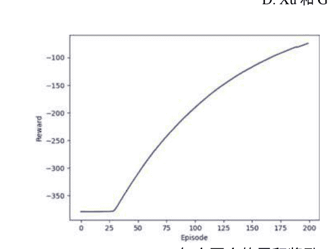

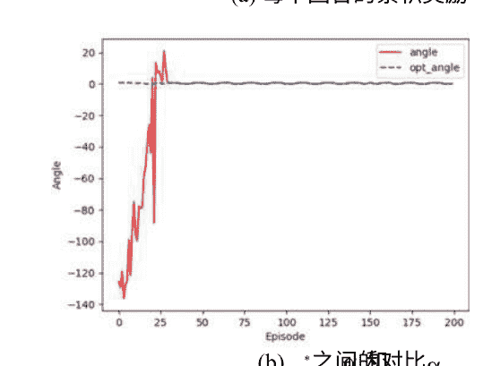

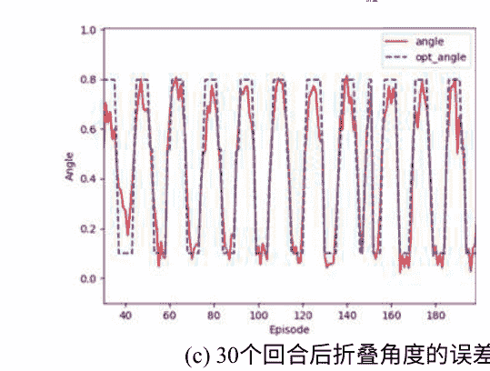

为了自主变形控制机翼的DDPG算法，我们同时使用两个相同的Actor-Critic网络分别训练左右机翼。首先，测试机翼的对称折叠。仿真结果如图7所示。

新的结果显示，DDPG算法需要13个回合完成探索，并且在完成200个回合后，折叠角度误差仍然保持在3°以下。

# 图7 两个AC网络中对称变形的仿真结果

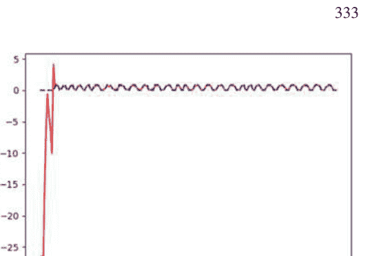

(a) 左翼型的角度对比

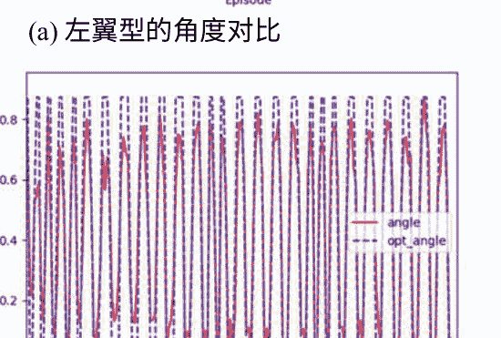

(b) 13个周期后的误差放大

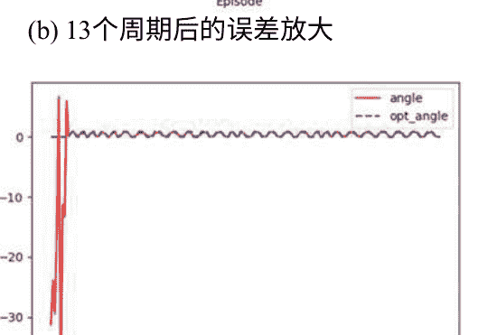

(c) 右翼型的角度对比

# 图7 (续)

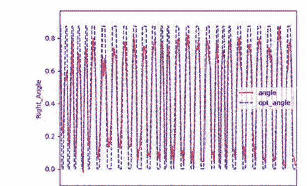

(d) 13个周期后的误差放大

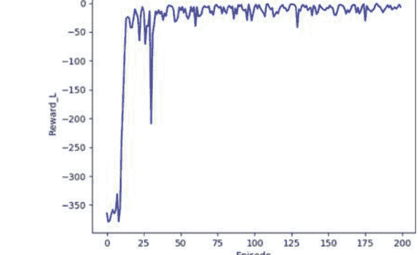

(e) 左翼型的累积奖励

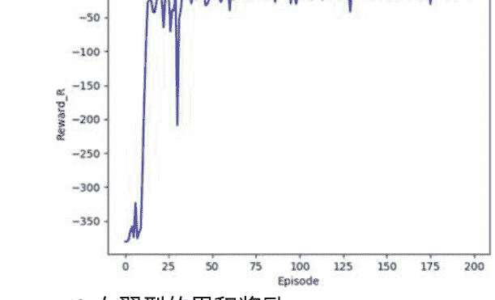

(f) 右翼型的累积奖励

周期的学习。整个学习过程收敛更快，并能快速跟踪折叠角度的变化趋势以进行修正。因此，使用DDPG算法实现自动形状优化是可行的。

#### 4.2.2 非对称变形的仿真测试

接下来，测试翼型的非对称变形。非对称变形也称为差分变形。通过使两侧的变形翼型折叠不同的角度来实现滚动和转向。与对称变形不同的是，我们同时使用两个相同的Actor-Critic网络分别训练两个不同的翼型，并设置一个额外的信号来指示是否需要转向。因此，我们将转向信号添加到原始状态变量中，得到一个新的状态变量（αfold, v, h, 信号）。根据不同的速度、不同的高度和转向信号，我们分别为两个翼型定义了最佳折叠角度，如表2和表3所示。其中，转向信号为1表示向右转，0表示不转，-1表示向左转。我们将信号设置为从第20到第30个周期为-1，从第100到第120个周期为1。在其他周期中，我们将信号设置为0，以实现翼型的对称变形。

### 表2 不同飞行状态下左翼气动力学优化折叠角

| 转向信号 | 高度/米 | 速度(0-0.01) | 速度(0.01-0.02) | 速度(0.02-0.03) |
|----------|----------|---------------|------------------|------------------|
| 1 | 0-20 | 5° | 20° | 40° |
| 1 | 20-50 | 10° | 30° | 50° |
| 0 | 0-20 | 0° | 20° | 40° |
| 0 | 20-50 | 10° | 30° | 50° |
| -1 | 0-20 | 0° | 10° | 20° |
| -1 | 20-50 | 5° | 15° | 25° |

### 表3 不同飞行状态下右翼气动力学优化折叠角

| 转向信号 | 高度/米 | 速度(0-0.01) | 速度(0.01-0.02) | 速度(0.02-0.03) |
|----------|----------|---------------|------------------|------------------|
| 1 | 0-20 | 0° | 10° | 20° |
| 1 | 20-50 | 5° | 15° | 25° |
| 0 | 0-20 | 0° | 20° | 40° |
| 0 | 20-50 | 10° | 30° | 50° |
| -1 | 0-20 | 5° | 20° | 40° |
| -1 | 20-50 | 10° | 30° | 50° |

# 图8 非对称变形的仿真结果

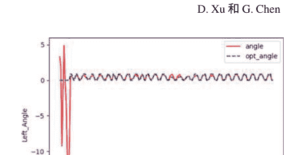

(a) 左翼型的角度对比

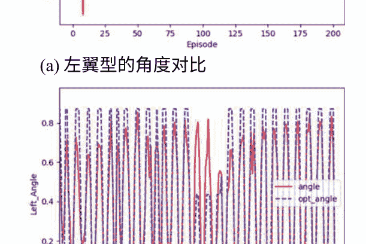

(b) 13个周期后的误差放大

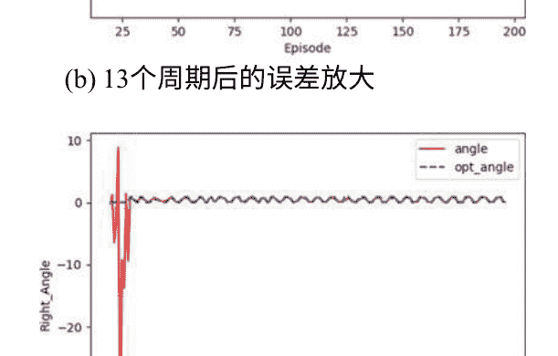

(c) 右翼型的角度对比

# 图8（续）

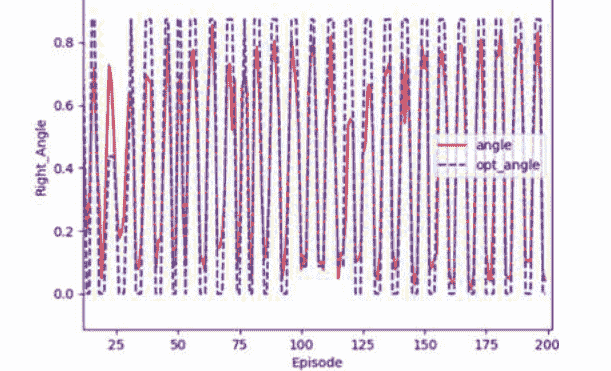

(d) 13个周期后的误差放大

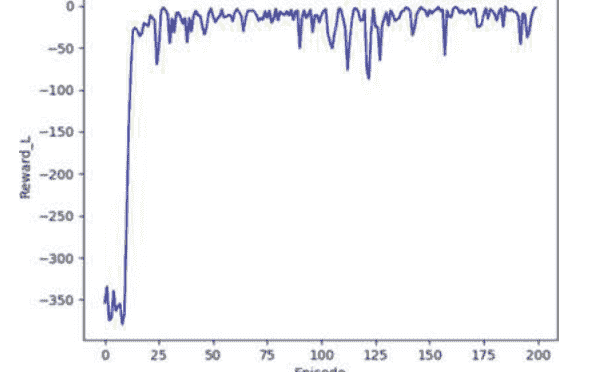

(e) 左翼型的累积奖励

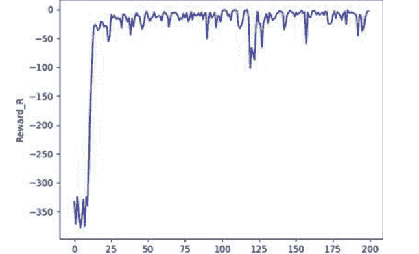

(f) 右翼型的累积奖励

对于两个翼型，我们分别使用DDPG算法进行交互式学习。图8显示了两个翼型的最优折叠角和实际折叠角之间的对比，以及每个回合的累积奖励。

仿真结果分别显示了左翼和右翼的折叠角对比以及累积奖励的变化。图8 a和c显示了左翼和右翼的折叠角对比，表明DDPG算法在前13个回合内完成了探索。为了更清楚地看到折叠角误差，我们在13个回合后放大了折叠角对比，如图8b和d所示。探索期后，误差逐渐减小，并最终保持在小于3°。尽管在策略学习阶段角度误差较大，但角度变化趋势仍紧密跟随最优角度曲线。

从两个翼型的角度对比可以看出，DDPG算法可以学习到跟踪最优角度的最优策略。

### 4.3 讨论

本节针对智能变形飞机的自主形状优化问题进行了讨论，根据任务需求和飞行状态。在对许多不同的深度强化学习算法进行研究后，结合深度Q网络和确定性策略梯度算法，在Actor-Critic框架的基础上，使用深度神经网络替代传统的演员和评论家函数结构，构建了一种新的深度确定性策略梯度算法结构。通过训练和学习，变形飞机具有自主优化形状的能力，并进一步将人工智能方法扩展到飞机策略优化领域。仿真结果表明，深度确定性策略梯度算法可以很好地实现对智能变形飞机舵机环的自主控制。

在这个前提下，我们计划沿着以下三个主要方向开展我们的未来工作。一方面，由于实际飞行环境受到风速和可变载荷等动态特性的影响，我们计划研究和利用强化学习适应和学习动态环境的真正能力。

另一方面，我们打算将训练好的智能体转移到由我们团队设计和制造的真实仿生鸟折叠式无人机上，以评估实际性能。此外，为了实现智能变形飞行器在自动驾驶系统中的“内环”，即根据预定轨迹进行自主优化飞行，除了研究舵机环的控制外，在舵机控制翼型完成结构优化变形后，必须研究姿态控制环以实现稳定飞行。

## 5 无人机集群的协同控制

### 5.1 多智能体的协同控制算法

#### 5.1.1 改进的MADDPG算法

基于MADDPG算法的研究，我们尝试对算法网络进行一些新的改进。新改进的算法网络可以通过自主学习和最优策略选择，高效地完成无人机集群的常规作战任务，并且集群协调能力也得到了极大的提升。区域侦察和围捕对抗作为两个常规作战任务，可以用来测试改进的MADDPG算法中网络结构的优缺点。在参考文献[44]中，传统的网络结构对于每个网络都采用相同的MLP模型。

它是一个两层神经网络，具有相同的激活函数和每层神经元的数量。但是在计算Q值时，该模型没有添加动作变量，因此我们通过在评论家网络的第一个隐藏层中添加动作值来改进P网络的构建。通过考虑动作值和状态值，可以获得更精确的Q值，最终可以得到更优化的策略。

当我们编译算法网络时，我们分别设计了Q网络和P网络。其中，用于计算的Q函数和P函数的结构与Actor-Critic网络的结构类似。网络的详细结构可以参考图9。新的网络结构采用了两层网络结构。每一层都采用全连接形式，每一层的节点数设置为128。隐藏层使用Relu激活函数，输出层的动作使用Tanh函数。在计算最终的Q值时，我们将其他动作和来自演员网络的计算动作添加到第一隐藏层中。这可以使计算得到的Q值更准确。这也是与参考文献[44]中使用的算法的区别。从图1和图9可以清楚地看到集中训练与分散执行的策略。在计算动作时，MADDPG采用分散执行的策略，根据当前状态为一个代理计算优化动作。在计算时

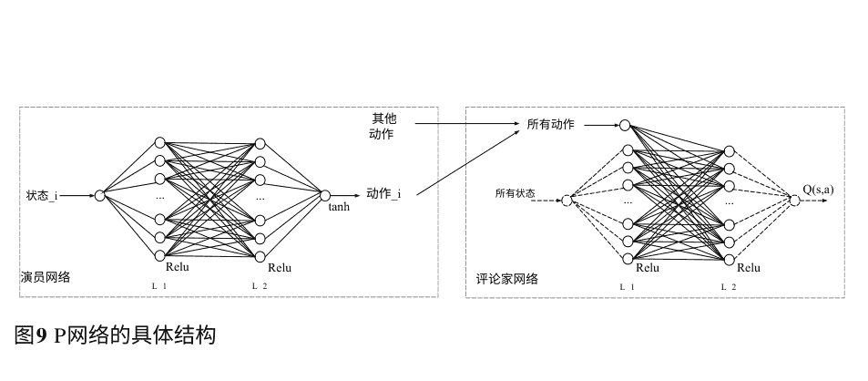

图9 P网络的具体结构

Q值，MADDPG使用集中式训练策略来考虑所有代理的状态和动作来获取评论家的值。

改进的MADDPG算法的具体步骤可以参考以下内容。

设置多个训练周期。在每个周期中，首先初始化一个用于动作探索的随机过程N。然后根据初始观察值 o_i 和当前策略选择每个代理 i (i = 1, ..., N) 的动作 a_i。

```
a_i = μ_θ_i(o_i) + N_t \quad (19)
```

然后执行动作 a = (a_1, ..., a_N) 并观察奖励 r 和新状态 s'。存储转换 (s, a, r, s') 在 R 中，并使用新的状态 s' 来替换原始状态观察 s。对于每个代理，随机抽取一个小批量的转换 s^j, a^j, r^j, s'^j 从 R 中计算损失 L。

```
y^j = r_i^j + γ Q_i^{μ'} (s'^j, a_1', ..., a_N') |_{a_k' = μ_k'(o_k^j)} \quad (20)
```

```
L(θ_i) = \frac{1}{S} \sum_j \left( y^j - Q_i^μ (s^j, a_1^j, ..., a_N^j) \right)^2 \quad (21)
```

通过最小化损失来更新评论家，并使用采样的梯度来更新演员策略

```
∇_{θ_i} J ≈ \frac{1}{S} \sum_j ∇_{θ_i} μ_i(o_i^j) ∇_{a_i} Q_i^μ (s^j, a_1^j, ..., a_i, ..., a_N^j) |_{a_i = μ_i(o_i^j)} \quad (22)
```

最后，更新每个代理的目标网络参数：

```
θ_i' ← τ θ_i + (1 - τ) θ_i' \quad (23)
```

在每个回合中，进行多次迭代以持续更新和优化参数，以实现最佳策略学习。

#### 5.1.2 场景设置

通过在两个不同的战斗场景中进行模拟测试算法的泛化性能和网络的学习能力。第一个场景是合作导航。其目标是使无人机集群能够根据最新原则观察每架无人机的相对位置，自主生成最佳导航方案。生成的最佳策略可以使相应的无人机尽快到达指定位置，避免内部碰撞。具体的实施方案可以参考图10。在环境中

# 图10 合作导航

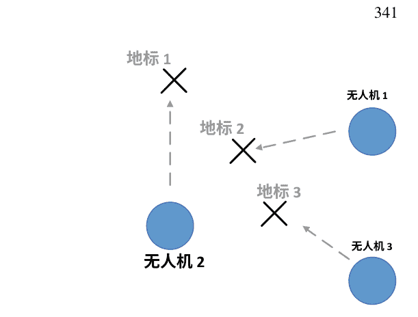

在合作导航中，任务分配基于最小总距离的原则，考虑到所有代理和所有地标的位置。换句话说，最优策略是使所有代理花费最少的时间覆盖所有地标。此外，当代理与其他代理发生碰撞时，将受到惩罚。因此，合作导航的目标是通过训练使代理能够学习最优策略，并能够推断他们需要覆盖的地标，然后在避免与其他代理碰撞的条件下移动到那里。

第二种情景是围捕对抗。在追踪、包围和敌我对抗的过程中，我们首先必须完成无人机的编组分配任务。也就是说，一定数量的无人机被分配给每个目标，同时完成多个目标的追踪和打击。根据通过三个点确定一个平面的原则，最经济的安排是将三个无人机分配给一个目标进行围捕和攻击。具体的包围示意图如图11所示。采用的攻击模式是自杀式毁灭战斗模式。任何无人机击中目标都意味着对抗任务完成。围捕对抗要求几个具有相同作战目标和作战任务的无人机能够通过合作完成目标任务。

# 图11 合作围捕对抗

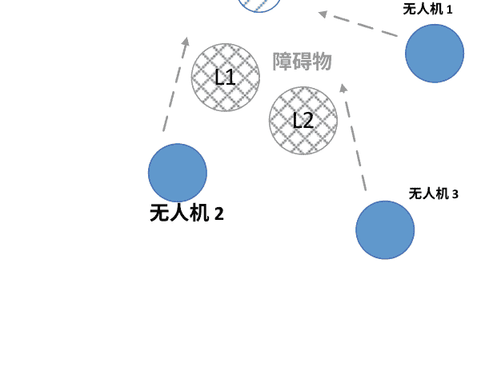

在避免内部碰撞的条件下进行相互通信。在围捕对抗的环境中，我们将代理分为好的代理和对手代理，并命令对手追逐和攻击好的代理。在实施时，随机生成一个具有L个大障碍物的环境，并使N个较慢的合作对手代理追逐一个更快的好代理。代理通过观察其他代理的相对位置和速度以及障碍物的位置来选择动作。当有一个合作对手代理与好的代理发生碰撞时，表示对抗任务完成。对手代理将获得奖励，而好的代理将受到惩罚。当N个合作对手代理之间发生碰撞时，它们将受到一次惩罚。碰撞越多，惩罚越多。此外，在没有任何碰撞的情况下，奖励函数只能根据好的代理与对手代理之间的相对距离来计算。对手代理的奖励值会随着与好的代理距离的增加而减少。相反，好的代理的奖励将随着与对手的距离增加而增加。

### 5.2 模拟实验

#### 5.2.1 合作导航的模拟测试

基于计算的奖励，评估了新改进的MADDPG算法网络。在合作导航的环境文档中，算法计算中使用的状态观测变量是每个代理的当前位置和每个地标的位置。在初始阶段，只考虑新算法的可行性，因此只在二维环境中进行算法的模拟实验。为了简化编译，只考虑了无人机均匀运动的情况。首先，初始化状态观测变量。对于每个无人机，在初始位置的横纵坐标范围内随机选择一个值，并以相同的方式确定目标位置。然后，在集群中为每个无人机随机选择动作并计算奖励，根据增加累积奖励的标准自主学习以获得最优策略。每个无人机的奖励值在计算开始时初始化为0。最后，在避免碰撞的条件下，根据最优策略选择动作，使不同的无人机尽快到达不同的指定位置。

每个无人机的奖励函数是根据其实际位置和指定的目标位置计算的。因为合作导航任务中的无人机群体是完全合作的关系，所以在学习最优策略时必须考虑整个群体的奖励值。合作导航任务意味着无人机群体可以完成协同分配，并最终覆盖所有地标。因此，必须考虑每个无人机到所有目标地标的距离，并从所有可能性中选择具有最小总距离的方案来执行。算法必须首先确保每个地标必须有一个无人机到达，也就是说，到达不同地标的无人机必须不同。因此，在设置奖励函数时，奖励应该是所有无人机作为一个整体的奖励，奖励函数应该随着无人机与相应指定地标的相对距离减小而增加。为了占领指定位置，无人机的奖励与最小距离呈负相关。距离越短，离地标越近，奖励越大。每个无人机的奖励分别计算，总体奖励是每个无人机奖励的总和。考虑到代理和地标的大小，我们认为当距离小于0.1时，无人机占领地标，并将奖励值增加10作为鼓励。因此，每个无人机的奖励函数如下所示。

```
$$reward = \begin{cases} reward - 0.1 \times \min(dists), & if \min(dists) \geq 0.1 \\ reward + 10, & else \end{cases} \qquad (24)$$

$$dists = \left| s_{agent} - s_{landmark_i} \right|_{i=1,...,n} \qquad (25)$$
```

其中，$s_{agent}$指的是无人机的位置，$s_{landmark}$是任意一个地标的位置。为了实现协同分配并避免多个无人机覆盖同一个地标，添加了碰撞避免设置。为了避免集群内部碰撞和多个代理覆盖同一个地标，我们添加了碰撞避免设置以实现协同分配。如果一个无人机与另一个无人机发生碰撞，应对该无人机进行惩罚，并每次碰撞减少10的奖励。在合作导航的模拟测试中，集群每个回合的累积奖励值如图12所示。

在图12中，总奖励通常随着回合数增加而增加。在前10,000个回合中，奖励值迅速下降，原因这是一个试探性的学习阶段。目前，集群通过试错法探索规则。在接下来的回合中，奖励迅速增加，这表明集群通过MADDPG算法进行学习和训练，学习效率非常高。

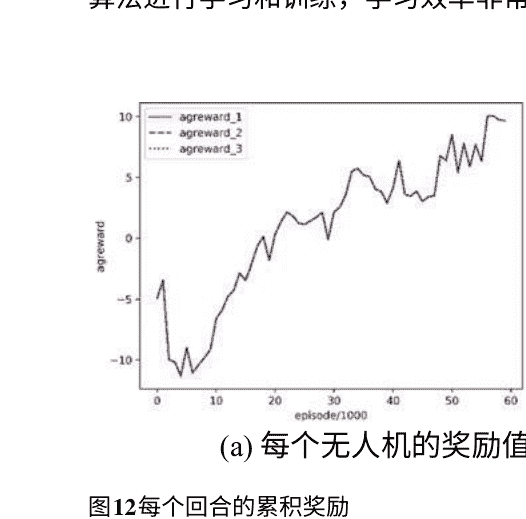

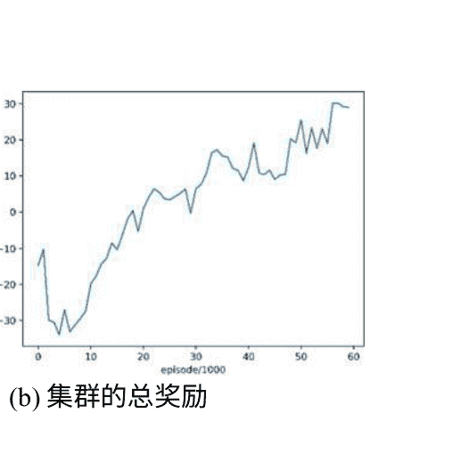

图12 每个回合的累积奖励

高。根据我们设定的奖励函数，如果集群在MADDPG算法的训练下能够执行合作导航任务，每个代理的奖励值应该接近10。从图12a的仿真结果可以清楚地看出，当训练到接近60,000个回合时，每个无人机的奖励值可以达到10。这个奖励值表明三个无人机可以在不发生内部碰撞的情况下覆盖不同的地标。

为了更生动地观察训练结果，我们以动画形式展示了两种情景下的仿真训练过程，如图13所示。图13a展示了实际应用中最常见的一种情况，即目标位置分散。在这种情况下，当集群中的无人机能够自行分配并覆盖或接近所有指定的地标时，合作导航任务完成。图13b展示了一种特殊情况，即两个目标位置非常接近，一个无人机可以同时覆盖两个地标。在这种情况下，如果指定两个无人机分别覆盖两个目标点，存在很大的碰撞和损坏的可能性。此时，为了避免无人机之间的碰撞造成的损坏，通过MADDPG算法网络学习到的最优策略可以自动安排最近的一架无人机完成两个目标点的同时覆盖。

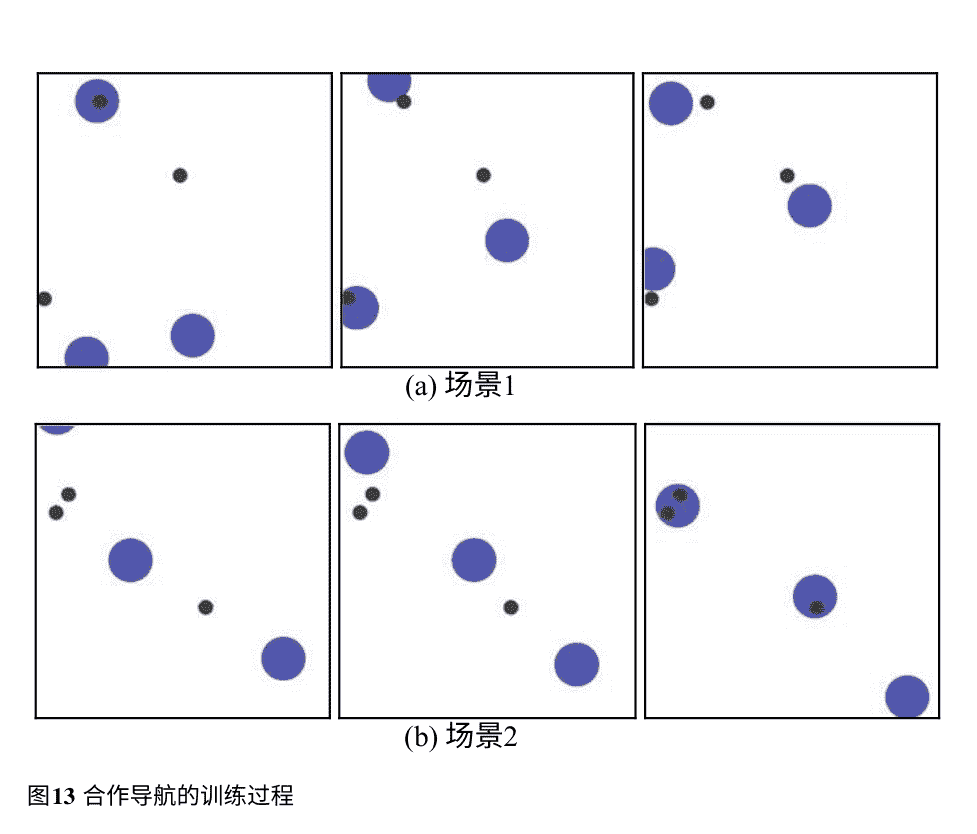

#### 5.2.2 围捕对抗的仿真测试

环境文档是根据围捕对抗方案设计的。算法文档是基于改进的MADDPG算法的网络结构编写的。在设计环境文档时，我们通过合作通信命令三架无人机围捕同一目标，并最终进行破坏性攻击。此外，我们添加了两个地标作为障碍物，增加了算法的学习难度。在编写算法文本时，学习网络结构保持不变，但需要重新定义观测变量和奖励机制。用于策略学习的状态观测变量包括固定障碍物的位置以及无人机集群和目标的当前位置坐标。为了简化编译，我们在二维环境中测试MADDPG算法，并设置三架无人机围捕和攻击一个目标，同时避开两个障碍物。此外，所有代理（三架无人机作为对手和一个目标作为好代理）的速度是统一的。我们将所有代理（对手和目标）的纵坐标和横坐标（x, y）初始化为（-1, 1）区间内的任意值，并将障碍物地标的固定位置初始化为（-1, 1）。所有代理的奖励值初始化为0。目标是使用新的改进MADDPG算法网络自主学习最优策略以获得更高的奖励值。在具体的学习过程中，首先是随机选择并执行当前状态下对手和好代理的动作，然后根据相应的奖励函数分别计算好代理和对手的奖励值。

经过多次迭代训练，最终学到了在对抗场景中各种情况下的最佳学习策略。

因为在对抗任务中，代理人分为两类：对手和好的代理人，它们之间既有合作又有竞争的关系。对手不仅需要合作，还要一起围捕同一个好的代理人。同时，还需要竞争打击同一个目标，避免内部碰撞。对于好的代理人来说，目标是逃脱对手的追捕。

因此，它们的奖励函数完全相反，并且需要分别定义。在计算好的代理人的奖励时，需要考虑它与每个对手之间的距离。奖励是与所有距离正相关的函数。距离越远，奖励越大。好的代理人的奖励函数如下所示。

> $$奖励 = 奖励 + 0.1 \sqrt{\sum_{i=1}^{n} (s_{agent} - s_{adversary_i})^2} \quad (26)$$

在方程（26）中，s_agent表示良好代理的状态，即具体计算中的位置信息，而s_adversary是任意对手的位置信息。当良好代理与对手发生碰撞时，表示发动攻击，因此良好代理的奖励应减少10作为惩罚。对于对手来说，因为它们之间存在竞争关系，我们必须分别计算它们的奖励，但奖励机制是相同的。对手的奖励是与其与每个好代理的距离呈负相关。距离越短，奖励越大。对手的奖励函数如方程（27）所示。

$$reward = reward - 0.1 \times \sqrt{\left( s_{agent} - s_{good\_agent_{i}} \right)^2 \bigg|_{i=1,...,n}} \quad\quad\quad (27)$$

其中，s代表对手的状态，需要计算奖励，而 s_{\text{good\_agent}} 代表任何一个好的代理的状态。同样，在这种情况下，计算所需的状态是位置信息。当对手与好的代理发生碰撞时，对手的奖励应该增加10作为鼓励。为了避免对手之间的内部碰撞，奖励应该减去一定的值作为一次碰撞的惩罚。最初，我们规定如果对手与其他对手发生碰撞，对手的奖励将减去10作为惩罚。模拟实验中奖励的变化曲线如下所示。

在图14a中，三个对手的奖励总体上呈上升趋势。尽管No. 1和No. 3对手的奖励值曲线在50,000个回合后转折并且开始下降，第2个对手的奖励值曲线仍然上升。

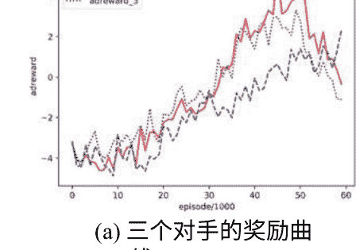

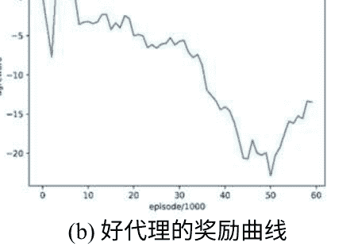

(a) 三个对手的奖励曲线 (b) 好代理的奖励曲线

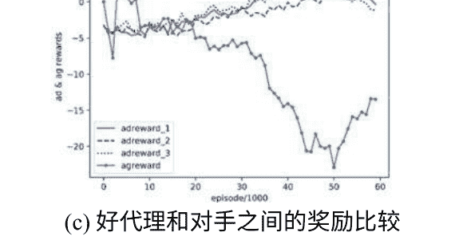

(c) 好代理和对手之间的奖励比较

### 图14 每集累积奖励

好代理的奖励值在50000集之前持续下降，并在5000集之后降至0以下。由于只有一个好代理，因此由于内部碰撞而导致奖励值的显著减少。根据好代理的奖励函数，我们可以推断除与对手碰撞外，好代理的奖励将始终增加。因此，奖励值小于0意味着好代理受到对手的攻击。图14b显示，在5000集之后，好代理受到对手的攻击，并受到对手的紧密追逐。好代理的奖励值在约35000集之后降至 -10以下，并且下降速度比以前快得多。这表明经过训练的对手可以有效地阻止好代理逃脱，并且围捕和对抗的成功率也在增加。根据对手的奖励函数，除非与好代理发生碰撞，否则对手的奖励始终小于0。因为好代理在5000集之后将受到对手的攻击，所以对手的最大奖励应大于0。基于此，我们可以得出结论，对手之间存在内部碰撞。为了更清楚地比较对手和好代理的奖励曲线，我们将它们放在一起，如图14c所示。随着训练集数的增加，好代理和对手之间的奖励值差异越大，对手的学习策略越优化。

在我们的研究中发现，改进的MADDPG算法的学习效率和最优策略与奖励机制有所不同。从最后的训练结果可以看出，在与好的代理发生碰撞后，大多数对手的奖励都低于0，这表明对手之间发生了碰撞。为此，我们在对手的奖励值计算中添加了一个新的奖励函数，以进一步避免对手之间的内部碰撞。这个新的奖励函数与对手之间的距离呈正相关，如公式（28）所示。

$$reward = reward + 0.1 \times \sqrt{\left( s_{agent} - s_{adversary_i} \right)^2 \bigg|_{i=1,...,n}} \quad\quad\quad (28)$$

其中，s代表对手的状态变量，s_{adversary_i}代表其他任何对手的状态信息。距离越远，奖励值越大。这个函数可以有效地控制对手之间的空间，防止它们过于接近，进一步减少内部碰撞的可能性。同时，为了使对手更好、更快地学习到最优策略，我们修改了对手的奖励函数，得到了一个新的方程。

$$reward = reward + 1.0 \big/ \sqrt{\left( s_{agent} - s_{good\_agent_i} \right)^2 \bigg|_{i=1,...,n}} \quad\quad\quad (29)$$

对手计算的奖励值都是正数。好代理和对手之间的距离越短，对手的奖励值就越高。为了避免奖励值急剧增加甚至无限，我们设置了方程（29）的计算条件。当距离最小且接近0时，这个对手和好代理发生碰撞。此时，奖励值直接增加10作为奖励，而不是使用方程（28）计算奖励。结果如图15所示。

在图15b中，好代理的奖励在10,000个回合后降至0以下。根据好代理的奖励函数，我们可以得出结论，只有当好代理被对手碰撞时，好代理的奖励才会小于0。如果这个好的代理的奖励小于 -10，那就意味着这个好的代理已经被攻击了两次。在图15c中，通过比较对手的奖励与好的代理，即使没有碰撞，三个对手的奖励仍然可以保持在30左右，当有一次碰撞时，奖励将达到约40。额外的10是与好的代理碰撞的奖励，原始的30是通过新的奖励函数计算得到的。从结果来看，即使对手无法赶上好的代理，三个对手的奖励值仍然很大。这意味着这些对手可以保持较近的距离完成追踪和包围，它们之间没有内部碰撞。当好的代理的奖励小于 -10时，对手和好的代理之间发生两次碰撞，对手的奖励接近50或更多。这也证明了对手之间没有碰撞。因此，我们可以得出结论，对手可以通过MADDPG算法网络学习最优策略，并在没有内部碰撞的情况下实现追捕和对抗任务。

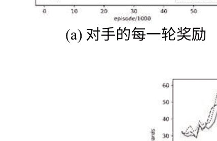

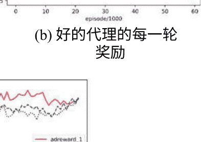

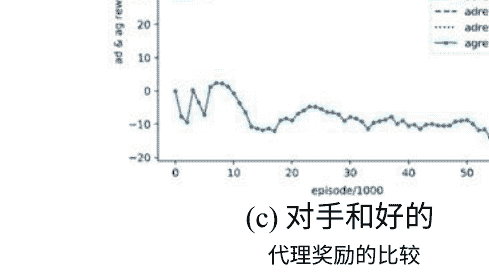

### 图15 每一轮的累积奖励

为了生动地观察训练结果，我们以动画的形式展示整个训练过程。图16是整个训练过程中输出的几个帧的选择，展示了追捕对抗的训练过程。

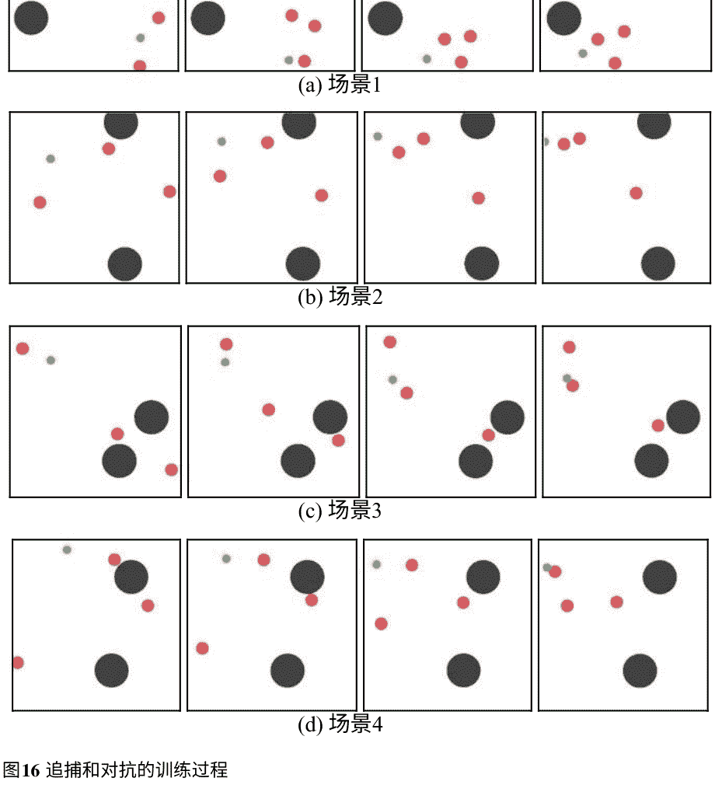

以图像的形式展示了四个场景的训练过程。图16a、b展示了三架无人机在两个场景中追捕目标的过程。可以看到，三架无人机可以协调行动，快速接近目标，同时避免内部碰撞，最终在避免目标逃逸的同时完成紧密跟踪。图16 c、d以相同的形式展示了集群合作实现追捕和对抗的过程，在两种不同的初始条件下。

### 5.3 讨论

本节提出了一种新的改进的多智能体强化学习算法，主要在MADDPG算法的基础上改进了学习网络的构建。一方面改变了网络结构，另一方面将动作信息引入到Q网络和P网络的隐藏层中，与状态信息一起计算Q值。由于考虑的信息更全面，使用改进的网络计算得到的Q值更准确，这也有助于学习更优化的策略。为了验证算法的可行性，我们通过两个常规作战任务对算法进行了仿真实验，并获得了期望的结果。

算法的一个缺点是其实时性无法满足实际作战需求。随着集群数量的增加，计算量呈指数增长，这也使得计算的实时性变差。我们计划引入深度学习模块，通过大量的仿真实验积累数据，以帮助集群积累经验并提高自主决策能力。因此，我们提出通过将深度学习与强化学习相结合来解决后续研究中的实时和快速计算问题。另一个弱点是该算法只适用于解决固定数量的智能体问题。在实际作战中，集群中的智能体很可能会出现损失或损坏，因此开发具有可变数量智能体的MARL算法是下一个需要解决的关键问题。我们将这两个问题留给未来的工作。

## 6 结论

本章主要关注强化学习算法。首先，介绍了单智能体强化学习算法的持续发展和改进，并使用改进的深度确定性策略梯度算法来控制仿生变形无人机的自主形状优化。其次，介绍了未来集群作战的发展趋势和必然性，并提出了多智能体强化学习算法的概念。使用改进的多智能体深度确定性策略梯度算法学习网络结构用于控制集群协同操作。通过仿真实验可以验证这两种智能算法的可行性。

但与此同时，还有一些需要改进的缺点。最重要和紧迫的问题是实时计算问题和可变数量的集群问题。我们都知道这个在线决策控制算法需要高强的实时计算能力。目前，我们的研究仅限于集群数量不超过三架无人机的情况下，在线计算能力还可以。但随着集群数量的增加，观测信息的数量将呈指数增长，这给实时计算带来了巨大挑战。因此，未来的研究方向必须集中在实时计算问题上。MADDPG算法中智能体的数量必须确定，以便将集群作为一个整体进行规划和安排。然而，该算法无法解决集群中无人机可能在实际战斗中丢失的问题。因此，改进或生成一种新的算法已成为未来研究的另一个重点。这种新算法应能够快速调整集群中智能体的数量，以获得新的最优策略。

## 参考文献

1.  Abdulrahim M, Lind R (2013) 利用鸟类形态增强飞机机动性。在：AIAA大气飞行力学会议和展览会论文集
2.  Jha AK, Kudva JN (2004) 变形飞机概念、分类和挑战。Proc SPIE Int Soc Opt Eng 5388:213–224
3.  Bowman J, Sanders B, Weisskaar T (2002) 评估变形技术对飞机性能的影响。在：第43届AIAA/ASME/ASCE/AHS/ASC结构、结构动力学和材料会议
4.  Bowman J, Sanders B, Cannon B et al (2013) 下一代变形飞机结构的发展。在：第48届AIAA/ASME/ASCE/AHS/ASC结构、结构动力学和材料会议
5.  Lampton A, Niksch A, Valasek J (2008) 具有四个变形参数的变形翼型。在：AIAA导航、导航和控制会议和展览
6.  Di ML, Mintchev S, Heitz G等（2017年）用于小型无人机的仿生变形机翼，以扩展飞行包络和滚动控制。接口焦点7（1）：20160092
7.  Chakravarthy A, Grant D, Lind R（2012年）具有可变扫描变形的微型飞行器的时变动力学。J Guid Control Dyn 35（3）：890–903
8.  Beaverstock CS, Fincham J, Friswell MI等（2014年）对称和非对称跨度变形对飞行动力学的影响。在：AIAA大气飞行力学会议
9.  Imanberdiyev N, Fu C, Kayacan E等（2017年）使用实时基于模型的强化学习实现的无人机自主导航。在：2016年第14届国际控制、自动化、机器人和视觉会议（ICARCV）。IEEE
10. Nigam N, Zhang Y, Chen P等（2016）自适应控制和驱动系统开发仿生变形。在：第24届AIAA/AHS自适应结构会议
11. Obradovic B, Subbarao K（2012）仿生机翼飞行动力学建模。J Aircr 48（2）：391-402
12. Mestrinho JRC, Gamboa P, Santos PD（2013）小型无人机可变跨度变形机翼的设计优化。
13. Mestrinho JRC, Felício JMI, Santos PD等（2009）可变跨度变形机翼的设计优化。在：国际工程优化会议
14. Hassanalian M, Quintana A, Abdelkefi A（2018）变形和生长的微型无人驾驶飞行器：尺寸过程和稳定性。 Aerosp Sci Technol 78（6）：130-146
15. Hammerton JR，苏W，朱G等（2018）高度柔性飞机的最佳分布式机翼成形和控制负载。 航空航天科学技术79（8）：255-265
16. Burdette DA，Martins JRRA（2018年）通过气动结构优化设计具有自适应变形后缘的跨音速机翼。 航空航天科学技术81（10）：192-203
17. Pedro BC，Marcelo AS（2018年）基于形状记忆合金的航空应用机构：理论，优化和实验。 航空航天科学技术76（5）：155-163
18. Valasek J，Tandale MD，Rong J（2005年）一种用于变形的强化学习自适应控制架构。 航空航天计算机信息通信杂志2（4）：174-195
19. Lampton A，Niksch A，Valasek J（2010年）变形翼型的强化学习策略和离散学习分析。 航空航天计算机信息通信杂志7（8）：241-260
20. Lampton A，Niksch A，Valasek J（2015年）具有气动和结构效应的变形翼型的强化学习。 航空航天计算机信息通信杂志6（1）：30-50
21. Valasek J，Doebbler J，Tandale MD等（2008年）改进的自适应强化学习控制用于变形无人机。 IEEE Trans Syst Man Cybern Part B 38（4）：1014-1020
22. Goecks VG，Leal PB，White T等（2018）通过深度强化学习控制变形机翼形状。 在：2018年AIAA信息系统-AIAA航空信息技术
23. 温N，刘志华，朱立平（2017）深度强化学习及其在自主变形飞机形状优化中的应用。 宇航员杂志38（11）：1153-1159
24. Yann LC，Bengio Y，Hinton G（2015）深度学习。 自然521（7553）：436-444
25. Schmidhuber J（2015）神经网络中的深度学习：概述。 神经网络61：85-117
26. Sutton RS，Barto AG（1998）强化学习：介绍，自适应计算和机器学习系列。 麻省理工学院出版社
27. Kober J，Bagnell JA，Peters J（2012）机器人学中的强化学习：一项调查。 国际机器人研究杂志32（11）：1238-1274
28. Petar K，Sylvain C，Darwin C（2013）机器人强化学习：应用和现实挑战。 机器人学 2(3):122–148
29. Busoniu L，Babuska R，Schutter BD et al（2010）使用函数逼近器的强化学习和动态规划。 CRC Press, Inc.
30. Xu D，Hui Z，Liu YQ et al（2019）具有深度强化学习的新型仿生变形无人机的变形控制。 航空航天科学技术 92:232–243
31. La HM，Nguyen T，Le TD et al（2017）具有有限通信范围的多个矩形代理的编队控制和避障。 IEEE Trans Control Network Syst4(4):680–691
32. La HM，Sheng W（2012）移动传感器网络中的动态目标跟踪和观测。 机器人与自主系统 60(7):996–1009
33. Busoniu L，Babuska R，Schutter BD（2006）多智能体强化学习：一项调查. 在: 第9届国际控制、自动化、机器人和视觉会议 (ICARCV 2006)论文集, 12. IEEE, 新加坡, 第527-532页
34. Busoniu L，Babuska R，Schutter BD（2010）多智能体强化学习：一项概述. 在: 多智能体系统和应用创新—1. 计算智能研究, 310. Springer, 柏林, 海德堡, 第183-221页
35. Littman ML（1994）马尔可夫博弈作为多智能体强化学习的框架. 在:第11届国际机器学习会议 (ICML 1994)论文集, 7. 罗格斯大学, 新布朗斯维克, 新泽西州, 第157-163页
36. Gong LG，Wang Q，Hu CH等（2020）基于Q学习的变形飞行器切换控制. 中国航空学报 33（2）:672–687
37. Peters J，Schaal S（2006）机器人的策略梯度方法。 在：2006年IEEE/RSJ国际智能机器人与系统会议。 IEEE
38. Duryea E, Ganger M, Hu W (2016) 多Q-学习的深度强化学习探索。智能控制与自动化 7(4):129–144
39. Babuska R, Busoniu L, Schutter BD (2006) 多智能体系统的强化学习。在：第11届新兴技术和工厂自动化国际会议论文集（ETFA 2006）。IEEE，捷克共和国布拉格
40. Nguyen TT, Nguyen ND, Nahavandi S (2020) 多智能体系统的深度强化学习：挑战、解决方案和应用的综述。IEEE Trans Cybern 99:1–14
41. Li CG, Wang M, Yuan QN (2008) 使用演员-评论家方法的多智能体强化学习。在：第7届机器学习和控制国际会议论文集
42. Gupta JK, Egorov M, Kochenderfer M (2017) 使用深度强化学习的合作多智能体控制。在：国际自主代理人和多智能体系统会议（AAMS 2017）。计算机科学讲义，106 (42)。Springer, Cham, pp 66–83
43. Guo HL, Meng Y (2010) 用于协调多机器人觅食的分布式强化学习。J Intell Robot Syst 60:531–551
44. Lowe R, Wu Y, Tamar A等 (2018) 用于混合合作竞争环境的多智能体演员-评论家算法。arXiv:1706.02275v3
45. Silvestro B, Onur B, Rafic A等 (2011) 变形飞行器综述。J Intell Mater Syst Struct 22(9):823–877
46. Chopra I (2001) 智能旋翼系统的最新进展。演示，NASA Langley研究中心，Langley，VA
47. Chopra I (2012) 智能结构和集成系统的现状综述。AIAA J 40(11):2145–2187
48. Wissa A, Han AK, Cutkosky MR (2015) 羽毛一起粘在一起：仿生翅膀与鳞片启发的锁定。仿生生物混合系统 9222(13):123–134
49. Volodymyr M, Koray K, David S et al (2015) 通过深度强化学习实现人类水平控制。Nature 518(7540):529–533
50. Wang Z, Freitas N D, Lanctot M (2016) 深度强化学习的对决网络架构。在：第33届国际机器学习大会论文集, 48(6), pp1995–2003, 美国纽约
51. Hausknecht M, Stone P (2015) 部分可观察MDP的深度循环Q学习。计算科学
52. Sutton RS, McAllester DA, Singh SP等 (2000) 用于函数逼近的强化学习策略梯度方法。在：神经信息处理系统进展，第12卷。麻省理工学院出版社，第1057-1063页
53. Silver D, Lever G, Heess N等 (2014) 确定性策略梯度算法。在：国际机器学习会议论文集, 第387-395页
54. Nagabandi A, Kahn G, Fearing RS等 (2017) 用于模型基础深度强化学习的神经网络动力学，带有无模型微调。在：机器人学-人机协作/机器学习控制。论文。arXiv：1708.02596v2
55. Yang Z, Merrick K, Abbass H等 (2017) 用于连续动作控制的多任务深度强化学习。在：第26届国际人工智能联合会议论文集，第3301-3307页
56. Baker B, Gupta O, Naik N et al (2017) 使用强化学习设计神经网络架构。在：国际学习表示会议 (ICLR 2017)
57. Hansen S (2016) 使用深度Q学习来控制优化超参数。arXiv预印本arXIV: 1602.04062V2
58. Kersandt K (2018) 深度强化学习作为自主无人机的控制方法。加泰罗尼亚理工大学
59. Rafic MA，Girish KJ (2018) 变形飞机：一种能够对称和非对称跨度变形的多任务无人机。航空科学技术76 (5)：512-522
60. Wu YH，Yu ZC，Li CY等 (2020) 自由浮动空间机器人的双臂轨迹规划中的强化学习。航空科学技术98：105657

## 生物启发式机器人手臂规划通过τ-Jerk理论和递归多层人工神经网络

I. Carvajal, E. A. Martínez-García, R. Torres-Córdoba, 和V. M. Carrillo-Saucedo

摘要 本文提出了一个用于6轴机器人操纵器模拟装配任务的规划模型控制。本文的目的是使用尼龙扎带为托盘上的锁定电缆束计划轨迹。本研究受到两种生物启发式方法的启发。用于轨迹跟踪的一般τ-Jerk理论和多层次回归Hopfield人工神经网络（HANN）用于多个托盘元素的视觉反馈。生成描述机器人和目标位置之间自由碰撞路径的等距直角坐标点。通过多维最小二乘法获得基于非线性回归的三次多项式装配轨迹。基于导数的优化选择机器人和目标位置之间的直角坐标路径，其中路径的高度是一个最小化路径的标准。通过计算机模拟验证了所提出的方法，显示了装配任务的可行性和有效性。

- 机器人臂
- 机器人组装
- 基于模型的控制
- Tau理论
- 人工视觉
- Hopfield神经元
- 多层ANN

## 1 引言

当今的制造系统和组织在实现生产目标时强烈依赖于使用众多人工智能技术和计算机科学工具[1]。本章所提出的工作是为了在装配行业常见的自动化问题的计算机模拟层面上提供工程解决方案[2]。自动工业装配使用机器人臂来组装自锁尼龙扎带的电缆束。两个主要问题被提出。首先，通过部署冗余每个托盘最多可放置五个机器人，以减少生产时间的条件。然而，单个机器人也能够以类似的性能执行任务。其次，当托盘中的电缆姿势与理想预期不同时，会出现多个装配故障，影响时间，需要重新设置和再次进行手动设置。

机器人装配系统由六轴机器人手臂 SIA20D 组成，通过带有编程控制器 DX100 和菜单驱动程序的键盘进行编程。机器人的循环算法在每个控制循环中将末端执行器定位到起始位置，需要额外的重新定位时间。此外，每个机器人的笛卡尔坐标都是通过键盘手动编码的，而不是使用高阶导数编程控制算法。机器人的算法是预先编码的循环开放控制环。因此，在离线编码过程中通过试验和错误进行了度量误差的修正，从而创建了预先的运动路径。

本章介绍的研究提供了机器人在装配任务中处理动态事件的自主性。本工作的重点是受到两种生物启发的方法对机器人轨迹跟踪控制的激励。一种方法基于轨迹控制的一般 τ-Jerk理论，类似的方法还有[3, 4]。在不同的工业应用中，基于视觉的深度学习技术[5]越来越受欢迎。关于机器人装配和服务技能学习的提出工作使用了视觉模板深度Q学习[7]、强化学习[8]，而本文提出了一种不同的方法，即使用递归多层人工神经网络（ANN）进行视觉反馈。机器人结构的运动学被建模，并且这些方程被用于运动控制，作为使用编码键盘设备的替代方案。此外，一个红绿蓝-深度（RGB-D）视觉传感器被固定在场景的顶部位置，用于感知外部图像[9]。RGB-D传感器提供了2D基于RGB强度的数字图像和用于度量测量的3D点云。基于Hopfield模型的双层递归人工神经网络被实现用于识别出RGB图像中出现的调色板元素。

ANN的输出确定一组目标区域，从中生成新的组装轨迹。此外，从机器人工作空间内的任意姿势，自动产生到所有调色板感兴趣区域的多条轨迹，通过最小化两个标准来优化最高优先级的路径：机器人-调色板的距离和轨迹的拐点数量。

本章按照以下部分的描述进行组织。第3节推导出机器人的运动学模型。第4节描述了路径生成方法，接近 τ-Jerk模型。第5节描述了开发的人工视觉系统，用于分割调色板的感兴趣区域。第6节讨论了用于检测感兴趣元素的双层Hopfield基于ANN的提出方法。第7节解释了路径优化方法的推导。第8节提供了关于ROS实现的一般描述。最后，第9节讨论了一些结果，第10节提供了结论性评论。

## 2 相关工作

通常，SCARA类型的机器人被用于许多制造过程中，例如[10]使用2D图像线性相机来组装从高速传送带上随机位置/方向的圆形法兰。 其他报道的工作使用机器人系统进行传统的插销装配任务，例如[11]和[7]。 后者提出了从手动教学中学习技能来执行装配过程的方法，使用高斯混合模型和回归来拟合教学数据。

在[12]中，一个4自由度的选择性顺应装配机器人手臂在工业领域中实施了组件处理。 [13]的工作报告了一种基于快速触觉设备的轨迹教学和控制的机器人精确装配系统。 学习到的轨迹是通过力场模拟进行优化的参考路径，具有安全性。 在[14]中，开发了一个用于传送和停止托盘的双机器人装配系统进行视觉夹具检查。 此外，[15]的工作报告了与大型工业机器人的协作操作，用于在连续移动的装配线上组装组件。

已经开发了多样化的基于视觉的制造系统。 在[16]中，七个机器人和三个视觉系统被用于汽车前轮部件的装配，使用视觉技术降低了与零件呈现给装配单元相关的成本。 [17]中的工作报告了一种基于光学3D扫描仪数据的无需固定仪器和定位的自动多零件装配方法。 机器人程序根据工作空间中零件的位置进行调整，装配操作的执行顺序由零件的位置决定，这对于开发灵活的机器人装配系统至关重要。 [18]中的工作提出了一个全面的工业视觉系统功能、技术和能力的案例研究，以便进一步分析和训练机器学习模型。 机器人臂在不同的工程应用中发挥着越来越重要的作用，并且在工业应用中是常见的实践。 此外，已经提出了用于机器人臂控制的人工神经网络，例如[19]中的工作，该工作报告了关于使用神经网络控制操纵器的研究进展的调查。

在1980年代，τ (τ) 理论主要关注视觉感知。 然而，τ理论可以用于任何知觉系统。 τ理论首次发表于[20]，得出结论：生物实体的目标导向的接近运动是对这些实体如何识别世界几何相互关系的感知反映。 在[21]中，提出了一种机器人操纵器的最优轨迹规划技术，其中涉及机器人运动的运动学约束，包括速度、加速度和加加速度的绝对值。 工作[22]报告了一种通过将5阶B样条插值方法应用于构建轨迹并优化轨迹来获得机器人操纵器的最优时间-加加速度轨迹的方法。 与5阶B样条不同，我们的工作得到了3阶自适应回归多项式。

与本文类似，[23]提出了一种用于离线焊接机器人轨迹规划的高效方法。 焊接路径被考虑在内。

## 3 个机械臂运动学

为了让机械臂在电缆束的托盘中组装自锁尼龙扎带，机械臂的运动学被推导为轨迹跟踪控制的基本模型。 最初，机械臂的高阶导数是基于臂部链接关节的几何模型（图1）推导出来的，并且这样的模型被用来代数地获得直接和逆解。

根据图1，位置的直接运动学模型被推导出来，并通过以下表达式（1）-（3）表示。 本文中给出的符号c₀， c₀₁， s₂是用来缩写表示cos(φ₀)， cos(φ₀ + φ₁)和sin(φ₂)的表达式。

对于y分量，

和

x = l₁c₁s₀ + l₂(c₁₃s₀c₂ + s₁₃s₂) + l₃[c₁₃₅s₀c₂c₄ + s₁₃₅c₂s₄ - c₁₃₅s₀s₂c₄ + s₁₃₅ s₂c₄],  (1)

y = (l₁c₁ + l₂c₁₃ + l₃c₁₃₅)c₀  (2)

z = l₁s₁s₀ - l₂(c₁₃s₀s₂ - s₁₃c₂) - l₃[c₁₃₅s₀s₂c₄ - s₁₃₅s₂s₄ + c₁₃₅s₀c₂s₄ - s₁₃₅c₂c₄]  (3)

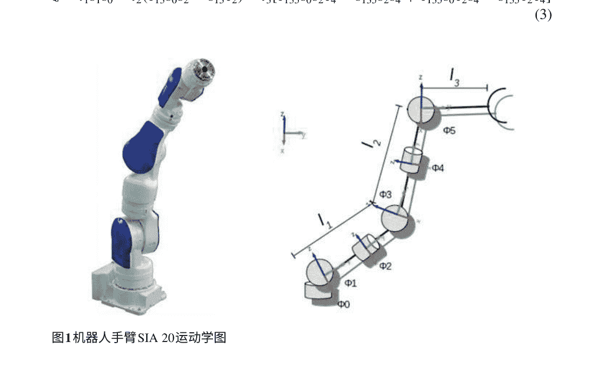

根据之前的位置表达式，描述机器人手臂的笛卡尔速度的一阶导数 $\dot{\mathbf{p}}$ 可以用关节的旋转速度 $\dot{\phi}$ 来表示。因此，它可以用线性矩阵形式表示为 $\dot{\mathbf{p}} = \mathbf{J} \cdot \dot{\phi}$。矩阵 $\mathbf{J}$ 是非定常时变的雅可比矩阵。雅可比元素通过对函数关于关节角变量的偏导数进行推导得到。因此，函数 $x$ 的导数为：

$$\frac{\partial x}{\partial \phi_0} = l_1 c_1 c_0 + l_2 (c_{13} c_0 c_2) + l_3 (c_{135} c_0 c_2 c_4 - c_{135} c_0 s_2 s_4),$$

$$\frac{\partial x}{\partial \phi_1} = -l_1 s_1 s_0 + l_2 (-s_{13} s_0 c_2 + c_{13} s_2) + l_3 (-s_{135} s_0 c_2 c_4 + c_{135} c_2 s_4 + s_{135} s_0 s_2 s_4 + c_{135} s_2 s_4),$$

$$\frac{\partial x}{\partial \phi_2} = -l_2 (c_{13} s_0 s_2 + s_{13} c_2) - l_3 (c_{135} s_0 s_2 c_4 + s_{135} s_2 s_4 + c_{135} c_0 s_2 s_4 - s_{135} c_2 s_4),$$

$$\frac{\partial x}{\partial \phi_3} = -l_2 (s_{13} s_0 c_2 - c_{13} s_2) - l_3 (s_{135} s_0 c_2 c_4 - c_{135} c_2 s_4 - s_{135} s_0 s_2 s_4 - c_{135} s_2 s_4),$$

$$\frac{\partial x}{\partial \phi_4} = -l_3 (c_{135} s_0 c_2 s_4 - s_{135} c_2 c_4 + c_{135} s_0 s_2 c_4 + s_{135} s_2 s_4),$$

$$\frac{\partial x}{\partial \phi_5} = l_3 (-s_{135} s_0 c_2 c_4 + c_{135} c_2 s_4 + s_{135} s_0 s_2 s_4 + c_{135} s_2 s_4).$$

同样地，关于关节角变量的偏导数如下所示：

$$\frac{\partial y}{\partial \phi_0} = -(l_1 c_1 + l_2 c_{13} + l_3 c_{135}) s_0,$$

$$\frac{\partial y}{\partial \phi_1} = (-l_1 s_1 - l_2 s_{13} - l_3 s_{135}) c_0,$$

$$\frac{\partial y}{\partial \phi_2} = 0,$$

$$\frac{\partial y}{\partial \phi_3} = (-l_2 s_{13} - l_3 s_{135}) c_0,$$

$$\frac{\partial y}{\partial \phi_4} = 0,$$

$$\frac{\partial y}{\partial \phi_5} = -l_3 s_{135} c_0.$$

同样地，关于关节角变量的偏导数如下所示：

$$ \frac{\partial z}{\partial \phi_0} = l_1 s_1 c_0 - l_2 (c_{13} c_0 s_2) - l_3 ( \cdots ) $$ (16)

$$ \frac{\partial z}{\partial \phi_1} = \cdots $$ (17)

$$ \frac{\partial z}{\partial \phi_2} = \cdots $$ (18)

$$ \frac{\partial z}{\partial \phi_3} = \cdots $$ (19)

$$ \frac{\partial z}{\partial \phi_4} = \cdots $$ (20)

和

$$ \frac{\partial z}{\partial \phi_5} = \cdots $$ (21)

此外，机器人的末端执行器姿态（欧拉角）由其俯仰角 $\alpha = \phi_1 + \phi_3 + \phi_5$, 横滚角 $\beta = \phi_2 + \phi_4$ 和偏航角 $\gamma = \phi_0$ 角度建模，具有偏导数：

$$ \frac{\partial \alpha}{\partial \phi_0} = 0, \quad \frac{\partial \alpha}{\partial \phi_1} = 1, \quad \frac{\partial \alpha}{\partial \phi_2} = 0, \quad \frac{\partial \alpha}{\partial \phi_3} = 1, \quad \frac{\partial \alpha}{\partial \phi_4} = 0, \quad \frac{\partial \alpha}{\partial \phi_5} = 1, $$ (22)

以及

$$ \frac{\partial \beta}{\partial \phi_0} = 0; \quad \frac{\partial \beta}{\partial \phi_1} = 0, \quad \frac{\partial \beta}{\partial \phi_2} = 1, \quad \frac{\partial \beta}{\partial \phi_3} = 0, \quad \frac{\partial \beta}{\partial \phi_4} = 1, \quad \frac{\partial \beta}{\partial \phi_5} = 0 $$ (23)

和

$$ \frac{\partial \gamma}{\partial \phi_0} = 1, \quad \frac{\partial \gamma}{\partial \phi_1} = 0, \quad \frac{\partial \gamma}{\partial \phi_2} = 0, \quad \frac{\partial \gamma}{\partial \phi_3} = 0, \quad \frac{\partial \gamma}{\partial \phi_4} = 0, \quad \frac{\partial \gamma}{\partial \phi_5} = 0. $$ (24)

雅可比矩阵和矩阵符号将机器人模型的非线性转换为线性系统。这个运动学模型描述了几何结构的约束，以其独立旋转关节控制变量来表示。雅可比矩阵作为一个可控性矩阵，在每个控制循环中通过逐次逼近来保持时间变化的收敛误差。因此，

$$\begin{pmatrix} \dot{x} \\ \dot{y} \\ \dot{z} \\ \dot{\alpha} \\ \dot{\beta} \\ \dot{\gamma} \end{pmatrix} = \begin{pmatrix} \frac{\partial x}{\partial \phi_0} & \frac{\partial x}{\partial \phi_1} & \frac{\partial x}{\partial \phi_2} & \frac{\partial x}{\partial \phi_3} & \frac{\partial x}{\partial \phi_4} & \frac{\partial x}{\partial \phi_5} \\ \frac{\partial y}{\partial \phi_0} & \frac{\partial y}{\partial \phi_1} & 0 & \frac{\partial y}{\partial \phi_3} & 0 & \frac{\partial y}{\partial \phi_5} \\ \frac{\partial z}{\partial \phi_0} & \frac{\partial z}{\partial \phi_1} & \frac{\partial z}{\partial \phi_2} & \frac{\partial z}{\partial \phi_3} & \frac{\partial z}{\partial \phi_4} & \frac{\partial z}{\partial \phi_5} \\ \frac{\partial \alpha}{\partial \phi_0} & \frac{\partial \alpha}{\partial \phi_1} & 0 & \frac{\partial \alpha}{\partial \phi_3} & 0 & \frac{\partial \alpha}{\partial \phi_5} \\ 0 & 0 & \frac{\partial \beta}{\partial \phi_2} & 0 & \frac{\partial \beta}{\partial \phi_4} & 0 \\ \frac{\partial \gamma}{\partial \phi_0} & 0 & 0 & 0 & 0 & 0 \end{pmatrix} \cdot \begin{pmatrix} \dot{\phi_0} \\ \dot{\phi_1} \\ \dot{\phi_2} \\ \dot{\phi_3} \\ \dot{\phi_4} \\ \dot{\phi_5} \end{pmatrix} \tag{25}$$

误差是根据雅可比矩阵计算的反馈数值项，因此度量误差会随时间减小。因此，根据之前的推导，得到了一般的一阶导数臂运动学解析解。此后，所提出的模型（25）将在下一节的$\tau$-Jerk公式化中发挥重要作用。

## 4 $\tau$-Jerk轨迹生成

生物启发的$\tau$理论基本上对几乎任何感知系统都有用，特别是在与近距离物体交互时。因此，所有控制运动任务的主要目的是通过运动间隙减小空间分离距离。系统具有与一种间隙相关的$\tau$模型。间隙可以用距离、角度、力等表示。在持续运动中，直到达到目标，间隙仍然存在。它也可以用[24]中报告的$\tau$理论来描述。

换句话说，运动间隙是实际运动进展和目标位置之间存在的空间距离。目前的控制方法与其他作品[25-27]不同。具体来说，让我们将运动间隙定义为正在进行的运动任务中剩余的时间$\tau(t)$。

$$\frac{\mathrm{d}x}{\mathrm{d}t} = \frac{x}{\tau}, \tag{26}$$

其中$\mathrm{d}x / \mathrm{d}t$是当前运动间隙的速度，以达到位于瞬时运动间隙$x$的下一个目标位置。因此，通过重新排列这样的表达式，以状态变量的形式表达的$\tau$以时间为单位。

$$\tau(t) = \frac{x(t)}{\mathrm{d}x / \mathrm{d}t} = \frac{x(t)}{\dot{x}(t)} \tag{27}$$

在笛卡尔加速度中，机器人手臂开始和结束于零，因此加速度可以与机器人运动末端的位置间隙耦合。根据一般的$\tau$理论，$\tau$间隙被定义为表达式（27）。通过通过表达式（28）耦合$\tau$间隙，可以耦合两个或多个目标函数，使它们同时关闭所有间隙。间隙$\tau_q$的耦合方程取决于具有常数参数$k_{q,p}$的另一个间隙$\tau_p$，该参数与间隙$q$和$p$成比例。在$\tau$-Jerk耦合中，$q$是位移$x(t)$。

- 61. 刘YX，刘H，田YL等（2020年）基于强化学习的无人机群协同持续监视未知城市区域的两级控制框架。航空航天科学技术98：105671
- 62. 甄ZY，邢DJ，高C（2018年）基于智能自组织算法的多无人机合作搜索攻击任务规划。航空航天科学技术76：402-411
- 63. 姚P，王HL，苏ZK（2016年）多无人机合作路径规划及其在目标跟踪和障碍物避障中的应用。航空航天科学技术54：10-22
- 64. 姚P，王HL，季HX（2016年）模型预测控制和改进的灰狼优化器在城市环境中多无人机跟踪目标。航空航天科学技术55：131-143
- 65. 傅XW，潘J，王HX等（2020年）基于分布式控制的无人机群编队维持和重构方法。航空航天科学技术104：105981
- 66. Jordan MI，Mitchell TM（2015年）机器学习：趋势，观点和前景。科学349（6245）：255-260
- 67. Mitchell TM（1997）机器学习。麦格劳希尔教育

对于间隙 $q$，它的定义为
$$q = C \cdot p^{1/k_{q,p}}.$$
因此，$q_0 = x_0$ 和 $p_0$ 复合总时间 $T$ 来关闭 Jerk 间隙。因此，根据先前的表达式，常数值 $C$ 被定义为
$$C = \frac{q_0}{p_0^{1/k_{p,q}}},$$
其中 $q_0$ 是间隙 $q$ 的初始和最终状态差异。此外，$p_0$ 是间隙 $p$ 的初始和最终状态差异。
$$C = \frac{q_0}{p_0^{1/k_{p,q}}} p^{1/k_{qp}}$$
因此，从耦合方程 (28) 开始，间隙 $x$ 可以与 Jerk (过加速度) 产生的固有间隙耦合 ($m/s^3$)，通过以下位移表达式表示，
$$x_J = \frac{1}{6} J T_d^3 - \frac{1}{6} J t^3,$$
其中，一阶导数是通过解方程 Jerk effects displacement $x_J$ 得到的
$$\dot{x}_J = \frac{1}{2} J t^2.$$
此外，二阶导数可以表示为时间的函数
$$\tau_J(t) = \frac{x}{\dot{x}} = \frac{1}{3} \left( t - \frac{T_d^3}{t^2} \right),$$
当 $p_0 = T^3$ 且 $p = T^3 - t^3$ 时，将其代入方程 (31) 中，得到以下表达式：
$$x(t) = \frac{x_0}{T^{3/k_{p,q}}} (T^3 - t^3)^{1/k_{qp}},$$
其中 (35) 是机器人手臂的笛卡尔位置 (见图2)。为了直接运动学解，机器人的笛卡尔方程必须以解析形式给出，以形成向量 $\mathbf{p} \in \mathbb{R}^3$ such that $\mathbf{p} = (x, y, z)^T$。此外，$p_d = \|\mathbf{p}\|$ and $p(t)= \|\mathbf{p}(t)\|$，以找到其距离差 $\Delta p = p_d - p(t)$，将其代入下一个表达式中：
图2 不同 τ-κ 调整时的 Jerk，在 T = 2.0 和 x0 = 2.0 时。
$$p(t) = \frac{\Delta p}{T^{3/k_{p,q}}} (T^3 - t^3)^{1/k_{qp}} . \tag{36}$$
此外，对于逆运动学解，角度 $\phi_i$ 通过与直接解类似的表达式获得，其中间隙现在用角度 $\Delta \phi = \phi_d - \phi(t)$ 来表示。
$$\phi(t) = \frac{\Delta \phi}{T^{3/k_{p,q}}} (T^3 - t^3)^{1/k_{qp}} . \tag{37}$$
此外， $\tau$-Jerk 方法不直接/反向关联角度与运动学系统的笛卡尔位置，而是确定间隙特定变量。因此，与其他报道的方法[28]不同，需要使用数学方法来解决非线性方程组(1)–(3)和$\alpha, \beta, \gamma$的逆问题。

根据多元泰勒级数 (38)，给出了六个方程和六个独立变量。因此，非线性系统通过在泰勒级数的第二项处截断来线性化，以找到根，如下所示：
$$
\begin{aligned}
x(\Phi) &= x_t + (\phi_{0_{t+1}} - \phi_{0_t}) \frac{\partial x_t}{\partial \phi_0} + \cdots + (\phi_{5_{t+1}} - \phi_{5_t}) \frac{\partial x_t}{\partial \phi_5} = 0 \\
y(\Phi) &= y_t + (\phi_{0_{t+1}} - \phi_{0_t}) \frac{\partial y_t}{\partial \phi_0} + \cdots + (\phi_{5_{t+1}} - \phi_{5_t}) \frac{\partial y_t}{\partial \phi_5} = 0 \\
z(\Phi) &= z_t + (\phi_{0_{t+1}} - \phi_{0_t}) \frac{\partial z_t}{\partial \phi_0} + \cdots + (\phi_{5_{t+1}} - \phi_{5_t}) \frac{\partial z_t}{\partial \phi_5} = 0 \\
\alpha(\Phi) &= \alpha_t + (\phi_{0_{t+1}} - \phi_{0_t}) \frac{\partial \alpha_t}{\partial \phi_0} + \cdots + (\phi_{5_{t+1}} - \phi_{5_t}) \frac{\partial \alpha_t}{\partial \phi_5} = 0 \\
\beta(\Phi) &= \beta_t + (\phi_{0_{t+1}} - \phi_{0_t}) \frac{\partial \beta_t}{\partial \phi_0} + \cdots + (\phi_{5_{t+1}} - \phi_{5_t}) \frac{\partial \beta_t}{\partial \phi_5} = 0 \\
\gamma(\Phi) &= \gamma_t + (\phi_{0_{t+1}} - \phi_{0_t}) \frac{\partial \gamma_t}{\partial \phi_0} + \cdots + (\phi_{5_{t+1}} - \phi_{5_t}) \frac{\partial \gamma_t}{\partial \phi_5} = 0
\end{aligned}
$$
(38)

此后，系统在等式的左侧进行代数重组，将未知变量 $\Phi_{t+1}$ 作为感兴趣的解决方案。由此可见，在系统右侧，已知时间 $t$ 的其余值如下所示放置
$$
\begin{aligned}
\frac{\partial x_t}{\partial \phi_0} \phi_{0_{t+1}} + \cdots + \frac{\partial x_t}{\partial \phi_5} \phi_{5_{t+1}} &= -x_t + \frac{\partial x_t}{\partial \phi_0} \phi_{0_t} + \cdots + \frac{\partial x_t}{\partial \phi_5} \phi_{5_t} \\
\frac{\partial y_t}{\partial \phi_0} \phi_{0_{t+1}} + \cdots + \frac{\partial y_t}{\partial \phi_5} \phi_{5_{t+1}} &= -y_t + \frac{\partial y_t}{\partial \phi_0} \phi_{0_t} + \cdots + \frac{\partial y_t}{\partial \phi_5} \phi_{5_t} \\
\frac{\partial z_t}{\partial \phi_0} \phi_{0_{t+1}} + \cdots + \frac{\partial z_t}{\partial \phi_5} \phi_{5_{t+1}} &= -z_t + \frac{\partial z_t}{\partial \phi_0} \phi_{0_t} + \cdots + \frac{\partial z_t}{\partial \phi_5} \phi_{5_t} \\
\frac{\partial \alpha_t}{\partial \phi_0} \phi_{0_{t+1}} + \cdots + \frac{\partial \alpha_t}{\partial \phi_5} \phi_{5_{t+1}} &= -\alpha_t + \frac{\partial \alpha_t}{\partial \phi_0} \phi_{0_t} + \cdots + \frac{\partial \alpha_t}{\partial \phi_5} \phi_{5_t} \\
\frac{\partial \beta_t}{\partial \phi_0} \phi_{0_{t+1}} + \cdots + \frac{\partial \beta_t}{\partial \phi_5} \phi_{5_{t+1}} &= -\beta_t + \frac{\partial \beta_t}{\partial \phi_0} \phi_{0_t} + \cdots + \frac{\partial \beta_t}{\partial \phi_5} \phi_{5_t} \\
\frac{\partial \gamma_t}{\partial \phi_0} \phi_{0_{t+1}} + \cdots + \frac{\partial \gamma_t}{\partial \phi_5} \phi_{5_{t+1}} &= -\gamma_t + \frac{\partial \gamma_t}{\partial \phi_0} \phi_{0_t} + \cdots + \frac{\partial \gamma_t}{\partial \phi_5} \phi_{5_t}
\end{aligned}
$$
(39)

该系统以矩阵形式表示，未知变量在代数上分离，具有以下线性矩阵形式 $J_t \cdot \Phi_{t+1} = \zeta_t$：
$$
\begin{pmatrix}
\frac{\partial x_t}{\partial \phi_0} & \frac{\partial x_t}{\partial \phi_1} & \cdots & \frac{\partial x_t}{\partial \phi_5} \\
\frac{\partial y_t}{\partial \phi_0} & \frac{\partial y_t}{\partial \phi_1} & \cdots & \frac{\partial y_t}{\partial \phi_5} \\
\frac{\partial z_t}{\partial \phi_0} & \frac{\partial z_t}{\partial \phi_1} & \cdots & \frac{\partial z_t}{\partial \phi_5} \\
\frac{\partial \alpha_t}{\partial \phi_0} & \frac{\partial \alpha_t}{\partial \phi_1} & \cdots & \frac{\partial \alpha_t}{\partial \phi_5} \\
\frac{\partial \beta_t}{\partial \phi_0} & \frac{\partial \beta_t}{\partial \phi_1} & \cdots & \frac{\partial \beta_t}{\partial \phi_5} \\
\frac{\partial \gamma_t}{\partial \phi_0} & \frac{\partial \gamma_t}{\partial \phi_1} & \cdots & \frac{\partial \gamma_t}{\partial \phi_5}
\end{pmatrix}
\cdot
\begin{pmatrix}
\phi_{0_{t+1}} \\
\phi_{1_{t+1}} \\
\phi_{2_{t+1}} \\
\phi_{3_{t+1}} \\
\phi_{4_{t+1}} \\
\phi_{5_{t+1}}
\end{pmatrix}
=
\begin{pmatrix}
-x_t + \frac{\partial x_t}{\partial \phi_0} \phi_{0_t} + \cdots + \frac{\partial x_t}{\partial \phi_5} \phi_{5_t} \\
-y_t + \frac{\partial y_t}{\partial \phi_0} \phi_{0_t} + \cdots + \frac{\partial y_t}{\partial \phi_5} \phi_{5_t} \\
-z_t + \frac{\partial z_t}{\partial \phi_0} \phi_{0_t} + \cdots + \frac{\partial z_t}{\partial \phi_5} \phi_{5_t} \\
-\alpha_t + \frac{\partial \alpha_t}{\partial \phi_0} \phi_{0_t} + \cdots + \frac{\partial \alpha_t}{\partial \phi_5} \phi_{5_t} \\
-\beta_t + \frac{\partial \beta_t}{\partial \phi_0} \phi_{0_t} + \cdots + \frac{\partial \beta_t}{\partial \phi_5} \phi_{5_t} \\
-\gamma_t + \frac{\partial \gamma_t}{\partial \phi_0} \phi_{0_t} + \cdots + \frac{\partial \gamma_t}{\partial \phi_5} \phi_{5_t}
\end{pmatrix}
$$
(40)

其中非定常矩阵 $J_t$ 是已在(25)中获得的相同雅可比矩阵。矢量预测 $\Phi_{t+1} = (\phi_0, ..., \phi_{5_{t+1}})^\mathrm{T}$ 是要找到的所需解。矢量 $\zeta_t$ 是当前已知值函数和角度的矢量。因此，通过逆瞬时解得到
$$\Phi_{t+1} = J_t^{-1} \cdot \zeta_t \quad\quad (41)$$
当时间 $t$ 的所有当前值允许在时间 $t+1$ 计算预测时，时间被更新 $t = t+1$ 以递归地再次计算更近似的解 $\Phi_{t+1}$。当满足以下收敛准则时，获得最佳数值拟合
$$\left\| \frac{\Phi_{t+1} - \Phi_t}{\Phi_{t+1}} \right\| < \varepsilon_\Phi \quad\quad (42)$$
找到机器人臂关节角位置的逆解可以在旋转方面产生差距。在这种情况下，$\tau$-Jerk 方法需要参数调整，如时间周期 $T$ 和耦合常数 $\kappa$，其中后者通过使用表达式(35)经验性地获得。显然，在图3的描述中，$\kappa = 1.2$ 和 $\kappa = 0.8$，轨迹比其他 $\kappa$ 值更短，并且能量消耗对于这些数值参数是最优的。对于任意的 $T$ 值，图4显示了类似实验的性能，证明从 $T =10$ 开始，估计和参考位置是相似的。此外，随着 $T$ 的逐渐增加，它产生了更好的数量级结果。为了更清晰地说明轨迹形状和度量值，展示了2D数值模拟。表达式(37)被调整为 $\kappa = 0.4$ 和 $T =5$。

生成的结果显示在图5中，图中描述了轨迹的开始（加速）和结束（减速），有更多的间隙，点之间比路径中间的点更接近。施加的运动与生物肢体描述的自然运动非常相似。此外，对于表达式间隙 (36) 的角度间隙，其中角度关节运动是通过逆解得到的，图6显示了线性化的间隙运动，仅绘制了链接 $l_1$ 和 $l_2$ 以进行说明（链接 $l_3$ 比 $l_{12}$ 短得多）。现在，一个3D图显示了线性化的控制路径的透视图，仍然使用角度间隙的关节解决方案，如图7所示。本章介绍了关于一般生物启发感知 $\tau$-自动机理论的数学描述，作为主要的轨迹控制实现。运动方案基于感知信息来估计机器人和目标位置之间的时间框架。在这项工作中，考虑到距离、速度和角度，建立了 $\tau$-Jerk 理论模型，可以推导出机器人和调色板组装目标之间的力。

## 基于视觉的五个区域分割

RGB-D传感器提供视觉反馈，能够在同一场景中检测调色板和机器人。视觉传感器有两种模式。第一种模式是测量三维点云[29]，但这个主题超出了本节的范围。第二种模式是本节讨论的内容，它涉及到二维RGB图像的分割。主要关注的是通过基于颜色的二值化将不同调色板元素的像素区域分离出来，例如电缆、背景底座、铆钉、电缆束和目标组装区。在这种方法中，使用阈值参数化的命题表达式引擎进行开发。空间域中的区域质心和它们的强度被用作人工神经网络的输入（下一节）。

让我们将RGB图像定义为一个立方矩阵 $I \in \mathbb{R}^{m \times n \times 3}$。RGB图像由红色通道 $I_R$、绿色通道 $I_G$ 和蓝色通道 $I_B$ 的并集组成。

对于调色板二值化，需要一个唯一的数值阈值 $\zeta_P$。因此，调色板背景通过遵循基于颜色的分离准则得到一个布尔图像 $I_P$:
$$I_P = (I_r > \zeta_P) \cap (I_g > \zeta_P) \cap (I_b > \zeta_P)$$

同样，黑色电缆区域由二值图像 $I_C$ 和阈值 $\zeta_C$ 给出，通过颜色分离准则得到二值图像:
$$I_C = (I_r < \zeta_C) \cap (I_g < \zeta_C) \cap (I_b < \zeta_C)$$

此外，将电缆端子固定在调色板表面上的连接器在一个由三个颜色阈值 $\zeta_N$, $\zeta_{N_1}$ 和 $\zeta_{N_2}$ 约束的二值图像 $I_N$ 中给出。基于连接器的二进制图像是通过以下准则获得的:
$$I_N = ((I_r < \zeta_N) \cap (I_g < \zeta_N)) \cup (\zeta_{N_1} < I_b < \zeta_{N_2})$$

最后，在二进制图像 $I_T$ 中找到了自锁尼龙扎带区域，该图像受到三个阈值 $\zeta_{T_1}$, $\zeta_{T_2}$ 和 $\zeta_T$ 的约束，因此，通过以下表达式获得了基于颜色的二进制图像:
$$I_T = (\zeta_{T_1} < I_r < \zeta_{T_2}) \cup ((I_g < \zeta_T) \cap (I_b < \zeta_T))$$

图8概述了通过先前定义的约束条件应用调色板元素的感兴趣区域（ROI）。

基本上，一方面，约束条件过滤掉了大部分属于调色板元素类别的数据。另一方面，这些准则区分了一组噪声数据（像素），这些数据位于ROI之外，以便进行后续分析。图9显示了RGB空间中调色板元素的散点数据。

图3 τ-Jerk使用不同的 $\kappa$ 值和物理单位 m, m/s 和 m/s² 产生了运动间隙。

图3 (续)

## 6 循环神经网络模型

制造业对建立一种监督方法非常感兴趣，而不是无监督的模式。在这个阶段，一个人工监督的系统允许先验设置。在检查和装配过程中，同一配置批次中的成千上万个相似的调色板在传送带系统上运行。与在线非监督训练相比，预训练提供了更高的可靠性，后者在神经元权重收敛期间需要稳定时间，会出现分类错误。已经报道了使用人工神经网络进行机器人控制和感知的不同方法。Hopfield人工神经网络（HANN）是循环系统，其中每个神经元的输出与其他神经元连接，作为额外的突触权重（图10）。

在提出的HANN架构中，有两个层被配置为竞争神经元。第一层被单独训练以检测调色板的感兴趣元素。第二层作为容错和区分非相关调色板元素的工作。每个神经元向同一层的其他神经元提供反馈信号。HANN具有输入向量 $\mathbf{x}_i(t)$ 和标量输出 $y_i(t)$，两者都具有二进制（0,1）或极性（-1,1）输出。

图4 在不同的 $T$ 值下的位置性能

因此，HANN的第一层训练会产生一个输入样本的数值加权矩阵 $\mathbf{W}_{k}$。输入样本是来自RGB空间中受限散射数据的向量输入 $\mathbf{x}_{k}$（见图9）。因此，训练规则从以下开始
$$\mathbf{W}_{k} = \sum_{i=1}^{m} \mathbf{x}_{i} \cdot \mathbf{x}_{i}^{\top}, \qquad\qquad (47)$$

图4 (续)

图5 机械臂的轨迹跟踪，其中 $\kappa = 0.4$ 和 $T = 5$

图6 机械臂位置 (m)，使用 $\tau$ au-Jerk 关节的角间隙

图7 机械臂 xyz 位置 (m)，使用 $\tau$ au-Jerk 关节的角间隙

图8 a调色板的元素。b二进制图像元素。cROI分割

图9 约束数据在RGB空间中的散点图

图10 基于双层Hopfield的调色板元素识别的人工神经网络

对于每个输入样本 $k$ 使得 $\forall k=\{1, 2, \ldots, m\}$ 并根据监督训练过程，总权重矩阵 $\mathbf{W}$ 通过最优方式获得
> $\mathbf{W} = \mathbf{W}_1 + \mathbf{W}_2 + \cdots + \mathbf{W}_m, \quad (48)$

因此，具有向量输入 $\mathbf{x}_i$ 的总权重训练矩阵为 $\mathbf{x}_i = (x_1, x_2, x_3, y_1, y_2)^{\top}$ 和具有第一个单层Hopfield ANN的三个带有反馈的神经元是
$$ \mathbf{W}_{i1} = \begin{pmatrix} x_1 \\ x_2 \\ x_3 \\ y_1 \\ y_2 \end{pmatrix} \cdot (x_1 \ x_2 \ x_3 \ y_1 \ y_2), \quad (49) $$
其中 $y_1$ 和 $y_2$ 都是其他反馈神经元的输出。当期望值为 $y_a = 1 \Rightarrow y_1 = y_b, y_2 = y_c$；当期望值为 $y_b = 1 \Rightarrow y_1 = y_a, y_2 = y_c$ 和当期望值为 $y_c = 1 \Rightarrow y_1 = y_a, y_2 = y_b$。因此，
$$ \mathbf{W} = \begin{pmatrix} w_{1,1} & w_{1,2} & w_{1,3} & w_{1,4} & w_{1,5} \\ w_{2,1} & w_{2,2} & w_{2,3} & w_{2,4} & w_{2,5} \\ w_{3,1} & w_{3,2} & w_{3,3} & w_{3,4} & w_{3,5} \\ w_{4,1} & w_{4,2} & w_{4,3} & w_{4,4} & w_{4,5} \\ w_{5,1} & w_{5,2} & w_{5,3} & w_{5,4} & w_{5,5} \end{pmatrix} \quad (50) $$
此外，神经元的内部激活函数对于向量 $\mathbf{s}_i$ 很有价值
$$ \mathbf{s}_i = \mathbf{W} \cdot \mathbf{x}_i. \quad (51) $$
神经元的输出 $y_{ij}$ 产生 $[+1, -1]$。向量 $\mathbf{s}_i$ 的任何分量 $s_j$，无论是 $s_j < 0$，都会产生负输出 $y_j = -1$，因此
$$ y_i = \begin{cases} 1, & s_j \geq 0 \\ -1, & \text{否则} \end{cases} \quad (52) $$
分类表1显示了以下配置。根据分割图像区域和反馈输出 $y_1, y_2, y_3$ 的组合输入 $x_1, x_2, x_3$，输出表现为一个竞争网络，只有对于感兴趣的元素才会激活一个神经元。在检测到假阳性/阴性或其他故障的情况下，所有输出都被分类为负。

表1 Hopfield ANN的第一层输入和输出

| $x_1$ | $x_2$ | $x_3$ | $y_a$ | $y_b$ | $y_c$ | 类别 |
| :---: | :---: | :---: | :---: | :---: | :---: | :--- |
| 0 | 0 | 0 | 1 | -1 | -1 | 电缆 |
| 0 | 0 | 1 | -1 | 1 | 1 | 连接器 |
| 0 | 1 | 0 | -1 | -1 | -1 | 铆钉 |
| 0 | 1 | 1 | -1 | -1 | -1 | - |
| 1 | 0 | 0 | -1 | -1 | 1 | 领带 |
| 1 | 0 | 1 | -1 | -1 | -1 | - |
| 1 | 1 | 0 | -1 | -1 | -1 | - |
| 1 | 1 | 1 | -1 | -1 | -1 | 调色板 |

表2 Hopfield ANN的第二层输入和输出

| ya | yb | yc | y'a | y'b | y'c | 类别 |
| --- | --- | --- | --- | --- | --- | --- |
| 0 | 0 | 0 | 1 | 1 | 1 | 其他物体 |
| 0 | 0 | 1 | -1 | -1 | 1 | 目标（领带） |
| 0 | 1 | 0 | -1 | 1 | -1 | 连接器 |
| 0 | 1 | 1 | -1 | -1 | -1 | 故障 |
| 1 | 0 | 0 | 1 | -1 | -1 | 电缆 |
| 1 | 0 | 1 | -1 | -1 | -1 | 故障 |
| 1 | 1 | 0 | -1 | -1 | -1 | 故障 |
| 1 | 1 | 1 | -1 | -1 | -1 | 故障 |

此外，第二个神经元层使用相同的训练算法进行单独训练，但使用不同的组合输入/输出。因此，第二层的权重矩阵 $\mathbf{W}_{i2}$ 为
$$ \mathbf{W}_{i2} = \begin{pmatrix} y_a \\ y_b \\ y_c \\ y'_1 \\ y'_2 \end{pmatrix} \cdot (y_a \ y_b \ y_c \ y'_1 \ y'_2), \quad (53) $$
第二个网络层作为一个容错检测器，输出故障检测和分类调色板元素。分类表2显示以下配置。

调色板具有机器人感知所需的所有度量参考和认知元素。第一层使用RGB图像空间中的模式来检测调色板元素的类型。第二层神经元使用极坐标模式 [-1, 1] 作为输入，既可以识别调色板的数字标签，也可以检测潜在的故障。第二层提供非组合的极坐标输出 [-1, +1] 来识别对机械臂至关重要的调色板元素。图11显示了HANN检测结果。故障是由于噪声对比度和光照条件引起的。不同的研究方法有[34, 35]。

## 7 多路径优化

顶视图定位的RGB-D视觉传感器测量机器人末端执行器相对于调色板的姿态（见图12）。偶尔，可能存在障碍物阻挡机器人轨迹的感兴趣区域之间的路径。通常，布线束本身可能会遮挡将要组装的尼龙扎带的某些区域，这被视为障碍物。其他方法已经被提出报告[36]。对于这种情况，从机器人的任意姿势开始，朝着调色板的ROI的自由碰撞路径是必不可少的。从RGB-D传感器中搜索云点中可以看到几个等距离的3D点来描述一个安全轨迹。在这种方法中，不再使用任意数量的3D点进行轨迹跟踪，而是生成基于最小二乘回归的多项式作为路径模型。机器人的轨迹数量随时间变化，并取决于要组装的调色板区域。从机器人的瞬时姿势开始，要覆盖的更有效的调色板区域是全局最小化的区域。

下一个跟踪控制循环的笛卡尔目标位置进行优化，以路径距离的最小化和路径上的拐点数量为标准。拐点数量越少，路径越线性，因此与其他组装目标更接近。

本研究考虑了变分法优化，其中具有最小值和最大值（拐点）的多项式通过其导数设置为根。通过二阶导数确定这些根是否为最小值或最大值。对于俯视图，多项式假设为一个笛卡尔坐标函数y(x)处理总共nT个笛卡尔点。因此，设 $$y(x) = a_0 + a_1x_i + \cdots + a_n x_n$$ 为平面XY中位置的笛卡尔轨迹的度量。因此，三次多项式的系数为
$$\begin{pmatrix} a_0 \\ a_1 \\ a_2 \\ a_3 \end{pmatrix} = \begin{pmatrix} n_T & \sum_i x_i & \sum_i x_i^2 & \sum_i x_i^3 \\ \sum_i x_i & \sum_i x_i^2 & \sum_i x_i^3 & \sum_i x_i^4 \\ \sum_i x_i^2 & \sum_i x_i^3 & \sum_i x_i^4 & \sum_i x_i^5 \\ \sum_i x_i^3 & \sum_i x_i^4 & \sum_i x_i^5 & \sum_i x_i^6 \end{pmatrix}^{-1} \cdot \begin{pmatrix} \sum_i y_i \\ \sum_i y_i x_i \\ \sum_i y_i x_i^2 \\ \sum_i y_i x_i^3 \end{pmatrix} . (54)$$
因此，通过解线性矩阵方程 (54) 得到系数，估计多项式函数，该函数将y坐标作为x坐标的函数
$$y(x) = a_0 + a_1 x + a_2 x^2 + a_3 x^3 . (55)$$
因此，(55) 表示在笛卡尔坐标系中要遵循的路径。坐标被表示为多项式函数y(x)。在变分法中，通过寻找最小值和最大值确定函数的优化。函数的一阶导数包含与最小值和最大值原始函数值的投影相匹配的根。因此，一阶导数通过以下方式获得
$$y'(x) = a_1 + 2a_2 x + 3a_3 x^2 . (56)$$
通过使用函数 $$y'(x)$$，通过牛顿-拉夫逊递归方法找到一个实根 $$\hat{x}_{t+1}$$：
$$\hat{x}_{t+1} = \hat{x}_t - \frac{y'(x)}{y''(x)} = \hat{x}_t - \frac{a_1 + 2a_2 x + 3a_3 x^2}{2a_2 + 6a_3 x} . (57)$$
因此，如果将根值 $$\hat{x}$$ 代入原始路径多项式，则函数的值表示存在最大值或最小值的位置，即
$$y(\hat{x}) = a_0 + a_1 \hat{x} + a_2 \hat{x}^2 + a_3 \hat{x}^3 . (58)$$
$$y(\hat{x})$$ 是一个优化值，可以是绝对最大值或最小值。因此，向第二阶导数展开，如果使用最优根值计算，则可以确定最小值或最大值。因此，
$$y''(\hat{x}) = 2a_2 + 6a_3 \hat{x} . (59)$$
因此，
$$
\begin{cases}
\max, & \text{if } y''(\hat{x}) < 0 \\
\min, & \text{if } y''(\hat{x}) > 0
\end{cases}
\quad (60)$$
在所有多项式中，选择具有最短幅度的绝对最小值作为优化函数。因此，该模型适用于平面 $xy$ 或 $yz$ 分别。图12b描述了机器人末端执行器局部坐标系中的三条可能路径（准线性、二次和三次）。路径的绝对最大值和最小值之间的幅度差被选择为最快的路径。一个相当好的例子是，最线性的路径基本上呈现出最短的幅度，这是一个值得注意的参考。

## 8 ROS模拟和软件包问题

在这个项目中，机器人手臂SIA20D是从基于ROS的软件包 $MoveIt$ 中建模和部署的，该软件包专门用于模拟机器人操纵器。基本上，它控制定位和轨迹跟踪，或者基于用户的定制算法。模拟在Ubuntu 18.04、$ROS Melodic$ 和稳定版本的 $MoveIt$ 下运行。同样，$MoveIt$ 可以部署 $RVIZ$，允许使用C++进行编码，包括运动和图形数据可视化（例如颜色、对象、轨迹等）。为了使用 $MoveIt$，首先需要创建一个工作空间。该软件包已经包含了机器人手臂模型 $Motoman SIA20a$ 的模块。此外，该工作空间加载了用户自定义的模块 $ANN$ 和 $Taujerk$，这些模块在不退出 $MoveIt$ 工具或关闭任何其他ROS模块的情况下进行修改和编译。

已开发了一个HANN模块来对调色板的目标组装区进行分类。输入数据是RGB坐标流，这些数据是通过视觉约束获得的预处理数据。该模块的输出是关于分类感兴趣区域（尼龙扎带组装区）的像素坐标。

用户定制的模块 $The taujerk$ 监听来自 $hann$ 模块的消息。实际上，机器人臂的配置允许选择机器人的两个组，操作器模型和无工具的末端执行器。因此，只有包含工具的最后一个自由度才会被模拟运动。在模块内部，用于配置任何运动规划的参数被声明（方程36），并且 $sia20a$ 模块和 $taujerk$ 模块都被连接。方程（36）及其导数由 $taujerk$ 模块在内部用于生成机器人臂的笛卡尔轨迹。因此，每个轨迹的空间点 $\mathbf{p}_f$ 被跟踪，ROS会自动返回关节角度的集合作为反馈。$taujerk$ 模块确保末端执行器保持朝向调色板位置。

在ROS空间中开发了一个名为 $hopf$ 的模块，其中安装了 $MoveIt$。HANN需要一些C++库才能正常运行，例如 $Armadillo C++$，$openCV$ 和几个 $Boost$ 库。输出像素坐标通过文本文件传输给另一个用户定义的模块tau-Jerk。taujerk发送消息通知hopf的输出已更新，实现闭环反馈（见图13）。用户定义的双层Hopfield ANN模块从相机接口openCV获取数字RGB图像，通过OpenBridge和ImageTransport添加库以通知ROS也必须编译和链接它。此外，OpenBridge还作为用户自定义的ANN在ROS中使用的xml文件的依赖项添加。ANN模块包括基于视觉的分割算法，提供HANN的数据输入。

此外，机械臂从 MoveIt部署并被迫跟踪由 taujerk模块生成的路径。输入数据组装是调色板中的像素坐标，这些坐标是机械臂要到达的目标点。输出结果以度量单位中的每个组装区域的十个笛卡尔点为基础，通过 $\tau$au-Jerk算法获得，使用逆运动学解来计算关节间的间隙。设置了一个T =20，得到十个笛卡尔位置点。请参见图14中的ROS模拟。

为了加载模块，首先使用 ROSLaunch从命令行初始化机械臂，在 RViz下使用 SIA20a。此时，场景被配置，颜色、透明度、桌子和传送带被放置在机械臂前面，在 x = 0.62, y = 0, z = h。随后，执行 HANN和 Taujerk。hann用于检测机械臂的调色板组装笛卡尔点。然后，这些点传递给ROS节点，该模块由模块 Taujerk监听，以找到轨迹。

## 9 结果讨论

本研究提出了一种基于模型的时变机器人运动学控制器，完全由运动学模型驱动（平方雅可比）。鉴于运动学模型的非线性，其逆解通过多元泰勒级数进行线性近似。从根本上说，逆模型被耦合到逆$\tau$-Jerk方法中，在仿真中提供非常逼真的机器人运动，并在实践中具有相当的鲁棒性。

此外，人工视觉模型是关于调色板元素的数据预处理阶段，旨在通过颜色对区域进行分割。颜色分割适用，因为调色板元素的颜色已经明确定义。此外，颜色阈值是通过具有数据离散度小变化的统计双峰方法准确生成的。属于分割元素的像素区域是HANN的输入。La HANN被设计为一种有监督的双层神经网络，使用相同配置批次的调色板进行训练。否则，在在线训练过程中，当调色板通过传送带并达到训练稳定状态时，会发生多个分类错误，导致ANN权重收敛期间的错误。HANN的第一层被设计为竞争网络，只有一个输出 yj被激活。第二层检测是否有多个第一层神经元被激活（在任何误报/漏报的情况下）。因此，第二个HANN层输出分类元素或检测到的故障。

机器人末端执行器局部坐标系有三条可能的路径（准线性、二次和三次）。路径的最大值和最小值之间的差值被选择为最快的路径。一个很好的例子是最线性的路径，基本上呈现最短的幅度，这是一个显著的参考。优化的轨迹是一个全局路径，被划分为不同的段。段的终点被提供为Tau-jerk控制的本地目标位置，直到在间隙时间内到达所有轨迹段。

## 10 结论

根据所得结果，所提出的方法显示出机器人对不同任意姿势的运动的动态适应能力，而不考虑电缆束排列的差异。这种方法保证了机器人始终通过动态改变最短路径自主地到达其组装目标，尽管姿势和视角的变化。这些工作的结果是通过计算机模拟和部分实验室实验开发的。最初，这项研究是由开源物理引擎 Chrono和后来的 ROS在C/C++中开发的。一方面， Chrono在科学计算方面显示出速度、效率和算法功能丰富性的优势。另一方面， ROS在多功能性、机器人代码可移植性、编码简易性和开发灵活性方面显示出优势。本章提供了机器人臂控制轨迹和循环ANN学习收敛的模拟结果。两种结果都显示了所提出方法的有效性和可行性。循环双层ANN在组装任务中基于视觉的感兴趣区域识别显示出可靠性。

目前通过一维多项式获得优化轨迹。

然而，下一步是将优化模型调整为直接分析包括多维多项式在内的多个变量，包括 xy和 x y同时。最后，通过计算机模拟装配过程，以说明单个机器人与在实际场景中部署的三个或更多机器人相比是合适的。

## 参考文献

1. Alican D, Derya B (2021) 制造业中的机器学习和数据挖掘。Expert Syst Appl 166
2. Gameros A, Lowth S, Axinte D, Nagy-Sochacki A, Craig O, Siller HR (2017) 刚性零件制造和装配的夹具系统的最新技术：一项综述。Int J MachTools Manuf 123:1–21
3. Fang Y, Qi J, Hu J, Wang W, Peng Y (2020) 具有运动学约束的机器人操纵器的连续加速度轨迹生成方法。
4. Frisoli A, Loconsole C, Bartalucci R, Bergamasco M (2013) 机器人辅助神经康复中模仿人类运动的新的有界加速度轨迹规划。 Rob AutonSyst 61(4):404–415
5. 宋杰, 陈琪, 李泽 (2021年) 基于高斯混合模型的插销装配机器人系统。 机器人计算与集成制造 67
6. 张明, 田刚, 张勇, 段鹏 (2021年) 家庭机器人的服务技能提升：基于强化学习的动作序列自动生成。 知识基础系统 212
7. 戈平纳斯, 约翰森, 德雷洛夫, 古斯塔夫松, 阿克塞尔松 (2021年) 大型工业机器人在连续移动线上的安全协作装配。 机器人计算与集成制造 67
8. 谢斯 (2003年) 可重构双机器人装配系统的设计、开发和未来发展方向。 工业机器人。 ISSN 0143-991x (Emerald )
9. 普拉德汉, 拉贾德贾安, 谢蒂AS (2018年) 在工业环境中SCARA机器人的原型、仿真、实现和评估。 计算机科学会议论文集 133:331–337
10. 博兰吉乌, 伊万尼斯库NA, 巴拉德S (2003年) 带线扫描相机控制的机器人法兰装配。 IFAC会议论文集36 (23): 119–124
11. Jiang J, Huang Z, Bi Z, Ma X, Yu G (2020) 机器人PiH装配的最新控制策略. Rob Comput Integr Manuf 65
12. Lee DN (1976) 基于时间-碰撞信息的制动视觉控制理论. Perception 5(4):437–459
13. Lin H (2020) 快速教学和自适应控制的智能机器人精密装配系统设计. Rob Comput Integr Manuf 64
14. Tsuji T, Jazidie A, Kaneko M (1997) 基于虚拟力交互的协作多臂机器人分布式轨迹生成. IEEE Trans Syst Man Cybern Part B (Cybern) 27(5):862–867. https://doi.org/10.1109/3477.623238
15. Salari E, Zhang S (2003) 多图像帧的图像分辨率增强的集成循环神经网络. IEEE Proc Vis Image Signal Process 150(5):299. https://doi.org/10.1049/ip-vis:20030524
16. Collins G (2000) 复杂的图像处理控制装配机器人。 Ind Rob. ISSN 0143-991x
17. Wojciechowski J, Suszynski M (2017) 光学扫描仪辅助机器人装配。 Assembly Autom. ISSN 0144-5154
18. Semeniuta O, Dransfeld S, Martinsen K, Falkman P (2018) 朝着工业视觉系统的智能增强和自动改进。 Procedia CIRP 67:256–261. https://doi.org/10.1016/j.procir.2017.12.209
19. Jin L, Li S, Yu J, He J (2018) 使用神经网络的机器人操纵器控制：一项调查。 Neurocomputing 285:23–34
20. Urban JP, Buessler JL, Kihl H (1996) 用于机器人臂的视觉伺服的并行神经处理。 在：1996年IEEE国际系统、人和控制论会议，第3卷。信息智能与系统，中国北京，页码1806-1811。 https://doi.org/10.1109/ICSMC.1996.565382
21. Gasparetto A, Zanotto V (2008) 机器人轨迹的时间-加速度最优规划技术。 Rob Comput Integr Manuf 24(3):415–426
22. Huang J, Hu P, Wu K, Zeng M (2018) 工业机器人的时间-加速度最优轨迹规划。 Mech Mach Theory 121(3):530–544
23. Rout A, Dileep M, Mohanta GB, Deepak BBVL, Biswal BB (2018) 使用TLBO方法的6轴焊接机器人的时间-加速度最优轨迹规划。 Procedia Comput Sci 133:537–544
24. Huang L, Jiang R (2013) 工业7自由度机器人逆运动学解的新方法。 In: Proceedings of the 32nd Chinese control conference, Xi'an, 页码6063-6065
25. Zhang Z, Yang X (2019) 基于内在tau jerk引导的机械臂到达运动的仿生运动规划。 Adv Manuf 7:315–325. https://doi.org/10.1007/s40436-019-00268-z
26. Incremona GP, De Felici G, Ferrara A, Bassi E (2015) 一种用于合作机器人系统的监督滑模控制方法。IEEE Syst J 9 (1) : 263–272。 https://doi.org/10.1109/JSYST.2013.2286509
27. Schmidhuber J (2015) 神经网络中的深度学习概述。神经网络 61: 85–117
28. Naik PR, Samantaray J, Roy BK, Pattanayak SK (2015) 使用模糊PD控制、SimMechanics和滑模控制的2-DOF机器人操纵器控制：一项比较研究。在：2015年能源、电力和环境国际会议：走向可持续增长（ICEPE），Shillong，第1-6页。 https://doi.org/10.1109/EPETSG.2015.7510101
29. Wang R, Wu A, Chen X, Wang J (2020) 一种基于点和距离约束的6R机器人校准方法。Rob Comput Integr Manuf 65 (10)
30. Young SS, Scott PD, Nasrabadi NM (2020) 使用多层Hopfield神经网络进行物体识别。工业机器人
31. 魏瑶Z, 黄琦, 季哲, 李欣, 毕强 (2021) 基于深度学习的散料堆积状态和载荷分布预测。自动化建筑 121
32. 李德宁 (2009) 泛τ理论：迄今为止的发展。感知 38 (6) : 837
33. 宋瑞, 李峰, 权伟, 杨旭, 赵静 (2021) 基于视觉角度和力传感的机器人装配技能学习。机器人与自动化系统 135
34. Kofman J, 吴X, Luu TJ, Verma S (2005) 使用基于视觉的人机接口对机器人操纵器进行远程操作。IEEE工业电子学报52 (5) : 1206–1219。 https://doi.org/10.1109/TIE.2005.855696
35. 山本洋, 前川直, 日高美, 杨旭, 青山克, 片冈俊, 何洋, 辰野恭 (2012) 电力配线线路维护实验系统中螺栓插入任务性能测试-在合规控制下的探索动作。在：2012年国际会议论文集
36. 罗RC, 郭C (2016) 智能七自由度机器人具有动态避障和三维物体识别的制造自动化工业物理系统。ProcIEEE 104 (5) : 1102-1113。 https://doi.org/10.1109/JPROC.2015.2508598

# 基于深度学习的无人机编队控制


Kader M. Kabore和Samet G ler

摘要机器人人群能够快速、高效、准确地完成各种任务。为了实现稳定的操作，机器人人群需要配备可靠的定位算法。通常情况下，全球定位系统（GPS）和运动捕捉摄像机被用来为机器人人群提供高精度的绝对位置数据。然而，这样的基础设施使得机器人依赖于特定区域，从而降低了鲁棒性。因此，在挑战性场景（如无GPS环境）中，机器人应该具备本地化能力以展示群体行为。受到对机器人人群可靠的本地化框架的需求的启发，我们提出了一种基于距离和视觉的本地化算法，将其集成到三无人机系统的分布式编队控制框架中。所提出的方法建立在循环编队中每个无人机与其合作领导者之间的方位角和相对距离上。我们为每个无人机配备了单目摄像头传感器，并利用最近开发的深度学习算法计算无人机与其合作领导者之间的方位角。然后，将机载测量数据传回到编队控制算法中，每个无人机仅基于其邻居计算其自己的控制动作，形成完全分布式的架构。所提出的方法使得三无人机系统能够在不依赖任何外部基础设施的情况下协调工作。我们在一个逼真的仿真环境中验证了我们方法的性能。

关键词 多机器人系统·定位·深度学习·卷积神经网络(CNN)·编队控制·无人机

## 1 引言

### 1.1 背景和动机

过去十年见证了航空机器人领域的快速发展。无人机在广泛领域中提供了无与伦比的好处。尽管最初无人机研究的驱动力是军事应用，但近年来也出现了许多民用应用。

例如，无人机可以实现对火山等危险地点的探索和监测。小型灵活的无人机可以远程控制，以在这些危险环境中收集视觉测量数据[29]。无人机正在革新农业领域，为作物和田地提供有益的反馈[22]。它们可以降低交通监控和建筑检查的维护成本[19, 30]。由于其灵活可变的结构，无人机可以被设计用于挑战性任务，如高楼窗户的清洁[8]。

此外，无人机可以通过最先进的小型设备进行微型化，使其能够在人类无法进入的区域执行任务。

多机器人系统（MRS）可以完成对单个机器人来说可能难以处理的要求。最近，MRS已经被应用于许多民用和工业任务，如合作运输物体和编排插图。区域覆盖是另一个应用示例，MRS在这方面比单个机器人表现更优秀[20]。在MRS应用中，目标可以根据预定义的图结构分解为更简单的命令，并分配给各个机器人。虽然MRS可以由一个中央单元控制，该单元可以为每个机器人广播控制动作，但分散化提供了独特的机会，如可扩展性和对单点故障的鲁棒性。此外，分散化和分布式方法更适用于户外应用。

总的来说，MRS操作需要在机器人之间具有强大而有弹性的协调算法，这要求在操作过程中准确定位机器人。全球定位系统（GPS）和运动捕捉系统提供具有高精度的绝对位置数据。然而，在某些情况下，MRS中的机器人代理不能信任环境中的这些基础设施来进行定位。例如，如果一个多无人机系统被设计用于室内和室外操作，那么无人机必须利用其内部能力来执行给定的任务。因此，MRS需要强大的相对定位算法来实现真正分布式的路径规划和协调算法。

在文献中，大多数形成控制算法侧重于具有出色的感知/通信能力的多智能体系统，例如完美感知无时间延迟的机器人间数量[34]。然而，这种假设在从模拟过渡到实地实验时失去了有效性。在分布式形成控制算法中，机器人必须利用其内部感知能力进行快速准确的实时决策。此外，文献中的先前工作强调了传感器融合对可靠实时性能的重要性。

时间性能。基于距离和基于视觉的感知设备通常用于群体的分布式协调。然而，用于机载定位应用的传感器融合方法有限。

我们的目标是通过在无人机上推导基于机载传感器融合机制的协调算法来填补上述理论和实际方法之间的差距。我们的动机建立在以下关键问题上：能否将分布式形成控制算法与基于深度学习的机载检测算法相结合实时实现在多机器人系统上？显然，这样的实现需要以统一的方式将定位和编队控制算法进行强大的组合。在下面的部分，我们详细介绍我们的方法和贡献。

### 1.2 问题陈述

我们解决了MRSS的机载定位目标，并专注于在基于ROS的逼真仿真环境中对多无人机系统的编队控制。
我们的目标是将机载定位算法集成到分布式编队控制框架中。特别地，我们研究了一个三无人机系统的循环编队控制，其中每个无人机与其相邻无人机保持一定的相对位置。
每个无人机都配备了一个单目摄像头和一个全向距离传感器，如超宽带（UWB）传感器。为了提出适用于无人机的可实现的控制算法，我们在推导中关注实时实现细节。

编队控制目标是修改[2]中的循环编队控制算法，使分布式控制定律适用于无人机模型。定位目标是融合两种最常用的方法，即基于距离和基于视觉的算法，并产生与相邻无人机的相对位置估计。与传统方法不同，我们研究了最近发展起来的用于机载检测邻近机器人的深度学习方法。值得注意的是，我们以分布式方式解决了编队控制和定位算法的集成问题。

### 1.3 贡献

我们扩展了之前关于循环形成中三个共领导者代理控制的结果[2]。我们通过在代理动态模型中添加航向角项来修改算法。假设得到的模型适应四旋翼代理的动力学模型，当其高度、横滚和俯仰动力学通过内部控制机制进行补偿时。我们提出了一种基于视觉反馈和全向距离感测测量的扩展动力学模型的形成控制算法。

该算法仅依赖于视觉反馈和全向距离感测测量。

我们利用深度学习方法通过机载摄像头感知相对数量。卷积神经网络（CNN）展示了比级联分类器和传统神经网络等其他检测算法更优越的检测性能。一些研究通过CNN探索了飞行物体的检测。虽然梯度直方图和分类器的组合显示出可接受的结果[39]，但深度学习架构在检测飞行无人机方面表现出了出色的准确性[1]。我们使用YOLO（You Only Look Once）Tiny算法通过跟随无人机的机载摄像头来检测无人机。我们通过适当调整网络参数获得了高检测性能。值得注意的是，检测率足以在实际仿真环境中实现编队控制算法。

我们提出了一个分布式编队控制框架，将深度学习算法集成到ROS软件包的机载检测算法中。该软件包含一个主节点，用于协调编队控制节点和无人机检测节点。检测节点解析CNN输出，实时生成检测结果，并将结果传递给编队控制节点。因此，我们的框架将感知和执行模块集成在一个统一的框架中。

## 我们的主要贡献如下：

- 我们扩展了[2]中的分布式循环编队控制算法，使车辆的航向角包含在系统模型中，并且控制规则是在车辆的车体坐标系中推导出来的，而不是在全局坐标系中。
- 我们使用基于CNN的检测算法计算无人机之间的方位测量，并将提出的定位方法集成到无人机的编队控制中。
- 我们提供了基于ROS的框架，并通过在逼真的仿真环境中模拟整个框架来验证所提出解决方案的效率。
- 我们讨论了未来实际应用中的实施细节，采用了提出的方法。

我们强调将定位输出整合到MRS中的编队控制机制中，通过反馈实现，仍然是一个开放的研究问题。与传统方法相反，在编队控制算法实现中使用高精度相对位置数据，我们的方法仅依赖于仅有的机载能力来实现。我们证明了深度学习方法的结果可以为无人机的编队控制提供足够精确的测量反馈。因此，我们的方法为未来基于深度学习方法的先进分布式MRS应用打开了大门。

本章的组织结构如下。第2节介绍了最近的相关工作。第3节阐述了问题陈述、系统动力学、测量模型和提出的编队控制算法。第4节演示了整体框架和开发的ROS包。第5节介绍了仿真结果。第6节讨论了结果和可能的改进。最后，第7节总结了本章。

## 2 相关工作

我们的工作将分布式编队控制与现实感知机制相结合，即距离感知和视觉感知。在本节中，我们介绍了这两种方法的最新进展以及它们如何整合到编队控制算法中，重点关注实际应用方面。

### 2.1 基于视觉的编队控制

机器人必须不断感知环境，并根据对环境的理解决定未来的行动。在选择特定应用的合适传感器类型时需要考虑几个因素。由于其小巧和实用性，相机长期以来已被应用于各种机器人应用中。

相机反馈可以用于定位机器人在给定环境中或生成环境地图。相机可以提供关于环境的大量有用信息，例如机器人周围物体的大小和比例。此外，传感器的大小和重量是无人机设计中的关键因素，因为其有效载荷能力有限。相机的有利物理特性，如轻量和小巧，使其成为微型飞行器应用的理想选择。

在这个方向上的一项领先工作展示了基于机载全向摄像头的非完整非齐次移动机器人的合作控制[11]。这种方法依赖于一个地面站，该地面站不断向机器人传输视频和控制信号。机器人上获取的图像经过校准和分析，使用数字图像处理技术进行边缘检测和碰撞避免。相机校准对于多机器人系统(MRS)来说可能是耗时的，并且全向摄像头可能不适用于所有代理。在非完整非齐次移动机器人的领导者-跟随者编队中，作者们在[28]中通过使用无迹卡尔曼滤波器(UKF)放宽了校准要求。这个概念在[18]中进行了修订，引入了基于全向或透视机载摄像头的编队控制，无需校准。Fidan等人在[14]中提出了一种单视距离估计方案，其中每个地面机器人使用具有有限视野(FOV)的摄像头来定位团队中的领导机器人并满足刚性编队约束。在[4]中解决了单个摄像头的视野限制问题，一组带有机载全向摄像头的地面机器人观察和引导一个地面机器人团队。

移动机器人视觉定位的典型方法是为机器人配备可区分的模式。领导机器人装载有特征模式，供跟随机器人捕捉。这些特征可以是特定的特征或颜色。在[51]中研究了一种适应性基于视觉的领导者-跟随者控制框架。文献中另一种常见策略是在机器人上或其中包含标志性标记。

环境 [25, 26, 45]。由于其简单的识别，这些研究中的圆形模式尤其引人注目。在[13, 21, 42]中，使用灰度中的带有圆的模式来估计移动机器人之间的相对位置。这种方法鲁棒且完全分散，但容易受到光照条件的影响。此外，视野规格对形成配置有重要限制。另一方面，多无人机系统的视觉相对定位在机器人上安装了紫外（UV）闪烁标记[50]。这种方法的缺点在于传感机制本身：在某些环境设置中，紫外标记可能不可观测。

在无人机多机器人应用中，也对视觉惯性定位和建图进行了研究，其中外部测量基础设施不可用。Montijano等人[31]解决了多无人机系统的定位问题。这些无人机配备了向下拍摄的摄像头，并且通过比较无人机之间获取的图像来计算机器人之间的相对位置。

在[52]中，使用视觉惯性测距来协调12个四旋翼机器人。假设机器人已知其初始位置和地图上的特征，以保持特定的编队。在[3]中提出了一种部分分散的方法，通过一组无人机对地面机器人进行定位，其中使用地面上的参考图像进行定位。因此，整个系统依赖于环境中的基础设施。

随着神经网络的进步，无需标记的物体检测已经成为可能。Schilling等人提出了一个完全分散的群体，可以通过模仿来学习协调代理。基于CNN推导出的控制器预测编队的速度指令。尽管这种方法提供了一种完全无需标记的方法，但它需要安装在无人机上的全向摄像头，这对于微型飞行器可能不合适。在[33]中，训练了一个神经网络来将微型飞行器与环境分离。这种架构在[32]中进一步验证，用于基于视觉的多微型飞行器定位。作者设计了一种耦合的概率数据关联滤波器，用于使用视觉和IMU传感器进行多代理定位。Vrba和Saska使用CNN算法将无需标记的无人机检测与机载摄像头相结合进行了研究[49]。

从检测中获得的边界框被用来确定方位角和使用已知无人机几何尺寸推断相对距离。这种方法对被检测的无人机的物理尺寸施加了几个限制。

传统的计算机视觉技术专注于设计能够最好地描述获取图像上特征的算法。这一研究方向集中于提取能够为图像中的对象提供强大描述的信息性视觉特征。在移动机器人技术中，这些特征被设计为环境中对象的边缘、角点和与颜色相关的属性。这些特征通过多种基本技术提取，如颜色阈值化、边缘检测、角点检测和视觉分割。一些著名的特征提取方法包括尺度不变特征变换（SIFT）[27]、加速稳健特征（SURF）[5]、加速分割测试特征（FAST）[48]和方向梯度直方图（HOG）[10]。

传统的计算机视觉技术在实时实现中提供了许多优势。尽管它们在实际测试之前需要进行调整过程，但它们可以轻松适应特定的应用。与最近的基于数据的深度学习技术相反，传统方法可以在各种应用中产生类似的性能。此外，这些方法不是特定于类别的，即解决方案可以在广泛的应用领域中应用而无需进行训练阶段。

尽管传统的计算机视觉方法为机器人应用提供了几个好处，但在某些应用中可能无法获得高性能。如果希望机器人能够在其配置空间中检测特定对象，则基于数据的方法可能是更合适的选择。例如，在第1.2节中定义的MRS的编队控制目标中，无人机需要找到与其邻近机器人的相对位置。因此，无人机可以应用基于深度学习的无人机检测算法，具有高精度。在下一部分中，我们将回顾一些机器人数据应用的最新发展。

### 2.2 机器人应用的深度学习

与传统的计算机视觉方法相比，机器学习算法从数据中学习。目标是通过训练神经网络的权重从给定的数据集中推导出逻辑模式。机器学习方法的应用包括两个阶段：训练和测试。在训练阶段，收集的数据集被精确地整理，然后提交给网络以提取隐藏模式并确定最佳特征以预测结果。

作为一种先进的机器学习技术，深度学习算法使用网络中的多个隐藏层从数据中提取更高级别的特征[23]。深度学习方法需要大量的数据和高计算资源[17]。随着计算机计算能力的快速发展，深度学习在最近十年中引起了巨大的兴趣。并行计算系统的发展，如图形处理单元（GPU），使得深度学习方法的应用成为可能。许多大型数据集被收集并记录为深度学习算法的基准[12]。深度神经网络（DNN）家族出现了几个变体，如卷积神经网络（CNN），循环神经网络（RNN）和深度置信网络（DBN）。特别是CNN在计算机视觉和机器人感知中被广泛使用[23, 24]。

机器人中基于视觉的估计机制旨在检测和理解附近的物体。深度学习算法的第一个任务是目标检测，即确定相机图像中是否存在某些物体。然后，算法根据一些标准对物体进行分类。最后一步是以边界框的形式提取实例的空间位置。CNN架构可以高效地分类物体，并提出了几种CNN架构的变体。

Overfeat是一种先进的CNN架构，以统一的方式处理对象的检测、识别和定位。该方法将滑动窗口与CNN相关联，以预测边界框。RCNN引入了选择性搜索方法来识别提议区域。尽管RCNN具有高性能，但其速度对于实时应用来说还不够，并且初始搜索可能导致较差的提议区域。

RCNN的缺点在Fast-RCNN [15]和后来的Faster RCNN [38]中得到了解决，以优化网络的速度和准确性。作为对提案区域的替代方法，YOLO（You Only Look Once）框架后来由Redmon等人提出[36]。YOLO将整个图像分割成一个网格，并且每个框预测具有置信度分数的对象的概率。YOLO非常快速和轻量级，因此它仍然是机载机器人应用中的一个合适选择。此外，YOLO在文献中已经发展为YOLOv2，YOLOv3 [37]，以提升性能和改进结构。

无人机与鸟类检测挑战是实时无人机检测研究的主要推动力之一[6]。在这个挑战中，一个包含无人机和鸟类的图像数据集被用来训练，以便生成的模型能够将无人机作为真正的阳性进行检测。Saqib等人[41]使用了迁移学习方法，并利用了Faster RCNN架构，并使用VGG16对模型进行了调优以进行分类。在同样的挑战中，[9]中的作者使用了三个步骤来准确检测和分割无人机。首先，他们使用U-Net从背景中分割候选目标，然后将目标传递给CNN分类器ResNetV2来对目标的类别进行分类。最后，他们添加了另一层，其中使用多个帧来跟踪对象，并应用阈值处理来消除虚假目标。

为了在无人机检测任务中获得高性能，需要比挑战中提供的更全面的数据集。Aker和Kalkan[1]提出了一种通过结合无人机照片、环境背景和场景中的其他物品来人工构建数据集的方法。在同一个方向上，[35]研究了一种用于合成生成训练网络图像的方法。他们使用基于物理的渲染工具包（PBRT）方法，将无人机和环境地图结合作为光源，在合理的时间内渲染出更逼真的无人机图像。

在[39, 53]中，采用了空间和时间上下文信息融合来检测飞行中的无人机。为了在一系列图像中突出显示飞行物体，可以利用外观和运动变化。过滤算法可以用来补偿运动误差。提出了一种稍微不同的方法来区分无人机和飞机[47]。所提出的方法旨在通过利用两个具有交叉视野的摄像头来识别无人机。将定制版本的YOLO集成到基于卡尔曼滤波器的估计算法中。此外，传统的计算机视觉方法，如SIFT和SURF，可以与机器学习相结合，充分利用两种方法的优势[7]。

上述工作的主要目标是通过将无人机与背景对象（如飞机或鸟类）区分开来，在图像中检测和跟踪无人机。我们考虑无人机检测的最终目标是多无人机编队控制系统。我们的方法依赖于YOLO算法，因为它为机载应用提供了最高效和便利的结果。此外，本章提出的方法与先前基于深度学习的无人机检测方法不同，我们考虑的是无人机相机在三无人机系统中对飞行无人机的检测。我们在第3.4节中解释了所提出的检测算法。

## 3 使用CNN进行无人机编队控制

我们旨在通过使用UWB距离传感器和摄像机为多机器人系统提供可靠的相对定位算法。高层目标是在没有外部感知和识别机制（如GPS和运动捕捉系统）的情况下，具备展示群体行为所需的情境意识。在代理级别上，我们将目标定义为检测邻居机器人的状态，并根据此作出相应的行动，以实现群体行为的最终目标。特别地，我们研究了三机器人情况，其中机器人利用其机载传感器获取彼此之间的相对测量。

### 3.1 预备知识和问题形式化

考虑一个由三个垂直起降（VTOL）机器人 {R1, R2, R3} 组成的集合，例如四旋翼。完整的四旋翼车辆模型由三个主要轴上的线性（x, y, z）和角度（滚动、俯仰、偏航）速度组成，从而形成一个6自由度（DOF）系统。假设滚动和俯仰角由机载飞行控制器控制，并且车辆高度（z）保持在预定义的常数值上，我们考虑以下机器人Ri (i=1,2,3) 的运动学模型：

$$\dot{\zeta}_i(t) = \begin{bmatrix} u_{i_1}(t) \\ u_{i_2}(t) \\ \omega_i(t) \end{bmatrix} = \mathbf{R}(\psi_i(t)) \begin{bmatrix} u_{i_1}^{b_i}(t) \\ u_{i_2}^{b_i}(t) \\ \omega_i(t) \end{bmatrix}, \tag{1}$$

其中 $\zeta_i = [x_i, y_i, \psi_i]^T$ 是状态向量，$x_i, y_i$ 是机器人的二维坐标，$\psi_i$ 是朝向角，$u_{i_1}, u_{i_2}$ 是 x 和 y 轴上的控制输入，都在惯性坐标系中，$\mathbf{R}_z(\psi_i) \in SO(3)$ 是绕惯性坐标系的 z 轴旋转矩阵，而 $\omega_i$ 是角速度。值得注意的是，$u_{i_1}^{b_i}, u_{i_2}^{b_i}$ 是机器人 Ri 在其附着于机体的坐标系中的速度输入。

我们假设机器人 Ri 在其机体坐标系中生成控制输入。这个假设对应于机器人不能通过指南针传感器感知惯性坐标系的情况。考虑到指南针传感器在某些环境中提供低信噪比的数据，在机体坐标系中控制机器人带来了一些在现实生活应用中的优势。值得注意的是，控制机器人在其身体附着框架中的能力允许设计分布式MRS形成控制算法。

MRS中机器人之间的相互作用可以定义为一个底层图。一个无向图$\mathcal{G}$ ($\mathcal{V}$, $\mathcal{E}$) 由一个顶点集$\mathcal{V} = \{v_1, ..., v_n\}$和一个边集$\mathcal{E} = \{e_1, ..., e_m\}$组成，其中 $\mathcal{V}$是$n$个顶点（或节点）$v_i$的集合，$\mathcal{E}$是$\mathcal{V}$的2元素子集。一条边$e_i = (j, k)$连接顶点$v_j$和$v_k$，此时$v_j$被称为$v_k$的邻接点。一个有向图（或有向图）$\mathcal{D}$ ($\mathcal{V}$, $\mathcal{E}$) 是这样的，如果$e_i = (j, k) \in \mathcal{E}$，则该边起始于顶点$v_j$并结束于顶点$v_k$。在$\mathcal{D}$中的路径是一个顶点序列$v_{i_0}, v_{i_1}, ..., v_{i_r}$ 使得 $v_{i_j}$ 和 $v_{i_{j+1}}$ 是相邻的。

如果有向图中的路径以起始顶点结束，则该路径称为一个循环。有向图$\mathcal{D}$ ($\mathcal{V}$, $\mathcal{E}$) 的配置$p: \mathcal{V} \rightarrow \Re^2$将$\mathcal{V}$中的每个顶点映射到$\Re^2$中的一个位置。让$\vec{d} = \{...d_{ij}...\}$表示与$\mathcal{E}$中的每条边对应的距离集合。如果存在一个配置$p$使得对于所有$(i, j) \in \mathcal{E}$, 有$\|p(i) - p(j)\| = d_{ij}$，则称该配置为可实现的。值得注意的是，在有向图中，边的方向引发了顶点之间的异步信息流动。

我们将三机器人系统的距离和方位约束建模为一个循环图$\mathcal{D}(\mathcal{V}, \mathcal{E})$，其中

$$\mathcal{V} = \{v_1, v_2, v_3\}, \quad \mathcal{E} = \{(v_1, v_2), (v_2, v_3), (v_3, v_1)\}. \tag{2}$$

在这个图中，我们将每个节点命名为$v_i$“合作者领导者”，并为其分配领导者角色，用于其后续节点$v_{i-1}[2]$。让$\vec{d} = \{\tilde{d}_1, \tilde{d}_2, \tilde{d}_3\}$成为与$\mathcal{D}$一致的约束所需距离集合。约束一致性假设保证了图$\mathcal{D}$可以用预定义的距离集合$\vec{d}$来实现。我们用$R_i$及其领导者$R_{i+1}$之间的距离表示为

$$d_i = \|p_i - p_{i+1}\|, \quad i \in \{1, 2, 3\}, \tag{3}$$

其中 $\| \cdot \|$ 表示欧几里得范数。
我们有以下假设：

**假设1** 存在一个足够小的$\epsilon > 0$，使得对于所有$i, j, k = (1, 2, 3), i = j, j = k, k = i$，满足以下条件：

$$|d_i - \tilde{d}_j| < \tilde{d}_k - \epsilon, \quad |d_i + \tilde{d}_j| > \tilde{d}_k + \epsilon. \tag{4}$$

**假设2** 机器人之间的距离满足$d_i(t) > d_{\min}$，其中$d_{\min} > 0$，且对于所有$t \ge 0$。

假设1排除了所需配置中的共线机器人情况。
假设2保证了机器人的物理边界在操作过程中不会相交，这可以通过碰撞避免算法来实现。
设$l_i$为从$p_i$到$p_{i+1}$的线段。参考图1，我们用$\phi_i \in [0, 2\pi)$表示绝对方位角，即从惯性坐标系的$y$轴到$l_i$的角度。我们设$\gamma_i \in [0, 2\pi)$为局部方位角，即从坐标系$\Sigma^{b_i}$的$y$轴到$l_i$的角度。那么，我们有以下关系：

$$\begin{aligned}
\gamma_i &= \psi_i + \phi_i, \quad &(5) \\
\phi_i &= \frac{\pi}{2} - \text{atan}(p_i, p_{i+1}), \quad &(6)
\end{aligned}$$

其中$i = \{1, 2, 3\}$, $\psi_i \in [0, 2\pi)$是机器人$R_i$的航向角，$\text{atan}: \Re^2 \rightarrow [0, 2\pi)$是相对于惯性坐标系的反正切函数。最后，我们用索引$i = 4$代替$i = 1$以方便起见，将三机器人系统形成的三角形的内角记为$\alpha_i$，由机器人$R_i$观察到。

我们假设机器人$R_i$不断测量噪声距离和局部方位角

$$\begin{aligned}
d_i^m &= d_i + \eta_i^d, \quad &(7) \\
\gamma_i^m &= \gamma_i + \eta_i^\gamma, \quad &(8)
\end{aligned}$$

其中$\|\eta_i^d\| \le \bar{\eta}^d$, $\|\eta_i^\gamma\| \le \bar{\eta}^\gamma$对于某个有限的$\bar{\eta}^d$, $\bar{\eta}^\gamma$。我们的主要目标可以总结如下:

问题1 考虑具有相关循环图$\mathcal{D}(\mathcal{V}, \mathcal{E})$的机器人系统$\{R_1, R_2, R_3\}$。假设机器人的初始配置不共线，为每个机器人设计一个分布式控制算法，使得底层图$\mathcal{D}$的配置$p$满足渐近意义下的所有距离约束$\bar{d}$。

### 3.2 分布式循环形成控制

由于我们的目标是导出一个分布式控制算法，我们为每个机器人单独设计控制律。我们的方法旨在通过控制每个机器人的平面运动和局部方位角来达到三机器人系统的期望配置。因此，机器人 $R_i$ 控制自身与机器人 $R_{i+1}$ 之间的距离 $d_i$，并调节方位角 $\gamma_i$ 朝向机器人 $R_{i+1}$。我们为机器人 $R_i$ 提出以下控制律：

$$\begin{aligned}
u_{i_1}(t) &= e_i(t) \sin(\gamma_i(t)) \quad &(9) \\
u_{i_2}(t) &= e_i(t) \cos(\gamma_i(t)) \quad &(10) \\
\omega_i(t) &= -k_\gamma \gamma_i(t) \quad &(11)
\end{aligned}$$

其中 $k_\gamma >0$ 是任意常数，而

$$e_i(t) = d_i(t) - \bar{d}_i. \quad (12)$$

是距离误差。值得注意的是，该控制器引入了一种分布式算法，其中机器人 $R_i$ 仅使用与其邻居 $R_{i+1}$ 相关的变量来导出其控制信号。

控制定律 (9)-(10) 的目标是通过操纵机器人在身体坐标系 $\Sigma^{b_i}$ 的 x - y 平面上运动来调节距离误差 $e_i$。调节项 (11) 修改了机器人的航向，使得坐标系 $\Sigma^{b_i}$ 的正 y 轴与稳态下的线段 $l_i$ 对齐。通过这种方法，机器人 $R_i$ 的机载摄像头与机器人 $R_{i+1}$ 对齐，并将其保持在视野内。

我们的算法与[2]的控制器在以下方面有所不同。首先，我们在机体坐标系中使用方位角 $\gamma_i$，而[2]中使用的是相对于惯性北的绝对方位角 $\phi_i$。值得注意的是，明确地使用 $\phi_i$ 在控制算法上依赖于惯性坐标系，并需要通过罗盘传感器连续感知惯性北。我们在这里放松了这个假设。其次，我们通过利用机器人的相对测量能力，将平面控制定律(9)和(10)扩展为包含局部方位角调节项(11)。特别地，为了能够应用真正分布式的控制算法，需要在系统中控制相对量，而不依赖于绝对测量。在我们的设计中，感知方位角 $\gamma_i$ 而不是绝对北 $\phi_i$ 使得这样的算法设计成为可能。在本节的剩余部分，我们将解释如何从视觉反馈中推导出 $\gamma_i$。

### 3.3 方位角的推导

MRS中的每个无人机 $R_i$ 都配备了一个朝下的单目相机，位于机身中心。相机被放置在相机的$y$轴上与无人机 $R_i$ 的机身坐标系的 $y$ 轴对齐。通过深度神经网络在线推导出方位角的估计角度 $\gamma_i$。接下来，我们首先给出了相机图像中方位角的几何推导过程，然后描述了实施深度学习模型的训练和测试过程。

在第3.2节给出的编队控制算法中，机器人 $R_i$ 计算出了机器人 $R_{i+1}$ 的方位角 $\gamma_i$。为了方便起见，我们假设机器人 $R_{i+1}$ 在操作过程中位于机器人 $R_i$ 的相机视野内。一个图像处理算法，在第4节中详细描述，检测出了图像平面中的机器人 $R_{i+1}$ 的存在。检测算法生成一个包含检测到的机器人的边界框在其内部。用 $w, h$ 分别表示图像平面的宽度和高度（以像素为单位）。我们将边界框在图像平面的 $x$ 轴上的中心点表示为 $c$，图像平面的中心点表示为 $w/2$。因此，我们定义像素差异 $\tilde{d}_x$ 为 $c$ 与 $w/2$ 之间的差异。由于所有机器人都在相同的高度飞行，并且边界框位于图像平面的中间位置，在 $y$ 轴上不考虑像素差异。

在实际应用中，设计师可以通过使用机器人间距离 $d_i$ 和内部相机参数（如视场角和焦距）计算与像素差异 $\tilde{d}_x$ 相对应的距离值。随后，$\gamma_i$ 可以很容易地计算出来。在我们的仿真设置中，由于使用虚拟相机计算这样的值可能不可靠，我们选择使用 $\gamma_i$ 的估计值。假设相机经过矫正，图像平面上不存在曲率，则可以如下获得 $\gamma_i$ 的估计值：

$$\gamma_i = k_{scale} \tilde{d}_x, \quad (13)$$

其中

$$k_{scale} = \frac{\text{FOV}}{w}, \quad (14)$$

是比例常数，表示相机FOV与图像宽度的比例（图2）。

我们要强调的是，估计方法不会影响整个控制算法的性能，因为机器人 $R_i$ 的最终目标是通过比例控制器（公式11）来“调节” $\gamma_i$。使用实际方位角和其估计之间的唯一区别是比例方差，可以通过调整控制器常数 $k_\gamma$ 来进行很好的补偿。

### 3.4 CNN的训练和实现

数据集生成。我们使用YOLO架构[36]来检测机器人 $R_{i+1}$。为了训练和测试深度学习架构，第一步是生成丰富的数据集。我们在Gazebo上构建了一个带有无人机的仿真环境。Gazebo图2 由无人机相机看到的图像平面

提供逼真的物体模型，并支持常用的机器人操作系统（ROS）中间件。我们的目标是在Gazebo中模拟无人机检测，作为进一步实际应用的概念验证。为了拥有逼真的环境，我们设计了多个场景，场景中有定制的物体，如汽车、人、房屋和树木。背景物体和场景的多样性对于获得高质量的数据集至关重要。三架无人机在这些模型世界中被手动引导悬停。我们从无人机相机捕获的图像和场景中生成了数据集。在生成数据集时，我们特别注意从不同角度、角落和距离拍摄无人机的图像。

这个过程涉及向世界中添加和删除物品，并改变场景中无人机的姿态。数据集中共收集了1500张图像。图3中示例了一些例子。

### 预处理

原始图像数据集被放入第二个操作中，其中定义了输入和期望的输出。在我们的情况下，输入是原始图像，输出是完美定位无人机的期望边界框。在这个过程中使用了Labelimg [46]工具，它使设计者能够选择图像，循环遍历每个图像，在场景中绘制最能捕捉到无人机的边界框，并将其分配给适当的类别。

Labelimg工具的默认输出格式是PASCAL Visual Object Classes（VOC），包括图像的属性和绘制的坐标。我们将这个模型转换为YOLO的输入格式，如下所示：

```
data_i = {<object-class><x><y><width><height>}
```

图3 从Gazebo获取的数据集中的样本图像，用于深度学习模型的训练

### 训练

我们使用了YOLOv3 Tiny，它是其前身YOLOv3的轻量级版本。YOLOv3 Tiny的大小和训练速度比YOLOv3小约10倍。这些特点使得YOLOv3 Tiny成为在计算能力有限的无人机上实现的方便模型。尽管有这些独特的优点，与YOLOv3相比，YOLOv3 Tiny的检测准确性有所降低。然而，由于我们的模型只有一种类型的输出，YOLOv3 Tiny在我们的实现中表现良好。

我们修改了原始的YOLOv3如下。处理器配置已更改以支持GPU作为处理器，而不仅仅是CPU。这个过程包括将深度模型链接到机器上的NVIDIA驱动程序，CUDA和CUDNN。此外，架构经过了优化，用于单类别检测。神经元和滤波器的数量设置为$3( n_{类} + 5) =18$，其中$n_{类}$是类别的数量。输入图像在传递之前被调整为$416 \times 416$的RGB格式。YOLOv3 Tiny的结果架构如表1所示。数据集被分为三个集合：训练集（80%），验证集（10%）和测试集（10%）。数据集和配置文件已上传到一台拥有28个CPU的机器和两个Tesla K80图形卡的GPU。这台机器上的训练过程包括两个阶段。第一阶段是验证阶段，允许我们计算最佳参数，如学习率、动量、衰减和批量大小。在这个阶段，迭代次数在4000次后停止。这个阶段使我们能够监控损失并微调参数。在第二阶段中，我们将学习率调整为较低的值，即0.001，以实现更慢和高效的学习。为了避免模型过拟合，训练过程在2500次迭代（约3小时）后停止，当损失在0.18和0.21之间波动时。网络的准确率结果见表2。

表1 基于初始YOLOv3 Tiny结构的深度学习模型的定制架构类型

| 滤波器 | 大小 | 输出 |
| :--- | :--- | :--- |
| 卷积 | 16 | 3 × 3 | 416 × 416 |
| 最大池化 | | 2 × 2 / 2 | 208 × 208 |
| 卷积 | 32 | 3 × 3 | 208 × 208 |
| 最大池化 | | 2 × 2 / 2 | 104 × 104 |
| 卷积 | 64 | 3 × 3 | 104 × 104 |
| 最大池化 | | 2 × 2 / 2 | 52 × 52 |
| 卷积 | 128 | 3 × 3 | 52 × 52 |
| 最大池化 | | 2 × 2 / 2 | 26 × 26 |
| 卷积 | 256 | 3 × 3 | 26 × 26 |
| 最大池化 | | 2 × 2 / 2 | 13 × 13 |
| 卷积 | 512 | 3 × 3 | 13 × 13 |
| 最大池化 | | 2 × 2 | 13 × 13 |
| 卷积 | 1024 | 3 × 3 | 13 × 13 |
| 卷积 | 256 | 1 × 1 | 13 × 13 |
| 卷积 | 128 | 1 × 1 | 13 × 13 |
| 上采样 | | | 26 × 26 |
| 残差 | | | 26 × 26 |
| 卷积 | 256 | 3 × 3 | 26 × 26 |
| 卷积 | 128 | 1 × 1 | 26 × 26 |
| YOLO | | | |

表2 模型准确率结果

| 参数 | 数值 |
| :--- | :--- |
| 精确度 | 0.92 |
| 召回率 | 0.93 |
| F1得分 | 0.93 |
| mAP-0.50 | 92.75 % |

## 4 ROS 框架

在本节中，我们展示了为三无人机系统设计的ROS软件包。该设置由三个独立的代理组成，以分散的方式工作。首先，我们从整体的角度提出了一般框架，然后逐个描述每个子系统。

### 4.1 ROS中的系统建模

MRS的目标是达到收敛状态，满足周期性编队控制的要求。这些要求被指定为机器人之间的期望距离和方位角。MRS中的周期性交互图导致整个系统的耦合非线性动力学。特别地，机器人$R_1$跟随机器人$R_2$，机器人$R_2$跟随机器人$R_3$，机器人$R_3$跟随机器人$R_1$。因此，我们使用这个结构设计了ROS框架。系统的框图如图4所示，包括三个独立的代理。这里，代理$i$代表被建模为Iris四旋翼无人机的机器人$R_i$。机器人$R_i$接收来自机器人$R_{i+1}$的反馈，以指定的期望距离和方位角跟随它。每个机器人都有三个主要的模块协同运行，分别是低级控制器模块、编队控制模块和测量模块。

低级控制器块代表车辆的低级控制，例如加速度动力学的控制。PX4软件处理所有低级滤波和控制计算，并允许设计师在$x - y$平面上给出2D运动的速度指令以及固定高度的偏航角。通过这种方式，我们能够在固定高度上悬停和稳定无人机，并且能够在$x - y$平面上应用形成目标的控制信号。

形成控制块代表机器人的主要形成控制器，该控制器在第3.2节中设计。该块接收到与领导机器人的距离和方位测量以及自身IMU测量，以生成满足与领导机器人的距离和方位约束的控制信号。特别地，该块生成$u_{i1}, u_{i2}$，$\omega_i$以控制机器人$R_i$在$x - y$平面上的位置，并调节朝向机器人$R_{i+1}$的方位。

测量块由两个测量组成：距离和方位角。距离测量是通过全向距离传感器（例如一对UWB传感器）获取的。该组件的输出是$d_i$。对于方位角测量，每个代理都安装了一个单目摄像头来检测其合作者领导者。该组件从深度学习模型中提取方位角。该模型输出从摄像头图像中检测到的机器人的中心像素、宽度和高度。然后根据第3.3节中的描述计算方位角$\beta_i$。

图4 在ROS中设计的控制架构。它显示了代理之间的交互和控制输入的推导

### 4.2 ROS节点和交互

ROS包分为三个主要节点和类，如图5所示。我们现在描述这些节点，考虑系统中的一个代理（无人机）。

#### 4.2.1 代理节点

该节点管理与控制器无关的内部节点操作。它负责监听属于代理的ROS服务和主题，并调用服务并发布代理坐标系中的位置。在我们的系统中，代理被建模为带有PX4软件的无人机，其在机载上集成了特定的命令和服务，用于悬停和导航无人机。

- 武装：该服务触发电机并启动螺旋桨。通过调用解除武装服务可以停止该服务的功能。在飞行之前，必须使用该服务对飞行器进行武装。
- 设置模式：此功能将无人机的设置更改为“离线”模式，由提议的编队控制器控制，并消除外部命令，如遥控器。

除了这些服务，节点还管理以下主题：
- 本地姿态：此主题订阅代理的飞行控制器，并通过回调函数获取代理的本地位置。此主题为代理提供了代理体坐标系中的三维位置和偏航角。
- SetPointTarget：此功能发布代理的期望设定点坐标。我们的控制系统在 $x-y$平面、高度和航向角生成速度输入。因此，该函数仅接收这些输入信号，并禁用其余的输入参数。控制器导出的速度输入通过此函数传递，以在代理的本地坐标系中发布。

#### 4.2.2 图像节点

此节点与相机设备和深度学习模型进行交互。它作为相机原始图像和检测过程之间的中间件。第一个作用是与安装在代理上的单目相机进行通信。相机提供了一系列主题和协议，以在可用时获取相机设备的图像。图像节点订阅主题`/camera_red_iris/image_raw/compressed`，该主题提供适合进一步图像处理的图像数据。

```
# 订阅到相机图像
TOPIC_CAMINFO = "/camera_red_iris/camera_info"
TOPIC_IMGCOMPRESSED = "/camera_red_iris/image_raw/compressed"

# 针孔相机模型
self.pinhole_camera_model = PinholeCameraModel()
# 相机信息主题
camera_info_topic = self.tag + TOPIC_CAMINFO  # 标签是代理的名字
# 等待相机信息消息
drone.camera_info = rospy.wait_for_message(
    camera_info_topic,
    CameraInfo
)
self.pinhole_camera_model.fromCameraInfo(
    camera_info
)

# 订阅主题
self.subscriber = rospy.Subscriber(
    self.tag + TOPIC_IMGCOMPRESSED,
    CompressedImage,
    self.callback,
    queue_size=1
)
```

列表 1: 图像节点对相机设置和图像的订阅

该节点分配的第二个任务是识别图像平面中代理的位置。获取的原始图像使用OpenCV进行解码和转换为RGB图像。然后，将处理后的图像传递给深度学习模型进行检测。OpenCV读取训练模型参数并构建深度神经网络。随后，图像在神经网络中前向传递以预测图像中的目标代理。预测结果提供一个包含目标代理在图像中像素位置的矩形框。边界框的中心像素是用于推导 $p$ 的参考点。

```
# 使用OpenCV进行预处理
np_arr = np.fromstring(ros_data.data, np.uint8)
img = cv2.imdecode(np_arr, cv2.IMREAD_COLOR)

# 读取并转换图像为blob，并执行前向传递以获取带有其置信度分数的边界框
name = 'drone_name'

height, width = img.shape[:2]

CONF_THRESH, NMS_THRESH=0.5, 0.5 # 加载网络
net = cv2.dnn.readNet('yolov3-tiny.cfg', 'yolov3tiny.weights')
net.setPreferableBackend(cv2.dnn.DNN_BACKEND_CUDA)
net.setPreferableTarget(cv2.dnn.DNN_TARGET_CUDA)

# 从YOLO层获取输出层
layers=net.getLayerNames()
output_layers = [layers[i - 1] for i in net.getUnconnectedOutLayers()]

blob=cv2.dnn.blobFromImage(img, 0.00392, (416,416), swapRB=True, crop=False)
net.setInput(blob)
layer_outputs = net.forward(output_layers)
```

列表 2: OpenCV图像采集与深度模型之间的桥梁

#### 4.2.3 主节点

主节点位于Agent节点和Image节点的中心。该节点确定应用程序的运行频率，并定义形成控制的参数。在该类中生成形成控制配置和其他两个节点的类实例。它从其他节点访问输入和变量，并推导出代理的控制输入。

我们想强调我们框架的主要优点。首先，所提出的架构提供了灵活性，即可以修改节点而不影响其余结构。因此，每个类节点可以根据特定应用的要求轻松修改。例如，代理类可以修改以涵盖其他类型的车辆，如地面机器人，而不需要修改Image节点和Agent节点。同样，Image节点可以修改以适应不同类型的摄像头。其次，所提出的架构可扩展到更大规模的群体。要增加代理的数量，只需在主节点中复制新的Agent节点实例并相应修改类。

### 4.3 结构流程

我们架构的流程图如图6所示。该设置包括两个主要部分：悬停和编队控制。悬停模式包括无人机的武装，升至预定高度，并在该高度悬停。首先，代理在地面上的不同位置进行初始化，并开始武装过程。武装动作后，切换模式以使无人机能够接收控制系统的设定点命令。然后，无人机在x-y平面上的初始位置悬停。由于控制算法假设无人机在相同的高度飞行，因此执行检查机制以满足所有无人机在相同高度上悬停，并具有可接受的误差范围。一旦所有无人机满足高度条件，系统进入第二阶段。

在第二阶段，无人机独立地实现了编队控制算法的设定点命令。每个代理使用自己的摄像头，并启动共同领导者检测过程。在这个阶段，无人机会循环飞行，直到目标出现在它们的视野中。检测阶段的方位角输出和距离测量用于计算无人机在x-y平面上的设定点。

图6 ROS框架的结构流程图。

## 5 仿真实验

我们在逼真的仿真环境Gazebo中实现了我们的算法。我们设计了一个带有定制背景物品的场景，以形成一个真实的场景（图7）。这样的仿真环境不仅提供了对设计系统的良好说明，还验证了我们的检测算法训练方法的有效性，因为深度学习方法的性能受到背景变化的影响。首先，我们描述了仿真设置、车辆和传感器模型以及环境。然后，我们展示了一些仿真实验的结果。

图7 在Gazebo中捕获的仿真图像与背景物体

表3 相机内参

| 参数 | 数值 |
| :--- | :--- |
| 水平视场角 | 1.396 弧度 |
| 帧率 | 30 |
| 图像宽度 | 800 像素 |
| 图像高度 | 800 像素 |
| 最小距离 | 0.02 米 |
| 最大距离 | 300 米 |

### 5.1 系统设置

我们使用了Gazebo 9.14版本，并调整了其内部配置以清晰地表示场景中的物体。三个Iris无人机放置在不同的位置上。我们在无人机模型的顶部安装了一个Iris相机，并添加了一个额外的插件。此外，该插件用于在仿真环境中设置相机的内参，总结如表3所示。

我们从Gazebo话题`/model_state`中获取了实验的真实数据，该话题提供了仿真中每个物体的姿态和方向。从该话题中读取的无人机位置之间的距离被提取出来。在第6节中，我们讨论了从外部感知传感器获取距离数据的替代方法。

### 5.2 结果

我们首先展示了YOLOv3 Tiny算法的检测性能。深度学习模型在模拟中表现出了足够高的性能。该模型足够强大，能够过滤背景物体并识别出无人机（图8）。在五分钟的模拟场景中，检测精度超过了90%。尽管存在背景纹理，该模型很少出现无法检测到真实无人机的情况。就速度而言，该模型的检测时间相当快：每个时间步的单次检测平均时间约为80毫秒，高于图像采集周期（33毫秒）。因此，我们的算法的运行频率低于30赫兹。实际上，主节点被设置为以50赫兹生成所需的设定速度。因此，在生成速度设定点之前，主循环会等待视觉算法完成检测过程。我们观察到从控制角度来看，这个频率是足够的。

我们在不同的模拟中评估了编队控制算法，其中包括不同的初始无人机位置和控制参数值。在每次模拟中，无人机的初始位置 $(x_i, y_i)$ 和航向角 $(\psi_i)$ 被定义。我们还定义了控制参数 $d_{ij}, k_{\gamma}$。目标是达到一个收敛状态，其中满足所需的距离条件，并且机器人$R_i$的航向角与机器人$R_{i+1}$对齐。

图8 从无人机的摄像头视角检测

现在我们演示了一个期望距离设置的模拟结果 $\bar{d}_{ij} =6$ 米，对于所有的 $i, j, j = i$。初始条件设置为

```
[x_1, y_1, \psi_1] = [0, 0, 0]
[x_2, y_2, \psi_2] = [5, 0, 2.3]
[x_3, y_3, \psi_3] = [2, 4, -2.5]
```

在图9中，无人机在 $x - y$ 平面上的轨迹被说明。无人机从初始位置开始，使得相对距离约为5米。无人机悬停在初始位置上方。一旦所有无人机的高度都在三米左右，并且有一个小的误差范围，形成控制器就开始工作。无人机以可接受的误差范围收敛到一个三角形形状。

在另一个模拟中，对于所有的 $i, j$， $j = i$，所设定的期望距离为 $\bar{d}_{ij} =8$米，我们观察到无人机收敛到一个满足距离约束条件的配置，误差范围很小（约为0.5米）（图10）。渐近时间范围内距离误差的波动源于仿真中无人机的漂移。即使无人机被命令在特定位置悬停，我们观察到无人机位置的大漂移。

如图11所示，方位角收敛为零。值得注意的是，由于仿真环境中固有的相机参数不确定，我们计算了实际方位角 $\gamma_i$ 的近似值。尽管如此，控制器# 图9 在3D和2D表示中观察到的代理路径轨迹

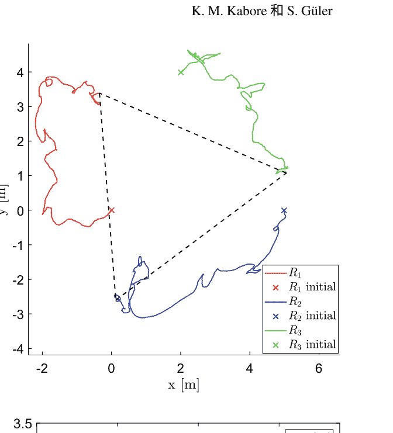

# 图10 相对距离误差 |e_i|

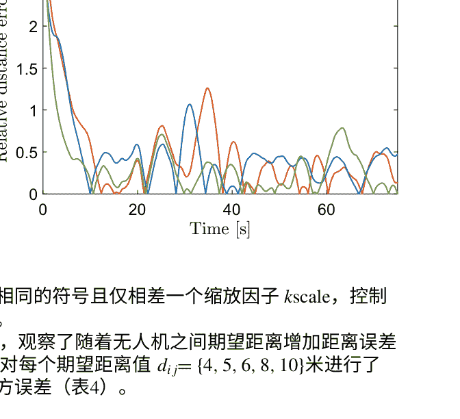

由于实际和估计参数值具有相同的符号且仅相差一个缩放因子kscale，控制器能够调节无人机的方位角。

我们进行了其他几个实验，观察了随着无人机之间期望距离增加距离误差的模式。特别地，我们分别对每个期望距离值d_{ij}= {4, 5, 6, 8, 10}米进行了五分钟的仿真，并记录了均方误差（表4）。

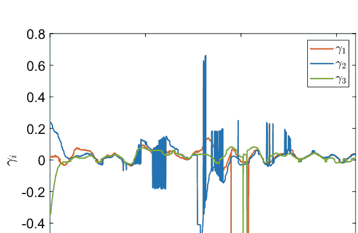

表4 记录了不同期望距离条件下每架无人机的均方误差值。

| 期望距离 | 无人机1 | 无人机2 | 无人机3 |
| :--- | :--- | :--- | :--- |
| 4 米 | 0.36714 | 0.38685 | 0.35345 |
| 5 米 | 0.39854 | 0.44036 | 0.31203 |
| 6 米 | 0.44983 | 0.50122 | 0.32079 |
| 8 米 | 0.44074 | 0.49611 | 0.31865 |
| 10 米 | 0.81767 | 0.79985 | 0.67343 |

这些结果表明了两个事实。首先，随着期望距离的增加，距离误差逐渐增加。其次，检测算法成功地在较远的距离上检测到了无人机。

## 6 讨论与未来工作

我们提出了一种完全分布式的无人机编队控制算法。编队控制层与深度学习模型相结合，作为一种测量工具。我们的设置不需要全球定位系统（GPS）或运动捕捉系统。因此，它可以在室内和室外实施。在这里，我们讨论了从模拟到实际实验时可能出现的一些问题。

当涉及到实际的实验设置时，首先要进行的修改将是深度学习的训练和测试机制。这样一个真实环境将包括重力、阳光反射引起的额外噪音和风。尽管我们已经调整了模拟环境，使其类似于通过在真实场景中插入物体和虚拟光源，模型需要使用在这样真实条件下收集的数据集进行重新训练，以提高性能。此外，无人机模型在训练中起着关键作用。YOLO架构需要进行调整以适应所使用的无人机模型。

在模拟中，我们通过添加人工噪声信号从Gazebo的内部主题中获取了机器人间距离数据。在真实世界的实验中，距离数据可以通过使用时飞法进行测量的最先进的超宽带传感器获取。此外，还可以使用接收信号强度（RSS）类型的传感器，如蓝牙和无线通信模块，来实现这一目的。尽管基于RSS的技术被认为提供较低的信噪比，但我们推测在所需距离集大于三米的实现中，这类传感器的准确性将是合理的。

另一个值得一提的重要考虑是检测性能。在高度动态的环境中，无人机的检测性能可能会下降。如果环境中存在鸟类或类似无人机的物体，则深度学习模型可能会产生误报输出，因此检测过程可能无法为每个接收到的图像帧提供准确的预测。此外，深度学习模型可能会产生一个空的边界框，这是误报的结果，或者在图像平面上与无人机实际大小不成比例的矩形框。

通过基于贝叶斯滤波器的跟踪算法，可以在一定程度上解决这些问题。可以设计扩展卡尔曼滤波器（EKF）或粒子滤波器（PF）来去除误检测输出并提供改进的检测性能。Krishna等人在提出的工作中已经提出了一个示例倡议。作者设计了一个视觉跟踪算法，并展示了将跟踪与检测模型相结合的收益。

作为我们工作的未来方向，我们计划为YOLO提供的检测到的物体设计一个平滑跟踪层。尽管深度学习模型获得的准确性是可接受的，但偶尔可能会出现一些误检测。我们推测这个问题可能是由于标签数据关联不良引起的。然而，通过设计基于EKF的跟踪算法可以克服这个问题。这样的跟踪器可以为无人机之间提供更平滑的方位测量。

此外，我们计划将我们的方法扩展到领导者-追随者形成框架。众所周知，领导者-追随者框架提供了更强大和更有韧性的分布式算法。我们推测，通过轻微变化，所提出的基于深度学习的无人机检测算法可以与类似于[14]中的领导者-追随者形成控制算法相结合。

## 7 结论

在本章中，我们提出了一个完全分布式的无人机编队控制算法，集成了深度学习机制。这种方法是分散的，没有中央控制点，并且定位系统独立于全球定位系统（如GPS）。我们的设置使用单目摄像头。相机便宜且轻便，距离传感器可以根据应用需求选择。该框架实现了最近开发的卷积神经网络算法，即YOLOv3 Tiny，用于在操作期间检测无人机。我们收集了图像来构建可靠的数据集，并训练了针对我们问题定制的目标检测器，其平均精度达到92.75%。我们已将深度学习模型集成到编队控制层中，使控制算法依赖于检测模型得出的机器人间的方位角。从这个意义上说，这项工作对编队控制框架的实际应用做出了贡献。所提出方法的有效性在具有三个无人机的真实仿真环境Gazebo中得到了证明。检测机制的高成功率和编队控制算法的准确性构成了进一步实际应用的概念验证。

致谢本文受益于TÜBİTAK杰出研究者国际奖学金计划（项目编号：118C348）。然而，本文的全部责任属于作者。TÜBİTAK提供的财务支持并不意味着出版物的内容在科学意义上得到了TÜBİTAK的批准。

## 参考文献

- 1. Aker C, Kalkan S (2017) 使用深度网络进行无人机检测。在：2017年第14届IEEE国际高级视频和信号基础监视会议（AVSS）。IEEE，第1-6页。
- 2. Anderson BD, Yu C, Dasgupta S, Morse AS (2007) 在平面上控制三个领导者的编队。Syst Control Lett 56（9-10）：573-578。https://doi.org/10.1016/j.sysconle.2007.04.0043。
- 3. Aranda M, López-Nicolás G, Sagüés C, Mezouar Y (2015) 使用多个空中摄像头进行移动机器人编队控制。IEEE Trans Robot 31（4）：1064-1071。
- 4. Aranda M, Mezouar Y, López-Nicolás G, Sagüés C (2013) 具有多个摄像头的部分分布式多机器人控制。在：2013年美国控制会议。IEEE，第6308-6314页。
- 5. Bay H, Tuytelaars T, Van Gool L (2006) Surf：加速鲁棒特征。在：欧洲计算机视觉会议。Springer，柏林，第404-417页。
- 6. Coluccia A, Fascista A, Schumann A, Sommer L, Ghenescu M, Piatrik T, De Cubber G, Nalamati M, Kapoor A, Saqib M等（2019）：IEEE AVSS2019无人机与鸟类检测挑战。在：2019年第16届IEEE国际高级视频和信号监控会议（AVSS）。IEEE，第1-7页。
- 7. Connie T, Al-Shabi M, Cheah WP, Goh M (2017)：使用混合CNN-SIFT聚合器的面部表情识别。在：多学科人工智能趋势国际研讨会。Springer，柏林，第139-149页。
- 8. Convens B, Merckaert K, Nicotra MM, Naldi R, Garone E (2017)：具有执行器饱和度的全动力无人机控制。IFAC-PapersOnLine 50（1）：12715-12720。
- 9. Craye C, Ardjoune S (2019)：用于无人机检测的时空语义分割。在：2019年第16届IEEE国际高级视频和信号监控会议（AVSS）。IEEE，第1-5页。
- 10. Dalal N, Triggs B (2005) 用于人体检测的梯度直方图。在：2005年IEEE计算机学会计算机视觉和模式识别会议（CVPR'05），第1卷。IEEE，第886-893页。
- 11. Das AK, Fierro R, Kumar V, Ostrowski JP, Spletzer J, Taylor CJ (2002) 基于视觉的编队控制框架。IEEE Trans Robot Autom 18（5）：813-825。
- 12. Deng J, Dong W, Socher R, Li LJ, Li K, Fei-Fei L (2009) Imagenet: 一个大规模的分层图像数据库。在：2009年IEEE计算机视觉和模式识别会议。IEEE，第248-255页。
- 13. Faigl J, Krajník T, Chudoba J, Přeučil L, Saska M (2013) 用于机器人群体中的相对定位的低成本嵌入式系统。在：2013年IEEE国际机器人和自动化会议。IEEE，第993-98页。
- 14. Fidan B, Gazi V, Zhai S, Cen N, Karataş E (2012) 基于单视图距离估计的机器人群体形成控制。IEEE Trans Ind Electron 60(12):5781–5791。
- 15. Girshick R (2015) 快速 R-CNN。在：IEEE国际计算机视觉会议论文集，pp 1440–1448。
- 16. Girshick R, Donahue J, Darrell T, Malik J (2014) 用于准确目标检测和语义分割的丰富特征层次结构。在：IEEE计算机视觉和模式识别会议论文集，pp 580–587。
- 17. Goodfellow I, Bengio Y, Courville A (2016) 深度学习。MIT Press。
- 18. Guo D, Wang H, Chen W, Liu M, Xia Z, Leang KK (2017) 用于移动机器人的统一领导者-跟随者方案带有未校准的机载摄像头。在：2017 IEEE国际机器人与自动化会议 (ICRA). IEEE, pp 3792–3797。
- 19. Kanistras K, Martins G, Rutherford MJ, Valavanis KP (2013) 无人机交通监测综述。在：2013年国际无人机系统会议(ICUAS). IEEE, pp 221–234。
- 20. Kondak K, Ollero A, Maza I, Krieger K, Albu-Schaeffer A, Schwarzbach M, Laiacker M (2015) 无人机与环境的物理交互: 负载运输, 部署和空中操作。无人机手册, pp 2755–2785。
- 21. Krajník T, Nitsche M, Faigl J, Vaněk P, Saska M, Přeučil L, Duckett T, Mejail M (2014) 一个实用的多机器人定位系统。J Intell Robot Syst 76(3–4):539–562。
- 22. Kulbacki M, Segen J, Knieć W, Klempous R, Kluwak K, Nikodem J, Kulbacka J, Serester A (2018) 农业自动化无人机调查: 从种植到收获。在：2018年IEEE智能工程系统国际会议(INES). IEEE, pp 000353–000358。
- 23. LeCun Y, Bengio Y, Hinton G (2015) 深度学习。自然 521(7553):436–444。
- 24. LeCun Y et al (2015) Lenet-5, 卷积神经网络。http://yann.lecun.com/exdb/ lenet 20(5), 14 (2015)。
- 25. Lightbody P, Krajník T, Hanheide M (2017) 一种高效的视觉标志定位系统。ACM SIGAPP Appl Comput Rev 17(3):28–37。
- 26. Lightbody P, Krajník T, Hanheide M (2017) 一种多功能高性能的视觉标志检测系统, 具有可扩展的身份编码。在：应用计算的研讨会论文集, pp 276–282。
- 27. Lowe G (2004) Sift-尺度不变特征变换。国际杂志 2:91–110。
- 28. Mariottini GL, Morbidi F, Prattichizzo D, Pappas GJ, Daniilidis K (2007) : 领导者-跟随者形成: 未校准的基于视觉的定位和控制。在：2007年IEEE国际机器人与自动化会议论文集。IEEE, 第2403-2408页。
- 29. Melita C, Longo D, Muscato G, Giudice G (2015) : 火山环境中的测量和探索。在：无人机手册。Springer, 多德雷赫特, 第2667-2692页。
- 30. Merino L, Martínez-de Dios JR, Ollero A (2015) : 用于火灾检测、监测和灭火的合作无人机系统。无人机手册, 第2693-2722页。
- 31. Montijano E, Cristofalo E, Zhou D, Schwager M, Sagues C (2016) : 基于视觉的分布式形成控制无需外部定位系统。IEEE Trans Robot 32 (2) : 339-351。
- 32. Nguyen T, Mohta K, Taylor CJ, Kumar V (2019) : 基于视觉的多MAV定位, 使用耦合概率数据关联滤波器进行匿名相对测量。arXiv预印本 arXiv:1909.08200。
- 33. Nguyen T, Shivakumar SS, Miller ID, Keller J, Lee ES, Zhou A, Özaslan T, Loianno G, Harwood JH, Wozencraft J等 (2019) : Mavnet: 一种用于基于MAV的任务的有效语义分割微型网络。IEEE机器人与自动化快报4 (4) : 3908-3915。
- 34. Oh KK, Park MC, Ahn HS (2015) : 多智能体编队控制综述。Automatica 53: 424-440。
- 35. Peng J, Zheng C, Lv P, Cui T, Cheng Y, Lingyu S (2018) : 使用PBRT渲染的图像训练更快的UAV检测的R-CNN。
- 36. Redmon J, Divvala S, Girshick R, Farhadi A (2016) : 你只看一次: 统一的实时目标检测。在：IEEE计算机视觉和模式识别会议论文集, pp 779-788。
- 37. Redmon J, Farhadi A (2018) Yolov3: 一种渐进式改进。arXiv预印本 arXiv:1804.02767。
- 38. Ren S, He K, Girshick R, Sun J (2015) Faster R-CNN: 迈向实时目标检测与区域建议网络。在：神经信息处理系统的进展, 第91-99页。
- 39. Rozantsev A, Lepitit V, Fua P (2016) 使用单个移动相机检测飞行物体。IEEE Trans Pattern Anal Mach Intel 39(5):879–892。
- 40. Sapkota KR, Roelfsen S, Rozantsev A, Lepetit V, Gillet D, Fua P, Martinoli A (2016) 基于视觉的无人机检测和跟踪用于感知和避障系统。在：2016年IEEE/RSJ国际智能机器人与系统会议(IROS)。IEEE, 第1556-1561页。
- 41. Saqib M, Khan SD, Sharma N, Blumenstein M (2017) 使用深度卷积神经网络检测无人机的研究。在：2017年第14届IEEE高级视频和信号监控国际会议(AVSS)。IEEE, 第1-5页。
- 42. Saska M, Baca T, Thomas J, Chudoba J, Preucil L, Krajnik T, Faigl J, Loianno G, Kumar V (2017) 在GPS受限环境中使用机载视觉相对定位部署无人机群组的系统。自主机器人41(4):919–944。
- 43. Schilling F, Lecoeur J, Schiano F, Floreano D (2019) 通过模仿学习在无人机群中进行基于视觉的飞行。IEEE机器人与自动化快报4(4):4523–4530。
- 44. Sermanet P, Eigen D, Zhang X, Mathieu M, Fergus R, LeCun Y (2013) Overfeat: 综合识别、定位和检测的卷积网络。arXiv预印本arXiv:1312.6229。
- 45. Štěpán P, Krajník T, Petrlik M, Saska M (2019) 视觉技术用于机载目标检测、跟踪和建图。J Field Robot 36(1):252–269。
- 46. Tzutalin L (2015) Git 代码。
- 47. Unlu E, Zenou E, Riviere N, Dupouy PE (2019) 基于深度学习的无人机检测和跟踪策略, 使用多个摄像头。IPSJ Trans Comput Vis Appl 11(1):74。
- 48. Viswanathan DG (2009) 加速段测试 (fast) 的特征。In: Proceedings of the10th workshop on image analysis for multimedia interactive services, London, UK, pp 6–8。
- 49. Vrba M, Saska M (2020) 无标记微型飞行器检测和定位, 使用卷积神经网络。IEEE Robot Autom Lett 5(2):2459–2466。
- 50. Walter V, Staub N, Franchi A, Saska M (2019) UVDAR系统用于多旋翼无人机的视觉相对定位, 应用于领航者-跟随者编队。IEEE机器人与自动化快报4(3):2637–2644。
- 51. Wang H, Guo D, Liang X, Chen W, Hu G, Leang KK (2016) 自适应基于视觉的领航者-跟随者编队控制移动机器人。IEEE工业电子学报64(4):2893–2902。
- 52. Weinstein A, Cho A, Loianno G, Kumar V (2018) 视觉惯性测距群体: 一种基于视觉的四旋翼无人机自主群体。IEEE机器人与自动化快报3(3):1801–1807. https://doi.org/10.1109/Ira.2018.2800119。
- 53. Zhang Z, Cao Y, Ding M, Zhuang L, Wang Z (2018) 基于空间和时间上下文信息融合的自主感知与避障飞行物体检测。在：2018年无人机系统国际会议(ICUAS)。IEEE, pp 569–578。

# 基于深度学习的动物品种识别

Pritam Ghosh, Subhranil Mustafi, Kaushik Mukherjee, Sanket Dan, Kunal Roy, Satyendra Nath Mandal和Santanu Banik

摘要 从图像中准确可靠地识别家畜的品种是智能畜牧管理中最有前景但也最具挑战性的任务之一。传统的动物品种识别方法非常昂贵且耗时。因此，需要一种更快速、更便宜的技术来进行动物品种识别，而且任何人都可以使用，无需太多技术知识。基于深度学习的动物品种分类可以解决这个问题。深度卷积神经网络（CNN）的最新发展极大地提高了图像识别系统的准确性，但选择适合所需任务的最佳模型对于获得最佳性能非常重要。在本研究中，分析了九种不同的基于深度CNN的模型的性能，以找到能够准确确定个体动物品种身份的最佳模型。所有九个CNN模型都使用相同的超参数分别在猪品种数据集和山羊品种数据集上进行了端到端的训练。通过获得的结果，已经确定MobileNetV2是山羊品种分类的最佳深度CNN模型，预测准确率为95.00%，而InceptionV3是猪品种分类的最佳模型，预测准确率为100.00%。本研究中获得的山羊和猪的品种分类性能与其他用于动物品种分类的技术进行了比较。比较结果显示，我们基于CNN的技术与所有其他方法相当。凭借这些令人鼓舞的结果，可以自信地说，基于深度CNN的模型可以高精度地解决动物品种分类问题，并可作为智能畜牧管理的即用技术。

关键词 智能畜牧管理 · 卷积神经网络 · 动物品种分类 · 深度学习 · 性能评估 · 监督学习

## 缩略语列表

| 缩略语 | 全称 |
|--------|------|
| 词袋 | 词袋模型 |
| 尺度不变特征变换 | 尺度不变特征变换 |
| 支持向量机 | 支持向量机 |
| 稀疏编码空间金字塔匹配 | 稀疏编码空间金字塔匹配 |
| 局部二值模式 | 基于细胞结构的局部二值模式 |
| 深度卷积神经网络 | 深度卷积神经网络 |
| 线性判别分析 | 线性判别分析 |
| 卷积神经网络 | 卷积神经网络 |
| K最近邻 | K最近邻 |
| 多部分卷积神经网络 | 多部分卷积神经网络 |
| 使用多部分CNN的有监督聚类 | 使用多部分CNN的有监督聚类 |
| 循环神经网络 | 循环神经网络 |
| 全卷积注意力网络 | 全卷积注意力网络 |
| FOAF | 融合的一对多特征 |
| MA-CNN | 多注意力卷积神经网络 |

## 1 引言

### 1.1 动机

动物物种以品种的形式展示其多样性。有必要为各种原因识别这些品种，包括实施联合国粮食及农业组织（FAO）制定的全球动物遗传资源行动计划（AnGR）[1]。对动物品种进行分类是一项重要任务，以保持品种的纯度，因为动物的经济价值直接与其所属的品种相关。山羊和猪养殖是世界上增长最快的畜牧业之一。

根据粮食和农业组织（FAO）[2]的数据，世界上有超过10亿只山羊和978百万只猪。根据畜禽普查[3]，印度的山羊数量为1.4888亿只，猪的数量为906万只。印度有34个注册山羊品种和10个注册猪品种[4, 5]。每个品种都有其独特的特点，保持这种独特性对于维持畜牧业的发展至关重要。

### 1.2 动物品种识别的困难之处

在品种识别中，表型和基因型特征被视为黄金标准。表型特征[6]包括识别、定量和定性描述、种群的记录、自然栖息地的信息以及品种的生产系统。基因型特征[7]用于了解遗传资源的多样性和独特性，以制定改进资源价值和利用范围的政策。但是，表型特征的确定取决于动物的所在地和饮食习惯，而且确定表型特征非常耗时。另一方面，基因型特征的确定非常昂贵。需要专门的实验室来进行动物的基因型特征确定。因此，目前的品种识别方法不适用于需要即时但高精度的品种预测的现场情况。与不同的兽医研究人员进行详细讨论后发现，在当前情况下，尤其是印度的山羊和猪种群中，品种间的杂交非常严重，很难识别纯种遗传资源，这妨碍了它们的保护工作。

这非常令人担忧，因为印度是世界上为国际畜禽基因库做出重大贡献的少数国家之一。

### 1.3 目标

- 开发一种基于深度学习的动物品种技术，可以由任何人在没有昂贵仪器的情况下使用，并能从个体动物图像中产生快速准确的品种识别结果。
- 确定哪种深度卷积神经网络模型在山羊品种和猪品种分类任务中表现最佳
- 确定深度卷积神经网络模型对细粒度分类的训练数据量的依赖性。

### 1.4 工作完成

在本研究中，使用九种不同的成熟深度卷积神经网络模型对动物品种进行了训练和测试。通过使用移动相机从组织农场拍摄个体动物图像，构建了两个品种数据集，分别包含约克夏和汉普郡品种的猪品种数据集以及Sirohi、Blackbengal、Jakhrana、Jamunapari、Barbari和Beetal品种的山羊品种数据集。捕获的图像已分为三个类别，即训练、验证和测试。所有模型都使用训练集图像进行训练，并使用验证集图像进行评估。一组相同的超参数。根据验证准确性，前三个表现最好的模型进一步用于使用测试集图像进行品种预测。根据预测性能，计算了四种不同的分类指标，如精确度、召回率、F1-Score和准确度。为了确定山羊品种分类和猪品种分类的最佳模型，将深度、大小、训练时间和可训练特征的数量与获得的预测准确性进行了比较。理想情况下，最佳模型应该训练时间最短，存储所需的磁盘空间最少，并获得最高的准确度。

### 1.5 贡献

两个完全训练、快速准确的基于深度卷积神经网络的动物品种识别模型（具有95%山羊品种预测准确度的MobileNetV2模型和具有100%猪品种预测准确度的InceptionV3模型），旨在从现场级别图像中识别动物品种，并有助于保护品种特定的遗传资源。

### 1.6 章节组织

本章的其余部分按照以下方式组织：背景研究和研究间隙在第2节中讨论。第3节介绍了用于进行本研究的数据。第4节讨论了方法论，接着在第5节中介绍了其实施。实验结果在第6节中进行了说明，接着在第8节中介绍了其影响。结论和未来的范围在第9节中讨论。

## 2 相关工作

不同的表型特征，如口印、体型、毛色和斑纹，已被用作动物品种识别的特征[8–10]。基于基因型的标记程序，如全基因组测序、微卫星标记物、脱氧核糖核酸（DNA）条形码，也已被用于动物品种的识别[11–13]。在动物品种识别中，表型和基因型识别面临的问题以及形态特征在动物品种识别中的可能性已在不同的研究中得到了突出[14–16]。

动物物种识别从图像中已经研究了很长时间。大多数物种分类系统是基于相机陷阱图像数据集开发的，例如Snapshot Serengeti [17]。最初，物种分类是使用诸如词袋模型 (BoW)、尺度不变特征变换 (SIFT)、支持向量机 (SVM)、空间金字塔匹配 (SPM)、线性判别分析 (LDA)、局部二值模式 (LBP) 等技术 [18–20]。在卷积神经网络在广泛的图像分类任务中取得成功之后[21, 22]，它们被用于更具体的任务，如物种分类。许多研究使用卷积神经网络 (CNN) 作为特征提取器，然后使用其他算法进行分类[23–26]，而其他研究则完全使用CNN模型进行任务[27–32]。物种分类研究中一些研究的准确性显示在表1中。

表1 不同动物物种分类方法的性能

| 方法 | # 物种 | 准确率 (%) |
| :--- | :---: | :---: |
| BoW, SIFT, SVM [19] | 2 | 95.37 |
| ScSPM, SIFT, cLBP, SVM [20] | 18 | 82.00 |
| DCNN [27] | 20 | 38.31 |
| AlexNet, SVM [23] | 2 | 94.00 |
| LDA, 符号分类器 [18] | 20 | 76.54 |
| ResNet101 [32] | 26 | 88.90 |
| CNN [31] | 5 | 98.00 |
| ResNet50 [33] | 3 | 90.40 |
| ResNet152 [29] | 48 | 93.80 |
| DCNN, KNN [26] | 20 | 91.40 |
| MP-CNN [24] | 6 | 99.80 |
| VGG16 [30] | 11 | 96.00 |
| VGG16, VGG19 [28] | 12 | 80.60 |
| SC-MPEM [25] | 41 | 98.40 |

动物物种分类的更困难的子领域是动物品种分类。这是一个复杂的问题，因为所有动物都属于同一物种，之间存在非常微小的品种差异。深度卷积神经网络模型已被广泛用于解决这个问题[34-41]。在这个领域中，只有少数几个数据集，如狗、鸟和猫[19, 42, 43]。

从背景研究中可以看出，关于山羊和猪的品种分类没有相关的文献。对于山羊和猪这样的动物，没有可用的品种数据集。大多数品种分类研究只针对狗进行。大多数方法用于单独注释的有区别的动物身体部位进行品种分类。此外，较新的深度卷积神经网络模型尚未用于此类任务。深度卷积神经网络模型对于细粒度分类的训练数据量的依赖性也没有得到详细研究。所有这些缺点在本研究中得到了解决。

## 3 动物品种数据库

### 3.1 图像捕获

本研究针对两种国内物种进行了研究，即猪（Sus）和山羊（Capra aegagrus hircus）。使用手机相机（1200万像素）拍摄了两种猪和六种山羊的照片。仅捕获了这些品种中纯种动物的个体图像。这些图像是从印度的畜牧研究机构维护的有组织农场收集的，包括：

- （1）印度兽医研究所，加尔各答，西孟加拉邦
- （2）北孟加拉农业大学，库奇贝哈尔，西孟加拉邦
- （3）印度兽医研究所，北方邦
- （4）印度兽医研究所，拉尼，阿萨姆邦
- （5）印度兽医研究所，乌米亚姆，梅加拉亚邦
- （6）印度兽医研究所，特里普拉，特里普拉邦

在无限制的背景设置下，当个体动物在农场中自由移动时，拍摄了它们的照片（图1）。在有限制的背景设置下，将动物放在绿色窗帘前，并拍摄了侧面图像（图1）。这些技术有助于提高拍摄图像的多样性。

为了捕捉图像，动物没有遭受任何可能违反农场动物福利的困扰条件。图像是从适当的距离拍摄的，保持整个动物在画面中。

### 3.2 动物品种数据集

从捕获的图像中创建了两个不同的数据集，即猪品种数据集和山羊品种数据集。猪品种数据集包含两个不同的猪品种，分别是约克郡和汉普郡（图2），共包含4400张图像；山羊品种数据集包含六个不同的山羊品种，分别是

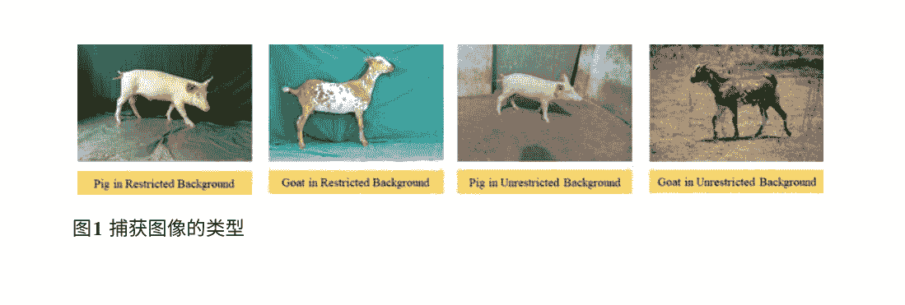

# 图2 本研究中使用的不同山羊品种


# 图3 本研究中使用的不同猪品种

巴巴里、比塔尔、黑孟加拉、贾姆纳帕里、西罗希和贾克拉纳（图3），共包含1875张图像。为了构建品种数据集，将捕获的图像分为三组，即训练集、验证集和测试集。最初，将已知品种的个体动物图像分别放入其相应的品种文件夹中。然后，从每个文件夹中随机分割图像为训练集、验证集和测试集。在训练集和验证集中保持文件夹结构，但在测试集中，所有图像都被移出其相应的品种文件夹，以消除其品种身份。山羊品种数据集和猪品种数据集的最终结构以及每个类别中的图像数量分别显示在图4和图5中。

## 4 方法

### 4.1 卷积神经网络

卷积神经网络（CNN）是一种图像分类算法。它以一组图像作为输入（训练图像），通过计算图像与真实标签之间的损失并通过整个网络进行反向传播来调整其可学习的权重和偏差。通过这种方式，CNN可以预测不同集合图像中存在的对象类型，通过学习训练集中图像的重要特征，假设两组图像在某种程度上相似[44]。

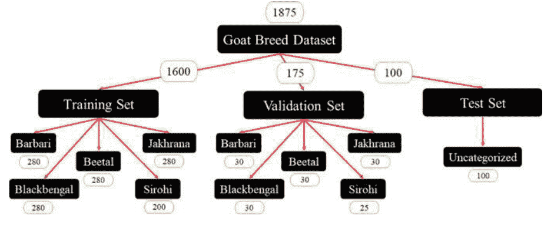

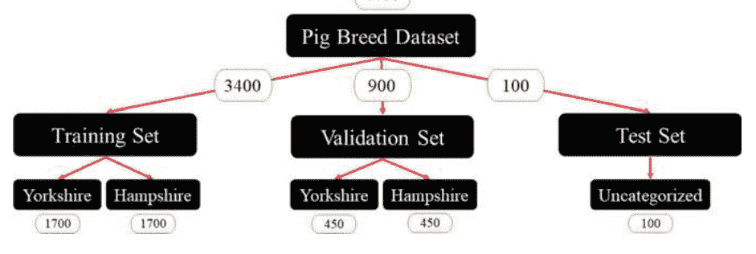

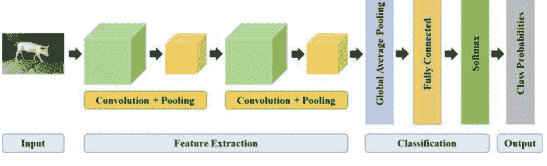

通过从训练集中的图像中学习可用的重要特征，CNN可以预测不同集合图像中存在的对象类型，假设两组图像在某种程度上相似[44]。CNN模型主要由以下层组成：卷积层、池化层、Dropout层、批归一化层、连接层、全连接层和Softmax层。卷积神经网络的基本结构如图6所示。

#### 4.1.1 卷积层

卷积层是卷积神经网络的核心构建模块，它承担了大部分的计算重任。卷积层的参数由一组可学习的滤波器组成。每个滤波器在空间上都很小（沿宽度和高度），但在输入体积的完整深度上延伸。例如，CNN的第一层上的一个典型滤波器可能具有尺寸5*5*3（即宽度和高度为5个像素，深度为3，即颜色通道）。如果输入图像矩阵的维度为a*b*c，滤波器矩阵的维度为e*f*c，那么输出矩阵的维度将为(a-e+1)*(b-f+1)*1。在训练过程中，程序将在输入体积的宽度和高度上滑动（更准确地说，进行卷积），并计算滤波器的每个位置与输入的点积。当滤波器在输入体积的宽度和高度上滑动时，它将产生一个二维激活图，该图显示了该滤波器在每个空间位置的响应。直观地说，网络将学习到一些类型的视觉特征，例如第一层上的某种方向的边缘或某种颜色的斑点，或者在网络的更高层次上整个蜂窝或轮状图案。现在，CNN的每个卷积层将具有整套滤波器（例如12个滤波器），每个滤波器将产生一个单独的二维激活图。这些激活图将沿深度维度堆叠，并产生输出体积。

#### 4.1.2 池化层

池化层用于卷积神经网络架构中连续卷积层之间。它的功能是逐渐减小表示的空间大小，以减少网络中的参数和计算量，从而控制过拟合。池化层独立地对输入的每个深度切片进行操作，并调整其空间大小。例如，使用2*2大小的滤波器和步长为2的池化层会将输入中的每个深度切片在宽度和高度上缩小2倍，丢弃75%的激活值。这意味着使用上述滤波器和步长，4*4*16的激活图大小将转换为2*2*16。通常使用两种类型的池化操作，即最大池化和平均池化。在最大池化中，滤波区域内的最大值被视为输出。在平均池化中，滤波区域内的所有值的平均值被视为输出。这意味着对于每个2*2滤波器的池化操作，最大池化考虑4个数字中的最大值，而平均池化考虑4个数字的平均值。

#### 4.1.3 丢弃层

正则化是一种控制神经网络容量以防止过拟合的方法。丢弃是一种非常有效、简单的正则化技术[45]。在训练过程中，通过以概率$p$（一个超参数）保持神经元活跃，或者将其设置为零来实现丢弃。丢弃可以被解释为在全连接层中对密集神经连接进行采样，并且仅基于输入数据更新采样网络的参数。

在测试过程中，不应用丢弃。

#### 4.1.4 批归一化层

批归一化是一种训练非常深的神经网络的技术，它在每个小批量中对每个输入通道进行归一化[46]。这样做的效果是稳定学习过程，并显著减少训练深度网络所需的训练轮数。其思想是以使每一层的输入具有零均值和单位标准差的方式对每一层的输入进行归一化[47]。因此，对于每个特征，批归一化计算该特征在小批量中的均值和方差，然后减去均值并将特征除以其小批量标准差。

#### 4.1.5 密集连接层

通过将最后一个卷积特征图展平，创建特征向量，然后通过密集神经网络进行分类（输入图像是山羊还是猫还是狗还是树还是其他任何东西）。这个密集网络被称为全连接层。全连接层中的神经元与前一层的所有激活之间有完全连接。因此，它们的激活可以通过矩阵乘法和偏置偏移来计算。

每个卷积层、批归一化层和密集层之后都有激活层，其中对输入应用非线性变换。激活层由激活函数（如ReLU、Softmax等）组成。激活函数通过计算加权和并进一步添加偏置来决定是否激活输入神经元。通常，对于所有中间层，使用ReLU [48]激活函数，对于最后的全连接层，使用Softmax激活函数。Softmax函数可以看作是一个广义的逻辑函数，它以得分向量x作为输入，并在模型末端输出一个输出概率向量p。然后分析输出向量，并将具有最大概率值的类别作为输入图像的实际类别。除此之外，根据CNN的架构，可能还涉及其他各种层，以优化网络，使其训练更快，并增加其深度。

### 4.2 卷积神经网络中的参数

参数是模型中的权重和偏置，在训练过程中由优化器进行调整。这些参数存储了关于数据的实际知识。参数直接影响模型的预测能力。卷积神经网络模型中的不同层包含不同数量的可训练参数，取决于层的类型、滤波器大小、步长、滤波器数量、激活大小等。在任何卷积神经网络模型中，大部分参数分布在卷积层、全连接层和批归一化层中。

池化层、dropout层、连接层等不包含任何可训练参数。例如，在一个中间卷积层中，如果滤波器大小为5 * 5 * 8，步长为1，滤波器数量为16，则该卷积层的参数数量等于 ((5 * 5 * 8) + 1) * 16 = 3216。

对于具有120个激活大小（神经元数量）和84个先前激活大小的密集连接层，总参数数量等于 (120 * 84) + 120 = 10,200。批归一化中的参数由输入体积的深度决定。在这里，对于来自前一层的每个特征，批归一化层会跟踪四个参数，如gamma权重、beta权重、移动均值和移动方差。因此，对于输入体积为11 * 11 * 672，批归一化层中的参数数量等于672 * 4 = 2688。模型中的总参数数量是通过将模型中每个层的参数数量相加计算得出的。模型中的参数数量直接对应着存储在磁盘上的完全训练模型的大小。这意味着具有更多参数的模型将占用更多的磁盘空间进行存储。在这项研究中，通过比较参数分布对层数和模型大小的影响，来评估模型在动物品种分类中的适用性。

### 4.3 深度卷积神经网络模型的描述

卷积神经网络在计算机视觉领域取得了巨大的成功，尤其是在大规模图像分类任务中。它们从图像中直接提取特征的固有能力使得克服传统算法依赖手工设计特征的缺点成为可能。深度卷积神经网络模型在2012年进入视野，当时AlexNet [22] 在大规模视觉识别挑战（ILSVRC）中取得了最先进的成果，模型在ImageNet [21] 数据集上进行了训练和测试。多年来，已经开发了几种深度卷积神经网络模型，在ImageNet数据集上取得了更好的准确性。但是，如果模型在不同的数据集上进行训练和测试，其性能可能会发生变化。

表2中给出了模型在ImageNet数据集上的简要描述和性能。

## 表2 本研究中使用的CNN模型

| 模型 | 细节 | 准确率 (ImageNet) (%) |
|------|------|----------------------|
| VGG19 [49] | 第一个解决CNN深度方面的CNN模型架构设计的模型。该模型包含19个权重层，共有1400万个参数。该模型中的所有卷积层仅使用（3*3）的滤波器。 | 71.30 |
| InceptionV3 [50] | 对初始GoogLeNet [51]架构进行的修改。该模型通过添加更多的Inception模块和利用添加的计算来尽可能高效地进行适当分解的卷积和积极的正则化，从而扩大了CNN网络的规模。 | 77.90 |
| ResNet101V2 [52] | 对深度残差网络[53]模型进行的修改，引入了残差学习框架以便更容易训练更深的网络。在该模型中，残差单元已经进行了修改，这使得训练更容易并且提高了泛化能力。 | 76.40 |
| Xception [54] | 修改的初始模型，其中架构中的初始模块被深度可分离卷积所替代。它具有与InceptionV3中相似的参数数量，但通过高效利用这些参数来获得更好的性能。 | 79.00 |
| DenseNet201 [55] | 在这个模型架构中，对于每一层，所有前面层的特征图都被用作输入，并且它的特征图被用作所有后续层的输入。这使得卷积神经网络非常密集地连接，就像全连接神经网络一样。这个模型缓解了梯度消失问题，增强了特征传播，鼓励特征重用，并且大大减少了参数数量。 | 77.30 |
| InceptionResNetV2 [56] | 这个模型在CNN架构中引入了残差初始块。与普通的初始网络相比，这加速了带有残差连接的初始网络的训练。 | 80.30 |
| MobileNetV2 [57] | 该模型设计用于移动视觉应用，效率优先而非准确性。这引入了卷积神经网络架构中的反向残差块。还引入了许多优化措施，以提高训练和预测效率。 | 71.30 |
| NASNetLarge [58] | 该模型是基于ImageNet数据集的NASNet搜索空间中开发出的最佳架构结果。这里的主要思想是直接在感兴趣的数据集上学习模型架构。为了减少为大型数据集开发最佳分类模型的时间，它在小型数据集上搜索架构构建块，然后将该块转移到较大的数据集上。 | 82.50 |
| EfficientNetB5 [59] | 该模型是通过神经架构搜索设计的基线网络进行扩展得到的结果。该模型使用的缩放方法称为复合缩放，它使用简单但非常有效的复合系数均匀缩放深度/宽度/分辨率的所有维度。这比其他卷积神经网络实现了更好的准确性和效率。 | 83.70 |

图7 方法论

在这项研究中，这些深度卷积神经网络模型已经在山羊品种数据集和猪品种数据集上进行了训练，并且它们的性能进行了比较。

### 4.4 行动计划

最优模型选择的过程被分为几个步骤，并且它们以分层结构的方式工作（图7）。每个模型都经过相同的过程进行训练和评估，以保持一个无偏的情景。品种数据集是通过收集属于不同品种的个体动物图像来创建的。然后，数据集被分成三个不同的集合（训练集、验证集和测试集）。训练集用于训练模型。验证集中模型的性能用于选择排名前三的最佳模型。最后，将排名前三的模型应用于测试集图像，并计算各种分类指标（精确度、召回率、F1分数）。基于这些指标，选择了最佳的深度卷积神经网络模型用于动物品种分类。

### 4.5 性能评估

有各种可用于分类的评估指标[61-65]。在这项研究中，主要目标是训练一个基于深度学习的模型，该模型应能够从多个可用品种中正确预测动物的品种。这属于多类分类问题。这样的模型可以在训练过程中使用验证集图像进行评估，然后在使用测试集图像进行实际预测时使用训练好的模型。在训练过程中，模型评估是基于每次迭代后获得的损失和准确率值进行的。

## 表3 确定多类分类中的TP、FN和FP

| 类别 | 条件 |
| :--- | :--- |
| 真正例 (TP) | 如果模型正确预测了正类 |
| 假负例 (FN) | 如果模型错误地预测了负类 |
| 假正例 (FP) | 如果模型错误地预测了正类 |

与验证集图像相比，对训练集图像进行训练。如果训练正确，损失应逐渐减少并接近零，同时准确率应增加并接近一。验证集，顾名思义，用于检查模型是否能够从训练集中学习并按预期应用其知识。如果模型在训练集上表现得和在训练集上一样好，就可以说它被完全训练。经常使用训练与验证损失和训练与验证准确率的图表来进行此类评估。在这项研究中，模型在训练结束时获得的验证准确率与各种模型参数进行了比较，例如每次迭代的时间、可训练参数的数量和总层数。为了评估模型的预测性能，使用不同的指标集。对于任何模型，其预测可以分为三个广义类别，即真正例 (TP) 预测、假正例 (FP) 预测和假负例 (FN) 预测。确定此类预测的数量取决于所使用的评估条件。在多类分类的情况下，不考虑真负例 (TN)，因为对于特定类别的TN预测将属于其他类别的TP、FP或FN预测。对于多类分类环境，可以通过比较实际类别和预测类别来计算TP、FN和FP预测的数量，如表3所示。

基于TP、FN和FP值，可以计算出四种不同的性能评估指标，这些指标在本研究中被用来比较模型的性能（表4）。

如果一个模型能够正确预测所有的测试集图像，则称其为完美模型。例如，如果测试集包含x张图像，对于一个完美模型，TP = x，FP = 0，FN = 0。因此：精确率 = 100%，召回率 = 100%，准确率 = 100%，F1得分 = 100%。因此，构建一个好的模型的目标是减少FP和FN的预测数量，增加TP的预测数量，使得四个指标（精确率、召回率、准确率和F1得分）的值接近100%。

## 表4 性能指标

| 指标 | 方程 | 描述 |
| :--- | :--- | :--- |
| 精确度 | TP / (TP + FP) | 它回答了一个问题：在模型预测为真的项目中，有多少是真实的？ |
| 召回率 | TP / (TP + FN) | 它回答了这个问题：在所有真实项目中，模型找到了多少个真实项目？ |
| 准确率 | TP / (总测试用例数) | 它衡量了模型在所有预测中的真实预测数量 |
| F1得分 | (2 * 精确率 * 召回率) / (精确率 + 召回率) | 它被确定为精确率和召回率的调和平均值，并专注于对正类的分析。这个指标的高值表示模型在正类上的表现更好 |

## 表5 详细硬件规格

| 设备 | 模型 | 描述 |
| :--- | :--- | :--- |
| 处理器 | Intel Xeon E5-2640 v4 | 基础频率: 2.40 GHz, 核心数: 10, 线程数: 20, 缓存: 25 MB |
| 内存 | 三星DDR4 ECC | 容量: 64 GB, 频率: 2600 MHz, CAS延迟: 15 |
| 图形学 | Nvidia Quadro P4000 GDDR5 | 视频内存: 8 GB, CUDA核心: 1792 |

## 5 实施

### 5.1 硬件

为了保持一致性，所有模型都在相同的硬件上进行了训练和评估。由于训练任何深度卷积神经网络模型所需的时间取决于硬件的能力，因此在训练过程中保持其他因素不变。在进行训练时，没有运行其他应用程序。

所使用的硬件组件的详细信息见表5。

### 5.2 训练方法

所有实验，包括构建、训练和评估所有的卷积神经网络模型，都是在Python 3.7中使用Keras [66]框架和TensorFlow [67]后端进行的。对于所有模型，都使用了固定的输入图像尺寸为224 * 224 *3。根据每个模型的架构，特征提取部分的输出如图8所示。为了创建特征向量，一个全局平均池化层被用于最后的卷积层之后。

为了进行分类，特征向量被一个具有1024个神经元的全连接层使用，然后是一个dropout正则化层。最后，通过softmax层获得类别输出概率。对于山羊品种分类，softmax层有六个输出；对于猪品种分类，softmax层有两个输出，对应于每个数据集中使用的品种数量。

图8展示了实现过程。例如，使用MobileNetV2模型进行山羊品种分类时，输入是图像大小为224 * 224 *3的山羊品种数据集。最后一个卷积层的输出大小为7 * 7 *1280，通过全局平均池化层将其重塑为1280维的特征向量。然后将其输入到具有1024个神经元和dropout正则化的全连接层中。这一层与一个具有6个输出的softmax层密集连接，对应于六个山羊品种。所有模型都遵循相同的过程。使用相同的超参数训练所有模型，以便进行公正的模型间比较。所有模型都进行了500次迭代训练，使用小批量大小为10和学习率为0.001。权重和偏置的更新使用了RMSprop优化器[68]。

## 6 结果

所得结果已经分为两部分展示。在第一部分中，通过对山羊和猪品种数据集进行模型训练所得到的数据已经在表6和表7中进行了整理。利用这些数据，模型间的比较已经以图9、图10和图11的形式进行了展示。根据比较结果，针对山羊和猪数据集选择了三个表现最佳的模型，如表8和图12所示。

接下来，在第二部分中，最佳模型被用于对猪和山羊品种的图像进行分类。分类性能已经在表9中进行了整理，并通过图13、图14、图15、图16、图17和图18的混淆矩阵进行了展示，并得出了分类指标。此外，利用这些指标，每个物种的品种智能表现已在图中以图形方式展示。19和20。最后，模型参数和预测准确性进行了比较并确定了山羊和猪品种预测的最佳模型。详细分析在第8节中描述。

### 6.1 动物品种分类的最佳模型

在这项研究中，使用两个不同的动物品种数据集训练了九个不同的深度卷积神经网络模型，保持一组相同的超参数。得到的山羊品种数据集和猪品种数据集的结果分别显示在表6和表7中。

| 序号 | 架构 | 层数 | 可训练参数 | 单次迭代时间 | 训练准确率 | 验证准确率 |
| :--- | :--- | :--- | :--- | :--- | :--- | :--- |
| 1 | VGG19 | 26 | 20,551,746 | 36秒 | 0.1554 | 0.1714 |
| 2 | Xception | 134 | 22,907,182 | 42秒 | 0.9969 | 1.0000 |
| 3 | MobileNetV2 | 157 | 3,539,206 | 28秒 | 0.9962 | 1.0000 |
| 4 | InceptionV3 | 315 | 23,872,678 | 28秒 | 0.9881 | 0.9600 |
| 5 | ResNet101V2 | 378 | 44,629,126 | 44秒 | 0.9525 | 0.8686 |
| 6 | EfficientNetB5 | 578 | 30,441,014 | 91秒 | 0.9950 | 0.1314 |
| 7 | DenseNet201 | 709 | 20,062,342 | 44秒 | 0.9925 | 0.9314 |
| 8 | InceptionResNetV2 | 782 | 55,854,694 | 51秒 | 0.4469 | 0.3714 |
| 9 | NASNetLarge | 1042 | 88,856,092 | 157秒 | 0.1625 | 0.1714 |

| 序号 | 架构 | 层数 | 可训练参数 | 单次迭代时间 | 训练准确率 | 验证准确率 |
| :--- | :--- | :--- | :--- | :--- | :--- | :--- |
| 1 | VGG19 | 26 | 20,551,746 | 428秒 | 0.4959 | 0.5714 |
| 2 | Xception | 134 | 22,907,182 | 433秒 | 0.9950 | 0.9924 |
| 3 | MobileNetV2 | 157 | 3,539,206 | 425秒 | 0.9971 | 0.9829 |
| 4 | InceptionV3 | 315 | 23,872,678 | 431秒 | 0.9974 | 0.9962 |
| 5 | ResNet101V2 | 378 | 44,629,126 | 401秒 | 0.9874 | 0.9848 |
| 6 | EfficientNetB5 | 578 | 30,441,014 | 432秒 | 0.9982 | 0.5924 |
| 7 | DenseNet201 | 709 | 20,062,342 | 477秒 | 0.9994 | 0.9990 |
| 8 | InceptionResNetV2 | 782 | 55,854,694 | 420秒 | 0.9976 | 1.0000 |
| 9 | NASNetLarge | 1042 | 88,856,092 | 503秒 | 0.4847 | 0.5714 |

图9 对比：参数数量与验证准确率

对每个模型得到的验证准确率进行了与迭代时间、层数和参数数量的比较。比较结果在山羊品种数据集和猪品种数据集上分别在图9、图10和图11中展示。根据参数数量，可以观察到MobileNetV2、DenseNet201、Xception、InceptionV3在两个数据集中表现良好，但ResNet101V2和InceptionResNetV2只在猪品种数据集中表现更好。根据模型的深度，在两个数据集中，MobileNetV2、Xception和InceptionV3获得了最佳性能。而Inception-ResNetV2、ResNet101V2和DenseNet201在猪品种数据集中表现非常好。对于山羊品种数据集，MobileNetV2和InceptionV3在最短时间内获得了高准确率，但在猪品种数据集中，ResNet101V2被证明是最好的。

根据获得的最大验证准确率，两个数据集的前三个模型如表8所示。每个层的参数分布如图12所示。最佳性能模型已经突出显示。从图中可以清楚地看出，InceptionV3在两种情况下表现良好。

图10 对比：层数与验证准确率

## 表8 山羊品种数据集和猪品种数据集的前三个模型

| 排名 | 模型 | 时间/迭代 | 可训练参数 | 层数 | 验证准确率（%） |
| :--- | :--- | :--- | :--- | :--- | :--- |
| **山羊品种数据集** | | | | | |
| 1 | MobileNetV2 | 28秒 | 3,539,206 | 157 | 100.00 |
| 2 | Xception | 42秒 | 22,907,182 | 134 | 100.00 |
| 3 | InceptionV3 | 28秒 | 23,872,678 | 315 | 96.00 |
| **猪品种数据集** | | | | | |
| 1 | InceptionResNetV2 | 420秒 | 55,854,694 | 782 | 100.00 |
| 2 | DenseNet201 | 477秒 | 20,062,342 | 709 | 99.90 |
| 3 | InceptionV3 | 431秒 | 23,872,678 | 315 | 99.62 |

## 7 品种分类性能

为了确定模型的品种预测性能，使用前三个模型对山羊品种数据集和猪品种数据集的测试集图像进行分类。山羊品种测试集包含来自Barbari、Beetal、Jamunapari、Jakhrana和Blackbengal品种的每个品种17张图像，以及Sirohi品种的15张图像。在猪品种测试集中，每个品种有50张图片来自Hampshire和Yorkshire品种。两个测试案例的预测结果已经以混淆矩阵的形式显示在图13、14、15、16、17和18中。每个混淆矩阵显示了每个品种的正确和错误分类。在山羊品种预测的情况下，所有三个模型都难以识别Blackbengal品种，并且被错误地分类为Beetal、Sirohi和Jakhrana。在猪品种预测的情况下，无法从数据中得出这样的推论。

从混淆矩阵中，按品种计算的分类指标已经计算如表9和10所示。

使用F1-Score指标，山羊和猪的品种性能如图19和20所示。比较模型的品种性能，可以观察到Xception在分类所有六个山羊品种方面表现良好，而InceptionV3在分类两个猪品种方面表现良好。

图14 使用Xception进行山羊品种分类的混淆矩阵

## 8 讨论

已经对两个主要的动物品种数据集进行了九种不同的深度卷积神经网络模型的训练和评估，其中包括六种不同品种的山羊品种数据集和两种不同品种的猪品种数据集。为了找到最佳模型，比较了不同的模型参数，如模型深度、可训练参数数量、训练时间、模型大小和整体准确率。根据所得结果，观察到没有单一模型在所有情况下表现最佳。

需要在准确率、模型大小、训练时间、深度和参数之间进行权衡。

在山羊品种分类中，InceptionV3具有更大的模型大小和较低的准确率，使其不如其他两种模型。现在，在Xception和MobileNetV2之间，Xception具有更高的准确率和更大的模型大小，而MobileNetV2具有较低的准确率和较小的模型大小。通过比较准确率和模型大小的相对差异，我们可以看到Xception比MobileNetV2大82.76%，但只获得2.06%的额外准确率。因此，MobileNetV2是最适合山羊品种分类的模型。此外，MobileNetV2的每次迭代训练时间最短。在猪品种分类的情况下，模型之间的差异更加微妙。比较DenseNet201和InceptionV3，DenseNet201的训练模型大小比InceptionV3小11.17%。但是分类准确度的损失只有2%。然而，InceptionV3的训练时间减少了9.64%。但是，如果考虑到InceptionV3在山羊品种分类方面的表现，可以将其表示为整体上更好的模型。因此，InceptionV3被选择为猪品种分类的最佳模型。

猪品种数据集比山羊品种数据集大57.38%。但是，深度卷积神经网络模型如MobileNetV2、Xception和InceptionV3在山羊品种分类方面能够实现出色的分类性能。不同之处在于，在猪的情况下，所有模型的整体性能都更好。

品种数据集。这意味着像VGG19、EfficientNetB5和NASNetLarge这样表现不佳的模型在山羊分类中只能达到17%的准确率，而在猪的分类中可以达到接近60%的准确率。

本研究中获得的品种分类准确率已与现有文献进行了比较，如表11所示。比较结果显示，使用Deep-CNN进行动物品种分类的性能与实施更复杂的分类流程的其他方法相当。易于使用和高分类准确率使得使用深度学习进行动物品种分类取得了巨大的成功。

表11 品种分类比较

| 方法 | 物种 | 品种 | 准确率 (%) |
| :--- | :--- | :--- | :--- |
| SVM, SIFT [36] | 狗 | 133 | 67.00 |
| LeNet [34] | 狗 | 120 | 9.50 |
| AlexNet [38] | 狗 | 120 | 68.61 |
| RNN [37] | 狗 | 120 | 75.50 |
| FOAF [40] | 狗 | 133 | 85.87 |
| VGG19 [69] | 狗 | 40 | 80.00 |
| FCAN [70] | 狗 | 120 | 88.90 |
| ResNet50 [71] | 狗 | 120 | 89.66 |
| SC-MPEM [25] | 狗 | 120 | 99.40 |
| InceptionV3 [72] | 狗 | 133 | 96.75 |
| Xception [73] | 狗 | 120 | 88.40 |
| VGG19[38] | 鸟 | 200 | 81.01 |
| VGG16 [40] | 鸟 | 200 | 86.34 |
| 双线性CNN [35] | 鸟 | 200 | 84.10 |
| VGG19, SVM [39] | 鸟 | 200 | 82.50 |
| MA-CNN [74] | 鸟 | 200 | 86.50 |
| BoW, SIFT, SVM [19] | 猫 | 12 | 66.07 |
| GoogLeNet [41] | 豚鼠 | 3 | 99.31 |
| VGG16 [75] | 绵羊 | 4 | 95.80 |
| MobileNetV2 (本章) | 山羊 | 6 | 95.00 |
| InceptionV3 (本章) | 猪 | 2 | 100.00 |

在现实生活中，存在着未知品种的山羊和猪的情况。在这种情况下，本研究中开发的深度卷积神经网络模型无法提供该动物的品种身份。对于这种情况，需要重新训练模型以对这种品种进行分类。此外，如果未知品种的数量非常少，那么收集用于训练的图像数据也变得非常困难。这可能导致品种分类性能下降。

## 9 结论和未来工作

在这项研究中，使用深度卷积神经网络进行动物品种分类的研究已经进行了。已经训练和评估了九个不同的深度卷积神经网络模型，这些模型基于六个山羊品种和两个猪品种的主要动物品种数据集。所有模型都基于其大小、深度、训练时间和达到的准确性进行了比较。MobileNetV2模型通过图像对六个不同的山羊品种进行了分类，准确率为95.00%。InceptionV3模型成功地对两个不同的猪品种进行了分类，准确率为100.00%。

为了进行这项研究，建立了两个新的基于图像的动物品种数据集。这些数据集在未来可以进一步用于品种级别的分类任务。通过这些令人鼓舞的结果，可以自信地说，基于深度卷积神经网络的模型可以用于解决动物品种分类问题，并具有高准确性，可以作为智能畜牧管理的即用技术。

为了将这项技术提供给农民和养殖户，将来将开发一款基于移动设备的软件。有了那个软件，动物品种分类可以在任何时刻进行，而不会有任何麻烦。此外，为了使模型更加稳健和有用，将来会增加数据集中的品种数量。

致谢作者们要感谢ITRA（印度数字公司，前身为Medialab Asia）、MeitY和印度政府的资助。作者们感谢ITRA农业与食品高级顾问Amitabha Bandyopadhyay博士和Uttar Banga Krishi Viswa Vidyalaya农学系助理教授Dilip Kumar Hazra博士的持续鼓励、建设性批评和科学意见。作者们衷心感谢ICAR-CIRG Makhdoom, UP主任、ICAR-IVRI Eastern Regional Station Kolkata联合主任、ICAR National Research Centre on Pig Rani Assam、ICAR Research Complex for NEH Region Umiam Meghalaya和ICAR Research Complex for NEH Region Tripura Centre Tripura允许我们访问他们组织的养猪场的无条件支持。作者们还要感谢Kalyani Government Engineering College校长Sourabh Kumar Das博士的持续支持。

## 参考文献

1.  Hoffmann I, Scherf B (2010) 实施动物遗传资源全球行动计划。动物遗传资源 47:1-10
2.  粮食和农业组织企业统计数据库。联合国粮食和农业组织 (2018)。http://www.fao.org/faostat/en/#data/QA/visualize
3.  第二十次家畜普查。印度渔业、畜牧业和乳品部动物畜牧统计部 (2019)。https://dadf.gov.in/sites/default/files/20th%20Livestock%20census-2019%20All%20India%20Report.pdf
4.  注册品种的山羊。国家动物遗传资源局 (2015)。http://www.nbagr.res.in/reggoat.html
5.  注册品种的猪。国家动物遗传资源局 (2015)。http://www.nbagr.res.in/regpig.html
6.  动物遗传资源的表型特征化。粮食和农业组织 (2012年)。http://www.fao.org/3/a-i2686e.pdf
7.  动物遗传资源的分子遗传特征化。粮食和农业组织 (2011年)。http://www.fao.org/3/i2413e/i2413e00.pdf
8.  Andrew W, Hannuna S, Campbell N, Burghardt T (2016) 通过选择性局部毛皮图案匹配在RGB-D图像中自动识别荷斯坦弗里斯兰牛。在：2016年IEEE国际图像处理会议 (ICIP)。IEEE, pp 484-488
9.  Kumar S, Pandey A, Satwik KSR, Kumar S, Singh SK, Singh AK, Mohan A (2018) 基于鼻尖图像模式的牛识别深度学习框架。测量116: 1-17
10. Lahiri M, Tantipathananandh C, Warungu R, Rubenstein DI, Berger-Wolf TY (2011) 野外照片中的生物特征数据库：野生斑马个体的识别。 在：第一届ACM国际多媒体检索会议论文集，第1-8页
11. 彭W， 杨H， 蔡K， 周L， 谭Z， 吴K (2019) 利用DNA条形码对中国的儋州鸡品种进行分子鉴定。 线粒体DNA第B部分4（2）：2459-2463
12. Sardina MT, Tortorici L, Mastrangelo S, Di Gerlando R, Tolone M, Portolano B (2015) 微卫星标记物作为Girgentana山羊品种追溯的潜在工具的应用。 食品研究国际期刊74: 115-122
13. 王X, 刘J, 周G, 郭J, 闫H, 牛Y, 李Y, 袁C, 耿R, 兰X等 (2016) 八个山羊种群的全基因组测序，用于检测生产和适应性特征的选择标记。 科学报告6: 38932
14. Burghardt T (2012) 视觉动物生物特征的一般介绍。 技术报告，布里斯托尔大学视觉信息实验室，技术报告
15. Hailu A等 (2015) 品种特征化：工具及其应用。 开放获取图书馆J 2(04):1
16. Kumar S, Singh SK (2016) 视觉动物生物特征：调查。IET。 生物特征学6（3）：139-156
17. Swanson A, Kosmala M, Lintott C, Simpson R, Smith A, Packer C (2015) 快照塞伦盖蒂，非洲大草原上40种哺乳动物物种的高频摄像陷阱图像。科学数据2（1）：1-14
18. Manohar N, Kumar YS, Kumar GH (2016) 动物分类中的监督和无监督学习。 在：2016年国际计算、通信和信息学会议（ICACCI）。IEEE，第156-161页
19. Parkhi OM, Vedaldi A, Zisserman A, Jawahar C (2012) 猫和狗。 在：2012年IEEE计算机视觉和模式识别会议。IEEE，第3498-3505页
20. Yu X, Wang J, Kays R, Jansen PA, Wang T, Huang T (2013) 相机陷阱图像中动物物种的自动识别。 EURASIP J Image Video Process 2013（1）：52
21. Deng J, Dong W, Socher R, Li LJ, Li K, Fei-Fei L (2009) Imagenet：一个大规模的分层图像数据库。 在：2009年IEEE计算机视觉和模式识别会议。IEEE，第248-255页
22. Krizhevsky A, Sutskever I, Hinton GE (2017) 使用深度卷积神经网络进行Imagenet分类. 通信ACM 60(6):84–90
23. 刘B, 刘Y, 周K (2014) 狗和猫的图像分类. 技术报告, 阿尔伯塔大学
24. Meena SD, Agilandeeswari L (2019) 使用半监督学习和多部分卷积神经网络（mp-cnn）进行动物品种分类的高效框架. IEEEAccess 7:151783–151802
25. Sundaram DM, Loganathan A (2020) 一种新的监督聚类框架，使用多个判别部分和期望最大化方法进行细粒度动物品种分类（sc-mPEm）。 神经过程信件52（1）：727-766
26. Verma GK, Gupta P (2018) 使用深度卷积神经网络进行野生动物检测。 在：第二届国际计算机视觉与图像处理会议论文集，第327-338页。Springer，柏林
27. Chen G, Han TX, He Z, Kays R, Forrester T (2014) 基于深度卷积神经网络的物种识别用于野生动物监测。 在：2014年IEEE国际图像处理会议（ICIP）。IEEE，第858-862页
28. Favorskaya M, Pakhirka A (2019) 基于鼻口部和形状特征的野生动物物种识别。 Proce dia Comput Sci 159: 933-942
29. Norouzzadeh MS, Nguyen A, Kosmala M, Swanson A, Palmer MS, Packer C, Clune J (2018) 使用深度学习在相机陷阱图像中自动识别、计数和描述野生动物。 Proc Natl Acad Sci 115（25）：E5716-E5725
30. Sharma R, Pasi N, Shanu S (2020)一种自动动物分类系统：迁移学习方法。 在：第五届国际下一代计算技术会议（NGCT-2019）
31. Trnovszký T, Kamencay P, Orjesek R, Benčo M, Šykora P (2017) 基于卷积神经网络的动物识别系统
32. Villa AG, Salazar A, Vargas F (2017) 迈向自动野生动物监测：在相机陷阱图像中识别动物物种的深度卷积神经网络。生态信息学 41:24–32
33. Nguyen H, Maclagan SJ, Nguyen TD, Nguyen T, Flemons P, Andrews K, Ritchie EG, Phung D (2017) 用于自动野生动物监测的动物识别和识别的深度卷积神经网络。在：2017年IEEE国际数据科学和高级分析会议(DSAA)。IEEE，pp 40–49
34. Hsu D (2015) 使用卷积神经网络对狗品种进行分类。In：卷积神经网络用于视觉识别[课程网页]，第2卷
35. Lin TY, RoyChowdhury A, Maji S (2015) 双线性CNN模型用于细粒度视觉识别。在：IEEE国际计算机视觉会议论文集，第1449-1457页
36. Liu J, Kanazawa A, Jacobs D, Belhumeur P (2012) 使用局部部分进行狗品种分类。在：欧洲计算机视觉会议。Springer，柏林，第172-185页
37. Sermanet P, Frome A, Real E (2014) 用于细粒度分类的注意力。arXiv预印本arXiv:1412.7054
38. Simon M, Rodner E (2015) 神经激活星座：使用卷积网络进行无监督部分模型发现。在：IEEE国际计算机视觉会议论文集，第1143-1151页
39. 姚H，张S，张Y，李J，田Q (2016) 粗到细的描述对于细粒度视觉分类。IEEE图像处理25 (10) : 4858-4872
40. 张X，熊H，周W，田Q (2015) 融合的一对所有特征与语义对齐用于细粒度视觉分类。IEEE图像处理25 (2) : 878-892
41. Zmudzinski L (2018) 使用NVIDIA digits和googlenet的深度学习豚鼠图像分类。在：CS & P
42. Khosla A, Jayadevaprakash N, Yao B, Li FF (2011) 用于细粒度图像分类的新数据集：斯坦福狗。在：CVPR细粒度视觉分类研讨会论文集 (FGVC)，第2卷 (2011)
43. Welinder P, Branson S, Mita T, Wah C, Schroff F, Belongie S, Perona P (2010) 加州理工学院-加州大学圣地亚哥分校鸟类 200。技术报告。CNS-TR-2010-001, 加州理工学院
44. Cs231n：卷积神经网络用于视觉识别。斯坦福大学 (2015)。http://cs231n.stanford.edu
45. Srivastava N, Hinton G, Krizhevsky A, Sutskever I, Salakhutdinov R (2014) Dropout：一种简单的防止神经网络过拟合的方法。J Mach Learn Res 15(1):1929–1958
46. Santurkar S, Tsipras D, Ilyas A, Madry A (2018) 批归一化如何帮助优化？在：神经信息处理系统进展，pp 2483–2493
47. Ioffe S, Szegedy C (2015) 批归一化：通过减少内部协变量偏移来加速深度网络训练。arXiv预印本 arXiv:1502.03167
48. Agarap AF (2018) 使用修正线性单元（relu）的深度学习。arXiv预印本arXiv:1803.08375
49. Simonyan K, Zisserman A (2014) 用于大规模图像识别的非常深的卷积网络。arXiv预印本arXiv:1409.1556
50. Szegedy C, Vanhoucke V, Ioffe S, Shlens J, Wojna Z (2016) 重新思考计算机视觉中的Inception架构。在：IEEE计算机视觉和模式识别会议论文集，第2818-2826页
51. Szegedy C, Liu W, Jia Y, Sermanet P, Reed S, Anguelov D, Erhan D, Vanhoucke V, Rabinovich A (2015) 用卷积更深入。在：IEEE计算机视觉和模式识别会议论文集，第1-9页
52. He K, Zhang X, Ren S, Sun J (2016) 深度残差网络中的身份映射。在：欧洲计算机视觉会议。Springer，第630-645页
53. He K, Zhang X, Ren S, Sun J (2016) 图像识别中的深度残差学习。在：IEEE计算机视觉和模式识别会议论文集，第770-778页

表9 分类指标：山羊品种预测

| 模型 | 品种 | 精确度 | 召回率 | F1得分 | 训练模型大小 | 预测准确度（%） |
| :--- | :--- | :--- | :--- | :--- | :--- | :--- |
| MobileNetV2 | 巴巴里 | 1.0000 | 1.0000 | 1.0000 | 30.5 MB | 95 |
| | 比塔尔 | 0.8824 | 0.8824 | 0.8824 | | |
| | 黑孟加拉 | 1.0000 | 0.9412 | 0.9697 | | |
| | 贾克拉纳 | 0.8947 | 1.0000 | 0.9444 | | |
| | 贾姆纳帕里 | 0.9444 | 1.0000 | 0.9714 | | |
| | 西罗希 | 1.0000 | 0.8667 | 0.9286 | | |
| Xception | 巴巴里 | 1.0000 | 1.0000 | 1.0000 | 177 MB | 97.00 |
| | 比塔尔 | 1.0000 | 0.9412 | 0.9697 | | |
| | 黑孟加拉 | 1.0000 | 0.9412 | 0.9697 | | |
| | 贾克拉纳 | 0.8947 | 1.0000 | 0.9444 | | |
| | 贾姆纳帕里 | 0.9444 | 1.0000 | 0.9714 | | |
| | 西罗希 | 1.0000 | 0.9333 | 0.9655 | | |
| InceptionV3 | 巴巴里 | 1.0000 | 1.0000 | 1.0000 | 188 MB | 90.00 |
| | 比塔尔 | 0.8824 | 0.8824 | 0.8824 | | |
| | 黑孟加拉 | 1.0000 | 0.5882 | 0.7407 | | |
| | 贾克拉纳 | 0.8095 | 1.0000 | 0.8947 | | |
| | 贾姆纳帕里 | 0.9444 | 1.0000 | 0.9714 | | |
| | 西罗希 | 0.8235 | 0.9333 | 0.8750 | | |

表格 10 猪品种分类指标

| 模型 | 品种 | 精确度 | 召回率 | F1得分 | 训练模型大小 | 预测准确度（%） |
| :--- | :--- | :--- | :--- | :--- | :--- | :--- |
| InceptionResNetV2 | 汉普郡 | 0.9804 | 1.0000 | 0.9901 | 440 MB | 99.00 |
| | 约克郡 | 1.0000 | 0.9800 | 0.9899 | | |
| DenseNet201 | 汉普郡 | 1.0000 | 0.9600 | 0.9796 | 167 MB | 98.00 |
| | 约克郡 | 0.9615 | 1.0000 | 0.9804 | | |
| InceptionV3 | 汉普郡 | 1.0000 | 1.0000 | 1.0000 | 188 MB | 100.00 |
| | 约克郡 | 1.0000 | 1.0000 | 1.0000 | | |

图15 使用InceptionV3进行山羊品种分类的混淆矩阵

图16 使用InceptionResNetV2进行猪品种分类的混淆矩阵

图17 使用DenseNet201进行猪品种分类的混淆矩阵

图18 使用InceptionV3进行猪品种分类的混淆矩阵

## 54. Chollet F (2017) Xception: 深度学习与深度可分离卷积。 在：IEEE计算机视觉和模式识别会议论文集，第1251-1258页
## 55. Huang G, Liu Z, Van Der Maaten L, Weinberger KQ (2017) 密集连接卷积网络。 在：IEEE计算机视觉和模式识别会议论文集，第4700-4708页
## 56. Szegedy C, Ioffe S, Vanhoucke V, Alemi A (2016) Inception-v4, inception-resnet和残差连接对学习的影响。 arXiv预印本 arXiv:1602.07261
## 57. Sandler M, Howard A, Zhu M, Zhmoginov A, Chen LC (2018) Mobilenetv2: 倒置残差和线性瓶颈。 在：IEEE计算机视觉和模式识别会议论文集，第4510-4520页
## 58. Zoph B, Vasudevan V, Shlens J, Le QV (2018) 学习可扩展图像识别的可转移架构。 在：计算机视觉和模式识别IEEE会议论文集，第8697-8710页
## 59. Tan M, Le QV (2019) EfficientNet: 重新思考卷积神经网络的模型缩放。 arXiv预印本 arXiv:1905.11946
## 60. Zoph B, Le QV (2016) 使用强化学习进行神经架构搜索。 arXiv预印本 arXiv:1611.01578
## 61. Everingham M, Van Gool L, Williams CK, Winn J, Zisserman A (2010) 帕斯卡视觉对象类（VOC）挑战。 计算机视觉国际期刊 88（2）：303-338
## 62. Hoiem D, Chodpathumwan Y, Dai Q (2012) 诊断目标检测器中的错误。 在：欧洲计算机视觉会议。 Springer出版社，第340-353页
## 63. Japkowicz N, Shah M (2011) 评估学习算法：分类视角。 剑桥大学出版社
## 64. Japkowicz N, Shah M (2015) 机器学习中的性能评估。 在：机器学习在放射治疗学中。 Springer，第41-56页
## 65. Lin TY, Maire M, Belongie S, Hays J, Perona P, Ramanan D, Dollár P, Zitnick CL (2014) Microsoft coco：上下文中的常见对象。 在：欧洲计算机视觉会议。 Springer，柏林，第740-755页
## 66. Chollet F, 等 (2018) Keras: Python深度学习库。 ascl，第ascl-1806页
## 67. Abadi M, Agarwal A, Barham P, Brevdo E, Chen Z, Citro C, Corrado GS, Davis A, Dean J, Devin M, 等 (2016) Tensorflow: 异构分布式系统上的大规模机器学习。 arXiv预印本 arXiv:1603.04467
## 68. Ruder S (2016) 梯度下降优化算法概述。 arXiv预印本 arXiv:1609.04747
## 69. Chen Y, Chen X, Xu X (2018) 通过卷积神经网络进行狗品种分类
## 70. Liu X, Xia T, Wang J, Yang Y, Zhou F, Lin Y (2016) 全卷积注意力网络用于细粒度识别。 arXiv预印本 arXiv:1603.06765
## 71. Ayanzadeh A, Vahidnia S (2018) 修改后的深度神经网络用于狗品种识别。 预印本
## 72. Borwarnginn P, Thongkanchorn K, Kanchanapreechakorn S, Kusakunniran W (2019) 基于传统方法的突破性狗品种分类，使用具有迁移学习的CNN。 在：2019年第11届信息技术和电气工程国际会议（ICITEE）。 IEEE，第1-5页
## 73. Mulligan K, Rivas P (2019) 使用神经网络从Xception CNN架构中学习的表示进行狗品种识别。 在：第21届人工智能国际会议（ICAI 2019）
## 74. Zheng H, Fu J, Mei T, Luo J (2017) 学习多注意力卷积神经网络进行细粒度图像识别。 在：IEEE国际计算机视觉会议论文集，第5209-5217页
## 75. Jwade SA, Guzzomi A, Mian A (2019) 使用深度学习进行农场自动羊品种分类。 计算机电子农业 167:105055

# 基于深度学习的立体视觉控制移动机器人的图像配准算法

Zoran Miljkovi´c， Aleksandar Joki´c和 Milica Petrovi´c

摘要自从深度学习成为计算机视觉领域众多任务的主要技术以来，机器人学界一直努力利用其潜力。深度学习代表了一个能够学习执行各种机器人任务所需的最复杂模型的框架。我们提议将深度学习与基本的机器人算法之一——视觉伺服相结合。全卷积神经网络用于语义分割，即对图像中的每个像素进行标记的过程。从标记（分类）图像中获得的信息对于动态环境中的移动机器人控制至关重要。为了充分利用语义分割进行移动机器人控制，需要对所需和当前姿态下获取的分割图像进行配准（对齐）。由于视觉伺服的准确性取决于图像配准过程的准确性，我们提议通过分析三种不同的优化算法来提高移动机器人定位的准确性，这些算法专门用于分类图像的配准。将标准梯度下降算法与OnePlusOneEvolutionary算法和模拟退火算法进行比较。此外，还研究了不同的代价函数，如Mattes互信息、全局准确度和平均交集联合。所有算法都在我们自己的轮式移动机器人RAICO（基于人工智能的机器人认知实验室）上进行了测试。结果表明，具有更大的探索与开发比率的算法提供了更好的结果。此外，具有最陡峭凸域的代价函数更具优势。

关键词深度学习 · 图像配准 · 移动机器人控制 · 视觉伺服 · 立体视觉 · 代价函数

Z. 米利科维奇 · A. 乔基奇 (✉) · M. 彼得罗维奇
贝尔格莱德大学机械工程学院，塞尔维亚贝尔格莱德
电子邮件：ajokic@mas.bg.ac.rs

Z. 米利科维奇
电子邮件：zmiljkovic@mas.bg.ac.rs

M. 彼得罗维奇
电子邮件：mmpetrovic@mas.bg.ac.rs

## 缩写

- 具有人工智能认知的RAICO机器人
- AI 人工智能
- ML 机器学习
- DNNs 深度神经网络
- IBVS 基于图像的视觉伺服
- PBVS 基于位置的视觉伺服
- DVS 直接视觉伺服
- CNN 卷积神经网络
- VGG16 视觉几何组
- DOF 自由度
- FCN 全卷积网络
- SGD 随机梯度下降
- ReLU 修正线性单元
- mIoU 交并比均值
- MI 互信息
- GA 全局准确率
- SA 模拟退火
- GD 梯度下降
- EV OnePlusOneEvolutionary

## 1 引言

随着机器人技术的发展，与人工智能领域的互联互通需求变得明显 [1]。推理和感知机器人子系统是受人工智能影响最大的子系统 [1]，许多科学论文致力于不同的任务，如轨迹学习 [2, 3]，基于视觉的导航 [4]，移动机器人调度 [5]，路径规划 [6]和移动机器人导航 [7]。

机器人学界最近出现的一个新趋势是将研究重点从显式的传统编程转向利用人工智能技术对机器人系统进行训练 [8]。利用人工智能技术可以提供更通用的机器人使用方式。通用性源于机器人可以被训练和重新训练以执行不同的任务，而无需繁琐的编程过程。作为最有前景的人工智能技术，深度学习引起了机器人专家的关注。在计算机视觉和自然语言处理领域取得的重大成功表明了它在改变和改进先进机器人系统方面的巨大潜力。

深度学习代表了机器学习（ML）的一个分支，主要关注训练和使用深度人工神经网络。深度神经网络（DNNs）具有大量的层，其中包含数百万个神经元，用于建模复杂的输入输出依赖关系。DNNs的主要优势是与其他机器学习算法相比，DNNs的一个优点是它们能够从数据中形成特征表示，并且不需要繁琐的特征设计过程。

关于深度学习在机器人领域的潜力和限制已经在文献[1]中进行了详细分析。深度学习可以用于三个主要挑战：推理、具象化和学习。推理挑战的主要目标是对场景进行几何和语义推理的结合。具象化挑战的目标是通过机器人的移动来更好地理解所考虑的场景。学习挑战的目标是连续学习的模型，使机器人能够在执行任务的同时不断学习。

另一方面，影响机器人深度学习发展最具挑战性的因素是需要大规模数据集。创建现实世界抓取数据集所需的投入可以在[9]中找到。使用单目相机记录了由8-14个机器人执行的80万次抓取尝试。作者们需要大约2个月时间来收集这个用于第一次实验的数据集。这是在仿真环境中分析学习并将模型转移到真实机器人的主要论点[10, 11]。

在本章中，我们利用卷积神经网络对环境进行语义分割，以进行视觉伺服。

视觉伺服是通过利用图像反馈信息来控制无人系统的技术[12]。主要思想是在目标（期望）姿态（即位置和方向）处捕获图像，并设计特定的误差函数来衡量期望和当前图像之间的差异。通过调整适当的关节速度，将误差函数最小化，直到误差收敛为零。长期以来，视觉伺服依赖于特征提取方法或姿态估计算法，以充分实现其目标。第一组方法被称为基于图像的视觉伺服（IBVS），它们被称为2D视觉伺服[13]。在IBVS中，通过提取和匹配一些经典的几何图像特征（点、线或轮廓）来定义误差函数。另一方面，3D视觉伺服是基于位置的视觉伺服（PBVS），它需要对场景中的对象进行3D姿态估计，以驱动机器人到达期望的姿态。此外，将两种前述视觉伺服方法结合起来的算法组合被称为混合视觉伺服。最后一组算法被称为直接视觉伺服（DVS）。这些算法利用图像信息的不同表示来进行视觉伺服。这组算法的主要特点是提高了准确性和更小的收敛域。

语义分割是将每个像素分配给类别的过程在图像中。这个过程在机器人应用中非常有用，因为它提供了关于场景中每个对象的准确信息。有了这些信息，机器人可以推理出关于环境的信息，并决定需要采取哪些进一步的行动来实现目标。出于这些原因，我们将基于深度学习的语义分割与视觉伺服框架相结合，并利用这一集成来进行移动机器人控制。我们在这项工作中的目标是分析这个章节主要研究卷积神经网络（CNN）基于语义分割框架和移动机器人视觉控制的视觉伺服算法的注册算法的影响。

本章分为八个部分。第二部分用于分析基于深度学习的视觉伺服的文献来源。第三部分介绍了用于语义分割的全卷积神经网络架构。第四部分简要介绍了图像形成和注册过程，并重点介绍了注册算法和考虑的成本函数。第五部分研究了视觉伺服算法，并提供了基于语义分割的视觉伺服方法的模型。第六部分用于描述和评估实验。第七部分深入讨论了实验评估和分析提出的算法和成本函数，最后一部分是结论。

## 2 相关工作

相关工作部分分为两个部分，(i) 机器人视觉控制系统中的深度学习，以及 (ii) 现代视觉伺服策略。在[8]中介绍了深度学习在机器人应用中的综述。

[10]的作者建议使用深度强化学习方法来进行带有单个摄像头的室内无人机避障。主要贡献在于通过利用高度随机化的仿真环境，在仿真中完全学习视觉-动作策略。利用VGG16（Visual Geometry Group）[14]网络和扩张卷积生成特征网格，直接用于动作决策过程。实际实验表明，所提出的方法优于现有的学习方法。在参考文献[15]中，分析了卷积神经网络、强化学习和循环控制的综合应用于视觉伺服。本文中视觉伺服的目标是直接将机器人驱动到以所需图像定义的最终姿态。摄像头设置为任意姿态，并配置为手眼系统。不需要预定义的摄像头和机器人模型。机器人使用摄像头学习特定动作如何产生特定运动。训练主要在仿真环境中进行，只有少量微调在真实实验场景中进行。在[11]中介绍了在机器人应用中利用深度学习的另一个有趣的想法。域随机化是一种随机化虚拟环境的技术，使训练的策略可以直接转移到真实机器人上。一些随机化参数包括场景中的物体数量、它们的位置和纹理、光照条件、摄像头的姿态和视野等。作者证明了对平面物体姿态估计进行修改的VGG16网络模型的训练取得了有希望的结果。训练后，该网络在真实环境中部署，在平均精度为1.5厘米的情况下，成功实现了90%的实际物体抓取精度。

文献中提出了一种用于无纹理环境下轮式移动机器人视觉伺服的学习算法[16]。[17]的作者将著名的PBVS算法与CNN相结合。CNN在模拟环境中进行训练，图像根据考虑场景的仿射变换和已知的3D变换参数生成。为了实现更强的鲁棒性，图像中生成了随机的部分遮挡和光照变化。使用在ImageNet数据集上预训练的AlexNet模型[18]，并将最后的分类层替换为回归层，输出表示当前图像和期望图像的变换参数之间的差异。[20]的作者基于当前视图和期望视图的3D相机姿态估计差异开发了基于深度学习的视觉伺服算法。由于FlowNet模型[21]可以可靠地估计光流，因此将其用作CNN架构。在模拟和真实四旋翼飞行器上进行了大位移的实验评估。[22]中介绍了一个3自由度平面机器人的深度强化学习（Q学习）算法分析，该机器人具有眼到手相机配置。在模拟中使用不同的难度设置（噪声水平、初始姿态、随机机器人段长度和随机相机姿态）训练了五个不同的代理。尽管无法直接在真实机器人上进行实验，但作者通过生成真实机器人姿态的合成图像来控制它。[23]的作者开发了类似VGG16的卷积神经网络用于视觉-动作策略学习。卷积神经网络在模拟数据集上进行训练，然后通过利用对抗性鉴别转移成本函数对真实图像进行微调。这种类型的模拟到真实学习为训练机器人提供了一种更灵活的方式，不需要训练过程中所需的真实世界样本数量。训练过程完成后，使用具有手眼相机的7自由度机器人在桌子上随机放置物体进行实验评估。所提出方法的准确度为1.8厘米，对场景中的新物体、移动目标物体和部分遮挡具有鲁棒性。[4]的作者分析了基于单目相机的混合控制算法。将极线视觉伺服方法与基于位置的控制算法相结合。通过基于神经网络的卡尔曼滤波器获取系统的姿态。[24]中，作者开发了一种基于演示学习框架和人工神经网络相结合的视觉移动机器人控制算法。网络被训练用于生成达到所需姿态所需的角速度。该算法由用于角速度控制的训练子系统和用于平移速度控制的极线子系统组成。提出了一种切换算法，将这些子系统结合起来驱动移动机器人达到所需姿态。[25]提出了一种结合神经网络的强化学习框架，用于工业6自由度视觉控制。强化学习算法在由用于实验评估的真实机器人收集的数据集上进行训练。在模拟和真实世界场景中部署了IBVS和机器学习框架的集成。结果显示，即使使用低分辨率图像，定位任务的准确度也很高。

直接视觉伺服（DVS）算法不需要特征检测和匹配过程；因此，它们比传统视觉伺服算法更稳健。许多作者尝试利用不同的图像表示技术进行视觉伺服，例如学生混合模型[26]、高斯混合模型[27]和主成分分析[28]。在下面的几行中，我们描述了一些有影响力的DVS论文。利用核函数进行视觉伺服的方法在[29]中介绍。作者开发了不同的核函数，其值随着不同的机器人运动而变化。为了2D图像坐标的平移、深度平移运动和光轴旋转，开发了三种类型的核函数。这种方法的主要缺点是只能控制4自由度。在[30]中介绍了一种现代视觉伺服算法，它实现了高精度的定位。这个算法属于DVS组，其主要思想是直接利用像素强度进行视觉伺服。即使在部分遮挡的情况下，6自由度机器人的误差也可以达到亚毫米级。所考虑算法的不足之处在于其收敛区域较小以及对照明条件的要求。文献[31]中的作者尝试通过将文献[30]中的方法与粒子滤波器相结合来扩展DVS的小收敛域。粒子以当前视图的齐次变换表示，并利用其评估算法确定下一个最佳粒子。粒子代表下一个潜在的机器人姿势，并通过生成由所有生成的粒子组成的路径，使机器人移动到接近所需姿势的位置。然后激活文献[30]中的标准方法，实现最终姿势。文献[32]中的作者基于互信息创建了一种视觉伺服方法。互信息是信息论中的一个概念，它表示两个随机变量（本文中为图像）之间的对应关系的度量。使用一个6自由度工业机器人进行了实验评估。结果显示，与文献[30]相比，收敛域更大，但对计算资源的要求更高。该方法对小的光照变化和部分遮挡具有鲁棒性，并且在实现可比较的准确性的同时。

本文考虑将条件方差之和作为视觉伺服的特征[33]。视觉伺服算法被定义为一个优化过程，并且使用Levenberg-Marquardt算法进行优化。作者报告称，与[32]相比，这种视觉伺服方法需要更少的计算资源，并且对光照变化具有鲁棒性。本文中还提到的另一个有趣的想法是使用深度图进行视觉伺服[34]。微软Kinect和立体摄像头被用于生成深度图像。视觉伺服控制法在三维空间（带有深度的图像空间）中被定义，使用标准的视觉伺服雅可比矩阵。该方法对传感器噪声和光照变化具有鲁棒性。

与其他方法不同，我们利用语义分割图像来进行视觉伺服过程。定义所考虑算法的准确性的算法是图像配准过程，我们提出了创新的代价函数，并利用不同的优化算法进行分类图像的图像配准。

## 3 语义分割—CNN训练和实现

近年来，深度学习技术已成为语义分割任务中主要方法[35]。许多CNN架构可以满足这个任务并取得令人满意的结果。对于这项工作，我们选择了全卷积网络（FCN）[36]，因为它的灵活性可以快速集成到考虑的系统中。FCN的一个主要优点是可以改变输入大小而无需进行架构调整。这是通过将最后几个全连接层更改为卷积层来实现的。尽管语义分割的最新技术已经从标准的FCN模型转变，但我们成功地训练了具有可接受准确性的FCN（训练过程稍后展示）。FCN网络是在我们自己制作的包含400张图像的数据集上进行训练的，这些图像是在制造环境的实验室模型中生成的。数据集包括四个机器类别（机器类型）和背景类别。整个数据集被随机分成三个数据集进行训练（240张图像）、验证（80张图像）和测试（80张图像）。训练是在没有参数调整的情况下进行的，针对3种不同的FCN架构，即FCN-8s、FCN-16s和FCN-32s。训练参数可以在表1中看到。

训练是在NVidia GeForce GTX 1060 GPU上进行的，具有6 GB的VRAM，通过使用MATLAB软件包进行。训练完成后，最好的网络是FCN-16s，平均交集联合（mIoU）值为93.36。本文中使用的确切架构在图1和表2中都有介绍。在图1中，架构的层用圆圈表示，圆圈内的数字是每个层的序号，圆圈的颜色表示不同的层类型（例如，蓝色层-具有修正线性单元（ReLU）激活的卷积层），而确切的层类型可以在表2中看到。所有层的互连关系可以在图1中看到，层的顺序与表2中给出的顺序相对应。此外，每个层的属性可以在表2中找到。表2中的约定如下：Conv-RL-具有ReLU激活的卷积层；Tconv v表示转置卷积层，S/P是步幅和填充参数；Addition层用于连接两个不同的层，而Crop层则裁剪特征图的中心；score Conv是正常的卷积，其中滤波器的数量等于类的数量。

**表1 CNN训练参数，SGD—随机梯度下降**
| 训练算法 | 带动量的SGD |
|----------|-------------|
| 动量 | 0.9 |
| 最大迭代次数 | 10 |
| 学习率 | 0.001 |
| 小批量大小 | 4 |
| L2正则化 | 0.0005 |

图1 FCN层互连

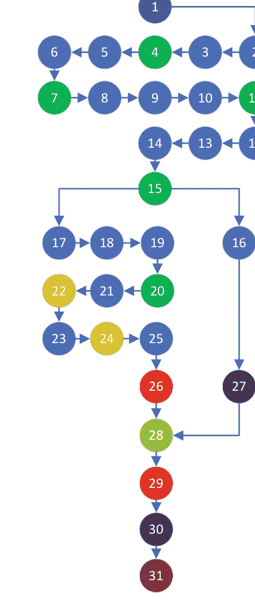

## 图像形成和配准过程

在本节中，我们将定义图像配准过程所需的所有变量。此外，我们将为分类图像的配准过程开发新的代价函数。最后，我们将定义用于图像配准过程的不同优化算法。

## 表2 神经网络层的参数

| 层类型和编号 | 激活函数 | S/P | 滤波器大小 |
|--------------|----------|-----|------------|
| 输入—1 | 360 × 640 × 3 | - | - |
| 卷积-RL—2 | 558 × 838 × 64 | 2/100 | 3 × 3 × 3 × 64 |
| 卷积-RL—3 | 558 × 838 × 64 | 1/1 | 3 × 3 × 64 × 64 |
| 最大池化—4 | 279 × 419 × 64 | 2/0 | 2 × 2 |
| 卷积-RL—5 | 279 × 419 × 128 | 1/1 | 3 × 3 × 64 × 128 |
| 卷积-RL—6 | 279 × 419 × 128 | 1/1 | 3 × 3 × 128 × 128 |
| 最大池化—7 | 139 × 209 × 128 | 2/0 | 2 × 2 |
| 卷积-RL—8 | 139 × 209 × 256 | 1/1 | 3 × 3 × 128 × 256 |
| 卷积-RL—9 | 139 × 209 × 256 | 1/1 | 3 × 3 × 256 × 256 |
| 卷积-RL—10 | 139 × 209 × 256 | 1/1 | 3 × 3 × 256 × 256 |
| 最大池化—11 | 69 × 104 × 256 | 2/0 | 2 × 2 |
| Conv-RL—12 | 69 × 104 × 512 | 1/1 | 3 × 3 × 256 × 512 |
| Conv-RL—13 | 69 × 104 × 512 | 1/1 | 3 × 3 × 512 × 512 |
| Conv-RL—14 | 69 × 104 × 512 | 1/1 | 3 × 3 × 512 × 512 |
| MaxPool—15 | 34 × 52 × 512 | 2/0 | 2 × 2 |
| Score Conv—16 | 34 × 52 × 5 | 1/0 | 1 × 1 × 512 × 5 |
| Conv-RL—17 | 34 × 52 × 512 | 1/1 | 3 × 3 × 512 × 512 |
| Conv-RL—18 | 34 × 52 × 512 | 1/1 | 3 × 3 × 512 × 512 |
| Conv-RL—19 | 34 × 52 × 512 | 1/1 | 3 × 3 × 512 × 512 |
| MaxPool—20 | 17 × 26 × 512 | 2/0 | 2 × 2 |
| Conv-RL—21 | 11 × 20 × 4096 | 1/0 | 7 × 7 × 512 × 4096 |
| Drop Out—22 | 11 × 20 × 4096 | - | - |
| Conv-RL—23 | 11 × 20 × 4096 | 1/0 | 7 × 7 × 4096 × 4096 |
| DropOut—24 | 11 × 20 × 4096 | - | - |
| Score Conv—25 | 11 × 20 × 5 | 1/0 | 7 × 7 × 4096 × 5 |
| Tconv—26     | 24 × 42 × 5 | 2/0 | 4 × 4 × 5 × 5 |
| Crop—27      | 24 × 42 × 5 | – | – |
| Addition—28  | 24 × 42 × 5 | – | – |
| Tconv—29     | 400 × 688 × 5 | 16/0 | 32 × 32 × 5 × 5 |
| Crop—30      | 360 × 640 × 5 | – | – |
| SoftMax—31   | 360 × 640 × 5 | – | – |

### 4.1 图像形成过程

在这项工作中，我们利用针孔相机来模拟图像形成过程（图2）。

通过利用透视变换过程（1）[24]，可以将三维空间中的点用其齐次向量 $P$ = (X, Y, Z, 1)^T 投影到图像平面上：

```
$p = K[R|t]\tilde{P}$ (1)
```

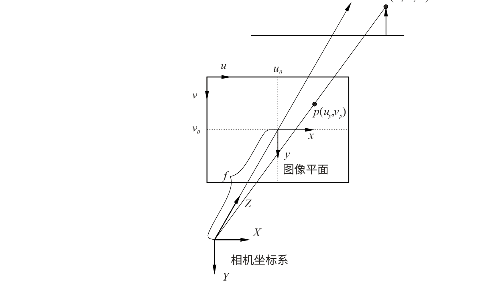

其中，$\mathbf{p} = (u, v, 1)$ 表示图像空间中的像素，$\mathbf{R}$和$\mathbf{t}$分别是旋转矩阵和平移向量，将3D空间映射到图像平面。最后，相机标定矩阵 (2) 用 $\mathbf{K}$ 表示：

```
$$
K = \begin{bmatrix} \alpha_x & 0 & u_0 \\ 0 & \alpha_y & v_0 \\ 0 & 0 & 1 \end{bmatrix},\tag{2}
$$
```

其中，参数 $u_0$ 和 $v_0$ 表示光轴与图像平面相交的点的坐标 (图2)，而 $\alpha_x$ 和 $\alpha_y$ 则是以像素为单位的焦距。相机获取的图像表示为 $I$，图像中的每个像素可以用其在图像中的位置来定义，即 $\mathbf{p} = (u_p, v_p, 1)$。由于我们在这项工作中使用了立体相机系统，左相机获取的图像表示为 $I_l$，右相机获取的图像表示为 $I_r$。

### 4.2 图像配准

图像配准表示将两幅图像对齐直到两幅图像之间的差异最小化的过程。配准过程是通过对一幅图像 (称为移动图像—$I$) 应用某种图像变换技术，直到它与另一幅图像 (称为固定图像—$I^*$) 对齐为止。这两幅图像之间的相似度度量被称为代价函数 (在第4.3节中进一步讨论)。图像配准算法分为两组，基于特征和基于强度的算法。基于特征的算法需要一些特征检测和匹配算法，并仅利用匹配的特征进行配准。另一方面，基于强度的算法利用整个图像进行配准。这种划分的相似性在视觉伺服社区中也可以找到 (IBVS/PBVS与DVS)。此外，与视觉伺服的优势类似，基于强度的图像配准算法提供更好的配准结果，并且不需要复杂的特征检测和匹配过程，因此在本研究中考虑了这组算法。图像配准算法的另一个重要分类是根据不同的图像变换模型进行的。两个重要的模型是弹性或非刚性模型和线性或刚性模型。弹性模型包括用于图像的局部弹性变形 (包裹) 的数学形式，用于增加模型的灵活性并实现更好的对齐。由于我们的环境中没有可变形的物体，我们使用刚性图像变换模型。配准过程的输出是变换矩阵，其中包含用于对齐两幅图像的最佳参数。两幅图像之间的像素对应关系可以用公式 (3) 表示：

```
$$
T(\mathbf{p}; \boldsymbol{\mu}) \propto \mathbf{p}^{*}\tag{3}
$$
```

其中刚性变换矩阵用T(μ)表示，μ∈ℝ⁵是变换参数的向量，p是移动图像的像素，p*是固定图像的像素，而∝表示考虑的变换。刚性变换矩阵T(4)的利用包括具有五个参数的向量μ，沿着x和y轴的平移和缩放（分别为tx、ty、sx和sy），以及围绕图像的左上角旋转（θi）：

$$
\mathbf{T}(\boldsymbol{\mu}) = \begin{bmatrix}
\cos(\theta_i) \cdot s_x & -\sin(\theta_i) \cdot s_x & t_x \\
\sin(\theta_i) \cdot s_y & \cos(\theta_i) \cdot s_y & t_y \\
0 & 0 & 1
\end{bmatrix}. \quad (4)
$$

### 4.3 成本函数定义

在使用标准成本函数进行注册技术时的主要问题是，它们要么针对灰度图像，要么针对RGB图像，而FCN的输出是标记的（分类图像），用Ī表示。因此，我们定义了两个函数，用于确定两个对齐的像素是否属于同一类或不属于同一类，更正式地说：

$$
b(d_1(\mathbf{T}\mathbf{p}), d_2(\mathbf{p}^*)) = \begin{cases}
1, & \text{如果} \, d_1(\mathbf{p}) = d_2(\mathbf{p}^*), \\
0, & \text{否则}
\end{cases} \quad (5)
$$

$$
c(x_1(\mathbf{T}\mathbf{p}), x_2(\mathbf{p}^*)) = \begin{cases}
1, & \text{如果} \, x_1(\mathbf{p}) = x_2(\mathbf{p}^*), \\
0, & \text{否则}
\end{cases} \quad (6)
$$

其中d₁表示像素p的类别，d₂表示与p对齐的固定图像上的像素（p*）的类别。不同的代价函数定义中都使用了b和c函数。如果变换后的像素Tp和像素p*属于同一类别，则函数b(5)的值为1，否则为0。同样地，如果变换后的像素Tp的类别与像素p*的类别不同，则函数c(6)的值为1，否则为0。我们依赖于语义分割的文献，并定义了第一个类似于全局准确率（GA—像素级准确率）的代价函数，通过公式(7)计算：

$$
GA = \sum_{i=1}^N \left( b(\bar{I}(\mathbf{p}_i) \cdot \mathbf{T}(\boldsymbol{\mu}), \bar{I}^*(\mathbf{p}_i^*)) \right)^2. \quad (7)
$$

其中N是图像中的像素数，而i表示像素索引。遗传算法可以解释为转换的分类图像Ī中与固定图像Ī*中的类别相同的所有像素的总和。在下一节中，为了更容易进行推导，我们添加了平方；由于该值可以是0或1，所以平方不会改变成本函数的结果。第二个成本函数（8）被定义为语义分割中最常用的成本函数之一，并针对注册框架进行了调整——平均交并比（mIoU）：

$$
mIoU = \frac{1}{k} \sum_{d=1}^{k} \left( \frac{\sum_{i=1}^{N} b(\bar{I}(\mathbf{p}_i) \cdot \mathbf{T}(\boldsymbol{\mu}), \bar{I}^*(\mathbf{p}_i^*))}{\sum_{i=1}^{N} b(\bar{I}(\mathbf{p}_i) \cdot \mathbf{T}(\boldsymbol{\mu}), \bar{I}^*(\mathbf{p}_i^*)) + \sum_{i=1}^{N} c(\bar{I}(\mathbf{p}_i) \cdot \mathbf{T}(\boldsymbol{\mu}), \bar{I}^*(\mathbf{p}_i^*))} \right),
$$

其中k是图像中的类别数，d是每个类别的索引。值得注意的是，mIoU是按类别进行的，对于每个类别生成并利用不同的分类图像作为二元分类问题。最后一个成本函数是互信息（MI）。 MI是两个随机变量（固定图像和移动图像）之间相互依赖性的度量。它是图像配准领域中最常用的成本函数之一，并且可以通过利用图像直方图（9）直接用于分类图像。

$$
MI = \sum_{i=1}^{N} \sum_{j=1}^{N} p(i, j; \boldsymbol{\mu}) \log \frac{p(i, j; \boldsymbol{\mu})}{p_m(i; \boldsymbol{\mu}) p_{m^*}(j)}
$$

其中p(i, j; μ)代表联合概率，而p_m(i; μ)和p_{m^*}(j)是移动和固定图像的边际概率。关于这个代价函数的更多细节可以在[32]中找到。

### 4.4 优化算法

生物启发的优化算法在许多不同的工程应用中发挥着重要作用[37-39]。在本章中，优化算法被用于寻找变换矩阵T的最优参数，该矩阵由(4)定义。

作为最优性准则，我们使用在第4.3节中定义的代价函数。本工作中用于图像配准的所有优化算法的通用方程式(10)如下：

$$
\boldsymbol{\mu}_{opt} = \arg \max_{\boldsymbol{\mu}} \mathrm{E}(\bar{I}(\mathbf{T}(\boldsymbol{\mu})), \bar{I}^*),
$$

其中E代表任何成本（误差）函数（（7），（8）或（9）），而μ_{opt}是获得的最佳转换参数的向量。我们将分析应用于基于强度的图像配准过程的三种优化算法。以下参数用于优化过程μ = (θ1, sx, sy, tx, ty)。

#### 4.4.1 步梯度下降

第一个分析的算法是步梯度下降，其中参数更新根据以下公式（11）进行：

```
$\boldsymbol{\mu}_{t+1} = \boldsymbol{\mu}_t - \eta \cdot \nabla E(\boldsymbol{\mu}_t)$
```

其中 t是当前迭代的索引，η表示学习率，∇E(μt)表示成本函数的梯度。图像配准通常在图像空间中进行；因此，我们将像素的位置转换为图像空间（12）：

```
$\begin{bmatrix} x_c \\ y_c \\ 1 \end{bmatrix} = \mathbf{K}^{-1} \begin{bmatrix} u \\ v \\ 1 \end{bmatrix}$
```

根据公式（13），计算误差对于变换参数的梯度如下所示：

```
$\nabla E(\boldsymbol{\mu}) = \frac{\partial E}{\partial \boldsymbol{\mu}}(\boldsymbol{\mu})$
```

当我们将链式法则应用于代价函数（例如全局准确率（7）），我们得到（14）：

```
$\frac{\partial E}{\partial \boldsymbol{\mu}} = -2 \sum_{i=1}^{N} b(\bar{I}(\mathbf{p}_i) \cdot \mathbf{T}(\boldsymbol{\mu}), \bar{I}^*(\mathbf{p}_i^*)) \cdot \frac{\partial \bar{I}_i}{\partial \mathbf{T}} \cdot \frac{\partial \mathbf{T}}{\partial \boldsymbol{\mu}}$
```

图像平面上的导数 $\partial \bar{I}_i$ 根据标准Sobel滤波器和卷积过程，生成关于变换参数的导数。$\partial \mathbf{T}$如下所示：关于变换参数的变换矩阵的导数（15）如下所示：

```
$\frac{\partial \mathbf{T}}{\partial \boldsymbol{\mu}} = \begin{pmatrix} x \cos(\theta_i) & y \sin(\theta_i) & -s_x x \sin(\theta_i) + s_y y \cos(\theta_i) & 1 & 0 \\ -x \sin(\theta_i) & y \cos(\theta_i) & -s_x x \cos(\theta_i) - s_y y \sin(\theta_i) & 0 & 1 \end{pmatrix}$
```

通过利用公式（15），我们可以计算梯度的2×5向量（两个用于像素坐标u和v，五个用于向量μ中的所有参数），并将其用于梯度下降。算法的伪代码如表3所示。

另一个重要因素是图像变形需要使用最近邻方法进行，因此在分类图像中不会产生边缘梯度。梯度下降算法可以通过以下步骤描述：重复执行预定义的迭代次数：步骤#1计算梯度；步骤#2使用当前梯度和学习率值更新参数；步骤#3计算成本函数值；步骤#4如果计算得到的成本函数值较差（比上一次迭代差），则不更新参数并降低学习率；否则更新参数并增加学习率。

## 表3梯度下降的伪代码

```
输入：初始参数 (μ)，图像 I，I'，迭代次数 (M)，学习率 (η)，学习率下降 (η_d)，最大步长 (MS)。
对于(t = 1 到 M)
    ∇E= 计算梯度; (14)
    r = -η·∇E;
    如果 r ≥ MS % 如果当前步长大于最大允许步长
        r = MS;
    结束
    μ_t = μ_{t-1} + r; % 更新变换参数的值
    I'_t = I(μ_t); % 使用当前参数进行图像变形
    E_t = 计算代价( I'_t, I^* ); % (7), (8) 或 (9)
    如果 (E_t < E_{t-1}) % 如果代价函数比上一次迭代更差
        μ_t = μ_{t-1}; % 将参数值返回到上一次的值
        E_t = E_{t-1}; % 将代价函数值返回到上一次的值
        η = η·η_d; % 减小学习率的值
    否则% 如果代价函数比上一次迭代更好
        η = η / η_d; % 增加学习率的值
    结束
结束
```

在最后一次迭代中，如果计算的成本函数值比上一次更差，则不改变参数和成本函数，并降低学习率；否则更新参数，更新成本函数，并增加学习率的值。

#### 4.4.2 模拟退火

模拟退火（SA）是许多工程领域中使用的标准元启发式优化算法之一[40]。模拟退火的创造者从冶金领域和金属加热/冷却过程中获得灵感，金属被加热到熔点，然后缓慢冷却。利用模拟退火进行图像配准的伪代码如表4所示。SA算法可以总结为以下步骤：重复预定义次数的迭代：步骤#1增加当前温度；步骤#2更新参数；步骤#3计算当前成本函数值；步骤#4 如果计算的成本函数值更差（比上一次），则以一定概率接受更差的参数和成本函数值，该概率取决于当前温度；否则直接更新参数和成本函数。

## 表格 4 模拟退火的伪代码

```
输入：初始参数 (μ)，图像 I , I*, 迭代次数 (M), 初始温度 (T0), 最终温度 (T1), 最大步长 (MS)。

cf = (T0 – T1)/(M – 1); % 冷却因子
I_t = I(μ) % 使用当前参数进行图像变形
E_t = 计算代价 (I_t , I* );
对于 (t = 1 到 M)
    Tc = (T0 + cf) – t · cf; % 计算当前温度
    r = rand(); % 生成范围在 [–1, 1] 内的随机数;
    如果 r ≥ MS % 如果当前步长大于最大允许步长
        r = MS;
    结束
    μ_temp = μ + r; % 更新变换参数的值
    I_t = I(μ_temp); % 使用当前参数进行图像变形
    E_temp = 计算代价 (I_t , I* ); % (7), (8) 或 (9)
    如果 (E_temp < E_t) % 如果代价函数比上一次迭代更差
        μ_t+1 = μ; % 将参数值返回到上一次的值
        E_t+1 = E_t; % 将代价函数值返回到上一次的值
        r1 = rand(); % 生成范围在 [0, 1] 内的随机数
        e = 1/(1+e^(E_t – E_temp)/Tc)
        如果 e > r1 % 如果满足接受准则
            μ_t+1 = μ_temp; % 接受更差的参数
            E_t+1 = E_temp; % 接受更差的代价函数值
        结束
    否则 % 如果代价函数比上一次迭代更好
        μ_t+1 = μ_temp; % 接受变换参数的值
        E_t+1 = E_temp; % 接受代价函数值
    结束
结束
```

#### 4.4.3 OnePlusOne进化算法

OnePlusOne进化算法属于用于优化目的的进化策略家族[41]。它的工作原理依赖于参数空间中当前位置的随机化，服从正态分布 N(0, 1)。我们使用改进版本的OnePlusOne进化算法（表格5），该算法在[41]中开发，其中转换参数根据状态的协方差矩阵 At进行更新，该矩阵用于逐个更新每个参数。OnePlusOne进化算法可以总结为以下步骤：重复执行预定义的迭代次数：步骤#1根据协方差矩阵 At和随机参数r更新转换参数；步骤#2计算当前成本函数值；步骤#3 如果计算的成本函数值更差（比上一次迭代差），则不接受该参数更新；否则接受该参数更新。

## 表格 5 OnePlusOneEvolutionary 的伪代码

Inputs: initial parameters ($\mu$), images $\bar{I}$, $\bar{I}^*$, number of iterations (M), growing parameter ($c_g$), Initial radius ($A_r$), and minimum step (ms).
$c_s = c_g^{-0.25}$; % Shrinking parameter
$\bar{I}_t = \bar{I}(\mu_t)$; % Image warping with current parameters
$E_t = \text{calculate cost} (\bar{I}_t, \bar{I}^*)$;
$A_t = \text{ones} \cdot A_r$;
For (t = 2 to M)
    $r = \text{randn}()$; % Generate a vector of random numbers in the range [0, 1]
    if $A_t \leq ms$ % If the current step is smaller than the smallest allowed step size
        $A_t = ms$;
    end
    $\mu_t = \mu_{t-1} + r \cdot A_t$;
    $\bar{I}_t = \bar{I}(\mu_t)$; % Image warping with current parameters
    $E_t = \text{calculate cost} (\bar{I}_t, \bar{I}^*)$; % (7), (8) or (9)
    if ($E_t < E_{t-1}$) % If the cost function is worse than in the last iteration
        $\mu_t = \mu_{t-1}$; % Return the parameters' values to the previous ones
        $E_t = E_{t-1}$; % Return cost function value to the previous one
        % Decrease the value of $A_t$
        $A_t = \mathbf{I} + (c_s - 1) \cdot (r' \cdot r) ./ (r \cdot r')$; % "./" is element-wise division
    else
        % Increase the value of $A_t$
        $A_t = \mathbf{I} + (c_g - 1) \cdot (r' \cdot r) ./ (r \cdot r')$;
    end
end

如果函数值比上一次迭代的值更差，则不改变参数和成本函数的值，并减小 $A_t$的值；否则更新参数和成本函数的值，并增加 $A_t$的值。

## 5 移动机器人视觉控制算法

移动机器人的姿态被定义为状态向量 $\mathbf{x} = (z, x, \theta)$，其中它的位置用 $z$ 和 $x$ 坐标表示，而方向用角度$\theta$表示。立体视觉系统中两个摄像头的坐标系也在图3中给出，其中$O_{cl}$和$O_{cr}$分别是左摄像头和右摄像头的坐标中心。

视觉伺服在当前图像和期望图像上进行。因此，对于立体视觉伺服，需要在3对图像之间建立对应关系，即左当前—左期望、左期望—右期望、右期望—右当前。在执行这些图像对的语义分割和配准之后，我们可以利用（16）将左侧（$c_l$）和右侧（$c_r$）当前图像中的每个像素连接起来：

$$c_l = T_l^{-1} T_d T_r c_r,$$

其中 $T_l$, $T_d$, $T_r$ 分别是左侧、期望和右侧图像配准生成的变换矩阵。因此，我们可以选择属于某个类别（由于图像被分割，我们知道）的任意控制点，在视野中连接它们并将它们用于视觉伺服[12]：

$$\begin{bmatrix} u^* - u \\ v^* - v \end{bmatrix} = \begin{bmatrix} 1/Z & 0 & x/Z & -xy & (1+x)^2 & -y \\ 0 & 1/Z & y/Z & -(1+y)^2 & xy & x \end{bmatrix} \begin{bmatrix} v_x \\ v_y \\ v_z \\ \omega_x \\ \omega_y \\ \omega_z \end{bmatrix}.$$

所需图像中控制点的坐标用*标记，(17)在左右两个当前/所需图像对上实现。(17)的矩阵表示为：

$$\dot{c} = J v_c.$$

通过将(18)堆叠在左右两个摄像机的k个控制点上，并添加从摄像机到机器人坐标系的速度变换矩阵(M)，我们推导出视觉伺服算法(19)：

$$v_{r}=\lambda\left[\begin{array}{c}J_{l1}\boldsymbol{M}_{l}\vdots\\J_{lk}\boldsymbol{M}_{l}\\J_{r1}\boldsymbol{M}_{r}\vdots\\J_{rk}\boldsymbol{M}_{r}\end{array}\right]^{-1}\left[\begin{array}{c}\dot{\boldsymbol{c}}_{l1}\vdots\\\dot{\boldsymbol{c}}_{lk}\\\dot{\boldsymbol{c}}_{r1}\vdots\\\dot{\boldsymbol{c}}_{rk}\end{array}\right],\quad(19)$$

其中λ是增益参数，$v_{r}$是移动机器人速度向量。基于语义分割的移动机器人控制算法是4步算法。该方法包括移动机器人需要执行的4个步骤，以达到所需姿态。第一步是旋转，直到当前方向与所需姿态相同。第二步是朝所需位置旋转。第三步是平移运动到所需位置，最后一步是旋转到所需姿态。当完成第四步算法时，移动机器人已经到达所需位置，算法停止。描述每个步骤的机器人运动的控制器可以在表中看到。

对于第一步和第四步，角速度$\omega$和参数$x_{c}$、$y_{c}$表示当前视图中控制点的位置。移动机器人达到期望位置后，图像平面上控制点的位置用$x_{d}$和$y_{d}$表示。移动机器人完成第一步后，通过控制点的三角测量过程来估计参数$x_{d}$和$y_{d}$的深度。此外，在第二步中用于旋转的期望旋转角度通过利用atan2($v_{z}$，$v_{x}$)计算。正增益$k_{\omega 1}$、$k_{\omega 2}$、$k_{\omega 3}$、$k_{\omega 4}$和$k_{t}$用于比例控制器，阈值参数$R_{t}$用于修正第三步中移动机器人的方向。所提算法的伪代码见表7。标志T#1、R#1、R#2和R#3用于指示算法相应步骤的结束，而$R_{1}$、$R_{2}$、$R_{x}$和$R_{y}$表示算法的停止阈值。

### 表格 6 每个算法步骤的控制器

| 步骤#1 | $v_{1} = 0; \omega_{1} = k_{\omega 1}\omega_{y}$ |
| :--- | :--- |
| **步骤#2** | $v_{2} = 0; \omega_{2} = k_{\omega 2}(x_{d} - x_{c})$ |
| **步骤#3** | $v_{3} = k_{t}(y_{d} - y_{c}); \omega_{3} = \begin{cases} 0, & \sqrt{(x_{d} - x_{c})^2} \leq R_{t} \\ k_{\omega 3}(x_{d} - x_{c}), & \sqrt{(x_{d} - x_{c})^2} > R_{t} \end{cases}$ |
| **步骤#4** | $v_{4} = 0; \omega_{4} = k_{\omega 4}\omega_{y}$ |

## 表格7 4步控制算法的伪代码

```
Acquisition, semantic segmentation, registration of desired images.
**While** (R#1 == 1 & R#2 == 1 & T#1 == 1 & R#3 == 1)
    Current images acquisition, semantic segmentation and registration process
    vz, vx, ωy calculation (19)
    **if** (ωy >= R1) % Step#1- rotation to the desired orientation
        ωr = kω1ωy; % Defining mobile robot angular velocity
    **else**
        R#1 = 1; % End of the Step#1
    **end**
    **if** (R#1 == 1) % Step#2 – rotation to the desired position
        **if** (xd – xc) >= Rx
            ωr=kω2(xd – xc); % Defining mobile robot angular velocity
        **else**
            R#2 = 1; % End of the Step#2
        **end**
    **end**
    **if** (R#2 == 1) % Step#3 – translation to the desired position
        **if** (yd – yc) >= Ry
            vr = kt(yd – yc); % Defining mobile robot translational velocity
            ωr = kω3(xd – xc); % Correction of orientation
        **else**
            T#1 = 1; % End of the Step#3
        **end**
    **end**
    **if** (T#1 == 1) % Step#4 – rotation to the desired orientation
        **if** (ωy >= R2)
            ωr = kω4ωy; % Defining mobile robot angular velocity
        **else**
            R#3 = 1; % End of the Step#4
        **end**
    **end**
**end**
```

## 6 实验评估

参数设置如下。对于每个优化算法，我们设置以下参数：迭代次数 M =400，初始参数 μ = (0, 1, 1, 0)，以及 3 个金字塔级别。在每个金字塔级别之后，将最优参数设置为下一个金字塔级别的输入参数。图像分辨率在每个金字塔级别上除以 2。对于 OnePlusOneEvolutionary 算法，增长因子为 1.05，初始半径为 6.25 × 10^{-3}，每个参数的最小步长为 1.5 × 10^{-6}。对于模拟退火算法，全局准确率 (GA) 的温度范围为 [200, 1]，MI 和 mIoU 的温度范围为 [0.01, 0.00001]。对于梯度下降算法，学习率当设置为0.1时，学习率下降选择为0.9，而步长最大值为SM = (0.01, 0.001, 0.001, 3, 3)。

第一个实验涉及到与图像变换相关的代价函数值的分析。通过利用变换矩阵(4)，图像在x和y方向上连续移动2个像素，并计算代价函数值((7)，(8)和(9))。变换的范围是从-50到50个像素，在两个方向上，而图4中的z轴表示代价函数值。

最初，我们可以看到所有的代价函数都具有明显可见的全局最大值和大的谷值。由于所有的代价函数都具有上述的理想特性，可以利用凸优化算法来达到全局最大值。对第一个实验(Fig. 4)进行了深入分析，在第7节中进行。

第二个实验包括使用不同的代价函数和不同的优化算法进行图像配准过程。这些算法在实验室制造环境中由左右摄像机生成的24幅图像上进行测试（图5）。

移动机器人被定位到12个不同的姿态（表8），并记录下左右两侧的图像。

图4 代价函数值

## 图5 轮式移动机器人RAICO

## 表8 移动机器人姿态

| 姿态# | 移动机器人姿态 (z [cm], x [cm], θ [°]) | 姿态# | 移动机器人姿态 (z [cm], x [cm], θ [°]) |
|-------|----------------------------------------|-------|----------------------------------------|
| 1     | (+2, 0, 0)                             | 7     | (0, 2, 0)                              |
| 2     | (-2, 0, 0)                             | 8     | (0, 4, 0)                              |
| 3     | (-4, 0, 0)                             | 9     | (-2, 2, 0)                             |
| 4     | (-6, 0, 0)                             | 10    | (-4, 4, 0)                             |
| 5     | (0, -4, 0)                             | 11    | (0, 0, 5)                              |
| 6     | (0, -2, 0)                             | 12    | (0, 0, -5)                             |

执行图像语义分割过程后，可以在图6中看到图像的样本。

第一行的图像是由左右摄像机在期望位置生成的，第二行表示左右当前图像。 由于所有位置的左右图像都相似，我们显示每个姿态的左右图像准确度的平均值（表9）。

对于所有适应度函数来说，算法中取得最佳结果的是OnePlusOneEvolutionary。由于优化算法的收敛性是其主要特征之一，我们展示了不同算法和选择姿势下左侧图像的不同代价函数的收敛曲线。

每个算法的代价函数值的收敛情况如图7所示。 最终达到的值与表9中的值略有不同，因为它们是左右图像的平均值，而我们这里只展示左侧图像的值。 从这个图中可以得出的主要结论是，梯度下降比其他两种算法收敛速度更快。 考虑到实时应用程序中推理时间至关重要，梯度下降是最合适的算法。 此外，SA算法的随机性/趋势也可以看到。 GA（图7a）的成本函数值除以1 × 10⁵以获得更好的表示。

由于第二次实验的最佳算法是OnePlusOneEvolutionary，而互信息代表了第一次实验的最佳成本函数，我们展示了它们在图像上的组合的注册过程的一个样本。

图6 第二个实验的语义分割图像样本

### 表格 9 第二次实验的结果

| 姿态# | GA [1 × 10⁵] (7) SA | GA [1 × 10⁵] (7) GD | GA [1 × 10⁵] (7) EV | MI (8) GD | MI (8) EV | MI (8) 其他 | mIoU (9) GD | mIoU (9) EV | mIoU (9) 其他 |
|-------|---------------------|---------------------|---------------------|-----------|-----------|------------|-------------|-------------|--------------|
| 1     | 2.288               | 2.285               | **2.290**           | 0.645     | 0.628     | **0.646**  | 0.972       | 0.971       | **0.979**    |
| 2     | 2.283               | 2.278               | **2.284**           | 0.629     | 0.615     | **0.630**  | 0.961       | 0.966       | **0.973**    |
| 3     | 2.292               | 2.289               | **2.290**           | 0.652     | 0.644     | **0.651**  | 0.979       | 0.977       | **0.983**    |
| 4     | 2.283               | 2.236               | **2.285**           | 0.629     | 0.533     | **0.631**  | 0.963       | 0.905       | **0.971**    |
| 5     | 2.262               | 2.247               | **2.267**           | 0.580     | 0.542     | **0.580**  | 0.948       | 0.924       | **0.950**    |
| 6     | 2.279               | 2.279               | **2.277**           | 0.615     | 0.618     | **0.619**  | 0.961       | 0.966       | **0.965**    |
| 7     | 2.284               | 2.292               | **2.291**           | 0.654     | **0.655** | 0.652      | 0.979       | **0.983**   | 0.982        |
| 8     | 2.271               | **2.283**           | 2.271               | 0.603     | **0.636** | 0.623      | 0.784       | **0.809**   | 0.801        |
| 9     | 2.284               | 2.287               | **2.287**           | 0.635     | 0.637     | **0.647**  | 0.973       | 0.976       | **0.977**    |
| 10    | 2.245               | **2.276**           | 2.269               | 0.543     | 0.565     | **0.569**  | 0.944       | **0.963**   | 0.954        |
| 11    | 2.256               | **2.276**           | 2.260               | 0.552     | **0.618** | 0.559      | 0.934       | **0.958**   | 0.952        |
| 12    | 2.247               | 2.214               | **2.258**           | 0.528     | 0.497     | **0.556**  | 0.910       | 0.875       | **0.930**    |

SA: 模拟退火，GD: 梯度下降，EV: OnePlusOneEvolutionary。 每个适应度函数和每个姿势的最佳算法以粗体呈现。

## 7 讨论

根据第一次实验的结果，可以得出结论，所有的成本函数都具有优化的理想特性。全局准确率成本函数具有一定的线性趋势，其优化速度应该是最慢的，而互信息和平均交集联合指数都具有指数趋势。尽管这两个成本函数看起来相似，但从第一次实验中我们可以得出结论，互信息成本函数具有更快的上升趋势，从而具有更快的优化性能。

从第二次实验中，我们可以推断出适用于所有适应度函数的最佳算法，以及最佳算法/成本函数的组合。正如之前所述，OnePlusOneEvolutionary是所有适应度函数的最佳算法，在36次试验中取得了19个最佳结果。第二个是梯度下降法，取得了14个最佳结果，而模拟退火法只取得了3个最佳结果。36次试验。此外，模拟退火需要仔细定义冷却因子，以保持接受概率稳定。从收敛曲线中额外收集的信息是，梯度下降比其他两种算法收敛速度更快。因此，我们得出结论，它在实时应用中更加合适。另一方面，如果不受实时限制，其他两种算法可以从更多的迭代中受益，因为它们在所有400次迭代中持续收敛。

在第三个实验中，所有三种优化算法都被实现在视觉伺服过程中，并使用互信息代价函数进行测试。在视觉伺服过程中，所有算法都在左右摄像机的图像上进行。从具有最佳代价函数值的算法中得到的转换矩阵被用于速度和误差计算。OnePlusOneEvolutionary算法在42个图像中的29个中取得了最佳结果，并且在实验2中再次表现出了第一名的成绩。第三个实验中第二好的算法是模拟退火。从这个实验中还可以得出一个结论，即在移动机器人的语义分割视觉伺服中，优化算法的良好定义非常重要。尽管4步算法在一定程度上对错误具有鲁棒性，但它需要一个鲁棒且准确的图像配准过程。

## 8 结论

在这项工作中，我们提出了三种图像配准算法和三种用于基于语义分割的视觉伺服的代价函数。这些算法在真实世界的移动机器人RAICO上实现，配备了立体视觉系统，用于实验评估。代价函数被提出用于语义分割（分类）图像的最优配准。全局准确度、互信息和平均交集比被比较，并且显示出所有代价函数都具有理想的凸性质，而互信息在语义分割视觉伺服问题上具有最佳的收敛性质。梯度下降算法在接近期望图像的图像上表现出与其他两种算法相当的性能，并显示出最快的收敛行为。在所有实验评估中，OnePlusOneEvolutionary算法在整体上表现最好，而模拟退火算法是视觉伺服的第二好算法。未来的研究方向可能包括对群体智能元启发式算法进行初始变换预测的分析。

致谢本工作得到塞尔维亚政府教育部、科学技术发展部的财政支持，通过“生产工程中智能制造系统的宏观、微观和纳米机械工程综合研究”项目，合同编号为451-03-9/2021-14/200105，以及塞尔维亚共和国科学基金会的支持，资助号为6523109，AI - MISSION4.0，2020-2022年。

## 参考文献

- 1. Sünderhauf N等 (2018年) 深度学习在机器人技术中的限制和潜力。 Int J Rob Res 37(4–5):405–420. https://doi.org/10.1177/0278364918770733
- 2. Miti´c M, Vukovi´c N, Petrovi´c M, Miljkovi´c Z (2018年) 混沌元启发式算法用于学习和复制机器人运动轨迹。 Neural Comput Appl 30(4):1065–1083. https://doi.org/10.1007/s00521-016-2717-6
- 3. Vukovi´c N, Miti´c M, Miljkovi´c Z (2015) 基于GMM/HMM和动态时间扭曲的示教学习框架下的差分驱动移动机器人的轨迹学习和复制。 Eng Appl Artif Intell 45:388–404. https://doi.org/10.1016/j.engappai.2015.07.002
- 4. Miljkovi´c Z, Vukovi´c N, Miti´c M, Babi´c B (2013) 用于自动引导车辆的新型混合视觉控制方法。 Int J Adv Manuf Technol 66(1–4):231–249. https://doi.org/10.1007/s0170-012-4321-y
- 5. Petrovi´c M, Miljkovi´c Z, Joki´c A (2019) 使用鲸鱼优化算法进行单个移动机器人的最优调度的新方法。 Appl Soft Comput 81:105520. https://doi.org/10.1016/j.asoc.2019.105520
- 6. Petrovi´c M, Miljkovi´c Z, Babi´c B, Vukovi´c N, \`Covi´c N (2012) 通过人工智能实现智能物料运输的概念设计。 Strojarstvo 54(3):205–219.
- 7. Petrovi´c M, Miljkovi´c Z, Babi´c B (2013) 基于TRIZ和多智能体方法的工艺规划、调度和移动机器人导航的集成。 FME Trans 41(2):120–129
- 8. Pierson HA, Gashler MS (2017) 机器人学中的深度学习：近期研究综述。 Adv Rob 31(16):821–835. https://doi.org/10.1080/01691864.2017.1365009
- 9. Levine S, Pastor P, Krizhevsky A, Ibarz J, Quillen D (2018) 通过深度学习和大规模数据收集学习机器人抓取的手眼协调。 Int J Rob Res 37(5):421–436. https://doi.org/10.1177/0278364917710318
- 10. Sadeghi F, Levine S (2016) CAD2RL: 无需真实图像的真实单图飞行。 arXiv Prepr. arXiv:1611.04201
- 11. Tobin J, Fong R, Ray A, Schneider J, Zaremba W, Abbeel P (2017) 领域随机化用于将深度神经网络从模拟转移到真实世界。在: IEEE国际智能机器人与系统会议(IROS), 第23-30页. https://doi.org/10.1109/IROS.2017.8202133
- 12. Chaumette F, Hutchinson S (2006) 视觉伺服控制. I. 基本方法. IEEE Rob Autom Mag 13(4):82–90. https://doi.org/10.1109/MRA.2006.250573
- 13. Joki´c A, Petrovi´c M, Miljkovi´c Z (2018) 机器人系统视觉伺服方法: 现状调查. Tehnika 73(6):801–816. https://doi.org/10.5937/tehnika1806801j
- 14. Simonyan K, Zisserman A (2015) 非常深的卷积神经网络用于大规模图像识别。在: 第3届国际学习表示会议(ICLR), 第1-14页
- 15. Sadeghi F, Toshev A, Jang E, Levine S (2018) 通过循环控制实现视角不变的视觉伺服。 在：IEEE计算机视觉和模式识别会议（CVPR），pp 4691-4699。 https://doi.org/10.1109/CVPR.2018.00493
- 16. Petrovi’c M, Mystkowski A, Joki’c A, Đoki’c L, Miljkovi’c Z (2020) 基于深度学习的算法用于纹理缺失环境中的移动机器人控制。 在：2020年IEEE国际会议机电系统和材料（MSM），pp 1-4。 https://doi.org/10.1109/msm49833.2020.9201666
- 17. Bateux Q, Marchand E, Leitner J, Chaumette F (2018) 训练深度神经网络进行视觉伺服。 在：2018年IEEE国际机器人与自动化会议（ICRA），pp 1-8，[在线]。 可用：https://hal.inria.fr/hal-01716679/document
- 18. Krizhevsky A, Sutskever I, Hinton GE (2020) 使用深度卷积神经网络进行ImageNet分类。 在：神经信息处理系统(NIPS)的进展，第1097-1105页。访问日期：2020年8月18日 [在线]。 可用：http://code.google.com/p/cuda-convnet/
- 19. Russakovsky O等(2015) ImageNet大规模视觉识别挑战。 计算机视觉国际期刊115(3): 211-252。 https://doi.org/10.1007/s11263-015-0816-y
- 20. Saxena A, Pandya H, Kumar G, Gaud A, Krishna KM (2017) 探索卷积网络进行端到端视觉伺服，[在线]。 可用：http://arxiv.org/abs/1706.03220
- 21. Dosovitskiy A等(2015) FlowNet：使用卷积网络学习光流。 在：IEEE国际计算机视觉会议上，第2758-2766页。
- 22. Zhang F, Leitner J, Milford M, Upcroft B, Corke P (2015) 面向基于视觉的深度强化学习的机器人运动控制。 arXiv:1511.03791
- 23. Zhang F, Leitner J, Ge Z, Milford M, Corke P (2019) 对抗性鉴别式视觉-运动策略的模拟到真实转移。 Int J Rob Res 38(10-11): 1229–1245
- 24. Miti’c M, Miljkovi’c Z (2014) 神经网络学习演示和视觉控制非完整性移动机器人的外极几何。 Soft Comput 18(5): 1011–1025。 https://doi.org/10.1007/s00500-013-1121-8
- 25. Miljkovi’c Z, Miti’c M, Lazarevi’c M, Babi’c B (2013) 神经网络强化学习用于机器人操纵器的视觉控制。 Expert Syst Appl 40(5): 1721–1736。 https://doi.org/10.1016/j.eswa.2012.09.010
- 26. Mithun P, Mehta SA, Shah SV, Bhatnagar G (2020) 基于学生混合模型的视觉伺服。 arXiv: 2006.11347v1
- 27. Crombez N, Caron G, Mouaddib EM (2015) 基于光度高斯混合模型的视觉伺服。 在：2015年IEEE/RSJ国际智能机器人与系统大会(IROS)，pp 5486–5491。 https://doi.org/10.1109/IROS.2015.7354154
- 28. Marchand E (2019) 基于子空间的直接视觉伺服。 IEEE Rob Autom Lett 4(3):2699–2706
- 29. Kallem V, Swensen JP, Hager GD, Cowan NJ (2007) 基于核的视觉伺服。 在：IEEE/RSJ国际智能机器人与系统大会，pp 1975–1980
- 30. Collewet C, Marchand E (2011) 光度视觉伺服。 IEEE Trans Rob 27(4):828–834. https://doi.org/10.1109/TRO.2011.2112593
- 31. Bateux Q, Marchand E (2016) 基于粒子滤波的直接视觉伺服。 在：IEEE国际智能机器人与系统会议(IROS)，第4180-4186页。 https://doi.org/10.1109/IROS.2016.7759615
- 32. Dame A, Marchand E (2011) 基于互信息的视觉伺服。 IEEE机器人学报27(5):958–969。 https://doi.org/10.1109/TRO.2011.2147090
- 33. Bertrand D, Marchand E (2012) 使用条件方差之和的视觉伺服。 在：智能机器人与系统(IROS)，第1689-1694页。
- 34. Teulière C, Marchand E (2014) 使用深度图的密集直接视觉伺服方法。 IEEE机器人学报30(5):1242–1249
- 35. Garcia-Garcia A, Orts-Escolano S, Oprea S, Villena-Martinez V, Garcia-Rodriguez J (2017) 对语义分割应用深度学习技术的综述，[在线]。 可获取：http://arxiv.org/abs/1704.06857
- 36. Long J, Shelhamer E, Darrell T (2015) 全卷积网络用于语义分割。在：IEEE计算机视觉和模式识别会议(CVPR), pp 3431–3440. https://doi.org/10.1109/CVPR.2015.7298965
- 37. Miti´c M, Vukovi´c N, Petrovi´c M, Miljkovi´c Z (2015) 混沌果蝇优化算法. 知识基础系统 89:446–458. https://doi.org/10.1016/j.knosys.2015.08.010
- 38. Miljkovi´c Z, Petrovi´c M (2017) 修改后的多目标粒子群优化算法在柔性工艺规划问题中的应用. 计算机集成制造国际期刊30(2–3):271–291. https://doi.org/10.1080/0951192X.2016.1145804
- 39. Petrovi´c M, Miti´c M, Vukovi´c N, Miljkovi´c Z (2016) 混沌粒子群优化算法用于柔性工艺规划。 Int J Adv Manuf Technol 85(9–12):2535–2555. https://doi.org/10.1007/s00170-015-7991-4
- 40. Petrovi´c M, Vukovi´c N, Miti´c M, Miljkovi´c Z (2016) 使用混沌粒子群优化算法集成工艺规划和调度。 Expert Syst Appl 64:569–588. https://doi.org/10.1016/j.eswa.2016.08.019
- 41. Styner M, Brechbuhler C, Szekely G, Gerig G (2000) MRI的强度不均匀性的参数估计。 IEEE Trans Med Imaging 19(3):153–165. https://doi.org/10.1109/42.845174

# 基于搜索规划和强化学习的自主系统和机器人

Than Le，Bui Thanh Hung和Pham Van Huy

摘要 在本章中，我们讨论了能够分析结构化和非结构化环境并相对于周围物体进行定位的能力，其中GPS、RFID或其他类似手段无法提供足够的位置信息。可靠的SLAM是任何进一步的人工智能任务的基本前提，用于自主移动机器人。

本文的目标是在先进的软件开发上模拟SLAM过程。模型代表系统本身，而模拟代表系统随时间的运行。软件架构将帮助我们将工作集中在实现我们的愿望上，减少琐碎的工作。它是一个开源的元操作系统，为我们提供了解决机器人相关问题的强大工具。

具体而言，我们讨论了先进车辆应具备基于搜索规划解决结构化和非结构化环境分析的能力，然后我们转向讨论基于强化学习的模型以获得最佳轨迹，以应用于自主系统。

关键词 SLAM · 概率机器人 · 卡尔曼滤波器 · 扩展卡尔曼滤波器 · 建模 · 仿真 · 基于搜索的规划 · 强化学习 · 蒙特卡洛 · Q学习

T. Le
信息技术学院，屯德江大学，胡志明市，越南
电子邮件：than.ld@ieee.org；ledinhthan@tdmu.edu.vn

B. T. Hung (✉)
数据分析与人工智能实验室，工程与技术学院，Thu Dau Mot大学，胡志明市，越南
电子邮件：hungbt.cntt@tdmu.edu.vn

P. Van Huy
人工智能实验室，信息技术学院，屯德江大学，胡志明市，越南
电子邮件：phamvanhuy@tdtu.edu.vn

T. Le
胡志明市首都大学工程与技术学院，胡志明市，越南

## 1 引言

在过去的工作中，深度学习 [1] 和（深度）强化学习 [2, 3] 包括DeepMind 和 Deep Q-Learning 机制 [4] 在 2014 年，AlphaGo 在 2016 年的围棋比赛中获得了冠军 [5]，OpenAI 和 PPO 在 2017 年出现 [6]，目前是应用人工智能中的解决方案，用于车辆和自主系统。基本上，深度学习是数据表示的最佳模型，而强化学习是解决决策问题的现代方法。 在继续探讨现代方法之前。 有必要表示基本事物，以使智能自主系统能够解决基于同时定位和映射（SLAM）的基本级别问题，基于与未知环境的交互。 目前，基于研究的规划和重新规划 [7] 是自主和移动系统的最新技术。 此外，运动规划 [8-10] 将从图中捕捉到的概率问题进行探索，如图 1a、1b 和 2 所示。

根据图片来看，迪杰斯特拉算法完全被贪婪最佳优先搜索算法超越。 然而，贪婪最佳优先搜索不能保证找到最短路径。 让我们看看在一个更复杂的地图中会发生什么。在计算机视觉中，应用最先进的分割技术[11]是最强大的之一。

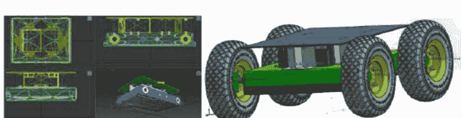

(a) 搜索规划和强化学习在先进车辆移动中的系统架构

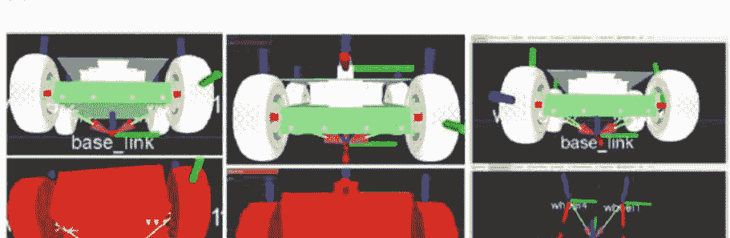

(b) 为任何机器人系统设置仿真坐标轴

图1 机器人系统建模和协调的示例

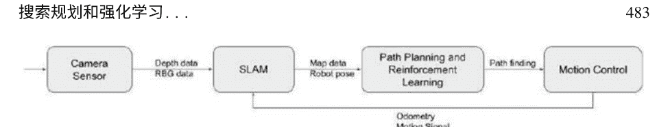

图2 搜索规划和强化学习在先进车辆移动中的系统架构

在论文中，下一节将描述基于表示的路径规划，以在启发式表示中找到最短路径。下一节将通过使用SLAM概念来解决不确定性问题。接下来，我们将介绍强化学习在迷宫环境中生成轨迹路径的方法。最后，通过一些模拟和实际实验进行总结。

## 2 路径规划

在本节中，我们将探索路径搜索算法，比较一些流行的算法：Dijkstra算法、最佳优先搜索算法和A*算法。最初，控制函数使用Python和C++语言编写。

通过这样做，我们更多地了解了语言，能够编写发布者和订阅者节点，了解ROS作为开源软件的操作系统工作原理，以及如何在开发软件时避免重复造轮子。

最后，我们成功编写了一个导航应用程序，实现了A*最短路径查找算法，使车辆或自主机器人沿着软件生成的2D路径行走。源代码有良好的注释，结构组织良好，并上传到bitbucket，使其他贡献者更容易继续进行大学或组织的项目。首先，我们可以定义以下理论概念。

### 2.1 迪杰斯特拉算法和最佳优先搜索

图形路径查找算法的一个常见示例是迪杰斯特拉算法，如图3所示。迪杰斯特拉算法是由计算机科学家Edsger W. Dijkstra于1956年提出的一种最短路径查找算法。它通过访问一组起始节点开始，遍历图中的开放节点集合。然后，它重复地检查尚未被检查的具有最低距离成本的最近节点，并将其添加到已关闭节点集合中。它从起始点向外扩展，直到达到目标点。如果没有负边节点（具有负距离成本的节点），迪杰斯特拉算法保证能找到最短路径。

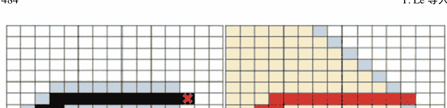

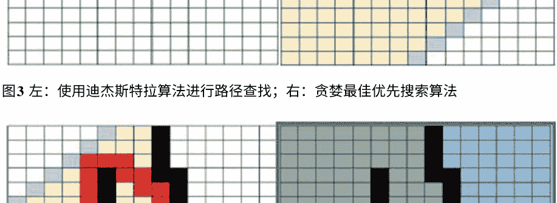

从起点到目标，因为最低距离的节点首先被检查。在下面的地图中，星星是起点，“X”是目标，白色路径是计算出的路径，蓝色区域是Dijkstra算法扫描的区域。

贪婪最佳优先搜索是一种搜索算法，通过扩展基于评估函数f(n)选择的最有希望的节点来探索节点地图。与Dijkstra算法不同，贪婪最佳优先搜索算法选择离目标最近的节点。通过使用优先级队列排序，贪婪最佳优先搜索算法倾向于专注于直接通向目标的路径。

令人惊讶的是，根据图片，Dijkstra算法（图4和图5）完全被贪婪最佳优先搜索算法超越。 然而，贪婪最佳优先搜索不能保证找到最短路径。 让我们看看在一个更复杂的地图中会发生什么。

Dijkstra算法仍然需要扫描大量节点，但它找到了最短路径：

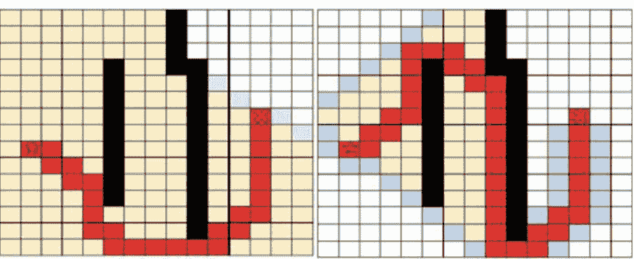

另一方面，贪婪最佳优先搜索算法工作速度更快（图4和图5）\[左\]，但它生成的路径要长得许多\[右\]：问题在于贪婪最佳优先搜索算法是“贪婪的”，即使是更长的路径，它仍然试图朝着目标前进，而Dijkstra算法花费了太多时间和资源来找到路径。那么我们能否将两种算法的优点结合起来？为了解决这个问题，1968年，人工智能研究员尼尔斯·尼尔森开发了一种新的路径查找算法——A*（A星算法）。该算法结合了贪婪最佳优先搜索和Dijkstra算法。尽管A*是建立在启发式算法之上的，而启发式算法本身并不能给出保证，但A*可以保证最短路径。

### 2.2 A*最短路径查找算法

A*最短路径查找算法彼得·哈特（Peter Hart）在1968年由斯坦福研究所（现为SRI国际）的尼尔斯·尼尔森（Nils Nilsson）和伯特拉姆·拉斐尔（Bertram Raphael）首次描述。它是Edsger Dijkstra 1959年算法的扩展。从那时起，它已成为领先的路径查找算法。A*算法广泛应用于地图导航和图遍历，即在多个节点之间绘制可有效遍历的路径的过程。A*是一种最佳优先搜索算法，意味着它将选择被认为是最佳解决方案（最短距离旅行者，最短时间等）的路径，通过搜索所有可能的路径到目标。正如我们之前提到的，Dijkstra算法准确地找到最短路径，但它会浪费时间在不具有前途的方向上进行探索，而贪婪最佳优先搜索则在有前途的方向上进行探索，但可能返回较长的路径结果。A*算法计算从起点到目标的实际距离和估计距离，因此可以保证找到最短路径，同时花费比Dijkstra算法少得多的时间。首先，让我们定义成本函数：

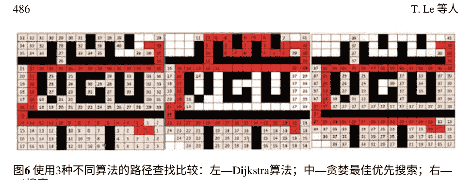

图6 使用3种不同算法的路径查找比较：左—Dijkstra算法；中—贪婪最佳优先搜索；右—A*搜索

```
f(n) = g(n) + h(n)
```

其中，f是节点的成本。f越低，节点越好。g是到达该节点所花费的成本，例如：从起点经过的道路长度。h是启发式评分函数，是从该节点到达目标的预估成本。路径的准确性取决于h的“好坏”。很少情况下（如果有的话），h会是完美的。

够了理论，让我们看看A*算法能做什么。从图7中，我们可以清楚地看到A*算法1找到了一条与Dijkstra算法相当好的路径，同时花费更少的时间扫描节点。（扫描更少的节点）。让我们考虑算法的工作原理。首先，我们创建一个开放列表和一个关闭列表。开放节点列表从起始节点开始，并包含所有尚未被检查的节点。关闭节点列表存储所有已经被访问过的节点（从开放节点列表中移除的节点）。该算法通过维护这两个列表来工作。算法的核心循环从开放列表中选择具有最低估计成本（f）到达目标的节点。如果选择的节点之一是目标节点，则搜索将停止。否则，它计算节点成本，然后将所有有效方向的节点（当前节点周围的8个节点）推入开放列表。然后，已检查的节点被移动到关闭节点列表。该过程重复直到生成路径。

# 3 使用卡尔曼滤波器进行不确定性表示 基于地标的SLAM

本章为我们提供了SLAM的第一个洞察。在本章的最后一节中，卡尔曼滤波器和SLAM主题的理论将被快速介绍，然后进行更实际的解释，以了解基本内容。本章的目的是为了向读者介绍卡尔曼滤波器，以便将来更容易理解SLAM。

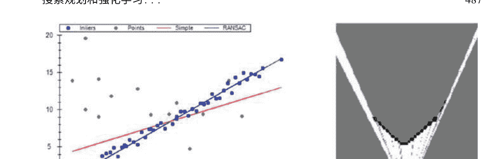

### 3.1 卡尔曼滤波器原理

在1950年代，鲁道夫·埃米尔·卡尔曼发表了一篇关于离散数据线性滤波的著名文章。这篇文章的标题是“一种新的线性滤波和预测问题的方法”。从那时起，随着数字计算的迅猛发展，卡尔曼滤波器已成为一个热门的研究课题，并在自动电子、机器人、雷达技术等各个领域得到了应用。

卡尔曼滤波器最初设计用于以自适应方式收集和整合传感器数据。一旦已知一组方程和传感器统计数据，并且是确定性的，滤波器将在滤除误差和噪声后给出最佳估计。有许多方法可以基于某些特定标准优化数据，但在线性高斯估计中，卡尔曼滤波器似乎是最好的选择，因为它可以整合所有给定的数据。

简而言之，卡尔曼滤波器是一种描述有效递归状态估计方法的数学方程系统，使得状态变量的所有方差和协方差的平均值最小化。卡尔曼滤波器对于过去、现在和未来状态的估计非常优化，即使机器人模型的准确性不能保证。在系统是线性的且噪声是高斯的假设下，我们对卡尔曼滤波器非常感兴趣。滤波器有两个阶段：预测和更新。首先，卡尔曼滤波器通过随机微分方程预测一个n维前任状态向量，用x'表示，在时间步t。

```
$x_t' = A_t x_{t-1} + B_t + w_t$ (2)
```

其中 $A_t$ 是时间步骤 $x_t$ 的状态转移矩阵， $w_t \sim \mathcal{N}(0, R_t)$ 表示转移的加性白噪声 (AWGN)。接下来，滤波器计算前任协方差矩阵 $P_t'$ 如下，

算法1：A星算法（s起始点，s目标点）

```
输入: 起始节点s起始点 目标节点s目标点
输出: 从起始点s起始点到目标点s目标点的最短路径P。

1 开始
2     G = ∅ ;                                          /* G-score查找表 */
3     T = ∅ ;                                          /* 父节点引用列表 */
4     F = ∅ ;                                          /* F-score优先队列 */
5     G[s起始点] = 0;
6     T[s起始点]=空;
7     F[s_start ] = h(s_start , s_goal ) + G[s_start ];
8     s = s_start ;
9     当 F=∅ 或者 s = s_goal 时
10        提取最小值();
11        对于节点n在邻居N中(s)执行
12            g_new = G[u] + cost (s, n);
13            如果 n ∉ T 或者 g_new < G[n]则
14                T[n] = s;
15                G[n] = g_new;
16                F[n] = h(n, s_goal ) + G[n];
17    P = ∅;
18    s = s_goal ;
19    P.添加(s)到P;
20    当 s = s_start 时
21        reverse()
22        ;returnP;
```

$P'_t = A_t P_{t-1} A_t^T + R_t$  (3)

其中 $R_t$是时间步骤$t$的过渡噪声 $w_t$的方差矩阵。 然后，然后，滤波器进入称为校正或更新的第二阶段，在此阶段中，后验状态向量 $x_t$和后验协方差矩阵 $P_t$通过以下表达式改进，

$x_t = x'_t + K_t(z_t - H_t x'_t)$  (4)

和

$P_t = (I - K_t H_t)P'_t$  (5)

其中 $H_t$是测量模型 $z_t = H_t x'_t + v_t$的雅可比矩阵， $v_t \sim \mathcal{N}(0, Q_t)$是随机测量噪声变量（AWGN）， $Q$是测量噪声方差矩阵， $I$是单位矩阵， $K_t$称为卡尔曼增益，在时间步骤$t$计算如下，

$K_t = P_t'H_t^T(H_tP_t'H_t^T + Q_t)^{-1}$ (6)

如果，在时间步骤 t，观测误差协方差 $R_t$ 减小，实际观测 $z_t$ 被认为比预测 $H_t x_t'$ 更好。另一方面，较小的先验误差协方差 $P_t'$ 导致较不重要的实际测量 $z_t$，并且更加权重前任预测 $H_t x_t$。卡尔曼滤波器的预测阶段和校正阶段是按顺序执行的。总结一下，在每个时间步骤 t 机器人的置信度由均值 $\mu_t$ 和协方差 $P_t$ 表示，基本的卡尔曼滤波算法如下：

```
$\mu_t' = A_t\mu_{t-1} + B_t u_t$ (7)

$P_t' = A_t P_{t-1} A_t^T + R_t$ (8)

$K_t = P_t'H_t^T(H_tP_t'H_t^T + Q_t)^{-1}$ (9)

$\mu_t = \mu_t' + K_t(Z_t + H_t\mu_t')$ (10)

$P_t = (I - K_t H_t)P_t'$ (11)
```

在这里，我们获得 bel($x_t$) 作为均值为 $\mu_t$ 和方差为 $P_t$ 的正态分布表达式。关于卡尔曼滤波器的数学推导以及其他知识可以在[12-17]中找到。

### 3.2 基于地标的SLAM

SLAM问题可以有不同的类别和算法，但是，就基于地标的方法而言，SLAM问题通常包括以下几个部分：地标提取、数据关联、状态估计、状态更新和地标更新。同样，对于每个部分，有很多解决方法。本节根据[18]编写，该文献提供了一个非常实用的SLAM过程方法。

一般来说，地标是可以很容易从环境中重新观察和区分出来的特征。机器人使用这些特征来确定自己的位置，就像人类一样。

除了状态变量外，地标不能直接感知，但我们必须从机器人测量数据中可靠地提取它们。当大多数机器人使用激光扫描仪时，有两种流行的地标提取算法。首先，尖峰地标提取使用极端变化来找到地标。 它们被设计用于在激光扫描范围内找到两个值之间的距离差异超过一定量，例如0.5米。 其次，随机采样一致性（RANSAC）是一种从激光扫描中提取线条的方法。 一旦完成这一步骤，RANSAC会检查有多少激光读数接近最佳拟合线。 如果数量超过我们手动设置的某个阈值，机器人可以相信它已经看到了一条线。 实现RANSAC的代码可以在[19, 20]中找到。

数据关联问题是将不同（激光）扫描中观测到的地标进行匹配的问题。如果机器人无法重新观测和匹配地标，就会出现很多问题，比如迷失方向、建立错误地图、导航混乱等。人们已经定义了一种处理这些问题的数据关联策略。我们假设已经建立了一个数据库来存储机器人观测到的地标。

数据库通常最初是空的。然后，有一个规则，即直到机器人看到一个地标N次（手动设置），机器人才真正认为这个地标值得使用。这将防止我们提取出一个难以区分的坏地标，重新观察和匹配。这种技术被称为最近邻方法，因为它依赖于数据库中最近的地标之间的相关性。基于地标，我们需要改进前一节中的概率框架中的一些概念。

我们定义$m_i$为表示第$i$个地标位置的向量，其真实位置被假定为时间不变。此外，所有地标的集合将被表示为

$$m = m_1, m_2, \cdots, m_n \qquad\qquad\qquad\qquad (12)$$

SLAM算法现在在标准的两步递归（顺序）预测和校正阶段中实现：

$$p(x_t, m \lor x_0, z_{0:t}, u_{0:t}) = \int p(x_t, \lor x_{t-1}, u_t) p(x_{t-1}, m \lor z_{0:t-1}, u_{0:t-1}) dx_t - 1 \qquad\qquad\qquad\qquad (13)$$

测量更新

$$x_t, m \lor x_0, z_{\Gamma, t-\Delta}, u_{\Gamma; t} = \frac{z_t \lor z_t, m) p(x_t, m \lor z_{0:t-1})}{p(z_t \lor z_{0:t-1}, u_{0:t})} \qquad\qquad\qquad\qquad (14)$$

不幸的是，机器人所处的大多数环境都是混乱的，因此模型系统既是非线性的，也是非高斯的。在这种情况下，系统需要先线性化，然后才能使用卡尔曼滤波器，这就是扩展卡尔曼滤波器（EKF）出现的原因。

通过重新观察地标预测状态，将新的地标添加到当前状态更详细的解决方案可以在[21-24]中阅读。

### 3.3 从仿真的角度来看

现在，我们有一些关于SLAM可能工作的一般想法。有一些我们感兴趣的主题的仿真：基于地标的EKF SLAM，由Jai完成。所有相关的材料可以在[22-24]中找到。

图8a展示了一个二维投影地图，黑色实线表示障碍物。小蓝色十字表示地标，出于某种原因，我们假设这些地标可以通过障碍物重新观察到。事实上，射频识别（RFID）地标可以用来实现这一点。

带有圆形标记的细线是机器人将要采取的路径，代表每个时间步骤给机器人的控制动作。当模拟开始时，我们可以看一下图8b。在每个相同的时间步骤中，红色三角形描述了机器人与其同时构建地图的关系，蓝色三角形指出了机器人在现实地图中所采取的真实形状和位置。在这里，起初，机器人似乎对自己的位置很确定，所以蓝色三角形和红色三角形即将重叠在一起。红色十字集合表示传感器数据提取的点云，可以用来构建地图。总体而言，机器人的姿态和地标的位置具有相应的小红色包围的随机椭圆，表示坐标的二维随机变量的随机高斯噪声。

在图8c中，当机器人进行了重要的SLAM时，状态向量x和卡尔曼滤波器的其他参数与新地标的数据一起放大。此时，计算机性能较弱，可能会导致更多的不确定性，因为计算时间和实时需求之间存在问题。由于更多的不确定性，意味着机器人在正确时间缺乏信息来准确计算所有事物，地图变得混乱，如图8d所示。在图8e中，红色三角形代表机器人在其思维中的位置，与其真实位置的蓝色三角形有一定距离。此外，其当前地图中的所有内容也以类似的方式移动。这是非常好的事情，因为它告诉我们地标与地标之间、地标与点云之间、点云与点云之间的强相关性，这是机器人纠正由于里程计数据和实时问题导致的定位和建图失败的解决方案。

最后两个图8e，f展示了我们模拟的结果。由于概率框架的原因，每次的结果都略有不同，这是其中一个有趣的特点。然而，在所有事情之后，这些结果证明了我们非常有前途的SLAM方法之一。接下来的两页是整个SLAM模拟的统计图形表示。从图5和图6可以看出，有一个位置误差相对较高的地方，这与图4c中奇怪的红色轨道相关。由于传感器扫描引起的位置误差，这就是为什么图4c中的一切都发生了偏移的原因。在这一点上，角度方向的误差是## 图8 概览: 基于EKF地标的SLAM可视化

表示也显示为高峰。个人认为这些错误发生在机器人的左下角沿着规定路径。合理的解释可能是因为这个地方在机器人前方180度只有4个可用的地标，并且左下角是模拟开始时机器人的第一个拐角，此时机器人还没有足够的数据以保持一致性进行良好的转弯。支持这个解释的一个证据是图6中y方向标准差的超调，结合机器人的路径，其中左下角是它的第一个拐角，它突然改变了机器人的y坐标，而状态向量x对于这种熟练的估计仍然是天真的。我们还可以看到，在第一次失败之后，尽管一切都发生了偏移，但所有相对映射结果都足够好，以防止在后续拐角处发生这种错误（图9）。

建模和可视化GMapping是一种高效的Rao-Blackwellized粒子滤波器，可以逐渐从激光扫描仪数据中构建网格地图。GMapping可能是最常用的SLAM算法，目前是PR2上的标准算法。更多信息可以在[25]中找到。在ROS中，我们有slam_gmapping包，其中包含对gmapping的包装器，为我们提供了SLAM功能（图10）。

## 基于搜索的规划中的4个强化学习概念

在本节中，我们探讨了基于代理能够最大化总奖励的强化学习。图15显示了每个步骤的累积奖励，并可以通过以下方程形式化:

从迷宫环境中，自主车辆或机器人接收初始状态：$S_{0}$并且还可以采取行动$A_{0}$为了从一个状态过渡到其他状态，代理可以移动到另一个状态$S_{1}$并根据该状态接收一个奖励$A_{1}$或者通常可以写成

$$G_{t}=\sum_{k=0}^{T}R_{t+k+1} \quad (15)$$

本质上有一个称为γ的奖励折扣，它属于距离：0和1作为条件，或简称为(0 ≤ γ ≤ 1)

-   对于短期奖励，如果γ很小，则折扣将很大
-   对于长期奖励，如果γ很大，则折扣将很小

因此，我们可以从方程（15）重新书写形式化

图9 模拟过程后的估计统计图

$$G_t = \sum_{k=0}^{\infty} \gamma^{k} R_{t+k+1} = R_{t+1} + \gamma R_{t+2} + \gamma^2 R_{t+3} + \cdots \qquad (16)$$

其中 $\gamma \in [0, 1]$.

目前有两种类型的任务在强化学习问题中表示，涉及到的是创建状态列表 $S$、动作列表 $A$、奖励列表 $R$、新状态列表 $S$，并且通常它从初始点开始，终止点是一个终止状态，还有连续任务，它们没有终止状态。

目前有两种学习方法，分别称为蒙特卡洛和时序差分学习，通过下面的两个方程式来表示：

$$V^{\pi} \leftarrow V^{\pi}(s) + \alpha (G_t - V^{\pi}(S_t)) \qquad (17)$$

和

$$V^{\pi}(s) \leftarrow \sum_{s'} T(s, \pi(s), s')[R(s, a, s')] \qquad (18)$$

其中 $\alpha$ 是学习率， $V(s)$ 是先前的估计值， $R_{t+1}$ 是下一个奖励，以及

基本上，时间差分函数由以下部分定义： $t + 1 \gamma V(S_{t+1})$。

强化学习中最大的挑战之一是在探索和利用之间取得平衡（权衡）。虽然利用是为了最大化奖励总和，但探索是为了更多地了解环境信息。

通常，我们使用全知识，即动态规划作为解决最优策略或最优值函数的方法，其形式化表示为：

### 表1 基于模型和无模型的强化学习

| 基于模型和无模型 |
| --- |
| 通过使用转移概率来学习动作模型。例如，通常使用动态规划来解决近似问题。另一方面，无模型可以直接学习动作模型，而无需提取动作模型。顺便说一下，Q学习用于解决无模型学习 [7] |
| 对于数据集，虽然基于模型的学习通常需要更大的训练数据，但无模型学习需要较少的数据集 |
| 例如，贪婪自适应动态规划用于学习最优策略而无需评估策略的固定。 |

因此，强化学习存在两种模型方法，表1列出了涉及的模型，即基于模型的学习和无模型学习

解决强化学习价值迭代有三种方法：在强化学习环境中，值迭代是返回每个状态下代理期望最大值。

$$v_{\pi} = \mathbb{E}_{\pi}[R_{t+1} + \gamma R_{t+2} + \gamma^2 R_{t+3} + \cdots | S_t = s] \qquad (20)$$

在图11中，我们使用马尔可夫决策过程实现了采样示例错误算法[27]，该算法是从[18, 27, 28]扩展的迷宫环境（20x20）的。它显示了从最优策略得到的优化路径。

## 基于搜索的规划中的5个强化学习概念

### 5.1 基于通用地标SLAM

解决强化学习的三种方法值迭代: 在强化学习环境中，值迭代是返回每个状态下代理期望最大值的方法。

目前正在研究基于研究规划和重新规划的自主系统和机器人[13]。在这些实验中，我们尝试了两种经验，不仅在模拟环境中，而且在实时环境中执行(图12)。

让我们考虑图13中的实验。在左侧，它以[7]上的8个最近点表示的方式说明了初始点。

在这个实验中，我们使用ROS中实现的gmapping来展示这些概念（图5）。系统架构可以使用参考文献[2]来映射实时环境。对于运动控制，我们参考标准的轮式编码器系统[3, 6, 9]。

### 5.2 基于非结构化环境的SLAM

在这个实验中，我们使用ROS中实现的gmapping来展示概念（图14）。系统架构可以使用参考文献[25]来映射实时环境。对于运动控制，我们参考标准的轮式编码器系统[10, 22, 22]。

### 5.3 基于通用地标的SLAM

正如前一节所述，我们选择Q学习作为解决强化学习的方法。算法3描述了能够应用于自主系统的Q学习。更多细节请参考这项工作[4]，该工作整合了强化学习（图15）。

```
算法2：Q学习
1 开始
2 任意初始化Q（s，a），对于所有的s∈S，a
3 ∈A（s）； /* 无限循环每个episode */
4 ;
5 当为真时执行
6 初始化S；
7 当为真时执行
8 如果终止状态为假，则
9 使用策略从S中选择A；（ε-贪婪策略）；
10 执行动作A，更新S为S'，检查奖励R；
11 Q（St，At）←Q（St，At）+αRt+1+γmaxαQ（St+1，α）-Q（St，At）
12 else
13 如果终端-状态为真则
14 Q(St, At) ← Q(St, At) + α[Rt+1 + γmax_{α'}(Q(S_t', α') - Q(St, α))]
15 ；
```

## 6 结论

总之，我们理解基于使用卡尔曼滤波器和扩展卡尔曼滤波器的概率方法中的线性和非线性问题的原则，以应对不确定性问题。 我们还展示了通过表示xml格式进行建模，并演示了自主系统的可视化。 它还说明了如何处理不确定性表示，这是先进技术中自动驾驶车辆挑战中最重要的事情。同时

我们探索了基于搜索的规划，基于对不仅A*算法而且D* with Reset的轨迹生成回溯的理解，并且都应用于最短路径规划。选择了强化学习的示例实现，以优化先进自主车辆中的路径规划。未来，我们将集成深度强化学习来解决决策问题，并采用深度学习方法解决定位和地图绘制，以提高性能。

致谢 我们要感谢Thu Dau Mot大学和Ton Duc Thang大学的支持经费。

## 参考文献

1. Wilson AC, Roelofs R, Stern M, Srebro N, Recht B (2018) 自适应梯度方法在机器学习中的边际价值。 arXiv:1705.08292 [stat.ML]
2. Nguyen DM, Tsiligianni E, Deligiannis N (2018) 基于深度学习的矩阵分解。 arXiv:1812.01478 [cs.LG]
3. He K, Gkioxari G, Dollár P, Girshick R (2018) Mask r-cnn. arXiv:1703.06870 [cs.CV]
4. Le TD, Le AT, Nguyen DT (2017) 基于模型的人形机器人Q学习。 在：2017年第18届国际高级机器人大会（ICAR），第608-613页。 https://doi.org/10.1109/ICAR.2017.8023674
5. Silver D, Schrittwieser J, Simonyan K, Antonoglou I, Huang A, Guez A, Hubert T, Baker L, Lai M, Bolton A, Chen Y, Lillicrap TP, Hui F, Sifre L, van den Driessche G, Graepel T, Hassabis D (2017) 无需人类知识掌握围棋游戏。 自然 550(7676):354–359。 可用： https://doi.org/10.1038/nature24270
6. Schulman J, Wolski F, Dhariwal P, Radford A, Klimov O (2017) 近端策略优化算法。 arXiv : 1707.06347 [cs.LG]
7. Le AT, Le TD (2018) 基于搜索的规划和重新规划在机器人和自主系统中。 在：Rijeka R (ed) 高级路径规划移动实体。IntechOpen. 第4章。 https://doi.org/10.5772/intechopen.71663。 可用： https://doi.org/10.5772/intechopen.71663
8. Berns Karsten PEV (2009年) 自主陆地车辆：迈向服务机器人的步骤。 德国，Vieweg Teubner Verlag，Springer Fachmedien Wiesbaden。 https://doi.org/10.3834804215, ISBN13:9783834804211
9. Thrun S, Burgard W, Fox D (2005年) 概率机器人学。 MIT出版社，马萨诸塞州剑桥市
10. Doan KN, Le AT, Le TD, Peter N (2017年) 群体机器人的通信和协作运动规划。 在：张D，魏B（编）先进智能制造的机电一体化和机器人工程。 Springer International Publishing，Cham，pp 191–205。 978-3-319-33581-0
11. 李Y，黄J-W，李S，白Y，朴J (2019年) 一种能源和GPU计算高效的实时目标检测骨干网络。 在：IEEE计算机视觉和模式识别会议论文集
12. Moghaddamjoo AR, Kirlin RL () 鲁棒自适应卡尔曼滤波。 在：近似卡尔曼滤波，第65-85页。 https://doi.org/10.1142/9789814317399_0006。 电子版：https://www.worldscientific.com/doi/pdf/10.1142/9789814317399_0006。 可用： https://www.worldscientific.com/doi/pdf/10.1142/9789814317399_0006
13. Moghaddamjoo A, Kirlin RL (1989) 具有未知输入的鲁棒自适应卡尔曼滤波。 IEEE Trans Acoust Speech Signal Process 37 (8) : 1166-1175。 https://doi.org/10.1109/29.31265
14. Hajiyev C, Soken HE (2013) 鲁棒自适应卡尔曼滤波器用于无人机动力学估计在传感器/执行器故障存在的情况下。 Aerosp Sci Technol 28 (1) : 376–383。 ISSN: 1270-9638。
15. 罗旭，王华（2017）鲁棒自适应卡尔曼滤波-一种基于准确检测和植物噪声方差协方差矩阵调整的方法。J导航70（1）：137-148。 https://doi.org/10.1017/S0373463316000564
16. 崔成克，陈刚（1987）卡尔曼滤波与实时应用。Springer，柏林，海德堡。0387183857 https://doi.org/10.1017/0387183857
17. Noriega G, Pasupathy S（1992）卡尔曼滤波在地球物理数据实时预处理中的应用。IEEE Trans Geosci Rem Sens 30（5）：897-910。 https://doi.org/10.1109/36.175324
18. Ruisgaard S, Blas MR（2005）Slam for dummies: 一种用于同时定位和建图的教程方法。技术报告。可用：http://ocw.mit.edu/courses/aeronautics-and-astronautics/16-412j-cognitive- robotics-spring-2005/projects/1aslam_blas_repo.pdf
19. Fischler MA, Bolles RC（1981 ）随机样本一致性：一种用于模型拟合的范例，适用于图像分析和自动制图。Commun ACM 24(6):381–395。 ISSN: 0001-0782. https://doi.org/10.1145/358669.358692
20. Souza C（2010）C#中的随机样本一致性（RANSAC）。在线：博客。可用：http://crsouza.com/2010/06/random-sample-consensus-ransac-in-c/
21. 帕森斯S（2006）塞巴斯蒂安·斯伦，沃尔夫拉姆·布加德和迪特·福克斯的概率机器人学。知识工程评论21（第3期）：287-289。ISSN：0269-8889。 https://doi.org/10.1017/S0269888906210993
22. Choset H, Lynch K, Hutchinson S, Kantor G, Burgard W, Kavraki L, Thrun S（2005 ）。机器人运动原理：理论、算法和实现，英文。MIT出版社，2005年5月，ISBN：0262033275
23. Nguyen HV, Le TD, Huynh DD, Nauth P（2016）人臂系统的正向运动学和逆向运动学使用矢量微积分。在：2016年第14届控制、自动化、机器人和视觉国际会议（ICARCV），第1-6页。 https://doi.org/10.1109/ICARCV.2016.7838641
24. Durrant-Whyte H, Bailey T（2006）同时定位与地图构建：第一部分.IEEE 机器人自动化杂志13(2):99–110. https://doi.org/10.1109/MRA.2006.1638022
25. Claessens R, Muller Y, Schnieders B（2013）基于图的同时定位与地图构建在turtlebot平台上, en, 网页. 2013年1月23日. 可获取：http://airesearch.de/written/Graph-based%20Simultaneous%20Localization%20and%20Mapping%20on%20the%20TurtleBot%20platform.pdf
26. Sutton RS, Barto AG（2018）强化学习：导论. 第二版. 麻省理工学院出版社. 可获取：http://incompleteideas.net/book/the-book-2nd.html
27. Le TD, Bui DT, Pham VH（2018）基于声纳和超声波传感器的编码通信在运动规划中。IEEE Sens 2018：1-4。 https://doi.org/10.1109/ICSENS.2018.8589706
28. Le TD（2020）结构环境中的实时基于搜索的规划。 https://doi.org/10.36227/techrxiv.11603514.v1

## 使用深度强化学习和ViZDoom游戏AI研究平台的Anticipator-A3C基于代理玩Doom

Adil Khan，Muhammad Naeem，Asad Masood Khattak，Muhammad Zubair Asghar和Abdul Haseeb Malik

摘要 内置游戏代理根据预先编写的脚本行动并做出决策，采取行动，就像已经被规定的那样。 他们获取并利用不公平的信息，而不是像人类玩家那样灵活地做出决策仅基于游戏画面。 本章重点研究深度学习和强化学习在游戏代理中的应用以及相关算法的改进。 目标是开发一个以人类方式做出决策并摆脱依赖不公平信息的游戏代理。 通过增加A3C算法来实现游戏代理（CNN）。 该代理以原始的实时游戏画面作为网络的输入，然后输出匹配的策略。 代理与ViZDoom交互并读取实时游戏画面为控制角色行动做出决策。 本章通过在原始模型结构中添加一个预测网络来改进A3C算法。这样做的目标是使代理更像人类玩家。 在做出决策之前，它会产生预测，然后将实时游戏画面与预测图像结合在一起作为A3C算法定义的网络的整体输入。 它可以使用数据的组合来做出决策并输出离散动作。 因为该方法只改变了网络输入的结构，所以它是一种无模型方法，可以轻松地移植到其他算法中。 将A3C的性能与本章提出的变体进行比较，分析它们之间的差异，并收集最新文章的实验数据作为研究相同问题的比较。

A. Khan · M. Naeem · A. H. Malik
计算机科学系，白沙瓦大学，白沙瓦，开伯尔-普赫图赫瓦省，巴基斯坦

A. Khan
计算机科学学院，SZIC，白沙瓦大学，白沙瓦，开伯尔-普赫图赫瓦省，巴基斯坦

A. M. Khattak (✉)
技术创新学院，扎耶德大学，阿布扎比，阿联酋
e-mail: Asad.Khattak@zu.ac.ae

M. Z. Asghar
计算与信息技术研究所，戈马尔大学，德拉伊斯梅尔汗，开伯尔-普赫图赫瓦省，巴基斯坦

结果显示，具有预测性的A3C算法比A3C算法表现更好。

关键词 人工智能 · 人工神经网络 · 自主系统 · 计算智能 · 深度学习 · 强化学习

## 1 引言、意义和研究动机

本章研究了深度学习和强化学习在游戏人工智能（Game-AI）领域的应用。人工智能最贴近我们生活的一个应用是成为游戏中的人类对手。任何有游戏经验的人都知道，在对抗和策略游戏中，大多数玩家可以在线上与其他玩家对战，或者直接选择与“电脑”对战，也就是与内置的脚本代理对战[1]。目前市场上几乎所有游戏内置的脚本代理（机器人）都是硬编码的。它们的行为、如何行动等都是预先编写到代码中的，然后在实际战斗中，它们只需要基于提出的规则行动。除了可以合法获取的游戏信息（如自己的血量、自己的武器或资源信息）外，这些脚本代理还可以获取一些额外的不公平的游戏信息，例如对手的状态、游戏中隐形对手的位置、游戏中的隐形物品等，以完成整个决策过程[2]。尽管脚本代理在行动时利用了不公平的信息，但由于它们是硬编码的，绝大多数决策方法都像遍历决策树一样。很难有效利用信息做出更明智的决策，这严重依赖设计者对游戏及其决策水平的理解，并且由于搜索算法的复杂性，可能非常耗时和资源密集[3]。在一般游戏中采用这种方法是不现实的，普通的商用个人计算机也无法支持。目前，许多游戏制造商正在寻找让内置代理像人类一样只基于它们可以获取的信息来玩游戏的方法，模拟人类玩家做出决策和战斗，而不依赖额外的不公平信息。不需要过多依赖计算资源。它们可以像人类玩家一样，在玩游戏的同时根据游戏画面、游戏音效等做出决策，然后通过机器学习的“训练”过程找到最优解。这是游戏代理发展的一大飞跃，而这些以战斗为导向和基于策略的游戏也是对现实世界的非常好的模拟，是人工智能的一个优秀研究领域[5]。

1956年在美国达特茅斯大学举行的学术会议被认为是人工智能研究的起点。峰会之后，人工智能开始了它的第一次发展。在接下来的十年里，计算机广泛应用于数学和自然语言处理，处理英语、几何和代数。但在1970年代，人工智能经历了一个非常困难和痛苦的时期。由于研究机构在人工智能的研究和应用计划中没有准确估计项目的实际困难，它不仅未能与美国国防部门达成合作计划，还引起了人们对人工智能前景的担忧[6]。与此同时，由于社会舆论的压力，原本计划投资于人工智能的许多研究资金被转移到其他更现实的项目中。在当时的技术条件下，人工智能主要面临三个方面的技术困难：首先，由于计算机性能较弱，大部分早期的复杂程序无法在人工智能领域发挥作用；其次，问题的复杂性过高，当时甚至现在的智能程序主要设计用于特定领域的问题，因为这些问题的影响因素较少，问题本身的复杂性较低，但如果问题的维度扩展，程序资源会立即耗尽。第三，相关问题的数据量极其稀缺。当时，通过程序获得足够大的数据集进行深度学习是困难甚至不可能的，这使得程序或系统无法获取数据量并且无法智能化[7]。1980年，一家数字设备公司请求卡内基梅隆大学开发一个名为XCON的专家系统来进行设计。XCON使用“知识库 +推理引擎”的组合来实现人工智能程序的核心部分。作为一套智能计算机系统，XCON在相关领域拥有丰富的专业知识和处理问题的经验。到1986年，XCON能够每年为数字设备公司节省超过4000美元的成本。随后，许多公司也派生出类似的商业模式，如Symbolics、Lisp Machines等。但到1987年，由Symbolics等老牌厂商生产的通用计算机的性能很容易被苹果和IBM的台式机性能超越。从那时起，专家系统的衰落已成定局。2016年，世界顶级围棋大师李世石与由Google DeepMind [8]开发的Alpha Go进行了一场比赛。这个世界闻名的人机级游戏将人工智能的浪潮推向了一个新的高度。比赛结束后，达克蓝的创始人穆雷·坎贝尔对结果发表了评论：“这标志着人工智能时代的结束。” 从1997年IBM的研发项目‘深蓝’击败国际象棋高手卡斯帕罗夫开始，到20年后AlphaGo [9]击败李世石，最重要的区别在于国际象棋和围棋的复杂性非常不同。“深蓝”击败人类国际象棋冠军的关键在于通过枚举可以遍历几乎所有可能的结局，但是用这种方式处理围棋是不现实的。在围棋中，一个人有多少机会呢？普林斯顿的研究机构对这个问题给出了一个直观的定量解释：根据可以产生的合理游戏数量，19×19围棋的排列被认为是10的171次方（10^171）。这个结果在当前的计算中似乎是无限的。不久前，2017年8月，由OpenAI [10]开发的DOTA2游戏代理和曾赢得DOTA2首届国际邀请赛的顶级选手Dendi进行了一场1v1单人游戏，最终Dendi以2-0获胜。实时策略游戏比围棋的状态变化和动作选择要复杂得多。可以说这是人工智能的一次巨大突破[11]。

但在早期阶段，人工智能的发展并不令人满意，并且遭受了许多质疑。例如，在20世纪80年代，人们希望通过人工智能解决机器翻译的问题，但并没有达到计划的目标结果。主要原因是当时计算机性能的限制，使得无法进行复杂的计算和模拟人脑的上下文思维。目前，人工智能领域的研究和应用已经开始进入大众的视野。一方面，现代计算机的性能大大提高，另一方面，分布式计算技术（如云计算）的快速发展极大地促进了信息处理的速度和质量，使智能系统能够快速并行处理海量数据已经成为现实[12]。这些发展和突破成为本章研究的理论和硬件基础。

这两个人工智能的突破的重要性是显而易见的。自从那些年以来，人工智能就像春风一样，吹过所有领域。美国政府和英国政府预见到人工智能是该国未来实力的关键组成部分。2016年，一份关于人工智能的评估报告发布了。然后，人工智能被白宫加入了国家战略。在2017年北京举行的两会上，政府在工作报告中包括了人工智能和其他新兴领域。最近，在东京举行的一次人工智能峰会圆满结束。科技部创新发展部门的副主任于健在会议上评论道：人工智能技术是引领未来的创新技术。从经济角度来看，利用人工智能技术实现大规模自动化可以极大地提高生产活动的效率并节省劳动力成本。人工智能应用的前景非常广阔，可以极大地改变和改善医疗、教育、公共安全、交通、制造业、服务等领域的现状和问题。此外，人工智能在多个军事领域展示了惊人的潜力[13]。在当前全球化的浪潮中，发展人工智能技术的重要性更加明显。在可预见的未来，人工智能将对全球政治和经济格局产生巨大影响。因此，对这个主题的研究具有重大的战略意义[14]。

该项目的目的是将现有的深度学习和强化学习算法结合起来，并使用基于第一人称射击游戏ViZDoom [15]的人工智能研究平台来设计和实现基于原始游戏画面的A3C算法，以独立地进行决策、评估和学习。进一步改进，并添加一个预测网络，根据当前游戏画面预测即将到来的游戏画面作为决策之前的预测，然后将当前游戏画面和预测作为一个网络的完整输入。决策相当于对后续状态转换进行一步模拟，并基于这个模拟做出更好的决策。

本章分为7个部分。第1节是引言部分，第2节是相关研究、分析和背景，第3节简要分析了问题，第4节描述了本章的主要研究内容，第5节涵盖了深度强化学习和游戏人工智能研究环境，第6节介绍了模型设计、实现和实验，第7节以一些讨论和总结结束本章。

## 2 相关研究、分析和背景

目前，被认为最有可能接近或实现人工智能的方法是深度学习和强化学习。AlphaGo的第一作者David Silver在一篇内部教程中写道：AI = DL + RL[16]，即人工智能是深度学习和强化学习的结合，其中强化学习定义了目标，深度学习提供了机制。

目前，许多游戏代理的尝试都是基于这两者的结合。

深度学习源于人工神经网络的相关理论研究。基本的深度学习实现是由几个隐藏层组成的感知器模型。深度学习学习捕捉最基本的特征，然后将这些信息结合起来构建更抽象的上层概念，以指示数据的属性类别或特征，从而挖掘数据的分布式特征表示[17]。深度学习是一种基于对数据进行特征化和学习的方法，可以实现端到端的学习过程，无需对数据进行手动复杂的特征提取。因此，它具有很大的优势，可以用半监督甚至无监督的相关特征提取和组合算法来替代手动获取特征。

作为机器学习学科的一个分支，深度学习的目的是构建一个神经网络来模拟人脑以实现观察学习。它模仿人脑的工作原理来理解外部输入数据，如图像、文本和声音，或者模仿人类进行决策。因此，它是实现人工智能的重要工具[18]。强化学习是一类非常适合研究人工智能的算法。自1960年以来，明斯基首次提出了强化学习的概念。这个学科基于动物学习和自适应控制理论的研究。在人工智能问题的研究中，通常使用Agent来表示具有行为能力的对象，如机器人、无人车、动物等。Agent通常具有一些特定的属性：社交性、自治性、响应性、主动性等。强化学习问题关注的是Agent与环境之间的交互任务。代理和外部环境[19]。如果一个代理的行为选择导致环境的奖励（即正反馈），那么它选择该行为的可能性将增加；否则，可能性将减少或不再出现。然而，强化学习没有像常见的机器学习那样明确的对错信号。它只能根据增强信号的符号和大小评估行为的好坏，因此整个学习过程很长。

强化学习的目标是在环境中获得一种优化代理行为的交互策略。代理观察、感知复杂环境，并从中获取所需信息，然后进行处理和反应。代理通过学习改进其性能并做出更好的决策，并通过决策行为进一步影响环境[20, 21]。

强化学习中常用的主要算法是DQN和Actor-Critic算法及其变种。DQN是原始的Q-Learning算法与深度学习改进相结合。Q-Learning中的状态动作映射表被视为一个函数，然后使用神经网络来拟合目标函数到DQN[22]。然而，传统的DQN在计算目标Q值时存在过度估计的问题，即在选择和测量动作时使用了最大操作，导致Q值的估计过高。Google DeepMind随后在2015年改进了它并引入了Double-DQN[23]。它将动作的选择和测量分解为两个独立的DQN，从某种程度上缓解了过度估计的问题。一个Double-DQN网络用于做决策、选择动作，另一个网络用于计算目标Q值。每次训练只在负责决策的网络上进行。当负责决策的DQN收敛到一定程度时，两个网络任务进行交换，训练之前负责计算目标Q值的DQN网络循环，直到模型收敛。在使用训练数据时，通常使用随机抽样来打破数据之间的相关性，但这样做可能会忽略和丢弃一些重要的数据。Google DeepMind提出了优先回放DQN[24]。在本章中，提出了一种新的加权抽样方法，它使用与每个样本对应的DQN网络的损失函数的误差作为优先级别，以提高较大误差数据的抽样频率。这种方法类似于机器学习中的AdaBoost方法。

2016年，DeepMind提出了Dueling-DQN算法[25]。之前的DQN及其变种直接估计动作状态值函数，但在实践中，状态的值与动作无关，因此Dueling-DQN中DQN网络模型的最终输出被改为两个分支，一个用于估计与动作无关的状态值，另一个分支用于估计该状态下每个动作的相对值，然后将两个分支的结果相加作为原始动作状态的值函数的估计。这一改进极大地提高了DQN的性能，而且改动相对简单，成为2016年ICML三篇最佳论文之一。此外，Google DeepMind还提出了一种异步训练DQN的方法[26]，用于加快模型训练速度。以上是当前DQN的主要改进和变种。Actor-Critic算法在解决强化学习问题时更为直接。它直接寻找策略，然后使用值函数评估调整策略。由于其输出是概率分布，因此可以用来解决连续问题。Actor-Critic算法最常见且广泛使用的变种之一是A3C算法，它是一种异步训练的Actor-Critic算法，由Google DeepMind于2016年提出，旨在提高模型的训练速度。

此外，2017年，Google DeepMind改进了A3C算法并提出了UNREAL模型[27]。UNREAL模型主要涉及在训练过程中添加多个辅助任务，以帮助智能体朝着最终目标前进。辅助任务的学习也是通过强化学习算法实现的。它们与基本任务共享卷积层、LSTM等，并使用来自多个角度的数据来实现相同的最终目标，从而大大提高了模型的训练效率。然而，辅助任务需要根据不同的实际任务进行设计，这更加复杂。

近年来，在游戏领域的智能体研究工作已经出现。Stanescu等人[28]在MicroRTS平台上进行了尝试（类似于极简化的StarCraft版本），使用卷积神经网络。他们将游戏画面作为网络输入，然后通过卷积神经网络预测优势和劣势（即获胜或失败的概率），输出当前状态下获胜或失败的概率，然后结合常见的搜索算法（如蒙特卡洛算法）对后续可能的状态转换进行大量模拟，做出决策并选择最优动作，这与Google DeepMind设计和开发的AlphaGo本质上类似。然而，这种方法适用于稍微复杂一些的游戏，因为许多游戏AI（玩家或角色）在与其他游戏AI对战时无法获得所有信息（例如，游戏中存在战争迷雾或障碍物阻挡，使得玩家无法像下棋一样了解整个游戏局势）。Mnih等人在2013年的NIPS提出的DQN算法是深度学习和强化学习结合的开始。Mnih等人将深度卷积神经网络作为强化学习算法Q-Learning的状态动作值表的近似表示，解决了维度灾难问题，并使用时间差分（即使用估计的期望总回报代替实际累积总回报，并将当前状态估计值的差异作为偏差）[29]来指导网络训练，实现无监督学习，并在Atari 2600游戏机平台上取得了许多小游戏中非常好的结果。但是，上述所有工作都是基于非真实世界场景，不需要导航。游戏本身相对简单，问题空间、游戏的状态空间和动作空间也不是特别复杂。2016年，Lample等人成功将DQN应用于第一人称射击游戏ViZDoom的3D场景，2019年Adil Khan等人在ViZDoom上应用了DQN和DRQN进行深度分析，他们提出的架构表现更好，在预测敌人位置方面几乎达到了72%的准确率[30]。由于游戏环境更加复杂，包括各种地形、材料、可选动作等，而代理人只能观察有限的视野范围，无法知道当前游戏状态，因此Lample等人简化了任务，将其分为导航和敌人（当发现敌人时）两部分，并添加了LSTM [31]网络结构使得模型具有一定的记忆能力，有利于导航能力。Chaplot等人的工作借鉴了Lample等人的工作，并将任务分为导航和敌人两部分。他们参加了2016年的Visual Doom AI竞赛，并在track-1系列和track-2系列中获得了第二名。此外，Google DeepMind团队对DQN进行了简单的改变。与原始网络直接输出动作值估计相比，他们将网络的最后一部分分为两个分支，一个用于预测状态估计函数，一个用于预测该状态的动作是相对于优势函数的，然后将这两个分支合并为原始的动作值估计。尽管这个改变很简单，但根据第25章的实验数据，原始DQN的性能改善非常显著，因此它已成为ICML 2016年的三个最佳章节之一。

2016年视觉末日人工智能竞赛的第一名是来自Facebook人工智能研究中心的田远东团队，他们以35%的巨大优势领先于第二名。田远东等人没有采用DQN算法。他们参考了Mnih等人在[26]中提出的强化学习算法的异步训练框架，并采用了异步优势演员-评论家（A3C）算法结合课程学习策略（即在开始时，使用简单的地图在简单模式下训练，随着代理的性能达到预期，增加代理的难度）来实现自己的游戏代理[32]。他们的模型不包括用于实现代理记忆功能的LSTM结构。相反，它采用连续的4帧和每帧截取的中心区域（在章节中称为注意帧，以增加对中心区域的关注）作为样本输入，以实现一定的记忆容量。A3C是Actor-Critic算法[19]的改进。它主要增加了异步训练机制，充分利用计算资源，提高了模型的训练速度。

Actor-Critic算法的基本思想是：首先，模型由两部分组成：Actor网络和Critic网络。Actor是策略网络，根据当前状态选择动作。Critic是状态估计函数，用于评估Actor的动作对状态的影响和时间差分误差的使用指导了这两个网络的训练。

## 3 问题的简要分析

前一节中描述的现有工作是最值得的。然而，仍然存在一些问题和不足之处。Stanescu等人的工作[28]主要使用深度卷积神经网络来预测情况（获胜和失败），即预测当前状态下的获胜和失败的概率，类似于简单的图像分类问题，然后通过大量的树搜索策略。模拟所有可能的后续状态转换，计算所有选择的平均获胜和失败概率作为决策的基础，并选择具有最高获胜率的方法来执行。强化学习算法并没有真正用于使代理实现自主学习、决策和评估，训练需要监督。之前的工作已经得到了改进。他们所做的工作基本上与Silver等人的AlphaGo [9]相同。主要思想是使用树搜索算法结合深度卷积神经网络在某个合法游戏状态空间中进行后续可能性的搜索。状态转换的搜索评估了情况中可能的大量后续变化，并最终根据统计概率做出更大的决策。然而，这种方法只适用于状态空间相对较小且状态可以模拟（即游戏的当前状态可以完全知道，没有不可知因素），并且使用树搜索算法意味着需要根据不同的游戏、不同的游戏目标和设计者对游戏的理解采用不同的搜索策略，因此这种方法不是一个模型无关的算法。Mnih等人真正将深度学习和强化学习与一个模型无关的无监督算法DQN相结合。Mnih等人巧妙地将DQN作为强化学习中Q-Learning算法中状态动作值表的近似，充当状态动作值函数[22]的函数，解决了庞大的合法状态空间和可选动作空间之间的映射表示问题。然而，他们的研究是在Atari 2600游戏机平台上进行的。这些游戏相对简单（如触碰弹珠、吃豆人等）。它们都是2D迷你游戏，与现实世界相距甚远，并且玩家在玩这些游戏时可以获得所有的状态信息（即游戏画面包含所有的物体信息中没有不可见和不确定的因素。Lample等人的模型将导航和对手分为两个独立的任务，并添加了LSTM以增强模型的记忆能力。尽管实验结果表明该模型具有良好的性能，但模型的整体结构过于复杂，训练步骤繁琐。每个分支都需要逐步训练，并且在训练过程中需要获取不公平的信息（敌人位置信息、状态信息等）。田等人的模型[32]更加复杂，他们需要制作自己的游戏地图来实现从简单到困难的训练过程。模型的性能受到所生成的游戏地图的影响，如何准确客观地定义模型在当前困难下表现良好是一个更困难的任务，主观性很强。上述研究工作和其他工作极大地推动了深度学习和强化学习在人工智能中的研究应用，但忽视了一个非常重要的因素。在许多游戏中，顶级人类玩家能够高水平表现的一个关键因素是他们在采取行动之前需要进行预测，并提前采取预防措施以应对可能发生的情况。在做出决策时，他们需要考虑当前的游戏情况以及他们对未来游戏情况的预测。因此，本章的工作基于A3C算法模型，将未来游戏画面的预测部分添加到其结构中，并将预测结果与当前游戏画面结合作为决策网络的完整输入。此外，在上述研究工作中，只有Atari 2600游戏平台和基于ViZDoom平台的简单游戏场景（如Basic、Health Gathering等）有更多的研究工作，并且代码已经开源，易于重现实验结构。然而，我们专注于复杂的场景，因为基于复杂的场景，特别是基于ViZDoom AI研究平台（如D3_battle、CIG等），几乎没有研究工作，并且相关章节也没有开源，这使得在文本中增强和重现实验结果非常困难。

## 本章的主要研究内容

本章的主要目的是研究如何将A3C算法应用于ViZDoom AI研究平台上复杂场景中的游戏智能体，并设计和实现具有预测或预期的游戏智能体。本章主要研究内容包括以下几个方面。

- 1. 首先，设计和实现基于A3C算法的游戏智能体，并研究其在ViZDoom AI研究平台复杂场景中的可行性和影响因素。由于算法在简单游戏场景和复杂游戏场景中的收敛性存在很大差异，本章首先研究如何使用A3C算法在复杂场景中实现令人满意的游戏智能体。作为改进和后续工作的基础，它还可以用作相关论文实验结果的验证。
- 2. 其次，设计和实现基于A3C算法的具有预测功能的游戏智能体，并研究其在复杂游戏场景中的性能。基于原始A3C算法的游戏智能体不会预测游戏状态，并且无法预测根据当前游戏状态可能转换的游戏状态。策略选择仅基于当前游戏画面，并不能用作未来画面的模拟。针对这个问题，本章比较分析了基于原始A3C算法的游戏智能体和基于A3C算法的具有预测功能（预期）的游戏智能体的实验性能和相关论文中的实验数据。
- 3. 第三，研究预测（预期）模块对算法的影响，并通过实验数据量化改进的影响，并分析和比较预测图像与真实图像之间的差异。预览屏幕是基于当前游戏屏幕和几个帧历史游戏屏幕预测的未来游戏屏幕。这个过程是对人类玩家预测能力的模拟，使游戏代理更像人类。玩家的关键之一。

## 5 深度强化学习和游戏人工智能研究环境

### 5.1 深度学习及其原理

深度学习中的神经科学观点主要受到两种主流思想的启发。一种观点是将大脑作为例证，证明智能行为可以模拟。从这个角度来看，理论上实现智能的最直观方法是逆向分析大脑的隐含本质并复制其功能。第二种观点是研究和理解大脑和人类智能的隐藏本质也非常有意义。如果机器学习算法能够处理实际工程应用问题，它可以使人们对这些基础科学问题有更深入的了解。这将具有重要意义。现在所谈的“深度学习”概念远不止当前机器学习算法中涵盖的神经科学观点。人们更倾向于学习更一般的多层次组合原理，使深度学习能够应用于机器学习框架，而不受神经系统的启发[33]。

当代深度学习的原始原型来自基于神经科学理论的简单线性结构模型。这些模型被设计为使用长度为n的输入：x1,..., xn，并将其映射到目标输出y。这些模型通过学习一组权重来学习：w1, ..., wn，并计算它们的输出：f(x, w) = x1 w1, ...,xnwn。这是深度学习应用中神经网络概念的最简单数学表示。由于深度学习模型具有类似于大脑的机制，它在模拟人脑操作和进行智能决策方面具有固有优势[34]。

#### 5.1.1 感知器和神经网络

感知器是解决线性可分二元分类问题的常见线性分类器。它是由罗森布拉特于1957年提出的，是神经网络理论和应用的基础。感知器的输入是样本的特征向量，即x1, ..., xn，输出是样本的相应类别，即y，通常取 +1和-1两个值。

感知器是在输入空间中正确区分正负样本数据的一个分离超平面。感知器的目的是找到一个能够正确分离训练数据的分离超平面。因此，通常使用误分类相关指标作为损失函数，然后通过梯度下降算法来求解感知器的参数。

假设输入空间取X ⊆ R^n，输出空间取值Y = {+1, -1}。输入x ∈ X表示样本的特征向量的值，表示特征空间中的一个点；输出y ∈ Y表示样本的类别。

图1 感知器的基本结构

样本。从特征空间到输出空间的映射关系称为感知器。感知器的基本结构如图1所示。在图中，x^(j)表示某个样本x的第j个属性的值，w^(j)表示权重w的第j个属性的值，它有两种类型的节点：多个输入节点用于接收样本的特征向量；一个输出节点用于为模型输出提供预测[35]。

感知器本质上是一个线性分类器，其解空间包含在特征空间中的所有线性分类器的集合中，如公式（1）所示：

$f|f(x) = w \cdot x + b$ (1)

从几何角度来看，当公式（1）中的f(x)=0时，它对应于特征空间R^n中的一个超平面H，其中w对应于几何中的H的法向量，b是其截距。这个特征空间R^n被f(x)=0的超平面H分成两部分。这两个实例（特征向量）是正和负的。因此，平面H也被称为分离超平面，如图2所示。

图2 感知器模型

图2中的特征向量是一个二维向量，所以超平面是一条直线。感知器通过学习训练数据集T = {(x₁, y₁), (x₂, y₂), (x₃, y₃), ..., (x_N, y_N)}来找到模型参数w、b，其中xᵢ ∈ X = R^n, y_i ∈ Y = {+1, -1}, i =1,2,3,...,N. 在解决了参数之后，通过使用它们的特征向量和先前获得的参数计算未来的输入实例，以得出它们对应的可能属性类别。假设训练数据集T可以被正确地线性分离，也就是说，存在一个超平面H可以准确地分离数据集中对应于正样本和负样本的特征点，使得对于所有正样本y_i= +1，满足w·x +b>0，并且对于所有负样本y_i= -1，满足w·x +b<0。 首先，在特征空间R^n中获得某一点x_0与超平面H之间的距离，如公式(2)所示，

$$\frac{1}{\|\omega\|}|w \cdot x_0 + b|$$

在公式中，‖w‖表示‘w’的L2范数。 对于误分类的样本(x_i, y_i)，它们都满足不等式(3)。

$$-y_i(w \cdot x_i + b) > 0$$

误分类的实例集合由超平面H给出，所有错误分割点与超平面S之间的垂直距离之和可以通过公式(4)计算得到。

$$-\frac{1}{\|w\|} \sum_{x_i \in M} y_i(w \cdot x_i + b)$$

由于 1/‖w‖可以忽略，感知器的损失函数的最终定义由公式(5)给出。

$$L(w, b) = - \sum_{x_i \in M} y_i(w \cdot x_i + b)$$

公式 (5) 中的损失函数L(w, b)始终大于或等于零。 当模型能够正确分类所有实例时，损失函数的结果为零。 从直观的角度来看，被错误分类的样本点越少，它们离超平面的距离越短，损失函数的值就越小。 通过解决损失函数L(w, b)的最小值或最小值来优化调整权重参数，以获得分离超平面。 解决极值/最大值问题的常见方法是推导出训练数据中输入样本对应的梯度值，然后通过反向传播改变权重参数的大小，使梯度值减小，从而获得优化解决方案[36]。

感知机的原理相对较浅，但足以模拟单个或少数神经元细胞的运行模式。 在问题游戏代理中，需要学习原始游戏画面，提取特征，并基于分析做出决策。感知机显然不足以解决这个问题。

深度学习通常指的是多层神经网络及其相关的网络基本组件、优化方法和参数调整方法的总和。在智能生物中，人脑是最聪明的。

人脑的主要组成部分是神经元，神经细胞，它们通过纤维（即轴突：axon）相连。当这些神经元受到信号的刺激时，神经冲动通过轴突在神经元之间传递。神经元还有一个称为树突的结构，它是用来连接其他神经细胞的。轴突和树突之间的连接是通过突触实现的。神经科学研究发现，人脑的学习过程是通过使用相同的脉冲重复刺激来改变神经元之间的相互作用。这里描述的神经细胞实际上与上面描述的基本单个感知机非常相似，如图1所示，通过不断调整自身的参数权重向量来学习实例。然而，单个单层感知机很难模拟复杂的人脑学习过程。它甚至无法解决异或问题。因此，为了更好地模拟人脑的运作机制，多层神经网络具有一种结构。毫无疑问，它将比感知机模型更复杂和更大。常用的多层神经网络有深度神经网络（DNN）、深度置信网络（DBN）、卷积神经网络（CNN）、卷积深度置信网络（CDBN）和深度神经网络（DNNs）等，可以看作是具有大量隐藏层的神经网络。有时被称为多层感知机（MLP），可以看作是几层感知机的堆叠[37]。整个网络结构分为输入、隐藏和输出三个部分，并且整体结构如图3所示保持连接。

每个层之间的单元都是相互连接的（即完全连接）。换句话说，从第i层中随机选择一个神经元，它必然与第i +1层的所有神经元相连。这表明，随着神经元数量的增加，模型的参数数量会呈指数级增长。此外，从模型的局部角度来看，每个神经元与之前介绍的感知机原理相同，即每个神经元表示的操作过程是：特征向量与相应的权重向量的内积通过激活函数传递给下一层。整个深度神经网络的训练方式与感知机中使用的梯度下降方法相同，只是梯度会持续传递到前一层直到输出层。

另一种常见的神经网络结构模型是卷积神经网络（CNN）。卷积神经网络被认为是深度学习技术中最具代表性的网络结构之一。它在图像和语音处理方面取得了惊人的成果。在计算机视觉领域中具有重要地位的ImageNet大规模视觉识别挑战赛（ILSVRC）中，从2012年至今，所有冠军都由卷积神经网络模型或基于卷积神经网络的模型获得。卷积神经网络相对于传统图像处理算法在计算机视觉中的一个重要优势是避免了图像的复杂预处理（手动提取特征，使用主观经验指导模型解决计算机视觉任务等），可以直接将原始未经预处理的图像数据作为网络的输入。上述介绍的深度神经网络采用了全连接方法，导致网络的参数数量庞大，特别是在计算机视觉任务中，图像是二维的，每个维度都很大，并且可能具有多个通道，即一个图像需要用一个大规模的三维数组来表示。如果使用全连接方法，参数数量太大，使得网络训练非常耗时，甚至无法训练[37]。卷积神经网络之所以在图像处理方面表现出色，主要是通过采用稀疏连接和共享权重等方法来解决这个现实的困境，如图4所示。

全连接神经网络
局部连接神经网络

以图4中的图像为例，假设尺寸为1000 * 1000，并将其用作模型输入。如果隐藏层中连接的神经元数量为10⁴，则使用全连接的连接形式。它需要10³ * 10³* 10⁴ = 10^{10}个权重参数。该层的参数数量非常庞大。当网络继续加深和增加时，大量的参数几乎难以训练。局部连接是解决这个问题的好方法。在人脑中，每个神经元细胞只与输入神经元的某个区域相连，这被称为感受野。受生物视觉系统结构的启发，视觉皮层中的神经元细胞接收局部信息。研究人员提出了一种局部连接的方法。如果图4中的模型中的神经元使用局部连接，隐藏层中的神经元仅与图像数据中的10 * 10个局部数据块相连，那么该层的权重参数数量急剧下降到10 * 10 * 10^{4} = 10^{6}，这对于减少权重参数的数量非常显著。此外，为了进一步减少参数的数量，通常采用权重共享方法，即图中隐藏层中每个神经元的权重参数完全一致，并且该层所需的参数突然减少到10 * 10 = 100。

此外，实验证明，尽管参数数量较少，模型性能仍然非常好。此外，在深度学习中，通过加深神经网络，模型的抽象学习能力得到了增强，即信息被分层处理。例如，以图像为输入，首先提取图像中的边缘特征，然后将其组合成简单的形状，然后再组合成更复杂的形状或目标的一部分，最后到达更高级别的图形，直至整个目标。上层卷积神经网络可以直接从图像中提取特征，这对于计算机视觉任务非常有用。此外，在研究游戏代理时，可以有效控制参数数量，减少人工数据对原始数据的干预，减少经验对模型性能的影响。此外，许多相同类型的游戏在图片风格（卡通，写实），游戏空间维度（2D，2.5D，3D），游戏物品的外观等方面具有相似特征，这些特征使卷积神经网络能够有效降低数据处理和移植的难度[38]。其他几种深度神经网络与上述的DNN和CNN相对不兼容，因此我们在这里不会过多介绍。

#### 5.1.2 卷积神经网络的基本组件及其功能

通常，解决自然语言处理、语音处理、计算机视觉任务和内容推荐的常见思路可以通过以计算机视觉任务为例来呈现，如图5所示。

最初，传感器用于获取所需的数据进行处理。然后，对其进行预处理以满足预设的输入条件，然后提取特征并过滤需要解决任务的特征，然后根据提取的特征进行推理、预测或识别。图中的最后一步对应于机器学习的部分。过程中的中间三个步骤被总结为特征表达。一般来说，良好的特征表示对算法的准确性有着关键影响，整个任务的权重主要集中在这一部分。

图5 图像处理流程图

这部分对算法的准确性有着至关重要的影响，整个任务的权重主要集中在这里。然而，在实践中，这部分内容主要是手动完成的，手动提取特征耗时、劳动密集、效率低下，并且需要专业知识和经验。

深度学习作为机器学习学科的一个新分支，旨在构建模拟高智能生物大脑的神经网络，用于分析学习。它希望通过模仿高智能生物大脑的运作方式，使模型能够理解声音、文本、图像等数据。它具有一个重要优势，即它是一种端到端的机器学习算法，可以实现无监督学习过程[39]。它避免了传统机器学习算法需要大量人力提取特征或手动标注数据的困境。图6中的阴影模块表示该模块可以通过算法直接从前一步进行自学习。接下来，介绍用于构建卷积神经网络的基本组件及其功能。卷积神经网络的基本组件通常包括输入层、卷积层、激活函数、池化层、全连接层和输出层。在某些特定任务中，为了增强模型处理时间序列数据的能力，可以将LSTM（长短期记忆）结构添加到卷积神经网络中。基本卷积神经网络的组成如图7所示。

#### (a) 输入层

输入层主要用于接收待处理的输入数据。通常情况下，数据上没有相关操作，该层仅用作模型的数据输入接口。

图6 传统机器学习算法与深度学习概念的比较

#### (b) 卷积层

卷积层的功能是提取输入数据的特征，例如对于输入的图像数据，可以自动提取其中物体的基本视觉信息。卷积层是实现神经网络直接从原始数据中学习特征表示并完成目标任务的核心关键。卷积层由许多不同的卷积核组成[40]。

首先，定义一些符号以简化描述。以输入数据为例，一般图像本身可以被视为一个三维张量，具有高度、宽度和深度（通道）三个维度，分别用符号H、W和D表示。对于卷积神经网络中第m层的输入，张量用符号x^m ∈ R^{H^m*W^m*D^m}表示。

使用三元组 (i^m, j^m, d^m)来表示张量的第i^m行，第j^m列，对应于d^m通道的位置上的元素，其中0 ≤ i^m < H^m, 0 ≤ j^m < W^m, 0 ≤ d^m < D^m, 如图8所示。

此外，在一般实践中，每个训练输入都是多组数据，而不是单个数据，因此神经网络的第m层的输入通常是一个四维张量，即x^m ∈ R^{H^m*W^m*D^m*N}，其中N是一个批次的样本数。然后，该层的输出表示为y^m = x^{m+1} ∈ R^{H^{m+1}*W^{m+1}*D^{m+1}*N}。

卷积运算本身是一种分析数学方法，通常只需要面对卷积神经网络中的离散卷积。

假设输入数据是图9右侧的5 * 5矩阵。卷积核和滤波器是一个3 * 3矩阵。还规定每次卷积时

图8 张量数据结构的示意图

图9 卷积核和输入数据的示例

执行操作时，卷积核移动一个像素，并将卷积操作的步长设置为1。

第一个卷积操作从输入数据的左上角开始，即(0,0)点，将卷积核中的值与输入数据相应位置的值相乘，然后累加为卷积结果。由于乘法操作的结果，对应于这个图形的计算过程是1*1+2*0+3*1+6*0+7*1+8*0+9*1+8*0+7*1=27，然后填入卷积结果的相应位置。然后，根据设置的步长，按从左到右、从上到下的顺序在输入数据上移动卷积核，计算相应位置的卷积和，并填入卷积结果，最终得到一个3*3的结果。3的卷积特征被用作输出，也是网络下一层的输入。本章描述了二维情况下的卷积过程，与三维情况类似。当卷积层‘m’的输入张量是形式为$x^{m} \in R^{H^{m}*W^{m}*D^{m}}$的三维数据时，该层的卷积核是$k^{m} \in R^{H*W*D^{m}}$。输入三维数据时的卷积操作本质上将二维卷积视为通道数的数量[41]。根据时间进行的卷积操作本质上是当通道数为1时的特殊情况下的二维卷积。此时同时对相应位置的所有通道进行卷积，此时卷积核的大小变为$H*W*D^{m}$。假设有‘D’个卷积核$k^{m}$，则任意位置的卷积可以得到$1*1*1*D$维度的输出，‘D’是第(m+1)个输入数据$D^{m+1}$的通道数。卷积操作的数学运算公式表示为(6),

$y^{i^{m+1},j^{m+1},d} = \sum_{i=0}^{H} \sum_{j=0}^{W} \sum_{d^{m}=0}^{D^{m}} k_{i,j,d^{m},d} * x^{m}_{i^{m+1}+i,j^{m+1}+j,d^{m}}$

其中 $\left( i^{m+1}, j^{m+1} \right)$ 表示卷积操作结果的位置坐标，满足公式（7）和（8）

$0 \leq i^{m+1} < H^{m} - H + 1 = H^{m+1}$

0 \leq j^{m+1} < W^{m} - W + 1 = W^{m+1} \tag{8}

上述公式中提到的$k_{i,j,d^m,d}$是通过卷积层学习得到的权重。显然，这些权重是对不同位置的所有输入都使用相同的参数值，这就是上述所描述的权重共享。此外，可以发现这里的卷积实际上是一种局部操作，通过对局部数据使用固定大小的卷积核进行卷积操作，得到数据的局部特征。卷积神经网络在学习过程中不断调整卷积核的参数，以获得各种不同的卷积核。例如，基本的横向边缘滤波器、纵向边缘滤波器以及更复杂的边缘滤波器。此外，通过调整参数，可以获得用于提取颜色、纹理和形状的各种基本滤波器。通过将这些不同滤波器提取的特征组合作为后续网络的输入，将基本元素转化为抽象的高层概念，并完成与任务目标的映射过程。

## (c) 激活函数层

激活函数层也称为非线性映射层。从名称可以看出，激活函数层的功能是增强神经网络的模型表达能力。在神经网络中，每一层的输入是前一层的线性映射结果。因此，无论网络结构如何调整，从输入层到输出层的数据变化都是线性映射的结果，即通过堆叠多个线性操作层实现。只有线性映射函数可以拟合，无法拟合复杂的映射函数。然而，在添加激活函数层之后，模型具有非线性映射的能力，可以拟合实际中的任意复杂函数，解决线性不可分数据。从生物学角度来看，通常一个神经元细胞具有一个阈值。当它接收到刺激信号时，并不一定会引起兴奋。只有当信号强度足够强以至于影响神经元细胞超过阈值时，神经元细胞才会被激活。神经元细胞被激活后才会兴奋；否则，它们将保持抑制状态。在激活函数中，许多函数可以模拟这种生物行为[42]。常见的有Sigmoid函数和ReLU函数。

Sigmoid函数也被称为Logistic函数，其定义如方程（9）所示，

$$\sigma(x) = \frac{1}{1 + \exp(-x)} \tag{9}$$

Sigmoid函数如图10所示，Sigmoid函数的梯度图如图11所示，从图11可以看出，Sigmoid函数输出范围在[0, 1]之间，0和1分别对应神经元的抑制和‘x’的激发状态。然而，它也存在一个明显的问题。

### 图10 Sigmoid函数图

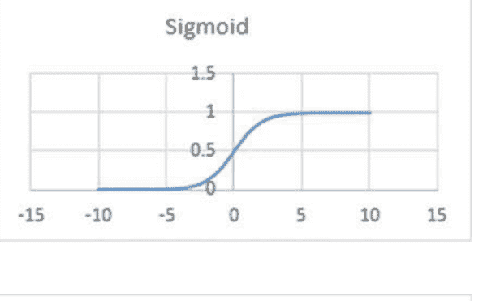

### 图11 Sigmoid函数梯度图

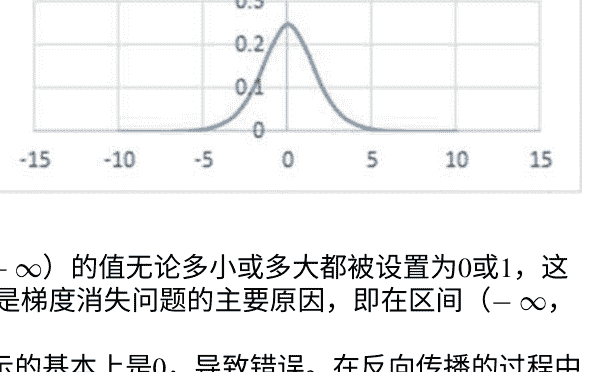

在区间（－∞，－5]和[5，＋∞）的值无论多小或多大都被设置为0或1，这被视为激活函数的饱和，也是梯度消失问题的主要原因，即在区间（－∞，－5]∪[5,+∞)在图11中显示的基本上是0，导致错误。在反向传播的过程中，如果导数在这个区间内，将会非常困难甚至不可能向前传递。因此，在初始化参数时，通常需要避免直接将输出值的范围带入到这个范围内，以免无法根据错误调整和更新网络参数。

此外，修正线性单元（ReLU）也是解决梯度饱和效应的一种好方法。目前，ReLU函数是深度卷积神经网络中最常用的激活函数之一，其计算复杂度低于Sigmoid函数，并且训练消耗的资源较少。ReLU的表达式以公式（10）的形式表示。

$$ReLU(x) = max\{0, x\} = \begin{cases} x, & if\ x \geq 0 \\ 0, & if\ x < 0 \end{cases} \tag{10}$$

ReLU函数图示如图12所示。从公式(10)可以得知，ReLU函数在x∈(－∞,0)时的梯度始终为0，在x∈[0,+∞)时的梯度始终为1。可以看出，ReLU函数完全解决了当x ∈ [0,+ ∞)时Sigmoid函数梯度分散的问题，如图13所示。

### 图12 ReLU函数图
### 图13 ReLU函数梯度图

## (d) 池化层

池化层的作用主要是降维（下采样，减小层的输入数据的维度大小），实现数据/特征的非线性映射，扩大感知域的范围，并实现不变性，包括平移不变性、旋转不变性和尺度不变性。常见的池化层类型有最大池化层、平均池化层和随机池化层。第m层池化层中的池化核用符号表示作为 $p_m \in \mathbb{R}^{H \times W \times D^m}$.

最大池化核每次进行池化操作时，按照从左到右、从上到下的顺序在张量上移动核，每次取覆盖区域的最大值作为池化结果。

平均池化核执行与最大池化核相同的池化操作，但取覆盖区域的平均值作为池化结果。随机池化核在池化操作中与前两者的方向相同，只是取覆盖区域的加权采样值作为池化结果。随机池化层是最大池化层和平均池化层的结合。池化核将根据覆盖区域中数据元素的大小分配相应的权重值，然后随机提取每个元素的权重值。这样就得到了池化的结果。这样做的优点是既保证了数据元素的最大值的最大化（即在局部视图中遵循最大池化的思想），又在一定程度上保证了所有元素不完全由最大值控制，扭曲了阅读（即在全局上类似于平均池化）。

## (e) 全连接层

全连接层的作用是对神经网络提取的特征进行空间映射。全连接层将神经网络提取的特征从原始空间映射到样本数据预标记的类空间中，因此全连接层在整个神经网络中类似于一个分类器。

## (f) 输出层

输出层的主要功能是根据目标要求输出模型的处理结果，输出层的输出结构是根据预先设定的任务目标确定的。

### 5.2 强化学习和马尔可夫决策过程

强化学习（RL）是一种研究如何最大化数值奖励信号的方法。换句话说，如何将一种情境映射到行为，并通过尝试不同的行为来最大化产生的奖励。学习者不会被告知哪种行为更好，而是必须尝试找出哪种行为可以带来最大的回报，这与大多数机器学习算法不同。

在最有趣和具有挑战性的情况下，行动不仅影响即时奖励（直接奖励），而且还影响下一步行动，并以此方式影响所有后续奖励。试错和延迟奖励这两个特征是增强学习与大多数机器学习算法不同的两个关键特征。

强化学习通过对学习问题进行描述来定义，而不是通过描述学习方法。所有适用于处理强化学习问题的方法都被视为强化学习方法。基本思想就是在与所处环境进行交互时，学习代理必须抓住实际问题的最重要方面以实现目标。显然，代理必须能够感知环境的相关状态并能够选择行动来改变环境。代理还必须具有与环境状态相关的一个或多个目标。

除了代理和环境，强化学习系统还包括以下三个因素：策略、奖励函数和值函数[44]。

策略定义了一个学习代理在给定环境中的行为。简而言之，策略是将观察到的环境状态映射到可选行动的过程。（一组可以在给定环境中执行的行动）。在某些情况下，策略可以是一个简单的函数或查找表，而在其他情况下，它可能涉及很多计算，比如搜索过程。由于策略本身足以确定行为，策略是强化学习系统中代理的支柱。一般来说，策略允许随机性，而在学习的初始阶段，策略通常是随机的。

奖励函数在强化学习中明确了目标。简而言之，它将每个观察到的环境状态（或状态-行动对）映射到一个单一的值，即奖励，以指示状态的内在可取性。强化学习代理的唯一目的是最大化累积的总奖励。奖励函数告诉代理什么是有益的，什么是有害的。在代理根据策略采取行动之后，它告诉代理行动的回报，这是改变策略的基础。

价值函数清楚地定义了从长期角度来看哪些行为更好。通俗地说，状态的价值是代理从该状态到未来可以获得的预期累积奖励的总和。奖励函数给出了与环境或状态对应的即时奖励值，而价值函数则表示在考虑可能的状态变化和可能的奖励获取后，状态的长期预期值。

简而言之，强化学习中要解决的问题是，具有行为能力和学习能力的代理在环境中进行交互，通过观察环境的状态采取行动，然后通过行动影响环境，并通过不断的交互学习优化策略。这个过程生成的数据和经验/训练样本如公式（11）所示：

$$\{s_1, a_1, r_1, s_2, a_2, r_2, \ldots, s_t, a_t, r_t\}$$

其中，‘si’表示在时间‘i’观察到的状态，‘ai’表示在时间‘i’采取的动作，‘ri’表示在时间‘i’完成动作后的即时奖励。强化学习从这些样本中学习到更好的策略。

目前，强化学习的研究仍然基于经典物理学，即时间是可分离的，并且它们之间存在一定的顺序，因此样本数据可以表示为公式（15）。此外，一个非常重要的前提是确定性，在强化学习领域中，当输入是确定性的时候，输出也是确定的。有了这两个前提，马尔可夫决策过程（MDP）可以用来描述问题。

马尔可夫决策过程有一个非常重要的前提：它需要满足马尔可夫性质。考虑一个一般环境在时间t +1时对时间t采取的行动做出反应。在最常见的情况下，这种反应可能依赖于之前发生的一切。在这种情况下，环境的下一个变化可以定义为以下完全概率分布，如公式（12）所示，

$$P(s_{t+1} | s_0, a_0, s_1, a_1, \ldots, s_{t-1}, a_{t-1}, s_t, a_t)$$

上述概率表达式适用于所有的 $\mathbf{s}_{t+1}$和所有可能的值$\mathbf{s}_0$, $\mathbf{a}_0$, $\mathbf{s}_1$, $\mathbf{a}_1$, ..., $\mathbf{s}_{t-1}$, $\mathbf{a}_{t-1}$, $\mathbf{s}_t$, $\mathbf{a}_t$序列。如果环境的状态信号满足马尔可夫性质，那么环境在时间 $t+1$的响应受到时间$‘t’$的状态和时间$‘t’$的动作的影响。也就是说，环境的变化可以用以下公式（13）描述，

$$P(s_{t+1}|s_t, a_t) \qquad (13)$$

上述概率表达式适用于所有的 $\mathbf{s}_{t+1}$和 $\mathbf{s}_t$, $\mathbf{a}_t$。换句话说，环境的状态信号具有马尔可夫性，只有当对于所有的 $\mathbf{s}_{t+1}$和所有的历史序列 $\mathbf{s}_0$, $\mathbf{a}_0$, $\mathbf{s}_1$, $\mathbf{a}_1$, ...时，这是一个马尔可夫状态。，$\mathbf{s}_{t-1}$, $\mathbf{a}_{t-1}$, $\mathbf{s}_t$, $\mathbf{a}_t$和公式（14)都是有效的。

$$P(s_{t+1}|s_0, a_0, s_1, a_1, \ldots, s_{t-1}, a_{t-1}, s_t, a_t) = P(s_{t+1}|s_t, a_t) \qquad (14)$$

如果一个环境具有马尔可夫性，那么环境的一个单步变化允许使用当前给定的状态和采取的动作来预测下一个状态和估计回报（即奖励）。可以证明，通过知道当前状态，可以基于状态转移概率预测所有未来状态及其奖励，并且还可以重构整个历史序列。这表明马尔可夫状态为选择动作提供了最佳基础。也就是说，选择马尔可夫状态的最佳动作策略和选择完整历史序列的最佳动作策略是等价的[45, 46]。

回到强化学习的范畴，几乎所有的强化学习问题都可以用马尔可夫决策过程来建模。一个基本的马尔可夫决策过程可以表示为（S，A，P），其中'S'表示状态，'A'表示动作，'P'表示状态转移的概率，即根据时间$‘t’$时的状态$\mathbf{s}_t$和动作$\mathbf{a}_t$，以及时间$‘t’$后转移到状态$\mathbf{s}_{t+1}$的概率。如果知道转移概率P，即等价于拥有问题的模型，可以通过解决未来信息来解决选择最优动作的可能性。

马尔可夫模型的这些特性极大地简化了强化学习问题的建模和解决方案的复杂性，为其提供了理论基础。

### 5.3 图像预测

帧间预测基于视频图像在时间域的相关性，即利用相邻编码图像像素的预测后的图像像素与视频时间域中的冗余来实现压缩。帧间预测技术在视频理解、压缩和当前流行的无人驾驶应用中具有广泛的应用。本章提出的具有预测（预测）功能的游戏代理也对帧间预测技术有很大的参考，根据当前游戏画面预测未来的游戏画面功能。

帧间预测通常可以分为两个过程：运动估计（ME）和运动补偿（MC）[4 7]。运动估计是指提取当前图像中包含的运动信息的过程。通常从编码块中找到当前编码块的最佳估计块，使得当前编码块和预测编码块的残差尽可能小，然后计算当前块的偏移量，即运动矢量（ME）。运动估计的常见方法包括基于像素的运动表示、基于区域的运动表示和基于块的运动表示。

运动补偿是利用运动估计中计算得到的运动矢量和相关的帧间预测方法来获得当前帧的估计。

目前，由于无人机和人工智能领域的激烈竞争，与计算机视觉领域中的预测相关的技术也被称为研究热点。在这种情况下，图像预测已成为主要的研究对象，因为它有大量未标记的视频数据用于训练，并且具有潜在的广泛应用场景。图像预测问题的形式化如下：给定连续的视频帧 F₁, F₂, . . . , Fₙ，构建一个模型可以准确生成后续的视频帧 Fₙ₊₁, Fₙ₊₁, . . . , Fₙ₊t。其中 't' 是要预测的视频帧的最后一帧的索引值。通常，视频预测还可以基于给定的上下文预测中间缺失的视频帧。形式化表达如下：给定连续的视频帧 F₁, F₂, . . . , Fₙ，其中₁ ≤ i < j ≤ n。模型需要根据前后图像帧 F i, F i₊₁, . . . , F j₋₁, F j 来计算缺失的视频帧（即插入帧）。因为视频图像预测所需的训练数据完全来自自然视频，不需要额外的注释，所以非常容易进行研究。

在视频图像帧预测问题中，Y用于表示真实的视频图像帧，而Y'用于表示预测的视频图像帧。基于卷积神经网络的视频帧预测模型通常在图14中显示。

卷积神经网络通过卷积层提取特征，然后将获得的二维特征映射到获得一维向量，并在一维特征之后添加一些附加信息，然后重新映射回二维数据形式，通过反卷积（即上采样或插值）将数据维度扩展到目标图像大小并输出结果。

预测视频图像帧后，需要进行质量评估。常用的评估方法包括均方误差（MSE）[49]，结构相似性指数（SSIM）[50]和峰值信噪比（PSNR）[51]。这些评估方法都是全参考视频质量评估方法，也就是说，这些评估方法是基于将原始真实视频帧与每个对应像素的预测值进行比较。

### 图14 视频图片预测模型的网络结构

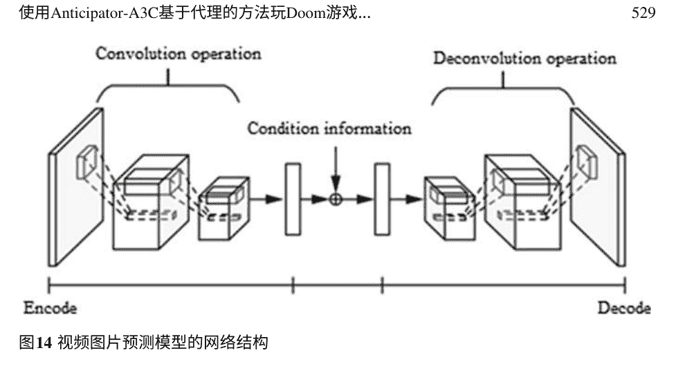

视频帧。均方误差是从失真视频图像（预测图像）和原始参考图像按位计算并平均，如公式（15）所示，

$$\text{MSE}(Y, Y') = \frac{1}{N} \sum_{i=0}^{N} (Y_i - Y'_i)^2$$

在公式中，N表示图像的像素总数，Yi表示第i个像素的像素值，图像从左到右，从上到下编号。这种评估方法在计算上相对简单，但评估结果的可信度不高，容易出现意外结果。

结构相似性在考虑图像质量方面更全面。它主要从亮度、对比度和结构三个方面考虑失真图像与原始图像之间的相似性[52]。不同图像之间的亮度相似度的度量由公式（16）给出，

$$l(Y, Y') = \frac{2\mu_Y \mu_{Y'} + c_1}{\mu_Y^2 + \mu_{Y'}^2 + c_1}$$

其中μY和μY分别表示图像Y和图像Y'的平均值，c1是一个常数，添加它是为了避免分母为'0'的情况。不同图像之间对比相似性的度量由公式（17）给出，

$$c(Y, Y') = \frac{2\sigma_{YY'} + c_2}{\sigma_Y^2 + \sigma_{Y'}^2 + c_2}$$

其中 σ_Y 和 σ_{Y'} 分别表示图像_Y 和图像_{Y'} 的方差，σ_{YY'} 表示图像_Y 和图像_{Y'} 的协方差，c_2 也是一个常数，其效果与 c_1 相同。此外，结构相似性还给出了结构存在的相似度度量，如公式（18）所示，

$$s(Y, Y') = \frac{\sigma_{YY'} + c_3}{\sigma_Y \sigma_{Y'} + c_3}$$

其中 c_3 与 c_1 和 c_2 的作用相同。通过上述三个角度，可以得到一个结构相似性的度量，如公式（19）所示，

$$SSIM(Y, Y') = l(Y, Y') \cdot c(Y, Y') \cdot s(Y, Y')$$

尽管结构相似性在分析图像质量方面可能更全面和合理，但其计算过程过于繁琐，实际应用中通常更广泛使用峰值信噪比。如公式（20）所示，

$$PSNR(Y, Y') = 10 \lg \frac{\max_{Y'}^2}{\frac{1}{N} \sum_{i=0}^{N} (Y_i - Y_i')^2} = 10 \lg \frac{\max_{Y'}^2}{MSE(Y, Y')}$$

其中，max_{Y'} 表示图像_{Y'} 中像素值的最大值。从公式可以看出，峰值信噪比的本质与均方误差相同，可以看作是均方误差的对数表示。

### 5.4 研究工具和游戏人工智能研究平台

这项研究的编码部分主要使用Python 3.6（64位）作为开发语言，神经网络的实现和训练基于Tensorflow-GPU 1.3.0框架。实验场景由ViZDoom 1.1.5游戏人工智能研究平台提供，此外，整个模型的开发、训练和测试也在ViZDoom 1.1.5游戏人工智能研究平台上进行。

### 5.4.1 Tensorflow框架（深度学习库）

Tensorflow是由Google开发的开源机器学习框架[53]。它是一个用于高性能数值计算的软件库。因为它的计算过程可以看作是一个张量（Tensor）随着数据的流动流程图（Flow）的流动，所以被命名为Tensorflow。数据流图中的这些节点代表相关的数学计算，连接这些节点的边代表节点之间传递的张量。它的灵活架构使得在多个平台上（包括台式机、服务器或移动设备）轻松部署科学计算，包括计算单元（CPU、GPU [54]、TPU [55]）。

首先，介绍Tensorflow中的基本概念：

- (a) 图(图表)：Tensorflow的计算过程是一种数据流图的形式，也可以看作是整个任务的所有操作的集合。
- (b) 操作：图中的每个节点表示对张量的操作。
- (c) 张量：它是矩阵和向量向更高维度的推广。可以将其看作由基本数据类型组成的n维数组。
- (d) 常量：在操作过程中无法更改的一种张量类型。
- (e) 变量：在计算过程中可以更新的变量张量类型。一般网络的权重参数都属于这种类型。
- (f) 会话：封装了张量操作的运行时环境，并提供执行所需的上下文环境。
- (g) 占位符(占位符)：它也是自然界中的一个常数。在声明时不需要提供数据，但在执行Tensorflow操作时需要为其提供数据，否则会生成错误。
- (h) 提供数据(提供数据)：在计算之前，可以将数据临时分配给操作。
- (i) 检索数据(检索数据)：在完成计算时，可以从操作中获取数据。

使用Tensorflow实现深度学习算法通常需要两个步骤：(1) 将所有操作（Operation）构建成一个图，该图包含神经网络的组成和训练方法；(2) 使用会话执行图中的操作。也就是说，执行训练任务或使用网络进行预测。

在Tensorflow中，图的构建（包括模型的创建、损失的定义和训练方法）通常分为三个部分：推断、损失和训练。

- 推理（推理）-根据任务要求构建图表，以便根据输入进行反馈以预测目标输出。
- 损失-在构建良好的图表中添加相关操作以完成计算损失所需的过程。
- 训练-将指导训练过程并执行梯度下降的操作添加到已添加计算损失相关操作的图表中。

完成上述三个步骤后，可以对模型进行训练。

### 5.4.2 ViZDoom游戏人工智能平台介绍

ViZDoom是一个用于开发和训练智能代理的人工智能研究平台。该平台是由ZDoom开发的，用于基于原始视觉信息研究强化学习算法。它基于一款以第一人称视角（FPP）为特点的射击游戏Doom。ViZDoom游戏人工智能研究平台包括各种游戏场景，每个游戏场景的玩法不同，并且每个游戏场景可能包含多个不同的地图。这些地图通常以迷宫的形式设计。它是一个三维（3D）空间。空间中可能有怪物、内置脚本代理、医疗包、弹药、枪械、爆炸桶和其他物品。由于玩家（或代理）在游戏中的视野有限（只能看到自己正面朝向的内容，两侧的一小部分内容，但无法观察到身后的情况），并且游戏场景中存在墙壁等障碍物，导致玩家（或代理）无法形成对环境的全知全能的知识[56]。该平台旨在提供一个代理可以在其中进行互动的环境（这些环境并非完全可识别）。

ViZDoom AI研究平台支持多平台操作，并提供多语言版本的API接口，用于研究工作中代理和游戏引擎之间的交互、获取信息和执行动作。该平台支持自定义游戏场景，可以根据任务要求进行研究。最重要的是，该平台支持同步和异步模式的游戏。在同步模式下，游戏引擎会等待外部（代理或玩家）每帧游戏画面的输入（动作），然后进入下一个游戏状态以更新游戏画面。异步模式意味着游戏引擎不会等待外部世界的输入，游戏状态会随时间的推移不可避免地前进。异步模式机制对于模型训练非常有益，可以获取任意帧进行处理。此外，该平台支持以多种编码格式获取游戏画面图像，包括RGB24、RGBA32、GRAY8和许多其他常见格式。

丰富的数据格式使得可以根据研究需求选择适当的格式，并减少数据的预处理量。特别是在这个主题的研究中，采用了GRAY8格式，可以减少训练过程中的网络参数数量和计算量。在支持的操作方面，该平台也提供了丰富的选择。在这个主题中，主要采取的基本可选操作包括攻击（attack）、加速（SPEED）、向左移动（MOVE_LEFT）、向右移动（MOVE_RIGHT）、向前移动（MOVE_FORWARD）、向后移动（MOVE_BACKWARD）、向左转向（TURN_LEFT）、向右转向（TURN_RIGHT）。然后，将上述操作组合在一起形成的动作集添加到研究中。游戏平台的真实游戏画面是游戏代理用于学习的图像，如图15所示。

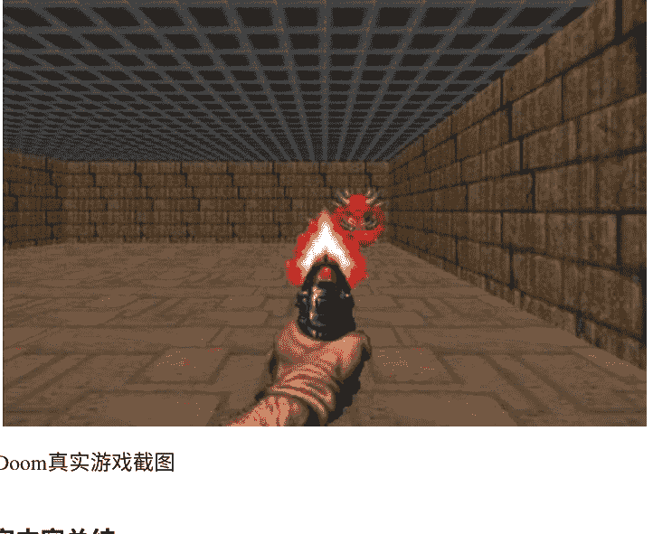

### 5.4.3 研究内容总结

本章计划将A3C算法应用于ViZDoom上的代理实现，并使用深度卷积神经网络实现一个预测网络，用于使用当前游戏画面预测下一个游戏画面。然后，将当前游戏画面与预测的游戏画面相结合，作为策略网络（Actor）的输入，并获得动作的概率输出。关键网络评估用于指导Actor的训练。具体原则可以参考图20和图21。然后，在ViZDoom平台上进行性能测试，并比较分析本章提出的模型的优缺点。

### 5.5 强化学习和DQN原理

强化学习分为基于价值的方法和基于策略的方法。基于价值的方法通常基于给定状态预测从现在到未来的总价值。如果是独立于动作的价值估计，则模型需要与一些树搜索算法结合，以模拟后续状态转换，以获得给定状态下的最优动作。如果是与动作相关的价值估计，则通常估计给定状态下所有动作的未来累积总奖励值。然后模型在实际使用中不需要依赖树搜索算法，只需采取能够获得最大未来累积总奖励值的动作，例如DQN [57]。基于策略的方法通常更直接地解决问题，并直接调整给定状态下每个动作的概率分布，即策略。

在许多任务中，根据给定的状态采取某些行动是合理的。在这种情况下，基于策略的方法显然更好。例如，在游戏中，非玩家角色（NPC）与玩家互动并可以选择多种方式。此外，由于基于策略的方法获得的模型输出是动作的概率分布，因此更适用于包含连续动作的某些任务。在调整学习中的策略（动作的概率分布）时，通常需要一般的策略导向。例如，当状态的值增加时，相应动作发生的概率增加，反之亦然。演员-评论家算法是一种基于策略的方法，其中评论家部分为策略调整提供了有价值的指导。本节重点介绍基于值的方法——DQN。

强化学习关注以下问题：对于具有感知、互动和决策能力的代理，它必须在除自身以外的外部环境中进行交互，根据当前状态S_t做出决策，然后使用反馈（即奖励）R_t不断学习和优化其性能以实现目标。具体的交互过程如图16所示。

更具体地说，代理和环境的交互发生在每个离散的时间点，t = 0, 1, 2, 3...在每个时间点‘t’，代理接收环境的当前状态S_t（通常是游戏的当前画面），S_t ∈ S，其中S表示可能的状态集合，然后根据这个S_t选择一个动作A_t，A_t ∈ A(S_t)（基于这个S_t），其中A（S_t）表示在状态S_t下的可选动作集合。然后，根据代理的动作，环境发生变化并转移到新的状态S_{t+1}，并且代理接收奖励R_t，R_t ∈ R。在理解整个过程之后，代理的目标是直观地使一系列决策后获得的累积奖励最大，如式（21）所示，

$$ G_t = R_t + R_{t+1} + R_{t+2} + \dots + R_T \quad (21) $$

其中‘G_t’代表目标，‘T’代表终点（例如游戏的结束）。接下来，需要一个策略π(a|s)来计算每个状态‘s’映射到‘a’的概率。代理想要学习的是如何找到一个最优策略‘π*’使得G_t最大。上述的G_t的定义是一个特例。实际上，当考虑到累积奖励，每个项目都添加了一个衰减因子‘γ’，以调整奖励和惩罚对不同时间点上目标的影响，例如公式（22）

$$ G_t = \sum_{t'=t}^{T} \gamma^{t'-t} R_{t'} \quad (22) $$

γ ∈ [0, 1] 在公式（22）中。根据 G_t 的定义，给定状态‘s’的预期回报（即价值函数）定义如公式（23）所示，

$$ V(s) = E[G_t | S_t = s] \quad (23) $$

将上述公式在公式（24）中展开：

$$ \begin{aligned} V(s) &= E[G_t | S_t = s] \\ &= E[R_t + \gamma R_{t+1} + \gamma^2 R_{t+2} + \cdots + \gamma^{T-t} R_T | S_t = s] \\ &= E[R_t + \gamma \left( R_{t+1} + \gamma R_{t+2} + \cdots + \gamma^{T-t-1} R_T \right) | S_t = s] \\ &= E[R_t + \gamma G_{t+1} | S_t = s] \\ &= E[R_t + \gamma V(S_{t+1}) | S_t = s] \end{aligned} \quad (24) $$

因此，我们得到了 V(s) 的迭代公式（25）

$$ V(s) = E[R_t + \gamma V(S_{t+1}) | S_t = s] \quad (25) $$

这是贝尔曼方程的最基本表示，表明可以使用迭代计算来解决值函数 V(s)。考虑到在任何状态下，可以采取多种不同的行动，并且每个行动执行后转移到的状态也不同。显然，代理更关心在任何状态下不同行动的价值。假设所有行动的价值都是已知的，代理可以采取最有价值的行动，即行动-值函数 Q^π (s, a)。同样，奖励用于量化，但这里的奖励与之前的奖励不同。这里是完成一个行动后获得的奖励，而之前与状态相关的奖励表示所有可选行动可以实现的奖励的平均期望值。显然，行动-值函数表示的奖励更容易应用。根据上述定义，行动-值函数可以写成 Eq. (26) 的形式。

$$ \begin{aligned} Q^{\pi}(s, a) &= E[r_t + \gamma r_{t+1} + \gamma^2 r_{t+2} + \cdots + \gamma^{T-t} r_T | s, a] \\ &= E_{s', a'}[r_t + \gamma Q^{\pi}(s', a') | s, a] \end{aligned} \quad (26) $$

这里的动作值函数上标为 π，表示在策略 π 下的动作值。由于所有动作都需要通过策略来确定当前状态，策略是必不可少的。先前的价值函数不一定依赖于策略。由于代理的目标是找到最优策略，可以转化为求解最优动作值函数，如公式（27）所示：

$$ Q^*(s, a) = \max_{\pi} Q^{\pi}(s, a) \quad (27) $$

也就是说，在所有策略中，Q函数的最大值是最好的Q函数。使用这个限制可以保证最佳动作值是唯一的，并且问题很容易解决。将公式（25）与公式（28）结合，得到如下结果：

$$ Q^*(s, a) = E_{s'} \left[ r_t + \gamma \max_{a'} Q^* (s', a') | s, a \right] \quad (28) $$

从公式（28）可以知道，当前时间的Q值的更新调整取决于未来时间的所有状态和动作的Q值，但在实际情况下，遍历整个状态空间和动作空间是不现实的。只能获取到有限的样本。因此，为了解决这个问题，Q-Learning提出了一种可行的调整Q值的方法，如公式（29）所示：

$$ Q(S_t, A_t) \leftarrow Q(S_t, A_t) + \alpha \left( r_t + \gamma \max_{a} Q(S_{t+1}, a) - Q(S_t, A_t) \right) \quad (29) $$

公式（29）使用 r_t + \gamma \max_a Q(S_{t+1}, a) 基于时间差分方法作为目标值，因为真实目标值只能通过遍历所有状态和动作来获得，在实践中不可行。公式（29）使用当前实际奖励值加上从经验中获得的最大Q值作为目标值来指导网络训练，这是可行且有效的。

用θ表示DQN网络的参数，那么网络的损失函数和网络参数的更新如公式（30）和（31）所示，

$$ L(\theta) = (r_t + \gamma Q(S_{t+1}, a) - Q(S_t, A_t))^2 \quad (30) $$

$$ \theta \leftarrow \theta - \alpha \nabla_{\theta} L(\theta) \quad (31) $$

### 5.6 演员-评论家和A3C模型的原则

DQN是一种基于价值的方法，通过计算每个状态动作的价值，然后选择具有最高价值的动作。这是一种间接的方法，更直接地通过更新策略网络（指网络直接输出动作或根据状态输出动作的概率）来实现。对于策略网络的训练思想和价值网络略有不同，因为它表达了状态中每个可选动作的可能性，所以损失函数不容易构建。最简单的想法之一是根据执行动作后的奖励大小来调整动作发生的概率。

奖励越大，动作出现的概率越大。也就是说，可以构建一个评估网络来判断当前决策的质量，以指导战略网络的训练。这是演员-评论家模型的基本思想，如图17所示。

演员-评论家模型主要由演员（即策略网络）和评论家（状态值函数）组成。评论家的输入是游戏状态S_t，输出是对于给定状态的平均预期值的估计，其数学表示如公式（24）所示。因此，评论家可以通过公式（25）进行迭代更新，并且一般的损失函数也使用平方误差。参考上述DQN网络的参数更新公式，得到评论家的更新公式（33），并用θ_v表示评论家网络的参数。

$$ L(\theta_v) = (r_t + \gamma V(S_{t+1}) - V(S_t))^2 $$

图17 演员-评论家模型结构[59]

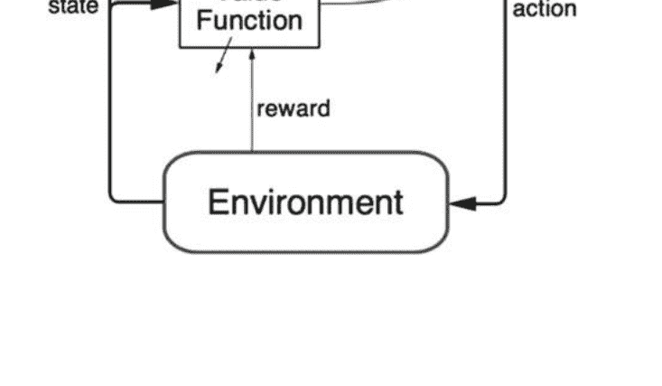

$$ \theta_{v} \leftarrow \theta_{v} - \alpha \nabla_{\theta_{v}} L(\theta_{v}) \quad (33) $$

然后，时间差错误 $\text{TD} = r_t + \gamma V(S_{t+1}) - V(S_t)$ 在评论家中用于评估演员在状态 $S_t$ 中选择的动作 $A_t$ 是否优于给定状态下获得的累积奖励平均值。 根据评估结果调整动作 $A_t$ 的概率，并构建演员网络的损失函数，例如公式 (34)，$\theta_{\pi}$用于表示演员网络的参数，

$$ L(\theta_{\pi}) = -\sum \log(\pi(a_t|s_t)) * \text{TD} \quad (34) $$

也就是说，当动作优于平均值时，动作的概率应增加。 此时，TD为正，$\log$函数部分为负，最小化损失函数 $L(\theta_{\pi})$ 可以实现目标。 当动作差于平均值时，情况也是如此。 根据公式 (34)，演员网络的参数可以更新，例如公式 (35)，

$$ \theta_{\pi} \leftarrow \theta_{\pi} + \alpha \text{TD} \nabla_{\theta_{\pi}} \log \pi(a_t|s_t) \quad (35) $$

由于Actor-network采用了概率输出，该模型具有更广泛的应用范围，更适用于解决连续动作问题。此外，概率输出的使用使得模型在相同情况下具有越来越合理的动作选择。

当前流行的A3C算法是Actor-Critic算法的改进。 在A3C算法中，神经网络优化器使用异步梯度下降方法。A3C算法并没有改变Actor-Critic算法的核心。 相反，它将训练过程改变为多线程模式，充分利用计算资源，有效地打破数据之间的相关性。 算法1中显示了算法的流程；算法1的主要思想是将要训练的网络参数设置为线程共享。 然后，每个线程在开始每个游戏之前都会从共享的网络参数中复制参数，更新线程的私有网络参数，然后在训练环境（如游戏）中交互地收集数据，然后使用收集到的数据计算相应的损失并获得梯度值。 然后，每个线程将使用自己获得的梯度值异步地更新共享的网络参数，以实现梯度降低。 整个训练过程就是重复上述步骤。

### 5.7 Anticipator-A3C模型的基本思想

### 5.7.1 Anticipator-A3C模型的整体结构

本研究的重点是改进A3C，在当前游戏状态S_t的基础上添加下一个状态S'_{t+1}，并使用S'_t = {S_t, S'_{t+1}} 作为Actor。一个完整的输入决定获取动作A_t。 本研究在一些Doom射击游戏场景中进行。 相关游戏场景的截图如图18和19所示，该模型的核心思想是使用添加的预测器根据当前原始图像信息（即图像中物体的趋势）来预测代理将要发生的事情，例如，当代理准备瞄准时，射击必须考虑目标的移动趋势，并在射击前进行预调整以达到最终命中目标。 或者当敌人出现在视野中时，应该意识到敌人很可能瞄准自己射击。 这时，应该预测敌人的视线可能瞄准的位置，然后根据预测提前进行闪避操作。 为了实现代理的预测能力，Anticipator-A3C的底层模型基于卷积层实现的Actor-Critic模型。 然后，不再使用原始的游戏状态S_t作为Actor的输入，而是在Anticipator网络中添加了Actor-Critic模型，该模型由一系列卷积层和反卷积层实现。 然后使用S_t作为Anticipator的输入，得到即将到来的游戏状态S'_{t+1}的预测，然后将S'_t与St结合起来作为Actor网络的输入，让Actor根据当前状态组合预期，并输出所有可选动作的概率分布，实现一个更智能的决策过程。

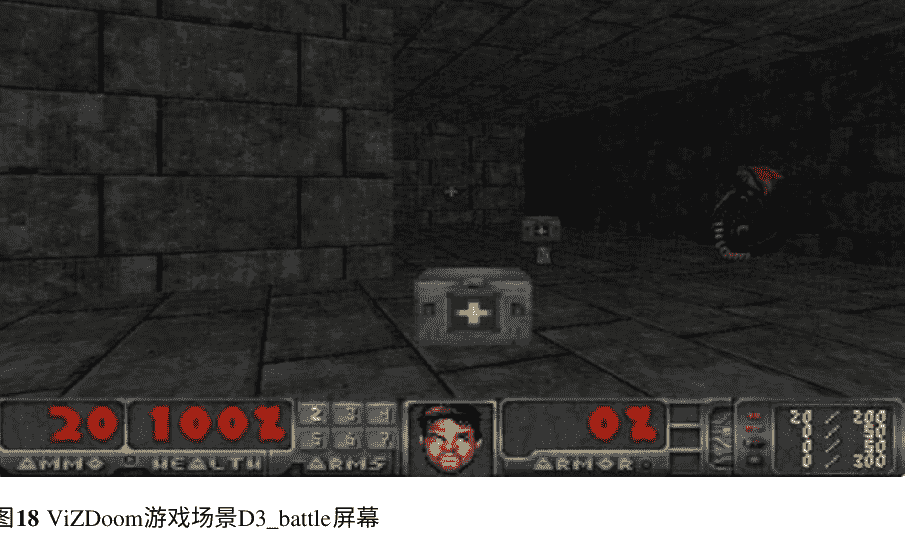

图19 ViZDoom游戏场景CIG屏幕

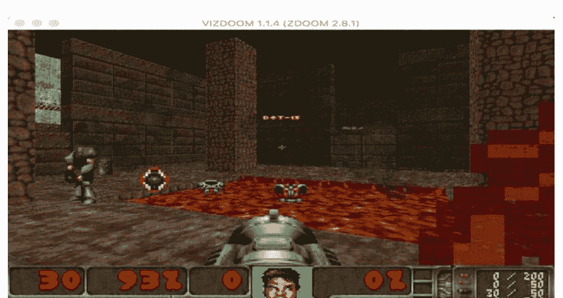

通过这种方式，代理具有类似于人类玩家的一定预测能力，从而提高了代理的性能。 由于这个想法只修改了Actor网络的数据输入组合，A3C算法模型本身的结构不需要修改。由于这种特性，这种方法是一种与模型无关的改进，可以应用于常见的强化学习算法，如DQN和SARSA，而无需调整网络结构本身。 Anticipator-A3C的模型结构如图21所示。

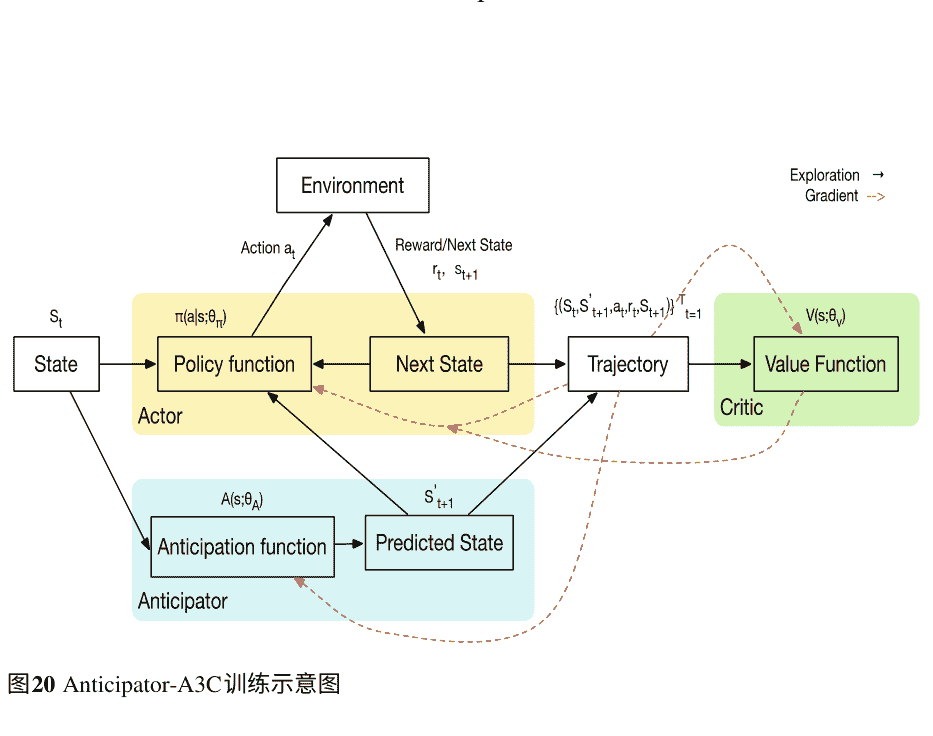

图20 Anticipator-A3C训练示意图

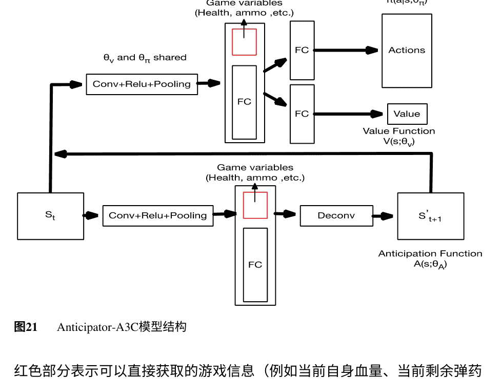

### 图21 Anticipator-A3C模型结构

红色部分表示可以直接获取的游戏信息（例如当前自身血量、当前剩余弹药等），此外，由于初始阶段，预测器的参数完全随机，预测效果会非常差，甚至完全无用。如果Anticipator的预测结果$S'_{t+1}$直接用于训练Actor，可能会导致Actor网络本身由于其巨大的状态和动作空间而很难收敛，因此在早期阶段可能更难收敛。在初始阶段，只训练预测器部分，当预测器能够达到更好的预测效果时，再联合训练整个模型。

对于预测器部分，实现的函数表示如下公式（36），$\theta_A$ 表示预测器的参数，

$$ S'_{t+1} = A(S_t; \theta_A) \quad (36) $$

### 算法1：原始的A3C（每个线程的伪代码）

```
//假设全局共享参数向量
//假设线程特定的参数向量
1.初始化线程步骤计数器 t ← 1
2.重复：
3.重置梯度：dθπ ← 0, dθv ← 0
4.同步线程特定参数
5.t_start = t
6.获取状态s_t
7.重复：
8.执行a_t 根据策略π(a_t|s_t; θ'_π)
9.接收奖励r_t和新的状态s_{t+1}
10.s_t ← s_{t+1}
11.t ← t + 1
12.T ← T + 1
13.直到 终端s_t 或 t - t_start == t_max
14.R = \begin{cases} 0, & \text{for terminal } s_t \\ V(s_t; θ'_v), & \text{for non-terminal } s_t \end{cases}
15.对于i ∈ {t-1,...,t_start}做
16.R ← r_i + γR
17.累积梯度 wrt θ'_π: dθπ ← dθπ + ∇_{θ'_π} log π(a_i|s_i; θ'_π)(R - V(s_i; θ'_v)) + β∇_{θ'_π} H(π(·|s_i; θ'_π))
18.累积梯度 wrt θ'_v: dθv ← dθv + ∂(R - V(s_i; θ'_v))²/∂θ'_v
19.结束循环
20.使用异步更新 θπ 使用dθπ 和 θv 使用dθv
21.直到T > T_max
```

Actor网络的正式表示由公式（37）给出，θπ 表示演员的参数，和 → 表示动作概率演员输出的分布

$$ \overrightarrow{a} = \pi(s_t, s_{t+1}'; \theta_\pi) \tag{37} $$

Anticipator-A3C模型的训练方法和每个部分之间的梯度流如图20所示，根据Anticipator-A3C结构和公式(35)，每个网络的参数更新公式(38)和(39)如下所示，

$$ \theta_A \leftarrow \theta_A - \alpha_1 \nabla_{\theta_A} (S_{t+1} - A(S_t; \theta_A))^2 \tag{38} $$

$$ \theta_\pi \leftarrow \theta_\pi + \alpha_2 \text{TD} \nabla_{\theta_\pi} \log \pi(a_t|s_t, s_{t+1}') \tag{39} $$

Critic的参数更新公式与公式(33)相同。图20和图21再次强调这种改进是一种端到端的模型无关方法和一种通用方法，可以直接移植到其他强化学习模型而不改变原始模型，并更符合人工智能问题的需求。Anticipator-A3C模型的伪代码流程如算法2所示。

## 5.7.2 预测器模块的原理

预测器模块本质上可以看作是一个自编码器，每次接受原始游戏帧（包括之前的历史游戏帧），实现一定的记忆推理功能来替代LSTM，然后通过卷积提取隐含信息（包括运输）。通过池化层实现动态趋势和特征的降维。通常，自动编码器可以直接解码输出图像，而不需要全连接层，但是因为在这个主题中，代理程序在ViZDoom平台上进行游戏时可以直接获取与自身相关的信息（如血量、弹药等）。因此，为了充分利用合法信息，预测器模块中的卷积层在提取特征后访问全连接层，然后在全连接层上拼接与自身相关的合法信息。然后，通过使用从卷积层提取的特征和与自身相关的合法信息，添加解卷积层生成预测图像。预测器模块的工作原理如图22所示。

此外，由于预测模块的目标输出是真实的下一个游戏状态，所以无需增加训练数据的预处理，并且训练数据是无限的。

## 6 模型设计、实现和实验

本研究的主要入口是通过添加基于A3C算法模型的预测网络来进一步提高模型的性能。预测网络的本质是利用历史帧和当前帧提取屏幕中对手的移动趋势信息、危险接近（子弹飞行）信息等，以预测下一个游戏的变化。并获取预测帧。然后让A3C算法模型根据当前帧和预测帧中包含的信息进行决策，提高现有信息的利用率，做出更科学、合理的决策。

在前几章中，基于A3C算法模型的游戏代理的网络结构设计和算法的代码实现已经完成。还给出了多线程并行训练的梯度计算和更新算法流程。简要介绍了研究平台ViZDoom和实时游戏信息获取的使用。研究了帧预测的理论，完成了Anticipator的理论基础，并将Anticipator模块集成到A3C网络中。修改了A3C网络的输入结构，使其同时接受实时游戏和预测图片，以便两者都可以作为决策的依据。

在这一部分中，通过对大量训练过程的分析和比较，建立和调整激励机制，以尽可能简单和正确地指导模型的训练，同时，调整和修改卷积神经网络的超参数和网络大小在不断尝试训练的过程中，以确保性能不降低。同时，不断尝试训练，以确保性能不降低。模型的参数减少了，使训练更容易。此外，已完成对A3C算法模型和预测器-A3C模型在游戏场景D3_battle（由Intel团队制作的游戏场景）和CIG（由ViZDoom竞赛官方提供和使用的游戏场景）的训练。模型的选择、测试和比较已完成，并对测试和比较结果进行了深入分析。

```
算法2 ：预测器-A3C （每个线程的伪代码 ）
//假设全局共享参数向量 \(\theta_\pi, \theta_v\) 和 \(\theta_A\) 和全局共享计数器 T=0
//假设线程特定的参数向量 \(\theta'_\pi, \theta'_v\) 和 \(\theta'_A\)
1.初始化线程步骤计数器 \(t \leftarrow 1\)
2.重复 ：
3. 重置梯度: \(d\theta_\pi \leftarrow 0, d\theta_v \leftarrow 0, d\theta_A \leftarrow 0\)
4. 同步线程特定参数: \(\theta'_\pi = \theta_\pi, \theta'_v = \theta_v, \theta'_A = \theta_A\)
5. \(t_{\text{start}} = t\)
6. 获取状态 \(s_t\)
7. 重复 ：
8.  预测下一个状态 \(s'_{t+1}\) 根据状态 \(s_t: s'_{t+1} \leftarrow A(s_t; \theta'_A)\)
9.  执行 \(a_t\) 根据策略 \(\pi(a_t|s_t, s'_{t+1}; \theta'_\pi)\)
10. 接收奖励 \(r_t\) 和新的状态 \(s_{t+1}\)
11. \(s_t \leftarrow s_{t+1}\)
12. \(t \leftarrow t + 1\)
13. \(T \leftarrow T + 1\)
14. 直到 终端 \(s_t\) 或 \(t - t_{\text{start}} == t_{\text{max}}\)
15. \(R = \begin{cases} 0, & \text{for terminal } s_t \\ V(s_t, \theta'_v), & \text{for nonterminal } s_t \end{cases}\)
16. 对于 \(i \in \{t-1, ..., t_{\text{start}}\}\) do
17. \(R \leftarrow r_i + \gamma R\)
18. 累积梯度 wrt \(\theta'_\pi\): \(d\theta_\pi \leftarrow d\theta_\pi + \nabla_{\theta'_\pi} \log \pi(a_i|s_i, s'_{i+1}; \theta'_\pi) (R - V(s_i, s'_{i+1}; \theta'_v)) + \beta \nabla_{\theta'_\pi} H(\pi(\cdot | s_i, s'_{i+1}; \theta'_\pi))\)
19. 累积梯度 wrt \(\theta'_v\): \(d\theta_v \leftarrow d\theta_v + \partial (R - V(s_i, s'_{i+1}; \theta'_v))^2 / \partial \theta'_v\)
20. 累积梯度 wrt \(\theta'_A\): \(d\theta_A \leftarrow d\theta_A + \nabla_{\theta'_A} (s_{i+1} - s_i)^2\)
21. 结束循环
22. 执行异步更新 \(\theta_\pi\) 使用 \(d\theta_\pi, \theta_v\) 使用 \(d\theta_v\) 和 \(\theta_A\) 使用 \(d\theta_A\)
23. 直到 \(T > T_{\text{max}}\)
```

### 6.1 模型网络结构和实现细节

### 6.1.1 模型结构设计和参数设置

本研究设计和使用的A3C算法模型的网络结构图如图23所示。输入部分中的4 +1（预测）表示基本Actor-Critic模型的输入最接近当前游戏时间。历史的4帧，加上1表示当添加额外的预测图片作为输入时的输入结构，即4 +1表示Anticipator-A3C模型中Actor-Critic的输入，因为两部分的结构相同，所以不再重复绘制。由于由Actor和Critic表示的网络的输入结构完全相同，只有结构中的输出维度不同，所以在实践中，卷积层通常是共享的，以减少网络训练的数量并加快训练速度，如图23所示。此外，为了让代理程序获得更多合法信息，可以在全连接层添加相关游戏信息（如血量、弹药数量等）。此外，研究的初始模型在这些更复杂的环境中很难收敛，基本上不符合预期，后来调整了网络大小，增加了卷积核的数量，并在卷积层后添加了最大池化。通过这种修改，模型可以更容易地收敛。经过分析，卷积核被添加以提取更多的图像特征。最重要的是，最大池化层的添加减少了卷积层获得的特征维度，并保留了重要的特征。最大池化层引入了不变性（平移不变性、旋转不变性、尺度不变性）。由于模型在初始训练时运动相对随机，成功击杀目标的概率较小，在许多游戏中，目标与代理之间的距离变化很大，图片中目标的大小和位置是可以接受的。此外，由于意外开枪的可能性，初始训练可能更容易受到惩罚，导致模型不再开枪，即使它可以开枪，当击杀目标时也会失去射击能力。最大池化层的不变性使得模型能够在成功击杀目标后将这种能力扩展到目标距离和位置的范围内，提高初始击杀概率，降低误射率，并使模型更容易收敛。

Anticipator-A3C模型的Actor-Critic部分的网络结构已经在上面介绍过。接下来介绍Anticipator部分的网络结构。Anticipator网络输入当前游戏屏幕对应的帧，输出预测下一个游戏屏幕对应的帧。输入和输出结构是相同的。因此，设计使用卷积和池化来提取特征，然后使用反卷积来生成预测的图像，但为了使Anticipator部分也使用合法的游戏信息，在网络的中间添加了全连接层，然后在全连接层中添加相关的游戏信息。根据此，Anticipator的网络结构如图24所示。

Actor-Critic模型部分的损失函数由三部分组成：策略损失、价值损失和熵损失，如公式(40)、(41)、(42)和(43)所示。公式(41)中的N的大小由批量大小和游戏是否结束来确定。如果生成的训练数据大小达到批量大小且游戏未结束，则'n'等于批量大小。如果游戏结束，'n'等于生成的训练数据大小（小于或等于批量大小）。

```
损失策略 – TD* 对数 \(\pi(a_t | s_{t-3}, s_{t-2}, s_{t-1}, s_t, s'_{t+1})\)  (40)
```

```
损失值 = \(\left( r_t + \gamma r_{t+1} + \gamma^2 r_{t+2} + \cdots + \gamma^n V(s_{t+n-3}, s_{t+n-2}, s_{t+n-1}, s_{t+n}, s'_{t+n+1}) - V(s_{t-3}, s_{t-2}, s_{t-1}, s_t, s'_{t+1}) \right)^2\)  (41)
```

损失熵 = π\left(\cdot_{\text{秒}_{t-3}, \text{秒}_{t-2}, \text{秒}_{t-1}, \text{秒}_{t}, \text{秒}_{t+1}}\right)^{*} \text{对数 } π\left(\cdot_{\text{秒}_{t-3}, \text{秒}_{t-2}, \text{秒}_{t-1}, \text{秒}_{t}, \text{秒}_{t+1}}\right) \quad (42)

损失动作 = 损失策略 + 0.5 * 损失价值 + 0.01 * 损失熵 \quad (43)

预测模型部分的损失函数定义如公式44所示,

损失预测器 = (A(秒_{t-3}, 秒_{t-2}, 秒_{t-1}, 秒_{t}) - 秒_{t+1})^2 \quad (44)

本章需要训练的模型使用RMSProp进行梯度下降来优化模型。 Actor-Critic部分的学习率设置为1e -6，预测器部分的学习率设置为5e -5，γ设置为0.99，批量大小设置为128。 线程同时进行异步训练。 在模型全连接层中添加的合法游戏信息game_variables是一个长度为6的向量：[剩余血量，剩余子弹数，剩余护甲耐久度，如果血量<30则为50否则为-50，如果子弹<5则为50否则为-50，如果护甲耐久度 ==0则为50否则为-50]。 向量中相关游戏信息的含义和值范围如表1所示。 训练数据是由待训练模型实时生成的，并直接用于训练。 它很容易发生，并且适用于特定的游戏过程。 为了减少数据序列之间的相关性并提高训练的稳定性，采用了多线程。

表1 游戏变量向量参数比较表
| 元素 | 描述 | 范围 |
| :--- | :--- | :--- |
| 剩余血量 | 用于指示代理的当前血量值 | 如果它还活着，范围是（0，100）否则小于等于0 |
| 剩余子弹 | 用于指示代理当前拥有的子弹数量 | [0, 200] |
| 剩余护甲耐久度 | 用于指示代理当前拥有的护甲的耐久性 | [0, 200] |
| 变量4（向量中的第四个变量） | 用于指示代理当前血量的健康状况 | 如果血量小于30，则被认为是不健康的，值为50。否则，值为 -50 |
| 变量5（同上） | 用于指示代理当前子弹的充足性 | 如果子弹数量小于5，则认为子弹太少，值为50。否则，值为 -50 |
| 变量6（同上） | 用于指示代理的当前护甲的损坏程度 | 如果护甲的耐久度为0，则被视为缺乏护甲，值为50。否则，值为 -50 |

使用异步训练来训练模型。基本思想是创建多个线程，每个线程都有一个私有模型，主线程有一个共享模型。 在每场比赛开始之前，子线程将请求主线程更新私有模型的网络权重，使其与主模型的网络权重一致。更新完成后，比赛开始。然后，在获取每组训练数据时，计算相应的梯度值，梯度值在主模型上进行梯度决策，并更新主模型的网络权重，直到比赛结束。当子线程进入下一场比赛时，重复上述操作。多线程异步训练可以有效降低训练数据的相关性，同时充分利用计算资源。

通常情况下，游戏中相邻的两个帧几乎是相同的，这意味着如果模型逐帧处理游戏画面，会有很多冗余计算。虽然在训练中，由于同步游戏模式（即游戏会等待模型做出决策，然后刷新游戏屏幕，进入下一个游戏画面，然后再等待模型做出决策，循环往复直到游戏结束），可以实现逐帧处理，但实际的实验测试使用的是异步游戏模式（即游戏不等待模型做出决策，只会不断随时间更新游戏屏幕，并持续推进游戏进程），因此并不总是能够进行逐帧处理。此外，游戏本身对于每个动作都需要一定数量的帧，特别是射击和射击所需的动作需要更多的帧来完成。此外，模型使用历史的4个帧作为模型的输入。如果是连续的4个帧，由于图片几乎相同，其中包含的运动趋势并不明显，相应的历史内容也太短，这使得模型的记忆能力较弱。因此，为了使模型更接近人类的操作频率，并在每4个帧设置一个决策，那么在决策时间_t时，对应输入的实时时间戳为4个帧 {t - 12, t - 8, t - 4, t}，对应于Eqs. (40)到(44)和CIG中，因为使用的武器是火箭发射器，射击和命中敌人之间存在较大的时间间隔，子弹飞行时间不能忽略，模型的训练受到即时奖励的影响很大，如果模型不能有效地捕捉到射击行为立即或在极端时间内带来的真实奖励，很可能错误地认为射击行为只会导致子弹损失带来惩罚，模型将失去击杀的能力。这使得模型在复杂场景中更好地收敛。此外，为了使模型的目标值和真实值更接近训练，并让动作获得更好的结果，并且有较大延迟的奖励和惩罚（例如在CIG游戏场景中从射击到击杀敌人的时间间隔），时间间隔更密切相关。该算法采用n步时间差（其中n由批量大小和游戏持续时间确定）来计算目标值。虽然以这种方式获得的目标值是有偏差的估计，该值取决于具体的游戏序列，但这样做可以减少所需的训练量，从而大大提高收敛速度。

### 6.1.2 模型训练过程分析

以预测器-A3C模型为例，分析D3_battle游戏场景中实际训练过程中的相关统计数据。模型训练过程本身是异步多线程执行。每个图表包含与线程数量相同的数据曲线。为了方便显示，每个图表只显示一个线程获得的数据曲线。图表中每个点的值是在训练过程中代理在连续五场游戏中的性能计算得出的。判断模型的训练状态主要基于代理的游戏表现，而不是损失函数的变化。

图25显示了在D3_battle场景中训练预测器-A3C模型时网络损失值的变化。横轴表示训练中的游戏数量。最初，在分析图中的曲线后，可以感知到模型需要进一步有效收敛，并且在训练过程中起初不作为主要参考训练状态的依据。

图26用于描述训练过程中代理在游戏中的存活情况，水平轴表示训练中的游戏数量。从图26的(a)中可以看出，在训练过程中，每五场游戏的平均死亡次数从1（几乎每次都被杀）下降到0（几乎每次都存活），这表明代理已经从容易被杀变得难以被杀。图26的(b)中的平均剩余血量曲线也证实了这一点。代理每5场游戏结束时的平均血量在上升，甚至可以接近满血。图27显示了训练过程中代理在游戏中的击杀情况和自身的弹药情况。水平轴表示训练中的游戏数量。从图27的(a)中可以看出，在训练过程中，每五场游戏的平均击杀次数从几乎零增加到约30次，这表明代理找到和击杀目标的能力得到了极大的提高。图27（b）中的平均剩余弹药数曲线显示，从训练初期到结束，代理的弹药不足，这表明它不仅会射击，还会寻找弹药，这也证实了代理探索地图能力的提高。

图28是代理训练期间每个线程的平均命中次数的总结。每个线程对应一个曲线。多线程有助于减少或避免模型性能在训练过程中出现大的偶然波动，并充分利用计算资源。

图29显示了每局游戏的平均执行次数和每局游戏的总奖励变化。水平轴表示训练中的游戏次数。在游戏中，只要代理还活着，它就会执行动作。由于每局游戏的总时长有限，代理在每局游戏中可以执行的动作总数也是有限的。图29a显示代理在每轮中执行的动作总数持续增加，直到达到上限，表明其生命周期已增加到上限。图29b显示每场游戏中智能体可以获得的总奖励在某一点之前不断增加，之后停止增加（不再增加）。

### 6.2 硬件环境、实验条件和设置

本研究的硬件环境和实验条件包括Ubuntu Server 16.04 LTS操作系统，Intel(R) Core(TM) i7-7700 CPU @ 3.60 GHz处理器，GeForce GTX 1080 NVIDIA强大的图形处理器单元（GPU），32 GB内存（RAM），Tensorboard 1.10.0，OpenCV 3.3 [60]和Pycharm Professional 2017编辑器。用于训练和测试的游戏场景都是在ViZDoom上的D3_battle和CIG场景。通常，训练模型直到收敛稳定需要大约3-7天或更长时间。此外，在强化学习中，判断收敛通常基于代理在游戏中的表现变化（如单场游戏中的击杀数量）而不是损失函数的变化。因此，在训练过程中，除了绘制损失函数的变化外，还需要记录每场游戏中的击杀和死亡信息进行判断。训练中使用的游戏模式是同步游戏模式，简化了训练过程。测试是在异步游戏模式下进行的，更准确地模拟了人类的决策过程。

### 6.3 实验结果与分析

A3C模型和Anticipator-A3C模型在准备的游戏场景中进行了多次测试。前两个模型在D3_battle场景中进行训练。训练的奖励机制设置如表2所示。D3_battle场景是由英特尔团队参加ViZDoom比赛时创建的游戏场景。它是一个矩形迷宫，其中怪物、医疗包和弹药会随机刷新。代理的目标是尽可能找到并击杀怪物，同时收集必要的物资而不被杀死。D3_battle场景的训练和测试时间为每场游戏1分钟。如果游戏持续时间为1分钟或代理被杀死，游戏结束。游戏屏幕更新频率为35。

表2 游戏场景D3_battle奖励和惩罚设置表
| 元素 | 描述 | 奖励/惩罚因子 |
| :--- | :--- | :--- |
| 生存惩罚 | 只惩罚为了生存更长时间和什么都不做 | - 0.1/动作 |
| 失血 | 惩罚失血（受伤） | - 0.4/点 |
| 弹药损失 | 惩罚弹药减少（射击） | - 2/件 |
| 血量奖励 | 增加血量（拾取医疗包） | 0.4/点 |
| 弹药奖励 | 增加奖励弹药（拾取弹药） | 0.5/件 |
| 停滞惩罚 | 惩罚停留在原地或卡住在角落里无法前进 | - 0.5/动作 |
| 击杀奖励 | 奖励击杀怪物 | 20次 |
| 死亡惩罚 | 惩罚被怪物杀死 | - 30次 |
| 停滞惩罚生效的阈值 | 当移动距离小于阈值时发生停滞惩罚 | 10 |
| 怪物数量 | 游戏场景中包含的怪物数量 | 15 |每秒帧数，即每秒2100帧。D3_battle场景中模型的实验测试结果显示在表3中。实验数据基于100场比赛的平均表现。表3中的DFP模型是由参加ViZDoom比赛的英特尔团队提出的。实验数据来自文章[61]。从表中的数据可以看出，建议模型每场比赛的平均击杀数和剩余弹药数明显优于DFP模型和A3C模型，并且在游戏中的表现更好。

CIG场景是ViZDoom比赛正式使用的游戏场景，是一个多边形迷宫。地图尺寸比D3_battle大，地图中有台阶，即垂直方向有一个下降。在迷宫中，装甲、医疗包、弹药、爆炸桶和内置脚本代理（机器人）在固定位置刷新。可以获取和利用一些不公平的信息。

代理的目标是尽可能找到并消灭脚本代理（机器人），而不被杀死或自杀。每个个体使用的必要材料和武器是火箭发射器，具有范围伤害和高伤害，近距离开火会对自己造成伤害。如果代理或脚本机器人在游戏中死亡，它将在地图上的复活点随机重生。CIG场景的训练时间为每局1分钟。如果游戏持续时间达到1分钟或代理被杀死，游戏结束。测试时间为每局2分钟。如果代理被杀死或自杀，可以复活继续游戏。

CIG场景中模型的实验测试结果如表4所示。CIG场景中训练两个模型的奖励机制设置如表5所示。实验数据基于100局的平均表现。表4中的F1模型是Facebook团队参加ViZDoom比赛提出的。实验数据来自文章[8]。此外，表中的‘Anticipator-A3C with fake prediction’表示供给Actor-Critic模型的预测帧是伪造的（表5）。

从表3和表4的数据可以看出，所提出的模型的性能优于F1和基本的A3C。此外，当使用伪造的预测帧时，所提出的模型的性能会降低，证明预测帧确实包含一些有用的信息。从表4的数据可以看出，模型中的死亡人数仍然很高，未来需要在这个领域进行改进。对实验收集的图像数据进行分析，发现预测帧确实可以包含一些直观上有用的信息。

如图30和31所示，(a)是预测帧，(b)是真实的未来帧（4帧后的图像）。从图30可以看出，当对手开火时，预测帧中的图像变白，预测帧中的对应位置是最亮的，使得模型更关注对手的攻击。使其更紧密地与奖惩机制相连。在图31中，模型发现基于历史帧和当前帧的信息已经进行了射击动作，因此预测帧中的手的位置被抬高，并且枪口有火光，与未来帧吻合。结合图30和31，模型可以有效区分火光之间的差异。

## 表3 游戏场景D3_battle 实验测试结果表

| 游戏场景D3_battle | 游戏帧数的平均值 (上限2100) | 平均剩余血量 (上限100) | 剩余弹药的最大值/平均值/最小值 | 每场游戏的最大值/平均值/最小值杀敌数 | 平均死亡次数 |
| :--- | :--- | :--- | :--- | :--- | :--- |
| DFP | - | - | -/- | -/13.8/- | - |
| A3C | 2050.39 | 92.30 | 115.00/39.21/0.00 | 41.00/29.53/9.00 | 0.05 |
| 预测器-A3C | 2057.64 | 90.23 | 130.00/65.72/0.00 | 42.00/31.98/11.00 | 0.06 |

## 表4 游戏场景CIG实验测试结果表

| 游戏场景CIG | 平均剩余血量（上限100） | 剩余弹药的最大值/平均值/最小值 | 最大值/平均值/最小值杀敌数（扣除自杀） | 最大值/平均值/最小值死亡次数（包括自杀） |
| :--- | :--- | :--- | :--- | :--- |
| F1 | - | - | 17.00/10.34/5.00 | - |
| A3C | 74.05 | 15.00/9.78/0.00 | 22.00/11.40/2.00 | 15.00/9.21/6.00 |
| 具有虚假预测的Anticipator-A3C | 74.47 | 18.00/10.09/0.00 | 20.00/11.09/2.00 | 14.00/9.19/4.00 |
| 预测器-A3C | 74.82 | 18.00/10.23/0.00 | 23.00/13.15/3.00 | 14.00/9.19/4.00 |

## 表5 游戏场景CIG奖惩设置表

| 元素 | 描述 | 奖励/惩罚因子 |
| :--- | :--- | :--- |
| 生存惩罚 | 只惩罚为了生存更长时间和什么都不做 | -0.1/动作 |
| 失血 | 惩罚失血（受伤） | -0.1/点 |
| 弹药损失 | 惩罚弹药减少（射击） | -3/件 |
| 血液奖励 | 增加血量（拾取医疗包） | 0.2/点 |
| 弹药奖励 | 增加奖励弹药（拾取弹药） | 3/件（每个限制为5） |
| 停滞惩罚 | 惩罚停留在原地或卡住在角落里无法前进 | -0.5/动作 |
| 击杀奖励 | 奖励击杀怪物 | 20次 |
| 自杀惩罚 | 惩罚自己造成的死亡 | -20次 |
| 死亡惩罚 | 惩罚对手或自己造成的死亡 | -5次 |
| 增加装甲 | 奖励装甲以增加耐久度（拾取装甲） | 0.025/耐久度 |
| 装甲损失 | 惩罚装甲耐久度降低（击中） | -0.025/耐久度 |
| 停滞惩罚生效的阈值 | 当移动距离小于阈值时停止惩罚 | 10 |
| 内置机器人数量 | 游戏场景中包含的怪物数量 | 15 |

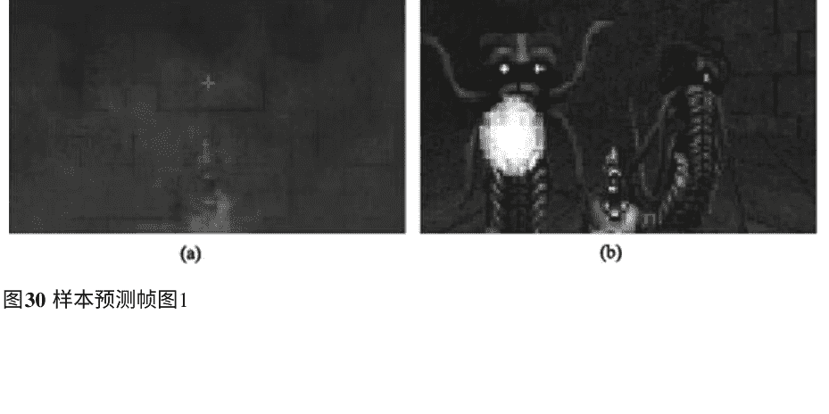

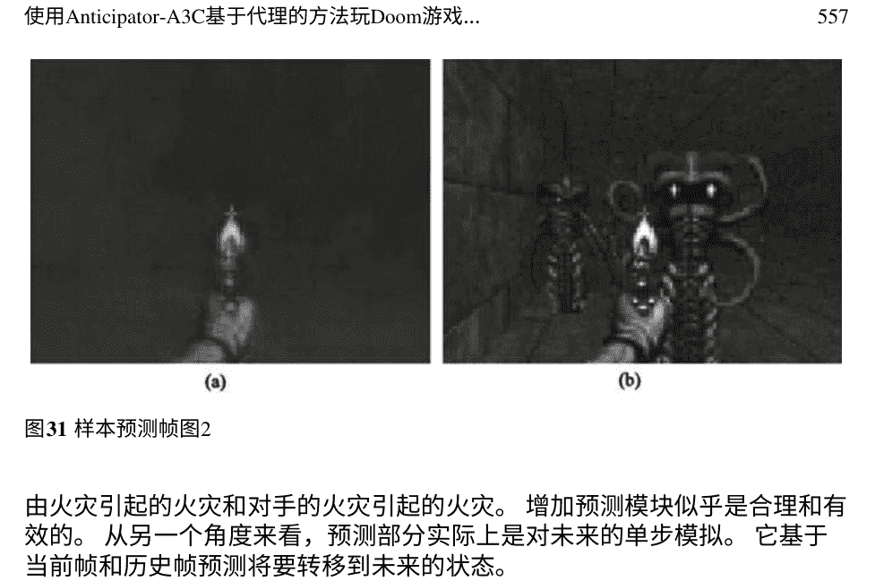

由火灾引起的火灾和对手的火灾引起的火灾。增加预测模块似乎是合理和有效的。从另一个角度来看，预测部分实际上是对未来的单步模拟。它基于当前帧和历史帧预测将要转移到未来的状态。

通常，在解决这类问题时，由于环境不是全知的，状态空间与围棋相比并不具备数量级，因此无法进行蒙特卡洛搜索，通常模型的动作选择是最有价值的动作或最有可能的动作。

然而，由于无法进行模拟，无法知道执行动作对实际环境的影响，因此存在限制。预测部分相当于对最优动作的模拟。如果发现最优动作实际上有负面影响，可以通过预测状态提前防止危险。

## 7 讨论与总结

在游戏代理领域（即游戏机器人）中使用非硬编码实现的代理是一个极其重要的挑战。目前，大多数内置代理都是以硬编码方式实现的。在某些情况下，几乎只有不可预测性被添加。当这些脚本代理与人类玩家对战时，它们通常会获得大量不公平的信息（如对手的位置、状态等）作为决策的主要依据，然后结合相关的搜索策略（如蒙特卡洛算法）来模拟后续状态变化，以寻找最优决策。通常，这种搜索策略依赖于全局信息的全知性。对于常见的战斗游戏，必然存在一些在合法情况下不知道的信息。因此，为了取得更好的结果，有时候获取不公平的信息变得必要。

通过作弊。这样一来，游戏代理的输入数据结构就变得复杂，原始数据需要进行预处理，搜索策略的制定取决于游戏设计师的理解。此外，对于常见的游戏战斗，即使一个人可以完全了解全局信息，与象棋等游戏相比，它将需要巨大的状态空间复杂性和动作空间复杂性，这对于当前家用计算机的计算资源来说是不现实的，可能会使游戏代理的性能更好。

本章提出的基于A3C算法和预测的游戏智能体是基于当前研究中令人钦佩的A3C算法，并在此基础上结合了人类玩家的游戏特性添加了预测模块。预测模块根据智能体当前可用的游戏画面预测下一个画面的变化，并生成预测的游戏画面作为A3C算法模型的输入之一。同样，A3C算法模型将原始游戏画面和预测生成的游戏画面作为输入，无需繁琐的预处理或图像分割、物体检测等，模型本身进行卷积特征提取并映射到动作空间，输出动作的概率分布。智能体不断与环境（游戏引擎）进行交互，读取和执行游戏画面并做出决策，采取行动影响环境，根据环境的反馈调整自身策略，最终找到最优策略实现端到端的学习过程。

首先，在模型的训练过程中，遇到的第一个问题是如何判断模型是否收敛。通常的机器学习算法判断模型是否收敛的依据是损失函数的值为0或不再变化。然而，在强化学习中，损失函数的变化并不是整个训练过程的主要考虑因素。主要的判断依据是代理在环境（游戏）中表现的变化。例如，在射击游戏中，判断模型是否收敛可能需要观察代理在游戏中的平均击杀数、平均血量和平均弹药值的变化。因此，在模型的训练过程中，需要记录能够反映模型在游戏中表现的信息。

其次，删除网络的基本组件有利于降低模型训练的难度，结合相关工作，移除了用于增强神经网络处理包含时间序列数据能力的常见LSTM结构，并将历史游戏画面的连续帧作为输入，简化了模型结构并降低了训练的难度。这也使得模型对连续数据具有一定的理解和处理能力。此外，在训练的早期阶段，由于模型在复杂的CIG场景或甚至D3_battle下很难收敛，很难得到更好的策略，需要花费大量时间。结合理论并尝试找出，通过增加卷积层的规模和适当添加池化层，明显改善了模型的收敛困难。在卷积层大小增加后，模型提取特征的能力增强，可以提取足够的特征作为映射高级概念的基础。池化层的不变性可以很好地说明模型图像中对象的大小、位置等变化，增强模型对图像中同一事物的不同表示的通用性。

第三，密集学习中的奖惩机制在指导模型训练中起着至关重要的作用。它可以判断代理所做决策的质量，从而影响代理的调整策略。通常，在许多常见的研究环境中，奖惩机制没有内置或不符合所研究任务目的的奖励和惩罚。这时，需要设置和调整奖惩机制。奖惩机制的设定和调整应遵循最基本的原则之一：在初始阶段尽量减少考虑，最大化奖惩的频率。这意味着在最开始时，需要计算的奖惩因素应尽可能小，奖惩模型应简化，以确保能够为代理提供更正确的指导。在训练过程中，更高的奖惩频率可以尽快引导模型走向理性策略。

此外，通过实验发现，预测模块可以提高模型的决策能力，使其在关注当前环境状态的同时考虑到未来的预测。预测模块使其能够发现图片中危险信息的趋势，以便尽早做出反应并优化策略。预测模块本质上可以看作是模型对未来进行单步模拟的结果，当环境无法完全识别时。

总体上，这个主题的研究结果是理想的。然而，仍然有一些问题可以继续研究：一是考虑如何提高原始数据的利用率，即不仅仅将游戏屏幕直接作为模型输入进行决策，而是进一步从现有数据中提取关键信息作为输入的一部分；另一方面是考虑如何最小化甚至消除模型值估计部分可能出现的错误，一些错误或累积是由于训练数据生成方式或累积奖励计算方式引入的，并非由无偏估计引起的偏差，这可能会降低模型优化策略的能力。

致谢 这项工作得到了巴基斯坦白沙瓦大学和高等教育部的部分支持。研究工作还得到了阿联酋扎伊德大学的支持。作者还要感谢NVIDIA公司捐赠了一台强大的GPU机器。

利益冲突 作者声明没有利益冲突。

数据可用性 本研究使用的研究数据（原始数据和处理后的数据）可根据要求从对应作者处获取。

## 参考文献

1.  Khan A, Yang K, Fu Y, Lou F, Jifara W, Jiang F, Shaohui L (2017) 实时战略游戏AI和星际争霸中的竞争性战斗策略和战术。在：多媒体太平洋会议2017年。Springer International Publishing, Cham
2.  Stanescu M, `Certický M (2016) 使用答案集编程预测实时战略游戏中对手的生产。IEEE Trans Comput Intell AI Games 8(1):89–94
3.  Adil K, Jiang F, Liu S, Jifara W, Tian Z, Fu Y (2017) 实时战略游戏AI和星际争霸中的最新技术和挑战。Int J Adv Comput Sci Appl 8(12):94
4.  Asada M, Noda S, Tawaratsumida S, Hosoda K (1996) 基于视觉强化学习的真实机器人目标导向行为获取。Mach Learn 23(2):279–303
5.  Daylamani-Zad D, Graham LB, Paraskevopoulos IT. 实时战略游戏中自主合作代理的指挥链。
6.  McCorduck P (2009) 机器思考：对人工智能历史和前景的个人探究。AK Peters/CRC Press
7.  McCorduck P, Minsky M, Selfridge OG, Simon HA (1977) 人工智能的历史。IJCAI
8.  Beattie C, Leibo JZ, Teplyashin D, Ward T, Wainwright M, Küttler H, Lefrancq A, Green S, Valdés V, Sadik A (2016) DeepMind Lab。arXiv:1612.03801
9.  Silver D, Huang A, Maddison CJ, Guez A, Sifre L, Van Den Driessche G, Schrittwieser J, Antonoglou I, Panneershelvam V, Lanctot M (2016) 用深度神经网络和树搜索掌握围棋。自然 529(7587):484–489
10. Brockman G, Cheung V, Pettersson L, Schneider J, Schulman J, Tang J, Zaremba W (2016) OpenAI gym。arXiv:1606.01540
11. Buchanan BG (2005) 人工智能的(非常)简要历史。AI杂志 26(4):53
12. Michalski RS, Carbonell JG, Mitchell TM (2013) 机器学习: 一种人工智能方法。Springer科学与商业媒体
13. Stanescu M, Hernandez SP, Erickson G, Greiner R, Buro M (2013) 在星际争霸中预测军队战斗结果。AIIDE。Citeseer
14. Russell SJ, Norvig P (2016) 人工智能: 一种现代方法。Pearson Education 有限公司, 马来西亚
15. Kempka M, Wydmuch M, Runc G, Toczek J, Ja´skowski W (2016) ViZDoom: 一种基于doom的视觉强化学习研究平台。arXiv:1605.02097
16. DeepMind, David Silver和Google e (2015) 深度强化学习。在: ICLR 2015年主题演讲。圣地亚哥, 加利福尼亚, 美国
17. Goodfellow I, Bengio Y, Courville A, Bengio Y (2016) 深度学习。第1卷。MIT出版社 剑桥
18. Schmidhuber J (2015) 神经网络中的深度学习: 概述。神经网络 61:85–117
19. Sutton RS, Barto AG (1998) 强化学习: 介绍。第1卷。MIT出版社 剑桥
20. Packer C, Gao K, Kos J, Krähenbühl P, Koltun V, Song D (2018) 评估深度强化学习中的泛化性能。arXiv:1810.12282
21. Khan A, Naeem M, Asghar MZ, Din AU, Khan A (2020) 使用VizDoom Game-AI研究平台使用机器学习技术和方法玩第一人称射击游戏。娱乐计算 34:100357
22. Mnih V, Kavukcuoglu K, Silver D, Graves A, Antonoglou I, Wierstra D, Riedmiller M (2013) 使用深度强化学习玩Atari游戏。arXiv:1312.5602
23. Van Hasselt H, Guez A, Silver D (2015) 使用双Q学习的深度强化学习。AAAI
24. Schaul T, Quan J, Antonoglou I, Silver D (2015) 优先经验回放。arXiv:1511.05952
25. Wang Z, Schaul T, Hessel M, Van Hasselt H, Lanctot M, De Freitas N (2015) 用于深度强化学习的对决网络架构。arXiv:1511.06581
26. Mnih V, Badia AP, Mirza M, Graves A, Lillicrap T, Harley T, Silver D, Kavukcuoglu K (2016) 用于深度强化学习的异步方法。在：机器学习国际会议
27. Jaderberg M, Mnih V, Czarnecki WM, Schaul T, Leibo JZ, Silver D, Kavukcuoglu K (2016) 强化学习与无监督辅助任务。arXiv:1611.05397
28. Stanescu M, Barriga NA, Hess A, Buro M (2016) 评估实时策略游戏状态使用卷积神经网络，2016年9月
29. Chaplot DS, Lample G (2017) Arnold: 一个自主玩FPS游戏的智能体。AAAI
30. Khan A, Jiang F, Liu S, Omara I (2019) 使用深度视觉强化学习玩FPS doom游戏。自动控制与计算机科学 53(3):214–222
31. Graves A (2012) 带有循环神经网络的监督序列标注。ISBN 9783642212703。http://books.google.com/books
32. 吴Y， 田Y (2017) 使用演员-评论家课程学习训练第一人称射击游戏的代理。在：ICLR 2017会议论文
33. Justesen N, Bontrager P, Togelius J, Risi S (2017) 深度学习用于视频游戏玩耍。arXiv: 1708.07902
34. 李O， 刘H， 陈C， 鲁丁C (2017) 通过原型进行基于案例推理的深度学习：解释其预测的神经网络。arXiv: 1710.04806
35. Hagan MT, Demuth HB, Beale MH, De Jesús O (1996) 神经网络设计，第20卷。PWS出版物。波士顿
36. Widrow B, Lehr MA (1990) 自适应神经网络30年：感知器，Madaline和反向传播。Proc IEEE 78 (9)： 1415-1442
37. Gardner MW, Dorling SR (1998) 人工神经网络（多层感知器）在大气科学中的应用综述。Atmosph Environ 32(14–15):2627–2636
38. Nowlan SJ, Hinton GE (1992) 通过软权重共享简化神经网络。Neural Comput 4(4):473–493
39. Baldi P, Hornik K (1989) 神经网络和主成分分析：从示例中学习而无需局部极小值。
40. Thrun S, Pratt L (2012) 学会学习。Springer Science & Business Media
41. Lu H, Plataniotis KN, Venetsanopoulos AN (2011) 张量数据的多线性子空间学习综述。Pattern Recogn 44(7):1540–1551
42. Karlik B, Olgac AV (2011) 在神经网络的广义MLP架构中各种激活函数的性能分析。Int J Artif Intell Exp Syst 1(4):111–122
43. Farhadi F (2017) 在深度神经网络中学习激活函数。École Polytechnique de Montréal
44. van Otterlo M， Wiering M (2012) 强化学习和马尔可夫决策过程。在：强化学习。Springer，第3-42页
45. Kaelbling LP, Littman ML, Moore AW (1996) 强化学习：一项调查。J Artif Intell Res 4： 237-285
46. Khan A, Feng J, Liu S, Asghar MZ (2019) 最佳跳过率：使用深度强化学习进行细粒度控制的训练代理。J Robot 2019： 10
47. Wang Q, Clarke RJ (1992) 图像序列编码的运动估计和补偿。Signal Process Image Commun 4 (2) ： 161-174
48. Kappagantula S, Rao K (1985) 运动补偿的帧间图像预测。IEEE Trans Commun 33 (9) ： 1011-1015
49. 周炳鹏和陈庆春， 最小均方误差估计教程。2015年1月。
50. Brunet D, Vrscay ER, Wang Z (2012) 关于结构相似性指数的数学性质。IEEE Trans Image Process 21 (4)： 1488–1499
51. Korhonen J, You J (2012) 峰值信噪比再探：简单是否美丽？在：2012年第四届国际多媒体体验质量研讨会（QoMEX）。IEEE
52. Mandic DP, Chambers J (2001) 用于预测的递归神经网络：学习算法，架构和稳定性。Wiley

## 53. Abadi M, Agarwal A, Barham P, Brevdo E, Chen Z, Citro C, Corrado GS, Davis A, Dean J, Devin M (2016) Tensorflow: 异构分布式系统上的大规模机器学习. arXiv:1603.04467

## 54. Owens JD, Houston M, Luebke D, Green S, Stone JE, Phillips JC (2008) GPU计算. Proc IEEE 96(5):879–899

## 55. Jouppi NP, Young C, Patil N, Patterson D, Agrawal G, Bajwa R, Bates S, Bhatia S, Boden N, Borchers A (2017) In-datacenter performance analysis of a tensor processing unit. In: 2017 ACM/IEEE 44th annual international symposium on computer architecture (ISCA). IEEE

## 56. Adil K, Jiang F, Liu S, Grigorev A, Gupta BB, Rho S (2017) Training an agent for FPS doom game using visual reinforcement learning and VizDoom. (IJACSA). Int J Adv Comput Sci Appl 8(12)

## 57. Freitas S, Dudley A, Gopalakrishnan S, Feinglass J, Clayton B (2018) Exploration of DQN in ViZDoom

## 58. Adamsson M (2018) Curriculum learning for increasing the performance of a reinforcement learning agent in a static first-person shooter game

## 59. Uc-Cetina V (2013) “一种新的连续状态和动作强化学习架构”. Adv Artif Intell 2013:7

## 60. Bradski G, Kaehler A (2000) OpenCV. Dr. Dobb's J Softw Tools 3

## 61. Dosovitskiy A, Koltun V (2016) “通过预测未来来学习行动”. arXiv:1611.01779

# 无人机路径跟随和避障的深度强化学习


**Bartomeu Rubí，Bernardo Morcego和Ramon Pérez**

摘要 本章基于深度强化学习理论对无人机路径跟随和避障问题进行了修订。本章的目标是开发一个能够根据路径形状准确跟随路径并避开可能出现在路径上的障碍物的系统。路径跟随和避障问题都使用了深度确定性策略梯度（DDPG）算法进行处理。对于路径跟随问题，提出了三种不同的方法。每种方法都是前一种方法的改进版本。第一种方法仅使用路径的瞬时信息来解决问题。第二种方法包括一个结构，使得智能体能够预测即将出现的曲线。第三个智能体包括一种策略，使其能够根据路径的形状计算出最优速度。对于避障问题，提出了一个同时避开障碍物和跟随路径的DDPG智能体组合。避障方法使用LIDAR信息来检测车辆周围的障碍物。LIDAR数据经过处理以消除地面检测。如果在车辆的路径上检测到障碍物，智能体会修改参考路径以避开障碍物。开发的智能体通过发送修改后的参考路径与路径跟随智能体进行通信。给出了定义状态向量、奖励函数和智能体动作的详细描述。构建了一个将tensorflow-python环境与Gazebo-ROS结合使用RotorS模拟器的训练框架。在RotorS中进行了智能体测试，并在Asctec Hummingbird四旋翼无人机上进行了实验（路径跟随问题）。实验结果证明了智能体的有效性，它们能够实现两个问题的广义解决方案。

**关键词** 深度强化学习 · 四旋翼 · 无人机 · 路径跟踪 · 避障 · 深度确定性策略梯度

## 符号描述

- p_d: 期望路径向量
- x_d: 期望路径在 x 轴上
- y_d: 期望路径在 y 轴上
- z_d: 期望路径在 z 轴上
- γ: 虚拟弧长参数化路径
- ψ: 角度在 z 轴上
- ψ命令: 角度在 z 轴上的命令
- u: 速度在 x 轴上
- u命令: 速度在 x 轴上的命令
- v: 速度向量
- d: 车辆到路径的距离
- κ: 路径的曲率
- μ: 代理的策略
- Q: 值函数
- s: 代理的状态向量
- a: 代理的动作向量
- r: 奖励函数

## 1 引言

众所周知，无人机（UAV）在未来的许多应用中准备承担重任（例如运输、监视、制图、探索、搜救、维护、拍摄）[51]。正因为如此，对这些飞行器的研究不断增长，并不断发展和实施控制理论、计算机视觉和人工智能的最新解决方案。为了实现最终的应用，对无人机的研究涉及到多个不同的问题，涉及到不同的研究领域，如稳定控制、轨迹控制、障碍物检测和避免、路径规划、任务控制、容错控制、编队控制等等[5, 46, 73]。

近年来，深度强化学习（DRL）领域的研究和应用呈指数增长。DRL已经应用于大量不同的计算机科学、工程和控制问题，并取得了杰出的结果。因此，强化学习（RL）不再局限于离散和小环境。深度Q网络（DQN）[63]和深度确定性策略梯度（DDPG）[50]是最流行的深度RL算法之一。

在DQN中，代理的输入是图像，而DDPG则专门设计用于连续状态-动作空间。这两种算法已经被用于解决各种计算机科学和工程问题[12, 82]。DDPG也已经被实现在四旋翼飞行器上解决着陆问题的深度强化学习[70]取得了成功的结果。文献中还可以找到深度强化学习在其他四旋翼应用中的应用[40, 43]。

本章介绍了深度强化学习在四旋翼无人机的两个控制问题中的应用。整个过程中使用的深度确定性策略梯度算法（Deep Deterministic Policy Gradient）应用于路径跟踪（PF）和避障（OA）问题。路径跟踪方法实现了与几何算法相同的结构和概念。提出了三种不同的代理，每个代理都是前一个版本的改进版。得到的方法能够根据路径的形状计算出车辆的最优速度。

代理在ROS的Gazebo-RotorS环境中进行训练。得到的路径跟踪代理在实验四旋翼平台上进行了实现和验证。通过使用处理后的LIDAR测量作为代理的状态，解决了反应式避障问题。由于障碍物检测传感器的视野狭窄（48°），开发了一种为代理提供先前看到的障碍物记忆的方法。得到的代理在RotorS模拟环境中进行训练和测试，同时处理静态圆柱形障碍物。本章介绍的路径跟踪和避障方法都基于DDPG算法的直接应用，其贡献在于状态、动作、奖励函数和代理结构和参数的定义和制定，以及Gazebo-ROS训练框架的实现。

本章的其余部分按照以下方式组织：第2节简要介绍了四旋翼控制图的概述。对其挑战的最相关解决方案在第3节中给出。第4节描述了本文采用的DRL方法的一般性概述，即DDPG。第5节描述了代理环境的元素，包括四旋翼飞行器、用于障碍物检测的感知系统、自动驾驶仪和在Gazebo/ROS中构建的训练框架。接下来的几节详细介绍了路径跟踪（第6节）和避障（第7节）代理的开发，包括它们的性能结果。最后，第8节总结了本章的结论和未来工作。

## 2 UAV控制结构

四旋翼的控制结构通常分为三个元素，即导航、导航和控制（GNC）子系统。这里提出的导航、导航和控制系统的结构如图1所示。这是一个通用且典型的GNC系统结构[42]。然而，它包括了各种对于本章考虑的问题而言特定的模块，如障碍物检测模块。介绍这个结构将有助于理解第3节中介绍的文献综述的其余部分。

图1的核心结构是无人机系统（UAS）。UAS由无人机（UAV）和车辆的执行器组成以及传感器集合。构成UAV控制系统的其余模块将在下面进行描述。

### 2.1 引导

引导模块负责确定车辆必须完成的路径，跟随目标或到达所需位置。 也就是生成发送给控制模块的参考轨迹。 在这种特殊情况下，路径规划任务考虑了路径的位置和车辆的状态，这两者都来自导航模块，以设计最佳路径来跟随路径。 此外，它还包括一个避障任务，当在车辆轨迹中检测到障碍物时，重新规划路径。 地图数据库提供路径和环境的先验信息，例如路径点坐标或障碍物的定位，给路径规划器。 轨迹生成任务是一个可选模块，有时需要将路径规划器生成的参考轨迹适应控制模块的要求。 也就是修改轨迹，例如降低车辆速度或平滑路径曲线[38]，以满足控制或车辆约束。如果轨迹控制器需要，该模块还负责生成额外的轨迹参数。

导航可以包括不同的任务，如路径规划、任务规划、决策或轨迹生成。本章中的导航部分重点关注路径规划和避障任务。路径规划被定义为使用累积的导航数据和先验信息，使无人机找到完成特定任务的最佳和最安全的方式[41]的过程。在大多数情况下，路径规划也负责避障任务[13]。

### 2.2 导航

导航可以被定义为数据采集、数据分析和提取有关车辆状态和周围环境信息的过程，其目标是成功和安全地完成指定任务[41]。这些信息是通过无人机系统的传感器获得的。无人机最常用的传感器包括加速度计、陀螺仪、磁力计、压力传感器、GPS、摄像头和激光雷达。导航模块包括依赖于正在解决的具体导航问题的各种任务。它可以分为两部分：一个用于获取车辆状态的状态估计器和一个用于获取环境信息的感知模块。

感知是利用传感器的测量结果构建环境的内部模型并生成在环境中感知到的事件的能力[41]。识别过程涉及将观察到的内容与UAS的先验知识[36]进行比较。通常，信息是通过视觉系统（即摄像头）和激光雷达传感器获得的。通常，感知算法获取的信息不直接用作飞行控制器中的测量值，而是作为更高级别导航系统的输入。在感知模块中，有一个任务专门用于目标的定位或检测（目标检测），还有一个任务专门用于检测车辆路径上的障碍物（障碍物检测）。根据无人机需要完成的具体任务，还可以包括其他任务。

### 2.3 控制

控制模块负责车辆的稳定（自动驾驶）和使车辆沿着给定的期望轨迹行驶（路径跟踪）。这两个元素从状态估计模块接收状态信息，并通过向车辆的执行器发送命令来控制无人机。

自动驾驶仪负责稳定多旋翼的姿态，是最快且最有影响力的动力学。自动驾驶仪并不总是必需的，因为一些路径跟踪方法也处理了车辆的稳定问题。

轨迹控制问题被定义为使车辆按照预先确定的路径在空间中行驶，主要可以通过两种不同的方法解决：使用轨迹跟踪控制器或路径跟踪控制器。对于轨迹跟踪问题，参考值是按时间指定的，路径的参考值由每个空间坐标的时间演变给出。而路径跟踪处理的是在没有预先分配时间信息的情况下跟踪路径的问题，因此问题的任何时间依赖性都被消除了。

在[1]中，作者证明了跟踪几何路径比跟踪定时参考信号要求更低。他们认为，虽然使用最小相位稳定系统可以完美跟踪任何参考信号，但在非线性系统中，随着信号频率接近不稳定零点的频率，跟踪误差会增加，因为存在不稳定零点的非线性系统。路径跟踪控制器相对于轨迹跟踪控制器具有许多优势，不仅设计更容易[39]，而且收敛到路径更平滑，对控制力的需求更小[11]，瞬态误差更小，鲁棒性更强[86]，并且控制信号不太可能饱和[18]。

PF问题[11,39]的定义如下：

定义1 路径跟踪问题：让期望路径由三维空间中的曲线p_d(γ):=[x_d(γ), y_d(γ), z_d(γ)]描述，该曲线由虚拟弧γ∈[0; γ_f]参数化，其中γ_f是总虚拟弧长。控制目标是确保车辆位置p(t)收敛到路径p_d(γ)并且p(t_f) = p_d(γ_f)在有限时间t_f内成立。

有几种方法可以定义期望路径。Dubins将路径定义为由圆弧与之相切的直线的组合[4,21]。在基于航点的方法中，通常使用直线[14,64]或样条曲线[19,97]连接点的序列。最通用的方法是由虚拟弧长参数化的连续函数[11,39]。

为了解决PF问题，控制系统的设计采用了两种不同的方法：分离导航和控制（SGC）方法和集成导航和控制（IGC）方法[16]。SGC方法（图2）基于平移动力学和刚体旋转动力学之间的分离。它包括用于生成运动命令（Φ_cmd/v_cmd）的外环导航定律和用于跟踪这些命令的内环控制器，有时被称为自动驾驶仪。而IGC方法（图3）将两个控制器结合在同一个控制回路中。

## 3 导航、导航和控制文献综述

本节对解决导航、导航和控制模块的控制问题所采取的方法进行了文献综述，重点关注了反应式避障、障碍物检测和路径跟踪问题。

### 3.1 导航

导航模块最相关的问题是路径规划问题。存在不同的技术来解决这个问题，例如可见性图[31]，沃罗诺伊图[32]，概率路网[33]，快速探索随机树[94]，势场[80]，启发式搜索算法[92]或优化方法[62]。每种技术都用于不同的情况和问题。本文综述主要关注反应式路径规划，这种方法通常用于实时避障以避免最后一刻的碰撞。

#### 3.1.1 反应式路径规划

前面提到的大多数路径规划器都基于环境的全局表示，并且通常计算成本较高。相反，反应式规划或反应式避障算法运行速度非常快，对于防止最后一分钟的碰撞非常有用。反应式规划一般指一类算法，仅利用障碍物场的局部知识来规划轨迹[25]。

存在不同的方法来实现反应式路径规划方法，例如使用势场、实现优化方法、机器学习方法或基于几何关系的其他方法。请注意，反应式路径规划包括在全局路径规划中也使用的技术（例如势场或优化方法）。然而，在反应式方法中，这些方法只使用环境的局部信息。下面回顾了一些这些技术和其他在多旋翼和其他无人机上实施的方法。

在[75]中，基于势流理论实现了一种基于反应式避障的固定翼无人机方法。该算法计算瞬时局部势速度向量，并将其用作内部控制器的命令。无人机的机动约束包含在控制设计中。障碍物通过边界矩形来近似。通过数值模拟证明了所提出方法的有效性。另一种基于势场的无人机方法在[20]中提出。所提出的解决方案基于动态人工势场（DAPF）算法，根据移动障碍物的威胁级别生成实时的反应式无碰撞路径。通过模拟结果评估了所提出的路径规划方法的有效性。

基于最优控制理论的固定翼无人机在动态工作空间中的3D反应运动规划器在[9]中被提出。使用虚拟空间表示来制定问题并实时生成局部最优轨迹。这些轨迹由车辆的速度、飞行路径角（俯仰）和航向角定义。考虑了动力学和运动学约束。通过模拟结果展示了所提出方法的有效性。Wzorek等人[95]将反应式避碰算法与全局路径规划技术相结合，用于在未知环境中操作的无人机。实施的全局路径规划技术包括概率路图和快速探索随机树。此外，该系统还包括基于最优互补避碰（ORCA）的反应式控制器，以实现快速感知和避碰行为。该提议的系统在模拟和实验中进行评估。实验平台由一架装备有结构光深度传感器的四旋翼飞行器组成，用于以占用栅格地图的形式获取环境信息。在[3]中，OCRA算法用于开发工业环境中多个空中飞行器的分散式反应式避碰方法。该算法计算出近期的最优解。考虑了3D环境中的静态和移动障碍物。该方法在四个四旋翼飞行器的实际室内实验中进行了测试。无人机能够在存在静态障碍物的情况下实时避免潜在碰撞。在[53]中，通过将快速探索随机树（RRT）路径规划器与基于有符号距离场（SDF）的碰撞检测算法相结合，开发了一种四旋翼激光雷达避碰算法。在这种方法中，轨迹通过快捷方式和最优多项式轨迹算法进行优化。在RotorS Gazebo模拟器中，在存在静态和动态障碍物的情况下，对所提出的解决方案进行了多个模拟场景的评估。在[76]中，使用单目相机和深度相机的信息构建了一个3D占用栅格地图。然后，使用递进视野规划架构来获取最优轨迹。作者们在城市环境中展示了规划器的能力，进行了无人机自主飞行。

其他方法使用几何概念来定义避开障碍物的机动。在[68]中，使用碰撞锥方法来避免与前方LIDAR检测到的移动障碍物潜在碰撞。使用卡尔曼滤波器来估计障碍物的状态（位置、速度和加速度），从而可以预测移动障碍物的未来位置。通过多旋翼飞行器进行数值模拟，验证了碰撞回避算法的性能。在[34]中，定义了围绕无人机的圆柱体积的3D占用地图。然后，执行扩展椭圆搜索，找到一条无碰撞路径朝向目标航点。所提出的方法在配备有立体摄像头和LIDAR传感器的自主直升机上进行了实验飞行，验证了其有效性。在[83]中，提出了一种基于光流的障碍物避难规划器。所提出的方法通过将自由空间的圆柱体预测到环境的图像流表示中，并通过操纵该圆柱体来驾驶车辆通过即将到来的环境。该方法通过在森林环境中进行实际实验，验证了其有效性。在[27]中，提出了一种用于无人机静态障碍物避难的反应式方法。障碍物检测传感器的视野被转换为球形占用格网地图。所提出的方法通过应用近似可达集和波前算法，在传感器视野内计算无碰撞路径。波前算法的任务是找到从无人机的初始单元到目标单元的最短路径。该方法在带有LIDAR传感器和立体视觉系统的仿真环境中进行了测试。

近年来，学习为基础的解决方案在不同问题上的应用有所增加，包括反应式避障。大多数用于解决避障问题的无人机应用都基于卷积神经网络（CNN）的使用。也就是说，这是一种输入可能是图像的深度神经网络类型。在[56]中，CNN被用于从单目视觉系统的图像中提取障碍物的信息。然后，这些信息被用作演员-评论家强化学习算法的状态输入，该算法设计出避开障碍物的轨迹。杨等人[100]提出了一种四旋翼反应式避障系统，该系统采用了一种在线自适应的CNN，可以在未知环境中逐步改进单目摄像头的深度估计。从CNN计算出的深度图被转换为自我动态空间（EDS）。然后，可通过的路径点会自动计算。所提出的方法考虑了四旋翼的动态约束。该方法通过室内实验结果进行了验证。在其他情况下，基于深度强化学习（DRL）的避障算法实现了DQN算法[22, 99]或双重DQN算法[26, 93, 98]。这些算法是使用CNN的Q学习的变体。它们将相机（或相机）的原始图像作为强化学习的状态。DQN算法在其他系统中也被用于OA问题，如海洋船只[15]和移动机器人[54]。

文献中还发现了其他实现深度确定性策略梯度（DDPG）算法的无人机方法。在[47]中，提出了一种基于DDPG的方法，用于固定翼无人机在避开障碍物的同时进行地面目标跟踪。该方法使用长短期记忆（LSTM）神经网络来近似环境状态，通过障碍物检测距离测量。LSTM网络是一种循环神经网络（RNN），它将序列作为数据输入。也就是说，每一步的训练结果都由当前训练数据和历史训练数据决定。该论文中使用的障碍物检测传感器具有180°的视野。所提出的方法在模拟环境中进行训练和验证。

在[91]中，使用了一种修改的循环确定性策略梯度（RDPG）算法，这是一种专门用于部分可观察马尔可夫决策过程的DDPG类算法，用于解决无人机避障问题。该DDPG算法通过逐步更新网络的权重，利用最新的经验。相比之下，RDPG算法只在一个回合结束时更新权重，使用整个回合的经验。因此，与DDPG算法不同，RDPG算法不具备样本效率。在该论文中，设计了一种快速RDPG算法，它允许通过根据历史轨迹而不是整个回合来更新权重进行在线学习。所提出的算法使用了一个具有180°视野的距离传感器的距离测量。通过模拟结果验证了所提出的框架。

在[78]中，提出了一种基于DDPG算法的基于LIDAR的多旋翼导航方法。本章的目标是开发一个能够将车辆驶向目标位置并避开车辆路径上障碍物的代理。所提出的方法使用具有270°视野的LIDAR测量作为环境状态的一部分。奖励设计使用了人工势场。代理在RotorS中进行训练，并通过真实实验结果进行验证。

### 3.2 导航

融合传感器数据以估计状态的最常见方法是扩展卡尔曼滤波器（EKF）[30, 79]。另一种广泛使用的方法是在无人机上估计姿态的互补滤波器[57]。另一方面，感知模块可以用于多个功能，如目标检测[10, 29]，障碍物检测或地图制作（同时定位与地图制作[7]，同时制图与规划[89]或安全着陆区域检测[92]）。在本章中，导航主要关注障碍物的检测。下一节将回顾执行环境映射的障碍物检测方法。然而，障碍物检测可以与地图制作任务相结合，例如同时制图与规划方法。

#### 3.2.1 障碍物检测

计算机视觉可以通过使用光流、立体视觉系统或单目相机来解决这个问题。光流估计图像元素的运动。立体视觉系统通常用于获取深度信息。可以使用不同的技术来检测单目视觉中的障碍物。这些技术包括估计障碍物的相对大小或清晰度，使用纹理梯度，通过重叠或视差运动[8]。此外，还可以通过已知物体的特征（例如颜色或形状）来检测障碍物。

基于光流概率分布估计的单摄像头障碍物检测算法在[45]中提出。得到的算法提供了无人机周围障碍物的距离。该方法经过了实验测试。

在[35]中，通过使用光流（来自一对侧视鱼眼相机）和立体视觉解决了无人机在城市峡谷中的障碍物检测问题。环境通过3D点云地图表示，并通过使用距离阈值检测障碍物。

基于立体视觉的多障碍物检测算法在[96]中提出。首先，获取场景的深度图，然后使用另一个算法找出五个危险物体并给出它们的边界框。结果显示，该算法可以在15米内检测到最多五个障碍物。

在[6]中，通过跟踪障碍物上的一些彩色旗帜，并使用GPS和IMU来了解车辆的全局位置，估计了障碍物的全局位置。文献中还可以找到其他有趣的应用，使用单目视觉系统估计尺寸扩展[2]、障碍物的相对方向[55]或障碍物的相对距离[77]。

使用激光雷达传感器进行障碍物检测和避免是一个有趣的解决方案，因为这些方法比基于视觉的方法在计算上更经济，提供了一个快速反应的系统，可以在最后一刻避免碰撞。

在[61]中，作者提出了一个系统，该系统使用即时的激光雷达测量来检测地面和前方障碍物，并根据当前环境计算出一种反应动作。

在[68]中，介绍了一种六旋翼无人机使用激光雷达的碰撞避免方法。使用卡尔曼滤波器来估计障碍物的位置、速度和加速度，使用激光雷达的数据作为相关测量。障碍物状态的估计用于预测移动障碍物的未来轨迹。

在[85]中，使用旋转激光雷达传感器的信息开发了一种简单的障碍物检测和避免方法，用于四旋翼无人机。目标是在手动飞行过程中支持飞行员，避免可能的碰撞。该方法通过实验结果进行评估。

在[103]中，实现了一种基于2D激光雷达的无人机障碍物检测方法。在这种方法中，使用速度估计方法来估计每个点扫描时激光雷达的位置，并纠正扭曲的点云。通过模拟和实验结果证明了该方法的有效性。

无人机系统中还使用了雷达传感器来检测障碍物[44]。然而，这些传感器非常重，限制了它们在小型多旋翼飞行器上的应用。文献中还可以找到使用声学传感器（超声波）的应用。

### 3.3 控制

控制模块处理的主要问题是稳定和路径跟踪问题。针对四旋翼的稳定控制问题已经使用了不同的技术进行解决，例如反步控制、反馈线性化、滑模控制、PID控制、最优控制、鲁棒控制、基于学习的控制等[5, 48, 67]。

四旋翼的路径跟踪问题已经使用不同的控制导向技术解决，例如反步控制[11]，李雅普诺夫控制[60]，反馈线性化[71]，模型预测控制（MPC）[66] 或线性二次调节器[28]。四旋翼路径跟踪问题也可以使用几何算法解决，例如非线性引导定律[72]，胡萝卜追踪[87]，向量场[49] 或轨迹塑形[58]。

基于学习的算法是一个新兴的领域，由于近年来取得的显著进展，已经成为解决不同类型问题的明智选择。特别是在轨迹控制问题上，它正在引入不同类型的车辆，包括无人机。这个领域包括监督和无监督技术，强化学习算法，数据驱动方法和其他深度机器学习方法。

在[102]中提出了一种迭代学习控制方法来解决四旋翼机上的PF问题。控制方案由PD控制器和前馈控制器组成。这种方法专注于重复飞行以从经验中学习。通过模拟测试和离线实验结果来证明控制器的有效性。

在[84]中，使用MPC控制器作为监督器来训练神经网络控制策略，以解决四旋翼车辆上的路径跟踪和避障问题。通过实验结果证明，该算法解决了MPC技术的计算效率问题，同时保持了类似的性能。

在[101]中，提出了一种数据驱动的控制方法，用于自适应路径跟踪控制固定翼飞行器。通过模拟结果和飞行测试来证明该方法的可靠性。

其他基于学习的方法已经用于解决不同类型的车辆上的路径跟踪问题，例如船舶[59]或飞艇[65]。文献中发现了各种基于学习的方法来解决四旋翼飞行器的轨迹跟踪问题[17, 90]。其中一些方法在设计中考虑了风扰动，比如[52]中提出了一种基于强化学习算法的自适应轨迹跟踪控制。

在[73]中，本章作者对路径跟踪进行了调查，对四旋翼飞行器和其他类型的无人机的路径跟踪策略进行了详尽的文献综述。请参考表1进行综述PF的比较。

| 结构 | 结果 | 四旋翼飞行器 | 风扰动 | FTC | 自适应 |
| :--- | :--- | :--- | :--- | :--- | :--- |
| 反步控制 | IGC | 实验 | 是 | 否 | 否 |
| 基于Lyapunov的 | SGC和IGC | 实验 | 是 | 是 | 是 |
| 反馈线性化 | SGC和IGC | 仿真 | 是 | 否 | 是 |
| 几何 | SGC | 实验 | 是 | 否 | 否 |
| 模型预测控制 | SGC | 实验 | 是 | 是 | 是 |
| 向量场 | SGC | 实验 | 是 | 是 | 是 |
| 基于学习的 | SGC | 实验 | 是 | 是 | 是 |
| 最优控制 | SGC和IGC | 仿真 | 否 | 是 | 是 |
| 滑模控制 | SGC和IGC | 实验 | 否 | 是 | 否 |

算法。需要提到的是，一些论文在实现跟踪定时轨迹参考的控制器时使用了路径跟踪这个术语。由于这些论文没有遵循定义1，所以它们没有包含在这个文献综述中。与稳定问题相反，轨迹控制问题对于系统的依赖性较小。因此，还提供了适用于其他类型无人机的路径跟踪技术。

这些算法的特性仅在应用于无人机的路径跟踪问题的背景下进行评估，并基于已审查的文献。分别是：控制结构（即集成导航和控制或分离导航和控制）；结果类型（实验或仿真）；应用于四旋翼无人机；对外部干扰具有良好的实验结果；包括容错控制（FTC）策略；实施自适应方法。

## 4 深度确定性策略梯度

本章实现的深度强化学习算法是深度确定性策略梯度。该算法是标准确定性策略梯度[81]算法的改进，包括深度学习理论的新概念。它的一个主要优点是能够在大型连续状态-动作空间环境中提供良好的性能，这促使其被选择。

深度确定性策略梯度[50] 是一种演员-评论家强化学习算法。它是离策略的，因为被改进的策略与用于生成动作计算损失函数的策略不同。而且它是无模型的，因为它不努力学习环境的动态。相反，它直接估计最优策略和值函数。

图4展示了演员-评论家代理的常见结构，其中策略（演员）与值函数（评论家）独立表示。根据学习的策略函数（μ(s)），演员根据环境的状态计算最优动作。评论家根据状态和动作估计值函数（Q(s, a)）。值函数为我们提供了该状态-动作对的预期累积未来奖励的信息。评论家还负责计算时间差分误差（TD）（即损失函数），该误差用于评论家和演员的学习过程。在深度强化学习中，策略函数和值函数（演员和评论家）通过神经网络进行近似。

DDPG使用了Deep-Q-Network [63]的两个特征元素；回放缓冲区和目标网络，用于稳定Q-函数的学习。回放缓冲区是一个有限大小的内存，用于存储每一步的转换元组。图5显示了转换元组的主要元素。该元组由当前状态（si）、动作（ai）、获得的奖励（ri）、下一个状态（si+1）和一个布尔变量组成，用于指示下一个状态是否是终止状态（ti）。终止状态是指实验结束的状态。在每个时间步骤中，评论家和演员从回放缓冲区的随机元组中进行训练。这种训练方式减少了学习样本之间的时间相关性，并促进了学习过程的收敛。

另一方面，目标网络是在训练阶段使用的网络。该网络等同于正在训练的原始网络，并提供用于计算损失函数的目标值。一旦原始网络训练完成，使用小批量元组集合将训练好的网络复制到目标网络。然而，在DDPG中，目标网络是通过软更新进行修改的，而不是直接复制网络权重。这意味着目标权重的变化速度较慢。使用软更新的目标网络可以在时序差分备份期间提供一致的目标，并使学习过程保持稳定。请注意，DDPG需要四个神经网络；演员和评论家以及它们各自的目标网络。

当代理状态或动作具有不同的物理单位时，神经网络可能难以正确学习和推广问题的解决方案。批量归一化技术[37]被包含在DDPG算法中，以避免这个问题。这种技术在深度学习中被广泛使用，主要是对小批量样本的每个维度进行归一化，使其均值为零，方差为单位。

方程（1）和（2）显示了用于更新评论家和演员权重的梯度函数。$\phi$是评论家网络的权重集合，$\theta$是演员的权重，$\eta_{\phi}$和$\eta_{\theta}$是评论家和演员的学习率，$B$表示转换元组的小批量，$N$表示其大小。目标网络用带撇号的符号表示。$y_i$（方程3）是目标Q值（不要与目标网络混淆）并用于计算损失函数。评论家的权重被更新以最小化此损失函数。折扣因子是一个介于0和1之间的值，用于调整未来奖励对当前状态的重要性，用$\gamma_{rl}$表示（通常在文献中用$\gamma$表示，但在本章中，此符号被分配给PF问题的虚拟弧参数的定义1）。请注意，目标Q值（方程3）是从演员和评论家目标网络的输出中获得的，遵循目标网络的概念。

$$ \Delta\phi = \eta_{\phi} \nabla_{\phi} \left( \frac{1}{N} \sum_{i \in B} \left( Q\left(s_i, a_i \mid \phi^{Q'}\right) - y_i \right)^2 \right) $$

$$ \Delta\theta = \eta_{\theta} \nabla_{\theta} \left( \frac{1}{N} \sum_{i \in B} Q\left(s_i, \mu\left(s_i \mid \theta^{\mu}\right) \mid \phi^{Q}\right) \right) $$

$$ y_i = r_i + \gamma_{rl} Q'\left(s_{i+1}, \mu'\left(s_{i+1} \mid \theta^{\mu'}\right) \mid \phi^{Q'}\right) $$

方程（4）和（5）显示了目标网络的权重从训练网络中的更新。参数$\tau$表示此更新的速度有多快。在训练主网络后，每一步都进行这种软更新。

$$ \phi^{Q'} \leftarrow \tau \phi^{Q} + (1 - \tau) \phi^{Q'} $$

$$ \theta^{\mu'} \leftarrow \tau \theta^{\mu} + (1 - \tau) \theta^{\mu'} $$

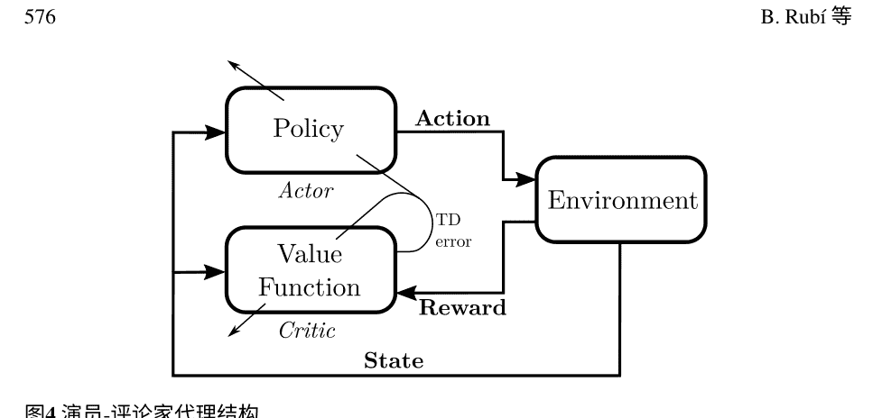

## 5 代理环境

代理环境包括机器人和机器人的环境[88]。本节介绍了四旋翼飞行器、自动驾驶仪、障碍物检测系统以及代理训练的仿真环境的详细信息。

### 5.1 四旋翼

本章中使用的飞行器是Asctec Hummingbird（图6），一种质量为0.698千克，最大空速为15米/秒的四旋翼。本章中使用的四旋翼模型有12个状态和4个输入。这些状态包括世界坐标系中的位置（x，y和z），欧拉角（φ-滚转，θ-俯仰和ψ-偏航），体速度（u，v和w）以及角速度（p，q和r）。这些输入是与推力力（u_z）和机体坐标系上每个轴上的扭矩（u_φ，u_θ和u_ψ）相关的四个数字信号。Asctec Hummingbird模型的更多信息请参考[74]。

### 5.2 自动驾驶

本章中实现的自动驾驶系统由六个基于PID的控制器组成；其中两个用于控制x轴和y轴上的速度，一个用于控制高度（z），三个用于控制姿态角（φ，θ和ψ）。这些控制器的性能在实验结果[74]中进行了测试。

### 5.3 障碍物检测

用于执行障碍物检测任务的传感器是Leddar VU8激光雷达。该激光雷达的水平视场为48°，垂直视场为3°。Leddar VU8将其视场分为8个水平段，提供一个包含8个值的向量，表示该段中到障碍物的最小距离。每个段的视场为6° × 3°。距离以1厘米的精度给出。

在本章中，通过处理激光雷达传感器提供的数据来消除地面检测。为此，根据车辆在世界坐标系中的高度（w z）和俯仰角（θ）和滚转角（φ）被计算，估计每个激光雷达波束 (dG, i) 探测到地面的距离。这个估计在公式6中显示，其中 ψL,i 是第 i个LIDAR光束相对于传感器的 x轴的角度。如果传感器测量的距离等于或大于估计的地面距离，则将该值设置为无穷大（表示未检测到障碍物）。由于传感器的噪声或不准确性，测量到的地面距离可能与估计值略有不同。因此，估计的地面距离应用了一个+20%的余量。请注意，公式6仅在俯仰角和滚转角均不为零时有效。因此，当俯仰角或滚转角为零时，使用其他更简单的公式来估计地面距离。

$$ d_{G,i} = \frac{^w z \sin\left(\mathrm{atan}\left(\frac{\sin(\theta)}{\sin(\phi)}\right)\right)}{\cos(\theta)\cos\left(\pi/2 - \mathrm{atan}\left(\frac{\sin(\theta)}{\sin(\phi)}\right) - \psi_{L,i}\right)} \quad (6) $$

### 5.4 训练环境

代理的第一步训练是不可预测的，可能对真实平台不安全。这就是为什么拥有一个模拟环境非常重要，以保持实验平台的完整性。在一个逼真而完整的模拟环境中训练代理将增强其在真实实验中的有效性。

在本章中，使用Gazebo-ROS（机器人操作系统）平台构建了一个仿真环境，利用RotorS模拟器[23]。在ROS中构建此环境的一个最重要的优势是，代理的相同代码可以转移到真实的蜂鸟平台上，因为它也在ROS中实现。RotorS是一个集成在Gazebo-ROS中的多旋翼模拟器，其中包含了Asctec Hummingbird四旋翼飞行器的模型，这是本章研究的车辆。由于我们平台的真实蜂鸟飞行器进行了某些修改，因此仿真模型的一些参数也进行了更新（一些传感器、电脑和其他物品被放置在车辆上，从而改变了惯性和质量）。此外，还包括并调整了传感器的模型，以使其类似于实际四旋翼飞行器的平台。然而，仍然可以进行假设地面真实测量（即理想传感器）的模拟。

为了进行避障模拟，需要在该模拟器中包含其他元素。真实平台的激光雷达传感器在RotorS模拟环境中进行建模。该模型包括视觉部分、动力学部分和生成的ROS主题。激光雷达测量中包含高斯噪声。此外，为了进行避障实验，需要一个关键元素：障碍物。在本章中，障碍物被建模为圆柱体。生成的障碍物半径为1米，高度为2米。

DDPG代理程序使用Python 3.5编写，使用TensorFlow和TFlearn库生成和训练神经网络。这些库允许保存（和恢复）训练好的网络，以便进行测试或重新训练。由于ROS仅适用于Python的第2版本，代理程序被实现为常规Python脚本，并通过rospy库与ROS进行通信（订阅和发布主题）。

这个环境集成在一个Linux Xubuntu虚拟机中，配备8GB RAM和四个1.80GHz处理器（i7-8550U CPU）。在这些规格下，在训练代理时，可以实现几乎实时的gazebo时间和真实时间之间的比率接近1。然而，如果电脑散热不好，时间比率可能降低到最低0.8。这意味着模拟时间被减慢，以便能够以给定速率执行所有操作。

## 6 路径跟随的DDPG

本节介绍了用于解决四旋翼飞行器路径跟随问题的DDPG代理。此外，最终代理能够计算出根据定义的奖励最适应给定路径形状的车辆速度。所提出的解决方案实现了一个SGC结构（图2）。

图7显示了典型的强化学习结构，适用于SGC控制结构。在这个结构中，代理是路径跟踪算法，环境包括自动驾驶控制器、路径参考和四旋翼环境。强化学习代理接收当前状态和奖励，并计算发送到环境的动作。

### 6.1 设计过程

本节介绍了本章开发的DRL路径跟踪代理的主要特征。也就是说，定义了状态、动作和奖励。还介绍了网络结构或添加到动作中的噪声类型的其他细节。使用三种不同的方法实现。

## 6.1.1 第一种方法：两个状态

深度确定性策略梯度算法。每种方法都是前一种方法的改进版本。

根据图7的结构，路径跟踪算法必须计算四个控制命令（$z_{cmd}$，$\psi_{cmd}$，$u_{cmd}$和$v_{cmd}$）。然而，在这个第一种方法中，深度强化学习代理只负责计算偏航角（$\psi_{cmd}$）的参考值。实际上，这个代理产生的动作（$a$）不是直接的偏航命令，而是对当前偏航角的期望修正（$\psi_{corr}$，以弧度/秒为单位）。方程7显示了如何产生第$k$步的偏航参考值，其中$\Delta t$是时间步长。之所以使用角度修正而不是角度本身作为代理动作，是为了避免不必要的快速角度变化。此外，注意修正是基于当前偏航值而不是上一个偏航参考值进行的，这将导致增量控制动作。具有增量控制动作等效于向系统添加一个新的积分项，在这种情况下会导致不稳定的行为。因此，所选的动作实现了平滑移动，同时保持系统的稳定性。

$$\psi_{cmd,k} = a_k \Delta t + \psi_k \quad | \quad a_k = \psi_{corr,k} \tag{7}$$

路径跟随控制器定义的其他命令将取决于路径规范； $z_{cmd}$由路径在最接近车辆的点处的高度给出（以下简称为横向误差点 $p_{ct}$），并且$u_{cmd}$设置为期望路径的速度。在大多数几何算法中，沿着$y$轴的速度（$v_{cmd}$）被固定为$0$ m/s。

DDPG算法的基本结构决定了，在给定环境状态的情况下，代理将始终根据学习到的策略选择最佳动作。这可能导致在训练过程中无法正确探索动作空间。

为了增强代理的探索能力，在训练时添加了一个Ornstein-Uhlenbeck噪声（方程8）到动作中。$n_k$是第 $k$ 次迭代时噪声的值，$\theta_n$是定义均值回归速率的参数，$\mu_n$是影响渐近均值的漂移项，$\Delta t$是一步的时间，$dW_t$是按波动率缩放的标准Wiener过程$\sigma_n$。

偏航指令（$\psi_{cmd}$）包括噪声信号，计算如方程9所示。探索率随着训练回合数目的增加而持续减小。（$j$）以一种平滑的方式在探索和利用之间实现过渡，同时代理保持学习。参数 $\lambda$ 表示这种过渡的速度。

$$n_k = n_{k-1} + \theta_n(\mu_n - n_{k-1})\Delta t + \sigma_n dW_t \tag{8}$$

$$\psi_{cmd,k} = \left(a_k + \frac{n_k}{j/\lambda + 1}\right)\Delta t + \psi_k \tag{9}$$

在这个第一个方法中，状态向量 ($s$) 由两个状态（方程 10）组成；距离误差 ($e_d$) 和角度误差 ($e_\psi$)，两者都相对于 $\mathbf{p}_{ct}$(图 8)。下标T是指放置在 $\mathbf{p}_{ct}$上的切向参考框架 {$T$}，其中 $x$ 指向路径的切向方向，$z$ 指向上方，$y$ 指向 $x \times z$的结果方向。

$$\mathbf{s} = \{e_d, e_\psi\} \ | \ e_d = y_T, \ e_\psi = \psi_T \tag{10}$$

该代理的奖励定义如公式11所示。这是奖励函数，它在众多评估的奖励类型中实现了最佳性能和最快收敛（即连续或离散，惩罚不良行为或奖励良好的路径跟踪性能以及混合策略）。术语 $-k_1|e_d|$ 对横向误差 ($e_d$) 进行惩罚。术语 $k_2v_x$ 在车辆沿路径前进时给予正奖励，否则给予负奖励，其中 $v_x$ 是车辆在切向参考系的 $x$ 轴上的投影速度。$k_1$ 和 $k_2$ 是定义两个术语重要性的常数。在这种方法中，这些常数的值分别为20和10。在评估的几个值中，这些是最好的值。

$$r = -k_1|e_d| + k_2v_T \tag{11}$$

演员（图9）和评论家（图10）神经网络的结构包括四层前馈网络，第一隐藏层有400个神经元，第二隐藏层有300个神经元。然而，在演员网络中，状态向量和动作向量都连接到第一隐藏层，而在评论家网络中，动作向量直接连接到第二隐藏层，因为跳过第一层被证明是有益的。两个网络的神经元都是修正线性单元（ReLU）。批量归一化技术在演员网络的两个层中使用，而在评论家网络中只在状态输入层使用。

### 表2 DDPG代理的参数

| 符号 | 描述 | 数值 |
|------|------|------|
| η_θ | 演员网络的学习率 | 0.0001 |
| η_φ | 评论家网络的学习率 | 0.001 |
| τ | 软目标更新参数 | 0.001 |
| γ_{rl} | 评论家更新的折扣因子 | 0.99 |
| - | 重放缓冲区大小 | 1,000,000 |
| N | 小批量大小 | 64 |
| - | 一个回合的最大步数 | 300 |
| Δt | 代理时间步长 | 0.1 秒 |
| θ_n | 噪声函数的均值回归率 | 0.0075 |
| σ_n | 噪声函数的波动率 | 0.15 |
| λ | 探索-利用转换的比率 | 200 |

本小节提出的代理可以有效解决路径跟踪问题（见第6.3节）。实际上，它是在仅有两个状态的众多和多样的代理设置中获得的在PF性能方面最佳的代理设置。然而，请注意代理的这两个状态（方程10）只提供关于路径的瞬时信息。换句话说，状态仅从路径中的点$p_{ct}$计算，并且它们不提供有关即将出现的路径形状的信息。因此，代理无法预测路径的曲线。下一小节介绍了一种改进方法，解决了这个问题。

## 6.1.2 第二种方法：预测状态

为了处理前一小节提到的预测问题，提出了一种新的状态向量形式。保持第一种方法的其他参数和结构。除了方程10中定义的两个状态之外，还包括另一个状态（$\psi_{T_2}$）。这个状态是车辆偏航角和路径切线角之间的角度误差。然而，在这种情况下，角度误差不是从点$p_{ct}$计算的，而是从路径前方的一个点计算的，如图11所示。这个新的状态提供了关于路径未来方向的信息，使得代理能够预测即将到来的曲线，从而显著提高了路径跟踪性能（见第6.3节）。这种方法的状态向量在方程12中呈现，其中$T_2$下标表示该状态是从路径前方的切线框架上计算的。

$$\mathbf{s} = \{y_T, \psi_T, \psi_{T_2}\} \qquad (12)$$

第二切线框架的距离，$\{T_2\}$，在路径上被称为预测距离，用$d_a$表示。为了获得最佳的代理性能，需要选择适当的预测距离。通过不同的测试，证明了$d_a$取决于车辆在路径上的速度。也就是说，随着速度的增加，需要更大的预测距离。例如，在速度为1 m/s时，根据获得的PF性能，最佳预测距离为0.6 m。

## 6.1.3 第三种方法：自适应速度

前面方法的主要缺点是，使用定义的结构，代理只能学习解决特定速度下的问题。也就是说，如果在训练过程中，车辆的速度在每个回合中发生变化，将无法达到收敛。换句话说，策略取决于车辆的速度。

本小节介绍了一种改进方法，使代理能够以不同的速度工作，并且在每一步计算出最适应路径形状的车辆速度，根据定义的奖励。

为了拥有一个对不同速度和路径形状具有弹性的代理，第一步是将车辆的速度 ($\|v\|$) 作为代理的状态之一。然而，这种修改还不足以实现我们的目标。在 DDPG中，需要定义一个满足确定性属性的状态向量。这意味着，通过知道当前状态向量和动作，可以估计出下一个状态。因此，由于车辆速度是系统的外生变量（由用户定义），无法预测其值，因此它不是确定性状态。为了使其确定性，动作向量必须作用于速度状态。

在这第三种方法中，除了在方程式7中定义的偏航校正动作之外，还包括了一项新的动作，该动作计算出当前速度上的速度校正 ($u_{corr,k}$)。方程式13展示了如何从该动作中产生在 x轴上的速度指令（包括方程式8中的探索噪声，仅在训练阶段使用）。同样，为了避免速度的快速变化并确保系统的稳定性，使用了校正动作而不是速度动作或命令的增量动作。

$$u_{cmd,k} = \left(u_{corr,k} + \frac{n_{k}}{j/\lambda + 1}\right)\Delta t + u_{k} \tag{13}$$

引入这个新状态（$\|v\|$）和新动作（$u_{corr,k}$）给智能体可能看起来足够解决问题。然而，正如在第6.1.2节中提到的，未来角度误差状态（$\psi_{T_2}$）的计算取决于车辆的速度。因此，仅通过固定的预期距离（$d_a$）计算此状态不足以提供解决不同速度下路径跟踪问题所需的足够信息。为了解决这个问题，考虑了两种解决方案：在不同的预期距离上添加更多未来角度误差状态，或者根据车辆速度在每一步修改计算角度误差的预期距离。

在不同距离上包含多个未来角度状态有两个不利之处：首先，拥有更多状态会使训练过程变得更慢；其次，由于在给定速度下只利用了1或2个未来角度状态的信息，其余状态变得无关紧要。拥有许多不提供重要信息以解决问题的状态会导致代理失去效力。因此，在这种方法中，通过只有一个未来角度状态（$\psi_{T_2}$）来解决上述问题。

为了找到车辆速度与最佳预测距离（$d_{a, opt}$）之间的关系，进行了多次不同速度的测试。最佳预测距离是指提供更多信息并导致代理性能更高的距离。这些测试得到的结果通过方程式14的分段线性函数进行近似。该函数根据车辆的当前速度计算最佳预测距离。

$$d_{a, opt} = \begin{cases} 0.6\|v\| + 0.1, & \text{if } \|v\| < 1 \\ \|v\| - 0.3 & \text{else} \end{cases} \tag{14}$$

总结起来，在这种方法中，车辆的速度被添加为状态向量的一部分，并且未来角度状态通过自适应预测距离（$d_{a, opt}$）进行计算。行动向量中包括速度修正。方程式15和16分别给出了状态向量和行动向量。代理根据路径形状调整在x轴上的速度命令。在y轴上的速度仍然固定为0。第一种方法的奖励函数（方程11）也得以保留。奖励的权重（$k_1$和$k_2$）在这种方法中起到了重要的作用，因为它们定义了在路径距离误差和高速行驶之间权衡的优先级。表2的所有参数都得以保留，除了探索-利用转换比例（$\lambda$），该比例被设置为1000。这是因为这种方法的训练过程较慢。

$$\mathbf{s} = \{ y_T, \psi_T, \psi_{T_2}(d_{a, opt}), \|v\| \} \tag{15}$$

$$\mathbf{a} = \{ \psi_{corr,k}, u_{corr,k} \} \tag{16}$$

使代理能够在空间中遵循轨迹的要素已经被定义。然而，设计一个丰富的训练环境，使代理能够收敛到高效且稳健的解决方案，是非常重要的。关于这个训练过程的详细信息请参见第6.2节。

### 6.2 训练过程

智能体的训练过程已在第5.4节中详细介绍的训练环境中进行。训练过程是实时进行的。

### 6.2.1 第一和第二方法的训练

第一和第二方法在训练阶段遵循相同的结构。也就是说，车辆需要以1米/秒的恒定速度在x体轴上沿着半个lemniscate（8字形）路径行驶。该路径在方程17中定义，其中 $A$是路径的一个圆周的半径，固定为4米，$\gamma$是虚拟弧，范围从0到2π弧度。路径在每个路径点之间以0.01米的精度离散化。

$$x_d(\gamma) = 2A \cos(\gamma) \\ y_d(\gamma) = A \sin(2\gamma) \quad (17)$$

两个代理根据指定的路径在理想条件下进行训练，这意味着系统使用地面真实测量数据，并且车辆在每个回合开始时位于路径的初始位置，并且与其切线方向成角度。如表2所示，每个回合有300个0.1秒的步骤。第一种和第二种方法的学习进化分别显示在图12和图13中。这些图表显示了每个回合中的平均路径距离误差（$|d|$）和所有步骤中的累积奖励（$\sum r$）。随着代理的持续训练，平均误差减小，累积奖励增加，直到训练收敛。

需要注意的是，由于训练过程是随机的，即使保持相同的参数和结构，训练代理的性能也会有所不同。本节介绍的代理是在一组不同的训练代理中在路径距离误差方面表现最佳的代理。在这种特殊情况下，第一种方法在第120个回合左右收敛，而第二种方法在第90个回合左右收敛。

所得到的智能体在RotorS模拟平台上进行了测试（见第6.3.1节）。它们证明在地面真实测量中表现良好。然而，如果添加传感器模型，智能体在跟随路径时会遇到一些困难。特别是当车辆远离路径（由于漂移或跳跃的传感器测量）并且需要收敛回来时，车辆可能会在路径周围徘徊，无法收敛到路径上。

解决所提到的问题的方法可能是用传感器训练代理模型。然而，对于带有噪声测量的系统动力学的捕捉对代理来说变得具有挑战性，有时候在这些条件下训练无法收敛。作为替代，这个问题可以通过重新训练代理来解决，使其在车辆远离路径时学习策略。为了做到这一点，首先按照之前解释的方法训练代理，然后按照相同的路径重新训练代理，但是从随机位置和方向开始，与路径的初始点不同。通过这种方式，代理学会如何在路径之外行为。因此，如果车辆由于噪声传感器测量而偶尔偏离路径，代理将能够将车辆驾驶回到路径上。

两个代理（第一和第二种方法）在随机初始条件下，按照指定的lemniscate路径（方程17）进行了100个额外的训练周期。也就是说，在这个训练阶段的每个周期中，车辆的起始位置设置在路径的初始位置的距离为-2米到2米之间，并且初始方向从初始路径切线角度增加一个角度在-$\pi/2$和$\pi/2$之间的弧度。初始位置和角度在定义的区间内以均匀概率分布随机选择。图14显示了第二种方法在100个新的训练周期中的学习演变。由于每个周期中初始位置和方向都随机变化，所以得到的平均距离误差和累积奖励也会有所变化。为了更好地展示学习阶段的进展，在这两个图中都呈现了20个值的移动平均线。也就是说，图14中的回合值用灰色虚线表示，而移动平均值用实线表示。学习结果显示，这个训练阶段使代理能够在不同的初始条件下表现更好。这种获得的知识将显著提高实验性能，如第6.3节所示。

### 第3种方法的训练

本章中开发的第三个DDPG方法需要在比以前版本更丰富的环境中进行训练。这是因为代理需要根据路径半径训练不同的曲线，以学习最佳车辆速度和偏航角策略。

在该代理的训练过程中，车辆需要沿着一个非对称的半叶形路径行驶。这是一个8字形路径，每个圆的半径都不同。该路径由方程式18定义，其中$A_1$和$A_2$分别是路径上每个圆的半径。该半径的值在每个回合中都会改变，随机取值范围在0.5m到10m之间，概率均匀分布。同样，虚拟弧参数（$\gamma$）的取值范围为0到$\pi/2$弧度，路径以0.01m的精度离散化。

$$x_d(\gamma) = \begin{cases} 2A_1 \cos(\gamma) & \text{if } 0 \leq \gamma \leq \pi/4 \\ 2A_2 \cos(\gamma) & \text{if } \pi/4 < \gamma \leq \pi/2 \end{cases}$$
$$y_d(\gamma) = \begin{cases} A_1 \sin(2\gamma) & \text{if } 0 \leq \gamma \leq \pi/4 \\ A_2 \sin(2\gamma) & \text{if } \pi/4 < \gamma \leq \pi/2 \end{cases} \tag{18}$$

在所述环境中，代理的第一次训练尝试结果并不成功。具体来说，在数百个回合之后，代理只学会了最大化奖励（第6节中的奖励函数）的最佳方法是保持车辆静止。这种奇怪的行为可以解释如下：由于缺乏探索，当策略尚未定义时，任意转向不会受到惩罚。因此，每当代理开始向前移动车辆时，由于旋转，它最终会朝着路径的相反方向移动，并因此而受到惩罚。因此，最佳动作是保持$u_{cmd}=0$。

在本章中，提出了一个简单但有效的解决方案。它通过建立最小速度为0.1 m/s来强制车辆不断移动。即使这个条件最初产生负回报，最终也会促使代理学习到正确的行动策略。同时，一旦车辆的速度向量开始与路径平行，代理就可以开始学习更高的速度会带来更大的回报。因此，成功的学习过程得以实现。

图15显示了该代理的训练结果。该图显示了平均距离误差($|d|$)，x轴上的平均速度($u$)和累积奖励($\sum r$)。对每个三个图的解释，应用了50个回合的移动平均值。灰色虚线表示回合值，而黑线表示移动平均值。训练似乎在第400个回合附近收敛。然而，即使平均误差或奖励保持不变，通过模拟测试评估训练后的代理显示它们仍在学习和提高性能，直到大约第1000个回合。之所以如此，是因为训练更多的回合可以学习到不寻常状态下的策略。这种长而复杂的训练过程使代理能够学习到路径之外的策略。因此，与第一和第二种方法不同，这种方法不需要通过多样的初始条件进行额外的训练，以提高其在实验结果上的性能。

### 6.3 结果

本节介绍了在不同条件下遵循路径时三个训练代理所获得的结果。代理在模拟和实验中使用Asctec Hummingbird平台进行了测试。

### 6.3.1 模拟

本节中展示的模拟是在相同的框架中进行的，代理人在其中接受训练。也就是说，RotorS模拟器集成在ROS-Gazebo平台中。

首先，按照双曲线路径（方程17）测试了三种方法，这与训练阶段使用的路径相同。同样，路径的半径为 $A = 4 \, m$。然而，这次车辆需要跟随一个完整的双曲线，虚拟弧参数 $\gamma$ 的范围从0到$4\pi \, rad$。车辆从路径上的初始点开始，$yaw$角度与其切线方向相一致。表3显示了在跟随该路径时获得的地面真实测量结果。也就是说，在训练时使用相同的条件。该表显示了每个代理人在路径上执行一圈所需的平均横向误差（$d$）、平均速度（$\|\mathbf{v}\|$）和总时间。此外，为了在与其他两个代理人相同的条件下评估第三种方法的代理人，还进行了另一次模拟，限制其最大速度为1 $m/s$。请注意，第一种方法在表中表示为$Agent \, 1$，第二种方法为$Agent \, 2$等等。此命名法在本节中一直保持不变。

使用传感器测量值而不是地面真实值进行完整的双曲线路径的一圈的结果显示在表4中。评估的是表3中相同的参数和代理。这些代理在$x \, y$平面上的轨迹显示在图16中。图17显示了$Agent \, 3$计算的$yaw$角度（$\psi_{cmd}$）和$x$轴上的速度（$u_{cmd}$）的参考值以及在相同模拟中角度$\psi$和速度$u$的值。

从遵循双曲线路径的模拟结果可以看出，$Agent \, 2$在横向误差方面获得了最佳结果。然而，重要的是要记住，该代理只是在速度为1 $m/s$的特定情况下训练得很好。另一方面，$Agent \, 3$在大大减少完成一圈双曲线所需的时间的同时，实现了类似的性能。也就是说，该代理在路径的每个部分计算最佳速度，使车辆能够在直线上加速，最大速度达到1.82 $m/s$。因此，它能够提高平均速度，同时几乎保持相同的误差。

为了分析代理在遵循与训练时不同的路径时的性能，定义了一条新路径。这条新路径是一个螺旋，由方程19给出。这次，参数 $A$ 确定了螺旋半径增长的速率，并且取值为1.25。虚拟弧（$\gamma$）的范围从0到$2\pi$。

**表3 双曲线路径一圈的结果，使用真实测量进行模拟。**

| | d̄ (m) | 时间 (s) | ‖v‖ (m/s) |
| :--- | :--- | :--- | :--- |
| 代理人 1 | 0.1041 | 67.10 | 0.8707 |
| 代理人 2 | 0.0398 | 54.79 | 0.8780 |
| 代理人 3 | 0.0671 | 39.81 | 1.2276 |
| 代理人 3 (v_max = 1) | 0.0669 | 56.10 | 0.8696 |

**表4 在双曲线路径上一圈的结果，使用传感器模型进行模拟**

| | d̄ (m) | 时间 (s) | ‖v‖ (m/s) |
| :--- | :--- | :--- | :--- |
| 代理人 1 | 0.1123 | 54.79 | 0.9476 |
| 代理人 2 | 0.0895 | 51.70 | 0.9484 |
| 代理人 3 | 0.0968 | 40.00 | 1.2338 |
| 代理人 3 (v_max = 1) | 0.0816 | 54.41 | 0.9111 |

表5显示了在遵循螺旋路径时获得的模拟结果，同时使用地面真实测量值，而表6则呈现了代理人在相同路径上使用传感器测量的结果。

```
math
x_d = -A\gamma \cos(\gamma)
y_d = A\gamma \sin(\gamma)
```

图18显示了三个代理人在遵循螺旋路径时在 $x y$ 平面上的轨迹，使用传感器测量。这些结果对应于表6中呈现的模拟结果。图19显示了代理人3在遵循螺旋路径时计算的角度和速度参考值。在这种情况下，车辆达到了最大速度1.71米/秒。

**表5 螺旋路径一圈的结果，使用地面真实测量进行模拟**

| | $\overline{\mathbf{d}}$ (m) | 时间 (s) | $\|\mathbf{v}\|$ (m/s) |
| :--- | :--- | :--- | :--- |
| 代理人 1 | 0.2907 | 34.30 | 0.8860 |
| 代理人 2 | 0.1840 | 32.43 | 0.8872 |
| 代理人 3 | 0.1418 | 23.52 | 1.2119 |
| 代理人 3 ($v_{max} = 1$) | 0.0759 | 32.10 | 0.8530 |

**表6 螺旋路径一圈的结果，使用传感器模型进行模拟**

| 代理人 | d (m) | 时间 (s) | \|\|v\|\| (m/s) |
| :--- | :--- | :--- | :--- |
| 代理人1 | 0.3035 | 32.86 | 0.9448 |
| 代理人2 | 0.2540 | 31.18 | 0.9366 |
| 代理人3 | 0.1677 | 22.62 | 1.2262 |
| 代理人3 (v_{max} = 1) | 0.0987 | 30.59 | 0.8830 |

在沿着螺旋路径的模拟结果中，每个代理的性能变化比沿着双曲线路径的结果更大。根据这些结果，至少在模拟中，代理人3能够胜过其他代理，在以更高速度行驶时减小平均横向误差。

仿真结果显示，即使代理已经通过真实测量数据进行了训练，按照双曲线路径，它们也可以通过传感器测量解决路径跟踪问题，并按照其他路径（如螺旋路径）进行跟踪。接下来，代理将在真实实验平台上进行测试。

### 6.3.2 实验

实验平台由Asctec Hummingbird飞行器和安装有ROS平台的额外机载PC（Odroid-XU4）组成。该飞行器配备了IMU传感器，其中包括车辆方向的估计值，压力传感器估计高度，GPS提供位置和车辆在x y平面上的速度估计。在本章中，状态直接从传感器提供的测量值中获取，无需使用任何额外的滤波器。

由于tensorflow库需要在64位上运行，而Odroid-XU4只支持32位，所以DDPG Python代理程序无法在此PC上运行。相反，该程序在地面站笔记本电脑上执行，通过Wi-Fi与ROS主控PC进行通信。笔记本电脑运行Linux Ubuntu操作系统，搭载i7-8550U英特尔处理器和16GB内存。DDPG Python3程序以10 Hz的频率运行。

三个代理程序在实际实验中按照第6.3.1节中相同的路径进行了测试。然而，尽管这三个代理程序能够正确解决路径跟踪问题，但结果并不如预期。也就是说，车辆的轨迹在路径周围略微振荡。经过多次测试，作者得出结论，这种行为是由于RotorS仿真模型与实际车辆动力学之间存在轻微差异所致。也就是说，实际车辆绕z轴的旋转动力学稍微慢一些。

为了提高代理的性能，考虑了两种解决方案：第一种是在实验平台上训练代理；第二种是调整代理的参数以修改其动态。在真实飞行中训练代理可能对植物有害，因为车辆的意外行为。此外，观察到使用噪声测量进行训练会降低学习效果。另一方面，显然，没有任何方法可以通过改变代理的某些参数来修改代理的动态。事实上，在设计和训练参数集合中，仅在训练阶段涉及的DDPG算法没有其他需要调整的参数。然而，在本章中，我们提出了一种通过添加一个新参数来修改代理的控制动态的方法，该参数将缩放代理的输出。也就是说，由于代理的输出是修正（角度和速度修正），该参数将调节修正的速度，从而调节角度和/或速度参考的动态。

由于两个模型之间的差异影响了动态，只有角度动作与所提及的参数进行了缩放。这个新参数，被称为角度校正常数($k_a$)，在方程式20中明显，并且是经验性设置的，$k_a = 2$；这个值在不同的值中提供了最佳性能。这个校正常数被包含在三个代理中，这三个代理用于获得本章中呈现的所有实验结果。重要的是要记住，这个常数只是在实验阶段中用于提高代理的性能。

$$\psi_{cmd,k} = k_a a_k \Delta t + \psi_k \quad (20)$$

接下来，使用相同的第6.3.1节中的双曲线（方程式17）对代理进行测试，其中A = 4，$\gamma$范围从0到$4\pi$。三个代理在这条路径上完成一圈的结果显示在表7中。还包括Agent 3的结果，其最大速度限制为1 m/s。同样，表格显示了车辆的平均横向误差($\bar{d}$)，总时间和平均速度。

图20展示了代理在遵循此路径时在xy平面上的轨迹。此外，图21显示了代理3在遵循此双曲线路径时计算的角度和速度参考值，其中参考值以红色显示，实际值以蓝色虚线显示。

遵循双曲线的实验结果显示与模拟结果非常相似的行为。代理人2再次展示了最佳性能。在横向偏差方面，代理人3实现了类似的距离误差，同时增加了平均速度，最大速度达到2.49 m/s。

**表7 双曲线路径一圈的实验结果**

| | $\bar{\mathrm{d}}$ (m) | 时间 (s) | $\|\mathbf{v}\|$ (m/s) |
| :--- | :--- | :--- | :--- |
| 代理人 1 | 0.1739 | 55.90 | 0.8859 |
| 代理人 2 | 0.1140 | 55.01 | 0.9141 |
| 代理人 3 | 0.1682 | 39.39 | 1.6311 |
| 代理人 3 ($v_{max}=1$) | 0.2275 | 59.50 | 0.8829 |

这些实验结果中的另一个重要观点可以在轨迹的最后一条曲线中找到（图20中的右下曲线），这是一个代理应该明显改进的曲线。这种行为在快速逆时针曲线中出现在我们进行的所有实验中，并且在逆时针螺旋路径中更加明显。这种奇怪模式的原因在于设计的训练框架。尽管代理经过了具有不同半径的非对称双曲线的训练，但这个训练框架仍然是不完整的。原因在于代理经过了一个以逆时针曲线开始并以顺时针曲线结束的半双曲线的训练。这样，第一条曲线总是比第二条曲线慢，代理学会了执行快速顺时针曲线和慢速逆时针曲线。因此，在高速下跟随逆时针曲线时会导致不良行为。解决这个问题的方法是改变这个训练框架。第3个代理以慢速和快速速度同时具有两种类型的曲线。例如，可以使用完全不对称的双曲线来完成。

最后，代理使用方程式19定义的螺旋路径进行测试，其中$A = 2.5$，$\gamma$范围从$0$到$4\pi$。表8呈现了三个代理加上速度有限的Agent 3的结果，就像表7中一样。按照这个螺旋路径行动的代理的轨迹显示在图22中，图23显示了从Agent 3的行动中计算出的角度和速度参考值。

在按照螺旋路径的实验结果中，Agent 3通过展示更高的速度和更低的横向误差而优于其他代理。具体来说，这个代理达到了最大速度2.52 m/s。

当沿着螺旋路径行进时，代理的初始轨迹（图22）表明了本节中介绍的三种方法之间的行为差异。也就是说，Agent 1需要以恒定的速度$1 \, m/s$行驶并且只有瞬时距离和方向误差的信息。因此，在路径的初始部分，由于缺乏预测，它开始向前移动，偏离了路径。Agent 2也以恒定速度移动。然而，该代理具有关于即将到来的路径方向的信息，这使得它能够预测曲线。因此，在路径的初始部分，该代理开始朝曲线移动。最后，Agent 3提前了解到路径曲率的演变，并能够修改纵向速度。这使得它能够控制在路径开始时速度较慢，并朝曲线方向转向，以尽可能准确地跟随路径，然后在正确定向后开始增加速度。

**表8 螺旋路径一圈的实验结果**

| | $\bar{\text{d}}$ (m) | 时间 (秒) | $\|\mathbf{v}\|$ (m/s) |
| :--- | :--- | :--- | :--- |
| 代理人 1 | 0.2848 | 28.81 | 1.0503 |
| 代理人 2 | 0.2503 | 27.79 | 1.0460 |
| 代理人 3 | 0.2257 | 18.59 | 1.5844 |
| 代理人 3 ($v_{max} = 1$) | 0.2342 | 33.10 | 0.8826 |

## 7 用于避障的7个DDPG代理

本节介绍了本章提出的DRL路径跟踪和反应式避障方法。它能够使用自适应速度选择方法跟随预定义的通用路径，同时能够避免出现在车辆路线上的静态障碍物。代理只使用由障碍物检测传感器提供的局部环境信息。

解决所描述问题的提出的结构依赖于维护在第6节中开发的PF代理（$Agent \ 3$），并创建一个新的代理负责以这样的方式向PF控制器提供参考路径，以便在保持PF代理的主要功能的同时能够避免静态障碍物。

路径跟随和避障问题也可以通过一个独特的代理来解决。然而，考虑到学习跟随路径所需的训练次数，根据路径半径选择最佳车速，并考虑到反应式避障问题本身的困难，训练次数和网络结构的大小可能会呈指数增长。这是将解决方案分为两个代理的主要原因。

本方法中采用的强化学习结构的主要元素如图24所示。在这种情况下，代理是OA算法，环境包括与代理交互的其他元素。也就是说，路径跟随代理、自动驾驶仪、四旋翼飞行器、参考路径和四旋翼飞行器的环境。请注意，OA代理接收原始参考路径，并负责计算命令给路径跟随代理的参考路径，$\mathbf{p}_{d2}(\gamma)$。当没有障碍物时，该路径包含避免车辆路线上任何障碍物所需的轨迹，并且必须与原始参考路径相等。

### 7.1 设计过程

本节详细介绍了构成反应式避障问题的每个元素的细节，该问题在本章中开发了 DDPG方法来解决。这包括所使用的控制结构，代理的动作、状态和奖励，神经网络的结构以及与 DDPG算法相关的其他参数。

#### 7.1.1 动作

避障代理接收参考路径（$p_{d2}(\gamma)$）并将其发送给路径跟踪代理（图24），可能会进行修改（$p_{d2}(\gamma)$）。与第6节一样，参考路径由两个向量给出，每个分量（$x_d$和$y_d$）都由参数$\gamma$离散化，精度为0.01。有不同的方法将修改后的路径发送给路径跟踪代理。例如，完整路径可以在每个步骤中发送，但这样做会计算成本高且效率低。否则，可以发送当前正在跟随的部分路径的小节，但这仍然可能对通信通道要求过高。此外，使代理计算完整的路径点序列将成为一个具有挑战性的问题。相反，考虑了一种简单高效的将路径发送给路径跟踪代理的方法；仅发送路径跟踪代理的RL状态向量。也就是说，在避障脚本中计算了真实环境的路径跟踪代理的状态向量，并且避障代理计算了该状态的某些变化或增量。这样，路径跟踪代理对参考路径一无所知，只接收到修改后的RL状态向量，而避障代理可以生成状态增量以修改状态/路径，以避开任何障碍物。

在这一点上，重要的是要记住PF代理的状态向量由四个元素组成（参见第6.1.3节）；横向误差，角度误差，路径前方点的角度误差和车辆的速度。车辆的速度是车辆的内在状态，但其他状态取决于所遵循的路径。因此，修改这些状态等同于改变参考路径。在本研究中，只会修改横向误差状态，其他三个状态保持不变。

OA代理的定义动作仅作用于横向误差状态，计算路径到车辆的距离。这个动作可以被解释为参考路径的偏移，如图25所示。也就是说，这个动作可以被解释为原始路径在路径切线框架的y轴上的偏移，{T}。通过控制路径的偏移，代理将生成相应的轨迹以避开出现的障碍物。重要的是要提到，由于角度误差状态是由两个向量（x-车体轴和x-切向轴）之间的角度计算得出的，即使路径被平移，它仍然保持不变。路径到路径的距离偏移被命名为$d_{off}$。为了保持这个路径偏移的平滑轮廓，OA代理的动作被设置为它的增量。也就是说，动作被设置为路径偏移的导数。这在方程式21中表示。

这个方程式显示了在时间步骤k时，如何修改的横向误差状态。

$$e_{d2,k} = e_{d,k} + d_{off,k} \quad | \quad d_{off,k} = d_{off,k-1} + a_k \Delta t \quad (21)$$

这个方程显示了距离偏移($d_{off,k}$)如何从OA代理的动作($a_k$)中获得，其中 $\Delta t$ 是代理的时间步长。路径偏移的导数限制为3米/秒，被认为是执行反应机动的足够高速度。

## 7.1.2 状态

关于该代理的状态向量，必须包括的第一个状态是路径偏移量，$d_{off}$。代理计算的动作是该参数的导数，因此，如果代理不知道路径偏移的真实值，它将无法正确地对 $d_{off}$ 进行变化以避开障碍物。

接下来，LIDAR测量结果被包含在状态向量中，以提供代理有关环境和可能障碍物的信息。LIDAR测量结果包括由八个光束测量的8个距离，这些光束分布在水平视野为48°的范围内（有关LIDAR传感器的更多信息请参见第5.3节）。这些距离测量结果经过处理以消除地面检测。消除地面检测使训练代理的收敛速度大大加快。实际上，在大多数情况下，如果没有这种处理，代理无法收敛。

横向误差（即PF代理的第一个状态，$e_{d}$）也包含在状态向量中。也就是说，知道车辆到原始参考路径的距离可以使代理在空间中定位车辆，这有助于解释LIDAR数据。

通过引入一组状态，系统能够正确地跟随路径，并且当LIDAR在车辆的路径上检测到障碍物时，能够执行反应动作以开始避开它。然而，由于LIDAR的视场角为48°，一旦车辆开始避开障碍物，它就会从LIDAR的视场中消失。当发生这种情况时，代理认为车辆已经避开了障碍物，并返回到路径上，引发碰撞。图26表示了这种情况，其中车辆的轨迹用灰线表示，碰撞瞬间用红星标记。这种行为发生的原因是，在DDPG算法中，根据代理的策略计算的动作仅考虑状态向量提供的当前信息，而不考虑历史数据。因此，如果代理注意到车辆偏离了路径并且没有检测到障碍物，它将始终尝试收敛回参考路径。

为了处理这个问题，需要向代理提供障碍物的历史信息。其他研究使用循环神经网络提供历史信息，例如[47]中将LSTM网络集成到DDPG算法中。循环神经网络的问题是收敛不总是能够实现，训练过程变得更慢。在本章中，选择了一个更简单和功能性的解决方案。提出的方法是定义一个状态，当LIDAR检测到障碍物时增加，否则减少。为了计算这个状态，如果检测到障碍物，将每个LIDAR光束测量的距离的倒数进行积分。当LIDAR视野中没有附近的障碍物时，使用预定义的速率减小状态。也就是说，这个状态等同于LIDAR检测的积分。代理可以学习到这个状态的正值意味着最近检测到了一些障碍物。因此，车辆在这个状态达到较低值之前不会返回到路径上。

LIDAR积分状态的正式定义，$n_{L}$，如公式23所示，其中$d_{L,i}$是LIDAR的第$i$个光束检测到的距离。为了确定是否发生检测，使用距离阈值$d_{T}$。常数 $k_{c}$和$k_{d}$（状态的充电和放电速率）确定了该积分状态的动力学。请注意，$n_{L}$受限以避免负值并且具有最大值 $n_{L,max}$。最大值 $n_{L,max}$，用于在避免机动开始后调整车辆回到路径所需的时间。

$$
\text{如果 } \forall i \in [1, 2... 8] \text{ } \exists! \text{ } d_{L,i} < d_T \text{ 那么 } n_L = \text{max} (0, n_L - k_d) \\
\text{否则 } n_L = \text{min}( n_{L,max}, \text{ } n_L + \sum_{i=1}^{8} \frac{k_c}{d_{L,i}} ) \quad (23)
$$

图27显示了LIDAR积分状态的演变，n_L，在直线路径上执行避让机动时。n_L在底部图中显示，避让机动由路径距离误差表示，d_min，在顶部图中显示。这些图是在RotorS环境中使用训练过的OA代理进行模拟获得的。在这个模拟中，n_L是通过充电和放电常数k_c=1和k_d=0.1获得的。状态的最大值，n_{L,max}，设置为6。这些参数的值在本章的其余部分保持不变。

将n_L包含在状态向量中，即使障碍物不在LIDAR的视野范围内，代理也能知道它何时执行避让机动。使用这种状态向量设置训练的代理能够避开直线路径上的障碍物。然而，一些测试仍然导致碰撞。这个问题的原因是在执行避让机动时没有考虑到车辆的速度（车辆的速度继续增加直到达到巡航速度）。也就是说，逃避轨迹不仅取决于车辆的位置，还取决于车辆的速度。一旦将车辆在 $x$ 轴上的速度包含在状态向量中，代理就可以学习不同速度下的回避轨迹。

之前介绍的状态集包含了足够的信息，可以构建直线路径的反应式避障方法。然而，当转换为具有曲线的不同路径，例如双纽线路径时，训练的代理很难在跟随曲线的同时避开障碍物。这是因为最佳的避障轨迹取决于路径的形状。为了解决这个问题，路径的曲率被设置为状态向量的一个新参数。具体而言，这个状态被计算为路径周围5米区域内曲率的平均值，最接近车辆的点由 $\gamma$ 给出。这个新状态，$\bar{k}(\gamma_{min})$，在公式24中计算，其中 $\gamma_{min, i}$ 和 $\gamma_{min, f}$ 是平均窗口的初始和最终点，而 $n$ 是用于计算平均值的点的数量。

> $$\bar{k}(\gamma_{min}) = \left( \sum_{\gamma=\gamma_{min, i}}^{\gamma_{min, f}} \frac{\left\| \frac{d\mathbf{p}_d(\gamma)}{d\gamma} \times \frac{d^2\mathbf{p}_d(\gamma)}{d\gamma^2} \right\|}{\left\| \frac{d\mathbf{p}_d(\gamma)}{d\gamma} \right\|^3} \right) / n \quad\quad (24)$$

将路径曲率添加到状态集中可以获得更好的性能，避开大部分具有不同路径形状的障碍物。使用此状态向量训练的每个代理始终会收敛到一种解决方案，其中它始终在障碍物的同一侧执行避让动作（左侧或右侧）。然而，根据车辆的位置、路径的形状和障碍物的位置，总有一侧的障碍物更方便前往。因此，这种行为对路径跟踪性能和障碍物避让能力都是有害的。

为了使代理能够通过两侧避开障碍物，必须在状态向量中包含更丰富的环境信息。因此，LIDAR积分状态，$n_{L}$，被分为两个状态：一个状态用于左侧激光雷达束的检测（$n_{L, l}$），另一个状态用于右侧激光雷达束的检测（$n_{L, r}$）。通过这种方式，代理不仅可以知道最近是否检测到障碍物，即使它不在激光雷达的视野范围内，还可以确定它是在车辆的左侧还是右侧检测到的。通过这种方法，训练的代理获得了根据车辆、路径和障碍物情况决定何时通过左侧或右侧避开障碍物的能力。

Eqs. 25 和 26 分别显示了 $n_{L, l}$ 和 $n_{L, r}$ 状态的正式定义。请注意，由于 $n_{L}$ 状态被分成两个状态，充电和放电常数也被除以2。

$$
\text{如果 } \forall i \in [1, 2... 4] \text{ } \exists! \text{ } d_{L, i} < d_{T} \text{ 那么 } n_{L, l} = \text{max} \left( 0, n_{L, l} - k_{d} / 2 \right) \\
\text{否则 } n_{L, l} = \text{min} \left( n_{L, max}, \text{ } n_{L, l} + \sum_{i=1}^{4} \frac{k_{c}/2}{d_{L, i}} \right) \quad (25)
$$

$$
\text{如果 } \forall i \in [5, 6... 8] \text{ } \exists! \text{ } d_{L, i} < d_{T} \text{ 那么 } n_{L, r} = \text{max} \left( 0, n_{L, r} - k_{d} / 2 \right) \\
\text{否则 } n_{L, r} = \text{min} \left( n_{L, max}, \text{ } n_{L, r} + \sum_{i=5}^{8} \frac{k_{c}/2}{d_{L, i}} \right) \quad (26)
$$

总结一下，这种方法中定义的状态向量包括路径距离偏移量（$d_{off}$），经过处理以消除地面检测的激光雷达测量值（$L_{i}$），横向误差（$e_{d}$），车辆在 $x$-轴上的速度（$u$），平均路径曲率（围绕车辆最近路径点）（$\bar{k}(\gamma_{min})$）以及左侧激光雷达检测值的积分（带饱和）（$n_{L, l}$）和右侧激光雷达检测值的积分（带饱和）（$n_{L, r}$）。这个向量总共有14个状态，在方程27中表示。

$$
\mathbf{s} = \left\{ d_{off}, \text{ } L_{1} \text{ } ... \text{ } L_{8}, \text{ } e_{d}, \text{ } u, \text{ } \bar{k}(\gamma_{min}), \text{ } n_{L, l}, \text{ } n_{L, r} \right\} \quad (27)
$$

## 7.1.3 奖励

为了定义奖励函数，围绕障碍物创建了两个虚拟区域：禁区和安全区。这些区域在图28中表示，显示了蓝色的障碍物被两个圆圈包围，代表了这两个区域。禁区是在距离障碍物0.5米的地方创建的一个圆周。安全区是在禁区边缘距离0.25米的地方创建的一个圆周。也就是说，距离障碍物0.75米的地方。在这个图中，车辆与障碍物和定义的区域成比例地表示。

- 如果车辆进入禁区，就认为发生了碰撞，仿真将停止。因此，车辆不允许进入这个区域。
- 如果车辆在训练过程中进入安全区，智能体将收到一个负的奖励，但训练周期将继续。因此，经过训练的智能体将学会避免进入这个区域，以最大化获得的奖励。安全区仅在训练过程中存在，因此，如果车辆在执行测试时进入安全区，将不会发生任何事情。

定义禁区始终是必要的，以保持与障碍物的适当距离，以避免它。然而，当只定义了禁区时，训练的代理将始终学会绕过禁区的边缘避开障碍物。因此，由于传感器噪声或外部干扰，车辆进入禁区并停止实验将变得非常容易。为了避免这个问题，定义了所提到的安全区域。

该方法中定义的奖励函数如公式28所示。该函数有三个项。

- 第一项，$-10|d_{off}|$，惩罚路径偏移距离。也就是说，如果没有障碍物，代理将尝试将真实的横向误差状态（没有路径偏移）发送给PF代理。
- 第二项，$-50SZ$，惩罚车辆进入安全区域，其中 $SZ$ 是一个布尔参数，当车辆在安全区域内时为1，否则为0。
- 第三项为 $-2000BZ$，当车辆进入禁区时进行惩罚，其中 $BZ$ 是另一个布尔参数，当车辆进入禁区时为1，否则为0。请注意，这第三项在一个回合中只能激活一次，因为当车辆进入禁区时，被视为发生了碰撞并终止了回合。

奖励函数还包括每一步给予的正向奖励10个单位。这个正向奖励仅用于帮助解释训练数据，因为通过它，累积的回合奖励在代理的训练过程中收敛到一个正值。

$$
r = -10|d_{off}| - 50SZ - 2000BZ + 10 \quad (28)
$$

重要的是要提到，这是提供了最佳结果的奖励函数，从路径跟踪误差和避障能力方面来看。还测试了几种其他奖励函数，但结果较差。

## 7.1.4 DDPG代理的结构

演员和评论家的神经网络结构与第6节中开发的路径跟踪代理中的结构相同。分别在图9和图10中显示。此外，PF代理的大多数参数在本节中介绍的代理中也得到保留，详见表2。因此，一旦获得了适当和功能性的DDPG代理结构和参数集，该代理可以直接应用于解决其他类似问题或具有类似环境的问题。

在反应式避障代理中修改的参数是与噪声探索函数和一个训练周期的最大步数相关的参数。修改后的参数值见表9。

| 符号 | 描述 | 数值 |
|------|------|------|
| $\theta_n$ | 噪声函数的均值回归率 | 0.15 |
| $\sigma_n$ | 噪声函数的波动率 | 3 |
| $\lambda$ | 探索-利用转换的比率 | 500 |
| - | 一个回合的最大步数 | 3000 |

这些参数表明避障代理中的探索比例要比路径跟踪代理大得多。具有较大的探索比例使得OA代理能够学习最佳的避开每个障碍物的方式。例如，它有助于确定是通过左侧还是右侧避开障碍物更好。此外，一个周期的最大步数大大增加。这个原因在第7.3节中有解释。

### 7.2 PF和反应OA方法的实现

编写了两个Python 3.5脚本来实现路径跟踪和反应式避障方法。在图29中，展示了这两个脚本的流程图，其中通信元素以灰色表示。可以观察到PF脚本包括两种控制模式：路径跟踪模式和悬停模式。

- 在路径跟踪模式下，DDPG PF代理负责跟随后续PF状态向量的形式从OA脚本接收到的参考路径。
- 在悬停模式下，使用PID控制器将飞行器悬停在空间中的参考点周围。

在两种控制模式下，路径跟踪命令（$\psi_{cmd},z_{cmd},u_{cmd}$和$v_{cmd}$）被发送到自动驾驶控制器。PF脚本从悬停模式开始，并等待OA脚本继续进行路径跟踪任务。

要遵循的路径和两种控制模式之间的过渡由OA脚本监督。在OA脚本中，首先定义参考路径，然后启动$DDPG$OA代理。$DDPG$OA代理计算路径偏移动作，用于获取发送给PF脚本的PF状态。一旦路径跟随任务完成，OA脚本将PF脚本发送回悬停模式。完成PF任务有两种方式：到达路径末端或发生碰撞。在模拟框架中，当车辆进入禁区（图28）时，认为发生碰撞。当发生碰撞时，障碍物从gazebo框架中删除，并激活悬停模式。在模拟框架中，OA脚本还负责在路径上和周围随机生成障碍物并放置它们。此过程在定义参考路径之后进行。

### 7.3 训练过程

智能体的训练过程是在第5.4节详细介绍的环境中进行的。就像在第6节中一样，训练环境集成在一个Linux Xubuntu虚拟机中，配备了8GB的RAM和四个1.80GHz的处理器（i7-8550UCPU），训练过程是实时执行的。

路径跟随和避障问题可能变得非常复杂，因为可能会出现许多不同的情况。也就是说，在跟随不同路径形状的同时，障碍物可能出现在不同的位置。为了获得一个完整和功能齐全的智能体来解决所述问题，必须生成一个非常丰富的训练框架。

生成的训练框架包括让车辆沿着一条10米的直线行驶，然后沿着一个半不对称的lemniscate路径行驶，该路径在方程式18中定义，其两个半径的值在每个episode中都会改变，取3到10米之间的随机值，概率分布均匀。也就是说，一条直线路径加上用于训练第6节中开发的PF智能体的相同路径。跟随具有不同曲线和直线的路径将使智能体学习在不同情况下的避障机动。

路径开始处的直线用于在开始一个场景时防止车辆前方有障碍物。因此，在这条直线上没有障碍物。这与真实实验一致，因为人类监督员不会在车辆非常靠近障碍物时启动车辆。此外，路径上的起始线允许在Lemniscate路径的任意点放置障碍物，这使得智能体能够学习避免不同路径形状的操纵。此外，直线路径允许在达到巡航速度之前开始lemniscate路径，防止在瞬态阶段避免机动。

每个情节中都以75%的概率生成障碍物。也就是说，平均每4个情节中会有1个情节没有任何障碍物。这使得代理能够在没有障碍物的情况下学习策略。障碍物随机放置在lemniscate路径上的随机位置，距离路径的距离范围为±2m，概率分布均匀。这使得代理能够学习避免位于路径上的障碍物以及靠近路径的障碍物，根据障碍物的位置、车辆和路径形状决定哪一侧更好地避免它们。此外，它还通过训练来处理位于车辆路线之外的障碍物，以便LIDAR检测到它们但不需要避免机动。

代理人在理想条件下接受训练。也就是说，系统使用地面真实测量数据，并且车辆在每个回合开始时以路径的初始位置为起点，其方向与路径切线方向相一致。需要注意的是，车辆的方向和速度由自动驾驶系统控制，路径跟随问题由路径跟随代理人（代理人3）在第6节中开发解决。因此，在训练避障代理人时也包括这两个控制模块。

有趣的是，如果不对LIDAR测量数据进行处理以消除地面检测，大多数训练过的代理人在解释该传感器提供的距离测量时会遇到问题。在这些条件下训练的代理人会收敛到一种解决方案，即车辆始终保持与路径的一定距离。也就是说，车辆保持足够远离路径以避开可能出现的所有障碍物。这是因为障碍物只在距离路径±2m的范围内生成。超过这个距离，就没有障碍物了。当对LIDAR测量数据进行处理时，这种特殊行为就得到解决了。

另一个特殊问题是，如果一个episode的长度设置为300步（30秒），就像第6节中PF agent的训练episode一样，agent会收敛到一个错误但棘手的策略。也就是说，得到的策略会不断而突然地改变其动作（影响$d_{off}$），以致车辆的速度因参考路径上的不断变化而严重减慢。由于车辆移动得很慢，大多数episode在障碍物出现在车辆路径之前就结束了，从而避免了碰撞。这个问题通过延长episode的长度来解决。在这项工作中，步数设置为3000（300秒）。然而，即使episode的数量必须大大增加以解决这个问题，在第一批训练episode之后，agent可以改进其策略，其余的episode在大约30-50秒内结束（在最佳速度下绕过路径并避开障碍物所需的平均时间）。

代理训练过程的结果，其状态定义在方程27中，奖励函数定义在方程28中，如图30所示。该图显示了训练过程中代理的平均路径距离误差、平均速度、表示是否发生碰撞的布尔参数（1表示发生碰撞，0表示未发生碰撞）以及每个回合的累积奖励。灰色虚线表示真实数据，黑线表示1000个回合的移动平均值。

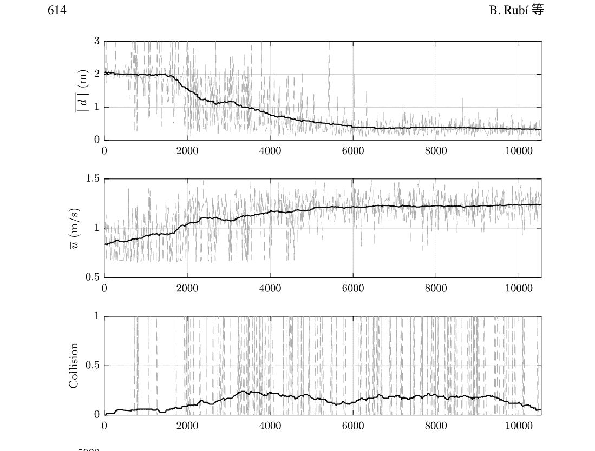

图30表示在标准奖励下，OA代理在训练阶段的平均距离误差、平均速度、碰撞概率和累积奖励。灰色虚线表示真实值，黑线表示100个回合的移动平均值。该代理经过10500个回合的训练。可以观察到，平均路径距离和速度随着回合数的增加而增加，最终稳定在约0.31米和1.24米/秒左右的值。累积奖励稳定在约2053的值。表示该回合是否发生碰撞的布尔参数的移动平均值稳定在约0.048的值。这个值可以被认为是发生碰撞的概率指标。这个指标在最初的几个回合中保持接近0，因为代理还不能正确地跟随路径，当代理改善了路径跟随性能时，由于障碍物靠近路径，该指标开始增加。它达到了约0.25，意味着4个回合中有1个会发生碰撞。然而，稳定值为0.048，可以认为每20个回合会发生一次碰撞。重要的是要提到噪声函数可以增加发生碰撞的概率。

### 7.4 结果

本节介绍了在路径跟踪误差和避障能力方面表现最佳的代理所获得的结果，这些代理是经过训练的不同代理中的一种。该代理是使用等式28定义的奖励函数进行训练的，其训练过程在图30中呈现。路径跟踪算法中使用了代理3，该代理在第6节中开发。结果是使用RotorS模拟平台获得的，这是一个模拟框架，其中PF代理和OA代理都经过训练。使用两条路径来测试该方法；一个是lemniscate路径，另一个是spiral路径。这些模拟结果将在下一小节中展示。

除了在本节中测试的代理外，在获得本节中介绍的最终方法的过程中，还训练和测试了几个具有不同状态、奖励函数和强化学习参数的避障代理。表10介绍了其中一些代理的主要特征总结以及它们的性能劣势的描述。

### 7.4.1 莱布尼茨曲线路径

本节通过莱布尼茨曲线路径评估了本章提出的解决避障问题的代理。莱布尼茨曲线路径在方程17中定义，其中振幅A设置为5米，γ的范围从0到2π，对应于路径上的一圈。在每个呈现的测试中，车辆从路径的初始点开始处于悬停状态，偏航角朝切线方向。

表11比较了在第6节中开发的PF代理与PF+OA方法得到的结果。也就是说，将两个DRL代理结合起来解决路径跟踪和避障问题的方法。

这些结果评估了两种方法在没有障碍物的情况下完成一圈lemniscate路径的性能。表格显示了平均横向误差、完成路径所需的总时间和车辆的平均速度。PF代理在路径距离误差方面表现稍好。因此，可以看出OA代理对PF的性能有一定影响。

接下来，将在路径上不同位置上有障碍物的情况下测试所提出的方法完成一圈lemniscate路径。这些模拟的结果在表格12中呈现。该表格显示了障碍物的路径位置，由γ_obs给出，并且障碍物到路径中心的距离，由d_obs给出。需要注意的是，正如第5.4节中提到的，障碍物是一个圆柱体，半径为1米的物体。请注意，障碍物位于 $\gamma_{obs} \geq 1.2$。这是因为OA代理在瞬态阶段没有经过障碍物避让训练。

此外，该表格呈现了在表11中评估的相同参数，即平均横向误差、总时间和平均速度。在表中呈现的所有情况中，车辆能够正确避开障碍物，在大多数模拟中，平均距离误差约为0.3-0.4米。其他模拟中的误差更大，因为障碍物靠近lemniscate的中心，所以车辆在完成一圈时需要避开两次。

表格 10 一些训练和测试代理的行为

| 代理条件 | 行为描述 |
| :--- | :--- |
| 1 <br> s = {d_{off}, L_1 ... L_8, e_d, u} <br> 奖励：方程式28 | 代理没有足够的障碍物信息。一旦障碍物从LIDAR视野中消失，代理将车辆移回到路径上，引发碰撞。 |
| 2 <br> s = {d_{off}, L_1 ... L_8, e_d, u, n_L} <br> 奖励：方程式28 | 代理知道是否最近看到了障碍物。然而，它对路径的信息不足。代理无法学习不同路径形状的操纵方法。车辆经常发生碰撞 |
| 3 <br> s = {d_{off}, L_1 ... L_8, e_d, u, n_L, \bar{k}(\gamma_{min})} <br> 奖励：方程式28 | 代理人具有路径形状的信息，并且可以学习不同的避障策略。从状态 n_L，代理人只知道是否最近看到了障碍物，但不知道它是在车辆的右侧还是左侧。代理人总是学会避开障碍物的同一侧。 |
| 4 <br> 状态：方程式27 <br> 奖励：方程式28 | 如果将 n_L 分为两个状态，代理人就有足够的信息来学习选择从哪一侧更好地避开障碍物。然而，如果这些状态没有饱和度，车辆在避开障碍物时可能需要很长时间才能收敛回路径（积分状态直接影响收敛时间） n_{L,l} 和 n_{L,r} 没有饱和度奖励：方程式28 |
| 5 <br> 状态：方程式27 <br> 奖励：方程式28 <br> 噪声：θ_n = 0.0075, σ_n = 0.15 和 λ = 200 | 如果使用相同的噪声功率作为PF代理，OA代理在训练阶段无法实现适当的探索。探索的缺乏影响了规避能力，导致更多的碰撞和更糟糕的规避动作 PF误差 |

表11 在没有障碍物的lemniscate路径上进行一圈的模拟结果

| | $\bar{d}$ (m) | 时间 (s) | $\|v\|$ (m/s) |
| :--- | :--- | :--- | :--- |
| PF代理 | 0.0765 | 44.6 | 1.3798 |
| OA代理 + PF代理 | 0.1191 | 46.2 | 1.3223 |

表12 在路径上有障碍物的lemniscate路径上进行一圈的模拟结果

| $\gamma_{obs}$ | $d_{obs}$ | $\bar{d}$ (m) | 时间 (s) | $\|v\|$ (m/s) |
| :--- | :--- | :--- | :--- | :--- |
| 1.2 | 0 | 0.3839 | 55.4 | 1.1265 |
| 1.4 | 0 | 0.3904 | 54.6 | 1.1292 |
| 1.6 | 0 | 0.7718 | 59.2 | 1.0767 |
| 1.8 | 0 | 0.3027 | 50.6 | 1.2046 |
| 2 | 0 | 0.3587 | 50.3 | 1.2040 |
| 2.2 | 0 | 0.3113 | 50.6 | 1.1824 |
| 2.4 | 0 | 0.3846 | 54.5 | 1.1913 |
| 2.6 | 0 | 0.3319 | 52 | 1.2326 |
| 2.8 | 0 | 0.2902 | 50.6 | 1.2514 |
| 3 | 0 | 0.3309 | 55.3 | 1.1550 |
| 3.2 | 0 | 0.3714 | 55.4 | 1.1429 |
| 3.4 | 0 | 0.3233 | 51 | 1.1780 |
| 3.6 | 0 | 0.2993 | 50.9 | 1.1821 |
| 3.8 | 0 | 0.3347 | 54.7 | 1.1760 |
| 4 | 0 | 0.3190 | 57.3 | 1.1193 |
| 4.2 | 0 | 0.3070 | 52.7 | 1.1940 |
| 4.4 | 0 | 0.3036 | 53.2 | 1.1778 |
| 4.6 | 0 | 0.6016 | 54.4 | 1.1511 |
| 4.8 | 0 | 0.4739 | 51.4 | 1.2318 |
| 5 | 0 | 0.4249 | 48.7 | 1.3078 |
| 5.2 | 0 | 0.3679 | 50.6 | 1.2585 |
| 5.4 | 0 | 0.3389 | 55.2 | 1.1631 |
| 5.6 | 0 | 0.3631 | 52.9 | 1.2257 |
| 5.8 | 0 | 0.4198 | 51.5 | 1.2473 |

表格 13 在非居中的lemniscate路径上进行一圈的模拟结果

| γ_obs | d_obs | d̄ (m) | 时间 (s) | ‖v‖ (m/s) |
| :--- | :--- | :--- | :--- | :--- |
| 1.2 | 2 | 0.1905 | 48.8 | 1.2511 |
| 1.4 | 1.5 | 0.2216 | 53.2 | 1.1528 |
| 1.6 | 1 | 0.3969 | 56.5 | 1.0923 |
| 1.8 | 0.5 | 0.3106 | 57 | 1.0769 |
| 2 | -0.5 | 0.2834 | 58 | 1.0976 |
| 2.2 | -1 | 0.1968 | 46.9 | 1.3265 |
| 2.4 | -1.5 | 0.1936 | 48.2 | 1.2884 |
| 2.6 | -2 | 0.1999 | 50.4 | 1.2290 |
| 2.8 | -1.5 | 0.1929 | 52.7 | 1.1871 |
| 3 | -1 | 0.1815 | 51.2 | 1.2135 |
| 3.2 | -0.5 | 0.3120 | 55.4 | 1.1410 |
| 3.4 | 0.5 | 0.3126 | 50.2 | 1.2032 |
| 3.6 | 1 | 0.2720 | 53 | 1.1431 |
| 3.8 | 1.5 | 0.2014 | 56.1 | 1.1087 |
| 4 | 2 | 0.1699 | 52 | 1.1908 |
| 4.2 | 1.5 | 0.5201 | 54 | 1.1981 |
| 4.4 | 1 | 0.2124 | 55.3 | 1.1235 |
| 4.6 | 0.5 | 0.5707 | 57.5 | 1.0987 |
| 4.8 | -0.5 | 0.3685 | 57.6 | 1.0758 |
| 5 | -1 | 0.3215 | 56.3 | 1.0930 |
| 5.2 | -1.5 | 0.2253 | 53.9 | 1.1476 |
| 5.4 | -2 | 0.1513 | 49.7 | 1.2247 |
| 5.6 | -1.5 | 0.2128 | 51.5 | 1.1769 |
| 5.8 | -1 | 0.2836 | 50.6 | 1.2094 |

图 31 展示了在表格 12 的一些模拟中，所提出的方法在 x y 平面上的轨迹。在这个图和本节的其他图中，车辆的初始位置用一个指向初始 x体方向的红色箭头标记。从左到右，从上到下，这些图对应于障碍物放置在 γobs = 1.2, γobs = 1.6, γobs = 1.8, γobs = 2.6, γobs = 3.2, γobs = 3.4, γobs = 3.8 和 γobs = 5.4 的模拟。这些结果展示了避障机动的多种示例；在长直线上，短直线上，左侧曲线上和右侧曲线上。

表13展示了在不以路径为中心的障碍物上遵循lemniscate路径时获得的结果。这意味着，有一个首选的避开这些障碍物的一侧，有时，如果障碍物离路径太远，则不需要避让操纵。这个表格显示了与表12相同的参数。

平均路径距离误差低于表12的模拟，因为避让操纵要求较少。

表13中的一些模拟中车辆所跟随的轨迹显示在图32中。这些模拟对应于放置障碍物的模拟。在 $\gamma_{obs} = 1.4, \gamma_{obs} = 1.6, \gamma_{obs} = 1.8, \gamma_{obs} = 2.2, \gamma_{obs} = 2.6, \gamma_{obs} = 3.8, \gamma_{obs} = 4.4$处放置的障碍物的模拟。而 $\gamma_{obs} = 5.6$，分别为5.6。在所有这些模拟中，代理选择正确的障碍物一侧进行规避动作。此外，如果障碍物在车辆的路线之外，就像在图32中的 $\gamma_{obs} = 2.6$（第三个左侧）的模拟中一样，车辆将保持在原路线上。需要提醒的是，由于图28中定义的区域，理想情况下，车辆需要至少保持在距离障碍物中心1.75米的位置，而小于1.5米被视为碰撞。因此，即使障碍物放置在路径的1.5米处，就像 $\gamma_{obs} = 1.4$（第一个左侧）、 $\gamma_{obs} = 3.8$（第三个右侧）和 $\gamma_{obs} = 5.6$（第四个右侧）的模拟中一样，代理仍需要执行规避动作以防止碰撞。

在图31和32中呈现的仿真结果中，代理始终选择避开障碍物最方便的一侧。然而，偶尔代理也可能选择错误的一侧，如图33的仿真中明显可见。在这个仿真中，障碍物（中心）位于路径左侧1.5米处，然而，代理不必要地避开它，选择了最长的路径。这种行为可能是由于当车辆第一次看到障碍物时，它位于右侧。因此，由于代理无法预测即将到来的曲线，它会从左侧开始避让动作。然而，即使在图33的情景中，这种行为也只发生在很少的情况下。另一方面，代理也可能将车辆驶向碰撞，如图34所示。碰撞实际上是非常罕见的事件，更有可能发生在路径的起始部分，此时车辆仍在加速。

### 7.4.2 螺旋路径

在本节中，使用螺旋路径对PF+OA方法进行测试，该路径与用于训练PF代理和OA代理的路径不同。螺旋路径在方程式19中定义，其中A设置为1.25，$\gamma$ 范围从0到$3\pi$。同样，车辆从路径上的初始点开始，与路径切向一致。

表14比较了PF代理在没有障碍物的螺旋路径上的路径跟踪性能与PF+OA方法的性能。与莱米尼斯凯特路径的结果一样，PF代理取得了稍微更好的结果。然而，PF+OA方法仍然取得了显著的结果。

在不同障碍物位置下，使用所提出的方法跟随所述螺旋路径的结果显示在表15中。前7次模拟对应于在路径上居中放置障碍物的模拟。在这些模拟中，该方法实现了平均横向误差约为0.3-0.4米，与莱米尼斯凯特路径的结果非常相似。

在表15中呈现的模拟的 $x$ $y$ 平面上的一些轨迹在图35中显示。从左到右，从上到下，这些模拟对应的是

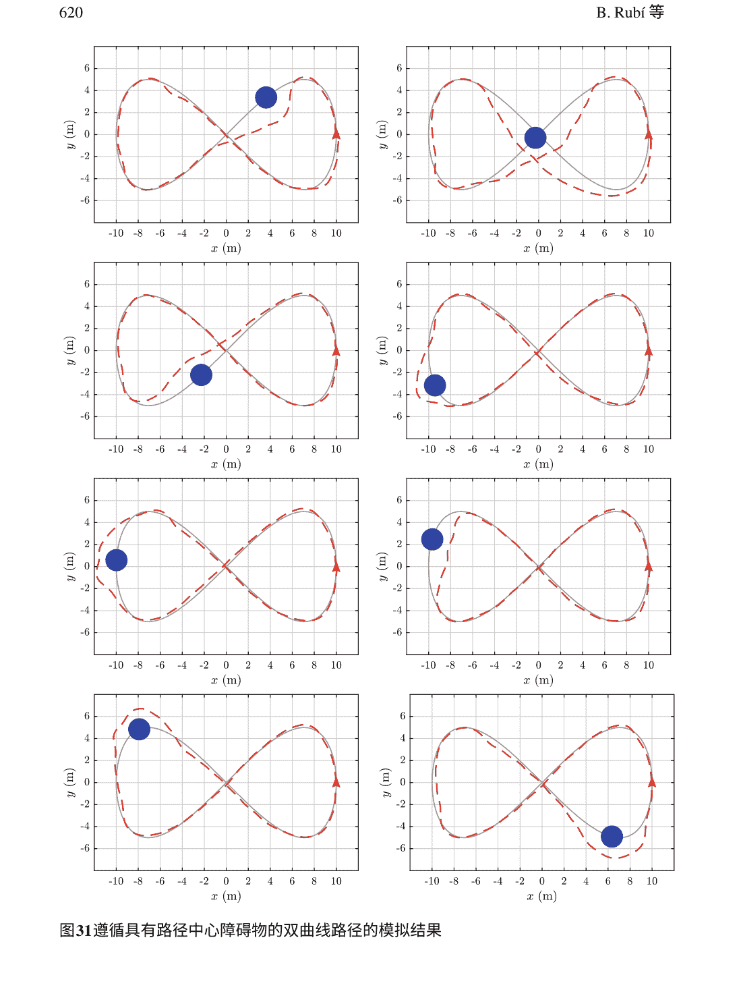

图31遵循具有路径中心障碍物的双曲线路径的模拟结果

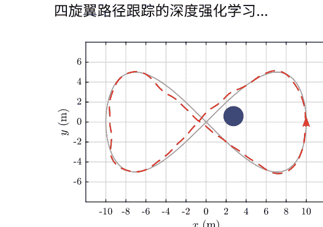

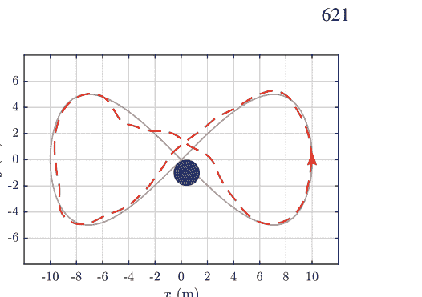

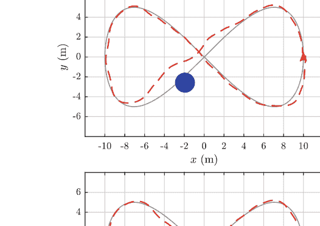

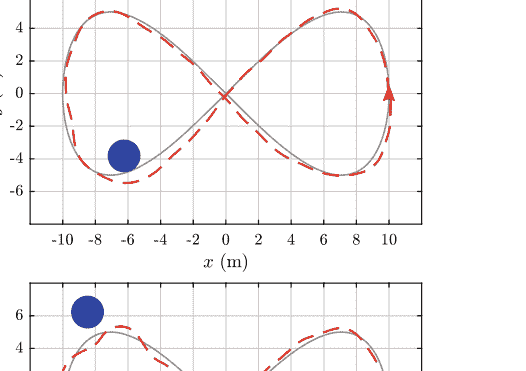

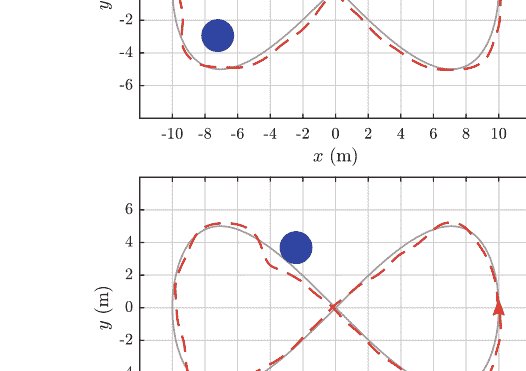

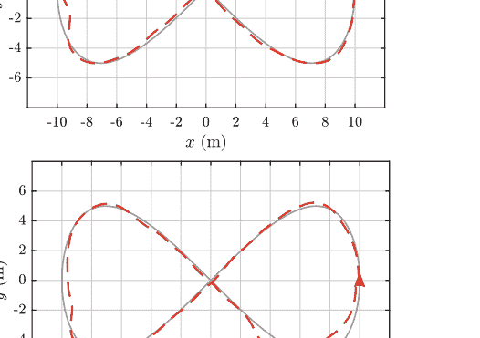

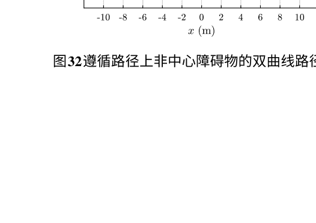

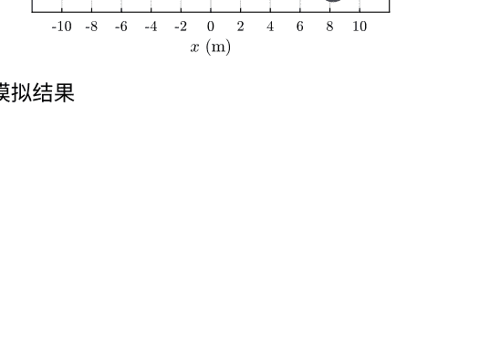

图32遵循路径上非中心障碍物的双曲线路径的模拟结果

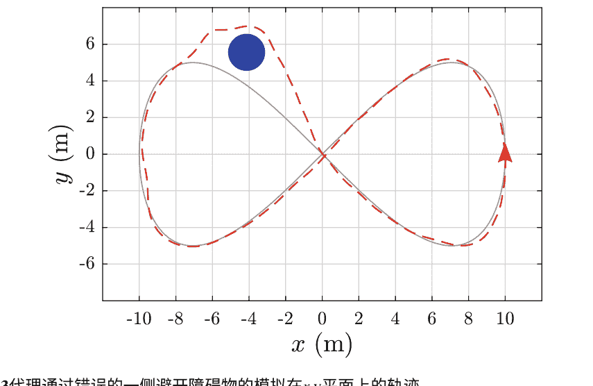

图33代理通过错误的一侧避开障碍物的模拟在x y平面上的轨迹

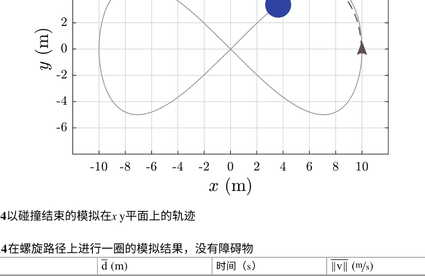

图34以碰撞结束的模拟在x y平面上的轨迹

表14在螺旋路径上进行一圈的模拟结果，没有障碍物

| | d̄ (m) | 时间 (s) | ||v|| (m/s) |
| :--- | :--- | :--- | :--- |
| PF代理 | 0.1149 | 47.4 | 1.2457 |
| OA代理 + PF代理 | 0.1304 | 46 | 1.2444 |

表15在螺旋路径上进行一圈的模拟结果，不同的障碍物位置

| γ_obs | d_obs | d̄ (m) | 时间 (s) | ||v|| (m/s) |
| :--- | :--- | :--- | :--- | :--- |
| 4 | 0 | 0.3699 | 52.4 | 1.1412 |
| 4.8 | 0 | 0.3901 | 51.2 | 1.1575 |
| 5.6 | 0 | 0.3768 | 49.3 | 1.1954 |
| 6.4 | 0 | 0.3741 | 51.2 | 1.1521 |
| 7.2 | 0 | 0.4036 | 51 | 1.1585 |
| 8 | 0 | 0.3216 | 52.1 | 1.1347 |
| 8.8 | 0 | 0.3606 | 50.2 | 1.1632 |
| 4 | 2 | 0.1835 | 48.8 | 1.1696 |
| 4.8 | 1.5 | 0.2348 | 46 | 1.2293 |
| 5.6 | 1 | 0.3529 | 43.6 | 1.2823 |
| 6.4 | 0.5 | 0.3860 | 44.4 | 1.2560 |
| 7.2 | -0.5 | 0.3578 | 48.7 | 1.2037 |
| 8 | -1 | 0.2496 | 49.2 | 1.1803 |
| 8.8 | -1.5 | 0.1779 | 48.8 | 1.1951 |

to γ_obs = 4, d_obs = 0; γ_obs = 5.6, d_obs = 0; γ_obs = 8, d_obs = 0; γ_obs = 4, d_obs = 2; γ_obs = 6.44, d_obs = 0.5, γ_obs = 8.8, d_obs = -1.5，分别。注意，在螺旋路径中，避开障碍物的首选方向是曲线的外侧。然而，如果障碍物被放置在车辆视角下的路径左侧，代理将从曲线的内侧避开障碍物，就像在图35中的γ_obs = 6.44 - d_obs = 0.5（第三个左侧）的模拟中一样。通过所提出的结果，展示了路径跟随和避障的方法能够在不同路径位置避开障碍物的同时跟随不同于训练路径的路径。因此，展示了如何实现问题的通用解决方案，适用于不同的路径形状。

## 8 结论

在本章中，提出了一种基于两个深度强化学习代理的路径跟踪和避障方法。由此得出的方法能够通过调整车辆的速度来准确地跟踪预定义的路径形状。此外，它能够通过在线重新规划路径来避开可能出现在车辆路线上的障碍物。所提出的方法适用于不同的路径和条件，而不需要对其参数进行任何额外的调整。所提出的路径跟随方法已在实际实验平台上成功实现。下面的段落总结了本章的每个部分所提出的工作和贡献。

路径跟踪## 图35 模拟结果，跟随螺旋路径并具有不同的障碍物位置

提出了一种深度强化学习算法，即深度确定性策略梯度（DDPG），用于解决四旋翼飞行器中的路径跟踪问题。路径跟踪控制计算速度、高度和在z轴上的角度的参考值，然后由自动驾驶控制器进行跟踪。介绍了三种不同的DDPG方法，具有不同的行为。第一种方法仅使用关于瞬时位置和角度误差的信息来解决路径跟踪问题。第二种方法添加了关于即将到来的路径的信息。这两种方法都以恒定速度工作。第三种方法允许代理计算最佳的车辆速度，以更好地适应路径的形状，根据定义的代理奖励。

所提出的每个代理都是前一个版本的改进版，这是本章所使用的方法的主要优势之一。三种方法中的主要结构允许引入新的功能（例如对曲线的预测或调整车辆速度），而不改变代理的核心部分。这非常有前景，因为它意味着新的功能（例如抵抗风扰动）可以直接集成到代理中，而不会影响其他功能。

代理使用TensorFlow库在Python中编程。设计的训练框架将Python脚本与Gazebo-ROS集成，并使用RotorS作为逼真的多旋翼模拟器。该模拟器包括Asctec Hummingbird的模型，这是实验平台上使用的四旋翼飞行器。我们平台上真实传感器的模型也包含在模拟器中。第一和第二个代理使用固定半径的lemniscate路径进行训练。它们还使用不同的初始条件进行训练，以提高在实验结果中的性能。

为了学习具有不同路径半径的速度动作策略，第三个智能体在每个回合中使用非对称lemniscates和改变半径进行训练。这三个智能体是基于真实测量结果进行训练的。

在ROS中训练智能体的主要优势是它有助于从模拟器过渡到真实环境。此外，由于ROS是机器人领域的标准平台，它得到了大型社区的支持，这非常有用。

在ROS中进行训练的唯一问题是，由于模拟是实时进行的，这可能是一个耗时的过程。

这三个智能体在RotorS环境中进行了模拟测试，并使用了传感器的真实模型。它们分别使用lemniscate路径和螺旋路径进行评估。然后，智能体还在Asctec Hummingbird四旋翼飞行器上进行了与模拟相同的路径实验。尽管智能体在第一批实验中能够正确地跟随预先设定的路径，但它们的表现比预期的要差。作者得出结论，这种行为是由于模拟模型的小误差，主要影响了偏航动力学。为了提高智能体的性能，引入了一个新的参数（角度修正常数，ka）。该参数调整了智能体的偏航动作，并允许调整智能体的动力学以适应模型的差异。由于车辆的意外行为可能对植物造成损害，因此放弃了对智能体进行实验训练。

此外，观察到使用噪声信号进行训练是无效的。

实验中对代理进行了测试，包括角度校正常数，这显著提高了它们的性能。在lemniscate路径中，代理2在平均横向误差方面表现最佳（0.114m），但代理3在能够显著增加车辆速度的同时表现出类似的距离误差（0.168m）。在螺旋路径中，代理3以较高的速度行驶，同时实现了最低的平均横向误差（0.223m）。总之，实验结果表明代理能够成功地跟随螺旋路径，这是与它们训练时的路径不同的一条路径。因此，证明了所提出的方法能够找到适应性速度的路径跟随问题的广义解决方案。

未来的工作是研究训练路径对代理性能的影响，并找到最佳的训练环境来利用代理的优势。其他未来的工作是改进所提出的代理，使其能够解决其他具有挑战性的问题，如风扰动抑制，以增强方法的弹性。

## 避障

提出了一种基于深度确定性策略梯度算法的反应式避障方法。该方法与PF代理进行通信。它接收障碍物检测系统的数据，该系统包括经过处理以消除地面检测的LIDAR传感器。如果检测到车辆路径上的障碍物，OA代理会对参考路径进行修改，以避免可能的碰撞。路径的修改以原始参考路径的距离偏移的形式进行。具体而言，OA代理修改了PF代理的路径距离误差状态。修改后的参考路径的信息传输给路径跟随代理，其任务是跟随这条新路径。

探索解决问题的不同解决方案，并详细解释如何获得动作、状态向量和奖励函数。本文主要讨论的问题是激光雷达传感器的有限视野为48°，这影响了障碍物的检测。

也就是说，一旦车辆开始避开障碍物，它将从激光雷达的视野中消失。由于代理只使用当前状态来计算动作，当发生这种情况时，代理认为已经避开了障碍物，并将车辆移回到路径上，导致碰撞。本章提出了解决这个问题的方法，即在状态向量中包含激光雷达传感器的历史数据信息。这些历史信息是通过积分每个激光雷达波束提供的距离数据的倒数来生成的。如果附近没有障碍物，这个状态会逐渐减小，直到达到零。这样，如果积分激光雷达状态是正的，意味着最近看到了障碍物。障碍物离车辆越近，这个状态就越大。在提出的最终方法中，这个状态被分为两部分；一部分用于激光雷达传感器的每一侧，为代理提供更多信息，以了解障碍物在车辆的哪一侧。

路径跟随和避障方法在RotorS环境中通过跟随一个lemniscate路径和一个带有不同障碍物的螺旋路径进行测试。模拟结果显示它在跟随路径的同时成功避开障碍物。OA代理能够根据障碍物和车辆位置以及路径的形状选择更好的避让动作的一侧。代理考虑了车辆的速度和路径的形状来生成这个动作。没有障碍物的路径跟随性能与PF代理获得的性能非常相似。总之，针对不同路径形状和障碍物位置的路径跟随和避障问题实现了一个通用解决方案。

由于所使用的障碍物检测传感器的狭窄视野和DDPG算法无法使用历史状态信息的能力，引入了两个状态来整合LIDAR检测的倒数，从而提供了LIDAR数据的某种历史信息，解决了这个问题。

未来的工作可以探索其他解决方案，为OA代理提供障碍物的信息。这些解决方案可能包括估计障碍物的位置，生成占用栅格地图或定义其他状态，以向该代理提供详细的障碍物信息。另一种可以探索的解决方案是修改DDPG算法的结构，使其能够使用历史数据。这可以通过使用循环神经网络，例如LSTM网络，来完成，该网络将序列作为输入数据。其他未来的工作是将得到的方法实施到实际实验平台上，并基于一个唯一的DRL代理探索路径跟踪和避障问题的解决方案。为此，可以将开发的PF和OA代理的状态信息和奖励函数结合起来生成新的PF和OA代理。

## 参考文献

- 1. Aguiar AP, Hespanha JP, Kokotovic PV (2008) 非线性系统参考跟踪和路径跟踪的性能限制。 AUTOMATICA 44(3):598–610. https://doi.org/10.1016/j.automatica.2007.06.030
- 2. Al-Kaff A, García F, Martín D, de la Escalera A, Armingol JM (2017) 基于单目摄像头和尺寸扩展算法的无人机障碍物检测和避障系统。 SENSORS 17. https://doi.org/10.3390/s17051061
- 3. Alejo D, Cobano JA, Heredia G, Ollero A (2016) 一种在工业环境中用于避免碰撞的反应式方法。 J Intell Robot Syst 84:745–758. https://doi.org/10.1007/s10846-016-0359-7
- 4. Ambrosino G, Ariola M, Ciniglio U, Corraro F, De Lellis E, Pironti A (2009) 用于无人机的三维路径生成和跟踪。 IEEE Trans Control Syst Technol 17(4):980–988. https://doi.org/10.1109/TCST.2009.2014359
- 5. Amin R, Aijun L, Shamshirband S (2016) 无人机的深度学习: 控制方法和性能评估。 自动控制国际杂志 10(2):87–103. https://doi.org/10.1504/IJAAC.2016.076453
- 6. Andert F, Adolf FM, Goormann L, Dittrich JS (2010) 基于视觉的自主直升机穿越障碍门。 智能机器人系统杂志 57(1–4):259–280. https://doi.org/10.1007/s10846-009-9357-3
- 7. Artieda J, Sebastian JM, Campoy P, Correa JF, Mondragón IF, Martínez C, Olivares M (2009) 无人机的三维视觉SLAM。 智能机器人系统杂志 55(4):299. https://doi.org/10.1007/s10846-008-9304-8
- 8. Aswini N, Krishna Kumar E, Uma S (2018) 无人机和障碍物感知技术——一个视角。 Int J Intel Unmanned Syst 6(1):32–46. https://doi.org/10.1108/IJUS-11-2017-00139.
- 9. Belkhouche F (2017) 动态环境中的反应式最优无人机运动规划。 Robot Auton Syst 96:114–123. https://doi.org/10.1016/j.robot.2017.07.006
- 10. Bethke B, Valenti M, How J (2007) 利用多个无人机的合作视觉估计和跟踪。 Springer, Berlin, pp 179–189. https://doi.org/10.1007/978-3-540-74356-9_11
- 11. Cabecinhas D, Cunha R, Silvestre C (2009) 用于扩展飞行包络覆盖的旋翼机路径跟踪控制。 In: Proceedings of the 48th IEEE conference on decision and control, 2009 held jointly with the 2009 28th Chinese Control Conference (CDC/CCC 2009), IEEE Conference on Decision and Control, pp 3460–3465, https://doi.org/10.1109/CDC.2009.5400665
- 12. Caicedo JC, Lazebnik S (2015) 通过深度强化学习进行主动目标定位。 在: 2015年IEEE国际计算机视觉会议 (ICCV)，第2488-2496页, https://doi.org/10.1109/ICCV.2015.286
- 13. Chen H, Chang K, Agate CS (2013) 利用切线加李雅普诺夫矢量场导航和避障的无人机路径规划。 IEEE航空电子系统交易 49(2):840–856
- 14. Chen Y, Yu J, Mei Y, Wang Y, Su X (2016) 用于三维无人机路径规划的改进中心力优化 (MCFO) 算法。 神经计算 171:878–888. https://doi.org/10.1016/j.neucom.2015.07.044
- 15. Cheng Y, Zhang W (2018) 简洁的深度强化学习避障方法用于非驱动无人海洋船舶。 神经计算 272:63–73. https://doi.org/10.1016/j.neucom.2017.06.066
- 16. Cho N, Kim Y, Park S (2015) 三维非线性微分几何路径跟踪导引律。 J Guidance Control Dyn 38(12):2366–2385. https://doi.org/10.2514/1.G001060
- 17. Choi S, Kim S, Jin Kim H (2017) 逆强化学习控制多旋翼无人机的轨迹跟踪。 Int J Control Autom Syst 15(4):1826–1834. https://doi.org/10.1007/s12555-015-0483-3
- 18. Cichella V, Choe R, Mehdi SB, Xargay E, Hovakimyan N, Kaminer I, Dobrokhodov V (2013) 一种基于SO(3)的多旋翼无人机三维路径跟踪方法。 IFAC Proc Vol 46:13–18. https://doi.org/10.3182/20131120-3-FR-4045.00039
- 19. Dadkhah N, Mettler B (2013) 控制系统设计和评估用于鲁棒自主旋翼机导航。 控制工程实践 21(11):1488–1506. https://doi.org/10.1016/j.conengprac.2013.04.011
- 20. Du Y, Zhang X, Nie Z (2019) 基于动态人工势场算法的动态空域中实时避碰策略。 IEEE ACCESS 7:169,469–169,479
- 21. Dubins L (1957) 关于平均曲率约束下的最小长度曲线，以及预定的初始和终端位置和切线。 美国数学学会 79(3):497–516. https://doi.org/10.2307/2372560
- 22. Eslamiat H, Li Y, Wang N, Sanyal AK, Qiu Q (2019) 多旋翼无人机的自主航点规划，最优轨迹生成和非线性跟踪控制。 在: 2019年第18届欧洲控制会议(ECC)， pp 2695–2700
- 23. Furrer F, Burri M, Achtelik M, Siegwart R (2016) RotorS—一个模块化的Gazebo MAV模拟器框架。 Springer国际出版社， Cham， 页595-625。 https://doi.org/10.1007/978-3-319-26054-9_23
- 24. Gageik N, Benz P, Montenegro S (2015) 用于UAV的障碍物检测和避障的互补低成本传感器。 IEEE Access 3:599-609。 https://doi.org/10.1109/ACCESS.2015.2432455
- 25. Goerzen C, Kong Z, Mettler B (2009) 从自主无人机导航的角度看运动规划算法的调查。 J Intell Robot Syst 57(1):65. https://doi.org/10.1007/s10846-009-9383-1
- 26. Han X, Wang J, Xue J, Zhang Q (2019) 基于深度强化学习的无人机三维动态避障智能决策。在：2019年第11届无线通信和信号处理国际会议 (WCSP)，第1-6页
- 27. Hebecker T, Buchholz R, Ortmeier F (2015) 基于模型的无人机局部路径规划。智能机器人系统杂志78：127-142。 https://doi.org/10.1007/s10846-014-0097-7
- 28. Heng X, Cabecinhas D, Cunha R, Silvestre C, Qingsong X (2015) 四旋翼轨迹跟踪LQR控制器：设计和实验评估。在：TENCON 2015-2015 IEEE第10区域会议，第1-7页，https://doi.org/10.1109/TENCON.2015.7372729
- 29. Hermansson J, Gising A, Skoglund M, Schon T (2010) 无人机自主降落。在：瑞典控制会议 (REGLERMTE)，第1-5页
- 30. Hoffmann F, Goddemeier N, Bertram T (2010) 四旋翼飞行器的姿态估计和控制。在：2010年IEEE/RSJ国际智能机器人与系统会议上，pp1072–1077
- 31. Hoffmann GM, Waslander S, Tomlin C (2008) 四旋翼直升机轨迹跟踪控制。在：AIAA导航、制导和控制会议论文集，火奴鲁鲁，夏威夷
- 32. Howlett J, Schulein G, Mansour M (2004) 无人旋翼飞行器障碍物场路线规划的实用方法。在：美国直升机协会第60届年会论文集，巴尔的摩，马里兰州
- 33. Hrabar S (2008) 旋翼机无人机的三维路径规划和基于立体视觉的避障。在：2008年IEEE/RSJ国际智能机器人与系统会议上，pp 807–814，https://doi.org/10.1109/IROS.2008.4650775
- 34. Hrabar S (2011) 无人机的反应式避障。在：2011年IEEE/RSJ智能机器人与系统国际会议, 第4967-4974页
- 35. Hrabar S, Sukhatme G (2009) 基于视觉的城市峡谷导航。 J Field Robot 26(5):431–452. https://doi.org/10.1002/rob.20284
- 36. Huangh HM (2008) 无人系统的自主级别（ALFUS）框架。 卷i: 术语。 NIST特别出版物1011-I-2.0., 由临时ALFUS工作组参与者贡献
- 37. Ioffe S, Szegedy C (2015) 批归一化: 通过减少内部协变量转移加速深度网络训练。 ArXiv abs/1502.03167
- 38. Jung D, Ratti J, Tsiotras P (2009) 无人机新的分层路径规划方案的实时实现和验证。 J Intell Robot Syst 54(1-3, SI):163–181. https://doi.org/10.1007/s10846-008-9255-0
- 39. Kaminer I, Yakimenko O, Pascoal A, Ghabcheloo R (2006) 多个无人机的时间关键任务的路径生成，路径跟踪和协调控制。在：2006年美国控制会议，美国控制会议论文集，卷1-12, pp 4906+, https://doi.org/10.1109/ACC.2006.1657498
- 40. Kang K, Belkhale S, Kahn G, Abbeel P, Levine S (2019) 通过模拟实现泛化：将模拟数据和真实数据整合到基于视觉的深度强化学习中的自主飞行。在：2019年国际机器人与自动化会议 (ICRA)
- 41. Kendoul F (2012) 无人旋翼飞行器导航和控制的进展综述。J Field Robot 29(2):315–378. https://doi.org/10.1002/rob.20414
- 42. Kendoul F, Yu Z, Nonami K (2010) 用于小型旋翼飞行器无人机自主飞行的导航和非线性控制系统。J Field Robot 27(3):311–334. https://doi.org/10.1002/rob.20327
- 43. Koch W, Mancuso R, West R, Bestavros A (2013) 无人机姿态的强化学习控制。 ACM Trans Cyber-Phys Syst 3(2), https://doi.org/10.1145/3301273
- 44. Kwag YK, Chung CH (2007) 基于无人机的避碰雷达传感器。 在：2007 IEEE国际地球科学与遥感研讨会, pp 639–642, https://doi.org/10.1109/IGARSS.2007.4422877
- 45. Lee DJ, Merrell P, Wei Z, Nelson BE (2010) 无人机避障的光流概率分布的两帧结构运动。 Mach Vis Appl 21:229–240. https://doi.org/10.1007/s00138-008-0148-9

# 使用最先进的游戏人工智能研究平台进行第一人称视角游戏的深度强化学习

Adil Khan, Asad Masood Khattak, Muhammad Zubair Asghar, Muhammad Naeem和Aziz Ud Din

摘要计算机游戏已成为人工智能最有趣和最具动态性的研究领域之一，因为计算机游戏是在将理论思想应用于现实世界之前评估和测试人工智能理论思想的最佳试验平台。 计算能力的提升，机器学习特别是深度强化学习的进步，以及神经网络的演进，使得自主游戏代理能够通过仅使用屏幕原始像素来进行行动或决策，从而在很大程度上超越人类。 在本章中，我们使用深度强化学习的形式，即深度Q学习，在其两个变体深度Q网络（DQN）和深度递归Q学习网络（DRQN）中，控制代理在玩两个著名的计算机游戏Doom和Minecraft中。 我们介绍如何使用ViZDoom，Gym-Minecraft和Microsoft的Malmo平台构建这些最先进方法的实现的测试平台。 首先，我们在Doom的简化游戏场景中展示了DQN和DRQN在完全可观察的马尔可夫决策过程（FOMDP）和部分可观察的马尔可夫决策过程（POMDP）中预测敌人位置（游戏特征）的结果，并声称DQN在预测敌人位置方面表现更好。

最后，我们展示了来自Minecraft的另一个游戏场景的结果，以测试和确认DRQN在POMDP中的性能，与其他现有作品不同，我们提出的架构在预测游戏特征方面具有更高的准确性，超过了内置的AI代理和人类玩家。

- A. Khan · M. Naeem
计算机科学系，白沙瓦大学，白沙瓦，开伯尔-普赫图赫瓦省，巴基斯坦
- A. Khan · A. U. Din
沙伊赫·扎伊德伊斯兰中心（SZIC）计算机科学学院，白沙瓦伊斯兰大学，巴基斯坦白沙瓦，开伯尔-普赫图赫瓦省
- A. M. Khattak (✉)
Zayed大学技术创新学院，迪拜，阿联酋
e-mail: Asad.Khattak@zu.ac.ae
- M. Z. Asghar
计算与信息技术研究所，戈马尔大学，迪拜，巴基斯坦

46. 李 H，金 HJ (2017) 多旋翼轨迹跟踪控制：从建模到实验的调查。 Int J Control Autom Syst 15 (1) : 281–292。 https://doi.org/10.1007/s12555-015-0289-3

47. 李 B，吴 Y (2020) 通过深度强化学习进行无人机地面目标跟踪的路径规划。IEEE Access 29064–29074

48. 李 L，孙 L，金 J (2015) 四旋翼无人机控制算法进展综述。 在：2015年IEEE第16届国际通信技术会议（ICCT），第107–111页

49. 梁 Y，贾 Y (2016) 组合矢量场方法用于具有约束的2D和3D任意二次可微曲线路径跟踪的无人机。智能机器人系统 83 (1) : 133–160。 https://doi.org/10.1007/s10846-015-0308-x

50. Lillicrap TP, Hunt JJ, Pritzel A, Heess N, Erez T, Tassa Y, Silver D, Wierstra D (2016)使用深度强化学习进行连续控制。 在：2016年国际学习表示会议（ICLR）

51. Liu P, Chen AY, Huang YN, Han JY, Lai JS, Kang SC, Wu TH, Wen MC, Tsai MH (2014) 无人机在土木工程中的发展和应用综述。 智能结构系统 13（6）: 1065-1094

52. Lou W, Guo X (2016) 使用强化学习的自适应轨迹跟踪控制方法。 高级机器人系统国际期刊 13（1）: 38。 https://doi.org/10.5772/6212853.

53. Lu L, Sampedro C, Rodríguez-Vazquez J, Campoy P (2019) 使用RRT*和有符号距离场的激光碰撞避免和反应式导航方法用于多旋翼无人机。 在：2019年国际无人机系统会议（ICUAS），第1209-1217页

54. Lu X, Cao Y, Zhao Z, Yan Y (2018) 基于深度强化学习的差分驱动机器人碰撞避免算法。 在：智能机器人和应用ICIRA 2018

55. Ma Z, Hu T, Shen L, Kong W, Zhao B (2015) 一种用于无人机的检测和相对方向估计方法在感知与避让中。 在：2015年IEEE国际信息与自动化会议，第2677-2682页

56. 马Z, 王C, 牛Y, 王X, 沈L (2018) 基于显著性的强化学习方法，用于无人机避免飞行障碍物。机器人自动化系统 100: 108-118。https://doi.org/10.1016/j.robot.2017.10.009

57. Madgwick SOH, Harrison AJL, Vaidyanathan R (2011) 使用梯度下降算法估计IMU和MARQ方向。 在：2011年IEEE国际康复机器人大会，第1-7页

58. Manjunath A, Mehrök P, Sharma R, Ratnoo A (2016) 虚拟目标导引法在四旋翼无人机路径跟踪中的应用。在：2016年国际无人机系统会议（ICUAS），第252-260页，https://doi.org/10.1109/ICUAS.2016.7502565

59. Martinsen AB, Lekkas AM (2018) 深度强化学习的曲线路径跟踪：三个船舶模型的结果。 在：OCEANS 2018 MTS/IEEE CHARLESTON pp 1–8.

60. Mendoza-Soto JL, Corona-Sanchez JJ, Rodriguez-Cortes H (2018) 四旋翼飞行器路径跟踪控制。一种机动方法。J Intell Robot Syst。 https://doi.org/10.1007/s10846-018-0801-0

61. Merz T, Kendoul F (2011) 超视距障碍物避免和基础设施检查的自主直升机。 在：2011 IEEE/RSJ国际智能机器人和系统会议，pp 4953–4960。 https://doi.org/10.1109/IROS.2011.6094584

62. Mettler B, Dadkhah N, Kong Z (2010) 敏捷自主导航使用空间价值函数。控制工程实践 18（7）: 773–788。 https://doi.org/10.1016/j.conengprac.2010.02.013, 特刊：空中机器人学

63. Mnih V, Kavukcuoglu K, Silver D, Rusu AA, Veness J, Bellemare MG, Graves A, Riedmiller MA, Fidjeland A, Ostrovski G, Petersen S, Beattie C, Sadik A, Antonoglou I, King H, Kumaran D, Wierstra D, Legg S, Hassabis D (2015) 通过深度强化学习实现人类水平的控制. 自然 518:529–533

64. Nelson DR, Barber DB, McLain TW, Beard RW (2007) 用于微型飞行器的矢量场路径跟踪。IEEE Trans Robot 23(3):519–529. https://doi.org/10.1109/TRO.2007.898976

65. Nie C, Zheng Z, Cai Z (2019) 通过强化学习实现机载机器人的三维路径跟踪控制. 国际航空航天工程杂志

66. Niermeyer P, Akkinapalli VS, Pak M, Holzapfel F, Lohmann B (2016) 使用非线性模型预测控制和3D样条路径的多旋翼飞行器的几何路径跟踪控制。 在：2016年无人机系统国际会议 (ICUAS) 上, 第126-134页, https://doi.org/10.1109/ICUAS.2016.7502541

67. Ozbek NS, Onkol M, Efe MO (2016) 四旋翼型空中机器人的反馈控制策略：一项调查。 Trans Inst Measur Control 38(5, SI):529–554, https://doi.org/10.1177/0142331215608427

68. Park J, Cho N (2020) 基于激光雷达数据的六旋翼无人机在动态环境中的避障。 Remote Sens 12(6), https://doi.org/10.3390/rs12060975

69. Rochala Z, Wojtowicz K, Kordowski P, Brzozowski B (2019) 地下探测器无人机在半球区域障碍物检测技术的实验测试. IEEE航空电子系统杂志 34(10):18–26. https://doi.org/10.1109/MAES.2019.2918043

70. Rodriguez-Ramos A, Sampedro C, Bavle H, de la Puente P, Campoy P (2019) 一种用于无人机在移动平台上自主降落的深度强化学习策略. J Intel Robot Syst 93(1):351–366. https://doi.org/10.1007/s10846-018-0891-8

71. Roza A, Maggiore M (2012) 一种四旋翼直升机的路径跟踪控制器. 在：2012美国控制会议 (ACC), pp 4655–4660

72. Rubí B, Morcego B, Pérez R (2019a) 使用神经网络的自适应非线性制导律应用于四旋翼机。 在：2019年第15届IEEE国际控制与自动化会议

73. Rubí B, Pérez R, Morcego B (2019b) 无人机路径跟踪控制策略综述，重点关注四旋翼机。 J Intel Robot Syst 98:241–265. https://doi.org/10.1007/s10846-019-01085-z

74. Rubí B, Ruiz A, Pérez R, Morcego B (2019) Path-flyer: 四旋翼机路径跟踪算法的基准测试。 在：2019年第15届IEEE国际控制与自动化会议

75. de Ruiter AHJ, Owlia S (2015) 固定翼无人机的自主避障。 The Aeronaut J 119(1221):1415–1436. https://doi.org/10.1017/S0001924000011325

76. Ryll M, Ware J, Carter J, Roy N (2019) 高速飞行中未知环境下的高效轨迹规划。 在：2019年国际机器人与自动化会议(ICRA), 第732-738页

77. Saha S, Natraj A, Waharte S (2014) 基于实时单目视觉的前方障碍物检测和避障方法，用于GPS受限环境下的低成本无人机。 在：2014年IEEE航空电子与遥感技术国际会议, 第189-195页

78. Sampedro C, Bavle H, Rodriguez-Ramos A, de la Puente P, Campoy P (2018) 基于深度强化学习的多旋翼飞行器激光反应式导航。 在：2018年IEEE/RSJ智能机器人与系统国际会议(IROS), 第1024–1031页

79. Santamaria-Navarro A, Solà J, Andrade-Cetto J (2015) 利用低成本惯性和光流测量单元进行高频率微型飞行器状态估计。 在：2015年IEEE/RSJ智能机器人与系统国际会议(IROS), 第1864-1871页

80. Scherer S, Singh S, Chamberlain L, Elgersma M (2008) 在障碍物之间快速低飞: 方法和实验。 Int Robot Res 27(5):549–574. https://doi.org/10.1177/0278364908090949

81. Silver D, Lever G, Heess N, Degris T, Wierstra D, Riedmiller M (2014) 确定性策略梯度算法。 In: Proceedings of the 31st international conference on machine learning, pp 387–395

82. Silver D, Huang A, Maddison CJ, Guez A, Sifre L, van den Driessche G, Schrittwieser J, Antonoglou I, Panneershelvam V, Lanctot M, Dieleman S, Grewe D, Nham J, Kalchbrenner N, Sutskever I, Lillicrap TP, Leach M, Kavukcuoglu K, Graepel T, Hassabis D (2016) 用深度神经网络和树搜索掌握围棋。 自然529:484–489

83. Stevens J, Mahony R (2018) 基于视觉的前向敏感反应控制四旋翼垂直起降。 In: 2018 IEEE/RSJ international conference on intelligent robots and systems(IROS),pp 5232–5238

84. Stevšić S, Nägel i T, Alonso-Mora J, Hilliges O (2018) 无人机路径跟随和避障行为的样本高效学习。 IEEE机器人与自动化快报 3(4):3852–3859. https://doi.org/10.1109/LRA.2018.2856922

85. Stulg is A, Ambroziak L, Kondratiuk M (2018) 无人机的障碍物检测和避障系统。 在: 2018年第23届自动化机器人方法和模型国际会议(MMAR), pp 455–460, https://doi.org/10.1109/MMAR.43460.2018

86. 苏S (2014) 非最小相位VTOL飞行器的路径跟随控制通过最小距离投影方法。 在: 2014年第26届中国控制与决策会议(CCDC)，中国控制与决策会议，pp 708–712

87. Sujit PB, Saripalli S, Sousa JB (2014) 无人机路径跟踪: 固定翼无人机算法的调查和分析。 IEEE控制系统 34 (1) : 42-59。 https://doi.org/10.1109/MCS.2013.2287568

88. Sutton RS, Barto A (1992) 强化学习: 介绍。 麻省理工学院出版社

89. Tsenkov P, Howlett JK, Whalley MS, Schulein GJ, Takahashi MD, Rhinehart MH, May BFM (2008) 城市环境中的3D自主旋翼飞行器导航系统。 在: AIAA导航和控制会议和展览

90. Valencia DR, Kim D (2019) 基于神经生物学启发系统的多个四旋翼轨迹跟踪控制。 2019年第三届IEEE国际机器人计算会议（IRC），第465-470页

91. 王C，王J，沈Y，张X (2019) 无人机在大规模复杂环境中的自主导航: 一种深度强化学习方法。 IEEE Trans Veh Technol 2124–2136

92. Whalley M, Takahashi M, Schulein G (2010) 直升机无人机障碍物场导航和着陆系统的现场测试。 在美国直升机协会第65届年会上的论文集，格雷普韦恩，德克萨斯州

93. 吴K, Esfahani MA, 袁S, 王H (2019) 基于深度强化学习的基于深度的障碍物避免。 在第5届机电一体化与机器人工程国际会议上，第102-106页。 https://doi.org/10.1145/3314493.3314495

94. Wzorek M, Doherty P (2006) 用于自主无人机的可重构路径规划。 在2006年混合信息技术国际会议上，第2卷，第242-249页。 https://doi.org/10.1109/ICHIT.2006.253618

95. Wzorek M, Berger C, Doherty P (2017) 无人机在未知环境中安全导航的框架。 在: 2017年第25届国际系统工程大会(ICSEng)，第11-20页

96. Xiao Y, Lei X, Liao S (2019) 基于立体视觉的无人机多障碍物检测算法研究。 2019年IEEE第三届信息技术、网络、电子和自动化控制会议(ITNEC)，第1241-1245页

97. Yamasaki T, Balakrishnan SN, Takano H (2012) 基于高阶滑模的路径跟随无人机的集成导航和自动驾驶。 在: 2012年美国控制会议(ACC)，美国控制会议论文集，第143-148页

98. Yan C, Xiang X, Wang C (2020) 面向动态环境中无人机的实时路径规划的深度强化学习。 智能机器人系统98:297-309。 https://doi.org/10.1007/s10846-019-01073-3

99. 杨S, 孟Z, 陈X, 谢R (2019a) 基于深度强化学习的无人机实时避障三维自主避障。 在: 2019年机器人、智能控制和人工智能国际会议，第324-329页。 https://doi.org/10.1145/3366194.3366251

100. 杨X，罗H，吴Y，高Y，廖C，程KT (2019b) 单目四旋翼机器人的反应式避障与在线自适应深度预测网络。 神经计算325: 142-158。 https://doi.org/10.1016/j.neucom.2018.10.019

101. 赵B, 冼B, 张Y, 张X (2015) 基于浸没和不变性方法的四旋翼无人机非线性鲁棒滑模控制。 鲁棒非线性控制国际杂志25 (18) : 3714-3731。 https://doi.org/10.1002/rnc.3290

102. 赵伟，天江，林成，伟伟，博鑫，凯迪（2015年）一种用于四旋翼无人机沿着恒定高度路径跟随的迭代学习控制器。 在：2015年第34届中国控制会议（CCC），第4406-4411页。 https://doi.org/10.1109/ChiCC.2015.7260322

103. 郑亮，张平，谭杰，李峰（2019年）基于2D LiDAR的无人机障碍物检测方法。IEEE Access 7:163437-163448。 https://doi.org/10.1109/ACCESS.2019.2952173

关键词人工智能·人工神经网络·计算智能·计算机视觉·深度学习·深度强化学习

## 1 引言和动机

人工智能技术已经应用于广泛的领域，包括机器人控制[1]、股票交易、医学诊断、交通控制。然而，这些技术现在已经被应用于计算机游戏的各种任务中，以产生类似于人类智能的自适应、智能和响应行为。通常，这些技术和方法通常借鉴了人工智能领域的现有方法[2]。换句话说，计算机游戏是大多数人熟悉的人工智能实例之一，以及它们使用人工智能的有趣、智能和新颖的方式，例如AlphaGo [3]，这是由Google DeepMind [4]开发的计算机棋盘程序之一，它在没有让子的情况下击败了一个九段职业选手。在过去的几年中，最受研究关注的计算机游戏类型是实时策略(RTS) [5]、沙盒游戏 [6]和第一人称射击(FPS) [7–10]游戏，这些游戏中采用了多种人工智能方法或技术，例如深度Q学习，它是将Q学习算法与深度神经网络相结合的一种人工智能学习技术[11]。在这种特定的架构中，神经网络预测每个动作的预期回报。使用这种算法的代理根据一个策略(ϵ-贪婪)选择最佳动作[12]。深度卷积神经网络能够将高维状态(108 ×60 RGB图像)编码为有意义的低维状态[13]。此外，递归神经网络可以通过将隐藏状态从一个帧传递到下一个帧来处理玩视频游戏的时序性[14]。在本章中，考虑了两个游戏人工智能研究平台，如ViZDoom [15]和Gym Minecraft [16]：一个基于Microsoft Malmo的OpenAI gym的环境捆绑包[17]，它是一个用于人工智能实验的平台，用于使用深度视觉强化学习方法控制游戏中的代理。为了首先将工作转向DOOM游戏，使用了ViZDoom环境，它提供了与DOOM游戏进行通信的编程接口，支持各种编程语言。ViZDoom提供对屏幕缓冲区和动作按钮的访问，以及游戏元数据，如玩家位置和视野中的标记对象[18]。

代理可以玩不同种类的内置和自定义场景。然而在本章中，它在矩形房间的中心玩基本场景，如图4所示。最初，敌人在房间的对面随机位置生成。如果代理杀死敌人或者经过300个游戏时刻，游戏结束。除了控制代理在图5所示的Doom（FPS）和Minecraft（沙盒）视频游戏中玩耍，我们还展示了使用DQN和DRQN的代理性能，通过玩基本场景证明了所提出的架构明显优于内置AI代理。

## 2 相关工作

ViZDoom使用开源游戏引擎ZDoom与Doom进行交互。它允许开发AI代理或机器人仅使用原始视觉屏幕信息（以像素形式）来玩第一人称射击游戏Doom。

Doom是部分可观察的MDP [19]的一个例子，因为代理的视野受限于90度。这个ViZDoom游戏AI平台主要用于机器视觉学习和特别是深度强化学习的研究。

同样，Minecraft是一个沙盒建造视频游戏，玩家可以在真实世界的位置建造结构和收集材料。它通常以第一人称视角进行游戏，并且也被用作教育和科学学习工具。Minecraft现在也被用于机器学习和深度强化学习的研究。在这方面，为了研究目的，开发了Project Malmo，它是建立在Minecraft之上的人工智能实验和研究平台。它旨在激发对这个独特环境提出的新问题的研究新一代。

ViZDoom和Minecraft都已经被用作研究平台在超过300个研究文章中，然而，在这一章中，只提到了其中一部分，这些文章发表在受尊敬和有声望的期刊和会议上，比如[20]，其中提出了一种基于反事实遗憾最小化的深度强化学习算法，该算法迭代地更新对类似优势函数的近似。

这个算法对部分观察到的状态具有鲁棒性，并且在几个部分观察到的强化学习任务上可以显著优于强基线方法，比如在Doom和Minecraft中学习第一人称3D导航，并在Pong游戏中在部分观察到的对象存在的情况下行动。

Visual Doom AI Competition的前两届比赛分别在2016年和2017年举行，这些比赛在[21]中介绍，挑战是创建在Doom中进行多人死斗的游戏代理，这些代理必须仅基于原始屏幕视觉信息，即原始屏幕缓冲区，做出决策。此外，代理还必须理解周围环境，同时导航、探索和处理对手。因此，这些方面使得比赛成为评估最先进的强化学习算法的独特平台。

在[22]中，提出了一种有效的深度强化学习（DRL）方法，用于学习ViZDoom中的战斗，其中在两个战斗场景中使用ACKTR代理进行了训练，并与优势演员评论（A2C）基准代理进行了比较。实验结果表明，DRL方法成功地教会了代理在这些场景中进行战斗。此外，ACKTR代理在所有指标上明显优于A2C代理。

在[23]中提出了一种高效的深度强化学习（DRL）方法，用于解决视觉导航任务，其中使用了同步优势演员评论（A2C）和广义优势估计器（GAE）算法。A2C使代理能够从多个进程中学习，从而大大减少了训练时间。

GAE用于估计优势函数，改进了策略梯度估计。重点关注ViZDoom中的视觉导航任务，并对两个健康收集场景进行代理训练。实验结果表明，DRL方法成功地教会了代理在两个场景中进行导航。A2C与GAE代理在第一个任务中达到了最高分，并在第二个任务中获得了竞争力的分数。此外，代理在两个任务中具有更好的平均分数和较低的方差。

在[24]中引入了一种基于视觉末日平台的情节控制，以加快基于视觉的学习速度。情节控制通过随机投影记忆代理的经验，并根据记忆中的相似性搜索选择下一个动作，因此具有无模型学习的特点。它不需要花费太多时间来推广模型，并通过利用以前的经验来加快学习速度。这是情节控制首次应用于视觉末日平台。根据实验结果，观察到在基本环境中，它收敛到所期望的性能比深度Q网络更好。

在[25]中探讨了在Deep Q-Learning算法中重复使用经验回放缓冲区的有效性，在VizDoom环境中测试了每个环境步骤多次应用学习更新步骤的有效性，并感觉到需要改变学习率，然而，它无法改善代理的整体性能。此外，观察到频繁更新在4:1的比例下是有效的，之后性能显著下降。结果定量地证实了每4个环境步骤执行学习更新的广泛实践。

在深度强化学习中，提出了用于适应训练进展的冗余输出方法[26]，并与ViZDoom平台上的一般ε-贪婪方法进行了比较。在该平台上，AI玩家只能根据视觉输入选择动作，因此被认为适用于深度强化学习研究。实验结果表明，该方法在该平台上取得了与ε-贪婪方法相当的竞争性能，而无需参数调整。

在[27]中，作者们热衷于检查在POMDP中，是否始终使用比经典DQN更棘手且训练时间更长的深度递归Q网络是最佳选择，即使要解决的任务很简单。因此，选择了一个被称为Minecraft的3D环境，这是一个沙盒视频游戏，代理可以在其中生活、建造和探索一个开放的世界。借助Project Malmo [28]和Gym-Minecraft的帮助，作者们能够为可以通过深度强化学习解决的代理设计任务。这个环境具有高度可定制性的优势。

在[29]中还进行了更多的工作，尝试在Minecraft上应用强化学习。作者使用Minecraft让他们的智能体将一个方块放在正确的位置上。他们选择了一种基于模型的方法，其中卷积神经网络（称为过渡模型）以最后四帧作为输入，并输出下一帧和相关的奖励。然后，他们使用蒙特卡洛树搜索算法进行规划，并选择能够最大化基于过渡模型预测的奖励总和的动作。他们的结果显示，他们的方法似乎比DQN学习更快，但在训练步骤增加时似乎也不太高效。

在[30]中引入了一种与我们更接近的方法。他们使用Minecraft让智能体解决一个迷宫问题，迷宫中有两条出口路径，并有一个指示器（在迷宫开始时）显示正确的路径。他们的智能体使用了带有外部存储器和反馈连接的深度递归Q网络。他们将他们的架构称为反馈递归记忆Q网络（FRMQN），在环境中表现优于DRQN和DQN。

此外，[31]中的作者通过使用神经网络（教师）和另一个神经网络（学生）之间的迁移学习技术，在一个房间中使他们的代理人通过分层任务找到目标。他们称之为教师-学生课程学习（TSCL），并使用Proximal Policy Optimization（PPO）算法[32]来学习策略。受到他们的工作的启发，本章中使用Gym-Minecraft。

与本章类似的工作部分一样，在本章中，将重点介绍DRQN与DQNs在两个不同的（处理部分可观察性）环境中的行为，以便对DRQN在处理部分可观察性时的需求有一个基准。

## 3 部分可观察性问题

部分可观察性是研究界存在的主要问题之一，长期以来一直在进行研究以解决这个问题。在过去几十年中，已经引入了许多算法和方法来改进它，然而，尽管有所改进，但在虚拟化、电脑游戏、动画、代理和机器人领域尤其是在这些领域中，部分可观察性问题尚未完全解决。在本章中，将其作为一个需要关注的问题之一，以使代理人或机器人在部分可观察的场景中更成功地运行。当代理人或机器人感知环境时，通常只会接收到部分描述当前动作状态的信息。在这种情况下，代理人试图使用周围的其他信息来预测其部分未观察到的内容。提供代理人或机器人用于进行真实预测的规则可以自然地辅助这些任务。然而，为了有效地处理这种学习任务中的缺失信息，需要开发出高效和优化的算法或方法，主要不需要外部控制或监督。为了调查这个问题，需要开发更高效的算法或方法，以展示如何在学习和评估期间处理缺失信息的可能近似正确的语义。学习任务来自某个主要的概率分布，但在传递给代理或机器人之前，其中的一部分是不可见的。然而，目标是学习可以完全恢复隐藏在学习任务中的信息的规则。

## 4 深度视觉强化学习方法

要教会机器人如何行走，普通人可能会认为只需在街上编程和释放它，然而这只是一种错误的努力，因为即使在现实生活中，在人工智能机器人行业中，代理或机器人也不会直接编程。首先，它在虚拟空间中以3D视频游戏的形式进行模拟，通过教它如何移动来节省时间和风险的机会。在这种方式下，视频游戏在这些研究领域特别是代理和机器人方面非常有用。因此，教会机器人行走的答案是强化学习（RL），这可能是当前最令人兴奋的机器学习领域。

在机器学习中，除了有监督学习和无监督学习之外，强化学习被认为是最困难的学习类型之一，因为它涉及到同时进行动作和奖励的方法。它还涉及到复杂的思考和百分之百的注意力来理解它。

强化学习是一个试错的过程，其中人工智能（代理）在一个环境中执行许多动作。每次代理在环境中执行一个动作 $a_t$ 导致一个奖励 $r_t$ 和一个新的状态 $s_{t+1}$ 如图1所示。也有可能某个特定的动作有或者没有奖励。因此，每个学习时期（或者一个回合）可以被表示为一系列的状态、动作和奖励。每个状态仅依赖于前面的状态和动作，并且由于环境本身是随机的（无法确定下一个状态），这个过程满足马尔可夫性质。马尔可夫性质声明了过程未来状态的条件概率分布仅依赖于当前状态，而不依赖于之前发生的事件序列。整个过程被称为马尔可夫决策过程。

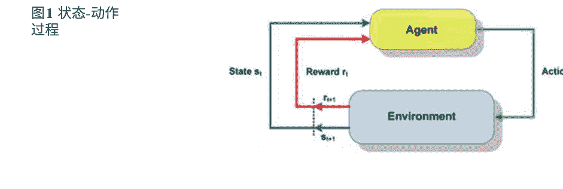

在本章中，选择了两个基于第一人称视角的游戏AI研究平台，即Minecraft和Doom。因此，首先选择Doom作为状态-动作过程的环境。其中，代理人是doom guy，状态是当前场景，即屏幕的帧，如图4所示。动作是左右移动和射击。环境是每个级别的虚拟场景，奖励是Doom guy在帧中射中或未射中怪物，代理人获得奖励。奖励系统在第5.1.7节中进一步描述。因此，强化学习问题已经被正确定义，现在需要一个解决方案，但在此之前，需要一个过程来评估解决方案的好坏。这意味着有时候每个场景或每个回合的奖励是不够的。假设Doom guy（代理人）在简单的基本场景中不断获得积极的奖励，但由于不确定的未来奖励，代理人最终被怪物杀死。这意味着每个单独的奖励不足以赢得游戏。因此，需要累积奖励来把握整个场景。这就是折扣累积期望奖励这个术语的含义，数学表示如下：

$$R = \sum_{t=0}^{\infty} \gamma^t r_t$$

它不过是所有奖励按照折扣因子gamma进行折现的总和，其中gamma属于[0, 1)。折扣是必要的，因为奖励在开始时比结束时更加重要。这是完全合理的。

下一步是解决问题。为了做到这一点，学习任务的目标是让代理从给定的状态中学习哪个动作在时间上最大化累积奖励。或者学习策略π：S → A。策略只是状态和动作之间的映射。总结下面的方程式被使用。

$$v^\pi(s_t) \equiv r_t + \gamma r_{t+1} + \gamma^2 r_{t+1}$$
$$\equiv \sum_{i=0}^{\infty} \gamma^i r_{t+i}$$

其中‘V’是策略（π）从状态（s）获得的预期长期奖励。多年来，已经开发出大量的强化学习算法。每个算法都专注于一些不同的方法和特点，无论是最大化价值还是策略，或者两者兼而有之。是否使用模型（例如神经网络）来模拟环境。是否在每一步或最后一步收集奖励。因此，对强化学习算法进行分类并不容易，但在本章中，它们被分为两个核心类别，即基于模型和无模型，如图2所示。

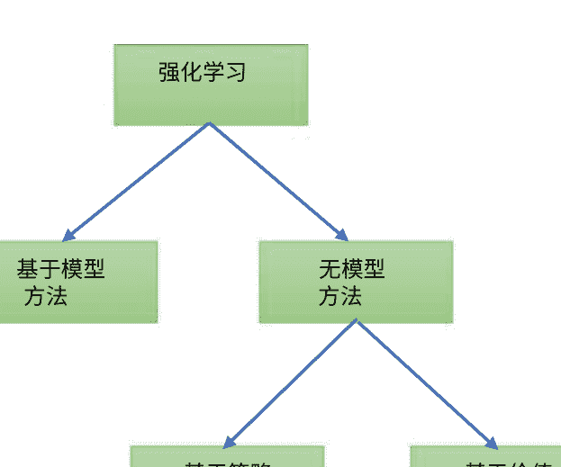

### 4.1 基于模型的算法

这些算法旨在从观察中学习环境的工作模型，然后使用该模型进行解决方案的规划。当这些算法拥有模型时，它们使用某种规划方法来找到最佳策略以实现数据效率，但是当状态空间过大时，这些算法会失败。围棋是最好的例子，无法使用基于模型构建的算法进行游戏，因为它会失败，什么都不会发生。

动态规划方法是基于模型的方法的一个例子，因为它们需要完全了解环境，如转移概率和奖励。

### 4.2 无模型算法

这些算法不需要学习环境并存储所有状态和动作的组合。它们可以根据训练的最终目标分为两类。

### 4.2.1 基于策略的方法

这些方法试图找到最优策略，无论是随机的还是确定性的。像策略梯度和REINFORCE这样的算法属于这个类别。

### 4.2.2 基于价值的方法

另一方面，它们试图找到最优值。这个类别的一个重要部分是一类被称为Q-learning的算法，它们学习优化Q-Value。在策略和基于价值的方法的交叉点上，可以找到Actor-Critic方法[33]，其目标是优化策略和价值函数。

在过去的几年中，引入了一种新的学习方法，即深度学习，它不可避免地影响和增强了所有现有的强化学习方法，如图3所示，通过将强化学习分类模型与神经网络扩展。

深度神经网络已被用于建模环境的动态（基于模型），增强策略搜索（基于策略）和近似值函数（基于价值）。对最后一种方法的研究产生了一个称为深度Q网络的模型，它与其许多改进一起，为该领域的一些最惊人的突破做出了贡献（以Atari为例）。此外，使用其他类型的神经网络，如卷积、循环、多层感知器、LSTM等，使其更加令人兴奋和有趣。

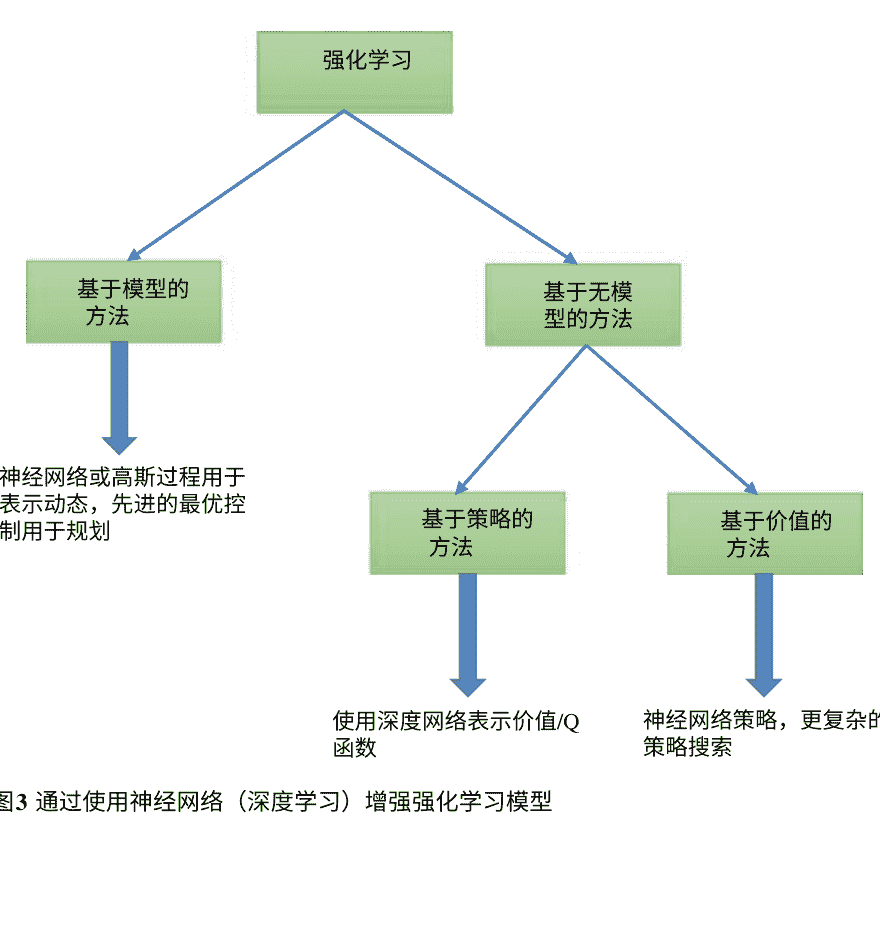

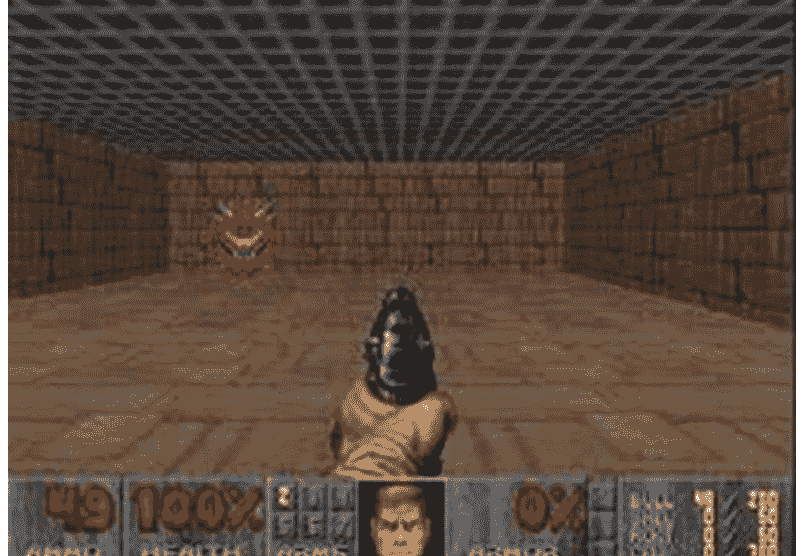

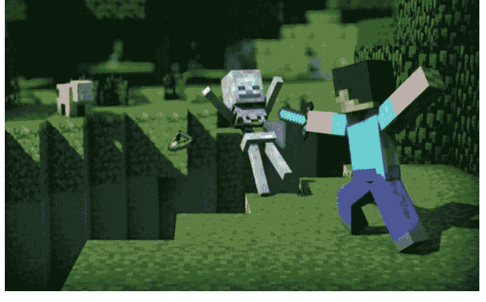

### 4.3 深度Q网络（DQN）

许多强化学习问题具有非常高维的状态空间，在这种空间中，每个维度上的信息都很少。对所有可能的状态和动作进行状态-动作Q函数的逼近很快变得难以处理。然而，深度神经网络（DNN）具有将高维状态编码为有意义的低维隐藏状态的出色能力[34]；此外，它们还以其函数逼近能力而闻名[35]。深度Q学习[36]是一个突破，表明神经网络可以学会玩Atari游戏。

在深度Q网络（DQN）的背景下，代理尝试学习Q(s_t, a_t)，它表示动作 a_t 在状态 s_t中的价值估计[37]。为了找到最优Q函数Q*，DQN使用一个由 θ参数化的神经网络，它表示神经网络的权重，并给出一个称为 Q_θ的近似值，此外，它们的目标是找到最优和真实的Q函数 Q*，它满足贝尔曼[38]最优性方程。值迭代更新的数学表示如下所示，形式为方程式1:

$$Q_{t+1}(s_t, a_t) = Q_t(s_t, a_t) + α_t(s_t, a_t) × [ R_{t+1} + γ max_a Q_t(s_{t+1}, a_t) - Q_t(s_t, a_t) ]$$
(3)
$$Q*(s, a) = E \{ r + γ max_â Q*(ŝ, â) | s, a \}$$
(4)
$$L_θ(θ_t) = E_{s, a, r, ŝ} \{ (r + γ max_â Q_θ(θ_t)(ŝ, â) - Q_{θ_t}(s, a))^2 \}$$
(5)

其中‘r’是在状态s中执行动作‘a’的奖励， γ ∈[0,1]是折扣因子，(ŝ, â)是下一个状态及其相关动作。由此可得，由于 Q_θ ≈ Q*(s, a)，以下是损失函数：

该损失函数是在均匀采样的游戏转换中计算的，这些转换存储在回放记忆中[39]，而不是之前玩过的转换，以减少样本之间的相关性。算法1展示了如何训练深度Q网络。

```
Algorithm 1. The DQN training algorithm [9]
**for** a number of episodes **do**
    Create a new episode
    **While** episode not finished **do**
        **If** random () ≤ epsilon **then**
            Choose a random action
        **else**
            choose the action with the highest Q
        **End if**
        store old state, action, new state and
        reward in memory
    **end while**
    **for** a number of back-propagation steps **do**
        update Q-network with a batch of
        randomly sampled sequences
    **end for**
**end for**
```

### 4.4 深度递归Q网络（DRQN）

上述模型提出的一个问题是它假设环境是完全可观测的。然而，在DOOM的情况下，我们只能部分观察到环境，受到主角视野的限制。以前解决这个问题的方法是将一系列帧作为历史记录输入到DQN中。解决历史问题的一个潜在更好的方法是使用深度递归Q网络，如[40]中所述。DRQN估计$Q(s_t, h_{t-1}, a_t)$而不是常规的$Q(s_t, a_t)$。参数$h_{t-1}$表示前一个转换时代理的隐藏状态，如图6所示。在我们的案例中，我们将使用长短期记忆层（LSTM）[41]。除了常规神经网络的输入和输出状态之外，LSTM单元还携带一个隐藏状态，该状态必须与输入一起提供，并且可以通过输出检索。这个隐藏状态可以传递随时间演变的模式信息。在我们的案例中，它预计携带已观察到但不再可见的游戏部分的信息。

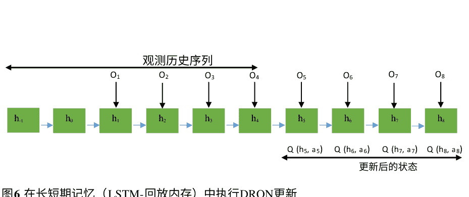

## 5 游戏人工智能研究平台-1

《毁灭战士》是一款第一人称射击游戏，于1993年首次发布，由id Software开发，GT Interactive（1993-1996年）和Activision（2004-2005年）以及Bethesda Softworks（2010年至今）发行。该游戏在全球范围内可在Microsoft Windows、PlayStation 4和Xbox One上玩，并由id Tech 6引擎驱动。它被认为是最早的第一人称射击游戏之一，为IBM兼容计算机引入了3D图形、三维空间、网络多人游戏以及支持使用Doom WAD格式创建玩家修改的功能。自1993年《毁灭战士》发布以来，该系列已经衍生出了许多续作、扩展包和一部电影。

VizDoom是一个基于Doom的人工智能研究平台，用于从原始视觉信息中进行强化学习。在本章中，它被用作我们实验的平台-1，并用于其余的实现。

### 5.1 提出的模型细节

我们的神经网络架构由两个卷积层组成，后面跟着三个独立的子网络，如图7所示。其中一个子网络被用于以监督方式预测各种游戏特征，第二个是标准的DRQN网络，而最后一个是标准的DQN输出。网络可以在有或没有游戏特征的情况下进行训练，并且可以使用DRQN或DQN输出进行训练。LSTM的隐藏层大小设置为300个单元。

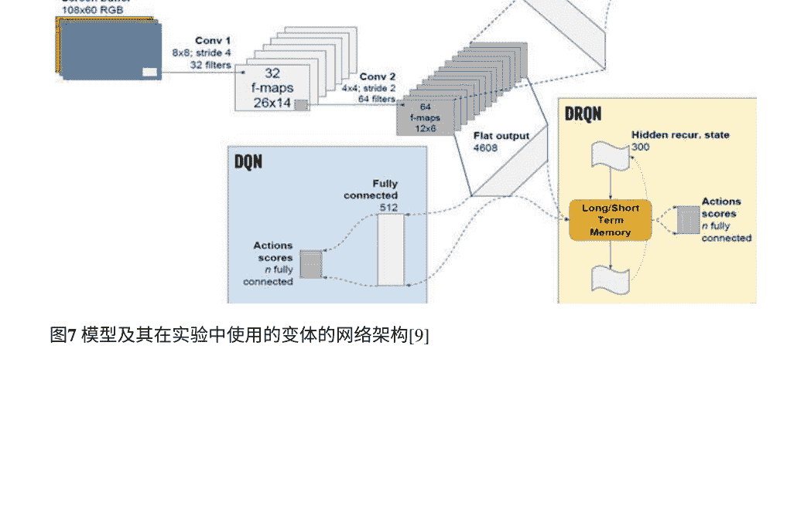

### 5.1.1 游戏特征

在训练过程中，建议的网络在每一步接收一个帧和一个布尔值，该值通常表示实体是否出现在帧中。通常，实体可以是敌人、血包、武器、弹药等。不使用游戏特征的代理无法准确检测敌人，因此它们只能随机射击，希望这些射击能够击中目标。为了弥补效率的不足，我们使用自定义的游戏特征来训练代理，在监督设置中与Q学习设置一起告诉代理敌人是否在其视野中。使用VizDoom API提供的标签缓冲区来获取视野锥中的所有实体。然而，被其他场景元素（通常是墙壁）隐藏的实体也是该缓冲区的一部分。然后，我们使用地图特征来检查实体是否可见。尽管这些信息在测试阶段不能使用，但在代理的训练过程中使用它可以加快训练速度。我们还创建了一个游戏特征，用于估计敌人相对于墙壁的横向位置，在一个简单的DOOM地图中。

### 5.1.2 丢弃

在完全连接的层中添加了丢弃[42]，在训练时每个单元的保留概率为75%。这种神经网络工程技术可以防止过拟合。

### 5.1.3 跳帧

为了降低计算复杂度，常常使用跳帧技术。使用这种技术，代理程序在每k+1个游戏帧接收一个输入帧，其中k是跳过的帧数。在这些跳过的帧中，代理程序会自动重复上一个动作。我们使用k=4的值，因为这是计算性能和代理准确性之间的良好平衡[43, 44]。

### 5.1.4 顺序更新

在训练LSTM时，需要将数据序列作为LSTM的输入，每个时间步预测一个输出。然而，在每个序列开始之前，LSTM会将其隐藏状态清零，并且需要几个时间步才能初始化隐藏状态。因此，由于它们的先前隐藏状态没有完全初始化，因此前几个时间步的输出可能是错误的。为了解决这个问题，在计算损失时，我们会丢弃前几个时间步的输出，如[45]中所解释的。

### 5.1.5 超参数

与[36, 37]类似，我们使用最小大小为2400和最大大小为10,00,000帧的回放内存，并且每个NN摄入的小批量样本为32个样本。训练样本的序列长度设置为8，但只有最后4个输出(状态数)被计算在损失中。使用RMSProp [46]优化器以学习率0.001训练网络，折扣因子(γ)设置为0.99。每个帧由108 * 60维的每个颜色RGB缓冲区的8位组成。测试程序包括3个阶段。

### 5.1.6 引导程序

回放记忆需要首先填充，尽管它并没有完全填满。为了做到这一点，代理被强制执行随机动作，直到记忆容量的五分之一左右被填满。在这个阶段，神经网络不做任何事情。

### 5.1.7 奖励和惩罚系统

代理的生存奖励设置为 -1，击杀奖励设置为 +101， -5表示未击中怪物，拾取奖励为4，死亡惩罚为25。

### 5.1.8 行动阶段

我们使用导航阶段和行动阶段。导航阶段是代理专注于探索地图收集物品和寻找敌人的阶段。我们确实跳过了这一步，立即集中精力在行动阶段上，该阶段包括在检测到敌人时射击。这个所谓的行动阶段当然会在训练阶段之后发生，在训练阶段中代理学习如何与游戏进行正确的互动。

### 5.1.9 实现工具（应用程序、库、包）

该模型使用Python 3.6.1 （64位）的Numpy、scipy、tqdm、Tensorflow 1.3.0 [47]、VizDoom 1.1.1和OpenCV 3.3 [48]在安装了Ubuntu 16.04.3的计算机上实现，该计算机配备了Intel® Core™ i7-7700 CPU @3.60 GHz ×8和NVIDIA GeForce GTX 1080/PCIe/SSE2 GPU [49]，用于处理CNN，整个学习和测试过程的计算时间。

### 5.1.10 硬件规格或机械环境

我们在一台高端机器上运行了我们的模拟，其规格如表1所示。该模型经过数千次运行的训练，在这台机器上进行的典型运行持续约2小时30分钟（约150分钟），包括5000个Q-Learning步骤。

### 5.2 完全可观察的马尔可夫决策过程 (FOMDP)

状态和动作的集合，以及从一个状态过渡到另一个状态的规则，构成了马尔可夫决策过程（MDP）。这样的过程的一个体化的剧集形成了有限的状态、动作和奖励的序列。

$s_{n-1}, a_{n-1}, r_n, s_n$ (6)

这里的‘s_i’表示状态，‘a_i’是动作，‘r_{i+1}’是采取动作的奖励。剧集以终止状态‘s_n’结束。马尔可夫决策过程依赖于马尔可夫假设，即下一个状态s_{i+1}的概率仅取决于当前状态‘s_i’和动作‘a_i’，而不取决于之前的状态或动作。因此，我们首先允许代理执行以下动作：

1. 向左移动
2. 向右移动
3. 攻击

因此，敌人对于机器人来说永远不会离开视线，状态是完全可观察的。DQN和DRQN都在游戏特征有和没有的情况下运行，游戏特征指的是敌人相对于基本地图背后墙壁的横向位置。使用DQN的代理性能和不使用游戏特征的代理性能在图8和图9中展示，DQN将成功预测的游戏特征的部分联系起来，其中使用游戏特征的代理在预测游戏特征方面比图9中没有使用游戏特征的代理更好，图9中的代理几乎无法预测游戏特征。

同样，使用DRQN学习游戏特征（使用游戏特征进行训练）的代理性能如图11所示，能够更好且一致地预测游戏特征（敌人检测、血包、武器、弹药等）。另一方面，使用DRQN学习（不使用游戏特征进行训练）的代理性能不令人满意，无法准确预测游戏特征，如图10所示，这可以通过价值函数的事实来解释。

表1 测试设置硬件规格

| CPU | Intel® Core™ i7-7700 CPU @3.60 GHz × 8 |
| :--- | :--- |
| GPU | NVIDIA GeForce GTX 1080/PCIe/SSE2 GPU |
| 内存 | 32 GiB DDR4 |

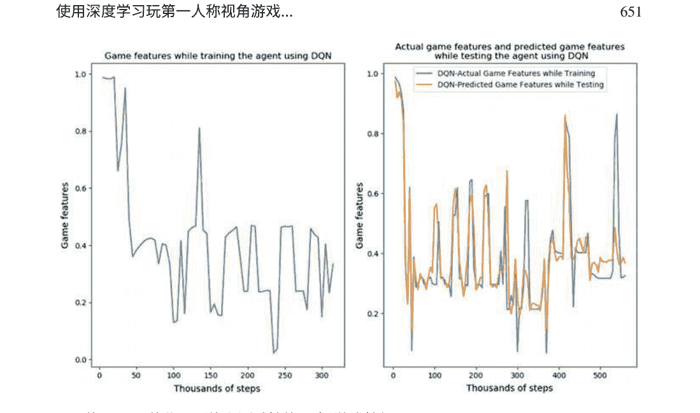

## 图8 使用DQN的代理训练和测试性能图表-游戏特征

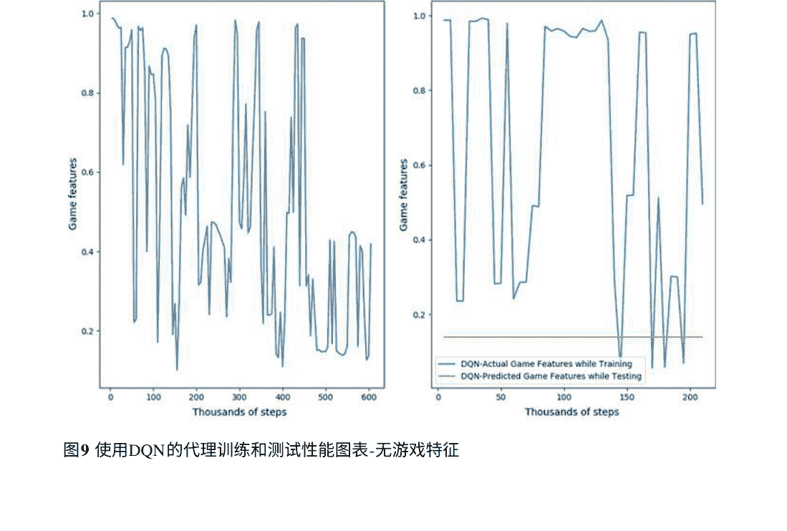

## 图9 使用DQN的代理训练和测试性能图表-无游戏特征

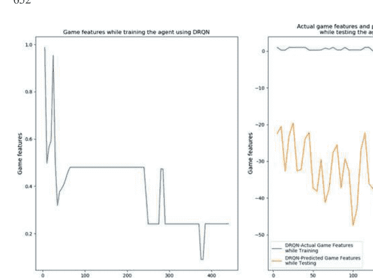

近似有时是不安全的[50]，这对神经网络[51]也是如此。

因此，可以得出结论，添加循环连接可能会破坏DQN声称的收敛性质。实际上，可以看到，即使

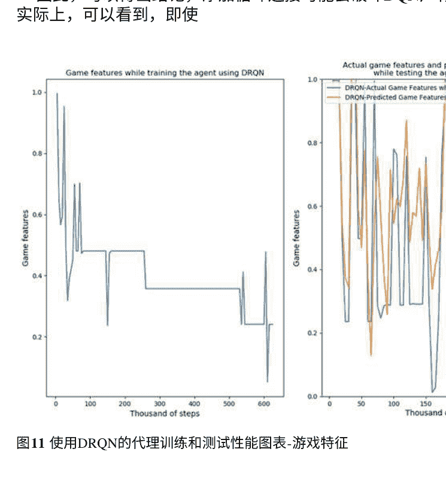

如果代理学习到了一个优秀的Q函数，其Q值在某个时刻将开始发散，导致成功回合的比例显著下降。当移除循环反馈并使用DQN时，这种下降似乎不会发生。

事实上，DQN在游戏特征方面表现良好。 这个结果是可以预料的，因为在这种情况下，环境是完全可观察的（即敌人始终在代理的视野范围内）。 然后，一个帧就足够让代理做出最优决策。观察DRQN代理的测试回合，代理的行为是良好的（它几乎立即转向正确的方向，然后射击敌人），直到Q值发散，此时代理将一直选择相同的动作，如图11所示；要么贴着左墙或右墙，要么无限射击而不移动。

### 5.3 部分可观察的马尔可夫决策过程（POMDP）

同样，将强化学习问题形式化为马尔可夫决策过程（MDP），然后将代理的动作集更改为以下内容，使其部分可观察：

1. 左转
2. 右转
3. 前进
4. 攻击

通过这个动作集，代理现在能够移动，使得敌人不再可见。因此，状态只能部分观察到[40]。在这种设置下，我们使用另一个游戏特性：一个二进制标签，指示敌人是否可见。在这里，ϵ从1降到0.1需要8000步。因为不同的代码分支在某个点分叉，模拟的估计Q值最难获得。然而，滚动成功率可能表示Q值也分叉。此外，性能很少可能达到FOMDP设置中那么好。有趣的一点是，DQN在这个设置中仍然表现得非常好。产生了一个理论，即在这个设置中仍然可能出现完全可观察的情节，并且代理优化其行为以达到那些最佳情节。为了验证这个理论，建议在每个情节开始时随机旋转玩家，以强制其探索环境。

然而，通过观察导出的视频，DQN版本可能会非常快速地击败敌人，也可能陷入只在面对墙壁时使用“攻击”动作的状态中。

在DRQN版本中，从第8000步开始，代理经常陷入在“向左转”和“向右转”动作之间切换的状态中。在大多数这样的闪烁中，敌人或一个角落位于我们代理的视野锥体的中心。这可能是因为表示卷积层在那里检测到一个有趣的模式，并刺激Q评估层。

### 5.4 训练和测试

训练和测试阶段可以解释如下。

### 5.4.1 训练（学习）

在学习阶段，我们让代理使用一个 ε贪婪策略进行游戏。 参数 ε从1开始，随着时间的推移线性减少，直到达到最小值0.1。一旦游戏回合结束，它就会被插入到回放内存中。 然后，我们从回放记忆中随机选择一批不同的剧集重复15次。 对于这些重播的每一个，我们通过主网络运行反向传播[52]来学习 Q。 在我们的实验的某些变体中，我们还在游戏特征部分的网络上运行反向传播。 每播放10个剧集 ，我们使用主网络中学到的权重来更新目标网络的权重。 因此，目标网络每进行150次反向传播就会更新一次。

最后，我们每播放200场游戏就导出一个视频，其中代理在没有随机动作（ϵ=0）的情况下进行游戏，以便让人们观察代理策略如何随时间演变。

### 5.4.2 测试

在这个阶段，我们让代理自己玩，不进行随机动作或丢弃。

## 6 游戏人工智能研究平台-2

Minecraft是一款沙盒建造类视频游戏（图12），由Mojang AB创始人Markus Notch Persson创建。游戏玩法包括玩家在三维环境中放置和破坏各种类型的方块来与游戏世界互动。 在这样的环境中，玩家可以在多人服务器和单人世界中建造创意结构、创作和艺术品，游戏模式多种多样。 Minecraft的开发始于2009年5月10日，全游戏的预购从2009年6月13日开始接受。 Minecraft的正式发布日期是2011年11月18日。 2014年9月20日，Java版成为有史以来最畅销的PC游戏，截至2018年3月26日，销量达到2800万。 它在几乎所有平台、系统或设备上全球发行，包括Microsoft Windows、PlayStation 4和Xbox One 。2014年9月15日，Mojang AB及其所有资产（包括Minecraft）被微软以25亿美元的价格收购。截至2018年1月20日，Minecraft在所有平台上销售了1.44亿份副本，成为有史以来第二畅销的视频游戏（图13），也是有史以来第十畅销的视频游戏系列。

Project Malmo是一个建立在Minecraft之上的人工智能实验和研究平台。它旨在激发对这个独特环境提出的新问题的研究新一代研究。在本章中，我们的实验也使用了platform-2，并使用其他实现。

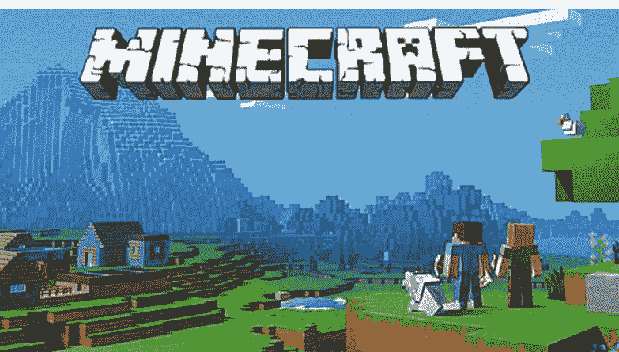


### 6.1 提出的模型细节

在本节中，与上述Game-AI研究平台-1类似，使用了深度视觉增强学习方法，但这次不同于Doom，代理在一个名为Minecraft Basic-custom的不同场景中进行训练和测试。在对Doom的基本场景进行实验和测试了视觉深度Q学习方法之后，我们认为在Minecraft上实现相同的深度Q学习方法可以确认其真实性能和创造力，因为Minecraft被认为是一个有趣的环境。因此，我们使用了Malmo项目和Gym-Minecraft作为与该环境交互的包装器，在OpenAI-Gym中与该环境进行交互。我们选择了Minecraft Basic-custom作为测试环境。

环境配置为可更改的XML文件，其中包括奖励等设置。首先加载的是具有自定义分辨率和较少允许操作列表的环境，以实现更快的收敛，并解析XML配置文件以获取奖励。然后我们声明了三种算法：

a. 前馈神经网络
b. 卷积神经网络
c. 卷积 +循环神经网络（带有LSTM块）。

LSTM的概述如图15所示。这个神经网络（NN）架构被认为是在将Minecraft视为部分可观察的马尔可夫决策过程（POMDP）后得到的最佳预期结果。这三个神经网络使用经典的损失函数，即tf.reduce_mean(tf.square(self.nextQ_scaled -self.Q))。其中Q是网络计算得到的Q值，nextQ_scaled是Bellman方程结果的缩放版本（注意，Q值被缩放以提高训练的稳定性）。然后我们选择其中一个神经网络，并创建经验缓冲区以堆叠状态/动作/奖励/下一个状态元组，使网络能够使用多样化的小批量进行训练。Conv +RNN的经验缓冲区的实现要复杂得多。它处理了小批量必须包含以下帧的情况[53]。

### 6.1.1 Minecraft基础-自定义场景（任务或地图）

重要的是要尝试对Minecraft任务及其目标、奖励和观察等属性有一个高层次的理解。Minecraft基础-自定义：是由石块包围的一个7 × 7 × 7的房间。这是Minecraft_Basic-v0的修改版本，如图14所示。Minecraft_Basic-v0版本或任务中不包含任何敌人，因此我们根据我们的要求对其进行了修改，以制作自定义版本。所有Malmo任务都使用XML文件进行描述。可以使用教室装饰工具向此任务中添加更多房间。此外，如果需要对这个任务的沉浸式世界有更多的控制，可以使用“绘图装饰工具”。生产世界所需的任何选择，包括放置敌人。更多的XML模式文档可以在“Microsoft Malmo”项目网站上找到。此外，Malm项目中分发的示例任务也是进一步理解的好资源。提示。在这个自定义任务（Minecraft_Basic_custom）的房间中的任何地方都有一个目标方块。代理的目标是任务实例，如果代理从起始位置到达特殊方块（金块、钻石块、红石块）则任务被认为完成。如果达到目标方块，则任务结束。或者如果达到时间限制=30,000（30秒）则任务结束。

可观察性：对于（“来自网格的观察”，代理所在的相邻单元格）和3D视图的部分/全部可观察性。背景是一个灰色的房间，周围有一些火把发出光亮（图15）。

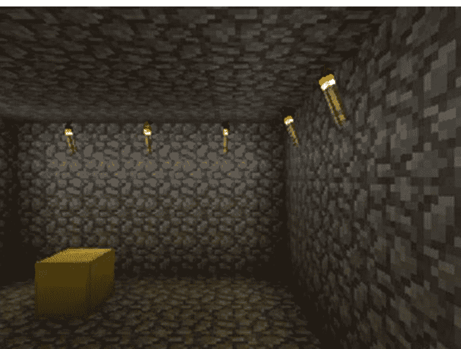

## 图14一个代理在第一人称视角下玩Minecraft基础-自定义POMDP场景。

### 6.1.2 游戏特点

在训练过程中，每一步，提议的网络接收一个帧和一个布尔值，通常表示帧中是否出现了敌人或目标方块。通常，属性（实体）可以是敌人、目标方块、生命包、武器、弹药等。不使用游戏特点的代理无法准确检测到敌人或目标方块，因此它们会随机杀死敌人或四处游荡，希望能够到达目标方块。

为了弥补效率不足，我们使用自定义的游戏特点来训练代理，在Q学习设置中与监督设置一起使用，告诉代理敌人或目标方块是否在其视野中。

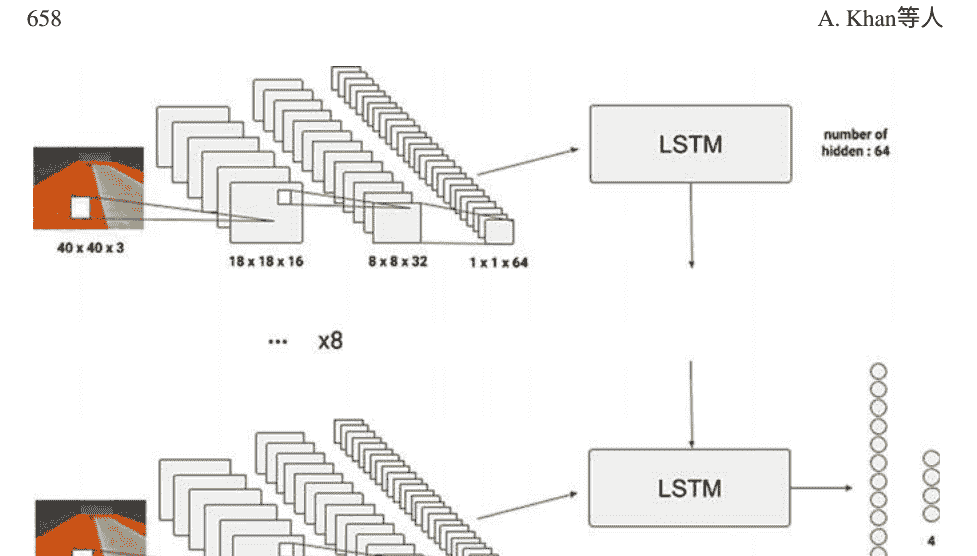

## 图15 用于在Game-AI研究平台-2上进行实验的模型的提议网络架构

代理会判断敌人或目标方块是否在其视野中。然后，我们使用地图特征来检查属性是否可见。尽管这些信息在测试阶段不能使用，但在代理的训练过程中使用它们可以加快训练速度。

### 6.1.3 实现工具（应用程序、硬件、库、软件包等）

该模型使用gym 0.10.5、gym-mincraft 0.0.2、lxml 3.5.0、Malmo0.36.0.0 [28] 、mincraft-py 0.0.2、mujoco-py 1.50.1.59、matplotlib 1.5.1、Numpy1.13.3、py game 1.9.4.dev0、python 3.5（64位）、scipy 1.1.0、Tensorflow 1.10.1 [47]、Tensorboard 1.10.0 在 Ubuntu Server 16.04.3 LTS 操作系统上使用 Intel®Core™ i7-7700 CPU @3.60 GHz ×8 和 NVIDIA GeForce GTX 1080/PCIe/SSE2GPU [49] 进行 CNN 的处理，整个学习和测试过程都是按时间（小时/天）计算的。

### 6.1.4 硬件规格或机械环境

我们在与上述解释相同的硬件规格上运行了模拟，见第3.1.10节和表1中提到的，除了典型运行时间更长，1,250,000个剧集（数百万次Q学习步骤），持续时间约为31天（约750小时）。

### 6.1.5 超参数（设置）

在实施过程中使用的超参数包括一个大小为50,000帧的经验重放内存，每个NN摄入32个样本的小批量，或者换句话说，每个训练步骤使用的经验数量。训练样本的序列长度设置为2，但只计算最后4个输出（状态数）来计算损失。使用Adam优化器[54]以学习率0.0001训练网络，折扣因子（γ）设置为0.95。每个帧由60 * 60维的8位每色RGB缓冲区组成。测试程序包括3个阶段。

### 6.1.6 引导程序

经验回放内存通常需要先填充，尽管通常不会完全填满。为了做到这一点，在实际训练开始之前，代理被要求进行5000个随机动作的游戏，直到内存容量的一部分被大致填满。在这个阶段，神经网络不做任何事情。

### 6.1.7 奖励和惩罚系统

代理奖励和惩罚系统是稀疏的，对于每个动作或发送命令，奖励设置为-1，对于死亡，奖励设置为-100，对于找到目标，奖励设置为100，对于超时，奖励设置为-100，最后对于触摸块类型（即金块、钻石块和红石块），奖励设置为20。

### 6.2 部分可观察马尔可夫决策过程（POMDP）

与游戏人工智能研究平台-1类似，我们再次将强化学习问题形式化为马尔可夫决策过程（MDP），代理的动作集包括以下使其部分可观察的动作：

1. 向左转
2. 向右转
3. 向前移动
4. 攻击（杀死、接触或触摸目标）有了这个动作集，代理现在能够移动，使得敌人不再可见。因此，状态只是部分可观察的[40]。在这种设置中，我们使用另一个游戏特性：一个二进制标签，指示敌人是否可见。在这里，ε在125万个学习步骤中从1减少到0.1，进行1,250,000个游戏回合。此外，相比之下，在FOMDP设置中很少有可能达到与之一样好的结果，或者在POMDP设置中很少有可能期望高水平的性能，这是由于部分可观察的情景或者换句话说，由于代理能够看到的信息较少。在本章中，这样的问题被认为是重要的，并且通过应用DRQN并特别使用基于Minecraft和VizDoom的AI研究平台（如Malmo）进行预期扩展的实验或调查进行了假设。

一个有趣的观点是，在本章的第一部分（上面）DQN在Game-AI研究平台上的FOMDP和POMDP设置中表现良好，因此只有DRQN被假设在相同的POMDP设置中再次进行测试，但在不同的AI研究平台上，特别是使用游戏特性，因为在上述实验之后，明显和理解到DRQN的性能不能指望不使用游戏特性来提高，因此在这方面，我们考虑再次测试它，但只使用游戏特性（训练代理使用游戏特性）在不同的平台上，以确保和确认DRQN在POMDP设置中的独创性。为了验证假设，提议在每个回合开始时随机旋转玩家，以强制其使用来自回放记忆的经验来探索环境。

### 6.3 训练和测试

首先，将代理程序的游戏或训练模式设置为“生存”，名称设置为“詹姆斯邦德”。代理程序的放置或起始坐标设置为x= -203.5, y = 81.0和z =217.5。训练和测试阶段将在下面的小节中进一步解释。

### 6.3.1 训练（学习）

训练（学习）阶段通过设置load_model=True来多次进行。代理程序以随机方式进行游戏，以便发现环境，直到达到预先设置的5000个游戏回合。pre_train_episodes是在训练开始之前进行随机动作的回合数。然后，它使用ε-贪婪策略在探索和利用之间进行权衡，我们使代理程序使用ε-贪婪策略进行游戏。ε参数从1开始（随机动作的初始概率），并随时间线性减小，直到达到最小值0.1（最终随机动作的概率）。我们存储一些关于状态/动作/奖励的信息，并在每500个回合（游戏回合结束后将其插入回放内存）打印它们。然后，我们重复播放5次不同的从回放记忆中随机选择一批剧集。对于这些重播，我们通过主网络运行反向传播来学习 Q 值。在我们的一些实验变体中，我们还在网络的某些部分上运行反向传播。

最后，类似于上述的 Game-AI 研究平台-1，我们导出一个视频，但这次是每玩 500 场游戏，代理程序自己玩而不是随机动作 (ε=0)，让人类观察代理策略如何随时间演变。

### 6.3.2 测试（评估和验证）

在测试阶段，观察到 DRQN 代理在 Gym-Minecraft (Malmo) AI 研究平台上的表现略好于 VizDoom AI 研究平台，但总体而言，与 DQN 相比，这种性能还需要更好和令人满意。从中途开始，有时代理会陷入这样的状态，其中它在不同动作之间切换。

对于大多数这样的闪烁，暴徒或目标区块位于我们代理人视野锥的中心。这可能表明卷积层在那里检测到了一个有趣的模式，并刺激了 Q 评估层。

然而，从导出的视频来看，感觉 DRQN 既不能有效地杀死暴徒，也不能快速到达目标区块，有时可能会稍微卡住在只面对墙壁时只使用攻击（杀死或触碰目标）动作的状态中。

使用 DRQN 在 Minecraft_Basic_custom 场景上的代理人训练和测试性能图在图 16 中显示。这次代理人经过非常长时间的训练，几乎持续了31天和数百万步以便评估和测试其真实和可靠的性能。因此，这些图表显示了训练阶段学习到的游戏特征并在测试阶段检测到的进一步观察。

左侧（L）图显示了使用DRQN在Minecraft基本自定义场景上的代理训练进展，其中x轴表示学习步骤，以千到百万为单位，因为此时代理被训练到更长的持续时间的最大值。y轴表示游戏特征，介于0和1之间。

右侧（R）图显示了代理在相同场景（即Minecraft_Basic_custom）上的测试进展，其中x轴以千到百万的学习步骤为单位，以便在可能的情况下对代理进行更长时间的测试，以便更清楚地了解行为或改进。y轴表示游戏特征，设置为0到1之间的比例。

正如在（R）图中可以观察到的那样，代理的意外测试性能线（红色线）显示出比训练性能线（绿色线）更低的性能，这从而证明了我们的假设，因此，简而言之，在另一个POMDP游戏场景（即Minecraft Basic-custom）上再次测试DRQN后，可以确定DRQN在POMDP设置中的表现较差，尽管在VizDoom基本场景中表现得更好，但DRQN的性能在最后阶段出现了下降。但总体而言，它仍然无法显示出所需的可接受改进或进展。因此，可以得出结论，即使使用了回放记忆，DRQN也不能被选择为在部分可观察环境中训练代理或机器人的首选。

## 7 与相关工作的比较

我们的部分发现基于一篇出版物[37]，与该出版物和Doom视频游戏场景相比，本章重点关注和集中在行动阶段。DQN和DRQN用于控制具有游戏特征和没有游戏特征的场景中的代理。

此外，LSTM被普通的全连接层所替代。在训练代理（模型）的实验中使用的超参数、环境和设置与参考文章中使用的不同，例如学习率、内存大小、训练步骤，特别是Q-learning步骤。

此外，所使用的神经网络架构与[37]中所呈现的不同，增加了两个卷积层，后面跟着三个子网络，其中一个子网络用于以监督方式预测各种游戏特征。

此外，该代理还在相同的地图上进行训练和测试，以展示我们的模型不仅在未知地图上有效，而且在已知地图上也有效。这种变化被称为“已知地图上的有限死亡竞赛”。

使用640×400的分辨率（与[37]不同），将其调整为108×60，并且在所有实验中使用彩色图像作为灰度图像以降低性能模型。 在本章中，介绍了在FPS游戏和沙盒游戏（如Doom和Minecraft）中玩“基本”场景的完整架构，其中使用了具有高级游戏信息的DQN和DRQN模型。关键贡献是DQN模型的性能超过70%的敌人检测（游戏特征）准确性，然而，当应用于诸如“死亡竞赛”场景等复杂任务时，DRQN模型的表现平均，因此，在这方面，DRQN在部分可观察环境（POMDP）中的性能再次通过在另一个部分可观察环境（POMDP场景）上进行训练和验证得到确认，该环境被称为Minecraft基本自定义。

## 8 总结与讨论

提出了一种使用深度视觉强化学习的方法来控制代理在玩两个著名的视频游戏，如Doom（FPS）和Minecraft（沙盒），使用VizDoom，OpenAI Gym-Minecraft和Microsoft的Malmo AI平台。据称，所提出的方法，即DQN的架构，在特定的Doom和Minecraft场景中更好地预测游戏特征（敌人位置，生命包，武器，弹药等）。应用DQN的原因之一是估计Q（s, a），换句话说，深度神经网络或DQN是估计任何函数的正确方法之一。

首先介绍了深度Q学习的方法，然后描述了实验中使用的模型，包括网络架构，学习参数（超参数），游戏属性和设置。然后描述了实验的过程，分为训练（学习）和测试阶段。

随后，重点关注两个测试设置，一个是完全可观察的设置（视图/场景），一个是稍微扩展的部分可观察设置[55]。通过展示Doom中预测的游戏特征（敌人、血包、武器、弹药等）和Minecraft中的游戏特征（怪物、目标方块、生命包、武器）随时间变化的图表，对实验的分析进行了呈现。总结认为，该方法在某些方面与[37]中提出的方法不同，其贡献是在特殊的AI研究平台VizDoom上，DQN模型具有更好的游戏特征检测准确性的性能。

## 9 结论和未来工作

计算机视频游戏是在将理论方法、技术和方法应用于现实世界之前评估和测试人工智能的最佳测试平台。在本章中，使用两个游戏AI研究平台来评估代理在FOMDP和POMDP环境中的性能。在这方面，提出了一个稳定的DQN，能够玩基本的DOOM游戏，其中敌人始终可见，并且DRQN也能够玩游戏，但只能在联合训练的监督游戏特征的帮助下加速训练。 发现DRQN代理的性能在某一点之前是稳定的，此外还观察到DRQN的收敛有时是令人担忧的；发现DRQN的表现比DQN更好，但平均而言仍然低于DQN，特别是在部分可观察的马尔可夫决策过程（POMDP）设置中，这只能暗示需要在DRQN上进行更多的研究工作，以使其在POMDP的设置中完全分析。 换句话说，DRQN包括进一步研究、调查和精确性的空间，特别是在POMDP设置中，例如DOOM和Gym-Minecraft的情况下。 在仔细观察到POMDP的情况下，发现了一些小的不足，并提出了未来工作的潜在解决方案。

致谢本工作得到巴基斯坦白沙瓦大学和巴基斯坦高等教育部的支持。研究工作还得到了阿联酋扎伊德大学的支持。作者还要感谢NVIDIA公司捐赠的GPU机器。

利益冲突 作者声明没有利益冲突。

数据可用性 本研究使用的研究数据（原始和处理后的数据）可根据研究负责人（第一作者）的要求提供。

## 术语表

人工智能人工智能

AlphaGo AlphaGo是一个玩围棋的计算机程序

Atari 2600游戏 Atari 2600，最初称为Atari VCS，是现代电子游戏系统的鼻祖，帮助孵化了一个价值数十亿美元的产业。Atari销售了三千多万台游戏机，与其他公司一起销售了数亿个游戏

ANN 人工神经网络

DL 深度学习

毁灭 一款由id软件开发的1993年第一人称射击（FPS）游戏。 它被认为是视频游戏史上最重要和有影响力的作品之一死斗 一种游戏模式，将两个或更多玩家置于死斗中FPS 第一人称射击（FPS）是一种以枪支和其他基于武器的战斗为中心的视频游戏类型，以第一人称视角进行游戏AI 游戏人工智能或计算机游戏中的人工智能

Google DeepMind DeepMind Technologies是一家英国人工智能公司，成立于2010年9月，目前由Alphabet Inc.拥有。该公司总部位于伦敦，此外还在加拿大、法国和美国设有研究中心。他们的目标是解决智能问题，并利用智能使世界变得更美好。

GPU 是一种执行快速数学计算的处理单元，主要用于渲染图像。 它可以比中央处理器（CPU）更快地渲染图像，因为它具有并行处理架构，可以同时执行多个计算。

**GUI图形用户界面**

**Gym-Minecraft** 是OpenAI Gym的一个环境包
地图是视频游戏中虚拟和沉浸式世界的一个子部分，被称为场景，其中包含多个可供选择的地图
**Microsoft的Malmo** 是一个建立在**Minecraft**之上的人工智能实验和研究平台
**MLP** 多层感知器**NN** 神经网络

**OpenAI gym** 是一个用于开发和比较强化学习算法的工具包**RL** 强化学习**RNN** 循环神经网络

场景在视频游戏中定义了世界的运作方式和外观（地图）**TPU** 张量处理单元（**TPU**）是谷歌于2016年设计用于神经网络和机器学习项目的专有处理器类型。
**TPU**可以为所有在Tensorflow中实现的机器学习应用提供优势**ViZDoom**是一种基于**Doom**的人工智能研究平台，用于从原始视觉信息中进行强化学习。它允许开发只使用屏幕缓冲区来玩**Doom**的AI机器人。**ViZDoom**主要用于机器视觉学习和深度强化学习的研究**WAD**（**Doom**）是指所有数据都在哪里

## 参考文献

1. Bernstein AV, Burnaev EV, Kachan ON (2018) 计算机视觉和机器人导航的强化学习在：机器学习和数据挖掘国际会议上模式识别。 Springer, 柏林 在模式识别中的机器学习和数据挖掘国际会议上
2. Adil K, Jiang F, Liu S, Jifara W, Tian Z, Fu Y (2017) RTS游戏人工智能和星际争霸的最新进展和挑战. (IJACSA) Int J Adv Comput Sci Appl 8(12):93.
3. Silver D, Huang A, Maddison CJ, Guez A, Sifre L, Van Den Driessche G, Schrittwieser J, Antonoglou I, Panneershelvam V, Lanctot M (2016) 用深度神经网络和树搜索掌握围棋. Nature 529(7587): 484–489
4. Powles J, Hodson H (2017) Google DeepMind和算法时代的医疗保健。 Heal Technol 7(4):351–367
5. Khan A, Yang K, Fu Y, Lou F, Jifara W, Jiang F, Shaohui L (2017) RTS游戏AI和星际争霸中的竞争性战斗策略和战术。 在：多媒体太平洋会议。 Springer国际出版, Cham
6. Lyngstad A (2017) 沙盒游戏。 促进跨学科深度学习的一种方式？ 课堂实施的示例场景。 UiT Norges arktiske universitet
7. Trenholme D, Smith SP (2008) 用于开发第一人称虚拟环境的计算机游戏引擎。 虚拟现实12(3)： 181–187
8. Khan A, Naeem M, Asghar MZ, Din AU, Khan A (2020) 使用VizDoom Game-AI研究平台使用机器学习技术和方法玩第一人称射击游戏。 娱乐计算 34:100357
9. Khan A, Jiang F, Liu S, Omara I (2019) 使用深度视觉强化学习玩FPS Doom视频游戏。自动控制计算机科学 53(3):214–222
10. Sun Y, Khan A, Yang K, Feng J, Liu S (2019) 使用强化学习玩第一人称射击游戏的a3c-anticipator网络代理。 在： 人工智能与安全国际会议。斯普林格,柏林
11. Hagan MT, Demuth HB, Beale MH, De Jesús O (1996) 神经网络设计，第20卷。 Pws Pub. 波士顿
12. Wu Y, Tian Y (2017) 使用演员-评论课程学习训练第一人称射击游戏的代理。 ICLR 2017会议论文
13. Lee S, Isaksen A, Holmgård C, Togelius J (2016) 使用深度卷积神经网络预测游戏地图中的资源位置。 在： 第十二届人工智能和交互数字娱乐会议
14. Park H, Kim K-J (2016) 使用冗余输出的深度Q学习.pdf。 在： IEEE计算智能和游戏会议 (CIG'16)
15. Kempka M, Wydmuch M, Runc G, Toczek J, Ja´skowski W (2016) ViZDoom: 基于doom的视觉强化学习研究平台。 arXiv预印本arXiv:1605.02097
16. Ekaputra G, Lim C, Eng KI (2013) Minecraft: 一种教育和科学学习工具。 在： ISICO 2013
17. Brockman G, Cheung V, Pettersson L, Schneider J, Schulman J, Tang J, Zaremba W (2016) OpenAI gym. arXiv预印本arXiv:1606.01540
18. Adil K, Jiang F, Liu S, Grigorev A, Gupta BB, Rho S (2017) 使用视觉强化学习和VizDoom训练FPS doom游戏的代理。 (IJACSA) Int J Adv Comput Sci Appl 8 (12)
19. van Otterlo M, Wiering M (2012) 强化学习和马尔可夫决策过程。 在： 强化学习。 Springer, 柏林, 第3-42页
20. Jin P, Keutzer K (2018) Sergey Levine. 部分可观察深度强化学习的遗憾最小化。 在： 机器学习国际会议
21. Wydmuch M, Kempka M, Ja´skowski W (2018) ViZDoom比赛: 通过像素玩毁灭。 arXiv预印本arXiv:1809.03470
22. Shao K, Zhao D, Li N, Zhu Y (2018) 通过深度强化学习学习VizDoom中的战斗。 在： 2018年IEEE计算智能和游戏会议 (CIG) 。 IEEE
23. Shao K, Zhao D, Zhu Y, Zhang Q (2018) 通过演员-评论家深度强化学习进行视觉导航。 在： 2018年国际神经网络联合会议 (IJCNN) 。 IEEE
24. Min B-J, Kim K-J (2017) 使用无模型的情节控制学习玩视觉毁灭。 在： 2017年IEEE计算智能和游戏会议 (CIG) 。 IEEE
25. Aitchison M (2019) 在第一人称射击环境中的最佳经验使用。 在： 2019年IEEE游戏会议 (CoG) 。 IEEE
26. Park H, Kim K-J (2016) 使用视觉末日中的冗余输出进行深度Q学习。 在： 2016年IEEE计算智能和游戏 (CIG) 会议。 IEEE
27. Romac C, Béraud V (2019) 在Minecraft中的简单部分可观察马尔可夫决策过程上进行深度递归Q学习与深度Q学习。 arXiv预印本arXiv:1903.04311
28. Johnson M, Hofmann K, Hutton T, Bignell D (2016) 用于人工智能实验的Malmo平台。 在： IJCAI
29. Alaniz S (2018) 在Minecraft中使用模型学习和蒙特卡洛树搜索的深度强化学习。 arXiv预印本arXiv:1803.08456
30. Oh J, Chockalingam V, Singh S, Lee H (2016) 在Minecraft中的记忆控制，主动感知和行动。 arXiv预印本arXiv:1605.09128
31. Mathisen T, Oliver A, Cohen T, Schulman J (2019) 教师-学生课程学习。 IEEE Trans Neural Netw Learn Syst
32. Schulman J, Wolski F, Dhariwal P, Radford A, Klimov O (2017) 近端策略优化算法。 arXiv预印本 arXiv:1707.06347
33. Garmulewicz M, Michalewski H, Miło´s P (2018) 专家增强的演员-评论家算法用于ViZDoom和Montezumas Revenge。 arXiv预印本 arXiv:1809.03447
34. Schmidhuber J (2015) 神经网络中的深度学习:概述。神经网络 61:85–117

35. Hornik K (1991) 多层前馈网络的逼近能力。神经网络 4(2):251–257
36. Mnih V, Kavukcuoglu K, Silver D, Rusu AA, Veness J, Bellemare MG, Graves A, Riedmiller M, Fidjeland AK, Ostrovski G (2015) 通过深度强化学习实现人类水平的控制。Nature 518(7540):529–533
37. Lample G, Singh DC (2016) 使用深度强化学习玩FPS游戏。 arXiv 预印本 arXiv:1609.05521
38. Bellemare MG, Dabney W, Munos R (2017) 强化学习的分布视角。 arXiv 预印本 arXiv:1707.06887
39. Schaul T, Quan J, Antonoglou I, Silver D (2015) 优先经验回放。 arXiv 预印本 arXiv:1511.05952
40. Hausknecht M, Stone P (2015) 用于部分可观察MDP的深度递归Q学习。 CoRR, abs/1507.06527
41. Hochreiter S, Schmidhuber J (1997) 长短期记忆。 神经计算 9(8):1735–1780
42. Srivastava N, Hinton GE, Krizhevsky A, Sutskever I, Salakhutdinov R (2014) Dropout: 一种简单的防止神经网络过拟合的方法。 机器学习研究 15(1):1929–1958
43. Hafner D (2016) 从原始像素中进行深度强化学习。 arXiv预印本 arXiv:1610.02164
44. Khan A, Feng J, Liu S, Asghar MZ (2019) 最佳跳过率: 使用深度强化学习进行细粒度控制的训练代理。 机器人学报 2019:10
45. Lee L, Parisotto E, Chaplot DS, Salakhutdinov R (2018) LSTM迭代网络: 不同iable路径搜索的探索
46. Tieleman T, Hinton G (2012) 第6.5讲-RMSProp, COURSERA: 神经网络用于机器学习。 多伦多大学，技术报告
47. Abadi M, Agarwal A, Barham P, Brevdo E, Chen Z, Citro C, Corrado GS, Davis A, Dean J, Devin M (2016) Tensorflow: 大规模机器学习在异构分布式系统上的应用。 arXiv预印本 arXiv:1603.04467
48. Bradski, Gary 和 Adrian Kaehler, OpenCV。 Dr. Dobb's软件工具杂志, 2000. 3,
49. Owens JD, Houston M, Luebke D, Green S, Stone JE, Phillips JC (2008) GPU计算。 Proc IEEE 96(5):879–899
50. Fairbank M, Alonso E (2011) 值迭代和函数逼近下强化学习算法的发散。 arXiv预印本 arXiv:1107.4606
51. Papavassiliou VA, Russell S (1999) 强化学习与一般函数逼近器的收敛性。 IJCAI
52. Ruder S (2016) 梯度下降优化算法概述。 arXiv预印本 arXiv:1609.04747
53. Mnih V, Kavukcuoglu K, Silver D, Graves A, Antonoglou I, Wierstra D, Riedmiller M (2013) 使用深度强化学习玩Atari游戏。 arXiv预印本 arXiv:1312.5602
54. Kingma DP, Jimmy Ba A (2014) 随机优化方法。 arXiv预印本 arXiv:1412.6980
55. Koenig S, Reid Simmons X (1998) 基于部分可观察的马尔可夫决策过程模型的机器人导航架构。 在: 基于人工智能的移动机器人学: 成功机器人系统的案例研究, 第91-122页

# 语言建模和文本生成

使用混合递归神经网络

Samreen, Muhammad Javed Iqbal, Iftikhar Ahmad, Suleman Khan, 和Rizwan Khan

摘要 随着能够理解复杂行为以解决人脑参与问题的机器开发增加，自动文本生成应用也受到广泛关注。语言建模或文本生成是在分析输入数据的序列中进行下一个字符或单词预测的任务。ATG使机器能够编写并提供帮助，以减少人脑的努力。ATG还有助于理解和分析语言，并提供使机器能够以自然语言交流的技术。在大规模范围内，文本数据随处可见（WhatsApp、Facebook和推特等），并且可以自由在线获取，因此需要一个有效的系统来自动化文本生成过程并分析文本数据以提取有意义的信息，因此在这项工作中，我们提出了一个案例研究，介绍如何使用混合递归神经网络为英语开发文本生成模型。探索模型发现字符之间的依赖关系和可用输入文本数据中字符序列的条件概率，并生成全新的字符序列，就像人类写作一样（在意义、拼写和句子结构上正确）。还介绍了这些模型之间的全面比较，即LSTM、深度LSTM、GRU和HRNN。以前，RNN模型用于文本预测或自动文本生成，但这些模型会产生梯度消失的问题（短

Samreen (✉) · M. J. Iqbal
计算机科学系，巴基斯坦工程与技术大学，塔克西拉
M. J. Iqbal
电子邮件: javed.iqbal@uettaxila.edu.pk
I. Ahmad
信息技术系，计算与信息技术学院，沙特阿拉伯吉达，阿卜杜勒阿齐兹大学
S. Khan
计算机与信息科学系，纽卡斯尔大学，英国
电子邮件: suleman.khan@northumbria.ac.uk
R. Khan
管理科学研究所，海亚塔巴德，巴基斯坦
电子邮件: iakhan@kau.edu.sa

当处理长文本时，传统的循环神经网络（RNN）模型在记忆方面存在一些问题，因此GRU和LSTM模型被创建出来来解决这个问题。由GRU和LSTM生成的文本存在许多拼写错误和不正确的句子结构，因此为了填补这个空白，HRNN模型被提出。HRNN模型是LSTM、GRU和一个全连接层的组合。在Penn Treebank、莎士比亚和尼采的数据集上进行了实验。HRNN模型的困惑度为3.27，每个字符的比特数为1.18，平均单词预测准确率为0.63。与基准工作和先前的模型（LSTM、深度LSTM和GRU）相比，我们的模型（HRNN）的困惑度和每个字符的比特数更低。由HRNN生成的文本拥有更少的拼写错误和句子结构错误。通过对一些输入字符串进行图形绘制和生成的文本，对所探索模型的性能和效率进行了更详细的分析。这些图形解释了每个模型的性能。

- 关键词文本生成
- 深度神经网络语言建模
- LSTM
- 混合RNN

## 术语

| 缩写 | 全称 |
| :--- | :--- |
| ATG | 自动文本生成 |
| BRNN | 双向递归神经网络 |
| ELIZA | 文本生成的第一个计算机程序 |
| GLOVE | 全局向量 |
| GRU | 门控循环单元 |
| HRNN | 混合递归神经网络 |
| LDA | 潜在狄利克雷分配 |
| LM | 语言建模 |
| LSTM | 长短期记忆 |
| NN | 神经网络 |
| PTB | 宾州树库数据集 |
| NLP | 自然语言处理 |
| RNN | 递归神经网络 |
| SLM | 统计语言建模 |
| TG | 文本生成 |

## 1 引言

文本生成是一种语言建模问题。语言建模是几个自然语言处理任务的核心问题，如语音转文本和文本摘要。2017年的Shaklett [1]指出，行业调查显示只有21%的信息以结构化形式可用。数据的可用性信息来源是推特、WhatsApp或Facebook上的消息，这些信息主要是以文本形式存在的，因此在大规模数据中创建了非结构化的数据。文本是人类知识的大型存储库，并且正在快速增长，因此需要一个自动系统来生成和分析文本数据。世界上有不同的自然语言，在这项研究中，我们讨论英语文本生成系统。不同的方法用于自然语言的文本生成和数据分析，以从中提取有用的信息。一种方法是提前确定所需的英语输出类型并将其存储为文本字符串。系统显示之前存储的相同的下一个单词。这种文本生成系统并不有效，因为文本字符串独立地发生变化，大型系统不可能提前存储所有文本。另一种方法是使用深度学习训练语言模型，当模型使用正确的数据以有效的方式进行训练时，它可以生成良好的文本。

### 1.1 背景

当计算机发展起来时，人们的需求是寻找一台能够理解复杂行为以解决人脑涉及的问题的机器。这些机器的存在引发了许多问题，例如智能不仅与动物和人类相关，而且机器也能够通过一些训练算法表现出智能行为。艾伦·图灵指出，图灵机可以处理任何计算任务，但与这些机器相关的问题是如何训练机器，使其能够像人类一样行为。艾伦·图灵描述了训练机器的两种方式，一种是通过一些具有关于问题的基本信息的机器进行训练，并将其扩展为复杂类型，另一种是使用基于人脑的训练模型，如神经模型[2]。图灵使用了一台自建的测试机器来实现与人们进行自然语言交互的智能[2]。

基于前面的单词使用概率构建模型的SLM非常有用。寻找n-gram模型的概率的最简单方法是最大似然[3]。n-gram模型无法计算大数据集的概率。n-gram模型的主要问题是数据不足，因为训练数据集中没有任何句子的单词，所以概率为零。许多平滑技术解决了n-gram的零概率问题，例如插值Kneser-Ney平滑[4, 5]。NN模型使用神经网络，并与SLMs相比取得了出色的性能。在当今，RNN网络被用作许多NN网络的基本结构，但RNN无法处理长期依赖性，因此使用GRU [3]和LSTM [6]来处理消失或梯度问题。LSTM和深度LSTM网络在顺序数据处理方面表现良好，例如下一个单词预测，但深度LSTM生成的大部分文本存在拼写错误，准确率也较低，因此在本研究中我们探索了HRNN。

### 1.2 问题陈述

以前，已经开发出许多用于语言建模和自动文本生成的技术。所提出的大多数技术都基于概率模型，其准确性较低。本研究将发现现有技术中的问题，并提供一种替代的高准确性的英语语言建模解决方案。该模型将在最先进的文本语料库/数据集上进行训练。

### 1.3 动机

文本生成是一个重要的问题，也是一个不容易解决的任务，因为它是通过深度机器学习来解决的。学习和生成语言的动机是为了提高人类在现实世界中的表现，并且机器如何将文本转换为数字并显示有意义的文本，并在新文本创作中起到重要作用，而无需人脑参与，使计算机能够编写文本。

### 1.4 研究目标和挑战

本研究的目标是设计和开发一种优化的基于深度学习的语言模型，用于自动文本生成，并使用各种性能度量指标评估所提出系统与现有系统的性能。人类语言往往比编程语言更复杂，允许更多的歧义和表达方式，这使得自然语言生成更具挑战性。

### 1.5 研究应用和优势

ATG系统理解人类语言，并以与人类学习我们的语言相同的方式创建文本，而不是学习计算机语言。它可以用于为组织生成长篇内容，以自动化定制报告，以及为Web或移动应用程序生成定制内容。它还可以用于在迭代对话（聊天机器人）中生成段落的文本。这项工作还用于在其他语言中生成文本，并进行一些修改，还可以帮助情感分析[7]，生成诗歌，写作故事和其他应用。NLP数据集可以很容易地在线获取，因此这种技术对于数据分析非常有效。

### 1.6 研究贡献

本研究探索了使用Python代码、TensorFlow和Keras库进行文本生成的混合RNN模型，以克服现有问题。 本工作的主要贡献如下所述：

- 在这项工作中，我们构建了一个新的文本生成模型，称为混合RNN，它是LSTM、GRU和一个稠密层的组合。
- 为了比较，我们还构建了一些先前的模型，如LSTM、GRU和深度LSTM，并将我们的模型的性能与基准论文[41]进行了比较。
- 通过观察50个训练周期内的损失，并通过绘制损失与周期和准确率与周期的图表来比较每个模型的损失和准确率，来比较模型的性能。 还使用困惑度、每个字符的比特数平均单词预测值和模型生成的文本来比较每个模型的性能。
- 我们对三个英语语言数据集进行了实验，它们是Penn Treebank数据集、莎士比亚写作数据集和尼采数据集，这些数据集是从数据集网站免费收集的。

### 1.7 章节组织

第1节介绍 其余的工作安排如下：第2节是文献综述，它提供了关于语言建模和文本生成的背景和技术变化的详细信息。 第3节是关于实施，它提供了用于模型开发的材料、方法和技术的信息。 第4节是关于结果，它描述了结果、使用的数据集、我们的HRNN模型和与以前的工作和基准论文进行文本预测的结果比较。 第5节是结论，它描述了本研究的整体工作和文本生成的未来工作。

## 2 文献综述

自动文本生成系统的工作始于1964年，当时开发了一个名为ELIZA的程序，用于人机交流。 许多前辈已经探索了自动文本生成系统的几种不同技术，并基于他们的工作使用了两种方法来开发文本生成系统。

一种方法是按照Dale和Reiter [8]提出的语言生成阶段进行，另一种方法是使用端到端机器学习来构建一个没有分阶段的系统。不需要单独的阶段。在端到端方法中，使用不同的机器学习算法来训练系统，在训练完成后，系统输出相关的文本。端到端方法在文献中最成功。

输入文本的分布式表示在自然语言处理中的文本生成模型中起到了有效的作用，因为它通过减少数据集的维度来实现与非分布式相比更好的结果，因此对分布式表示进行了大量的工作，例如word2vec [7]，Node2vec [9]，Gene 2vec [10]，GLOVE和embedding [11]。Bengio和他的同事们在2003年提出了词嵌入是单词的分布式表示，并将其用于训练的神经网络结合原型模型，取得了改进的结果。

Colbert和Weston在2008年提出了将预训练词汇纳入神经网络架构的重要性，并介绍了许多方法的基础[13]。随着时间的推移，计算能力的增加提高了神经网络的性能。多隐藏层的神经网络（深度神经网络）用于许多应用，从旧的媒体和文本应用[14-17]到最近的应用[6, 18]。词嵌入成功地用于无监督学习，不需要昂贵的数据标注，而是从可轻松获得的无标签语料库中得出的。在使用较少数据的应用中，也使用了预训练训练这个术语。另一种用于表示单词的方法是FastText [19]，它类似于word2vec。这种方法使用字符的n-gram而不是直接的单词表示，并有助于生成在训练过程中未见过的罕见单词。词嵌入于2001年引入，但通过消除隐藏层并在2013年由Mikolov等人[7, 20]近似目标，使词嵌入更加高效。

神经网络不能处理依赖于先前数据的输出，因此使用循环神经网络（RNN）作为解决方案。循环神经网络（RNN）使用内存来保存先前的结果数据[21]。当数据集很大且无法理解长期依赖性时，循环神经网络（RNN）会出现消失或爆炸的问题，因此在解决自然语言处理任务时会出现问题[22, 23]。在过去的20年中，循环神经网络（RNN）仅用于少量的文本生成应用[24]。2017年，一种方法[25]被设计用于解决循环神经网络（RNN）的梯度或爆炸问题。长短期记忆网络（LSTM）是一种具有额外能力的循环神经网络（RNN），可以保存大量的先前处理数据以进行学习，并且相比其他旧模型和简单的循环神经网络（RNN）取得了良好的结果[27, 28]。这些网络由Hochreiter和Schmidhuber于1997年引入[26]。长短期记忆网络（LSTM）在许多任务中起着重要作用，如手写识别、语音识别或机器翻译。

LSTM的开发解决了RNN产生的消失或爆炸问题。深度LSTM是一个由多个隐藏层组成的网络，每个隐藏层都有多个单元。LSTM在文本生成应用中取得了[29]优秀的结果。编码器解码器LSTM由两个模型组成，一个用于读取输入数据，另一个用于解码seq2seq数据的输入。Lopyrev [30]使用带有LSTM单元的编码器解码器循环神经网络生成新闻文章，还解释了神经网络如何确定在预测时关注哪个单词，并讨论了不同神经元的功能。

GRU模型也是为了解决消失/爆炸问题而设计的。GRU [31]是另一种将LSTM转换为门控网络的RNN类型。网络中门的功能是在控制当前输入和先前记忆以更新当前激活和网络状态时选择使用缩短的身份连接还是堆叠的层。与根据算法更新参数的LSTM相比，GRU更简单。不同的生成模型[32, 33]使用GRU进行文本生成。已经提出了许多使用BRNN生成输出序列的深度生成模型[34]。BRNN的概念是输出不仅依赖于先前状态，还依赖于序列的后续元素。双向网络由两个独立的BRNN [35]组成，两个网络的输出被合并。

2020年，曾引入了一种新的方法风格编码器和文本编码器，用于生成文本段落[36]。风格编码器用于从数据集中获取风格文本，编码器用于文本生成。实验在真实新闻数据集、评论书籍数据集上进行，并取得了优秀的结果[36]。余志伟使用了双关语数据集，并通过应用条件神经网络生成文本。该模型是通过基本文本数据集进行训练，然后生成文本[37]。

2015年，Maqsud通过开发不同的文本生成模型引入了一种新的方法，利用语义信息生成文本[38]。他将他的模型命名为隐马尔可夫模型。James等人在2012年提出了用于解决长期依赖和其他复杂性问题的深度和RNN网络训练的有效方法，用于顺序数据处理[39]。该方法是无Hessian优化，用于在训练过程中无任何限制地最小化目标函数，并使用局部二次优化进行更新。该模型在真实的顺序数据集上进行了测试，但使用先前的训练技术无法对这些模型进行训练。

Roemmele等人[40]开发了一个应用程序，帮助作家进行故事创作，通过建议下一个单词来帮助作家，并且作家可以控制更改或接受建议的单词。建议的单词和修改也用于评估模型。实验表明，与随机选择单词的模型相比，该模型表现良好，并且用户提供的控制也改善了结果。

## 3 实施

本节描述了用于实验的数据集和用于训练的模型。LSTM、深度LSTM、GRU和HRNN用于生成文本。通过对三个英语语言数据集进行模型训练和实验，在本地机器上实现了文本预测任务。

整个模型训练和文本预测的运行是通过深度学习技术和使用TensorFlow作为后端的Keras代码实现完成的。自动文本生成系统的选择方法是首先对输入数据进行预处理，然后将其输入到HRNN模型中。在训练阶段，模型从输入数据中学习，因此模型能够在新的输入数据上生成文本，并且对这些文本数据进行采样，模型显示输出文本。

### 3.1 混合循环神经网络的设计和工作

该模型应用于经过文本数据预处理生成的多维向量。训练了三种不同的神经模型（LSTM、GRU和HRNN），以检查基于当前字符的序列中下一个字符出现的概率。神经模型设计成在当前步骤中保留前100个字符序列。神经模型依赖于选择性输入。每个字符序列都不用于训练。

只有一些选定和指定的序列用于训练这些模型，这可以有效地调整模型，从而获得最大的信息增益。混合循环神经网络是LSTM、GRU和一个密集层的组合。混合循环神经网络模型的架构如图1所示。模型的工作从接收一个在预处理期间创建的向量作为输入开始，并将其提供给模型的输入层。输入层将数据传递给由LSTM和GRU组成的隐藏层。输入向量逐个输入LSTM，并且LSTM给出一个向量输出。传递到下一次迭代的状态与每个步骤的输出不同。LSTM进行多次计算以决定传递给下一个状态的输出。LSTM在每个步骤使用感知进行四个独立的计算，并将这些结果用于检查输出和传递给状态的向量。这些计算包括遗忘、更新激活、候选和输出激活。为了检查哪个状态不需要，LSTM进行遗忘计算。GRU从LSTM获取向量，并仅使用三个计算而不使用遗忘计算。通过多层和多个抽象方法观察输入对于生成文本是有效的。每个层生成的输出向量能够转换回字符。将此输出向量作为输入传递给下一个隐藏层，并根据序列的长度以相同的方式继续该过程。在从隐藏层传递数据后，学习映射的过程已经完成。在下一步中，密集层将来自神经元层的所有神经元组合在一起。密集层确保所有神经元之间完全连接。密集层是一个线性层，由与文本中每个字符的单个实例数量相同的神经元组成。使用softmax函数激活每个神经元，使其范围在0和1之间。最后选择具有较高概率的单词。为了在每次优化或训练迭代后检查模型的表现好坏，计算损失值，并在这种情况下使用稀疏分类交叉熵损失，以确保模型的性能得到维持。

图1 混合RNN的结构：预处理期间生成的多维向量作为模型的输入，LSTM和GRU层映射序列，密集层用于组合来自前一层的神经元

训练过程。训练完它们后，神经模型准备好生成新的字符序列。为了确保更好的预测和多样化的序列输出，使用了一个带注释的数据集。目标是让模型接触到多样化的数据集，从而更好地调整模型。文本数据在正确预测文本序列方面起着重要作用。

### 3.2 软件设计

为了模型开发，使用了Python编程语言和Keras和TensorFlow库。预处理是为模型准备输入的第一个最重要的步骤。这是一个将原始数据转化为可理解形式，并将字符序列转化为数字向量的过程。预处理的阶段如图2所示。文本的标记化使用字符串分割方法将文本分割成句子、短语和单词，对于文本的预测非常有帮助。词汇量的大小影响模型的训练和文本生成过程，因为预测依赖于文本中字符的数量。在去除不常见单词的阶段，所有不必要的符号如标点符号都被移除。一个名为char2idx的词汇字典用于将唯一字符映射为唯一的数字。

## 图2 数据预处理的阶段

模型可以训练的数字集合，用于反转此过程的idx2char词汇字典。最后，通过在数据预处理期间取重复序列的数字序列将数据向量转换为序列矩阵。在预处理完成后，将处理后的数据集分为训练特征和训练标签，以提高模型的性能。用于训练混合RNN模型和其他模型的参数如表1所示。HRNN分为五个功能模块，如图3所示。LSTM和GRU神经层用于将序列映射为数字。

密集层用于将神经层中的所有神经元组合在一起。均方根传播用于优化训练过程中的步骤，以便损失快速收敛。稀疏分类损失函数用于计算损失，以衡量实际标签和预测类别成员的分布之间的差异。训练模型准备好后，可以生成文本，因此输入一个文本序列或单个字符。通过使用温度将所有下一个单词的概率进行分割，选择下一个单词。温度越低

### 表1 训练过程中使用的模型参数：这些是所有模型在训练过程中使用的参数

| 术语 | 运行大小 | 层数 | 批量大小 | 序列长度 | 迭代次数 | 学习率 | 优化器 |
|------|----------|------|----------|----------|----------|--------|--------|
| 数值 | 128 | 3 | 128 | 40 | 50 | 0.002 | RMSprop |

### 图3 提出方法（HRNN）的建模图：本实验中使用的架构设计，模型以端到端流程图的形式表示，从输入层开始，以优化器和损失步骤结束

表示更可预测的文本和高温表示更令人惊讶的文本。对于所有实验，使用不同的温度，并在每个温度下生成文本。概率通过温度进行归一化，模型选择具有最高概率的下一个字符。在识别字符之后，它被添加到先前的输入中，并作为下一个字符的预测输入。这个过程持续进行50次迭代。图4描述了文本生成过程。

原始数据被传递给预处理模块，在经过这些阶段后，数据序列被转换为每个字符的数字向量。

## 4 实验结果

进行了许多实验来评估所提出方法的性能，与许多最先进的文本生成模型（LSTM、深度LSTM、GRU和Alex LSTM模型）进行对比。在尼采、莎士比亚和宾夕法尼亚树库数据集上进行了实验。绘制了准确率和损失图，以检查每个模型在每个时期的性能和效率。还测量了模型的困惑度，以显示预测文本的正确程度。平均单词预测准确性检查自动生成文本中的拼写纠正准确性。通过对损失取指数，计算每个模型的50个时期的平均困惑度。通过对模型输出应用softmax函数，可以计算每个字符的平均比特交叉熵。

损失、准确率图与时期、每个字符的比特数、困惑度和平均单词预测指标用于所有模型结果比较。表2显示了数据集的参数详细信息。

|  | 莎士比亚数据集 | 尼采数据集 | 宾夕法尼亚树库数据集 |
| --- | --- | --- | --- |
| 语料库长度 |  |  |  |
| 总字符数 | : 1,115,394 | : 600,893 | : 5,101,618 |
| 序列数 | : 39 | : 57 | : 49 |
|  | : 371,7 | : 200,2 | : 1,700,5 |

### 表3 我们提出的模型（HRNN）与基准模型的结果比较：表的第一行列出了基准论文的结果，第二行列出了探索模型（HRNN）的结果

| 基准工作 | 输入 | 正则化 | 平均困惑度 |
|----------|------|--------|------------|
| 字符 | 无 | 18.5 |
| 字符 | 无 | 16.4 |
| 字符 | 权重噪声 | 5.6 |
| 字符 | 权重噪声 | 4.96 |
| 字符 | ADAPT, WT, 噪声 | 5.11 |
| 字符 | ADAPT, WT, 噪声 | 4.69 |
| 词 | 无 | 12.54 |
| 词 | 无 | 11.45 |
| 词 | 权重噪声 | 9 |
| 词 | 权重噪声 | 8.35 |
| 我们模型的结果 | 输入 | 正则化 | 平均困惑度 |
| 字符 | 权重噪声 | 3.27 |

### 4.1 结果与基准模型的比较

Grave在2014年[41]提出了一种使用Penn树库数据集和手写文本的方法，其中包括两种正则化类型，即标准差为0.075的权重噪声用作序列开始的权重，以及LSTM模型中的自适应噪声，以避免消失和爆炸问题。他测量了模型的性能，并得出结论LSTM能够生成复杂的单词序列，并指出在字符网络的情况下，更多的权重并不一定增加性能，并表明它更适用于基于单词的网络，因此我们构建了一个具有字符输入的模型，并将我们提出的方法的结果与这项工作进行了比较，然后将结果扩展到另外两个数据集Shakespeare和Nietzsche。我们提出的方法是混合RNN。我们模型在Penn树库数据集上的每个字符的比特数为1.18，与基准论文相比较低，因此我们的探索模型表现出色。基准模型和我们模型在Penn树库上的结果如表3所示。从表3中我们得出结论，我们模型混合RNN的平均困惑度为3.27，与基准工作相比较低，因此我们的模型表现更好。

### 4.2 数据集上的实验

在下一步中，我们将在不同的数据集上将我们的模型与其他模型进行比较，并提供更多的分析。

### 4.2.1 实验1（莎士比亚数据集）

第一个实验在数据集1上进行，即莎士比亚写作数据集，使用50个Epochs进行了371,785次迭代。损失与Epochs和准确率与Epochs的图表如图5a、b所示。每个模型在莎士比亚数据集上的困惑度和平均单词预测准确率在表4中表示。单层LSTM、GRU、深度LSTM和HRNN的每个模型的每个字符的比特值分别为1.38、1.43、1.31和1.26。

图5a 莎士比亚数据集上模型的Epochs与损失的比较：所有模型的损失在开始时几乎相同。当绘制每次迭代的损失时，所有模型都观察到一个双曲线，但是深度LSTM在第15个Epoch之后显示出较高的损失，然后逐渐减少。与其他模型相比，混合RNN的损失较小。
b 莎士比亚模型与其他模型在时代与准确性上的比较：图表中HRNN模型的准确性较高

### 表4 不同模型（LSTM，GRU，深度LSTM，混合RNN）在不同数据集（莎士比亚，Penn树库，尼采）上的结果比较

| 模型 | 数据集的平均困惑度（莎士比亚） | 数据集的平均困惑度（Penn树库） | 数据集的平均困惑度（尼采） | 数据集的平均单词预测准确率（莎士比亚） | 数据集的平均单词预测准确率（Penn树库） | 数据集的平均单词预测准确率（尼采） |
| --- | --- | --- | --- | --- | --- | --- |
| 单层LSTM | 4.01 | 18.04 | 3.85 | 0.57 | 0.40 | 0.60 |
| GRU | 4.20 | 3.34 | 3.33 | 0.56 | 0.62 | 0.62 |
| 深度LSTM | 3.74 | 34.34 | 3.43 | 0.59 | 0.35 | 0.62 |
| 混合RNN | 3.59 | 3.27 | 3.18 | 0.60 | 0.63 | 0.63 |

### 4.2.2 实验2 (Penn树库)

用于实验的数据集2是Penn树库，包含1,700,526个迭代，并在50个时代上进行训练。图6a和b分别表示时代与损失以及准确性与时代的关系。每个模型在Penn树库数据集上的困惑度和平均单词预测准确率见表4。单层LSTM，GRU，深度LSTM和HRNN在Penn树库数据集上的每字符比特值分别为2.30，1.21，2.77和1.18。

### 4.2.3 实验3 (尼采)

用于实验的数据集3是尼采，由200,285个迭代组成。损失与时代的图形和准确率与时代的图形显示在图7a，b中。尼采数据集上每个模型的困惑度和平均单词预测准确率在表4中表示。单层LSTM，GRU，深层LSTM和HRNN的每个字符的比特值分别为3.85，3.33，3.43和3.18。

### 4.2.4 讨论

第一个实验在数据集1上进行，即莎士比亚数据集。通过观察图5a，b，我们评估混合RNN在莎士比亚数据集上表现出色，相比其他模型，大部分生成的文本的拼写也是正确的，如图8a-c所示。我们观察到混合RNN的损失最小，如图5a中的紫色线所示，而GRU的损失较大，如褐色线所示。模型的准确率与时代的图形在图5b中以相同的线颜色表示。我们得出结论，使用数据集1的混合RNN准确率高于其他模型。不同模型的平均困惑度在表4中显示，混合RNN的困惑度较低，平均单词预测准确率较高。

图6a 模型的迭代次数与Penn树库数据集上的损失比较：GRU和HRNN模型的损失大致相同，但是深层LSTM和LSTM在某些迭代次数上损失较高，在某些迭代次数上损失较低。混合RNN和GRU的损失比LSTM和深层LSTM小。
b 模型的迭代次数与PTB数据集上的准确率比较。混合RNN的准确率与GRU大致相同。LSTM和深层LSTM的准确率较低，在某些迭代后发生变化，但与GRU和HRNN相比较低。

每个字符的比特值也较低，与其他模型相比表现出色。

第二个实验在数据集2上进行，即Penn树库数据集。在Penn树库数据集上，混合RNN和GRU的损失最小，因此可以得出结论，两个模型在Penn树库数据集上的性能相同，但LSTM和深层LSTM表现不佳。模型在数据集2上的准确率如图6b所示。从图中我们观察到，混合RNN和GRU在文本生成方面具有相同的准确性，但LSTM和深度LSTM的准确性较低。模型生成的输出也显示在图中，混合RNN和GRU的生成文本的拼写和语义是正确的。平均困惑度和平均

图7 a 模型时期与尼采数据集上的损失的比较：从开始时期开始，混合RNN的损失较小，而LSTM和深度LSTM模型的损失较大。在中期之后，混合RNN的损失比深度LSTM大，但比其他模型小。
b 模型准确性与时期在尼采数据集上的比较：混合RNN的准确性在开始时期较好，但在时期中期后，深度LSTM的准确性比我们的模型更高。

在Penn Tree Bank数据集上，混合RNN的单词预测准确性在表4中显示，观察到混合RNN与其他模型相比取得了良好的结果。每个字符的比特值也较小，因此HRNN模型的表现非常出色，与其他模型相比。

第三个实验在数据集3上进行，即尼采数据集。从图7a可以看出，混合RNN的损失在开始时较小，而其他模型的损失较大。在中期之后，混合RNN的损失比深度LSTM大，但比其他模型小，这意味着在开始时混合RNN的表现良好，但在中期之后，深度LSTM表现良好。

当损失减小时，模型的准确性增加，因此从图7b可以得出结论，混合RNN的准确性良好，但在中期之后，深度LSTM的准确性比我们的模型更高。表4中显示的结果

```
----- diversity: 1.2
----- Generating with seed: "are happy in this second match, for it e"
are happy in this second match,
for it ensice and acture falsely.
oldly, bettuse ere it go by sky'ls you hot as wheal.
to dwell become the crocks against twle,
our matter with usy ttroocs!
compec,ours! broth's, ancialr, avous!
thou' farthershing. heaven see-din, i'll make his tremest
shall' will keknoill, bolden, i'll make ususe aur--asterch!
o' lay 'tis yours: , the leaves my soned
upon the strips as spa
p'sen'st tut heepfnows, going m
```

```
----- diversity: 1.2
----- Generating with seed: "its investment banker donaldson lufkin &"
its investment banker donaldson lufkin & banks those immedia mortally securities responsble blg banks was the <unk> and nobrier telephocas thucj:
pilriling <unk> afringing filor
the investment markets make offer plan wficing charafulathawilltishling 's lucurs 'o useapant mr. dinkins agners competioded here said. t
he $ n of subcategories of its comp-year jurnals financed this
way to disclose new hurrica epmfisideerate
globally
```

```
----- diversity: 1.2
----- Generating with seed: "sony is paying a hefty price for a comp"
sony is paying a hefty price for a computery credit current <unk> in large securities and fourth quatture <unk> <unk> leverage bustrt had offices one of
his $ n million of michaet retailb cbst fuels 's accounts to ta group to tchore and <unk> process
illey 's moving refcercies on the ohita gas statement esey their role as cofelene
kix of <unk> houston parsod owned sovley
<unk> used to years often trouibling enforr to kuspty
```

### 图8 a 由在莎士比亚数据集上训练的混合RNN生成的输出，b 由在Penn树库数据集上的混合RNN生成的输出，c 由在尼采数据集上训练的混合RNN生成的输出

对于平均困惑度和平均单词预测准确率的研究结果还表明，与其他模型相比，混合RNN取得了出色的结果。每个字符的比特值也较低，所以与其他模型相比，HRNN表现良好。

## 5 结论

这项工作通过四种不同的深度学习模型（LSTM、GRU、深度LSTM和HRNN）实现了自动文本生成的目标。在三个英语语言数据集（Penn Treebank数据集、莎士比亚写作数据集和尼采数据集）上进行了实验。在这项工作中，我们探索了一种新的文本生成模型，即用于英语自动文本生成的混合RNN。我们的模型显示出良好的准确性和最小的损失，与其他模型相比，它显示出更少的拼写错误。 我们还计算了困惑度和平均单词预测准确率；这些指标也表明我们的混合RNN模型表现更好。 结果在GRU、LSTM和深度LSTM模型之间进行了比较，并得出结论，混合RNN在语言建模和自动文本生成方面表现更好，在大多数情况下，结果取决于所使用的输入数据类型。

### 5.1 未来工作

我们想提出一些建议，帮助他人改进模型。当层数和内存单元增加时，模型的性能会更好。如果我们初始化适当大小的批次、Epochs数量和学习率，模型可以得到改进。当在模型中使用适当的dropout时，也会影响模型的准确性。如果在混合RNN中添加一些参数和更多层，这些模型也会显示出更高的准确性并改善结果。如果使用更强大且存储空间更大的机器，就可以获得良好的结果并减少训练时间。在一些最重要的文本编写应用中，正确的语法和拼写更加重要，因此应该包括语法规则。由于优化的困难，模型需要很长时间学习，因此可以使用GPU进行这项工作。通过使用故事和音乐数据集训练模型，相同的工作也对创建故事和音乐非常有用。

## 参考文献

- 1. Shacklett M (2017) 非结构化数据：备忘单。 https://www.techrepublic.com/article/unstructured-data-the-smart-persons-guide/ (在线访问 2019年11月12日)
- 2. Turing AM (1950) 计算机机器和智能。 Mind LIX:433–460
- 3. Jurafsky D, Martin JH (2014) 语音和语言处理，第3卷。 Pearson London
- 4. Chen SF, Goodman J (1996) 平滑技术的实证研究语言建模。 在：第34届年会的计算语言学协会。 计算语言学协会，pp. 310–318
- 5. Kneser R, Ney H (1995) m-gram语言建模的改进回退。 在：国际会议上，声音和信号处理。ICASSP-95，第1卷。IEEE，pp. 181–184
- 6. Deng L (2014) 深度学习：方法和应用。 Foundations Trends Signal Process 7(3–4):197–387
- 7. Mikolov T等 (2013) 在向量空间中高效估计单词表示
- 8. Dale R, Reiter E (2000) 构建自然语言生成系统 剑桥大学出版社。 ISBN 978-0-521-02451-8
- 9. Grover A, Leskovec J (2016) node2vec: 可扩展的网络特征学习。 KDD 2016:855–864
- 10. Frankle J, Carbin M (2019) 彩票票假设：寻找稀疏的可训练神经网络。 在：ICLR
- 11. Goth G (2016) 深度或浅层，NLP正在崛起。 Commun ACM 59 (3) : 13–16
- 12. Bengio Y等 (2003) 神经概率语言模型。 J Mach Learn Res 3 (2003) : 1137–1155
- 13. Collobert R, Weston J (2008) 自然语言处理的统一架构：深神经网络与多任务学习，第160–167页
- 14. Graves A, Jaitly N, Mohamed A (2013) 带有深度双向LSTM的混合语音识别。 在：2013年IEEE自动语音识别和理解研讨会（ASRU）。 IEEE, pp 273–278
- 15. Krizhevsky A等 (2012) 深度卷积神经网络的Imagenet分类。 在：神经信息处理系统的进展, pp. 1097–1105
- 16. Sutskever I (2013) 训练递归神经网络。 多伦多大学博士论文
- 17. Sutskever I等 (2011) 使用递归神经网络生成文本。 在：第28届国际机器学习会议（ICML-2011）论文集，pp 1017–1024
- 18. Wang H等 (2015) 用于推荐系统的协作深度学习。 在：第21届ACM SIGKDD国际知识发现与数据挖掘会议论文集, pp 1235–1244. ACM
- 19. Bojanowski P等 (2017年) 用子词信息丰富词向量
- 20. Mikolov T等 (2010年) 基于循环神经网络的语言模型。 Interspeech, 2010年9月
- 21. Sherstinsky A (2020年) 循环神经网络 (RNN) 和长短期记忆 (LSTM) 网络的基础。 Physica D Nonlin Phenomena 404: 132306
- 22. Bengio Y, Frasconi P, Simard P (1993年) 循环网络中学习长期依赖性的问题 网络, 第3卷, 第1183-1188页
- 23. Pascanu R, Mikolov T, Bengio Y (2013年) 训练循环神经网络的困难。 在：机器学习国际会议
- 24. Krizhevsky A, Sutskever I, Hinton GE (2017年) 使用深度卷积神经网络的ImageNet分类。 Commun ACM 60 (6): 84-90
- 25. Salehinejad H等 (2018) 循环神经网络的最新进展。 arXiv
- 26. Hochreiter S, Schmidhuber J (1997) 长短期记忆。 神经计算9 (8): 1735-1780
- 27. Graves A (2013) 使用循环神经网络生成序列。 arXiv预印本arXiv: 1308.0850
- 28. Sak H, Senior A, Beaufays F (2014) 用于大规模声学建模的长短期记忆循环神经网络架构。 在国际语音交流协会第十五届年会上
- 29. Lee D, Kim K (2019) 基于循环神经网络的每小时光伏功率输出预测使用气象信息
- 30. Lopyrev K (2015) 使用循环神经网络生成新闻标题。 arXiv预印本arXiv
- 31. Chung J等 (2014) 门控反馈循环神经网络。 arXiv
- 32. Mangal S, Joshi P, Modak R (2019) LSTM vs. GRU vs. 双向RNN用于脚本生成. arXiv
- 33. Hong M et al (2018) 结合门控循环单元和注意力池化进行情感分类, 第99-104页
- 34. Berglund M et al (2015) 双向递归神经网络作为生成模型. 在：神经信息处理系统
- 35. Schuster M, Paliwal KK (1997) 双向递归神经网络. IEEE信号处理杂志45(11)
- 36. Zeng K-H, Shoeybi M, Liu M-Y (2020) 使用生成对抗变压器进行样式示例引导的文本生成. arXiv:2003.00674v1
- 37. Yu Z, Tan J, Wan X (2018) 一种基于神经网络的双关语生成方法
- 38. Maqsud U (2015) 用于情感分析的合成文本生成. WASSA EMNLP
- 39. Martens J, Sutskever I (2012) 使用无Hessian优化训练深度和递归网络。 在：神经网络：技巧的交易。 Springer, 柏林
- 40. Roemmele M, Gordon AS (2015) 创意助手：一个故事写作助手。 在：国际互动数字叙事会议。 Springer
- 41. Graves A (2014) 使用递归神经网络生成序列。 arxiv

# 使用深度神经网络进行车辆头灯类型的监视和识别


Sikandar Zaheer, Muhammad Javed Iqbal, Iftikhar Ahmad, Suleman Khan, 和 Rizwan Khan

摘要计算机视觉已成功应用于开放和封闭环境中的任何对象的监视中的检测和识别。 然而，从图像中检测和识别任何车辆的头灯并不是一件容易的事情，尤其是在夜间。 不同的车辆具有不同类型的头灯，例如卤素灯，发光二极管（LED）和高强度放电（HID）灯。

识别每辆车的车头灯类型对于控制交通规则的违规行为非常重要。 这项研究工作参考了智能车头灯控制系统（IHC）的最新研究。 进行这项研究工作的主要目的是成熟自动化交通控制系统。 这项工作的重点是成熟夜间交通控制系统。 在夜间监控每辆车辆是困难的，因此这个提出的系统能够监控每辆车辆并识别违反交通法规的车辆。 在车头灯的识别和检测中存在各种问题，例如错误检测街灯、雨中水的反射、标志灯和反射板。 还使用了其他技术来解决这类问题，其中之一是使用红外摄像机来预测车头灯的性质。 红外摄像机不仅昂贵，而且需要一些技术资源来正确操作。 这对交通管理部门来说变得困难。 该系统只使用简单的图像或视频，可以通过任何简单的摄像机由非技术人员捕捉。

S. Zaheer (✉) · M. J. Iqbal
计算机科学系，巴基斯坦工程与技术大学，塔克西拉

M. J. Iqbal
电子邮件：javed.iqbal@uettaxila.edu.pk

I. Ahmad
信息技术系，计算与信息技术学院，
阿卜杜勒阿齐兹大学，吉达，沙特阿拉伯

S. Khan
计算机与信息科学系，纽卡斯尔大学，英国
电子邮件：suleman.khan@northumbria.ac.uk

R. Khan
管理科学研究所，海亚塔巴德，巴基斯坦
电子邮件：iakhan@kau.edu.sa

本工作提出了一种用于监视的车辆大灯类型检测和识别方法，使用深度学习模型，如单次多框检测器 (SSD)在实时视频或图像数据中使用mobilenet。 为了检测和预测车辆大灯的性质，我们必须创建多样化的车辆大灯数据并进行精炼。在准备和精炼数据之后，我们使用SSD模型，通过该模型我们可以检测和识别车辆的大灯类型，然后将这些结果分类为三类（HID、HALOGEN、LED）。数据越清晰，预测越准确。因此，在这个系统中，我们首先关注数据的精炼，然后在SSD模型上处理数据。通过采用这种方法，我们的结果变得更好、更准确，并且比其他技术和方法更快。

这种方法可以轻松地用于从图像和视频数据中检测和识别车辆的车头灯。

关键词深度神经网络·目标检测·计算机视觉·车头灯检测·车头灯类型检测

## 1 引言

计算机视觉在许多最先进的应用程序的开发中采用了机器学习和人工智能的几种成功技术，并取得了巨大的成果。这种类型的结果从未通过传统方法实现过[1]。在21世纪，人工智能已经成为几乎所有领域的研究中非常广阔和重要的领域，如教育、科学、商业、市场营销、医药、股票市场、工程、会计、法律和金融等。自从机器学习以来，人工智能的范围已经得到了巨大的发展。机器学习也参与了本地的商业和政府组织。人工智能可以非常有帮助地解决制造和自动化操作处理的关键问题。

根据研究，人工智能将在十到十五年内在各个领域引发革命。人工智能的子领域，如机器学习、处理、计算机视觉、自然语言处理、图像和数据挖掘，也成为当今科技巨头的重要话题。在各种其他开发的应用中，基于计算机视觉的应用对交通控制任务非常有益 [2]。

为了管理和控制交通，对车辆的检测和识别非常重要，以便在道路上管理和监控每辆车辆。然而，在夜间相比白天，情况变得复杂。每辆车都有自己的特征，通过这些特征我们可以检测到它，但在夜间，只能检测到很少的车辆特征，无法检测到特定的车辆。视频监控是几家公司、政府、组织甚至个人正在使用的系统，用于监控和从视频中提取所需的结果 [3]。通过部署这种自动化系统，与手动或传统系统相比，出错的可能性较小或可以忽略不计。

所提出系统的主要目标是根据法律控制交通，并减少由车辆头灯引起的事故和麻烦。在夜间，一些车辆的大灯非常亮，会干扰其他车辆的驾驶员。这种道路上的干扰不仅危险，还会导致事故。从道德上讲，使用远光灯是不可接受的。这对交通管理部门来说变得很重要，他们需要识别使用远光灯的车辆，并确保停止使用它们。

目前，夜间交通观察和监控对乘客的安全非常重要，因为道路上不愉快事件的增加。从道路事故的角度来看，统计数据显示48%的事故发生在夜间，其中60%的事故是致命的[4]，因此有必要检查车辆头灯的光线和性质。现代车辆头灯系统的目标是自动调整车辆的头灯光束，以根据需要使道路可见。因此，改进车辆头灯以增加夜间道路上的可见性成为一个重要的课题。

汽车和车灯制造商采用不同的技术来帮助驾驶员在夜间行驶，但同时检查和控制光强度也非常重要。如果光强度超过所需阈值，对其他驾驶员来说是危险的。

这项工作专门关注夜间监测和识别车辆的车灯类型。它主要集中于检测车辆中最常用的三种车灯类型（如卤素灯、氙气灯、LED灯）[5]。

检测车辆的车灯类型的主要原因是确保没有人在路上使用非常高强度的车灯，这可能对其他驾驶员造成危险。交通监控机构可能在识别禁止在道路上使用的车辆灯光方面显示出更多的专业知识。

智能车灯控制（IHC）旨在在夜间驾驶时自动控制汽车的车灯，它正在成为现代驾驶辅助系统的关键组成部分[6]。通过使用IHC，驾驶员不必手动控制远光灯和近光灯，因此他们可以更专注于真正的驾驶[4]。

目前大部分夜间策略依赖于车尾灯或车头灯的识别和配对[7]。在不同的研究中，车尾灯或车头灯的颜色属性被用来为车辆检测创建假设。由于车头灯通常是黄色或白色的，图像输入通常根据光的颜色进行分类。

目标检测、分类、分割和定位是许多实际应用中涉及的四个主要任务，如自动驾驶车辆、人脸识别、机器人等。图1显示了一辆汽车的图像，可以对其进行分类，并用红色框标出车头灯的目标区域。接下来，从图像中将车辆的车头灯和车尾灯视为检测到的对象。图1的最后阶段显示了可以为每个检测到的对象创建分割。

这项研究的主要优势和应用如下。

- 1. 减少人力和资源在交通控制中的投入。
- 2. 可以生成并发送给相关车主的自动罚单。
- 3. 检测每辆车辆并提供相关证据。
- 4. 减少夜间因其他车辆使用远光灯而导致的事故数量。

研究的主要贡献包括

- 1. 通过收集各种类型（HID、HALOGEN、LED）车辆的图像和视频（包括白天图像、模糊图像和一些粗糙图像），创建定制数据集，以便对数据进行高效准确的训练。
- 2. 使用Python库中的SSD Mobilenet模型进行目标检测（Tensor-flow、Numpy、Pytorch、LabelImg等），以获得更快的速度和更高的准确性结果。

本章的组织结构如下。第1节介绍了相关领域和研究主题相关问题的介绍，以及它们的解决方案和优势。第2节回顾了已经进行的车辆检测和识别的研究工作。本节还对相关工作进行了批判性回顾。在第3节中，讨论了提出的框架以实现所需的研究目标。

对该工作进行了全面的分析，包括优点和局限性。
第4节概述了实验结果。最后一节提供了结论和建议。

## 2 文献综述

计算机视觉和图像处理在我们日常生活的许多领域中具有广泛的应用。随着智能硬件设备的发展，图像和视频信息的数量越来越多，这巩固了计算机视觉技术在人类生活中的日益重要的角色。如果我们以闭路电视视频监控系统为例，在视频中设置警报以防止任何不必要的移动。我们还可以对这些由闭路电视摄像头捕捉到的视频和图像执行许多操作。

自动化摄像机。当使用这些系统时，它们需要大量的内存和智能硬件，以及能够从收集到的数据中提供所需处理输出的高效算法。

人工智能和机器学习算法在计算机视觉应用中被广泛使用，并取得了有希望的结果。它们的参与作用是提高数据处理速度，提高所需输出的准确性和质量[6]。通过这些算法，我们可以解决诸如人脸识别、物体检测和文本识别等复杂任务。但当然，选择正确的算法和工具以实现高质量的结果是非常重要的[8]。

检测和识别系统在实际生活中有各种应用，如目标跟踪、视频监控、信息安全、自动驾驶、图像检索、医学科学图像分析、网络和数据挖掘、无人机导航、遥感、防御系统等[9]。目标检测和识别的原理是从场景（图片）中找到一个对象，包括检测（在哪里）和识别（是什么）两个过程。任务的难度在于提取和识别待检测区域。在这里，主要任务是首先建立一个模型，从场景中提取候选区域，然后使用分类模型对候选区域进行识别和分类[10]。

一些先前的工作针对这个问题并不是很有效，因为它们有一些限制，比如一些使用红外摄像头，这将会很昂贵并且使用很多其他资源，一些使用CNN，虽然好但不如提出的系统快。在这种问题中，我们不能在速度上妥协，但在准确性上可以稍微妥协，在这种情况下，我们专注于采用最新技术并成熟它以实现准确性和速度的结果。使用先进的工具和模型使其高效可靠，并且专注于降低成本和资源来处理这个问题。我们预测从简单的图像和视频中得出结果，这些图像和视频可以由任何普通摄像机从任何角度拍摄，其中前灯应该可见。

目标检测和识别技术主要分为两个类别：

- i. 基于传统图像处理和机器学习算法的目标检测和识别。
- ii. 基于深度学习的目标检测和识别。

基于这些技术的流行目标检测和识别算法主要分为机器学习和深度学习两个类别。以下小节简要介绍了这些算法。

### 2.1 基于机器学习的目标检测和识别

传统算法类别中最重要的目标识别算法包括级联、SVM、DPM及其变种。

支持向量机（SVM）于1995年提出。与传统统计机器学习相比，SVM避免了由于个体差异导致的结果变化问题。SVM是基于样本信息获取最佳结果的模型在复杂性和学习能力之间的推荐解决方案。在样本规模较小且样本分布非线性的情况下，SVM具有很大的优势。它被广泛应用于机器学习的使用中[11]。

级联已被用于加速识别速度。另一种方法利用快速傅里叶变换（FFT）[12]。研究人员通过限制根滤波器的级别来加速识别过程。

尺度不变特征变换（SIFT）也是计算机视觉算法之一，它可以提取特征并突出图像中所需的信息[13]。它描述了图像中的对象取决于提取的特征。

方向梯度直方图（HOG）是另一种用于机器学习的方法，用于检测对象。HOG是在2005年左右发明的，它基于HOG/SIFT（尺度不变特征变换）的组合来检测图像中的感兴趣点[13]。

### 2.2 基于深度学习的目标检测和识别

目标检测和识别中的深度学习采用基于神经网络的多层处理层来学习具有多个抽象特征的数据[3]。目前在目标识别领域中使用的深度学习算法可以分为三类[14]。第一类基于区域建议的目标检测和识别，例如R-CNN，Fast-R-CNN和Faster-R-CNN。第二类是基于回归的目标检测和识别算法，例如YOLO和SSD[15]。第三类是基于搜索的目标检测和识别算法，例如基于视觉注意力的AttentionNet[16]。

基于R-CNN的目标识别系统原理可以分为两个步骤。第一步是生成区域建议，然后使用CNN提取区域的特征。第二步是对CNN中的特征图进行分类，并校正图像中区域的位置[15]。

Faster R-CNN解决了区域建议速度慢的问题。在使用外部方法进行区域建议时，建立了一个区域建议网络（RPN）。

该网络用于执行区域建议任务，并与检测网络共享图像卷积计算[15]。

YOLO代表“你只看一次”，SSD代表“单次检测器”。YOLO和SSD的方法非常不同。YOLO和SSD使用回归方法输出目标的边界和类别[17]。在分析图像时，首先给出分类的粗略范围，然后迭代该范围以精细调整位置。

SSD旨在改进YOLO [18]。SSD将Faster R-CNN的锚点概念添加到YOLO中。此外，SSD融合了不同体积基础层的特征，进行预测。为了提高SSD的准确性，生成了不同尺度的特征图，并根据长宽比进行预测。这些特点使得端到端的训练更加容易。即使在低分辨率图像下，SSD仍然能够达到很好的准确性 [15]。

SSD MobileNet方法在目标检测领域具有出色的性能结果，但是直接应用于道路上的人体检测时，其性能结果并不好，尤其是对于小目标行人的检测 [19]。表1中呈现了对上述流行的目标检测技术进行全面比较研究。

对现有工作的分析表明，基于视觉的夜间车辆发现方法的研究还不够全面。大多数现有的夜间方法依赖于识别和匹配车辆的尾灯和前灯 [20]。尾灯的颜色特性已经在不同的工作中被利用来创建识别车辆的假设 [21]。

在SSD Mobilenet中，我们可以应用批归一化，它可以在神经网络的不同层之间对特征进行缩放。这通常发生在卷积层计算图像特征之后[19]。

## 表1 自定义目标检测算法的比较研究

| 参数 | YOLO | Faster R-CNN | SSD |
| --- | --- | --- | --- |
| 训练时间 | 10.5小时 | 16小时 | 15小时 |
| 更多的训练数据 | 否 | 否 | 是 |
| 测试数据的准确性 | 100% | 68% | – |
| 输入图像分辨率 | 840 × 840 | 840 × 840 | 840 × 840 |
| 预测时间 | 1.5秒 | 2.5秒 | 1.0秒 |
| 模型大小 | 240 MB | 125 MB | 215 MB |
| 预测中的重叠 | 非常频繁发生 | 发生较少 | 不发生 |
| 用于小尺寸物体的检测 | 是 | 是 | 是 |
| 损失 | 0.1709 | 0.2304 | 1.3–2.7 |
| 用于大尺寸物体的检测成功 | 是 | 是 | 用于大尺寸物体的检测成功 |

在捕捉图像之后，会进行卷积过程，然后进行最大池化。在卷积过程中，图像会被一个掩码压缩。掩码是一个信号，用于在图像上执行卷积过程，通过滑动或叠加掩码在图像上，然后相应元素相乘，然后进行最大池化。最大池化是一个过程，它利用卷积过程中使用的默认尺寸的像素的最大值。这些层的组合会一次又一次地重复，以找到抽象和复杂的特征。

基于摄像头的白天车辆检测是非常常见的研究和探索。现有工作的调查显示，关于夜间车辆识别和检测的视觉研究和技术相对较少。

然而，与白天相比，夜间事故的比例要高得多。根据研究，大约48%的道路事故发生在夜间，而56%的夜间事故是由于车辆的高强度车灯引起的[22]。现有的夜间方法和技术是基于配对和检测车辆尾灯或车头灯。夜间车辆尾灯的颜色属性在不同的工作中被用来生成检测车辆的假设。

大多数尾灯通常是红色的，输入图像会被转换成不同的颜色空间[20]。

通过光谱归一化和距离映射，一些研究人员已经尝试解决车头灯的性质测量和检测问题。为了解决这个问题，他们使用红外摄像头来捕捉和记录车辆头灯的视频[5]。他们提出的技术也适用于实时场景，但是他们用来检测车辆头灯的工具和方法并不是很可靠。他们需要特殊的摄像头和专业人员来操作。因此，如果我们只考虑检测和预测车辆头灯类型，那么我们在我们的系统中提出了另一种简单、高效和经济的方法和技术。

使用车头灯车辆检测和夜间计数，基本思想是使用颜色空间中的变化比率来检测由车辆前灯产生的地面照明。车头灯分类提供了确定移动物体区域和将错误分类为地面照明的像素补偿回物体掩码的车头灯信息。阴影可以通过预测来检测，然后在车辆分割和计数中排除，以获得更好的结果。该算法可以检测车辆并减少地面和阴影照明的影响。然而，使用这种技术[22]无法准确去除反射。

在提出的工作中，我们专注于车头灯类型（HID、卤素、LED）的检测。对于驾驶员来说，在夜间驾驶车辆时根据不同的场景调整车头灯的光束非常重要。在提出的系统中使用的方法在实时道路上的实施方面是可靠且具有成本效益的。简单的摄像头用于图像或视频捕捉，需要常见的硬件来处理这些图像和视频，以自动检查每个车辆的车头灯类型。

## 3 材料和方法

为了进行这项研究工作，按顺序执行了几项任务。图2显示了所提出系统的块图，其中包括数据准备和预处理等主要阶段。

在第一阶段，从不同来源收集了数据并为我们的研究问题做了准备。我们收集了来自不同角度和随机背景的车辆前灯图像，这有助于我们实时预测车辆前灯类型。深度神经网络在准备、测试和验证过程中需要大量样本。这些具有不同背景的前灯图像帮助我们从任何图像中准确检测前灯。大部分图像是从不同的视频中捕获的，还有一些是直接从高清摄像机中捕获的，用于解决这个前灯类型检测问题。这些图像是在不同的天气和光照条件下从繁忙的道路区域拍摄的。总共收集了1000张图像，并将其分为训练和测试数据。这些前灯图像还采用了不同的姿势、方向和视角。从总共1000张图像中，分别选择了800张图像用于训练和200张图像用于测试。数据准备完成后，对所提出的检测和识别模型进行了训练。训练过程最初设置为6小时，但在仅3小时内，模型在57000个步骤中变得成熟，并能够预测80%至95%的准确结果。在训练过程中，将稳健的数据与预测数据分开。在达到95%的准确率后，我们停止训练，并将输出结果分类到相关类别（HID、卤素、LED）中。我们能够根据大灯类型类别（HID、卤素和LED）分离结果。在训练过程中，我们将不可预测的稳健图像分开。将它们分开后，我们对其进行改进并再次发送到训练过程中。特征提取是这个过程的主要部分，我们提取所需的特征来识别大灯。成功检测到大灯后，将被检测到的大灯分类为三个类别（HID、卤素、LED）。

在最后阶段，根据给定的图像预测了置信度分数和前灯类型，并在实验结果中提供了置信度分数图。最后，在视频数据上应用所有这些步骤后，我们可以轻松获得95%的准确结果，甚至可以在实时CCTV视频监控摄像头上运行该模型来检测车辆前灯类型。

### 实施建议系统所使用的方法和工具

建议系统中涉及的方法和工具包括设置Tensorflow目标检测API和数据收集方法。使用Tensorflow anaconda环境。我们大约收集了300张HID图像、300张卤素灯图像和300张LED图像，并为训练和测试做好了准备。

### 损失函数

由于我们在精细数据中添加了鲁棒图像，以控制实际结果中的损失。对于每个成功的预测，我们根据相关类别的置信度得分设置损失。如果对象未成功检测和识别，则将损失函数的置信度得分设置为“0”，表示未检测到任何对象。

损失函数是损失和分类不足的总和。在这种情况下，回归的损失是平滑L1损失，与Faster RCNN和Fast RCNN [23]的损失相同。

$$L_{位置}(t^u, v) = \sum_{i=\{x,y,w,h\}} \text{平滑} \ L_1(t^u_i - v_i)$$ (1)

### 数据增强

数据增强是一种像人脑一样的梦想和想象力。人类的大脑根据经验在不同的情况下想象出不同的场景。当数据不足以训练和预测模型和算法的结果时，情况也是如此。我们收集了来自不同角度和比例的数百张车辆头灯图像。为了使车辆头灯数据更加多样化，我们对不同的图像应用数据增强[24]。旧的数据增强方法并不像使用它们那样有效，我们只能通过水平翻转、随机裁剪和改变颜色来将单个图像转换为多个图像。该系统应用的增强包括几何变换、图像混合、随机擦除、改变颜色空间和特征空间。图3展示了对单个图像进行增强的概念。单个图像被转换为不同的图像，以增加数据量并使数据具有多样性。这一步在这类问题中非常重要，每个案例都与前一个案例不同，例如在检测车辆头灯时，每辆车都有其自己的特性、形状和头灯颜色。

### 数据集的分类

最初为了训练目的，数据集被分为三类前灯类型，我们有兴趣通过我们的工作来识别。分类完成后，我们对准备好的数据集进行了模型训练，然后将其分为了卤素灯、高强度放电灯和LED灯。图4、图5和图6分别显示了卤素灯、高强度放电灯和LED灯的分类数据集图像。

卤素灯是黄色的，很容易用肉眼识别出来，但是如果需要手动检查数百辆车的前灯，这将是一个挑战。因此，我们将那些具有黄色前灯的图像分类为一类，称为卤素灯。图4显示了卤素灯的数据。

HID灯是一种明亮的白色光，肉眼可以识别，但如果需要手动检查数百辆车的车头灯，这将是一个挑战。这些类型的车头灯对其他道路上的人非常危险，因为它们发光强度非常高。因此，我们将那些具有明亮白光车头灯的图像分类为一类，称为HID。图5显示了HID灯的数据。

大多数车辆的尾灯使用LED，并且它们是红色的。我们将那些具有红色尾灯并用作车辆尾灯的图像分类为一类，称为LED。图6显示了LED灯的数据。

### 视频处理

视频处理也是这项工作的一部分。我们在运行时状态下对视频数据集上的车头灯类型进行预测，这也能够得到准确的结果。当我们的模型从这些视频中预测输出时，可以检查速度和准确性。也可以在视频数据中检查任意随机车辆的车头灯类型。我们设计和训练用于图像的算法也可以用于视频数据集。在这类问题中，实时结果的测量非常重要。在视频上进行的这个实验的结果非常高效，与图像数据一样准确。通过采取几个步骤，我们可以使用这个算法实现实时车头灯类型的检测和预测结果。我们需要在路边设置一个视频摄像头，可以拍摄到清晰的车辆场景。摄像头检测和预测从摄像头前方经过的每辆车的车头灯类型。为了使其更加先进和有用，我们可以设置任何数字识别算法，帮助读取每辆车的车牌号并保存车辆号码和车头灯类型的记录，然后每辆车都可以通过其注册号码轻松地被该系统识别。交通管理部门可以轻松识别那些有远光灯的车辆，这是违法的。系统可以自动扫描每辆车并向车主生成罚单，以作为证据。

## 4 结果和讨论

与其他模型相比，训练和评估的结果非常令人满意，可以用于这种类型的问题。这些结果是在随机数据集上实现的。我们已经在大约3小时/57k步上测试了准备好的图像，但在大约3小时内，我们能够取得良好的结果。图7显示了在模型上训练数据时的总损失，由于数据量大，结果中的数据损失机会非常小。

上图7表示在训练过程中执行的总损失。训练数据时执行的步骤越多，数据损失的机会越小。SSD Mobilenet神经网络结构在准确性方面相对于Faster R-CNN Inception模型有限，经过深度训练的SSD MobileNet模型可以在准确性和输出对象检测方面取得平衡[15]。小上下文项目的近似平均准确率精度分数（mAP）显示相对于模型的降低值。

### 准确度指标

- 使用具有300个命题的Inception ResNet，最准确的单一模型使用Faster R-CNN。每个图像运行时间为1秒。
- 最准确的模型是多裁剪推理集成模型。它在准确性挑战中取得了尖端的识别。它使用平均精度向量来选择五个最不同的模型。

图8说明了准确性也可以通过不同的对象检测技术的不同变体进行检查和比较。每个模型都有自己的处理数据的能力和特点。

### 速度指标

- Mobilenet SSD在最快的检测器中提供了最佳的准确性权衡。
- SSD速度快，但在处理小物体时表现较差。
- 通过更轻更快的提取器，SSD在大物体的精度上将超过Faster R-CNN和R-FCN。

图9显示了结果预测速度也可以通过不同的对象检测技术的不同变体进行验证和比较。每种技术都有其优缺点，一些模型在预测结果方面速度快，但准确性较低。为了使它们准确且快速，我们需要在模型上训练多功能的数据。

### 4.1 输出结果和图表

图10、11和12显示了在完全训练了约800张图像的数据后，模型检测和识别的预测状态。因此，所提出的模型能够识别和识别任何车辆的HID、Halogen和LED。我们发现SSD mobilenet是适用于这种需要速度和准确性的实时问题的模型之一。通过使用与问题相关的最合适的数据来训练模型，可以控制结果中的损失或失败检测。

图10显示模型预测HID灯约为65%，这也被认为是准确的结果。有时，在相关前灯的同一区域中存在不同的灯光，这对模型来说变得复杂。因此，对于模型来说，更快、更准确地预测结果变得复杂。图11显示了非常接近HID前灯的HALOGEN前灯，因此对HID的预测结果产生了影响，约为65%。从图11中可以看出，这里有一个HALOGEN前灯，其预测率为93%，因为该图像在车辆前灯区域内没有其他灯光。

图12显示了汽车尾灯LED的预测结果。在图12中，系统预测准确率为87%。预测得分如果在感兴趣区域没有其他光线，准确率可以达到95%。从图12中可以看到，车辆后屏幕上的光线反射以及中央灯光的照明也会影响区域和灯光类型的预测。表2显示了一些图像的预测结果。

表2 提出的结果

| 图号 | 前灯类型 | 置信度分数百分比 |
| :--- | :--- | :--- |
| 图10 | 高强度放电灯 | 65% |
| 图11 | 卤素/交通灯 | 93%/99% |
| 图12 | LED/交通灯 | 87%/96%, 93% |

在这项研究中，我们只需要一个简单的摄像头进行视频录制或图像捕捉，该摄像头可以安装在道路边的任何位置，用于检测夜间车辆前灯类型。

单次拍摄检测器在每秒帧数（FPS）和准确性方面表现非常出色，使用较低分辨率的图像。这项研究工作证明了SSD Mobilenet在数据处理方面也可以超越基于区域的检测器的准确性。

高分辨率图像在需要速度和准确性的问题中也可能会产生问题。然而，这并不是绝对的，因为这些陈述通常使用更高分辨率的图像[25]。此外，还可以应用各种优化方法，这些方法很难区分每个模型的价值，但需要一些保留[20]。

- 区域检测器，包括Faster R-CNN，在没有实时速度的情况下具有较小的准确性优势。
- 这里有实时处理的单次触发传感器。然而，应用程序必须确保其精度标准得到满足。
- 一般而言，更快的R-CNN更准确，而更快的R-FCN和SSD。
- Faster R-CNN使用300个建议和Inception Resnet，在1 FPS下提供了最大的准确性，适用于所有检查的情况。
- 在实时处理中，针对无人系统的目标模型中，MobileNet SSD提供了最高的mAP。
- 残差网络R-FCN和SSD模型在速度和准确性之间取得了良好的平衡。
- 当建议数量设置为50时，可以实现更快的Resnet R-CNN性能。

我们将我们的结果与与该问题相关的通用类型的数据集进行了比较。与我们提出的方法相比，这些结果的损失非常高。此外，与通用数据集相比，预测的准确性和速度也得到了提高。在所提出的模型上，使用随机数据集实现的结果的速度和准确性比较见表3。

表3 自定义数据集与通用数据集的速度和准确性比较

| 模型摘要 | 自定义数据集 | 随机数据集 |
|----------|--------------|------------|
| 在干净背景下的预测准确性 | 94–99% | 70–90% |
| 在模糊或光照背景下的预测准确性 | 62–80% | 50–75% |
| 对于预测鲁棒或崩溃图像的准确性 | 99% | 90% |
| 在干净背景下的预测速度 | 1.1秒（5张图像） | 2.5秒（5张图像） |
| 在模糊或光照背景下的预测速度 | 2.0秒（5张图像） | 3.7秒（5张图像） |
| 对于预测鲁棒或崩溃图像的速度 | 1.0秒（5张图像） | 1.0秒（5张图像） |

## 5 结论

本研究提出了一种使用目标检测SSD Mobilenet模型的夜间车辆车头灯类型（ HID、卤素、LED、交通信号灯）检测方法。与其他相关方法相比，该模型非常准确且速度快。SSD算法提高了硬件执行任何任务的效率。它可以在图像和视频数据上运行，实时检测车头灯的类型。实验使用与城市区域的图像相关的自定义开发的数据集进行，该数据集包含不同的天气和照明条件。

车头灯的图像是在不同的姿势、角度、方向和视角下拍摄的。还收集了一些白天的数据，以减少图像中的错误，这些图像也是在白天或视频中捕获的，这些数据是在白天收集的。这有助于目标检测模型准确地学习所需的目标，并且有效地。然而，未来的研究将需要测量车辆在夜间从车头灯的速度。

致谢作者要感谢高等教育委员会 (HEC) 在其NRPU 6338项目中对此工作的支持。

## 参考文献

1. Nagar R, Singh Y, I. U.I.E.T (M.D.U) (2019) 机器学习算法文献综述
2. Cioffi R et al (2020) 智能生产中的人工智能和机器学习应用：进展、趋势和方向
3. Hajimolhoseini H, Amirfattahi R, Soltanian-Zadeh H (2013) 高度反射环境中由固定摄像机拍摄的夜间视频的鲁棒车辆跟踪算法
4. Li Y, Pankanti S. (2011) 智能车头灯控制系统的性能研究
5. Kim H, Kwon S, Kim S (2016) 基于高光谱图像的夜间车辆灯光检测使用光谱归一化和距离映射器进行智能车头灯控制
6. L'opez A, Hilgenstock J, Busse A, Baldrich R, Lumbreras F, Serrat J. 夜间车辆检测用于智能车头灯控制
7. Chan Y-M (2019) 高效的日间和夜间道路物体检测器
8. Janahiraman TV, Subuhan MSM (2019) 使用TensorFlow物体检测框架的交通信号灯检测
9. Sina I, Wibisono A, Nurhadiyatna A, Hardjono B, Jatmiko W, Mursanto P (2013) 使用车头灯检测的车辆计数和速度测量
10. Chiu C-C, Ku M-Y, Wang C-Y (2008) 基于视觉的自动交通监控系统用于车辆识别和跟踪
11. Bastian Leibe M, IEEE, Schindler K, Member, IEEE (2008) 静态摄像头和移动车辆的耦合物体检测和跟踪
12. Mofaddel MA, Bakheet S, Youssef R. 基于级联滤波的自适应指纹图像增强
13. Raj SN, Niar V (2017) 用于面部识别中的特征提取算法比较研究
14. 奥克兰 YD (2019) 基于深度学习的RGB-D图像目标识别
15. Daniel Fleury JM, Fleury A. 区域-CNN和SSD机器学习对象的实现
16. Kim SY, Oh S-Y, Kang JG, Ryu YW (2005) 使用视觉和声纳传感器融合的白天和夜晚时间的前后车辆检测和跟踪
17. 张 X, 朱 X (2019) 改进的Yolov3网络在空中红外图像中的车辆检测
18. 邹 Q, 凌 H, 罗 S, 黄 Y, 田 M (2015) 通过跟踪和分组车头灯实现的夜间车辆检测
19. 刘 S, 吕 S, 张 H, 龚 J (2019) 基于改进的SSD的行人检测算法
20. Satzoda RK. 夜间观察车辆：后灯的检测和动力学
21. Chen T-H (Chao-Ho), Chen J-L, Chen C-H, Chang C-M (2007) 在黑暗环境中使用车头灯信息进行车辆检测和计数
22. Rajagopal BG et al (2013) 夜间场景中车辆前灯的检测和配对
23. Rengasamy D, Jafari M, Rothwell B, Chen X, Figueredo GP (2020) 基于传感器的预测和健康管理的动态加权损失函数深度学习
24. Inoue H (2018) 通过配对样本进行图像分类的数据增强
25. Gao H (2018) 理解单次多框检测器（SSD）并在Pytorch中实现

# 生物学中深度学习的最新进展

Muhammad Shahid Iqbal, Iftikhar Ahmad, Tamoor Khan, Suleman Khan, Muneer Ahmad和Lulu Wang

摘要 新的计算工具和技术与海量数据集的增加相结合，改变了许多研究领域，并可能导致技术突破，数十亿人可以利用它。过去几年在机器学习和特别是深度学习（DL）方面取得了显著进展。在DL和生物学这两个领域内开发的技术现在可以从大量真实世界的示例中以不同的格式进行分析和学习。尽管存在大量的深度学习算法，但也通过框架和库广泛实现并不断增加。来自学术界、商业界、初创公司或更广泛的开源社区的大量开源应用加速了这一领域（DL和生物学）的应用开发。本章概述了新概念和比较，以及深度学习和生物数据集的发展。它还描述了在细胞生物学时代能够有效扩展计算和高效运行的药物处理和患病细胞。在本章中，作者介绍了深度学习和新兴的生物发展，讨论特定技术-尤其是深度学习在生物学领域的吸引力。本章总结了生物学、细胞、图像和生物信息学数据集中深度学习和当前吸引力的考虑。

关键词 深度学习；生物学的当前趋势；药物处理的细胞 ·疾病细胞 ·生物学·细胞生物学

M. S. Iqbal (✉)
安徽大学计算机科学与技术学院，中国合肥
e-mail: nawabishahid@yahoo.com
巴基斯坦伊斯兰堡空军大学计算机系

I. Ahmad
信息技术系，计算与信息技术学院，沙特阿拉伯吉达，阿卜杜勒阿齐兹大学

T. Khan
西南财经大学经济信息工程学院，中国成都

S. Khan
英国纽卡斯尔北伯里亚大学计算机与信息科学系

M. Ahmad
马来西亚吉隆坡大学马来亚大学计算机科学与信息技术学院信息系统系

L. Wang
深圳技术大学生物医疗器械创新中心，中国深圳

## 1 引言

细胞的结构和功能研究是细胞生物学的核心，围绕细胞是生命的基本单位的概念。细胞的关注使得对组成细胞的组织和生物体有了详细的了解。有些组织只有一个细胞，而其他组织则有大量的细胞，组织成合作群体。

总的来说，细胞生物学倾向于关注细胞的结构和功能，从每个细胞共享的一般的特征到极其复杂的特定细胞的独特功能。

这个领域在1830年被探索。虽然科学家们花了几个世纪的时间使用显微镜，但他们并不总是知道要看什么。安东·范·李文霍克在1665年观察到植物细胞壁的初始观察之后不久，他首次描述了可见移动部分的活细胞。在19世纪30年代，第一个明确定义细胞的是两位科学家合作的结果——施莱登研究植物细胞，而施万首次观察了动物细胞。他们的定义指出，每个生物，无论是简单还是复杂，都由一个或多个细胞组成，细胞是结构和功能的生命单位，这个概念被称为细胞理论。

在19世纪和20世纪，随着显微镜和染色技术的改进，科学家可以看到细胞内部的更多细节。范·李文霍克的显微镜可能扩大了几百倍。电子高倍显微镜现在可以将样本放大一百万倍以上，并揭示微米尺度以下的细胞器。一系列图像可以组合起来，使用共焦显微镜生成薄的三维细胞表示。这些增强的可视化技术帮助我们更好地理解细胞的巨大特性和它们所形成的结构。

细胞：细胞有两种真核和原核类型，是生物体的基本组成部分，图1。真核细胞具有膜连接的器官，并履行主要的细胞功能。线粒体被真核细胞视为力量之源。线粒体是细胞呼吸的中心（图1）。线粒体产生能量，这些处理细胞需要生长、死亡和细胞分裂。线粒体和内膜被称为基质，具有双层膜。在植物和动物细胞中，线粒体广泛存在，并期待从各种体细胞中获得红细胞。

没有线粒体的红细胞，数百万个细胞可以运输氧气到全身各处（图1）。细胞功能：人们摄取的营养物（糖、蛋白质和脂肪）已经转化为化学能，被身体用来维持生命。每个复杂的有机体都从线粒体中产生90%的化学能量，在没有能量存在或生命的情况下。如果线粒体出现问题，结果将是严重的疾病，了解线粒体的功能是多么重要。这会分解废物以减少其危害，并回收其中的一部分以改善能量消耗。线粒体（图1）是细胞凋亡（死亡）的特殊功能之一，并在细胞凋亡（死亡）后不断发展，因此不受控制的细胞生长往往不会发生，线粒体在癌症中起着重要作用并增强抗癌靶点。线粒体需要氧气，消耗食物，并产生称为氧化磷酸化的化学能量，就像燃烧无氧一样，如果失去氧气并停止功能，则不会产生生命。在心脏病发作或中风中，血液停止向心脏和大脑供氧。每个器官都在系统地工作并消耗大量能量。线粒体在没有氧气的情况下无法正常工作，大脑或心脏细胞会受损或死亡。顺便说一下，线粒体在氧气返回时会负担过重，并产生几种“自由基”。这些化合物具有高度反应性，并造成更多的伤害，称为“再灌注损伤”。

## 细胞生物学和深度学习

这是生命科学系列中的第二部分，涉及深度学习。在之前的部分中，我解释了如何在古代DNA（脱氧核糖核酸）上使用深度学习。现在，思考深度学习如何支持细胞生物学的捕捉、细胞种群多样性和复杂性是至关重要的。

生命科学在几年前通过单细胞RNA测序（scRNAseq）进行了革命性的改变，为研究细胞种群的异质性提供了无与伦比的分辨率。这一效果非常显著，正如2018年在《科学》杂志上揭示的scRNAseq技术的突破。重要的进步是意识到，尽管显微镜下的生物细胞在形态上可能看起来相似，但它们在表达的基因上可能非常不同，这反过来导致细胞功能上的差异。人类细胞图谱学会有一个雄心勃勃的目标，即构建人体中数千个细胞的详细地图，以捕捉这种细胞多样性。

通过创建一个单细胞基因表达平台10X Genomics，从数十万甚至数百万个单个细胞中获取全转录组知识几乎成为常规。因此，与生物医学成像和基因组学合作的单细胞RNA测序(scRNAseq)如今构成了一个真正的大数据，具有卓越的统计能力，为计算机和深度学习在单个细胞数据处理方面开辟了新的视野。

### 2.1 细胞成像和深度学习

医学图像始于1970年至1990年，低水平进行像素处理(线检测器滤波器、线条和区域生长)。这也构建了一个复合的基于规则的结构，通过数学建模(圆、拟合线和椭圆)来解决特定问题。许多专家系统都是基于老派(良好的老派人工智能)GOFAI [1]原则，因此无法将其扩展到基于规则的图像处理系统。在1990年，监督技术在医学图像分析中很常见。

一些实例被用于分割（主动型模型），从Atlas方法中提取函数（用于计算机辅助检测和诊断）（在这些方法中，从训练数据中匹配Atlas到新数据），以及统计分类。这种方法在几种成像技术中是标准的。

我们知道该框架是绝对修改的，例如数据和向量是由人类开发和训练的系统分离出来的。机器算法计算高维特征空间的最优决策限制。这些系统中的主要步骤之一是消除身份歧视，人工制作的特征被称为这个过程。这种方法包含许多层次，并将图片转化为当前或不存在的疾病，从而提高了高期望的学习水平。CNN是最流行的图像分析模型。CNN模型有多个层次，其数据通过卷积滤波器进行转换[2]。CNN的第一个真实世界应用于1998年成功推出[3]。卷积神经网络是一种非常常见的图像分析模型[4]。

当新技术被开发出来时，卷积神经网络（CNN）的初始动力还没有通过良好的神经网络训练实现，并且它已经成为核心计算机系统。它于2012年引入，并改名为AlexNet以使用深度学习算法[5]。更深层次的架构进一步发展[6]。DCN（深度卷积网络）是机器模式识别的选择技术。通过数据学习手工制作的裂缝，包括PCA（主成分分析），字典方法，图像聚类等，已经流行起来的其他几种技术。这些方法将经过训练的CNN端到端地结合起来[7]。

在拥挤的图像中检测和计数对象是一项耗时且繁琐的任务，在许多真实世界的生物应用[8-12]和监控应用[13, 14]中。Weid等人使用了图像上的CNN空间密度图[15]。在这篇论文中，我们专注于线粒体细胞图像，并对细胞进行分类，包括正常细胞、疾病细胞、药物细胞和线粒体细胞的形状变化。在许多医学程序中，需要细胞分类和检测，例如在临床病理学中，患者对白细胞和红细胞进行推断。细胞从图像中计数，并用于病理过程的研究[16-18]。

在许多现实生物应用[8-12]和监视系统的拥挤图像中，检测和计数主体[13, 14]是一项耗时且重复的工作。Weid等人使用了CNN空间密度的图像全局映射[15]。对于这项研究，我们专注于线粒体细胞图像，并识别出线粒体细胞、正常细胞、疾病细胞和药物细胞类型。细胞分类和检测，与临床病理学一样，需要许多医疗治疗中的白细胞和红细胞患者。细胞从图像中计数并用于病理学研究。在分子生物学中，如癌细胞，细胞的分类非常重要。细胞计数的两种方法：一种是基于检测的计数[19]，需要先进行分割并估计第二密度，而不需要先前的分割[14]。

如今，与任何其他生物学和医学领域相比，深度学习应用于图像处理。人工智能在图像处理方面的漫长历史导致了分级、分割、注册、对象检测和跟踪方面的突破。在生物医学成像中，诊断、疾病、高内容筛选、分子成像等任务都得到了解决。尽管生物医学成像在许多方面都是多样化的，并且具有多模态和3D数据的普及，但它几乎立即受益于深度学习。实际上，尽管大多数参数取得了令人惊讶的成功，甚至用于生物医学图像的衍生模型[20, 21]。高内容细胞成像是药物发现中追踪表型的有效工具。

例如，图像分析可以涉及到亚细胞位置的改变的识别或者稳定、疾病、压力甚至新细胞表型的区分[22, 23]。

像细胞计数、尺度、设计或荧光等简单细胞学计算的手工工具，如细胞分析仪，经常被使用。这是因为类间变异将在很大程度上出现在类间变异的显著特征上。深度学习为图像细胞学打开了一条路径，使其能够达到甚至超越人类理解的范围，同时保留了机器人可行的图像采集范围。图像诊断对患者和保险提供者来说可能是一个重要的问题。DNNs的一个常见问题是它是一个黑盒子，不理解算法是如何进行诊断的。

解决这个问题的一种方法是对于建议识别预测的图像区域，允许诊断人员查看支持证据。敏感性分析将计算这些区域以查询“这张图片改变了它的诊断的哪些干扰？”深度学习回答了这个计算机系统的问题，类似于体外突变的重要序列特征可以被定义。

在我们看来，将人类的预测视为地面现实的趋势忽视了超越人类生产的巨大机会。例如，放射科医生每年在全球解读十亿张影像，但在多达20%的病例中，尸检发现了显著错误。自主系统应该根据最权威的诊断进行训练，例如多专家共识或活检，即使这些发现仅在影像诊断场景的下游得知或需要电子健康记录监测。美国食品和药物管理局现已授权使用深度学习系统进行心脏分割、肿瘤监测和视网膜病变检测。这些早期项目改进了临床医生每天使用的促进临床决策的成熟方法。随着这些系统在实际应用中的输出更可靠，新的系统将出现来承担更高层次的诊断决策责任。图2显示了细胞生物学和深度学习，主类别是生物学，第二子类别是细胞，第三子类别是药物处理的细胞和疾病细胞。

### 2.2 药物处理的细胞和深度学习

药物的发现[24-26]涉及目标识别、化合物确定和最小的非靶效应。第一个目标是识别受益于分子效应深度神经网络的问题，但我们专注于预测候选药物对感兴趣目标的生物活性的第二个问题。对于药物，精确的QSARs可能有助于识别具有高活性的小分子，用于治疗目的，并减少非靶蛋白质的低活性副作用的风险[24, 26]。

蛋白质的结构复杂性通常大于小分子，是QSAR建模（定量构效关系）中的一个关键复杂因素。即使从多肽序列预测蛋白质的三级结构仍然是一个未解决的问题，例如，由于从序列预测三级结构的困难性，蛋白质结构预测中深度学习的重点主要是二级结构，使用循环神经网络[27, 28]。一种方法是修复这种结构复杂性的方法是忽略它，使用基于配体的模型，仅对小分子进行建模，而不是蛋白质。

解决问题的这种方式是最简单的形式，测试许多小分子对单个蛋白质的活性，然后训练模型根据小分子的特征（通常称为分子描述符或指纹）来预测这些活性。分子描述符也可以通过自编码器[29]从化学结构中自动生成，甚至可以通过神经网络架构[28, 30]进行学习。分子描述符可用于支持和高度灵活的架构的深化。

然后可以使用其他未测量的小分子对单个蛋白质进行训练，以预测模型的活性。在这种方法中，改进的版本使用多任务深度学习，允许在多个蛋白质上创建特定模型，利用相似的小分子倾向于具有相似的活性的思想。

在多个蛋白质之间有相关活动。因此，该模型可以在较低的数据上运行。更深入的学习支持高度灵活的架构。在2012年，一支团队使用了多个模型，包括单任务和多任务的DNN，在Merck分子活性挑战赛中赢得了比赛，该比赛旨在对15个蛋白质靶点进行建模[31, 32]。

随后，这种多任务策略扩展到了200多个靶点[33]，作者发现性能并没有达到饱和，而是随着额外的目标和任务而进一步提高。单一和多任务相关模型的一个主要限制是模型对于不在训练集中的蛋白质的泛化能力的限制[33]，因为蛋白质并没有被具体建模。这导致了一个反常的情况，即具有最少可用数据的蛋白质最难以准确预测[34]。

除了小分子的结构外，最近一种有前景的方法[34]使用三维卷积层直接对蛋白质结构进行建模，使得DNN能够对全新的蛋白质进行泛化，而无需任何生物实验证据。与传统的QSAR模型不同，这种方法的性能取决于小分子与蛋白质的相互作用，而不是其对蛋白质的生物活性。这种深度学习形式是对现有方法（如分子动力学）的补充：虽然在数据有限的情况下分子动力学是有益的，但深度学习专注于数据，并且可以避免分子动力学所做的任何错误学习假设。

一个生物体的主要部分之一是细胞和药物的控制和未经处理的细胞已被考虑在内。这些细胞的动机是为了识别亚型细胞（正常和药物细胞），这些细胞显示出药物敏感性的降低或增加，并有助于患者分层[26]。

直到最近，这些相互作用的主要缺点是缺乏足够广泛的数据集来接受这些关系的统计严谨性。在过去的几年里，已经开始提供了许多大型癌症细胞系药物筛选的公共领域，以促进新的方法研究的创建。

在药物筛选细胞分析中的三个最重要的改进是（1）在每种肿瘤类型中利用现有的这些分子特征的知识（基因组、转录组、表观遗传学），并确定这些生物标志物是否对筛选药物有用（2）药典方法更加复杂（3）改进的统计技术用于生物标志物关联分析（通常将多个特征组合成预测药物反应模型）[26]。

对于所有的健康专业人员，包括癌症患者和制药行业利益相关者，希望引入和临床确认新的抗癌药物的希望被认为是不现实的，这并不令人震惊 [35]。对于个体肿瘤的某种基因组标志的适应预期并没有迅速增加。将基因组数据有效地与抗癌药物和系统方法相连接非常重要。

已经开始了多项合作努力，以确定预测癌症药物反应的基因组生物标志物，并为分子特征和癌细胞系的敏感性数据编制目录 [36, 37]。癌症药物敏感性 (GDSC)，例如，是公开可访问的数据库，其中包含1001个人类癌细胞，其中有265个抗癌药物敏感性的实验测试 [26, 38]。GDSC中使用的整个癌细胞系的分子特征已经广泛表征，包括作为COSMIC项目（癌症中体细胞突变目录）的一部分，对体细胞基因组修饰进行了分析 [36]。

预计基因组驱动的准确癌症药物的实施将显著改善这些计划。尽管这些存储库可能带来好处，但数据集的大尺寸和大小对于整合研究存在问题。以不同的机器学习方法先前开发了多种系统分类分子标记作为抗体敏感性的方法。例如，普通回归、弹性网络、随机森林、基于核的方法和/或浅层神经网络[38-40]。示例包括回归方法。然而，这些方法的预测准确性最多是中等水平，并且受到大规模和非常复杂的基因组数据的挑战。

深度学习模型是近期信息技术发展中引起了很多关注的一种提高预测准确性和解决技术挑战的方法。深度学习是一种具有多个隐藏层和复杂参数的机器学习算法，类似于低层神经网络。该方法允许在高水平上抽象大量异构和高尺寸的原始数据集。

直到最近，足够的数据可用性明确限制在学习效率上[43]。

然而，一个具有许多隐藏层和数千个隐藏单元的深度学习模型可以通过方法论改进和强大的并行计算机系统进行训练[44, 45]。它适合于预测药物与靶点的相互作用，因为它可以提供各种结构细节，如药理学、基因组学和转录组学数据[41]。

制药行业开始展示其对深度学习的承诺，以利用这种数据来发现药物产品[46]。最近，使用深度药物生产学习[26, 47-50]、药物靶点配置[26, 51]和药物的重新定位/再利用（即检测潜在的新接受或研究药物用途）在预测上显示出优于其他经典学徒模型的准确性[26, 52, 53]。然而，大多数深度学习药物的发展集中在基于分子结构预测药物靶点上，很少有研究考虑基因组学在开发其深度学习模型中的作用[26, 54]。

### 2.3 疾病细胞和深度学习

疾病细胞意味着有一些肿瘤或其他疾病，在本文中作者通过深度学习对正常和疾病细胞进行分类，这对临床应用有帮助[55]。在过去的二十年中，癌症的基因组景观的复杂性取得了显著的进展。已经有了详细的癌症体内突变的列表

在各种形式的癌症中已经发现了详细的体内突变[56, 57]，并且有重要的突变导致了癌症[58]。乳腺癌已经注册，基质已经形态学检测到，并且使用了机器学习算法，一个深度共进化神经训练网络，强调基质癌已经被识别并且乳腺癌已经被分类[59]。

埃及PCa（前列腺癌）的主要死因，使用172名患者的数据，2602张形态学图像以及PET（正电子发射断层扫描）、CT（计算机断层扫描）和MR（磁共振成像）等其他器官类型的数据，采用深度和非专家学习的方法[60]。结直肠癌预期，使用复发和共进化的重复结构，将小区域的组织用作输入，并使用420名癌症患者进行数据收集[61]。已经拍摄了高分辨率的病理图像。手动癌症检测是一个系统性的过程，深度学习被应用于检测肺癌。该模式可以自动从病理图像中识别肿瘤区域，已在389名患者上进行验证，并调整了性别、年龄、吸烟、阶段和状态等参数[27]。

CNN（协同进化神经网络）和自动标记是作者提出的用于脑转移的识别的方法，已经用于BB成像。准备使用29个样本和36个样本进行测试。检测脑转移是检测转移的重要方法[28]。

它是CNN和MIL（多实例学习）的组合，被称为分割图像[28]，并引入了深度学习MIL过程。将深度学习应用于视网膜底图像，构建用于自动检测糖尿病视网膜病变和糖尿病黄斑水肿的算法[30]。在图像中，乳腺癌的分类具有重要意义，分为以下几类（纤维腺瘤、导管癌、小叶癌等）。所提出的系统用于识别全球性乳腺癌[31]。

### 2.4 细胞运动和深度学习

细胞运动意味着细胞突变，线粒体是高度动态的[32, 33]细胞器，在细胞的一生中实现了不同的形态[20]，代表了特定的细胞条件[34]。类型是一个重要的特征决定因素[62]，已经通过动态线粒体准确地表达出来[21]。线粒体动力学对钙离子、ATP（三磷酸腺苷）合成、氧化应激、细胞存活和细胞死亡途径的调节价值最近已经得到了探索[63]。在一个带有马达和适配蛋白的细胞中，即使处于静止状态，线粒体仍然不断融合、断裂和移动[64]。在过去的十年中，我们在解密线粒体动力学[65]方面迈出了巨大的一步，因此非常可变，并且在线粒体融合和分裂过程中观察到了不同的形态[66]。

许多哺乳动物细胞在正常条件下具有管状线粒体[67]，但在各种细胞紊乱时，它们可以呈现不同的形状。

线粒体在凋亡过程中大部分呈碎片化，形成小的点状或圆形结构[68]，而在坏死过程中，线粒体通常会肿胀和扩张[69]。线粒体在自噬过程中呈伸长状，并且不会受到恶化的影响。除了管状、肿胀或伸长外，线粒体还被发现呈现为“甜甜圈”状，这是一种最近发现的生化和病理生理学上重要的线粒体类型[70]。这种线粒体的多样性使其成为一种高度灵活的细胞存活和组织稳态的保护机制。有必要确定这种类型多样性是否与线粒体活性氧系统（mtROS）、氧化应激源和细胞的氧化还原状态有关。

最近对拉普拉斯-贝尔特拉米谱分析的兴趣导致了大量谱形签名成功应用于多个领域，包括多重学习[71]、对象回忆和可变形形状分析[67, 73, 74]、多媒体保护[75]以及形式分类[76]。谱分析已经完成。Rustamov [77] 提出了一种称为GPS（全球定位系统）的局部特征设计器，它是一个向量，其分量在每个表面点上通过其自身的缩放LBO（拉普拉斯-贝尔特拉米算子）函数进行评估。在等距变形下，GPS签名是不变的，但是当相关特征值彼此接近时，它会遇到特征函数切换的问题。

热核签名[78]被定义为LBO函数的指数加权组合，最近对这个问题进行了很好的解决。这是一个临时描述符。HKS（热核签名）是一种描述局部形状的方法，具有一系列理想特性，包括强度、抗干扰和对等距变换的小扰动。Gebal等人[79, 80]独立地在3D形状和分割中提出了HKS的概念，称之为自动扩散方法[81–84]。

从傅里叶的角度来看，HKS在很大程度上受到低频信息的支配，这些信息对应于结构的宏观特性。Wave Kernel（WKS）的特征[85]被提出作为提供高频信息的替代方法，以提供比HKS更精确的匹配。

通过使用对数采样的大小空间开发出的不变热核（SIHKS）的大小，由Kokkinos等人[86]引入。Shape-DNA [76]是一个等距不变的全局描述符，被称为按照递增的大小排列的LBO特征值的截断序列，是最简单的谱形成签名之一。Gao等人[74]开发了一个名为Shape-DNA（cShape-DNA）的版本，它是一种等距不变的签名，由离散傅里叶变换应用于LBO的面积归一化属性而得到。

通过将LBO Eigen, Chaudhari等人的角色结合起来[87]，提供了GPS签名的更新版本。这个签名被称为面积归一化LBO值的截断倒数平方根序列，称为GPS嵌入。在[88, 89]中，您将找到一个完整的光谱描述符列表。

传统小波构造了一个母小波，用于缩放和平移过程，以产生一系列特征。

小波变换的系数是通过将输入函数的平移和缩放波形与内积相乘得到的。然而，在图形中使用小波（或几何处理中的三角网格）并不容易，部分原因是信号（或函数）在网格顶点上的缩放操作不明确。Coifman等人[90]已经实现了扩散小波来解决这个问题，在图形中实现了多尺度分析，这是经典小波的推广。

在扩散算子的重复应用中，扩散波线的构建与底层图形相互作用，导致一个缩放循环。Hammond等人表明，小波的变换可以在傅里叶图域中进行，并支持在Laplacian图形中描述的变换图形谱小波的构建。

近年来，引入了一种谱图形小波签名[91]，与HKS和WKS相比，在3D形状恢复方面表现出更好的性能。SGWS是一种多分辨率局部描述符，具有轻量级、易于计算的不变性，结合了带通滤波器和低通滤波器的优点。词袋模型（BoF）是一种常用的方法，用于将局部描述符转化为全局适当的3D类型识别和分类表示[92]。

去年，作者通过深度学习对线粒体单细胞运动进行了分类，第一作者确定了24个突变位置，并获得了良好的准确性[93]。

## 3 讨论

### 3.1 深度学习与生物学中的当前创新

能够整合大数据集、任意复杂的关系以及整合当前专业知识已经开始影响生物科学和生物医学应用。通过使用不同程度的效果，深度学习建模已经能够确定遗传变异如何影响与发病机制相关的细胞过程，哪些小分子调节治疗蛋白的活性，以及放射影像是否提示疾病。然而，深度学习的多功能性为决策的效率和信心提供了新的视角，这对于利益相关者、临床医生和监管机构来说是必要的。我们认为，他们所产生的多功能性将被用于解决这些挑战；例如，通过训练能够解释其预测的深度模型。在这个领域中，需要进行大量的工作来充分发挥深度学习在生物科学中的潜力。

遗传学中最重要的问题是基因型与表型之间的关系的识别。 基因组关联研究（GWAS）所使用的关联范式是专注于选择适当的个体，以在基因和表型变异之间建立统计关联。识别不同的基因变异，以确定适当的生物路径并提出药物发现的目标。

聚集的发现可以用于预测由生殖细胞系和常见遗传变异引起的风险疾病，使用线性加性模型称为多基因风险排名。该模型适用于基因变异特征或疾病，例如身高或精神分裂症，其中常见遗传变异解释了表型变异的很大一部分。统计上相关的相关性必须在由数万个个体组成的数据集中找到[47]。

SPIDEX数据集可以预测DNA序列和其他特征中的组织中的盒式外显子的剪接百分比，Deep Bind可以预测转录因子和RNA结合蛋白在DNA和RNA序列上的结合；Basset可以预测DNA序列中的DNase敏感性；DeepSEA和DanQ是深度分子学习的关键应用。Titre可以预测DNA序列中的翻译起始位点，还可以预测使用单细胞甲基化甲基化CpG的其他位点。

一般来说，在构建分子表型的定量模型时，将DNA序列与使用下一代测序和其他技术产生的分子数据的不断增长的社区进行深度学习是很重要的。

虽然上面的例子看起来离现在的观点还很遥远，但它说明了医学实践在未来几年内将会受到严重的干扰。我们知道的是，基因、生物、生物测量和化学数据的快速增加已经在移动传感器和医疗设备的广泛范围内改变了医学。还有强烈的迹象表明，生物学和医学对于任何个人或者任何一组个体来说，如果没有智能计算机系统的支持，就很难理解或者正常运作。我们的观点是，深度学习是集成大量数据和复杂计算系统的最令人兴奋的技术。因此，在未来的生物医学中，深度学习将发挥关键作用。

### 3.2 生物研究的深度学习工具和技术

TensorFlow：TF是一个端到端的开源学习框架。它包含一个完整、可扩展的平台、库和社区资源生态系统，使研究人员能够使用先进的机器学习技术和开发者轻松开发和部署支持机器学习的应用程序。TensorFlow提供了对Keras ASI（应用系统创新）的TensorFlow特定增强（在TF.Keras模块中）。

Keras: Keras是一个高级Python API，用于TensorFlow、CNTK和Theano应用程序。Keras是一个神经网络。这是为了确保敏捷测试而实施的。它被用于有效地将想法转化为结果的研究。

Caffe: Caffe是一个利用语言、速度和模块化的深度学习框架。Caffe由伯克利人工智能研究 (BAIR) /伯克利视觉与学习中心 (BVLC) 开发和资助。由于其模块化和适应规模的特点，Caffe与其他深度学习框架不同。

由于其灵活性和模块化，它被描述为一个“非框架工作”。

PyTorch: 在Python中进行张量和深度神经网络的强大GPU (图形处理单元) 加速。除了GPU加速和有效的内存使用外，复杂的计算图是PyTorch成功的关键力量。MXNet (混合和最大化)：使用Python、R、Julia、Scala、Go、JavaScript、Dep Elastic、Mutation-aware Dataflow Scheduler等进行便携式、轻量级、灵活的深度学习。

CNTK: 微软的认知工具包 (CNTK) 被开发为一个统一的深度学习工具包，它使用引导图描述了几个计算步骤。

Fast.ai: 该库使用经过验证的最佳实践简化神经网络的快速和精确训练。该库专注于Fast.ai中的良好实践研究，并为视觉、文本、表格、协作 (协同过滤) 模型提供“开箱即用”的支持。

Eclipse深度学习，以其API语言、目标和其他系统的集成而脱颖而出。

深度学习j (DLJ) 是一个基于JVM (Java虚拟机) 的深度学习框架，面向行业，得到商业支持，在合理的时间内解决大数据问题。它与Kafka、Hadoop和Spark交互，使用无限数量的GPU / CPU。Theano: Theano是一个Python库，可以有效地描述、优化和评估多维数学表达式。它可以使用GPU来进行符号化的高效区分。

Paddle Paddle是一个强大、高效且可扩展的深度学习平台，起源于百度的研究人员和工程师，用于许多百度产品的深度学习。Paddle Paddle是一个深度学习并行分布式框架。

Torch: Torch是一个支持首先使用GPU进行机器学习算法的科学计算系统。它还是一种快速的脚本语言LuaJIT，以及底层的C/CUDA (计算统一设备架构) 实现。

### 3.3 深度学习和生物学的吸引力

深度学习将从根本上改变对人类健康的学习。然而，它如何平稳地融入未来的健康管理系统呢？想象一下的情况：

手机通知一个女人她应该去当地的药店进行血液和尿液检查。这个通知是由一个人工智能程序生成的，该程序可以访问他们的健康护理记录、医学图像、基因组数据、定期修改的血液转录组和代谢组以及历史数据，对他们的血压、肌肉力量、心率和其他心理运动状态的测量进行分析。建议侧重于从数亿人中进行可比较的观察和对照标准化数据分析，包括她的亲属，以及数百万个细胞生物学数据集，其中包含数以千万计的训练案例。

血液检查显示了转录组的改变，尿液检查显示了与神经肌肉退行性疾病相关的代谢组改变事件。由于她的数据早些时候显示这个事件可能在未来的一年内发生，她并不感到惊讶。她的母亲有选择在她的子宫内DNA中编辑掉相关的致病变异体的选项，但是一个人工智能系统评估到不良副作用的可能性足够高，她的母亲没有选择这样做。在收到这个消息后，她被提供了一种精确设计的基因药物，以最佳地适应她的数据分析，包括她的转录组和基因组。通过人工智能驱动的系统生产的药物在100个应用中已经证明了它们的保护性，相比于在市区散步，它们具有高度的有效性。

与动物研究相比，人工智能系统在保护化合物方面表现出更高的精确性，包括非人类灵长类动物。这导致该系统获得了监管机构的批准。她拿起药物，第二天她去了当地咨询师的办公室。她与治疗师咨询，并谈论治疗计划的各个方面。明年，她的设备记录了详细信息和心理运动测量，包括她在进行体育活动时的手臂力量和步态速度。每两周，她会去药店检查她的代谢组。所有证据表明，神经肌肉的退化在一年内停止了。此外，他们的数据被自动集成到人工智能系统中，以便将来为其他人提供更好的医疗治疗。

### 3.4 深度学习在生物学中的成功

监测和分类生物数据的重要工具是一种流行的人工信息方法。然而，对于初学者来说，该系统存在很大问题，四年前，神经科学家史蒂夫·芬克拜纳接受了谷歌科学家的采访。这些研究人员驻扎在谷歌加速科学实验室，位于Mountain View

加利福尼亚的研究小组旨在通过使用谷歌技术加快科学研究的速度。 他们对由加利福尼亚州旧金山的格拉德斯通神经疾病研究所的Finkbeiner团队创建的大量图像数据感兴趣，并采用了“深度学习”方法。

通过人工技术对图像数据进行分类和跟踪非常有效。 四年前，神经科学家Steve Finkbeiner接受了谷歌科学家的采访，但是对于非专业人士来说存在重大问题。 研究人员所在的谷歌加速科学位于加利福尼亚的山景城研究小组，旨在通过使用谷歌技术加速科学研究。

他们需要由加利福尼亚州旧金山的格拉德斯通研究所的Finkbeiner团队通过深度学习过程产生的大量图像数据。 深度学习算法用于基于大规模注释数据集（如图像集合和基因组）中隐藏的模式构建预测工具。

如果这些算法已经训练过，更多来自完全不同来源的数据可以使用它们进行分析。 这种技术可以用来“处理极端、困难和复杂的问题，并证明程序结构过于庞大和复杂，人脑无法理解。根据Finkbeiner的说法，他和他的团队使用一种名为机器显微镜的极其有效的技术来生成大量用于研究脑细胞的数据

然而，我知道我们生成的数据以及我们分析了两三次。 我不能说我对可以解决的深度学习问题有一个清晰的认识。 他说，如今这些努力开始见到成效。Finkbeiner团队已经用两组细胞训练了一个深度算法，其中一组被人工标记以突出科学通常无法看到的特征。 另一组未标记的细胞与Google科学家一起使用。 当他们后来将算法应用于他们从未见过的未标记细胞的图像时，Finkbeiner说：“它出人意料地很好地预测了这些图像的标签应该是什么。”

Finkbeiner的成功表明深度学习正在生物学中取得突破，这是人工智能中最有前途的领域之一。 在移动电话、智能音箱和自动驾驶车辆中，算法已经渗透到日常生活中。 在生物学中，熟练的学习算法以人们无法识别的方式深入数据，识别出其他情况下无法识别的特征。 科学家们通过算法在基因组学和成像等各种类型的数据之间建立基因组关联，发现药物，并识别细胞图像

2017年，PubMed报告了700多个关于深度学习的引用和440多篇关于bioRxiv预印本网站的帖子。 这些工具即将广泛应用于生物学家和临床研究人员。 然而，研究人员在理解这些算法的工作原理并确保它们不会误导用户方面面临挑战。

### 3.5 深度学习和生物学的未来展望

解释性技术的进步可能从多个方向受益。首先，金标准基准的融入可以与不同的解释性方法进行对比，类似于ImageNet和CIFAR（加拿大高级研究所）数据集对计算机视觉的深度学习的刺激。如果社区能更加重视非计算机视觉领域，也将会有所帮助。计算机视觉经常被用作解释性方法的示例，但它并不是最迫切需要的领域。最后，将解释性方法与常见的深度学习框架更紧密地集成，可以让从业者更容易地将各种方法应用于他们的深度学习模型并进行实验。

尽管今天的大脑皮层启发了对深度学习的关注，但在更广泛的架构范围内监测运动和生命功能是很重要的。包括负责改善学习的基底神经节和为海马体提供前向运动指导模型的脑区，提供了哺乳动物大脑的亚皮层部分，这些部分对生存至关重要。人类是超级社交的，拥有大规模的皮层和亚皮层神经回路来支持复杂的社交互动。这些脑区应该帮助那些试图构建自包含AI系统的人们。

例如，与深度学习相结合，大脑干计算机中的多巴胺神经元预测误差使AlphaGo能够击败2017年世界棋王柯洁，作为增强临时差异学习算法的关键计算。中脑中的多巴胺神经元记录在皮质和基底神经节中是常见的，它们调节突触可塑性并提供激励以获得长期利益。随后对多巴胺神经元在人类中的作用的确认导致了神经经济学的新领域，其目标是更好地理解人类如何做出经济决策。其他几个神经调节系统也控制全局脑状态以引导行为，代表负面奖励、惊喜、信任和临时折扣。

能够帮助有机排放的IA领域是发动机系统。动物运动的流动性与大多数机器人的刚性运动形成对比。关键的区别在于所有动物中的大肌肉层非常灵活。在大型发动机准备场中协调操作是深度学习网络研究的一个重要领域。还需要分布式控制理论来理解脊髓、大脑和前脑中协调多少层控制。大脑和控制系统都需要修复反馈环路中可能出现的时间间隙问题。前向脑体模型提供了预测运动指令的感觉效果的方法，并且通过添加感觉预测误差来增强开环调节。例如，视网膜图像通过快速移动的前庭-眼球（VOR）头部信号稳定，而VOR增量则通过滑动的视网膜信号进行调整，用于最小化大脑中的滑动。由于感觉和运动神经带宽有限，大脑还有其他限制。

但在具有不同组件的分层控制系统中，精度妥协可以被克服。尽管存在不完美的组件，工程系统的多样性也允许快速而准确的控制。

深度学习对其所有承诺都是一个重大挑战，研究人员警告说。与任何计算生物学技术一样，算法的结果取决于输入的数据的质量。模型对其训练数据的过度调整也是一个问题。此外，深度学习对数据的数量和质量要求通常比一些实验生物学家预期的要严格。

深度学习需要大量的数据集，以便算法能够区分特征和模式。研究人员通过更大、明确定义的数据集在算法的训练中获得了更多的灵活性-百万个点反映了不同的实验和生理情况。Finkbeiner指出，在他的工作中，经过大约15,000个示例后，算法的教育得到了显著改善。根据Carpenter的说法，这些高质量的“底层真实”数据极其难以获得。

研究人员一直在努力寻找在使用更少信息的情况下进行更多训练的方法，以避免这个挑战。Carpenter表示，关于某种关系的进展增加了神经网络图像训练在一些应用中的有效性，科学家们还可以利用学习的转移[94]来使神经系统能够在不同的环境中使用每种数据方法所获得的分类技能。例如，Finkbeiner团队开发了一种基于形态学变化预测细胞死亡的算法。虽然研究人员对啮齿动物细胞照片进行了训练，他们实现了90%的准确率，并在人类细胞照片中首次提高到99%的准确率。

Google Accelerated Science在数亿用户的互联网图片中使用了最初用于生物图像识别研究的算法。然后，研究人员对训练进行了改进，并根据需要使用了几百张生物图像进行研究。

谷歌加速科学的研究科学家米歇尔·迪蒙（Michelle Dimon）认为，计算机既无智能又懒惰。它们缺乏判断力，无法区分生物学上的相关差异和正常变异。“在批次的差异中，机器是如此聪明，”她说。因此，输入深度学习算法的数据集通常意味着对实验设计和控制施加了很高的要求。谷歌的加速科学使研究人员能够在细胞培养皿上放置随机对照，以考虑到微妙的环境变量，如培养箱温度。“我们很难击败它，”迪蒙说。

迪蒙表示，这种风险凸显了生物学家和计算机科学家共同开展深度学习实验的重要性。轮廓是一种用于以展示模式（如剂量反应）而不是将其放入任意（活着或死了）类别的方式对细胞图像数据进行聚类的技术，在谷歌的一个新项目中变得更加重要。首先，定义数据的属性或特征构成了这些算法，然后这些算法变得难以理解。计算机科学家通过改变和洗牌模型的个体特征，然后观察这些变化如何影响预测的准确性来解决这个问题，研究科学家波琳娜·马莫什娜（Polina Mamoshina）说道，她使用

深度学习用于改进药物发现，在马里兰州巴尔的摩的Insilico Medicine进行。然而，处理相同问题的各种神经网络不会以相同的方式解决它们，格林警告说。研究人员越来越关注能够进行准确而精确预测的算法，他说，但目前这些系统仍然是黑盒子。

我们对深度学习在医学和生物学领域的潜力持乐观态度。深度学习当然是不可预测的，但随着这个领域的快速发展，我们无法确定它是否已经充分探索了在生物医学领域的全部潜力。除了改善准备和预测性能之外，还存在其他问题，例如保护患者的隐私和解释模型。持续的研究已经开始，并且已经表明这些挑战无法克服。与重新计算的位向量用于药物检测不同，深度学习提供了尽可能自然地对数据进行建模的灵活性，例如使用长DNA序列代替k-mars用于TF结合和分子图。

作为类比，我们可以归功于语言识别的最新发展。自2009年以来，性能显著提高，错误率从20%以上降至6%以下。在过去几年中，人类性能的最终发展或过剩也有所增加。对基准的显著改进是不可否认的，但目标错误率的下降并没有对该领域产生根本性的改变。需要解决的是广泛采用的技术超越人类成就并鼓励用户实施会话语音技术的问题。在医疗保健领域，我们看到深度学习、生物学和实现其全部潜力的成就之间存在相似之处。

这样多功能的输入已经创造了创新的建模方法，其他机器训练策略不可行。目前，非规范方法比其监督替代方法不太先进，但它们可能具有最大的潜力，因为它们对大量昂贵且耗时的生物医学数据进行分类。如果未来的深度学习算法能够将大量的输入数据总结为可解释的模式，激发科学家提出他们从未知道如何提问的问题，那么深度学习必将彻底改变生物学和医学。

作为类比，我们可以归功于语言识别的最新发展。自2009年以来，性能显著提高，错误率从20%以上降至6%以下。在过去几年中，人类性能的最终发展或过剩也有所增加。对基准的显著改进是不可否认的，但目标错误率的下降并没有对该领域产生根本性的改变。需要解决的是广泛采用的技术超越人类成就并鼓励用户实施会话语音技术的问题。在医疗保健领域，我们看到深度学习、生物学和实现其全部潜力的成就之间存在相似之处。这些专家将合理地要求确凿的证据，证明深度学习已经影响到他们相应的学科，通过阐明新的生物机制和提高患者结果，使他们相信深度学习的承诺比以前几代人工智能更加实质性。

临床医生接受并采用它们。这些专家将合理地要求强有力的证据表明深度学习已经影响了他们相应的学科，通过阐明新的生物机制和提高患者结果来说服他们，深度学习承诺比以前几代的人工智能更加实质性。

深度神经网络通常容易出错，比如错误分类不良事件，这让人们意识到他们对对象语义的理解不足。深度学习算法和人类专家之间的合作比其他任何方法更高效地解决所有这些问题。我们期望深度方法为临床医生和生物医学研究人员提供样本和患者分类的支持。

此外，决策或下游建模的预测可能是最困难的任务，特别是在临床环境中。例如，如果它们直接用于基因组相关研究中，调用序列模型的错误将被放大。生物系统的随机性和复杂性也意味着某些挑战，比如在疾病中预测基因调控是不可能实现完美结果的。在生物医学的几个领域中，我们看到了最大化人类成就的深度学习模型。

## 4 结论

在各种不同的患者、疾病分类、基因组学、生物研究和治疗开发任务中，深度学习方法现在已经超越了早期的水平。根据我们的核心问题，在这个快速进展的背景下，人类疾病的研究是否改变了深度学习的观点？尽管这个问题的答案直接取决于具体的问题和领域，但我们认为深度学习在转变能力方面还没有理解或触发战略性的转折点。尽管在许多领域中占据主导地位，并且这些问题尚未通过方法论上的预测效率提升得到解决，深度学习在机器学习领域中仍然面临竞争。本研究关注细胞生物学和深度学习的进展、成功和未来展望。在这个领域仍然需要更加集中的努力。

## 参考文献

- 1. Haugeland J (1985) 人工智能：这个非常的想法
- 2. 福岛K，宫城S（1982）Neocognitron：一种自组织神经网络模型，用于视觉模式识别机制。在：神经网络中的竞争与合作，pp267-285。斯普林格，柏林
- 3. LeCun Y，Bottou L，Bengio Y，Haffner P（1998）基于梯度的学习应用于文档识别。Proc IEEE 86（11）：2278-2324
- 4. Lo SC, Lou SL, Lin JS, Freedman MT, Chien MV, Mun SK (1995) 人工卷积神经网络技术和肺结节检测应用。 IEEE Trans Med Imaging14 (4) : 711-718
- 5. Krizhevsky A, Sutskever I, Hinton GE (2017) 使用深度卷积神经网络的Imagenet分类。 Commun ACM 60 (6) : 84-90
- 6. Russakovsky O, Deng J, Su H, Krause J, Satheesh S, Ma S, Berg AC等 (2015) Imagenet大规模视觉识别挑战。 Int J Comput Vision 115 (3) : 211–252
- 7. Bengio Y, Courville A, Vincent P (2013) 表示学习：综述和新视角。 IEEE Trans Pattern Anal Mach Intell 35 (8) : 1798–1828
- 8. Xie W, Noble JA, Zisserman A (2018) 使用完全卷积回归网络进行显微镜细胞计数和检测。 Comput Methods Biomech Biomed Eng Imaging Visual 6(3):283–292
- 9. Arteta C, Lempitsky V, Noble JA, Zisserman A (2012) 学习使用非重叠的极值区域检测细胞。 在：国际医学图像计算和计算机辅助干预会议，2012年10月。 Springer, 柏林, 第348–356页
- 10. Arteta C, Lempitsky V, Noble JA, Zisserman A (2014) 交互式目标计数。 在：2014年9月的欧洲计算机视觉会议。 Springer, Cham, 第504-518页
- 11. Arteta C, Lempitsky V, Noble JA, Zisserman A (2016) 使用极值区域树在显微镜图像中检测重叠实例。 医学图像分析27: 3-16
- 12. Fiaschi L, K the U, Nair R, Hamprecht F A (2012). 使用回归森林和结构化标签学习计数。 在：第21届国际模式识别会议(ICPR2012)论文集。 IEEE, 2012年11月，第2685-2688页
- 13. Chan AB, Liang ZSJ, Vasconcelos N (2008) 隐私保护的人群监测：无需人员模型或跟踪的人数计数。 在：2008年IEEE计算机视觉和模式识别会议，2008年6月。 IEEE, 第1-7页
- 14. Lempitsky V, Zisserman A (2010) 在图像中学习计数对象。 Adv Neural Inf Process Syst 23:1324–1332
- 15. Barinova O, Lempitsky V, Kholi P (2012) 使用霍夫变换检测多个对象实例。 IEEE Trans Pattern Anal Mach Intell 34(9):1773–1784
- 16. G nen M, Margolin AA (2014) 使用核化贝叶斯多任务学习预测一组药物的药物敏感性。 Bioinformatics 30(17):i556–i563
- 17. Rahman R, Matlock K, Ghosh S, Pal R (2017) 用于药物敏感性预测的异质性感知随机森林。 Sci Rep 7(1):1–11
- 18. Rahman R, Otridge J, Pal R (2017) IntegratedMRF: 基于随机森林的整合不同数据类型的框架。 Bioinformatics 33(9):1407–1410
- 19. Girshick R, Donahue J, Darrell T, Malik J (2014) 用于准确的对象检测和语义分割的丰富特征层次结构。 在: Proceedings of the IEEE conference on computervision and pattern recognition, pp 580–587
- 20. Gomes LC, Di Benedetto G, Scorrano L (2011) 在自噬过程中，线粒体会延长，免受降解，并维持细胞的生存能力。 Nat Cell Biol 13 (5) : 589–598
- 21. Jheng HF, Tsai PJ, Guo SM, Kuo LH, Chang CS, Su IJ, Tsai YS等 (2012) 线粒体分裂导致线粒体功能障碍和骨骼肌胰岛素抵抗。 MolCell Biol 32 (2) : 309–319
- 22. Keenan AB, Jenkins SL, Jagodnik KM, Koplev S, He E, Torre D, Kuleshov MV等 (2018) 集成网络基于细胞的信号库NIH计划：对人类细胞对干扰的系统级编目。 Cell Syst 6 (1) : 13–24
- 23. Iorio F, Knijnenburg TA, Vis DJ, Bignell GR, Menden MP, Schubert M, Cokelaer T等 (2016) 癌症中的药物基因组相互作用。 Cell 166 (3) : 740–754
- 24. Iqbal MS, El-Ashram S, Hussain S, Khan T, Huang S, Mehmood R, Luo B (2019) 通过深度学习对线粒体图像进行高效细胞分类。 J Opt 48 (1) : 113–122
- 25. Iqbal MS, Khan T, Hussain S, Mahmood R, El-Ashram S, Abbasi R, Luo B (2019) 对TPEF (双光子激发荧光) 探针显微图像进行细胞识别。 ProcediaComput Sci 147: 77–83
- 26. Iqbal MS, Ahmad I, Asif M, Kim SH, Mehmood RM (2020) 药物调查工具：通过改进的相关性识别药物对细胞图像的影响。软件实践经验
- 27. Wang S, Chen A, Yang L, Cai L, Xie Y, Fujimoto J, Xiao G等 (2018) 对肺癌病理图像进行全面分析，以发现预测生存结果的肿瘤形状和边界特征。科学报告8 (1) : 1-9
- 28. Jun Y, Eo T, Kim T, Shin H, Hwang D, Bae SH, Ahn SS等 (2018) 使用自动标记技术和3D卷积神经网络进行深度学习的3D黑血成像，用于检测转移性脑肿瘤。科学报告8 (1) : 1-11
- 29. Garnett MJ, Edelman EJ, Heidorn SJ, Greenman CD, Dastur A, Lau KW, Liu Q等 (2012) 系统性地识别癌细胞中药物敏感性的基因标记物。自然483 (7391) : 570-575
- 30. Gulshan V, Peng L, Coram M, Stumpe MC, Wu D, Narayanaswamy A, Kim R等 (2016) 发展和验证一种用于检测糖尿病视网膜病变的深度学习算法在视网膜底部照片中。JAMA 316 (22) : 2402-2410
- 31. Han Z, Wei B, Zheng Y, Yin Y, Li K, Li S (2017) 乳腺癌多分类从组织病理学图像中使用结构化深度学习模型。Sci Rep 7 (1) : 1-10
- 32. Youle RJ, Van Der Bliek AM (2012) 线粒体分裂、融合和应激。科学337 (6098) : 1062-1065
- 33. Chan DC (2006) 线粒体：疾病、衰老和发育中的动态细胞器。细胞125 (7) : 1241-1252
- 34. Shaw JM, Nunnari J (2002) 酵母菌中的线粒体动力学和分裂。趋势细胞生物学12 (4) : 178-184
- 35. Williams SP, McDermott U (2017) 通过高通量癌细胞药物筛选追求治疗生物标志物。细胞化学生物学24 (9) : 1066-1074
- 36. Barretina J, Caponigro G, Stransky N, Venkatesan K, Margolin AA, Kim S, Reddy A等 (2012) 癌细胞系百科全书实现了抗癌药物敏感性的预测建模。自然483 (7391) : 603-607
- 37. Haider S, Rahman R, Ghosh S, Pal R (2015) 基于Copula的多变量随机森林设计用于药物敏感性预测。PLoS One 10 (12) : e0144490
- 38. Yang W, Soares J, Greninger P, Edelman EJ, Lightfoot H, Forbes S, Ramaswamy S等 (2012) 癌症中的药物敏感性基因组学 (GDSC)：癌细胞中治疗生物标志物发现的资源。核酸研究41 (D1) : D955-D961
- 39. Basu A, Bodycombe NE, Cheah JH, Price EV, Liu K, Schaefer GI, Bracha AL等 (2013) 一个交互式资源，用于识别小分子靶向的癌症遗传和谱系依赖性。细胞154 (5) : 1151-1161
- 40. Riddick G, Song H, Ahn S, Walling J, Borges-Rivera D, Zhang W, Fine HA (2011) 使用随机森林预测体外药物敏感性。生物信息学27 (2) : 220-224
- 41. Vanhaelen Q, Mamoshina P, Aliper AM, Artemov A, Lezhnina K, Ozerov I, Zhavoronkov A等 (2017) 设计高效的计算工作流程用于体外药物重用。药物发现今天22 (2) : 210-222
- 42. Mamoshina P, Vieira A, Putin E, Zhavoronkov A (2016) 深度学习在生物医学中的应用。分子药理学13 (5) : 1445-1454
- 43. Ramsundar B, Kearnes S, Riley P, Webster D, Konerding D, Pande V (2015) 用于药物发现的大规模多任务网络。arXiv预印本 arXiv:1502.02072
- 44. Dahl GE, Jaitly N, Salakhutdinov R (2014) 用于QSAR预测的多任务神经网络。arXiv预印本 arXiv:1406.1231
- 45. Yuan Y, Shi Y, Li C, Kim J, Cai W, Han Z, Feng DD (2016) DeepGene: 基于深度学习和体细胞点突变的先进癌症类型分类器。BMC Bioinf 17(17):476
- 46. Smalley E (2017) AI驱动的药物发现引起制药行业的兴趣
- 47. Baskin II, Winkler D, Tetko IV (2016) 神经网络在药物发现中的复兴。Expert Opin Drug Discov 11(8):785–795
- 48. Gonczarek A, Tomczak JM, Zaręba S, Kaczmar J, Dąbrowski P, Walczak MJ (2018) 使用深度学习在基于结构的虚拟筛选中进行相互作用预测。Comput Biol Med 100:253–258
- 49. Pereira JC, Caffarena ER, dos Santos CN (2016) 使用深度学习提升基于对接的虚拟筛选。 J Chem Inf Model 56(12):2495-2506
- 50. Unterthiner T, Mayr A, Klambauer G, Steijaert M, Wegner JK, Ceulemans H, Hochreiter S (2014) 深度学习作为虚拟筛选中的机会。 在NIPS的深度学习研讨会论文集中，第27卷，第1-9页，2014年12月
- 51. Wen M, Zhang Z, Niu S, Sha H, Yang R, Yun Y, Lu H (2017) 基于深度学习的药物-靶标相互作用预测。 J Proteome Res 16(4):1401-1409
- 52. Aliper A等 (2016年) 深度学习在预测药物药理特性和药物再利用方面的应用，使用转录组数据。 分子药理学13:2524-2530
- 53. Ching T, Himmelstein DS, Beaulieu-Jones BK, Kalinin AA, Do BT, Way GP, Xie W等 (2018年) 深度学习在生物学和医学中的机遇和障碍。 J R Soc Interface15(141):20170387
- 54. Menden MP, Iorio F, Garnett M, McDermott U, Benes CH, Ballester PJ, Saez-Rodriguez J (2013年) 基于基因组和化学特性的机器学习预测癌细胞对药物的敏感性。
- 55. Iqbal MS, Ahmad I, Bin L, Khan S, Rodrigues JJ (2020年) 深度学习识别疾病和正常细胞表示。 Trans Emerg Commun Technol e40175
- 56. Forbes SA, Beare D, Boutselakis H, Bamford S, Bindal N, Tate J, Stefansik R等 (2017年) COSMIC: 高分辨率的体细胞癌症遗传学。 Nucleic Acids Res 45(D1):D777-D783
- 57. Lawrence MS, Stojanov P, Mermel CH, Robinson JT, Garraway LA, Golub TR, Getz G等 (2014年) 在21种肿瘤类型中发现和饱和分析癌症基因。
- 58. Stratton MR, Campbell PJ, Futreal PA (2009) 癌症基因组。自然458 (7239) : 719-724
- 59. Bejnordi BE, Mullooly M, Pfeiffer RM, Fan S, Vacek PM, Weaver DL, Beck AH等 (2018) 使用深度卷积神经网络在诊断性乳腺活检中识别和分类肿瘤相关的基质。 Mod Pathol 31 (10) : 1502-1512
- 60. Wang X, Yang W, Weinreb J, Han J, Li Q, Kong X, Wang L等 (2017) 通过完全自动化的磁共振成像分类搜索前列腺癌：深度学习与非深度学习。科学报告7 (1) : 1-8
- 61. Bychkov D, Linder N, Turkki R, Nordling S, Kovanen PE, Verrill C, Lundin J等 (2018) 基于深度学习的组织分析预测结直肠癌的结果。科学报告8 (1) : 1-11
- 62. Shutt, T.E., & McBride, H.M. (2013)。在困难时期保持冷静：线粒体动力学，质量控制和应激反应。生物化学与生物物理学学报 (BBA) -分子细胞研究1833 (2) : 417-424
- 63. Perier C, Vila M (2012) 线粒体生物学和帕金森病。 Cold Spring Harbor Perspect Med 2(2):a009332
- 64. Fehrenbacher KL, Yang HC, Gay AC, Huckaba TM, Pon LA (2004) 活细胞成像沿着芽酵母中的肌动蛋白束的线粒体运动。 Curr Biol 14(22):1996-2004
- 65. Wells RC, Picton LK, Williams SC, Tan FJ, Hill RB (2007) 直接结合类似动力蛋白GTPase的线粒体动力蛋白Fis1受Fis1 N末端臂的负调控。 J Biol Chem 282(46):33769-33775
- 66. Chen H, Chan DC (2009) 神经退行性疾病中的线粒体动力学-融合、裂解、运动和线粒体自噬。 Hum Mol Genet 18(R2):R169-R176
- 67. Huang P, Galloway CA, Yoon Y (2011) 通过线粒体融合和裂解蛋白的差异相互作用来控制线粒体形态。 PloS One 6(5):e20655
- 68. Wasilewski M, Scorrano L (2009) 线粒体凋亡的形态变化。 TrendsEndocrinol Metab 20(6):287-294
- 69. Arnoult D (2007) 细胞凋亡中的线粒体碎裂。 Trends Cell Biol 17(1):6-12
- 70. Laporte C, Kosta A, Klein G, Aubry L, Lam D, Tresse E, Golstein P et al (2007) 原生动物中的一种坏死细胞死亡模型。 Cell Death Differ 14(2):266-274
- 71. Liu X, Hajnoczky G (2011) 缺氧-再氧化应激过程中线粒体形态变化的融合动力学改变。 Cell Death Differ 18(10):1561-1572
- 72. Belkin, M., Niyogi, P., & Sindhwani, V. (2006). 流形正则化：从标记和无标记的示例中学习的几何框架。 J Mach Learn Res 7:2399-2434

- 73. Pickup D, Sun X, Rosin PL, Martin RR, Cheng Z, Lian Z, Bu S et al (2016) 非刚性3D人体模型的形状检索。 Int J Comput Vision 120(2):169–193.

- 74. Chaudhari AJ, Leahy RM, Wise BL, Lane NE, Badawi RD, Joshi AA (2014) 用于腕骨形状分析的全局点签名。 Phys Med Biol 59(4):961.

- 75. Tarmussi K, Hamza AB (2009) 使用谱图理论对三维物体进行信息论哈希。 Expert Syst Appl 36(5):9409–9414.

- 76. Gao Z, Yu Z, Pang X (2014) 用于三角面网格的紧凑形状描述符。 计算机辅助设计 53:62–69.

- 77. Rustamov RM (2007) 用于变形不变形状表示的拉普拉斯-贝尔特拉米特征函数。 在: 第五届欧洲图形学处理研讨会论文集, pp225–233, 2007年7月.

- 78. Sun J, Ovsjanikov M, Guibas L (2009) 基于热扩散的简洁且可靠的多尺度签名。 在: 计算机图形学论坛, 第28卷, 第5期. Blackwell Publishing Ltd, 牛津, 第1383-1392页.

- 79. Gäbal K, Bærentzen JA, Aanæs H, Larsen R (2009) 使用自动扩散函数进行形状分析。 在: 计算机图形学论坛, 第28卷, 第5期, 2009年7月. Blackwell Publishing Ltd., 牛津, 第1405-1413页.

- 80. Aubry M, Schlickewei U, Cremers D (2011) 波核签名：一种量子力学方法用于形状分析。 在：2011年IEEE国际计算机视觉研讨会（ICCV研讨会），第1626-1633页. IEEE, 2011年11月.

- 81. Levy B (2006) 拉普拉斯-贝尔特拉米特函数：朝着一个“理解”几何的算法。 在：2006年IEEE国际形状建模和应用会议（SMI'06），2006年6月. IEEE, 第13-13页.

- 82. Reuter M, Wolter FE, Peinecke N (2006) Laplace-Beltrami光谱作为表面和固体的“形状DNA”。 Comput Aided Des 38(4):342–366.

- 83. Bronstein AM, Bronstein MM, Guibas LJ, Ovsjanikov M (2011) Shape google：不变形状检索的几何词和表达。 ACM Trans Graph (TOG) 30(1):1–20.

- 84. Li C, Hamza AB (2013) 一种用于可变形3D形状检索的多分辨率描述符。 VisComput 29(6–8):513–524.

- 85. Bronstein MM, Kokkinos I (2010) 用于非刚性形状识别的尺度不变热核签名。 在：2010年IEEE计算机学会计算机视觉和模式识别会议, 2010年6月. IEEE, pp. 1704–1711.

- 86. Lian Z, Godil A, Bustos B, Daoudi M, Hermans J, Kawamura S, Ohkita Y等 (2013) 非刚性3D形状检索方法的比较。 模式识别 46(1):449-461.

- 87. Li C, Hamza AB (2014) 用于非刚性3D形状检索的空间聚合光谱描述符的比较调查。 多媒体系统 20(3):253-281.

- 88. Coifman RR, Lafon S (2006) 扩散映射。 应用计算谐波分析 21(1):5-30.

- 89. Hammond DK, Vandergheynst P, Gribonval R (2011) 基于谱图的图上小波。 应用计算谐波分析 30(2):129-150.

- 90. Gasparetto A, Torsello A (2015) 变形形状分析的黎曼度量变化的统计模型。 在：IEEE计算机视觉和模式识别会议论文集，pp 1219-1228.

- 91. Bu S, Liu Z, Han J, Wu J, Ji R (2014) 通过深度置信网络学习高级特征用于三维模型检索和识别。 IEEE Trans Multimedia 24(16):2154–2167.

- 92. Beucher S (1992) 应用于图像分割的分水岭变换。 扫描显微镜补充 6:299–314.

- 93. Iqbal MS, Luo B, Mehmood R, Alringe MA, Alharbey R (2019) 通过卷积神经网络方法对线粒体器官运动（分裂和融合）进行分类。 IEEE Access 7:86570–86577.

- 94. Iqbal MS, Luo B, Khan T, Mehmood R, Sadiq M (2018) 用于机器学习的异构迁移学习技术。 Iran J Comput Sci 1(1):31–46.