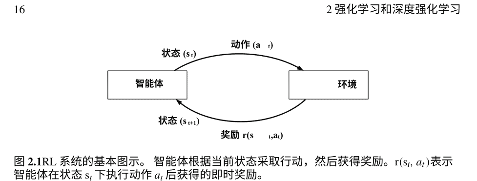
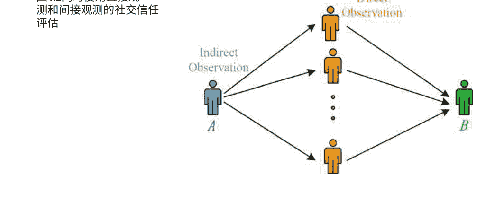

# 面向无线网络的深度强化学习

## 前言

### 对“深度强化学习在无线网络中的应用”进行简要介绍

机器学习和无线系统的研究活动出现了一股现象级的爆发。 机器学习起源于人工智能领域中一系列强大的技术，并在数据挖掘中得到了广泛应用，使系统能够从训练数据中学习有用的结构模式和模型。 强化学习是机器学习的一个重要分支，其中代理通过与环境的交互学习采取能够产生最大奖励的行动。 强化学习的主要优势在于它能够在没有对环境的精确数学模型的先验知识的情况下良好地工作。 然而，传统的强化学习方法存在一些缺点，例如对最优行为策略的收敛速度较低以及无法解决高维状态空间和动作空间的问题。 这些缺点可以通过深度强化学习来解决。 深度强化学习的关键思想是利用深度神经网络的强大函数逼近性质来近似值函数。 在训练深度神经网络之后，给定一个状态-动作对作为输入，深度强化学习能够估计长期奖励。 估计结果可以指导代理选择最佳行动。

深度强化学习已成功应用于解决许多实际问题。 例如，Google DeepMind在几个人工智能项目中采用了这种方法，并取得了很好的结果（例如AlphaGo）。在本书中，我们利用深度强化学习方法来改善无线网络的系统性能。

作为本书的第一章，第1章介绍了机器学习算法，分为四类：监督学习、无监督学习、半监督学习和强化学习。 本章介绍了广泛使用的机器学习算法。 每个算法都用一些例子简要解释。

第2章重点介绍强化学习和深度强化学习。首先简要回顾了强化学习和 Q-learning。然后，介绍了最新的深度 Q网络，以及超越深度 Q网络的双重深度 Q网络和dueling深度 Q网络。

第三章介绍了一种在具有缓存的机会性干扰对齐无线网络中采用深度强化学习方法的方法。大多数现有的缓存启用干扰对齐无线网络的研究假设信道是不变的，这在实际无线环境中是不现实的，因为信道是时变的。在本章中，我们考虑了现实的时变信道。

当考虑现实的时变信道时，系统的复杂性非常高。我们在本章中使用Google TensorFlow实现深度强化学习，以获得缓存启用的机会性干扰对齐无线网络中的最优干扰对齐用户选择策略。通过使用所提出的方法，通过模拟结果展示了缓存启用的机会性干扰对齐网络在网络总速率和能量效率方面的性能可以得到显著改善。

第四章考虑了基于信任的移动社交网络，具有移动边缘计算、网络内缓存和设备对设备通信。通过综合考虑信任值、计算能力、无线信道质量和所有可用节点的缓存状态，制定了一个最大化网络运营商效用的优化问题。我们采用深度强化学习方法来自动决策最优网络资源分配。决策纯粹通过观察网络状态进行，而不是通过任何手工制作或明确的控制规则，这使得它适应可变的网络条件。通过使用不同的网络参数展示了所提出方案的有效性。

这本书对于这个领域的研究人员和实践者都很有用。读者会发现每章节中的丰富参考资料特别有价值。

加拿大安大略省渥太华 2018年10月 F. Richard Yu 何颖

## 第一章 机器学习简介

摘要 机器学习是从人工智能领域中发展出来的一系列强大技术，已广泛应用于数据挖掘，使系统能够从训练数据中学习有用的结构模式和模型。机器学习算法基本上可以分为四类：监督学习、无监督学习、半监督学习和强化学习。本章介绍了广泛使用的机器学习算法。每个算法都用一些示例简要解释。

机器学习方法通常包括两个主要阶段：训练阶段和决策阶段，如图1.1所示。在训练阶段，机器学习方法被应用于使用训练数据集学习系统模型。在决策阶段，系统可以通过使用训练好的模型为每个新的输入获取预测输出。图1.2展示了监督学习、无监督学习、半监督学习和强化学习，下面将对它们进行描述。

### 1.1 监督学习

监督学习是一种标记学习技术。监督学习算法通过给定带有标签的训练数据集（即输入和已知输出）来构建表示输入和输出之间学习关系的系统模型。训练完成后，当新的输入被输入到系统中时，训练好的模型可以用于获取预期的输出[1, 2]。接下来，我们将详细介绍一些广泛使用的监督学习算法，如k最近邻算法、决策树、随机森林、神经网络、支持向量机、贝叶斯理论和隐马尔可夫模型。

图1.1 机器学习方法的一般处理过程

#### 1.1.1 k最近邻算法 (k-NN)

k-NN是一种监督学习技术，根据未分类样本的k个最近邻确定数据样本的分类。

k-NN算法的过程非常简单：如果k个最近邻中大多数属于某个类别，则未分类样本将被分类到该类别。图1.3展示了k-NN算法的一个简单示例。

特别是当$k=1$时，它变成了最近邻算法。$k$的值越高，噪声对分类的影响越小。由于距离是$k$-NN算法的主要度量标准，因此可以应用多种函数来定义未标记样本与其邻居之间的距离，例如切比雪夫距离、曼哈顿距离、欧氏距离和欧氏距离的平方。有关$k$-NN的更深入讨论，请参考[3]。

#### 1.1.2 决策树 (DT)

决策树是一种通过学习树来进行分类的技术之一。在树中，每个节点表示数据的一个特征（属性），所有分支表示导致分类的特征的连接，并且每个叶节点是一个类标签。通过将未标记样本的特征值与决策树的节点进行比较，可以对其进行分类[4, 5]。决策树具有许多优点，例如直观的知识表达、简单的实现和高分类准确性。ID3 [6]、C4.5 [7]和CART [8]是三种广泛使用的决策树算法，用于对训练数据集进行分类。

图1.2 常见的机器学习算法应用于SDN。它们之间最大的区别是用于构建决策树的分割准则。ID3、C4.5和CART使用的分割准则分别是信息增益、增益比和基尼不纯度。参考文献[9]对这三种决策树算法进行了详细比较。

#### 1.1.3 随机森林

随机森林方法[10]，也称为随机决策森林，可用于分类和回归任务。随机森林由许多决策树组成。为了减轻决策树方法的过拟合问题并提高准确性，随机森林方法随机选择特征空间的子集来构建每棵决策树。使用随机森林方法对新的数据样本进行分类的步骤是：(a) 将数据样本放入森林中的每棵树中。(b) 每棵树都会给出一个分类结果，即树的“投票”。(c) 数据样本将被分类到得票最多的类别中。

图1.3 $k$-NN算法示例，$k=5$。在五个最近的邻居中，一个邻居属于A类，四个邻居属于B类。在这种情况下，未标记的示例将被分类为B类。

图1.4一个基本的神经网络，包括三层：输入层、隐藏层和输出层。一个输入具有$m$个特征（即$X_1$，$X_2$，...，$X_m$），输入可以被分配给$n$个可能的类别（即$Y_1$，$Y_2$，...，$Y_n$）。此外，$W_{ij}^l$表示第$l$层的第$i$个神经元与第$l+1$层的第$j$个神经元之间的变量链接权重，$a_k^l$表示第$l$层中第$k$个神经元的激活函数。

#### 1.1.4 神经网络 (NN)

神经网络是由大量简单处理单元组成的计算系统，这些单元并行操作，从历史数据中学习经验知识[11]。神经网络的概念受到人脑的启发，人脑使用称为神经元的基本组件执行高度复杂、非线性和并行计算。在神经网络中，其节点是人脑中神经元的等效组件。这些节点使用激活函数执行非线性计算。最常用的激活函数是Sigmoid函数和双曲正切函数[12]。模拟人脑中神经元之间的连接方式，神经网络中的节点通过可变的连接权重相互连接。

一个神经网络有很多层。第一层是输入层，最后一层是输出层。输入层和输出层之间的层是隐藏层。每一层的输出是下一层的输入，最后一层的输出是结果。通过改变隐藏层的数量和每层的节点数量，可以训练复杂的模型来提高神经网络的性能。神经网络广泛应用于诸多领域，如模式识别。最基本的神经网络有三层，包括输入层、隐藏层和输出层，如图1.4所示。

神经网络有许多类型，通常分为有监督和无监督两种训练类型[13]。接下来，我们将详细介绍已应用于SDN领域的有监督神经网络的表示。在第1.2.2节中，将描述一种代表性的无监督神经网络，即自组织映射。

##### 随机神经网络

随机神经网络可以被表示为一个互连的神经元网络，它们交换尖峰信号。随机神经网络与其他神经网络的主要区别在于，随机神经网络中的神经元以激励性和抑制性尖峰信号的概率方式进行交换。在随机神经网络中，每个神经元的内部激励状态由一个整数表示，称为“电位”。当神经元接收到激励性尖峰信号时，其电位值上升；当神经元接收到抑制性尖峰信号时，其电位值下降。电位值严格为正的神经元可以根据特定的神经元相关尖峰率向其他神经元发送激励性或抑制性尖峰信号。当一个神经元发送出一个尖峰信号时，其电位值减少一。随机神经网络已经被用于分类和模式识别[14]。关于随机神经网络的更深入讨论，请参考[14-16]。

##### 深度神经网络

具有单个隐藏层的神经网络通常被称为浅层神经网络。相反，将输入层和输出层之间具有多个隐藏层的神经网络称为深度神经网络[17-19]。长期以来，浅层神经网络经常被使用。为了处理高维数据并学习越来越复杂的模型，需要具有更多隐藏层和神经元的深度神经网络。

然而，深度神经网络增加了训练的困难，并需要更多的计算资源。近年来，硬件数据处理能力的发展（例如GPU和TPU）和进化的激活函数（例如ReLU）使得训练深度神经网络成为可能[20]。在深度神经网络中，每个层的神经元根据前一层的输出训练特征表示，这被称为特征层次结构。特征层次结构使得深度神经网络能够处理大型高维数据集。由于多层特征表示学习，与其他机器学习技术相比，深度神经网络通常提供更好的性能[20]。

##### 卷积神经网络

卷积神经网络和循环神经网络是深度神经网络的两种主要类型。卷积神经网络[21, 22]是一种前馈神经网络。局部稀疏连接在连续的层之间，权重共享和池化是卷积神经网络的三个基本思想。权重共享意味着同一卷积核中所有神经元的权重参数是相同的。局部稀疏连接和权重共享可以减少训练参数的数量。池化可以用来减小特征的大小，同时保持特征的不变性。这三个基本思想极大地减少了卷积神经网络的训练难度。

##### 循环神经网络

在前馈神经网络中，信息从输入层沿着方向传输到输出层。然而，循环神经网络[23, 24]是一种有状态的网络，可以使用内部状态（记忆）来处理序列数据。图1.5显示了一个典型的循环神经网络及其展开形式。$X_t$是时间步长$t$的输入。$h_t$是时间步长 $t$的隐藏状态。$h_t$捕捉了所有先前时间步骤中发生的信息，因此被称为“记忆”。$Y_t$是时间步长$t$的输出。$U$，$V$和 $W$是循环神经网络中的参数。与传统的深度神经网络不同，循环神经网络在所有时间步长上共享相同的参数（即 $U$，$V$和 $W$）。这意味着在每个时间步长上，循环神经网络执行相同的任务，只是输入不同。通过这种方式，需要训练的参数总数大大减少。长短期记忆（LSTM）[25, 26]是最常用的循环神经网络类型，具有很好的捕捉长期依赖性的能力。LSTM使用三个门（即输入门、输出门和遗忘门）来计算隐藏状态。

图1.5 典型的循环神经网络及其展开形式。$X_{t}$是时间步骤 $t$ 的输入。$h_{t}$是时间步骤 $t$的隐藏状态。$Y_{t}$是时间步骤 $t$ 的输出。$U$, $V$ 和 $W$ 是循环神经网络中的参数。

#### 1.1.5 支持向量机 (SVM)

支持向量机 (SVM) 是另一种流行的监督学习方法，由Vapnik和其他人发明[27]，在分类和模式识别中被广泛应用。SVM的基本思想是将输入向量映射到高维特征空间中。这种映射是通过应用不同的核函数实现的，例如线性、多项式和径向基函数 (RBF)。核函数的选择是SVM中的一个重要任务，它对分类准确度有影响。核函数的选择取决于训练数据集。如果数据集是线性可分的，线性核函数效果很好。如果数据集不是线性可分的，多项式和RBF是两种常用的核函数。总体而言，基于RBF的SVM分类器相对于其他两种核函数具有较好的性能[28, 29]。

支持向量机的目标是在特征空间中找到一个分离超平面，以最大化不同类别之间的间隔。需要注意的是，间隔是超平面与每个类别最近数据点之间的距离。相应的最近数据点被定义为支持向量。支持向量机分类器的示例如图1.6所示。从图中可以看出，存在许多可能的分离超平面在两个类别之间，但只有一个最优的分离超平面可以最大化间隔。有关支持向量机的更深入讨论，请参考[30-32]。

#### 1.1.6 贝叶斯理论

贝叶斯理论使用条件概率来计算事件在给定可能与事件相关的条件先验知识的情况下发生的概率。贝叶斯理论在数学上定义如下方程：

图1.6 SVM分类器的一个示例，具有最优线性超平面。图中有两个类别，每个类别都有一个支持向量。可以看出，在两个类别之间有许多可能的分离超平面，例如 \( H_1 \), \( H_2 \) 和 \( H_3 \)，但只有一个最优的分离超平面（即 \( H_2 \)）可以最大化间隔。

$$ P(H|E) = \frac{P(E|H)P(H)}{P(E)} \tag{1.1} $$

其中 \( E \) 是新的证据，\( H \) 是一个假设，\( P(H|E) \) 是给定新证据 \( E \) 的假设 \( H \) 成立的后验概率，\( P(E|H) \) 是给定假设 \( H \) 的证据 \( E \) 的后验概率，\( P(H) \) 是与证据 \( E \) 无关的假设 \( H \) 的先验概率，\( P(E) \) 是证据 \( E \) 的概率。

在一个分类问题中，贝叶斯理论通过使用训练数据集来学习概率模型。证据 \( E \) 是一个数据样本，假设 \( H \) 是要为数据样本分配的类别。后验概率 \( P(H|E) \) 表示数据样本属于某个类别的概率。为了计算后验概率 \( P(H|E) \)，首先需要计算 \( P(H) \)、\( P(E) \) 和 \( P(E|H) \)，这是使用概率和统计理论基于训练数据集的学习过程。在对新的输入数据样本进行分类时，可以使用概率模型计算不同类别的多个后验概率。数据样本将被分类到具有最高后验概率 \( P(H|E) \) 的类别中。贝叶斯理论的优点是它只需要相对较少的训练数据集来学习概率模型[33]。然而，在使用贝叶斯理论时存在一个重要的独立性假设。为了方便计算 \( P(E|H) \)，假设训练数据集中的数据样本特征相互独立[34]。

要对贝叶斯理论进行更深入的讨论，请参考[33, 35-38]。

#### 1.1.7 隐马尔可夫模型 (HMM)

HMM是马尔可夫模型的一种。马尔可夫模型广泛应用于随机动态环境中，遵循无记忆性质。马尔可夫模型的无记忆性质意味着未来状态的条件概率分布仅与当前状态的值有关，并且与所有先前的状态无关[39, 40]。还有其他马尔可夫模型，例如马尔可夫链(MC)。HMM与其他模型的主要区别在于HMM通常应用于系统状态部分可见或完全不可见的环境中。

### 1.2 无监督学习

与监督学习相反，无监督学习算法给出一个没有标签的输入集合（即没有输出）。基本上，无监督学习算法旨在通过将样本数据聚类成不同的组来发现无标签数据中的模式、结构或知识，根据它们之间的相似性。无监督学习技术广泛应用于聚类和数据聚合[2, 41]。接下来，我们将详细介绍常用的无监督学习算法，如k-means和自组织映射。

#### 1.2.1 k均值算法

k-means算法是一种流行的无监督学习算法，用于将一组未标记的数据识别为不同的簇。要实现k-means算法，只需要两个参数（即初始数据集和期望的簇数）。如果期望的簇数为 k ，则使用k-means算法解决节点聚类问题的步骤为：（a） 随机选择k个节点作为初始簇质心；（b） 使用距离函数将每个节点标记为最近的质心；（c） 根据当前节点成员关系分配新的质心；（d） 如果收敛条件成立，则停止算法，否则返回步骤（b）。k-means算法的示例过程如图1.7所示。有关k-means的更深入讨论，请参阅[2, 42]。

#### 1.2.2 自组织映射 (SOM)

自组织特征映射（SOM）也被称为自组织特征映射（SOFM），是最受欢迎的无监督神经网络模型之一。SOM经常用于进行维度缩减和数据聚类。一般来说，SOM有两层，一个输入层和一个映射层。当SOM用于进行数据聚类时，映射层中的神经元数量等于期望的聚类数量。每个神经元都有一个权重向量。

SOM算法的步骤如下：
- (a) 初始化映射层中每个神经元的权重向量；
- (b) 从训练数据集中选择一个数据样本；
- (c) 使用距离函数计算输入数据样本与所有权重向量之间的相似度。具有最高相似度的权重向量的神经元被称为最佳匹配单元（BMU）。SOM算法基于竞争学习，这意味着每次只有一个BMU。
- (d) 计算BMU的邻域。
- (e) 调整BMU邻域中神经元的权重向输入数据样本靠近（包括BMU本身）。
- (f) 如果收敛条件成立，则停止算法，否则返回步骤 (b)。

有关SOM的更深入讨论，请参阅[43, 44]。

### 1.3 半监督学习

半监督学习[45, 46]是一种同时使用有标签和无标签数据的学习方法。半监督学习有几个有用之处。首先，在许多实际应用中，获取有标签数据是昂贵且困难的，而获取大量无标签数据相对容易和廉价。其次，在训练过程中有效利用无标签数据实际上有助于提高训练模型的性能。为了充分利用无标签数据，在半监督学习中必须满足一些假设，如平滑性假设、聚类假设、低密度分离假设和流形假设。伪标签法[47, 48]是一种简单高效的半监督学习技术。伪标签法的主要思想很简单。首先，使用有标签数据训练模型。然后，使用训练好的模型预测无标签数据的伪标签。最后，将有标签数据和新的伪标签数据结合起来再次训练模型。还有其他半监督学习方法，如期望最大化（EM）、共训练、转导支持向量机和基于图的方法。不同的方法依赖于不同的假设[49]。

例如，EM算法基于聚类假设，转导式支持向量机基于低密度分离假设，而基于图的方法则基于流形假设。

## 参考文献

1. S. B. Kotsiantis, I. Zaharakis, and P. Pintelas, “监督机器学习：分类技术综述”, Emerging Artificial Intelligence Applications in Computer Engineering, 卷160, 页3-24, 2007年。
2. J. Friedman, T. Hastie, and R. Tibshirani, 统计学习的要素。 Springer Series in Statistics New York, 2001, vol. 1.
3. T. Cover and P. Hart, “最近邻模式分类”, IEEE Trans. Information Theory, 卷13, 号1, 页21-27, 1967年。
4. L. Breiman, J. Friedman, C. J. Stone, and R. A. Olshen, 分类和回归树. CRC Press, 1984.
5. J. Han, J. Pei, and M. Kamber, 数据挖掘：概念与技术. Elsevier, 2011.
6. J. R. Quinlan, “决策树的归纳”, 机器学习, vol. 1, no. 1, pp. 81–106, 1986.
7. S. Karatsiolis and C. N. Schizas, “基于区域的支持向量机算法用于Pima Indian Diabetes数据集的医学诊断”, in Proc. IEEE BIBE’12, Larnaca, Cyprus, Nov.2012, pp. 139–144.
8. W. R. Burrows, M. Benjamin, S. Beauchamp, E. R. Lord, D. McCollor, and B. Thomson, “CART决策树统计分析和对加拿大温哥华、蒙特利尔和大西洋地区夏季最大地表臭氧的预测”, 应用气象学杂志, vol. 34, no. 8, pp. 1848–1862, 1995.
9. A. Kumar, P. Bhatia, A. Goel, 和 S. Kole, “基于决策树的算法的实现和比较;”国际计算机科学创新与进步杂志,vol. 4, pp. 190–196, May. 2015.
10. L. Breiman, “随机森林,” 机器学习 , vol. 45, no. 1, pp. 5–32, 2001.
11. S. Haykin, 神经网络: 一个全面的基础. Prentice Hall PTR, 1994.
12. S. Haykin 和 N. Network, “一个全面的基础,”神经网络, vol. 2, no. 2004, p. 41, 2004.
13. K. Lee, D. Booth, 和 P. Alam, “在预测韩国公司破产方面, 监督和无监督神经网络的比较,”专家系统与应用, vol. 29, no. 1,pp. 1–16, 2005.
14. S. Timotheou, “随机神经网络综述”, 《计算机杂志》, 第53卷, 第3期, 251-267页, 2010年3月.
15. S. Basterrech和G. Rubino, “关于监督学习中随机神经网络的教程”, 《arXiv预印本arXiv :1609.04846》, 2016年.
16. H. Bakircioglu和T. Kocak, “随机神经网络应用综述”, 《欧洲运筹学杂志》, 第126卷, 第2期, 319-330页, 2000年.
17. Y. LeCun, Y. Bengio和G. Hinton, “深度学习”, 《自然》, 第521卷, 第7553期, 第436页, 2015年.
18. J. Baker, “人工神经网络和深度学习”, 2015年2月. [在线]. 可访问: http://lancs.ac.uk/~bakerj1/pdfs/ANNs/Artificial_neural_networks-report.pdf
19. J. Schmidhuber, “神经网络中的深度学习概述,”神经网络, vol. 61, pp. 85–117, 2015.
20. G. Pandey 和 A. Dukkipati, “通过拉伸深度网络进行学习,”在国际机器学习会议, 2014, pp. 1719–1727.
21. A. Krizhevsky, I. Sutskever, 和 G. E. Hinton, “使用深度卷积神经网络进行Imagenet分类,”在神经信息处理系统进展, 2012, pp. 1097–1105.
22. C. Li, Y. Wu, X. Yuan, Z. Sun, W. Wang, X. Li, 和 L. Gong, “基于深度学习在基于OpenFlow的SDN中检测和防御DDoS攻击,”国际通信系统杂志, 2018.
23. T. Mikolov, M. Karafit, L. Burget, J. Cernocky, 和 S. Khudanpur, “基于循环神经网络的语言模型,”在国际语音通信协会第十一届年会, 2010年.
24. H. Sak, A. Senior, 和 F. Beaufays, “用于大规模声学建模的长短期记忆循环神经网络架构,”在国际语音通信协会第十五届年会, 2014年.
25. S. Hochreiter 和 J. Schmidhuber, “长短期记忆,”神经计算, 第9卷, 第8期, 页码 1735–1780, 1997年.
26. X. Li 和 X. Wu, “基于长短期记忆的深度循环神经网络构建大词汇语音识别,”在IEEE ICASSP’15会议, 澳大利亚布里斯班,2015年4月, 页码 4520–4524.
27. V. N. Vapnik 和 V. Vapnik, 统计学习理论. Wiley 纽约, 1998, 卷 1.
28. B. Yekkehkhany, A. Safari, S. Homayouni, 和 M. Hasanlou, “不同核函数在基于SVM的多时相极化SAR数据分类中的比较研究.”国际摄影测量、遥感和空间信息科学档案,卷40 , 号 2, 页 281, 2014.
29. A. Patle 和 D. S. Chouhan, “用于分类的SVM核函数,”在IEEE ICATE’13 会议录, 孟买, 印度,2013年 1月, 页 1–9.
30. I. Steinwart 和 A. Christmann, 支持向量机. Springer 科学与商业媒体, 2008年.

- 31. M. Martinez-Ramírez 和 C. Christodoulou, “支持向量机在天线阵列处理和电磁学中的应用”, 计算电磁学综合讲座, 卷1, 号1, 页1-120, 2005年。
- 32. H. Hu, Y. Wang 和 J. Song, “基于谱相关分析和SVM的信号分类在认知无线电中的应用”, 在 IEEE AINA'08 会议上, 冲绳, 日本, 2008年3月, 页883-887。
- 33. G. E. Box 和 G. C. Tiao, 《贝叶斯统计分析中的推断》, John Wiley & Sons, 2011年, 卷40。
- 34. J. Bakker, “使用SDN/OpenFlow进行智能流量分类以检测DDoS攻击”, 维多利亚大学, 页1-142, 2017年。
- 35. N. Friedman, D. Geiger, 和 M. Goldszmidt, “贝叶斯网络分类器”, 机器学习, vol. 29, no. 2–3, pp. 131–163, 1997.
- 36. F. V. Jensen, 《贝叶斯网络入门》, UCL出版社, 伦敦, 1996, vol. 210.
- 37. D. Heckerman 等, “贝叶斯网络学习教程”, Nato Asi Series D 行为和社会科学, vol. 89, pp. 301–354, 1998.
- 38. T. D. Nielsen 和 F. V. Jensen, 《贝叶斯网络和决策图》, Springer科学与商业媒体, 2009.
- 39. L. R. Rabiner, “隐马尔可夫模型及其在语音识别中的应用教程”, IEEE会议论文集, vol. 77, no. 2, pp. 257–286, Feb. 1989.
- 40. P. Holgado, V. A. VILLALBA, 和 L. Vazquez, “基于隐马尔可夫模型的实时多步攻击预测”, IEEE Trans. Dependable and Secure Computing, vol. PP, no. 99, pp. 1–1, 2017.
- 41. E. Alpaydin, 《机器学习导论》, MIT Press, 2014.
- 42. T. Kanungo, D. M. Mount, N. S. Netanyahu, C. D. Piatko, R. Silverman, 和 A. Y. Wu, “一种高效的k-means聚类算法: 分析与实现”, IEEE Trans. Pattern Analysis and Machine Intelligence, vol. 24, no. 7, pp. 881–892, Jul. 2002.
- 43. T. Kohonen, “自组织映射”, Neurocomputing, vol. 21, no. 1–3, pp. 1–6, 1998.
- 44. M. M. Van Hulle, “自组织映射”, 收录于《自然计算手册》, Springer, 2012年, 第585-622页。
- 45. X. Zhu, “半监督学习文献综述”, Citeseer, 2005年, 第1-59页。
- 46. X. Zhou 和 M. Belkin, “半监督学习”, 收录于学术出版社信号处理图书馆, Elsevier, 2014年, 卷1, 第1239-1269页。
- 47. D.-H. Lee, “伪标签：用于深度神经网络的简单高效的半监督学习方法”, 收录于ICML挑战中的表示学习研讨会, 2013年, 卷3, 第2页。
- 48. H. Wu 和 S. Prasad, “使用伪标签的半监督深度学习用于高光谱图像分类”, IEEE图像处理期刊, 2018年3月, 卷27, 第1259-1270页。
- 49. O. Chapelle, B. Scholkopf, and A. Zien, “半监督学习 (chapelle, o. et al., eds.; 2006)[书评]”, IEEE Trans. Neural Networks, vol. 20, no. 3, pp. 542–542, 2009.

摘要 为了更好地理解最先进的强化学习代理，深度Q网络，首先简要回顾了强化学习和Q学习。然后介绍了深度Q网络的最新进展，并提出了超越深度Q网络的双重深度Q网络和对抗深度Q网络。

### 2.1 强化学习

强化学习是机器学习的重要分支，代理通过与环境的交互学习采取能够产生最大奖励的行动。与监督学习不同，强化学习无法从经验丰富的外部监督者提供的样本中学习。相反，它必须基于自己的经验进行操作，尽管面临着环境的显著不确定性。

强化学习的定义不是对学习方法的描述，而是对学习问题的描述。任何适用于解决该问题的方法都可以被视为强化学习方法[1]。

强化学习问题可以被描述为马尔可夫决策过程（MDP）的最优控制，但并不一定需要状态空间、明确的转移概率和奖励函数[2]。因此，强化学习在处理接近现实世界复杂性的困难情况时非常强大[3]。

强化学习有两个显著特点：试错搜索和延迟奖励。试错搜索意味着在探索和利用之间进行权衡。代理倾向于利用过去尝试过的有效行动来产生奖励，但它也必须探索可能在未来产生更高奖励的新行动。代理必须尝试各种行动，并逐渐偏爱那些获得最多奖励的行动。强化学习的另一个特点是代理关注整体情况，不仅考虑即时奖励，还考虑长期累积奖励，这被指定为值函数。

图 2.1 RL系统的基本图示。智能体根据当前状态采取行动，然后获得奖励。r(s_t, a_t)表示智能体在状态s_t下执行动作a_t后获得的即时奖励。

一般来说，强化学习可以分为无模型和有模型的强化学习，这取决于环境元素是否已知。无模型的强化学习最近已成功应用于处理深度神经网络和值函数[3-6]。它可以直接使用原始状态表示作为神经网络的输入来学习复杂任务的策略[7]。相比之下，有模型的强化学习通过监督学习来学习系统的模型，并在该模型下优化策略[7-9]。最近，有模型强化学习的元素已被纳入无模型深度强化学习中，以加快学习速度，同时保留无模型学习的优势[7]。无模型强化学习算法之一是Q学习。Q学习算法最重要的组成部分是一种正确且高效地估计Q值的方法。Q函数可以通过查找表或函数逼近器（有时是非线性逼近器，如神经网络，甚至更复杂的深度神经网络）来实现。结合深度神经网络的Q学习被称为深度Q学习。

### 2.2 深度Q学习

使用神经网络表示Q函数的代理被称为Q网络，用Q(x, a; θ)表示。参数θ代表神经网络的权重，Q网络通过在每次迭代中更新θ来逼近真实的Q值。尽管神经网络具有很大的灵活性，但在Q学习中，这样做会牺牲稳定性，这在[3]中有所解释。

最近提出了使用深度神经网络而不是逼近Q函数的深度Q网络，并且证明它在性能和学习稳定性方面更有优势[3]。为了将普通的Q网络转化为深度Q网络，已经实施了三项改进。

- 使用先进的多层深度卷积网络替换普通的神经网络，这些网络利用分层的平铺卷积滤波器，利用局部空间相关性，可以从原始输入数据中提取高级特征[2, 10]。
- 利用经验回放，将其交互经验元组e(t) = (x(t), a(t), r(t), x(t + 1))在时间 t 存储到回放内存 D(t) = {e(1), ..., e(t)}中，并从经验池中随机抽取批次来训练深度卷积网络的参数，而不是像 Q-learning 那样直接使用连续的样本。这使得网络能够从更多不同的过去经验中学习，并限制网络只关注当前正在进行的任务。
- 采用第二个网络来生成用于计算训练过程中每个动作的目标 Q 值。一个网络同时用于估计 Q 值和目标 Q 值会导致目标值和估计值之间陷入反馈循环。因此，为了稳定训练，目标网络的权重被固定并定期更新。

通过最小化损失函数L(θ)来训练深度Q函数，使其逼近目标值，并且损失函数可以表示为

$$ L_{θ_i} = E[(y_i - Q(x, a; θ_i))^2] $$

在这里，权重θ_i通过θ_i^- = θ_i - G进行更新，即在深度Q网络中，权重每隔G个时间步骤更新一次，而不是θ_i = θ_{i-1}。

### 2.3 超越深度 Q 学习

自从深度Q学习被提出以来，为了获得更好的性能和更高的稳定性，人们付出了巨大的努力。在这里，我们简要介绍了两个最近的改进：Double DQN [11]和Dueling DQN [4]。

#### 2.3.1 双重 DQN

在常规的DQN中，选择动作和评估所选择的动作都使用Q值的最大值，这会导致过于乐观的Q值估计。为了缓解过高估计的问题，双重DQN中的目标值被设计和更新为

$$ y_{双} = r + γ Q(x', arg max_{a'} Q(x', a'; θ_i); θ_i^-) $$

其中动作选择与目标Q值的生成分离。这个简单的技巧显著减少了过高估计，并且训练过程更快更可靠。

#### 2.3.2 对决 DQN

Dueling DQN的直觉是，并不总是需要估计采取每个可用动作的价值。对于某些状态，选择动作对发生的事情没有影响。因此，在dueling DQN中，状态-动作值Q(x, a)被分解为两个组成部分，如下所示，

$$ Q(x, a) = V(x) + A(a) \tag{2.3} $$

在这里，V(x)是价值函数，简单地表示处于给定状态x的好坏程度。A(a)是优势函数，衡量某个动作相对于其他动作的相对重要性。在计算出V(x)和 A(a)后，它们的值会在最后一层合并成一个单一的Q函数。这种改进将导致更好的策略评估。

将上述两种技术结合起来可以实现更好的性能和更快的训练速度。在下一节中，利用具有这两种改进的深度Q网络来寻找实际网络应用的最优策略。

## 参考文献

- 1. R. S. Sutton, “引言：强化学习的挑战”, 《强化学习》, Springer, 1992年, 第1-3页。
- 2. H. Y. Ong, K. Chavez 和 A. Hong, “分布式深度Q学习”, 《arXiv预印本arXiv:1508.04186》, 2015年。
- 3. V. Mnih, K. Kavukcuoglu, D. Silver, A. A. Rusu, J. Veness, M. G. Bellemare, A. Graves, M. Riedmiller, A. K. Fidjeland, G. Ostrovski 等, "通过深度强化学习实现人类水平的控制", 《自然》, 第518卷, 第7540期, 第529-533页, 2015年。
- 4. Z. Wang, N. de Freitas, and M. Lanctot, "用于深度强化学习的对决网络架构", arXiv预印本arXiv:1511.06581, 2015年。
- 5. M. Hausknecht and P. Stone, "参数化动作空间中的深度强化学习", arXiv预印本arXiv:1511.04143, 2015年。
- 6. T. P. Lillicrap, J. J. Hunt, A. Pritzel, N. Heess, T. Erez, Y. Tassa, D. Silver, and D. Wierstra, “使用深度强化学习进行连续控制”, arXiv预印本arXiv:1509.02971, 2015年。
- 7. S. Gu, T. Lillicrap, I. Sutskever, and S. Levine, “基于模型的连续深度Q学习加速”, arXiv预印本arXiv:1603.00748, 2016年。
- 8. S. Levine, C. Finn, T. Darrell, and P. Abbeel, “端到端训练深度视觉运动策略”, 机器学习研究杂志, 第17卷, 第39期, 第1-40页, 2016年。
- 9. M. Deisenroth and C. E. Rasmussen, “Pilco: 一种基于模型和数据高效的策略搜索方法”, 在第28届国际机器学习大会(ICML-11)上的论文集, 2011年, 第465-472页。
- 10. V. Mnih, K. Kavukcuoglu, D. Silver, A. Graves, I. Antonoglou, D. Wierstra, and M. Riedmiller, “使用深度强化学习玩Atari游戏”, arXiv预印本arXiv:1312.5602, 2013年。
- 11. H. Van Hasselt, A. Guez, and D. Silver, “使用双Q学习的深度强化学习”, CoRR, abs/1509.06461, 2015年。

## 第三章 深度强化学习用于干扰对齐无线网络

摘要 缓存和干扰对齐（IA）都是下一代无线网络的有希望的技术。然而，大多数现有的缓存-IA无线网络的研究假设信道是不变的，这在实际无线环境中是不现实的，因为信道是时变的。

在本章中，我们考虑现实的时变信道。具体而言，信道被建模为有限状态马尔可夫信道（FSMC）。当我们考虑现实的FSMC模型时，系统的复杂性非常高。因此，在本章中，我们提出了一种新颖的深度强化学习方法，它是一种使用深度Q网络来近似Q值-动作函数的先进强化学习算法。我们在本章中使用Google TensorFlow实现了深度强化学习，以获得缓存-IA无线网络中的最佳IA用户选择策略。通过使用所提出的方法，我们展示了缓存-IA网络在网络总速率和能量效率方面的性能可以显著提高。

### 3.1 引言

最近，无线主动缓存引起了学术界和工业界的极大关注[1, 2]。通过有效地减少网络中的重复内容传输，缓存被认为是未来无线网络中提高频谱效率、缩短延迟和降低能耗的有希望的技术之一[3-5]。基于全局流量特征，一些热门内容在短时间内被许多用户请求，这占据了大部分流量负载。因此，主动缓存热门内容可以减轻回程链路的负担。

另一种被广泛研究的新技术叫做干扰对齐(IA)，它是一种解决无线网络干扰问题的革命性技术[6]。IA利用发射机的合作来设计预编码矩阵，从而消除干扰。IA可以使移动蜂窝网络受益[7]。由于蜂窝网络中用户数量众多，多用户多样性已经与干扰对齐结合研究，称为机会干扰对齐，进一步提高了网络性能[8-11]。

同时考虑这两个重要技术，缓存和干扰对齐，在基于干扰对齐的无线网络中是有益的[12, 13]。干扰对齐的实现需要发射机之间的信道状态信息（CSI）交换，通常依赖于回程链路。回程链路的有限容量对干扰对齐的性能有重要影响[14]。缓存可以减轻回程链路的流量负载，因此节省的容量可以用于干扰对齐中的CSI交换。在[12]中，作者研究了缓存和干扰对齐在多输入多输出（MIMO）干扰信道中的益处，并通过优化活动发射机对的数量来最大化平均传输速率。在[13]中，通过适当地将内容放置在发射机的缓存中，可以增加干扰对齐的增益。

尽管在缓存和IA方面已经做了一些出色的工作，但是大多数之前的工作都假设信道是块状衰落信道或不变信道，其中当前时刻的估计CSI简单地被视为下一个时刻的预测CSI。考虑到无线环境的时变性质，这种无记忆信道假设是不现实的[15]，特别是在车辆环境中由于高移动性[16]。此外，由于信道估计误差、通信延迟和回程链路约束[17, 18]，获得完美的CSI是困难的。

在本章中，我们考虑现实的时变信道，并提出了一种新颖的基于深度强化学习的缓存增强机会式IA无线网络方法。深度强化学习是一种机器学习方法，是处理无线数据的强大工具[19]。本章的独特特点如下。

- 在时变信道系数条件下研究了缓存增强的机会式IA。信道被建模为有限状态马尔可夫信道（FSMC），在文献中被广泛接受用于描述衰落过程的相关结构[20-22]。考虑到FSMC模型可能比无记忆信道模型的方案具有显著的性能改进。
- 当我们考虑现实的FSMC模型时，系统的复杂性非常高。因此，在本章中，我们提出了一种新颖的深度强化学习方法。深度强化学习是一种先进的强化学习算法，它使用深度Q网络来近似Q值-动作函数[23]，并且已经在无线网络中用于提高性能[24, 25]。本章中使用深度强化学习来获得缓存增强的机会式IA无线网络中的最优IA用户选择策略。
- 我们使用Google TensorFlow来实现深度强化学习。展示了深度Q网络模型的可视化。通过使用不同的系统参数，展示了模拟结果的有效性。通过使用提出的深度强化学习方法，缓存增强的机会IA网络的性能得到了说明。

通过使用提出的深度强化学习方法，网络的总速率和能量效率得到了显著的提高。

本章的其余部分安排如下。在第3.2节中，介绍了系统模型。在第3.3节中介绍了深度强化学习算法。在第3.3节中，将缓存增强的机会IA网络形式化为深度强化学习过程。在第3.4节中讨论了模拟结果。最后，在第3.5节中提出了结论。

### 3.2 系统模型

在本节中，我们描述了IA模型，接着是时变信道。然后，我们描述了带有缓存的发射机。

#### 3.2.1 干扰对齐

IA是一种革命性的干扰管理技术，理论上使得网络的总速率与合作的发射机和接收机对数线性增长。也就是说，每个用户可以获得与干扰无关的容量 1/2 log(SNR) + o(log(SNR))。实际上，SNR在确定IA结果方面起着至关重要的作用。Cadambe和Jafar指出，IA在非常高的SNR下表现更好，在中等SNR水平下质量较低。与此同时，随着IA用户数量的增加，需要越来越高的SNR才能接近IA网络的理论最大总速率。因此，用户之间存在竞争来访问IA网络。

考虑一个 K用户的MIMO干扰信道。第k个发射机和接收机分别配备了 N_t^{[k]} 和 N_r^{[k]} 个天线。第 k个用户的自由度（DoF）表示为 d^{[k]}。第 k个接收机接收到的信号可以表示为

$$ y^{[k]}(t) = \mathbf{U}^{[k]\dagger}(t) \mathbf{H}^{[kk]}(t) \mathbf{V}^{[k]}(t) \mathbf{x}^{[k]}(t) + \sum_{j=1, j \neq k}^{K} \mathbf{U}^{[k]\dagger}(t) \mathbf{H}^{[kj]}(t) \mathbf{V}^{[j]}(t) \mathbf{x}^{[j]}(t) + \mathbf{U}^{[k]\dagger}(t) \mathbf{z}^{[k]}(t) $$

其中右侧的第一项表示期望信号，其他两项表示用户间干扰和噪声。H^{[kj]}(t)是 N_r^{[k]} × N_t^{[j]}从第 j个发射机到第 k个接收机在时间槽 t上的信道系数矩阵。每个 H^{[kj]}(t)的元素都是独立同分布的复高斯随机变量，均值为零，方差为一。V^{[k]}(t)和 U^{[k]}(t)分别是第k个用户的单位 N_t^{[k]} × d^{[k]}预编码矩阵和 N_r^{[k]} × d^{[k]}干扰抑制矩阵。x^{[k]}(t)和 z^{[k]}(t)分别是维度为 d^{[k]}的发送信号向量和 N_r^{[k]} × 1的噪声向量。加性白高斯噪声（AWGN）向量，其元素具有零均值和 σ² 方差，分别在第 k 个接收器处。

只有满足以下条件时，干扰才能完全消除
$$
\mathbf{U}^{[k]\dagger}(t) \mathbf{H}^{[kj]}(t) \mathbf{V}^{[j]}(t) = 0, \quad \forall j \neq k, \quad (3.2)
$$
$$
\text{秩} \left( \mathbf{U}^{[k]\dagger}(t) \mathbf{H}^{[kk]}(t) \mathbf{V}^{[k]}(t) \right) = d^{[k]}. \quad (3.3)
$$

在这个假设下，第 k 个接收器接收到的信号可以重写为
$$
\mathbf{y}^{[k]}(t) = \mathbf{U}^{[k]\dagger}(t) \mathbf{H}^{[kk]}(t) \mathbf{V}^{[k]}(t) \mathbf{x}^{[k]}(t) + \mathbf{U}^{[k]\dagger}(t) \mathbf{z}^{[k]}(t). \quad (3.4)
$$

为了满足条件（3.3），每个发射机都需要全局CSI。每个发射机可以估计其本地CSI（即直接链路），但其他链路的CSI只能通过与其他发射机通过回程链路共享CSI来获取[12]。因此，在IA网络中，回程链路不仅仅是与互联网连接的管道。有限的容量应该得到最佳利用。最近的进展集中在边缘缓存的好处上，它能够减少数据传输并为CSI共享留下更多的容量。详细内容在下面的小节中描述。在本章中，我们假设所有用户的总回程链路容量为C总，并且CSI估计完美，没有错误和时间延迟。

#### 3.2.2 带缓存的发射机

在信息爆炸的时代，大量的内容使得不可能所有内容都受欢迎。事实上，只有一小部分内容变得广泛流行。这意味着某些内容可能会被请求并且在短时间内发生的过载导致了网络拥塞和传输延迟。我们假设每个发射器都配备有一定存储空间的缓存单元。存储的内容可能遵循一定的流行度分布。

为了保持一致性，每个发射器的缓存通常存储相同的内容，通常是网页内容，从而减轻回程负担并缩短延迟时间。在[27]中，作者对预测不同类型网页内容的流行度的现有方法进行了调查。具体而言，他们表明不同类型的内容遵循不同的流行度分布。例如，在线视频的流行度增长符合幂律或指数分布，在线新闻的流行度可以用幂律或对数正态分布表示，等等。基于内容流行度分布和缓存大小，可以推导出缓存命中概率 `Phit` 和缓存未命中概率 `Pmiss`[12]。在本章中，具体的流行度分布不是重点，我们只关注两种状态，即请求的内容是否在缓存中。我们将这两种状态描述为 `Λ = {0, 1}`，其中0表示请求的内容不在缓存中，1表示在缓存中。

在本章中，我们考虑了一个具有有限背传容量和发射端配备缓存的MIMO干扰网络，如图3.1所示。有一个负责从每个用户收集信道状态和缓存状态、调度用户并分配有限资源的中央调度器。所有用户通过背传链路连接到中央调度器进行CSI交换和互联网连接，总容量有限。

当我们考虑现实的FSMC模型时，系统的复杂性非常高，这使得使用传统方法难以解决。在本章中，我们使用了一种新颖的强化学习方法来解决缓存启用的机会式IA无线网络中的优化问题。

### 3.3 问题建模

在本节中，我们首先将现实的时变信道形式化为有限状态马尔可夫信道（FSMC），然后演示如何将缓存启用的IA网络优化问题形式化为深度Q学习过程，该过程可以确定IA用户分组的最优策略。

#### 3.3.1 时变 IA 基础信道

我们将现实中的时变信道建模为有限状态马尔可夫链（FSMC），这是一种有效的方法来描述无线信道的衰落特性[20]。具体来说，本章中使用了一阶FSMC。

在这里，我们考虑一个多用户干扰网络，每个用户具有一个自由度，而接收信号与干扰噪声比（SINR）是一个重要的参数，可以用来反映无线信道的质量。

在基于干扰对消的无线网络中，如果完全消除干扰，第k个用户在时刻t的接收SINR可以推导如下：
$$
\text{SINR}^{[k]}(t) = \frac{|h^{[kk]}(t)|^2 P^{[k]}}{\sigma^2}
$$
另一方面，如果干扰没有完全消除，接收到的SINR是
$$
\text{SINR}^{[k]}(t) = \frac{|h^{[kk]}(t)|^2 P^{[k]}}{\sum_{j \neq k} |h^{[kj]}(t)|^2 P^{[j]} + \sigma^2}
$$
其中 $\mathbf{H}_{eff}^{[k]}(t) = \mathbf{U}^{[k]\dagger}(t) \mathbf{H}^{[kk]}(t) \mathbf{V}^{[k]}(t)$。

由于我们考虑到有用户调度的机会性IA网络，直接对某个用户的接收SINR建模为马尔可夫随机变量是不合适的。由于接收SINR和信道系数之间的关系，我们在使用IA后，将信道系数建模为马尔可夫随机变量 $|h^{[kj]}(t)|^2$。在这里，$|h^{[kj]}(t)|^2$ 是新建模的，因为它的分布未知。

我们将 $|h^{[kj]}|^2$ 的范围进行分区和量化，分成 H 个级别。每个级别对应于马尔可夫信道的一个状态。这个信道信息包含在系统状态中，在下面的子节中将详细讨论。我们考虑无线通信周期内的 T 个时间槽。让我们将时间时刻表示为 $t \in \{0, 1, 2, \ldots, T - 1\}$，当一个时间槽过去时，信道系数从一个状态变化到另一个状态。

#### 3.3.2 网络优化问题的建模

在我们的系统中，有 L 个候选人希望加入IA网络进行无线通信。我们假设IA网络的规模始终小于候选人的数量，这符合大量用户随时随地期望进行无线通信的事实。如前所述，信噪比的值影响干扰对齐的性能，占据更好信道的候选人更有利于接入IA网络。因此，我们在每个时间槽做出一个动作，决定哪些候选人是构建IA网络的最佳用户，基于他们当前的状态。

在这里，一个中央调度器负责获取每个候选者的CSI和缓存状态，然后将收集到的信息组合成系统状态。接下来，控制器将系统状态发送给代理，即深度Q网络，然后深度Q网络反馈当前时间点的最优动作 $\arg \max_{a} Q^*(x, a)$。在获得动作后，中央调度器将发送一个比特位来通知用户是否活跃，然后将相应的预编码向量发送给每个活跃的发射机。在执行动作后，系统将转移到一个新的状态，并根据奖励函数获得奖励。

**算法1：缓存启用的IA网络中的深度强化学习算法**

初始化。
初始化回放记忆。
使用 $\theta$ 初始化 $Q$ 网络参数。
使用 $\theta^- \leftarrow \theta$ 初始化目标 $Q$ 网络参数。

对于第 $k$ 个回合， $k=1,...,K$：
    初始化初始状态 $x$。
    对于 $t = 1, 2, 3, ..., T$ 执行：
        选择一个随机概率 $p$。
        如果 $p \geq \varepsilon$， 则
            选择 $a(t)$ a
        否则， 选择最大化 $aQ(x, a, \theta)$ 的 $a^*(t)$。
        随机选择一个解决方案 $a(t) = a^*(t)$。
        在系统中执行 $a(t)$。 观察奖励 $r(t)$ 和下一个状态 $x(t+1)$。 将经验 $(x(t), a(t), r(t), x(t+1))$ 存储在回放内存中。
        从回放内存中获取小批量样本 $(x(t), a(t), \zeta(t), x(t+1))$。
        对 $(y - Q(x, a, \theta)^2)$ 相对于 $\theta$ 执行梯度下降步骤。
        返回深度 $Q$ 网络中参数 $\theta$ 的值。
    结束循环
结束循环

在深度 $Q$ 网络中，回放记忆存储了代理的每个时间槽的经验。 每个时间点，从回放记忆中获取样本来更新 $Q$ 网络参数 $\theta$。 目标 $Q$ 网络参数 $\theta^-$ 每隔 $N$ 个时间点从 $Q$ 网络中复制一次。 采用 $\varepsilon$-贪婪策略来平衡探索和利用，即在已知知识的基础上平衡奖励最大化与尝试新动作以获取未知知识。

深度 $Q$ 网络的训练算法在算法1中描述。
为了获得最优策略，需要确定我们深度 $Q$ 学习模型中的动作、状态和奖励函数，这将在下面的子节中描述。

## 系统状态

当前系统状态 $x(t)$ 由 $L$ 个候选者的状态共同决定。
时间槽 $t$ 的系统状态被定义为,
$$
x(t) = \{|h^{[11]}(t)|^2, |h^{[12]}(t)|^2, \ldots, |h^{[kj]}(t)|^2, \ldots, |h^{[LL]}(t)|^2, c_1(t), c_2(t), \ldots, c_l(t), \ldots, c_L(t)\}. \tag{3.7}
$$

在这里，状态中有两个组成部分：经过IA技术处理后的信道系数 $|h^{[k,j]}(t)|^2$ 和缓存状态 $c_l(t)$。缓存状态 $c_l(t) \in \Lambda = \{0, 1\}$，索引 $l$ 表示第 $l$ 个候选项，且 $l = 1, 2, \ldots, L$。可能的系统状态数量可能非常大。由于维度灾难，传统方法很难处理我们的问题。

幸运的是，深度 $Q$ 网络能够成功地从高维输入中直接学习[23]，因此在我们的系统中使用是合适的。

## 系统动作

在系统中，中央调度器必须决定哪些候选者应该被设置为活动状态，并将相应的资源分配给活动用户。当前的组合动作 $a(t)$ 由
$$
a(t) = \{a_1(t), a_2(t), \ldots, a_L(t)\} \quad (3.8)
$$
表示，其中 $a_l(t)$ 表示第 $l$ 个候选者的控制，即 $a_l(t) = 0$ 表示在时隙 $t$ 中候选者 $l$ 是被动的（未被选择）， $a_l(t) = 1$ 表示它是活动的（被选择）。由于IA的约束，条件 $\sum_{l=1}^{L} a_l(t) \geq 3$ 必须得到满足。

## 奖励函数

系统奖励代表了优化目标，我们将目标设定为最大化IA网络的吞吐量，候选者的奖励函数定义如下：
$$
r_l(t) = \begin{cases}
a_l(t) \log_2 \left( 1 + \frac{|h^{[l,l]}(t)|^2 P^{[l]} x_l}{\sum_{j=1, j \neq l}^{L} a_j(t) |h^{[l,j]}(t)|^2 P^{[j]} x_j + \sigma^2} \right), & \text{如果 } c_l(t) = 1, \\
a_l(t) \min \left\{ \frac{1}{\sum_{i=1}^{L} a_i(t)} \left( C_{total} - C_c \sum_{i=1}^{L} a_i(t) \right), \log_2 \left( 1 + \frac{|h^{[l,l]}(t)|^2 P^{[l]} x_l}{\sum_{j=1, j \neq l}^{L} a_j(t) |h^{[l,j]}(t)|^2 P^{[j]} x_j + \sigma^2} \right) \right\}, & \text{如果 } c_l(t) = 0,
\end{cases} \tag{3.9}
$$
其中 $\sum_{i=1}^{L} a_i(t) \geq 3$ 是IA网络的条件， $C_{total}$是后向链路的总容量，而 $C_c$是分配给每个活动用户用于与其他活动用户共享CSI的保留容量。 对于第$l$个候选者，如果所请求的内容不在本地缓存中，它只能通过后向链路获取内容，并且将等量的容量（总容量减去用于CSI交换的总容量）分配给活动用户。 如果所请求的内容在缓存中，第$l$个候选者可以获得IA用户可以达到的最大速率。 我们假设现实中的IA情况是无法完全消除干扰的，即来自其他非直接信道的干扰泄漏仍然存在。 因此，第$l$个候选者的奖励由整个系统的状态决定，包括直接链路和非直接链路的状态。
$$
R = \max_{\pi} E \left[ \sum_{t=0}^{T-1} \epsilon^t r(t) \right] \quad (3.10)
$$
其中 $\epsilon^t$在 $t$足够大时趋近于零. 实际上，可以设置一个终止过程的阈值.

## 不完美CSI的影响

在(3.7)和(3.9)中，我们假设CSI是完美的。然而，在实际网络中，IA的实现需要在背传链路上进行发射机之间的CSI交换，这会导致CSI的延迟。背传链路的有限容量会对IA的性能产生重大影响，因为会导致CSI的延迟。假设 $\mathbf{H}(t)$是由时间点 $t$处的准确信道系数组成的矩阵。延迟信道矩阵表示如下。
$$
\widehat{\mathbf{H}}(t) = \rho \mathbf{H}(t - \tau) + \sqrt{1 - \rho^2} \delta = \rho \mathbf{H}(t) + \sqrt{1 - \rho^2} \delta \quad (3.11)
$$
其中，$\widehat{\mathbf{H}}(t)$是时刻 $t$的延迟信道系数矩阵。$\delta$与 $\mathbf{H}(t)$和 $\mathbf{H}(t)$具有相同的分布。$\rho$是具有恒定速度运动的衰落信道的归一化自相关函数，且 $0 \leq \rho \leq 1$。可以看出，当 $\rho = 1$时，表示完美的CSI，而 $\rho = 0$表示没有CSI。$\rho$的定义如下。
$$
\rho = \frac{\mathbb{E} \left[ (\mathbf{H})_{ij} (\widehat{\mathbf{H}})_{ij}^{*} \right]}{\sqrt{\mathbb{E} \left[ |(\mathbf{H})_{ij}|^{2} \right] \mathbb{E} \left[ |(\widehat{\mathbf{H}})_{ij}|^{2} \right]}}. \quad (3.12)
$$
ρ的值取决于信道变化的时间尺度，可以通过相干时间[28]和延迟τ的长度来定义。当信道处于瑞利衰落状态时，ρ可以如下推导[29]
$$
\rho = J_{0}(2\pi f_{d} \tau), \quad (3.13)
$$
其中 $J_{0}(.)$是第一类零阶贝塞尔函数，$f_{d}$是多普勒频率，反映了收发器的速度。

## 推导u和v

在每个用户上，我们利用传统的迭代干扰对齐[26]来推导预编码向量 $\mathbf{v}$ 和解码向量 $\mathbf{u}$，利用无线信道的互易性，旨在最小化接收器的总干扰泄漏。

在迭代的正向方向上，由其他用户引起的第l个接收器的总干扰泄漏可以表示为
$$
I^{[l]} = \mathrm{Tr} \left[ \mathbf{u}^{[l]\dagger} \mathbf{Q}^{[l]} \mathbf{u}^{[l]} \right], \quad (3.14)
$$
其中，Tr[A]表示矩阵 A 的迹运算，而
$$
\mathbf{Q}^{[l]} = \sum_{i=1, i \neq l}^{L} P^{[i]} \mathbf{H}^{[li]} \mathbf{v}^{[i]} \mathbf{v}^{[i]\dagger} \mathbf{H}^{[li]\dagger}. \quad (3.15)
$$
在迭代的反向方向上，第 i 个接收器（即原始方向上的第 i 个发射器）的总干扰泄漏可以表示为
$$
\overleftarrow{I}^{[i]} = \mathrm{Tr} \left[ \overleftarrow{\mathbf{u}}^{[i]\dagger} \overleftarrow{\mathbf{Q}}^{[i]} \overleftarrow{\mathbf{u}}^{[i]} \right], \quad (3.16)
$$
其中
$$
\overleftarrow{\mathbf{Q}}^{[i]} = \sum_{l=1, l \neq i}^{L} P^{[l]} \overleftarrow{\mathbf{H}}^{-[il]} \overleftarrow{\mathbf{v}}^{-[l]} \overleftarrow{\mathbf{v}}^{-[l]\dagger} \overleftarrow{\mathbf{H}}^{-[il]\dagger}. \quad (3.17)
$$
在(3.16)和(3.17)中，$\overleftarrow{\mathbf{v}}^{-[l]} = \mathbf{u}^{[l]}$，$\overleftarrow{\mathbf{u}}^{-[l]} = \mathbf{v}^{[l]}$，以及 $\overleftarrow{\mathbf{H}}^{-[li]} = \mathbf{H}^{[li]\dagger}$。

在原始信道中，解码向量 $\mathbf{u}^{[l]}$，可以最小化总干扰泄漏，可以更新为
$$
\mathbf{u}^{[l]} = \nu_i\left(\mathbf{Q}^{[l]}\right) \quad (3.18)
$$
其中 $\nu_i\left(\mathbf{X}\right)$ 表示矩阵 $\mathbf{X}$ 的第 $i$ 个最小特征值对应的特征向量。

在反向信道中，第 $l$ 个用户的预编码向量被设置为 $\overleftarrow{\mathbf{v}}^{-[l]} = \mathbf{u}^{[l]}$。反向解码向量 $\overleftarrow{\mathbf{u}}^{-[l]}$ 可以得到 $\overleftarrow{\mathbf{u}}^{-[l]} = \nu_i\left(\overleftarrow{\mathbf{Q}}^{[l]}\right)$。
$$
\overleftarrow{\mathbf{u}}^{-[l]} = \nu_i\left(\overleftarrow{\mathbf{Q}}^{[l]}\right) \quad (3.19)
$$
然后，反向解码向量 $\overleftarrow{\mathbf{u}}^{-[l]}$ 被视为原始信道中的预编码向量，即 $\mathbf{v}^{[l]} = \overleftarrow{\mathbf{u}}^{-[l]}$。这个过程迭代进行，直到收敛，该过程在算法2中总结。

### 3.4 仿真结果与讨论

进行计算机模拟以展示所提出的深度强化学习方法在具有缓存的机会式IA无线网络优化中的性能。我们在模拟中使用TensorFlow [30]。

**算法2：传统的迭代干扰对齐**
将 $N$ 个 $1 \times 1$ 的预编码向量 $\mathbf{v}$ 初始化为任意值。
执行迭代
根据(3.15)计算第 $l$ 个接收器的干扰协方差矩阵 $\mathbf{Q}^{[l]}$。其中，$l=1, 2, ..., L$。
根据(3.18)计算第 $l$ 个接收器的解码向量 $\mathbf{u}^{[l]}$。其中，$l = 1, 2, ..., L$。
反转通信方向。将反转后的预编码向量作为原始解码向量，即 $\overleftarrow{\mathbf{v}}^{-[l]} = \mathbf{u}^{[l]}$，其中，$l=1, 2, ..., L$。
对于反转后的通信方向，根据(3.17)计算新的第 $l$ 个接收器的矩阵 $\overleftarrow{\mathbf{Q}}^{-[l]}$，其中，$l = 1, 2, ..., L$。
根据公式(3.19)，计算反向解码向量 $\overleftarrow{\mathbf{u}}^{-[l]}$，其中 $l = 1, 2, ..., L$。
将通信方向反转。将原始预编码向量设置为反向解码向量，即 $\mathbf{v}^{[l]} = \overleftarrow{\mathbf{u}}^{-[l]}$，其中 $l = 1, 2, ..., L$。
持续迭代直到收敛
得到干扰对齐的解决方案 $\mathbf{v}^{[l]}$ 和 $\mathbf{u}^{[l]}$，其中 $l = 1, 2, \ldots, L$。

用于实现深度强化学习。本节首先介绍TensorFlow，然后介绍仿真设置。接下来，讨论仿真结果。

#### 3.4.1 TensorFlow

TensorFlow是一个开源软件库，用于表达机器学习算法，并提供执行这些算法的实现。TensorFlow在学术界和工业界引起了广泛关注，用于各种应用，如语音识别、Gmail、Google Photos和搜索[30]。TensorFlow最初由Google Brain团队为Google的研究和生产目的开发，后来在2015年以Apache 2.0开源许可证发布。

TensorFlow是Google Brain的第二代机器学习系统，用于实现和部署大规模机器学习模型，取代了其前身DistBelief。

TensorFlow提供了Python API和较少文档的C++ API。TensorFlow的参考实现在单个设备上运行。然而，TensorFlow可以在多个CPU和GPU上快速执行。TensorFlow可以在各种硬件平台上使用，它将计算任务映射到不同的硬件平台，从移动设备平台（如Android和iOS）到使用单个或多个GPU卡的中小型系统，再到运行数百或数千个GPU的大规模系统。

TensorFlow用于将普通的Q网络转化为深度Q网络（DQN），通过以下改进实现：

- (1) 将简单的神经网络扩展为多层卷积网络。我们使用tf.contrib.layers.convolution2d函数轻松创建卷积层，具体如下：`convolution_layer = tf.contrib.layers.convolution2d(in, num_out, k_size, stride, padding)`，其中num_out是应用于前一层的过滤器数量，k_size表示滑动窗口的大小，stride是滑动窗口在层上滑动时跳过的点数，padding指示窗口是否只滑过底层还是在其周围添加填充，以确保卷积层具有与前一层相同的尺寸。更多信息请参考TensorFlow文档[31]。
- (2) 实现经验回放，使得网络可以使用存储的经验来进行自我训练。通过保留经验，网络可以从更多种类的过去经验中学习。我们使用一个元组<状态，动作，奖励，下一个状态>来存储这些经验。在我们的DQN中，使用一个类来处理存储和检索记忆。
- (3) 利用第二个“目标”网络，在训练过程中计算目标Q-值。使用两个网络的原因如下。在训练的每一步中，Q-网络的值都会发生变化，如果我们使用一个不断变化的值集来调整网络的值，估计值很容易失控。

因此，目标值和估计 $Q$-值之间会产生反馈循环，网络可能会变得不稳定。为了解决这个问题，我们固定目标网络的权重，并定期将其更新为主要 $Q$-网络的值。通过这样做，我们可以以更稳定的方式进行训练过程。这样做可以使我们的训练过程更加稳定。

### 3.4 仿真结果与讨论

#### 3.4.2 仿真设置

在我们的模拟中，我们使用了一台基于GPU的服务器，配备了4个Nvidia GTX TITAN显卡。CPU是Intel Xeon E5-2683 v3，内存为128G。我们使用的软件环境是TensorFlow 0.12.1，Python 2.7，运行在Ubuntu 14.04 LTS上。

为了性能比较，我们的提出的OIA方案与其他四种方案进行了比较：

- 1. 相同的提出方案，但没有缓存。
- 2. 一种现有的选择方案，但没有缓存[32]，该方案假设通道是不变的，即当前时刻的估计通道系数简单地被视为下一个时刻的预测通道系数。
- 3. 一种现有的带有缓存的选择方案[12]，该方案假设通道是不变的，并且调度收发器对以最大化网络吞吐量。
- 4. 一种现有的带有缓存的方案[33]，该方案假设通道是不变的，并且执行功率分配策略以最大化网络吞吐量，但不包括用户选择。

在模拟中，我们考虑了一个具有缓存功能的机会式IA网络，在该网络中有 $L =5$ 个候选人想要访问。由于IA的可行性[34]，即 $N_t + N_r \geq d(L + 1)$。在这里，我们将自由度 $d$ 设置为1，并假设每个候选人在发射节点和接收节点都配备了三个天线，即 $N_t = N_r =3$。其他设置参数为：每个发射器的带宽 $B = 10 \text{ MHz}$，总后向链路容量 $C_{total}= 60 \text{ Mb/s}$，以及用于共享CSI的保留容量每个活动用户的 $C_c= 2 \text{ Mb/s}$。噪声功率 $\sigma^2$ 设置为0.1 mW在整个模拟过程中。在本章中，归一化自相关值 $\rho$ 设置为0.99。

根据系统状态的定义，我们将信道系数进行量化和均匀分割 $|h^{[kj]}|^2$，将其分为10个级别，有9个边界值，分别为 $10^{-6}$，0.3，0.6，0.9，1.2，1.5，1.8，2.1，2.4。在文献中，均匀设置FSMC的边界值是很常见的（例如，[35]）。然而，对于特定环境和准则，边界值应该进行优化以获得更好的性能[35]。我们假设信道状态转移概率对于所有候选者都是相同的。在一个模拟场景中，转移概率保持在相同状态的概率设置为0.489，并且转移到相邻状态的概率是转移到非相邻状态的两倍。通道状态转移矩阵显示在下一页的顶部。我们在其他模拟场景中改变通道状态转移概率。

$$
 P_{\text{通道}} = \begin{pmatrix}
0.489 & 0.256 & 0.128 & 0.064 & 0.032 & 0.016 & 0.008 & 0.004 & 0.002 & 0.001 \\
0.001 & 0.489 & 0.256 & 0.128 & 0.064 & 0.032 & 0.016 & 0.008 & 0.004 & 0.002 \\
0.002 & 0.001 & 0.489 & 0.256 & 0.128 & 0.064 & 0.032 & 0.016 & 0.008 & 0.004 \\
0.004 & 0.002 & 0.001 & 0.489 & 0.256 & 0.128 & 0.064 & 0.032 & 0.016 & 0.008 \\
0.008 & 0.004 & 0.002 & 0.001 & 0.489 & 0.256 & 0.128 & 0.064 & 0.032 & 0.016 \\
0.016 & 0.008 & 0.004 & 0.002 & 0.001 & 0.489 & 0.256 & 0.128 & 0.064 & 0.032 \\
0.032 & 0.016 & 0.008 & 0.004 & 0.002 & 0.001 & 0.489 & 0.256 & 0.128 & 0.064 \\
0.064 & 0.032 & 0.016 & 0.008 & 0.004 & 0.002 & 0.001 & 0.489 & 0.256 & 0.128 \\
0.128 & 0.064 & 0.032 & 0.016 & 0.008 & 0.004 & 0.002 & 0.001 & 0.489 & 0.256 \\
0.256 & 0.128 & 0.064 & 0.032 & 0.016 & 0.008 & 0.004 & 0.002 & 0.001 & 0.489
 \end{pmatrix}.
$$

每个发射机的缓存包括两个状态：请求内容的存在和不存在。缓存状态转移概率矩阵设置为：

$$ P_{\text{缓存}} = \begin{pmatrix} 0.6 & 0.4 \\ 0.4 & 0.6 \end{pmatrix} . $$

##### 表3.1 模拟中使用的参数值

| 参数 | 值 | 描述 |
| :--- | :--- | :--- |
| 小批量大小 | 8 | 每个训练步骤使用多少个经验案例 |
| 更新频率 | 4 | 执行训练步骤的频率 |
| 经验回放缓冲区大小 | 50,000 | 训练案例是从最近的这个数量的经验中随机抽样的 |
| 预训练步骤 | 10,000 | 在学习开始之前执行多少步随机动作，并将结果经验存储以填充经验回放缓冲区 |
| 总训练步数 | 500,000 | 用于训练网络模型的步数 |
| 折扣因子 | 0.99 | 用于 Q 函数的折扣因子 |
| 学习率 | 0.0001 | AdamOptimizer使用的学习率 |
| 初始探索 | 1 | 在 ε贪婪探索中随机行动的起始概率 |
| 最终探索 | 0.1 | 在 ε贪婪探索中随机行动的最终概率 |
| 退火步数 | 10,000 | 用于将 ε从初始值减小到最终值的训练步数 |
| 目标网络更新率 | 0.001 | 更新目标 Q网络朝向主要Q网络的速率 |

提出的深度强化学习算法中的详细参数列在表3.1中。使用TensorBoard展示了深度 Q网络模型的可视化，TensorBoard是TensorFlow的内置模块。从图中可以清楚地看到双重深度 Q网络的使用，每个深度 Q网络采用四个卷积层，并分别计算优势函数和价值函数。网络模型已保存，可以加载以进一步训练或测试模型。在模拟中，一些参数被改变以研究这些参数的影响。

#### 3.4.3 仿真结果与讨论

图3.3展示了在深度强化学习算法中使用不同学习率时的收敛性能。从系统状态的表达式中可以看出，可能的状态数量为2^L × H^{L2}，其中2^L表示缓存状态，H^{L2}表示 L^2等效信道系数的状态。除了可能的状态数量，深度 Q学习算法的复杂度还取决于许多其他因素，包括动作数量、状态转移概率和奖励。此外，由于深度 Q学习利用深度学习来逼近 Q函数，收敛时间受到许多因素的影响，如卷积层数量、学习率、批量大小等训练过程中的参数。从图3.3可以看出，所提出的方案的平均总速率在学习过程开始时非常低。随着回合数量的增加，平均总速率增加，直到达到一个相对稳定的值，在图3.3中约为300 Mbps。这显示了所提出方案的收敛性能。我们还可以从图3.3中观察到AdamOptimizer中的学习率对收敛性能的影响。具体来说，当学习率为0.0001时，收敛速度比学习率为0.00001时更快。然而，较大的学习率会导致局部最优解而不是全局最优解。

因此，应该为特定问题选择适当的学习率。在其余的模拟中，我们选择学习率为0.0001。图3.4显示了深度强化学习算法中每次梯度更新的小批量大小对收敛性能的影响。小批量大小参数决定了每个训练步骤使用多少经验案例。从图3.4可以看出，当小批量大小为8时，收敛速度比小批量大小为32和64时更快。与学习率参数类似，应该为特定问题选择适当的小批量大小。在其余的模拟中，我们选择小批量大小为8。

图3.5展示了网络在不同状态转移概率下的平均总速率。我们提出的带有缓存和不带缓存的方案与现有的带缓存选择方案[12]和不带缓存选择方案[32]进行了比较，其中不变的信道假设对于两种现有方案都是相同的。可以看出，与其他三种方案相比，提出的带缓存OIA方案可以实现最高的总速率。这是因为信道是时变的，而提出的方案可以在现实的时变信道环境中使用深度强化学习算法获得最优的IA用户选择策略。对于带缓存和不带缓存的情况，我们可以观察到随着转移概率的增加，现有选择方法的性能越来越接近于提出的OIA方法，并且当信道保持完全静态时，即信道保持相同状态的转移概率为1时，这种方法的性能与提出的OIA方法相同。

图3.6展示了网络在不同平均信噪比值下的平均总速率，其中信噪比定义为$10\log_{10}(P^{[k]}/\sigma^{2})$dB，这个信噪比定义也适用于本章其他图表。从这个图表中，我们可以观察到使用带缓存的OIA方案的平均总速率在不同平均信噪比值下优于其他四种方案。这是因为现有的选择方案假设信道是时不变的，并且当前时刻的估计CSI简单地被视为下一个时刻的预测CSI。此外，不使用缓存的OIA方案没有利用缓存来减轻回程链路的流量负载，因此性能比使用缓存的方案差。需要注意的是，现有的带缓存用户选择方案与不带用户选择的现有方案表现相似，因为它们都考虑了缓存并旨在最大化网络总速率，然而一个利用了功率分配策略，另一个利用了用户选择策略。

图3.7展示了不同 ρ值的影响。平均信噪比为30 dB。如(3.12)所定义，ρ 是具有恒定速度运动的衰落信道的归一化自相关函数。从图3.7可以看出，网络的平均总速率随着不同方案中ρ的增加而增加。这是因为较高的ρ值意味着更准确的CSI，这将导致网络中的平均总速率更高。相比之下，提出的带有缓存的OIA方案在性能上优于其他两种方案，因为该方案考虑了时变信道并利用了缓存。图3.8展示了当平均信噪比为10 dB 时不同ρ值的影响。与图3.7相比，由于较低的信噪比值，图3.8中的平均总速率较低。

图3.9展示了不同总回程容量值的影响。平均信噪比为30 dB。从图3.9可以看出，在不同方案中，网络的平均总速率随着总回程容量的增加而增加。这是因为较高的总回程容量值将为干扰对齐无线网络中的发射机之间的CSI交换提供更多的容量，从而导致网络中的平均总速率更高。然而，在提出的方案w.缓存中，总回程容量的影响并不是非常显著，因为提出的方案利用了缓存，并且为CSI交换节省了更多的回程容量。图3.10展示了当平均信噪比为10 dB时，不同总回程容量的值呈现相同的趋势。与图3.9相比，由于低信噪比值，图3.10的平均总速率较低。

图3.11显示了提出方案和其他对比方案的能量效率。除了现有的不使用用户选择方案[33]利用功率分配外，其他四种方案都采用相等的功率分配。电路块的功耗设置为210毫瓦。一个用户的发射功率为100毫瓦，对于功率分配方案，网络的总功率为500毫瓦，适用于5用户IA网络。功率放大器的能量效率设置为90%。从这个图中，我们可以观察到使用功率分配技术的现有方案w.o.用户选择比其他现有方案表现更好，因为它能有效地进行功率分配。然而，由于现有方案w.o.用户选择使用了时不变信道的基本假设，它的性能仍然不如提出的方案。

### 3.5 结论与未来工作

在本章中，我们研究了在时变信道系数条件下的带缓存的机会干扰对齐问题。引入缓存可以节省有限的回程容量，该容量可用于干扰对齐无线网络中发射机之间的CSI交换。当我们将时变信道建模为有限状态马尔可夫信道时，系统复杂度非常高。因此，我们利用了最近的进展，并将带缓存的机会干扰对齐网络的优化问题建模为深度强化学习问题。中央调度器负责收集每个候选者的CSI，然后将整个系统状态发送给深度Q网络，以获得最优的用户选择策略。通过模拟结果表明，深度强化学习是解决带缓存的机会干扰对齐无线网络中的优化问题的有效方法。实验证明，使用提出的深度强化学习方法可以显著提高带缓存的机会干扰对齐网络的性能。然而，某些参数，如学习率和小批量大小，在算法中应谨慎选择。未来的工作正在进行中，以考虑在提出的框架中进行无线网络虚拟化，以进一步提高网络性能。

## 参考文献

1. G. Paschos, E. Bastug, I. Land, G. Caire, and M. Debba, “无线缓存：技术误解和商业障碍， ”IEEE Comm. Mag., vol. 54, no. 8, pp. 16–22, Aug.2016.
2. C. Liang, F. R. Yu, and X. Zhang, “基于信息为中心的网络功能虚拟化在5G移动无线网络中的应用， ”IEEE Network, vol. 29, no. 3, pp. 68–74, May 2015.
3. X. Wang, M. Chen, T. Taleb, A. Ksentini, and V. C. M. Leung, “空中缓存：利用内容缓存和传输技术为5G系统提供服务， ”IEEE Commun. Mag., vol. 52, no. 2,pp. 131–139, Feb. 2014.
4. C. Fang, F. R. Yu, T. Huang, J. Liu, and Y. Liu, “绿色信息中心网络的调查：研究问题和挑战”, IEEE Comm. Surveys Tutorials, vol. 17, no. 3,pp. 1455–1472, 2015年第三季度。
5. D. Liu, B. Chen, C. Yang, and A. F. Molisch, “无线边缘缓存：设计方面、挑战和未来方向”, IEEE Commun. Mag., vol. 54, no. 9, pp. 22–28, 2016年。
6. V. R. Cadambe and S. A. Jafar, “干扰对齐和K用户干扰信道的自由度”, IEEE Trans. Information Theory, vol. 54, no. 8, pp. 3425–3441, 2008年8月。
7. C. Suh和D. Tse, “用于蜂窝网络的干扰对齐”, 在Proc. 46th Annual Allerton Conf. on Commun., Control, and Computing,. Monticello, IL, Sep. 2008, pp. 1037–1044.
8. S. M. Perlaza, N. Fawaz, S. Lasaulce和M. Debba, “从频谱池到空间池：MIMO认知网络中的机会干扰对齐”, IEEE Trans.Signal Proc., vol. 58, no. 7, pp. 3728–3741, 2010.
9. X. Li, N. Zhao, Y. Sun和F. R. Yu, “基于天线选择的干扰对齐在认知无线电网络中的应用”, IEEE Trans. Veh. Tech., vol. 65, no. 7, pp. 5497–5511, 2016年7月。
10. B. C. Jung和W.-Y. Shin, “用于干扰受限的蜂窝TDD上行链路的机会性干扰对齐”, IEEE E Commun. Lett., 卷15, 号2, 页148-150, 2011年。
11. Y. He, H. Yin和N. Zhao, “基于多用户多样性的认知无线电网络干扰对齐”, AEU-Int. J. Electron. C, 卷70, 号5, 页617-628, 2016年。
12. M. Deghel, E. Ba,stu’g, M. Assaad和M. Debba, “关于边缘缓存对MIMO干扰对齐的好处”, in Proc. IEEE SPAWC, 2015年, 页655-659。
13. M. A. Maddah-Ali和U. Niesen, “缓存辅助干扰信道”, in Proc. IEEE ISIT, 2015年, 页80 9-813。
14. O. E. Ayach, S. W. Peters, 和 R. W. Heath, “干扰对齐的实际挑战,” IEEE无线通信, vol. 20, no. 1, pp. 35–42, Feb. 2013.
15. J. Yang, A. K. Khandani, 和 N. Tin, “自适应调制和编码在3G无线系统中的统计决策,” IEEE E交通技术, vol. 54, no. 6, pp. 2066–2073,2005.
16. A. Z. Ghanavati, U. Pareek, S. Muhaidat, 和 D. Lee, “对于车辆自组织网络中不完美信道估计的性能研究,” in IEEE VTC’10Fall会议论文集, Sept. 2010,pp. 1–5.
17. R. Xie, F. R. Yu, 和 H. Ji, “在具有不完美信道感知的认知无线电网络中的动态资源分配”, IEEE Trans. Veh. Tech., vol. 61,pp. 770–780, 2012年2月。
18. Y. Cai, F. R. Yu, C. Liang, B. Sun, 和 Q. Yan, “具有不完美网络状态信息（NSI）的虚拟无线网络中的软件定义设备对设备（D2D）通信”, IEEE Trans. Veh. Tech., no. 9, pp. 7349 –7360, 2016年9月。
19. Y. He, F. R. Yu, N. Zhao, H. Yin, H. Yao, 和 R. C. Qiu, “移动蜂窝网络中的大数据分析”, I EEE Access, vol. 4, pp. 1985–1996, 2016年3月。
20. Y. Wei, F. R. Yu和M. Song, “具有有限状态马尔可夫信道的无线合作网络中的分布式最优中继选择”, IEEE Trans. Veh. Technol., 卷59, 第5期, 页2149-2158, 2010年。

## 3 深度强化学习在干扰对齐无线网络中的应用

-   21. H. S. Wang和P.-C. Chang，“关于验证瑞利衰落信道模型的一阶马尔可夫假设”，*IEEE Trans. Veh. Technol.*，卷45，第2期，页353-357，1996年。
-   22. C. Luo, F. R. Yu, H. Ji和V. C. M. Leung，“认知无线电网络中TCP性能改进的跨层设计”，*IEEE Trans. Veh. Tech.*，卷59，第5期，页2485-2495，2010年6月。
-   23. V. Mnih, K. Kavukcuoglu, D. Silver, A. A. Rusu, J. Veness, M. G. Bellemare, A. Graves, M. Riedmiller, A. K. Fidjeland, G. Ostrovski等，“通过深度强化学习实现人类水平控制”，*Nature*，vol. 518, no. 7540, pp. 529–533, 2015。
-   24. Y. He, C. Liang, F. R. Yu, N. Zhao, 和 H. Yin，“基于大数据深度强化学习的缓存增强机会干扰对齐无线网络优化方法”，在*IEEE ICC'17*，巴黎，法国，2017年6月。
-   25. Y. He, F. R. Yu, N. Zhao, V. C. M. Leung, 和 H. Yin，“面向智能城市的软件定义网络与移动边缘计算和缓存: 基于大数据深度强化学习的方法”，*IEEE Communications Magazine*，vol. 55, no. 12, 2017年12月。
-   26. K. Gomadam, V. R. Cadambe, 和 S. A. Jafar，“一种分布式数值方法用于干扰对齐及其在无线干扰网络中的应用”，*IEEE Trans. Inform. Theory*，vol. 57, no. 6, pp. 3309–3322, 2011。
-   27. A. Tatar, M. D. de Amorim, S. Fdida, 和 P. Antoniadis，“关于预测网络内容受欢迎程度的调查”，*Springer J. Internet Services and Applications*，vol. 5, no. 1, p. 8, 2014。
-   28. D. Tse 和 P. Viswanath, *Fundamentals of Wireless Communication*. 剑桥，英国: 剑桥大学出版社, 2005。
-   29. R. H. Clarke, “移动无线电接收的统计理论”，*Bell Syst. Tech. J.*，vol. 47, no. 6, pp. 957–1000, Jul.-Aug. 1968。
-   30. M. Abadi, A. Agarwal等, “Tensorflow: 异构系统上的大规模机器学习”，*arXiv:1603.04467*, 2015年11月。
-   31. “Tensorflow.org,” https://www.tensorflow.org/.
-   32. N. Zhao, F. R. Yu, H. Sun, 和 M. Li, “基于干扰对齐的认知无线电网络中的自适应功率分配方案”，*IEEE Trans. Veh. Tech.*，vol. 65, no. 5, pp. 3700–3714, 2016年5月。
-   33. F. Cheng, Y. Yu, Z. Zhao, N. Zhao, Y. Chen, 和 H. Lin, “具有有限回程链路的缓存辅助小区网络的功率分配”，*IEEE Access*，vol. 5, pp. 1272–1283, 2017年。
-   34. C. M. Yetis, T. Gou, S. A. Jafar, and A. H. Kayran, “关于多输入多输出干扰网络中干扰对齐的可行性研究”，*IEEE Signal Processing Magazine*，vol. 58, no. 9, pp. 4771–4782, 2010。
-   35. H. S. Wang and N. Moayeri, “有限状态马尔可夫信道-无线通信信道的一个有用模型”，*IEEE Transactions on Vehicular Technology*，vol. 44, no. 1, pp. 163–171, Feb. 1995。

## 第四章 深度强化学习在移动社交网络中的应用

摘要 社交网络一直在不断扩张和创新。计算、缓存和通信（3C）的最新进展对移动社交网络（MSN）可能产生重大影响。MSNs可以利用这些新范式为用户提供一种共享资源的新机制（例如，信息、基于计算的服务）。在本章中，我们利用社交网络的内在特性，即用户之间通过社交关系形成的信任，以在3C框架下实现用户资源共享。具体而言，我们考虑移动边缘计算（MEC）、网络缓存和设备对设备（D2D）通信。在考虑基于信任的MSNs与MEC、缓存和D2D时，我们采用一种新颖的深度强化学习方法来自动决策以实现网络资源的最优分配。

决策完全通过观察网络状态来进行，而不是通过任何手工制定的或明确的控制规则，这使得它能够适应不同的网络条件。谷歌的TensorFlow被用来实现所提出的深度 Q-学习方法。通过不同的网络参数进行的模拟结果展示了所提出方案的有效性。

### 4.1 引言

移动社交网络（MSN）正在快速发展，可以为移动用户提供各种社交服务和应用程序[1]。数百万移动用户在MSN中相互交互，MSN将成为未来无线移动网络中最重要的网络范例之一[2]。MSN一直在努力创新并利用新技术。最近提出的计算、缓存和通信（3C）集成框架对MSN有积极影响。3C框架与MSN的集成可以帮助创建一种在用户之间共享资源的新机制。可共享的可用资源不仅限于信息，例如用户提供的存储设备和计算能力也可以共享。

此外，移动社交网络具有固有的优势，即通过社交关系和互动自然形成用户的信任。这使得用户之间的资源共享更加可靠。在本章中，我们考虑了具体的3C框架，包括移动边缘计算(MEC)、网络内缓存和设备对设备(D2D)通信。

通过MEC，计算资源被放置在无线移动网络的边缘，与移动用户在物理上接近[3]。与传统的移动云计算相比，MEC可以通过低延迟的连接提供更快的交互响应。因此，MEC被视为一种有前途的技术，可以增强移动服务和应用，包括社交服务和应用[4,5]。另一种有前途的技术是网络内缓存，它可以有效地减少网络中的重复内容传输。最近在移动社交网络中应用网络内缓存技术的研究表明，通过在移动社交网络中缓存内容，可以显著减少流量负载和延迟[2]。此外，D2D通信对移动社交网络也是有益的[6]。通过D2D通信，互相接近的用户可以直接通过D2D链路进行通信，而不是仅仅访问基站(BSs)。就内容为中心的移动社交网络而言，尽管存储空间较小(与基站相比)，但由于其在网络中的普遍分布和不断增加的存储空间，无处不在的缓存能力是不可忽视的[6,7]。

尽管一些工作已经在应用MEC、网络内缓存和D2D的最新进展来改善移动社交网络（MSNs）的性能，但是在这些新范式中，用户之间的社交关系在资源共享和传递的可靠性和效率方面很大程度上被忽视了。事实上，社交关系已经被研究用于增强无线网络。例如，张等人利用社交关系实现可靠的D2D通信，可以提高数据包传输并减轻网络基础设施的负载。潘等人利用社交信息作为自组织网络中设计转发算法的重要元素。社交关系在无线环境中的路由也起着重要作用。

此外，现有文献中对可用资源的动态性并没有给予太多关注。为了填补这一空白，在本章中，我们研究了基于信任的社交网络与MEC、缓存和D2D的最新进展。考虑到集成网络，为订阅用户分配资源是复杂的，特别是当网络资源的条件随时间变化时。因此，我们利用一种新颖的深度强化学习方法来自动完成资源分配任务。

在接下来的内容中，我们首先回顾一些现有的优秀工作，重点关注计算、缓存和通信资源的高效管理和分配方案。一些提出的方案只考虑这三种资源中的一种。另一方面，在其他一些工作中，同时考虑了两种或三种类型的资源，以有效地实现最佳性能指标。然后，我们讨论本章节的贡献。

#### 4.1.1 相关工作

随着计算密集型应用（如增强现实、互动视频游戏等）的日益普及，MEC正在成为一种非常有前景的范式，它使得将计算任务从资源有限的移动设备卸载到更强大的边缘服务器成为可能。MEC可以带来各种好处，其中最小化能源消耗和最小化延迟是两个主要的优化目标[11]。在文献中，已经提出了各种资源分配方法来解决所制定的优化问题。

例如，张等人[12]提出了一种能源高效的计算卸载方案，该方案同时优化了无线资源分配和卸载，以最小化卸载系统的能耗，并满足延迟约束。在他们的方案中，移动设备首先被分为三类，然后根据优先级迭代地分配无线信道给移动设备。通过这样做，优化问题可以在多项式复杂度内解决。刘等人[13]为MEC系统设计了一种最优的计算任务调度策略。他们首先使用马尔可夫链理论分析了所提出调度策略下每个任务的平均延迟和移动设备端的平均功耗。然后，他们制定了一个带有功耗约束的延迟最小化问题。他们使用了一种高效的一维搜索算法来得出最优的卸载策略。在[14]中，作者共同优化了无线资源和计算资源，以最小化总能耗，采用了基于连续凸逼近技术的迭代算法来解决所制定的非凸优化问题。在[15]中，提出了一种分布式博弈理论方法来解决NP难的高效计算卸载问题。陈等人[16]选择了一种无模型强化学习技术来解决具有动态流量的异构蜂窝网络的最优流量卸载策略。

当缓存技术集成到移动网络中时，缓存在哪里、缓存什么以及如何缓存是对系统性能产生重要因素[11]。在[17]中，作者研究了蜂窝网络中基站上的主动存储分配问题，证明了该问题是NP难的。为了得到低复杂度的解决方案，采用了启发式方法，并通过严格的理论推导证明了收敛性。在[18]中设计了一种支持缓存的D2D通信方案，通过同时考虑用户的社交关系和共同兴趣来优化缓存策略，并受到命中率、延迟和缓存容量的约束。事实上，最受欢迎的内容应该在有限的缓存容量内进行缓存。由于内容的流行度随时间变化，[19]提出了基于学习的缓存策略。作者将分布式缓存在小型基站(SBSs)上的问题形式化为强化学习问题，并借助编码缓存，将复杂的缓存问题转化为凸优化问题进行求解。在[20]中，乔等人考虑了移动用户的移动模式，并将移动感知缓存问题形式化为最大化缓存效用的优化问题。通过使用多项式时间启发式解决方案来解决问题。 He等人利用深度强化学习来解决缓存启用的干扰对齐网络中的资源分配问题[21, 22]。

已经开发了全面的资源分配方案，以实现计算、缓存和通信资源的高效集成，尽管尚未得到广泛研究。在[23]中，Zhou等人设计了一种新颖的信息中心异构网络框架，并利用虚拟化技术，在用户之间共享通信、计算和缓存资源。 他们将虚拟资源分配策略形式化为一个联合优化问题，这是一个非凸的NP难问题。 通过简化和放松非凸问题为凸问题，使用交替方向乘子法(ADMM)方法来解决问题。ADMM方法也被用于[24]中，在考虑MEC和网络缓存的无线网络中实现最优资源分配策略。He等人提出了一个集成框架，可以实现网络、缓存和计算资源的动态编排，其中动态性被建模为有限状态马尔可夫链[25, 26]。 作者使用深度Q学习方法来解决具有大量系统状态和动作的复杂问题。

随着计算、缓存和通信这三种技术的发展，对于集成系统资源分配策略的研究将会继续进行。

#### 4.1.2 贡献

本章的主要贡献总结如下。

-   在本章中，我们考虑了基于信任的社交网络，具体涵盖了MEC、网络内缓存和D2D通信，这些都在一个3C框架下。 我们制定了一个优化问题，以综合考虑信任值、计算能力、无线信道质量以及所有可用基站和D2D节点的缓存状态，从而最大化网络运营商的效用。
-   为了更加真实，我们考虑到网络条件（即信任值、计算能力、无线信道和缓存状态）会随时间变化，并且计算能力、缓存状态和无线信道条件的动态变化被建模为马尔可夫链。 同时，信任值通过贝叶斯推理和Dempster-Shafer理论从直接和间接观测中得出。
-   当我们同时考虑动态信任值、计算能力、无线信道条件和缓存状态时，集成网络的复杂性非常高，解决所制定的优化问题非常困难。 在本章中，我们利用基于深度 Q学习的资源分配策略来解决优化问题，而不需要任何明确的假设或简化。
-   使用Google TensorFlow来实现所提出的深度 Q学习方法。通过不同的系统参数进行仿真实验，以展示所提出方案的有效性。实验证明，所提出的方法可以显著提高多传感器网络的性能。

本章的剩余部分概述如下。我们在第4.2节中描述了系统模型，包括系统描述、网络模型、通信模型、缓存模型和计算模型。接下来，在第4.3节中介绍了具有不确定推理的社交信任方案。第4.4节将该系统制定为深度强化学习问题。在第4.5节中，我们展示并讨论了仿真结果。最后，在第4.6节中给出了结论和未来工作。

### 4.2 系统模型

在本节中，我们首先介绍系统描述。接下来，分别介绍了网络模型、通信模型、缓存模型和计算模型。

#### 4.2.1 系统描述

移动社交网络（MSN）已经迅速发展，为移动用户提供各种社交服务和应用，不仅关注用户的行为，还关注用户的社交需求[1]。与传统的移动无线网络相比，在MSN中，移动用户不必总是与远程服务器联系以请求内容。

相反，在MSN中，移动用户可以根据社交关系在社区内直接从彼此获取内容[8, 27]。在MSN中，移动用户之间将交换大量信息丰富的数据。尽管云计算功能强大，但数据中心很难为移动用户提供低延迟的服务。为了解决这些问题，MEC提出了将计算资源部署在靠近终端用户的地方，可以有效提高需要大量计算和低延迟的应用程序的服务质量（QoS）[4, 28]。MEC将云计算的概念应用于网络边缘节点，以便于提供移动社交服务和应用等服务和应用程序。

此外，由于用户的移动性和质量较差的无线电链路，在移动社交网络中使用传统的客户端-服务器方法传输大量数据是具有挑战性的[2]。最近在网络中缓存的进展可以扩展到移动社交网络中，以解决这个问题，可以有效地减少网络中的重复内容传输。这种创新的内容为中心的方法已经在移动社交网络中进行了研究，它本质上优先考虑信息（例如，事件和特定时间段内的可信信息）而不是节点身份。此外，通过网络中的缓存，可以有效地解决移动性和间歇性连接问题在移动社交网络中。

此外，通过D2D通信，亲密接触的用户可以直接通过D2D链路进行通信，而不是专门访问基站。作为从基站卸载流量的一种有前途的方法，D2D通信可以使两个紧密用户之间共享无线连接性和直接信息传递 [29, 30]。

安全性始终是无线应用和服务中的重要方面 [31, 32]。基于信任的安全方案是移动社交网络中重要的基于检测的方法。在移动社交网络中，信任的定义类似于社会学中的信任，即相信一个实体按预期执行任务的程度 [33]。

在本章中，我们提出了一个基于信任的社交网络框架，具体涉及MEC、网络内缓存和D2D通信，如图4.1所示。在该框架下，我们以视频内容请求任务为例进行说明，接下来将详细介绍网络模型。

#### 4.2.2 网络模型

在本章中，我们考虑具有 K 个基站和 M 个移动用户的场景，这些移动用户被视为潜在的D2D通信中的发射机。网络是由中央控制器操作。假设有 L 个订阅移动用户向网络运营商发出视频请求，网络运营商负责为每个请求者分配适当的内容提供商，即与一个基站关联或建立一对一的 D2D 通信。这些集合分别表示为 CK={1,2,...,K}, CM={1,2,...,M} 和 L={1,2,...,L}。所有的 K 个基站、M 个 D2D 发射器和 L 个移动用户都配备了缓存和计算能力。仅当移动用户请求的视频存储在发射器的缓存中时，单播 D2D 通信才可用。此外，如果发射器在考虑的时刻有多余的计算能力，它们还可以提供移动边缘计算。

在我们的系统模型中，我们假设第 l 个移动用户，表示为 sl，发出一个视频请求。首先，网络控制器检查所有的视频提供者，即所有的基站和 D2D 发射器。我们将 C=CK∪CM 表示视频提供者的集合，ci (1≤i≤K) 表示第 i 个基站，cj (K+1≤j≤K+M) 表示第 j 个发射器。每个视频提供者的缓存都有一个内容指示器，指示所请求的视频是否被存储。如果所请求的视频被任何一个视频提供者的缓存中存储，并且版本也匹配，网络控制器将建立移动用户 sl 和最佳视频提供者之间的通信。然而，如果所有存储的视频版本与请求的版本不匹配，视频转码应该在移动用户 sl 本身或视频提供者的一侧进行。另一方面，如果所请求的视频在任何缓存中都没有存储，它必须与适当的基站关联。

请注意，在这项工作中，我们使用视频版本来表示视频规范（例如，H.263、H.264、MPEG2 或 MPEG4）。随着移动服务的快速增长，移动设备播放的视频数量不断增加。因此，服务提供商经常需要将视频内容转码为不同的规范（例如，比特率、分辨率、质量等），以满足异构移动设备、网络和用户偏好的不同 QoS（例如延迟）要求。

#### 4.2.3 通信模型

$$r_{s_l}^{c_p} = B \log_2\left(1 + \frac{p_T h_{s_l}^{c_p}}{N_0}\right) \quad (4.1)$$

其中 B 表示分配给每个移动用户的带宽，pT 是等传输功率，而 N_0 是噪声谱密度。在这里，我们考虑实际的无线信道，实际上是 H_{s_l}^{c_p} 是一个连续的随机变量。这种假设对于分析是棘手的[34]，因此我们将无线信道建模为有限状态马尔可夫信道（FSMC），与传统的静态信道假设相比，可能实现性能改进。在我们的模型中，信道增益 $H^c_{s_l}$ 被离散化和量化为 $H$个级别：$\mathscr{H}_0$，如果 $H^*_0 \leqslant H^c_{s_l} < h^*_1$；$\mathscr{H}_1$，如果 $H^*_1 \leqslant H^c_{s_l} < h^*_2$；$\ldots$；$\mathscr{H}_{H-1}$，如果 $H^*_{H-1} \leqslant H^c_{s_l} < h^*_H$。在特定环境下，根据某些准则优化边界值可以获得更好的性能[35]。然而，为了简单起见，在文献中普遍使用统一设置FSMC边界值的方法（例如，[35]）。在本章中，所有从 $h^*_0$ 到 $h^*_H$ 的边界值以相同的距离递增。每个级别对应于马尔可夫链的一个状态，因此形成了一个 $H$ 元状态空间。由于 $h^c_{s_l}$ 和 $r^{c_p}_{s_l}$ 之间的关系，为了方便起见，我们使用 $r^{c_p}_{s_l}$ 来描述无线信道的状态。我们考虑动态过程和信道的状态实现 $r^{c_p}_{s_l}$ 在时间点 $t$ 被表示为 $\Upsilon^{c_p}_{s_l}(t)$。基于一定的过渡概率， $\Upsilon^{c_p}_{s_l}(t)$ 随着一个时间槽的流逝而变化。 $\Upsilon^{c_p}_{s_l}$ 的过渡概率 $\Upsilon^{c_p}_{s_l}(t)$ 从一个状态 $j_s$ 到另一个状态 $k_s$ 的表示为 $\psi_{j_s k_s}$。移动用户 $_l$ 和提供者 $c_p$ 之间的 $H \times H$ 信道状态过渡概率矩阵如下所示：

$$\psi^{c_p}_{s_l}(t) = [\psi_{j_s k_s}(t)]_{H \times H}, \quad (4.2)$$

其中 $\psi_{j_s k_s}(t) = \Pr\left(\gamma^{c_p}_{s_l}(t+1) = k_s \mid \gamma^{c_p}_{s_l}(t) = j_s\right)$。

#### 4.2.4 缓存模型

假设网络中共有 $\mathscr{I}$ 个视频内容可供移动用户请求。内容集合表示为 $\mathscr{I} = \{1, 2, \ldots, I\}$，按照受欢迎程度排序。在这里，我们考虑有限的缓存容量，即每个提供者缓存一些视频内容，并定期刷新内容。我们假设移动用户 $_l$ 有一个视频请求 $v_i$，其中 $\mathrm{i} \in I$。在接收到请求消息后，网络控制器会检查每个提供者对视频 $v_i$ 的内容指示器，即 $x_{c_p}^{v_i}$。内容分发指示器 $x_{c_p}^{v_i} =1$ 表示视频 $v_i$ 正在提供商 $c_p$ 的缓存中存储；否则 $x_{c_p}^{v_i} =0$。在这里， $x_{c_p}^{v_i}$ 被视为一个随机变量，表示缓存的状态，并且使用两状态（即状态0和1）的马尔可夫链[36]进行建模。状态 $x_{c_p}^{v_i}$ 的转移概率矩阵被定义为：

$$\Gamma^{v_i}_{c_p}(t) = [\delta_{a_s b_s}(t)]_{2\times 2}, \quad (4.3)$$

其中 $\delta_{a_s b_s}(t) = \Pr\left(x^{v_i}_{c_p}(t+1) = b_s \mid x^{v_i}_{c_p}(t) = a_s\right)$，且 $a_s, b_s \in \{0, 1\}$。

当假设缓存容量有限时，可以根据不同的缓存刷新策略推导出缓存状态的过渡概率矩阵。其中一个重要的策略是最近最少使用（LRU）缓存刷新策略。可以使用以下方法获得过渡概率矩阵马尔可夫链流矩阵[36],

$$ \Lambda_i = \begin{bmatrix} -\gamma_i & 0 & \cdots & 0 & 0 & \gamma_i \\ \zeta_i + \mu_i & -\beta - \mu_i & \cdots & 0 & 0 & \gamma_i \\ \vdots & \vdots & \vdots & \vdots & \vdots & \vdots \\ \mu_i & 0 & \vdots & \zeta_i - \beta - \mu_i & \gamma_i \\ \mu_i & 0 & \vdots & 0 & \zeta_i & -\zeta_i - \mu_i \end{bmatrix}. \quad (4.4) $$

在这里 $\zeta_i = \beta - \gamma_i$，而 $\gamma_i$ 表示第 $i$ 个热门视频的平均请求率 $v_i$ 可以表示为

$$ \gamma_i(t) = \frac{\beta}{\rho i^{\alpha}}. \quad (4.5) $$

其中，对于 $v_i$ 的请求被假设为泊松过程，速率为 $\beta$ [36]，且概率遵循Zipf分布。因此，请求内容 $v_i$ 的概率为 $1/\rho i^{\alpha}$，其中 $\rho = \sum_{i=1}^I 1/i^{\alpha}$，$\alpha$为Zipf斜率 $0 < \alpha < 1$. 视频内容定期刷新，任何视频内容的寿命都遵循指数分布，平均为 $1/\mu_i$.

#### 4.2.5 计算模型

在所有提供者的缓存中，如果请求的视频版本都不匹配请求的版本，则相关提供者必须提取当前视频内容并基于输入数据信息以及CPU周期数量构建计算任务。在计算模型中，我们将计算任务构建为 $Q_{s_i}^{v_i}$

$$ Q_{s_i}^{v_i} = \{o_{s_i}^{v_i}, q_{s_i}^{v_i}\} $$

第一个参数 $o_{s_i}^{v_i}$ 表示所请求版本视频的大小，第二个参数 $q_{s_i}^{v_i}$ 表示完成计算任务所需的CPU周期数。

提供者 $c_p$ 的计算能力分配给移动用户 $s_l$，用 $f_{s_l}^{c_p}$ 表示，可以通过每秒CPU周期数来衡量[15, 23]。在我们的网络中，多个移动用户可能同时与同一个提供者关联并共享计算设备，这导致了下一个时间点上对于提供者 $c_p$ 的计算能力不完全知晓。

因此，计算能力 $f_{s_l}^{c_p}$ 被建模为一个随机变量，并且被等分为 $N$ 个离散级别，表示为 $\varepsilon = \{\varepsilon_0, \varepsilon_1, \ldots, \varepsilon_{N-1}\}$。随机变量 $f_{s_l}^{c_p}$ 被表示为 $F_{s_l}^{c_p}$ 在时间槽 $t$。我们将提供者的计算能力水平的转换建模为马尔可夫过程。转移概率矩阵 $F_{s_l}^{c_p}$ 可以表示为：

$$ \Theta_{s_l}^{c_p}(t) = [\iota_{x_s y_s}(t)]_{N \times N}, \quad (4.6) $$

其中 $\iota_{x_s y_s}(t) = \Pr\left( F_{s_l}^{c_p}(t+1) = y_s \mid F_{s_l}^{c_p}(t) = x_s \right)$，且 $x_s, y_s \in \varepsilon$.

执行任务 $Q_{s_l}^{v_i}$ 在提供者 $c_p$ 处的执行时间可以获得为 $t_{s_l, c_p}^{\text{comp}} = \frac{q_{s_l}^{v_i}}{F_{s_l}^{c_p}(t)}$。此外，计算速率，即每秒计算的比特数，可以给出

$r_{s_l, c_p}^{\text{comp}}(t) = a_{s_l, c_p}^{\text{comp}}(t) \frac{o_{s_l}^{v_i}}{t_{s_l, c_p}^{\text{comp}}} = a_{s_l, c_p}^{\text{comp}}(t) \frac{f_{s_l}^{c_p}(t) o_{s_l}^{v_i}}{q_{s_l}^{c_p}}$, (4.7)

其中，$a_{l, c_p}^{\text{comp}}(t) \in \{0, 1\}$ 表示计算任务是否由提供者 $c_p$ 决定执行。

### 4.3 带有不确定推理的社交信任方案

在本节中，我们将推导如何获得移动用户的信任值。我们通过一个介于0到1之间的实数 $Tr$ 来评估移动用户的可信度。在我们的模型中，信任值 $Tr$ 是基于直接观察和间接观察共同确定的。移动用户的直接观察信任度是根据其直接连接的移动用户的过去经验估计的可信度程度。然而，直接连接的主观评估可能存在偏见，因此为了更客观和公正，我们还考虑了来自其他间接连接的移动用户的信任评级。在这里，我们将直接观察得到的信任值表示为 $Tr^D$，间接观察得到的信任值表示为 $Tr^{Ind}$。通过结合这两个信任值，我们可以更准确地估计移动用户的信任值，如下所示：

$Tr = \omega Tr^{D} + (1 - \omega)Tr^{Ind}$ (4.8)

其中 $\omega$ 是权重系数，用于调整直接观测和间接观测之间的权重，且 $0 \leq \omega \leq 1$。

我们模型中的信任评估过程可以通过图4.2进行可视化解释。接下来，我们将讨论如何从直接观测中获取信任评估。

通过使用贝叶斯推理方法和Dempster-Shafer理论[37]，可以从直接观测和间接观测中获得观测结果。

#### 4.3.1 从直接观察中评估信任

在直接观测中，考虑到观测移动用户可以窃听被观测移动用户转发的数据，并识别被观测移动用户的恶意行为，例如丢弃或修改一些原始数据。

通过对被观测移动用户行为进行多次观测，观测移动用户可以利用贝叶斯推理[38]评估信任值，贝叶斯推理是一种使用贝叶斯定理进行统计推断的方法，可以在有更多证据可用时更新假设的概率。

在贝叶斯框架下，我们将移动用户的信任建模为一个连续随机变量，表示为Φ，其中φ的取值范围为0到1。我们假设φ服从贝塔分布[39]，即Φ~Beta(a,b)，其定义如下，其中a和b是参数

$$
\text{Beta}(a, b) = \frac{\phi^{(a-1)}(1-\phi)^{(b-1)}}{\int_{0}^{1} \phi^{(a-1)}(1-\phi)^{(b-1)} d\phi}
$$

对于0≤φ≤1。由于Φ被假设为服从贝塔分布，信任值可以用两个参数a和b表示。

随着更多观测数据的可用性，我们迭代地总结对信任$\phi$的信念。假设在第(t-1)次观测时先验概率密度函数(pdf)已知。然后，根据贝叶斯定理，第t次观测时的后验分布可以通过先验概率密度函数得到。

$$
f_t(\phi) = \frac{f_t(x_t|\phi, y_t) f_{t-1}(\phi)}{\int_{0}^{1} f_t(x_t|\phi, y_t) f_{t-1}(\phi) d\phi}
$$

其中，x_t和y_t分别表示已正确转发的数据包数量和观察到的移动用户接收到的数据包数量； f_t(x_t|\phi, y_t) 是似然函数，它遵循二项分布

$$
f_t(x_t|\phi, y_t) = \binom{y_t}{x_t} \phi^{x_t} (1-\phi)^{y_t - x_t}
$$

在贝叶斯推断中，贝塔分布是二项分布的共轭先验概率分布[38, 39]。由于似然函数f_t(x_t|\phi, y_t) 遵循二项分布，先验分布 f_{t-1}(\phi) 被假设为贝塔分布，它反映了在第(t-1)次观察时关于 φ的已知分布。假设先验分布 f_{t-1}(\phi) 遵循贝塔分布，则后验分布 f_t(\phi)也遵循贝塔分布。特别地，如果 f_{t-1}(\phi) ~ Beta(a_{t-1}, b_{t-1}) 且 x_t, y_t

从第$t$次观测中得到的 $f_t(\phi) \sim \text{Beta}(a_{t-1} + x_t, b_{t-1} + y_t - x_t), t \ge 1.$ (4.12)

在观测的最开始，对于$\phi$的分布没有任何证据，因此我们假设它遵循均匀分布，即 $f_0(\phi) \sim \text{Beta}(1, 1)$.总结来说，我们可以说 $f_t(\phi)$遵循参数为$\text{Beta}(a_t, b_t)$的分布

$$
a_t = a_{t-1} + x_t, \quad b_t = b_{t-1} + y_t - x_t, \\
a_0 = 1, \quad b_0 = 1. \quad (4.13)
$$

信任值可以用beta分布的数学期望表示

$$
\mathbb{E}_t[\Phi] = \frac{a_t}{a_t + b_t}. \quad (4.14)
$$

直观上，移动用户的信任值在开始时为0.5，并通过后续观察不断更新。

从上面的讨论中，我们可以看出过去的经验在贝叶斯推断中起着重要的作用。事实上，移动用户的最近行为在信任评估中应该更加重要。在这里，我们引入了一个惩罚因子来衰减声誉，这在贝叶斯推断中更加重视不良行为。公式（4.14）中的信任评估公式如下所示：

$$
\mathbb{E}_t[\Phi] = \frac{a_t}{a_t + \tau b_t}, \quad (4.15)
$$

其中$\tau$是惩罚因子，且$\tau \ge 1$。随着$\tau$的增加，信任值迅速下降。

惩罚因子使信任评估更加真实可靠。首先，如果一个移动用户曾经恶意行为，与没有不良记录的用户相比，其信任值将降低得更多。其次，由于惩罚因子的限制，即使他最近表现良好，信任值也不会迅速恢复。这有助于快速区分恶意移动用户，并防止他们破坏他人的信任评估。基于上述推导，直接观察到的信任值$Tr^D$定义为：

$$
Tr^D = \mathbb{E}_t[\Phi]. \quad (4.16)
$$

#### 4.3.2 从间接观察中评估信任

除了直接观察外，来自其他移动用户的间接观察在评估观察到的移动用户的可信度方面也非常重要。考虑到间接观察有助于缓解观察到的移动用户对一个移动用户忠诚但对其他移动用户作弊的情况。假设一个观察移动用户从几个其他移动用户（也称为附属观察移动用户）收集观察结果，并将收集到的证据结合起来对观察到的移动用户的信任值做出决策。然而，这些附属观察移动用户可能是不可信的，或者他们提供的证据是不可靠的。

Dempster-Shafer理论可以作为处理不确定性问题和结合多个子观察者证据的有效方法[40]。这个理论的核心基于两个思想：关于一个命题的置信度可以从相关主题的多个主观概率中获得，并且在这些置信度来自独立证据的条件下可以进行组合[37]。在间接观察中，我们假设存在多个子观察移动用户，并且它们提供的证据是相互独立的。

##### 信念函数

作为对信念函数的介绍，假设每个辅助观察移动用户具有两种状态，即可信和不可信，分别具有概率 \( p_1 \) 和 \( 1 - p_1 \)。假设移动用户1声称所观察到的移动用户 \( B \) 是可信的。如果移动用户1是可信的，那么它的陈述被认为是真实的；然而，如果移动用户1是不可信的，那么它的陈述不一定是不真实的。我们认为移动用户1对所观察到的移动用户的可信度（假设 \( H \)）提供了 \( p_1 \) 的置信度，对不可信度（假设 \( \overline{H} \)）提供了0的置信度，对不确定性（假设 \( U \)）提供了 \( 1 - p_1 \) 的置信度。每个假设都被赋予一个基本概率值\(m(H), m(\overline{H}), m(U)\)，分别取值于区间 \([0, 1]\)。在我们的方案中，我们将基本概率值与直接观察信任值相对应。例如，如果移动用户1相信移动用户 \( B \) 是可信的，那么每个可能假设的基本概率值为：

$$
\begin{aligned}
m_1(H) &= T^D_{A1}, \\
m_1(\overline{H}) &= 0, \\
m_1(U) &= 1 - T^D_{A1}. \tag{4.17}
\end{aligned}
$$

其中，\( T^D_{A1} \)表示从移动用户 \( B \) 的直接观察中得到的移动用户1的信任值。

相反，如果移动用户1认为用户 \( B \) 不可信，则基本概率值为：

$$
\begin{aligned}
m_1(H) &= 0, \\
m_1(\overline{H}) &= T^D_{A1}, \\
m_1(U) &= 1 - T^D_{A1}. \tag{4.18}
\end{aligned}
$$

关于信念函数的形式定义，让\( \Omega \)表示所考虑系统的所有可能状态的集合，即论述的宇宙。$\Omega = \{\text{可信}, \text{不可信}\}$。幂集$2^\Omega$指的是$\Omega$的所有子集的集合，即$2^\Omega = \{\varnothing, \{\text{可信}\}, \{\text{不可信}\}, \Omega\}$。 任何假设$A_i$指的是$2^\Omega$的一个子集，并映射到一个反映分配给假设$A_i$的总信念比例的基本概率$m(A_i)$。 这两个条件应满足：$m(\varnothing) = 0$ 和 $\sum_{A_i \subseteq \Omega} m(A_i) = 1$。 对于任何假设 B，信念函数被定义为

$$
\text{bel}(B) = \sum_{A_i \subseteq B} m(A_i), \qquad (4.19)
$$
它表示支持假设 $B$ 的证据的强度 probability。

### 登普斯特的信念函数组合规则

基于信念函数的定义，登普斯特-莎弗理论组合了多个用户的信念。 假设 $\text{bel}_1(B)$ 和 $\text{bel}_2(B)$ 是对同一论域 $\Omega$ 的两个信念函数。 $\text{bel}(B)$ 的正交和可以定义为 $\text{bel}_1(B)$ 和 $\text{bel}_2(B)$ 的正交和 $\text{bel}(B) = \text{bel}_1(B) \oplus \text{bel}_2(B)$

$$
\text{bel}_1(B) \oplus \text{bel}_2(B) = \frac{\sum_{i,j,A_i \cap A_j=B} m_1(A_i)m_2(A_j)}{\sum_{i,j,A_i \cap A_j=\varnothing} m_1(A_i)m_2(A_j)}, \qquad (4.20)
$$

其中 $A_i, A_j \subseteq \Omega$。

在我们的场景中，移动用户1和移动用户2的信念度可以如下计算[37]:
$$
\begin{aligned}
m_1(H) \oplus m_2(H) &= \frac{1}{K}[m_1(H)m_2(H) + m_1(H)m_2(U) + m_1(U)m_2(H)], \\
m_1(\overline{H}) \oplus m_2(\overline{H}) &= \frac{1}{K}[m_1(\overline{H})m_2(\overline{H}) + m_1(\overline{H})m_2(U) + m_1(U)m_2(\overline{H})], \qquad (4.21) \\
m_1(U) \oplus m_2(U) &= \frac{1}{K}m_1(U)m_2(U),
\end{aligned}
$$
其中
$$
\begin{aligned}
K &= m_1(H)m_2(H) + m_1(H)m_2(U) + m_1(U)m_2(U) + m_1(U)m_2(H) + m_1(U)m_2(\overline{H}) \\
&\quad + m_1(\overline{H})m_2(\overline{H}) + m_1(\overline{H})m_2(U). \qquad (4.22)
\end{aligned}
$$

根据信念组合规则，我们可以从其他移动用户中组合更多的信念程度。基于Dempster-Shafer理论，$T_{AB}^{Ind}$被定义为：

$$Tr_{AB}^{Ind} = m_1(H) \oplus m_2(H) \ldots \oplus m_n(H), \quad (4.23)$$

其中移动用户 $A$ 和移动用户 $B$ 之间完全有个。

### 4.4 问题建模

在本节中，我们使用MEC、缓存和D2D通信的3C框架来制定一个综合信任为基础的社交网络的优化问题。我们假设一个移动用户向综合网络请求视频内容。对于网络运营商来说，它应该决定将哪个基站或D2D发射器分配给请求用户，是否执行视频转码（即MEC），以及是否缓存新出现的内容。网络运营商需要综合考虑许多因素，包括：无线信道条件、请求的内容是否存储在本地缓存中、内容版本是否匹配、计算能力、D2D发射器的可信度。在这里，我们考虑动态场景，即可用的网络条件随时间变化。我们利用深度 $Q$ 学习算法来解决制定的优化问题。

为了获得最优策略，必须确定系统的状态、动作和奖励函数，下面将详细描述这些内容。

#### 4.4.1 系统状态

对于一个请求视频的用户 $s_l$ 在时间槽 $t \in \{0, 1, \ldots, T - 1\}$，系统状态主要包括五个组成部分：随机变量 $\Upsilon_{s_l}^{c_p}(t)$ (信道状态)的实现，随机变量 $F_{s_l}^{c_p}(t)$ (计算能力)的实现，随机变量 $X_{v_l}^{c_p}(t)$ (内容指示器)的实现，随机变量 $y_{v_i}(t)$ (版本指示器)和信任值指标 $Tr_{s_l}^{c_p}(t)$ 对于所有的视频提供者，即 $\forall p \in \mathscr{C}$。因此，系统状态向量可以描述如下。

$$\chi_{s_l}(t) = [\Upsilon_{s_l}^{c_1}(t), \Upsilon_{s_l}^{c_2}(t), \ldots, \Upsilon_{s_l}^{c_K+M}(t), \quad F_{s_l}^{c_1}(t), F_{s_l}^{c_2}(t), \ldots, F_{s_l}^{c_K+M}(t), \quad X_{v_l}^{c_1}(t), X_{v_l}^{c_2}(t), \ldots, X_{v_l}^{c_K+M}(t), \quad y_{v_i}(t), \quad T r_{s_l}^{c_1}(t), T r_{s_l}^{c_2}(t), \ldots, T r_{s_l}^{c_K+M}(t)]. \quad (4.24)$$在这里，所有基站的信任指数应该设置为1，即 \(Tr_{s_l}^{c_p}(t) = 1, \forall c_p \in \mathcal{C}_{K}\)；同时，所有D2D发射机的这个指数应该小于1，即 \(Tr_{s_l}^{c_p}(t) < 1, \forall c_p \in \mathcal{C}_{M}\)。 \(y_{v_i}(t)\) 表示缓存的视频版本是否与请求的版本匹配的指示符。如果是，则为1，否则为0。 \(y_{v_i}(t)=1\)，如果不是，则为0。 \(y_{v_i}(t) = 0\)。

#### 4.4.2 系统动作

在我们的系统中，网络控制器决定分配给订阅用户的视频提供商，是否执行计算卸载（视频转码），以及视频提供商是否应该缓存新的视频。网络控制器对于订阅者 \(s_{l}\) 的综合动作为

\[ \mathbf{a}_{s_{l}}(t) = \{ \mathbf{a}_{s_{l}}^{\text{comm}}(t), \mathbf{a}_{s_{l}}^{\text{comp}}(t), \mathbf{a}_{s_{l}}^{\text{cache}}(t) \}, \quad \quad \quad (4.25) \]

其中行向量 \(\mathbf{a}_{s_{l}}^{\text{comm}}(t), \mathbf{a}_{s_{l}}^{\text{comp}}(t), \mathbf{a}_{s_{l}}^{\text{cache}}(t)\) 的详细解释如下：

- 第一个行向量 \(\mathbf{a}_{s_{l}}^{\text{comm}}(t)\) 定义为
\[ \mathbf{a}_{s_{l}}^{\text{comm}}(t) = [ a_{s_{l}, c_{1}}^{\text{comm}}(t), a_{s_{l}, c_{2}}^{\text{comm}}(t), \ldots, a_{s_{l}, c_{K+M}}^{\text{comm}}(t) ], \quad \quad \quad (4.26) \]
其中 \(a_{s_{l}, c_{p}}^{\text{comm}}(t)\) 是关联指示器，如果订阅用户与视频提供商 \(c_{p}\) 相关联，则 \(a_{s_{l}, c_{p}}^{\text{comm}}(t) = 1\)，否则 \(a_{s_{l}, c_{p}}^{\text{comm}}(t) = 0\)。

- 第二行向量 \(\mathbf{a}_{s_{l}}^{\text{comp}}(t)\) 定义为
\[ \mathbf{a}_{s_{l}}^{\text{comp}}(t) = [ a_{s_{l}, c_{1}}^{\text{comp}}(t), a_{s_{l}, c_{2}}^{\text{comp}}(t), \ldots, a_{s_{l}, c_{K+M}}^{\text{comp}}(t) ], \quad \quad \quad (4.27) \]
其中 \(a_{s_{l}, c_{p}}^{\text{comp}}(t)\) 表示计算卸载决策。如果网络控制器决定计算任务应该在提供者的设备上执行，那么 \(a_{s_{l}, c_{p}}^{\text{comp}}(t) = 1\)；另一方面，如果决定在订阅者自己的移动设备上执行计算，\(a_{s_{l}, c_{p}}^{\text{comp}}(t) = 0\)。

- 第三行向量 \(\mathbf{a}_{s_{l}}^{\text{cache}}(t)\) 定义为
\[ \mathbf{a}_{s_{l}}^{\text{cache}}(t) = [ a_{s_{l}, c_{1}}^{\text{cache}}(t), a_{s_{l}, c_{2}}^{\text{cache}}(t), \ldots, a_{s_{l}, c_{K+M}}^{\text{cache}}(t) ], \quad \quad \quad (4.28) \]
其中 \(a_{s_{l}, c_{p}}^{\text{cache}}(t)\) 表示视频提供者 \(c_{p}\) 是否应该缓存新出现的视频或新版本，如果网络控制器决定 \(c_p\) 缓存视频， \(a_{s_{l}, c_{p}}^{\text{cache}}(t) = 1\)，否则 \(a_{s_{l}, c_{p}}^{\text{cache}}(t) = 0\)。

#### 4.4.3 奖励函数

在本章中，我们将系统奖励设置为网络运营商的总收入（即效用）。网络运营商向订阅用户收费以与视频提供商关联，这被表示为 λ_s 每比特每秒的单价。

在视频转码（计算卸载）决定在视频提供商端执行的条件下，运营商可以为其计算服务收费，这被定义为 v_s 每比特每秒的单价。此外，如果网络控制器决定让基站或D2D发射器缓存新的视频或新版本，运营商可以获得预计节省的回程链路收入，这被表示为 κ_s 每赫兹的单价。

另一方面，运营商必须支付租用的频谱和回程链路带宽的费用。频谱使用的单价被定义为 δ_c 每赫兹对于提供者 c_p 的费用。此外，如果进行视频转码，将消耗一定量的能量进行计算，网络运营商有义务支付每消耗焦耳的 η_{c_p} 单价。将视频内容缓存到提供者 c_p 的内存中的成本表示为 ς_c 每单位空间的单价。

为满足订阅用户 s_l 请求视频 v_i 的系统奖励定义为网络运营商的总收入，并且它是系统状态和动作的函数。系统动作决定奖励是否可以优化。在这里，我们将特定订阅用户 s_l 的奖励函数定义为：

\[ R_{s_l}^{v_i}(t) = \sum_{c_p \in \mathcal{C}} \left[ R_{s_l,c_p}^{\text{comm}}(t) + R_{s_l,c_p}^{\text{comp}}(t) + R_{s_l,c_p}^{\text{cache}}(t) \right] \]

\[ = \sum_{c_p \in \mathcal{C}} a_{s_l,c_p}^{\text{comm}}(t) \left( \lambda_{s_l} Tr_{s_l}^{c_p}(t) \gamma_{s_l}^{c_p}(t) (1 - w^{\text{comp}} a_{s_l,c_p}^{\text{comp}}(t)) - \delta_{c_p} B - (1 - X_{v_i}^{c_p}(t)) \sigma^{c_p} \gamma_{s_l}^{c_p}(t) \right) \quad (4.29) \]

\[ + \sum_{c_p \in \mathcal{C}} (1 - y_{v_i}^{c_p}(t)) a_{s_l,c_p}^{\text{comp}}(t) \left( v_{s_l} Tr_{s_l}^{c_p}(t) \frac{F_{s_l}^{c_p}(t) o_{v_i}^{s_l}}{q_{s_l}^{v_i}} - \eta_{c_p} q_{s_l}^{c_p} e_{c_p} \right) \]

\[ + \sum_{c_p \in \mathcal{C}} a_{s_l,c_p}^{\text{cache}}(t) \left( \kappa_{s_l} Tr_{s_l}^{c_p}(t) \gamma_{s_l}^{c_p}(t) - \varsigma_{c_p} o_{v_i}^{s_l} \right). \]

上述奖励函数由三个项组成，即通信、计算和缓存的收益。这里，信任指数 \(Tr_{s_l}^{c_p}(t)\) 添加到每个收入项中。对于第一项通信收入，\(\lambda_{s_l} Tr_{s_l}^{c_p}(t) \gamma_{s_l}^{c_p}(t) (1 - w^{\text{comp}} a_{s_l,c_p}^{\text{comp}}(t))\) 表示为为用户提供视频传输服务的可用收入。请注意，如果决定进行视频转码，视频将被压缩，相应的收入将减少。 \(\delta_{c_p} B\) 是消耗无线电频谱带宽的成本。 \((1 - X_{v_i}^{c_p}(t)) \sigma^{c_p} \gamma_{s_l}^{c_p}(t)\) 是可能消耗的远程传输带宽成本：如果 \(X^{c_p}_{v_i}(t) = 1\)，即提供者的缓存中存在所请求的视频，则不需要远程传输成本；否则 \(X^{c_p}_{v_i}(t) = 0\)，视频必须从互联网上获取，并且回程成本是不可避免的。请注意 \(\sigma^{c_p}\) 是一个非常重要的参数。当所请求的视频不在其缓存中时，建立D2D通信是不现实的。因此，对于 \(c_p \in \mathscr{C}_M\)，应将 \(\sigma^{c_p}\) 设置为一个极大的数值。

对于第二项计算收益，\((1 - y_{v_i}^{c_p}(t))\) 被用于指示版本是否匹配。\(v_{s_l} Tr_{s_l}^{c_p}(t) \frac{F_{s_l}^{c_p}(t) o_{v_i}^{s_l}}{q_{s_l}^{v_i}}\) 实现视频转码的收益，而 \(\eta_{c_p}\) 表示能源消耗的开支，其中 \(e_{c_p}\) 表示运行一个CPU周期所消耗的能量。

对于第三项缓存收益，\(\kappa_{s_l} Tr_{s_l}^{c_p}(t) \gamma_{s_l}^{c_p}(t)\) 表示估计的未来收益，如果决定缓存新的视频或新版本，则节省的回程带宽是 \(\gamma_{s_l}^{c_p}(t)\)。这里节省的回程带宽等于无线通信速率。最后，\(\varsigma_{c_p}\) 表示缓存内容的成本。\(R^{v_i}_{s_l}(t)\) 是系统的即时奖励，即网络运营商在状态 \(\chi_g(t)\) 下执行动作 \(a_{s_l}(t)\) 在时间槽 \(t\) 中获得 \(R^{v_i}_{s_l}(t)\)。然而，最大的即时价值并不能保证最大的长期未来回报。因此，我们还应该考虑整体情况。使用折扣因子 \(\varphi\) 来考虑未来的回报是合理的，可以表示为

\[R^{f}_{s_l, v_i} = \max_{\pi} \mathbb{E} \left[ \sum_{t=0}^{t=T-1} \varphi^t R^{v_i}_{s_l}(t) \right], \quad (4.30)\]

其中 \(\pi\) 代表一个 \(Q\) 学习策略，即一系列动作，在特定系统状态下执行特定动作，并且当 \(T\) 足够大时，\(\varphi^t\) 近似为零。实际上，应该设置一个终止训练过程的条件。

采用深度 \(Q\) 学习到我们的网络模型中的目标是帮助找到一个能够最大化网络运营商未来累积奖励的优化策略。

### 4.5 模拟结果和讨论

在本节中，我们使用计算机模拟评估了所提出方案的性能。我们在模拟中使用TensorFlow [41]来实现深度 \(Q\)-学习。为了性能比较，我们提出了以下四种算法：(1). 所提出的方案考虑了MEC、缓存、D2D以及直接观测和间接观测；(2). 不考虑间接观测的所提出方案；(3). 一个不考虑移动边缘计算的现有方案[42]；以及(4). 一个不考虑D2D通信的现有方案[2]。

#### 4.5.1 模拟设置

在模拟中，我们考虑了一个由5个基站和15个D2D发射器组成的MSN。小区的半径设置为500米。由于D2D通信通常在短距离内进行，我们使用基于集群的分布模型[43]，其中多个用户位于一个半径为50米的集群中。在网络中，有20个子信道，每个信道的带宽为180千赫。D2D发射器和基站的发射功率分别为24和46 dBm。噪声谱密度为 −174 dBm/Hz。使用了一个损耗模型 35.3 + 37.6 log(d(m)) [44]。此外，假设信道衰落采用块衰落，块大小为100。此外，我们假设网络中总共有10种内容分布，并且每个内容缓存状态遵循马尔可夫模型。我们将基站中保持在相同状态的缓存状态转换概率设置为0.6（D2D发射器中为0.3），将从一个状态转换到另一个状态的概率设置为0.4（D2D发射器中为0.7）。在模拟中，我们进一步假设使用Zipf流行度分布，其中 θ = 1.5 [45]。MEC服务器的计算状态遵循马尔可夫模型。我们假设MEC服务器的计算状态可以非常低、低、中等、高和非常高。

我们假设网络中有两种类型的D2D发射器：正常节点，它们共享内容并正常执行计算，以及被篡改节点，它们恶意修改内容。基站被认为由于物理安全性而没有被篡改。我们还假设被篡改节点的数量远小于网络中的总节点数。攻击者是独立的。因此，在网络中不存在串通攻击。

在我们的模拟中，我们使用了一台基于GPU的服务器，配备了4个Nvidia GTX TITAN显卡。CPU是Intel Xeon E5-2683 v3，内存为128G。我们使用的软件环境是TensorFlow 0.12.1，Python 2.7，运行在Ubuntu 14.04 LTS上。

深度卷积网络的训练过程如图4.3所示。我们将5个基站和15个D2D发射器表示为行，将5个计算能力级别表示为列，形成一个网格图像。每个小网格中的本地缓存的内容以不同的颜色表示。初始输入图像的尺寸为20 × 5 × 3，首先调整为84 × 84 × 3。通过4层卷积操作，输出为512个节点，这些节点将被完全连接以在深度强化学习中进行训练。

#### 4.5.2 模拟结果

每个内容的平均大小对总减少的回程使用量的影响如图4.4所示。系统中有两个恶意设备对设备发射器，并且有4种类型的内容。从图4.4可以看出，随着每个内容的平均大小的增加，总减少的回程使用量也增加。这是因为较大的内容大小将增加缓存内容的费用，从而降低缓存效用的增益，因此系统不愿意在网络中缓存内容。与没有移动边缘计算和设备对设备通信的现有方案相比，由于移动边缘计算和设备对设备通信的好处，提出的方案具有更大的总减少的回程使用量。此外，在提出的方案中，没有间接观测，信任评估的准确性较低，这降低了移动边缘计算和缓存的增益，以及总减少的回程使用量。

图4.5和4.6显示了内容类型数量对总减少回程使用量和总效用的影响。在这些模拟中，每个内容的平均大小为1.8 MB，并且有两个恶意的设备对设备发射器。

从这两个图中可以看出，随着内容类型数量的增加，减少的回程使用量和总效用都会减少。这是因为系统中有更多的内容类型会导致请求的移动用户很难从基站和设备对设备发射器中找到特定的内容，因为存储空间有限。此外，更多的内容类型将根据Zipf流行度分布减少所有内容的流行度，从而降低缓存增益。

图4.7展示了视频转码所需CPU周期数量的影响。从图4.7可以看出，如果没有移动边缘计算，所需CPU周期数量对现有方案的总效用没有影响。这是因为如果系统中没有移动边缘计算，不同的所需CPU周期数量不会改变总效用。在提出的方案和没有设备对设备通信的现有方案中，所需CPU周期数量的增加会导致总效用呈指数下降。这是因为所需CPU周期数量的增加会导致计算能量消耗增加，从而导致计算效用降低。因此，所需CPU周期数量的增加会导致总效用降低。

接下来，我们研究了提出的社交信任方案的性能。假设在第14K个episode中，D2D发射器1将其恶意程度更改为0.6。我们的目标是观察在恶意D2D发射机行为快速变化的情况下，信任跟踪的准确性。图4.8展示了使用贝叶斯推理和直接观测以及使用贝叶斯推理和Dempster-Shafer理论的间接观测的系统信任跟踪。从图4.8可以看出，只有直接观测会导致不准确的信任值。相比之下，提出的方案可以通过直接观测和间接观测准确地跟踪信任值。

网络中恶意D2D发射机的数量也对网络性能有显著影响。在一个15个D2D发射机环境中，我们研究了恶意D2D发射机数量从1到5的系统效用。基本参数与上述相同。图4.9显示，随着恶意D2D发射机数量的增加，效用急剧下降。当恶意D2D发射器的数量达到网络中D2D发射器总数的三分之一时，效用减少到网络中1个恶意节点效用的约一半。从这个图中，我们可以看出网络深受恶意D2D发射器数量的影响。

### 4.6 结论和未来工作

在未来的无线移动网络中，移动社交网络已成为最重要的网络范例之一。无线移动网络的最新进展对移动社交网络的性能有着重要影响。在本章中，我们研究了移动边缘计算、网络内缓存和D2D通信在移动社交网络中的最新进展。此外，我们考虑了这些新范例中社交关系的知识，以提高移动社交网络的安全性和效率。具体而言，我们提出了一种基于贝叶斯推理和Dempster-Shafer理论的社交信任方案，既可以进行直接观察，也可以进行间接观察。我们进一步提出了一种深度Q学习方法来研究这个复杂的系统。我们展示了广泛的仿真结果，以展示提出方案的有效性。由于在大数据时代能源效率变得越来越重要[46, 47]，我们正在进行进一步的工作，以考虑在提出的综合框架中的能源高效资源分配策略。

## 参考文献

1.  N. Vastardis和K. Yang，“移动社交网络：架构、社交属性和关键研究挑战”，IEEE Comm. Surveys Tutorials，第15卷，第3期，第1355-1371页，2013年第三季度。
2.  Z.Su和Q. Xu，“5G中内容分发在内容中心移动社交网络中的应用”，IEEE Comm. Mag.，第53卷，第6期，第66-72页，2015年6月。
3.  ETSI，“移动边缘计算-介绍性技术白皮书”，ETSI白皮书，2014年9月。
4.  N. Kumar, S. Zeadally和J. J. P. C. Rodrigues，“利用移动边缘计算的车载容错网络进行智能电网数据管理”，IEEE Comm. Magazine，第54卷，第10期，第60-66页，2016年10月。
5.  C. Wang, C. Liang, F. R. Yu, Q. Chen, 和 L. Tang，“计算卸载和资源分配在具有移动边缘计算的无线蜂窝网络中,”IEEE Trans. Wireless Comm., vol. 16, no. 8, pp. 4924-4938, Aug. 2017.
6.  Y. Meng, C. Jiang, H. H. Chen, 和 Y. Ren，“合作设备对设备通信: 社交网络视角,”IEEE Network, vol. 31, no. 3, pp. 38–44, May 2017.
7.  K. Wang, F. R. Yu, 和 H. Li, “信息中心化虚拟化蜂窝网络与设备-对设备(D2D)通信,”IEEE Trans. Veh. Tech., vol. 65, no. 11, pp. 9319–9329, Nov. 2016.
8.  Y. Zhang, E. Pan, L. Song, W. Saad, Z. Dawy, 和 Z. Han, “社交网络感知的设备对设备通信在无线网络中的应用,”IEEE Trans. Wireless Comm., vol. 14, no. 1,pp. 177–190, Jan. 2015.
9.  P. Hui, J. Crowcroft, 和 E. Yoneki, “Bubble rap: 基于社交的延迟容忍网络转发,”IEEE Trans. Mobile Comput., vol. 10, no. 11, pp. 1576–1589, Nov. 2011.
10. E. Bulut 和 B. K. Szymanski, “基于友谊的延迟容忍移动社交网络路由,” in Proc. IEEE GLOBECOM, 迈阿密, FL, 美国, Dec. 2010, pp. 1–5.
11. S. Wang, X. Zhang, Y. Zhang, L. Wang, J. Yang, and W. Wang, “移动边缘网络综述: 计算、缓存和通信的融合”, IEEE Access, 第5卷, 第6757-6779页, 2017年3月。
12. K. Zhang, Y. Mao, S. Leng, Q. Zhao, L. Li, X. Peng, L. Pan, S. Maharjan, and Y. Zhang, “5G异构网络中移动边缘计算的能效优化”, IEEE Access, 第4卷, 第5896-5907页, 2016年8月。
13. J. Liu, Y. Mao, J. Zhang, and K. B. Letaief, “移动边缘计算系统中的延迟最优计算任务调度”, 于IEEE国际信息论研讨会(ISIT), 巴塞罗那, 西班牙, 2016年7月, 第1451-1455页。
14. S. Sardellitti, G. Scutari, 和 S. Barbarossa, “联合优化多小区移动边缘计算的无线电和计算资源,”IEEE Trans. Signal Inf. Process. over Netw., vol. 1, no. 2, pp. 89–103, Jan. 2015.
15. X. Chen, L. Jiao, W. Li, 和 X. Fu, “移动边缘云计算的高效多用户计算卸载,”IEEE/ACM Trans. Networking, vol. 24, no. 5, pp. 2795–2808, 2016.
16. X. Chen, J. Wu, Y. Cai, H. Zhang, 和 T. Chen, “面向能效的无线网络流量卸载: 简要调查和异构蜂窝网络的学习方法,”IEEE J. Sel. Areas Commun., vol. 33, no. 4, pp. 627–640, Jan. 2015.
17. J. Gu, W. Wang, A. Huang, 和 H. Shan, “在蜂窝网络中具有缓存功能的基站的主动存储”, 于IEEE国际个人室内和移动无线电通信研讨会, 伦敦, 英国, 2013年9月, 第1543-1547页。
18. B. Bai, L. Wang, Z. Han, W. Chen, 和 T. Svensson, “基于缓存的面向社交感知的无线内容传递网络中的D2D通信: 一个超图框架”, IEEE无线通信, 第23卷, 第4期, 第74-81页, 2016年8月。
19. A. Sengupta, S. Amuru, R. Tandon, R. M. Buehrer, 和 T. C. Clancy, “学习小区网络中的分布式缓存策略”, 于第11届国际无线通信系统研讨会, 2014年8月, 第917-921页。

20. Y. Guan, Y. Xiao, H. Feng, C.-C. Shen, and L. J. Cimini, "Mobiacacher: 移动感知内容缓存在小型蜂窝网络中的应用," in *Proc. IEEE GLOBECOM*, Austin, TX, USA, Feb. 2014, pp. 4537–4542.

21. Y. He, C. Liang, F. R. Yu, N. Zhao, and H. Yin, "基于缓存的机会干扰对齐无线网络的优化: 一种大数据深度强化学习方法," in *Proc. IEEE ICC’17*, Paris, France, May 2017, pp. 1–6.

22. Y. He, F. R. Yu, N. Zhao, V. Leung, and H. Yin, "面向智能城市的具有移动边缘计算和缓存的软件定义网络: 一种大数据深度强化学习方法," *IEEE Commun. Magazine*, Sept. 2017.

23. Y. Zhou, F. R. Yu, J. Chen, and Y. Kuo, "资源分配用于信息中心化虚拟化异构网络中的网络缓存和移动边缘计算," *IEEE Trans. Veh. Tech.*, vol. 66, no. 12, pp. 11339–11351, Dec. 2017.

24. C. Wang, C. Liang, F. R. Yu, Q. Chen, and L. Tang, "计算卸载和资源分配在无线蜂窝网络中的移动边缘计算," *IEEE Trans. Wireless Comm.*, vol. 16, no. 8, pp. 4924–4938, Aug. 2017.

25. Y. He, N. Zhao, and H. Yin, "连接车辆的综合网络、缓存和计算: 一种深度强化学习方法," *IEEE Trans. Veh. Tech.*, vol. 67, no. 1, pp. 44–55, Jan. 2018.

26. Y. He, F. R. Yu, N. Zhao, V. C. Leung, and H. Yin, "软件定义网络与移动边缘计算和缓存在智能城市中的应用: 一种大数据深度强化学习方法," *IEEE Commun. Magazine*, vol. 55, no. 12, pp. 31–37, Dec. 2017.

27. Z. Su and Q. Xu, "面向移动社交大数据的安全感知资源分配: 一种匹配-合作博弈解决方案," *IEEE Trans. Big Data*, vol. PP, no. 99, pp. 1–1, 2017.

28. X. Hou, Y. Li, M. Chen, D. Wu, D. Jin, and S. Chen, "车载雾计算: 以车辆为基础设施的观点," *IEEE Trans. Veh. Tech.*, vol. 65, no. 6, pp. 3860–3873, Jun. 2016.

29. A. Asadi, Q. Wang, and V. Mancuso, "关于蜂窝网络中设备对设备通信的调查," *IEEE Commun. Surveys & Tuts.*, vol. 16, no. 4, pp. 1801–1819, 4th Quart., 2014.

30. C. Yang, J. Li, P. Semasinghe, E. Hossain, S. M. Perlaza, and Z. Han, "分布式干扰和能量感知功率控制在超密集D2D网络中的应用: 一种均值场博弈方法," *IEEE Trans. Wireless Commun.*, vol. 16, no. 2, pp. 1205–1217, Feb. 2017.

31. K. Hamedani, L. Liu, R. Atat, J. Wu, and Y. Yi, "储备计算与智能电网: 使用延迟反馈网络进行攻击检测," *IEEE Trans. Ind. Informat.*, vol. 14, no. 2, pp. 734–743, Feb. 2018.

32. R. Atat, L. Liu, H. Chen, J. Wu, H. Li, and Y. Yi, "在5G蜂窝网络中实现网络物理通信: 挑战、空间频谱感知和网络安全," *IET Cyber-Phys. Syst., Theory Appl.*, vol. 2, no. 1, pp. 49–54, Apr. 2017.

33. I. R. Chen, F. Bao, and J. Guo, "基于信任的社交物联网系统服务管理," *IEEE Trans. Dependable Secure Comput.*, vol. 13, no. 6, pp. 684–696, Nov.–Dec. 2016.

34. F. Parzysz, M. Di Renzo, and C. Verikoukis, "能源收集小型基站的功率可用性感知小区关联," *IEEE Trans. Wireless Commun.*, vol. 16, no. 4, pp. 2409–2422, Apr. 2017.

35. H. S. Wang and N. Moayeri, "有限状态马尔可夫信道-无线通信信道的一个有用模型," *IEEE Trans. Veh. Tech.*, vol. 44, no. 1, pp. 163–171, Feb. 1995.

36. H. Gomaa, G. G. Messier, C. Williamson, and R. Davies, "使用马尔可夫链分析估计瞬时缓存命中率," *IEEE/ACM Trans. Netw.*, vol. 21, no. 5, pp. 1472–1483, Oct. 2013.

37. T. M. Chen and V. Venkataramanan, "Dempster-Shafer理论在自组网入侵检测中的应用," *IEEE Internet Comput.*, vol. 9, no. 6, pp. 35–41, Nov.–Dec. 2005.

38. R. Changiz, H. Halabian, F. R. Yu, I. Lambadaris, H. Tang, and C. M. Peter, "合作无线网络中的信任建立," in *Proc. IEEE MilCom’10*, San Jose, CA, Nov. 2010, pp. 1074–1079.

39. C. Zouridaki, B. L. Mark, M. Hejmo, and R. K. Thomas, "Hermes: 一种用于可靠数据包传递的定量信任建立框架在MANETs中," *J. Comput. Security*, vol. 15, no. 1, pp. 3–38, Jan. 2007.

40. S. Bu, F. R. Yu, P. Liu, P. Manson, and H. Tang, "分布式综合认证和入侵检测与数据融合在高安全性移动自组织网络中," *IEEE Trans. Veh. Tech.*, vol. 60, no. 3, pp. 1025–1036, Mar. 2011.

41. M. Abadi, A. Agarwal, et al., "Tensorflow: 大规模异构系统上的机器学习," *arXiv:1603.04467*, Nov. 2015.

42. Y. Zhao, W. Song, and Z. Han, "基于设备到设备通信的社交感知数据传播：将社交网络和移动网络融合在一起并考虑激励约束," *IEEE Trans. Services Comput.*, vol. PP, no. 99, pp. 1–1, 2017.

43. B. Kaufman and B. Aazhang, "具有叠加设备到设备网络的蜂窝网络," in *Proc. Asilomar Conf. Signals, Systems & Computers (ACSSC)*, Pacific Grove, CA, Oct. 2008, pp. 1537–1541.

44. D. H. Lee, K. W. Choi, W. S. Jeon, and D. G. Jeong, "用于蜂窝网络中设备到设备通信的两阶段半分布式资源管理," *IEEE Trans. Wireless Commun.*, vol. 13, no. 4, pp. 1908–1920, Apr. 2014.

45. P. Blasco and D. Gunduz, "基于学习的小区基站缓存内容优化," in *Proc. IEEE Int. Conf. Commun. (ICC)*, Sydney, Australia, Jun. 2014, pp. 1897–1903.

46. J. Wu, S. Guo, J. Li, and D. Zeng, "大数据应对绿色挑战：大数据向绿色应用迈进," *IEEE Syst. J.*, vol. 10, no. 3, pp. 888–900, Sep. 2016.

47. J. Wu, S. Guo, J. Li, and D. Zeng, "大数据应对绿色挑战：绿色大数据," *IEEE Syst. J.*, vol. 10, no. 3, pp. 873–887, Sep. 2016.