# 面向无线通信的机器学习、深度学习和计算智能
E. S. Gopi 编辑

## 电气工程讲义
## 第749卷

**系列编辑**
- Leopoldo Angrisani，那不勒斯费德里科二世大学电气与信息技术工程系，意大利那不勒斯
- Marco Arteaga，墨西哥科亚坎自治大学控制与机器人学系，墨西哥科亚坎
- Bijaya Ketan Panigrahi，印度德里印度理工学院电气工程系，新德里，德里，印度
- Samarjit Chakraborty，慕尼黑工业大学电气工程与信息技术系，慕尼黑，德国
- Jiming Chen，浙江大学，杭州，浙江，中国
- Shanben Chen，上海交通大学材料科学与工程系，上海，中国
- Tan Kay Chen，新加坡国立大学电气与计算机工程系，新加坡，新加坡
- Rüdiger Dillmann，人形机器人和智能系统实验室，卡尔斯鲁厄理工学院，卡尔斯鲁厄，德国
- 段海滨，北京航空航天大学，北京，中国
- Gianluigi Ferrari，帕尔马大学，帕尔马，意大利
- Manuel Ferre，自动化与机器人中心CAR（UPM-CSIC），马德里理工大学，马德里，西班牙
- Sandra Hirche，电气工程与信息科学系，慕尼黑工业大学，慕尼黑，德国
- Faryar Jabbari，机械与航空航天工程系，加利福尼亚大学尔湾分校，加利福尼亚州，美国
- 贾黎敏，铁路交通控制与安全国家重点实验室，北京交通大学，北京，中国
- Janusz Kacprzyk，系统研究所，波兰科学院，华沙，波兰
- Alaa Khamis，德国埃及大学埃尔塔加莫埃尔哈梅斯，新开罗城，埃及
- Torsten Kroeger，斯坦福大学，斯坦福，加利福尼亚州，美国
- Qilian Liang，德克萨斯大学阿灵顿分校电气工程系，美国德克萨斯州阿灵顿
- Ferran Martín，巴塞罗那自治大学电子工程系，西班牙贝拉特拉，巴塞罗那
- 陈志明，南洋理工大学工程学院，新加坡，新加坡
- Wolfgang Minker，乌尔姆大学信息技术研究所，德国乌尔姆
- Pradeep Misra，赖特州立大学电气工程系，美国俄亥俄州代顿
- Sebastian Möller，柏林工业大学质量与可用性实验室，德国柏林
- Subhas Mukhopadhyay，梅西大学工程与先进技术学院，新西兰帕默斯顿北，Manawatu-Wanganui
- 宁存正，亚利桑那州立大学电气工程系，美国亚利桑那州坦佩
- 西田豊明，京都大学信息学研究科，日本京都
- Federica Pascucci，罗马第三大学工程系，意大利罗马
- 秦勇，北京交通大学铁路交通控制与安全国家重点实验室，中国北京
- 颜文胜，南洋理工大学电气与电子工程学院，新加坡，新加坡
- Joachim Speidel，德国斯图加特大学电信学院，斯图加特，德国
- Germano Veiga，波尔图大学FEUP校区，波尔图，葡萄牙
- 吴海涛，中国科学院光电子学研究院，北京，中国
- 张俊杰，北卡罗来纳州夏洛特，美国
- 李勇，湖南大学，长沙，湖南，中国

这本书系列电气工程讲义 (LNEE) 快速、非正式地以高质量出版了电气工程的最新发展。虽然在会议记录和专著中报告的原始研究一直是 LNEE 的核心，但我们也鼓励作者提交专门支持电气工程各个领域和应用领域的学生教育和专业培训的书籍。该系列涵盖了经典和新兴的主题，包括：
- 通信工程、信息理论和网络
- 电子工程和微电子学
- 信号、图像和语音处理
- 无线和移动通信
- 电路与系统
- 能源系统、功率电子与电机
- 光电工程
- 仪器工程
- 航空电子工程
- 控制系统
- 物联网和网络安全
- 生物医学设备、微电子机械系统和纳米电子机械系统

有关本书系列的一般信息、评论或建议，请联系 leontina.dicecco@springer.com。

要提交提案或请求进一步信息，请联系您所在国家的出版编辑：

### 中国
编辑 Jasmine Dou (jasmine.dou@springer.com)

### 印度、日本、亚洲其他地区
编辑总监 Swati Meherishi (Swati.Meherishi@springer.com)

### 东南亚、澳大利亚、新西兰
编辑 Ramesh Nath Premnath (ramesh.premnath@springernature.com)

### 美国，加拿大：
高级编辑 Michael Luby (michael.luby@springer.com)

### 其他国家：
高级编辑 Leontina Di Cecco (leontina.dicecco@springer.com)

**该系列已被 EI Compendex 和 Scopus 数据库索引。**

有关该系列的更多信息，请访问 http://www.springer.com/series/7818

E. S. Gopi
编辑

# 机器学习，深度学习和计算智能用于无线通信
# MDCWC 2020 会议论文集


编辑
E. S. Gopi
电子与通信工程系
印度泰米尔纳德邦特里钦拉普利国立理工学院
特里钦拉普利

ISSN 1876-1100
ISSN 1876-1119 (电子版)
电气工程讲义
ISBN 978-981-16-0288-7
ISBN 978-981-16-0289-4 (电子书)
https://doi.org/10.1007/978-981-16-0289-4

© Springer Nature Singapore Pte Ltd. 2021
本作品受版权保护。出版商保留全部或部分材料的权利，包括翻译、再版、插图重用、朗读、广播、微缩胶片复制或以任何其他实体方式复制、信息传输和存储、电子适应、计算机软件或类似或不同的方法，无论是现在已知还是今后开发的方法。

本出版物中使用的一般描述性名称、注册名称、商标、服务标志等，并不意味着即使在没有明确声明的情况下，这些名称不受相关保护法律和法规的约束，因此可以自由使用。

出版商、作者和编辑可以安全地假设本书中的建议和信息在出版日期时被认为是真实和准确的。出版商、作者或编辑对本文所含材料不提供明示或暗示的保证，也不对可能存在的任何错误或遗漏承担责任。出版商在已发表的地图和机构隶属方面保持中立。

这本斯普林格印记由注册公司 Springer Nature Singapore Pte Ltd. 出版。
注册公司地址为：152 Beach Road, #21-01/04 Gateway East, Singapore 189721, 新加坡

我将这本书献给我已故的母亲
E. S. Meena 女士。

## 前言

由于从移动和无线网络中收集大量数据的可行性，使用机器学习、深度学习和计算智能来解释和挖掘收集到的数据有很多可能性。 这个研讨会的目标是整合实验结果，整合机器学习、深度学习和计算智能用于无线通信和相关主题。 本书包括按以下主题分组的审查论文: (a) 机器学习、深度学习和计算智能算法, (b) 无线通信系统和 (c) 移动数据应用。 我感谢直接和间接参与成功举办于2020年10月22日至10月24日的在线活动 MDCWC 2020 的人员。

谢谢

印度蒂鲁吉拉帕利，2020年10月
E. S. Gopi 节目主席 MDCWC 2020

## 组织

机器学习、深度学习和计算智能在无线通信中的应用（MDCWC 2020）是由印度蒂鲁吉拉帕利国立技术学院电子与通信工程系模式识别与计算智能分部组织的第一届国际在线研讨会。该研讨会于2020年10月22日至24日完全以虚拟模式进行。

主题演讲嘉宾包括以下人员：(a) K. K. Biswas 教授（退休教授），印度德里理工学院，主题为“深度学习”；(b) Emre Celebi 教授，中央阿肯色大学计算机科学系教授兼主任，主题为“数据聚类和 K-means 算法”；(c) Dushantha Nalin Jayakody 教授，俄罗斯国立汤姆斯克理工大学计算机科学与机器人学院教授，主题为“信息时代和未来无线网络的能量主义”；(d) Jithin Jagannath 博士，纽约马可尼-罗森布拉特人工智能/机器学习创新实验室主任，主题为“机器学习将如何改变无线通信”。

邀请演讲包括以下人员：(a) Lakshmanan Nataraj 博士，Mayachitra Inc. 高级研究员，主题为“检测 GAN 生成的图像和深度伪造”；(b) Lalit Kumar Singh 博士，NPCIL-BARC 科学家，印度原子能部，主题为“使用机器学习进行安全关键系统的可靠性分析”；(c) Shyam Lal 博士，国立卡纳塔克邦技术学院教职员，主题为“IOT 应用的深度学习”；(d) Gaurav Purohit 博士，CSIR-CEERI 科学家，皮拉尼，主题为“智能数据分析预测 COVID 前后印度空气质量”；(e) Abhinav K. Nair 先生，Radisys India Pvt. Ltd. 高级工程师（研发），主题为“6G-为什么我们现在要谈论它？”；(f) Mahammad Shaik 先生，高通工程师，海得拉巴，主题为“计算智能用于能量收集和谱感知的高效传输策略”。

论文审查过程使用 EasyChair 执行。所有选定的论文都在三个不同的领域下进行了演示，(a) 机器学习、深度学习和计算智能算法 (MLDLCI)，(b) 无线通信 (WC) 和 (c) 移动数据应用 (MDA)。 选定的论文包括深度学习预测大规模 MIMO 设置中的天线数量，AVR 系统的黑寡妇算法，LSTM 用于热点检测的 GAN 估计信道系数，全双工系统中的自干扰消除-全双工系统，RF-VLC 水下通信系统，移动数据应用如 SRGAN 用于卫星图像的超分辨率，青光眼诊断来自眼底图像，高光谱图像分类等。

## 技术方案委员会
- Abhinav K. Nair, Radisys India private Limited
- Akhil Gupta, Lovely Professional University, Phagwara, Punjab
- Anand Kulkarni, Symbiosis Institute of Technology, Pune
- K. Aparna, National Institute of Technology Surathkal
- K. K. Biswas, Retired Professor, Indian Institute of Technology Delhi
- Deep Gupta, Visvesvaraya National Institute of Technology
- Dushantha Nalin K. Jayakody, 俄罗斯国立汤姆斯克理工大学 (TPU)
- Emre Celebi, 计算机科学系教授和主任, 中央阿肯色大学, 美国
- Gaurav Purohit, 科学家, CSIR-CEERI, 比拉尼
- Hariharan Muthusamy, NIT, 斯利那加
- Jithin Jagannath, 总监, 马可尼-罗森布拉特人工智能/机器学习创新实验室, 纽约, 美国
- Lakshmanan Nataraj, 高级研究科学家, Mayachitra 深度学习解决方案, 圣巴巴拉, 加利福尼亚州, 美国
- Lakshmi Sutha, 国立技术学院普杜切里
- Lalit Singh, 印度理工学院布巴内斯瓦尔
- Mandeep Singh, 国立技术学院苏拉特卡尔
- Mohammad Shaik, 高通, 海得拉巴
- Murugan, 国立技术学院西尔查尔, 阿萨姆邦
- A. V. Narasimhadhan, 国立技术学院苏拉特卡尔
- Rajarshi Bhattacharya, 国立技术学院帕特纳
- Rangababu, 国立技术学院梅加拉亚, 希隆
- Sanjoy Dhar Roy, 国立技术学院杜尔加普尔
- Sankar Nair, 高通, 金奈
- B. Sathyabama, Thiagarajar College of Engineering, Madurai
- Satyasai Nanda, Malaviya National Institute of Technology Jaipur
- Shravan Kumar Bandari, National Institute of Technology Meghalaya, Shillong
- Shilpi Gupta, Sardar Vallabhbhai National Institute of Technology, Surat, Gujarat
- Shyam Lal, National Institute of Technology Karnataka
- Shrishil Hiremath, National Institute of Technology Rourkela
- Sudakar Chauhan, National Institute of Technology Kurukshetra
- R. Swaminathan, Indian Institute of Technology Indore
- Shweta Shah, Sardar Vallabhbhai National Institute of Technology, Surat, Gujarat
- Smrithi Agarwal, Motilal Nehru National Institute of Technology Allahabad
- Tajinder Singh Arora, National Institute of Technology, Uttarakhand
- Umesh C. Pati, National Institute of Technology Rourkela
- Vineetha Yogesh, Qualcomm, Bangalore
- Wasim Arif, National Institute of Technology Silchar

## 执行委员会成员
### 赞助人
尼特教授 Mini Shaji Thomas, NITT 主任

### 副赞助人
博士 Muthuchidambaranathan, NITT 电子与通信工程系主任

### 协调员和项目主席
博士 E. S. Gopi, NITT 电子与通信工程系副教授

### 联合协调员
博士 B. Rebekka, NITT 电子与通信工程系助理教授
博士 G. Thavasi Raja, NITT 电子与通信工程系助理教授

### 会议主席
- Anand Kulkarni
- Ashish
- Gaurav Purohit
- Gopi E. S.
- Lakshmanan Nataraj
- Maheswaran
- Narasimhadhan A. V.
- Rebekka B.
- Sathyabama
- Satyasai Jagannath Nanda
- Shravan Kumar Bandari
- Shyam Lal
- Smrithi Agarwal
- Sudhakar
- Sudharson
- Thavasi Raja G.

## 裁判
- Anand Kulkarni
- Aparna P.
- Ashish Patil
- Gangadharan G. R.
- Gaurav Purohit
- Janet Barnabas
- Koushik Guha
- Lakshmanan Nataraj
- Lakshmi Sutha G.
- Lalit Singh
- Mahammad Shaik
- Maheswaran Palani
- Mandeep Singh
- Murugan R.
- Rebekka Balakrishnan
- Sanjay Dhar Roy
- Sankar Nair
- Sathya Bama B.
- Satyasai Jagannath Nanda
- Shilpi Gupta
- Shravan Kumar Bandari
- Shrishail Hiremath
- Shweta Shah
- Shyam Lal
- Smriti Agarwal
- Sudakar Chauhan
- Sudha Vaiyamalai
- Sudharsan Parthasarathy
- Swaminathan Ramabadran
- Thavasi Raja G.
- Umesh C. Pati
- Varun P. Gopi
- Venkata Narasimhadhan Adapa
- Vineetha Yogesh

## 支持团队成员
- Rajasekharreddy Poreddy，研究学者
- G. Jaya Brindha，研究学者
- Vinodha Kamaraj，研究学者

## 目录

#### 机器学习，深度学习和计算智能算法
#### 深度学习预测大规模 MIMO 设置中的天线数量
基于信道特性的 MIMO 设置预测
Sharan Chandra, E. S. Gopi, Hrishikesh Shekhar 和 Pranav Mani

#### AVR 的分数阶 PID 控制器的最优设计
使用黑寡妇优化算法的系统
Vijaya Kumar Munagala 和 Ravi Kumar Jatoth

#### LSTM 网络用于交通密度中的热点预测
细胞网络的
S. Swedha 和 E. S. Gopi

#### 生成对抗网络和强化学习
估计信道系数
Pranav Mani, E. S. Gopi, Hrishikesh Shekhar 和 Sharan Chandra

#### 全双工中自干扰消除的新方法
使用神经网络的 5G 无线技术收音机
L. Yashvanth, V. Dharanya 和 E. S. Gopi

#### 使用自我持续的方法对 KDD-99 进行降维算法
Swapnil Umbarkar 和 Kirti Sharma

#### 使用细菌觅食（BFO）算法的能量高效邻居发现用于定向无线传感器网络
Sagar Mekala 和 K. Shahu Chatrapati

#### 基于自动编码器-LSTM 的无线传感器网络异常检测方法
Bhanu Chander 和 Kumaravelan Gopalakrishnan

#### 基于改进的群体优化算法的谐波估计和最优开关角度识别
M. Alekhya, S. Ramyaka, N. Sambasiva Rao 和 Ch. Durga Prasad
121

#### 集成方法用于分类的研究
R. Harine Rajashree 和 M. Hariharan
127

#### 基于改进的粒子群优化的系统识别
Pasila Eswari, Y. Ramalakshmanna 和 Ch. Durga Prasad
137

#### 使用 Fine K-最近邻的大规模 MIMO 毫米波 28 和 39 GHz 信道覆盖识别条件机器学习算法
Vankayala Chethan Prakash, G. Nagarajan 和 N. Priyavarthan
143

#### 翻转触发器神经网络：高效建模记忆预测
S. Sujith Kumar, C. Vigneswaran 和 V. Srinivasa Chakravarthy
165

#### 无线通信系统
#### 基于选择中继的 RF-VLC 水下通信系统
Mohammad Furqan Ali, Tharindu D. Ponnimbaduge Perera, Vladislav S. Sergeevich, Sheikh Arbid Irfan, Unzhakova Ekaterina Viktorovna, Weijia Zhang, Ândrei Camponogara 和 Dushantha Nalin K. Jayakody
177

#### 使用理论的圆极化八进制带 CPW 馈电天线用于无线通信应用的特征模式
Reshmi Dhara
193

#### 认知无线电网络的大规模 MIMO 预编码器性能改进：技术调查
Mayank Kothari 和 U. Ragavendran
211

#### 使用圆形分裂环槽缺陷设计的 MIMO 天线用于 ISM 频段应用的接地结构
F. B. Shiddanagouda, R. M. Vani 和 P. V. Hunagund
227

#### Arduino IDE 和 Runlinc IDE 的性能比较用于促进教育过程中的物联网 STEM 人工智能
Sangay Chedup, Dushantha Nalin K. Jayakody, Bevek Subba, 和 Hassaan Hydher
237

##### 使用数值电磁技术分析小型环形天线
R. Seetharaman 和 Chaitanya Krishna Chevula
255## 具有缺陷的单极八边形谢尔宾斯基地毯天线用于SWB应用的接地结构
E. Aravindraj, G. Nagarajan 和 R. Senthil Kumaran

### DFT扩展C-DSLM用于低PAPR FBMC与OQAM系统
K. Ayappasamy, G. Nagarajan 和 P. Elavarasan

### 无线传感器中的安全、高效、轻量级身份验证网络
Bhanu Chander 和 Kumaravelan Gopalakrishnan

##### 使用磁隧道结的逻辑门性能评估
Jyoti Garg 和 Subodh Wairya

### 医疗物联网-自动医疗发药机
C. V. Nisha Angeline, S. Muthuramalingam, E. Rahul Ganesh, S. Siva Pratheep 和 V. Nishanthan

##### FSO中数字调制格式的性能分析
Monica Gautam 和 Sourabh Sahu

### 细胞自动机-贝洛佐夫-扎博金斯基的高级综合FPGA中的反应
P. Purushothaman, S. Srihari 和 S. Deivalakshmi

### 基于物联网的门铃
Sundara Babu Maddu, Gaddam Venu Gopal, Ch. Lasya Sara da 和 B. Bhargavi

##### 移动数据应用

### 集成梯度提升算法的开发用于生成关于即将发生的土壤运动的警报
Ankush Pathania, Praveen Kumar, Priyanka, Aakash Maurya, K. V. Uday 和 Varun Dutt

### 使用两阶段深度神经网络的缝合检测和定位
Lakshmanan Nataraj, Chandrakanth Gudavalli, Tajuddin Manhar Mohammed, Shivkumar Chandrasekaran 和 B. S. Manjunath

### 基于机器学习的密码认证方法使用击键生物特征学的方法
Adesh Thakare, Shreyas Gondane, Nilesh Prasad 和 Siddhant Chigale

### 基于注意力的SRGAN用于卫星图像的超分辨率
D. Synthiya Vinothini 和 B. Sathya Bama

## 目录
使用机器学习检测急性淋巴细胞白血病学习技术
Pradeep Kumar Das, Ayush Pradhan 和 Sukadev Meher
425

用于肾囊肿异常识别的计算机辅助分类器使用Bosniak分类识别异常
P. R. Mohammed Akhil 和 Menka Yadav
439

使用基于超分辨率的生成对抗网络识别模糊对象生成对抗网络
B. Sathyabama, A. Arunesh, D. Synthiya Vinothini, S. Anupriyadharsini 和 S. Md. Mansoor Roomi
459

用于语义图像分割的低功耗U-Net
Vennelakanti Venkata Bhargava Narendra, P. Rangababu, 和 Bunil Kumar Balabantaray
473

使用离散小波变换和人工智能的心电图信号分类以检测异常，使用神经网络反向传播算法
M. Ramkumar, C. Ganesh Babu 和 R. Sarath Kumar
493

用于青光眼诊断的优化器性能分析使用迁移学习从眼底图像中的诊断
Poonguzhali Elangovan 和 Malaya Kumar Nath
507

基于机器学习的疾病早期预测与风险使用支持向量机的患者因素数据
Usharani Chelladurai 和 Seethalakshmi Pandian
519

使用集成的遥感图像场景分类机器学习模型
P. Deepan 和 L. R. Sudha
535

自然语言量词中的模糊性和模糊性：在谓词逻辑中搜索和系统化少量模式
Harjit Singh
551

尝试使用纯粹的推特·喜欢·评分策略语言特征工程：一种新颖的方法
Lovedeep Singh 和 Kanishk Gautam
569

地下水位预测和相关研究在条件情景下的地下水污染：多变量深度LSTM神经网络建模的见解
Ahan Chatterjee, Trisha Sinha 和 Rumela Mukherjee
579

一种新颖的深度混合光谱网络用于高光谱图像分类
K. Priyadharshini @ Manisha 和 B. Sathya Bama
597

### 使用EALCLAHE增强和支持向量机分类的视网膜底部图像异常预测
P. Raja Rajeswari Chandni
605

### 使用ANN分析地震前信号：用于短期地震预测的启示
Ramya Jeyaraman, M. Senthil Kumar 和 N. Venkatanathan
619

### 一种使用深度学习技术的植物叶片疾病分类的新方法
R. Sangeetha 和 M. Mary Shanthi Rani
631

### 关于编辑
E. S. Gopi博士已经出版了八本书，其中七本由Springer出版。他还为Springer出版的书籍撰写了8章。他在国际期刊和会议上发表了多篇论文。他拥有20年的教学和研究经验。他是模式识别和计算智能实验室的协调员。他目前是印度特里奇国立技术学院电子与通信工程系的副教授。他的书在全球范围内广泛使用。

他的书《使用Matlab的模式识别和计算智能》由Springer出版，被认为是“模式识别”和“Matlab”类别下最佳电子书之一，由Book authority评选，该网站是全球领先的思想领袖书籍推荐网站。他的研究兴趣包括机器智能、模式识别、信号处理和计算智能。他是系列编辑，负责“信号与通信技术”系列，由Springer出版。印度国际友好协会（IFS）授予他“Shiksha Rattan Puraskar Award”以表彰他在教育领域的杰出贡献。该奖项由印度前阿萨姆邦和泰米尔纳德邦州长Bhishma Narain Singh博士颁发。他还获得了国际成功意识学院颁发的“印度荣耀金奖”。该奖项由印度贾坎德邦前州长Syed Sibtey Razi先生颁发。他还获得了国际出版社颁发的“2013年度最佳印度公民”奖和Bharat Rattan Publishing House颁发的终身成就奖2021年度金奖。

#### 机器学习，深度学习和计算智能算法

##### 基于信道特性的深度学习预测大规模MIMO设置中的天线数量
Sharan Chandra, E.S. Gopi, Hrishikesh Shekhar 和 Pranav Mani

摘要：深度学习（DL）解决方案从数据中学习模式，并利用学习中获得的知识生成优化的特定案例解决方案，优于预定义的广义启发式算法。随着计算能力的增加和数据的可用性，这些解决方案正在广泛应用于包括无线通信在内的各个领域。大规模MIMO有望成为5G无线接入技术的主要推动因素。基站需要配备许多天线阵列，用于同时为多个用户提供服务。在多输入多输出（MIMO）系统中，用户信道之间的互相正交性对于有效检测上行用户信号非常重要。在本文中，我们介绍了大规模MIMO网络中潜在的深度学习应用。理论上，基站上的无限数量的天线可以确保每个用户的信道状态信息（CSI）之间的互相正交性。我们提出使用人工神经网络（ANN）来预测在用户信道的方差给定的情况下，实际所需的天线数量以实现互相正交性。然后，我们进行分析以获得信干噪比（SINR）收敛到其极限值所需的天线实际值，对于完美CSI的情况。此外，我们训练一个深度学习模型来预测在信道的方差给定的情况下，SINR收敛到其极限值所需的天线数量。然后，我们扩展研究以展示在CSI不完美的情况下SINR的收敛。

关键词：多输入多输出（MIMO）·互相正交·信道状态信息（CSI）·信号干扰噪声比（SINR）·人工神经网络（ANN）·深度学习（DL）

###### 1 引言
随着对更快、更可靠的数据传输的需求不断增加，传统的数据传输方案可能无法满足不断增长的需求。已经开发出了几种技术来满足这些资源密集型需求，但大规模MIMO [1]是这场竞赛的领导者之一。 大规模MIMO已经证明在能源和频谱利用方面既有效又高效，承诺比现有MIMO系统提供的速度快10-100倍的性能提升[2]。

MIMO的概念可以简化为在单个信道上同时传输和接收多个信号。 虽然没有明确的标准来分类什么是大规模MIMO系统，但一般来说，这些系统倾向于使用数十甚至数百个天线，而不是传统MIMO系统中的三到四个天线。 大规模MIMO系统的关键优势在于，它可以在不显著增加频谱需求的情况下，将容量提高多达50倍。 此外，由于大数据速率，大规模MIMO预计将在推出和维持5G技术方面发挥重要作用。

典型的大规模MIMO系统由基站上的数百个天线和许多用户组成，相互连接形成密集网络（参见图1）。(1)和(2)表示控制大规模MIMO系统的数学模型[3]。

$$Y=HX+N$$ (1)

$$\begin{bmatrix} y_1 \\ y_2 \\ y_3 \\ y_4 \\ \vdots \\ y_M \end{bmatrix} = \begin{bmatrix} h_{11} & h_{12} & \dots & h_{1N} \\ h_{21} & h_{22} & \dots & h_{2N} \\ h_{31} & h_{32} & \dots & h_{3N} \\ h_{41} & h_{42} & \dots & h_{4N} \\ \vdots & \vdots & \ddots & \vdots \\ h_{M1} & h_{M2} & \dots & h_{MN} \end{bmatrix} \begin{bmatrix} x_1 \\ x_2 \\ x_3 \\ x_4 \\ \vdots \\ x_N \end{bmatrix} + \begin{bmatrix} n_1 \\ n_2 \\ n_3 \\ n_4 \\ \vdots \\ n_M \end{bmatrix}$$ (2)

在大规模MIMO中，每个用户的信道状态信息（CSI）之间的互相正交性对于消息信号检测任务至关重要。 不同信道之间的这种正交性依赖于基站天线数量无限的基本假设[3]。 然而，在实际情况下，这是不可行的。

###### 2 深度学习预测天线数量...
图1 广义大规模MIMO系统的示意图，其中 $Y_i$ 表示基站中的第i个天线， $X_i$表示第i个用户。蓝线表示与用户1对应的信道系数

因此，在本文的第3节中，对于保证特定用户发送的消息信号的重建误差较低所需的基站天线数量进行了深入研究。此外，还构建了一个深度学习（DL）[4]系统，用于预测有效解读基站上的消息所需的最佳基站天线数量，考虑到信道的方差。

第4节研究了在MIMO系统中，信号的信干噪比（SINR）随天线数量的变化情况。理论上，这个值在假设有限基站天线的情况下被认为会收敛到一个常数。本节进行了一项研究，以确定基站中所需的实际天线数量，使得SINR收敛到计算出的常数值，并且在完美CSI的情况下，收敛到一个阈值内。然后，部署了一个深度学习（DL）模型，其目标是预测基站天线数量，以确保实际SINR值收敛到其极限值，并且在0.01的阈值内。

在第5节中，我们对于不完美的CSI [3]进行了类似的分析，在不同的阈值条件下，我们证明了基站天线对于SINR收敛到其极限值的实际价值。我们意识到在不完美的CSI情况下，可以使用类似的DL模型进行实验。

###### 论文的贡献
我们提出了一个深度学习（DL）模型，用于预测在基站上安装的实际天线数量，以确保用户信道之间的互相正交性。我们使用通过蒙特卡洛模拟生成的数据[5]来训练我们的人工神经网络（ANN）[6]。该模型学习了用户信道系数的方差与所需天线数量之间的精确映射。发现该模型预测值快速准确，从而有潜力在大规模MIMO系统中部署。对于完美的信道状态信息（CSI），我们意识到将SINR推向其极限值所需的天线实际上远远在大规模MIMO系统的能力范围之内。我们使用深度学习模型来预测这个值。该模型是使用通过蒙特卡洛模拟生成的数据进行训练的。然而，更有影响力的观察是，即使在不完美的CSI情况下，这也是可能的，这对于更实际的应用更有用。因此，类似的深度学习方法可以扩展到预测获得SINR收敛值所需的天线数量，用于不完美的CSI情况。

###### 3 互正交性
在MIMO系统中，互相正交的信道非常理想。考虑一个有四个天线和两个用户的系统。将$h_1^H$与(1)、(2)进行预乘，我们得到$h_1^H Y = h_1^H H X + h_1^H N$，其中$h_1^H$是对应于用户1的信道向量（H矩阵的第一列）。我们可以看到，如果信道向量互相正交，我们有$h_{11}^* h_{12} = 0$; $h_{21}^* h_{22} = 0$; $h_{31}^* h_{32} = 0$; $h_{41}^* h_{42} = 0$。因此，如果忽略噪声，可以使用匹配滤波器响应来检测与$x_1$（用户1）对应的信号。

###### 3.1 趋势分析
在本节中，我们分析了每个用户信道状态信息（CSI）与基站天线数量之间的正交性趋势（参见图2）。我们使用大数定律[7]证明，随着基站天线数量的增加，与各个用户对应的信道状态信息必须变得正交：

$h_1$和$h_2$服从零均值的高斯分布

$$ \lim_{M \to \infty} \frac{h_{11} h_{12}^* + h_{21} h_{22}^* + h_{31} h_{32}^* + \cdots + h_{M1} h_{M2}^*}{M} = \mathbb{E}[h_1 h_2^*] = \mathbb{E}[h_1] \mathbb{E}[h_2^*] = 0 \quad (3) $$

###### 过程1 正交性数据的蒙特卡洛模拟
1. $M_{max}$ = 10001
2. 阈值 = 0.01
3. 尝试次数 = 100
4. **对于** $Beta_1$ = 0.02, 0.04, ... , 2 **执行**
5.     **对于** $Beta_2$ = 0.02, 0.04, ... , 4 **执行**
6.         平均 M = 0
7.         **对于** 尝试次数 = 1, 2, ... , 尝试次数 **执行**
8.             **对于** m = 1, 2, ... , $M_{max}$ **执行**
9.                 H1 = 尺寸为 m x 1 的矩阵，其值从复高斯分布中随机抽取，均值为0，方差为 $Beta_1$
10.                H2 = 尺寸为 m x 1 的矩阵，其值从复高斯分布中随机抽取，均值为0，方差为 $Beta_2$
11.                结果 = || H1 和 H2 的点积 ||
12.                **如果** 结果 < 阈值 **则**
13.                    $M_{avg}$ = $M_{avg}$ + m
14.                    中断
15.                **结束如果**
16.            **结束循环**
17.        **结束循环**
18.        将 [$Beta_1$, $Beta_2$] 添加到训练数据输入列表
19.        添加 ($M_{avg}$/尝试次数) 到训练数据输出列表
20.    **结束循环**
21. **结束循环**

为了研究互相正交性在实际意义上的程度，我们采用了蒙特卡洛模拟技术。蒙特卡洛算法[5]是一类利用从随机变量中重复采样数据来建模和预测系统整体行为的算法。

每个用户的信道向量可以被建模为一个从零均值高斯分布中采样的M维复向量，方差固定。我们通过改变信道的方差和基站的天线数量，并对信道向量进行采样来进行实验。我们采用的过程如图1所示。利用一次观测得到的结果是无用的，因为得到的值可能代表一个不太可能的结果，导致输出非常嘈杂。因此，为了避免这个问题，对于一对固定的方差，我们重复实验多次，并将结果平均。按照这种方法，我们能够绘制出每个用户信道向量方差变化时所需的天线数量。所得到的图形如第6.1节所示（参见图5）。

图2 我们可以看到随着天线数量的增加，数值在(3)中逼近零。在这些图中，$\beta_2$对于每个$\beta_1$都固定为1

###### 3.2 用于预测正交性所需天线数量的深度学习架构
利用在第3.1节生成的数据集，我们利用深度学习（DL）模型的力量，其目标是预测每个用户的信道向量之间所需的天线数量，以确保正交性。

我们利用一种人工神经网络（ANN），该网络以任意两个信道向量的方差作为输入，并预测确保每个用户的信道向量之间正交性所需的天线数量。

用于本研究目的的网络（参见图3）由一个输入层和输入方差 $\beta_1$ 和 $\beta_2$ 以及给出确保具有特征 $\beta_1$ 和 $\beta_2$ 的两个信道之间正交性所需的天线数量M的输出层组成。在每一层上应用修正线性单元（ReLU）激活函数的泄漏版本，并根据Adam优化算法调整学习率。使用批量梯度下降[8]将随机批次的输入方差通过网络进行前馈。使用均方误差（MSE）[9]来计算梯度并修改网络的权重。

网络成功地学习到了输出（天线数量，M）和输入（方差 $\beta_1$ 和 $\beta_2$）之间的关系（参见图6）。

###### 4 完美CSI
在大规模MIMO中，用户信号的检测过程依赖于接收信号与相应用户信道向量的乘积。然而，为了实现这一点，每个用户的信道向量都应该被确定，并且在下一次信道向量重新计算之前，这个计算值不应该有明显的偏差。

为了提取信道向量的值，通常我们发送一个由单位矩阵组成的导频数据，以单独隔离每个信道向量。然而，在我们进行估计的过程中，假设这里没有噪声污染信道向量。在第5节中，我们考虑了由受损信道向量引起的噪声，即不完美的CSI。

###### 4.1 信干噪比（SINR）分析
为了简单起见，让我们再次考虑一个基站上有四个天线和两个用户的系统（如第3节所述）。从等式右边 $h_1^H Y = h_1^H H X + h_1^H N$，我们有

当我们考虑对应于用户1的信号的检测时，我们理解 $[h_{11} h_{21} h_{31} h_{41}]$ 是已知的，$[h_{12} h_{22} h_{32} h_{42}]$ 是具有零均值和方差 $\beta_2$ 的复高斯随机变量。此外，让我们考虑噪声方差，$\mathbb{E}[N^2] = \sigma_N^2 = 1$ 和功率分配给每个用户，$P_u$。因此，我们有，SINR的理论极限值[3]，

$$\lim_{M \to \infty} \text{SINR} = \lim_{M \to \infty} \frac{\frac{E_u}{M} \|h_1\|^2}{\frac{E_u}{M} \sum_{i=2}^{N} \beta_i + \sigma_N^2} = \lim_{M \to \infty} \frac{E_u}{M \sigma_N^2} \|h_1\|^2 = \frac{E_u \beta_1}{\sigma_N^2} \quad (4)$$

其中，分配给每个用户的功率，$P_u = \frac{E_u}{M}$，表示为基站上每个用户的能量 $E_u$ 和天线数 $M$ 的函数。

上述的SINR的理论极限值在假设有无限数量的基站天线的情况下效果良好。然而，目前尚不清楚上述方程在实际基站天线值的情况下能够适用到什么程度。因此，进行了一项研究，分析了接收信号的SINR趋势如何随着基站天线数量的变化而变化（参见图4）。请注意，为了本研究的目的，我们考虑了噪声方差，即 $\sigma_N^2=1$。

###### 第二步完美CSI的蒙特卡洛模拟

- $M_{max} = 3000$
- 试验次数 = 100
- 阈值 = 0.01
- $\beta_1^{max} = 6$
- $\sum_{i=2}^{N} \beta_i^{max} = 20$
- $E_{user} = 1$
- 对于 $\beta_1 = 0.05, 0.1, \ldots, \beta_1^{max}$ 执行
    - 对于 $\sum_{i=2}^{N} \beta_i = \beta_1 + 0.05, \beta_1 + 0.1, \ldots, \sum_{i=2}^{N} \beta_i^{max}$ 做
        - 平均 $M = 0$
        - 预期的SINR = $\beta_1 \times E$
        - 对于 $trial = 1, 2, \ldots, Trials$ 执行
            - 对于 $m = 1, 2, \ldots, M_{max}$ 做
                - $H1$ = 尺寸为 $m \times 1$ 的矩阵，其值从复高斯分布中随机抽取，均值为0，方差为 $\beta_1$
                - $Num = (|H1_{mag}|^2 \times E_{user})/m$
                - $Den = (\sum_{i=2}^{N} \beta_i \times E_{user})/m + 1$
                - $SINR = Num/Den$
                - if $|SINR - SINR_{expected}| < \text{阈值}$ 然后
                    - $M_{avg} = M_{avg} + m$
                    - 中断
                - 结束如果
            - 结束循环
        - 结束循环
        - 将 $\beta_1$ 和 $\sum_{i=2}^{N} \beta_i$ 添加到训练数据输入列表中
        - 添加 $M_{avg}$ 到训练数据输出列表中
    - 结束循环
- 结束循环

图4中的结果是通过固定 $E_u = 5$ 和噪声方差 $\sigma_N^2 = 1$ 获得的。从图4a可以推断，通过在基站上仅固定127个天线，接收信号的SINR会收敛到预期值，在0.01的阈值内。同样，从图4b可以理解，通过在基站上固定144个天线和3499个天线，收敛在0.3和0.1的应用阈值内。然而，这个高天线值是为了大量的用户方差（$\beta_1=1.5$和$\sum_{i=2}^N \beta_i = 8$）获得的。

为了证明潜在趋势的存在，我们再次采用基于蒙特卡罗的方法来模拟实际系统，并实现通道向量($\beta_1$和$\sum_{i=2}^N \beta_i$)的方差与基站天线数量($M$)之间的关系。我们注意到收敛的SINR值仅取决于其他通道的方差之和，而不是各个方差本身。因此，通过在一定范围内变化总和，我们模拟了实际大规模MIMO系统中的多用户场景。按照第2步骤所示的步骤，我们计算预期的SINR值，并将其与预期的无穷大SINR进行比较，即 $E\beta_1$ (当我们考虑与用户1对应的信号时)。

###### 4.2 深度学习架构用于预测收敛SINR所需的天线数量

使用第4.1节中提到的数据生成方法，我们创建了一个数据集，将信道的方差映射到SINR收敛到其极限值所需的天线数量。我们使用这个数据集来训练一个人工神经网络（ANN）来学习这个映射关系。我们在训练中使用了0.01的阈值。

为了这个研究的目的，我们使用一个网络，它由一个输入层组成，输入是方差 $\beta_1$ 和 $\sum_{i=2}^N \beta_i$ 的和，其中 $\beta_1$ 是我们想要预测SINR的信道的方差，$\sum_{i=2}^N \beta_i$ 是所有其他信道方差的总和。输出层预测了确保具有方差 $\beta_1$ 的信道的SINR在其收敛值的阈值范围内所需的最小天线数量 $M$。

泄漏版本的修正线性单元（ReLU）激活函数应用于每一层，并根据Adam优化算法调整学习率。批量梯度下降法用于将随机批次的输入方差馈送到网络中。均方误差（MSE）[9]用于计算梯度并修改网络的权重。

###### 5 不完美的CSI：SINR分析

第4节讨论理想情况，即观测到的信道信息没有受到噪声的干扰。然而，在现实中，情况并非如此。与前一个情况类似，信道向量值是使用发送的“导频”数据确定的信道。然而，观测到的信道向量 $\hat{h}$ 添加了噪声成分，即 $\hat{h} = h + 误差$。因此，对于不完美的CSI，理论上的SINR值变为(6)。

$$ \text{SINR} = \frac{P_u \|h_1\|^4}{\frac{P_u}{P_p} \|h_1\|^2 + P_u \sum_{i=2}^{N} \|\widehat{h}_1\|^2 \beta_i + \|\widehat{h}_1\|^2} \quad (5) $$

当我们代入 $P_u = \frac{E_u}{\sqrt{M}}$ 和 $P_p = N P_u$，其中 $M \rightarrow \infty$，我们有：

$$ \Rightarrow \text{SINR} = N E_u^2 \beta_1^2 \quad (6) $$

###### 第三步骤蒙特卡洛模拟不完美的CSI

- $M_{max} = 20001$
- 试验次数 = 100
- $\beta_1 = 0.1$
- $\sum_{i=2}^{N} \beta_i = 0.5$
- $E_{user} = 5$
- $N = 4$
- 对于 $m = 1, 2, \ldots, M_{max}$ 执行
    - 平均SINR = 0
    - 对于 $trial = 1, 2, \ldots, Trials$ 执行
        - $H1$ = 尺寸为 $m \times 1$ 的矩阵，其值从复高斯分布中抽取，均值为0，方差为 $\beta_1$
        - $e$ = 尺寸为 $m \times 1$ 的矩阵，其值从均值为0，方差为1的高斯分布中抽取
        - $\widehat{H}1 = H1 + \left( \frac{e}{\sqrt{N \times \frac{E_{user}}{\sqrt{m}}}} \right)$
        - $Num = \frac{H1_{mag2} \times E_{user}}{\sqrt{M}}$
        - $Den = \frac{1}{N} + \frac{\left( \sum_{i=2}^{N} \beta_i \times \frac{H1_{mag2}}{\widehat{H}1_{mag2}} \right) \times E_{user}}{\sqrt{m}} + \frac{\widehat{H}1_{mag2}}{H1_{mag2}}$
        - $SINR = \frac{Num}{Den}$
        - $SINR_{平均} = SINR$
    - 结束循环
    - $SINR_{平均} = 试验$
    - 将 $SINR_{平均}$ 添加到SINR列表中
- 结束循环

如（6）所示，当基站天线数量趋近于无穷大时，SINR收敛到一个常数值。然而，我们继续研究在基站天线的实际值下，能够获得预期SINR的情况。

用于此目的的步骤与完美CSI的步骤类似，并且给出了过程3。然而，唯一的区别是用于计算预期SINR的公式。按照过程3所示的步骤，我们计算预期SINR值，并将其与天线数量趋近于无穷大时的预期SINR进行比较。

###### 6 结果

###### 6.1 互正交模拟数据

图5表明，对于平均方差 $\beta_1=0.5$ 和 $\beta_2=0.5$，实际所需的正交性天线数量为125。此外，趋势表明，为了保证0.1%的误差边界，所需的天线数量只能在 $\beta_1=3.26$ 和 $\beta_2=3.81$ 之间实现。

根据图5，我们可以确认基站天线数量（M）与两个用户信道的方差（$\beta_1, \beta_2$）之间存在明显的趋势，这对于CSI点积低于0.01的阈值是必需的。从图5b还可以看出，天线数量M的变化对 $\beta_1$ 和 $\beta_2$ 的变化同样敏感。可以推断出，随着两个用户信道的方差增加，所需的天线数量普遍增加。

图5 图a和b是二维和三维的表示，表示了 $\beta_1$ 和 $\beta_2$ 与天线数量M之间的关系。可以观察到独立特征 $\beta_1$ 和 $\beta_2$ 与依赖变量天线数量M之间存在明确的正比关系。

###### 6.2 预测正交性所需的基站天线数量

人工神经网络（ANN）方法能够在误差范围内准确预测所需的天线数量，误差约为20个天线。从大规模MIMO的角度来看，这个数字并不重要。此外，显然可以通过为网络提供更多数据进行训练来进一步减小这个误差。

从图6可以明显看出，该网络能够学习到方差和所需天线数量之间的关系。然而，需要注意的重要一点是上述研究仅限于两个用户。因此，在实际场景中，必须计算所有用户对的所需天线数量，并考虑从所有对中获得的最大值。

###### 6.3 完美CSI-SINR收敛仿真数据

在第4.1节中，关于完美CSI，我们使用Procedure 2来生成SINR收敛到期望值所需的天线数量的数据。在这里，参数 $\beta_1$ 和 $\sum_{i=2}^{N} \beta_i$ 被变化，记录相应的所需天线数量。生成的结果值呈现出一个具有明确倾斜角度的三角形平面。

图7a突出显示了所需天线数量与 $\beta_1$ 的依赖关系。正如可以观察到的那样，在 $\sum_{i=2}^{N} \beta_i$ 的固定值下，趋势几乎是线性增加的。同样，从图7b中，通过分析所需天线数量与 $\sum_{i=2}^{N} \beta_i$ 的方差，我们再次观察到一个显著的比例趋势。然而，从图7c中，我们可以看到对于 $\beta_1$，天线数量的增加更加陡峭。

图6 测试数据是通过绘制0到4之间的随机方差值并使用Procedure 1生成的，我们得到了收敛所需的天线数量。对于大约2000个测试数据点，按照所需天线数量的增序排列，绘制了测试曲线和实际值。

图7 图中描绘了 $\beta_1$，$\sum_{i=2}^{N} \beta_i$ 和天线数量M之间的三维图。图中展示了绘图的不同视角，从a到d。可以观察到 $\beta_1$，$\sum_{i=2}^{N} \beta_i$ 和天线数量M之间的直接依赖关系与 $\sum_{i=2}^{N} \beta_i$ 相反。从图7d可以推断出，随着 $\beta_1$ 和 $\sum_{i=2}^{N} \beta_i$ 值的增加，所需天线数量普遍增加。

此外，我们注意到在固定 $\beta_1 = 2$ 和 $\sum_{i=2}^{N} \beta_i = 10$ 的情况下，我们观察到所需天线的数量为115。通过分析极端情况，固定 $\beta_1 = 6$ 和 $\sum_{i=2}^{N} \beta_i = 20$，我们得到所需天线的数量为330。由此可推断，这些观察结果在实际大规模MIMO系统的实施能力范围内。因此，利用这些数据训练深度学习（DL）模型来预测天线数量具有很高的实际应用价值。

###### 6.4 完美CSI-预测SINR收敛所需的基站天线数量

利用第4.2节提出的深度学习（DL）模型，给定固定的 $\beta_1$ 和 $\sum_{i=2}^{N} \beta_i$，估计所需的天线数量。将预测的天线数量值绘制在所需天线数量的真实值上。平均而言，估计值与所需数量的天线相差不超过19个。

图8 测试数据是通过绘制0到6之间的随机方差值为 $\beta_1$ 和为 $\beta_1 + 0.05$ 到20之间生成的 $\sum_{i=2}^{N} \beta_i$ 使用第2个过程，我们然后得到了收敛SINR所需的天线数量。对于大约4000个测试数据点，按照所需天线数量的递增顺序排序，绘制了测试曲线和实际值。

可以从计算的均方误差（MSE = 368.64688）推断出所需的天线数量。如图8所示，网络能够有效地学习输入数据的趋势。通过使用更大的训练数据集可以提高性能。

###### 6.5 不完美CSI-分析SINR收敛所需的天线数量

与完美CSI类似，SINR是使用蒙特卡洛方法计算的，并在多次试验中取平均值。得到的SINR与预期的SINR一起绘制在图9中。这些结果是通过固定 $E_u = 5, \beta_1 = 0.1, \sum_{i=2}^{N} \beta_i = 0.3$ 和噪声方差 $\sigma_N^2 = 1$ 获得的。研究表明，通过将阈值设为0.1，我们需要411个天线；(ii) 阈值为0.05时，需要4516个天线，(iii) 阈值为0.01时，需要18585个天线，以使接收到的SINR收敛到预期值。因此，根据所需的准确度，这些值可以作为下限使用。

图9 不完美CSI-计算得到的SINR和预期SINR值与基站天线数量的关系图

###### 7 结论

通常，确定在基站中安装的天线数量以有效且准确地解读接收信号是一项具有挑战性的任务。为了解决这个问题，我们使用深度学习模型来获取所需的天线数量，给定最大实际可能的输入方差对。一旦基站上至少有预测的天线数量可供使用，用户的信道状态信息 (CSI) 近似正交。此外，神经网络的延迟足够小，可以处理动态CSI。因此，我们可以激活所需数量的天线。在完美的信道状态信息 (CSI) 的情况下，信号干扰噪声比 (SINR) 在天线数量 $M\rightarrow \infty$时收敛到一个常数值。这意味着即使分配给每个用户的功率 $P_{u} \rightarrow 0$，SINR也不会降至0。

我们意识到对于实际的信道方差值，信噪比 (SINR) 会收敛，并且为了确保这种收敛，所需的天线数量大约在200-300个天线左右。接下来，我们使用深度学习模型来预测达到期望信噪比 (SINR) 收敛所需的天线数量。同样地，在信道状态信息不完全的情况下，所需的天线数量增加到约450个。这些观察结果在大规模MIMO系统中实现SINR的极限值方面具有潜在的应用。此外，这些观察结果引发了深度学习 (DL) 解决方案，用于预测基站中所需的天线数量，以确保在信道状态信息不完全的情况下SINR的收敛。

###### 参考文献

+ 1. Lu L, Li GY, Swindlehurst AL, Ashikhmin A, Zhang R (2014) An overview of massive MIMO: benefits and challenges. IEEE J Sel Top Sig Process 8(5):742–758 Oct. IEEE J Sel Top Sig Process 8(5):742–758 Oct.
+ 2. Van Chien T, Björnson E (2017) 大规模MIMO通信。在: Xiang W, Zheng K, Shen X (eds) 5G移动通信。Springer. Cham
+ 3. Gopi ES (2015) 无线通信的数字信号处理，使用Matlab，第一版。Springer Publishing Company
+ 4. LeCun Y, Bengio Y, Hinton G (2015) 深度学习。Nature 521:436–444。 https://doi.org/10.1038/nature14539
+ 5. Reuven Y, Rubinstein, Kroese DP (2016) 模拟和蒙特卡洛方法，第三版。Wiley Publishing
+ 6. Hassoun Mohamad H (1995) 人工神经网络基础，第一版。MIT Press, Cambridge
+ 7. Weisstein EW, 大数定律。来自MathWorld–A Wolfram Web Resource。 [https://mathworld.wolfram.com/WeakLawofLargeNumbers.html](https://mathworld.wolfram.com/WeakLawofLargeNumbers.html)
+ 8. Ruder S (2016) 梯度下降优化算法概述. ArXiv abs/1609.04747 n. pag
+ 9. Schluchter MD (2014) 均方误差。在Wiley StatsRef: 统计参考在线. Wiley, 纽约

##### 使用BlackWidow优化算法对AVR系统进行分数阶PID控制器的最优设计

Vijaya Kumar Munagala和Ravi Kumar Jatoth

摘要 提出了一种改进AVR系统分数阶比例积分微分（FOPID）控制器参数的新技术。所提出的技术使用元启发式的Black Widow优化（BWO）算法进行FOPID控制器的调整。没有控制器的AVR系统倾向于在输出端电压产生波动，因此需要一个控制器来减少这些波动并产生稳定的电压。在系统中使用BWO-FOPID控制器来减少终端电压的输出波动。此外，FOPID控制器的两个额外调整参数极大地提高了系统的可靠性。仿真结果表明，该算法优于基于PSO、CS、GA和C-YSGA的其他优化调整算法。与其他控制器相比，系统的上升时间和稳定时间值显著改善。最后，对设计的系统进行了稳健性分析，以检查控制器的可靠性。

关键词 AVR系统 · FOPID控制器 · BWO优化

###### 1 引言

电力发电系统负责使用各种自然资源产生电力。这些系统配备了发电机，将机械能转化为电能。在转换过程中，由于运动部件的振动、负载变化和各种外部干扰，系统往往会在平衡状态下振荡。为了克服这个问题，通常会使用励磁机来供电同步发电机。励磁机将控制发电机的输入，以保持输出电压稳定。在这个过程中，AVR系统被用于控制回路，以保持激励器输入处的稳定信号水平，从而使发电机在终端保持恒定的输出电压。

提供了各种技术，如最优控制、鲁棒控制、$H_{\infty}/H_2$和预测控制。所有这些控制策略都使用比例积分微分（PID）控制器作为基本控制元件。现代工业控制器仍然使用PID控制器，因为它具有简单的结构，易于理解操作，并且在不同的工作条件下具有鲁棒性。如今，人们加大了改进PID控制器性能的努力，使用了不断发展的数学概念。其中一种技术是使用分数阶微积分来设计PID控制器。这种方法在PID控制器中添加了额外的参数，称为积分阶数（$\lambda$）和微分阶数（$\mu$），这些控制器被称为分数阶PID（FOPID）控制器。对于FOPID控制器的最优设计，应该仔细调整比例增益（$K_p$）、积分增益（$K_i$）、微分增益（$K_d$）、$\lambda$和$\mu$等参数。

这些额外的参数将为FOPID控制器带来额外的优势[1]。在过去，FOPID控制器在许多应用中被使用。其中一些应用包括直流电机的速度控制[2]，伺服压力系统的控制[3]，灌溉渠道中水流的控制[4]，升压变换器[5]，飞行器的控制[6]以及温度控制[7]。

文献中使用了各种目标函数来调整FOPID/PID控制器的参数。基本的成本函数，绝对误差的积分（IAE），在[8]中与改进的人工蜜蜂群算法（ABC）一起用于调整FOPID控制器。在[9]中讨论了使用遗传算法设计FOPID控制器。使用粒子群优化算法（PSO）解决了FOPID控制器调整问题[10]。在调整FOPID控制器时，还使用了另一个成本函数，即综合平方误差（ISE）[11]。使用最小化ITSE来确定FOPID控制器的最佳调整参数[12]。Zwee Lee Gaing提出了一个用于最优设计FOPID控制器的目标函数[13]，并且该函数也用于PID控制器的调整[14, 15]。除了上述提到的技术，还通过将ITAE、IAE、ISE和ITSE与调整时间、上升时间、稳态误差和超调的加权组合相结合，创建了各种目标函数[12, 16, 17]。文献中还使用了基于混沌映射的算法[14, 18, 19]。混沌映射的优点是它们将改进现有算法的性能，进一步优化目标函数。除了这些技术，作者还使用了多目标优化[20, 21]，结合多个目标函数。在这里，生成一组帕累托解，从中选择一个合适的解。使用鲨鱼群优化[22]和布谷鸟搜索优化算法[23]识别FOPID控制器的未知参数。在[24]中简要比较了用于AVR系统控制器的各种优化算法。在[25-30]中讨论了使用各种优化算法设计AVR系统的FOPID控制器。通过[31, 32]讨论了一种用于FOPID控制器的频域方法的最佳调整。

本文分为以下几个部分。第2节讨论了AVR系统的操作和系统响应参数的分析。第3节简要介绍了分数阶微分积分和FOPID控制器。第4节简要介绍了黑寡妇优化算法及其工作方法。第5节描述了使用BWO算法[33]调整FOPID控制器参数的方法。第6节比较了BWO-FOPID控制器与其他基于优化的FOPID控制器的性能，并对所提出的控制器进行了鲁棒性分析。

###### 2 自动电压调节器（AVR）系统概述

同步发电机常用于发电系统中。由于负载变化或功率使用的突然变化，发电机的输出会产生振荡，持续一段时间。这些振荡可能导致系统不稳定并引发灾难。为了改善终端电压稳定性，发电机由励磁系统和AVR系统控制。AVR系统的各个组成部分包括放大器、励磁器、发电机和传感器[14]。图1显示了各个系统模块的互连关系。

最初，给传感器电路的发电机端电压 $V_t(s)$ 将终端电压转换为比例电压信号 $V_s(s)$。然后，将该信号从参考电压 $V_{ref}(s)$ 中减去，产生误差信号 $V_e(s)$。误差信号的强度将通过放大器进行改善，放大器的输出连接到励磁器。励磁器将输入信号转换为适合驱动发电机的信号。AVR系统中各个模块的相应数学表示如下所示。

放大器的传递函数表示为

$$G_a(s) = \frac{K_a}{1 + s\tau_a} \quad\quad (1)$$

其中 $K_{\text{a}}$ 是放大器增益，取值范围为 $[100, 400]$，而 $\tau_{\text{a}}$ 是放大器的时间常数，取值范围为 $[0.02, 0.1]$。励磁机的传递函数表示为

$$G_{\text{e}}(s) = \frac{K_{\text{e}}}{1 + s \tau_{\text{e}}} \qquad (2)$$

其中 $K_{\text{e}}$ 是励磁机增益，取值范围为 $[10, 400]$，而 $\tau_{\text{e}}$ 是励磁机的时间常数，取值范围为 $[0.5, 1.0]$。发电机的传递函数表示为

$$G_{\text{g}}(s) = \frac{K_{\text{g}}}{1 + s \tau_{\text{g}}} \qquad (3)$$

其中 $K_{\text{g}}$ 是发电机增益，取值范围为 $[0.7, 1.0]$，而 $\tau_{\text{g}}$ 是发电机的时间常数，取值范围为 $[1.0, 2.0]$。传感器的传递函数表示为

$$G_{\text{s}}(s) = \frac{K_{\text{s}}}{1 + s \tau_{\text{s}}} \qquad (4)$$

其中 $K_{\text{s}}$ 是励磁增益，其取值范围为 $[1.0, 2.0]$，而 $\tau_{\text{s}}$ 是传感器的时间常数，其取值范围为 $[0.001, 0.06]$。

为了了解系统的行为和动力学特性，在图2中绘制了阶跃响应，并确定了其关键性能参数。表1显示了关键参数随 $K_{\text{g}}$ 值的变化情况。由于终端电压随负载变化而变化，因此在阶跃响应中考虑了不同的 $K_{\text{g}}$ 值范围 $[0.7, 1.0]$。

表1 AVR系统的识别关键参数

| 参数 | $K_g = 0.7$ | $K_g = 0.8$ | $K_g = 0.9$ | $K_g = 1$ |
| :--- | :--- | :--- | :--- | :--- |
| 上升时间 | 32.021 | 29.7327 | 27.8725 | 26.331 |
| 稳定时间 | 423.0789 | 472.1487 | 520.1147 | 624.964 |
| 稳态误差 | 0.125 | 0.111 | 0.1 | 0.091 |
| 峰值超调 | 47.85 | 52.94 | 57.61 | 61.97 |
| 增益裕度 | 1.7365 | 1.3928 | 1.1254 | 0.9116 |
| 相位裕度 | 17.6058 | 9.7074 | 3.1952 | $-2.3247$ |

响应。增益裕度和相位裕度是从图3中的波特图计算得出的。

###### 3 分数阶微积分和分数阶控制器

###### 3.1 分数阶微积分

分数阶微积分处理实际阶数的积分微分方程。在这里，积分和微分由一个共同的差分积分运算符（D运算符）表示为 $_a D_t^{\alpha}$，其中 $a$，$t$表示积分限， $\alpha$是微分的阶数。

$$_a D_t^\alpha = \begin{cases} \frac{d^\alpha}{dt^\alpha}, & \text{Re}(\alpha) > 0, \\ 1, & \text{Re}(\alpha) = 0, \\ \int_a^t (d\tau)^{-\alpha}, & \text{Re}(\alpha) < 0 \end{cases}$$ (5)

D运算符有两个著名的定义，即Grunwald-Letnikov (GL)和Riemann-Liouville (RL)定义[34]。根据GL定义，D运算符定义为

$$_a D_t^\alpha f(t) = \lim_{h \to 0} \frac{1}{h^\alpha} \sum_{k=0}^{[\frac{t-a}{h}]} (-1)^k \binom{\alpha}{k} f(t-kh)$$ (6)

其中，h是计算步长。对于函数f(t)，RL定义的D运算符被定义为

$$_a D_t^\alpha f(t) = \frac{1}{\Gamma(n-\alpha)} \frac{d^n}{dt^n} \int_a^t \frac{f(\tau)}{(t-\tau)^{\alpha-n+1}} d\tau$$ (7)

其中 $\alpha \in (n-1, n)$ 和 $\Gamma(\cdot)$ 表示 Gamma 函数。分数阶动态系统用D-算子的线性项表示，方程如下

$$a_n D^{\alpha_n} y(t) + a_{n-1} D^{\alpha_{n-1}} y(t) + \cdots + a_0 D^{\alpha_0} y(t) = b_m D^{\beta_m} u(t) + b_{m-1} D^{\beta_{m-1}} u(t) + \cdots + b_0 D^{\beta_0} u(t)$$ (8)

其中 $D^\xi = {}_0 D_t^\xi$, $n \in (0, 1, 2, ... k)$, $m \in (0, 1, 2, ... k)$, $\alpha_k$ 和 $\beta_k$ ($k \in n, n-1, ... 0$) 是任意实数。方程 (8) 也可以用更标准的形式表示为

$${}_a D_t^q x(t) = A \cdot x(t) + B \cdot u(t)$$ (9)

$$y(t) = C \cdot x(t)$$ (10)

其中 $u \in R^r$, $x \in R^n$ 和 $y \in R^p$ 是分数阶系统的输入信号、状态和输出信号，$A \in R^{n \times n}$, $B \in R^{n \times r}$, $C \in R^{p \times n}$ 和 q 表示分数阶可共轭序列.

###### 3.2 分数阶控制器

分数阶控制器具有额外的参数 ($\lambda$ 和 $\mu$)，因此在调节方面具有灵活性。分数控制器的不同形式如图4所示。从图中可以观察到，所有其他整数阶控制器都是FOPID控制器的变体。

表示分数阶PID控制器的广义方程为

$$ G_C(s) = \frac{U(s)}{E(s)} = K_p + \frac{K_i}{s^\lambda} + K_d s^\mu \quad (11) $$

$U(s)$代表输出， $E(s)$代表控制器的输入。通常，任何控制器的输入都是期望信号和响应信号之间的差异。相应地，在时域中，方程可以表示为

$$ u(t) = K_p e(t) + K_i D_t^{-\lambda} e(t) + K_d D_t^{\mu} e(t) \quad (12) $$

因此，根据方程（11）和（12），实际术语λ和μ使G_c(s)成为一个无限阶滤波器，因为存在实际的微分和积分。

###### 4 黑寡妇优化

该算法是由Vahideh等人[33]基于黑寡妇蜘蛛的生活方式开发的。通常，雌性蜘蛛比雄性蜘蛛更具优势，并且在白天的夜晚活动最频繁。每当雌性蜘蛛想与雄性蜘蛛交配时，它们会在网上释放信息素，吸引雄性蜘蛛。交配后，雌性蜘蛛会吃掉雄性蜘蛛。然后，雌性蜘蛛会产卵，如图5所示，它们将在8-11天内成熟。孵化的黑寡妇蜘蛛幼体由于竞争和食物来源的缺乏而表现出兄弟姐妹相食的行为。在某些特殊情况下，幼体也会慢慢吃掉母亲。因此，只有强壮的黑寡妇蜘蛛才能在它们的生命周期内存活下来。

###### 4.1 初始种群

在算法中，解空间中的一个变量被称为寡妇，解被称为黑寡妇蜘蛛。因此，对于一个n维问题，寡妇矩阵由n个元素组成。

$$\text{寡妇} = [x_1, x_2, x_3, \ldots, x_n] \quad (13)$$

种群的适应度值表示为

$$\text{适应度} = f(x_1, x_2, x_3, \ldots, x_n) \quad (14)$$

优化算法通过生成所需的初始种群大小为 $n_{\text{pop}} \times n$ 的候选寡妇矩阵来启动。在下一个阶段，从初始种群中使用繁殖产生下一代。

###### 4.2 繁殖

为了产生下一代种群，雄性和雌性蜘蛛将在各自的网中交配。为了实现这一点，使用与寡妇矩阵长度相同的矩阵，称为alpha矩阵，其元素是随机数。

相应的方程式显示在（15）和（16）中，其中 x1 和 x2 代表父母，y1 和 y2 代表子女。

$$y_1 = \alpha * x_1 + (1 - \alpha) * x_2 \quad (15)$$

$$y_2 = \alpha * x_2 + (1 - \alpha) * x_1 \quad (16)$$

整个过程重复执行 $n/2$ 次，最后，父母和蜘蛛仔根据其适应度值进行组合和排序。参与繁殖的父母数量由繁殖率（PR）决定。

###### 4.3 吞食同类

黑寡妇蜘蛛表现出三种类型的同类吞食。在性别同类吞食中，交配后，雌性蜘蛛吞食雄性蜘蛛。在兄弟姐妹同类吞食中，较强壮的蜘蛛仔吞食较弱的蜘蛛仔。在第三种类型中，有时蜘蛛仔会吞食它们的母亲。在算法中，这种行为被实现为根据其适应度值选择种群。种群根据同类吞食评级（CR）进行选择。

###### 4.4 突变

从种群中，选择蜘蛛的突变数量（Mutepop），并对每只蜘蛛的两个随机位置进行突变。突变的过程如图7所示。根据突变率（PM）选择要突变的蜘蛛数量（Mutepop）。

在算法中，繁殖率选择为0.6，食人率选择为0.44，突变率选择为0.4。黑寡妇优化算法的完整流程如图6所示。

###### 5 提出的BWO-FOPID控制器

BWO-FOPID控制器提供了两个额外的自由度。这使得可以为给定的应用程序设计一个稳健的控制器。使用BWO算法调整FOPID控制器的过程在图8中表示为一个块图。

$V_{\text{ref}}(s)$是AVR系统在其端子上应保持的参考电压。$V_t(s)$是系统产生的实际端电压。$V_e(s)$是误差电压，表示 $V_{\text{ref}}(s)$和 $V_t(s)$之间的差异。对于BWO算法的每次迭代，生成并替换一个包含 $K_p$, $K_i$, $K_d$, $\lambda$ 和 $\mu$ 的种群，并将其代入目标函数。FOPID控制器以 $V_e(s)$作为输入信号，并产生相应的控制信号。对于该信号，计算AVR系统的端电压和误差。重复该过程直到终止。

使用第2节中提到的方法满足了标准。最终，最佳参数值将被确定，并用于设计最优FOPID控制器。

设计的控制器被插入系统中。控制器的输出作为输入提供给AVR系统，并产生相应的终端电压。

终端电压再次与参考电压进行比较，并产生误差信号。该过程重复直到误差信号变为零。当达到所需水平时，控制器产生一个恒定的 $U(s)$ 以维持终端电压的输出水平。

在 FOPID 控制器设计过程中，使用了 ZLG 优化函数来调整参数。尽管有各种标准的优化函数，如 IAE、ISE、ITAE 和 ITSE，但是提到了 ZLG 产生更好的结果。ZLG 优化函数的方程式 [13] 如式 (17) 所示。

$$ \text{ZLG} = (1 - e^{-\beta}) * (M_p + E_{ss}) + e^{-\beta} * (T_s - T_r) \quad (17) $$

术语 $M_p$ 表示最大峰值超调，$E_{ss}$ 是稳态误差，$T_s$ 和 $T_r$ 分别表示系统的稳定时间和上升时间。$\beta$ 是一个调整参数，通常取为1 [13]。控制器参数的识别值如表3所示。参数识别过程中 BWO-FOPID 算法的收敛曲线如图9所示。优化过程中考虑的参数范围在表2中提到。

###### 6 结果和讨论

所有的仿真都是在计算机上使用MATLAB/Simulink（带有FOMCON工具箱）版本8.1a进行的，计算机配置为Intel i5处理器@3.00 GHz和8 GB RAM。对于BWO优化算法，总人口选择为50，进行了35次迭代。

###### 6.1 步响应

FOPID参数的调整值在表3中提到。对使用不同优化算法设计的FOPID控制器进行了比较。

表2 $K_p$, $K_i$, $K_d$, $\lambda$和$\mu$的范围

| 参数 | 较小值 | 较大值 |
| :--- | :--- | :--- |
| $K_p$ | 0.1 | 3 |
| $K_i$ | 0.1 | 1 |
| $K_d$ | 0.1 | 0.5 |
| $\lambda$ | 0.5 | 1.5 |
| $\mu$ | 0.5 | 1.5 |

表3 得到的$K_p$, $K_i$, $K_d$, $\lambda$和$\mu$的值

| 算法控制器 | $K_p$ | $K_i$ | $K_d$ | $\lambda$ | $\mu$ |
| :--- | :--- | :--- | :--- | :--- | :--- |
| BWO-FOPID (建议) | 2.6597 | 0.7462 | 0.4263 | 1.0106 | 1.3442 |
| C-YSGA FOPID[19] | 1.7775 | 0.9463 | 0.3525 | 1.206 | 1.1273 |
| PSO-FOPID[10] | 1.5338 | 0.6523 | 0.9722 | 1.209 | 0.9702 |
| CS-FOPID[15] | 2.549 | 0.1759 | 0.3904 | 1.38 | 0.97 |
| GA-FOPID[12] | 0.9632 | 0.3599 | 0.2816 | 1.8307 | 0.5491 |

使用图10中显示的阶跃响应。从图中可以观察到，BWO-FOPID控制器产生的超调值较低。为了进一步研究控制器的性能，计算并与其他FOPID控制器进行比较，计算了$T_\text{s}$、$T_\text{r}$和$E_\text{ss}$。

由于食肉动物阶段，BWO算法产生了最佳的参数值，弱解被自动省略，只有强解存在。观察到BWO-FOPID控制器具有更好的调节时间0.1727s和超调1.2774s，并产生了非常小的稳态误差。

控制器的上升时间比PSO-FOPID和GA-FOPID稍高。此外，PSO-FOPID控制器产生了最高的超调量为22.58%，而GA-FOPID控制器的上升时间为1.3008秒，稳定时间为1.6967秒。

由于在电压调节器系统中，超调量比上升时间问题更容易引起严重问题，因此应更加重视优化超调量。如果系统的工作环境严格受限，则可以在上升时间和超调量之间进行权衡。不同FOPID控制器的性能参数比较见表4。

表4 各种控制器的性能指标

| 算法控制器 | 上升时间（秒） | 稳定时间（秒） | 超调量（%） | 稳态误差 |
| :--- | :--- | :--- | :--- | :--- |
| BWO-FOPID（建议） | 0.1127 | **0.1727** | **1.2774** | **1.8972E−04** |
| C-YSGA FOPID[19] | 0.1347 | 0.2 | 1.89 | 0.009 |
| PSO-FOPID[10] | **0.0614** | 1.3313 | 22.58 | 0.0175 |
| CS-FOPID[15] | 0.0963 | 0.9774 | 3.56 | 0.0321 |
| GA-FOPID[12] | 1.3008 | 1.6967 | 6.99 | 0.0677 |

###### 6.2 鲁棒分析

为了解设计控制器的可靠性，对各个子系统的时间常数进行了鲁棒分析，范围为-20%至20%。绘制了在$\tau_a$, $\tau_e$, $\tau_g$和$\tau_s$值变化时的阶跃响应曲线。

从图11a-d可以看出，即使参数值变化达到40%，BWO-FOPID控制器的性能仍然良好。

提出了一种基于元启发式优化的FOPID控制器设计方法，用于调节AVR系统的终端电压。该方法使用黑寡妇优化算法来确定所提控制器的最佳参数值。结果表明，经BWO调整的分数控制器产生了更好的参数值。这是由于种群中表现出的食人行为，只有更强的个体才能生存。因此，该控制器具有改善整个系统的上升时间、调整时间和可接受的超调量。

为了检查控制器的性能，将其与C-YSGA FOPID、PSO-FOPID、CS-FOPID、GA-FOPID控制器进行了比较。为了研究控制器在参数不确定性下的行为，进行了鲁棒性分析，结果表明所提出的BWO调谐的FOPID控制器能够表现出色。

致谢本工作由印度科学与技术部(DST-ICPS部)资助，资助号为DST/ICPS/CPS-INDIVIDUAL/2018/433(G)。

###### 7 结论

###### 参考文献

- 1. Shah P, Agashe S (2016) 分数阶PID控制器综述. 机电一体化 38:29–41
- 2. Petráš I (2009) 直流电机的分数阶反馈控制. 电气工程学报 60:117–128s
- 3. Fan H, Sun Y, Zhang X (2007) 伺服压力控制系统中的分数阶控制器研究. In: 国际机电一体化与自动化会议(ICMA), pp 2934–2938
- 4. Domingues J, Valerio D, da Costa JS (2009) 基于规则的分数阶灌溉渠道控制. In: IEEE工业电子学年会IECON '09论文集, pp 1712–1717
- 5. Tehrani K, Amirahmadi A, Rafiei S, Griva G, Barrandon L, Hamzaoui M, Rasoanarivo I, Sargos F (2010) 基于多目标优化的升压变换器分数阶PID控制器设计。 在第14届国际电力电子和运动控制会议(EPE/PEMC)论文集中，第179-185页
- 6. Changmao Q, Naiming Q, Zhiguo S (2010) 高超声速飞行器分数阶PID控制器设计。 在计算机、机电、控制和电子工程国际会议(CMCE)论文集中，第466-469页
- 7. Ahn HS, Bhambhani V, Chen YQ (2009) 温度曲线跟踪的分数阶积分和导数控制器。 Sadhana 34:833–850
- 8. Zhang D-L, Tang Y-G, Guan X-P (2014) 基于改进人工蜂群算法的AVR系统分数阶PID控制器的最优设计。 自动化学报40:973–979
- 9. Li M, Dingyu X (2009) 使用多目标遗传算法优化设计最优分数阶PID控制器。 在: 2009年中国控制与决策会议，桂林，第3849-3853页。
- 10. Zamani M, Karimi-Ghartemani M, Sadati N, Parniani M (2009) 使用粒子群优化设计分数阶PID控制器，用于AVR。 控制工程实践17:1380-1387
- 11. Lee CH, Chang FK (2010) 通过改进的电磁仿真算法优化分数阶PID控制器。 专家系统应用37:8871-8878
- 12. Pan I, Das S (2012) 基于混沌多目标优化的分数阶PI^λD^μ控制器设计，用于AVR系统。 国际电力能源系统43:393-407
- 13. Gaing ZL (2004) 一种粒子群优化方法用于AVR系统中PID控制器的最优设计。 IEEE能源转换期刊19:384-391
- 14. 唐Y, 崔M, 华C, 李小农L, 杨Y (2012) 使用混沌蚁群算法优化设计分数阶PI^λD^μ控制器用于AVR系统。 专家系统应用39:6887-6896
- 15. Sikander A, Thakur P, Bansal RC, Rajasekar S (2018) 一种设计布谷鸟搜索基于FOPID控制器的AVR电力系统的新技术。 计算机与电气工程70:261-274
- 16. 曾GQ, 陈J, 戴YX, 李LM, 郑CW, 陈MR (2015) 基于多目标极值优化的自动调节器电压系统分数阶PID控制器设计。 神经计算160:173–184
- 17. Ortiz-Quisbert ME, Duarte-Mermoud MA, Milla F, Castro-Linares R, Lefranc G (2018) AVR应用的最优分数阶自适应控制器。 电气工程100:267–283
- 18. Pan I, Das S (2013) 使用混沌多目标优化设计分数阶PID控制器的AVR系统的频域。 国际电力能源系统51:106–118
- 19. Mihailo M, alasan MC, Diego O (2020) 使用混沌黄鞍鱼算法设计分数阶PID控制器的AVR系统。 数学，MDPI, pp 1–21
- 20. 张H, 周J, 张Y, 方N, 张R (2013) 使用三个混沌序列的多目标差分进化进行短期水热调度。 国际电力能源系统47:85–99
- 21. Dos Coelho LS, Alotto P (2008) 基于无支配排序遗传算法和混沌交叉算子的多目标电磁优化。 IEEE Trans Magn44:1078–1081
- 22. Khan IA, Alghamdi AS, Jumani TA, Alamgir A, Awan AB, Khidrani A (2019) 基于鲨鱼群优化算法的分数阶PID控制器用于自动电压调节系统的动态响应和稳定性增强。
- 23. Bingul Z, Karahan O (2018) 一种基于布谷鸟搜索算法的PID控制器最优设计的新方法，用于AVR系统。 J Frankl Inst 355:5534–5559
- 24. Mosaad AM, Attia MA, Abdelaziz AY (2018) 使用现代优化技术比较AVR控制器的性能分析。 Electr Power Compon Syst 46:2117–2130
- 25. Ekinci S, Hekimoglu B (2019) 改进的肾脏启发式算法用于AVR系统中PID控制器的调优。
- 26. Mosaad AM, Attia MA, Abdelaziz AY (2019) 鲸鱼优化算法用于调整AVR系统上的PID和PIDA控制器。 Ain Shams Eng J 10:755–767
- 27. Blondin MJ, Sanchis J, Sicard P, Herrero JM (2018) 一种用于AVR系统的新型最优控制器调整方法，使用简化的蚁群优化和新的约束Nelder-Mead算法。 Appl Soft Comput J 62:216–229
- 28. Calasan M, Micev M, Djurovic Z, Mageed HMA (2020) 基于人工生态系统的优化方法，用于AVR系统中鲁棒PID控制器的最优调整，具有有限的励磁电压值。 Int J Electr Eng Educ 1:1–25
- 29. Al Gizl AJH, Mustafa MW, Al-geelani NA, Alsaedi MA (2015) 用于电力发电中AVR的Sugeno模糊PID调整，通过遗传神经网络。 Appl Soft Comput J 28: 226–236
- 30. Daniel Z, Bernardo M, Alma R, Arturo V-G, Erik C, Marco P-C (2018) 一种基于黄鞍鱼行为的新型生物启发式优化模型。 BioSystems 174:1–21
- 31. Monje CA, Vinagre B M, Chen YQ, Feliu V, Lanusse P, Sabatier J (2004) 分数PI^λD^μ调整的建议。 在：第1届国际自动控制联合会分数导数和应用研讨会法国波尔多
- 32. Monje CA, Vinagre BM, Feliu V, Chen Y (2008) 用于工业应用的分数阶控制器的调节和自动调节。 控制工程实践16: 798-812
- 33. Hayyolalam V, Kazem AAP, Algorithm BWO (2020) 一种用于解决工程优化问题的新型元启发式方法。 Eng Appl Artif Intell 87 (103249) : 1-28
- 34. Monje CA, Chen Y, Vinagre BM, Xue D, Feliu-Batlle V (2010) 分数阶系统和控制：基础和应用。 Springer，柏林

##### LSTM网络用于预测蜂窝网络中的热点

S. Swedha和E. S. Gopi

摘要本文实现了长短期记忆（LSTM）网络，用于预测蜂窝网络中的交通密度热点参数。交通密度取决于诸多因素，如时间、位置、连接的移动用户数量等。它展示了空间和时间关系。然而，只有某些区域具有较高的数据速率，称为热点。热点被定义为一个具有特定中心和半径的圆形区域，在给定的时间戳上，与其他区域相比，交通密度最高。预测交通密度非常重要，特别是在城市地区。使用LSTM预测热点将导致更好的资源分配、波束成形、切换等。我们提出了两种方法，即对数似然比（LLR）方法和累积分布函数（CDF）方法来计算热点参数。通过比较两种方法的性能，可以得出结论，CDF方法比LLR方法更高效、计算复杂度更低。

- 热点
- LSTM
- LLR
- CDF
- 流量密度
- 蜂窝网络

###### 1 引言

无线蜂窝网络由给定地理区域内的几个基站组成。特定区域内特定网络的流量密度取决于时间、位置、基站数量、连接用户等多种因素。蜂窝网络的流量密度可以计算为给定区域内每个基站访问的用户数量或传输的数据包/字节数。蜂窝网络数据中相邻基站之间的时间自相关性和空间相关性不为零（参考[1,2]）。然而，在给定时间内，只有特定区域内的某些位置具有高流量密度。我们将这样的位置称为‘热点’。准确预测移动用户的流量密度，尤其是高精度预测，特别是在城市地区，这是当务之急（参考[3]）。本文的目的是使用两种不同的方法识别这些热点，并预测给定区域的未来热点。

先前的科学家还提出了时空神经网络架构，使用深度神经网络来解决相同的问题。通过这些方法，已经得出结论长期预测得到了增强。因此，深度学习算法在移动和无线网络以及热点预测中的重要性已经进一步得到了印证（参考[4]）。

先前已经研究了利用LSTM和基于自编码器的深度模型进行时空建模的新兴混合深度学习模型（参考文献[1]）。我们进一步通过引用文献[1-3, 5-8]来确认采用LSTM的动机。例如，使用LSTM网络进行序列学习，采用一种通用的端到端方法来预测非常长序列的目标变量，对数据序列的假设很少（参考文献[6]）。已经得出结论，即LSTM网络在处理非常长的序列时性能很高。参考文献[5]回顾了一个说明性的基准问题，其中传统的LSTM优于RNN。通过提出遗忘门（参考文献[5]），解决了LSTM网络的缺点。它解决了处理连续且没有标记序列结束的输入流的问题。因此，我们采用LSTM进行预测，并比较了两种提出方法的性能。

数据以图像形式表示，以便更好地可视化和解释（参考[9]）。这些图像中有一些区域比其他区域更密集，这形成了给定时间戳下的热点区域。

在第一种方法中，称为对数似然比（LLR）方法（参考[10]），我们使用LLR找到热点的中心和半径。我们考虑两个假设：零假设，H0，表示交通密度均匀分布的假设，另一个假设，H1，表示交通密度的实际分布。我们计算两个假设的LLR并将其最大化以获得热点参数。我们训练一个LSTM网络，输入为连续10个时间戳的原始数据序列，目标变量为第11个时间戳的热点参数。

在第二种方法中，称为累积分布函数（CDF）方法，我们从通过LLR方法找到的热点中心开始，通过增加半径从最小半径到能够覆盖整个图像的最大半径来计算CDF。我们使用CDF在每个等高线中计算期望值，该等高线是两个同心圆之间的区域，并将其绘制为图像。使用CDF，我们确定热点的半径为最小半径，其CDF大于我们根据数据确定的阈值。我们训练一个LSTM网络，输入为连续10个时间戳的CDF序列，目标变量为第11个时间戳的热点参数，其中热点的半径与使用CDF计算得到的半径相同。

所提出的方法与现有方法不同，它使用LSTM来预测热点参数。事实上，第二种提出的方法利用CDF来降低复杂性并计算热点参数。此外，数据将数据可视化为带有热点区域的图像，以更好地理解数据的物理含义。

在第2节中，我们将简要讨论如何将表示交通密度的数据可视化为图像。我们使用矩阵来存储数据，并将其缩放到255以表示为图像。我们使用MATLAB来绘制这些图像。第3节详细讨论了LLR算法及其实现，以找到热点参数。第4节描述了CDF方法的算法，用于计算热点参数和每个等高线的期望值。在第5节中，比较了两种提出的方法的结果。本文介绍的工作的各种应用和扩展在第6节中进行了讨论。

###### 2 数据集收集和表示

该数据集包含了一个城市级别的交通密度数据，为一周的每个小时收集一次（参考[11]）。它包括基站编号以及在给定小时访问该特定基站的用户数量、字节数和数据包数量。每个基站的对应纬度和经度在一个单独的文件中给出。

为了将给定数据表示为每个时间戳的图像，我们将图像大小固定为151 ×151（参见图1）。最小和最大纬度和经度被归一化并缩放到150，其中纬度作为图像的x坐标，经度作为图像的y坐标。形成一个维度为151 ×151的矩阵 M，并且与基站位置对应的矩阵元素被分配为用户数量。需要注意的是，数据表示为图像时不使用数据包和字节数。如果多个基站的位置对应于相同的像素坐标，则将数据值添加到 M的相应元素的已有值上。然后将其缩放到255以表示为图像。最后，使用MATLAB函数将矩阵的对数乘以100表示为图像。这个过程对所有时间戳都重复进行。

###### 3 使用LLR方法进行热点预测

在这个提出的解决方案中，我们使用对数似然比（LLR）方法来定义和识别热点，如第3.1节所讨论的那样。在确定了热点的参数（即热点的中心和半径）之后，我们继续训练LSTM网络来预测未来时间戳的热点参数。为此，我们对整个数据集矩阵进行归一化后重新整形，并将其作为LSTM网络的输入。我们将连续10个时间戳的原始数据值作为LSTM网络的输入，并使用通过LLR方法计算得到的第11个时间戳的热点参数作为目标变量。

| Latitude | Longitude | Number of Users |
|----------|-----------|------------------|
| 111.072272 | 13.1423331 | 113 |
| 111.086485 | 13.1612292 | 13 |
| 111.048544 | 13.1854646 | 77 |
| 111.030236 | 13.1791534 | 118 |
| 111.207963 | 13.2034801 | 318 |
| ... | ... | ... |
| 111.045787 | 13.1861696 | 288 |
| 111.060881 | 13.1020546 | 1616 |
| 111.111152 | 13.1195995 | 1166 |
| 111.100097 | 13.0730731 | 7991 |
| 111.007745 | 13.1829091 | 11815 |

图1 表示第115个时间戳的交通密度数据

###### 3.1 使用LLR方法找到热点的算法

热点被定义为交通密度高的区域，可以是任意形状。根据之前的研究[10]，圆形热点比环形热点更好。因此，在本文中，我们将将其视为圆形。为了确定热点的中心坐标和半径，我们采用了‘对数似然比’（LLR）方法。

将总区域表示为S。在图像上给定位置具有像素坐标(x, y)，在半径为r的圆形区域R上考虑。在给定的时间戳上，让J是整个区域内的用户总数，K是在圆形区域R内的用户预期数量，假设均匀分布，其中

`K = \frac{area(R)}{area(S)} \times J`

和L是圆形区域R内的实际用户数量。让z是一个具有22,801(151×151)元素的随机变量向量，其中每个元素表示图像的每个像素点，取值为0和1。我们假设这些元素彼此独立。零表示像素在圆外，一表示像素在圆内。换句话说，值0和1表示像素是否位于所选的热点区域之外。

将零假设H0视为给定区域内的交通密度均匀分布，给定圆形区域R。在零假设H0下，像素位于热点内的概率为\frac{K}{J}，像素位于热点外的概率为\frac{(J-K)}{J}。

`p(z|H_0) = \left(\frac{K}{J}\right)^L \left(\frac{J-K}{J}\right)^{J-L}`

由于L用户位于热点R内，满足零假设H0的概率为p(z|H_0) = \left(\frac{K}{J}\right)^L \left(\frac{J-K}{J}\right)^{J-L}。将假设H1视为给定区域内实际的非均匀交通密度分布。在图像上给定位置的像素坐标为(x, y)，考虑半径为r的圆形区域R。对于给定的圆形区域R内有L个用户，并考虑假设H1，像素位于该区域内的概率为

图2 a第115个时间戳的图像，b使用LLR方法计算的第115个时间戳的热点

热点是 L,r 一个像素在热点外的概率为， (J-L) ——J. 由于 L用户在热点内 R, 一个观测值 z遵循 H1的概率为， p(z|H1) = \(\left(\frac{L}{J}\right)^L \left(\frac{J-L}{J}\right)^{J-L}\)。 因此，对数似然比定义为LLR = log \(\left(\frac{p(z|H1)}{p(z|H0)}\right) = L \log \left(\frac{L}{K}\right) + (J-L) \log \left(\frac{J-L}{J-K}\right)\)。 为了找到热点，我们需要最大化LLR。 我们将半径 r从4增加到8，步长为0.1，并在每个像素位置遍历。 具有最大LLR值的圆被标记为热点（见图2）。

###### 3.2 使用LLR预测未来热点的LSTM架构

矩阵 M被重塑为一个22,801维的向量，然后进行归一化。 将连续10个时间戳的向量序列作为LSTM网络的输入。 目标变量由第11个时间戳的归一化热点参数 (r, x, y) 组成，其中 r是圆的半径， (x, y) 是圆的中心。 LSTM架构（见图3）由两层组成。 它在输入门、遗忘门和输出门（参考[12]）上使用默认函数，即双曲正切函数和sigmoid函数。 \(x_t\)表示输入，我们的情况下是大小为22,801的连续10个向量， \(y_t\)表示LSTM单元的输出。

 \(y_{t-1}\)表示来自单元的先前输出。 \(ig_t, f g_t, og_t\) 和 \(cs_t\)分别是当前时刻的输入门、遗忘门、输出门和细胞状态向量。 P和Q是权重矩阵。 b是门的偏置。 输入门的方程为 \(ig_t = \sigma( P_i y_{t-1} + Q_i x_t + b_i )\)。 遗忘门的方程为 \(f g_t = \sigma( P_f y_{t-1} + Q_f x_t + b_f )\)。 输出门的方程为 \(og_t = \sigma(P_o y_{t-1} + Q_o x_t + b_o )\)。 细胞向量的方程为 \(cs_t = f g_t .* cs_{t-1} + ig_t .* \tanh(P_c y_{t-1} + Q_c x_t + b_c )\)， 输出 \(y_t\) 的方程为 \(y_t = og_t .* \) 表示逐元素操作图3 LSTM单元图

图4 10个连续交通密度图像（时间105到时间114）的交通密度值如图1所示，每个图像被重塑为一个大小为22,801的向量。原始数据作为输入序列提供给LSTM。它预测第11个时间戳（时间115）的热点参数。我们通过LLR计算绘制了找到的圆（红色）和LSTM-LLR预测的圆（黑色）。可以在第12个子图中看到预测热点的放大部分。向量乘积（参考[12]）。通过LSTM-LLR，可以在图4中看到连续十个时间戳及其对第11个时间戳的热点参数的预测，时间戳为115。

## 使用CDF方法进行热点预测

在第一个提出的解决方案中，我们将整个归一化数据集矩阵重塑并将其用作LSTM层的输入。由于其较大的尺寸，这具有更高的复杂性。因此，我们的目标是通过更简单的方法预测热点参数。

其中一种方法是使用'累积分布函数（CDF）'。它提供了数据集的更好表示。在这种方法中，我们通过LLR方法计算在从热点中心开始的同心圆内的期望值，并将其表示为图像。我们给出了附加的CDF值以10个连续时间戳的中心坐标（对于每个时间戳）作为LSTM网络的输入，并使用通过CDF方法计算的第11个时间戳的热点参数作为目标变量。

### 4.1使用累积分布函数找到热点的算法

#### 4.1.1计算CDF

我们采用使用LLR方法计算的热点中心。我们考虑半径为4个单位，并将其增加1个单位，直到覆盖所有像素。由于这是一个正方形图像，最大半径将是 √正方形边长的2倍。这是因为当热点位于正方形的角落时，最大半径会出现。因此，半径从4增加到 √2倍的151，约为213个单位，每个单位递增。然后，我们将在每次迭代中考虑的圆内的每个像素值相加，并将其除以所有像素值的总和。我们将这个值存储在一个210维向量中。因此，以这种方式计算CDF。正如人们所预料的，CDF向量的最后一个元素将始终为1。我们将CDF值大于0.1的最小半径作为热点半径。在实验后，我们将值取为0.1。在这个值上，通过LLR方法计算的半径和通过CDF方法计算的半径几乎重合（见图5作为一个例子）。这个值可能因数据集而异。

###### 4.1.2 轮廓值的计算

我们从使用LLR方法计算的热点中心开始。我们将半径从4增加到213个单位，每个单位递增。考虑一个151 ×151维度的矩阵 Contour来存储每个轮廓的值。我们计算内半径为 r −1和外半径为 r的环内的像素数，其中 r >4，以及半径为 r =4的圆内的像素数。对于环内的像素，当 r >4时， Contour矩阵的相应元素被赋值为 r处的CDF值与 r −1处的CDF值之差乘以环内像素数。对于 r =4和半径为 r =4的圆内的像素， Contour矩阵的相应元素被分配为半径为 r =4的圆内像素的CDF值乘以像素数量。一旦所有的Contour矩阵元素都被分配，将绘制Contour矩阵的100倍对数以及两种方法的热点（见图5）。

图5 (i) 和 (ii) 分别代表时间戳115和116，是Contour图像。红色和绿色圆分别代表通过LLR和CDF方法得到的热点区域。请注意，在第115个时间戳中，两个圆重合。b累积分布函数的柱状图

###### 4.2 使用CDF预测未来热点的LSTM架构

所有时间戳的CDF向量已经处于归一化形式。将每个时间戳的CDF值与该时间戳的热点的归一化坐标（x和y）附加到连续10个时间戳的向量序列中，作为LSTM网络的输入。目标变量由第11个时间戳的归一化热点参数（r， x， y）组成，其中r是圆的半径，（x， y）是圆的中心。因此，输入大小变为210+2，即212。LSTM架构包括两层（见图6）。它在输入门、遗忘门和输出门上使用默认函数，即双曲正切函数和Sigmoid函数（参考[12]）。x_t表示输入，在我们的情况下是大小为212的连续10个向量，而y_t表示LSTM单元的输出。y_{t-1}表示LSTM单元的先前输出。LSTM单元的方程与第3.2节中的相同。图7显示了连续十个时间戳及其通过LSTM-CDF预测的第11个时间戳的热点参数，用于时间戳115。

图6 LSTM单元图

图7连续10个轮廓图像的CDF值（时间105到时间114）如图5所示，每个都初始化为大小为210的向量。它附加了10个连续时间戳的热点中心归一化值。它作为输入序列（每个大小为212）提供给LSTM网络。它预测第11个时间戳（时间115）的热点参数。我们通过LLR计算（红色）、CDF计算（绿色）和LSTM-CDF预测（黄色）绘制了找到的圆。在这种情况下，圆重合了。因此，只能看到LSTM-CDF预测的圆（黄色）。可以在第12个子图中看到预测热点的放大部分。

## 5个结果

可以在图8中看到两种方法实施的不同阶段。可以在图9中看到图8的放大部分。它显示了通过CDF方法计算的圆和使用LSTM-LLR和LSTM-CDF预测的圆与通过LLR方法计算的圆有多接近。可以在图12中看到热点值。第3列和第5列分别表示以千米为单位的半径和以纬度和经度表示的中心坐标 (x, y)。当在图像上，半径相差1个单位，相当于0.221公里的差异（参见图12中第1行的列2、3、4和5）。可以在图10和图11中看到两种方法的LSTM网络性能的比较。可以在图11中看到预测热点参数的平均误差。第一列描述了要比较的方法和预测。LSTM-CDF预测方法（使用LLR值或CDF阈值计算的半径）在预测热点中心时比LSTM-LLR预测方法表现更好，其平均预测的x和y坐标中心的实际值与热点的误差小于LSTM-LLR预测方法的误差（参见图11和10的第1行和第2行），尽管LSTM-CDF预测方法预测的半径的平均误差大于LSTM-LLR预测方法的误差（参见图11和10的第1行第1列）。然而，使用LSTM-CDF预测方法预测热点参数的总平均误差与LSTM-LLR方法相比较，使用CDF阈值和LLR值的方法较小（参见图11）。这可以通过查看图4、7和9进一步验证。可以注意到，预测热点区域的中心对于有效的资源分配非常重要，即使使用使用CDF阈值计算的半径的LSTM-CDF预测方法也表现良好。与LLR方法相比，CDF方法中的LSTM架构复杂度较低，因为输入大小较小（参见图3和6）。根据应用程序的不同，某个CDF值之后的等高线环可能不需要考虑。这是因为在某个半径之后，CDF值趋于相同，只有微小的差异。如果特定应用程序不需要它们，那么这些等高线环就不需要在图像中表示（图12）。

图8 (i)-(v)分别表示时间戳113–117。a如图1所示，将交通密度表示为图像。b如图2所示，由LLR方法预测的热点。c通过CDF方法获得的轮廓图像以及由LLR和CDF方法预测的热点区域，如图5所示。d由LSTM-LLR (黑色圆圈)和LSTM-CDF (黄色圆圈)方法预测的热点区域，以及通过LLR (红色(见图2))和CDF (绿色(见图5))方法计算的热点区域。

图9 表示图8d中每个时间戳（113-117）的放大部分

| COMPARISON OF HOTSPOT PARAMETERS FOUND USING | AVG. ERROR IN RADIUS | AVG. ERROR IN X | AVG. ERROR IN Y |
| :--- | :--- | :--- | :--- |
| CDF and LSTM-CDF | 0.775784 | 0.985309 | 1.214016 |
| LLR and LSTM-LLR | 0.06991 | 1.23522 | 2.932025 |
| LLR and LSTM-CDF | 0.072575 | 0.985309 | 1.214016 |

图11 当不同方法（LLR和CDF）与LSTM-LLR和LSTM-CDF预测进行比较时，表示热点参数的平均误差

| TIMESTAMP | LLR HOTSPOT (IN PIXELS) (r,x,y) | LLR HOTSPOT (IN KM, DEGREES,DEGREES) (r,x,y) | CDF HOTSPOT (IN PIXELS) (r,x,y) | CDF HOTSPOT (IN KM, DEGREES,DEGREES) (r,x,y) |
| :--- | :--- | :--- | :--- | :--- |
| 113 | (8,57,65) | (1.763,111.0627,13.15357) | (7,57,65) | (1.542,111.0627,13.15357) |
| 114 | (8,57,65) | (1.763,111.0627,13.15357) | (7,57,65) | (1.542,111.0627,13.15357) |
| 115 | (8,57,65) | (1.763,111.0627,13.15357) | (8,57,65) | (1.763,111.0627,13.15357) |
| 116 | (8,57,65) | (1.763,111.0627,13.15357) | (7,57,65) | (1.542,111.0627,13.15357) |
| 117 | (8,57,65) | (1.763,111.0627,13.15357) | (7,57,65) | (1.542,111.0627,13.15357) |

图12 表示通过LLR和CDF计算找到的热点参数值及其在实际世界中的对应值，给定数据集

###### 6 结论

热点的预测和轮廓的计算可以用来引导天线到期望的方向。这将有助于更好地接收信号并增加信噪比。这将导致更好的带宽分配。此外，通过预测热点，波束成形能力得到增强，因为天线可以更好地聚焦在更密集的区域。事实上，轮廓图像对交通密度的描述更好，因为它还估计了每个轮廓的期望值。通过这种方式，更高效的资源分配发生[13]。因此，当移动用户从一个基站连接到另一个基站时，会产生平稳的切换。

从训练数据的图像中可以看出，每个时间戳只有一个热点。然而，在不同地理区域可能不是这种情况。在这种情况下，图像可以分成几个部分（比如4个），对于每个部分，可以使用本文中提到的算法计算局部热点。时间戳的整体热点将是对应最高LLR值的热点。在训练LSTM网络时，目标变量将是所有局部热点的参数。

###### 参考文献

1.  王杰，唐杰，徐志，王勇，薛刚，张晓，杨东（2017）：基于大数据的深度学习方法在蜂窝网络中的时空建模和预测。在：IEEE INFOCOM 2017—IEEE计算机通信会议
2.  冯杰，陈晓，高睿，曾敏，李勇（2018）：DeepTP：一种用于移动蜂窝流量预测的端到端神经网络。IEEE网络32（6）：108-115
3.  张超，帕特拉斯P（2018）：使用深度时空神经网络进行长期移动流量预测。在：Mob ihoc '18：第十八届ACM国际移动自组网和计算研讨会，第231-240页
4.  张超，帕特拉斯P，哈达迪H（2019）：移动和无线网络中的深度学习综述。IEEE通信调查导师21（3）：2224-2287
5.  Gers FA，Schmidhuber J，Cummins F（1999）学习遗忘：LSTM的持续预测。在：ICANN'99国际人工神经网络会议论文集（苏格兰爱丁堡），第2卷。IEE，伦敦，pp 850-855
6.  Sutskever I，Vinyals O，Le QV（2014）序列到序列的神经网络学习。Adv Neural Inf Process Syst J
7.  Huang C-W，Chiang C-T，Li Q（2017）移动流量深度学习网络研究。在：2017年IEEE第28届个人、室内和移动无线电通信国际研讨会（PIMRC）
8.  Chen L，Yang D，Zhang D，Wang C，Li J，Nguyen T-M-T（2018）深度移动流量预测和互补基站聚类用于C-RAN优化。J Netw Comput Appl00:1–12
9.  张C，张H，袁D，张M（2018年）基于密集连接卷积神经网络的城市级蜂窝流量预测。IEEE通信信函22（8）：1656-1659
10. Nair SN，Gopi ES（2019年）犯罪热点检测的深度学习技术。在：优化在机器学习和应用中，智能系统的算法，第13-29页
11. 陈X，金Y，强S，胡W，江K（2015年）分析和建模城市尺度下蜂窝流量的时空依赖性。在：2015年IEEE国际会议，2015年通信（ICC）
12. 卢Y（2016年）对简化长短期记忆（LSTM）的新方法进行实证评估。在：arXiv:1612.03707 [cs.NE]
13. Alawe I，Ksentini A，Hadjadj-Aoul Y，Bertin P（2018年）改进5G核心网络可扩展性的流量预测：一种机器学习方法。IEEE网络32（6）：42-49

##### 生成对抗网络和强化学习来估计信道系数

Pranav Mani, E. S. Gopi, Hrishikesh Shekhar, 和 Sharan Chandra

摘要 全球范围内大规模多输入多输出（MIMO）系统的出现，由于增强的数据速率的承诺，导致了对准确性的日益增长的需求。如果信道状态信息（CSI）经常受到污染，大数据速率的价值很小。在大规模MIMO系统的背景下，解码信号的错误主要是由两个关键因素引入的：(i) 小区间干扰 (ii) 小区内干扰。从受污染的信号中提取信息信号的问题可以解释为一个信号分离问题，其中涉及的所有信号都是高斯信号。提出了一个两步方法来实现这一目标。首先，使用生成对抗网络（GAN）来学习三个高斯源（期望信号、干扰和噪声）的分布。学习到的分布给出了三个高斯信号的均值和方差。GAN预测的方差以及它们的和被用来生成三个原始信号。这被解释为一个强化学习（RL）问题。这样的解释提供了随着估计信号误差减小的终身学习。因此，在一个两步过程中，从一个受损的信号中恢复出期望的信号。

关键词 多输入多输出 (MIMO)·信道状态信息 (CSI)·人工神经网络 (ANNs)·深度学习 (DL)·生成对抗网络 (GANs)·强化学习 (RL)

###### 1 引言

大规模MIMO系统是主要的新兴5G无线通信技术之一[1]，并且继续增长其受欢迎程度。这些系统依赖于用户信道向量与接收信号的正交性，从而实现计算上廉价的操作来恢复消息信号[2]。然而，恢复所需的用户信道系数具有挑战性。在实践中，通过信道发送“导频”数据来计算所需的信道系数值，但观察到的值会受到干扰和噪声的影响。近年来，深度学习（DL）算法[3]在移动和无线网络[4]中发挥了关键作用，因此，作者希望利用DL方法攻击这个问题。

由于干扰和噪声的影响，可以将其建模为高斯分布。因此，提取信道系数的问题可以简化为分离三个高斯变量。

本文研究了将基站观测到的信道系数分离为目标信号、小区内干扰和小区间干扰的方法。本文中使用的技术将信道系数的值分解为两个关键部分。第一部分是根据总和估计各个分布。随后的部分是从第一步建模的分布中采样值，以估计组成总和的每个信号的值。

生成对抗网络（GAN）[5]在无线信道建模[6]方面显示出了潜力。本文作者试图利用这个潜力，在第3.2节中提出了一种GAN方法来探索接收信号中观测到的高斯分布的隔离。使用GAN的原因是它们能够学习底层数据空间分布，而无需显式参数化输出密度函数。总和被输入到三个独立的GAN中，每个GAN负责学习其中一个三个成分分布。在本文中，作者共同将使用一组GAN的方法称为“GAN银行”方法。利用GAN银行，可以得到高斯分布的成分参数。在這種情況下，这些参数是均值和方差。

第3.3节探讨了使用具有MMSE损失函数的神经网络的用途，可以将其解释为强化学习（RL）问题，以根据接收方可有的信号总和的值对学习分布进行采样三个信号。在我们的背景下，代理的状态由GAN推断的三个方差以及观察到的信道系数值即高斯和或混合信号组成。然后，一个动作是利用这个环境状态信息来估计原始未受污染的信道系数、小区间干扰信号和小区内干扰信号的值。奖励被设置为均方误差（MSE）的负值。奖励的最大化等价于预测信号与训练数据中实际信号之间的MSE损失函数的最小化。还可以注意到，将其解释为单步RL问题可以扩展为实现终身学习。这将允许信号的估计适应信道物理特性的变化。

###### 2 论文的贡献

在本文中，作者们探索了一种两步法来从损坏的信道系数中获得修正的信道系数。第一步尝试分离组成损坏的信道系数的基础分布，其中包括三个独立的高斯分布，使用“GAN银行”方法。

然后通过使用强化学习代理提取信道系数的真实值。实验证明，基于GAN的方法能够提取源分布。此外，可以看出，基于寿命学习[8]的强化学习系统能够根据它们来自的方差和总和从基础数据中获取趋势。作者还指出，终身学习的思想允许适应信道物理特性的变化。

###### 3 信号源分离

###### 3.1 使用生成对抗网络和强化学习

在实际场景中，存在多个小区或基站。在这种情况下，一个基站的天线接收到三个信号的混合，分别是目标信号（消息），小区内干扰（来自该信道中的其他用户的干扰）和小区间干扰（两个小区之间的干扰）。为了提取目标信号，我们需要将混合信号中的源信号分离出来。在大规模MIMO场景中，我们可以将所有源信号建模为高斯分布。也就是说，如果 X1, X2, X3是三个高斯分布的信号，并且我们有 X = X1 + X2 + X3，我们需要生成对源信号的估计值 X1, X2, X3。

提出了一种两步方法来实现这一点（参见图1）。首先，应用深度生成模型来学习数据的潜在分布，而不对输出进行参数化。使用生成对抗网络（GAN）来实现这一点。这在第3.2节中有所展示。随后，采用基于强化学习的方法来从学习到的分布中获得源信号的估计。这在第3.3节中有所展示。

###### 3.2 生成对抗网络用于数据空间分布建模

生成对抗网络（GANs）由生成器和判别器组成。生成器试图生成符合训练样本的潜在概率分布的数据，而不明确地参数化输出密度。

图1所提出的估计信道系数的系统示意图。在这里，每个GAN的输出是一个随机变量，它遵循分布 \(X_i \sim N(0, \beta_i)\)，其中 \(N(0, \beta_i)\) 表示均值为零，方差为 \(\beta_i\) 的高斯分布。

判别器的作用是识别真实数据和伪造数据。为了对判别器和生成器进行建模，使用了神经网络。神经网络 \(G(\mathbf{z}, \theta_1)\) 用于建模生成器，它将输入 \(\mathbf{z}\) 映射到数据空间 \(\mathbf{x}\)（所需分布的训练样本所在的空间）。判别器神经网络 \(D(\mathbf{x}, \theta_2)\) 给出数据空间中向量 \(\mathbf{x}\) 是真实的概率。因此，需要训练判别器网络权重，使得当 \(\mathbf{x}\) 属于真实数据集时，最大化 \(D(\mathbf{x}, \theta_2)\)，当 \(\mathbf{x}\) 属于伪造数据（由生成器网络生成）时，最大化 \(1-D(\mathbf{x}, \theta_2)\)，即 \(\mathbf{x} = G(\mathbf{z}, \theta_1)\)。因此，我们可以将判别器和生成器解释为在以下目标函数 \(V\) 上进行极小极大博弈（使用二元交叉熵损失）：

$$V(D, G) = \min_G \max_D \left\{ \mathbb{E}_{\mathbf{x} \sim p_{\text{data}}(\mathbf{x})} [\log (D(\mathbf{x}))] + \mathbb{E}_{\mathbf{z} \sim p_{\mathbf{z}}(\mathbf{z})} [\log (1 - D(G(\mathbf{z})))] \right\} \tag{1}$$

其中， \(p_{\text{data}}\) 是真实数据的分布， \(p_{\mathbf{z}}\) 是生成器输入的分布。

所提出的算法采用了“GAN银行”方法，由三个GAN网络组成。第 \(i\) 个生成器的输出是从与第 \(i\) 个信号对应的分布中抽取的值。使用训练好的GAN，得到每个高斯源的均值和方差（参见图2）。在第3.3节中，使用强化学习方法利用学习到的分布对原始源信号进行采样估计。学习分布的过程如算法1所示。

###### 生成对抗网络和强化学习...

图2从“GAN银行”模型的集体输出绘制出来。GANs被馈送来自具有方差 **a** 1, 2.25, 4 和 **b** 2, 10, 10 的高斯分布信号。预测的方差为 **a** 0.88, 2.323, 4.115 和 **b** 2.08, 10.147, 11.038

###### 算法1 GAN银行

```
1: 为生成器和判别器定义神经网络架构
2: 初始化三个生成器(G1, G2, G3)和三个判别器网络(D1, D2, D3)以学习三个信号的分布
3: 从三个高斯分布生成数据以表示信号、小区间干扰和小区内干扰
4: 将它们相加得到混合信号
5: 对于每个时期 do
6:     对于每个批次 do
7:         对于 i = 1, 2, 3 do
8:             从真实（训练数据）中抽取一批 Xi源信号
9:             抽取混合信号的一批并通过 Gi前向传递以获得伪数据。
10:            将真实数据和伪数据通过 Di前向传递以获得输入为真实的概率的预测。
11:            将这个概率输入到负二进制交叉熵对数函数中。
12:            使用这个预测来获得对判别器网络权重的梯度。
13:            使用选择的优化器更新判别器的权重。
14:            将伪数据通过判别器前向传递以获得生成器输出被判别器分类为真实的概率。
15:            将这个概率输入到负二进制交叉熵损失中。
16:            使用这个预测来获得目标函数相对于生成器网络参数的梯度。
17:            更新生成器的权重
18:        结束循环
19:    结束 for
20: 结束 for
21: 使用训练好的网络将混合信号转发以产生输出。
22: 收集输出并计算方差和均值的估计。
```

###### 3.3 基于强化学习的信号估计采样技术

在前一节中，使用生成对抗网络来学习给定混合信号的源信号的潜在分布。在本节中，提出了一种单步强化学习方法，用于根据混合信号采样学习到的分布，以提取原始源信号。这种方法可以解释为一种强化学习代理，它使用混合信号和三个源信号的方差（使用GANs获得）来表示其环境。从这个状态开始，一个动作简单地包括从预测的高斯分布中采样三个信号。这是使用一个神经网络来完成的，其输出是所需的估计值。

值得注意的是，在训练过程中，将批量大小为m的混合信号批量输入，并且奖励被定义为集体均方误差的负值。这使得网络能够理解信号和噪声数据的典型趋势。同时观察到训练期间的噪声较小。奖励函数的设计使其成为采样信号与原始源信号接近程度的度量。下一步任务是对该奖励进行梯度上升。等价地，尝试最小化奖励的负值，$R = -\sum_{i=1}^{3} (1/m) \| x_i - \hat{x}_i \|^2$，其中$x_i$是实际的第$i$批源信号而$\hat{x}_i$是由RL代理采样的第$i$批相应的源信号。从图3所示的结果中可以观察到，预测信号学习了从数据空间采样的原始源信号的趋势。用于训练该代理的算法在算法2中描述。

```
算法2 单步RL采样
1: 初始化神经网络的参数，以数学模拟采样策略
2: 初始化学习的参数，如学习率、优化器、批大小、迭代次数等。
3: 生成从三个高斯分布中抽取的数据，其方差范围不同
4: 将它们相加得到混合信号
5: 对于每个时期 do
6:     对于每个批次的迭代 do
7:         采样混合信号批次和输入方差，并通过网络前向传播以获得源信号的预测。
8:         计算目标函数的神经网络参数的梯度：$-\sum_{i=1}^{3} (1/m) \| x_i - \hat{x}_i \|^2$
9:         根据使用的优化器更新神经网络的权重。
10:    结束循环
11: 结束循环
12: 在推理过程中使用训练好的网络获取样本
```

图3 每个信号的实际值以红色绘制，预测分布以黄色绘制。A和B表示两个测试结果的实例，A的方差范围为1-5，期望信号的方差范围为5-15，干扰和噪声的方差范围为1-5。B的方差范围为2-6，期望信号的方差范围为7-15，干扰和噪声的方差范围为2-6。求和的映射，X₃、X₂和X₁分别在(a)-(d)中表示。

## **4 结果**

本节介绍了每个部分对应的研究结果和实验。

## **4.1 使用GAN提取分布**

在第3.2节中探讨的方法使用从均值为零、方差为(a) 1、2.25、4和(b) 2、10、10的高斯分布中抽取的数据进行实现。GAN生成的映射分布如图2所示。

从图2可以看出，“GAN银行”预测的分布都呈现出类似高斯曲线的形状。通过生成器的输出计算均值和方差。从图2a、b中可以看出，得到的方差的均方误差分别为0.0109和0.3684。然后将这些方差输入到强化学习网络中，用于采样源信号的值。

## **4.2 估计信道系数的真实值**

本节重点介绍了神经网络训练的结果。网络使用带有负斜率0.2的修正线性激活函数[9]作为隐藏层的激活函数。输出层使用线性激活函数。训练时，网络采用RMSProp [10]优化器，初始学习率为0.0001。为了生成训练数据，采用蒙特卡洛[11]方法从高斯分布中生成信号。训练结果显示了针对预期信号和干扰信号的两个不同方差范围：预期信号从1到5，干扰信号从5到15；预期信号从2到6，干扰信号从7到15。在这些模型上进行的测试结果如图3所示。

测试数据是从高斯分布中生成的，其方差本身是从均匀随机分布中抽取的。代理的预测值和系数的真实值在图3中绘制出来，分别对应三个分量以及三个分量的总和。可以观察到，即使用于生成测试数据的信号是随机采样的，并且符合一定范围内的限制，训练后的网络仍能捕捉到信号的趋势。虽然强化学习网络能够捕捉到信号的一般趋势，但在映射分布的确切值方面仍有改进的空间。然而，三个预测信号的总和与实际混合信号非常接近。

图3中的图表表明，强化学习代理能够以合理的准确性复制输入分布的一般趋势。在图3a中，测试数据的观察均方误差损失为：0.006919, 0.81324, 2.08179和1.87812，分别对应总和, $X_1$, $X_2$和 $X_3$, 观察到的均值图3b中测试数据的平方误差损失为：0.002142, 1.74944, 2.30441，以及2.17069分别对应于 $Sum$, $X_1$, $X_2$和$X_3$。

混合信号也被输入到GAN中进行训练，同时与GAN学习到的方差一起，从RL代理中获得原始信号的估计值。观察到的MSE分别为0.86326, 1.91800, 1.91943和0.00425对应于$X_1$, $X_2$, $X_3$和$Sum$。

###### 5 结论

大规模MIMO系统提供了极大的通信性能改进。这些系统使用的一个基本障碍是导频污染[12]。系统的性能受限于基于导频信号估计信道系数的技术的准确性和复杂性。

考虑到生成对抗网络学习数据空间分布的能力，探讨了它们在信号源分离中的应用。可以看出，这种方法在将接收基站的各种信号的分布分离出来时具有实际意义，假设有一个混合了各个分布的混合物。众所周知，独立成分分析[13]依赖于混合物的高斯性增加，而不是原始信号。

因此，当所有信号都是高斯信号时，它们在这里的使用被排除在外。因此，作者提出了使用两步方法从受污染的系数中估计大规模MIMO系统的信道系数的想法，其中第二步涉及使用单步RL方法对值进行采样。通过这样做，可以在合理的精度范围内从损坏的信道系数中获得校正的信道系数。

通过使用更大的数据集，可以获得更准确的结果。可以注意到，使用Wasserstein GAN [14]增加了数据集的大小，并且复杂的网络架构是改进这个两步概念准确性的潜在方向。在MIMO系统中校正信道系数的一个重要应用是在发送端实现缩小功率分配，同时仍然实现非零SINR。实现这样的系统提供了降低功耗的潜力，同时建立有限的信道容量。然而，在具有大量天线的这种系统中，信道系数的数量增加，并且准确估计它们至关重要。此外，随着移动和手持无线设备的使用水平，存在大量包含功耗、消息特征等各种应用中的潜在模式的数据。因此，研究像本文提出的这种数据驱动方法非常重要。

###### 参考文献

1.  Wang CX, Haider F, Gao X, You XH, Yang Y, Yuan D, Hepsaydir E (2014) 5G无线通信网络的细胞架构和关键技术。 IEEE通信杂志52(2):122–130
2.  Gopi ES (2016) 使用Matlab进行无线通信的数字信号处理。 Springer国际出版
3.  LeCun Y, Bengio Y, Hinton G (2015) 深度学习。 自然 521(7553):436–444
4.  张超，帕特拉斯P，哈达迪H (2019) 移动和无线网络中的深度学习综述。 IEEE通信调查导师21 (3) : 2224-2287
5.  Goodfellow I, Pouget-Abadie J, Mirza M, Xu B, Warde-Farley D, Ozair S, Courville A, Bengio Y (2014) 生成对抗网络。 在: 神经信息处理系统的进展， pp 2672–2680
6.  Yang Y, Li Y, Zhang W, Qin F, Zhu P, Wang CX (2019) 基于生成对抗网络的无线信道建模: 挑战与机遇。 IEEE通信杂志 57(3):22–27
7.  Sutton RS, Barto AG (2018) 强化学习: 导论。 MIT出版
8.  Thrun S (1998) 终身学习算法。 在: 学习如何学习。 Springer, 波士顿, 页码 181–209
9.  Xu B, Wang N, Chen T, Li M (2015) 经验评估卷积神经网络中的修正激活函数。 arXiv预印本 arXiv:1505.00853
10. Ruder S (2016) 梯度下降优化算法概述。 arXiv预印本 arXiv:1609.04747
11. Rubinstein RY, Kroese DP (2016) 模拟和蒙特卡罗方法, 第10卷。 Wiley, 纽约
12. Elijah O, Leow CY, Rahman TA, Nunoo S, Iliya SZ (2015) 大规模MIMO-5G系统中导频污染的综合调查。 IEEE通信调查教程 18(2):905–923
13. Hyvärinen A, Oja E (2000) 独立成分分析: 算法和应用。 神经网络 13(4–5):411–430
14. Arjovsky M, Chintala S, Bottou L (2017) Wasserstein gan. arXiv preprint arXiv:1701.07875

##### 新型自干扰消除方法在5G无线技术中使用神经网络的全双工无线电

L. Yashvanth, V. Dharanya, and E. S. Gopi

**摘要** 全双工通信是一种有前途的技术，可以在现代5G无线通信中保证增强的频谱效率。在这种技术中，同时使用相同的频道进行上行和下行信号传输，因此被称为全双工（FD）通信或全双工无线电。然而，这种技术的一个主要缺点是自干扰（SI）的存在，这是由于发射机和接收机在靠近的位置上同时存在，实际上已经提出了几种解决方案来减轻它。在本文中，我们对神经网络在使用混合消除解决（线性和非线性）自干扰问题方面的适用性给出了新的见解。

**关键词** 全双工无线电 ·自干扰·混合消除·神经网络

###### 1 引言

众所周知，5G无线技术具有许多定义明确的创新无线原理和算法，以在高数据速率、降低功耗、高频谱效率等方面为用户最大化的好处。[1]。在这种情况下，“带内全双工（FD）”通信是其中一种方法，旨在实现更好的频谱效率。它利用相同的一组频率资源信道用于同时上行和下行信号传输[2]，与传统的半双工通信（3G/4G）中不同的是，它不是分别使用前向和反向信道。图1展示了在FD模式下两个节点之间的通信场景，所有信号都在载波频带f1中传输/接收。

但是，由于所提到的技术，接收器很有可能接收到自己发射器的信号，这在形式上被称为自干扰（SI）（图1中红色标记的信号）[3-5]。SI是在FD场景中出现的一种不可忽视的现象，它有可能严重破坏接收信号（或感兴趣的接收信号）（SOI）。迄今为止，已经有很多解决SI问题的方法被报道。其中一种被证明有效的方法是混合抵消SI[2, 5]。该方法在模拟和数字领域都使用了连续的SI抵消。虽然存在这种强大的混合抵消SI方法，但在本文中，我们通过使用神经网络的人工智能（AI）给出了解决该问题的新方向，这种方法在非线性SI抵消方面表现出色。

###### 2 信号建模

在本节中，试图对传输的基带信号进行完整建模。完整的设置以及SI抵消机制如图2所示。如图所示，假设x(nT_s)为实际要传输的数字基带数据。随后，通过DAC和功率放大器（通常为C类功率放大器）处理后，将准备好进行调制和传输的最终模拟基带信号表示为x1(t)。请注意，为了简化起见，本图中未显示调制器和解调器等带通处理模块。

另一方面，接收天线从另一台主机接收到与其用于向同一主机传输数据的相同载波频率的信号。因此，这个情景呈现出“带内全双工”通信。因此，让发射机的自干扰（SI）会影响同一收发器的接收机。因此，基带级接收机输入处的整体接收信号被假设为 y(t) + α1 x1(t - β) + α2 x1³(t - β) + α3 x1⁵(t - β) + g(t)，其中 y(t)是感兴趣的实际信号（SOI），α1 x1(t - β) 和 α2 x1³(t - β) + α3 x1⁵(t - β) 分别表示来自发射机的线性SI和非线性SI（忽略大于5次谐波的高阶项）[2,4]。需要注意的是，由于收发器中存在射频电路应用，如功率放大器等，它们很可能产生这些输入的高阶谐波[6]。因此，这些项表现为接收机的非线性SI。此外，让α和β表示传输信号可能产生的缩放和延迟因素，以表现为接收机的SI。另外，让g(t)表示附加的信道噪声。

随后，在模拟域中执行第一阶段SI抵消（在即将讨论的部分中），它仅尝试执行部分线性SI抵消。此外，通过LNA和ADC进行数字抵消，也执行了使结果输出不受线性和非线性SI影响的操作。因此，这种同时采用模拟和数字抵消SI的方法通常被称为混合抵消SI。

## 自干扰（SI）抵消的3种解决方案

###### 3.1 混合SI抵消概述

###### 3.1.1 被动模拟抵消

在被动模拟抵消中，RF组件抑制了SI。这可以通过循环器、天线分离、天线抵消或隔离器来实现。这种技术的主要局限性之一是它无法抑制从环境中反射的SI。更多细节可以在[2, 5]中找到。

###### 3.1.2 主动模拟抵消

被动模拟抵消的剩余SI通过主动模拟抵消得到缓解。正如前面提到的，这个尝试只是为了抑制复合信号中的线性SI，否则会导致ADC模块饱和，从而导致SOI失真。因此，让我们讨论的复合接收信号为：

$$y_3(t) = y(t) + \alpha_1 x_1(t - \beta) + \alpha_2^3 x_1^3(t - \beta) + \alpha_3^5 x_1^5(t - \beta) + g(t) \quad (1)$$

其中符号具有相同的含义。因此，主动模拟抵消（或简称为模拟抵消）在处理信号之前尝试去除线性项，即 $\alpha x_1(t - \beta)$。由于接收器知道发送的信号 $x_1(t)$（因为它是发送信号的同一节点），主动模拟抵消试图生成 $\alpha x_1(t - \beta)$ 的估计值，并从接收信号中去除它，留下部分SOI。Kim等人[2]提供的文献提到，这个估计值可以被预测为发送信号 $x_1(t)$ 的时间平移版本的线性组合。我们试图理解这个逻辑，并进行如下数学推导：

来自奈奎斯特采样-重建定理，

$$\alpha \hat{x}_1(t) = \alpha \sum_{n=-\infty}^{\infty} x_1(n T_s) \text{sinc} \left( \frac{t}{T_s} - n \right) \quad (2)$$

可以证明[7]，

$$\alpha \hat{x}_1(t + \tau) = \alpha \sum_{n=-\infty}^{\infty} x_1(n T_s + \tau) \text{sinc} \left( \frac{t}{T_s} - n \right) \quad (3)$$

$$\Longrightarrow \alpha \hat{x}_1(\tau - \beta) = \alpha \sum_{n=-\infty}^{\infty} x_1(n T_s + \tau) \text{sinc} \left( \frac{-\beta}{T_s} - n \right) \quad (4)$$

将 $\tau$ 替换为 $t$ 并引入变量 $c_n$，方程被修改为：

$$\alpha \hat{x}_1(t - \beta) = \sum_{n=-\infty}^{\infty} c_n x_1(t + n T_s) \quad (5)$$

因此，一旦计算出线性SI的估计值，就从复合接收信号中减去它，得到部分抑制的SI信号。即，

$$y_2(t) = y_3(t) - \alpha \hat{x}_1(t - \beta) \quad (6)$$

###### 3.1.3 数字抵消

正如提到的，SI抵消中的主要挑战是由多径延迟引起的线性失真。除此之外，发射机功率放大器（PA）在高发射功率时的非线性失真、量化噪声和相位噪声[2, 4]也阻碍了高效的SI抵消。为简单起见，让我们忽略量化噪声，因为在数字信号处理的范畴中几乎无法避免它。数字SI抵消的目的是完全抑制模拟抵消技术中的残余SI。

在数字抵消技术中，试图对SI信道滤波器进行建模，其输出（即SI）然后仅从ADC输出中减去[4, 5, 8]。线性干扰分量可以建模为：

$$I_1(n) = \sum_{k=-m+1}^{m} h(k) y_1(n - k) \quad (7)$$

其中 $I_1(n)$ 是线性SI分量，$h(k)$ 是相应的线性SI信道滤波器参数。

同样，令，

$$I_2(n) = \sum_{t=3,5,7}^{2r+1} \sum_{k=-m+1}^{m} y_1(n - k)|y_1(n - k)|^{t-1} h_t(k) \quad (8)$$

其中 $I_2(n)$ 是非线性干扰分量，$h_t(k)$ 是 $t$ 阶非线性SI信道滤波器模型的系数。

因此，可以从接收到的信号中去除计算得到的线性和非线性分量 $y_1(n) - I_1(n) - I_2(n)$ 以估计感兴趣的信号 $y(n)$ 为 $\hat{y}(n)$。为了获得 $I_1(n)$ 和 $I_2(n)$，需要估计滤波器系数 $h(k)$ 和 $h_t(k)$。为了估计滤波器系数，让我们定义相关的代价函数 $J_1$ 和 $J_2$，基于最小二乘法进行建模，并寻求最小化它们。因此，根据[2]定义的 $J_1$ 和 $J_2$ 如下：

$$J_1 = \sum_{n=0}^{p-1} |I_{1p}(n) - \sum_{k=-m+1}^{m} y_{1p}(n - k)h(k)|^2 \quad (9)$$

其中 $p$ 被假设为导频符号的数量。（因此，在导频阶段，假设接收到的SOI不存在，这意味着 $y_{1p}(n)$ 是

###### 3.2 使用神经网络实现数字抵消的提议解决方案

提议使用神经网络模型来建模数字抵消块。在这里，使用前馈、反向传播的神经网络[10]来估计SI信道（同时包括线性和非线性组件），通过求解(9)和(10)中的最小化问题。该模型可以用图3中的三个隐藏层来近似。假设输入层的节点数为N，并且所有三个隐藏层包含与输入层相同数量的节点。输出层包含一个单独的节点，用于预测SI样本值。

因此，基于均方误差（MSE）每个时期的相关总损失函数将具有以下形式：

$$\frac{1}{N_b} \sum_{n=0}^{n=N_b-1} |z(n) - \hat{z}(n)|^2$$

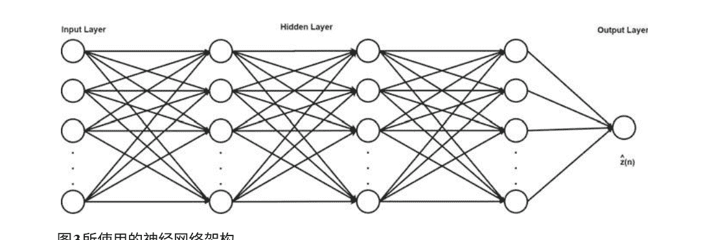

图3 所使用的神经网络架构

其中假设有19个“有效”权重（$\{h_k\}_{k=-9}^{9}$）

$$\hat{z}(n) = h_{-9}y_1(n-9) + h_{-8}y_1(n-8) + ... + h_0y_1(n) + \cdots + h_8y_1(n+8) + h_9y_1(n+9) \quad (12)$$

并且 $z(n)$ 代表所需的SI样本。在这里，$N_b$ 代表迭代次数。要非常精确地说，$N_b = p - N + 2$。同时，需要强调的是，在训练阶段中，$y_1(n)$ 与 $x(n)$ 是相同的。

值得注意的是，本文的创新之处在于利用神经网络的相同权重集合（类似于滤波器建模SI信道的系数）来同时消除线性和非线性SI。因此，所提出的方法确实是一种比传统方法更好的技术，传统方法需要使用两个不同且独立的滤波器来分别消除线性和非线性SI。

因此，作者声称所提出方法的计算复杂度确实比传统解决方案低。

训练好的模型然后用于在测试阶段从接收信号中找到线性和非线性干扰分量。然后，这些干扰分量从接收信号中移除，得到感兴趣的信号 $\hat{y}(n)$。

###### 3.2.1 实现细节

让神经网络的附加规范如下初始化：

- 每层的激活函数为修正线性单元（ReLU）。
- 输入节点的总数，$N$（因此，“有效”权重的数量）= 19。
- 在处理包含每行19个样本的批次后，更新权重。此外，每次迭代的训练样本总数为19。
- 该模型每个周期进行83次迭代训练。
- 周期数 = 400。
- 使用Adam优化技术的方程更新权重（而不是经典的随机梯度下降）。最初，权重被初始化为null值。
- 为了调整模型的超参数，使用$k$折交叉验证（$k=5$），而不是单独的验证数据集。表1总结了用于训练和测试的数据集的详细信息。

###### 4 结果与讨论

在本节中，我们描述了使用提出的神经网络执行SI抵消的实现细节和相应结果，并进行了适当的解释和讨论。为了说明所提出的解决方案，在本文中考虑了以下场景。

表1 数据集详情

| 目的   | 样本集数量 | 描述                                                                                             |
|--------|------------|--------------------------------------------------------------------------------------------------|
| 训练   | 83         | 使用1000个符号中的100个符号作为导频符号(p=100)，即用于训练模型。总共形成了83个样本集，每个集合包含19个符号 |
| 测试   | 883        | 剩余的900个符号用于测试，形成了883个样本集                                                      |

在第3.2.1节中提到的规格下，得到了0.1的均方误差（MSE）。

1. 发送信号，$x(n)$—10秒持续时间的基带信号（采样频率，$f_s=100$ Hz），频谱内容在15 Hz和25 Hz之间。该信号是使用频率采样技术通过FIR系数创建的。
2. 接收信号，$y(n)$—10秒持续时间的基带信号（采样频率，$f_s=100$ Hz），频谱内容在35 Hz和45 Hz之间。该信号是作为周期性随机高斯信号生成的。
3. 信道噪声，$g(n)$—加性白高斯噪声，其信噪比为0 dB。

分别给出了发送和接收信号的相关时域图，如图4和图5所示。相应的频域图如图6和图7所示。此外，为了模拟上述信号的模拟版本的存在，信号被定义为更高的采样频率，比如原始频率的10倍，即1000 Hz。根据(1)，根据β=100和随机值为α_i ∀i∈{1,2,3}，形成一个用于模拟嵌入在SI中的接收信号的复合信号。这个假设是因为一般来说，无线信道是时变的性质[11]。

根据第3.1节中定义的顺序，首要步骤是通过被动模拟消除进行SI。由于这种方法是通过物理结构完成的，因此本文只考虑了连续的两个步骤。因此，下一步是模拟消除。根据(5)，通过40个移位版本的发送信号的线性组合构建线性SI的估计。让这个估计值从接收到的复合信号中减去以获得$y_2(t)$。通过LNA和ADC传递的结果信号现在可以由在第3.2节中描述的经过训练的神经网络进行处理。

一旦神经网络训练完成，网络就会在测试阶段中被使用，作为一个仅具有在训练阶段获得的定义权重的滤波器。因此，结果信号现在被滤波，随后从部分SI自由的信号（神经网络输入处的数字信号）中减去输出。

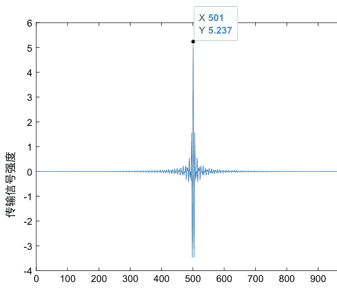

图4 传输信号（S1信号）- 时间域波形

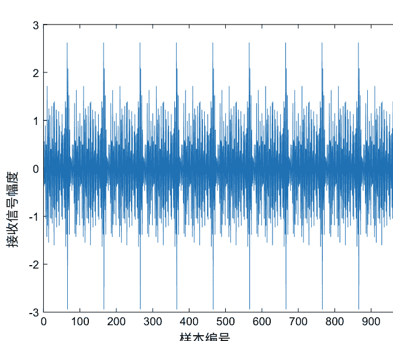

图5 接收信号（SOI）- 时间域波形

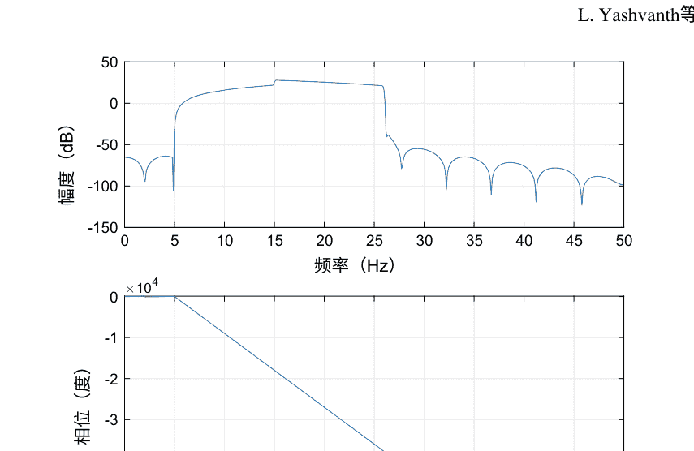

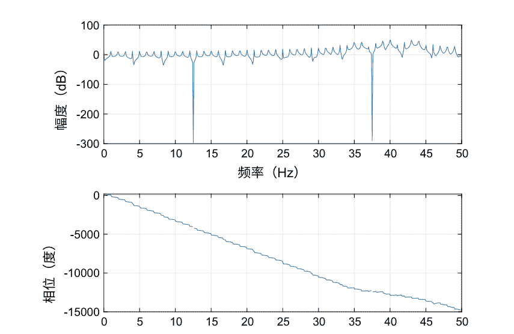

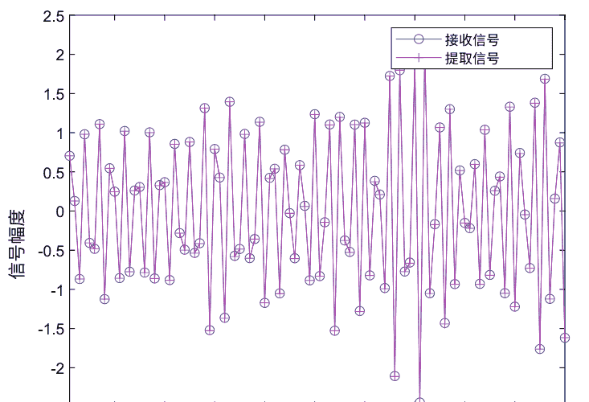

图8 叠加的接收信号（SOI）和SI取消信号 - 0到100个样本

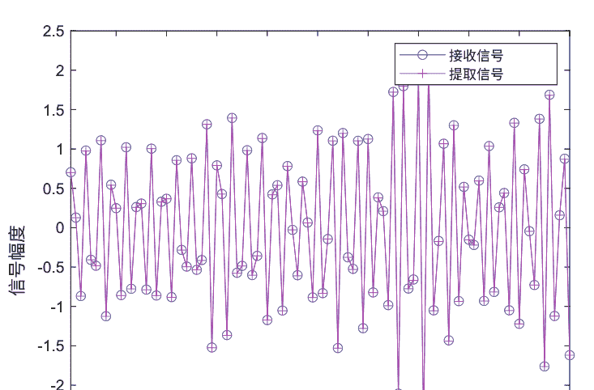

图9 叠加的接收信号（SOI）和SI取消信号 - 100到200个样本

在Figs. 8, 9, 10, 11, 12,13, 14, 15,16和17中，将提取的结果信号与SOI进行比较，并绘制相关图形，经过5次蒙特卡洛模拟的平均值。

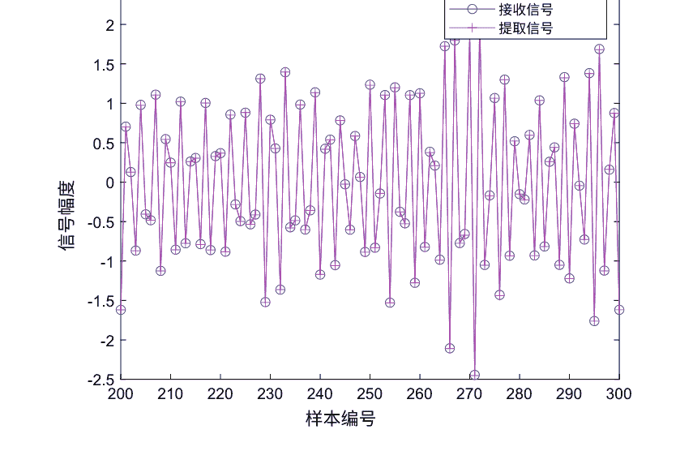

图10 叠加接收信号（SOI）和SI取消信号 - 200至300个样本

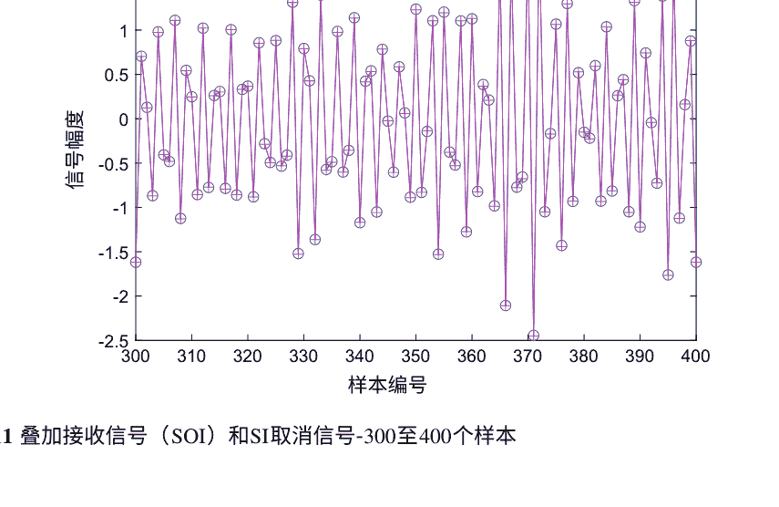

图11 叠加接收信号（SOI）和SI取消信号 - 300至400个样本

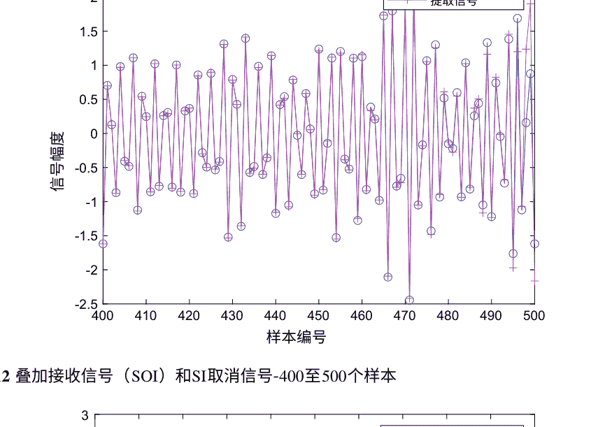

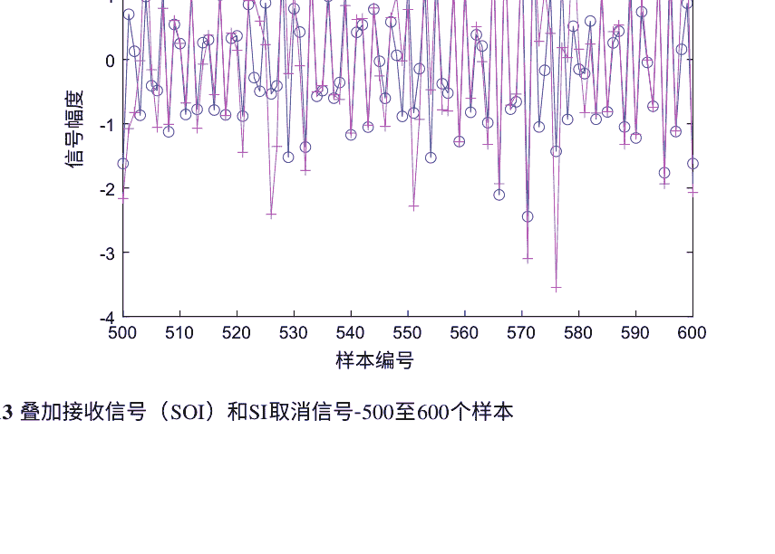

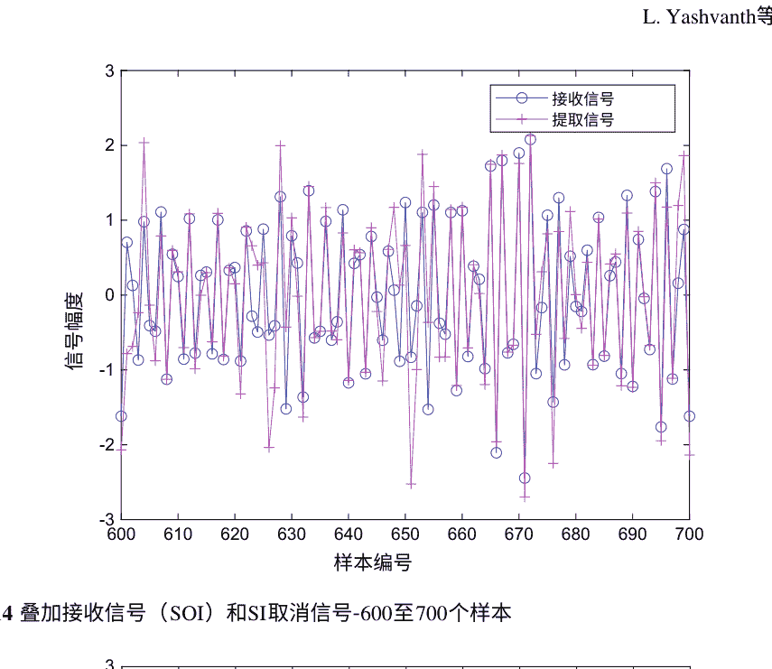

图14 叠加接收信号（SOI）和SI取消信号 - 600至700个样本

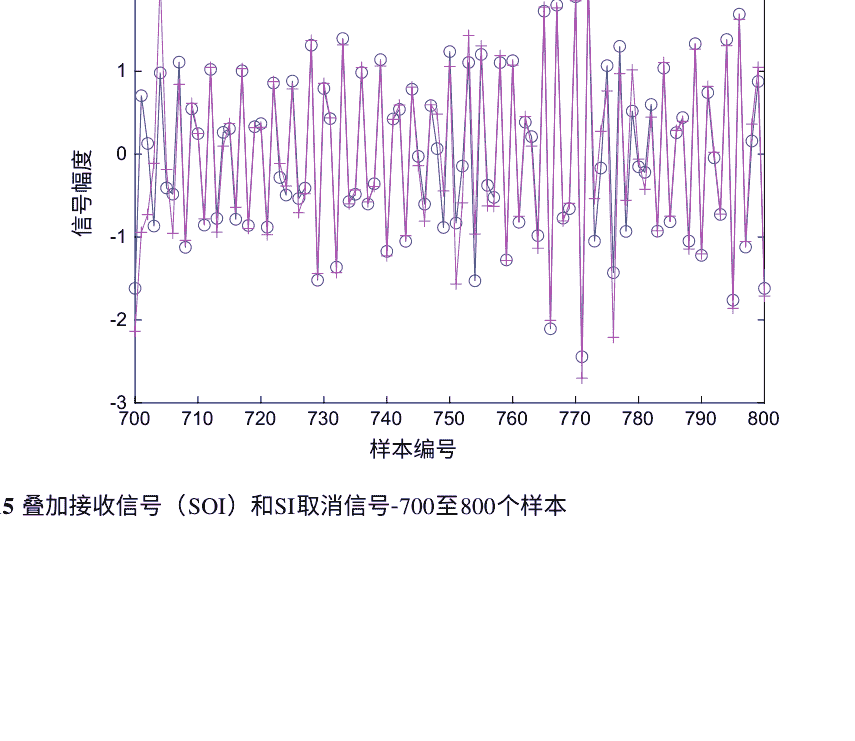

图15 叠加接收信号（SOI）和SI取消信号 - 700至800个样本

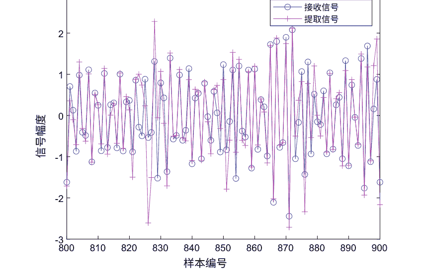

图16 叠加接收信号（SOI）和SI取消信号 - 800至900个样本

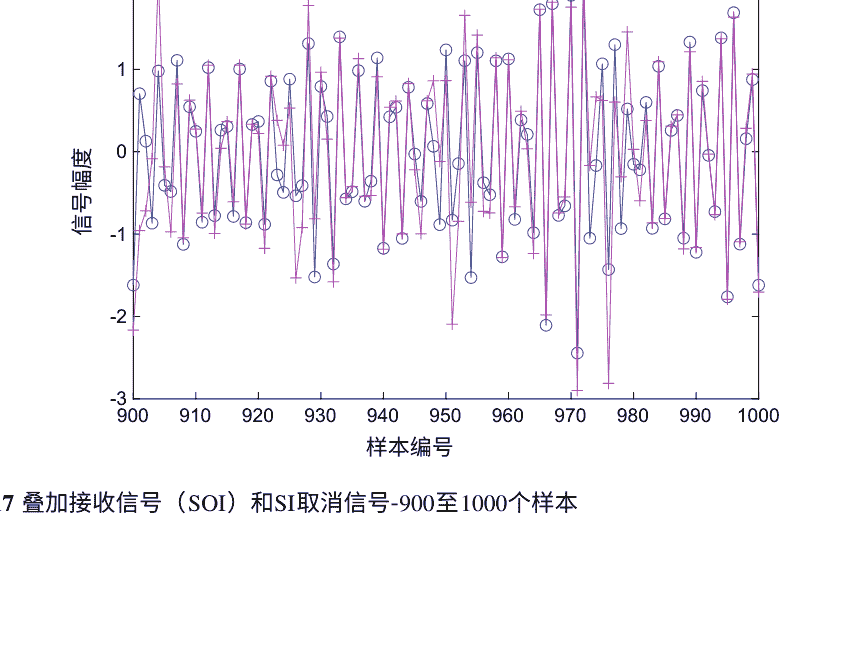

图17 叠加接收信号（SOI）和SI取消信号 - 900至1000个样本

此外，还尝试在频域中可视化SI消除的效率。在图18和图19中，前者表征了净接收信号（1）的频谱信息，后者描绘了最终无SI提取信号的频域信息。图18包含了从15到45赫兹的整个基带的重要信息，而图19仅描绘了由SOI指定的频率范围内的的重要信息。因此，很明显，所提出的解决方案仅仅借助一个滤波器（神经网络）和一个权重集，就能很好地抑制来自SOI的非线性SI。

此外，为了更详细地观察SI的消除，考虑图4，它表明对于1000个样本的传输信号，其幅度在大约信号持续时间的一半（≈501^th sample）处达到峰值。然而，由于（1）和选择β为100，更多的好奇心产生了，想要可视化601th样本处的不同信号样本值。这个示例显示在图20中。

因此，从图中可以看出，SI在提取的信号中被很好地抑制。此外，提取的信号与期望的SOI之间的相关性明显更高。


图18 复合信号（接收器接收到的）- 频域 - 幅度和相位响应

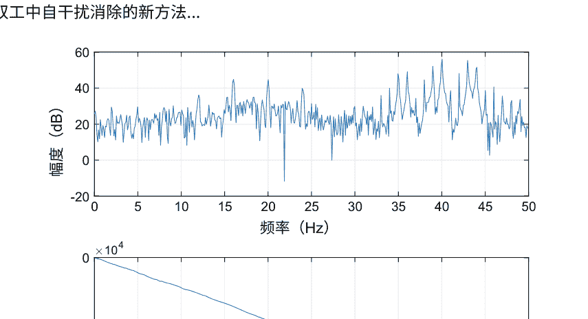

图19 SI消除信号 - 频域 - 幅度和相位响应

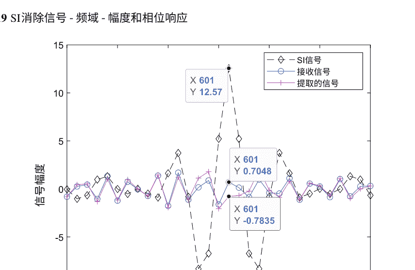

图20 SI消除的示意图：叠加接收信号（SOI），SI消除信号和SI信号（发送信号）

###### 5 结论

正如在第3.1节中所描述的，一种有效的传统方法是使用混合消除技术来抑制在带内全双工通信中出现的自干扰消除。到目前为止，它需要在数字域中使用两个单独的最优滤波器来分别抑制线性和非线性SI分量。然而，通过求解 (9) 和 (10) 来单独构建它们的平凡方法在计算上是昂贵的。因此，所提出的方法使用单个神经网络代替上述最优滤波器，在不影响结果质量的情况下大大简化了计算的昂贵性。

这是因为基于神经网络的技术试图在单一步骤中同时抑制线性和非线性的自干扰成分。对于上述陈述的正当性明显在前一节的实验结果中得到了证明。需要谨慎注意的是，自干扰的抑制在时域和频域中都取得了良好的效果。然而，值得注意的是，本文仅考虑了对产生显著自干扰的非线性项进行抵消的第五次谐波及以下的项。其他高阶项可以安全地忽略不计。

###### 参考文献

1.  Chávez-Santiago R, Szydelko M, Kliks A等 (2015) 5G: 无线通信的融合。Wirel Pers Commun 83:1617–1642. https://doi.org/10.1007/s11277-015-2467-2
2.  Kim J, Sim MS, Chung M, Kim DK, Chae CB (2016) 5G中的全双工无线电: 基础知识、设计和原型制作。在: Luo FL, Zhang C (eds) 5G的信号处理。https://doi.org/10.1002/978119116493.ch22
3.  Zhou M, Liao Y, Song L (2017) 5G的全双工无线通信。在: Xiang W, Zheng K, Shen X (eds) 5G移动通信。Springer, Cham. https://doi.org/10.1007/978-3-319-34208-5_11
4.  Ahmed EA (2014) 全双工无线系统中的自干扰消除。UC Irvine. ProQuest ID: Ahmed_uci_0030D_12951. Merritt ID: ark:/13030/m5rz0s9d. 从 https://escholarship.org/uc/item/7zh6f8fm检索
5.  Nwankwo CD, Zhang L, Quddus A, Imran MA, Tafazolli R (2018) 对单频全双工系统的自干扰管理技术的调查。IEEE Access 6:30242–30268. https://doi.org/10.1109/ACCESS.2017.2774143
6.  Farzaneh F (2018) 无线通信电路简介
7.  Proakis John G, Manolakis Dimitris K (2006) 数字信号处理, 第4版。Prentice-Hall Inc., 美国
8.  Kaiser T, Zarifeh N (2016) 全双工传输的一般原理和基本算法。在: Luo FL, Zhang C (eds) 5G的信号处理。https://doi.org/10.1002/97811191116493.ch16
9.  Haneda K, Valkama M, Riihonen T, Antonio Rodriguez E, Korpi D (2016) 全双工收发器的设计和实现。在: Luo FL, Zhang C (eds) 。https://doi.org/10.1002/97811191116493.ch17
10. Rumelhart DE, Hinton GE, Williams RJ (1986) 通过反向传播学习表示。自然323: 533-536。 https://doi.org/10.1038/323533a0
11. Rappaport T (2001) 无线通信：原理与实践，第二版。Prentice Hall PTR，美国

##### 使用自持续算法对KDD-99进行降维

###### Swapnil Umbarkar和Kirti Sharma

摘要 在这个数字化的世界中，网络上有大量的数据可用，但这些数据也不安全，容易受到攻击者的攻击技术。这些威胁导致了入侵检测系统（IDSs）的需求。作为研究IDSs的标准模型，KDD-99数据集被使用。但是KDD-99数据集受到维度诅咒的影响，因为数据集中的特征数量和实例总数都太大。本文提出了一种基于个别分析的特征选择技术的自持续算法。所提出的算法通过J48算法减少了特征子集的特征数量，减少了时间，提高了准确性0.369%，特征数量减少了66.66%。

**关键词** 特征选择 · KDD-99数据集 · J48算法 · 分类 · 降维

###### 1 引言

任何网络中的入侵都是网络中最糟糕的部分。这些攻击以各种形式传播。对于网络中的这种入侵的研究工作是一个重要问题。我们的系统/网络每天都会观察到新的攻击。从小型公司到大型组织，所有人都陷入了这些攻击的陷阱。攻击者每天都会发现令人惊讶的技术来干扰网络，甚至是大公司的网络安全工具。因此，有必要开发系统来对抗每一种最新的攻击。为了解决网络上的所有这些威胁，制定了入侵检测系统来检测攻击。基于攻击类型，入侵检测系统（IDS）分为两种类型，即基于主机的IDS和基于网络的IDS。基于主机的IDS扫描和检查计算机系统的文件和操作系统进程，而基于网络的IDS则在网络流量上进行相同的操作。为了开发这样的IDS，需要对我们的系统进行培训这样做可以得到高效的输出，而不会丢失任何信息。在本文中，考虑使用KDD-99数据集来分析结果。KDD-99明确规定了五种攻击类型: (a) DDoS, (b) U2R, (c) R2L, (d) Probe和(e)正常。KDD-99数据集的缺点是其维度增加，大约为42*400 K。这种大幅增加的维度给IDS带来了增加的时间复杂度。

###### 1.1 特征选择方法

在训练任何IDS之前，进行特征选择，以训练我们的系统来检测攻击。针对特征选择过程并降低时间复杂度是我们研究的主要关注点。特征选择技术通常有三种方式: (a) 过滤方法, (b) 封装方法, 和 (c) 嵌入方法。我们在研究中的主要关注点基本上是通过分析所有类型的特征选择技术来揭示在特征选择过程中能够提供最佳特征的技术。过滤方法通常通过分析与依赖特征的相互依赖性来提供特征，而封装方法通过在实际训练算法时分析特征的适用来提供特征，最后嵌入方法通过分析算法的每个递归来提供特征。在本文中，首先对特征选择技术进行了单独分析。单独分析特征选择技术 [1]:

- 1. CfsSubsetEval
- 2. ClassifierAttributeEval
- 3. ClassifierSubsetEval
- 4. GainRatioAttributeEval
- 5. InfoGainAttributeEval
- 6. OneRattributeEval
- 7. SymmetricalUncertAttributeEval
- 8. WrapperSubsetEval

在单独分析这些算法之后，将提出的算法应用于具有最少特征和增加时间复杂性的最佳特征选择技术。

###### 2 相关工作

本节将重点介绍以前关于特征减少方法和分类方法的研究，以提高效率和减少时间复杂性。2018年，Umbarkar和Shukla [1]提出了基于启发式的特征减少技术，用于KDD-99数据集的维度减少。他们只考虑了三种特征选择技术，即信息增益、增益比和相关系数。他们使用C4.5分类算法成功实现了92.60%的准确率。 他们仅考虑了三种特征选择技术进行了结果分析，尽管存在八种特征选择技术。 2020年，Sydney Kasongo和Sun [2]提出了基于包装器的无线入侵检测系统特征提取方法，提出了WFEU技术，给出了22个减少特征集的属性。他们使用SVM作为分类技术，准确率仅为77.16%。 2015年，Bjerkestrand等人[3]分析了各种特征选择算法，并提出了三种具有不同属性评估器和搜索方法的特征选择算法。他们指出，如果减少属性数量，分类器的性能不会受到影响。 2020年，Li等人[4]提出了一种仅考虑弱相关特征的方法。他们通过将原始训练数据集分成四部分并应用CNN来给出结果，从而在NSL-KDD数据集上获得了高准确性和低复杂性。 在2019年，Sara等人[5]使用了过滤器和包装器方法进行特征选择。他们使用基于线性相关系数切尔鱼算法（FGLCC-CFA）的特征分组，应用FGLCC得到15个特征的减少特征子集，并应用CFA得到最佳准确性。在2019年，Selvakumar和Muneeswaran [6]使用了基于过滤器和包装器的方法，结合萤火虫算法来减少KDD-99数据集中的大量特征。他们使用C4.5和贝叶斯网络，仅给出了包含10个特征的减少特征集，声称准确性有所提高。在2020年，Alazzam等人[7]提出了一种名为鸽子启发式优化器的算法，通过评估三个数据集：KDD-99，NSL-KDD和UNSW-NB15。与其他算法相比，输出结果在TPR，FPR，准确性和F-score方面呈现出最佳效率。他们只使用一种特征选择方法，即包装器方法，尽管还可以分析其他方法来比较结果。 2019年，Hakim等人[8]通过考虑所述算法、信息增益、增益比卡方和缓解选择方法与J48、随机森林、朴素贝叶斯和KNN分类算法进行了分析。结果显示特征选择显著改善，但准确性略有增加。 2011年，Nziga [9]使用了两种降维技术，一种是线性技术（主成分分析），另一种是非线性技术（多维缩放），并从主要数据集KDD-99中找到了一个较低维度的最优特征集。为了比较分类技术，她还使用了J48分类和朴素贝叶斯方法，并得到了4个和12个特征的维度，但特征选择技术仍然只有两个。在2015年，Chabathula等人[10]使用主成分分析（PCA）特征选择技术，并将其应用于不同的分类器，如随机森林、KNN、J48、SVM，并且在随机森林树算法中获得了最佳结果。在这里，作者仍然局限于一种特征选择技术。在2010年，Das和Nayak [11]提出了一种通用方法，他们使用分而治之的技术，留下了可用的特征选择算法。他们提出了我们的算法，自我持续算法的想法，即通用方法也可以导致算法。

在引用与我们的研究工作相关且所需的所有研究论文之后，我们突出了上述工作，将其视为我们的参考。先前的研究专注于提高准确性，但所采用的特征集保持不变，没有进行减少。尽管一些论文也提出了特征减少的工作，但我们通过考虑所有的特征选择技术，并使用衍生的自我持续算法找出最佳的方法来进行了一般性的方法。

###### 3 提出的工作

###### 3.1 自我持续算法背后的基本思想

入侵检测系统（IDS）的设计是为了通过对预定义数据集进行系统训练并将IDS应用于我们的系统来检测网络中的攻击。作为标准模型，KDD-99数据集始终被考虑。同样的数据集被用来提出自我持续算法。但问题只出现在系统的训练阶段。正如已知的那样，具有42个特征的KDD-99数据集具有巨大的维度，这使得我们的训练阶段耗时。研究证明数据集中的所有特征并不具有相等的重要性。虽然可以减少属性集，但效率得到了提高。

许多研究人员已经提出了减少数据集维度的算法。他们研究了一类特征选择，但没有分析所有特征选择技术的类别。

###### 3.2 提出的算法

在这篇论文中，通过分析特征选择的过滤器和包装器方法，提出了一种自我持续的算法。因此，对于分析结果，主要关注的特征选择方法有：(a) CfsSubsetEval, (b) ClassifierAttributeEval, (c) ClassifierSubsetEval, (d) Information Gain, Gain Ratio, (e) OneRAttributeEval, (f) SymmetricalUncertAttributeEval, 和 (g) WrapperSubsetEval。自我持续算法的主要原则是基于分析个别特征选择技术，然后将最佳特征选择与其余特征结合起来，以避免特征丢失，从而得到更高效的算法。将准确度 (A_i) 和时间复杂度 (T_i) 与完整数据集进行比较，作为评估每种方法的基准。

在自我持续算法的初始阶段，数据集依次传递给所有特征选择技术。

```
算法：自我持续算法
输入：KDD-99数据集
输出：优化的减少特征集
A = 完整数据集的准确率
T = 完整数据集的时间复杂度
```

$A_{i}$ = 特征集 $FS_{i}$ 的准确率
$T_{i}$ = 特征集 $FS_{i}$ 的时间复杂度
$FS_{i}$: CfsSubsetEval, ClassifierAttributeEval, ClassifierSubsetEval, Information Gain, Gain Ratio, OneRAttributeEval, SymmetricalUncertAttributeEval, WrapperSubsetEval

- 1. 对于每个 $FS_{i}$
- 2. 执行
- 3. 对于从 $FS_{i}$ 得到的每个派生特征集应用C4.5算法
- 4. 如果 ($A_{i} > A$) && ($T_{i} > T$)
- 5.     $FSbest\_individual = FS_{i}$
- 6. 结束如果
- 7. 结束循环
- 8. 对于每个 ($FS_{i} - FSbest\_individual$)
- 9. 执行
- 10.    $FScombine\_features = (FSbest\_individual) 并集 FS_{i}$
- 11.    对于从 $FScombine\_features$ 得到的每个派生特征集应用C4.5算法
- 12.    如果 ($Acombine\_features > A$) && ($Tcombine\_features > T$)
- 13.        $FSbest\_combine = FScombine\_features$
- 14.    结束如果
- 15. 结束循环
- 16. 结束

在每种技术上应用C4.5分类算法后，将其准确性和时间复杂度与$A_{i}$和$T_{i}$进行比较。如果它大于基准值，那么它将是在更短时间内提供最佳准确性和减少特征集（$FS_{best\_individual}$）的优越技术。自我持续算法的下一个阶段是将$FS_{best\_individual}$与其余列出的特征选择技术结合起来，并再次通过应用C4.5分类算法来比较其准确性和时间复杂度与$A_{i}$和$T_{i}$。在分析第二阶段的所有迭代之后$FS_{best\_combine}$是由此得出的。

###### 4 实验设置

对于这项研究，考虑了KDD-99数据集。该系统配备了8 Gb的RAM和Windows 10操作系统。为了分析这些技术，使用了Weka 3.8.4。将[1]中列出的特征选择技术应用于整个KDD-99训练数据集。应用不同的特征选择技术后，得出了特征的排名，如表1所示。在获取不同特征选择算法的特征排名后，选择了每个特征选择技术类别中最重要的特征，其余特征被视为无潜力的特征，因为它们提供的信息较少。潜在属性和无潜力属性的比较如图1（表2）所示。

###### 表1 特征排名

| 特征选择方法         | 特征排名                                                                                                                         |
| :------------------- | :------------------------------------------------------------------------------------------------------------------------------- |
| CfsSubsetEval        | 3,11,12,31,37                                                                                                                    |
| ClassifierAttributeEval | 41,13,12,20,14,15,16,17,18,11,10,9,4,2,3,5,8,6,7,19,21,40,34,33,22,35,36,37,38,39,32,31,30,25,23,24,26,29,27,28,1               |
| ClassifierSubsetEval | 3,5,11,23,32,34,35,36                                                                                                            |
| 信息增益             | 5,23,3,6,24,12,36,32,2,37,33,35,34,31,30,29,38,39,25,4,26,1,40,41,27,28,10,22,16,19,13,17,11,8,14,18,9,15,7,20,21             |
| 增益比               | 12,11,14,22,9,37,3,2,31,7,32,6,18,36,5,19,16,1,10,15,23,38,25,35,39,24,26,30,4,34,33,41,40,27,29,13,28,8,7,20,21               |
| OneR属性评估         | 5,23,3,6,12,36,32,37,24,31,35,33,34,2,1,39,41,38,40,30,29,2,7,25,26,4,10,16,28,19,22,17,11,13,18,14,15,9,7,20,21               |
| 对称不确定性属性评估 | 12,3,37,5,6,2,36,32,23,31,24,35,34,38,33,1,25,39,30,4,26,29,41,40,27,28,10,22,16,19,13,17,11,8,14,18,9,15,7,20,21             |
| 包装器子集评估       | 3,5,30,35,36                                                                                                                     |

###### 表2 不同减少特征子集的大小和属性比较

| 特征选择方法             | 容量（Mb） | 选择的属性数量 | 无潜力属性的数量 |
| :----------------------- | :--------- | :------------- | :--------------- |
| KDD完整数据集            | 46.6       | 42             | 0                |
| CfsSubsetEval            | 6.73       | 5              | 37               |
| ClassifierAttributeEval  | 10.8       | 10             | 32               |
| ClassifierSubsetEval     | 12.9       | 8              | 34               |
| 信息增益属性评估         | 15         | 10             | 32               |
| 增益比属性评估           | 11.4       | 10             | 32               |
| OneR属性评估             | 15.1       | 10             | 32               |
| 对称不确定性属性评估     | 14.4       | 10             | 32               |
| 包装器子集评估           | 8.37       | 5              | 37               |

对于所选的特征子集，在KDD-99训练数据集上应用J48分类算法。对于每个选择的特征子集，在Weka 3.8.4中应用分类算法后，训练准确性和训练时间的结果如表3所示。图2和图3分别显示了不同特征选择算法的训练准确性和训练时间的比较。显然，从两个图中可以看出，WrapperSubsetEval的准确性更高，训练时间更短，比具有42个特征的原始KDD-99数据集要好。在下一个阶段，每个特征选择方法选择的特征子集被考虑，并使用减少的特征集训练J48分类算法。接下来在测试数据集上计算阶段，准确率和时间复杂度。表4给出了J48算法在不同特征选择方法的减少特征集上的准确率和时间复杂度。从图4可以看出，WrapperSubsetEval的准确率更高，即92.218%，比原始的KDD-99数据集的42个特征更高。从减少的特征子集中得到的准确率比在42个特征上计算的KDD-99的原始准确率高0.133%。

###### 表3 训练准确性和训练时间比较

| 特征选择方法             | 总属性 | 选择属性 | 分类算法 | 准确率 (训练%) | 训练时间 (秒) |
| :----------------------- | :----- | :------- | :------- | :------------- | :------------ |
| CfsSubsetEval            | 42     | 5        | J48      | 97.140         | 0.800         |
| ClassifierAttributeEval  | 42     | 10       | J48      | 93.892         | 1.760         |
| ClassifierSubsetEval     | 42     | 8        | J48      | 99.961         | 0.990         |
| 信息增益属性评估         | 42     | 10       | J48      | 99.930         | 2.300         |
| 增益比属性评估           | 42     | 10       | J48      | 98.740         | 5.560         |
| OneR属性评估             | 42     | 10       | J48      | 99.933         | 0.970         |
| 对称不确定性属性评估     | 42     | 10       | J48      | 99.330         | 1.140         |
| 包装器子集评估           | 42     | 5        | J48      | 99.952         | 0.830         |

###### 表4 不同特征选择方法的测试准确率和时间复杂度比较

| 特征选择方法         | 准确率 (%) | 时间 (秒) |
| :------------------- | :--------- | :-------- |
| 所有特征             | 92.085     | 14.77     |
| CfsSubsetEval        | 87.174     | 129.2     |
| ClassifierAttributeEval | 85.411     | 10.278    |
| ClassifierSubsetEval | 92.049     | 123.64    |
| 信息增益             | 91.829     | 5.234     |
| 增益比               | 91.807     | 11.678    |
| OneR属性评估         | 91.763     | 142.43    |
| 对称不确定性属性评估 | 91.828     | 123.11    |
| 包装器子集评估       | 92.218     | 138.15    |

此外，特征数量也从42个减少到5个，即整体特征数量减少了88.095% (图1)。在下一阶段，从WrapperSubsetEval得到的减少特征集与其他特征选择方法的所有减少特征子集相结合。使用组合子集训练J48分类算法，并计算测试数据集的准确率和时间复杂度，结果显示在表5中。从图6可以看出，WrapperSubsetEval与Gain_Ratio相结合的准确率为92.454%，高于具有42个特征的原始KDD-99数据集。减少特征子集的准确率比KDD-99的原始准确率高出0.369% (基于42个特征计算)。此外，特征数量也从42个减少到14个，即整体特征数量减少了66.66% (图1)。

###### 表5 特征选择技术组合的准确率和时间复杂度比较

| 特征选择技术组合                           | 准确率 (%) | 时间 (秒) |
| :----------------------------------------- | :--------- | :-------- |
| ClassifierSubsetEval联合WrapperSubsetEval  | 92.064     | 1949.55   |
| ClassifierSubsetEval联合Info_Gain          | 91.93      | 243.68    |
| CfsSubsetEval联合WrapperSubsetEval         | 92.204     | 2687.01   |
| WrapperSubsetEval联合Info_Gain             | 92.014     | 159.35    |
| WrapperSubsetEval联合Gain_Ratio            | 92.454     | 161.29    |
| WrapperSubsetEval联合OneRAttributeEval     | 92.025     | 154.45    |
| WrapperSubsetEval联合SymmetricalUncertAttributeEval | 91.99      | 144.32    |
| WrapperSubsetEval联合ClassifierAttributeEval | 92.0792    | 228.9     |

###### 5 结论和未来工作

在本文中，借助我们提出的自我持续算法，我们将特征子集减少到最多14个特征。在减少的特征子集上进行测试，计算了准确率和时间复杂度，比具有42个特征的原始数据集更好。测试准确率提高了0.369%，特征数量减少了66.66%。因此，该提议的算法成功地降低了KDD-99数据集的维度。将来，可以通过应用数学运算的变化来扩展这项工作，以获得减少的特征集。通过考虑不同的分类算法，如决策树、朴素贝叶斯、KNN等，可以进一步比较特征选择方法。

###### COMPARISON OF TESTING TIME

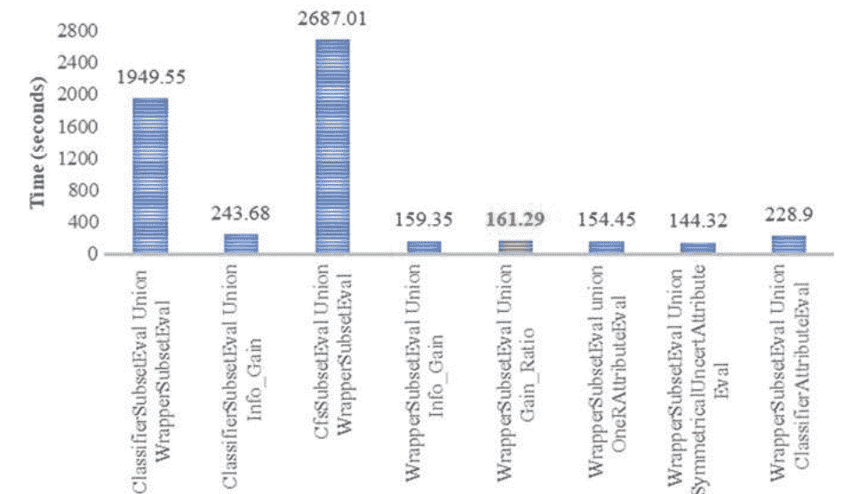

图7 不同特征选择方法的测试时间比较

###### 参考文献

- 1. Umbarkar S, Shukla S (2018) 基于启发式的特征降维方法在入侵检测系统中的分析。 在：2018年第五届信号处理与集成网络国际会议（SPIN），诺伊达，2018年，第717-720页
- 2. Kasongo SM, Sun Y (2020) 一种基于包装器的特征提取的深度学习方法用于无线入侵检测系统。 计算机安全
- 3. Bjerkestrand T, Tsaptsinos D, Pfluegel E (2015) 对网络IDS数据的特征选择和降维算法的评估。 在：2015年国际网络态势感知、数据分析和评估会议(CyberSA)上，伦敦，第1-2页。
- 4. Li Y, Xu Y, Liu Z, Hou H, Zheng Y, Xin Y, Lizhen Cui Y (2020) 基于多个CNN融合的工业物联网网络入侵的鲁棒检测。 测量154。
- 5. Mohammadi S, Mirvaziri H, Ghazizadeh-Ahsaee M, Karimipour H (2019) 组合特征选择算法进行网络入侵检测。 信息安全应用44。
- 6. Selvakumar B, Muneeswaran K (2019) 基于萤火虫算法的网络入侵检测特征选择。 计算机安全81。
- 7. Alazzam H, Sharieh A, Sabri KE (2020) 基于鸽子启发优化器的入侵检测系统特征选择算法。 Expert Syst Appl 148
- 8. Hakim L, Fatma R, Novriandi (2019) 使用NSL-KDD数据集的特征选择对网络入侵检测系统性能的影响分析。 在：2019年计算机科学、信息技术和电气工程国际会议（ICOMIT EE），印尼詹贝尔，217-220页
- 9. Nziga J (2011) 通过维度缩减实现网络入侵检测系统的最小数据集。 在：2011年第六届数字信息管理国际会议，昆士兰州墨尔本，168-173页。 https://doi.org/10.1109/ICDIM.2011.6093368
- 10. Chabathula KJ, Jaidhar CD, Ajay Kumara MA (2015) 基于主成分分析的入侵检测方法的比较研究。 在：2015年第三届信号处理、通信和网络国际会议（ICSCN），金奈，第1-6页。 https://doi.org/10.1109/ICSCN.2015.7219853
- 11. Das A, Nayak RB (2012) KDD入侵检测数据集中的一种分治特征约简和特征选择算法。 在：IET金奈可持续能源和智能系统国际会议（SEISCON）。 Tiruchengode，第1-4页。 https://doi.org/10.1049/cp.2012.2241

## 使用细菌觅食优化（BFO）算法进行定向无线传感器网络的能效邻居发现。


Sagar Mekala和K. Shahu Chatrapati

摘要 在定向无线传感器网络（WSN）中，现有的邻居发现方法与基于块设计的方法相比，具有较高的延迟和能量消耗。此外，还必须解决节点的工作周期调度问题，以增加网络的寿命。本文推荐了一种使用细菌觅食优化（BFO）算法的能效协作邻居发现机制。在这个计算中，每个带有定向天线的节点使用扇区编号和波束方向作为适应度函数进行波束成形。最后，在数据传输过程中从邻居中选择适当的能量水平较高的活动节点。实验结果表明，推荐模型能够最小化功耗和延迟，并增强网络活动的寿命。

关键词 WSN · 能量 · BFO · 算法 · 邻居

###### 1 引言

通常，无线传感器网络由一组资源受限的微型设备组成，例如传感器和执行器，部署在一个领域中以研究物理和环境兴趣。这些小型设备配备有有限的电力、较少的存储空间、短程无线电收发器和有限的处理能力。因此，它们不仅具有感知能力，还具有数据处理和通信能力。在传感器网络中，节点密集分布在一个领域中，以合作方式参与分配的功能，例如环境监测（例如温度、空气质量、噪音、湿度、动物活动、水质或污染物）、工业过程控制、战场监视、医疗控制、家庭智能以及安全和监视情报[1]。传统的无线传感器网络包括许多传感器设备可以协调完成一个共同的任务在环境区域内。每个传感器都由一个小型微控制器组成，用于通信[2]。有效的路由发现模型可以用于在通信活动期间消耗有限的功率，从而增加网络寿命[3-5]。

WSN的基本目标是发现传感器节点的所有邻居称为邻居发现，这是许多传感器网络应用程序的原始功能之一。但是，这是一个具有挑战性的操作因为无法准确预测节点的邻居数量。具有有限能量保护的邻居发现是网络形成的本质，它调节传感器网络的设置和正常运行（如路由和拓扑控制）并延长WSN的寿命。为了解决最近文献中关于能量高效的邻居发现的设计问题，邻居的发现过程被明显分为三类：概率、确定性和基于法定人数的。常规的邻居发现机制侧重于通过限制传感器节点的活动周期来减少功率消耗在传感器网络中[1]。

邻居发现协议（NDP）是一种表示方案，用于查找邻居节点。对称邻居发现的基本概念是，WSN中的每个节点都有一个共同的工作周期。另一方面，网络中的节点在非对称方法中使用独立的工作周期。在WSN中，节点在有限的电池电量和资源受限的环境中运行。因此，NDP需要有效地解决与非对称和对称工作周期相关的问题。因此，基于块设计的NDP在非对称网络中缺乏支持邻居发现是一个相当大的限制[4, 6]。在WSN中，传感器节点通过采用低工作周期（即，网络中的节点具有较短的工作时间和较长的休眠时间）来运行三种模式。为了评估传感器网络中节点的能量效率，提出了两个主要指标，即发现延迟和工作周期。然而，低工作周期的传感器网络节点在待机模式下需要一段特定的时间来唤醒邻居节点，导致了相当大的延迟。一般来说，较小的工作周期会导致较长的发现延迟，反之亦然。另一方面，由于传感器网络中设备的动态性质，一些WSN应用导致网络拓扑的不断变化，从而邻居节点会不时发生变化。因此，以低功耗和低发现延迟找到邻居节点是一个有问题的过程[5, 7]。

###### 1.1 问题识别

如[2]所讨论的，与基于块设计的邻居发现方法相比，U-Connect、Disco和quorum方法涉及较高的延迟和能量消耗。但是，由于新的块设计，它涉及较高的复杂性和计算开销。

用于定向无线传感器网络的协作邻居发现机制[8]应用波束成形技术进行邻居发现。但是在波束成形过程中，为了获得更好的结果，选择了适当的扇区编号和波束方向[8-11]。此外，该技术没有解决节点的能量水平和工作周期安排问题，以延长网络的寿命。

为了解决这些问题，提出了一种利用BFOA的能效协作邻居发现机制。

###### 2 相关工作

在无线传感器网络中，资源受限、自组织且规模较小的设备的重要责任是在许多时间关键的应用中高效地发现邻居节点。许多邻居发现技术已经在传感器网络中出现，其目标是实现高效的能量利用和数据传递，调整工作周期和延迟[1-3]。在接下来的部分中，我们将探讨现有模型对本文提出的模型的影响。

为了保留邻居发现过程中不必要的唤醒计划，并解决各种物联网应用中基于块设计的工作周期计划问题，李等人[4]提出了一种通过合并不同工作周期和块设计来进行邻居发现的方案，借助于异或NDP。该实施模型在不对称和对称工作周期环境下都能显著降低功耗。

为了优化邻居发现过程的性能，Nur等人[8]建立了一个称为协作邻居检测（COND）的模型，用于定向无线传感器网络（DSN）中的低工作周期邻居发现技术，通过分布式方式对消息进行采样以获取邻居节点。间接发现COND的仿真结果表明它显著减少了网络中的发现延迟。

在文献中，提出了许多邻居发现算法，其中大部分侧重于成对调度发现。陈等人[9]利用基于群组的设计实施了移动传感器网络的邻居发现，通过精心设计网络中所有节点之间的调度参考模型，以延长生命周期并减少发现延迟。

通过考虑节点约束、数据包开销和无线传感器网络中的流量模式，Amiri等人[12]提出了一种基于蚁群优化的生物启发模型，即蚁群优化。这种启发式模型结合了模糊逻辑，影响了从源节点到汇聚节点的路由发现过程中的多跳通信。模糊逻辑蚁群优化路由算法（FACOR）的仿真结果通过精心维护无线传感器网络中节点的能量节约，显著延长了网络的寿命，并且需要解决节点故障、移动性和高密度网络中的新节点问题。

为了提高不可靠无线通信中的数据包传递性能，Meghashree等人[13]采用了反应式路由发现协议在无线传感器网络中提出了一种模型，并引入了一种有偏差的退避方案来减少发现开销。

Lingam等人提出了无线传感器网络中的能量高效最短路径（EESP）模型[14]。EESP追求DSR和能量高效AODV的分层方法，同时在网络节点之间使用均匀负载分配，并通过考虑中间节点能量来发现最优路径，从所得结果可以看出，它最大化了无线传感器网络节点的平均寿命，其中节点具有相同的能力。

根据所提出的算法，网络中只有一定数量的节点在一段时间内处于开启状态。特定区域网络中的所有节点并不一直处于活动状态。因此，网络中节点的活动计划被最小化。因此，在具有相同工作周期的无线传感器网络中，有更高的可能性发现至少几个相邻设备。如前一节所述，为无线传感器网络实现异步协议非常高效和简单，我们在本文中将COND与BFOA相结合，以延长网络的寿命[4-6, 9]。

###### 3 能效邻居发现使用BFOA

###### 3.1 概述

本文介绍了一种使用BFOA的能效协作邻居发现机制。在该算法中，每个带有定向天线的节点使用BFO进行波束成形，以轮询其扇区内的邻居。扇区编号和波束方向被视为BFOA的适应度函数。在轮询阶段，每个节点向HELLO消息发送一个REPLY，其中包含节点ID、节点的剩余能量和其工作周期计划。在接收到回复消息后，轮询节点可以获取完整的邻居信息、工作周期计划和能量水平。因此，在数据传输过程中，从邻居中选择具有足够电池能量的最佳活动节点。

###### 3.2 优化算法基础

近年来，提出了一种新的随机技术来研究优化问题，即基于大肠杆菌（E. coli）细菌的细菌觅食算法（BFA），这些细菌寄居在个体内脏中。BFA是一种基于计算智能的优化算法。由于大肠杆菌细菌的社会昆虫行为，它已被广泛应用于各种工程问题，包括定向天线、功耗机制、控制器设计和人工神经网络。因此，我们受到细菌觅食优化的基本特性的启发。应用化学趋化、繁殖和消除以及dispersal等三个过程。一般来说，大肠杆菌有两种不同的移动方式，即翻滚和游泳，以执行各种操作，例如寻找食物、筑巢、孵化、保护和守卫[5, 11]。

这两种操作模式可以随机执行；这个过程是趋化的，以寻找营养物质。对于实际的细菌，在觅食过程中进行翻滚运动，使用一组伸展的鞭毛。鞭毛引导大肠杆菌在移动过程中。当鞭毛选择逆时针方向转动时，细菌的游泳速度会增加[11]。

在这个算法中，细菌经历趋化运动，它们会积极向好的食物前进，并避免有害环境，它们接收足够的营养梯度，并根据需要增加它们的种群并决定分裂形成繁殖块。在消除-分散阶段，特定块中的所有细菌将被销毁，或者一个完整的块将被分散到新的环境中[11]。

###### 3.3 指标估计

###### a. 适应度函数

下面的方程描述了BFOA的适应度函数：

$$ F = F_{\text{switch}} \times (|W| - 1) \times \Omega \quad (1) $$

其中开关延迟： $F_{\text{switch}}$，磁盘集合： $W$，延迟转换参数： $\Omega$

$$ \Omega = \rho \times \Omega $$

其中ρ是选定的值，以使每个层的延迟都能减少。

当在定向网络中的一个节点在给定层 $w \in W$中保证邻居的发现时，节点等待一个小的时间段是至关重要的，反之亦然；否则，会导致不必要的发现开销。因此，选定的$\rho$值动态地控制着节点在特定层 $w \in W$中的唤醒时间槽，以进行邻居发现。

###### b. 节点剩余能量

下面的方程描述了传感器网络上每个节点在传输/接收一个数据包后的剩余能量（$E_{\text{res}}$）强度。

$$ E_{\text{res}} = E_i - (E_{tx} + E_{rx}) \quad (2) $$

其中 $E_i$初步功率强度， $E_{tx}$：广播功率保护，以及 $E_{rx}$： 接收功率保护。

###### c. 节点工作周期调度

在本节中，我们展示了节点工作周期的调度，这导致了网络中节点的能量预算。工作周期是节点在工作期间的时间分数。正如我们所知，网络中的节点可以在三种模式下运行：工作期间、睡眠期间和监听期间。以下方程可以展示网络中节点的工作周期。

在时间槽T上，接收节点聚合的数据包数量假设采用以下方程。

$$ A_1 = \int_{t_{ini}}^{t_{ini}+T} DPR(t) dt \quad (3) $$

以下方程表示节点在时间槽T上广播的数据包数量。

$$ A_2 = \int_{t_{ini}}^{t_{ini}+T_s+T_{tx}} DPT(t) dt \quad (4) $$

下面的方程表明，由接收节点聚合的整个数据包不包括 T_tx是

$$ A_3 = \int_{t_{ini}}^{T-T_{tx}} DPR(t) dt \quad (5) $$

我们将DPT(t)和DPR(t)视为低成本的冒险。然后，以下方程可以通过考虑平均冒险成本来估计占空比。

$$ T < \frac{Z - n + DPT(t)T_{tx}}{DPR(t)} \quad (6) $$

$$ T < \frac{Z - n}{DPR(t)} + T_{tx} \quad (7) $$

其中 0 < T_tx < T_d < T_sl。

因此，为了避免网络中的传输和接收不准确性，占空比包括时钟漂移时间 (T_d)，如下所示的方程式 8。

$$ T < \min \left\{ \frac{Z - n + DPT(t)T_{tx}}{DPR(t)}, \frac{Z - n}{DPR(t)} + T_{tx}, T_d, T_{\max} \right\} \quad (8) $$

其中

$$ T_{\mathrm{d}} = \frac{1}{\mathrm{BW} * \varpi} \quad (9) $$

BW：信道利用率，带宽，$\varpi$：时钟瞬间成本。

###### d. 使用BFO轮询邻居

在该算法中，每个具有定向天线的节点使用BFO进行波束成形，以轮询其所在层的邻居。将层编号和波束方向视为BFOA的适应度函数。

- 假设网络中部署的节点数为N
- 网络中的层数为X
- 假设化学运动模式的数量为：$C_{\mathrm{c}}$及其对应的概率：$P_{\mathrm{c}}$。
- 假设繁殖迭代次数为：$R_{\mathrm{r}}$及其对应的概率：$P_{\mathrm{r}}$。
- 让消除分散相的数量为：$D_{\mathrm{d}}$和其对应的概率：$P_{\mathrm{d}}$。

- 令 $S(i)$ 为相位维度，其中 $i =1, 2,..., N.$
- 令 $\alpha^{i}$ 为网络中节点的位置。其中 $i =1, 2, ..., N.$
- 令 $F\alpha$ 为设备的参与者和排斥者的汇总方面，其中 $F$ 表示梯度。
- 当 $F\alpha< 0$ 时，表示网络中的节点处于运行状态。
- 当 $F\alpha =0$ 时，定义网络中的节点为无害框架。
- 当 $F\alpha> 0$ 时，表示网络中的节点处于非常不良的条件。

令 $K c, r, d = \alpha^{i} c, r, d$ (10)

其中 $i =1, 2, 3..., N.$

上述方程揭示了每个节点在S结节的人口中的位置。

让$LT_{N}$成为以化学趋向阶段为单位测量的传感器网络中的节点寿命。

让 $C\varpi> 0$ 表示元化学趋化阶段维度，用于描述转向过程中各阶段之间的距离。

让$\varpi \alpha$ 表示单位跨度的任意轨迹，表示所有。（使用单位跨度，可以评估跌落后的驱动轨迹。）

优化算法设计中详细阐述了以下序列步骤：

###### Algorithm.

Calculate α which is the control and is arbitrarily disseminated across the nodules.

Note: Possibility P rationalized habitually and dissolution examination implemented for a supreme number of identified repetitions.

```
d = d +1 // Increment removal and diffusion phase by one.
r = r + 1 // Increment replication phase by one.
c = c + 1 //Chemotaxis iterative phase
Chemotaxis pretends the drive of nodules which assessed as follows
for i in range, from 1to N.
Estimate Chemotaxis C (i, c, r, d)
Let C (i, c, r, d) = C (i, c, r, d) + C_ss (α^i (c, r, d), P(c, r, d))
Where C_ss (α^i (c, r, d) is a impartial function value to be added to the definite impartial function
Let C_last = C (i, c, r, d) to protect this value as the improved solutions should found through proper execution.
Fall: To make an arbitrary trajectory Δω ε Q^p, With every possible component Δω, p is 1 to n.
Change let α^i (c+!, r, d) = α^i (c, r, d) + S (i) Δ(i) / sqrt(Δ'(i) i Δ(i))
Statement explores the layer magnitude S (i) in the way of fall for presenter nodules i.
Evaluate C (i, c + d, r, d)

Calculate the suitability function. If the suitability function is least, then move to the following layer else move to the reproduction layer.
Swam:
Assume j = 0 //Initial value of a counter variable of swam length
while j < X
Let j = j+1
if C (i, c + d, r, d) and
Let α^i (c+1, d, r) = α^i (c, r, d) + S (i) Δ(i) / sqrt(Δ'(i) i Δ(i)) and
```use $\alpha^i$ (c+1, r, d)
to estimate C (i, c + d, r, d)
else
let j = 某些节点,
end // while statement
Select sequenced node i = 1 if i!=S
If c < C, move to replication phase
else
same Chemotaxis layer, because of the active node period.

**Replication Phase:**
For a given r and d
for each i in range, from 1 to N.
Let $C^i_{ACTIVE} = \sum_{c=1}^{c+1} C\overline{a},c,r,d$ be the power management of the node i.

排列这些趋化参数$S(i)$和这些某些节点根据C的升序排列$活跃^i_{ACTIVE}$。网络中具有高测量值的节点$活跃^i_{ACTIVE}$可能会死亡并且可用的邻居节点具有足够的能量值分为两部分。
注意：在复制阶段，人口按照相应的方式排列，以便能量最低的节点可能会死亡，最活跃的节点被分成两半并放在同一个环境中。
如果$r<R$，则移动到去除扩散阶段。在这种情况下，我们还没有达到指定复制阶段的数量。

去除扩散
对于每个i从1到X的范围，以可能性$P_d$，移除和扩散每个结节，将节点移除并扩散到发展区的任意位置。
如果$e<P_d$，则转到步骤1。否则，进程终止。
注意：趋化事件的频率大于复制活动，大约比消除-扩散事件更重要。

因此，根据扇区编号和波束方向，邻居沿着其扇区进行轮询。

###### 3.4 能效邻居发现

此算法中表示的步骤序列如下：
在轮询阶段，每个传感器节点$S_i$向其传感器设备的邻居集广播信标（短的HELLO消息）。

$S_i \xrightarrow{\text{信标}}$ 邻居传感器节点集合

###### 表1 节点的信标格式

| 节点ID | 帧ID | 剩余能量 | 占空比 |
|--------|------|----------|--------|

表1中探测信标的边界设置被探索。
在下一节中，我们研究了信标（HELLO消息）中的参数，包括剩余能量和占空比。
每个节点都会向信标（HELLO消息）发送一个回复。

```
S_i \xrightarrow{\text{回复}} \text{邻居节点}
```

在接收到回复消息后，轮询节点可以获取邻居节点的完整详细信息，包括它们的调度表和能量水平。
在数据传输过程中，从邻居节点中选择具有高剩余能量的活跃节点。

###### 4 模拟结果

###### 4.1 模拟设置

使用细菌觅食优化（EEND BFO）算法模拟了提出的能量高效的邻居发现，并与协作邻居发现（COND）模式[8]进行了比较。性能指标包括邻居发现延迟、邻居发现比例、接收的数据包或平均节点剩余能量（表2）。

###### 4.2 模拟结果和分析

改变节点密度对传感器网络中的节点组进行分析，我们相应地将区域中的节点密度从50增加到200，以分析节点的影响。
图1展示了当节点数量从50、100、150和200变化时，EEND BFO和COND的发现延迟。根据图1，EEND BFO的发现延迟从7.5减少到3.2，COND的发现延迟从10.0减少到5.1。但是与COND相比，EEND BFO的发现延迟减少了36%。

图2描述了当网络中的多个节点发生变化时，EEND BFO和COND的发现比率计算结果。根据所得结果，节点数量从50增加到200，EEND BFO的发现比率从0.40增加到0.54，COND的发现比率从0.20增加到0.45。分析结果显示，EEND BFO的发现比率相对于COND增加了33%。

###### 表2 仿真指标

| 参数 | 值 |
| :--- | :--- |
| 部署的节点数量 | 50、100、150和200 |
| 部署区域的大小 | 1300 × 1300 |
| 部署类型 | 均匀随机 |
| MAC协议 | IEEE 802.11b |
| 流量类型 | CBR |
| 数据传输速率 | 50 kb |
| 传播模型 | 自由空间模型 |
| 天线类型 | 定向天线 |
| 调制 | BPSK |
| 方向数量 | 4 |
| 传输范围 | 200–400 m |
| 时隙持续时间 | 1 ms |
| 初始节点能量 | 12.0 J |
| 传输能量消耗 | 0.660 W |
| 接收能量节约 | 0.395 W |

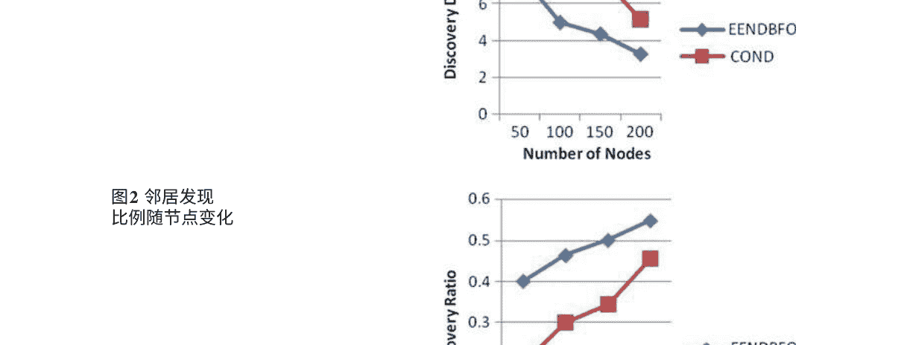

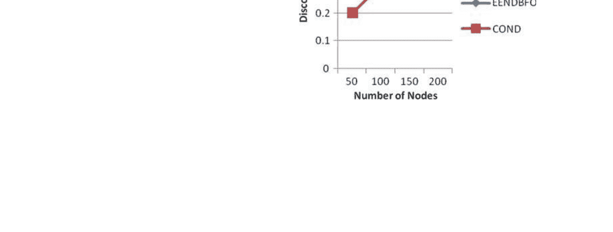

图3 数据包接收随节点变化

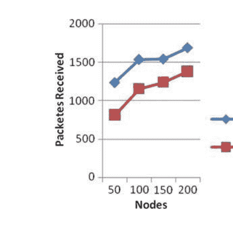

当节点数量为50、100、150和200时，图3探索了EEND BFO和COND中数据包接收的数据集。模拟结果显示，EEND BFO的数据包接收范围从1233到1688，COND的数据包接收范围从809到1381。因此，与COND相比，EEND BFO的数据包接收量增加了24%。

图4中的模拟探索了网络中的节点差异时，EEND BFO和COND中构建的平均剩余能量。根据模拟结果，EEND BFO节点的平均剩余能量从11.8 J降低到11.4 J，COND节点的平均剩余能量从7.4 J降低到5.1 J。EEND BFO的平均剩余能量比COND小44%。

节点通信范围变化的影响为了分析网络部署区域中节点通信范围的影响，我们精心设计了节点、传输和接收范围，从200 m到400 m。图5展示了当节点数量变化为200、250、300、350和400时，EEND BFO和COND累积的发现延迟。根据图5，EEND BFO的发现延迟从3.8提高到4.8，而发现

图4 不同节点的平均剩余能量

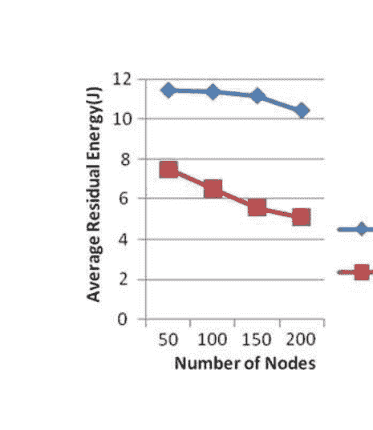

###### 图5 不同通信范围的邻居发现延迟

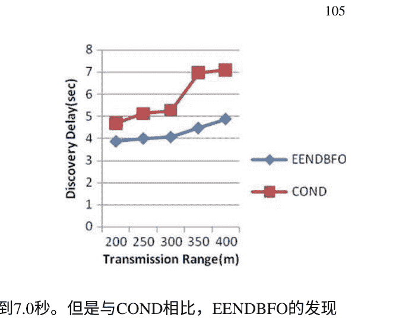

COND中的延迟从4.6秒提高到7.0秒。但是与COND相比，EEND BFO的发现延迟要小26%。

图6展示了在传感器网络设置中，当有几个节点被推迟时，EEND BFO和COND的节点发现比例。在模拟结果中，节点范围从200到400，EEND BFO的节点发现比例从0.70降低到0.59，而COND的发现比例从0.43降低到0.26。分析清楚地显示出，与COND相比，EEND BFO的发现比例快50%。

图7探索了在EEND BFO和COND中，当节点数量变化为200、250、300、350和400时的数据包接收集合。模拟结果显示，EEND BFO的数据包接收从1757增加到2149，而COND的数据包接收从1439增加到1750。因此，与COND相比，EEND BFO的数据包接收量增加了20%。

在图8中的模拟结果中，探索了网络中节点不同时EEND BFO和COND构建的平均剩余能量。根据模拟结果，EEND BFO的节点平均剩余功率从10.4增加到

###### 图6 邻居发现比例随范围变化

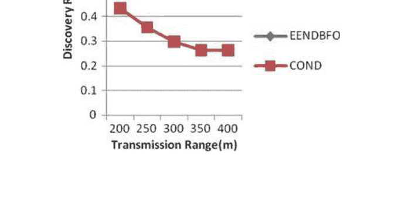

###### 图7 随范围变化的接收数据包数

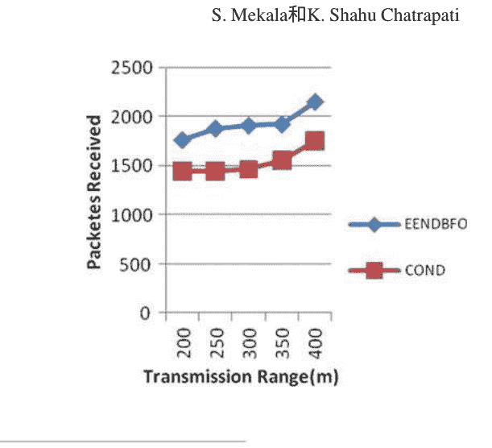

###### 图8 随范围变化的平均剩余能量

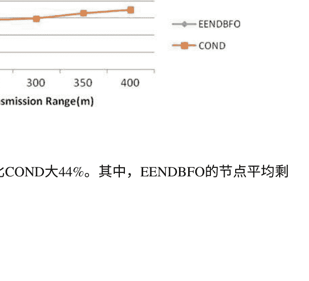

EEND BFO的平均剩余能量比COND大44%。其中，EEND BFO的节点平均剩余功率从5.5增加到6.9 J。

###### 5 结论

本文提出了一种用于定向无线传感器网络的EEND BFOA算法。在该算法中，每个带有定向天线的节点使用BFO进行波束成形，以轮询其扇区内的邻居节点。在轮询阶段，可以从邻居节点中选择适当的能量水平较高的活动节点进行数据传输。通过模拟结果，证明了所提出的EEND BFOA算法可以最小化发现延迟和能量消耗，并增加发现比例。

###### 参考文献

1.  Manir SB (2015) 无线传感器网络中的集体邻居发现。 Int J Comput Appl (0975–8887), 131(11)
2.  Choi S, Lee W, Song T, Youn J-H (2015) 基于块设计的无线传感器网络异步邻居发现协议。 J Sens 2015。 文章编号 951652， 12页
3.  Selva Reegan A, Baburaj E (2015) 无线传感器网络邻居发现和能量高效路由方法的有效模型。 Indian J Sci Technol 8(23)。 https://doi.org/10.17485/ijst/2015/v8i23/79348， 2015年9月
4.  Lee W, Song T-S, Youn J-H (2017) 使用块设计的无线传感器网络的非对称邻居发现协议。 Int J Control Autom 10(1):387–396
5.  Sun W, Yang Z, Wang K, Liu Y (2014) Hello: 一个通用的灵活协议用于邻居发现. IEEE
6.  Qiu Y, Li S, Xu X, Li Z (2016) 多说少听: 无线传感器网络中的能量高效邻居发现. IEEE
7.  Karthikeyan V, Vinod A, Jeyakumar P (2014) 一种无线传感器网络中的能量高效邻居节点发现方法. arXiv预印本 arXiv:1402.3655,2014
8.  Nur FN, Sharmin S, Ahsan Habib M, Abdur Razzaque M, Shariful Islam M, Almogren A, Mehedi Hassan M, Alamri A (2017) 方向性无线传感器网络中的协作邻居发现: 算法和分析. EURASIP J无线通信网络 2017:119
9.  Chen L, Shu Y, Gu Y, Guo S, He T, Zhang F, Chen J (2015) 基于群组的低占空比移动传感器网络邻居发现. IEEE Trans Mobile Comput
10. Agarwal R, Banerjee A, Gauthier V, Becker M, Kiat Yeo C, Lee BS (2011) 使用生物启发技术进行节点的自组织以实现小世界特性. IEEE
11. Das S, Biswas A, Dasgupta S, Abraham A (2009) 细菌觅食优化算法：理论基础、分析和应用. 计算智能基础， 第3卷. Springer, Berlin, 第23-55页
12. Amiri E, Keshavarz H, Alizadeh M, Zamani M, Khodadadi T (2014) 基于模糊蚁群优化的无线传感器网络能量高效路由. 分布式传感器网络国际杂志2014. 文章编号768936, 17页
13. Meghashree M, Uma S (2015) 在无线传感器网络中使用反应式路由提供高效的路由发现. 计算机应用机器人研究国际杂志3(4):145–151
14. Sathees Lingam P, Parthasarathi S, Hariharan K (2017) 无线传感器网络的能量高效最短路径路由协议。 Int J Innov Res Adv Eng (IJIRAE) 4(06):2349–2163

##### 基于自动编码器-LSTM的无线传感器网络异常检测方法

Bhanu Chander和Kumaravelan Gopalakrishnan

摘要 无线传感器网络（WSNs）在各种实际应用中引起了极大的兴趣，特别是环境应用。在这种长期使用的传感器中，检查原始感知数据的特征和质量是困难的。部署后，传感器节点有可能遭受不利环境，导致传感器停止工作或传递不准确的数据。如果不检测到这些问题，传感器网络的质量可能会大大降低。异常检测通过安全监测和一致检测有趣和重要事件来确保传感器的质量。在本文中，我们提出了一种称为平滑自动编码器的新方法，用于学习强大且有区分性的特征表示，并利用平滑自动编码器的输入-输出重构误差作为异常检测的激活信号。此外，我们采用了LSTM-双向RNN进行成熟度投票，以进行集体异常检测。

- 无线传感器网络
- 异常值
- 平滑自编码器
- LSTM-RNN

###### 1 引言

从最近在计算机连接、无线机械工具和信息与通信技术方面的进展结果来看，现在有一个名为无线传感器网络（WSNs）的新技术。在古代，我们有有线节点和网络，产生非常低的结果。但是，随着无线网络的发展，现在可以建立具有高产出的大型网络。从创新中，无线传感器网络被广泛应用于工业、学术、民用和军事领域等许多现实生活中的应用。在这里，部署的节点的主要目标是收集来自现实世界的有价值的原始感知数据，并将其转化为专家系统，以进行适当的决策制定[1-4]。但是，

根据应用程序的不同，部署在不友好环境中的传感器节点以及带宽、能量、CPU性能、内存等传感器的受限潜力，使得无线传感器网络容易受到不同类型的不良行为或异常值的攻击。异常值或异常是与感知数据的常规模式显著偏离的维度。异常值最早由著名研究者Grubbs在1960年定义为“一个异常观察值或异常值，是与其所在样本的其他成员明显偏离的观察值。”在2015年，Titouna定义为“与其他观察值相比偏离很大且可能由不同机制生成的观察值”，Van Vuong在2017年将异常值定义为“不符合预期模式或数据集中其他项目的数据项。”影响传感器数据的异常值通常与节点软件或硬件故障、读取错误、恶意攻击和奇怪事件相关。因此，高效而完美地对传感器数据中的异常值进行分类对于确保数据质量、安全监测以及对有趣和重要事件的一致识别至关重要。然而，在无线传感器网络环境中，异常值是显著影响收集数据的来源之一，因为专家系统对高质量的数据需要高质量的决策[3-12]。我们需要检测感知数据中的异常值的主要动机是，异常值有时比正常模式更有趣，因为它们可能包含重要的隐藏信息。如果我们发现这个异常值，我们可以在事件发生之前检测到它们。

异常值或异常检测是许多研究领域的一个非常重要的问题，如数据挖掘、医疗保健、药物或药品和传感器网络，并且已经在不同类型的阶段和设备上进行了研究。在这里，任何异常值暴露任务的目的是识别与估计模式不符的模式，并且这些异常模式被定义为异常值。此外，它对于发现噪声、欺诈、缺陷、入侵和错误等方面非常有用[1-3]。如何检测异常值或异常已经在疾病诊断、机器健康、信用卡欺诈检测、环境事件、系统入侵检测和其他方面变得越来越重要。异常值发现方法确保传感器数据的质量。针对无线传感器网络的有效和高效的异常值检测方法不仅以高检测精度和低误报率的分散和在线模式对异常值进行分类，而且还满足无线传感器网络在带宽、内存、通信和计算方面的资源限制。但是传感器网络的情况以及传感器数据的性质使得适当的异常值暴露系统的目标变得困难。无线传感器网络的非自然环境也影响了异常值检测方法。从文献中可以得知，传感器节点对计算能力和内存的限制，以及用于异常值暴露的方法的复杂性和内存空间的要求应该较低[4-6, 13-15]。此外，在无线传感器网络中，重新标记或预处理的数据很难获取。对于无线传感器网络的异常值或异常识别应该能够在未标记的数据上运行。从上述研究可以得出结论，在无线传感器网络中，异常值或异常暴露的关键问题是高度识别异常值。

在消耗传感器节点或网络的名义资源的同时，精度也得到了保持[7, 8, 14–16]。

异常检测的研究在传感器网络中取得了巨大的改进。当机器学习（ML）模型拥有预先安排的数据集时，它们能够产生巨大的准确性结果。对于实时应用中的无线传感器网络（WSN），很难获得标记数据。

深度学习（DL）是机器学习的一个分支，通过多种非线性变换，DL使得网络能够从原始感知数据中自动学习表示。传统的机器学习方法通常需要大量领域专家和时间来选择从原始感知数据中提取最佳特征。DL简化了人工特征挖掘的过程，克服了传统或常规机器学习模型的局限性[3–6, 13, 14]。

在2006年，Hinton引起了研究人员对DL的兴趣。在他的工作中，Hinton提出了一种教授(DNN)深度神经网络的技术：首先，采用有监督的贪婪逐层预训练来找到一组适度优秀的参数，然后对整个网络进行微小调整，成功地避免了梯度消失的困扰。

由于在许多其他特征方面的进展，DL和表示知识已经在WSN的异常检测领域得到了广泛应用。与传统的机器学习相比，DL在WSN的现代化方面提供了更多的才能和潜力。其中一些优势是高预测准确性-机器学习无法分析诸如信道变化和障碍物等复杂参数，但是深度学习可以逐层有效地抽象出所有这些。此外，DL通常选择从设置中直接组合的特征参数，因此无需预处理输入数据；DL的这种改进减少了提出的设计复杂性并增加了预测精度[7, 8, 10-12, 14-16]。与手动设计特征相比，如果模型能够从虚构数据中学习或训练出有效的特征表示，将更加有益于表示学习。对于各种计算机可视化任务，理想的特征或特征表示应该对小的差异有良好的适应性，对于保持数据结构应该是平滑的，并且对于分类相关任务应该具有区分性。DL在WSN应用中提供了更高的成功率，因为DL能够容忍不完整或错误的输入原始感知数据，并且能够轻松处理大量的输入信息并做出控制决策[1-4, 7, 8, 14-16]。

在这篇论文中，我们提出了一种自动编码器的修改，平滑自动编码器（SmAE），旨在学习强大、健壮、高效以及精确的特征表示。它与标准的自动编码器完全不同，后者通过编码重建每个示例；我们利用每个实例的编码来重建其相邻的实例。通过这种方式，学习到的表示是恒定的，与局部邻居无关，并且对输入的微小变化具有鲁棒性。

###### 2 相关文献工作

在[15]中，作者设计了一种新颖的异常检测模型，该模型了解不同传感器之间的时空关系，并利用学习到的表示进行异常识别。他们利用基于SODESN的分布式RNN结构设计以及学习方法来训练SODESN。作者使用真实世界收集的数据对设计的表示进行模拟，结果显示即使在连接质量不足的情况下也能实现出色的检测效果。在[16]中，作者提出了两种针对WSNs的异常检测方法，LADS和LADQA。作者采用QS-SVM并将其转化为一种排序问题，以减少线性计算的复杂性。实验结果证实了所提出方法在计算复杂度较低的情况下具有较高的异常检测准确性。[7]的作者提出了一种不同的方案，他们利用深度自动编码器通过将正常数据与固定阈值进行比较来发现传感器节点频谱中的异常值。通过使用不同数量的隐藏层进行评估，结果表现出更好的性能。作者们通过云数据分析构建了一个用于检测各种WSNs中的异常值的模型[8]。对所提出的方法进行了边缘和云端的真实数据测试，这些数据是在室内建筑环境中获取的，并经过一系列的人为干扰。实验结果表明，所提出的方法能够自适应环境变化，并正确分类异常值。[9]的作者为高效的异常值检测提出了新颖的Toeplitz支持向量数据描述（TSVDD）方法，并利用Toeplitz矩阵进行随机特征映射，从而减少了空间和时间复杂性。此外，还采用了新的模型选择方法，使模型在较低维度特征下更加稳定。对IBRL数据集的实验结果显示，TSVDD在精度和时间复杂度方面均优于手动方法。[10]提出了一种基于LSTM-RNN的神经网络的单类公共异常值检测方法。该模型使用标准时间序列数据进行训练；如果最近一定数量的时间步长的预测误差超过阈值，则表示存在集体异常。该表示是在KDD-1999数据集的时间序列报告上计算得出的，并且模拟结果表明所提出的模型能够有效地检测集体异常。

[11]的作者计划使用带有去噪自编码器的LSTM模型来预测前一帧之后的短程帧。在这里，自编码器的输入与输出之间的恢复误差被用作感知原始动作的激活手势。[12]中，作者提出了一种新颖的技术，其中深度自编码器被部署为中央分类器，使用交叉熵损失函数和反向传播模型来解决权重更新动量因子的问题。实验室对数据集的实验观察表明，该提议具有高质量的特征提取精度。[17]中，作者使用了一种新颖的LSTM来检测基于时间的数据中的异常值，这些数据是未来几个时间步骤的数值。

通过形成其预测误差向量来计算单个点的预测不准确性，以鲁棒的多变量高斯分布来评估异常值的概率。[18]的作者提出了一个模型，将预测自编码器与LSTM相结合，用于声学异常检测。

他们预测了自动编码器上的一种新的重构误差，数据实例显示了上述阈值，被称为新事件。设计[18]在[19]中也被广泛使用，这里使用LSTM-RNN来预测短程帧。

###### 3 提出的模型

###### 3.1 自动编码器初步

深度学习方法从输入到输出的表示中学习多层非线性变换。与传统模型相比，这些操作在特征提取中处于较高的位置。正如我们在上面的章节中讨论的那样，深度学习方法能够在更高层次上捕捉更多的概念特征，代表性的深度学习模型如堆叠自动编码器(SAE)、卷积神经网络(CNN)和深度置信网络(DBN)在目标跟踪、事件识别、图像分类、计算机视觉和模式识别等方面取得了巨大的成就。然而，与所有这些深度学习模型相比，自动编码器可以通过减少输入和其编码之间的重构误差来直接获得特征映射任务的知识。

根据LeCun—1987，一些概率方法可能被描述为中间变量，其后可以被解释为一种表示。自动编码器议程属于这个类别；它通过明确地展示一个定义参数化闭合形式中的特征提取任务来开始。这个整个函数被命名为encode，并被引用为($f_{\Theta}$)，是一个特征向量的熟练计算。

$h = f_{\Theta}(x)$ 从输入 $x$开始。对于每个数据实例 $x(t)$ 开始一个数据集$\{x(1), ..., x(T)\}$，我们描述 $h(t) = f_{\Theta}(x(t))$。在这里，$h(t)$ 是从 $x(t)$ 计算得到的表示或规范编码。在这里，一个新的参数化编码器函数($g_{\Theta}$)从特征空间到输入生成重建 $r = g_{\Theta}(h)$。自动编码器从头到尾由它们的编码器和解码器参数化，这些参数化使用不同的训练信念。编码器和解码器的参数 ($\theta$)，智能地在像重建和可能的唯一输入上的任务上，即努力获得最小的重建或重建误差 $L(x, r)$—这是一个衡量 $x$和它的复制之间偏差的平均值在一个训练集上。为了减少恢复误差以阻止数据创建和分割的构建，学习阶段的某种标准或参数化对于AE发现唯一目标到零重建错误是必要的。

此外，为了自动编码器的进展，提出了许多正则化项。稀疏自动编码器通过$L1$惩罚隐藏单元的稀疏性或Kullback-Leibler（KL）差异来实现；去噪自动编码器（DAE）对于小幅度的随机扰动，测试结果良好。收缩自动编码器（CAE）通过累积系统性的收缩效应来减少演示的有效自由度水平。在这里，DAE和CAE对训练样本之间的输入进行微小的变化。

###### 3.1.1 平滑自动编码器

与其他自动编码器相比，平滑自动编码器（SmAE）是完全特殊的；它强大地学习非线性特征表示。对于每个输入，SmAE旨在重构或重建其周围的目标邻居，而不是像传统的自动编码器变体那样自我更新。

SmAE的实际目标原则如下：

> $$J_{sm AE}(\Theta) = \sum_{i=1}^{n} \sum_{j=1}^{k} w_n(x_j, x_i) L(x_j, g(f(x_i))) + \beta \sum_{j=1}^{d_h} K L(\rho \| \overline{\rho_j})$$

在这里，$w(\cdot, \cdot)$表示权重函数，用于描述平滑核 $w(x_j, x_i) = 1/Z K(d(x_j, x_i))$，以及点Z用于证明 $\sum_{j=1}^{k} w_n(x_j, x_i)$ 对于每个部分的$i$，都有$=1$。

$k$是$x_i$的目标邻居数量。$d(\cdot, \cdot)$是处理特征空间/关系的距离或空间。上述方程的第一项将边界输入示例推向相关表示。与相似的情况一样，生成的属性不仅具有有限的差异性，而且在各种数据集上与输入示例一样灵活。对于第二项，通过KL稀疏性对模型复杂性进行正则化。根据应用程序，可以使用不同的核函数将非线性可分数据映射到高维空间。在这里，我们使用径向基函数（RBF），因为它具有较少的计算复杂性，这对于增加网络寿命非常有帮助。选择RBF核的另一个原因是参数gamma（$\gamma$）和cost（$c$）起着关键作用。同样，基于度量学习，可以采用不同的距离度量；在这里，我们采用马氏距离，因为它对每个变量使用组均值和方差来解决相关性问题。

目标邻居在训练数据中具有不同的变化或概念；我们基于马氏距离决定一些$k$最近邻居（$Knn$）。通过计算$knn$与后续距离的加权分配来应用计算。在本文中，设计的模型基于恢复或重建误差，SmAE被分配为重新创建在训练时未见过的输出。

> 对于样本$x_i$的加权重建误差可以简化为以下形式：$$-\sum_{j=1}^{k} w_n(x_j, x_i)x_j. \text{Log}(g(f(x_i))) - (1 - \sum_{j=1}^{k} w_n(x_j, x_i))x_j.$$$

同样的目标函数可以写成：

> $$J_{smAE}(\Theta) = \sum_{i=1}^{n} L_{ce}(x_j, g(f(x_i))) + \beta \sum_{j=1}^{d_h} KL(\rho\|\overline{\rho_j})$$

###### 3.2 BLSTM-RNN初步

在过去的几年中，长短时记忆递归神经网络（LSTM-RNN）已被应用于有效地表示现有和前面事件之间的关联，并解决时间序列问题。一般来说，LSTM-RNN不仅在标准数据上表现出色，而且还能够提前预测多个时间步。大多数方法从相关工作中估计个体水平的异常值，而不是集体水平的异常值；此外，训练阶段应用了标准数据和异常数据。谈到LSTM的设计背景，它包括输入层、LSTM隐藏层和输出层。在这里，输入节点接收输入数据，输出可以是任何变换（sigmoid、tanh等）的实用工具。LSTM隐藏层由与输入和输出节点完全相关的智能节点的数量构成。谈到LSTM隐藏层，它由一些与输入和输出节点完全相关的精心设计的节点构成。梯度下降和反向传播是一些常用的技术，用于最优化损失函数；此外，它会更新其因子。如上所述，LSTM有能力通过使用标准数据将行为整合到系统中。因此，网络成为数据变体的代表。具体而言，预测是通过两个特征进行的：第一，一个示例的值；第二，它在特定时间的位置。这意味着不同时刻的两个相似输入值可能导致两个不同的输出。而LSTM-RNN之所以具有这种能力，是因为它是有状态的，并且它的记忆会根据输入而变化。

因此，我们设计了一种基于LSTM和双向RNN的新型社区异常检测技术。在这里，LSTM-RNN用于估计每个时间步的异常得分，以便在时间序列异常检测中扩展。此外，双向RNN被用于获取相互时间信息的情况。通过将输入数据分别通过两个隐藏层传递并传递到输出层来完成。双向RNN与LSTM内存块的结合导致双向LSTM结构；在这里，利用了来自两个时间方向的观点。这有助于根据单个数据点的异常得分的进展来开发集体异常暴露。我们在标准数据上准备了一个LSTM-RNN来了解正常行为。然后，这个准备好的模型在标准验证集上进行验证，以估计模型参数。然后，得到的分类器用于为每个时间步的特定数据实例评估异常得分。一系列时间步的异常得分将从每个实体的参与中进行累加。借助固定阈值，如果某个孤立时间步的异常得分高于阈值，则将其指定为社区异常。

为了更好的准确性，我们对可变隐藏层及其大小进行了初步评估的混合。最好的网络草案对于RNNs有三个隐藏层，分别为156-256-156个LSTM单元。此外，BRNNs最佳布局包含六个隐藏层，每个轨道三个，每个隐藏层都有216个LSTM单元。系统权重通过标准梯度下降和反向传播的平方误差（SSE）重复调整。梯度下降技术要求系统权重以非零标准初始化；因此，我们通过均值（0）和标准差（0.1）的随机高斯分布初始化权重。

###### 阈值

在设计的模型中，系统的输入和输出层都包含54个单元。因此，完成的自编码器能够通过分配自适应阈值来重新创建每个示例和新事件的重建误差。

对于每个时间步长，计算每个相同输入值与系统输出之间的欧几里得距离。将空间求和并通过系数的数量分隔，以表示每个时间步长的重构误差。为了获得最佳的事件暴露，使用阈值“θ_th”来获得二进制信号。这里，阈值相对于进展的误差信号的中值是相对的e_0，通过乘法系数β限制在β_min = 1到β_max = 2的选择中：

```
θ_th = β * median(e_0)          (1)
```

###### 4 实验结果

对于实验结果，我们考虑从位于英特尔伯克利研究实验室（IBRL）的无线传感器网络（WSNs）收集的基准数据集。这里，数据是使用TinyDB网络查询处理方法收集的，该方法建立在Tiny-OS策略上。位于IBRL的传感器网络包括54个Mica2Dot传感器节点，近30天共计720小时。传感器每30秒收集一次数据，包括电压（以伏特为单位）、光照度（以勒克斯为单位）、温度（以摄氏度为单位）、湿度（范围从0到100%）以及每个节点的拓扑位置。在IBRL设置中，节点0被视为起始节点，其他节点通过多跳方式向节点0广播数据。最远的节点最多产生10个跳的感知数据。在720小时内，这54个节点收集了近230万个读数。

为了对提出的模型进行实验，我们准备了一个测试集，因为原始大气数据中没有包含任何标签来指示哪些数据是正常的和异常的。在这里，我们选择了三个维度：湿度、温度和电压。我们采用了k折交叉验证方法将样本减少到一半的大小。这些维度中的每一个都有5000个样本用于准备或训练，1000个样本用于验证或验证，另外还有2000个样本用于测试。在我们的技术中，我们应用了基于无监督的目标邻居来示范权重函数；此外，网络通过RBF核进行进一步微调。超参数，如层面、稀疏性影响以及核带宽，是通过验证集找到的。在表1中，我们提到了模型的准确性、精确度以及其错误率；此外，我们将提出的模型与其他已存在的AE、DAE、CAE、AE-2、DAE-2、CAE-2和SmAE-2进行了比较（这里，符号2表示通过堆叠2个隐藏层构建的版本）。而且，结果表明，它具有高质量的准确性和低错误率。

| 方法 | 自编码器 | 去噪自编码器 | 卷积自编码器 | 相同 | 自编码器-2 | DAE-2 | CAE-2 | SmAE-2 |
| :--- | :--- | :--- | :--- | :--- | :--- | :--- | :--- | :--- |
| 准确性 | 95.24 | 94.68 | 92.49 | 96.17 | 97.12 | 96.46 | 97.98 | 99.26 |
| 错误率 | 1.98 | 1.58 | 1.46 | 1.18 | 1.64 | 1.15 | 1.10 | 0.82 |

因此，准备了两个标签正常和异常，这个数据集包含近5000个正常样本和400个异常样本。我们采用了 k折交叉验证将样本压缩到一半的大小。经过各种测试程序，我们选择了使用动量为0.9、学习速度 l = {1e^{-3} to 1e^{-7}}和不同的噪声sigma值 σ = {0.25, 0.5}进行训练的最佳网络模型。54-20-54、54-54-54和54-128-54是最佳的网络拓扑结构，因此我们在每次测试中都保持相同的网络设置，以便进行最佳比较工作。在这里，每个网络拓扑结构都经过50个时期的训练和评估。

从表2可以清楚地看出，我们的预测方法在精确度、召回率和F值方面表现出最佳结果，分别达到96.89、94.43和95.90，输入噪声标准差为0.5，请参见表3。在这里，我们对每种网络布局进行了多次实验，但我们只解释了最佳标准网络布局的结果。通过设置输入噪声偏差为0.1和0.25，BLSTM-AE和LSTM-SmAE的精确度值较高，分别达到91.89、93.46和92.24。

| 方法 | 精确度 | 召回率 | F值 |
| :--- | :--- | :--- | :--- |
| LSTM-AE } 54-54-54, 54-128-54<br>BLSTM-自编码器 | 89.1, 90.24 | 86.90, 88.29 | 85.24, 86.32 |
| LSTM-DAE } 54-54-54, 54-128-54<br>BLSTM-DAE | 92.23, 92.85 | 91.63, 91.45 | 93.48, 92.69 |
| LSTM-CAE } 54-54-54, 54-128-54<br>BLSTM-CAE | 94.41, 94.90 | 92.81, 93.14 | 93.43, 94.17 |
| LSTM-SmAE } 54-54-54, 54-128-54<br>BLSTM-SmAE | 96.77, 96.89 | 93.32, 94.43 | 95.73, 95.90 |

表3 设计方法精度与现有模型的比较演变

94.64。最终，实现的结果表明，采用不同的BLSTM提案的就业平滑自动编码器是有价值的；此外，与现代技术相比，取得了显著的性能改进。

对于集体异常检测，我们观察特定连续数据点的预测误差。为此，我们计算相对误差、集体误差和预测误差。对于相对误差，我们分析每个时间步长上真实值与BLSTM-RNN的预测值之间的误差。并且，它以方程形式描述为RE(x, x^) = |x - x^|。预测误差阈值（PET）估计某个时间戳值是否被视为标准或可能的集体异常点。如果相对误差超过计算得到的PET，则将其视为集体异常点。最后，集体范围根据连续出现在网络流中的最小异常点数量来识别集体异常点。

###### 5 结论

在无线传感器网络中的异常检测是一个具有挑战性的任务，研究人员正在不断努力寻求最佳结果。在本文中，我们尝试通过使用平滑自动编码器基于LSTM双向循环神经网络来规划异常检测模型。我们激发了这个过程，因为它具有目标邻居表示的强大表示能力，LSTM-RNN用于处理时间序列问题，并尝试调整这两种技术以检测群体异常值。设计的版本是通过基准IBRL数据集进行估计的。实验分析证明了该预测方法相对于现有技术具有更高的准确性和召回率。

###### 参考文献

1.  Krizhevsky A, Sutskever I, Hinton GE (2012) 使用深度卷积神经网络进行Imagenet分类。 在: NIPS
2.  Ji S, Xu W, Yang M, Yu K (2013) 用于人体动作识别的3D卷积神经网络。 IEEE Trans Pattern Anal Mach Intell 35:221–231
3.  王N， 杨DY （2013) 学习深度紧凑的图像表示用于视觉跟踪。 在: NIPS
4.  Ngiam J, Coates A, Lahiri A, Prochnow B, Le QV, Ng AY (2011) 关于深度学习的优化方法 。 在: ICML
5.  Ranzato M， Boureau YL， LeCun Y （2007) 用于深度信念网络的稀疏特征学习。 在: NIPS
6.  谢杰， 徐L， 陈E （2012) 图像去噪和修复与深度神经网络。 在: NIPS
7.  冯Q， 张Y， 李C， 窦Z， 王J (2016) 通过深度自动编码器检测无线通信中的频谱异常。 J Supercomput. https://doi.org/10.1007/s11227-017-2017-7
8.  Cauteruccio F, Fortino G, Guerrieri A, Liotta A, Mocanu DC, Perra C, Terracina G, VegaMT (2019) 基于机器学习和多参数编辑距离的无线传感器网络的短期和长期异常检测。 Inf Fus 52:13–30
9.  Huan Z, Wei C, Li G-H (2018) 使用基于模型选择的支持向量数据描述进行无线传感器网络中的异常检测。 传感器18
10. Thi NN, Cao VL, Le-Khac N-A (2016) 基于LSTM-RNN的单类集体异常检测。 IEEE
11. Marchi E, Vesperini F, Weninger F, Squartini S, Schuller B (2015) 使用LSTM循环神经网络进行声学新颖性检测的非线性预测。 IEEE
12. Zhu J, Ming Y, Song Y, Wang S (2017) 基于深度自动编码器网络的无线传感器网络中情境元素获取机制。 Int J Distrib Sensor Netw 13(3)
13. Vincent P, Larochelle H, Bengio Y, Manzagol PA (2008) 使用去噪自动编码器提取和组合稳健特征。 ICML
14. Vincent P, Larochelle H, Lajoie I, Bengio Y, Manzagol PA (2010) 堆叠去噪自编码器: 在具有局部去噪准则的深度网络中学习有用的表示。 JMach Learn Res 11:3371–3408
15. Oliver O (2013) 使用递归神经网络在传感器网络中进行分布式故障检测。 神经过程信件。 https://doi.org/10.1007/s11063-013-9327-4
16. Cheng P, Zhu M (2015) 无线传感器网络的轻量级异常检测。 Int J Distrib Sensor Netw 2015. 文章编号 653232
17. Malhotra P, Vig L, Shroff G, Agarwal P (2015) 用于时间序列异常检测的长短期记忆网络 。 在: 会议论文集。 鲁汶大学出版社， 第89页
18. Marchi E, Vesperini F, Eyben F, Squartini S, Schuller B (2015) 使用具有双向LSTM神经网络的去噪自编码器进行自动声学新颖性检测的新方法。 在: 2015年IEEE国际声学、语音和信号处理会议(ICASSP)， 第1996-2000页。 IEEE
19. Marchi E, Vesperini F, Weninger F, Eyben F, Squartini S, Schuller B (2015) 使用LSTM循环神经网络进行非线性预测，用于声学新颖性检测。 在：2015年国际神经网络联合会议 (IJCNN)。 IEEE， 第1-7页

##### 基于改进的粒子群优化（IPSO）算法的改进的群体优化算法的谐波估计和最优开关角度识别

M. Alekhya, S. Ramyaka, N. Sambasiva Rao和Ch. Durga Prasad

**摘要** 本文中，使用改进的粒子群优化（IPSO）算法估计谐波参数，并扩展了该概念以识别逆变器的正确开关角度，以最小化总谐波含量。首先，在存在噪声的情况下，考虑具有多个谐波分量的电力系统电压信号，并使用传统PSO和IPSO估计振幅（A）和相位角（φ）。然后，为级联H桥逆变器的该电压制定了一个目标函数，以识别减少总谐波含量的精确开关角度。比较结果显示，IPSO在两种情况下都能有效地识别出最优解。

- PSO
- 谐波
- 最优切换
- 惯性权重

###### 1 引言

具有可再生能源资源、变流器和逆变器以及高度非线性负载的集成电力系统发生结构变化，注入谐波并导致电力质量差[1]。这些注入的谐波需要通过适当的解决方案进行估计和减轻，因为它们会对继电器和其他设备的正常功能产生一些不利影响。谐波的估计

M. Alekhya (✉) · S. Ramyaka · N. Sambasiva Rao
NRI技术学院电气与电子工程系，维贾亚瓦达，印度
电子邮件：alekhya.mangalagiri@gmail.com
S. Ramyaka
电子邮件：ramyaka.sammangi@gmail.com
N. Sambasiva Rao
电子邮件：nsraohodeee@gmail.com
Ch. Durga Prasad
SRKR工程学院电气与电子工程系，印度比马瓦拉姆
电子邮件：dpchinta@s rkrec.edu.in通过智能优化技术，实现了电力系统信号和逆变器最佳开关角度的识别，以在直流到交流转换过程中最小化注入谐波，相比传统方法，效果更好。

文献中提供了一些方法：利用注入谐波和噪声的电压信号的结构特性，结合遗传算法（GA）和最小二乘技术在[3]中用于非线性参数估计。由于遗传算法的收敛速度较慢，2008年在[4]中应用PSO解决了相同的估计问题，过程类似于[3]中的方法。与遗传算法相比，PSO产生了更好的适应度值，并且估计结果接近实际值，为智能优化算法的应用开辟了研究方向。

然后，改进的PSO版本被应用于这个谐波估计问题，以获得更准确的结果和快速收敛速度[5]。然而，与PSO相比，这个改进的PSO在结构上更加复杂，计算时间也更长。

人工蜂群（ABC）算法与最小二乘法相结合应用于[6]中，以获得更好的结果和更高的精度，以应对噪声的存在。

前述的基于随机和种群搜索的算法的目标是快速收敛和高精度地估计失真信号的幅值和相位。在相同领域中应用的其他优化算法可在[7-10]中找到。这些来自电力电子设备的谐波通过最优开关概念来最小化。文献中有一些关于各种逆变器的最优开关时间识别解决方案的研究成果。

已经应用了几种优化技术来识别开关模式[11]。

本文使用了一个简单的改进PSO版本来估计失真电压信号的谐波，并进一步识别最优开关时间以减少谐波含量。这个改进的PSO产生全局最优值，并减少了对变量选择的额外负担。与PSO相比，这也提供了更高精度和更快收敛的结果。

###### 2 谐波估计和切换角度识别

具有多个谐波（$\omega_h = h \cdot 2 \pi f_0$）和噪声（$\mu(t)$）的电压信号在时域中表示为基频 $f_0$的

$$v(t) = \sum_{h=1}^{N} A_h \sin(\omega_h t + \varphi_h) + \mu(t) \qquad (1)$$

在方程 (1) 中，$N$ =谐波的总数。用采样周期 $T_s$表示方程 (1) 在离散形式中计算误差的表达式为

$$v(k) = \sum_{h=1}^{N} A_h \sin(\omega_h k T_s + \varphi_h) + \mu(k)$$

假设振幅和相位的估计参数为 $A'_h$ 和 $\varphi'_h$，分别。具有估计参数的失真信号表示为，

$$v(k)' = \sum_{h=1}^{N} A'_h \sin\left(\omega_h k T_s + \varphi'_h\right)$$

一旦实际和估计信号可用，那么通过误差构建一个目标函数，并且当估计信号与实际信号接近匹配时，目标函数达到最小值。因此，用于谐波分量估计[3-6]的第一个目标函数为

$$J_1 = \min_{A'_h, \varphi'_h} \sum_{k=1}^{M} (v(k) - v(k)')^2$$

随后，通过识别合适的滤波器参数和/或开关角度模式来最小化从信号转换活动和非线性负载参与中产生的谐波。在这种情况下，为级联H桥逆变器构建第二个目标函数，以找到最佳开关角度，使输出信号包含非主导谐波成分[11]。

$$J_2 = \min_{(\delta_1, \delta_2, \delta_3)} \left\{ \left(100 \cdot \frac{V_1^* - V_1}{V_1^*}\right)^4 + \frac{1}{5} \left(50 \cdot \frac{V_5}{V_1}\right)^2 + \frac{1}{7} \left(50 \cdot \frac{V_7}{V_1}\right)^2 \right\}$$

在方程（5）中，$V_1$，$V_5$ 和 $V_7$ 是其表达式可在[11]中找到的谐波分量。在最优解的切换角度 $\delta_1$，$\delta_2$，$\delta_3$ 处，目标函数达到最小值。

###### 3 改进的粒子群优化算法

在上述智能优化技术中，PSO算法简单且具有全局最优的函数值和收敛速度。然而，控制参数的选择在搜索过程中起着关键作用[12-15]。但是传统的PSO算法在操作过程中使用恒定的控制参数会出现过早收敛的情况。后来，提出了几种变体，但这些变体比父PSO更复杂。因此，本文中使用阻尼量在粒子的速度方程中进行了重新调整，如公式（6）所示。这自动更新的位置向量如公式（7）所示。

$$
v_{n}^{i+1} = \omega \omega_d v_{n}^{i} + c_{1} c_{d} r_{1} \left( p_{\text{best},i} - p_{n}^{i} \right) + c_{2} c_{d} r_{2} \left( g_{\text{best}} - p_{n}^{i} \right)
$$

$$
p_{n}^{i+1} = p_{n}^{i} + v_{n}^{i+1}
$$

方程(6)和(7)中的所有项与PSO相同，$\omega_d$和$c_d$是插入每个控制参数的阻尼值。提出的方法在估计和抑制方面的结果改进在随后的部分中呈现，通过与父PSO的比较结果进行比较。

###### 4 模拟结果

最初，通过MATLAB软件生成包含基波、3次谐波、5次谐波、7次谐波和11次谐波的测试信号，该信号受到噪声和零频率分量的干扰，用于通过PSO和IPSO估计谐波分量。信号的数学表达式表示为Eq. (1)的形式如下

$$
x(t) = 1.5 \sin(\omega t + 80) + 0.5 \sin(3\omega t + 60) + 0.2 \sin(5\omega t + 45) + 0.15 \sin(7\omega t + 36) + 0.1 \sin(11\omega t + 30) + 0.5 \exp(-5t)
$$

在估计问题中，还包括额外的噪声。首先，使用传统的具有恒定惯性权重策略的PSO估计谐波分量以及直流衰减分量。考虑了四个惯性权重值，因为没有特定的选择这种控制参数的过程。然后，使用最差的惯性权重值对同一问题应用IPSO，并获得全局最优值。所有这些结果都在表1中报告。

**表1 单线对地故障的最佳漂移参数值**

| PSO情况 | 参数 | 第1个 | 第3个 | 第5个 | 第7个 | 第11个 | 零 |
| :--- | :--- | :--- | :--- | :--- | :--- | :--- | :--- |
| ω = 0.9 | A | 1.4084 | 0.4906 | 0.1569 | 0.0010 | 0.0612 | 0.7666 |
| | φ | 80.685 | 63.579 | 13.307 | 32.076 | 71.326 | – |
| ω = 0.8 | A | 1.4994 | 0.5006 | 0.1986 | 0.1490 | 0.0512 | 0.5116 |
| | φ | 79.966 | 60.039 | 44.0790 | 35.967 | 90.238 | – |
| ω = 0.7 | A | 1.5002 | 0.5004 | 0.1998 | 0.1501 | 0.0999 | 0.5108 |
| | φ | 79.993 | 59.911 | 44.809 | 35.732 | 30.199 | – |
| ω = 0.6 | A | 1.5000 | 0.4997 | 0.2000 | 0.1502 | 0.0999 | 0.5096 |
| | φ | 80.017 | 60.003 | 44.938 | 36.174 | 29.682 | – |
| ω = 0.3 | A | 1.4980 | 0.4515 | 0.1832 | 0.1356 | 0.0764 | 0.5053 |
| | φ | 79.865 | 34.239 | 66.939 | 64.989 | 69.663 | – |
| 提出的 | A | 1.4993 | 0.5008 | 0.2003 | 0.1501 | 0.1006 | 0.5105 |
| | φ | 79.995 | 60.025 | 45.326 | 35.918 | 29.844 | – |

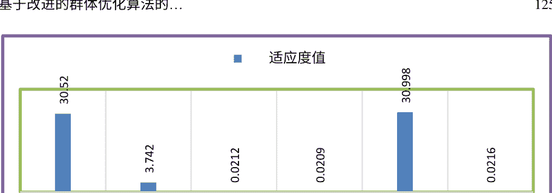

图1 适应度函数 J1不同惯性权重的值

| 方法 | $\delta_1$ | $\delta_2$ | $\delta_3$ |
| :--- | :--- | :--- | :--- |
| 参考文献[11] | 33.498 | 54.759 | 67.103 |
| 提出的 | 33.506 | 54.757 | 67.110 |

表2 单线对地故障的最佳漂移参数值

对于不同惯性权重下的所有PSO运行，最终迭代结束时的适应度函数值在图1中绘制。从图1中可以看出，提出的动态控制参数概念减轻了寻找全局最优解的控制参数选择负担。相同的PSO策略被应用于识别最佳切换值，以最小化总谐波失真（THD）。为此，考虑了式（5），并在调制指数（m）为0.6时报告了结果。

###### 5 结论

在本文中，使用改进的PSO算法识别谐波成分估计和最优切换条件模式，并与标准PSO进行比较。比较结果显示，在原始PSO中，控制变量的选择非常重要，而改进的PSO采用的简单机制消除了对此选择的额外负担。在不增加计算负担的情况下，通过提出的技术实现了准确的结果和快速收敛。

###### 参考文献

1.  Harris FJ (1978) 关于使用窗函数进行离散傅里叶变换的谐波分析的研究。IEEE会议录66 (1) : 51-83
2.  Ren Z, Wang B (2010) 基于FFT的谐波参数估计算法。在：2010年亚太电力与能源工程会议。IEEE，2010年3月，第1-4页
3.  Bettayeb M, Qidwai U (2003) 一种基于最小二乘-GA的谐波估计算法。IEEE Trans Power Deliv 18（2）：377-382
4.  Lu Z, Ji TY, Tang WH, Wu QH (2008) 使用粒子群优化器进行最优谐波估计。IEEE Trans Power Deliv 23(2):1166–1174
5.  Yin YN, Lin WX, Li WL (2010).基于改进的PSO的谐波幅度和相位估计。在：IEEE ICCA 2010。IEEE，2010年6月，第826-831页
6.  Biswas S, Chatterjee A, Goswami SK (2013)用于解决谐波估计问题的人工蜜蜂群-最小二乘算法。 Appl Soft Comput 13(5):2343–2355
7.  Kabalci Y, Kockanat S, Kabalci E (2018)用于电力系统谐波估计问题的改进ABC算法方法。 Electric Power Syst Res 154:160–173
8.  Singh SK, Kumari D, Sinha N, Goswami AK, Sinha N (2017)重力搜索算法混合递归最小二乘法用于电力系统谐波估计。 Eng SciTechnol Int J 20(3):874–884
9.  Singh SK, Sinha N, Goswami AK, Sinha N (2016)使用生物地理学混合递归最小二乘算法进行电力系统谐波估计。 Int J Electr Power Energy Syst 83:219–228
10. Singh SK, Sinha N, Goswami AK, Sinha N (2016)使用混合萤火虫递归最小二乘算法进行电力系统谐波的鲁棒估计。 Int J Electr Power Energy Syst 80:287–296
11. Kundu S, Burman AD, Giri SK, Mukherjee S, Banerjee S (2017)用于三相七级级联H桥逆变器SHE-PWM精确开关角度查找的不同优化技术的比较研究。 IET Power Electron 11(3):600–609
12. Kennedy J, Eberhart R (1995) 粒子群优化。 In: Proceedings of ICNN’95—International Conference on Neural Networks, vol 4. IEEE，1995年11月，第1942–1948页
13. Nagaraju TV，Prasad CD (2020)用于混合膨胀黏土压缩指数 (Cc)估计的群智能辅助多重线性回归模型。 Arabian J Geosci 13(9)
14. Prasad CD，Biswal M，Nayak PK (2019)用于输电线路保护的小波操作单指标故障检测方案与群智能支持。能源系统1–20
15. Nagaraju TV，Prasad CD，Raju MJ (2020)使用粒子群优化预测加利福尼亚承载比。 In: Soft computing for problem solving. Springer，新加坡，第795–803页

##### 集成方法在分类问题上的研究

R. Harine Rajashree和M. Hariharan

摘要 分类是机器学习中最常见的任务，其目标是将输入数据归类为一组已知的标签。随着时间的推移，出现了许多技术来提高分类的性能。集成学习是一种技术，通过组合不同的学习器来提高性能，以提供更好的稳定性和准确性。集成学习在医疗数据分析、情感分析和银行数据分析等各个领域中被使用。本研究重点调查了集成学习中使用的技术，包括堆叠、提升和装袋技术，以及集成学习在分类问题中所面临的改进和挑战。研究的动机是了解集成方法在各个领域中的分类中的作用。

关键词：
- 机器学习
- 集成学习
- 提升
- 装袋

###### 1 引言

机器学习是获得人工智能的一种方式之一。机器学习专注于使机器能够自主学习，而无需明确编程。这反过来又为获得智能铺平了道路。机器学习广泛分为有监督学习和无监督学习两种类型。分类是一种重要的机器学习任务，它将输入映射到输出。这是一种有监督学习，它将提供的输入映射到输出。它基本上找到了输入数据可能属于的类别。它是有监督学习，因为用于训练模型的数据是近似的映射函数被标记为正确的类别。图1描述了机器学习的类型以及应用。

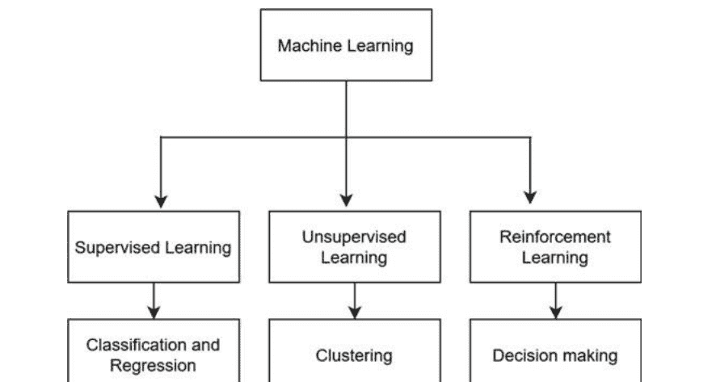

除了分类，回归也是一种监督学习，也应用于风险评估和股票价值分析等各个领域。分类是一种预测建模，预测输入数据的类别标签。模型是通过已经标记的大量数据进行训练的。一些经典的例子包括垃圾邮件/非垃圾邮件分类，手写字符分类。二元和多类是两种不同的分类类型。许多流行的算法用于执行分类任务。一些众所周知的算法有：

- K 最近邻算法
- 朴素贝叶斯算法
- 决策树算法
- 随机森林算法

尽管算法的性能令人称赞，但仍然需要不断改进性能。集成学习是一种常见的技术，用于提高准确性。集成学习又有许多方法来提高分类的准确性。使用集成模型的思想是将多个弱学习器组合成一个强学习器。所提出的工作分析了集成技术的各种方法，其在领域中的应用以及集成学习效果的实验分析。

本文的其余部分组织如下：第2节研究相关工作，第3节讨论各种集成技术，第4节讨论集成技术的应用，第5节讨论集成技术在深度学习中的应用，第6节提供实验结果，第7节总结了本次调查的内容。

###### 2 相关工作

集成是一个常青的研究领域，已经提出了许多研究。Sagi等人提出的工作[1]详细研究了集成学习的发展，并解释了每种集成技术的历史。该工作的关键要点是将算法优化以适应大数据。另一个提到的是将来将深度学习与集成学习相结合的研究。Gomes等人[2]专门提出了关于数据流中集成学习的调查。作者研究了超过60种算法，为上下文中的集成学习者提供了分类法。研究得出的结论是数据流集成学习模型有助于克服概念漂移等挑战，并且在实时场景中运行良好。Dietterich等人[3]在他们的工作中对此进行了更好的理解，解释了为什么集成有效，构建集成的基本方法等许多问题。本文描述了形成单一假设的算法，用于执行输入到输出的映射，并遭受三个主要损失，即：

- 统计问题
- 计算问题
- 表示问题

这些问题导致高方差和偏差，因此解释了为什么集成可以减少偏差和方差。Ren等人[4]讨论了导致集成学习的理论，包括偏差方差分解和多样性。该论文还将算法分为不同的类别。它还讨论了模糊集成方法和深度学习方法等不同的方法。该工作在分析分类任务的同时，同样关注回归任务。在本文中，讨论了涉及分类任务的各种方法，集成学习的应用以及面临的挑战。

###### 3 种集成学习方法

集成学习通过形成一组假设来工作，而经典算法则致力于找到一个单一的假设。然后，集成以某种方式使假设进行投票以预测输出类别。关于如何对集成方法进行分类有很多解释。一些文章将它们分类为顺序集成技术和并行集成技术。作者在[3]中根据假设设计对技术进行分类。模型可以是独立构建的多样且准确的假设。其他方法是将假设构建为加法模型。作者在[4]中进行了非常具体的分类，如基于分解的集成方法和模糊集成方法。[1]中的描述是最简单的分类：

- 依赖框架
- 独立框架

依赖框架是指每个学习器的结果会影响下一个学习器。下一个学习器的学习会受到前一个学习的影响。独立框架是相互独立构建的。任何集成技术都可以归类到这两个类别中。集成技术的主要类型有：

- Bagging
- Boosting
- Stacking

这些技术下有许多算法在其下工作，以实现集成的目标。

###### 3.1 Bagging

集成模型的一个重要关键是多样性。多样性在提高集成模型性能方面起着关键作用。Bagging是实现多样性的一种方法之一。Bagging是通过对实例的子集训练每个诱导器来工作的自助聚合方法。每个诱导器都在不同的子集上进行训练，从而生成不同的假设。然后使用投票技术来确定测试数据的预测结果。Bagging通常包含同质学习器，并通过对数据样本进行处理来实现数据多样性。在[5]中，Dietterich详细讨论了为什么集成比单个学习器表现更好。作者声称，Bagging是通过操作训练样本构建集成的最直接的方法。他还指出，这种集成方法在不稳定的算法上效果更好。这些算法即使在操作很小的情况下也会受到重大变化的影响。Tharwat等人在[6]中提出了一种植物识别模型，该模型使用了Bagging分类器。该工作提出了在融合特征向量模型上使用Bagging分类器以提高准确性的方法。决策树学习器被用作基学习器，结果表明随着学习器数量的增加，准确性也增加。该论文还发现准确率与训练数据数量和集成大小成正比。Wu等人在[7]中提出了一种基于Bagging的智能集成机器学习方法，用于热感知预测。作者展示了集成模型在热舒适度和许多其他指标的预测方面优于SVM和ANN等经典算法。在Bagging中提出了许多改进，其中一些包括改进的Bagging算法。通过为每个样本来分配熵来改进算法。Jiang等人在[8]中使用该算法进行模式识别，以识别超高频信号。该模型在许多算法中表现出了改进的性能。另一个有趣的变体是权重聚合。它通过为样本分配权重来工作。然而，在Bauer等人的工作中[9]，结果没有显示出显著的改进。但是，通过减少错误，bagging已经显示出了改进的性能。在许多实验中，与朴素贝叶斯和MC4一起，错误已经显著减少。

###### 3.2 提升

提升是一种迭代技术，通过调整先前分类器所做的观察的权重来工作。这确保了那些没有被正确分类的实例比被正确预测的实例更常被选择。这使得提升成为一个在依赖框架下广为人知的技术。提升技术中有许多算法，下面讨论了其中的一些。

- AdaBoost
- 梯度提升。

**AdaBoost**

AdaBoost是提升技术的先驱。它通过组合弱学习器形成一个强学习器。它使用权重，并将它们分配在这样的方式，即错误分类的实例的权重增加，而正确分类的实例的权重减少。因此，权重使得后续的学习器更加关注错误分类的实例。在[11]中，作者详细讨论了AdaBoost。解释了AdaBoost的各个方面，形成了关于该算法的广泛理论。Prabhakar等人在[12]中提出了一种结合降维技术和AdaBoost分类器的模型，用于使用EEG信号进行癫痫分类。该分类的准确性超过90%。Haixing等人在[13]中使用AdaBoost-kNN集成学习模型对多类不平衡数据进行分类。该模型使用kNN作为基学习器，并结合了AdaBoost。结果显示，与经典的kNN模型相比，准确性提高了20%。许多其他工作使用AdaBoost与特征选择技术以提高准确性。

**梯度提升**

梯度提升机（GBM）以加法顺序模型工作。AdaBoost和GBM之间的主要区别在于它们处理前一个学习器的缺点的方式。AdaBoost使用权重，GBM使用梯度来弥补后续学习器的缺点。使用GBM的一个显著优势是它允许用户优化用户指定的成本函数，而不是不切实际的损失函数。许多文献使用了梯度提升的改进，即极限梯度提升（XGB）。Shi等人提出了一种加权XGB，用于心电图心跳分类。该模型用于将心跳分类为正常和室性等四个类别，并且该工作得出结论说该方法适用于临床应用。

###### 3.3 堆叠

堆叠通过使用元学习器组合多个学习器。基层学习器在训练数据集上进行训练，而元学习器在基层学习器特征上进行训练。堆叠的重要性在于它可以通过在其上学习元学习器来获得表现良好模型的好处。学习器是异构的，不像提升只使用单个学习器从基层学习器中学习。堆叠也可以在多个层次上进行，但可能会消耗数据和时间。

Ghasem等人[15]采用了基于堆叠的集成方法来实现一个自动化的黑色素瘤分类系统。作者还提出了一种基于层次结构的堆叠方法，除了堆叠方法外，还展示了更好的结果。

###### 3.4 随机森林

随机森林是一种非常流行的集成方法，它是一种装袋方法，其中树是在自助样本上拟合的。随机森林通过从特征的随机子集中选择最佳特征来增加随机性。对特征进行采样的优势在于树不必查看相同的特征来做出决策。

Lakshmanaprabhu等人[16]提出了一种用于大数据分类的随机森林分类器方法。该工作展示了集成技术如何处理大数据。该模型在健康数据上实施，并使用RFC进行分类。结果显示了最高94%的精度，并对现有方法进行了改进。Paul等人[17]提出了一种改进的随机森林算法，该算法迭代地减少被认为不重要的特征。该论文旨在减少树和特征的数量，同时保持准确性。

可以证明，增加树或进一步减少特征对准确性没有影响。

###### 4 集成技术的应用

由于集成学习的能力，它们被用于解决使用机器学习时可能出现的许多问题。许多文献[1, 4]讨论了优点和缺点。下面讨论使用集成的显著好处。

- 类别不平衡：当数据中大多数实例属于一个类别时，就称为类别不平衡。因此，机器学习算法可能会对该类别产生偏好。使用集成方法可以通过执行平衡采样或使用能够取消先前学习者偏好的学习者来缓解这个问题。在[13]中，展示了如何在不平衡数据上使用集成。
- 偏差方差误差：集成方法解决基础学习器中可能出现的偏差或方差误差。例如，装袋法减少了与训练样本中的随机波动相关的误差。
- 概念漂移：概念漂移是由于标签随时间变化而导致的基础关系的变化。集成被用作一种解决方法，因为集成中的多样性通常会减少由漂移引起的误差。

与好处类似，使用集成也存在一些限制。其中几个是

- 存储昂贵
- 时间昂贵
- 了解参数（如集成大小和学习器选择）对准确性的影响。

在某些地方，较小的集成效果更好，而在一些文献中，准确性的增加被认为与学习器数量成正比。Robert等人[18]通过将集成方法与34个数据集进行比较进行了实验分析。分析的一些重要结果在表1中提到。

表1 上述文献的发现
| 数据集 | 装袋 | 提升 | 随机森林 |
| :--- | :--- | :--- | :--- |
| 字母数据集 | 94.90 | 96.74 | 96.84 |
| Led-24 | 73.57 | 71.43 | 74.93 |
| 鸢尾花 | 94.67 | 94.67 | 94.67 |
| 声纳 | 77.14 | 81.43 | 81.90 |

从研究结果来看，在某些情况下，集成模型的性能也可能较差，而根据文献，大多数情况下准确性更高。虽然还有一些问题尚未解决，但集成模型已被广泛应用于提高性能。

###### 5 深度学习和集成技术

深度学习的出现导致了各个领域的巨大增长。深度学习为改进人工智能与人类持平铺平了道路。像密集连接神经网络和卷积神经网络这样的架构非常受欢迎。深度学习在语音识别、目标检测等方面发挥着重要作用。聚合多个深度学习模型是在深度学习中使用集成的一种简单方法。另一种方法是在网络内部使用集成。Dropout和残差块是这些模型的一种改进。

刘等人[19]提出了一种卷积神经网络集成，具有不同的架构用于车型分类。结果表明，平均精度比单一模型提高了2%。郑等人[20]在工作中提出了一种集成深度学习方法来提取脑电图特征。它使用装袋法和LSTM模型，并与RNN等技术相比，显示出更高的准确性。这些工作展示了集成在人工智能时代的进展。

###### 6 实验

为了了解集成方法的效果，将集成方法应用于一个开放银行数据集，研究用户的属性，以判断他/她是否会从银行贷款。实验结果如下表所示。

| 方法 | 准确性 |
| :--- | :--- |
| 堆叠 | 88.5 |
| AdaBoost | 89.01 |
| GBM | 88.27 |
| 装袋 | 88.72 |
| 随机森林 | 86.91 |

AdaBoost以决策树为基学习器，准确率最高达89%。随机森林的准确率为86.91%。准确率提高了3%，对于任务有帮助。另一方面，还进行了试图对违约信用支付进行分类的数据集实验。随机森林显示了最高的准确率为98.76%，而其他技术只显示了约75%的准确率。这表明了集成技术的优势，同时也表达了参数对准确率的影响的限制。未来还可以研究特征选择的影响，以获得更高的性能。

###### 7 结论

分类任务旨在预测未知测试数据的类别标签。集成学习是一种提高分类性能的流行技术。它将多个学习器组合成一个强学习器。集成学习中存在许多技术和算法。Bagging、Boosting和Stacking是非常流行的集成技术。这些算法以及它们在各个领域中的应用都有所讨论。此外，详细解释了集成学习在人工智能领域的未来发展，以及在应用集成学习中的优缺点。作为未来的工作，可以对如何进行分析集成学习可以高效地用于拟合大数据，并且在成本和时间方面构建更简单和有效的模型。

###### 参考文献

1. Sagi O, Rokach L (2018) 集成学习：一项调查。 Wiley Interdiscip Rev Data Min Knowl Discov 8(4):
2. Gomes HM, Barddal JP, Enembreck F, Bifet A (2017) 对数据流分类的集成学习调查 。 ACM Comput Surv (CSUR) 50 (2) : 1-36
3. Dietterich TG (2002) 集成学习。 脑理论和神经网络手册 2: 110-125
4. Ren Y, Zhang L, Suganthan PN (2016) 集成分类和回归-最新发展，应用和未来方向 。 IEEE Comput Intell Mag 11 (1) : 41-53
5. Dietterich TG (2000) 机器学习中的集成方法。 多分类器系统国际研讨会。 Springer, 柏林, 海德堡, 第1-15页
6. Tharwat A, Gaber T, Awad YM, Dey N, Hassanien AE (2016) 使用特征融合技术和装袋分类器进行植物识别。 第一届高级智能系统与信息学国际会议（AIS2015），2015年11月28日-30日，贝尼苏韦夫，埃及。Springer, Cham, 第461-471页
7. Wu Z, Li N, Peng J, Cui H, Liu P, Li H, Li X (2018) 使用集成机器学习方法-Bagging来预测建筑物中居民的热舒适度。能源建筑173:117–127
8. Jiang T, Li J, Zheng Y, Sun C (2011) 改进的Bagging算法用于局部放电的UHF信号模式识别。能源4 (7) : 1087–1101
9. Bauer E, Kohavi R (1999) 投票分类算法的实证比较：Bagging，Boosting和变种。机器学习36 (1-2) : 105–139
10. Kotsiantis SB (2014) 用于处理分类问题的Bagging和Boosting变种：一项调查。知识工程评论29 (1) : 78
11. Schapire RE (2013) 解释Adaboost。经验推理。Springer, 柏林, 海德堡, pp 37–52
12. Prabhakar SK, Rajaguru H (2017) 使用降维技术的Adaboost分类器用于EEG癫痫分类。生物医学和健康信息学国际会议。Springer, 新加坡, 185-189页
13. Haixiang G, Yijing L, Yanan L, Xiao L, Jinling L (2016) 用于多类不平衡数据分类的BPSO-adaboost-KNN集成学习算法。Eng Appl Artif Intell 49: 176-193
14. Shi H, Wang H, Huang Y, Zhao L, Qin C, Liu C (2019) 基于加权极限梯度提升的心电图心跳分类的分层方法。计算方法程序生物医学171: 1-10
15. Ghalejoogh GS, Kordy HM, Ebrahimi F (2020) 基于堆叠方法的皮肤病变分类的分层结构。专家系统应用145:
16. Lakshmanaprabu SK, Shankar K, Ilayaraja M, Nasir AW, Vijayakumar V, Chilamkurti N (2019) 使用最佳特征的物联网中的大数据分类的随机森林。Int J Mach Learn Cybern 10 (10) : 2609-2618
17. Paul A, Mukherjee DP, Das P, Gangopadhyay A, Chintha AR, Kundu S (2018) 改进的随机森林分类。IEEE Trans Image Process 27 (8) : 4012-4024
18. Banfield RE, Hall LO, Bowyer KW, Bhadoria D, Philip Kegelmeyer W, Eschrich S (2004) 集成创建技术的比较。多分类器系统国际研讨会。Springer, 柏林, 海德堡, 第223-232页
19. Liu W, Zhang M, Luo Z, Cai Y (2017) 一种用于视觉交通监控传感器上车辆类型分类的集成深度学习方法。IEEE Access 5:24417–24425
20. Zheng X, Chen W, You Y, Jiang Y, Li M, Zhang T (2020) 基于脑电信号的集成深度学习自动视觉分类。Patt Recogn 102:

##### 改进的粒子群优化系统识别

Pasila Eswari, Y. Ramalakshmanna和Ch. Durga Prasad

**摘要** 改进的粒子群优化（IPSO）用于基于误差最小化概念识别无限冲激响应（IIR）系统。由于传统PSO的参数选择影响搜索过程，动态控制参数被插入机制中以避免过早解决方案。这种修改有助于找到全局最优值，即使初始控制参数的性质最差。该方法经过了对第三和第四阶模型的两个标准IIR系统的测试，以展示改进效果。最后，比较结果显示了PSO控制参数动态性以找到未知系统的接近参数值的有效性。

**关键词** IIR滤波器 · 粒子群优化 · 控制参数

###### 1 引言

数字处理器中通过数字滤波器实现对特定频带的消除。线性和非线性滤波器是这类数字滤波器的广泛分类。为了更好地滤波，在控制、信号处理和通信相关领域广泛使用IIR滤波器代替FIR滤波器。目标是估计不同输入和输出模式下未知系统的实际参数[1, 2]。

使用了几种基于梯度的学习方法[3–5]、智能方法[6]、进化和群体优化技术[7–13]来估计滤波器/系统参数。过去，梯度方法被用于估计滤波器的频率[3, 4]。后来在[5]中引入了四元数代数概念，以减少IIR滤波器设计中的复杂性，并提出了一种用于其训练的学习算法。由于自适应IIR算法的预测更加困难，智能方法提供了具有较低复杂性和高收敛性的替代解决方案[6]。

粒子群优化(PSO)在[7]中用于IIR滤波器系数的识别。为了重构N维数据的缺失元素, [7]采用了这种PSO方法。在此之前, [8]在理想条件下直接使用PSO估计参数。进化算法, 如遗传算法和差分进化算法[9, 10], 也尝试用于数字滤波器(IIR)系数的识别。上述智能方法需要控制参数, 其选择影响收敛性, 因此还应用了非参数型算法来识别IIR和FIR滤波器的参数。教学和学习优化(TLBO)应用于[11]中的滤波器参数识别。文献中还有其他基于数学的算法用于噪声条件下滤波器的估计[12, 13]。最近, 猫行为导向优化算法(CSO)[1]、基于重力搜索的技术(GSA)[2]和最新的算法[14]被应用于估计问题以获得更好的收敛性。

为了准确识别具有快速收敛速度的滤波器系数, 本文采用改进的PSO算法, 因为PSO算法易于实现和快速执行。然而, 通过阻尼性质将控制参数最小化, 并且实现接近精确解的接近值。在后续章节中, 使用几个明确定义的模型对其有效性进行了测试。

###### 2 问题形式化

从输出和输入模式的观察中识别未知系统的确切模态参数被称为系统识别。通过模型的参数替换为一组标准输入来完成此任务, 以使其输出与系统的实际输出相匹配。系统识别的示意图如图1所示, 与定义一致, 其中参数通过优化算法进行识别。

输入 (x)–输出 (y) 关系可以用以下方程 (1) 描述
$$ \sum_{i=0}^{N} b_{i} y(n-i)=\sum_{k=0}^{M} a_{k} x(n-k) \tag{1} $$
在方程 (1) 中, N(≥ M)是滤波器的阶数。方程 (1) 描述的滤波器的传递函数为
$$ H(z)=\frac{Y(z)}{X(z)}=\frac{\sum_{k=0}^{M} a_{k} z^{-k}}{\sum_{i=0}^{N} b_{i} z^{-i}} \tag{2} $$
假设 $b_{0} =1$ 自适应 IIR 滤波器的传递函数为,
$$ H(z) = \frac{\sum_{k=0}^{M} a_k z^{-k}}{1 + \sum_{i=1}^{N} b_i z^{-i}} \qquad (3) $$

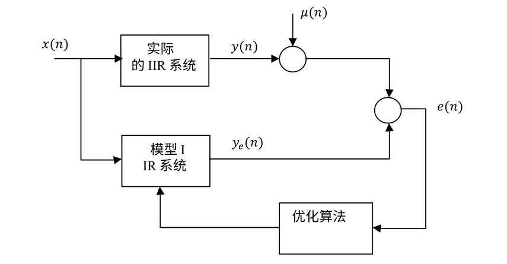

详细地说，方程（3）被重写为
$$ H(z) = \frac{Y(z)}{X(z)} = \frac{a_0 + a_1 z^{-1} + a_2 z^{-2} + \cdots + a_M z^{-M}}{1 + b_1 z^{-1} + b_2 z^{-2} + \cdots + b_N z^{-N}} \qquad (4) $$
估计的滤波器模型如下
$$ H_e(z) = \frac{\sum_{k=0}^{M} \hat{a}_k z^{-k}}{1 + \sum_{i=1}^{N} \hat{b}_i z^{-i}} $$
为了识别实际系统的正确参数，使用以下方程从已知和未知系统的输出计算误差
误差，$$ e(k) = y(k) - y_e(k) \qquad (5) $$
为了更准确地估计参数，误差定义在方程（5）中趋近于零在整个时间尺度上。使用基于群体搜索的技术来识别这些精确参数，其中目标函数是通过方程（5）中的误差来构建的。
$$ J = \min_{k=1}^{N} \sum e(k)^2 \qquad (6) $$
在最优解处，$$ J $$ 趋近于零，过程收敛。为此，使用改进的PSO算法和动态控制参数。

###### 3 改进的粒子群优化算法

PSO是一种基于搜索的智能算法，从鸟类的觅食机制中实现[15]。优化问题的初级解在搜索空间中随机生成，称为初始解。每个解都表示为“位置”。借助个体和群体的最佳位置，通过“速度”计算更新新的位置。这个速度是根据当前位置、局部最佳位置和全局最佳位置以及其他控制参数计算出来的。这些控制参数的选择影响整个搜索过程。选择合适的控制参数是一项困难的任务，因此在后期提出了新的算法。然而，在这里使用了改进的PSO算法，考虑到PSO算法的简单结构和快速收敛[16-18]。这个改进版本使用动态控制参数，产生更可靠的解，不受控制参数初始选择的影响。使用这个，粒子的位置和速度方程如下：
$$ v_n^{i+1} = \omega \omega_d v_n^i + c_1 c_d r_1 (p_{\text{best}_i} - p_i) + c_2 c_d r_2 (g_{\text{best}_i} - p_i) \quad (7) $$
$$ p_n^{i+1} = p_n^i + v_n^{i+1} \quad (8) $$
方程（7），（8）中的所有术语与PSO（$p_n^i$表示位置和$v_n^i$表示速度）相同，$\omega_d$和$c_d$是插入每个控制参数的阻尼值。由于加速度系数与随机数混合，只有惯性权重是受影响更大的参数。因此，本文的其余部分只考虑惯性权重的动态变化。在第4节中报告了采用所提出方法的结果改进。

###### 4 模拟结果

为了分析改进的PSO在参数估计中的性能，进行了两个案例研究。

测试系统1：四阶系统（四阶IIR滤波器）的传递函数为
$$ H(z) = \frac{a_0 + a_1 z^{-1} + a_2 z^{-2} + a_3 z^{-3}}{1 - b_1 z^{-1} - b_2 z^{-2} - b_3 z^{-3} - b_4 z^{-4}} \quad (9) $$
在方程（9）中，未知系统的实际系数在表1的第一行中给出。如第3节所述，首先使用具有恒定控制参数的PSO来检查滤波器参数的识别。在$\omega = 0.8$时，目标函数的最小值被实现。估计的参数报告在表1 未知测试系统1的估计参数

| 情况 | $a_{1}$ | $a_{2}$ | $a_{3}$ | $b_{1}$ | $b_{2}$ | $b_{3}$ | $b_{4}$ |
| --- | --- | --- | --- | --- | --- | --- | --- |
| 实际 | -0.9000 | 0.8100 | -0.7290 | -0.0400 | -0.2775 | 0.2101 | -0.1400 |
| $\omega = 0.2$ | -0.8973 | 0.8068 | -0.7285 | -0.0422 | -0.2773 | 0.2116 | -0.1392 |
| $\omega = 0.6$ | -0.8961 | 0.8058 | -0.7284 | -0.0435 | -0.2776 | 0.2112 | -0.1395 |
| $\omega = 0.8$ | -0.8709 | 0.7677 | -0.7189 | -0.0620 | -0.2680 | 0.2171 | -0.1269 |
| 提出的 | -0.8972 | 0.8066 | -0.7283 | -0.0422 | -0.2777 | 0.2110 | -0.1391 |

表2 未知测试系统2的估计参数

| 情况 | $a_{0}$ | $a_{1}$ | $a_{2}$ | $b_{1}$ | $b_{2}$ | $b_{3}$ |
| --- | --- | --- | --- | --- | --- | --- |
| 实际 | -0.2 | -0.4 | 0.5 | -0.6 | -0.25 | 0.2 |
| 提出的 | -0.1964 | -0.4095 | 0.5052 | -0.5928 | -0.2418 | 0.1960 |

表1的第二行。在惯性权重参数的其他恒定值下，PSO实现的最优值也在表1中给出。在所有情况中，当$\omega = 0.2$时，获得了最佳解。然而，使用提出的动态$\omega$的方法，即使在控制参数的最差初始化情况下，也能获得类似的估计值。在三个不同的惯性权重0.2、0.6和0.8下，最终目标函数的值分别为$-56.51$、$-52.61$和$-31.58$ dB。然而，对于提出的方法，初始值从0.8的惯性权重开始，函数值为$-55.56$ dB。

###### 测试系统2：第三阶传递函数给出

$$H(z) = \frac{a_{0} + a_{1}z^{-1} + a_{2}z^{-2}}{1 - b_{1}z^{-1} - b_{2}z^{-2} - b_{3}z^{-3}} \quad\quad\quad (10)$$

在方程（10）中，未知系统的实际系数在表2的第一行中给出。改进的PSO被应用于识别未知的植物参数，并且最终的解决方案值报告在表2中，接近实际值。

###### 5 结论

在本文中，改进的PSO被应用于估计未知的植物参数。这种方法避免了传统PSO中控制参数选择的额外负担，并且产生全局最优值（接近）无论初始化过程如何。使用两个高阶模型提供的结果显示了改进的PSO在系统识别过程中的优势。

###### 参考文献

-   1. Panda G, Pradhan PM, Majhi B (2011) 使用猫群优化进行IIR系统识别。 Expert Syst Appl 38(10):12671–12683
-   2. Rashedi E, Nezamabadi-Pour H, Saryazdi S (2011) 使用引力搜索算法进行滤波建模。 Eng Appl Artif Intell 24(1):117–122
-   3. Chicharo JF, Ng TS (1990) 基于梯度的自适应IIR陷波滤波器用于频率估计。 IEEE Trans Acoust Speech Sig Process 38(5):769–777
-   4. Netto SL, Diniz PS, Agathoklis P (1995) 自适应IIR滤波算法用于系统识别：一个通用框架。 IEEE Trans Educ 38(1):54–66
-   5. Took CC, Mandic DP (2010) 四元数随机梯度自适应IIR滤波。 IEEE Trans Sig Process 58(7):3895–3901
-   6. Cho C, Gupta KC (1999) EM-ANN建模多层微带线中重叠开口的设计带通滤波器。 在： IEEE天线和传播学会国际会议1999摘要。与： USNC/URSI国家无线电科学会议 (Cat. No. 99CH37010) 一起举行，第4卷。IEEE, 页2592-2595
-   7. Hartmann A, Lemos JM, Costa RS, Vinga S (2014) 使用粒子群优化识别IIR滤波器系数，应用于缺失心血管信号的重建。 Eng Appl Artif Intell 34:193–198
-   8. Durmu,s B, Gün A (2011) 使用粒子群优化进行参数识别。 在： 第6届国际先进技术研讨会论文集 (IATS 11)，埃拉兹伊，土耳其，页188-192
-   9. 马Q, Cowan CF (1996) 应用遗传算法对IIR滤波器的适应性进行研究。 信号处理48 (2) : 155-163
-   10. Karaboga N (2005) 使用差分进化算法设计数字IIR滤波器。 EURASIP J Adv Sig Process 2005(8):856824
-   11. Singh R, Verma HK (2013) 基于教学-学习优化算法的参数在IIR滤波器设计中的识别。 J Inst Eng (India) : Ser B 94 (4) : 285-294
-   12. DeBrunner VE, Beex AA (1990) 一种信息方法用于输出误差自适应IIR滤波器结构的收敛性。 在： 国际会议上，声音和信号处理。 IEEE, pp 1261-1264
-   13. Wang Y, Ding F (2017) 通过数据过滤技术对具有移动平均噪声的非线性IIR滤波器进行迭代估计。 IMA J Math Control Inf 34 (3) : 745-764
-   14. 赵R, 王Y, 刘C, 胡P, Jelodar H, 袁C, 李Y, Masood I, Rabbani M, 李H, 李B (2019) 基于混沌策略的自私群体优化算法用于自适应IIR系统识别问题。 软计算, 1-48
-   15. 肯尼迪J, 埃伯哈特R (1995) 粒子群优化。 在： ICNN'95国际神经网络会议论文集, 第4卷。IEEE, 第1942-1948页
-   16. Nagaraju TV, Prasad CD (2020) 用于混合膨胀黏土压缩指数 (Cc) 估计的群智能支持的多重线性回归模型。 阿拉伯地质学杂志13 (9)
-   17. Prasad CD, Biswal M, Nayak PK (2019) 用于传输线保护的小波操作单指数故障检测方案与群智能支持。 能源系统, 1-20
-   18. Nagaraju TV, Prasad CD, Raju MJ (2020) 使用粒子群优化预测加利福尼亚承载比。 在： 问题求解的软计算。 Springer, 新加坡, 第795-803页

##### 使用Fine K-最近邻机器学习算法在28和39 GHz的大规模MIMO毫米波中进行信道覆盖识别条件

Vankayala Chethan Prakash, G. Nagarajan和N. Priyavarthan

摘要大规模MIMO毫米波（mm波）系统将各种技术与支持设备的数百个天线集成在一起。在毫米波通信中，由于大气吸收，信号会衰减，形成一个易于由传播路径之间的障碍物衰减的铅笔束。提供如此巨大的带宽，更多的设备可以互连。然而，为了提供设备的无缝连接，需要分析信道条件。通过信道分析，找到了一种信道特性，用于将信号路径分类为直射视线（LoS）和非直射视线（NLoS）。能量检测器用于感知10 dB以上的信号。这些信号被分析用于信道条件，如路径损耗和功率延迟特性。在这项工作中，考虑了独立同分布的AWGN信道。基于此构建了一个数据集，应用了机器学习算法，即K最近邻（K-NN），以有效地将信道特性划分为LoS和NLoS。在28 GHz和39 GHz时，路径损耗的准确率分别为96.3%和94.3%，功率延迟特性的准确率分别为94.5%和93.3%。

关键词：视距 · 大规模MIMO · 毫米波 · 非视距 · 路径损耗和功率延迟配置文件

###### 1 引言

大规模MIMO的技术方面已经将各种网络整合在一起，即第五代。大规模MIMO与毫米波已经获得了它在处理许多个收发终端时的研究重要性是高效的。为了支持更多的设备，需要大量的带宽。对于这样更高的带宽，系统必须在更高的频率下运行，如毫米波频率。然而，由于其较短的波长，信号会遭受严重的失真。当这些信号受阻时，会产生多条路径，导致信号质量下降。对于无线传感器网络、物联网、以人为中心的应用、以设备为中心的应用，对于这样更高的带宽有需求。为了为这些设备提供覆盖，分析了与传播环境相关的信道条件。

大规模MIMO在TDD和FDD模式下运行，在TDD模式下，通过共轭转置估计其中一个上行通道或下行通道，而在FDD通道中，上行和下行通道分别估计。信号在发射机和接收机之间传播时存在的障碍物会导致信号相对于系统的工作频率进一步降级。为了增强发送给用户的信号，设备定位非常重要。一般而言，众所周知，定位是通过全球定位系统（GPS）实现的。

根据距离、信号到达时间和几何技术，有许多技术被使用。在某些场景中，这些技术与GPS结合使用，使定位过程更可靠。由于传播环境中存在的因素，GPS和上述技术无法提供定位过程的准确性。由于设备的广泛分布，需要对目标设备进行定位并提供信号。在5G及更高级别的5G网络中，需要对各种物联网应用（如农业、医疗）进行大范围覆盖增强，这些物联网设备在城市和农村地区都得到了分布式应用。为了提供更好的服务质量，分布式大规模MIMO系统是一个更好的解决方案[1]。基于贝叶斯决策的波束对准框架考虑了基站和用户设备之间的协调[2]。提出了一种基于距离的定位和映射方法，使用扩展卡尔曼滤波器，不考虑传播环境和基站位置[3]。基于接收信号强度的指纹数据库定位使用高斯回归进行[4]。与基于范围或角度的技术相比，它减少了分析单个用户终端位置的复杂性[4]。采用两步定位过程，提出了到达角（AOA）和三角测量用于定位[5]。为了减少定位的复杂性，利用压缩感知来识别LoS和NLoS条件[5]。

为了一个大规模MIMO毫米波系统，设计了一个混合模拟-数字转换器，以提高整个系统的性能[6]。定位是通过到达角度（AOD）和接收信号强度（RSS）在基站上为每个个体用户终端进行的，用于使用正交频分复用（OFDM）和降低峰均比（PAPR）的波束形成信号[7]。在一个大规模MIMO毫米波系统中的情境感知中，设计了一个模型，考虑了统计信道条件和相对于时钟偏移的位置[8]。对于高在一个大规模MIMO毫米波系统中进行高速率通信时，进行了联合位置估计和方向估计，用于5G网络[9]。在覆盖连通性中进行了增强的合作组定位，其中RSS和AOA提高了大规模MIMO和设备对设备网络的定位精度[10]。在大规模MIMO毫米波系统中，考虑了具有均匀圆柱状天线布置的混合RSS-AOA技术用于定位。提出了一种信道压缩方法，通过保持相同的准确性来减少接收信号向量的维度[11]。

考虑到具有均匀圆柱阵列的大规模MIMO系统，其中接收信号向量被转换为波束空间向量，在到达方向上保持线性关系，并使用低复杂度搜索算法[12]。基于稀疏性的纠错定位，即通过广义正交匹配追踪算法对残差更新进行处理，从而降低了大规模阵列的复杂度[13]。针对单站大规模MIMO-OFDM系统的指纹定位，通过瞬时信道条件获得角度延迟信道矩阵，并通过聚类算法降低了复杂度[14]。

从信道状态信息中提取角度延迟多普勒功率谱，构建指纹，并与预先收集的参考点进行比较。利用基于距离的核方法使用指纹数据库，从而提高了定位精度[15]。在大规模MIMO中，LTE用户通过与网络连接时获得位置信息。为了改善对用户的无线资源分配，使用位置信息进行波束成形，该波束成形适用于LoS和多径环境[16]。

移动云计算和大规模MIMO在5G网络中被整合在一起。到达方向（DOA）技术用于实时监测患者的定位[17]。对功率延迟特性进行多重假设检验，提出了最大似然估计和贝叶斯估计方法，用于识别非直射（NLoS）和直射（LoS）条件[18]。研究了带有障碍物的传播环境中的路径损耗、功率延迟特性、RMS延迟扩展和平均过剩延迟在大规模MIMO毫米波系统中的影响[19]。提出了一种基于混合RSS-TOA的定位方法，用于具有32和64个天线的基站和4和8个用户终端的大规模MIMO毫米波频率。利用能量检测器进行信道密集化处理，从而降低信道复杂性[20]。研究了4.5、28和38 GHz的毫米波频率下的信道，研究了垂直-垂直、垂直-水平和垂直-全向极化在室内环境中的路径损耗[21]。考虑了室内和室外的基于物联网的医疗系统，提出了一种使用加速度计和磁力计进行患者定位的设计方法，并监测和传输患者的活动（如行走、站立、睡眠）给相关人员[22]。设计了一个用于物联网环境中的患者的家庭远程监测系统，提出了ISO到IEEE 11.073协议、M2M协议和调度算法的协议转换，用于将医疗数据传输给医院的工作人员。尽管数据传输，数据的安全存储和授权也被考虑在内考虑到[23]。在密集的森林环境中，未来的无线传感器网络和物联网设备在2.4 GHz的路径损耗下进行部署和检测。模拟和测量考虑了两种情景，即（a）自由空间区域和（b）衍射区域，其中还给出了时延扩展值[24]。

在5G网络中，考虑了与物联网设备一起使用的毫米波频率以获得更高的带宽。在户外环境中，对38 GHz的路径损耗进行分析，以表征LoS和NLoS的天线极化，即垂直-垂直和垂直-水平。参数包括小区吞吐量，边缘吞吐量，频谱效率和公平性指数[25]。工业应用中的物联网需要广泛的带宽和无缝连接性，其中定位是必需的。通常，窄带物联网用于工业和医疗应用，而GPS无法为这种低功率物联网设备进行定位。基于距离，设计了一个几何概率分析的解析模型[26]。考虑了物联网环境中的室内定位系统，并提出了一种Wi-Fi三边测量方法来确定用户相对于参考点的位置[27]。在物联网中，设备的定位对于体验质量变得越来越重要。在Butler项目的一部分上设计了一种定位技术，即FP-7，这是欧盟项目中最值得称赞的技术[28]。通过在数据中心放置大量天线，分析了在工业物联网中大规模MIMO的可行性，以实现与大量设备的无缝连接[29]。针对两种通用方案，即大规模机器类型通信和超可靠低延迟通信，分析了大规模MIMO与物联网的连接性。对于大规模MIMO和物联网之间的物理层技术，需要在协议设计方面进行强有力的整合[30]。

###### 2 网络架构

考虑了一种分布式大规模MIMO毫米波系统，用于基于用户设备接收信号的覆盖区域识别。图1显示了分布式大规模MIMO的架构。无线电塔部署了大量天线，为多个用户设备提供连接。对于这么多设备，需要大量的带宽。为了实现无缝连接，分析了传播通道条件的LoS和NLoS情况。

###### 3 仿真方法

在5G通信网络中，如移动网络、无线传感器网络、认知无线电网络、设备对设备通信，需要研究传播环境。对于下一代无线通信，需要连接更多的设备。大部分文献综述表明，大规模MIMO毫米波蜂窝通信对其有影响。图1 分布式大规模MIMO连接性

在28和39 GHz频率下运行。为了支持如此大量的设备，考虑使用毫米波频率的大规模MIMO作为一个使用案例。

考虑使用128个发射天线和4个接收天线在28和39 GHz下运行的分布式大规模MIMO。由于接收器接收到多个信号的副本，使用能量检测器，允许10 dB以上的信号。基于这些信道，在上行信道上进行测量。

通过信道互易原理，得到下行信道测量结果。提取路径损耗和功率延迟特性等参数，用于LoS和NLoS场景。基于模拟构建了一个数据集，包括这些参数。训练了一个精细的K-NN算法，并对数据集进行十折交叉验证。构建了一个包含1000个样本的数据集。完整的数据集被分成十个部分，其中九个部分用于训练，一个部分用于测试。

###### 4 模拟测量

考虑了一个完全独立分布的AWGN信道，在基站分析了28 GHz和39 GHz的上行信道的路径损耗和功率延迟特性。由于信道以TDD模式运行，上行和下行信道可以同时估计，使用Hermatian矩阵。上行信道在频域中进行估计[31]

```
Y(f) = H(f) · x(f) + d(f) (1)
```

其中 d(f)被称为接收机上的IID噪声向量，其均值为零，方差为一，x(f)被称为从RRH天线传输到用户设备的信号，

H(f)表示信道的频率响应。
通过信道互易性，下行信道可以通过上行信道的共轭转置获得，即

```
Y(f)αH(f)H^{H}(f)·x(f)+d(f) 
(2)
```

通过反快速傅里叶变换，信道频率响应被转换为信道脉冲响应（表1）。

```
h(t) = IFFT(H(f)) 
(3)
```

###### 5 路径损耗

路径损耗定义为接收功率与发送功率的比值。接收信号功率随距离变化。随着距离的增加，接收信号功率减小，从而降低信号质量。与直射视线（LoS）相比，非直射视线（NLoS）由于存在障碍物而遭受更大的衰减。图2显示了在28和39 GHz频率下的LoS环境中的路径损耗。图3显示了在28和39 GHz操作频率下的NLoS环境中的路径损耗。从图中可以清楚地看出，随着操作频率的增加，路径损耗也增加。

路径损耗中天线的接收功率由以下公式给出

```
P_R = \frac{P_T}{4\pi D^{\beta}} A_r 
(4)
```

其中

P_T 传输功率
D 发射机和接收机之间的距离

图2 LoS环境下的路径损耗

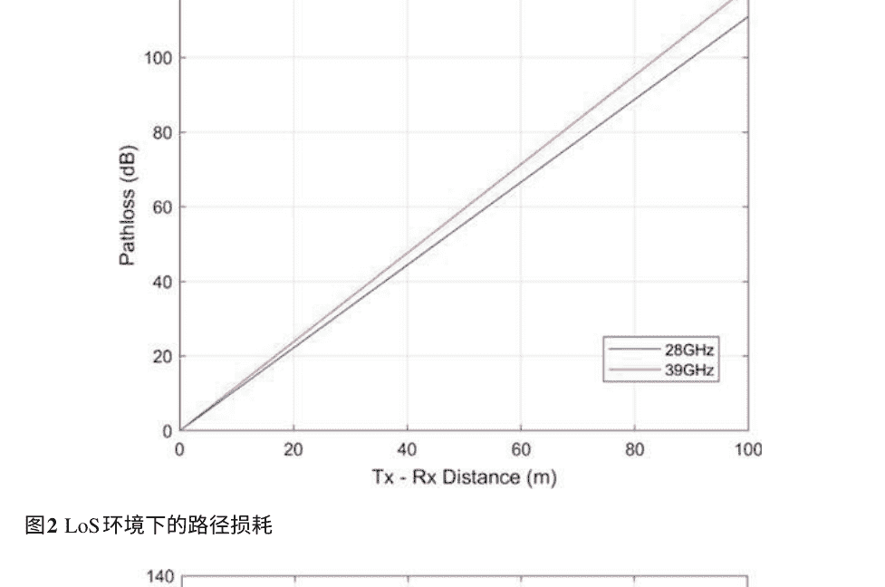

图3 NLoS环境下的路径损耗

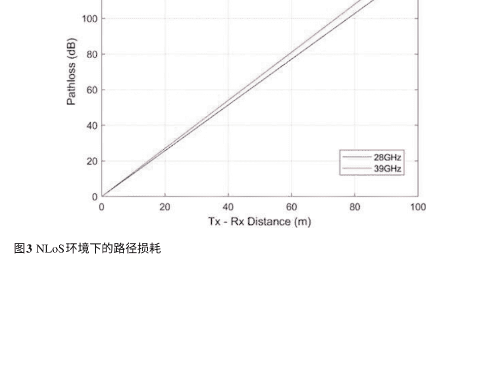

β 路径损耗指数
$A_r$ 接收机的孔径面积

接收机的孔径面积由以下公式给出

$$A_r = G_r \frac{\alpha}{4\pi}$$

其中

$G_r$ 接收机增益

$$\alpha = \frac{c}{f}$$

由于各向同性天线，考虑到发射机和接收机天线增益均为1。发射机和接收机之间的路径损耗与距离有关，可以表示为

$$P_L = P_T - P_R$$

$$P_L = 20 \log \left( \frac{4\pi f}{c} \right)$$

###### 6 功率延迟特性

功率延迟特性是指接收到的信号功率与时间延迟之间的关系。图4表示功率延迟特性，其中考察了时变信道。从图中可以清楚地看到，在39 GHz工作的信道比28 GHz的信道更容易受到干扰，并且在NLoS条件下更高。可以明显看到负的接收信号功率在NLoS条件下更为明显。

功率延迟特性由以下给出

$$\mathrm{PDP}(t) = |h(t)|^2$$

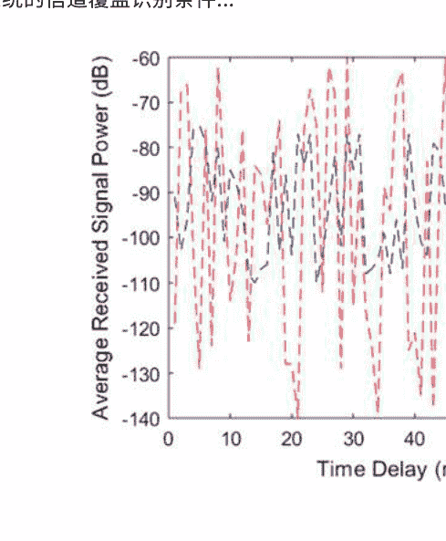

###### 7 Fine-KNN

Fine $K$最近邻算法是一种非参数算法，在分类过程中使用整个数据集作为训练集。它根据数据点之间的欧氏距离预测值，其中包括训练数据和测试数据。它将数据点的值按升序排列。从一组值中选择数据点的前几个值。根据数据集值的频繁出现，将类别分开。因此，发生了LoS和NLoS的分类。

数据点 $A = [a_1, a_2, ..., a_n]$ 和 $B = [b_1, b_2, ..., b_n]$ 之间的距离表示为

$$ d(A, B) = \sqrt{(b_1 - a_1)^2 + (b_2 - a_2)^2 + \cdot \cdot \cdot + (b_n - a_n)^2} \tag{10} $$

散点图表示数据集中变量之间的关系。图5和图6展示了28 GHz和39 GHz下数据点被分类为LoS和NLoS的情况。红色数据点表示LoS条件，蓝色数据点表示NLoS条件。然而，交叉的数据点表示LoS和NLoS条件的错误分类。这两个图展示了正相关性，其中 $x$ 轴和 $y$ 轴线性增加。

混淆矩阵显示了分类的准确性，包括真实值和预测值。这些值是基于观测值和预测值而得出的。混淆矩阵反映了机器学习算法的准确性。图7和图8表示28 GHz和39 GHz下路径损耗的真正阳性、假正性、假阴性和真负性值。这些值是基于观测和预测之间的条件，按照类别1和0显示的。

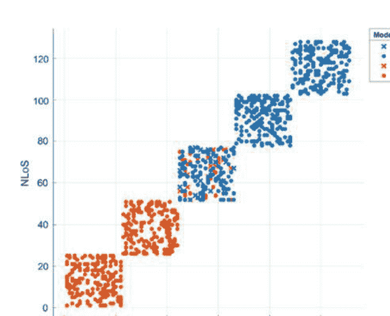

图5 28 GHz的路径损耗散点图

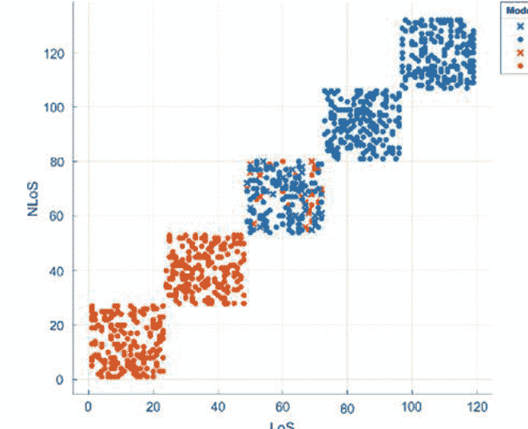

图6 39 GHz的路径损耗散点图

从1000个样本数据集中，真正例值为530，假正例值为21，假反例值为16，真反例值为433。类别0的真正例率为0.96，类别1的真正例率也为0.96，而假反例率对于两个类别都是0.04。类别1和0的阳性预测值分别为0.95和0.97，类别1和0的假发现率分别为0.05和0.03。对于39 GHz，真正的正值为521，假正值为29，假负值为22，真负值为428。类别1和0的真正率为0.95，两个类别的假负率为0.05。类别1和0的阳性预测值分别为0.94和0.96，类别1和0的假发现率分别为0.06和0.04。图9和图11展示了28和39 GHz下正类别1的接收机工作特性。分类器的性能是通过确定的。

图7 28 GHz的路径损耗混淆矩阵

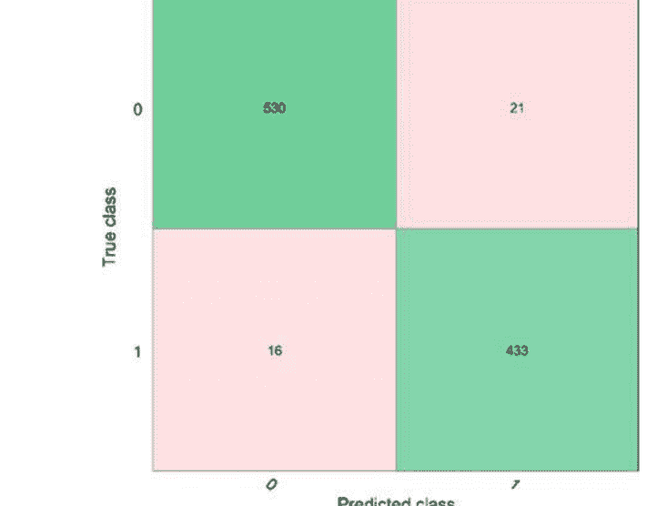

图8 39 GHz的路径损耗混淆矩阵

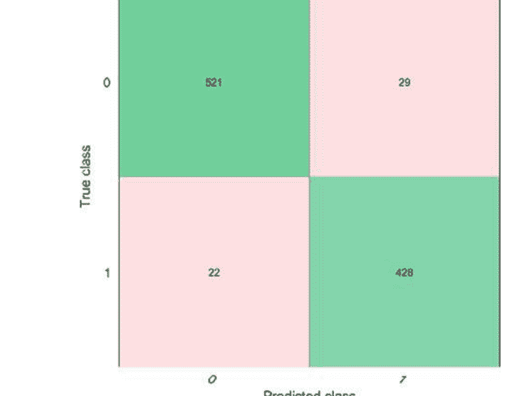

ROC曲线通过曲线上的红点表示。分类器的准确性由曲线下的面积表示。随着曲线下的面积增加，分类器的准确性也增加。图9显示了真正率和假正率之间的曲线，其中TPR为0.96，FPR为0.04。从图11中，曲线描述了TPR为0.95和FPR为0.05。图10和图12展示了28和39 GHz下正类别0的路径损耗ROC曲线。从图中，图10中的TPR为0.96，FPR为0.04，图12中的TPR为0.95，FPR为0.05。

散点图表示变量之间的关系及其相关性。图13和图14显示了PDP数据集中类别1和0的散点图，即LoS和NLoS条件。红色数据点表示LoS条件，蓝色数据点表示NLoS条件。将LoS误分类为NLoS条件，反之亦然，用红色和蓝色的交叉标记表示。然而，散点图显示数据集中变量之间没有相关性。

混淆矩阵解释了机器学习算法的预测准确性。它显示了观测值和预测值之间的数值，如图15和图16所示。它为28 GHz和39 GHz下的PDP数据集提供了真正阳性、假正性、假阴性和真阴性的值。从1000个样本的数据集中，真正阳性值为518，假正性值为32，假阴性值为23，真阴性值为427。

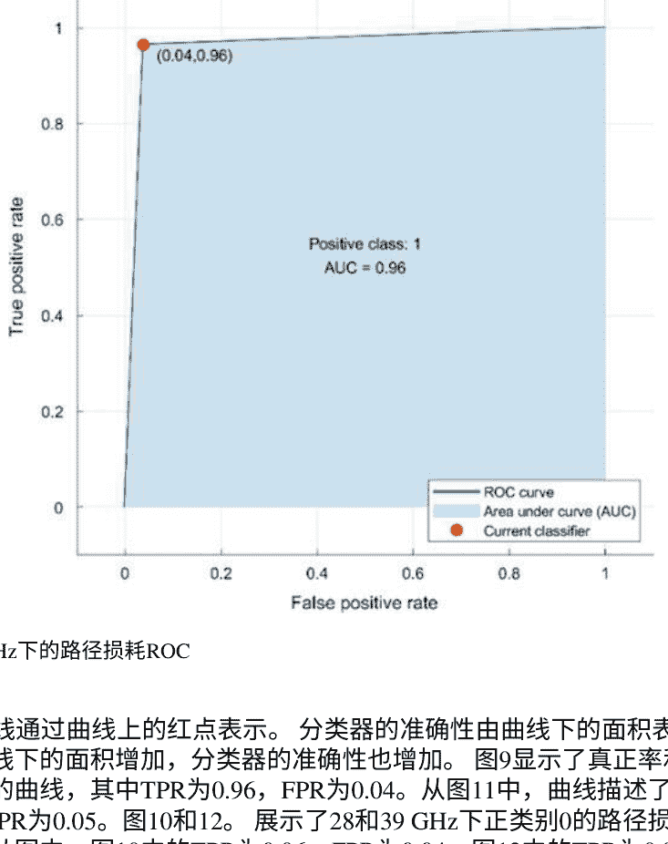

图9 28 GHz下的路径损耗ROC

图10 39 GHz的路径损耗ROC

在28 GHz运行。类别1和0的真正阳性率分别为0.95和0.94，假阴性率分别为0.05和0.06。类别1和0的假发现率分别为0.07和0.04，类别1和0的阳性预测值分别为0.93和0.96。对于39 GHz，真正阳性值为515，假正值为35，假阴值为32，真负值为418，类别1和0的真正阳性率分别为0.93和0.94，类别1和0的假阴性率分别为0.07和0.06。类别1和0的阳性预测值分别为0.93和0.96，而类别1和0的假发现率分别为0.07和0.04。

图17和图18分别显示了28和39 GHz的PDP（正类1）的ROC。分类器的性能通过图中用红点表示的ROC曲线进行分析。曲线下的面积显示了算法的准确性，曲线下的面积越大，算法的准确性越高。该图绘制了真正例率和假正例率，28 GHz的真正例率为0.95，假正例率为0.06。39 GHz的真正例率为0.94，假正例率为0.05。图19和图20显示了28和39 GHz的PDP的ROC（正类0）。它代表了由红点和曲线下的面积表示的预测准确性的性能。曲线下的面积越大，算法的准确性越高。该曲线绘制了真正例率和假正例率，其中28 GHz的TPR为0.94，FPR为0.05，39 GHz的TPR为0.93，FPR为0.07。

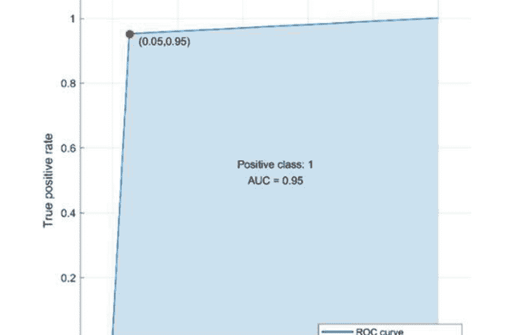

图11 28 GHz的路径损耗ROC

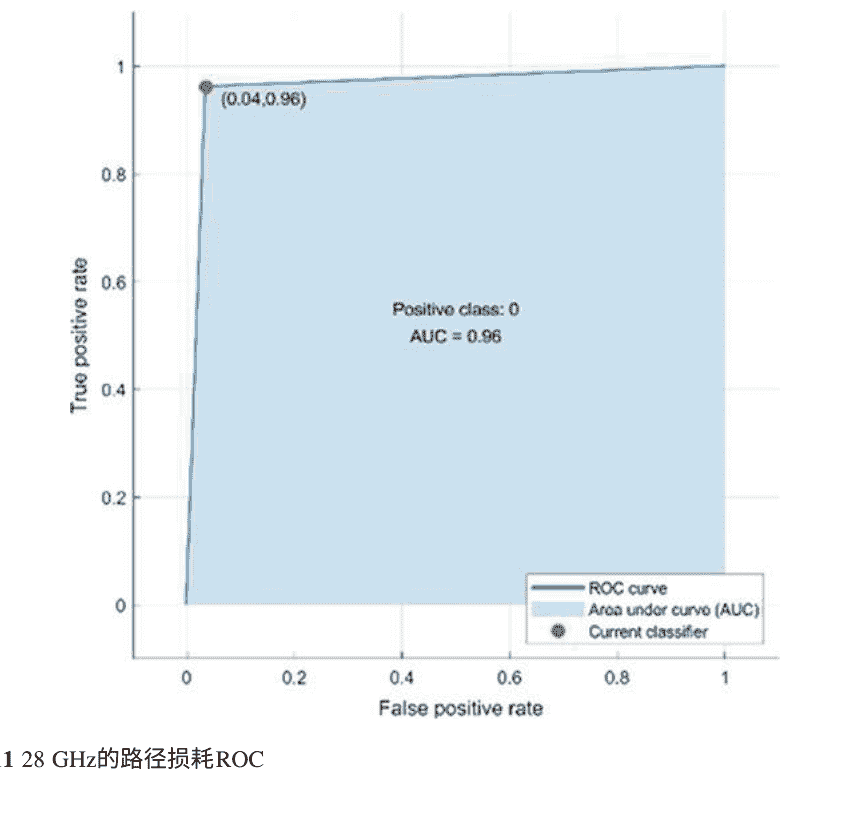

###### 8 结论

在室内大规模MIMO系统中，工作在毫米波频率的信号在传播环境中受到工作频率和障碍物的影响而发生较大的衰减。 LoS和NLoS环境下的信道条件进行了分析，使用能量检测器构建了一个包含1000个样本的数据集。 使用K-NN机器学习算法对LoS和NLoS条件进行分类。 进行十折交叉验证，分析分类的准确性，使用测试数据和训练数据。 路径损耗的准确率约为96.3%和94.3 %，28 GHz的功率延迟特性的准确率约为94.5%和93.3%。

图12 39 GHz路径损耗的ROC

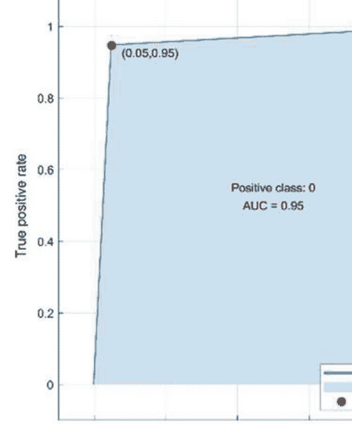

图13 28 GHz PDP的散点图

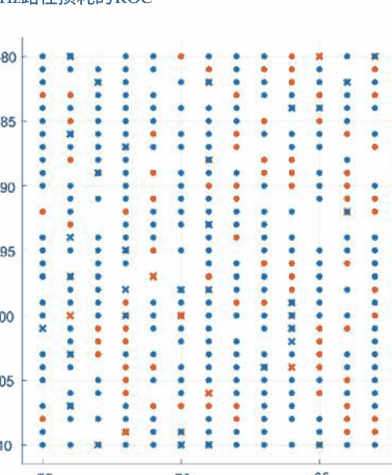

图14 39 GHz PDP的散点图

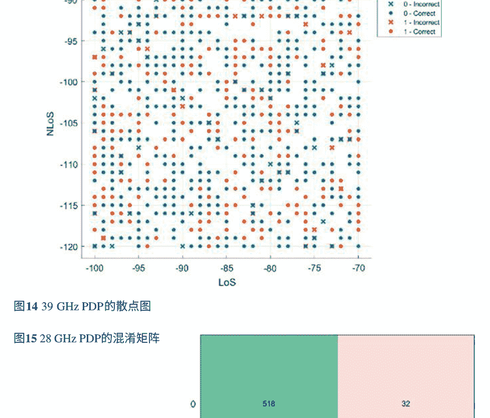

图15 28 GHz PDP的混淆矩阵

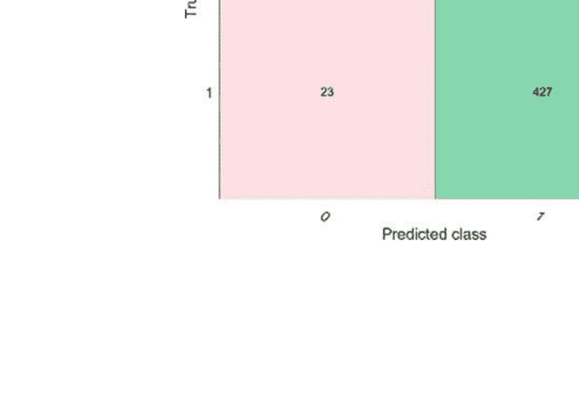

图16 39 GHz PDP的混淆矩阵

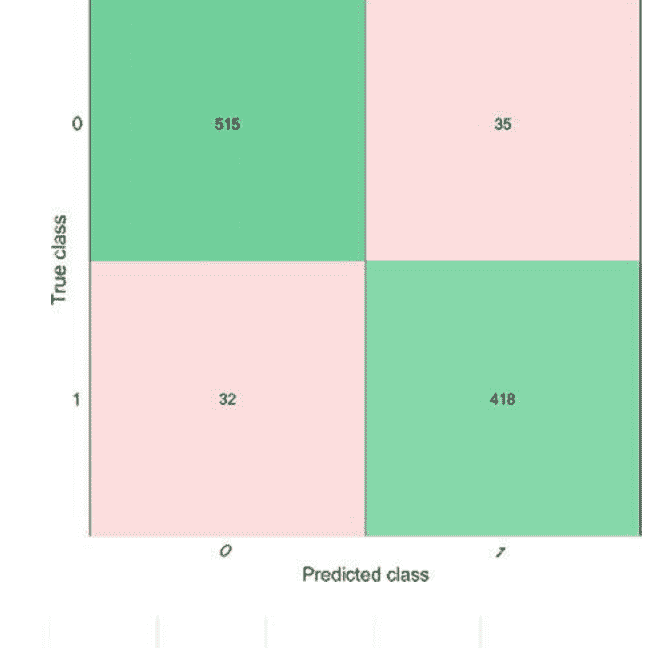

图17 28 GHz PDP的ROC

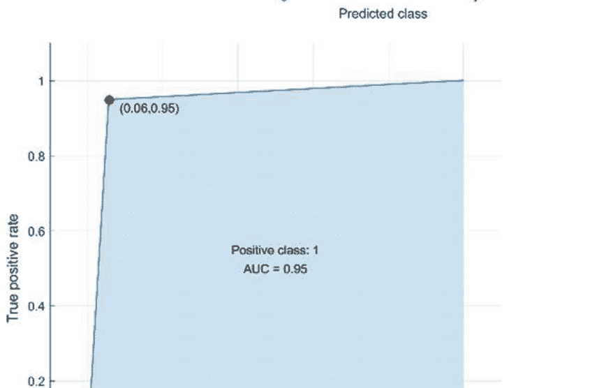

图18 39 GHz PDP的ROC

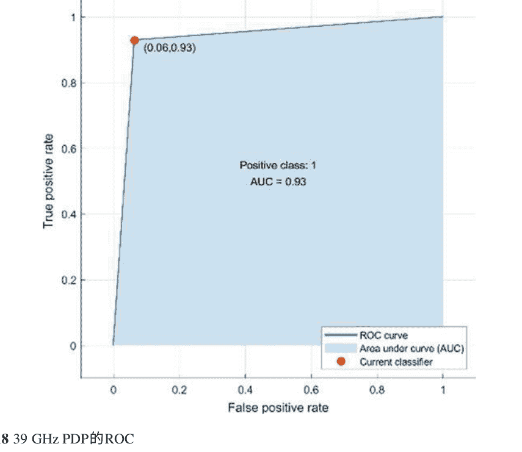

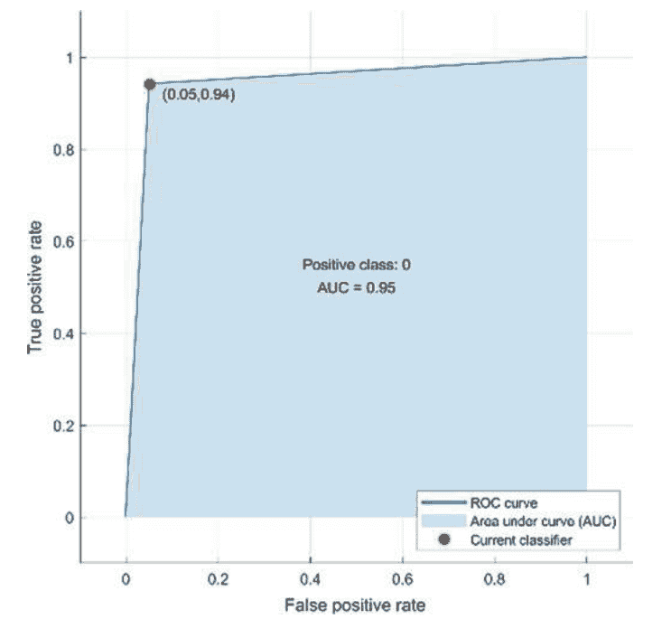

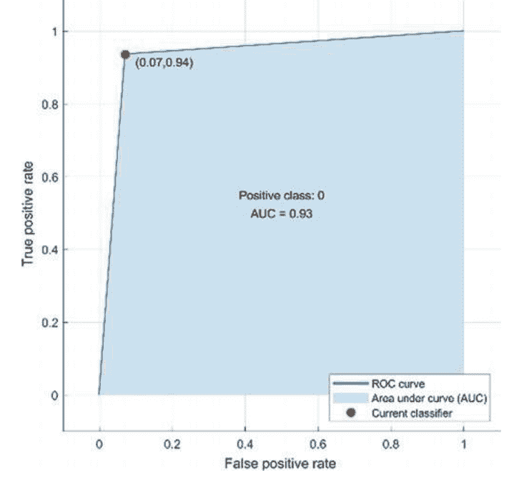

###### 参考文献

1.  Chen X, Kwan Ng DW, Yu W, Larsson EG, Al Dhahir N, Schober R (2020) 5G及其后续技术的大规模接入。 arXiv预印本arXiv:2002.03491，第1-21页。
2.  Maschietti F, Gesbert D, de Kerret P, Wymeersch H (2017) 毫米波大规模MIMO中的鲁棒定位辅助波束对准。 在： IEEE全球通信大会。
3.  Li X, Leitinger E, Oskarsson M, Astrom K, T ufvesson F (2019) 利用多径分量的相位信息进行大规模MIMO定位和映射。 IEEE无线通信交易 18(9): 4254-4267。
4.  Savic V, Larsson EG (2015) 基于指纹的分布式大规模MIMO系统定位。 在： IEEE第82届车载技术会议。
5.  Garcia N, Wymeersch H, Larsson EG, Haimovich AM, Coulon M (2017) 大规模MIMO的直接定位。 IEEE信号处理交易 65(10): 2475-2487。
6.  Zhang J, Dai L, Li X, Liu Y, Hanzo L (2018) 关于实际5G毫米波大规模MIMO系统中低分辨率ADC的研究。 IEEE通信杂志56(7):205–211。
7.  Mahyiddin WA, Mazuki ALA, Dimyati K, Othman M, Mokhtar N, Arof H (2019) 在大规模MIMO系统中使用联合AOD和RS方法进行定位。 Radioengineering 28(4):749–756。
8.  Mendrzik R, Meyer F, Bauch G, Win MZ (2019) 在毫米波大规模MIMO系统中实现情境感知。 IEEE J Sel Top Signal Process 13(5):1196–1211。
9.  Shahmansoori A, Garcia GE, Destino G, Grandos G, Wymeersch H (2015) 通过毫米波MIMO实现5G位置和方向估计。 IEEE Globecom Workshops。
10. Leila G, Na jjar L (2020) 在5G密集网络中增强的合作组定位，并识别LOS/NLOS基站。 Ad H oc Netw 88–96。
11. Lin Z, Lv T, Mathiopoulos PT (2018) 毫米波大规模MIMO系统的三维室内定位。 IEEE Tr ans Commun 66(6):2472–2486。
12. Lv T, Tan F, Gao H, Yang S (2016) 一种用于大规模MIMO系统中非相干分布源的二维定位的波束空间方法。 信号处理 30–45。
13. Abhishek, Sah AK, Chaturvedi AK (2016) 用于大规模MIMO系统中改进的稀疏性行为和误差定位的检测器。 IEEE Globecom Workshops。
14. Sun X, Gao X, Ye Li G, Han W (2018) 基于新型指纹的大规模MIMO-OFDM系统的单站定位。 IEEE Trans Veh Techn 67(7),6134–6145。
15. Zhang X, Zhu H, Luo X (2018) MIDAR: 基于大规模MIMO的检测和测距。 在:IEEE全球通信会议。
16. Fedorov A, Zhang H, Chen Y (2018) 使用随机接入信道信号在具有大规模MIMO的LTE网络中进行用户定位。 在： IEEE第27届国际计算机通信和网络会议（ICCCN）。
17. Wan L, Han G, Shu L, Feng N (2018) 紧急医疗系统中使用稀疏表示的混合信号的关键患者定位算法。 IEEE系统杂志12 (1)：52-63。
18. Prakash VC, Nagarajan G, Ramanatha n P (2019) 在大规模多输入多输出中进行室内信道特性化的多重假设测试。 J Comput Theor Nanosci16 (4)：1275-1279。
19. Prakash VC, Nagarajan G, Batmavady S (2019) 室内大规模MIMO毫米波系统的信道分析。 在： 人工智能、智能电网和智能城市应用国际会议。
20. Prakash VC, Nagarajan G (2019) 基于混合RSS-TOA的分布式室内大规模MIMO系统定位。 在： 国际新兴计算和专家技术会议。 Springer，柏林。
21. Majed MB, Rahman TA, Aziz OA, Hindia MN, Hanafi E (2018) 4.5、28和38 GHz室内环境下的信道特性和路径损耗建模，用于5G蜂窝网络。 Int J Antennas Propag Hinda wi 1–14。
22. Dziak., Jachimczyk., Kulesza.: 基于物联网的医疗应用信息系统：设计方法论方法，应用科学，MDPI，7 (6)，596，(2017)。
23. Park K, Park J, Lee JW (2017) 一种用于远程监测患者在家中的物联网系统。 Appl Sci MDPI 7(3):260。
24. Iturri P, Aguirre E, Echarri M, Azpilicueta L, Eguizabal A, Falcone F, Alejos A (2019) 在密集森林环境中的无线电信道特性研究，用于物联网-5G。 MDPI会议录4(1)。
25. Qamar F, Hindia MHDN, Dimyati K, Noordin KA, Majed MB, Rahman TA, Amiri IS (2019) 在城市微蜂窝室外环境中研究未来的5G-IoT毫米波网络性能，频率为38 GHz。 电子学，MDPI 8(5):495。
26. Tong F, Sun Y, He S (2019) 关于窄带物联网的定位性能：参与的eNBs如何影响？ IEEE Trans Ind Inf 15(1):423–433。
27. Rusli ME, Ali M, Jamil N, Md Din M (2016) 基于RSSI三边测距技术的改进室内定位算法，用于物联网。 在计算机和通信工程（ICCCE）国际会议上，IOT。
28. Macagnano D, Destino G, Abreu G (2014) 室内定位：物联网应用的关键技术。 IEEE物联网世界论坛。
29. Lee BM, Yang H (2017) 工业物联网中的大规模MIMO技术在网络物理系统中的应用。 IEEE工业信息 14(6):2641–2652。
30. Bana A-S, Carvalho ED, Soret B, Abrao T, Marinello JC, Larsson EG, Popovski P (2019) 物联网中的大规模MIMO技术用于连接性。 物理通信 1–17。
31. Li J, Ai B, He R, Wang Q, Yang M, Zhang B, Guan K, He D, Zhong Z., Zhou T, Li N (2017) 室内大规模多输入多输出信道特性和性能评估。 前沿信息技术与电气工程 18(6):773–787。

##### 翻转-触发神经网络：建模内存以实现高效预测

S. Sujith Kumar, C. Vigneswaran和V. Srinivasa Chakravarthy

**摘要** 翻转-触发器电路可以通过其双稳态动力学来记忆信息。受数字电子学中使用的翻转-触发器电路的启发，在这项工作中，我们定义了一个翻转-触发器神经元，并构建了一个具有记忆能力的神经网络。翻转-触发器神经网络（FFNNs）类似于循环神经网络（RNNs），因此能够处理时间信息。为了验证FFNNs在顺序处理方面的能力，我们使用不同领域的基准时间序列预测和分类问题进行了求解。用于时间序列预测的三个数据集分别是：（1）家庭用电量，（2）航班乘客预测和（3）股票价格预测。作为时间序列分类的一个实例，我们选择了室内运动分类问题。将FFNN的性能与由长短期记忆（LSTM）单元组成的RNN进行比较。在所有问题中，FFNNs的性能要么优于LSTM，要么接近。翻转-触发器还有可能用于更难的顺序问题，如动作识别和视频理解。

**关键词** 翻转触发器 · LSTM · 内存

###### 1 引言

高效的时间序列数据预测和预测涉及捕捉数据历史中的模式。前馈网络在单个实例中处理数据，因此除非有数据历史，否则无法解决时间序列预测问题。通过延迟线和其他技术明确地呈现给网络，以表示时间特征。 或者，具有循环的神经网络可以识别数据中的模式并理解多个时间步长上的信息，还可以通过其内存属性处理时间数据[1-3]。 翻转触发器是具有内存属性的基本电子电路。 根据它们的输入条件，它们可以通过时间保留信息，或者简单地允许信息通过[4]。 在本文中，我们展示了如何使用模拟电子翻转器的神经元模型构建具有出色的时间处理性能的神经网络。 将演示这种网络在时间序列的预测和分类中显示出高水平的性能。 本文描述了解决基准顺序问题的翻转器神经网络的实现。 它还简要比较了结果与基于LSTM的模型。

###### 2 之前的工作

Holla和Chakravarthy [5]描述了一个由翻转触发器神经元组成的深度神经网络。 该网络在长延迟决策问题上与LSTM和其他RNN模型相比表现出色。 在本文中，我们使用[5]中描述的翻转触发器神经网络的变体，并应用于关于时间序列数据的预测和分类问题。 翻转触发器模型与流行的RNN变体长短期记忆（LSTM）进行了比较，并在第3节中描述了比较研究的观察结果。

###### 2.1 长短期记忆（LSTM）

长短期记忆（LSTM）是RNN的一种流行和主导变体，也是最广泛使用的基于记忆的单元之一[1, 2]。 它们广泛用于顺序和基于时间序列的问题。 它们具有在最终决策过程中具有高区分性的信息保留能力，并且还表现出遗忘或丢弃对模型性能贡献较小的信息的能力。 LSTM通过门控机制运行。 这主要是为了克服长期记忆中的灾难性遗忘或消失梯度问题。 基本上，门的任务是清除只会成为噪音的信息，并利用被证明是关键的信息。通过门控机制实现的记忆和遗忘信息的机制，是通过对输入特征集进行门控参数训练来实现的。 LSTM的输入门决定了长期记忆中将保留哪些新的数据模式。 因此，输入门过滤掉了当前输入和短期记忆的组合，并将其传输到下游结构。

###### 3 模型架构

LSTM的遗忘门决定了长期记忆中将保留哪些模式，并通过当前输入乘以遗忘向量来丢弃哪些模式。

输出门产生的短期记忆将作为上一个时间步的记忆被下一个LSTM单元使用。

Flip flops 是电子锁存电路，可以存储与上一个时间步相关的信息。它们由两个稳定状态组成：一个存储上一个时间步的信息，另一个清除状态。flip flop 的当前状态取决于稳定输入状态和上一个状态。SR、JK、D 和 T flip flop 是数字电子领域广泛使用的 flip flop 类型。

在我们的模拟实验中，我们将使用 $SR$ flip flop，因为它是双稳态锁存器的最简单实现。JK flip flop 是 $SR$ flip flop 的更通用版本，具有避免当两个输入都高时出现未定义状态的能力。$SR$ flip flop 是一个双稳态锁存电路，由两个竞争的输入 $S$ 和 $R$ 组成，分别用于设置和复位。电路在当前时间步（$Q_t$）的输出将根据输入 $S$ 和 $R$ 的状态为 0 或 1。反馈机制有助于在这个电路中建模记忆。因此，设置（$S$）、复位（$R$）和上一个时间步的输出（$Q_{t-1}$）被作为输入提供给特定时间步的 flip flop。表1显示了简单双稳态 $SR$ flip flop 的真值表。

从表1可以解释，输入（$S$和$R$）的变化对于确定当前时间步骤（$Q_t$）的状态至关重要。SR触发器的等效代数方程如下所示。

$$Qt = S + R'Q_{t-1}$$

由于当前输出取决于上一个状态，SR触发器具有记忆性质。基于触发器的神经网络的完整架构如图1所示。

图1中的网络有五层，其中第三层是触发器层，起到记忆的作用。从上一层输入到触发器层，将其分为两半以获得触发器的设置和复位输入。输出

表1 SR触发器的真值表实现
| 集合($S$) | 复位($R$) | 反馈($Q_{t-1}$) | 输出($Q_t$) |
|-----------|-----------|-----------------|-------------|
| 1         | 0         | X               | 1           |
| 0         | 1         | X               | 0           |
| 0         | 0         | $Q_{t-1}$       | $Q_{t-1}$   |
| 1         | 1         | X               | 未定义      |

图1 由五层组成的触发器神经网络，其中触发器层由五个触发器组成

在上一个时间步骤中，反馈的输入$Q_{t-1}$被馈送到触发器中，以获得下一步的输出$Q_t$。因此，最后一步是将输出$Q_t$通过线性层传播到最后的输出层。

涉及传统神经元的层的前向传播如下所示：

$$Z = W \cdot X + b \quad (2)$$

其中‘W’是通过Xavier初始化初始化的网络权重，‘X’是输入数据，‘b’是偏置项。

应用激活函数后得到的输出如下：

$$A = \tanh(Z) \quad (3)$$

设 $N_i$ 为前置触发器的总节点数，输入集合 $(X_S)$ 和复位 $(X_R)$ 由以下方式获得：

$$ X_S = X[N_i \mod 2 == 0] \quad (4) $$
$$ X_R = X[N_i \mod 2 == 1] \quad (5) $$

其中 $X[k]$ 是上一层第 $k$ 个神经元（从零开始计数）的输出，mod 表示取余函数。

从上一层到触发器的投影权重被建模为一对一连接，因此上一层到触发器层的维度是触发器维度的两倍。

$$W_S = W[N_i \mod 2 == 0] \quad (6)$$

$$W_R = W[N_i \mod 2 == 1] \quad (7)$$

因此，加权输入 S和 R如下所示：

$$S = X_S \cdot W_S \quad (8)$$

$$R = X_R \cdot W_R \quad (9)$$

在方程中，触发器层在 $t +1$时间步的最终状态 $V(t+1)$由以下等式给出：

$$V(t + 1) = S + (1 - R) * V(t) - S * (1 - R) * V(t) \quad (10)$$

其中 $V(t)$是触发器层的先前状态。触发器层的反向传播定义如下：

$$\frac{\partial E}{\partial w_S} = \frac{\partial E}{\partial O_{F F}} \cdot \frac{\partial O_{F F}}{\partial S} \cdot \frac{\partial S}{\partial w_S} \quad (11)$$

$$\frac{\partial E}{\partial w_R} = \frac{\partial E}{\partial O_{F F}} \cdot \frac{\partial O_{F F}}{\partial R} \cdot \frac{\partial R}{\partial w_R} \quad (12)$$

因此，权重的偏导数为，

$$\frac{\partial O_{F F}}{\partial S} = 1 - (1 - R) * V(t) \quad (13)$$

$$\frac{\partial O_{F F}}{\partial R} = - V(t) * (S + 1) \quad (14)$$

$$\frac{\partial S}{\partial w_S} = S \quad (15)$$

$$\frac{\partial R}{\partial w_R} = R \quad (16)$$

###### 4 实验

所描述的FFNN架构应用于三个预测和分类时间序列预测问题。考虑的预测问题是：

+   1. 家庭用电量。
2. 航班乘客预测。
3. 股票价格预测。

考虑的时间序列分类问题是室内运动分类。

对于不同的问题陈述，根据数据的复杂性使用不同的架构。架构的变化主要是为了与输入特征匹配的初始输入层。由于进行的实验与预测和分类（二进制）有关，最终输出层只有一个节点。还使用了LSTM网络来解决上述时间序列问题，以便与基准进行清晰的比较。模型的预测结果以及通过LSTM获得的预测结果如下所示。这些结果是通过经验得到的，通过缩小超参数的最佳集合来获得最高效的结果，适用于翻转网络和LSTM网络。

###### 4.1 家庭用电量

在家庭用电量问题中，数据集来自Kaggle[6]，包含了2006年12月至2010年11月之间的测量数据，共36个月。它包括全球有功功率、分表1、分表2、分表3、电压、全球强度和全球无功功率等七个特征。问题的设定是，模型必须根据历史数据预测未来几个月的全球有功功率。翻转模型的架构与图1类似，包括三个隐藏层，维度分别为10、5和10。输入层和输出层分别设置为7和1。另一方面，LSTM模型包括一个大小为30的隐藏层。这两个模型在训练过程中使用窗口大小为60来表示数据的历史。使用Adam优化器来优化模型参数，并使用均方误差（MSE）作为训练准则计算替代损失。图2显示了通过FFNN和LSTM网络获得的预测结果。表2呈现了模型在测试数据集上的均方误差。从图2和表2可以清楚地看出，翻转网络在预测用电模式方面比LSTM更高效。

$$
(MSE) = \frac{1}{N} \sum_{i}^{N} (X_{i} - Y_{i})^{2}
$$

其中‘N’是输入的总数，$X_{i}$是该输入的真实标签，而$Y_{i}$是由FFNN预测的输出。

表2 经过训练的翻转网络和LSTM在测试数据上的MSE
| 模型 | 训练周期 | 均方误差 |
| :--- | :--- | :--- |
| 翻转网络 | 100 | 0.00073 (7.3e-4) |
| LSTM | 100 | 0.00133 (1.3e-3) |

###### 4.2 航班乘客预测

通过Kaggle [7]获得的国际航空乘客数据集包含了每个月国际旅行的乘客数量。任务是预测接下来几个月旅行的乘客数量，这是一个单变量时间序列。翻转网络的架构与功耗数据集中的相似，只是输入层设置为一个神经元，LSTM包含20个隐藏单元。使用了与之前实验相同的损失函数和优化器设置。从图3和表3可以很容易地看出

表3 经过训练的翻转网络和LSTM在测试数据上的均方误差
| 模型 | 训练周期 | 均方误差 |
| :--- | :--- | :--- |
| 翻转网络 | 100 | 0.0010367 (1.0e-3) |
| LSTM | 100 | 0.0023718 (2.3e-3) |

得出结论，翻转网络明显优于LSTM，并且在从历史中准确预测相关时间信息方面更有效。

###### 4.3 股票价格预测

我们选择了苹果股票价格数据集进行股票价格预测实验，该数据集包括了2010年1月至2020年2月的苹果股票。这是一个多变量时间序列预测问题，因为有四个特征：开盘价、最高价、最低价和收盘价。模型的任务是基于过去的数据来预测未来几天（测试集）的开盘价。用于此数据集的FFNN由输入层和输出层组成，维度分别为4和1，隐藏层设置为与前两个实验中的神经元数量相同，而LSTM模型的隐藏单元数为30。使用60天的窗口大小来捕捉历史数据。图4显示了翻转网络和LSTM在测试数据上对未来1200天的预测。表4显示了两个模型在测试数据上的均方误差。尽管FFNN预测了股票开盘价的正确趋势，但这次的预测不如以前准确。

图4 显示了翻转模型和LSTM在苹果股票测试数据集上的预测结果

表4 训练好的翻转模型和LSTM在测试数据上的均方误差损失
| 模型 | 训练周期 | 均方误差 |
| :--- | :--- | :--- |
| 翻转网络 | 100 | 0.0048732 (4.8e-3) |
| LSTM | 100 | 0.0033890 (3.3e-3) |

与FFNN预测相比，LSTM的预测结果更加稳定

###### 4.4 室内运动分类

“室内用户运动”数据集是用于时间序列分类的基准数据集，从UCI仓库[9]中获取。该数据集通过在环境中放置四个无线传感器和一个移动对象来收集；根据对象的运动，无线传感器记录了一系列的信号强度随时间变化的数据。根据传感器记录的信号强度，运动被二元分类为 -1和1，其中 -1和 +1分别表示无过渡和过渡两个房间。FFNN的架构包括4个输入神经元和1个输出神经元，在隐藏层方面与之前的实验中没有变化。此外，LSTM设置了30个隐藏单元；在训练过程中使用二元交叉熵损失作为经验损失。在训练和验证阶段，使用窗口大小为70来回顾以前时间步的数据。图5显示了在验证数据集上每10个时期的验证准确率，该数据集是从原始数据集中按70:30的比例随机划分的。值得注意的是，在训练结束时，FFNN的准确率达到了91.01，而LSTM的准确率较低，为88.06。

###### 5 结论

将翻转模型化为神经网络被证明是一种有效的方式，可以保持以前的模式以及利用它们对未来的预测步骤进行记忆。应用于时间序列预测和分类领域的FFNNs实验表明，翻转模型的性能与当前解决时间问题的最先进模型LSTMs相比，性能相当，甚至更优。翻转模型的应用还可以扩展到更复杂的领域，如场景分析、视频分析和理解。

###### 参考文献

+   1. Sherstinsky A (2020) 循环神经网络（RNN）和长短期记忆（LSTM）网络的基础。 Phys D Nonlinear Phenomena 404:132306
2. Santhanam S (2020) 基于LSTM网络的基于上下文的文本生成。 arXiv预印本arXiv: 2005.00048
3. Wu W等 (2019) 使用门控循环单元网络预测短期负荷，考虑电价的影响。 能源程序158：3369-3374
4. Chakrabarty R等 (2018) 使用量子点细胞自动机（QCA）设计新型触发器电路。 在：2018年IEEE第8届计算与通信研讨会和会议（CCWC）。 IEEE
5. Pawan Holla F, Chakravarthy S (2016) 使用网络进行长时间延迟的决策翻转神经元。 在：2016年国际联合神经网络会议（IJCNN），第2767-2773页
6. UCI机器学习 (2016) 家庭电力消耗，版本1，2016年8月。 从www.kaggle.com/uciml/electric-power-consumption-data-set/metadata检索
7. Andreazzini D (2017) 国际航空旅客，版本1，2017年6月。 从www.kaggle.com/andreazzini/international-airline-passengers/metadata检索
8. Nandakumar R, Uttamraj KR, Vishal R, Lokeshwari YV (2018) 使用长短期记忆进行股票价格预测。 Int Res J Eng Technol (IRJET) 3362–338
9. Bacciu D, Barsocchi P, Chessa S等 (2014) 环境辅助生活应用中储备计算的实验特性。 Neural Comput Appl 24:1451–1464. https://doi.org/10.1007/s00521-013-1364-4

#### 无线通信系统

##### 基于中继的RF-VLC水下通信系统

Mohammad Furqan Ali, Tharindu D. Ponnimbaduge Perera, Vladislav S. Sergeevich, Sheikh Arbid Irfan, Unzhakova Ekaterina Viktorovna, Weijia Zhang, Andrei Camponogara, 和 Dushantha Nalin K. Jayakody

摘要 可见光通信（VLC）最近在水下环境中引起了重新关注的通信行业。然而，与陆地通信相比，在水下应用和海洋数据收集的部署更具挑战性。在这方面，需要在恶劣的水介质中部署更复杂的通信系统。随后，收集的数据将与内陆基站进行进一步的分析传输。军事和科学目的的实时数据流传输的必要性需要一种双跳混合合作通信。在这项研究中，考虑了强湍流信道条件以及收发器错位的双跳混合射频和水下可见光（UVLC）中继通信系统。此外，射频链路采用nakagami-mfading分布建模，而UVLC链路采用Gamma-Gamma分布建模以适应强湍流信道条件。此外，考虑了放大转发（AF）和解码转发（DF）协议来辅助信息传输。

M. Furqan Ali (✉) · T. D. Ponnimbaduge Perera · V. S. Sergeevich · S. Arbid Irfan · U. Ekaterina Viktorovna · W. Zhang · D. N. K. Jayakody
计算机科学与机器人学院，国家研究汤姆斯克理工大学，汤姆斯克，俄罗斯
e-mail: ali89@tpu.ru

T. D. Ponnimbaduge Perera
e-mail: ponnimbaduage@tpu.ru

V. S. Sergeevich
e-mail: vss21@tpu.ru

S. Arbid Irfan
e-mail: sheikh@tpu.ru

D. N. K. Jayakody
e-mail: nalin@tpu.ru

A. Camponogara
Juiz de Fora联邦大学，Juiz de Fora，巴西
e-mail: andrei.camponogara@engenharia.ufjf.br

D. N. K. Jayakody
斯里兰卡技术校园研究生院，帕杜卡，斯里兰卡

基于水下的目的地。模拟结果用于分析RF-UVLC链路组合和比特误码率（BER）性能，通过AF和DF信号协议在不同水域中，以及在高浑浊水介质和传播光束的指向误差中的大尺度和小尺度因素。我们使用蒙特卡洛方法来获得最佳拟合曲线以得到模拟结果。

- 合作通信
- 混合水下可见光通信（HUVLC）
- 水下无线通信（UWC）
- 可见光通信（VLC）

###### 1 引言

水下无线通信（UWC）已成为海洋观测的有前途的未来技术。无线通信水下信号传输的进化革命已成为探索未知海底领域和现象活动的吸引力贸易。它鼓励增加人们对水下环境的兴趣。此外，UWC技术是实现许多潜在应用的重要途径。在现有文献中观察到了许多水下应用，涉及观察和监测海洋生物、水污染控制、海啸、地震的早期预警、自然资源和大量自然灾害[1]。海啸和地震是突发和意外事件，几乎不可能控制。然而，这些自然灾害是由于水现象的不平衡而发生的，可以通过部署UWC等检测技术进行早期监测和检测[2]。

此外，商业和军事应用的必要性要求采用具有极高安全性的复杂混合UWC方法。目前的情况表明，大量基于声学信号的水下无线应用已经部署。因此，在水下声学信号传输中，由于信号延迟、低数据速率和低带宽，声波传播速度非常慢，约为1500 m/s [3]。因此，在水下部署具有高速和实时监测的应用与声学链路相结合更具挑战性。此外，海水相对于陆地信道具有更高的密度、介电常数和电导率，这些因素影响信号传播[4]。另一方面，电磁波在水下传播的距离非常短，并且由于水的固有（物理化学）特性而容易衰减[5]。

因此，在合作混合通信场景中，水下可见光通信（UVLC）是与电磁波（在射频范围内）结合以满足所需通信要求的无线候选方案。实际上，VLC在与传统声学通信相比表现出更高的带宽、更低的时延和延迟、更高的数据传输速率和更好的安全性能，特别适用于实时视频流和水下制图。

地理数据收集[6]。此外，VLC链路在水下比现有的传统无线候选方案表现出更高的优越性，因为VLC设置更容易安装，在短距离内对各种水下应用部署非常经济高效[7]。

VLC进行了一项旨在用于通信目的的研究，并为信号传输打开了未来机会的大门。因此，VLC技术已经引起了全球许多研究人员的关注，主要是因为它在下一代通信系统（即5G和6G）中的潜力。此外，基于发光二极管（LED）的VLC技术在宽带无线通信技术中起着重要作用。

在地面通信方面，可见光通信对各种可部署应用的高数据速率进行了研究兴趣。这是一个解决高数据流量需求的解决方案，并且是室内应用的替代通信媒介。它在使用LED灯进行室内无线通信时表现出色。LED还具有许多优点，例如低电力消耗，体积小，可靠性高，使用寿命长，成本效益高，并且具有非常低的热辐射能力[8]。此外，当前的可见光通信技术具有其他各种优点和可用性，例如无电磁干扰和辐射，以及高安全性的数据传输速率，无任何延迟。可见光通信的另一种方法可以与自由空间光通信（FSO）链路相结合，以实现多媒体服务中的高数据速率，从而改善系统的服务质量（QoS）和性能[9]。

射频通信被用作地面基础上的潜在无线信号载体，可覆盖长距离。然而，双跳混合通信链路被研究用于改善不同信道条件和要求下的系统质量。文献中提出了一种组合的射频-水下光通信（UWOC）系统[10-12]。上述事实广泛讨论了紫外线可见光通信中的湍流和指向误差现象，但很少有相关研究。在[13]中，作者使用Gamma-Gamma概率分布研究了垂直紫外线可见光通信系统模型，并假设水中存在强信道湍流条件，并提出了一个闭式表达式来计算海底目的地的误码率性能。类似地，在[14]中，作者设计了基于对数正态分布的紫外线可见光通信系统，并推导出了渐近误码率性能的闭式表达式。还有一项研究进行了令人印象深刻的工作，提出了基于多输入多输出（MIMO）的紫外线可见光通信信道模型，并广泛分析了在水介质湍流特性存在的情况下系统的多样性增益[15]。在本研究中，我们研究了一个组合的混合链路，用于在不同信道条件下进行信息传输。

这项研究更加专注于可见光通信的水下链路。水下信道的部署通信设置非常复杂，并选择了调制技术。通过实施开关键控（OOK）调制技术来计算误码率性能，可以简化系统性能分析，而不是使用更高的调制技术。在这项工作的激励下，我们研究了在强信道条件和收发器不对齐的情况下，适合RF-VLC混合双跳通信的中继器。此外，我们还包括了在不同类型的水介质中，考虑纳卡加米-m衰落因子的RF-UVLC链路的误码率性能，通过强湍流信道条件下的VLC链路受损，采用放大-转发(AF)和解码-转发(DF)中继协议。 据我们所知，文献中只有少数几项研究调查了不同水介质中的VLC信号传输。 在这方面，本研究的主要贡献是在高浑浊水道条件下，提出了一种合作混合中继RF-UVLC通信系统模型，并采用不同的中继协议。

###### 1.1 论文结构

本研究的剩余部分按照以下方式组织：在第2节中，我们提出了一个考虑不同信道失真的双跳混合通信系统模型。基于OOK调制方案的整体误码率性能计算总结在第3节中。 然后，在第4节中介绍和讨论了所提出的系统模型的数值结果。最后，在第5节中，我们提出了一些结论性的评论。

###### 2 提出的系统模型

所提出的系统模型被假设为一个混合的RF-UVLC链路，其中单个天线源节点通过一个带有两个天线的AF中继节点与基于水下的目标节点进行信号广播和通信。 我们考虑通过AF中继进行信号传输（见图1），并评估系统性能。 在另一个假设中，我们使用DF中继来辅助信息传输，并为不同水域的混合RF-UVLC系统选择合适的中继协议。 RF链路采用Nakagami-m分布衰落模型，而VLC链路则假设并建模为Gamma-Gamma和指数高斯分布的随机变量。 此外，中继器由两个定向天线组成，其中一个天线朝向源节点通过RF链路接收信号，另一个天线朝向目标节点通过VLC链路将信息传输到水下目标。 AF中继节点接收来自 s 的信号，放大后转发给水下目标 d，整个系统概念如图1所示。 而DF中继器接收来自 s 的信号，再生信号后转发给水下目标 d。 值得注意的是， s 和 d 是不同的，并且装配有一个单独的天线。 整个系统以半双工模式工作。 源节点广播的信号经过中继器进一步转发，再生或放大信息传输到基于水下的目标。

图1 双跳混合合作RF-VLC水下无线通信系统模型，源通过中继与目的地进行通信，通过不同的通信链路和不同的信道条件

###### 2.1 源-中继 (s - r) 跳

在地面基础上，射频通信链路 s 以平均电信号功率 $E_{sr}$ 广播信号。因此，在中继处接收到的信号 $y_{sr}$ 可以表示为
$$y_{sr} = \sqrt{E_{sr}} h_{sr} x + n_{sr}, \quad(1)$$
其中 x 表示传输的信息信号， $n_{sr}$ 用于模拟加性白高斯噪声（AWGN）的噪声，均值为零，方差为 $\sigma_{sr}^2$。

此外， $h_{sr}$ 用于模拟源和中继之间的信道系数， $s - r$ ，采用Nakagami-m分布，其中 $w, z \in \{s, r, d\}$ 。同样地，通信节点之间的距离用 $d_{wz}$ 表示。此外，系统假设采用强度调制和直接检测（IM/DD）技术，使用OOK调制格式。因此，中继器处的信噪比（SNR）由以下给出
$$\gamma_{\text{sr}} = \frac{E_{\text{sr}} |h_{\text{sr}}|^2}{\sigma_{\text{sr}}^2}$$
链路 s-r 的平均SNR用 $\gamma_{\text{sr}} = \bar{\gamma}_{\text{sr}} h^2$ 表示，并可表示为
$$\bar{\gamma}_{\text{sr}} = \frac{E_{\text{sr}}}{\sigma_{\text{sr}}^2}$$
前述中，射频链路通过考虑Nakagami-m平坦衰落进行建模。因此，预期 $\gamma_{\text{sr}}$ 的概率密度函数（PDF）服从Gamma分布，表示为[16]
$$f_{\text{sr}}(\gamma) = \frac{\Omega^m \gamma^{m-1}}{\Gamma(m)} \exp(-\Omega \gamma)$$
其中 $\Gamma(\cdot)$表示Gamma函数，$\Omega = \frac{m}{\bar{\gamma}_{\text{sr}}}$ 表示Nakagami-m衰落因子和平均信噪比的比值，且 $m \geq \frac{1}{2}$。

###### 2.2 中继-目的地 (r - d) 跳

为了评估强烈的伽马诱导湍流衰落，我们考虑了中继和目的地之间的(r - d)连接的伽马-伽马分布，该分布在[17]中提出。为了建模可见光通信链路，我们将信道条件 $h_{\text{rd}}$考虑为路径损耗 $h_l$、水浊度 $h_t$和指向误差 $h_p$的组合。因此，r-d链路的信道系数定义为 $h_{\text{rd}} = h_l h_t h_p$。注意，$h_l$是确定性的，而 $h_t$和 $h_p$是随机变量，分别遵循伽马-伽马概率分布和指数高斯分布[18]。此外，中继接收到的射频信号通过子载波强度调制（SIM）方案转换为光信号，然后传输到海底目的地[19]。这样，海底目的地接收到的可见光通信信号 $y_{\text{rd}}$可以表示为
$$y_{\text{rd}} = \sqrt{E_{\text{rd}}} \eta r_s h_{\text{rd}} \bar{x} + n_{\text{rd}}$$
其中，$E_{\text{rd}}$是平均电信号功率，$\eta$是电到光的转换效率，$r_s$是光电探测器的响应度，$\bar{x}$是由中继器重新生成的源信息，$n_{\text{rd}}$是均值为零、方差为 $\sigma_{\text{rd}}^2$ 的加性白高斯噪声。考虑到AF协议在双跳混合RF-U VLC系统模型中的使用，中继器接收到的信号信息 $x$被放大后转发到海底目的地。因此，海底目的地接收到的信号信息为
$$y_{\text{rd}} = \sqrt{E_{\text{rd}}} \eta r_s \rho (y_{\text{sr}}) h_{\text{rd}} + n_{\text{rd}}$$
其中 $\rho = \frac{\sqrt{E_{\text{rd}}}}{\sqrt{E_{\text{sr}}}|h_{\text{sr}}|^2 + \mathcal{N}_0}$ 表示放大因子。此外，将(1)中的y和接收信号替换为
$$y_{\text{rd}} = \sqrt{E_{\text{rd}}} \eta r_s \rho \left( \sqrt{E_{\text{sr}}} h_{\text{sr}} x + n_{\text{sr}} \right) h_{\text{rd}} + n_{\text{rd}}$$
$$= \sqrt{E_{\text{sr}} E_{\text{rd}}} \eta r_s \rho h_{\text{sr}} h_{\text{rd}} x + \sqrt{E_{\text{rd}}} \eta r_s \rho h_{\text{rd}} n_{\text{sr}} + n_{\text{rd}}$$
其中，$P_s$和$P_n$分别表示接收信号功率和加性噪声功率。因此，目标端的信噪比可以表示为
$$\gamma_{\text{rd}} = \frac{E_{\text{rd}}^2 E_{\text{sr}} d_{\text{sr}}^{-t} \eta^2 r_s^2 |h_{\text{sr}}|^2 |h_{\text{rd}}|^2}{E_{\text{rd}}^2 \eta^2 r_s^2 |h_{\text{rd}}|^2 \sigma_{\text{sr}}^2 + E_{\text{sr}}^2 d_{\text{sr}}^{-t} |h_{\text{sr}}|^2 \sigma_{\text{rd}}^2 + \sigma_{\text{sr}}^2 \sigma_{\text{rd}}^2}$$

###### 2.3 水下衰减系数模型

光链路由于水通道和颜色分割有机物质（CDOM）的生理化学特性而中断。此外，现有的悬浮小尺度和大尺度因素也会导致光信号衰落。可见光通信信号直接受到水下吸收和散射现象的影响。在我们研究的系统中，考虑到距离为 $r - d$ 的链路，路径损耗被建模，并使用消光系数 $c(\lambda)$，它是吸收 $a(\lambda)$ 和散射 $b(\lambda)$ 系数的总和。在不同水域的模拟结果中，表1中提到了 $a(\lambda)$，$b(\lambda)$ 和 $c(\lambda)$ 的预期数值。然后，根据水的类型描述了变化的消光系数。
$$c(\lambda) = a(\lambda) + b(\lambda)$$

表1 不同水介质中小尺度、大尺度和消光系数的预期实验值[20]

| 不同的水用于UWC | a(λ) (10^{-3}) | b(λ) (10^{-3}) | c(λ) (10^{-3}) |
|-----------------|---------------|---------------|---------------|
| 纯海水          | 53            | 3             | 56            |
| 清澈的海水      | 69            | 80            | 150           |
| 沿海海水        | 88            | 216           | 305           |

如果节点r和d之间的垂直距离为给定的垂直距离 $d$，并且采用Beer Lambert表达式，则UVLC链路的路径损耗由[21]给出
$$h_{\mathrm{l}}=\exp(-c(\lambda)d_{\mathrm{t}})$$
VLC链路需要正确对齐光束长度。此外，链路布置的必要条件是接收器应该在视野范围内(FOV)以进行正确的信号传输。修改后的信道衰减系数以路径损耗和几何损耗描述。几何损耗取决于设置的物理约束，即孔径直径、发射器全宽度发散角和用于模拟结果的校正系数。如果信号通过聚焦光源(如激光二极管)传输，则几何损耗可以忽略，因此信号仅取决于路径损耗。此外，对于扩散和半聚焦光源(即LED和扩散LD)，考虑几何损耗[22]。因此，光链路的整体衰减以路径损耗和几何损耗的形式描述[23]
$$h_{\mathrm{l}} \approx h_{\mathrm{pl}}+h_{\mathrm{gl}} \approx \left(\frac{D_{\mathrm{r}}}{\theta_{\mathrm{F}}}\right)^{2} d_{\mathrm{t}}^{-2} \exp \left(-c\left(\frac{D_{\mathrm{r}}}{\theta_{\mathrm{F}}}\right)^{\tau} d_{\mathrm{t}}^{1-\tau}\right)$$
其中 $D_{\mathrm{r}}$, $\theta_{\mathrm{F}}$和$\tau$分别表示接收孔径直径、发射器全宽波束发散角和校正系数，而 $h_{\mathrm{pl}}$和 $h_{\mathrm{gl}}$分别表示路径损耗和几何损耗。

###### 2.4 水浊度信道建模

由于所提出的系统模型更加关注水下可见光通信链路，因此将射频链路排除在考虑复杂信道条件的研究范围之外。因此，$s - r$链路简单地建模为纳卡阿米-$m$衰落。此外，可见光通信链路考虑了强湍流信道条件和指向误差。根据[24]，在强信道条件下，可见光通信链路遵循伽玛-伽玛概率分布，并可以表示为
$$f_{h_{\mathrm{t}}}\left(h_{\mathrm{t}}\right)=2 \frac{\left(\alpha_{\mathrm{rd}} \beta_{\mathrm{rd}}\right)^{\frac{\left(\alpha_{\mathrm{rd}}+\beta_{\mathrm{rd}}\right)}{2}}}{\Gamma\left(\alpha_{\mathrm{rd}}\right) \Gamma\left(\beta_{\mathrm{rd}}\right)}\left(h_{\mathrm{t}}\right)^{\frac{\left(\alpha_{\mathrm{rd}}+\beta_{\mathrm{rd}}\right)}{2}-1} K_{\alpha_{\mathrm{rd}}-\beta_{\mathrm{rd}}}\left(2 \sqrt{\alpha_{\mathrm{rd}} \beta_{\mathrm{rd}} h_{\mathrm{t}}}\right)$$
其中$\Gamma(\cdot)$是Gamma函数，第二类修正Bessel函数用 $K_{\left(\alpha_{\mathrm{rd}}-\beta_{\mathrm{rd}}\right)}(\cdot)$表示。大尺度 $\alpha_{\mathrm{rd}}$和小尺度 $\beta_{\mathrm{rd}}$参数分别由Elamassie等人给出[13]
$$\alpha_{\mathrm{rd}} = \left[ \exp\left( \frac{0.9\sigma_{h_t}^2}{\left(1 + 0.56(1 - \Theta)\sigma_{h_t}^{\frac{12}{5}}\right)^{\frac{7}{6}}} \right) - 1 \right]^{-1}$$
$$\beta_{\mathrm{rd}} = \left[ \exp\left( \frac{0.51\sigma_{h_t}^2}{\left(1 + 0.69\sigma_{h_t}^{\frac{12}{5}}\right)^{\frac{5}{6}}} \right) - 1 \right]^{-1},$$
在（14）和（15）中，平面波模型的闪烁指数被称为Rytov方差，用 $\sigma^2_{h_t}$ 表示。Rytov方差可以定义为 $1.23C_n^2 k^{7/6} L^{11/6}$，其中波数 $k = 2\pi/\lambda$，折射率结构 $C_n^2$和相应的链路长度用 $L$ 表示。图2显示了 $\alpha_{rd}$ 和 $\beta_{rd}$ 参数的变化。很明显，随着闪烁指数的增加，这些参数会减小，反之亦然，尽管 $\alpha_{rd}$ 参数在增加闪烁指数时呈指数增长，而 $\beta_{rd}$ 参数则不然。

图2

###### 2.5 水下可见光通信中的指向误差

光通信的另一个信号衰落源是发射机光束到接收孔径的位置偏差，被称为指向误差。这是由于海洋洋流和波浪的灵活性引起的继电浮标和/或接收机的错误位置现象和倾斜引起的。指向误差是等效波束宽度相关的，其中等效波束宽度被描述为 $w_{zeq} = 2\sigma_d \zeta_\circ$ 参数 $\zeta$ 被表示为等效波束宽度半径与指向误差位移标准差 $\sigma_d$ 之间的比值。随机径向位移 $R_d$ 的计算公式为 $R_d = \sqrt{R_{d_x}^2 + R_{d_y}^2}$ 和 $R_{d_y}^2$ 分别表示水平和仰角轴上的位移。此外，收集到的功率分数由 $A^p$ 分配。因此，指向误差可以表示为[17]
$$h_{\mathrm{p}} \approx A^{p} \exp \left(-\frac{2 R_{\mathrm{d}}^{2}}{w_{z e q}^{2}}\right) \quad(16)$$

###### 3 系统的误码率性能

在提出的双跳通信系统模型中，基于 (5) 和 (6) 计算接收信号的误码率性能，使用单载波OOK调制技术传输信息。在RF-UVLC混合通信链路中，采用AF协议和固定增益中继的目的地整个系统的瞬时信噪比可以计算为
$$\gamma_{\mathrm{d}}=\frac{\gamma_{\mathrm{sr}} \gamma_{\mathrm{rd}}}{\gamma_{\mathrm{rd}}+C}, \quad(17)$$
其中固定增益放大常数用 $C$ 表示。在OOK调制技术和AWGN信道上，整体系统的误码率性能可以计算为[25]
$$\mathrm{BER}_{\mathrm{d}}=Q\left(\sqrt{\frac{\gamma_{\mathrm{d}}}{2}}\right) . \quad(18)$$

###### 4 数值结果

本节涵盖了考虑不同水介质的双跳混合RF/UVLC系统模型的误码率的数值分析。除非另有说明，我们使用了设置的物理约束，包括光电探测器孔径直径 $D_{\mathrm{r}}$，发射机光束发散角 $\theta$，基站和中继之间的距离。$d_{\text{sr}}$和目的地从海面的垂直深度 $d_{\text{t}}$。在模拟中使用的数值总结在表2中。我们的目标是计算位于水下环境中垂直位置的目的地的误码率性能，如图1所示。为了模拟结果，我们计算当海水温度和盐度变化时的 $\alpha_{\text{rd}}$和 $\beta_{\text{rd}}$。在我们的模拟中，考虑了水温为5°C和盐度为20 PSU时的 $\alpha_{\text{rd}}$和 $\beta_{\text{rd}}$。在模拟中使用的相应数值总结在表2中。

表2 模拟中采用的数值

| 符号和描述 | 数值 |
|---|---|
| 孔径直径 ($D_r$) | 5 厘米 |
| 发散角度 ($\theta$) | 6° |
| 源和中继之间的距离 ($d_{sr}$) | 200 米 |
| 中继和目的地之间的距离 ($d_t$) | 15 米 |
| 激光二极管光电探测器效率 ($\eta$) | 0.5 |
| 光电探测器响应度 ($r_s$) | 0.28 |
| 大尺度因子 ($\alpha_{rd}$) | 5.9645 |
| 小尺度因子 ($\beta_{rd}$) | 4.3840 |
| 等效波束宽度 | 2.5 |

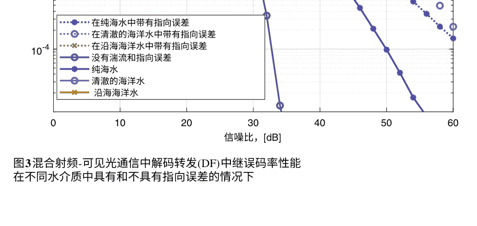

在图3中，我们模拟了DF中继的误码率性能，该中继用于辅助水下目标的信息传输。在混合DF中继射频-可见光通信链路中，纯海水实现了最佳的误码率性能。在纯海水中没有湍流条件下，也进行了误码率性能分析。在高强度湍流条件下，具有和不具有指向误差的情况下的误码率性能也在图3中显示。相比之下，在高浑浊水条件下，纯海水的误码率性能比带有指向误差的清澈海洋水表现出更好的性能。由于水体浑浊度高和水流的随机性，沿海海洋水的性能明显较差，与纯净海洋水和纯海水相比。

在图4中，仿真结果显示了AF中继混合RF-VLC链路的误码率性能。与强湍流和指向误差条件相比，误码率性能进行了总结。在图3中，可以清楚地看到纯海水和清澈的海洋水在高信噪比信道条件下具有更好的性能。此外，在较低信噪比信道条件下，AF中继在提出的信道模型中比DF中继通信链路具有更好的性能。如果以高信噪比值为目标，目标误码率为$1 \times 10^{-4}$，无论是纯水还是DF中继通信，AF中继模型都具有更好的性能。

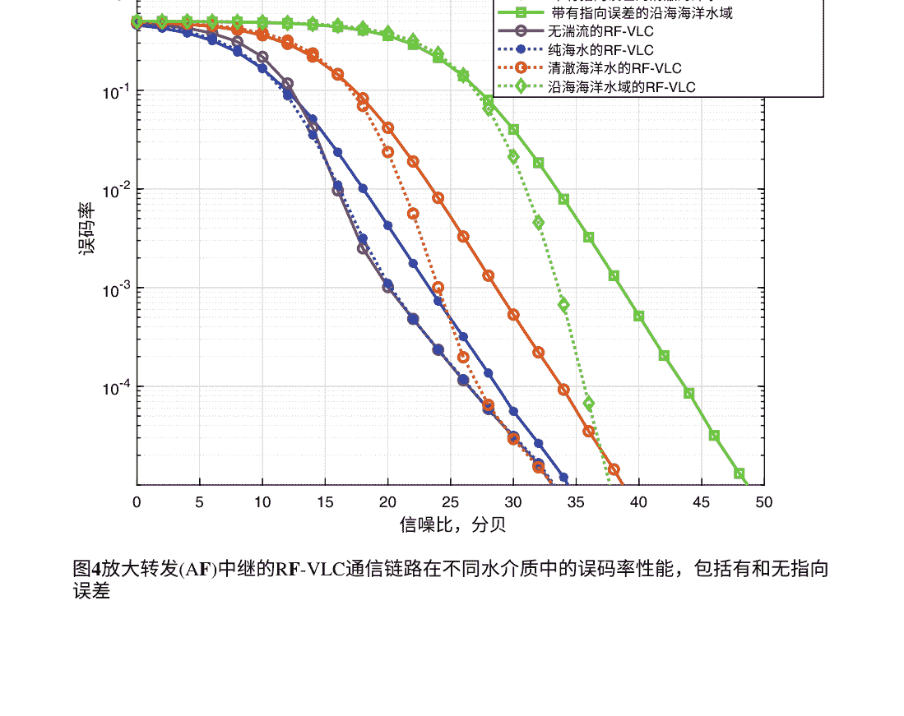

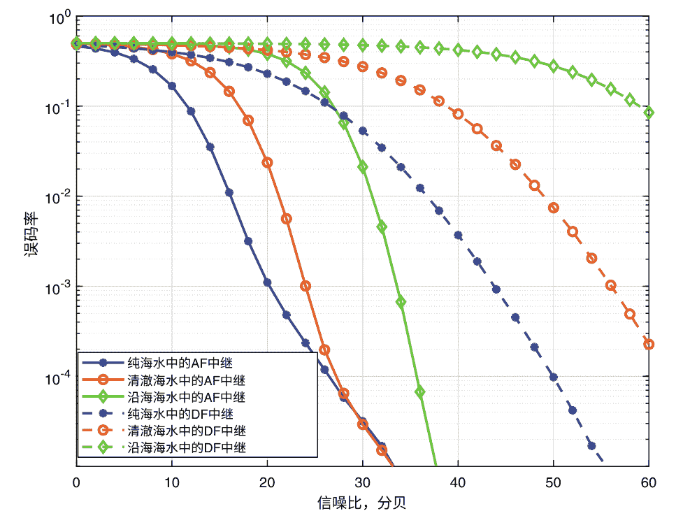

###### 图5 RF-VLC混合通信链路中AF和DF中继的误码率性能详细比较

链接。相对而言，在清澈海水中，AF中继的RF-VLC组合在低信噪比值下实现了更高的误码率性能。

图5中更详细地比较了AF和DF中继的RF-VLC混合通信链路在不同水域中的性能。明确指出，在强信道条件下，纯海水中的两个中继链路在低信噪比值下表现出更好的性能。沿海海水的误码率性能在两种组合通信链路中都表现出较差的性能。

在不同水域中具有指向误差的双跳通信链路的误码率性能比较最好的结果见图6。对于中继通信，进行了更详细的比较。在图6中，分析了AF和DF中继在高浑浊信道条件下以及指向误差损伤下的性能。很明显，AF中继在低信噪比的所有信道条件下都显示出更好的误码率性能，而DF中继在几乎相同的性能但相对较高的信噪比信道条件下显示出相同的性能。因此，在不同水域的高信噪比下实现高误码率，RF-UVLC链路作为组合无线混合通信候选者显示出更好的性能。

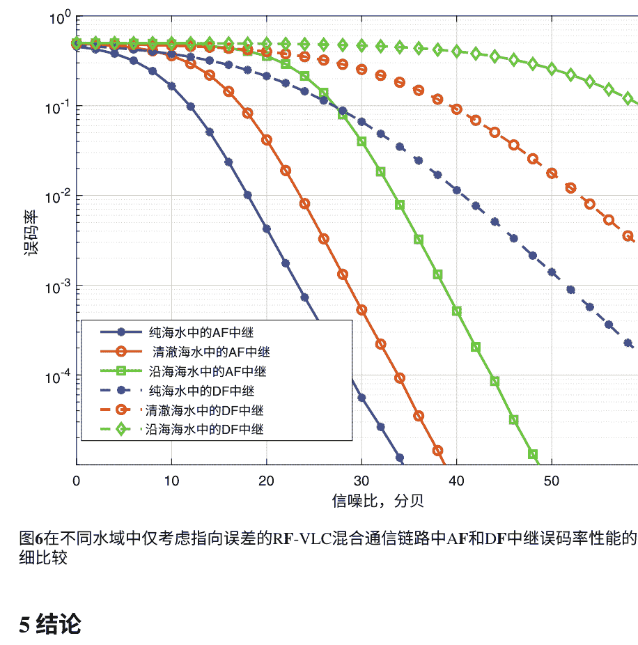

###### 5 结论

混合通信系统是一种可行的技术，可以在不同信道条件下实现可靠的数据速率，而不受不同水域的影响。 此外，可见光通信是一种有前景的关键技术，可以在不同水域中获得高数据速率。 因此，在本文中，我们使用蒙特卡洛方法提供了模拟结果，以验证RF-UVLC链路在不同中继协议下的优越性和误码率性能。 在这项工作中，考虑了由RF和VLC水下链路组成的双跳信道模型。考虑了一个基于水下浮标的中继，并用于协助岸基基站和海底节点之间的信息传输的不同协议。 然后，我们计算了水下目的地的误码率性能。 在整个工作中，我们研究了在不同水域中提出的系统模型的性能。 在模拟结果中，明显显示AF中继在较低信噪比条件下显示出比DF中继通信更好的误码率性能。

致谢 本工作得到了国家研究汤姆斯克理工大学竞争力提升计划框架下的资助，资助号为VIU-ISHITR-180/2020。

###### 参考文献

- 1. Ali MF, Jayakody DNK, Chursin YA, Affes S, Dmitry S (2019) 水下无线通信的最新进展和未来方向。 Arch Comput Methods Eng, 1–342. Ali MF, Jayakody NK, Perera TDP, Krikdis I (2019) 水下通信：最新进展。在：ETIC2019国际信息和通信新兴技术（ETIC）会议，第1-6页
- 3. 曾志，傅松，张辉，董洋，程杰（2016）水下光无线通信综述。 IEEE Commun Surv Tutor 19（1）：204–238
- 4. Dautta M, Hasan MI (2017) 浅海中利用电磁场进行水下车辆通信。 在：2017年国际电气、计算机和通信工程（ECCE）会议。IEEE, 第38-43页
- 5. Kaushal H, Kaddoum G (2016) 水下光无线通信. IEEE. Access 4:1518–1547
- 6. Awan KM, Shah PA, Iqbal K, Gillani S, Ahmad W, Nam Y (2019) 水下无线传感器网络: 近期问题和挑战综述. 无线通信与移动计算
- 7. Majumdar AK (2014) 先进的自由空间光学(FSO): 系统方法, 第186卷. Springer, Berlin
- 8. Singh S, Kakamanshadi G, Gupta S (2015) 可见光通信-一种新兴的无线通信技术. 在: 2015年第二届国际工程与计算科学近期进展会议(RAECS). IEEE, pp 1–3
- 9. Gupta A, Sharma N, Garg P, Alouini M-S (2017) 级联FSO-VLC通信系统. IEEE无线通信快报 6(6):810–813
- 10. 张杰，戴乐，张勇，王忠（2015）混合无线电频率/自由空间光双跳传输系统的统一性能分析。 J光波技术33(11):2286–2293
- 11. Ansari IS, Yilmaz F, Alouini M-S (2013) 指向误差对混合射频/自由空间光双跳传输系统性能的影响。 IEEE无线通信快报 2(3):351–354
- 12. Charles JR, Hoppe DJ, Sehic A (2011) 具有球形主光学元件的混合射频/光通信终端。 在：2011年国际空间光学系统和应用会议（ICSOS）。 IEEE, pp 171–179
- 13. Elamassie M, Sait SM, Uysal M (2018) 级联伽玛-伽玛湍流中的水下可见光通信。 在：IEEE全球通信工作坊（GC Wkshps）。 IEEE, 1–6
- 14. Elamassie M, Al-Nahhal M, Kizilirmak RC, Uysal M (2019) 水下可见光通信系统的发射激光选择。 在：IEEE第30届国际个人、室内和移动无线电通信研讨会（PIMRC）。 IEEE, 1–6
- 15. Yilmaz A, Elamassie M, Uysal M (2019) 在湍流存在下的水下垂直MIMO可见光通信链路的多样性增益分析。 在：2019年IEEE国际黑海通信与网络会议（BlackSeaCom）。 IEEE, 第1-6页
- 16. Illi E, El Bouanani F, Da Costa DB, Ayoub F, Dias US (2018) 双跳混合射频-UOW通信系统：物理安全分析。 IEEE Access 6:55345–55360
- 17. Elamassie M, Uysal M (2019) 带有指向误差的级联伽玛-伽玛湍流信道的垂直水下可见光通信链路。 在：2019年IEEE国际黑海通信与网络会议（BlackSeaCom）。 IEEE, 第1-5页
- 18. Farid AA, Hranilovic S (2007) 具有指向误差的自由空间光链路的中断容量优化。 J Lightwave Technol 25(7):1702–1710
- 19. Song X, Cheng J (2012) 在强大的气湍流中使用子载波强度调制的光通信。 J Lightwave Technol 30(22):3484–3493
- 20. Hanson F, Radic S (2008) 高带宽水下光通信。
- 21. Mobley CD, Gentili B, Gordon HR, Jin Z, Kattawar GW, Morel A, Reinersman P, Stamnes K, Stavn RH (1993) 用于计算水下光场的数值模型比较。 Appl Opt 32(36):7484–7504
- 22. Elamassie M, Uysal M (2018) 在湍流存在的情况下对垂直水下可见光通信链路的性能特性进行表征。 In: 第11届国际通信系统、网络和数字信号处理研讨会(CSNDSP)。IEEE, pp 1–6
- 23. Elamassie M, Miramirkhani F, Uysal M (2018) 水下可见光通信的信道建模和性能特征化。 在：2018年IEEE国际会议通信研讨会（ICC研讨会）。IEEE, 第1-5页
- 24. Sandalidis HG, Tsiftsis TA, Karagiannidis GK (2009) 具有指向误差的湍流信道中的光无线通信。 J Lightwave Technol 27(20):4440–4445
- 25. Grubor J, Randel S, Langer K-D, Walewski JW (2008) 使用基于LED的室内照明进行宽带信息广播。 J Lightwave Technol 26(24):3883–3892

##### 使用特征模式理论的圆极化八频带CPW馈电天线用于无线通信应用

Reshmi Dhara

###### 摘要

本文描述了一种用于多功能多用途的印刷天线的创新设计思想，该天线采用共面波导（CPW）馈电支撑圆极化（CP）。使用特征模式（TCMs）研究了八频带圆极化（CP）。TCM表明整个辐射器都有助于激发电磁模式以产生宽阻抗性能。通过使用不对称的CPW馈电技术激发了七个特征模式，以找到共振的CP频率和辐射行为。天线由一个六边形形状的环组成的辐射器组成。这与最左边的一个环状环相连，产生宽广的圆极化。天线的设计产生了一个宽阻抗带宽（IBW）带宽，超过1.5 GHz-超过14 GHz。此外，八频带的3 dB轴比带宽（模拟）为310 MHz（3.13-3.34 GHz，$f_c$（CP共振频率）=3.2 GHz），310 MHz（6.45-6.76 GHz，$f_c$=6.6 GHz），40 MHz（8.08-8.12 GHz，$f_c$=8.1 GHz），120 MHz (8.63–8.74 GHz, $f_c$ = 8.7 GHz), 180 MHz (9.49–9.67 GHz, $f_c$ = 9.5 GHz), 30 MHz (11.69–11.72 GHz, $f_c$ = 11.7 GHz), 40 MHz (12.19–12.23 GHz, $f_c$ = 12.2 GHz) 和 140 MHz (12.57–12.71 GHz, $f_c$ = 12.6 GHz) 分别对应。

###### 关键词

八进制带天线·圆极化·CPW馈电·特征模式理论 (TCMs)

###### 1 引言

目前，印刷式单极天线因其许多吸引人的特点而被广泛应用，如全向辐射模式、宽阻抗带宽、易于制造、低成本和轻便。另一方面，单极天线与无线通信的集成电路相匹配。

> R. Dhara (✉)
电子与通信工程系，国立技术学院
锡金，拉万格拉737139，印度
e-mail: reshm idhara@nitsikkim.ac.in

由于其简单的馈送技术，设备非常受欢迎。 此外，大多数单极天线的目标是支持线偏振（LP）辐射。 利用CP天线更有利于创建和获取CP EM波，并且对其精确位置的依赖性较小。 CP通常通过激发两个几乎退化的正交谐振模式来产生，这两个模式具有相等的振幅。

因此，如果单极天线产生CP，其性能可能会显著提高。 CP天线可以通过创建左旋圆极化（LHCP）和右旋圆极化（RHCP）来产生极化多样性。

圆极化可以通过单馈口和开槽环在L频段通信中生成[1]。 在这里，天线的极大尺寸实现了11.1%的IBW和ARBW（140 MHz， f_c=1.262 GHz）。 一个尺寸为24 × 16 × 1.5875 mm³的矩形微带天线通过开槽接地面实现了线偏振（LP）的IBW范围为5.125–5.395 GHz和5.725–5.985 GHz [2]。 一个尺寸为30 × 30 × 1.6 mm³的平面天线实现了220 MHz的LP IBW，即8.9% [3]。 另一个尺寸为50 × 50 × 1.6 mm³的大型三条带天线在较低频段（1.57 GHz）和较高频段（2.33 GHz）上具有70 MHz和60 MHz的双ARBW，在IBW范围内覆盖了1.43–3.29 GHz [4]。 另一种设计概念在文献[5]中讨论，以获得宽IBW和宽ARB W。

上述引用的论文只产生了仅有双重或三重CP频带，其带宽较窄。 而本文所实现的带宽非常宽，产生了八重频带的CP，与之前的报道相比天线结构非常简单。 所提出的天线在更宽的频率范围内产生了具有优越阻抗匹配的超宽频带，并能够激发CP多频带。 该天线采用了CPW馈电。 与之前引用的天线相比，所提出的天线具有较高的增益、更宽的带宽和多重CP特性。

由于产生八重CP频带的天线设计，我们决定将工作重点放在规划一个能够提供八重或更多CP频带的紧凑天线上。 然而，先前报道的宽带/UWB天线中缺乏TCM分析。 在这里，所提出的CP天线还利用了TCM工具[6]的分析，以实现宽阻抗带和八重CP频带响应。

在本文中，所提出的天线是使用方程式(i)–(viii)设计的，参考了一些相关现有设计的文献[7–9]。 这项工作的主要目标是为小型尺寸设备设计一个多CP频段应用天线。 我们希望设计一个圆极化紧凑平面单极天线，用于八进制频段的CP应用。 这将消除使用多个圆极化天线的必要性。

实现的天线以1.5 GHz作为理论下限共振频率，以覆盖所有的Wi-Fi、WLAN和UWB频段。 但经过优化，所提出的天线在1.5 GHz处的模拟阻抗带宽比理论尺寸更小。

这是一个优秀的结果，符合微型化的要求。 我们设计的天线具有八进制频段的CP特性，同时还具有宽广的IBW。 一个六边形环连接在最左边的角上，给出了范围内宽广的CP频段（AR ≤3 dB）。 根据相关研究，在我们的知识范围内，这是取得的最佳结果之一。FR4-环氧基板是

在这里使用的频率超过12 GHz，会产生一些额外的复杂性。这对我们提出的天线有一定的限制，不能用于超过微波频段的应用。仿真使用的是 ANSYS ElectronicsDesktop 2020R1。 对于提出的天线，模拟的带宽范围超过1.5 GHz ，超过14 GHz。此外，八进制频段的模拟 ARBW 分别为310 MHz (3.13–3.34 GHz)，310 MHz (6.45–6.76 GHz)，40 MHz (8.08–8.12 GHz)，120 MHz (8.63–8.74 GHz)，180 MHz (9.49–9.67 GHz)，30 MHz (11.69–11.72 GHz)，40 MHz (12.19–12.23 GHz)，和 140 MHz (12.57–12.71 GHz)。天线尺寸为 55 × 56 ×1.6 mm³，可以实现23.24%的尺寸缩小。本文按照以下方式准备：第2节：特征模式分析理论；第3节：天线设计过程；第4节：实验结果和讨论；第5节：结论。

###### 2 特征模式分析理论 (TCMs)

这里演示了实现天线的CMA操作。 图1显示了这款八进制带圆极化天线的CMA分析。 图1a描述了实现天线的配置和特征模式频率图的特征值绘图，其中包括七个基本特征模式。 模式2、3、4、6、7、8、10的特征值 (λₙ=0) 是主导模式，而没有模式是感性模式，因为它们具有非常高的特征值 (λₙ>0)，而模式1、5和9是电容模式，因为它们具有较低的特征值 (λₙ<0)。

图1b描述了实现的天线配置和特性角度与频率的七个基本特性模式的图。

在这些模式中，2、3、4、7、6、8、10模式在共振频率12.36、11.8、10.65、9.93、8.27、8.09、3.90 GHz处穿过180°轴线，是主导模式，而1、5、9模式是非共振模式，因为它们没有穿过180°轴线。类似地，图1c描述了模式2、3、4、7、6、8、10在其共振频率处具有显著的模型重要性值，为1的模型重要性(<0.43)、5和9模式是非共振的。

现有的八进制带载波生成模式：众所周知，谐振载波模式所需的相位为90°，两个退化模式的振幅相等。 这里的CMA分析天线没有馈电结构。 基板和地平面被认为是无限大的，辐射器被认为是零厚度的PEC [10, 11]。

图2a-h显示了辐射器在其CP共振频率下的模式远场辐射图案，共有₁₀个模式。 图2a显示模式₁₀和8分别是x方向和y方向的基本模式，在f_c1=3.2 GHz时向+z方向辐射。由于这两个正交模式之间的相位差为90°，产生了圆极化。

图2b显示模式10和6分别是y方向和x方向的基本模式，在f_c2=6.6 GHz时向+z方向辐射。

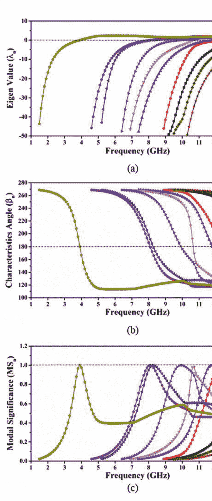

图1 对七种模式的TCMs分析，包括a特征值，b特征角度，和c模态重要性

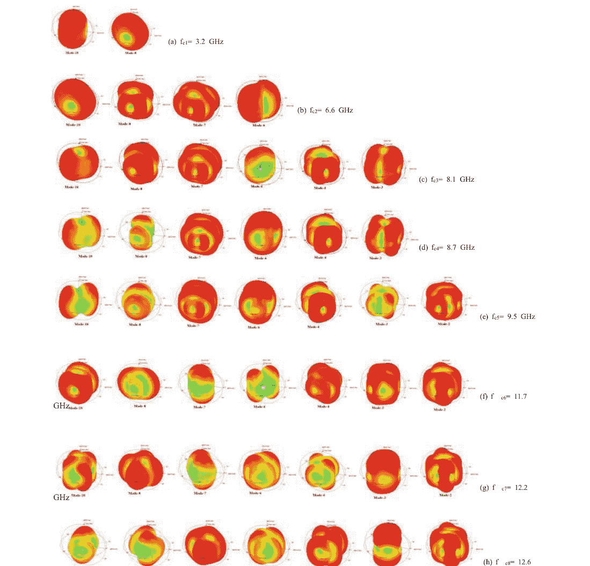

图2 在CP共振频率下，电流和模态场（远场辐射图案）的模态分布

由于这两个正交模式之间的相位差为90°，产生了CP。模式8和7导致在远场区域的电场在+z方向上相互抵消。

图2c显示，模式8和6分别是在y方向和x方向上的重要模式，并在+z方向上以f_{c3} =8.1 GHz辐射。由于这对模式之间存在90°的相位差，因此形成了一个CP。模式10、7、4、3导致在+z方向上的远场区域中电场的抵消。

图2d显示，模式7和6分别是在y方向和x方向上的基本模式，并在+z方向上以 $f_{c4}$=8.7 GHz辐射。同样，由于这两个正交模式之间的相位差为90°，产生了CP。模式10、8、4、3导致在+z方向上的远场区域中电场的抵消。

图2e显示，模式7和6是在y方向和x方向上的基本模式，并在+z方向上以 $f_{c5}$=9.5 GHz辐射。这里，由于这两个模式是正交模式，角度为90°，产生了CP。模式10、8、4、3导致在+z方向上的远场区域中电场的抵消。

图2f显示，模式4和3是在y方向和x方向上的基本模式，并在+z方向上以 $f_{c6}$=11.7 GHz辐射。由于这两个正交模式之间的相位差为90°，产生了圆极化。模式10、8、7、6、2导致在+z方向上的远场区域中电场的抵消。

图2g显示模式3和2是在x方向和y方向的基本模式，并在+z方向以 $f_{c7}$=12.2 GHz辐射。由于这两种模式之间的相位差为90°，产生了圆极化。模式10、8、7、6、4导致在+z方向的远场区域电场的抵消。

图2h显示模式7和3是在x方向和y方向的基本模式，并在+z方向以 $f_{c8}$=12.6 GHz辐射。由于这两种模式之间的相位差为90°，产生了圆极化。模式10、8、6、4、2导致在+z方向的远场区域电流的抵消。

###### 3 天线设计流程

###### A. 天线配置

天线的设计如图3所示。天线是在相对介电常数 $\epsilon_r = 4.4$ 和损耗切线 $\tan\delta=0.02$ 的FR4-环氧基板上制作的。天线的整体尺寸为55 × 56 × 1.6 mm³。如图3所示，50 Ω长的馈线L和宽度 $W_f$ 与阻抗变换器耦合。六边形环状单极天线与一个环形环相连的左上角。两个环的宽度 $W_s$ 相同。作为多馈结构的替代方案，设计的单馈天线基于双环单极结构，不包括额外的馈电部件，以实现两个正交极化模式之间的90°相位差。在天线的性能评估过程中，辐射器结构可以被看作是两个扰动环的组合。因此，扰动导致所需频段上的CP波辐射。为了增加带宽，单极天线的中心已经从馈线中心向左移动，以增加CP带宽。在不变的条件下

图3 所提出天线的几何形状 ($W_{sub} = 56$, $L_{sub} = 55$, $h = 1.6$, $L_1 = 15.5$, $R_1 = 14.3$, $R_2 = 7.75$, $g = 0.9$, $L_t = 13.4$, $W_t = 1.8$, $L_f = 8.6$, $W_f = 3$, $W_s = 1.8$, $d = -1.4$)

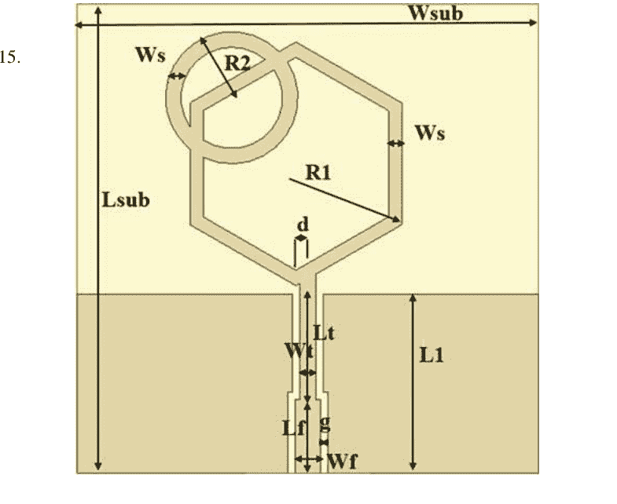

天线尺寸，参数 $W_s$, $d$, $W_{sub}$, $L_1$ 是影响所提出天线带宽的关键参数。

###### B. 在谐振频率 ($f_{r1}$) 1.5 GHz [7-9]处的天线参数设计

考虑介电常数 $\epsilon_r = 4.4$，以及FR-4环氧基板的厚度 ($h$) = 1.6 mm，谐振频率 ($f_{r1}$) =1.5 GHz。使用传统设计方法，天线的设计参数理论计算如下方程所示。

- I. 补丁宽度计算 ($W$):

$$ W = \frac{1}{2f_r\sqrt{\mu_0\epsilon_0}} \sqrt{\frac{2}{\epsilon_r + 1}} \quad \text{(i)} $$

- II. 有效介电常数 ($\epsilon_{reff}$):

$$ \epsilon_{reff} = \frac{\epsilon_r + 1}{2} + \frac{\epsilon_r - 1}{2} \left[ 1 + 12\frac{h}{w} \right]^{-1/2} \quad \text{(ii)} $$

- III. 导波波长计算 ($\lambda_g$):

$$ \lambda_g = \frac{1}{f_{r1}\sqrt{\mu_0\epsilon_0}} \times \frac{1}{\sqrt{\epsilon_{reff}}} \quad \text{(iii)} $$

- IV. 有效长度计算 ($L_{eff}$):

$$L_{\text{eff}} = \frac{\lambda_g}{2} \quad \text{(iv)}$$

- V. 长度延伸计算:

$$\frac{\Delta L}{h} = 0.412 \frac{(\varepsilon_{\text{reff}} + 0.3)\left(\frac{W}{h} + 0.264\right)}{(\varepsilon_{\text{reff}} - 0.258)\left(\frac{W}{h} + 0.8\right)} \quad \text{(v)}$$

- VI. 实际补丁长度计算 ($L$):

$$L = L_{\text{eff}} - 2\Delta L \quad \text{(vi)}$$

- VII. 基板长度计算:

$$L_{\text{sub}} = L + 6 \times h \quad \text{(vii)}$$

- VIII. 基板宽度计算:

$$W_{\text{sub}} = W + 6 \times h \quad \text{(viii)}$$

代入 $\varepsilon_r = 4.4$ 和 $f_{r1} = 1.5 \text{ GHz}$, 我们得到: $L_{\text{sub}} = 56.98$ 和 $W_{\text{sub}} = 70.42 \text{ mm}$。优化后我们得到: $L_{\text{sub}} = 55 \text{ mm}$ 和 $W_{\text{sub}} = 56 \text{ mm}$。因此, 现在可以在相同的较低谐振频率1.5 GHz下实现23.24%的尺寸缩小。

###### C. 工作原理

图4描述了天线的改进过程的比较。图5和6显示了所提出的天线模拟IBW和ARBW的改进比较。

天线I采用了一个带有四分之一波传输和CPW馈电地平面的六边形贴片[12-15]。从图5和6可以看出, 阻抗带宽很好, 但ARBW非常差。为了进一步提高IBW, ARBW使用了六边形环而不是六边形贴片。但仍然不能满足3 dB的ARBW准则。因此, 为了产生扰动

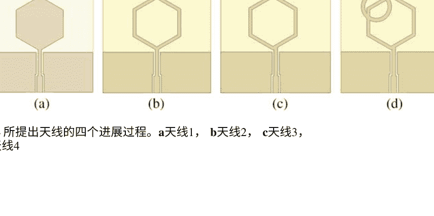

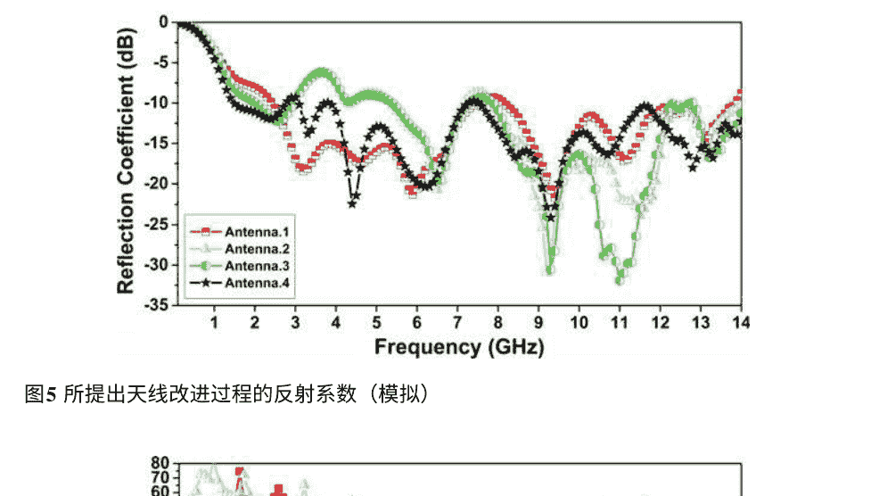

图5 所提出天线改进过程的反射系数（模拟）

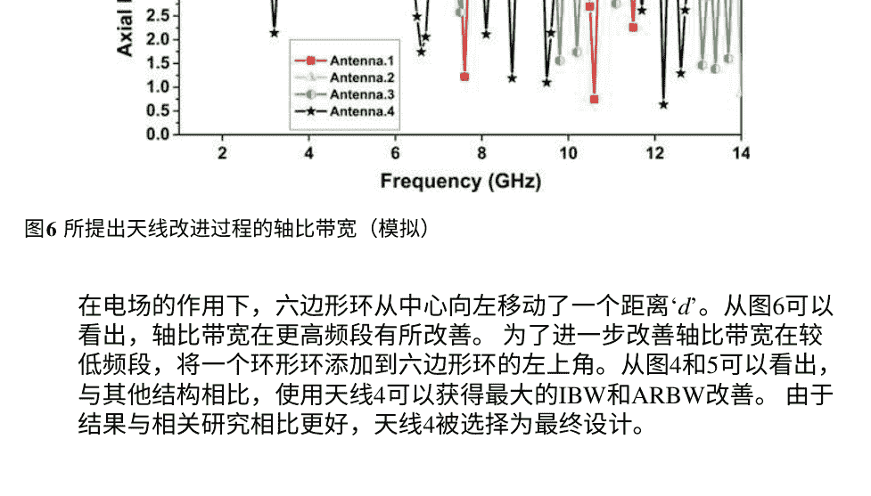

图6 所提出天线改进过程的轴比带宽（模拟）

在电场的作用下，六边形环从中心向左移动了一个距离‘d’。从图6可以看出，轴比带宽在更高频段有所改善。为了进一步改善轴比带宽在较低频段，将一个环形环添加到六边形环的左上角。从图4和5可以看出，与其他结构相比，使用天线4可以获得最大的IBW和ARBW改善。由于结果与相关研究相比更好，天线4被选择为最终设计。

###### D. 参数研究

为了获得单极天线的优化尺寸，分析了各种参数性能。研究并在图7中呈现了CPW馈电地平面长度。

此外，设计天线的一个显著特点是地平面与CPW馈电和贴片之间的耦合现象引起的阻抗匹配的影响。为此，研究了CPW馈电地平面长度的影响。

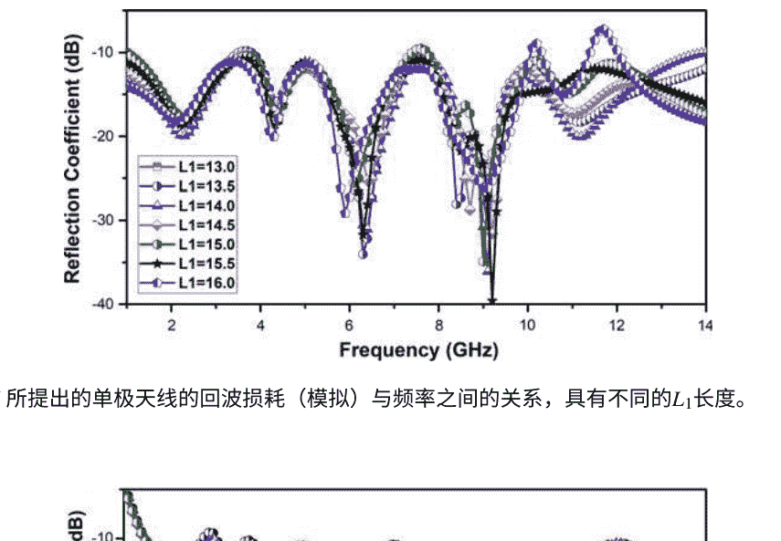

图7 所提出的单极天线的回波损耗（模拟）与频率之间的关系，具有不同的L1长度。

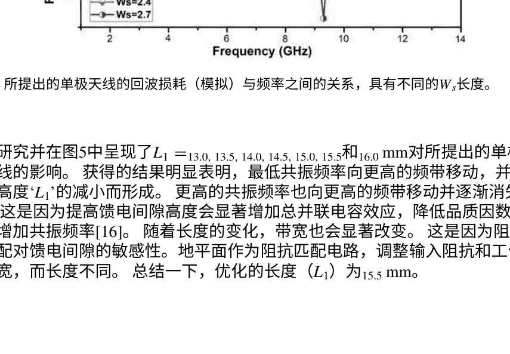

图8 所提出的单极天线的回波损耗（模拟）与频率之间的关系，具有不同的Ws长度。

还研究并在图5中呈现了L1 = 13.0, 13.5, 14.0, 14.5, 15.0, 15.5 和 16.0 mm对所提出的单极天线的影响。获得的结果明显表明，最低共振频率向更高的频带移动，并随着高度L1的减小而形成。更高的共振频率也向更高的频带移动并逐渐消失。这是因为提高馈电间隙高度会显著增加总并联电容效应，降低品质因数，并增加共振频率[16]。随着长度的变化，带宽也会显著改变。这是因为阻抗匹配对馈电间隙的敏感性。地平面作为阻抗匹配电路，调整输入阻抗和工作带宽，而长度不同。总结一下，优化的长度（L1）为15.5 mm。

图8显示了不同带宽长度的模拟IBW。从图中可以看出，IBW的变化可以忽略不计，但对ARBW有很大影响，如图9所示。从图9可以清楚地看出，当 $W_s$ =1.8毫米时，在这个位置上提供了宽的CP带宽，以获得更好的阻抗匹配。

图10描述了变化长度的·d 的IBW。从图中可以看出，IBW的变化几乎可以忽略不计，但对ARBW有很大影响，如图11所示。从图11可以清楚地看出，当 $d$= -1.4毫米时，在这个位置上提供了宽的CP带宽。这个位置的电场扰动具有相同的振幅，并且具有90°的相位差。

图12描述了变化基底长度的IBW。从图中可以看出，IBW的变化可以忽略不计，但对ARBW有很大影响，如图13所示。从图13可以清楚地看出，当 $W_{sub}$ =56毫米时，在这个位置上提供了宽的CP带宽，以获得更好的阻抗匹配。

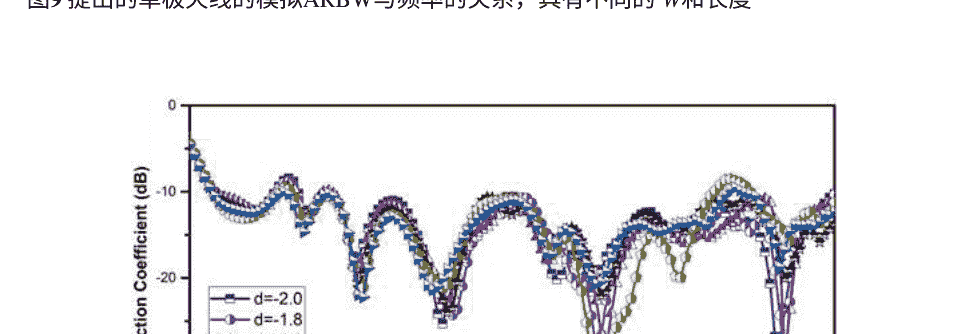

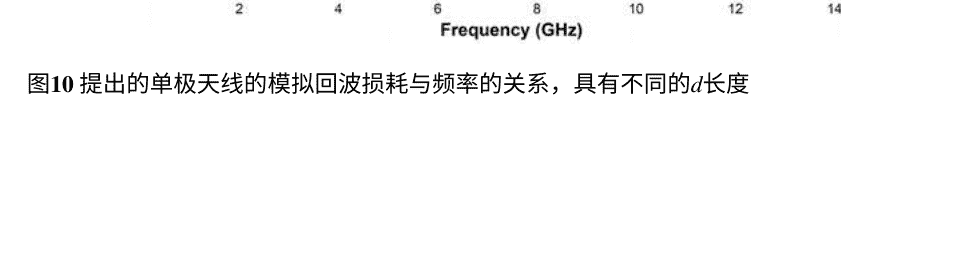

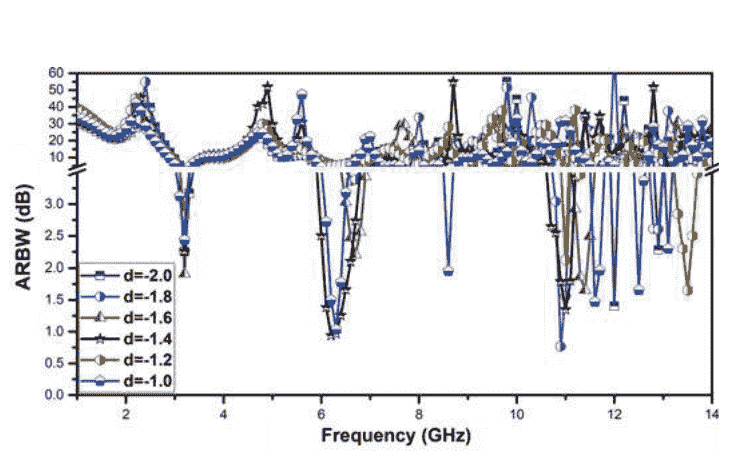

图11 提出的单极天线的模拟AR BW与频率的关系，具有不同的$d$长度

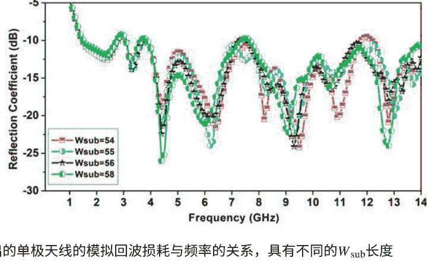

图12 提出的单极天线的模拟回波损耗与频率的关系，具有不同的$W_{sub}$长度

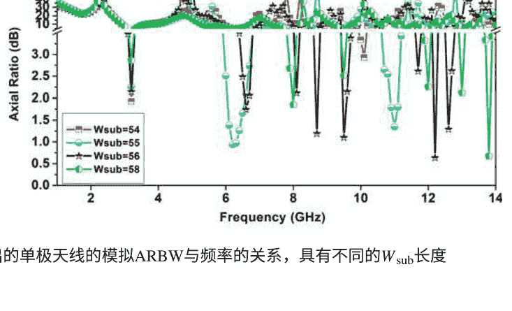

图13 提出的单极天线的模拟AR BW与频率的关系，具有不同的$W_{sub}$长度

###### 4 实验结果和讨论

使用ANSYS Electronics Desktop 2020R1进行了模拟。从图14可以明显看出，实施的天线在模拟中具有 -10 dB的IBW，从 1.5 GHz到14.0 GHz之外，IBW为12.5 GHz，中心频率为7.75 GHz，161%。VSWR < 2 哪一个是整个IBW区域上实现的天线的模拟结果，如图15所示。图16显示了所提设计天线的模拟ARBW。 所提出的天线在IBW曲线内提供了八个CP频段。 CP频段为310 MHz (3.13–3.34 GHz, $f_c$ =3.2 GHz), 310 MHz (6.45–6.76 GHz, $f_c$ 6.6 GHz), 40 MHz(8.08–8.12 GHz, $f_c$ 8.1 GHz), 120 MHz (8.63–8.74 GHz, $f_c$ 8.7 GHz), 180 MHz (9.49–9.67 GHz, $f_c$ 9.5 GHz), 30 MHz (11.69–11.72 GHz, $f_c$ 11.7 GHz), 40 MHz

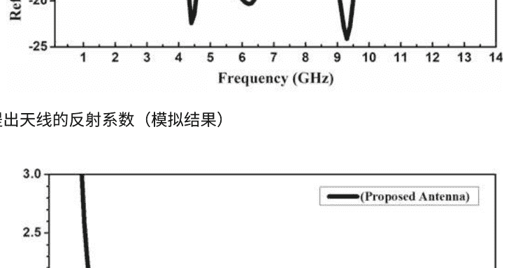

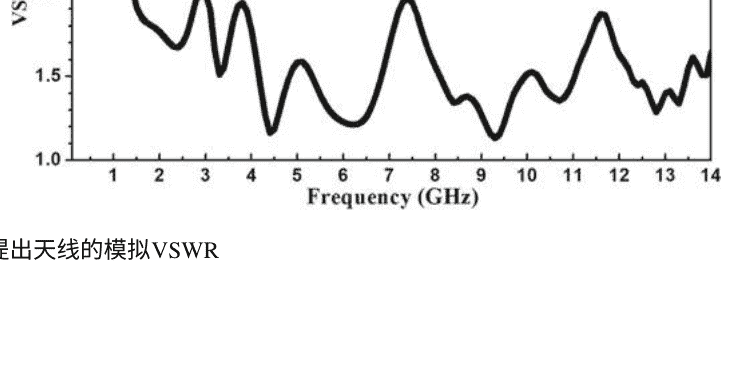

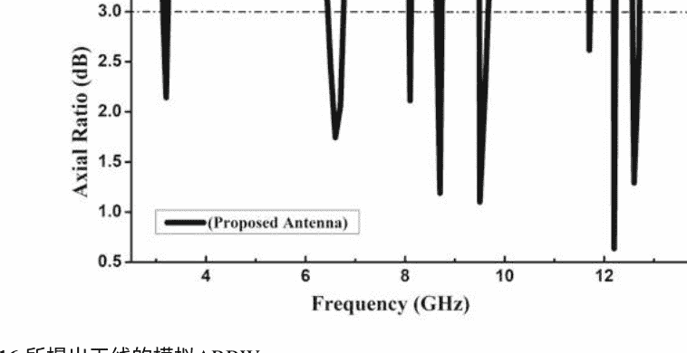

图16 所提出天线的模拟ARBW

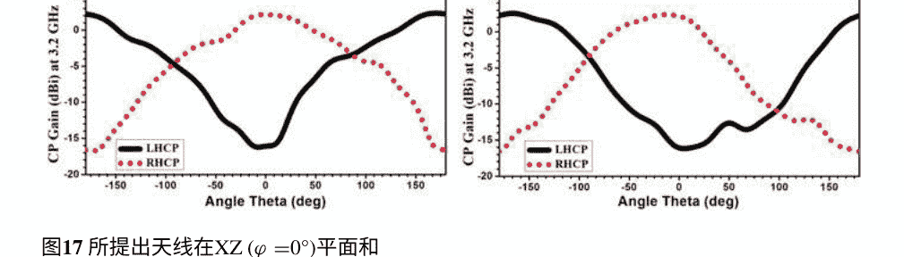

图17所提出天线在XZ ($\varphi$ =0°)平面和 YZ ($\varphi$ =90°)平面上的辐射图案（模拟）

分别为12.19-12.23 GHz，中心频率为12.2 GHz，和12.57-12.71 GHz，中心频率为12.6 GHz，这对于无线通信应用非常有用。

图17展示了在3.2 GHz下模拟的辐射图案，其中 XZ平面（$\varphi$ =0°）和 YZ平面（$\varphi$ =90°）的辐射图案在图14a、b中模拟的结果表明，横向极化水平比顺向极化水平低19 dB。

图18展示了辐射图案，其中一个是模拟的，RHCP在正对方向上。同样，它可以暴露出辐射图案，在以前的CP共振频率（$f_c$）是RHCP在正对方向上。当结构被倒置时，可以看到相反的极化。

这个实现的天线的模拟峰值增益是8.37 dBi，在12.7 GHz的频率下，如图19所示，而在CP频带的另一个中心频率下，峰值增益分别为－2.35 dBi，在3.2 GHz时为1.25 dBi，在6.6 GHz时为3.55 dBi，在8.1 GHz时为3.62 dBi，在8.7 GHz时为3.79 dBi，在9.5 GHz时为4.76 dBi，在11.7 GHz时为5.97 dBi，在12.2 GHz时为7.74 dBi，相应地在12.6 GHz时为7.74 dBi。

图20展示了辐射效率，其中一个是针对频率进行模拟的实现天线。代表所有CP频段，模拟效率为

图18模拟辐射模式（LHCP和RHCP）在XZ平面（$\varphi$=0°）和YZ平面（$\varphi$=90°）的情况下

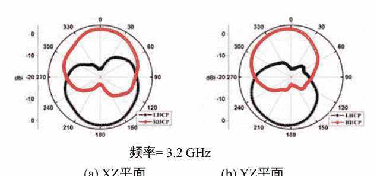

图19建议天线的峰值增益（模拟）

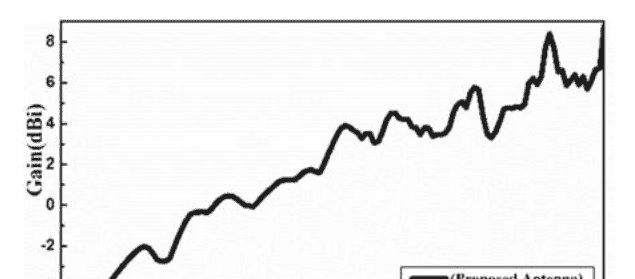

图20建议天线的模拟辐射效率

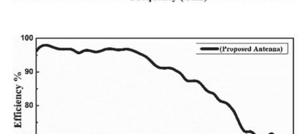

在65-98%的范围内，最高效率为1.6 GHz时的97.87%，在CP频段的中心频率3.2 GHz时的95.68%，在6.6 GHz时的94.26%，在8.1 GHz时的90.25%，在8.7 GHz时的87.25%，在9.5 GHz时的85.16%，在11.7 GHz时的72.21%，在12.2 GHz时的70.29%，在12.6 GHz时的69.74%，这对实际应用非常有益。

在表1中，已经与提出的天线和最近设计的多频段天线[17-19]进行了比较。调查发现，所提出的工作在最宽阻抗带和八进制CP特性方面表现出改进，同时具有紧凑的尺寸和良好的增益。

表1评估了最近开发的多频段天线中的提出的天线

| 参考文献 (年份) | 天线尺寸 | 阻抗带宽 | 中心频率 $f_{c}$ GHz处的绝对带宽 | CP带数量 |
| :--- | :--- | :--- | :--- | :--- |
| 15 (2017) | 21 × 21 × 0.8 mm³ | 1.7127–2.0393 GHz, 2.303–2.509 GHz, 3.235–3.843 GHz, 4.933–5.629 GHz, 7.5–7.7 GHz | 1.65–1.95 GHz在 1.9 GHz | 01 |
| 16 (2019) | 0.26λ₀ × 0.26λ₀ × 0.024λ₀, λ₀是1.2 GHz时的波长 | 1.575 GHz处的2.5% 1.227 GHz处的2.2% 1.176 GHz处的1.38% 2.3 GHz处的2.7% | 1.575 GHz处的1.1% 1.227 GHz处的1.0% 1.176 GHz处的4.1% 2.3 GHz处的1.5% | 04 |
| 17 (2018) | 47 × 40 × 1.57 mm³ | 2.1–2.87 GHz, 2.91–3.08 GHz, 3.39–3.95 GHz, 4.08–4.51 GHz, 4.62–4.67 GHz, 4.68–6.96 GHz | 2.78–2.87 GHz处 2.84 GHz处, 2.89–2.96 GHz处 2.91 GHz处, 3.87–3.99 GHz处 3.89 GHz处, 5.07–5.1 GHz处 5.085 GHz, 5.34–5.40 GHz at 5.378 GHz, 5.50–5.53 GHz at 5.51 GHz, 5.59–5.65 GHz at 5.624 GHz | 07 |
| 我们的工作 | 56 × 55 × 1.6 mm³ | 1.5—超过14 GHz | 3.13–3.34 GHz at 3.2 GHz, 6.45–6.76 GHz at 6.6 GHz, 8.08–8.12 GHz at 8.1 GHz, 8.63–8.74 GHz at 8.7 GHz, 9.49–9.67 GHz at 9.5 GHz, 11.69–11.72 GHz at 11.7 GHz, 12.19–12.23 GHz at 12.2 GHz, 12.57–12.71 GHz at 12.6 GHz | 08 |

###### 5 结论

这里介绍了一种八进制带载波线馈送单极天线。设计的天线简单易制作。此外，实现的天线具有更宽的阻抗带宽和八进制带载波频段，满足了当前八进制带载波频段无线通信设备的需求。通过非对称CPW馈电技术，仅仅在对称电流之间的模式能够被激发。 这些模式在相应的频率范围内具有恒定的相位变化，产生八进制CP带。 这个几何公式通过分别设计辐射器和馈电配置，为八进制带CP天线的设计提供了很大的便利。 这个TCM工具比以前的技术更简单地模拟了CP天线评估的方法。

###### 参考文献

- 1. Qing X, Chia YWM (1999) 一种新颖的单馈圆极化槽环天线。 在：天线和传播学会国际研讨会，卷1。 IEEE，第248-251页，1999年7月
- 2. Chakraborty U, Kundu A, Chowdhury SK, Bhattacharjee AK (2014) 紧凑型双频微带天线用于IEEE 802.11 a WLAN应用。 IEEE天线和无线传播快报13:407-410
- 3. Suma MN, Raj RK, Joseph M, Bybi PC, Mohanan P (2006) 一种用于DCS/2.4-GHz WLAN应用的紧凑型双频带平面分支单极天线。 IEEE微波无线组件信函16（5）：275-277
- 4. Hsu CW, Shih MH, Wang CJ (2016) 一种具有双频带圆极化的三条带单极天线。 在：天线和传播（APCAP），2016年IEEE第五届亚太会议IEEE，第137-138页，2016年7月
- 5. Wu JW, Ke JY, Jou CF, Wang CJ (2010) 一种微带馈电的宽带圆极化单极天线。 IE T微波天线传播4（4）：518-525
- 6. Dhara R, Yadav S, Sharma MM, Jana SK, Govil MC (2021) 一种使用特征模式理论的具有非对称接地平面的圆极化四频段环形天线。 Progress Electromag Res M, 100:51–68. https://doi.org/10.2528/PIERM20102006
- 7. Balanis CA (2016) Antenna theory: analysis and design. Wiley, New York. ISBN-978-1-118-64206
- 8. Pozar DM (1992) Microstrip antennas. Proc IEEE 80(1):79–91. https://doi.org/10.1109/5.119568
- 9. Guo Y-X, Bian L, Quan Shi X (2009) Broadband circularly polarized annular-ring microstrip antenna. IEEE Trans Antennas Propag 57(8):2474–2477. https://doi.org/10.1109/TAP.2009.2024584
- 10. Dhara R, Mitra M (2020) A triple-band circularly polarized annular ring antenna with asymmetric ground plane for wireless applications. Eng Rep 2(4):e12150. https://doi.org/10.1002/eng2.12150
- 11. Dhara R, Jana SK, Mitra M (2020) 用于无线通信的三频带圆极化单极天线应用。 Radioelectron Commun Syst 63(4):213–222
- 12. Dhara R (2020) 用于无线通信的四频带圆极化CPW馈电G形印刷天线与方形槽。 Radioelectron Commun Syst 63(7):376–385
- 13. Dhara R, Jana SK, Mitra M (2020) CPW馈电的三频带圆极化印刷倒C形单极天线，具有闭环和两个半六边形凹槽。 在:光学和无线技术。 Springer, 新加坡, pp 161–175
- 14. Dhara R, Kundu T (2020) 一种紧凑的倒Y形圆极化宽带单极天线，具有开环。 Eng Rep 2:e12326. https://doi.org/10.1002/eng2.12326
- 15. Garbacz R, Turpin R (1971) 用于辐射和散射场的广义展开。 IEEET rans Antennas Propag 19(3):348–358. https://doi.org/10.1109/TAP.1971.1139935
- 16. Alam M, Kanauij a BK, Beg MT, Kumar S, Rambabu K (2019) 用于WLAN/Wi-MAX/SDARS和C频段应用的六频带双向圆极化天线。 Int J RFMicrowave Comput Aided Eng 29(4):e21599

- 17. 陈Y，王CF（2015）特征模式：天线工程中的理论和应用。 Wiley，纽约

- 18. Pedram K，Nourinia J，Ghobadi C，Karamirad M（2017）一种用于无线通信系统的多频段圆极化天线，结构简单。 微波光技术Lett 59（9）：2290-2297

- 19. Falade OP，Ur-Rehman M，Yang X，Safdar GA，Parini CG，Chen X（2020）用于全球导航卫星系统和5G/B5G的紧凑多频段圆极化天线设计应用。 Int J RF Microwave Comput Aided Eng 30（6）：e22182

##### 用于认知无线电网络性能改进的大规模MIMO预编码器：技术调查

Mayank Kothari和U. Ragavendran

摘要认知无线电（CR）是最可靠的高效频谱技术使用。在认知无线电网络（CRN）中，主用户与次用户共享频带。次用户中继主用户的流量，而主用户将受限制的频谱访问授予次用户。在主用户和次用户之间建立并发通信链路期间，两个链路之间的干扰降低了CRN的性能。多输入多输出（MIMO）具有在底层模式下克服CRN的用户间干扰（IUI）的能力，并建立并发通信链路。大规模MIMO系统在基站上利用大量天线同时为同一频带中的一组用户设备（UE）提供服务。这项技术将有助于提高5G及5G以后的无线通信系统中的信道容量和吞吐量。这项技术可以实现低功耗在基站上。在基于大规模MIMO的CRN中，预编码技术有助于在同一时间和频率向主用户和次用户传输信息时减轻用户间干扰。在这篇综述中，预编码技术线性、非线性和恒定包络预编码被分类，其中截断多项式展开的线性预编码比零强制、最小均方误差和基于回归的线性预编码具有更好的性能。

关键词自适应大规模MIMO · 智能CRN · 动态频谱利用 · 监督预编码 · IUI协调

###### 1 引言

无线通信正在发展，无论是手机耳机还是通过蓝牙连接到我们的手机的智能手表。近年来，无线通信系统技术引起了很大关注。随着移动用户数量超过世界人口和带宽需求巨大的实时流媒体视频，对无线通信系统的改进有着巨大需求，可以有效利用频谱，并提高系统的数据速率和吞吐量。高扩展的无线流量在很长一段时间内一直在增长。在未来，这种趋势将继续，并伴随着新的创新和技术实施，例如人工智能、物联网、增强现实等。研究人员正在研究下一代移动网络（NGMN），也被称为第五代（5G），它将以进化的无线接入技术、超密集小区部署、自组织网络、机器类型通信、认知无线电进行动态频谱共享等丰富的技术，并具有满足未来应用和服务需求的巨大潜力[1]。NGMN中的认知无线电（CR）被预见为能够在有限条件和频谱利用方面实现巨大改进的技术。由于有限条件、异构系统管理和不同接入技术的可用性，5G中的巨大复杂性不会理想地通过手动输入或那些需要适应环境变化的常规算法来处理。因此，CR在5G中的应用将提供灵活性和对受限条件的管理，大大减少人为干预[2]。

认知无线电网络（CRN）是提高频谱利用率[3]、用户之间的互相干扰受限以及与不同无线接入技术适应性结合的最可靠技术[4]。认知无线电（CR）的目标是在不影响主用户（有许可的用户）服务质量的情况下，动态地将频谱授权给次用户（无许可的用户）[5]。频谱叠加、下行和交织是CRN中用于并发通信的三种基本方法[6]。在下行方法中，利用多天线技术来减少干扰是减少干扰的一种突出解决方案[7]。这种技术不仅减少了干扰，还为次用户提供了提高数据速率的机会。

多天线系统在不同的无线通信标准中被广泛接受，如UMTS（双天线系统）、4G LTE-A（八天线系统）和802.11n[8]。大规模MIMO技术通过利用空间复用的优势，有很大潜力提高传输容量[9]。

预编码技术能够在发射端抑制不同用户之间的干扰，从而最大化多个传输流的数据速率[10]。

###### 2 系统背景

###### 2.1 认知无线电网络 (CRN)

根据美国联邦通信委员会（FCC）的报告，对于有许可的服务而言，刚性频谱分配非常低效。一部分频谱非常密集，而其他有许可的频段在90%的时间内未被使用[11, 12]。频谱分配的这种低效将导致新的研究方向。智能CRN可以找到密集和空闲的频谱，并动态选择它们的传输波形；信道接入方法和网络协议需要更好的网络质量和所需应用[13]。通过图1可以理解CRN的功能。

在频谱感知中，CRN定期寻找可用的频谱空洞与次用户共享。频谱空洞是在感知期间未被利用或少被利用的频率通道。频谱决策根据次用户的服务质量要求从频谱空洞中选择最佳通道。通道选择决策还应基于信道状态信息、信道损耗、机会调度和主用户的干扰避免。频谱共享必须协调次用户的接入，以避免用户之间的相互干扰。频谱可以以交织、叠加和下行模式进行共享。在交织模式下，次用户利用主用户处于空闲状态的空闲信道，而在下行模式下，次用户可以在一定的干扰温度限制下，与主用户同时进行通信。如果次用户的信号水平大于干扰温度限制，则会对主用户的通信产生干扰。基于干扰，可以建立两种类型的认知无线电网络：非干扰型CRN和干扰容忍型认知无线电。

非干扰型认知无线电以交织模式工作。在这种模式下，次用户不会产生干扰，不会影响主系统的通信。它只会重用目前主用户未使用的频谱空洞。无线区域网络（WRAN）是非干扰型CRN的一个例子。在干扰容忍型CRN中，主系统与次用户共享整个频谱。在这种网络中，次用户必须保持其信号水平低于干扰温度限制，不会对主要操作产生任何中断。确定干扰温度限制需要主网络的干预。图2显示了干扰容忍型CRN中可能存在的不同类型的干扰。为了提高性能，需要干扰缓解技术，可以在主用户之间、次用户之间以及主用户和次用户之间缓解干扰。表1中列出的干扰缓解技术可以应用于发射机或接收机。应用于接收机的干扰缓解称为干扰消除或抑制技术，而应用于发射机的干扰缓解称为干扰避免技术。

图2 CRN网络中的干扰类型[14]

表1 干扰消除和避免技术[15]

| 区域 | 空白处 | 灰色和黑色空间 | 所有区域 |
| :--- | :--- | :--- | :--- |
| 技术 | 不需要取消 | SU接收器上的取消技术<br>• 接收波束成形<br>• 使用滤波器<br>• 基于变换<br>• 周期性 | SU发射机上的避免<br>• 频谱整形<br>• 预失真滤波<br>• 扩频<br>• 发射波束成形 (用于单数据流)<br>• 预编码 (用于多数据流) |

###### 2.2 MIMO系统

在无线通信中，信息从几米到数千公里的距离传输，没有任何物理连接，如电导体、电线或电缆。无线通信中的语音/数据连接遵循马丁·库珀定律，即自无线通信开始以来，每2.5年翻一番。

对于可靠的无线通信，最大的挑战是保护传输信号免受多径传播和发射机与接收机之间的大障碍物引起的衰落和阴影效应的影响。通过提高吞吐量，可以提高无线通信系统的可靠性，这取决于带宽、小区密度和频谱效率。

图3 无线通信系统的分类

根据发射机和接收机的天线数量，无线通信可以分为单天线系统和多天线系统，如图3所示。多天线系统可以分为三种类型。单输入多输出（SIMO）系统在发射机端只有一个天线，在接收机端有多个天线；而多输入单输出（MISO）系统在发射机端有多个天线，在接收机端只有一个天线。但是，多输入多输出（MIMO）系统在发射机和接收机都有多个天线，因此随着天线数量的增加，信道容量呈线性增加，因此备受关注。但是在SIMO和MISO系统中，信道容量呈对数增长[16]。在SU-MIMO系统中，基站的多个天线为单个用户提供通信功能，而在MU-MIMO系统中，基站的多个天线被多个用户共享。如果基站的天线数量与连接到基站的用户数量之比大于八，则称该系统为大规模MIMO系统。大规模MIMO系统支持时分双工操作以利用信道互易性[17]，而MU-MIMO支持时分和频分双工。大规模MIMO相对于MU-MIMO的另一个优势是在时间和频率上没有链路质量的变化[18]。

###### 2.3 CRN MIMO

CR和MIMO都是无线通信中在物理层使用的技术。CR技术用于不同的频段，以改善频谱的利用，而MIMO概念用于通过提高同一频段的吞吐量或减少用户间干扰（IUI）来提高频谱效率。通过结合这两种技术的优势，可以开发出一种新的模型CRN MIMO，它可以支持动态频谱选择，并通过利用空间复用的优势来有效利用所选频谱[19]。为了利用空间复用的优势，可以通过监督和无监督算法获取信道状态信息（CSI）。在监督方法中，通过在发射机和接收机之间传输导频符号，在每个相干周期后学习信道，这会降低系统吞吐量和频谱效率[20]。在无监督方法中，没有信道知识，信息是从接收信号中提取的。通过结合这两种方法设计监督预编码[21]。

###### 2.4 大规模MIMO系统

大规模多输入多输出（MIMO）系统同时利用相同的频段处理基站（BS）和多个用户设备（UE）上的许多组件[22]。与现有的MIMO技术[23， 24]相比，大规模MIMO的频谱效率和链路可靠性大大提高，同时还降低了运行功率和BS硬件成本[25， 26]。

图4 大规模MIMO系统组件[28]

与现有系统相比，这种进步增加了BS的计算复杂性。

图4显示了大规模MIMO系统的组件。该系统通常在相同的频率上采用时分双工（TDD）原理运行。TDD模式具有诸如仅在BS处需要信道信息以及上行估计开销不依赖于活动天线的优点；它仅取决于终端数量[27]。

###### 3 大规模MIMO中的预编码

预编码是波束成形的推广，有助于在减少干扰的情况下传输和接收多个数据流。传输预编码将发送信号定向到所需的终端，并在接收端对其他终端的信号进行分离。接收信号的可靠性随着天线数量的增加而增加[29]。预编码应用于基站，用于从具有独立且适当加权的多个发射天线传输多个数据流，以最大化链路吞吐量。

在大规模MIMO中，为了估计CSI，用户向基站发送信号。该信号包含一些参考帧。设 $x_1, x_2, \cdots x_k$ 为 $k$ 个不同用户的信号。每个用户同时在相同的时间和频率上向基站发送信号。基站天线上接收到的信号为

$y = H_1x_1 + H_2x_2 + \cdots + H_kx_k$ (1)

其中 $H_1, H_2 \cdots H_k$ 是添加了信号的信道参数。这个参数在基站用于估计信道。让 $S_{1, 2}, \cdots ,k$ 是基站传输给用户的实际数据。应用预编码后，Z将由基站传输。

$Z = P_1S_1 + P_2S_2 + \cdots + P_kS_k$ (2)

其中 $P_1, P_2, \cdots P_k$ 是与实际信号相乘的预编码值，以减少干扰。在用户接收数据时，假设信道在时分双工中具有互易性。

$u_1 = H_1^H Z + n \quad\quad (3)$

$u_2 = H_2^H Z + n \quad\quad (4)$

类似地，

$u_k = H_k^H Z + n \quad\quad (5)$

其中 $u_1, u_2, \cdots u_k$ 是接收到用户的数据。
对于用户1，

$u_1 = \underbrace{H_1^H P_1 S_1}_{期望信号} + \underbrace{H_1^H P_2 S_2 + \cdots\cdots\cdots + H_1^H P_k S_k}_{用户间干扰} + n \quad\quad (6)$

预编码的设计应该是这样的

$H_i^H P_j = 1 \quad 对于 \quad i = j \quad\quad (7)$

并且

$H_i^H P_j = 0 \quad 对于 \quad i \neq j \quad\quad (8)$

预编码技术可以分为合作预编码和非合作预编码。它可以分为线性预编码、非线性预编码和恒幅预编码。随着基站天线数量的增加，线性预编码比非线性预编码更可取。零强制预编码、最小均方误差[30]、最大比传输[31]和共轭波束形成是线性预编码技术，而在非线性预编码中，脏纸预编码(DPC)是一种流行的技术。非线性预编码充分消除了各个客户端之间的干扰并实现了理想效果。线性预编码的计算复杂度低于非线性预编码，但非线性预编码在提高数据速率方面的兼容性较低。在恒幅预编码方案中，传输信号的幅度被限制在一定水平以降低功率。在这种技术中，每个天线传输一个恒幅信号，并且接收端使用相位来重建所需的信息信号。

###### 3.1 线性预编码技术

使用预编码实现大规模MIMO系统的简化线性预编码技术，其中通过预处理或后处理确定32×8、64×8和128×8大规模MIMO系统的误码率（BER）。零强制发射机（ZFT）和匹配滤波器边界（MFB）在干扰消除期间具有相同的性能，但在后处理期间由于噪声而有所不同。在相同的频率下，零强制（ZF）算法对信道矩阵的伪逆值有依赖性，但MRT/MRC和EGT/EGC对生成的干扰有依赖性，可以通过迭代干扰消除器[33]来消除。

传统正则化零强制（RZF）预编码的吞吐量高，但所需的信道矩阵求逆具有高计算和使用实现复杂性。基于多项式展开的线性预编码技术是截断多项式展开（TPE），它具有低复杂度的线性预编码方案，用于改善大规模MIMO系统的复杂度和吞吐量。TPE预编码方案通过使用TPE来近似求逆，实现了基本的硬件实现。为了比较RZF和TPE预编码的复杂度，将操作分为两个时间尺度。第一个尺度包括仅在一个相干周期内发生的操作，第二个尺度包括每次在下行传输信道中发生的操作。根据分析，与发送天线数量和单天线用户相比，RZF预编码更适用于长相干时间，而TPE预编码更适用于小相干时间。在低信噪比（SNR）和广泛的CSI误差方面，RZF和TPE预编码的性能相似。但是，在高SNR和准确的信道信息以及TPE阶数较低时，TPE预编码的性能与RZF预编码相比较差；而在高SNR和准确的信道信息以及TPE阶数较高时，TPE预编码的性能接近于RZF预编码，适用于单小区场景[34]。

最小均方误差（MMSE）线性预编码是在[35]中提出的，其设计具有传输功率的约束。通道矩阵的仿真结果元素是独立且服从零均值和单位方差的高斯随机变量。作者提出了线性反馈、完美CSI和方案之间的和速率与天线数量之间的特性曲线。根据特性，和速率在接近15个天线时线性增加，在15到250之间，和速率增加但不是线性的，在250之后，和速率趋于饱和。与其他方案[35]相比，所提出方案的和速率更高。

为了保持用户之间的正交性，在基站使用统一性阵列（ULA）和统一平面阵列天线（UPA）的大规模MIMO系统中设计了适用于下行链路的线性预编码器。为了将远程用户划分为空间部门，下行信道中使用了空间虚拟信道模型（VCM）表示。每组预编码方法增强了下行链路的增益（吞吐量增加了60%或在某些情况下增加了200%），并且发射机和接收机的预编码复杂度呈指数衰减[36]。

一种用于跟踪外部预编码器的低复杂度补偿算法在双层预编码方案和时变信道下，试图解决不同的实现挑战，如巨大的导频符号和反馈开销，实时全局CSI要求以及在大规模MIMO系统中引起的高计算复杂度。在[37]中，预编码器在基站处被分为两个部分：内部预编码器和外部预编码器。外部预编码器的功能是减少小区间和簇间干扰，内部预编码器的功能是对簇内用户进行空间复用。使用迭代算法来降低外部预编码器的计算复杂度，该算法通过在Grassmann流形上确定全局最优解来推导得出。使用补偿算法来实现收敛到全局最优解。在不同基线下，通过均值小区吞吐量与信噪比和均值小区吞吐量与速度之间绘制的特性曲线显示了具有补偿算法的双层预编码相比于具有块对角化的双层预编码具有更低复杂度的吞吐量性能。预编码技术的关键参数在表2和表3中进行了比较。

为大规模MIMO蜂窝系统提出了两阶段子空间约束预编码器，利用空间信道相关结构。在每个基站，这个预编码器被分为内部预编码器和传输子空间控制矩阵。这种预编码技术是通过遵循非平凡设计优化来减少小区内和小区间干扰的设计。在这种预编码方案中，内部预编码器基于ZF预编码，而传输子空间控制基于服务质量（QoS）优化。由于内部ZF预编码器对传输子空间控制变量的依赖性和传输子空间控制变量的非凸性，现有的近似方法中存在一些约束。

为了改善QoS优化，采用了双凸逼近方法。该方法包括三个步骤，即干扰逼近步骤，SINR机会约束限制步骤和半定松弛步骤。将该预编码技术的性能与分数频率复用（基准1），聚类CoMP（基准2）和联合空间分割和多路复用每组处理（JSDM-PGP）（基准3）进行比较。在10毫秒的回程延迟下，该预编码方案的性能优于基准1、基准3，也优于基准2[41]。

表2 预编码技术比较

| 技术 | 用户数量 | 用户终端（移动站）的天线数量 | 性能指标 |
|---|---|---|---|
| 截断多项式展开[38] | 多用户 | 单个 | 用户速率 |
| 共轭波束成形[39] | 单个和多个用户 | 多个 | 平均速率 |
| 零强制（ZF）和最大比例传输[31] | 多用户 | 单个 | 下行传输功率，可实现的总速率 |
| 最小均方误差[30] | 多用户 | 单个 | 可实现的总均方误差 |
| 正则化零强制[34] | 多用户 | 单个 | 吞吐量，频谱效率 |
| 小区边缘感知 [40] | 多用户 | 单个 | 每个小区的可实现总速率，覆盖概率 |

###### 3.2 非线性预编码技术

所提出的低复杂度混合预编码设计利用块稀疏结构，即类似于虚拟通道，以降低反馈位数。这种混合预编码算法分为两个步骤。第一步“初步块支持集识别”使用贪婪序列聚类来找到当前元素与现有元素之间的关系，第二步“完整块支持集识别”。通过仿真结果、频谱效率和信噪比特性绘制出最佳性能、正交匹配追踪、基于贪婪序列聚类的稀疏预编码方案，通过良好地排列列来减少模拟预编码器的量化位数，以符合块稀疏结构[42]。

提出的全维大规模MIMO系统使用多层预编码来有效管理各种类型的干扰并利用广阔的信道特性。为了减少小区间干扰和小区内多用户干扰，提高有效信号功率，采用了三层预编码技术。

###### 3.3 常数包络预编码技术

箱约束回归技术用于传输CE信号。对于十六个客户端和用于预编码的处理元素（PEs），实现了一个非常灵活的并行设计。对于较小的区域比率，由于多客户端干扰，CE预编码器的总速率低于ZF，但通过增加天线数量可以提高CE的性能，因为具有较大的自由度。该并行设计每个天线每个用户每次迭代的吞吐量为14K门数和3.96mW功耗。

| 线性预编码技术 | 备注 |
| --- | --- |
| 最小均方误差（MMSE）[5] | 总速率在基站天线数量为250时增加，然后趋于饱和。对于十个用户，总速率线性增加，然后增长缓慢。 |
| 下行信道的VMC分解 [36] | 与MMSE相比，性能更好 |
| 截断多项式展开[34] | 基站的发射天线数量 = 256<br>用户数量 = 64 |

PE 65纳米技术。 为了硬件优化，使用时钟门控、硬件重用和流水线技术[44]。

针对频率选择性信道提出了一种低复杂度的每天线CE预编码算法，该算法提供了关于大规模MIMO系统功耗的有益信息。对于瑞利衰落信道，通过增加基站数量两倍可以实现总发射功率减小3 dB。

在传输功率约束（TAPC）下，瑞利衰落频率选择性信道的CE预编码性能比均匀平均功率延迟特性更好[45]。

在大规模MIMO系统中，基于全向预编码（OP）的公共信道传输显著减少了下行导频开销。该系统考虑了瑞利平坦衰落信道。系统性能以可实现的遍历速率、失效概率和峰均功率比（PAPR）来衡量。该预编码方法在大规模阵列区域的独立同分布（I.I.D.）和空间相关信道中，最大化可实现的遍历速率和可实现的多样性阶数，并将失效概率最小化。该预编码方法将传输信号的PAPR转化为其状态[46]。

为毫米波大规模MIMO系统提出了一种全向预编码和全向合并的同步技术[47]。预编码矩阵在基站处设计，而初始下行同步时，用户终端处设计合并矩阵。对于这两个矩阵，考虑到总共K个时间槽，常幅度和传输功率应在任何空间方向上保持一致，因为在实现这两个矩阵的架构时，模拟域中使用了相移器网络。

基于广义似然比检验（GLRT）的同步检测器用于理解预编码和合并矩阵对独立同分布（I.I.D.）信道和单径信道的误警概率和漏检概率的响应。本文通过保持信道路径和时间槽恒定，通过设计MD概率和信噪比之间的特性，比较了全向、准全向和随机预编码和合并方法的性能。从这些特性可以得出结论，全向预编码方法具有最佳的性能。与其他两种方法相比，预编码和组合方法在基站和用户终端的全向覆盖方面表现最佳。

## **3.4 *MIMO CRN*中的预编码**

基于子空间投影的预编码方案有两种：完全投影和部分投影预编码，提出了[14]中的方法来消除PU和SU之间的干扰，并提高CR MIMO系统中SU的吞吐量。

一种机会性干扰对齐（OIA）预编码技术可以提高SU的数据速率，并减轻PU和SU之间的干扰。本文提出了这种技术用于瑞利信道模型、Nakagami-m模型和Rician模型下的多SU-MIMO下行CRN。由于多样性阶数的增加，SU的可达速率增加，而由于空间维度不可用，可达速率减小\[48]。

## **4 结论**

CRN大规模MIMO系统具有在传输前通过预编码器和接收器处的检测器减少用户间干扰的能力，从而提高频谱效率和频谱效率。这个详细的回顾过程涵盖了恒定包络、全向、多层、两阶段子空间和混合预编码器及其规格、优点和缺点。在这个回顾中，发现通过在第一层提取最大信号并通过去污染导频信号可以改善多层预编码器的性能。为了增加基站上的用户以实现并发通信，提高系统的可靠性和吞吐量，应增加基站上的天线数量。但与此同时，信道之间的干扰也可能增加。预编码和检测技术应该适应客户的改进，以保持所需的误码率。最小均方、VMC分解和基于回归的线性预编码技术在基站上具有64或128个天线的24个移动用户中表现更好，而截断多项式展开在基站上具有256个天线的64个移动用户中表现更好，但当发射天线数量增加时，性能下降的速率也会增加。此外，当基站上用户和天线之间的比率小于八时，预编码算法的实现是大规模MIMO-CRN面临的新挑战。

###### 参考文献

- 1. Alliance NGMN (2016) 对垂直行业的展望及对5G的影响。白皮书（2016年6月）
- 2. Kusaladharma S, Tellambura C (1999) 认知无线电网络概述。 Wiley Encyclopedia Electr Electron Eng 1–17
- 3. Mitola J, Maguire GQ (1999) 认知无线电：使软件无线电更加个人化。IEEE 个人通信 6(4):13–18
- 4. Abdulkadir Y, Simpson O, Sun Y (2019) 用于认知无线电通信和网络的干扰对齐：一项调查。 J Sens Actuat Netw 8(4):50
- 5. Haykin S (2005) 认知无线电：大脑驱动的无线通信。 IEEE J Sel Areas Commun 23(2):201–220
- 6. Seyfi M, Muhaidat S, Liang J (2013) 具有干扰约束的认知无线电网络中的中继选择。IET 通信 7(10):922–930
- 7. Mathuranathan V. MIMO (2014)一多样性和空间复用。 https://www.gaussianwaves.com/2014/08/mimo-diversity-and-spatial-multiplexing/
- 8. Perahia E (2008) IEEE 802.11n发展：历史、过程和技术。 IEEE Commun Mag 46(7):48–55
- 9. Fu L, Zhang YJA, Huang J (2013) MIMO认知无线电网络中的能量高效传输。 IEEE J Sel Areas Commun 31(11):2420–2431
- 10. Nguyen V-D, Tran L-N, Duong TQ, Shin O-S, Farrell R (2016) 多用户MIMO认知无线电网络中的高效预编码器设计与干扰约束。 IEEE Trans VehTechnol 66(5):3991–4004
- 11. Force, FCC Spectrum Policy Task (2002) 频谱效率工作组报告。 https://www.fcc.Gov/sptf/files/SEWGFinalReport_1.Pdf
- 12. Islam MH, Koh CL, Oh SW, Qing X, Lai YY, Wang C, Liang Y-C et al (2008) 新加坡的频谱调查：占用测量和分析。 In: 2008第三届认知无线网络和通信国际会议(CrownCom 2008），第1-7页。 IEEE
- 13. Mitola J (1999) 用于灵活移动多媒体通信的认知无线电。 In: 1999 IEEE国际移动多媒体通信研讨会(MoMuC'99) (Cat. No. 99EX384), 第3-10页。 IEEE
- 14. Chen Z, Wang C-X, Hong X, Thompson J, Vorobyov SA, Zhao F, Ge X (2013) 基于实际预编码的认知无线电MIMO系统的干扰抑制。物理通信9:308–315
- 15. Chen Z (2011) 对认知无线电网络的干扰建模和管理。 博士学位论文，赫里奥特-瓦特大学
- 16. Paulraj AJ, Gore DA, Nabar RU, Bolcskei H (2004) MIMO通信概述-千兆无线通信的关键。 IEEE 92 （2） 会议录：198-218
- 17. Björnson E, Larsson EG, Marzetta TL (2016) Massive MIMO：十个误解和一个关键问题。 IEEE Commun Mag 54 （2）：114-123
- 18. Björnson E (2017) MU-MIMO和Massive MIMO之间的六个区别。https://ma-mimo.ellintech.se/2017/10/17/six-differences-between-mu-mimo-and-massive-mimo/
- 19. Da pena A， Castro PM， Labrador J (2010) 组合监督和无监督算法用于线性预编码通信系统。 在：2010年国际联合神经网络大会（IJCNN），第1-8页。 IEEE
- 20. Datta A, Mandloi M, Bhatia V (2019) 可靠性反馈辅助的低复杂度上行大规模MIMO系统检测。 Int J Commun Syst 32(15):e4085
- 21. Gao C, Shi Y, Thomas Hou Y, Kompella S (2011) 关于MIMO增强的多跳认知无线电网络的吞吐量。 IEEE Trans Mobile Comput 10(11):1505–1519
- 22. Marzetta TL (2010) 无限数量基站天线的非合作蜂窝无线通信。 IEEE Trans Wireless Commun 9(11):3590–3600
- 23. Huh H, Caire G, Papadopoulos HC, Ramprashad SA (2012) 用不那么多天线实现大规模MI MO频谱效率。IEEE Trans Wireless Commun 11(9):3226–3239
- 24. Rusek F, Persson D, Lau BK, Larsson EG, Marzetta TL, Edfors O, Tufvesson F (2012) 扩展MIMO：大规模阵列的机遇和挑战。IEEE信号处理杂志30(1):40–60
- 25. Ngo HQ, Larsson EG, Marzetta TL (2013) 超大规模多用户MIMO系统的能量和频谱效率。IEEE通信杂志61(4)：1436–1449
- 26. Noha Hassan ID, Fernando X (2017) 大规模MIMO无线网络。概述。www.mdpi.com/journal/electronics
- 27. Mandloi M, Bhatia V (2016) 用于上行大规模MIMO系统的低复杂度近似最优迭代顺序检测。IEEE通信快报21(3)：568–571
- 28. Manshaei MH, Félegyházi M, Freudiger J, Hubaux J-P, Marbach P (2007) 网络运营商和认知无线电的频谱共享游戏。在：认知无线网络。Springer,Dordrecht, pp 555–578
- 29. Mandloi M, Hussain MA, Bhatia V (2017) 改进的多反馈连续干扰消除算法用于近似最优的MIMO检测。IET Commun 11(1):150–159
- 30. Li X, Bjornson E, Larsson EG, ZhouS, Wang J (2015) 用于大规模MIMO系统和新的大系统分析的多小区MMSE检测器。在：2015年IEEE全球通信大会(GLOBECOM)，第1-6页。IEEE
- 31. Gao X, Edfors O, Rusek F, Tufvesson F (2011) 在测量的超大MIMO信道中的线性预编码性能。在：2011年IEEE车载技术会议(VTC Fall)，1-5页。IEEE
- 32. Pan J, Ma W-K (2014) 用于单用户大规模MISO信道的恒定包络预编码：高效预编码和最优设计。IEEE J Sel Top Signal Process 8(5):982–995
- 33. Da Silva MM, Dinis R (2017) 用于预处理或后处理实现的简化大规模MIMO。物理通信25:355–362
- 34. Mueller A, Kammoun A, Björnson E, Debbah M (2016) 基于多项式扩展的线性预编码：在大规模MIMO中降低复杂性。EURASIP J Wireless Commun Netw2016(1), 63
- 35. Ge Z, Haiyan W (2017) 基于最小均方误差算法的大规模MIMO线性预编码设计。EURA SIP J Embedded Syst 2017(1):1–6
- 36. Ketseoglou T, Ayanoglu E (2018) 利用虚拟信道模型稀疏性的大规模MIMO系统下行预编码。IEEE Trans Commun 66(5):1925–1939
- 37. Chen J, Lau VKN (2014) 用于FDD多小区大规模MIMO时变干扰网络的双层预编码。IE EE J Sel Areas Commun 32(6):1230–1238
- 38. Kammoun A, Müller A, Björnson E, Debbah M (2014) 基于多项式扩展的线性预编码：大规模多小区MIMO系统。IEEE J Sel Top Signal Process 8(5):861–875
- 39. Yue D-W, Li GY(2014) 基于LOS的共轭波束成形和功率缩放定律在大规模MIMO系统中。arXiv预印本arXiv，1404.1654
- 40. Yang HH, Geraci G, Quek TQS, Andrews JG (2017) 针对下行大规模MIMO蜂窝网络的小区边缘感知预编码。IEEE Trans Signal Process 65(13):3344–3358
- 41. Liu A, LauVKN (2015) 大规模MIMO蜂窝系统中的两阶段子空间约束预编码。IEEE Trans Wireless Co mmun 14(6):3271–3279
- 42. Liu X, Zou W (2018) 毫米波大规模MIMO系统的块稀疏混合预编码和有限反馈。物理通信26:81–86
- 43. Alkhateeb A, Leus G, Heath RW (2017) 多层预编码：全维大规模MIMO系统的潜在解决方案。IEEE无线通信杂志16(9):5810–5824
- 44. Prabhu H, Rusek F, Rodrigues J N, E dfors O (2015) 高吞吐量恒幅编码器用于大规模MIMO系统。在：2015年IEEE国际电路与系统研讨会(ISCAS)，pp 1502–1505. IEEE
- 45. Mohammed SK, Larsson EG (2013) 频率选择性大规模MIMO系统的恒幅多用户预编码。IEEE无线通信快报2(5):547–550
- 46. Xia X-G, Gao X (2016) 大规模MIMO系统中全向传输的时空码设计。IEEE无线通信快报 5(5):512–515
- 47. 孟X，高X，夏X-G (2017年) 基于全向预编码和组合的毫米波大规模MIMO系统同步化。IEEE Trans Commun 66 (3) : 1013–1026
- 48. Garg S, Jain M, Gangopadhyay R, Rawal D (2016年) 机会干扰对齐在多用户MIMO认知无线电网络中的应用于不同衰落信道。在：2016年第22届全国通信会议 (NCC), 第1-6页。IEEE

## 使用环形分裂环槽缺陷接地结构设计ISM频段应用的MIMO天线

F. B. Shiddanagouda, R. M. Vani和P. V. Hunagund

摘要在这项工作中，使用环形分裂环槽缺陷接地结构系统地设计了用于工业科学和医疗（ISM）频段应用的MIMO天线。整体MIMO天线插入到阻燃纤维玻璃环氧（FR-4）基板上，尺寸为60 × 62.8 × 1.6 mm³。MIMO天线的元件是带有环形分裂环槽缺陷接地结构（CSRSDGS）的贴片天线。CSRSDGS用于贴片天线的微型化到ISM频段应用。单个贴片天线元件的尺寸为11.35 × 15.25 mm²。所提出的MIMO天线在5.725 GHz处共振，带宽为265 MHz，互耦合系数（MCC）为 -22.42 dB，适用于ISM频段应用。

关键词 MIMO天线 · CSRSDGS · 带宽 · MCC

###### 1 引言

近年来，无线系统的快速增长导致了高数据速率和低延迟，这是最苛刻的要求。为了满足这些要求，制定了新的无线标准。在这些标准中，多输入多输出（MIMO）系统是实现这些要求的新兴机制[1]。

在文献中，已经报道了几种MIMO天线，并且每篇报道的论文都使用了不同的技术来提高MIMO天线的性能。MIMO天线是在同一地面平面上组装的多个天线。当在同一地面平面上有多个天线元素时，表面波的激发可能导致高水平的互耦合。因此，在有限空间中部署多个天线并降低操作频带中的互耦合，实现高数据速率和低误码率变得具有挑战性[2]。为了在ISM频段应用中实现这些要求，本文提出了一种使用圆形分裂环槽缺陷地结构的紧凑四元素MIMO天线。本文的后续部分以系统化的方式解释了所提出的MIMO天线设计、结果和讨论，最后总结了结论。

###### 2 天线设计

图1显示了模拟常规MIMO天线（CMA）的原型。该天线具有四个相同的矩形贴片天线元件，其间隔为 λ/4 距离。分别激励了50 Ω微带馈线到四个贴片天线元件，它们的计算尺寸分别在表1中表示[3]。

通过将圆形分裂环槽缺陷接地结构（CSRSDGS）加载到常规MIMO天线（CMA）中，对CMA参数进行了改进，并将其命名为提议的MIMO天线（PMA）。图2显示了优化的圆形分裂环槽缺陷接地结构（CSRSDGS）的单元格，几何尺寸通过参数分析获得，并在表2中给出最终尺寸。

图1 CMA的几何形状

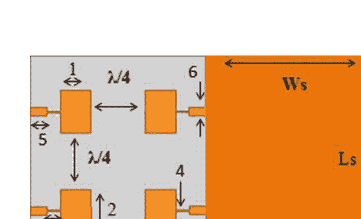

表1 CMA的尺寸

| 参数 | Ls | Ws | 1 | 2 |
|-------|----|----|---|---|
| 尺寸 (毫米) | 60 | 62.8 | 11.35 | 15.25 |
| 参数 | 3 | 4 | 5 | 6 |
| 尺寸 (毫米) | 4.9 | 0.5 | 6.15 | 3.06 |## 图2 CSRSDGS的几何形状

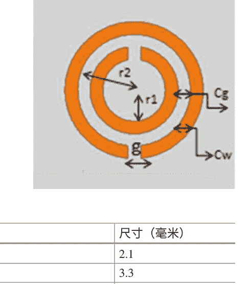

###### 表2 CSRSDGS的尺寸

| 参数 | 尺寸（毫米） |
| :--- | :--- |
| 内圆半径 r1 | 2.1 |
| 外圆半径 r2 | 3.3 |
| 圆环宽度Cw | 0.6 |
| 两个圆环之间的间距Cg | 0.6 |
| 分裂环间隙 g | 0.4 |

在这里，四个CSRSDGS正好位于CMA的矩形贴片下方，分割距离为 λ/4。图3显示了PMA的几何形状。对PMA进行了全面研究，实现了显著的尺寸缩小、宽带和互耦减小。

###### 图3 PMA的几何形状


###### 3 结果与讨论

在这项工作中，使用ANSYS HFSS 15.0电磁仿真软件设计了天线。传统的MIMO天线（CMA）在5.9 GHz处共振，带宽为204 MHz，共振频率处的回波损耗为−21.3 dB，如图4所示。

所提出的MIMO天线（PMA）在5.725 GHz处共振，带宽为265 MHz，最小回波损耗为−19.3 dB，如图5所示。因此，通过加载，四个CSRSDGS在地平面上抑制了不需要的表面波，并控制了PMA中的谐波，以增强带宽增强的参数，与CMA相比，还获得了虚拟尺寸缩小。因此，根据公式（1），计算了天线的虚拟尺寸缩小[4]。

$$\text{虚拟尺寸缩小 (\%)} = \left( \frac{L_C - L_{RA}}{L_C} \right) \times 100$$

其中，$L_{RA}$是参考（传统）天线的贴片长度，$L_C$是在该频率或降低的共振频率（提出的天线）上共振的天线的贴片长度。但是贴片的宽度在设计的共振频率和实际共振频率上是相同的。因此，通过使用CSRSDGS，提出的MIMO天线（PMA）获得了4.6%的虚拟尺寸缩小。

互耦合系数（MCC）是设计MIMO天线时需要考虑的一个重要因素，因为它会降低系统的性能。因此，传统的MIMO天线（CMA）在端口1和端口2之间的互耦合为−20.9 dB，频率为5.9 GHz，如图6所示，而提出的MIMO天线（PMA）在5.725 GHz时的互耦合非常低，即－22.42 dB，如图7所示。

###### 图5 PMA的回波损耗

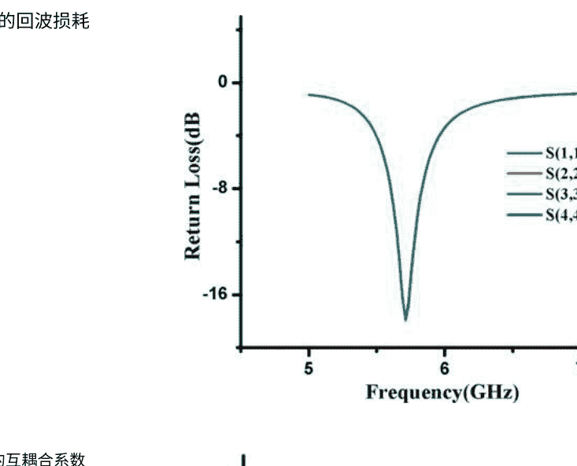

###### 图6 CMA的互耦合系数

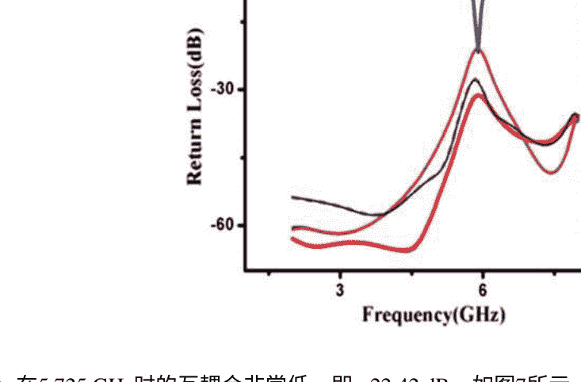

在包络相关系数（ECC）中，它决定了通信信道的隔离程度。可以从S参数[5]中估计出各个元素的ECC。因此，根据公式（2），CMA在5.9 GHz时实现了0.001的ECC，如图8所示，而PMA在5.725 GHz时实现了0.002的ECC，如图9所示。

$$\rho = \frac{|S_{11}^{*} S_{12} + S_{21}^{*} S_{22}|^{2}}{(1-|S_{11}|^{2}-|S_{21}|^{2})(1-|S_{22}|^{2}-|S_{12}|^{2})}$$ (2)

###### 图7 PMA的MCC

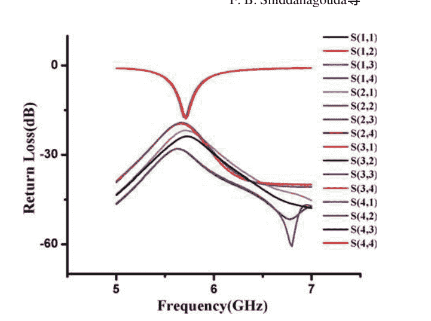

###### 图8 CMA的ECC

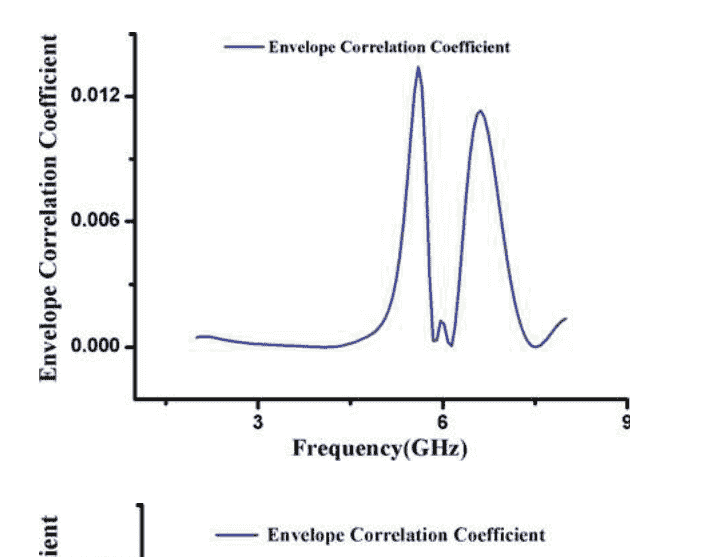

###### 图9 PMA的ECC

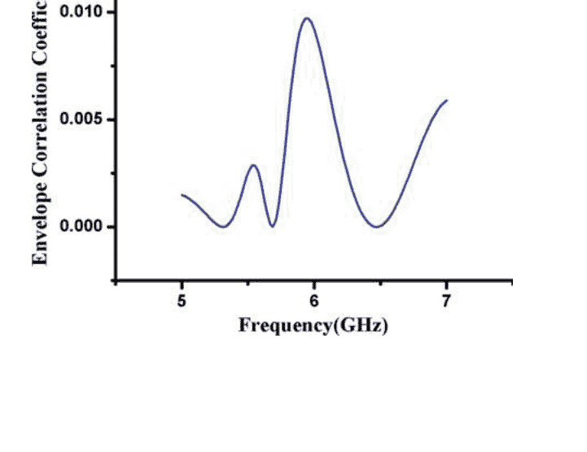

多输入多输出天线性能评估时必须考虑多样性增益这一关键参数。 使用ECC [6]，通过数学公式（3）计算得到多样性增益（DG）。CMA的多样性增益为9.9 dB，PMA的多样性增益也为9.9 dB。

$$DG = \sqrt[10]{(1 - |\rho|^2)}$$

因此，ECC和DG的值可以确认PMA适用于MIMO操作。

天线的峰值增益决定了覆盖范围和链路预算。系统。CMA峰值增益为6 GHz时为5.69 dB，如图10所示，PMA峰值增益为5.25 GHz时为4.65 dB，如图11所示。

辐射模式决定了天线如何传播电磁能量。辐射模式在CMA共振频率5.9 GHz处进行研究，如图12所示，为正对辐射。还研究了PMA辐射模式对应的共振频率点。5.725 GHz处的辐射模式为正对辐射，如图13所示。

从CMA和PMA获得的结果总结在表3中。观察到PMA参数显示在ISM频段应用中存在可接受的限制。

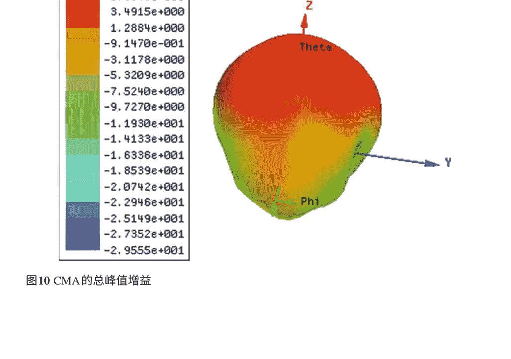

###### 图11 CMA的总峰值增益

- f=5.90(GHz), phi=0 (deg)
- f=5.90GHz), phi=90 (deg)

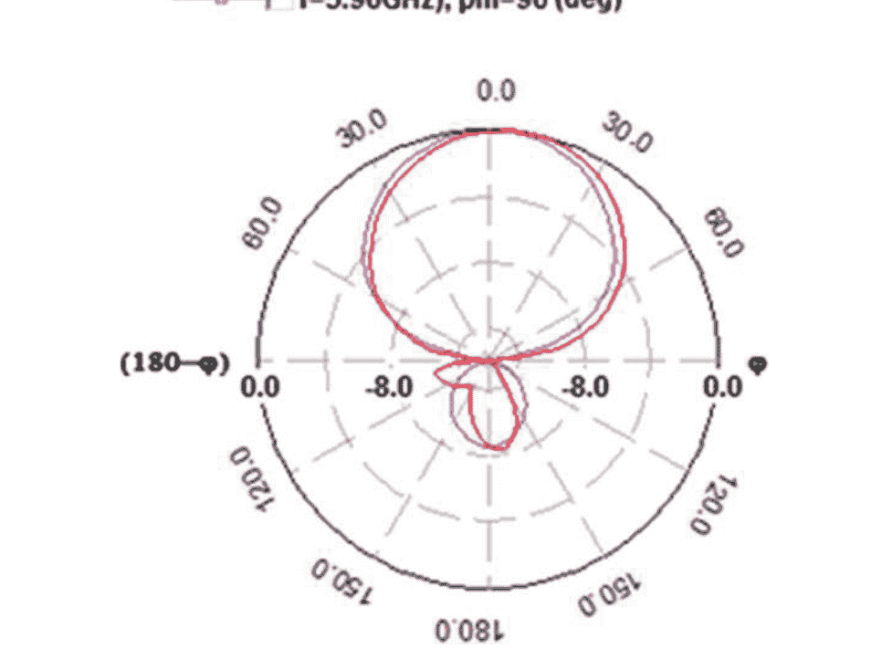

###### 图12 CMA的辐射图案

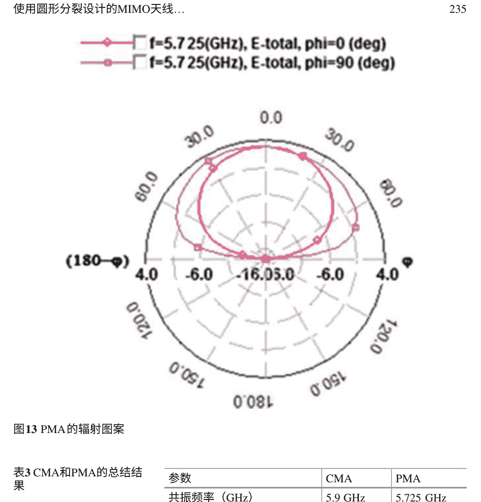

###### 图13 PMA的辐射图案

###### 表3 CMA和PMA的总结结果

| 参数 | CMA | PMA |
| :--- | :--- | :--- |
| 共振频率 (GHz) | 5.9 GHz | 5.725 GHz |
| 回波损耗 (dB) | -21.3 dB | -19.3 dB |
| 带宽 (MHz) | 204 MHz | 265 MHz |
| MCC (dB) | -20.9 dB | -22.42 dB |
| 总峰值增益 (dB) | 5.69 dB | 4.65 dB |
| 虚拟尺寸缩小 (%) | - | 4.6% |
| ECC | 0.001 | 0.002 |
| DG(dB) | 9.9 dB | 9.9 dB |

###### 4 结论

本文介绍了一种用于ISM频段应用的圆形分裂环槽缺陷接地结构的MIMO天线设计。所提出的MIMO天线（PMA）在5.725 GHz处共振。该天线提供265 MHz的带宽和4.65 dB的总峰值增益。由于接地平面采用了CSRSDGS单元单元，天线元件之间的耦合降低了超过-22.42 dB，同时获得了4.6%的虚拟尺寸缩小。所提出的MIMO天线、包络相关系数、多样性增益、总峰值增益和辐射图案表明它适用于ISM频段应用。

致谢我们要感谢印度理工学院卡拉格普尔分校和古尔巴加大学卡拉布拉吉提供的HFSS仿真软件的许可版本。

###### 参考文献

1.  Patel R, Desai A (2018) 使用缺陷地结构的电气小天线用于RFID、GPS和IEEE802.11 a/b/g/s应用。 J Prog Electromagn Res Lett 75:75–81
2.  Fizzah S, Abid M (2018) 设计和分析具有增强隔离性的UWB MIMO。 在：国际电气工程会议论文集
3.  Balanis A (1993) 天线理论。 IEEE Trans Antenna Propag AP-41(9)
4.  Shiddanagouda FB，Vani RM，Hunagund PV （2019） 设计和分析用于下一代无线应用的MIMO天线。 IEEE Explore 978-5386-7070-6/18/$31.0@2018IEEE
5.  Han MS，Choi J（2010） 紧凑型多频段MIMO天线用于下一代USB插头应用。 IEEE Trans Antenna Propag AP-2（10）
6.  Chi Y-J，Chen F-C（2012） 具有新型馈电网络的4端口四极化多样性天线。 在：2012年天线和传播会议论文集

##### Arduino IDE和Runlinc IDE的性能比较用于促进教育过程中的物联网STEM AI

Sangay Chedup, Dushantha Nalin K. Jayakody, Bevek Subba, 和Hassaan Hydher

摘要 提早让学生接触物联网（IoT）和人工智能（AI）技术的知识和技能将导致早期创新和发明。将这种技术引入到小学和中学学生中，对于更快、更早地发挥青少年的创造力具有重要意义。为了做到这一点，让他们接触友好和易用的技术非常重要。这最终将帮助他们认识到物联网和人工智能的潜力。本项目研究了两个平台Arduino IDE和runlinc IDE在用户友好性、物联网STEM AI应用开发的易用性方面。进行了基于系统模型的实验比较。微控制器和传感器是独立变量。所需的程序代码行数、开发程序代码所需的时间以及传感器控制的参数是依赖变量。用户体验调查用于补充实验结果。受访者包括小学和中学学生、大学生和教师、专业人士和研究人员。受访者大多有使用Arduino的经验

这项工作得到斯里兰卡技术校园通过响应性研究种子资助金的支持，资助金编号为RRSG/2020/B15。这是一个名为COVID-19在线托儿项目的合作项目：通过学习STEM人工智能和物联网技术吸引儿童，斯里兰卡技术校园（斯里兰卡）与吉格梅·南吉尔工程学院（不丹）之间的合作。

S. Chedup (📧) · B. Subba
不丹吉格梅·南吉尔工程学院，不丹皇家大学，德堂，不丹
e-mail: sangaychedup@jnec.edu.bt

B. Subba
e-mail: beveksubba@jnec.edu.bt

D. N. K. Jayakody
斯里兰卡技术校园工程学院电信中心，斯里兰卡帕杜卡e-mail: nalin.jayakody@ieee.org

H. Hydher
斯里兰卡技术校园，斯里兰卡帕杜卡
e-mail: hassaanh@sltc.ac.lk

和runlinc。 实验结果和调查都表明，runlinc易于实现物联网和人工智能应用开发，并且速度更快。

关键词物联网·人工智能·Arduino IDE·STEMSEL·Runlinc·教育

###### 1 引言

在第四次工业革命4.0（4IR）中生活，技术进步带来了创新和发明，使人类从中受益良多。
4IR的影响已经在许多方面感受到，并且随着不断增长的技术和社会经济演变，预计将进一步增长我们周围[1]。 但是，另一方面，4IR也被证明是一种破坏性技术，以至于世界领导人呼吁放弃它[2, 3]，因为特别是AI将加速人类在地球上的灭绝。 工业革命也导致了财富集中。 特别是AI已经加剧了去人性化的风险，以至于人类现在在环境和人道主义方面面临着存在威胁[3]。 与4IR相比，引领第五次工业革命5.0（5IR）技术和创新的最佳实践正在被5IR的倡导者们重新用于服务于人类[3]。 潮流正在改变，通过转变AI以利用其积极潜力，为人类的利益而战。 科学界致力于利用新兴技术的潜力，快速发展各个应用领域。

博士 乔治·兰德的创造力测试对NASA和类似的研究至今仍然相关[4-7]。 根据作者的观点[7-10]，早期接触技术的知识和技能对于培养创造性思维非常重要。 这最终将导致早期的创新和发明。 根据[8]的数据，只有大约28%的高中新生宣布对STEM相关领域感兴趣。 然而，57%的学生在高中毕业时对STEM领域失去了兴趣。 在寻找全球解决方案和促进其在教育各个层面上的影响的前景下，STEM素养的需求已经导致了STEM课程的开发[9]。 这有望通过协作和跨学科的方法来改变STEM教育，以准备未来的公民。 人们意识到了STEM教育的重要性，并采取了一些举措来提高教育水平，以满足高等教育中所需的STEM技能[10, 11]。 与[12]相比，Java语言在性能上更快，这在推动STEM和计算机科学教育方面起着重要作用。 为了促进基于项目的学习以寻找现实世界的解决方案，建议学校管理层在K12教育阶段鼓励STEM项目[13]。

这将对大学教育中提供的STEM课程数量产生更大的影响[13, 14]。 然而，如果这些技术早期引入，对新兴技术的更大影响的研究非常有限。 基于Arduino、Raspberry Pi微控制器等技术的STEM教育在高等教育、研究和专业应用中广泛存在。

在初高中教育中，尤其是在弱势社会中，几乎没有接触到这些技术。考虑到这种普遍情况和技术创新的前景，意识到、了解和认识到正确的工具的重要性。提供早期的知识和技能意味着发掘和释放青少年的创造力，从而早日将高等教育技能传达给基层。

为了实现人工智能和物联网在提高教育质量和将转型的STEM教育传达给基层的潜力，本文研究了两个基本的人工智能和物联网开发平台Arduino IDE和runlinc IDE。本研究旨在比较这两个平台的易用性、可访问性、用户友好性和开发人工智能和物联网应用的潜力，以便更好地理解和开发人工智能和物联网应用。对这两个平台的比较是基于作者在编码简易性、基于时间的性能和平台互动性方面进行的实验案例研究。进行了用户体验调查以确定实验结果。调查对象包括年龄在10-15岁之间的学生、大学生和具有第一手经验的专业人士。本研究分为以下几个部分：第2节通过文献综述概述了物联网和人工智能在提高教育质量方面的机遇和挑战。第3节介绍了通过实验设置进行的案例研究，其中考虑了基于人工智能和物联网的智能家居系统模型。第4节研究了用于人工智能和物联网应用开发的两个平台，即Arduino IDE用于Arduino和runlinc IDE用于STEMSEL，重点是编码和使用的简易性。第5节通过实验分析研究了这两个平台。第6节进一步分析了实验结果和调查收集的数据。第7节介绍了总体发现和潜在的未来工作。

###### 2 物联网和人工智能在教育中的重要性：机遇和挑战

物联网有潜力将280亿设备连接到互联网 [15]。此外，根据 [16]的数据，每秒有127个新的物联网设备连接到网络，并预计在2020年安装310亿个物联网设备。在所有这些物联网应用中，使用各种微芯片或微型计算机作为支撑。在[17]中，联合国教科文组织概述了人工智能在可持续发展中的应用、挑战和机遇。然而，联合国教科文组织的报告仅仅是对可持续发展中人工智能的前景的展望，迄今为止取得的成果很少。利用人工智能和物联网技术可以实现联合国可持续发展目标（UN SDGs），特别是在消除贫困、实现性别平衡和提高教育质量方面。[18]中的执行摘要概述了如何利用人工智能来改善学习成果，优先实现可持续发展目标4：为所有人提供公平和优质教育。参考文献[18]还概述了人工智能技术在优质教育方面面临的六个挑战。

其中主要挑战分为四个类别。 参考文献[19,20]研究了物联网在改变技术高等教育方面的积极影响前景。
此外，它指出物联网对高等教育的影响将更大，特别是在大学中。 智能教育概念在[21]中通过文献综述从理论角度进行了彻底分析。 通过整合发展实践技能和控制或操作日常生活中使用的设备的能力，概述了AI和物联网在使学习更具创造力和吸引力方面的研究机会。 Rajput [22]发现，尽管过去几年在技术进步方面取得了巨大进展，但由于某些原因，将技术纳入智能教室系统的进展一直被延迟。 在教学中利用现代新兴技术非常重要。 [22]中的作者进一步暗示了根据新兴技术改变教室环境的重要性，以确保教学变得更加互动。通过这些措施，学生应该能够识别问题并提出解决方案的想法。“物联网可以改革教育系统，考虑到许多好处，如积极参与，提高教学质量和效率”[22]。

在[20]中，对物联网在发展辅助技术方面的潜力进行了理论审查。Banica等人在[23]中得出结论，物联网的概念具有消除教育中的所有障碍的巨大潜力，如物理位置、地理、语言和经济发展。技术和教育的结合将导致更快、更简单的学习，提高知识水平和学生的质量。但是，就像任何新的概念一样，它仍然没有广泛的功能模型和标准；此外，大学还没有准备好接受物联网在教育领域提出的所有变革。为了实现物联网和人工智能的全部潜力，这些技术在小学和中学中的普及至关重要，而不仅仅是在高等教育和研究人员中。在教育的早期引入这些技术将更有潜力激发青年人的想象力和创造力，为可持续发展开发出更好的技术。尽管在新兴技术方面已经进行了大量研究，并且仍在继续进行，但对于年轻人来说，引入人工智能和物联网平台还是比较罕见的，尤其是对于处于不利地位的社会中的年轻人来说。STEM教育被认为是高中毕业生中更具要求和困难性的，这导致了报名人数的减少，而创造性、创新性和有才能的劳动力的需求却在增加[10]。在[9]中指出，中学教师对于改革STEM教育的态度比起早年和小学群体的积极回应更为消极。在[11]中研究了参与STEM教育、外展活动及其潜在影响的教职人员的激励措施。参考文献[24]确定了教育者在STEM教育概念方面缺乏软技能和正式培训的主要障碍。对STEM教育的更好理解、更好的教学方法和更多的帮助的需求已经被确定，并提供了推进STEM教育的建议[15]。此外，在[25–30]中，对物联网平台和应用进行了研究；然而，它对教育过程的影响并没有得到强调。

提供动手能力培养和实践学习，以激发创新和发明的想象力和创造力是非常重要的。通过让他们接触人工智能、物联网和其他新兴技术，并在他们的早期学习阶段提供平台，这是可能的。这将对实现联合国可持续发展目标，特别是教育质量和通过创业技能减贫，产生巨大的好处，这些技能是从转变科学技术工程数学（STEM）教育到STEM人工智能社会企业（SASB）中获得的。

文献[31]中的作者概述了物联网将影响社会的各个方面，特别是通过基于实践经验和实验为基础的方法改变教育机构和大学的学习环境。参考文献[32]提出了一种名为学习事物智能（IoLT）的教育学习机制，并得出结论：“物联网将对高等教育产生巨大影响，具有降低成本、节省时间、增强安全性和改善协作能力的潜力”。参考文献[33-39]讨论了人工智能在引领教育4.0中的创新道路中所起的关键作用。参考文献[33]进一步概述了教育4.0受物联网和工业4.0带来的其他新兴趋势的影响，意味着未来的就业市场将期望未来的工作者不仅具有知识，还要拥抱新兴技术。文献[36, 37, 39]中的作者概述了大学在为教育未来一代和应对工业革命4.0的创新方面发挥的关键作用。需要共同努力，使数字和数据素养对所有学生都更加可获得，无论学科如何。

然而，根据知识和参考资料，还没有对能更好地将物联网和人工智能技术推广到基层的平台进行研究。对将这些技术推广到K-12教育阶段的影响的研究也没有进行。因此，在众多平台中，将runlinc IDE平台与Arduino IDE平台进行比较，以期将物联网和人工智能技术推广到K-12教育阶段，并对早期创造性思维和创新的益处进行评估。

###### 3 系统模型：智能家居

在图1所示的较大规模基于物联网的智能家居的子集中，部署了三个基本传感器来收集四个不同的参数，以进行编码比较。选择智能家居模型主要是为了了解和体验家庭如何通过部署智能传感器来实现自动化和智能化。家庭设备也可以通过互联网远程控制，从而实现物联网的部署。部署的传感器可以检测环境条件。例如，光敏电阻器（LDR）可以在不同的天气条件下检测光强度。生成模拟数据，并设置阈值来控制LED/灯。

如果光的强度小于或等于阈值，则激活微控制器并打开LED/灯，反之亦然。另一方面，相同的数据在互联网上。通过互联网，程序代码是## 图1 系统模型

###### 表1 用于构建系统模型的外围设备

| 组件 | 功能/目的 |
|------|------------|
| LDR | 根据不同的照明条件，产生光强度的模拟数据 |
| 温度传感器（LM35） | 根据不同的环境/周围条件，产生温度的模拟数据 |
| 热敏电阻 | 根据不同的环境/周围条件，产生模拟数据 |
| 温度传感器（TEMP36） | 它在Tinkercad的虚拟模拟中用于执行与LM35和热敏电阻相同的功能 |
| 继电器 | 使用2继电器模块SRD-05 V Dc-SL-C来切换高功率灯 |
| 直流电动机 | 2针5V直流电动机根据传感器数据驱动风扇 |

发送到微控制器板。同时，远程设备（手机）上打开相同的网页，并通过互联网将输出设备（LED/灯）的控制操作发送到微控制器，从而远程打开或关闭LED/灯。这个过程也适用于系统模型中部署的其他传感器。智能传感器及其功能在表1中作为架构的一部分进行了描述。该模型仅由作者用于实验比较两个平台。

此外，为了确定作者的实验结果，还在Arduino和runlinc上进行了用户体验Google调查，并将其纳入了研究结果中。样本包括15岁以下的8名学生，15-25岁之间的67名大学生，以及25岁以上的教学和研究人员25名。

样本包括有经验的用户在两个平台上。回答者来自不丹、澳大利亚、马来西亚、乌干达、尼日利亚、喀麦隆和菲律宾。瀑布方法学在图2中被用来确保研究的关键阶段得到维护和履行。

###### 4 结果与讨论

###### 5 微控制器

###### 5.1 Arduino UNO和Arduino IDE

Arduino [27, 40, 41]是一个开源的电子平台，用于制作交互式项目。Arduino微控制器作为中央处理单元（CPU），通过整合许多传感器来感知环境。CPU将通过从许多传感器接收输入来激活外围输出设备，从而控制灯光、电机和其他执行器，从而影响其周围环境。Arduino编程环境是在常用的C/C++编码之间的方便抽象层，常用于编程微控制器。Arduino抽象层通过允许使用简化的IDE来编程微控制器而引起轰动。标准化的硬件和培育积极的开源社区为代码库的贡献简化了许多硬件外设（如传感器和电机）的使用。使用Arduino比直接编程微控制器更容易和更快。这种易用性使得许多学生、电子爱好者和编程爱好者能够学习和应用微控制器到广泛的应用领域，包括物联网和人工智能的前沿领域。Arduino距离直接编程微控制器只有一步之遥。然而，编程Arduino和直接编程ATMEGA 328 IC之间的差距相当大。

开源的Arduino软件（IDE）提供了编码和上传代码到板子的平台[35]。它在Windows，Mac OS X和Linux上兼容。在这个环境中编写的代码是用Java编写的，但也适用于基于processing和其他开源软件。这个IDE可以与任何Arduino板一起使用。在这个实验设置中使用Arduino UNO。需要单独安装兼容的ESP8266 Wi-Fi模块才能连接到互联网，以便用户可以在世界任何地方操作。它有8个引脚，其中2个引脚[42]是1个TXD和1个RXD，2个GPIO引脚，即GPIO 0和GPIO 2，复位，VCC和地。TX和RX是用于烧录嵌入式代码的发送器和接收器引脚。AMS1117将为ESP8266 Wi-Fi模块提供3.3V电源[36, 37]。

###### 5.2 STEMSEL和Runlinc IDE

Runlinc IDE是一个基于网页的人工智能和物联网应用开发平台。它在任何计算机浏览器上都可以运行（Windows、Mac、Chromebook、Linux、平板电脑或手机使用JavaScript块）。它支持科学技术工程数学社会企业学习（STEMSEL）微控制器。STEMSEL微芯片包括Wi-Fi微芯片，可以在网页中与Runlinc IDE进行接口连接。这个基于网页的工具为在物联网网络中部署的应用设备提供了巨大的远程控制潜力。STEMSEL Wi-Fi模块附带了STEMSEL微控制器。它有两个版本V.1.1和V.1.0，并且需要使用用户ID和密码runlinc1234进行网络设置，V.1.1需要使用相同用户名的密码Hartley2018，而V.1.0需要使用相同用户名的密码。一旦模块安装在STEMSEL套件上，用户可以通过USB插入连接到runlinc网页，无需单独安装。在runlinc上开发的物联网应用有两种方式——在互联网上和在设备芯片上运行。

###### 6 实施

在两个Arduino UNO和STEM-SEL上搭建电路时考虑了相同的参数。开发了用于控制输出设备（如LED、电机、风扇）的程序代码，该代码由输入模拟设备（如LDR、热敏电阻和LM35）生成的数据驱动。在Arduino IDE和runlinc IDE上开发了完整代码的编写时间以及使设备运行所需的代码行数，以进行分析。开发了将所有系统组件部署到构建所需系统模型的程序代码。记录了所需的时间和代码行数。不考虑在两个平台上构建物理电路的时间比较，因为注意到所需的时间几乎相同。在图3和图4中进行了实验安排、结果和观察。实验的整体结果和观察结果在表2中表示。

| Circuit Component | Arduino UNO, Bulb | STEMSEL, Bulb |
|-------------------|-------------------|---------------|
| Description | A basic experiment is setup to develop a program code to put LED/Lamp ON/OFF. Simultaneously number of lines of code and time taken is recorded. |  |
| Circuit Connection | Arduino UNO circuit image | STEMSEL circuit image |
| Number of lines of code | 10 | 3 |

图3 实验1—使用Arduino UNO和STEMSEL控制LED/灯

| Circuit Component | Arduino UNO, Bulb, LDR | STEMSEL, Bulb, LDR |
|-------------------|------------------------|---------------------|
| Description | The experiment is setup to develop a program code to automate LED ON/OFF using LDR sensor. The number of lines of code and time taken is recorded accordingly. |  |
| Circuit Connection | Arduino UNO with LDR circuit image | STEMSEL with LDR circuit image |
| Number of lines of code | 21 | 5 |

图4 实验2—使用Arduino UNO和STEMSEL从传感器输入控制LED/灯

###### 表2 实验设置的整体结果和观察

| 序号 | 执行的任务 | STEMSEL 代码行数 | Arduino 代码行数 | STEMSEL 所需时间 | Arduino 所需时间 | 备注 |
|------|------------|------------------|------------------|------------------|------------------|------|
| 1. | 打开和关闭LED | 3 | 10 | <1分钟 | >2分钟 |  |
| 2. | 使用光敏电阻器控制LED（使用if else条件） | 5 | 21 | <2分钟 | >5分钟 |  |
| 3. | 使用热敏电阻器感知周围温度并打开风扇 | 6 | 16 | <3分钟 | <5分钟 |  |
| 4. | 使用热敏电阻器和光敏电阻器控制电机和LED | 12 | 21 | <4分钟 | <10分钟 |  |
| 5. | 使用LM35温度传感器打开风扇 | 4 | 24 | <2分钟 | >1小时 | 错误校正需要更长时间 |
| 6. | 将所有传感器合并到一个系统模型中（LDR, LM35） | 13 | 36 | <7分钟 | >30分钟 | 没有错误检查 |
| 7. | 在网页上创建开关按钮 | 2 | 63 [36] | <2分钟 | >2小时 | 时间大约-考虑到冗长的代码，可能需要更长时间 |
| 8. | 直流电机控制 | 1 | 12 | <1分钟 | <5分钟 |  |

两个平台Arduino和runlinc之间的基本区别- Arduino在计算机上编程，而后者在网页/互联网上编程。为了确保更好的结果，考虑相同的参数以保持相同的标准。在比较中不考虑构建物理或虚拟电路所需的时间和复杂性。根据表5的实验结果，runlinc实现相同结果所需的代码行数非常少。随着程序复杂性的增加，系统中所包含的参数，所需的代码行数几乎呈指数增长。在引入物联网概念时，代码行数和所需时间的增长更加剧烈。另一方面，在runlnc上创建一个开/关按钮只需要2行代码，而在Arduino上需要更多。在Arduino IDE中创建Web服务器需要64行代码来创建一个开/关按钮[43]。调查结果的分析以图形表示在图5、6、7、8、9、10、11、12、13和14中呈现。样本主要由大学生组成，如图5和6所示，他们对指定平台的使用具有相对较好的经验。

发现大部分大学生对人工智能和物联网应用有很好的了解，这些应用基本上是使用其中一个平台开发的，如图7和8所示。还发现样本中的大部分人在Arduino和runlnc上进行人工智能和物联网项目/研究方面有更好的经验。进一步分析发现，与Arduino相比，用户在runlnc上进行人工智能和物联网项目的经验更好，尤其是对于初学者，如图8所示。

###### 7 结论和未来工作

在比较Arduino IDE和runlnc IDE平台的易理解性、交互性和程序代码复杂性方面，后者提供了更简单的选择。由于Runlnc是基于网页开发的，理解和实现人工智能和物联网更加容易、更快。在演示方面也发现更容易。由于它可以在互联网上和芯片上控制设备，因此可以更轻松有效地教授初学者人工智能和物联网技术。另一方面，尽管Arduino有大量的开源资源可用，并支持不同版本的Arduino微控制器，但冗长、复杂和费力的程序代码对于初学者来说仍然具有挑战性。runlinc IDE和STEMSEL的几个突出特点是它们能够用一行代码创建声音、视觉和运动，并用两行代码在网页上构建开关来远程控制任何设备。考虑到其简单性、更快速和较少的编码工作，它为在小学到大学中实现人工智能和物联网的巨大潜力提供了良好的替代方案。未来的研究可以关注这些技术如何将STEM教育转变为教育工具，用于教授物联网和人工智能技术。考虑到执行所需的时间较少，它还可以用于开发流行病情况下的智能系统。这也具有在人工智能和物联网方面进行高端研究的潜力。

致谢 作者们要感谢澳大利亚阿德莱德的STEMSEL基金会技术总监Miroslav Kostecki博士，在运行IDE和STEMSEL的能力发展方面通过几次Skype会议的工作坊和演示给予我们的帮助。作者们还要感谢Michael Cheich先生通过分享由美国电子编程学院提供的Arduino学习资源来持续支持我们的Arduino学习。

###### 参考文献

+   1. Morrar RA, Saeed HA (2017) 第四次工业革命（Industry 4.0）：社会创新的视角。 Technol Innov Manage Rev 7(11):12–20
2. Yunus M (2018) Yunus警告人工智能对生存的威胁。经济时报。https://www.thequint.com/news/hot-news/yunus-warns-of-survival-threat-from-artificial-intelligence。访问日期：2020年3月9日
3. Gauri P (2019) 第五次工业革命及其重要性. 世界经济论坛. https://europeansting.com/2019/05/16/what-the-fifth-industrial-revolution-is-and-why-it-matters/. 2020年9月12日访问
4. Venkatraman R (2020) 你现在的创造力比小时候少96%. 这是如何扭转的，你可能无法再变成一个孩子，但你可以像一个孩子一样思考。INC. 2020年5月23日访问
5. 创造力的浪费. George Land的创造力测试. 在: LIFE, 2015年1月16日. 2020年5月24日访问
6. Land G. 证据表明儿童随着时间的推移变得不太有创造力（以及如何修复）。在: TED talk. 2020年5月23日访问
7. Robinson K (2006) 学校是否扼杀了创造力？ TED值得传播的思想
8. Bues D (2019) STEM教育：如何最好地点亮学习之灯。在：2019年IEEE综合STEM教育会议（ISEC）。IEEE
9. Francis K等（2018）形成和转变STEM教师教育：对开创性STEM教育的后续。在：2018年IEEE全球工程教育会议（EDUCON）。IEEE
10. Vasiiu R, Andone D (2019) 分析和行动以提高STEM高等教育的质量。在：2019年IEEE综合STEM教育会议（ISEC）。IEEE
11. Miorelli J等（2015）改善教师对STEM教育的感知和参与。在：2015年IEEE教育前沿会议（FIE）。IEEE
12. Huang A (2015) 编程表现的比较：促进STEM和计算机科学教育。在：2015年IEEE综合STEM教育会议。IEEE
13. Forawi S (2018) 科学、技术、工程和数学（STEM）教育：有意义的学习环境和框架。在：2018年国际计算机、控制、电气和电子工程会议（ICCC EEE）。IEEE
14. Thibaut L等（2018年）教师态度和学校环境对综合STEM教育中的教学实践的影响。教师教育71（2018）：190-205
15. 高盛（2014年）物联网：理解下一个巨大趋势，第201卷
16. Maayan D (2020年) 2020年物联网概述：统计数据，风险和解决方案。今日安全。访问日期：2020年4月8日
17. 联合国教科文组织。人工智能与可持续发展：联合国科学和工程项目的挑战和机遇。人工智能原则走向人文主义方法？
18. Pedro F等（2019年）教育中的人工智能：可持续发展的挑战和机遇
19. Aldowah H等（2017年）高等教育中的物联网：未来学习研究。J Phys: Conf Seri 892(1) (IOP Publishing)
20. Hollier S, Abou-Zahra S (2018) 物联网作为辅助技术：在高等教育中的潜在应用。在：可访问物联网的会议论文集，第1-4页
21. Martín AC等（2019）智能教育：回顾与未来研究方向。MultidiscDigit Publ Inst Proc 31(1)
22. Rajput M (2020) 物联网在教育领域的应用及其优势。IoT for all, 2019年12月31日。访问日期：2020年3月9日
23. Banica L等（2017）物联网对高等教育的影响。Sci Bull-Econ Sc 16(1):53–59
24. Goodwin M等（2017）应对STEM教育的主要障碍的策略。在：2017年IEEE综合STEM教育会议（ISEC）。IEEE- 25. Ray Partha Pratim (2016) 物联网云平台调查。Future Comput Inf J 1(1–2):35–46
- 26. Ganguly P (2016) 选择正确的物联网云平台。在：2016年国际物联网和应用会议（IOT A）。IEEE
- 27. Novák M等 (2018) 在教学编程中使用Arduino平台。在：2018年信息技术在工程教育中的国际会议 (Informatics)。IEEE
- 28. Singh KJ，Kapoor DS (2017) 创建自己的物联网：物联网平台调查。IEEE消费电子杂志6 (2) 57-68
- 29. Pflanzner T，Kertész A (2018) 物联网云应用的分类和调查。EAI认可的物联网事务3 (12) (Terjedelem-14)
- 30. Tayeb S等 (2017) 物联网通信和计算框架调查：工业视角。在：2017年IEEE第七届年度计算和通信研讨会和会议 (CCWC)。IEEE
- 31. Sruthi M, Kavitha BR (2016) 对物联网平台的调查。Int J Sci Res Mod Educ (IJSRME). ISSN (在线) 2455-5630
- 32. Satu MS等 (2018年) : IoLT: 基于物联网的高等教育协作混合学习平台。在：2018年创新工程与技术国际会议 (ICIET)。IEEE
- 33. Ciolacu MI等 (2019年) : 教育4.0——在高等教育中利用物联网进行创新。在：2019年IEEE第25届电子封装设计与技术国际研讨会 (SIITME)。IEEE
- 34. Ciolacu MI, Binder L, Popp H (2019年) : 利用可穿戴设备和人工智能实现教育4.0中的物联网。在：2019年IEEE第25届电子封装设计与技术国际研讨会 (SIITME)。克卢日-纳波卡，罗马尼亚，第17-24页
- 35. Sani RM (2019年) : 采用物联网技术进行高等教育。在：为工业4.0重新设计高等教育倡议。IGI Global，第23-40页
- 36. Duke University (2019) The impact of industry 4.0 on education. Accessed March 16, 2020.
- 37. Hurtuk J等 (2017年) 与教育过程相连的Arduino平台。在：2017年IEEE第21届智能工程系统国际会议 (INES)。IEEE
- 38. Herger ML，Bodarky M (2015年) 利用开源技术和Arduino吸引学生。在：2015年IEEE集成STEM教育会议。IEEE
- 39. Yoo W, Pattaparla SR, Sameer AS (2016年) 计算机教育学院的课程开发，以提高高中学生对计算机的兴趣。在：2016年IEEE集成STEM教育会议 (ISEC)。IEEE
- 40. Gandhi PL, Himanshu SM。基于智能手机FPGA的气球负载使用COTS组件。内存32.72K字节：8K字节
- 41. Shlibek M, Mhereeg M (2019年) 基于Arduino的无线和有线方法在电力盗窃检测中的比较。欧洲工程科学技术杂志2 (4) : 45-59
- 42. Srivastava P等 (2018年) 基于IOT的混合能源系统控制使用ESP8266。在：2018年IEEMA工程师无限会议 (eTechNxT)。IEEE
- 43. Santos R (2020) 使用Arduino IDE的ESP8266网络服务器。在：Bench test Arduino server 2 LEDs pc1.pdf，网络。2020年3月17日

##### 使用数值电磁技术分析小型环形天线

R. Seetharaman和Chaitanya Krishna Chevula

摘要麦克斯韦方程以时间依赖性为条件和角频率为工具，在电磁学的许多领域中具有应用价值。 麦克斯韦方程的相量和积分形式有助于以轮廓表示的表面积和体积测量。 本文重点研究了一个谐振较小的环形天线的改进方面，这是磁化的特性。 具有平面波固有属性的电场特征在表面内的所有方向上都很重要，用于分析该环形天线的各种参数。 布置在表面上的边界条件是解决问题的重要部分。 问题从直接性和现有辐射图案的初始值开始。 有限元方法在这个小型环形天线上的应用是本文的主题。 通过分配三角形网格和截断方案，可以解决表面区域上的计算域问题。 进一步将共轭梯度法应用于表面上的元素，将展示环形天线的改进性能。

关键词时变的麦克斯韦方程·小环天线·有限元网格·共轭梯度法

###### 1 引言

时变的积分方程在一个融合意义上形成了原始的麦克斯韦方程。 研究这个方程的核心部分在于以谐波变化的场域表示的频域。 使这种情况发生的频率被称为

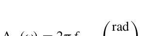

| 频率 Hz | A_{F}(ω)弧度/秒^{-1} | 波长 (m) | D_{S_i}(P)_{λ(m)} |
| --- | --- | --- | --- |
| 电力线 | 376 | 5 × 10^6 | 5 × 10^5 |
| AM低频 | 6.28 × 10^6 | 300 | 30 |
| FM高频 | 6.28 × 10^8 | 3 | 0.3 |
| 微波频率 | 6.28 × 10^10 | 0.03 | 0.003 |

其中 A_{F}(ω)被称为角频率。表1展示了将 A_{F}(ω)应用于功率辐射必须无限小且缓慢变化的系统。这是通过将 A_{F}(ω)固定为 2πc/D_{S_i}(P)来实现的，其中 D_{S_i}(P)是系统的维度。与系统相关的场通常更接近于系统本身。因此，问题出现在近场环境中。

在电力线的表1中，我们将系统的尺寸设定为300英里。AM_{lf}代表幅度调制射频波的低频范围。FMh f 代表频率调制波的高频范围，而M[μ]_{f}代表微波的大频率范围。

时间谐波和时间相关电场之间的关系由以下给出

$$E_h(x_{h_r}, y_{h_r}, z_{h_r}; t) = \text{Re}[E_t(x_t, y_t, z_t)e^{j A_F(\omega)t}]$$ (2)

在方程（2）中，左边可以分量方式写成

$$\hat{x} E_{x_{t0}} \cos(A_F(\omega)t + \phi_x) + \hat{y} E_{y_{t0}} \cos(A_F(\omega)t + \phi_y) + \hat{z} E_{x_{t0}} \cos(A_F(\omega)t + \phi_z)$$ (2a)

在方程(2)和(2a)中 j= √ −1. 在方程(2)和(2a)之后，电场的电场矢量表示可以写成

$$E_{\angle\phi}(x_{\angle\phi}, y_{\angle\phi}, z_{\angle\phi}) = \hat{x} E_{x_{t0}} e^{j\phi_x} + \hat{y} E_{y_{t0}} e^{j\phi_y} + \hat{z} E_{z_{t0}} e^{j\phi_z}$$ (3)

在方程(3)中，E_{\angle\phi}被称为电场矢量。尝试将 E_{\angle\phi} 引入时变的麦克斯韦方程得到

$$\begin{cases} \nabla \times H = J + j A_F(\omega) \varepsilon E \ \nabla \times E = -M - j A_F(\omega) \mu H \ \nabla \cdot (\mu H) = \rho_m \ \nabla \cdot (\varepsilon E) = \rho \end{cases}$$ (4)

其中 E是电场强度 V/m，H是磁场强度 A/m，J是电流密度 A/m²，M是磁流密度 V/m²。

方程（4）具有标量量的电荷相量，表示为 ρ其中 ρ是电荷密度，以 C/m² 表示，ρ_m是磁荷密度，以 Wb 表示 /m³。方程（4）的最后两个方程有助于将麦克斯韦方程写成相量形式

```
∇ × H_∠φ = J_i + j A_F(ω) ε E_∠φ
∇ × E_∠φ = -M_i - j A_F(ω) μ H_∠φ
∇ · (μ H_∠φ) = - (∇ · M_i∠φ) / j A_F(ω)
∇ · (ε E_∠φ) = - (∇ · J_i∠φ) / j A_F(ω)
```

其中 ε = ε₀εᵣ。

在这里，ε₀代表自由空间介电常数8.854 × 10⁻¹² F /m，而 εᵣ代表介质的相对介电常数。

```
μ = μ₀μᵣ
```

在这里，μ₀代表自由空间磁导率4π × 10⁻⁷ H/m，而 μᵣ 代表介质的相对磁导率。

方程（5）中的下标 i 表示激励电流。方程（5）导出了麦克斯韦方程的积分形式

```
∮_{C_B} H_∠φ · dI = ∬_{S_C} (J_i + j A_F(ω) ε E_∠φ) · dS
∫_{C_B} E_∠φ · dI = - ∬_{S_C} (M_i + j A_F(ω) μ H_∠φ) · dS
∬_{S_V} μ · H_∠φ · dS = - ∭_{V_{eS}} \frac{∇ · M_i∠φ}{j A_F(ω)} dV = ∭_{V_{eS}} ρ_{m∠φ} · dV
∬_{S_V} ε · E_∠φ · dS = - ∭_{V_{eS}} \frac{∇ · J_i∠φ}{j A_F(ω)} dV = ∭_{V_{eS}} ρ_{∠φ} · dV
```

其中，C_B表示轮廓的边界，S C表示轮廓所围成的表面，S_V表示体积的表面，V_{eS}表示所围表面的体积。在方程（6）中，所有积分都是在闭合表面上进行的。

###### 2 环形天线

电场在原点处的存在可以写成平面波的积分波

```
$$
\vec{E}_{P_{w}\angle\Theta}(\vec{x}) = \iint_{4\pi} \vec{F}_{P_{w}\angle\Theta}(\Omega) e\left(i\vec{k} \cdot \vec{x}\right) d\Omega
$$
```

其中  $\vec{E}_{P_{w}\angle\Theta}(\vec{x})$ 是在 $\vec{x}$ 处的电场，考虑了域中所有实角度 ,

$\Omega$是考虑了俯仰角和方位角的立体角，

$e\left(i\vec{k} \cdot \vec{x}\right)$ 是平面波的表示。

在方程(7)中， $d\Omega$被定义为 $d\Omega = \sin \xi d\xi d\theta$ ，波数 $\vec{k}$ 由下式给出

```
$$
\vec{k} = -k\left(\hat{x} \sin \xi \cos \theta + \hat{y} \sin \xi \sin \theta + \hat{z} \cos \xi\right)
$$
```

从几何上讲，方程（7）中的电场现在可以写成

```
$$
\vec{E}_{P_{w}\angle\Theta}(\hat{r}) = \int_{0}^{2 \pi} \int_{0}^{\pi} \vec{F}_{P_{w}\angle\Theta}(\xi, \theta) e\left(i\vec{k} \cdot \hat{r}\right) \sin \xi d\xi d\theta
$$
```

方程（7）包含角谱分量 $\vec{F}_{P_{w \angle\Theta}}(\Omega)$ 这可以表示为

```
$$
\vec{F}_{P_{w}\angle\Theta}(\Omega) = \hat{\xi} F_{\xi P_{w}\Theta}(\Omega) + \hat{\theta} F_{\theta P_{w}\Theta}(\Omega)
$$
```

其中 $\hat{\xi}$ 和 $\hat{\theta}$ 在向量意义上是正交的，并且与 $\vec{k}$ 也是正交的。量 $\vec{F}_{\xi P_{w\Theta}}$ 和 $\vec{F}_{\theta P_{w\Theta}}$ 是复杂的，并且可以分别写成

```
$$
\vec{F}_{\xi P_{w \Theta}}(\Omega) = \mathcal{F}_{\xi r_{P_{w \Theta}}}(\Omega) + i \vec{F}_{\xi i_{P_{w \Theta}}}(\Omega)
$$
```

```
$$
\vec{F}_{\theta P_{w \Theta}}(\Omega) = \mathcal{F}_{\theta r_{P_{w \Theta}}}(\Omega) + i \vec{F}_{\theta i_{P_{w \Theta}}}(\Omega)
$$
```

在一段时间内表面上平均耗散的功率是

```
$$
\vec{P}_{\mathrm{d}} = \oint_{S_{\mathrm{en}}} \operatorname{Re}\left(\vec{E} \times \vec{H}\right) \cdot \hat{n} d S
$$
```

可以进一步简化为

```
\vec{P}_{\mathrm{d}t}=\oint_{S_{\mathrm{en}}} \operatorname{Re}\left[(\hat{n} \times \vec{E}) \cdot \vec{H}\right] \mathrm{d} S \quad (10a)
```

在方程（10）和（10a）中， $S_{\mathrm{en}}$ 是封闭表面，而 $\mathrm{d} S$ 是元表面。在表面 $S$ 受到所需边界条件的约束下，我们有

```
\hat{n} \times \vec{E} \cong \zeta \vec{H} \quad (11)
```

方程（11）适用于表面S。电场强度的拉普拉斯可以写成

```
\nabla^{2} \vec{E}=\hat{x} \nabla^{2} E_{x}+\hat{y} \nabla^{2} E_{y}+\hat{z} \nabla^{2} E_{z} \quad (12)
```

在这些情况下，角频率也可以写成

```
\omega =\frac{\vec{E}}{\sqrt{\mu \varepsilon}} \quad (13)
```

其中 $\vec{E}$ 是电场的特征值。在方程（11）中，量 $\zeta$ 被定义为

```
\zeta =\sqrt{\frac{\omega \mu_{0}}{i \sigma_{s}}} \quad (14)
```

其中 $\sigma_{s}$ 表示表面的电导率。图1说明了如何设计一个用于实际目的的环形天线。在这里，天线沿着 $z$ 轴居中，并位于 $x y$ 平面上。这个天线具有预定义值的定向性 $D$。电流流动的方向沿着环的表面指示。环形天线的长度由因子 $l$ 表示。通常，环形天线的 $l$ 是以波长为单位定义的。

电场和磁场分别沿着各自的方向麦克斯韦的旋度方程是

```
\nabla \times \vec{E}=i \omega \vec{B} \quad (15)
```

其中 $\vec{B}$ 是磁通密度（以特斯拉为单位）。根据方程（7）和（15），我们可以写成

图1小型环形天线的示意图

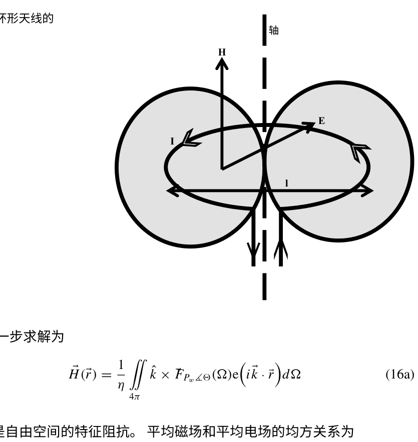

可以进一步求解为

```
$$ \vec{H}(\vec{r}) = \frac{1}{\eta} \iint_{4\pi} \hat{k} \times \vec{F}_{P_{w}\angle\Theta}(\Omega)\mathrm{e}\left(i\vec{k} \cdot \vec{r}\right) d\Omega \qquad (16\text{a})$$
```

其中 $\eta$是自由空间的特征阻抗。 平均磁场和平均电场的均方关系为

```
$$ \left\langle\left|\vec{H}_{m s_{q}}\left(\vec{r}_{1}\right)\right|^{2}\right\rangle = \frac{\left\langle\left|\vec{E}_{m s_{q}}\left(\vec{r}_{2}\right)\right|^{2}\right\rangle}{\eta^{2}} \qquad (17) $$
```

方向性由以下定义

```
$$ D_{r} = \frac{4\pi P_{E}(\theta, \phi)}{\sum P_{E}(\theta, \phi) d\Omega} \qquad (18) $$
```

其中 $P_{E}(\theta, \phi)$是向仰角和方位角发射的功率，$\sum P_{E}(\theta, \phi)$是系统发射的总功率。 在特殊情况下，我们有

```
$$ D_{r}(\theta, \phi) = \frac{4\pi}{\lambda^{2}} A_{p}(\theta, \phi) \qquad (19) $$
```

图2展示了方位角和仰角应用于小型环形天线

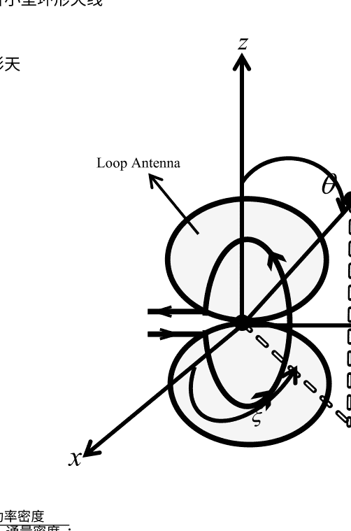

其中 \(A_{p}(\theta, \phi) = \frac{功率密度}{通量密度}\)。

图2通过将小环天线放置在z轴上的中心位置，并以 \((\xi, \theta)\) 的角度视角放置在xy平面上，给出了物理解释。这给出了接收方程（20）的分量处理方式。

```
$$\left\{\begin{array}{l} C_{\theta} = \frac{i A_{F}(\omega) \mu A_{l} \sin \xi}{2 \eta R_{r}} \ C_{\xi} = 0 \end{array}\right.$$
(20)
```

其中，
$A_{l}$表示环的面积，
$C_{\theta}$表示仰角的分量，
$C_{\xi}$表示方位角的分量，
$R_{r}$表示环的辐射电阻。

由于磁场的方位分量与环的中心轴正交，我们有 $C_{\xi} =0$。这也是因为电场的仰角分量与位于xy平面上的导电环正交。

确定 $C_{\theta}$ 取决于通过环路的磁通量，通过 $-(i\omega)$ 来确定的感应电压以及通过辐射电阻来确定的感应电流。辐射电阻由以下公式给出$$ R_r = \frac{2\pi\eta}{3} \left( \frac{k A_l}{\lambda} \right)^2 $$

极化因子由以下公式给出

$$ P_{lr} = \frac{\vec{E}_{P_{w}\angle\Theta}(\vec{r})\omega^2\mu^2 A_l}{12\eta^2 R_r} $$

###### 3 有限元网格

图3展示了将三角网格应用于此问题中的小环形天线的思想。每个单元球由三角网格排列组成。选择三角网格是为了使计算任务更加简单。为了使这个小环形天线的性能更好，采用了有限元网格方法。

由于三角网格的快速处理，可以完成复杂的任务，因为该问题涉及到3D和2D两种情况。它形成了在计算域内解决的基函数。这得益于有限元方法相比其他技术需要更少的内存，并且可以在不改变形状的情况下对几何形状进行处理。

在所有带有环形天线的单位球中存在场和场模式。这定义了计算域。将该域划分为具有相关边界条件的较小域，为有限元方法的下一组应用铺平道路。

图3网格应用于环形天线


有限元方法（FEM）。这个区域不仅标记了场，还有需要找到场的区域。

$$ A_{S_M^0 S_M}^{\phantom{0}}\left(\vec{E}_{P_w\angle\Theta}(\vec{r}), H(\vec{r})\right)\left(\{\Upsilon_{E,H}\}\right) = K_{\text{BC}} $$ (23)

其中 $A_{S_M^0 S_M}^{\phantom{0}}$ 表示具有较少非零元素的对称矩阵，$\Upsilon_{E,H}$表示场模式的特性，$K_{\text{BC}}$基于边界条件进行布置。

$A_{S^0}^{\phantom{0}}$的独特方面 $S_M$ 矩阵的稀疏性质有助于子域内元素之间的相互作用。然后，它揭示了它们之间的关系。$\Upsilon_{E, H}$会提供用于找到解的变量。这必须在由 $K_{BC}$给出的边界条件的限制下解决。

计算域的离散化是FEM的关键部分。域中的网格是以波长的一部分来定义的。权重成为通常构建为一系列扩展函数的网格元素的一部分。这有助于解决形状功能。一般来说，FEM中需要确定的未知参数的数量取决于这个扩展函数和解决FEM所需的内存。

###### 4 方法论

$E_{\phi}$有助于获得表面上的电场值，而Maxwell的相量方程的相应电磁分量有助于得出材料的表面积和体积的结果。$\vec{E}_{P_{w}\angle\Theta}(\vec{r})$给出了环形天线上的电场平面波分量。然后，$\vec{E} \ \& \ \vec{H}$可以通过一个固定角度来计算。

$P_{\text{dr}}$给出了特定区域上可用的功率。通过计算小环形天线的定向性方面，可以解决这个问题。对于 $\vec{E} \ \& \ \vec{H}$的分量结果成为计算的下一部分。通过这些可用参数，环形天线的极化因子由 $P_{\text{li}}$给出。这些参数将提供此问题的数据。

通过共轭梯度法来最小化网格是关键的一部分。共轭梯度法还需要 $A_{S_M^0 S_M}^{\phantom{0}}$ 它必须是正定的。

最初，通过设置来解决这个问题

$$ A_{S_M^0 S_M}^{\phantom{0}}\left(\vec{E}_{P_w\angle\Theta}(\vec{r}), H(\vec{r})\right)\left(\{\Upsilon_{E,H}\}\right) - K_{BC} = \Theta_{\Upsilon_{E,H}} $$ (24)

共轭梯度通过设置(24)来解决

$$ \Theta_{\Upsilon_{E,H}} = \Theta^{\text{最小化}}_{\Upsilon_{E,H}} $$ (25)

方程(25)说明方程(24)通过最小化过程得到解决。这将问题提升到了新的水平

$$ \nabla\Theta^{\text{最小化}}_{\Upsilon_{E,H}} = 0 $$ (26)

方程(26)通过循环的连续迭代来解决问题，通过在每次迭代中以图形方式获取方向向量的值，并将新的最小化值分配给\(\Upsilon_{E,H}\) during each iteration with the assistance of coefficients to directional vector. 通过在方程(24)的整个向量空间上运行 \(N\) number of iterations的累积努力，将得到 \(\Theta_{\Upsilon_{E,H}}\) 的最小化值。通过在整个计算机域上运行的截断方案，将为通信系统中的小型天线形状确定最终结果。

###### 5 天线-梯度方法

拓扑导数是梯度方法之一，用于获取图像的切片部分。高频波可以通过Strum Liouville算子进行微调，该算子是一个微分算子，用于空间大气中的操作。弱导数和分布导数方法用于获取医学图像的展开结果。超声成像设备中使用的压电材料也可以用于天线设计。

扩散算子也可以用于梯度解决方案。智能天线在射频应用的短距离通信中使用[1]。短天线也可以用于中频范围内的幅度调制波广播[2]。短脉冲天线，一种短天线的类型用于使用球面波分析源的辐射[3]。

锥形螺旋天线，另一种短天线类型不仅可以用于通信目的，还可以用于成像目的[4]。可以更准确地计算小环形天线的近区磁场。这个磁场可以用作校准其他场强计的参考[5]。通过考虑极化因子来计算相同的值[6]。

在3-10 MHz范围内分析小环形天线形成一个有趣的研究对象[7]。小环形天线也可以用作探测器研究磁场[8]。当小环形天线由超导体制成时，研究其辐射效率非常有趣[9]。利用环形天线进行极化多样性研究形成了环形天线的一个引人入胜的应用[10]。

###### 6 结论和讨论

麦克斯韦方程的相量形式、积分形式和平面波电场分量都被考虑在内，以改善小环天线在方向性、功率辐射等方面的性能，借助于 I-V角度。

进一步处理有限元方法和共轭梯度方法有助于实现小环天线的卓越性能。矩阵方法有助于解决小环天线的设计要素，并可用于其他类型的天线。电场以相位形式表示，用于解决问题的其余部分。考虑到时变的麦克斯韦方程的相量形式，用于应用于电磁辐射材料。麦克斯韦方程的积分形式给出了计算辐射环形天线的表面积和体积所需的结果。电场的平面波分量、方向性和极化因子进一步有助于分析小环天线的性能。为改善环形天线的性能，分配正对称线性矩阵方程是这个问题的亮点。有限元方法应用于天线的形状，同时处理小环天线的拓扑结构。共轭梯度方法有助于解决改进的小天线设计问题。

###### 参考文献

1. Mikko S, Pekka KV (2009) 一种控制近场通信电路中多种短距离天线的装置和方法。美国专利号7,541,930 B2
2. Trainotti V (2001) 短中频AM天线。IEEE Trans Broadcast 47(3):263-284
3. Shlivinski A, Heyman E (1999) 脉冲短脉冲天线的时域近场分析。IEEE Trans Anten Propag 47(2):271-279
4. Nenzi P, Varlamava V, Marzano FS, Fabrizio P (2013) U-Helix:芯片上的短锥形天线。在第7届欧洲天线和传播会议(EuCAP)论文集中，瑞典哥德堡，第1289-1293页
5. Frank MG (1967) 小圆环天线的近区磁场。J Res National Bureau Standards—C Eng Instru 71C(4):319-326
6. Bhattacharyya BK (1964年) 极化介质表面上的小环天线的电磁场。地球物理学29 (5) : 814-831
7. Boswell A, Tyler AJ, White A (2005年) 3-10 MHz频段中小型环形天线的性能。IEEE天线传播杂志47 (2) : 51-56
8. Whiteside H, King R (1964年) 环形天线作为探针。IEEE Trans Anten Propag 12 (3) : 291-297
9. Wu Z, Mehler MJ, Maclean TSM, Lancaster MJ, Gough CJ (1989年) 高Tc超导小环天线。Phys C Superconduct Appl 162 (01) : 385-386
10. Kim DS, Hyung Ahn C, Yun T, Sung JL, Kwang CL, Wee Sang P (2007年) 用于极化多样性的风车形状的环形天线。在: IEEE天线和传播协会国际研讨会论文集，夏威夷檀香山，第361-364页

##### 一种带有缺陷地面结构的单极八边形谢尔宾斯基地毯天线用于SWB应用

**E. Aravindraj， G. Nagarajan和R. Senthil Kumaran**

摘要本文介绍了一种带有谢尔宾斯基地毯分形和缺陷地面结构的凹凸八边形微带贴片天线。在增强效果方面，对传统的微带贴片天线进行了四个主要改进，如八边形辐射贴片增强了辐射带宽的宽度，谢尔宾斯基分形结构使天线尺寸缩小，凹槽提供了更好的辐射元件的边缘效应，对称的缺陷地面结构(DGS)扰动了缺陷区域周围的电磁场，以改善电容和感应效应。微型化天线设计包括在印刷的八边形贴片上具有四个迭代的谢尔宾斯基地毯分形级别，并在30 × 30 × 1.6 mm³的三维区域上具有对称的DGS。这种超宽带(SWB)天线结构在4.1至19.8 GHz的频率范围内工作(S11 ≤ -10 dB; VSWR < 2)。在相应的频率范围内，使用Ansys FSS EM求解器17.2进行的仿真分析中获得了6.1 dBi和6.45 dBi的峰值增益和定向度值。该天线采用光刻法制造，并在ZNB-20矢量分析仪中进行分析。仿真设计提供了最大的分数带宽(FBW)，为131.38%，带宽比为4.82:1。因此，所提出的天线满足C频段(4–8 GHz)、X频段(8–12 GHz)和K频段(12–18 GHz)的频段，并部分覆盖超宽带(UWB)频谱(3.1–10.6 GHz)。

- 带宽
- DGS
- 增益
- 八边形贴片
- 谢尔宾斯基地毯分形
- 尺寸
- SWB

E. Aravindraj (✉) · G. Nagarajan
印度浦那切里工程学院
电子邮件： aravindraj1794@gmail.com
G. Nagarajan
电子邮件： nagarajanpec@pec.edu
R. S. Kumaran
IFET College of Engineering, Tamilnadu, India
电子邮件： sen19841@gmail.com

###### 1 引言

无线通信范围的需求在日常场景中得到了改进。在低频和高频下使用单一元件操作的辐射器需求急剧增长。传统天线的微型化版本对于更高频率不起作用。在这里，贴片天线是在低轮廓下操作的良好候选者，并且可以在非常高的频率范围内以低成本边际进行操作。通过克服增益差和带宽窄的限制，贴片天线的进展已经取得了更大的进展[1]。在使用天线的各个层面上使用了某些技术，近年来，各种新兴技术的供应商和运营商专门对同时使用非常低频和高频感兴趣。这导致研究人员尝试使用微型化低轮廓天线来实验超宽带（SWB）频率。辐射带宽比超过十年，即10：1的天线被称为SWB天线[2]。在SWB技术中，低频和高频都以较小的电气尺寸比（BDR）进行操作。天线的微型化版本非常适合这种先进频率的使用。在传统贴片中尝试实现分形将使它们在高频和低频下操作，并且具有微型化版本[4]。分形的安装应该是暂时的，不应该过度扩展。它会影响天线的易制造能力。有许多可用的分形版本，例如谢尔宾斯基、蒙科夫斯基、科赫曲线和反极点维瓦尔迪[5, 6]。

最常用的是谢尔宾斯基分形，尤其是谢尔宾斯基地毯分形在多边形形状的微型化中被广泛使用。贴片天线的形状也在改善频率范围和增加缺口结构上起着重要作用，并且有效地分布在印刷辐射元件上。

在不同形状的贴片中，特别是八边形将切掉所有的角落，并有助于产生良好的边缘效应[7]。边缘场是从印刷贴片的每个角落发射的辐射，借助分布式电场的帮助。边缘效应取决于贴片的宽度和馈电技术。有各种馈电技术可用，包括微带插入馈电、近距离馈电、孔径馈电、共面馈电和同轴馈电[8]。然而，微带插入馈电能够在整个范围内保持合适的阻抗。缺陷接地结构（DGS）是集成到微波平面电路中的缺陷，以改善带宽并获得更好的增益。然而，带宽和增益成反比例关系；某些参数将在一定程度上改善它们。这种新兴技术还用于实现圆极化并抑制更高阶谐波[9,10]。微带线下方的DGS将在馈电和地面之间形成互相连接。如图1所示，所设计的结构由一个装载了谢尔宾斯基地毯分形的八边形贴片打印在阻燃材料上。

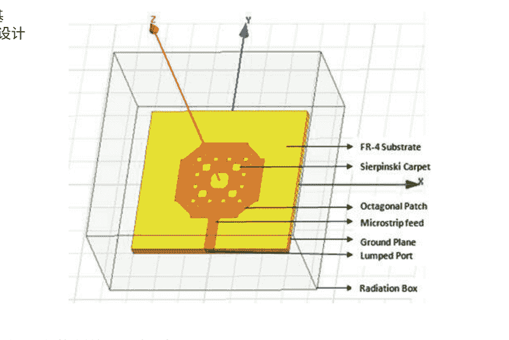

(FR-4) 介质和具有两个截断的DGS接地[11]。

此外，分形结构可以应用为负载、接地结构、互补结构等。分形谐振器是最近在宽带系统中发展起来的模型，具有负折射率。它被熟知为超材料。

具有紧密排列的分形谐振器的超材料结构将包含宽带的微波频率。分形结构被引入滤波器中以实现尺寸缩小和更好的抑制。本文包括第2节中的分形天线设计方法，第3节中的模拟结果，如S11、VSWR、带宽、增益和定向性，第4节总结了本文。

###### 2 天线设计与分析

在设计贴片天线时，必须遵循一定的设计方法和原则如下所示。

###### 2.1 方法论

贴片天线的设计方法包括一些预定义的计算和数值，如工作频率 (f_r = 5.2 G Hz)，基板厚度 (t=1.6 mm)，介电材料的介电常数 (ε_r = 4.4)，以及光速 (C= 3 × 10^8 m/s)。贴片的宽度和长度是设计贴片天线的关键值[12, 13]。

**表1 八边形贴片天线的优化几何形状**

| 天线部件 | 规格 | 尺寸（毫米） |
| :--- | :--- | :--- |
| 贴片 | 宽度（W） | 15 |
| | 长度（L） | 15 |
| 地平面 | 宽度（Wg） | 30 |
| | 长度（Lg） | 5 |
| 基板 | 长度（Ls） | 30 |
| | 宽度（Ws） | 30 |
| | 厚度（t） | 1.6 |
| 馈送 | 宽度（Wf） | 1.8 |
| | 长度（Lf） | 6.5 |

$$ W = \frac{c}{2 f_r \sqrt{\frac{(\varepsilon_r + 1)}{2}}} $$

$$ L = \left[ \frac{c}{2 f_r \sqrt{\varepsilon_{\text{eff}}}} \right] - 2 \left[ \frac{0.412 h (\varepsilon_{\text{eff}} + 0.3) \left( \frac{W}{h} + 0.264 \right)}{(\varepsilon_{\text{eff}} - 0.258) \left( \frac{W}{h} + 0.8 \right)} \right] $$

如表1所示，补丁的宽度表示为 W，补丁的长度表示为 L[14, 15]。图2a和b表示基板和地平面的 L和 W，分别表示为 ($W_s$和$L_s$) 和 ($W_g$和$L_g$)，其中有效介电常数 $\varepsilon_{\text{eff}}$表示为

$$ \varepsilon_{\text{eff}} = \frac{\varepsilon_r + 1}{2} + \frac{\varepsilon_r - 1}{2} \left[ 1 + 12 \frac{h}{W} \right]^{-1/2} $$

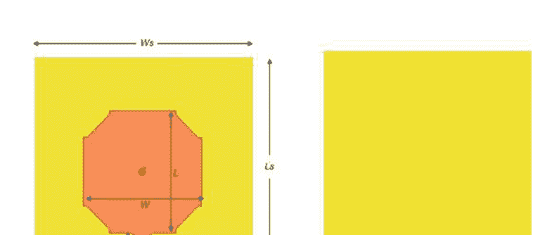

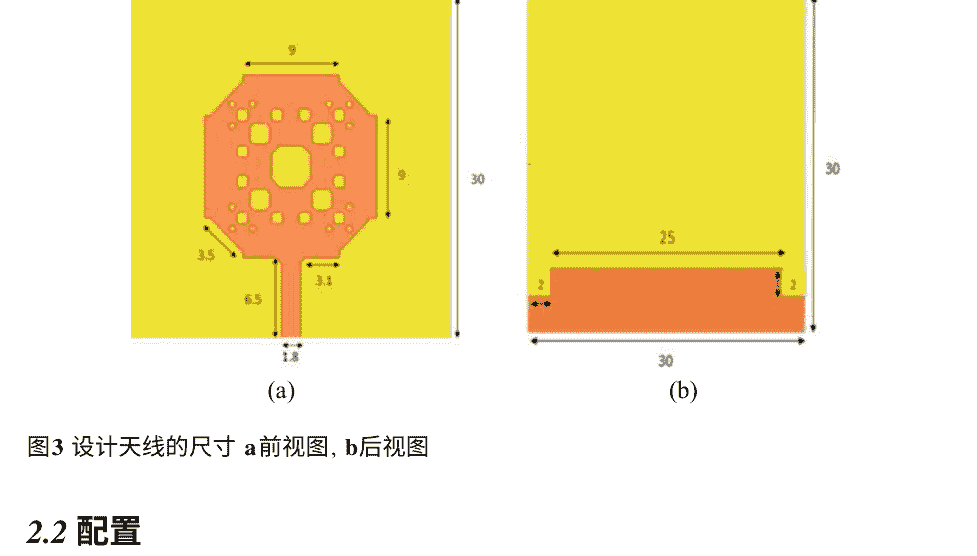

###### 2.2 配置

根据几何表示 [16, 17]，图3a和b分别展示了所设计天线的前视图和后视图。八边形补丁是在具有介电常数 (εr =4.4)、损耗角正切 (tan δ =0.02) 和厚度 (t =1.6 mm) 的FR-4介质材料上追踪的。天线设计占据了电路板上的紧凑区域 [18–20]。

###### 2.3 工作原理

为了缩小尺寸并增强带宽，需要对传统补丁天线进行重大修改。如上一节所述，设计了一个对称的八边形补丁。然后，根据递增顺序，引入了Sierpinski地毯分形结构，如图4所示 [21, 22]。在补丁上切割出八边形形状。根据迭代级别的不同，八边形会逐渐增加。使用迭代函数系统引入迭代级别。

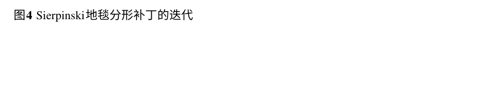

**表2 Sierpinski地毯分形结构中每个迭代的槽维度**

| 迭代 | 维度 |
|------|------|
| 第0次迭代 | 无 |
| 第1次迭代 | 3.6 × 3.6 mm² |
| 第2次迭代 | 1.8 × 1.8 mm² |
| 第3次迭代 | 0.9 × 0.9 mm² |
| 第4次迭代 | 0.45 × 0.45 mm² |

（IFS）方式。如表2所示，八边形的尺寸和八边形之间的空间是使用IFS决定的。地毯的Hausdorff维度表示为

$$ a_{i+1} = \frac{d}{3^k} a_i $$

$$ \frac{\log d}{\log 3} = S $$

其中

$$ a_i = \left( \frac{d}{3^k} \right) $$ 表示迭代的面积
$k$ 迭代次数
$d$ 迭代中的插槽数量
$S$ 特定插槽的大小。

$$ L_n = \frac{1}{4\pi^2 f_{\text{on}}^2 C_i} $$

$$ C_n = \frac{f_c}{2Z_0 2\pi \left( f_n^2 - f_{01}^2 \right)} $$

$$ C_P = \frac{1}{2\pi f_T X_{n(n-1)}} r^2 $$

$$ Ls_n = \frac{X_{n2} - X_{n1}}{2\pi f_T} + \frac{L_i}{\left( \frac{f_r}{f_{\text{on}}} \right)^2 - 1} $$

如图5所示，地面上的DGS引入了电容($C_n$)和电感($L_n$)的并联组合，这是由于金属层之间的介质缝隙引起的。插槽位于微带线下方，并提供并联电容。当频率增加时，串联电感被引入，传输线的电抗和电容相应地增加和减小[23-25]。

有缺陷的接地结构将提供更好的阻抗匹配。由于电容的变化，电场发生变化。由于表面波和边缘场，Ls1和Ls2产生一定的电感。串联电感和并联电容引发衰减极点，并消除特定频率信号，从而导致Ln和Cn谐振器的多个连续谐振频率。因此，由于传输线两侧的两条路径中的电流分布，天线的带宽增加到高信号区域[26, 27]。

###### 3 结果与讨论

通过比较Sierpinski分形结构的四个不同迭代级别，以S11参数（即回波损耗与频率的关系）为基础，可以理解随着迭代次数的增加，S11输出特性也增加。由于地平面和分形结构的影响（图6），阻抗带宽和带宽维度比相对增加。

电压驻波比是反射系数的另一种版本，其值不应小于或等于1。这是一个关键的基准，用于确定从能量源影响的无线电能量。与反射系数类似，VSWR值应小于2，以获得有效的辐射版本，这导致迭代4具有更宽的带宽和较小的反射系数（图7）。

图8显示了不同迭代级别的增益，表示迭代级别的增加将改善增益值。与增益相同，定向性是在特定方向上吸收能量的能力，如图9所示。存在不同的共振频率，如5.2、7.5、9.9、12.9、16.1和18.6 GHz。在所有这些共振频率中，模拟是在10 GHz频段进行的，以获得更好的性能。设计的天线结构在19 GHz处产生6.28 dBi的峰值增益值，在17 GHz处产生6.66 dBi的峰值定向性值。图10表示所有五个迭代的方位角和俯仰角的辐射图案。

不同迭代级别的天线带宽逐渐增加，并在表3中呈现。还分析和观察了带宽比和分数带宽。带宽比表示较高频率与较低频率之间的比例，辐射天线的较低频率与较高频率之间的比例。分数带宽表示阻抗带宽与中心频率之间的比例。

###### 图6 S11与频率的关系

###### 图7 VSWR与频率的关系

在10 GHz共振频率下，比较了不同迭代级别下天线的电流分布。图11表示聚焦于补丁或辐射元件的八边形槽的外部和内部边缘的电流传播。这个特性影响了天线与传输线的匹配阻抗。因此，在系统中引入了DGS来解决地平面上蚀刻的槽的问题。

###### 图8 增益与频率的关系

###### 图9 定向性与频率的关系

天线模型已经在R&S矢量分析仪（ZNB-20）中制作和检查过，该仪器能够测量100 Hz至20 GHz的频率范围。测量得到的天线与模拟设计的天线一致。图12a、b显示了带有DGS的单极缺口八角谢尔宾斯基分形天线的制作设计模型，用于SWB应用。图13显示了使用ZNB-20矢量分析仪（100 Hz至20 GHz）测量得到的天线的输出波形。

图10显示了不同迭代级别的辐射图案，a表示第0次迭代，b表示第1次迭代，c表示第2次迭代，d表示第3次迭代，e表示第4次迭代。

表3显示了不同迭代之间的带宽比较。

| 天线 | fL (GHz) | fH (GHz) | 带宽比 | FBW (%) |
| :--- | :--- | :--- | :--- | :--- |
| 第0次迭代 | 4.5 | 19.8 | 4.4:1 | 125.95 |
| 第1次迭代 | 4.1 | 19.3 | 4.7:1 | 129.91 |
| 第2次迭代 | 4.3 | 19.6 | 4.55:1 | 128.03 |
| 第3次迭代 | 4.4 | 19.8 | 4.5:1 | 127.27 |
| 第4次迭代 | 4.1 | 19.8 | 4.82:1 | 131.38 |

图13显示了天线的S11输出结果。测量结果显示，S11的数值几乎相同，为4.1-19.8 GHz (S11 ≤ -10 dB, VSWR ≤ 2)。该制作模型的总面积仅为 30 × 30 × 1.6 mm³，但可以覆盖大约15.7 GHz的频率范围。由于使用FR-4制作，它将在环境中具有可靠性和耐久性。

表4表示了带有分形结构的SWB天线设计中一些最新进展的比较。尺寸的微型化达到了30 × 30 mm²这使得天线具有紧凑的设计和良好的带宽和增益值，分别为15.7 GHz和6.281 dBi。

###### 图11 不同迭代级别的电流分布 a第0次迭代, b第1次迭代, c第2次迭代, d 第3次迭代, 和 e 第4次迭代

###### 图12 制作的单极缺口八角形谢尔宾斯基分形天线设计模型，带有DGS a 正面视图 b 背面视图

###### 4 结论

本文介绍了一种带有谢尔宾斯基地毯分形和有缺陷地面结构的缺口八角形微带贴片天线。微型化的天线设计具有30 × 30 ×1.6 mm³的尺寸。这种SWB天线结构在4.1 GHz和19.8 GHz之间的频率范围内工作（S11≤−10 dB; VSWR <2）。

###### 图13 天线原型在ZNB-20矢量分析仪中的测量输出

###### 表4 SWB天线设计中一些最新进展与提出的工作的比较

| 参考编号 | 标准化尺寸 (mm³) | 频率范围 (GHz) | 分数带宽 (%) | 峰值增益 (dBi) | 带宽比 |
| :--- | :--- | :--- | :--- | :--- | :--- |
| [16] | 120 × 120 × 1.6 | 0.70–4.71 | 148.14 | 3.9 | 16.72:1 |
| [17] | 28 × 28 × 1.6 | 3.5–15.1 | 124.73 | 3.5 | 4.31:1 |
| [18] | 24 × 22 × 1.57 | 3.1–10.9 | 111.42 | 4.1 | 3.406 |
| [19] | 18.5 × 39 × 1.6 | 3.2–12 | 115.78 | 4 | 3.66:1 |
| [20] | 30 × 24.8 × 1.6 | 2.6–10.8 | 122.38 | 1.2 | 4.15:1 |
| [21] | 40 × 30 × 3 | 2.23–3.1 | 32.64 | 3.6 | 1.39:1 |
| [22] | 52 × 42 × 0.94 | 0.96–13.98 | 174.29 | 4.2 | 14.56 |
| [23] | 52 × 42 × 1.575 | 0.96–10.9 | 167.62 | 3.1 | 11.47 |
| [24] | 52 × 46 × 1.6 | 0.95–13.8 | 174.23 | 4.5 | 14.2:1 |
| [25] | 150 × 150 × 0.5 | 0.64–1.6 | 84.61 | 5.3 | 2.5:1 |
| [26] | 40 × 38 × 1.6 | 2.25–11.05 | 132.33 | 5.05 | 4.91:1 |
| 提出的工作 | 30 × 30 × 1.6 | 4.1–19.8 | 131.38 | 6.1 | 4.82:1 |

在相应频率之间，获得了6.1 dBi和6.45 dBi的峰值增益和定向性值。该天线采用光刻法制造，并在ZNB-20矢量分析仪（100 Hz至20 GHz）中进行分析。因此，测量到的天线与模拟天线设计达成了一致的良好一致。所设计的天线模型提供了最大的分数带宽为131.38%，带宽比为4.82:1，可以在范围内应用于各种应用。因此，所提出的天线满足C波段（4-8 GHz）、X波段（8-12 GHz）和K波段（12-18 GHz）等频段，并部分覆盖超宽带（UWB）频谱（3.1-10.6 GHz）。

###### 参考文献

- 1. Karmakar (2020) 分形天线和阵列: 评论和最新进展. Int J 微波无线技术 12(7):1–25
- 2. Rahman SU, Cao Q, Ullah H (2018) 梯形形状单极天线的紧凑设计 SWB应用. 微波光学技术快报 61(8):1931–1937
- 3. Darimireddy NK, Ramana Reddy R (2018) 用于宽带应用的小型化六边形-三角形分形天线 . Int J 天线传播 60(2):101–110
- 4. Dong Y, Hong W, Liu L (2009) 印刷超宽带天线的性能分析. 微波光学技术快报 51(4):949–956
- 5. Moosazadeh M, Kharkovsky S (2017) 具有改进辐射特性的对脚Vivaldi天线 用于土木工程应用. IET 微波天线传播 11(6):796–803
- 6. 王Z, 尹Y, 吴J, 连R (2015) 一种微型CPW馈电的反极性维尔迪天线，用于宽带应用的增强辐射性能。IEEE天线无线传播Lett 15 (3) : 16-19
- 7. Rahman MM, Islam MR (2019) 一种用于超宽带应用的分形微带天线的紧凑设计和分析。美国工程研究杂志8 (10) : 45-49
- 8. Zaidi NI, Ali MT, Abd Rahman NH (2019) 纺织天线上不同馈电技术的分析。在：2019年国际天线和传播研讨会，IEEE Xplore，西安，中国，第1-3页
- 9. Khandelwal MK (2017) 缺陷接地结构：现代无线趋势中的基础知识，分析和应用。国际天线传播杂志17 (2) : 1-23
- 10. Hong JS, Karyamapudi BM (2005) 缺陷地结构的通用电路模型在平面传输线中。IEEE微波无线组件Lett 15 (10) : 706-708
- 11. Ali T, Mohammad Saadh AW (2017) 用于无线应用的小型化超材料槽天线。AEU Int J Electron Commun 82 (12) : 368-382
- 12. Aravindraj E, Ayyappan K (2017) 用于2.4 GHz WLAN应用的开槽H形贴片天线的设计 。 在：国际计算机通信信息会议IEEE Xplore，印度哥印拜陀，第1-5页
- 13. Aravindraj E, Ayyappan K, Kumar R (2017) 使用不同基板材料对矩形MPA的性能分析，用于WLAN应用。ICTACT J Commun Technol 8 (1) : 1447-1452
- 14. Jena MR, Mishra GP (2019) 分形几何及其在天线设计中的应用。Int J Eng Adv Technol 9(1):3726-3743
- 15. Constantine ASU, Balanis A 天线理论：分析与设计，第811-882页
- 16. Wang F, Bin F, Sun Q (2017) 基于互补分形技术的紧凑型UHF天线。IEEE Access Multidiscip 10(9): 21118-21125
- 17. Ali T, Subhash BK (2018) 迷你化的十边形Sierpinski UWB分形天线。Prog Electromag Res 85(7):161–174
- 18. Soleimani H, Orazi H (2017) 通过使用双反向箭头分形来微型化UWB三角槽天线。IET Microwaves Antennas Propag 11(4): 450–456
- 19. Gorai A, Pal M, Ghatak R (2017) 用于超宽带和蓝牙无线系统的紧凑分形形状天线，具有WLAN抑制功能。IEEE Antennas Wirel PropagLett 16(5): 2163–2166
- 20. Ali T, Mohammad Saadh AW (2018) 用于多频段应用的微型开槽接地结构超宽带天线。微波光学技术快报60（8）：2060-2068
- 21. Sur D, Sharma A (2019) 一种新颖的宽带明可夫斯基分形天线，辅助三角形介质谐振器元件。射频微波计算机辅助工程国际期刊29（2）：1-8
- 22. Okas P, Sharma A, Gangwar RK (2017) 用于超宽带应用的圆形基底负载改进矩形单极子辐射器。微波光学技术快报59（10）：2421-2428
- 23. Okas P, Sharma A, Das G, Gangwar RK (2018) 用于超宽带应用的椭圆槽加载部分分段圆形单极子天线。电子通信国际期刊5（88）：63-69
- 24. Okas P, Sharma A, Gangwar RK (2018) 具有稳定辐射特性的超宽带共面波馈送改进的方形单极子天线。微波光学技术快报60（3）：568-575
- 25. 董Y, 洪W, 刘L, 张Y, 蒯Z (2019) 印刷超宽带天线的性能分析。微波光学技术快报51（4）：949-956
- 26. Syeed MAA, Samsuzzaman M (2018) 多边形形状的带有圆形槽地面的补丁天线用于超宽带应用。在：2018年国际计算机、通信、化学、材料和电子工程会议（IC4ME2）。IEEE Xplore，孟加拉国拉杰沙希，第1-4页
- 27. Aravindraj E, Nagarajan G, Senthil Kumaran R (2020) 用于WLAN应用的递归正方形分形天线的设计与分析。在：2020年国际新兴信息技术和工程趋势会议。IEEE Xplore，印度维维尔，第1-5页

### # DFT Spread C-DSLM用于低PAPR的FBMC与OQAM系统

K. Ayappasamy, G. Nagarajan和P. Elavarasan

摘要：滤波器组多载波系统（FBMC）是多载波方案的一部分，将大频谱分割成几个窄带子信道。在发射端的相干叠加过程中，峰值功率增加了所有子载波功率的平均值的N倍，这导致高功率放大器的线性度。为了避免这种情况，峰值功率被降低，以便使用选择性映射（SLM）方案评估峰值功率与平均功率（PAPR）的比值。在分析计算复杂性时，发现实际上很高。因此，期望使用离散傅里叶变换（DFT）扩展、具有较低复杂度的逆向向量、基于色散的SLM，即DFT扩展C-DSLM，以实现较低的PAPR和FBMC与偏移QAM方案的计算复杂性。仿真结果显示了PAPR、BER和计算复杂性等参数的改进。因此，所提出的DFT扩展C-DSLM方案比现有方案具有更好的性能。

**关键词**
- 复杂性
- DFT扩展
- 带OQAM的FBMC
- PAPR

### ## 1 引言

基于蜂窝移动的无线通信系统在无限制的框架中迅速适应各种需求情况。滤波器组合多载波系统是满足无线通信需求的潜在系统之一。高峰功率是FBMC方案的主要问题[1-3]。部分传输序列（PTS）[4, 5]和SLM [6-8]是减少FBMC中PAPR的两种独特方案。修剪的DFT扩展FBMC方案效果更好[9, 10]。另外，当使用较少的子载波时，甚至需要循环前缀 (CP) 来减少ISI。一般来说，FBMC 对于高复杂度 [11, 12] 和更高的PAPR [13] 有所抵触。因此，为了更好的系统，PAPR 和复杂度都得到了降低。有各种各样的PAPR 降低方法 [14, 15]。这些方法可以分为信号失真方法 [16, 17] 和非信号失真类别 [18-23]。修改后的PTS 方法主要包括概率方案 [24-26] 和SLM方法 [27, 28]。为了降低PAPR，提出了基于离散的选择映射 (DSLM) 方法。同时，提出了C-DSLM 方法，通过将原始信号与循环移转换向量相乘来生成候选信号 [29, 30]。以下的余数是按照顺序排列的：一个具有OQAM 模型的临时FBMC 及其问题在第2节中展示。传统的SLM 方法在第3节中描述。第4节介绍了提出的DFT 扩展C-DSLM 方法。第5节列出了现有方案和提出方案的模拟结果比较。第6节给出了结论和总结。

### ## 2 系统模型

FBMC与OQAM系统被证明比OFDM更好，因为OFDM由于循环前缀和带外抑制能力较差而导致低频利用率低，并且在5G系统中也证明了更好的性能。

### ### 2.1 FBMC与OQAM系统模型

使用FIR滤波器的FBMC与OQAM的信号模型 x(t) 表示为

$$ x(t) = \sum_{n=1}^{n-1} \sum_{m=z} a_{n1,m} h\left(t - m \frac{T}{2}\right) e^{\frac{j2\pi n t}{T}} e^{j\theta_{n1,m}} \quad (1) $$

长度 L 是 K 和 N 的多个值，其中 N 是子载波， K 是重叠的因子。相位角表示为 a_{n1} = π/2 (n + m)，位于信息符号和子载波之间[2, 3]。在方程 x(t)中，符号间隔为 T/2。子载波由PPN分割，并且并行输入到串行转换器，信号的向量长度将等于滤波器的长度，如图1a, b所示。

### ### 2.2 重叠结构的OQAM信号的FBMC

具有OQAM信号的FBMC由 $M$个符号组成，具有叠加原理其中$M$为偶数，具有 $N$个子载波。通过OQAM找到的实部和虚部结构被转换为可比较的方式，使用向量 $[G = d^0, d^1,d^2... d^{(2 M/4)-1}] \in s^{N(2M/4)}$, $d^m=$向量, $d^m = [d_0^m, d_1^m ... d_{N-1} ^m]$, 而 $d_n ^m$是实部和虚部的组合。$d_n ^m = a_n ^m + jb_n ^m$, 其中 $a_n ^m$是实部, $b_n ^m$是虚部。数据矩阵 $G$通过以下方程重新定义，其中元素为 $d_n^m$分配。

$$d_{n1}^{m} = \begin{cases} a_{n1}^{\frac{m}{2}} & \text{其中 , } m = \text{偶数直到 } M - 2 \\ b_{n1}^{(m-1)/2} & \text{其中 } m =\text{奇数直到 } M - 1 \end{cases} \qquad (2)$$

图2 FBMC与OQAM和OFDM符号的功率比较

FBMC与OQAM的信号 s(t)在连续时间上变化从 m = 0到 N − 1给出
$$s(t) = \sum_{m=0}^{M-1} \sum_{n1=0}^{N-1} d_{n1}^m e^{j\frac{\pi}{2}(m+n1)} e^{j2\pi n1 t/T} g\left(t - m\frac{T}{2}\right)$$
其中
$$g_{m,n1}(t) = e^{j\frac{\pi}{2}(m+n1)} e^{j2\pi n1 t/T} g\left(t - m\frac{T}{2}\right)$$

通常情况下 Lg = L和 N的乘积，其中 L表示重叠因子，并且被分配为大于4的偶数值。为了避免重叠， N的值应该大于Lg。 OFDM和FBMC的不同符号重叠的比较，关于其平均功率的表示如图2所示。 此外，与T/2持续时间重叠的FBMC符号在图3中显示，其中 T是一个FBMC符号周期。

###### 2.3 FBMC与OQAM系统中的PAPR描述

传输的FBMC信号( s(t))被分成多个时间周期为 T的干扰。 然后，PAPR被定义为
$$PAPR(s(t)) = 10 \log \frac{\max_{iT \leq t \leq (i+1)T} |s(t)|^2}{E[|s(t)^2|]} \quad (\text{dB}) \qquad (4)$$

为了复制传输信号的不可预测性和峰值离散度，信号进行了过采样，过采样因子 $O \geq 4$，以实现精确的PAPR值。互补累积分布函数（CCDF）是一种常用的能量测量指标，用于描述信号的PAPR。它用于复制PAPR达到阈值Z的概率。

###### 3 选择性映射（SLM）方案

这种方案是一种在多载波调制中降低PAPR的精确有效方法。

图4 传统SLM方案

###### 3.1 传统SLM方案

消息流由 \(x = [x_1[0], x_2[1], ..., x_n[N -1]]\) 组成，使用一致的相位因子 \(ph^u = [ph^u_0, ph^u_1, ... ph^u_{N-1}]\) 进行扩展，其中 \(u\) 的变化范围从1到 \(U\)，\(p^u_v = ej\theta^u_v\) 当 \(v\) 的变化范围从0到 \(N -1\)。同时，值 \(\theta^u_v\) 属于并且变化范围从0到 \(2\pi\)。改变的值 \(U\) 序列 \(x^u = P^u \odot x = [P^u_0 \cdot X[0], P^u_1 \cdot X[1], ..., P^u_{N-1} \cdot X_n[N -1]]\) 被找到。带有 \(t\) 的符号被表示为 \(x^u = [x_0^u [0], x_1^u [1], ..., x_n^u [N -1]]\)，并通过将IFFT应用于 \(u\)th自主频域排列 \(x^u\) 来获得。包括最大PAPR的FBMC信号 \(x^u\) 被指定。参数 \(\tilde{u}\) 被考虑，其在方程 (5) 中被计算。
> \(\tilde{u} = \arg\left(\min_{u=0,1,2...U} \text{PAPR}(x^u)\right)\)  
(5)

为了在接收端接收到实际传输的信号，指定的相位因子的 \(\tilde{u}\) 如图4所示。

###### 3.2 具有逆向向量的SLM (C-SLM)

在这个C-SLM方案中，数据使用循环移位乘积法产生，并允许从频域转换到时域的操作，如图5所示，预示着后续方程。
> \(x = \text{IFFT}_N\{x\} = F x\)  
(6)
> \(x^u = \text{IFFT}_N\{p^u \odot x^u\} = F Q^u x\)  
(7)

$$F = \frac{1}{N} \begin{pmatrix}
1 & 1 & 1 & \dots & 1 \\
1 & W_N^{-1} & W_N^{-2} & \dots & W_N^{-(N-1)} \\
1 & W_N^{-2} & W_N^{-4} & \dots & W_N^{-2(N-2)} \\
\vdots & \vdots & \vdots & \ddots & \vdots \\
1 & W_N^{-(N-1)} & W_N^{-2(N-1)} & \dots & W_N^{-2(N-1)}
\end{pmatrix}$$

逆向公式(6)表示为(9)
$$x = F^{-1}x$$
其中 $F^{-1}$ 表示快速傅里叶变换；方程(7)重写为
$$x^{u} = F Q^{u} F^{-1} x = C^{u} x$$
其中 $Q^{u}$ 表示相位旋转因子的方阵集合。
$N$ 点 IFFT 变换的矩阵表示为 $F$，如方程(8)所示。

###### 3.3 基于转换向量的色散SLM (C-DSLM) 带有OQAM的FBMC方案

低PAPR下执行具有色散SLM（C-DSLM）方法的转换向量。在C-DSLM中，产生相位因子的方式与正常的SLM方法相同，例如，当前 $m nth$ 序列；最细的相位因子使用下面的方程式进行确定，间隔为 $T_{0}$。

过去的符号过采样表示为
$$O^{s}(t) = \sum_{m'=0}^{2m-1}\sum_{n1=0}^{N-1}x_{m',n}^{\mu_{\text{min}}}g\left(t - m'\frac{T}{2}\right)e^{j\frac{2\pi}{T}nt}e^{j\emptyset m',n} \quad (11a)$$

当前符号表示为
$$c^{s}(t) = \sum_{m'=2m}^{2m+1}\sum_{n=0}^{N-1}x_{m',n}^{\mu}g\left(t - m'\frac{T}{2}\right)e^{j\frac{2\pi}{T}nt}e^{j\emptyset m',n} \quad (11b)$$

选择转换向量取决于过去符号和当前符号的过采样之和。

###### 4 提出的DFT扩展C-DSLM用于FBMC-OQAM系统

提出了一种用于FBMC和OQAM的DFT扩展C-DSLM方案，以实现最小PAPR。第4.1节阐明了DFT扩展的过程。然后，设计和构建了转换向量，并遇到了精确的步骤。

###### 4.1 DFT扩展

传统C-DSLM方法中应用的DFT扩展方法如图6所示。OQAM调制的输出用于离散傅里叶变换（DFT）的输入，DFT的输出应用于转换向量模块。DFT扩展的广泛实现如图7所示。输入数据$d(0: N_{D-1})$，显示$m$nth实部和虚部序列向量与参数$N$和$D$的乘积结果。使用多相网络方法进行逆DFT以提供数据序列。通常，多相网络用于求和运算。

###### 4.2 转换向量及其设计

通过增强离散傅里叶变换中存在于集合$\{\pm 1, \pm j\}$的相位因子$p^{\mu}$，找到转换向量$c^{\mu}$中的元素。转换向量$c^{\mu}$满足以下条件：

+ a. 转换向量$c^{\mu}$中非零元素的值应小于或等于4.20。
+ b. 转换向量$c^{\mu}$中非零元素的复数值应从集合$\{1, -1, \text{和} 0\}$中选择。

矩阵 C³ 的模型表示为方程（12）。
$$ C = 0.5 * \begin{bmatrix} 1 & 0 & 0 & 0 & j & 0 & 0 & 0 & 1 & 0 & 0 & 0 & -j & 0 & 0 & 0 \\ 0 & 1 & 0 & 0 & 0 & j & 0 & 0 & 0 & 1 & 0 & 0 & 0 & -j & 0 & 0 \\ 0 & 0 & 1 & 0 & 0 & 0 & j & 0 & 0 & 0 & 1 & 0 & 0 & 0 & -j & 0 \\ 0 & 0 & 0 & 1 & 0 & 0 & 0 & j & 0 & 0 & 0 & 1 & 0 & 0 & 0 & -j \\ -j & 0 & 0 & 0 & 1 & 0 & 0 & 0 & j & 0 & 0 & 0 & 1 & 0 & 0 & 0 \\ 0 & -j & 0 & 0 & 0 & 1 & 0 & 0 & 0 & j & 0 & 0 & 0 & 1 & 0 & 0 \\ 0 & 0 & -j & 0 & 0 & 0 & 1 & 0 & 0 & 0 & j & 0 & 0 & 0 & 1 & 0 \\ 0 & 0 & 0 & -j & 0 & 0 & 0 & 1 & 0 & 0 & 0 & j & 0 & 0 & 0 & 1 \\ 1 & 0 & 0 & 0 & -j & 0 & 0 & 0 & 1 & 0 & 0 & 0 & j & 0 & 0 & 0 \\ 0 & 1 & 0 & 0 & 0 & -j & 0 & 0 & 0 & 1 & 0 & 0 & 0 & j & 0 & 0 \\ 0 & 0 & 1 & 0 & 0 & 0 & -j & 0 & 0 & 0 & 1 & 0 & 0 & 0 & j & 0 \\ 0 & 0 & 0 & 1 & 0 & 0 & 0 & -j & 0 & 0 & 0 & 1 & 0 & 0 & 0 & j \\ j & 0 & 0 & 0 & 1 & 0 & 0 & 0 & -j & 0 & 0 & 0 & 1 & 0 & 0 & 0 \\ 0 & j & 0 & 0 & 0 & 1 & 0 & 0 & 0 & -j & 0 & 0 & 0 & 1 & 0 & 0 \\ 0 & 0 & j & 0 & 0 & 0 & 1 & 0 & 0 & 0 & -j & 0 & 0 & 0 & 1 & 0 \\ 0 & 0 & 0 & j & 0 & 0 & 0 & 1 & 0 & 0 & 0 & -j & 0 & 0 & 0 & 1 \end{bmatrix} $$ (12)

根据逆定理的负数，表1被表示。通过将向量按照N和D的比率进行回声，找到预期的相位因子旋转向量p^u为,
$$ p^u [(\tilde{p}^u)^T, (\tilde{p}^u)^T, \ldots, (\tilde{p}^u)^T]^T. $$ (13)

使用 $\tilde{\mathbf{p}}^3 = \{1, -1, 1, 1\}$, 一个例子产生
$$ P^3 = [1, -1, 1, 1, \quad 1, -1, 1, 1 \ldots, 1 - 1, 1, 1] $$ (14)
$$ C^3 = [1, 0, 0 \ldots 0, \quad -j, 0, 0 \ldots 0, \quad 1, 0, 0, \ldots 0, \quad j, 0, 0, \ldots 0] $$ (15)

一个符号（例如，1，0，0...0）等于((N -4)/4)持续时间。上述进展由s和 $C^u$ 的乘积来表达，即 $s^u = C^u s$, 其中 $C^u$ 与cu相对应的卷积矩阵被表示为
$$ C^u = \left[ (c^x)^0, (c^x)^1 \ldots (c^x)^{N-2}, (c^x)^{(N-1)} \right] $$ (16)
其中$(c^x)^{\langle n \rangle}$描述了使用n要素的$\gamma$的降序循环移位。方程（12）显示了带有 $\mathbf{C}^3$ 的向下循环移位的结构。

表1 相位旋转向量和相应的转换向量
| 索引 | 相位向量的旋转 | 转换向量 |
| :--- | :--- | :--- |
| 1 | \(P1 = -[\ 1\ -1\ -1\ 1\ ]\) | \(-[\ 0\ 1\ -j\ 0\ 1\ +j\ ]\) |
| 2 | \(P2 = -[\ -1\ 1\ -1\ 1\ ]\) | \(-[\ 0\ 0\ -1\ 0\ ]\) |
| 3 | \(P3 = -[\ 1\ 1\ -1\ 1\ ]\) | \(-[\ 1\ 1\ -1\ 1\ ]\) |
| 4 | \(P4 = -[\ -1\ -1\ 1\ 1\ ]\) | \(-[\ 0\ -1\ -j\ 0\ -1\ +j\ ]\) |
| 5 | \(P5 = -[\ 1\ -1\ 1\ 1\ ]\) | \(-[\ 1\ -j\ 1\ j\ ]\) |
| 6 | \(P6 = -[\ -1\ 1\ 1\ 1\ ]\) | \(-[\ 1\ -1\ -1\ -1\ ]\) |
| 7 | \(P7 = -[\ 1\ 1\ 1\ 1\ ]\) | \(-[\ 1\ 0\ 0\ 0\ ]\) |
| 8 | \(P8 = [\ 1\ 1\ 1\ 1\ ]\) | \([\ 1\ 0\ 0\ 0\ ]\) |
| 9 | \(P9 = [\ -1\ 1\ 1\ 1\ ]\) | \([\ 1\ -1\ -1\ -1\ ]\) |
| 10 | \(P10 = [\ 1\ -1\ 1\ 1\ ]\) | \([\ 1\ -j\ 1\ j\ ]\) |
| 11 | \(P11 = [\ -1\ -1\ 1\ 1\ ]\) | \([\ 0\ -1\ -j\ 0\ -1\ +j\ ]\) |
| 12 | \(P12 = [\ 1\ 1\ -1\ 1\ ]\) | \([\ 1\ 1\ -1\ -1\ ]\) |
| 13 | \(P13 = [\ -1\ 1\ -1\ 1\ ]\) | \([\ 0\ 0\ -1\ 0\ ]\) |
| 14 | \(P14 = [\ 1\ -1\ -1\ 1\ ]\) | \([\ -1\ j\ -1\ j\ ]\) |
| 15 | \(P15 = [\ -1\ -1\ -1\ 1\ ]\) | \(-[\ -1\ -j\ -1\ j\ ]\) |
| 16 | \(P16 = -[\ -1\ -1\ -1\ 1\ ]\) | \(-[\ 0\ 1\ -j\ 0\ 1\ +j\ ]\) |

###### 4.3 DSLM方法下的DFT扩展逆转换向量（C-DSLM）

DFT扩展C-DSLM方法的操作如下所述。

**方法1：相位初始化。一对 N, M, U, L 和 O是参数。** 索引 m被分配为0和1。使用方程（17）-（19）计算的转换矩阵 \(C^u\)表示为
\[P^u = \left[ (P^u)^T, (P^u)^T, \ldots, (P^u)^T \right]^T \in C^{1 \times \mathrm{ON}}\] (17)
\[C^u = \mathrm{IFFT} \{ P^u \} \in C^{1 \times \mathrm{ON}}\] (18)

**方法2：使用转换向量进行调制。** 将(0,1)的乘积值插入中心位置的 N个零，得到向量 x = [x1, x2, ..., xN/2]。
$$s^1 \in R^{1 \times \text{ON}}, \quad u = 2, 3, \ldots, U$$
值 sᵘ经过 L个值的循环，并与 g相乘，得到
$$S^u_L = [(S^u)^T, \ldots, (S^u)^T]^T \in R^{1 \times L.\text{ON}}$$
其中 $[(S^u)^T, \ldots, (S^u)^T]^T$ 重复 L 次。

PAPR的计算:峰均比的值是在某个区间 T₀上对sᵘ(t)进行计算的
$$\text{PAPR}^u_{T_0} = \frac{\max_{t \in T_0} S^u(t)^2}{\frac{1}{T} \int_{T_0} |S^u(t)|^2 \mathrm{d}t}, \quad u \in \{1, 2, \ldots, U\}$$
对于提出的方案，T₀的值减小了PAPR的困扰，其中 T₀ = [mT, mT + 4 T]。

**方法3：选择。** 通过以下公式观察并记录PAPR的最小值:
$$u_{min} = \min_{0 \le u \le U-1} \text{PAPR}^u_{T_0}$$

**方法4：更新。** 当前重叠的输入符号向量,
$$S^{u_{\min} m' + 1}_{m' + 1} = S^{u_{\min}}(t)$$
索引 u_min被存储在一个向量 SI中，并作为SI发送到接收端
$$\text{SI} = [\text{SI} \ u_{\min}]$$
然后，将 m的增加值与1相加。方法2将重复执行，直到 m = M。

表2 计算复杂度计算
| 方案 | 乘法次数 | 加法次数 |
| :--- | :--- | :--- |
| C-DSLM | UM(ON/2) Log2(ON) | UMON log2 (ON) |
| 提出的DFT扩展C-DSLM | M(ON/2) log2(ON) | MON log2(ON) + 3(U-1) MON |

###### 4.4 计算复杂度分析

对提出的DFT扩展C-DSLM方案进行复杂度测量，并与现有方法进行比较。它受到乘法和加法过程的数量限制。CCRR被缩写为计算复杂度减少比率，其定义如(表2)所示。
$$CCRR = \left( 1 - \frac{DFT扩展C-DSLM的复杂度}{C-DSLM的复杂度} \right) \times 100% \qquad (26)$$

###### 5 性能评估

使用MATLAB R2018a对提出的方案进行了仿真。提出的DFT扩展C-DSLM方案非常适用于低PAPR和低计算复杂度。表5中给出的仿真结果与设计用于OQAM信号的现有C-DSLM方案进行了比较。

###### 5.1 模拟环境

用于模拟的子信道数量 $N$ 为64、256、512和1024，符号数量为100。子载波间隔被设定为15 kHz。$O$ 过采样因子和 $L$ 重叠因子被设定为4。相位旋转向量 $U$ 被设定为4、8和16。使用四进制调幅调制，采样周期 $T_s$ 被设定为0.4 μs。使用多径衰落信道来测试性能。模拟所使用的参数见表3。

###### 表3 模拟参数

| 模拟属性 | 备注 |
| :--- | :--- |
| 用于模拟的工具 | MATLAB R2018a |
| 考虑的子信道数量 N | 64、256、512和1024 |
| 采样周期 T_s | T_s = 0.4 μs |
| 符号数量 M | 100 |
| 过采样因子 O | 4 |
| 相位旋转向量 U | 4、8或16 |
| 调制 | 4-QAM (4-OQAM) |
| 实值符号 | 3×10^4 OQAM |
| 重叠因子 L | 4 |
| 信道 | 多径衰落信道 |
| 子载波间距 | 15 kHz |

###### 5.2 计算复杂度

为了评估所提出方法和传统方法的复杂性，分配的子载波数 N 为64，M 为100，O 为4。相位旋转向量 U 分配为4、8或16；复杂加法和乘法的次数在表2中给出。使用分配规格计算的复杂性值在表3中给出。所提出方法的计算乘法次数较少，对于所有 U =4、8和16，分别为30,822，而现有的C-DSLM的计数为123,301、246,603和493,158，对应于 U =4、8和16。此外，当 U =4、8和16时，CCRR的百分比分别为75%、87.51%和93.8%。另一方面，所提出方法的加法次数也被证明较少的CCRR。因此，证明了所提出方法比现有的C-DSLM方案提供更好的性能（表4）。

###### 表4 计算复杂度

| 相位旋转向量 | 计算类型 | 现有的C-DSLM | 提出的方法 | CCRR百分比 |
| :--- | :--- | :--- | :--- | :--- |
| U=4 | 乘法次数 | 123,301 | 30,822 (减少) | 75 |
|  | 加法次数 | 246,579 | 292,044 | 18.4 |
| U=8 | 乘法次数 | 246,603 | 30,822 (减少) | 87.51 |
|  | 加法次数 | 493,158 | 599,244 | 21.2 |
| U=16 | 乘法次数 | 493,158 | 30,822 (减少) | 93.8 |
|  | 加法次数 | 986,316 | 1,213,644 | 23 |

| 参数 | DSLM如[1] | C-DSLM | 提出的DFT扩展C-DSLM | CCRR百分比 |
| :--- | :--- | :--- | :--- | :--- |
| PAPR | 当CCDF为10⁻⁴时，8 dB | 当CCDF为10⁻⁴时，7.1 dB | 当CCDF为10⁻⁴时，6.3 dB | – |
| 误码率 | 当SNR为23 dB，BER为10⁻¹⁵时 | 当SNR为24.5 dB，BER为10⁻¹⁵时 | 当SNR为15 dB，BER为10⁻¹⁵时 | – |
| 计算复杂度 (乘法) | U = 4 | 409,600 | 123,301 | 30,822 (更少) | 75% |
| | U = 8 | 819,200 | 246,603 | 30,822 (更少) | 87.51% |
| | U = 16 | 1,638,400 | 493,158 | 30,822 (更少) | 93.8% |
| 计算复杂度 (加法) | U = 4 | 819,200 | 246,579 | 292,044 | 18.4% |
| | U = 8 | 1,638,400 | 493,158 | 599,244 | 21.2% |
| | U = 16 | 3,276,800 | 986,316 | 1,213,644 | 23% |

###### 5.3 DFT扩展C-DSLM传输和接收方案

所提出的DFT扩展C-DSLM方案的传输和接收的各种参数的输出如图8、9、10、11、12、13、14、15和16所示。当输入分配为子载波数为1024、载波数为64、每个符号的比特数为8和每个载波的符号数为16时，得到这些结果。这些结果是在信噪比为30 dB时获得的。

载波幅度分析。第一个载波幅度分析显示了传输和接收之间的关系，如图8和13所示。这给出了给定64个子载波的幅度级别1。还证明了发射机和接收机之间的子载波的相位偏差为零度。

载波相位分析。分配的子载波之间的载波相位分析显示在图9和图14中。证明了输入和输出之间的子载波没有相位偏差。

时域信号分析。图10和图16显示了传输和接收的时域信号，证明这两个信号在幅度上是相同的。

###### DFT扩展C-DSLM传输 - 载波幅度分析

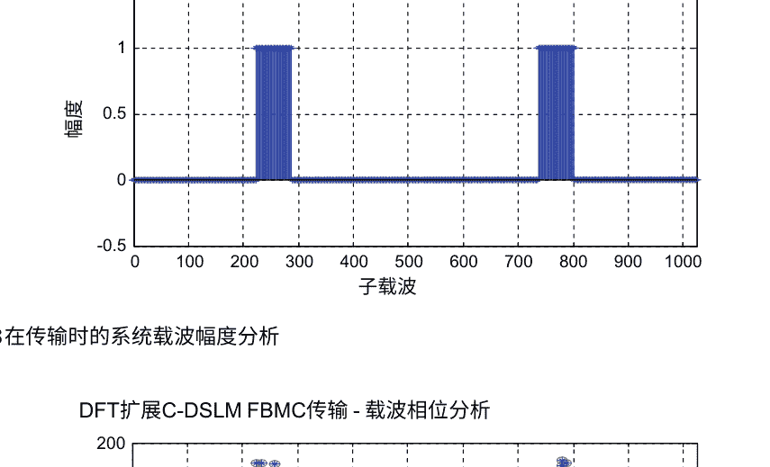

###### 图8 在传输时的系统载波幅度分析

###### DFT扩展C-DSLM FBMC传输 - 载波相位分析

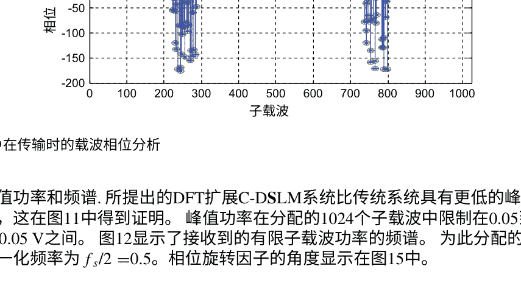

###### 图9 在传输时的载波相位分析

峰值功率和频谱。所提出的DFT扩展C-DSLM系统比传统系统具有更低的峰均比，这在图11中得到证明。峰值功率在分配的1024个子载波中限制在0.05到-0.05 V之间。图12显示了接收到的有限子载波功率的频谱。为此分配的归一化频率为$f_s/2 =0.5$。相位旋转因子的角度显示在图15中。

PAPR比较。所提出的DFT扩展和其他现有方案的PAPR进行了模拟和比较，如图17所示。所提出的方法在$10^{-4}$CCDF的情况下比C-DSLM和DSLM分别提供了6.3 dB和7.1 dB和8 dB的更小值。因此，所提出的系统比其他传统系统具有更低的PAPR，这是由于选择了相关的相位因子。

###### DFT扩展C-DSLM FBMC传输-一个符号周期的时域信号

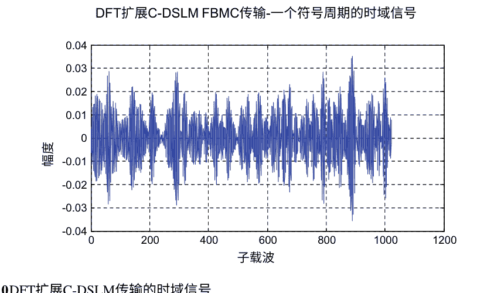

图10 DFT扩展C-DSLM传输的时域信号

###### DFT扩展C-DSLM FBMC传输-峰值功率受限信号

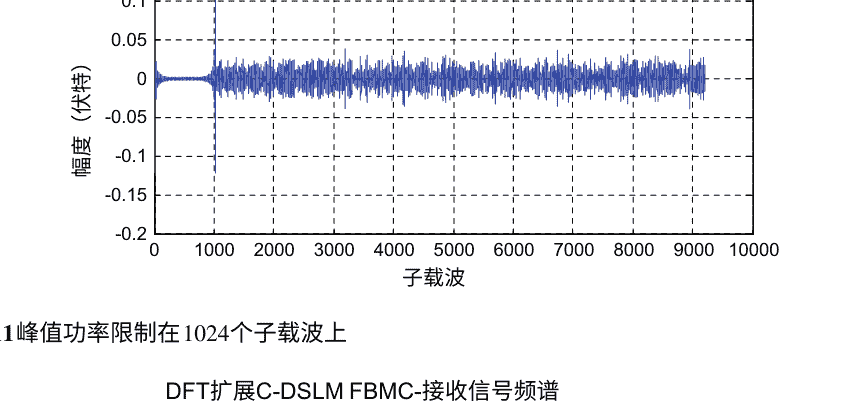

图11 峰值功率限制在1024个子载波上

###### DFT扩展C-DSLM FBMC-接收信号频谱

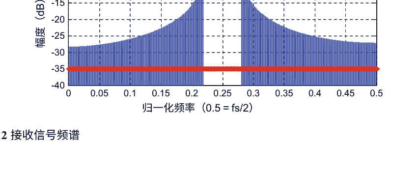

图12 接收信号频谱

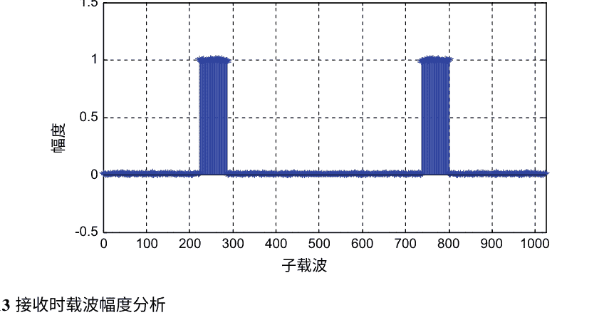

图13 接收时载波幅度分析

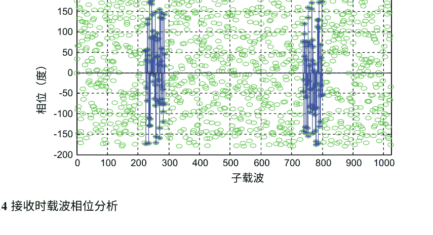

图14 接收时载波相位分析

###### 不同方案的误码率性能

DSLLAM、C-DSLLAM和提出的DFT扩展C-DSLLAM的比特误码性能经过模拟，如图18所示。值得注意的是，所提出的方案在$10^{-15}$比特误码率下的信噪比为15 dB。但是现有的DSLLAM和C-DSLLAM方法在相同的$10^{-15}$比特误码率下的信噪比为23和24.5 dB。因此，与现有方法相比，所提出的方法提供了更好的比特误码率性能（表5）。

###### 6 结论

使用基于离散傅里叶变换(DFT)的扩频逆向量和基于离散傅里叶变换的正交幅度调制(FBMC)系统中的基于色散的选择性映射(SLM)方法，实现了降低峰均功率比(PAPR)和低复杂度。

###### 用于低PAPR FBMC的DFT扩展C-DSLM与OQAM系统

图15 相位因子分析

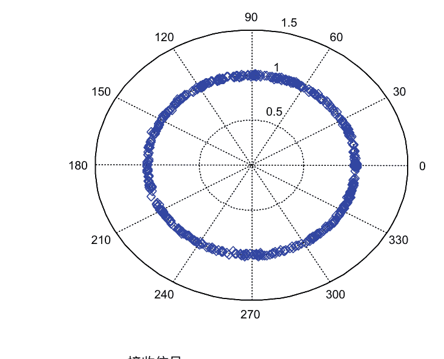

接收信号

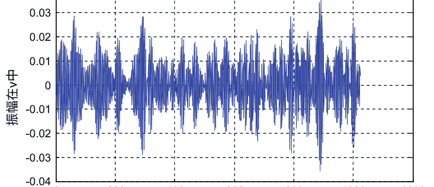

图16 DFT扩频C-DSLM方案的接收时域信号

对所提出方案的复杂度和仿真结果进行了估计，并与现有的色散SLM和C-DSLM方案进行了比较。所提出的系统在CCDF为$10^{-4}$时，提供了更好的PAPR降低，为6.3 dB，而现有方法显示为7.1 dB和8 dB。此外，所提出的方案证明了在复杂乘法中，当相位旋转因子 U =16时，其计算复杂度较低，计算复杂度降低率(CCRR)为93.8%，相对于传统方案而言。因此，与现有的DSLM和C-DSLM方案相比，所提出的DFT扩频C-DSLM方案提供了改进的性能。

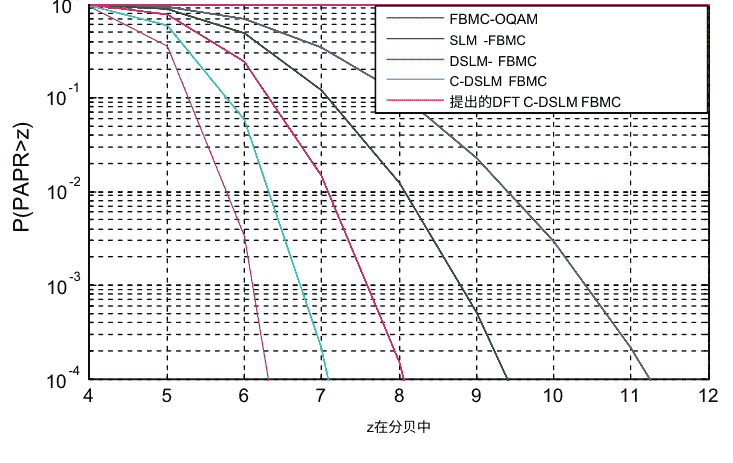

###### 图17 不同方案的PAPR比较

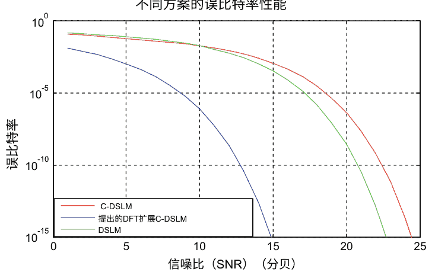

###### 图18 不同PAPR减小方案的误比特率性能

###### 参考文献

1. 程翔，石伟，赵阳（2020）一种基于转换向量的低复杂度SLM方案用于FBMC/OQAM系统中的PAPR减小。 IEEE Trans Broadcast 3:1–11
2. 那迪，崔凯（2020）基于DFT扩展的低PAPR FBMC与嵌入式辅助信息。 IEEE Trans Commun 68:1–15
3. 金伟，任刚，张华（2015）一种半盲SLM方案用于具有低复杂度收发器的OFDM系统中的PAPR减小。 IEEE Trans Veh Technol 64:2698–2703
4. 陈东，田宇，曲东，姜涛（2018）用于物联网的OQAM-OFDM： 关键技术和挑战的调查。 IEEE Internet Things J 5:3788–3809
5. Choi J, Oh Y, Lee H, Seo J (2017) 利用内在干扰进行基于FBMC/OQAM系统的导频辅助信道估计。 IEEE Trans Broadcast 63(4):644–655
6. Li D, Chen D, Qu Y, Zhang TJ (2019) 高度频率选择性信道中Alamouti编码FBMC系统的接收机设计。 IEEE Trans Broadcast 65(3):601–608
7. Zhang L, Xiao P, Zafar A, Qud dus AU, Tafazolli R (2017) FBMC系统：对双重色散信道影响的深入了解。 IEEE Trans Veh Technol 66:3942–3956
8. Tian Y, Chen D, Luo K, Jiang T (2019) 用于OQAM/FBM C系统的原型滤波器设计，以最小化停止带能量并对信道估计性能施加约束。 IEEE Trans Broadcast 65:260–269
9. Al-Dweik A, Younis S, Hazmi A, Tsimenidis C, Sharif B (2012) 利用功率差测量的高效OF DM符号定时估计器。 IEEE Trans Veh Technol 61:509–520
10. Ayappasamy K, Nagarajan G, Elavarasan P (2020) 决策反馈均衡器和Alamouti编码的低PAPR FBMC-OQAM系统。 在：IEEE国际会议新兴信息技术和工程趋势（ic-ETITE）。 IEEE探索数字图书馆电子版。 ISBN: 978-1-7281-4142-8
11. Cheng X, Liu D, Wang C, Yan S, Zhu Z (2019) 基于深度学习的FBMC/OQAM系统信道估计和均衡方案。 IEEE无线通信信函8:881–884
12. Li W, Qu D, Jiang T (2018) 基于组合型导频的FBMC/OQAM系统信道估计的高效前导设计。 IEEE Access 6:64698–64707
13. Elavarasan P, Nagarajan G (2012) 使用GPW和RPW的OFDM系统中PTS的最佳相位选择因子。 J Comput Sci 6:140–147
14. Elavarasan P, Nagarajan G (2014) 关于OFDM系统的PAPR技术的总结。 Int J Inst Eng Ser B 96:381–389
15. Ayappasamy K, Nagarajan G, Elavarasan P (2019) 具有虚拟符号和DFT扩展技术的FBMC OQAM-PTS。 在：UGC CARE列表类别B：在新兴来源引文索引（科学网）中索引。 数学评论（MathSciNet）。 J Adv Appl Math Sci18:817–825
16. Li XD, Cimini LJ (1998) 剪切和滤波对OFDM性能的影响。 IEEE Commun Lett 2:131–133
17. Wang X, Tjhung TT, Ng CS (1999) 使用压缩技术减小OFDM系统的峰均功率比。 IEEE Trans Broadcast 45:303–307
18. Muller SH, Huber JB (1997) 通过部分传输序列的最佳组合减小OFDM的峰均功率比。
19. Bauml RW, Fischer RFH, Huber JB (1996) 通过选择映射减小多载波调制的峰均功率比。 Electron Lett 32:2056–2057
20. Elavarasan P, Nagarajan G (2015) 在正交频分复用系统中使用改进的部分传输序列进行峰值功率降低。 Int J Comput Electr Eng44:80–90 (SCIE, SCOPUS, Elsevier, IF-1.747)
21. Jones AE, Wilkinson TA, Barton SK (1994) 用于减小多载波传输方案的峰均功率比的块编码方案。 Electron Lett 30:2098–2099
22. Wulich D (1996) 使用循环编码减小多载波调制的峰均比。
23. Jiang T, Li X (2010) 使用喷泉码控制OFDM信号的峰均比。 IEEE Trans Veh Technol 59:3779–3785
24. Kollar Z, Horvath P (Jun 2012) 通过剪切和迭代补偿减小FBMC的PAPR。 J Comput Netw Commun 5. Art. no. 382736
25. You Z, Lu I-T, Yang R, Li JL (2013) OFDM和FBMC系统中用于PAPR减小的灵活压缩设计。 在国际计算机网络和通信会议(ICNC)的论文集中。 圣地亚哥，加利福尼亚州，美国，第408-412页
26. Qu D, Lu S, Jiang T (2013) 多块联合优化FBMC-OQAM信号的峰均比减小。 IEEE Trans Sig Process 61:1605–1613
27. Ye C, Li Z, Jiang T, Ni C, Qi Q (2014) 使用低复杂度的分段PTS方案减小OQAM-OFDM信号的PAPR。 IEEE Trans Broadcast 60:141–147
28. 何Z，周L，陈Y，凌X（2018年）低复杂度PTS方案用于在FBMC-OQAM系统中减少PAPR。IEEE通信信函22：2322-2325
29. Goff SYL, Al-Samahi SS, Khoo BK, Tsimenidis CC, Sharif BS（2009年）选择映射在OFDM中减少PAPR的无侧信息。IEEE Trans Wirel Commun 8: 3320-3325
30. 洪E，金H，杨K，哈尔D（2013年）在基于SLM的OFDM系统中辅助导频的侧信息检测。IEEE Trans Wirel Commun 12: 3140-3147

##### 无线传感器网络中的安全、高效、轻量级身份验证

Bhanu Chander和Kumaravelan Gopalakrishnan

摘要 近年来，基于通信的安全对于无线传感器网络（WSN）中的传感器节点设备的进展至关重要。部署在无人值守区域的节点根据应用程序感知各种类型的原始信息，并将其发送到基站。入侵者或挑战者可以在网络中插入伪造的数据记录，并破坏节点之间的路由记录。

为了数据的可靠通信，机密性和完整性是两个最重要的安全趋势，可以消除通信中的非法传感器。在文献中，提出了许多用于无线传感器网络身份验证的模型，但大多数模型都存在通信量大、存储有限和节点寿命短的问题。在本文中，提出了一种安全高效的身份验证机制，该机制采用MAC和数字证书方案对其他节点进行身份验证，以启动它们的通信实践。消息认证是防止非法和贬低消息在无线传感器网络中传播的最成功方法之一。

关键词 传感器节点 · 基站 · 簇头 · 消息认证码 · 数字证书

###### 1 引言

无线传感器网络（WSN）主要用于观测物理或环境条件，如压力、温度、声音等。此外，传感器节点合作共同通过无线通信网络将其观测数据记录传输到中央位置或基站（BS）[1,2]。军事应用，如战场监视，支持WSN的扩展；在当今，这种网络在各种工业化和终端用户应用中得到利用，如建筑安全，物联网和智能城市的扩展，用于健康监测和医学研究的可穿戴身体传感器，机器健康监测，工业产品监测，太空和水下应用[1-3]。尽管从覆盖区域收集和处理传感数据，无线传感器网络允许用户随时随地访问详细和一致的信息，这是一种无处不在的感知技能。大多数这些设备都拥有大规模的无线传感器网络，因此原始感知数据的数量非常大，但传感器节点具有非常有限的资源限制，如带宽有限，电池寿命有限，计算能力有限，存储空间有限和通信资源有限。在无线传感器网络中，电池寿命不完整是其中一个重要 的限制，因为很难更换电池，也没有机会为随机部署的传感器节点充电。因此，能源效率是无线传感器网络中不可或缺的一部分。另一方面，无线传感器网络经常在危险的环境中运行。因此，对手有机会直接拘留目标地的传感器节点，并从其内存中勒索整个感知记录，因为节点通常由于其成本效益而不具备防篡改能力[4-7]。

无线传输中，无线传感器网络已被研究人员、学者和工业界广泛应用于各种个人和组织设备中。近年来，无线传感器网络已成为最重要的领域，并引起研究人员对建立安全网络的关注，以防止恶意节点的攻击[4, 5, 8]。无线传感器网络的安全措施可能会受到敌方的威胁。由于传感器节点资源有限，在缓解各种威胁方面，很难应用在其他网络中取得良好效果的传统方法。入侵者或攻击者采用多种方法来访问低功耗传感器节点的敏感、机密原始数据。因此，有必要为敏感的无线传感器网络设计可靠的安全措施，以防止各种攻击[2-5, 8]。

###### 2. 无线传感器网络中的身份验证

保护无线传感器网络中的感知读数和数据是非常重要的要求之一。身份验证是一种安全机制，可以防御各种安全攻击。身份验证是一种确认传感器在系统中的身份，并确保记录或消息来自可信源的过程。简单来说，身份验证为可以由系统中的每个节点传送或访问的数据提供了保障[1-3, 8]。此外，防止非法用户获取错误记录也是非常重要的。目前，无线传感器网络安全中提出了许多身份验证方法，这些方法可以根据使用单播、多播和广播消息、加密密钥以及静态、移动或两者方面的无线传感器网络进行分类。在单播中，通过单播消息进行点对点身份验证，不涉及其他来源。在广播中，消息直接来自可靠源，并且在传输过程中不能被更改。检查消息来源的身份验证确保了消息的可靠性，以确保消息的唯一性、伪造、冒充等。[1-4, 8]至于基于密码的身份验证，它可以是可以是对称或非对称的方法。在对称方法中，发起者和接收者使用相同的密钥进行认证和证书。在非对称方法中，发起者使用私钥进行签名，受益者通过特定的公钥进行认证。

因此，为无线传感器网络提供适当的安全解决方案一直是一个活跃的研究挑战。一些协议在其他具有高资源限制的网络中表现良好，但将其应用于无线传感器网络是不可行的，因为无线传感器网络具有一些限制。首先，由于传感器的紧凑性，存在功耗限制。其次，由于物理防护的不足以及无线通信信道的开放性，存在漏洞限制。基于传感器的资源限制，与非对称密钥技术相比，对称密钥技术是更好的选择，尽管对称密钥加密方法存在安全性问题。为了解决这些限制，同态加密和消息认证码（MAC）在无线传感器网络中提供了保密性、验证性和可靠性。考虑到上述问题，本文提出了一种基于MAC和数字证书交换的认证协议，用于传感器节点和基站之间。同时，还考虑了节点移动性和重新认证的问题。

###### 3 相关工作

在[7]中，作者设计了一个使用新颖、组织良好的源匿名消息认证方案（SAMA）的网络，该方案基于椭圆曲线密码学（ECC）实现无条件的源匿名性。该方案允许节点之间对消息进行认证，因此，任何被污染的消息都可以被察觉并丢弃以保护传感器的电源。在[9]中，开发了SDAACA协议，该协议包含一对算法：安全数据分割（SDF）和节点加入授权（NJA）。在这里，SDF通过将数据记录分割成小块来防止攻击者破坏数据。NJA授权任何想要连接到网络的新节点。在[10]中，作者分析了双因素认证的缺点，并计划了一种新颖的三因素认证协议，以支持物联网中的无线传感器网络（WSNs）。在这里，模糊模型提取滥用者的生物特征数据进行密码验证，然后与BAN逻辑进行验证。仿真部分显示该协议实现了免费更改密码、检测已知攻击并快速识别非正式登录。

[11]的作者设计了一个模型来避免节点和簇级别的攻击，作者提出了一个包含两个算法的新流程。首先，在簇中进行密钥更新方案，然后进行节点认证过程。根据作者的说法，我们可以在密钥建立阶段的某个阶段对节点进行认证，并定期更新密钥，[12]的作者提供了vBNN-IBS的快速确认，这是一种无配对身份基础签名，通过压缩签名大小。加速过程旨在通过减少签名认证的计算开销来减少能量消耗，从而延长系统的使用寿命。[13]的作者开发了一种简单的身份验证实践

用于节点-节点、节点-基站和基站-节点。所有这些协议都遵循ECC和隐藏生成器理论，以及[14]中的哈希链，提出了两个协议；一个处理所提出的模型具有可信传感器节点的概率。第二部分分析了模型的能量消耗，并通过一个可信提案帮助WSN中的新加入节点进行改进的协议进行认证。在[15]中，作者通过ProVerif改进了三因素认证，并且结果显示该协议对正式和非正式攻击都是安全的；而且具有很高的鲁棒性。在[16]中，作者开发了基于数字证书的节点认证，网络中的每个节点都认为BS是提供数字证书给所有合法节点的可信第三方。通过验证证书中存储的详细信息，节点彼此进行认证[17]并提出了简单的身份验证和密钥分发方案；此外，作者通过考虑节点移动性开发了一套重新认证规则[18]，并设计了一种新的无证书身份验证方案以避免中间人攻击。模拟结果证明了该设计能够减少6-15%的能量消耗。根据[19]，作者分析了三因素认证，并开发了一个安全的协议，并通过多种攻击进行验证。在[20]中，作者针对WSNs制定了一种身份验证和密钥管理方案（AKMS），使用对称密钥和带密钥哈希函数的双向过程来确保消息的可靠性和可信度。

###### 4 提出的认证机制

###### 4.1 简单的簇头（CH）开发

首先，每个传感器节点都持有一些未使用的能量，在等待指定的时间后，传感器节点向所有可用的传感器节点转发HELLO数据包。在这里，时间取决于用户，在网络部署时提到的时间，如果节点在规定时间内没有收到任何初始数据包相关的通知，就被声明为CH。在收到HELLO数据包后，每个传感器节点比较接收到的信号强度，选举出具有最高值的节点作为CH。非CH节点通过接收到的CH的功率（p_r）和传感器节点的通信范围（n_r）找到与自己和其后续CH之间的最小跳跃距离（HD_min）。此外，传感器节点通过非持续性CSMA方法宣布其位置，因此与CH相距较远的传感器可以通过多跳通信利用中间节点将其有意义的数据传输到CH。

###### 4.2 提议的协议

在这个协议中，我们假设基站（BS）和簇头（CH）拥有最高的资源，攻击者无法对它们进行任何形式的攻击。基站将每个传感器节点和簇头的身份存储在其内存中。基站将主要密钥转发给每个单独的传感器节点和簇头，例如 - K_AB = 传感器节点之间的主要密钥。

KAB' = A 和 B 之间的密钥，用于计算MAC等。同样，BS和CH共享公钥。每个传感器节点生成其公钥和私钥，并共享加密和MAC计算所需的密钥。该方案中使用的密钥与工作无关。因此，攻击者可以破解或识别任何一个密钥，但对于未来的操作并不太有用，因为攻击者无法识别任何新的密钥，因为计算是独立于密钥的。

###### 所提出的过程中使用的符号

| 符号 | 描述 |
|------|------|
| A, B | 传感器节点 |
| 基站 | 基站 |
| N | Nonce值 |
| CH | 簇头 |
| PU_a, PU_b | 节点A和B的公钥 |
| PR_a, PR_b | 节点A和B的私钥 |
| PU_CH, PR_CH | CH的公钥和私钥 |
| PU, PR | BS的公钥和私钥 |
| K_AB | A和B之间共享的密钥 |
| K'_AB | A和B之间共享的密钥，用于计算MAC |
| K_A,CH | A和CH之间共享的密钥 |
| | A和CH之间共享的秘密密钥用于计算MAC |
| | B和CH之间共享的密钥，用于计算MAC |
| K'_{B,CH} | CH和BS之间共享的密钥 |
| | CH和BS之间共享的秘密密钥 |
| | CH和BS之间共享的秘密密钥用于计算MAC |
| K_集群 | 集群认证密钥 |
| ID_a | 节点A |
| C的身份 | 数字证书 |
| m | 消息 |
| R | 数字证书请求消息 |
| {M}_{K_AB} | 使用加密 |
| MAC{M}_{K_AB} | 通过MAC密钥 K'_AB计算(M)的MAC |

在主要级别上，传感器节点'A'向其对应的集群头发起证书请求消息。然后，CH验证传感器节点的唯一性，并进一步将请求转发给BS。然后，BS为请求的节点创建证书，将其转发给CH，CH接收到数字证书并将其发送给适当的传感器节点。

###### 步骤1: 传感器节点 A 到CH

```
A → CH : M1 = PU_a, ID_a N_a, R|MAC(PU_a, ID_a, N_a, R)K'_{A,CH}
```

在第一步中，传感器节点A向CH转发了一条包含证书请求消息'R'、以及 其'ID_a'、公钥'PU_a'和一个随机数'N_a'的消息'M_1'，此外，还将M_1的MAC通过 与A和CH共享的MAC密钥进行加密后连接起来。

###### 第二步: 簇头 (CH) 到基站 (BS)

```
CH → BS : ID_{CH}, N_{ch}, M_1|(MAC(N_{ch}, M_1)K'_{CH,BS})PR_{CH}
```

当CH接收到消息'M_1'时，它会将其ID和新的随机数值添加到消息中，并 将该消息的MAC添加到BS中。在将其发送给BS之前，整个消息会被CH的私 钥加密。

###### 第三步: 基站 (BS) 到簇头 (CH)

```
BS → CH : ID_{CH}, N_a, N_{ch}, C|(MAC(C, N_a, N_{ch}, ID_{CH})K'_{CH,BS})PR
```

接收到消息后，BS站使用CH的公钥对其进行解密，该公钥在网络利用时 存储在其数据库中，并验证MAC值。 如果验证成功，BS为节点A生成数字证书'C'，并将该消息的MAC与BS的私 钥'PR'再次加密。 该证书包含版本号、序列号、颁发者名称、有效期和扩展 信息。

###### 步骤4: 簇头 (CH) 到传感器节点 (A)

```
CH → A : ID_A, N_a, N_{ch}, C|MAC(ID_A, N_a, N_{ch}, C)K'_{CH,A}
```

CH在网络设置之前使用BS的公钥对接收到的消息进行解密，该公钥存储 在其数据库中。在验证MAC值之后，CH将证书转换为节点A并使用共享的 MAC密钥对其进行加密。

###### 步骤5: 传感器节点 (A) 到传感器节点 (B)

```
A → B : (ID_A, N_a, C)K_{A,B}
```

传感器节点 (A) 收到来自CH的证书后，将其存储在数据库中。为了进 行身份验证，节点 (A) 将证书传输给节点 (B) ，该证书使用两个节点之间 共享的秘密密钥进行加密。 收到证书后，节点 (B) 完成功能，首 先它将节点ID与其内存数据库列表进行比对。 如果相等，则表示节点 (A) 是合法的节点。 然后，它通过检查证书的生命周期和

公钥算法组成一个签名。如果所有函数都满足，则表示节点是合法的、活跃的，并来自官方BS。

###### 步骤6：传感器节点（B）到传感器节点（A）

```
B → A : (ID_B, N_b, C)K_{B,A}
```

传感器节点（B）按照相同的过程对传感器节点（A）进行身份验证。

用于节点重新认证的集群认证密钥：在WSN中，传感器节点用于危险、可怕、危险和不安全的环境。由于在上述领域发生的意外情况，一些节点可能会失去与适当传感器的连接。为了重新认证，CH与网络部署之前的非CH共享集群认证密钥（K_chu）。例如，节点（A）失去连接并希望重新连接到节点（B），然后转发身份、随机数和集群认证密钥以及连接的MAC值。然后，节点（B）解密和验证MAC值，如果验证成功，则表示它是一个合法的节点。在初始身份验证过程中，通过减少通信来节省电池电量；CH本身转发集群重新认证密钥。

```
A → B : ID_A, ID_b, \{K_{chu}\}_{K_{AB}} | MAC(I D_A, I D_b, \{K_{chu}\}_{K_{AB}})K'_{AB}
```

###### 5 AVISPA工具模拟结果、安全分析和BAN逻辑

自动验证互联网安全协议和应用程序是一种流行的工具，用于自动确认互联网安全性和隐私规则的集合。它提供了一系列功能，用于构建和评估用‘高级协议规范语言’（HLSPL）编写的安全协议。到目前为止，已经有四个后端，还有更多的后端即将推出，每个后端都会产生不同的结果。所提供的协议经过OFMC和CL-At检查器的验证，并且模拟结果显示图1中指定的协议没有任何中断。（a）证明了OFMC中的结果，它通过需求驱动的方法对协议进行了层次化的固定层次化分析。它用于演示在封闭的会话数量中的协议确认，特别是生成的能够由入侵者生成的消息的边界。CL-At检查器将中间函数中编写的任何安全协议的所有所有可能的审查报告转化为一组约束条件，可以有效地用于跟踪对过程的攻击。图（b）显示了CL-At检查器的结果窗口，该窗口显示协议针对已知攻击进行了保护，并按照规定的目标进行了归档。

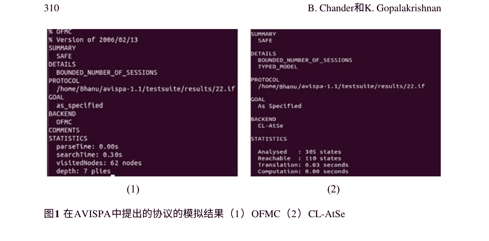

在任何类型的身份验证协议或机制中，分析安全措施是必不可少的。设计的协议实现了一些很好的基本安全水平，包括完整性和中间人攻击——通过MAC和数字证书验证实现的消息可靠性，因此，协议可以防止中间人攻击。密钥新鲜度——通过验证随机数值，确认在当前会话中生成的密钥。机密性——节点与节点、节点与CH以及CH与BS之间的初始身份验证使用共享的MAC密钥，因此，没有任何实体知道通信信息，通过这样做，协议可以防止回复攻击。冒充攻击——每个通信消息都使用预加载的共享秘密密钥和基于MAC的共享秘密密钥进行加密，这些密钥不是由攻击者生成的。在身份验证中，使用了数字证书，因此攻击者无法发送请求消息。DoS攻击——在提出的方案中，BS创建了一个数字证书，其余的来自传感器的请求消息在CH通过节点进行身份验证。在非常罕见的情况下，如果一个节点被干扰，它不会影响网络的整体性能。

###### 5.1 BAN逻辑分析：BAN逻辑的逻辑规则

- 消息含义规则（规则（1）） —P相信 Q 已经说过 X，P相信密钥K是与 Q共享或共享的密钥，P看到 X被 K加密。
- 随机数验证规则（规则（2）） —P相信 Q相信 X如果 P相信 X现在被发送并且 Q已经说过 X。
- 司法管辖规则（规则（3）） —P相信 X如果 P相信 Q对X有管辖权并且P相信 Q相信 X。
- 新传输规则（规则（4）） —P相信新的（X）/P相信新的（X，Y）。
- 信任聚合和信任投影规则（规则（5）） —P相信 X，P相信 Y/P相信（X，Y）P相信（X，Y）/P相信 X。
- 查看规则（规则（6）） —P可以解密他获得的消息，如果 P收到用自己的公钥加密的消息。

- 1. 证明 $A$相信 $A \leftarrow \boxed{K_{A,B}} \rightarrow B$
    (a) 因为 $A$ 相信 $A \leftarrow \boxed{\quad} \rightarrow CH$. A 可以看见 $(N_{\text{ch}}, C) K'_{CH,A}$ 基于规则1, A相信CH说‘$C$’
    (b) 因为 $A$ 相信新鲜的$(N)$ 基于规则2和规则4, 我们可以得到: A相信 CH相信‘$C$’
    (c) 因为 $A$ 相信CH控制‘$C$’ 来自规则3, A 相信新鲜的 $(N_{\text{ch}})$ 来自规则4, 我们可以得到: A相信‘$C$’。
    (d) 因为 $A$ 相信BS控制‘$C$’ 基于规则3, A 相信新鲜的 $(N_{\text{ch}})$ 来自规则4, 我们可以得到: A相信‘$C$’。
    (e) 总结根据规则5: 我们得到 $A \leftarrow \boxed{K_{A,B}} \rightarrow B$.

- 2. 证明 $B$相信 $B \leftarrow \boxed{K_{A,B}} \rightarrow A$
    (a) 因为 $B$ 相信 $B \leftarrow \boxed{K'_{B,CH}} \rightarrow CH$. B 可以看到 $(N_{\text{ch}}, C) K'_{CH,B}$ 从规则1, A相信CH说‘$C$’
    (b) 因为 $B$ 根据规则2、规则4, 我们得到: $B$ 相信Ch信任‘$C$’.
    (c) 因为 $B$ 根据规则3, CH指导‘$C$’, A 相信新鲜的 $(N_{\text{ch}})$ 来自规则4, 我们可以得到: B相信‘$C$’。
    (d) 因为 $B$ 根据规则3, BS控制‘$C$’, A 相信新鲜的 $(N_{\text{ch}})$ 来自规则4, 我们可以得到: A相信‘$C$’。
    (e) 根据规则5的结论: 我们可以得到 $B \leftarrow \boxed{K_{B,A}} \rightarrow A$

###### 6 结论

在无线传感器网络中, 安全性起着重要的作用, 感知数据记录不应轻易被非法节点获取。对无线传感器网络设备的攻击是由于焦虑的验证方案。文献中存在多种验证、认证方案, 但其中大部分需要大量的计算资源。但是, 无线传感器网络中的节点受到资源限制, 因此所提出的方案应简单、轻量且消耗较少的功率。在这里, 我们设计了一个安全的身份验证方案, 首先进行简单的集群技术, 然后, 传感器节点通过CH向BS请求数字证书。此外, 通过集群重新验证密钥进行重新验证, 可以通过避免为新证书进行不必要的计算来延长节点的寿命。MAC应用于每个消息以增加完整性和真实性。所提出的模型通过演化被证明是安全的, 并通过一个名为AVISPA的身份验证协议测试工具和BAN逻辑进行安全和可靠的初始化。

###### 参考文献

- 1. Binh HTT, Dey N (编) 无线传感器网络中的软计算。CRC出版社
- 2. Dogra H, Kohli J (2016) 使用密码技术进行安全数据传输的无线传感器网络：一项调查。印度科学技术杂志9 (47)
- 3. Rajeswari SR, Seenivasagam V (2016) 无线传感器网络中各种认证协议的比较研究。Sci World J 3
- 4. Lu Z, Qu G, Liu Z (2019) 关于车辆网络安全、信任和隐私的最新进展综述。IEEE智能交通系统杂志20 (2) : 760–776
- 5. Azees M, Vijayakumar P, Deborah LJ (2016) 车辆自组织网络中安全服务的综合调查。IET智能交通系统杂志10 (6) : 379–388
- 6. Chander B (2020) 聚类和贝叶斯网络。在: 大数据聚类和机器学习研究手册。IGI Global, pp 50–73
- 7. Choukimath RC, Ayyanavar VV (2014) 无线传感器网络中安全高效的中间节点认证。Int J Sig Process Syst 1 (3) : 71–74
- 8. Fu Z, Huang F, Ren K, Weng J, Wang C (2017) 基于加密外包数据的隐私保护智能语义搜索。IEEE Trans Inf Forensics Secur12: 1874–1884
- 9. Razaque A, Rizv SS (2017) 基于访问控制和认证的无线传感器网络安全数据聚合。Comput Secur 70: 532–545
- 10. Li X, Niu J, Kumari S, Wu F (2018) 物联网环境中无线传感器网络的三因素匿名认证方案。J Netw Comput Appl 103: 194–204.
- 11. Lee S, Kim K (2015) 在集群无线传感器网络下具有传感器认证的密钥更新方案。Electron Lett 51 (4) : 368–371
- 12. Benzaid C, Lounis K, Al-Nemrat AB, Nadjib AM (2016) 无线传感器网络中的快速认证。Fut Gener Comput Syst 55:362–375
- 13. Moon AHU (2016) 使用ECC和隐藏生成器的WSN身份验证协议。Int J Comput Appl 133(13):42–47
- 14. Yussoff YM, Kamarudin (2017) 无线传感器网络（WSN）的轻量级可信认证协议。Int J Commun 2:130–136
- 15. Jawad KM (2019) 基于对称加密的WSNs的改进的三因素匿名认证协议。在: 通信技术国际会议, ComTech 2019, pp 53–59
- 16. Bhanu C, Kumaravelan (2018) 使用数字证书在WSNs中进行简单且安全的身份验证。Int J Pure Appl Math 119(16):137–143
- 17. El Dayem A, Rizk SS, Mokhtar MA (2016) 无线传感器网络中的高效身份验证协议和密钥建立。在: 第六届国际信息通信和管理会议ICICM 2016, 第178-182页
- 18. Gaur SS, Mohapatra (2017) 基于聚类算法的无线传感器网络的高效无证书身份验证加密。Int J Appl Eng Res 12(14):4184–4190
- 19. Jung J, Moon J (2017) 无线传感器网络中高效且安全增强的匿名身份验证与密钥协商方案。传感器17(3)
- 20. Qin D, Jia S (2016) 无线传感器网络的轻量级身份验证和密钥管理方案。J Sens# 逻辑门的性能评估：使用磁隧道结

Jyoti Garg 和 Subodh Wairy

摘要：在今天的先进计算系统中，功耗和速度是任何设备的重要因素。随着技术的进步，MOSFET的通道长度减小，导致泄漏电流增加。出现了一种新兴技术——自旋电子学，具有低功耗、高可靠性和高耐久性，以克服所有这些问题。本文提出了基于磁隧道结的逻辑门——AND/NAND、OR/NOR。该方法表明它比其他方法消耗更少的功率。

- 自旋电子学
- 磁隧道结
- 逻辑门
- 非易失性逻辑器件

###### 1 引言

由于晶体管尺寸的缩小、电源电压的降低等原因，VLSI设计面临着许多挑战，这些都导致了漏电流的增加，从而降低了器件性能。许多技术，如QCA、CNFET、SET和纳米磁性器件，克服了这些问题[1-3]。自旋电子学是一种新兴技术，用于克服这些问题。有许多技术，如绝热电路、非传统CMOS和电容器中的能量存储[4]，用于低功耗设计。

在自旋电子学中，只需翻转电子的自旋即可改变晶体管的位置。因此，它具有几乎为零的待机功耗、高速和与CMOS的良好兼容性的特性。自旋转移扭矩具有高密度和无限耐久性的特性。它具有可扩展性的重要特征，因为只有在深亚微米区域中才需要CMOS的缩放，导致泄漏电流的流动[5]。在过去的几十年中，我们看到了使用CMOS技术的逻辑门。提出了使用MTJ的逻辑门来避免泄漏电流。有许多使用MTJ的现有逻辑门设计。使用MTJ的现有设计有助于降低功耗和延迟，但也存在许多其他缺点[6, 7]。MTJ具有存储和处理的特性，有助于减少内存和延迟。在使用MTJ进行逻辑设计时，总是需要一个感应放大器来读取数据并进一步处理。在[8]篇论文中，设计了一个具有六个MTJ和晶体管的磁性异或门。本文表明，它具有较小的面积，但晶体管的数量增加，导致写入能量也增加，这是一个显著的缺点。在[9]篇论文中，由于需要额外的电路，导致面积、功耗和延迟增加。在这些设计中，使用了单个MTJ来实现线性函数[10]。

如果要设计非线性函数，则可以使用线性函数进行设计，这是一个多阶段的过程。在[11]中，提出了自旋二极管逻辑家族，其中动态功耗大于写入功耗，动态功耗在设计数字电路中起着重要作用。因此，有一种技术是绝热的，用于设计低功耗电路。在绝热电路中，控制负载电容的充电和放电以减少功耗[12]。本文的剩余部分安排为磁隧道结的简要回顾、提出的电路描述、分析、结果和结论。

###### 2 磁隧道结

根据最新研究，MRAM具有一个中心关键元素——磁隧道结 (MTJ)（图1）。在MTJ中，有两层——一层是自由层，第二层是参考层。这两层都由铁磁材料形成；在这两层之间有一个氧化物层用于隧道效应。通过自由层到参考层磁化的磁化来以位形式存储信息‘0’（低电阻状态）或‘1’（高电阻状态）。如果自由层和参考层磁矩方向相反，则MTJ处于高电阻状态，并且被认为是高逻辑。如果自由层磁矩方向与参考层磁矩方向相同，则MTJ被认为是低电阻。它可以被读取为低逻辑[13]。在图1中表示MTJ，在图2中表示MTJ的低电阻和高电阻状态。

在MTJ中，写入电流与MTJ的尺寸成反比关系，这意味着如果MTJ的尺寸减小，则写入电流增加，反之亦然。设计小尺寸的MTJ需要大量电流，这是MRAM中的一个瓶颈。为了避免这个问题，STT MRAM应运而生。STT MRAM的基本结构包括1个晶体管和1个MTJ，称为1T1MTJ [14]。

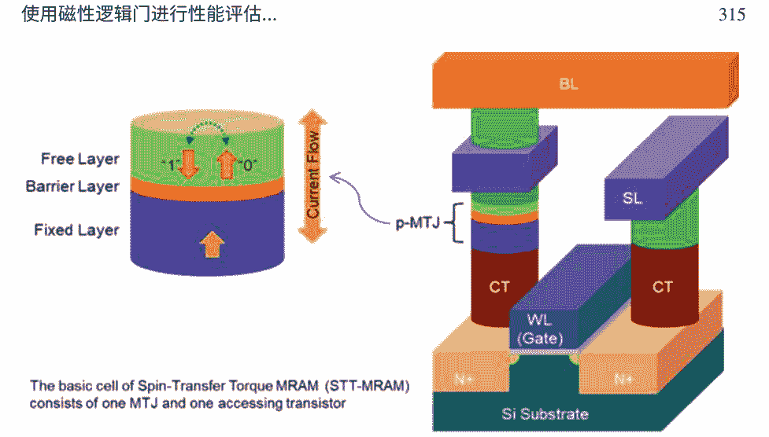

图1 磁隧道结构的表示

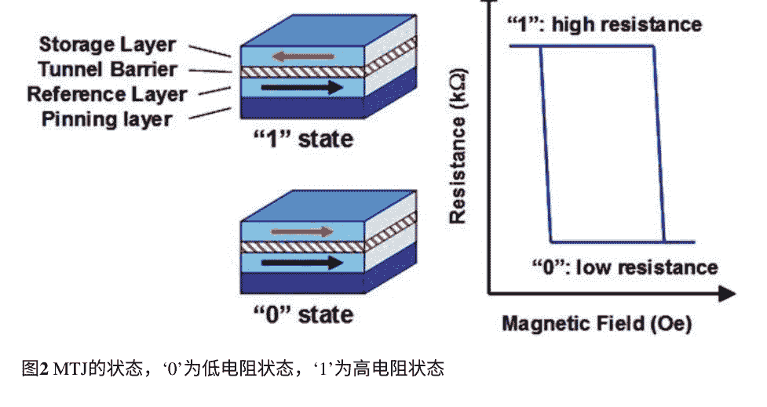

图2 MTJ的状态，‘0’为低电阻状态，‘1’为高电阻状态

###### 3 提出的方法

本节提出了基于磁隧道结构的逻辑电路。基于磁隧道结构的逻辑电路分为三个部分，如图3所示 [15]。第一部分是一个感应放大器，第二部分是CMOS逻辑，第三部分是MTJ部分。感应放大器形成一个上拉网络，CMOS逻辑和MTJ结合形成一个下拉网络。在STT MRAM中进行编程。在CMOS中，逻辑部分使用MOS元件设计，感应放大器则是最后一部分给出输出。在本文中，设计了一个感知放大器参考电路，参考文献来自[15]。图4和图5分别显示了基于磁隧道结的NAND/AND门和NOR/OR门的电路图。在图4中，同时实现了AND和NAND逻辑是通过同时考虑输入及其补码来实现的。在感知放大器中，有八个晶体管—P1, P2, P3, P4, N1, N2, N3和N7。晶体管N4, N5和N6构成了CMOS逻辑。输入1（A或Abar）应用于CMOS逻辑，输入2（B或Bbar）应用于MTJ。当MTJ1设置为Rap并且MTJ2设置为Rp时，输入B被视为逻辑1或反之亦然。如果输入A取0并且输入B取1，则通过输入'01'来解释工作原理。如果clk信号为'0'（预充电阶段），则P1和P4处于开启状态，P2、P3和N7处于关闭状态。如果clk信号为'1'，则P1和P4将处于关闭状态，N7将处于打开状态。晶体管N4和N5处于关闭状态。MTJ2处于并联状态，MTJ1处于反并联状态。电路的左分支处于截止状态，并且AND逻辑的输出接地。同时，NAND门逻辑被充电到最大供电电压VDD。在晶体管N3处施加一个可能根据预充电或评估阶段具有不同电压的放电信号。由于MTJ1处于反并联状态，NAND门分支具有较高的电阻，导致放电速度较慢。AND门分支放电速度较快，因此，晶体管P2越过其阈值电压水平，打开晶体管P3。此外，晶体管N3达到最大供应。AND门分支开始放电，并且它越过晶体管N1的阈值电压水平，使AND节点电压降低到低电平，但是晶体管N3处于导通状态，使节点电压升高。这在 AND 门逻辑上输出 0，在 NAND 门逻辑上输出 1。 类似地，OR 门逻辑/NOR 门逻辑电路可以解释。

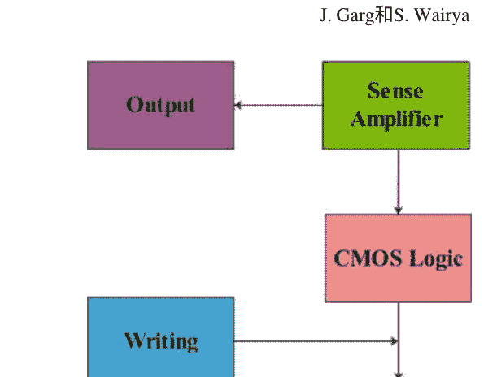

图3 基于MTJ的电路结构

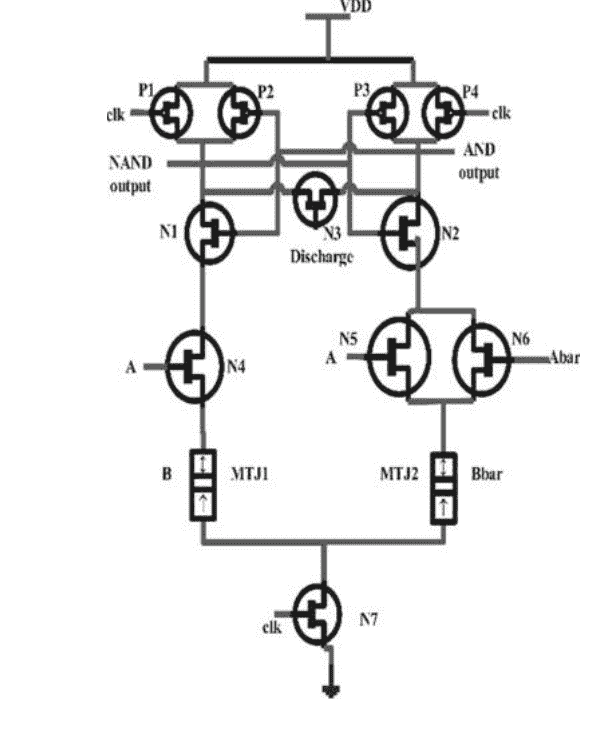

图4 使用MTJ的NAND/AND门

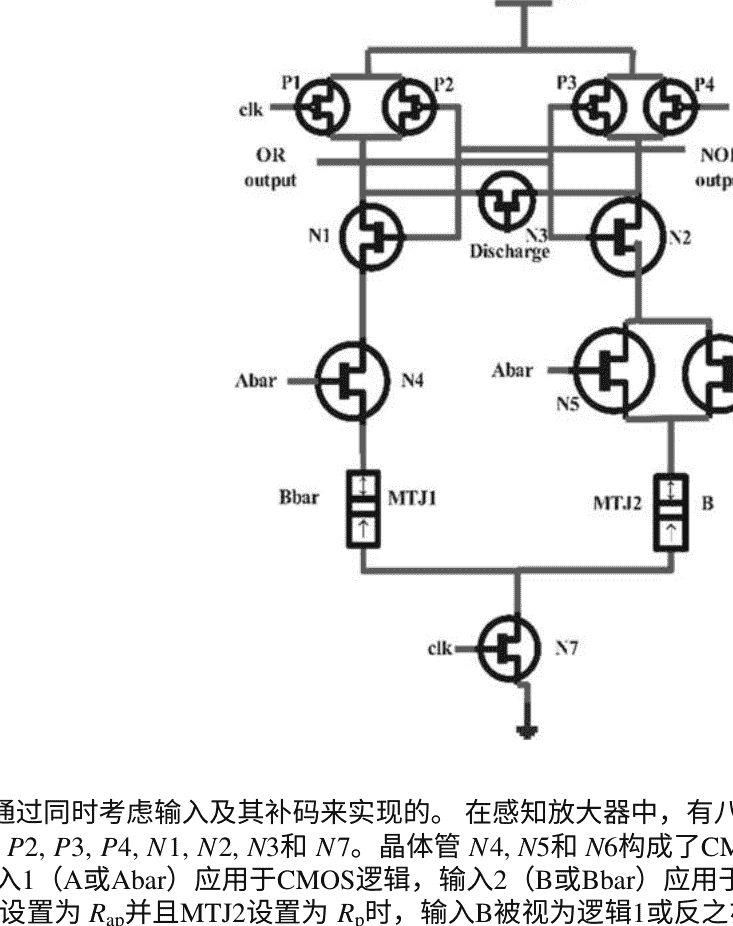

图5 使用MTJ的NOR/OR门

###### 4 逻辑电路的仿真和比较

使用 MTJ 进行 NAND/AND 门和 NOR/OR 门的逻辑电路仿真已进行性能评估。 使用 MTJ 的 NAND/AND 逻辑门和 OR/NOR 逻辑门的仿真结果如图 6 和图 7 所示。

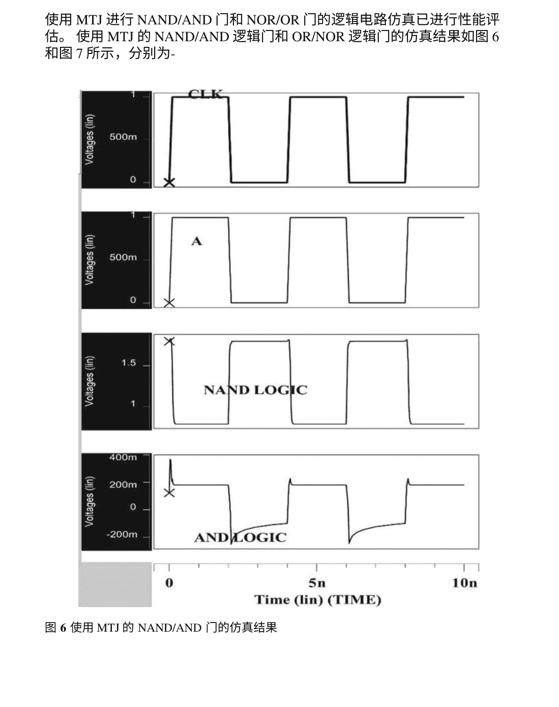

所有设计都在 HSPICE 工具中使用 CMOS 技术的 32 nm [16] 和 MTJ 模型 [17] 进行了仿真。 表1显示了使用MTJ设计的NAND电路的性能评估，与传统的CMOS NAND逻辑设计进行比较。 表2显示了使用MTJ设计的NOR电路的性能评估，与传统的CMOS NOR逻辑设计进行比较。

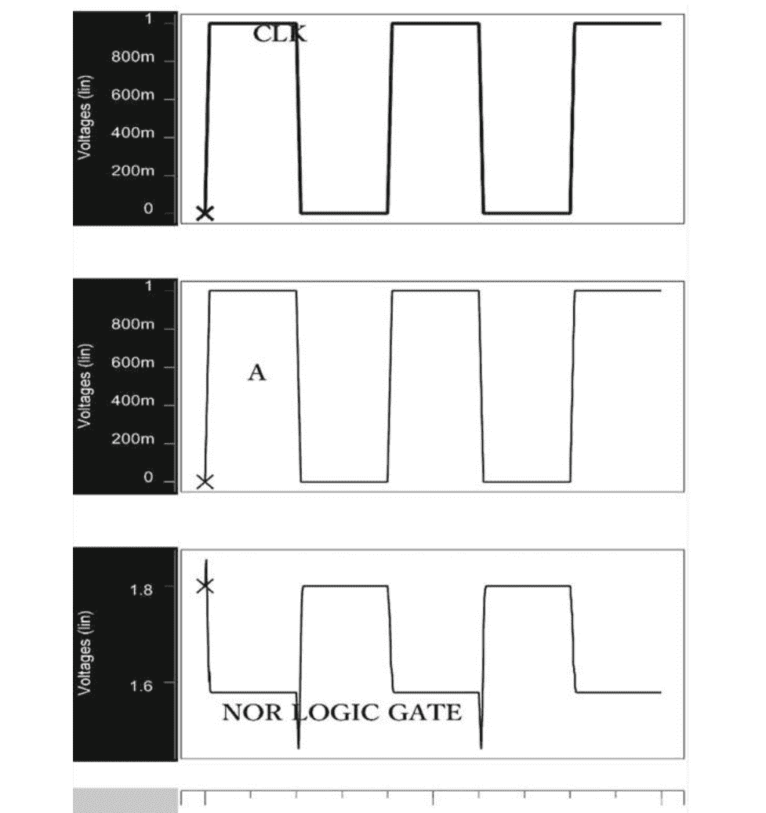

图7 使用MTJ的NOR/OR门的仿真结果

表1 使用MTJ与传统设计对NAND/AND门进行性能评估

| | MTJ设计 | 传统设计 |
| :--- | :---: | :---: |
| 动态功耗（nW） | 1.8 | 4.7 |
| 传播延迟（ns） | 34 | 29 |
| 待机功耗（nW） | 0.5 | 3 |

表2 使用MTJ与传统设计对NOR/OR门进行性能评估

| | MTJ设计 | 传统设计 |
| :--- | :---: | :---: |
| 动态功耗（nW） | 2.8 | 5.2 |
| 传播延迟（ns） | 42 | 38 |
| 待机功耗（nW） | 0.9 | 4.6 |

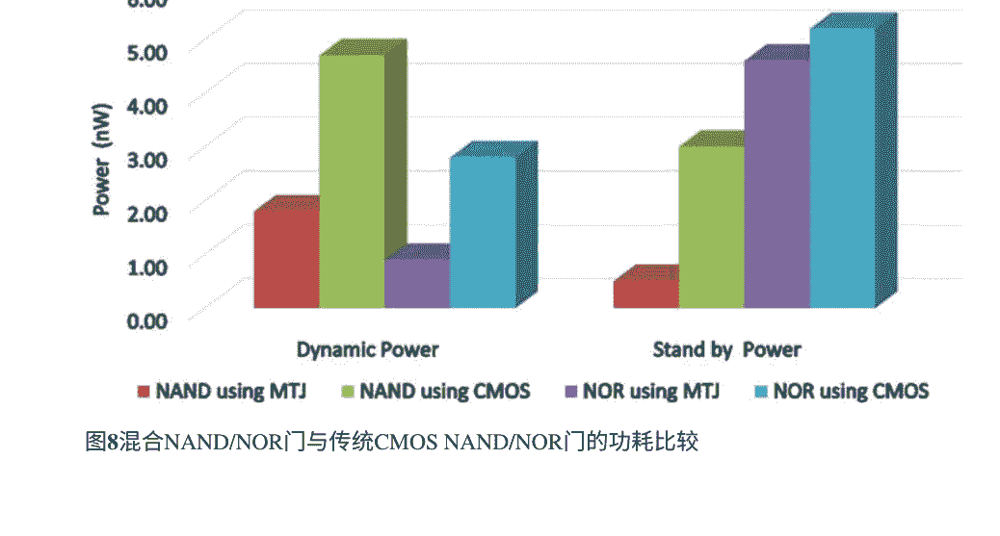

从上述结果，如表1和表2所示，可以得出结论，使用MTJ的逻辑电路比传统设计（图8）表现更好。

###### 5 结论

本研究论文试图表明，使用磁隧道结构的逻辑电路比传统设计显示出更好的结果。磁隧道结构对功耗问题的影响也进行了研究。本文模拟了NAND和NOR电路。可以得出结论，MTJ设计的功耗显著降低，超过50%。可以为MTJ创建一个后续的新型模型文件，以获得更好的结果。

###### 参考文献

1.  Goswami M, Kumar B, Tibrewal H, Mazumdar S (2014) 使用QCA多路复用器实现数字逻辑电路的高效实现。 在：第二届国际商务与信息管理会议（ICBIM）。 印度杜尔加普尔，第165-170页
2.  Sahoo R, Sahoo SK, Sankisa KC (2015) 使用最佳数量的CNT在通道区域设计高效的CNT FET以实现逻辑门。 在：国际VLSI系统架构、技术和应用会议（VLSI-SATA）印度班加罗尔，第1-4页。
3.  Rajasekaran S, Sundari G (2017) 使用单电子纳米器件设计和分析逻辑门。 在：国际电气技术与绿色能源进展会议（ICAETGT）。 印度哥印拜陀，第64-68页
4.  Padmavathi B, Geetha BT, Bhuvaneshwari K (2017) 低功耗设计技术和在VLSI电路中采用的实现策略。 在：IEEE国际电力、控制、信号和仪器工程学会议（ICPCSI），印度金奈，第1764-1767页
5.  Kim J, Paul A, Crowell PA, Koester SJ, Sapatnekar SS, Wang JP (2015) 基于自旋的计算：器件概念、当前状况和高性能微处理器的案例研究。
6.  Deng E, Zhang Y, Klein JO, Ravelsona D, Chappert D, Zhao W (2013) 基于自旋转转移矩存储器的低功耗磁全加器。
7.  Zhang D, Zeng L, Gao T, Gong F, Qin X, Kang W, Zhang Y, Klein JO, Zhao W (2017) 可靠性增强的分离式预充电感应放大器用于混合CMOS/MTJ逻辑电路。 IEEE Trans Magn 53(9):1-5
8.  Trinh HP, Zhao W, Klein JO, Zhang Y, Ravelsona D, Chappert C (2013) 基于磁性赛道存储器的磁性加法器。 IEEE Trans. Circ Syst I 60 (6) : 1469-1477
9.  Gupta MK, Hasan M (2016) 一种低功耗、鲁棒性强、易级联的基于PentaMTJ的组合和时序电路。 IEEE Trans Very Large Scale Integr (VLSI) Syst 24 (1) : 218-222
10. Mahmoudi H, Windbacher Th, V, S, S (2013) 使用自旋转移扭矩操作的磁隧道结的蕴涵逻辑门。 固态电子，191-197
11. Friedman JS, Rangaraju N, Ismail YI, Wessels BW (2012) 自旋二极管逻辑家族。 IEEE Trans Nanotechnol 11 (5) : 1026-1032
12. Agrawal A, Gupta TK, Dadoria AK, Kumar D (2016) 一种新颖高效的绝热逻辑设计用于超低功耗。 在：国际商业工业和政府信息通信技术大会（ICTBIG），印多尔，第1-7页
13. Ikega S, Mancoff FB, Janesky J, Aggarwal S (2020) 磁电阻随机存取存储器：现在和未来。 IEEE Trans Electron Dev 67(4):1407-1419
14. Garzón Es, De Rose R, Fe C, Li T, Lanuzza M (2019) 使用器件到存储器仿真框架评估STT-MRAM性能在纳米技术节点上。 J Microelectron Eng 215
15. Barla P, Shet D, Joshi VK, Bhat S (2020) LIM混合MTJ/CMOS逻辑的设计和分析 gates. 在：第5届国际设备电路和系统会议（ICDCS），科伊马托尔印度，第41-45页
16. Zhao W, Cao Y (2006) 用于45nm以下早期设计探索的新一代预测技术模型。 IEEE Trans Electron Dev 53 (11) : 2816-2823
17. Kim J, Chen A, Behin-Aein A, Kumar S, Wang JP, Kim CH (2015) 一种技术不可知的MTJ SPICE模型，具有用户定义的STT-MRAM可扩展性研究尺寸。 在：自定义集成电路会议（CICC），IEEE，第1-4页

##### 医疗物联网：自动医疗发药机

C. V. Nisha Angeline, S. Muthuramlingam, E. Rahul Ganesh, S. Siva Pratheep 和 V. Nishanthan

摘要：物联网（IoT）在各种高性能智能系统的发展中起着至关重要的作用。正在进行大量研究以改善人类生活的各个方面。其中一项研究是在医院管理领域进行的。在最近的COVID情况下，导致了社交隔离和无接触交易的概念，我们提出使用物联网的集中式医院管理系统。所提出的系统是一个移动应用程序，医生可以使用该应用程序从集中数据库中访问患者历史记录。医生可以根据他的诊断进行电子处方。电子处方是在患者端应用程序上生成的QR码。患者可以向自动医疗发药机（AMDM）展示QR码，该机器通过与QR码进行匹配向患者发放处方药物。这有助于避免70%由于手动处方而导致的医疗错误，并实现社交隔离和无接触交易的概念。

- 物联网
- 二维码
- 新冠病毒
- 社交距离
- 洗手液
- 安卓应用
- 药品

###### 1 引言

冠状病毒是一类病毒家族，引起多种呼吸道感染，从普通感冒到严重疾病如严重急性呼吸综合征（SARS）和中东呼吸综合征（MERS）不等。

约80%感染COVID-19的人不需要住院治疗就能康复。但另外20%因呼吸困难而变得危急。老年人和那些已经患有糖尿病、心脏病、肺病、高血压或癌症等医疗问题的人面临更大的风险变得关键。世界卫生组织（WHO）表示，COVID-19通过COVID-19感染者咳嗽、打喷嚏或说话时从鼻子或口中喷出的飞沫传播。如果一个正常人吸入这些飞沫，他们可能会感染COVID-19，因此保持社交距离非常重要。

这些飞沫也可以附着在任何物体和表面上，人们可能会被它们感染。因此，非接触式交易非常重要。许多医院在疫情期间发现很难维持正常的医疗服务[1]。患有慢性疾病和需要定期就医的人们因此感到无助。根据国家卫生任务行政数据统计，许多人因为去医院接受常规治疗而受到感染COVID的影响。因此，在过去的几个月里，医院拒绝了正常的咨询，并推迟了手术和手术，以防止患者感染COVID-19病毒。在卫生领域，有一个日益增长的需求，即通过自动化来防止这种传播，同时提供常规服务。因此，建议开发一种自动化的医疗发药机，避免人员接触，同时前往医院和分发药物时。

###### 2 COVID-19情况下面临的挑战

印度的医院管理系统没有准备好应对当前的COVID情况。印度的医院仍处于发展阶段，面临着医生、护士、药物和设备不足等许多挑战。在当前的疫情形势下，没有发现疫苗，最好的机会就是避免人们感染。在医院工作的医生们都不敢回家，他们在单独的住所中隔离自己，以免感染家人。对于前往医院就诊的非COVID患者也是如此。许多病例报告称，他们因为最近看病治疗慢性疾病而感染了COVID-19，这几乎就像是从锅里跳进火堆。现在，医疗保健部门必须寻找方法为常规患者提供一般服务，同时防止感染传播。

###### 3 自动医疗发药机的需求

无论是农村还是城市，都需要避免面对面的会面，但仍然要提供正常的医院服务。让我们考虑一个糖尿病患者的例子，他定期去医院就诊。每个月，医生可能需要检查他的血糖水平，并根据患者的情况提供咨询和开药。在常规就诊中，患者可能亲自去看医生并完成上述步骤。同样的事情也可以通过虚拟方式进行。使用设备中的传感器和移动应用程序。 如果有患者需要药物，可以通过自动化机器完成，无需任何身体接触。 因此，自动医疗发药机非常有帮助。

- 确保社交距离
- 确保无接触的付款和药物分发。

###### 4 现有解决方案

###### 4.1 使用条形码的半自动发药机

开发了一种条形码辅助系统，用于医疗管理和发药系统，有助于自动化药物订购和分发过程[2]。 该系统有助于管理医生的医嘱，检索患者以前的用药信息，识别患者的身份，并分配熟练的劳动力工作。 然而，该系统是半自动的。 在研究中，医院的护士需要扫描患者的腕带或患者的徽章上的条形码。护士们必须记录医生给患者开的药物，并手动从药房取药。 这也被认为不具备成本效益，因为为以前的护士提供了一台具有无缝无线连接的笔记本电脑，以从医院服务器获取药物数据。

###### 4.2 药物数据传输系统

在布里格姆和妇女医院 (BWH) ，医生将药物详细信息输入计算机化医嘱输入软件[3]。 医生输入的药物信息将以电子方式发送到药房信息系统。 常用的药物存放在半自动化药物发放机中，而不常用的药物则由护理部门监管。 该系统不记录给患者使用的药物，没有药物的历史数据，该系统容易出现药物重复问题。

###### 4.3 新生儿病房的计算机化医嘱输入 (CPOE)

医生使用Sayan-HIS (医院信息系统) [4]来自动化药物和实验室检查的处方过程。 患者不需要携带任何纸质账单或处方，一切都会及时在系统中提供。患者就诊时不需要携带任何纸质账单或处方，一切都会在系统中提供。医院信息系统还通过检查医生开出的处方来核对药物的剂量。


###### 5 提议的解决方案

提议的解决方案是在全国范围内建立一个集中的医院数据库。每个公民都通过他们的Aadhar身份证与数据库相连，作为医生/患者。任何在全国范围内就医的公民都将被要求提供他们的Aadhar身份证进行登记。医生使用DocHelp应用程序从集中数据库中查看患者的以前病史。数据库存储了患者在任何咨询过的医生处的所有以前的就诊记录。医生可以

- (a) 查看个人资料
- (b) 查看病史
- (c) 查看用药历史
- (d) 开处方药。

为了访问患者记录，医生必须扫描患者MediHelp应用程序上的QR码。咨询结束后，医生在MediHelp应用程序中针对患者的身份证提供电子处方。电子处方将自动对患者可用。咨询费也可以在线支付。上述步骤适用于正常咨询情况。

在我们当前的COVID-19大流行情况下，医院的访问受到限制，医生可以在他的日历中分配时间段供患者预约他的虚拟协助。在时间段内，医生可以通过上述应用程序虚拟地接待患者并通过视频通话咨询他们。如果需要进一步的协助，医生可以为其分配一个时间段。

病人就诊时要避免医院里的人群。电子处方可以通过在线预约进行家庭递送或通过自动医疗分发机（AMDM）进行发放，该机器类似于放置在许多地点的ATM。当病人向AMDM机器的面板展示他的QR码时，机器会按照处方发放药物。机器、医院和病人的整体数据库由AMDM管理员应用程序（图1）维护。

###### 我们解决方案中的5.1模块

- 自动化医疗分配机器（AMDM）
- DocHelp应用程序
- MediHelp应用程序
- AMDM管理员应用程序。

自动化医疗分配机器（AMDM）由显示面板和从患者应用程序捕获QR码并将其提供给ZBar条形码阅读器的网络摄像头组成。一旦处方被扫描，面板将显示药物清单和相应的药物价格。就像在线购物一样，患者可以根据自己的选择修改订单，然后在患者应用程序中点击确定。他不需要触摸机器上的面板，从而实现无接触交易。

一旦患者批准药物清单，付款将通过患者端应用程序的在线支付方式进行检测，并通过机器分配药物。机器的软件是在树莓派上编写的，树莓派是一台微型计算机，通过WiFi将机器连接到互联网。

###### Firebase

使用Firebase来维护移动应用程序的集中式数据库。Firebase使用BaaS提供服务。使用Firebase使我们的应用程序更加优化，因为应用程序使用“WebSocket”连接到数据库，而不是使用常规的HTTP调用来访问用户数据。WebSocket的使用通过单个套接字连接极大地优化了移动应用程序的性能。
我们所有的应用程序都使用Firebase作为数据库和用户认证的后端服务。Firebase自身提供了安全功能，因此应用程序的数据是安全的。

###### ZXing

我们使用了ZXing，一个开源的Java图像处理库，用于扫描多格式的一维/二维条码。该库用于在应用程序中生成和读取QR码。

###### 材料设计

Google的材料设计确保所有应用程序的用户界面标准化和更易于交互。

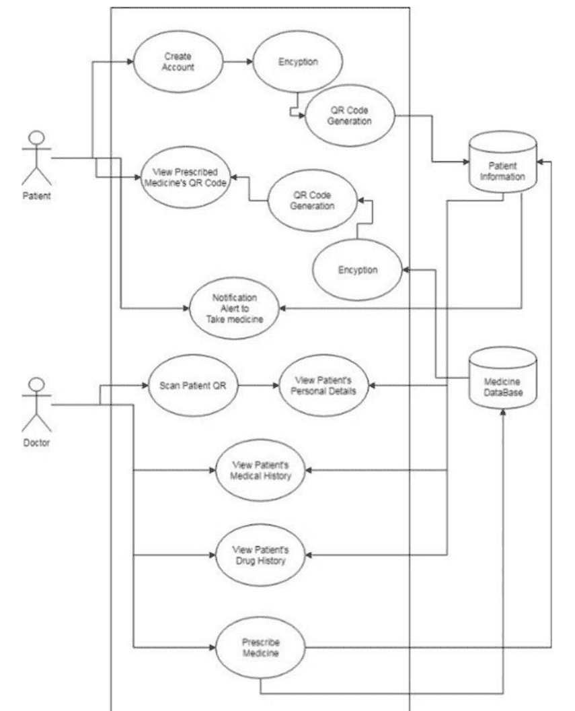

###### 图2 MediHelp和DocHelp的用例图

###### 系统工作流程

参见图2、3、4和5。

###### 6 结论和未来展望

提出的AMDM项目在COVID-19等疫情期间克服了人类互动的问题。与传统手动系统相比，

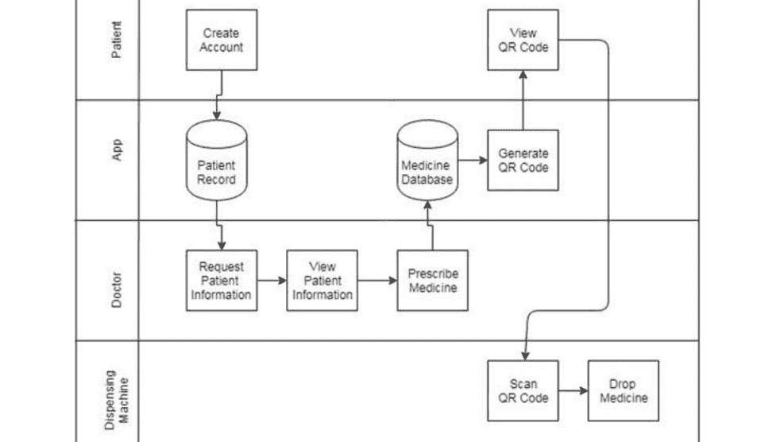

###### 图3 描述AMDM工作原理的泳道图


###### 图4 MediHelp应用程序（患者端应用程序）的屏幕截图

提出的AMDM可能在医院的非接触式药物配药和咨询方面有更大的帮助。计划将该机器扩展为一个独立设备，以便在农村地区通过AMDM向医生提供电话通话功能，以便远程地点的患者可以立即咨询并及时配药。该机器将配备传感器，可以检测体温和氧饱和度水平，作为未来的增强功能。


###### 图5 DocHelp应用程序（医生端应用程序）的屏幕截图

###### 参考文献

1. https://www.who.int/emergencies/diseases/novel-coronavirus-2019
2. Poon EG, Cina JL, Churchill W, Patel N, Featherstone E, Rothschild JM, Keohane CA, Whit-te more AD, Bates DW, Gandhi TK (2006) 药物配药错误和潜在不良药物事件在药房实施条形码技术之前和之后。 Ann InternMed 145:426–434
3. Maviglia SM, Yoo JY, Franz C, Featherstone E, Churchill W, Bates DW, Gandhi TK, Poon EG (2007) 医院药房条形码解决方案的成本效益分析。 Arch Intern Med 167:788–794
4. Kazemi A, Ellenius J, Pourasghar F, Tofighi S, Salehi A, Amanati A, Fors UG (2011) 计算机化医嘱录入和决策支持系统对新生儿病房药物错误的影响：来自伊朗一所教学医院的经验

##### FSO中数字调制格式的性能分析

Monica Gautam和Sourabh Sahu

摘要 自由空间光学（FSO）是一种技术，通过在大气中传播光信号来实现信息从一端传输到另一端。它的工作原理类似于光纤，但无需任何物理连接来建立发射机和接收机之间的连接。与传统光纤通信相比，FSO通信既更快速又更具成本效益。在提出的工作中，比较了开关键控（OOK）和相移键控（PSK）技术。考虑的最重要参数是质量因子（Q），误码率（BER）和眼高。在这项工作中，考虑了与调制方案相关的研究，这些研究对于实现三个任务非常重要，即传输数据的效率，对非线性的抵抗性和实施的便利性。使用电气和光学模型进行了完整的研究。

- OOK
- PSK
- BER
- FSO
- DPSK
- O-QPSK
- CW
- NRZ
- RZ
- MZ

###### 1 引言

FSO是一种无线通信技术，它使用光信号在自由空间中从发射器传输信息到接收器作为信道[1]。二氧化硅管中的非线性光学领域已有20多年的历史[2]。为了提高性能，FSO被用于实现更大的带宽[3]。

调制是一个过程，通过该过程我们可以改变载波的任何物理特性，信号中包含了数据。它涉及到数据映射的过程[4]。PSK具有更高的效率，有助于增加通信容量。数据支持在光学信息的相位上[5]。如果相位根据数据进行改变，那么就会产生PSK信号。根据相位的分区数量，它被分为不同的类型，例如二进制相移键控（BPSK）和正交相移键控（QPSK）。BPSK使用两个相位来传输载波信号，相位之间相隔180°[5]。在BPSK调制中，第一个相位表示“1”，而第二个相位表示“0”[5]。信号改变其电平，相位变化为180°或0°。QPSK调制使用四个不同的相位值，相隔90°。QPSK通过减少数据速率一半来为其他用户腾出空间。QPSK，也被称为四相位。BPSK传输2 bps，而QPSK用于传输4 bps[4]。我们还可以使用多级调制格式，因为它可以增加光纤通信的比特率和容量[6]。

在光纤通信的开始阶段，数字信息首先被转换为数字“0”和数字“1”[7, 8]。幅度键控调制（ASK）广泛应用于许多规模的光学系统和网络中。相位键控调制（PSK）在长距离传输系统中相对于ASK表现出优势[9]。根据他们的需求，可以设计接收器，并且可以使用光延迟线干涉仪和光电探测器制造。数字调制技术可以通过利用光学器件（例如延迟线干涉仪）来实现光通信，这些器件通常是Mach-Zehnder（MZI）型或基于多光束干涉的Michelson型干涉仪，其中一束光相对于其他光束按所需的时间间隔进行延迟。

锂铌酸锂（LiNbO₃）具有非常高的固有调制带宽，设备切换速度受多种物理常数的限制[10]。因此，更好的选择是Mach-Zehnder（MZ）调制器。MZ调制器有三个端口：第一个端口用于调制，第二个端口用于连续波（CW）激光器，第三个端口提供输出[11]。通常，在接收端，基于硅光子学的延迟线干涉仪也可以用于调制，以保持低成本的直接检测[12]。延迟线干涉仪也被称为光差分相移键控（DPSK）解调器。在应用于DPSK时，调制延迟线干涉仪将相位键控信号转换为幅度键控信号。当光波的干涉发生时，MZI用于吸收干涉。

###### 2 调制的实现

Khajwal等人[13]提出了一篇论文，并研究了与FSO相关的各种补偿。作者分析了FSO的性能-单输入单输出（SISO）和FSO-波分复用（WDM）在几种大气情况下的表现。已经研究了接收信号的质量，以及在不同天气条件下的传输范围和功率。

Elayoubi等人[14]展示了50%的返回零（RZ）差分相移键控（DPSK），证明在40 Gbps比特率下，其性能优于差分相移键控（DPSK）和非返回零开关键控（NRZ-OOK）从卫星到地面。然而，发射机中的电气NRZ-RZ转换器仍然是必要的附加设备，这是一个缺点[15]。已经使用仿真软件进行了评估。

Alifdal等人[16]研究了不同色散值下的光信噪比(OSNR)。基于偏移正交相移键控(OQPSK)调制，作者提出了波分复用(WDM)的优势。作者使用MATLAB和Optisystem仿真展示了当色散系数较高时，误码率(BER)和光信噪比(OSNR)的改善。相反，作者观察到给定系统在降低误码率方面的有效性。

Sanou等人[17]演示了与OQPSK滤波器相关的正交频分复用。在类似的研究中，该方法可以将信号发送到更远的距离，并且不需要针对特定距离进行均衡。通过这项工作，带宽得到最大化，因为不使用循环前缀。此外，发射机和接收机的复杂性保持紧凑。

###### 3 数字方案

通常，一个开关键发射机是通过强度调制制成的，由电信号驱动。开关键发射表示根据信号的开和关[18]。通常，我们会使用激光源的OOK来通过光域传输数据[8]。随后，脉冲相位被随机调制，以逆向方式抑制载波参数[19]。掺铒放大器是光纤系统发展中最重要的进展[20]，但其操作水平可能因老化和其他影响而波动[21]。

###### 4 差分相移键控

相位偏移可能仅发生在逻辑“1”上。基于数值模拟，从NRZ-OOK到RZ BPSK和RZ QPSK的转换可能在40 Gbps系统中实现[14]。因此，我们可以将其他格式转换为DPSK，以获得更多优势。

###### 4.1 DPSK系统

电气系统的基本设置如图1所示。该系统可以分为两个重要的部分，即发射机和接收机。首先，使用伪随机二进制序列（PRBs）生成DPSK电信号，序列长度为256位，并通过电链路传输RZ波。接收机由DPSK脉冲发生器组成，比特率为30.375 Mbps，采样率为19.4 GHz。这里每个比特使用64个样本。正交检测器在550 MHz下运行，增益为2 dB。图2显示了DPSK电的眼图。BER显示了无误操作[22]。

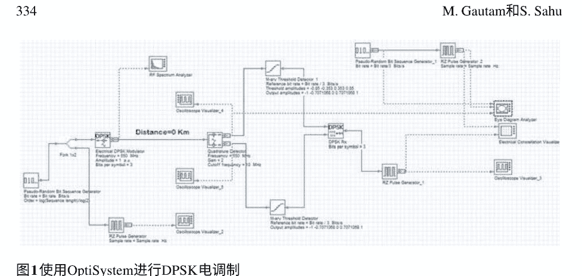

###### 图1 使用OptiSystem进行DPSK电调制

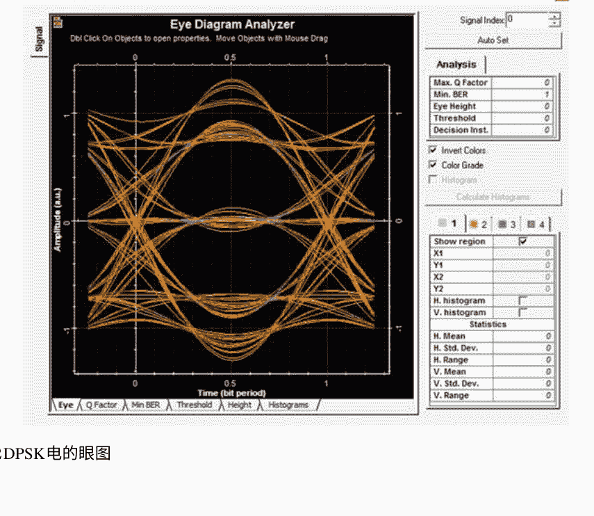

###### 图2 DPSK电的眼图

###### 4.2 DPSK光学系统

图3展示了使用光链路设计DPSK信号的过程。在这种方法中，信号以DPSK格式进行光调制，然后通过光纤传输。发射系统由4 mW功率的CW激光源组成，频率为193.1 THz，非归零(NRZ)波形由长度为128位的PRB的二进制值生成，并以40 Gbps的数据速率提供给MZ调制器。为了进行长距离传输，使用了六个光环。在接收端，使用一个低通滤波器，其工作在0.8 ×比特率。比特率是总系统长度的函数[22]。系统的输出在60 km处观察到。图4显示了该系统的眼图。

###### 5 偏移正交相移键控

直接和移位序列与载波结合，然后添加以生成数字OQPSK。通常，OQPSK调制器消耗更多的能量和面积[23]。

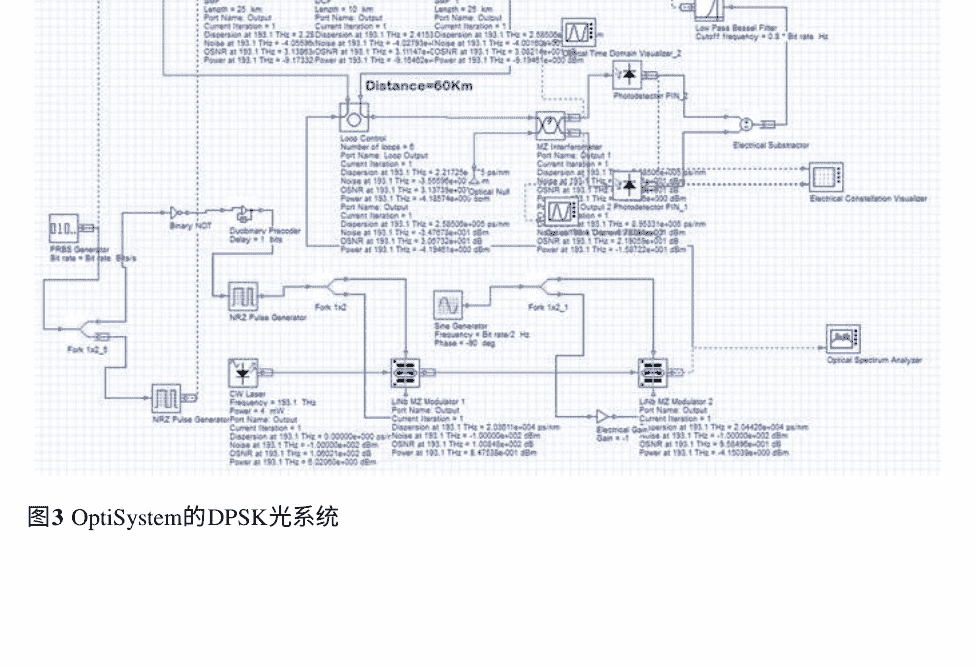

###### 5.1 OQPSK系统

图5显示了OQPSK电气系统的基本设置，其中OQPSK信号首先通过电气信道生成，然后发送。它主要由两个部分组成，即发射机和接收机。在发射机系统中，OQPSK信号通过使用长度为256位的PRB和经过OQPSK调制器的RZ波电气生成。正交检测器在550 MHz下以2 dB的增益运行，其中比特率速率为30.375 Mbps，采样率为19.4 GHz。每个比特取64个样本。接收机主要由OQPSK脉冲发生器组成。图6显示了I和Q输出的眼图。

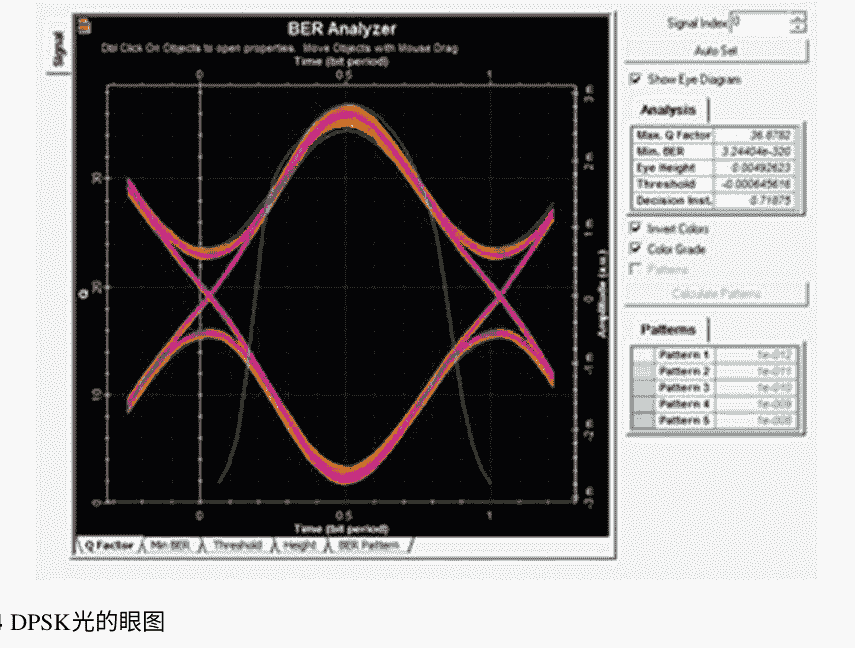

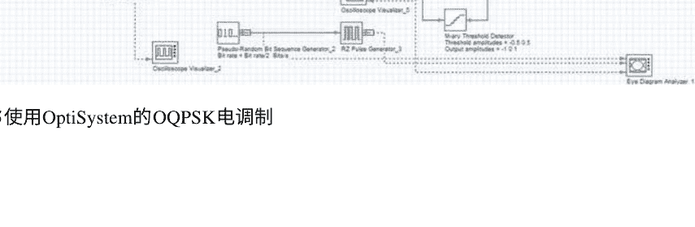

###### 图6 OQPSK电调制的眼图

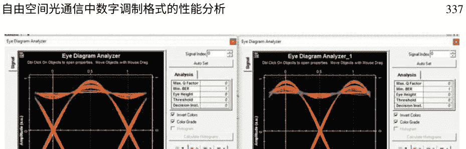

###### 5.2 OQPSK光系统

图7显示了OQPSK光系统的设计。二进制数据生成一个波形，该波形将被分成45°。最后，通过添加两个相位来发送所需信号。发射机由功率为4 mW、频率为193.1 THz的CW激光源和长度为256比特的PRBs的二进制值产生的NRZ波形组成，并以40 Gbps的数据速率提供给MZ调制器。两个调制器之间有90°的相位差。2个MZ调制器调制光信号产生I和Q部分。接收机由工作在90°光混合耦合器原理上的解调器组成。接收到的信号经过调制并分为I和Q两部分，如图8所示。在这里，每个比特采样32次，并在10公里处观察响应。我们使用OSNR分析仪和BER分析仪来可视化BER和OSNR。运行模拟后，我们可以从眼图中可视化结果。

###### 图7 使用OptiSystem的OQPSK光调制

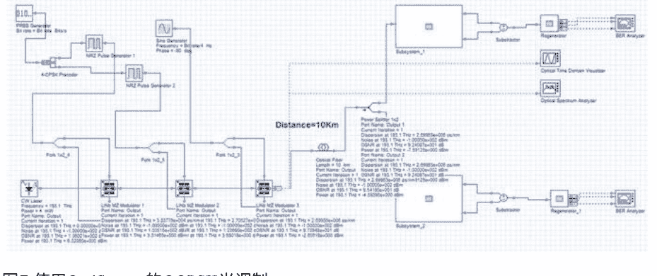

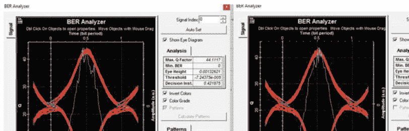

###### 6 结果和讨论

实际上，当使用RZ脉冲时，RZ-DPSK证明比DPSK和NRZ-OOK更好，主要是因为减少了符号间干扰（ISI）[14]。本文重点研究FSO信道失真的各种方法以及光传播限制的影响。我们已经描述了DPSK和OQPSK的比较。表1显示了用于DPSK和OQPSK技术的不同参数的比较。一般来说，最大可接受的误码率约为10⁻⁹ [24]。

| 数字方案 | 差分相移键控 | | 正交差分相移键控 | | | |
| --- | --- | --- | --- | --- | --- | --- |
| 参数 | 电气 | 光学 | 电气I | 电气Q | 光学I | 光学Q |
| 比特率 (bps) | 30.375 M | 40 G | 30.375 M | | 40 G | |
| 频率 (Hz) | 550 M | 193 T | 550 M | | 193 T | |
| 距离 (km) | 0 | 60 | 0 | | 10 | |
| 质量因子 | 0 | 36.0093 | 0 | 0 | 44.1117 | 43.854 |
| 眼睛开口 (au) | 0 | 0.0049397 | 0 | 0 | 0.0013262 | 0.0013204 |
| 误码率 | 1 | 4.94066e-324 | 1 | 1 | 0 | 0 |

Usha等人[23]提出了一种新的正交差分相移键控方法，对现有方法和布斯乘法器方法进行了比较。本文重点研究了面积减小问题。该工作没有提供有关误差、质量因子和眼睛高度的任何计算。该工作没有比较来自其他PSK格式的方法，主要使用的参数方面。

###### 7 结论

在提出的工作中，我们比较了最流行的调制系统。通常，FSO传输介质包含发射器和接收器。这是一种用于在可见光或红外（IR）光学中发送信息的技术。基于互联网的服务和移动电话的快速增长，以及多媒体服务的出现将导致流量的巨大增加。这需要大规模扩展公共网络的传输能力。已经确定，低功耗的调制器可能具有更高的效率。OQPSK调制器消耗更多功率，因此如果功率是一个重要参数，我们更喜欢DPSK。还观察到，在多波束FSO系统中使用激光束组合技术可以显著减少大气湍流的影响。

###### 参考文献

1. Kaur M, Anuranjana SK, Kesarwani A, Vohra PS (2018) 分析自由空间光通信的内部参数。在：2018年可靠性、信息通信技术和优化国际会议（ICRITO），印度诺伊达，2018年，pp 298-301。 https://doi.org/10.1109/ICRITO.2018.8748599
2. Chraplyvy AR (1994) 非线性对光波系统的影响。 Opt Photon News 5:16-21
3. Bloom S, Korevaar E, Schuster J, Willebrand H (2003) 理解自由空间光学的性能[邀请]。 J Opt Netw 2:178-200
4. Prakash SA, Banu AT, Raghu EB, Prakash P (2018) 使用延迟线滤波器进行多级调制格式转换。 在：2018年IEEE世界通信工程研讨会（WSCE），新加坡，新加坡，pp 1-4。 https://doi.org/10.1109/WSCE.2018.8690527
5. Kishikawa H, Seddighian P, Goto N, Yanagiya S, Chen LR (2011) 使用延迟线干涉仪进行全光调制格式从二进制到四相移键控的转换。 在：IEEE光子学学会第24届年会，弗吉尼亚州阿灵顿，第513-514页。 https://doi.org/10.1109/PHO.2011.6110647
6. Kikuchi N (2005) 用于高速光纤通信的幅度和相位调制的8进制和16进制多级信号技术。 在：SPIE 6021的论文集，光传输，切换和子系统III，602127（2005年12月9日）。 https://doi.org/10.1117/12.636406
7. Charlet G (2006) 高比特率WDM传输的光调制格式进展。 IEEE J Sel Top Quantum Electron 12(4):469–483。 https://doi.org/10.1109/JSTQE.2006.876185
8. Gumaste A, Antony T (2002) DWDM网络设计和工程解决方案。 思科出版社，印第安纳波利斯
9. Yan C等（2006年）使用单个饱和SOA将NRZ转换为BPSK的全光格式转换。IEEE光子技术快报18（22）：2368-2370。https://doi.org/10.1109/LPT.2006.885633
10. Wootten E L等（2000年）用于光纤通信系统的铌酸锂调制器综述。IEEE J Sel Top Quant Electron 6（1）：69-82。https://doi.org/10.1109/2944.826874
11. El-Nahal FI, Salha MA（2013年）OQPSK和DPSK双向无线电光纤传输系统的比较。Univers J Electr Electron Eng 1（4）：129-133。https://doi.org/10.13189/ujeee.2013.010405
12. Zheng L, Du J, Xu K, Wu X, Tsang HK, He Z（2017年）使用硅微环调制器进行高速DPSK调制，达到30 Gbps的短距离光通信。2017年第16届光通信与网络国际会议（ICOCN），乌镇，页1–3. https://doi.org/10.1109/ICOCN.2017.812199
13. Khajwal TN, Mushtaq A, Kaur S（2020）不同大气条件下FSO-SISO和FSO-WDM系统的性能分析。在：2020年第7届信号处理和集成网络国际会议（SPIN），印度诺伊达，页312-316。https://doi.org/10.1109/SPIN48934.2020.9071116
14. Elayoubi K, Rissons A, Lacan J, St. Antonin L, Sotom M, Le Kernec A（2017）用于卫星自由空间光通信的RZ-DPSK光调制。在：2017年光电子与通信会议（OECC）和光子全球会议（PGC），新加坡，页1-2. https://doi.org/10.1109/OECC.2017.8115015
15. 岡村Y, 花輪M（2012）全光生成與参考光交錯的光BPSK/QPSK信號。IEEE光子技术信件24（20）：1789-1791。https://doi.org/10.1109/LPT.2012.2209867
16. Alifdal H, Abdi F, Abbou FM（2017）在FWM效应和色散下使用OQPSK调製的80 Gb/s WDM系统性能分析。在2017年無線技術、嵌入式和智能系统國際會議（WITS）上，菲斯，頁1-6。https://doi.org/10.1109/WITS.2017.7934663
17. Sanou SR, Zougmore F, Koalaga Z（2014）OFDM/OQPSK调製在長距離纖維超過1600公里的光高速傳輸中的性能。Glob J Res Eng Gener Eng 14（2）：9-14
18. Vanmathi P, Sulthana AKT（2019年）在OAF中使用OOK和BPSK调制的混合光放大器性能。在：2019年智能计算与控制系统国际会议（ICCS），印度马杜赖，第695-699页。https://doi.org/10.1109/ICCS45141.2019.9065900
19. Mishina K, Kitagawa S, Maruta A（2007年）基于光纤非线性的全光调制格式转换从开关键控制到多级相移键控。Opt Expr15:8444–8453
20. Zhou Y, Lord A, Sikora S（2002年）超长距离WDM传输系统。BT Technol J 20:61–70。https://doi.org/10.1023/A:1021386818577
21. Novak S, Moesle A（2002）EDFAs中增益调制的分析模型. J Lightwave Technol 20:975. https://www.osapublishing.org/jlt/abstract.cfm?URI=jlt-20-6-975
22. Sato K（2002）用于40-Gb/s传输系统的半导体光源. J Lightwave Technol 20(12):2035–2043. https://doi.org/10.1109/JLT.2002.806763
23. Chraplyvy AR, Tkach RW（1993）放大光波系统中单模光纤的实际容量是多少？ IEEE Photon Technol Lett 5(6):666–668. https://doi.org/10.1109/68.219704
24. Usha SM, Mahesh HB（2019）用于OQPSK调制器的低功耗和面积优化架构. 在: 2019年无线通信信号处理和网络国际会议(WiSPNET), 印度金奈, pp 123–126. https://doi.org/10.1109/WiSPNET45539.2019.9032723
25. Shaina, Gupta A（2016）对恶劣天气条件下各种光传输窗口的自由空间光通信系统进行比较分析。 Procedia Comput Sci89:99–106

##### 在FPGA中元胞自动机-贝洛索夫-扎博金斯基反应的高级综合

P. Purushothaman, S. Srihari和S. Deivalakshmi

摘要 贝洛索夫-扎博金斯基（BZ）反应是一种在空间和时间上振荡的化学反应。该反应涉及复杂的机制和步骤。然而，元胞自动机（CA）的简单数学模型可以用来复制该反应。元胞自动机长期以来一直被用来模拟各种物理过程，这些模拟可以揭示看似复杂的过程中涉及的数学细节。CA设计原型用于模拟扩散过程和化学反应。与基于CPU的架构相比，CA模型在FPGA中实现可以实现加速结果。在这项研究中，我们使用Vivado HLS的高级综合方法在Xilinx FPGA上实现了BZ反应。

关键词 Belousov Zhabotinsky 反应 · 元胞自动机 · 高级综合

###### 1 引言

###### 1.1 元胞自动机

元胞自动机的概念由Neumann [1]和Stanislaw Ulam在1950年代引入，作为一种离散的计算模型，并用于表示复杂和非线性的动态系统。它在现实世界中有各种应用 [2, 3]，从建模复杂的生物系统 [4]，开发更好的密码算法 [5]，到提供一个框架来模拟社会经济实践对环境模型的影响 [6]。根据Stephen Wolfram [7]，元胞自动机主要分为四种类型，即：

- 模式稳定为同质性
- 模式演变为振荡结构
- 模式以混沌方式演变
- 模式变得非常复杂，并且具有稳定的局部结构，持续时间很长。

BZ反应属于第四类，其中稳定的局部结构在很长时间内重复出现，整体模式令人困惑而复杂。

CAs是FPGAs作为硬件加速器的第一个使用案例之一[8, 9]。FPGA技术和可扩展性的改进使其成为实现CA模型的正确选择。然而，随着CAs引入了新的算法和操作，开发人员面临着在低级语言如Verilog和VHDL中编写它们的困难。

###### 1.2 高级综合

高级综合（HLS）是一种用于编程FPGA的方法。它提供了在高级语言（如C/C++）中实现FPGA架构的自由。它帮助设计师在较短的时间内实现复杂算法。尽管开发时间减少了，但硬件实现并不保证比传统方法优化。设计师可以通过使用HLS软件中的编译器指令来克服这些问题，这有助于分配资源、进行流水线处理和各种其他优化。Xilinx提供了Vivado HLS工具[10]，用于使用高级综合流程编程他们的FPGA，并带有许多优化指令。

P. Purushothaman (✉) · S. Srihari · S. Deivalakshmi
印度泰鲁伊拉帕利国立技术学院，620015，泰米尔纳德邦，印度
e-mail: 108117077@nitt.edu

S. Srihari
e-mail: 108117096@nitt.edu

###### 2 Belousov Zhabotinsky 反应

Belousov Zhabotinsky反应（BZ反应）[12]如图1所示，是一种常见的基于时间的振荡化学反应。它遵循非线性化学动力学。当反应发生在二维平面上时，会形成不同试剂的自组织螺旋。试剂具有独特的颜色，有助于彼此区分。提出了许多计算机模型来模拟反应产生的螺旋图案。在这项工作中，我们实现了Ball [13]提出的BZ反应的简化版本。

图1 Belousov Zhabotinsky化学反应 [11]

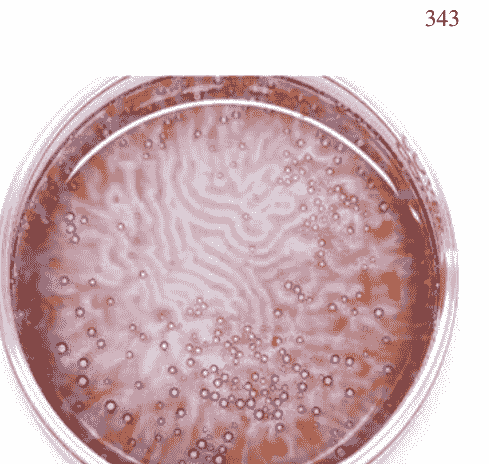

图2 模拟的BZ反应元胞自动机中的螺旋

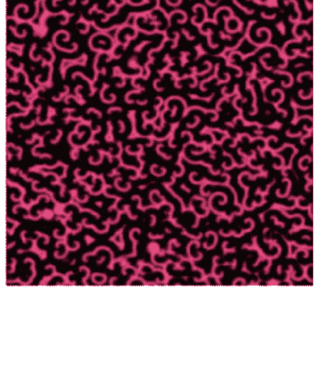

###### 2.1 简化的反应机制

来自[13]的BZ反应的简化形式可以用一系列反应来表示。

```
X + Y → 2X      (1)
Y + Z → 2Y      (2)
Z + X → 2Z      (3)
```

方程（1）意味着，在存在足够数量的 Y时，X的生成是自催化的。类似地，方程（2）和（3）也是自催化的，直到使用Z和X为止。总结这三个方程，我们可以观察到这个反应是一个完整的循环。有了这些方程，我们现在可以对反应的元胞自动机进行建模。

让 X_t, Y_t, Z_t 代表时间 t 时刻的试剂 X, Y, Z 的数量/浓度。试剂在接近未来时刻 t + Δ 的数量/浓度可以表示为，

$$X_{t+Δ} = X_t + X_t(Y_t - Z_t)$$
$$Y_{t+Δ} = Y_t + Y_t(Z_t - X_t)$$
$$Z_{t+Δ} = Z_t + Z_t(X_t - Y_t)$$

在每个时刻，任何试剂的未来浓度取决于其余两个试剂的浓度。我们可以引入额外的参数来修改各个反应速率。然而，为了简单起见，我们在这里忽略它们。

上述反应仅适用于单个空间位置，并且可以在没有元胞自动机的情况下建模。为了表示在二维表面上的振荡反应，需要使用元胞自动机。浓度在一个3x3的邻域窗口内进行平均，以引入试剂之间的扩散，并将结果应用于方程4-6。因此，位置上的反应受其八个邻居的影响。通过考虑更广泛的邻域（图2），可以创建更复杂的模型。

###### 2.2 反应表面

我们在冯·诺依曼网格上实现了元胞自动机，也被称为环形网格。在环形网格中，镶嵌总是连续的，没有边缘。为了实现环形网格，我们实现了一个二维数组，其中每个边缘都被弯曲到相对的边缘。

###### 3 在FPGA中编程自动机

在前一节中，我们解释了反应机制，在本节中，我们解释了如何在C++中实现CA以及引入的优化措施以在FPGA中实现。

试剂的浓度以实数值表示并存储在定点数组中。创建了两个这样的数组来表示浓度的当前状态和未来状态。初始浓度状态被赋予随机值。在现实生活中，这个过程模拟了开始化学反应的位置。

之后，我们根据邻域计算试剂的平均浓度，并进行反应方程。常用的邻域窗口有Moore邻域和冯·诺依曼邻域，如图3所示。如果某种试剂的新浓度超过一或低于零，则将它们剪切为1或0。它确保没有单一试剂饱和并主导反应。未来状态现在成为当前状态，并且当前状态变量用于存储未来状态。流程图（图4）解释了这个过程。我们在第一步中随机初始化浓度。在随后的步骤中，我们根据当前浓度更新未来浓度，并交换当前状态和未来状态。

###### 3.1 针对FPGA的优化

尽管C++中编写的算法可以直接在Vivado HLS中实现，但可以进行FPGA实现的优化，如前所述。在本节中，我们列出了对原生C++代码进行的优化。元胞自动机模型实现为128 × 128像素的二维von Neumann网格。

我们选择了赛灵思Zynq Z720系列平台来实现目标。通过流水线执行，CA模型的架构延迟可以进一步减少。流水线架构试图将独立操作组合在一起并并行执行。编译器指令命令可以轻松在Vivado HLS中调用流水线。指令试图尽可能地适应流水线，超出设计者警告修改程序流程的范围。浓度变量存储在双端口RAM中，以提高流水线性能。

###### 4 结果

###### 4.1 模拟

使用额外的Python脚本，将Vivado HLS的模拟输出转换为图片序列格式。这有助于我们更好地可视化反应。图5、6和7显示了模拟反应的进展。

图5 开始时浓度的随机初始化

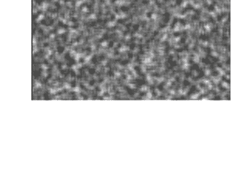

图6 40个周期后开始出现循环和曲线

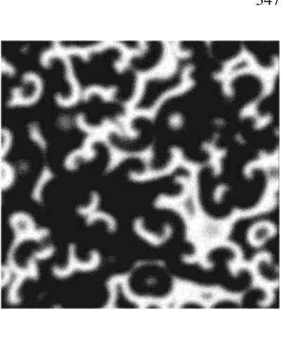

图7 循环，曲线(高亮)在100个周期后变得稳定自我维持

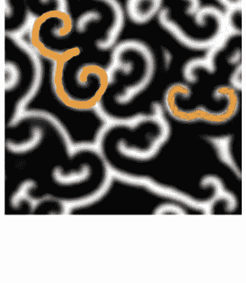

###### 4.2 综合

成功模拟后，HLS代码被综合。包括用于流水线和代码优化的编译器指令。综合后的HDL资源使用情况如图8所示，并列在表1中。

算法执行的结果总结在下表中。该算法的最大频率为119.55 MHz。

###### 5 结论

因此，在这篇研究文章中，我们提出了BZ反应的简化表示。使用高级综合工具，成功地模拟和实现了简化模型在Xilinx的Zynq FPGA芯片上。该工具提供了优化硬件资源的优势，而不过多关注设计师的实现。

**表1 资源利用情况**

|  | 已利用的模块 | 可用的模块 |
| :--- | :---: | :---: |
| BRAM 18K | 0 | 280 |
| DSP 48E | 15 | 220 |
| Flip flops | 4763 | 106,400 |
| 查找表 | 7940 | 53,200 |

**Utilization Estimates**

**Summary**

| Name | BRAM_18K | DSP48E | FF | LUT | URAM |
| :--- | :---: | :---: | :---: | :---: | :---: |
| DSP | - | - | - | - | - |
| Expression | - | - | 0 | 857 | - |
| FIFO | - | - | - | - | - |
| Instance | - | 15 | 3723 | 6549 | - |
| Memory | - | - | - | - | - |
| Multiplexer | - | - | - | 534 | - |
| Register | - | - | 1040 | - | - |
| **Total** | **0** | **15** | **4763** | **7940** | **0** |
| Available | 280 | 220 | 106400 | 53200 | 0 |
| Utilization (%) | 0 | 6 | 4 | 14 | 0 |

图8 来自VIVADO HLS的资源利用报告

###### 参考文献

1.  冯·诺依曼 J (1966) 自复制自动机理论。伊利诺伊大学出版社
2.  Sarkar P (2000) 元胞自动机简史。ACM计算机调查32 (1) : 80-107。https://doi.org/10.1145/349194.349202
3.  Harao, Noguchi (1978) 有限元胞自动机的一些动力学特性。IEEE Trans Comput C-27 (1) : 42-52。https://doi.org/10.1109/TC.1978.1674951
4.  Hwang M等 (2009) 基于规则的多细胞生物系统模拟-建模技术综述。细胞与分子生物工程2 (3) : 285-294。https://doi.org/10.1007/s12195-009-0078-2
5.  Nandi S, Kar BK, Pal Chaudhuri P (1994)在密码学中的细胞自动机的理论和应用。IEEE Trans Comput 43(12):1346–1357。https://doi.org/10.1109/12.338094
6.  Engelen G, White R, Uljee I et al (1995)使用细胞自动机进行社会环境系统的综合建模。Environ Monit Asses s 34:203–214。https://doi.org/10.1007/BF00546036
7.  Wolfram S (1984)在细胞自动机中的普遍性和复杂性。Phys D: Nonlinear Phenomena 10(1–2):1–35. ISSN 0167-2789。https://doi.org/10.1016/0167-2789(84)90245-8. https://www.sciencedirect.com/science/article/pii/0167278984902458
8.  Halbach M, Hoffmann R (2004) 在FPGA逻辑中实现细胞自动机。在：第18届国际并行与分布式处理研讨会。在：会议论文集。IEEE
9.  Hochberger C等 (2000) 细胞处理器架构CEPRA-1X及其通过CDL的配置。在：国际并行与分布式处理研讨会。Springer，柏林
10. Feist T (2012) Vivado设计套件。 Xilinx Inc., 圣何塞, 白皮书5, 第30页
11. 重新创造最奇怪的反应之一, NileRed, 上传到Youtube。链接: [https://www.youtube.com/watch?v=LL3kVtc-4vY](https://www.youtube.com/watch?v=LL3kVtc-4vY)
12. BZ反应-由Michael Rogers, Stephen Morris进行的化学实验
13. Ball P (1996) 设计分子世界: 前沿化学。 普林斯顿大学出版社, 第19卷

###### 基于物联网的呼叫铃

Sundara Babu Maddu, Gaddam Venu Gopal, Ch. Lasya Sara da和B. Bhargavi

摘要 基于物联网的呼叫铃用于维护安全，并立即了解谁来访问我们的房子。当有人站在门口并按下呼叫铃按钮时，立即拨打给指定的电话号码。然后，房主接听电话，并可以与访客交流，如果你不在家，可以告诉他们你几分钟后回家，或者你可以要求他们在其他方便的时间来。它还向房主的电话号码发送一条消息，告诉他们有人来访他/她的房子。这个物联网设备以软件方式改进了铃的效率和工作方式。

关键词 物联网铃 · Arduino · 安全

###### 1 引言

房主需要注册他/她的姓名和电话号码。基于物联网的呼叫铃产品将安装在房主的房子里，并在系统中提供两个按钮，访客可以按下铃按钮。如果按下一个按钮，系统会向房主发送短信，告知有人来访房子；如果按下另一个按钮，系统会拨打房主在系统中注册的号码。房主还可以选择只保留一个按钮，交替发送短信和拨打电话给房主。这使房主知道有人来访他/她的房子。这为房子提供了高效的安全系统。在现有的呼叫铃中，只允许用户按下呼叫铃，结果只是在房子里响起。如果用户在家里没有人的情况下按下呼叫铃，房主无法确定谁来访问他的房子。在这种情况下，这个应用/设备对房主来说一点用处都没有。

在提出的系统中，具有更高的安全性、便利性和高效的通信与访客。为了让业主警觉，陌生人按门铃首先，门铃响起，然后发送一条消息给业主。接下来，通信通过自动呼叫发送到给定的电话号码。然后，业主收到消息说有人在门口，然后进行通话，可以与访客交流，如果你不在家，可以告诉他们你几分钟后回家，或者可以请他们在其他方便的时间来。

###### 2 提出的方法

首先，业主需要注册他/她的姓名和电话号码。基于物联网的门铃产品将安装在房主的房子里。系统中提供了两个按钮，访客可以按门铃按钮。如果按下一个按钮，系统会向业主发送短信，告知有人访问了房子。

如果按下另一个按钮，系统会拨打业主在系统中注册的号码。业主还可以选择只保留一个按钮，交替发送短信和拨打电话给业主。这使得业主可以知道有人访问了他/她的房子。这为房子提供了一个高效的安全系统。

###### 3 Arduino具体指令

在设置Arduino软件时，需要返回到主屏幕，并从页面右侧的列表中选择所需的板子。在这种情况下，ESP 8266 AI THINKER的制造商推出了A6 GSM。

- 观察到该模块比SIM 900便宜，可以轻松连接。在上述图表中，可以看到如何在拨打电话和发送短信时与Arduino连接。
- 为了为A6 GSM手机提供电源，使用了一个手机适配器，其中GSM的vcc引脚可以与作为芯片使能的PWR_KEY引脚相连。在这个过程中，可以根据需要定期连接或拆卸。要启动模块，需要在PWR_KEY引脚上操作一个高电平触发器。
- 然后，在规定的模块中插入适合的SIM卡，主要是固定的微型SIM卡。当使用纳米SIM卡时，需要使用转换器将SIM卡安装到插槽中。
- A6 GSM的RxD引脚连接到Arduino的Tx引脚。
- A6的TxD引脚连接到Arduino的Rx引脚。
- A6的GND引脚连接到Arduino的GND引脚（图1）。

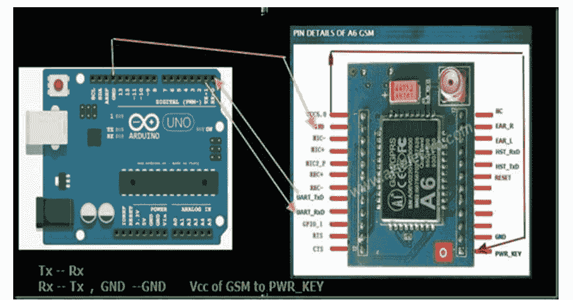

图1 Arduino板和引脚图

###### 4 个屏幕

见图2、3和4。

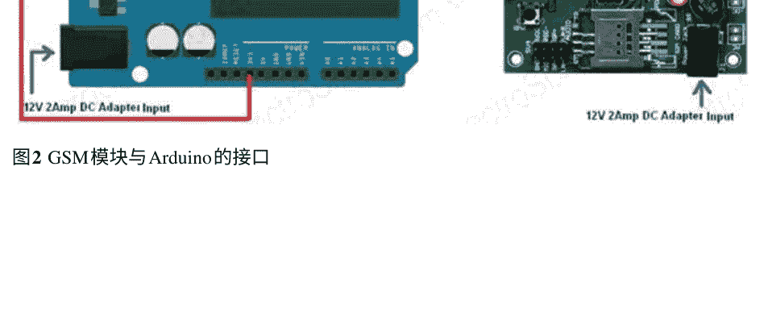

图2 GSM模块与Arduino的接口

图3 制作呼叫模块

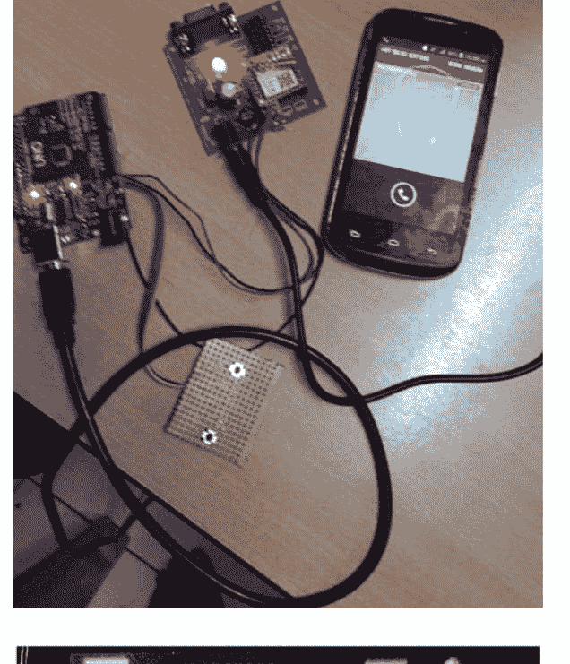

图4 短信模块


###### 5 个系统测试

在这个中，测试用例是根据系统的规格确定的。要测试的软件或模块被视为黑盒测试，因此也被称为黑盒测试（图5、6、7、8、9、10、11和12；表1、2、3、4、5、6、7和8）。

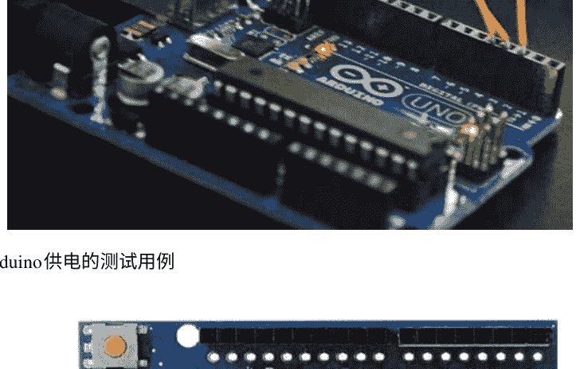

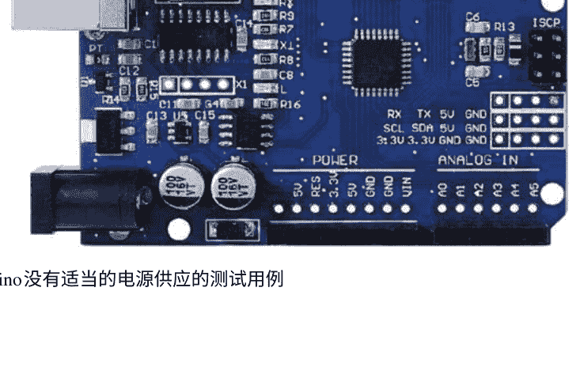

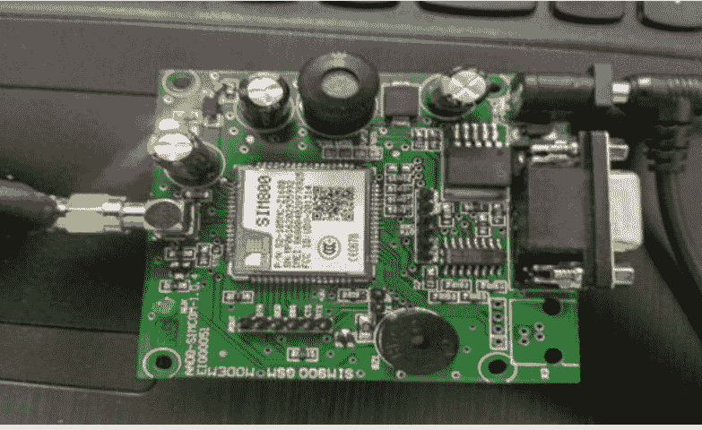

图7 适当供电GSM模块的测试用例

图8 GSM模块无适当供电的测试用例

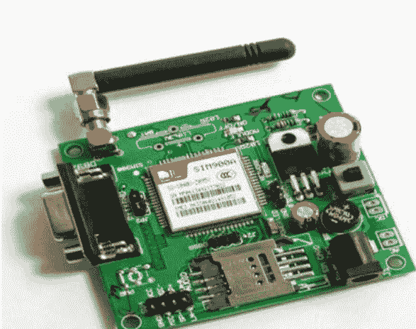

###### 6 结论

因此，可以得出结论，有关房屋的所有者需要注册姓名和电话号码的信息。基于物联网的双按钮门铃可以建立，方便访客按门铃按钮。假设按下一个按钮，当有人访问房屋时，系统会向所有者发送短信。当按下另一个按钮时，系统会拨打所有者注册的号码。此外，所有者还可以通过一个按钮发送短信并与访客进行通话，以便了解访客的身份。当连接了麦克风、扬声器和摄像头时，它就像一个有效的安全系统。

图9 从GSM模块接收短信到给定电话号码的测试用例


连接了麦克风、扬声器和摄像头。它使系统能够通过视频通话与访客进行交流。

###### 基于物联网的呼叫铃

图10 测试用例，检查是否从GSM模块接收短信到给定的电话号码


图11 测试用例，检查是否从GSM模块拨打给定电话号码

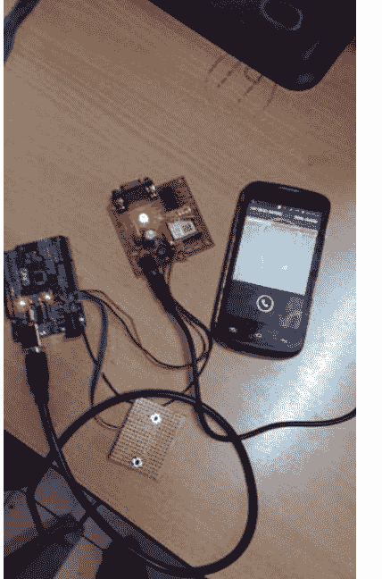

图12 测试用例，检查是否无法从GSM模块拨打给定电话号码


表1 检查Arduino板的电源供应是否正常

| 试验序号 | 输入 | 预期性能 | 实验性能 | 条件 P = 是 F = 否 |
| :--- | :--- | :--- | :--- | :--- |
| 1 | 供应给Arduino的电源 | 适当的供应 | 适当的供应 | 是 |

表2 检查Arduino板的电源供应是否不正常

| 试验序号 | 输入 | 预期性能 | 实验性能 | 条件 P = 是 F = 否 |
| :--- | :--- | :--- | :--- | :--- |
| 2 | 供应给Arduino的电源 | 没有适当的供应 | 没有适当的供应 | 是 |

表3 检查GSM模块的电源供应是否正常

| 试验序号 | 输入 | 预期性能 | 实验性能 | 条件 P = 是 F = 否 |
| :--- | :--- | :--- | :--- | :--- |
| 3 | 供应给GSM模块的电源 | 适当的供应 | 适当的供应 | 是 |

表4 检查GSM模块的电源供应是否不正常

| 试验序号 | 输入 | 预期性能 | 实验性能 | 条件 P = 是 F = 否 |
| :--- | :--- | :--- | :--- | :--- |
| 4 | 供应给GSM模块的电源 | 没有适当的供应 | 没有适当的供应 | 是 |

表5 检查消息接收情况

| 试验序号 | 输入 | 预期性能 | 实验性能 | 条件 P = 是 F = 否 |
| :--- | :--- | :--- | :--- | :--- |
| 5 | 发送短信给给定的电话号码 | 收到消息 | 收到消息 | 是 |

表6 检查是否收到消息

| 试验序号 | 输入 | 预期性能 | 实验性能 | 条件 P = 是 F = 否 |
| :--- | :--- | :--- | :--- | :--- |
| 6 | 发送短信给给定的电话号码 | 未收到短信 | 未收到短信 | 是 |

表7 检查是否打电话

| 试验序号 | 输入 | 预期性能 | 实验性能 | 条件 P = 是 F = 否 |
| :--- | :--- | :--- | :--- | :--- |
| 7 | 给定的电话号码打电话 | 打了一个电话 | 打了一个电话 | 是 |

表8 检查是否未打电话

| 试验序号 | 输入 | 预期性能 | 实验性能 | 条件 P = 是 F = 否 |
| :--- | :--- | :--- | :--- | :--- |
| 8 | 给定的电话号码打电话 | 未打电话 | 未打电话 | 是 |

###### 参考文献

1.  https://projects.raspberrypi.org/en/projects/noobs-install
2.  https://www.dummies.com/computers/arduino/how-to-install-arduino-for-windows/
3.  https://www.cloudreach.com/blog/iot-doorbell/
4.  https://www.hackster.io/taiyuk/iot-doorbell-faee18
5.  https://harizanov.com/2013/07/raspberry-pi-emalsms-doorbell-notifier-picture-of-the-person-ringing-it/
6.  https://www.twilio.com/blog/2016/11/make-receive-phone-calls-python-bottle-twilio-voice.html
7.  https://raspi.tv/2013/how-to-use-interrupts-with-python-on-the-raspberry-pi-and-rpi-gpio
8.  https://github.com/heston/ding-dong-ditch
9.  https://www.twilio.com/docs/tutorials/server-notifications-python-django#listing-our-server-administrators
10. https://www.twilio.com/blog/2016/11/make-receive-phone-calls-python-bottle-twilio-voice.html
11. https://www.fullstackpython.com/blog/send-sms-text-messages-python.html
12. https://www.twilio.com/docs/guides/how-to-make-outbound-phone-calls-in-python

##### 移动数据应用

###### 开发一种用于生成关于即将发生的土壤运动的警报的集成梯度提升算法

Ankush Pathania (ID), Praveen Kumar (ID), Priyanka (ID), Aakash Maurya (ID), K. V. Uday和Varun Dutt (ID)

摘要 自然灾害如山体滑坡是对生命和财产造成巨大破坏的源头。然而，我们对于如何提前生成准确的山体滑坡警报知之甚少。本研究的主要目标是开发和交叉验证一种新的集成梯度提升算法，用于生成关于实际山体滑坡现场土壤运动即将发生的具体警报。通过在印度曼迪Gharpa Hill的实际山体滑坡现场部署山体滑坡监测系统，以10分钟间隔收集土壤运动数据。开发了一种新的集成支持向量机-极限梯度提升（SVM-XGBoost）算法，其中SVM算法的警报预测被输入到XGBoost分类器中，以预测提前10分钟的警报严重程度。将SVM-XGBoost算法的性能与其他算法进行了比较，包括朴素贝叶斯（NB）、决策树（DT）、随机森林（RF）、支持向量机（SVM）、XGBoost和不同的新XGBoost变体（NB-XGBoost、DT-XGBoost和RF-XGBoost）。结果表明，新的SVM-XGBoost算法在错误预测土壤运动警报方面明显优于其他算法，提前10分钟。我们强调在现实世界中开发新的基于集成的机器学习算法对于预警山体滑坡的实用性。

-   滑坡
-   机器学习
-   决策树
-   随机森林
-   支持向量机
-   朴素贝叶斯
-   极限梯度提升
-   分类
-   警报


###### 1 引言

自然灾害是对财产和生命造成巨大破坏的源头[1]。山体滑坡是山区最常见的自然灾害[2]。这些山体滑坡会导致道路封锁，以及对生命和财产的其他形式的破坏[2]。如果人们和相关部门能够提前充分地得到关于山体滑坡的土壤运动的警报，那么这些警报可能有助于及时疏散滑坡地点的人们，以及引导即将被滑坡封锁的道路上的交通[3]。要从滑坡地点生成警报，就需要开发和部署滑坡监测系统。最近的研究已经在实际的滑坡地点上开发和使用了基于物联网（IoT）的滑坡监测系统[4]。例如，开发的系统能够以10分钟的间隔记录土壤运动并将其记录到云服务器中。记录的数据包括在滑坡地点垂直放置在土壤亚表面相距1米的五个三轴加速度计传感器的读数。使用这些加速度计的加速度计算土壤位移值，然后使用位移值（土壤运动）来监测土壤运动和即将发生的滑坡。因此，部署系统收集的数据可以通过手机短信生成及时的警报，并提前一些时间[4-7]。然而，提前生成不同严重程度的警报可能需要机器学习（ML）算法的参与。

文献研究表明，许多机器学习算法已经被用于滑坡应用[4-15]。例如，Bui等人在越南使用支持向量机（SVM）、决策树（DT）和朴素贝叶斯（NB）机器学习算法进行滑坡易感性制图[11]。同样，陈等人在中国龙县地区使用支持向量机（SVM）、随机森林（RF）和逻辑模型树（LMT）进行滑坡易感性制图[12]。此外，Kumar等人比较了集成和非集成的机器学习算法来预测印度唐尼滑坡的泥石流量。非集成算法（顺序最小优化（SMO）和自回归（AR））以及涉及非集成算法的集成算法（随机森林、装袋、堆叠和投票）也被提出来预测唐尼滑坡（印度）的每周泥石流量[6]。同样，Sahin等人提出了梯度提升机（GBM）、极端梯度提升（XGBoost）和随机森林（RF）算法用于土耳其Sinop省Ayancık区的滑坡易感性制图[16]。

上述不同的机器学习应用要么是用于易感性映射，要么是用于预测滑坡上的泥石流数量。然而，对于目前和最近发生的土壤位移，人们对滑坡现场提前生成警报的关注较少。本文的主要目标是填补文献中的这一空白，并通过依赖最近的土壤位移来开发用于提前生成土壤运动严重性警报的机器学习算法。具体而言，在本文中，我们提出了一种新的机器学习算法，支持向量机-极限梯度提升（SVM-XGBoost），其中首先获得了SVM算法的运动严重性预测。然后将其输入到XGBoost算法中以得出关于土壤运动严重性的问题。然后可以利用这些预测结果为生活在滑坡易发区的人们的手机生成警报。为了对新的SVM-XGBoost算法的性能进行基准测试，我们评估了单一算法（例如，SVM [17]，DT[18]，RF [19]，NB [20] 和XGBoost [21]）以及新的集成梯度算法的其他变体（NB-XGBoost，DT-XGBoost和RF-XGBoost）的土壤运动严重性预测。接下来，我们将讨论相关工作和本研究所使用的数据。

然后，我们简要介绍了在这项研究中用于分类目的的不同机器学习算法。最后，我们报告了来自不同机器学习算法的结果，并通过强调我们的发现对预测和警报生成即将发生的土壤运动的影响来完成论文。

###### 2 背景

过去已经使用机器学习算法来预测自然现象，包括土壤运动和相关的滑坡[4-15]。滑坡是过度土壤运动的结果，滑坡的发生是罕见的事件。因此，机器学习在滑坡预测中的应用是一个类别不平衡的问题[13]。

因此，这些问题可能需要使用精确率、召回率或真正例（TP）率、假正例（FP）率、F1分数、接收者操作特征曲线（ROC）、ROC曲线下面积（AUC）和敏感性指数（d'）等传统度量指标[22]。

一些机器学习方法已经用于滑坡易发性制图[6, 7, 11-16]。例如，参考文献[11]在越南的Hoa Binh省使用了SVM、DT、NB进行滑坡易发性制图。结果显示SVM算法表现最好，其次是DT和NB算法。参考文献[12]在中国的龙县地区使用了SVM、RF和逻辑模型树（LMT）进行滑坡易发性制图。结果显示RF算法优于其他两种算法。由于类别不平衡的数据集，参考文献[11, 12]使用ROC曲线和AUC来分析不同的算法。

参考文献[13]比较了逻辑回归、决策树、支持向量机、随机森林和多层感知器（MLP）算法在2011年至2015年间在曼迪和马纳利之间的国家公路NH-21上使用降雨和先前的滑坡实例进行滑坡易感性映射的分类。他们使用过采样技术来解决不平衡类问题以提高预测结果。这些算法使用十折交叉验证进行验证，并使用敏感性指数（d'）来评估分数。表现最好的算法是随机森林，其次是决策树和逻辑回归算法。

参考文献[16]使用梯度提升机（GBM）、极端梯度提升（XGBoost）和随机森林（RF）算法来绘制土耳其黑海地区锡诺普省阿扬齐克区的滑坡易感性图。该研究使用了该地区的105个滑坡位置和15个滑坡成因因素[16]。集成算法的性能是使用不同的准确度指标进行验证，包括AUC，总体准确度（OA），均方根误差（RMSE）和Kappa系数。 结果显示，XGBoost方法产生了更高的准确度结果，因此比其他集成方法表现更好[16]。

还有关于使用机器学习进行泥石流预测的文献[6]。例如，参考文献[6]比较了非集成机器学习算法（顺序最小优化（SMO）和自回归）和集成机器学习算法（RF，bagging，stacking和voting），其中包括非集成算法来预测2013年至2014年印度唐尼滑坡地区的每周泥石流。 结果显示，集成算法（RF，bagging和stacking）相比非集成算法表现更好[6]。

如上所述，文献中提出了非集成和集成机器学习算法，用于滑坡易发性制图或泥石流预测[6， 7， 11-16]。 然而，对于在滑坡现场基于土壤位移严重程度提前生成警报的研究关注较少。 本研究通过考虑土壤位移严重程度和土壤运动警报的预测，填补了这一文献空白，采用了一种新颖的集成机器学习算法，支持向量机-极限梯度提升（SVM-XGBoost）。

具体来说，在本文中，我们开发了SVM-XGBoost算法，首先获得了前一算法的运动严重性预测。 然后将其输入到后一算法中，以得出关于土壤运动严重性的最终预测。 我们将SVM-XGBoost算法与其他单一算法（SVM、DT、RF、NB和XGBoost）以及不同的新颖集成变体（NB-XGBoost、DT-XGBoost和RF-XGBoost）进行了性能比较。 为了评估这些新算法的性能，我们使用十折交叉验证程序[20]对单一算法（如SVM [17]、DT [18]、RF [19]、NB [20]和XGBoost [21]）进行了土壤运动严重性预测的基准测试。 选择单一算法是基于它们在先前文献中用于滑坡易发性映射或泥石流预测的性能。

###### 3 方法论

###### 3.1 数据

本文分析的数据集属于印度喜马偕尔邦曼迪地区的加尔帕滑坡。该滑坡位于曼迪-巴乔拉公路上，是喜马偕尔邦曼迪和库卢地区之间的连接路线。这条公路在雨季时，当曼迪和库卢之间的国家公路因暴雨而封闭时，具有相当重要的意义，因为它被用作备用路线。 土壤运动数据是在2019年7月26日至2019年10月6日期间，通过单个钻孔上的五个不同传感器以10分钟的时间间隔收集的。 钻孔中包含五个传感器S1、S2、S3、S4、并且分别位于地下1米、2米、3米、4米和5米深度处的S5 [4]（见图1和图2）。土壤运动数据是使用MPU6050传感器测量的，该传感器是一个三轴加速度计。传感器节点分别放置在相距1米的单个钻孔中（图2）。每个传感器节点包括MPU6050、电容式土壤湿度传感器和力传感器。使用以下运动学方程将作用在不同传感器上的加速度转换为位移：

```
S = ut + 1/2 at^2 (1)
```

这里 u是初始速度， a是加速度， t是加速度作用于传感器的时间， S是位移。这里， u为零，因为没有初始速度分量。加速度值是MPU6050加速度传感器给出的值； t为0.001，即一毫秒（加速度计读取加速度值所需的时间）[4]。方程1用于推导出三轴上的位移，并计算出这三个相互垂直的位移的合成位移作为特定传感器的实际位移。

观察发现，传感器S3在总共2344个零位移和非零位移实例中，有1004个非零位移实例，这是所有五个传感器中最多的。因此，传感器S3是最接近的传感器。


图1 印度曼迪地区Gharpa山滑坡位置

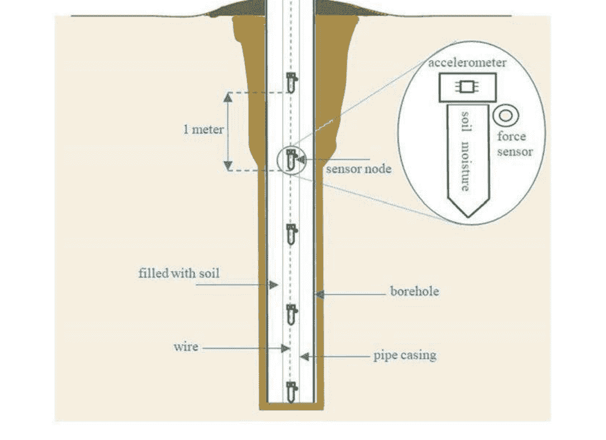

图2 钻孔中传感器的布置，每隔1米有五个传感器

滑坡破裂面，该传感器的数据被用于比较不同的算法。

我们将传感器S3的实际位移分为四个位移等级。无位移等级（等级0）表示绝对零位移。低位移等级（等级1），中等位移等级（等级2）和高位移等级（等级3）表示根据百分位数计算的位移（见表1）。为了计算这些百分位数，所有S3传感器的位移被转换为Z分数（使用均值"。

= 3.248 μm 和标准差 = 2.271 μm)。接下来，使用Z得分范围(见表1)计算不同的百分位数。一旦数据被分成不同的类别，它就会被分成10个部分进行十折交叉验证过程。在交叉验证过程中，每个算法都在9个部分上进行训练，并在1个部分上进行测试。这个过程重复了10次，即每个被测试的部分都进行了一次。训练数据用于找到不同算法中最佳参数值，而测试数据用于测试在训练期间找到的最佳参数值的算法。

**表1 百分位数范围及其对应的类别**

| 类别 | 百分位数范围 | Z-分数范围 |
| :--- | :--- | :--- |
| 类别0（无位移类别） | 不存在${}^{\text{a}}$ | 不存在${}^{\text{a}}$ |
| 类别1（低位移类别） | 0到25th | 小于 -0.674 |
| 类别2（中等位移类别） | 25th到75th | -0.674 到 +0.674 |
| 类别3（高位移类别） | 75th到100th | 大于 +0.674 |

${}^{\text{a}}$不存在于类别0中，因为类别0包含绝对零位移实例；因此，它与非零位移实例的标准正态分布无关

**表2 每个类别在数据中的组成**

| 类别 | 实例数量 |
| :--- | :--- |
| 类别0（无位移类别） | 1340 |
| 类别1（低位移类别） | 377 |
| 类别2（中等位移类别） | 406 |
| 类别3（高位移类别） | 221 |

进行机器学习分析时，通常需要两个或更多类别，分别称为正类别和负类别。在这些数据中，我们有四个不同的类别。因此，例如，当类别的实际值为类别2时，类别2被视为正类别，而其他所有类别（类别0、类别1和类别3）被视为负类别。根据先前的研究[6]，我们使用了前四个连续的10分钟实例（包括当前实例）的实际位移（以 μm为单位）作为评估算法的输入。我们得到了下一个10分钟间隔的位移类别。表2显示了每个类别在数据中的组成。如表2所示，与无位移类别相比，低、中等和高位移类别的实例较少。因此，数据集存在类别不平衡。在下一节中，我们将讨论遵循的方法，同时考虑到数据中的类别不平衡。

###### 3.2 评估机器学习算法的度量

评估机器学习算法性能的最基本方法是错误率或算法的准确性。准确性是分类器正确分类的比率。然而，通过准确性评估性能可能会对类别不平衡的数据产生模糊的假设[5]。例如，数据中99%的实例属于一个特定的类别，现在如果一个分类器在这个数据集上进行训练，那么它可以通过简单地将每个实例分类为属于该类别来轻松获得99%的准确性。对那个班级。因此，在一个类别不平衡的数据集中，考虑评估分类器的实现类别的性能指标是重要的。根据文献[22]，我们选择了精确度、召回率或真阳性（TP）率、假阳性（FP）率、F1得分和敏感性指数（d'）作为评估不同机器学习算法性能的指标。对于二元分类，即只包含两个类别（正和负）的数据集，精确度、召回率或TP率、FP率和F1得分的定义如下：

精确度 = (真正例的数量)/(真正例的数量 +假正例的数量) (2)

召回率或真正例率 = (真正例的数量)/(真正例的数量 +假负例的数量) (3)

假正例率 = (假正例的数量)/(假正例的数量 +真负例的数量) (4)

F1得分 = 2 * (召回率 *精确度)/(召回率 +精确度) (5)

其中真正例(TP)是被正确识别为正例的实例的数量，假正例(FP)是被错误识别为正例的负例实例的数量，真负例(TN)是被正确识别为负例的负例实例的数量，假负例(FN)是被错误识别为负例的正例实例的数量。

敏感性指数已被用作本研究中不同分类器的主要性能指标。敏感性指数（d'）表示被正确分类实例和被错误分类实例之间的分离程度[17]。计算敏感性指数的公式如下所示：

d' = Z(真阳性率) - Z(假阳性率) (6)

其中函数 Z(概率),概率 ∈[0, 1],是高斯分布的累积分布函数的反函数。ML算法的敏感性指数（d'）值越大（且越正），算法的性能相对于其他算法更好。

我们使用敏感性指数来评估不同超参数集合在算法中的性能，使用十折交叉验证过程。

###### 3.3 用于分类的不同算法

- 1. 支持向量机。它是一种基于统计学习理论和结构风险最小化原则的监督学习算法[17]。它使用训练数据间接地将给定的输入空间映射到高维特征空间[23]。此后，在这个高维特征空间中，通过最小化分类错误和最大化类边界的间隔来计算最优超平面[23]。目标函数用于惩罚模型对于被错误分类或位于边界内的实例[23]。正则化参数是在寻找最优超平面时给予错误分类的重要程度。核参数用于改变这个超平面的形状[23]。

- 2. 决策树。它是一个分层算法，由决策规则组成，递归地将独立变量分割成区域。分割是以这样的方式进行的；在每次分割后，节点的最大同质性得到了实现[18]。样本的同质性通过其熵来衡量（完全同质为0，完全异质为1），并且基于数据集在属性上分割后熵的减少，定义了该属性的信息增益[24]。通过找到具有最大信息增益的属性，将数据集分成分支，并重复此过程，直到每个分支上的终止条件满足，得到我们的决策树[24]。min samples split参数是分割内部节点所需的最小样本数，max depth参数是从根到叶子节点的最大边数[25]。

- 3. 随机森林。它是一种利用许多分类树（“森林”）来稳定算法预测的集成算法[19]。它利用二叉树，该二叉树使用通过自助法生成的数据子集，其中包含通过自助法生成的总属性子集[17]。每棵树都是为了最小化分类错误而制作的，并且使用多棵树的集成来最大化算法的稳定性[21]。估计器参数的数量是森林中的树的数量。最小样本分割参数是树的内部节点分割所需的最小样本数，最大深度参数是从根到叶子的最大边数[26]。

- 4. 朴素贝叶斯。它是一种基于贝叶斯定理的概率算法。使用训练数据，它为分类到特定类别的后验条件概率开发了一个后验条件概率，给定特征实例、似然函数和先验概率[20]。该算法没有这样的超参数。

- 5. XGBoost。极限梯度提升（XGBoost）是一种基于决策树提升的有监督学习方法[27]。它使用集成技术逐步添加多个决策树，并使用梯度下降提升方法优化损失函数[27]。它还使用各种其他方法来避免过拟合合并减少完成时间[27]。估计器参数是模型中树的数量，最大深度参数是树从根到叶子的最大边数[28]。

- 6. SVM-XGBoost。支持向量机-极限梯度提升（SVM-XGBoost）是我们在本文中提出的新型集成机器学习算法，它基于两种算法的集成，前者是支持向量机（SVM）和后来的XGBoost。首先获得了前一算法的运动严重性预测。然后将其输入到后续算法中，以得出关于土壤运动严重性的最终预测。我们还使用了DT-XGBoost、NB-XGBoost和RF-XGBoost这些新颖的集成机器学习算法的变体，其定义类似。

###### 3.4 模型校准

- 1. 支持向量机。在支持向量机中，核超参数在线性、多项式和径向基函数（RBF）核之间变化。对于多项式核，多项式的次数在1、2和3之间变化。RBF和多项式核的gamma参数设置为“scale”，这是Python中scikit-learn库的默认值，用于实现SVM。正则化参数（C）在0.1到1000之间以对数方式变化。最佳的超参数组合是RBF核和正则化参数为1000。

- 2. 决策树。在决策树中，最小样本拆分参数在2、3和4之间变化。最大深度参数设置为默认值，与Python中scikit-learn库实现的决策树相同，这意味着节点会扩展直到所有叶子节点都是纯净的，最小样本拆分准则被违反。最佳的超参数组合是最小样本拆分参数为2的组合。

- 3. 随机森林。在RF中，估计器参数的数量在50、100、150和1000之间变化。最小样本分割参数在2、3和4之间变化，最大深度参数设置为默认值。默认值是指在Python中使用scikit-learn库实现随机森林时，节点会扩展直到所有叶子节点都是纯净的最小样本分割准则被违反。最佳的超参数集是最小样本分割为2，估计器数量为150。

- 4. 朴素贝叶斯。朴素贝叶斯算法没有这样的超参数。

- 5. XGBoost。在XGBoost中，估计器参数的数量在50、100、150和1000之间变化。最大深度参数在2、5和10之间变化，而其他参数使用了它们在Python的scikit-learn库中实现XGBoost时的默认值。最佳的超参数集是最大深度为10，估计器数量为150。

- 6. SVM-XGBoost。对于我们在本文中提出的所有新颖的基于集成的机器学习算法，我们使用了每个算法单独运行时获得的最佳超参数集。这意味着在SVM-XGBoost及其三个变体（即DT-XGBoost、RF-XGBoost和NB-XGBoost算法）中使用的XGBoost算法具有150个估计器和10个最大深度超参数。SVM-XGBoost中的SVM算法使用径向基函数（RBF）核函数和1000作为正则化超参数。DT-XGBoost中使用的DT算法有两个作为最大深度超参数。最小样本分割超参数。RF算法在RF-XGBoost中使用了150个估计器和两个最小样本分割超参数。相比之下，NB算法不使用这样的超参数，因此在NB-XGBoost中使用原样。

###### 4 结果

表3展示了本文提出的新型集成机器学习算法SVM-XGBoost及其三个变种算法DT-XGBoost、NB-XGBoost和RF-XGBoost与标准XGBoost算法的性能。这些算法涉及两个个体算法的集成，第一个算法预测土壤运动严重程度，然后将其作为第二个算法的附加属性，预测最终的土壤运动严重程度。因此，这些算法有两组最佳超参数（每个算法一组），如表4所示。由于数据集的类别不平衡，主要比较了分类算法的性能。

**表3 十折交叉验证比较不同的新分类算法在滑坡数据集上的表现。**

| 分类器 | 准确性 | 精确度 | 真阳性率或召回率 | 假阳性率 | F₁分数 | 敏感性指数(D′) |
| :--- | :---: | :---: | :---: | :---: | :---: | :---: |
| SVM-XGBoost | 90.46 | 0.942 | 0.837 | 0.054 | 0.881 | 2.553 |
| DT-XGBoost | 90.23 | 0.940 | 0.823 | 0.055 | 0.877 | 2.528 |
| NB-XGBoost | 90.11 | 0.941 | 0.822 | 0.056 | 0.877 | 2.516 |
| RF-XGBoost | 90.00 | 0.938 | 0.819 | 0.056 | 0.874 | 2.502 |
| XGBoost | 74.32 | 0.652 | 0.555 | 0.149 | 0.599 | 1.179 |

**表4 不同新分类算法在滑坡数据集上的最佳超参数**

| 分类器 | 第一个算法的最佳超参数 | 每个新算法中XGBoost的最佳超参数 |
| :--- | :--- | :--- |
| SVM-XGBoost | SVM: (核函数: RBF, C: 1000) | XGBoost: (N估计器: 150, 最大深度: 10) |
| DT-XGBoost | DT: (最小样本分割: 2) | XGBoost: (N估计器: 150, 最大深度: 10) |
| NB-XGBoost | NB: (没有这样的超参数) | XGBoost: (N估计器: 150, 最大深度: 10) |
| RF-XGBoost | RF: (N估计器: 150, 最小样本分割: 2) | XGBoost: (N估计器: 150, 最大深度: 10) |
| XGBoost | XGBoost: (N估计器: 150, 最大深度: 10) | - |

通过每个算法的敏感性指数（D-prime）。我们还显示了每个算法的TP率或召回率，FP率，精确度，F₁分数和准确度作为进一步的参考。

新的基于集成的机器学习算法的敏感性指数最高，SVM-XGBoost排在第一位，其次是DT-XGBoost，然后是NB-XGBoost，最后是RF-XGBoost。所有这些新算法的敏感性指数都是标准XGBoost算法的两倍以上。与标准XGBoost相比，SVM-XGBoost算法的TP率和FP率分别为0.837和0.054，而标准XGBoost的TP率和FP率分别为0.555和0.149，TP率提高了50.82%，FP率降低了63.76%。准确率和f1得分从标准XGBoost的74.32%和0.599分别提高到SVM-XGBoost算法的90.46%和0.881。这些结果突出显示了本文提出的新型集成机器学习算法在性能上的显著改进。

表5显示了不同传统机器学习分类器与新的SVM-XGBoost算法的性能。除了XGBoost算法外，传统算法的敏感性指数最高的是SVM，其次是决策树，然后是随机森林。朴素贝叶斯是传统算法中表现最差的，其敏感性指数为0.306，几乎是SVM算法的3.75倍。敏感性指数从表中列出的最佳传统分类器SVM的1.146增加到SVM-XGBoost的2.553，相对于朴素贝叶斯到SVM-XGBoost的敏感性指数，提高了约734%。表6显示了不同传统分类器在滑坡数据集上的最佳超参数。

**表5 不同传统分类器在滑坡数据集上进行十折交叉验证比较**

| 分类器 | 准确性 | 精确度 | 真阳性率或召回率 | 假阳性率 | F₁ 分数 | 敏感性指数 (D′) |
| :--- | :---: | :---: | :---: | :---: | :---: | :---: |
| 支持向量机 | 73.59 | 0.636 | 0.555 | 0.157 | 0.593 | 1.146 |
| 决策树 | 74.15 | 不存在ᵃ | 0.534 | 0.153 | 不存在ᵃ | 1.111 |
| 随机森林 | 74.36 | 不存在ᵃ | 0.532 | 0.152 | 不存在ᵃ | 1.108 |
| 朴素贝叶斯 | 57.68 | 不存在ᵃ | 0.357 | 0.251 | 不存在ᵃ | 0.306 |
| 支持向量机-XGBoost | 90.46 | 0.942 | 0.837 | 0.054 | 0.881 | 2.553 |

ᵃ 在计算中发生了零除以零的情况，因此不存在

**表6 不同传统分类器在滑坡数据集上的最佳超参数**

| 分类器 | 最佳超参数 |
| :--- | :--- |
| 支持向量机 | SVM: (核函数: RBF, C: 1000) |
| 决策树 | DT: (最小样本分割: 2) |
| 随机森林 | RF: (N estimators: 150, 最小样本分割: 2) |
| 朴素贝叶斯 | NB: (没有这样的超参数) |
| SVM-XGBoost | SVM: (核函数: RBF, C:1000), XGBoost: (N estimators: 150, 最大深度: 10) |

###### 5 讨论和结论

在滑坡领域，机器学习算法的主要重点是及时预测土壤运动，以便人们能够及时警报即将发生的滑坡。在警告人们即将发生的滑坡时，需要注意的是，基于类别的警报信息反映土壤运动的严重程度比报告确切的土壤运动更有意义。在这项工作中，我们应用了支持向量机（SVM）、决策树（DT）、随机森林（RF）、朴素贝叶斯（NB）、极限梯度提升（XGBoost）以及提出的四种新的基于集成的机器学习算法（SVM-XGBoost、DT-XGBoost、NB-XGBoost、RF-XGBoost）。我们主要使用前一种算法的预测作为后一种算法预测最终类别的附加属性，以预测印度喜马偕尔邦Gharpha滑坡地区每十分钟时间间隔内的土壤运动类别。整个数据集根据每个实例的土壤运动严重程度被分类为四个类别，类别0（无位移），类别1（低位移），类别2（中等位移）和类别3（高位移），使用训练数据集进行分类。根据先前的运动历史，即前四个连续的十分钟间隔，使用分类算法生成后续10分钟间隔内的土壤运动类别，并进行十折交叉验证以评估所有算法的性能。我们使用精确率、召回率或真阳性率（TP率）、假阳性率（FP率）、F1分数和敏感性指数（d'）来比较结果。

我们的结果显示，新的算法（SVM-XGBoost，DT-XGBoost，NB-XGBoost，RF-XGBoost）与传统算法相比表现出更好的性能。在这些新算法中，SVM-XGBoost是所有算法中最好的。

首先，新的基于集成的梯度提升算法在土壤运动分类预测任务中表现更好。这个结果的一个可能原因是，集成方法使用前一个算法的预测结果作为XGBoost算法的属性，有助于更好地预测XGBoost算法。例如，参考文献[16]的结果表明，XGBoost算法相比其他集成方法，达到了更低的预测误差和更高的准确性结果。但是将这两个算法结合起来进一步提高了新算法的性能。

其次，发现XGBoost在我们使用的传统算法中表现最好，其次是SVM。XGBoost通过梯度下降优化损失函数，生成一个由弱分类树组成的提升集成预测算法。该算法在减少处理时间方面非常有效，并且可用于回归和分类任务。

我们的研究对于预测真实世界中的土壤运动和提醒人们即将发生的山体滑坡有着几个重要的意义。我们在本文中提出的新型基于集成的机器学习算法明显优于现有的传统算法。因此，居住在或者到访山体滑坡易发区的人们可以通过提前预警受益于这项研究。

政策制定者，如政府，应在各个站点部署这些传感器，并使用更新的基于集成的机器学习算法为受影响的人们生成警报，并提前准备损坏修复，如道路封锁修复。

在未来的计划中，有几种前进的方式。首先，复制我们的算法结果在喜马拉雅山脉的许多滑坡地点进行验证将是有用的。其次，在本文中，虽然我们使用了单变量数据，即仅基于先前的土壤运动进行土壤运动的预测。接下来，这些数据可以与有关天气和降雨的多变量数据相关联，以在更长的时间范围内更精确地预测土壤运动。第三，受到这些新算法的性能启发，评估能够预测多个算法并将它们用作主要算法的附加属性的算法将是很好的。我们计划很快将这些想法纳入我们的土壤运动预测研究计划中。

###### 参考文献

1. Pande RK (2006) 印度北阿坎德邦的滑坡问题：问题和挑战。 Disaster Prevent Manage: Int J (2006)
2. Parkash S (2011) 印度的历史性社会经济滑坡记录。南亚灾害研究杂志
3. Liu JW, Shih CS, Chu ETH (2012) 灾害准备智能环境的网络物理要素。 计算机 46(2):69–75
4. Pathania A, Kumar P, Priyanka A, Singh R, Chaturvedi P, Uday KV, Dutt V (2020) 用于滑坡监测、预警和预测的低成本、亚表面物联网框架的开发。 在：国际计算、通信、嵌入式和安全系统会议（ACCESS 2020）
5. Pathania A, Kumar P, Priyanka, Maurya A, Kumar M, Singh R, Chaturvedi P, Uday KV, Dutt V (即将出版) 使用持久性、自回归和神经网络模型预测印度曼迪的土壤运动案例研究。在：国际计算、通信和数据科学范式会议（PCCDS-2020）
6. Kumar P, Sihag P, Pathania A, Agarwal S, Mali N Chaturvedi P, Singh R, Uday KV, Dutt V (2019) 使用集成和非集成机器学习方法预测山体滑坡泥石流
7. Kumar P, Sihag P, Pathania A, Agarwal S, Mali N, Singh R, Chaturvedi P, Uday KV, Dutt V (2019年) 九月。使用移动平均和支持向量方法预测印度恰莫利的每周土壤运动案例研究。在：地质工程信息技术国际会议。Springer, Cham, pp 393–405
8. Catani F, Lagomarsino D, Segoni S, Tofani V (2013) 通过随机森林技术进行滑坡易发性评估：敏感性和缩放问题。 自然灾害与地球系统科学13(11):2815–2831
9. Goetz JN, Brenning A, Petschko H, Leopold P (2015) 评估机器学习和统计预测技术用于滑坡易发性建模。 计算地球科学 81:1-11
10. Ließ M, Glaser B, Huwe B (2011) 功能性土壤景观建模以估计陡峭的安第斯山脉森林地区的坡稳定性。 地貌学 132(3–4):287–299
11. Bui DT, Pradhan B, Lofman O, Revhaug I (2012) 使用支持向量机、决策树和朴素贝叶斯模型进行越南滑坡易发性评估。数学问题工程
12. Chen W, Xie X, Wang J, Pradhan B, Hong H, Bui DT, Duan Z, Ma J (2017) 逻辑模型树、随机森林和分类回归树模型在滑坡易发性空间预测中的比较研究. Catena 151:147–160
13. Agrawal K, Baweja Y, Dwivedi D, Saha R, Prasad P, Agrawal S, Kapoor S, Chaturvedi P, Mali N, Uday VK, Dutt V (2017) 用于现实世界滑坡预测的类别不平衡技术比较. 在: 2017年机器学习和数据科学国际会议(MLDS)). IEEE, pp 1–8
14. Stanley TA, Kirschbaum DB, Sobieszczky S, Borak JS, Slaughter SL (2019) 一种来自机器学习的滑坡气候指标 (2019)
15. Coimbra CF, Pedro HT (2013) 随机学习方法。 在：太阳能预测和资源评估。爱思唯尔，第383-406页
16. Sahin EK (2020) 使用XGBoost, 梯度提升机和随机森林评估集成树方法在滑坡易发性映射中的预测能力. SN应用科学2（7）：1-17
17. Macmillan N, Creelman C (2010) 检测理论。 心理学出版社，纽约，新泽西，美国
18. Vapnik V (1998) 统计学习理论。约翰威利，纽约
19. Quinlan J (1986) 决策树的归纳。机器学习1（1）：81-106
20. Breiman L (2001) 随机森林。机器学习45（1）：5-32
21. Chen T, Guestrin C (2016) XGBoost：一种可扩展的树提升系统。 在：第22届ACM SIGKDD国际会议上的知识发现和数据挖掘pp785-794
22. Saito T, Rehmsmeier M (2015) 在评估不平衡数据集上的二元分类器时，精确度-召回率图比ROC图更具信息性。PLoS ONE 10(3):e0118432. https://doi.org/10.1371/journal.pone.0118432
23. 走向数据科学。 https://towardsdatascience.com/support-vector-machine-introduction-to-machine-learning-algorithms-934a444fca47. 最后访问时间为2020年8月5日
24. Sayad S. https://www.saedsayad.com/decision_tree.htm. 最后访问时间为2020年8月5日
25. Scikitlearn. https://scikit-learn.org/stable/modules/generated/sklearn.tree.DecisionTreeClassifier.html. 最后访问时间为2020年8月5日
26. Scikitlearn. https://scikit-learn.org/stable/modules/generated/sklearn.ensemble.RandomForestClassifier.html. 最后访问时间为2020年8月5日
27. Irina R (2001) 朴素贝叶斯分类器的实证研究。 在：IJCAI 2001人工智能经验方法研讨会，第3卷，第22期，第41-46页
28. XGBoost阅读文档。 https://xgboost.readthedocs.io/en/latest/parameter.html. 最后访问时间2020年8月5日
29. Cui Y, Cai M, Stanley HE (2017) 盒式外显子和构成性外显子的比较分析和分类。生物医学研究国际。 https://doi.org/10.1155/2017/7323508

##### 使用两阶段深度神经网络进行接缝雕刻检测和定位

Lakshmanan Nataraj, Chandrakanth Gudavalli, Tajuddin Manhar Mohammed, Shivkumar Chandrasekaran和B. S. Manjunath

摘要 接缝雕刻是一种以内容感知方式调整图像大小的方法。然而，这种方法也可以用于从图像中雕刻出物体。在本文中，我们提出了一种两步方法来检测和定位接缝雕刻的图像。首先，我们构建一个检测器来检测已经接缝雕刻的图像中的小块。接下来，我们根据补丁检测器的输出在图像上计算热图。使用这些热图，我们构建另一个检测器来检测整个图像是否被接缝雕刻。我们的实验结果表明，我们的方法在检测和定位接缝雕刻的图像方面是有效的。

关键词 图像取证 ·接缝雕刻检测 ·伪造图像 ·物体移除

###### 1 引言

随着新相机、手机和数码平板的出现，数字图像的数量呈指数增长。社交媒体平台也对其分发量的增加做出了贡献。与此同时，用于处理这些数字图像的软件也得到了显著发展。这些软件工具使得人们轻松地操纵这些数字图像。媒体取证的目标是识别这些操纵并检测这些经过篡改的图像。多年来，已经提出了许多技术来识别图像操纵。这些技术包括基于相机取证、重采样特征、压缩等数字伪迹。图像篡改中常见的操作是以“内容感知”的方式删除某些图像区域。在这方面，接缝雕刻是一种流行的“内容感知”图像调整技术[1, 39]。在接缝雕刻中，当图像调整大小时，“重要内容”不受影响，通常假设“重要内容”不由低能量像素表示。由于接缝雕刻的对象删除涉及非传统的对象删除方式，检测经过接缝雕刻处理的伪造图像是一项挑战。在本文中，我们提出了一种新颖的方法，使用两个卷积神经网络（CNN）阶段来检测和定位经过接缝雕刻处理的图像：一个用于检测，一个用于定位。

首先，我们训练一个卷积神经网络来识别已经进行过接缝雕刻的补丁。对于图像中的每个像素，我们计算检测分数，从而得到整个图像的热图，可用于定位。最后，我们在热图上训练另一个卷积神经网络，以确定图像是否已经进行了接缝雕刻。图1说明了所提出的方法。

本文的其余部分安排如下。第2节介绍了该领域的相关工作，第3节介绍了图像上的接缝雕刻和接缝插入。第4节介绍了检测接缝雕刻的方法，而第5节详细介绍了实验。最后，第6节提出了结论。

###### 2 相关工作

已经有几种方法提出来检测数字图像的篡改。这些方法包括检测拼接、变形、重采样伪影、复制移动、接缝雕刻、计算机生成的（CG）图像、JPEG伪影、修补、压缩伪影等。已经有很多方法提出来检测复制移动[11, 21]、重采样[6, 8, 15, 20, 29, 33, 34, 36]、拼接[2, 18, 37]和基于修补的对象去除[23, 44]。其他方法利用JPEG压缩伪影[7, 13, 24, 28]或人工智能（AI）生成的图像引起的伪影[3, 16, 30, 48]。近年来，基于深度学习的方法在检测图像篡改方面表现出更好的性能[4, 5, 8, 35]。

在过去的十年中，已经提出了几种方法来检测基于接缝雕刻的篡改[9, 14, 17, 19, 22, 25–27, 38, 40–43, 46, 47]。这些方法包括使用隐写分析[38]，哈希[14, 27]，局部二值模式[46, 47]和基于深度学习的方法[10, 31, 32, 45]。在本文中，我们检测基于接缝雕刻的篡改的方法也基于深度学习。

###### 3 接缝雕刻和接缝插入

接缝被定义为图像上的一个最佳8连通像素路径，可以从上到下或从左到右。在接缝雕刻中，接缝被移除，图像的尺寸减小一列或一行。在接缝插入中，首先移除一个接缝，然后在接缝被移除的位置插入两个像素。图2和图3说明了接缝雕刻和接缝插入的过程。对于接缝选择的最优性标准，考虑沿着接缝的所有点计算的能量函数。选择这些接缝有助于在调整大小过程中保持图像质量。我们将经过接缝雕刻/插入的图像视为篡改图像，因为图像的尺寸和内容都发生了改变。

因此，从图像取证的角度来看，检测接缝雕刻/插入的问题是重要的。基于插值核的重新采样检测方法，在使用接缝雕刻/插入进行图像调整时会失败。

尽管最初提出用于自动图像调整，同时保持调整后图像的良好感知质量，但接缝雕刻也被用于去除特定图像区域。需要注意的是，接缝雕刻可以丢弃或保留特定区域，这取决于我们对特定区域的权重分配。例如，对于一个物体去除问题，我们可能需要确保某些图像区域不受影响，因为扭曲它们可能会导致显著的感知扭曲。我们首先解释了接缝雕刻如何用于物体去除，然后讨论了涉及的有趣问题。

###### 4 接缝雕刻的检测

为了检测和定位图像中的接缝雕刻，我们提出了一个两阶段的检测方法：一个用于检测接缝雕刻的补丁，另一个用于通过生成热图来定位图像中的接缝雕刻。首先，我们训练一个深度神经网络来识别图像中的补丁是否被接缝雕刻。然后，我们将图像分成补丁，并为每个补丁计算检测分数，从而得到整个图像的热图。这个热图可以用于定位接缝雕刻。最后，我们用热图作为输入训练另一个深度神经网络，该网络给出一个图像级别的分数，以确定图像是否被接缝雕刻。整个模块框图如图4所示。

###### 5 实验

###### 5.1 实验设置

我们首先从属于RAISE数据集[12]的图像中提取64 × 128的补丁。从这些补丁中，我们形成两类图像补丁：第一类补丁进一步裁剪为64 × 64，第二类补丁则在水平方向上接缝雕刻50%，得到64 ×64的接缝雕刻补丁。通过这种方式，我们从RAISE数据集中获得了16,000个补丁（每类8000个）和从Dresden数据集中获得了40,000个补丁（每类20,000个）。这些补丁进一步随机分为80%的训练集，10%的测试集和10%的验证集（图5）。

###### 5.2 学习

这些补丁使用多层深度卷积神经网络进行训练，该网络由32个3 ×3的卷积层、ReLU层、32个5 ×5的卷积层和最大池化层、64个3 ×3的卷积层和ReLU层、64个5 ×5的卷积层和最大池化层、128个3 ×3的卷积层和ReLU层、128个5 ×5的卷积层和最大池化层，最后是256个稠密层、256个稠密层和一个sigmoid层。我们训练这个模型直到达到高的训练准确率和验证准确率。

###### 5.3 检测热图

使用训练好的模型在图像的重叠补丁上计算像素是进行接缝雕刻还是不进行接缝雕刻的概率。图6显示了非接缝雕刻和接缝雕刻图像上的热图。正如我们所看到的，接缝雕刻图像上的热图比非接缝雕刻图像上的热图有更多的红色区域。

即使对于有蓝天的图像，也可以清楚地识别出接缝雕刻图像和非接缝雕刻图像的热图。这激发了我们用另一个以热图为输入的CNN来训练热图（图4b），并输出图像是否被接缝雕刻的概率。从图7中可以看出，当在热图上进行训练时，我们获得了很高的准确性。

###### 5.4 对移除接缝的百分比的鲁棒性

在这个实验中，我们改变了测试集中移除的接缝的百分比，并评估了在训练时移除了50%接缝的模型，以检查模型对不同数量的接缝移除的鲁棒性。曲线下面积（AUC）是对不同移除接缝百分比的评估指标。

结果在表1中给出。我们观察到在约50%左右的百分比下，AUC非常高，并且在较低的百分比下逐渐减小。这表明模型对大多数百分比的缝隙移除具有普适性。将来，我们将为较低的百分比训练另一个模型。

表1 对接缝移除百分比的鲁棒性

| 百分比 | 曲线下面积（AUC） |
| :--- | :--- |
| 1 | 0.6464 |
| 2 | 0.7838 |
| 5 | 0.9274 |
| 8 | 0.9540 |
| 10 | 0.9724 |
| 20 | 0.9866 |
| 30 | **0.9919** |
| 40 | **0.9937** |
| 50 | **0.9916** |
| 60 | 0.9502 |
| 70 | 0.9150 |
| 80 | 0.8670 |
| 90 | 0.8223 |

###### 5.5 对JPEG压缩的鲁棒性

在这个实验中，我们评估了我们提出的方法对JPEG压缩的鲁棒性。我们将测试图像的JPEG质量因子（QFs）从100变化到50。该模型是在经过接缝雕刻和非接缝雕刻的补丁和图像上训练的，这些图像还在70-100的质量因子之间进行了JPEG压缩。曲线下面积 (AUC) 被选择为评估指标。结果给出在表2中。我们观察到当QF较高 (压缩较低) 时，AUC较高，而当QF减小 (压缩增加) 时，AUC减小。然而，即使在QF为50时，AUC仍然相对较高。

表2 对JPEG压缩的鲁棒性

| JPEG质量因子 (QF) | 曲线下面积 (AUC) |
|------------------|------------------|
| 100              | 0.9376           |
| 90               | 0.9160           |
| 80               | 0.8578           |
| 70               | 0.8027           |
| 60               | 0.7658           |
| 50               | 0.7332           |

###### 5.6 对移除对象的图像的可解释性

在这里，我们在使用接缝雕刻技术从图像中移除对象的实际场景中评估我们的方法。我们选择一个需要移除的图像中的对象或区域。将该区域的权重设置为较低的值，以强制接缝雕刻算法通过该区域，从而将对象从图像中移除。当我们的方法在这些图像上进行评估时，我们观察到我们的模型能够定位被移除的区域以及接缝雕刻算法所采取的路径，如图8所示。

检测热图也展示了可解释性，如图9所示，红色标记了一个需要移除的物体。虽然成功移除了这个物体，但前景中的一个人的腿也被移除了（顶部行）。为了防止这种情况发生，我们用绿色标记了另一个区域（底部行），给予高权重，以保留人的腿部。从在接缝雕刻图像上计算的热图中可以看出（顶部和底部行），显示可能接缝的路径也在人的腿附近发生了变化，从而展示了可解释性。

###### 5.7 接缝插入检测的扩展

最后，我们还将接缝雕刻检测方法扩展到接缝插入的检测。我们首先从属于RAISE数据集[12]的图像中提取64 ×64的补丁。从这些补丁中，我们形成了两类图像补丁：第一类补丁进一步裁剪为64 ×64，第二类补丁从64 ×32的尺寸插入到64 ×64的接缝尺寸。通过这种方式，我们从RAISE数据集中获取了16,000个补丁（每个类别8000个）。这些补丁进一步随机分为80%的训练集，10%的测试集和10%的验证集。使用多层卷积神经网络对这些补丁进行训练，如第5.2节所述。我们训练该模型直到达到较高的训练准确度和验证准确度。在补丁上使用训练好的模型，通过在图像上重叠的补丁上计算像素是否插入接缝，从而生成热图。在热图上训练另一个模型，以确定图像是否有接缝插入。如图10所示，当在热图上进行训练时，我们获得了很高的准确度。

###### 6 结论和未来工作

在本文中，我们提出了一种检测接缝雕刻图像的方法。使用两个阶段的CNN，我们可以检测和定位图像中已经进行了接缝雕刻的区域。将来，我们将专注于使我们的检测更加稳健，将接缝雕刻和插入结合起来，并扩展到其他物体去除方法，如修复。

致谢本研究得到了国防高级研究计划局（DARPA）的资助。所表达的观点、意见和/或发现仅代表作者本人观点，不应被解释为代表国防部或美国政府的官方观点或政策。本论文已获得公开发布和无限制分发的批准。

###### 参考文献

1.  Avidan S, Shamir A (2007) 面向内容感知的图像调整的接缝雕刻。ACM Trans Graph 26(3):10
2.  Bappy JH, Simons C, Nataraj L, Manjunath B, Roy-Chowdhury AK (2019) 混合lstm和编码器-解码器架构用于检测图像伪造。IEEE Trans Image Process28(7):3286–3300
3.  Barni M, Kallas K, Nowroozi E, Tondi B (2020) 基于跨频带共现分析的CNN检测GAN生成的人脸图像。arXiv:2007.12909
4.  Bayar B, Stamm MC. 多媒体取证中卷积神经网络的设计原则。在：2017年IS&T国际电子成像研讨会：媒体水印、安全和取证。IS&T电子成像
5.  Bayar B, Stamm MC (2016) 一种利用新的卷积层进行通用图像篡改检测的深度学习方法。在：第4届ACM信息隐藏和多媒体安全研讨会论文集，第5-10页
6.  Bayar B, Stamm MC (2017) 限制卷积神经网络对JPEG后压缩进行图像重采样检测的鲁棒性。在：第42届IEEE国际声学、语音和信号处理会议
7.  Bianchi T, De Rosa A, Piva A (2011) 改进的DCT系数分析用于JPEG图像伪造定位。在：2011年IEEE国际声学、语音和信号处理会议（ICASSP）。IEEE，第2444-2447页
8.  Bunk J, Bappy JH, Mohammed TM, Nataraj L, Flenner A, Manjunath B, Chandrasekaran S, Roy-Chowdhury AK, Peterson L (2017) 使用重采样特征和深度学习检测和定位图像伪造。在：2017年IEEE计算机视觉和模式识别研讨会（CVPRW），第1881-1889页
9.  Chang WL, Shih TK, Hsu HH (2013) 检测JPEG图像中的接缝雕刻。在：2013年国际意识科学和技术联合会议和Ubi-Media计算（ICAST 2013 & UMEDIA 2013）。IEEE，第632-638页
10. Cieslak LFS, Da Costa KA, PauloPapa J (2018) 使用卷积神经网络检测接缝雕刻。在：2018年IEEE第12届国际应用计算智能和信息学研讨会（SACI）。IEEE，第000195-000200页
11. Cozzolino D, Poggi G, Verdoliva L (2015) 高效的密集场复制移动伪造检测。IEEE Trans Inf Forens Secur 10(11):2284–2297
12. Dang-Nguyen DT, Pasquini C, Conotter V, Boato G (2015) Raise: 用于数字图像取证的原始图像数据集。In: Proceedings of the 6th ACM multimedia systems conference. ACM,pp 219–224
13. Farid H (2009) 从JPEG残影中揭示数字伪造。IEEE Trans Inf Forens Secur 4(1):154–160
14. Fei W, Gaobo Y, Leida L, Ming X, Dengyong Z (2015) 使用取证哈希检测基于接缝雕刻的视频重定向。Secur Commun Netw 8(12):2102–2113
15. Feng X, Cox IJ, Doerr G (2012) 基于归一化能量密度的图像取样鉴定。IEEE Trans Multimedia 14 (3) : 536-545
16. Goebel M, Nataraj L, Nanjundaswamy TM, Mohammed TM, Chandrasekaran S, Manjunath B (2020) GAN生成图像的检测，归因和定位。arXiv:2007.10466
17. 龚Q，单Q，柯Y，郭J (2018) 检测接缝位置并恢复插入接缝图像。 J Comput Methods Sci Eng 18 (2) ：499-509
18. Guilleumot C, Le Meur O (2014) 图像修复：概述和最新进展。 Signal Process Mag 31 (1) : 127-144
19. 韩R，柯Y，杜L，秦F，郭J (2018) 通过接缝切割探索被删除对象的位置。 Expert Sys t Appl 95: 162-171
20. Kirchner M (2008) 关于数字图像中局部重采样的可检测性。 在：安全、取证、隐写和多媒体内容水印，第6819卷，第1期，p68190F。 http://link.aip.org/link/?PSI/6819/68190F/1
21. Li J, Li X, Yang B, Sun X (2015) 基于分割的图像复制移动伪造检测方案。 IEEE Trans In f Forens Secur 10(3):507-518
22. Li Y, Xia M, Liu X, Yang G (2020) 使用混合特征识别各种图像重定向技术。 J Inf Secur Appl 51:102459
23. Liang Z, Yang G, Ding X, Li L (2015) 一种用于对象去除的高效伪造检测算法，基于样本图像修复。 J Visual Commun Image Represent 30:75-85
24. Lin Z, He J, Tang X, Tang C K (2009) 快速、自动和细粒度的篡改JPEG图像检测，通过DCT系数分析。 Pattern Recogn 42(11):2492-2501
25. 刘Q，陈Z (2014年) 改进的方法与校准的邻近联合密度对JPEG图像中的隐写分析和接缝雕刻伪造检测。 ACM智能系统技术交易 (TIST) 5 (4) : 1-30
26. 刘Q，库珀PA，周B (2013年) 一种改进的方法用于检测基于内容感知缩放的JPEG图像篡改。 在：2013年IEEE中国峰会和国际会议信号与信息处理。 IEEE，第432-436页
27. 卢W，吴M (2011年) 使用取证哈希的接缝雕刻估计。 在：第十三届ACM多媒体和安全研讨会论文集，第9-14页
28. 罗W，黄J，邱G (2010年) JPEG错误分析及其在数字图像取证中的应用。 IEEE信息取证安全交易5 (3) : 480-491
29. Mahdian B, Saic S (2008年) 使用插值周期性属性的盲认证。 信息取证IEEE安全交易3 (3) : 529-538
30. Marra F, Gragnaniello D, Cozzolino D, Verdoliva L (2018) 在社交网络上检测GAN生成的假图像。 在：2018年IEEE多媒体信息处理和检索 (MIPR) 会议。 IEEE，第384-389页
31. Nam SH, Ahn W, Mun SM, Park J, Kim D, Yu IJ, Lee HK (2019) 使用深度神经网络进行内容感知图像调整检测。 在：2019年IEEE国际图像处理会议 (ICIP)。 IEEE，第106-110页
32. Nam SH, Ahn W, Yu IJ, Kwon MJ, Son M, Lee HK (2020) 用于识别接缝雕刻伪造的深度卷积神经网络。 arXiv:2007.02393
33. Nataraj L, Sarkar A, Manjunath BS (2010) 通过添加噪声改进重采样检测。 在：SPIE，媒体取证与安全，卷7541。 http://vision.ece.ucsb.edu/publications/lakshman_spie_2010.pdf
34. Popescu AC, Farid H (2005) 通过检测重采样痕迹揭示数字伪造。 IEEE信号处理53 (2) : 758-767
35. Rao Y, Ni J (2016) 一种深度学习方法用于检测图像中的拼接和复制移动伪造。 在：2016年IEEE国际信息取证与安全研讨会 (WIFS)。 IEEE，页1-6
36. Ryu SJ, Lee HK (2014) 通过分析插值的周期性来估计线性变换。 Pattern Recogn Lett 36: 89-99
37. Salloum R, Ren Y, Kuo CCJ (2018) 使用多任务全卷积网络 (MFCN) 进行图像拼接定位。 J Visual Commun Image Represent 51: 201-209
38. Sarkar A, Nataraj L，M anjunath BS (2009) 检测数字图像中的接缝雕刻并定位接缝插入。 在：第11届ACM多媒体和安全研讨会论文集。 ACM，页107-116
39. Shamir A, Avidan S (2009) 用于媒体重定向的接缝雕刻。 Commun ACM 52(1):77-85

##### 基于机器学习的密码认证方法使用击键生物特征

Adesh Thakare, Shreyas Gondane, Nilesh Prasad 和 Siddhant Chigale

摘要 击键认证系统，尽管它们越来越受欢迎，但它们是一种常见的数据/网络访问方法。键入动态适用于自动识别或验证个体身份的过程，取决于键盘上的敲击形式和风格。它允许通过键盘上输入密码或自由文本的方式对个体进行认证。在本文中，我们对基于击键动态的数据集进行了机器学习算法分析，其中包括按住时间、按键松开-按键按下时间和按键按下-按键按下时间等特征。这项研究基于我们使用支持向量机（多项式和径向基核）、随机森林算法和人工神经网络来识别基于击键模式的用户的方法论。审查分析显示基于击键模式的用户识别具有很好的结果，人工神经网络在实施的三种算法中以91.8%的准确率表现更好。

关键词 按键 · 生物特征 · 机器学习 · 分类 · 认证

###### 1 引言

基于生物特征的认证方法通常分为两组。第一种类型的认证使用各种生理特征，如指纹、面部和声音识别。这种类型的系统面临着基于真实世界功能的攻击，这可能影响其生物特征安全性的实施[1]，额外系统要求的费用[2]以及用户对错误信息的接受，使用户始终意识到他们的改变属性[3]。这些缺点要求我们转向建立在行为特征上的另一种身份验证方案，这些特征可能对所有人都不相同，如打字速度、滑动动作、鼠标动态等。新的身份验证方法是基于动态打字或按键动态技术的动态打字密码。由于不再需要硬件设备，只需下载和更新设备到系统中即可实现。按键动态特征是基于按键按下/释放/保持事件的时间信息获得的。按键动态被称为分析用户打字的过程。

按键动态识别键盘活动以识别未经授权的访问，重点关注不同人的打字方式。它主要用于网络安全，重点是击键之间的延迟、敲击周期、手指位置、按键力度等。根据个人的打字风格进行身份验证。按键测试通常可以分为动态和静态技术。对于静态测试，分析仅在唯一的事件（如用户登录）发生时进行。动态身份验证中，用户的键盘行为被持续编译和测量。为了管理各种类型的键盘和远程访问，需要改进的动态按键身份验证方案。如果用户反复使用相同的密码，打字的节奏和速度[4]可能会有所不同。然而，按键动态性能受到各种原因的影响，如用户易疲劳、打字类型变化大、受伤、打字技巧、键盘硬件变化等。

在本文中，我们将回顾如何使用机器学习方法（如随机森林分类）或深度学习技术（如人工神经网络）来基于按键模式检测用户。我们将回顾如何使用不同的技术收集数据并获得结果。本文分为五个部分，第2节重点介绍迄今为止的研究以及针对按键动态认证系统的多种方法，详细介绍了评估所涉及的特征特性和参数。第3节介绍了用于比较分析的模型信息，以实现按键认证系统的准确性。第4节描述了使用的数据集的规格和考虑的特征。第5节介绍了算法评估和基于准确性的按键应用结果。

###### 2 按键动态

###### 2.1 认证系统类型

按键动态的认证方法分为两个版本，即静态认证模型和动态认证模型。

动态认证机制可以再次被分类为周期性和连续的认证系统。静态模型的结构操作一个定义的句子，例如用户名或密码。基于对比，测量报告的静态密码的输入近似和相同密码的真实输入速度之间的相似度程度，并确定用户的接受或不接受。

该模型可以在相同短语的训练时间周围进行严格分析。集成用户名和密码可以帮助改进静态认证的过程。M. S. Obaidat等人对个人数据上的静态按键识别进行了详细评估[5]。这种方法可以因为不规则的输入速度而拒绝用户，需要多次尝试登录才能通过认证。

周期性动态认证系统预计可以解决多次登录尝试的问题。该方法还倾向于解决对于唯一或已识别文本的挑战性认证的限制。各种输入可以经过周期性认证。该系统不依赖于确定的文本输入，能够对任何信息进行认证（图1）。

连续击键分析是对标准击键分析的改进。这记录了整个认证会话长度的击键特征。在这种方法中，攻击者可能会在比常规跟踪实现更早的阶段被观察到。附加分析是这种策略的主要缺点。这使得解决方案更加复杂，并影响设备的效率。连续击键分析在用户在登录后使用键盘进行多个任务（如访问网站、输入文本、聊天等）时会有帮助，而间歇性分析则在用户跟踪时间非常短的情况下是期望的，比如用户输入用户名和密码的时间跨度。

###### 2.2 时间特征

用户击键动态首先被收集，以创建每个个体的安全配置文件。击键的动态评估用户的打字习惯，并与相关配置文件的记录相匹配。为了获得这些不同的特征，提取了用户的特定节奏。 我们在本节[6]中总结了研究人员调查和分析的不同特征。

按键的性质是一系列按键事件和每个人所花费的时间的研究。它可能是按下键或释放键所花费的时间。按下键和释放键是基于一些最常收集的功能。就在图2中，按下键的时间显示为P，释放键的时间显示为R。下面显示了这些属性。

+   如图2中的D1、D2和D3所示，按下键（P）和释放键（R）事件之间的延迟是停留时间。
+   如图2中的F1和F2所示，释放键（R）和按下键（P）事件之间的时间差是飞行时间。
+   图2中的Di1表示双字母组合，它是通过事件中间的时间计算得出的。
+   图2中的Tri1表示三字母组合，它是通过连续三个按键的延迟计算得出的。
+   n-图通过n个事件的延迟来计算。

各种研究人员使用不同的特征集来使用击键动态来验证用户。上面的图示了确定击键动态中不同特征的功能的方法[7]。Digraph通常指的是由字符、标点、空格和数字组成的两个字符序列。除其他用途外，Digraph还用于多种原因。它们的一个主要假设是，每个按键按下时都会产生不同的、与用户相关的声学信号。这帮助他们通过聚类测试击键声音从机器中学习字母表。然后使用Digraph延迟在虚拟字母对中生成排名。研究表明，很少有研究使用不寻常的功能，如使用Shift键、使用Caps Lock键、使用数字键和使用左或右Shift键进行用户验证。

###### 2.3 评估参数

使用虚假接受率（FAR）和虚假拒绝率（FRR）的方法分析击键动态方法。FAR被分类为识别实例的百分比，其中未经授权的用户错误地接受了生物安全系统尝试访问它们。虚假拒绝率（FRR）被描述为生物保护系统错误地拒绝用户批准的访问尝试的百分比。

###### 3 使用了3个模型

在这里进行了三个算法的比较分析，以评估基于时间特征和上述评估参数的身份验证系统。我们考虑了支持向量机（SVM）、随机森林算法（RF）和人工神经网络（ANN）来确定基于提供的数据集的计算效率和准确性。

###### 3.1 支持向量机（SVM）

通过构建一个 \( n \) 维空间，SVM进行分类并最大化间隔以实现最佳分类结果。SVM基于超平面或线性可分性的分类器定义。假设我们有 \( n \) 个训练数据点 \( (x_1, y_1), (x_2, y_2), ... \) 考虑一个 \( (w, b) \) 超平面，其中 \( w \) 是权重， \( b \) 是偏置。

分类可以通过给出

$$D(x)=\text{sign}(w.x+b)=\text{sign}(\sum_{i}^n \alpha_i y_i (x_i.x)+b) \tag{1}$$

其中 w代表超平面，权重向量方向给出了期望的类别。 与超平面相似的数据点，称为支持向量，与决策边界的距离最小，如图3所示。

SVM有一些限制，它具有很高的处理成本，并且由于数据集通过各种各样的特征进行区分，并且训练数据集有限，因此提供的结果不可靠。可以通过将核函数插入特征空间来解决两个转换后的数据向量的内积。 核函数被设置为在某个扩展空间中符合两个特征向量的点积。

在这些过程中有两个广泛使用的核函数：

+   多项式核函数：
  $$K(x_i, x_j) = (x_i \cdot x_j + 1)^p \tag{2}$$
+   径向基核函数：
  $$K(x_i, x_j) = \exp[-\gamma \|x_i - x_j\|^2] \tag{3}$$

###### 3.2 随机森林算法 (RF)

随机森林是基于方法的一组学习算法的集成。RF由一系列用于树的分类器组成。每棵树由节点和边组成。接收到的组将新数据点通过每个分类模型的预测中的多数派进行分类，如图4所示。

这种方法结合了装袋循环（自助聚合）和一组随机分割。每棵树都是从单独的自助样本中提取的数据集，并对数据进行分类。最终结果是树之间的多数投票。随机森林算法的定义如下：

+   从 \( k \) 个树的自助样本中构建数据样本。
+   对于每个自助样本，生长一个未修剪的树。
+   在每个节点上随机采样 \( n \) 个预测器，并选择最佳分割点在这些因素中。
+   通过 \( k \) 个树的预测的组合来预测新数据。

###### 3.3 人工神经网络(ANN)

一种受复杂神经元系统使用方式影响的信息检索类型。神经网络通常包括大量并行运行的节点并按层次组织。在人类视觉处理中，第一层接收原始输入信息，类似于视神经。与离视神经较远的神经元以从最接近它的神经元传递信号的方式相同，每个连续的层次吸收来自前一层的输出，而不是来自实际信息。网络的最后阶段将系统的输出显示在图5中。人工神经网络(ANN)在我们的数据集上表现最好。我们将迭代次数设置为400。这是一个六层的神经网络，输出层有56个节点。

训练：有很多方法可以为神经网络进行反向传播的准备。用于判断神经网络是否进行了反向传播的最常见方法是梯度下降技术和共轭梯度过程。作为一种学习算法，反向传播算法使用了一阶梯度下降的过程。在梯度下降的过程中，参数会根据误差曲面的负梯度方向进行更新。在可靠的梯度方法中，神经网络的训练需要选择学习率和动量率等参数非常重要。经典的反向传播参数非常敏感。如果学习率过低，学习速度会很慢，如果学习率过高，算法将无法稳定，因此选择合适的学习率非常重要。此外，初始的神经权重集合也会影响收敛。

共轭梯度是一个二阶最小化过程。其他二阶最小化技术，包括牛顿和拟牛顿技术，可以明确地用于开发神经网络。在它们之间，共轭梯度是最短和最简单的，因此，神经网络训练的二阶最小化方法被广泛使用。共轭梯度的下降不是沿着梯度方向进行，而是沿着前一步骤的路径进行共轭。负责当前阶段的梯度，换句话说，始终与所有先前步骤的路径垂直。从同一点开始的每一步都至少与最陡的下降一样好。这样的一系列阶段是非干扰的，因此在下一步中，一步中进行的最小化不会部分撤销。突触权重 \( W_k \) 按以下方式更新：

$$W_{k+1} = W_{k} + a_{k}.d_{k}$$

其中，\( a_k \) 即学习率是通过计算得到的

$$SSE(W_k + a_k . d_k) \leq SSE(W_k)$$

$$d_k = \begin{cases} -g_k & k = 0 \\ -g_k + \beta_k . d_{k-1} & \text{otherwise} \end{cases}$$

其中，\( d_k \) 是搜索方向，\( g_k \) 是梯度，\( \beta_k \) 是梯度缩放因子。

激活函数：ANN中使用了不同的激活函数，包括Softmax、ReLU和Sigmoid。

+   **Softmax:** 应用Sigmoid函数很容易，而ReLU在训练阶段不会停止影响。然而，当你想处理分类问题时，它们并不能提供太多帮助。与Sigmoid函数类似，Softmax函数将每个输出压缩到0和1之间。但它还将每个输出分割，使得累积输出的数量等于1。Softmax函数的输出类似于分类概率分布，告诉你所有的组都可能是有效的（图6）。
+   **ReLU:** 最近的深度学习网络使用修正线性单元（ReLUs）代替sigmoid函数作为隐藏层的激活函数。修正线性单元的输出为0，如果输入小于0，则输出原始输入。也就是说，如果输入大于0，则输出等于输入。ReLUs的机制更像是你身体中的真实神经元。ReLU激活函数是你可以使用的最简单的非线性激活函数，显然。当输入为正数时，导数就是1，所以没有从sigmoid函数反向传播错误时的挤压效应。

研究表明，ReLUs可以使大型网络的训练速度更快。大多数框架（如TensorFlow和TF Learn）使在隐藏层使用ReLUs变得简单，所以你不需要自己实现它们。正则化：Dropout正则化是其中一种使用的方法。在处理过程中，关键的概念是随机从神经网络中删除单元（以及它们的连接）。这样可以避免单元之间过度适应。Dropout在准备过程中从越来越多的各种“稀疏”网络中进行采样。仅使用一个具有较小权重的未稀疏网络，就可以在测试时估计所有这些稀疏网络的估计结果。这极大地消除了过拟合，并在其他类型的正则化上提供了实质性的优势。

###### 4 数据集

对于本文，训练和测试数据是由Killourhy等人提供的CMU Keystroke Dynamics Benchmark数据集。它包含了51个用户的击键信息，每个用户输入“,.tie5Roanl”密码400次。数据是从至少相隔一天的多个会话中收集的，这意味着可以识别出用户输入的任何规律性差异。除了CMU数据集提供的51个用户外，我们还附加了项目成员的击键记录。击键动力学的三个最常用特征如下：

+   保持时间：按键按下到释放的时间段。
+   按键按下-按键按下时间：连续按下按键之间的时间段。
+   按键释放-按键按下时间：一个按键释放和下一个按键点击之间的时间段。

###### 5 个结果

使用Linux计算机和Python，以及一个名为PyX-Hook的开源库来监控项目组成员的按键记录。使用Python编写了模板来记录按键。在进行积极处理后，首先将记录存储为JSON格式，然后创建另一个脚本将记录添加到初始数据集中。准备好数据集后，每个用户的300条记录用于训练，剩余的100条用于测试。通过实现的模型准确性评估按键动态效率。

为了进行比较分析，我们考虑了SVM、RF和ANN的模型准确性。数据集在两个SVM核函数上实现，即RBF和多项式，其中多项式核函数由于数据集大小而表现更好。随机森林分类在准确性方面接近。通过表I可以看出，人工神经网络的准确性超过了所有其他算法。

| 算法 | 准确率 (%) |
| :--- | :--- |
| 支持向量机 (RBF) | 84.2 |
| 支持向量机 (Poly) | 87.3 |
| 随机森林 | 91.2 |
| 人工神经网络 | 91.8 |

###### 6 结论

此外，我们在这项工作中证明了动态按键等方法可以在程序中识别用户身份验证。 此外，仅使用三个特征就显示出了有希望的结果。 为了提高性能，我们希望创建更多的功能，可以作为特殊用户身份验证的附加功能。 其中一些可能的工作是不限制设备仅限于某些登录方式。 用户可以使用不同的密码。 键盘功能具有多种好处，其中之一是低成本，因为用户不需要使用任何新工具来使用动态键盘。 这项工作使用人工神经网络的准确率约为92%。 将实时密码保护技术纳入其中将成为未来的工作。

这项研究可以继续比较按键模式如何根据不同设备而变化。

###### 参考文献

+   1. Uludag U 等 (2004年) 生物特征密码系统：问题和挑战。 IEEE 92:948–960
+   2. Jain AK 等 (2005年) 生物特征模板安全性：挑战和解决方案。 在：信号处理会议，第1-4页
+   3. Moody J (2004年) 公众对生物特征设备的看法：错误信息对接接受和使用的影响。 在：信息科学和信息技术问题
+   4. Umphress D, Williams G (1985年) 通过键盘特征进行身份验证。 Int J Man-Mach Stud 23:263–273
+   5. Obaidat MS 等 (1999年) 使用新的二进制小波算法估计语音信号的基频周期。 Inf Sci 119:21–39
+   6. Gunetti D 等 (2005年) 自由文本的按键分析。 ACM Trans Inf Syst Secur (TISSEC) 8:312–347
+   7. Mondal S, Bours P (2015) 一种连续认证生物特征计算方法. 信息科学 304:28–53

8. Killourhy KS, Maxion RA (2009) 比较键入动态异常检测算法. 在: 2009年IEEE/IFIP可靠系统与网络国际会议, 里斯本, 2009, 第125–134页. https://doi.org/10.1109/DSN.2009.527034.

##### 基于注意力的SRGAN用于卫星图像超分辨率

D. Synthiya Vinothini和B. Sathya Bama

单幅图像超分辨率在卫星图像处理中起着重要作用，因为观测到的卫星图像通常由于成像传感器设备和通信带宽的瓶颈而具有低分辨率。深度学习相比许多复杂算法提供了更好的解决方案来提高其分辨率；因此，提出了一种基于注意力的深度SRGAN网络。GAN网络由基于注意力的SR生成器组成，用于生成缺失的细节纹理，以及一个判别器来猜测生成图像的真实程度。

SR生成器由特征重建网络和注意力机制组成。特征重建网络由残差连接的RDB块组成，用于重建HR特征。注意力机制作为特征选择器，增强高频细节并抑制均匀区域中的不良成分。重建的HR特征和增强的高频信息融合在一起，以获得更好的视觉感知。实验使用Google免费的云计算GPU，Google colab在WorldView-2卫星数据上进行。

所提出的深度网络比其他传统方法表现更好。

关键词 超分辨率·卫星图像·深度学习·生成对抗网络

###### 1 引言

单图像超分辨率（SISR）引起了许多研究人员和人工智能公司的关注。SISR的基本原理是从低分辨率图像重建出高分辨率图像。这显然是一个不适定问题，因为对于给定的LR数据集，可以得到多个HR解决方案。相反，它被认为是一个欠定的逆问题，其中解决方案不是唯一的。在过去的几十年里，已经进行了大量的工作来解决这个问题。基于插值的方法基本上简单快速，但会平滑图像，导致锯齿和振铃效果的数据。而基于重建的方法依赖于不同的平滑先验和约束条件，仍然无法处理纹理和边缘等区域。为了提高超分辨率（SR）算法的效率，从图像中学习稀疏性、自相似性和示例先验等先验信息。这些基于学习的方法通过学习稀疏系数、自相似结构或示例图像来建立LR和HR图像训练对之间的系数。

###### 1.1 超分辨率的深度学习

深度学习目前在许多计算机视觉领域中取得了进展。通过可用的大型数据集和计算能力，深度学习通过端到端学习实现了良好的准确性。随着基于卷积神经网络（SRCNN）的SR的出现，深度学习动态地提高了SR的性能。SRCNN是一个三层浅层网络，直接学习端到端的非线性映射函数。该网络直接学习上采样滤波器的参数。随后，深度递归卷积网络架构具有小的模型参数，同时允许像素之间的长距离依赖关系。扩张卷积神经网络使用扩张卷积，也称为空洞卷积，这是一种通过线性参数增加指数级的方式来增加网络的感受野的生动方法。一些研究[1, 2]表明，增加网络的深度可以有效地提高模型的准确性，因为它们有潜力对高复杂映射进行建模。这样的深度网络可以通过批归一化[3]进行高效训练。CNN的学习能力通过跳跃连接[4–6]和残差块[5]变得强大，其中网络学习的是残差而不是恒等映射。这种设计选择解决了训练深度网络中存在的梯度消失问题，从而减轻了网络的负担。性能的提升得益于选择合适的架构模块，增加了网络的深度、宽度和增长率。VDSR [4] 通过堆叠更多的卷积层和残差学习来增加网络的深度。增强型深度残差网络SR (EDSR) [7] 和多尺度深度SR (MDSR) 系统 [7] 分别使用残差块构建了宽而深的网络和残差缩放 [8]。SRResNet [9] 也采用了残差学习的优势，并采用了高效的子像素卷积层，而SRDenseNet [10] 则采用了直接连接前一层的稠密连接优势。残差稠密网络 [11] 使用残差稠密块从LR图像中提取分层特征。残差在残差稠密块 [11] 策略中改善了重建图像的感知质量。这个网络还表明更高的增长率可以提高模型的性能。

###### 1.2 基于生成对抗网络的深度学习用于SR

最近，生成对抗网络（GAN）在SR范式中得到了动态探索。GAN框架由一个生成器用于生成放大图像，一个鉴别器用于区分真实图像和生成图像，以及最后选择的损失函数组成。这两个模型同时进行训练，以相互竞争。生成器试图生成被鉴别器识别为真实图像的图像，而鉴别器试图正确判断假图像。感知保持方法相比内容保持方法提高了SR图像的视觉质量。内容驱动方法试图保持像素值，这会在SR图像中引入平滑伪影。为了避免由像素损失函数引入的过度平滑问题，Ledig [9] 提出了一个具有感知损失函数的生成对抗网络。感知损失函数通过减小特征空间中的误差来提高视觉图像质量，而不是像素空间本身。Johnson [12] 提出了一种使用预训练的16层VGG网络特征的感知损失函数。SRGAN模型使用感知损失和对抗损失来生成类似自然图像的逼真纹理。Cycle in Cycle GAN（CinCGAN）[13]通过调整的EDSR模型对LR图像进行上采样以获得SR图像。Zhang [14] 提出了一个基于SR的GAN框架，其中生成器使用亚像素卷积层进行上采样。增强的SRGAN通过采用RRDB网络作为生成器进行改进。相对论平均GAN（RaGAN）通过识别图像是否比其他图像更真实来提高鉴别器的准确性。自注意力SRGAN（SASRGAN）考虑局部和全局依赖关系，以增强细节纹理和结构[15]。

###### 1.3 动机和贡献

最近，生成对抗网络在生成图像和逼真纹理方面越来越受欢迎。GAN架构生成细节纹理的能力激发了其在图像超分辨率方面的应用。SR网络的成功取决于其架构、训练和优化目标函数。此外，这些网络在重构纹理时并不了解其实际位置。本文提出了一种基于注意力的GAN架构，以提高SR网络的性能。这种注意力机制提供了关于纹理区域的信息。

- 这项工作提出了一种基于注意力的SRGAN模型，用于区分纹理和平滑区域，即高频和低频区域。一旦识别出高频细节，就可以进行增强以获得更好的性能。
- 这项工作还提出了一个生成器，即SR网络，用于产生缺失的细节纹理。SR网络由特征重建和注意力生成网络组成。特征重建网络由密集模块的残差连接组成，而注意力生成网络由残差块的密集连接组成。
- 提出了一个鉴别器来相对地猜测生成图像的真实性。该网络具有密集模块的残差内残差连接。

###### 2 基于注意力的SRGAN模型

单图像超分辨率是一个不适定问题，它从低分辨率图像 $I^{LR}$ 生成高分辨率超分辨率图像 $I^{SR}$，其中 $I^{LR}$ 是原始高分辨率图像 $I^{HR}$ 的降采样、模糊和噪声版本。它表示为

$I^{LR} = D B I^{HR} + \varepsilon$ (1)

其中 D 是下采样因子，B 是模糊算子，而 ε 是加性噪声。如果 $I^{LR}$ 的张量大小为 H × W × M，其中 H、W、M 分别表示 $I^{LR}$ 图像的高度、宽度和颜色通道数，则 $I^{SR}$ 的张量大小将为 DH × DW × M。重建并不总是保证得到原始的 $I^{HR}$，而是更接近它的图像 $I^{SR}$。为了获得这样的图像，不总是建议检查内容，即像素值，而是重建图像的感知质量。GAN 框架是提高图像感知质量的绝佳选择。GAN 网络的成功取决于生成器、判别器的架构以及损失函数的选择。

其一般架构如图1所示。在训练过程中，HR数据被降采样为LR数据。GAN网络的生成器将LR数据上采样为SR数据，然后鉴别器与可用的HR数据库进行比较，以确定生成的SR数据的真实性和自然纹理。然后计算损失并进行反向传播，以训练生成器和鉴别器。生成器的训练目标是生成更逼真的图像以欺骗鉴别器，而鉴别器的训练目标是能够明智地识别生成的图像。

图1 GAN网络的一般架构

为了提高重建的SR图像的整体视觉质量，本节首先提出了一个新颖的生成器和鉴别器的网络设计，然后介绍了损失函数。

###### 2.1 网络结构

为了解决超分辨率问题，我们提出了一种基于注意力的模型。所提出的模型具有两个基本的网络构建模块，即残差稠密块（RDB）和稠密残差块（DRB）。每个基本构建模块为其浅层特征输入生成分层特征。

残差密集块. RDB块由密集块（DB）组成，即密集连接的卷积块（$F_{n,cd}$），密集特征融合（$F_{RDF}$），以及DB的残差连接（$F_{RL}^n$）。网络结构由连续连接的$N$个RDB块组成，其中每个RDB块的输入是其前一个RDB块的输出，其结构如图2所示。其功能表示为$H_{RDB}$。

$$F_n = H_{RDB,n}(F_{n-1}); 1 \Leftarrow n \Leftarrow N \qquad\qquad (2)$$

其中 $F_{n-1}$ 和 $F_n$分别是第 $n$个RDB块的输入和输出特征。
$H_{RDF}$表示RDB块内密集特征融合的功能，由以下方程给出。

$$F_{RDF}^n = H_{RDF}(F_{n-1}, F_{n,c}^1, F_{n,c}^2 \dots F_{n,c}^d \dots F_{n,c}^D); (1 \Leftarrow d \Leftarrow D) \qquad\qquad (3)$$

来自$d$个卷积块的特征被连接起来，并经过一个$1 \times 1$卷积层处理。$F_{n,cd}$是第$d$个卷积块的输出，属于第$n$个RDB块。每个卷积块由一个卷积层、批量归一化和ReLU组成，其功能由$H_{CBR}$表示。

图2 残差密集块网络的架构

$F_{n,c}^d = H_{\text{CBR}}([F_{n-1}, F_{n,c1}, \dots, F_{n,d-1}])$

其中[...表示特征的连接。残差学习特征是第n个RDB块的输出，表示为

$F_{\text{RL}}^n = F_{\text{RDF}}^n + F_{n-1}$

最后，将这个残差特征传递给卷积块，得到RDB块的输出。

$F_n = H_{\text{CBR}}(F_{\text{RL}}^n)$

稠密残差块。DRB块由残差块（RB）和RB的稠密连接（$F_{\text{DRB}}^m$）组成。其结构如图3所示。其功能表示为$H_{\text{DRB}}$。

$F_{\text{DRB out}}^m = H_{\text{DRB}}(F_{\text{DRB in}}^m); 1 \leftarrow m \leftarrow M$

图3 稠密残差块网络的架构

其中 $F_{\text{DRB in}}^m$ 和 $F_{\text{DRB out}}^m$ 表示第m个DRB块的输入和输出特征。$H_{\text{DF}}$表示DRB块内稠密特征的融合功能，而 $H_{\text{RB}}$ 和 $H_{\text{C}}$ 分别表示残差块和卷积层的功能。

$$F_{\text{DRB out}}^m = H_{\text{DF}}(F_{\text{DRB in}}^m, F_{m,\text{RB}}^1, F_{m,\text{RB}}^2, \ldots F_{m,\text{RB}}^r, \ldots, F_{m,\text{RB}}^R); \quad (1 \leftarrow r \leftarrow R) \quad (8)$$

其中 $F_{m,\text{RB in}}^r$ 表示输入到第 $r$ 个残差块的第 $m$ 个DRB块中的输入，以及 $F_{m,r,cD}$ 表示第 $r$ 个残差块中第 $D$ 个卷积层的输出，在第m个DRB块中。

$$F_{m,\text{RB}}^r = H_{\text{RB}}(F_{m,\text{RB in}}^r, F_{m,r,c}^D); \quad (1 \leftarrow r \leftarrow R) \quad (9)$$
$$= F_{m,\text{RB in}}^r + F_{m,r,c}^D \quad (10)$$

###### 2.2 生成器

SRGAN架构背后的基本思想是，生成模型 $G$ 被训练to欺骗鉴别真实或超分辨率图像的鉴别器D。因此，生成器将能够生成更接近真实图像且无法被鉴别的高分辨率图像。因此，SR网络生成了一个感知上合理的图像。

生成器架构用于生成 $I^{\text{SR}}$ 如图4所示。它的目标是通过端到端学习实现一个生成或映射函数G，该函数为给定的LR图像生成一个HR图像。生成器网络由两个阶段组成：特征重建和注意力生成网络。特征重建结构旨在重建HR信息，而注意力结构生成高频信息的权重以进行恢复。

特征重建网络是一个完全卷积结构，用于重建注入到插值LR图像中的高频细节。为了预测HR空间中的相对合理像素，需要一个大的感受野。这种需求影响了使用深层级联块来提取分层特征。它由三个模块组成：用于浅层特征提取的初始部分，使用残差RDB模块的分层特征提取模块（HFM），以及最后的上采样模块（UM）。

浅层特征 ($F_{\text{SF}}$) 由以下给出

$$F_{\text{SF}} = H_{\text{SFE}}(I^{\text{LR}}) \quad (11)$$

$$= H_C(I^{LR}) \tag{12}$$

其中 $H_{SFE}(.)$ 表示初始浅层特征提取过程。这些低级浅层特征包含恢复HR图像的重要信息。它被馈送到残差RDB模块中提取分层特征 ($F_{HF}$)，其给出如下

$$ F_{HF} = H_{HFE}(F_{SF}) \tag{13} $$
$$ = H_{RRDB}(F_{SF}) \tag{14} $$
$$ = F_{SF} + H_{SRDB}(F_{SF}) \tag{15} $$
$$ = F_{SF} + F_{DF} \tag{16} $$

其中 $H_{HFE}(.)$ 表示分层特征提取过程，它是由残差RDB提取的浅层和稠密特征 ($F_{DF}$) 的总和，其功能由 $H_{RRDB}(.)$ 给出。残差RDB模块被安排成 $N$ 个RDB块按顺序排列，使得每个RDB块的输入是其前一个块的输出。因此，超分辨率网络将从各个层次的集体信息中受益。然后，将该结构与跳跃连接连接起来形成残差网络。这种连接增加了梯度和信息在网络中的传递，从而减少了训练深层网络时的梯度消失问题。顺序RDB的功能由 $H_{SRDB}(.)$ 表示，可以用以下方程给出

$$F_{DF} = H_{SRDB}(F_{SF}) = H_{RDB,N}(... H_{RDB,n}(... H_{RDB,2}(H_{RDB,1}(F_{SF}))))$$

最后，通过上采样函数（H_{UM}）获得的上采样特征（F_{UM}）表示为

$$F_{UM} = H_{UM}(F_{HF})$$

然后，通过注意力机制产生的注意力特征对上采样特征进行增强。注意力网络利用U-net [16]架构，其中卷积层被密集连接的残差块所取代。由于密集结构有效地重用信息，减少了参数数量并缓解了梯度消失问题，从而使深度网络更容易通过较少的计算复杂性和内存需求进行训练。这种结构有助于SR网络有效地识别高频区域，以改善网络性能。

双三次插值（F_{BC}）作为输入传递给注意机制其中包含有序M个DRB块。M是奇数值，并且每个DRB块的输入定义如下

$$F_{\text{DRB in}}^m = \begin{cases} H_{MP}(H_C(F_{BC})) & m=1 \\ H_{AP}(F_{\text{DRB out}}^{m-1}) & 2 \leq m \leq \frac{M+1}{2} \\ [H_{UP}(F_{\text{DRB out}}^{m-1}), F_{\text{DRB out}}^{M-m+1}] & \frac{M+1}{2} < m \leq M \end{cases}$$

其中 H_{MP}, H_{AP}, H_{UP}分别表示最大池化、平均池化和上采样的功能。

该结构由编码路径和解码路径组成，特征大小在编码路径中缩小，在解码路径中增大。在编码路径中，应用池化来减小数据维度并增加感受野以预测高频区域。与此同时，在解码路径中，使用反卷积层对编码特征进行上采样。该路径还利用了从编码路径中集成低层特征的优势。

从低级特征中重复使用重要信息。因此，组合特征可以特别识别需要更多权重或关注的纹理区域。最终的注意力特征具有与要生成的HR图像相同的大小，并具有单通道输出。它使用sigmoid激活函数将其值限制在0和1之间。纹理区域将具有更高的权重或关注度，并且其特征值将更接近于1。

注意力机制的功能表示为 H_{AF}，注意力特征为 $F_{\mathrm{AF}}$。

$$F_{\mathrm{AF}} = H_{\mathrm{AF}}(F_{\mathrm{BC}})$$

最后，插值图像与其残差相加。这个残差（F_{EH}）特征是通过特征重建结构中的上采样特征（F_{UM}）与其对应的注意力的乘积得到的增强纹理特征。

特征（$F_{\mathrm{AF}}$）。
$$
I_{\mathrm{SR}} = I_{\mathrm{SR}}^{\mathrm{L}} + F_{\mathrm{EH}} \tag{21}
$$
$$
I_{\mathrm{SR}} = I_{\mathrm{SR}}^{\mathrm{L}} + (F_{\mathrm{UM}} * F_{\mathrm{AF}}) \tag{22}
$$

###### 2.3 判别器

判别器网络被训练用于区分真实的HR图像和生成的SR图像。 网络结构如图5所示。 网络包括四个阶段：浅层特征提取、分层特征提取、平坦化和判别。 判别器的特征提取结构与生成器的结构相同。 一旦分层特征被提取出来，它会通过一个密集网络进行平坦化。 然后，密集网络被减少到一个神经元，得到一个唯一的值，最后通过sigmoid激活函数（$\sigma$）限制值在0和1之间。 判别器的性能基于相对论平均判别器(RaD)[17]进行增强。 标准判别器推断输入图像是真实和自然的概率，而RaD试图估计真实图像相对于生成图像更自然的概率。

$x_g$和反之亦然，因此表示为
$$
D_{\mathrm{Ra}}^{\prime}(x_n) = \sigma (\mathcal{D}(x_n) - \mathbb{E}_{x_g}[\mathcal{D}(x_g)]) \tag{23}
$$
$$
D_{\mathrm{Ra}}^{\prime}(x_g) = \sigma (\mathcal{D}(x_g) - \mathbb{E}_{x_n}[\mathcal{D}(x_n)]) \tag{24}
$$
其中$\mathcal{D}(.)$表示非变换的鉴别器输出，$\sigma$表示sigmoid函数，$\mathbb{E}_{x_g}[.]$和$\mathbb{E}_{x_n}[.]$分别表示小批量中所有生成和真实图像的均值。 方程（23）和（24）计算距离以测量相对真实性和伪造性。

图5 基于注意力的SRGAN鉴别器网络架构## 2.4 损失函数

相对平均标准GAN（RaSGAN）的鉴别器的损失函数定义为

$$L_D^{\text{RaSGAN}} = \mathbb{E}_{x_n} [\log(D_{\text{Ra}}(x_n))] + \mathbb{E}_{x_g} [\log(1 - D_{\text{Ra}}(x_g))]$$ (25)

对于其生成器的对抗损失被定义为

$$L_G^{\text{RaSGAN}} = \mathbb{E}_{x_g} [\log(D_{\text{Ra}}(x_g))] + \mathbb{E}_{x_n} [\log(1 - D_{\text{Ra}}(x_n))]$$ (26)

为了改善GAN网络的训练，我们提出在对抗损失之外使用以下损失函数。总生成器损失 ($L_G$) 被定义为

$$L_G = \alpha L_G^{\text{RaSGAN}} + L_{\text{感知}} + \beta L_1$$ (27)

其中 $\alpha$ 和 $\beta$ 是调节损失函数的常数。$L_1$是内容损失，计算生成的SR图像与其参考HR图像之间的L1范数距离。

$$L_1 = \mathbb{E}_{x_m} [\|G(x_m) - Ref(x_m)\|_1]$$ (28)

其中 $G(x_m)$、$Ref(x_m)$ 和 $\mathbb{E}_{x_m}$ 分别是生成的SR图像、用于输入LR图像‘x’在小批量中它的HR参考图像和小批量中所有输入LR图像的平均值。内容损失可以保留信息，但通常无法保持高频信息，导致平滑纹理和不愉快的结果。为了提高生成图像的感知质量，使用感知损失 ($L_{\text{perceptual}}$)。与提供像素级损失度量不同，这提供了特征级度量。这是从预训练的19层VGG网络的激活层中获得的VGG损失。它是生成的SR图像和其HR对应图像的VGG感知特征 ($\varphi$) 之间的距离。

$$L_{\text{perceptual}} = \mathbb{E}_{x_m} [\varphi(G(x_m)) - \varphi(Ref(x_m))]$$ (29)

###### 3 结果与讨论

本节分析了提出的超分辨率方法在卫星图像超分辨率以及其他最近发展的方法在该领域的性能。实验模拟是在WorldView-2图像上进行的。超分辨率是从被抽样、模糊、扭曲和噪声的图像中恢复图像的问题。本研究考虑从抽样数据中进行重建。所有参与实验模拟的图像的尺寸为256 ×256。原始图像通过降采样因子$f_{ds}$进行空间下采样，得到低分辨率图像。

实验是在WorldView-2卫星图像上进行的，并在图6中展示了其结果的视觉比较。WorldView-2提供了高分辨率（0.46米）的全色和八个多光谱波段，空间分辨率为1.84米。其中四个波段代表标准的彩色通道，即红色、绿色、蓝色和近红外1，另外四个波段是沿海、黄色、红边和近红外2，用于改进光谱分析、制图、勘探和监测。其高海拔具有在1.1天内重新访问地球上任何地方的优势。对于我们的实验，我们使用在印度南部马杜赖地区获得的WorldView-2数据集，该数据集于2010年6月4日获取。

图6 不同超分辨率方法在worldview2数据上的视觉比较。a原始高分辨率卫星数据。b降采样版本的a。c CC。d ICBI。e IWF。f DCC。g自适应多项式回归（提出的）。h四重梯度方法（提出的）。i SCN。j SRGAN。k基于注意力的SR和 l基于注意力的SRGAN（提出的）

为了训练基于深度学习的SR网络，需要大量的数据集。这通过将大型卫星图像数据切片提取为非重叠的块来实现。对于这个实验，提取了20,000个大小为256 ×256的HR/LR补丁对。这个数据集被分为90/10%用于训练/验证。与传统的随机梯度下降过程不同，这里使用了自适应矩估计（Adam）优化过程，因为它可以高效地解决使用大型模型和数据集的实际深度学习问题。Adam优化器的配置参数alpha、beta1、beta2、epsilon分别设置为10⁻⁴、0.9、0.999和10⁻⁸。Alpha是学习率或步长，beta1和beta2是第一和第二矩估计的指数衰减率，epsilon是一个非常小的常数，用于防止在过程中除以零。网络使用64个小批量大小进行100个时期的训练。

对于基于注意力的SRGAN，网络参数如下：RDB块的数量（N），DRB块的数量（M），每个RDB和DRB网络中的Res块和卷积层的数量（D），DRB块内的Res块的数量（R），以及每个卷积层的增长率（G）。这些参数设置为 N = 5，M = 5，D = 8，R = 5，G = 64。该模型使用Google Colab进行训练，提供Nvidia Tesla K80 GPU。图7探讨了网络增长率对PSNR指标的影响。根据观察结果，可以得出结论：增长率为64时最佳。具有更高增长率的网络仅产生饱和性能。

为了方便起见，将$f_{ds}$设置为2n，其中n是经典算法应用于获取超分辨率图像的迭代次数。超分辨率是在降采样图像上执行的。除了深度学习之外的方法迭代了(n-1)次。最终的超分辨率图像在经过'n'次迭代后得到，其大小与原始HR图像相同。

然后，将超分辨率图像与原始HR图像进行比较，以评估算法的质量。提出的超分辨率方法与多种先进方法进行了比较，包括立方卷积、交互曲率插值、逆Wiener滤波器（IWF）、方向立方卷积、稀疏编码网络（SCN）和超分辨率生成对抗网络。进一步比较了基于注意机制的结果，包括一般的SR网络和SRGAN网络。比较结果以确定它们的差异和其他有价值的指标。

原始图像已使用双三次插值核以因子 $f_{ds}$ =2和4进行降采样。根据定量测量结果讨论算法的性能。为了评估所提出算法的真实性，测量并给出了诸如PSNR、RMSE、失真程度、相关系数和结构相似性等质量指标，并列于表1和表2中。

与其他基于插值的方法如CC和ICBI相比，自适应多项式回归的度量值表明它具有更好的性能，但失真率较高。SSIM值也显示它需要边缘增强。

表1 在$f_{ds}$ =2的各种方法在worldview2数据集上的定量性能评估

| 方法 | PSNR | RMSE | 失真程度 | 相关系数 | SSIM |
|------|------|------|----------|----------|------|
| CC | 23.6874 | 16.6790 | 9.5703 | 0.9325 | 0.8677 |
| ICBI | 24.9978 | 14.3434 | 9.3341 | 0.9499 | 0.8995 |
| IWF | 25.8817 | 12.9555 | 8.0236 | 0.9607 | 0.9158 |
| DCC | 25.2362 | 13.9550 | 9.0782 | 0.9529 | 0.8988 |
| 自适应多项式 | 25.1680 | 14.0650 | 8.6237 | 0.9533 | 0.9057 |
| 四方梯度 | 26.7507 | 11.7221 | 7.3827 | 0.9692 | 0.9256 |
| SCN | 28.1661 | 9.9594 | 5.9717 | 0.9768 | 0.9535 |
| SRGAN | 28.6940 | 9.3722 | 6.1091 | 0.9794 | 0.9539 |
| 基于注意力的SR | 30.0603 | 8.0080 | 4.8451 | 0.9855 | 0.9675 |
| 基于注意力的SRGAN | 30.5908 | 7.5336 | 5.0229 | 0.9865 | 0.9717 |

表2 各种方法在worldview2数据集上的定量性能评估，$f_{ds}$ =4

| 方法 | PSNR | RMSE | 失真程度 | 相关系数 | SSIM |
|------|------|------|----------|----------|------|
| CC | 19.4568 | 20.9548 | 11.9556 | 0.8612 | 0.7856 |
| ICBI | 20.6595 | 20.0351 | 11.5689 | 0.8654 | 0.8064 |
| IWF | 20.9556 | 19.9567 | 11.0215 | 0.8832 | 0.8234 |
| DCC | 21.2156 | 19.5486 | 11.3546 | 0.8745 | 0.8152 |
| 自适应多项式 | 21.9987 | 19.2456 | 11.2253 | 0.8845 | 0.8356 |
| 四方梯度 | 22.5465 | 18.7845 | 10.2354 | 0.8953 | 0.8575 |
| SCN | 23.9564 | 16.9865 | 9.0112 | 0.9074 | 0.8696 |
| SRGAN | 24.4870 | 14.8946 | 9.5648 | 0.9132 | 0.8858 |
| 基于注意力的SR | 25.5488 | 13.2356 | 8.0564 | 0.9198 | 0.8905 |
| 基于注意力的SRGAN | 25.9865 | 12.9856 | 8.6265 | 0.9256 | 0.8996 |

因此，提出了一种基于梯度的技术。通常，基于梯度的方法在主导梯度方向上填充缺失像素值，但是DCC在两个正交方向上填充像素值，因此其性能比CC更好。我们提出的四方梯度方法通过加权梯度来填充值，并且与DCC相比显示出改进的性能。但是，其性能仍然不令人满意，因此开发了一种基于注意力的SRGAN。注意机制识别高频区域并增强其。这通过SSIM指标的改进值得到验证。注意机制比SCN和SRGAN网络更好，并且在SRGAN中进一步的注意力仍然可以产生更好的视觉合理的图像。从质量指标的表格结果中可以明显看出，所提出的基于注意力的SRGAN方法在其他方法中表现最佳。

###### 4 结论

在这项工作中，提出了基于深度学习的方法来实现卫星图像的分辨率增强。与许多复杂算法相比，深度学习提供了更好的解决方案；因此，本工作提出了一种基于深度注意力的SRGAN。GAN网络由一个SR生成器和一个鉴别器组成，用于生成缺失的细节纹理，并判断生成图像的真实性。提出了一种基于注意力的SR网络用于SR生成器。SR生成器由特征重构网络和注意力机制组成。特征重构网络由残差连接的RDB块组成，用于重构HR特征。注意力机制识别高频信息并增强相同信息。重构的HR特征和增强的高频信息融合在一起，以获得更好的视觉感知。实验使用Google免费的云计算GPU，Google Colab在WorldView-2卫星数据上进行。

所提出的深度网络比其他传统方法表现更好。

###### 参考文献

- 1. Simonyan K, Zisserman A (2015) 非常深的卷积网络用于大规模图像识别。 在：学习表示国际会议 (ICLR)，第1-14页。 arXiv预印本arXiv:1409.1556
- 2. Szegedy C, Liu W, Jia Y, Sermanet P, Reed S, Anguelov D, Erhan D, Vanhoucke V, Rabinovich A (2015) 深入卷积。 在：IEEE计算机视觉和模式识别会议 (CVPR)，第1-9页
- 3. Ioffe S, Szegedy C (2015) 批量归一化：通过减少内部协变量转移来加速深度网络训练。 在：第32届国际机器学习会议 (ICML)，第448-456页
- 4. Kim J, Kwon Lee J, Mu Lee K (2015) 使用非常深的卷积网络进行准确的图像超分辨率。 在：IEEE计算机视觉和模式识别会议上，第1646-1654页
- 5. He K, Zhang X, Ren S, Sun J (2016) 深度残差网络中的身份映射。 在：欧洲计算机视觉会议 (ECCV)，Springer，第630-645页
- 6. Kim J, Kwon Lee J, Mu Lee K (2016) 深度递归卷积网络用于图像超分辨率。 在：计算机视觉和模式识别IEEE会议论文集，pp 1637–1645
- 7. Lim B, Son S, Kim H, Nah S, Mu Lee K (2017) 增强的深度残差网络用于单幅图像超分辨率。 在：计算机视觉和模式识别IEEE会议论文集工作坊，pp 136–144
- 8. Szegedy C, Ioffe S, Vanhoucke V, Alemi AA (2017) Inception-v4，inception-resnet和残差连接对学习的影响。 在：第三十一届AAAI人工智能会议，pp 4278–4284
- 9. Ledig C, Theis L, Huszár F, Caballero J, Cunningham A, Acosta A, Shi W (2017) 使用生成对抗网络的照片逼真单幅图像超分辨率。 在：计算机视觉和模式识别IEEE会议论文集，pp 4681–4690
- 10. Tong T, Li G, Liu X, Gao Q (2017) 使用密集跳跃连接的图像超分辨率。 在：计算机视觉IEEE国际会议论文集，pp 4799–4807
- 11. Zhang Y, Tian Y, Kong Y, Zhong B, Fu Y (2018) 用于图像超分辨率的残差密集网络。 在：国际计算机视觉和模式识别IEEE会议 (CVPR)，pp 2472–2481
- 12. Johnson J, Alahi A, Li F (2016) 用于实时风格转换和超分辨率的感知损失。 在：计算机视觉欧洲会议 (ECCV)，Springer，pp 694–711
- 13. Zhang Y, Liu S, Dong C, Zhang X, Yuan Y (2019) 用于无监督图像超分辨率的多周期生成对抗网络。 IEEE图像处理交易 29:1101–1112
- 14. Zhang D, Shao J, Hu G, Gao L (2017) 利用生成对抗网络进行锐利和真实图像超分辨率。 在：神经信息处理国际会议，Springer，Cham，pp 217–226
- 15. Zong L, Chen L (2019) 基于自注意力的单图像超分辨率。 在：IEEE无人系统和人工智能国际会议 (ICUSAI)，中国西安，pp 56–60. doi：https://doi.org/10.1109/ICUSAI47366.2019.9124791
- 16. Ronneberger O, Fischer P, Brox T (2015) U-Net: 生物医学图像分割的卷积网络。 在：Navab N，Hornegger J，Wells W，Frangi A（eds）医学图像计算和计算机辅助干预-MICCAI 2015. MICCAI 2015。 计算机科学讲义，第9351卷。 Springer，Cham。 https://doi.org/10.1007/978-3-319-24574-4_28
- 17. Jolicoeur-Martineau A (2018) 相对论鉴别器：标准GAN缺失的关键元素。 arXiv预印本arXiv：1807.00734

##### 使用机器学习技术检测急性淋巴细胞白血病

Pradeep Kumar Das, Ayush Pradhan和Sukadev Meher

摘要 自动检测急性淋巴细胞白血病（ALL）是必不可少的，也是一项具有挑战性的工作。最近，基于机器学习和深度学习的分类已成为医学图像分析中受人尊敬的方法。在小型医学数据集存在的情况下，迁移学习优于传统的深度学习方法。在这项工作中，我们提出了一种有效且计算高效的ALL检测技术。我们通过在ResNet50架构中引入全连接层和/或dropout层提出了三个模型。在这三个模型中，选择表现最佳的模型以高效提取特征。最后，我们应用逻辑回归，支持向量机（SVM）和随机森林来分类ALL并比较它们的性能。

- 分类
- 深度学习
- 白血病
- 机器学习
- 迁移学习

###### 1 引言

白血病（血液癌症）是由白细胞功能缺陷引起的[1]。它影响身体的免疫系统。ALL是一种血液癌症，导致淋巴母细胞（未成熟淋巴细胞）过度产生[1-10]。显微镜下的血细胞分析是一种高效且经济有效的早期诊断血液病的方法[1-5, 7-11]。显微镜分析通常结合其他测试，包括血涂片检查，骨髓穿刺以使分类更准确。然而，显微镜下的血细胞分析在疾病的早期筛查/诊断中起着关键作用[1-3, 11]。尽管涉及的过程冗长，但这些测试还需要经验医生的专业意见。从而证明除了耗时外，所涉及的方法也是昂贵的。

为了解决上述问题，研究人员通常使用计算机视觉的概念及其各种技术来自动化分类的手动任务。Mohapatra等人[9]提出了一种基于模糊的分割方法来实现高效的ALL检测。在[4, 9, 12]中，纹理、形状和颜色特征在特征提取阶段被提取出来。然后，使用SVM [13]来高效地分类ALL。

在[1]中，使用AdaBoost和随机森林来正确分类ALL。另一方面，Narjim等人[10]提出了一种基于集成分类器的ALL分类方法。Rawat等人提出了一种基于混合分类器的ALL检测方法[6]。

目前，由于在小数据集上表现出色，迁移学习在医学图像分析中扮演着重要角色[2, 14]。Vogado等人[2]提出了一种基于迁移学习的特征提取和基于SVM [13]的ALL分类方法。他们使用了AlexNet [15]，CafNet [16]，Vgg-f [17]以及这三种方法的集成来提取高效特征并比较它们的性能。

在这项工作中，我们通过在ResNet50架构[18, 19]中引入全连接层和/或dropout层提出了三个模型。使用最佳模型，我们提取了高效特征。然后，我们采用机器学习技术进行高效的ALL分类。

###### 2 数据集

在这项工作中，我们使用ALL-IDB2数据集[20]来验证所提出的ALL分类方法。它包含260张图像，其中130张是ALL细胞的图像，130张是健康细胞的图像。其中一些图像显示在图1中。

###### 3 提出的方法

所提出的ALL分类方法如图2所示。本工作的目标是提出一种有效且计算效率高的ALL检测技术。

在这里，我们提出了一种基于迁移学习的特征提取技术，因为在我们拥有类似ALLIDB2这样的小数据集时，它比传统的CNN更受青睐。我们通过引入完全迁移学习模型提出了三个迁移学习模型。

在ResNet50架构中使用连接层和/或丢弃层[18, 19]。最后，我们已经应用机器学习技术有效地对ALL进行了分类。下面讨论了工作的细节。

迁移学习是一种自适应学习方法，可以重复利用为一个任务训练的权重和模型，而无需重新从头开始训练模型[2, 14, 21, 22]。基本思想是在大规模且多样化的数据集上训练模型。然后可以重新调整和微调模型以在特定数据集上执行所需的任务，以产生指定的结果，而无需重新从头开始训练模型。它有助于减少训练和执行时间，并减少对大量数据集的需求，并且不会对性能的准确性和效率产生任何折衷[2, 14, 21, 22]。

它简化了硬件依赖性，而无需对准确性和性能的效率进行任何折衷[2, 14, 21, 22]。

各种深度网络架构（如AlexNet [15], VGG-16 [23], Res-Net50 [18]）之间的关键区别是涉及的参数数量、层的深度、架构设计等。在这个实验中，我们稍微修改了ResNet50架构[18, 19]，通过引入全连接层和/或dropout层，并提出了三个模型如下。

普遍认为，随着深度神经网络的深度增加，特征处理的准确性和复杂性也会增加，即随着深度的增加，准确性也会增加。但这并不总是正确的。事实上，在深度增加时，准确性会因为处理更复杂的特征而增加，但在一定深度之后，准确性又开始下降。这是由于梯度消失问题导致的。在本次实验中，挑战是要加入足够深的层来处理各种特征复杂性，但又不需要在准确性上做任何妥协。在[18]中，作者找到了一个解决方案。他们提出了一个被称为ResNet [18]的深度网络架构，代表残差网络。在这个架构中，他们提出了身份快捷（跳跃）连接的概念。身份快捷连接的原理是，可以将前一层的身份特征向量与后一层的特征堆叠在一起。

跳跃连接为梯度流提供了额外的路径。因此，解决了梯度消失问题。它允许增加深度网络架构的深度，而不必担心梯度消失问题。图3显示了ResNet50架构[18, 19]。此处使用的卷积块和恒等块分别显示在图4和图5中。

对于这个实验，我们尝试自定义ResNet50架构（仅限于在密集层部分进行更改）以适应所需的目的。我们提出了三种不同的定制模型，如图6所示，7和8。 根据训练结果，进行了比较分析，以选择最好的模型进行进一步操作。

该算法旨在选择最佳模型，如图9所示。 在每个时期，检查模型的验证准确性。 假设它大于当前最佳模型的验证准确性。 在这种情况下，最佳模型的验证准确性更新，并保存下一个准确性的架构权重。在最后一个时期中，必须使用最佳模型进行特征提取。在特征提取过程中，从倒数第二层或fc2层提取特征，如图10所示。

最后，我们采用逻辑回归[24]，支持向量机[13]和随机森林[25]来分类ALL并比较它们的性能。

###### 4 结果和讨论

本节讨论了这三个模型的比较训练性能分析。然后，重点介绍了逻辑回归、支持向量机和随机森林的分类性能。图11和图12展示了模型1在训练阶段的性能。另一方面，图13和图14展示了模型2在训练阶段的性能。同样，图15和图16代表了模型3在训练阶段的性能。从这些图中，我们注意到在这三个模型中，随着epoch的增加，训练和验证准确性都有所提高。我们还注意到，随着epoch的增加，训练和验证损失都有所减少。

从这些图中，我们观察到模型1具有更好的性能。它显示了最佳的训练和验证特征曲线。模型1以92.3%的验证准确率取得了最佳性能。模型2和模型3分别为76.3%和86.5%。 因此，在测试阶段选择模型1进行特征提取。

表1 分类性能
| 方法 | 敏感性 (%) | 特异性 (%) | 准确率 (%) | 精确度 (%) | F₁得分 (%) |
| :--- | :--- | :--- | :--- | :--- | :--- |
| 逻辑回归 | **100.00** | 93.55 | **96.15** | 91.30 | 95.45 |
| 随机森林 | 95.65 | **96.55** | **96.15** | **95.65** | **95.65** |
| 支持向量机 | **100.00** | 93.55 | **96.15** | 91.30 | 95.45 |

最佳性能以粗体字突出显示

表1表示分类性能。 从表中可以看出，逻辑回归和支持向量机在最佳灵敏度方面具有相似的性能。这三种方法都获得了96.15%的准确率。 另一方面，随机森林在特异性、精确度和准确率方面取得了最佳性能。

###### 5 结论

尽管医学图像分析取得了进展，但ALL的检测仍然是一项具有挑战性的任务。 在这项工作中，我们提出了一种自动ALL检测方法。 在这里，我们提出了一种基于迁移学习的特征提取，然后采用基于机器学习的分类方法。 我们在特征提取阶段提出了三个基于迁移学习的模型，通过在ResNet50架构中引入全连接层和/或dropout层。 应用具有最佳训练性能的模型进行高效的特征提取。

我们采用了逻辑回归、支持向量机和随机森林来对ALL进行分类，并比较它们的分类性能。

###### 参考文献

- 1. Mishra S, Majhi B, Sa PK (2019)基于纹理特征的急性淋巴细胞白血病检测的显微镜血液涂片分类。 生物医学信号处理控制 47:303–311。 https://doi.org/10.1016/j.bspc.2018.08.012
- 2. Vogado LH, Veras RM, Araujo FH, Silva RR, Aires KR (2018)使用CNN和SVM中的迁移学习进行血液涂片白血病诊断的分类。 工程应用人工智能 72:415–422。 https://doi.org/10.1016/j.engappai.2018.04.024
- 3. Al-Dulaimi K, Banks J, Nguyen K, Al-Sabaawi A, Tomeo-Reyes I, Chandran V (2020)数字血液学显微镜图像中白细胞、细胞核和细胞质的分割: 挑战、现有技术和未来潜力的综述。 IEEE生物医学工程评论 https://doi.org/10.1109/RBME.2020.3004639
- 4. Putzu L, Caocci G, Di Ruberto C (2014) 使用图像处理技术进行白血病检测的白细胞分类。 Artif Intell Med 62:179–191 https://doi.org/10.1016/j.artmed.2014.09.002
- 5. Rawat J, Singh A, Bhadauria HS, Virmani J (2015) 使用显微镜图像进行白血病检测的计算机辅助诊断系统。 Procedia Comput Sci 70:748–756. https://doi.org/10.1016/j.procs.2015.10.113
- 6. Rawat J, Singh A, Bhadauria H (2017) 使用混合分层分类器进行急性淋巴细胞白血病分类。 Multimed Tools Appl 76:19057–19085
- 7. El Houby EMF (2018年) 基于医学图像的癌症分类的计算机辅助诊断系统框架。 J Med Syst 42 (8)：1-11。 https://doi.org/10.1007/s10916-018-1010-x
- 8. Rahman A, Hasan MM (2018年) 从显微镜图像中自动检测白细胞，用于急性淋巴细胞白血病的恶性分类。 在：2018年国际工程与技术创新会议 (ICIET)。 IEEE, 第1-6页
- 9. Mohapatra S, Samanta SS, Patra D, Satpathi S (2011年) 基于模糊的血液图像分割用于自动化白血病检测。 在：2011年国际设备和通信ICDeCom 2011会议论文集。 https://doi.org/10.1109/icdecom.2011.5738491
- 10. Narjim S, Al Mamun A, Kundu D (2020年) 使用图像处理技术从外周血涂片的显微图像诊断急性淋巴细胞白血病。在国际网络安全和计算机科学会议上。 Springer，第515-526页。 https://doi.org/10.1007/978-3-030-52856-0-41
- 11. Das PK, Meher S, Panda R, Abraham A (2020) 自动检测镰刀细胞病的方法综述。 IEEE Rev Biomed Eng 13:309–324. https://doi.org/10.1109/RBME.2019.2917780
- 12. Agaian S, Madhukar M, Chronopoulos AT (2018) 一种新的急性白血病自动分类系统。 Comput Meth Biomech Biomed Eng: Imaging Vis 6 (3):303–314
- 13. Suykens JA, Vandewalle J (1999) 最小二乘支持向量机分类器。 NeuralProcess Lett 9(3):293–300. https://doi.org/10.1023/A:1018628609742
- 14. Gong Y, Zhang Y, Zhu H, Lv J, Cheng Q, Zhang H, He Y, Wang S (2020) 基于DGACNN的胎儿先天性心脏病超声心动图筛查：对抗性单类分类结合视频迁移学习。 IEEE Trans Med Imaging 39(4):1206–1222. https://doi.org/10.1109/TMI.2019.2946059
- 15. Krizhevsky A, Sutskever I, Hinton GE (2012) 使用深度卷积神经网络进行Imagenet分类。 在：神经信息进展会议论文集，第1097-1105页
- 16. Jia Y, Shelhamer E, Donahue J, Karayev S, Long J, Girshick R, Guadarrama S, Darrell T (2014) Caffe：用于快速特征嵌入的卷积架构。 在：第22届ACM国际多媒体会议，MM'14。 ACM, 纽约, 纽约, 美国, 第675-678页
- 17. Chatfield K, Simonyan K, Vedaldi A, Zisserman A (2014) 深入研究卷积网络的细节：魔鬼的回归。 在：英国机器视觉会议
- 18. He K, Zhang X, Ren S, Sun J (2016) 用于图像识别的深度残差学习。 在：IEEE计算机视觉和模式识别会议论文集，第770-778页
- 19. Ji Q, Huang J, He W, Sun Y (2019) 用于光学相干断层扫描图像中黄斑疾病识别的优化深度卷积神经网络。 算法12(3)：1-12
- 20. Labati RD, Piuri V, Scotti F (2011) All-IDB：急性淋巴细胞白血病图像数据库，用于图像处理。 在2011年第18届IEEE国际图像处理会议上。 IEEE，第2045-2048页
- 21. 王S, 张L, 左W, 张B (2020) 类别特定重建迁移学习用于跨领域视觉识别。 IEEE图像处理29: 2424-2438。 https://doi.org/10.1109/TIP.2019.2948480
- 22. 韩N, 吴J, 方X, 谢S, 詹S, 谢K, 李X (2020) 潜在弹性网络迁移学习。 IEEE图像处理29: 2820-2833。 https://doi.org/10.1109/TIP.2019.2952739
- 23. Simonyan K, Zisserman A (2015) 用于大规模图像识别的非常深的卷积网络。 在：ICLR，第1-14页
- 24. Hosmer DW Jr, Lemeshow S, Sturdivant RX (2013) 应用逻辑回归。 Wiley，第398页
- 25. Liaw A, Wiener M (2002) 随机森林的分类和回归. R News 2(3):18–22

##### 使用Bosniak分类的计算机辅助分类器识别肾囊肿异常
###### P. R. Mohammed Akhil和Menka Yadav

摘要 本章提出了一种有效的计算机辅助检测和诊断系统，可以从2D腹部CT扫描图像中识别肾脏囊性异常。 该模型可以区分正常和异常的肾脏，并在发现异常时对肾脏的癌症程度进行评分。 该基于模型的系统旨在帮助医生和放射科医生进行准确的初步诊断，从而有助于不适当的治疗和随访。 在世界上快速和方便地获得高效放射科医生的农村和欠发达地区，该系统还可以用作初步诊断工具。 构建一个分类器将肿瘤分为正常、1级、2级、3级和4级是该系统与现有肿瘤识别方法的关键区别。 使用前馈人工神经网络（ANN）开发了基于Bosniak分类的肾脏肿瘤模型，这是放射科医生首选的最流行的初步诊断方法。 使用82个CT图像对神经网络进行训练，并使用30个CT图像对训练后的网络进行测试。 与肿瘤活检后的临床结果相比，结果显示恶性分类率为93.75%，分级准确率为86.67%。

关键词肾脏・癌症・Bosniak分类・MATLAB・图像处理・人工神经网络( ANN)・计算机断层扫描

###### 1 引言

肾细胞癌(RCC)是男性中第九常见的癌症，女性中第14常见的癌症[1]。 RCC约占所有肾恶性肿瘤的90%。 传统上，RCC患者中有30-40%死于该疾病，而前列腺癌和膀胱癌的死亡率为20%[2]。 总体而言，男性患上肾癌的终身风险约为48分之1。 女性的终身风险为83分之1。 在正确的时间正确地识别肾肿瘤非常关键。 根据初步诊断进行适当的随访将有助于减少患者的并发症。 早期发现并进行适当治疗可以大大降低与肾肿瘤相关的死亡率。

医学成像在肿瘤的检测和诊断中起着至关重要的作用。为患者开具适当的成像技术对于正确检测肿瘤至关重要。超声波通常是怀疑肾脏疾病的患者的第一步，因为成本低、可用性高且辐射效应较小[3]。但是超声波在识别肾脏肿瘤方面的作用有限。复杂囊性肿块和实质性病变之间可能存在重叠。评估肾脏肿块最常用的方法是增强CT[4]。在早期和晚期肾脏肿瘤的分级中，CT已被证明是首选，具有高准确性。高分辨率、可重复性和适中的成本使CT成为成像的首选。CT对于小肾脏肿块的敏感性约为90%，对于较大的肿块接近100%[5]。MRI也被广泛用于评估中等肾脏肿块，并用于肾癌的分级[6]。传统上，当CT的对比增强效果不确定且放射科医师无法做出确定的初步诊断时，优先选择MRI。在怀孕、过敏或随访时，也更倾向于使用MRI以减少辐射的影响。

与数字图像中通常出现的其他类型的噪声相比，医学图像最容易受到椒盐噪声的影响。中值滤波器是数字图像中用于去除椒盐噪声最高效和常用的滤波器。黄天华等人提出了一种基于存储滤波窗口中像素的灰度直方图值来减少排序时间的快速二维中值滤波方法[7]。但是这种方法在存储之前需要存储值，因此对内存要求较高。黄宏等人提出了一种自适应中值滤波器，它使用可变窗口大小进行中值滤波，从而在保持清晰度的同时提供更好的性能[8]。陈仁华等人对自适应中值滤波器进行了修改，将滤波分为自适应滤波和图像正则化两个阶段[9]。这显示了在边缘保护和噪声压缩方面的显著改进。

在计算机辅助诊断中，准确快速地分割肾脏是非常重要的。谢军等人提出了一种基于超声图像纹理和形状先验的肾脏分割方法[10]。由于超声图像中存在大量散斑噪声，无法使用区域生长方法。因此，他们采用了形状和纹理先验。但是在CT图像中使用先验模型计算量非常大，因为主动轮廓模型在这种图像中可以在不使用任何先验模型的情况下获得良好的准确性，并且计算量和内存使用量要少得多。林德文等人将不同的肾脏分割技术分为基于阈值、基于知识和基于区域生长的方法[11]。 他提出了一种计算机辅助肾脏分割方法，该方法依赖于解剖结构来开发粗分割结构。 该方法适用于不同大小的肾脏，因为它利用了两个肾脏相对于脊柱的距离。 尽管该方法看起来很有前景，但整个方法都是基于一个假设，即CT图像的第m/2层切片中脊柱可见，其中m是总切片数。 这可能因人而异，因此该方法在分割方面只能达到约88%的准确性，需要其他能够提供更高准确性的方法。 S.A.Tuncer等人开发了一种用于肾脏和腹部图像分割的Android操作系统[12]。 在他的工作中，首先通过对图像进行预处理来确定脊柱。 然后使用连通区域标记来获取肾脏区域。 在PC上生成的结果后来被转移到移动设备上。 尽管这种方法看起来更有前景，但准确率只能达到85%，再次需要另一种替代方法。 N.Farzaneh等人提出了一种使用机器学习和主动轮廓建模的自动肾脏分割方法，用于创伤患者[13]。 该方法首先在腹腔内部开发一个3D初始化掩模，然后将该腔体进一步划分为小块并提取多个特征。 这些特征然后由随机森林分类器用于检测潜在的初始化体素。 然后在左右肾脏上进行自适应区域生长，将它们分别分割出来，然后将两个结果合并形成最终的分割图像。 与林德文等人相比，该方法显示出稍微更高的准确性，达到了88.9%。然而，由于该方法的主要目标是提供高度准确的肿瘤分类，而不是分割，因此更倾向于采用林德文的方法，因为它在计算上更快，而Negar等人的方法涉及3D对齐和机器学习。

提取正确和充分的特征数量对于开发高效的分类至关重要。 特征数量越多，开发出无懈可击的分类的机会就越大。 R.M.Haralick等人确定纹理是图像分类中最重要的特征之一[14]。 他们假设图像中的纹理内容包含在图像中灰度之间的整体或平均空间关系中。 他们开发了灰度空间依赖矩阵或灰度共生矩阵（GLCM），描述了图像中相邻灰度之间的关系。 使用依赖矩阵，他们开发了一组特征，并通过对五种不同类型的砂岩和八个土地利用类别的航空照片进行分类准确性测试。 M Galloway等人基于灰度级运行长度开发了一组纹理特征[15]。 灰度级运行是一组具有相同灰度级的连续共线像素。 运行的长度是运行中的像素数量。Galloway基于灰度运行长度矩阵（GLRLM）提出了五个纹理特征。
Galloway观察到在粗糙纹理中，相对较长的灰度级运行更常见，而细腻的纹理主要包含较短的运行。后来，研究趋势开始转向结合GLRLM和GLCM纹理特征以开发更准确的分类方法。对于医学图像的准确分析，独立于大小、位置、方向和反射的图像模式识别非常重要。Ming-Kuei Hu提取了能够实现该目标的矩不变量[16]。

准确的分类是任何肿瘤检测系统高效运行的关键。
M.G. Linguraru等人提出了一种计算机辅助放射学工具，用于评估三相增强腹部CT中的肾脏肿瘤[17]。他将肾脏肿瘤分为正常囊肿、Von Hippel-Lindau综合征（VHL）病变和遗传性乳头状肾癌（HPRC）。M.G. Linguraru等人还提出了另一种基于增强CT的计算机辅助肾癌分类工具，用于适当管理和分类肾脏肿瘤[17]。通过曲线相关特征的直方图，对分割的病变类型进行分类，使用随机抽样。使用直方图曲线相关特征（HCF），可以量化结构差异，有助于区分囊肿和癌症。在该方法中，分析了五种类型的病变，包括良性囊肿、Von Hippel-Lindau综合征（VHL）、Birt-Hogg-Dube'（BHD）综合征、遗传性乳头状肾癌（HPRC）和遗传性平滑肌瘤和肾细胞癌（HLRCC）。T. Mangayarkarasi等人提出了一种计算机辅助工具，用于从超声肾脏图像中分类不同的肾脏病理[18]。

全局阈值法用于肾脏分割。从分割的肾脏中提取一阶统计特征，如均值、熵和标准差，作为分类器的输入。使用概率神经网络将肾脏图像分类为正常肾脏、肾结石、正常囊肿或肿瘤性囊肿。M. Koshdeli等人使用卷积神经网络从肾脏的血红蛋白和嗜酸性染色切片中开发了一个肿瘤分级模型[19]。使用深度学习模型，他们能够将样本图像分类为正常、脂肪、血液、基质、低级颗粒状肿瘤和高级透明细胞癌的六个类别。所有这些基于腹部CT图像的方法仅将图像分类为良性或恶性。一些方法将它们分类为不同类型的肿瘤疾病。但是，目前还没有一种方法能够确定特定的肾脏是否为肿瘤性肾脏，并同时了解肿瘤的当前阶段，这将有助于提供适当的后续建议。这是本项目要解决的技术差距。Morton A. Bosniak提出了一种强大的分类方法，有助于区分复杂的肾囊肿和肾肿瘤[20]。他提出了基于隔膜形成、钙化对比增强和增厚不规则壁的肾脏四个阶段的分类方法。他的肾肿瘤分类方法被全球放射科医生作为初步诊断的标准参考工具，用于肾囊肿的诊断。本文提出了一种计算机辅助诊断系统，可以将腹部CT中的肾脏分类为正常的、一级、二级、三级和四级。分类基于Bosniak分类，使用前馈人工神经网络（ANN）[21]进行，该网络使用从分割的肾脏中提取的GLCM、GLRLM和Hu矩特征的数据集进行训练。

本文的其余部分按照以下方式组织。第2节介绍了提出的方法。用于评估和实验设置的数据库以及结果详见第3节。最后，主要结论在第4节中呈现。

###### 2 方法论

图1展示了提出方法的概述。主要包括四个阶段：预处理、肾脏分割、特征提取和分类。图2表示了提出的CAD系统的流程图。首先，将输入扫描图像读入系统。大多数图像处理应用程序在灰度像素范围内进行。因此，如果发现输入扫描图像不在灰度像素范围内，则将其转换为灰度像素范围。为此使用亮度方法[23]。2D扫描图像的帧大小可能因患者、测量时间、对比度和其他因素而异。为了保持所提方法中输入帧大小的一致性，将输入扫描图像调整为256 ×256像素。CT扫描图像极易受到椒盐噪声的影响[24]。为了确保处理不受输入环境噪声的影响，如果有噪声，则使用中值滤波器进行去噪[2]。这标志着我们系统中的预处理结束。使用先前的解剖知识和自适应矩形轮廓区域生长，识别并分割出两个肾脏位置。

从肾脏中提取必要的特征进行分类。这些特征是

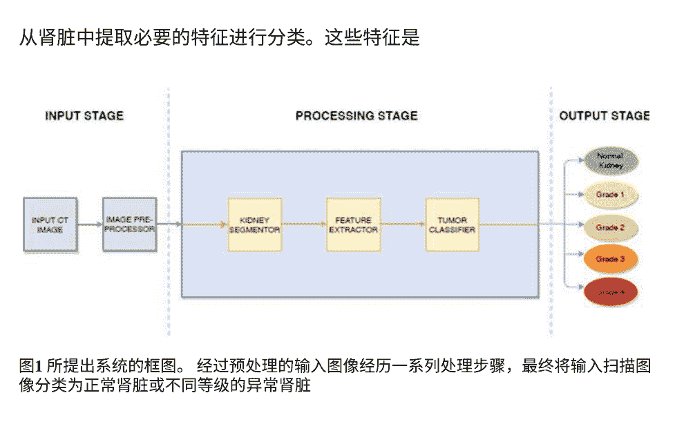

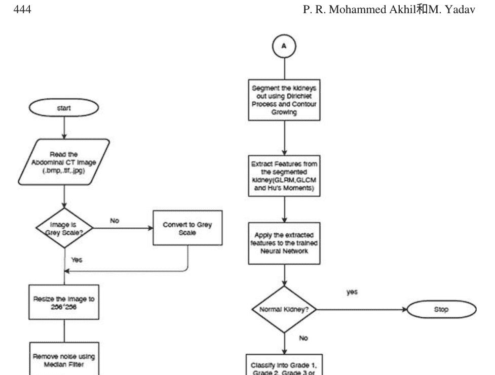

图2 流程图解释了系统的设计流程，从读取输入到最终分类

输入到分类器中，如果存在异常，则将其分为四个不同的等级，即一级、二级、三级或四级。

###### 2.1 预处理

CT图像容易受到很多噪声的影响，特别是椒盐噪声。我们使用自适应中值滤波器，可以有效去除噪声，同时保留边缘特征[5]。

###### 2.2 肾脏分割

一旦图像去噪和调整大小，两个肾脏需要被正确地分割出来以进行进一步处理。采用了Lin方法的肾脏分割的修改版本，利用先前的解剖知识定位肾脏，并进行自适应区域生长以准确地分割出肾脏[11]。一旦通过先前的解剖知识定位了脊柱，就可以根据脊柱缩小肾脏的适当位置。与Lin方法中采用的自适应种子生长相反，这里使用了自适应矩形轮廓生长。基于先前的知识，使用肾脏的近似位置形成自适应矩形轮廓。与现有方法相比，这里的关键区别在于区域生长的初始矩形轮廓的大小因图像而异。算法总结如下：

###### 算法1：肾脏分割

-   1. 使用先前的解剖知识定位脊柱
    2. 根据相对距离从脊柱上固定一个初始种子点作为参考
    3. 对图像进行模糊C均值聚类[25]
    4. 对肾脏区域进行粗分割
    5. 确定粗略分割的肾脏的四个角像素值 (x1, x2, x3, x4)
    6. 确定矩形轮廓的角像素值 (x1 - 5, x2 - 5, x3 - 5, x4 - 5)
    7. 执行区域生长操作，直到满足边界条件[11]
    8. 分割出检测到的肾脏区域。

###### 2.3 特征提取

一旦肾脏被分割出来，需要提取用于准确分类肾脏异常的特征。特征选择有两个方面： (a) 特征数量越多，分类越可靠； (b) 提取的特征应该能够进行分类，无论大小、平移、旋转和/或翻转。

我们的提取策略包括确定三组特征: (a) 灰度共生矩阵 (b) 灰度运行长度矩阵，以及 (c) 胡氏矩。

###### 灰度共生矩阵 (GLCM)

GLCM 表示特定大小的图像子区域上的角度和空间关系。分析 GLCM 有助于理解特征的纹理特征。一旦计算出 GLCM 矩阵，就可以从矩阵中提取出总共 20 个特征。

###### 灰度运行长度矩阵 (GLRLM)

GLRLM 提供有关一次运行中像素数量的信息。一次运行可以定义为具有相同灰度级的连续、共线的像素集合。GLRLM 还有助于理解对于模式/图像分类至关重要的纹理特征 [15]。从 GLRLM 中提取出总共 11 个特征。研究表明，GLRLM 在图像分类的准确性方面优于 GLCM [26]。然而，为了提高分类的准确性，需要同时使用这两种特征的组合 [27]。

###### Hu的矩

Hu的矩不变量代表了一组特征，无论大小、平移、旋转和/或反射都保持不变。这组特征对于我们的系统至关重要，因为每个输入CT扫描图像都是独特的，并且会因年龄、曝光时间和相关因素而有所变化。Hu的矩帮助我们开发了一个在所有不同条件下都保持真实的通用特征集。

大多数用于分类肿瘤或异常的系统通常使用GLCM和GLRLM [27]的组合，或者GLCM和Hu的矩 [28]的组合，或者GLRLM和Hu的矩 [29]的组合。在提出的工作中，主要目的是开发一个使用这三个特征集的组合的分类器。与现有方法相比，这使其成为一个独特的特征集。

###### 2.4 分类

提出系统的主要部分是准确识别异常并有效地将其分级。为此，采用了Bosniak分类的概念。Bosniak分类通过使用钙化、隔膜形成、囊肿中高密度液体的存在以及壁或实体的不规则性等特征来区分不同类型的囊肿。

利用这些特征，囊肿被分为四个主要类别：

-   **类别1**
    具有不可察觉壁和圆形形状的简单囊肿属于这个类别。这些囊肿大约有0%是恶性的，因此不需要后续随访。
-   **第2类**
    最小复杂囊肿，有几个<1毫米的薄隔壁或薄钙化属于这一类别。这些病变在对比剂下不增强，因此大约有0%是恶性的。对于这一类别的病变，随访也不足够。
-   **第3类**
    中度复杂囊肿，有厚的、结节状的多个隔壁，在对比剂下有可测量的增强属于这一类别。治疗包括部分肾切除术或射频消融在年长或手术不适合的患者中进行。 属于这一类别的囊肿的恶性风险约为55%。
-   **第4类**
    明显恶性的实质性肿块，具有大的囊性或坏死成分，属于这一类别。 治疗包括部分或全部肾切除。 属于这一类别的囊肿的恶性风险为100%。

使用上述作为分类基准，开发了一个有效地分类囊肿的系统。 我们使用前馈人工神经网络（ANN）进行多阶段分类[30]。

###### ANN

神经网络是模式识别和分类中最常用的模型。 选择特定类型的神经网络取决于其所用于的应用。 径向基函数神经网络主要用于电力恢复系统[31]。 Kohonen自组织神经网络用于数据中的模式识别。 在医学分析中广泛用于将数据聚类到不同的类别[32]。 递归神经网络主要用于文本到语音（TTS）转换模型[33]。 卷积神经网络广泛用于信号和图像处理应用，如人脸识别和各种计算机视觉技术[34]。 前馈神经网络是最简单的ANN形式之一，数据只在一个方向上流动。 当目标类别的分类非常困难时，它是计算机视觉和模式识别中最受欢迎的模型之一。 由于所提出的系统需要准确的多阶段分类，因此使用前馈ANN来开发分类器。

在前馈人工神经网络中，数据通过输入节点传递并通过输出节点退出。隐藏层的存在是可选的，取决于其必要性和所使用数据集的复杂性。网络中的每一层由连接到不同层的各种计算单元称为神经元的组成。每个神经元将初始值乘以一些权重，将来自不同神经元的其他值与结果相加，通过偏差调整当前结果，然后根据激活函数产生归一化输出。

以下概念在人工神经网络的背景下非常重要：

###### 初始化

权重和偏差的初始值极大地影响网络的收敛性。目标是在最短的时间内实现收敛。Xavier的随机权重初始化算法用于初始化[36]。该方法不仅减少了遇到梯度问题的可能性，还有助于更快地收敛到最小误差。

### **激活函数**

激活函数负责输入和响应变量之间的非线性映射。 对于输入和隐藏层，我们使用修正线性单元（ReLU），定义为

```
$$f(x) = \max(0, x)$$
```

ReLU被发现比传统的Sigmoid或双曲线正切函数取得更好的结果，并加快了训练速度[37, 38]。ReLU的一个限制是在训练过程中一些梯度可能很脆弱，可能会消失，这将导致权重更新后永远不会在任何输入上激活。 通过使用带有小斜率的泄漏整流线性单元（LReLU）[39]来克服这个限制，可以保持更新的活跃性。 该函数定义为

```
$$f(x) = \max(0, x) + \alpha \min(0, x)$$
```

其中 $\alpha$是泄漏参数。 对于输出层，使用softmax激活函数[40]。

### **正则化**

它用于避免过拟合。 正则化通过对系数进行惩罚来起作用。我们使用[41, 42]的dropout来对我们的网络进行正则化。 在这种方法中，节点在每次迭代中随机选择并且与它们的所有传入和传出连接一起被移除。 这确保了输出的随机性。 节点被丢弃的概率由 $\rho$给出，通过网格搜索方法[43]进行调整以获得更好的性能。 一旦在训练过程中获得足够的随机性，在测试过程中将使用所有节点。

### **损失函数**

在训练过程中的主要目标是最小化损失函数。 均方误差如公式（3）所示，

```
$$L = \frac{2}{n} \sum \left( y^{(i)} - \hat{y}^{(i)} \right)^2$$
```

其中 $i$从1变化到 $n$，$(y^{(i)} - \hat{y}^{(i)})$被称为残差，MSE损失函数的目标是最小化残差平方和。要训练ANN，必须最小化损失函数，但它是高度非线性的。Levenberg–Marquardt算法用于优化[44]。 图3表示使用Levenberg–Marquardt算法训练神经网络的状态图。第一步是计算损失、梯度和Hessian近似。 然后，通过调整阻尼因子来减小每次迭代的损失函数。

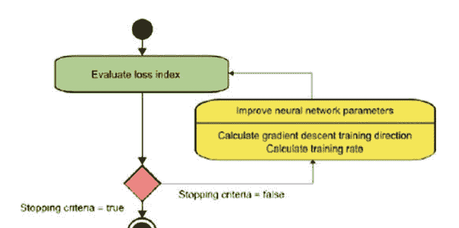

###### 3 结果与讨论

###### 3.1 数据库

总共使用了112个2D腹部CT扫描图像作为开发和验证该系统的数据库。扫描图像来自癌症影像存档（TCIA）。数据集来自年龄在15至82岁之间的患者。数据集中有67名男性和45名患者。

这确保了所提出方法的多样性和真实性。

###### 3.2 实验设置

整个设置可以分为两部分：训练和验证。训练指的是开发所提出分类系统，验证指的是测试所开发模型的准确性和真实性。

###### 训练

一组82个CT扫描图像被用于训练前馈神经网络进行分类。训练数据集包括五个正常肾脏扫描、6个1级扫描、34个2级扫描、32个3级扫描和5个4级扫描。每个训练图像的诊断结果是在初步扫描后进行活检获得的。对于训练，每个图像都经过预处理、分割和特征提取。提取的特征存储在一个称为'Data'的矩阵中，其维度为 \(i \times j\)，其中 \(i\)对应于提取的特征数量，\(j\)对应于用于训练的图像数量。因此，在我们的数据情况下，数据矩阵的维度为38 ×82。对应的诊断结果每个训练图像的目标值存储在另一个矩阵中，称为'Target'，其维度为 $k \times l$ 其中 $k$ 对应于分类阶段的数量， $l$ 对应于用于训练的图像数量。 形成的目标矩阵在训练神经网络时用作期望输出。

前馈神经网络使用了两个隐藏层。 每个隐藏层中有30个神经元。 隐藏层的数量和每层神经元的数量的选择基于神经网络集成的概念[45]。 表1显示了分类器网络中使用的超参数。 所得到的值是通过重复迭代直到达到最佳性能为止获得的。

表1 提出方法的超参数
| 阶段 | 超参数 | 值 |
| :--- | :--- | :--- |
| 初始化 | 偏差 | 0.1 |
| 初始化 | 权重 | Xavier |
| 泄漏的ReLU | α | 0.333 |
| 丢弃 | p | 0.4 |
| 训练 | 迭代次数 | 26 |
| 训练 | 梯度 | 0.00098142 |
| 训练 | Mu | 1e-08 |

### **测试和验证**

使用了一组30个图像来测试开发系统的性能和准确性。 所有被测试的图像都经历了提出的系统的所有处理阶段。 从开发系统获得的结果与活检后肿瘤样本的诊断结果进行了比较。 预处理、肾脏分割和特征提取的平均时间累计为41.3秒。分类器在经过26次迭代后平均在11秒内收敛到最终结果。 图7显示了从分割的肾脏中提取的特征的箱线图。 它提供了每个分类等级的每个特征的范围表示，以及相同特征的均值和标准误差。 这有助于我们从统计角度了解每个肿瘤等级的情况。

图6描述了开发的分类器的性能特征。 在第26个时期达到了最佳性能，并且分类器在此之后终止。

图4显示了设计的二级肿瘤系统的仿真步骤。 图4a表示经过调整大小的扫描图像已准备好进行处理。 初始矩形轮廓在过滤图像上生成，如图4b所示，d表示我们的区域生长算法检测到的最终边界，最终结果为分割的肾脏如图4d所示。 分割的肾脏的三维体积分析有助于更好地理解纹理分布，如图4e所示。 图5显示了相同工作流程的三级肿瘤的仿真结果。

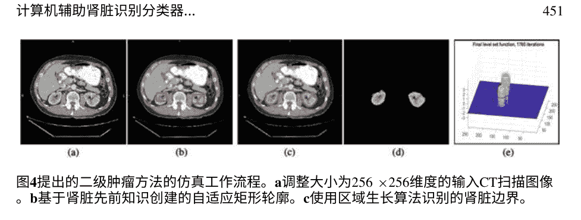

图4 提出的二级肿瘤方法的仿真工作流程。a调整大小为256 ×256维度的输入CT扫描图像。b基于肾脏先前知识创建的自适应矩形轮廓。c使用区域生长算法识别的肾脏边界。d分割的肾脏。e分割的肾脏的3D纹理分布

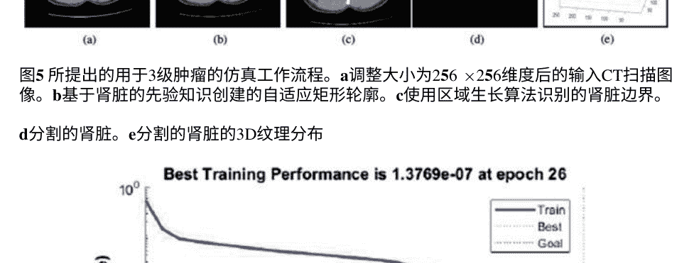

图5 所提出的用于3级肿瘤的仿真工作流程。a调整大小为256 ×256维度后的输入CT扫描图像。b基于肾脏的先验知识创建的自适应矩形轮廓。c使用区域生长算法识别的肾脏边界。d分割的肾脏。e分割的肾脏的3D纹理分布

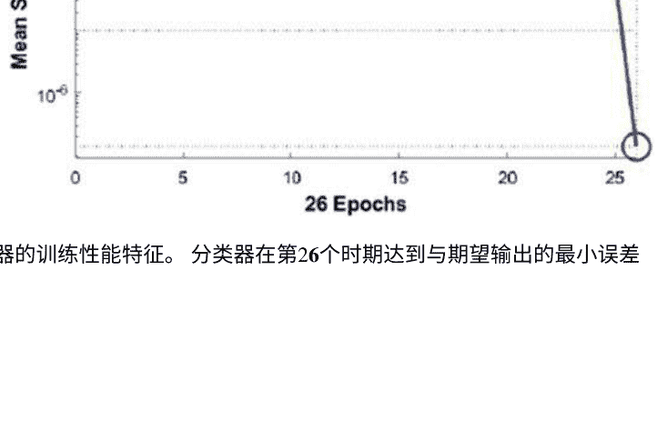

图6 分类器的训练性能特征。分类器在第26个时期达到与期望输出的最小误差

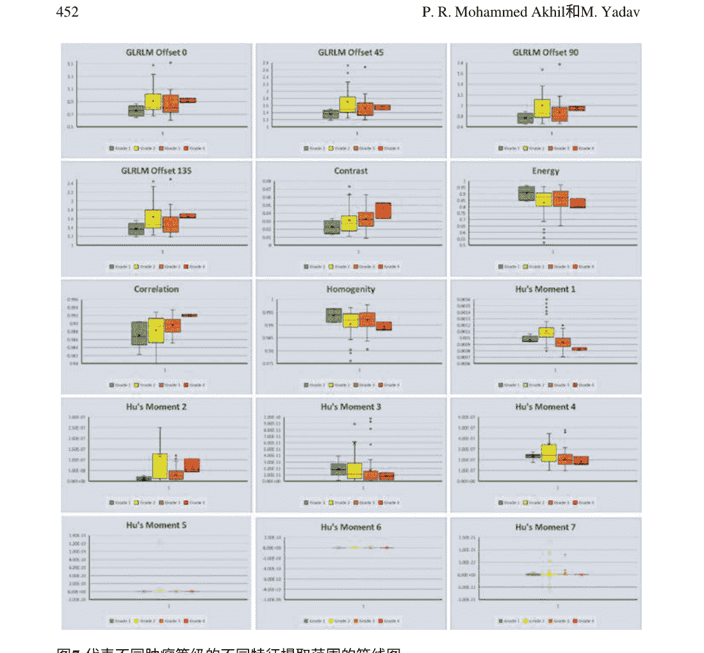

图7 代表不同肿瘤等级的不同特征提取范围的箱线图。每个图表描述了与每个肿瘤等级相对应的特定特征提取的均值、第一四分位数和第三四分位数值。

使用标准性能指标验证所得结果。 真正阳性比例和真负性比例用于计算所提出系统的准确性、敏感性和特异性。

> 根据现有文献[46]:

-   真正例比例（TPF）是正例观测数与真正例条件数之间的比值。
-   假正例比例（FPF）是正例观测数与真负例条件数之间的比值。
-   真负例比例（TNF）是负例观测数与真负例条件数之间的比值。
-   假负例比例（FNF）是负例观测数与真正例条件数之间的比值。

对接收到的肾脏图像数据库进行分析；

```
Ntot =检查案例数 = 30
Ntp =真正例条件数 = 15
Ntn =真负例条件数 = 17
Notp =从Ntp中的正例观测数 = 14
Nofn = 从Ntp中的负例观测数 = 1
Notn =从Ntn中的负例观测数 = 1
Nofp =从Ntn中的正例观测数 = 16.
```

最终性能指标的计算如下：

```
正常图像的准确率 = Nofp / Ntn (4)
```

```
异常图像的准确率 = Notp/Ntp (5)
```

```
敏感度 = TP/(TP + FN) (6)
```

```
特异性 = TN / (TN + FP) (7)
```

其中

-   TP =真阳性—将异常预测为异常。
-   FP =假阳性—将正常预测为异常。
-   TN =真阴性—将正常预测为正常。
-   FN =假阴性—将异常预测为正常。

分类器性能（分类率）由以下公式给出：

```
CR = (Notp + Nofp) / Ntot * 100 (8)
```

表3显示了所提方法的性能指标和分类率。

表2显示了我们提出的方法与其他现有方法之间的恶性分类率比较。所提出的方法优于所有现有方法，分类率达到93.5%。在测试的30张图像中，一旦发现异常，有24张图像被正确识别为相应的等级，而有4张图像被错误分类。在这4张图像中，有3张图像被分级为4级，而实际上应该是2级。其中一张图像被错误地分级为4级，而实际上应该是2级。开发系统的分级准确率为86.67%。

表2 与先前报道的工作进行肿瘤分类率比较
| 序号 | 作者 | 模态 | 使用的方法 | 分类率 |
| :--- | :--- | :--- | :--- | :--- |
| 1 | Boukeroui， D.等 | 腹部CT | 使用统计框架的自动感兴趣区域识别 | 简单肾脏的分类率为92.81%，困难肾脏的分类率为65.81% |
| 2 | Kim， D. Y.等 | 腹部CT | 使用直方图特征和种子生长的纹理分析 | 92.307% |
| 3 | Mangayarkarasi， T.等 | 肾脏超声 | 基于PNN的分类器 | 93.5% |
| 4 | 提出的方法 | 腹部CT | 基于ANN的分类器，使用Bosniak分类 | 93.75% |

表3 结果验证
| 序号 | 图像类别 | 准确率 (%) | 特异性 (%) | 敏感性 (%) |
| :--- | :--- | :--- | :--- | :--- |
| 1 | 正常 | 93.33 | 93.33 | 86.67 |
| 2 | 异常 | 94.11 | 95.12 | 87.5 |

分类率 = 93.75%

###### 4 结论

总结一下，提出了一种新颖的自适应矩形轮廓基于肾脏分割的方法，然后对检测到的肿瘤进行异常肾脏的识别和分级。设计流程从预处理开始，包括颜色转灰度、中值滤波和图像调整大小。在此之后，利用先前的解剖知识，找到肾脏的近似位置，计算出自适应矩形轮廓，直到确定肾脏的边界。从分割的肾脏中提取所需的特征，并使用这些特征训练前馈神经网络来检测和分级肿瘤（如果存在）。

在设计所提出的方法时，考虑了用于开发模型的扫描图像的异质性和多样性。自适应矩形轮廓确保了对患者肾脏的任何大小和形状的高效分割。这使得所提出的方法更具普适性。

考虑了不规则大小、反射和旋转等因素。

使用胡氏矩来训练神经网络分类器，以确保更准确的分类。所使用的人工神经网络建立在两个隐藏层上，每层有30个神经元。通过使用神经网络的不同配置来测试性能，但当前配置在给定的数据集上表现最佳。验证了Bosniak分类可以有效地应用于计算机辅助诊断，并且我们的系统可以作为专家放射科医生的第二意见。

所提出的方法使用了来自癌症影像存档（TCIA）的数据库。该方法在检测肾脏中任何异常的存在方面显示出93.75%的分类率，使我们的设计优于其他现有的方法。将肿瘤分级的准确率为86.67%。任何神经网络的准确性取决于用于训练的数据集。数据集越大，开发的系统越准确的机会就越多。我们的设计是基于112张图像开发的，因此数据集太小，解释了分级准确性较低。通过获取更大的数据集并对神经网络进行训练，可以提高分级准确性。然而，现有分类器的架构可能需要一些改变以及超参数，以确保更好的性能。

致谢 我们感谢NIT Tiruchirappalli的ECE系提供资源来完成这项工作。我们还感谢MHRD在硕士期间提供的奖学金。

利益冲突 没有利益冲突。

###### 参考文献

1.  Rini BI, Campbell SC, Escudier B (2009) 肾细胞癌。《柳叶刀》373 (9669) : 1119-1132
2.  Bray F, Ferlay J, Soerjomataram I, Siegel RL, Torre LA, Jemal A (2018) 全球癌症统计 2018: Globocan估计全球185个国家36种癌症的发病率和死亡率。CA: 癌症杂志68 (6) : 394-424
3.  Brascho DJ, Bryan JM, Wilson EE (1977) 用于放射治疗中肾脏大小和位置确定的诊断超声。Int J Radiat Oncol Biol Phys 2 (11) : 1217-1220
4.  Conti P, Strauss L (1991) PET在临床肿瘤学中的应用。J Nucl Med 32 (4) : 623-648
5.  Warshauer DM, McCarthy SM, Street L, Bookbinder M, Glickman M, Richter J, HammersL, Taylor C, Rosenfield A (1988) 肾脏肿块的检测: 排泄性尿路造影/线性层析摄影, 超声和CT的敏感性和特异性。放射学169 (2) : 363-365
6.  Reznek RH (2004) CT/MRI在分期肾细胞癌中的应用。癌症影像学国际癌症影像学会4: S25-S32
7.  Huang T, Yang G, Tang G (1979) 一种快速的二维中值滤波算法。Sig Proces IEEE Trans Acoust Speech 27 (1) : 13-18
8.  Hwang H, Haddad RA (1995) 自适应中值滤波器: 新算法和结果。IEEE Trans Image Process 4 (4) : 499-502
9.  Chan RH, Ho C-W, Nikolova M (2005) 通过中值型噪声检测器和保留细节的正则化去除椒盐噪声。IEEE Trans Image Process 14 (10) : 1479-1485
10. Xie J, Jiang Y, Tat Tsui H (2005) 基于纹理和形状先验的超声图像肾脏分割。IEEE Trans Med Imag 24 (1) : 45–57
11. Lin D-T, Lei C-C, Hung S-W (2006) 腹部CT图像上的计算机辅助肾脏分割。IEEE Trans Inf Technol Biomed 10 (1) : 59–65
12. Tuncer SA, Alkan A (2017) 使用连接组件标记方法在移动设备上分割肾脏和腹部图像。在：电子与微电子 (MIPRO) 2017年第40届国际会议信息与通信技术，pp 1094–1097
13. Farzaneh N, Soroushmehr SMR, Patel H, Wood A, Gryak J, Fessell D, Najarian K (2018) 通过集成学习和主动轮廓建模实现创伤患者的自动肾脏分割。在IEEE工程医学与生物学学会 (EMBC) 第40届年会论文集中，第3418-3421页
14. Haralick RM, Shanmugam K, Dinstein I (1973) 用于图像分类的纹理特征。Cybern IEEE Trans Syst Man SMC-3 (6) : 610-621
15. Galloway MM (1974) 使用灰度级运行长度进行纹理分析。NASA STI/Recon技术报告N, 第75卷
16. Hu M-K (1962) 通过矩不变量进行视觉模式识别。IRE Trans Inform Theor 8 (2) : 179-187
17. Linguraru MG, Gautam R, Peterson J, Yao J, Linehan WM, Summers RM (2009) 三相增强腹部CT中肾脏肿瘤的定量和分类。在IEEE国际生物医学成像研讨会论文集中，第1310-1313页
18. Linguraru MG, Yao J, Gautam R, Peterson J, Li Z, Linehan WM, Summers RM (2009) 对比增强腹部CT中的肾肿瘤定量和分类。模式识别42 (6) : 1149-1161
19. Mangayarkarasi T, Jamal DN (2017) 基于PNN的肾脏超声图像分析系统用于分类肾脏病理学。在：第二届国际计算与通信技术会议 (ICCCT) 论文集，第123-126页
20. Khoshdeli M, Borowsky A, Parvin B (2018) 深度学习模型区分H&E染色组织学切片的肿瘤分级。在：第40届IEEE工程医学与生物学学会 (EMBC) 年会论文集，第620-623页
21. Bosniak MA (1986) 对肾囊肿的当前放射学方法。放射学158: 1-10
22. Lippmann R (1987) 用神经网络进行计算的简介.IEEE ASSP杂志 4(2):4-22
23. Smith K, Landes P-E, Thollot J, Myszkowski K (2008) 表现灰度:一种简单快速的图像和视频感知准确性转换. 在: 计算机图形学论坛, 卷27,号2. Wiley Online Library, 页193–200
24. Verma R, Ali J (2013) 各种类型的图像噪声和高效噪声去除技术的比较研究.Int J Adv Res Comput Sci Softw Eng 3(10)
25. Bezdek JC, Ehrlich R, Full W (1984) Fcm: 模糊c均值聚类算法. Comput Geosci 10(2–3):191–203
26. Singh K (2016) 灰度级运行长度矩阵和灰度共生矩阵在谷物分类中的比较. Int J Comput Eng Technol (IJET) 7(6):9–17
27. Mohanty AK, Beberta S, Lenka SK (2011) 使用GLCM和GLRLM基于纹理特征从乳房X线照片中分类良性和恶性肿块. Int J Eng Res Appl (IJERA) 1(3):687–693
28. Alegre E, González-Castro V, Alalz-Rodríguez R, GarcíaOrdás MT (2012) 基于纹理和矩的分类方法用于猪精子图像的顶体完整性. Comput Methods Programs Biomed 108(2):873–881
29. Chaieb R, Kalti K (2018) 特征子集选择用于数字乳腺X线照片中恶性和良性乳房肿块的分类。模式分析应用 1-27
30. Li Y, Fan F (2005) 用ANNs对精神分裂症和抑郁症进行分类。在：IEEE工程医学与生物学学会年会论文集，第2679-2682页
31. Sadeghkhani I, Ketabi A, Feuillet R (2012) 径向基函数神经网络在电力系统恢复研究中的应用。 计算智能神经科学 3(10)
32. Van Biesen W, Sieben G, Lameire N, Vanholder R (1998) 应用Kohonen神经网络区分肾小球和肾小管性肾病。 肾脏透析移植 13(1):59-66
33. Arik SO, Chrzanowski M, Coates A, Diamos G, Gibiansky A, Kang Y, Li X, Miller J, Ng A, Raiman J等 （2017） Deep voice: real-time neural text-to-speech. arXiv预印本arXiv:1702.07825
34. Pereira S, Pinto A, Alves V, Silva CA （2016） 脑肿瘤分割使用卷积神经网络在MRI图像中. IEEE Trans Med Imaging 35(5):1240–1251
35. Jian Z, Wu WX （2011） 前馈神经网络在X射线图像融合的应用. J Phys Conf Se 312(6):062005
36. Glorot X, Bengio Y （2010） 理解训练深度前馈神经网络的困难. 在：第十三届国际人工智能和统计学会议论文集，第249–256页
37. Krizhevsky A, Sutskever I, Hinton GE (2012) 使用深度卷积神经网络进行Imagenet分类。 在：神经信息处理系统进展，第1097-1105页
38. Jarrett K, Kavukcuoglu K, LeCun Y等 （2009） 什么是最佳的多阶段架构用于物体识别？ 在：2009年IEEE第12届国际计算机视觉会议。IEEE，第2146-2153页
39. Maas AL, Hannun AY, Ng AY （2013） 整流器非线性改善神经网络声学模型。 在：ICML会议论文集，卷30，第1期，第3页
40. Dunne RA, Campbell NA （1997） 关于softmax激活和交叉熵惩罚函数的配对以及softmax激活函数的推导。 在：第8届澳大利亚神经网络会议论文集，墨尔本，第181卷。 Citeseer，第185页
41. Srivastava N, Hinton G, Krizhevsky A, Sutskever I, Salakhutdinov R （2014） Dropout：一种简单的防止神经网络过拟合的方法。 J Mach Learn Res 15(1)：1 929-1958
42. Hinton GE, Srivastava N, Krizhevsky A, Sutskever I, Salakhutdinov RR （2012）通过防止特征检测器的共适应来改善神经网络。 arXiv预印本arXiv：1207.0580,
43. Gal Y, Hron J, Kendall A (2017) 具体的退出。 在：神经信息处理系统的进展，第3581-3590页
44. Moré JJ (1978) Levenberg-Marquardt算法：实现和理论。在：数值分析。 Springer, 柏林, 第105-116页
45. Hansen L, Salamon P (1990) 神经网络集成。 IEEE Trans Pattern Anal Mach Intell 12(10): 993-1001
46. Diakides M, Bronzino JD, Peterson DR (2012) 医学红外成像：原理和实践。 CRC Press, 博卡拉顿

##### 使用基于超分辨率生成对抗网络的模糊对象识别

B. Sathyabama, A. Arunesh, D. SynthiyaVinothini, S. Anupriyadharsini, 和S. Md. Mansoor Roomi

摘要 目标识别在计算机视觉领域取得了很大的进展，但在低分辨率图像的情况下仍然是一项困难的任务，因为传统的高分辨率判别特征在低分辨率下通常会消失。在监控系统中，由于摄像机与物体之间的距离以及光照效果，感兴趣区域会变得模糊。在低分辨率图像中，物体显得非常小和模糊，因此识别这些物体变得困难。自然图像的超分辨率是图像和视频处理中的一个经典且困难的问题。但是深度学习的快速发展最近引起了对图像超分辨率的兴趣。本文将成功应用于生成图像和真实纹理的生成对抗网络（GAN）扩展到图像超分辨率的应用。本文旨在提高模糊物体的分辨率，以提高系统的分类准确性。这是通过使用RCNN检测模糊物体，然后使用GAN网络提高其分辨率，并最终使用AlexNet对改进的图像进行分类来实现的。实验使用MSCOCO数据集和Google COLAB收集的鞋类数据库进行。超分辨率图像将分类准确性提高了16%。

关键词生成对抗网络 (GAN) · 超分辨率 (SR) · 基于区域的卷积神经网络 (RCNN)

###### 1 引言

目标检测是计算机视觉中的一项具有挑战性的任务。这是非常困难的，因为同一类别的图像之间存在显著的变化。


物体类别。使物体检测过程复杂的其他因素包括视角和尺度、部分遮挡、光照和多个实例。物体检测是找到图像中每个相关物体的位置的过程。实际上，它是为每个物体找到边界框的过程。一种方法是使用滑动窗口在尺度空间中扫描图像，并对每个窗口进行分类。根据Dalal的说法，在INRIA数据集中，当图像的分辨率为640 ×480，滑动窗口和物体的尺寸为64 ×128时，检测性能为90%。但是当滑动窗口为16 ×32时，检测性能下降到40%。由于图像中行人的适当尺寸事先不知道，所以在分辨率较低时很难检测。低分辨率的物体在传统的检测方法中大多被忽略，如图1所示。可以注意到，传统的检测器检测到的人类在图像中比车辆等模糊物体要大。由红色边界框限定的物体不够清晰，这使得它们难以识别。从图1 [1] 可以看出，由于分辨率较低，被标记为5和6的行人无法被正确识别。因此，物体5和6被分类为模糊物体。同样地，在图2中由红色边界标记的车辆也无法被识别。

目标检测在低分辨率和高分辨率中都很重要。在低分辨率下比高分辨率更困难。图像超分辨率从低分辨率图像或序列中恢复出单个或一系列高分辨率图像。它在卫星和遥感成像、医学成像、计算机视觉、安全、生物识别和取证等各种实际应用中具有几个实际应用。

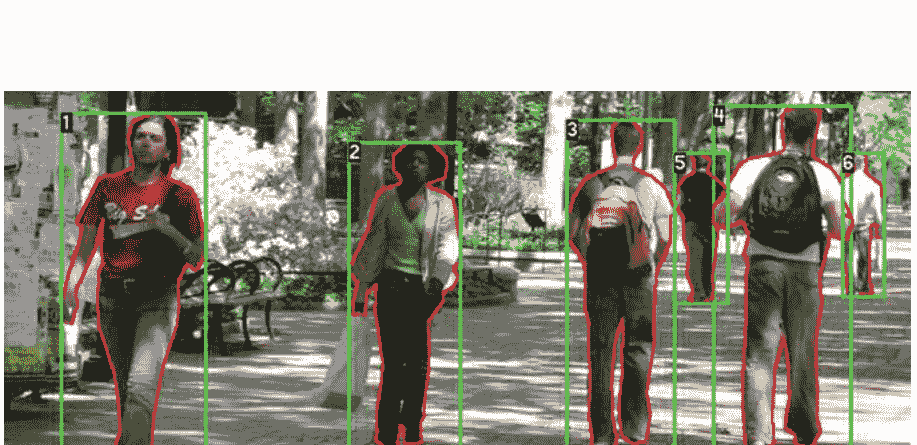

图1 人体检测

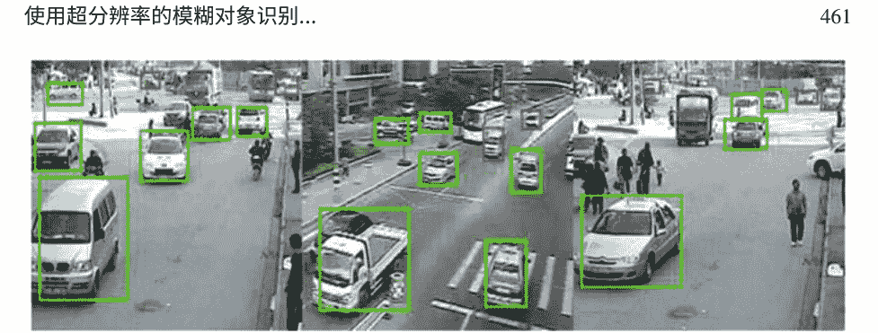

图2 汽车检测

###### 1.1 图像超分辨率

图像超分辨率从低分辨率图像或序列中恢复出单个或一系列高分辨率图像。根据输入图像的数量，SR可以是单一的或多个的SR。SR算法通过频域方法、概率方法、重建方法、正则化方法和学习方法、机器学习和深度学习等方法进行开发。单图像超分辨率（SISR）[2]通常使用一些学习算法，并尝试通过学习或映射训练数据集中低分辨率和高分辨率对之间的关系来预测重建图像的缺失信息。在今天的数字时代，有大量的数据可用于训练。传统的机器学习算法无法定义一个复杂的高维映射来处理可用的大规模原始数据。随着深度学习[3]的出现，强大的深度网络已经被训练出来达到最先进的性能。它学习数据的分层表示，提取将低分辨率和高分辨率空间联系起来的高级抽象。

###### 1.2 超分辨率的深度学习

深度学习目前在许多计算机视觉领域取得进展。凭借可用的大型数据集和计算能力，深度学习通过端到端学习实现了良好的准确性。随着基于卷积神经网络（SRCNN）的SR的出现，深度学习动态地提高了SR的性能[3]。SRCNN是一个三层浅层网络，学习了一个端到端的非线性映射函数。随后，深度递归卷积网络（DRCN）架构具有较小的模型参数，但允许像素之间的长距离依赖关系。扩张卷积神经网络（DCNN）使用扩张卷积，也被称为卷积，这是一种通过线性参数增加来指数级增加网络的感受野的生动方法。增加网络的深度可以有效地提高模型的准确性，因为它们有潜力对模型进行建模。

高复杂映射。 这样的深度网络可以通过批量归一化进行高效训练。CNN的学习能力通过跳跃连接和残差块变得强大，其中网络学习残差而不是身份。

这种设计选择解决了深度网络训练中的梯度消失问题，从而减轻了网络的负担。 VDSR通过堆叠更多的卷积层和残差学习来增加网络深度。 EDSR和MDSR分别使用残差块构建宽而深的网络和残差缩放。

###### 2 提出的方法

在深度卷积网络的发展之后，小型或模糊对象的目标检测变得容易起来。 如果一个特定的对象占据总图像面积的1%以下，则被认为是小型对象。 这个问题在许多应用中都存在，比如交通信号、购物中心的人员检测和道路上的汽车检测。 检测模糊对象非常困难。 从背景的一般混乱中检测小型对象是困难的。 而且，当图像通过像VGG16这样的CNN架构时，小型对象在每个池化层中变得更小。 例如，如果一个对象的大小是32 × 32，在VGG16的五层池化之后，它最多只能表示一个像素。另一个使检测变得复杂的原因是，小型对象的大型数据集较少，而且一些小型对象具有简单的形状。 MS COCO和VOC 2012具有一些特定的小型对象实例，但没有针对小型对象的大型数据集。

大部分的工作都集中在使用单个或多个清晰的物体进行识别。模糊的物体，如车牌、鞋子和挂钟，无法被识别。从人类的感知来看，如果一个物体被分类到特定的类别中或者信息被正确提取出来，那么它就被认为是被识别了。 模糊的物体可能很小、旋转、平移或者由于光照条件差而不可见。 在识别模糊的物体时常见的问题是物体的分辨率较低。
因此，为了提高对模糊物体的识别准确性，使用深度学习模型进行超分辨率处理。 为了提高检测到的物体的分辨率，使用生成对抗网络（GAN），其中物体是通过基于区域的卷积神经网络（RCNN）进行检测的。 该方法最小化生成损失和判别损失，以提高网络的准确性。

所提出的方法如图3所示。
模糊物体识别的提出系统是基于超分辨率的深度学习，使用生成对抗网络（GAN）。 通过神经网络对模糊物体进行训练，并提取它们的特征。 然后使用基于区域的卷积神经网络（RCNN）来检测这些特征所得到的物体。 然后通过使用生成对抗网络对检测到的物体的感兴趣区域进行超分辨率处理。超分辨率处理后的感兴趣区域进一步通过AlexNet进行识别。

###### 图3 提出的方法论

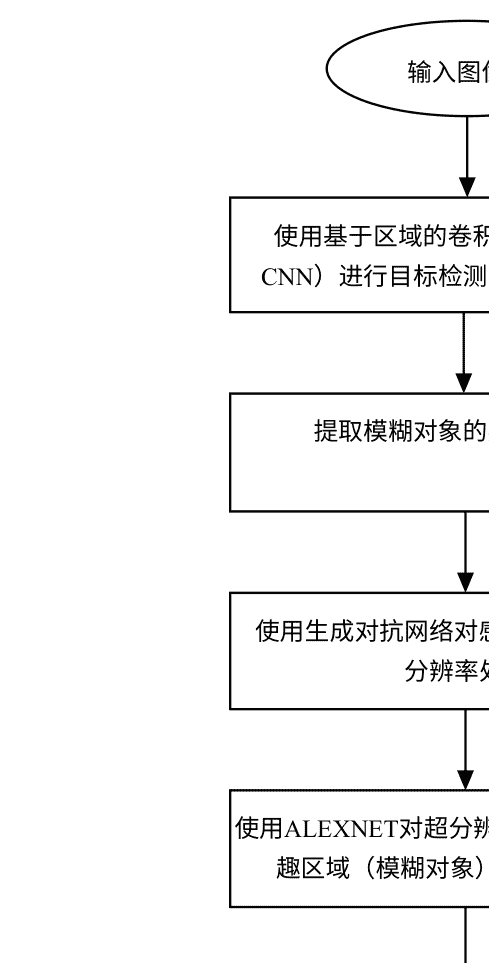

###### 2.1 识别的阶段

在提出的方法中，为了使用基于超分辨率的深度学习方法识别多个对象，使用了三个网络RCNN、GAN和AlexNet的两个阶段，如图4所示。

第一阶段使用RCNN进行目标检测。卷积神经网络（ConvNets或CNNs）在图像的识别和分类中已经证明非常有效。RCNN有助于定位对象。RCNN包括三个简单的步骤。扫描输入图像以生成区域建议。CNN在每个区域上运行。每个CNN的输出被馈入一个分类器，对区域进行分类，然后进行线性回归以收紧物体的边界框。对于像车牌图像这样的遮挡物，提取出物体（车牌、数字、字体）的区域，并将该区域作为CNN的输入。网络训练并提取物体的特征。结果是经过训练的网络，可在测试阶段使用。

第二阶段。使用生成对抗网络进行超分辨率。现在提取出检测到的物体的边界，并将感兴趣的区域裁剪并作为输入传递给生成对抗网络进行超分辨率[4]。GAN通常由两个网络组成：生成器网络和判别器网络。不同风格的架构可以在生成器和判别器网络中使用。为了提高重建的SR图像的整体质量，本节首先提出了一种新颖的生成器和判别器网络设计，然后改进了损失函数。它从输入图像的高分辨率版本开始，然后是低版本。为了训练生成器，应该提供低分辨率图像，以获得接近高分辨率版本的输出。获得的输出是超分辨率图像。然后训练判别器来区分图像。生成器网络使用一组包含ReLU、BatchNorm和卷积层的残差块。低分辨率图像经过这些块后，有两个反卷积层增加分辨率。判别器有八个卷积层，导致sigmoid激活函数，产生图像是高分辨率真实图像还是超分辨率人工图像的概率。GAN的架构如图5所示[4]。

损失函数. 损失函数实际上是各个损失函数的加权和。

内容损失. 这是新重建图像（即输出）和实际高分辨率训练图像之间的欧氏距离损失。

对抗损失. 它通过负对数似然支持与原始数据分布相似的输出。借助这个损失函数，生成器确保输出更大分辨率的自然图像，并且在与低分辨率版本相比时保留几乎相同的像素空间。

```
$$ l^{SR} = l^{SR}_{X} + 10^{-3} l^{SR}_{GEN} $$ (1)
```

均方误差损失. 这是生成图像和目标图像之间的差异总和；当生成图像接近目标图像时，这个差异明显最小化。

```
$$ l_{\text{MSE}}^{\text{SR}} = \frac{1}{r^{2}\text{WH}} \sum_{x=1}^{rW} \sum_{y=1}^{rH} \left( I_{x,y}^{\text{HR}} - G_{\theta_{G}}\left(I^{\text{LR}}\right)_{x,y} \right)^{2} $$ (2)
```

VGG 损失。它是来自VGG网络的特征空间的差异和特征匹配，而不是像素。这使得生成器比仅仅通过像素匹配能够更好地生成自然的图像。

```
$$ l_{\text{VGG}/i,j}^{\text{SR}} = \frac{1}{W_{i,j}H_{i,j}} \sum_{x=1}^{W_{i,j}} \sum_{y=1}^{H_{i,j}} \left( \emptyset_{i,j}\left(I_{x,y}^{\text{HR}}\right) - \emptyset_{i,j}\left(G_{\theta_{G}}\left(I^{\text{LR}}\right)_{x,y}\right) \right)^{2} $$ (3)
```

因此，通过使用生成对抗网络对ROI进行超分辨率处理，并进一步用于分类。

第三阶段使用AlexNet进行分类。 AlexNet是一个预训练的卷积神经网络模型。作为学习的结果，该网络对于给定的广泛图像具有丰富的特征表示。该网络接受输入图像，并输出所有对象的标签以及概率。它支持迁移学习[5]。该模型有25层，包括五个卷积层和三个全连接层。每个卷积层后都进行归一化处理。ReLU函数在每个卷积层和全连接层后执行，如图6[5]所示。Dropout应用于第一个和第二个全连接层之前。Dropout除了CNN的四个常见层外，归一化和Dropout是添加到AlexNet模型中的两个层，用于减少神经网络中的过拟合。当函数过度拟合于有限的数据点时，会发生过拟合。它可以防止在训练数据上进行复杂的共适应[5]。这是使用神经网络进行模型平均的最佳方法。归一化层执行一种转换，使得平均激活值接近于0，激活标准差接近于1。

因此，使用RCNN检测到模糊对象的第一张图像，使用生成对抗网络对检测到的图像进行超分辨率处理，最后使用AlexNet对超分辨率图像进行分类。

###### 3 结果与讨论

训练和测试有三个阶段。在使用RCNN进行目标检测的第一阶段中，从Google收集了MS COCO数据集，并在Keras、Python中实现了目标检测。

###### 3.1 RCNN第一阶段的数据库:

COCO（COMMON OBJECTS IN CONTEXT）是一个大规模的目标检测、分割和字幕数据集。COCO具有几个特点。该数据集包含123,287张图像、886,284个实例和注释。COCO数据集的示例如图7所示[6]。由于COCO数据集包含了所有的对象，使用MS COCO数据集进行训练将能够检测到任何类型的模糊对象。因此，MS COCO数据集用于模糊对象检测[6]。

Dataset examples


图7 MS COCO数据集

表1 鞋子图像数据库

| 序号 | 类型 | 子类数量 | 图像数量 |
|---|---|---|---|
| 1 | 靴子 | 5 | 13,393 |
| 2 | 凉鞋 | 3 | 6,089 |
| 3 | 鞋子 | 10 | 30,169 |
| 4 | 拖鞋 | 3 | 1,069 |

###### 3.2 阶段 II-GAN

在使用生成对抗网络进行超分辨率的第二阶段中，鞋子数据库包含了50,025张用于训练的图像。鞋子被视为一个模糊的对象，超分辨率鞋子图像在分类阶段III中被分为八类：凉鞋、鞋子、拖鞋、初学者靴子、过膝、中筒、踝部和靴子，使用AlexNet进行分类。收集包含模糊对象鞋子的数据库图像，并在表1中展示。收集包含模糊对象（鞋子）的数据库图像，并展示。总共从UT Zappos 50 K数据集中收集了50,025张鞋子图像，如图8所示[7]。

###### 3.3 阶段 III-AlexNet

为了训练AlexNet识别超分辨率图像，将鞋子图像（2100张）分为八类，即踝部、膝盖、小腿、中筒、过膝、初学者靴子、凉鞋、拖鞋和鞋子，并进行500次迭代训练。

###### 3.4 基于RCNN的目标检测

对于RCNN，输入是图像中物体的区域。 提取并标记图像中的物体区域。 将该区域存储起来，作为RCNN的输入。由于输入是物体的区域，这个卷积神经网络被称为基于区域的卷积神经网络。 这种区域的提取有助于在复杂背景中轻松识别物体。

在这里，使用MS COCO数据集预先训练了mask RCNN模型[6]，并将该模型用于目标检测。mask RCNN的结果如图9所示。 使用MS COCO数据集可以检测到人类、飞机和汽车等所有物体。 那些无法识别的物体被定义为模糊物体，并应用基于GAN的超分辨率技术。

因此，这个预训练模型[6]被用于检测图像中的模糊物体。提取了模糊对象的边界，即感兴趣区域（此处考虑鞋子）。 通过使用感兴趣区域的边界框坐标，将对象裁剪并作为输入提供给生成对抗网络（GAN）。 与任何RCNN网络相比，MaskRCNN在实例分割过程中提供了较高的准确性。

###### 3.5 基于GAN的超分辨率

对于GAN，使用不同的图像数据集进行两个阶段的训练。表2展示了GAN的训练阶段。

表2 训练阶段一 GAN

| 属性 | 第一阶段（SRGAN X4） | 第二阶段（SRGAN X4） |
|------|----------------------|----------------------|
| 总图像数 | 682 | 50,025 |
| 训练集 | 650 | 951 |
| 测试集 | 31 | 249 |
| 维度 | 200 × 200 × 3 | 100 × 100 × 3 |
| 迭代次数 | 500 | 500 |
| 批量大小 | 4 | 4 |

**输入到生成器**

首先将100 × 100图像下采样为25 × 25图像，并将其调整大小为100 × 100图像，以获得低分辨率图像。

**基于AlexNet的分类**

第一层，图像输入层，需要尺寸为227x227x3的输入图像，这里的3是颜色通道的数量。在AlexNet的实现中，为了在训练过程中将网络分割到两个有限内存的GPU上，一些卷积层使用了滤波器组。在这些层中，滤波器被分成两组。该层将输入沿着通道维度分成两个部分，然后将每个滤波器组应用于不同的部分。然后，该层将两个结果部分连接在一起以产生输出。例如，在AlexNet的第二个卷积层中，该层将权重分成两组128个滤波器。每个滤波器有48个通道。该层的输入有96个通道，并分成两个具有48个通道的部分。该层将每组滤波器应用于不同的部分，并产生具有128个通道的两个输出。然后，该层将这两个输出连接在一起，得到具有256个通道的最终输出。该网络有近6230万个参数。

这些参数用于定义每个类别的标签。这个AlexNet模型用于训练目的。在AlexNet中，共有2100张八个类别的图像在创建CSV文件后进行了训练，并且使用了三个不同的数据集进行了测试，以了解分类准确率（图10）。

可以看出，低分辨率图像的分类准确率为68%，而超分辨率图像的分类准确率为84%。
因此，超分辨率有助于识别和分类模糊的物体。

**性能指标**

表3显示了使用PSNR和SSIM指标进行的性能分析，表4显示了AlexNet的准确率结果。

###### 4 结论

本文实现了一个模糊物体识别系统，其中使用RCNN检测模糊物体，然后使用生成对抗网络进行超分辨率处理。然后，使用标准分类器AlexNet对分辨率改善后的图像进行分类。实验分为两个阶段：一个是使用MS COCO数据集，另一个是使用收集的鞋类数据集。该提出的方法在Google Colab框架中使用Keras API（TensorFlow后端）进行了模拟。实验结果表明，超分辨率处理后的模糊物体的分类准确率明显提高了16%。这个任务在足迹检测和识别、监控视频中的异常事件检测和车牌识别以及从中提取信息等方面有直接应用。

低分辨率图像 生成图像 高分辨率图像

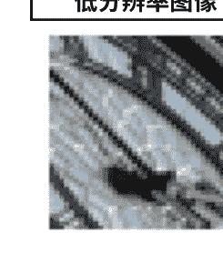

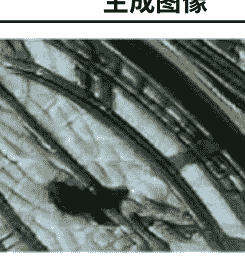

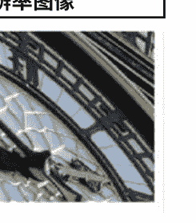

第一阶段结果 (A)

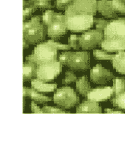


第一阶段结果 (B)

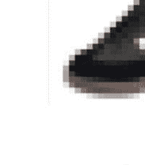

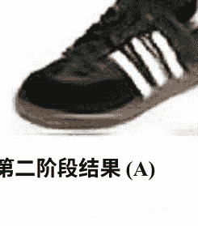


第二阶段结果 (A)

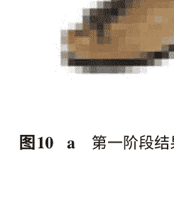

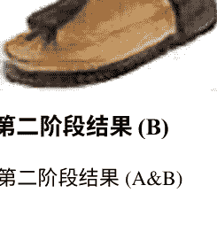

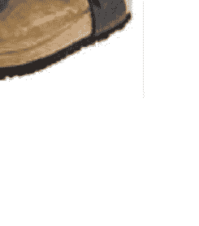

第二阶段结果 (B)

图10 a 第一阶段结果 (A&B). b 第二阶段结果 (A&B)

表3 生成对抗网络性能指标

| | 峰值信噪比 (PSNR) | 结构相似度 (SSIM) |
| --- | --- | --- |
| 第一阶段 | 最大值: 43.4 dB (范围: 40–43 dB) | 最大值: 0.356 |
| 第二阶段 | 最大值: 48.2 dB (范围: 43–48 dB) | 最大值: 0.422 |

表4 AlexNet准确率结果

| 测试集批次 | 测试集中的图像数量 | 正确分类的图像数量 | 准确率 (%) |
| --- | --- | --- | --- |
| 低分辨率图像 | 50 | 34 | 68 |
| 超分辨率图像(由前一阶段的生成对抗网络生成) | 100 | 84 | 84 |
| 高分辨率图像 | 420 | 392 | 93.3 |

卫星图像和模糊对象识别。所提出的方法有助于更好地识别模糊对象[1, 8]。

###### 参考文献

1.  https://www.cis.upenn.edu/%7Ejshi/ped_html/
2.  Huang J-B, Singh A, Ahuja N (2015) 从转换的自我示例中进行单幅图像超分辨率。 在：IEEE计算机视觉和模式识别会议论文集，第5197-5206页。
3.  Fu L-C, Liu CY (2001) 基于计算机视觉的车辆驾驶物体检测和识别。 在：2001年ICRA国际机器人与自动化会议论文集 (Cat. No.01CH37164)，韩国首尔，第2634-2641页，第3卷。 https://doi.org/10.1109/ROBOT.2001.933020
4.  Ledig C (2017)等。使用生成对抗网络进行照片逼真的单幅图像超分辨率。 在：2017年IEEE计算机视觉和模式识别会议 (CVPR)，夏威夷檀香山，第105-114页。 https://doi.org/10.1109/CVPR.2017.19
5.  Krizhevsky A, Sutskever I, Hinton GE (2012) 使用深度卷积神经网络进行ImageNet分类
6.  https://github.com/matterport/Mask_RCNN
7.  http://vision.cs.utexas.edu/projects/finegrained/utzap50k/
8.  Girshick R, Donahue J, Darrell T, Malik J (2016) 基于区域的卷积神经网络用于准确的目标检测和分割 IEEE Trans Pattern Anal Machine Intell 38(1):142–158. https://doi.org/10.1109/TPAMI.2015.2437384

##### 用于语义图像分割的低功耗U-Net

Vennelakanti Venkata Bhargava Narendra, P. Rangababu, 和Bunil Kumar Balabantaray

摘要 数字图像分割, 特别是RGB图像的语义分割, 在数字图像处理中是一项计算密集的任务, 因为它需要低级维度信息。图像分割在科学和工业中都有应用。基于深度学习的分割已经成为图像分割中强大的机制。如今, 图形处理单元 (GPU) 广泛用于加速深度学习应用。GPU通常昂贵且耗电量大。可编程门阵列 (FPGA) 为GPU的深度学习架构推理提供了低成本、低功耗和高功率效率的替代方案。U-Net是一种用于语义图像分割的深度学习架构, 除了其他用于图像分割的架构。本文演示了在FPGA上开发和部署低功耗深度学习架构的端到端系统的使用。为了实现上述目的, 选择了U-Net, 这是一种用于图像语义分割的流行卷积神经网络。当在大小为1024 ×512的图像上进行测试时, 网络显示FPGA的功耗约为GPU的三分之一, 而准确性几乎没有降低。该网络使用Xilinx®深度学习处理器单元 (DPU) 在FPGA的可编程逻辑上实现卷积神经网络。

-   卷积神经网络
-   深度学习处理单元
-   图像分割
-   可编程门阵列
-   图形处理单元

这项工作得到了印度国家技术改造项目 (TEQIP-III) 在NIT Meghalaya的支持, 并由世界银行、NPIU和印度政府的MHRD资助。

V. Venkata Bhargava Narendra · P. Rangababu (📧) 印度国家技术改造项目 (TEQIP-III) 支持的电子与通信工程系, 国家技术研究所Meghalaya, Shillong 793003, 印度 e-mail: p.rangababu@nitm.ac.in

P. Rangababu · B. K. Balabantaray 印度国家技术改造项目 (TEQIP-III) 支持的计算机科学与工程系, 国家技术研究所Meghalaya, Shillong 793003, 印度 e-mail: bunil@nitm.ac.in

###### 1 引言

图像分割是将图像划分为与像素的不同特征相对应的各个区域的任务。语义图像分割是将图像的每个像素标记为相应类别的任务。设S是图像占据的完整连续区域。那么，图像分割可以被视为将S划分为n个子区域S1，S2，...，Sn的过程，使得

1.  \(\bigcup_{i=1}^{n} S_i = S\)
2.  对于i=0, 1, 2, ..., n, Si是一个连通集合。
3.  对于所有的i和j, \(Si \cap Sj = \varnothing\), 其中i≠j。
4.  对于i = 0, 1, 2, ..., n, F(Si) = TRUE。
5.  对于任何相邻的区域Si和Sj, \(F(Si \cup Sj) = FALSE\)。

其中F(Sk)是在集合Sk上定义的解析基础，而∅是空集。分割的基本问题是将图像分割成满足上述条件的区域。人类在执行分割时使用了大量的数据，但要将知识付诸实践需要大量的人力、计算时间和具有丰富领域知识的数据库。深度神经网络（DNN）分割通过从标记像素数据库中提取场景理解来解决这些问题。图像分割神经网络可以处理图像的小区域，提取简单的特征。决策机制或另一个神经网络可以将这些特征整合起来，相应地标记图像的区域。与其他深度学习技术相比，卷积神经网络（CNN）在分割[14]、物体检测[19]等各种计算机视觉问题中显示出异常的功能。

###### 1.1 卷积神经网络

卷积神经网络在深度学习的计算机视觉发展中起着重要作用。它们与普通神经网络几乎相似，并专门用于捕捉输入的时间和空间信息。卷积神经网络假设图像是输入，这使得我们更容易将显式属性嵌入到架构中。这导致网络中的变量减少，使其在与前馈神经网络相比时更高效。

卷积神经网络包含学习各种模式/对象的滤波器/核和偏差。

在训练阶段，特定于图像，并利用该知识在推理过程中识别对象。卷积神经网络的单个构建块分别是卷积层、池化层和展平层[9]。

###### 1.2 量化神经网络

量化神经网络的动机是使模型紧凑，而不会有任何或可忽略的准确度损失。使用量化神经网络，可以使用位运算而不是浮点运算来执行前向和后向传递。特别是使用定点运算可以节省能量[7]，在功耗是关键因素的情况下更加适用。神经网络中可以进行量化的组件包括权重、激活和梯度。梯度量化可以减少训练时处理单元之间的通信成本，而权重和激活量化可以减少推理过程中的计算强度和网络内存占用。量化神经网络（QNN）可以具有独立的输入、权重和输出激活的数据表示，以及同一网络中不同层的不同位宽。

###### 1.3 需要可编程门阵列（FPGA）来进行卷积神经网络的推理

FPGA是一种半导体集成电路，可以在制造后重新编程以满足所需的应用要求，实际上，它们的功能可以在每次上电时更改。用户可以利用某些属性，如选择应用程序的并行度和其他架构优势，来加速应用程序和/或降低功耗。FPGA的优点包括灵活性、加速度、集成度和总拥有成本。自然地，卷积神经网络是计算密集型模型。随着网络变得复杂，需要数十亿次算术运算、数百万个变量和相当大的计算能力来训练和进行广泛的卷积神经网络推理[14, 19]。

在卷积神经网络的训练和推理阶段，通常使用GPU作为硬件加速器[21]，因为它们具有高吞吐量和内存带宽，对于浮点矩阵运算非常协调。但是GPU通常价格昂贵，消耗大量功耗，并且功耗效率较低。因此，在功耗受限的环境中运行GPU或需要高功耗效率的应用程序变得困难。众所周知，FPGA提供了GPU的替代方案，并且在精心编程的情况下，性能超过GPU，并且功耗比GPU低[13]。

###### 2 相关工作

Ronneberger等人[14]提出了一种网络，即使在训练图像数量非常少的情况下（大约10个），也能给出准确的分割结果。该网络由收缩路径（下采样路径）和扩张路径（上采样路径）组成。在收缩路径中，对输入图像应用卷积操作并提取特征，在扩张路径中使用前一步提取的特征进行上采样，构建分割图像。该网络对噪声更加鲁棒，特别适用于医学图像分割。Moons等人[12]提出了一种通过量化神经网络来降低嵌入式神经网络能耗的方法。此外，还提出了一种用于拓扑选择的硬件能耗模型。在[11]中，作者提出了一种用于权重和激活量化的宽度减少网络（WRPN）。研究发现，激活量占用的内存比权重量多。因此，作者采用了在每一层中增加滤波器数量的策略，以弥补量化带来的精度下降。深度神经网络（DNNs）具有大量变量，但并非所有变量都具有相同的重要性。DNNs对噪声更加抗干扰[18]。随机噪声函数可以作为正则化器，偶尔在输入或权重上添加噪声可以获得更理想的性能。在量化神经网络（QNN）中，低精度操作可以被视为随机噪声。最近的理论，如[2]中讨论的理论，表明QNN仍然保留了许多重要的特性，与其全精度等效网络相似。在90年代，当Cloutier等人[3]引入虚拟图像处理器时，将CNNs实现在FPGA上开始引起关注。

虚拟图像处理器是一种单指令流多数据流（SIMD）多处理器架构。通过使用近似计算来降低计算强度，它实现了更好的性能。Urmuroglu等人[20]引入了用于在FPGA上快速和简单实现神经网络的神经网络库。作者采用了一套新颖的优化方法，实现了二进制神经网络（BNN）到硬件的稳健映射。他们实现了全连接层、卷积层和池化层。他们在MNIST数据集、CIFAR-10数据集和SVHN数据集上取得了显著的低功耗性能。Nurvitadhi等人[13]不久前在现代图形处理单元（GPU）和FPGA上评估了新兴的DNN算法。结果显示，目前的CNN趋势可能支持FPGA。在某些情况下，FPGA可能提供比GPU更高的性能。Suda等人[17]在FPGA上实现了可扩展层，并提出了一种系统化的设计空间探索方法，以增加给定CNN模型的OpenCL FPGA加速器的吞吐量，考虑到FPGA资源限制。Farabet等人[5]在低端数字信号处理器（DSP）针对FPGA上展示了CNN的一致执行。该执行利用了CNN的内在并行性，并充分利用了FPGA上的乘法累加（MAC）单元。他们证明了在与外部存储器的适当内存带宽下，可以实现有趣的性能。Faraone等人[6]认为，与其专注于开发加速已知低精度CNN的稳健设计，我们还应该尝试修改网络以适应FPGA。他们开发了一个完全自动化的工具流，专注于通过滤波修剪来改变网络架构。苏等人[16]提出了一种量化训练策略，使得量化神经网络推断具有较小的内存占用和竞争性模型准确性。他们还研究了应用于各种神经网络架构的不同参数精度对准确性和吞吐量的权衡。这项工作为硬件的数据表示（精度）和效率之间的相关性提供了宝贵的见解。

###### 3 方法论

###### 3.1 Vitis™ AI开发套件

Vitis™ AI开发环境包括用于在Xilinx®硬件平台上进行AI推断的Vitis-AI开发套件。它由针对所选的Zynq®-7000 SoC、Zynq®UltraScale+™MPSoC设备进行优化的IP核组成，以及用于量化、编译和分析网络性能的工具，使开发应用程序更加容易的库，可以立即部署的模型和示例设计。该开发环境允许在熟悉的框架（如Caffe、Tensorflow）中开发模型，并以几乎不需要任何努力的方式将模型移植到适合FPGA的格式。该设计高效易用，从而释放了Xilinx®FPGA和自适应计算加速平台（ACAP）上的AI加速的全部潜力。

这使用户能够开发深度学习推理应用程序，而无需对FPGA的内在复杂性和ACAP设备有深入了解。Vitis-AI堆栈如图1所示。

###### 3.2 开发流程

- 选择一个需要机器学习的应用程序。
- 使用图1中的任何框架开发机器学习架构并训练网络。
- 使用人工智能（AI）量化器将网络量化为所需的精度。
- 选择您选择的设备，并将深度学习处理器单元（DPU）与Vivado Design Suite中相应FPGA的处理系统集成。
- 从上一步创建的设计中生成DPU配置文件。
- 现在，使用AI编译器编译量化网络，并使用DPU配置文件。
- 使用Xilinx Petalinux工具生成引导文件和软件开发工具包（SDK）。
- 最后，使用生成的SDK，在C++/Python中开发一个软件应用项目，以便网络可以在DPU上运行。
- 将软件应用程序、引导文件和其他必要的数据复制到SD卡中，并运行DPU应用程序并评估性能。

流程总结如图2所示。

###### 3.3 深度学习处理单元

Xilinx® DPU是一个可定制的计算引擎，专注于CNN。它包含一个高度优化的指令集，并支持大多数CNN。DPU的实现仅限于选定的Zynq®-7000 SoC和Zynq® Ultra-Scale+™MPSoC，因为可编程逻辑上的资源数量有限[1]。用户应提供运行DPU所需的指令，以及DPU可以访问的内存，用于读取和写入图像以及临时数据的存储。还需要在加速处理单元上运行一个程序，用于服务中断和协调数据传输。图3显示了DPU的顶层图。当DPU连接到Zynq®-7000 SoC的处理系统时使用的DPU配置在表1中显示。

###### 图2 流程图开发流程的表示

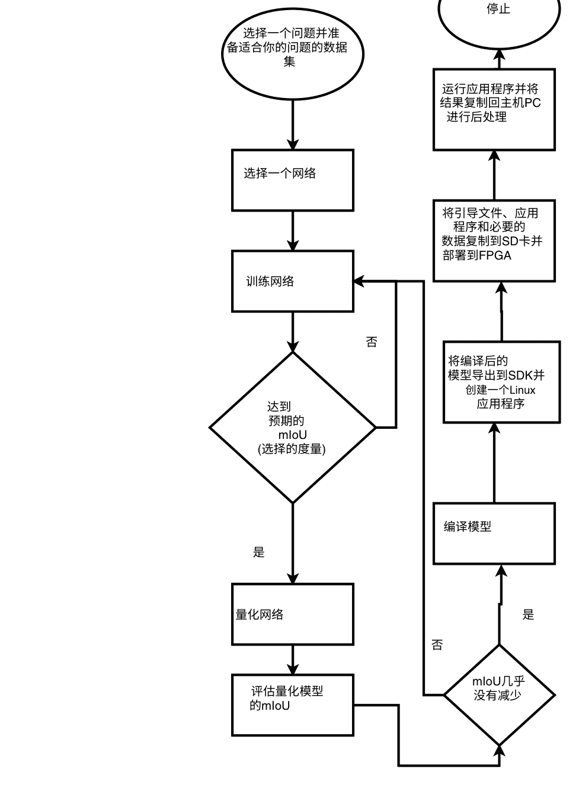

**表1 DPU配置**

| 核心数量 | 1 |
| :--- | :--- |
| DPU架构 | 1152 |
| RAM使用量 | 低 |
| 通道增强 | 启用 |
| 深度卷积 | 启用 |
| 平均池化 | 启用 |
| ReLU类型 | ReLU + Leaky ReLU + ReLU6 |
| SFM核心数量 | 0 |

###### 3.4 网络架构

U-Net是一种流行的CNN。该架构是基于完全卷积网络（FCN）[15]构建的，因此即使在训练图像数量非常少的情况下也可以工作。该网络包括一个下采样路径和一个上采样路径。下采样路径由重复实现3×3滑动窗口卷积组成，每个卷积后面跟着一个非线性（ReLU），2×2最大池化单元以2的步长进行子采样。在每个子采样步骤中，特征图的数量增加了两倍。上采样路径与下采样路径类似，只是下采样路径中的池化层被反卷积或上采样卷积替换，以提高特征图的分辨率。

高分辨率特征图，即来自下采样路径每个步骤中第二个卷积层的特征图，与来自上采样路径的输出进行连接。该网络使用Caffe框架[8]实现，并对架构进行了一些微小的修改，以便将网络部署在FPGA上。¹修改如下：

- 在扩张路径中用反卷积层替换未池化层
- 将所有的PReLU替换为ReLU
- 将BatchNorm层替换为合并的BatchNorm + Scale层
- 在ReLU层之前插入带有缩放的BatchNorm层，因为DPU不支持从卷积到连接和ReLU的数据流同时进行。

###### 3.5 数据集

用于训练网络的数据来自[4]。数据集²集中在城市街景的语义理解上。该数据集包含5000张带有高质量注释的图像，以及来自50个城市的20000张带有粗略注释的图像，这些图像在白天的几个月内拍摄。该数据集包含30个实例注释和密集注释的类别，因此可以用于实例分割和语义分割。

选择具有高质量注释的图像进行网络训练。

###### 3.6 训练

使用Caffe框架对2975张具有高质量注释的图像进行训练。使用Adam优化器[10]，采用随机梯度下降优化策略，以实现收敛。图像被调整为512 ×512，并且在飞行中进行通道归一化处理（图4）。

网络的训练在很大程度上取决于超参数的选择，选择错误的超参数可能导致过拟合、欠拟合甚至无法训练。最重要的超参数是学习率（0.0005），它告诉优化器在梯度方向上移动权重的距离。如[14]所述，使用较高的动量（0.9），以便在训练过程中已经看到的大量样本决定正在进行的优化步骤的更新。通过乘以0.0005来惩罚大权重。使用Caffe框架的“带损失的softmax层”来计算成本函数。网络每次迭代处理八个（批量大小）RGB训练图像。网络在两个Nvidia Quadro RTX 5000 GPU上同时进行训练（多GPU训练），共进行2000次迭代。为了降低训练复杂度，网络仅在30个类别中的19个类别上进行训练。图5显示了这些类别及其对应的图例。

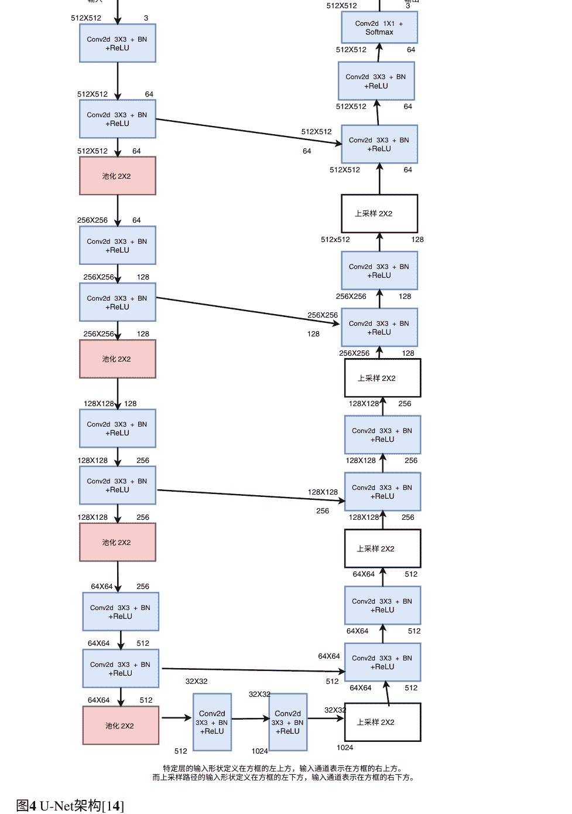

特定层的输入形状定义在方框的左上方，输入通道表示在方框的右上方。而上采样路径的输入形状定义在方框的左下方，输入通道表示在方框的右下方。

###### 图4 U-Net架构[14]

###### 图5 类别图例（RGB格式）

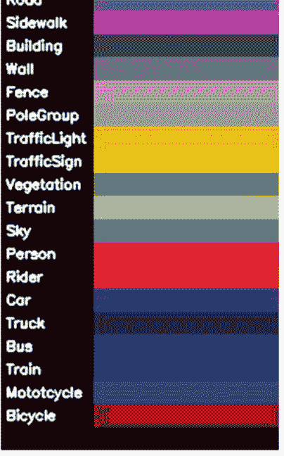

###### 4 实验和结果

###### 4.1 处理系统-可编程逻辑系统

ZedBoard™是一款低成本的开发套件，使用Xilinx Zynq®-7000APSoC。该板包含了所有必要的连接、端口和辅助功能，以便于各种用途。该板的可扩展特性使其非常适合快速原型设计和概念验证开发。ZedBoard™³的PS-PL连接如图6所示，硬件利用率报告如表2所示。

###### 4.2 网络推断和量化

随着训练的进行，定期对模型在Cityscapes验证数据集（500张图像）上进行mIOU测量以评分。mIOU图显示在图7中。从图7中可以观察到，在2000次迭代后，mIOU实现的结果为0.27124。该模型用于量化。生成了三个不同的量化模型，每个模型的精度都不同，它们分别是：

- INT8（权重和激活都是8位量化）
- A6W8（激活是6位量化，权重是8位量化）
- INT4（权重和激活都是4位量化）

浮点（FP）模型和量化模型的mIOU在表3中显示。量化模型在Cityscapes验证数据集上进行评分。

³开发PS-PL系统所需的脚本可以在“LFAR: 将ResNet-50 CNN应用程序移植到ZedBoard”中找到。

###### 图4 Zynq 7000 SoC 的 PS 连接

**表2 资源利用**

| 站点类型 | 已使用 | 固定 | 可用 | 利用% |
| :--- | :--- | :--- | :--- | :--- |
| Slice LUTs | 33,079 | 0 | 53,200 | 62.18 |
| 作为逻辑的LUT | 31,328 | 0 | 53,200 | 58.89 |
| 作为存储器的LUT | 1751 | 0 | 17400 | 10.06 |
| Slice寄存器 | 62,912 | 0 | 106,400 | 59.13 |
| 作为触发器的寄存器 | 62,912 | 0 | 106,400 | 59.13 |
| F7多路复用器 | 269 | 0 | 26,600 | 1.01 |
| F8多路复用器 | 19 | 0 | 13,300 | 0.14 |
| 块RAM瓦片 | 123 | 0 | 120 | 87.86 |
| RAM36/FIFO | 112 | 0 | 120 | 80.00 |
| RAMB18 | 22 | 0 | 280 | 7.86 |
| DSP | 212 | 0 | 220 | 96.36 |

**表3 浮点模型和量化模型的平均IoU**

| | 浮点 | INT8 | A6W8 | INT4 |
| :--- | :--- | :--- | :--- | :--- |
| mIOU | 0.27214 | 0.270442 | 0.231647 | 0.056643 |

从表3可以看出，对于权重和激活的8位量化，几乎没有mIOU损失，而对于权重和激活的4位量化，mIOU显著降低。而A6W8量化模型的损失介于INT8和INT4量化模型之间。8位量化模型用于应用程序的开发。最后，开发了一个多线程分割应用程序，并部署在FPGA上。由于硬件限制，验证数据集的所有500张图像无法放入缓冲区。因此，网络在五张图像上进行了测试，其中显示了一张样本图像以及GPU和FPGA的推理结果，如图8所示。在FPGA上，8位神经网络的性能分析信息显示在表4中。

分析器为每个层提供以下细节：

- 工作负载：DPU内核的计算工作负载，以MOPS为单位。
- 内存：DPU所需的内存空间，以MB为单位，用于隐藏层的特征图。
- 运行时间：执行每个层所需的时间。
- 性能：计算效率或性能，以GOPS为单位。
- 利用率：DPU的有效使用率，以%表示。
- MB/S：DDR内存访问的平均带宽。

图形处理单元（Nvidia Quadro RTX 500）和FPGA（ZedBoard）上网络的功耗和执行时间显示在表5中。ZedBoard的执行时间包括读取/准备输入和写入输出，而GPU的测量仅包括模型的前向推理时间。

###### 5 讨论

部署在ZedBoard可编程逻辑部分的系统资源利用情况显示在表2中。由于网络较大，从表2中可以看出几乎所有的块RAM和DSP都被利用，并且还利用了其他资源的相当大一部分。U-Net使用Caffe框架开发。该网络在两个Nvidia Quadro RTX GPU上进行了2000次迭代训练，并实现了0.272214的mIOU。当网络部署在GPU上时，平均前向传递时间为193.986毫秒。GPU消耗的功耗

(a) 样本图像 [ ?]


(b) 浮点模型结果在主机上评估


(c) 固定点模型结果在FPGA上评估

###### 图8 推理输出

**表4 性能分析信息**

| ID | 节点名称 | 工作负载 (MOP) | 内存 (MB) | 运行时间 (ms) | 性能 (GOPS) | 利用率 (%) | MB/S |
| :--- | :--- | :--- | :--- | :--- | :--- | :--- | :--- |
| 1 | conv_d0a_b | 452.98 | 8.44 | 8.96 | 50.5 | 48.7 | 941.5 |
| 2 | conv_d0b_c | 63.68 | 16.11 | 118.42 | 81.6 | 78.7 | 136.1 |
| 3 | BatchNorm_d0c | 16.78 | 16.02 | 17.12 | 1.0 | 0.9 | 935.7 |
| 4 | pool_d0c_1a | 0.00 | 10.03 | 6.91 | 0.0 | 0.0 | 1451.1 |
| 5 | conv_d1a_b | 4831.84 | 6.10 | 54.34 | 88.9 | 85.8 | 112.3 |
| 6 | conv_d1b_c | 9663.68 | 8.20 | 99.56 | 97.1 | 93.6 | 82.3 |
| 7 | BatchNorm_d1c | 8.39 | 8.01 | 4.40 | 1.9 | 1.8 | 1820.2 |
| 8 | pool_d1c_2a | 0.00 | 5.01 | 3.45 | 0.0 | 0.0 | 1453.6 |
| 9 | conv_d2a_b | 4831.84 | 3.32 | 49.76 | 97.1 | 93.7 | 66.7 |
| 10 | conv_d2b_c | 9663.68 | 4.63 | 99.91 | 96.7 | 93.3 | 46.3 |
| 11 | BatchNorm_d2c | 4.19 | 4.01 | 2.22 | 1.9 | 1.8 | 1801.1 |
| 12 | pool_d2c_3a | 0.00 | 2.51 | 1.74 | 0.0 | 0.0 | 1438.2 |
| 13 | conv_d3a_b | 4831.84 | 2.67 | 48.77 | 99.1 | 95.6 | 54.7 |
| 14 | conv_d3b_c | 9663.68 | 4.34 | 96.74 | 99.9 | 96.3 | 44.8 |
| 15 | BatchNorm_1 | 2.10 | 2.00 | 1.06 | 2.0 | 1.9 | 1899.1 |
| 16 | pool_d3c_4a | 0.00 | 1.25 | 0.89 | 0.0 | 0.0 | 1412.3 |
| 17 | conv_d4a_b | 4831.84 | 5.31 | 48.55 | 99.5 | 96.0 | 109.4 |
| 18 | conv_d4b_c | 9663.68 | 10.21 | 106.26 | 90.9 | 87.7 | 96.1 |
| 19 | upconv_d4c_u3a | 147.48 | 3.67 | 23.12 | 92.9 | 89.6 | 158.6 |
| 20 | conv_u3b_c | 19,327.35 | 7.87 | 200.08 | 96.6 | 93.2 | 39.4 |
| 21 | conv_u3c_d | 9663.68 | 4.34 | 96.75 | 99.9 | 96.3 | 44.8 |
| 22 | upconv_u3d_u2a | 4294.97 | 6.27 | 44.12 | 97.3 | 93.9 | 142.0 |
| 23 | concat_d2cc_u2a_b | 0.00 | 12.01 | 15.45 | 0.0 | 0.0 | 777.9 |
| 24 | conv_u2b_c | 28,991.03 | 10.05 | 293.98 | 98.6 | 95.1 | 34.2 |
| 25 | conv_u2c_d | 9663.68 | 4.63 | 99.91 | 96.7 | 93.3 | 46.3 |
| 26 | upconv_u2d_u1a | 2147.48 | 6.26 | 22.90 | 93.8 | 90.5 | 273.3 |
| 27 | concat_d1cc_u1a_b | 0.00 | 16.02 | 20.79 | 0.0 | 0.0 | 770.8 |
| 28 | conv_u1b_c | 19,327.35 | 12.41 | 199.36 | 96.9 | 93.5 | 62.3 |
| 29 | conv_u1c_d | 9663.68 | 8.20 | 99.57 | 97.1 | 93.6 | 82.3 |
| 30 | upconv_u1d_u0a_NEW | 2147.48 | 12.20 | 24.91 | 86.2 | 83.1 | 489.6 |
| 31 | conv_u0b_c_New | 19327.35 | 24.21 | 217.09 | 89.0 | 85.9 | 111.5 |
| 32 | conv_u0c_d_New | 9663.68 | 16.11 | 118.42 | 81.6 | 78.7 | 136.1 |
| 33 | conv_u0d_score_New | 318.77 | 10.42 | 6.43 | 49.6 | 47.8 | 1619.6 |
| | 平均节点总数 全部 | 204814.16 | 286.07 | 2251.94 | 91.0 | 87.7 | 127.0 |

|   | GPU（浮点模型） | FPGA（INT8模型） |
|---|----------------|------------------|
| 功耗 | 178 W⁽ᵃ⁾ | 55.5 W⁽ᵇ⁾ |
| 执行时间 | 193.986 ms | 2251.94 ms |

⁽ᵃ⁾ GPU功耗是在运行前向推理时使用“nvidia-smi”命令估算的。
⁽ᵇ⁾ 通过测量J2 1的1和2号引脚之间的电压，并除以10 mΩ，我们可以得到ZedBoard消耗的总电源功率。然后，将其乘以测量得到的输入电压（即12 V）。

前向推理的功耗为178 W。网络采用8位量化，并部署在ZedBoard上。执行网络所需的时间（包括读取/准备和保存/写入图像）为2251.94毫秒。ZedBoard消耗的功耗为55.5 W，约为GPU消耗功耗的三分之一。应用程序加速不足的原因可能是ZedBoard上资源不足。实现加速的一种可能方法是修剪网络并删除工作中的冗余变量。这样可以进一步压缩网络，实现加速，并进一步降低功耗。

###### 6 结论

研究并演示了使用Xilinx提供的端到端系统部署卷积神经网络在FPGA上的方法，通过在ZedBoard上实现U-Net进行修改以适应FPGA的架构。该网络在两个GPU上同时进行训练（多GPU训练），并在GPU和FPGA上部署并进行性能研究。实现的IP（DPU）的资源利用情况如表2所示。在FPGA上进行的网络性能分析显示，网络的功耗几乎只有GPU的三分之一。比较结果如表5所示。表4显示了每层性能的详细统计数据。当网络部署在FPGA上时，功耗的降低再次显示了神经网络量化和FPGA在功耗关键应用中的优势。

###### 参考文献

1.  Xilinx. Vitis AI 用户指南 (ug1414). [https://www.xilinx.com/support/documentation/sw_manuals/vitis_ai/1_0/ug1414-vitis-ai.pdf](https://www.xilinx.com/support/documentation/sw_manuals/vitis_ai/1_0/ug1414-vitis-ai.pdf)
2.  Anderson AG, Berg CP (2017) 二进制神经网络的高维几何. [arXiv:1705.07199](arXiv:1705.07199)
3.  Cloutier J, Cosatto E, Pigeon S, Boyer FR, Simard PY (1996) VIP: 一个基于FPGA的图像处理和神经网络处理器. In: 第五届国际微电子神经网络会议论文集. IEEE, pp 330–336. https://doi.org/10.1109/MNNFS.1996.493811
4.  Cordts M, Omran M, Ramos S, Rehfeld T, Enzweiler M, Benenson R, Franke U, Roth S, SchieleB (2016) 用于语义城市场景理解的Cityscapes数据集. In: 计算机视觉和模式识别IEEE会议论文集, pp 3213–3223. https://doi.org/10.1109/CVPR.2016.350
5.  Farabet C, Poulet C, Han JY, LeCun Y (2009) CNP: 一种基于FPGA的卷积网络处理器. In : 2009国际可编程逻辑和应用会议. IEEE, 第32-37页. https://doi.org/10.1109/FPL.2009.5272559
6.  Faraone J, Gambardella G, Fraser N, Blott M, Leong P, Boland D (2018) 为FPGA定制低精度深度神经网络. https://doi.org/10.1109/FPL.2018.00025
7.  Guo Y (2018) 量化神经网络的方法和理论综述. arXiv预印本 arXiv:1808.04752
8.  贾Y, Shelhamer E, Donahue J, Karayev S, Long J, Girshick R, Guadarrama S, Darrell T (2014) Caffe: 用于快速特征嵌入的卷积架构. 在: 第22届ACM国际多媒体会议论文集, 第675-678页. https://doi.org/10.1145/2647868.2654889
9.  Kalade S (2019) 深度学习. 在: 探索Zynq MPSoC: 使用PYNQ和机器学习应用, 第20章, 第1版. 斯特拉斯克莱德学术媒体, 第481-508页
10. Kingma DP, Ba J (2014) Adam: 一种随机优化方法. arXiv预印本 arXiv:1412.6980
11. Mishra A, Nurvitadhi E, Cook JJ, Marr D (2017) WRPN: 宽度减少精度网络. arXiv预印本 arXiv:1709.01134
12. Moons B, Goetschalckx K, Van Berckelaer N, Verhelst M (2017) 最小能量量化神经网络. 在: 2017年第51届Asilomar信号、系统和计算机会议上. IEEE, pp 1921–1925. https://doi.org/10.1109/ACSSC.2017.8335699
13. Nurvitadhi E, Venkatesh G, Sim J, Marr D, Huang R, Ong Gee Hock J, Liew YT, Srivatsan K, Moss D, Subhaschandra S, Boudoukh G (2017) FPGA能在加速下一代深度神经网络方面超过GPU吗? 在: 2017年ACM/SIGDA国际会议论文集-国际现场可编程门阵列研讨会. FPGA'17.计算机协会, 纽约, 美国, pp 5–14. https://doi.org/10.1145/3020078.3021740
14. Ronneberger O, Fischer P, Brox T (2015) U-net: 用于生物医学图像分割的卷积网络. 在: 国际医学图像计算和计算机辅助干预会议. Springer, pp 234–241. https://doi.org/10.1007/978-3-319-24574-4_28
15. Shelhamer E, Long J, Darrell T (2017) 全卷积网络用于语义分割. IEEE Ann History Comput (04):640–651. https://doi.org/10.1109/TPAMI.2016.2572683
16. 苏J, 弗雷泽NJ, 甘巴拉G, 布洛特M, 杜雷利G, 托马斯DB, 梁PH, 张培阳 (2018) 准确性与吞吐量的折衷: 可重构逻辑上的降低精度神经网络. 在: 应用可重构计算国际研讨会. 斯普林格, 第29-42页. https://doi.org/10.1007/978-3-319-78890-6_3
17. 苏达N, 钱德拉V, 达西卡G, 莫汉蒂A, 马Y, 弗鲁杜拉S, Seo JS, 曹Y (2016) 面向大规模卷积神经网络的吞吐量优化OpenCL FPGA加速器. 在: 2016年ACM/SIGDA国际场可编程门阵列研讨会论文集. FPGA'16. 计算机协会, 纽约, 美国, 第16-25页. https://doi.org/10.1145/2847263.2847276
18. Sung W, Shin S, Hwang K (2015) 深度神经网络在量化下的弹性. arXiv预印本 arXiv:1511.06488
19. Szegedy C, Liu W, Jia Y, Sermanet P, Reed S, Anguelov D, Erhan D, Vanhoucke V, Rabinovich chA (2015) 用卷积更深入. 在: IEEE计算机视觉和模式识别会议论文集, pp 1–9. https://doi.org/10.1109/CVPR.2015.7298594
20. Umuroglu Y, Fraser NJ, Gambardella G, Blott M, Leong P, Jahre, M., Vissers, K.: Finn: 一个快速、可扩展的二值化神经网络推理框架。 在: 2017年ACM/SIGDA国际场可编程门阵列研讨会论文集, pp 65–74. https://doi.org/10.1145/3020078.3021744
21. Yazdanbakhsh A, Park J, Sharma H, Lotfi-Kamran P, Esmaeilzadeh H (2015) 神经加速器对GPU吞吐量处理器的影响。 在： 第48届国际微架构研讨会论文集，第482-493页。 https://doi.org/10.1145/2830772.2830810

##### 利用离散小波变换和人工神经网络反向传播算法进行心电图信号分类以检测异常

M. Ramkumar, C. Ganesh Babu和R. Sarath Kumar

**摘要** 本研究利用离散小波变换（DWT）和人工神经网络（BPA）反向传播算法分析心电图信号以检测心脏异常。所提出的算法用于检测心电图信号样本中的异常情况，并将其分类为正常类型和异常类型。心电图样本数据来自MIT-BIH心律失常数据库。在MIT-BIH心脏心律失常数据库的48个文件中，选择了每个单分钟记录的45个文件进行获取。在这45个文件中，确定了25个文件作为心电图信号的正常类别，剩下的20个文件确定为心电图信号的异常类别。从数据库中获取心电图后，进行信号的预处理以去除噪声。去噪处理后，进行两个不同部分的特征提取，一个是心电图信号的形态特征，另一个是基于离散小波变换选择的特征，这两者组合作为分类器部分的输入参数。人工神经网络被描述为心电图信号的分类器，它利用反向传播算法。通过计算灵敏度、特异度、阳性预测率和准确率百分比来分析其分类性能指标。使用人工神经网络反向传播算法，对正常和异常类别的分类结果的准确率达到了98.21%。

M. Ramkumar (✉) · R. Sarath Kumar
电子与通信工程系，斯里克里希纳工程学院和技术，印度科伊马托尔
R. Sarath Kumar
电子邮件： sarathkumar@skcet.ac.in

C. Ganesh Babu
班纳里阿曼理工学院，印度萨蒂亚曼格拉姆

关键词 ECG · MIT-BIH心律失常数据库 · 人工神经网络 · DWT · 特征提取

###### 1 引言

心脏肌肉的电气行为显示周期性收缩和周期性放松，被称为心电图信号或波形，简称为ECG波形。 用于分析心电图信号的波形用于诊断不同的心脏疾病或异常。 心脏肌肉的状态通过一种称为心电图的重要工具进行诊断。 ECG信号处理机制的不同阶段具有预处理（去噪）、去除基线漂移、特征提取、提取特征的选择，最后检测心脏心律失常，以区分心脏的异常状态和正常状态。 ECG信号的波形中具有五个基本峰，它们分别表示P峰、Q振幅峰、R振幅峰、S振幅峰、T振幅峰，偶尔还可能存在U振幅峰。 ECG波形中的P峰表示去极化状态，ECG波形中的QRS峰通常表示为QRS复合波，表示去极化心室，T峰的表示表示心室复极化状态[1]。 分析ECG波形的最重要部分之一完全取决于存在的QRS复合波形状。 经过测量的ECG波形可能因同一受试者而异，以至于心跳的存在已在不同的时间段内确定，并且ECG设备可以为不同的受试者获得类似类型的波形[2]。 心房内的起搏器细胞（SA结节）用于周期性地产生和调节心脏节律，位于右侧心房的顶部。 正常的节律性心跳被确定为最规律的，心房部分的去极化状态最有可能随之而来的是心室的去极化状态。 例如，如果处于心律失常状态，心脏节律将被认为是最不规则的，可能过快或过慢。

多年来，为了提高心律失常检测的敏感性和准确性，对ECG信号进行分析的方法很少。这些方法包括自回归系数建模[3]、小波系数技术[4]、径向基函数神经网络[5]、自组织映射(SOM)[5, 6]以及模糊C均值聚类技术[7]。

###### 用于分类ECG信号的提议方法2

所提出的ECG波形分类系统的功能块图如图1所示。整个功能技术被分为三个不同的部分。它们是ECG信号的预处理、ECG信号的特征提取过程和ECG信号的分类过程。

从MIT-BIH心律失常数据库中获取原始心电信号。最初，预处理过程主要是从心电信号中去除噪声，并通过阈值去除基线漂移。这些组成部分被视为处理心电信号的不需要的组成部分。在预处理阶段完成后，提取形态特征和离散小波变换特征，并将其作为可用数据进一步用于分类阶段。作为最后阶段，完全选择提取的特征，并利用BPA使用人工神经网络进行分类处理。分类输出结果为正常心电信号或异常心电信号的分类。

###### 3 数据库收集

在这个提出的研究中，ECG波形的获取是从MIT-BIH心律失常数据库中进行的，并且它是从physionet的来源中使用的。

来自MIT-BIH心律失常数据库的心电图信号资源是从Beth Israel医院实验室接收到的。该数据库总共包含四十八个文件，每个文件记录了半小时或三十分钟的数据，分为两个不同的部分。初始部分包含了从一百（100）到一百二十四（124）的二十三个文件，中间有一些文件被排除在外。下一个部分包含了从二百（200）到二百三十四（234）的二十五个文件，中间也有一些文件被排除在外[8, 9]。

这个心律失常数据库总共包含了1,09,000个心跳标签。从MIT-BIH心脏physionet心律失常数据库获取的ECG信号正在通过其头文件以文本格式、二进制格式和二进制注释格式文件进行读取。这些文件通过头文件提供了ECG信号的简要数据解释，如样本总数、采样频率、ECG波形格式、ECG导联类型、ECG中导联的总数、从中获取ECG信号的患者或受试者的历史记录以及患者的医疗数据描述。ECG信号的存储格式为212，二进制格式的注释文件，其中每个个体样本都由导联计数叠加，并以12位格式进行存储，心跳注释与二进制注释文件一起使用[9]。

###### 心电图信号的预处理

处理心电图信号的初始阶段被称为预处理，其中使用离散小波变换（DWT）的技术是消除从获取的输入信号中的噪声所必需的。对于心电图信号的预处理，消除噪声采用了来自不同噪声源的各种策略[10]。这种预处理技术是为了从去噪的心电图波形组件中提取无噪声特征，从而提高分类系统的效率[11]。心电图信号的预处理主要包括两个不同的过程，一个是心电图信号去噪，另一个是使用小波变换技术进行基线（阈值）漫游的去除，具有多分辨率维度。

###### a. 心电图信号去噪

在这个特定阶段，利用第四阶Daubechies小波（Db4）消除了各种噪声结构。去噪心电图信号的过程包括三个主要步骤[10]。小波变换技术中考虑了两个系数，一个是近似系数，另一个是细节系数。心电图信号的细节系数受到初始级别中较高频率的影响，而心电图信号的近似系数受到单维低频率的影响。

离散形式的信号。 为了利用DWT技术对ECG波形组件进行去噪，对信号进行了各种组分的分解，这些组分在不同的尺度上展示出来。 作为工作的初始步骤，以适当的方式选择小波系数，并允许信号进行N级分解。 作为第二步的前导，通过使用不同的技术选择阈值，在我们的研究中，采用了自动工作的阈值技术。 在选择软阈值后，必须应用于所有细节系数的级别。 在最后阶段，根据N级近似系数和细节系数对信号进行重构，这些系数从第1级到第N级进行了修改[12]。 原始ECG信号的表示如图2所示。 去噪或滤波后的ECG信号的表示如图3所示。

###### b. 去除基线漂移

通常会影响心电图信号的噪声伪影被确定为基线漂移。 在正常状态下，它的起源将记录自呼吸状态，并且依赖于0.15-0.30 Hz的频率之间。 因此，为了减少心电图节拍形态学实现中的不规则性，需要对基线漂移进行消除处理，以进行心电图信号的分析。 在我们提出的研究中，首先上传原始心电图波形，然后对向量列中的数据进行平滑处理，以消除心电图信号中的基线漂移。

通过使用移动平均滤波器对Y进行滤波，然后从向量列Y [12]中获取结果。在本研究中，为了获得平滑的数据，选择了150个跨度，并且在最后阶段，从获取的原始心电波形分量中减去平滑的心电图信号。因此，信号的计算是从基线漂移中释放出来的纯净形式。

###### 5 ECG信号的特征提取

一旦去噪和基线漂移去除的过程被应用于ECG信号分类的处理中，下一阶段是在分析之前从ECG波形组件中提取特征的过程。

系统在处理参数的压缩形式中操作和计算ECG数据的能力是利用WT技术提取特征的最重要部分之一。处理数据的特征提取是识别模式中最重要的步骤之一。

ECG特征的提取可以采用多种形式。在这个提议的研究中，从ECG波形组件中提取了两种不同的特征类型。它们如下。

- (a) ECG信号形态特征。
- (b) 基于小波系数的特征。

在识别模式中，提取特征和选择提取的特征的过程起着至关重要的作用。从离散小波变换系数（DWT）中获取的系数的计算将信号分布到频域和时域上[13]。图4描述了心电图波形组件的近似系数和细节系数。因此，心电图小波函数的预定细节系数和近似系数被认为是表示信号的特征向量。将小波系数直接作为神经网络分类器中的输入集，可能会增加隐藏层中的神经元总数，从而在神经网络的计算过程中产生有害的实现效果。因此，在特征提取阶段必须进行降维处理。为了对提取的特征进行降维处理，必须进行小波系数的概率分析。从心电图信号组件的频率-时间响应的统计或概率表示中得出的特征如下。

- (a) 细节和近似的子带系数的均值。
- (b) 细节和近似的子带系数的标准差。
- (c) 每个级别中细节和近似的子带系数的方差。

因此，对于每个心电图信号，已获得了基于小波的四十八个特征数。除了概率或统计特征外，还获取了心电图形态学特征以供分类器处理[11]。

与心电图形态学相关的特征包括R-R间期标准差、P-R峰间期、P-T峰间期、S-T峰间期、T-T峰间期、Q-T峰间期、P振幅峰值、Q振幅峰值、R振幅峰值、S振幅峰值、T振幅峰值、QRS复合波和R振幅峰值的总计数。因此，总共获得和处理了64个特征作为人工神经网络系统的输入[14]。由于特征向量的数量可能相当不同，需要进行标准化处理，以使所有特征达到所需水平。对均值和标准差进行标准化处理，使人工神经网络能够将每个输入视为具有相同重要性的指定值范围内的输入。

###### 使用反向传播算法的6个人工神经网络分类器

人工神经网络（ANN）通常被认为是最好的计算智能技术之一，其动机是通过其神经网络的生物结构提高的。神经网络由相互连接的人工神经元群组成。本研究提出了神经网络在识别模式中的应用描述，其中输入单元表示特征向量，输出单元表示模式的部分，需要进行分类。每个特征向量被指定为输入向量，并且每个单元的输出被指定为向量的相应元素。隐藏层的每个单元根据与输入相关的权重的累加值进行计算，以定义用于定义净激活函数的标量轮廓。净激活函数被定义为隐藏层单元中权重向量和输入向量的内积。

###### a. 反向传播算法

人工神经网络意味着多层函数网络中实时获取输入和输出功能信息的算法。通过使用反向传播算法，在ANN上执行梯度下降函数搜索，以减小均方误差（MSE）。这个均方误差是通过调整权重从网络系统中获得的指定输出和实际输出之间的测量。反向传播算法的结果具有高精度，并适用于大多数分类应用程序，其中系统根据指定的广义信息和规则进行处理。

###### 使用反向传播算法的ANN分类器的7个模拟结果和讨论

MIT-BIH心律失常数据库被划分为两个统一的类别，即正常的ECG分类和异常的ECG分类。每个60秒的记录文件根据心跳总数和最大峰值进行数据获取，并根据这些数据分为两个不同的类别。在48个ECG信号记录中，只选择了45个进行处理（25个来自正常类别，其余20个来自异常类别）。在整个48个文件的physionet数据库中，102、217和107是未考虑在这个分类研究中的ECG主题文件。表1显示了从MIT-BIH physionet数据库中使用的记录号的分类。总共使用了64个特征，并分为两个不同的类别。这些特征基于DWT和ECG信号的形态学获得。在64个特征中，48个特征基于离散小波变换，剩下的16个特征是形态学ECG特征。这些预定义特征作为输入被处理，并使用反向传播算法输入到人工神经网络中。为了进行模拟，首先必须对神经网络进行训练。通过组合提取的特征，形成了一个64 * 26维的矩阵，用于训练输入信息数据，并使用19个元素进行神经网络的测试过程。

通过使用ANN分类器和反向传播算法，得到了模拟结果。总共使用了20个神经元来测试和训练心电图波形组件。神经网络的输出层中使用了两个神经元，分别表示正常类别和异常类别(0,1)和(1,0)。

敏感度、特异度、阳性预测率和准确度是用于分类准确性的性能指标。性能指标的公式如下所示。

$$
\text{敏感度} \quad (Se)\% = TP/(TP + FN) * 100
$$

表1来自MIT-BIH心律失常physionet数据库的记录分布

| 序号 | 分类 | 记录编号 |
|------|------|----------|
| 1 | 正常类别 | 100, 101, 103, 105, 106, 112, 113, 114, 115, 116, 117, 121, 122, 123, 201, 202, 205, 209, 213, 215, 219, 220, 222, 234 |
| 2 | 异常类别 | 104, 108, 109, 111, 118, 119, 124, 200, 203, 207, 208, 210, 212, 214, 217, 221, 223, 228, 230, 231, 232 |

$$
\text{特异性} \quad (Sp)\% = TN/(TN + FP) * 100
$$

$$
\text{阳性预测率} \quad (Pp) = TP/(TP + FP) * 100
$$

$$
\text{准确率} \quad (ACC) = (TP + TN)/(TP + FN + FP + TN) * 100
$$

其中TP代表真正例，TN代表真反例，FP代表假正例，FN代表假反例。

- FP：将正常聚类错误分类为异常聚类的情况。
- TP：将异常聚类正确分类为异常聚类的情况。
- FN：将异常聚类错误分类为正常聚类的情况。
- TN：将正常聚类正确分类为正常聚类的情况。

神经网络分类器所拥有的混淆矩阵如表2所示。 准确率的百分比是通过正确分类的ECG样本数量与总样本数量的比例确定的。 神经网络训练窗口如图6所示，训练状态和最佳训练性能分别在图7和图8中给出。

根据混淆矩阵所揭示的数据，一个正常类别被错误地分类为异常类别。这意味着，在25个正常ECG文件中，有24个被正确分类，只有一个被错误分类。同样，在执行异常类别的分类任务时，所有的ECG文件都被正确分类，对于正常类别的分类准确率为96%，对于异常类别则为百分之百。总体而言，分类系统的性能平均准确率为97.8%。除了准确率之外，平均值、敏感性、特异性和阳性预测性分别为95、97.65和98%。准确率、敏感性、特异性和阳性预测性的性能指标评估如图5所示。

| 分类方法 | 输出/目标 | 正常类别 | 异常类别 | 准确率 (%) | 敏感性 (%) | 特异性 (%) | 阳性预测率(%) |
|---|---|---|---|---|---|---|---|
| 使用反向传播的ANN | 正常类别 | 24 | 0 | 96 | 90 | 95.3 | 96 |
| | 异常类别 | 1 | 20 | 100 | 100 | 100 | 100 |
| | 总计 | 25 | 20 | 97.8 | 95 | 97.65 | 98 |

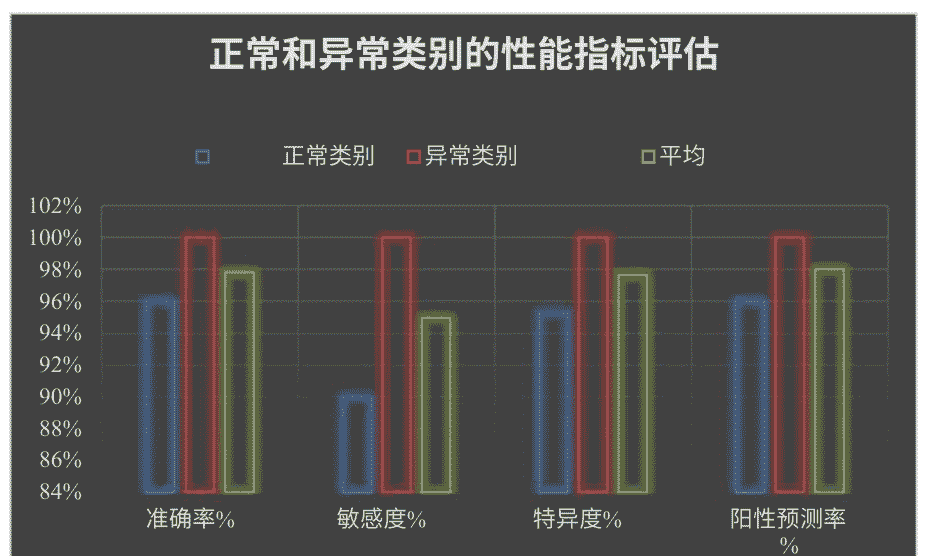

###### 图5 正常和异常类别的性能指标评估

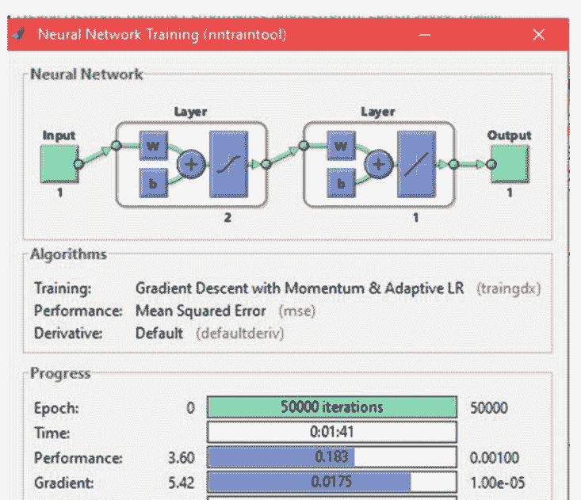

###### 图6 神经网络训练窗口

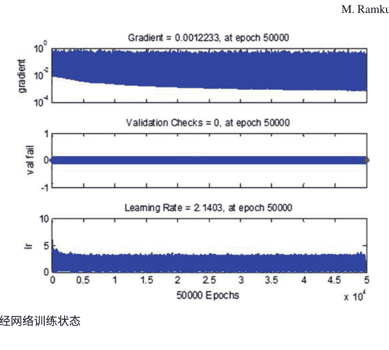

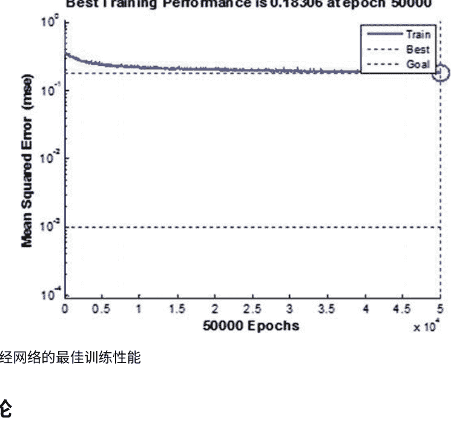

###### 8 结论

这项提议的工作揭示了基于DWT和使用反向传播算法（BPA）的ANN对ECG信号中异常状态的检测。它达到了95%的平均值、敏感度、特异度、阳性预测率和准确率。

分别为97.65、98和97.8%。通过从MIT-BIH心律失常数据库获取心电图信号，并将其与心电图心跳对齐，进行了分类。通过考虑来自physionet数据库的45个心电图文件，并考虑包括统计和形态特征在内的共计64个特征计数，使用计算智能系统在分类中实现了97.8%的整体优化准确率。作为未来工作的一部分，可以通过获取实时心电图信号来增加在检测异常情况下对心脏异常的分类的优化。

###### 参考文献

1. Maglaveras N, Stamkopoulos T, Diamantaras K, Pappas C, Strintzis M (1998) 使用非线性变换和神经网络的心电图模式识别和分类：一项综述。Int J Med Inform 52:191-208
2. Osowski S, Linh TH (2001) 使用模糊混合神经网络进行心电图节拍识别。IEEE Trans Biomed Eng 48:1265-1271
3. Srinivasan N, Ge DF, Krishnan SM (2002) 心脏心律失常的自回归建模和分类。在2002年10月23日至26日美国德克萨斯州休斯顿联合会议的论文集中
4. de Chazal P, Celler BG, Rei RB (2000) 使用小波系数对心电图进行分类。在2000年7月23日至28日芝加哥国际EMBS年会的论文集中
5. Hussain H, Fatt LL (2007) 使用稀疏连接的径向基函数神经网络进行高效的心电图信号分类。在2007年12月举行的第六届WSEAS国际会议上，电路、系统、电子、控制和信号处理方面的论文集中，页码为412-416
6. Risk MR, Sobh JF, Philip Saul J (1997) 使用自组织映射进行心电图节拍检测和分类。在1997年10月30日至11月2日美国伊利诺伊州芝加哥举行的第19届国际会议IEEEIEMBS的论文集中
7. Ozbay Y, Ceylan R, Karlik B (2011) 类型2模糊聚类和小波变换在基于神经网络的心电图分类器中的集成。Exp Syst Appl 38:1004-1010
8. Stamkopopoulos T, Maglaveras N, Diamantaras K, Strintzis M (1998) 使用非线性PCA神经网络进行缺血检测的心电图分析。IEEE信号处理杂志46 (11)
9. Dokur Z, Olmez T (2001) 一种新型混合神经网络进行心电图节拍分类。计算方法程序生物医学66: 167-181
10. Zhou J (2003) 使用量子神经网络自动检测室性早搏。在第三届IEEE生物信息学和生物工程学术研讨会上
11. Jadhav SM, Nalbalwar SL, Ghatol AA (2010) 使用模块化神经网络模型进行心电图心律失常分类。在IEEE生物医学工程与科学会议 (IECBES 2010) 上，马来西亚吉隆坡，2010年11月30日至12月2日
12. Inan OT, Giovangrandi L, Kovacs GTA (2006) 使用小波变换和时序间隔特征的鲁棒神经网络分类室性早搏。IEEE生物医学工程学报53 (12)
13. 姜W，孔SG (2007年) 基于块的神经网络用于个性化心电图信号分类。IEEE Trans Neural Netw 18 (6)
14. Lamedo M, Martínez JP (2011年) 使用数据库泛化准则驱动的特征选择进行心跳分类。IEEE Trans Biomed Eng 58 (3)
15. Melgani F, Bazi Y (2008年) 使用支持向量机和粒子群优化对心电图信号进行分类。IEEE Trans Inf Technol Biomed 12 (5)

##### 使用迁移学习从眼底图像中诊断青光眼的优化器性能分析

Poonguzhali Elangovan和Malaya Kumar Nath

摘要 从预训练模型中传递权重比从头开始训练网络更快更容易。适当选择优化器可能改善深度神经网络在图像分类问题中的性能。本文分析并比较了三种标准的一阶优化器，如具有动量的随机梯度下降（SGDM），自适应矩估计（Adam）和均方根传播（RMSProp），特别用于使用不同的CNN架构（如AlexNet，VGG-19和ResNet-101）从眼底图像中检测青光眼。实验结果表明，使用Adam优化器更新的网络参数在大多数数据库中产生更好的结果。在这些模型中，VGG-19在DRISHTI-GS1，RIM-ONE（2）和LAG数据库中分别获得了最高的分类准确率为91.71%，87.8%和97.12%。ResNet-101在ORIGA和ACRIMA数据库中表现优于其他网络，分别获得了最高的分类准确率为80.5%和98.5%。

- 眼底图像
- 青光眼
- 优化器
- 迁移学习

###### 1 引言

视神经是位于人眼后部的一簇神经。它将视觉信息从视网膜传输到大脑。在各种视网膜疾病中，青光眼是最常见的疾病，它影响了视神经。由于眼内压增加，视神经可能会受到压迫和损伤。这导致了外围视觉的丧失。通常，青光眼在初期没有症状。在早期阶段诊断这种视网膜疾病是一项具有挑战性的任务。一些传统技术，如眼内压测量、视神经头评估和视野测试，可能存在一定的局限性，这些局限性可以通过计算机辅助诊断（CAD）方法来克服。

眼底成像，光学相干断层扫描（OCT），视网膜厚度分析仪（RTA），扫描激光极化测量（SLP），海德堡视网膜断层扫描（HRT）是常用的青光眼诊断成像模式。在这些模式中，眼底照相是简单可靠的，可以识别与不同视网膜疾病相关的各种病理变化。眼底图像是人眼内部表面的二维表示。眼底图像的最亮部分是视盘，被认为是检测青光眼疾病的兴趣区域。视杯（OC）是视盘（OD）的中心部分，视杯大小的逐渐增加是青光眼的临床征象[1]。

从眼底图像中辅助诊断青光眼主要包括特征提取、特征降维和分类。从分割的视盘和视杯中计算出杯盘比例（CDR）、ISTN规则、杯熵、缘熵等参数[2-4]。基于计算得到的参数，可以从眼底图像中检测出青光眼。使用小波变换提取了有区分性的特征[5, 6]。通过适当的分类器进行分类。研究人员在这两个领域取得了一些有希望的结果。但是主要缺点是这些技术主要依赖于手工设计的特征。随着LeCun [7]发明了卷积神经网络（CNN），深度神经网络在青光眼检测领域取得了巨大的发展。

在[8]中，使用深度神经网络进行了视盘和视杯的分割，而在[9, 10]中，开发了用于青光眼和正常图像分类的深度神经网络。

深度神经网络结构中的可学习参数（权重和偏置）通过优化算法进行更新。优化算法通常采用标准的反向传播算法，这可能对网络训练产生重要影响。一般来说，优化算法可以分为三类：一阶、高阶和无导数。一阶优化技术（如SGDM、Adam、RMSProp、AdaGrad等）是基于梯度信息的简单梯度下降方法，主要使用梯度的一阶导数。网络参数是根据梯度的负方向进行更新的。高阶优化方法（如拟牛顿法和无海森矩阵法）根据二阶梯度信息更新网络参数。无导数优化方法适用于目标函数不存在导数的情况。

贝叶斯优化、遗传算法、粒子群优化等是常用的无导数优化方法。

本研究的主要目标是使用不同的一阶优化器（如SGDM、Adam和RMSProp）比较各种预训练模型（如AlexNet、VGG-19和ResNet-101）的性能。使用了公开可用的数据库，如DRISHTI-GS1、RIM-ONE(2)、ORIGA、ACRIMA和LAG。使用准确率、敏感度、特异度和精确度评估网络的性能。

论文的结构如下：第2节描述相关工作。第3节说明了用于分类的方法。第4节提供了模拟结果和讨论。第5节提供了结论。

###### 2 相关工作

最近，卷积神经网络（CNN）在各种图像处理领域中得到了广泛应用。CNN可以学习不同层次的特征。这使其适用于青光眼检测。文献研究表明，使用CNN进行青光眼诊断可以取得更好的性能。研究人员使用预训练模型或标准CNN进行分类。

Chen等人使用包含四个卷积层和两个全连接层的CNN模型对青光眼和正常图像进行分类。在训练过程中，使用SGDM优化器更新可学习参数。他们的工作考虑了ORIGA和新加坡华人眼研究（SCES）数据库。

Gomez-Valverde等人[12]实现了不同的架构，如VGG-19、GoogleNet、ResNet-50和DeNet，用于从眼底图像中自动检测青光眼。此外，还开发了标准的16层CNN用于青光眼分类。通过SGD优化器实现参数优化。

使用了约2313张眼底图像。作者得出结论，VGG-19优于其他模型。

Diaz-Pinto等人[13]分析和比较了各种预训练模型，如VGG-16、VGG-19、Inception-v3、ResNet-50和Xception。对于所有预训练模型，使用了SGDM优化器。他们使用了1707张图像，并得出结论，Xception模型在分类任务中表现更好。

Zhen等人[14]研究了八种标准的深度学习架构，包括VGG-16、VGG-19、ResNet、DenseNet、Inceptionv3、InceptionResNet、Xception和NASNetMobile，用于青光眼检测。所有预训练模型都使用了SGDM优化器进行优化。他们报告称，使用DenseNet模型获得了最高的分类准确率。

Raghavendra等人[15]开发了一个20层的CNN模型，用于提取分类的判别特征。可学习的参数使用SGDM优化器进行优化。他们在1426张图像上评估了他们的算法。

在Li等人[16]的研究中，采用了基于注意力的CNN（AG-CNN）进行青光眼检测。开发了大规模基于注意力的青光眼（LAG）数据库。训练过程中使用Adam优化器。他们的工作中使用了约5824张眼底图像。

从文献中可以看出，SGDM或Adam优化器在训练过程中被广泛使用来更新新参数。通过适当选择优化器，网络性能可能会得到改善。此外，通过适当选择用于更新网络参数的优化器，可以实现对青光眼和正常图像进行分类并降低误识别率的主要目标。这激发了我们分析和比较不同一阶优化器的性能的动机，特别是使用AlexNet、VGG-19和ResNet-101等各种预训练模型来对青光眼和正常眼底图像进行分类。实验结果表明，预训练的VGG-19模型在对青光眼和正常眼底图像进行分类方面优于其他架构。

###### 3 方法论

使用深度神经网络自动检测青光眼在近年来变得流行起来。从头开始训练神经网络非常耗时。它需要一种有效的超参数选择技术。相反，从标准预训练网络中转移权重既容易又能提供更好的分类问题性能指标。图1给出了基于迁移学习的眼底图像青光眼检测的模块图。眼底图像被调整为预训练网络的标准输入尺寸。由于深度神经网络在更多图像上表现良好，因此在预处理阶段进行旋转数据增强。初始层和网络权重从所选模型中转移。通过适当的网络提取眼底图像的判别特征。通过修改最后的层进行分类。

###### 3.1 迁移学习

迁移学习是一种典型的深度学习方法，可以将预训练模型的权重转移到新的分类问题中。这样可以实现更快、更容易的训练。在这项工作中，使用了AlexNet、VGG-19和ResNet-101架构。AlexNet [17] 包括八个可学习层（五个卷积层和三个全连接层）。VGG-19 [18] 是一种标准的预训练模型，由于其深层结构，在图像分类中得到了有效的应用。

它由四十七层组成，其中包括十六个卷积层，五个

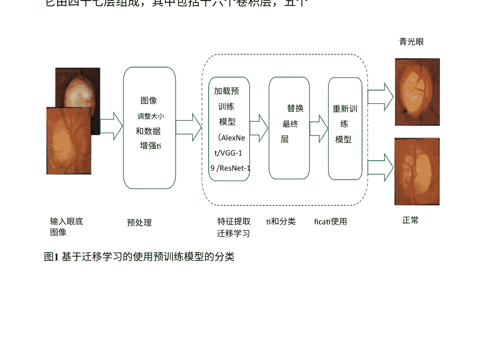

###### 3.2 优化算法

梯度下降是标准的一阶优化算法，它迭代地更新神经网络的可学习参数以最小化损失。一般来说，梯度提供了损失函数变化速率最陡的方向信息。每个可学习参数都以梯度的负方向进行更新，步长适当，称为学习率。数学上，更新方程表示为

$$W = W - \eta * \frac{\partial L}{\partial W},\tag{1}$$

其中 $W$ 表示可学习的参数向量， $\eta$ 是步长， $L$ 是损失函数。根据用于梯度计算的数据样本数量，梯度下降算法有三个主要变体：批量梯度下降（BGD），随机梯度下降（SGD）和小批量梯度下降（MBGD）。在BGD算法中，计算损失函数的梯度是针对整个训练数据集进行的，而SGD对每个训练样本进行参数更新。整个训练数据集被划分为小批量，并且在MBGD算法中对每个小批量进行参数更新。BGD导致训练速度慢且计算冗余。相比之下，SGD更快，但频繁的高方差更新导致波动。与其他两个变体相比，小批量梯度下降的参数更新方差大大降低，这可能导致稳定的收敛。

###### 带动量的随机梯度下降（SGDM）

带动量的随机梯度下降[20]是SGD算法的扩展。它在每个维度上结合了过去的梯度。动量项减少了不必要的振荡，并使算法以更快的速度收敛。

**算法1 SGDM优化器**
1: 选择初始参数向量 $W_{0}$ 和目标函数 $f(W)$
2: 选择步长 $\eta$ 和移动平均的衰减率 $\gamma$
3: 将第一个矩向量 $M_{0}$ 初始化为零
4: 当 $W_{0}$ 未收敛时
5:  $i = i + 1$
6:  计算时间步 $i$ 的梯度 $g_{i}$
7:  使用偏置的第一个矩估计更新 $M_{i} = \gamma M_{i-1} + (1 - \gamma) g_{i}$
8:  使用参数更新 $W_{i} = W_{i-1} - \eta M_{i}$
9: 结束循环自适应矩估计（Adam）是一种广泛应用于随机优化的方法。每个参数的自适应学习率由梯度的均值和方差计算得出。它结合了自适应梯度算法（AdaGrad）和均方根传播（RMSProp）优化算法的优点[21]。更新规则如下：

$$W_{i+1} = W_i - \frac{\eta}{\sqrt{V1_i} + \zeta} M1_i \quad\quad (2)$$

$M1_i$是经过偏差校正的均值，$V1_i$是经过偏差校正的方差，分别描述如下：

$$M1_i = \frac{M_i}{1 - \gamma_1^i}, \quad\quad (3)$$

$$V1_i = \frac{V_i}{1 - \gamma_2^i}, \quad\quad (4)$$

$M_i$和$V_i$分别是梯度的均值和方差。数学上，$M_i$和$V_i$描述如下：

$$M_i = \gamma_1 M_{i-1} + (1 - \gamma_1)g_i, \quad\quad (5)$$

$$V_i = \gamma_2 V_{i-1} + (1 - \gamma_2)g_i^2, \quad\quad (6)$$

1.  选择初始参数向量 $W_0$和目标函数 $f(W)$
2.  选择步长 $\eta$，动量估计的指数衰减率 $\gamma_1$和$\gamma_2$
3.  将第一时刻向量 $M_0$初始化为零
4.  将第二时刻向量 $V_0$初始化为零
5.  当 $W_0$未收敛时
6.  $i = i + 1$
7.  计算时刻 $i$的梯度 $g_i$。
8.  使用公式（5）更新有偏一阶时刻估计和使用公式（6）更新有偏二阶时刻估计
9.  分别使用公式（3）和公式（4）计算 $M1_i$和$V1_i$。
10. 使用公式（2）更新参数
11. 结束循环

均方根传播（RMSProp）是另一种优化算法，通过使用自适应学习率来改善网络训练。该算法考虑了每个参数的平方梯度的移动平均值。它主要限制了垂直方向上的振荡。

算法 3 RMSProp 优化器
1. 选择初始参数向量 $W_0$和目标函数 $f(W)$
2. 选择步长 $\eta$和衰减率 $\gamma_1$
3. 初始化第二动量向量 $V_0$为零
4. 当 $W_0$未收敛时
5. $i = i + 1$
6. 计算时间步 $i$ 的梯度 $g_i$。
7. 使用偏置第二动量估计更新 $V_i = \gamma_1 V_{i-1} + (1 - \gamma_1) g_i^2$
8. 使用 $W_i = W_{i-1} - \eta \frac{g_i}{\sqrt{V_i}}$更新参数
9. 结束循环

###### 4 结果与讨论

评估深度神经网络性能时考虑了几个视网膜数据库，如DRISHTI-GS1、RIM-ONE(2)、ORIGA、ACRIMA和LAG。图2描述了来自各个数据库的样本青光眼和正常图像。第一行和第二行分别表示来自DRISHTI-GS1、ORIGA、RIM-ONE(2)、LAG和ACRIMA的青光眼和正常图像。表1提供了视网膜数据库的描述。

在这项工作中，使用AlexNet、VGG-19和ResNet-101网络对青光眼和正常图像进行了训练和测试，使用不同的数据库进行分类。对于每个数据库，预训练模型使用70%的图像进行训练，使用30%的图像进行测试。本工作使用Adam、SGDM和RMSProp等不同的优化器进行训练。本工作使用的性能指标在表2中描述。

合理选择批量大小、最大迭代次数和步长等超参数可能会提高深度神经网络的性能。选择批量大小为32来训练预训练模型。由于使用了预训练网络权重，较小的步长0.00001和20个迭代次数可能会导致网络性能更好。对于每个数据库，更新网络参数。

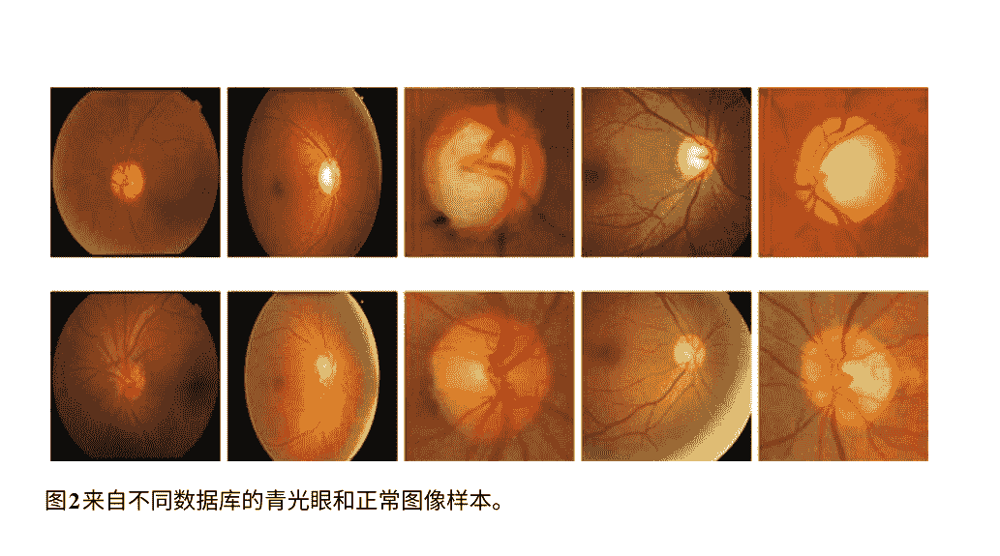

###### 表1 数据库描述

| 数据库 | 原始图像数量 | 训练图像数量 | 测试图像数量 | 尺寸和格式 |
| :--- | :--- | :--- | :--- | :--- |
| DRISHTI-GS1 [22] | Gl-89<br>Nor-12 | Gl-1240<br>Nor-160 | Gl-540<br>Nor-40 | 2896 × 1944<br>PNG |
| RIM-ONE2 [23] | Gl-200<br>Nor-255 | Gl-700<br>Nor-895 | Gl-300<br>Nor-380 | 290 × 290<br>到 1375 × 1654<br>JPEG |
| ORIGA [24] | Gl-168<br>Nor-482 | Gl-1176<br>Nor-1687 | Gl-504<br>Nor-723 | 3072 × 2048<br>JPEG |
| LAG [16] | Gl-2392<br>Nor-3432 | Gl-1198<br>Nor-2200 | Gl-513<br>Nor-943 | 500 × 500<br>JPEG |
| ACRIMA [13] | Gl-396<br>Nor-309 | Gl-2770<br>Nor-2160 | Gl-1190<br>Nor-930 | 400 × 400<br>到 1156 × 1156<br>JPEG |

Gl表示青光眼图像，Nor表示正常图像

###### 表2 性能指标

| 序号 | 指标 | 数学表达式 |
| :--- | :--- | :--- |
| 1 | 准确性 | 准确率 = \(\frac{\text{真正例} + \text{真负例}}{\text{真正例} + \text{假负例} + \text{假正例} + \text{真负例}}\) |
| 2 | 敏感度 | SN = \(\frac{\text{真正例}}{\text{真正例} + \text{假负例}}\) |
| 3 | 特异性 | SP = \(\frac{\text{TN}}{\text{TN} + \text{FP}}\) |
| 4 | 精确度 | PR = \(\frac{\text{真正例}}{\text{真正例} + \text{假正例}}\) |

使用SGDM、Adam和RMSProp这三种标准一阶优化器，记录性能指标。从模拟结果可以看出，Adam优化器相对于其他两种优化器产生了更好的结果。

表3、4、5、6和7描述了使用AlexNet、VGG-19和ResNet-101模型在不同数据库上获得的结果。在不平衡数据库（DRISHTI-GS1和ORIGA）中，考虑到精确度指标；在平衡数据库（RIM-ONE(2)、ACRIMA和LAG）中，考虑到分类准确率。使用Adam优化器更新的可学习参数在RIM-ONE(2)和LAG数据库中产生了更好的结果。在RIM-ONE(2)数据库中，使用VGG-19模型获得了最高的分类准确率87.8%；在LAG数据库中，使用VGG-19模型获得了最高的分类准确率97.12%。对于ACRIMA数据库，AlexNet和VGG-19使用Adam优化器获得了更好的结果。在ACRIMA数据库中，ResNet-101使用SGDM表现更好，最高准确率为98.5%。在DRISHTI-GS1数据库中，使用VGG-19和Adam优化器获得了更好的精确度92.91%；而在ORIGA数据库中，使用ResNet-101和RMSProp优化器获得了最高的精确度81.2%。从这个分析可以看出，深度神经网络的性能主要取决于所使用的数据库和优化器。

###### 表3 在DRISHTI-GS1数据库中获得的性能指标

| 优化器/网络 | SGDM 准确率 | SGDM 信噪比 | SGDM 敏感性 | SGDM PR | Adam 准确率 | Adam 信噪比 | Adam 敏感性 | Adam PR | RmsProp 准确率 | RmsProp 信噪比 | RmsProp 敏感性 | RmsProp PR |
| :--- | :--- | :--- | :--- | :--- | :--- | :--- | :--- | :--- | :--- | :--- | :--- | :--- |
| AlexNet | 88.93 | 96.17 | 40.14 | 91.57 | 88.70 | 96.10 | 38.80 | 91.40 | 89.50 | 96.50 | 42.50 | 91.90 |
| VGG-19 | 91.77 | 98.09 | 49.17 | 92.87 | 90.38 | 96.30 | 50.42 | 92.91 | 90.91 | 99.80 | 29.58 | 90.62 |
| ResNet-101 | 89.40 | 99.80 | 18.80 | 89.20 | 91.50 | 99.70 | 33.80 | 91.10 | 90.80 | 99.80 | 30.00 | 90.60 |

粗体表示最佳值

###### 表4 在RIM-ONE(2)数据库中获得的性能指标

| 优化器/网络 | SGDM 准确率 | SGDM 信噪比 | SGDM 敏感性 | SGDM PR | Adam 准确率 | Adam 信噪比 | Adam 敏感性 | Adam PR | RmsProp 准确率 | RmsProp 信噪比 | RmsProp 敏感性 | RmsProp PR |
| :--- | :--- | :--- | :--- | :--- | :--- | :--- | :--- | :--- | :--- | :--- | :--- | :--- |
| AlexNet | 83.78 | 79.03 | 87.58 | 83.28 | 84.90 | 81.30 | 87.60 | 83.80 | 84.90 | 77.30 | 90.80 | 86.90 |
| VGG-19 | 87.30 | 86.11 | 88.26 | 85.34 | 87.80 | 86.44 | 88.86 | 86.00 | 84.41 | 86.67 | 82.63 | 80.36 |
| ResNet-101 | 83.70 | 83.00 | 84.20 | 80.60 | 85.40 | 83.70 | 86.80 | 83.40 | 81.90 | 87.30 | 77.60 | 75.50 |

粗体表示最佳值

###### 表5 在ORIGA数据库中获得的性能指标

| 优化器/网络 | SGDM 准确率 | SGDM 信噪比 | SGDM 敏感性 | SGDM PR | Adam 准确率 | Adam 信噪比 | Adam 敏感性 | Adam PR | RmsProp 准确率 | RmsProp 信噪比 | RmsProp 敏感性 | RmsProp PR |
| :--- | :--- | :--- | :--- | :--- | :--- | :--- | :--- | :--- | :--- | :--- | :--- | :--- |
| AlexNet | 75.65 | 57.09 | 88.96 | 78.41 | 71.70 | 61.00 | 79.30 | 67.50 | 68.20 | 53.70 | 78.30 | 63.60 |
| VGG-19 | 75.84 | 58.04 | 88.24 | 77.58 | 76.60 | 60.91 | 87.48 | 77.00 | 74.33 | 50.20 | 91.15 | 79.81 |
| ResNet-101 | 76.40 | 62.50 | 86.10 | 76.00 | 74.30 | 58.80 | 85.10 | 73.50 | 80.50 | 68.60 | 88.80 | 81.20 |

粗体表示最佳值

###### 表6 在LAG数据库中获得的性能指标

| 优化器/网络 | SGDM 准确率 | SGDM 信噪比 | SGDM 敏感性 | SGDM PR | Adam 准确率 | Adam 信噪比 | Adam 敏感性 | Adam PR | RmsProp 准确率 | RmsProp 信噪比 | RmsProp 敏感性 | RmsProp PR |
| :--- | :--- | :--- | :--- | :--- | :--- | :--- | :--- | :--- | :--- | :--- | :--- | :--- |
| AlexNet | 91.49 | 86.66 | 94.09 | 88.90 | 95.60 | 92.40 | 97.30 | 95.00 | 95.30 | 90.40 | 98.00 | 96.10 |
| VGG-19 | 93.70 | 90.80 | 95.20 | 91.20 | 97.12 | 96.82 | 97.28 | 95.10 | 96.04 | 92.98 | 97.70 | 95.70 |
| ResNet-101 | 90.50 | 86.20 | 92.90 | 86.80 | 95.90 | 95.70 | 96.00 | 92.80 | 95.70 | 92.40 | 97.50 | 95.20 |

粗体表示最佳值

###### 表7 在ACRIMA数据库中获得的性能指标

| 优化器/网络 | SGDM 准确率 | SGDM 信噪比 | SGDM 敏感性 | SGDM PR | Adam 准确率 | Adam 信噪比 | Adam 敏感性 | Adam PR | RmsProp 准确率 | RmsProp 信噪比 | RmsProp 敏感性 | RmsProp PR |
| :--- | :--- | :--- | :--- | :--- | :--- | :--- | :--- | :--- | :--- | :--- | :--- | :--- |
| AlexNet | 95.47 | 93.59 | 97.80 | 98.22 | 96.70 | 96.60 | 96.80 | 97.50 | 95.00 | 92.80 | 98.00 | 98.30 |
| VGG-19 | 96.32 | 95.21 | 97.74 | 98.18 | 96.67 | 95.38 | 98.33 | 98.65 | 94.15 | 91.68 | 97.31 | 97.76 |
| ResNet-101 | 98.50 | 99.10 | 97.70 | 98.30 | 98.30 | 98.70 | 97.80 | 98.30 | 98.10 | 99.70 | 96.00 | 97.00 |

粗体表示最佳值

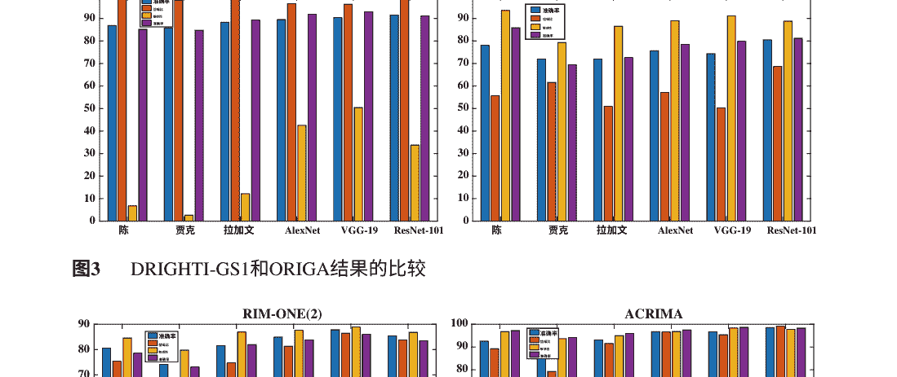

图3 DRISHTI-GS1和ORIGA结果的比较

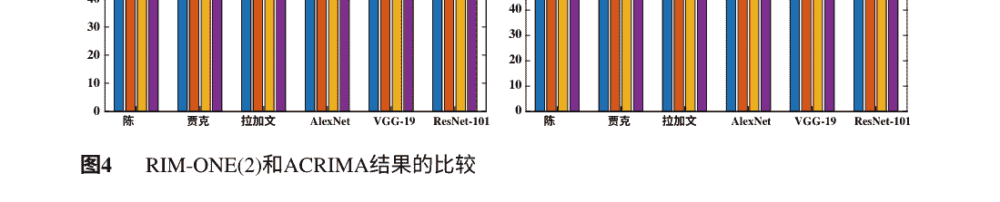

图4 RIM-ONE(2)和ACRIMA结果的比较

此外，文献中描述的CNN架构（Chen等人[11]，Gomez-Valverde等人[12]，Raghavendra等人[15]）也被实现，并与预训练模型进行比较。图3、4和5代表不同CNN架构在各种数据库上获得的性能指标。

对于预训练模型，选择导致更好性能指标的优化器进行比较。不同架构的性能比较表明，除了ORIGA数据库外，预训练模型在分类青光眼和正常图像方面的表现优于从头开始训练的网络。

###### 5 结论

本文分析并比较了Adam、SGDM和RMSProp等各种优化器在使用迁移学习技术从眼底图像中自动检测青光眼方面的性能。考虑到从原始图像中提取判别特征，使用了三个标准模型，即AlexNet、VGG-19和ResNet-101。考虑到评估网络性能，使用了DRISHTI-GS1、RIM-ONE(2)、ORIGA、ACRIMA和LAG视网膜数据库。

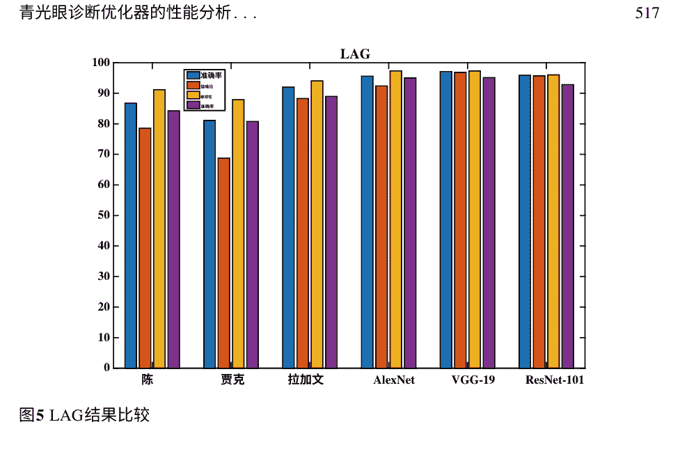

图5 LAG结果比较

使用Adam优化器更新参数的VGG-19模型在RIM-ONE(2)，LAG和DRISHTI-GS1中分别获得了最高的分类准确率87.8%，97.12%和92.91%的精度。在ResNet-101模型中，使用RmsProp和SGDM优化器获得了总体分类准确率98.5%和精度81.2%。与从头开始训练的网络相比，预训练模型在分类青光眼和正常图像方面表现更好。

###### 参考文献

1.  Elangovan P, Ravichandran G, Nath MK, Acharya OP (2018) 关于视网膜底部图像中视盘定位的综述。在2018年应用电磁学、信号处理和通信国际会议（AESPC）中。印度布巴内斯瓦尔，第1-7页。 https://doi.org/10.1109/AESPC44649.2018.9033304
2.  Joshi GD, Sivaswamy J, Krishnadas SR (2011) 用于青光眼评估的单眼彩色视网膜图像中的视盘和杯分割。IEEE Trans Med Imaging 30 (6) : 1192–1205
3.  Mittapalli PS, Kande GB (2016) 用于青光眼评估的数字眼底图像中的视盘和视杯分割。Biomed Signal Process Control 24: 34–46
4.  Elangovan P, Nath MK, Mishra M (2020) 用于青光眼检测的彩色眼底图像的统计参数。在计算机科学procedia计算和网络通信的第三届国际会议上，第171卷，第2675-2683页
5.  Nath MK, Dandapat S (2017) 用于青光眼评估的小波子带中的差分熵。Int J Imaging Syst Technol 22 (3) : 161–165
6.  Maheshwari S, Pachori RB, Acharya UR (2017) 使用经验小波变换和基于眼底图像的相关性特征的青光眼自动诊断。IEEE J Biomed Health Inf 21(3):803–813
7.  Lecun Y (1989) 泛化和网络设计策略。技术报告。苏黎世，瑞士
8.  Zilly J, Buhmann JM, Mahapatra D (2017) 使用熵采样和集成学习进行青光眼检测，自动视杯和视盘分割。 Comput Med Imaging Graph55:28–41
9.  Bajwa MN, Malik MI, Siddiqui SA, Dengel A, Shafait F, Neumeier W, Ahmed S (2019) 使用深度学习在视网膜眼底图像中进行视盘定位和青光眼分类的两阶段框架。 BMC Med Inf Decis Mak 19(1):1–16
10. Elangovan P, Nath MK (2020) 使用卷积神经网络从彩色眼底图像进行青光眼评估。 Int J Imaging Syst Technol 1–17. https://doi.org/10.1002/ima.22494
11. Chen X, Xu Y, Wong D, Wong T-Y, Liu J (2015) 基于深度卷积神经网络的青光眼检测。 在IEEE工程医学和生物学学会（EMBC）的年度国际会议上，米兰，意大利，第715-718页。
12. Gomez-Valverde J, Anton A, Fatti G, Liefers B, Herranz A, Santos A, Sanchez C, Ledesma-Carbayo M (2019) 基于卷积神经网络和迁移学习的彩色眼底图像自动青光眼分类。 Br J Ophthalmol 10(2):892–913
13. Diaz-Pinto A, Morales S, Naranjo V, Kohler T, Mossi J, Navea A (2019) 使用眼底图像的卷积神经网络进行自动青光眼评估：广泛验证。 Bio-Med Eng OnLine18(29):1–19
14. Zhen Y, Wang L, Liu H, Zhang J, Pu J (2005) 深度学习技术在评估青光眼严重程度方面的性能评估。 医学图像分析 9(4):297–314
15. Raghavendra U, Fujita H, Bhandary SV, Gudigar A, Hong Tan J, Rajendra Acharya U (2018) 使用数字眼底图像的深度卷积神经网络进行青光眼准确诊断。 信息科学 144(29):41–49
16. Li L, Xu M, Wang X, Jiang L, Liu H (2019) 基于注意力的青光眼检测：一个大规模数据库和CNN模型。 在：计算机视觉和模式识别的IEEE会议(CVPR)，第1-10页
17. Krizhevsky A, Sutskever I, Hinton GE (2012) 使用深度卷积神经网络的Imagenet分类。 神经信息处理系统 25(2):1097–1105
18. Simonyan K, Zisserman A. 非常深的卷积神经网络用于大规模图像识别。 CoRR, vol.abs/1409.1556
19. He K, Zhang X, Ren S, Sun J (2016) 深度残差学习用于图像识别。 在：IEEE计算机视觉和模式识别（CVPR）会议，拉斯维加斯，内华达州，第770-778页
20. Qian N (1999) 关于梯度下降学习算法中的动量项。 神经网络12:145-151
21. Kingma DP, Ba J (2015) Adam：一种用于随机优化的方法。 在：国际学习表示会议，圣地亚哥，加利福尼亚州，第1-15页
22. Sivaswamy J, Krishnadas SR, Joshi GD, Jain M, Tabish AUS (2014) Drishti-gs：视网膜图像用于视神经头（ONH）分割的数据集。 在：2014年IEEE第11届国际生物医学成像研讨会（ISBI），中国北京，第53-56页
23. Fumero F, Alayon S, Sanchez J, Sigut J, Gonzalez-Hernandez M (2011) Rim-one：用于视神经评估的开放性视网膜图像数据库。 在：IEEE计算机基于医学系统（CBMS）研讨会，英国布里斯托尔，第1-6页
24. Zhang Z, Yin F, Liu J, Wong W, Tan N, Lee B-H, Cheng J, Wong T-Y (2010) Origa(-light)：用于青光眼分析和研究的在线视网膜底图像数据库。 在：IEEE工程医学与生物学年度国际会议，布宜诺斯艾利斯，第3065-3068页

##### 基于支持向量机的患者风险因素数据的疾病早期预测

Usharani Chelladurai 和 Seethalakshmi Pandian

摘要 早期疾病检测在改善医疗质量和帮助人们预防危险健康状况方面起着重要作用。早期慢性疾病的检测是健康数据分析领域的关键任务。本文提出了一种基于模糊逻辑的SVM机器学习技术，用于基于个体患者风险因素数据的患者中心化医疗分析，以预测高血压、甲状腺功能减退症和肥胖等慢性疾病的早期发病。所提出的方法包括预处理、特征选择、特征提取、模糊SVM分类和后处理，用于预测疾病的严重程度。所提出的基于模糊的支持向量机（SVM）通过应用机器学习技术来分类重要特征，以确保慢性疾病的预测准确性。SVM是一种基于边界的分类器，将输入数据映射到高维空间，并用线性逼近进行分类。该技术结合了不同分类模型的输出，并与先前的技术相比，显示出最高的准确性。以前的研究中没有将模糊与SVM分类器集成用于慢性疾病数据集。所提出的基于机器学习的疾病预测模型用于早期诊断和及时治疗非传染性疾病/慢性疾病，调查患者治疗日志中的风险因素数据。该模型提供早期风险检测，帮助医生采取适当的预防措施，并采取措施以最小化和预防患者达到疾病的危急阶段。该系统将显著降低人类死亡率并加强卫生服务。

关键词 分类 · 早期疾病预测 · 特征选择 · 基于模糊支持向量机的机器学习 · Rstudio分析

U. Chelladurai (✉) · S. Pandian
计算机科学与工程和电子与通信工程系，工程学院，BIT校区，安娜大学，Tiruchirappalli，泰米尔纳德邦，印度

###### 1 引言

世界卫生组织报告称，非传染性疾病的全球责任和危险是一个威胁社会和经济发展的重大公共卫生挑战[1]。非传染性疾病(NCDs)，也被称为慢性疾病，往往持续时间较长，是遗传、生理、环境和行为因素的综合结果[2]。

非传染性疾病的主要类型包括心血管疾病（如心脏病和中风）、癌症、慢性呼吸系统疾病（如慢性阻塞性肺病和哮喘）以及糖尿病[3]。非传染性疾病的主要原因是有害的烟草和酒精使用、缺乏体力活动以及不健康的饮食，所有这些都增加了死于非传染性疾病的风险[4]。

各个年龄组、地区和国家的人都受到非传染性疾病的影响[5, 6]。这些疾病通常与年龄较大的人群有关，但证据表明，所有因非传染性疾病而死亡的1500万人中，有超过85%的人在30至69岁之间。在这些“过早”死亡中，估计有超过85%发生在低收入和中等收入国家。儿童、成年人和老年人都容易受到导致非传染性疾病的风险因素的影响，无论是来自不健康的饮食、缺乏体力活动，还是接触烟草烟雾或有害酒精的使用。这些疾病受到全球化快速增长、城市化不受计划的影响、不健康的生活方式和人口老龄化等力量的推动。不健康的饮食和缺乏体力活动可能导致人们出现高血压、血糖升高、血脂升高和肥胖等问题。这些被称为代谢风险因素，可能导致心血管疾病，这是导致过早死亡的非传染性疾病中的主要疾病[7, 8]。

发展中国家约有6.39亿成年人患有高血压，并预计到2025年将达到近10亿成年人。世界卫生组织的预测显示，非传染性疾病在未来十年内将导致死亡人数显著增加。非传染性疾病的死亡人数在全球范围内预计将增加15%，从2010年到2020年（达到4400万人死亡）[9, 10]。随着对非传染性疾病风险意识的增强，最近的几项研究利用机器学习模型作为决策技术，根据个体的风险因素数据进行早期检测和及时治疗，从而可以在早期阶段采取适当的护理措施[11, 12]。

机器学习算法在医疗保健领域的应用，可以帮助医院简化行政流程，规划和治疗传染性疾病，并个性化医疗治疗[13, 14]。它可以提高医院和卫生系统的效率，同时降低护理成本。

在许多以前的研究中，分类器的优化是通过“测试集”来完成的，这可能导致测试数据对分类器产生意外的影响，从而比在实际条件下可能遇到的敏感性和特异性更高[15, 16]。为了提供更真实敏感性和特异性估计，测试数据不能影响算法的训练[17]。因此，我们采用了双重交叉验证方法，将数据分为一个训练集和一个测试集，并将训练集进一步分为一个学习集和一个验证集。基于模糊的支持向量机分类模型在学习和验证数据集上进行训练，并在训练中未触及的数据集上进行测试[18, 19]。由于测试数据集完全不参与训练，这种实验设计的结果可以更准确地反映实际条件下的预测率[20]。

###### 我们的贡献

本提案的主要目标是开发算法和架构，为可植入设备提供可靠的疾病预测，并在足够时间内触发治疗。本文的具体任务是使用FSVM研究患者日志特定分类方法的可行性，以区分风险因素属性和正常属性。该算法已在医院NCD数据库的数据集上进行了测试，该数据库已提供用于比较不同算法在相同数据集上的结果。

本文的其余部分组织如下：第2节描述文献综述，第3节介绍了提出的系统方法。第4节介绍了实验设置和结果。第5节讨论了提出系统的亮点和结论，并在第6节中绘制了未来工作。

###### 2 文献综述

Luis Eduardo等人[21]基于复杂的假设构建了一台心脏混合成像机。机器学习能够确定和理解复杂的数据结构，以解决估计和分类的挑战。

Alarsan和Younes [22]提出了一种基于机器学习的心电图（ECG）分类方法，使用各种ECG特征来检测心脏ECG异常。Golino等人[23]描述了定制的糖尿病患者健康监测系统，该系统通过使用基于BLE和G的传感器来明确定义。Alfian描述了使用机器学习方法预测高血压，这些方法不被归类为慢性疾病模型。

在[24, 25]中，作者讨论了机器学习可以作为早期疾病预测模型，根据当前个体的风险因素数据来预测慢性疾病的严重程度。多项研究利用机器学习模型，并揭示了预测糖尿病、高血压、甲状腺功能减退症、肥胖风险因素的严重疾病的显著结果。

在[26–28]中，作者描述了一种混合机器学习方法，这是一种众所周知且广泛使用的机器学习模型之一。在[29, 30]中，作者提出了一种方法，其主要思想是将两个机器学习模型结合起来，以帮助减少偏差和方差，从而改善预测结果。以前的研究也使用了混合方法，并显示了改善医疗决策和诊断、预测心脏疾病、NCD的严重程度以及识别其风险因素的显著结果。

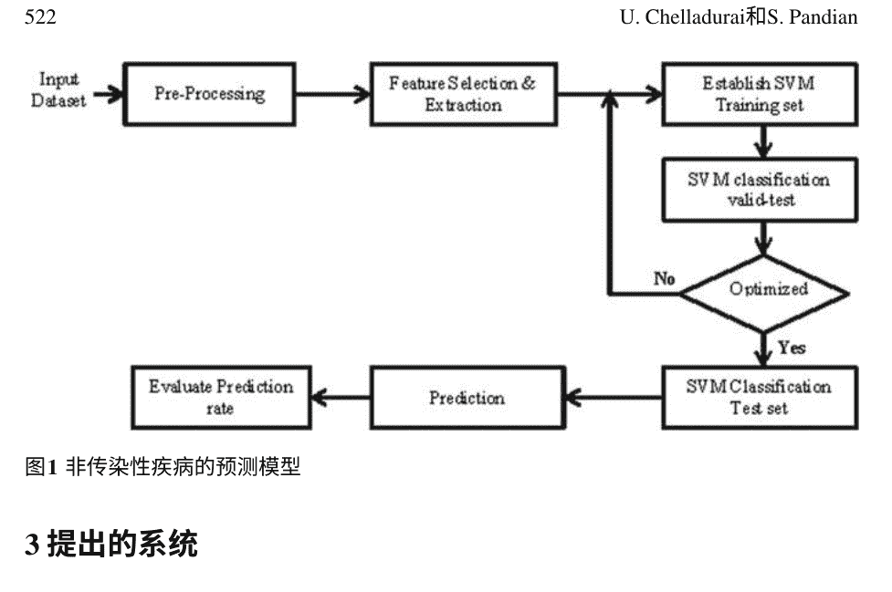

###### 3 提出的系统

###### 3.1 提出系统的概述

在这个子节中，提出的系统介绍了基于模糊支持向量机机器学习技术用于疾病预测的设计视图。图1展示了提出系统在本节中使用的框架架构和实体。提出的系统包括（A）数据收集（B）数据转换（C）数据存储和安全（D）数据建模和（E）数据可视化和知识发现。

###### 3.2 提出系统的实施

本节简要解释了提出方法的每个实体的输入和输出。提出的系统涉及数据收集、数据集创建、预处理、特征选择、特征提取以及应用我们提出的基于模糊支持向量机分类算法进行疾病预测。提出系统的输入是慢性疾病数据集，提出系统的输出生成疾病的准确可能性并识别具有风险状况的患者。

在下面的小节中，讨论了提出系统的每个组件的详细信息。

###### A. 数据收集/健康数据集创建

提出方法的第一步包括处理来自不同格式的各种来源的数据。提出的系统使用从医院获得的医疗数据的编译。数据集包括3000名患者记录，有75个属性，包括各种数据类型，如统计数据、明确的数据和图像数据。该数据集包含了患者的病史/医疗历史信息，这些信息已经维护了几年。

该系统从患有非传染性疾病（如高血压、甲状腺功能减退和肥胖症）的患者中提取数据集。分类的患者健康数据集单独维护在一个名为NCD/慢性病数据集的数据库中。慢性病数据集包含大约1000个患者记录。

一旦获得了关于慢性疾病的数据，系统会验证每个数据输入是否符合数据集的格式化过程。数据集格式化是数据转换的关键过程。

###### B. 数据转换

###### 预处理

一旦数据可用，建议系统的下一步是过滤数据集，因为收集到的数据集可能包含噪声。在分析或建模过程之前，需要对数据进行转换以提高数据质量。在建议的系统中，健康数据集被输入到机器学习预处理中，其中包括去除异常值、噪声、错误和缺失值等伪影。任何改变存储数据值并影响未来测试和训练过程的伪影都需要被处理。在预处理阶段，伪影集合被移除以进行进一步的分析。数据集中存在的伪影被称为无效（NA），并且整行伪影将永久从数据集中排除。通过从数据集中移除整行来消除所有实例。系统通过模糊测量每个实例的值，并使用产生模糊基于NCD的数据集进行特征选择。

表1展示了数据集的描述，包括属性名称、描述、数据类型和取值范围。

###### 特征选择和特征提取

系统执行异常值检测，并准备好进行特征选择和特征提取的数据集。从原始数据集的75个原始特征中提取了21个特征。特征选择基于高度相关的属性，如年龄、血压、血糖、甲状腺、心电图、低密度脂蛋白、高密度脂蛋白、甘油三酯、体质指数、遗传疾病、心率、血红蛋白计数和手术情况。

特征选择是自动选择数据集中与预测建模问题最相关的属性的过程。它是选择与模型构建最相关的一部分特征的过程。NCD疾病预测基于风险因素属性的值。

###### C. 数据存储和安全

在这个阶段，转换后的数据已经准备好进行安全存储。收集到的健康数据是私密和敏感的，因此在转换过程中采取必要的措施非常重要。为了确保健康数据的保护，一个安全的存储解决方案对于生成整个数据集非常重要。有很多非常安全的解决方案，但我们建议区块链技术比其他技术提供更多的安全性。医疗记录的安全性提高，不可变的患者记录，以患者为中心的健康记录，安全可验证的医疗记录，以及大量的医疗数据随时随地可用。这项技术还解决了互操作性、与现有系统的集成、技术和采用障碍等挑战。区块链是一种去中心化的点对点架构。它是一种分布式账本技术。分布式网络中的参与者将数字交易记录到共享账本中。网络中的每个参与者都存储着相同的共享账本副本，并且对共享账本的更改会反映在分布式网络中的所有副本中。区块链技术本身是一个数据存储库，它为健康数据提供安全性和患者隐私。

###### 表1 健康数据集属性描述

| 属性名称 | 描述 | 范围 | 数据类型 |
| :--- | :--- | :--- | :--- |
| GEN | 患者性别 男/女 | 0–1 | 名义 |
| 年龄 | 患者年龄 | 40–85 | 数值 |
| ELDP | 老年患者 | 0–1 | 名义 |
| BMI | 体重指数 | 0–2 | 名义 |
| FOH | 饮食习惯 | 0–1 | 名义 |
| SMO | 吸烟习惯 | 0–1 | 名义 |
| ALC | 酗酒习惯 | 0–1 | 名义 |
| RBP | 静息血压 | 0–2 | 名义 |
| FBS | 空腹血糖 | 0–1 | 名义 |
| TSH | 甲状腺刺激激素 | 0–1 | 名义 |
| CPT | 胸痛类型 | 0–3 | 数值 |
| LDL | 低密度脂蛋白 | 0–1 | 名义 |
| HDL | 高密度脂蛋白 | 0–1 | 名义 |
| TRY | 甘油三酯 | 0–1 | 名义 |
| CHOL | 总胆固醇 | 0–1 | 名义 |
| RECG | 静息心电图 | 0–1 | 名义 |
| HBR | 心跳率 | 0–1 | 名义 |
| HEMO | 血红蛋白计数 | 0–1 | 名义 |
| EXER | 锻炼 | 0–1 | 名义 |
| HDG | 遗传性疾病 | 0–1 | 名义 |
| OPER | 操作完成 | 0–3 | 数值 |

###### D. 数据建模

一旦数据被收集、转换并存储在安全存储解决方案中，数据处理分析就会被执行以生成有用的知识。在提出的系统中，已经评估了基于规则的定理以满足类属性。这些属性与类属性高度相关/相关。选择、提取特征并形成一个新的数据集，其中包含21个特征和1000个实例数据集。表2描述了本节中每个属性的模糊值，其中包含25个样本。在提出的系统中，21个属性中高度相关和疾病预测属性是性别、年龄、BMI、FBS、FOH、RBP、CHOL、LDL、HDL和TRY。图3、4、5、6和7清楚地显示了相关属性如何高度影响疾病。

###### 基于模糊的SVM分类和基于规则的验证

训练数据集数据（ $D$ ）= {$y_i$, $x_i$}; $i$ = 1,2, ... ,n 其中 $x_i$ ∈ $R^n$ 表示向量第$i$个向量和 $yi$ ∈ $R^n$表示目标项。线性SVM找到形式为 $f(x) = w^T x + b$的最优超平面，其中 $w$是一个维度系数向量和 $b$是一个偏移量。这是通过解决以下优化问题来完成的：

$$
\min_{w, b, \xi} \frac{1}{2} w^2 + C \sum_{i=1}^n \xi_i
$$
$$
\text{s.t. } y_i (w^T x_i + b) \geq 1 - \xi_i, \quad \xi_i \geq 0, \quad \forall i \in \{1,2,\dots,m\}
$$

###### 敏感性和特异性的度量

敏感性表示获得的真阳性率[风险的可能性]/真阳性[风险的可能性]+假阳性，即没有风险/疾病的可能性。

$$
敏感性 = 真阳性/ (真阳性 + 假阴性)
$$

敏感性的补集是特异性，对负类的预测称为真阴性。

$$
特异性 = 真阴性/ (假阳性 + 真阴性)
$$

在不公平的分类中，特异性可能小于预测的敏感性。敏感性和特异性可以结合成一个平衡两个方面的单一评分，称为几何平均或G-Mean（表3）。

$$
G-Mean = sqrt(敏感性 * 特异性)
$$

###### 真阳性率就是敏感性

* 真正率 = 真正/(真正 + 假负)

###### 表2 预处理的基于模糊的健康数据集

| GEN | 年龄 | ELDP | BMI | FOH | SMO | ALC | DISH | CPT | RBP | CHOL | LDL | HDL | TRY | FBS | RECG | TSH | HEMO | HBR | EXER | OPER |
| :--- | :--- | :--- | :--- | :--- | :--- | :--- | :--- | :--- | :--- | :--- | :--- | :--- | :--- | :--- | :--- | :--- | :--- | :--- | :--- | :--- |
| 0 | 41 | 0 | 0 | 1 | 0 | 0 | 0 | 1 | 1 | 1 | 1 | 2 | 0 | 0 | 0 | 0 | 2 | 0 | 0 | 2 |
| 1 | 56 | 0 | 1 | 1 | 0 | 1 | 0 | 1 | 0 | 1 | 1 | 2 | 0 | 1 | 1 | 1 | 1 | 0 | 0 | 2 |
| 0 | 57 | 0 | 1 | 1 | 0 | 1 | 0 | 0 | 0 | 2 | 1 | 2 | 1 | 0 | 1 | 1 | 0 | 0 | 1 | 2 |
| 1 | 57 | 0 | 0 | 1 | 0 | 1 | 0 | 0 | 2 | 0 | 0 | 0 | 0 | 0 | 1 | 0 | 0 | 0 | 0 | 1 |
| 0 | 56 | 0 | 1 | 1 | 0 | 0 | 0 | 1 | 2 | 2 | 1 | 2 | 1 | 0 | 1 | 1 | 0 | 0 | 0 | 2 |
| 1 | 52 | 0 | 2 | 1 | 1 | 0 | 0 | 2 | 4 | 0 | 0 | 2 | 1 | 1 | 1 | 1 | 0 | 0 | 0 | 3 |
| 1 | 57 | 0 | 1 | 1 | 0 | 1 | 0 | 2 | 3 | 0 | 0 | 2 | 0 | 0 | 1 | 1 | 0 | 0 | 0 | 2 |
| 1 | 54 | 0 | 1 | 1 | 1 | 0 | 0 | 0 | 2 | 1 | 1 | 2 | 0 | 0 | 1 | 1 | 0 | 0 | 0 | 2 |
| 1 | 64 | 1 | 1 | 1 | 0 | 0 | 0 | 3 | 0 | 1 | 1 | 2 | 0 | 0 | 0 | 1 | 0 | 0 | 1 | 2 |
| 0 | 58 | 0 | 0 | 1 | 1 | 0 | 0 | 3 | 3 | 2 | 1 | 2 | 1 | 1 | 0 | 0 | 0 | 0 | 0 | 2 |
| 0 | 50 | 0 | 0 | 1 | 1 | 1 | 0 | 2 | 0 | 1 | 1 | 2 | 1 | 0 | 1 | 0 | 0 | 0 | 0 | 2 |
| 0 | 58 | 0 | 1 | 1 | 0 | 0 | 0 | 2 | 0 | 2 | 1 | 2 | 1 | 0 | 1 | 1 | 0 | 0 | 0 | 2 |
| 0 | 66 | 1 | 2 | 1 | 1 | 0 | 0 | 3 | 3 | 1 | 1 | 2 | 1 | 0 | 1 | 1 | 0 | 0 | 0 | 2 |
| 0 | 69 | 1 | 2 | 1 | 0 | 0 | 0 | 3 | 2 | 1 | 1 | 2 | 0 | 0 | 1 | 0 | 0 | 0 | 0 | 2 |
| 1 | 59 | 0 | 2 | 1 | 0 | 0 | 1 | 0 | 2 | 1 | 1 | 2 | 0 | 0 | 1 | 1 | 0 | 0 | 0 | 3 |
| 1 | 61 | 1 | 1 | 1 | 0 | 0 | 0 | 2 | 3 | 2 | 1 | 2 | 1 | 0 | 1 | 1 | 2 | 0 | 1 | 2 |
| 1 | 40 | 0 | 2 | 1 | 1 | 0 | 0 | 3 | 2 | 0 | 0 | 0 | 1 | 0 | 1 | 1 | 0 | 0 | 1 | 3 |
| 0 | 71 | 1 | 0 | 1 | 0 | 0 | 0 | 1 | 3 | 2 | 1 | 2 | 1 | 1 | 1 | 1 | 0 | 0 | 0 | 2 |
| 1 | 59 | 0 | 0 | 0 | 0 | 1 | 0 | 2 | 3 | 1 | 0 | 2 | 1 | 0 | 1 | 0 | 0 | 0 | 0 | 2 |
| 1 | 51 | 0 | 0 | 1 | 0 | 1 | 0 | 2 | 0 | 0 | 0 | 0 | 1 | 1 | 1 | 0 | 0 | 0 | 0 | 2 |
| 0 | 65 | 1 | 0 | 1 | 0 | 1 | 0 | 2 | 2 | 2 | 1 | 2 | 1 | 1 | 0 | 0 | 0 | 0 | 0 | 2 |表3 FSVM算法的混淆矩阵

|      | 正预测       | 负预测       |
| ---- | ------------ | ------------ |
| 正类 | 真正 (TP)    | 假负 (FN)    |
| 负类 | 假正 (FP)    | 真负 (TN)    |

假正率的计算方法为:
假正率 = 假正/(假正 + 真负)

###### SVM混淆矩阵和统计数据

```
p3 no yes
no 35 0
yes 0 40
准确率: 1
95% CI: (0.952, 1)
无信息率: 0.5333
P-Value [Acc > NIR]: < 2.2e-16
Kappa: 1
Mcnemar检验P-Value: NA
敏感性: 1.0000
特异性: 1.0000
正预测值: 1.0000
负预测值: 1.0000
患病率: 0.4667
检测率: 0.4667
检测患病率: 0.4667
平衡准确率: 1.0000.
```

提出的算法，基于模糊的支持向量机生成了两组类值。真正例 =35，真负例 =40，其中假正例 =0和假负例 =0，共有75行用于测试预测早期护理患者的可能性和患者不处于风险区域。最初，测试过程仅适用于我们数据集中的75名患者。提出的系统已被考虑用于对更多样本进行分类，即整个数据集。在这个系统中，FSVMs有两个典型参数：假正例（FPs），严重疾病的异常样本可能性和假负例（FNs），不需要任何紧急护理的正常样本。

###### E. 知识发现和数据可视化

###### 疾病预测和风险识别

建模阶段提供了新的信息和有价值的知识，供决策者使用。以前的几项研究已经使用患者风险因素数据通过多个预测模型对典型患者进行了训练，但在实际条件下无法产生高的准确率。但在我们的系统中，对测试数据的准确率意味着在现实生活中的具体准确率。为了达到表格 4 各种模型的结果准确率、敏感性和特异性

| 算法     | 准确率 % | 分类错误率 % | 检测   | 患病率 | 敏感度 | 特异性 |
| :------- | :------- | :----------- | :----- | :----- | :----- | :----- |
| 朴素贝叶斯 | 97.3     | 2.7          | 35.14  | 36.49  | 96.3   | 97.8   |
| 随机森林   | 100      | 0            | 36.67  | 36.67  | 100    | 100    |
| 支持向量机 | **100**  | **0**        | **46.67** | **46.67** | **100**  | **100**  |
| 决策树     | 100      | 0            | 32.2   | 32.2   | 100    | 100    |
| KNN       | 81.36    | 18.64        | 28.81  | 42.37  | 68.0   | 91.18  |
| 逻辑回归   | 100      | 0            | 32.2   | 32.2   | 100    | 100    |

尽管预测率较低，但该系统采用了基于规则的属性优化，确保了测试数据样本。 在慢性病数据集中，如果一个实例同时患有高血压、甲状腺功能减退和肥胖等n种疾病，则将这些实例标识为最高优先级实例。 该系统随机选择20%的测试数据和80%的训练数据进行连续测试，以测试不同的算法。 表格 4 显示了不同算法与SVM技术相比的准确率、分类错误率、检测值、患病率、敏感性和特异性。 模型训练良好后，通过测试模型评估预测率，重复此过程直到计算出平均预测率，从而确定准确性 。 在现有系统中，准确率和敏感性与提出的系统进行比较，朴素贝叶斯准确率 =97.3%，敏感性 =96.3%，随机森林准确率 =100%，敏感性 =100%，检测和患病率值较低，与提出的系统相比。 决策树准确率 =100%，敏感性 =100%，检测和患病率值较低，与提出的FSVM系统相比。 KNN准确率 =81.36，敏感性 =68.0，逻辑回归准确率 =100%，敏感性 =100%。 与现有算法相比，对于预测未成熟疾病的给定数据集，FSVM生成的准确率比其他技术更高。

###### 4 实验和结果

###### 4.1 用于健康监测的移动应用程序

Rstudio已被用于机器学习和疾病预测分析。 我们已经在1000名患者的NCD数据集上测试了一种以患者为中心的模糊分类算法，该数据集提取了21个特征。 为了评估算法，我们已经将所提出的方法实施到一个移动应用程序中以展示

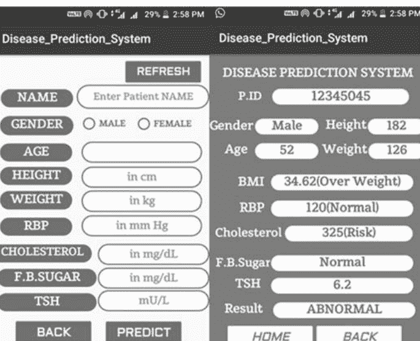

图2 移动应用程序基于机器学习的健康检测器

我们提出的系统在实际应用中具有可能性。 图3显示了我们慢性病数据集的移动应用程序界面。 该界面根据患者ID检索健康参数，然后将参数与阈值进行验证，然后应用基于规则的SVM来预测患者的状况，无论是正常还是异常。我们提出的模型在716名患者中对高血压、甲状腺功能减退症、糖尿病和肥胖症等疾病的预测率和严重程度预测准确率方面显著提高，比其他模型更具敏感性。

在本节中，图2展示了使用Android Studio开发的移动界面。这显示了患者是否处于危险状态，以及可能的疾病类型，最后确定了最常见的受影响疾病。 开发的移动应用程序使用慢性疾病数据集来测试疾病的不成熟状态。根据这一点，患者可以轻松监测当前状态和以前的疾病，然后采取适当的药物进行早期护理。 在大流行情况下，开发的健康检查应用程序提供电子咨询，并提供家庭护理的电子药物服务。

###### 4.2 R-Studio数据可视化

数据可视化是通过Rstudio完成的；在应用机器学习算法后，结果通过R Studio数据绘制和展示在图3、4、5、6和7中。

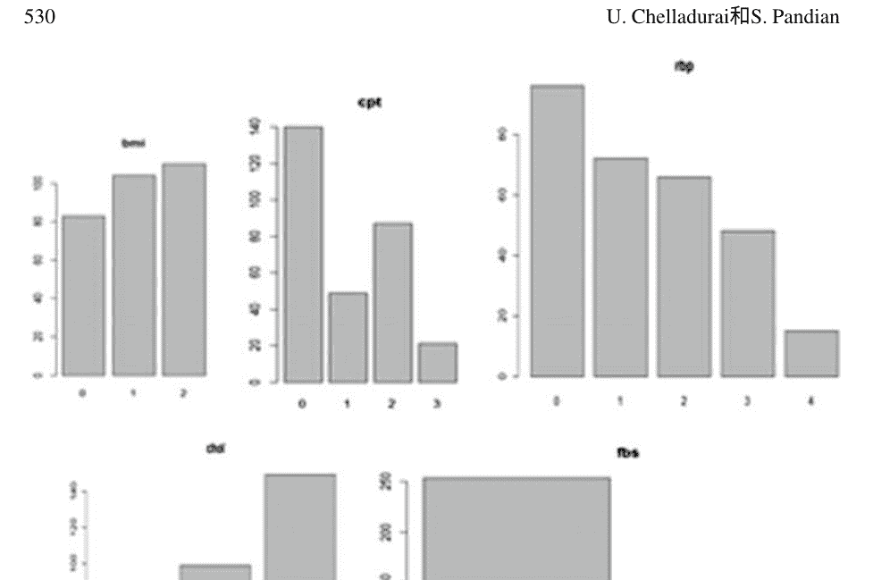

绘图技术。 图3展示了我们这项研究中使用的健康数据集的分布，图4展示了具有高准确性的预测属性的分布，图5展示了数据集中的异常样本，图6展示了所选特征的测量结果，图7展示了类变量的分离。

###### 5 讨论

所提出系统的结果已与其他现有的机器学习算法进行了比较，并将现有算法的性能指标进行了比较并纳入表4中。 与其他算法相比，所提出的算法显示出最高的敏感性。 当比较KNN和随机森林的特异性时，所提出的算法表现良好，并且比其他算法具有更高的敏感性。 从实验结果可以看出，具有减少属性的提出的模糊支持向量机技术改善了分类准确性。

###### 图4直方图中预测属性的分布与准确性

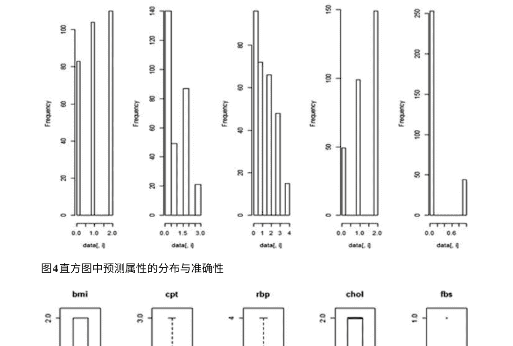

###### 图5使用箱线图和须状图显示的数据集中的异常样本

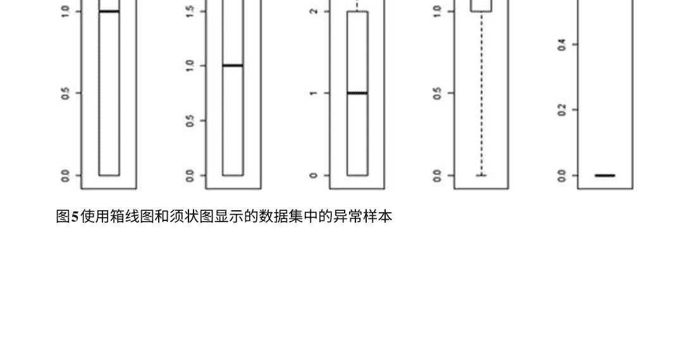

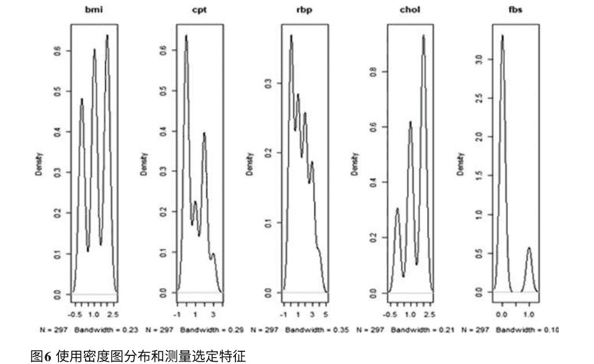

图6 使用密度图分布和测量选定特征

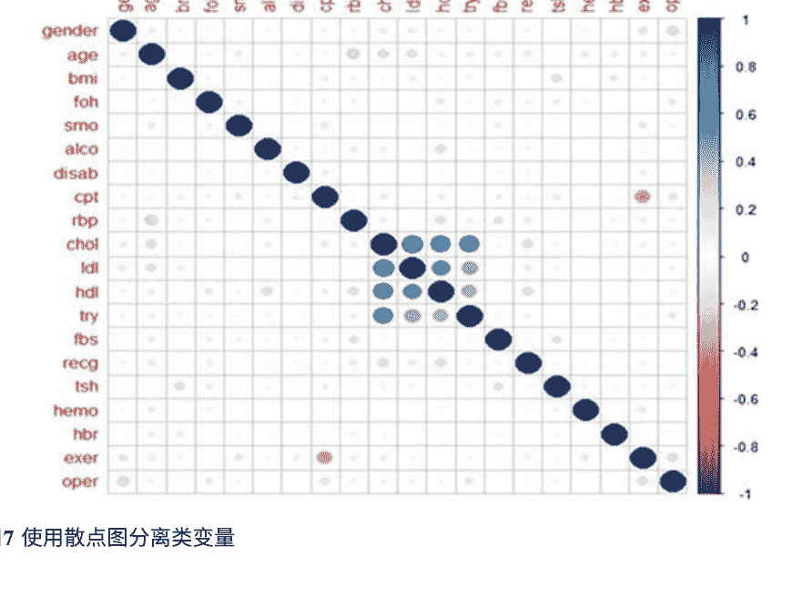

图7 使用散点图分离类变量

并且以公平的结果生成。 虽然一些研究可能比我们提出的技术具有更高的敏感性，但它们的算法是在相同的数据集上进行训练和测试的，因此结果不能直接进行比较。

###### 6 结论

本文提出了一种基于机器学习的早期疾病预测方法，使用支持向量机和患者的风险因素数据。 在去除伪迹后，应用基于规则的FSVM算法进行了工作。健康数据集中的无关因素可能会对疾病预测过程产生不利影响，并可能产生不良结果。 应用提出的算法后，通过为每个患者选择关键特征，实现了改进的预测。 在健康数据库中， 识别的风险因素属性，如年龄、空腹血糖、静息血压、胆固醇、BMI、TSH和心电图，被分离用于疾病预测。

通过添加更多特征，包括交叉相关属性和区分特征，预测也得到了改善，分类率和准确性也得到了提高。 通过提出的系统，可以进行早期预测、疾病识别和可能性分析。 已开发了一款移动应用程序，用于慢性病管理，并使用现有的慢性病数据集进行了测试，以实现早期护理、老年护理和家庭护理。

###### 参考文献

- 1. 世界卫生组织 (在线)。 https://www.who.int/news-room/fact-sheets/detail/noncommunicable-diseases
- 2. 世界卫生组织 (在线)。 https://www.who.int/gho/ncd/en/
- 3. 世界卫生组织 (在线)。 https://www.who.int/nmh/publications/ncd_report_full_en.pdf
- 4. Weka: Java数据挖掘软件. [在线]. 可访问: https://www.cs.waikato.ac.nz/ml/weka/
- 5. 机器学习掌握 (在线) 2019
- 6. Alloubani A, Saleh A, Abdelhafiz I (2018) 高血压和糖尿病作为中风、糖尿病代谢综合征的预测风险因素。 Clin Res Rev 12(4):577–584
- 7. Blumand AL, Langley P (1997) 机器学习中相关特征和示例的选择。 Artif Intel 97(1–2):245–271
- 8. Aggarwal CC (ed) (2014) 数据分类：算法和应用。 CRC Press, Boca Raton, FL, USA
- 9. Ozcift A, Gulten A (2011) 使用旋转森林构建分类器集合以提高机器学习算法的医学诊断性能。 Comput Methods Prog Biomed104(3):443–451
- 10. Ijaz MF, Alfian G, Syafrudin M, Rhee J (2018) 基于DBSCAN离群点检测、合成少数类过采样技术 (SMOTE) 和随机森林的2型糖尿病和高血压混合预测模型。
- 11. Fitriyani NL, Syafrudi M, Alfian G, Rhee j (2017) 基于集成学习方法的疾病预测模型的开发，用于糖尿病和高血压。 IEEE access，数字健康数据启用智能专栏，vol7
- 12. Harliman R, Uchida K (2018) 深度神经网络中不平衡数据问题的数据和算法混合方法。 Int J Mach Learn Comput 8 (3) : 208–213
- 13. Hanand J, Kamber M (2011) 数据挖掘: 概念与技术。 Elsevier, 圣地亚哥, 加利福尼亚州, 美国
- 14. Mohan S, Thirumalai C, Srivastava G利用混合机器学习技术进行有效的心脏病预测。 IEEE Access。 https://doi.org/10.1109/ACCESS.2019.2923707
- 15. Alfian G, Syafrudin M, Ijaz M, Syaekhoni M, Fitriyani N, Rhee J (2018) 利用基于BLE的传感器和实时数据处理的个性化糖尿病患者医疗监测系统。 传感器18 (7) : 2183
- 16. Lemaitre G, Nogueira F, Aridas CK (2017) Imbalanced-learn: 一种用于解决机器学习中不平衡数据集问题的Python工具箱。 J Mach Learn Res 18(1):559–563
- 17. Naiarun N, Moungmai R (2015) 用于糖尿病预测风险的分类器比较。 Procedia Comput Sci 69:132–142
- 18. UCI机器学习库 (2015) 慢性肾脏病数据集. [在线]. 可获取: https://archive.ics.uci.edu/ml/datasets/chronic_kidney_disease
- 19. Wu H, Yang S, Huang Z, He J, Wang X (2018) 基于数据挖掘的2型糖尿病预测模型。 Inform Med Unlocked 10:100–107
- 20. Fitriyani NL, Syafrudin M, Alfian G, Rhee J (2019) 基于集成学习方法的糖尿病和高血压DPM的开发。 IEEE Access, 7:144777–144787. https://doi.org/10.1109/ACCESS.2019.2945129
- 21. Juarez-Orozco LE, Martinez-Manzanera O, Nesterov SV, Kajander S, Knuuti J (2018) 心脏混合成像中的机器学习前景。 Springer Open Eur J Hybrid Imag. https://doi.org/10.1186/s41824-018-0033-3
- 22. Alarsan FI, Younes M (2019) 使用心跳特征和机器学习算法分析和分类心脏疾病。 J Big Data 6:81。 https://doi.org/10.1186/s40537-019-0244-x
- 23. Golino H (2013) 女性数据集来自 “使用机器学习预测血压升高, Figshare. [在线]. 可用: https://doi.org/10.6084/m9.figshare.845664.v1
- 24. Anderson JP, Parikh JR, Shenfeld DK, Ivanov V, Marks C, Church BW, Laramie JM, MardekianJ, Piper BA, Willke RJ, Rublee DA (2016) 反向工程和评估预测模型, 用于2型糖尿病的进展: 使用电子健康记录的机器学习应用。 J Diabetes Sci Technol 10(1):6–18
- 25. Sakr S, Elshawi R, Ahmed A, Qureshi WT, Brawner C, Keteyian S, Blaha MJ, Al-Mallah MH (2018) 使用机器学习对心肺健康数据进行高血压预测: 亨利·福特运动测试 (FIT) 项目。 PLoS ONE 13(4) (Art. no. e0195344)
- 26. Sun J, McNaughton CD, Zhang P, Perer A, Gkoulalas-Divanis A, Denny JC, Kirby J, Lasko T,Saip A, Malin BA (2014) 使用电子健康记录预测高血压控制的变化。 J Amer Med Inform Assoc 21(2):337–344
- 27. Singh N, Singh P, Bhagat D (2019) 从支持向量机中提取规则用于诊断糖尿病患者的高血压。 Expert Syst Appl 130:188–205
- 28. Calheiros RN, Ramamohanarao K, Buyya R, Leckie C, Versteeg S (2017) 关于云数据中心中基于隔离的异常检测的有效性。 Concurrency Comput Pract Expert29(18):e4169
- 29. Batista GEAPA, Prati RC, Monard MC (2004) 对多种方法进行平衡机器学习训练数据的行为研究。 ACM SIGKDD Explore Newslett 6 (1) : 20–29
- 30. Goel G, Maguire L, Li Y, McLoone S (2013) 评估用于学习不平衡数据的采样方法。 在: Huang D-S, Bevilacqua V, Figueroa JC, Premaratne P (eds) 智能计算理论, 第7995卷。 Springer, 德国柏林, 第392–401页

##### 使用集成机器学习模型的遥感图像场景分类

P. Deepan和L. R. Sudha

摘要遥感图像（RSI）的分类是一项具有挑战性的任务，已成为遥感社区研究领域的一个活跃研究课题。
在过去的六十年中，已经应用了各种机器学习算法，如逻辑回归（LR），K最近邻（K-NN），随机森林（RF），支持向量机（SVM）和多层感知器（MLP）进行场景分类。为了提高单个模型的鲁棒性，我们引入了一种称为集成的混合方法，即训练多个模型而不是单个模型，并结合这些模型的预测。本文评估了五种不同的集成方法，即AdaBoost，bagging，多数投票，加权投票和堆叠。为了评估所提出的方法，我们从PatternNet数据集中收集了8000个遥感图像，并发现使用MLP，SVM-linear，SVM-kernel和RF分类器应用多数投票技术的集成方法显示出93.5%的准确性，高于单个分类器。

关键词遥感图像·场景分类·集成分类器·投票规则·装袋·提升和堆叠泛化

###### 1 引言

遥感是获取地球表面物体信息的过程，通常是通过声纳或电磁辐射而无需任何物理接触。遥感图像中物体的分类是遥感社区领域的基本且具有挑战性的任务，用于农业监测、军事民用监测、城市规划、作物规划、地貌学、土地利用和土地覆盖、测量学、土壤制图等地球观测应用[1]。遥感图像信息可以从不同的资源中收集，如无人机、卫星和飞机。

卫星图像有三种类型：全色、多光谱和高光谱图像[2]。在过去的三十年中，机器学习（ML）一直是人工智能（AI）的成功之处，涉及学习过程的计算模型的研究和发展。它已经在各种应用中使用[3]，如图像识别、语音识别、图像分类、目标检测和网页排名。

监督学习和无监督学习是机器学习领域的主要研究方向。在无监督学习[4]中，模型生成基于一组没有目标（输出）值的训练数据。无监督学习算法的目标是以某种方式组织数据，或将其分组成簇，或以更简单或更有组织的方式查看复杂数据的不同方式。它主要用于知识发现、参数确定和预处理。

- 1. k均值聚类
- 2. Apriori算法是不同种类的无监督学习方法。

在监督学习[5]中，模型生成基于一组带有目标（输出）值的训练数据。该模型是输入和目标值之间的映射关系。最后，该模型用于预测未标记数据的实例。监督学习的目的是提供一个在未来数据上具有低预测误差的模型。支持向量机（SVM）、人工神经网络（ANN）、k最近邻（k-NN）、逻辑回归、决策树[6]、随机森林、多层感知器、朴素贝叶斯和集成学习是不同类型的监督学习方法。在过去的几十年中，许多研究人员报道了在RSI图像中应用多个组合分类器（MCC）来产生单一分类。

生成的分类器被称为集成分类器，通常比任何单个或基本分类器更准确。集成分类器通过硬投票或软投票将一组分类器的决策结合起来对未知示例进行分类。

本文的主要目标是提出一种高效的分类模型，用于使用集成技术对遥感图像进行分类。集成模型在最近几十年中展示出了巨大的潜力，可以提高遥感图像分类的准确性和可靠性。我们通过AdaBoost、Bagging、Hard Voting、Soft Voting和Stack Generalization等技术，将一些基本分类器的决策结合起来，评估每个成员分类器的结果。本文的其余部分计划如下：第2节提供了所提工作的文献综述。第3节包括所提工作的架构。第4节评估了所提方法的性能指标。

第5节讨论了实验结果和分析。最后，在第6节中给出了结论。

###### 2 相关工作

在过去的几十年里，研究人员一直致力于提高分类准确性[7]。然而，分类准确性受到所使用的训练数据质量的影响，现实世界的数据存在许多问题，可能会降低遥感数据的解释能力[8]。各种传统的机器学习算法已被各种研究人员应用于解决分类问题，并试图改进现有的方法以处理复杂因素。Moutrakis等人[9]讨论了支持向量机在遥感中的应用。在许多情况下，与其他分类器（如神经网络和k最近邻）相比，SVM分类器具有更好的准确性、稳定性和鲁棒性。Thanh Noh等人提出了一种将遥感图像的土地覆盖分类与非参数分类器（如SVM、k-NN和随机森林算法）进行比较的方法。在他们的工作中，他们选择了十四类数据，并与上述三种分类器进行了比较。Jeevitha等人[10]讨论了基于空间信息的图像分类方法，使用了主动学习方法，并进行了性能比较。Ayhan等人[11]分析了用于遥感图像的各种图像分类方法。在这项研究中，研究人员比较了人工神经网络、标准最大似然分类器和模糊逻辑方法。基于比较，人工神经网络分类器比其他两种分类器更稳健。

Cavallaro等人[12]使用支持向量机开发了一个用于处理大量数据的图像分类模型。该研究对k-NN和随机森林进行了比较。

McInerney等人[13]表明，对于遥感图像的场景分类，随机森林分类器的准确率高于k-NN分类器。Hagar等人[14]使用了一种混合算法，即k-NN和ANN。他们使用ANN进行测试和特征提取，而使用k-NN进行图像分割和分类。他们通过k-NN实现了92%的准确率，并表示这比ANN的89.2%准确率要好。David等人[15]讨论了地球科学中非参数回归和分类的机器学习算法。该方法的目标是解决地球科学领域的分类问题。Belgiu等人[16]对遥感中的随机森林进行了综述。随机森林分类器可以成功处理高维数据。Pal等人[17]开发了一种用于遥感图像场景分类的随机森林分类器，并将其在准确率、训练时间和用户定义参数方面与SVM进行了比较。Zhao等人[18]提出了一种基于多重词袋模型（multi-BOVW）的两阶段分类方法。该多-BOVW方法在性能上优于传统的基于得分级融合的多-BOVW方法。Zanaty等人[19]通过采用SVM和多层感知器对数据进行分类的比较研究。Blanzieri等人[20]提出了一种基于最大间隔原则的k-NN分类器的新变体。Wang等人[21]提出了一种基于SVM和改进的二进制编码ACO算法的遥感图像分类方法。

华飞沈等人[7]提出了一种多分类器，通过使用不同的投票方法对RSI图像分类进行了介绍。苗云琪等人介绍了一种RSI图像场景分类的MCS。在这种技术中，MCS可以成功地对RSI进行分类，提高准确性并降低计算成本。上述传统的分类器技术效率不高，因为它们在训练和测试数据上表现较差。考虑到上述缺点，我们的贡献是通过使用SVM、随机森林和多层感知器提出了一种用于RSI图像场景分类的集成模型。

###### 3 提出的工作

本节介绍了特征提取技术，传统的基分类器以及提出的集成分类器。在第一阶段，使用加速鲁棒特征技术从数据集中提取特征。然后，将提取的特征值应用于基分类器，如支持向量机、决策树、逻辑回归、随机森林、多层感知器、朴素贝叶斯和k最近邻。根据结果，选择最好的三个基分类器来提高RSI场景分类的准确性。

###### 3.1 加速鲁棒特征（SURF）提取

在计算机视觉中，SURF技术由Bay等人开发，由两个步骤组成，即局部特征检测器和描述符[22]。SURF的标准版本是SIFT的改进[23]。它速度更快，更稳健，因为它使用局部相似性的不变特征进行图像匹配。SURF的初始阶段是关键点的生成。下一阶段定义了这些关键点的不变描述符，这些描述符进一步用于各种应用，如图像分类，图像配准，相机校准以及同一对象的两幅图像之间的对应确定。如图1所示，SURF特征提取技术包括四个阶段。

SURF过程的第一步是形成积分图像，这是一种计算输入图像中值之和的高效方法。它还可以用来测量图像的平均强度。然后，在坐标[24]处搜索兴趣点。边界或物体的边缘方向迅速变化的点被称为兴趣点。图2a，b分别显示了输入图像和相应的兴趣点。Harris角点检测器是一种常用的角点检测器，但它不具有尺度不变性。自动尺度选择的Hessian矩阵解决了这个问题。为了在图像中进行点检测，SURF使用了既具有尺度又具有旋转不变性的Hessian矩阵近似。在找到图像的特征候选后，通过非极大值抑制方法搜索关键点候选。SURF的最后一步是描述获得的关键点。通过找到关键点周围邻居的像素分布来结束该过程，从而为输入图像生成SURF特征向量。

图1 特征提取技术

图2 a样本输入图像，b感兴趣点图像

###### 3.2 集成分类器学习系统

集成分类[25]也被称为基于委员会的学习。这是一种提高分类系统准确率的有效方法。集成模型能够将略好于随机猜测的弱学习器提升为更强的聚合学习器，从而能够进行更准确的预测。

此外，将多个基本分类器模型的决策结合起来更加强大，可以提高模型的性能。在大多数情况下，集成分类器是一种监督学习算法，因为它可以使用标记数据进行训练，然后用于预测数据。集成模型由两个步骤组成，即生成基本学习器，然后组合基本学习器[26]。通常，基本学习器是从训练数据中生成的，然后使用基本学习算法，可以是决策树、神经网络或任何类型的机器学习算法。集成分类器方法已经在图像识别、医学诊断和遥感等实际应用中取得了更好的成功。在这项工作中，我们重点关注四种标准的集成方法，即投票、装袋、提升和堆叠泛化。集成分类器主要用于提高RSI图像分类的性能和预测率。

###### 3.2.1 装袋分类器

装袋是引导聚合的缩写。这是机器学习技术中最简单和最熟悉的集成模型之一[27]。该模型将多个基础或弱分类器的预测组合在一起，形成更准确的预测，而不是单个基础分类器模型。装袋模型使用统计分析方法来改善通过组合多个分类器来估计的结果。这些模型通过使用训练数据的自助采样构建n个树，并将它们的预测组合起来产生最终的预测。装袋是一种常见的过程，可以减少具有高方差的算法的方差。一般来说，决策树算法具有高方差。

###### 3.2.2 提升分类器

提升是一种固定方法，可以从一组基础分类器或弱分类器中构建一个强分类器[28]。提升通过从训练数据集中构建一个模型，然后创建第二个模型来纠正第一个模型的错误。这些模型将被应用，直到训练集完全预测正确。装袋已被证明可以最小化分类的方差，因此提升减少了分类的方差和偏差。一般来说，提升可以比装袋算法获得更准确的分类结果。提升分类器可以表示为以下形式：

图3 AdaBoost集成分类器
$$F_N = \sum_{i=1}^{N} f_t(X) \quad (1)$$
其中 $f_t(x)$是接受测试样本集 $X$并返回相应类别的基分类器。$N$表示基分类器的数量。提升算法的计算时间比装袋算法更长。有三种集成算法可以提升模型，例如AdaBoost、梯度树提升和XGBoost。AdaBoost也被称为自适应Boosting，是一种用于分类目的的著名集成算法之一。在某些情况下，AdaBoost分类器由于过拟合问题无法改善基分类器的性能。提升集成分类器的操作如图3所示。

###### 3.2.3 投票分类器

投票分类器是最常见的集成分类器之一，它用于基于投票规则[29]组合或集成传统分类器。有两种类型的投票分类器，即软投票和硬投票。硬投票模型是从集成中选择的，根据多数投票准确性[30]进行最终预测。硬投票也被称为多数投票。在软投票模型中，我们可以预测可以取平均概率的类标签。例如，考虑三个传统分类器，即SVM、k-NN和MLP。在硬投票中，它将给出3个中的1分（2票赞成和1票反对），因此会被分类为正面。类似地，软投票将给出平均概率，即0.6，并分类为正面。图4显示了投票规则分类器的框图。

###### 3.2.4 堆叠泛化

堆叠的概念是由Wolpert等人[31]引入的，它通过推断出关于学习集的泛化器的偏差来工作。Breiman通过使用交叉验证来进行堆叠回归，以获得良好的组合。堆叠是通过线性组合和权重 $a_i, i \in 1,2, \dots , m$ 来堆叠预测 $p_1, p_2, \dots p_m$:

$$P_{堆叠} = \sum_{i=1}^{m} a_i p_i(x) \tag{2}$$

其中权重向量a是由元学习器学习得到的。在这种堆叠技术中，一系列个体的第一级基分类器（支持向量机、随机森林、逻辑回归和多层感知机）在数据集上进行训练，并且一个第二级元分类器（SVM-kernel）被教授根据个体的第一级基分类器组合的预测来预测新的测试样本。

通常情况下，使用堆叠可以提高单个基本分类器的精度。图5展示了堆叠泛化过程的概念。

###### 4 性能评估指标

性能评估指标用于评估所提出模型的性能。有不同类型的性能指标，如精确度、召回率、准确度和F1度量，用于评估传统机器学习算法。这些指标是使用图6中的混淆矩阵计算的。在这个矩阵中，实际分类在列侧，预测值在行侧。精确度是质量或准确性的度量，而召回率是数量的度量。

图5 堆叠泛化分类器

图6 混淆矩阵
| 实际 | P（正类） | N（负类） |
|------|----------|----------|
| 预测Y | 真正类（TP） | 假正类（FP） |
| 预测N | 假负类（FN） | 真负类（TN） |

完整性。这两个度量取决于混淆矩阵中的真正例（TP）。

设TP、TN、FP和FN分别表示真正例、真负例、假正例和假负例。TP是模型正确估计正类的结果。TN是模型正确估计负类的结果。FP是模型错误预测正类的结果。FN是模型错误预测负类的结果。

###### 4.1 精确度

精确度指标用于衡量提出的集成分类模型的正预测比例。通过将真正的正结果除以分类器预期的正结果数量来确定。

$$PRE = \frac{真正例}{(真正例 + 假正例)} \quad (3)$$

###### 4.2 召回率

召回率衡量了正确检测到的正例比例。可以通过将正确的正结果数量除以所有相关样本的数量来计算召回率。

$$REC = \frac{\text{真正例}}{(\text{真正例}+\text{假反例})} \qquad\qquad\qquad\qquad\qquad\qquad\qquad\qquad\qquad\qquad(4)$$

###### 4.3 准确度

准确度指标可以通过将正确预测的数量除以输入样本的总数来计算。

$$Acc = \frac{\text{真正例}+\text{真反例}}{\text{真正例}+\text{假正例}+\text{假反例}+\text{真反例}} \qquad\qquad\qquad\qquad\qquad\qquad\qquad\qquad\qquad\qquad(5)$$

###### 4.4 F1-得分

F1-度量（调和平均）用于平衡精确度和召回率的度量。F1-得分可以按以下方式计算：

$$F = 2\times\frac{\text{精确率}\times\text{召回率}}{(\text{精确率}+\text{召回率})} \qquad\qquad\qquad\qquad\qquad\qquad\qquad\qquad\qquad\qquad(6)$$

###### 5 结果和讨论

###### 5.1 数据集描述

提出的集成模型（AdaBoost、Bagging、投票和堆叠泛化）是使用Python和Anaconda IDE工具开发的。该模型应用于PatternNet数据集[32]。该数据集共包含38个类别，30,400张卫星图像，每个类别包含800张图像。每个图像的分辨率为256 \times 256像素，采用RGB颜色空间。空间图像分辨率范围从0.062到4.69米。我们在我们的研究中随机选择了十个类别，如飞机、棒球场、海滩、桥梁、森林、港口、立交桥、河流、储存罐和网球场地，它们分别标记为0-9。图7显示了PatternNet数据集中用于RSI场景分类的一些样本图像。每一行显示了每个类别的样本图像。数据集被独立地分为训练集和测试集。80%的数据集用于训练提出的集成模型，20%的数据集用于测试。

###### 5.2 基分类器的实验分析

在本节中，我们分析了基分类器（如SVM、决策树、逻辑回归、随机森林、多层感知器、朴素贝叶斯和K-NN）的性能。每个基分类器的平均准确率、精确率、召回率和F1得分在表1中进行了评估和总结。支持向量机和多层感知器的性能准确率最高，达到92%。随机森林的性能准确率排名第二，达到91%。决策树的分类准确率是所有八个基分类器中最低的，为70.75%。

为了提高个体或基分类器的性能，我们需要将这些分类器与其他分类器结合起来。在我们的集成工作中，我们开发了以下五种集成学习模型。

1. 我们在随机森林分类器中使用了装袋法。
2. 通过堆叠泛化，我们集成了随机森林、线性支持向量机、多层感知机、核支持向量机和逻辑回归。
3. 我们在随机森林分类器中应用了AdaBoost方法。
4. 对于加权投票方法，我们集成了三个基分类器，即多层感知机、支持向量机和随机森林。
5. 最后，对于多数投票方法，我们集成了多层感知机、支持向量机和随机森林。

表2和图9显示了不同集成技术在基模型上的性能，即线性支持向量机、随机森林、多层感知机、核支持向量机和逻辑回归。从表中可以推断出，即使单个基分类器的性能相对较低，集成模型的性能仍然更好。我们还发现，应用多数投票技术与多层感知机、线性支持向量机和随机森林相结合可以获得最高的准确率为93.5%，而应用随机森林的装袋技术可以获得最低的准确率为91.25%。但是，它仍然优于使用的所有五个基分类器。图8显示了集成模型的混淆矩阵。

图7 PatternNet的样本数据集图像

表1 基础分类器的性能分析

| 序号 | 基础分类器 | 准确性 | 精确度 | 召回率 | F1分数 |
|------|------------|--------|--------|--------|--------|
| 1 | 线性支持向量机 | 92.0 | 92 | 92 | 92 |
| 2 | 随机森林 | 91 | 91 | 91 | 91 |
| 3 | 多层感知器 | 92 | 91 | 91 | 91 |
| 4 | 核支持向量机 | 90.75 | 91 | 91 | 91 |
| 5 | 逻辑回归 | 90.25 | 90 | 90 | 90 |
| 6 | K-最近邻 | 83.25 | 87 | 83 | 82 |
| 7 | 朴素贝叶斯 | 78.5 | 81 | 79 | 78 |
| 8 | 决策树 | 70.75 | 71 | 71 | 71 |

表2 集成分类器的性能分析

| 序号 | 基础分类器 | 准确性 | 精确度 | 召回率 | F1分数 |
|------|------------|--------|--------|--------|--------|
| 1 | 随机森林 + AdaBoost | 92.25 | 92 | 92 | 92 |
| 2 | 随机森林 + Bagging | 92 | 91 | 91 | 91 |
| 3 | 多层感知器 + 随机森林 + 支持向量机 + 多数投票 | 93.50 | 94 | 94 | 93 |
| 4 | 多层感知器 + 随机森林 + 支持向量机 + 加权投票 | 93 | 93 | 93 | 93 |
| 5 | 随机森林 + 支持向量机 + 支持向量机 - k + 逻辑回归 + 多层感知器 + 堆叠泛化 | 92 | 92 | 92 | 92 |

###### 6 结论

遥感图像中的场景分类是一个具有挑战性的问题，因为同一类别的对象通常具有多样的外观。因此，为了获得良好的结果，我们引入了一种混合方法，称为集成，即训练多个模型而不是单个模型，并将这些模型的预测结果进行组合。本文评估了五种不同的集成方法，分别是AdaBoost、Bagging、多数投票、加权投票和堆叠。我们观察到多数投票在提出的集成模型中表现最好，而Bagging的表现最差，但仍优于最佳基础分类器模型SVM和MLP。然而，仍有改进的空间。为了处理大型图像数据集，可以使用深度学习技术而不是集成机器学习技术，以降低复杂性并提高分类性能。

图8 我们集成模型的混淆矩阵

图9 集成模型的比较分析

###### 参考文献

1. Cheng G, Han J, Lu X (2017) 遥感图像场景分类：基准和最新技术。在：IEEE会议论文集，第1-19页
2. Ghamisi P, Plaza J, Chen Y, Li J (2017) 高光谱图像的先进监督分类器：一项综述。IEEE地球科学遥感5：1-23
3. Maxwell AE, Warner TA, Fang F (2018) 机器学习分类在遥感中的实施：一项应用综述。国际遥感2784-2817
4. Cheriyadat AM (2014) 航空场景无监督特征学习。IEEE地球科学遥感1-12
5. Deepan P, Sudha LR (2020) 使用深度卷积神经网络对遥感图像进行目标分类。在：云计算和物联网技术中的认知方法用于监视跟踪系统，第107-120页。https://doi.org/10.1016/B978-0-12-816385-6.00008-8
6. Akbulut Y, Sengur A, Guo Y, Smarandache F (2017) NS-k-NN：基于中性集的k-最近邻分类器。对称性9:1-12
7. Deepan P, Sudha LR (2019) 融合深度学习模型以提高遥感图像的分类准确性。机械连续数学科学14:189-201
8. Deepan P, Sudha LR (2020) 使用扩张卷积神经网络进行遥感图像场景分类。Emerg Trends Eng Res国际期刊8(7):3622-3630
9. Mountrakis G, Im J, Ogole C (2011) 遥感中的支持向量机：一篇综述。ISPRS J Photogram Remote Sens 247-259
10. Thanh Noi P, Kappas M (2018) 随机森林、k-最近邻和支持向量机分类器在利用Sentinel-2影像进行土地覆盖分类中的比较。科技期刊1-20
11. Jeevitha P, Ganesh Kumar P (2014) 基于空间信息的图像分类使用支持向量机。Int J Inno v Res Comput Commun Eng 14–22
12. Ayhan E, Kansu O (2012) 遥感图像分类方法的分析实验技术。Soc Exp Mech 18–25
13. Cavallaro G, Riedel M, Richerzhagen M (2013) 理解使用支持向量机方法在遥感图像分类中的大数据影响。IEEE J Select Top ApplEarth Observ Remote Sens 1–13
14. McInerney DO, Nieuwenhuis M (2007) kNN和决策树方法在爱尔兰国家森林清查中的比较分析。Int J Remote Sens 4937–4955## 自然语言中的模糊性和模糊性量词 : 在谓词逻辑中搜索和系统化少量模式。

Harjit Singh

摘要 量化研究已成为逻辑学家、哲学家、语言学家、计算机科学家和其他人的一个重要研究领域之一。与量化相关的，广义量词的形式通常在自然语言中被发现。然而，还有一种类型的量词，被称为模糊和模糊的，它们总是需要适当的处理和解决。许多提议（如“模糊包含关系”和“第i个参数的单调性”）已被引入来处理这个问题。在这里，我们特别关注一种自然语言（旁遮普语）来研究几个重要的模糊量词案例，这些案例在印地语中找不到。我们选择了29个谓词，并将它们与这些（ਭਾਗ-ਭੋ [pòra-kò]，ਮਾਤਾ-ਵਾ [maːta-ja]，ਲਹਿਰ-ਈ [ləhɪ-ə̃]和ਮਸਾ-ਕੋ [masa-kò]）模糊量词进行比较，并提出映射计划。在比较旁遮普语和印地语这两种语言之后，我们声称旁遮普语具有相对较强的量化能力，并且可以在谓词逻辑中进行讨论和分析。

关键词 量词模糊形式·旁遮普语·印地语·谓词逻辑

###### 1 引言

术语‘量词’源自拉丁语‘quantitas，’意为数量的感觉。根据亚里士多德的观点，量词基本上是普遍和存在量词的表达式。在最初，逻辑学家不仅定义了量词，还通过分析新的量化结构将它们置于语法框架中。它在传统和现代逻辑研究中占据了重要地位。一般来说，量词被定义为语言学学科中的数量承载词。事实上，它们被视为名词、名称和名词短语，另一方面，它们与动词或动词短语结构一起出现。

它们通常用‘e’来表示名词和名词短语等实体。在英语中，名词短语被定义在‘广义量词’下。具有特定属性。此外，对名词短语的研究通常引出了类型概念 e <e, t>, e, <e, t> >> 以分析英语名词短语[1]。通过自然语言背景下量词的理论假设，我们发现存在一个模型 M= (E, [[ ]]) ，其中E的分布被视为话语的领域，[[ ]]表示给量词的赋值函数。在这里，需要注意的是名词类别的指称特性通过量词 Quantifier[2]来表示。

本文共分为七个部分。 第一部分讨论了量词的介绍部分。第二部分概述了量词和模糊量词的一般情况。第三部分介绍了研究的目标和目的。 第四部分对旁遮普语和印地语的量词进行了对比研究。第五部分描述了旁遮普语量词和谓词逻辑的模糊性质。 第六部分呈现了研究结果。 第七部分得出结论 ，模糊量词的性质和功能不仅对于特定语言目的具有重要意义，而且对于泛化映射计划和策略也具有重要意义。

###### 2 相关工作

“量化”的概念与亚里士多德有关，他引入了“三段论”系统来定义自然语言中的表达式，如（全部，非，非全部，一些）它由（图1）描述。

在这里，这样的Q过滤器₁，Q过滤器₂和Q过滤器₃相互对立，后来，对立和缩写的提议吸引了逻辑学家和数学家，他们进行了新的逻辑研究并建立了现代逻辑[3]。 已经研究发现， 变量如x，y，z可以用名称填充，并且它们可以表示话语中的对象。 我们发现 “x” 是一个变量， 可以用像 “猫” ， “狗 ” ， “马” 这样的名称替换动物话语中的x。 此外，这些信息还可以通过 “∀ ” 这样的 “全称量词” 在 “任何事物” ， “一切事物” 和 “所有事物” 上下文中进行重组。

```
‘x’...x’[变量 ]
‘x’...‘猫’/‘狗’/‘马’[名字 ] [+动物生物]
‘x’...∀x
x是一只猫/狗...∀x, x是一只猫/狗
```

> 注意，(A和E)的第一个组合显示了量词的普遍性，下一个组合(I和O)看起来像是负量词的组合。在量词内部肯定的是由一组 A和I标识的。 而 E和O组合则融合在一起形成负量词。它确定了关系，特别是‘集合之间的二元关系’。

###### 图1 量词中的对立

同样地，存在量词像 ‘∃’包含 ‘一些’用于某种意义上的感知 to define the variable x in the form of an object either animals or humans in a given discourse. 检查是否有这样的动物对象是有有趣的 quantifier [4, pp. 57–60].

```
‘x’是一匹马
∃x (x 是一匹马)
```

从语言学角度来看，我们知道量词包含句法和语义信息。 我们可以说它们是用来定义量词的两个重要元素。

```
Q = Q[syntactic]
DETs 表达式
Q = Q[semantic]
DETs (n + 1) –量词, n ≥ 1
```

在标准的谓词逻辑中，我们发现DET（如每个，一个，the）是自然语言中定义二元关系的限定词。 有时候，我们发现DET的行为类似于指示物 [5] 。 每个词类（名词，动词，形容词，副词，介词等）中的每个词汇项都具有自然语言中的特定含义。 由于单个词汇项的各种上下文，有时候可能会在话语中产生歧义。 这种情况可能在逻辑中呈现为模糊或模糊，并且可以借助模糊集[6]来处理。

###### 3 研究的三个目标

- 总体上调查量化和模糊量化
- 比较研究旁遮普语和印地语的量化
- 收集旁遮普语中模糊量化的数据
- 研究量化在谓词逻辑中的位置
- 在谓词逻辑中开发模糊量化的映射过程。

###### 4 旁遮普语和印地语中的四个量化

在本节中，我们首先比较了旁遮普语和印地语中的量化。其次，我们特别观察了旁遮普语中的一个语音问题并提出了一些与印地语不相似的模糊量化的额外清单。

###### 4.1 旁遮普语量词

旁遮普语是一种现代印度-雅利安语言，使用古鲁穆奇字母书写。它发展了一个声调系统。一般来说，它遵循主语-宾语-动词(SOV)的语序，有很大的调序空间。在形态上，它允许派生和屈折形式。它有单数和复数形式，有阳性和阴性性别。它有开放类别（名词、动词、形容词、副词、代词）和封闭类别（后置、连词、介词、等）的词类系统。它还有某些类型的量词。旁遮普语中的一些量词具有模糊性质。表1、2和3显示了旁遮普语中某些类型的量词（表1）。

在旁遮普语的讨论中，我们没有与此类量词相关的确切数量和性别特征。另一方面，诸如'ਇ'、'ਆ'之类的复数标记不能与所有量词形式一起使用。它由表2表示。

表2显示，只有少数量词形式，如 (ਥੋੜ੍ਹ! ਥੋੜ੍ਹ/thora→thore; ਬਹੁਤ! ਬਹੁਤ/bohat→bohate;和ਕਈ! ਕਈਆਂ/koi→koia) 与旁遮普语中的'ਇ'、'ਆ'复数标记一起出现。除了这些形式，旁遮普语还富有一些模糊和模糊的其他量词形式。请参见表3。

在表3中，我们可以认为上述量词如 (ਮਾੜਾ-ਝਾ/[maṛa-ja]; ਲੰਮਾ-ਈ/[ləma-i]; ਮੋਟਾ-ਕੋ/[moṭa-ko]; and ਪੋਰਾ-ਕੋ/[poṛa-ko]) 只会出现在旁遮普语中。

> 注意这些量词 (ਮਾੜਾ-ਝਾ/[maṛa-ja]; ਲੰਮਾ-ਈ/[ləma-i]; ਮੋਟਾ-ਕੋ/[moṭa-ko]; and ਪੋਰਾ-ਕੋ/[poṛa-ko]) 在旁遮普语中可以被视为模糊量词。大多数语言学家认为旁遮普语和印地语相似，但他们忽略了这里的语言特定方面。关于这些旁遮普语的量词，我们有一个想法，即印地语使用者没有任何音译。

**表1 旁遮普数量术语**

| Punjabi Quantifiers | English Translation | IPA Transcription |
| :--- | :--- | :--- |
| ਕੁਝ | Some | kʊɽʒə |
| ਥੋੜ੍ਹਾ | Little | tʰoːɽa |
| ਬਹੁਤ | Very | bəhʊtə |
| ਹਰ | Each/Every | həɾə |
| ਸਭ | All/Whole | səbə |
| ਕਈ | Many | kɛː |

**表2 带有复数标记的数量术语 ‘ਇ’ 和 ‘ਆ’**

| Punjabi Quantifiers | Plurality with ‘ਇ’ and ‘ਆ’ | Tick Marking |
| :--- | :--- | :--- |
| ਕੁਝ | ਕੁਝ | ✗ |
| ਥੋੜ੍ਹਾ | ਥੋੜ੍ਹੇ | ✓ |
| ਬਹੁਤ | ਬਹੁਤੇ | ✓ |
| ਹਰ | ਹਰੇ | ✗ |
| ਸਭ | ਸਾਰੇ | ✗ |
| ਕਈ | ਕਈਆਂ | ✓ |

###### 4.2 印地语量词术语

印地语是一种新的印度-雅利安（NIA）语言，具有天城文脚本。 它有一个主-宾-谓词的语序，并且它富含开放和封闭的词类。 它有单数和复数。 它具有男性、女性等性质和在名词类别中标记的格的类型。 有时，它与旁遮普语相似；然而，它们之间有很多区别。 像旁遮普语一样，它也有一些量词。 表4显示了列表[7]。

表4显示印地语中有10种类型的量词。 其中，ਹਰ/hər [every] 和 ਕੁਝ/kʊɽʒə[something] 是普遍和存在的类型量词。 我们可以将 ਥੋੜ੍ਹਾ/tʰoːɽa [a little]; ਲਗਭਗ/ləgəbhəgə [approximately];ਸੇਰ/ser [approximately two ponds in weight] 等量词与旁遮普语进行比较。

**表3 旁遮普语和印地语中相关模糊量词的比较**

| Punjabi Quantifiers | Hindi Quantifiers | Tick Marking |
|---------------------|-------------------|--------------|
| ਘੱਟ-ਣਾ | घट-ना | × |
| ਜਿਹੜੀ-ਣੀ | जिह्णी-णी | × |
| ਮਾਨ-ਣਾ | मान-ना | × |
| ਕੁਝ-ਕੁ | कुझ-कु | × |

正如我们在表3中已经看到的那样，有四种类型被认为是模糊的数量词。它们可能与印地语的数量词相似，也可能仅仅是由于语音学的差异。在这里，我们必须争论的是，旁遮普语已经具有类似的语音学和使用这些印地语数量词。
然而，在表3中讨论的模糊数量词是旁遮普语中的附加形式，它们甚至在语音学上也不能被假设，并且从翻译的角度来看也是不可能的。因此，我们可以说，即使在两种语言中模糊数量词的语义可能是匹配的，但印地语数量词如 ਥੋੜ੍ਹ-ਣਾ[hòṛ-ṇa] [一点点]； ਲਗਭਗ[ləgəbhəgə] [大约]； ਸੈਰ[səɪr] [大约两个池塘的重量]与旁遮普语的模糊数量词不能进行比较，因为这不仅仅是语音学的问题。实际上，这是一种特定语言的问题，只有旁遮普语才具有这种多样性。

###### 5 旁遮普语量词的模糊性质：一些谓词逻辑的研究

我们已经论证了在表3中的旁遮普语量词列表在印地语中找不到。它们都是模糊的性质。在讨论它们之前，我们想从普通量词开始，比如 ‘每个’ 和 ‘一些’ 在旁遮普语中。表5展示了它们与谓词逻辑的关系。

表5已经证明了 ‘x’ 变量代表一个人，并且在普遍量词和存在量词的上下文中都代表了诚实的属性。另一方面，值得注意的是它与旁遮普语中的两个量词都有关联。

旁遮普语中有一些量词 (如ਕੁਝ-ਕੁ[pòrə-kʊ]; ਮਾਨ-ਣਾ[maːɳə-ɳa]; ਕਿਹੋ-ਜੀ[kɪhɔ-jiː]; ਅਤੇਮੱਝਾ-ਕੁ[mə̀ːːa-kʊ]) 通常具有模糊的特点。它们在口语中相对重要，但它们不太吸引人。
我们可以根据谓词逻辑来概括它们。表6展示了简单句中使用模糊量词的情况。我们发现最后一句वह एक मसा-को[məsə-kɔ]量词，因为它没有像其他量词一样相似的意义，所以它的可接受程度较低。
此外，发现一个名字Ramesh和烦恼的状态已经在所有句子中使用。我们可以将它们分别视为个体常量和谓词常量。在这里，Ramesh是个体常量，而烦恼是谓词常量。换句话说，我们可以说烦恼是一个个体（Ramesh）的属性。参见表7。

表7表明‘Ramesh’是个体常量，‘有点烦恼’是谓词常量。在谓词逻辑中，烦恼的状态被视为个体的属性，他/她可以用‘x’变量替代。对于谓词变量，我们可以使用 Φ符号，表示如下。

> 在谓词逻辑中，定义和非定义都起着重要作用，它们通常与类型符号<e, t/tr>相对应，仅将每个表达式视为类型[10]。

**表5中的 'ਹਰ' 和 'ਕੁਝ' 在谓词逻辑中**

| Universal quantifier (∀) and Existential quantifier (∃) in Punjabi | Simple propositions | English translation | IPA | Logical explanation |
| :--- | :--- | :--- | :--- | :--- |
| ਹਰ (Every) | ਹਰ ਆਦਮੀ ਈਮਾਨਦਾਰ ਹੈ | Every man is honest. | hər aːdəmi imɑːnədaːr hɛ | ∀x (Man) ∧ Honest (x) |
| ਕੁਝ (Some) | ਕੁਝ ਆਦਮੀ ਈਮਾਨਦਾਰ ਹਨ | Some man are honest. | kũʃ aːdəmi imɑːnədaːr hən | ∃x (Man) ∧ Honest (x) |

R (A_{b/c}) = (a bit/completely annoyed property of) R
R (x) = (x cannot denote a particular individual, it can be anyone) R
Φ (x) = (Φ is a predicate variable)
R (x) → A (x) = (Ramesh is x and a annoyed property also associated with a x).

因此，很明显一个简单句子和复杂句子都包含谓词。它们只是个别常数和谓词常数的组合，可以用变量替代。而且它们还允许使用全称量词、存在量词和模糊量词。其目的是给出谓词的形式化表示，以便系统地理解和分析概念[9: 58-71]。

###### 5.1 结构化模糊量词

我们在旁遮普语中选择了总共29个动词（基本形式、不完全体和完全体），以构建这种模糊量词。我们可以注意到四种类型之间的差异（如 ਪੂਰਾ - ਕੋ[pɔra-kɔ]; ਮਾਰਾ - ਜਾ[maɾə-ja]; ਜਾਮਾ - ਈ[jəma-i]; 和 ਮਸਾ - ਕੋ[məsa-kɔ]），当它们与谓词一起出现时。请查看表8。表8表示了旁遮普语模糊量词与谓词数量之间的数据集。我们发现只有 ਮਾਰਾ - ਜਾ[maɾə-ja] 量词可以成功地与所有提到的谓词一起出现。而 ਪੂਰਾ - ਕੋ[pɔra-kɔ] 在表中与八个谓词相比没有显示任何对应关系。在这里，我们还可以看到由于模糊量词的直接影响而导致动词谓词的语法变化。

表格9代表了旁遮普语中模糊量词的语法（现在和过去完成时）信息和否定上下文。正如我们在表格8中已经看到的，只有 ਮਾਰਾ-ਜਾ [maɾə-ja]量词同时符合完美和

**表4 印地语量词**

| Hindi Quantifiers | English Translation | IPA Transcription |
| :--- | :--- | :--- |
| हर | Every | hər |
| कुछ | Something | kuʧə |
| थोड़ा | A little | thɔɽa |
| लगभग | Approximately | ləgəbhəgə |
| करीब | Nearly | kəriːb |
| सेर | Approximately two ponds in weight | ser |
| सब | All | səbə |
| कई | Many | kɔɪ |
| बहुत | Very | bəhutə |
| कम | Little | kəm |

参考文献：

[内容开始]
15. Hagar HME, Mahmoud HA, Mousa FA (2015) 基于机器学习技术的牛鼻分类。 Procedia Comput Sci 65:864–871
16. David J, Alavi H, Gandomi H (2015) 地球科学和遥感中的机器学习. 地球科学前沿 1–9
17. Belgiu M, Draguț L (2016) 遥感中的随机森林: 应用和未来方向综述. ISPRS J Photogram Remote Sens 24–31
18. Pal M (2005) 遥感分类的随机森林分类器. Int J Remote Sens 217–222
19. Zhao L, Tang P, Hue L (2016) 基于特征重要性的多视觉词袋模型用于遥感图像场景分类. J Appl Remote Sens 1–9
20. Zanaty EA (2012) 支持向量机 (SVM) 与多层感知器 (MLP) 在数据分类中的比较. Egypt Inf J 177–183
21. Blanzieri E, Melgani F (2008) 最大边界原则下的遥感图像最近邻分类。 IEEE Trans Geosci Remote Sens 1804–1812
22. Wang M, Wan Y, Ye Z (2017) 基于最优支持向量机和改进的二进制编码蚁群优化算法的遥感图像分类。 Inf Sci 1–22
23. Miao Y, Hainan W, Zhang B (2018) 用于遥感图像分类的多分类器系统，第491-501页， Springer Nature Switzerland AG
24. Bay H, Tuytelaars T, Van Gool L (2006) Surf: 加速稳健特征。 In: 计算机视觉-ECCV，第404-417页，Springer, Berlin
25. Krig S (2014) 兴趣点检测器和特征描述符调查。 In: 计算机视觉度量，第217-282页，Springer, Berlin
26. Khalid S, Khalil T, Nasreen S (2014) 机器学习中特征选择和特征提取技术的调查。 在：国际科学与信息会议上，pp372–378
27. 基于神经网络集成算法的遥感图像分类。 Int J Neuro Comput 33–138
28. Chen Y, Dou P, Yang X (2017) 使用adaboost集成技术改进土地利用/覆盖分类。 J Remote Sens 1–20
29. Galar M, Fernandez E, Bustince H, Herrera F (2012) 解决类不平衡问题的集成方法综述：bagging、boosting和混合方法。 IEEE Trans Comp Package Manuf Technol 463–484
30. Dieterich TG (2000) 机器学习中的集成方法。 在：多分类器系统中，pp 1–15，Springer，Berlin
31. Shen H, Lin Y, Tian Q (2018) 使用不同的投票权重比较多个分类器组合在遥感图像分类中的效果。 Int J Remote Sens 3705–3722
32. Kuncheva LI, Rodríguez JJ (2012) 用于分类器集成的加权投票框架。 Int J Knowl Inf Syst 1–17
33. Wolpert DH (1992) 堆叠泛化。 神经网络 241–259
34. PatternNet数据集可在https://sites.google.com/view/zhouwx/dataset上获得。
[内容结束]

The request was rejected because it was considered high risk我们使用twitterscraper¹来收集这些标签的推文。我们将语言限制为英语，推文的时间限制为2019年，并以CSV格式检索内容。您可以在下面找到相同的样本查询。

```
bash
$ twitterscraper "#新年快乐" --lang en -c -bd 2019-01-01 -ed 2019-12-31 -o happynewyear.csv
```

###### 3.2 过滤

由于本文侧重于使用语言特征，我们过滤掉了带有图像、视频或网站形式的推文数据。 这样减少了推文数量，约为12K条记录。

###### 3.3 预处理

对数据进行了处理，去除了重复的行。 去除重复后的记录数量约为11K。 这种减少可以归因于多个标签导致的重复。 一条推文可能在不同的标签下出现多次。

###### 4 方法论

图1清楚地说明了从推文形式的数据开始，直到最终的机器学习模型训练和预测的流程。
我们研究了处理自然语言处理（NLP）中的文本数据的可用方法。 其中一种流行的策略是将文本表示为多维向量，并使用支持向量机（SVM）和K最近邻（KNN）等经典机器学习算法。 尽管这种方法在一定程度上取得了成功，但很可能会丢失用户情感等语言特征。

因此，我们尝试使用语言特征来处理这个问题，而不是使用将文本转换为向量的TFIDF[3]或Doc2Vec [4]。 研究人员[5]已经研究了语言特征，并讨论了它们在文本质量中的重要性。

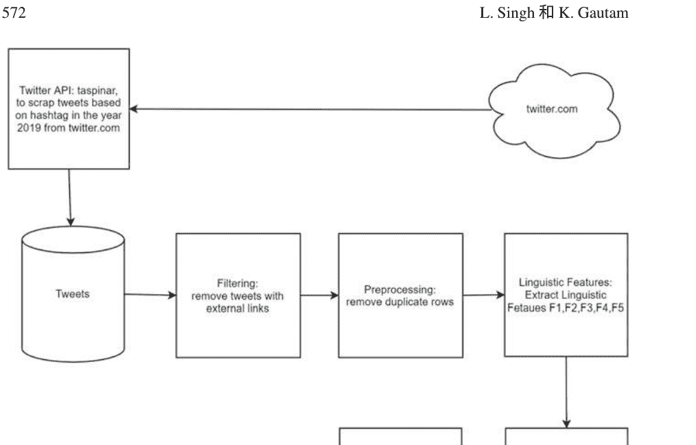

图1：方法论的完整流程

###### 4.1 语言特征

我们使用以下特征来描述用户的情绪、用户写作语气、写作风格等等。

###### F1-文本情感（t-情感）

我们使用Vader情感分析[6]来获取推文文本的情感。我们使用API中的综合情感。它是一个从-1到+1的数字，不包括-1和+1。它描述了作者的语气，无论他是积极的、消极的还是中立的，都取决于这个数字。

###### F2-主题标签情感（h-情感）

Hashtags是推文中的重要部分，用于在具有相似兴趣的人群中分享。Hashtags的情感是作者类型和关注该标签的人的重要预测因素。我们还将其与文本情感一起使用，并使用Vader情感分析进行相同的分析。

> 2 https://pypi.org/project/vaderSentiment/

###### F3-标点符号计数（p-count）

标点符号是语言的重要组成部分，可以提供有关内容类型、用户写作风格和其他隐藏特征的有价值见解。 我们将标点符号的总数作为特征的一部分。

###### F4-Hashtags计数（h-count）

Hashtags用于在关注该标签的用户的推文中显示。 拥有更多的Hashtags意味着推文可能会被更多的人看到，并获得更多的关注和喜欢。 因此，我们还将Hashtags的数量作为特征的一部分。

###### F5-可读性

可读性是反映理解书面文本的容易程度的标准。 它主要取决于文本的词汇和语法。 这是一个重要的方面，可能会影响用户阅读推文的可能性，或者仅仅因为大量的外来术语而跳过它。 因此，我们还将可读性作为特征的一部分。 我们使用textstat³来计算可读性。

###### 4.2 问题表述

我们将点赞数转化为等级形式（like_grade）。 每个等级对应于从给定数据集动态获得的点赞数范围。 我们使用以下方法来获得等级范围，而不是使用硬编码的值。

```
x = mean(likes)
sd = std(likes)
A1 = x + sd
A2 = x + 0.95 * sd
A3 = x + 0.9 * sd
...
A21 = x
A22 = max(0, x - 0.05 * sd)
A23 = max(0, x - 0.1 * sd)
...
A41 = max(0, x - sd)
```

其中A1，A2 ... A41是成绩，x是给定数据集中点赞数的算术平均值，sd是给定数据集中点赞数的标准差。 我们尽量保持大量的成绩以使括号大小保持较小。

###### 4.3 机器学习模型

分类是机器学习的一个基本领域之一。 我们在这个领域已经发展出了许多算法。 我们在研究中使用以下最流行的分类模型。 这些模型包括支持向量机（SVM），K最近邻（KNN）- 50个邻居，决策树，随机森林- 300个估计器。

这些模型中的每一个已经被用于多标签分类问题，并不仅限于像逻辑回归那样的二分类问题。 我们的数据训练和测试分割比例为4:1；我们使用80%的数据进行训练，20%的数据进行模型测试。 由于成绩分布可能非常随机，我们希望有足够的训练数据，但也希望有足够的测试数据，所以4:1的比例看起来很合适。

###### 5 特征工程

我们的监督式机器学习模型必须学习一个函数`f`，以便基于`x`（特征）能够预测`y`（like_grade）（图2）。

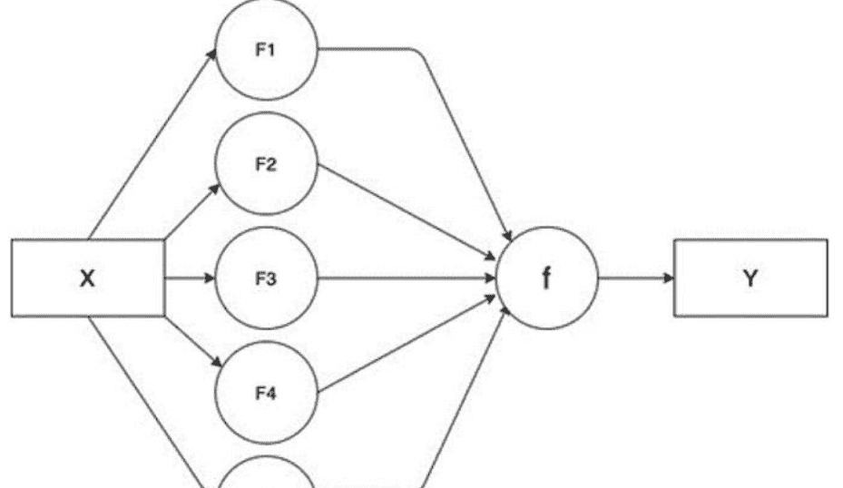

我们有一个基于从文本中导出的特征的经典分类问题。 我们尝试不同的特征组合，旨在找出预测like_grade中起到最重要特征。

###### 6 结果

使用所有四个机器学习模型进行的实验结果已在表1、2、3和4中给出。 每个表格显示了用于输入的特征。

表1：SVM模型的结果

| 特征 | 准确率 (%) |
| :--- | :--- |
| t-情感 | 90 |
| h-情感 | 90 |
| p-计数 | 90 |
| h-计数 | 90 |
| 可读性 | 90 |
| 所有特征 | 90 |

表2：KNN模型的结果

| 特征 | 准确率 (%) |
| :--- | :--- |
| t-情感 | 90 |
| h-情感 | 90 |
| p-计数 | 90 |
| h-计数 | 90 |
| 可读性 | 90 |
| 所有特征 | 90 |

表3：决策树模型的结果

| 特征 | 准确率 (%) |
| :--- | :--- |
| t-情感 | 85 |
| h-情感 | 90 |
| p-计数 | 89 |
| h-计数 | 90 |
| 可读性 | 89 |
| 所有特征 | 78 |

表4：随机森林模型的结果

| 特征 | 准确率 (%) |
| :--- | :--- |
| t-情感 | 87 |
| h-情感 | 90 |
| p-计数 | 90 |
| h-计数 | 90 |
| 可读性 | 89 |
| 所有特征 | 89 |

该模型及其使用这些特征获得的相应准确性。我们使用单个特征和所有特征一起训练模型。

###### 7 结论

所有算法在准确性方面表现相当不错。SVM和KNN是准确性最高的算法。与其他三个算法相比，决策树的准确性不如其他算法。尽管在准确性方面，算法表现良好，但它们无法成功地将‘like_grade’分别预测到测试数据集中的所有等级。它们无法识别数量较少且大多数预测为A22的其他like_grade。决策树模型在准确性方面表现不佳，但能够为除A22之外的一些类别分配等级。

###### 8 限制和未来工作

我们可以进一步缩小喜欢等级的范围。这是具有挑战性的，因为进一步缩小范围，我们正在逐渐从分类转向回归。很难在大多数推文不落入单一范围的情况下保持平衡，问题仍然接近分类。

解决一个等级占主导地位的另一个方法是获得足够大的数据集，其中有大量推文落在每个喜欢等级范围内。这将有助于模型更好地学习和区分不同的喜欢等级。

我们可以尝试构建一个人工神经网络（ANN），这可能最终产生不偏向单一喜欢等级的更好结果。

在过滤阶段，我们省略了一些带有外部链接的推文。如果我们在模型中加入外部链接的影响，这些推文可以被使用。

我们可以使用简单的特征，如链接计数（链接数量），是否有图像等，也可以使用卷积神经网络（CNN）对这些图像进行处理。

完整的代码和数据集可以在GitHub上找到⁴可用于进一步的实验。

###### 参考文献

1. Huang D, Zhou J, Mu D, Yang F (2014) 在Twitter中预测转发行为。在2014年杭州举行的第七届国际计算智能与设计研讨会上，第30-33页。
2. Riquelme F, González-Cantergiani P (2016) 测量Twitter上的用户影响力：一项调查。信息处理管理杂志52。 https://doi.org/10.1016/j.ipm.2016.04.003
3. Shahmirzadi O, Lugowski A, Younge K (2018) 向量空间模型中的文本相似性：一项比较研究。
4. Quoc L, Tomas M (2014) 句子和文档的分布式表示。在：第31届国际机器学习大会论文集—第32卷（ICML'14）。JMLR.org，II-1188–II-1196。
5. McNamara D, Mccarthy P (2010) 写作质量的语言特征。 Written Commun WRIT Commun 27:57–86. https://doi.org/10.1177/0741088309351547
6. Hutto CJ, Gilbert EE (2014) VADER：一种简约的基于规则的社交媒体文本情感分析模型。在：第八届网络日志和社交媒体国际会议（ICWSM-14）。密歇根州安娜堡。

##### 地下水位预测和地下水污染相关性研究：基于多变量深度LSTM神经网络建模的见解

Ahan Chatterjee, Trisha Sinha和Rumela Mukherjee

摘要：地下水是印度的饮用水和灌溉的主要来源，近年来，由于全国范围内人口激增，地下水位（可用性）急剧下降。 地下水和海水之间存在恒定的压力平衡， 以防止污染水渗入，由于水位下降，印度的水污染形势令人担忧。 本文旨在通过LSTM预测建模找到地下水位和地面污染状况之间的联系。 地下水预测的提出算法基于通过深度LSTM建模的条件方法，地面污染使用基于欧几里德距离概念建模的聚合评分方法计算。 最后，提供了一项相关研究，以分析所述变量之间的联系。 所述变量之间存在高度负相关，表明地下水位的下降增加了所选区域的污染水平。 实验在印度东部三个邦的数据上进行，即：西孟加拉邦、奥里萨邦和比哈尔邦的数据跨越2004年至2017年的时间段。

**关键词** LSTM · 神经网络 · 欧几里德距离 · 地下水位 · 地下水污染

###### 1 引言

众所周知，印度是一个以农业为基础的国家，有相当一部分人口依赖农业。 印度的供水广泛依赖于从含水层抽取的水。 含水层是储存地下水的岩石，由砾石、砂岩或石灰岩和沙子组成。 据估计，印度超过90%的地下水用于农业目的。 主要是灌溉。剩下的地下水约2400万立方米，用于饮用。总体上，印度80%的人口利用地下水进行灌溉和饮用。 降雨对印度地下水资源的贡献率为68%，是维持地下水位的主要来源。 还有其他来源，如渠道渗漏、水塘和池塘的补给以及水资源保护系统，共同为该国的地下水贡献了32%[1, 2]。

由于印度人口的增加，每年地下水的数量急剧减少，令人担忧。 根据专家的说法，由于过度使用和人口增长，印度正迅速走向地下水短缺。地下水质量的恶化主要是由于地质和人为活动的污染。 地下水质量已经恶化到一种程度，甚至对生物来说可能是有害的。 在印度的许多州，观察到了氟化物、硝酸盐、铁、砷和其他有毒金属离子的相当高浓度。此外，地下水的盐度和硬度增加，使其不适合使用。已经注意到，地下水中高浓度的氟化物超过了每升1.5毫克的允许限值，是印度健康问题的主要原因之一。另一个高度有毒的元素砷在印度东部，主要是在西孟加拉邦的地下水中广泛存在。

有几个委员会成立来维护印度的地下水数量和质量，其中一个是中央地下水委员会（CGWB）。 它负责估计地下水资源，开发可持续利用地下水的技术，并监测和实施地下水资源的适当管理政策。 由于可以获得足够的数据，许多水文学家选择机器学习方法来预测地下水可用性和资源信息。 机器学习模型通过迭代学习过程帮助建立输入参数和输出参数之间的关系[3-5]。

人工神经网络（ANNs），特别是循环神经网络（RNNs），已广泛用于评估与地下水位有关的时间序列数据。LSTM方法在时间序列预测方面非常有效，因为它具有处理整个数据序列和单个数据点的能力，这是由于其反馈连接的存在。 它可以学习预测所需的上下文，而不是在预先指定和固定的上下文中工作。 LSTM还为建模问题提供了灵活性，并且可以非常容易地处理多个输入参数。

在本文中，我们旨在找到印度东部三个邦的地下水可用性因素与水污染水平之间的联系，即：西孟加拉邦、奥里萨邦和比哈尔邦。我们使用LSTM模型研究了2004年至2017年间地下水位的变化趋势，并基于该模型预测了未来几年地下水的可用性，考虑了五种情景，即：受控水使用和良好降雨、受控水使用和降雨不足、不受控水使用和良好降雨、不受控水使用和降雨不足以及通常的一般情况。 这些情景是根据降雨的依赖性创建的，因为降雨是地下水补给的主要来源。 同样，水污染水平的趋势也进行了研究。 我们研究了2004年至2017年间的水污染水平。水污染的主要原因是地下水位的降低和海水渗入。随后，我们进行了两个因素的相关研究，即：地下水位(G.W. Level)和水污染水平，预测了这些邦在所述情景下的未来状况。

该工作的新颖之处在于在不同情景下预测即将到来的G.W.水位条件以及含盐水的水压水平，这最终将导致印度东部地区的水污染问题。

本文的结构如下：第2节包括文献综述，接着是LSTM模型的地下水位预测以及第3节中不同情景的模拟结果。第4节包括对各州水污染的预测建模，第5节包括地下水位可用性和地下水污染条件之间的相关研究。最后，第6节包括结论和进一步研究的范围[7-12]。

###### 2 文献综述

Sarkar和Pandey [1]使用ANN估计和预测了流水质量。他们采用了三层神经网络来预测结果。他们预测了Mathura城的DO浓度沿下游。Behzat等人[2]使用SVM算法和ANN来预测河床上的地下水位；他们表明在数据较少或由于类别不平衡问题时，SVM可以提供比ANN更好的结果。Galavi等人[3]提出了一个改进的ARIMA模型来预测地下水位，结果显示改进版本在传统ARIMA模型和自适应网络模糊逻辑方面都表现出色。王等人[4]提出了一个混合模型来预测结果。他们提出了一个耦合的ARIMA和集成经验模态分解(EEMD-ARIMA)模型来预测结果，结果显示它很容易超越传统ARIMA模型的结果。姚等人[5]使用一些遗传算法作为优化器来优化Elman-RNN网络模型，结果显示准确度指标有显著提高。范等人[6]提出了一个多变量线性回归模型来展示关系并预测长江岸边的结果。臧等人[7]提出了基于PCA的多变量自回归时间序列分析方法。杨等人[8]展示了基于时间序列的随机森林回归模型的预测。Seo等人[9]展示了基于小波的ANN模型来预测地下水位条件。Rashid等人[10]开发了一个基准LSTM改进模型，并使用各种遗传算法进行了LSTM模型的优化，例如：和谐搜索(HS)、灰狼优化(GWO)和蚁狮优化技术。给出了该模型与传统RNN算法的比较结果，表明混合模型具有更好的性能。Nawi等人[11]提出了使用布谷鸟搜索的数据分类算法作为其优化器。混合RNN和布谷鸟搜索显示出显著的结果。

###### 3 地下水预测的情境下的多变量LSTM建模

预测时间序列数据的最有希望的算法之一是Elman-RNN或简称RNN。RNN通过将先前的状态输出作为其下一组输入来工作。因此，时间状态 t 将依赖于 t - 1。尽管非常有效，但它有一个主要缺点，即梯度消失。长期短期记忆算法通过引入能够记住输出状态的门的概念来弥补RNN算法的缺点。

###### a. 理论框架

LSTM架构消除了RNN架构的主要问题，即梯度消失问题。它通过在隐藏单元中添加恒定的错误流术语而不是通过激活函数来最小化过程中的错误。在LSTM架构中，有四个门，通过这些门进行内存分配，主要是遗忘门 f，输入门 i，输入调制门g和输出门[6]。

遗忘门用于处理上一个状态的输出 h_{t-1}，主要用于删除或遗忘通过模型传递的信息中的无关数据。遗忘门中主要使用的激活函数是sigmoid函数。

架构中的输入门添加了进一步计算所需的信息。更新门采用sigmoid激活函数来更新门中的值，而tanh激活函数用于候选值和缩放目的。门的方程如下所示。

```
f_t = σ(W_f · [h_{t-1}, x_t] + b_f)
```

```
i_t = σ(W_i · [h_{t-1}, x_t] + b_i)
```

```
C'_t = tanh(W_C · [h_{t-1}, x_t] + b_C)
```

```
C_t = f_t × C_{t-1} + i_t × C'_t
```

```
o_t = σ(W_o · [h_{t-1}, x_t] + b_o)
```

通过sigmoid激活函数的输出如公式5所示。输出由公式6给出。

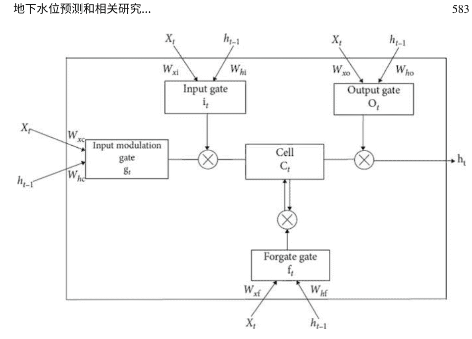

```
h_t = o_t \times \tanh(C_t) (6)
```

LSTM网络基于数据反向传播的架构，类似于RNN。生成的误差项通过时间序列数据的各层进行分割。该架构如图1所示[13–15]。

###### b. 地下水位预测的经验模型

本文中，我们采用条件案例来预测印度东部各邦（考虑到较低的计算复杂性，选择了三个邦）的地下水位可用性。西孟加拉邦、比哈尔邦和奥里萨邦是制定模型时考虑的主要影响因素，包括降雨量（季前和季后）、灌溉用地的地下水使用情况以及上一年的净水可用性。年度数据已经插值为月度形式，以获得更多的时间步长，以便我们的批处理大小有足够的数据进行计算。已经制定了5个月的时间滞后 $t_m, t_m-1, t_m-2, t_m-3, t_m-4$。该滞后考虑了当前时间步骤 $t_m$ 的输入变量 $x_{tm}$ 的输出。输出将是每月的时间步骤，即 $t_m+1$。

在印度，我们的工作主要分为两个季节，即季前雨季和季后雨季。在这里，主要的降雨量发生在雨季，而后半年则有退行性降雨。模型的观察结果表明，每年地下水的补给 $R$ 与降雨有关通过土壤渗透、人工补给和年度水排放 $W$ 与地下水的使用和农业用水有关。

其他次要的补给和排放在分析中被视为常数，因为它们的值可以忽略不计，但在方程平衡中被考虑。由于我们将季节分为两个主要部分，我们可以使用半年模型进行分析。因此，对于半年时间步长 t_b，使用以下方程式计算 R 和 W[15-19]（图2）。

$$R_{(t_b \rightarrow t_{b+1})} = H_{t_{b+1}} - H_{t_b}  (7)$$
$$t_b \rightarrow t_b + 1 \text{:季风后半年间隔}$$
$$W_{(t_b \rightarrow t_{b+1})} = H_{t_b} - H_{t_{b+1}}  (8)$$
$$t_b \rightarrow t_b + 1 \text{:季风前半年间隔}$$
$$H_{t_b}, H_{t_{b+1}} \text{:地下水位}$$

该模型预测一个时间步长，所提出的算法是迭代的性质。最初输入了四个时间步长，然后根据给定的条件情况下预测连续的地下水位，根据这些变量，算法将进入下一个迭代。

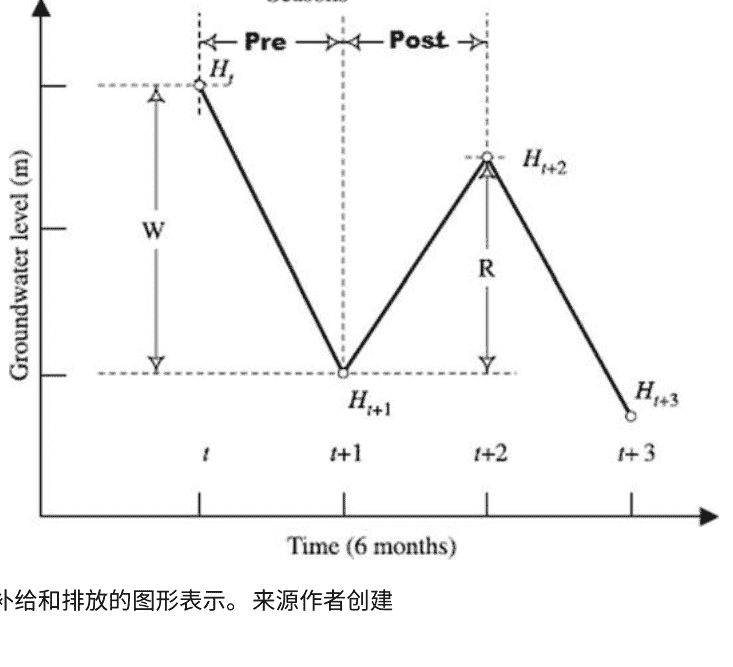

###### 条件场景

- 良好的降雨和控制用水:（C.S. 1）。在这种情况下，我们假设有大量降雨（高于正常或平均水平）发生，并且水的补给量超过了平常。另一个参数是地下水的使用；在这种情况下，我们假设使用是受控的，即，没有浪费记录。
- 好的降雨和无控制的用水:（C.S. 2）。在这种情况下，记录了大量降雨（比平均值高10%），以及全年地下水的高浪费。因此，由于水的高滥用，明年将会出现地下水位不足的情况。
- 降雨不足和受控用水:（C.S. 3）。在这种情况下，假设降雨不足（比平均值低20%），并且全年受控用水量很高。
- 降雨不足和无控制的用水:（C.S. 4）。在这种情况下，假设降雨不足（比平均值低20%），并且全年记录了高水浪费的用水情况[20]。

###### 提议的算法

输入: R, W as parameters
输出: Conditional Scenarios的预测
开始
输入: 时间序列&&输入参数在LSTM网络中
T.S.LSTM网络中的计算c=输出 (H_{t_b}, H_{t_{b+1}})
如果(c > Aq.B)&&（季节性降雨(s.r)的平均值 > c）
实现C.S.1
F: C.S.1作为LSTM单元的条件
否则(c > Aq.B)&&（s.r的平均值 < c）
实现C.S.2
F: C.S.2作为LSTM单元的条件
如果(c < Aq.B)&&（s.r的平均值 > c）
实现C.S.3
F: C.S.3条件到LSTMCell
如果其他(c < Aq.B)&& (s.r.mean < c)
实现C.S.4
F: C.S.1条件到LSTMCell
其他
实现 G.T.
结束

###### 3.1 条件场景的模拟结果

条件场景 1. 在这个场景中，我们观察到由于降雨量充足以及水的使用得到控制，地下水的可用性逐渐增加。未来几年，我们预计水位可用性将会上升。这可以被认为是我们最佳情况的场景（图3）。

条件场景 2. 在这个场景中，我们观察到由于水的使用失控和浪费速度加快，未来地下水的损失较大，尽管有较好的降雨量来稍微缓解情况。这可以被视为我们的平均情况场景[20, 21]（图4）。

条件场景3. 在这种情况下，我们观察到国家东部地区缺乏降雨，因此主要的水源补给被中断了。在这种情况下，水的使用是受控制的，损失也在某种程度上得到了补偿。这也可以被视为我们的平均情况场景（图5）。

条件场景4. 在这种情况下，我们观察到在考虑的州，降雨不足以及水的使用不受控制。这导致地下水在区域内严重缺乏，地下水的可用性降低，使得污染海水渗入该区域，使得可用水变得不可用（图6）。

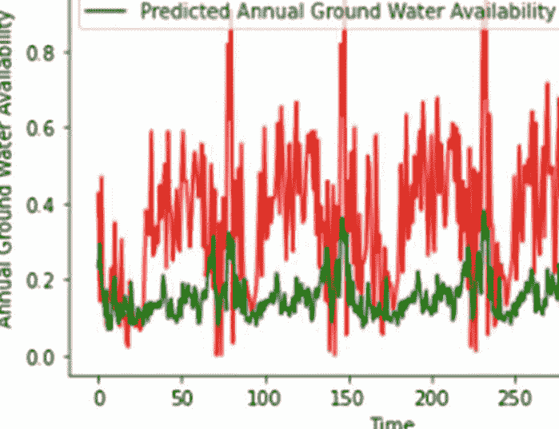

###### Net Annual Ground Water Availability Prediction

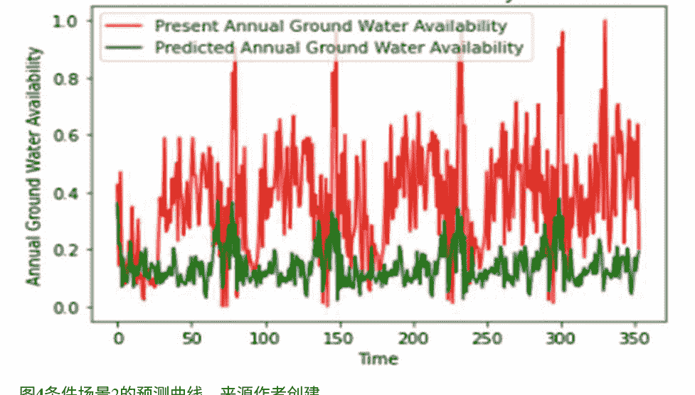

图4条件场景2的预测曲线。来源作者创建

###### Net Annual Ground Water Availability Prediction

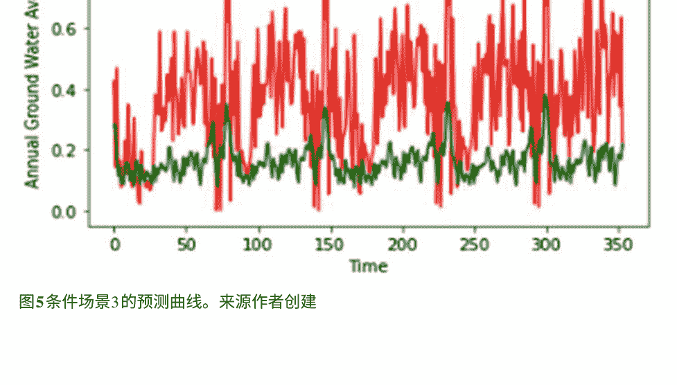

图5条件场景3的预测曲线。来源作者创建

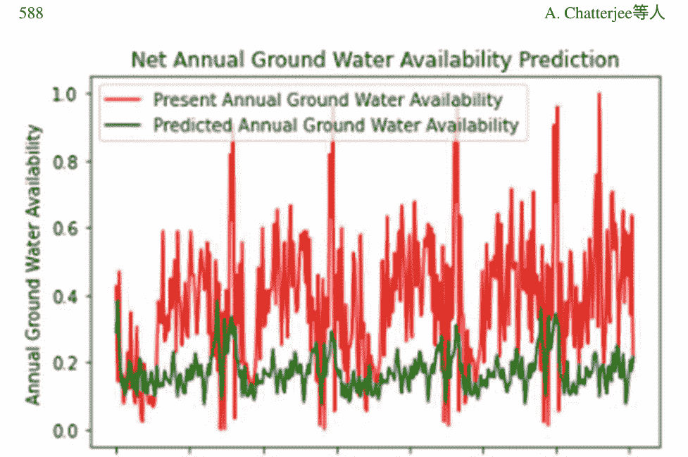

图6 条件场景4的预测曲线。来源作者创建

模拟结果显示，在即将到来的时间里，最坏情况下缺乏地下水，因为趋势是下降的。最好情况下，水含量呈上升趋势，显示出很大的潜力。平均情况下，曲线遵循通常趋势，有轻微变化[22-24]。

评估指标。深度LSTM模型已经适用于时间序列数据，因此模型正在沿着变量进行回归，因此我们使用均方根误差作为我们的模型评估，并使用公式9表示。表1显示了我们的均方根误差值（图7）。

$$均方根误差 = \sqrt{ \sum_{i=1}^{N} \frac{(y_i - y_i')^2}{N} }  (9)$$

| 指标名称 | 指标值 | 参数 |
| :--- | :--- | :--- |
| RMSE | 0.00324 | 25个时期，32个批次大小，8个时间步长（多变量） |

源代码作者创建

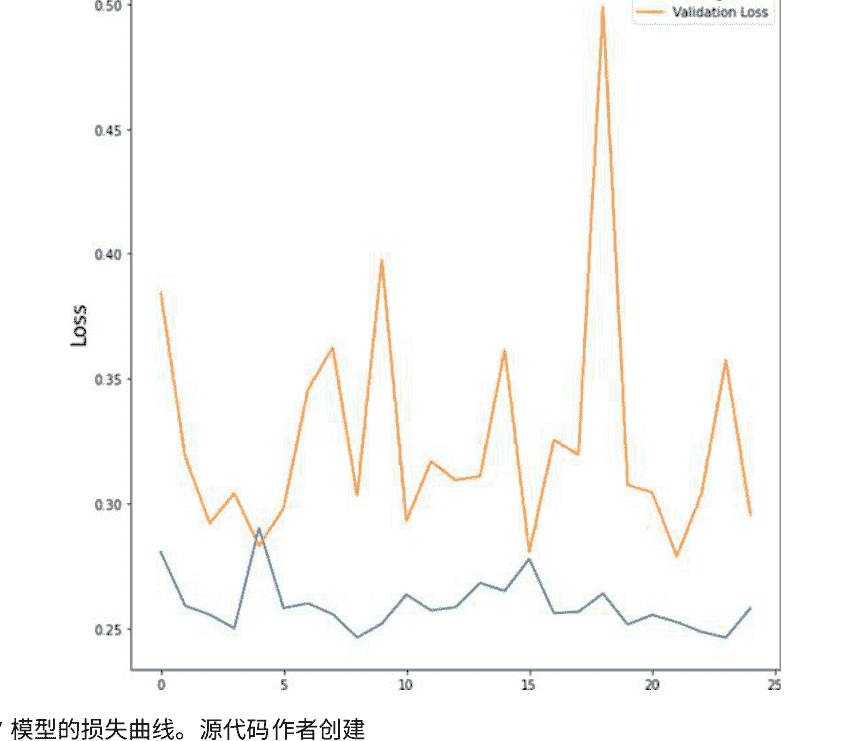

图7 模型的损失曲线。源代码作者创建

###### 4 地下水污染和预测建模

地下水污染是印度村庄中持续存在的一个重大问题，大约有10万人死于地下水中的砷污染。这些数字是危险的，并且在急剧增长。

水污染与地下水可用性的降低直接相关。海水和地下水之间存在压力平衡，不能用于常规活动。地下水位的降低可能导致不平衡，海水可能渗入并污染地下水。

在本节中，我们旨在绘制印度东部三个邦（西孟加拉邦、奥里萨邦和比哈尔邦）地下水污染的趋势。我们选取了八个参数，即温度、pH值、电导率、B.O.D、硝酸盐水平、粪便菌群、总菌群和氟化物水平。利用这些测量参数，我们使用数学建模生成了一个总的污染评分，以比较趋势的累积变化，并将变化趋势与地下水位的变化相关联。水质指数值随时间波动很大，因此需要进行数据处理以进行预测部分[25]。

###### 4.1 数据预处理和经验建模

通过传感器测量的质量主要是通过预处理数据使其在相同的尺度上适应模型。我们收集了来自所述州的各个地区的数据，因此上下限值会有所变化。

在各种情况下，数据丢失或发生剧烈变化，因此为了增加预测建模的鲁棒性，使用线性插值。两个已知数据和一个未知数据之间的关系被视为线性，并使用方程式 10 进行公式化。

$$ x_{k+i} = x_k + i \cdot \frac{(x_{k+j} - x_k)}{j} $$  (10)

- $x_{k+i}$ = 缺失数据
- $x_k$ = 已知数据
- $x_{k+j}$ = 已知数据后

在插值数据之后，检查错误处理。计算修正数据和错误数据的公式如式 11 所示。

$$ x_k = f(x) = \begin{cases} \frac{(x_{k-1}+x_{k+1})}{2}, & \text{if } |x_k - x_{k-1}| > \beta_1 \text{ or } |x_k - x_{k+1}| > \beta_2 \\ x_k, & \text{否则} \end{cases} $$  (11)

已收集的数据具有各种上限和下限。因此，我们形成了一个包含八个因素的综合指数，将其标准化为具有不同测量单位的组合单位。因此，每个参数都通过公式12进行标准化。

$$ X_i = \frac{X_i - X_{\min}}{X_{\max} - X_{\min}} $$  (12)

- $X_i$ = 标准化值位于[0, 1]之间
- $X_{\min}$ = 观察到的最小值
- $X_{\max}$ = 观察到的最大值。

我们计算了地下水位和水污染水平之间的关系，因此需要一个综合评分方法。我们对进行分析的所有参数给予了相等的权重。八维指数可以在八个维度中表示，最小值为0，最大值为1。

水污染的综合评分使用加权欧几里得距离从理想点到 $(1, 1, 1, 1, 1, 1, 1, 1)$ 的计算公式如下，见方程式13。

$$ Agw = 1 - \frac{\sqrt{(1-T)^2 + (1-pH)^2 + (1-C)^2 + (1-B)^2 + (1-N)^2 + (1-Fc)^2 + (1-Tc)^2 + (1-F)^2 }}{8} $$
(13)

其中
$T =$ 温度
$pH =$ 水的pH值
$C =$ 电导率
$B =$ 生化需氧量
$N =$ 硝酸盐水平
$Fc =$ 粪便菌群
$Tc =$ 总菌群
$F =$ 氟化物水平.

数据已经预处理，现在我们建立了经验模型，将用于在我们的神经网络建模中输入数据。假设水质在恒定的地点和时间被采集，并且参数编号为 $j$，那么我们可以说：

$$ S_{i,n} = \{ (Y_{i,1}, T_1) . . (Y_{i,n}, T_n) \} $$
(14)

输入的数据将使用公式15进行线性插补计算。

$$ L(t) = Y_{i,u} + \frac{ (Y_{i,u} - Y_{i,v}) }{ (T_{i,u} - T_{i,v}) } (t - T_{i,u}) $$
(15)

###### 4.2 模型仿真和讨论

该模型已在经过归一化和处理的数据集上进行了仿真，并对未来几年的预测进行了分析，以了解水污染水平在这些州的年度变化情况。由于数据经过了公式12和13的归一化和聚合处理，1表示最高水平的水污染，而0表示最低水平（图8、9和表2）。

###### 5 地下水位与地下水污染之间的相关研究

通过我们的建模，在第3节中，我们构建了一个多变量LSTM神经网络模型，并在不同的条件场景下对其进行了建模，输出曲线显示，在最佳情况下，地下水位要好得多比最坏情况好得多，平均情况遵循相似的常规趋势。在第4节中，我们通过采用水污染的八个参数来预测水质水平，整个数据已经经过处理，并使用数据归一化和欧几里德距离形成一个聚合的最终得分。

我们知道地下水和海水之间存在恒定的水压平衡，使得海水无法渗入并使水变得不可用。在本节中，我们介绍了这两个因素之间的相关研究，即。地下水位和地下水污染。我们分析了这些因素在一年中的相关程度以及它们如何相互影响。除此之外，我们还研究了地下水位变化对水污染变化的影响程度。

首先，我们使用皮尔逊相关系数（表3）来检验这两个变量之间的相关性。

相关系数的结果显示，这些变量之间存在高度负相关。这表明我们关于水压平衡的假设是正确的，并且随着地下水位的逐渐下降，水的污染程度也在增加。

为了加强我们的论点，我们使用OLS模型，将水位作为独立变量，污染程度作为因变量，并从结果中得出每单位地下水位变化导致污染程度增加的数量（表4）。

从相关结果可以清楚地看出，这两个变量呈负相关关系，因此地下水位的持续损失导致水平衡失调和水污染增加。OLS模型表明，每损失1个单位的地下水，水污染水平将增加0.0356个单位。

比较上述两个图表，即图10和图11，可以得出结论，在地下水位下降的时间段内，污染水平明显增加。

###### Net Annual Ground Water Availability Prediction

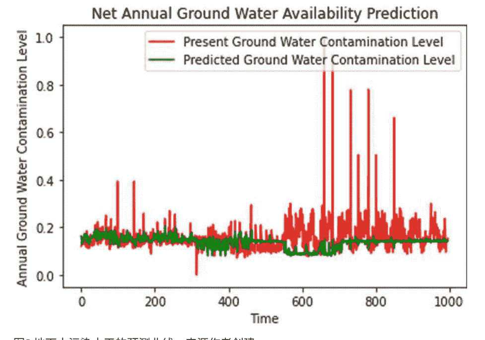

图8 地下水污染水平的预测曲线。来源作者创建

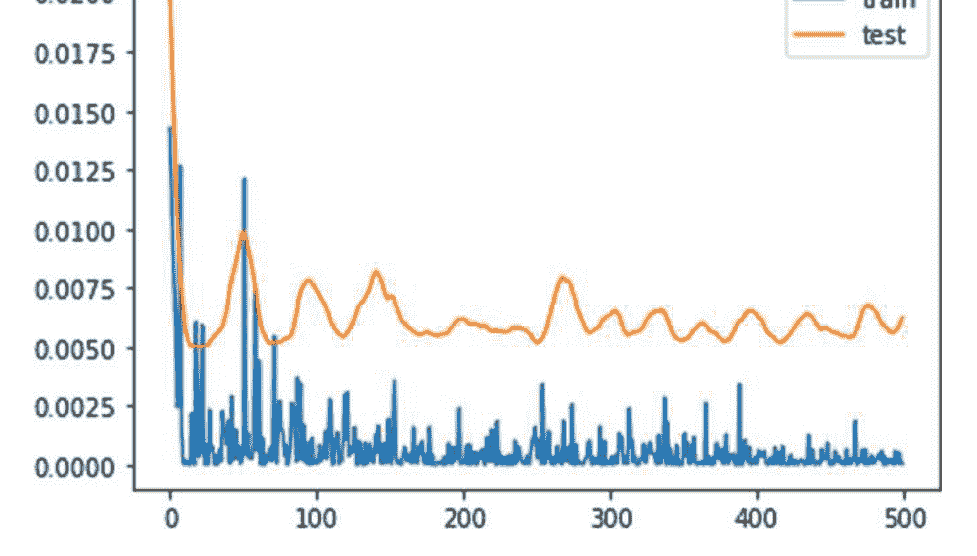

图9 模型的损失曲线。 来源 作者创建

表2 模型结果

| 指标名称 | 指标值 | 参数 |
|---|---|---|
| RMSE | 0.00004235 | 500个时期，32个批次大小，8个时间步长（多变量） |

源代码作者创建

表3 皮尔逊相关系数结果

| 皮尔逊相关系数表 | 地下水污染 |
|---|---|
| 地下水位 | -0.6754 |

源代码作者创建

表4 OLS模型结果

| OLS模型的系数 | -0.0356 |
|---|---|

源代码作者创建

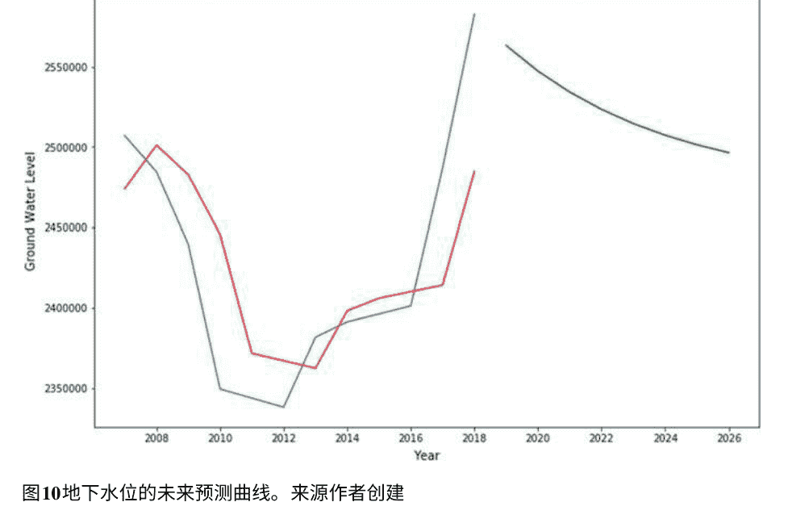

###### 图10地下水位的未来预测曲线。来源作者创建

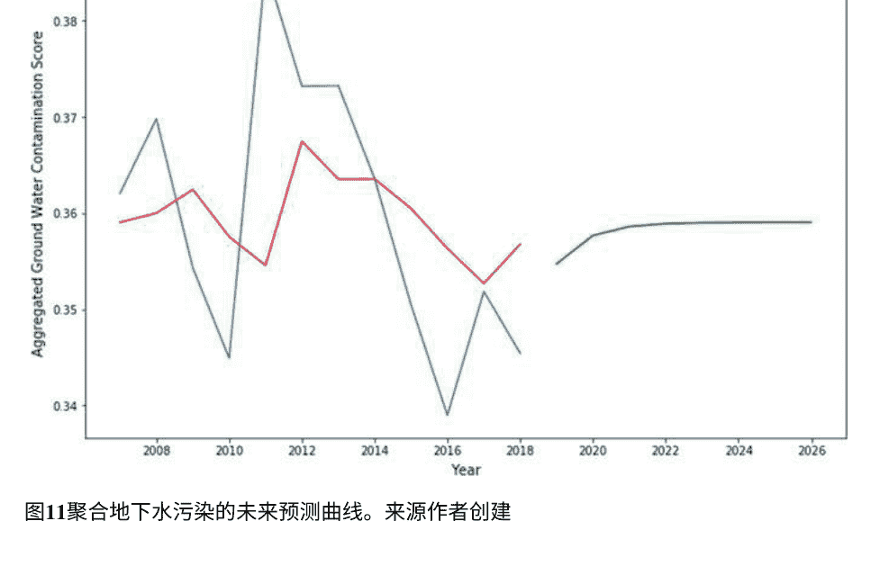

###### 图11聚合地下水污染的未来预测曲线。来源作者创建

###### 6 结论和研究的未来范围

印度全境地下水位下降是一个严重的情况。随着地下水污染的不断上升，人类的存在也受到了质疑。在本文中，我们使用LSTM模型在不同的情境下分析和预测了地下水可用性的未来趋势。我们假设了会影响水位结果的情境。模型的仿真结果正在进行分析。在下一节中，我们预测了地下水污染水平的趋势，数据经过了高度预处理，并使用欧几里得距离方法生成了聚合函数值。我们分析了趋势，并在下一节中展示了地下水位和地下污染水平之间的相关研究。我们观察到这些变量之间存在负相关，表明地下水位的降低使得不适宜的海水侵入地面，剩余的水也通过这种方式被污染。最后，我们使用时间序列的插值平均移动值展示了未来几年的预测。

通过对更多州或整个国家的水位进行研究，可以扩展该研究。我们可以使用遗传算法作为优化函数，例如ABC算法、LA算法来检查趋势风格。为了获得更好的曲线结果，可以延长时间跨度10年。

###### 参考文献

1.  Sarkar A, Pandey P (2015) 使用人工神经网络技术进行河流水质建模。 水生态学会议论文集 4:1070–1077
2.  House PLA, Chang H (2011) 城市用水需求建模：概念、方法和组织原则综述。水资源研究 47(5)
3.  Gwaivangmin BI, Jiya JD (2017) 使用人工神经网络进行水需求预测的监控控制。 尼日利亚技术杂志 36(1):148–154
4.  Coulibaly P, Anctil F, Aravena R, Bobée B (2001) 水位深度波动的人工神经网络建模。 水资源研究 37(4):885–896
5.  Gulati A, Banerjee P (2016) 印度的新兴水危机：关键问题和前进方向。 印度经济特刊 6 81–704
6.  Barzegar R, Adamowski J, Moghaddam AA (2016) 小波-人工智能混合模型在水质预测中的应用：以伊朗阿吉河为例。随机环境研究与风险评估 30(7):1797–1819
7.  Adamowski J, Karapataki C (2010) 多元回归和人工神经网络在城市峰值用水需求预测中的比较：不同ANN学习算法的评估。 水文工程杂志 15(10):729–743
8.  Benítez R, Ortiz-Caraballo C, Preciado JC, Conejero JM, Sánchez Figueroa F, Rubio-Largo A (2019) 基于短期数据的水消耗预测方法。 能源 12(12):2359
9.  Res EAM 印度的入侵性水危机：他人的理解
10. Rojek I (2008) 神经网络作为供水系统水消耗预测模型。在：人工智能和软计算国际会议。 Springer, 柏林, 海德堡, 第1109-1119页
11. Saravanan M, Sridhar A, Bharadwaj KN, Mohanavalli S, Srividhya V (2015) 利用机器学习进行河流网络优化。 在：群体智能国际会议。 Springer, Cham, 第409-420页
12. Shenoy N, Nayak P (2019) 狮子算法优化的长短期记忆网络用于印度乌杜皮地区地下水位预测。arXiv预印本arXiv:1912.05934
13. Pan M, Zhou H, Cao J, Liu Y, Hao J, Li S, Chen CH (2020) 基于GRU和CNN的水位预测模型。IEEE Access 8:60090-60100
14. Tsanis IK, Coulibaly P, Daliakopoulos IN (2008) 通过前馈神经网络和线性回归的降水预测改进地下水位预测。J Hydroinf10 (4) : 317–330
15. Suhag R (2019) 印度地下水概述。PRS
16. van der Lugt BJ, Feelders AJ (2019) 使用RNN条件预测水位时间序列。在：高级分析和时间数据学习国际研讨会。 Springer, Cham, pp 55–71
17. Satishkumar U, Kulkarni P (2018) 卡纳塔克邦Raichur地区地下水位的递归神经网络（RNN）模拟。Int J Curr Microbiol App Sci 7 (12) : 3358–3367
18. Mohanty S, Jha MK, Kumar A, Sudheer KP (2010) 东印度河岛地下水位预测的人工神经网络建模。Water Resour Manage24 (9) : 1845–1865
19. Halder S, Roy MB, Roy PK (2020) 分析地下水位趋势和地下水干旱，使用标准地下水位指数：以印度西孟加拉邦东部河流流域为例。SN Appl Sci 2(3):1–24
20. Ghosh NC, Singh RD (2009) 印度地下水砷污染：脆弱性和解决方案的范围
21. Gokhale R, Sohoni M (2015) 检测安全地下水开发的适当地下水位趋势。Current Sci 395–404
22. 胡Z, 张Y, 赵Y, 谢M, 钟J, 涂Z, 刘J (2019) 考虑智能海洋养殖中的相关性的深度LSTM网络水质预测方法。传感器19 (6) : 1420
23. 刘P, 王J, Sangaiah AK, 谢Y, 尹X (2019) 在物联网环境中使用LSTM深度神经网络分析和预测水质。可持续性11 (7) : 2058
24. Bowes BD, Sadler JM, Morsy MM, Behl M, Goodall JL (2019) 使用长短期记忆和递归神经网络预测易受洪水影响的沿海城市地下水位。水资源11 (5) : 1098
25. Daliakopoulos IN, Coulibaly P, Tsanis IK (2005) 使用人工神经网络进行地下水位预测。J Hydrol 309(1–4):229–240

## 一种新颖的深度混合光谱网络，用于高光谱图像分类。

K. Priyadharshini 和 Manisha和B. Sathya Bama

摘要图像分类是将地表覆盖类别分配给图像元素的过程。由于训练波段光谱样本之间的问题变异性，地表高光谱图像分类并不容易。

深度学习具有能够从非结构化或未标记数据中无监督学习的网络。卷积神经网络（CNN）是基于深度学习的视觉数据处理中最常用的方法之一。为了对高光谱数据进行分类，开发了一个具有2D和3D CNN的混合网络。光谱信息和空间信息一起用于高光谱图像分析，显著提高了实验结果。

以像素为基本分析单元，发展了卷积神经网络的分类技术。实施了主成分分析（PCA），降低了高光谱数据的维度。PCA实现减小了特征大小，提高了计算效率。第一主成分具有卓越的功能，因为它与其他成分相比具有最高的方差。分析使用了三个高光谱数据集，包括Pavia大学、印度松树和Salinas场景。印度松树的高光谱数据是由空中可见红外成像光谱仪（AVIRIS）于1992年6月在印第安纳州西北部获得的。印度松树数据的尺寸为（145×145）像素。Pavia大学数据来自2001年意大利北部的Reflective Optics System Imaging Spectrometer（ROSIS）Pavia。该数据具有103个光谱波段，尺寸为610×340像素。Salinas场景来自1998年美国加利福尼亚州Salinas Valley的AVIRIS，具有512×217的空间维度。与3D CNN相比，混合CNN在计算上更高效，并且对于最少的训练数据提供了增强的性能。

- 混合光谱网络
- 卷积神经网络
- 主成分分析
- 支持向量机

###### 1 引言

高光谱图像 (HSIs) 包含大量接近图像波段光谱，以同时提供丰富的光谱和空间细节。高光谱设备接收来自电磁频谱的几个重叠的小光谱通道的能量，即高光谱传感器以一系列覆盖广泛频谱范围内的数百个小而连续的光谱波段的图像的形式捕获信息，从而允许检测不同信号材料的准确光谱特征。

高光谱成像是一种产生光谱差异空间图的技术，使其成为许多应用的有用的工具。大量的波段允许物体通过光谱域中的相应输出出来进行识别的方式。

然而，这种大量的波段光谱是导致分析技术中复杂问题的因素。无论是从机载还是航天平台，高光谱成像相机都会收集辐射数据。在分析之前，必须将辐射数据转换为表观表面反射率的技术。

高光谱图像是通过扫描同一区域内的不同光谱波段获得的。这种光谱域数据可能会增加一定程度的相似性，意味着两个连续的波段可能显示相同的感知。但是，识别这些高光谱关联是有益的。每个像素可能记录下精确的反射率或辐射分布。所得到的高光谱图像 (HSI) 可以用于定位物体、分类不同组分以及在军事、农业和矿物学等各个领域中检测过程。

###### 2 相关工作

HSI技术主要用于许多困难的地球观测和遥感应用，如绿化监测、城市化研究、农田技术和监视。快速可靠的身份验证和物体识别方法的需求增加了在农业、医药和食品行业应用高光谱成像进行质量控制的兴趣。

毫无疑问，具有丰富光谱细节的物理材料具有其自己的特征反射或辐射特征。

高光谱遥感传感器具有卓越的区分能力，特别适用于外观相似的材料。这些独特的特征使其在计算机视觉和遥感等领域具有许多用途，例如军事目标识别、库存控制和医学诊断等。因此，在高光谱分辨率和空间精度之间存在权衡。与传统方法相比，高光谱成像的好处包括减少样品处理、非破坏性设计、快速获取时间和同时模拟各种化学成分的空间分布[1]。

其中一个主要问题是如何轻松去除HSI函数。目前常用的是光谱-空间特征，从仅使用光谱特征到同时使用光谱-空间特征，HSI分类的效率逐渐提高[2]。深度学习模型已经被开发出来，用于对HSI进行分类以去除光谱-空间特征。深度学习的核心观点是从原始输入中提取概念特征，使用叠加的多层表示。

与KNN和SVM相比，SAE-LR的测试时间增加了。此外，训练时间也很长[3]。WI-DL和QBC等方法在测试和训练上需要更多时间。传统的图像先验需要被整合到DHSIS方法中以提高准确性和性能[4]。对于提出的CNN，Salinas场景数据集观察到最长的训练时间[5]。

在融合之前，带选择方法对于选择显著波段非常重要，以减少训练时间并节省存储空间。主要缺点是模型准备需要大量正确标记的数据。

###### 3 方法论

通过使用2D和3D卷积层，开发了深度混合光谱网络。3D CNN提取了空间和光谱数据，但增加了计算复杂性。对于处理光谱信息，2D CNN不适用，因为它只包含空间信息。

使用AVIRIS和ROSIS高光谱传感器获取的高光谱数据用于分析。

```
高光谱数据立方体 : $I \in R^{M \times N \times D}$
```

$I$—原始输入
$M$—输入的宽度
$N$—输入的高度
$D$—光谱波段数。

主成分分析（PCA）—在降维后，光谱波段从 $D$ 减少到 $B$。

```
PCA降维数据立方体 $X \in R^{M \times N \times B}$
```

PCA后的修改输入

使用2D-CNN或3D CNN会导致一个非常复杂的模型。主要原因是高光谱数据是体积数据。仅使用2D CNN无法从光谱维度中提取出好的判别地图。

特征。相应地，3D CNN在几个光谱波段上对于具有相似纹理的组别表现更差。图1代表了用于高光谱图像分类的深度混合网络。

对于混合光谱网络，3D CNN和2D CNN层的构建方式充分利用了光谱和空间特征图，以达到最佳准确性。数据集被划分为重叠的小的3D块，并且计算结果在表2中列出。

从 $X$ 观察到的总3D块数为，

```
$$(M - S + 1) \times (N - S + 1)$$
```

位于$(\alpha, \beta)$位置的3D块由 $P_{\alpha,\beta}$ 表示，宽度由

```
$$\alpha - (S - 1)/2 \text{ 到 } \alpha + (S - 1)/2,$$
```

高度由，

```
$$\beta - (S - 1)/2 \text{ 到 } \beta + (S - 1)/2$$
```

2D CNN中的输入数据通过2D卷积核进行转换。卷积是通过测量输入数据和卷积核之间的点积之和来实现的。为了覆盖最大的空间维度，滤波器在输入数据上进行步进。通过将3D数据转换为3D卷积核来实现3D卷积。在输入层的多个连续波段上使用3D卷积核为HSI数据创建卷积层的特征图。

在扁平化层之前，应用2D CNN一次，要记住，在不丧失光谱域中的重要信息的情况下，对不同光谱带内的空间信息进行了严重的歧视。这对于HSI数据是必要的。在混合模型中，参数的总数取决于数据集中类的数量。

表1表示了所提出的混合CNN的可训练参数的计算。该网络由四个卷积层和三个全连接层组成。在四个卷积层中，三个是3D卷积层，剩下的一个是2D卷积层（表2）。

在混合网络中，印度松树数据集的可训练权重参数数量为5,122,176，而补丁的数量为14641。使用Adam优化器反向传播算法来训练权重，并将其随机初始化为一个值。

###### 4 数据集

实验是在三个高光谱数据集上进行的，如Pavia大学、印度松树和Salinas场景。1992年，AVIRIS传感器在印第安纳州西北部的印度松树测试区获取了印度松树数据集。IP具有145 × 145 m/像素的空间尺寸和224个波段的波长，波长范围从400到2500 nm，省略了24个波段。IP数据集中包含16个互斥的植被群落。然而，总共21,025个像素中有近50%（10,249个）包含来自16个不同类别的地面真实信息。

Pavia大学数据集是由ROSIS传感器在意大利北部于2001年获取的。该数据集包含610个空间上的340个像素，并且光谱信息记录在430到860 nm波长范围内，空间分辨率为1.3 mpp。地面真实情况被构想为提供九个级别的城市土地。此外，大约20%的总共207,400个图像元素包含有关地面实况的信息。

Salinas场景数据集是在1998年由224波段AVIRIS传感器在加利福尼亚州Salinas Valley采集的，图像的空间尺寸为512-217，光谱信息以224个波段编码，波长范围从360到2500纳米。由于水吸收，在Salinas场景和Indian pines中，舍弃了20个光谱波段。

###### 5 结果

准确率、迭代次数和损失的图表提供了关于模型训练的有用信息，如收敛速度（斜率）等。混合CNN得到的分类图像如图2所示。

###### 表1 可训练参数

| Indian pines | Pavia大学 | Salinas场景 |
|--------------|-----------|-------------|
| Conv_3d 1 – (8 × 3 × 3 × 7 × 1) + 8 = 512 | Conv_3d 1 – (8 × 3 × 3 × 7 × 1) + 8 = 512 | Conv_3d 1 – (8 × 3 × 3 × 7 × 1) + 8 = 512 |
| Conv_3d 2 – (16 × 3 × 3 × 5 × 8) + 16 = 5776 | Conv_3d 2 – (16 × 3 × 3 × 5 × 8) + 16 = 5776 | Conv_3d 2 – (16 × 3 × 3 × 5 × 8) + 16 = 5776 |
| Conv_3d 3 – (32 × 3 × 3 × 3 × 16) + 32 = 13,856 | Conv_3d 3 – (32 × 3 × 3 × 3 × 16) + 32 = 13,856 | Conv_3d 3 – (32 × 3 × 3 × 3 × 16) + 32 = 13,856 |
| Conv_2d – (3 × 3 × 576 × 64) + 64 = 331,840 | Conv_2d – (3 × 3 × 96 × 64) + 64 = 55,360 | Conv_2d – (3 × 3 × 96 × 64) + 64 = 55,360 |
| Dense 1 – (18,496 × 256) + 256 = 4,735,232 | Dense 1 – (18,496 × 256) + 256 = 4,735,232 | Dense 1 – (18,496 × 256) + 256 = 4,735,232 |
| Dense 2 – (256 × 128) + 128 = 32,896 | Dense 2 – (256 × 128) + 128 = 32,896 | Dense 2 – (256 × 128) + 128 = 32,896 |
| Dense 3 – (128 × 16) + 16 = 2064 | Dense 3 – (128 × 16) + 16 = 1161 | Dense 3 – (128 × 16) + 16 = 2064 |
| 可训练参数总数 = 5,122,176 | 可训练参数总数 = 4,844,793 | 可训练参数总数 = 4,845,696 |

###### 表2 计算补丁数量

| 数据集 | M | N | S | 补丁数量 |
|--------|---|---|---|-----------|
| Indian pines | 145 | 145 | 25 | 14,641 |
| Pavia大学 | 610 | 340 | 19 | 190,624 |
| Salinas场景 | 512 | 217 | 19 | 98,306 |

###### 表3 准确性对比

| 网络 | 准确率 (%) |
|------|------------|
| 支持向量机 | 88.18 |
| 2D卷积神经网络 | 89.48 |
| 3D卷积神经网络 | 90.40 |
| 混合网络 | 99.79 |

提出的混合CNN的训练周期数为100。对于验证和训练样本，得到了损失收敛和准确性的值。

表3表示了提出的混合网络与3D卷积神经网络、2D卷积神经网络和支持向量机的准确性对比。混合光谱网络提供了99.79%的准确性（图3）。

###### 6 结论

高光谱图像分类并不容易，因为光谱域中波段数量与训练样本数量的比例是不利的。用于分类的三个基准高光谱数据集分别是萨利纳斯场景、帕维亚大学和印度松树。与3D和2D混合相比，单独的3D或2D卷积无法反映出高度区分性的功能。所提出的模型比2D CNN和3D CNN更有益。使用的25 ×25空间维度最适合所提出的方法。实验在三个高光谱数据集上进行，以分析和比较性能指标。使用SVM对高光谱数据进行分类，准确率为88.18%。所提出的模型的性能能够通过提供99.79%的准确率来超越2D CNN（89.48%） 和3D CNN（90.40%）。 与3D CNN相比，混合CNN在计算上更高效，并且对于最小的训练数据，它提供了更好的性能。

###### 参考文献

1. Chang C-I (2003) 高光谱成像：光谱检测和分类技术。Springer科学与商业媒体，第Ⅰ卷
2. Camps-Valls G, Tuia D, Bruzzone L, Benediktsson JA (2014) 高光谱图像分类的进展：统计学习方法的地球监测。IEEE信号处理杂志31(1): 45-54
3. Liu P, Zhang H, Eom KB (2017) 活跃深度学习用于高光谱图像分类。IEEE J Select Top Appl Earth Observ Remote Sens 10(2)
4. Dian R, Li S, Guo A, Fang L (2018) 深度高光谱图像锐化。在：IEEE神经网络和学习系统交易，第29卷，第11期
5. Yu C, Zhao M, Song M, Wang Y, Li F, Han R, Chang C-I (2019) 基于CNN架构嵌入哈希语义特征的高光谱图像分类方法。IEEE J Select Top Appl Earth Observ Remote Sens 12(6)

##### 使用EALCLAHE增强和支持向量机分类的视网膜眼底图像异常预测

###### P. Raja Rajeswari Chandni

摘要 眼科疾病通常不严重，但也可能危及生命。尽管遗传性眼疾对世代有着重要影响，但由于某些不健康的行为引起的人为疾病也可能导致严重病情，如视力丧失、视网膜损伤、青年吸烟引起的黄斑变性等。尽管存在种种不利因素，提前检测疾病可能更容易消除重大损害。该系统旨在提供检测眼科疾病的一级调查，并帮助患者更早地识别异常行为并采取补救措施。使用的视网膜眼底图像经过预处理和后处理阶段，然后根据像黄斑黄斑变性（VMD）、视网膜动脉和静脉阻塞（RAVO）、普尔切尔视网膜病变（PR）和糖尿病患者黄斑水肿（ME）等疾病进行训练、测试和分类。

- SVM
- 边缘感知局部对比度自适应直方图均衡化 (EALCLAHE)
- 颜色特征
- 图像处理

###### 1 引言

眼科疾病最初对人类没有威胁，然而随着时间的推移对主体产生了不可忽视的影响。计算机视觉专家在通过CAD系统进行数字图像和视频处理时采用了人类视觉系统模型(HVSM)来诊断疾病。这些专家提供了简化的模型，易于理解和进一步处理、探索和识别异常。在相关实际症状时，手动评估往往会出现误差。因此，需要改进和提高质量的系统以在正确的时间提供正确的诊断，这就是医学图像处理(MIP)算法的存在[1]。MIP处理图像的策略包括从正常眼底图像生成升级的图像形式如改善质量、区分区域、识别边缘、处理非均匀性、测量熵、颜色平衡等，在处理医学图像[2, 3]方面具有显著效果。MIP的策略还有助于通过彩色照片诊断获得的视网膜异常，其中图像对于所有类型的视网膜疾病识别都是不理想的。因此，需要有效的预处理技术来处理并生成具有更好颜色平衡增强效果的对比度图像，避免非均匀照明[4]。为了表示处理后图像与原始图像之间的差异，有许多评估器可供选择，如NIQE、RIQA等，用于评估输出图像。但是，彩色图像的处理并不像灰度图像那样容易，因此，在本文中，我们实现了一种有效的算法，用于减少非均匀照明并保留边缘，以识别疾病并在疾病恶化之前帮助社会治疗。

###### 2 相关工作

Sakthi Karthi Durai等人[1]在本文中讨论了通过视网膜底部图像检测到的各种疾病。检测到的疾病包括年龄相关性黄斑变性（AMD）、白内障、高血压性视网膜病变和糖尿病性视网膜病变。回顾了各种分类器和预处理方法，其中自适应直方图均衡化在预处理中起到了重要作用，而支持向量机（SVM）提供了最佳输出。

Kandpal和Jain [5], Sarika等人[6]在本文中讨论了用于视网膜底部图像预处理的各种增强颜色纹理特征的方法，CLAHE方法与边缘和主导方向相结合被证明是最好的。该技术简单地抑制非纹理像素并增强纹理像素，从而获得更高质量的图像，这可以通过BRISQUE来估计。

Shailesh等人[7]在本综述中简要比较了迄今为止使用各种预处理到分类阶段的技术。初始预处理阶段主要使用CLAHE和颜色矩来进行有效的图像检索过程。CLAHE在检测非纹理区域方面表现出了灵活性。

部署的分割技术包括ROI、绿色通道提取、量化、阈值处理等。一系列分类器被整合在一起，其中支持向量机（SVM）、径向基函数神经网络（RBFNN）、人工神经模糊（ANF）、人工神经网络（ANN）、随机森林（RF）、决策树表现良好。

Onaran等人在本文中讨论了Purtscher视网膜病变（PR）的发现，该病变主要由创伤状态引起，主要呈现为一系列小的棉絮斑点。本文使用了OCT和FUNDUS两种图像类型。在比较两者的结果时，FUNDUS图像为积聚视网膜后极区域的小双侧棉絮斑点提供了良好的起点。

肖等人[9]在本文中深入讨论了有效检测黄斑水肿（ME）的矢量量化技术。由于彩色图像是24位的，聚类向量将图像分为八个级别，其中七个阈值值注入到8 × 2 ×2的分割过程中。因此，大部分信息都是从这种分割技术中提取出来的，用于处理RGB图像。

Anusha等人[10]在本文中解释了用于获取颜色矩主要用于图像检索的特征提取技术，以及矩之间的均值、标准差、偏度分布的值。还获取了纹理特征，如熵、能量等，以更好地理解特征。因此，使用颜色矩可以有效快速地进行图像检索。

###### 3 提出的系统

所提出的系统利用CAD系统对医学数据进行诊断，以检测身体异常。首先，通过直方图技术对视网膜底图像进行预处理，并进行量化以获取中间级别的颜色信息。其次，使用阈值和量化对图像进行分割，主要用于后处理，以避免丢失任何有助于检测视网膜表面异常的信息。第三，提取特征以获取纹理细节、特征差异、能量、均值振幅、中位数和标准差的信息，以便算法能够轻松地做出确定疾病的决策。最后，总结上述所有步骤，并将其与使用SVM分类器的训练步骤相结合，并进行准确性测试（图1）。

###### 4 系统框图的描述

###### 4.1 数据集

视网膜底图像最初是从在线平台（如MESSIDOR、DRIVE、STARE、KAGGLE、CHASE、ARIA、ADCIS等）收集的，旨在提供研究目的的数据集。该过程通过数字相机获取图像或从数据集存储库获取视网膜底图像来初始化。

###### 4.2 第一阶段—预处理

视网膜底图像容易受到周期性噪声（如椒盐噪声和高斯噪声）的影响，因此需要一种强化图像整体区域的可靠预处理技术。引入的EALCLAHE技术首先分别处理RGB分量，并进行伽马校正和G矩阵处理，以显示为RGB虚线分量。裁剪限制使用瑞利分布设置，同时设置边缘阈值限制以保留具有最小强度幅度的强边缘，并启动平滑局部对比度的增强量。此外，为了去噪增强图像，使用了具有预训练网络并提供更好的降噪技术的去噪卷积神经网络（dnCNN）。预处理步骤的流程图如下所示（图2）。为了测试图像质量，使用了PSNR、SSIM、NIQE、BRISQUE质量指标（图3）。

在这个提出的方法中，噪声去除的测试参数为：

- **峰值信噪比（PSNR）：**
  峰值信噪比或PSNR [11] 用于计算大小为 $M \times N$ 的原始图像和去噪图像之间的变化。这是使用SNR方程估计的，以分贝（dB）表示。原始图像和去噪图像分别表示为 $r(x, y)$ 和 $t(x, y)$。

图2 预处理系统的示意流程

```
PSNR = 10 log10 (255^2 / MSE)
```

其中255是灰度图像中最高强度值，MSE是均方误差，由以下公式给出。

###### 图3 预处理步骤的结果

```
$$MSE = \frac{\sum_{M,N}[r(x, y) - t(x, y)]^2}{M * N}$$
```

- **结构相似性指数测量（SSIM）：**
  SSIM指数是在大小为x和y的选定窗口范围内计算的
  N × N可以通过以下方式排除

```
$$SSIM = \frac{(2\mu\mu_w + C_1)(2\sigma(I, I_w) + C_2)}{(\mu^2 + \mu_w^2 + C_1)(\sigma(I)^2 + \sigma(I_w)^2 + C_2)}$$
```

| 评估参数 | 样本图像1 | 样本图像2 | 样本图像3 | 样本图像4 |
|----------|------------|------------|------------|------------|
| PSNR     | 21.2276    | 23.5478    | 22.7431    | 23.9875    |
| SSIM     | 0.8631     | 0.8976     | 0.9054     | 0.9127     |
| NIQE     | 3.0017     | 3.0006     | 2.9871     | 3.0076     |
| BRISQUE  | 25.0067    | 23.1549    | 24.5479    | 24.3103    |

$\mu_x => x$的平均值
$\mu_y => y$的平均值
$x^2 => 'x'$一方差
$y^2 => 'y'$一方差
$C_1 = (k_1 L)^2, C_2 = (k_2 L)^2$.
$C_1$和$C_2$是稳定弱分母的变量。
$L$是动态范围。
默认值为$k_1 = 0.01$， $k_2 = 0.03$。

- **• 自然度图像质量评估器 (NIQE)：**
  自然度或无参考图像质量分数是一个非负标量值，它衡量了从图像A计算得到的自然场景与输入模型之间的距离。
  分数 = niqe(A);

- **• 盲/无参考图像空间质量 (BRISQUE)：**
  BRISQUE使用支持向量回归模型预测图像的分数，这些模型是根据响应不同均值意见分数值的图像集进行训练的。通常，BRISQUE分数的取值范围是0到100，数值越低，感知质量越好。
  分数 = brisque(A);

质量度量的提议系统的测试参数如下表 (表1和图4) 所示。

###### 4.3 第二阶段—分割

尽管前一步骤对图像数据的改进起到了抑制不良失真的作用，但分割也是非常必要的，以微调图像的属性。

下一步是将RGB颜色空间转换为HSV (色调、饱和度、亮度)，以获得每种颜色的亮度值，从而为特征提取过程提供更好的信息。基于范围设置分割，获得了每种颜色的单独阈值，并在下表中列出。

表2 获得的阈值列表，并设置为量化级别

| 图像 | H的阈值 | S的阈值 | V的阈值 |
|------|---------|---------|---------|
| 测试图像1 | 0.5 | 0.5 | 0.3 |
| 测试图像2 | 0.45 | 0.5 | 0.4 |
| 测试图像3 | 0.5 | 0.45 | 0.04 |

2. 然后，图像被量化为八个级别。 为了获得关于RGB颜色空间的色调、饱和度和值的完整颜色信息（图5）。

###### 4.4 第三阶段—特征提取

特征提取是预测疾病的基础步骤通过分类。

所提出的系统利用了使用Gabor滤波器的彩色纹理分析。Gabor滤波器非常灵活，比高斯导数提供更高的自由度。在纹理分析过程中，提取Gabor特征以分析感兴趣区域周围图像的特定频率。
小波变换也用于支持纹理分析，以获得特征向量的组合。此外，图像检索使诊断过程更加有效，可以根据其颜色特征区分图像（表3）。

###### 4.5 第四阶段—分类

这一步有助于区分相似特征。从上一步中获取的特征，如颜色矩、均值幅度、标准差、能量、熵和颜色纹理，被注入到分类器中以发挥最佳性能。

支持向量机是主要用于机器学习研究的高效分类器。有几种功能方法，包括多项式、径向基函数、神经网络等。线性支持向量机分类器将点映射到分割的类别中，使它们之间有较大的间隔。因此，选择一个超平面来对提供的数据集进行分类，并且该平面必须满足条件。

```
Y_i[(w \cdot x_i) + b] \ge 1 - \varepsilon_i, \varepsilon_i \ge 0
其中W =权重向量
```

###### 表3 特征提取技术列表

| 特征 | 方程 |
|------|------|
| 能量 | $\sum_{x=0}^{N-1} \sum_{y=0}^{N-1} p(x, y)^2$ |
| 相关性 | $\sum_{x=0}^{N-1} \sum_{y=0}^{N-1} \frac{(1-\mu_x)(1-\mu_y)p(x,y)}{\sigma_x \sigma_y}$ |
| 熵 | $\sum_{x=0}^{N-1} \sum_{y=0}^{N-1} p(x, y) \log(p(x, y))$ |
| 对比度 | $\sum_{x=0}^{N-1} \sum_{y=0}^{N-1} |x - y|^2 p(x, y)$ |
| 平均值 | $\frac{1}{n} \sum r_{ij} p(r_{ij}), \quad i=0, \quad j=0$ |
| 标准差 | $\sqrt{\frac{\sum_{i=1}^{N} (x_i - \bar{x})^2}{N}}$ |

b = 偏差
ε_i = 松弛变量。
使用支持向量机(SVM)有效地对提示系统进行分类。该系统使用7:3的比例对图像数据库进行训练和测试。此外，通过混淆矩阵检查分类后的图像，以评估分类器的性能。系统的准确性以图形方式表示在下图中。

###### 4.6 结果和结论

通过混淆矩阵成功测试了分类图像，并且混淆矩阵表中也提供了错误分类图像的数量，并且它们的准确性在图表中绘制出来。使用TP、TN、FP、FN参数估计准确性。系统的整体准确率为94.3%。进一步使用其他比较技术可以提高系统的质量（图6、7和表4）。

```
$$\text{准确率} \% = \frac{\text{真正例} + \text{真负例}}{\text{TP} + \text{FP} + \text{TN} + \text{FN}} \times 100 \quad (5)$$
```

使用EALCLAHE对视网膜底图像进行异常预测...

| True class \ Predicted class | VMD | RAVO | PR | ME |
| :--- | :---: | :---: | :---: | :---: |
| VMD | 42 | 0 | 0 | 4 |
| RAVO | 0 | 49 | 0 | 4 |
| PR | 0 | 4 | 23 | 0 |
| ME | 2 | 2 | 0 | 49 |

| 类别 | 准确率 (%) |
|---|---|
| VMD | 0.913 |
| RAVO | 0.924 |
| PR | 0.851 |
| ME | 0.924 |

###### 5 结论和未来展望

在早期阶段检测各种疾病对社会非常有用。这个系统在医疗领域特别是例行检查中非常有用，可以在疾病初期发现它们。它有助于识别个人的疾病，并减少诊断疾病的成本。提出的系统基于数字图像处理技术，结合视网膜颜色、形状、纹理的特征形成纹理分析的特征向量，然后使用监督学习的SVM算法预测疾病。

我们未来的改进是使用硬件设置来实现该项目，以克服图像处理的一些限制，并进一步提升模型成为一个产品，甚至是一个可以在没有人类监督和无需费用的情况下进行测试的安卓应用程序。

###### 参考文献

1. Sakthi Karthi Durai等人B（2020）关于图像处理中视网膜疾病预测的研究。Int J Innov Technol Explor Eng 9（3S）：384–388。 https://doi.org/10.35940/ijitee.c1082.0193s202.
2. Vonghirandecha P， Karnjanadecha M， Intajag S（2019）用于非均匀照明视网膜图像的对比度和色彩平衡增强。 Tehni`ckiglasnik 13（4）：291–296。 https://doi.org/10.31803/tg-20191104185229
3. Rupail B（2019）使用不同的图像分割技术进行彩色图像增强。Int J Comput Appl 178（8）：36–40。 https://doi.org/10.5120/ijca2019918790
4. Jiménez-García J， Romero-Oraá R， García M， López-Gálvez M， Hornero R（2019）组合全局特征用于视网膜图像的自动质量评估。熵21(3):311。 https://doi.org/10.3390/e21030311
5. Kandpal A， Jain N（2020）利用基于边缘的纹理直方图均衡化增强视网膜图像。在：2020年第七届信号处理与集成网络国际会议（SPIN），印度诺伊达，印度，pp 477–482。 https://doi.org/10.1109/SPIN48934.2020.9071108
6. Sarika BP， Patil BP（2020）自动黄斑近距离诊断早期发现糖尿病黄斑水肿。在：生物医学工程研究。Springer，柏林。 https://doi.org/10.1007/s42600-020-00065-9
7. Shailesh K， Shashwat P， Basant K（2020）使用数字图像处理自动检测与眼睛相关的疾病。在：多媒体信息安全手册：技术和应用，第513-544页。 https://doi.org/10.1007/978-3-030-15887-3_258。
8. Onaran Z， Akbulut Y， Tursun S， O`gurel T， Gökçinar N， Alpcan A（2019）与合成大麻素（Bonzai）使用相关的Purtscher样视网膜病变。土耳其眼科杂志49（2）：114–116。 https://doi.org/10.4274/tjo.galenos.2018.67670
9. Xiao W, He L, Mao Y, Yang H (2018) Purtscher视网膜病变的多模态成像。视网膜38：1。 https://doi.org/10.1097/IAE.0000000000002218
10. Anusha V, Reddy V, Ramashri T (2014) 使用颜色矩和纹理进行基于内容的图像检索。Int J Eng Res Technol 3
11. Gonzalez R, Woods R 数字图像处理

##### 使用ANN分析地震前信号：对短期地震预测的影响

Ramya Jeyaraman, M. Senthil Kumar和N. Venkatan摘要 地震是复杂的物理现象。 地球内部的异质性是地震发生不可预测的原因。 近年来，全球科学家正试图开发一个使用多参数地震前兆的模型。 在本文中，我们讨论了固体地潮（SET）的异常不规则性和异常瞬变出射长波辐射（OLR）与重大地震的关联，并利用神经网络预测显著地震的发生。 我们考虑了印度尼西亚锡梅卢地区，并考虑了2004年至2014年期间发生的震级>5.0的地震。 通过分析，我们选取了锡梅卢地区的地震参数，为连续异常天数的固体地潮和权重分配了异常日期，OLR异常日期，距离，OLR异常的天数，纬度，经度，异常指数作为输入参数，而地震发生日期，纬度，经度，深度，震级作为神经网络的输出参数。 我们使用Elman反向传播神经网络模型来预测上述输出参数。 EBPNN给出的结果分析显示了合理的准确性。 尽管结果还需要在其他地区进行测试，但EBPNN的结果显示出了发展有效的短期地震预测模型的积极迹象。

关键词地震预测 · 固体地球潮汐 · 外向长波辐射 · 人工神经网络

###### 1 引言

科学家们将固体地球潮汐与地震的发生联系起来，因为地球潮汐产生的位移会影响构造板块的运动；研究结果表明，大地震是由异常的不规则性触发的固体地球潮汐（SET）和出射长波辐射（OLR）中的异常瞬态变化。Ide [1] 证实，较高震级的地震很可能发生在存在高潮汐应力的特定区域或情况下。同样，在破坏性地震发生前，俄罗斯科学家通过卫星技术检测到瞬态热异常现象。通过科学地理解大气地震信号，利用先进的遥感仪器，卫星热成像数据可以作为检测OLR异常的有效工具[2]。

###### 1.1 涉及概念

机器学习是人工智能的一个子领域，它通过分析复杂算法并进行编程，提供计算统计工具来探索数据并训练模型。深度学习是机器学习策略的一个子领域，试图模仿人脑的深度学习结构。这包括一个多神经网络架构，专注于用于构建复杂模型和算法以生成预测分析的预测分析。在做出可靠决策时，预测分析模型提供了一个向上的推动，并通过从过去的模式和历史数据关系中学习来揭示'复杂和秘密的视角'。

###### 1.2 神经网络简介

当需要处理表格数据集、解决分类预测问题和回归预测问题时，使用人工神经网络（ANN）。

Moustra等人通过开发一个人工神经网络对地震电信号的时间序列进行分析，其中输入数据是震级，相应的输出将是下一天的震级，并进行了性能评估。

循环神经网络（RNN）是一种用于处理时间序列数据和具有时间动态行为的人工神经网络（ANN）类别，卷积神经网络（CNN）用于将图像数据映射到结果变量的需要时，存在时间动态活动。

它适用于具有空间关系的数据。Asim等人[4]使用地震特征进行预测，并与支持向量回归器-混合神经网络预测系统相结合进行分类，可以测量其在特定区域的性能。Vardaan等人[5]讨论了使用一系列过去的地震来预测地震和趋势。长短期记忆（LSTM）是RNN的一种类别，用于对地震序列进行建模。该模型经过训练，用于预测未来的地震趋势。

与前馈神经网络（FFNN）相比，LSTM表现更好。与前馈神经网络（FFNN）相比，LSTM表现更好。

###### 1.3 Elman 反向传播神经网络

Elman 神经网络是一种动态循环神经网络，遵循多样的前馈拓扑结构。Elman神经网络的架构包括输入层，隐层和输出层。使用 Elman 网络的最大优点是特定的上下文输入节点可以记忆隐藏节点的先前数据。这使得 Elman-NN 在动态系统识别和预测控制参数的创建中具有适用性。

我们考虑了2004年至2018年印度尼西亚锡梅卢地区发生的地震的历史数据集进行训练，并将对2004年至2014年印度尼西亚锡梅卢地区发生的地震的历史数据集进行后续测试。我们使用美国地质调查局（USGS）获取地震目录。为了实现优化，将改变迭代次数以预测与空间变量（如纬度、经度、震级和发生日期/时间）相关的地震，并达到合理的准确性。这些前兆在大地震发生前几天到几个月就被观察到，因此我们使用人工神经网络来预测地震的发生。

###### 2 研究领域

印度尼西亚由于位于环太平洋地震带上，火山和断层线构成的弧形地带，容易发生地震。这个形状像鞋子的地区延伸了40,000公里（25,000英里），是世界上大多数地震发生的地方。

印度尼西亚地区曾发生过几次大地震，因为印度尼西亚的构造非常复杂，欧亚板块、澳大利亚板块、菲律宾海板块等多个构造板块在这一点相遇，太平洋板块位于两个洋板块之间[6]。苏门答腊位于汇聚板块边界上，澳大利亚板块和苏门答腊板块之间的苏门答腊巨型逆冲断层下方。边界的这一部分汇聚是强烈斜交的，板块运动的走滑部分沿着右侧的苏门答腊断层发生。苏门答腊巨型逆冲断层的活动引发了几次巨大的地震。

2008年2月20日，印度尼西亚西梅卢地震，震级7.4级，是由澳大利亚板块和苏门答腊板块之间的逆冲断层引起的。澳大利亚板块以每年约55毫米的速度向北东北方向移动，与苏门答腊板块相接的地震发生地点是这次地震的位置[7]（表1）。 在这项研究中，对印度尼西亚西梅卢地区的28次地震进行了震级分析（图1）。

表1 自2004年以来在印度尼西亚西梅卢地区发生的震级大于6的地震列表（数据由美国地质调查局提供 https://earthquake.usgs.gov）

| 事件 | 起始时间 | 纬度 | 经度 | 震级 | 深度 | 地点 |
|------|----------|------|------|------|------|------|
| 25-07-2012 | 00:27:45.260Z | 2.707 | 96.045 | 6.4 | 22 | 印度尼西亚西梅卢 |
| 26-01-2011 | 15:42:29.590Z | 2.205 | 96.829 | 6.1 | 23 | 印度尼西亚西梅卢 |
| 09-12-2009 | 21:29:02.890Z | 2.759 | 95.91 | 6 | 21 | 印度尼西亚西梅卢 |
| 29-03-2008 | 17:30:50.150Z | 2.855 | 95.296 | 6.3 | 20 | 印度尼西亚西梅卢 |
| 20-02-2008 | 08:08:30.520Z | 2.768 | 95.964 | 7.4 | 26 | 印度尼西亚西梅卢 |
| 22-12-2007 | 12:26:17.470Z | 2.087 | 96.806 | 6.1 | 23 | 印度尼西亚西梅卢 |
| 29-09-2007 | 05:37:07.260Z | 2.9 | 95.523 | 6 | 35 | 印度尼西亚西梅卢 |
| 07-04-2007 | 09:51:51.620Z | 2.916 | 95.7 | 6.1 | 30 | 印度尼西亚西梅卢 |
| 11-08-2006 | 20:54:14.370Z | 2.403 | 96.348 | 6.2 | 22 | 印度尼西亚西梅卢 |
| 19-11-2005 | 14:10:13.030Z | 2.164 | 96.786 | 6.5 | 21 | 印度尼西亚西梅卢 |
| 08-06-2005 | 06:28:10.920Z | 2.17 | 96.724 | 6.1 | 23.5 | 印度尼西亚西梅卢 |
| 28-04-2005 | 14:07:33.700Z | 2.132 | 96.799 | 6.2 | 22 | 印度尼西亚西梅卢 |
| 30-03-2005 | 16:19:41.100Z | 2.993 | 95.414 | 6.3 | 22 | 印度尼西亚西梅卢 |
| 26-02-2005 | 12:56:52.620Z | 2.908 | 95.592 | 6.8 | 36 | 印度尼西亚西梅卢 |
| 27-12-2004 | 20:10:51.310Z | 2.93 | 95.606 | 5.8 | 28.9 | 印度尼西亚西梅卢 |
| 28-12-2004 | 03:52:59.230Z | 2.805 | 95.512 | 5 | 24.9 | 印度尼西亚西梅卢 |
| 29-12-2004 | 10:52:52.000Z | 2.799 | 95.566 | 5.4 | 23.2 | 印度尼西亚西梅卢 |
| 01-01-2005 | 01:55:28.460Z | 2.91 | 95.623 | 5.7 | 24.5 | 印度尼西亚西梅卢 |
| 05-02-2005 | 04:09:53.640Z | 2.325 | 95.065 | 5.1 | 30 | 印度尼西亚西梅卢 |
| 09-02-2005 | 01:02:26.190Z | 2.278 | 95.156 | 5 | 28.7 | 印度尼西亚西梅卢 |
| 24-02-2005 | 07:35:50.460Z | 2.891 | 95.729 | 5.6 | 30 | 印度尼西亚西梅卢 |
| 28-03-2005 | 12:56:52.620Z | 2.335 | 96.596 | 5.4 | 28.9 | 印度尼西亚西梅卢 |
| 28-03-2005 | 16:34:40.570Z | 2.087 | 96.503 | 5.5 | 30.6 | 印度尼西亚西梅卢 |
| 28-03-2005 | 16:44:29.780Z | 2.276 | 96.183 | 5.1 | 30 | 印度尼西亚西梅卢 |
| 28-03-2005 | 17:03:34.430Z | 2.751 | 96.049 | 5.4 | 30 | 印度尼西亚西梅卢 |
| 28-03-2005 | 18:48:53.500Z | 2.467 | 96.758 | 5.1 | 26.8 | 印度尼西亚西梅卢 |
| 28-03-2005 | 19:54:01.090Z | 2.889 | 96.411 | 5.6 | 29.2 | 印度尼西亚西梅卢 |
| 28-03-2005 | 23:37:31.350Z | 2.914 | 96.387 | 5.4 | 28.6 | 印度尼西亚西梅卢 |# 3 方法论

###### 3.1 异常的出射长波辐射

在大气层的高度上，出射长波辐射（OLR）是热能，反映了地球表面和大气层释放到太空中的能量总和。这是地球辐射的预算。NOAA是一颗极轨道卫星，观测OLR值。（W/m²）是地球表面出射长波辐射的能量流量。从东经160度到西经160度，数据集中在赤道地区。原始数据被转化为常规的异常指数。1° × 1°（纬度 × 经度）的网格分辨率是所获得的信息。OLR数据是跨越整个地球的时间序列数据。在灾难性地震发生前3-60天或七个月内发现异常的变化。

过去10年的平均OLR流量的异常变化已经确定，

$$\overline{E_{lm\tau}} = \sum_{\tau=1}^{t} E_{lm\tau}$$ (1)

其中“t”是给定位置(l, m)和时间(t)的预定义前一年的平均OLR流量的数量

流量指数 (ΔE_{lmτ}) = \frac{E_{pq\tau} - E_{lm\tau}}{\sigma_{lm\tau}} (2)

其中
ΔE_{lmτ}—流量指数值, 用于 p-纬度, q-经度和数据采集时间(t).
E_{pqτ}—当前空间坐标(p, q)和时间(t)的OLR值流量.
E_{lm\tau}—空间坐标(l, m)和时间(t)的平均OLR值流量.

通过去除低于平均OLR流量2σ水平的能量流量指数值, 可以确定能量流量指数的异常性质“[ΔE_{lmτ}]^*”, 并有助于维持异常流量的持续时间.

如果 ΔE_{lmτ} ≥ E_{lmτ} + 2
那么,

ΔE_{lmτ} = [ΔE_{lmτ}]^* ELSE ΔE_{lmτ} = 0 (3)

其中
[ΔE_{lmτ}]^* = 给定位置和时间观测到的异常能量流量指数.

###### 3.2 Elman反向传播神经网络

对印度尼西亚Simeulue地区过去14年 (2004-2018) 发生的地震的地震、固体地球潮汐和大气参数的预震情景进行了使用递归神经网络 (RNN) 进行地震预测的研究, 这些数据将作为机器学习的输入。在学习环境中使用神经网络可以分为两个阶段, 即训练和测试。

对Simeulue地区的地震进行了回顾性分析, 印度尼西亚地区。在这个现有的分析中, 我们寻找了从固体地球潮汐的地震活动效应的角度来研究的应力。

循环的减速度导致构造板块界面的互锁, 从而增加了潮汐应力。因此, 这种快速变形将导致整个地震带的应力状态转移, 从而释放出最大的能量, 从而增加地震风险。鉴于此，固体地球潮汐的触发效应可能会导致更大震级的地震发生（图2）。

我们目前的工作重点是使用递归神经网络创建神经网络模型，并使用相应的输入参数研究Elman反向传播神经网络的性能，以确定网络的准确性。

###### 4 发现和讨论

Florido, Emilio等人[8]使用Levenberg–Marquardt反向传播算法进行分析，在前馈人工神经网络中使用该算法进行训练，并将得到的结果与简单的反向传播算法进行比较。隐藏层中的总神经元是根据经验确定的[9]。通过交叉相关分析潮汐和OLR发生的相似程度以及地震的大小。

在本研究中，我们通过分析2004年和2014年的地震，确定了SET、OLR和地震发生时间之间的关系。结果表明，固体地球潮汐（SET）对构造板块的互锁起到了贡献作用，导致巨大的热辐射释放，由于热变换现象导致不规则的构造活动。

###### 4.1 训练函数

基于名为trainlm的网络训练函数，已经开发出了一个用于地震预测的神经网络模型。Trainlm是一种监督式神经网络训练算法，它根据Levenberg-Marquardt优化来更新权重和偏置值。

###### 4.2 层和节点描述

输入节点涉及两个固体地球潮汐变量，如固体地球潮汐异常日期和连续异常天数分配的权重，大气OLR异常日期，距离，OLR异常日期，纬度，经度，地震前异常指数等八个变量。没有固定的方法来确定最佳隐藏节点数。

###### 4.3 输入节点

通过分析偏差指数，得到了该区域的热异常。在此事件之前的几个月或几天，已经发现在震中区域存在热辐射异常。引入氢气排放导致相对湿度异常下降和OLR上升，这是由于H+离子向地核漂移引起的地壳活动增加。这导致地表相对湿度下降。由于向上加速，OLR通量中的异常是由于潜热释放引起的。

###### 4.4 变量涉及

本研究使用的地震信息来自于美国地质调查局报告的整个西梅卢地区的地震。在去除余震和前震后，考虑到里氏震级大于6级的地震。输入参数包括与地震空间特征相关的三个空间变量，一个单一变量和两个异常值相关的变量。

###### 4.5 空间参数

地震的经度、纬度和深度是分配给每个事件的三个参数。

###### 4.6 时间变量

考虑事件和异常发生之间的天数和时间，将最小峰值日期视为最大峰值日期。峰值日期差异是通过异常天数之间的加速度到减速度的差异来计算的（表2）。

表2 用于预测自2004年以来在西梅卢地区发生的里氏震级大于6级的地震的参数列表（数据由美国地质调查局提供 https://earthquake.usgs.gov）

| 参数 | 值 |
|---|---|
| 网络风格 | Elman反向传播 |
| 用于训练的特征 | 训练LM |
| 适应性学习 | 学习GDM |
| 性能参数函数 | MSE |
| 层数 | 4 |
| 神经元数量 | 10 |
| 传递函数 | Transig |
| 训练 | Levenberg-Marquardt |
| 数据划分 | 随机 |
| 迭代次数 | 10 |

由于地球是一个高度均匀的介质，预测地震的任务仍然困难。为了减轻困难，神经网络方法被用来理解在主要地震发生之前出现的前兆，这是由于不同的物理变化引起的。

一类循环神经网络具有简单的结构，被认为是解决时间序列问题的有效工具。它还可以反映系统的动态行为。Bhatia等人[12]讨论了许多评估多层感知器的技术，针对不同的输入参数和一组超参数进行时间序列分析可以有效地使用LSTM和不同的输入和一组不同的超参数。

在这项工作中，使用Elman反向传播网络开发了一个神经网络。输入层的输入被馈送到隐藏层，然后隐藏层的输出被输入到输出层。然后，激活函数被应用于网络的中间层以获得输出。然后，测量的输出误差被反向传播到输入层，从而改变其权重。相同的方法持续进行，直到相应的输出与目标数据相同或输出误差最小化。

从图3中，使用递归神经网络比较了观测到的和预测到的最大事件，保持纬度和经度的阈值值为 ±0.3。在这里，28次地震中，有18次地震的输出对神经网络有效，因此预测输出与实际输出相比为64.29%有效率，纬度的误差百分比为35.7。

在28次地震中，只有5次地震与实际经度相比较好。因此，经度的效率较低，误差百分比为17.85%，误差百分比为82.1428。

图4a显示了深度参数的预期值与阈值的比较。通过保持深度阈值为 ±2.5 和震级阈值为 ±0.45，从图中可以推断出。对于深度值，预测输出为21/28次地震符合条件，相比实际值，效率为75%，误差百分比为25。

对于幅度值，在28次地震中，有14次地震的输出结果与神经网络相符，因此预测输出的效率为50%，误差百分比为50。通过向神经网络添加更多数据，可以提高准确性。

回顾性研究结果遵循地震学领域的遗传共识：

输入：对印度尼西亚锡梅卢地区的前兆地震参数进行分析，包括异常固体地球潮汐和连续异常天数的权重，OLR异常日期，距离，OLR异常的日期，纬度，经度，异常指数，选择地震前出现的输入参数。

输出：纬度、经度、深度和震级将作为神经网络的输出参数。

该网络由四个隐藏层建模。训练方法是将预定义的目标输出与实际输出进行比较，差异以百分比形式表示为误差。

通过回顾性分析，可以得出结论：在合理的准确性下，可以预测地震（至少在这个研究区域内）。输出结果显示误差百分比很小，并且预测输出对于某些输入与输出参数是有效的。尽管目前无法对地震进行高度确定的预测，但这项研究提供了一种评估地区短期地震危险潜力的科学方法。

###### 5 结论

通过SET中异常现象与地震触发之间的显著关联，我们得出结论：OLR对地震触发具有非常高的影响。因此，SET的潮汐振幅异常会触发板块构造，从而导致OLR异常，这作为检测地震发生时间的短期前兆。当潮汐触发强度较大时，将发生更大震级的地震。通过更可靠的分析，我们确定了前兆与毁灭性地震的位置以及出射长波辐射与地震震级之间的强关联。我们得到的结果强烈表明，使用多参数地震前兆的神经网络模型可以开发出短期地震预测模型。本文获得了固体地球潮汐（SET）和异常出射长波辐射（OLR）与主要地震之间的特殊异常相关性。我们使用神经网络预测印度尼西亚锡姆卢岛地区的大地震，并考虑了2004年至2014年期间震级大于5.0的地震。我们通过在地震历史中找到模式，通过神经网络讨论了预测地震的空间变量的问题。讨论了这项研究的初步结果。尽管该技术能够实现有效性，但仍在努力达到严格的结论。此外，由于网络往往会错过重要的余震和前震，因此通过在神经网络中包含更多数据来提高效率，预计结果可以得到改善。

**致谢** 我们非常感谢地球科学部门提供的财政援助（项目编号：MoES/P. O(seismo)/1(343)/2018）。我们感谢国家海洋和大气管理局向用户社区提供出射长波辐射数据。

###### 参考文献

+   1. Ide S, Yabe S, Tanaka Y (2016) 通过对地震大小频率统计的潮汐影响揭示地震潜力。自然地球科学快报。https://doi.org/10.1038/NGEO2796
+   2. Carreno E, Capote R, Yague A (2001) 通过遥感观测到与地震活动相关的热异常。欧洲地震学委员会大会，葡萄牙，第265-269页
+   3. Moustra M, Avraamides M, Christodoulou C (2011) 利用时间序列震级数据或地震电信号进行地震预测的人工神经网络。专家系统应用。38:15032-15039。https://doi.org/10.1016/j.eswa.2011.05.043
+   4. Asim KM, Idris A, Iqbal T, Martínez-Álvarez F (2018) 使用支持向量回归器和混合神经网络的地震预测模型。PLoS ONE 13（7）：e0199004。https://doi.org/10.1371/journal.pone.019900
+   5. Vardaan K, Bhandarkar T, Satish N, Sridhar S, Sivakumar R, Ghosh S (2019) 使用长短期记忆RNN进行地震趋势预测。国际电气计算机工程学报（IJECE）9（2）：1304-1312。ISSN: 2088-8708。https://doi.org/10.11591/ijece.v9i2.pp1304-1312
+   6. Boen T (2006) 2005年尼亚斯-西梅卢地震的结构损伤。地震光谱22. https://doi.org/10.1193/1.2208147
+   7. Borrero J, McAdoo BG, Jaffe B, Dengler L, Gelfenbaum G, Higman B, Hidayat R, Moore A, Konggo W, Lukijanto L, Peters R, Prasetya G, Titov V, Yulianto E (2005) 对2005年3月28日尼亚斯-西米卢地震和海啸的现场调查。Pure Appl Geophys 168:1075-1088. https://doi.org/10.1007/s00024-010-0218-6
+   8. Florido E et al (2016) 基于人工神经网络的地震震级预测：一项调查
+   9. Wang Q, Jackson DD, Kagan YY (2009) 加利福尼亚地震，1800年至2007年：一个统一的目录，包括矩震级、不确定性和震源机制。Seismol Res Lett 80(3):446–457
+   10. Jing F, Shen X, Kang C (2012) 2011年3月11日日本M9.0地震前出射长波辐射变化特征。在：IEEE国际地球科学与遥感研讨会，慕尼黑，第1162-1165页。https://doi.org/10.1109/IGARSS.2012.6351341
+   11. Natarajan V, Bobrovsky V, Shopin S (2019) 中意地区地震前卫星和地面观测信号的案例研究。印度物理学杂志
+   12. Bhatia AA, Pasari S, Mehta A (2018) 利用人工神经网络进行地震预测。在：摄影测量、遥感和空间信息科学国际档案，第XLII-5卷

##### 一种使用深度学习技术进行植物叶片疾病分类的新方法

R. Sangeetha和M. Mary Shanthi Rani

**摘要** 农业生产力是影响印度经济的重要部门之一。影响农业生产力的最大挑战之一是植物疾病，在几乎所有作物中都很普遍。因此，植物疾病检测已成为提高农业生产力的热门研究领域。自动检测植物疾病对农民非常有益，因为它减轻了监测和检测疾病症状的手动工作负担，而且可以在早期阶段进行。在这项工作中，提出了一种创新的方法来对番茄和玉米植物叶病进行分类。提出的方法的效率已经通过植物村数据集进行了分析。

**关键词** 农业生产力 · 分类 · 植物叶病

###### 1 引言

农业是发展中国家经济中具有重要影响的重要部门之一。60%农村人口的主要职业是农业，农民的生计完全依赖于他们的农业生产力，而防治植物疾病是农民面临的最大挑战。尽管农民付出了艰苦而持续的努力，但作物疾病仍然影响着生产力，这需要得到解决。

随着传感器和通信技术的显著创新，农业部门正变得数字化，实现了自动化的农场实践，如水管理、作物病害监测、害虫控制和精确农业等。植物病害的分类和识别是机器学习的重要应用之一。

机器学习涉及开发能够模仿人类智能执行任务的算法。它像人类一样从数据中学习抽象概念。生物从经验和观察中学习。机器学习已经成为一个在计算机视觉、医学、农业、遥感、取证、执法等领域应用日益增多的研究领域。深度学习是机器学习的一个子集，它使用深度神经网络学习数据关联[1]。一些研究人员探索了在植物病害分类和检测中利用深度神经网络的方法。本文构建了一个卷积神经网络（CNN）模型，用于快速准确地对影响番茄叶和玉米叶的疾病进行分类。由于番茄是印度南部农民的一种收入来源作物，因此这项工作旨在帮助他们早期检测疾病。

在这项研究中，使用预训练的较小的VGG16网络模型对图像数据集中各种植物的叶子疾病进行分类。第2节介绍了文献综述。第3节描述了我们提出的植物叶病分类工作。第4节介绍了实验设置和结果讨论，包括准确性。第5节讨论了结论和未来的改进。

###### 2 文献综述

川崎等人[2]开发了一种新的深度卷积神经网络方法，用于区分健康的黄瓜叶。CNN模型用于识别两种有害的微生物感染：甜瓜黄斑病毒（MYSV）和西葫芦黄色花叶病毒（ZYMV）。该模型对黄瓜叶病的准确率为94.9%。

Mohanty等人[3]描述了一种CNN模型，用于使用三种类型的植物叶片数据集进行叶片病害分类：彩色图像、灰度图像和分割叶片。两种标准架构AlexNet和GoogleNet用于分类。AlexNet的最高准确率为0.9927%，GoogleNet为0.9934%，通过迁移学习实现。

Sladojevic等人[4]开发了一种深度卷积神经网络方法，用于分类植物疾病。通过转换CNN模型增加数据集大小。该模型在微调的情况下准确率为96.3%，在未微调的情况下为95.8%。

Nachtigall等人[5]讨论了使用CNN来检测和分类苹果树图像的应用。AlexNet已被用于对疾病进行分类。他们将浅层技术与深度卷积神经网络进行了比较。在该方法中，选择了多层感知器。CNN模型的准确率为97.3%，适用于苹果树叶。

Brahimi等人[6]描述了用于分类番茄叶病的卷积神经网络。番茄叶被分为九类疾病。该方法使用了两种标准架构进行描述。AlexNet和GoogleNet用于从头开始学习或迁移学习。GoogleNet改进了准确率从97.71%提高到99.18%，而AlexNet将准确率从97.35%提高到98.66%。

Dechant等人[7]应用深度学习方法对玉米植物进行分类。在这个模型中提出了三个阶段。在第一阶段，教授了几种技术，在第二阶段，生成了一个热图来指示每个图像中感染的概率。热图在最后一个阶段用于对图片进行分类。玉米叶的总准确率为96.7%。卢等人[8]描述了应用CNN模型对水稻叶病进行分类。他们从产量中收集了500张图像来构建数据集。AlexNet被用来创建一个水稻病分类器，整体准确率为95.48%。

Kulkarni等人[9]讨论了一种人工神经网络(ANN)方法来检测和分类植物病害。使用Gabor滤波器来提取特征，从而获得更好的识别结果。一个ANN分类器可以对各种植物病害进行分类，并识别颜色和叶子特征的混合。

Konstantinos等人[10]描述了用于检测有病和无病叶子的CNN模型。已经训练了多种模型架构，疾病识别的最高成功率达到99.53%。

Fujita等人[11]应用了一个用于黄瓜病害的CNN分类器模型。数据集包括七个不同的类别，包括一个健康类别。该工作基于AlexNet架构对黄瓜病害进行分类。所提出的工作的准确率为82.3%。

###### 3 材料和方法

这项研究工作的主要目标是有效地构建一个用于番茄和玉米叶病分类的卷积神经网络。番茄叶子受到七种常见病害的影响，包括目标斑点病、花叶病毒、黄化曲叶病毒、细菌性斑点病、早疫病、晚疫病和斑点病[12]。影响玉米叶子的三种常见病害包括北方叶斑病、褐斑病和圆斑病[13]。

CNN是一种适用于目标检测和分类问题的人工神经网络类别，特别是在计算机视觉领域。它也被称为ConvNet或CNN。它是一种由三层组成的深度学习技术。其中一层是输入层，它是起始节点和输出节点是结束节点和隐藏层，它位于输入层和输出层之间，并且可以在一层中存在多个隐藏层。隐藏层包含卷积层、ReLU、池化层（这里我们使用最大池化）和全连接层。在卷积层中执行以下四个步骤。

+   将图像分成滤波器，
+   将图像滤波器与相应的图像滤波器相乘，
+   添加图像滤波器，
+   除以像素的总数。

池化层用于减少图像的空间维度。批量归一化使网络的每一层能够在某种程度上更独立地学习，而不受其他层的影响。

所提出的工作利用了具有13层的深度CNN较小的VGG16来表征番茄和玉米叶子上的各种疾病。

整流线性单元（ReLU）是一种激活函数，用于将其输出的正部分转换为。它是最常用的函数，因为它学习速度比其他函数快，计算量较小。

图1显示了所提出模型的工作流程（图2）。关于类别数量和数据集中使用的图像数量的详细信息在表1和表2中给出。

图3显示了健康和不健康叶子的十种疾病的视觉表示。

所提出的方法包括以下三个主要阶段：

1. 预处理
   这一步涉及选择和微调相关数据集。
2. 训练
   这个阶段是深度学习过程的核心，它训练CNN模型使用预处理的数据集对疾病进行分类。
3. 测试
   在这个阶段，使用测试数据集对训练好的模型进行验证，并计算模型的准确性。

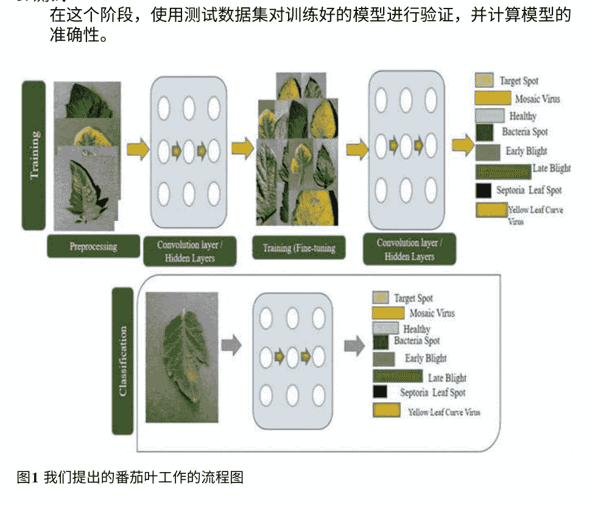

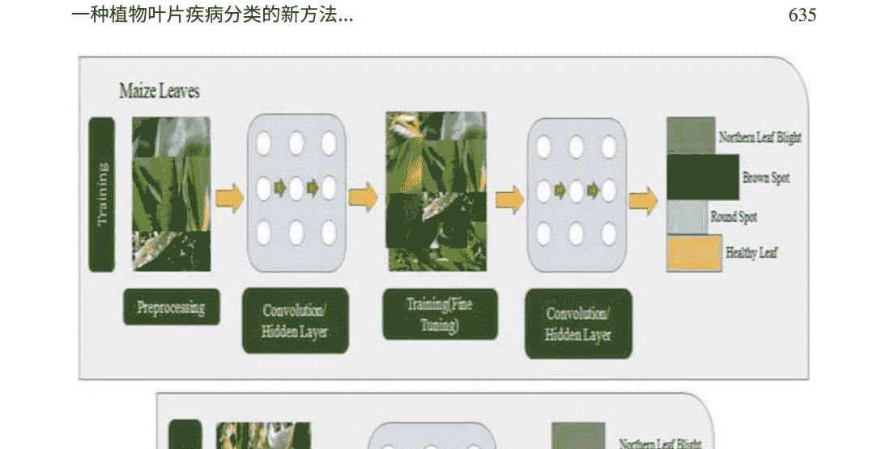

###### 图2 我们提出的玉米叶工作的图示表示

###### 表1 番茄叶数据集概述

| 番茄叶的类别数 | 图像数 |
|----------------|--------|
| 早疫病         | 1246   |
| 细菌性斑点病   | 2127   |
| 靶斑病         | 1404   |
| 斑点病         | 1771   |
| 黄化曲叶病毒   | 1963   |
| 晚疫病         | 1909   |
| 花叶病毒       | 1246   |
| 番茄健康叶     | 1591   |
| 总计           | 13,257 |

###### 3.1 预处理

任何深度学习应用的最重要元素之一是使用模型对数据集进行训练。在提出的工作中，图像来自植物村数据集。该数据集包含13,257张番茄叶图像和3150张玉米叶图像。

###### 表2 玉米叶数据集概述

| 玉米叶的类别数 | 图像数 |
|----------------|--------|
| 北方叶枯病     | 854    |
| 褐斑病         | 857    |
| 圆斑病         | 855    |
| 玉米健康叶     | 584    |
| 总计           | 3150   |

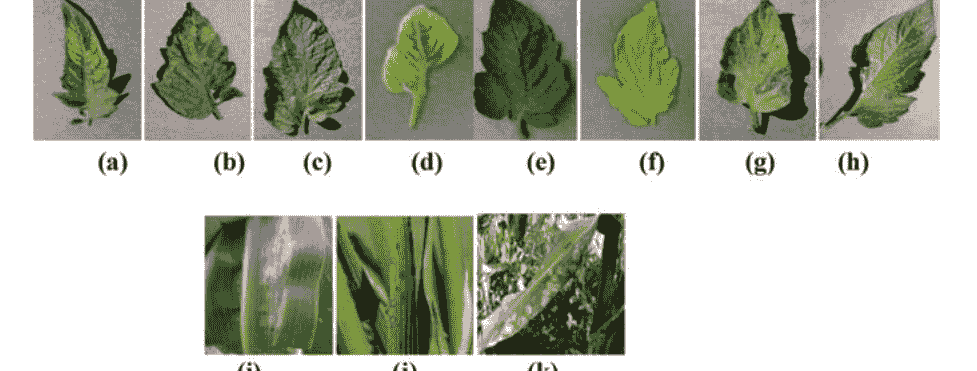

包括健康和非健康的叶子。数据集最初被分为80:20或70:30的比例，用于训练阶段和测试阶段以提高结果。

网络的准确性取决于用于训练和测试的大小和比例。数据过拟合导致测试数据集误差高，而欠拟合导致训练和测试误差都高。

在提出的方法中，数据集被划分为80:20。所有图像都被调整为256 * 256作为预处理步骤，以减少训练阶段的时间复杂度。

###### 3.2 训练

在训练阶段，使用较小的VGG16模型和ReLU激活函数对数据集进行训练。ReLU的一个重要特性是通过将负值替换为零来消除输入中的负值。该模型使用二元交叉熵而不是分类交叉熵。

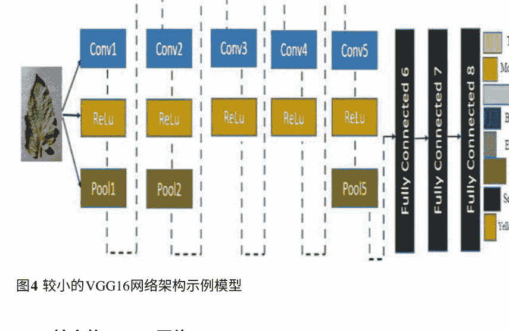

###### 3.2.1 较小的VGG16网络

Simonyon和Zisserman引入了VGG网络架构。所提出的模型使用预训练的较小VGG16网络。这里有十三个卷积层，每个层后面都跟着ReLU层。某些卷积层中存在最大池化，以减小图像的尺寸。批归一化有助于更快地学习并获得更高的整体准确性。在所有实验中都应用了ReLU激活函数和批归一化。Dropout是一种用于减少模型在训练集中过拟合的技术。在基于深度学习的分类器的最后一层使用了softmax函数。使用VGG16网络的训练阶段如图4所示。

###### 3.3 测试

在这个部分中，使用验证集来预测叶片的健康/不健康情况以及其疾病名称，以估计分类器的性能。微调：通过对超参数进行微小修改和增加层数，可以提高分类的准确性。

###### 4 结果与讨论

我们的模型VGG16在植物村数据集上的实验结果如表3所示。它列出了七种疾病的分类准确率，以及健康叶片。准确率是指正确分类的图像数量与数据集中图像的绝对数量之比。该数据集每个疾病类别下包含1000多张图像，最多不超过1246张图像。

模型准确性的图形演示如图5所示。模型准确性的图形说明如图6所示。表4展示了批量大小对分类准确性的影响。从表4可以明显看出，准确性随着小批量大小的增加而增加。值得注意的是，对于批量大小为16、32和64，准确性的增加并不多。从批量大小2-8，准确性急剧上升。

表3 使用较小的VGG16网络对各种番茄叶病进行分类的准确率

| 图像数量 | 细菌性斑点病 | 早疫病 | 晚疫病 | 斑点病 | 靶斑病 | 黄曲叶病毒 | 花叶病毒 |
|----------|--------------|--------|--------|--------|--------|------------|----------|
| 400      | 72.49        | 68.24  | 63.29  | 60.35  | 40.86  | 78.97      | 61       |
| 728      | 84.86        | 91.59  | 82.29  | 75.86  | 80.75  | 96.76      | 91.4     |
| 953      | 90.26        | 94.86  | 93.12  | 85.45  | 91.5   | 85.82      | 78.65    |
| 1246     | 99.94        | 98.69  | 98.71  | 98.46  | 98.4   | 99.91      | 99.74    |

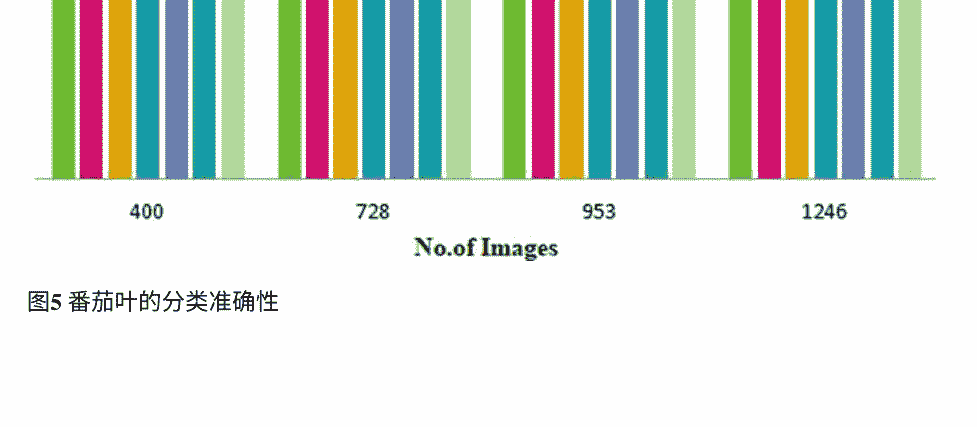

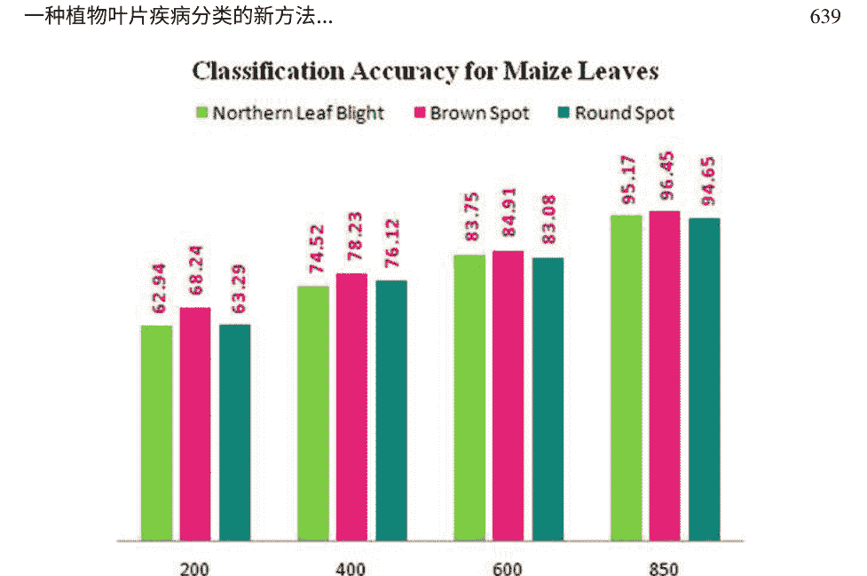

###### 图6 玉米叶的分类准确性

###### 表4 使用较小的VGG 16网络对各种玉米叶病进行分类准确性

| 图像数量 | 北方叶枯病 | 褐斑病 | 圆斑病 |
|----------|------------|--------|--------|
| 200      | 62.94      | 68.24  | 63.29  |
| 400      | 74.52      | 78.23  | 76.12  |
| 600      | 83.75      | 84.91  | 83.08  |
| 850      | 95.17      | 96.45  | 94.65  |

表5还显示，我们的模型在早疫病、黄曲叶和花叶病的批量大小为97以上时达到了良好的准确性。表5的图形表示如图7所示。

###### 表5 不同批次大小的分类准确率

| 批量大小 | 细菌性斑点病 | 早疫病 | 晚疫病 | 斑点病 | 靶斑病 | 黄曲叶病毒 | 花叶病毒 |
|----------|--------------|--------|--------|--------|--------|------------|----------|
| 2        | 72.49        | 68.24  | 63.29  | 68.11  | 73.58  | 69.95      | 81       |
| 8        | 91.97        | 70.14  | 93.1   | 93.78  | 88.48  | 97.82      | 98.21    |
| 16       | 95.39        | 97.55  | 94.57  | 95.95  | 91.91  | 98.84      | 98.91    |
| 32       | 98.7         | 98.41  | 97.96  | 98.16  | 95.8   | 99.5       | 98.24    |
| 64       | 99.05        | 99     | 98.25  | 98.73  | 98.78  | 99.12      | 99.74    |

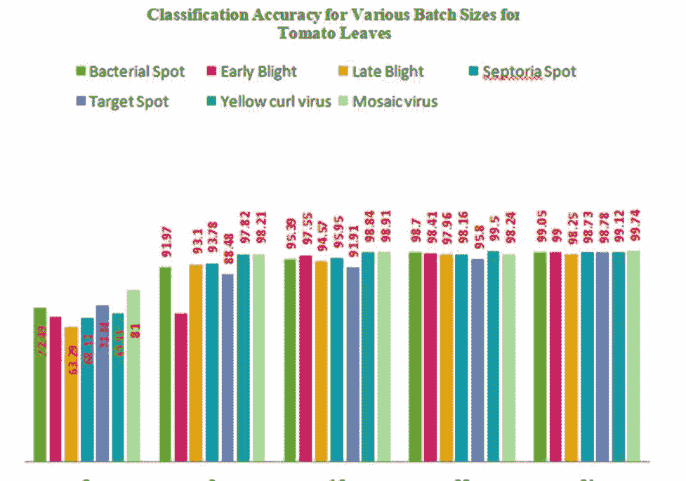

表6展示了批次大小对玉米叶分类准确率的影响。表6清楚地证明了准确率随小批量大小的增加而增加。值得注意的是，对于批次大小为16、32和64，准确率的增加并不多。从批次大小2到8，准确率急剧上升。

表6的图形表示如图8所示。图9展示了所提出模型对测试图像的视觉呈现。使用较小的VGG16网络对番茄叶和玉米叶病害进行分类。从图4可见，我们训练的模型在分类番茄叶病害和玉米叶病害方面达到了98%的准确率。

表6 各种批次的分类准确率

| 批量大小 | 北方叶枯病 | 褐斑病 | 圆斑病 |
| :--- | :--- | :--- | :--- |
| 2 | 69.27 | 67.87 | 65.45 |
| 8 | 89.62 | 70.53 | 87.76 |
| 16 | 90.46 | 92.47 | 90.35 |
| 32 | 93.65 | 94.01 | 93.43 |
| 64 | 95.31 | 94.56 | 94.86 |

Classification Accuracy for Various Batch Sizes for Maize Leaves

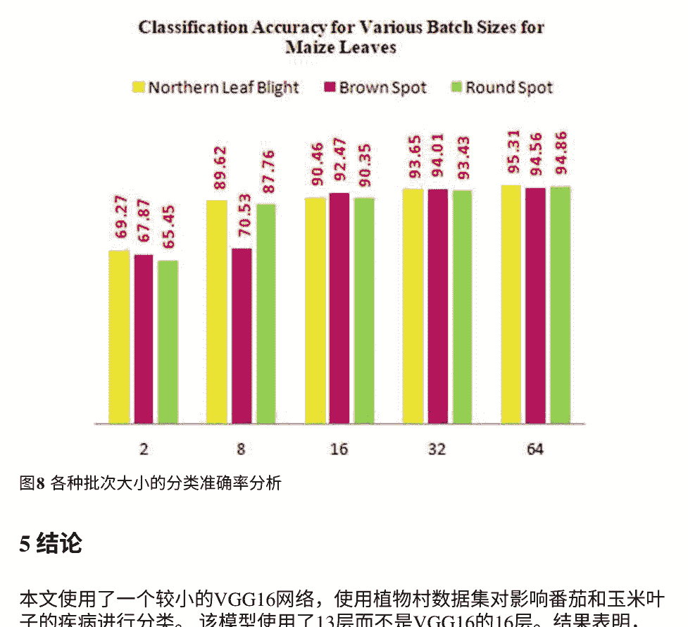

###### 图8 各种批次大小的分类准确率分析

###### 5 结论

本文使用了一个较小的VGG16网络，使用植物村数据集对影响番茄和玉米叶子的疾病进行分类。该模型使用了13层而不是VGG16的16层。结果表明，该模型对番茄叶子的分类准确率达到了99.18%，对玉米叶子的分类准确率达到了94.91%。使用13257张健康和不健康的番茄叶子图像以及3150张玉米叶子图像评估了分类准确率。该模型的性能已经针对不同的小批量大小和番茄、玉米图像数量进行了分析。本文的重点是对番茄和玉米叶子的疾病进行分类。将来可以扩展到对其他叶子疾病的分类。

| 番茄叶病 | 玉米叶病 |
|----------|----------|
|  |  |
|  |  |
|  |  |

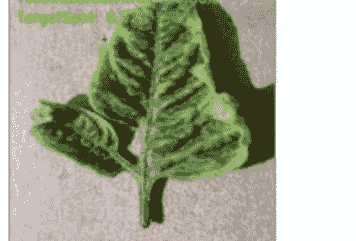

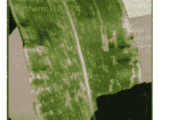

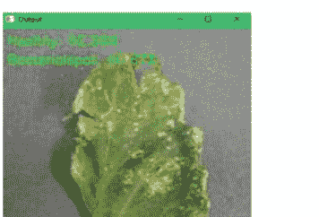

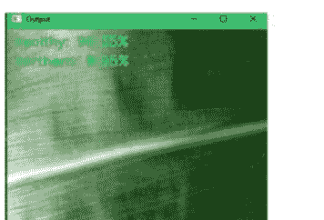

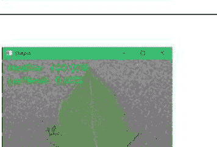


###### 图9 番茄和玉米叶病之间的测试准确性比较

致谢 实验是在先进图像处理实验室进行的，计算机科学与应用系，甘地格兰农村学院（被认定为大学），丁迪古尔，并由DST-FIST资助。

###### 参考文献

1. Kalpana Devi M, Mary Shanthi Rani M (2020) 糖尿病视网膜病变检测综述。 Int J Sci Technol Res 9 (2) 。 ISSN: 2277-8616
2. Kawasaki Y, Uga H, Kagiwada S, Iyatomi H (2015) 使用卷积神经网络进行病毒性植物疾病自动诊断的基础研究。 在：视觉计算国际研讨会，第638-645页。斯普林格，洪堡
3. Mohanty SP, Hughes DP, Salathé M (2016) 使用深度学习进行基于图像的植物病害检测。 植物科学前沿7: 1419
4. Sladojevic S, Arsenovic M, Anderla A, Culibrk D, Stefanovic D (2016) 基于深度神经网络的植物病害叶片图像分类识别。 计算智能神经科学5. Nachtigall LG, Araujo RM, Nachtigall GR (2016) 使用卷积神经网络对苹果树疾病进行分类。 在:IEEE第28届人工智能工具国际会议(ICTAI)，第472-476页
5. Brahimi M, Boukhalfa K, Moussaoui A (2017) 番茄病害的深度学习：分类和症状可视化。 应用人工智能 31:299-315
6. DeChant C, Wiesner-Hanks T, Chen S, Stewart EL, Yosinski J, Gore MA, Nelson RJ, Lipson H (2017) 使用深度学习从田间图像自动识别感染北方叶枯病的玉米植株。 植物病理学107:1426-1432
7. Lu Y, Yi S, Zeng N, Liu Y, Zhang Y (2017) 使用深度卷积神经网络识别水稻病害。 神经计算 267:378–384
8. Kulkarni Anancl H, Ashwinpatil RK (2012) 应用图像处理技术检测植物病害。 现代工程研究国际期刊 2(5):3661–3664
9. Ferentinos PK (2018) 用于植物病害检测和诊断的深度学习模型。 计算机与电子农业 145:311–318
10. Fujita E, Kawasaki Y, Uga H, Kagiwada S, Iyatomi H (2016) 关于稳健实用的植物诊断系统的基础研究。 第15届IEEE国际机器学习和应用会议，ICMLA，第989-992页
11. Sangeetha R, Mary Shanthi Rani M (2019) 使用卷积神经网络预测番茄叶病害。 创新技术探索工程国际期刊 9(1):1348–1352
12. 张X, 乔Y, 孟F, 范C, 张M (2018) 改进的深度卷积神经网络用于玉米叶病的识别。 IEEE Access 6:30370–30377