# 面向智能交通的深度学习和大数据


# Khaled R. Ahmed
Aboul Ella Hassanien 编
## 启用技术和未来趋势

系列“计算智能研究”（SCI）快速出版并具有高质量，出版新的发展和进步在计算智能的各个领域。目的是涵盖计算智能的理论，应用和设计方法，嵌入在工程，计算机科学，物理学和生命科学领域，以及背后的方法论。该系列包含神经网络，连接主义系统，遗传算法，进化计算，人工智能，细胞自动机，自组织系统，软计算，模糊系统和混合智能系统等计算智能领域的专著，讲义和编辑卷。对于投稿者和读者来说，短时间出版和全球分发都具有特别的价值，这使得研究成果能够广泛而迅速地传播。

被SCOPUS、DBLP、WTI Frankfurt eG、zbMATH、SCImago索引。

该系列中的所有图书都提交给Web of Science进行考虑。

有关该系列的更多信息，请访问 [http://www.springer.com/series/7092](http://www.springer.com/series/7092)

# 编辑

**Khaled R. Ahmed**
计算机学院
南伊利诺伊大学
卡本代尔，美国

**Aboul Ella Hassanien**
信息技术系
计算机与人工智能学院
开罗大学
吉萨，埃及

埃及科学研究小组（SRGE）
吉萨，埃及

ISSN 1860-949X
计算智能研究
ISBN 978-3-030-65660-7
[https://doi.org/10.1007/978-3-030-65661-4](https://doi.org/10.1007/978-3-030-65661-4)

ISSN 1860-9503（电子版）
ISBN 978-3-030-65661-4（电子书）

© 版权所有编辑（如适用）和作者，独家许可给 Springer Nature Switzerland AG 2021
本作品受版权保护。所有权利仅由出版商独家许可，无论是整体还是部分材料，特别是翻译权、再版权、插图重用权、朗读权、广播权、微缩胶片复制权或以任何其他实体方式复制权、传输或信息存储和检索权、电子适应权、计算机软件权利，或通过类似或不同的已知或今后开发的方法。

本出版物中使用的一般描述性名称、注册名称、商标、服务标志等，并不意味着即使在没有特定声明的情况下，这些名称不受相关保护法律和法规的约束，因此可以自由使用。

出版商、作者和编辑可以安全地假设本书中的建议和信息在出版日期时被认为是真实和准确的。出版商、作者或编辑对本文所含材料不提供明示或暗示的保证，也不对可能存在的任何错误或遗漏承担责任。出版商在已发表的地图和机构隶属方面保持中立。

这本施普林格印记由注册公司施普林格自然瑞士出版
注册公司地址为：瑞士Cham市Gewerbestrasse 11号

# 前言

深度学习和大数据是当今技术非常有活力和重要的研究课题。本书对智能交通的进展做出了贡献，如全自动驾驶汽车。它强调了新的数据管理和机器学习方法，如大数据、深度学习和强化学习。道路传感器、无人机、GPS、闭路电视和事故报告是决策交通问题的重要数据来源。由于这些大量和高速的数据，基于机器学习方法和传统关系数据库构建可靠的预测模型是具有挑战性的。

因此，本书包括12章，详细介绍了关于大数据、深度卷积网络和基于物联网的智能解决方案的最新研究成果，以限制特定区域内的车辆速度，预测转向角度，控制交通信号，支持自主安全驾驶，计算人群数量，并检测道路上的动物以减少动物与车辆的事故。本书将为广大读者提供服务，包括研究人员、学者、学生和从事车辆制造、健康和交通部门以及网络公司的专业人士。

本书的结构反映了以一种连贯且逻辑性强的方式呈现各个章节的努力。各个独立的章节被分为三个主要领域：大数据和自动驾驶、深度学习和目标检测以实现安全驾驶，以及智能交通中的人工智能和物联网。每个章节开头都有一个摘要和几个关键词，以支持阅读概览。

## 大数据和自动驾驶

章节“使用Hadoop进行计算模型计算的大数据技术与调度挑战”主要关注大数据（BD）的特性，并深入研究了BD计算框架所引发的复杂问题。

作者们阐明了不同领域中大数据挖掘的估计。本章详细阐述了与大数据分析（BDA）相关的挑战，这些挑战被归类为数据挑战、过程挑战和管理挑战。数据挑战是与数据特征相关的一组挑战，这些挑战包括作为体积、速度、真实性和可视化的要素。 在处理数据时可能遇到的挑战，如数据分析、建模和数据聚合，被称为过程挑战。 然而，解决隐私、安全、运营成本、数据治理和数据共享被视为管理挑战。 本章对大数据处理中的设计、系统和实践提供了明确的了解。

章节“自动驾驶汽车的大数据”展示了大数据在自动驾驶汽车中的重要性、应用、相关技术、问题和研究方向。 它介绍了车辆对一切（V2X）通信的协议和标准。 此外，本章讨论了自动驾驶汽车中涉及的大数据处理技术的研究，例如数据传输、采集、存储、计算、分析和处理。 最后，介绍了大数据、机器学习用于车辆网络和车辆网络安全的研究方向和开放性研究问题。

## 深度学习和物体检测用于安全驾驶

章节“智能视觉系统的目标检测和跟踪分析”讨论了智能视频监控系统在智能交通中的概念以及检测、分类和跟踪移动物体（例如车辆、动物、人等）所面临的重大挑战。详细阐述了影响物体跟踪/检测性能的重大挑战，如光照变化、天气条件、动态和杂乱背景、遮挡、移动投影阴影和由于相机抖动引起的图像噪声。 本章介绍了高效物体检测和跟踪的潜在算法，例如时差法、简单背景减法法、光流法、背景模型方法、分割和基于特征的方法。

章节“使用深度卷积网络的增强型自动驾驶端到端系统”讨论了基于深度卷积网络的自动驾驶转向算法。 作者提出了独立的转向算法，用于预测转向角度，分析道路标记，确定车道偏离的道路半径，并识别物体。 本章使用基于darknet-53架构的Yolov-V3。作者使用COCO数据集进行训练，该数据集包含80个标签，如人、汽车和公交车。 提出的算法能够建议驾驶员是否安全加速车辆。它还可以帮助警告驾驶员是否有车道中心的偏离。 警察可以使用该算法在驾驶过程中检测车辆的速度。

章节“深度学习技术应对鹿-车碰撞”展示了鹿-车碰撞（DVCs）全球问题的重要性，并探索了各种传统的DVCs缓解技术。 作者开发了基于Yolov5的深度学习算法，用于预测道路上的鹿。 生成的预测模型在各种天气条件下实现了约99.5%的鹿检测mAP。

章节“夜间到白天道路场景转换的生成对抗网络与结构相似性损失用于夜间驾驶安全”的提出了一种增强的深度学习算法，通过在夜间驾驶时为驾驶员提供白天视图来降低交通事故风险。作者们基于生成对抗网络（GAN）开发了一种算法，将夜间道路场景转换为白天场景，同时保留其他道路条件。为了提高感知图像质量，作者引入了额外的结构相似性损失。定性和定量测量结果表明，所提出的算法能够将夜间图像转换为白天场景，并具有更好的音质。

章节“更安全驾驶：应用深度迁移学习构建智能交通系统”展示了使用迁移学习策略生成检测模型以建立更安全的交通系统的全面指导。作者讨论了一个案例研究，通过实施基于预训练的卷积神经网络（VGG16）的深度学习算法来检测道路上的鹿。开发的模型在测试数据集上的准确率约为0.916。

章节“利用CNN深度学习模型进行智能停车”利用卷积神经网络（CNN）深度学习模型进行智能停车。作者训练了CNN算法来自动化汽车停车，以找到空闲和已停满的停车位。生成的停车位检测模型的效率是通过二元分类和精确度指标的召回结果得出的。

章节“使用深度学习估计公共场所监控的人群规模”讨论了使用深度学习算法自动监测人群中的异常活动。作者探索了四种主要的卷积神经网络（CNN）架构，用于人群计数：CNN开关，多列CNN，CSRNet和级联CNN。他们对这些模型在包含不同人群密度（高、中、低）的不同类型数据集上进行了性能分析。最后，本章得出结论，CSRNet是最有前途的网络来计算人群数量。

## 智能交通的深度学习和大数据技术以及未来趋势

章节“基于物联网的智能标志牌区域限速”主要关注通过避免超速引起的致命事故来提高道路安全。作者提出了一种基于物联网（IoT）的智能解决方案，可以自动控制车辆的速度并自定义区域限速。他们探讨了目前的解决方案和挑战，以跟踪和执行限速，以防止道路事故。此外，他们实现了一个系统原型，使用Arduino微处理器、低功耗蓝牙和多个传感器（如速度传感器和摄像头）来控制车辆的速度。最后，作者得出了结论，提出了未来的工作，并向汽车制造商提供了建议。

章节“物联网与云计算、人工智能和区块链的协同作用，赋予自动驾驶汽车更强大的能力”详细阐述了物联网（IoT）、人工智能（AI）、云计算和区块链技术在开发自动驾驶汽车方面的应用。它详细讨论了物联网在自动驾驶汽车中的挑战。本章探讨并揭示了物联网与人工智能、云计算和区块链的协同作用。物联网和人工智能使车辆变得更加智能，可以检测车辆的环境并做出相应的决策。然而，物联网和云计算用于存储和处理收集的数据，并以最低成本实现车辆和路边单元之间的通信。为了保护通过集成传感器进行通信的车辆之间的互动，使用了区块链和物联网。区块链用于跟踪自动驾驶汽车的互动，以确保诸如拼车交易和收费交易等交易的安全。本章讨论了物联网在自动驾驶汽车中的多个应用，包括人工智能、云计算和区块链。

章节“将人工智能与机器人流程自动化相结合——智能自动化方法”的提供了关于在智能交通系统中基于AI集成与RPA的新智能自动化方法的见解。本章讨论了为企业和组织带来显著益处的流程自动化，其特点是数据流和信息密集。机器人流程自动化（RPA）与机器学习、语音识别和自然语言处理等认知技术相结合，用于自动化高阶任务。因此，本章探讨了成功结合RPA和人工智能所需的技术。

最后，我们希望本书能够激发对于快速变化的大数据和深度学习在智能交通领域的挑战和复杂性感兴趣的研究人员。编辑们要向作者和审稿人表达他们的感激之情，感谢他们在这个富有成果的研究项目中的辛勤工作和努力。

美国卡本代尔
埃及吉萨

Khaled R. Ahmed
Aboul Ella Hassanien

# 目录

## 大数据和自动驾驶

- 具有计算模型的大数据技术使用Hadoop解决调度挑战 . . . . . . . . . . . . . . . . . . . . . . . . . . . . 3
E. B. Priyanka, S. Thangavel, B. Meenakshipriya, D. Venkatesa Prabu, 和N. S. Sivakumar

- 用于自动驾驶的大数据 . . . . . . . . . . . . . . . . . . . . . . . . . . . . . . . 21
Rinki Sharma

## 深度学习和目标检测用于安全驾驶

- 智能视觉的目标检测和跟踪分析系统 . . . . . . . . . . . . . . . . . . . . . . . 51
K. Kalirajan, K. Balaji, D. Venugopal和V. Seethalakshmi

- 使用深度卷积网络的增强型自动驾驶端到端系统 . . . . . . . . . . . . . . . 81

- 深度学习技术减少鹿车碰撞 . . . . . . . . . . . . . . . . . . . . . . . . . . . . 103
Md. Jawad Siddique和Khaled R. Ahmed

- 使用具有结构相似性损失的生成对抗网络进行夜间到白天道路场景转换以提升驾驶安全 . . . . . . . . . . . . . . . . . . . . . . . . . . . . 119
Igi Ardiyanto, Indah Soesanti和Dwiyan Cahya Qairawan

- 更安全的驾驶：应用深度迁移学习构建智能交通系统 . . . . . . . . . . . . . . . . 135
Ramazan Ünlü

- 利用CNN深度学习模型进行智能停车场 . . . . . . . . . . . . . . . . . . . . . . . . 151
Guruvareddiyur Rangaraju Karpagam, Abishek Ganapathy, Aadhavan Chellamuthu Kavin Raj, Saravanan Manigandan, J. R. Neeraj Julian和S. Raaja Vignesh

- 使用深度学习估计公共场所监控的人群规模 . . . . . . . . . . . . . . . 175
Deevesh Chaudhary， Sunil Kumar和Vijaypal Singh Dhaka

## 智能交通的深度学习和大数据技术以及未来趋势

- 基于物联网的智能标志牌区域限速系统 . . . . . . . . . . . . . . . 201
P. Madhumathy， H. K. Nitish Kumar， Pankhuri和D. S. Supreeth Narayan

- 物联网与云计算、人工智能和区块链的协同作用赋予自动驾驶汽车更强大的能力 . . . . . . . . . . . . . . . . . . . . . . . . . 225
C. Muralidharan， Y. Mohamed Sirajudeen和R. Anitha

- 将人工智能与机器人流程自动化相结合——智能自动化方法 . . . . . . . 245
Nishant Jha， Deepak Prashar和Amandeep Nagpal

## 大数据和自动驾驶

## 大数据技术与计算模型计算使用Hadoop进行调度挑战

E. B. Priyanka, S. Thangavel, B. Meenakshipriya, D. Venkatesa Prabu, 和N. S. Sivakumar

**摘要** 大数据（BD）具有学习宝贵知识的能力，以改进动态周期，最近引起了学术界和专家的广泛关注。大数据分析（BDA）越来越成为许多组织采用的一种流行实践，以从BD中提取重要数据。组织认为，包括BDA工具的部署和使用在内的研究过程是提高运营效率的工具，但它也具有战略潜力，可以带来新的收入来源，并在商业竞争对手中获得竞争优势。然而，有多种类型的解释性应用需要考虑。因此，在匆忙使用和购买昂贵的BD工具之前，组织首先需要了解BDA领域。鉴于BD和BDA的出色概念，本文提供了一份综述，全面了解BD的挑战，并介绍了组织猜测/提出/使用的BDA方法，以帮助其他人了解这个领域，做出明智的投资决策。本章介绍的研究确定了对BD研究做出了重要贡献，为技术和组织资源管理学科的BDA提供了学术财富的扩展和收集。虽然有几种有效的MapReduce优秀展示方法

**E. B. Priyanka (✉)**
汽车工程系，孔古工程学院，Perundurai 638060，印度
e-mail: priyankabhaskaran1993@gmail.com

**S. Thangavel · B. Meenakshipriya · D. V. Prabu**
机电工程系，孔古工程学院，Perundurai 638060，印度
e-mail: thangavel.mts@kongu.ac.in

**B. Meenakshipriya**
e-mail: bmp@kongu.ac.in

**D. V. Prabu**
e-mail: venkatprabu13@gmail.com

**N. S. Sivakumar**
机电工程系，Tishk国际大学-TIU-Erbil, Erbil, 伊拉克
e-mail: sivakumar.ns@tiu.edu.iq

由于Hadoop 2.x中的基本构建更改和动态资产分配，Hadoop 1.x中的任务无法应用于Hadoop 2.x。因此，所提出的安排依赖于Hadoop 1.x的当前演示模型，但考虑到构建更改和使用排队网络模型捕获MapReduce作业的执行流。因此，成本模型反映了由于共享资源冲突而发生的内部工作同步需求。

**关键词** 大数据 · Hadoop · 挑战 · 分析方法

## 1 引言

如今，大量数据每天以惊人的速度从异构源（例如，健康、政府、社交网络、广告、金融）产生[1]。这是由于许多技术趋势，包括物联网、云计算的普及以及智能设备的普及。在幕后，强大的系统和分布式应用程序支持这些多样化的连接系统（例如智能网络系统、医疗保健系统、零售系统、政府系统）。在大数据革命之前，企业无法长时间存储所有文件，也无法有效地管理庞大的信息集。事实上，传统技术的存储能力有限，管理工具僵硬且昂贵[2]。它们缺乏大数据环境所需的可扩展性、灵活性和性能。事实上，大数据管理需要大量资源、新方法和强大的技术。更准确地说，大数据需要清理、处理、分析、保护和提供对大型不断变化的数据集的细粒度访问。企业和行业越来越意识到数据分析在发现新的洞察力和个性化服务方面变得越来越重要[3]。

由于从大数据中可以提取出的有趣价值，许多国家的参与者已经启动了重大项目。2012年3月，官方数据管理机构启动了2亿美元的大数据创新研发计划。大数据发展成为2012年7月国家创新战略的一个重要方向，并发布了一份名为《大数据与发展：机遇与挑战》的报告[4]。该报告旨在概述大数据挑战的基本问题，并促进关于大数据如何为全球发展服务的讨论。由于全球范围内的各种大数据项目，已经提出了许多大数据模型、框架和新技术，以提供更多的存储容量、并行处理和对多种异构数据源的实时分析。此外，还提出了新的解决方案，旨在保证信息保护和安全。与传统技术相比，这些解决方案提供了更大的灵活性、可扩展性和执行能力[5]。此外，由于可负担的技术发展，大多数硬件存储和处理环境的成本不断下降。

图1显示了大数据的可变组成部分。为了从大数据中提取信息，已经设计和提出了各种模型、程序、虚拟软件、硬件类型和技术。它们试图为大数据应用程序提供更准确可靠的结果[6]。然而，在这种情况下，选择不同技术可能是耗时且具有挑战性的。事实上，许多因素需要考虑：技术兼容性、部署复杂性、成本、效率、执行能力、可靠性、支持和安全风险[7]。文献中存在一些关于大数据的研究，但大多数研究集中在处理大数据的算法和方法上，而不是进展。图2显示了与数据分析相关的行业生态系统中的组件互连。

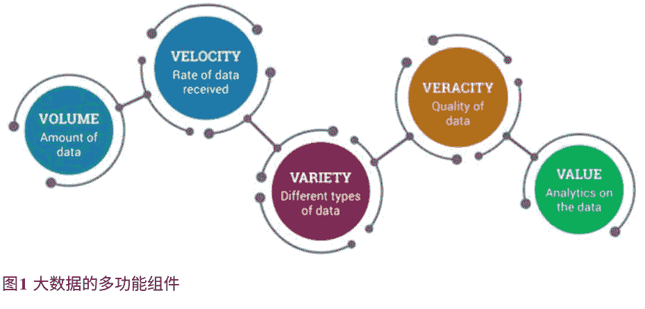

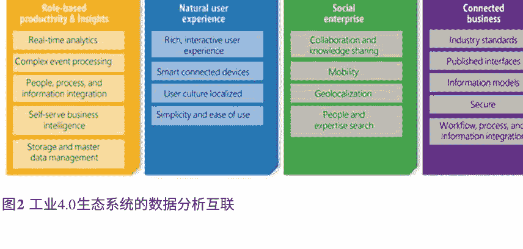

## 2 物联网与大数据分析之间的关系

大规模信息分析正在迅速发展，成为改进物联网活动的关键[8]。物联网最显著的特点之一是对“连接的物品”数据的分析。物联网中的大数据分析需要实时处理大量数据，并将数据存储在不同的存储技术中。考虑到大量非结构化数据直接从网络连接的“物品”中收集而来，大数据实施将需要进行快速的分析，并进行大量的查询，以使组织能够快速获得洞察力，做出快速决策，并与人员和其他设备进行互动[9]。感知和触发设备的互联能力可以通过统一的架构在平台之间共享信息，并建立一个共同的工作图像，以实现创新应用的能力。

在物联网应用中，接纳大数据的需求是有说服力的。这两个进展已经在其领域和商业中被认可。尽管大数据的发展已经滞后，但这些技术是相互依存的，应该共同发展[10]。总的来说，物联网的部署增加了数据的数量和分类，从而为大数据分析的应用和发展提供了机会。此外，物联网中大数据技术的应用加速了物联网的研究进展和商业模式。物联网和大数据之间的关系如图3所示，可以分为三个阶段来管理物联网数据[11]。

第一步涉及管理物联网数据源，其中连接的传感器设备使用应用程序相互交互。例如，设备之间的连接，如闭路电视摄像头、智能交通灯和智能家居设备，产生了具有不同配置的大量数据源[12]。
这些信息可以存储在云端的便捷物品存储中。在随后的步骤中，生成的数据被称为“大数据”，它取决于它们的容量、速度和种类。这些大量的信息被存储在共享分布式容错数据库中的大数据记录中。最后一步应用分析工具，如MapReduce、Spark、Splunk和Skytree，可以分析存储的大型物联网数据索引。分析的四个阶段从处理信息开始，然后转向分析工具、查询和报告[13]。

基于MapReduce的系统越来越多地被用于大规模数据分析应用。对于任何数据处理应用程序来说，减少执行时间是至关重要的，准确评估执行时间对于优化至关重要[14]。因此，我们需要构建符合此类数据处理应用程序编程模型的执行模型。此外，在不同条件下清楚地了解系统性能是负载管理和资源范围量化的关键决策因素。分析性能模型特别有吸引力，因为它们可以以相对较低的成本提供相当准确的作业响应时间，而不需要实验评估实际解决方案[15]。

在MapReduce编程中，需要将计算调整为两阶段的准备模型，即Map和Reduce。以这种实际风格编写的项目因此被并行化并在计算集群上执行。Apache Hadoop是最流行的开源MapReduce实现之一。在Hadoop的第一个版本中，MapReduce的编程模型和资源管理紧密耦合[16]。为了提高总体性能以及与其他分布式数据处理应用的兼容性和易用性，增加了一些要求，例如高集群利用率、高可靠性和可用性、支持多样的编程模型以及灵活的资源模型。因此，Hadoop的第二个版本的架构经历了重大改进，引入了YARN（Yet Another Resource Negotiator），这是一个独立的资源管理模块，明显改变了Hadoop的架构，将编程模型与资源管理系统解耦，并将许多预订功能委托给每个应用程序组件[17]。集群资源现在被视为连续的，因此没有静态分配资源（即在Map和Reduce时段之间的分配）。因此，Map和Reduce任务现在争夺相似的资源。显然，将成本模型应用于这样一个静态资产分配的问题上是困难的，因此发现其他方法是很重要的[18]。

## 3个大数据分析方法

大数据分析计划旨在快速提取有用信息，帮助进行预测，发现最新趋势，找到隐藏的信息，并最终做出决策。数据挖掘技术通常用于问题特定方法和广义数据分析。同样地，统计和人工智能技术被使用[19]。大数据的发展也改变了分析需求。尽管高效元素的需求存在于大数据管理的各个方面，例如捕捉、存储、预处理和分析；但对于我们的讨论来说，大数据分析需要与传统数据分析相同或更快的处理速度，并且对于大容量、高速度和高多样性的数据，成本要尽量低[20]。有多种解决方案可用于大数据分析，并且在开发和改进这些解决方案方面取得了不断的进展，使它们适用于新的大数据趋势。

信息挖掘在分析中起着重要作用，并且大多数方法都是根据特定情况使用信息挖掘算法开发的[21]。在评估和选择适当的方法论时，了解可用的大数据分析选项至关重要。在本章中，我们介绍了几种可用于几种主要数据分析的技术。其中一些分析技术对于大规模物联网数据分析非常有效。不同和庞大的数据集对大数据分析有更多的贡献。然而，这种观点并不总是正确的，因为更多的数据可能会有更多的模糊和异常[22]。我们介绍了基于分类、聚类、关联规则挖掘和预测分类的大数据分析技术。图4描述并总结了所有这些分类。

每个分类都是一种信息挖掘能力，包括许多方法和算法来满足数据提取和分析的需求。例如，贝叶斯网络。大数据分析技术概述。支持向量机（SVM）和k最近邻（KNN）提供分类技术[23]。同样，分区、渐进聚类和共现在聚类中非常常见。关联规则挖掘和预测是重要的技术。分类是一种有监督学习方法，利用先前的数据作为训练数据将数据对象分类成群组。预定义的类别被分配给一个对象，从而实现对对象进行群组或类别预测的目标。对于大规模物联网数据来说，发现未知或隐藏的模式更具挑战性[24]。此外，从大数据集中提取重要信息以改善决策是一项关键任务。

贝叶斯网络是一种提供模型可解释性的分组策略。贝叶斯组织在处理复杂信息结构时比传统结构化数据更有效，这些信息结构是通过大数据揭示出来的[25]。这些组织是非循环图，其中节点是随机因素，边表示依赖关系。贪婪的、具体的贝叶斯和贝叶斯多网络是用于分组的建议类别。

分组是一种用作主要数据分析策略的数据挖掘技术[26]。与分类不同，分组使用无监督学习方法，并根据它们的特定重要特征为给定对象创建组。正如我们在图4中所介绍的，将大量文章分组成数据处理变得简单。用于分组的著名技术是层次聚类和划分。渐进聚类方法通过合并小数据对象组成多层次树并创建聚合组。破坏性组是以相反的方式创建的，通过将包含所有信息对象的单个组分割为较小的适当组。市场分析和业务决策是大数据分析的最重要应用[27]。关联规则挖掘的过程包括识别不同对象、事件或其他实体之间的有趣关系，以分析市场趋势、消费者购买行为和产品需求预测。关联规则挖掘侧重于根据事件发生频率为数值和非数值数据识别和创建规则。关联规则下的数据处理有两种方式。首先，频繁数据处理使用基于先验的算法，如MSPS和LAPINSPAM，来识别协作关联。关联规则下的另一种重要数据处理方法是短暂序列分析，它使用算法来分析连续数据中的事件模式。预测分析使用已知为训练数据的历史数据来确定数据中的趋势或行为。支持向量机和模糊逻辑算法用于识别自变量和因变量之间的关系，并获得预测的回归曲线，例如用于灾害预测[30]。

## 4 大数据挑战和未来展望

大数据的挖掘提供了许多有吸引力的机会。然而，科学家和专家在研究大数据集和从这些数据矿中提取价值和信息时面临一些困难。挑战存在于各个层面，包括：信息捕获、存储、搜索、共享、调查、管理和可视化[31]。此外，在分布式数据驱动应用程序中还存在安全和隐私问题。通常，数据的涌入和分布式流超过了我们的处理能力。事实上，尽管大数据的规模呈指数增长，但目前处理和分析大数据集的技术能力仅限于低级别的拍字节、艾克字节和泽字节的数据[32]。在本节中，我们将更详细地讨论一些仍然需要研究的创新问题。图5揭示了与大数据相关的挑战的数据循环。

大数据管理：信息科学家在处理大数据时面临许多挑战。其中一个挑战是如何收集、整合和存储来自分布式源的大量信息索引[33]。另一个挑战是大数据管理。有效地管理大数据是为了促进可靠的洞察力提取和降低成本的关键。大数据管理旨在清理数据以提高可靠性，汇总来自不同来源的数据，并对数据进行安全和隐私编码。它还意味着确保预测性的大数据存储和基于角色的对各个分布式端点的访问[34]。换句话说，大数据管理的目标是确保数据可靠、易于访问、合理存储和安全。

庞大的数据清理：这五个阶段（清理、聚合、编码、存储和访问）并不新鲜，因为它们是传统信息管理的一部分。大数据的挑战在于如何处理大数据的复杂性（速度、容量和多样性）并对其进行测量。在分布式环境中与各种应用程序的结合。确保可靠的分析结果，必须在投入资源之前确认数据源的可靠性和数据质量。然而，数据源可能包含噪音、错误或不完整的数据。挑战在于如何清理如此庞大的数据集，并决定哪些数据是可靠的、有用的。

大数据聚合：另一个挑战是将外部数据源与分布式大数据平台（包括应用程序、存储库、传感器、网络等）与组织的内部系统同步。通常情况下，仅分析组织内部生成的数据是不够的。为了提取有意义的洞察和信息，有必要进一步将内部数据与外部数据源进行聚合。外部数据可以包括第三方来源、市场变化信息、天气预报和交通状况、社交网络数据、用户评论和公民反馈等。例如，这可以帮助提高用于分析的预测模型的质量。

不平衡的框架限制：在计算机工程和容量方面，存在一个重要问题。事实上，根据摩尔定律，CPU的性能每年翻倍，硬盘驱动器的性能也以相同的速度增长。然而，I/O操作并不遵循相同的性能模式[39]。即，随机I/O速度有所改善，而顺序I/O速度随着密度的增加而缓慢增加。因此，这种不平衡的系统限制可能会降低数据访问速度，并影响大数据应用的性能和可扩展性。从另一个角度来看，我们可以看到网络上不同设备的限制（例如传感器、硬盘、内存）。这可能会影响系统性能[40]。

不平衡的大数据：另一个挑战是对不平衡的数据集进行排序。这个问题在最近几年引起了很多关注。事实上，真实世界的应用可能会产生具有不同分布的类别[41]。第一种类别是出现次数较少的类别（称为少数或正类）。第二种类别是出现次数较多的类别（称为多数或负类）。在临床诊断、软件缺陷识别、基金或生物信息学等领域，识别少数类别是非常重要的[42]。传统的学习方法不适用于不平衡的数据集[43]。这是因为模型构建基于全局搜索措施，而不考虑样本数量[44]。事实上，全球原则通常比明确的指导方针更受青睐，因此在模型开发过程中忽略了少数类。因此，标准的学习策略并不考虑不同类别的样本数量的差异[45]。然而，那些被低估的类别可能构成重要的案例来进行区分。然而，许多困难的领域存在多个具有不平衡分布的类别，例如，蛋白质叠加顺序和焊接缺陷表征。这些多类别的不平衡问题带来了新的困难，这些困难在两类问题中没有被观察到[46]。实际上，管理具有不同误分类成本的多类别任务比处理两类任务更困难。为了解决这个问题，已经形成了各种技术，并经常分为两个分类。第一个是将一些并行分类方法扩展为适用于多类别分类问题的方法，例如判别分析、决策树、k最近邻、朴素贝叶斯、神经网络和支持向量机[47]。第二类被称为分解和集成方法（DEM）。它包括将多类别分类问题分解为一组可以由二元分类器（BCs）解决的二元分类问题，然后通过对BCs的预测应用聚合方法来定义一种创新的观点[48]。

## 5 动态建模的Mapreduce模型：阶段计算

为MapReduce作业创建成本模型的主要测试是，它们应该以合理的精度捕捉工作可能遇到的各种延迟 [49]。具体而言，属于工作的任务可能会遇到两种类型的延迟：由于共享资源冲突而导致的排队延迟，以及由于协调在同一作业中的任务之间的优先级要求而导致的同步延迟——Map和Reduce阶段。有两种主要方法来评估不考虑同步延迟的工作负载的性能。其中一种方法是均值分析（MVA），它仅考虑由于共享基础资源而导致的任务排队延迟 [50]。因此，它不能直接应用于具有优先级要求的工作负载，例如属于同一MapReduce作业的Map和Reduce任务之间的同步。

选择传统的安排是为了滥用马尔可夫链来表示系统的潜在状态，并使用网络模型来处理状态之间的变化率[51]。然而，这种方法不适用于规模较大的情况，因为状态空间随任务数量呈指数级增长，这使得很难应用于具有多个任务的MapReduce作业，而这通常是情况。

根据模型验证结果，所提出的模型产生的平均作业响应时间估计与实际执行的估计误差不超过15％。尽管该模型无法捕捉动态资源分配，并且假设处理Map和Reduce任务的节点数量是固定的输入参数[52]，但与以前的模型相比，它具有显著的优势。首先，与Herodotou的模型不同，该模型考虑了任务之间的资源争用。由于共享资产的冲突而导致的延迟 [53]。 此外，它准备捕捉Map和Reduce任务之间的同步延迟（ARIA和Tetris没有考虑MapReduce工作执行的这个属性）[54]。 图6显示了通过资源管理的Hadoop中的任务执行情况。

在Hadoop的第二种形式中，YARN模块也出现了，并且对设计进行了根本性的改变。它负责管理集群资源和作业计划。在以前的Hadoop版本中，这个功能是集成在MapReduce模块中的，在JobTracker组件中实现。JobTracker负责调度、资源管理、监视和重新执行失败的任务、向用户报告状态、记录审计日志、收集统计信息、用户验证等等功能[55]。大量的任务导致了灵活性的限制。YARN的基本思想是将JobTracker的两个重要功能，即资源管理和任务调度/监视，分开，以便拥有一个全局资源管理器和应用程序特定的应用程序主管。通过将资源管理功能与编程模型分离，YARN委托了许多调度相关的任务分配给每个工作部分，并完全退出对Map资源的静态分配，从而减少了资源的使用，这对群体使用带来了显著的改进[56]。

YARN由三个主要部分组成：

- 全局资源管理器（RM）每个群组，在主节点上执行。
- 应用程序主管（AM）每个工作。
- 节点管理器（NM）每个从节点。

RM作为守护程序在专用机器上运行，并在各个竞争应用程序之间进行所有可用资源的协商。我们不会详细介绍RM的所有组件，而是专注于最重要的组件：

- 调度器负责将资源分配给正在运行的应用程序[57]。
- 应用程序管理器服务为应用程序主管协调主要容器（绑定到特定节点的逻辑资源堆）提供支持。AM负责与RM协调资源，并与NM一起启动、监控和停止容器[58]。

根据YARN部件的核心功能，作业执行度量的整体趋势如图6所示。当客户提交应用程序执行请求时，它开始执行（1）。AM通过AM服务向RM注册，并在为其分配的容器中启动（2）。然后，AM向RM请求容器来执行实际工作（3）。当AM获取到容器后，可以通过向NM发送消息来启动它们（4）。计算发生在与AM保持联系的容器中（5）。应用程序完成后，AM应该从RM注销[59-62]。

初始化活动包括两个可以并行运行的子活动：在每个服务社区中初始化每种类型任务的平均居住时间，以及系统中每个任务的平均响应时间。为了引入居住时间，我们从相关实际Hadoop工作执行的历史记录中取平均值[63]。要引入任务的响应时间，我们可以采用以下策略：

- (a) 使用检查方法——从工作配置文件中获取任务反应时间的正常值。
- (b) 从当前静态成本模型中获取它们，例如从Herodotou的成本模型中获取（我们可以预期首先执行所有Map任务，然后Reduce任务）。

因此，我们将为Map任务提供所有可用资源，然后再提供给Reduce任务[64]。基于结构分析，影响时间表制定过程的核心因素与活动调度和资源管理系统有关，并可定义如下：

1.  RM调度器。我们假设RM使用Hadoop YARN分发的默认调度器Capacity scheduler。Capacity scheduler的主要单位是队列。在不损失一致性的情况下，我们假设有一个单一的根队列，因此资源分配将按照FIFO顺序进行（即，优先级将给予首个请求资源的作业）。
2.  AM调度器。由于建筑变化，一些作业规划的职责被指派给了AM，因此我们需要确定AM在不同节点之间分配任务的方式。根据图7的发现，Map和Reduce任务具有不同的生命周期，我们需要在时间轴发展策略中考虑它们。
3.  资源的管理。我们假设AM将使用所提到的隔间进行相同类型的任务，因此我们忽略了AM的最新限制功能。

为了评估任务响应时间，我们需要了解任务之间的条件（优先级树反映了它们）和任务项的估计值。然后，从优先级树的底部到顶部，我们评估内部连续和并行节点的时间跨度。最后，根节点的时间估计将是整个操作的长度。随着我们不断从底部到顶部移动，优先级树的深度会影响作业响应时间估计的误差。为了减少误差，我们平衡优先级树。

## 6 结论

当前的大数据阶段得到了不同的处理、分析工具和独特的观察支持。这些平台使得从复杂的动态环境中提取信息和价值成为可能。它们还通过建议和自动识别异常、异常行为或新趋势来支持动态。

在本章中，我们集中讨论了大数据的特点，并深入研究了大数据计算系统所带来的挑战。除此之外，我们还阐明了大数据挖掘在几个领域中的价值。此外，我们还关注了大数据平台每个层面上使用的组件和技术。我们还考虑了特殊的技术和分发方式，以及它们的功能、优势和限制。我们还根据其特点和为特定用户提供的服务对大数据系统进行了分类。因此，本章对当前在大数据计算中采用的架构、策略和实践提供了明确的了解。尽管在大数据领域取得了重大进展，但通过对各种技术的研究，我们可以看到存在许多弱点。大多数情况下，它们与采用的结构和过程有关。

显示方法扩展了为Hadoop 1.x提出的安排，其中工作的执行流由优先级树引入，物理资源的冲突由闭合排队机制捕获。我们的主要贡献是对Hadoop 2.x内部进行深入分析，识别Hadoop中的主要构建变化，并为Hadoop 2.x创建MapReduce执行模型。特别是，考虑到Hadoop 2.x架构中的变化以及动态资源分配，我们开发了时间轴发展方法，该方法基于优先级树构建。

> > 致谢本研究工作是在CSIR（科学与工业研究委员会）的高级研究员奖学金的支持下进行的，奖学金编号为678/08(0001)2k18 EMR-I。

> > 利益冲突本研究工作的所有贡献者在宣布和发表本文时没有利益冲突。

## 参考文献

1.  Babar M, Arif F, Jan MA, Tan Z, Khan F (2019) 城市数据管理系统：基于定制Hadoop的物联网智能城市环境的大数据分析. 未来计算机系统 96: 398–409
2.  More PD, Nandgave S, Kadam M (2020) 使用Hadoop和Map-Reduce进行天气数据分析. 在：ICCC E. Springer, 新加坡, pp 189–196
3.  Babar M, Iqbal W, Kaleem S (2019) 基于Hadoop的大数据分析的物联网智能社区设计和规划. 在：未来的信息和通信会议. Springer, Cham, pp 1046–1057
4.  Lu J, Chen Y, Herodotou H, Babu S (2019) 加速您的分析：数据库和大数据系统的自动参数调整. Proc VLDB Endowment 12(12):1970–1973
5.  Amalina F, Hashem IAT, Azizul ZH, Fong AT, Firdaus A, Imran M, Anuar NB (2019) 混合大数据分析：挑战和最新研究综述. IEEE Access 8:3629–3645
6.  Astrova I, Koschel A, Heine F, Kalja A (2019) 将Hadoop移至云端进行大数据分析. 在：数据库和信息系统X：来自第十三届国际波罗的海数据库和信息系统会议，DB&IS 2018，卷315。IOS Press，第195页
7.  Tariq H, Al-Sahaf H, Welch I (2019) Hadoop集群资源利用建模和预测：一种机器学习方法. 在：第12届IEEE/ACM国际公用事业和云计算会议论文集，第93-100页
8.  Guleria P, Sood M (2019) 大数据分析：使用Hadoop-启发式MapReduce框架进行教育数据分类. 在：使用大数据和物联网进行预测智能. IGI Global，第77-108页

9. Nakagami M, Fortes JAB, Yamaguchi S (2019) Hadoop中作业感知的文件放置优化。在: 2019年IEEE第43届计算机软件和应用会议(COMPSAC)，第2卷。IEEE，第664-669页

10. Prabhu CSR, Chivukula AS, Mogadala A, Ghosh R, Livingston LMJ (2019) 大数据工具— Hadoop生态系统，Spark和NoSQL数据库。在: 大数据分析: 系统、算法、应用。 Springer, 新加坡，第83-165页

11. Basha SAK, Basha SM, Vincent DJ, Rajput DS (2019) 使用Hadoop和Spark存储和处理大数据的挑战。在: 深度学习和并行计算环境用于生物工程系统。学术出版社，页179-187

12. Tahsin A, Hasan MM (2020) 大数据和数据科学: 关于大数据演进的描述性研究，并提出通过将R和Python集成到Hadoop上进行大数据分析和可视化的综合平台。在: 计算进展国际会议论文集，页1-2 (2020)

13. Asaad RR, Ahmad HB, Ali RI (2020) 综述: 具有Hadoop分布式文件系统和实施M/R的大数据技术。纳乌罗兹大学学术期刊9 (1) : 25-33

14. Sharma A, Singh G (2020) Hadoop中调度算法的综述。在: ICRIC 2019会议论文集。斯普林格, 洛桑, 页125-135

15. 江 Y, 刘琦, 丹娜 W, 金 D, 刘 X, 孙 M (2020) 基于非合作博弈方案的 Hadoop 推测执行的优化资源调度策略。计算材料连续体 62 (2) : 713-729

16. Javanmardi AK, Hadi Yaghoubian S, Bagherifard K, Nejatian S, Parvin H (2020) 面向异构 Hadoop 系统的基于单元的成本效率调度器。J Supercomput: 1-22

17. Upadhyay U, Sikka G (2020) STDADS: 一种用于截止时间调度器的高效慢任务检测算法。大数据 8 (1) : 62-69

18. 梁 Y, 唐 Y, 朱 X, 郭 X, 吴 C, 林 D (2020) 用于异构 Spark 集群的任务调度策略。在: 中国的人工智能。Springer, 新加坡, 第131-138页

19. Abimbola M, Khan F, Khakzad N, Butt S (2015) 使用贝叶斯网络对管理压力钻井作业进行安全和风险分析。Saf Sci 76: 133-144

20. Aljaroudi A, Khan F, Akinturk A, Haddara M, Thodi P (2015b) 海底泄漏检测系统的检测概率和误检概率: 模型与分析。J Failure Anal Prevent

21. Kawsar MRU, Youssef SA, Faisal M, Kumar A, Seo JK, Paik JK (2015) 对腐蚀海底管道的掉落物风险评估。海洋工程 106:329–340

22. Khakzad N, Khan F, Amyotte P (2013) 通过将蝴蝶结映射到贝叶斯网络进行过程系统的动态安全分析。Process Saf Environ Prot 91(1–2):46–53

23. Rausan M (2013) 风险评估: 理论、方法和应用, Wiley

24. Fang N, Chen G, Zhu H, Meng H (2014) 海底管道泄漏事故的统计分析。Oil Gas Storage Transp 33(01):99–103

25. 张 X, 谢 L, 陈 G (2011) 海底管道完整性管理技术。石油田设备 40(12): 10–15

26. Priyanka EB, Maheswari C (2016) 基于PLC的汽油运输过程参数监控与控制。J Appl Res Technol 14(5): 125–131

27. Priyanka EB, Maheswari C, Thangavel S (2018) 基于模糊-PID控制器的油管输送系统远程监控与控制。Flow Meas Instrum 62(3): 144–151

28. Priyanka EB, Maheswari C, Thangavel S (2018) 基于物联网的压装车间装配过程场参数监控与控制。物联网 3: 1–11

29. Priyanka EB, Maheswari C, Thangavel S (2019) 油管输送系统LQR-PI控制器参数的远程监控与控制。Proc Inst Mech Eng Part I J Syst Control Eng 233(6): 597–608

30. Priyanka EB, Maheswari C, Thangavel S (2018) 基于物联网框架的油管运输系统的主动决策制定。在: 国际计算机网络、大数据和物联网会议, 2018年12月19日。Springer, Cham, 第108-119页

31. Priyanka EB, Krishnamurthy K, Maheswari C (2016年11月) 基于PLC控制器的油管输送系统中压力和流量的远程监控和控制。在: 2016年在线国际绿色工程和技术会议 ( IC-GET)。IEEE, 第1-6页

32. Subramaniam T, Bhaskaran P (2019) 流体输送系统的远程监视和控制的本地智能。 Adv Modell Anal C 74 (1) : 15-21. [https://doi.org/10.18280/ama_c.740102](https://doi.org/10.18280/ama_c.740102)

33. Atzori L, Iera A, Morabito G, Nitti M (2012) 社交物联网 (SIoT) —当社交网络遇见物联网：概念、架构和网络特性。 计算机网络 56(16):3594–3608

34. Pavan Kumar YV, Bhimasingu R (2015) 智能电网设计的关键方面：配电系统自动化的架构和职责。 Proc Technol 21(9):352–359. ISSN 2212-0173

35. Meribout M (2011) 基于无线传感器网络的实时在线管道检测基础设施。 IEEE Sens J 11(11):2966–2972

36. Priyanka E, Maheswari C, Ponnibala M, Thangavel S (2019) 基于SCADA的压力和流量在流体输送系统中的远程监控和控制，使用IMC-PID控制器。 Adv Syst Sci Appl 19(3):140–162. [https://doi.org/10.25728/assa.2019.19.3.676](https://doi.org/10.25728/assa.2019.19.3.676)

37. Priyanka EB, Maheswari C, Thangavel S, Bala MP (2020) 将物联网与LQR-PID集成控制器用于流体输送系统中流量和压力的在线监控和控制。 J Ind Inf Integr 17:100127. [https://doi.org/10.1016/j.jii.2020.100127](https://doi.org/10.1016/j.jii.2020.100127)

38. Priyanka EB, Maheswari C, Thangavel S 智能集成物联网模块用于石油行业的智能交通。 Int J Numer Modell Electron Netw Dev Fields:e2731. [https://doi.org/10.1002/jnm.2731](https://doi.org/10.1002/jnm.2731)

39. Maheswari C, Priyanka EB, Thangavel S, Vignesh SR, Poongodi C (2020) 多元回归分析用于工业物联网中采矿行业的提取效率预测。 Prod Eng Res Devel 14(4):457–471. [https://doi.org/10.1007/s11740-020-00970-z](https://doi.org/10.1007/s11740-020-00970-z)

40. Bhaskaran PE, Chennippan M, Subramaniam T (2020) 使用数据聚类和时间序列预测预测石油管道中的故障发生。 J Loss Prev Process Ind 66:104203. [https://doi.org/10.1016/j.jlp.2020.104203](https://doi.org/10.1016/j.jlp.2020.104203)

41. Priyanka EB, Thangavel S 和 Gao, XZ (2020) 对基于云计算的智能管道传感器网络系统中的智能电网技术进行评论分析。 石油研究。 [https://doi.org/10.1016/j.ptlrs.2020.10.001](https://doi.org/10.1016/j.ptlrs.2020.10.001)

42. Priyanka EB, Thangavel S, Madhuvisal V, Tharun S, Raagul KV, Shiv Krishnan CS 应用综合物联网框架到智能城市的水管道运输系统。 在：大数据技术中的智能——超越炒作。 新加坡Springer，第571-579页。 [https://doi.org/10.1007/978-981-15-5285-4_57](https://doi.org/10.1007/978-981-15-5285-4_57)

43. Priyanka EB, Thangavel S, Pratheep VG (2020) 具有高频补偿和时钟生成的增强数字合成锁相环。 感知图像21（1）：1-12。 [https://doi.org/10.1007/s11220-020-00308-0](https://doi.org/10.1007/s11220-020-00308-0)

44. Maheswari C, Priyanka EB, Thangavel S, Parameswari P (2018) 无人引导车辆的材料处理自动化开发，用于工业4.0。 国际最新技术工程7（4s）：428–432

45. Priyanka EB, Thangavel S, Parameswari P (2019) 自动付费和使用浏览和打印机。 国际创新技术探索工程（IJITEE）8（11S）：148–152

46. Pratheep VG, Priyanka EB, Raja R (2019) 3轴焊接机器人的设计和制造。 国际创新技术探索工程（IJITEE）8（11）：1588–1592

47. Priyanka EB, Thangavel S, Parameswari P (2019) 使用RFID的碰撞警告系统汽车。 国际创新技术探索工程（IJITEE）8（11S）：153–158

48. Maheswari C, Priyanka EB, Ibrahim Sherif IA, Thangavel S, Ramani G (2020) 基于振动信号的轴承缺陷识别通过在线监测使用LABVIEW。 欧洲设计自动化杂志53（2）：187-193

49. Priyanka EB, Thangavel S (2020) 物联网 (IoT) 在数据挖掘中的影响对智能城市发展的关联-评论分析。 J Eng Sci Technol Rev 13 (4) : 1-21. [https://doi.org/10.25103/jestr.134.01](https://doi.org/10.25103/jestr.134.01)

50. Wang X, Wang Y, Cui Y (2014) 云计算中能源和本地性感知多任务调度的新的多目标双层规划模型。 未来的计算机系统36（7）：91-101

51. Balaji P, Zeadally S, Malluhi QM, Tziritas N, Vishnu A, Khan SU, Zomaya A (2016) 云计算系统的能源高效资源分配技术的调查和分类。 计算 98(7):751-774

52. 张 V，沃尔特斯 RJ，威尔斯 G (2012) 云存储和生物信息学在私有云部署中的应用：数据密集型研究的教训。 在：云计算和服务科学国际会议，第367卷，Springer国际出版社，第245-264页

53. O'Driscoll A, Dauge laite J, Sleator RD (2013) 基因组学中的'大数据', hadoop和云计算。 J生物医学信息学46(5): 774-781

54. Merlo A, Clematis A, Corana A, Gianuzzi V (2011) 网格上的服务质量：架构和方法论问题。 并发计算23(8): 745-766

55. Bhaskaran PE, Maheswari C, Thangavel S, Ponnibala M, Kalavathidevi T, Sivakumar NS (2021) 基于物联网的流体输送监控与控制使用机器学习。 计算机电气工程89, p. 106899. https://doi.org/10.1016/j.compeleceng.2020.106899

56. Pletea D, Pop F, Cristea V (2012) Hadoop环境的推测遗传调度方法。 在：2012年第14届国际符号和数值算法研讨会 (SYNASC), IEEE, 第281-286页

57. Polo J, Carrera D, Becerra Y, Steinder M, Whalley I (2010) 面向性能的任务协同调度用于MapReduce环境。 在：网络操作和管理研讨会 (NOMS)。 IEEE, pp 373-380

58. Pop F, Dobre C, Cristea V (2008) 使用MONARC模拟工具的网格DAG调度算法性能分析。 在：并行和分布式计算, 2008年。 国际ISPDC'08研讨会。 IEEE, pp 131-138

59. Prodan R, Sperk M (2013) 使用Google应用引擎进行科学计算。 未来的计算机系统 29 (7) : 1851-1859

60. Sahni J, Vidyarthi DP (2016) 面向工作流和平台的任务聚类，用于科学工作流在云环境中执行。 未来的计算机系统 64: 61-74

61. Sandholm T, Lai K (2010) Hadoop中的动态比例共享调度。 在：作业并行处理的调度策略。 Springer, pp 110-131

62. Maheswari C, Bhaskaran PE, Subramaniam T, Meenakshipriya B, Krishnamurthy K, Kumar VA (2020) 设计和实验研究NOx排放控制使用FOCDM (分数阶系数图方法) -PIλDμ控制器。 欧洲系统自动化杂志53 (5) : 695-703. https://doi.org/10.18280/jesa.530512

63. Priyanka EB, Thangavel S, Prabu (2020) 无线传感器网络基础知识使用机器学习方法：使用Hadoop进行大数据分析的油管系统与调度算法的进展。 深度学习策略用于增强无线传感器网络的安全性。 IGI Global, 233-254。 https://doi.org/10.4018/978-1-7998-5068-7.ch012

64. Serwadda A, Phoha VV (2015) 当老鼠吞噬大象：对互联网中基于大小的调度方案的DDoS攻击。 计算机安全 53:31-43

## 大数据用于自动驾驶汽车

Rinki Sharma

摘要 自动驾驶汽车（AVs）将成为未来智能交通系统（ITS）的重要组成部分。为了使AV成为现实，使车辆能够与周围环境和其他车辆进行通信至关重要。这就引发了车辆对一切（V2X）通信场景的出现。

实现V2X通信需要实时的车内和车间通信。这种通信涉及高数据速率，并导致需要实时处理的大量数据。大数据技术在实现AV方面起着重要作用。本章重点介绍了大数据技术在AV中的作用。本章讨论了AV的启用技术和通信协议。介绍了不同AV应用中涉及的组件以及为这些应用生成数据的速率。通过相关领域的研究，讨论了数据采集、处理、存储、分析、计算、传输和安全等不同大数据方面的作用。随着大数据在AV领域成为一个即将到来的研究领域，本章讨论了这些领域中的开放性研究问题、重要研究方向和正在进行的研究，旨在帮助对此领域感兴趣的研究人员进行研究。

- 自动驾驶汽车（AV）
- 大数据
- 车联网通信
- 智能交通系统（ITS）
- 车辆对一切（V2X）

### 缩写

- 5GAA: 5G汽车协会
- ABS: 防抱死制动系统
- ADAS: 高级驾驶辅助系统
- AEC: 澳大利亚工程会议
- AECC: 汽车边缘计算联盟
- AM: 幅度调制
- AV: 自动驾驶车辆
- BSM: 基本安全消息
- BT: 蓝牙
- CAN: 控制器局域网
- CAN-FD: 具有灵活数据速率的控制器局域网
- CCN: 内容中心网络
- CD: 紧凑光盘
- C-V2X: 蜂窝车辆到一切
- DDoS: 分布式拒绝服务
- DoS: 拒绝服务
- DPDA: 双极化定向天线
- DSRC: 专用短距离通信
- ECU: 电子控制单元
- FM: 频率调制
- GPS: 全球定位系统
- HVAC: 热通风和空调
- ICN: 信息中心网络
- IDS: 入侵检测系统
- IEEE: 电气和电子工程师学会
- ITS: 智能交通系统
- IVN: 车载网络
- JTAG: 联合测试行动小组
- LDWS: 车道偏离警告系统
- LIDAR: 光探测与测距
- LIN: 本地互连网络
- M2M: 机器对机器
- MANET: 移动自组织网络
- MITM: 中间人攻击
- ML: 机器学习
- MOST: 媒体导向系统传输
- MU-MIMO-OFDM: 多用户-多输入多输出正交频率分割多路复用
- NDN: 命名数据网络
- NDVN: 命名数据车辆网络
- NFV: 网络功能虚拟化
- NHTSA: 国家公路交通安全管理局
- OBD: 车载诊断
- OTA: 无线传输
- QoS: 服务质量
- RAID: 独立磁盘冗余阵列
- RDS: 无线数据系统
- RSU: 路侧单元
- SAE: 汽车工程师学会

- **SDN**: 软件定义网络
- **SDVN**: 软件定义车辆网络
- **TCP**: 传输控制协议
- **TCU**: 传输控制单元
- **UDP**: 用户数据报协议
- **USB**: 通用串行总线
- **V2C**: 车辆到云
- **V2D**: 车辆到设备
- **V2G**: 车辆到网格
- **V2I**: 车辆到基础设施
- **V2P**: 车辆到行人
- **V2R**: 车辆到路边
- **V2V**: 车辆到车辆
- **V2X**: 车辆到一切
- **VANET**: 车辆自组织网络
- **VLC**: 可见光通信
- **V-NDN**: 车辆命名数据网络
- **WAVE**: 车辆环境无线接入
- **WSMP**: WAVE短消息协议

## 1 引言

多年来，车辆技术取得了巨大的进步。网络和通信技术已经应用于车辆，用于舒适性、驾驶员辅助和车队管理等应用。逐渐地，车辆通信正朝着车辆到一切（V2X）的场景发展。在V2X通信下，车辆能够进行车辆到车辆（V2V）、车辆到基础设施（V2I）、车辆到云（V2C）、车辆到行人（V2P）、车辆到设备（V2D）和车辆到网格（V2G）等通信。有一些标准和协议被定义用于实现这种通信。使车辆能够与周围环境进行通信最终旨在实现自动驾驶汽车（AV），能够根据周围环境进行操控[1]。实现AV需要在车辆的不同接口上进行高速率的车辆内部和车辆间通信。这导致产生了大量需要以非常高的速率进行处理的数据。这就是大数据技术在AV中发挥重要作用的地方。本章旨在强调大数据技术在AV中的重要性。AV将成为未来的现实，并将产生大量数据。技术应该能够高效、可靠、安全地进行这些数据的通信、存储和处理。本章介绍了AV的通信技术和协议。不同的应用有不同的协议和技术。讨论了车辆通信的协议和标准，以及它们支持的数据速率。详细地。根据自动驾驶车辆（AV）的自动化水平，复杂性和生成的数据增加。介绍了不同AV应用和数据生成速率所涉及的组件。在明确了AV的大数据生成后，通过相关领域的研究，讨论了大数据获取、处理、存储、分析、计算、传输和安全等方面。由于AV的大数据是一个即将到来的研究领域，这个领域存在许多开放性研究问题。最后，介绍了这个领域中一些重要的研究方向。

## 2 车辆通信

车辆通信是未来智能交通系统（ITS）的一个重要组成部分。 ITS包括能够与周围环境和其他车辆进行通信的智能车辆。 最终，这一趋势将导致自动驾驶或AV [2]。 智能车辆应用可以广泛分为以下四个主要领域：

1. 便利性：旨在帮助驾驶员安全舒适地驾驶，包括信息娱乐、夜视辅助、座椅和镜子控制、360°摄像头、附近服务（餐厅、加油站、紧急服务等）和导航辅助等应用属于这一类别。
2. 安全性：高级驾驶辅助系统（ADAS）、盲点辅助、车道检测和巡航控制、车队行驶、碰撞检测、预安全制动等应用属于这一类别。
3. 生产力：这适用于商用和公交车辆。应用包括车队管理，其中跟踪和记录车队和公交车辆的位置、速度、里程、行驶时间、空闲时间、停车时间、行程报告等参数，以确保高效和有成效的操纵。
4. 交通辅助：在事故和拥堵情况下用于改善和平稳的交通流动。道路事故是“点状灾害”，而交通拥堵是“分布式灾害”，两者都影响交通的顺畅流动。 车对车（V2V）和车对基础设施（V2I）通信在传播有关事故和交通拥堵的信息方面非常重要。 基于这些信息，可以使用替代路线并将交通引导到适当的路线，从而实现交通的顺畅流动。

车联网是考虑车辆或车辆内的电子控制单元（ECU）作为通信实体的通信方式。

车联网的广泛分类如图1所示。

车联网可以广泛分为：

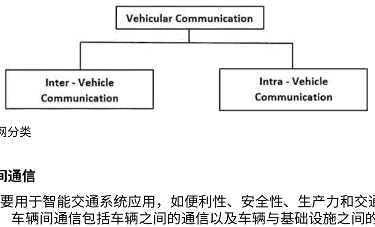

图1车联网分类

## 1. 车辆间通信

主要用于智能交通系统应用，如便利性、安全性、生产力和交通辅助。车辆间通信包括车辆之间的通信以及车辆与基础设施之间的通信。车辆间通信的一些例子包括V2V、V2I、V2C、V2P、V2D和V2G，统称为V2X通信[3]。通过使用车辆间通信技术，车辆可以相互通信以进行编队/避碰。车辆可以与路边基础设施、行人或云端进行动态交通信号、安全警报、实时交通和天气更新、基于道路状况的导航和其他云服务的传输。当两个或更多车辆在通信范围内时，它们形成一个自组织网络并交换数据。这种网络被称为车辆自组织网络（VANETs）。VANETs是移动自组织网络（MANETs）的一个子集，在其中移动节点是具有预定和统一移动模式的车辆（不像MANETs的随机移动）[4]。

## 2. 车内通信

车内通信也被称为车辆内通信。它发生在车辆内部，车辆的电控单元、传感器和执行器之间。根据应用和所需数据速率的不同，车辆内部使用不同的车辆网络协议，如控制器局域网（CAN）、本地互连网络（LIN）、介质导向系统传输（MOST）、FlexRay和汽车以太网来进行组件之间的通信[5]。表1中介绍了车辆内部网络协议的详细信息，以及它们的应用和所需数据速率。

## 3. 车辆通信的协议和标准：

为了实现车辆内部和车辆间通信场景中高速数据交换的目标，已经进行了许多标准化活动。在为车辆通信开发协议和标准方面，电气和电子工程师学会（IEEE）是领先者之一[6]。

| 协议 | 支持的数据速率 | 应用 |
|---|---|---|
| 控制器局域网 (CAN) | 1 Mbps | 发动机管理，巡航控制，变速器控制，ABS，HVAC |
| 具有灵活数据速率的CAN (CAN-FD) | 15 Mbps | 安全气囊，防抱死制动系统 (ABS)，X-by-wire，所有由CAN处理的应用 |
| 本地互连网络 (LIN) | 20 kbps | 门，窗，座椅，镜子，天窗的控制。诊断 |
| 面向媒体的系统传输 (MOST) | 25 Mbps | 信息娱乐，导航 |
| FlexRay | 10 Mbps | X-by-wire，安全气囊，防抱死制动系统 (ABS) |
| 汽车以太网 | 10 Mbps–1 Gbps | 骨干网络，360°摄像头，用于信息娱乐，动力总成，ADAS，车身舒适性，底盘安全性和诊断的系统 |

美国汽车工程师学会 (SAE) [7]和5G汽车协会 (5GAA) [8]。除了这些组织开发的标准外，蓝牙和可见光通信 (VLC) 等技术也用于短程车载通信[9]。车辆网络通信协议实现了车辆内部组件之间的通信。本节介绍了用于车载通信的协议和标准。

### 3.1 专用短程通信 (DSRC)

IEEE和SAE共同开发了专用短程通信 (DSRC) 标准，用于车辆对车辆 (V2V) 和车辆对路边 (V2R) 也被称为V2I通信。DSRC标准包括车载环境的无线接入 (WAVE)，用于车载环境的IEEE 802.11p修正案，用于资源管理、安全服务、网络服务和多通道操作的1609.2、1609.3、1609.4标准 [10]。

虽然通信协议栈由IEEE开发 (作为网络通信的先驱)，但基于应用程序的交换的消息由SAE定义。SAE J2735标准提供了消息集字典，SAE J2945.1标准定义了最低通信性能要求 [11]。DSRC标准的分层架构如图2所示。

DSRC在5.9 GHz频段运行，范围从5.850到5.925 GHz。短到中程通信距离可达1000米 (1公里)。支持的V2V和V2R通信环境可用于将本地化交通或道路信息直接广播到车辆中，高速公路咨询广播，紧急车辆接近警告和即将发生的碰撞警告等等。使用WAVE短消息协议（WSMP）或IPv6+UDP/TCP取决于给定应用的要求[12]。

DSRC分层架构中的协议及其功能如下：

- IEEE 802.11p: WAVE的介质访问控制和物理层规范
  - 对802.11的修正，以实现无需设置基本服务集的操作
  - 用于实现DSRC的物理层[13]
- IEEE 1609.4: 多通道操作
  - 控制通道和服务通道之间的坐标切换
  - 用户优先访问媒体
  - 在正确的通道上路由数据包[14]
- IEEE 1609.3: 网络服务
  - 定义网络和传输层服务，包括寻址和路由
  - 消息类型的示例包括WAVE短消息、WAVE服务广告和WAVE路由广告[15]
- IEEE 1609.2: 应用和管理消息的安全服务
  - 定义安全消息的格式和处理
  - 保护免受窃听、伪造、篡改和重放等攻击的消息[16]
- SAE J2735: DSRC消息集字典
  - 指定消息集、数据帧和数据元素
- SAE J2945/1：车载系统对V2V安全通信的要求
  - 指定了车载（V2V）安全通信的系统要求
  - 包括BSM传输速率和功率、BSM数据元素的准确性以及信道拥塞控制[18]。

由于物理层标准WAVE基于802.11系列标准，支持的数据速率取决于802.11标准。最新的802.11标准是802.11ax，也被称为Wi-Fi 6，使用多用户-多输入多输出-正交频分多址（MU-MIMO-OFDMA）技术。它可以支持高达600 Mbps的数据速率（80 MHz带宽，1个空间流）和9607.8 Mbps的数据速率（160 MHz带宽，8个空间流）[19]。

### 3.2 蜂窝式V2X

Cellular V2X（C-V2X）标准是由5GAA开发的，旨在为车辆通信的5G连接性制定路线图。该标准是从3GPP标准化的4G LTE（长期演进）和5G移动蜂窝连接发展而来的。C-V2X被认为能够在高速、高密度交通中支持高可靠性的实时通信。由于该标准是从全球范围内已建立的3GPP标准基础设施发展而来的，它降低了基础设施部署的成本，并从蜂窝网络密集化中受益。3GPP支持ITS 5.9 GHz频段。C-V2X和802.11p可以通过在ITS频段的不同信道上放置来共存。数据速率和通信范围与DSRC [20]相当。

### 3.3 蓝牙

IEEE 802.15.1标准在2.4 GHz的无线电频段工作，支持1 Mbps的语音和数据速率。它支持最多10米距离的短程车辆通信。在车辆中，蓝牙用于无线传感器和电缆替代[21]。座位占用检测、镜子控制、智能车辆进入（钥匙控制）、个性化和信息娱乐控制、通过蓝牙启用的路障辅助停车和工作区指示是蓝牙在车辆环境中支持的一些应用。

### 3.4 可见光通信（VLC）

由IEEE 802.15.7工作组支持，VLC支持短距离的视线通信。可见光通信（VLC）使用400至800 THz（780-375 nm）之间的可见光。荧光灯可以以10 kbps的速率传输信号。LED可以在短距离上支持高达500 Mbps的数据速率[22]。

V2I通信可以在交通灯和车辆前灯之间进行。V2V通信通过车辆的前灯与前车的尾灯之间进行。移动节点上的户外广告是VLC的另一个应用。

### 3.5 车内通信协议

现代豪华汽车可以拥有多达150个ECU [23]，可以处理复杂且重要的应用，如定速巡航、发动机管理系统、安全气囊、防抱死制动系统（ABS）、暖通空调（HVAC）等，这些应用需要高可靠性和数据速率，也可以处理镜子控制和座椅调节等简单任务。汽车中的信息娱乐系统提供实时数据传输，需要高数据速率。根据应用的不同需求，使用不同的协议。表1列出了用于车内通信的最流行的有线协议，以及它们的应用和数据速率。正如第3.3节讨论的那样，蓝牙无线通信协议也用于车内通信。

## 4 自动驾驶车辆（AVs）

自动驾驶车辆（AV）可以被定义为能够在“自动驾驶”模式下从一个点驾驶到另一个预定目的地的车辆，使用各种车内和车际通信技术和应用、GPS导航、传感器、激光和雷达。随着自动驾驶车辆的使用预计在未来几年内大幅增加，因为它们有望提高道路安全性和旅行时间效率。

使用自动驾驶车辆的一些优势如下：

1. 道路安全性：根据美国国家公路交通安全管理局(NHTSA)的研究，94%的道路事故是由人为错误引起的。驾驶中人为错误的一些主要原因包括超速、鲁莽驾驶、不注意、酒驾、受限驾驶和未成年驾驶。
2. 旅行时间效率：当大部分驾驶决策都是自动化的时候，人们的旅行可以更加高效。自动驾驶车辆使用导航并与周围的车辆和基础设施进行通信，这使它们能够识别道路条件、事故或延误，从而选择更好的路线到目的地。
3. 减少空气和噪音污染：车辆污染是空气中一氧化碳和氮氧化物增加的主要原因之一。缓慢行驶的交通和拥堵导致燃烧燃料增加，从而导致空气污染。过度鸣笛或拥堵的道路会引起噪音污染。自动驾驶汽车将通过与周围车辆和基础设施的智能导航和通信大大减少这种情况。

### 4.1 自动化级别

SAE J3016定义了六个自动化级别。这些级别的详细信息如下[24]:

1. **0级（L0）**：这些是没有任何形式自动化的基本汽车。
2. **1级（L1）**：支持低级别的驾驶员辅助系统。具有车道偏离辅助和自适应巡航控制等功能的车辆属于此类别。宝马的驾驶员辅助系统是L1自动化的一个例子。
3. **2级（L2）**：此级别提供部分驾驶自动化。高级驾驶辅助系统（ADAS）可以控制车辆的转向和加速/减速，属于此类别。特斯拉的Autopilot和通用汽车的凯迪拉克是具有L2自动化的车辆的例子。
4. **3级（L3）**：该级别支持条件驾驶自动化。L3车辆能够进行‘环境检测’并做出明智决策。然而，如果需要，驾驶员需要保持警觉并有权接管系统的控制。奥迪的A8是一款L3车辆。
5. **4级（L4）**：这些是高级驾驶自动化车辆，车辆本身能够在系统故障时进行干预，几乎不需要或只需最少的人工干预。虽然L4车辆可以在自动驾驶模式下运行，但仍有手动控制的选项。大多数L4车辆正在为出租车和共享乘车服务而开发。一些L4车辆的例子包括法国公司NAVA的穿梭车和出租车，Waymo和Magna的自动驾驶出租车，以及沃尔沃和百度的机器人出租车。
6. **5级（L5）**：这些车辆支持全自动驾驶，不需要人工控制。这些车辆甚至没有方向盘或刹车，并且不受地理围栏限制。这些车辆正在进行测试。

### 4.2 自动驾驶汽车的大数据来源

自动驾驶汽车能够做出明智的决策和自主驾驶，因为它们不断与车辆和基础设施进行通信，范围内的全球定位系统（GPS）以及云端[25]。

主要的大数据生成来源、相关组件及其应用在表2中呈现。

| 技术/领域 | 组件 | 应用 |
|---|---|---|
| 汽车成像 | 可见摄像头<br>3D摄像头<br>夜视摄像头<br>激光雷达<br>长距离雷达<br>短距离雷达<br>惯性导航传感器<br>超声波<br>全球定位系统 | 盲点侧视（无后视镜汽车）立体摄像头：用于车道偏离警示系统（LDWS）的方向和距离交通标志识别手势识别存在检测驾驶员监测行人/动物检测周围环境的3D地图自适应巡航控制前后停车里程计停车<br>行人和障碍物检测（短距离）<br>定位和导航 |
| 云 | 数据服务器<br>路边基础设施 | 高清地图<br>信息娱乐<br>车辆传感器数据<br>众感知数据<br>边缓存数据<br>空中更新<br>道路状况更新 |
| 车联网通信 | 无线通信模块 | 合作驾驶<br>编队<br>道路状况更新(湿路面，碰撞，制动，道路维护)<br>电子收费<br>基于位置的广告零售<br>促销 |
| 车载网络数据 | 电子控制单元(ECU)<br>传感器<br>执行器<br>车载网络 | 发动机控制<br>轮胎压力监测<br>变速器控制<br>防抱死制动<br>车身控制<br>暖通空调<br>信息娱乐<br>电子线控<br>安全气囊<br>诊断<br>高级驾驶辅助系统<br>自适应巡航控制座椅和镜子控制骨干<br>网络<br>网关 |

根据澳大利亚工程会议(AEC)2018年的一项研究，自动驾驶汽车每小时会产生约166 GB的数据，每天约产生4000 GB的数据[26]。实时应用程序，如交通管理，导航，自主驾驶，收费，车辆性能评估和预测性维护，基于位置的促销和广告等，需要高数据速率和带宽才能正常运行和提供性能。

## 5 自动驾驶中的大数据

从自动驾驶车辆数据生成的示例中可以看出，每天会在自动驾驶车辆网络中传输数千GB的数据。需要先进、高效和稳健的技术来处理这些大数据，包括数据的获取、传输、存储、计算、分析和处理。本节讨论了大数据处理的这些方面。

### 5.1 大数据获取

如前面的章节所讨论的，与自动驾驶相关的数据需要通过各种来源进行获取，例如传感器、摄像头、无线通信技术和车内网络，在各种车联网场景中。重要的是确保获取的数据不会泄露有关驾驶员或乘客的信息。

因此，确保获取的数据的安全性和隐私性至关重要。数据来源的异构性在数据获取过程中带来了几个挑战，例如安全和隐私问题、覆盖范围、获取数据的成本以及企业/政府政策。数据的可扩展性是车联网中的一个问题，因为参与者的资源有限。车辆的计算基础设施需要能够存储和处理大量异构数据[27, 28]。

### 5.2 大数据预处理

AV数据通过异构源以高数据生成率获取，如前文所述[28, 29]。从不同源获取的车辆数据是原始形式的，需要在使用之前进行处理。数据预处理可以分为五个步骤[30–32]:

1. 数据清洗
   a. 填充缺失值
   b. 平滑嘈杂数据
   c. 确认和移除异常值
2. 数据集成
   a. 将数据集成并转换为一致的数据类型
3. 数据转换
   a. 数据归一化、聚合和汇总
4. 数据减少
   a. 减小数据大小
5. 数据离散化
   a. 将数值转换为分类值

### 5.3 大数据存储

传统的数据存储系统，如独立磁盘冗余阵列（RAID），不适用于车辆网络和AV，因为它们不可靠、不安全，并且无法扩展到这些应用程序生成的大量数据[33]。 AV和车辆网络的数据存储需要具备以下特点：

1. 可用性：无论停机时间如何，始终可用的数据
2. 可扩展性：能够存储不断增加的数据量
3. 安全性：在多个驱动器、服务器、容器和位置上保证数据的机密性和认证访问
4. 效率：应能够管理PB到EB级别的存储
5. 成本效益：降低所有权和复制的成本。

车辆大数据使用以下三种存储类型[34-36]：
1. 车载存储：用于本地存储数据。由于本地存储，数据可以实时访问。
2. 路边存储：路边基础设施预留了存储空间。数据可以被缓冲并传输到不直接与车辆通信范围内的接收器，以便更远的距离。 车辆还可以通过路边基础设施下载数据。 然而，这会增加传输延迟。 基于位置的附近服务的广告使用路边基础设施。
3. 互联网存储：车辆通过互联网进行通信，交换重要信息，如天气、 OTA （空中升级） 更新和信息娱乐等，这是这种存储类型的一些示例用例。

根据访问机制，车载数据存储可以分为以下几类：## 5.4 大数据分析

随着连接和自动驾驶车辆的概念可能很快成为现实，研究人员认为AV的数据分析和存储需求对目前大多数大数据解决方案的能力构成挑战[37]。

需要对AV产生和传输的数据进行实时分析和处理，以确保车辆安全导航。这有助于揭示隐藏的模式、未知的相关性、驾驶行为和偏好，以便实时做出明智的决策[38]。车辆需要实时选择不同的数据流，并根据需求分析最合适的数据流。

因此，AV需要运行机器学习和分析引擎来识别关键数据并实时分析。

因此，AV的数据分析和机器学习算法应该能够：

-   1. 识别给定场景的关键数据
-   2. 进行实时数据分析
-   3. 压缩和聚合非关键数据以进行缓存和将来使用
-   4. 定期将非关键数据上传到云端以供将来分析
-   5. 支持从云端下载所需数据，实时处理并采取适当的行动。

在自动驾驶汽车支持的1-4级自主性中，数据分析可以指导驾驶员进行驾驶决策，并根据驾驶员的行为安全导航车辆。

这种数据分析可以分为三种类型：

-   1. 描述性分析：借助数据聚合和数据挖掘等技术，描述性分析总结历史数据，用于识别行为模式和关系。这些信息提供了重要的对不同领域和行业中不同参数行为的信息的理解。

在自动驾驶的情况下，描述性分析适用于驾驶模式和驾驶者的道路行为。这旨在研究驾驶员的安全和危险行为。

-   2. 预测性分析：描述性分析基于历史数据识别行为模式，而预测性分析是一种识别未来结果前景的方法。预测性分析通过使用历史数据上的数据分析和机器学习技术评估未来事件。

在自动驾驶汽车的情况下，根据过去的驾驶模式和道路行为，车辆可以对驾驶员在特定情况下可能的行为做出明智的判断。例如，根据与其他车辆或障碍物的接近程度，驾驶员是否会减速、超车、穿越或刹车。

-   3. 规定性分析：基于通过描述性和预测性分析获得的信息，规定性分析致力于为未来的特定情景确定要采取的行动。

对于自动驾驶环境，规定性分析利用过去驾驶员行为的描述性和预测性分析所获得的信息，并根据此发出建议。车辆可以实时评估给定情况的风险，并提出适当的行动建议。

### 5.5 大数据计算

在自动驾驶汽车中，大部分操作决策需要由车辆而不是驾驶员来做出（取决于自动化水平）。在这种情况下，具有可靠性和安全性的实时决策至关重要。为了做出实时决策，需要提高汽车计算系统和计算处理的功能水平[35, 37]。

为了实现自动驾驶功能，车辆需要具备以下特点：

-   1. 高计算能力：每秒需要处理和分析约1 GB的数据，并且需要在几分之一秒内做出实时决策。这要求车辆具备高计算能力。
-   2. 集中式计算：在大多数现代车辆中，车辆的不同电控单元进行各自的计算，导致分布式计算架构。随着不同电控单元之间的决策依赖性增加，采用集中式计算方法将更加高效，减少处理复杂性，从而实现实时决策。
-   3. 小型、高处理单元：车辆中将需要在不同位置安装多个计算组件。因此，这些计算单元需要体积小巧，同时提供高处理能力。
-   4. 安全和隐私：由于应用程序与路边基础设施、其他车辆和云端进行通信，确保通信数据的安全性，并且没有恶意节点存在是至关重要的。

## 边缘计算用于车载网络

正如之前讨论的，自动驾驶车辆产生和处理大量数据。目前的移动通信网络架构和云计算系统无法处理如此大量的数据。基于拓扑感知计算和存储资源的网络架构可能是高度动态车载网络的解决方案[38]。对于这种情况，具有多运营商边缘计算能力的拓扑感知分布式云是汽车边缘计算联盟(AECC)提出的解决方案[39]。边缘是非中心云及其计算资源的分层分布，以灵活和拓扑感知的方式。实时应用需要更快的计算。如果车辆没有足够的资源，它可以使用最近的区域边缘基础设施上可用的资源，而不是将计算请求发送到中央云。这种边缘基础设施分布在网络的不同位置/区域，以满足移动节点的需求。一些架构提出利用其他车辆(V2V)或路边基础设施(V2R/V2I)的计算资源。可以使用边缘计算进行实时数据计算的常见服务包括智能/辅助驾驶、车载信息娱乐和OTA。

### 5.6 大数据传输

如前几节所述，单个自动驾驶汽车每天会产生和交换数千GB的数据。在这样的车辆网络中，数据量会增加多倍。大部分车辆数据都是实时的，需要支持高带宽和数据速率的技术。通信和网络技术必须足够强大和高效，能够可靠地处理如此庞大的数据，并且没有延迟（尤其是实时应用）。IEEE和5G AA是在这个方向上工作的标准化机构。本节介绍了用于车辆通信的协议和标准，以及它们支持的数据速率。

城市地区的车辆密度很高，而它们的流动性通常很低（因为交通拥堵）。而在农村地区，车辆密度较低，流动性较高。[40]中进行的研究介绍了这些不同场景下带宽需求的变化。随着未来道路上自动驾驶汽车的数量增加，对高带宽、数据速率和高效技术的需求将不断增加。

研究界一直在不断努力提高通信技术的效率和数据传输速率。

文献[41]中的作者提出了用于增加网络带宽的太赫兹通信模型。该模型在0.1-1 THz频段运行。由于这个频段没有被很多通信技术使用，因此在这个信道上的数据传输不会受到干扰。然而，这个信道的限制是传输距离短，需要视线通信，这使得它不适合车载通信。车载网络使用多跳通信。因此，需要高效的跨层解决方案（物理层、介质访问控制（MAC）层和网络层解决方案）。IEEE 802.11n、802.11ac、802.11ad（WiGig）使用定向天线/波束成形来增加通信范围并减少干扰。然而，使用波束成形会导致失聪问题[42]。文献[43]中提出了一种跨层解决方案，介绍了使用双极化和波束成形的好处。该解决方案同时使用两种正交极化（垂直和水平极化）进行数据传输。由于数据是通过正交极化进行传输的，只要保持正交性，信号就不会干扰，同时实现比仅使用单极化时更高的数据传输速率。文献[44]中介绍了基于双极化定向天线（DPDA）的MAC层解决方案。文献[45]中介绍了基于DPDA的多跳、多路径路由协议。

无论应用程序是无连接的（基于用户数据报协议（UDP））还是面向连接的（基于传输控制协议（TCP）），网络上的流量负载都会影响网络的性能[46]。某些应用程序需要比其他应用程序更高的数据传输速率。例如，娱乐和导航需要比基于位置的商业更新更高的数据传输速率。

因此，需要开发基于应用程序的传输策略[47]。

## 6 AV安全

自动驾驶汽车根据周围环境做出驾驶决策。它还与附近的其他车辆和路边单元进行通信。这些车辆还需要通过边缘/云计算平台交换信息，如前几节所讨论的。随着越来越多的电子设备、智能功能和通信接口集成到车辆中，车辆对恶意行为的脆弱性也越来越高[48-50]。

随着车辆中电控单元（ECU）数量的增加，以及通过无线通信访问ECU的接口的可用性，通过车载网络和访问接口（如通用串行总线（USB）和诊断端口）对车辆组件和网络进行黑客攻击变得容易。这也会危及车辆的驾驶员/乘客信息[51]。

易受攻击的车辆接口如下：

-   1. 直接访问接口：信息娱乐系统，紧凑型光盘（CD）播放器，车载诊断
-   2. 短程无线通信接口：远程无钥匙进入，轮胎压力监测，蓝牙，Wi-Fi
-   3. 长程无线通信接口：卫星广播，AM/FM广播，蜂窝通信，边缘/云平台访问。

黑客可以找到一个易受攻击的电控单元（可以远程访问），重新编程它，从而破坏电控单元，并通过车辆总线或其他接口向网络中的其他电控单元发送恶意内容。这样，黑客就可以控制车辆。表3列出了车辆网络上的威胁列表。

可以用于减轻V2X和IVN系统上这些攻击的一些技术包括：

-   1. 消息加密和认证
-   2. 防火墙限制网络之间的通信
-   3. 保护用于在不同IVN协议网络之间进行通信的网关模块
-   4. 入侵检测和预防系统用于检测和防止恶意内容
-   5. 保护制动、发动机控制单元和转向控制单元等安全关键系统
-   6. 保护车载信息娱乐系统，如远程通信、车载信息娱乐（IVI）和无线电系统
-   7. 安全固件更新
-   8. 安全硬件。

表3 车辆网络威胁

| 车辆威胁 | 方法 | 访问网络的可能接口 |
|----------|------|--------------------|
| 中间人攻击 | 拦截、修改和重新发送信息 | CAN/BT/WiFi/蜂窝/OBD |
| 拒绝服务攻击 | 删除加密的高级内容淹没网络 | 未经授权的应用程序来自远程设备或下载到信息娱乐系统 |
| 重放攻击 | 重放V2X消息<br>重放车辆内部消息 | V2X/IVN/OBD |
| 收集个人信息 | 记录车辆消息跟踪车辆位置和交易推断驾驶员和乘客的个人信息 | V2X/GPS |
| 未经授权控制车辆参数 | 将程序安装到车辆的IVN总线上 | OBD/USB |
| 虚假警报 | 传输虚假危险警告<br>注入RDS-TMC（无线电数据系统-交通信息频道）交通信息信号 | RDS/TMC/V2V |
| 隐藏位置信息 | 使用GPS干扰设备阻止车队所有者追踪车队 | GPS |
| 篡改ECU数据 | 更改ECU配置<br>修改校准文件<br>篡改持久数据库 | OBD/CAN/JTAG |
| 蓝牙劫持和蓝牙窃听 | 通过蓝牙发送未经请求的消息 | BT |

## 7 研究方向

车联网和自动驾驶是即将到来的技术，已经引起了全球众多研究人员的兴趣。自动驾驶中的大数据研究主要涉及大数据的传输、可用数据的研究、存储和计算以及数据安全。本节介绍了该领域的一些研究方向和相关研究工作。

### 7.1 大数据传输

自动驾驶的通信技术需要支持高数据速率和带宽，以实现不同V2X场景下的实时通信。研究界一直在不断努力，基于标准车联网通信标准开发解决方案。物理层、MAC层和网络层的路由解决方案分别用于有效利用带宽、避免干扰、通道访问和网络中信息的路由。已有的许多解决方案已在第3节和第5节中讨论过。这里讨论了一些最新的研究方向：

信息中心网络（ICN）：传统的网络通信是基于地址的，源（客户端）向目标（服务器）发送请求并接收回复。在高度动态的车联网中，重要的是信息本身，而不是信息的来源。实时车辆状态、道路条件、天气信息（通常在云端可用）等信息需要以最小的延迟获取。ICN允许中间节点或路边基础设施存储这些信息。当收到对此类信息的查询时，具有最新信息的节点或路边基础设施会回复信息，而不是将查询发送到服务器/云端[52, 53]。这大大减少了延迟，并有助于有效利用带宽。内容中心网络（CCN）也被称为命名数据网络（NDN），是ICN的一种形式，支持基于名称的数据检索和普遍缓存。将NDN概念应用于车联网产生了车辆命名数据网络（V-NDN）或命名数据车联网（NDVN）[54, 55]。在这个领域中，需要开发内容命名、缓存和转发方案。

该领域中的一些开放性研究问题包括：

-   1. 路由策略的开发：需要有效的路由机制来满足车载网络的QoS要求。
-   2. 内容命名方案：需要为车载网络开发适当的内容命名方案。
-   3. 缓存策略：中间节点和路边单元可以缓存数据，但目前没有关于数据存储和转发的标准方案。
-   4. 兴趣和数据泛洪：需要标准化兴趣和数据包的泛洪方法和周期。
-   5. 处理动态网络拓扑的方法：车载网络中的拓扑结构不断变化，导致连接中断。需要解决这个问题的解决方案。
-   6. V-NDN/NDVN中的安全性：身份验证和加密增加了很大的开销。需要开发轻量级的安全通信解决方案[56]。

### 软件定义网络（SDN）和网络功能虚拟化（NFV）

自动驾驶车辆和车载网络产生的大数据将需要高带宽、存储和计算能力。单个车辆可能缺乏足够的存储和计算能力来处理所有生成的数据。在这种情况下，边缘和云计算、以及网络资源的虚拟化将在降低车载网络的资本支出和运营支出方面发挥关键作用[57-59]。传统的网络技术不足以高效处理自动驾驶车辆生成的大量数据。SDN允许根据需求动态配置网络资源，在车载网络场景中实现更好的服务质量（QoS）比传统网络架构更好。许多研究人员提出了软件定义车载网络（SDVN）架构[60]。SDVN的一些好处包括动态网络配置、更好的资源利用、降低延迟和通过网络控制器集成异构网络。

虽然SDVN提供了这些好处，但车载网络的高度动态性以及通过无线介质产生和传输的大量数据导致了以下挑战，需要开发解决方案：

-   1. 移动管理：这导致了不同的信道条件。SDN范式需要修改以处理网络移动和连接中断的问题。为了确保持续的网络连接性并维持所需的QoS，在处理隐私问题的同时，基于SDN的解决方案需要预测驾驶模式并预分配资源。
-   2. 缺乏处理异构网络流量的标准化API：SDN网络控制器提供了应用程序和网络基础设施之间的分离。然而，需要为不同的数据生成应用程序开发标准化的东向/西向API和北向API，以成功集成网络流量。
-   3. SDN控制器的易受攻击性：在任何基于SDN的解决方案中，被入侵的网络控制器可能对网络造成灾难性的分布式拒绝服务（DDoS）攻击。
-   4. 安全：恶意车辆和RSU的存在可能导致基于路由的攻击，如黑洞、吞噬洞、伪造和重放攻击。恶意软件攻击可以导致网络控制器、路由器、交换机、车辆和RSU上恶意软件的复制，从而篡改资源分配的转发规则。

### 7.2 用于车载网络的机器学习（ML）

大规模数据集的存在，对高计算能力的需求，不断变化的网络拓扑和信道条件，以及对实时应用的需求，在车载网络中需要智能学习算法，能够准确预测数据和网络条件，并做出更快的决策。ML有助于对复杂的网络环境进行建模，获取抽象特征，并做出适当的决策，以实现AV所需的QoS [61-63]。

在车载网络中，ML算法中的交通预测可以帮助以下方面：

-   1. 网络排队分析：大规模网络排队分析有助于统一理解参与节点之间的“拥塞传播”，并实现缓解拥塞的最优解。需要开发解决方案来定义拥塞阈值，检测队列演化模式，进行拥塞控制和路由，以避免/克服拥塞。
-   2. 大数据传输动态分析：这用于开发解决方案，预测由大数据流引起的路由延迟，平均链路质量和稳定性，多路径和节点的负载平衡，以避免瓶颈。
-   3. SDVN的机器学习：SDVN中的网络控制器可以根据网络流量，拥塞和延迟来做出资源分配和配置网络的决策。机器学习可以通过研究流量模式来帮助网络控制器做出这些决策。将机器学习与SDVN解决方案集成可以实现更好的网络预测并及时采取行动。

### 7.3 车联网安全

任何网络和通信都容易受到攻击，需要安全保护。车联网更容易受到攻击，因为主要使用无线介质进行通信并具有车辆节点的移动性。在车联网中，节点随时加入和离开网络，并进行车到车通信。远程通信结合车辆及其单元的访问使车辆更容易受到安全攻击[64-66]。在第6节中，介绍了车联网面临的不同威胁和可能的攻击面。本节讨论车联网安全领域的开放性研究问题。

表格 4 开放的安全问题

| 级别 | 防止访问 | 检测攻击 | 减少影响 | 修复漏洞 |
| :--- | :--- | :--- | :--- | :--- |
| 安全处理 | 认证代码，<br>安全引导 | 运行时<br>完整性<br>保护 | 资源控制，<br>虚拟化 | |
| 安全网络 | 安全通信 | | | 安全OTA<br>更新 |
| 安全网关 | 防火墙，上下文<br>感知消息<br>过滤 | 入侵检<br>测系统<br>(IDS) | 分离功能<br>域，隔离<br>传输<br>控制单元（TCU）<br>和车载<br>诊断（OBD） | 安全固件 |
| 安全接口 | 机器对机器（M2M<br>）认证访问点隔离 | | | |

不同级别的AV存在的开放安全问题：AV安全可以广泛分为处理单元、网络、网关和接口的安全。表格4提供了这些级别上开放安全问题所需的可能解决方案。

安全处理：车辆网络上的ECU和网关节点需要使用不同的通信协议处理它们之间交换的消息。这些消息可能属于关键的安全领域，也可能属于不那么关键的舒适领域。然而，一个恶意消息可以破坏整个网络。为了克服这个问题，需要解决安全车辆数据处理的方案，可能包括安全引导、ECU级别的消息加密和认证、密钥存储和安全OTA软件更新。在更新期间或更新失败时进行安全固件更新可能导致车辆无法使用。

安全网络：在实现AV网络通信方面，一些开放性研究问题包括上下文感知的消息过滤、通过加密和认证进行消息保护、网络组件（ECU、OBU、RSU、网关）的认证以及安全的端到端连接建立。用于V2X通信的无线网络也容易受到多种攻击，如第6节所讨论的。在高度动态的车辆环境中，避免或克服这些攻击是必不可少的，但却很难实现。

安全网关：网关是车辆网络的重要组成部分，它使用不同的通信协议在异构网络之间进行通信。它在功能域和网络之间提供网络隔离和安全性。一个受损的网关模块可能会破坏整个网络。因此，安全网关是必不可少的。实现安全网关的关键是解决安全网络的开放性研究问题。在网关模块上使用消息过滤器或防火墙解决方案可以隔离网络免受恶意数据的影响。网关应具备密钥存储、加密和认证消息的能力。

安全接口：接口是数据进出网络的入口/出口点。用于M2M和V2X通信、车载信息娱乐和诊断的组件，如果没有安全保护，可能会在网络中留下未被检测到的恶意数据入口。因此，保护这些接口非常重要。安全接口需要在防篡改平台上实施，以便安全地托管安全应用程序和其机密数据，从而防止物理攻击。实现安全接口的解决方案需要针对安全加密处理、加密密钥生成和存储以及安全证书处理来验证和存储信息。

## 8 结论

本章介绍了自动驾驶汽车大数据领域的重要性、应用、相关技术、问题和研究方向。本章首先介绍了车辆通信（车内和车际通信）。介绍和解释了V2X通信的协议和标准。讨论了自动驾驶汽车的使用案例，以及支持的协议、组件和技术。列举和讨论了车载网络中的大数据来源、数据生成速率、通信和处理，从而突出了大数据技术在车载网络中的重要性。本章介绍了自动驾驶汽车中大数据处理涉及的技术的正在进行的研究，如数据传输、采集、存储、计算、分析和处理。车载网络的高度动态性对自动驾驶汽车中的大数据安全和隐私构成了重大关注。本章讨论了这些安全问题和可能的解决方案。自动驾驶汽车中的大数据是一个新兴领域，具有多样化的研究方向。

本文介绍了大数据传输、车辆网络和车辆网络安全中的机器学习研究方向和开放性研究问题，旨在帮助对该领域感兴趣的研究人员。

## 参考文献

-   1. Rakouth H, Alexander P, Kosiak W, Fukushima M, Ghosh L, Hedges C, Kong H, Kopetzki S, Siripurapu R, Shen J (2013) V2X通信技术：现场经验和比较分析。在：FISITA 2012世界汽车大会论文集。Springer, Berlin, Heidelberg, 第113-129页
-   2. Sładkowski A, Pamuła W (eds) (2016) 智能交通系统-问题与展望，第303卷。Springer International Publishing
-   3. Mangel T, Klemp O, Hartenstein H (2011) 5.9 GHz交叉口车辆间通信：经过验证的非直射路径损耗和衰落模型。EURASIP J Wirel Commun Netw 2011(1), 182

+   4. Zeadally S, Hunt R, Chen YS, Irwin A, Hassan A (2012) 车辆自组织网络（VANETS）：现状、结果和挑战。 电信系统 50(4):217–241
+   5. Mahmud SM, Alles S (2005) 下一代车辆的车载网络架构。 SAE Trans:466–475
+   6. Khaled Y, Ducourthial B, Shawky M (2005, 5月) 用于车辆间通信网络的IEEE 802.11性能。 在：2005年IEEE第61届车辆技术会议，第5卷。 IEEE，pp 2925–2929
+   7. V2V安全通信，可用 https://www.sae.org/standards/
+   8. 5G汽车协会，可用 https://5gaa.org/
+   9. MacHardy Z, Khan A, Obana K, Iwashina S (2018) V2X接入技术：规定、研究和剩余挑战。 IEEE通信调查教程 20(3):1858–1877
+   10. Mohammad SA, Rasheed A, Qayyum A (2011, 3月) VANET架构和协议栈：一项调查。 在：国际车辆通信技术研讨会。 Springer，柏林，海德堡，pp 95–105
+   11. Kenney JB (2011) 美国的专用短程通信（DSRC）标准。 IEEE 99（7）：1162-1182
+   12. Li YJ (2010年11月) DSRC/WAVE技术概述。 在：国际会议上，用于质量、可靠性、安全性和鲁棒性的异构网络。 Springer，柏林，
+   13. Gallardo JR, Makrakis D, Mouftah HT (2010年) IEEE 802.11 p WAVE车载网络控制信道上EDCA性能的数学分析。 EURASIP J WirelCommun Netw 2010（1）：489527
+   14. van Eenennaam M, van de Venis A, Karagiannis G (2012年11月) IEEE 1609.4信道切换对IEEE 802.11 p信标性能的影响。 在：2012 IFIP无线日。 IEEE，
+   15. Weil T (2009年11月) 使用WAVE（1609.3）网络的ITS服务管理。 在：2009年IEEE全球通信大会研讨会。 IEEE，第1-6页
+   16. Rabadi NM (2010年11月) IEEE 1609安全服务中对无线车载环境（WAVE）的隐式证书支持。 在：第7届IEEE移动自组织和传感器系统国际会议（IEEE MASS 2010）。 IEEE，第531-537页
+   17. Park H, Miloslavov A, Lee J, Veeraraghavan M, Park B, Smith BL (2011年) 使用SAEJ2735消息集成的智能驾驶应用的交通-通信仿真评估环境。 交通研究记录2243（1）：117-126
+   18. Rostami A, Krishnan H, Gruteser M (2018年6月) 基于SAE J2945/1标准的V2V安全通信可扩展性。 在：ITS美国年会论文集
+   19. Qu Q, Li B, Yang M, Yan Z, Yang A, Deng DJ, Chen KC (2019年) 对即将到来的下一代WLAN S标准-IEEE 802.11 ax的调查和性能评估。 移动网络应用24（5）：1461-1474
+   20. Papathanassiou A, Khoryaev A (2017) 作为卓越全球互联运输服务的基本实现者的细胞V 2X。 IEEE 5G Tech Focus 1(2):1–2
+   21. Friesen MR, McLeod RD (2015) 智能交通系统中的蓝牙调查。 Int J Intell Transp Syst Res 13(3):143–153
+   22. Prakash P, Sharma R, Sindhu S, Shankar T (2017, Dec) 利用太阳能电池板的可见光通信。 In: 2017 2nd international conference on emerging computation and informationtechnologies (ICECIT). IEEE, pp 1–5
+   23. Winning A (2019) 汽车ECU数量继续增加。 可用 https://www.eenewsautomotive.com/news/number-automotive-ecus-continues-rise
+   24. https://www.synopsys.com/automotive/autonomous-driving-levels.html
+   25. Daniel A, Subburathinam K, Paul A, Rajkumar N, Rho S (2017) 大型自主车辆数据分类：走向智能交通系统的采集。 车辆通信 9:306–312
+   26. Nelson P (2016) 仅一个自主车辆每天将使用4000 GB的数据。 可用 https://www.networkworld.com/article/3147892/one-autonomous-car-will-use-4000-gb-of-dataday.html
+   27. Lyko K, Nitzschke M, Ngomo ACN (2016) 大数据采集。 在：数据驱动经济的新视野。 Springer, Cham, pp 39–61
+   28. Brinkmann BH, Bower MR, Stengel KA, Worrell GA, Stead M (2009) 大规模电生理学: 大数据的采集、压缩、加密和存储。 J Neurosci Methods 180(1):185–192
+   29. Cho W, Choi E (2017) 使用MapReduce技术对车辆驾驶数据进行大数据预处理方法。 J Supercomput 73(7):3179–3195
+   30. Fiosina J, Fiosins M, Müller JP (2013) 大数据处理和挖掘用于下一代智能交通系统。 J Teknologi 63(3)
+   31. Pandey MK, Subbiah K (2016, Dec) 社交网络和大数据分析辅助可靠的车联网推荐系统模型。 在：国际车联网会议。 Springer, Cham, pp 149–163
+   32. Guerreiro G, Figueiras P, Silva R, Costa R, Jardim-Goncalves R (2016, Sept) 用于智能交通系统的大数据处理架构。 高速公路交通流量的应用场景。 在：2016年IEEE第8届智能系统国际会议（IS）。 IEEE, pp 65–72
+   33. 杨F, 李J, 雷T, 王S (2017) 车联网的架构和关键技术: 一项调查。 J通信信息网络 2 (2) : 1-17
+   34. 胡Z, 郑Z, 王T, 宋L, 李X (2017) 路侧单元缓存: 面向多个内容提供商的拍卖式存储分配。 IEEE无线通信交易 16 (10) : 6321-6334
+   35. 张W, 张Z, Chao HC (2017) 合作雾计算处理车联网中的大数据: 架构和分层资源管理。 IEEE通信杂志 55 (12) : 60-67
+   36. Mekki T, Jabri I, Rachedi A, ben Jemaa M (2017) 车载云网络: 挑战, 架构和未来方向。车辆通信 9: 268-280
+   37. Darwish TS, Bakar KA (2018) 基于雾的智能交通大数据分析在车联网环境中: 动机, 架构, 挑战和关键问题。 IEEE Access 6: 15679-15701
+   38. Al Najada H, Mahgoub I (2016年12月) 使用大数据分析的智能交通系统中的拥堵和事故预测和警报系统。 在：2016年IEEE计算智能研讨会系列（SSCI）。 IEEE，第1-8页
+   39. 汽车边缘计算联盟 (AECC) (2020年) 通用原则和愿景, 白皮书。 可用 https://aecc.org/wp-content/uploads/2020/03/AECC_White_Paper_v3.0_-_Jan_31_2020.pdf
+   40. Thriveni HB, Kumar GM, Sharma R (2013年4月) 移动自组织网络中路由协议的性能评估, 节点密度和节点移动性变化。 在：2013年国际通信系统和网络技术会议。 IEEE，第252-256页
+   41. Zhang C, Ota K, Jia J, Dong M (2018年) 打破大数据传输的阻塞: 自动驾驶车辆中的千兆位道路通信。 IEEE通信杂志 56 (6) : 152-157
+   42. Sharma R, Kadambi G, Vershinin YA, Mukundan KN (2016年) 无线网络中避免失聪的MAC层协议调查。 在：移动计算和无线网络: 概念, 方法, 工具和应用。 IGI Global, 第1758-1797页
+   43. Rinki S (2014年) 对天线的双极化和定向性对MANET性能的影响的仿真研究。 在：博士学位论文, 博士学位论文, 考文垂大学, 英国
+   44. Sharma R, Kadambi GR, Vershinin YA, Mukundan KN (2015年4月) 基于双极化定向通信的中间访问控制协议, 用于提高MANET性能。 在：2015年第五届国际通信系统和网络技术会议。 IEEE, 185-189页
+   45. Sharma R, Kadambi GR, Vershinin YA, Mukundan KN (2015年4月) 支持双极化定向通信的多路径路由协议, 用于提高MANET性能。 在：2015年第五届国际通信系统和网络技术会议。 IEEE, 258-262页
+   46. Gopinath T, Kumar AR, Sharma R (2013年4月) 在不同流量负载下评估无线自组织网络上的TCP和UDP性能。 在：2013年国际通信系统和网络技术会议。 IEEE, 281-285页
+   47. Huang Y, McMurran R, Amor-Segan M, Dhadyalla G, Jones RP, Bennett P, Mouzakitis A, Kieloch J (2010) 为车辆信息娱乐系统开发的自动化测试系统。 Int J Adv Manuf Technol 51(1–4):233–246
+   48. Xue M, Wang W, Roy S (2014) 自主车辆网络动力学的安全概念。 Automatica 50(3):852–857
+   49. Amoozadeh M, Raghuramu A, Chuah CN, Ghosal D, Zhang HM, Rowe J, Levitt K (2015) 连接车辆流的安全漏洞及其对合作驾驶的影响。 IEEE Commun Mag 53(6):126–132
+   50. Thing VL, Wu J (2016, Dec) 自主车辆安全性：攻击和防御的分类。 In: 2016 IEEE国际物联网大会（iThings）和IEEE绿色计算与通信（GreenCom）和IEEE物理和社交计算（CPSCom）和IEEE智能数据（SmartData）。 IEEE, pp 164–170
+   51. Yu L, Deng J, Brooks RR, Yun SB (2015年4月) 汽车电子控制单元设计以避免数据篡改。 在：第10届年度网络与信息安全研究会议论文集，第1-4页
+   52. Mau DO, Zhang Y, Taleb T, Chen M (2014年5月) 基于命名数据的车辆互联网研究 OPNET模拟研究。 在：测试平台和研究基础设施国际会议。 Springer, Cham, 第116-125页
+   53. Khelifi H, Luo S, Nour B, Moungla H, Faheem Y, Hussain R, Ksentini A (2019年) 命名数据网络在车辆自组织网络中的应用：现状和挑战。 在：IEEE通信调查教程
+   54. TalebiFard P, Leung VC, Amadeo M, Campolo C, Molinaro A (2015年) 用于车辆自组织网络的信息中心网络。 在：车辆自组织网络。 Springer, Cham, 第503-524页
+   55. Xiao J, Deng J, Cao H, Wu W (2016年12月) 基于道路段信息的命名数据网络在车辆环境中的应用。 在：并行处理算法和体系结构国际会议。 Springer, Cham, 第245-259页
+   56. Jain V, Kushwah RS, Tomar RS (2019) 使用信任函数保护车辆自组网的命名数据网络。 在：软计算：理论与应用。 Springer, 新加坡, 第463-471页
+   57. Ananth MD, Sharma R (2016年12月) 使用网络功能虚拟化进行云管理，以减少资本支出和运营支出。 在：2016年第8届国际计算智能和通信网络会议（CICN）。 IEEE, 第43-47页
+   58. Ananth MD, Sharma R (2017年1月) 基于网络功能虚拟化的云系统的成本和性能分析。 在：2017年IEEE第7届国际高级计算会议（IACC）。 IEEE, 第70-74页
+   59. Sharma R, Reddy H (2019年12月) 负载均衡器对基于软件定义网络（SDN）的云的影响。 在：2019年IEEE第16届印度理事会国际会议（INDICON）。 IEEE, 第1-4页
+   60. Alioua A, Senouci SM, Moussaoui S (2017年6月) dSDiVN：一种用于无基础设施车载网络的分布式软件定义网络架构。 在：国际社区服务创新会议。 Springer, Cham, 第56-67页
+   61. Taherkhani N, Pierre S (2016年)：一种用于车载自组织网络的集中式和本地化数据拥塞控制策略，使用机器学习聚类算法。 IEEE智能交通系统杂志 17（11）：3275-3285
+   62. Grover J, Prajapati NK, Laxmi V, Gaur MS (2011年7月)：用于VANET中多个不良行为检测的机器学习方法。 在：计算与通信进展国际会议。 Springer, 柏林, 海德堡, 第644-653页
+   66. Franeková M, Lüley P (2013年10月) 智能交通系统中用于车对车通信的数字签名方案的安全性。 在：交通系统远程感知国际会议。 Springer，柏林，海德堡，第258-267页

## 深度学习和物体检测
### 用于安全驾驶

### 智能视觉系统中目标检测和跟踪的分析

K. Kalirajan, K. Balaji, D. Venugopal和V. Seethalakshmi

摘要 在当前情况下，由于计算机视觉的巨大应用，如视频监控、人机交互、交通监控、人类行为分析、导弹制导和军事服务、医疗应用和车辆导航，大多数研究人员都非常有动力进行新的发现。典型的视频数据帧包括前景和背景信息。描述感兴趣区域中目标特征的像素点被视为前景信息，其余特征点被视为背景信息。移动物体检测在任何类型的计算机视觉应用中起着关键作用。移动物体检测是在视频序列中更准确地识别人、车辆、玩具和人脸等类别对象的过程，而不受背景干扰。在大多数情况下，现有的移动物体检测方法只关注前景信息，经常忽略背景信息。结果，跟踪器会偏离目标并检测到非前景对象。最近，已经提出了几种移动物体检测的方法。然而，由于复杂的环境，包括光照变化、目标外观的快速变化、背景中的相似对象、遮挡、目标旋转、缩放、快速和突然的运动变化、移动软阴影、平坦表面区域和动态背景，其鲁棒性和新颖性仍然具有挑战性。本书章节介绍了智能视频监控系统的概念以及移动物体检测中涉及的主要挑战。本章还讨论了相关背景及其在不同角度上的缺点。它还提出了用于高效物体检测和跟踪的潜在算法。最后，本书章节总结了与物体检测和跟踪相关的研究机会。

关键词 目标检测和跟踪 · 视频监控 · 特征提取 · 视频分析

## 1 引言

智能交通是当前情况下有效处理交通拥堵和交通规划的需求。在现实世界的交通监控中，需要在所有天气条件下的所有时间监测、检测和跟踪监控场景中的车辆。这种车辆跟踪可以自动检测新目标或现有目标的消失。视频监控是一个新兴领域，在受限区域进行匿名活动监测，并且它在今天的生活中变得非常重要。通常，视频监控系统观察和分析大量的视觉信息，以确定给定图像帧中的可疑活动。然而，由于枯燥和疲劳，手动存储和分析重要的监控数据是困难的。相反，智能视频监控系统可以支持事件检测和其他基于活动的分析的手动操作。图1显示了智能车辆跟踪系统的基本构建模块。

移动物体检测是任何类型的视频处理应用的首要步骤，例如视频监控、交通监测、人机交互、人员监测、军事和边境安全服务以及车辆导航等。移动物体检测是在所有图像帧中更准确地识别和定位目标而不受背景干扰的过程。帧内的任何特定感兴趣区域，例如车辆、动物、人和其他移动物体，都可以被视觉系统视为要识别的目标。常用的移动物体检测方法包括背景减法、高斯混合、自适应高斯混合、光流基础方法和时序差分。由于移动物体检测算法的性能极大地影响高级抽象，如分类、跟踪和事件分析，智能视频监控系统需要更合适和稳健的物体检测算法。物体分类是智能视频监控系统的第二步。它将对象分类为人、车辆、动物和其他目标，如玩具、建筑等。对象分类将进一步提高后续过程的可靠性。通常，对象分类基于空间特征和时间特征。有时候为了更好的性能，同时使用空间和时间特征。目标跟踪是创建先前和当前帧之间的时间连接的过程。

目标帧。通常，通过跟踪目标的轨迹、运动和方向，在连续的帧中保持对检测到的目标的跟踪。这对于视频监控系统中的更高级别过程是必要的。在事件分析中，将分析和描述被跟踪目标的动作和行为，并在最终决策中进行说明。关于事件的最佳和可行的决策将导致在事件发生之前采取早期有效的预防措施和纠正措施。

这种优雅的视频监控系统在以下各个领域中应用。

- 银行、超市和火车站等公共安全
- 养老院监控和远程医疗援助
- 交通监控、车辆导航和智能停车系统等
- 废弃物检测、导弹制导、边境安全和恐怖活动监测等

### 1.1 目标检测和跟踪中的主要挑战

智能视频监控系统需要强大的移动目标检测和跟踪，以进行高级视频分析。特别是移动目标检测主要用于将前景目标与背景区分开来，完全消除背景影响。然而，复杂和动态的背景条件使目标检测过程非常棘手。移动目标检测过程中涉及的主要挑战（见图2）如下所示。

- 光照变化和恶劣天气条件
- 动态背景
- 部分和/或完全遮挡
- 背景杂乱和相似的目标区域
- 移动投影
- 突然的运动变化、旋转和尺度变化
- 由于光圈误差和相机抖动等原因引起的图像噪声。

光照变化和恶劣天气条件

背景环境中的光照变化严重影响目标检测和跟踪系统的性能。在室外环境中，这是由于阳光变化引起的，而在室内环境中，人工照明条件是根本原因。此外，复杂的天气条件，如雾和多云，也会导致光照变化。图2a显示了光照变化的一个例子。

![图2 移动目标检测中的主要挑战示例: a光照变化,b目标遮挡, c突然运动变化, d-f平面内目标旋转, g-h尺度变化,i动态背景, j移动投影阴影和 k平面外旋转. 来源http://cvlab.hanyang.ac.kr/tracker_bench [1], http://www4.comp.polyu.edu.hk/~cslzhang/FCT/ FCT. html [2], http://perception.i2r.a-star.edu.sg/bk_model/bk_index.html [3]](img/d533026d352eb725cb7db068a0bcd602_60_0.png)

部分和/或完全遮挡

遮挡是目标检测和跟踪中的另一个具有挑战性的条件。在目标检测和跟踪过程中，前景目标部分或完全被其他非目标物体遮挡（参见图2b）。在这种情况下，无法获取目标建模所需的信息，导致无法检测到非目标物体。

因此，在目标重新出现时，构建一个有效的算法来检测目标是至关重要的。

背景杂波

杂乱的背景是降低系统性能的另一个重要因素。由于背景杂波，很难将前景目标与背景区分开来。

突然的运动变化、旋转和尺度变化

目标观测中的突然运动变化、旋转和尺度变化是目标检测和跟踪中的重要挑战参数。由于突然的运动变化，如跳跃、奔跑、拉动或推动，目标将经历严重的外观变化和运动模糊（见图2c）。快速移动的目标会产生一条幽灵区域的轨迹，而不规则的运动会产生伪影。识别和定位这样的目标将变得复杂。此外，旋转（见图2d-f，k）和尺度变化（见图2g-h）显著影响像素之间的关系和方向。传统方法无法应对这些复杂情况。

相似目标区域和动态背景

在存在相似背景的前景目标中进行移动目标检测也是一项具有挑战性的工作（见图2g-h，j）。强大的目标检测算法必须能够应对这些挑战。在动态背景视频中，背景细节如波动的水、摇曳的树木、天空中的飘动云彩和房间里的摇曳窗帘都是时间变化的量，它们可能既不规则也不规律，往往导致易受攻击的目标检测。图2i展示了动态背景图像帧的一个例子。

移动投影

投影去除是目标检测中的一个主要问题之一。基本上，阴影是由于光照条件的变化而产生的。根据视角的不同，阴影可以分为静态阴影和动态阴影。

静态阴影是由静止物体引起的，而动态阴影是由移动物体形成的。在现实世界的场景中，移动的投影阴影会干扰目标跟踪器，导致误检测。例如，在交通监控中，移动的投影阴影会被识别为车辆的一部分，而边界框会将该阴影误认为是一辆车（见图2j）。使用光照不变特征可以提高系统的效能。

图像噪声

视频帧有时会受到随机噪声的干扰，例如高斯噪声、快门噪声和椒盐噪声。图像质量也可能受到相机传感器的光圈误差、相机抖动和低照度等因素的影响。由于图像质量直接影响视觉分析的性能，目标检测和跟踪算法必须能够明确处理这些噪声。

## 2 移动目标检测方法

有几种方法可以检测连续视频帧中的移动目标区域。下面的章节描述了移动目标检测的各种方法。

### 2.1 时间差分方法

在静态环境中，背景相对稳定，通过将当前帧与静态背景模型相减可以很容易地估计目标的运动。另一方面，在动态环境中，由于移动相机导致背景不断变化，初始背景模型不足以估计移动目标的运动。时间差分方法考虑了两个或三个连续帧来估计目标的运动。由于最近的图像帧用于运动估计，这种方法更适用于动态环境。时间差分方法的类型包括帧间差分技术和三帧差分技术。在帧间差分技术中，通过对两个连续帧进行差分来检测目标。设 $g(x, y, t)$ 为初始视频帧， $g(x, y, t+1)$ 为下一帧。然后，移动目标的计算如下：

$D(x, y) = g(x, y, t+1) - g(x, y, t) \quad \quad \quad \quad \quad \quad \quad (1)$

$ROI = \begin{cases} 1 ; D(x, y)>T_{h} \\ 0 ; D(x, y) \leq T_{h} \end{cases} \quad \quad \quad \quad \quad \quad \quad (2)$

其中 $D(x, y)$ 是差异图像， $T_{h}$ 是目标分类的阈值，而 $ROI$ 是前景区域。从公式(2)可以看出，低于阈值的特征点被视为背景，而其他特征点被视为前景对象。帧间差分方法足够强大，可以在差异图像中产生众所周知的运动斑点，适用于快速移动的目标。然而，对于缓慢移动的目标，噪声和前景目标的运动斑点是无法区分的。此外，两帧差分方法在阴影问题上受到很大影响。在三帧差分方法中，使用三个连续图像而不是两个图像帧来计算差异图像。设 $g_{1}(x, y), g_{2}(x, y)$ 和 $g_{3}(x, y)$ 是三个连续图像帧。差异图像 $D(x, y)$ 的计算如下。

$D(x, y)=\min \left\{\left|\left(g_{1}(x, y)-g_{2}(x, y)\right)\right|,\left|\left(g_{2}(x, y)-g_{3}(x, y)\right)\right|\right\} \quad \quad \quad \quad (3)$

然后，根据公式（2）对差分图像进行阈值处理，以检测前景目标。三帧差分法最适合用于动态环境。然而，它存在目标异常值问题。此外，它对阈值和目标完全消失的情况非常敏感，当阈值较大时，目标完全消失。此外，它无法检测停止移动的目标。

### 2.2 简单背景减除

在简单的背景减除方法中，通过将当前图像帧与背景模型相减来检测移动目标。设 $f_t(x, y)$ 和 $Bg_t(x, y)$ 分别为当前图像帧和背景模型。根据公式 (4) 计算差分图像 $D_t(x, y)$。

$D_t(x, y) = f_t(x, y) - Bg_t(x, y) \quad (4)$

移动目标 $BI_t(x, y)$ 由决策阈值 $T_h$ 计算如下 [4]:

$BI_t(x, y) = \begin{cases} 0; & D_t(x, y) > T_h \\ 1; & D_t(x, y) \leq T_h \end{cases} \quad (5)$

在动态阈值的背景减法中，阈值根据外部环境条件进行动态更新。设 $\Delta T$ 为动态阈值，则方程式 (5) 可以重写如下:

$BI_t(x, y) = \begin{cases} 0; & D_t(x, y) > T_h + \Delta T \\ 1; & D_t(x, y) \leq T_h + \Delta T \end{cases} \quad (6)$

在 $\Delta T$ 给定的情况下

$\Delta T = \alpha \frac{1}{M \times N} \sum_{x=0}^{N-1} \sum_{y=0}^{M-1} (f_t(x, y) - Bg_t(x, y)) \quad (7)$

在这里，$\alpha$ 是缩放因子，$(M \times N)$ 是图像帧的大小。背景减法方法是最广泛用于固定相机运动的移动目标检测的方法。Zhang 和 Liang [5] 更新了一致的背景模型，并通过动态阈值识别移动目标。形态学操作用于消除背景影响。背景减法方法可以为众所周知的背景模型提供完整的目标信息。然而，它对动态背景变化和相机运动变化非常敏感。

### 2.3 背景建模方法

在背景建模中，每个像素的理想特征在所有图像帧中学习和更新，从而改善了在动态环境下的背景减法结果。单高斯模型和高斯混合模型是背景建模的最流行方法。

#### 2.3.1 非递归中值滤波技术

在非递归中值滤波技术中，前面的‘n’帧被缓冲，并且使用缓冲帧的中值来构建背景模型。背景模型会定期更新，以适应每一帧的输入。

通过从当前像素值中减去中值[6]，可以获得前景像素，如下所示。

$f_t(x,y) = \begin{cases} \text{前景} & ; |f_t(x,y) - M_t(x,y)| > T \\ \text{背景} & ; \text{否则} \end{cases} \quad (8)$

其中T是阈值，$f_t(x,y)$ 是当前像素值，$M_t(x,y)$ 是时间t的中值。在非递归中值滤波技术中，为了进行背景建模，需要使用大小为‘n’的缓冲区来存储‘n’个前面的帧。除此之外，它还需要更高的计算成本。

#### 2.3.2 递归中值滤波技术

在递归中值滤波技术中，中值通过比较输入像素而不是缓冲前一帧来增加或减少。如果输入像素高于背景像素，则中值增加，反之亦然。否则，中值在下一帧保持不变。背景模型的更新如下[7]:

$Bm_{t+1}(x,y) = \begin{cases} Bm_t(x,y) + 1; & f_t(x,y) > Bm_t(x,y) \\ Bm_t(x,y) - 1; & f_t(x,y) < Bm_t(x,y) \\ Bm_t(x,y); & f_t(x,y) = Bm_t(x,y) \end{cases} \quad (9)$

其中 $Bm_{t+1}(x,y)$ 是下一个背景模型，$Bm_t(x,y)$ 是当前背景图像帧，$f_t(x,y)$ 是当前前景图像帧。虽然中值滤波方法对噪声不敏感且需要较少的计算，但它不能预测突然从前景到背景或从背景到前景状态变化的对象。

#### 2.3.3 单高斯背景模型

在单高斯背景模型中，每个像素的均值和协方差被建模为单高斯背景模型，并通过所有连续帧进行更新。当前帧中每个像素的背景似然与背景像素进行比较。背景似然变化较大的像素被分类为前景。单高斯模型无法处理室外环境，因为单个像素存在突然运动和移动阴影的不同统计特性。

#### 2.3.4 高斯混合模型

为了改进单高斯方法，在自适应高斯混合模型中，为每个像素建模多个独立分布的混合。最初，每个像素被建模为高斯分布的混合，并为每个分布分配一个权重。具有较大权重的分布表示背景。如果任何一个分布与当前像素值匹配，则将其分类为背景像素，并按照以下方式更新分布的权重[8]。

$w_{k,t} = (1 - \alpha)w_{k,t-1} + \alpha(Ma_{k,t}) \quad (10)$

其中 $\alpha$ 和 $k$ 分别是学习率和分布数量。当前像素的高斯混合由 $Ma_{k,t}$ 表示。对于匹配的高斯模型， $Ma_{k,t}$ 被赋值为‘1’。否则，它被赋值为‘0’。如果所有的‘K’个分布都与当前像素值不匹配，则将最不可能的分布替换为具有高方差和低先验权重的新分布。由于初始阶段收敛速度较慢，高斯混合模型在突发光照变化的情况下会产生误检测。此外，它需要关于要使用的高斯数量的先验知识和适当的高斯参数调整机制。此外，这些方法涉及更多的计算复杂性。

#### 2.3.5 隐马尔可夫模型 (HMM)

在隐马尔可夫模型中，每个像素的强度变化被建模为不同的离散状态，每个状态代表图像场景中发生的相应事件。隐马尔可夫模型用于学习状态之间的转移概率。难以建模的事件也可以用HMM表示。例如，在棒球事件检测中，视频镜头可以表示为预定义的状态，如接球、跑动和击球。在车辆跟踪中，视频场景可以表示为不同的状态，如汽车、道路和阴影。隐马尔可夫模型也是无监督背景建模方法的一个很好的替代方案。甚至刚性事件也可以很容易地通过这种方法建模。但是，它只使用低级视觉特征，预定义的状态会产生歧义。此外，离散状态的排列和它们的转移流并不唯一，很难在状态的歧义下区分这些状态。

#### 2.3.6 特征空间背景减除

该方法计算了 $k$ 帧背景图像的均值和输入帧的协方差矩阵。对协方差矩阵进行特征值分解，并通过最具描述性的特征向量构建背景模型。所有传入的帧首先投影到特征空间中，并使用投影系数和特征向量进行重构。此外，通过将重构帧与特征空间背景模型相减，可以检测到前景对象。该方法通过特征向量更新光照变化，对背景光照不敏感。然而，它只适用于静态背景。它无法处理动态背景，并且在户外环境中无法成功。

#### 2.3.7 视觉背景提取（Vibe）算法

Vibe算法通过从背景中随机观察到的一组像素构成背景球模型。计算传入像素与背景模型中心之间的欧氏距离，并根据欧氏距离进行像素分类。该方法不需要任何参数调整。视觉背景提取算法对光照变化和相机抖动稳定。该方法具有随机性，不会在每一帧中建模背景。因此，如果将该方法重复应用于相同的视频数据集，每次结果都会不同。

### 2.4 光流方法

在光流方法中，根据每个像素的光流特性（如速度和方向），估计和分组移动区域的流向矢量，以实现前景运动检测。静止物体的运动被转化为线性信号轨迹[9]。该方法基于以下假设：各个像素的亮度在整个图像帧上具有平滑变化。即使在相机运动下，该方法也能够检测到移动目标。光流方法对噪声环境更敏感，导致跟踪性能较差。

此外，由于光照变化、非稳态背景和不同目标外观的原因，可能会出现突然的背景运动变化。在这些情况下，基于光流的方法所做的假设变得无效。

### 2.5 特征点检测器

在基于特征的方法中，局部特征如斑点、点、边缘、角点和小块被用于移动目标检测，因为它在光照变化和相机运动下具有不变性。局部特征更好地处理尺度变化、旋转和遮挡。局部特征是在图像帧中设置的模式，它们在纹理和颜色强度方面与其邻居有所区别。这些特征通常用于寻找图像对应，无论有无遮挡、视角变化和背景杂波。

特征检测用于寻找局部不变于旋转和尺度变化的感兴趣特征点。特征提取算法计算描述符，将局部像素邻域转换为紧凑的向量表示。

常用的特征检测器有Harris-Stephens角点检测器、最小特征值角点检测器、尺度不变特征变换（SIFT）检测器和加速稳健特征（SURF）检测器。

### 2.6 基于分割的方法

基于分割的方法通过将具有相似特征的区域进行分割来进行移动目标检测。分割算法的准确性决定了目标检测的结果。有几种分割方法。

#### 2.6.1 均值漂移算法

算法最初从给定的图像数据中随机选择大量的聚类中心，并通过多次迭代移动聚类中心。均值漂移向量是由当前和前一个聚类中心描述的向量。均值漂移向量通过迭代计算，直到聚类中心不能再改变。均值漂移算法需要适当的参数调整以获得更好的分割结果。

#### 2.6.2 图割算法

在图割算法中，图像被表示为一个图，图像分割问题被视为一个图分割问题。图像中的像素被视为顶点。通过修剪连接顶点的边的权重，将顶点分割成不同的子图。权重根据颜色、纹理和亮度的相似性进行计算。子图之间被修剪的边的总权重被称为割。在图割算法中，最小割准则受到过分分割的影响。尽管通过归一化割准则消除了过分分割问题，但它需要更多的计算和内存存储。

#### 2.6.3 主动轮廓

基于主动轮廓的图像分割通过闭合轮廓描述目标边界，并根据图像能量函数演化这些闭合轮廓。图像轮廓的适应性由能量函数来表征，这个能量函数可以全局或局部计算。局部能量计算利用图像梯度，而全局能量计算通常使用颜色和纹理等特征。由于图像梯度对局部极小值非常敏感，基于区域的颜色信息被用于图像轮廓评估。然而，它不能很好地定位目标轮廓。基于轮廓的方法的一个主要问题是轮廓初始化。

主动轮廓模型方法需要关于目标或背景的先验知识。为了获得更好的分割结果，需要选择合适的能量函数、适当的轮廓初始化和适当的轮廓表示。不合适的能量函数、轮廓表示和轮廓初始化会导致分割结果不佳。

### 2.7 监督学习方法

在监督学习方法中，通常从训练样本中学习不同的目标视角以进行目标检测。学习目标的不同外观并不需要完全存储一组模板。在目标检测的背景下，学习实例由目标特征和其关联的类别手动组成。在这里，选择适当的目标特征是至关重要的，因为它在将目标类别分开时起着重要作用。其他特征，如目标面积、方向和密度函数，也用于学习策略。有不同的学习方法，包括决策树、神经网络、支持向量机和自适应增强。

### **2.7.1 自适应增强**

自适应增强是一种迭代方法，其中将多个弱分类器组合起来，以找到比单个分类器性能更好的准确分类器。首先，训练集被赋予初始权重，并通过目标分类器估计错误。选择分类错误较少的分类器作为弱分类器。然后，增加权重并在下一次迭代中选择新的弱分类器。从目标检测的角度来看，弱分类器是一组用于目标特征提取的简单阈值。

### **2.7.2 支持向量机（SVM）**

SVM是一种分类器，将图像像素聚类为前景和背景。具有支持向量的图像平面称为超平面。超平面通常将图像数据点分为正样本和负样本。正样本指的是前景对象，负样本指的是非前景对象。SVM分类器有两种类别，即线性SVM和非线性SVM。在线性分类器中，超平面是通过线性规划方法从不同可能的超平面中得出的。在非线性分类器中，使用核函数进行特征提取，核函数将非线性数据点转换为高维空间，使得数据点变得线性可分。在线性SVM分类器中，估计超平面的边界需要更加谨慎。此外，在非线性SVM分类器中，选择适合目标分类的正确核函数并不容易。

## **2.8 基于特征提取的目标检测**

在移动目标检测过程中，图像帧的视觉局部特征也可以用于前景特征提取。一般来说，局部特征在特征空间中是独特和独特的。通过在帧序列上创建特征对应关系，可以跟踪移动目标。由于正确特征的选择对系统性能有很大影响，应该使用适当的图像特征进行移动目标检测。有几种目标特征，包括光谱特征、空间特征和时间特征。

### **2.8.1 颜色特征**

颜色特征是直方图方法中使用的光谱特征。目标颜色通常由照明和反射两个因素组成。在大多数情况下，颜色特征通常被选择，因为其操作速度快。

颜色特征是实时应用中最理想的特征，如车辆跟踪、人员检测和人类行为分析。在其他局部特征中，颜色信息因其在目标旋转和尺度变化下的一致性而受到广泛关注。然而，颜色特征对光照变化非常敏感。

#### 2.8.2 边缘特征

边缘是用于检测物体边界周围的强度变化的空间特征。边缘特征对光照变化的响应较小，而颜色特征则较为敏感。基于形状的目标检测方法主要追求前景检测中的边缘特征[10]。然而，当被检测的物体开始移动时，它会遇到幽灵问题。

#### 2.8.3 梯度特征

梯度是颜色逐渐混合的过程。梯度特征可用于提取目标跟踪中的前景信息。在梯度特征中，每个像素点表示给定方向上该点的强度变化。基于梯度的方法使用形状或轮廓来表示对象，例如人体[11]。

#### 2.8.4 纹理特征

纹理是对给定图像中对象强度变化的量化过程[12]。对象的纹理提供了有关感兴趣区域内强度的空间集合的详细信息。它可以在视频帧中自然地找到，并可用于分割前景信息。纹理特征针对光照变化和阴影问题进行了定制。然而，在平滑表面区域下，纹理特征无法提供足够的前景信息。

### 2.9 基于形状的移动物体检测

物体可以通过一组图像表示来描述，这些表示可能适用于不同场合的移动物体检测[13]。下面解释了常用的物体表示方法。

#### 2.9.1 点表示

在点表示中，物体由一个称为质心的单个点表示[14]。物体也可以由多个点表示[15]。这种物体表示方法更适用于在视频场景中跟踪小的移动物体区域，因为它简单明了。在这种表示方法中，物体直接由其像素强度或颜色特征表示。

#### 2.9.2 原始几何形状

几何形状，如矩形、正方形、椭圆和圆，更常用于表示计算机视觉应用中的简单刚体物体。在这种表示方法中，物体通过平移、仿射或投影变换进行建模。有时，非刚性物体也可以用原始几何形状进行建模[16]。

#### 2.9.3 表达形状

对于人类行为分析，多数情况下选择关节形状。在关节形状模型中，感知运动模型将感兴趣区域的不同部分连接在一起。人体由腿、手和头等身体部位组成，是关节对象的一个例子。在这里，每个部分可以用包括矩形和椭圆在内的基本形状来表示[13]。

#### 2.9.4 骨骼表示

骨骼对象表示可用于基于活动的对象识别。在这种表示中，可以对对象轮廓应用中轴变换来提取对象的骨骼。它还用于对刚性和关节对象建模。

#### 2.9.5 轮廓表示

一个被一致填充为黑色的对象轮廓表示为对象的轮廓。轮廓表示是追踪复杂非刚性对象的正确选择[13]，并且它为人体运动提供了满意的二进制表示。然而，当人携带非目标对象时，它被认为是给出非目标对象的轮廓表示。

#### 2.9.6 主动轮廓表示

主动轮廓表示是非刚性物体表示的合适选择，它通过边缘而不是整个轮廓来描述物体[17]。

## 3 相关工作

在移动物体检测算法的文献中提出了更多的贡献。所有这些努力都集中在目标检测和跟踪问题的几个不同研究上。因此，有必要在不同方面调查现有的方法。表1详细讨论了移动物体检测和跟踪的相关工作。

## 4 动机

如今，智能监控系统的需求由于其在不同领域的广泛应用而迅速增长。另一方面，庞大的视频数据和复杂的环境影响了监控系统，需要快速、稳健和专用的自动移动物体检测和跟踪算法。已经提出了多种移动物体检测和跟踪的研究贡献。然而，由于移动物体检测涉及到各种复杂性，稳健的移动物体检测仍然是一项具有挑战性的任务。移动物体检测过程的视觉挑战高度激发了本书章节对不同复杂情况下的移动物体检测算法进行一定的研究。本书章节提出了三种不同的移动物体检测方法，以帮助视频监控系统。第一种方法是基于互相关的新颖特征提取算法用于移动物体检测。该算法利用压缩视频领域中的前景特征，使用互相关，对光照变化、遮挡和目标平移不敏感。第二种方法是基于鲁棒的皮肤颜色的移动物体检测。该方法对缓慢变化的光照、目标旋转、缩放、遮挡和突然运动变化具有鲁棒性。第三种方法是颜色和MD-SILTP纹理特征融合算法。该算法可以在不同的光照、平坦表面区域、部分遮挡、缩放、动态背景和移动阴影下检测目标。这些研究方法的浓厚兴趣在于在复杂场景中检测和定位移动物体，如玩具、人脸和汽车，而不受背景干扰。

## 表1 相关工作总结

| 方法 | 作者 | 描述 | 限制 |
| --- | --- | --- | --- |
| 背景减法和背景建模 | Bhaskar等人[18] | 动态逆分析用于背景建模从而更新动态背景变化 | 无法更新快速变化 |
| | Barnich和Droogenbroeck [19] | 背景球模型由一组从背景随机观察到的像素构成 | 结果将不一致 |
| | Sheikh等人[20] | 提出了背景减法方法来提取运动的前景对象分析 | 无法处理背景变化 |
| 光流方法 | Jansari和Parmar [21] | 光流向量用于移动对象检测 | 对噪声和遮挡条件更敏感 |
| | Aslani和Mahdavi-Nasab [22] | 使用Horn-Schunck算法进行交通监控视系统 | 相机抖动和物体遮挡影响了系统性能 |
| 基于纹理和颜色特征的方法 | Liao等人[23] | 提出了尺度不变局部三值模式(SILTP)算子 | 对于噪声图像帧效率低下在平坦和黑暗区域无法稳健工作 |
| | Lee等人[24] | 对手颜色LBP(OCLBP)用于处理光照变化和光滑表面区域 | 容易受到光照噪声的影响计算复杂度更高 |
| | Zhang等人[25] | 采用多尺度融合策略，每个像素用N个不同的二进制模式进行编码 | 特征向量变得过于稀疏，丢失了一些前景部分 |
| | Ma和Sang[26] | 提出了多通道SILTP (MC-SILTP) | 在无特征区域中具有空间非显著性 |
| | 韩等人[27] | 提出了SILTP和颜色的融合，并使用主要背景模式 | 前景模式错误地被认为是背景模式 |
| | Narayana等人[28] | 计算多个方差，并选择最佳方差来更新动态变化 | 将阴影错误地分类为前景 |
| 特征提取技术 | Babenko等人[29] | 使用多实例学习方法（MIL） | 不适用于大规模变化 |
| | Mei和Ling[30] | 使用L1最小化（L1Track）进行对象建模 | 计算复杂度较高 |
| | 张等人[31]（FCT） | 通过数据无关的稀疏测量矩阵提取最具有区分性的特征 | 在严重遮挡下无法工作 |
| | Fan等人[32]（OLDD） | 它将先验的类标签信息融入到字典学习过程中 | 它需要关于标签信息的先验知识 |

## 5 系统概述

尽管移动目标检测方法已经研究了很多年，但仍然是一个开放的研究问题，实现稳健、精确和优越的方法是一个巨大的挑战。例如，在强烈的光照变化和不同的姿势下，识别特定的人脸更加困难。在实践中，没有单一的算法能够处理移动目标检测和跟踪中的所有挑战。本节介绍了不同的新颖方法，用于在复杂场景中检测和定位目标，包括汽车、玩具和人脸，而不受背景影响。方法如下：

-   提出了一种基于互相关系数的特征提取算法，用于处理目标平移、光照变化和部分遮挡。
-   提出了一种基于鲁棒皮肤颜色的移动物体检测算法，用于应对平面内/外旋转、运动模糊、尺度变化、部分遮挡、缓慢变化的光照条件和突然的运动变化。
-   提出了一种基于融合的方法，其中纹理和颜色特征在决策层面上融合，用于处理突然的光照变化、相似纹理、突然的运动变化、尺度变化、移动投影阴影和动态背景变化（如摇摆的树和窗帘）。

### 5.1 基于2D互相关的特征提取

该方法的范围是检测玩具和人脸等目标，在光照变化、物体平移和目标遮挡下。为了克服现有技术的不足，在本节中提出了一种新颖的特征提取算法。该特征提取算法采用互相关来推导给定视频帧中的匹配特征点。

由于交叉相关不需要搜索参数，它为移动物体检测提供了一种简单的特征提取方法。图3显示了基于2D交叉相关的特征提取概述。最初，输入视频帧使用2D离散余弦变换进行压缩。由于2D-DCT具有最高的能量压缩，它提供了显著的压缩结果，从而提高了处理速度。然后，通过估计交叉相关系数，在压缩视频帧和目标模板之间执行相似度测量。通过估计峰值相关系数，为前景像素制定最大似然密度。此外，还从其余的特征点中制定了背景像素的最大似然密度。基于贝叶斯分类规则，将特征点分类为前景和背景。最后，通过计算围绕前景对象的边界框，在连续的图像帧中跟踪提取的前景特征。此外，计算峰值与侧瓣比（PSR）以有效处理遮挡条件。当目标完全遮挡时，PSR降为零。在这种情况下，基于先前的目标信息推导出目标模型。

与其他基准方法相比，这种方法有效地处理了具有挑战性的环境，包括目标翻译和部分或完全遮挡。然而，考虑到相机和目标在动态环境下的快速变化，仅凭目标信息无法准确地进行目标检测。因此，这种方法在动态背景下表现不佳。2D交叉相关用于特征提取，以检测给定视频帧中是否存在目标。它对图像旋转和缩放非常敏感，这会降低跟踪性能。此外，视频序列中长时间静止的目标会误导目标跟踪器产生错误检测。

### 5.2 鲁棒的基于肤色的方法

肤色基于方法的概述如图4所示。该方法的主要目标是在目标旋转/缩放、突发运动变化、姿态变化、杂乱背景和遮挡的情况下识别和跟踪人脸，而不受背景影响。在第一阶段，输入图像帧使用平均滤波器平滑，以减少光照条件不良的非线性效应。然后，平滑的RGB图像帧转换为YCbCr颜色空间。选择YCbCr颜色空间是因为它明确地分离亮度和色度分量，并且色度分量大部分不受光照变化的影响。在第二阶段，通过在YCbCr图像帧的三个分量中应用Otsu的灰度阈值化方法[33]来检测肤色区域。然后，肤色区域通过使用布尔AND运算符将各个阈值二值图像帧组合，识别出区域。在第三阶段，根据第二阶段的阈值结果提取皮肤和非皮肤像素。然后，使用皮肤和非皮肤像素估计皮肤和非皮肤颜色直方图。构建基于直方图的贝叶斯皮肤分类器，并将皮肤颜色区域分类为前景和背景。该方法根据阈值二值图像对皮肤像素进行采样，并构建皮肤和非皮肤直方图。在下一个阶段，通过基于标签等价的连通分量标记过程定位皮肤颜色特征，该过程基于八连通邻域分析。最后，通过验证区域属性后，使用欧拉方法确认定位的前景皮肤区域作为目标（即人脸）区域，并在连续视频帧中放置边界框进行跟踪。

基于肤色的方法可以成功地检测到目标而不受背景的影响，在大多数序列中，影响因素明显，并且实验结果清楚地提到了在复杂情况下肤色方法的新颖性。然而，基于肤色的移动物体检测方法主要依赖于单一肤色特征，在快速光照变化下无法检测到目标。此外，基于肤色的方法涉及肤色检测的全局阈值。由于全局阈值容易受到背景干扰的影响，有必要计算肤色检测的局部自适应阈值。此外，它不适用于动态背景，如摇摆的树木、波纹的水和移动的窗帘等。

### 5.3 融合方法

为了缓解上述问题，采用基于中值的尺度不变局部三值模式（MD-SILTP）纹理和颜色特征的融合方法进行移动物体检测。在这里，颜色和MD-SILTP纹理特征是独立提取的，并且这些特征在特征分类层面上进行了组合。图5显示了基于融合的方法的概述。首先，将输入图像帧转换为灰度图像帧，并将其分成几个子区域。然后，为每个局部区域估计MD-SILTP纹理模式。之后，构建MD-SILTP直方图，并通过直方图交集方法与背景模型直方图进行匹配。类似地，从原始RGB图像帧构建颜色直方图，并将其与背景模型直方图进行匹配。最佳匹配的颜色和纹理模型直方图通过更新其柱来更新新的背景信息。最后，将MD-SILTP纹理和颜色特征组合用于最终的特征分类。颜色特征在平坦表面区域提供了良好的补充信息，而MD-SILTP纹理特征则在光照条件变化时提供了有用的目标信息。因此，与其他方法相比，这种方法能够更好地处理平坦表面区域和光照条件变化。此外，MD-SILTP不考虑通道间的差异，比其他基准方法更重要。

## 6 性能评估

本节介绍了所有三个提出的工作的性能评估。分析中使用的性能指标进行了描述，最后，在本节末尾给出了详细的结果回顾。

### 6.1 评估指标

文献中提供了几种基于帧的评估指标来评估移动物体检测算法的性能。常见的指标如准确率、检测率、F-度量、误报率、准确性用于对提出的方法进行性能分析。所有基于帧的指标都是使用基于帧的约束条件来估计的，如真正例（T_{pos}）、真负例（T_{Neg}）、假正例（F_{pos}）和假负例（F_{Neg}）[34, 35]。对于所有的测试序列，基于帧的监控指标是根据基于帧的约束条件计算的，如下所示：

精确度 = \(\frac{\text{真正}}{\text{(真正 + 假正)}}\)  (11)
准确率 = \(\frac{\text{(真正 + 真负)}}{\text{(真正 + 假正 + 真负 + 假负)}}\)  (12)
虚警率 = \(\frac{\text{假正}}{\text{(真正 + 假正)}}\)  (13)
检测率 = \(\frac{\text{真正}}{\text{(真正 + 假负)}}\)  (14)
F-测量 = \(\frac{2 \times \text{精确率} \times \text{检测率}}{\text{(精确率 + 检测率)}}\)  (15)

基于帧的约束条件如图6所示。基于帧的约束条件的示例计算如图7a–f所示。矩形边界框用于识别给定图像帧中的前景移动物体。如果边界框区域包含前景物体，则称为真正\((T_{pos})\)。如果对象不在边界框内，则称为假正\((F_{pos})\)。另一方面，边界框未检测到的目标称为假负例\((F_{Neg})\)和正确拒绝非前景对象被称为真负例\((T_{Neg})\)。将真实边界框区域与检测到的边界框区域进行比较，以验证数值结果。基于帧的约束是基于真实区域和检测到区域之间的重叠计算的。

在提出的方法中，重叠阈值被设定为0.5，用于正确检测。例如，在图7b、c中，检测到的区域与真实区域的重叠超过50%，并且它给出了一个真正的正例 (\(T_{pos}\))。在图7d中，检测到的区域与真实区域的重叠小于50%，并且它没有给出真正的正例，而是一个假正例。另一方面，在单个帧中同时检测前景和背景，在图7c中给出了一个真正的正例（Tpos）和一个假正例（Fpos）。同样，仅检测背景区域会给出一个假正例（Fpos）和一个假反例（Fneg）（见图7f）。精确度指标衡量了在总体正例检测中有多少标记为正例的检测是正确的，而检测率衡量了在总体真实情况中分类器选择出了多少真正的正例。高精确率会减少假正例，而高检测率会减少假反例。一般来说，理想的目标检测方法能够以所有像素都被正确分类的方式实现高精确度和高检测率。相反，实际系统会对前景像素进行更多或更少的分类错误预测，不可能同时实现高精确度和高检测率。如果分类器允许更多的错误正例和更少的错误反例的检测数量，那么精确度显然会降低，而检测率会增加。此外，更多的假正例会增加误报率并降低系统准确性。因此，需要在精确度和检测率之间取得良好的平衡。F-度量是精确度和召回率的调和平均值。增加F-度量可以在精确度和召回率之间取得良好的平衡。所有帧指标的范围必须在0和1之间。

### 6.2 提出方法的新颖性

在目标检测过程中，分类器应该尽量减少错误，如假阴性和假阳性。目标分类器应该尽量减少假阴性，即使它会产生更多的假阳性。这是因为在后期有机会纠正假阳性错误，但无法纠正假阴性错误。此外，偶尔允许出现假阳性要比错过真实目标要好得多。因此，目标检测算法的主要目标是通过接受相对较高的假阳性率来最小化假阴性率。为了进行比较分析，所有提出的方法都在具有挑战性的序列上进行了测试，包括FaceOcc1、David Indoor、shaking2和curtains。David室内序列用于评估在光照变化、平面/非平面姿态变化和部分遮挡下的性能。FaceOcc1序列用于评估在平面姿态变化和部分遮挡下的性能。Shaking2序列用于测试在快速运动、运动模糊、平面/非平面旋转下的性能。挑战性序列，如摇摆树和窗帘序列，用于测试在动态背景下的性能。性能评估基于基于帧的指标，如误报率、准确率、精确率、检测率和F-度量。从数值结果可以看出，基于互相关的特征提取算法在所选的情况下实现了平均误报率为8.93%，准确率为90.69%，精确率为91.07%，检测率为58.49%。该算法提供了针对部分/完全遮挡、光照变化和目标平移的解决方案。然而，交叉相关系数对目标旋转、突然运动变化、运动模糊和缩放非常敏感。基于肤色的方法对于所选序列的平均中心位置误差约为16.97，成功率为86%，精确率为84.21%，准确率为85.48%，误报率为15.79%，检测率为86.88%。该方法解决了目标尺度变化、目标旋转、目标运动变化和目标遮挡等问题。基于融合的MD-SILTP方法实现了82.8%的平均精确率、80.4%的检测率、81.6%的F-度量、17.2%的误报率和81.4%的成功率。低误报率表明所提出的算法有效地抵抗了背景干扰。在复杂情况下，较高的精确率、准确率、检测率、F-度量和成功率值表明所提出的方法优于其他基准方法。

## 7 结论和未来方向

总之，本章介绍的新方法在复杂环境下取得了更有希望的结果。然而，系统性能仍有改进的空间。特别是，动态背景处理、多目标跟踪和处理时间是进一步改进鲁棒移动目标检测和跟踪的最有希望的课题。基于相关性的方法无法处理目标的旋转、缩放和动态背景的变化。交叉相关系数的估计需要高计算复杂度，并且不能在缩放和旋转下提供目标细节。复杂的运动估计算法可以帮助改进该算法，而在在线处理特征提取算法可以作为建模和更新动态背景变化的基础。鲁棒的基于肤色的方法仅依赖于肤色特征，而这些特征对光照变化更敏感。因此，需要使用额外的局部特征来应对快速的光照变化。除此之外，所提出的方法不适用于在线处理，并且可以通过减少肤色直方图的计算复杂度进一步扩展。基于MD-SILTP的移动目标检测计算复杂度较高。此外，单一直方图无法处理多模态动态背景变化。尽管颜色特征被纳入以处理光滑表面区域，但该算法仍需要进一步改进以更好地处理无纹理区域和突发运动变化。此外，它不适用于在线处理。实时特性取决于帧率、跟踪器的计算成本和硬件的计算能力。所提出的方法需要高计算复杂度，并且在低帧率下工作。因此，这些方法不适用于在线处理。最后，可以得出结论，本书章节为处理主要问题提供了新的思路。

在计算机视觉中，移动物体检测和系统性能的挑战可以通过实时应用进一步改善。

## 参考文献

1.  http://cvlab.hanyang.ac.kr/tracker_bench
2.  http://www4.comp.polyu.edu.hk/~cslzhang/FCT/FCT.html
3.  http://perception.i2r.a-star.edu.sg/bk_model/bk_index.html
4.  Rout RK (2013) 对物体检测和跟踪算法的调查
5.  Zhang LZL, Liang YLY (2010) 基于背景减法的运动人体检测。 在：2010年第二届教育技术和计算机科学国际研讨会（ETCS），卷1，第284-287页
6.  Lo BPL, Velastin SA (2001) 地下站台的自动拥堵检测系统。 在：2001年智能多媒体、视频和语音国际研讨会(ISIMP 2001)论文集（IEEE Cat. No.01 EX489），第158-161页
7.  Parks DH, Fels SS (2008) 通过后处理评估背景减法算法。 在：第五届IEEE高级视频和信号基础监视国际会议，AVSS 2008，第192-199页
8.  Stauffer C, Grimson WEL (2000) 使用实时跟踪学习活动模式。 IEEE模式分析与机器智能杂志22(8): 747-757
9.  Kinoshita K, Enokidani M, Izumida M, Murakami K (2006) 使用旋转观察者的一维光流跟踪移动物体。 在：2006年第9届国际控制、自动化、机器人和视觉会议
10. Bowyer K (2001) 使用经验ROC曲线评估边缘检测器。 计算机视觉与图像理解84(1): 77 -103
11. Deori B, Thounaojam DM (2014) 关于视频中移动物体跟踪的调查。 国际信息理论杂志(IJIT) 3(3): 31-46
12. 杨H， 邵L， 郑F， 王L， 宋Z (2011) 视觉跟踪的最新进展和趋势：一项综述。 神经计算74 (18) ：3823-3831
13. Yilmaz A， Javed O， Shah M (2006) 目标跟踪：一项调查。 ACM计算调查38 (4) ：1-43
14. Veenman CJ， Reinders MJ， Backer E (2001) 解决密集运动点的运动对应问题。 IEEE模式分析与机器智能23 (1) ：54-72
15. Serby D， Gool LV (2004) 使用多个特征的概率目标跟踪。 在：第17届国际模式识别会议（ICPR’04）论文集第2卷， pp 184-187
16. Comaniciu D， Ramesh V， Meer P (2003) 基于核的目标跟踪。 IEEE模式分析与机器智能25 (5) ：564-577
17. Li, X, Hu, W, Shen, C, Zhang, Z, Dick, A, Hengel, AVD (2013) 对视觉目标跟踪中外观模型的调查。 ACM智能系统技术交易 4(4):58:51–58:48
18. Bhaskar H, Dwivedi K, Dogr a DP, Al-Mualla M, Mihaylova L (2015) 在光照变化、遮挡和移动相机下的自主检测和跟踪。 信号处理117:343–354
19. Barnich O, Droogenbroeck MV (2011) ViBe: 一种适用于视频序列的通用背景减除算法。 IEE图像处理交易 20(6):1709–1724
20. Sheikh Y, Javed O, Kanade T (2009) 自由移动相机的背景减除。 在:IEEE第12届国际计算机视觉会议论文集， pp 1219–1225
21. Jansari D, Parmar S (2013) 基于光流的新颖物体检测方法。 在: 2013年国际计算机和图像处理新趋势会议论文集， 马来西亚， pp197–201， 1月8日-9日
22. Aslani S, Mahdavi-Nasab H (2013) 基于光流的移动物体检测和跟踪用于交通监控。 Int J Electr Comput Energ Electron Commun Eng 7(9):963–967
23. Liao S, Zhao G, Kellokumpu V, Pietikäinen M, Li SZ (2010) 用于复杂场景背景减除的尺度不变局部模式建模像素过程。 在：IEEE计算机学会计算机视觉和模式识别会议论文集，第1301-1306页
24. Lee Y, Jung J, Kweon I-S (2011) 基于层次在线增强的背景减除。 在：第17届韩日计算机视觉前沿研讨会（FCV）论文集，第1-5页
25. Zhang Z, Wang C, Xiao B, Liu S, Zhou W (2012) 用于背景建模的纹理和颜色的多尺度融合。 在：2012年IEEE第9届国际高级视频和信号监控会议（AVSS 2012）论文集，第154-159页
26. 马F, 桑N (2013) 基于多通道SILTP的背景减除。 在：计算机科学讲座笔记（包括子系列 计算机科学讲座笔记 人工智能和生物信息学讲座笔记），第7728卷LNCS，第1部分，第73-84页
27. 韩H, 朱J, 廖S, 雷Z, 李SZ (2015) 移动物体检测再探讨：速度和鲁棒性。IEEE Trans Circ Syst Video Technol 25（6）：910-921
28. Narayana M, Hanson A, Learned-Miller E (2012) 使用自适应像素内核方差在混合特征空间中进行背景建模，第2104-2111页
29. Babenko B, Yang MH, Belongie S (2011) 在线多实例学习的鲁棒目标跟踪。IEEE Trans Pattern Anal Mach Intell 33（8）：1619-1632
30. 梁X, 凌H (2011) 通过稀疏表示进行鲁棒的视觉跟踪和车辆分类。IEEE Trans Pattern Anal Mach Intell 33（11）：2259-2272
31. 张K, 张L, 杨M-H (2014) 快速压缩跟踪。IEEE Trans Pattern Anal Mach Intell 36（10）：2002-2015
32. 范B, 杜Y, 丛Y (2014) 带有标签信息的在线学习判别字典用于鲁棒的目标跟踪。在：摘要和应用分析，卷2014
33. 廖P-S, 陈T-S, 钟P-C (2001) 多级阈值处理的快速算法。J Inf Sci Eng 17（5）：713-727
34. Fawcett T (2006) ROC分析简介。Pattern Recogn Lett 27：861-874
35. Powers DMW (2011) 评估：从精确度，召回率和F因子到ROC，信息度，标记度和相关性
36. http://cvlab.hanyang.ac.kr/tracker_benchmark/datasets.html

## 使用深度学习和大数据的智能交通启用技术和未来趋势


## Balaji Muthazhagan和Suriya Sundaramoorthy

摘要 自动驾驶汽车的出现使得开发卓越的转向算法变得迫切。 深度卷积神经网络在视觉问题中被广泛采用，因为它们擅长分类图像。 端到端模型已经成为手工特征提取的优秀替代品。 本章提出的系统包括转向角预测、道路检测、道路居中和物体检测，是一个相对于仅考虑单向端到端架构的自动转向系统的改进版本。 提出这样的算法来改造现有汽车的好处包括降低成本、提高安全性和增加机动性。

关键词: 自动驾驶车辆 · 自动驾驶汽车 · 端到端深度学习 · 卷积神经网络 · 道路检测 · 物体检测

## 1 引言

自动驾驶是指由自动驾驶系统（ADS）实施的一种行动，它可以通过感知环境的输入来自自主驾驶或引导自己，无需人类干预[1]。 特斯拉、Waymo、大众、现代等公司正在大量投资这类系统的研发[2]。 除了面向消费者的车辆，这些类型的系统还在广泛探索它们是否适用于长途运输的卡车[3, 4]。

SAE（汽车工程师学会）在J3016™标准中定义了六个自动化级别[5]:

- 零级：在这个级别上，自动化不对驾驶车辆有贡献。 驾驶完全由人类驾驶员控制。 系统可以发出警告，如紧急制动系统，但不会辅助驾驶。
- 一级（手动）：这是引入自动化的级别。 驾驶员在细微转向方面得到系统的支持。 车辆的转向由驾驶员和系统共同控制。 自适应巡航控制，根据前方车辆的距离自动调整转向，就是这个级别的一个例子。
- 二级（无需操作）：在这个级别中，方向完全由底层系统控制。 然而，对车辆行为的持续监控是必要的。 这里的无需操作并不明确意味着驾驶员可以将手从方向盘上拿开。 实际上，SAE要求在系统驾驶时必须保持双手在方向盘上。 特斯拉的全自动系统是这个级别的一个例子。
- 三级（无需注视）：在这个级别中，驾驶员不需要专注于道路，自动驾驶车辆将完全控制方向。 但在紧急情况下，仍然需要驾驶员介入并控制车辆。
- 四级（无需思考）：在紧急情况下，四级自动驾驶系统可以接管并建议行动。 驾驶员也可以手动操作。 当前的法规只允许在地理围栏区域或交通拥堵等情况下使用四级自动驾驶车辆，以确保安全。 谷歌的Waymo项目在美国的某些地区实施地理围栏，是四级自动驾驶的一个例子。
- 第五级（无方向盘）：驾驶员完全从方程中移除，不再需要监控方向盘。 第五级车辆不受地理围栏或区域限制。

自动转向由3个单元组成[6, 7]:

- 感知-处理车辆如何接收视觉和其他必要的输入。 该单元包括各种传感器，如摄像头、激光雷达、雷达等。
- 计算-处理视觉输入以获得有见地的信息。 该单元包括算法引擎，负责启动转向动作。
- 控制-处理计算阶段后的机械方面：一旦引擎启动了一个动作，实际的执行器需要执行它（图1）。

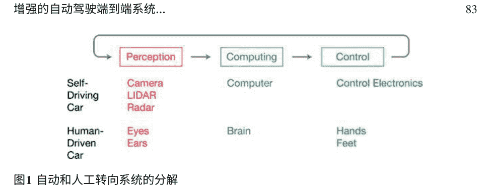

图1 自动和人工转向系统的分解

## 2 以前的深度学习方法用于自动驾驶

### 2.1 Alvinn

第一种尝试使用神经网络进行自主车辆导航的方法是由Pomerleau在1989年通过ALVINN（Autonomous LandVehicle in a Neural Network）[8]提出的，该方法旨在向Carnegie Melon University使用的测试车辆NAVLAB发送转向命令。该神经网络的输入是一个30 ×32的灰度图像，有30个可能的输出。由于捕捉各种训练样本的逻辑困难，使用了一个合成道路生成器来生成实际道路图像上的训练样本。一个摄像头安装在NAVLAB的顶部，进行实时预测。据说该系统在适当的光照条件下可以准确驾驶400米，时速可达2公里/小时（图2）。

### 2.2 DAVE

2004年，国防高级研究计划局（DARPA）发起了一个实验，提出了一种基于卷积神经网络的方法来引导一辆长度为50厘米的无线电控制卡车[9]。该架构由两个卷积层和两个池化层交替组成，然后是两个全连接层。有两个摄像头，一个在右边，一个在左边，分辨率为149 ×58的YUV格式。这被用作架构的输入。作为训练数据收集任务的一部分，人类监督员在各种环境和光照条件下控制车辆。

该模型以端到端的监督方式使用了95,000帧进行训练，31,800帧用于测试（图3）。


### 2.3 DAVE-2

2016年，Nvidia通过提出一种端到端的方法[10]，实现了DAVE项目的继任者。DAVE-2的架构比DAVE更深，使用了五个卷积层而不是两个。DAVE-2之所以能够获得良好的训练准确性，主要有两个原因：可用的标记训练数据集的多样性和利用GPU进行CNN训练。该架构的输入来自于一个摄像头，首先经历相位移和旋转，并采用数据增强技术以防止模型失败。

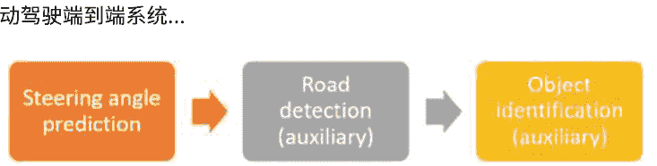

图4 DAVE-2的训练方法[10]

当面对它之前从未见过的事件时。 实际的转向角度是通过人类驾驶员的帮助捕获并用于训练网络。 由于其良好的准确性（图4），我们还将考虑在本章中实现该架构。

## 3 提出的系统

所提出的系统以实时视频或视频作为输入，并输出视野中的转向角度、道路曲率半径和物体以及它们的速度。 利用这些信息，可以轻松推导出应该采取的转向动作和可以安全进行的加速度（图5）。

处理流程包括以下组件：
- 主要组件-转向角度预测: 该组件负责根据挡风玻璃视图作为输入，使用端到端的CNN模型预测车辆的转向角度。
- 辅助组件1-道路检测: 该组件负责识别道路标记，从而正确识别曲率半径以进行转向。 这有助于我们识别端到端组件预测的错误转向角度。

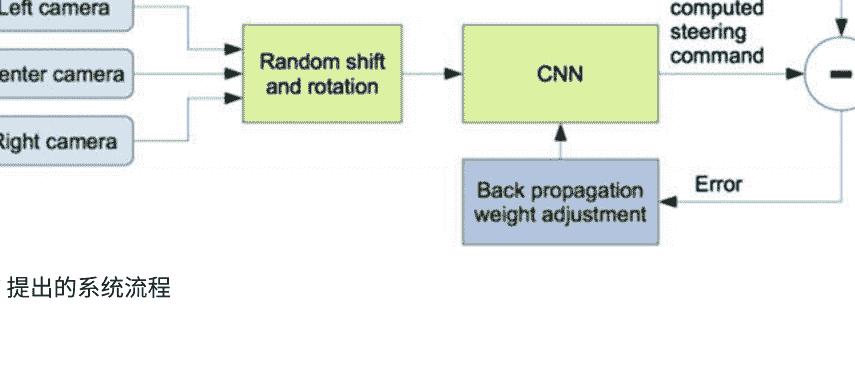

图5 提出的系统流程

- 辅助组件2-物体检测：该组件负责识别出出现在车辆挡风玻璃视图中的物体。

### 3.1 转向角的预测

与提取特征然后将其传递给预测阶段不同，端到端模型根据单个学习算法的输入产生相应的输出。这减少了由人工选择被认为重要的特征所涉及的错误。转向角的预测是通过端到端卷积神经网络模型完成的，其中风挡视图作为输入，转向角作为输出。在本章中，我们考虑了两种流行的模型来实现这个任务。

DAVE-2 卷积神经网络模型。该模型由5个卷积层、1个归一化层和3个全连接层组成[10]。模型的起始层负责归一化，之后是使用核维度为2×2和5×5的步幅卷积的卷积层，然后是使用核维度为3×3的非步幅卷积来提取相关特征。然后是完全传统的层，产生输出。使用ReLU作为激活函数，使用Keras进行实现。输入图像被调整为64×64×3（图6）。

Comma.ai CNN模型. 该模型由3个卷积层、1个归一化层和2个全连接层组成[11]。模型的起始层负责归一化，然后是使用步长卷积的卷积层，卷积核尺寸为8×8和5×5，最后是全连接层。

| Layer (type) | Output Shape | Param # | Connected to |
| :--- | :--- | :--- | :--- |
| Normalization (Lambda) | (None, 64, 64, 3) | 0 | lambda_input_1[0][0] |
| Conv1 (Convolution2D) | (None, 30, 30, 24) | 1824 | Normalization[0][0] |
| Conv2 (Convolution2D) | (None, 13, 13, 36) | 21636 | Conv1[0][0] |
| Conv3 (Convolution2D) | (None, 5, 5, 48) | 43248 | Conv2[0][0] |
| Conv4 (Convolution2D) | (None, 3, 3, 64) | 27712 | Conv3[0][0] |
| Conv5 (Convolution2D) | (None, 1, 1, 64) | 36928 | Conv4[0][0] |
| flatten_1 (Flatten) | (None, 64) | 0 | Conv5[0][0] |
| FC1 (Dense) | (None, 1164) | 75660 | flatten_1[0][0] |
| FC2 (Dense) | (None, 100) | 116500 | FC1[0][0] |
| FC3 (Dense) | (None, 50) | 5050 | FC2[0][0] |
| FC4 (Dense) | (None, 10) | 510 | FC3[0][0] |
| output (Dense) | (None, 1) | 11 | FC4[0][0] |
| **Total params:** | **329,079** | | |
| **Trainable params:** | **329,079** | | |
| **Non-trainable params:** | **0** | | |

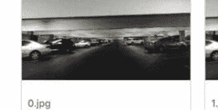

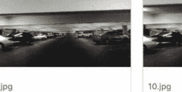

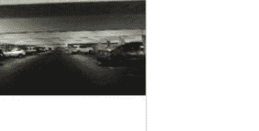

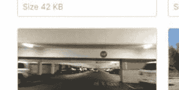

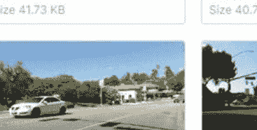

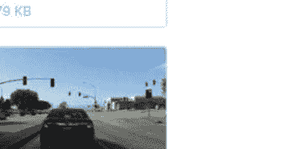

图7 Comma.ai CNN模型的Keras实现

常规层产生输出。使用Keras实现，ELU作为激活函数。输入图像被调整为64 × 64 × 3。

从加利福尼亚州Rancho Palos Verdes和San Pedro地区选择了两个数据集用于这些模型的训练和验证[12]。数据集包含图像文件和与之相关的转向角度。数据集按照70:15:15的比例划分为训练集、验证集和测试集。此外，还使用了最小的数据增强，包括翻转和裁剪图像顶部。这消除了图像中对某个方向的偏见（图7和8；表1）。

这两个模型都在之前提到的数据集上运行，损失函数为RMSE，使用Adam优化器来优化损失（表2）。

### 3.2 使用图像处理进行道路检测

在深入了解识别道路的流水线实现之前，有必要了解三种主要技术：

- 首先是相机校准
- 其次是解决投影变换
- 第三是将图像帧中的像素映射到距离度量，如米等

相机校准。相机的校准[13]是为了提取捕捉图像所使用的相关参数，因为我们需要获得一个无畸变的图像版本，这样更容易通过将现实世界中的三维点映射到二维框架上来进行识别。换句话说，Model = comma_ai

| Layer (type) | Output Shape | Param # | Connected to |
| :--- | :--- | :--- | :--- |
| Normalization (Lambda) | (None, 64, 64, 3) | 0 | lambda_input_2[0][0] |
| conv1 (Convolution2D) | (None, 16, 16, 16) | 3088 | Normalization[0][0] |
| conv2 (Convolution2D) | (None, 8, 8, 32) | 12832 | conv1[0][0] |
| conv3 (Convolution2D) | (None, 4, 4, 64) | 51264 | conv2[0][0] |
| flat (Flatten) | (None, 1024) | 0 | conv3[0][0] |
| drop1 (Dropout) | (None, 1024) | 0 | flat[0][0] |
| elul (ELU) | (None, 1024) | 0 | drop1[0][0] |
| fully_connected1 (Dense) | (None, 512) | 524800 | elul[0][0] |
| drop2 (Dropout) | (None, 512) | 0 | fully_connected1[0][0] |
| elu2 (ELU) | (None, 512) | 0 | drop2[0][0] |
| output (Dense) | (None, 1) | 513 | elu2[0][0] |
| Total params: 592,497 | | | |
| Trainable params: 592,497 | | | |
| Non-trainable params: 0 | | | |

图8 训练数据集中的样本图像

表1 转向角数据集信息

| 数据集名称 | 图像数量 | 大小 (GB) | 数据格式 |
| :--- | :--- | :--- | :--- |
| D1 | 63,000 | 3.1 | frame.jpg 角度, 年-月-日 时:分:秒:毫秒 |
| D2 | 45,500 | 2.2 | frame.jpg 角度 |

表2 模型的RMSE值

| 模型名称 | 数据集 | 训练 | 验证 | 测试 |
| :--- | :--- | :--- | :--- | :--- |
| Nvidia DAVE-2 | D1 | 0.0629 | 0.0989 | 0.0981 |
| | D2 | 0.0743 | 0.0997 | 0.0986 |
| Comma.ai | D1 | 0.0789 | 0.1120 | 0.1131 |
| | D2 | 0.0792 | 0.1217 | 0.1372 |

这样做是为了确保我们传递的图像不包含任何失真。

需要识别的参数可以是内部参数，如焦距，也可以是外部参数，如旋转或移动的量（图9）。

在相机校准中，我们处理两组坐标：一组是世界坐标（相对于某个参考点）观察到的坐标，称为世界坐标；另一组是相机坐标。让我们用 (X_W, Y_W, Z_W) 表示世界坐标，用 (X_C, Y_C, Z_C) 表示相机坐标。相机坐标与世界坐标相关联。

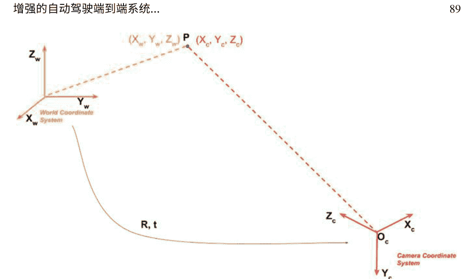

图9表示点相对于世界坐标和相机坐标的关系

通过以下方程计算坐标：

$$\begin{bmatrix} X_C \ Y_C \ Z_C \end{bmatrix} = R \begin{bmatrix} X_W \ Y_W \ Z_W \end{bmatrix} + t \quad (1)$$

其中 $R$是旋转因子， $t$是平移因子。 通过使用齐次坐标的简写形式，我们得到以下结果：

$$\begin{bmatrix} X_C \ Y_C \ Z_C \end{bmatrix} = [R|t] \begin{bmatrix} X_W \ Y_W \ Z_W \ 1 \end{bmatrix} \quad (2)$$

我们将 $[R|t]$定义为外部矩阵 $P$。 当我们提到远处存在的点时，齐次表示非常有帮助，即无穷远处的点可以表示为 $(1, 1, 1, 0)$，其中坐标变换为 $(1/0, 1/0, 1/0)$。

一旦相机坐标确定，我们现在需要将其从三维形式 $(X_C, Y_C, Z_C)$ 转换为二维图像平面坐标 $(x, y)$ ，如图10所示。 $O_c$表示相机的中心，图像平面形成在焦距 $f$处。 根据相似三角形的性质，我们可以得到 $x = f * \frac{X_C}{Z_C}$ 和 $y = f * \frac{Y_C}{Z_C}$。 以矩阵形式，可以转换为以下形式：

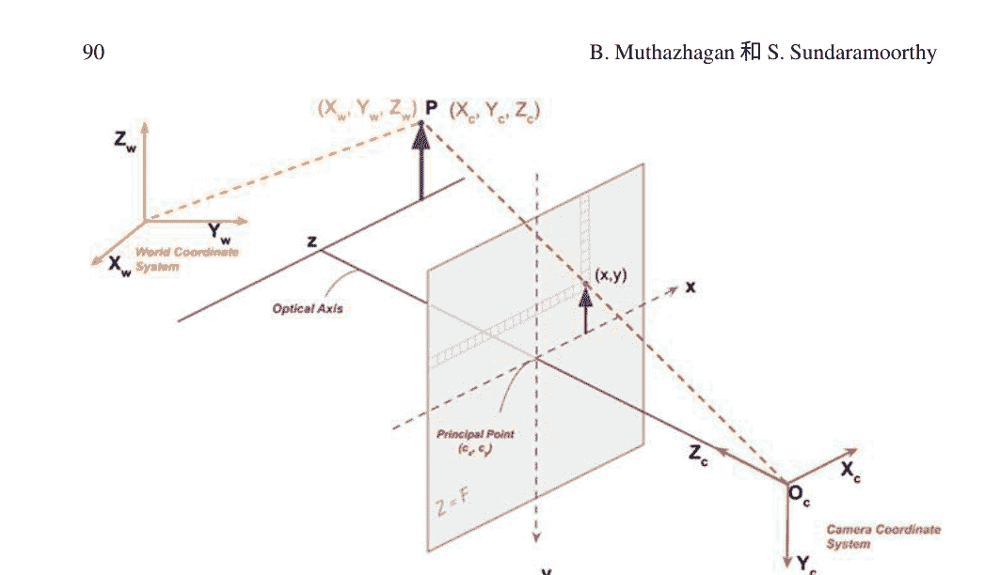

$$\begin{bmatrix} x' \ y' \ z' \end{bmatrix} = \begin{bmatrix} f & 0 & 0 \ 0 & f & 0 \ 0 & 0 & 1 \end{bmatrix} \begin{bmatrix} X_C \ Y_C \ Z_C \end{bmatrix}$$ (3)

然而，这并没有考虑到焦距的变化 $(f_x, f_y)$ 可能存在 于 $x$ 和 $y$ 轴上，相机的中心可能与图像平面的中心不对齐 $(c_x, c_y)$。考虑到偏斜 $s$，我们得到以下结果：

$$\begin{bmatrix} x' \ y' \ z' \end{bmatrix} = \begin{bmatrix} f_x & s & c_x \ 0 & f_y & c_y \ 0 & 0 & 1 \end{bmatrix} \begin{bmatrix} X_C \ Y_C \ Z_C \end{bmatrix}$$ (4)

简写为：

$$\begin{bmatrix} x' \ y' \ z' \end{bmatrix} = I \begin{bmatrix} X_C \ Y_C \ Z_C \end{bmatrix}$$ (5)

其中 $I$ 是内部矩阵。应用齐次坐标后，我们得到 $x = \frac{x'}{z'}$ 和 $y = \frac{y'}{z'}$。因此，包括外部矩阵 $R$、内部矩阵 $I$ 和移动量 $t$ 的整个过程可以写成：

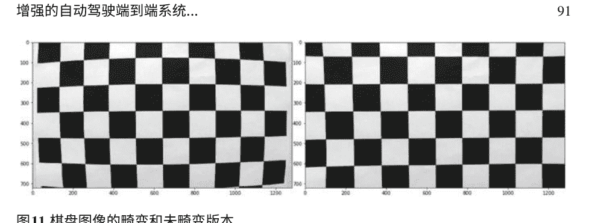

图11 棋盘图像的畸变和未畸变版本

$$ \begin{bmatrix} x' \\ y' \\ z' \end{bmatrix} = I[R|t] \begin{bmatrix} X_W \\ Y_W \\ Z_W \\ 1 \end{bmatrix} \quad (6) $$

现在清楚了计算外部和内部参数对于去除图像畸变是至关重要的。使用棋盘图来进行校准是计算这些参数的众所周知的方法之一。这是因为棋盘图案中的点非常明确。首先，我们使用棋盘中的世界坐标确定我们想要关注的点。然后，我们使用不同的角度拍摄相同的图像。OpenCv提供了一个名为findChessboardCorners [13]的一流方法，它给出了图像平面坐标x和y。我们将这些坐标传递给另一个函数calibrateCamera [13]，它给出了校准相机所需的参数。由于现在已经确定了这些参数，我们可以使用它们生成未畸变的图像（图11）。

由于相机已经校准，我们现在可以使用相机拍摄的道路图像来对其进行处理(图12)。透视变换。透视变换是为了找到道路的俯视图 [14]。如果我们能够将梯形的角点坐标（我们感兴趣的区域）映射到一个矩形的坐标系中，从而显示出俯视图（图13）。

数学上，这可以表示为：

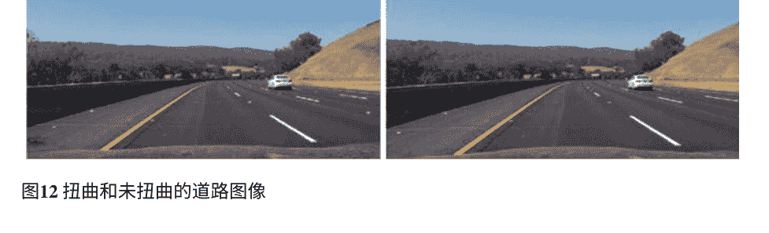

图12 扭曲和未扭曲的道路图像

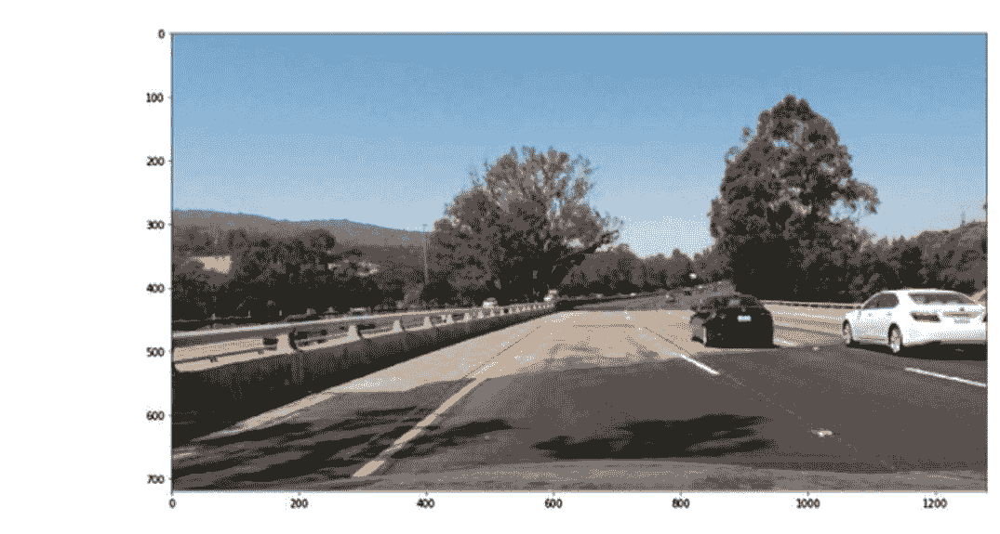

$$\begin{bmatrix} x' \\ y' \\ 1 \end{bmatrix} = s H \begin{bmatrix} x \\ y \\ 1 \end{bmatrix} \quad (7)$$

其中 \((x', y')\) 是新坐标，\((x, y)\) 是旧坐标，\(H\) 表示一个单应矩阵，\(s\) 是一个标量。这个变换也可以通过使用第一类OpenCv函数getPerspectiveTransform[14]来完成。

然后使用warpPerspective[14]对这些图像进行变换（图14）。

将像素映射到米。车道线大约相距12英尺。我们分别从x和y维度来解决这个问题。将图像转换为HLS颜色空间，并使用阈值颜色分量识别车道标记，指定黄色颜色空间符合车道标记。对于x维度，使用矩的概念计算车道标记的质心，并记录它们之间的距离。现在我们知道它们相距12英尺，我们使用距离作为比例来进行映射。对于y，我们使用之前定义的单应矩阵进行转换。这可以推广到任何给定的道路图像，只要我们有车道标记中的参考点来识别距离度量的分离（图15）。

让我们总结上述详细阐述的技术，将其应用于图像或视频流水线以识别道路：

- 首先，原始图像经过相机校准过程检索的参数进行去畸变处理。
- 然后，使用高斯函数进行高斯模糊，以滤除高频信号。

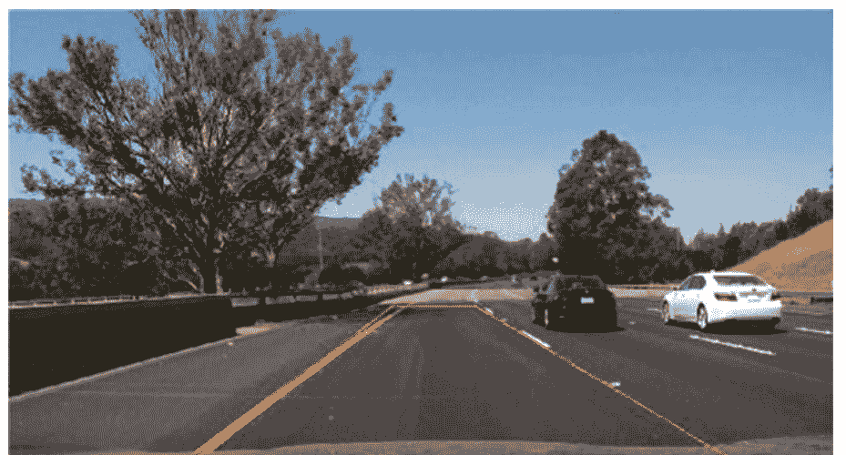

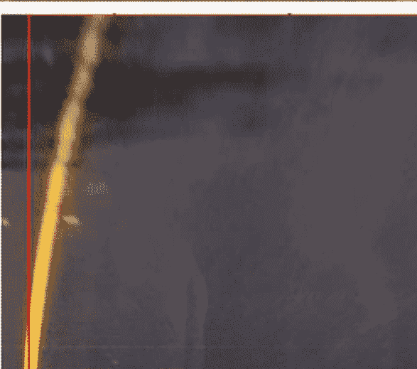

图14 感兴趣区域的俯视变形图像

- 为了揭示车道边缘标记，我们使用颜色转换和Sobel滤波[15]得到二进制图像。 二进制图像只包含我们感兴趣的图像边缘组件。
- 现在，我们使用透视变换将感兴趣区域转换为俯视图。
- 然后，我们使用滑动窗口方法建立一个用于过滤非道路标记像素的掩码。
- 然后，将掩码应用于二进制图像，以清晰地识别车道标记。

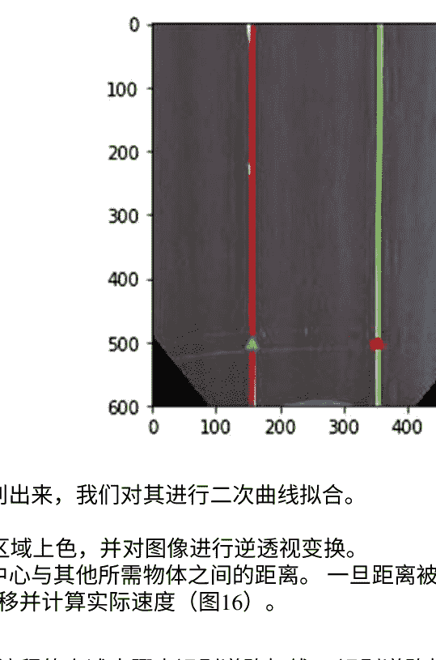

图15 识别车道标线及其质心

- 现在车道标线已经被识别出来，我们对其进行二次曲线拟合。
- 我们给识别出的线标和区域上色，并对图像进行逆透视变换。
- 像素被映射，计算车道中心与其他所需物体之间的距离。一旦距离被映射，我们可以分析像素位移并计算实际速度（图16）。

本章中，通过图像处理流程的上述步骤来识别道路标线。识别道路标线的优势在于可以验证车辆预测的转向是否正确。通过将其作为深度学习网络的辅助功能，我们可以大大消除错误的转向动作。

### 3.3 使用YOLO-V3进行目标检测

使用神经网络进行目标检测是一个有趣的问题，因为图像中的物体可能具有不同的尺寸。使用深度学习方法，这个任务主要可以归类为R-CNN（循环卷积神经网络）[16]、SSD（单次检测）[19]或YOLO（你只需看一次）[20]之一。Girshick等人提出的R-CNN [16]采用了两阶段的方法，第一阶段是识别可能包含物体的边界框，第二阶段是将识别出的感兴趣区域进行分类。在第一步中，图像被分解为大约2000个区域建议，并且每个建议都被输入到CNN进行分类。将这个区分为两个步骤是一个费时的过程。Girshick等人[17]引入了

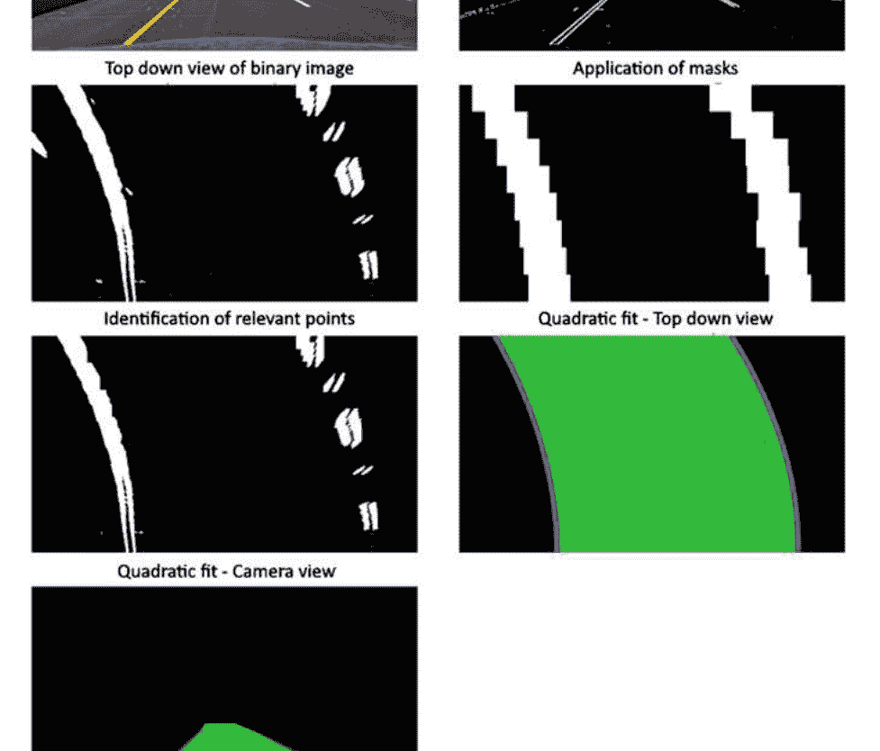

另一个被称为Fast R-CNN的检测器，不再将图像分割为区域提议，而是将图像转换为特征图，然后查找提议区域。这比它的前身快得多。然而，这些算法仍然依赖于选择性搜索，这使它们不是端到端的。Girshick等人通过在选择性搜索算法上使用区域提议网络（图17）解决了这个问题。

为了提高速度，直觉上会将双阶段过程转换为单阶段过程，这就是SSD [19]和YOLO [20]所实现的。

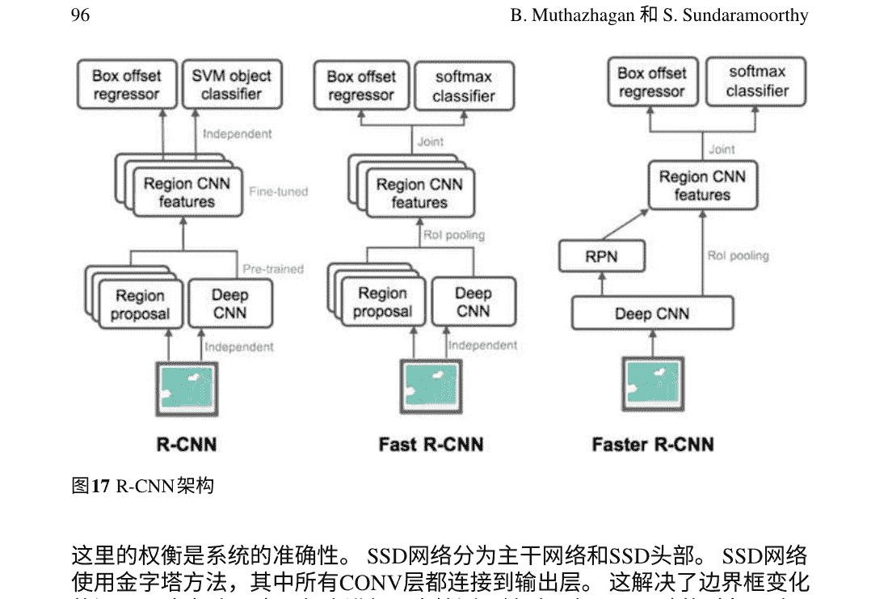

这里的权衡是系统的准确性。SSD网络分为主干网络和SSD头部。SSD网络使用金字塔方法，其中所有CONV层都连接到输出层。这解决了边界框变化的问题。在每个层中，都会进行一次检测，针对具有不同尺寸的对象。存在预定义的锚框，也称为默认框，其具有相对于当前单元的固定大小和位置。这些锚框负责以卷积方式平铺特征图。由于在每个级别上，我们针对的是不同的尺寸，因此锚框被重新缩放以匹配感受野大小（图18）。

YOLO [20] 是被认为用于目标检测的最流行的网络之一。骨干网络受到GoogleNet的启发，其中的inception模块被CONV层修改。它总共有24个卷积层进行特征提取，2个密集层进行预测。基础架构被称为DarkNet架构（图19）。

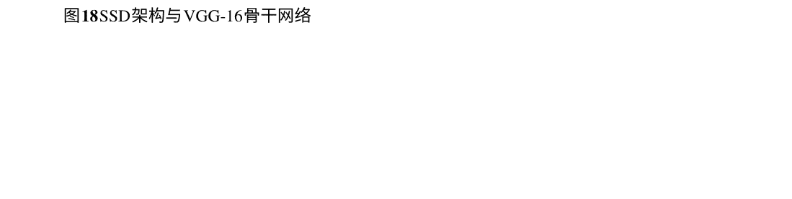

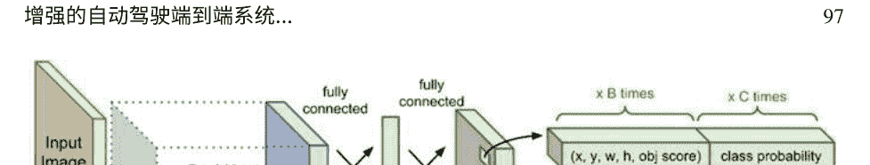

图19 YOLO架构

如果一个对象的中心落在一个单元格中，该单元格被认为负责检测该对象。单元格预测了三件事情：

- 边界框坐标：边界框坐标由一组4个值给出——中心的x坐标，中心的y坐标，边界框的高度和边界框的宽度。这些值被归一化，使得值在 (0, 1]之间。
- 置信度分数：对象存在于单元格中的可能性的度量，由发现对象的概率和交并比（IOU）的乘积给出，交并比是检测到的区域与基准真实区域之间的对齐程度与它们所占总面积的度量。
- 相关类别的概率：对象与我们训练的类别成员之一相关联的概率。数学上，这是Pr（对象属于类别\(X_i\) | 对象存在）其中\(X\)表示类别，\(i\)的取值范围从1到\(k\)，表示类别的总数。

让我们考虑一个被分割成 \(C * C\) 个单元格的图像。如果有 \(B\) 个边界框，则有4个值对应于边界框的坐标，1个置信度分数和 \(k\) 个可能的条件概率，这意味着总共有 \(C * C * (5B + K)\) 个可能性，这是输出维度向量的大小（图20）。

在本章中，我们使用了基于darknet-53架构的YOLO-V3 [21]，通过叠加额外的53层来实现。这是在COCO数据集[22]上训练的，该数据集包含80个标签。在这个问题中感兴趣的标签有人、自行车、汽车、摩托车、公共汽车、火车、卡车、交通灯、停车标志、停车计时器、长椅、猫、狗和牛（图21）。

### 3.4 组合管道输出

讨论的三个模块被组合成一个单一系统，提供以下结果：

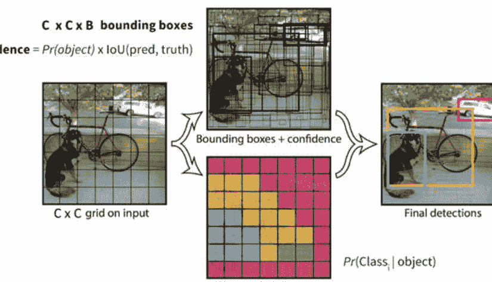

图20 YOLO输出张量工作流程

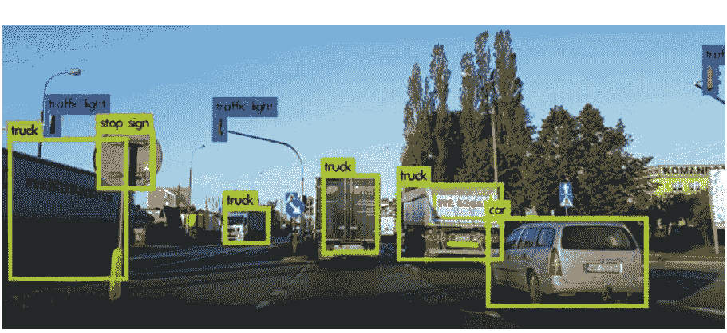

图21 应用YOLO-V3来检测感兴趣的物体

- 转向角度—使用NVIDIA端到端CNN模型来计算转向角度。
- 车道曲率—道路检测模块有助于计算车道曲率。
- 偏离车道中心—道路检测模块有助于计算偏离车道中心的程度。
- 在附近进行物体识别以及速度——物体检测模块有助于识别物体，一旦识别出来，像素移动被用来计算相对速度，然后得出最终速度。
- 加速安全性——评估当前车道和当前车道的相对速度，以建议车辆是否可以加速（图22）。

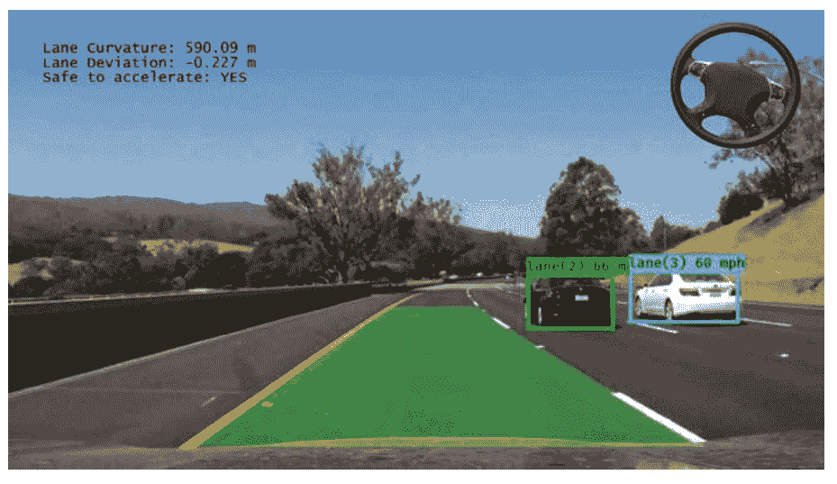

该系统现在能够理解比盲目的端到端系统更多的环境信息。输出是转向角度、车道曲率半径和视野中存在的物体及其速度。它还可以识别系统预测的错误转向角度。因此，通过建立端到端模型的基础，并具有辅助功能来帮助它们，系统得到了改善。

## 4 结论和未来工作

在本章中，我们提出了一个能够预测转向角度、分析道路标记并建议车道曲率半径和车道偏离的系统，并识别视野中存在的物体及其速度。与依赖于单一架构来处理这个复杂任务不同，除了基本的CNN架构之外，还有辅助模块可以使自动驾驶车辆解释更多信息并相应地行动。未来的工作可以改进基本模型和管道的延迟，通过并行化任务来提高效率，因为它们彼此独立。尽管当前模型的训练涉及一定程度的数据增强，但远远不能复制所有给定的场景。因此，创建防错系统至关重要，因此训练数据集必须通过新的遭遇不断更新。

## 参考文献

1. Levinson J, Askeland J, Becker J, et al (2011) 迈向完全自主驾驶：系统和算法。 在：2011年IEEE智能车辆研讨会（IV）。 https://doi.org/10.1109/ivs.2011.5940562
2. Krok A (2020) 特斯拉在自动驾驶战略上落后于Waymo、Cruise和其他公司，研究称。 在：Roadshow。 https://www.cnet.com/roadshow/news/self-driving-study-navigant-research-tesla-waymo-cruise/. Accessed 28 Apr 2020
3. Flämig H (2016) 自主车辆和货运中的自主驾驶。 在：自主驾驶，第365-385页。 https://doi.org/10.1007/978-3-662-48847-8_184.
4. 自主驾驶。 在：戴姆勒。 https://www.daimler.com/innovation/product-innovation/autonomous-driving/. Accessed 18 May 2020
5. J3016B: 用于道路机动车辆驾驶自动化系统的术语和定义- SAE International。 在：J3016B：用于道路机动车辆驾驶自动化系统的术语和定义- SAE International。 https://www.sae.org/standards/content/j3016_201806/。 于2020年4月28日访问
6. 刘S，唐J，张Z，高迪J-L (2017) 用于自动驾驶的计算机体系结构。 计算机50：18-25。 https://doi.org/10.1109/mc.2017.3001256
7. 科恩J (2019) 自动驾驶汽车-指南。 在：Medium。 https://towardsdatascience.com/self-driving-cars-the-guide-f1f427b9656b。 于2020年5月18日访问
8. Pomerleau DA (1989) ALVINN: 神经网络中的自主陆地车辆。 在：Touretzky DS (ed) 神经信息处理系统的进展，第1卷，Morgan Kaufmann
9. DAVE: 使用端到端学习的自主越野车辆控制。 在：CBLL, 研究项目，计算和生物学习实验室，Courant Institute, NYU。 https://cs.nyu.edu/~yann/research/dave/。 于2020年4月28日访问
10. Bojarski M, Firner B, Flepp B, 等 (2016) 用于自动驾驶汽车的端到端深度学习。 在：NVIDIA开发者博客。 https://devblogs.nvidia.com/deep-learning-self-driving-cars/。 访问日期：2020年4月28日
11. Comma.ai (2016) comma.ai/research. 在：GitHub。 https://github.com/commaai/research。 访问日期：2020年5月10日
12. SullyChen (2019) SullyChen/driving-datasets. 在：GitHub。 https://github.com/SullyChen/driving-datasets/。 访问日期：2020年5月10日
13. 相机校准和3D重建。 在：相机校准和3D重建—OpenCV 2.4.13.7文档。 https://docs.opencv.org/2.4/modules/calib3d/doc/camera_calibration_and_3d_reconstruction.html。 访问日期：2020年5月10日
14. 几何图像变换。 在：几何图像变换—OpenCV 2.4.13.7文档。 https://docs.opencv.org/2.4/modules/imgproc/doc/geometric_transformations.html。 于2020年5月10日访问
15. Kanopoulos N, Vasanthavada N, Baker R (1988) 使用Sobel算子设计图像边缘检测滤波器。 IEEE J Solid-State Circuits 23:358–367。 https://doi.org/10.1109/4.99616.
16. Girshick R, Donahue J, Darrell T, Malik J (2014) 用于准确目标检测和语义分割的丰富特征层次结构。 在：2014年IEEE计算机视觉和模式识别会议。 https://doi.org/10.1109/cvpr.2014.81
17. Girshick R (2015) 快速R-CNN。 在：2015年IEEE国际计算机视觉（ICCV）会议。 https://doi.org/10.1109/iccv.2015.169
18. 任S，何K，吉尔希克R，孙J (2017) 更快的R-CNN：面向实时目标检测的区域建议网络。 IEEE Trans Pattern Anal Mach Intel 39：1137–1149。 https://doi.org/10.1109/tpami.2016.2577031
19. 刘W，Anguelov D, Erhan D等 (2016) SSD: 单次多盒检测器。 在：计算机视觉-ECCV 2016计算机科学讲义，第21-37页。 https://doi.org/10.1007/978-3-319-46448-0_2
20. Redmon J, Divvala S, Girshick R, Farhadi A (2016) 你只看一次：统一的实时目标检测。 在：2016年IEEE计算机视觉和模式识别会议（CVPR）中。 https://doi.org/10.1109/cvpr.2016.91

Redmon J, Farhadi A (2018) YOLOv3: An incremental improvement. In: Computer Vision and Pattern Recognition (cs.CV). arXiv:1804.02767
22. 常见的上下文对象。 In: COCO. http://cocodataset.org/#home. 访问日期： 2020年5月18日

## 利用深度学习技术减少鹿车碰撞

Md. Jawad Siddique和Khaled R. Ahmed

摘要 鹿车碰撞(DVCs)是全球范围内日益严重的问题。DVCs会给人类造成严重伤害，导致人员伤亡、财产损失和鹿的生命损失。已经采用了几种策略来减轻DVCs，包括围栏、地下通道和高架桥、动物检测系统(ADS)、植被管理、种群减少和警示标志。本章的主要目的是减少鹿车碰撞。它提出了一种利用计算机视觉和深度学习技术的智能鹿检测系统。它会提醒驾驶员避免与鹿碰撞。生成的鹿检测模型在测试数据集上以每秒30帧的速度实现了99.3%的平均精度(mAP@0.5)和78.4%的mAP@0.95。

关键词 深度学习 · 鹿车碰撞 · YOLOv5模型

## 1 引言

鹿车碰撞（DVCs）是一个全球性问题，导致人员严重受伤并造成人员和鹿的生命损失。在交配和狩猎季节，鹿更加活跃但注意力较差。路边的鹿活动，如觅食和沿路漫步，与鹿车碰撞有显著相关性。根据联邦公路管理局的数据，2018年美国有超过2.27亿辆车每年在4百万英里的公共道路上行驶[1]。从2010年到2050年，估计全球需要新增近2500万公里的铺装道路（约增长60%[2]）。

相当于绕地球大约600圈[3]。2050年全球旅行量将是2010年的两倍；乘客旅行将占此增长的70%，而美国等国家的旅行增长预计将占90%。

由于哺乳动物与车辆的碰撞自1970年代以来显著增加，DVCs 预计会随时间增加 [4]。 DVCs的频率在整个欧洲不断升高。每年在德国，约有20万只梅花鹿与车辆相撞，这几乎占到了猎人梅花鹿收获量的20%。 这些碰撞导致大约3000人受伤，50人死亡，造成约4.9亿美元的费用[5]。 在斯洛文尼亚，每年有4000到6000只梅花鹿在道路上被撞死[6]。在美国，国家公路交通安全管理局(NHTSA)估计每年约有一百万起DVCs [7]，导致约200人死亡 [8]，并造成约10亿美元的年收入损失 [9]。 2018年，这些死亡事件最常发生在7月至9月 [10]，如图1所示。 根据2019年的State Farm报告 [11]，美国最有可能发生鹿碰撞事故的前十个州分别是西弗吉尼亚州 (1/38)、蒙大拿州 (1/48)、宾夕法尼亚州 (1/52)、威斯康星州 (1/57)、爱荷华州 (1/55)、南达科他州 (1/54)、明尼苏达州 (1/64)、密歇根州 (1/60)、怀俄明州 (1/56)和密西西比州 (1/61)。 在过去的10年中，德克萨斯州是与动物碰撞导致死亡人数最多的州。 2018年，伊利诺伊州发生了319,146起涉及机动车的事故。涉及鹿的事故占总事故的4.9%，即15,635起事故。 2018年，致命碰撞的数量翻了一番，达到630起伤害和87起重傷 (A-Injury) (伊利诺伊州 2018) [12]。

已经采用了几种策略来减轻DVC，包括植被管理、围栏、地下通道和高架桥、人口减少、警示标志和动物检测系统（ADS）。 这些策略在效果上有所不同。这些策略可能有助于减少DVC，然而，由于虚假警报、高成本、不适宜的地形、土地所有权和其他因素，它们并不总是容易实施。 由于车辆数量的增加和缺乏智能公路安全和警报系统，DVC正在增加。 本章介绍了一种自动化的DVC减轻系统，它将计算机视觉、人工智能方法与深度学习技术相结合。它基于一阶段深度学习算法（YOLOv5）开发了一个鹿类检测模型。

### 图1 1975年至2018年美国每个季度与动物碰撞的机动车事故死亡人数

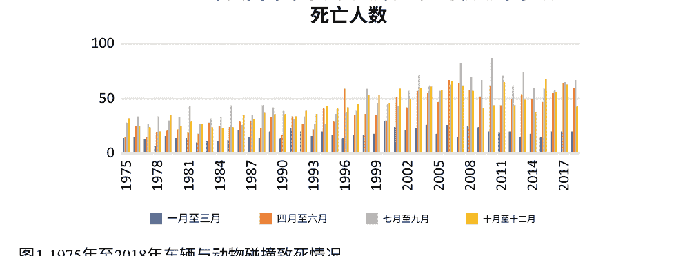

图1 1975年至2018年车辆与动物碰撞致死情况

## 2 相关工作

### 2.1 传统的车辆与鹿碰撞减轻方法

过去已经实施了几种方法来处理动物车辆碰撞（AVC）问题。Khaled R.等人将过去用于减轻AVC的方法分为三类：基于动物的方法，基于道路的方法和基于车辆的方法[13]。

第一类是专门针对道路和高速公路开发的基于道路的技术。它包括基于道路的传统技术和基于道路的检测系统。传统的基于道路的技术包括植被管理、道路围栏、地下通道、高架桥、道路反射器、警示标志和公路照明。Finder等人建议沿着道路和高速公路移除至少40.0米宽的灌木植被[14]。 Ward等人报告说，两米高的大型游戏围栏可以有效减少车辆与鹿碰撞[15]。

研究表明，围栏和过街设施的结合可以将大型动物（如鹿）的路上死亡率降低83% [16, 17]。野生动物通道结构可能会减少道路交通事故，但由于高昂的成本、不适宜的领土、土地所有权和其他问题，它们并不总是容易实现的。减少动物车辆碰撞的常见方法是设置警示标志[18]。带灯光和动画的鹿穿越警示标志有助于减少驾驶员的速度，但一旦驾驶员习惯了动画标志，它们就不再起到减速的效果[19]。

基于道路的检测系统旨在在检测到动物/驾驶员时警告驾驶员/动物。动物检测技术可以在动物接近道路时检测到大型动物。当检测到动物时，标志会被激活，提醒驾驶员此时可能有大型动物在或靠近道路上。红外线、微波读卡器、激光传感器被用来检测动物。由于强风和经过车辆的温暖引擎，红外线传感器会产生误报。春季融雪和道路上的水变暖时，微波读卡器传感器会产生误报，经过车辆的喷雾会触发警报。激光传感器可能会在任何物体（包括鸟、狗和邮车）打断激光束时触发警报，从而产生误报。甚至太阳的位置也会触发信标，这取决于一年中的日出和日落角度的变化[20]。

车辆检测系统由一个小柜子、电子设备、车辆检测传感器和动物警示装置组成。它们由太阳能电池板和电池供电。一旦检测到车辆，路边的装置会通过各种噪音和光信号来警示鹿类动物[21]。这些信号可能不会吓到动物，因为动物能够适应干扰，除非伴随着即时和真实的威胁。此外，这种系统不适用于高交通流量，因为动物警示会持续运行。Huijser设计了一种动物检测系统（ADS），用于在动物靠近或进入道路时通过闪烁的标志来警示驾驶员，各种方法（如热像视频摄像机和多普勒雷达）已被用于检测动物并激活标志[22]。Trina Rytwinski报告称，ADS系统使路上动物死亡率减少了57%。

大型哺乳动物，野生动物反射器仅占1% [16, 17]。 然而，ADS可能会出现误报，因为动物离开检测区域会触发对驾驶员的警告。 当有动物存在但警告系统未激活时，就会发生误报。 而当没有动物时，警告系统被激活就会发生误报。 Huijser等人强调，由于没有可靠的单一系统适用于普遍应用，ADS应被视为实验性的[17]。

第二类基于动物的技术是安装在动物身上以减轻AVCs的技术。不同类型的颈圈与动物一起使用，触发闪烁信号等警告系统。 它们被分类为反射颈圈、无线电颈圈和GPS颈圈。 无线电颈圈仅与领导动物一起使用[23]，并且沿路放置的接收器会全天候扫描个体无线电颈圈的频率。当一只戴有无线电颈圈的动物靠近道路约400米时，接收器会接收到信号并激活闪烁信标。 如果没有戴无线电颈圈的动物与之同行，那么只有戴无线电颈圈的动物才会被检测到。

因此，该系统只对高度社交的物种有效。 无线电领圈系统需要重新领圈的努力。 无线电领圈的电池通常在几年后耗尽，然后必须更换。 GPS领圈用于监测大型动物的移动，以便推荐在高速公路上放置野生动物过街设施[24-26]。 Khaled R.等人在KSA开发了骆驼-车辆事故避免系统（CVAAS）[13]。 他们将太阳能GPS领圈固定在家养骆驼上，以便检测骆驼的位置、方向和移动。 领圈通过通用分组无线电系统（GPRS）将骆驼的位置传输到CVAAS服务器。一旦骆驼进入高速公路周围的危险区域，CVAAS系统会向受影响区域的驾驶员广播警告。 由于成本高，部署和维护大规模的CVAAS系统并不容易实现。

第三类，基于车辆的技术包括装备在车辆上以减少动物-车辆碰撞的技术。它们通常分为两大类：警报哨声（例如，空气激活的哨声）和红外检测系统。 附在车辆上的警报哨声会产生超声频来警告动物有车辆靠近。 佐治亚大学的研究人员报告称，警报哨声在道路条件下产生不正确的功能和足够的声音强度，以供鹿听到。 红外探测器会在车辆上的传感器检测到大型动物在一定范围内时警告驾驶员。 这个范围应足够让驾驶员在与检测到的动物碰撞之前停下车辆。

因此，不仅需要降低动物-车辆碰撞减轻系统的费用，还需要提出和开发新的方法，包括能够提高驾驶员的自动化电子监测和意识水平的方法。 本章介绍了一种结合计算机视觉、人工智能方法和深度学习技术的自动化动物-车辆碰撞减轻系统。

### 2.2 机器学习鹿识别

已经提出了几种研究来检测道路上或附近的野生动物，使用了几种技术，如运动和红外传感器、监控摄像头和全球定位系统（GPS）[13]。目前可以帮助减少鹿车碰撞的技术是机器学习，特别是深度学习技术。一些机器学习和计算机视觉技术被用于识别和检测对象，如野生动物，重点是准确定位、定位和分类野生动物[30, 31]。这个研究领域使用计算机视觉算法从图像/视频中提取特征，然后使用有监督/无监督的机器学习算法来预测给定图像的标签。图像/视频中可能包含与背景信息相似外观的动物，因此使用经典的计算机视觉算法涉及繁琐的特征工程[32]。此外，已经进行了几项研究，使用逻辑运算在位置差异上提取图像中的移动物体，这些图像是由固定摄像机拍摄的[33]。创建一个有效的模型来捕捉复杂的背景运动和纹理动态，并分割前景动物是关键挑战[34]。因此，在动态场景和不同照明和天气条件下准确和稳健地检测和分割图像/视频对象是挑战。深度学习（DL）是解决一些机器学习方法面临的挑战的替代方法，应用DL技术大大提高了目标检测的性能。DL很有用，因为我们不需要探索各种特征提取器。它允许由多个层次组成的计算模型学习复杂问题，如鹿识别。骨干网络被用作基本特征提取器，可以根据要求选择效率或准确性[35]。DL目标检测器分为两类：两阶段检测器，如Faster R-CNN [36]。在第一阶段，它们生成候选对象边界框的区域建议网络（RPN）。在第二阶段，通过RoI Pooling操作从每个候选框中提取特征，用于后续的分类和边界框回归任务。第二种是一阶段检测器，如YOLO（you only look once）[37]和SSD [38]。一阶段检测器直接从输入图像中提出预测的框，而无需区域建议步骤。因此，两阶段检测器实现了高的目标识别准确性和定位准确性，而一阶段检测器实现了高的推理速度[35]。骨干网络提取输入图像的特征，并输出相应输入图像的特征图。大多数骨干网络层用于检测任务，而最后的全连接层用于分类任务。

更深的骨干网络可以捕捉丰富的特征，并提高目标检测任务的准确性。然而，轻量级的骨干网络适用于使用移动设备进行目标检测的系统。本章基于一阶段深度学习算法（YOLOv5）开发了一种鹿类检测模型。

## 3 鹿类检测方法

方法论的方法是确定更好的鹿类检测模型。像YOLO、SSD这样的统一网络检测器在速度方面取得了成功，而像Faster R-CNN这样的基于区域的目标检测器则具有更高的检测准确性。与两阶段相比，一阶段的准确性对骨干网络的质量不太敏感。避免预处理算法，使用轻量级的骨干网络和从特定卷积层生成较少的候选生成区域，使一阶段在处理图像进行目标检测时更快且计算时间更少。另一方面，两阶段检测器具有用于特征提取的单独卷积层，从区域建议网络生成的目标提议以及调整超参数和共享卷积网络，使它们能够以实时且具有更高准确性的方式运行。

### 3.1 使用YOLO进行鹿类检测

Redmon等人[37]描述了一种高效的实时目标检测算法YOLO（“You Only Look Once”）。作为完全卷积神经网络（FCNN），YOLO架构将图像一次通过FCNN，并输出一个$m \times m$的预测结果，与其他分类网络（如Fast）相比，在图像中的各个区域提出多次预测。“You Only Look Once”源于使用单阶段网络架构来预测类别概率并用边界框围住它们的事实。该架构将输入图像分割成$m \times m$的网格，并为每个网格生成两个带有类别概率的边界框。每个网格单元格可以预测具有不同置信度分数的边界框数量，以预测框中是否存在对象。网络为每个边界框预测五个组件，即 $x$, $y$, $w$, $h$ 和置信度分数。相对于网格单元格位置，框的中心由 $(x, y)$ 坐标表示。$(x, y)$ 坐标以及 $(w, h)$ 框的尺寸被归一化到0和1之间。置信度分数是边界框预测的最后一个组件。可以通过置信度分数确定是否存在鹿。如[37]中所述，我们将置信度分数定义为 $Pr(Object) \times IOU^{truth}_{pred}$，其中 $Pr(Object)$ 是鹿在网格单元格中出现的概率，IOU是真实值和预测框之间的交并比。如果该框中不存在鹿，则置信度分数应为零。

> 损失函数惩罚边界框坐标误差和分类误差，如公式5所示。

自从YOLO首次发布以来，已经发布了几个版本，例如YOLOv2，YOLOv3，YOLOv4，最新的版本是YOLOv5。本书章节使用YOLOv5实现了一种鹿的检测方法，因为它快速、准确，并且可以最初在PyTorch中实现。由于YOLOv5是一个单阶段的目标检测器，它有三个主要部分：模型骨干、模型颈部和模型头部。

骨干主要用于从给定的输入图像中提取重要特征。

为了确保网络重用特征，并减少网络参数的数量，YOLOv4和YOLOv5都基于DenseNet网络实现了交叉阶段部分（CSP）瓶颈。此外，它还用于从输入图像中提取有信息的特征[39]。模型颈部生成特征金字塔，并帮助识别不同大小和尺度的相同对象。因此，YOLOv5能够检测到道路上的近距离和远距离的鹿。此外，特征金字塔有助于模型在未见数据上表现良好。YOLOv5实现了PA-NET颈部用于特征聚合。最终的检测部分是模型头部。它生成具有类别概率、置信度分数和边界框的最终输出向量。YOLOv5中的激活函数是Leaky ReLU和Sigmoid激活函数。

在YOLOv5的中间/隐藏层中，激活函数是Leaky ReLU，在最终的检测层中，激活函数是Sigmoid函数。SGD [40]和Adam [41]是YOLO v5中使用的两种优化函数，尽管SGD是默认的训练函数。在我们的模型中，忽略置信度低于0.5的预测。通过这种方式，大部分错误的预测都被过滤掉了。最后，开发了非最大抑制算法来过滤具有相同边界框的物体。图2显示了YOLOv5的网络结构，分为输入、主干、颈部和头部四个部分。输入图像是一只鹿，使用嵌入在代码中的数据增强技术进行处理。之后，

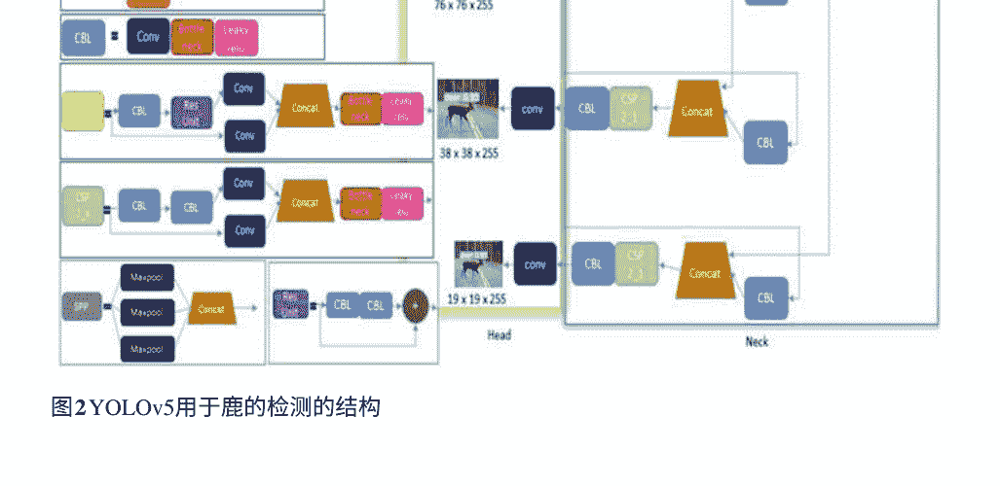

### 图2 YOLOv5用于鹿的检测的结构

图像进入焦点结构，其主要关键是切片。原始 608 × 608 × 3鹿图像输入到焦点结构中，使用切片操作首先变成一个 304 × 304 × 12 的特征图，然后经过 32 个卷积核的卷积操作，最终输出是一个 304 × 304 × 32 的特征图，使用线性激活函数。YOLOv5 中有两个交叉阶段部分（CSP）结构，如图2所示，CSP 1_x 应用于主干网络。为了支持网络特征集成的能力，另外还应用了 CSP 2_x 到颈部。此外，颈部结构中进行上采样。头部包括 64 个卷积核，得到的特征图为 152 × 152 × 64。最后，从图2中可以看出，使用非极大值抑制，我们得到了在道路上预测鹿的期望输出框。

## 4 实验设置和结果

本节介绍了成功在道路上检测到鹿的生成模型的实验设置和性能评估。

### 4.1 设置

YOLOv5的环境设置在一台配备了NVIDIA RTX 2060 GPU的机器上进行，还安装了一些库，如cudatoolkit、opencv-python和torch。我们使用批量大小为32、学习率为0.01、动量为0.937和衰减为0.0005的训练和验证数据集对YOLOv5网络进行了大约2500个时期的训练。由于数据集在目标检测研究中占主导地位，它为测量和比较YOLO和Faster RCNN等机器学习算法提供了一个共同的平台。最近的深度学习机制通过数据注释和增强提高了模型的性能，成功解决了视觉识别问题。目标检测机制用于检测图像中的多个对象，并使用矩形框标记它们的类别。当前数据集将鹿分类为一类进行检测。用于鹿检测模型训练的数据集包括自定义制作和公开获取的鹿图像。数据集的自定义部分来自于密苏里数据集[42]，以及来自美国伊利诺伊州杰克逊县的图像。数据集中的图像包括白天和夜晚的鹿，并涵盖了大部分天气条件，如图3所示。数据集的另一部分包括从Google图像搜索结果中采样的320个变尺寸图像，尺寸从275×275像素到1084×956像素不等，搜索词为“鹿穿越道路”。数据集中的对象是不同物种的鹿，完全或部分可见，静止或由于运动而模糊。添加公共数据集的原因是避免在自定义数据集上过拟合。

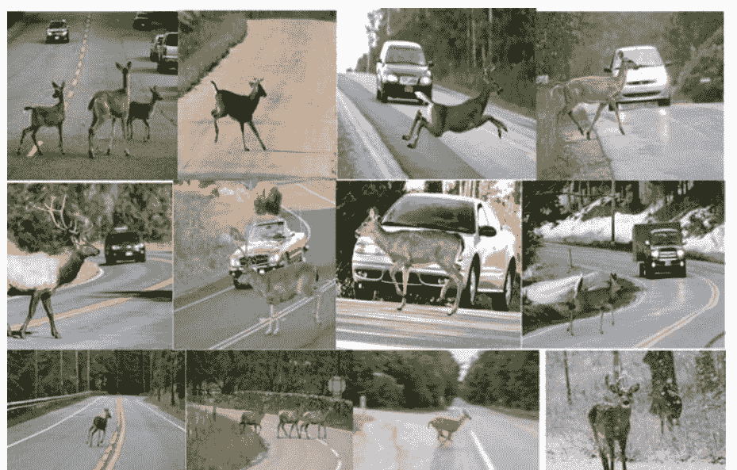

图3 鹿数据集的样本图像

为了注释我们的数据集，我们使用了一个名为LabelImg的图形图像注释工具。它将注释保存在XML文件或txt文件中，并由ImageNet使用并支持YOLO格式。生成的数据集通过数据管理分类为训练集、验证集和测试集，其中训练集占70%的数据，验证集占20%，测试集占10%。

### 数据增强

在每个训练批次中，YOLOv5通过数据加载器将训练数据进行在线数据增强。数据加载器进行三种类型的增强：缩放、颜色空间调整和马赛克增强，如图4所示。其中最新颖的是马赛克数据增强，它将四个图像组合成随机比例的四个瓷砖，使模型能够在帧中定位不同大小和部分的鹿。

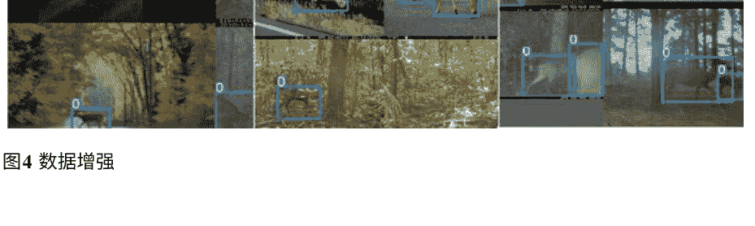

图4 数据增强

### 4.2 性能评估指标

已经使用了多个评估指标来评估生成模型的性能，例如召回率、精确率、准确率和平均精确率。召回率衡量模型能够找到所有正面预测的能力。精确率衡量模型预测鹿的准确性。检测鹿的准确率定义为正确预测的鹿图像与总测试图像/帧的比例，并如下所示测量：

$$\text{召回率} = \frac{\text{真正例}}{\text{真正例} + \text{假负例}} \quad (1)$$

$$\text{精确率 } p(r) = \frac{\text{真正例}}{\text{真正例} + \text{假正例}} \quad (2)$$

$$\text{准确率 } A = \frac{\text{真正例} + \text{真负例}}{(\text{真正例} + \text{真负例} + \text{假负例} + \text{假正例})} \quad (3)$$

$$AP = \int_0^1 p(r) dr \quad (4)$$

$$GIoU = IoU - \frac{|C \setminus (A \cup B)|}{|C|} \quad (5)$$

其中 $TP$ 代表真正例，$TN$ 代表真负例，$FN$ 代表假负例，$FP$ 代表假正例。平均精确度 (AP) 是根据公式4计算的精确度p(r)的积分，其中精确度和召回率始终在0和1之间。基于帧的约束条件如图5所示。

如果边界框区域包含前景对象（鹿），则该帧表示真正例。如果对象不在边界框内，则该帧被视为假正例。如果目标对象被边界框漏检，则该帧表示假负例。最后，如果帧中不存在对象，则被称为真负例。公式5中的 $GIoU$ 度量用于评估预测边界框与真实边界框的接近程度，其中交并比 $IoU = \frac{|A \cap B|}{|A \cup B|}$，$A$，$B$ 是预测边界框和真实边界框，$C$ 是包围 $A$ 和 $B$ 的最小凸包。YOLOv5 从损失函数 $GIoU$，$obj$，和 $class\ losses$ 计算总损失函数。这些是精心构建的，以最大化 $mAP$ 的目标。

图5 帧约束的示意图

### 4.3 结果与讨论

在本节中，我们通过对来自Google的图像、来自YouTube的视频和来自相机的实时视频进行测试，评估YOLOv5在鹿数据集上的性能。该算法加载生成的YOLO模型，并以每秒平均30帧的帧率，处理输入视频流（摄像头，分辨率为1920×1080px）。这证实了YOLO算法可以用于实时视频处理，因为它只涉及单个网络评估，而不像其他基于分类器的方法。

图6显示了使用检测模型的一些测试结果示例。每个生成的权重都能够以高置信度分数在图像中定位鹿。

图6 带有置信度得分的输出

图7a–c展示了训练至2500个时期时生成的（YOLOv5）模型结果。观察到在第1500个时期，精确度为97.48%，召回率为1，mAP达到了99.5%。出于此意图，我们在第2500个时期停止了训练，以避免过拟合。图7a–d展示了模型的训练情况，其中mAP@0.5达到了99.3%，mAP@0.95达到了78.4%。图7d和e显示了训练数据的目标损失函数和广义交并比损失函数的下降。

## 图7 实验结果

鹿群移动时，YOLOv5无法检测到图像中的所有鹿，如图8所示。然而，生成的模型成功地检测到了一些鹿，因为我们将最小阈值设置为0.5。无法检测到鹿群中的所有鹿不会影响我们减少鹿车碰撞的目标，因为我们能够检测到一些鹿。

## 5 结论和未来工作

在本书章节中，我们提出了一个基于深度学习的鹿类检测器，重点是在不显著牺牲检测质量的情况下实现尽可能高的检测速度。我们建立了一个包括鹿穿越道路的数据集，涵盖了多种不同的光照和天气条件。我们使用数据增强技术来增加数据集的大小。本章基于YOLOv5开发了一个实时的鹿类检测器，成功地实现了快速准确地检测鹿类。结果表明，生成的鹿类检测模型达到了97.48%的mAP和100%的召回率。它实现了30FPS的检测速度，使得对鹿类的实时检测更加有效。在一些场景中，当鹿类远离视频镜头时，生成的模型无法检测到它。我们的未来工作是改进YOLOv5以提高其在场景中检测小而远的鹿类的准确性。我们将通过包括更多不同天气和光照条件的多样化场景来增加鹿类数据集的大小。此外，我们将与其他深度学习网络（如具有不同主干的Faster R-CNN）进行比较。

此外，我们将开发一款可以从车辆上检测到鹿并向驾驶员发出关于鹿与车辆之间距离的移动应用程序。此外，我们将扩展我们的方法，结合深度学习技术，开发一种独特的方法来检测道路上的鹿，以减少鹿车碰撞事故。

## 参考文献

- 1. 联邦公路管理局，公路统计数据(FHAHS)。2011–18:美国(2019)交通部。可在http://www.fhwa.dot.gov/policyinformation/statistics.cfm上获取。2019年11月13日
- 2. Dulac J (2013) 全球陆地交通基础设施需求:估计到2050年的道路和铁路基础设施容量和成本。国际能源署
- 3. Laurance WF, Clements GR, Sloan S et al (2014) 全球道路建设战略。自然 513:229–232。https://doi.org/10.1038/nature13717
- 4. Hill JE, DeVault TL, Belant JL (2019) 世界陆地脊椎动物的特定死亡原因。全球生态生物地理学 28:680–689。https://doi.org/10.1111/geb.12881
- 5. Hothorn T, Brandl R, Müller J (2012) 大规模基于模型的鹿车碰撞风险评估。PLoS ONE 7(2):e29510。https://doi.org/10.1371/journal.pone.0029510
- 6. Pokorny B (2006) 斯洛文尼亚的鹿车碰撞:现状,缓解策略。兽医档案 76(增刊):S177–S187
- 7. Huijser MP, McGowen PT, Fuller J, Hardy A, Kociolk A (2008) 野生动物与车辆碰撞减少研究:向国会报告。美国交通部,联邦公路管理局,弗吉尼亚州麦克林
- 8. 在线网址http://www.car-accidents.com/pages/deer-accident-statistics.html
- 9. State Farm (2020) 2018-2019年动物碰撞可能性。http://st8.fm/animal
- 10. Insurance Institute for Highway Safety (IIHS), Fatality Analysis Reporting System (FARS) (2018年)。https://www.iihs.org/topics/fatality-statistics
- 11. 美国各地的鹿碰撞。https://patch.com/us/across-america/deer-collisions-across-u-s-odds-hitting-animals
- 12. 伊利诺伊州(2018年)。2018年伊利诺伊州事故事实和统计报告,伊利诺伊州交通部,2020年
- 13. Khaled R等人(2013年)基于GPS的骆驼车辆事故避免系统:设计、部署和测试。创新计算机信息控制国际期刊9(7)
- 14. Finder RA, Roseberry JL, Woolf A (1999年) 伊利诺伊州白尾鹿/车辆碰撞地点的场地和景观条件。Landsc Urban Plan 44: 77-85
- 15. Ward AL (1982年) 关于怀俄明州80号州际公路上围栏和地下通道的驴鹿行为,运输,研究记录859: 8-13,国家研究委员会,华盛顿
- 16. Rytwinski T, Soanes K, Jaeger JAG, Fahrig L, Findlay CS, Houlihan J, van der Grif EA (2016年) 道路缓解减少路上动物死亡的效果有多大?一项荟萃分析。PLoS ONE 11(11)
- 17. Huijser MP, Mosler-Berger C, Olsson M, Strein M (2015年) 旨在减少野生动物与车辆碰撞的野生动物警示标志和动物检测系统。道路生态学手册。Wiley,英国西萨塞克斯,页码198-212
- 18. Putman RJ (1997) 鹿和道路交通事故:管理选择。环境管理杂志 51: 43-57
- 19. Pojar TM, Prosence RA, Reed DF, Woodward RH (1975) 下车,动画效果鹿过马路标志的有效性。野生动物管理杂志39: 87-91
- 20. 华盛顿州交通部(2010)我们正在做些什么来减少车辆/野生动物
- 21. IRD (2002) 野生动物警告系统。IRD(国际道路动力学),萨斯卡通,SK,加拿大。http://www.irdinc.com/english/pdf/sys/safety/Wildlife0202.pdf
- 22. Huijser MP, Holland T, Blank M, Greenwood M, McGowen P, Hubbard B, Wang S (2009) 在测试中比较动物检测系统:系统可靠性和操作与维护经验的定量比较(项目FHWA/MT-09-002/5048)。联邦公路管理局,蒙大拿州海伦娜
- 23. Carey M (2001) 解决华盛顿州公路上的野生动物死亡问题。在:2001年生态与交通国际会议论文集, pp 605-610
- 24. McKinney T, Smith T (2007) 美国93号公路大角羊研究:亚利桑那州西北部沙漠大角羊的分布和跨公路移动,亚利桑那州交通部最终报告。JPA04-032T/KR04-0104TRN
- 25. Dodd et al (2007) 评估减少野生动物与车辆碰撞和维持公路渗透性的措施：亚利桑那州260号公路，亚利桑那州交通部最终报告，JPA 01-152 JPA 04-024T
- 26. Gagnon et al (2009) 使用全球定位系统技术确定野生动物过街结构的位置并评估其在美国亚利桑那州的成功。在：生态与交通国际会议上
- 27. Sharon V等人(2009年)对车载声音产生系统的声音对鹿的反应。J Wildl Manag 73(7):1072-1076
- 28. Hirota等人(2004年)用于汽车应用的低成本红外成像传感器，在：Valldorf J, Gessner W (eds) Advanced microsystems for automotive applications, pp 63-84
- 29. Forslund D, Bjarkefur J (2014年)夜视动物检测。在：IEEE智能车辆研讨会(IV)，美国密歇根州迪尔伯恩
- 30. Wilber MJ, Scheirer WJ, Leitner P, Heflin B, Zott J, Reinke D, Delaney DK, Boult TE (2013年)莫哈维沙漠中的动物识别：野外生物学家的视觉工具。在：2013 IEEE计算机视觉应用研讨会(WACV)。IEEE, pp 206-213
- 31. Sengar SS, Mukhopadhyay S (2017年)基于帧差和W4的移动物体检测。SIViP 11(7):1357-1364
- 32. Ko T, Soatto S, Estrin D (2008)基于分布的背景减除。在：第10届欧洲计算机视觉会议论文集，第276-289页
- 33. Steen KA, Villa-Henriksen A, Therkildsen OR, Green O (2012)利用热成像相机自动检测割草操作中的动物。传感器12:7587-7597
- 34. Zhang Z, He Z, Cao G, Cao W (2016)利用时空对象区域提案和补丁验证从高度杂乱的自然场景中检测动物。IEEE Trans Multimedia 18(10):2079-2092
- 35. Jiao L, Zhang F, Liu F, Yang S, Li L, Feng Z, Qu R (2019)基于深度学习的目标检测综述。IEEE Access 7:128837-128868
- 36. Ren S, He K, Girshick R, Sun J (2017)Faster R-CNN：基于区域提案网络的实时目标检测。IEEE Trans Pattern Anal Mach Intell 39(6):1137-1149
- 37. Redmon J, Divvala S, Girshick R, Farhadi A (2016)You only look once：统一的实时目标检测。在：IEEE计算机视觉和模式识别会议论文集，第779-788页
- 38. Liu W, Anguelov D, Erhan D, Szegedy C, Reed S, Fu C-Y, Berg C (2016)SSD:单次检测多框检测器。在：Leibe B, Matas J, Sebe N, Welling M (eds)计算机视觉—ECCV。Springer, Cham,瑞士,第21-37页
- 39. Wang C, Mark Liao H, Wu Y, Chen P, Hsieh J, Yeh I (2020)CSPNet：一种可以增强CNN学习能力的新骨干。在：2020年IEEE/CVF计算机视觉和模式识别研讨会(CVPRW)，美国华盛顿州西雅图,2020年,第1571-1580页。https://doi.org/10.1109/cvprw50498.2020.00203
- 40. Darken C, Chang J, Moody J (1992)用于更快的随机梯度搜索的学习率调度。在：1992年IEEE研讨会的神经网络信号处理II会议记录,九月,第1-11页
- 41. Kingma DP, Ba JL (2015)Adam：一种随机优化方法。在：国际学习表示会议,第1-13页
- 42. 密苏里大学(2016)野生动物物种的相机陷阱数据集。http://videonet.ece.missouri.edu/cameratrap/videonet.ece.missouri.edu/cameratrap/

## 使用具有结构相似性损失的生成对抗网络进行夜间到白天道路场景转换，以提高夜间驾驶安全性

Igi Ardiyanto, Indah Soesanti和Dwiyan Cahya Qairawan

**摘要** 不发达国家的道路基础设施不足，如道路照明，是影响其交通系统的现实问题。糟糕的道路照明妨碍了驾驶员感知道路条件及其物体的能力，可能导致事故。我们解决了使用损失修改的生成对抗网络从夜间道路场景合成白天外观的问题。我们的方法基本上在域正则化和人类感知恢复之间取得平衡。通过将夜间图像输入到我们增强的对抗网络中，该网络采用结构相似性损失，我们增加了其可见性，使驾驶员可以清楚地看到道路场景，就像他们在白天驾驶一样。实验结果显示了我们的方法在提高夜间道路视野的可见性方面的好处，通过图像质量指标进行测量。

**关键词** 深度学习 · 交通事故 · 生成对抗网络(GAN)

## 1 引言

交通事故有许多因素，其中之一是道路基础设施的不足，例如道路照明不足。世界卫生组织(WHO)报告称，2018年道路死亡事故是十大死因之一。我们国家的国家交通安全委员会的一项研究表明，夜间和清晨发生的事故占总事故的34%。在没有足够街道照明基础设施的道路上行驶会增加交通事故的风险。如果道路条件看起来更好，司机对其有更好的感知，这种风险可以降低。

I. Ardiyanto(✉) · I. Soesanti · D. Cahya Qairawan
电气工程与信息技术系，印度尼西亚加查马达大学，Grafika No. 2 Bulaksumur街，日惹，印度尼西亚
e-mail: igi@ugm.ac.id

© 作者(们)，独家许可给Springer Nature Switzerland AG 2021
K. R. Ahmed等人(编)，深度学习和大数据用于智能交通，计算智能研究945，
https://doi.org/10.1007/978-3-030-65661-4_6

一种可能的方法是使用计算机视觉来帮助驾驶员在黑暗条件下更好地看到道路。目标任务是将夜间的道路图像转换为白天，使道路和周围的物体更清晰可见。在计算机视觉中，这类问题变成了一个转换任务，最近的发展表明了一种称为生成对抗网络（GAN）的技术作为解决方案。GAN[1]是一个使用深度学习创建新数据的框架，包括图像数据。GAN旨在学习两个不同的网络；一个生成器网络和一个判别器网络。生成器部分试图生成合成数据，而判别器部分试图将生成器的输出与真实数据区分开来。创建新数据或图像也可以意味着将图像从一个领域转换到另一个领域，同时保留其特征，这非常适合我们上述的问题。

为了完成特定任务，几位研究人员提出了几种GAN的变体，并在图像翻译领域取得了令人信服的结果。例如，飯塚等人[2]使用GAN进行全局和局部一致的对抗训练来完成图像补全。还有一项关于使用GAN进行超分辨率的工作（SRGAN）[3]，使用域转换网络将图像转换为卡通风格[4]，使用预训练GAN进行图像修复[5]，以及从灰度输入图像进行图像上色[6]。甚至还有一些工作将白天场景转换为夜晚场景，例如[7, 8]。然而，将图像从夜晚转换为白天仍然是一个具有挑战性的问题。

为了解决上述问题，本研究旨在通过将夜间道路图像转换为白天条件来减少夜间交通事故的风险。在本研究中，我们提出了一种增强的对抗网络图像翻译方法。我们通过在现有方法中添加结构相似性损失来修改其损失函数。我们期望通过结构相似性考虑图像感知因素来改善图像质量，从而满足人类对翻译后夜间道路场景的视觉要求。然后，对翻译后的图像进行定性和定量评估，以衡量其视觉效果。

## 2 图像到图像的转换

将夜间场景转换为白天的一种可行方法之一是使用图像到图像的转换。在最新的发展中，生成对抗网络（GAN）[1]成为进行图像转换任务的标准方法。给定$X$和$Y$表示两个图像域，GAN基本上是两个网络（见图1），一个称为生成器$G$，另一个称为判别器$D$。它们都相互竞争，学习随机数据分布的生成模型。

使用GAN进行图像翻译有两种可能的方式，配对和非配对。在配对样式中，通常需要相同场景和条件下的标记/对齐图像对，而对于非配对样式则相反。在我们的情况下，这是不可能的。

由于道路场景每秒都在动态变化，因此在白天和夜晚之间准确配对的道路图像是不可能的。在这里，我们关注的是非配对图像翻译方法，这也是最近研究中使用的方法（例如[9-13]）。

## 图1 GAN架构

处理不对齐的图像转换有不同的方法。

CycleGAN[13]和DualGAN[14]是两种成熟的算法，用于解决这个问题。CycleGAN使用两个生成器和两个判别器$(G_X, D_X)$和$(G_Y, D_Y)$，使得$G_X : X \to Y$和$G_Y : Y \to X$，对应的判别器为$D_X$和$D_Y$（见图2）。它们都竞争将图像从域$X$转换到域$Y$或相反。对于目标函数，CycleGAN使用两个损失函数，对抗损失和循环一致性损失，如下所示

$$ \mathcal{L} = \mathcal{L}_{adv} + \lambda \mathcal{L}_{cyc} \quad (1) $$
$$ \mathcal{L}_{adv} = \mathbb{E}_{x}[|| (1 - D_Y(G_X(x)))^2 ||_1] + \mathbb{E}_{y}[|| (1 - D_X(G_Y(y)))^2 ||_1] \quad (2) $$
$$ \mathcal{L}_{cyc} = \mathbb{E}_{x}[|| G_Y(G_X(x)) - x ||_1] + \mathbb{E}_{y}[|| G_X(G_Y(y)) - y ||_1] \quad (3) $$

其中，$x \in X$且$y \in Y$，$\lambda$是调整超参数。从上述方程中可以看出，对抗损失确保生成的输出位于适当的领域，而循环一致性损失通过映射$G_x$和$G_y$来规范输入和输出，使其能够被识别为相同的，即强制要求$G_y(G_x(x)) \approx x$和$G_x(G_y(y)) \approx y$。

另一方面，DualGAN [14] 使用重构损失代替循环一致性损失，通过测量其与均值平均误差的距离。DualGAN 使用领域自适应 GAN 来衡量 $G_x$ 属于目标领域 $Y$ 以及反之的可能性，随后，损失函数描述如下

$$\mathcal{L}_{dual} = \lambda_X ||x - G_Y(G_X(x, z), z')|| + \lambda_Y ||y - G_X(G_Y(y, z'), z)|| - D_Y(G_Y(y, z')) - D_X(G_X(x, z)) \quad (4)$$

其中 $z$ 和 $z'$ 是随机噪声，$\lambda_X$ 和 $\lambda_Y$ 是常数参数。

## 3 GAN with 结构相似性损失

在将夜间场景翻译为白天场景时，一个重要的考虑因素是输出质量。根据经验，我们发现普通的CycleGAN和DualGAN在输出质量方面表现不佳，特别是在满足人类感知（即视觉上令人愉悦）方面。我们假设这两种算法在损失函数中缺乏衡量恢复的机制。恢复非常重要，因为我们处理的任务是将低信息（夜间场景）转化为高信息（白天场景）的输出。这与现有的将白天场景翻译为夜间场景的方法相反，例如[8]。在这种问题设置中，他们已经对图像有了很高的信息，然后将其转化为较低的信息。

为了应对这个问题，我们采用结构相似性[15]来感知图像质量。结构相似性捕捉了两个样本在每个领域中的重要感知术语，即结构信息、亮度和对比度术语 $x$ 和 $y$，如下所示：

$$SSIM(x, y) = l(x, y) * c(x, y) * s(x, y) \quad (5)$$
$$l(x, y) = \frac{2\mu_x \mu_y + k_1}{\mu_x^2 + \mu_y^2 + k_1} \quad (6)$$
$$c(x, y) = \frac{2\sigma_x \sigma_y + k_2}{\sigma_x^2 + \sigma_y^2 + k_2} \quad (7)$$
$$s(x, y) = \frac{\sigma_{xy} + k_3}{\sigma_x \sigma_y + k_3} \quad (8)$$

其中 $\mu$ 和 $\sigma$ 分别表示图像的平均强度和标准差，而 $\{k_1, k_2, k_3\}$ 是常数。结构信息 $s(\cdot)$ 采用了一个概念，即在空间上相邻的像素之间存在强烈的相互依赖关系。在道路等视觉场景中，它提供了关于物体结构的重要信息。亮度项 $l(\cdot)$ 使我们了解到图像失真在亮区域中不太容易被察觉，而对比度项 $c(\cdot)$ 解释了失真在具有相当活动、物体或纹理的区域中变得不太容易被察觉。

在这种情况下，具有高结构相似性的图像更适合于人类感知判断。

我们基本上将结构相似性作为加权的额外损失注入到方程（1）和（4）中，

$$\mathcal{L}_{ssim} = \gamma \left(1 - SSIM(\hat{x}, \hat{y})\right) \quad (9)$$

其中 $\gamma$ 是一个调整超参数，使得方程（1）变为

$$\mathcal{L} = \mathcal{L}_{adv} + \lambda \mathcal{L}_{cyc} + \mathcal{L}_{ssim} \quad (10)$$

方程（4）演化为

$$\mathcal{L}_{dual} = \lambda_X ||x - G_Y(G_X(x, z), z')|| + \lambda_Y ||y - G_X(G_Y(y, z'), z)|| - D_Y(G_Y(y, z')) - D_X(G_X(x, z)) + \mathcal{L}_{ssim}. \quad (11)$$

它在领域正则化和人类感知恢复之间取得平衡，使得输出图像在增加信息量的同时具有良好的视觉效果。如果没有这种平衡，输出图像要么看起来不错但会丢失一些重要的图像内部信息，如边缘和梯度，要么会产生良好的细节但外观难看，我们将在结果部分展示。

## 4 结果

### 4.1 数据集

据我们所知，目前没有公开的处理夜间到白天道路场景转换的数据集。这迫使我们建立自己的数据集。我们的数据集是通过在两轮车上放置摄像头拍摄视频来制作的。视频拍摄地点位于印度尼西亚的日惹地区。然后从视频中提取帧。然后根据预定的条件选择帧，并根据图像条件分组，包括白天图像和夜晚图像。同一路线的录制在不同条件下进行两次（白天和夜晚）。我们使用以下标准：在沥青路上拍摄的图像，无饱和度，无过曝光，无过暗图像。我们收集了共420对白天和夜晚图像，它们被调整为256 × 256。如果白天和夜晚图像在同一位置拍摄，即使存在相当大的平移和旋转，两个图像也被视为一对。在进入训练和评估阶段之前，所有图像都经过对比度增强处理，我们将在后面解释。

### 4.2 SSIM损失的影响

所有结果都是在拥有32GB RAM和NVIDIA TitanXp显卡的Ubuntu PC上获得的。我们首先通过视觉比较原始CycleGAN和DualGAN与我们提出的方法。从图3和图4可以看出，当我们将结构相似性损失添加到GAN中时，输出图像的视觉改进。物体、道路标记甚至背景都更清晰，具有明确的边缘和对比度。有趣的是，在第三行的结果中，骑手的阴影和车辆的灯光在翻译后的图像中甚至减弱了，这增加了输出图像的自然性。在我们的观点中，具有额外SSIM损失的CycleGAN具有最小的图像失真和视觉上令人愉悦。

随后，我们用可测量的指标对上述定性测量进行交叉验证。我们使用三个指标，即UQI、PSNR和SSIM，对我们提出的算法的性能进行定量测量，以及输出图像的质量，如表1所示。通用质量指数（UQI）[16]将图像失真建模为线性相关损失、亮度和对比度失真的组合，这与SSIM几乎相似。UQI指标 $Q$ 定义如下

$$Q = \frac{\sigma_{xy}}{\sigma_x \sigma_y} \cdot \frac{2\bar{x}\bar{y}}{(\bar{x})^2 + (\bar{y})^2} \cdot \frac{2\sigma_x \sigma_y}{\sigma_x^2 + \sigma_y^2} \quad (12)$$

其中 $x$ 和 $y$ 分别是原始白天图像和我们的GAN系统的输出，

$$\bar{x} = \frac{1}{N} \sum_{i=1}^N x_i, \quad \bar{y} = \frac{1}{N} \sum_{i=1}^N y_i$$
$$\sigma_x^2 = \frac{1}{N-1} \sum_{i=1}^N (x_i - \bar{x})^2, \quad \sigma_y^2 = \frac{1}{N-1} \sum_{i=1}^N (y_i - \bar{y})^2 \quad (13)$$
$$\sigma_{xy} = \frac{1}{N-1} \sum_{i=1}^N (x_i - \bar{x})(y_i - \bar{y}),$$

其中 $N$ 是测试图像的总数。所有数值都是从数据集的20%图像中作为测试集进行平均计算的。

如原始论文[16]所建议的，建议在UQI中局部比较统计特征。这是通过对图像使用8×8的滑动窗口，并结合 $M$ 组这些滑动窗口来计算整体质量来实现的，如下所示

$$Q = \frac{1}{M} \sum_{i=1}^{M} Q_i. \quad (14)$$

对于PSNR，我们将解释留给读者，因为它是各种图像处理应用中广泛使用的已知度量标准。

| 模型 | 平均UQI | 平均PSNR | 平均SSIM |
| :--- | :--- | :--- | :--- |
| DualGAN | 0.38 | 6.35 | 0.75 |
| DualGAN + SSIM-Loss | 0.42 | 6.87 | 0.76 |
| CycleGAN | 0.41 | 7.41 | 0.76 |
| CycleGAN + SSIM-Loss | 0.49 | 8.19 | 0.81 |

从表1可以清楚地得出结论，添加结构相似性损失有助于提高图像质量。结果显示，使用结构相似性损失减少了失真，同时减少了PSNR中显示的噪声，从而提高了图像的整体可见性质量。这与图3和图4中的视觉结果一致。

### 4.3 消融研究

请注意，上述结果是使用预处理阶段中最优化的图像增强方法获得的。为了完整起见，我们现在展示了扩展的解释，以描述图像预处理对我们提出的夜间转白天算法的影响。特别地，我们对我们提出的解决方案中最优化的对比度增强进行了研究。我们假设对比度增强将增加图像的熵，从而有助于GAN系统的收敛，从而提供更好的白天输出图像感知。

在这里，我们比较了10种对比度增强算法，这些算法是低光图像增强的最新技术，即自适应综合非线性增强（AINDANE）[17]，加权阈值直方图均衡化（WTHE）[18]，分层差分表示（LDR）[19]，带加权分布的自适应伽马校正（AGCWD）[20]，图像增强的自适应伽马校正（AGCIE）[21]，改进的自适应伽马校正（IAGCWD）[22]，亮度适应[23]，自适应图像增强（AIE）[24]，联合直方图均衡化（JHE）[25]和扩展曝光融合（SEF）[26]。图5、6和7显示了与图3和图4中使用的相应输入图像的比较。

表2和表3显示了每种预处理技术对我们提出的算法的性能。总的来说，使用SSIM损失始终能够产生更好的图像输出质量。LDR [19]和IAGCWD [22]是我们的夜间到白天图像转换预处理阶段的最佳选择。此外，令人惊讶的是，即使没有预处理，我们的算法也能够实现与使用几种对比度增强方法相比，该方法得到了相对较好的结果。特别是对于PSNR，似乎使用对比度增强技术会给输入图像带来额外的噪声，这解释了上述现象。

表2 不使用SSIM损失的不同预处理方法的定量指标

| 预处理 | DualGAN | | | CycleGAN | | |
| :--- | :---: | :---: | :---: | :---: | :---: | :---: |
| | 平均UQI | 平均PSNR | 平均SSIM | 平均UQI | 平均PSNR | 平均SSIM |
| 无预处理 | 0.33 | 6.01 | 0.74 | 0.38 | 7.12 | 0.72 |
| AIE | 0.32 | 6.11 | 0.71 | 0.39 | 6.66 | 0.71 |
| AGCIE | 0.34 | 6.09 | 0.70 | 0.37 | 6.98 | 0.69 |
| AGCWD | 0.34 | 6.15 | 0.72 | 0.36 | 6.81 | 0.69 |
| AINDANE | 0.35 | 5.96 | 0.71 | 0.38 | 6.88 | 0.68 |
| 亮度自适应 | 0.26 | 5.73 | 0.62 | 0.36 | 6.57 | 0.64 |
| IAGCWD | 0.38 | 6.31 | 0.75 | 0.41 | 7.40 | 0.76 |
| JHE | 0.36 | 6.29 | 0.73 | 0.37 | 7.36 | 0.71 |
| LDR | 0.36 | 6.35 | 0.74 | 0.39 | 7.41 | 0.75 |
| SEF | 0.31 | 6.17 | 0.70 | 0.33 | 7.03 | 0.69 |
| WTHE | 0.22 | 5.14 | 0.51 | 0.31 | 6.29 | 0.62 |

表3 不同预处理方法的定量指标与额外的SSIM损失

| 预处理 | DualGAN + SSIM | | | CycleGAN + SSIM | | |
| :--- | :---: | :---: | :---: | :---: | :---: | :---: |
| | 平均UQI | 平均PSNR | 平均SSIM | 平均UQI | 平均PSNR | 平均SSIM |
| 无预处理 | 0.36 | 6.23 | 0.75 | 0.43 | 7.69 | 0.74 |
| AIE | 0.36 | 6.19 | 0.71 | 0.41 | 7.44 | 0.73 |
| AGCIE | 0.36 | 6.12 | 0.71 | 0.40 | 7.56 | 0.70 |
| AGCWD | 0.35 | 6.15 | 0.72 | 0.40 | 7.51 | 0.71 |
| AINDANE | 0.36 | 6.10 | 0.72 | 0.41 | 7.52 | 0.70 |
| 亮度自适应 | 0.29 | 6.17 | 0.69 | 0.39 | 7.33 | 0.68 |
| IAGCWD | 0.42 | 6.61 | 0.76 | 0.49 | 8.08 | 0.81 |
| JHE | 0.38 | 6.42 | 0.74 | 0.44 | 7.78 | 0.74 |
| LDR | 0.41 | 6.87 | 0.75 | 0.48 | 8.19 | 0.80 |
| SEF | 0.36 | 6.26 | 0.70 | 0.41 | 7.67 | 0.76 |
| WTHE | 0.26 | 5.51 | 0.55 | 0.34 | 6.51 | 0.63 |

### 5 结论

在这项研究中，我们展示了GAN变体可以用于将夜间道路场景转换为白天条件。我们还引入了额外的结构相似性损失来提高感知图像质量。定性和定量测量都表明了所提算法将夜间图像转换为白天场景的能力，质量相当不错。未来需要丰富数据集以进一步提高输出图像的质量。扩展的图像预处理选择也是进一步改进的良好起点。

**致谢** 作者们衷心感谢NVIDIA为本研究提供的Titan XP捐赠。

## 参考文献

1. Goodfellow I, Jean P-A, Mirza M, Xu B, David Warde-Farley, Sherjil Ozair, Aaron Courville, Yoshua Bengio (2014) 生成对抗网络。Adv Neural Inf Process Syst 27:2672–2680
2. Iizuka S, Simo-Serra E, Ishikawa H (2017) 全局和局部一致的图像补全。ACM Trans Graph (ToG) 36(4):1–4
3. Ledig C, Theis L, Huszár F, Caballero J, Cunningham A, Acosta A, Aitken A, Tejani A, Totz J, Wang Z, Shi W (2017) 使用生成对抗网络的照片级单图超分辨率。In: 2017 IEEE conference on computer vision and pattern recognition(CVPR), pp 105–114
4. Taigman Y, Polyak A, Wolf L (2017) 无监督的跨领域图像生成. ArXiv, abs/1611.02200
5. Yeh RA, Chen C, Lim TY, Schwing AG, Hasegawa-Johnson M, Do MN (2017) 基于深度生成模型的语义图像修复。在: 2017 IEEE计算机视觉和模式识别会议(CVPR), pp 6882–6890
6. Cheng Z, Yang Q, Sheng B (2015) 深度上色。在: 2015 IEEE国际计算机视觉会议(ICCV), pp 415–423. ISBN 9781467383912
7. Liu M-Y, Breuel T, Kautz J (2017a) 无监督的图像转换网络. Adv Neural Inf Process Syst 30:700–708
8. Lin C, Huang S, Wu Y, Lai S (2020) 基于GAN的夜间图像风格转换用于夜间车辆检测. IEEE智能交通系统杂志 pp 1–13
9. Anoosheh A, Agustsson E, Timofte R, Van Gool L (2018) Combogan: 图像领域翻译的无限可扩展性。在：2018年IEEE/CVF计算机视觉和模式识别研讨会（CVPRW），第896-8967页
10. Choi Y, Choi M, Kim M, Ha J, Kim S, Choo J (2018) Stargan: 统一的生成对抗网络用于多领域图像到图像的翻译。在：2018年IEEE/CVF计算机视觉和模式识别研讨会，第8789-8797页
11. Ignatov A, Kobyshev N, Timofte R, Vanhoey K, Van Gool L (2018) Wespe: 弱监督数码相机照片增强器。在：2018年IEEE/CVF计算机视觉和模式识别研讨会（CVPRW），第804-809页
12. Liu M-Y, Breuel T, Kautz J (2017b) 无监督的图像到图像的转换网络。Adv Neural Inf Process Syst 30:700–708
13. Zhu J, Park T, Isola P, Efros AA (2017) 使用循环一致性对抗网络的非配对图像到图像的转换。在：2017年IEEE国际计算机视觉会议(ICCV)，第2242-2251页14. Yi Z, Zhang H, Tan P, Gong M (2017) Dualgan: 无监督的图像到图像的双重学习。 在：2017年IEEE国际计算机视觉会议(ICCV)，第2868-2876页。
15. Wang Z, Bovik AC, Sheikh HR, Simoncelli EP (2004) 图像质量评估：从误差可见性到结构相似性。 IEEE Trans Image Process 13(4):600–612。
16. Wang Z, Bovik AC (2002) 通用图像质量指数。 IEEE Signal Process Lett 9(3):81–84。
17. Tao L, Asari VK (2005) 自适应和集成的邻域依赖方法用于非线性增强彩色图像。 J Electron Imag 14(4):043006。
18. Wang A, Ward RK (2007) 基于加权阈值直方图均衡化的快速图像/视频对比度增强。 IEEE Trans Consum Electron 53(2):757–764。
19. Lee C, Lee C, Kim C-S (2013) 基于二维直方图的分层差异表示的对比度增强。 IEEE Trans Image Process 22(12):5372–5384。
20. Huang S, Cheng F, Chiu Y (2013) 使用自适应伽马校正和加权分布的高效对比度增强。 IEEE Trans Image Process 22(3):1032–1041。
21. Rahman S, Rahman MM, Abdullah-Al-Wadud M, Al-Quaderi GD, Shoyaib M (2016) 用于图像增强的自适应伽马校正。 Eurasip J Image Video Process 2016(1):35。
22. Cao G, Huang L, Tian H, Huang X, Wang Y, Zhi R (2017) 改进的自适应伽马校正用于亮度失真图像的对比度增强。 Comput Elect Eng 66:569–582。
23. Fu Q, Jung C, Xu K (2018) 基于Retinex的感知对比度增强在图像中使用亮度适应。 IEEE Access 6:61277–61286。
24. Wang W, Chen Z, Yuan X, Wu X (2019) 自适应图像增强方法用于校正低照度图像。 信息科学 496:25–41。
25. Agrawal S, Panda R, Mishro PK, Abraham A (2019) 一种基于联合直方图均衡化的图像对比度增强方法。 J King Saud Univ Comput Inf Sci。
26. Hessel C, Morel J-M (2020) 一种扩展的曝光融合及其在单幅图像对比度增强中的应用。 在: IEEE冬季计算机视觉应用会议, pp 137–146。

## 更安全的驾驶：应用深度迁移学习构建智能交通系统

Ramazan Ünlü

摘要 深度学习方法在交通领域以及许多其他领域广泛应用。如今，深度学习方法在大数据的支持下取得了非常成功的结果，数据的收集和存储比过去几年要容易得多。然而，在某些情况下，收集数据或找到合适的数据可能非常困难。另一方面，即使收集到了所需的数据，训练深度神经网络从这些数据中学习可能对于普通用户来说并不容易，因为需要大量的硬件。在这些情况下，迁移学习可以是一个出路，在深度理解中非常流行，特别是当数据量有限时。在本研究中，我们旨在提供全面的指导，使用迁移学习策略创建一个检测模型，以建立更安全的交通系统。更具体地说，我们开发了一个分类模型，以减少因道路上的鹿而发生的事故。我们实现了VGG-16卷积神经网络架构作为结构化迁移学习框架的一部分。计算结果表明，通过实现VGG-16和相应小规模的数据集，可以实现高准确性的性能。

关键词 智能交通系统·深度学习·计算机视觉

## 1 引言

深度学习允许多层次的计算模型学习和表示具有多个抽象层次的数据，模仿大脑感知的方式，从而隐含地捕捉大规模数据的复杂结构。

深度学习是机器学习的一个分支，试图从更大的数据和复杂的结构中学习隐藏的模式。它经常被用于许多流行的以及人工智能的经典领域，如语义解析[9]，迁移学习[44, 55]，自然语言处理[12, 29, 50]，计算机视觉[18, 46]等等。

深度神经网络可以被称为具有更深层结构的传统神经网络。深度神经网络的历史可以追溯到1940年代[35]。近40年后，随着[39]提出反向传播算法的发现，它再次受到关注，许多研究人员开始在这个领域工作。然而，由于开发算法在训练集中过拟合、计算机性能有限等原因，它再次失去了受欢迎的程度，直到2000年代初。根据Guo等人的说法，深度学习再次兴起有三个主要原因：芯片处理能力的大幅增加（例如使用GPU处理数据），计算硬件成本显著降低，以及机器学习算法的显著进步[11]。

深度学习包括许多不同的方法，包括有监督和无监督的方法，如神经网络、分层概率模型和聚类。深度学习在许多不同领域，特别是在计算机视觉领域，比传统方法取得了更成功的结果。由于数据存储更便宜、数据处理更快，深度学习在各个领域都带来了巨大的好处。

许多深度学习方法在文献中进行了全面的审查和讨论[4-6, 18, 40]。在这些研究中，Schmidhuber等人以历史时间线的形式关注了重要的里程碑和技术贡献[40]，而Bengio则专注于深度学习研究的挑战，并开发了各种前馈学习策略[5]。深度神经网络在计算机视觉任务中表现出色，因为它们可以自动提取显著特征并同时进行判别[25]。不同的研究人员已经有效地实现了各种深度学习架构，并在最近的ImageNet大规模视觉识别挑战(ILSVRC)中取得了最先进的准确性得分[10]。

## 2 深度学习在计算机视觉中

从1980年代开始，卷积神经网络（CNN）经常用于计算机视觉任务，并在不同的挑战中取得了显著的结果。但除了一些应用程序外，从2010年代初开始，计算机性能的增加，更先进算法的发展以及获取大量标记数据的便利性，使计算机视觉领域经历了复兴。

图像分类是计算机视觉中的一种流行应用，CNN在这些任务上表现出了巨大的性能。图像分类可以被定义为将图像分类到正确类别的任务，是计算机视觉中的主要任务之一。此外，它可以被视为其他计算机视觉任务（如定位[2]、检测[54]和分割[3]）的基础。

图像处理的关键部分是从图像中提取特征。近年来，深度学习模型通过多层非线性信息处理采用不同的策略来提取突出的特征，并用于模式分析和分类[27, 38]。通过实施这些策略，卷积神经网络（CNN）已成为大多数图像识别、分类和目标检测任务的主要架构[26]。尽管早期的一些成功应用了CNN[28, 41]，但通过提供更强大的GPU、更大的数据集和更好的算法[13, 24, 42, 52]，它们产生了最先进的结果。一些进展，如第一个GPU实现[7]和最大池化策略的首次应用，为CNN的流行做出了贡献[37]。

深度学习算法在图像分类问题中的里程碑是在ImageNet大规模视觉识别挑战(ILSVRC)中取得的成功。Krizhevsky等人使用深度卷积神经网络将大约1.2百万张图像分类为1000个类别[24]。在此成就之后，深度卷积神经网络已经经常被用于不同版本的ILSVRC，以实现图像分类任务[42, 43, 52]。一些研究人员还开发了一些最先进的CNN架构[17, 32, 43, 51]，非线性激活函数[19, 48]，正则化技术[20, 51]和优化方法[16, 24]。研究人员仍在努力改进更好的框架，以在各种图像分类问题中获得更好的性能。

深度学习方法，包括深度卷积神经网络，正在逐渐增加其受欢迎程度，并且仍然经常在许多领域中使用，包括交通系统。它无疑将继续在今天和未来的安全交通系统的发展中使用。

### 2.1 卷积神经网络架构

卷积神经网络是前馈网络，信息从一个方向传递，类似于标准神经网络，权重参数通过反向传播算法进行优化。卷积神经网络有许多不同的架构；然而，总体上，它们由两个与传统神经网络不同的主要层组成，即卷积层和池化层。卷积神经网络的这两个主要组件后面是标准的前馈神经网络中的全连接层。图1展示了一个典型的卷积神经网络架构。

在不需要手动特征提取过程的情况下，图像直接作为原始输入传递给卷积层。然后，一个或多个自动提取的特征被馈送到全连接层。最后一层，也称为输出层，用于将图像分配给预定义的类别。除了这种标准架构，各种研究提出了不同的架构来提高图像分类任务的准确性得分。

卷积层是一个用于提取特征的模块，因此该过程学习了输入图像的特征表示。卷积过程的工作原理基于将一个 f × f predefined 滤波器在图像上移动[26]。图像的输入或像素通过权重进行卷积，旨在计算新的特征图，然后通过非线性激活函数发送特征图。非线性函数用于揭示非线性特征。在许多不同的应用中，sigmoid 和双曲线正切函数通常被使用；但最近，修正线性单元（ReLUs）在图像分类过程中变得流行[26]。通过研究激活函数的效果，许多研究人员专注于开发最先进的激活函数[21, 23, 31, 36, 53]。下图2展示了一个带有步长2的简单卷积操作，意味着滤波器将从左到右、从上到下以步长2的方式移动。

### 汇聚层

汇聚层用于在输入特征通道的每个小区域内聚合信息并减小特征图的大小。类似于卷积操作，一个滤波器在图像上移动，但没有任何权重。从本质上讲，有两种主要的汇聚操作，即最大汇聚和平均汇聚。简单地说，最大汇聚运算符取区域内的最大值。

图3说明了平均和最大汇聚运算符。对应于滤波器大小，平均汇聚运算符取区域内的平均值。

通常情况下，卷积操作和汇聚操作结合起来创建一个新的特征图，然后应用非线性函数来揭示非线性隐藏特征。然后，将该新的特征图用作完全连接层的输入。

## 3 迁移学习

从头开始训练深度神经网络并不是一件容易的事情，因为有各种各样的原因。首先，深度架构通常需要足够大的数据集。而且，收集或找到足够的数据有时并不容易。在有所需数据可用的情况下，达到收敛可能需要很长时间，并且需要强大的计算能力。即使有足够大的数据集可用且收敛不需要很长时间，使用预训练的权重已被证明可以提供巨大的好处[1, 34]。Yosinski等人[49]证明了即使对于不同的任务，使用预训练的网络也可以比从头开始训练获得更好的性能。在文献中，我们可以找到各种预训练的深度卷积神经网络在不同任务中表现出优越的性能。要应用其中一个模型，需要决定重新训练哪个标签以达到最高的性能。通常，微调预训练网络的较高层比微调较低层部分更好，因为预训练神经网络的较低层包含更通用的特征。

在不同的深度学习库中，我们可以使用许多不同的预训练神经网络。其中，我们选择了VGG-16架构，并重用了在ImageNet数据集上微调的权重。VGG-16架构是由牛津大学的视觉几何组（VGG）提出的[42]。VGG-16模型由16个权重层组成，由于其达到了92.7%的前5个测试准确率而变得流行。下图4显示了VGG-16模型的架构。如图所示，该模型的结构使得输入图像的尺寸为224 ×224。因此，我们根据这些尺寸调整了每个图像的大小。

## 4 深度学习在交通领域

智能交通系统（ITS）将成为未来智慧城市的主要组成部分。然而，这可能需要一个巨大而高效的数据分析过程。由于交通系统的特性，从这个领域可以获得的数据非常庞大且复杂。处理大数据需要高计算能力和有效的算法。从智能交通系统（ITS）的背景来看，数据可以从许多来源收集，如手机、车辆和闭路电视摄像头，并且不可避免地以许多不同的结构（如音频、图像和数字）获取数据。

ITSs，它们将无可争议地成为未来智能城市中最重要的组成部分之一，现在已经在一些领域积极使用，比如自动驾驶汽车。而且这种使用将随着交通基础设施和技术的进步而越来越多，因为城市化在今天显示出了非凡的增长。

例如，交通拥堵是一个非常重要的问题，涉及时间损失、生产力、空气污染和在城市化程度高的居住中心浪费的能源。 如今，借助高端数据处理技术，这些问题至少可以被降低到最低程度。 为了聚合数据，已经部署了大量传感器，并继续使用这些传感器提供流式实时数据。 由于这一点，已经开发出并且仍在不断改进能够处理这些数据的先进技术。

因此，智能交通系统每天都在不断发展。借助计算能力和先进的方法，数据处理技术可以处理实时、复杂和异构的数据，以实现更好的实时决策支持系统。

深度学习已经在交通问题领域的许多不同研究中得到有效应用，例如交通流预测[30]、交通信号控制[33]、车辆或物体检测[22]、出行需求预测[15]、交通事故处理[8]、自动驾驶[22]、驾驶行为[14]等等[45]。

在这些研究中，许多人工智能方法，如多层感知器、卷积神经网络、循环神经网络等，已经被使用了多年。王等人[47]对与交通领域相关的研究应用的深度学习方法进行了全面调查和总结，如图5所示。

### 案例研究5：使用迁移学习创建物体分类模型

在本节中，我们创建了一个简单但全面的物体分类模型，以确保更安全的交通系统。众所周知，一些道路上的动物造成了许多事故。例如，在美国，突然冲出来的鹿造成了许多事故。这些事故由于生命和时间的损失，危及了交通系统的安全。为了避免这种情况，让我们假设我们想要开发一个基于深度学习的系统，并且通过该系统，如果路上有一只鹿，我们希望尽快识别出来。

开发这样一个模型的第一阶段是收集数据，可以通过许多不同的方式进行数据收集。例如，可以通过将摄像机插入车辆内部来拍摄视频，然后解析视频帧以适应分类问题。在这项研究中，我们从诸如images.google.com之类的开放源获取了必要的输入数据，即图像。收集到的图像总数为526，其中250张是道路上的鹿的图像，其余250张没有鹿的图像。图6显示了其中一些图像。

为了开发一个有效的分类模型，我们可以从头开始设计一个模型，也可以根据文献中使用的成功模型进行调整以适应我们的问题。我们在转移学习部分详细解释了这种策略的细节。在这个案例研究中，我们首选的策略是应用迁移学习策略。为了实施这个策略，我们使用了[42]提出的VGG-16模型。这个模型的层除了输出层之外都没有进行训练，也就是说，使用了VGG-16模型在ImageNet数据上优化的权重。此外，数据集被划分为75%的训练集、15%的测试集和15%的验证集，以创建一个可靠且具有普适性的模型。

主要，这是模型创建过程的第一阶段，相应的代码在图7中说明。

下一步是训练数据。为了做到这一点，我们首先从Keras深度学习API中加载预定的VGG-16模型的权重。然后，我们需要冻结除输出层以外的所有层。最后一层的神经元数量对于ImageNet数据库是固定的，为1000。因此，我们必须将其修改为两个，以适应我们的实验（即，道路上的鹿与道路上没有鹿）。代码的这部分用于实现这个目的，如图8所示。

最后一步是训练模型。为了做到这一点，我们可以使用“model.fit”函数。模型将从训练数据中学习隐藏的模式，并且参数在验证集中进行优化。代码的以下部分如图9所示，用于此目的。

现在，让我们来看看模型的结果。我们可以首先看一下模型在训练集和测试集上的损失值随着迭代次数的变化情况。下图10展示了VGG-16模型的损失值。需要注意的是，由于数据集的规模，VGG-16模型在这个案例研究中可能非常复杂。

```
python
VGG16=keras.applications.vgg16.VGG16(weights='imagenet', include_top=True)
inp = VGG16.input
new_classification_layer = Dense(num_classes, activation='softmax')
out = new_classification_layer(VGG16.layers[-2].output)
model_VGG16 = Model(inp, out)

for l, layer in enumerate(model_VGG16.layers[:-1]):
    layer.trainable = False

for l, layer in enumerate(model_VGG16.layers[-1:]):
    layer.trainable = True

model_VGG16.compile(loss='categorical_crossentropy',
                  optimizer='adam',
                  metrics=['accuracy'])

model_VGG16.summary()
```

图8 用于修改VGG-16模型的Python代码

```
python
batch_size=4
epochs=100

history_VGG16 = model_VGG16.fit(x_train, y_train,
                            epochs=epochs,
                            batch_size=batch_size,
                            validation_data=(x_val, y_val))
```

图9 用于训练和验证数据集的Python代码

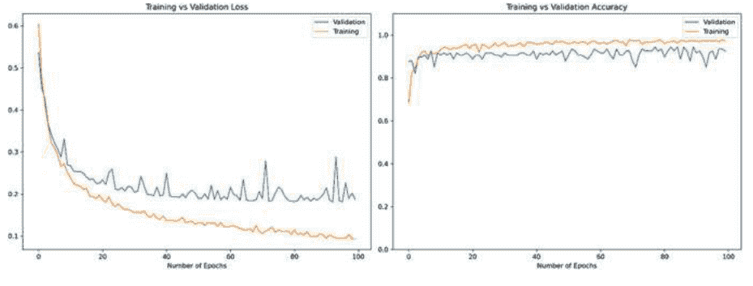

而选择这个模型的原因是为了提供全面的迁移学习方法指导。

在分类模型中，预期的变化是损失值在训练集和验证集中随着迭代次数的增加而减少。在一定点之后，验证集中的损失值可能会增加，这意味着模型在验证集上过拟合。为了防止这种情况，可以首先使用dropout或其他正则化方法。另一种选择是创建更多的验证样本。为了做到这一点，需要进行更加彻底和严格的数据收集过程。

另一方面，另一种策略称为提前停止，在模型创建过程中通常使用。这种策略背后的基本原则是在模型表现最佳且损失值无法进一步降低的点停止模型。然后，最佳权重被重新加载并用于最终预测模型。创建的模型可以在训练和验证中进行测试。

```
python
loss, accuracy = model_VGG16.evaluate(x_test, y_test, verbose=0)
print('Test loss:', loss)
print('Test accuracy:', accuracy)
loss, accuracy = model_VGG16.evaluate(x_val, y_val, verbose=0)
print('Val loss:', loss)
print('Val accuracy:', accuracy)
loss, accuracy = model_VGG16.evaluate(x_train, y_train, verbose=0)
print('Train loss:', loss)
print('Train accuracy:', accuracy)

```

图11 Python代码用于计算模型在训练、测试和验证集中的损失和准确率。

此外，为了查看创建的模型在未知数据集上的表现，可以将模型用于测试数据。计算模型在训练、验证和测试集中的成本和准确率的代码部分如图11所示。

本案例研究中VGG-16模型的性能如表1所示。仅准确率和损失值可能在某些情况下具有误导性。为了避免这种误导，有必要通过查看混淆矩阵来考虑不同的评估指标。混淆矩阵是一个 \(k \times k\) 矩阵，显示有多少数据样本被分配到正确的类别。图12显示了本案例研究中VGG-16模型的混淆矩阵。

在这个图中，我们展示了归一化的混淆矩阵以及分配的数据类别数量。根据这些数字，共有108张图像用于测试训练模型。其中53张图像是鹿的图像，55张图像不是鹿的图像。此外，53张“路上的鹿”图像中有6张被错误分类。换句话说，这6张“路上的鹿”图像被预测为“非路上的鹿”图像。同样地，有55张“非路上的鹿”图像，其中有3张被预测为“路上的鹿”图像。

根据这些数字，我们可以计算出几个评估指标，以提供更好的指导。这些指标被称为敏感性、特异性和G-Mean。下表2给出了这些评估指标的公式以及实施的VGG-16模型的相应性能。

敏感性被定义为正确分配的真正阳性样本的比例，例如“路上的鹿”图像被分类为具有鹿的比例。经过训练的模型的敏感性得分为0.940，因此可以得出结论

表1 模型在训练、测试和验证集中的准确率和损失性能

| 数据集 | 性能 |
|--------|------|
| 测试损失 | 0.194 |
| 测试准确率 | 0.916 |
| 验证损失 | 0.187 |
| 验证准确率 | 0.925 |
| 训练损失 | 0.086 |
| 训练准确率 | 0.981 |

图12 模型在测试集中的混淆矩阵

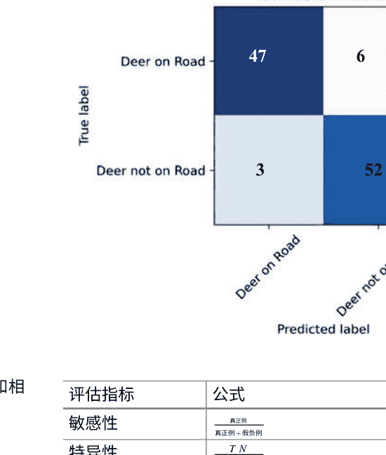

表2 评估指标的公式和相应结果

| 评估指标 | 公式 | 结果 |
| :--- | :--- | :--- |
| 敏感性 | \(\frac{\text{真正例}}{\text{真正例+假负例}}\) | 0.940 |
| 特异性 | \(\frac{TN}{TN+FP}\) | 0.896 |
| G-Mean | \(\sqrt{\text{敏感性} \times \text{特异性}}\) | 0.917 |

经过训练的模型在分类真正阳性样本方面表现良好。反过来，特异性得分可以定义为正确分配的负样本的比例，例如“路上没有鹿”图像的百分比被分类为没有鹿的比例。训练模型的特异性得分为0.896，不如其敏感性得分好，但已经足够好了。最后，G-Mean得分是敏感性和特异性的几何平均值，并且更好地说明了模型在敏感性和特异性方面的表现。我们的VGG-16模型在G-Mean方面表现良好，得分为0.917。因此，开发的模型足够好以检测正负样本。

## 6 结论

深度学习系统在交通以及许多领域中经常被使用。特别是在智能城市的概念下，人工智能算法，尤其是深度学习系统，已被用于解决许多问题，并提供更有效和更快速的解决方案。

在这项研究中，我们利用了深度迁移学习框架，展示了如何创建基于深度学习的解决方案，以提供更安全的交通系统。要为特定问题创建这样的解决方案，我们可以从头开始创建一个模型或者应用一个预训练模型。要从头开始创建一个模型，我们首先需要足够多的数据样本和计算能力。通常，如果我们能够提供足够的大数据给深度学习模型，它们的性能会优于传统的机器学习模型。而要处理如此大量的数据，我们需要足够的计算能力（即GPU）。获得足够多的数据和计算能力可能并不容易。如果情况是这样的，我们可以使用一个预训练模型来在少量数据上获得最佳性能。人们可以找到各种预训练的深度学习模型，它们在不同的大型数据集上取得了巨大的性能。VGG-16卷积神经网络架构就是其中之一，在ImageNet数据库上取得了显著的性能。我们将这个模型应用到了我们的案例研究中，该研究涉及在道路上检测鹿。VGG-16模型在Keras深度学习API中可用，人们还可以在表3中找到其他知名的预训练模型，其中的top-1和top-5准确率指的是模型在ImageNet验证数据集上的性能，深度指的是网络的拓扑深度。这包括激活层、批归一化层等。

通过模型创建过程，我们首先需要收集数据样本。在我们的情况下，数据样本是道路图像，无论是否有鹿。我们从images.google.com收集了这些图像。然后，我们需要对这些图像进行预处理。VGG-16模型设计用于尺寸为224 ×224的输入图像。因此，我们将每个图像调整为224 ×224像素。然后，预处理的数据样本按照60%、20%和20%的比例分为训练、测试和验证集。

最后，我们使用训练集训练了VGG-16模型，并在验证集中优化了权重参数。通过这样做，权重根据准确度指标进行优化。创建的模型在测试集中使用，以查看训练模型在未见数据集中的表现。因此，我们训练的模型在测试集、验证集和训练集中分别获得了0.916、0.925和0.981的准确率。

在这个案例研究中，我们旨在提供一个简单但全面的指南，介绍如何在交通系统领域使用深度迁移学习模型。通过收集更多的数据样本并针对所提出的任务专门创建一个模型，可以增强所创建的模型。通过这样做，我们可以得到一个在实际应用中更好的模型。

表3 Keras深度学习库中的预训练模型

| 模型 | 大小 (MB) | Top-1 准确率 | Top-5准确率 | 参数 | 深度 |
|---|---|---|---|---|---|
| Xception | 88 | 0.790 | 0.945 | 22,910,480 | 126 |
| VGG-16 | 528 | 0.713 | 0.901 | 138,357,544 | 23 |
| VGG19 | 549 | 0.713 | 0.900 | 143,667,240 | 26 |
| ResNet50 | 98 | 0.749 | 0.921 | 25,636,712 | – |
| ResNet101 | 171 | 0.764 | 0.928 | 44,707,176 | – |
| ResNet152 | 232 | 0.766 | 0.931 | 60,419,944 | – |
| ResNet50V2 | 98 | 0.760 | 0.930 | 25,613,800 | – |
| ResNet101V2 | 171 | 0.772 | 0.938 | 44,675,560 | – |
| ResNet152V2 | 232 | 0.780 | 0.942 | 60,380,648 | – |
| InceptionV3 | 92 | 0.779 | 0.937 | 23,851,784 | 159 |
| InceptionResNetV2 | 215 | 0.803 | 0.953 | 55,873,736 | 572 |
| MobileNet | 16 | 0.704 | 0.895 | 4,253,864 | 88 |
| MobileNetV2 | 14 | 0.713 | 0.901 | 3,538,984 | 88 |
| DenseNet121 | 33 | 0.750 | 0.923 | 8,062,504 | 121 |
| DenseNet169 | 57 | 0.762 | 0.932 | 14,307,880 | 169 |
| DenseNet201 | 80 | 0.773 | 0.936 | 20,242,984 | 201 |
| NASNetMobile | 23 | 0.744 | 0.919 | 5,326,716 | – |
| NASNetLarge | 343 | 0.825 | 0.960 | 88,949,818 | – |
| EfficientNetB0 | 29 | – | – | 5,330,571 | – |
| EfficientNetB1 | 31 | – | – | 7,856,239 | – |
| EfficientNetB2 | 36 | – | – | 9,177,569 | – |
| EfficientNetB3 | 48 | – | – | 12,320,535 | – |
| EfficientNetB4 | 75 | – | – | 19,466,823 | – |
| EfficientNetB5 | 118 | – | – | 30,562,527 | – |
| EfficientNetB6 | 166 | – | – | 4,326,514 | – |
| EfficientNetB7 | 256 | – | – | 66,658,687 | – |

## 参考文献

- 1. Ahmed A, Yu K, Xu W, Gong Y, Xing E (2008) 使用从伪任务中的迁移学习训练分层前馈视觉识别模型。在：欧洲计算机视觉会议。Springer, 第69-82页
- 2. Asghar K, Habib Z, Hussain M (2017) 复制移动和拼接图像伪造检测和定位技术：一项综述。澳大利亚法医科学杂志49:281-307
- 3. Badrinarayanan V, Kendall A, Cipolla R (2017) Segnet：一种用于图像分割的深度卷积编码器-解码器架构。IEEE Trans Pattern Anal Mach Intell 39:2481-2495
- 4. Bengio Y (2009) 为人工智能学习深度架构。Found trends® Mach Learn 2:1-127
- 5. Bengio Y (2013) 表示的深度学习：展望。在：国际统计语言和语音处理会议。Springer, 第1-37页
- 6. Bengio Y, Courville A, Vincent P (2013) 表示学习：综述和新视角。 IEEE Trans Pattern Anal Mach Intell 35: 1798-1828
- 7. Chellapilla K, Puri S, Simard P (2006) 高性能卷积神经网络用于文档处理
- 8. Chen Q, Song X, Yamada H, Shibasaki R (2016) 从大规模和异构数据中学习深度表示以推断交通事故。 在：第三十届AAAI人工智能会议
- 9. Dauphin YN, Hakkani-Tur DZ, Tur G, Heck LP (2015) 语义解析的深度学习包括语义话语分类
- 10. 邓杰，董伟，Socher R，李丽娟，李凯，费菲菲L (2014) Imagenet：一个大规模的分层图像数据库。 在：2009年IEEE计算机视觉和模式识别会议。 IEEE, pp 248-255
- 11. 邓力 (2014) 深度学习的体系结构，算法和应用的教程调查。 APSIPA Trans Signal Inf Process 3
- 12. 邓力，刘洋 (2018) 自然语言处理中的深度学习。 Springer
- 13. 邓力，于东 (2014) 深度学习：方法和应用。 在：基础和趋势中信号处理系列书籍，第20卷
- 14. 董伟，李杰，姚荣，李超，袁涛，王磊 (2016) 用深度学习表征驾驶风格。 arXiv Prepr arXiv160703611
- 15. 耿旭，李阳，王磊，张磊，杨强，叶杰，刘洋 (2019) 时空多图卷积网络用于打车需求预测。 在：AAAI人工智能会议论文集，pp 3656-3663
- 16. Glorot X, Bengio Y (2010) 理解深度前馈神经网络训练的困难。 在：第十三届国际人工智能和统计学会议论文集。第249-256页
- 17. Gong Y, Wang L, Guo R, Lazebnik S (2014) 深度卷积激活特征的多尺度无序池化。 在：欧洲计算机视觉会议。 Springer，第392-407页
- 18. Guo Y, Liu Y, Oerlemans A, Lao S, Wu S, Lew MS (2016) 视觉理解的深度学习综述。 神经计算 187:27–48
- 19. He K, Zhang X, Ren S, Sun J (2016) 图像识别的深度残差学习。 在：IEEE计算机视觉和模式识别会议论文集。第770-778页
- 20. Hinton GE, Srivastava N, Krizhevsky A, Sutskever I, Salakhutdinov RR (2012) 通过防止特征检测器的共适应性来改进神经网络。 arXiv Prepr arXiv120705801
- 21. Hou L, Samaras D, Kurc TM, Gao Y, Saltz JH (2017) 具有平滑自适应激活函数的ConvNets用于回归。 Proc Mach Learn Res 54:430
- 22. Huval B, Wang T, Tandon S, Kiske J, Song W, Pazhayampallil J, Andriluka M, RajpurkarP, Migimatsu T, Cheng-Yue R (2015) 对高速公路驾驶中深度学习的实证评估。 arXiv Prepr arXiv150401716
- 23. Kakuda K, Enomoto T, Miura S (2018) 基于流体动力学的CNN中的非线性激活函数及其应用。 计算模型工程科学 118:1–14
- 24. Krizhevsky A, Sutskever I, Hinton GE (2012) 使用深度卷积神经网络进行ImageNet分类。 在：神经信息处理系统的进展，第1097–1105页
- 25. LeCun Y (2012) 学习不变特征层次结构。 在：计算机视觉的欧洲会议。 Springer，第496–505页
- 26. LeCun Y, Bengio Y, Hinton G (2015) 深度学习。 自然 521:436
- 27. LeCun Y, Boser B, Denker JS, Henderson D, Howard RE, Hubbard W, Jackel LD (1989)反向传播应用于手写邮政编码识别。神经计算 1:541–551
- 28. LeCun Y, Bottou L, Bengio Y, Haffner P (1998) 基于梯度的学习应用于文档识别。 IEEE会议记录 86:2278–2324
- 29. 李华 (2017) 深度学习在自然语言处理中的优势和挑战。 国家科学评论
- 30. 李静, 彭辉, 刘磊, 熊刚, 杜波, 马辉, 王亮, Bhuiyan MZA (2018) 基于图卷积神经网络的城市交通客流预测。 在: 2018 IEEE智能世界, 普适智能与计算, 先进与可信计算, 可扩展计算与通信, 云计算与大数据计算, 人与智慧城市创新(SmartWorld/SCALCOM/UIC/ATC/CBDCom/IOP/SCI). IEEE, 页 29–36
```31. Liew SS, Khalil-Hani M, Bakhteri R (2016) Bounded activation functions for enhanced training stability of deep neural networks on visual pattern recognition problems. Neurocomputing 216: 718-734
32. Lin M, Chen Q, Yan S (2013) Network in network. arXiv preprint arXiv:1312.4400
33. Nishi T, Otaki K, Hayakawa K, Yoshimura T (2018) Traffic signal control based on graph convolutional reinforcement learning. In: 2018 21st International Conference on Intelligent Transportation Systems (ITSC). IEEE, pp 877-883
34. Oquab M, Bottou L, Laptev I, Sivic J (2014) Learning and transferring mid-level image representations using convolutional neural networks. In: Proceedings of the IEEE conference on computer vision and pattern recognition, pp 1717-1724
35. Pitts W, McCulloch WS (1947) How we know universals the perception of auditory and visual forms. Bull Math Biophys 9: 127-147
36. Qian S, Liu H, Liu C, Wu S, Huang H (2018) Adaptive activation functions in convolutional neural networks. Neurocomputing 272: 204-212
37. Ranzato M, Huang FJ, Boureau Y-L, LeCun Y (2007) Unsupervised learning of invariant feature hierarchies with applications to object recognition. In: 2007 IEEE conference on computer vision and pattern recognition. IEEE, pp 1-8
38. Rawat W, Wang Z (2017) Deep convolutional neural networks for image classification: A comprehensive review. Neural networks 29: 2352-2449
39. Rumelhart DE, Hinton GE, Williams RJ (1986) Learning representations by back-propagating errors. Nature 323: 533-536
40. Schmidhuber J (2015) Deep learning in neural networks: An overview. Neural networks 61: 85–117
41. Simard PY, Steinkraus D, Platt JC (2003) Best practices for convolutional neural networks applied to visual document analysis. In: ICDAR
42. Simonyan K, Zisserman A (2014) Very deep convolutional networks for large-scale image recognition. arXiv preprint arXiv:1409.1556
43. Szegedy C, Liu W, Jia Y, Sermanet P, Reed S, Anguelov D, Erhan D, Vanhoucke V, Rabinovich A (2015) Going deeper with convolutions. In: Proceedings of the IEEE conference on computer vision and pattern recognition, pp 1–9
44. Tan C, Sun F, Kong T, Zhang W, Yang C, Liu C (2018) A survey on deep transfer learning. In: International conference on artificial neural networks. Springer, pp 270–279
45. Veres M, Moussa M (2019) Deep learning for intelligent transportation systems: A survey of emerging trends. IEEE Transactions on Intelligent Transportation Systems
46. Voulodimos A, Doulamis N, Doulamis A, Protopapadakis E (2018) Deep learning in computer vision: A brief review. Computational intelligence and neuroscience
47. Wang Y, Zhang D, Liu Y, Dai B, Lee LH (2019) Enhancing transportation systems via deep learning: A survey. Transportation Research Part C: Emerging Technologies 99: 144–163
48. Xu B, Wang N, Chen T, Li M (2015) Empirical evaluation of rectified activations in convolutional network. arXiv preprint arXiv:1505.00853
49. Yosinski J, Clune J, Bengio Y, Lipson H (2014) How transferable are features in deep neural networks? In: Advances in neural information processing systems. pp 3320–3328
50. Young T, Hazarika D, Poria S, Cambria E (2018) Recent trends in deep learning based natural language processing. IEEE computational intelligence magazine 13: 55–75
51. Zeiler MD, Fergus R (2013) Stochastic pooling for regularization of deep convolutional neural networks. arXiv preprint arXiv:1301.3557
52. Zeiler MD, Fergus R (2014) Visualizing and understanding convolutional networks. In: European conference on computer vision, Zurich, Switzerland, September 5-12, 2014
53. Zhao Q, Griffin LD (2016) Suppression of anomalies: Symmetric activation functions for robust convolutional neural networks. arXiv preprint arXiv:1603.05145
54. Zhao Z, Zheng P, Xu S, Wu X (2019) Object detection with deep learning: A review. IEEE Trans Neural Networks Learn Syst 30: 3212–3232
55. Zhuang F, Cheng X, Luo P, Pan S, He Q (2015) Supervised representation learning: Transfer learning with deep autoencoders. In: The 24th International Joint Conference on Artificial Intelligence

## 利用CNN深度学习模型实现智能停车

Guruvareddiyur Rangaraju Karpagam， Abishek Ganapathy， Aadhavan Chellamuthu Kavin Raj， Saravanan Manigandan， J. R. Neeraj Julian和S. Raaja Vignesh

摘要 自动停车系统是一种帮助人们在商场、医院、剧院或任何停车场布局中无困惑地停车的系统。 这个自动停车系统会获取输入的停车场布局的录像，并将其标准化为模型。 它用于寻找空的和已停满的停车位。 然后根据这些信息，它会引导用户或进入停车场的人前往空的停车位， 或者给出停车场已满的提示。 该系统使用深度学习对具有空车的停车位和具有已停满车辆的停车位的不同图像进行训练。 目标是利用CNN深度学习模型实现智能停车。汽车停车的主要问题是土地资源的不当管理，导致停车位严重短缺，给我们的日常生活带来混乱。 停车是我们未来需要解决的最大挑战之一。 通过智能停车，停车空间得到了合理利用，使停车体验愉快。

G. R. Karpagam (✉) · A. Ganapathy · A. C. Kavin Raj · S. Manigandan · J. R. Neeraj Julian · S. Raaja Vignesh
计算机科学与工程系， PSG技术学院， 科伊茂尔， 泰米尔纳德邦， 印度
e-mail: grk.cse@psgtech.ac.in

A. Ganapathy
电子邮件: abishekganapathy15592@gmail.com

A. C. Kavin Raj
e-mail: kavinraj.c1999@gmail.com

S. Manigandan
电子邮件: manisaravanan11@gmail.com

J. R. Neeraj Julian
e-mail: neerajjulian@gmail.com

S. Raaja Vignesh
电子邮件: iamraajavigneshs@gmail.com

© 作者，独家许可给Springer Nature Switzerland AG 2021
K. R. Ahmed等人（编）， 深度学习和大数据用于智能交通，计算智能研究945，
https://doi.org/10.1007/978-3-030-65661-4_8

关键词 智能停车系统 · 人工智能 · 深度学习 · 卷积神经网络 · 深度神经网络 · 感兴趣区域 · 精确度 · 召回率 · 混淆矩阵 · ROC曲线 · AUC曲线

## 1 动机

停车是世界面临的最突出的问题之一。随着汽车拥有量的快速增加，许多城市发现很难管理他们的停车区域，停车供需严重不平衡[1]。这种短缺主要归因于土地使用错误和停车需求计算错误。现在停车场的主要问题是找出是否有任何空闲车位。当驾驶员首次进入停车场时，他/她需要知道是否有任何空闲车位，然后知道哪个车位是空闲的，以便无忧无虑地停车。因此，在驾驶员进入停车场时提供与停车场相关的信息已成为当今世界的重要问题。

我们必须通过对一些事情进行检查来开发一个系统。主要问题是我们应该在不需要额外资源的情况下实现目标。目标是使用深度学习模型找到所有停车位，并确定停车位是否可用或占用。已经采取了努力设计一个使用图像处理来检测汽车存在以及提供可用停车位数量和位置的系统。该系统使用网络摄像头捕捉图像并处理图像以计算可用停车位。该系统的开发将使用图像处理技术在每个阶段进行实施。该系统提供有关可用停车位数量的信息。使用图像处理来计算可用停车位，以解决驾驶员面临的问题，成本较低。与其他现有系统相比，使用基于摄像头的系统有足够的先决条件。首先，在使用闭路电视设施的情况下，不需要额外的基础设施。其次，基于摄像头的系统非常精确[2-4]。

## 2 相关工作

在停车位检测领域的一些现有工作如下：Chiu等人（2004）提出了一种计算检查点上车辆数量的方法从而可以计算出可用停车位的数量[5]。该方法中的计数将通过在道路表面下安装感应线圈传感器来进行。该方法的主要缺点是传感器在故障情况下非常难以维护，并且安装它会对道路造成损坏。此外，无法确定免费停车区的确切位置，因为计数方法只记录通过检查点的车辆数量，无法提供详细信息。

Park等人 (2008) 提出了使用安装在汽车上的超声波传感器来寻找免费停车位的方法[4]。该方法存在一个缺点，即传感器容易受到天气条件（如雨、温度、雪和快速气流）的影响。

Boda等人 (2007年) 还提出了一种基于无线传感器节点的方法[6]。这种方法成本较低，它使用在关键位置（如车道转弯处、停车场入口和出口位置）实施的无线传感器节点。通过进出车辆的差异可以确定停车区域的总车辆数。这种方法也存在与前两种方法类似的缺点，如受外部源的损坏和无法检测到空闲停车位的准确位置。

基于图像分类的停车位检测领域的一些现有工作包括：

Bin等人 (2009年) 提出了一种基于视觉的方法，通过摄像头可以检查整个可用于停车的停车区域，然后处理获取的数据并生成结果，确定空闲停车位的准确数量和位置[7]。这种方法的一个主要缺点是输出的准确性高度依赖于摄像头的位置。

Fabian (2008) 还提出了一种基于无监督视觉的停车位占用检测系统 [8]。所提出的系统在计算复杂度上较低，并且每分钟需要更少的图像帧。他声称图像检测中的主要问题是遮挡和阴影，无监督学习需要更先进的聚类算法。基于视觉的停车位检测系统主要受到天气和光照条件的影响，如大雨期间相机镜头上的雨滴、低光和高光条件。

Yusnita等人 (2012年) 提出了一种方法，其中在每个停车位上手动绘制了一个棕色圆形补丁 [7]。当系统初始化时，它会在每个空间中寻找圆形形状，如果检测到补丁，则认为空闲，并将其显示给驾驶员。当补丁被物体（车辆）阻挡时，系统会假设特定的空间被车辆占据。该系统在管理停车场方面表现良好，但在大雨和雪天气下效果不佳，另一个缺点是停车场中的人员或物体可能被识别为车辆。

True (2007)提出了一种通过使用颜色直方图和车辆特征检测的组合来实现高效的停车位检测[9]。与先前的方法相比，这种方法效率更高，但准确性不够。考虑到停车位数量较少的情况，即使是一个小错误百分比也可能意味着一个大错误。

### 2.1 从中学到的教训

根据文献调查，本节概述了所学到的教训如下：

- 这种智能停车需要一个CNN深度学习模型，该模型在停车位占用检测的准确性和鲁棒性方面优于其他使用手工特征的传统方法。
- 与其他可用的深度学习模型相比，使用CNN模型会更好，因为卷积神经网络在图像处理方面的效果更好。

## 3 工作的背景

工作的背景如图1所示。

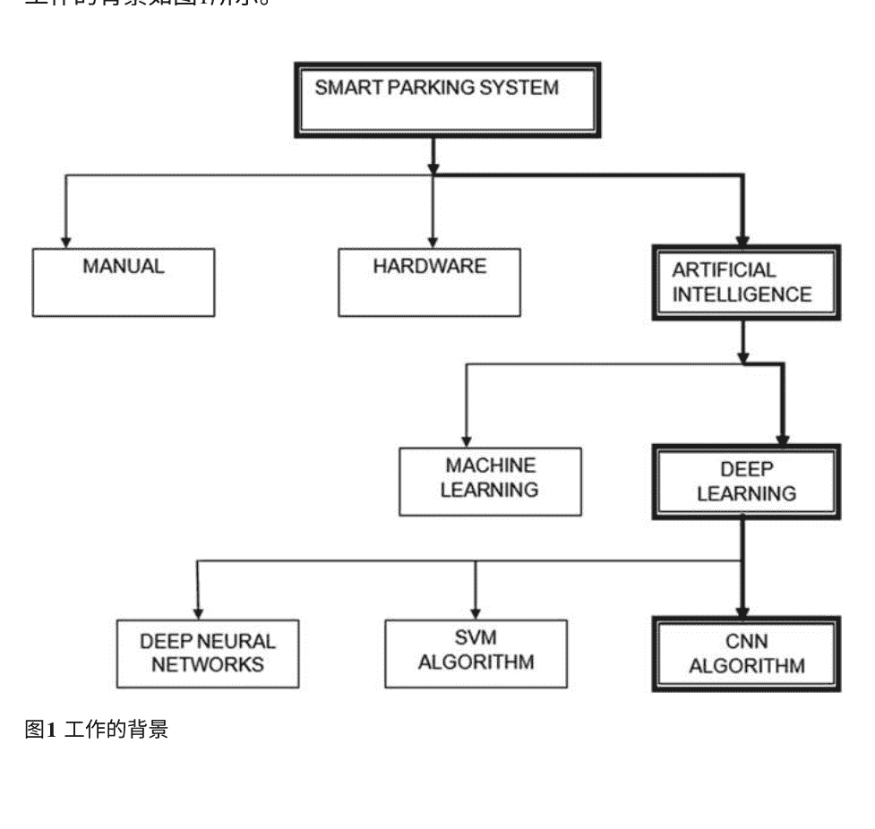

图1 工作的背景

### 3.1 机器学习

机器学习是计算机系统在执行特定任务时不使用显式指令，而依赖于模式和推理的算法和统计模型的研究。它被视为人工智能的一个子集。

机器学习算法基于样本数据（称为“训练数据”）构建数学模型。以便在没有明确编程执行任务的情况下进行预测或决策。机器学习算法在各种应用中使用，例如电子邮件过滤和计算机视觉，在这些应用中，开发有效执行任务的传统算法很难或不可行。

机器学习任务分为几个广泛的类别。在监督学习中，算法从包含输入和期望输出的数据集中构建数学模型。例如，如果任务是确定图像是否包含某个对象，则监督学习算法的训练数据将包括带有和不带有该对象的图像（输入），并且每个图像都有一个标签（输出），指示它是否包含该对象。在特殊情况下，输入可能仅部分可用或受限于特殊反馈。

分类算法和回归算法是有监督学习的类型。分类算法用于输出被限制在有限值集合的情况。对于一个过滤电子邮件的分类算法，输入是一封收到的电子邮件，输出是将邮件归类到的文件夹的名称。对于一个识别垃圾邮件的算法，输出将是“垃圾邮件”或“非垃圾邮件”的预测，用布尔值true和false表示。回归算法因其连续输出而得名，意味着它们可以在一定范围内具有任何值。连续值的例子包括温度、长度或物体的价格。

在无监督学习中，算法从仅包含输入而没有期望输出标签的数据集中构建数学模型。无监督学习算法用于发现数据中的结构，如数据点的分组或聚类。无监督学习可以发现数据中的模式，并将输入分组到不同的类别中，如特征学习。

强化学习是机器学习的一个领域。它是关于在特定情况下采取适当的行动以最大化奖励。它被各种软件和机器用于在特定情况下找到最佳行为或路径。强化学习与监督学习不同，监督学习中的训练数据带有答案，因此模型是根据正确答案进行训练的，而在强化学习中，没有答案，而是强化代理决定如何执行给定的任务。在没有训练数据集的情况下，它必须从经验中学习[10]。

### 3.2 深度学习

深度学习是一种人工智能功能，模仿人脑处理数据和创建模式以用于决策。

深度学习是人工智能（AI）的一个子集，具有能够学习无监督的非结构化或无标签数据的网络。 也被称为深度神经学习或深度神经网络[1, 11]。

深度学习与数字时代共同发展，带来了各种形式和来自世界各地的数据爆炸。 这些数据，简称为大数据，来自社交媒体、互联网搜索引擎、电子商务平台和在线电影院等来源。 这些庞大的数据量可以通过云计算等技术应用轻松访问和共享。

然而，这些通常是非结构化的数据如此庞大，以至于人类可能需要几十年才能理解并提取相关信息。 公司意识到从这些信息中揭示出的巨大潜力，并越来越多地采用人工智能系统进行自动化支持。

### 3.3 各种图像分类模型的比较

DNN是一个可以用于分类的模型。 我们可以成功训练一个简单的神经网络来进行回归和分类，但是DNN在处理图像时可能表现不佳。

卷积层在涉及图像的任务中已经证明非常成功，例如图像分类、物体识别和人脸识别。 它们允许参数共享，与使用稠密层相比，可以得到非常优化的网络。 卷积神经网络在分类领域中相对于其他方法取得了很高的性能，这是因为它们可以通过深度架构从大量数据中学习到强大而丰富的特征。

支持向量机算法在图像分类方面表现出色，但需要我们自己设计核函数或在使用之前处理数据。逻辑回归和决策树也可以用于图像分类。但它们在预测时会产生显著的错误。比较以上所有模型，我们可以看到卷积神经网络在图像分类方面表现良好，因为：

- (1) 卷积神经网络逐块比较图像。 因此，卷积神经网络在相似性方面比整个图像匹配方案更好。
- (2) 由于CNN是一种深度学习神经网络，因此会发生迁移学习，从而学到更多知识并产生较少的误差输出。
- (3) CNN可以被看作是从图像中自动提取特征的工具。
- (4) CNN首先通过卷积有效地对图像进行下采样，然后在末端使用预测层。
- (5) CNN执行特征提取并提供更高的准确性。

#### 使用深度学习模型比较智能停车系统的模型

| 模型 | 描述 | 优点 | 缺点 |
| :--- | :--- | :--- | :--- |
| 深度神经网络 | 深度神经网络是一种具有一定复杂性的神经网络，即具有超过两层的神经网络。深度神经网络使用复杂的数学建模方式来处理复杂的数据。 | 相对简单 | DNN在处理图像方面表现不佳。 |
| 支持向量机 | 支持向量机是一种带有相关学习算法的监督学习模型，用于分析用于分类和回归分析的数据。支持向量机在高维或无限维空间中构建一个超平面或一组超平面，可用于分类、回归或其他任务，如异常值检测。 | 实验结果显示，支持向量机在仅经过三到四轮相关反馈后，比传统的查询优化方案实现了显著更高的搜索准确性。 | 这涉及到大量的预处理工作。这要求我们在使用之前设计自己的核函数或处理我们的数据。 |
| 逻辑回归 | 逻辑回归是一种监督学习分类算法，用于预测目标变量的概率。目标变量的性质是二分的，这意味着只有两个可能的类别。 | 逻辑回归更容易实现、解释，并且训练非常高效。它在对未知记录进行分类时非常快速。 | 它构建线性边界并在预测时产生显著的误差。 |
| 卷积神经网络 | 卷积神经网络的名称表明该网络采用了一种称为卷积的数学运算。卷积是一种特殊的线性运算。卷积网络只是神经网络在其层中使用卷积而不是一般矩阵乘法的简单形式。 | CNN逐个比较图像的部分。因此，CNN在看待相似性方面比整个图像匹配方案更好，并通过特征提取提供更高的准确性。 | CNN不编码对象的位置和方向，并且缺乏对输入数据的空间不变性的能力。 |

### 3.4 数学模型

CNN是生物学、艺术和数学的结合。神经网络是所有深度学习算法的核心。它们试图复制大脑及其工作过程[3]。

- 卷积层从输入中提取特征，
- 全连接（密集）层使用卷积层的数据生成输出。

在任何神经网络的训练中，还涉及两个重要的过程：

- 前向传播：接收输入数据，处理信息并生成输出
- 反向传播：计算误差并更新网络的各种参数

前向传播：

卷积神经网络通过比较像素值来识别图片的形状和边缘。

卷积在数学上通常用星号 * 表示。如果我们有一个表示为 X 的输入图像和一个表示为 f 的滤波器，则表达式为：

```
Z = X * f
```

其中 * 表示 X 和 f 的逐元素乘法

```
图像的维度 = (n, n)
```

```
滤波器的维度 = (f, f)
```

```
输出的维度将为 ((n - f + 1), (n - f + 1))
```

全连接层只接受1D矩阵作为输入。因此，前一层的输入被转换为1D矩阵以进行进一步处理。全连接层对输入数据进行两个操作——线性变换和非线性变换。

#### 线性变换由以下方式执行：

```
Z = W^T · X + b
```

其中X是输入，W是权重，b（称为偏置）是一个常数。此外，在这种情况下，W将是一个由（随机初始化的）数字组成的矩阵，以使隐藏层彼此不同。

非线性变换被添加到数据中，以捕捉数据中的额外复杂关系。执行非线性变换的组件称为激活函数。

对于这项工作，隐藏单元使用ReLU（修正线性单元）作为激活函数，输出单元使用sigmoid函数。数学表达式如下：

```
对于隐藏层，A = max(0, Z)
```

```
对于输出层（二元分类），A = 1 / 1 + e^{-Z}
```

激活函数被添加到神经网络的所有层中。

#### 反向传播：

在前向传播过程中，我们随机初始化权重、偏置和滤波器。这些值被视为卷积神经网络算法的参数。在反向传播过程中，模型试图更新参数，使整体预测更准确。

为了开始反向传播，我们使用梯度下降算法找到代价函数J。我们试图找到参数值，使其尽量减少代价函数J。更新参数的一般方程式如下：

```
新参数 = 旧参数 - 学习率 * 梯度对参数的导数
```

其中学习率是一个超参数，控制新参数相对于旧参数的变化。要更新权重，执行以下操作：

```
新权重 = 旧权重 - 学习率 * d E / d W
```其中

$$\frac{dE}{dW} = \frac{dE}{dO} \cdot \frac{dO}{dZ} \cdot \frac{dZ}{dW}$$

更新偏置(b)的方法如下：

$$b_{new} = b_{old} - \text{学习率} * \frac{dE}{db}$$

其中

$$\frac{dE}{db} = \frac{dE}{dO} \cdot \frac{dO}{dZ} \cdot \frac{dZ}{db}$$

对于卷积层，我们的参数是滤波器矩阵。要更新滤波器矩阵，执行以下操作：

$$f = f - \text{学习率} * \frac{dE}{df}$$

其中

$$\frac{dE}{df} = \frac{dE}{dO} \cdot \frac{dO}{dZ} \cdot \frac{dZ}{dA} \cdot \frac{dA}{dZ} \cdot \frac{dZ}{df}$$

## 4 概念架构

概念架构的目的是在不涉及接口规范细节的情况下，引导对系统的适当分解。识别出关键构件，包括组件和它们之间的关系等重要的架构元素，以及架构机制。通过关注关键构件和抽象，而不是技术细节的扩散，概念架构为非技术人员（如管理层、市场营销人员和某些用户）提供了一个有用的工具来传达架构。它也是逻辑架构的起点，逻辑架构详细说明了组件规范和架构机制，使架构具体和可操作。项目的概念架构如图2所示：

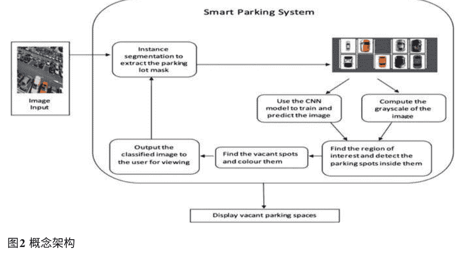

| 层级 | 组件 |
| :--- | :--- |
| 应用层 | 图像捕获接口、异常处理程序、通信管理器 |
| 预处理层 | 图像检查、数据增强 |
| 处理层 | 灰度转换、图像分割、霍夫变换、感兴趣区域操作器、车道确定器、插槽确定器 |
| 物理层 | 存储管理器、图像数据库、结果数据库、维护管理器 |

该项目的概念设计被建模为一个4层架构。它们如下所示：

- **应用层**
    该层包含与项目的实际应用相关的所有模块。
    它包括以下模块：
    - **图像捕获接口** - 这是允许我们通过闭路电视摄像头捕获停车场图像的接口，进一步帮助我们找到空闲停车位。
    - **异常处理程序** - 该模块帮助我们报告程序在执行过程中可能遇到的任何错误或异常。

- **预处理层**
    该层包含所有帮助对从应用层获取的数据进行预处理的模块。它包括以下模块：
    - **图像检查** - 该模块帮助我们检查由CCTV摄像机捕捉到的图像是否正确。如果图像不是用户关心的图像，它可以帮助用户接受或丢弃图像。
    - **数据增强** - 这一步骤允许我们从现有的训练数据中人工创建新的训练数据。我们对初始数据进行水平翻转、垂直和水平移位。

- **处理层**
    该层包含了所有从预处理层获得的数据进行处理的模块。它包括以下模块：
    - **灰度转换** - 该模块帮助将处理后的图像转换为灰度，进而允许我们处理图像以找到空槽位。
    - **图像分割** - 该模块帮助我们将图像分割成较小的部分。它有助于检测图像中存在的各种边缘。
    - **感兴趣区域操作器** - 该模块通过去除图像中的所有不必要区域，显示我们感兴趣的图像部分。
    - **霍夫变换** - 该模块对图像进行霍夫变换，有助于在图像中分离感兴趣区域的特征。
    - **车道确定器** - 该模块帮助绘制指示图像中各个停车车道的线条。
    - **车位确定器** - 该模块帮助识别停车位并在空闲停车位周围绘制一个框（并对其进行着色）。

- **物理层**
    该层包含了所有帮助存储和维护来自处理层的图像的模块。它包括以下模块：
    - **存储管理器** - 该管理器帮助将图像存储到各种数据库中。它有助于将图像存储到图像和结果数据库中。
    - **图像数据库** - 这是存储CCTV摄像机在任何时间点拍摄的所有图像的图像数据库。它还存储了所有图像的时间戳，指示照片拍摄的时间和日期。
    - **结果数据库** - 这是存储进一步检查或用户需要时进一步澄清的最终处理图像的结果数据库。
    - **维护管理器** - 此管理器帮助通知用户何时需要对系统进行维护。

所有上述层中共同的一个模块是通信管理器。此管理器帮助程序在所有层之间轻松通信，以执行其任务。

### 利用CNN深度学习模型进行智能停车

### 4.1 算法

输入：要分类的图像

输出：显示空闲停车位的分类图像

过程：

1.  开始
2.  将X和Z初始化为空列表
3.  获取所有需要检测停车位中的物体是否为汽车的汽车图像
4.  对于每个图像：
    - 将处理后的图像存储到X中
    - 将图像的标签存储到Z中
5.  创建另一个变量Y，将Z标签存储为0和1
6.  从X和Y值集合中创建x_train、x_test、y_train和y_test
7.  创建一个CNN模型
8.  为了防止CNN模型过拟合，使用数据增强
9.  通过前向传播和反向传播进行多次训练。重复此过程，直到我们得到一个定义良好的神经网络，具有训练好的权重和特征检测器。
10. 通过给出测试输入（x_test）对模型进行预测并评估它
11. 初始化prop_class=[]
12. 初始化mis_class=[]
13. 对于i从0到len(y_test)：
    - 如果(y_test[i]==prediction[i])：
        - prop_class.append(i)
14. 对于i从0到len(y_test)：
    - 如果(y_test[i]!=prediction[i])：
        - mis_class.append(i)
15. 显示正确分类和错误分类的图像
16. 获取所需停车场的图像
17. 将图像转换为灰度图像
18. 在停车场中找到感兴趣的区域
    - 获取图像的形状
    - 使用试错法找出6个多边形点
    - 使用这些多边形点来遮罩感兴趣的区域
19. 使用霍夫变换检测图像中的直线，并标记它们
20. 初始化 cnt_empty = 0
21. 初始化 all_spots = 0
22. 确定停车道
23. 对于每个停车道：
    - 找到停车位
    - 对于每个停车位：
        - 使用CNN模型预测停车位是否有车
        - 如果 (label==“空”) ：
            - 将停车位标记为绿色
            - cnt_empty+=1
            - all_spots+=1
24. 显示预测图像

- **Assign_label() 和 make_data()**：
    - Assign_label() 软件组件用于为所有可用的训练数据分配标签，以便对这些带有标签的数据进行训练
    - make_data() 软件组件用于将所有数据分割为训练和测试数据

- **Make_model()**：
    - 用于构建CNN软件组件，并应用各种步骤以确保该模型不会过拟合数据

- **Train_model()**：
    - 该软件组件用于根据可用的数据对模型进行训练

- **Evaluate_model()**：
    - 用于评估构建的CNN模型的准确性和损失

- **Prediction()**：

- **Convert_gray_Scale()**：
    - 将主停车场图像转换为灰度，以便更容易检测到空闲停车位

- **Select_region()**：
    - 此软件组件用于选择我们想要预测空闲停车位的感兴趣区域

- **Hough_line()**：
    - 此软件组件用于识别图像中的边缘，以便检测到每个停车位的轮廓

- **Identify_lanes()和identify_spots()**：
    - 此软件组件有助于识别停车场图像中的各个车道和停车位

- **Predict_image()**：
    - 此软件组件用于显示整个停车场中所有空闲停车位的最终图像

智能停车系统的图示流程在附录（A6-A18）中解释

## 5 评估

本节介绍了本工作中使用的数据集的描述，以及用于评估工作的各种指标和指标图。

本工作使用的总数据为：381张图像
本工作使用的总训练数据为：285张图像
本工作使用的总测试数据为：96张图像

真正例是实际上为正的数据点被识别为正的数据点。假正例是被识别为正的数据点实际上为负的数据点。真负例是实际上为负的数据点被识别为负的数据点。假负例是被识别为负的数据点实际上为正的数据点。

工作的TP、TN、FP、FN的值如下表所示：

| 二元分类 | 值 |
|----------|-----|
| 真正例   | 62  |
| 假正例   | 2   |
| 真负例   | 32  |
| 假负例   | 0   |

### 5.1 召回率和精确度指标

召回率：这是一个分类模型的能力，可以识别所有相关实例。软件组件的召回率为1.0000。

精确度：这是一个分类模型的能力，只能识别相关实例。我们软件组件的精确度值为0.96875。

F1得分：F1得分通过调和平均值结合了召回率和精确度。软件组件的F1得分为0.984127。

### 5.2 可视化召回率和精确度

混淆矩阵：它显示了分类问题的预测和实际表格。智能停车系统的混淆矩阵如图3所示。

接收操作特性（ROC）曲线：ROC曲线用于绘制真正例率（TPR）和假正例率（FPR），以及模型阈值对正例进行分离。ROC曲线如图4所示。

**图3 混淆矩阵**

```
Confusion Matrix:
array([[32, 2],
       [0, 62]])
```

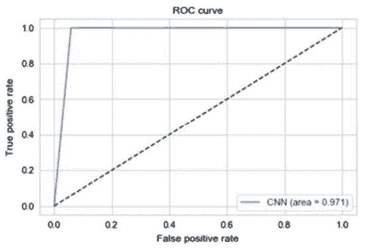

**曲线下面积（AUC）曲线：**

AUC用于通过找到ROC曲线下的面积来计算模型的性能[3]。AUC曲线显示在图5中。

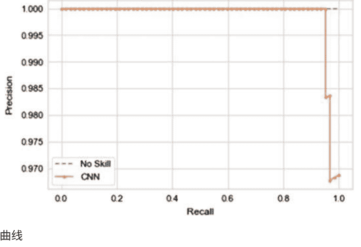

## 6 讨论和结论

在现代社会中，人们参与交通，因此面临许多问题。找到一个空闲的停车位的问题被视为我们的问题陈述。需求解释为动机解释了人们在尝试停车时面临的问题。他们可能在没有可用停车位的情况下寻找停车位。因此，该项目帮助用户了解给定空间中可用的停车位。

过去已经通过许多其他技术解决了这个问题，与此相反，我们尝试使用人工智能（深度学习）来解决这个问题。上下文深入解释了人工智能，以便用户理解概念及其在这个问题上的应用。情节解释了深度学习中可用于解决问题的不同算法。比较各种算法后，选择了CNN作为最适合图像处理的算法。输入的停车位照片经过CNN算法处理，用户可以知道停车位是否可用。将输入的图像转换为灰度图像，并将其分解为小像素，以确定停车位是否空闲或占用。模型的效率是通过二元分类的结果和精确度指标的回忆得出的。开发的模型对于给定的输入非常有效，布局的任何变化都会导致感兴趣区域的确定发生变化，每个停车布局都有所不同。

因此，用户可以使用该模型来确定给定停车布局中停车位的可用性。

深度学习和人工智能是当前计算机科学领域最繁荣的话题。然而，为了获得性能，不仅需要一个好的算法，还需要对数据集进行有效的训练。这个基于深度学习的停车位检测模型被用作为向客户/用户提供服务的高效应用。该模型将不断发展，根据通过CCTV或实时摄像头获取的真实图像为用户提供服务，从而帮助用户/客户更高效地使用任何停车布局。通过提供更高效的停车布局输入和使用精确的数据集，可以改进CNN算法，用于高效的分类。将该模型转化为移动应用程序，以便用户可以远程了解是否有空余空间，从而可以在不进入布局的情况下避免用户返回。这样可以防止用户在没有停车位的情况下返回布局。

致谢：我们要感谢Impiger Technologies Pvt. Ltd在我们的项目中的支持和帮助。

### 利用CNN深度学习模型进行智能停车

## 附录1

参见图6、7、8、9、10、11、12、13、14、15、16、17、18和19。

**图6 加载数据集**

```
In [5]: # make 'Free' data
make_train_data('Free', FREE_DIR)
print(len(X))

100%|███████████████████████████████████████████████████████████| 96/96 [00:00<00:00, 1389.85it/s]
96
```

```
In [6]: # make 'Full' data
make_train_data('Full', FULL_DIR)
print(len(X))

100%|███████████████████████████████████████████████████████████| 285/285 [00:00<00:00, 1323.94it/s]
381
```

**图7 模型摘要**

```
In [15]: model.summary()
Model: "sequential_1"
_________________________________________________________________
 Layer (type)                Output Shape              Param #   
=================================================================
 conv2d_1 (Conv2D)           (None, 48, 48, 32)        2432      
                                                                 
 max_pooling2d_1 (MaxPoolin  (None, 24, 24, 32)        0         
 g2D)                                                          
                                                                 
 conv2d_2 (Conv2D)           (None, 24, 24, 64)        18496     
                                                                 
 max_pooling2d_2 (MaxPoolin  (None, 12, 12, 64)        0         
 g2D)                                                          
                                                                 
 conv2d_3 (Conv2D)           (None, 12, 12, 96)        55392     
                                                                 
 max_pooling2d_3 (MaxPoolin  (None, 6, 6, 96)          0         
 g2D)                                                          
                                                                 
 conv2d_4 (Conv2D)           (None, 6, 6, 96)          83040     
                                                                 
 max_pooling2d_4 (MaxPoolin  (None, 3, 3, 96)          0         
 g2D)                                                          
                                                                 
 flatten_1 (Flatten)         (None, 864)               0         
                                                                 
 dense_1 (Dense)             (None, 512)               442880    
                                                                 
 activation_1 (Activation)   (None, 512)               0         
                                                                 
 dense_2 (Dense)             (None, 2)                 1026      
                                                                 
=================================================================
Total params: 603,266
Trainable params: 603,266
Non-trainable params: 0
_________________________________________________________________
``````
Epoch 38/50
2/2 [==============================] - 0s 241ms/step - loss: 0.1534 - accuracy: 0.9618 - val_loss: 0.0800 - val_accuracy: 0.9583
Epoch 39/50
2/2 [==============================] - 0s 231ms/step - loss: 0.1069 - accuracy: 0.9554 - val_loss: 0.1383 - val_accuracy: 0.9479
Epoch 40/50
2/2 [==============================] - 1s 301ms/step - loss: 0.1033 - accuracy: 0.9727 - val_loss: 0.0889 - val_accuracy: 0.9688
Epoch 41/50
2/2 [==============================] - 1s 269ms/step - loss: 0.0297 - accuracy: 1.0000 - val_loss: 0.0736 - val_accuracy: 0.9792
Epoch 42/50
2/2 [==============================] - 0s 245ms/step - loss: 0.0880 - accuracy: 0.9809 - val_loss: 0.0617 - val_accuracy: 0.9792
Epoch 43/50
2/2 [==============================] - 0s 249ms/step - loss: 0.0525 - accuracy: 0.9682 - val_loss: 0.0950 - val_accuracy: 0.9688
Epoch 44/50
2/2 [==============================] - 1s 267ms/step - loss: 0.1789 - accuracy: 0.9745 - val_loss: 0.0619 - val_accuracy: 0.9792
Epoch 45/50
2/2 [==============================] - 1s 369ms/step - loss: 0.0539 - accuracy: 0.9805 - val_loss: 0.0472 - val_accuracy: 0.9688
Epoch 46/50
2/2 [==============================] - 0s 245ms/step - loss: 0.0721 - accuracy: 0.9682 - val_loss: 0.0742 - val_accuracy: 0.9688
Epoch 47/50
2/2 [==============================] - 1s 363ms/step - loss: 0.0532 - accuracy: 0.9883 - val_loss: 0.1239 - val_accuracy: 0.9583
Epoch 48/50
2/2 [==============================] - 1s 254ms/step - loss: 0.0380 - accuracy: 0.9873 - val_loss: 0.0558 - val_accuracy: 0.9792
Epoch 49/50
2/2 [==============================] - 0s 236ms/step - loss: 0.0434 - accuracy: 0.9809 - val_loss: 0.0529 - val_accuracy: 0.9688
Epoch 50/50
2/2 [==============================] - 0s 247ms/step - loss: 0.0916 - accuracy: 0.9618 - val_loss: 0.0601 - val_accuracy: 0.9792

### 图8训练模型

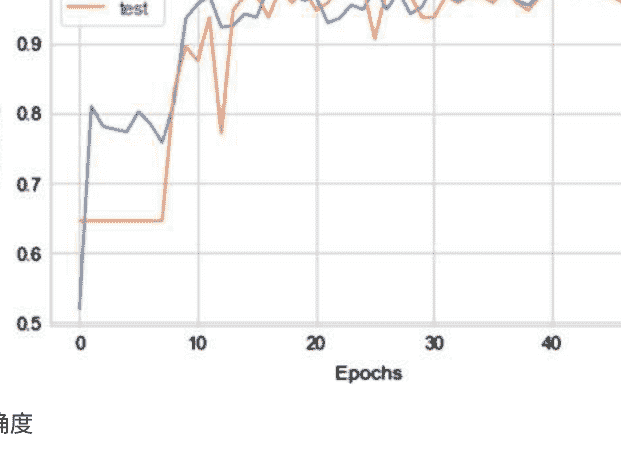

### 图9模型准确度

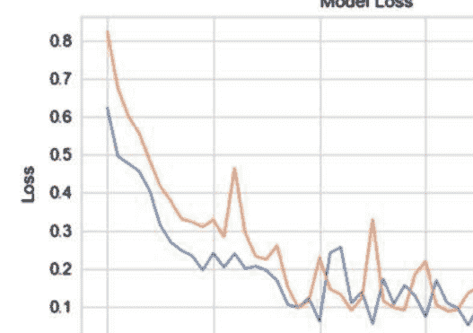

### 图10模型损失

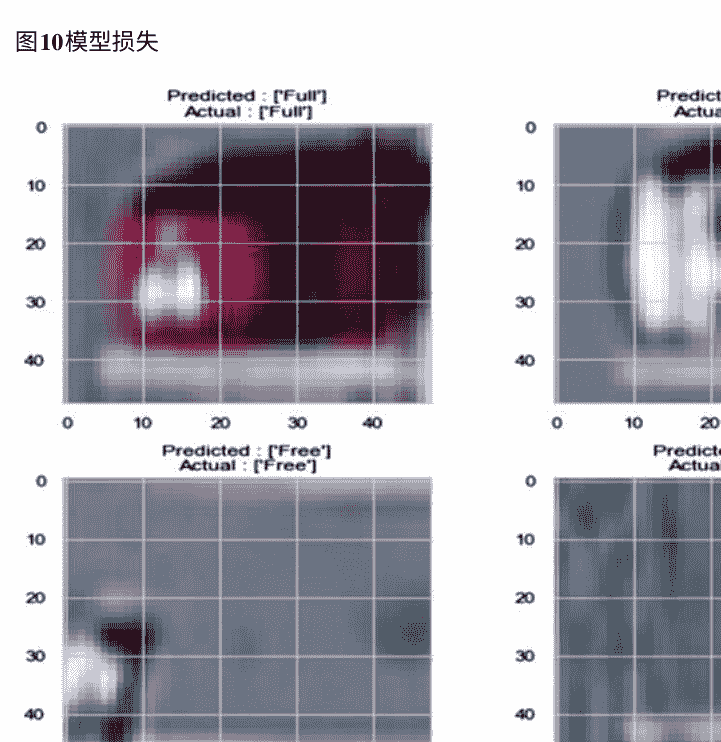

### 图11正确分类

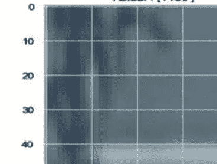

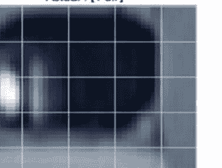

### # 图11（续）

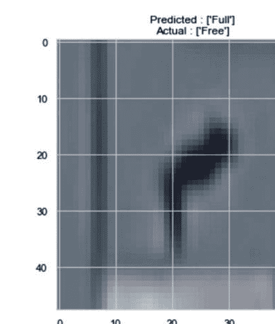

### # 图12错误分类

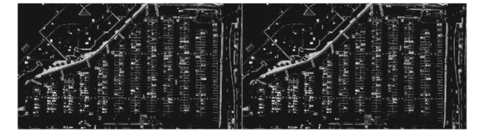

### # 图13灰度转换

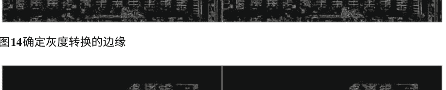

### 图14确定灰度转换的边缘

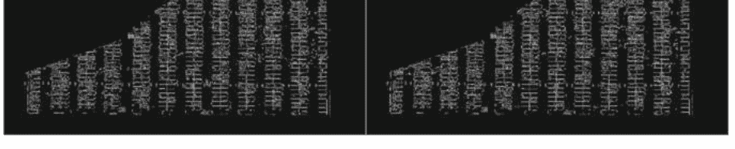

### 图15感兴趣区域

No lines detected: 569
No lines detected: 588

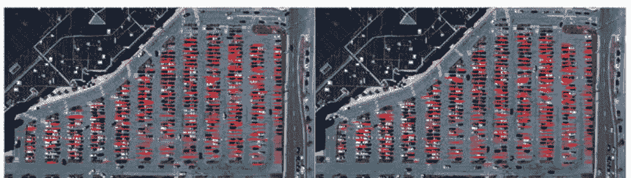

### 图16确定停车位的轮廓

Num Parking Lanes: 12
Num Parking Lanes: 12

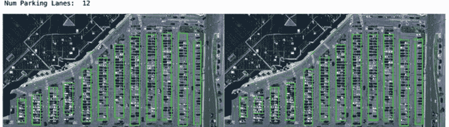

### 图17确定停车车道

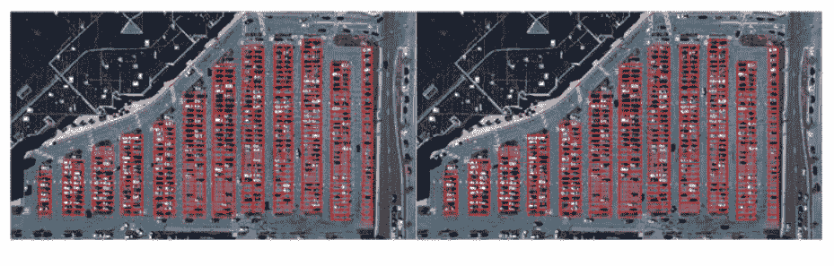

### # 图18 插槽和车道的最终布局

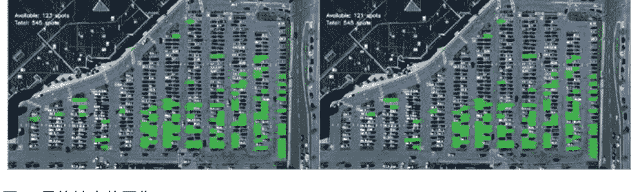

### # 图19 最终输出的图像

## 参考文献

+   1. Acharya D, Khoshelham K, Winter S (2017) 使用深度卷积神经网络在CCTV图像中实时检测和跟踪行人。 在：第4届research@locate年会论文集，第1913卷
2. https://towardsdatascience.com/beyond-accuracy-precision-and-recall-3da06bea9f6c
3. https://www.analyticsvidhya.com/blog/2020/02/mathematics-behind-convolutional-neural-network/
4. Park W-J, Kim B-S, Seo D-E, Kim D-S (2008) 使用超声波传感器在停车辅助系统中进行停车位检测。 在：智能车辆研讨会。 IEEE
5. Chiu M-Y, Depommier R, Spindler T (2004) 用于24小时室内/室外车辆计数应用的嵌入式实时视觉系统。 Pattern Recogn
6. Boda VK, Nasipuri A, Howitt I (2007) 用于定位停车位的无线传感器网络的设计考虑。 在：SoutheastCon
7. Yusnita R, Fariza N, Norazwinawati B (2012) 基于图像处理的智能停车位检测系统。 Int J Innov Manag Technol 3 (3)
8. Fabian T (2008) 用于停车场占用检测的算法。 在：计算机信息系统和工业管理应用
9. True N (2007) 静态图像中的空闲停车位检测。 加利福尼亚大学，Projects inVision & Learning
10. Mitchell T (1997) 机器学习。 麦格劳希尔
11. Bin Z, Dalin J, Fang W, Tingting W (2009) 基于视频图像的停车位检测器设计。 电子测量仪器

## 使用深度学习估计公共场所的人群规模监控

**Deevesh Chaudhary, Sunil Kumar和Vijaypal Singh Dhaka**

> 摘要 随着世界范围内人口爆发的惊人速度，公共场所如超市、办公室、银行、政治集会、宗教活动等引发了安全关切。人群中的人数越多，就越容易出现异常行为或安全问题。大多数公共场所人满为患，需要进行人群计数监控，以避免任何意外事件。在不同地点任命人员进行人数统计是不可能的。就远程监控公共场所人群而言，闭路电视摄像头的作用至关重要，但一个人通过同时监控多个不同位置的视频来计数人群是一项繁琐的工作。此外，借助闭路电视录像，管理人群并不是一项容易的任务，特别是对于密集人群而言。需要自动人群计数，可以估计人群图像中的总人数。在本章中，我们回顾了使用最先进的深度学习模型进行自动人群计数的方法，并对主要人群计数数据集的性能进行了分析。

## 1 引言

公共监控是通过安装在各个位置的闭路电视摄像头对实时视频进行持续监控、分析和解读。公共监控的目的是通过观看通过闭路电视摄像头捕捉到的屏幕上的视频，远程监控人们的活动。公共视频监控已经成为一种由于在众多应用中的需求不断增加，人群行为分析、人群计数、公共安全、城市规划等成为研究的主要兴趣点之一。近年来，自动人群计数已经吸引了许多计算机视觉领域的研究人员。在这个领域的研究已经广泛探索，以帮助人类在实时场景中，如检测任何异常活动、计算人群数量、追踪人类移动等方面。

在本章中，我们将讨论最先进的技术，即深度学习方法，用于自动公共监控及其各种目标。尽管计算机视觉领域的研究人员一直在努力实现公共场所人群数量的估计自动化，但卷积神经网络（CNN）似乎在这个领域提供了有希望的结果。CNN是神经网络的一个分支，可以从图像中提取和学习显著特征以估计人数。

#### 1.1 为什么我们需要自动人群计数？

让我们举个例子来理解为什么需要自动人群计数。想象一下，在一所大学举行的数据科学家会议上，有许多与不同主题和兴趣相关的会议。我们想要根据参加这些会议的人数分析会议的有效性，以便更容易管理下次的会议聚会。为此，我们需要有几个人参加每个会议。可以通过手动计算每个会议中的人数来完成，但这需要人力和时间。另一种方法是拍摄每个会议的照片，并建立一个以该照片作为输入并估计照片中人数的计算模型。

这样，从图像中估计人数将变得更加容易，需要的人力最少，而且结果可以更快地得到。同样，有很多场合自动人群计数似乎是有意义的。

+   - 统计参加政治集会的人数。
- 统计寺庙宗教活动中的人数。
- 统计边境恐怖分子的数量。
- 监测高拥堵交通。
- 管理购物中心和电影院的出口计划。

从商业到国防目的，自动人群计数有很多应用案例。

#### 1.2 人群计数：定义和背景

人群计数是指在静止图像或视频中计算对象的数量。如图1所示，对象可以是人、细胞、汽车或任何生物或非生物物体。

我们的重点将放在估计拥挤人群图像中的人数上。由于在医疗、国防、灾害管理、公共监控、医疗保健、城市规划等各个领域具有广泛的应用，需要从传统的通过闭路电视手动计数的方法转向更先进和自动化的人群计数方法，以获得更准确和精确的结果。

从图2中可以看出，技术上，人们可以通过数字图像处理、机器学习和深度学习来进行图像中的人数统计。
在讨论深度学习方法（CNN/ConvNet）估计人群数量之前，我们将先对人群数量的机器学习方法进行概述。传统的人群数量计算方法包括检测计数[1-3]、回归计数[4-6]、密度估计计数[7, 8]和聚类计数[9-11]。

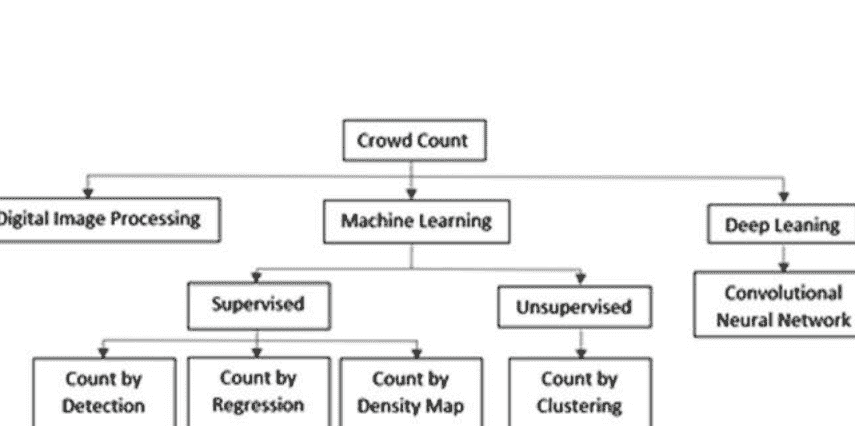

图2 自动人群计数技术

##### 1.2.1 检测计数

在这种方法中，使用滑动窗口检测器从图像中识别出整体（全身检测）或部分（如头部、肩膀）特征。需要一个经过良好训练的分类器来提取低级特征，如HOG [12]、SIFT、Edgelet [13]、背景减除 [14]等。检测计数在稀疏人群图像中效果良好，但在密集人群图像中准确性大幅下降。

##### 1.2.2 通过回归计数

在这种方法中，使用回归模型生成估计和实际计数之间的映射。首先，从图像中提取低级特征，然后使用回归建模（线性、岭、高斯等）来估计计数。在这种方法中，图像被划分为共同感兴趣的小块，如共同移动的人或每个块的低级特征（形状、边缘、纹理）被提取。将特征向量映射到人群大小的回归函数被应用于估计人群计数。可以应用不同类型的回归模型，如线性、岭、高斯、套索回归等。

##### 1.2.3 通过密度估计计数

与检测计数方法不同，这种方法执行完整人体或特定部位的检测和定位。通过获取人群图像的密度图来解决遮挡和杂乱问题。通过整合密度图获得估计计数。与其他人群计数方法相比，这种方法在密集人群中效果更好。

##### 1.2.4 通过聚类进行计数

这种方法基于个体运动之间的相似模式。此外，在聚类相似特征时还考虑了个体的视觉特征。这些特征根据相似模式分为不同的类别。然而，这种方法在连续图像帧中获得良好的结果，而不是静态图像。

### 2 卷积神经网络用于人群计数

使用上述方法通过低级手工特征估计计数在一定程度上获得良好的结果。研究人员发现深度学习方法，即使用CNN对与人群相关的图像进行特征提取，能够从图像中提取出更强大和深入的特征。通过使用不同的卷积层和微调超参数，与传统方法相比取得了出色的结果。尽管使用CNN在计算上复杂，但与其他方法相比，CNN用于特征提取的性能更好。

CNN是一种计算复杂的方法，但证明是计算机科学领域中具有影响力的创新之一。计算机视觉的研究人员发现，卷积神经网络（CNN或ConvNets）的实际应用在图像处理方面取得了有希望的结果。为了估计任何图像中的人群数量，我们提供一个图像数据集给CNN模型来训练模型。

输入图像通过卷积神经网络的基本层，即卷积层、ReLu层、池化层和全连接（FC）层。根据复杂性，图像可能经过多种组合的卷积和ReLu层，具有可变的滤波器大小和超参数。人群计数的图像数据集包含各种图像，如图3所示。预处理图像后，CNN模型可以估计人数。CNN在图像上工作的一般模型，特别是用于计数估计的模型如图3所示。

计算机视觉领域的研究人员提出了许多CNN模型（多列CNN [15]，切换CNN [16]，级联CNN [17]，CSRNet [18]，深度CNN [19]）。少数CNN模型甚至可以比人类更好地估计计数。

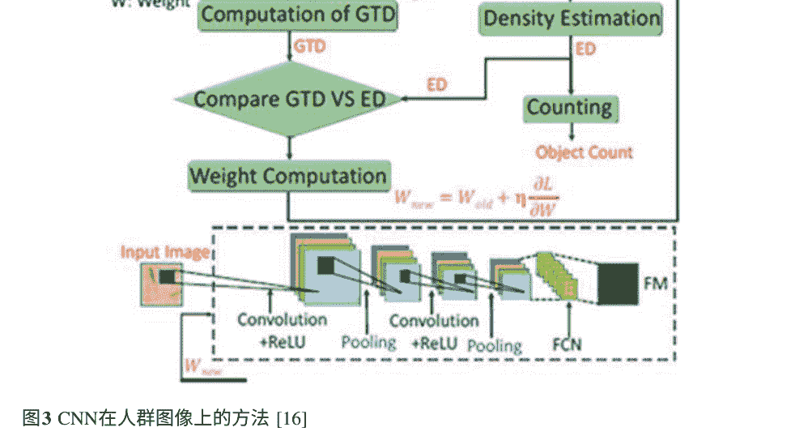

图3 CNN在人群图像上的方法 [16]

#### 2.1 为什么使用CNN?

由于以下原因，有理由从传统的人群计数方法转向深度学习方法（CNN）。

+   - 从图像中计算人数遇到一些挑战，如遮挡（人们相互重叠）、高杂乱（人们以不同方向移动）、光照变化（白天或夜晚）、不同尺度和不一致的视角（不同摄像机角度的图像）等。这些因素导致预测错误和低准确性。由于这些挑战，使用上述传统方法在密集人群中计数人数是困难的。这些挑战的示例如图4所示。

+   - 上述方法都专注于低级手工特征。如果人群稀疏，这些特征可以成功识别和提取。对于密集人群计数，这些方法的估计计数会发生剧烈变化。

+   - 由于自动人群计数在公共领域到军事领域的不同应用以及在计算机视觉中的重要性，人群计数已成为一个复杂的科学问题需要解决。需要一种能够在人口密集地区提供更准确估计的技术。

+   - 使用CNN而不是手工特征提取方法的另一个优势是它可以自动从数据集中提取最重要的特征，无需人工干预。与其他技术相比，CNN的特征提取任务在计算上更高效，并且给出更精确的结果。此外，与机器学习算法相比，CNN使用的参数数量较少。

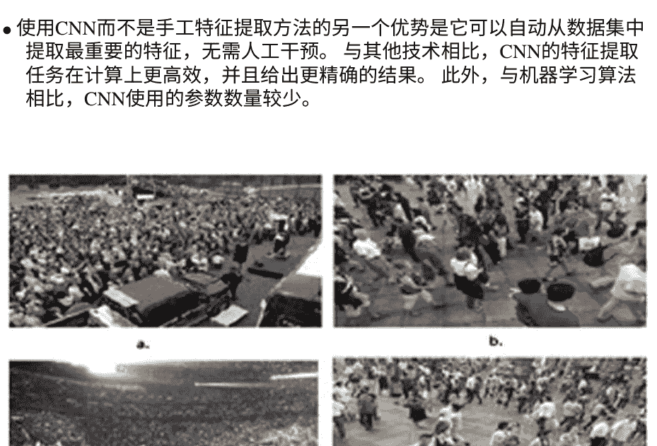

图4 挑战 a遮挡。 b不同的摄像机角度。 c光照变化。 d杂乱无章

例如回归、分类、SVM等。CNN中的各种操作，如卷积、池化、展平，实现了参数共享，从而使模型更加稳健。

+   - 预训练的CNN模型也可以用于计算机视觉中相关问题的迁移学习。通过这种方式，我们可以减少训练时间，同时也可以提高模型的效率。我们可以通过更改超参数和配置预先存在的模型来重用或调整。一些预训练模型的例子包括Oxford VGG、Google Inception、Microsoft ResNet、AlexNet等。图5说明了迁移学习的工作原理。

迁移学习的基本思想是利用预训练的深度学习模型的层和现有的权重，在训练过程中不改变权重，同时将模型用于新任务。

#### 2.2 卷积神经网络架构

卷积神经网络可以说是图像/视频相关分类任务中最流行的深度学习架构之一。研究人员对卷积神经网络模型的兴趣突然激增，这是因为它的有效性和即时的模型行为。图像相关任务的第一个卷积神经网络工作模型AlexNet于2012年开发，具有8层。
```

从那时起，AlexNet变得非常受欢迎，以至于在3年内，8层的AlexNet已经发展到152层的ResNet。

所有的卷积神经网络模型的架构都有些相似。研究人员可以根据自己的需求和数据集来改变层数和超参数。卷积神经网络的基本架构如图6所示。

任何卷积神经网络中的主要层包括卷积层、池化层和全连接层。还有与卷积神经网络架构相关的其他术语和组件，如滤波器/核、填充、步幅、softmax。在本节中，我们将讨论卷积神经网络中使用的所有主要层和组件。卷积神经网络图像相关问题将图像作为输入，通过经过各种层的组合进行处理，并提供输出。在深入了解卷积神经网络之前，让我们先了解计算机如何将图像作为输入。计算机不像人眼那样看待图像。计算机将图像视为像素的数组，这取决于图像的分辨率。例如，分辨率为5 × 5 × 3的图像表示图像的高度h ×宽度w ×维度/通道数d（h＝高度，w＝宽度，d＝维度/通道数）。分辨率以水平像素数乘以垂直像素数乘以通道数的形式进行衡量。因此，分辨率为5 × 5 × 3的图像是一个大小为5 × 5 × 3＝75个像素的RGB值（红色、绿色、蓝色）的矩阵数组，而分辨率为5 × 5 × 1＝25的图像表示一个灰度图像的矩阵数组。图7说明了计算机如何以像素值的形式读取图像，以矩阵数组的形式。数组中的像素值表示颜色的强度。

通过使用适当的指令，根据语言，将输入图像首先转换为像素数组。例如，在Python中，我们使用numpy asarray()类将PIL图像转换为numpy数组。这个数组通过多个CNN层进行特征提取，并通过反向传播更新权重来训练模型。

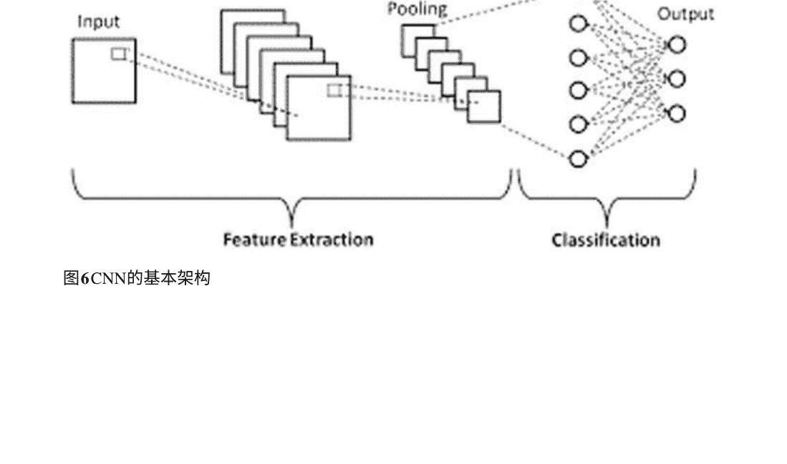

图7 a彩色图像3个RGB通道的像素值。b灰度图像单通道像素

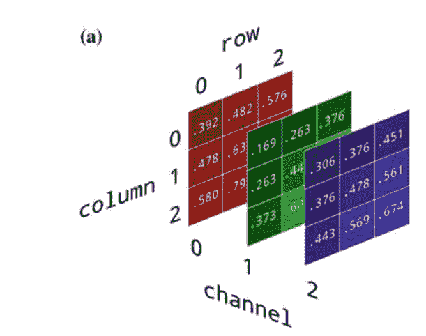

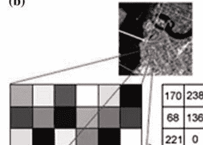

##### 2.2.1 卷积层

这是任何CNN架构的主要构建块和第一层。卷积是一种数学函数，类似于乘法，它倾向于将来自两个不同集合的信息合并为一个。它接受两个输入，即图像矩阵和卷积核/滤波器。一个尺寸为h × w × d的图像和一个尺寸为fh × fw × fd的滤波器将输出一个尺寸为(h – fh + 1) × (w – fw +1)的体积，称为特征图或卷积特征。卷积操作在图8中说明。

卷积操作通过在输入矩阵上滑动滤波器逐步进行。在每一步中，执行逐元素矩阵乘法并求和结果。这个和将进入一个称为特征图的新矩阵。图9显示了用于提取图像特征的常用滤波器。

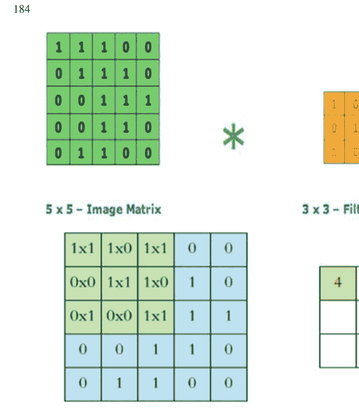

### 图8 卷积操作

| Operation | Filter |
|-----------|--------|
| Identity | $$\begin{bmatrix} 0 & 0 & 0 \\ 0 & 1 & 0 \\ 0 & 0 & 0 \end{bmatrix}$$ |
| Edge Detection | $$\begin{bmatrix} 1 & 0 & -1 \\ 0 & 0 & 0 \\ -1 & 0 & 1 \end{bmatrix}$$, $$\begin{bmatrix} 0 & 1 & 0 \\ 1 & -4 & 1 \\ 0 & 1 & 0 \end{bmatrix}$$, $$\begin{bmatrix} -1 & -1 & -1 \\ -1 & 8 & -1 \\ -1 & -1 & -1 \end{bmatrix}$$ |
| Sharpen | $$\begin{bmatrix} 0 & -1 & 0 \\ -1 & 5 & -1 \\ 0 & -1 & 0 \end{bmatrix}$$ |
| Normalized | $$\frac{1}{9}\begin{bmatrix} 1 & 1 & 1 \\ 1 & 1 & 1 \\ 1 & 1 & 1 \end{bmatrix}$$ |
| Gaussian Blur | $$\frac{1}{16}\begin{bmatrix} 1 & 2 & 1 \\ 2 & 4 & 2 \\ 1 & 2 & 1 \end{bmatrix}$$ |

### 图9 用于卷积的常用滤波器

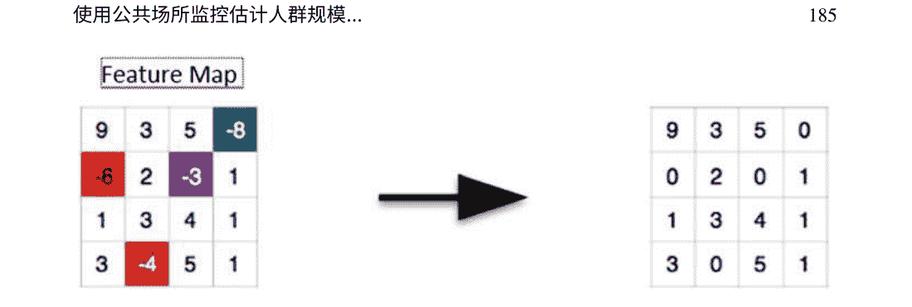

图10 ReLU层

##### 2.2.2 ReLU（修正线性单元）

它是在卷积操作之后应用的激活函数。它对于正值产生线性输出，并对于负值输出零，如图10所示。通过应用ReLU函数，将特征图矩阵中的值转换为修正特征图。激活函数被应用于实现CNN中的非线性，并实现更高的准确性。CNN中可以使用各种激活函数，如tanh、sigmoid，但ReLU是最常用的激活函数。使用ReLU相对于其他激活函数的一些优点包括计算效率高、表示稀疏性、线性行为和易于训练模型。

##### 2.2.3 步幅和填充

步幅表示滤波器在每一步在输入图像矩阵上移动的距离。默认情况下，步幅值为1。图11说明了滤波器在不同步幅值下如何在输入矩阵上移动。需要注意的是，步幅大小越大，输出大小越小。对于较大的步幅大小，特征图的大小变小。为了保持相同的维度，我们使用填充，即用零围绕输入矩阵，如图12所示。换句话说，填充用于保持特征图的维度，否则每一层之后它都会缩小。输入图像周围的区域被填充为零。填充后，特征图的大小与原始图像的维度相同，除了通道或深度的数量。为了获得具有步幅=1的特征图和输入的相同维度，填充大小应为(k-1)/2，其中k是卷积核的大小。根据滤波器大小、步幅和填充计算输出大小的一般公式为：

$$ O = \frac{W - K + 2P}{S} + 1 $$

其中O是输出的高度/长度，W是输入的高度/长度，K是滤波器大小，P是填充，S是步幅。例如，如果我们取S =1，P =2，W =200和K =5，并使用40个滤波器，那么输出大小将为200 × 200 ×40。另一方面，如果我们使用S = 1，P =1，那么输出大小将为198 × 198 ×40。

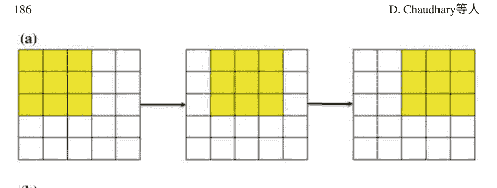

### 图11 a 步幅 = 1. b 步幅 = 2

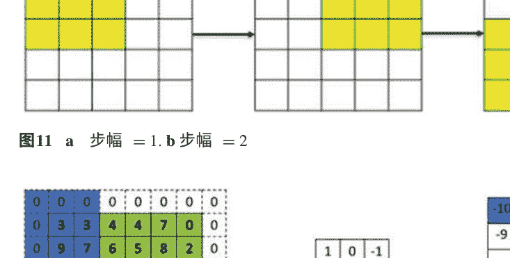

### 图12 填充操作

##### 2.2.4 池化

也称为子采样或下采样，池化层有助于减少大图像特征图的参数数量或维度，同时保留重要特征。该层对每个修正后的特征进行下采样，逐个映射，从而减小特征图的维度，保持深度不变。这种下采样有助于模型的快速训练，同时也克服了模型的过拟合问题。池化有三种类型：最大池化、求和池化和平均池化。最常见的类型是最大池化，它在特定大小的特征图池化窗口中取最大值。类似地，在平均池化的情况下，它取池化窗口中所有值的平均值。图13说明了具有2 × 2窗口大小和步长 = 2的池化操作。图中的每种颜色表示一个单独的窗口。

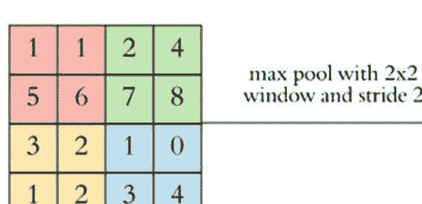

图13 最大池化示例

需要注意的是，使用这个窗口大小和步长，特征图的大小变为一半，但仍保留重要的特征。例如，如果特征图的维度为32 × 32 × 8，并且使用窗口大小为2 × 2和步长 = 2，则在池化操作之后，我们得到一个大小为16 × 16 × 8的窗口。这是池化的主要用途，即在保持重要特征的同时对矫正后的特征图进行下采样。通过下采样，我们减少了相当数量的权重，从而减少了模型的训练时间。在大多数CNN架构中，池化操作使用2 × 2的窗口大小，步长 = 2和填充 = 0。然而，我们可以更改这些参数以获得所需的结果。

##### 2.2.5 全连接 (FC) 层

(Conv + ReLU + Pooling) 操作的输出是3D向量卷积，因此最终池化层的输出被展平为1D向量数组，作为FC层的输入。经过全连接层后，最终层使用sigmoid或softmax函数来获取输出类别的概率。图14展示了典型的CNN架构。

所有流行的CNN架构，如AlexNet、VGGNet、ResNet、GoogleLeNet，都使用相同的基本架构，但具有不同的超参数，如滤波器大小、池化类型、隐藏层数量、步长大小、填充类型和大小等。

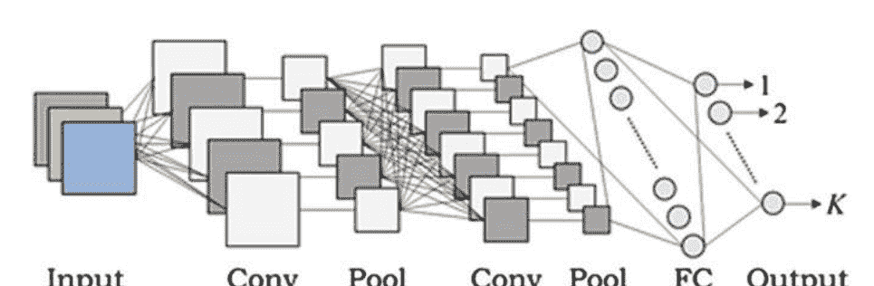

### 图14 典型的CNN架构

## 用于人群计数的最先进的CNN模型

在本节中，我们将讨论用于人群计数的最受欢迎的CNN模型，包括多列CNN[15]、切换CNN[16]、级联CNN[17]和CSRNet[18]。

#### 3.1 多列卷积神经网络

张等人[15]提出了一种多列卷积神经网络，将图像映射到其密度图中。他们开发了一种方法来计算具有任意密度和透视的单个图像中的人数。本研究考虑的数据集包括如图15所示的图像。可以观察到图像中有一个严重遮挡的人群场景，并且由于透视效果，人/头的尺寸变化很大。传统的基于检测的方法对这些类型的图像无效。此外，这种类型图像数据集的前景分割是一项繁琐的工作。为了克服这些问题，

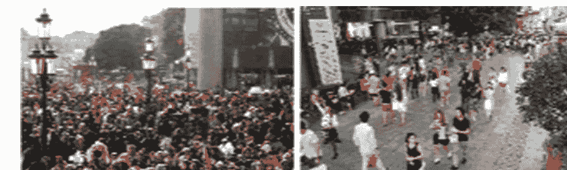

### 图15 上海科技数据集图像

作者建议采用多列神经网络架构，其中包括三个列，具有不同的滤波器尺寸，对应于不同尺寸（小、中、大）的感受野，以应对人/头尺寸的大变化。

通过几何自适应核获得的数据集的密度图来完成CNN模型的学习。多列CNN的结构如图16所示。使用三个并行的CNN，对应不同的滤波器尺寸感受野，即9 × 9，7 × 7，5 × 5。使用较少数量的较大尺寸滤波器以减少复杂性。在所有三个CNN中都使用了非常基本的conv-pool-conv-pool组合。每个2 × 2区域应用最大池化和ReLU激活函数。通过使用1 × 1的滤波器尺寸，将三个CNN的输出特征图合并并映射到最终的密度图上。

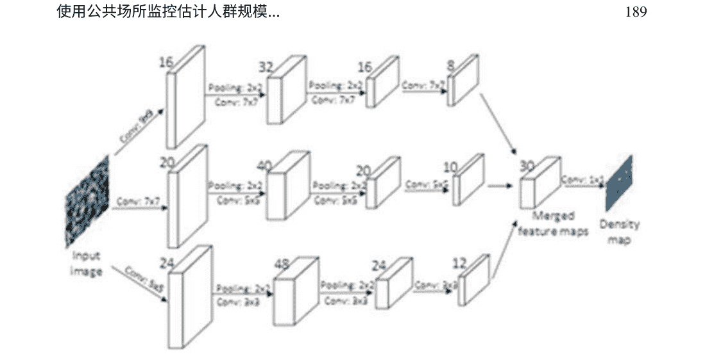

图16 MCNN 架构 [15]

#### 3.2 切换CNN

Sam等人[16]提出了一种对人群场景中的大规模和透视变化具有鲁棒性的方法。在这种方法中，将人群场景图像分成补丁，并使用切换分类器将每个补丁传递到独立的CNN回归器(R1、R2和R3)，根据人群密度。这些回归器的设计具有不同的感受野，对应不同的人的尺寸。R1的滤波器尺寸为9 × 9，具有较小的感受野，可以捕捉到补丁中的高级抽象，如人脸。这个回归器适用于高密度补丁。

R2由7 × 7的滤波器大小组成，R3由5 × 5的滤波器大小组成，用于不同的尺度变化。根据补丁的扭曲程度、透视和密度级别，将补丁通过开关分类器传递给最佳的CNN回归器。回归器的质量是基于CNN训练期间的人群计数预测质量。

每个CNN回归器都经过训练，学习适应特定尺度的特征。开关CNN的架构如图17所示。如图所示，通过基于补丁的密度级别使用开关，将人群场景图像的红色补丁传递给R3回归器。回归器预测补丁的相应密度图，这些图被求和以估计人群计数。每个CNN回归器有四个卷积层和两个最大池化层。

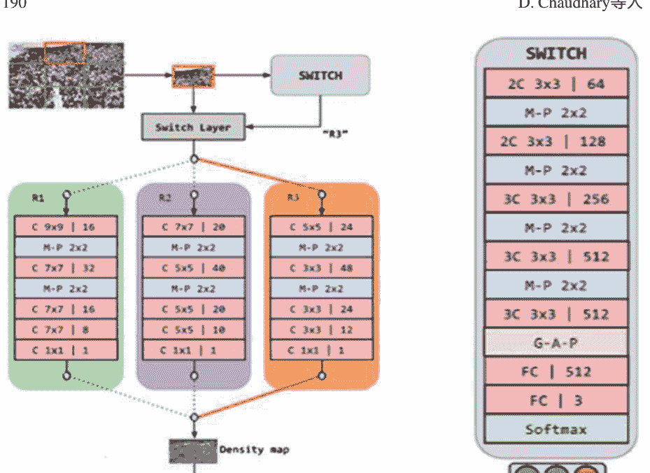

开关由开关分类器和开关层组成。开关分类器确定要中继到哪个回归器的补丁，开关层根据开关分类器推断的结果将补丁中继到正确的回归器。

#### 3.3 级联卷积神经网络

Sindagi和Patel [17]提出了一种密度估计和人群计数分类（高级先验）的方法。CNN网络可以学习人群的判别特征，并估计整个图像中的人数，不受尺度变化的影响。通过级联的CNN网络，可以联合学习用于估计计数的高级先验阶段和密度估计阶段，如图18所示。两者任务，即计数分类和密度图共享一些卷积网络的公共层，并且后面是为各自任务专门设计的两个并行CNN网络。

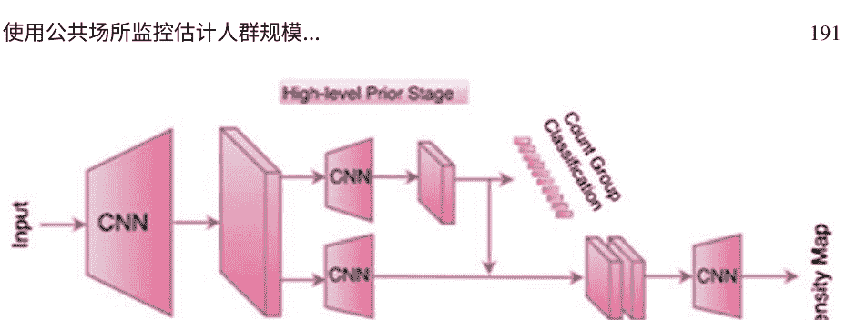

通过连接全局特征和从第二组层获得的特征图，得到高分辨率密度图。

通过一组步幅卷积层处理连接的特征，生成高质量的密度图。级联CNN架构如图19所示。

该架构包括三个阶段，共享卷积层、高级先验阶段和密度估计阶段。初始共享网络仅包括两个带参数的Relu（PReLU）的卷积层，第一个卷积层包括16个大小为9 × 9的滤波器，第二个卷积层包括32个大小为7 × 7的滤波器。第二阶段即高级先验阶段包括4个卷积层，每个层后跟PReLU。

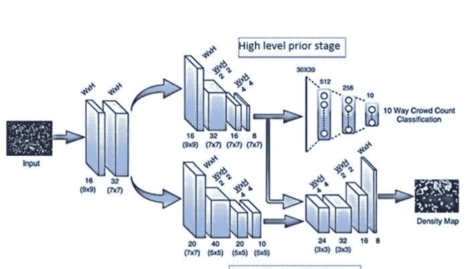

#### 3.4 CSRNet

Li等人[18]提出了一种深度学习网络，用于在高度拥挤的区域估计人数和高质量的密度图。该方法由两个主要组件组成：用于2D特征提取的前端CNN和使用扩张核心以应对高度拥挤场景和替代池化操作的后端CNN。前端网络使用VGG16架构，因为它具有灵活的架构和与后端网络的强大的迁移学习能力。为了构建所提出的CSRNet，移除了VGG16的全连接层，前端网络使用了VGG16的前10层和三个最大池化层，如图20所示。为了解决与输出大小相关的下采样问题并保持高质量密度图的输出分辨率，后端网络使用了扩张卷积层。

在后端网络中使用了四种不同的配置，具有不同的扩张率，如图20所示，即CSRNetA，CSRNetB，CSRNetC，CSRNetD，其扩张率分别为1、2、4、2和4的组合。

### 4 性能分析

表1提供了这四个模型的概述，包括它们的年份、类别、使用的数据集和显著特征。

表2提供了四个模型在用于人群计数目的最具挑战性的数据集上的估计误差（MAE、MSE）的性能分析。

表3是用于人群计数的最具挑战性的数据集的概述。

| A | B | C | D |
|---|---|---|---|
| **input(unfixed-resolution color image)** | | | |
| **front-end (fine-tuned from VGG-16)** | | | |
| conv3-64-1 | | | |
| conv3-64-1 | | | |
| **max-pooling** | | | |
| conv3-128-1 | | | |
| conv3-128-1 | | | |
| **max-pooling** | | | |
| conv3-256-1 | | | |
| conv3-256-1 | | | |
| conv3-256-1 | | | |
| **max-pooling** | | | |
| conv3-512-1 | | | |
| conv3-512-1 | | | |
| conv3-512-1 | | | |
| **back-end (four different configurations)** | | | |
| conv3-512-1 | conv3-512-2 | conv3-512-2 | conv3-512-4 |
| conv3-512-1 | conv3-512-2 | conv3-512-2 | conv3-512-4 |
| conv3-512-1 | conv3-512-2 | conv3-512-2 | conv3-512-4 |
| conv3-256-1 | conv3-256-2 | conv3-256-4 | conv3-256-4 |
| conv3-128-1 | conv3-128-2 | conv3-128-4 | conv3-128-4 |
| conv3-64-1 | conv3-64-2 | conv3-64-4 | conv3-64-4 |
| **conv1-1-1** | | | |

图20 CSRNet网络架构[18]

### 5 结论

在本章中，我们探讨了从图像中进行人群计数的不同方法，并得出结论，卷积神经网络模型与基于手工特征的传统计数技术相比，能够提供更准确的计数结果。

此外，还讨论了CNN架构在人群计数问题上的适用性。我们探索了用于人群计数的四种主要CNN架构，即多列CNN、切换CNN、级联CNN和CSRNet。还介绍了这四个模型在包含不同密度图像（高、中、低）的五种不同类型数据集上的性能分析。通过探索不同的CNN架构，我们得出结论，较深的网络相对于传统的人群计数方法提供了更准确的结果。我们还得出结论，CNN的结果取决于在图像分辨率解析度上，物理条件如照明水平、相机角度和遮挡水平。然而，CSRNet的结果是比较的卷积神经网络架构中最有希望的。

#### 表1 模型概述

| 序号 | 论文引用 | 年份 | 类别 | 数据集 | 特征 |
| --- | --- | --- | --- | --- | --- |
| 1 | 张等人[15] | 2016 | 多任务卷积神经网络 | 上海科技大学，UCF_CC_50，UCSD，MALL，世博会'1 | 多任务多列卷积神经网络，专注于尺度变化以获得高质量的密度图 |
| 2 | 山姆等人[16] | 2017 | 基于补丁的卷积神经网络 | 上海科技大学，UCSD，UCF_CC_50，世博会'10 | 三个具有不同滤波器尺寸的回归器在低、中、高密度图像补丁上进行训练 |
| 3 | Sindagi和Patel[17] | 2017 | 基于整个图像的卷积神经网络 | 上海科技大学，UCF_CC_50 | 多任务级联卷积神经网络，用于学习人群密度和人群分类 |
| 4 | 李等人[18] | 2018 | 基于上下文的卷积神经网络 | UCF_CC_50，STA，STB，世博会'10 | 具有多尺度上下文信息的扩张卷积网络 |

#### 表2 性能分析

| 序号 | 数据集 | 平均绝对误差（多列卷积神经网络） | 平均绝对误差（切换卷积神经网络） | 平均绝对误差（级联卷积神经网络） | 平均绝对误差（CSRNet） | 均方误差（多列卷积神经网络） | 均方误差（切换卷积神经网络） | 均方误差（级联卷积神经网络） | 均方误差（CSRNet） |
|------|--------|----------------------------------|----------------------------------|----------------------------------|------------------------|------------------------------|------------------------------|------------------------------|------------------------|
| 1    | 上海科技A | 110.2                            | 90.4                             | 101.3                            | 68.2                   | 173.2                        | 135                          | 152.4                        | 115                    |
| 2    | 上海科技B | 26.4                             | 21.6                             | 20                               | 10.6                   | 41.3                         | 33.4                         | 31.1                         | 16                     |
| 3    | UCF_CC_50 | 377.6                            | 318.1                            | 322.8                            | 266.1                  | 509.1                        | 439.2                        | 397.9                        | 397.5                  |
| 4    | 世博会'10 | 11.6                             | 9.4                              | 8.86                             | 8.6                    | -                            | -                            | -                            | -                      |
| 5    | UCSD     | 1.07                             | 1.62                             | 1.51                             | 1.16                   | 1.35                         | 2.1                          | -                            | 1.47                    |

粗体数字表示不同模型在各个数据集上的最小均方误差和平均绝对误差表3 数据集概述

| 数据集 | 图像分辨率 | 图像数量 | 最大人群计数 | 最小人群计数 | 平均人群计数 | 标记人数 | 备注 |
|--------|------------|----------|--------------|--------------|--------------|----------|------|
| 上海科技A | 变量 | 482 | 3139 | 33 | 501.4 | 241,677 | 从互联网选择的图像，更密集的图像 |
| 上海科技B | 768 × 1024 | 716 | 578 | 9 | 123.6 | 84,488 | 从上海收集的图像，低密度图像具有不同的尺度和透视 |
| UCSD | 158 × 238 | 2000 | 46 | 11 | 24.9 | 49,885 | 从视频摄像机收集的低密度图像 |
| UCF_CC_50 | 变量 | 50 | 4543 | 94 | 1279.5 | 63,974 | 来自不同场景的高密度图像 |
| 世博会'10 | 576 × 720 | 3980 | 253 | 1 | 50.2 | 199,923 | 特定于交叉场景计数的低密度图像 |

参考文献

1. Wang H, Cruz-Roa A, Basavanhally A, Gilmore H, Shih N, Feldman M, Tomaszewski J, Gonzalez F, Madabhushi A (2014) 级联集成卷积神经网络和手工特征用于有丝分裂检测。 在：医学成像2014：数字病理学，卷9041，页码90410B
2. Wang H, Cruz-Roa A, Basavanhally A, Gilmore H, Shih N, Feldman M, Tomaszewski J, Gonzalez F, Madabhushi A (2014) 通过结合手工特征和卷积神经网络特征在乳腺癌病理图像中检测有丝分裂。 J Med Imaging (Bellingham) 1(3):034003
3. Dollár P, Wojek C, Schiele B, Perona P (2012) 行人检测: 现状评估. IEEE Trans Pattern Anal Mach Intell 34(4):743–761
4. Chan AB, Vasconcelos N (2012) 通过低级特征和贝叶斯回归进行人数统计. IEEE Trans Image Process 21(4):2160–2177
5. Chen K, Loy CC, Gong S, Xiang T (2012) 用于本地化人群计数的特征挖掘. 在: 英国机器视觉会议2012论文集, pp 21.1–21.116.
6. Giuffrida MV, Minervini M, Tsaftaris S (2015) 学习计算叶子在玫瑰植物中的数量. 在: 植物表型学中的计算机视觉问题研讨会2015论文集, pp 1.1–137.
7. Wu X, Liang G, Lee KK, Xu Y (2006) 纹理分析与学习
8. Lempitsky V, Zisserman A (2010) 在图像中学习计数对象. 在: 神经信息处理系统23: 神经信息处理的第24届年会系统2010年, NIPS 2010年, 第1-9页
9. Rabaud V, Belongie S (2006) 计算拥挤移动物体的数量. 在: 计算机视觉和模式识别, 2006年. IEEE
10. Schölkopf B, Platt J, Hofmann T (eds) (2007) 使用随机聚类森林的快速判别视觉码本. 在: 神经信息处理系统19: 2006年会议的论文集. MIT出版社
11. Duygulu P, Barnard K, de Freitas JFG, Forsyth DA (2002) 目标识别作为机器翻译: 学习固定图像词汇表的词典. 在: Heyden A, Sparr G, Nielsen M, Johansen P (eds) 计算机视觉-ECCV 2002: 第7届欧洲计算机视觉会议 哥本哈根, 丹麦, 2002年5月28日至31日, 第IV部分, 第2353卷. Springer, Heidelberg, 第97-112页
12. Surasak T, Takahiro I, Cheng C, Wang C, Sheng P (2018) 用于视频中人体检测的方向梯度直方图. 在: 2018年第五届商业和工业研究国际会议(ICBIR), 第172-176页
13. Lowe DG (2004) 尺度不变关键点的独特图像特征. 计算机视觉国际期刊 60(2):91–110
14. Wu B, Nevatia R (2005) 通过贝叶斯组合边缘部分检测器在单个图像中检测多个部分遮挡的人体. 在: 第十届IEEE国际计算机视觉会议(ICCV'05), 卷1, 第90-97页
15. Zhang Y, Zhou D, Chen S, Gao S, Ma Y (2016) 通过多列卷积神经网络进行单图人群计数。 在: 2016年IEEE计算机视觉和模式识别会议(CVPR), 第589-597页
16. Sam DB, Surya S, Babu RV (2017) 用于人群计数的切换卷积神经网络。 在: IEEE计算机视觉和模式识别 (CVPR) 会议上, 第4031-4039页
17. Sindagi VA, Patel VM (2017) 基于CNN的级联多任务学习和密度估计用于人群计数. 在: 2017年第14届IEEE国际高级视频和信号基础监控 (AVSS) 会议上, 第1-6页
18. Li Y, Zhang X, Chen D (2018) Csrnet: 用于理解高度拥挤场景的扩张卷积神经网络。 在: IEEE/CVF计算机视觉和模式识别会议上, 第1091-1100页
19. Zhang C, Li H, Wang X, Yang X (2015) 通过深度卷积神经网络进行跨场景人群计数。 在: IEEE计算机视觉和模式识别 (CVPR) 会议上, 第833-841页

## 智能交通的深度学习和大数据技术以及未来趋势

## 基于物联网的区域限速使用智能路标牌

P. Madhumathy, H. K. Nitish Kumar, Pankhuri和D. S. Supreeth Narayan

摘要 道路上致命事故的主要原因是超速行驶。速度增加会增加事故风险。在高速行驶时，对即将发生的事件的判断能力也会下降，这会导致判断错误并导致事故发生。大约30%的道路事故是由于超速行驶引起的。有各种方法可以避免超速引起的事故，但没有一种方法可以自动控制速度并自定义区域限速。

讨论了一种基于物联网的智能解决方案，即使人们不愿意使用控制站、智能路标牌和车辆速度控制装置，也可以将车辆的最高速度限制在特定区域内。

- 致命事故
- 超速行驶、物联网
- 控制站
- 智能路标牌
- 速度控制装置

## 1 引言

鲁莽驾驶是一种严重的交通违规行为。这是在不考虑安全驾驶的情况下驾驶。在目前的情况下，鲁莽驾驶和超速行驶是主要的交通违规行为。当我们调查道路事故记录时，我们确定印度在东南亚国家中的道路事故列表中名列前茅。超速行驶、鲁莽驾驶、违反交通规则、误解路标和疲劳驾驶是关于道路事故的主要元素。我们观察到，在夜间旅行时，驾驶员可能会忽略交通信号。未能识别交通信号可能对司机和其他乘客造成灾难性后果。已经引入了许多严格的法律，但无法控制危险驾驶[1]。

P. Madhumathy (✉) · H. K. Nitish Kumar · Pankhuri · D. S. Supreeth Narayan
电子与通信工程系，Dayananda Sagar Academy of Technology and Management，班加罗尔，印度
e-mail: sakthi999@gmail.com

H. K. Nitish Kumar
e-mail: nitishardra@gmail.com

Pankhuri
e-mail: bhakti.pankhuri@gmail.com

D. S. Supreeth Narayan
e-mail: supreethnarayan@outlook.com

到目前为止，已经开发出各种方法来避免超速引起的事故，例如指示特定速度限制的路标，将限制进气门开启的速度限制器安装在汽车发动机上，基于GPS的速度指示和基于RFID的速度控制。但是这些方法的主要缺点是它们要么只能将速度限制在特定值，要么只能指示速度限制，但不能根据天气和道路状况等因素来变化区域的速度限制[2]。

克服所有这些问题的更好方法是在骑手不遵守规则时控制车辆。这样，就不需要实施严格的法律，更重要的是，它将大大减少事故的发生率，或者至少减轻事故的严重程度[3]。

通过这个项目，我们主要打算通过提出一个聪明的方法来避免超速事故，从而创建一个安全的道路网络。当务之急是开发一种能够安装在车辆上的经济实惠的系统。目前，我们已经为电动车辆开发了一个系统，但是可以对汽油动力车辆进行轻微修改后实施类似的系统。

作为防止超速和超车事故发生的主要目标，我们找到了以下与我们项目相似且有用的想法。本文提出了在路标内部设置一个传输设备，向司机指示预设限速，并在车辆内部配备一个接收设备[4, 5]的想法。另一个想法是在车辆上提供一个紧急按钮或开关，用于紧急情况。但是，RFID设备的使用限制了对快速移动车辆的准确性[6]。本文提供了使用BLE设备向车辆广播信息的方法。虽然它可以检测任何类型的路标，但它只会向驾驶员指示速度限制[7]。RF发射器和接收器的想法与之前相同，但是使用GSM来向警方报警的想法不同。但是，其他车辆的干扰会降低RF系统的效率[8]。这篇论文中采用了道路边缘单元（RSU）和车载单元（OBU）的概念，其中RSU连接到远程服务器。OBU收集有关车辆的各种数据，如当前速度、车辆ID等，并将其传输到RSU。该系统仅用于监测交通违规[9]。

## 2 背景

2015年，考虑到道路安全是首要问题，印度批准了布拉塞利亚宣言，并承诺将道路死亡人数减少50%。到目前为止，道路事故的减少并不明显。在过去的10年中，每年的死亡人数为15万。如果这种情况继续下去，到2020年，道路死亡人数将成为全球伤害和疾病的第三大因素。车辆的速度增加与事故发生的频率上升以及事故后果的严重性成正比。例如，平均速度增加1%，事故风险增加4% [10, 11]。印度有大量不安全的道路，每五分钟就有一起死亡案例。如果不改变目前的驾驶方法，到2020年这个数字可能会上升。主要是年龄在15-44岁之间的人在全球50%的道路事故中丧生。通过实施适当的安全干预措施，道路事故是可以预见和可避免的。随着人口不断增长，对车辆的依赖导致交通量增加，从而导致道路死亡人数增加[12]。目前的要求是建立一种经济高效的结构，可以在任何类型的车辆上安装，以帮助预防事故或至少减少事故的影响，从而提高道路安全性。

## 3 问题陈述

“速度带来刺激，但也带来危险”。这个口号已经在许多道路安全标语中使用过。日益增加的道路交通事故是一个令人非常关注的问题。在这种情况下，通过采取适当的安全措施来提高道路安全是必要的。统计数据显示，超过64.4%的死亡是由于道路事故引起的，主要是超速和错误超车。虽然实施了许多严格的法律，但是严厉的驾驶仍然无法控制[13]。

已经开发了各种方法来避免超速引起的事故，包括：
(1) 指示特定速度限制的标志牌或高速公路。
(2) 限制汽车进气门开启的速度限制器。
(3) 基于GPS的速度指示。
(4) 基于RFID的自动速度指示。

但是上述方法的主要缺点是它们只能将速度限制在特定值，或者只是向驾驶员指示速度限制，但是没有一个方法能够根据区域条件控制速度[14-17]。

### 3个目标

- 当务之急是开发一种成本效益高的系统，可以安装在任何类型的车辆上，以避免事故的发生及其影响，从而提高道路安全性。
- 避免因超车而发生事故。
- 根据天气、时间和交通密度等条件，调整某个地区的限速。

## 4 文献调研

Vengadesh和Sekhar [8]。这里的目标是在限制区域（如学校、公园和医院）自动控制车辆速度，以控制汽车速度的必要性。在这种情况下，司机无法控制车辆；自动控制通过利用电子系统来强制驾驶员遵守限速。该项目使用RF发射器进行限速指示。它安装在限制区域的前后端。车辆内安装了RF接收器。里程表获取车辆速度并将其传输给控制器。超声波传感器跟踪车辆的当前速度，并将其传输给控制器。控制器比较两个获取的值，如果驾驶员试图增加速度，电子控制器将接管控制权。如果驾驶员强行增加速度，则将驾驶员详细信息转发给最近的交通警察局。这些详细信息包括违规速度和车辆注册号。数据通过GSM模块传输[18, 19]。

Satyanarayana等人[6]。RF发射器安装在区域的入口和出口处，RFID接收器安装在车辆内部。里程表记录车速，控制器将当前速度与速度限制进行比较。如果车辆速度超过限制，则自动降低速度。在紧急情况下，汽车上有一个可访问的开关。当开关打开时，速度不会自动控制。当人打开开关时，RF接收器不工作，速度由驾驶员控制。云端（Blynk）存储驾驶员和车辆的详细信息，这些信息进一步用于通过Blynk应用程序跟踪车辆路线。使用该应用程序为每辆车生成不同的令牌号码。

Volam等人[7]。低功耗蓝牙（BLE）用于将交通标志板数据发送到汽车。这些不同的标志根据当地交通法规进行分类，以帮助司机。使用算法根据车辆内安装的四个蓝牙无线电获取的数据来定位所需的标志板。此外，它还配备了多级警报设置，用于对汽车确定的标志进行分类。

Anushya [9]。作为V2I的一部分，运输追踪有助于减少由车辆引起的困难，如交通堵塞、违规行为和道路事故。为了调节这些问题，车辆和交通灯杆之间使用V2I通信。已创建了On-Board Units (OBU)和Road Side Units (RSU)的原型。车辆使用Zig-Bee技术传输当前速度、位置和注册号等详细信息[20]。RSU将与用户驾驶相关的数据发送到跟踪服务器，以对违规者进行罚款。CAN总线用于车辆中的模块之间的通信。OBU使用该总线收集信息，并实时将详细信息传输给RSU。服务器在分析后使用电子邮件服务向驾驶员发送通知。

## 5 提出的方法论

系统概述如图1所示。该系统由3个主要单元组成。
1. 路边单元。
2. 速度控制单元和视频流单元。SCU和VSU一起被称为车载单元（OBU）。
3. 监控服务器和数据库。

监控服务器和数据库用于设置区域限速。数据库是API密钥和位置信息的集合。每当监控服务器从标志牌接收到请求时，将标志牌的API密钥映射到标志牌位置。然后，服务器返回速度限制和车辆具有该速度限制的距离（图2）。

路边单元实际上就是一个智能标志牌。它用于从监控服务器获取信息并广播给其附近的车辆。

速度控制单元包括一个接收器，用于接收标志牌传输的值。通过比较接收到的值和当前值，该单元中的控制器会做出决策，以控制电机驱动器以保持速度在限制范围内。

视频流单元由障碍物检测器、摄像头和显示器组成。在这里，障碍物指的是试图超车的后方车辆。该单元帮助我们超车低速行驶的大型车辆。

### 系统的部分

- 传感器
- 1. 速度传感器
- 2. 超声波传感器
- 摄像头
- 显示模块
- Arduino UNO
- Arduino Nano
- BLE 模块
- Wi-Fi 模块和便携式 Wi-Fi 热点。

#### 传感器

传感器是一种设备，用于检测其周围环境中的某种动作或变化。它将这些信息传输给处理器。传感器经常与其他电子模块一起使用。这里配备的传感器有速度或转速传感器和超声波传感器。

#### 摄像头

在项目中，摄像头模块被用作记录车辆前方道路的一部分。一旦超声波传感器确认车辆存在，录像就开始记录。录像会一直持续，直到有车辆在后方，只有当后方没有车辆时才停止录像。

#### 显示模块

显示模块被用作显示摄像头捕捉的流媒体视频的一部分。该模块帮助后方的车辆查看当前车辆以外的道路，以便安全超车。

#### Arduino Uno

Arduino Uno是基于ATmega328的微控制器板。它有十四个数字输入/输出引脚，6个模拟输入引脚，一个16 MHz的陶瓷谐振器，一个USB连接口，一个电源插孔，一个ICSP头和一个复位按钮。它包含了支持微控制器所需的所有东西；只需使用USB电缆将其与计算机连接，或使用AC-DC适配器或电池供电即可启动。Arduino UNO用于控制电机驱动器，从速度传感器读取数据，并与蓝牙模块进行串行通信。

#### Arduino Nano

Arduino Nano是一款小巧、适合面包板的板子，基于ATmega328芯片（Arduino Nano 3.x），它具有与Arduino Duemilanove相同的功能，但包装不同。它只缺少一个直流电源插孔，使用Mini-B USB电缆而不是标准电缆。这个微控制器用于控制相机和显示模块。

#### BLE 模块

BLE（低功耗蓝牙）是一种用于同时在两个或多个设备之间进行通信的收发器。这里使用了一种收发器，即发送和接收数据，用于基础设施到车辆的通信，并且收发器的操作由基于微控制器的指令执行和控制。

#### Wi-Fi 模块

Wi-Fi模块是一款带有完整TCP/IP协议栈和微控制器功能的微芯片。在这个项目中，该模块的用途是在两个不同的区域同时充当客户端和服务器。在RSU端，Wi-Fi模块充当客户端，并从云服务器请求数据，然后将数据发送到BLE模块。在OBU端，Wi-Fi模块充当服务器，并与移动设备共享数据。

#### 单元流

每个单元的功能如下所示，以流程图形式呈现。RSU中的控制流程如图3所示。一旦该单元上电，它会将（应用程序编程接口）API密钥发送到服务器。控制站接收API密钥。每个API密钥对应一个特定的区域。然后，服务器将速度和距离限制返回给标志牌。现在，连接已建立，速度限制已显示。如果标志牌在指定时间内未收到值，则标志牌将再次发送其API密钥。标志牌现在在蓝牙低功耗（BLE）ID中进行广告宣传。

## 图3 道路边缘单元的算法流程图

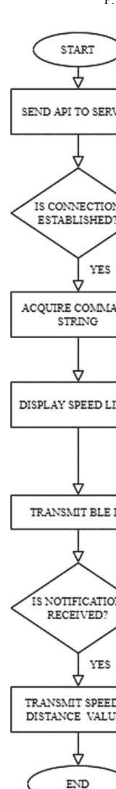

## 图4 速度控制单元的算法流程图

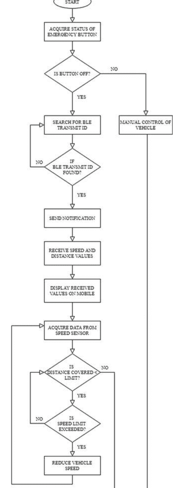

它的范围并等待来自任何车辆的通知。如果没有，它会重新广告。如果是的，将速度和距离限制传输给车辆。速度控制单元（SCU）中的控制流程如图4所示。首先，检查紧急按钮的状态。如果按钮打开，车辆上没有速度和距离限制。这种情况发生在紧急情况下。如果按钮关闭，它会搜索一个标志牌广告。一旦它经过道路网络上的智能标志牌，它会通知标志牌并建立连接。

运输工具中的SCU接受来自RSU的速度和距离限制，智能手机上也可以查看速度限制值。SCU中的控制器将接收到的限制与由速度传感器获取的当前车速进行比较。如果当前速度小于或等于限制速度，则不采取任何措施。如果当前速度大于限制速度，则在一个循环中降低车辆的速度，直到速度等于或低于限制值。在超过距离限制之前，保持这个速度，之后车辆不再有任何速度或距离限制。在距离限制范围内，驾驶员也可以以较低的速度行驶。

视频流单元(VSU)的设计旨在防止因超车而导致的事故，流程如图5所示。超声波传感器不断检测是否有障碍物（车辆在限定范围内），如果有，控制器从车辆前端的摄像头获取视频，并通过车辆后端的LCD屏幕显示。视频流持续十秒。控制权转移到超声波传感器以进行车辆检测。如果后方没有车辆，则摄像头和显示器将进入睡眠模式（图6、7和8）。

## 所提出系统的电路图6

该项目中的系统包含两个主要单元。第一个是路边单元(RSU)，第二个是车载单元(OBU)。一旦路边单元上电，它将通过Wi-Fi模块连接到互联网，并从数据库中获取限速和距离数值。一旦接收到数值，RSU的BLE模块开始连续传输数据。当安装了OBU的车辆启动时，微控制器和BLE模块将上电。

在控制器的帮助下，通过共同的电压源供应和共同的地线，所有设备都从控制器上电。连接的每个传感器都以模拟值或数字值的形式收集数据。

OV7670相机模块是一种体积小、电压低、高灵敏度的CMOS图像传感器模块，用于捕捉和处理图像。使用SCCB总线控制，传感器输出8位数据的三帧、采样和多种分辨率。VGA可以达到30帧/秒。我们可以控制图像的质量、格式和传输模式。支持VGA和CIF等图像格式。还提供饱和度自动调整和边缘增强级别自动调整。

ILI9225B模块显示从相机模块传输的视频。该模块安装在车辆的后部（后端），方便其他车辆向后看以便预测前方的道路。这有助于驾驶员决定何时超车。只有在控制器确认其他车辆存在时，它才会启动。TFT液晶显示屏的分辨率为176 * 220个像素点。

## 图5 视频流单元的算法流程图

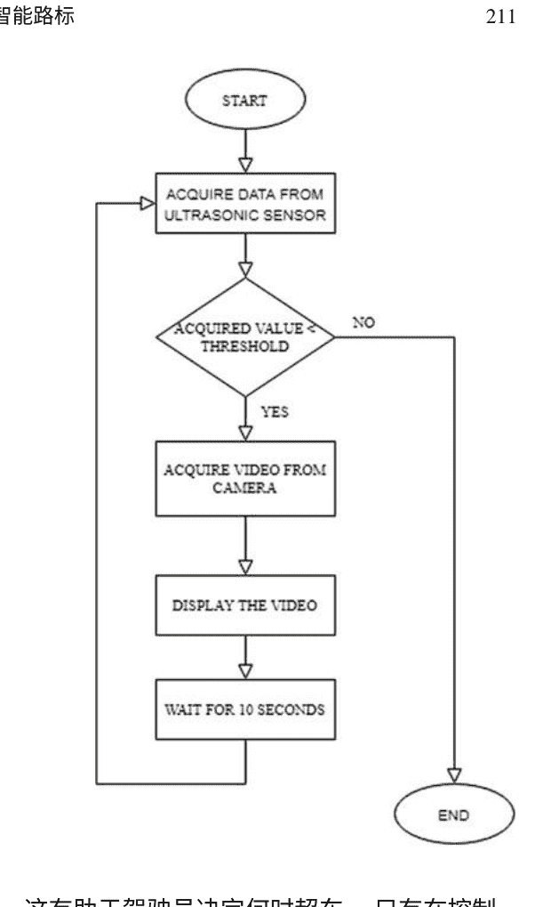

HC-SR04模块是一种超声波测距模块，可提供2至400厘米的非接触测距范围，精度高达3毫米。该模块由超声波发射器、接收器和控制电路组成。该模块安装在车辆的后端。一旦系统启动，传感器会检测附近是否有车辆存在。当检测到车辆存在时，即传感器测量值小于阈值时，微控制器会打开摄像头和TFT显示模块。

TM1637是一种4位数字LED显示模块。它是一种经济实惠的显示输出数据的解决方案。这个7段LED显示器有4个数字。它具有一个可以使用只有2根线控制的I2C总线。硬件连接包括两个信号连接CLK和DIO。

LM393速度传感器用于检测电机的速度。它由红外发射器和接收器以及一个比较器组成。传感器的基本操作当任何物体通过传感器槽时，它在引脚D0上产生一个数字脉冲。该脉冲是一个数字TTL信号。这个脉冲由微控制器转换为RPM。汽车行驶的距离也是使用这些脉冲计算的。

## 图6 视频流单元 (VSU)

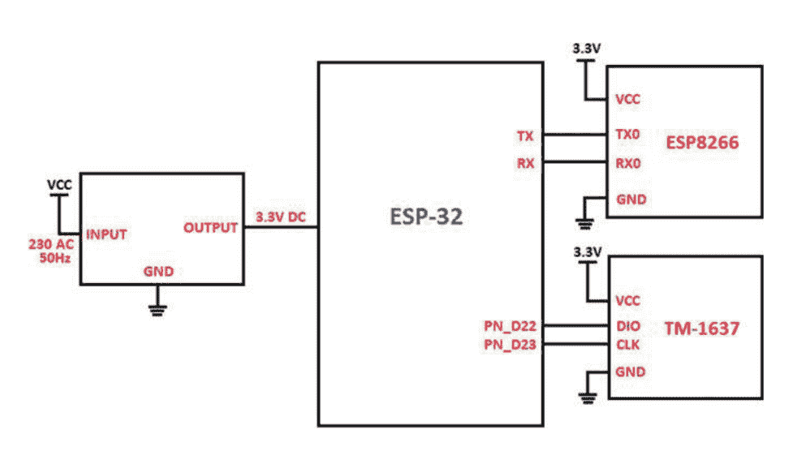

## 图7 路侧单元 (RSU)

ESP32由一个2.4 GHz Wi-Fi、蓝牙和BLE组成的单芯片。在这个项目中，ESP32模块主要用于RSU和OBU之间的通信。这种通信涉及速度和距离限制的传输。 RSU ESP32模块通过UART接口从Wi-Fi模块接收数据，然后将它们传输到范围内。OBU ESP32模块通过UART接口接收这些数据，并将其转发给控制器。

ESP8266是一个2.4 GHz的Wi-Fi模块。在这个项目中，该模块用于从控制站的数据库获取数据并传输到OBU。车辆单元中使用的另一个Wi-Fi模块用于托管一个显示速度限制的Web服务器。

L298N模块是一个电机驱动器。它用于使用脉宽调制信号控制电机的速度和方向。在这里，通过给直流电机提供不同占空比的PWM波逐渐降低速度。只有当车辆速度大于标志牌指示和提供的速度限制时，才会发生速度降低。

## 7 系统实施

### 7.1 系统原型

系统实施使用硬件原型完成。本项目中使用Arduino的IDE对所有控制器进行编程。使用ThingSpeak物联网平台创建监控服务器。

控制站覆盖了一个大的地理区域，它由一个监控服务器组成。这个地理区域内的所有标志牌都由控制站。每个标志牌的速度限制和距离值是通过监测交通密度、天气条件和道路条件在ThingSpeak应用程序中设置的。

路边单元中的值定期由控制站更新。当路边单元与监控服务器失去联系时，路边单元会传输预先编程的值，直到连接恢复。在没有互联网访问的地区，路边单元会根据该地区的时间来更改要传输的数据。

### ## 7.2 电机驱动器

电机驱动器用于控制电机的速度。电动车中的电机使用直流电压供电。为了控制电机的速度，将使用PWM信号。图9显示了占空比和平均电压之间的关系。
速度控制单元中的控制器将车辆的速度范围与其分辨率相关的PWM范围进行映射。随后，将当前速度和速度限制转换为PWM值。控制器根据这些PWM值比较两个速度，并相应地向电机驱动器发出控制信号。比较后，如果当前速度高于速度限制，电机驱动器通过减小脉冲宽度（占空比）来降低平均直流电压。将供电电压的脉冲宽度连续减小，直到当前速度<=速度限制。在这种情况下，即使驾驶员试图加速，控制器和电机驱动器也不会允许车辆的速度增加。

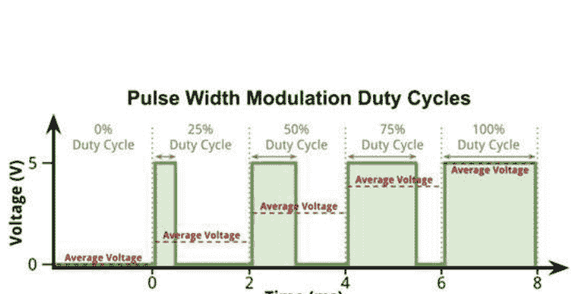

图9 脉冲宽度与平均电压的关系

### ## 7.3 蓝牙低功耗

RSU和OBU中使用BLE模块进行数据的传输和接收。 RSU中的BLE被称为服务器，车辆中的BLE被称为客户端。 选择BLE而不是RFID的原因如下：

- 1. 低功耗
- 2. 更好的范围
- 3. 较短的配对时间
- 4. 可以进行广播模式。

为了在客户端和BLE服务器之间建立连接，服务器会持续广告其ID。同样，客户端BLE将始终搜索服务器ID。当车辆在标志牌范围内时，客户端会找到此ID并通知服务器BLE。服务器BLE将其视为确认，并将数据传输给车辆。

### ## 7.4 *BLE*数据包格式

图10显示了BLE广告和数据传输的数据包格式。前导码用于客户端和服务器之间的同步。 访问地址用于标识连接。 协议数据单元（PDU）可以是广告信道PDU或数据信道PDU。CRC用于检测通信错误。

**BLE Packet**

| Preamble | Access Address | Protocol Data Unit (PDU) | CRC |
| :--- | :--- | :--- | :--- |
| 1 Byte | 4 Bytes | 2-257 Bytes | 3 Bytes |

**Advertising Channel PDU** (Advertising/Data PDU)

| Header | Payload |
| :--- | :--- |
| 2 Bytes | 0-37 Bytes |

**Data Channel PDU**

| Header | Payload | MIC' |
| :--- | :--- | :--- |
| 2 Bytes | up to 255 Bytes (incl. MIC) | 4 Bytes |

图10 BLE数据包格式

## 8 结果和讨论

### 8.1 实时实施

该项目通过构建一个微型四轮车上的车辆原型来实现。 所有传感器、控制器和其他组件都放置在原型上的一个平台上，为每个组件提供足够的间距，以免相互干扰。 在这里，车辆由可充电电池组提供动力。

类似地，构建了一个微型智能路牌，它包括一个控制器、电池组、便携式Wi-Fi热点和一个七段显示器，用于指示速度限制。

工作环境被设置成这样，首先车辆以一定的随机速度行驶一段距离，而不遇到路牌。 在行驶了‘x’米后，车辆经过一个路牌并接收到路牌传输的数据。 根据初始速度，如果车辆超过了速度限制，可能会减速。 如果速度降低到限制以下，速度控制单元将不允许增加速度，直到超过距离限制。 车辆中的控制器被编程成在通电时自动执行所有上述操作。 或者，车辆可以通过蓝牙进行无线控制，这更接近于骑手骑行车辆的情况。

此外，为了监控项目的性能，创建了一个网络服务器通过智能手机进行监控。

接下来是智能超车部分，将一个物体引入到车辆后部的超声波传感器附近以便显示器打开并通过车辆前端的控制器传输摄像头传输的视频信号。

### 8.2 讨论

路侧单元 见表1。

速度控制单元 见表2。

#### 表1 在各种条件下RSU的工作

| 条件 | 操作 |
| :--- | :--- |
| 来自车辆的通知 | 传输数据（速度和距离） |
| 来自控制站的数据 | 更新显示和要传输的数据 |
| 与控制站的连接中断 | 传输预先编程的值 |

#### 表2 在各种条件下SCU的工作

| 条件 | 操作 |
| :--- | :--- |
| 当前速度大于速度限制 | 速度会自动降低到限制以下即使骑手试图增加速度并且保持此速度直到达到距离限制为止 |
| 当前速度小于或等于速度限制 | 没有采取任何行动。SCU积极监控车辆的速度，确保骑手在距离限制之前不会超过限制 |
| 紧急按钮已打开 | 速度控制单元将被关闭 |

表3 在各种条件下的VSU工作

| 条件 | 操作 |
| :--- | :--- |
| 车辆位于后方，位于超声波传感器范围内 | 视频流正在播放 |
| 车辆位于后方，位于超声波传感器范围之外 | 视频流已关闭 |

视频流单元

参见表3。

图11显示了如何以命令字符串的形式设置速度和距离值，以特定标志牌的唯一TalkBack ID标识。单击命令字符串旁边的“保存”按钮后，命令字符串将传输到相应的标志牌。

图12显示了车辆从标志牌接收到的速度和距离值，并显示了当当前速度超过限制时如何降低速度。一旦当前速度降到速度限制以下，SCU将不允许速度超过限制。一旦达到距离限制，限制将解除。

图13显示了道路边缘单元的硬件实现。它由一个SSD组成，该SSD指示从控制站接收到的速度限制，并将该值传输给道路上的车辆。

图14显示了车辆的VSU的工作方式。当车辆在后端范围内时，VSU会打开，其中包括超声波传感器。
图15显示了当后端没有车辆存在时，VSU处于关闭状态。在此状态下，TFT屏幕变空白（白色）。

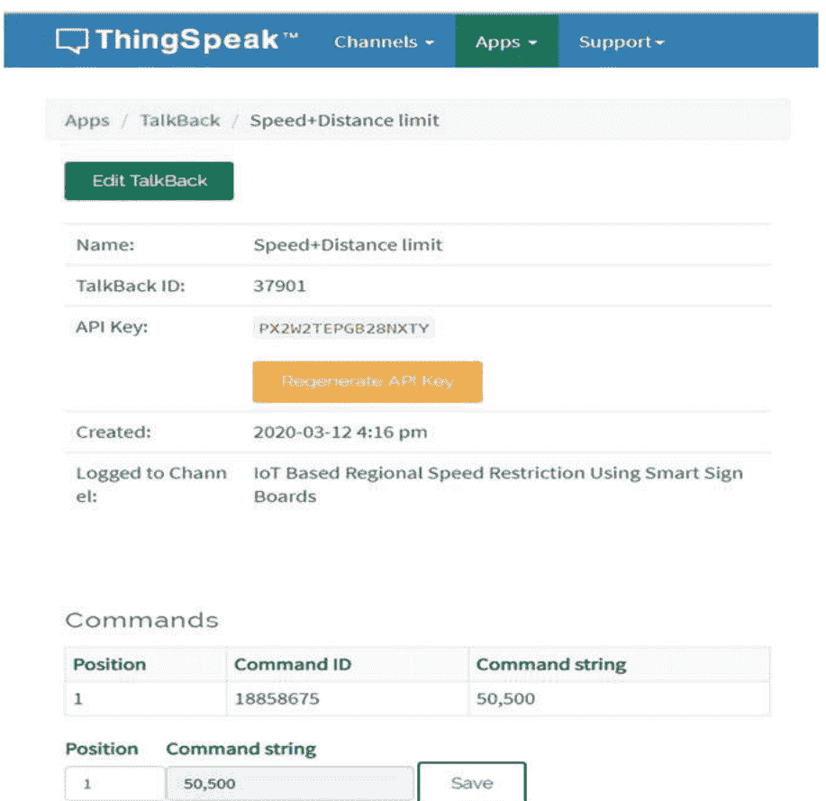

图11 使用ThingSpeak在控制站中设置速度和距离值

图16显示了通过连接到SCU托管的Web服务器的智能手机向驾驶员指示的速度限制。

## 9 结论

印度的道路事故是每年造成伤害、死亡和附带损害的主要原因之一。根据非政府组织“印度道路安全”提供的数据，2018年印度每5分钟就有一个人死于道路碰撞事故。在印度，超速是造成道路死亡的最大杀手。根据2015年“道路运输和高速公路部”编制的数据，44.2%（64,633人中的1,46,133人）的道路事故死亡是超速的直接后果，而总事故数的47.9%（501,423起事故中的240,463起）与超速有关。我们所拥有的一切

```
D=11.00
S=50
D=22.87
S=54
Received speed limit= 50
Received distance limit= 600
D=34.53
S=53
D=45.97
S=52
D=57.18
S=51
D=68.40
S=50
D=79.40
S=50
D=90.18
S=49
D=101.17
S=50
D=111.95
S=49
D=122.95
S=50
D=133.72
S=49
D=144.50
S=49
D=155.28
```

```
S=49
D=166.05
S=49
D=176.83
S=49
D=187.83
S=50
D=198.83
S=50
D=209.82
S=50
D=220.82
S=50
D=231.82
S=50
D=242.81
S=50
D=253.81
S=50
D=264.81
S=50
D=275.80
S=50
D=286.80
S=50
D=297.80
S=50
D=308.80
S=50
```

```
S=50
D=319.79
S=50
D=330.79
S=50
D=341.79
S=50
D=352.78
S=50
D=363.56
S=49
D=374.34
S=49
D=385.33
S=50
D=396.11
S=49
D=407.11
S=50
D=417.89
S=49
D=428.66
S=49
D=439.44
S=49
D=450.22
S=49
D=460.99
S=49
D=471.77
```

```
S=49
D=525.66
S=49
D=536.43
S=49
D=547.21
S=49
D=557.99
S=49
D=568.76
S=49
D=579.54
S=49
D=590.32
S=49
D=601.10
S=49
D=611.87
S=49
D=622.65
S=49
D=633.43
S=49
```

图12 SCU接收速度和距离限制，并将当前速度降低到速度限制

要记住的是，车辆速度越高，冲击力越大，造成可怕的伤害或死亡的可能性也越大。

本文研究了预防道路事故的当前解决方案，并提出了一种优化的硬件和软件。

建立了一个成本效益高的系统，可以在电动车辆中安装，而不需要太多的努力。

与现有的其他通信技术相比，BLE具有更高的能源效率和更好的功能，因此被纳入了该项目。

通过透视车辆功能，即安全超车，还可以减少道路事故的另一个原因。

## # 基于物联网的区域限速系统使用智能路标

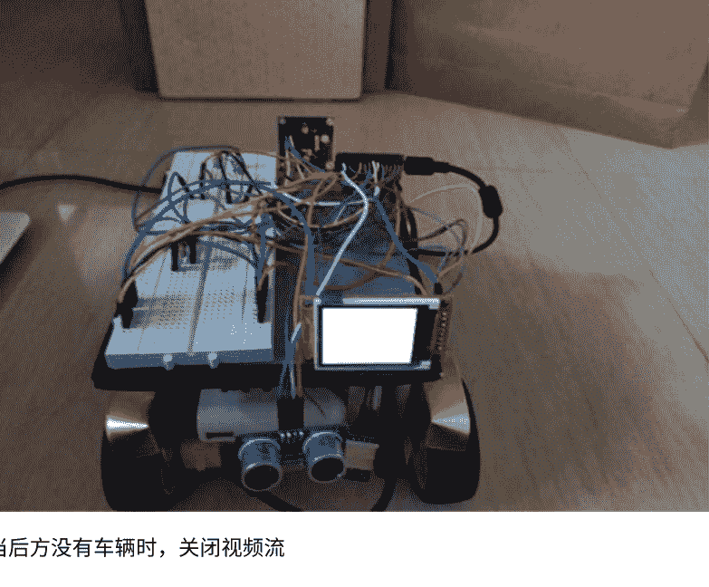

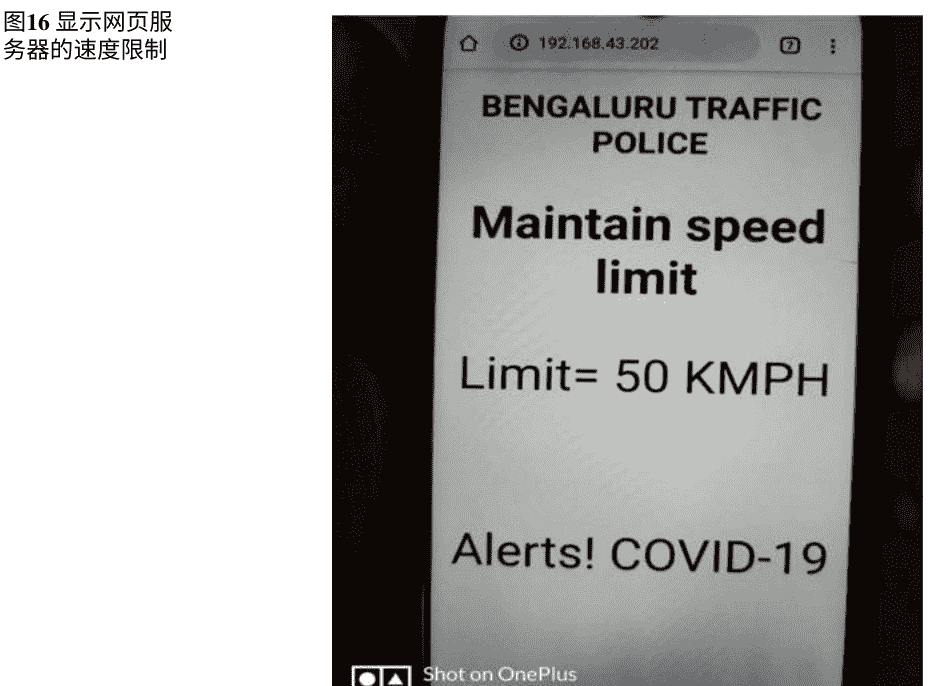

强烈建议研究人员和汽车制造商实施这项技术，这将有助于克服由于超速和超车而导致的道路事故。

特斯拉和宝马等公司正在将重点从内燃机转向电动汽车，从而影响汽车电子技术。在这一转变过程中，应该实施能够使电动汽车可靠和安全的新技术。

## 10 未来展望

在这个项目中，我们只考虑了一些最可能导致事故的原因，如超速和超车。改进的空间在于在考虑其他因素（如酒后驾驶、分心驾驶、鲁莽驾驶等）的同时，使道路网络更安全。

这个项目需要持续的互联网连接才能连接到云服务器。这在印度的农村地区是困难的。可以发明更好的互联网设施或其他新方法来访问云服务器以获取速度限制值。标志牌可以改进，以便传输其他类型的信息，如区域天气和道路状况。控制站可以被软件取代，该软件接收所有输入并预测速度值。

## 参考文献

+ 1. Jeon KE, She J, Soonsawad P, Ng PC (2018) BLE Beacon用于物联网应用：调查，挑战和机遇。IEEE物联网杂志5 (2)。 https://doi.org/10.1109/jiot.2017.2788449
+ 2. Prakash SA, Mohan RA, Warrier RM, Krishna RA, Sooraj BA (2018) 车辆的实时自动速度控制单元。 在：2018年第二届I-SMAC国际会议。 https://doi.org/10.1109/i-smac.2018.8653721
+ 3. Rao V, Kumar S (2014) 基于智能区域的车辆速度控制，使用RF和障碍物检测和事故预防。 Int J Emerg Technol Adv Eng 4 (3) : 756–777
+ 4. Kameswari J, Satwik (2011) 自动车辆速度控制器的设计模型. 国际计算应用 35(9)
+ 5. Thomas L (2014) 利用RFID实现车辆自动速度控制. 国际工程创新技术 3(11):118–120
+ 6. Satyanarayana KNV, Yaswanthini G, Kartheeka PL, Rajkumar N, BhimaRaju A (2018) 基于RFID的物联网在受限区域自动控制车辆速度. 国际工程技术 7(3.31):72–74
+ 7. Volam PK, Kamath AR, Bagi SS (2014) 一种向车辆传输交通标志信息并确定相关性的系统和方法.2014年电子、计算机和通信进展国际会议, 会议日期:2014年10月10日-11日. https://doi.org/10.1109/icaecc.2014.7002415
+ 8. Vengadesh A, Sekar K (2005) 使用RF和GSM在受限区域内自动控制车辆速度. IRJET 2(9) . e-ISSN 2395-0056
+ 9. Anushya D (2018) 使用V2I通信进行交通违规车辆监控. 在: 2018年第二届智能计算与控制系统国际会议. https://doi.org/10.1109/iccons.2018.866300
+ 10. Rothkrantz L (2019) 智能道路. IEEE会议. 在: 2019年智能城市研讨会布拉格(SCSP). https://doi.org/10.1109/scsp.2019.8805720
+ 11. Rondon R, Gidlund M, Landernas K (2017) 评估蓝牙低功耗在时间关键的工业物联网应用中的可持续性. Int J Wireless Inf Networks 24:278-290. 2017年5月23日(Springer)
+ 12. Le-Dang Q, Le-Noc T (2018) 智能交通的深度学习和大数据技术及未来趋势 Springer Nature Switzerland AG 2018. 10.1007/978-3-319-97271-8_1
+ 13. Osman K, Ghommam J, Saad M (2019) 高速车辆超车机动的基于导航的车道变换控制 Springer Nature B V, 2019年7月25日. 10.1007/s10846-019-01070-6
+ 14. Mishra A, Solanki J (2012) 基于射频的车辆速度控制系统设计 Int J Adv Res Comput Commun Eng 1(8)
+ 15. Rao V, Kuma S (2014) 基于射频和障碍物检测的智能区域车辆速度控制和事故预防 Int J Emerg Technol Adv Eng 4(3)
+ 16. Sattibabu G, Satyanarayan (2014) 基于ARM 7的无线车内道路标志传递系统的自动车辆速度控制 Int J Technol Enhancements Emerg Eng Res 2(8)
+ 17. Chavan DB, Makandar A R (2014) 基于射频技术的自动车辆速度降低系统. Int J Eng Res Appl 4(4)
+ 18. Ankita M, Jyoti S (2012) 设计基于射频的车辆速度控制系统。 Int J Adv Res Comput Commun Eng 1(8):583–586
+ 19. Sattibabu G, Satyanarayan (2014) 使用ARM 7的无线车辆速度控制和车内道路标志传递系统。 Int J Technol Enhancements Emerg Eng Res 2（8）： 32–34
+ 20. Chavan DB， Makandar AR（2014）使用RF技术的自动车辆速度降低系统。 Int J Eng Res Appl 4（4）：13–16
+ 21. Anitha A（2017）A IOP会议系列：材料科学与工程，卷263，042027。 https://doi.org/10.1088/1757-899x/263/4/042027

## 物联网与云计算、人工智能和区块链的协同作用为自主车辆赋能

C. Muralidharan, Y. Mohamed Sirajudeen and R. Anitha

摘要 在信息技术的进步中，物联网（IoT）发挥着重要和主要的作用，因为它将物体从现实世界场景转变为智能虚拟形式。物联网这个术语是由两个短语Internet和Thing组成的，它说明了计算设备等物理对象通过连接网络进行操作。这个技术生态系统允许物体或物品在没有任何物理辅助的情况下收集和传输数据。它包括四个主要过程，即收集、通信、分析和行动。物联网的主要目的是使人类生活更智能化，从而减少人力劳动。云是一个似乎是蓬勃发展的技术的环境。它通过互联网提供从存储到计算能力的一切作为服务。它似乎是一个灵活的计算模型，加剧了信息技术的增长。

它使物联网的发展变得更加迅猛，因为它需要更多的存储空间来存储从物体获取的数据。另一个蓬勃发展的技术是人工智能，其中利用机器的智能来实现智能任务，而不是使用人类的智能。它自1950年代以来就存在，但在21世纪随着计算能力和大量数据存储的进步而复苏。

人工智能的主要目的是实现对大量数据的准确解释，并从中提取有价值的学习，从而以灵活的方式实现适当的目标。物联网与这种闪闪发光的人工智能结合，使物理对象能够通过持续的流式传输收集有价值的数据，并使其能够感知其任务和领域，以实现最大的繁荣目标机会。区块链是信息技术的另一次革命。区块链或分布式账本技术是一种有前途的技术，可以管理众多用户的数字资产。

C. Muralidharan (✉) · Y. Mohamed Sirajudeen · R. Anitha
DST云研究实验室，计算机科学与工程系，斯里文卡特斯瓦拉工程学院，斯里珀伦布杜尔，泰米尔纳德邦，印度
e-mail: murali20infotech@gmail.com

Y. Mohamed Sirajudeen
e-mail: ducksirajsmilz@gmail.com

R. Anitha
e-mail: ranitha@svce.ac.in

© 作者（们），独家许可给 Springer Nature Switzerland AG 2021
K. R. Ahmed 等人（编），深度学习和大数据用于智能交通，计算智能研究 945，
https://doi.org/10.1007/978-3-030-65661-4_11

通过保持透明度和避免不必要的更改来管理它们。它以多个块的形式存储和管理数据，并具有相应的加密哈希。它是一个分布式和去中心化的模型，数字形式的交易记录在多个设备中，这允许系统对每个块进行任何更改或修改，以便对记录进行更改。

这个模型避免了可能发生在数字世界中的不稳定变化。具有这种区块链技术或物联网的区块链可能通过智能机器在数字环境中创建一种永久的、可验证的和安全的数据管理方法。它将通过适当的环境交互使决策过程无需人类干预。本章详细阐述了物联网、人工智能、云计算和区块链等四种技术在自动驾驶车辆方面的应用。探讨和揭示了这些闪烁技术的需求，以便理解这些技术。讨论了物联网与其他三种技术的协同作用，以便更好地理解和升级技术。它还审查了所有这些技术协同作用的最新发展。

关键词：
- 物联网
- 区块链
- 云
- 人工智能

## 1 引言

互联网是一件光荣的事物，通过奇妙的发明重新创造了新世界，使人类的进程变得更加容易，因为它为我们提供了以前几十年来不可能实现的令人难以置信的好处。年纪大的人可以想象一下在智能手机出现之前使用的手机。

移动用户存在的选项是他们可以打电话和给其他用户发送短信。但是在智能手机出现之后，用户甚至可以在任何地方阅读书籍，他们可以听音乐，可以向他人发送任何类型的数据，可以访问银行账户等等，所有这些过程都可以通过便携式手机完成。因此，智能手机是使我们的生活变得更加容易的令人难以置信的事物。支持上述所有过程的其他设备包括个人电脑、笔记本电脑、平板电脑等。所有这些过程都是由于互联网的出现而可能的。

物联网（IoT）是一个简单的系统，允许世界上所有的事物连接到互联网。它指的是更多物理设备可能连接到互联网，并根据我们的需求收集和共享数据的模型。物联网的魅力在于超级计算机芯片的出现，它们以最低的价格提供，并且由于无处不在的无线网络。从小药丸到大型机械，都实施了物联网。所有这些不同的物体都彼此连接，并嵌入了传感器，增强了设备的数字智能，并允许它们与实时数据进行通信，无需任何人为干预。物联网使得通过融合物理和数字环境，使我们周围的系统更加响应和智能化。 物联网与云、人工智能和区块链等其他技术的结合，通过提升性能来增强该领域能力。 本章讨论了物联网与云、人工智能和区块链的协同作用及其应用。

本章的组织如下，第2节讨论物联网，第3节简要解释物联网与云、人工智能和区块链的协同作用，第4节解释物联网与云的协同作用，第5节讨论物联网与人工智能的协同作用，第6节讨论物联网与区块链的协同作用，第7节总结本章。

## 2 物联网

物联网的概念和术语“物联网”在1999年提出。 这个术语是由宝洁公司的员工Kevin Aston创造的。在宝洁公司的管理层主持的会议上，Kevin Aston与管理层讨论了射频标签的想法，这完全改变了供应链管理系统。 根据各种分析师提供的预测，随着连接设备概念的增加，“物联网”将在全球范围内扩大。 物联网概念出现近15年后，成为现有高科技技术中最受欢迎的技术之一。 现在，日常物品如家电、恒温器、车辆等通过嵌入式设备与互联网相连，从而实现物与物、人与物、过程之间的通信。 本节将更详细地讨论物联网。

### 2.1 什么是物联网

物联网（IoT）是指嵌入软件、电子设备、传感器和网络连接功能的物理对象或“物”，使这些物体能够收集和交换数据的网络。 在物联网（IoT）的背景下，“物”是指具有能够在互联网上传输数据的物理对象或实体，并具有唯一标识符。 物联网（IoT）被应用于以下几个领域：

- 心脏监测植入物
- 自动驾驶车辆
- 动物身上的生物芯片传感器
- DNA分析设备
- 家庭自动化和其他可穿戴设备等

所有这些设备利用各种现有技术收集有用的数据，并允许数据在其他相关设备之间流动。 尽管物联网的概念已存在很长时间，但当前时期的许多进展使物联网概念进入了增强的实际模式。 以下是一些推动物联网发展的进步：

- 互联网连接：互联网的网络协议使传感器能够连接到云环境或其他设备以传输和处理数据。
- 低成本和低功耗传感器技术：可靠且价格合理的传感器使物联网成为可能。
- 云计算环境：云环境的可用性增加，使消费者和企业都能够访问可扩展的基础设施，从而减少管理工作。
- 分析：分析技术的进步使得以更快、更简单的方式访问存储在云和其他平台上的数据成为可能。 这个领域扩展了物联网的边界，使物联网产生的数据变得无限。
- 人工智能：由于神经网络的进步，自然语言处理（NLP）在物联网设备中得以实现，从而加强自动化。

### 2.2 物联网涉及的过程

物联网的生命周期涉及多个重要过程，其中数据在互联网上进行处理。 包括：

- 收集
- 沟通
- 分析
- 行动

#### 2.2.1 收集

收集是第一个阶段，数据由各种设备、物体或物品通过嵌入式传感器收集。 例如，无人驾驶汽车，这些自主车辆具有许多嵌入式传感器，可以收集速度、方向、位置信息、交通信息、路线等多种信息。 其他一些数据收集的例子包括家用电器、制造工厂、个人设备等。

#### 2.2.2 沟通

沟通是第二个阶段，传感器收集的数据需要通过网络发送到目的地进行存储或处理。例如，为了制造无人驾驶汽车，驾驶员支持的汽车的所有事件都被收集并存储在云平台、私有数据中心等存储介质中，以便进行处理。

#### 2.2.3 分析

分析是第三个阶段，需要检查、预处理、修改和建模存储在目的地的数据，以检索有用的信息以实现目标。例如，为了制造无人驾驶汽车，需要检索并存储驾驶员驾驶人工支持汽车的所有事件。这些存储的数据需要进行分析，以检索驾驶员的活动，例如驾驶风格、刹车等，并将其应用于无人驾驶汽车中。

#### 2.2.4 行动

行动是第四阶段，从分析数据中检索到的有用信息被实施以实现目标。例如，与其他车辆进行通信（车辆对车辆），通过短信、电子邮件等发送通知，共享交通信息，盗窃警报等。所有这些过程都是通过连接设备之间的无线互联网连接进行的。

### 2.3 物联网的应用

汽车行业是全球最大、最重要的制造业领域之一，汽车年产量似乎约为7000万辆。根据2017年的国际估计，该行业的营业额似乎约为3万亿美元，全球GDP为3.65%。近年来，汽车行业似乎是使用物联网进行各种增强的重要行业。由于车辆购买者期望通过连接进行互动的未来选项。以下是与自动驾驶汽车相关的一些应用。

#### 2.3.1 连接汽车

连接汽车是通过物联网网络连接的汽车，通常称为CV2X（车联网）[1, 2]。它连接了智能交通系统中的车辆通过互联网进行交互。它们通过快速传输数据和增强车内通信来减少驾驶员的响应时间[3]。根据Gartner的报告，到2020年底，将有大约2.5亿辆连接车辆在使用中。CV2X根据与不同对象的连接方式进一步细分为四种类型。它包括：

- 车辆对车辆（V2V）：该模型允许将一辆车与其他车辆连接以共享数据。
- 车辆到基础设施（V2I）：它实现了车辆网络与道路基础设施（如交通灯、收费站、车道标线等）之间的连接。
- 车辆对行人（V2P）：通过V2P，行人可以与车辆连接，从而定位附近的出租车并估计预计的过渡时间。
- 车辆对网络（V2N）：车辆与网络连接，即天气预报部门可以通过智能管理系统向驾驶员发出警报。

#### 2.3.2 车队管理

如今，卡车集成了定位跟踪、重量测量和其他传感器，用于管理扩大的车辆。从卡车收集的大量传感器数据可以存储在云中，并通过将其转化为可视化形式进行分析以提取重要特征。车队的操作员可以在监视器上查看信息。物联网实施的车队管理系统的一些好处包括

- 实时监控车队位置
- 货物重量或体积跟踪
- 交通状况监测
- 卡车性能的统计，如里程和燃料可用性
- 路线管理等等

#### 2.3.3 车载信息娱乐系统

车主可以通过智能仪表盘与他们的车辆进行交互，通过安全、安全和监控来确保车辆的安全性。外部传感器跟踪车辆的状况，并将数据发送到用户的应用程序。智能远程监控系统存在于车辆中，如果有人试图在没有适当访问权限的情况下强行进入车辆，该系统会通过车主的智能手机发出实时警报。

### 2.3.4汽车管理和维护系统

预测分析是汽车物联网的重要特性。嵌入在汽车不同部位的传感器收集数据并将其存储在所需平台上，然后使用分析算法对收集到的性能数据进行分析，以提取汽车部件的未来结果。

就像车辆的智能仪表盘一样，该系统会提醒车主或驾驶员了解车辆故障情况，从而减少突发故障。

### 2.4 自动驾驶车辆中的物联网挑战

自动驾驶车辆已经在我们的道路上使用，我们对驾驶员是否真的准备好自动驾驶汽车的概念有把握[1]。有一些技术挑战需要克服。

- 数据流量：高质量传感器不断收集大量数据。这类信息对于利益相关者如保险公司、制造商、紧急服务、议会等至关重要。尽管这个想法很好，但与所有利益相关者互动会使数据流量变得繁重。
- 数据安全：这是一个重要领域，旨在确保车辆数据的安全。由于智能系统能够与不同的利益相关者共享数据，目前还不确定数据是以开放方式共享还是通过适当的可信方共享[4]。此外，互联网上出现了大量威胁车辆安全的黑客[3]。
- 应对交通拥堵：尽管大多数车辆在高速公路上经过测试和使用，但自动驾驶汽车似乎对城市交通的混乱条件缺乏经验。仍然没有任何确保骑车者、儿童安全以及老年人使用道路的实际经验。此外，为了应对繁忙的交通互动场景，车辆需要具备强大的V2X网络连接带宽。
- 人群导航：在发达国家，道路上的行人过马路不会有严重问题，但在拥挤的城市中，自动驾驶车辆面临过马路问题。当一群人等待过马路时，自动驾驶汽车会等待信号灯变绿。尽管这种情况效果不错，但在像孟买这样繁忙的地方，交通会变得更加拥堵。

## 3 物联网与其他技术的协同作用

物联网是一种与其他新兴技术进行各种目的交互的技术。本章讨论了物联网与自动驾驶领域中其他技术的交互。以下是物联网与其他技术的几种协同作用：

- 以云为中心的物联网
- 以人工智能为中心的物联网
- 以区块链为中心的物联网。

### 3.1 以云为中心的物联网

云是一个提供各种服务的平台，例如基础设施即服务、平台即服务等。随着在线数据处理的使用趋势增加，它已经成为我们日常生活的一部分。主要目的是减少使用云的组织的维护工作[5, 6]。用户可以存储任何数据，例如照片、个人信息等，并可以通过互联网从任何地方访问。这推动了物联网平台的发展，因为它为物联网设备提供了存储平台[6]。

它还通过云中存储的数据提供分析平台，可以在云中检索和分析数据本身。自动驾驶车辆配备了更多的传感器，并且所有这些传感器都从车辆的不同部位收集数据，这些数据将存储在云中以供进一步处理[2, 5]。通过云平台，行驶在道路上的车辆可以与其他车辆进行通信，从而避免事故，检索交通信息，提取快速路线等。因此，云在物联网中起着重要作用。这一部分在第4节中进一步讨论。

### 3.2 以人工智能为中心的物联网

人工智能（AI）是一种提取机器智能的工具，从而实现智能工业技术的革命。人工智能的流程包括收集相关信息，识别重要特征，采取必要行动，做出决策，审查和最终预测未来，以使系统更智能[7]。相反，物联网是从传感器收集数据并进行进一步处理的领域。将这两种技术结合起来，我们可以说收集信息或数据的第一个过程可以通过使用传感器来完成，并存储在存储平台中。存储的信息可以通过人工智能平台或工具进行分析，以提取未来的预测结果

### 3.3以区块链为中心的物联网

区块链是使用密码学链接的块或记录列表。每个块都将具有先前块的加密哈希值，以建立连接，每个块都有时间戳和交易数据。它在最近几年中发展起来，并以加密货币的名义创建，现在被应用于包括工业在内的各种应用中[8]。

预计在未来几年内，区块链的数字经济交易将与车辆集成。自动驾驶车辆中的主要用途是使用区块链概念进行分类账维护，该概念使用多个服务器来跟踪车辆的网络，通过车辆中集成的传感器[9]。智能传感器，如与区块链一起使用的自适应巡航控制和物联网，将提高车辆的自主能力，使其能够在没有人为干预的情况下平稳行驶，避开当前路线上即将到来的交通，并且不需要手动刹车的情况下更改路线。物联网与区块链之间的相互作用在第6节中更详细地阐述。

## 4 云中心物联网

在观察自主车辆中物联网（IoT）设备的性质时，它代表了一个包含大量传感器、互连设备、异构微控制器的综合环境，用于感知和传输车辆信息到服务器[10]。

尽管物联网是一项有前途的技术，但也面临着几个瓶颈。首先，与个人电脑和笔记本电脑相比，物联网设备的计算和存储能力非常有限。在物联网设备中执行重负载任务是不可能的。例如，如果一个物体突然掉在自主车辆前面，那么车辆中的物联网设备无法决定是否刹车。相反，关于物体的信息被检测并发送到具有巨大计算能力的服务器。服务器将进行人工智能、机器学习和数据分析以做出决策。

此外，通过车辆物联网设备生成的数据呈指数增长。因此，将感知数据长时间保存在车辆物联网设备中是不可能的。从传感器接收到的信息必须立即转发或上传到服务器[11]。 如果不是的话，由于其低存储容量，感知信息可能会在很短的时间内被删除。

物联网面临的第二个重要问题是感知数据的安全通信。 安全地将物联网数据传输到服务器是一个非常具有挑战性的任务。根据HIPPA在线杂志的统计数据，2009年至2019年间共发生了3054起数据泄露事件，其中2019年发生了510起泄露事件。 总共有2亿3095万4151个物联网生成的数据被泄露、盗窃或未经许可披露。 它还提到，2018年至2019年间，暴露的记录数量增加了三倍。 由于车联网数据用于实时应用，数据泄露可能会导致可怕的事故。

物联网的第三个最大问题是数据管理。 根据国际数据公司（IDC）最近的报告，连接到互联网的物联网设备数量将达到416亿台。 它还提到，通过这些物联网设备生成的数据将在2025年达到79.4泽塔字节（ZB）。 管理如此庞大的数据需要一个巨大或无限的存储容量。

准确地说，与物联网相关的挑战可以总结为三个类别，如(i) 存储和计算能力的限制 (ii) 传感信息的安全通信 (iii) 物联网设备生成的数据的管理。

为了克服这些问题，采用了以云为中心的物联网架构。 随着互联网技术和云计算技术的最新探索，私人和公共组织正在使用云服务模型，如基础设施即服务 (IaaS)，平台即服务 (PaaS)，软件即服务 (SaaS) 和一切即服务 (XaaS)，以及云部署模型 (公共、私有和混合)来部署他们的日常应用 [10]。 使用云服务的主要优势是大幅降低了设置基础设施的资本成本。

云服务允许用户以租赁方式获得高端设备的访问权限。 尽管用户拥有非常有限的计算和存储能力的设备，云服务允许以非常低廉的成本在高端机器上工作。 此外，云服务的容量是无限的。 图1解释了以云为中心的物联网应用的基本架构。

除了无限的存储容量外，使用云中心物联网架构的其他优势是虚拟化。它是创建计算机应用程序、存储设备或计算机网络资源的虚拟版本的行为 （即）它使逻辑服务器、存储和网络独立于部署的基础设施资源。 它允许云用户通过互联网请求运行用户应用程序所需的确切基础设施。一般而言，云中心物联网基础设施中的虚拟化可以分为（i）设备虚拟化（ii）网络虚拟化。

### 4.1 设备虚拟化

云中心物联网架构中的设备虚拟化允许在数据平面上使用某种逻辑抽象来虚拟化物联网设备的组件。 它提供了对各种外部物联网设备（由不同制造商开发）的软件抽象，并允许应用程序通过应用程序编程接口（API）[10]轻松地利用它。 它可以表示设备端的任何可以发送消息或响应REST请求的对象。设备虚拟化包括设备、网关、设备适配器和设备应用程序。 一些提供设备虚拟化的开放API包括Sphere3D、Glassware 2.0和Zerconf API。 在设备虚拟化中，虚拟传感器通过UDP、TCP或HTTP等标准通信接口进行通信。通过设备虚拟化，用户可以访问与设备相关的元数据、设备生成的消息格式、发送命令的Web资源和软件管理。

### 4.2 网络虚拟化

近年来，网络的两个最重要的现象是物联网（IoT）和网络虚拟化，即软件定义网络（SDN）和网络功能虚拟化（NFV）。 网络虚拟化（NV）将主机、适配器、交换机、路由器、虚拟机等网络资源组合成一个统一的平台，看起来像是一个服务的单一资源池。 它使用软件容器在单个物理主机上运行多个虚拟客户机。 网络虚拟化通过在多个用户之间共享网络资源来提高资源利用率[10]。 构建成功的网络虚拟化需要平台虚拟化和资源虚拟化的支持。 与其他虚拟化技术类似，NV还需要在网络和存储硬件之间添加一个抽象的虚拟化层。 一般来说，NV可以分为（i）外部虚拟化和（ii）内部虚拟化。 在这里，外部虚拟化将多个网络组合成一个虚拟网络单元，而内部虚拟化将网络类似的功能应用于单个网络服务器上的软件容器。 将物联网技术与网络虚拟化结合可以提高效率、可扩展性，并降低运营成本和复杂性。

### 4.3 应用

物联网（IoT）是指通过互联网连接多个设备。无人驾驶汽车利用这种连接性来根据用户数据更新其算法。这些自动驾驶车辆需要大量的数据收集和处理[12]。在这种情况下，通过物联网，无人驾驶汽车共享有关道路的信息（已经绘制出来）。这些信息包括实际路径、交通情况以及如何绕过任何障碍物。所有这些数据都在物联网连接的汽车之间共享，并通过无线方式上传到云系统进行分析和改进自动化。虽然通过物联网连接正在加速当前自动驾驶汽车的发展，但人们多年来一直在努力解决这个问题[12]。有许多公司致力于无人驾驶汽车的研发。以下是一些最著名和最具辨识度的公司：Uber、本田、丰田、特斯拉、现代、沃尔沃、Waymo（与谷歌、菲亚特克莱斯勒合作）、宝马、大众、通用汽车和福特。在所有致力于这项技术的公司中，我们最常听到的是特斯拉、Uber和Waymo（谷歌）。但是关于无人驾驶汽车，新闻报道并非完全积极。就在过去几个月里，有多起涉及自动驾驶汽车的事故被报道。

## 5 物联网与人工智能

人工智能被定义为系统通过正确解释相关数据来实现特定目标的能力[13]。更深入地说，设备本身将观察环境，分析环境并在特定目标的背景下做出决策。结合人工智能和云中心的物联网应用已成为数据分析的新趋势。合并人工智能和物联网的初创公司的投资和收购在近年来有所增加。物联网平台的主要供应商为其客户提供集成的人工智能功能，如基于机器学习的分析服务。根据最近的Gartner报告，几乎80%的采用云中心物联网架构的企业都使用人工智能作为其主要组成部分来识别模式/预测。该报告还指出，约41%的物联网用户认为人工智能将简化他们的生活。

人工智能和机器学习技术具有发现数据洞察力和自动识别来自物联网设备生成的数据模式的能力。传统的机器技术使用离线数据或先前收集的数据来识别模式。但是在云中心的物联网应用出现后，数据实时收集并使用人工智能和机器学习技术来识别模式。自动驾驶汽车在最近几天内增加，占据了技术讨论的主导地位。它被视为公共交通和货物运输的后Uber时代扰乱者。没有想象中的AI用于补充无人驾驶车辆。AI被认为是通过实现无人驾驶车辆、预测性维护、驾驶行为观察等，自主车辆的游戏改变者。

### 5.1 物联网和人工智能的协同效应

在本节中，解释了一些人工智能和物联网结合的服务，如ET城市大脑、特斯拉自动驾驶和遥控货船。

#### 5.1.1 ET 城市大脑

ET 城市大脑是一个基于物联网的人工智能平台，由阿里巴巴云服务开发，旨在帮助中国杭州市民优化公共资源的使用。它实时收集来自交通、事故、违规停车和救护服务等公共资源的数据，并进行人工智能计算，以满足日常需求。ET 城市大脑声称，2019年杭州的道路交通减少了15%。

#### 5.1.2 特斯拉自动驾驶

特斯拉自动驾驶系统通过全球定位系统（GPS）、声纳、摄像头和前向雷达等专用硬件，将数据充分利用并结合到神经网络架构中。它类似于一个自封闭系统，从传感器中收集信息，并使用神经网络模型来确定车辆运动的下一步变化。

#### 5.1.3 远程控制货船

著名汽车品牌劳斯莱斯已经公布了制造无人货船运输货物的计划。该模型的理念是货船由陆地控制中心控制，由于船上人员空间减少，船上可能有更多的货物空间。这是部分自动化的船只，可以通过遥控器控制，他们计划在十年内实现。

### 5.2 人工智能与物联网的组成部分

根据IBM的说法，人工智能有四个主要组成部分。包括公平性、鲁棒性、可解释性和血统[12]。

- **公平性**：物联网设备的数据应该是公平的数据，这样人工智能系统使用的训练数据将不会受到偏见，进一步减少不公平的群体。
- **鲁棒性**：AI系统要处理的数据应该是安全的，不应该被篡改或损坏，因为这些数据将用于训练系统。
- **可解释性**：AI系统所做出的决策必须能够被开发人员和用户理解。
- **血统**：AI系统应该提供开发、部署和维护等详细信息，这有助于在整个生命周期中对系统进行审计。

### 5.3 物联网与人工智能的应用

以下是物联网与人工智能在自动驾驶领域的几个应用。

#### 5.3.1 自动驾驶汽车安全的人工智能

在实施无人驾驶汽车之前，AI系统被用作副驾驶员，以获得用户、监管机构和制造商的信任。因此，该系统分析其传感器捕获的数据流，以克服非自动驾驶汽车可能出现的人为错误。它在服务方面也表现出色，例如：

- 车辆的紧急控制
- 交通检测
- 交通标志同步
- 紧急制动
- 盲点的主动监控

#### 5.3.2 云服务启用的车辆

具有物联网感知能力的人工智能系统准确评估车辆的变化，因此可以跟踪车辆的物理状况。从使用中收集的所有这些数据将进一步用于：

- 预测性维护
- 指导性维护

可以启用汽车保修计划，满足驾驶员的需求，因为它定期更新汽车的状况。

#### 5.3.3 自动航空

迪拜与Volocopter合作使用无人驾驶的无人机空中出租车，这是一种可以在空中飞行的两座人员无人驾驶车辆。该项目的愿景是引入一种空中出租车，以减少道路交通拥堵。同样，亚马逊将其交付媒介扩展到名为Prime Air的空中飞行器，以缩短产品交付时间给客户。

### 5.4 物联网驱动的人工智能的优势

人工智能被认为是物联网的未来，具有许多优势，如：

- 避免不必要/计划外的停机时间
- 提高运营效率
- 实现改进的服务和产品
- 增强风险管理
- 涉及企业。

## 6 物联网与区块链

区块链技术已成为互联网的新支柱，允许数字信息分布。它最初是为比特币、数字货币的实施而创建的，但现在由于其性能而被用于其他技术。它是一个简单的术语，包括由一组计算机集群管理的具有相应时间戳的不可变数据记录。它以块的形式存在，并通过加密原则对数据进行安全限制[14]。Forrester的分析师丹·贝勒（Dan Beiler）表示，区块链是一种账本技术，在物联网领域中将发挥重要作用，用于管理设备之间的直接通信。

这项技术维护了一个分类账，不仅可以追踪设备的轨迹，还可以追踪设备之间的互动以及设备的潜在状态。随着连接汽车的增加，这些汽车配备了多个传感器、基于云的信息娱乐系统、远程监控系统等，数据的生成量增加了，这增加了管理和安全增强的负担。汽车行业为解决上述问题打算应用区块链技术。预计通过在物联网中引入区块链技术，可以保护从高度功能化车辆收集的数据免受漏洞和黑客攻击[15]。下面将讨论区块链与物联网在自动驾驶汽车中的应用和基础。

### 6.1 区块链的基础

在90年代期间，Staurt Haber和W. Scott Stornetta通过使用密码学创建了安全的区块链，这是他们对区块链的首次研究工作。在进一步的研究中，他们试图保护可能被篡改的文档的时间戳。后来，Haber、Stornetta和Dave Bayer试图通过使用Merkle树来提高概念的效率，该树允许模型在一个块中收集文档的证书。在2008年，Satoshi Nakamoto提出了区块链的概念。他使用hashcash方法为时间戳块添加了块，而无需经过可信方的授权，并引入了参数来添加块到链中。这个概念的核心思想是加密货币比特币，它通常持有用于跟踪网络中所有交易的公共账本。区块链是一个常被称为块的记录列表，它使用密码学原理来进行数据的安全交易。它由多个块组成，其中每个块都包含前一个块的密码哈希值、数据的时间戳和交易数据。它能够抵抗数据修改，是一个数字分布式账本，以永久且可验证的方式记录发生在两个或多个参与方之间的交易记录。区块链技术的三个主要支柱是去中心化、透明度和不可变性。

### 6.2 物联网中区块链的需求

IBM区块链通过结合区块链和物联网的概念来扩展其过程。IBM提供了复杂贸易物流的概念，区块链注册可以跟踪从个体物品到包裹的所有事件。预计到2020年底，全球将有数百万辆连接汽车，这些汽车将具有更多的传感器和其他基于云的信息娱乐和遥测功能。这可能会增加数据的生成和流动。因此，必须对从车辆收集的数据进行交易和存储进行安全通道的实施。

专家表示，通过将区块链与物联网相结合，可以减少来自黑客的数据漏洞。与信息技术领域一样，制造技术对围绕大量数据的数据捕获、利用、互操作、生态系统利用等方面有着重要需求。需要在制造工厂之间或其他媒介之间交换大量数据，因此需要实施区块链来跟踪交易并确保其安全。此外，还需要通过适当的分析自主进行决策。

### 6.3 物联网区块链

由于其性能，汽车行业倾向于采用区块链技术应用。由于即将推出的高科技功能将增加车辆的数量，车辆通过网络连接在一起，可能会产生更大的数据量，需要安全处理，因为许多漏洞和威胁可能会篡改数据[15]。为了克服这些问题，区块链技术与物联网一起使用，因为它拥有加密和完全不可变的数字数据库，其中包含大量的信息，可以通过适当的智能合约在分散和公开可用的网络中访问。这些智能合约突出显示了有关数据使用的信息，即可以访问数据的内容或人员。它被应用于连接的汽车，用于许多目的，如：

- 车辆安全和数据安全
- 供应链透明度
- 自动融资
- 信息娱乐和远程通信
- 制造业
- 智能合约
- 车队管理。

通过将区块链技术和第五代技术应用于自动化车辆，可以实现重要的过程，如监控、防护、跟踪和信息共享等。由于它可以实现资源汇集和交易验证，因此可以用于车队编组等服务。该服务允许车辆之间进行协商，并同意在最小距离内形成智能汽车或卡车之间的群组或链条[16]。这可能对燃油效率、通勤时间和避免碰撞有益。

### 6.4 区块链与物联网在自动驾驶车辆中的应用

尽管区块链技术主要用于跟踪共享加密货币的网络，但它在其他不断发展的技术中也有更多的用途。特别是在汽车行业领域，它被广泛用于监控每辆车与智能系统之间发生的交易。区块链与物联网在自动驾驶车辆中的应用如下：

#### 6.4.1 互联性改进

向自动化电池车的转变使汽车工程变得更具创造力。这种对自动化执行的强调使用物联网来从汽车中找到家。汽车可以通过移动应用程序连接到车主的手机，并允许在汽车音响系统中使用他们喜欢的播放列表[15]。将区块链与物联网设备集成在一起扩展了数字世界的可能性。自动驾驶车辆具有自适应巡航控制选项，通过将区块链与处理巡航控制的物联网设备相结合，将提高车辆在交通中无需人为干预的能力，并通过避免刹车操作为车辆提供平稳的行驶。

#### 6.4.2 简单交易

从经济学角度来看，在我们在路上时，会发生很多交易。例如，收费站需要很长时间进行所需的交易，可能会导致不必要的交通拥堵。另一方面，黑客可以从收费站窃取卡片详细信息。将区块链整合到智能车辆中，可以使交易变得私密。例如，汽车电子钱包，强制使用区块链将用户的信息保密，以确保交易的安全性。

#### 6.4.3 拼车

拼车行业的增长非常迅速。在过去的十年中，优步和Lyft通过提供服务，改变了汽车行业。拼车这个亿美元的公司为区块链和电子商务提供了发展机会。这项技术允许用户在不使用信用卡的情况下进行支付，并支持无法收取费用的司机。拼车公司使用自动驾驶技术，跟踪每一笔交易或行程详情，使系统互动更加自由。

#### 6.4.4 个性化汽车保险

保险机构需要使用区块链。例如，与福特和通用汽车合作的移动开放区块链倡议机构，用于建立基于用户的保险。一旦保险合同建立，将存储在区块链服务器中。一旦汽车传感器检测到付款违反合同，付款可以自动完成。例如，遥测等服务收集车辆驾驶员的行车历史，包括位置、行驶距离和速度，以便向保险公司报告以确定保费模式。

## 7 结论

本章讨论了与自动驾驶车辆相关的物联网、人工智能、云和区块链等四种技术。探讨了这些闪烁技术的需求，并揭示了这些技术的理解。

讨论了物联网与其他三种技术的协同作用，以便更好地理解和升级技术。还讨论了所有这些技术协同作用的最新发展，以便更好地理解。

## 参考文献

1.  Rosenzweig J, Bartl M (2015) 自动驾驶文献综述与分析. 在：创新的制造，第1-57页
2.  Shanker R等 (2013) 自动驾驶汽车：自动驾驶新汽车行业范式. 摩根斯坦利蓝皮书
3.  Joy J, Rabsatt V, Gerla M (2018) 车联网：实现安全、安全和私密的车辆众包. 互联网技术通讯1（1）：1-16
4.  Alam KM, Saini M, El Saddik A (2015) 走向社交车联网：概念、架构和应用. IEEE Access 3：343-357
5.  Gerla M, Lee E-K, Pau G, Lee U (2014) 车联网：从智能电网到自动驾驶汽车和车辆云. 在：2014年IEEE物联网世界论坛，第241-246页. https://doi.org/10.1109/WF-IoT.2014.6803166
6.  Silberg G (2012) 自动驾驶汽车：下一个革命. KPMG LLP和汽车研究中心
7.  Khayyam H, Javadi B, Jalili M, Jazar R (2020) 人工智能和物联网用于自动驾驶车辆。 https://doi.org/10.1007/978-3-030-18963-1_2
8.  Rathee G, Sharma A, Iqbal R, Aloqaily M, Jaglan N, Kumar R (2019) 用于保护连接和自动驾驶车辆的区块链框架。传感器19(14):1-15
9.  Boudguiga A等(2017) 通过区块链提高物联网更新的可用性和问责制。 在: 2017年IEEE欧洲安全与隐私研讨会(EuroS&PW), 巴黎, pp 50–58. https://doi.org/10.1109/eurospw.2017.50
10. Celesti A, Galletta A, Carnevale L, Fazio M, 'Lay-Ekuakille A, Villari M (2018) 基于移动传感器数据处理的交通监控和车辆事故预防的物联网云系统。 IEEE Sens J 18(12):4795–4802. https://doi.org/10.1109/JSEN.2017.2777786
11. Datta SK, Da Costa RPF, Härri J, Bonnet C (2016) 将连接车辆集成到物联网生态系统中:挑战和解决方案。 在: 2016年IEEE第7届国际无线、移动和多媒体网络研讨会(WoWMoM), 科英布拉, pp 1–6. https://doi.org/10.1109/wowmom.2016.7523574
12. Shahzad K (2016) 云机器人和自动驾驶车辆，自动驾驶车辆书籍。Intech Open
13. Nanda A, Puthal D, Rodrigues JJPC, Kozlov SA (2019) 自主车辆的互联网通信安全性：概述、问题和方向。IEEE无线通信 26(4):60-65。https://doi.org/10.1109/MWC.2019.1800503
14. Miller D (2018) 区块链和物联网在工业领域的应用。IT Prof 20(3):15-18. https://doi.org/10.1109/MITP.2018.032501742
15. Singh M, Singh A, Kim S (2018) 区块链：保护物联网数据的改变者。在：2018年IEEE第四届物联网世界论坛（WF-IoT），第51-55页。https://doi.org/10.1109/WF-IoT.2018.8355182
16. Pustišek M, Kos A, Sedlar U (2016) 基于区块链的自主选择电动汽车充电站。在：2016年物联网中的识别、信息和知识国际会议（IIKI），北京，第217-222页。https://doi.org/10.1109/iki.2016.60

## 将人工智能与机器人流程相结合

### 自动化——一种智能自动化方法

Nishant Jha, Deepak Prashar和Amandeep Nagpal

摘要 流程自动化有潜力为企业和组织带来巨大的好处，特别是在金融服务行业，企业的信息密集和经验丰富的数据流非常重要。这主要是通过机器人流程自动化（RPA）实现的，但是机器学习（ML）算法的复杂性增加了将经典RPA与人工智能（AI）集成的可能性，从而导致了机器人2.0的出现。然而，从RPA到机器人2.0的过渡带来了许多挑战。为了确保现代技术的优势能够得到利用，必须解决这些问题。通过将RPA与机器学习、语音识别和自然语言处理等认知技术相结合，企业可以自动化高阶任务，AI可以辅助人类过去所需的感知和判断能力。本章的目的是确定公司将面临的一系列挑战，并提供在机器人2.0全面实施之前需要做的准备工作的指导。这还提供了基于AI与RPA集成的新智能自动化方法在智能交通系统中的见解。

关键词 RPA·机器人技术2.0·机器学习·人工智能·认知技术·流程自动化·金融服务

N. Jha·D. Prashar (✉)·A. Nagpal
印度旁遮普邦可爱职业大学计算机科学系
电子邮件：Deepak.prashar@lpu.co.in

N. Jha
电子邮件：nishant.11702196@lpu.in

A. Nagpal
电子邮件：amandeep.nagpal@lpu.co.in

© 作者，独家许可给 Springer Nature Switzerland AG 2021
K. R. Ahmed 等人 (编)，深度学习和大数据用于智能交通，计算智能研究 945，
https://doi.org/10.1007/978-3-030-65661-4_12

## 1 引言

人工智能是使计算机和机器能够理解、判断和操纵自己原因的科学领域。随着技术变得越来越复杂，对人工智能的需求也在增加，因为它能够在有限的人类干预和专业知识以及短时间内解决复杂问题。人工智能利用这个机会发展技术技能，并提高对新方法和应用的开发和交付的认识。在图像识别领域取得了重大进展，利用机器学习和大数据以及GPU（图形处理单元）的发展，使人工智能比其他领域发展更快。通过将RPA与机器学习、语音识别和自然语言处理等认知技术相结合，企业可以自动化高阶任务，AI可以辅助完成过去需要人类感知和判断能力的任务。在过去的十年中，自动化的使用开始增加，目的是减少人力和时间。自动化实施了一个由人和机器组合设计的系统，取代了原来的系统。通过在各个行业中使用自动化，高强度和重复性的活动变得高效，并且产品质量也提高了。在许多行业中，自动化随着时间的推移成为一种长期趋势。自动化已经无处不在，从自动驾驶车辆到社交媒体消息。根据Gartner的一份报告[1]，2018年机器人流程自动化（RPA）软件销售额增长了63.1%，达到8.46亿美元。这是世界上增长最快的技术企业市场。预计到2019年底，销售额将达到13亿美元。尽管RPA如今几乎进入了每个行业，但银行、保险公司、电信公司和公用事业公司是这项技术的最大采用者。这是因为这些行业通常具有过时的结构，而RPA解决方案与它们当前的功能相容。RPA经常与人工智能、深度学习、机器学习和自然语言处理一起提到。然而，有所不同；大多数人认为任何自动化的部分都是人工智能，这是不正确的。RPA和AI是两个具有不同目标和配置的水平系统。

RPA是一种软件，它可以根据一组规则自动执行计算机程序的任务，以符合业务流程。随着人工智能（AI）中新兴技术的引入，RPA还可以通过从经验中学习来执行涉及人类认知的任务。这些方法的引入有能力完全消除许多前台、中台和后台功能。这样的发展带来了一些挑战，无论是在技术可行性还是人力资本方面。这个研究领域非常年轻，许多组织还没有从实施的角度采用RPA。这使得伪装通往智能机器人下一个层次的路径尤为重要。人工智能（AI）和机器学习（ML）是本十年最具影响力的热词之一。这些想法至少已经被几乎所有行业的修改公司所学习。然而，许多组织远未实际使用## 2 RPA + AI的实现技术

在组织中使用人工智能的原因之一是，他们对人工智能的合作伙伴关系仍然局限于了解它。为了有效利用技术，不要浪费时间和金钱试图实施仅在概念上听起来很棒的东西，建立适当的知识库至关重要，从而实现有效的人工智能应用[2]。

通过基于云的机器学习服务，谷歌、IBM和亚马逊等主要技术公司在开发开放的人工智能技术方面取得了长足进展，使得技术更加实惠。虽然部分技术已经就位，但对于希望采用这些功能的组织来说，仍然有大量工作要做，因为人工智能内部的技术发展正处于完全数字化市场颠覆的边缘[3]。查看Facebook的人工智能工作，以获得更好的理解。在这里，这家社交媒体巨头将不同的图像输入到人工智能系统中，计算机会产生准确的结果。当计算机显示一张狗的图片时，它不仅能识别出它是一只狗，还能识别出它的品种。RPA是一种使用特定规则和算法的技术，根据这些规则和算法自动化执行某个功能。尽管人工智能更专注于执行与人类水平相当的工作，但RPA基本上是一台能够消除人力劳动的机器，它的目标是为公司和白领员工节省时间。虽然人工智能领先于RPA，但如果两者结合起来，这两种技术有潜力将事情推向下一个水平。例如，假设您需要以特定格式扫描文档，而RPA可以完成这项工作。如果您正在使用能够过滤掉写得不好或不可接受的文档的人工智能程序，那么RPA的工作将变得更简单。这种关系被称为连续自动化或机器人技术2.0。

我们有一个用户界面，从顶部开始，允许捕获用户请求。通过将NLU流水线分类为预定义的类别，可以理解用户的目的。这些流水线通常由许多NLP库组成，如SpaCy或NLTK，为词向量/嵌入标记化等提供多语言支持。这一层经常执行的基本功能是提取用户对实体（上下文数据）类型的请求。实体是数据科学家或公司感兴趣的文本的一部分，例如人名、地址、账号、位置等。然后将它们下游移动以进一步处理。使用CRF（条件随机场）、词干提取等高级技术和算法来训练命名实体识别（NER）模型进行执行。NER支持在SpaCy等库中可用，通过了解它们的模式和其他统计属性来提取实体。此外，可以使用duckling等库收集基本信息，如日期和时间。当提取出数据的意图和对象后，它们通过下一个级别，即机器对机器接口。在这个阶段，可以插入软件机器人来驱动编排和（主要是）自动化的方面。

例如，'创建并发送报告'，'提供或设置网络设备'或'使用PayPal账户购买电影票'。图2将过度简化努力，以将图1中显示的架构纳入其中。这里有很多移动部件，为了成功实施和协调，每个部分（子系统）都需要相当大的努力和适当的领域知识。在设计过程中，审慎地全面考虑并解决诸如协议、数据结构、访问规范、性能和质量、可用性、跟踪和监控、异常管理以及技术利用等细节是明智的。在可能的情况下，外部化和解耦控制逻辑将在设计和设备更新方面带来好处。

### 2.1 RPA + AI组合中的异常处理

将会出现一些特殊情况，例如'购物时余额不足'，'无效的送货地址'，'不满意或不完整的数据'，'不利的（气象）条件'等。可以制定多个规定，并通过不同的异常管理过程将其输入到程序中，以正确处理这些情况。在错误消息的纠正行为中进行附带添加将增加用户体验的价值。隐藏细节信息，你的用户错误消息应该提供问题的客观摘要和下一步最佳操作的建议。

这提供了另一个机器学习的机会，通过训练模型可以预测基于变量和上下文数据的行为。

## 3 工业中的机器人流程自动化

经营一家生产力高、成本低的公司一直是一个挑战。复杂的流程，不断变化的监管标准，劳动密集型的操作，难以管理的数量，更快的营销时间-这些是大多数金融机构面临的主要挑战。运营复杂性已经达到了一个不能再忽视的程度。自动化是在这个充满活力的世界中取得成功的秘诀-更简单、更有效、更可扩展的自动化。机器人流程自动化（RPA）完全适合流程自动化的需求，因为它提供了低成本的解决方案、最小的干扰、短期回报时间和高性能。全球各地的公司都知道RPA是下一个重大数字转型，将使工人避免从事重复性任务。

RPA让工人可以集中精力进行对公司利润至关重要的增值项目（图3）。

技术创新不仅影响公司的组织科学，还影响人力资源环境，因为人工工作的功能也被修改以适应新的技术范式。虽然RPA和AI的技术方面特别吸引人，但不应忽视其发展对工作场所可能产生的后果以及它如何重塑其他员工的职位。可以将其与工业自动化对工厂工人的影响进行类比，由此导致低成本国家的工作岗位减少[4]。对离岸外包的影响是一个被广泛忽视的方面，随着自动化的增加。据一份行业报告[5]报道，在某些情况下，RPA机器人现在的成本是将工作外包给低成本地区的四倍。虽然对于机器人和外包之间的确切成本比率可能存在争议，但本质上，增加自动化将对全球海外外包趋势带来破坏（图4）。

Wright和Schultz [6]也支持这一观点，他们认为像印度和中国这样提供廉价劳动力的国家将面临更大的困难。

随着高效自动化技术的出现，对廉价劳动力的需求减少。根据Manyika等人的研究[7]，由于技术的发展，一些经济学家对发达国家出现“过早工业化”的担忧。另一方面，自动化可能对于像日本这样的发达国家来说是必要的，以抵消由于人口老龄化导致的劳动力供应下降。对于劳动力减少的国家来说，未来的经济增长取决于更高的生产力和质量，而像印度这样的发展中国家则期望劳动力增加带来更高的未来GDP增长。自动化提高了生产力，并缓解了人口老龄化问题，而在发达国家，它威胁到了就业创造。这进一步加强了自动化有利于发达国家，限制了发展中国家基于外包任务的经济增长的论点[6]。

### 3.1 劳动力市场的极化

有人认为自动化导致就业分散，因为提供文员工作等中等技能工人的数量正在减少，而低技能和高技能工作的数量正在增加[8]。劳动力市场的分化可能导致中等技能工人大规模转向更低技能的工作，而几乎没有例行工作的高技能工人将从自动化中受益。作者在一项调查中发现，所有调查的发展中国家都出现了工作极化的增加[8]。人们认为，极化进一步压低了没有或几乎没有就业的人的收入，从而增加了发达国家的收入差距。其他研究人员认为，正确的自动化可以将手动例行工作转变为高技能职位，使员工能够继续担任机器人的共同开发者，例如通过伪代码维护和监督AI算法。

## 4 仍然需要人类干预

为了准确地概述人工智能和自动化对工作场所的影响，重要的是决定什么是可行的和什么是不可行的。我们今天还没有接近人工通用智能（AGI），这是机器可以像人一样进行任何智力活动的场景的术语。与令人满意的AGI相比，有效应用的人工智能为一系列业务流程任务和问题提供了更多解决方案，通常被称为“狭义”人工智能。目前，不需要担心机器消除了对人类思维的需求。尽管如此，目前可用的人工智能技术仍然是数字颠覆的基础。自动化和人工智能的技术发展可以不断改变影响员工、公司、政府和社会等主要利益相关者的劳动力市场。实际上，为了提高绩效，公司将更多地依赖自动化来保持竞争力。

然而，忽视自动化的长期宏观影响存在风险，例如在短期财务利益的推动下，企业与利益相关者之间的相互善意可能会逐渐消失，而需要保持竞争力。对于企业来说，在自动化和人力资本之间取得平衡是长期竞争力的重要因素。

## 5 RPA的5个基本原则

机器人流程自动化（RPA）允许企业在应用程序和系统之间自动化流程，就像一个人在执行它们一样。RPA的目标是将流程的执行从人类转移到机器人。机器人自动化与当前的IT基础设施集成，不需要复杂的系统集成。将RPA与其他流程自动化区分开来的是底层信息系统的存在是不变的[10]。因此，如果需要重新安排人员执行任务，由于用户界面和信息系统完好无损，不会出现问题[11]。最初，RPA代码基于基本的[if, else, other]语句，而随着越来越多的公司和研究人员不断扩展可用的代码库以鼓励更复杂的任务自动化，市场机会也得到了认可。RPA非常适合可重复、有良好文档记录的任务，并且非常明确的任务。当任务依赖于指导方针，并且不经常改变时，那么这是一个RPA应该完成的任务。RPA可以自动化许多不同行业中的各种任务。以下只是RPA的一些有用应用。

- **网页抓取**：RPA可以用于从网页收集数据。这包括从数据库中下载和汇总数据进行股票交易的示例。如果收集和分析数据，然后可以将其传递给人类进行进一步研究。
- **自动化电子邮件扫描**：许多组织收到许多相同问题的电子邮件。RPA可以处理其中一些电子邮件，并以常见回复进行回复。无法由RPA机器人处理的电子邮件可以转发给正确的回复工作者。
- **数据清理**：数据清理是RPA可以用来完成耗时任务的完美示例。如果有关于什么构成坏数据的特定规则，RPA将比人类更有效地整理出坏数据。
- **数据录入**：RPA的最全面功能之一是数据录入。RPA机器人可以使用光学字符识别（OCR）读取原始类型，然后将数据“键入”到应用程序中。它比人类更快，键入数据更准确。

### 5.1 TA与RPA与认知RPA的比较

- **测试自动化** - 自动化测试过程是指创建一个代码或程序来执行手动测试任务的过程。市场上有各种类型的软件，包括开源和付费软件。主要目标是在测试中投入更少的时间，创建高质量的产品。
- **机器人流程自动化** - 在电信、医疗保健、银行等行业自动化业务流程的方法。使用机器人程序执行任务。市场上有各种类型的RPA工具，如UiPath、Automation Anywhere、Blue prism等。主要目标是简化业务流程，承诺降低人力成本和时间，同时不失精确性。
- **认知RPA** - 需要人工干预/RPA处理订单。例如使用Google助手在驾驶时找到最短路径是认知RPA的一个案例。对于RPA和测试自动化来说，允许快速开发和更新强大的UI自动化和API自动化非常重要。甚至，还有一些主要的变化。RPA需要企业级别的编排，高可用性和开发重点。测试自动化包括设计测试用例、虚拟化服务、管理测试数据等技能。在许多方面，测试自动化比RPA更复杂。RPA允许您决定如何利用自动化来推进已建立的业务活动。在测试自动化中，您需要决定哪些因素的组合可能会破坏端到端的流程，还需要获取、配置和管理所需的测试数据和测试环境，以确保您的测试准确可行。

像UIPath这样的RPA工具可以用于与Blue Prism一起测试自动化。反之，如果您具备良好的编码技能，还可以使用高级自动化应用程序（如UFT）与RPA一起使用。但是RPA工具更适合工作。

### 5.2 如何实施RPA

#### 5.2.1 尽职调查

工具的选择是尽职调查的一部分。这是最重要层次，因为与RPA相关的好处与自动化的精细程度直接相关。任何与项目匹配的好工具都会构建出好的脚本。组织将调查流程的可行性和财务建模，以便根据测试结果确定投资回报率并完成其资源范围。当今市场上的商业RPA工具包括Automation Everywhere和BluePrism等。对于预算有限或需要流程自动化的公司，还有免费/社区版本，如UiPath和WorkFusion。然而，也可能存在不需要任何这些资源的情况，一些常用的脚本语言，包括Visual Basic宏或Python，可以实现流程自动化。然而，这些情况非常罕见，因为与标准RPA设备相比，这些语言需要额外的脚本编写工作，因此可能不是大多数组织的首选选项。

组织需要一个概念验证（POC）来评估系统是否在技术上可行。一旦POC建立起来，公司将进行成本/效益分析，评估实施自动化的潜在收益。这种分析应该明确量化，因为ROI的收支平衡依赖于特定的成本/效益分析。

#### 5.2.2 风险识别

另一种尽职调查类型是过程选择。过程选择的关键时刻是评估自动化候选者的阶段。那些作为自动化候选者的过程需要满足以下要求：（i）稳定的过程，（ii）重复性质的过程，以及（iii）有组织的过程。RPA的有效性取决于选择要构建和实施的特定过程。组织必须意识到无法实现100%的优化。因此，选择哪些过程以及拒绝哪些过程是RPA成功的决定因素。

#### 5.2.3 机器人创建和干运行

如果一个工具已经被组织选择并且已经确定了流程，你的流程步骤应该被确定，需要进行彻底的审查。公司将会建立在这个建模中，包括确切的成本的详细计划。和前面的阶段一样，为了最小化施工工作和成本增加，威胁被确定出来。这个计划将会解释确切的盈亏平衡时间和投资回报率，包括作为输入产生的成本，以及在自动化流程执行期间节省的成本。

#### 5.2.4 执行和维护

这是机器人部署执行的最后阶段。如果流程是动态的，那么需要进行维护的变化。下图5总结了所有的流程。

## 6 RPA的挑战

正如我们所看到的，RPA提供了各种好处，使得像我们假设的保险公司这样的企业能够自动化大部分业务操作，并提供优秀、快速和可靠的客户支持。

所有事物都有两面，因此RPA并非没有障碍。没有这些问题，就无法将新技术融入组织的现有架构中。以下只是可能阻碍的一些障碍：

- **临时解决方案** - 通常RPA是一种短期/临时解决方案。当然，它可以提供即时的缓解和收益，但从长远来看，它需要复杂的全渠道系统和定期的分析和优化过程。
- **缺乏学习能力** - 目前市场上可用的RPA工具几乎没有或只有很少的学习系统的能力-我们离自动化真正具有认知能力的时刻还有很长的路要走。随着人工智能和计算机技术的融入RPA设备，自动化的潜力将呈指数增长，但我们还没有达到那个阶段。
- **所有权** - 这意味着谁拥有RPA解决方案。是IT部门还是业务部门推动它？公司需要包括标准，支持可行性解决方案设计，帮助进行用户验收测试，然后计算成功率。IT团队的职能有限，主要是支持基础设施需求和测试数据开发。业务部门通常无法在BRD（业务需求文档）时间提供全面的技术级别要求，也无法像QA团队要求的那样识别测试场景。对于优秀的业务分析师的需求至关重要，但他们是市场上受到RPA设计和解决方案影响并理解潜在价值的人才，数量有限。
- **有限使用** - 这可能包括手写文件。根据成本和效益分析，如果在现实时间范围内无法实现完全端到端自动化，可以考虑部分自动化。
- **变更管理** - 业务和IT组织将共同努力，积极向RPA支持团队提供升级脚本的公司变更计划。当在过程中使用多个应用程序时，可能会带来额外的挑战。前端UI的任何改进都会对RPA脚本和输出产生影响。
- **员工抵抗和入职** — 这是一个最大的问题，它影响到所有企业，因为有一个基本事实—人们害怕自然的变化。任何遵循新技术实施的变化可能对工人产生破坏性影响，因为他们可能需要调整自己的角色。为了成功采用，企业领导和企业赞助商需要定期与工人保持联系，确保他们充分了解实施过程中对他们的要求。在组织内推广创新文化将进一步加强这种接受，并消除行为上的抵抗。

## 7 人工智能

约翰·麦卡锡在1956年的达特茅斯会议上首次提出了“人工智能”这个词。他将人工智能描述为“制造智能机器的科学和工程”。换句话说，人工智能是使机器像人类一样思考和做出决策的科学。近年来，人工智能通过开发在教育、工程、营销、商业分析等各个领域中使用的设备和机器人，成功实现了这一目标。下面讨论了主要类型的人工智能。

- **人工狭义智能**：常被称为弱人工智能，人工狭义智能指的是将人工智能应用于特定任务。目前，最新的基于人工智能的系统声称使用“人工智能”，但实际上它们只是一种较差的人工智能。Alexa是狭义人工智能的一个完美例子。它只能在一定范围内执行预定义的功能。Alexa没有任何真正的智慧或自信。谷歌的搜索引擎、Sophia、自动驾驶汽车和甚至是受欢迎的AlphaGo，都属于较差的人工智能群体。
- **人工通用智能**：常被称为强人工智能，人工通用智能包括计算机能够执行任何人类可能执行的智力功能。你看，计算机没有类似人类的技能，它们只有一个强大的处理单元，可以执行高级计算，但它们还不能像人类一样思考和推理。许多专家怀疑通用人工智能是否有可能实现，甚至有些人质疑它是否有益。例如，斯蒂芬·霍金警告说：“强大的人工智能将独自起飞，并以越来越快的速度重新设计自己。受限于缓慢的生物进化，人类无法成功，将被取代。”
- **人工超级智能**：是一个术语，指的是机器能够超越人类能力的时刻。如今，ASI被视为电影和科幻小说中描绘的假设情景，即机器人接管地球的情景。但像埃隆·马斯克这样的科技大亨声称，到2040年，ASI将接管地球。

### 7.1 人工智能的主要概念

由于AI是一个更广泛的领域，下面是与我们工作相关的主要AI概念的描述[5]。

- **机器学习** - 它是AI的一部分，利用统计技术来帮助机器通过经验学习。
- **神经网络** - 它是机器学习的子集，通过使用多层网络增加了统计方法的复杂性。神经网络受到人脑神经网络的启发，由多个节点层组成，共同形成一个可以训练的模型[12]。
- **自然语言处理** - 人类语言和计算机之间互动的总称。从历史上看，它是通过基于规则的编程来完成的，但如今最常用的方法是使用机器学习方法，例如神经网络[13]。
- **自然语言理解** - 不要与其总称混淆NLP。NLU指的是将非结构化数据转化为结构化数据的特定任务。NLU是机器解释人类语言的技术[13]，例如，当苹果的Siri或亚马逊的Alexa尝试理解用户的请求时使用。
- **自然语言生成** - 不要与其总称混淆NLP。NLG是基于可用数据生成人类语言的技术，可以看作是NLU的逆过程。当Siri或Alexa回答用户的请求时使用。
- **光学字符识别** - 用于使计算机解释输入图像的总称。现代OCR技术在识别过程中包括ML算法，如神经网络[14]。
- **监督学习** - 监督学习是机器学习领域中将输入和输出提供给系统，并旨在找到连接它们的模式的领域。数据分类在监督学习中得到确认，因此目标是找到与正确分类相匹配的函数[15]。
- **无监督学习** - 与监督学习不同，无监督学习是在准备阶段将输入数据提供给计算机的学习方式。在无监督学习中，数据的分类是未知的，通常也不知道应该考虑多少个类别[16]。一种利用无监督学习的技术是聚类。
- **聚类** - 聚类是一种寻找数据中模式和序列的技术[16]。这些模式通常无法被人类察觉，通常是因为数据量太大或者模式可能不符合逻辑直觉。聚类技术可以类似于回归分析的方式使用，其优势在于不需要事先定义变量及其相互作用，因为计算机本身可以找到变量中的相关模式。聚类算法的结果是根据它们（几乎）无法察觉的特征对主题进行分组。
- **分类** - 分类问题旨在根据某些属性对对象进行分类[17]。例如，可以通过神经网络来实现，其中最后一层表示对象的类别。分类也可以在没有人工智能算法的情况下进行，但这只会对定义的参数进行天真的考虑，并且无法发现人类无法检测到的模式。
- **自动语音识别** - 自动语音识别，或者更常见的称为语音识别，是将口语转化为书面文本的操作[18]。请注意，语音识别不解释内容的含义，就像OCR不分析其输入一样。要解释语音，可以在语音识别过程完成后使用NLP。

### 7.2 人工智能的局限性

了解人工智能的可能性会带来巨大的机遇，但了解人工智能的弱点同样重要。[19]中的作者指出，人工智能的进展有时会停滞不前，称为人工智能冬季。与RPA部分中描述的自动化炒作的影响类似，当标准设得过高时，人工智能炒作往往会产生负面后果。他们还指出，所有先前的人工智能冬季都紧随其后的是人工智能的兴奋。通过不充分的关于人工智能限制的信息，更好的教育可以相对容易地解决。更难克服的障碍可能包括监管壁垒。我们认为，监管问题是人工智能发展的最大潜在障碍之一。对于涉及大量个人数据的金融服务行业应用来说，这个挑战尤为重要。训练神经网络的问题是一个具体的例子。

## 8 基于人工智能的云

在当前时代，云计算已经成为现代软件系统的一个常见方面。云计算行业现在已经成为由四个科技巨头压倒性主导的一场战斗：亚马逊、微软、谷歌和IBM，还有一些其他云服务在不同的市场上，比如中国的阿里云。很难想象有一家公司足够创新，能够挑战这个高度集中的行业的现有动态。人工智能是一种能够不仅发展当前已建立的云系统，还能推动新一代云计算创新的技术。如果考虑到移动设备或物联网（IoT）等融合技术的进步尚未改变云计算环境，那么说人工智能将影响新一代云计算基础设施是一个有趣的想法。

然而，如果我们将智能手机或物联网和人工智能等运动加入到一个实质性的差异中，这种分析就有意义了。在这种情况下，云提供商并不是为了提供运行物联网或移动应用程序的运行时，而是为了那些解决方案需要后端功能的服务。例如，下一代云人工智能平台，根据需求提供最佳GPU能力，应该能够在数百个节点上部署使用深度学习框架（如TensorFlow或Torch）编写的系统。AI优先云是下一个十年的云计算范式，围绕着人工智能的能力设计而成。虽然我们不知道AI优先云平台的设计应该是什么样子，但我们仍然有一些有趣的想法可以探索：

- 优化的GPU设施：现代云设施需要支持GPU环境，以便运行任意复杂的人工智能处理。随着微软宣布在Azure平台上推出N系列GPU实例，我们已经看到了一些早期的努力。
- AI优先的网络基础设施：云计算解决方案的下一步将超越支持AI应用创新，并将AI应用于其应用和Web基础设施中作为一流公民。我们可以看到未来的人工智能作为增强云服务（如空间、计算或安全性）智能的关键要素。
- 与重要的PaaS服务结合：下一代云计算平台将确保人工智能和深度学习系统与云平台中使用的当前云服务目录之间的无缝集成，以创建先进的人工智能应用。
- 支持流行的AI框架：下一代云计算系统应能够以与现在支持Web应用程序或后台方法实现相同的方式运行在传统框架（如TensorFlow、Caffe、Theano、Torch等）中实现的深度学习或AI应用。从这个角度来看，AI优先的云不应仅限于单一的AI平台，而应支持全球开发人员当前正在使用的异构深度学习系统。
- 管理工具：在运营技术中，容量限制是深度学习和人工智能新一代面临的主要挑战之一。下一代云计算系统处于独特的位置，可以通过提供先进的工具来跟踪和运行部署在其网络中的人工智能程序来应对这一挑战。

云计算是一种非常著名的技术趋势，主要由亚马逊、微软和谷歌等公司主导。从这一点来看，似乎不可能预测出一种会威胁到今天云计算格局的技术变革。但是人工智能带来了一些非常独特的特性，这将肯定影响到云计算平台的下一代。人工智能需要一种促进全新编程范式和框架的现代计算基础设施。我们预计云计算的现有企业将在不久的将来将人工智能能力作为其基础设施的核心要素，并且我们将看到新一波的以人工智能驱动的云计算兴起。

## 9 机器人 2.0

随着互联网的兴起，自主机器人已经在90年代出现。网络上的爬虫和垃圾邮件机器人如今很受欢迎。在机器人流程自动化系统中，设计了更多面向行业的机器人来执行办公室中的例行任务，从复制数据到电子表格、编码和监控电子邮件。你只需要向他们展示你是如何一步一步做的，然后他们会一遍又一遍地无意识地重复。这些机器的设计需要时间，但是如果你有一个每天由数百人重复执行的重复乏味的工作，时间往往是值得的。就像在工厂中用自动化武器取代人类一样，整个制造区域更安全，因为机器人被赋予例行的物理任务。

这一代自主机器人是工厂机械设备的自动化版本，它们没有'视觉'或'感知'，只能执行它们被训练做的相同类型的动作，不能适应不断变化的情况或展现出创造力。在人工智能的兴起中，自主机器人开始'看到'传入的数据并对其'表达'。他们不必盲目遵循规则，而是可以即兴发挥。数字机器人最终将变得有意识。从技术上讲，机器学习，特别是深度学习和学习增强，使RPA系统具有很大的稳定性。

然而，尽管听起来与人工通用智能接近，但这些智能数字机器人很快将在所有业务垂直领域（通常是智能垂直领域）中蓬勃发展，其中一个工作在极其受限的词典/本体上，例如税务定义、财务报告或法律协议。现在，我们正处于这一新运动的起步阶段，减少例行、乏味的任务，使人们能够专注于真正有创造力的工作。这种转变将发生在最初似乎无法自动化的职业中：顾问、银行家和律师。大多数工人在未来5-10年内将发生重大变化。

### 9.1 数据管理与机器人技术2.0相关

正如在AI部分中先前论述，AI实施的最大缺点之一是获得适合当前任务的数据[22]。为了顺利进行自动化过程，组织需要有一种有组织的方式来管理他们的数据及其相关内容。一份2018年的普遍报告指出，数据和对数据的接触是机器人技术2.0实施中最严重的三个障碍之一。许多大型组织正在向其C-Suite管理层中增加首席数据官，并且根据Gartner（2016）的说法，到2019年，90%的大型公司将会有这个职位。然而，根据Plastino和Purdy [22]的观点，首席数据官主要处理法律、数据安全和治理问题。他们认为，企业需要任命一位首席数据供应链官，以创建一个无缝的端到端数据供应链，以充分利用数据在人工智能中的好处。

### 9.2 机器人应用 2.0

基于机器人技术2.0的应用有很多，但我们将讨论一些将完全借助这项技术实现进步的主要领域。

- 医疗保健—高效的RPA将带来更好的护理服务，协调治疗、人口健康、远程监控和控制的质量将发生重大变化。如果医疗工作者不再被日常职责压倒，他们就能够将注意力集中在更重要的事情上，比如与患者的一对一接触。同样，当实施AI辅助图像识别以识别恶性病变时，可以将其与警告和通知系统结合起来，以便在领域专家发现之前就能够发现敏感问题，如癌症。
- 会计—会计中存在着各种端到端的流程，例如采购到付款、订单到现金和记录到报告周期，这些流程可以通过RPA进行大规模自动化。许多企业已经简化了特定的发票处理流程，但是新供应商的入职通常是手动完成的。实施RPA将筛选新供应商并生成完整的报告，包括他们的信用评级、税务详情等。
- 人力资源—RPA可以提升诸如会计、福利登记、入职和合规记录等活动，这些活动都需要大量的手工重复劳动。在安永，RPA用于监控员工的继续教育，并在需要进一步培训时通知人力资源部门。
- 汽车行业—以前耗时、繁琐和琐碎的活动，如向客户发送电子邮件和产品、数字化文件、处理订单和付款交易，以及控制采购流程，现在可以通过RPA软件机器人轻松完成。自动化技术还允许实时监控供需情况。这意味着消费者需求与生产能力和库存率可以更有效地匹配，并且商品可以以有竞争力的价格交付给消费者。通过引入RPA，相关汽车制造商能够在实现学习操作、更好的库存管理和资源采购以及与供应商和客户的协调方面最大化市场效率。此外，RPA使制造商能够更高效地分配员工到工作岗位，从而更好地为客户利益服务。

## 10 结论

随着RPA和人工智能的快速发展，市场前景肯定会更加光明。此外，像IBM、微软和SAP这样的巨头公司也逐渐开始利用RPA。换句话说，它们提高了RPA软件的可见性和动力。此外，新的供应商也以快速的速度涌现，并开始在行业中留下自己的足迹。然而，我们讨论的不仅仅是RPA，AI的角色也是目前最重要的事情之一。机器人2.0的概念在许多组织中越来越受欢迎。该行业现在见证了它们的能力，为什么不呢？AI可以阅读、听取、分析，然后将数据输入其中。能够生成、打包和发送输出的机器人。RPA和AI是两种有用的技术，公司可以利用它们来帮助数字化转型。展望未来，似乎计算机成为人类的助手不仅仅是RPA和AI取代人类工作的谈论。为了提高产品效率和全面发展实用的准确性，必须清楚理解对话式AI。机器学习流程是提供可靠结果的基本构建模块。许多人认为RPA是数字化转型的一个必要方面。如果软件机器人与AI结合使用，并根据政策和历史数据驱动，就有可能实现生产力的提高，获得自动化、AI/ML的好处，并为理想的用户体验、提高用户参与度、获得卓越运营和提高投资回报率创造机会。

## 参考文献

- 1. https://www.gartner.com/en/newsroom/press-releases/2019-06-24-gartner-says-worldwide-robotic-process-automation-sof
- 2. Mohanty S, Vyas S (2018) It operations and ai. In: How to compete in the age of artificial intelligence. Apress, Berkeley, CA, pp 173–187
- 3. Chui M (2017) Artificial intelligence the next digital frontier?, vol 47. McKinsey and Company Global Institute, pp 3–6
- 4. Targowski A, Modrák V (2011) Is advanced automation consistent with sustainable economic growth in developed world?. In: International conference on ENTERprise information systems. Springer, Berlin, Heidelberg, pp 63–72
- 5. Bellman M, Göransson G (2019) Intelligent process automation: building the bridge between Robotic Process Automation and artificial intelligence
- 6. Wright SA, Schultz AE (2018) 人工智能和业务自动化的兴起：发展伦理框架。商业视野61(6):823–832
- 7. Santana M, Cobo-Martín MJ (2020) 工作的未来是什么？一项科学映射分析。欧洲管理杂志
- 8. Goos M, Manning A, Salomons A (2014) 解释工作极化：例行偏向技术变革和离岸。美国经济评论104(8):2509–2526
- 9. Kopeć W, Skibiński M, Biele C, Skorupska K, Tkaczyk D, Jaskulska A, Abramczuk K, GagoP, Marasek K (2018) 混合方法自动化、RPA和机器学习：一种人本设计软件机器人的方法。arXiv预印本arXiv:1811.02213
- 10. Van der Aalst WM, Bichler M, Heinzl A (2018) 机器人流程自动化
- 11. Asatiani A, Penttinen E (2016) 将机器人流程自动化转化为商业成功—OpusCapita案例。J信息技术教学案例6(2):67–74
- 12. Shanmuganathan S (2016) 人工神经网络建模: 介绍。在: 人工神经网络建模。Springer, Cham, pp 1–14
- 13. Deng L, Liu Y (eds) (2018) 自然语言处理中的深度学习。Springer
- 14. Phangtriastu MR, Harefa J, Tanoto DF (2017) 神经网络和支持向量机在光学字符识别中的比较。 Procedia Comput Sci 116:351–357
- 15. Hudson DL, Cohen ME (2000) 神经网络和人工智能在生物医学工程中的应用。电气电子工程学会
- 16. Kasavob NK (2019) 时间-空间、脉冲神经网络和脑启发式人工智能。Springer, Heidelberg
- 17. Amezcua J, Melin P, Castillo O (2018) 基于模块化神经网络和LVQ算法以及二阶模糊逻辑的新分类方法. Springer
- 18. Renals S, Hain T (2010) 12 语音识别. 在: 计算语言学和自然语言处理手册, vol 57
- 19. Lacity M, Willcocks LP (2018) 机器人流程和认知自动化: 下一个阶段. SB Publishing
- 20. Burgess A (2017) 执行指南: 如何在组织中识别和实施AI应用. Springer
- 21. Taddeo M, Floridi L (2018) AI如何成为一种积极力量. Science 361(6404):751–752
- 22. Plastino E, Purdy M (2018) 人工智能带来的颠覆性价值: 八种策略. 战略领导
- 23. Morathi LP (2020) : 信息技术公司中千禧一代对第四次工业革命的看法. 博士学位论文, 西北大学, 南非. https://www.capgemini.com/2019/11/robotic-process-automation-an-industry-perspective/#