# 面向流体模拟和动画化的深度学习

## 前言

自1990年代以来, 基于物理的方法已成为动画师使用物理定律控制物体行为的重要工具。流体动画可以看作是这种方法的一部分, 可以通过复杂的流程实现, 包括流体模拟和渲染。前者通过连续介质力学 (纳维尔-斯托克斯方程) 和数值方法来执行。一旦流体方程被数值求解, 我们就进入渲染阶段, 其中包括传输理论中的传统实现元素。最近, 随着深度学习技术的普及, 出现了使用机器学习算法对复杂系统 (如流体) 进行建模和动画的新方法。本书是机器学习方法在流体动画领域的入门介绍。与基于偏微分方程和数值方法的传统计算建模技术相比, 机器学习技术提供了复杂工具, 可以以较低的计算成本进行流体模拟。另一方面, 深度神经网络用于风格转移, 可以使游戏和电影中的艺术家和动画师对流体的最终外观有更多控制。本书适用于流体模拟领域的研究生和高年级本科生, 或对深度学习和计算机图形学感兴趣的计算机科学专业学生。此外, 对数学建模和计算机图形学传统领域感兴趣的研究人员也可能是读者的一部分。

然而, 我们必须向读者提供一些可计算性理论的背景, 以说服他 (或她) 关于神经计算的强大力量。因此, 材料从与神经网络的计算模型的普适性相关的基本要点开始。一旦它被开发出来, 就可以通过现代神经网络架构来进行流体建模。讨论与数据准备、数据增强和神经网络训练相关的方面, 旨在阐明训练数据的质量和代表性的重要性。关于神经网络训练的数据生成, 我们将我们的介绍分为基于粒子和基于网格的数值方法来解决Navier-Stokes方程。此外，我们提出的另一个区别性方面是讨论基于数据驱动的计算机图形学中的流体模拟方法。

巴西彼得罗波利斯
巴西彼得罗波利斯
巴西萨尔瓦多
巴西彼得罗波利斯
2023年6月

- 吉尔森・安东尼奥・吉拉尔迪
- 莉莲・罗德里格斯・德・阿尔梅达
- Antonio Lopes Apolinário Jr.
- Leandro Tavares da Silva


## 缩略词

- **BRDF**: 双向反射分布函数
- **CConv**: 连续卷积
- **CFD**: 计算流体动力学
- **CG**: 计算机图形学
- **CNN**: 卷积神经网络
- **ConvNet**: 连续卷积神经网络
- **$\mathcal{D}_{te}$**: 测试数据集
- **$\mathcal{D}_{tr}$**: 训练数据集
- **$\mathcal{D}_{val}$**: 验证数据集
- **DFSPH**: 无散度平滑粒子流体动力学
- **DMD**: 动态模态分解
- **全连接**: 全连接神经网络
- **有限差分**: 有限差分
- **有限元**: 有限元
- **翻转**: 流体隐式粒子
- **生成对抗网络**: 生成对抗网络
- **图形处理单元**: 图形处理单元
- **大涡模拟**: 大涡模拟
- **细节层次**: 细节层次
- **LSTM**: 长短期记忆神经网络
- **MC**: Marching Cubes
- **ML**: 机器学习
- **MLP**: 多层感知器
- **MPM**: 材料点法
- **NeRF**: 神经辐射场
- **PDEs**: 偏微分方程
- **PDF**: 概率密度函数
- **PINN**: 物理信息神经网络
- **POD**: 正交分解
- **RANS**: 雷诺平均纳维-斯托克斯方程
- **ReLU**: 修正线性单元
- **RGB**: 红-绿-蓝
- **SHAP**: Shapley加法解释
- **SPH**: 平滑粒子流体动力学
- **SPlisHSPlasH**: 用于平滑粒子流体动力学模拟的软件
- **SPNets**: 平滑粒子网络
- **TempoGAN**: 用于流体超分辨率的GAN
- **VRE**: 体积渲染方程
- **XAI**: 可解释人工智能
- **XOR**: 异或

# 第一章

## 动画和学习的入门材料

**摘要** 在本章中,我们介绍计算机动画的概念,从基于物理的动画开始。我们回顾了涉及的流程的主要步骤:(1) 场景的几何建模;(2) 描述其中物体的动力学和相互作用的物理模型;(3) 模型的计算机模拟;(4) 渲染。然后,我们讨论了有关训练和学习的机器学习概念 (监督学习、无监督学习、半监督学习和强化学习),旨在为介绍本工作的主要目标做准备:基于深度学习技术的流体动画,这是受到神经网络计算模型的普适性以及在训练过程中获得的知识生成比传统方法更快预测的能力的启发。最后,概述了以下各节的组织结构。

**关键词** 物理基础动画·几何建模·物理模型·计算机模拟·渲染·机器学习

## 1.1 引言

计算机动画是使用计算机生成表示某个场景在时间上演变的一系列图像的过程。这些图像以如此频率产生,以至于对人眼来说,产生了连续运动的感觉。在涉及流体的计算动画中,使用计算流体力学(CFD)方法已被证明是一种有价值的工具,始终要考虑到最终目标是生成视觉效果而不是描述自然现象[103]。连续介质力学中的技术和模型已成功应用于娱乐动画[34,72,149,193,258]和视频游戏行业[121,181,197,218],展示了数学、计算机图形学和连续力学领域的整合,产生了多学科研究主题,并具有技术应用。

我们处于基于物理的动画背景下，这是计算机图形学的一个子领域。无论关注的应用是什么，这个领域的最终目标是从视觉效果的角度以必要的真实感重现场景中物体的动力学[103]。完整的流程包括：（1）场景的几何建模；（2）描述其中物体动力学和相互作用的物理模型；（3）模型的计算机模拟；（4）渲染。

几何建模技术可能涉及使用多边形网格来表示场景，使用参数曲面和纹理来表示物体的可见表面，以及用于域离散化和微分方程数值解的规则或不规则的三维网格[126]。粒子模型也可以用于表示物体和场景边界的点云。物理模型通常由偏微分方程描述，这些方程在经典力学的情况下是从动量和/或能量守恒原理推导出来的[102]。一般来说，这些方程没有解析解，这就促使使用数值方法来模拟模型[102]。物理模拟中应用的离散化方法包括欧拉（基于网格的）、拉格朗日方法（将连续介质表示为粒子系统）以及混合方法（结合了欧拉和拉格朗日两种特性）[129]。在现代模拟器中，基于纳维斯托克斯方程的连续流体模型被映射到这些结构上，生成必须解决以近似解的线性系统。在这些模拟中生成的数据应该通过计算机图形学方法进行图形处理，这构成了渲染阶段[3]。

渲染是一个计算量大且具有挑战性的过程。它涉及以完整的场景3D模型作为输入，描述其对象、光源和捕捉场景的相机，并处理所有这些数据以生成这个场景的逼真图像。渲染过程应该分析光源的特性，以产生照亮场景的光线。然后，计算这些光线与每个物体表面的相互作用。只考虑反射相互作用时，反射光线可以直接到达相机，也可以继续与另一个场景物体相互作用。当反射光线到达相机时，它们会产生数字图像中一个像素的颜色信息。用于表示场景中光线相互作用的模型越复杂，图像的逼真度就越高。流体给这个过程带来了额外的挑战。由于流体的形状随时间变化，必须在每个时间步骤中评估流体的表面特性。此外，流体的材质通常会促使与光线的物理相互作用，而不仅仅是简单的反射。

液体中的光通常会发生折射并被介质传播。如果流体是气体，光可以作为参与介质与之相互作用，这意味着光与流体颗粒在其体积上相互作用。

如今，从数据中学习的理念几乎存在于现代技术的各个方面。在这些应用中，以及本文中的任何地方，学习理论指的是通过自适应地改善其性能来解决复杂问题的计算系统的方法论，这些方法论使用数据样本来进行学习。

涉及的空间。学习过程是机器学习领域的核心，其中神经网络是其中的一个子领域。这些方法满足了对自动化数据分析和推理方法的不断增长的需求，这是由于数字形式的大量数据所导致的需求。

机器通过一个名为训练的过程来学习。具体而言，机器具有内部参数，训练涉及提供学习算法和数据来自动调整机器参数以解决所关注的问题（分类、回归等）。从数学上讲，机器参数也是目标（损失）函数的自由度，该函数在训练过程中进行迭代优化。在每次迭代中，学习算法内部的学习规则会更新机器参数，使其朝着目标函数的临界点（梯度消失的点）靠近。这样，机器学习方法可以分为四种主要类型：监督学习、无监督学习、半监督学习和强化学习。

在监督学习或预测学习方法中，数据由一组带有标签的样本组成，目标是学习从样本空间到相应标签的映射。在本文中，样本由在R^n中表示的点表示。由样本和相应标签组成的一组对称称为训练集。损失函数包含一个误差项，用于衡量机器响应与目标标签的接近程度。标签可以是分类或名义变量，取自某个有限集合。在这种情况下，问题被称为分类或模式识别。此外，如果期望的输出是一个实值标量变量，则面临的是回归问题[173]。

机器学习算法的第二类，即描述性或无监督学习算法，只接收数据样本，目标是进行知识发现。这是一个模糊定义的问题，因为我们不知道目标模式。损失函数的构建及其误差项也更加棘手，因为与监督学习不同，不会给出期望的预测结果与机器输出进行比较。

半监督学习，作为第三类，包括使用标记和未标记数据进行训练的机器学习技术[173]。

强化学习[10]，作为我们分类中的最后一种机器学习类型，其本质是通过互动学习。使用代理人而不是算法更容易思考。因此，代理人与环境进行交互，并学习如何根据收到的奖励来改变其行为[10]。

最近，随着深度学习技术（具有深层结构的神经网络）的传播，使用机器学习算法对复杂系统进行建模的新方法已经出现[61,74]。另一方面，神经网络和物理模型已经整合，产生了能够满足动画和计算建模复杂系统需求的新方法[117,272]。这些新模型为利用神经网络从数据中学习的能力以及微分方程的严谨性和数学特性提供了前景[41]。

类似的情况已经在渲染方面观察到[288]。新的研究领域，如差分渲染[119]和神经渲染[231]已经出现在## 第二章 流体与深度学习:简要回顾

摘要 本章对深度学习模型在流体模拟和渲染中的应用进行了调查。关于前者，我们可以将这些工作分为小规模和大规樑的流体模拟，流体与其他物体的相互作用以及流体控制。在这个基础上，我们回顾了我们在湍流、流体求解器改进、超分辨率以及用于视觉效果和视频游戏应用的小规模细节生成方面的工作。此外，我们还考虑了基于物理的深度学习在电影和游戏行业中生成具有期望行为的流体模拟的应用。关于渲染，我们将重点介绍应用机器学习技术生成逼真图像的最新工作。

关键词：深度学习、流体模拟、渲染、湍流、超分辨率、视觉效果、逼真图像

## 2.1 引言

机器学习技术提供了先进的工具，与基于偏微分方程和数值方法的传统计算建模技术相比，可以以较低的计算成本进行流体模拟[30]。在流体动画的流程中，包括以下步骤：(a)流体动力学模拟和流体与场景中物体的相互作用;(b)渲染。

文献中发现的用于流体动画的方法基于计算流体力学模型，基于纳维尔-斯托克斯方程，采用有限差分离散化技术[224，229]，独立于网格的拉格朗日方法，如平滑粒子流体动力学（SPH）[145]和混合方法，如流体隐式粒子（FLIP）[26]。

受深度学习方法在计算机视觉和自然语言处理中的快速发展的启发，流体力学界意识到依赖于大量数值数据的数据驱动方法的潜力，这些方法能够通过训练过程中获得的知识产生模拟和渲染的预测的阶段 [30, 277]。 在这一行中，我们可以将流体模拟工作分为小规模和大规模流体模拟 [38]，流体与其他物体的相互作用 [211]，以及流体控制 [171, 196]。

关于流体渲染，机器学习技术通常用于提高低分辨率模拟的视觉质量，添加细节 [46, 204]。 CNN可以用于学习如何将高分辨率数据集中的详细信息转移到具有类似行为或参数但分辨率较低的模拟中 [12, 43, 210]。

因此，在接下来的内容中，我们将调查通过深度学习模型进行流体模拟/分析和流体渲染的主要任务所涉及的相关工作 [29, 38]。

## 2.2 流体建模和神经网络

湍流的研究是流体力学任务中受到深度学习极大影响的一个领域，因为深度架构可以有效提取多尺度特征 [134]。 事实上，定义有意义的特征使我们能够将先前的物理知识纳入湍流模型中 [287]。 深度学习模型在湍流方面的应用主要集中在闭包建模 [16]、参数估计 [79]、三维湍流的高保真建模[162]、超分辨率重建[127]、降阶建模[285]等等。 关于湍流中的闭包问题，速度和压力被分解为平均部分和波动部分，前者由雷诺平均纳维-斯托克斯（RANS）方程控制。 然而，由于纳维-斯托克斯方程中的非线性，RANS方程仍然存在速度波动。 闭包问题指的是仅涉及平均速度和压力的控制方程的挑战。 这样的发展对湍流建模具有基本影响，可以在[287]中查看，其中深度神经网络被应用于研究空气动力学流动。 此外，湍流模型（如RANS）被制定为依赖于预先设置的参数和系数的输运方程。 这些任务可以通过深度学习技术来解决。 例如，在[209]中，作者应用多层感知器（MLP）构建了一个深度神经网络，用于表示粘度系数学习的尺度相似模型问题。

高保真度的三维计算流体力学，如大涡模拟（LES），已成为研究湍流现象的重要资源。 然而，它的计算成本对于瞬态流动和极大域的情况仍然是过高的。 这些事实促使了将深度学习模型应用于设计数据驱动方法以生成湍流中的高保真数据，正如[162]中所观察到的，其中将卷积自编码器和卷积长期记忆（LSTM）神经网络的组合应用于学习三维流动的吸引子，用于生成模拟的进一步步骤。 超分辨率方法可以被归类为高保真度的方法。

建模是指它们从低分辨率样本中学习生成高分辨率数据[73]。具体而言，神经网络在一系列低分辨率模拟上进行训练，对应的高分辨率真实数据作为目标，旨在获得一个深度学习模型，该模型以低分辨率场作为输入，并生成时间上连贯的高分辨率版本作为输出。

在湍流背景下，降维建模是一种重要的工具。例如，在[285]中，提出了一种混合方法，该方法使用标准的POD Galerkin处理基本的控制方程，在降维空间中生成模型，但使用MLP计算涡粘性的POD系数。深度学习方法可以帮助研究人员克服线性投影技术（如POD和DMD）的局限性。此外，降阶建模已经被用于加速模拟和从湍流领域提取基础物理特性[131]。

应用神经网络进行流体动力学研究的一个挑战是需要大量的训练数据。为了解决这个问题，在流体动力学中可以使用相似性理论和与Navier-Stokes方程的对称群相关的不变性属性进行数据增强[1,278]。此外，我们期望使用这些增强数据训练的机器学习模型能够预测符合这些物理限制的结果。关于不变性，在[144]中，提出了一种新颖的深度架构，该架构通过引入一个乘法层将伽利略不变性嵌入到预测结果中。事实上，在流体模拟中，设计包含物理约束元素的机器学习模型是另一个挑战[163]。在这方面，可以通过与反向传播算法兼容的有限差分方案和设计卷积神经网络（CNN）模型来生成无散度速度，该模型在神经网络中引入硬物理约束（如边界条件），如[163]中所做的那样。

在另一行中，深度神经网络已被应用于改进流体求解器[251]。例如，论文[14,221]描述了基于深度学习的方法来计算空间导数。工作[14]在低分辨率网格上超越了传统的有限差分方法，而论文[221]改进了用于捕捉激波模拟的五阶有限差分方案。此外，为了减轻计算负载，用于计算不可压缩流体模拟中的无散速度场的压力投影的一些工作已经应用了基于深度架构的数据驱动方法，例如[263]，该方法将多网格方法识别为线性卷积编码器-解码器网络。

深度学习策略也被用于主动控制的研究。例如，在[196]中，应用了一种新的方法，通过强化学习策略训练了一个深度多层感知器（MLP），用于在一个二维模拟中对两个位于圆柱体两侧的喷流进行主动流动控制。

考虑到上述深度学习方法的发展，通过从训练阶段的数据中学习到的模型，可以生成带有有用属性的动画[31]。在这个背景下，出现了新的需求，如运动控制 [45]、艺术风格化 [124] 和小尺度细节 [241]，需要复杂的模拟方法，而这些方法又需要高性能平台来承载模拟框架 [72, 241]。

因此，数据驱动策略在流体动画中起着重要的作用。在视频游戏和电影行业中，视觉逼真通常比物理行为精确性更重要，数据驱动方法可以根据低分辨率模拟预测高分辨率细节，从而在动画过程中以较少的计算量产生高质量的图像。根据 [38]，我们可以将数据驱动方法用于流体动画，考虑到神经网络要模拟的模型。

通过这种方式，我们有了欧拉、拉格朗日和混合数据驱动技术。

欧拉类包括基于网格模拟器生成训练数据的数据驱动方法。这是生成对抗网络（GAN）方法的一个例子，用于超分辨率流体的提出（参见第8.3节）。其他工作可以在改善预计算场的分辨率方面找到，例如[46]，它使用一个包含低分辨率模拟的大型数据库，并生成新的高分辨率体积。

在这个过程中，卷积神经网络（CNN）用于计算描述符，这些描述符将用于数据库中的数值帧检索。此外，无压缩流体模拟中的压力投影步骤已经通过神经网络方法得到解决，以减少流体动画的计算成本。例如，[281]的工作应用了一个MLP，该MLP使用在时间步骤处收集的局部特征向量组成的压力、速度梯度和边界条件进行训练。从n-1到n计算时间步骤n处的投影压力。计算是逐个单元格进行的，以推进流体随时间的变化。值得强调的是，欧拉场和图像之间的结构相似性促使了CNN在流体模拟中对MLP方法的应用，因为这样可以避免将网格表示的数据转换为一维数组时产生的歧义，就像[281]中所做的那样，以允许MLP架构的应用。

此外，在[264]中，自编码器和LSTM的组合可以预测给定先前状态序列的压力场的时间演化。在这种情况下，使用基于网格的模拟数据对卷积自编码器进行预训练。

然后，编码器-解码器被分离，LSTM被插入其中。这样，LSTM在编码器的潜在空间中处理时间步序列。LSTM的输出通过解码器在模拟空间中重构，生成模拟的新时间步。

拉格朗日类的数据驱动方法必须处理非结构化数据（粒子系统），这对于像MLP这样的神经网络架构来说是一项具有挑战性的任务，因为粒子坐标必须在传递给网络之前转换为数组，这个过程可以有很多种方式。因此，网络必须对置换群具有不变性。

幸运的是，这样的任务可以通过基于CNN的粒子系统处理适应性模型来实现。它们可以通过SPH [243]生成的数据进行开发和训练。这样，我们可以更高效地模拟拉格朗日系统，用于视觉效果目的（参见第8.2节）。在这方面，方法[243]允许我们使用与输出点不同的输入点来计算卷积，这是传统卷积神经网络中没有包含的重要特性，对于流体模拟非常重要。另一方面，[211]的工作提出了平滑粒子网络（SPNets），它使用平滑核函数来实现两个新的神经网络层，称为ConvSP和ConvSDF。由于这些发展，结合了标准的深度学习层，可以实现基于平滑核函数和粒子系统（如SPH）的流体模拟算法。作者们探索了从数据中学习流体参数的方法，并提出了一种管理接近目标状态的液体的方法。

混合数据驱动技术主要集中在FLIP和材料点方法（MPM）上。具体而言，[241]中描述的基于数据的模型将溅射效果纳入低分辨率的FLIP模拟中。该方法通过高分辨率的FLIP模拟生成的训练数据来学习产生小尺度的溅射细节。整个方法包括两个多层感知器神经网络：一个用于将流体的小部分分类为溅射或非溅射，另一个多层感知器用于计算应用于被分类为溅射的液滴的速度修正，以改善流体的视觉效果。MPM方法在[226]中作为FLIP的一种变体被提出，并在[283]中进一步改进以模拟流体。

MPM方法涉及从粒子到网格的密度、质量和动量的投影，对网格节点进行处理以计算加速度，并将该加速度投影到粒子上。在[62]中，应用神经网络来预测粒子的内部加速度。神经网络是使用MPM模拟进行训练的。该实现仅限于2D，并且神经网络的每个网格节点的输入由45个条目组成，其中包含其密度、梯度和九个相邻网格节点的速度。输出是每个粒子的内部加速度。

自然地，数据驱动的方法可以用来学习如何使用物理参数来生成用户想要的动画行为。

基于物理的深度学习（PBDL）[234]是利用物理信息的深度神经网络[41,117]来基于学习技术产生复杂模拟的一种尝试，与传统的基于物理的方法相辅相成。扩展这种方法可以学习新的参数/约束，以产生电影和游戏行业所需的可取行为[38,45,171]。

## 2.3 流体渲染

渲染是一个计算复杂的过程，它以场景中所有物体的形状描述作为输入，并根据光源的特性、虚拟相机的位置和参数来计算达到观察者的光相互作用。光相互作用的数量可能相当大。渲染研究始终处于改进计算光现象模型[190]和减少算法计算成本[4]的前沿。

近年来，计算机图形学中的机器学习研究蓬勃发展。 作为一个新的研究领域，许多技术必须足够成熟，才能被视为建模和渲染的最终解决方案[277]。 从渲染的角度来看，对象的表示是一个重要问题。 近年来，研究了从点云[93, 256]、多边形网格[97, 200]和体数据[146]中提取几何表示的机器学习技术。 在使用机器学习进行几何处理时，一个常见的困难是缺乏自然的数据区分方式，因为它们不一定是规则的（如点云和网格），以及如何进行反向传播的损失函数。 如今，重建几何信息的一种流行方法是神经辐射场（Neural Radiance Field, NeRF）[159]。 基于场景图像数据库，构建了一个体积辐射场，并可以使用可微分渲染技术进行渲染[259]。

渲染流体带来了额外的挑战。 流体的形状在模拟过程中会发生变化，其表面取决于对某些场[172]的评估。 此外，流体的表面可能具有复杂的结构，如飞溅和液滴，在模拟过程中会改变表面的拓扑特性[56]。 与固体物体相比，光与流体的相互作用更加复杂。 当流体是气体时，必须将其视为参与介质，光与流体的粒子相互作用，产生散射效果[183]。

在这种情况下，渲染研究人员一直在探索数据驱动方法，特别是机器学习技术，如何帮助减少渲染流体的复杂性。 降低渲染图像的计算复杂性的一种直接方法是降低渲染图像的分辨率。 使用高分辨率的模拟数据集，可以学习流体的视觉特征，并在后处理步骤中重新引入低分辨率图像[204]，从而改善图像质量。

关于烟雾模拟的渲染，一种更具艺术效果的方法是图像处理领域中称为风格迁移的技术。 最初是为了模仿照片中的艺术风格而提出的[78]，神经风格迁移可以用于将高细节转移到烟雾模拟中[210]。 相同的技术可以改变颜色[12]或结构图案[122]，从而在流体渲染中添加特定细节。 GANs也可以用于增强烟雾模拟中的细节[124]。

# 第三章 通过Navier-Stokes方程和数值方法进行流体建模

摘要 流体动力学是物理学的一个领域,专注于研究液体和气体的运动行为。它探索了控制流体运动和它们对接触物体施加的力的规律。流体的运动由考虑速度、压力和施加力等因素的数学方程描述。这些方程基于质量和动量守恒原理。本章介绍了平滑粒子流体动力学(SPH)方法以及传统方法的一些变体,用于模拟流体。SPH是一种基于粒子的拉格朗日方法。

## 3.1 引言

流体动力学是研究流体 (液体和气体) 运动行为的学科。它是物理学的一个分支,涉及到控制流体运动的定律以及流体与接触物体之间的力。

在流体动力学中,流体的运动通过数学方程来描述,考虑了流体的速度、压力和作用力等各种因素。用于描述流体流动的方程基于质量和动量守恒原理。

流体理论的基本框架是微观尺度,考虑了单个流体分子的运动,系统行为最终由动力学理论和玻尔兹曼方程[55]来控制。传统的流体动力学是在我们将相互作用粒子系统近似为连续体的情况下开始存在的。这就是宏观尺度,大致上定义为经典力学的尺度。在流体模型的背景下,微观尺度和宏观尺度之间的桥梁是通过格子玻尔兹曼模型来实现的,该模型考虑了分布函数 (与粒子密度相关) 和玻尔兹曼方程的简化,以计算系统的时间演化[161]。

我们专注于宏观尺度的流体描述模型,可以通过质量和动量守恒定律推导出来。这些守恒定律的局部微分形式给出了连续性方程和纳维-斯托克斯方程。这些是偏微分方程 (PDEs)，一般情况下没有解析解。

另一方面，计算流体动力学 (CFD) 将连续理论和离散理论与流体建模的计算算法相结合，用于流体模拟。这是一个重要的研究领域，因为广泛的自然现象可以通过流体理论进行建模。一些常见的工程示例包括泵、风扇、涡轮机、飞机、船、河流、风车、管道，以及最近的动脉系统血液动力学[102, 240]。

因此，将通过一些离散化方法寻求近似数值解。大多数流体模拟方法使用基于2D/3D网格的离散化框架，这些框架在数学上受到了欧拉有限元法 (FE) 和有限差分法 (FD) 的启发，结合了流体的纳维-斯托克斯方程[102]。最近，出现了一些无网格方法，如平滑粒子流体动力学 (SPH) [145]、移动粒子[129]和移动粒子半隐式[11]。在这些技术中，SPH具有通用性优势，能够模拟各种自然现象[166]。

## 3.2 Navier-Stokes方程

纳维-斯托克斯方程是一组描述液体和气体等流体运动的偏微分方程。它们是以法国物理学家克洛德-路易・纳维叶和英国物理学家乔治・加布里埃尔・斯托克斯的名字命名的，他们在19世纪独立推导出了这些方程。

Navier-Stokes方程有两个主要部分：质量守恒和动量守恒。质量守恒要求给定体积内的流体数量随时间不变。动量守恒要求在任意小体积的流体上的净力等于该体积内流体动量的变化。

我们有两种描述流体的方式：欧拉描述和拉格朗日描述。在欧拉描述中，流动量被指定为位置和时间的函数。在拉格朗日描述中，思想是跟踪每个流体粒子的运动。

### 3.2.1 质量守恒

质量守恒定律是物理学和化学中的基本原理，它规定了一个封闭系统的质量在时间上必须保持恒定，只要系统中没有添加或移除质量。

现在，让我们考虑一个连续介质中的任意区域。将一个连续介质中的任意区域表示为W，并将该区域的边界闭合曲面表示为∂W。假设x∈B。

相对于空间中的标准欧几里得坐标，我们为每个流体粒子分配坐标 x、y 和 z。因此，我们写作 x = (x, y, z)，并且让 v(x, t) 表示流体粒子在时间 t 时通过 x 移动的速度[42]。

让ρ(x, t) 表示质量密度，因此在时间 t 时位于 W 中的流体质量为
$$m(W, t) = \int_W \rho(\mathbf{x}, t) dV, \quad (3.1)$$
其中 dV 是平面或空间中的体积元素。

假设 v 和 ρ 是光滑的。那么 W 中质量的变化率为
$$\frac{d}{dt} m(W, t) = \frac{d}{dt} \int_W \rho(\mathbf{x}, t) dV \quad (3.2)$$

我们可以证明，体积积分关于时间的导数是由ρ(x, t)给出的
$$\frac{d}{dt} \int_W \rho(\mathbf{x}, t) dV = - \int_{\partial W} \rho \mathbf{v} \cdot \mathbf{n} dA, \quad (3.3)$$
其中n表示在点上定义的单位外法线∂W和dA表示∂W上的面积元素。

通过应用散度定理将曲面积分转化为体积积分，并且由于
$$\frac{d}{dt} \int_W \rho(\mathbf{x}, t) dV = \int_W \frac{\partial \rho}{\partial t}(\mathbf{x}, t) dV$$
我们得到
$$\int_W \left[ \frac{\partial \rho}{\partial t} + \text{div}(\rho \mathbf{u}) \right] dV = 0 \quad (3.4)$$
对于每个W都成立，我们得到以下局部形式：
$$\frac{\partial \rho}{\partial t} + \text{div}(\rho \mathbf{u}) = 0. \quad (3.5)$$
上述方程被称为连续性方程。它是质量守恒定律的微分形式。

已知：
- div(ρv) = ∇ · (ρv) = ρ∇ · v + v · ∇ρ，

并定义运算符 D/Dt = ∂/∂t + v · ∇，称为物质导数，我们可以将方程重写为：$$\frac{D \rho}{D t}+\rho \nabla \cdot \mathbf{v}=0$$

方程(3.5)是欧拉形式，方程(3.6)是拉格朗日形式的连续性方程。

### 3.2.2 线性动量守恒

动量守恒定律，也称为动量平衡定律，用于描述流体（如气体和液体）的运动。该原理指出，除非受到外部力的作用，否则控制体内流体的总动量保持不变。

为了理解流体动力学中的动量平衡，重要的是考虑可以作用在流体上的不同类型的力。这些力包括压力力、粘性力和重力。

如前所述，我们有两种描述流体的方式：欧拉描述和拉格朗日描述。使用拉格朗日描述，我们为流体的每个粒子分配坐标 $x$、$y$ 和 $z$，并将这些坐标指定为时间的函数。因此，我们通过函数来描述流体的运动。$y\left(x_{0}, y_{0}, z_{0}, t\right)$ 和 $z\left(x_{0}, y_{0}, z_{0}, t\right)$ 确定了流体粒子在时间 $t$ 时的坐标 $x$、$y$ 和 $z$，该粒子在时间 $t_{0}$ 时位于 $x_{0}$、$y_{0}$ 和 $z_{0}$ 处[227]。

因此，使用拉格朗日公式，让我们考虑 $\mathbf{x}(t)=(x(t), y(t), z(t))$ 作为流体粒子沿路径的轨迹，其沿路径的速度场由以下给出：
$$\mathbf{v}(t)=(\dot{x}(t), \dot{y}(t), \dot{z}(t)).$$

因此，根据欧拉公式，流体速度场是空间坐标和时间的函数，即 $\mathbf{v}=\mathbf{v}(\mathbf{x}, t)$，我们可以写成：
$$\mathbf{v}(\mathbf{x}(t), t)=\frac{d \mathbf{x}(t)}{d t}.$$

也就是说，上述方程给出了欧拉（左侧）和拉格朗日（右侧）公式之间的联系。另一方面，流体粒子的加速度由以下给出：
$$\mathbf{a}(t)=\frac{d^2 \mathbf{x}}{d t^{2}}(t)=\frac{d}{d t} \mathbf{v}(x(t), y(t), z(t), t),$$

根据链式法则：
$$\mathbf{a}(t)=\frac{\partial \mathbf{v}}{\partial x} \dot{x}+\frac{\partial \mathbf{v}}{\partial y} \dot{y}+\frac{\partial \mathbf{v}}{\partial z} \dot{z}+\frac{\partial \mathbf{v}}{\partial t}.$$

令 $\mathbf{v}(x, y, z, t)=(u(x, y, z, t), v(x, y, z, t), w(x, y, z, t))$，并使用以下符号表示：
$$\mathbf{v}_{x}=\frac{\partial \mathbf{v}}{\partial x}, \mathbf{v}_{y}=\frac{\partial \mathbf{v}}{\partial y}, \mathbf{v}_{z}=\frac{\partial \mathbf{v}}{\partial z}, \mathbf{v}_{t}=\frac{\partial \mathbf{v}}{\partial t}.$$

我们得到：
$$\mathbf{a}(t)=u \mathbf{v}_{x}+v \mathbf{v}_{y}+w \mathbf{v}_{z}+\mathbf{v}_{t}.$$

我们可以写成：
$$\mathbf{a}(t)=\mathbf{v}_{t}+\mathbf{v} \cdot \nabla \mathbf{v} \equiv \frac{D \mathbf{v}}{D t}.$$

当流体不受剪切应力[42]的影响时，它被认为是理想的，即使在运动中也是如此。在这种情况下，如果 $W$ 是流体的一个区域，其边界为 $\partial W$，则存在一个称为压力的函数 $p(\mathbf{x}, t)$，使得如果 $\mathbf{n}$ 是 $\partial W$ 的外法线，则在时间 $t$ 时，表面上单位面积上施加的应力为 $p(\mathbf{x}, t)$。因此，如果 $W$ 是流体在特定时间 $t$ 的一个区域，则由 $\partial W$ 上的应力在 $\mathbf{S}_{\partial W}$ 上产生的理想流体内的力为：
$$\mathbf{S}_{\partial W}=-\int_{\partial W} p \mathbf{n} d A,$$

其中负号出现是因为 $\mathbf{n}$ 指向 $W$ 的外部。如果 $\mathbf{e}$ 是空间中的任意常量向量，则应用散度定理，我们有：
$$\begin{aligned} \mathbf{e} \cdot \mathbf{S}_{\partial W} &=-\int_{\partial W} p \mathbf{e} \cdot \mathbf{n} d A=-\int_{W} \operatorname{div}(p \mathbf{e}) d V=-\int_{W} \nabla p \cdot \mathbf{e} d V \end{aligned}.$$

因此，
$$\mathbf{S}_{\partial W}=-\int_{W} \nabla p d V.$$

如果 $\mathbf{b}(\mathbf{x}, t)$ 表示施加在单位质量上的外力，则总力由以下公式给出：
$$\mathbf{B}=\int_{W} \rho \mathbf{b} d V.$$

因此，在流体的任何部分中，

$$\text{单位体积的力} = -\nabla p + \rho \mathbf{b} \quad (3.18)$$

根据牛顿第二定律和方程 (3.13) 和 (3.18)，我们得到动量守恒定律：
$$\rho \frac{D \mathbf{v}}{D t} = -\nabla p + \rho \mathbf{b}. \quad (3.19)$$

在模拟真实流体时，必须考虑粘性的影响。因此，对于粘性流体，类似于方程 (3.19) 的线性动量守恒定律可以表示为：
$$\rho \frac{D \mathbf{v}}{D t} = -\nabla p + \rho \mathbf{b} + \nabla \cdot \boldsymbol{\tau}, \quad (3.20)$$

其中 $\boldsymbol{\tau}$ 表示粘性应力张量[94]。在我们的工作中，我们只使用牛顿流体，因此，在这种情况下，粘性应力的作用力与变形速率成正比[94]，可以表示为：
$$\boldsymbol{\tau} = \mu \left( \nabla \mathbf{v} + \nabla \mathbf{v}^T \right) - \frac{2}{3} \mu ( \nabla \cdot \mathbf{v} ) \mathbf{I}. \quad (3.21)$$

通过将上述方程引入到 (3.20) 中，我们得到：
$$\rho \frac{D \mathbf{v}}{D t} = -\nabla p + \rho \mathbf{b} + \nabla \cdot \left[ \mu \left( \nabla \mathbf{v} + \nabla \mathbf{v}^T \right) - \frac{2}{3} \mu ( \nabla \cdot \mathbf{v} ) \mathbf{I} \right]. \quad (3.22)$$

方程(3.22)被称为纳维尔-斯托克斯方程。对于不可压缩流体，即流体满足 $\nabla \cdot \mathbf{v} = 0$，并且在粘度恒定的情况下，方程(3.22)简化为：
$$\rho \frac{D \mathbf{v}}{D t} = -\nabla p + \rho \mathbf{b} + \mu \nabla^2 \mathbf{v}. \quad (3.23)$$

对于欧拉公式中的方程，考虑不可压缩流体，只需替换 $\frac{D \mathbf{v}}{D t}$ 作为方程(3.13)中的变量，得到：
$$\rho \frac{\partial \mathbf{v}}{\partial t} + \rho \mathbf{v} \cdot \nabla \mathbf{v} = -\nabla p + \rho \mathbf{b} + \mu \nabla^2 \mathbf{v}. \quad (3.24)$$

## 3.3 平滑粒子流体动力学 (SPH)

SPH方法最初是为了解决三维开放空间中的天体物理问题而发明的[81, 164]。它是一种无网格的拉格朗日方法，它将流体表示为粒子系统，并使用名为内插函数的核函数计算流体流场。基本上，场量仅在粒子位置定义，但可以使用径向对称平滑核函数在空间中的任何位置进行评估。为了构建解析核函数以获得 $n$ 阶近似方案，进行了数值和误差分析[145]。此外，已经提出了SPH的变分形式，以提供有用的框架来解决线性和角动量守恒等保守性质。自发明以来，SPH已被广泛研究和扩展，用于解决材料科学、自由表面流动、爆炸现象、传热、质量流动和许多其他应用中的科学和工程问题。

### 3.3.1 标准方法

研究SPH的起点是将函数表示为积分。让 $\Phi \subset \mathbb{R}^{n}$ 为问题的定义域，让 $f: \Phi \rightarrow \mathbb{R}^{m}$ 为定义在 $\Phi$ 上的任意函数。函数 $f$ 的积分表示定义为函数 $f$ 与平滑函数 $W$ 的卷积。$W: \mathbb{R}^{n} \rightarrow \mathbb{R}$ 为核函数。
$$\langle f(\mathbf{u})\rangle:=\int_{\Phi} f(\mathbf{x}) W(\mathbf{u}-\mathbf{x}, h) d x.$$

函数 $W$ 被称为插值核函数，参数 $h$ 用于定义 $W$ 的支持范围。上述定义受到了狄拉克 $\delta$ 函数的启发，狄拉克 $\delta$ 函数可以看作是一个分布 $\delta(x)$，满足以下条件：
$$\delta(x)=0, \text { 如果 } x \neq 0,$$
并满足以下关系：
$$\int_{\mathbb{R}} \delta(x) d x=1.$$

在文献中，可以使用多种插值核函数，但最常见的是归一化高斯函数和样条函数[167]。下面我们将介绍一些核函数的示例。为此，我们定义两个粒子之间的相对距离为：
$$R=\frac{|\mathbf{x}-\mathbf{x}^{\prime}|}{h}.$$

#### 3.3.1.1 高斯函数

高斯函数最初由[167]用于模拟非球形星体问题：
$$W(R) = \alpha_d \exp(-R^2),$$
其中 $R$ 在方程 (3.28) 中定义。常数 $\alpha_d$ 是一个归一化常数，其中 $d$ 是问题的维度。例如，如果我们考虑二维问题，则使用 $\alpha_2 = \frac{15}{\pi h^2}$ [145]。

#### 3.3.1.2 样条函数

度为5的样条函数，由[170]引入，以更稳定的数值近似高斯函数[186]：
$$W(R) = \alpha_d \begin{cases} 
(3-R)^5 - 6(2-R)^5 - 15(1-R)^5, & 0 \leq R < 1, \\
(3-R)^5 - 6(2-R)^5, & 1 \leq R < 2, \\
(3-R)^5, & 2 \leq R < 3, \\
0, & R \geq 3.
\end{cases}$$

其中 $R$ 在方程(3.28)中定义。常数 $\alpha_d$ 由以下给出：
$$\alpha_d = \begin{cases} 
\frac{120}{h}, & d = 1, \\
\frac{7}{478\pi h^2}, & d = 2, \\
\frac{3}{359\pi h^3}, & d = 3.
\end{cases}$$

SPH方法中的两个基本元素是插值核函数 $W: \mathbb{R}^3 \to \mathbb{R}^+$，它是关于原点对称的函数 $(0,0,0)$，有限，具有紧支撑，并且是一个粒子系统 $\mathbf{x}_i = (x_{i1}, x_{i2}, x_{i3}) \in \mathbb{R}^3$ ($i = 1, 2, \cdots, M$) 表示流体的离散版本（采样）。标量量 $A$ 及其梯度在点 $\mathbf{x}_i \in \mathbb{R}^3$ 的核估计由[145]给出：
$$\langle A(\mathbf{x}_i) \rangle = \sum_{j=1}^{M} \frac{m_j}{\rho(\mathbf{x}_j)} A(\mathbf{x}_j) W(\mathbf{x}_i - \mathbf{x}_j, h),$$
$$\langle \nabla A(\mathbf{x}_i) \rangle = \sum_{j=1}^{M} \frac{m_j}{\rho(\mathbf{x}_j)} A(\mathbf{x}_j) \nabla_i W(\mathbf{x}_i - \mathbf{x}_j, h).$$

其中 $\nabla_{\mathbf{x}} W(\mathbf{x}-\mathbf{x}_j, h)$ 在 $\mathbf{x}=\mathbf{x}_i$ 处求值，$h$ 是核函数的支持范围，$\rho(\mathbf{x}_j)$ 是粒子位置 $\mathbf{x}_j$ 处的密度[145]。因此，密度在位置 $\mathbf{x}_i$ 的核估计为：
$$\langle \rho(\mathbf{x}_i) \rangle = \sum_{j=1}^{M} m_j W(\mathbf{x}_i - \mathbf{x}_j, h).$$

此外，我们可以证明矢量场 $\mathbf{v}$ 的散度可以计算为[145]：
$$\langle \nabla \cdot \mathbf{v}(\mathbf{x}_i) \rangle = \sum_{j=1}^{M} \frac{m_j}{\rho(\mathbf{x}_j)} (\mathbf{v}(\mathbf{x}_j) - \mathbf{v}(\mathbf{x}_i)) \nabla_i W(\mathbf{x}_i - \mathbf{x}_j, h).$$

类似的表达式也可以用于拉普拉斯算子。从方程(3.33)和(3.35)可以看出，计算空间导数不需要网格。利用方程(3.32)、(3.33)、(3.34)和(3.35)，我们可以写出第3.2节流体方程的离散版本。为简单起见，我们将去掉括号，并在所示值上加下标 $i$，即：$\mathbf{v}_i, \rho_i$ 等。我们还使用以下符号 $\mathbf{v}_{ij} \equiv \mathbf{v}_i - \mathbf{v}_j$。通过使用材料导数来计算密度（$\mathrm{d}\rho/\mathrm{d}t=\partial\rho/\partial t+\nabla\rho\cdot\mathbf{v}$），以及表达式(3.33)、(3.34)和(3.35)，我们可以得出SPH版本的密度时间导数为：
$$\frac{d\rho_i}{dt} = \sum_{j=1}^{M} m_j \mathbf{v}_{ij} \nabla_i W_{ij},$$
其中，$\mathbf{v}_{ij} \equiv \mathbf{v}_i - \mathbf{v}_j$。

粒子 $i$ 的质量密度可以直接近似，如方程(3.34)所示。另一种近似特定质量的方法是使用连续性方程(3.6)，我们在这里重新写出：
$$\frac{D\rho}{Dt} = -\rho \nabla \cdot \mathbf{v}.$$

因此，我们使用表达式(3.35)来计算上述方程右侧的散度，得到：$$\frac{D \rho_{i}}{D t}=\sum_{j \in V_{i}} \frac{m_{j}}{\rho_{j}} \mathbf{v}_{i j} \cdot \nabla_{i} W_{i j},$$

接下来，我们使用时间积分器来计算特定质量：

$$\rho_{i}^{k+\Delta t}=\rho_{i}^{k}+\Delta t \frac{D \rho_{i}^{k}}{D t},$$

其中 $\rho_{i}^{k}$ 是粒子 $i$ 在模拟时间 $t_{k}$ 时的特定质量，$\Delta t$ 是模拟时间步长，$\frac{D \rho_{i}^{k}}{D t}$ 由方程 (3.38) 给出。

在 SPH 中，通过状态方程计算流体压力，其中压力是流体密度的显式函数。在自由表面的情况下，使用 Batchelor [165] 提出的状态方程，如下所示：

$$P_{i}=B\left[\left(\frac{\rho_{i}}{\rho_{0}}\right)^{\gamma}-1\right],$$

其中 $\gamma=7$，而 $\rho_{0}$ 是参考密度。参数 $B$ 由 $B=\frac{c^2 \rho_0}{\gamma}$ 给出，其中 $c$ 是介质中的声速。

使用准不可压缩状态方程对不可压缩流体进行建模的另一种可能性是利用 [169] 中引入的方程给出的：

$$P=c^2 \rho,$$

其中 $c$ 是介质中的声速。

现在，我们将在将所有内容放在一起之前，分别考虑每个项的离散形式的 Navier-Stokes 方程（式 3.3）。可以直接使用方程 (3.33) 计算压力梯度，但得到的表达式不保持线性动量 [169]。为了解决这个问题，我们将压力梯度重写为：

$$(\nabla P / \rho) = \nabla(P / \rho) + (P / \rho^2) \nabla \rho.$$

然后，我们可以使用方程 (3.33) 计算梯度，从而得到粒子 $i$ 由于压力而感受到的力 [169]：

$$\frac{D \mathbf{v}_{i}}{D t}=-\sum_{j \in V_{i}} m_{j}\left(\frac{p_{i}}{\left(\rho_{i}\right)^{2}}+\frac{p_{j}}{\left(\rho_{j}\right)^{2}}\right) \nabla_{i} W_{i j}+\frac{2 \mu}{\rho_{i}} \sum_{j \in V_{i}} \frac{m_{j}}{\rho_{j}} \mathbf{v}_{i j} \frac{\mathbf{x}_{i j} \cdot \nabla_{i} W_{i j}}{\left(r_{i j}\right)^{2}}+\mathbf{F},$$

其中 $r_{i j}=\left\|\mathbf{x}_{i j}\right\|$，$\mathbf{x}_{i}$ 和 $\mathbf{x}_{j}$ 是欧几里得空间中的点，分别定义了粒子 $i$ 和 $j$ 的位置。

由于数值稳定性问题，我们遵循 [145] 并使用通过以下方式计算的人工粘性：

## 3.3 平滑粒子流体动力学 (SPH)

$$\mu_{ij}=\left\{\begin{array}{cl} -2\left(a \varphi_{i j} c+b \varphi_{i j}^{2}\right) \frac{1}{\rho_{i}+\rho_{j}}, & \mathbf{v}_{i j} \cdot \mathbf{x}_{i j}<0 \\ 0, & \mathbf{v}_{i j} \cdot \mathbf{x}_{i j} \geq 0 \end{array}\right.$$

其中：

$$\varphi_{ij} = \frac{(\mathbf{v}_{i j} \cdot \mathbf{x}_{i j}) h}{(r_{i j})^2 + 0.01 h^2},$$

其中 $a、b$ 为参数，$\mathbf{v}_{i j}=\mathbf{v}_{j}-\mathbf{v}_{i}$，$\mathbf{x}_{i j}=\mathbf{x}_{i}-\mathbf{x}_{j}$，$r_{ij}=\left\|\mathbf{x}_{i j}\right\|$。

此外，我们还将包括斥力边界力以防止内部粒子穿过域的边界。这可以通过不移动但与流体粒子相互作用的边界粒子来实现 [145]。

具体来说，如果一个边界粒子 $\mathbf{x}_g$ 是真实粒子邻近粒子 $\mathbf{x}_i$ 即将接近边界，那么施加的力为：

$$\mathbf{S}_{ig}=\left\{\begin{array}{cc} \zeta\left[\left(\frac{r_{0}}{r_{i g}}\right)^{n_{1}}-\left(\frac{r_{0}}{r_{i g}}\right)^{n_{2}}\right] \hat{\mathbf{r}}_{ig}, & \text{如果 } \frac{r_{0}}{r_{ig}} \leq 1, \\ 0, & \text{如果 } \frac{r_{0}}{r_{ig}} > 1, \end{array}\right.$$

该力作用于这两个粒子的连线上，其中 $n_{1}=12$，通常选择接近初始粒子间距的 $r_0$。参数 $\zeta$ 与问题相关，其值应选择与最大速度的平方具有相同的数量级。此外，可以向系统添加外部力，如重力场给出的力：

$$\mathbf{F}_{i}=m_{i} \mathbf{g},$$

其中 $\mathbf{g}$ 是重力场。一旦计算出力项，粒子 $i$ 的加速度可以得到：

$$\mathbf{a}_i=-\sum_{j=1}^{M} m_{j}\left(\frac{p_{j}}{\rho_{j}^{2}}+\frac{p_{i}}{\rho_{i}^{2}}\right) \nabla_{i} W_{i j}+\frac{1}{\rho_{i}}\left(\mathbf{f}_{i j}+\mathbf{S}_{i g}+\mathbf{F}_{i}\right) .$$

因此，为了更新粒子的速度和位置，使用了一种积分方案，即 Leap-Frog 方法，如下所示：

$$\mathbf{v}_{i}^{t+\Delta t}=\mathbf{v}_{i}^{t}+\frac{\Delta t}{2} \mathbf{a}_{i}^{t},$$

$$\mathbf{x}_{i}^{t+\Delta t}=\mathbf{x}_{i}^{t}+\Delta t \mathbf{v}_{i}^{t+\Delta t} .$$

在模拟流程中，SPH 粒子的处理如下：
- (a) 使用公式 (3.40) 和先前时间的密度计算压力场；
- (b) 通过积分方程 (3.36) 更新密度场；
- (c) 使用公式 (3.47) 计算加速度；
- (d) 分别通过方程 (3.48)-(3.49) 更新 SPH 粒子的速度和位置。

SPH 方程需要计算粒子集合上的求和。然而，由于表达式 (3.30) 中核函数的紧支撑性质，很明显我们只需要搜索附近的粒子，如图 3.1 所示。这个过程可以通过使用空间数据结构来加速，这些结构应该被正确生成和查询。为了执行这个任务，空间被划分成立方体单元，每个单元的大小等于核函数的支撑范围。在初始化时，每个粒子与一个单元相关联，在 SPH 迭代之后，我们应该更新这个结构。因此，给定一个粒子位置，我们找到相应的单元，然后只需要访问附近的单元，以便找到我们需要计算上述 SPH 表达式的所有邻近粒子。

对于具有自由表面的流体模拟，有几种处理这个表面的方法，其中之一是对具有单相的流体使用适当的表面张力力。这个力有一个明确定义的物理意义 [35]。此外，在 SPH 的情况下，流体粒子受到与邻近粒子相互作用产生的力的影响。在流体中，这些粒子间力被相加在一起以产生流体运动。然而，在自由表面上作用在粒子上的力可以产生一个指向流体表面外法线方向的合力，这是 SPH 文献中已知的问题 [143]。

解决这个问题的一个例子是 [17] 中提出的方法，该方法基于分子之间的内聚力，即液体分子之间的吸引力。在这个公式中，表面张力由以下公式给出：

$$\frac{d \mathbf{v}_i}{dt} = -\frac{\kappa}{m_i} \sum_{j \in V_i} m_j W_{ij} \mathbf{x}_{ij}, \quad (3.50)$$

图 3.1 突出显示了圆心半径为 $kh$ 的圆中的粒子，以及它们的邻居和搜索邻居的单元格（来自 [50]）

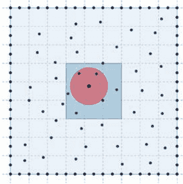

$\kappa$ 是一个表面张力常数。与文献中的其他方法 [172] 相比，这个方法的一个优点是对于不可压缩流体，可以将这个力应用于所有粒子，而不仅仅是位于自由表面上的粒子，从而简化了计算实现。这是因为该力在流体内部由于粒子分布趋于相互抵消。

### 3.3.2 体积映射

在过去的几年里，对 SPH 方法进行了多项研究，创造了传统方法的变种，这些研究在前一节中进行了介绍。在本节中，我们将总结由论文 [21] 引入的 SPH 方法，该方法在 SPLisHSPLash 库 [18] 中使用。

这种方法受密度图方法的启发，也基于隐式边界表示。它使用与 [20] 中描述的相同的数据结构来存储和查询函数值。然而，与其预先计算边界的密度贡献，它确定与平滑核的支持域重叠的边界体积 [21]。

所提出的方法最初区分了流体域和边界域。因此，第一步是将密度写成

$$\rho(\mathbf{x}) \approx \int_{N(\mathbf{x})} \rho(\mathbf{x}') W_{ij} d\mathbf{x}' = \int_{N(\mathbf{x}) \cap \mathcal{F}} \rho(\mathbf{x}') W_{ij} d\mathbf{x}' + \int_{N(\mathbf{x}) \cap \mathcal{B}} \rho(\mathbf{x}') W_{ij} d\mathbf{x}' = \rho_{\mathcal{F}}(\mathbf{x}) + \rho_{\mathcal{B}}(\mathbf{x}),$$

其中 $\mathcal{F}$ 是流体域，$\mathcal{B}$ 是边界域，$N(\mathbf{x})$ 是支持域。

基于粒子的方法用粒子离散化几何边界，因此边界部分的 $\rho_{\mathcal{B}}$ 可以类似地离散化为流体部分，使用以下求和：

$$\rho_i = \rho_{\mathcal{F}}(\mathbf{x}_i) + \rho_{\mathcal{B}}(\mathbf{x}_i) \approx \sum_j m_j W_{ij} + \sum_k \tilde{m}_k \tilde{W}_{ik}, \quad (3.52)$$

其中 $j$ 和 $k$ 表示粒子 $i$ 的流体和边界粒子邻居的索引。$\tilde{m}$ 和核函数 $\tilde{W}$ 根据方法选择。通常，我们设置 $\tilde{W}=W$ 和 $\tilde{m}$ 被视为伪质量；即，其值与边界物体的材料属性无关。

函数 $\rho_{\mathcal{B}}$ 在空间网格上离散化并预计算，以解决计算成本问题，并通过将边界密度延伸到边界外部来消除不连续性。

与基于粒子的方法不同，密度图的概念是基于通过构建距离函数获得的边界的隐式表示：
$\Phi: \mathbb{R}^{3} \rightarrow \mathbb{R}$，定义如下：
$$\Phi(\mathbf{x}) = \begin{cases} -d(\mathbf{x}, \partial \mathcal{B}) & \text{if } \mathbf{x} \in \mathcal{B} \\ d(\mathbf{x}, \partial \mathcal{B}) & \text{otherwise.} \end{cases} \quad (3.53)$$

通过扩展函数 $\gamma$ 将密度场扩展到边界内部：
$\mathbb{R} \rightarrow \mathbb{R}^{+}$：
$$\gamma(x) = \begin{cases} \rho_0 \left(1 - \frac{x}{r}\right) & \text{如果 } x < r \\ 0 & \text{否则.} \end{cases} \quad (3.54)$$

因此，我们能够将这些方程与 SPH 形式化结合，并将边界域中的密度写为：
$$\rho_{\mathcal{B}}(\mathbf{x}) = \int_{N(\mathbf{x})} \gamma(\Phi(\mathbf{x}')) W_{ij} d\mathbf{x}' \quad (3.55)$$

[21] 的主要贡献是新的体积映射方法，受密度映射的概念和隐式边界表示技术的启发，该方法具有改进的计算性能和避免不连续性的优点。为此，计算了围绕流体粒子的球体的交叉体积，该球体由支持半径 $h$ 定义。最重要的优势是边界体积可以直接用于一般 SPH 公式中，从而实现了密度梯度的一致计算。体积映射仅确定核支持域与边界之间的交叉体积，并使用 SPH 公式计算密度梯度。相比之下，密度映射通过对其空间网格离散化的 Serendipity 类型的立方形函数进行微分来确定梯度 [21]。

为了生成体积图，边界体积被确定为
$$V_{\mathcal{B}}(\mathbf{x}) = \int_{N(\mathbf{x})} \gamma^*(\Phi(\mathbf{x}')) d\mathbf{x}' \quad (3.56)$$

其中 $\Phi$ 是有符号距离函数，而 $\gamma^*$ 是给定的：
$$\gamma^*(x) = \begin{cases} 1 & \text{如果 } x \le 0, \\ C(x) & \text{如果 } 0 < x < r, \\ 0 & \text{否则,} \end{cases} \quad (3.57)$$

其中 $C$ 表示三次样条核函数。为了计算每个流体粒子的密度，在方程 (3.54) 中使用了传统的 SPH 公式，并且为了确定边界的密度 $\rho_{\mathcal{B}}$，使用了体积图：

$$\rho_{\mathcal{B}}(\mathbf{x}) = V_{\mathcal{B}}(\mathbf{x}) \rho_0 W(\|\mathbf{x}-\mathbf{x}^*\|),$$

其中 $\mathbf{x}^*$ 是离 $\mathbf{x}$ 最近的边界上的点；这个点可以通过 $\Phi$ 确定。

对于每个粒子 $i$，计算对称压力力：

$$\begin{aligned} F_i^P &= -m_i \sum_j m_j \left(\frac{p_i}{\rho_i^2} + \frac{p_j}{\rho_j^2}\right) \nabla W_{ij} \\ &- m_i V_{\mathcal{B}}(\mathbf{x}_i) \rho_0 \left(\frac{p_i}{\rho_i^2} + \frac{\tilde{p}}{\tilde{\rho}^2}\right) \nabla W(\|\mathbf{x}_i - \mathbf{x}^*\|) \\ &= F_{i \leftarrow \mathcal{F}}^P + F_{i \leftarrow \mathcal{B}}^P \end{aligned}$$

其中 $F_{i \leftarrow \mathcal{F}}^P$ 是由相邻流体粒子施加的压力力的一部分，$F_{i \leftarrow \mathcal{B}}^P$ 是由边界施加的一部分，$\tilde{p}$ 和 $\tilde{\rho}$ 分别是边界处的压力和密度。

### 3.3.3 无散度 Smoothed Particle Hydrodynamics

在本节中，我们将简要总结论文 [19]，这是 SPLisHSPlasht 库 [18] 的主要参考之一。本文介绍了一种稳定且高效的隐式方法，用于模拟不可压缩流体的 SPH 方法，该方法利用了两个压力求解器的组合。是什么使得这种方法，无散 SPH（DFSPH），比许多当前的 SPH 方法更快？

当流体不可压缩时，它的散度为零。基于这个事实，本文提出了以下观点：无散度求解器强制执行条件 $\frac{D\rho}{Dt} = 0$，这意味着密度随时间不变。这等同于无散度条件，从而导致无散度速度场。

当粒子的散度不为零时，该方法计算一组压力力来纠正散度误差。粒子的压力力由以下公式给出：

$$\mathbf{F}_i^p = -\frac{m_i}{\rho_i} \nabla p_i$$

其中压力梯度通过对方程进行微分计算。$p_i = k(\rho_i - \rho_0)$，其中 $k$ 是刚度参数。因此，DFSPH 方法使用 SPH 方法。

# 3 通过纳维-斯托克斯方程和数值方法进行流体建模

## 公式化

$$\nabla p_i = k_i^v \nabla \rho_i = k \sum_{j} m_j \nabla W_{ij}, \quad (3.61)$$

其中 $k_i^v$ 是待确定的刚度参数。为了保持动量守恒，考虑了压力力 $F_i^p$ 和 $F_{j \leftarrow -i}^p$，以及 $F_{j \leftarrow -i}^p$ 作用于相邻粒子，从而得到一组满足条件 $F_i^p + \sum_j F_{j \leftarrow -i}^p = 0$ 的对称压力力：

$$F_{j \leftarrow -i}^p = - \frac{m_i}{\rho_i} \nabla p_i = \frac{m_i}{\rho_i} k_i^v m_j \nabla W_{ij}, \quad (3.62)$$

粒子 $i$ 的密度变化率计算如下：

$$\frac{D \rho_i}{Dt} = \sum_j m_j (\mathbf{v}_i - \mathbf{v}_j) \nabla W_{ij}, \quad (3.63)$$

在对粒子 $i$ 施加对称压力力后，这个值应该为零。

压力力导致速度的变化 $\Delta \mathbf{v}_i = \Delta t \frac{\mathbf{F}_i^p}{m_i}$ 和 $\Delta \mathbf{v}_j = \Delta t \frac{\mathbf{F}_{j \leftarrow -i}^p}{m_j}$。

将这些项插入方程 (3.63) 中得到：

$$\frac{D \rho_i}{Dt} = -\Delta t \sum_j m_j \left( \frac{\mathbf{F}_i^p}{m_i} - \frac{\mathbf{F}_{j \leftarrow -i}^p}{m_j} \right) \nabla W_{ij}. \quad (3.64)$$

使用方程 $\mathbf{F}_i^p$ 和 $\mathbf{F}_{j \leftarrow -i}^p$ 在方程 (3.64) 中给出了刚度参数 $k_i^v$ 的方程：

$$\frac{D \rho_i}{Dt} = k_i^v \frac{\Delta t}{\rho_i} \left( \left| \sum_j m_j \nabla W_{ij} \right|^2 + \sum_j \left| m_j \nabla W_{ij} \right|^2 \right). \quad (3.65)$$

求解 $k_i^v$ 可得：

$$k_i^v = \frac{1}{\Delta t} \frac{D \rho_i}{Dt} \cdot \frac{\rho_i}{\left| \sum_j m_j \nabla W_{ij} \right|^2 + \sum_j \left| m_j \nabla W_{ij} \right|^2}. \quad (3.66)$$

使用刚度参数计算的压力力满足条件，完全满足 $D\rho_i / Dt = 0$，这意味着邻域中的速度场是无散的。

粒子 i 的散度为零。最终，总力 $F_{i, \text{total}}^{p}$ 是包括邻近粒子 $j$ 的力在内的粒子 $i$ 的总力。

$$F_{i, \text{total}}^{p}=F_{i}^{p}+\sum_{j} F_{i \leftarrow j}^{p}=-m_{i} \sum_{j} m_{j}\left(\frac{k_{i}^{v}}{\rho_{i}}+\frac{k_{j}^{v}}{\rho_{j}}\right) \nabla W_{i j}.$$

请注意，这个压力力等同于[164]中引入的对称压力力。

### 3.3.4 用于不可压缩SPH的多功能刚体-流体耦合

参考文献[8]提出了一种基于流体动力学力SPH流体和任意刚体的双向耦合方法。所提出的方法使用边界粒子对刚体表面进行采样，并与流体相互作用，从而避免了缺陷和不连续性。对于密度的传统SPH公式，由方程 (3.39) 给出，如果每个粒子周围都有其他粒子形成一个以该粒子为中心的球体，那么可以准确地近似密度。然而，靠近边界的粒子计算不准确，因为我们没有形成邻近粒子的球体，从而导致压力梯度的不连续性。为了解决这个问题，作者应用了Shepard滤波器，显著改善了情况。为了模拟与非可变刚体相互作用的流体，作者建议每个边界粒子 $b_i$ 代表一个体积 $V_{b_i}$ 在刚体表面：

$$V_{b_{i}}=\frac{m_{b_{i}}}{\rho_{b_{i}}}=\frac{m_{b_{i}}}{\sum_{k} m_{b_{k}} W_{i k}}$$

其中，$k$ 表示边界粒子的邻居。流体粒子的密度可以表示为

$$\rho_{f_{i}}=m_{j} \sum_{j} W_{i j}+m_{f_{i}} \sum_{k} W_{i k}$$

其中，$j$ 表示流体粒子的邻居。

对于靠近边界的流体粒子，作者还考虑了边界粒子的贡献，并考虑了其体积：

$$w_{b_{i}}\left(\rho_{0}\right)=\rho_{0} V_{b_{i}}$$

其中，$\rho_{0}$ 表示流体的初始密度。现在，修正后的密度可以表示为

$$\rho_{f_i} = m_f \sum_j W_{ij} + \sum_k w_{b_k}(\rho_{0_i}) W_{ik},$$

这样可以正确计算密度，而不受边界粒子采样的影响。需要注意的是，在均匀采样的情况下，$w_b$ 大约使边界处的粒子参与度增加了约14倍的流体粒子体积比例。

#### 3.3.4.1 边界-流体压力力

在SPH中，两个粒子之间的压力可以如下推导：

$$F_{p_{i \leftarrow j}} = -m_i m_j \left( \frac{p_j}{\rho_i \rho_j} \right) \nabla W_{ij}.$$

对于弱可压缩流体，我们可以假设 $\rho_i \approx \rho_j$ 和 $p_i \approx p_j$。因此，我们可以将方程 (3.72) 重写为：

$$F_{p_{i \leftarrow j}} = -m_i m_j \left( \frac{p_x}{\rho_x^2} \right) \nabla W_{ij},$$

其中 $x$ 可以是 $i$ 或 $j$。

从实际角度来看，流体对刚体的特定区域施加的压力不会影响相邻流体粒子的运动。基于这个事实，我们将边界粒子 $b_j$ 对流体粒子 $f_i$ 施加的压力力写为 $b_j$ 到流体粒子 $f_i$ 的压力力：

$$F_{p_{f_i \leftarrow b_j}} = -m_{f_i} w_{b_j}(\rho_{0_i}) \left( \frac{p_{f_i}}{\rho_{f_i}^2} \right) \nabla W_{ij},$$

通过将 $m_j$ 替换为 $w_{b_j}(\rho_{0_i})$ 如(3.71)所示。从流体粒子到边界粒子的对称压力力为：

$$F_{p_{b_j \leftarrow f_i}} = -F_{p_{f_i \leftarrow b_j}}.$$

在(3.74)和(3.75)中，利用流体粒子自身的压力来计算边界力。作用在边界上的力的大小取决于流体粒子的压力。当粒子靠近边界时，其压力增加，导致对边界的推力。为了抵消这个力并防止流体粒子粘在或穿透边界，施加了一个成比例的力。这种方法避免了使用额外的力或位置调整，有效消除了粘连问题。此外，它消除了边界粒子需要法线信息的必要性，也不需要这些粒子的密度或压力信息。

#### 3.3.4.2 边界-流体摩擦力

通过使用层流人工粘度模型 (3.43) 来产生流体与边界粒子之间的摩擦力。它的表达式为

$$\nu_{ij}=-v \left(\frac{\min (\mathbf{v}_{ij} \cdot \mathbf{x}_{ij}, 0)}{|\mathbf{x}_{ij}|^{2}+\epsilon h^{2}}\right) \quad (3.76)$$

以及粘性因子 $v=\frac{2 \alpha h c_{s}}{\rho_{i}+\rho_{j}}$，其中 $\alpha$ 是粘度常数，$c_{s}$ 表示数值波速，$\mathbf{v}_{i j}=\mathbf{V}_{\mathrm{i}}-\mathbf{V}_{\mathrm{j}}$，$\mathbf{x}_{i j}=\mathbf{x}_{\mathrm{i}}-\mathbf{x}_{\mathrm{j}}$，而 $\epsilon=0.01$ 用于避免 $|\mathbf{x}_{i j}|=0$ 时的奇异性。现在，两个粒子之间的粘性力可以定义为

$$F_{i \leftarrow j}^{v}=-m_{i} m_{j} \nu_{i j} \nabla W_{i j} . \quad (3.77)$$

基于上述方程，我们可以定义边界粒子到流体粒子的粘性力为

$$F_{i \leftarrow b_j}^{v}=-m_{f_{i}} w_{b_j}\left(\rho_{0_{\mathrm{i}}}\right) \nu_{i j} \nabla W_{i j}. \quad (3.78)$$

通过重新定义粘性因子

$$v=\frac{\sigma h c_{s}}{2 \rho_{f_{i}}}, \quad (3.79)$$

其中 $\sigma$ 是流体和刚体之间的粘度系数。

在计算任何相关力之前，我们使用刚体求解器提供的位置和方向来修改边界粒子。一旦确定了涉及的力，我们可以表示由边界对流体粒子施加的总力 $F_{f_i}^{\text{总}}$，以及由其相邻流体粒子对边界粒子施加的总力 $F_{b_i}^{\text{总}}$：

$$
\begin{aligned}
F_{f_{i}}^{\text {总 }} & =\sum_{j} \left(F_{f_i \leftarrow b_{j}}^{p}+F_{f_i \leftarrow b_{j}}^{v}\right), \\
F_{b_{i}}^{\text {总 }} & =\sum_{j} \left(F_{b_i \leftarrow f_{j}}^{p}+F_{b_i \leftarrow f_{j}}^{v}\right) .
\end{aligned} \quad (3.80)
$$

考虑到粒子之间的配对力是对称的，即

$F_{p_{i \leftarrow b_j}}^p + F_{p_{b_i \leftarrow f_j}}^p = 0$ 且 $F_{f_i \leftarrow b_j}^v + F_{b_i \leftarrow f_j}^v = 0$，粘度和总边界力也是对称的：

$\sum_{i} F_{f_i}^{\text{总}} = \sum_{i} F_{b_i}^{\text{总}}$。

因此，对于每个作为动态刚体一部分且具有相邻流体粒子的边界粒子 $i$，$F_{b_i}^{\text{总}}$ 被转换为刚体的总力和扭矩，如下所示：

$$\text{刚体力} = \sum_{i} F_{b_i}^{\text{总}}, \quad (3.81)$$

$$\text{刚体扭矩} = (\mathbf{x}_i - \mathbf{x}^{cm}) \times F_{b_i}^{\text{总}},$$

其中 $\mathbf{x}^{cm}$ 是刚体的质心，而 $\mathbf{x}_i$ 是边界粒子的位置。最后，$\mathbf{F}_{\text{刚体}}$ 和 $\boldsymbol{\tau}_{\text{刚体}}$ 被应用于刚体。

## 3.4 稳定流体

Jos Stam在论文[220]中提出了一种稳定高效的数值方法来模拟流体动力学。关键思想是在网格上离散化方程，然后使用一种称为“投影”的技术来强制执行流体的不可压缩约束。这样可以得到稳定准确的流体流动模拟。

在他的论文中，Jos Stam使用了不可压缩流体的Navier-Stokes方程，即条件为 $\nabla \cdot \mathbf{u} = 0$。并且在投影的构建中，他使用了Helmholtz-Hodge分解，根据该分解，一个矢量场 $\mathbf{w}$ 可以分解为：

$$\mathbf{w} = \mathbf{u} + \nabla q, \quad (3.82)$$

其中 $q$ 是一个标量场，$\mathbf{u}$ 是无散的。将前一个方程两边应用散度算子：

$$\nabla \cdot \mathbf{w} = \nabla \cdot \mathbf{u} + \nabla^2 q, \quad (3.83)$$

但是由于 $\nabla \cdot \mathbf{u} = 0$，我们有

$$\nabla \cdot \mathbf{w} = \nabla^2 q. \quad (3.84)$$

因此，我们得到了一个标量场 $q$ 的泊松方程，其解决方案允许我们定义一个投影算子，如下所示：

$$\mathbf{u} = \mathbf{P} \mathbf{w} = \mathbf{w} - \nabla q. \quad (3.85)$$

将该算子应用于动量方程，假设特定质量 $\rho=1$，我们得到：

$$\frac{\partial \mathbf{u}}{\partial t}=\mathbf{P}\left(- (\mathbf{u} \cdot \nabla) \mathbf{u} +\nu \nabla^2 \mathbf{u} +\mathbf{f} \right), \quad (3.86)$$

其中：

$$\mathbf{P}\left(\frac{\partial \mathbf{w}}{\partial t}\right)=\frac{\partial}{\partial t}(\mathbf{P} \mathbf{w})=\frac{\partial \mathbf{u}}{\partial t} \text { 且 } \mathbf{P}(\nabla p)=0 .$$

通过方程 (3.86)，我们意识到在计算中压力的贡献为零。$\mathbf{u}$ 分量的表达式 (3.82) 满足不可压缩条件 $\nabla \cdot \mathbf{u}=0$。

Stam的工作中提出的积分方程 (3.86) 是主要的贡献。简而言之，纳维斯托克斯方程在不考虑涉及压力的项的情况下得到解决。

# 第四章 神经网络普适性、几何和动力系统元素在流体动画中的应用

**摘要：**在本章中，我们从布尔表达式和电路理论的基本元素开始，为研究神经网络作为计算模型提供背景。我们介绍命题的真值表和代数。然后，我们考虑电路理论，因为神经网络可以被转化为电路家族的计算模型。具体而言，神经计算过程可以组织成一个图或电路，其中的门（神经元）排列成层。通过电路和布尔表达式方法之间的等价性，我们可以讨论神经计算的普适性。我们在本章结束时讨论了微分几何和动力系统的元素，这些元素是我们演示的数学背景的一部分。具体而言，我们基于可微流形的概念形式化了一个数据模型。因此，数据库样本和相关的概率密度分布在所提出的数据模型中占据了自然的位置。动力系统的基础是将流体表示为粒子系统时在哈密顿形式主义背景下可视化这种数据模型所必需的。

**关键词：**布尔表达式 · 电路理论 · 神经计算的普适性 · 计算模型 · 粒子系统 · 哈密顿形式

## 4.1 引言

神经网络领域是机器学习的一个成熟研究领域。自从第一个被称为感知器的人工神经元模型[98]出现以来，神经计算范式几乎应用于科学和技术的各个领域，吸引了来自各种背景的研究人员。

这个领域涉及计算理论和数据科学的方面。前者提供了足够通用的函数类别来证明神经网络可以用于流体模拟。然而，要实现这样的目标，与训练所需的数据相关的实际问题也需要考虑。具体来说，在应用时我们对数据有哪些基本假设？神经网络在流体动力学中构建代理模型的应用有哪些？关于数据表示和准备方面有什么问题吗？

从这些问题中产生了一个涉及几何和数据元素的数据模型。具体来说，基本假设是模拟样本属于一个可微分流形，本文中称之为数据流形。因此，应考虑几何特征如切空间和度量。然后，动力系统基础被用于在将流体表示为粒子系统的上下文中实现这样的数据模型。

## 4.2 神经网络和普适性

如果与基于偏微分方程和数值方法的传统计算建模技术相比，神经网络技术提供了先进的工具，可以以较低的计算成本进行流体模拟[30]。

然而，在进入计算流体动力学中的机器学习主题之前，我们必须提供一些可计算性理论的背景，以展示神经计算的能力。因此，第4.2.1、4.2.2、4.2.3、4.3和4.4节发展了证明神经网络计算模型的普适性所必需的基本要点[98]。

### 4.2.1 布尔表达式

一个变量 $x$ 使得 $x \in \{0, 1\}$ (真 1 和 假 0) 被称为布尔变量。给定布尔变量 $x, y, \dots$，它们可以通过合取 ($\land$)、析取 ($\lor$)、否定 ($\sim$)、异或 (XOR)、蕴含 ($\Rightarrow$)，以及双向蕴含 ($\Leftrightarrow$) [9] 这些运算符由标准真值表4.1定义。

此外，完整的语法包括括号以解决歧义。此外，作为一种常见的约定，假设运算符按照它们的相对优先级进行绑定。优先级从高到低依次为：$\sim$, $\land$, $\lor$, $\Leftrightarrow$, $\Rightarrow$。因此，例如，

$$\sim x_1 \land x_2 \lor x_3 \Rightarrow x_4 = ((\sim x_1) \land x_2) \lor x_3 \Rightarrow x_4.$$

一个布尔表达式带有变量 $x_1, x_2, \dots$。对于每个变量的真值赋值（0或1），布尔表达式产生一个相应的真值，根据标准的真值表4.1a-f。如果我们用 $B=\{0,1\}$ 表示真值的集合，那么我们可以将带有变量 $x_1, x_2, \dots, x_n$ 的布尔表达式看作一个函数：

$$F : B^n \to B$$

其中 $B^n = B \times B \times \dots \times B$ ($n$次)。举个例子，让我们将表达式 (4.1) 重写为：

$$F : B^4 \to B$$
$$F(x_1, x_2, x_3, x_4) = \neg x_1 \land x_2 \lor x_3 \Rightarrow x_4.$$

两个布尔表达式 $F_1, F_2: B^n \to B$ 被称为相等，如果：

$$F_1(x_1, x_2, \dots, x_n) = F_2(x_1, x_2, \dots, x_n), \quad \forall (x_1, x_2, \dots, x_n) \in B^n \quad (4.3)$$

根据真值表4.1a-f，可以建立一些布尔表达式遵循的代数定律，其中一些类似于实数满足的定律[54, 77]。相应的命题代数非常有用，可以证明与布尔表达式相关的性质。具体而言，我们有以下定律[54, 77]:

- (1) 幂等律
  $p \land p = p,$
  $p \lor p = p.$
- (2) 交换律
  $p \land q = q \land p,$
  $p \lor q = q \lor p,$
  $p \Leftrightarrow q = q \Leftrightarrow p.$
- (3) 结合律
  $(p \land q) \land r = p \land (q \land r),$
  $(p \lor q) \lor r = p \lor (q \lor r).$
- (4) 吸收律
  $p \land(p \lor q)=p,$
  $p \lor(p \land q)=p.$
- (5) 分配律
  $p \land(q \lor r)=(p \land q) \lor(p \land r),$
  $p \lor(q \land r)=(p \lor q) \land(p \lor r).$
- (6) 反演律
  $\sim(\sim p)=p.$
- (7) 德摩根定律
  $\sim(p \lor q)=(\sim p) \land(\sim q),$
  $\sim(p \land q)=(\sim p) \lor(\sim q).$
- (8) 补充律
  $p \lor \sim p = 1.$

### 4.2.2 电路理论

从形式上讲，神经网络可以被归纳为电路理论[180]所形式化的计算模型。我们说一个电路由线和门组成。这些线传递信息，而门（函数）执行简单的计算任务。最简单的门是表 4.1a-f 中介绍的逻辑运算符。图 4.1a 显示了基本门及其图形表示。此外，我们还可以将恒等门（仅为一根线）和 FANOUT 门（用两个副本替换一个位）添加到基本门集合中。

图 4.1b 显示了一个电路的示例，该电路输出布尔表达式 $x \oplus y = \text{XOR}(x, y)$ 的结果（参见表 4.1d），同时设置一个进位位，如果 $x$ 和 $y$ 都为 1，则设置为 1，否则为 0。

形式上，设 $G$ 是将多个位映射到一个位的门集合。对于每个 $n, m \ge 0$，一个电路 $C_{n,m} \in G$，是一个有向无环图，其中包含一个输入节点列表（没有入边），一个输出节点列表（没有出边），以及 $G$ 中的门计算每个非输入/非输出节点。

给定一个二进制输入字符串 $(x_1, x_2, \dots, x_n)$，我们为每个输入节点标记。对于每个具有前驱节点 $(y_1, y_2, \dots, y_n)$ 的其他节点 $v$，我们递归地分配一个值 $g(y_1, y_2, \dots, y_n)$，其中 $g$ 是计算节点 $v$ 的门。给定一个输入 $\mathbf{x} \in \{0, 1\}^n$，电路 $C_{n,m} \in G$ 输出值 $C_{n,m}(\mathbf{x}) \in \{0, 1\}^m$，由输出节点列表给出。

电路的大小：$C$ 的节点数为 $N$，深度为 $m$。$C$ 的长度是从任何输入节点到输出节点的最长路径。

我们说一个电路 $C_{n,m} \in G$ 计算一个布尔函数 $F$：$C_{n,m}(\mathbf{x}) = F(\mathbf{x})$，对于所有 $\mathbf{x} \in \{0, 1\}^n$。电路族是一个电路列表 $C = (C_{1,m}, C_{2,m}, \dots, C_{n,m}, \dots)$，其中 $C_{i,m}$ 有 $i$ 个二进制输入和 $m$ 个二进制输出。电路族计算一族布尔函数 $(f_1, f_2, \dots, f_n, \dots)$，其中 $f_i$ 是电路 $C_{i,m}$ 计算的布尔函数。

我们说家族 $C$ 的大小复杂度。对于所有 $n \ge 0$ 的电路 $C$，我们称其规模复杂度为 $s(n)$，深度复杂度为 $d(n)$。对于所有 $n \ge 0$ 的电路 $C$，我们称其规模不超过 $s(n)$，深度不超过 $d(n)$。规模和深度是电路的重要复杂度描述，分别表征计算资源和计算一组布尔函数所需的步骤数。

设 $G$ 为图 4.1 中表示的基本门的集合。$C_G(n, m)$ 是这些电路可以计算的函数类。我们还考虑布尔函数集合 $\mathcal{F}(n, m) = \{F: \{0, 1\}^n \to \{0, 1\}^m\}$。

**定理 1** 给定布尔表达式 $F: \{0, 1\}^n \to \{0, 1\}^m$，存在电路 $C_{n,m} \in G$，使得 $C_{n,m}(x_1, x_2, \dots, x_n) = F(x_1, x_2, \dots, x_n)$ 对于所有 $(x_1, x_2, \dots, x_n) \in B^n$。因此，很明显 $C_G(n, m) = \mathcal{F}(n, m)$。

**证明** 我们将展示 $m = 1$ 的演示。根据这个结果，一般情况可以直接解决。演示使用数学归纳法进行。因此，按照数学归纳法的主要步骤：

- 证明：
  - (a) 该属性对于 $n = 1$ 成立；
- 接下来，假设：
  - (b) 该属性对于 $n = k$ 成立；+ (b.1) 假设：该属性对于 n = k 成立；
- 然后，我们应该证明：
- (b.2) 论点：该属性对于 n = k + 1 成立。

使用图4.1的基本门，或多或少地可以证明 $C_G(1,1)=F(1,1)$，这解决了问题 (a)。

为了证明 (b.2) 项的论点，关键是注意到任何函数 $F: \{0,1\}^{k+1} \rightarrow \{0,1\}$ 可以写成：
```math
F(x_0, x_1, \ldots, x_k) = (F_0 \land \neg x_0) \oplus (F_1 \land x_0), \quad (4.4)
```
其中：
```math
F_0(x_1, x_2, \ldots, x_k) = F(0, x_1, x_2, \ldots, x_k), \quad (4.5)
```
```math
F_1(x_1, x_2, \ldots, x_k) = F(1, x_1, x_2, \ldots, x_k). \quad (4.6)
```

现在，使用归纳假设，我们可以断言存在电路 $\tilde{C}_{(k,G,1)}$ 和 $C_{(k,G,1)}$ 分别计算 $F_0$ 和 $F_1$。通过使用这个事实，要完成命题（项目 (b.2)）的证明，只需要注意到表达式 (4.4) 可以转换为电路 $C_{(kG+1,1)}$，如图4.2所示。因此，根据归纳假设对 $n=1$ 和项目 (b.1) 和 (b.2)，我们可以断言，给定一个布尔函数 $F: \{0,1\}^n \rightarrow \{0,1\}$，存在一个电路 $C_{(n,1)}^G$ 使得 $C_{(n,1)}^G(x_1, x_2,\ldots, x_n) = F(x_1, x_2,\ldots, x_n)$ 对于所有 $(x_1, x_2,\ldots, x_n) \in B_n$。因此 $F(n, 1) \subset C_G(n, 1)$。相反，根据集合 $C_G(n,1)$ 的电路定义，显然有 $C_G(n, 1) = F(n, 1)$，这完成了 $m=1$ 的证明。

具有阈值的加权门（或简称为阈值门）由一个属于 $\mathbb{Q}$ 的元素 $A$ 和一个权重向量 $\mathbf{w}=(w_1, w_2, \ldots, w_n) \subset \mathbb{Q}^n$ 定义，其对应的布尔函数表示为 $Th_{A, \mathbf{w}}$ 的定义如下[201]：
```math
Th_{A, \mathbf{w}}(x_1, x_2, \ldots, x_n) = \begin{cases} 1, & \text{如果 } \sum_{i=1}^n w_i x_i \ge A, \\ 0, & \text{否则}. \end{cases}
```
图4.2 电路 $C_{(kG+1,1)}$ 表示计算任意函数 $F: \{0,1\}^k \rightarrow \{0,1\}$ 的表达式 (4.4)。（改编自[180]）

阈值电路用 $TC$ 表示。一个阈值电路表示为 $TC(n, A_{\mathbf{w}}, m)$，是由阈值门组成的电路，输入为 $\mathbf{x} \in B^n$，输出为 $y \in B^m$。因此，根据阈值门的定义（式 (4.7)），阈值电路也是一个函数。可以由阈值电路计算的函数类 $TC(n, A_{\mathbf{w}}, m)$ 将被表示为 $\mathcal{TF}_{n, A, (\mathbf{w}, m)}$。关于阈值电路的一个重要定理如下：

**定理 2** 给定一个布尔空间 $B=\{0,1\}$，存在一个加权阈值电路 $\mathbf{TC}(n, \mathbf{A}_{\mathbf{w}}, m)$ 使得 $\mathbf{TC}(n, A_{\mathbf{w}}, m)(\mathbf{x})=F(\mathbf{x})$ 对于所有 $\mathbf{x} \in B^n$。

**证明** 为了证明这个定理，只需要展示图4.1的基本门可以通过阈值电路计算。因此，证明是定理1的直接结果。

### 4.2.3 多层感知器模型

第一个逻辑神经元是由 W.S. McCulloch 和 W.A. Pitts 于 1943 年开发的 [15]。它描述了神经细胞的基本功能和结构，指出只有当输入总和超过阈值时神经元才会发出脉冲。

图4.3 展示了 McCulloch-Pitts 模型的基本元素：$x_i \in \mathbb{R}, i=1,2,\ldots,m$ 是输入，可以按照输入向量 $\mathbf{x}=(x_1, x_2, \ldots, x_m) \in \mathbb{R}^m$ 进行排列。系数 $w_i \in \mathbb{R}$ 和偏置 $b$ 是网络参数，在神经网络文献中通常被称为权重。组合 $\sum_{i=1}^m w_i x_i + b$ 被称为感应局部场。函数 $\sigma$ 是激活函数，用于计算输出 $y \in \mathbb{R}$。一个简单的选择是符号函数。

符号函数 $\sigma(\cdot)=\text{sgn}(\cdot)$ 定义为：
```math
\sigma\left(\sum_{i=1}^{m} w_i x_i + b\right) = \begin{cases} 1, & \text{如果 } \sum_{i=1}^{m} w_i x_i + b > 0, \\ -1, & \text{否则}. \end{cases}
```
但是 McCulloch-Pitts 神经元没有学习机制。基于生物学证据，D.O. Hebb 提出了一条适应权重的规则，这被解释为系统的学习规则[15]。这种受生物启发的过程可以用以下方式表达：

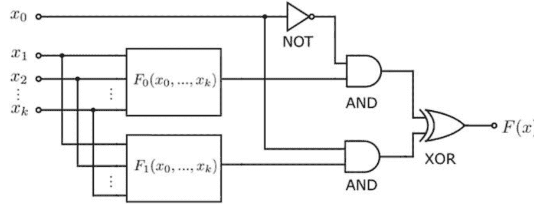
图4.3 McCulloch-Pitts神经元模型。（改编自[15]）

学习规则更新公式为：
```math
w_i^{\text{new}} = w_i^{\text{old}} + \Delta w_i; \quad \Delta w_i = \eta (y^{\text{desired}} - y) x_i, \quad (4.9)
```
其中，$w_i^{\text{new}}$ 和 $w_i^{\text{old}}$ 分别是调整后的权重和之前的权重，$\eta$ 是一个控制学习速率的实数参数，$y^{\text{desired}}$ 是期望的（已知的）输出。

这个学习规则加上图4.3的元素构成了神经元的感知器模型。

然后，学习是通过训练或接触已知的输入/输出数据集来进行的：
```math
\mathcal{D}=\left\{(\mathbf{x}_1, l_1),(\mathbf{x}_2, l_2), \ldots, (\mathbf{x}_M, l_M)\right\} \subset \mathbb{R}^m \times\{-1,1\}. \quad (4.10)
```
训练算法迭代地调整连接权重和偏置，类似于生物神经元中的突触可塑性。这些连接权重和偏置存储了解决特定问题所需的知识。

从数据流的角度来看，我们可以将神经网络视为一个有向无环图，其节点是神经元（实现为感知器），排列在层中，边关联了权重。

举个例子，让我们考虑一个学习机器 $\mathbb{M}=\mathbb{M}(\mathbf{x} ; \mathbf{w})$，表示为多层感知器（MLP），具有至少 $L \ge 1$ 个隐藏层 [98]，由以下元素定义：
- 输入层：
```math
\mathcal{I}=\{1,2, \ldots, p(0)\} \subset \mathbb{N}。
```
- 第一个隐藏层：
```math
\mathcal{H}(1)=\{p(0)+1, p(0)+2, \ldots, p(1)\} \subset \mathbb{N}。
```
- 剩余的隐藏层：
```math
\mathcal{H}(n)=\{p(n-1)+1, p(n-1)+2, \ldots, p(n)\} \subset \mathbb{N}, \quad 2 \le n \le L。
```

## 4.2 神经网络和普适性

- 输出层：$\mathcal{O}=\{p(L) + 1, p(L) + 2, \ldots, p(L + 1)\}$。
- 突触权重：$w_{ij}$ 表示神经元 $i$ 的输出与神经元 $j$ 的输入之间的连接权重。
- 偏置：$b_j$ 与神经元 $j$ 相关联。
- 网络权重和偏置的数组：
```math
\mathbf{w}=\left(\{w_{jk}\}_{p(i)+1 \leq j \leq p(i+1), p(i+1)+1 \leq k \leq p(i+2)}, \{b_{s}\}_{p(0)+1 \leq s \leq p(L+1)}, i=-1,0, \ldots, L\right). \quad (4.11)
```
其中，$p(-1) = 0$。

在图4.4 中，我们展示了一个多层感知器（MLP），其中 $p(L+1)=p(L)+1$；这意味着只有一个输出节点，对应于简单回归或二元分类网络。

因此，考虑到图4.4的索引，机器模型的参数空间的维度为：
```math
\sum_{i=-1}^{L} p(i) p(i+1) + \sum_{i=0}^{L+1} p(i) \quad (4.12)
```
学习机封装了由函数组成的空间：$f: \mathbb{R}^{p(0)} \times \mathbb{R}^k \rightarrow \mathbb{R}$。


图4.4 深度多层感知器方案，用样本 $\mathbf{x}_k$ 作为输入进行分类或回归（来源：[82]）

只有一个隐藏层的神经网络（在图4.4 中 $L=1$）也被称为浅层神经网络。另一方面，深度神经网络有多个隐藏层（$L>1$）。

MLP 也被称为全连接神经网络，因为所有节点都与其前一层（第 $i-1$ 层）的节点相连。我们必须对这个定义非常小心，因为如果权重为零，那么神经元之间的连接效果就相当于没有连接。从计算模型的角度来看，讨论浅层和深层神经网络的等效性是很重要的。

事实上，我们可以证明我们总是可以将深层架构转换为浅层架构。然而，这种转换在隐藏层中的门数量可能会呈指数增长，与输入维度 $p(0)$ 有关。

## 4.3 激活函数

神经网络的非线性能力是非线性激活函数应用的结果。如果我们希望输出在范围 $[0, 1]$ 内，激活函数的一种可能性是逻辑函数（或 Sigmoid 函数）。
```math
f(z; \alpha) = \frac{1}{1+\exp(-\alpha z)}. \quad (4.13)
```
然而，由于其值域在区间 $(0, 1)$ 内受到限制，Sigmoid 函数存在一些缺点。因此，对于一个回归问题，其目标函数为 $f: \mathbb{R}^m \rightarrow [0, y_{\max}] \subset \mathbb{R}$，我们通常将图像集归一化为 $[0, 1]$。因此，归一化和 Sigmoid 的组合将把大范围的输入映射到小范围的输出[53]。这样的过程可能会在训练过程中产生较小的梯度值，导致过早收敛到较差的解，或者深度模型无法在给定数据集上学习模式。因为网络只传播从输出层到输入层的较小梯度值，这种现象被称为梯度消失问题[98, 130]。

为了克服 Sigmoid 函数仅输出一小范围正值的限制，但保留其平滑可微的优点，引入了双曲正切（tanh）函数：
```math
\tanh(x) = \frac{1-\exp(-x)}{1+\exp(-x)} \quad (4.14)
```
tanh 函数可以产生以零为中心的结果。然而，tanh 也会遇到梯度消失问题。

修正线性单元（ReLU）函数于文献[177]中被提出，定义如下：
```math
f(x) = \max \{0, x\}. \quad (4.15)
```
自提出以来，ReLU 函数已成为深度架构中最广泛使用的激活函数之一[53]。需要注意的是，ReLU 函数是连续的，但其在 $x=0$ 时导数未定义。此外，它没有界限，也不以零为中心。由于其定义，ReLU 的计算成本较低。此外，它可以引入稀疏性，因为所有负输入值都被推到零。

在深度架构中，ReLU 函数通常在隐藏层中作为主要激活函数使用。文献表明，相比仅使用 Sigmoid 函数或双曲正切函数，ReLU 能提供更好的性能和泛化能力。

ReLU 的一种变种是参数化 ReLU 函数：
```math
f(x; a)=\begin{cases} a x, & \text { 如果 } x \le 0, \\ x, & \text { 否则}, \end{cases} \quad (4.16)
```
其中 $a>0$。特殊情况下 $a=0.01$ 被称为 Leaky ReLU 函数。其他激活函数可以在文献[266]中找到。

在多类问题中，给定一个输入样本 $\mathbf{x}$，神经网络必须输出一个向量 $\mathbf{y}=(y_1, y_2, \ldots, y_K)$，其中 $K$ 是类别的数量。因此，让我们将输出层的感知局部场组装成 $\mathbf{z}=\mathbf{W}\mathbf{h} +\mathbf{b}$ 的形式。如果我们考虑神经网络前馈输出的概率解释，那么输出集合应该是一个关于类别标签的条件概率分布；也就是说，在这种情况下，还需要满足 $Out_i \geq 0$ 和 $\sum_{i=1}^K Out_i = 1$。为了强制执行这样的概率约束，文献[27]建议使用归一化指数输出：
```math
\text{Output}_i = \frac{\exp \left(z_i\right)}{\sum_{j=1}^K \exp \left(z_j\right)}, \quad i=1,2, \ldots, K. \quad (4.17)
```
该过程可以通过 Softmax 激活函数[27,87]表示为：
```math
\text{softmax}(\mathbf{z})=\left(\frac{\exp \left(z_1\right)}{\sum_{j=1}^K \exp \left(z_j\right)}, \ldots, \frac{\exp \left(z_K\right)}{\sum_{j=1}^K \exp \left(z_j\right)}\right). \quad (4.18)
```

## 4.4 神经网络作为通用计算模型

本节的主要问题是：神经网络可以计算哪种类型的函数？

为了逐步呈现解决方案，我们首先只考虑布尔函数。因此，我们回到定理 2，它保证了对于每个布尔函数 $F : B^n \rightarrow B^m$，存在一个加权阈值电路 $TC_{(w, m)}^{n,A}$。此外，我们应该注意到神经元模型的简单变化：
```math
y = \chi \left( \sum_{i=1}^{n} w_i x_i - b \right), \quad (4.19)
```
其中：
```math
\chi(\cdot) = \begin{cases} 1, & \text{如果 } \sum_{i=1}^{n} w_i x_i > b, \\ 0, & \text{否则}, \end{cases} \quad (4.20)
```
这允许识别具有阈值门的神经元。由表达式 (4.7) 定义，如果我们限制 $(x_1, x_2, \ldots, x_n) \in B^n$ 和 $(w_1, w_2, \ldots, w_n) \in \mathbb{Q}^n$，神经元就成为了阈值门。因此，神经网络成为了加权阈值电路 $TC_{(w, m)}^{n,A}$。定理 2 的一个直接推论是：
```math
TC_{(m)}^n \supset \mathcal{F}(n, m), \quad (4.21)
```
其中，$TC_{(m)}^n$ 是可以通过阈值电路计算的函数类，$\mathcal{F}(n,m)$ 是布尔函数类 $\mathcal{F} : B^n \rightarrow B^m$。

因此，我们可以肯定，给定一个布尔函数 $F : B^n \rightarrow B^m$，存在一个神经网络机器 $\mathbf{M} = \mathbf{M}(\mathbf{x}; \mathbf{w}^*)$，其中 $\mathbf{w}^*$ 是一个固定的参数向量（位于 $\mathbb{R}^k$），使得 $\mathbf{M}(\mathbf{x}; \mathbf{w}^*) = F(\mathbf{x})$ 对于所有 $\mathbf{x} \in B^n$。

为了将这个结果推广到 $\mathbb{Q}$ 中的函数，让我们考虑一个有限集合 $\widehat{\mathbb{Z}} \subset \mathbb{Z}$ 和一个足够大的 $k \in \mathbb{N}$，使得如果 $z \in \widehat{\mathbb{Z}}$，那么 $e(z) = (c_0, c_1, \ldots, c_k)$ 是 $\{0, 1\}^{k+1}$ 中唯一满足以下条件的二进制序列：
```math
z = s(c_k) \left( \sum_{j=1}^{k} c_{j-1} 2^{j-1} \right), \quad (4.22)
```
其中 $s(1) = +1$ 且 $s(0) = -1$。此外，我们应记住，给定 $q \in \mathbb{Q}$，存在 $(a,b) \in \mathbb{Z} \times \mathbb{Z}_*$ 使得：
```math
q = \frac{a}{b}.
```
因此，集合 $\left(\widehat{\mathbb{Z}} \times \widehat{\mathbb{Z}}_*\right)^n$ 和 $\left(\widehat{\mathbb{Z}} \times \widehat{\mathbb{Z}}_*\right)^m$ 可以分别表示为两个子集 $\widehat{U} \subset \mathbb{Q}^n$ 和 $\widehat{V} \subset \mathbb{Q}^m$。对于函数 $f: \widehat{U} \rightarrow \widehat{V}$，其中 $f = f(q_1, q_2, \ldots, q_n)$，可以写成 $g: \left(\widehat{\mathbb{Z}} \times \widehat{\mathbb{Z}}_*\right)^n \rightarrow \left(\widehat{\mathbb{Z}} \times \widehat{\mathbb{Z}}_*\right)^m$ 使得
```math
f(q_1, q_2, \ldots, q_n) = g((a_1, b_1), (a_2, b_2), \ldots, (a_m, b_m)) \quad (4.23)
```

## 4.4 神经网络作为通用计算模型

此外, 我们逐元素地组合函数 $g$ 和 $e^{-1}$:

$g((a_1, b_1), (a_2, b_2), \ldots, (a_m, b_m)) =$

$= g\left(\left(e^{-1}(\boldsymbol{\alpha}_1), e^{-1}(\boldsymbol{\beta}_1)\right), \left(e^{-1}(\boldsymbol{\alpha}_2), e^{-1}(\boldsymbol{\beta}_2)\right), \ldots, \left(e^{-1}(\boldsymbol{\alpha}_n), e^{-1}(\boldsymbol{\beta}_n)\right)\right)$

其中 $\beta_i \in \{0, 1\}^{k+1}$ 是 $a_i$ 的二进制表示, $\alpha_i \in \{0, 1\}^{k+1}$。如果我们将式(4.23)和式(4.24)结合起来, 那么我们可以构建一个函数 $g \circ e^{-1}: \{0, 1\}^{k+1} \times \{0, 1\}^{k+1} \longrightarrow \left(\widehat{\mathbb{Z}} \times \widehat{\mathbb{Z}}_*\right)^m$ 满足:

$f(q_1, q_2, \ldots, q_n) =$

$= g \circ e^{-1}(\boldsymbol{\alpha}_1, \boldsymbol{\beta}_1; \boldsymbol{\alpha}_2, \boldsymbol{\beta}_2; \ldots; \boldsymbol{\alpha}_n, \boldsymbol{\beta}_n)$.

下一步是处理目标域。我们将定义函数:

$e \circ g \circ e^{-1}(\boldsymbol{\alpha}_1, \boldsymbol{\beta}_1; \boldsymbol{\alpha}_2, \boldsymbol{\beta}_2; \ldots; \boldsymbol{\alpha}_n, \boldsymbol{\beta}_n) = e \circ f(q_1, q_2, \ldots, q_n)$

并且在考虑到它的情况下进行处理 $f(q_1, q_2, \ldots, q_n) \in \mathbb{Q}^m$ 并且 $e$ 以元素方式作用。这样, 表达式(4.26)表明 $f: \widehat{U} \longrightarrow \widehat{V}$ 可以表示为一个函数:

$g \circ e^{-1}: (\{0, 1\}^{k+1} \times \{0, 1\}^{k+1})^n \longrightarrow \left(\{0, 1\}^{k+1} \times \{0, 1\}^{k+1}\right)^m$

这完成了对有限子集 $\widehat{U}, \widehat{V} \subset \mathbb{Q}$ 的演示。实际上, 我们应该注意到现代计算机使用的是定义在有限子集 $\mathbb{F} \subset \mathbb{Q}$ 上的浮点运算。因此, 如果表达式 (4.22) 中的 $k$ 足够大, 使得 $\widehat{U}, \widehat{V} \supset \mathbb{F}$, 那么表达式 (4.27) 表明任何函数 $f: \mathbb{F} \longrightarrow \mathbb{F}$ 都可以通过神经网络计算, 这证明了神经计算模型的普适性。

## 4.5 正则曲面和可微流形

前几节已经为我们理解神经网络作为计算模型的强大之处奠定了基础。现在，我们应该介绍一些几何元素，这些元素是我们讨论的数学背景的一部分。所以，让我们考虑 $D \subset \mathbb{R}^2$ 和一个表面 $M \subset \mathbb{R}^3$，通过一个函数 $S: D \subset \mathbb{R}^2 \to \mathbb{R}^3$ 参数化。所以，如果 $S$ 是一个可微函数；也就是说，如果 $\partial S/\partial u$ 和 $\partial S/\partial v$ 在 $D$ 中是连续函数，那么 $M$ 被称为正则曲面，用 $S \in C^1(D)$ 表示。

这些概念可以应用于嵌入在 $\mathbb{R}^n$ 中的超曲面 $\mathcal{M}^{n-1}$。然而，这个定义有一个缺点，因为它要求超曲面 $\mathcal{M}^{n-1}$ 有一个全局参数化 $S$。例如，在微分几何中，我们可以证明二维球体不具有全局参数化。为了解决这个问题，我们必须考虑表面的局部参数化，下面将进行解释。

一个维度为 $d$ 的可微流形是一个集合 $\mathcal{M}$ 和一族一对一函数 $\{\varphi_\alpha\}_{\alpha \in I}$ 一起，其中 $I$ 是一个索引集。$\varphi_\alpha: U_\alpha \subset \mathbb{R}^d \to \mathcal{M}$，其中 $U_\alpha$ 是 $\mathbb{R}^d$ 的一个开集，满足[69]:

- $\bigcup_{\alpha \in I} \varphi_\alpha(U_\alpha) = \mathcal{M}$
- 对于每个 $\alpha, \beta \in I$，有 $\varphi_\alpha(U_\alpha) \cap \varphi_\beta(U_\beta) = W$，集合 $\varphi_\alpha^{-1}(W)$ 和 $\varphi_\beta^{-1}(W)$ 是 $\mathbb{R}^d$ 中的开集。图表过渡 $\varphi_\beta^{-1} \circ \varphi_\alpha: \varphi_\alpha^{-1}(W) \to \varphi_\beta^{-1}(W)$ 是一个可微函数。
- 这个家族 $\{(U_\alpha, \varphi_\alpha)\}$ 应该在属性（1）和（2）方面是最大的。

属性（1）-（2）允许定义 $\mathcal{M}$ 的微分结构。具体来说，它们允许在 $\mathcal{M}$ 上构建一种自然拓扑：一个集合 $A$ 是 $\mathcal{M}$ 的一个开集，当且仅当 $\varphi_\alpha(U_\alpha)$ 被称为一个坐标邻域，而 $(U_\alpha, \varphi_\alpha)$ 被称为 $\mathcal{M}$ 的坐标系或局部参数化。

我们说，$M$ 是一个 $C^k$ 可微流形，或者简称为 $C^k$ 流形，如果 $\varphi_\beta^{-1} \circ \varphi_\alpha \in C^k$，且 $k \ge 1$。此外，一个子集 $N \subset \mathcal{M}$，它也是一个可微流形，被称为 $\mathcal{M}$ 的子流形。

让我们考虑一个 $C^k$ 流形 $\mathcal{M}^d$，其维度为 $d$，并且具有局部参数化 $\varphi: U \subset \mathbb{R}^d \to \mathcal{M}^d$，在点 $p = \varphi(x)$ 处。切向量 $v$ 到 $\mathcal{M}^d$ 上的 $p$ 可以用局部坐标 $x=(x_1, \dots, x_d)$ 表示为:

$v = \sum_{i=1}^{d} v_i \frac{\partial \varphi}{\partial x_i}$。  (4.28)

其中集合：

$B = \left\{ \frac{\partial \varphi}{\partial x_1}, \ldots, \frac{\partial \varphi}{\partial x_d} \right\}$

扩展了由 $\mathcal{M}$ 的所有切向量组成的集合。称为切空间 $T_{\mathbf{p}}\mathcal{M}$。事实上，集合 (4.29) 中的向量构成了 $T_{\mathbf{p}}\mathcal{M}$ 的自然基。所有切空间的聚合构成了可微流形 $\mathcal{M}^d$ 的切丛：

$T\mathcal{M} = \bigcup_{\mathbf{p} \in \mathcal{M}^d} T_{\mathbf{p}}\mathcal{M}$。  (4.30)

黎曼流形是一个可微流形 $\mathcal{M}^d$，其每个点 $\mathbf{p}$ 都有一个内积（应用于切空间 $T_{\mathbf{p}}\mathcal{M}$）。它是双线性的、对称的和正定的，在 $\mathcal{M}^d$ 中从点到点平滑变化。在黎曼流形中，一条可微曲线 $\alpha: I \subset \mathbb{R} \to \mathcal{M}^d$ 被称为测地线，如果它是任意两点 $\mathbf{p}_1=\alpha(t_1)$ 和 $\mathbf{p}_2=\alpha(t_2)$ 之间的最短路径。我们可以在黎曼流形的框架下证明测地线的存在性和唯一性 [58]。这个概念允许我们定义点 $\mathbf{p}_1$ 和 $\mathbf{p}_2$ 之间的测地距离为：

$\mathcal{M}(\mathbf{p}_1, \mathbf{p}_2) = \int_{t_1}^{t_2} \left\langle \frac{d \alpha}{d t}, \frac{d \alpha}{d t} \right\rangle dt$。  (4.31)

## 4.6 数据模型和学习

当应用机器学习模型进行流体动力学任务时，我们处理的是时间序列数据集（在本文中，数据库和数据集这两个术语被用作同义词），这些数据集是通过数值模拟得到的，使用了第 3 章中描述的方法，以及其他方法。相应的样本可以组织成一个集合 $\mathcal{D}$。点/向量表示。在这种情况下，数据集 $\mathcal{D}$ 的每个样本都是一个模拟步骤，可以是具有 $m$ 个属性的点/向量。因此，如果数据库由 $N$ 个模拟组成，每个模拟由 $M$ 个样本组成，则 $\mathcal{D}$ 是一个集合：

$\mathcal{D} = \{ \mathbf{x}_{1j}, \mathbf{x}_{2j}, \ldots, \mathbf{x}_{Mj} \}_{j=1}^N \subset \mathbb{R}^m$

其中 $\mathbf{x}_{ij}$ 表示模拟 $j$ 的步骤 $i$。显然，对于所有的模拟，$M$ 并不一定相同，但我们假设这一事实以简化解释。样本在 $\mathcal{D}$ 中的一个重要特征是，它们的特征是由它们所特征化的

## 4.6 数据模型和学习

高时间自相关性; 也就是说, 我们期望 $\mathbf{x}_{ij}$ 和 $\mathbf{x}_{(i+1)j}$ 在某种相似度测量下是接近的。$\mathcal{D}$ 的元素可以组装成 $M \times m$ 数据矩阵。此外，每个元素 $\mathbf{x}_{ij} \in \mathcal{D}$ 是 $\mathbb{R}^m$ 的一个点，因此我们可以表示 $\mathcal{D}$ 作为一个图，其中节点是样本 $\mathbf{x}_{ij}$，边是连接表示相邻关系的边。

张量表示。在这种情况下，我们有一个数据集 $\mathcal{D}$，其中每个数据样本 $\mathbf{x}_{ij}$ 被表示为广义矩阵 $\mathbf{x}_{ij} \in \mathbb{R}^{m_1 \times m_2 \times \cdots \times m_n}$。其维度 $\mathbf{x}_{ij}$ 的属性数量，在这种情况下，该数量由 $m_1, m_2, \dots, m_n$ 给出，通常在流体动力学应用中非常大，带来了处理这种高维数据的高效算法的特定挑战。因此，流体动力学应用中存在一种同构性，从 $\mathbb{R}^{m_1 \times m_2 \times \cdots \times m_n}$ 空间中自然地引出了内积和范数的概念。

当开发神经网络方法生成 SPH 数据时，点/向量表示法是常用的，而在构建基于网格的数值方法的代理模型时，张量表示法更为合适。例如，如果我们使用第 3.3 节的方法进行 $N$ 次 SPH 模拟，我们可以生成数据集 $\mathcal{D}$ 在表达式 (4.32) 中表示。此外，如果我们使用基于网格的技术进行 3D 模拟，并使用网格表示速度场 $m_1 \times m_2 \times m_3$，则每个样本速度数据集的 $\mathbf{v}_{ij}$ 是一个数组 $\mathbf{v}_{ij} \in \mathbb{R}^{m_1 \times m_2 \times m_3 \times m_4}$，其

然而, 在将数据传入机器学习模型之前, 我们必须准备数据, 以确保其干净、一致和准确[178]。大致上, 数据准备 (或预处理) 方法包括以下步骤 [228]：

- 数据收集
- 通过查找异常值、异常情况和缺失信息进行数据探索
- 清洗, 包括删除冗余样本的阶段
- 格式化数据, 包括归一化和更一般的转换
- 特征工程, 指的是从原始数据中设计特征计算方法以获得紧凑表示的过程
- 数据增强
- 将数据分割为训练、验证和测试集

根据方法和应用的不同, 我们可以绕过其中的一些步骤。例如, 特征工程可以被特征学习所取代。在这种情况下, 可以使用机器学习算法 (如 CNN [212]) 进行特征提取 [68,92]。因此, 在格式化数据之后, 我们可以进行步骤（vi）- (vii) 来训练 CNN 从数据中生成特征。此外, 其他数据管理任务, 如错误检测和数据集成, 可以使用机器学习模型[135]自动化。

现在, 作为我们讨论机器学习和流体动力学的几何背景的一部分, 我们介绍了图 4.5 中呈现的数据模型, 该模型在[160]中提出。

这个数据模型背后的主要假设是样本 (数据点) 属于一个可微分流形 $\mathcal{M}$ (见第 4.5 节), 被称为数据流形。在图 4.5a 中, 相应的几何形状由一个平滑曲线表示。

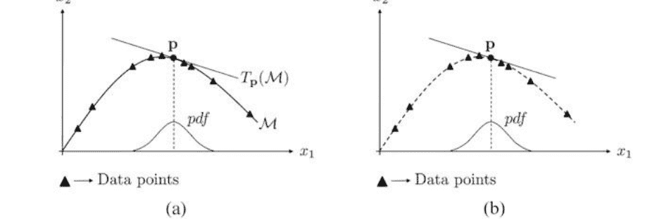

图 4.5（a）我们的数据模型的元素：坐标系 $(x_1, x_2)$，数据流形 $\mathcal{M}$，点 $\mathbf{p} \in \mathcal{M}$ 处的切空间，概率密度函数 (pdf)，数据样本和概率密度函数。(改编自[160])

可微分流形的维度 $d=1$。因此，点 $\mathbf{p} \in \mathcal{M}$ 处的切空间 $T_{\mathbf{p}}\mathcal{M}$ 是由切于 $\mathcal{M}$ 在 $\mathbf{p}$ 处的向量组成的欧几里得空间 (见第 4.5 节)。此外，数据点遵循某种概率密度函数 (pdf)，该函数也在图 4.5 中呈现。然而，学习算法只接收数据点，如图 4.5b 中单独显示的数据点。应用中事先不知道概率密度函数（pdf），如图 4.5b 所示。此外，数据空间的维度通常非常大，需要利用降维技术来获取紧凑的表示并丢弃冗余信息。因此，我们可以从几何的角度出发，假设相关信息可以在高维空间中的低维流形上描述。在图 4.5 的情况下，曲线表示嵌入在二维空间中的一维流形。

从图 4.5 所表示的数据模型中，出现了一些问题：

- 在这个模型中冗余样本的位置在哪里？
- 图 4.5 中概率密度函数的几何意义是什么？
- 如何从样本中恢复出潜在的低维流形？
- 如何从样本中计算概率密度函数？

问题（1）可以从流形的动力系统视角进行讨论。如第 4.7 节所述 $\mathcal{M}$。另一方面，如果我们有一个代表某个群体的数据集，并且我们可以在数据流形上可视化它，就像图 4.5 中那样，我们可以观察到一些样本密度较低的区域，而其他区域则密集。这种现象通过数据背后的概率密度函数来解释。例如，假设我们有一个由多元高斯分布给出的数据集：

$p(\mathbf{x}) = (2\pi)^{-d/2} |\Sigma|^{-1/2} \exp\left(-\frac{1}{2}(\mathbf{x}-\mathbf{\mu})^T\Sigma^{-1}(\mathbf{x}-\mathbf{\mu})\right)$。  (4.33)

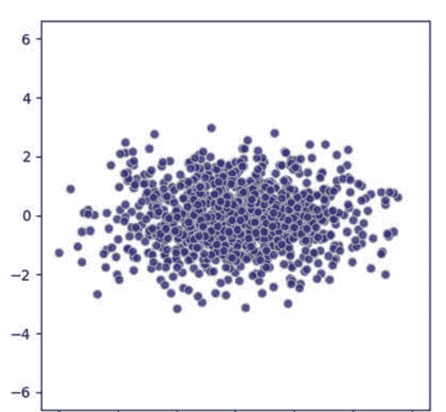

图 4.6 显示了从高斯分布中抽取的样本。

其中 $\Sigma$ 是协方差矩阵, $\mu$ 是均值向量。图 4.6 展示了一个这样的设置, 其中 $d=2$。我们注意到样本点在点云的中心附近更加集中, 这个中心位置就是均值向量 $\mu$ 的位置。远离这个点, 样本分布稀疏, 这是由于高斯概率密度函数的形状。在这种情况下, 数据流形是笛卡尔平面。在更一般的情况下, 数据流形是一个超曲面 $\mathcal{M}$。数据流形上的样本是从表达式 (4.33) 给出的一般概率密度函数中抽取的点。问题 (3) 可以通过流形学习和机器学习方法的组合来解决。我们将流形学习视为基于高维数据库的几何结构的假设的数据分析背景。因此, 我们可以基于统计学习方法来实现流形学习方法, 以确定流形 $\mathcal{M}$ 的内在维度 $d$，并在第二阶段使用 GAN 来学习流形的全局参数化。问题 (4) 将在机器学习的背景下在第 5.2 节中进行形式化。

## 4.7 哈密顿系统和流体

在第 3.3 节的 SPH 模型中, 离散版本的流体由一个粒子系统表示: $i=1,2,\dots,M$。这些粒子组成一个物理系统, 其瞬时配置由 $3M$ 个广义坐标的值给出: $x=(x_1,x_2,\dots,x_M)$, 它定义了一个在 $3M$ 维笛卡尔超空间中的点, 称为配置空间。当从时间 $t_1$ 到时间 $t_2$ 时, 系统的配置会因内部和外部力的作用而发生变化。因此, 系统的演化由一个## 4.7 哈密顿系统和流体

连续路径 $x(t)$ 通过时间 $t$ 参数化，在配置空间中。

哈密顿原理提供了用广义坐标表示系统演化方程的工具。因此，让我们思考一下动能：

$$T=\frac{1}{2} \sum_{i=1}^{M} m_{i}\left(\dot{\mathbf{x}}_{i} \cdot \dot{\mathbf{x}}_{i}\right),$$

其中点“·”表示传统的内积，$\dot{\mathbf{x}} = d\mathbf{x}/dt$，以及一个标量势能 $U(\mathbf{x})$ 导出保守力。因此，哈密顿原理断言，在时间间隔 $[t_1, t_2]$ 内，系统的演化使得线积分：

$$S(\mathbf{x})=\int_{t_{1}}^{t_{2}} L(\mathbf{x}, \dot{\mathbf{x}}) d t,$$

其中 $L(\mathbf{x}, \dot{\mathbf{x}}) = T(\dot{\mathbf{x}}) - U(\mathbf{x})$，称为系统的拉格朗日量，在配置空间中的正确路径上具有稳定值 [86]。

通过使用变分微积分中的传统方法，我们可以证明正确的路径满足：

$$\frac{d}{d t}\left(\frac{\partial L}{\partial \dot{\mathbf{x}}_{i}}\right)-\frac{\partial L}{\partial \mathbf{x}_{i}}=0 \quad, \quad i=1,2, \cdots, M,$$

或者，以紧凑的形式表示：

$$\frac{d}{d t}\left(\frac{\partial L}{\partial \dot{\mathbf{x}}}\right)-\frac{\partial L}{\partial \mathbf{x}}=0 .$$

表达式 (4.37) 是与运动相关的欧拉-拉格朗日方程 [86]。此外，通过在标量势能中添加速度相关项，可以引入耗散力到哈密顿原理中。现在，根据参考文献 [51]，我们将分析一些 SPH 流体动力学的方面。所以，让 $Q$ 表示流体域，由可微流形表示，上面演化着一个无粘性的不可压缩流体。在 SPH 公式中，流体状态由粒子的位置 $\mathbf{x}_i \in Q$ 和它们的速度 $\dot{\mathbf{x}}_i \in T_{x_i}$ 定义。$T_{x_i}$ 是点 $\mathbf{x}_i$ 处的切空间；而切空间本身又是一个三维向量空间。

系统动力学的数学描述可以通过对称群和守恒性质/定律或使用哈密顿量进行制定，用于系统描述的是一阶运动方程。接下来，我们处理后一种方法，因为它更方便建立流体动力学的几何结构和流动之间的联系。离散化。这样，我们首先定义广义或共轭动量 $\mathbf{p}=\left(\mathbf{p}_{1}, \mathbf{p}_{2}, \ldots, \mathbf{p}_{M}\right)$ [86]：

$$\mathbf{p}=\frac{\partial L(\mathbf{x}, \dot{\mathbf{x}})}{\partial \dot{\mathbf{x}}}.$$

这些量 $(\mathbf{x}, \mathbf{p})$ 是规范变量，从中进行转换通过使用系统的哈密顿量 [86] 来执行：

$$H(\mathbf{x}, \mathbf{p})=\dot{\mathbf{x}} \cdot \mathbf{p}-L(\mathbf{x}, \dot{\mathbf{x}}) .$$

如果我们将哈密顿量 $H$ 视为 $(\mathbf{x}, \mathbf{p})$ 的函数，那么 $H$ 的微分为：

$$d H=\frac{\partial H}{\partial \mathbf{x}} \cdot d \mathbf{x}+\frac{\partial H}{\partial \mathbf{p}} \cdot d \mathbf{p} .$$

另一方面，表达式 (4.39) 也可以写成：

$$d H=\dot{\mathbf{x}} \cdot d \mathbf{p}+\mathbf{p} \cdot d \dot{\mathbf{x}}-\frac{\partial L}{\partial \dot{\mathbf{x}}} \cdot d \dot{\mathbf{x}}-\frac{\partial L}{\partial \mathbf{x}} \cdot d \mathbf{x} .$$

广义动量在方程 (4.38) 中定义，显示了其中的项相消。现在，欧拉-拉格朗日方程 (4.37) 与共轭动量定义一起暗示了：

$$\frac{\partial L}{\partial \mathbf{x}}=\mathbf{p}^{\prime} 。$$

因此，方程 (4.41) 简化为：

$$d H=\mathbf{x}^{\prime} \cdot d \mathbf{p}-\mathbf{p}^{\prime} \cdot d \mathbf{x}$$

将这个方程与表达式 (4.40) 进行比较，得到一组 $6 M$ 方程，如下所示：

$$\mathbf{x}^{\prime}=\frac{\partial H}{\partial \mathbf{p}}$$

$$\mathbf{p}^{\prime}=-\frac{\partial H}{\partial \mathbf{x}}$$

它们被称为哈密顿的规范方程。它们构成了所需的 $6 M$ 个一阶运动微分方程系统，取代了欧拉-拉格朗日方程。

共轭动量定义在 (4.38) 中给出：

$$\mathbf{p}=B \dot{\mathbf{x}},$$

其中 $B$ 是对角矩阵：

$$B=\left(\begin{array}{ccccc} m_{1} I_{3 \times 3} & \mathbf{0} & \cdots & & 0 \\ \mathbf{0} & m_{2} I_{3 \times 3} & \cdots & & \mathbf{0} \\ \cdots & \cdots & \cdots & \cdots & \cdots \\ \mathbf{0} & \mathbf{0} & \cdots & m_{M-1} I_{3 \times 3} & \mathbf{0} \\ \mathbf{0} & \mathbf{0} & \cdots & \mathbf{0} & m_{M} I_{3 \times 3} \end{array}\right) \text {, }$$

其中 $I_{3 \times 3}$ 是三维单位矩阵。将表达式 (4.45) 代入方程 (4.39) 中，可以得到：

$$H=T(\dot{\mathbf{x}})+U(\mathbf{x}),$$

这是系统的机械能。

在经典力学中，已知哈密顿量仅在保守力作用下保持不变。这个断言可以通过注意到场 $\mathbf{y}=$

$$\left(\frac{\partial H}{\partial \mathbf{p}},-\frac{\partial H}{\partial \mathbf{x}}\right), \text { 由方程 }(4.43)-(4.44) \text { 右侧的表达式组成, 具有以下特点: }$$

$$\nabla H \cdot \mathbf{y}=0 \text { 。 }$$

因此，Hamilton 方程 (4.43) - (4.44) 的解是 Hamiltonian 的等值面上的路径。这个等值面是一个流形 $\Gamma$，称为规范流形，在相空间 $(\mathbf{x}, \mathbf{p})$ 中，如图 47a 所示，也显示了一条路径。

$$\varphi(t)=(\mathbf{x}(t), \mathbf{p}(t)) \text{ ，表示 Hamilton 方程的解，对于一个初始条件。}$$

数值解如图 47b 所示，是路径的离散化。在 SPH 情况下，通过方程 (3.48)-(3.49) 计算得到的 $\varphi(t)$。

在这种离散化中，由于流体模式的时间相干性，相邻时间步之间可能出现相似性。此外，规范流形可能具有对应于静止配置的吸引子。系统随着时间的推移越来越接近相应的点，生成了几个时间步，彼此之间变化很小。因此，通过数值模拟生成的数据集中引入了冗余，这是由于表达式 (4.43) - (4.44) 的存在。

如果我们以图 4.7c 中所示的离散路径的摘要形式进行摘要，可以减少冗余。然而，摘要过程取决于采样理论和流体模式演化中的复杂问题。就前者而言，采样率应该保留路径几何形状 (图 4.7c) 的信息。在实践中，可以通过视觉检查来消除吸引子附近流动模式中的冗余，这是一项繁琐而耗时的任务。

## 4 神经网络的普适性、几何和动力系统元素...

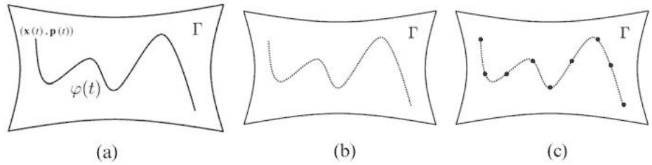

图 47 (a) 路径 $\varphi: \mathbb{R} \to \Gamma$ 在通过求解 Hamilton 方程的 Cauchy 问题计算得到的规范流形中。（b）流体模拟产生了离散版本 $\varphi$ 在规范流形中。（c）突出显示沿模拟路径的点 $\varphi$ 组成了流体流动的总结。（改编自 [51]）

在应用中，由于粘性（动态或数值）的存在，流体会受到耗散效应的影响，边界条件是约束模拟的必要条件。因此，与无粘性系统相关的几何形状更加复杂。尽管如此，图 4.7 对于机器学习在流体流动计算中的重要问题有着重要的阐明作用。

例如，通过深度架构是否可能获得规范流形的参数化系统（或图集 [192]）？如上所述，流体状态在规范流形中由一个点表示。因此，在 $t=0$ 时，我们可以组装大量独立的流体系统副本 $(X_0^j, p_0^j), j = 1, 2, \cdots, N$ 以构建一个集合。

随着时间的推移，集合点根据方程 (4.43)-(4.44) 的解移动。这个过程生成了一个在规范流形上的路径族，可以用来学习其几何形状。具体来说，我们可以将集合中的每条路径离散化，构建一个数据库来训练深度神经网络。反过来，这个网络作为一个函数 $F$，接受时间 $t$ 的系统配置，并计算出时间 $t+1$ 的新配置。通过对规范流形的几何形状进行操作，它在向答案迈进的过程中起到了作用。

另一个基本点是构建一个内在于规范流形的度量。这样的度量对于高效比较不同的流体配置至关重要。此外，在流体流动空间中设计聚类算法时，我们必须使用该度量来计算簇内和簇间样本之间的距离。

# 第五章
## 数据和学习理论

摘要 在本章中，基于示例的学习概念被形式化。前一章介绍的基于几何的数据模型用于讨论学习问题的一些方面。学习机通过其内部参数（权重）封装功能空间。在这个观点下讨论了与分类、回归和概率密度估计相关的形式化方面。特别关注训练过程，并在训练阶段通过最陡下降方法优化损失函数，以及机器参数。

关键词 机器学习 · 深度学习 · 分类 · 回归 · 概率密度估计 · 训练过程

## 5.1 引言

我们可以将学习问题（寻找基于经验数据的所需依赖关系的问题 [246]）嵌入到第 4.6 节的数据模型中。在这种情况下，经验数据仅由底层几何的样本组成。

此外，数据样本可能与表示类别的标签相关联。

此外，对于每个样本，我们可以关联一个与目标现象的某个连续属性对应的实值（或向量）。在这种情况下，我们可以考虑在流体模拟的背景下对学习问题的以下观点。

- 1. 对于带有标签的数据：
$$\mathcal{D} = \{(x_1, l_1), (x_2, l_2), \dots, (x_M, l_M)\} \subset \mathbb{R}^m \times \{0, 1\}, \quad (5.1)$$
解决分类问题：估计一个函数 $f : \mathbb{R}^m \longrightarrow \{0, 1\}$ 使得 $f(x_i) = l_i, i = 1, 2, \dots, M$。

- 2. 如果：
$$\mathcal{D}=\left\{\left(\mathbf{x}_{1}, \mathbf{y}_{1}\right),\left(\mathbf{x}_{2}, \mathbf{y}_{2}\right), \ldots,\left(\mathbf{x}_{M}, \mathbf{y}_{M}\right)\right\} \subset \mathbb{R}^{m} \times \mathbb{R}^{n}, \quad(5.2)$$
求解回归问题：计算一个函数 $f: \mathbb{R}^{m} \longrightarrow \mathbb{R}^{n}$ 使得
$$f\left(\mathbf{x}_{i}\right)=\mathbf{y}_{i}, i=1,2, \ldots, M$$

- 3. 估计概率密度函数 (pdf) 以获取数据中的随机依赖性 $\mathcal{D}=\left\{\mathbf{x}_{1}, \mathbf{x}_{2}, \ldots, \mathbf{x}_{M}\right\} \subset \mathbb{R}^{m}$。在这种情况下，我们寻求一个 $pdf \quad f: \mathbb{R}^{s} \longrightarrow[0,1]$，使得事件 $\mathcal{E} \subset \mathcal{M}$ 的概率为：
$$p(\mathcal{E})=\int_{R} f(\boldsymbol{\omega}) d \boldsymbol{\omega},$$
其中 $R \subset \mathbb{R}^s$ 参数化事件 $\mathcal{E} \subset \mathcal{M}$。$\mathcal{M}$ 是图 45 中的数据流形。

在项目 (1)-(2) 中，我们正在估计函数依赖关系，而在项目 (3) 中，我们通过数据集计算随机依赖关系 $\mathcal{D}$。

## 5.2 从数学角度学习示例

本章引言的项目 (1)-(3) 允许对流体动画的示例学习进行形式化建模。这个模型的基本要素是：

- 数据集：在式 (5.1)-(5.2) 中的 $\mathcal{D}$，
- 学习机：$\mathbb{M}$，
- 训练阶段。

从数学角度来看，学习机通过其内部参数封装了一个功能空间。在本文中，我们重点关注神经网络，如第 4.2.3 节中介绍的 MLP 模型。

因此，除了数据空间（由 $\mathbb{R}^m$ 表示），我们还有一个参数空间，比如 $\mathbb{R}^k$。为了简单起见，我们首先讨论情况 (1) - (2)。因此，神经网络模型 $\mathbb{M}$ 实际上是一个函数族 $\mathbb{M}=\mathbb{M}(\mathbf{x} ; \mathbf{z})$，其中 $(\mathbf{x}, \mathbf{z}) \in \mathbb{R}^{m} \times \mathbb{R}^{k}$。

参数向量 $\mathbf{z}=\left(z_{1}, z_{2}, \ldots, z_{k}\right)$ 的元素被称为神经网络的权重。训练阶段是寻找最佳 $\mathbf{z}_{opt} \in \mathbb{R}^{k}$ 使得 $\mathbb{M}\left(\mathbf{x} ; \mathbf{z}_{opt}\right)=f(\mathbf{x})$，其中 $f$ 是项目 (1) - (2) 中的函数依赖关系。类似的情况 (3) 也可以定义。

因此，通过定义适当的训练策略来实施学习过程。从上面的观点来看，学习过程可以被看作是从给定的函数集合中寻找一个适当的函数的过程，这些函数被神经网络模型封装起来。形式上，这个想法可以通过最小化一个误差函数来实现：

$$\operatorname{Err}(\mathbf{z} ; \mathcal{D})=\frac{1}{|\mathcal{D}|} \sum_{i=1}^{|\mathcal{D}|} L\left(\mathbb{M}\left(\mathbf{x}_{i} ; \mathbf{z}\right)-\mathbf{d}_{i}\right),$$

通过关于 $\mathbf{z}$ 的最小化求解，其中 $\mathbf{d}_i$ 是表示案例 (1)-(2) 的期望输出的通用向量，$L$ 是输出空间中的适当度量或相似性度量。实际上，问题可能是不适定的，我们需要一些正则化项，由函数 $R_r = R_r(\mathbf{z}; \mathcal{D}), r=1,2,\dots,K$ 表示。因此，我们构建了损失函数：

$$\text{Loss}(\mathbf{z}; \mathcal{D}) = \operatorname{Err}(\mathbf{z}; \mathcal{D}) + \sum_{r} \alpha_r R_r(\mathbf{z}; \mathcal{D})$$

其中 $\alpha_r$ 是模型的超参数。因此，训练过程的输出是问题的解：

$$\text{Loss}(\mathbf{z}; \mathcal{D}) = \min_{\mathbf{z}} \text{Loss}(\mathbf{z}; \mathcal{D})$$

为了处理本章介绍的情况 (3)，我们按照 [87, page 146] 中的离散概率空间的方法进行展示，并根据 [265] 中的性质进行说明。因此，回到第 4.6 节的数据模型，集合中的样本 $\mathcal{D}=\{\mathbf{x}_1, \mathbf{x}_2, \dots, \mathbf{x}_M\} \subset \mathbb{R}^m$ 被假设为从一个真实但未知的数据分布 $p_{\text{data}}(\mathbf{x})$ 中独立抽取的。在这种情况下，神经网络模型 $\mathbb{M}=\mathbb{M}(\mathbf{x}; \mathbf{z})$ 表示问题域上的参数化概率函数族。为了简化进一步的表达式，我们写成 $\mathbb{M}(\mathbf{x}; \mathbf{z})=p_{\text{model}}(\mathbf{x}; \mathbf{z})$。因此，目标是获得一个机器 $\mathbb{M}$，使得 $\mathbb{M}(\mathbf{x}_i; \mathbf{z})=p_{\text{model}}(\mathbf{x}_i; \mathbf{z})=p_{\text{data}}(\mathbf{x}_i)$，$i=1,2,\dots,M$。现在，误差函数被交叉熵替代。

$p_{\text{data}}$ 和 $p_{\text{model}}$ 的交叉熵为：

$$H(\mathbf{z})=-\sum_{i=1}^{M} p_{\text{data}}(\mathbf{x}_i) \log p_{\text{model}}(\mathbf{x}_i; \mathbf{z})$$

并且优化问题被最大似然估计问题所替代，给定如下：

$$\mathbf{z}_{opt} = \arg\max \mathbb{E}$$

这等价于：

$$\mathbf{z}_{opt} = \arg\min H(\mathbf{z})。$$

考虑最大似然估计的一个原因是由于从 $p_{\text{data}}$ 到 $p_{\text{model}}$ 的 Kullback-Leibler 散度，给定如下：

$$D_{K L}\left(p_{\text {data }}|| p_{\text {model }}\right)=\sum_{i=1}^{M} p_{\text {data }}\left(\mathbf{x}_{i}\right) \log \left(\frac{p_{\text {data }}\left(\mathbf{x}_{i}\right)}{p_{\text {model }}\left(\mathbf{x}_{i} ; \mathbf{z}\right)}\right),$$

衡量了 $p_{\text{model}}$ 与参考概率 $p_{\text{data}}$ [87,265] 的差异。我们可以将式 (5.10) 重新写成：

$$D_{K L}\left(p_{\text {data }}|| p_{\text {model }}\right)=\sum_{i=1}^{M} p_{\text {data }}\left(\mathbf{x}_{i}\right) \log p_{\text {data }}\left(\mathbf{x}_{i}\right) -\sum_{i=1}^{M} p_{\text {data }}\left(\mathbf{x}_{i}\right) \log p_{\text {model }}\left(\mathbf{x}_{i} ; \mathbf{z}\right)$$

如果我们考虑这个问题：

$$\mathbf{z}_{opt}^{*}=\arg \min _{\mathbf{z} \in \mathbb{R}^{k}} D_{K L}\left(p_{\text {data }}|| p_{\text {model }}\right),$$

我们会注意到表达式 (5.11) 中的第一项不依赖于模型参数 $\mathbf{z}$。因此，关于 $\mathbf{z}$ 的优化问题 (5.12) 可以简化为：

$$\mathbf{z}_{opt}^{*}=\arg \min _{\mathbf{z} \in \mathbb{R}^{k}}\left(-\sum_{i=1}^{M} p_{\text {data }}\left(\mathbf{x}_{i}\right) \log p_{\text {model }}\left(\mathbf{x}_{i} ; \mathbf{z}\right)\right)$$

通过比较问题 (5.9) 和 (5.13)，可以清楚地看到它们是等价的，因此， $\mathbf{z}_{opt}=\mathbf{z}_{opt}^{*}$。同样地，在表达式 (5.6) 中，我们可以向问题 (5.9) 中添加正则化项。

第 5.1 节的场景 (1) - (3) 有助于描述两种类型的机器学习方法：

- 监督学习（案例 (1)-(2)）：输入集包含示例和目标响应；
- 无监督学习（案例 (3)）：机器从未标记的数据中学习模式；

此外，我们还要提到另一种变体，名为半监督学习：只有输入集的一个子集 $\mathcal{D}$ 包含了伴随所需响应的样本。

## 5.3 优化损失函数

在训练过程中，寻找问题 (5.6) 的解决方案。这是一个迭代过程，通常使用损失函数的梯度来实现。

## 5.3 优化损失函数

首先，我们必须分离出一个训练集。$\mathcal{D}_{tr}$可能是整个数据库的子集（见第5.4节）。另一个问题是表达式 (5.5) 中的损失函数使用了整个数据集。这种策略被称为批处理模式，如果$M$太大，计算成本会很高，因为计算参数向量的梯度的复杂度为$O(M)$。为了避免这个问题，我们注意到误差函数 (5.4) 的梯度是一个期望值，可以使用一小组样本来估计，称为小批量。

这是随机梯度的关键思想。形式上，在训练的每一步中，我们抽样一个小批量$\mathbb{B}=\{\widehat{\mathbf{x}}_1, \widehat{\mathbf{x}}_2, \dots, \widehat{\mathbf{x}}_\xi\} \subset \mathcal{D}_{tr}$，通常使用均匀分布，并将损失函数限制在数据点$\mathbb{B}$中。因此，目标函数由表达式(5.5)给出，其中$\mathcal{D}$被小批量$\mathbb{B}$替换；这意味着：

$$
\mathcal{L}(\mathbf{z}; \mathbb{B}) \equiv \frac{1}{|\mathbb{B}|} \sum_{i=1}^{|\mathbb{B}|} L\left(\mathbb{M}\left(\mathbf{x}_i ; \mathbf{z}\right) - \mathbf{d}_i\right) + \sum_{\tau=1}^{K} \tau R_{\tau}(\mathbf{z}; \mathbb{B}),
$$

$\mathbf{d}_i$遵循先前的定义。

通过随机梯度下降（SGD）算法1执行优化过程。表达式 (5.22) 中的第一项是对误差函数$Err$在小批量数据上的梯度的近似：

$$
\nabla_z[Err(z;\mathbb{B})] = \nabla_z \left[ \frac{1}{|\mathbb{B}|} \sum_{i=1}^{|\mathbb{B}|} L(\mathbb{M}(\mathbf{x}_i;\mathbf{z})-\mathbf{d}_i) \right].
$$

我们应该注意到算法1的第4行中的停止准则使用了函数$\mathcal{L}$，它是使用小批量集合$\mathbb{B}$计算的（使用式 (5.5) 并将$\mathcal{D}$替换为$\mathbb{B}$）。像TensorFlow和PyTorch这样的库（参见[267]中的机器学习库列表）已经实现了基于SGD技术的解决方案，如算法1。此外，整个训练集每经过一轮算法1的迭代被称为一个时代。在算法1中，参数向量的初始化策略（即$\mathbf{z}_0$的定义）取决于机器$\mathbb{M}$的类型。例如，在第4.2.3节中描述的$\mathbb{M}\mathcal{P}$模型中，参数向量$\mathbf{z}$包括神经网络中感知器的权重和偏置：

$$
\mathbf{z} = \left( \{w_{jk}\}_{p(i)+1 \le j \le p(i+1)}, \{b_j\}_{p(0)+1 \le j \le p(L+1)}, i = -1, 0, \dots, L-1 \right).
$$

因此，我们有以下多层感知器（MLP）初始化的可能性 [84]：

- 1. 将偏置初始化为零 $((b_j)_0 = 0)$ 和权重 $(w_{ij})_0$ 如下：

$$
(w_{i j})_{0} \sim U\left[-\frac{1}{\sqrt{n_{l-1}}}, \frac{1}{\sqrt{n_{l-1}}}\right]
$$

其中 $U[-a, a]$ 是范围 $(-a, a)$ 内的均匀分布，且 $n_{l-1}=p(l-1)-(p(l-2)+1)$ 是第 $l-1$ 层的神经元数量；

- 2. 将偏置初始化为零：

$$
(b_{j})_{0}=0 \quad \text{和权重} \quad (w_{i j})_{0} \sim U\left[-\frac{\sqrt{6}}{\sqrt{n_{l-1}+n_{l}}}, \frac{\sqrt{6}}{\sqrt{n_{l-1}+n_{l}}}\right]
$$

其中 $U$ 是均匀分布，与前一项类似。$n_{l-1}, n_{l}$ 分别是第 $l-1$ 和 $l$ 层的神经元数量。

梯度（或随机梯度）下降是表达式（5.23）中学习规则的驱动力。训练实际上是一个优化过程：参数值被调整以最小化损失函数。然而，通过这种过程，并不能保证我们最终达到全局最小值。事实上，我们可能停在一个局部最小值点。$\mathbf{z}$ 是参数空间中的一个局部最小值。为了缓解这个问题，我们可以尝试多种不同的初始化方法来获得不同的网络。然后，我们选择提供最小误差的那个。通常还会应用其他方案，如动量[98]。在算法 1 中，计算（隐式）导数是损失梯度计算中的一个基本问题，通过反向传播算法[98]可以高效地解决。

我们应该记住，MLP架构还取决于选择的激活函数（第4.3节），这可能与使用的损失函数有关。例如，表达式 (5.4) 中的函数 $L$ 被称为成本函数。在回归问题中，二次成本函数定义如下：

$$
L(\mathbf{x}, \mathbf{d} ; \mathbf{z})=|| \mathbb{M}(\mathbf{x} ; \mathbf{w})-\mathbf{d} ||^{2},
$$

通常被使用。相应的损失函数（表达式 (5.5)）如下：

$$
\text{Loss}(\mathbf{z} ; \mathcal{D})=\frac{1}{|\mathcal{D}|} \sum_{i=1}^{|\mathcal{D}|}\left\|\mathbb{M}\left(\mathbf{x}_{i} ; \mathbf{z}\right)-\mathbf{d}\right\|^{2}+\sum_{\tau=1}^{K} \tau R_{\tau}(\mathbf{z} ; \mathcal{D}).
$$

对于分类问题，负对数似然成本函数是一种可能的选择，定义如下：

$$
L(\mathbf{x}, d)=-\ln p(d \mid \mathbf{x}).
$$

在这个表达式中，$d$ 是样本的类别标签，$\mathbf{x}$ 和 $p(d \mid \mathbf{x})$ 表示条件概率。参见 [255]，了解机器学习应用中的代价函数调查。

## 算法1 小批量随机梯度下降训练

```
1: 输入：训练集 𝒟_tr，小批量大小 ζ, η, ε > 0,
2: 初始化:      z_0 ∈ R^k, t = 0, E = ∅, epoch = 0, p ← z_0;
3: 当 (||∇_z L(p; B)|| ≥ ε) 时
4:   随机抽取小批量 B = {x̂_1, x̂_2, ..., x̂_ζ} ⊂ 𝒟_tr,
5:   通过在表达式（5.5）中将 𝒟 替换为 B，构建损失函数；
6:   计算梯度：
     ∇_z L(p; B) = ∇_z [ 1/|B| ∑_{i=1}^{|B|} L(M(x_i; p) - d_i) + ∑_{τ=1}^K τ R_τ(p; B) ]  (5.22)
7:   学习规则，更新参数向量：
     z_{t+1} = z_t - η∇_z L(p; B),  (5.23)
8:   p ← z_{t+1}; t ← t + 1,
9:   E ← E ∪ B,
10:  如果 D_tr - E == ∅ 则
11:    epoch ← epoch + 1, E ← ∅
12: 结束循环
13: z*_opt ← p,
14: 输出：解决方案 z*_opt
```

## 5.4 训练、验证和测试阶段

让我们考虑一个分类问题的情况，我们有一个带标签的数据集：

$$
\mathcal{D} = \{(\mathbf{x}_1, l_1), (\mathbf{x}_2, l_2), \dots, (\mathbf{x}_M, l_M)\} \subset \mathbb{R}^m \times \{0, 1\}, \quad (5.24)
$$

在继续之前，我们必须将数据集分成三个不相交的子集：训练集、验证集和测试集。在公式 (5.24) 中，将数据集 $\mathcal{D}$ 分成三个不相交的子集：训练集 $\mathcal{D}_{tr}$、验证集 $\mathcal{D}_{val}$ 和测试集 $\mathcal{D}_{te}$。这个过程在图5.1中表示。为了实现这个过程，我们随机选择数据点 $\mathcal{D}$，使用均匀分布，使用比例如 50:25:25 或 60:20:20，分别用于 $\mathcal{D}_{tr}$、$\mathcal{D}_{val}$ 和 $\mathcal{D}_{te}$ [155]。

现在，可以使用算法1来进行训练过程。一旦我们在训练阶段完成了一个周期，我们可以使用验证集来分析损失函数在其上的行为。目的是检查是否发生了过拟合和欠拟合等问题[232]。

如果一切顺利，也就是说，损失函数在训练集和验证集上都在随着周期的增加而减小，那么预计在算法1的while循环中，停止准则最终会被满足，因此我们将停止训练（和验证）步骤。因此，我们可以使用测试集 $\mathcal{D}_{te}$ 中的数据点进行测试阶段。在测试阶段，我们保持参数向量 $\mathbf{z}^*_{opt}$ 不变。我们只是将测试集 $\mathcal{D}_{te}$ 中的数据样本传递给机器，并计算一些效率指标来检查自动分类。

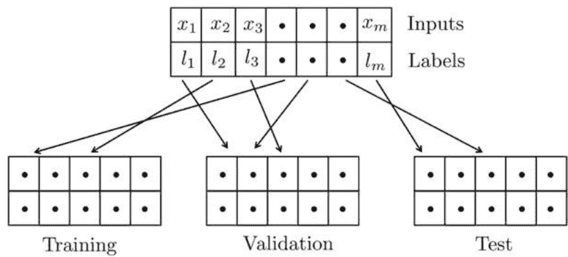
图5.1 标记的数据集被分为三个不相交的子集，用于训练、测试和验证学习机器。（改编自[155]）

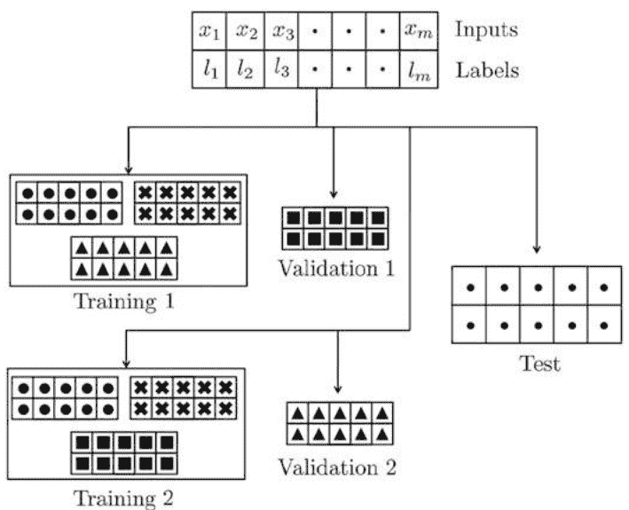
图5.2 K折交叉验证算法表示（改编自[155]）

上述过程是一种朴素的方法，因为：(a) 它容易陷入局部最小值；(b) 数据集的划分为训练集 $\mathcal{D}_{tr}$、验证集 $\mathcal{D}_{val}$ 和测试集 $\mathcal{D}_{te}$ 是通过随机过程进行的。因此，我们必须使用多个机器实例来通过某种平均方式平滑性能变化。显然，我们可以为不同的分区使用几种不同的初始化方法来训练不同的网络。然后，我们可以选择提供最小误差的那个。

另一种可能性，统计上更可靠的方法是进行K折交叉验证。在这种策略中，数据集 $\mathcal{D}-\mathcal{D}_{te}$ 被随机分成 $K$ 个子集。然后，我们选择一个子集作为验证集，并在其余的子集上训练学习机，如图5.2所示。在下一步中，取相同的 $K$ 个子集，但是留出一个不同的子集作为验证集，其他子集用于训练另一台机器。我们重复这个过程，直到所有的 $K$ 个子集都被用于验证。经过这个过程，我们得到 $K$ 台机器 $\mathbb{M}_i$，$i = 1, 2, \dots, K$，其中每个都是使用不同的集合进行训练和验证的。最后，在测试阶段使用产生最低验证误差的机器，使用相应的测试集，如图5.2所示。另一种可能性是对测试集应用 $K$ 台机器 $\mathbb{M}_i$，计算平均性能和标准差以获得性能分析的统计范围。

# 第六章 通过神经网络对流体进行建模

**摘要**：将神经网络应用于数据驱动的流体模拟模型可以分为六个步骤[29]：（1）问题的形式化；（2）数据的生成、注释和准备用于训练和测试；（3）设计一个神经网络架构作为替代模型；（4）设计一个损失函数来量化模型预测的误差；（5）基于损失函数的优化进行模型训练；（6）测试训练好的模型以评估其性能和泛化能力。在本章中，我们首先讨论这些步骤和一些相关问题。然后，我们回顾了卷积神经网络和生成对抗网络的基本要素，因为它们对流体建模非常重要，如所示的相关方法摘要。

**关键词**：神经网络 · 替代模型 · 卷积神经网络 · 生成对抗网络 · 深度学习用于流体建模 · 数据准备 · 训练

## 6.1 引言

将神经网络应用于流体模拟以产生数据驱动模型的过程可以分为六个步骤[29]：（1）问题定义；（2）数据生成、注释和准备用于训练和测试；（3）设计一个神经网络架构作为替代模型；（4）设计一个损失函数来量化模型预测的误差；（5）基于损失函数的优化进行模型训练；（6）测试训练好的模型以评估其性能和泛化能力。

在我们的案例中，首先讨论了加速流体模拟和增强计算流体力学中低分辨率数据的任务[242,278]。这些问题的特性决定了要使用的机器学习算法类别，包括监督学习、无监督学习和强化学习[29]。就函数依赖而言，使用第3章的技术构建的任何模拟器都可以被视为一个从 $\mathbb{R}^m$ 接收流体配置的函数。接收流体配置 $\mathbf{x}^{(i)}$，在模拟时间 $i$ 时，输出新的配置 $\mathbf{x}^{(i+1)}$。所以，为了明确思路，假设我们想通过MLP模型（见第4.2.3节）来解决上述任务。因此，我们有两种情况：

- 1. 使用MLP构建模拟器 $g$ 的代理模型。
- 2. 超分辨率：开发一个多层感知器模型，该模型接收低分辨率的模拟时间数据，例如 $\mathbf{x}^{(i)}$，并输出其高分辨率版本，表示为 $\mathbf{y}^{(i)}$。

每个场景都对应着一个学习问题（根据经验数据[246]寻找所需的依赖关系的问题）。在这一方面，经验数据仅由不同模拟中的底层配置空间的样本组成，即 $S_j, j=1,2,\dots,M$，其中

$$
S_j = \{ \mathbf{x}_j^{(i)}, i=0,1,2,\dots,N \} \subset \mathbb{R}^m.
$$

此外，关于场景2，对于每一样本 $\mathbf{x}_j^{(i)}$，我们应该将相应的高分辨率输出关联起来 $\mathbf{y}_j^{(i)} \in \mathbb{R}^n$，与 $n > m$，生成集合 $H_j$：

$$
H_j = \left\{ \left( \mathbf{x}_j^{(i)}, \mathbf{y}_j^{(i)} \right), i=0,1,2,\dots,N \right\} \subset \mathbb{R}^m \times \mathbb{R}^n.
$$

在这个背景下，我们可以考虑以下对目标学习问题的观点：

- (i) 如果 $\mathbb{D} = \{S_1, S_2, \dots, S_M\}$，计算一个函数 $f : \mathbb{R}^m \rightarrow \mathbb{R}^m$ 使得 $f(\mathbf{x}_j^{(i)}) = \mathbf{x}_j^{(i+1)}$；其中 $\mathbf{x}_j^{(i)} \in S_j$，对于 $i=1,2,\dots,N, j=1,2,\dots,M$。
- (ii) 如果 $\mathbb{D} = \{H_1, H_2, \dots, H_M\}$，计算一个函数 $f : \mathbb{R}^m \rightarrow \mathbb{R}^n$ 使得 $f(\mathbf{x}_j^{(i)}) = \mathbf{y}_j^{(i)}$；其中 $(\mathbf{x}_j^{(i)}, \mathbf{y}_j^{(i)}) \in H_j$ 为 $i=1,2,\dots,N, j=1,2,\dots,M$。

这两种情况对应于回归问题的不同版本，其中函数 $f$ 将由神经网络模型计算。训练过程通过调整机器模型的内部参数（在本例中为MLP神经网络的权重和偏置）来捕捉输入和输出之间的函数依赖关系。步骤（1）确定应该提供的输入数据和模型的输出。输出数据被视为应用于输入的函数的图像集合。

然而，从流体模拟中收集的数据必须经过处理才能用于进一步的分析。因此，步骤（2）可能包括归一化、采样、特征提取以获得紧凑的表示、注释和数据增强[107, 228, 261]。数据增强是数据驱动流体建模的重要组成，因为涉及的现象复杂性需要具有数百万个权重的网络来达到所需的精度[1]。因此，我们需要足够的训练数据来有效地解决任务(i)和(ii)。然而，在流体模拟的数据驱动模型中，数据增强需要特别注意。具体而言，我们必须确保网络输出符合伽利略不变性[29]。例如，对于具有平移或旋转变换的系统，我们可以人为地移动或旋转样本以丰富训练数据。主要假设是，通过足够的训练样本，物理不变性可以在训练过程中通过神经网络的足够自由度来学习。最后，我们必须将数据分割为不相交的训练、验证和评估集，如第5.4节所讨论的。

在确定了问题并收集/注释了数据之后，我们必须在第三阶段选择一个神经网络架构。神经网络是一种强大且灵活的计算模型，能够从数据中学习功能关系。此外，如果在可用的架构中选择了适当的架构[28]并且有足够的数据可用，它们可以近似任意复杂的函数。然而，尽管有大量关于自动化机器学习的文献[100]，第三步通常取决于用户的协助，基本上是一个试错过程。事实上，神经网络设计需要专家的指导，以选择一个具有足够自由度来建模问题的合适架构。例如，让我们考虑第4.2.3节中的MLP模型。在这种情况下，隐藏层的数量、每层神经元的数量以及激活函数的类型都是专家应该通过试错来定义的参数（实际上是超参数）。此外，物理知识可以用于从原始数据中创建新特征，直接影响神经网络架构。另一方面，多个来源可以参与物理数据的生成（计算模拟、实验等）。在这种情况下，已经使用了具有多源数据的物理信息神经网络（PINNs）来模拟PDEs [158]。更一般地说，可以通过设计合适的架构来自动学习新特征。

从数学的角度来看，神经网络通过其内部参数（权重和偏置）封装了一族函数，如第5章所述。训练阶段是寻找一组参数的过程，使得相应的函数捕捉到所需的功能依赖关系[87]。这样的过程通过优化损失函数来实现，该函数依赖于网络参数，并且必须设计用于性能量化，以在参数空间中寻找最优解[31]。

文献中提供了几种损失函数选择的可能性[255]，但选择最佳损失函数是另一个依赖于阶段（4）中人类干预的任务。下一步是基于优化损失函数来训练神经网络参数的训练过程，即阶段（5）。现代开源软件库，如TensorFlow、Keras和PyTorch [80, 194]，提供了基于梯度的解决方案，用于实现人工神经网络，这些解决方案在AdaGrad和Adam等算法中实现，其核心是反向传播算法，该算法有效地计算了损失梯度计算中涉及的（隐式）导数[98]。这个阶段的参数化也取决于用户。此外，通常需要用户的帮助来进行训练，因为可能会出现过拟合、欠拟合等问题，要求操作员更改优化参数、优化器甚至神经网络架构，并重新开始训练[22, 87]。如果训练中一切看起来都很好，那么我们必须进行测试（步骤（6）），以评估神经网络在未参与训练的样本上的性能。这些样本组成了测试（或评估）集，这个阶段的基本思想是验证生成的神经网络模型的普适性[155]。

## 6.2 深度架构和流体模拟

在本节中，我们将回顾重要的深度架构用于流体建模。为了引导我们的讨论，我们在表 6.1 中总结了在第 2 节中讨论的方法的概述。该表的第一列显示了应用的神经网络模型。第二列说明了用于训练/测试的数据类型，其中“Grid”表示数据集是使用基于网格的方法生成的，“Particles”表示使用基于粒子的方法，如第 3.3 节中介绍的 SPH 方法，“FLIP”则是指相应的混合技术用于流体模拟 [26]。表 6.1 的下一列显示了每个研究的重点应用，最后一列列出了相应的参考文献。

湍流和动画出现在大多数报告的应用中。前者的动机是由于深度架构提取有意义的特征并将先前的物理知识纳入模型的能力 [134,287]。另一方面，动画需要新的要求，例如运动和风格控制，这在传统的模拟方法中很难实现 [38]。考虑到在这种情况下，视觉逼真通常比物理行为精确性更重要，我们可以依靠学习过程来训练深度架构，以更快地获得所需的效果，并从人类感知的角度来说服人。

此外，我们注意到大多数方法应用了自动编码器、卷积神经网络、生成对抗网络、长短期记忆网络和多层感知器架构。特别是作品 [242] 和 [278] 分别应用了类似卷积神经网络的技术和生成对抗网络方法，将在我们的案例研究中使用，详见第 8 章。因此，我们将在下文中对卷积神经网络和生成对抗网络架构的主要元素进行修订。多层感知器神经网络已在第 4.2.3 节中介绍过。

### 6.2.1 卷积神经网络: CNN

卷积神经网络是一种特殊的前馈神经网络，其基本构建模块之一是卷积 [87]。由 LeCun 等人的工作 [136] 开创，卷积神经网络被认为是深度学习应用于模式识别 [87] 的最新技术，对于流体建模和动画也取得了有希望的结果，如表 6.1 所述。

由于基于网格的模拟生成的场可以表示为矩阵或张量，我们可以应用离散操作来转换输入。在 CNN 模型中，这些转换通过离散滤波器 $h: \mathcal{V} \rightarrow \mathbb{R}$ 来实现，其中：

$$
\mathcal{V}=\{-\xi,-\xi+1, \ldots,-2,-1,0,1,2, \ldots, \xi-1, \xi\}^{2}
$$

该值
$$
f=2 \xi+1,
$$

| 模型 | 数据 | 应用 | 参考文献 |
|---|---|---|---|
| 自动编码器 | 网格 | 流动控制 | [171] |
| 卷积神经网络 | 网格 | 动画 (可控制的艺术化流体模拟) | [46] |
|  | 网格 (已知的偏微分方程解在空间和时间上的分割) | 偏微分方程离散化 | [14] |
|  | 网格 (签名距离函数和流动区域通道 (FRC)) | 速度和压力场稳定和湍流流动 | [1] |
|  | 网格/体素 | 动画风格转换、控制 | [124] |
|  | 粒子 | 动画 (流体控制) | [211] |
|  | SSH 快照 | 湍流 | [79] |
| CNN/GAN | 网格 | 湍流、超分辨率 | [127] |
| 连续卷积神经网络 | 粒子 | 动画 | [243] |
| 卷积自编码器 | 网格 | 湍流 | [263] |
| 卷积自编码器 | 网格 | 湍流、偏微分方程 | [163] |
| 卷积 LSTM + 卷积自编码器 | 网格 | 湍流 | [162] |
| 生成对抗网络 | 网格 | 动画 | [278] |
|  |  | 动画 (可控制的艺术化流体模拟) | [45] |
| LSTM-CNN | 网格 | 压力求解器 | [264] |
| 多层感知机 | FLIP | 动画 | [241] |
| 多层感知机 | 网格 | 动画 | [281] |
|  |  | 湍流 | [285, 287] |
|  |  | 湍流、LES | [209] |
| 多层感知机 | MPM (材料点方法) /FLIP | 动画 | [62] |
| 多层感知机 (张量基神经网络) | 网格 | 具有 RANS 的湍流 | [144] |
| 多层感知机 + 深度强化学习 | 网格 | 二维流动控制 | [196] |
| Resnet-PINN+MLP | 网格 (采样点) | 速度和压力场稳定和湍流流动 | [41] |

是滤波器的尺寸。$\mathbf{h}=\{\mathbf{h}(m, n)\}_{-\xi \leq m, n \leq \xi}$ 被称为滤波器掩模。离散卷积的计算方式为：

```math
(\mathbf{h} \otimes \mathbf{u})(m, n)=v(m, n)=\sum_{(k, l) \in \mathscr{V}} h(k, l) u(m-k, n-l),
```

其中 $\mathbf{u}=\{\mathbf{u}(m, n)\}$ 是输入，$\mathbf{v}=\{\mathbf{v}(m, n)\}$ 是输出场。$\mathbf{h}=\{\mathbf{h}(k, l)\}$ 是滤波器，也称为卷积核。根据卷积核的频率响应，滤波器可能是低通、高通或带通。通过表达式 (6.3) 实现的操作在域的边界附近的数据存在一些问题。因此，对于矩阵 $u \in \mathbb{R}^{H \times W}$，卷积 (6.3) 仅在满足条件的位置 $(m, n)$ 上定义：
- 当 $|m-k| \leq \xi$ 和 $|n-l| \leq \xi$，$\forall(k, l) \in \mathcal{V}$ 时

因此，表达式 (6.3) 中的卷积将生成一个新的数组 $v \in \mathbb{R}^{(H-2\xi) \times (W-2\xi)}$，具有小于输入矩阵分辨率的分辨率。根据表达式 (6.2) 中的滤波器尺寸，卷积输出的分辨率 $v$ 为：

```math
(H - 2\xi) \times (W - 2\xi) = \left(H - 2\frac{(f-1)}{2}\right) \times \left(W - 2\frac{(f-1)}{2}\right)
\tag{6.4}
```

为了解决这个问题，我们可以使用填充，通过在边界周围添加零来增加输入分辨率。具体来说，如果我们应用填充 $p$，我们会得到一个新的字段 $\tilde{u} \in \mathbb{R}^{(H+2p) \times (W+2p)}$，使得：

```math
\tilde{u}(m, n) = \begin{cases} u(m, n), & \text{如果 } (p+1) \le m \le (H+p), (p+1) \le n \le (W+p), \\ 0, & \text{否则。} \end{cases}
\tag{6.5}
```

然而，使用填充来获得卷积输出的想法是 $v$ 与输入具有相同的维度 $u$。因此，由于 $u$ 的分辨率是 $(H+2p)\times(W+2p)$，我们必须应用公式 (6.4) 来计算卷积的维度 $h \circledast u$ 在公式 (6.3) 中给出：

```math
((H + 2p) - 2\xi) \times ((W + 2p) - 2\xi) = (H + 2p - f + 1) \times (W + 2p - f + 1)
\tag{6.6}
```

因此，为了得到一个输出 $\tilde{v} = h \circledast \tilde{u} \in \mathbb{R}^{H \times W}$，我们需要满足以下条件的填充 $p$：

```math
H = H + 2p - f + 1,
W = W + 2p - f + 1
```

因此：

```math
p = \frac{f-1}{2}
\tag{6.7}
```

离散卷积中的另一个有用概念是步幅卷积。在这种情况下，我们选择一个整数值 $s$ 并仅在满足以下位置的卷积 $(m, n)$ 满足条件：

- $\xi+1 \leq m=\alpha s, \quad 0 < \alpha \leq \lfloor \frac{H}{s} \rfloor \text { 和 } H-\alpha s \geq \xi,$
- $\xi+1 \leq n=\beta s, \quad 0 < \beta \leq \lfloor \frac{W}{s} \rfloor \text { 和 } W-\beta s \geq \xi$

因此，如果我们应用填充 $p$ 和步长 $s$，我们得到一个输出 $\tilde{v} \in \mathbb{R}^{\tilde{H} \times \widetilde{W}}$，使得：

```math
\widetilde{H}=\left\lfloor\frac{H+2 p-f}{s}+1\right\rfloor,
\widetilde{W}=\left\lfloor\frac{W+2 p-f}{s}+1\right\rfloor
```

其中 $f$ 由方程 (6.2) 给出。

作为一个例子，让我们考虑一个一维情况，其中 $H=10$，$s=2$，和 $p=0$。在这种情况下，根据方程 (6.8)、(6.9)、(6.10) 和 (6.11)，给定一个数组 $\mathbf{u} \in \mathbb{R}^{10}$，一维卷积

```math
\begin{aligned}
(\mathbf{h} \otimes \mathbf{u})(m) & =v(m)=\sum_{k \in \mathcal{V}} h(k) u(m-k),
\end{aligned}
```

带有 $\xi=1$ 在公式 (6.1) 中仅在满足条件的位置 $m$ 计算：

```math
\begin{aligned}
2 & \leq m=2 \alpha
\end{aligned}
\begin{aligned}
0 & <\alpha \leq 5 \text { 且 } \quad 10-2 \alpha \geq 1 。
\end{aligned}
```

因此，方程 (6.13) 意味着 $\alpha=1 ， 2 ， 3 ， 4$。因此，表达式 (6.12) 得到 $m=2 ， 4 ， 6 ， 8$。此外，方程 (6.10) 提供了：

```math
\widetilde{H}=\left\lfloor\frac{10+0-3}{2}+1\right\rfloor=4 .
```

通常情况下，卷积在 CNN 中应用于体积。为了开发这个操作，我们首先要记住卷积 (6.3) 和内积之间的关系：

```math
\langle\mathbf{u}, \mathbf{h}\rangle(m, n)=\sum_{(k, l) \in \mathcal{V}} h(k, l) u(m+k, n+l)=\mathbf{u}(m, n) \otimes \mathbf{h}(-m,-n),
```

其中 $\mathbf{u} \in \mathbb{R}^{H \times W}$ 表示输入场，而 $\mathbf{h} \in \mathbb{R}^{f \times f}$ 表示滤波器。表达式 (6.14) 允许使用内积来表示卷积。

例如，给定一个体积（张量）$\mathbf{u} \in \mathbb{R}^{W \times H \times D}$ 且 $D$ 为偶数，CNN 层中的卷积如下所示：
- 过滤器的维度必须使输入和过滤器的通道数相同；这意味着 $\{h(m, n, s)\} \in \mathbb{R}^{f \times f \times D}$
- 我们必须定义离散滤波器 $h: \mathcal{V} \rightarrow \mathbb{R}$，其中：

```math
\mathcal{V}=\{-\xi, \ldots,-1,0,1, \ldots, \xi\}^{2} \times\left\{\left\lfloor-\frac{D}{2}\right\rfloor, \ldots,-1,0,1, \ldots,\left\lceil\frac{D}{2}\right\rceil\right\}, \text { 具有值 } f=2 \xi+1, \text { 与之前一样，矩阵 } \mathbf{h}=\{h(m, n, s)\}_{(m, n, s) \in \mathcal{V}} \text { 被称为滤波器掩模。}
\tag{6.15}
```

因此，通过以下方式计算体积（张量）$\mathbf{u}$ 的离散卷积：

```math
\mathbf{v}(m, n)=\sum_{(k, l, t) \in \mathcal{V}} h(k, l, t) u(m+k, n+l, \bar{s}+t)=\mathbf{u}(m, n, \bar{s}) \circledast \mathbf{h}(-m,-n,-t),
\tag{6.16}
```

其中 $\bar{s}=\text{median}\{1, 2, \dots, D\}$。这个操作在图 6.1 中表示。

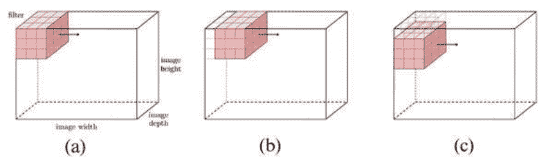

图 6.1 卷积在 CNN 中的体积表示（改编自 [206]）(a) 滤波器在图像中的初始位置。(b) 卷积的下一步，滤波器的中心位于中央通道的下一个图像像素上。(c) 滤波器位于初始位置下方的像素中心。

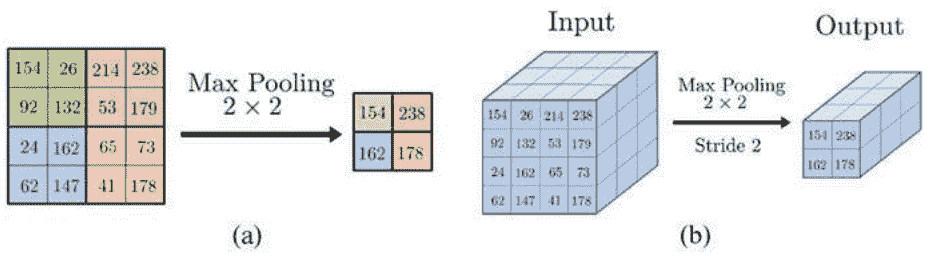

图 6.2 (a) 最大池化，大小为 2×2，步长为 2，填充为 0。（来源：https://paperswithcode.com/method/max-pooling） （b）在张量中应用最大池化：每个数据平面独立处理（来源：https://dev.to/sandeepbalachandran/machine-learning-max-pooling-with-color-images-2i21）

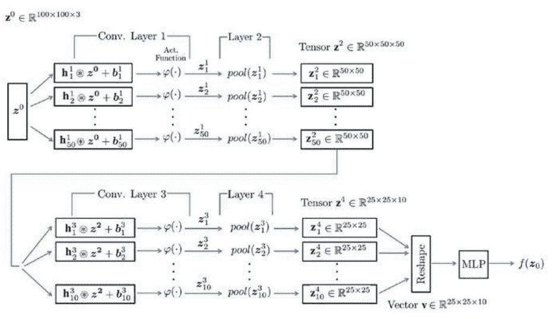

图 6.3 卷积神经网络架构，包含两个卷积层（来源：[82]）

池化是 CNN 中的另一个基本元素，用于降低数据维度。它对输入矩阵 $\mathbf{u} \in \mathbb{R}^{H \times W}$ 进行子采样。它使用步长 $s$，遵循表达式 (6.8)-(6.9) 以及填充 $p$。因此，最终图像的分辨率由表达式 (6.10)-(6.11) 给出。其计算基于以下表达式：

```math
\tilde{u}(i, j)=\text{pool}\{u(m, n),(m, n) \in \mathcal{R}_{i j}\}
```

with $\mathcal{R}_{ij}$ 是元素 $(i, j)$ 的邻域，大小为 $n_{p} \times n_{p}$，$\text{pool}$ 返回值为 $\tilde{u}(i, j)$ 通过 $\mathcal{R}_{ij}$ 中的子图像信息生成。通常情况下，$\tilde{u}(i, j)$ 是 $\mathcal{R}_{ij}$ 内像素的最大值（最大池化）或平均值（平均池化）。图 6.2a 展示了最大池化在 $4 \times 4$ 图中的应用。

图 6.2b 通过对每个数据平面分别应用最大池化，在一个体积（张量）上执行此操作。有关池化操作的综述，请参阅 [5]。

CNN 架构是从上述元素开始构建的。

一个具体的 CNN 架构在图 6.3 中表示，作为一个教学示例。第一层（$l=0$），即输入层，接收张量 $z^0 \in \mathbb{R}^{m_0 \times n_0 \times \beta_0}$，其中 $m_0=n_0=100$，$\beta_0=3$ 在图 6.3 中。输入场经过由两个卷积层（$l=1,3$）组成的 CNN 处理，其中 $n_1=50$，$n_3=10$ 个滤波器，由实矩阵 $\mathbf{h}_k^l$ 表示。$D^l$ 是每个滤波器掩模的深度。在图 6.3 的情况下 $D^1 = 3$，而 $D^3 = 50$。

在这个例子中，我们设置了填充 $p = 1$ 和步长 $s = 1$ 在公式（6.10）-（6.11）中对所有卷积操作都成立。因此，卷积层 $l=1$ 输出 50 个过滤后的场，每个场的大小为 $100 \times 100$。此外，我们有偏置 $\mathbf{1} \in \mathbb{R}^{m_l \times m_l}$，其中 $\mathbf{1}$ 是所有元素都为 1 的矩阵，$b^l_{k_l}$ 是一个标量值 $l=1,3$，$k_1=1,2,\dots,50$，$k_3=1,2,\dots,10$，其中 $m_1=m_3=50$，如下所示。

卷积的结果经过激活函数 $\varphi：\mathbb{R}\rightarrow[a，b]$ 进行处理（见第 4.3 节），这个过程可以形式化地写成：

```math
\varphi(\mathbf{h}^l_{k_l} * z^{l-1} + b^l_{k_l})，k_l=1，2，…，n_l，l=1，3，
\tag{6.18}
```

其中 $\varphi$ 逐元素操作，`*` 表示在体积上的卷积操作，定义在式（6.16）中。每个 $z^l_k$ 在式（6.18）中生成的特征图。

此外，网络还包括池化层（在图 6.3 中为 $l=2,4$）进行子采样，如下所示：

```math
z^{l+1}_{l, j, k_{l+1}} = \text{池} \sum_{m, n, k_l} , (m, n) \in \mathcal{R}_{ij}, l = 1, 3, k_{l+1}, k_l = 1, 2, …, n_l,
\tag{6.19}
```

with $\mathcal{R}_{ij}$ 是像素点 $(i, j)$ 的邻域，大小为 2×2，并且 $\text{pool}$ 返回 $\mathcal{R}_{ij}$ 内的最大值或平均值。此外，我们设置步长 $s = 2$，填充 $p = 0$，用于神经网络架构中所有池化层的帧图像。

图 6.3 因此，进入池化层的帧图像 $l=2$ 被降低到分辨率 $50 \times 50$，生成一个大小为 $50 \times 50 \times 50$ 的块，作为该层 $l=3$ 的输入数据，这是另一个卷积层。相应的过滤器是张量 $\mathbf{h}^3_{k_3} \in \mathbb{R}^{3 \times 3 \times 50}$，其中 $k_3=1，2，\dots，10$。此外，偏差被组装在矩阵中。然后，应用激活函数，按照公式（6.18）进行计算，其中 $l=3$。生成的特征图进入池化层，降低其分辨率并生成一个张量 $z^4 \in \mathbb{R}^{25 \times 25 \times 10}$。

接下来，通过重塑操作将 $z^4$ 向量化，得到一个数组 $v \in \mathbb{R}^{25 \cdot 25 \cdot 10}$，它是附加到最后一个池化层的 MLP 的输入。这个 MLP 生成与输入数据 $z^0$ 相关的回归（或分类）值，表示为 $f(z^0)$（见图 6.3）。

一般的 CNN 架构具有可学习的参数，即卷积核 $\mathbf{h} \in \mathbb{R}^{l \times l \times d_l}$，以及偏置项 $b^l_{k_l} \in \mathbb{R}$，其中 $l=1,2,\dots,M$，$k_l=1,2,\dots,n_l$，以及 MLP 的权重和偏置项，由向量 $\mathbf{w}$ 表示（见式（4.11））。这些数组包含了网络的参数，可以组装成一个数组 $\Theta$：

```math
\Theta = \{(\mathbf{h}^l_{k_l} \text{ 以及 } b^l_{k_l}) \mid 1 \leq k_l \leq n_l\}^{1 \leq l \leq M} \text{ 并且包括向量 } \mathbf{w}
\tag{6.20}
```

在训练步骤中通过解决以下问题来获得：

```math
\Theta^* = \arg \min_\Theta \text{损失}(\Theta, \mathcal{D}_\mu)
\tag{6.21}
```

通过梯度下降方法（如算法1）进行优化，其中 $Loss$ 遵循表达式(55)或其他方便的公式[255]，$\mathcal{D}_{\mathrm{tr}}$ 表示训练集。网络参数（滤波器、MLP权重和偏差）的初始化可以通过第5.3节的程序来执行。反向传播算法用于高效计算 $Loss$ 相对于其参数的梯度。

关于CNN的计算成本，当单个输入矩阵 $\mathbf{z}^{0} \in \mathbb{R}^{m_{0} \times \eta_{0} \times \beta_{0}}$ 传递到网络中时，计算复杂度主要由 $M$ 个卷积层决定，即由式(6.19)给出：

$$
O\left(\sum_{l=1}^{M} n_{l-1} \cdot s_{l}^{2} \cdot n_{l} \cdot m_{l} \cdot \eta_{l}\right)
$$

$n_l$ 表示第 $l-1$ 层和第 $l$ 层的滤波器数量，$s_l$ 表示第 $l$ 层滤波器的空间尺寸，而 $(m_l, \eta_l)$ 给出了第 $l$ 层输出特征图的空间分辨率。此外，通过考虑图4.4，CNN的MLP组件的计算复杂度为：

$$
O\left(\sum_{i=0}^{L} p(i) p(i+1)\right)
$$

因此，如果训练过程持续 $N_{\text{epoch}}$ 个时期，并且 $|\mathcal{D}_{\mathrm{tr}}| = N$，则前向计算步骤的计算复杂度为：

$$
O\left(N_{\text{epoch}} \cdot N \cdot O\left(\sum_{l=1}^{M} n_{l-1} \cdot s_{l}^{2} \cdot n_{l} \cdot m_{l} \cdot \eta_{l} + \sum_{i=0}^{L-1} p(i) p(i+1)\right)\right)
$$

反向传播算法的复杂度与网络参数规模的大小成线性关系，根据方程(6.20)中给出的，这意味着它是 $\Theta(|\Theta|)$（参见[98]的第416节）。

我们必须强调，在流体模拟的背景下，CNN架构的变体也被使用。例如，在[257]中，该模型基于U-Net神经网络，采用收缩-扩张的方法，输出层是应用Sigmoid激活函数的卷积层，由表达式(4.3)定义。

## 6.2.2 生成对抗网络: GAN

在[88]中，提出了一种通过对抗过程训练生成模型的方法。在这个框架中，同时训练两个模型（网络）：一个生成模型 $G$（称为生成器），学习数据的分布


原始数据；和一个判别网络 $D$（即鉴别器），用于评估样本来自训练数据还是来自 $G$ 的概率。训练过程的关键思想是 $G$ 最终最大化 $D$ 犯错误的概率。图6.4展示了GAN框架中训练过程的概述。生成器 $G$ 接收从先验分布中抽取的随机样本 $\mathbf{z} \in \mathcal{Z} \subset \mathbb{R}^{n_k}$，$\mathbf{z}$ 被称为图6.4中的噪声，$\mathcal{Z}$ 被称为潜空间。

因此，我们可以将生成器写成一个函数 $G(\theta_g; \mathbf{z})$，其中 $\theta_g$ 是相应网络的内部参数。$G(\theta_g; \mathbf{z}) \in \mathcal{X}$，其中 $\mathcal{X}$ 是数据空间。判别器是另一个计算标量函数的网络。$\mathbf{x} \in \mathcal{X}$ 表示数据空间中的一个对象。此外，我们假设我们有一个数据分布 $p_{data}(\mathbf{x})$。

在训练过程中，鉴别器接收从分布 $p_{data}(\mathbf{x})$ 中抽取的样本以及由生成器 $G$ 生成的样本，如图6.4所示。参数更新通过极小极大优化过程获得。

具体而言，原始GAN公式基于以下问题：

$$
\min_{\theta_g} \max_{\theta_d} \left[ \mathbb{E}_{\mathbf{x} \sim p_{data}(\mathbf{x})}[\log D(\mathbf{x})] + \mathbb{E}_{\mathbf{z} \sim p_z(\mathbf{z})}[\log(1 - D(G(\mathbf{z}))) ] \right] \tag{6.25}
$$

为了简化表示，我们遵循[88]并将表达式(6.25)重写为：

$$
\min \max \left[ \mathbb{E}_{\mathbf{x} \sim p_{data}(\mathbf{x})}(\log (D(\mathbf{x}))) + \mathbb{E}_{\mathbf{z} \sim p_z(\mathbf{z})}(\log (1-D(G(\mathbf{z})))) \right] \tag{6.26}
$$

首先，我们定义：

$$
V(G, D)=\mathbb{E}_{\mathbf{x} \sim p_{data}(\mathbf{x})}[\log (D(\mathbf{x}))]+\mathbb{E}_{\mathbf{z} \sim p_{z}(\mathbf{z})}[\log(1-D(G(\mathbf{z}))) ] \tag{6.27}
$$

或者：

$$
V(G, D)=\int_{\mathcal{X}} p_{data}(\mathbf{x}) \log (D(\mathbf{x})) d\mathbf{x}+\int_{\mathcal{Z}} p_{z}(\mathbf{z}) \log (1-D(G(\mathbf{z}))) d\mathbf{z} \tag{6.28}
$$

因此，如果 $G$ 已知，我们按照[88]的方法重写式子(6.28)为：

$$
\begin{aligned}
V(D) &= \int_{\mathcal{X}} p_{data}(\mathbf{x}) \log(D(\mathbf{x})) d\mathbf{x} + \int_{\mathcal{X}} p_g(\mathbf{x}) \log(1 - D(\mathbf{x})) d\mathbf{x} \\
&= \int_{\mathcal{X}} [p_{data}(\mathbf{x}) \log(D(\mathbf{x})) + p_g(\mathbf{x}) \log(1 - D(\mathbf{x}))] d\mathbf{x}.
\end{aligned}
$$

让我们定义函数：

$$
F(D(\mathbf{x})) = p_{data}(\mathbf{x}) \log(D(\mathbf{x})) + p_g(\mathbf{x}) \log(1 - D(\mathbf{x})) \tag{6.29}
$$

因此，最优的判别器 $D$ 由相关的欧拉-拉格朗日方程定义：

$$
\frac{\partial F}{\partial D} = p_{data}(\mathbf{x}) \frac{1}{D(\mathbf{x})} - p_g(\mathbf{x}) \frac{1}{1 - D(\mathbf{x})} = 0
$$

这导致：

$$
D^*(\mathbf{x}) = \frac{p_{data}(\mathbf{x})}{p_{data}(\mathbf{x}) + p_g(\mathbf{x})} \tag{6.30}
$$

通过将这个结果插入到式(6.26)中，我们可以得到：

$$
C(p_g) = \mathbb{E}_{\mathbf{x} \sim p_{data}(\mathbf{x})} \left[ \log \left( \frac{p_{data}(\mathbf{x})}{p_{data}(\mathbf{x}) + p_g(\mathbf{x})} \right) \right] + \mathbb{E}_{\mathbf{x} \sim p_g(\mathbf{x})} \left[ \log \left( \frac{p_g(\mathbf{x})}{p_{data}(\mathbf{x}) + p_g(\mathbf{x})} \right) \right] \tag{6.31}
$$

必须在 $p_g$ 中最小化 $C(p_g)$。通过将表达式(6.31)与Jensen-Shannon(JS)散度[47]进行比较：

$$
JS(p_{data} || p_g) = \frac{1}{2} D_{KL} \left( p_{data} \left|\left| \frac{p_{data} + p_g}{2} \right. \right) + \frac{1}{2} D_{KL} \left( p_g \left|\left| \frac{p_{data} + p_g}{2} \right. \right) \right. \tag{6.32}
$$

其中 $D_{KL}$ 在方程(5.10)中定义，我们注意到：

$$
C(p_g) = -\log 4 + 2 \cdot JS(p_{data} || p_g) \tag{6.33}
$$

定理3：全局最小值 $C(p_g)$ 当且仅当 $p_{data} = p_g$ 时达到。并且在这点上，$C = -\log 4$。

在方程(6.31)中，当 $p_{data} = p_g$ 时，我们得到 $C(p_g) = -\log 4$，这与表达式(6.33)一致。

此外，一旦 $JS(p_{data} \| p_g) \geq 0$ 且 $JS(p_{data} \| p_g) = 0$ 当且仅当 $p_{data} = p_g$，我们得出结论：

$$
C(p_g) = -\log 4 + 2 \cdot JS(p_{data} \| p_g) \geq -\log 4, \quad \forall p_{data}, p_g
$$

且 $C(p_g) = -\log 4$ 当且仅当 $p_{data} = p_g$，从而证明了命题。

**算法2 原始GAN模型的小批量随机梯度下降训练**

输入: 训练集 $\mathcal{D}_{\mathrm{tr}}$，小批量大小 $\varsigma$，$\eta_g, \eta_d, k_T, k_\mathcal{D} > 0$。
初始化: $\boldsymbol{\Theta}_0, t=0, s=0, \mathbf{p} \leftarrow \boldsymbol{\Theta}_0$。
- 当 $(t \leq k_T)$ 时执行
  - 当 $(s \leq k_\mathcal{D})$ 时执行
    - 采样小批量 $\mathbb{B} = \{\mathbf{x}_1, \mathbf{x}_2, \ldots, \mathbf{x}_\varsigma\} \subset \mathcal{D}_{\mathrm{tr}}$
    - 从先验分布中取样小批量数据 $p_g(\mathbf{z}): \mathbb{Z} = \{\mathbf{z}_1, \mathbf{z}_2, \ldots, \mathbf{z}_\varsigma\} \subset \mathcal{Z}$
    - 通过计算损失函数(6.25)在小批量数据 $\mathbb{B}$ 和 $\mathbb{Z}$ 上构建目标函数:
      $$ \mathcal{L}(\mathbf{p}; \mathbb{B}, \mathbb{Z}) = \frac{1}{\varsigma} \sum_{i=1}^{\varsigma} \left( \log D(\mathbf{x}_i) + \log(1 - D(G(\mathbf{z}_i))) \right) $$
    - 学习规则：更新鉴别器的参数向量:
      $$ \boldsymbol{\Theta}_{s+1} = \boldsymbol{\Theta}_s + \eta_d \nabla_{\theta_d} \mathcal{L}(\mathbf{p}; \mathbb{B}, \mathbb{Z}) $$
      $$ \mathbf{p} \leftarrow \boldsymbol{\Theta}_{s+1}, \quad s \leftarrow s+1 $$
    - 结束循环
  - $s = 0$
  - 从先验分布中取样小批量数据 $p_g(\mathbf{z}): \mathbb{Z} = \{\mathbf{z}_1, \mathbf{z}_2, \ldots, \mathbf{z}_\varsigma\} \subset \mathcal{Z}$
  - 在小批量 $\mathbb{B}$ 和 $\mathbb{Z}$ 上构建损失函数(6.25)
  - 学习规则：更新生成器的参数向量:
    $$ \boldsymbol{\Theta}(t+1) = \boldsymbol{\Theta}(t) - \eta_g \nabla_{\theta_g} \mathcal{L}(\mathbf{p}; \mathbb{B}, \mathbb{Z}) $$
    $$ \mathbf{p} \leftarrow \boldsymbol{\Theta}_{t+1}, \quad t \leftarrow t+1 $$
  - 结束循环
最优解 $\boldsymbol{\Theta}^*, \mathbf{p}_* \leftarrow \mathbf{p}$。
输出: 最优解 $\boldsymbol{\Theta}^*_{\text{opt}}$。

GAN的小批量随机梯度下降训练如算法2所示，其中 $\boldsymbol{\Theta} = \{\boldsymbol{\theta}_g, \boldsymbol{\theta}_d\}$。

# 第7章 流体渲染

**摘要** 如前几章所示，流体模拟涉及复杂的模型和算法，以近似流体可能具有的各种行为。这些模拟产生大量的数据。分析这些数据的一个重要步骤是可视化。作为3D数据，渲染技术在可视化步骤中至关重要。渲染将模拟数据转换为图像。

这本身就是一项具有挑战性的任务，当涉及到非刚性形态的主体（如流体）在三维空间中演化并与光线以复杂的方式相互作用时，问题就变得更加复杂。本章将介绍传统的渲染流体技术以及机器学习在改进这一过程中提供的新视角。

**关键词** 渲染方程 · 路径追踪 · 光栅化 · 光线追踪 · 屏幕空间渲染 · 体积渲染 · 可微渲染 · 神经渲染

## 7.1 引言

广义上，渲染过程将数据转化为图像，通常是数字图像。图7.1描述了这一过程。它涉及计算光线与场景中物体的相互作用，确定观察者位置下的场景可见元素，并将这些强度注册到离散集合中：数字图像。

传统上，计算机图形学（CG）是计算机科学领域研究计算机如何实现渲染过程的领域。CG探索算法和数据结构，以模拟光线与物体之间的相互作用，产生逼真的图像。整个过程的优化存在许多问题。关于渲染过程的细节超出了本书的范围。然而，我们建议有兴趣的读者参考《计算机图形学基础》[216]，该书可以为您提供渲染过程的广泛概述。

![图7.1 图像形成过程的概述：光源产生与场景元素相互作用的光线。一些反射的光线进入捕捉设备，穿过其镜头并到达其传感器，定义图像的一部分（像素）的颜色。（图片来自[33]）](img/e1d1b0dced22804c2e523300ff40fd7d_89_0.png)

为了支持渲染过程，一些数据应该被注册和结构化。其中一些最重要的是对象的几何属性（例如位置、方向和比例）、其材料的光学属性、场景元素（如观察者）以及光源的位置和属性。

几个世纪以来，物理学一直在研究光与物体的相互作用。在计算机图形学的背景下，表示这些相互作用的最重要的公式是渲染方程，由Kajiyama[114]提出。它描述了如何计算观察者在物体某一点看到的光强度（辐射度），该光强度是由其材料发射的辐射度以及该点周围所有方向上与该材料相互作用的辐射度组成的，这些辐射度来自整个场景。方程(7.1)显示了这些关系。

$$
L_o(\mathbf{x}, \omega_o, \lambda, t) = L_e(\mathbf{x}, \omega_o, \lambda, t) + \int_{\Omega} f_r(\mathbf{x}, \omega_o, \omega_i, \lambda, t) (\omega_i \cdot \mathbf{n}) d\omega_i \tag{7.1}
$$

图7.2说明了方程(7.1)中每个术语的物理诠释。术语 $L_o$、$L_e$ 和 $L_i$ 分别表示观察到的辐射、发射的辐射和入射的辐射，它们是在物体表面上某一点 $\mathbf{x}$ 处的函数。辐射是位置 $\mathbf{x}$、观察方向 $\omega_o$、光波长 $\lambda$ 和时间 $t$ 的函数。第一个术语 $L_e$ 与材料的发射有关，通常是光源中的主导项。第二个项是积分，考虑了沿半球 $\Omega$ 围绕 $\mathbf{x}$ 方向的 $L_i$ 的贡献。术语 $f_r(\mathbf{x}, \omega_o, \omega_i, \lambda, t)$ 和 $\omega_i \cdot \mathbf{n}$ 分别处理物体在点 $\mathbf{x}$ 处的材料和几何属性。第一个术语被称为双向反射分布函数（BRDF），它模拟了入射 $(\omega_i)$ 和出射 $(\omega_o)$ 方向之间的关系，取决于物体的材料。这个函数允许模型包含材料的视觉特性，如光泽、漫反射和镜面材料。BRDF可以通过数学构建或使用适当的设备从自然材料中捕获。

## 7.1 引言

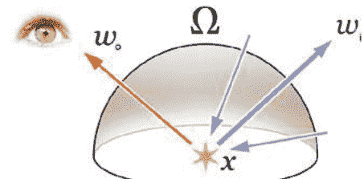

> 图7.2描述了Kajiya [114]提出的渲染方程模型的组成部分：观察者从点 $x$ 到方向 $\omega$ 处接收到一些辐射亮度。$x$ 表示某个物体表面上的位置，与所有来自方向 $\omega$ 的贡献有关。$\omega_i$ 表示沿着方向 $\omega_i$ 的每个方向。图片由T.mrb创作，采用CC BY-SA 3.0许可。https://commons.wikimedia.org/w/index.php?curid=4251811

几何组件考虑了表面的方向对其影响，由其法线 $\mathbf{n}$ 给出。$\omega_i$ 表示入射方向。$x$ 表示表面上的位置。尽管渲染方程考虑了波长 $\lambda$ 在其公式中，可见光谱也被量化为三个主要波长：红色、绿色和蓝色。这三个波长是我们所称的颜色三刺激模型[4]。颜色的RGB表示可以包含与材料不透明度相关的另一个通道：Alpha通道。这个通道用于混合操作，可以模拟半透明材料。

需要注意的是，渲染方程本质上是递归的；为了计算沿着 $\omega_i$ 方向的辐射度，需要在那个方向上评估渲染方程。为了计算沿着某个方向的辐射度，需要在那个方向上评估渲染方程。这种递归的特性是由于我们在计算机图形学中称之为间接光照或全局光照的概念。

渲染方程是对场景中光照相互作用的第一次尝试建模。然而，这个模型没有考虑到许多光现象，比如透射、次表面散射、偏振和发光。

在一般情况下，方程 (7.1) 没有解析解，因此我们使用数值方法或简化模型来求解。如果忽略间接光照，积分可以被建模为沿着光源方向的求和，就像Phong的反射模型一样。在一般情况下，为了数值求解方程 (7.2) 中的积分，可以使用随机方法，比如蒙特卡洛积分。路径追踪是Kajiya提出的一种用于数值求解渲染方程积分的算法。

如图7.2所示，并且方程 (7.1) 说明，我们需要计算每个点的辐射度。$x$ 是场景中物体表面的坐标。由于我们想要生成场景的数字图像，所以对于每个像素，采样过程应该评估它从场景中接收到多少光线。两种主要方法可以进行这个采样过程：光栅化[4]和光线追踪[96]。图7.3描述了这两种方法。

光栅化是实时图形应用中最常用的方法。场景中的物体被投影到图像平面上，然后进行采样。


图7.3 光栅化（左）和光线追踪（右）是渲染场景的主要方法。第一种方法将每个物体投影到图像平面（视口），而第二种方法则从观察者到场景中追踪光线，识别可见的最近物体并记录其颜色。（图片由Henrik创作，根据CC BY-SA 3.0许可使用）

被生成。大多数图形处理单元（GPU）对这种方法有原生支持。当需要考虑光线与物体之间更复杂的交互（如透明度）时，它的局限性就会显现出来。

另一方面，光线追踪将每个图像像素视为搜索过程的起点，追踪一条光线返回场景，发现哪个物体在该方向上发射光线，然后计算达到图像的光线强度。光线追踪是离线渲染应用中最常用的算法，例如在需要更逼真效果的电影渲染中。它的过程可以递归地应用于处理场景中更复杂的光线交互。

对于对渲染过程有更深入讨论兴趣的读者，可以参考经典的计算机图形学渲染书籍，例如[4,190]和[96,154]。

### 7.1.1 流体模拟中的渲染过程

如上一节简要总结的那样，渲染过程具有挑战性，考虑到光的传播和物体相互作用的复杂现象。当物体是流体时，渲染过程变得更加复杂。

在图7.4中，我们可以看到流体的两种常见视觉表现：液体和气体。它们都代表了渲染流体的第一个困难：缺乏固定的几何形状。刚体物体的几何属性随时间不变，因此很容易描述其表面及其属性，如曲率。因此，表示刚体物体最常用的数据结构是多边形网格[25]。它将物体表面建模为两组数据：一组是顶点，即表面上的采样位置；另一组是面，表示顶点的连接（即表面的拓扑结构）。面通常是由三个顶点组成的三角形，这隐含地定义了其内部的一个平面表面。这种表面近似方式被称为分段线性表面[85]。

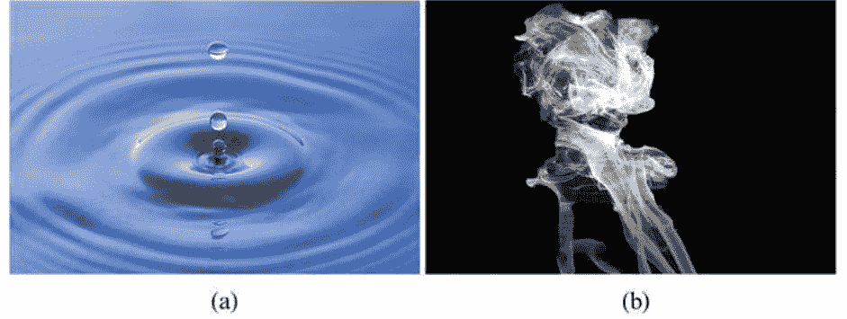

> 图7.4 流体主要可以是液体 (a) 或气体 (b)，这导致了不同的视觉特征，在渲染中必须考虑到。(a) 图片由Davide Restivo创作 - 自己的作品。根据CC 2.0使用。(b) 图片由Sushumna Rao Tadinada创作 - 自己的作品。根据CC 2.0使用。

相反，流体通常被表示为一个粒子系统，即一组在三维空间中具有位置、压力和速度等属性的位置。在这种表示中，没有预定义的表面。流体的边界在几何和拓扑上可能随时间变化。如图7.4a所示，液体在一段时间内可以改变其拓扑结构，产生液滴。因此，要使用传统技术渲染流体，我们必须确定颗粒沿流体边界的位置，以计算光与其的相互作用。我们还必须估计流体表面的曲率，这在时间上可能会发生很大变化。

但是，考虑到光线与流体材料的相互作用比刚性不透明物体更加复杂。当流体是气体时，光线可以穿过介质与之相互作用，如图7.4b所示。在气体中，粒子沿介质（通常是空气）分布得更稀疏。因此，在气体中没有确定的表面。光线穿过流体并与其粒子相互作用。当光线穿过流体时，它可以被气体粒子吸收、反射或散射。在这种情况下，渲染方程不适用，因为没有边界与光线相互作用。

在接下来的章节中，我们将深入讨论如何将传统渲染技术应用于渲染流体，特别是液体和气体。

## 7.2 传统技术

对于本节的背景，我们所说的传统技术是之前介绍的两种主要方法：光栅化和光线追踪。除了讨论这些方法本身，我们还将重点关注正确渲染流体所需的改进。

此外，根据我们所处理的流体类型的不同，其中一种方法可能更适合处理渲染。

再次强烈建议感兴趣的读者查阅更多关于这些渲染技术的细节，比如[4]中的光栅化技术以及Peter Shirley的三部曲[213-215]，以获得实用的光线追踪方法。

### 7.2.1 表面提取

让我们考虑一个粒子系统代表流体，其中每个粒子至少存储其在三维空间中的位置，并受到速度和压力等场的影响。

随着这些场在模拟过程中的演变，粒子的位置会更新，流体可以呈现出新的配置和几何外观。

粒子系统不能直接渲染出形状。即使我们考虑到粒子有大小，像大理石一样，它们也不能像多边形网格一样描述连续的表面。粒子系统是流体的本质离散表示。因此，要使用传统的渲染技术，我们必须产生一个连续的模型来采样以创建数字图像。

在计算机图形学中，使用点来表示形状并不新鲜。早在1980年代初，詹姆斯·布林[23]首次提出了名为“Blobs”的概念。这种表示方法在2010年代重新被称为“基于点的模型”[91]，因为捕捉设备和计算机视觉技术的发展能够从物体和场景中产生大量的点云。

为了渲染目的，基于点的对象可以被建模为隐式对象。可以根据每个点的位置构建隐式函数。$r_i = (x_i, y_i, z_i)$。正如Blinn [23]所提出的，在其开创性的工作中，可以创建一个隐式函数 $F(r)$：

$$
F(r) = \sum_{i=0}^{n} b_i \exp\left(-a_i \cdot d_i^2\right), \quad (7.2)
$$

其中 $n$ 是点的数量，$d_i$ 是从位置 $r$ 到点的位置 $r_i$ 的欧几里得距离，而 $a_i$ 和 $b_i$ 是可以增强用户对最终形状控制的参数。

从概念上讲，这种简单的方法类似于SPH模型。Müller等人 [172]提出使用颜色场，即用于模拟表面张力的基础场，来识别SPH模拟中的表面粒子。颜色场被定义为：

$$
c_S(r) = \sum_j m_j \frac{1}{\rho_j} W\left(r - r_j, h\right),
$$

其中 $\rho_j$ 和 $m_j$ 分别是粒子 $j$ 在其位置处的密度和质量，$W$ 是核函数，用于关联位于 $r$ 和 $r_j$ 的粒子的影响。液体表面上的粒子满足[172]：

$$
|n(r_i)| > 1,
$$

其中：

$$
n = \nabla c_S
$$

尽管这种隐式对象在数学上很有趣，但从渲染的角度来看并不是一个好的解决方案。隐式表达并没有将表面描述为显式表面，即一组已知位于表面上的点。而是，隐式表达给我们提供了一种验证一个点是否属于表面的工具。因此，我们需要一种算法来搜索那些位于液体表面上的点 $x$。

进行这样的搜索的最简单方法是定期对域进行采样，并评估这些样本上的隐式函数（颜色场）。这些样本按拓扑方式组织为由立方体单元组成的网格。然后，对于每个单元，算法基于单元顶点上的值来验证表面是否通过该单元。如果是这种情况，则使用线性插值计算出该表面沿单元边的交点。然后，连接这些交点以形成对单元沿表面的多边形逼近。通过组合所有多边形，算法构建了表示流体表面的分段线性逼近或多边形网格[25]。

这个过程最初是由Lorensen和Cline [148]提出的，他们称之为Marching Cubes算法。然而，Marching Cubes (MC)在像流体这样的对象中存在一些特别关键的问题。首先，MC能够恢复的表面细节与用于对域进行采样的网格分辨率有很强的关系。流体可能具有像液滴和喷雾这样的小细节，需要较小的单元尺寸来捕捉这些元素。高分辨率的网格增加了算法的计算成本，不仅在处理上，而且在内存占用上也是如此。为了减少这个成本，可以基于自适应细分空间的解决方案[275]或使用窄带来寻找等值面[39,282]来缓解这个问题。

分段逼近的质量也是渲染中一个重要的问题。MC算法使用简单的线性插值在相交的单元格边缘上产生一个多边形网格。这个过程中得到的三角形形状各异，大多数都不是平衡的等边形状。当渲染时，这样一个不规则的多边形网格会产生一个凹凸不平的表面，这在流体表面中是不期望的。可以应用后处理阶段来重新排列三角形，创建由具有更好长宽比的三角形组成的更平滑的表面。Akinci和同事们[6]通过依次应用简化[76]和细分[36]步骤来解决这个问题。

在这种方案中生成的表面的视觉质量也与每个粒子关联的隐式函数的类型有关。如方程(7.3)所示，核函数 $W$ 基于欧几里得距离。这种核函数引起的隐式函数生成了一个“blobby”表面。在表面上，我们仍然可以看到粒子的形状，就像小圆球一样。文献中还提出了构造这些核函数的其他方法，例如[289]。使用各向异性核函数[39,284]也是一个有吸引力的选择，因为它可以产生平滑的隐式表面，保留了流体中可能出现“锐利边缘”的区域，例如波峰。表面提取是很长一段时间内渲染流体的一种流行方法，因为MC算法在CPU上是简单易实现的。然而，当GPU变得流行起来时，它们为并行算法和使用图形管线加速渲染过程带来了新的可能性。

在GPU上实现MC算法是可能的[63]，但GPU为渲染流体提供了新的可能性，如透射和反射等更复杂的光现象。

### 7.2.2 屏幕空间方法

在复杂的场景中，许多几何细节甚至整个物体可能被隐藏，因此不会对最终图像产生贡献。当几何模型庞大时，如流体模拟，情况也是如此。

为了解决物体的可见性，基于光栅的渲染算法通常依赖于z-buffer算法[223]。z-buffer存储了场景物体到相机的最近片段的距离，即可见片段。在渲染过程中，对于每个新的片段，z-buffer允许检测该新片段是否可见。

如果将z-buffer中存储的最近距离与新片段的距离进行比较，如果新片段的距离较小，则更新z-buffer和帧缓冲区，因为新片段更近，所以可见；如果不是，则将该片段丢弃，因为当前最近的片段遮挡了它。当然，这个解决方案只适用于没有透明度的材质。

尽管在渲染过程中简单且广泛使用，但深度缓冲算法在复杂场景中存在一个缺点。片段在渲染步骤完成后才被丢弃；然后，大部分渲染工作都白费了。

在这种情况下，加速渲染过程的常见方法是使用G-Buffers[205]。从几何缓冲区来看，G-Buffers的主要目标是在2D缓冲区中存储有关场景中可见对象的信息，这些信息将用于作为后处理步骤来渲染场景。因此，G-Buffers的灵感是将光照/着色计算推迟到整个场景的可见性已经解决之后，这是渲染过程中的一个昂贵步骤。

使用G-Buffers来渲染场景的这个过程被称为延迟着色[195]。它被称为多通道渲染方法。在第一个渲染通道中，整个场景被处理以解决可见性并生成用于下一步的G-Buffers。光照/着色算法应用于接下来的步骤，但现在场景不再被处理，只有存储在G-Buffers中的信息。因此，延迟着色算法变得更加廉价，因为它们几乎独立于场景的复杂性[140]。

一些算法在渲染过程中使用了多通道渲染和G缓冲的相同思想，但以更受限制的方式解决了特定问题。这种方法通常被称为屏幕空间，因为它们的任务涉及到存储在2D矩阵/图像中的数据。阴影是使用额外缓冲区进行的一个例子。

在流体渲染中，屏幕空间方法非常流行且高效，可以实时可视化大规模模拟。屏幕空间渲染的主要优势在于不依赖于表面重建算法。每个粒子可以被视为一个可以投影到屏幕上并生成存储深度、法线等信息的小球。这些G缓冲可以在延迟着色的方法中使用，从观察者的视角产生流体表面的图像。这足以渲染流体而无需重建其整个表面。该过程在图7.5中以可视化方式呈现。

使用这个简单的想法进行表面渲染会产生视觉上的不一致，因为流体表面是通过结合所有粒子的影响来诱导的。但是在屏幕空间中，有可能重现附近粒子的贡献总和。Van de Laan和他的同事们[245]提出了应用基于图像的滤波过程来生成深度缓冲的平滑版本的方法。滤波器的选择是关键。由于深度缓冲呈现了表面的视图投影，我们应该会出现不连续性，因为流体可以产生波浪状的壳和山谷。因此，滤波器必须保留这些不连续性。像曲率流[245]、双边高斯[60]或窄范围[237]这样的滤波器可以用来改善最终图像的视觉效果。


> 图7.5 典型屏幕空间流体渲染流程的概述：流体数据在延迟着色类似的过程中进行处理，生成深度和厚度缓冲（2D），经过滤波后用于渲染场景图像。（图片由Kitware提供 - https://www.kitware.com/screen-space-fluid-rendering-vtk/）

在第一次渲染过程中，可以生成其他缓冲区来改善屏幕空间方法所能实现的视觉效果。法线缓冲区可以从深度缓冲区生成。这对于光照计算和液体表面的镜面反射非常重要。

可以使用估计液体体积的厚度缓冲区在渲染过程中重现透明度和颜色衰减[60]。与深度缓冲区一样，必须对该缓冲区进行滤波以产生平滑的结果。

为了识别泡沫和液滴，可以使用粒子的密度来分类，根据阈值判断粒子属于液体、泡沫还是液滴[60]。可以生成一个掩码缓冲区，识别这种可以使用不同视觉属性渲染的粒子。

优化技术，如使用各向异性粒子[276]和窄带[56]，也可以在屏幕空间方法中使用，以提高这些算法的视觉质量和性能。

屏幕空间方法是流体渲染的常见解决方案，因为它简单，适应传统渲染流水线，并实现实时渲染。然而，它仍然依赖于流体具有明显的表面，而当流体是气体时，这种情况并不成立。

### 7.2.3 体积渲染

在渲染液体流体时，面临的挑战是处理动态几何形状和透明度、反射等属性；而气体流体则更加复杂。

气体是粒子之间距离较大的流体，与液体相比。因此，这些粒子之间的力较为脆弱。它们的粒子可以更自由地移动。这些特性意味着气体更适合与其所浸泡的支撑介质进行相互作用。

从视觉上讲，气体与空气的相互作用更加多样和复杂。图7.6展示了气体流体中可能发生的三种最重要的光相互作用：烟雾的颜色看起来是黑色的，因为其颗粒吸收了大部分光线；云是由水和灰尘颗粒组成的，它们会散射光线；火会发出光，因为其颗粒参与了燃烧化学反应。

在这种情况下，第7.1节讨论的渲染方程[114]无法表示气体中发生的光相互作用。渲染方程处理的是不透明材料表面上的光相互作用，其中反射是主要现象。而气体是固有的体积颗粒，占据一定的空间，光线在穿过时与其颗粒相互作用。


> 图7.6 展示了三种不同类型的体积光相互作用，可以产生不同的视觉效果：(a) 吸收，(b) 散射，(c) 发射。（图片来源：Jan Novák [184] - https://cs.dartmouth.edu/wjarosz/publications/novak18monte-sig-slides-2-fundamentals.pdf）


> 图7.7：体积渲染方程的概述，该方程计算沿着通过体积的射线在方向 $\omega$ 到达点的贡献。考虑背景的辐射 $L_d(x_d)$，$L_e(x, \omega)$：发射的辐射。$L_s(x, \omega)$：路径中任意体素接收的散射辐射。

因此，渲染气体流体所需的是一个体积渲染方程 (VRE) [273]。

图7.7描述了VRE的主要组成部分。考虑一条由参数形式定义的光线 $x(t) = x_0 + t\omega$。从背景位置 $x_d$ 开始，其背景辐射为 $L_d(x_d)$。当光线穿过流体时，其颗粒可以吸收辐射。这种吸收被建模为透射函数 $T(t)$。随着光线穿过流体，透射函数 $T(t)$ 会递减。在这个路径中，一些流体颗粒可以通过发射产生辐射 $L_e(x, \omega)$ 或者通过散射接收辐射 $L_s(x, \omega)$。这两个组成部分在路径中也会受到吸收的影响，因此透射函数 $T(t)$ 也适用于它们。

将图7.7中所示的过程形式化，体积渲染方程可以表述为：

$$
L(x, \omega) = \int_{t=0}^{d} T(t) \left[ \sigma_a(x) L_e(x, t, \omega) + \sigma_s(x) L_s(x, t, \omega) \right] dt + T(d) L_d(x_d, \omega). \quad (7.6)
$$

类似于渲染方程，VRE在一般情况下没有代数解，因此必须使用数值方法来解决它。方程(7.6)的离散化导致整个体积在体素（体积元素）中的离散化，其中我们假设发射、吸收和散射是恒定的。通常，这种离散化是一个三维规则网格。

方程(7.6)的离散化导致了一种类似于光线追踪的算法，称为光线行进（Ray Marching）。光线追踪关注的是反射，并假设光线在物体嵌入的介质中传播时，辐射度不会发生变化。另一方面，光线行进关注的是光线与参与介质（流体）之间的相互作用。

对于VRE和Ray Marching的更深入讨论超出了本章的范围。我们建议感兴趣的读者参考Magnus Wrenning的书[273]或Fong和同事的SIGGRAPH 2017课程笔记[70]，以获得有关体积渲染技术的理论和实现的更深入讨论。

与传统的基于表面的渲染相比，体积渲染技术的计算成本在时间和内存指标上更为显著。体积网格存储可能会占用大量内存。该网格的分辨率直接影响渲染的视觉质量，但更多的体素需要更多的处理时间。

已经进行了许多尝试来降低这些成本，主要与自适应相关。Fraedrich等人的工作[71]提出了一种分层粒子表示方法，允许在渲染过程中进行数据重采样。为了应对内存限制，他们使用了网格分割方案，将体积切割成片，并按照从前到后的顺序进行渲染。

虽然没有专注于体积渲染，但Zirr和Dachsbacher[290]提出了一种自适应体素化数据结构，可以加速光线行进算法。

如今，神经网络技术可以通过应用超分辨率和风格转移等技术来增强体积渲染，这将在第7.5节中讨论。

## 7.3 高级技术

前面介绍的渲染技术可以为对评估流体行为感兴趣的科学家提供视觉反馈。然而，如果应用程序需要更逼真的可视化效果，还必须使用其他技术。

在电影行业中,流体可以作为后期制作的一部分[108],或者在动画中使用,如迪士尼的《冰雪奇缘》[222]和《海洋奇缘》[32,72,187,217]。逼真性非常重要,但每帧所需的时间并不重要。渲染农场是并行生成图像的常见解决方案。

游戏行业是另一个可以使用流体并需要更复杂渲染效果的领域。还有一个额外的要求:实时渲染。

玩家和非玩家角色可以与流体进行互动,必须能够合理地响应,更重要的是,必须看起来真实。

本节介绍了提高流体渲染的视觉质量和性能的更高级技术。

### 7.3.1 光学效果

要使水等流体的渲染变得逼真,图像中必须存在一些光学效果。这些效果包括表面镜面反射、折射和由流体深度引起的不透明度。图7.8描述了这三种效果。

镜面反射使人们能够看到周围环境在流体表面上的倒影。环境映射[89]是一种众所周知的渲染技术,可以模拟这种反射。它基于纹理映射[101],其中一个材料的图像可以投影到物体表面上。映射函数定义了物体中的点与纹理空间中的位置之间的对应关系,纹理空间是与纹理图像直接相关的二维空间。然后,表面物体中每个片段的颜色可以与纹理图像中存储的颜色相关联。环境映射通过定义一组表示物体周围环境视图的图像,并根据镜面反射定律(入射光线和反射光线)计算来扩展这个思想。


图7.8 表面的镜面反射、折射和深度引起的不透明度是水等流体中最常见的光学效果。https://www.disneyanimation.com/data-sets/?drawer=/resources/moana-island-scene/


图7.9 折射的斯涅尔定律。（图片由Oleg Alex androv提供。公共领域）

在考虑表面法线的情况下，应该使用哪个视角进行纹理映射。

纹理映射和环境映射可以适用于光栅化和光线追踪两种渲染方案。因此，可以很容易地实现表面反射。

在浅水中，折射效应非常显著。图7.8显示了海滩附近的岩石和沙滩在水下可见。正如我们所知，折射效应发生在光线从一个介质传播到另一个介质时。介质密度的差异促使光线改变方向。斯涅尔定律通过以下方程模拟这种效应：

$$ \frac{\sin \theta_{1}}{\sin \theta_{2}}=\frac{v_{1}}{v_{2}}=\frac{n_{1}}{n_{2}} . $$

图7.9描述了方程(7.7)的术语。该方程说明两个折射率的比值，n₁和n₂，等于两个介质中的相速度比值，v₁和v₂。随着速度的变化，光线的方向与表面法线越来越接近或远离，由入射角θ₁和折射角θ₂表示。

因此，方程（7.7）可以用于确定光线方向，并且像表面镜面反射一样，使用这个方向来定义观察者透过水看到的内容。

折射可以根据所使用的方案纳入渲染过程中。光栅化可以利用折射的方向来定义一个纹理/环境映射片段的颜色[49]。由于折射发生在流体表面的某一点上，应该应用组合方案来添加反射和折射组件。

虽然简单，纹理映射只能“看到”流体的底部。透明度必须考虑到液体内部是否有物体，例如图7.8中的岩石。Maule等人[156]和Vasilakis及其同事的调查[247]提供了将透明度纳入光栅化渲染的算法的广泛概述。最常用的技术涉及z-buffer扩展，其中多个片段的深度和颜色存储在有序的数据结构中。最后的混合步骤将所有这些片段组合起来生成最后的像素。

透明度算法可以渲染水下物体，但不考虑折射引起的畸变。部分浸没物体的变形、物体深度差异以及水面波纹引起的图像变形不被光栅化算法直接支持，因为它们没有计算由于折射而引起的光线重定向。

光线追踪渲染方案自然地融入了折射，因为折射定义了另一条光线，可以像反射一样进行追踪。

通常，合成中与光线路径相关的衰减项被使用。在处理流体时，这种衰减必须是液体深度的函数。可以通过对流体进行两次渲染并注册沿光线的最近和最远距离来估计流体的深度[279]。

光栅化和光线追踪方案都可以支持本节中描述的光学效果。光线追踪比光栅化更本质地处理这个问题，光栅化必须使用额外的算法来产生几乎逼真的结果。

特定的流体，如水或海水，需要额外的效果来实现逼真的渲染。下一节将讨论如何增强水的溅泼效果，添加泡沫，并在水的渲染中产生气泡。

### 7.3.2 气泡、喷雾、泡沫和液滴

除了光学效果外，其他视觉效果在流体渲染中也很重要，特别是在水的可视化中。图7.10展示了与自然界中的水相关的一些常见视觉效果。在图7.10a中展示的瀑布中，水和空气的混合在下落过程中产生喷雾。如图7.10b所示，气泡产生了泡沫。由于表面张力的作用，少量液体可以在物体表面积累或形成液滴，如图7.10c所示。

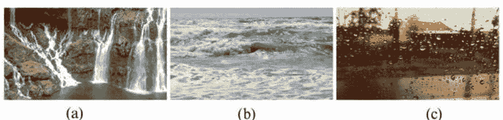

图7.10 液体在与其他介质和物体相互作用时会产生许多视觉伪影：（a）喷雾，（b）泡沫和（c）液滴。（a）图片由JoKerozen创作-自己的作品。根据CC 2.5使用。（b）图片由Sean O'Flaherty创作-自己的作品。根据CC 2.0使用。（c）图片由Suparnp创作-自己的作品。根据CC 4.0使用。

所有这些现象都是在游戏和电影中产生逼真流体渲染的重要线索。这些效果的物理建模非常复杂,涉及到气泡、泡沫和喷雾的复杂多相模型[83,128,139]。

当空气和水粒子混合时会产生气泡。液体中的热量或强烈运动会导 致大规模气泡形成,其中大量空气被困在液体中。由于空气和水的密度差异,气泡被迫进入液体表面,使液体表面升高,然后破裂,形成浅浪。一些较小的气泡不会破裂,而是与其他小气泡聚集形成泡沫。

相反,当小量水分被孤立地包围在空气中时,水可以形成水滴。这可能是通过冷凝或在表面上积聚发生的。表面张力作用下,水呈现出圆形几何形状。当这些水滴具有小尺度并与空气粒子混合时,就形成了喷雾效果。就渲染而言,气泡和水滴带来了更多挑战。在这两种情况下,它们的边界是动态的,它们的可视化必须考虑折射以变得逼真。泡沫和喷雾的渲染更加复杂,因为这些区域的流体表面是模糊的。

喷雾出现在瀑布和波浪中。模拟必须考虑到空气和水粒子在喷雾发生的体积中的相互作用。Kin等人[128]描述了一种窄带方法来确定引入空气粒子的位置。气泡和泡沫可以在SPH模拟中表示为特殊粒子[236]。可以使用表面提取[106]和光线追踪来渲染气泡内部发生的折射。这种方法的一个困难之处在于需要更高的网格分辨率来获取气泡的结构。

屏幕空间技术对于直接渲染与粒子相关的小尺度现象特别有趣。根据密度或流体表面曲率等标准,可以将粒子分类为泡沫的一部分。这些粒子可以在G缓冲区中产生新的层,附加信息如泡沫强度、阴影和辐照度。

也可以创建与喷雾粒子、表面泡沫和气泡相关的不同强度分布,如图7.11 所示。这可以在最终合成步骤中产生更加逼真的结果。

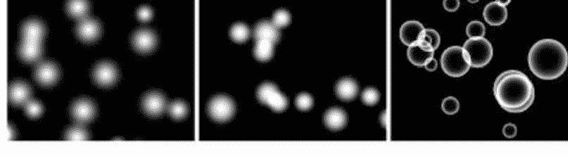

图 7.11 粒子引起的不同强度模式：喷雾（左）、泡沫（中）、气泡 (右) 。(图片来自[7])

屏幕空间解决方案可以应用于喷雾渲染。基于多相模拟, Kim和同事们[128]确定了引入空气粒子的窄带。在这个窄带上识别出的流体粒子可以被渲染为一层, 其中的视觉属性是根据其密度和漫反射属性计算的。

在表面上渲染水滴是一个相对较容易的任务。使用相同的屏幕空间方法, 水滴可以映射到代表高度分布和法线贴图的G缓冲区中, 与环境贴图组合, 可以产生一个可以渲染在物体上的层[225]。启发式方法可以用来模拟水滴的物理运动和它们的合并过程[37]。

屏幕空间方法的一个缺点是需要多次渲染来产生每个信息层。随着模拟中粒子数量的增加, 这些多次渲染可能变得不可行。优化策略可以克服这个成本问题, 减少需要评估渲染的粒子数量。这是下一节的主题。

### 7.3.3 优化

流体模拟和渲染是计算密集型的任务。因此, 研究和提出优化技术来加速这些过程是很自然的。

在计算机图形学研究中, 为了减少渲染过程的成本, 会付出很多努力, 例如消除相机不可见的对象或者减少远离相机的物体的几何细节。剔除技术[4]可以避免渲染相机不可见的对象或者它们的部分。细节层次控制[150]使用数据结构和算法, 根据与相机的距离相关的视觉度量, 能够减少或增加物体的几何细节。

从广义上讲, 这两种技术都试图根据某种度量标准 (如剔除的可见性或观察者距离的远近) 自适应地控制处理工作负载。关键词在于自适应。

在流体中, 类似的思想也可以应用。相对稳定的流体区域需要比涡旋、涟漪或喷雾发生的地方更少的关注。从数值上讲, 这种关注与采样密切相关。在粒子流体模拟中, 所使用的粒子数量甚至粒子的大小都可以根据这种自适应度量标准的变化而变化。

就渲染而言, 流体/液体的表面是最终图像中细节产生巨大差异的地方。自适应方法使用分割和合并粒子的概念[2, 271]来应用一些LOD控制方法。

分割操作可以在需要细节的流体区域 (如溅泼和浪尖) 产生小粒子尺寸。合并操作则生成更大的粒子, 而流体需要较少的细节来渲染。如果管理得当,这些操作可以用于渲染和模拟[271]。

在固-流耦合的粒子碰撞问题中, Truong和同事们提出了这种分割和合并方法的令人兴奋的应用[238]。

自适应方法可以在渲染中起到好处, 因为更多的粒子可以引起更详细的表面采样, 从而得到更好的表面提取。 屏幕空间方案也可以利用自适应性, 因为可以减少总粒子数。

必须快速确定相对位置和粒子的邻域, 以识别分割和合并操作的粒子候选者。用于定位问题的分层和自适应数据结构。八叉树是最常用的数据结构之一[67], 用于此目的。

分层数据结构也可以应用于加速光线追踪方法的渲染过程[174-176]。在光线追踪中, 寻找光线可能相交的对象是关键步骤, 并通过空间数据结构进行优化[189]。

值得注意的是, 现在所有的优化工作都在大量使用GPU的并行计算来减少处理时间。杨和高的工作是一个完全在GPU上并行进行的表面重建方法的例子。这样的算法必须注意工作负载平衡、内存布局和占用空间等问题。

## 7.4 渲染中的机器学习

机器学习 (ML) 技术正在渗透到包括渲染在内的许多领域。渲染是一个耗时的过程, 特别是考虑到逼真的渲染。像路径追踪这样的渲染算法需要大量的光线才能获得连续的图像, 这在计算上是昂贵且耗时的。

为了降低成本, 研究人员尝试了两种主要策略: 减少追踪的光线数量或改进光线的选择。前者会增加最终图像中的噪点。在后期处理中, 当每像素的样本数量较低时, 机器学习技术可以对图像进行去噪处理。在路径追踪过程中, 如何选择采样方向可以使用机器学习技术来学习最佳的采样策略, 以减少噪点效果。

渲染复杂对象需要大量与其几何形状和材质相关的信息。在1990年代和2000年代, 研究人员尝试使用一组图像来减少渲染的复杂性, 以恢复关于形状、材质和光照的信息, 这就是所谓的基于图像的技术[57]: 基于图像的建模、基于图像的渲染和基于图像的照明。这些技术的主要思想是基于对场景中一组图像进行分析,使用常规算法生成几何数据、光照条件和物体材质。很多。自那时以来，取得了一些进展，但这种方法也存在一些缺点，例如计算成本高和难以推广[57]。

现如今，机器学习技术可以用于从离散样本（点云）中重建物体[93]，恢复材料特性[66]和光照条件[280]。与基于图像的技术类似，机器学习依赖于深度学习技术，通常需要一组图像来训练神经网络以生成模型的缺失信息，改变材料的视觉特性，甚至改变场景的光照条件。训练阶段是这种技术的一个缺点。需要大量的数据集，但它们有时只是有限可用的。为了减轻这个缺点，正在开发新的数据合成方法[239]。

### 7.4.1 神经渲染

神经渲染的主要目标是从3D世界数据中生成合成的逼真图像。数据可以直接从现实世界中捕获，也可以是计算机生成的。数据可以是深度图、法线图、反照率等，以1D向量或2D图像的形式组织[231]。通过对场景数据进行训练，深度神经网络学习如何生成该场景的模型。

这种新技术中最流行的方法之一是NeRF [159]。它使用多层感知器来逼近3D场景的两个体积场：辐射和密度。我们可以使用传统的直接体积渲染技术从不同的视角渲染场景。

原始NeRF方法的一个缺点是渲染时间和生成高质量图像所需的数据量。像神经稀疏体素场[146]和KiloNeRF [202]这样的作品提出了加速基于MLP表示的体积渲染的策略，使用自适应的体积数据结构，如八叉树，以增强空白空间跳过和射线早期终止。

Hadadan和同事们[95]提出了他们所称之为“神经辐射度”的概念，这是一种使用神经网络解决渲染方程的神经渲染方法。

他们使用基于神经网络的方法来表示四维辐射场。考虑到，θ表示神经网络的权重和偏差，解决渲染方程可以被表述为最小化残差差异的范数：$|| r(x, \omega_o, \theta) ||^2$。其中这个残差是通过蒙特卡洛积分重复估计得到的，并且辐射场的梯度是通过自动微分计算得到的。训练时间是主要问题，根据场景的复杂性，训练时间从几分钟到几小时不等。渲染结果的质量在视觉上与路径追踪相竞争，可以用于渲染场景的新视角。

神经光场渲染（NLR）[120]是一种加速神经体积渲染的方法，给定一个场景的多视图图像集。该论文专注于使用相机阵列获取的面部模型。他们使用了七个多视图图像捕捉一个人表现出不同的表情。使用两个神经网络来表示形状（有符号距离函数-SDF）和外观，NLR可以导出一个视角相关的网格和纹理，用于传统图形渲染流程。

尽管结果与形状重建和渲染时间相关，但作者得出结论，神经渲染仍无法超越实时渲染速率。

作为一个新的、具有挑战性的研究领域，神经渲染在过去几年中已经有了大量的论文。我们建议读者参考[230,231]以获得全面的视角。

### 7.4.2 可微分渲染

传统的渲染过程使用几何、材质、光照和相机属性来生成图像。将这个过程整合到神经网络流水线中是一项具有挑战性的任务，因为它要求其参数可以被微分，这意味着必须计算场景中渲染参数的梯度。

可微渲染（DR）技术[119]试图在渲染过程和神经网络流水线之间建立一座桥梁，提供适当的渲染梯度。因此，神经网络可以在其2D投影上优化3D场景。

考虑渲染函数R，它以输入参数Φ（形状、相机、材质和光照）为参数，并生成包含每个像素的RGB颜色和深度的图像I。为了优化损失函数，微分渲染过程必须计算梯度∂I/∂Φ。基于这些梯度，具有可微分渲染的自监督流水线接受图像作为输入，神经网络生成场景参数，渲染器用于创建RGB图像。神经网络将使用图像和渲染输出之间的误差进行反向传播更新。

DR使用的方法和技术强烈依赖于场景的数据表示：网格[286]、体素[259]、点云[256]或隐式函数[249]。例如，基于体素的模型几乎是2D图像的扩展，因此区分这种表示很容易，尽管内存消耗可能成为问题。点云表示的缺点是缺乏表面，但同时易于渲染和区分。

可微渲染在诸如Mitsuba 2 [182]、PyTorch3D [200]、Kaolin [111]和TensorFlow Graphics [244]等库中可用。

虽然神经渲染可以从真实世界数据生成新的图像，但可微渲染可以修改场景参数以生成改进神经渲染(NR)训练的新图像。像[147,179]这样的作品带来了一些这方面的想法。

我们建议读者参阅[119]，了解这个新研究领域的激动人心的调查。

## 7.5 流体渲染中的机器学习

减少计算成本的常见方法是减少样本数量或用于离散化域的分辨率。另一种方法是增加模拟中使用的时间步长，然后应用插值方案来产生流体的中间行为[233]。在这两种情况下，结果可能在视觉上较差，并且可能丢失重要信息。

在这种情况下，机器学习技术可以通过增加图像的分辨率或从相同条件下学习的流体的视觉行为中转移细节来提高渲染图像的质量[124]。即使使用更大的时间步长，它也可以提高流体的时间演变的连贯性。

受图像超分辨率研究的启发[13]，机器学习技术可以增强模拟中的细节，基于低分辨率模拟生成高分辨率图像[46,204]。

Roy和Thuerey的工作[46]是最早尝试使用卷积神经网络合成高分辨率烟雾模拟的之一。基于流体流动体积数据集，他们使用卷积神经网络从流体速度和密度生成描述符。使用学习到的描述符作为关键字在高分辨率数据集中进行搜索。渲染过程是一个两步算法，第一步生成低分辨率数据。在第二步中，生成和渲染高分辨率体积数据。体积数据仅存储归一化密度，因此最终渲染是通过混合归一化补丁的贡献得到的。

这种方法的缺点是需要 在二级存储器上存储一个大小为5.1 GB的3D存储库。

当流体渲染应用程序不关注物理精度而只关注视觉精度时，可以使用基于风格迁移的方法。风格迁移最初用于通过应用著名的艺术风格来生成任何照片的绘画样式图像。风格迁移可以用于流体模拟，从低分辨率模拟中创建更详细的图像。

在[210]中，风格迁移方法被用于在低分辨率烟雾模拟的后处理步骤中应用湍流细节。作者在纹理合成过程中考虑了速度场。给定低分辨率模拟目标和高分辨率源模拟，该方法通过两步搜索来创建高分辨率场，第一步搜索找到全局匹配，第二步搜索找到局部匹配。使用基于优化的合成方法生成最终场，并消除补丁之间的不连续性。结果在视觉上是一致的，但这种方法的主要问题是源动画的长度至少应与目标动画相同。

对传统神经风格迁移的扩展提出了更多的参数，超出了流体的密度。这样做可以控制烟雾或气体的外观和结构，这对于游戏、电影和艺术应用特别有趣。Kim等人[122]提出了他们声称是第一个基于传输的神经风格迁移（TNST）算法，用于体积烟雾数据。 TNST引入了语义迁移，可以产生使用基于纹理的系统来创建新的图案和更复杂的图案。 TNST的最终产品是一组灰度图像，表示烟雾所在体积中的密度。 使用一个单向光源和正交摄像机的轻量级可微分渲染算法来渲染体积数据。 虽然结果在视觉上令人印象深刻，但这项工作不支持颜色信息以实现外观效果。

Christen和同事们提出了TNST的扩展，可以结合颜色风格转移。Aurand等人通过使用更轻量级的算法进行平流和时间平滑来提高TNST的性能，但仍保持不支持颜色风格转移的限制。

神经网络UpFlow [204] 使用神经网络增强低分辨率的拉格朗日流体模拟的细节。 这种方法基于一个训练阶段，其中呈现了低分辨率和高分辨率数据的配对。 两个分辨率之间的变形通过他们的fluidFlowNet (FFNet) 学习的4D光流来捕捉。 预测的位移用于提升低分辨率的基于粒子的模拟。 结果可以提高低分辨率液体模拟的视觉质量，在表面附近添加细节，但是喷雾等效果捕捉得不好。

改善渲染的另一种方法是使用生成对抗网络（GANs） （第6.2.2节）[110] 根据从模拟中捕获的物理参数（如位置、速度或密度）生成图像。 通过少量样本，GAN可以合成一个更高分辨率的模拟版本进行渲染。 GANs还可以生成修改模拟的控制参数[45]，为游戏或电影中的动画产生更多可能的结果。

## 第8章案例研究

摘要 本章描述了涉及使用卷积网络进行拉格朗日流体模拟的工作，以及另一项旨在从较低空间分辨率的模拟中生成更高分辨率数值帧的工作。前者是将CNN架构改编为能够处理平滑粒子流体动力学（SPH）数据的卷积神经网络。网络输入由动态粒子位置和速度以及模拟流体域边界的静态粒子组成。卷积神经网络的输出是一个位移数组，必须用于更新流体粒子的位置和速度。另一种专注的方法受到生成对抗网络（GANs）在数据生成方面的成功启发。该方法可以通过使用基于网格的数值方法模拟的二维和三维数据进行训练，这些数据是由传统的Navier-Stokes方程求解器产生的。它通过CNNs实现，使用残差网络。该方法包括通过Navier-Stokes方程的不变性属性（对称群）实现的数据增强步骤。本章包括使用这两种技术生成的模拟结果，以及与数值（基准）结果的比较。

关键词 平滑粒子流体动力学 · 卷积神经网络 · 生成对抗网络 · 流体模拟 · 烟雾模拟 · SPlisHSPlasH求解器 · MantaFlow软件

## 8.1 引言

本节描述并提供了两个作品的计算实验。第一个作品涉及使用卷积网络进行SPH流体模拟[242]。第二个作品在[278]中介绍，旨在从低空间分辨率的模拟中生成高分辨率的新帧。这是受到生成对抗网络（GAN）方法[110]成功的启发。

SPH是一种用于流体模拟的与网格无关的技术，在第3.3节中进行了介绍。从计算机图形学的角度来看，SPH的实际情况是，不依赖于先前定义的网格是与欧拉（基于网格）方法相比的优势。电影中的场景通常是动态的，随着新物体进入场景，边界也会变化。因此，不使用网格的方法可以避免每次发生这些变化时重新生成网格的额外成本，因此具有优势。考虑到这些方面，我们决定在第8.2节中描述一种卷积神经网络，称为ConvNet，用于预测SPH模拟。

然而，从神经网络的角度来看，通过基于网格的方法生成的标量和矢量场可以直接由传统的CNN架构进行处理，这些架构直接适应这种类型的数据。这样，网络对数值数据的处理尊重数据的空间一致性，避免了粒子系统矢量化的固有歧义，甚至避免了将粒子邻域映射到规则网格以使用基于卷积方法的网络的额外成本，如[242]中所执行的那样。这一事实，加上生成对抗网络（GANs）在超分辨率图像方面的成功[110]，促使了TempoGAN[278]的开发，这是一种通过CNN实现的GAN方法，它经过训练以接收低空间分辨率的数值帧并生成这些帧的高分辨率版本。因此，通过使用非常精细的网格来模拟流体的计算成本得以避免，从视觉效果的角度来看，结果是可接受的。TempoGAN的训练数据由使用基于网格技术进行的一系列数值模拟以及通过数据增强步骤获得的新数值帧组成，该步骤使用Navier-Stokes方程的不变性属性（对称群）进行实现。此外，在[278]中，通过缩放初始速度和修改损失超参数，可以获得一定的艺术控制。TempoGAN方法及相应的计算实验在第8.3节中进行了描述。

## 8.2 基于连续卷积的拉格朗日流体模拟

本节描述了一项涉及使用卷积网络进行拉格朗日流体模拟的工作[242]。这是对卷积方法的一种改进，以获得能够处理SPH数据的神经网络。在这种方法中，流体使用在第3.3节中介绍的SPH框架进行建模。流体域的边界使用与表示流体的动态粒子相互作用的静态粒子进行建模。因此，考虑到第6.1节的讨论，模拟器是一个函数 $g: \mathbb{R}^m \rightarrow \mathbb{R}^m$，它接收粒子的配置，由它们的位置和速度组成的数组 $\mathbf{x}^{(i)}$，在模拟时间 $i$ 时，输出新的配置 $\mathbf{x}^{(i+1)}$。因此，问题是构建函数 $g$ 的代理模型。


图8.1 将球体转换为立方体的过程（改编自[242]）

我们开始演示。为了简化解释，我们将使用 $\mathbb{R}^2$。神经网络架构被设计用于将离散卷积推广到连续域，以便处理SPH数据。执行此任务的关键思想是应用映射。根据[90]中的描述，将半径为 $R$ 且中心在 $\mathbf{x} \in \mathbb{R}^2$ 的球体转换为规范化的正方形 $N(\mathbf{x}, R)$，再映射为规范化的正方形 $[0, 1]^2$。然后，根据图8.1中的方法概述，给定一个点 $\mathbf{x}_i \in N(\mathbf{x}, R)$，值 $b = A(\mathbf{x}_i - \mathbf{x})$ 定义了一个单位正方形中的单元格。因此，给定一个掩模 $\mathbf{h}$ 定义了图8.1中的滤波器，我们可以取相应的元素（在图8.1的滤波掩模中，$h(1, 1)$ 的位置），并使用附近的掩模值进行线性插值计算权重，用 $\tilde{h}(A(\mathbf{x}_i - \mathbf{x}))$ 表示，将在下一步中使用。

因此，根据SPH设置，我们有一个点云集合 $S = \{\mathbf{x}_1, \mathbf{x}_2, \dots, \mathbf{x}_N\} \subset \mathbb{R}^2$ 和一个函数 $f: \mathbb{R}^2 \rightarrow \mathbb{R}$，已知值 $f_i = f(\mathbf{x}_i), i=1,2, \dots, N$。然后，给定位置 $\mathbf{x}$ 的SPH卷积表示为：根据式（3.32），将其推广为：

$$ (f \otimes \tilde{\mathbf{h}})(\mathbf{x}) = \sum_{\mathbf{x}_i \in N(\mathbf{x}, R)} a(\mathbf{x}_i, \mathbf{x}) \, f_i \, \tilde{h}\left(A(\mathbf{x}_i - \mathbf{x})\right), \quad (8.1) $$

其中：

$$ a(\mathbf{x}_i, \mathbf{x}) = \begin{cases} \left(1 - \frac{\|\mathbf{x}_i - \mathbf{x}\|_2}{R}\right)^3, & \text{如果 } \|\mathbf{x}_i - \mathbf{x}\|_2 < R, \\ 0, & \text{否则}, \end{cases} $$

这是为了改善卷积结果在不同半径 $R$ 值下的平滑性而引入的。

在我们有一个一般映射的情况下 $\mathbf{f}: \mathbb{R}^3 \rightarrow \mathbb{R}^D$，因此 $\mathbf{f}_i = (\mathbf{f}_i(1), \mathbf{f}_i(2), \dots, \mathbf{f}_i(D)) \in \mathbb{R}^D$，具有维度 $D > 1$，根据式(8.1)的推广很直接，给出如下：

$$ (\mathbf{f} * \widetilde{\mathbf{h}})(\mathbf{x}) = \sum_{\mathbf{x}_i \in N(\mathbf{x}, R)} \sum_{t=1}^{D} a(\mathbf{x}_i, \mathbf{x}) f_i(t) \widetilde{h}\left(A(\mathbf{x}_i - \mathbf{x})\right), \quad (8.2) $$

在这种情况下，$A$ 是一个从 $\mathcal{N}(\mathbf{x}, R) \subset \mathbb{R}^3$ 到单位正方形 $[0, 1]^3$ 的映射，和滤波器 $\mathbf{h}$ 的尺寸为 $4 \times 4 \times 4$，因为我们只考虑正方形/立方体滤波器（见图8.1）。

同样，在CNN中，规则网格上的滤波器值是可学习的参数。整个架构在[242]中被称为ConvNet。在步骤 $n$ 中，其部分输入是中间位置 $\mathbf{x}^n_i$ 和速度 $\mathbf{v}^n_i$，通过以下方式计算的流体粒子：

$$ \mathbf{v}_i^{n*} = \mathbf{v}_i^n + \Delta t \, \mathbf{a}_{\text{ext}}, \quad (8.3) $$
$$ \mathbf{x}_i^{n*} = \mathbf{x}_i^n + \Delta t \left(\frac{\mathbf{v}_i^n + \mathbf{v}_i^{n*}}{2}\right), \quad (8.4) $$

其中 $\mathbf{a}_{\text{ext}}$ 是考虑外部和内部力的加速度，$\mathbf{v}^n_i$ 是粒子 $i$ 的实际速度。因此，中间位置和速度不考虑粒子之间的相互作用或粒子与场景的相互作用。

因此，在模拟步骤 $n$ 中，ConvNet接收以 $\mathbf{p}^n_i$ 排列的SPH模型的每个流体粒子的中间配置 $\{\mathbf{x}_i^{n*}, [1, \mathbf{v}_i^{n*}]\}$。此外，用于模拟域边界的静态粒子也构成了输入。这些粒子由 $\mathbf{s}_j = \{\mathbf{y}_j, \mathbf{n}_j\}$ 表示，其中 $\mathbf{y}_j$ 是静态粒子 $j$ 的位置，$\mathbf{n}_j$ 是定义局部几何的法线。ConvNet的输出是必须添加到中间位置 $\mathbf{x}^{n*}_i$ 的修正，以考虑碰撞动力学：

$$ [\Delta \mathbf{x}^n_1, \Delta \mathbf{x}^n_2, \ldots, \Delta \mathbf{x}^n_N] = \text{ConvNet}\left(\{\mathbf{p}^{n*}_1, \mathbf{p}^{n*}_2, \ldots, \mathbf{p}^{n*}_N\}, \{\mathbf{s}_1, \mathbf{s}_2, \ldots, \mathbf{s}_M\}\right). \quad (8.5) $$

因此，模拟步骤 $n+1$ 的位置和速度被计算为：

$$ \mathbf{x}_i^{n+1} = \mathbf{x}_i^{n*} + \Delta \mathbf{x}_i^n, \quad (8.6) $$
$$ \mathbf{v}_i^{n+1} = \frac{\mathbf{x}_i^{n+1} - \mathbf{x}_i^n}{\Delta t}, \quad (8.7) $$

对于 $i=1,2, \ldots, N$。ConvNet架构由一系列对连续卷积（CConv）操作符的调用组成，对于3D数据，计算中间位置 $\mathbf{x}^{n*}_i, i=1,2, \ldots, N$ 的表达式（8.2）。每次CConv操作符的调用如下所示：

$$ \text{输出特征} = \text{CConv}(\text{输入特征}, \text{输入位置}, \text{输出位置}, \text{过滤器}, \text{核大小}) \quad (8.8) $$

其中，$\text{输入特征} = \{\mathbf{f}_{1}, \mathbf{f}_{2}, \dots\}$ 表示与数组 `InputPositions` 中的点相关联的特征数组。数组 $\text{输出位置} = \{\mathbf{x}^{n*}_1, \mathbf{x}^{n*}_2, \ldots, \mathbf{x}^{n*}_N\}$ 包含表达式(8.2)计算的点。$\text{过滤器}$ 是卷积核的数量 $h_1, h_2, \dots, h_{\text{filters}}$，卷积核的 $\text{核大小} = 4 \times 4 \times 4$。

[242]中介绍的ConvNet在图8.2中显示。网络的第一层由两个独立的CConv调用组成，第一个处理静态粒子，其中 $\mathbf{f}_{i}=\mathbf{n}_{i}$，$\text{输入位置} = \{\mathbf{y}_{1}, \mathbf{y}_{2}, \dots, \mathbf{y}_{M}\}$，$\text{过滤器} = 32$，和 $\text{核大小} = (4,4,4)$。此外，还使用ReLU激活函数逐元素应用于生成输出特征数组。因此，根据表达式 (8.2)：

$$ \text{输出特征}_{1,1}(j, l) = \text{ReLU}\left(\sum_{\mathbf{y}_{i} \in \mathcal{N}(\mathbf{x}_{l}^{n*}, R)} \sum_{t=1}^{3} a(\mathbf{y}_{i}, \mathbf{x}_{l}^{n*}) n_{i}(t) \tilde{h}_{j}\left(A(\mathbf{y}_{i}-\mathbf{x}_{l}^{n*})\right)\right), \quad (8.9) $$

其中 $j=1,2, \ldots, 32, l=1,2, \ldots, N$，其中通过图8.1中描述的过程获得的权重数组为 $\tilde{h}_{j}$，并且子索引 “1,1” 表示第一个特征图。

第二个CConv调用处理动态粒子，类似于表达式(8.9)，但在这种情况下 $\mathbf{f}_{i} = [1, \mathbf{v}_{i}^{n^{*}}]$ 和 $\text{输入位置} = \text{输出位置}$，生成特征图 $\text{输出特征}_{1,2}$。第一层的最后一个组件是一个全连接（FC）神经网络，它以 $\mathbf{f}_{i} = [1, \mathbf{v}_{i}^{n^{*}}]$ 作为输入，并输出 $N$ 个特征向量 $\mathbb{R}^{32}$。它也经过 ReLU 处理，生成特征图 $\text{输出特征}_{1,3}$。将 $\text{输出特征}_{1,1}$、$\text{输出特征}_{1,2}$ 和 $\text{输出特征}_{1,3}$ 按列连接，为每个粒子生成大小为96的特征向量，由下一层进行处理，如图8.2所示。


图8.2 ConvNet架构中的前馈信息处理，使用CConv参数指示输入特征和输入位置（改编自[242]）

从图8.2中，我们注意到ConvNet的第二层包括一个CConv和一个FC神经网络。从公式(8.9)返回，前者接收的参数为 $\text{输入特征} = \text{输出特征}_{1}$，$\text{输入位置} = \text{输出位置} = \{\mathbf{x}^{n*}_1, \dots, \mathbf{x}^{n*}_N\}$，和 $\text{过滤器} = 64$。$\text{KernelSize}$ 与第一层保持相同。因此，公式(8.9)生成一个特征向量 $\text{输出特征}_{2,1} \in \mathbb{R}^{64}$，FC生成 $\text{输出特征}_{2,2} \in \mathbb{R}^{64}$。根据图8.2，第二层的输出是逐元素求和，然后经过ReLU激活函数：

$$ \text{输出特征}_{2,0} = \text{ReLU}(\text{输出特征}_{2,1} + \text{输出特征}_{2,2}) $$

除了CConv和FC之外，第三层还包括一个跳跃连接，使得特征图 $\text{输出特征}_{3}$ 的表达式为：

$$ \text{输出特征}_{3} = \text{ReLU}(\text{输出特征}_{3,1} + \text{输出特征}_{3,2}) + \text{输出特征}_{2,0} $$

最后一层由CConv和FC组成，通过逐元素相加输出修正值，即根据式(8.5)中所述的 $\Delta \mathbf{x}^n_i$。

损失函数比较了时间步 $n+1$ 和 $n+2$ 时的真实粒子位置 $\mathbf{x}^n_{i+1}$ 和 $\mathbf{x}^n_{i+2}$，以及使用ConvNet和公式(8.6)计算得到的预测位置 $\hat{\mathbf{x}}^n_{i+1}$ 和 $\hat{\mathbf{x}}^n_{i+2}$：

$$ \mathcal{L} = \sum_{i=1}^{N} \phi_i^{n+1} \| \mathbf{x}_i^{n+1} - \hat{\mathbf{x}}_i^{n+1} \| + \sum_{i=1}^{N} \phi_i^{n+2} \| \mathbf{x}_i^{n+2} - \hat{\mathbf{x}}_i^{n+2} \| \quad (8.10) $$

其中 $\gamma$ 在ConvNet的原始实现中设置为 0.5，并且 $\phi_i^{n+1}$ 用于强调与具有较少流体邻居的粒子对应的项，类似于 $\phi_i^{n+2}$。这个想法是合理地加权边界附近的粒子，因为边界条件对流动模式非常决定性。

权重计算公式为：
$$ \phi_i = \exp \left( -\frac{1}{c} \| \mathbf{x}_i - \mathbf{x}_{\text{boundary}} \| \right), $$

其中 $d_i$ 表示粒子到边界的距离。在这种情况下，邻域 $N$ 半径为 $R$，设置为 $0.0225 \text{m}$ [242]。此外，$c=40$，即在[242]的实验中，粒子邻居的平均数量约为 4。

训练数据是使用SPH和Navier-Stokes方程进行的一组模拟。在这项任务中，可以使用SPlisHSPlasH[219]、PySPH[199]和Dual-SPHysics[59]等求解器。为了避免需要大量数据集，实施了基于全局旋转的简单数据增强技术。

具体来说，每个模拟被细分为连续三个数值帧的块。为了适应损失函数在表达式(8.10)中的计算方式，每个块的顺序是 $((0,1,2), (1,2,3), \dots)$。对于数值帧 $(k, k+1, k+2)$，它会被处理以预测位移。

## 8.2 基于连续卷积的拉格朗日流体模拟

位移。在模拟时间中，使用位移来更新动态粒子的位置和速度。通过式 (8.6) - (8.7) 的组合，ConvNet 会处理 SPH 数据。通过式 (8.6) - (8.7) 和 ConvNet，输出粒子在 $t^{k+1}$ 时刻的位置和速度。现在，可以使用地面真实数据 $\hat{\mathbf{x}}_i^{k+1}$ 和 $\hat{\mathbf{x}}_i^{k+2}$ 以及预测位置 $\mathbf{x}_i^{k+1}$ 和 $\mathbf{x}_i^{k+2}$ 来计算损失函数 (8.10)。计算损失函数 (8.10) 时，使用地面真实数据 $\hat{\mathbf{x}}_i^{k+1}$ 和 $\hat{\mathbf{x}}_i^{k+2}$ 以及预测位置 $\mathbf{x}_i^{k+1}$ 和 $\mathbf{x}_i^{k+2}$。

在上述前馈计算过程中，ConvNet 处理动态和静态粒子，同时增加了边界域的局部几何信息，该域以法向量方向包围。通过这种方式，在训练过程中，模型可以学习如何在任意域几何中模拟流体。

### 8.2.1 与SPlisHSPH模拟的比较

本节旨在比较 ConvNet 模拟和通过 SPlisHSPH 软件 [219] 获得的 SPH 结果。SPlisHSPH 用于生成应用于 GitHub 上可用于本节测试的 ConvNet 模型的训练集。我们使用预训练的模型，不进行任何微调。SPlisHSPH 实现中使用的模拟方法是 DFSPH，详见第 3.3.3 节。对于第一个示例，我们决定模拟一个喷泉，其设置如图 8.3a 所示。域是一个尺寸为 $10 \times 10 \times 3\,\text{m}$ 的盒子，分别表示为图 8.3a 中的 $x$、$y$ 和 $z$ 方向。喷泉在域底部的中心位置有一个发射器（图 8.3b）。发射器可以被定义为一个形状，向模拟中添加流体粒子，具有给定的速度和方向，以一定的流量。在这个例子中，发射器是一个高度为 $0.225\,\text{m}$、直径为 $0.9\,\text{m}$ 的圆柱体。

在 SPlisHSPH 的实现中，发射器是粒子与之相互作用的物理对象，可以有两种形状：圆柱和正方形。粒子是在发射器内部创建的，如图 8.3c-d 所示，并沿其法线方向向前发射。

SPlisHSPH 模拟参数在表 8.1 中给出，将信息分为模型参数和数值参数。前者在第 3.3 节中讨论，而后者是数值求解器的内部参数。

SPlisHSPH 软件包版本 2.9.2 允许使用静态粒子进行边界处理的 SPH 模拟（图 8.3e），遵循所描述的方法。参考文献 [8] 在第 3.3.4 节中进行了修订，以及体积映射概念 [21] 在第 3.3.2 节中进行了修订。其他可能性请参考 [18]。由于 ConvNet 的训练集是通过 SPlisHSPH 生成的，边界以粒子表示，我们首先决定进行喷泉模拟，模拟静态（边界）和动态粒子之间的相互作用。

1. https://github.com/is1-org/DeepLagrangianFluids

表 8.1 SPlisHSPH 模拟参数
| 类别 | 参数 | 值 |
|---|---|---|
| 模型参数 | 模拟方法 | SPlisHSPH |
|  | 粒子半径 | 0.025 米 |
|  | 流体的初始密度 | 1000 克/立方厘米 |
|  | 表面张力 | 0.2 |
|  | 粘性力计算的系数 | 0.01 |
|  | 状态方程的刚度系数 | 50.000 |
|  | 状态方程中的指数 | 7 |
| 数值参数 | 最大允许的时间步长 | 0.005 |
|  | 压力求解器的最大迭代次数（默认：100） | 100 |
|  | 压力求解器容忍的最大密度误差百分比（默认：0.01） | 0.01 |
|  | 发散求解器的最大迭代次数 | 100 |
|  | 压力求解器容忍的最大发散误差百分比 | 0.1 |
|  | 速度更新方法 | 一阶更新 |
|  | （隐式求解器）粘度求解器的最大迭代次数 | 200 |
|  | （隐式求解器）粘度求解器的最大误差 | 0.05 |

参考文献 [8]。接下来，我们还应用体积映射来比较卷积神经网络与另一种边界处理的喷泉模拟的性能。在体积映射的情况下，密度图和有符号距离场的分辨率由以下给出，分别为 $40 \times 30 \times 15$ 和 $64 \times 64 \times 64$。考虑到这些分辨率以及表 8.1 中报告的压力和发散求解器的最大迭代次数，SPlisHSPH 的计算成本可能会随着粒子数量的增加而增加，稍后我们将看到。

此外，SPlisHSPH 使用由 CFL 条件 [48] 控制的自适应时间步长方案。尽管如此，数值数据在模拟执行过程中以恒定的每秒 50 帧的速率导出。获得的序列由 1250 帧组成，将与使用式 (8.7) 中的 $\Delta t = 0.02\,\text{s}$ 执行的 ConvNet 模拟进行比较。在这里，速度、圆柱的直径/高度和时间步长将决定每帧生成多少粒子。表 8.2 显示了圆柱参数对每帧生成的粒子总数的影响。SPlisHSPH 设置每秒导出 50 帧，时间步长 ($\Delta t$) 在模拟过程中是可变的。因此，本节的所有统计数据都是基于导出的帧进行的。

同样地，对于 SPlisHSPH，在 ConvNet 实现中，域的边界通过静态粒子进行建模。图 8.3d-e 展示了使用 310,266 个粒子对喷泉域进行采样的边界。域的尺寸与图 8.3a 中所示相同。发射器可以采用任何给定网格表示的形状，也可以转换为静态粒子，并且速度可以是任意方向。在我们的 ConvNet 模拟中，发射器的几何形状也是一个圆柱体。

## 8.2 基于连续卷积的拉格朗日流体模拟

表 8.2 发射器尺寸和粒子速度与 SPlisHSPH 每帧生成的粒子数以及考虑 10 秒发射的总粒子数的关系
| 形状 | 直径/高度 | 速度 (米/秒) | 每帧粒子数 | 总粒子数 |
|---|---|---|---|---|
| 圆柱体 | 0.848/0.225 米 | 4 | 137-274 | 109,600 |
|  |  | 5 | 274 | 137,000 |
|  |  | 6 | 274-411 | 164,400 |
|  | 0.9/0.225 米 | 4 | 156-312 | 124,800 |
|  |  | 5 | 312 | 156,000 |
|  |  | 6 | 312-468 | 187,200 |
|  | 0.956/0.225 米 | 4 | 177-354 | 141,600 |
|  |  | 5 | 354 | 177,000 |
|  |  | 6 | 354-531 | 212,400 |

图 8.3 喷泉设置：(a) 域可视化，其中 $a = 10$ 米，$b = 3$ 米，$c = 10$ 米，$d = 4.55$ 米。(b) 流体域与粒子在中心底部发射。(c) 放大发射器区域。(d) 边界通过静态粒子和充满流体粒子的发射器表示。(e) 放大对应的发射器区域（来自作者）

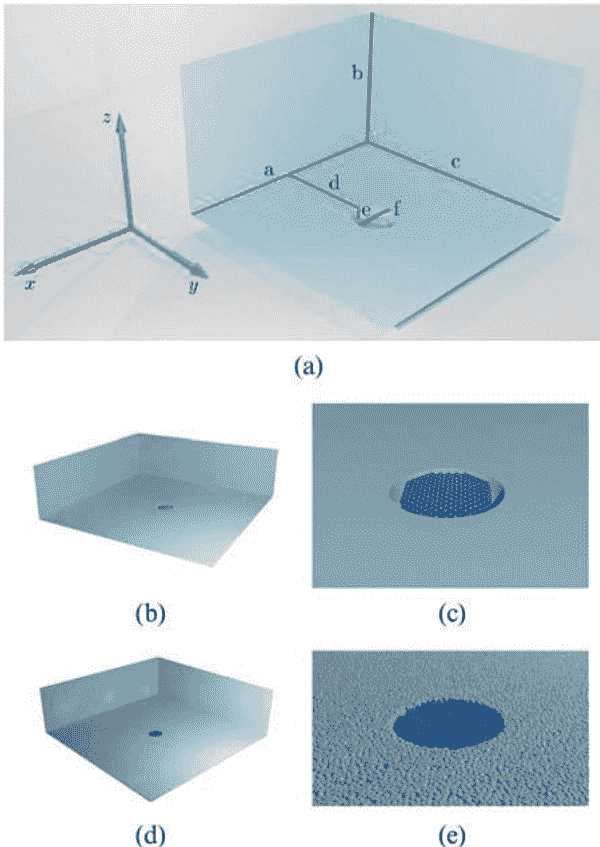

表 8.3 发射器尺寸对 ConvNet 每帧生成的粒子数量的影响（第四列）。最后一列中的粒子总数，在发射 10 秒后进行计数，由于 ConvNet 无法复现边界条件，会产生粒子丢失。
| 形状 | 直径/高度 | 速度（米/秒） | 每帧粒子数 | 总粒子数 |
|---|---|---|---|---|
| 圆柱体 | 0.848/0.225 米 | 4 | 274 | 136,998 |
|  |  | 5 | 274 | 136,999 |
|  |  | 6 | 274 | 137,000 |
|  | 0.9/0.225 米 | 4 | 312 | 155,995 |
|  |  | 5 | 312 | 155,997 |
|  |  | 6 | 312 | 156,000 |
|  | 0.956/0.225 米 | 4 | 354 | 176,997 |
|  |  | 5 | 354 | 176,996 |
|  |  | 6 | 354 | 177,000 |

如图 8.3 所示，粒子在发射器的体积内生成，如图 8.3c-e 所示，我们可以看到圆柱体内充满了粒子，与 SPlisHSPH 中的位置相似。在这里，粒子每帧只添加一次。因此，流量不依赖于粒子的速度，正如我们在表 8.3 的每帧粒子数一栏中所看到的那样。实际上，发射器中的流量取决于粒子的大小和发射器的形状。由于粒子半径在 $0.025\,\text{m}$ 处固定，我们在表 8.3 中仅展示了圆柱体发射器尺寸对 ConvNet 每帧生成的粒子数量的影响。

在 SPlisHSPH 模拟中，每个粒子在 $z$ 方向上以速度 $v_0=(0, 0, v_0)$ 被发射。该软件每帧导出一个模拟帧，$0.02$ 秒的模拟。例如，在表 8.2 中报告的直径/高度为 $0.9/0.225$ 米的情况下，每帧导出的粒子数为 312。因此，在 10 秒的发射结束时，喷泉发射的动态粒子总数为 156,000 个。然而，考虑到时间步长 $\Delta t$ 是可变的，粒子尺寸和发射器尺寸，当改变速度时，每帧发送到域中的粒子数可能会有所变化，如表 8.2 所示。事实上，从表 8.2 中可以看出，当发射器直径为 $0.9$ 米，高度为 $0.225$ 米时，速度为 $5\,\text{m/s}$ 时，每帧发射的粒子数为 312，而当初始粒子速度为 $4\,\text{m/s}$ 时，每帧发射的最小粒子数为 156 个，最大粒子数为 312 个，平均每帧发射约 249,600 个粒子。

对于 ConvNet 模拟，粒子以与 SPlisHSPH 相同的速度发射。然而，时间步长在模拟中是固定的。在 $t = 1/50 = 0.02\,\text{s}$ 时，发射器每个时间步发送到域中的粒子数量仅取决于发射器的几何形状和粒子大小。由于粒子大小固定，发射器的大小决定了发射器每个时间步发送到域中的粒子数量，如表 8.3 所示。表中的最后一列报告了模拟 10 秒后计数的总粒子数。我们强调一下，由于 ConvNet 无法准确重现边界条件，导致粒子的损失，因此这个数量是可变的。

图 8.4 显示了 ConvNet 和 SPlisHSPH 模拟的一些快照，其中包括发射速度 $v_0=(0, 0, 5)$ 和发射器尺寸为 $0.9/0.225\,\text{m}$。我们注意到 ConvNet 中的流体演变比 SPlisHSPH 模拟中的演变要慢。因此，ConvNet 的快照对应于比 SPlisHSPH 中对应快照更大的时间步长。视觉比较显示了 ConvNet 流动中的一些不对称性，这些不对称性在模拟开始时更为明显。然而，我们必须考虑到 ConvNet 的训练集中没有包含类似于考虑的喷泉设置。尽管存在上述问题，神经网络还是能够重现流动的重要视觉特征。

通过式 (8.11) 可以进行定量比较：
(8.11)

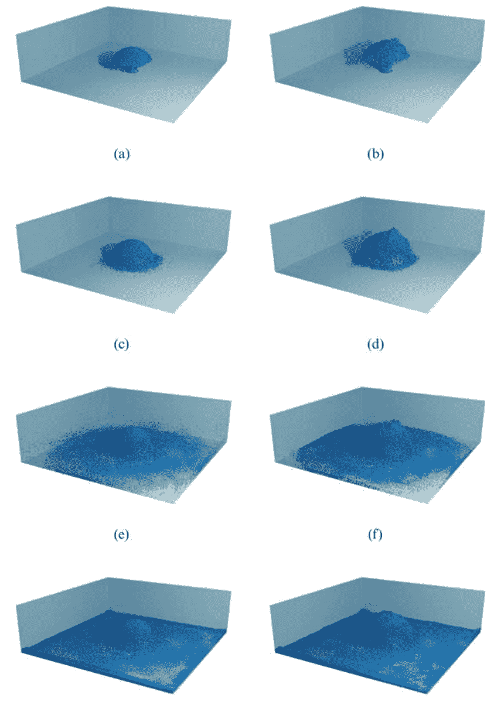

图 8.4 喷泉模拟快照：(a), (c), (e), (g) 使用 SPlisHSPH 进行 SPH 模拟的时刻 $t = 51, 67, 123, 192$ 分别。(b), (d), (f), (h) 在时间步骤中的 ConvNet 模拟 $t = 65, 86, 176, 251$ 分别（作者提供）

神经网络可以处理这些参数的变化，生成接近 SPlisHSPH 得到的真实效果的视觉模式。表 8.4 显示了每帧所需的平均模拟时间（加粗显示），用于生成持续 5 秒和 10 秒的 18 个模拟，使用不同的发射器尺寸和发射速度，如表的第二列和第三列所示。表 8.4a 的结果表明，SPlisHSPH 比 ConvNet 更加计算复杂，ConvNet 的模拟时间在表 8.4b 中呈现。因此，尽管观察到 SPlisHSPH 和 ConvNet 模拟之间的差异，但 ConvNet 需要的计算时间要少得多，可以在视觉效果中得到应用，主要是在不影响场景感知的情况下可接受的不完美精度。

下一个例子使用图 8.8 中所示的几何设置。我们有一个带有两个楼层和一个洞的盒子，如图 8.8a 所示，允许液体从第二层流向第一层。初始化是通过在第一层使用两个相同的液体柱进行的，即双重破坝，其尺寸如图 8.8b 所示。双重破坝从零开始演化，初始速度为零。图 8.8b 中的每一列动态粒子有 102,396 个粒子，总共有 204,792 个动态粒子。边界处理是通过 [8] 中介绍的方法实现的，该方法使用静态粒子来建模域墙（图 8.8c）。我们使用了 301,919 个静态粒子来建模域的边界。

SPlisHSPH 参数与表 8.1 中报告的相同。同样地，在喷泉示例中，SPlisHSPH 使用自适应时间步长方案，由 CFL 条件 [48] 控制，并且在模拟执行期间以恒定速率导出数值数据，每秒 50 帧，生成一个序列将用于与在式 (8.7) 中执行的 ConvNet 模拟进行比较的 1250 帧。

图 8.9 展示了 ConvNet 和 SPH 模拟在图 8.8 描述的设置中的一些快照。同样，在喷泉示例中，我们注意到 ConvNet 的流动速度比 SPH 慢。因此，两个模拟之间的帧对应发生在不同的时间步长。然而，视觉比较显示，尽管存在一些差异，ConvNet 的模拟在这个案例研究中非常令人信服。

我们还在图 8.10 中呈现了距离的演变情况。通过使用静态粒子 [8] 和体积映射 [21] 计算边界交互，根据式 (8.11) 计算得到 $d$ 和 $e$。我们观察到 ConvNet 和 SPH 模拟之间的差异在帧 0 和 400 之间更加明显，两种边界交互技术的模式相同。

与喷泉模拟相比，我们注意到图 8.5 中橙色曲线的全局最大值为 $0.249\,\text{m}$，而图 8.10 中相应曲线的全局最大值为 $0.168\,\text{m}$。对于蓝色曲线的情况，在图 8.5 中的最大值为 $0.26506\,\text{m}$（第 111 帧），而在图 8.10 中的最大值为 $0.17559\,\text{m}$（第 52 帧）。因此，神经网络在双重破坝模拟中更精确。

考虑到图 8.10 的曲线，我们选择蓝色和橙色曲线的两个主要峰值对应的帧数为 52 和 101。

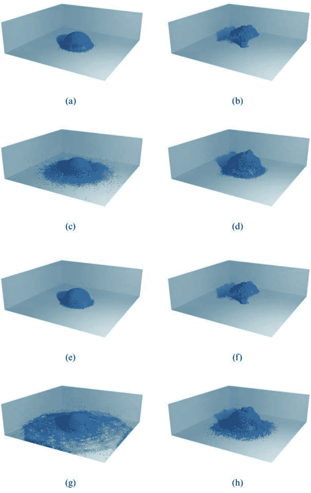

图 8.6 使用静态粒子 [8] 获得的结果：(a) - (b) 来自 SPH 和 ConvNet 模拟的第 62 帧；(c) - (d) 来自 SPH 和 ConvNet 模拟的第 89 帧的快照。使用体积映射 [21] 获得的结果：(e) - (f) 来自 SPH 和 ConvNet 模拟的第 63 帧；(g) - (h) 来自 SPH 和 ConvNet 模拟的第 111 帧的快照（作者提供）

## 8.2 基于连续卷积的拉格朗日流体模拟

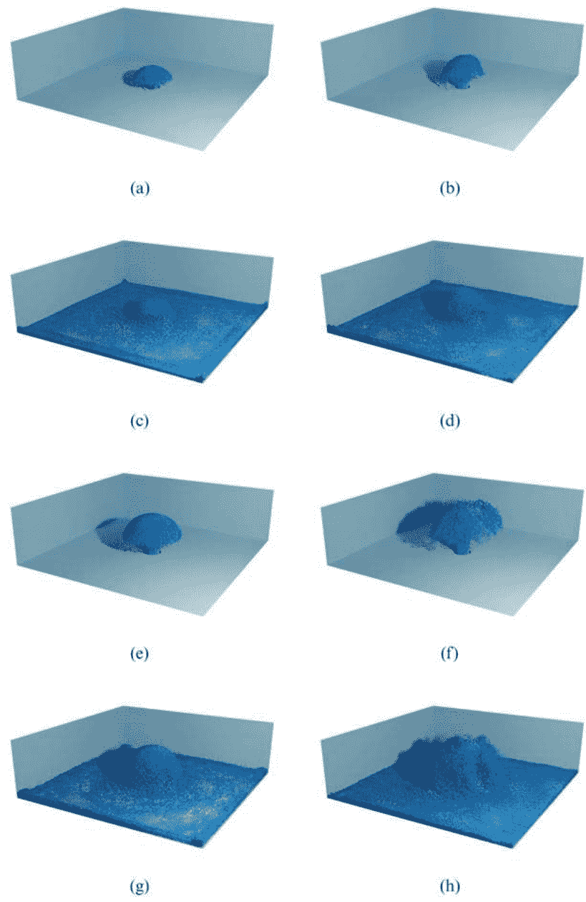

图 8.7 (a) - (b) 是来自 SPlisHSPH 和 ConvNet 模拟的第 43 和 54 帧，速度为 $v_0=(0, 0, 4)$ 和发射器尺寸为 $0.848/0.225\,\text{m}$。图 (c)-(d) 是类似的设置，考虑了来自 SPlisHSPH 和 ConvNet 模拟的第 254 帧。图 (e)-(f) 是来自 SPlisHSPH 和 ConvNet 模拟的第 61 和 80 帧，速度为 $v_0=(0, 0, 6)$ 和发射器尺寸为 $0.956/0.225\,\text{m}$。图 (g)-(h) 是类似的设置，考虑了来自 SPlisHSPH 和 ConvNet 模拟的第 168 和 231 帧（作者提供）。

表 8.4 (a) 每帧平均模拟时间 (ms)，SPlisHSPH 实现边界交互 [8]
| 4 m/s | 5 m/s | 6 m/s | 5秒模拟 | 0.848/0.225 m | 4 m/s | 5 m/s | 6 m/s |
|---|---|---|---|---|---|---|---|
| 1468 | 1981 | 2157 |  |  | 963 | 938 | 935 |
| 1669 | 1956 | 2434 |  | 0.9/0.225 m | 1083 | 1120 | 1100 |
| 1981 | 2299 | 2795 |  | 0.956/0.225 m | 1230 | 1200 | 1240 |
| 2407 | 3380 | 3640 | 10秒模拟 | 0.848/0.225 m | 1660 | 1740 | 1660 |
| 2861 | 3425 | 5287 |  | 0.9/0.225 m | 2000 | 1970 | 2060 |
| 3290 | 4330 | 6780 |  | 0.956/0.225 m | 2390 | 2400 | 2250 |

表 8.4 (b) 每帧平均模拟时间 (ms)，ConvNet 喷泉模拟

图 8.8 双坝决口设置考虑 204,792 个动态粒子：(a) 域可视化（无流体粒子），其中 $a=4\,\text{m}$, $b=8\,\text{m}$, $c=8\,\text{m}$, $d=2\,\text{m}$, $e=2\,\text{m}$, $f=3.2\,\text{m}$。 (b) 在第二层上有两列粒子的流体域，其中 $g=1.6\,\text{m}$, $h=2\,\text{m}$, $i=4\,\text{m}$。 (c) 放大靠近孔附近的区域，边界通过静态粒子表示（来自作者）

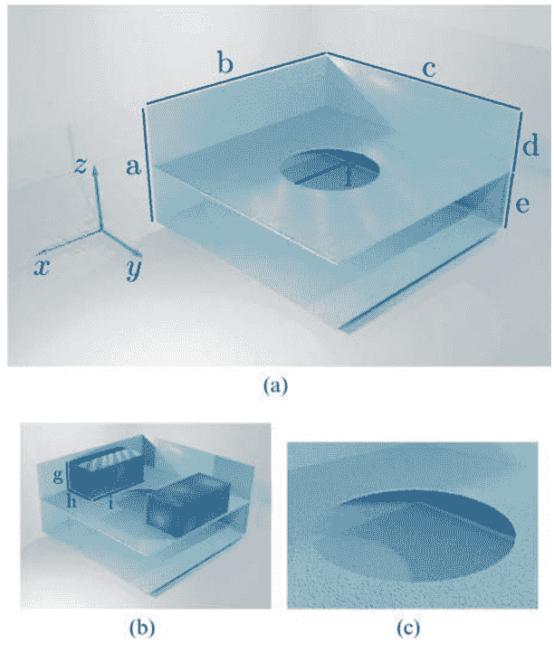

图 8.9 双重破坝模拟的快照：(a), (c), (e), (g) 分别表示在 SPlisHSPH 中的 SPH 模拟，时间为 $t = 35, 60, 80, 130$。(b), (d), (f), (h) 分别表示 ConvNet 模拟的时间步长为 $t = 55, 86, 130, 150$（作者提供）

在图 8.11a-f 中展示了 SPlisHSPH 和 ConvNet 的快照。尽管在图 8.10 的绘图中突出了差异，但在图 8.11a-c 中我们观察到第一个峰值的主要原因是 ConvNet 模拟中进入第一层的粒子数量较少。尽管如此，从视觉感知来看，第二层的流动模式非常令人信服。对于图 8.11d-f 也可以给出相同的评论。

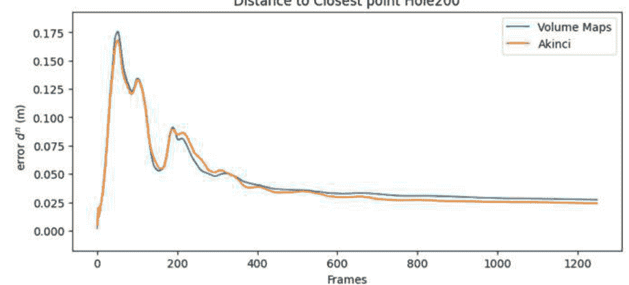

图 8.10 使用静态粒子计算边界交互的 SPlisHSPH 模拟和体积映射 [21] 计算的距离 (8.11) 的演变（作者提供）

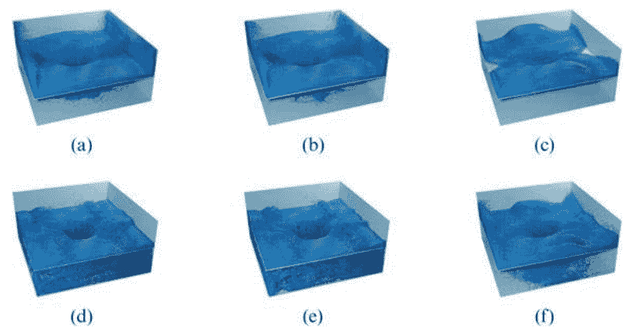

图 8.11 (a) 使用 SPlisHSPH 得到的第 52 帧（来自 [8]）。(b) 使用体积映射 [21] 的 SPlisHSPH 的第 52 帧。(c) ConvNet 的第 52 帧快照。(d) 使用 [8] 的 SPlisHSPH 生成的第 101 帧快照。(e) 使用体积映射 [21] 的 SPlisHSPH 的第 101 帧可视化。(f) 使用 ConvNet 模拟的第 101 帧快照（作者提供）

表 8.5 双重破坝模拟
| 总粒子数 | SPlisHSPH 平均模拟时间 (ms) [8] | ConvNet 平均模拟时间 (ms) |
|---|---|---|
| 50,165 | 766 | 785 |
| 100,661 | 1394 | 1450 |
| 204,792 | 2630 | 3220 |

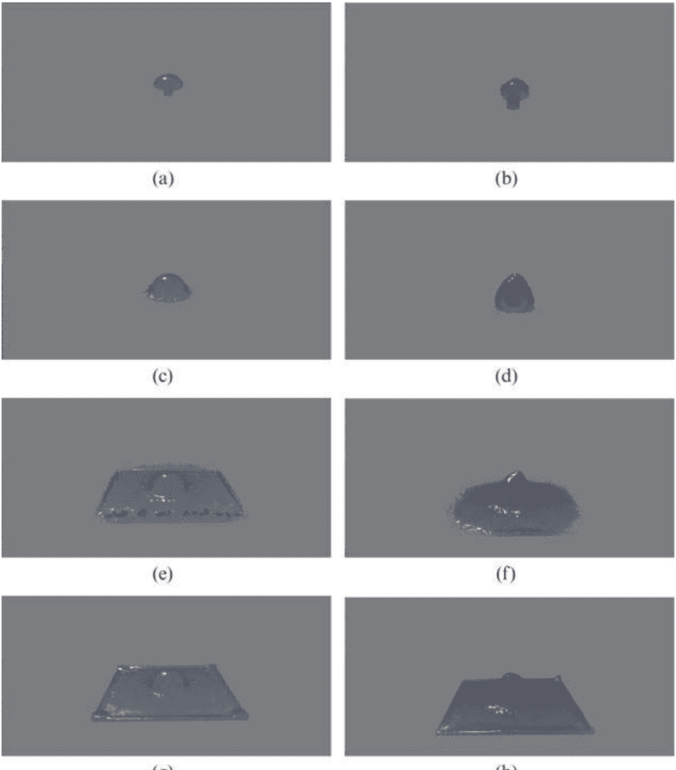

图 8.12 与图 8.4 中展示的喷泉模拟相同的快照，现在使用第 7.2.2 节讨论的屏幕空间渲染技术

关于双重破坏中粒子数量变化时 SPlisHSPlasH 和 ConvNet 每帧所需的平均模拟时间，表 8.5 显示了所得结果，考虑到与图 8.8 类似的设置。报告的结果表明，当粒子数量超过 100,000 时，SPlisHSPlasH 比 ConvNet 更加计算密集。

### 8.2.2 渲染液体

现在，我们将使用一种特定的渲染技术来探索可视化效果，在第 7 章中描述了屏幕空间渲染（第 7.2.2 节）。具体而言，我们实现了 [237] 中描述的算法。使用图 8.4 中显示的两个模拟作为输入，其中流体是液体，使用 SPH 和 ConvNet 进行模拟，并且使用相同的时间步长。

在图 8.12 中，使用简单的 Phong 着色模型，仅使用达到光源的方向解决渲染方程（第 7.1 节）。尽管计算了水的厚度以产生折射效果，但由于背景是纯色，并且在液体后面或底部没有物体，几乎不会注意到它。

另一方面，在图 8.13 中，应用了环境映射（一组映射到围绕场景的立方体面上的六个纹理），折射效果更加明显。现在，液体引起的光线方向变化是可见的，因为液体上的草纹理被扭曲了。

正如我们可以从图 8.4 和 8.12 中看到的那样，渲染技术改善了对流体形状、含有飞溅和液滴的区域的感知。另一方面，如果流体是复杂场景的一部分，比如电影或游戏中，表面反射和折射等效果对于将流体整合到场景中是必不可少的。

就性能而言，在图 8.12 和 8.13 中模拟的渲染在中等成本的笔记本电脑（AMD Ryzen 6000 系列，16 GB RAM，Nvidia RTX 3050 (4 GB GDDR6)）上实现了平均 60 帧每秒（16.6 毫秒/帧）的性能。所有渲染步骤都在 GPU 上使用着色器执行，使用标准算法，没有任何优化或调整。

## 8.3 TempoGAN：用于超分辨率流体流动的 GAN

本节介绍了一种类似 GAN 的方法，该方法处理在欧拉流体模拟中生成的低分辨率数据，旨在实现超分辨率 [278]。该 GAN 架构名为 TempoGAN，通过 CNN 实现，用于训练生成器以输出以高分辨率网格表示的时间上连贯的密度场。

通过这种方式，我们将引入以下符号表示：

- 时间 t 时刻的低分辨率速度和密度表示为：\(\mathbf{v}_{x}^{t}, \rho_{x}^{t}\)
- 时间 t 时刻的高分辨率速度和密度表示为：\(\mathbf{v}_{y}^{t}, \rho_{y}^{t}\)

因此，考虑到第 6.1 节的讨论，TempoGAN 的训练生成器是一个卷积神经网络模型，它接收低分辨率场在模拟时间 t 时刻的输入，例如密度 \(\rho_{x}^{t}\) 和速度 \(\mathbf{v}_{x}^{t}\)，并输出密度的高分辨率版本，表示为 \(\rho_{y}^{t}\)。

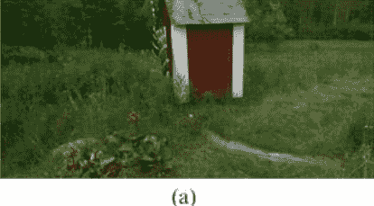
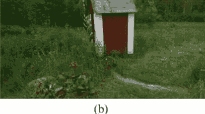
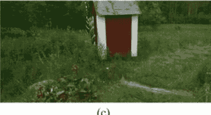
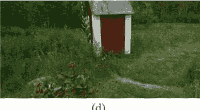
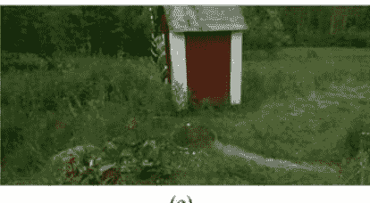
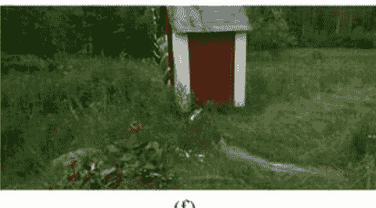
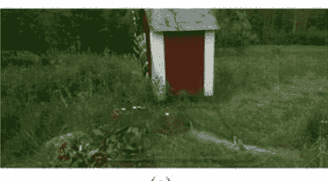
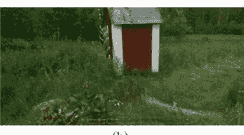

图 8.13 与图 8.12 中呈现的喷泉模拟相同的快照，现在使用第 7.2.2 节讨论的屏幕空间渲染技术，并应用环境映射来模拟外部环境

训练数据由非平稳速度和密度场组成，以低分辨率网格表示，并使用基于网格的方法生成相应的高分辨率参考数据。GAN 结构如图 8.14 所示。在训练阶段，除了通常的空间鉴别器 \(D_s\)，用 \(D_s\) 表示。该方法还包括一个时间鉴别器，称为 \(D_t\)。这是因为输入和输出是随时间和空间变化的场。因此，在对抗训练中，系统接收一组非平稳密度场作为输入，以低分辨率网格表示，并附带相应的高分辨率参考数据，以及非平稳速度场。

## 8.3 TempoGAN：用于超分辨率流体流动的 GAN

图 8.14 TempoGAN 方法的高级概述，具有数百万个可训练参数。(改编自来源 [278])

在图 8.14 中，黑色和虚线矩形表示训练过程中出现的不同组合的输入数据。为了设置损失函数，我们首先离散化连续性方程（式 (3.5)）以获得：

\(\rho(\mathbf{x}, t+\Delta t) \approx \rho(\mathbf{x}, t) - \Delta t \nabla \cdot(\rho(\mathbf{x}, t) \mathbf{v}(\mathbf{x}, t)) \equiv \mathcal{A}\left(\rho_{x}^{t}, \mathbf{v}_{x}^{t}\right)\)

因此，我们取图 8.14 中黑色矩形内的数据来定义：

\(\widetilde{Y}_{\mathcal{A}}=\left\{\mathcal{A}\left(\rho_{y}^{t-1}, \mathbf{v}_{y}^{t-1}\right), \rho_{y}^{t}, \mathcal{A}\left(\rho_{y}^{t+1}, \mathbf{v}_{y}^{t+1}\right)\right\}\)

而使用红色矩形内的场可以计算：

\(\widetilde{G}_{\mathcal{A}}=\left\{\mathcal{A}\left(G\left(\rho_{x}^{t-1}, \mathbf{v}_{x}^{t-1}\right), \mathbf{v}_{y}^{t-1}\right), G\left(\rho_{x}^{t}, \mathbf{v}_{x}^{t}\right), \mathcal{A}\left(G\left(\rho_{x}^{t+1}, \mathbf{v}_{x}^{t+1}\right), \mathbf{v}_{y}^{t+1}\right)\right\}\)

使用上述符号和定义，TempoGAN 相关的损失可以表示为：

\(\mathcal{L}_{D_t}(D_t, G)=-\mathbb{E}\left[\log D_{t}\left(\widetilde{Y}_{\mathcal{A}}\right)\right]-\mathbb{E}\left[\log \left(1-D_{t}\left(\widetilde{G}_{\mathcal{A}}\right)\right)\right]\)

\(\mathcal{L}_{D_s}(D_s, G)=-\mathbb{E}\left[\log D_{s}\left(\rho_{x}^{t}, \rho_{y}^{t}\right)\right]-\mathbb{E}\left[\log \left(1-D_{s}\left(\rho_{x}^{t}, G\left(\rho_{x}^{t}, \mathbf{v}_{x}^{t}\right)\right)\right)\right]\) (8.16)

\(\mathcal{L}_{G}(D_s, D_t, G)=-\mathbb{E}\left[\log D_{s}\left(\rho_{x}^{t}, G\left(\rho_{x}^{t}, \mathbf{v}_{x}^{t}\right)\right)\right]-\mathbb{E}\left[\log \left(D_{t}\left(\widetilde{G}_{\mathcal{A}}\right)\right)\right]+\)

\(+\sum_{j} \mathbb{E}\left[\lambda_{f}^{j} \left\| F^{j}\left(\rho_{x}^{t}, G\left(\rho_{x}^{t}, \mathbf{v}_{x}^{t}\right)\right)-F^{j}\left(\rho_{x}^{t}, \rho_{y}^{t}\right)\right\|_{2}^{2}\right]+\lambda_{L_{1}} \mathbb{E}\left\| G\left(\rho_{x}^{t}, \mathbf{v}_{x}^{t}\right)-\rho_{y}^{t}\right\|_{1}\) (8.17)

其中，\(F^{j}\) 是空间鉴别器的第 \(j\) 层的激活函数，\(D_{s}^{j}\) 和 \(\mathbb{E}_{j}\) 是第 \(j\) 层的期望值。

数据经过基于纳维尔-斯托克斯方程的对称群的物理感知数据增强过程。具体来说，给定一个速度场 \(\mathbf{v}^{t}(y) \equiv \mathbf{v}(y, t)\)，我们通过变换生成新的向量场：\(\mathbf{v}(y, t) = A \mathbf{v}(A^{-1} \mathbf{y}, t)\)，其中 \(A\) 是通过随机选择在范围 \([0.85, 1.15]\) 内的平移、均匀缩放、反射和旋转组合而成的。缩放范围为 \([-90^{\circ}, 90^{\circ}]\)，旋转范围为 \([-90^{\circ}, 90^{\circ}]\)。

训练集 \(\mathcal{D}_t\) 包含一组使用 MantaFlow 软件 [235] 执行的高分辨率模拟，该软件应用有限差分方案来离散化纳维尔-斯托克斯方程。从这些模拟中获取了场 \(\rho_{y}^{t}\), \(\mathbf{v}_{y}^{t}\)。低分辨率场 \(\rho_{x}^{t}\) 和 \(\mathbf{v}_{x}^{t}\) 也是通过对参考场 \(\rho_{y}^{t}\) 和 \(\mathbf{v}_{y}^{t}\) 进行下采样得到的。

通过考虑表达式 (8.13)-(8.14)，将每个非定常场划分为与 \(t-1\)、\(t\)、\(t+1\) 对应的 3 元组，其中 \(t=1,2,\dots\)。为了适应表达式 (8.13)-(8.14) 的计算，可以进行数据增强，根据神经网络权重和偏置（算法 1 中的数组 \(\mathbf{z}\)）生成仅依赖于这些权重和偏置的函数，并计算方程 (8.15)、(8.16) 和 (8.17) 中的损失。接下来，进行梯度计算步骤以更新 \(\mathbf{z}\)。

算法 3 总结了整个过程。这是对算法 1 的改进，其中有多个损失函数。为了节省计算时间，训练阶段通过多个优化步骤来实现，针对表达式 (8.15)、(8.16) 和 (8.17) 中的每个损失分量进行优化，如算法 1 中的表达式 (8.19)、(8.21) 和 (8.23) 所示。

关于神经网络架构，当基于残差网络（ResNets）[141] 实现生成器时，获得了最佳结果。生成器架构的细节在图 8.15 中给出。如图 8.15a 所示，存在两种类型的残差块。传统的残差块（左侧）使用批归一化实现，并用 \(RB\text{-}BN\) 表示。第二种残差块（右侧）在实现时不使用批归一化步骤，并用 \(RB\text{-}NoBN\) 表示。

在两种情况下，考虑 3D 数据，表达式 \(C_i(m_i, n_i, k_i)\) 表示卷积，滤波器大小为 \(n_i \times n_i \times n_i\)，\(m_i^3\) 是输出分辨率，\(k_i\) 表示卷积层 \(i\) 的输出通道数（对于 2D 情况类似）。

在图 8.15b 中，生成器的输入大小为 \(16 \times 16 \times 16\)，具有四个通道 (\(in(16, 4)\))，因为它接收密度和速度场。根据 [185]，生成器的第一个处理层对输入进行最近邻插值。这个操作表示为 \(NI(64, 4)\)。在图 8.15b 中，\(NI(64, 4)\) 表示，在这个例子中，输出是一个分辨率为 \(64 \times 64 \times 64\) 且具有四个通道的张量。

## 算法 3 TempoGAN 的小批量随机梯度下降训练

输入：训练集 \(\mathcal{D}_{tr}\)，小批量大小 \(\varsigma_s\)，\(\varsigma_t\)，\(\varsigma_G\)，\(\eta\)，\(k_T\)，\(k_{D_s}\)，\(k_{D_t}\)，\(k_G > 0\)
初始化：\(\mathbf{z}_0 \in \mathbb{R}^k\)，\(t = 0\)，\(\mathbf{p} \leftarrow \mathbf{z}_0\)；

当 \(t \le k_T\) 时执行以下操作：
- 当 \(i \le k_{D_s}\) 时：
  1. 样本小批量 \(\mathbb{B} \subset \mathcal{D}_{tr}\)，大小为 \(\varsigma_s\)。
  2. 计算小批量 \(\mathbb{B}\) 上的空间鉴别器损失 (8.16)：
     \(\mathcal{L}_{D_s}(\mathbf{z} ; \mathbb{B}) = - \frac{1}{\varsigma_s} \sum_{(\rho_x, \rho_y, \mathbf{v}_x) \in \mathbb{B}} \left[ \log D_{s} \left( \rho_x, \rho_y \right) + \log \left( 1 - D_s (\rho_x, G (\rho_x, \mathbf{v}_x)) \right) \right]\)
  3. 更新参数向量：
     \(\mathbf{z}_{t+1} = \mathbf{z}_t - \eta \nabla_z \mathcal{L}_{D_s}(\mathbf{p}; \mathbb{B})\) (8.19)
  4. \(\mathbf{p} \leftarrow \mathbf{z}_{t+1}\)；\(i \leftarrow i + 1\)
- \(i = 0\)；当 \(i \le k_{D_t}\) 时：
  1. 样本小批量 \(\mathbb{B} \subset \mathcal{D}_{tr}\)，大小为 \(\varsigma_t\)。
  2. 计算时间鉴别器损失 (8.15) 在小批量 \(\mathbb{B}\) 上的值：
     \(\mathcal{L}_{D_t}(\mathbf{z}, \mathbb{B}) = - \frac{1}{N_t} \sum_{(\tilde{Y}_{\mathcal{A}}, \tilde{G}_{\mathcal{A}}) \in \mathbb{B}} \left[ \log D_{t} \left( \tilde{Y}_{\mathcal{A}} \right) + \log \left( 1 - D_{t} \left( \tilde{G}_{\mathcal{A}} \right) \right) \right]\)
  3. 更新参数向量：
     \(\mathbf{z}_{t+1} = \mathbf{z}_t - \eta \nabla_z \mathcal{L}_{D_t}(\mathbf{p}, \mathbb{B})\) (8.21)
  4. \(\mathbf{p} \leftarrow \mathbf{z}_{t+1}\)；\(i \leftarrow i + 1\)
- \(i = 0\)；当 \(i \le k_G\) 时：
  1. 从训练集 \(\mathcal{D}_{tr}\) 中随机抽取大小为 \(\varsigma_G\) 的小批量 \(\mathbb{B}\)。
  2. 计算生成器损失 (8.17) 在小批量 \(\mathbb{B}\) 上的值：
     \(\mathcal{L}_{G}(\mathbf{z}, \mathbb{B}) = \sum_{(\rho_x, \mathbf{v}_x, \rho_y, \tilde{G}_{\mathcal{A}}) \in \mathbb{B}} \left\{ - \log D_{s}(\rho_x, G(\rho_x, \mathbf{v}_x)) - \log D_{t} \left( \tilde{G}_{\mathcal{A}} \right) \right\} + \sum \left\{ \sum_j \lambda_f^j \left\| F^j(\rho_x, G(\rho_x, \mathbf{v}_x)) - F^j(\rho_x, \rho_y) \right\|_2^2 + \lambda_{L1} \left\| G(\rho_x, \mathbf{v}_x) - \rho_y \right\|_1 \right\}\)
  3. 更新参数向量：
     \(\mathbf{z}_{t+1} = \mathbf{z}_t - \frac{\eta}{\varsigma_G} \nabla_z \mathcal{L}_{G} (\mathbf{p}; \mathbb{B})\) (8.23)
  4. \(\mathbf{p} \leftarrow \mathbf{z}_{t+1}\)；\(i \leftarrow i + 1\)

结束循环
\(\mathbf{z}_{opt}^* \leftarrow \mathbf{p}\)

输出：解 \(\mathbf{z}_{opt}^*\)

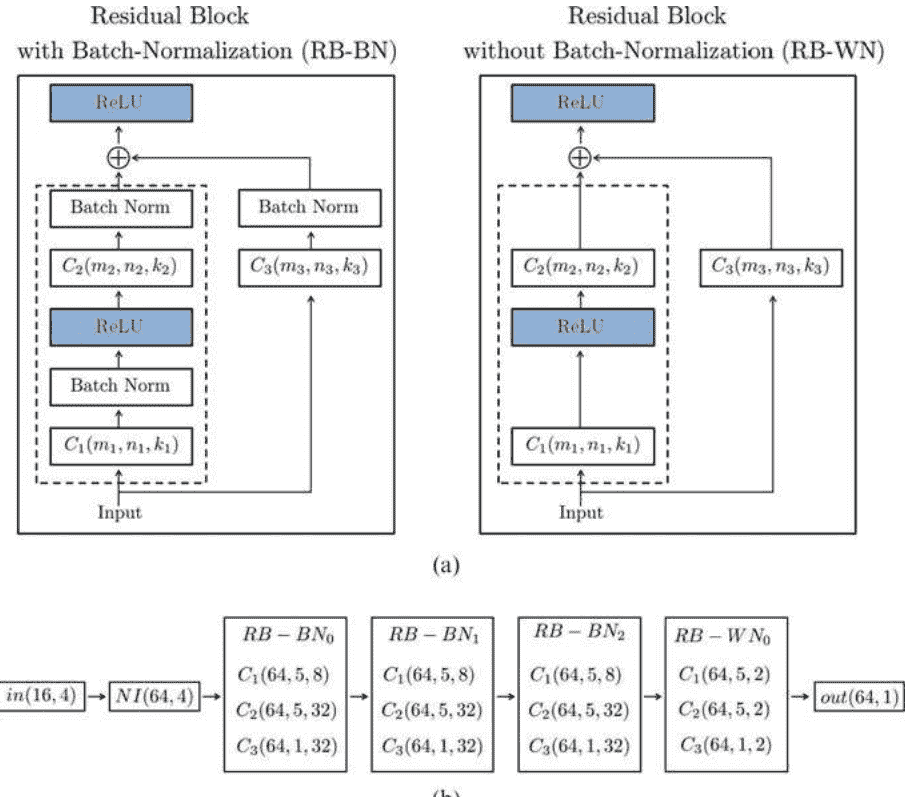

图 8.15 (a) TempoGAN 生成器中使用的残差块。(b) 生成器网络的详细信息（来自作者）

图中显示生成器由四个残差块组成，前三个块类型为 RB-BN，最后一个块为 RB-WN 块。测试结果表明，图 8.16 中的判别器架构不太重要。

在该图中，Conv(m, n, k) 表示卷积。C(m, n, k) 后跟批归一化和泄漏 ReLU 作为激活函数。因此，如图 8.16 所示，鉴别器总是由四个卷积层构成，激活函数为泄漏 ReLU。网络的最后一个块是一个全连接层（FC），用于计算最终得分。空间鉴别器 $D_s$，如图 8.16a 所示。作为条件鉴别器，它接收低分辨率密度（16×16×16）和高分辨率密度场（64×64×64）作为输入，以区分真实数据和伪造数据。因此，网络处理连接。另一方面，时间鉴别器的输入 $D_t$ 如图 8.16b 所示，输入为 (64, 3)，因为它由三个高分辨率密度场组成，每个通道分辨率为 64×64×64。

## 8.3 TempoGAN：用于超分辨率流体流动的 GAN

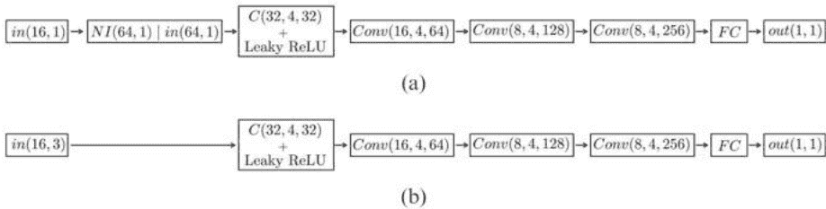

### 8.3.1 TempoGAN 结果

在本节中，我们展示了使用 TempoGAN 方法得到的超分辨率结果，该方法在第 8.3 节中进行了描述，使用了由 MantaFlow 软件 [235] 生成的高分辨率模拟数据以及相应的低分辨率数据集。我们使用 GitHub 上提供的 TempoGAN 模型，没有进行任何微调。

此外，我们将 TempoGAN 的结果与 MantaFlow 的高分辨率场进行了比较。MantaFlow 软件包中使用的模拟方法是 [220] 中提出的方法，在第 3.4 节中进行了修订，使用了 MacCormack 平流和 MiC 预处理共轭梯度求解器 [65,75]。

与第 8.2.1 节类似，第一个示例应用了一个喷泉，其设置如图 8.17 所示。然而，在这种情况下，数值方法是网格相关的。高分辨率模拟的域是一个立方体，尺寸为 1×1×1，使用规则网格进行离散化，分辨率为 256×256×256 个体素。在图 8.17 中，我们观察到使用 4 个体素建模的域墙。

- 喷泉有一个垂直的烟雾喷射口，发射器位于域底部的中心位置。发射器呈圆柱形，半径为 0.14（36 个体素），高度为 0.015625（4 个体素），位于域底部上方 0.1（26 个体素）处，在域内以速度注入密度 $v=(0, 0, 7 \times 10^{-4})$。

在 MantaFlow 实现中，通过随机改变发射器内部的密度场来插入密度到模拟域中。平流和浮力驱使流体沿着模拟向上运动。速度场的边界条件设置为狄利克雷边界条件，在边界单元中速度为零。

在应用的计算设置中，MantaFlow 使用 $t=0.125$ 秒的 400 个时间步长的模拟中，发射器只在前 160 个时间步长中打开。然而，该实现仅导出迭代的数值帧，其中 $n$ 的取值为 0, 1, 2, …，每个迭代包含压力、密度和速度场。

> 2 https://github.com/thunil/tempoGAN

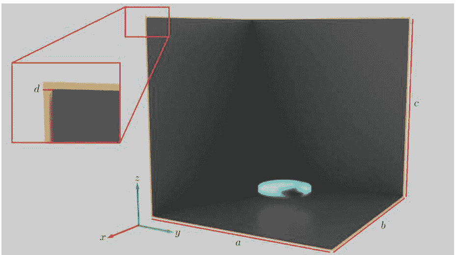

图 8.17 TempoGAN 喷泉设置：流体域的边界由墙壁表示，大小为 $a=b=c=256$ 个体素，厚度为 $d=4$ 个体素。中心的发射器被建模为圆柱形状（来自作者）。和速度场。我们只使用密度和速度来进行 TempoGAN 模型。导出的序列由 200 帧组成，每帧都被组织为一个张量 $(256+8) \times (256+8) \times (256+8) \times 4$，因为速度场有 3 个分量，密度场只有一个分量，边界厚度为 4 个单元。低分辨率场通过将模拟得到的高分辨率场降采样 4 倍获得。

每个低分辨率张量进入 TempoGAN 神经网络，并经历图 8.15b 中所示的处理过程，其中第一阶段是最近邻插值，通过 4 倍上采样输入场来恢复高分辨率网格。

密度场的渲染是使用 Blender 3.4.3 进行的，使用图 8.18 中的可视化流水线中的操作组成着色器。Volume Info 节点提供有关密度场的信息。乘法节点只是对输入进行缩放，以避免输出饱和。发射节点添加了 Lambertian 发射着色器，其输入为发射光的颜色和强度。最后，材质输出节点接收数据和颜色信息，并应用体积渲染生成最终图像。

图 8.19 显示了一些快照，显示了低分辨率密度场和由 TempoGAN 生成的高分辨率密度场，以及从 MantaFlow 模拟中获得的参考场。

3 https://www.blender.org/download/releases/3-4/

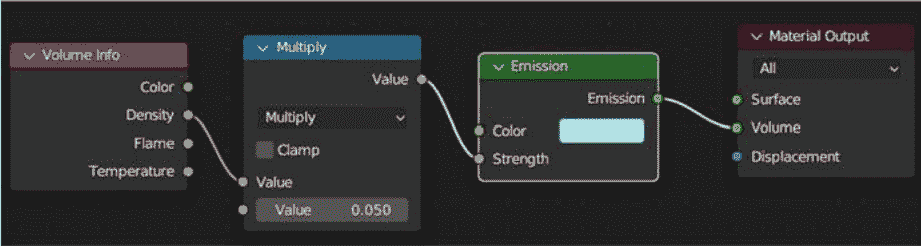

图 8.18 Blender 的烟雾渲染着色器（改编自 https://youtu.be/_K0XsHht6pg?si=HQIDhTGaz8sS1nvQ）

低分辨率数据的可视化如图 8.19a, d, g, j 所示，受到重新采样的平滑效果的影响，以生成与 TempoGAN 和参考数据相同分辨率的图像。

我们要强调的是，TempoGAN 处理只需要一个低分辨率帧，并输出其高分辨率版本。然而，图 8.19k-l 中的图像显示，TempoGAN 生成的流体密度比参考值小。尽管如此，TempoGAN 还是能够重现烟雾流动的重要视觉特征。此外，重要的是要强调训练集中没有包含类似喷泉的设置。

当比较图 8.19k-l 时，出现了差异，必须进行量化。通过计算均方根误差（RSE），可以得到参考数据和相应的 TempoGAN 结果之间的定量比较，计算方法如下：

$$RSE (\rho_y^t, \hat{\rho}_y^t) = \sqrt{\frac{1}{256}\sum_{i,j,k=1}^{256} (\rho_y^t(i, j, k) - \hat{\rho}_y^t(i, j, k))^2}, \quad (8.24)$$

其中 $\rho_y^t$ 和 $\hat{\rho}_y^t$ 分别代表参考和 TempoGAN 高分辨率密度场。

图 8.20 展示了喷泉实验中表达式 (8.24) 的结果。图 8.20 中的图表显示了帧 128、160 和 177 中的三个峰值。因此，图 8.21 显示了相应的快照以及低分辨率和参考帧。与图 8.19 类似，我们观察到图 8.21h、i 中 TempoGAN 结果的密度小于参考值。尽管如此，TempoGAN 仍能在与参考帧相比误差较大的快照中重现视觉流动特征的能力是显而易见的。

下一个例子使用了一个几何设置，类似于图 8.8 中的设置，高分辨率模拟的域是一个立方体，尺寸为 1×1×1 个无量纲单位，分为两个子域，如图 8.22 所示。外墙的厚度为 4 个体素，而分隔子域的地板

### 8.3.2 案例研究

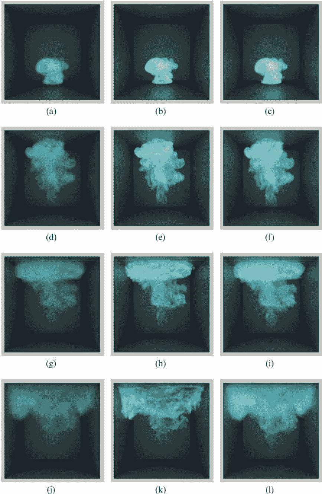

图 8.19 (a)、(d)、(g)、(j) 显示了密度场的低分辨率版本，$t = 60, 118, 148, 188$；(b)、(e)、(h)、(k) 是由 TempoGAN 生成的相应高分辨率密度数据；(c)、(f)、(i)、(l) 是 MantaFlow 模拟在这些时间点的参考帧，$t = 60, 118, 148, 188$（作者提供）

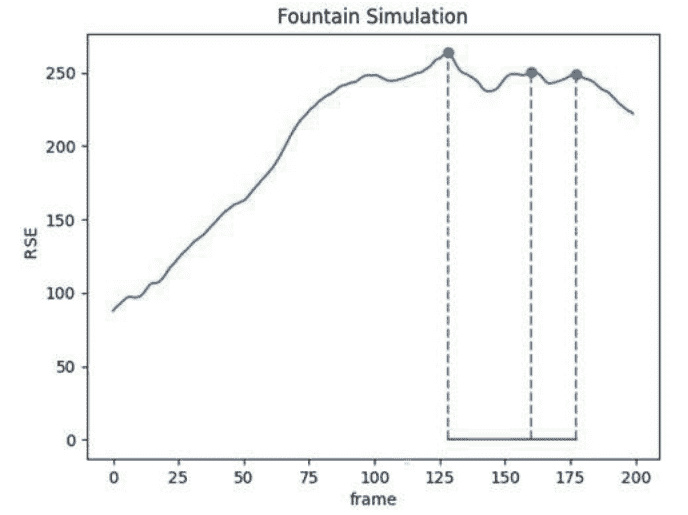

图 8.20 通过公式 (8.24) 计算的 TempoGAN 和参考帧之间的误差（来自作者）

具有 16 个体素的厚度。包含子域和地板的区域使用 256×256×256 个体素的规则网格进行离散化。

初始化是通过在第一层上使用两个烟柱进行的，其尺寸在图 8.22 中指示。速度场的边界条件设置为狄利克雷边界条件，在边界单元中速度为零。

MantaFlow 模拟设置的其他元素与喷泉模拟中使用的元素相同。

导出的帧序列由 200 帧组成，每帧都被组织为一个张量 $(256+8) \times (256+8) \times (256+8) \times 4$，经过 4 倍下采样生成由 TempoGAN 神经网络处理的低分辨率数据（密度和速度）。

图 8.23 展示了一些快照，以便比较低分辨率密度、TempoGAN 结果和 MantaFlow 高分辨率模拟（参考帧）。视觉分析显示，尽管存在一些差异，TempoGAN 模拟还是能够重现烟雾感知的最重要特征。图 8.23j-l 强调了 TempoGAN 和参考帧之间的主要差异，主要发生在第一层楼的底部以及喷泉示例中的一些区域，TempoGAN 生成的流体密度似乎比参考帧小（图 8.23k-l，第二层楼）。关于低分辨率数据（图 8.23a, d, g, j）与 TempoGAN（图 8.23 中间列）的比较，我们注意到在低分辨率场的可视化中观察到的模糊效果在 TempoGAN 数据中不存在。通过比较图 8.23a, d, g, j 和 b, e, h, k，可以明显看到 TempoGAN 在烟雾可视化方面的改进。

### 8.3.2 案例研究

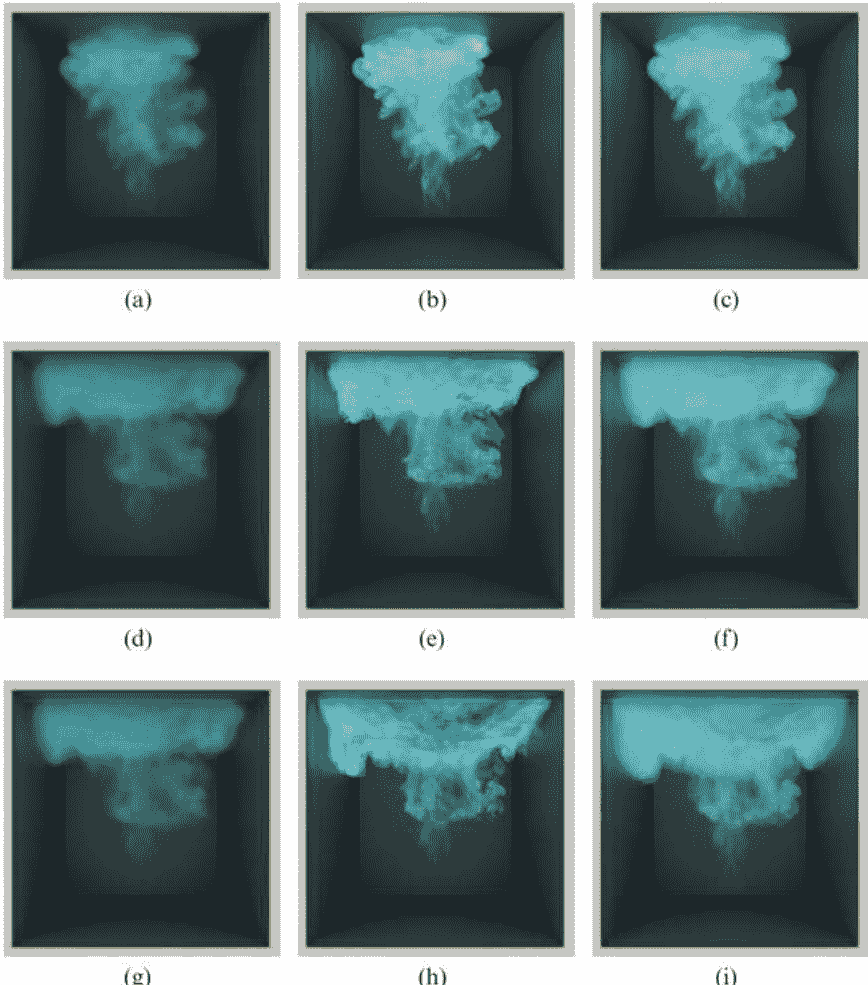

图 8.21 显示了图 8.20 中所示的三个主要峰值对应的快照：(a)、(d)、(g) 为 $t=128, 160, 177$ 时刻的低分辨率密度场；(b)、(e)、(h) 为对应的 TempoGAN 结果；(c)、(f)、(i) 是 MantaFlow 在时刻 $t=128, 160, 177$ 的参考帧（作者提供）。

图 8.24 中的曲线展示了图 8.22 中所示的双楼层烟雾模拟中通过公式 (8.24) 计算的距离的演化。与图 8.20 和 8.24 中的曲线比较后发现，在每个图中全局最大值之后，曲线的形状有所不同。对于前者（喷泉模拟），误差有所稳定，而对于后者，误差有明显减少。

图 8.24 中的情节显示出第 76 帧的全局最大值。可以在图 8.25 中进行对应的 TempoGAN 和参考帧之间的视觉分析。在这种情况下，低分辨率场景显示在图 8.25a 中，我们展示了通过不同视角获得的两个可视化效果。

8.3 TempoGAN：用于超分辨率流体流动的 GAN

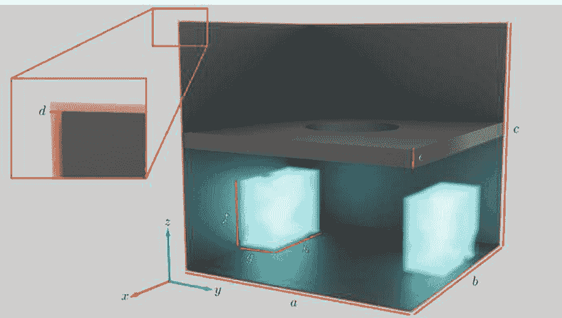

图 8.22 是烟雾模拟的两层设置：域可视化，其中 $a=b=c=256$ 个体素，墙壁厚度为 $d=4$ 个体素，地板分割为 $e=16$ 个体素厚。MantaFlow 模拟的初始化在第一层上有两个烟雾盒子，尺寸为 $f=81, g=51, h=101$ 个体素（作者提供）。图 8.25b-c 和 d-e 中的高分辨率密度场。我们强调一个事实，即即使根据误差 (8.24) 得出的密度分布存在较大差异，视觉比较仍然显示出 TempoGAN 的结果与 MantaFlow 模拟之间存在良好的一致性。

在为 TempoGAN 生成测试时，遇到了一些由于代码依赖性引起的问题。TempoGAN 的实现需要使用第一个版本的 TensorFlow 和 CUDA 10.0。这两个版本已经过时，与我们可用的硬件架构不兼容，因为 cuBLAS 库无法在内存中分配任何空间。因此，找到的解决方案是使用 Google Colab，使用 miniconda 虚拟环境启用 TensorFlow v1，并使用 40GB VRAM 的 Nvidia A100 显卡。然而，计算时间太长：每帧需要 45 分钟。与原论文中呈现的执行时间相比，性能要慢得多，因此将这个执行时间与 MantaFlow 模拟进行比较是不公平的，因为对旧代码的支持不足可能是这种时间成本的原因。

关于计算复杂度的报道 [278] 指出，从一个 150×100×100 的场生成一个 600×400×400 的体积需要 39 分钟，即使在那个时候由于可用 GPU 的内存限制，必须使用细分方案逐块处理体积。另一方面，MantaFlow 模拟在那个高分辨率下平均每帧需要 315 分钟。然而，我们必须小心进行这样的比较，因为 TempoGAN 的执行是使用两个 Nvidia GeForce GTX 1080 Ti GPU（每个 11GB 内存）进行的，而流体模拟是由 Intel Core i7-6850K CPU 托管的（参见 [278] 的第 55 节）。

### 8.3.2 案例研究

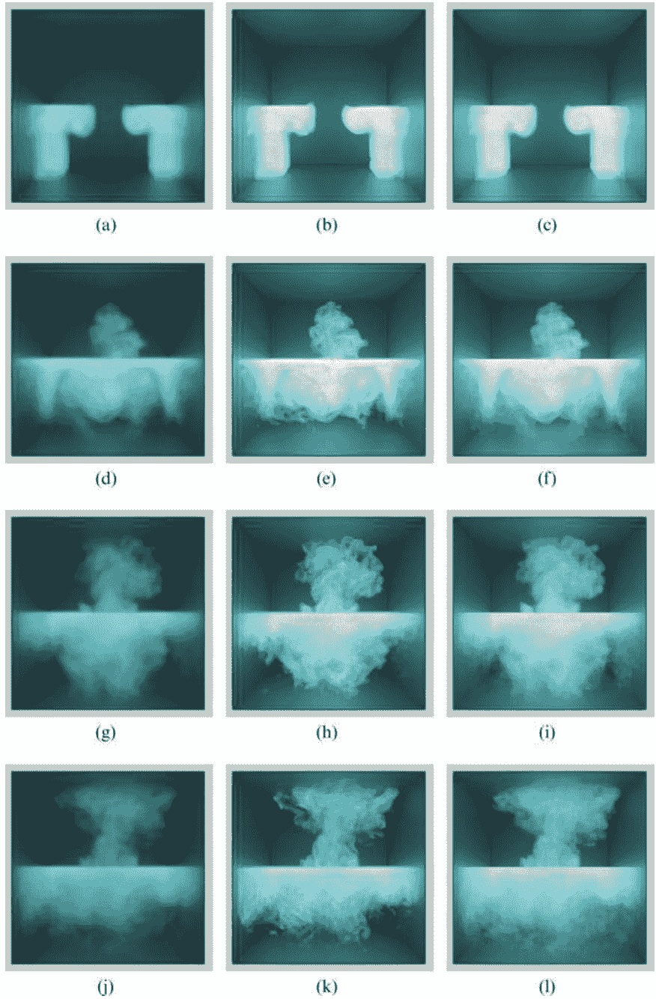

图 8.23 结果为图 8.22 的设置：(a), (d), (g), (j) 低分辨率密度场的可视化，$t=45, 100, 150, 199$；(b), (e), (h), (k) TempoGAN 生成的相应高分辨率密度数据；(c), (f), (i), (l) MantaFlow 模拟在这些时间点的参考帧，$t=45, 100, 150, 199$（作者提供）

## 8.3 TempoGAN：用于超分辨率流体流动的 GAN

图 8.24：两层烟雾模拟设置中距离 (8.24) 的演化（作者提供）

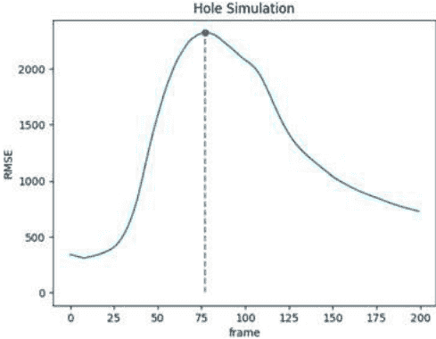

图 8.25：对应于主峰的快照，$t=76$，如图 8.24 所示：(a) 低分辨率密度的可视化；
- (b) TempoGAN 的结果；
- (c) MantaFlow 的参考帧；
- (d) 另一个视角的帧（$t=76$，由 TempoGAN 生成）；
- (e) 通过另一个视角可视化的参考帧（作者提供）。

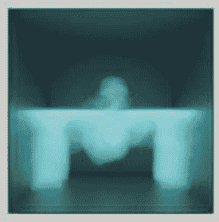

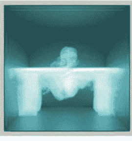

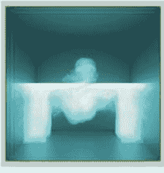

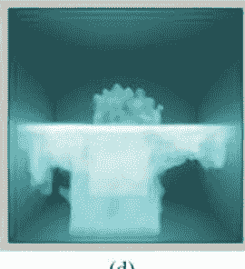

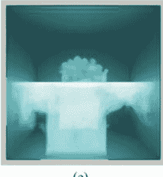

## 第 9 章 展望与最后的评论

摘要：本章中，我们考虑了深度学习在流体动画中的展望。首先，神经网络训练的输入数据生成依赖于使用传统方法模拟流体动力学以产生训练数据，这是耗时的。为了解决这个问题，我们描述了应用于 Navier-Stokes 模拟的基于物理的神经网络（PINNs）的基本模型。在这种情况下，流体方程、初始条件和边界条件被包含在模型中作为损失函数的新项，这可以减少对大型训练数据库的需求。其次，深度架构的成功伴随着理解深度神经网络如何做出决策的困难程度的增加。这一事实促使了可解释人工智能（XAI）技术的发展，如 Shapley 加性解释（SHAP），用于量化隐藏层对模型结果的重要性。从渲染的角度来看，机器学习是一种新的方法，为娱乐产业改善视觉效果带来了许多令人兴奋的可能性。但与此同时，它在科学应用中仍存在缺点，其中视觉准确性是一个重要要求。我们通过讨论机器学习技术如何改进渲染算法来结束这部分材料。

关键词：第一原理·深度学习·物理信息神经网络·纳维尔-斯托克斯模拟·可解释的人工智能·Shapley 加性解释·微分渲染·神经渲染

## 9.1 引言

尽管在第 8 章中验证了深度学习模型在流体动画中的潜力，但当网络面对训练集之外的样本时，也存在一些限制。具体来说，第 8 章的计算实验显示了 ConvNet 在喷泉模拟中存在一些与 SPH 模拟不对称相关的问题（见图 8.4）。因此，一个直接的研究方向是将第一原理和深度学习模型整合起来，以充分利用科学知识和数据的协同方式 [198,269]。这样的目标可以通过使用 PINNs 来实现，PINNs 还可以避免使用耗时的传统方法来模拟流体动力学以产生大量的训练数据，我们将在第 9.2 节中讨论。

在前几章中，我们强调了深度学习的最新发展在与模式识别和回归相关的任务中取得了令人印象深刻的结果。然而，深度架构的成功是以增加模型复杂性的代价为代价的，这也增加了理解深度神经网络决策的困难。这是研究旨在解释和可解释机器学习模型的方法的主要动机 [142, 203]。在这个方向上的倡议源于可解释的人工智能方法 [208]、知情机器学习 [252] 和可理解的智能 [260] 方法。由于这些领域的核心思想是相关的，在我们的解释中，我们遵循 [142] 的观点，并将其总结为可解释的人工智能（XAI）技术。第 9.3 节讨论了 XAI 方法的基础，重点是流体模拟，最后介绍了一些关于 Shapley 加性解释（SHAP）的应用前景，这是一种用于对模型结果的隐藏层的重要性进行排名的 XAI 方法。

同样地，将机器学习整合到渲染流程中并不是一件容易的任务。虽然神经网络 [231] 和可微分渲染 [119] 的研究结果令人惊叹，但在涉及流体动画时，必须谨慎应用，特别是从科学分析的角度来看。另一方面，对于希望在艺术上改善流体行为控制的动画师来说，它已经是一个很好的工具 [123]。我们将在第 9.4 节讨论这些方面。

## 9.2 基于物理信息的神经网络用于流体动画

在处理流体模拟等科学应用时，我们有两种途径可以选择。一方面，我们可以通过基于守恒方程和数值技术等一级原理的科学知识方法来解决。另一方面，我们可以考虑数据驱动模型，如深度学习，它可以处理那些部分已知机制模型的过程，只要有足够的数据可用。此外，在有大型数据库可用的情况下，深度学习架构可以加速或降低复杂模拟的计算成本，具体取决于所关注应用的精度要求。

在流体动画的特定情况下，生成神经网络训练的输入数据取决于使用传统方法模拟流体动力学以产生训练数据。然而，这是一项耗时的任务，因为它依赖于由复杂方程和基于高分辨率网格和/或大量粒子组成的计算模型，正如本文中考虑的案例研究所观察到的（第 8 章）。此外，在神经网络理论的实际阶段，它们几乎是黑盒模型，并且从它们的解释来看，在物理学层面上仍然存在一个未解决的问题。因此，设计成本效益高的深度神经网络具有重要意义：(a) 能够在不需要大量模拟步骤来构建训练数据的情况下预测流体模拟；(b) 能够融入由偏微分方程描述的物理定律。

物理信息神经网络（PINN）是一类能够满足这些要求的机器学习方法 [41, 117]。基本上，将流体方程以及初始和边界条件作为新项加入损失函数中，强制优化过程在参数空间中沿着解决边界和初始值问题的神经网络配置路径进行。

形式上，纳维-斯托克斯方程和连续性方程可以写成如下形式：

$$\frac{\partial \eta(\mathbf{x}, t)}{\partial t} = \mathcal{F} (\eta(\mathbf{x}, t)), \quad \mathbf{x} \in \Omega \subset \mathbb{R}^3, t \in [0, t_{max}] \quad (9.1)$$

满足边界和初始条件：

$$\eta(\mathbf{x}, t) = g(\mathbf{x}), \quad \mathbf{x} \in \partial \Omega \quad (9.2)$$

$$\eta(\mathbf{x}, 0) = \eta_0(\mathbf{x}), \quad \mathbf{x} \in \Omega \quad (9.3)$$

其中 $\eta(\mathbf{x}, t)$，在机器学习背景下称为潜在解，包含了未知场（速度和密度）。$\Omega$ 是流体域，$\partial \Omega$ 是其边界，而 $\mathcal{F}$ 是一个依赖于物理参数（如粘度）的微分算子。函数 $g$ 和 $\eta_0$ 分别指定了边界和初始条件。

给定一组特定的物理参数和初始/边界条件，通过有限差分、有限元、基于粒子的（无网格）或混合技术构建的数值方法可以用于模拟方程 (9.1)。根据应用的不同，算子 $\mathcal{F}$ 可以简化，从而影响计算模型的复杂性和精度。

对于 PINNs 设置，我们必须指定初始和边界训练数据集，由

$$\left\{ (\mathbf{x}_{\Omega}^j, t^0, \mathbf{g}(\mathbf{x}_{\Omega}^j)) \mid j=1,2,\dots,N_0 \right\} \quad \text{和}$$

$$\left\{ (\mathbf{x}_{\partial \Omega}^j, t^i, \mathbf{f}(\mathbf{x}_{\partial \Omega}^j)) \mid i=1,2,\dots,N_1, j=1,2,\dots,N_2 \right\}$$ 分别构成。此外，一组插值点

$$\left\{ (\mathbf{x}_c^j, t^k, \eta(t^k, \mathbf{x}_c^j)) \mid k=1,\dots,N_3, j=1,2,\dots,N_c \right\}$$ 可以通过一些传统的模拟技术或实验测量来组装。因此，设 $\hat{\eta}(\mathbf{x}, t; \theta)$ 为由神经网络计算的函数，该函数依赖于权重向量 $\theta$ 和损失函数：```latex
$L = \sum_{j=1}^{N_0} \left( \widehat{\eta}\left(\mathbf{x}_{\Phi}^{j}, t^0; \theta\right) - \mathbf{g}\left(\mathbf{x}_{\Phi}^{j}\right) \right)^2 + \sum_{i=1}^{N_1} \sum_{j=1}^{N_2} \left( \widehat{\eta}\left(\mathbf{x}_{\partial\Phi}^{j}, t^i; \theta\right) - \mathbf{f}\left(\mathbf{x}_{\partial\Phi}^{j}\right) \right)^2 +$
$+ \sum_{k=1}^{N_3} \sum_{j=1}^{N_c} \left( \frac{\partial \widehat{\eta}\left(\mathbf{x}_{c}^{j}, t^k; \theta\right)}{\partial t} - \mathcal{F}\left(\widehat{\eta}\left(\mathbf{x}_{c}^{j}, t^k\right)\right) \right)^2 + \sum_{k=1}^{N_3} \sum_{j=1}^{N_c} \left( \widehat{\eta}\left(\mathbf{x}_{c}^{j}, t^k; \theta\right) - \eta\left(\mathbf{x}_{c}^{j}, t^k\right) \right)^2, \quad (9.4)$
```

包含所有已定义元素的集合。在训练过程中，通过最小化损失函数(9.4)关于 $\theta$ 的值，我们期望得到 $\theta^*$，从而可以计算出函数 $\widehat{\eta}(\mathbf{x}, t, \theta^*)$ 近似求解偏微分方程 $\eta(\mathbf{x}, t)$ 并满足边界和初始条件。关于计算 $\eta(\mathbf{x}, t, \theta^*)$ 的神经网络的架构，我们可以自由选择最适合流体表示并具有足够灵活性以处理问题复杂性的架构。

将科学原理和深度学习模型相结合的想法已经引起了地球和气候科学[118]、湍流理论[274]、材料科学[116]等领域的关注。这些结果表明了PINNs在多个领域加速模拟的潜力。

此外，损失函数(9.4)中涉及的时间和空间导数的计算是通过Tensorflow库[153]中的自动微分功能来完成的。此外，在测试阶段，网络接收一个点 $(\mathbf{x}, t)$ 在时空中，输出 $\widehat{\eta}(\mathbf{x}, t, \theta^*)$。

在[44]中提出了表达式(9.4)给出的损失模型的变体，该模型接收多视角RGB帧作为输入，并通过PINN模型进行动态流体重建，该模型集成了Navier-Stokes方程和场景表示（辐射场）以用于动画目的。

在流体动画的背景下，PINN的范式可以追求另一个目标，即投影方法。在模拟不可压缩流体时，投影是一个基本步骤，以确保速度场满足不可压缩条件（$\nabla \cdot \mathbf{v} = 0$）。对于传统技术来说，这是一个昂贵的过程；尤其是对于最近通过张量场调制Navier-Stokes解以实现流体控制的方法来说[250]。在这种情况下，应用数值技术如有限元或有限差分方法可能会因场景复杂性而变得难以承受。在PINN的背景下，一种可能性是将相应的不可压缩条件纳入损失表达式中。动机是使用PINN作为替代模型以减少计算时间，因为在训练之后，神经网络求解器可以使用输入的单次前向传递计算Navier-Stokes解的近似值。此外，PINN的解是自然可微的函数，具有封闭的解析形式，可以在进一步的计算中进行探索。这一特性与传统求解器[112]相比是一种新颖的特点。

## 9.3 可解释的人工智能用于流体模拟

在流体模拟的背景下，XAI的应用受到限制，只有少数几项研究[138]，其中没有一个专注于通过神经网络进行流体动画，这对未来的发展是一个启示。

在开发XAI方法时，值得考虑图9.1中的要素。在这个图中，机器学习模型及其输入-输出起着核心作用。在该模型周围，出现了三个概念，并成为XAI的基础之一[142,203]。

- 透明度：这个概念与能够用数学术语表达模型的训练、结构和输入-输出关系的可能性有关。
- 可解释性：在这种情况下，重点是解释的含义，可以通过以人类可以理解的方式呈现模型或其输出结果的属性来实现。
- 可解释性：一般来说，增强对某个过程的控制、证明决策的合理性以及通过知识发现来改进模型的过程取决于寻求解释。此外，根据[168]，我们可以说解释是可解释领域的特征集合，这些特征对于模型产生决策起到了贡献作用，对于我们的情况来说是回归。

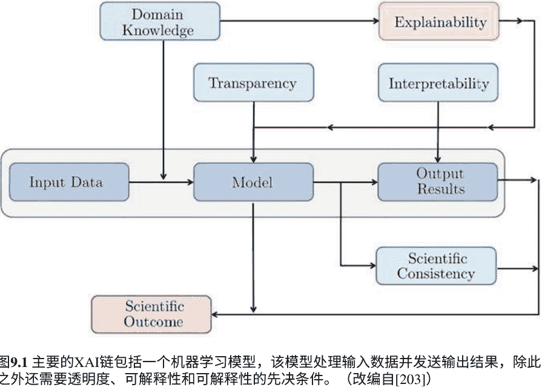

在图9.1中，机器学习流程包括一个模型（例如深度神经网络），该模型从目标输入数据和适当的学习范式中学习。该模型以标签（分类）或字段（回归）的形式输出结果。在这个过程中，我们需要透明度来解释模型。然后，解释性发挥作用，确定和解释输入和输出之间的因果关系依赖。模型解释和输出可解释性需要可解释性，而可解释性又只能通过领域知识来实现，这是图9.1中链条的另一个组成部分。此外，从领域知识中获取的信息（不变性属性、守恒定律等）可以为预处理阶段提供方向，以增强数据，甚至为改进机器学习模型的某些组件提供见解。科学成果是图9.1中整个过程的主要目标。它们可以与应用（或问题）领域或模型本身相关联。事实上，在解释和解释输出时获得的直觉和知识也可以用于促进机器学习模型的某些部分的改进。然而，可靠结果的生成具有科学一致性作为基本前提。通过科学一致性，我们指的是我们的结论在考虑的主题的统治法则下是合理和一致的。

一个重要的观点是，通常我们具有一定程度的透明度、可解释性和可解释性。例如，ConvNet模型（第8.2节）是透明的，因为输入-输出关系和训练过程可以通过处理层的计算机机制以数学术语形式化。然而，超参数的选择，如内核大小和Conv+FC层的数量（图8.2），是以试错的方式进行的。因此，就其架构结构而言，它并不透明。对于神经网络来说也是如此。

关于可解释性，在时间$t$和时间$t+1$之间的输入与输出之间的因果关系，ConvNet神经网络的$t+1$可以通过考虑流体动力学领域、其控制定律以及不变性/对称性属性来解释和分析。然而，就我们对ConvNet的了解，即使使用深度学习模型的透明度，也很难解释第8.2.1节中报告的问题，并确定在没有新实验的情况下，应该修改模型的哪个部分来修复它们。

为了提高ConvNet的可解释性，我们可以探索Shapley加性解释（SHAP）[151]。给定一个特征空间 $F \equiv \mathbb{R}^M$，其中一个样本 $\mathbf{z} = (z_1, z_2, \dots, z_M)$ 具有 $M$ 个特征 $z_i \in \mathbb{R}, i=1, 2, \dots, M$。让我们考虑集合 $F \setminus \{z_i\}$。现在，给定一个子集 $S \subset F \setminus \{z_i\}$ 和两个分别使用 $S$ 和 $S \cup \{z_i\}$ 中的特征训练的机器学习模型，分别命名为 $g_S$ 和 $g_{S \cup \{z_i\}}$，SHAP值由以下公式给出：

```latex
$\Phi_i(g, z) = \sum_{S \subset F \setminus \{z_i\}} \frac{|S|! (M - |S| - 1)!}{M!} \left( g_{S \cup \{z_i\}} (z_{S \cup \{z_i\}}) - g_S (z_S) \right), \quad (9.5)$
```

$z_S$ 是 $\mathbf{z}$ 在 $S \cup \{z_i\}$ 和 $S$ 中的投影。

SHAP方法在[138]和[157]中作为XAI技术应用于流体动力学中，提供可解释的值。前者在壁面剪切流中从低维模型中获取数据时应用了SHAP。SHAP值表明层流剖面、流向涡和特定的条纹不稳定性是在不再层流化的样本之间进行分类的最重要特征。$t_p$个时间步骤之后，以及那些再层流化的样本。在这种情况下，机器学习模型是XGBoost [40]。

此外，在[157]中，基于决策树、XGBoost、Extra-tree和LightGBM的四个回归模型被应用于计算低层次山墙建筑物的表面平均压力、压力波动和峰值压力的系数。SHAP技术用于量化回归模型的特征重要性。

对于ConvNet，原始特征空间的维度由静态粒子的数量和动态粒子的数量定义。因此，其维度过高，无法使用SHAP方法进行处理。然而，我们可以使用隐藏层的特征空间计算SHAP值（公式(9.5)）。在这种情况下，SHAP得到的特征排序可以提供洞察模型结果中每个层的重要性。

## 9.4 机器学习和流体渲染

从渲染的角度来看，我们必须考虑到逼真渲染是一个复杂且昂贵的过程，而流体渲染带来了更具挑战性的问题。

流体的非刚性形状以及它们与光的相互作用的方式，如水一样的半透明材料，或者像烟雾一样的参与介质，都带来了新的问题。

一般来说，机器学习可以直接用于改进渲染流程中的一些内部任务，例如通过学习混合模型来改进路径追踪算法中的路径引导[253]；学习烟雾和气体渲染中的深度散射分布[115]；或者通过使用卷积神经网络来分摊超采样抗锯齿技术的成本，仅使用一个像素样本生成具有时间连续性的图像[207]。

然而，机器学习技术可以向渲染流程中注入一些可学习的元素，并修改该流程以产生新的图像方式。微分渲染[119]将渲染视为一个逆问题，通过从真实或模拟数据中获取复杂函数（渲染函数）的样本来解决。神经渲染[231]结合了经典计算机图形学和机器学习的概念，创建了从真实观察中合成图像的算法，产生了一种混合方法。

微分和神经渲染在作为一个年轻的领域仍然面临一些常见问题，该领域始于2018年[64]。从实际角度来看，对于更多的计算环境和库来支持新应用的开发和测试，就像机器学习已经做到的那样，是一个需要花费大量时间从头开始构建和优化算法的挑战。

## 9.6 观点和最后的评论

就时间消耗而言，机器学习任务需要高度并行化的算法来减少模型训练的时间。编码和优化这些算法需要大量的努力以及硬件和软件知识。库和标准接口需要更加成熟，以支持该领域的高级软件开发。同样，调试和基准支持是当今的另一个实际问题。

对于流体渲染，机器学习可以提供低分辨率模拟的更多细节，通过传输颜色和语义数据来增强模拟的视觉复杂性，甚至可以从流体场中生成可视化，如速度和密度。这些方法对离线应用感兴趣，但只能为实时应用（如游戏）提供必要的性能。

如今，NeRF[159]是一种流行的方法，用于从一组图像开始重建和渲染自然场景和物体。随着这种技术的成熟，可以预见这种方法能够捕捉来自现实生活模拟的实际流体数据。问题在于流体是动态的，而NeRF在处理可变形物体时效果不佳。重建过程中存在显著的伪影，因为NeRF依赖于场景的摄影测量一致性。类似于Nerfies的工作[188]尝试在非常受限的情况下减小这个限制：自拍视频，其中主体进行了一些平滑的变形。不幸的是，这种方法在液体的情况下仍然不适用，因为物体可能会发生显著的变化，甚至是拓扑上的变化。重建需要更精确的训练数据集。

另一方面，改善低分辨率模拟中的视觉细节的方法[204]以及将风格和模式转移到流体渲染中的方法[43,122]已经取得了有趣的结果，只要它们确实意图达到视觉上的逼真。

在这个背景下，像[125]这样的作品使用CNN从艺术家的草图中重建了一个体密度场。

## 9.5 总结

本书的内容可以使对流体动画感兴趣的机器学习研究人员受益，考虑到流体模拟技术的修订和所提出的案例研究，将流体建模和深度学习元素结合起来，重点关注Lagrangian和Eulerian环境中的流体动画。另一方面，物理建模领域的研究人员可以了解神经网络在流体模拟中的潜力。

事实上，神经网络模型已经被应用于流体模拟和渲染，这是因为神经网络计算模型的普适性以及深度学习方法的进步，使得能够构建用于流体动画的代理模型，其预测能力比传统方法更快。我们预见这个领域在流体动画的未来中将发挥不可估量的作用，考虑到生成涉及流体的特效所涉及挑战和复杂任务。

另一方面，自从1990年代以来，基于物理的方法已经成为一种重要工具，使动画师能够使用物理定律来控制物体的行为。

因此，如今，流体动画的主题可以通过基于物理的建模和深度学习方法来解决，这些方法正在快速发展。基于物理的深度学习允许结合这两个主题，生成利用基于物理和基于数据的方法的流体动画模型。例如，在PINNs的特定案例中，提供的材料作为向损失函数中添加基于物理的项以强制预测模型中的物理约束的方法的介绍。然而，知识的结合取决于不同领域的研究人员之间的清晰沟通。我们希望本书能加速机器学习研究社区和传统流体模拟方法之间的思想传播。这一方法可以解决第8.2.1节和8.3.1节中观察到的问题。

正如前面的章节中提到的，训练数据的生成取决于耗时的传统方法进行的模拟。此外，从物理学的角度解释神经网络仍然是一个未解决的问题。这些事实激发了在机械学习模型和深度学习模型之间建立桥梁的探索，以协同方式整合科学知识和数据。PINN模型是这一领域的一个视角，在第9.2节中讨论了其有希望的结果。新的深度架构模型可以在PINN的基础上诞生，为流体动力学中添加先验信息，从而提高解释性。随着深度架构的成功，模型复杂性也增加了，这也增加了解释性的困难。SHAP技术可以用于了解回归任务（如流体模拟）中的特征重要性，如第9.3节所指出的。据我们所知，深度学习文献中一个重要的问题尚未得到妥善解决，即流体与域边界之间的相互作用。具体而言，这种相互作用应该遵守域边界附近的边界条件。一般来说，主要的观点是在训练过程中可以适当调整神经网络的权重以满足这些要求。因此，值得比较ConvNet和SPlisHSPlasH在这一点上的差异，以量化ConvNet在域边界附近的模拟精度。类似的研究还应该针对TempoGAN和Mantaflow模拟进行。这项研究可以为通过学习来解决神经网络模型中的边界条件强制执行的挑战带来启示。

关于渲染，在应用机器学习技术进行流体渲染时存在困难的同时，这种方法的出现也令人兴奋，因为它带来了许多开放性挑战，也为许多研究可能性提供了思考的机会。

## 参考文献

- 1. Alvaro Abidie-Armas, Koldo Portal-Porras, Unai Fernandez-Gomez, Ekaitz Zulueta和 Adrian Teso-Fz-Beto o。一种基于数据增强的深度学习技术应用于CFD模拟。数学，2021年。
- 2. Bart Adams, Mark Pauly, Richard Keiser和Leonidas J. Guibas。自适应采样粒子流体。ACM SIGGRAPH 2007论文，2007年。
- 3. Tomas Akenine-Möller和Naty Hoffman, Eric Haines。实时渲染。 A K Peters/CRC Press，第3版，2008年。
- 4. Tomas Akenine-Möller, Eric Haines, 和 Naty Hoffman. 实时渲染. AK Peters/CRC Press, 2019.
- 5. Nadeem Akhtar 和 U Ragavendran. CNN池化过程中智能的解释：一项方法学调查.神经计算与应用，页码1-20, 2020.
- 6. Gizem Akinci, Nadir Akinci, Markus Ihmsen, 和 Matthias Teschner. 一种用于基于粒子的流体的高效表面重建流程. 在VRIPHYS中, 2012.
- 7. Nadir Akinci, Alexander Dippel, Gizem Akinci, 和 Matthias Teschner. 屏幕空间泡沫渲染. J. WSCG, 21:173-182, 2013.
- 8. Nadir Akinci, Markus Ihmsen, Gizem Akinci, Barbara Solenthaler, 和 Matthias Teschner. 用于不可压缩SPH的多功能刚体-流体耦合. ACM Trans. Graph., 31(4), Jul 2012.
- 9. Henrik Reif Andersen. 二进制决策图简介。讲义，可在线获取，哥本哈根IT大学，第5页，1997年。
- 10. Kai Arulkumaran, Marc Peter Deisenroth, Miles Brundage和Anil Anthony Bharath。深度强化学习简要调查。arXiv预印本arXiv:1708.05866，2017年。
- 11. B Ataie-Ashtiani和Leila Farhadi。稳定的移动粒子半隐式方法用于自由表面流动。流体动力学研究，38(4):241，2006年。
- 12. Joshua Aurand, Raphael Ortiz, Silvia Nauer和Vinicius C. Azevedo。用于体积模拟的高效神经风格转移。ACM图形学交易，41(6)，2022年。
- 13. Simon Baker和Takeo Kanade。超分辨率的限制及如何突破它们。 IEEE计算机视觉和模式识别会议论文集。CVPR 2000 (Cat. No.PR00662)，2000年，第2卷，第372-379页。
- 14. Yohai Bar-Sinai, Stephan Hoyer, Jason Hickey和Michael P. Brenner。学习数据驱动的偏微分方程离散化。美国国家科学院院刊，2019年，第116页，第15344-15349页。
- 15. R. Beale和T. Jackson。神经计算。MIT出版社，1994年。
- 16. Andrea Beck和Marius Kurz。湍流建模中的机器学习方法的视角。GAMM Mitteilungen，2021年，第44卷，第1-27页。
- 17. Markus Becker和Matthias Teschner。用于自由表面流动的弱可压缩SPH。在2007年ACM SIGGRAPH/Eurographics计算机动画研讨会论文集，SCA '07，页209-217，瑞士Aire-la-Ville，瑞士，2007年。Eurographics协会。
- 18. Jan Bender。Splish Splash。https://github.com/InteractiveComputerGraphics/SPlisHSPlasH，2022年。
- 19. Jan Bender和Dan Koschier。无散度平滑粒子流体动力学。在第14届ACM SIGGRAPH/Eurographics计算机动画研讨会论文集，SCA '15，页147-155。计算机协会，2015年。
- 20. Jan Bender和Dan Koschier。无散度SPH用于不可压缩和粘性流体。IEEE可视化与计算机图形学交易，23(3)：1193-1206，2017年。
- 21. Jan Bender, Tassilo Kugelstadt, Marcel Weiler, 和 Dan Koschier. 体积图：SPH的隐式边界表示. 在第12届ACM SIGGRAPH会议上, 页码1-10, 2019年.
- 22. Imanol Bilbao 和 Javier Bilbao. 过拟合问题和过度训练在数据时代的应用：特别是对于人工神经网络. 在2017年第八届智能计算与信息系统国际会议(ICICIS)上, 页码173-177, 2017年.
- 23. James F. Blinn. 代数曲面绘制的一般化. ACM Trans. Graph., 1:235-256, 1982年.
- 24. J. Bonet 和 T.-S.L. Lok. 光滑粒子流体动力学公式的变分和动量保持方面. 在计算应用力学与工程学中的计算机方法, 180(1):97-115, 1999年.
- 25. Mario Botsch, Leif Kobbelt, Mark Pauly, Pierre Alliez, and Bruno Lévy. 多边形网格处理. CRC出版社，2010年。
- 26. J.U. Brackbill, D.B. Kothe, and H.M. Ruppel. Flip: 一种低耗散的粒子-网格方法用于流体流动。计算物理学通讯，48(1):25-38，1988年。
- 27. John S. Bridle. 前馈分类网络输出的概率解释，与统计模式识别的关系。在NATO神经计算中，NATO ASI系列第68卷，第227-236页。Springer，1989年。
- 28. S. L. Brunton和J. N. Kutz. 数据驱动的科学与工程：机器学习，动力系统和控制。剑桥大学出版社，2019年。
- 29. Steven L. Brunton. 应用机器学习研究流体力学。《力学学报》，页码1-15，2021年。
- 30. Steven L. Brunton, Maziar S. Hemati和Kunihiko Taira. 机器学习和数据驱动方法在流体力学中的特刊。理论与计算流体力学，34(4):333-337，2020年。
- 31. Steven L. Brunton, Bernd R. Noack和Petros Koumoutsakos. 流体力学中的机器学习。《流体力学年度评论》，52(1):477-508，2020年。
- 32. Marc Bryant, Ian Coony和Jonathan Garcia. Moana: 一个熔岩怪物的基础。在《ACM SIGGRAPH 2017 Talks》中，页码1-2，2017年。
- 33. Mitch Bryson, Matthew Johnson-Roberson, Oscar Pizarro和Stefan B Williams. 使用水下图像的颜色一致的结构运动模型。《机器人学：科学与系统 VIII》，33，2013年。
- 34. Brent Burley, David Adler, Matt Jen-Yuan Chiang, Hank Driskill, Ralf Habel, Patrick Kelly, Peter Kutz, Yining Karl Li, and Daniel Teece. 迪士尼Hyperion渲染器的设计与演进。ACM Trans. Graph., 37(3), 2018年7月。
- 35. H.J. Butt, K. Graf, and M. Kappl.界面的物理与化学. Wiley, 2006年。
- 36. Thomas J Cashman. 超越Catmull-Clark？细分曲面方法进展的调查。计算机图形学论坛, 31(1):42-61, 2012年。
- 37. Kai-Chun Chen, Pei-Shan Chen, and Sai-Keung Wong. 玻璃窗上水滴和流动模拟的启发式方法。计算机与图形, 37(8):963-973, 2013年。
- 38. 钱晨，王悦，王辉和杨旭波。数据驱动的流体动画模拟综述。虚拟现实与智能硬件，3(2)：87-104, 2021年。

## 参考文献

- 39. 陈巧瑞，张帅和郑尧。具有各向异性核的增强窄带表面重建。计算机图形学，102：280-288，2022年。
- 40. 陈天琪和Carlos Guestrin。Xgboost：一种可扩展的树提升系统。第22届ACM SIGKDD国际数据挖掘与知识发现会议论文集，2016年。
- 41. 陈澄和张广涛。基于物理信息神经网络和ResNet块的深度学习方法用于求解流体流动问题。水，13，2021年2月。
- 42. A.J. Chorin和J.E. Marsden。流体力学的数学导论。应用数学文本。Springer New York，2012年。
- 43. Fabienne Christen，Byungsoo Kim，Vinicius C. Azevedo和Barbara Solenthaler。具有颜色转移的神经烟雾风格化。arXiv预印本arXiv:1912.08757，第2-5页，2019年。
- 44. Mengyu Chu，Lingjie Liu，Quan Zheng，Erik Franz，Hans-Peter Seidel，Christian Theobalt和Rhaleb Zayer。用于稀疏数据的物理信息神经场的烟雾重建。ACM Trans. Graph.，41(4)，2022年7月。
- 45. Mengyu Chu，Nils Thuerey，Hans Peter Seidel，Christian Theobalt和Rhaleb Zayer。学习流体的有意义控制。ACM Transactions on Graphics，40(4)，2021年。
- 46. Mengyu Chu和Nils Thuerey。基于CNN特征描述符的数据驱动烟雾流合成。ACM Transactions on Graphics (TOG)，36:1-14，2017年。
- 47. Richard Connor，Franco Alberto Cardillo，Robert Moss和Fausto Rabitti. 对稀疏数据的Jensen-Shannon距离评估。在Nieves Brisaboa，Oscar Pedreira和Pavel Zezula编辑，相似性搜索和应用，第163-168页，柏林，海德堡，2013年。Springer Berlin Heidelberg。
- 48. R. Courant，K. Friedrichs和H. Lewy。关于数学物理的偏微分方程。IBM J. Res. Dev.，11(2)：215-234，1967年3月。
- 49. Keenan Crane，Ignacio Llamas和Sarah Tariq。实时模拟和渲染3D流体。GPU gems，3(1)，2007年。
- 50. Leandro Tavares da Silva. 通过平滑粒子流体动力学进行流体模拟：变分公式，参数变化和视觉特征提取，2016年。
- 51. Leandro Tavares da Silva和Gilson Antonio Giraldi。用于计算流体动力学分析的流体流摘要技术。在计算流体力学(CFD)中：特性、应用和分析，第1-44页。Nova Science Publishers，2016年。第3章。
- 52. Leandro Tavares da Silva和Gilson Antonio Giraldi。用于平滑粒子流体动力学模拟的变分时间积分器方法的固定点实现。计算机与应用数学，79(4)：1111-1130，2020年。
- 53. Leonid Datta。激活函数及其与Xavier和He正态初始化的关系调查。CoRR，abs/2004.06632，2020年。
- 54. M.D. Davis和E.J. Weyuker。可计算性、复杂性和语言：理论计算机科学基础。纽约学术出版社，1983年。
- 55. S.R. De Groot和P. Mazur，非平衡热力学。多佛出版社物理学系列。ISBN 9780486153506，https://books.google.com.br/books?id=mfFyG9jfaMYC
- 56. Felipe Orlandi de Oliveira和Afonso Paiva。窄带屏幕空间流体渲染。计算机图形学论坛，41，2022年。
- 57. Paul E. Debevec和Leonard McMillan。基于图像的建模、渲染和照明。IEEE计算机图形学与应用，22:24-25，2002年。
- 58. M. do Carmo和P. Roitman。曲线和曲面的微分几何。Textos Universitarios. Sociedade Brasileira de Matematica，2006年。
- 59. Fourtakas G. Domínguez, J. M.。Dualsphysics。用于研究自由表面现象的SPH开源软件。https://dual.sphysics.org/，2021年。
- 60. Liordino dos Santos Rocha Neto和Antônio Lopes Apolinario。使用迭代分离双边滤波器的实时屏幕空间卡通水渲染。SBC交互系统杂志，8:20-32，2017年。
- 61. Karthik Duraisamy, Gianluca Iaccarino和Heng Xiao。数据时代的湍流建模。Annual Review of Fluid Mechanics, 51:357-377, 2019年。
- 62. Pandu Akbar Dwikatama, Dody Dharma和Achmad I. Kistijantoro。基于材料点方法的流体模拟与神经网络。2019年人工智能与信息技术国际会议(ICAII), 页码244-249, 2019年。
- 63. Christopher Dyken, Gernot Ziegler, Christian Theobalt和Hans-Peter Seidel。使用Histogram Pyramid的高速Marching Cubes。计算机图形学论坛, 27(8):2028-2039, 2008年。
- 64. S.M. Ali Eslami, Danilo Jimenez Rezende, Frederic Besse, Fabio Viola, Ari S Morcos, Marta Garnelo, Avraham Ruderman, Andrei A Rusu, Ivo Danihelka, Karol Gregor, 等。神经场景表示与渲染。科学, 360(6394):1204-1210, 2018.
- 65. D. J. Evans. 预处理方法：理论与应用。 Gordon and Breach Science Publishers, Inc., 美国, 第一版, 1983.
- 66. Jiahui Fan, Beibei Wang, Milos Hasan, Jian Yang, 和 Ling-Qi Yan. 神经分层BRDFs。ACM SIGGRAPH 2022会议论文集, 2022.
- 67. José Antonio Fernandez-Fernandez, Lukas Westhofen, Fabian Lösner, Stefan Rhys Jeske, Andreas Longva, 和 Jan Bender. 快速八叉树邻域搜索用于SPH模拟。ACM图形学交易(TOG), 41(6):1-13, 2022.
- 68. Anselmo Ferreira和Gilson Giraldi。用卷积神经网络方法对花岗岩瓷砖进行分类。《Expert Systems with Applications》, 84:1-11, 2017年。
- 69. A.T. Fomenko和S.P. Novikov。现代几何学：方法与应用。纽约：Springer-Verlag, 1992年。
- 70. Julian Fong, Magnus Wrenninge, Christopher D. Kulla和Ralf Habel。制作体积渲染：SIGGRAPH 2017课程。ACM SIGGRAPH 2017 Courses, 2017年。
- 71. Roland Fraedrich, Stefan Auer和Rüdiger Westermann。高效高质量的SPH数据体积渲染。《IEEE Transactions on Visualization and Computer Graphics》, 16:1533-1540, 2010年。
- 72. Ben Frost, Alexey Stomakhin和Hiroaki Narita。Moana：水的表演。在ACM SIGGRAPH 2017 Talks中, SIGGRAPH '17, 美国纽约。计算机协会。
- 73. Kai Fukami, Koji Fukagata和Kunihiko Taira。使用机器学习进行湍流流动的超分辨率重建。《流体力学杂志》, 870: 106-120, 2019年。
- 74. Kai Fukami, Koji Fukagata和Kunihiko Taira。评估监督机器学习方法用于流体流动。《理论与计算流体力学》, 34 (4) : 497-519, 2020年。
- 75. Jiaquan Gao, Ronghua Liang和Jun Wang。关于GPU上修改的不完全Cholesky预处理共轭梯度算法的研究。《并行与分布式计算杂志》, 74, 2013年1月。
- 76. Michael Garland和Paul S Heckbert。使用二次误差度量简化具有颜色和纹理的表面。在《可视化会议'98 (Cat. No. 98CB36276)》中, 页码263-269。IEEE, 1998年。
- 77. R. Garnier和J. Taylor. 《离散数学与新技术》. Adam Hilger, 1992.
- 78. Leon A Gatys, Alexander S Ecker和Matthias Bethge. 一种艺术风格的神经算法。arXiv预印本arXiv:1508.06576, 2015年。
- 79. Tom M George, Georgy E. Manucharyan和Andrew F. Thompson. 通过海面高度模式推断涡旋热通量的深度学习。自然通讯, 第12卷第1期：800, 2021年。
- 80. A. Géron. 《使用Scikit-Learn、Keras和TensorFlow进行实践机器学习：构建智能系统的概念、工具和技术》. O'Reilly Media, 2019.
- 81. R. A. Gingold和J. J. Monaghan. 平滑粒子流体动力学：理论与应用于非球形恒星。《皇家天文学会月报》, 第181卷第3期：375-389, 1977年。
- 82. Gilson Antonio Giraldi. 机器学习和模式识别, 研究生课程讲义 - 纳米生物系统研究生项目, UFRJ-FIOCRUZ-INMETRO-LNCC, 2021年。
- 83. Christoph Gissler, Stefan Bendl, Andreas Peer, Markus Ihmsen和Matthias Teschner。用于SPH的近似空气-流体相互作用。在VRIPHYS中,第29-38页,2017年。
- 84. Xavier Glorot和Yoshua Bengio。理解训练深度前馈神经网络的困难。在Yee Whye Teh 和Mike Titterington编辑的第十三届国际人工智能与统计学会议的论文集,机器学习研究的第9卷,第249-256页,意大利撒丁岛Chia Laguna Resort,2010年5月13-15日。PMLR。
- 85. Ronald Goldman. 计算机图形学和几何建模的综合介绍. CRC出版社, 2009年。
- 86. H. Goldstein. 经典力学. Addison-Wesley, 第2版, 1981年。
- 87. I. Goodfellow, Y. Bengio, and A. Courville. 深度学习. 自适应计算与机器学习系列. MIT出版社, 2016年。
- 88. Ian J. Goodfellow, Jean Pouget-Abadie, Mehdi Mirza, Bing Xu, David Warde-Farley, Sherjil Ozair, Aaron C. Courville, and Yoshua Bengio。生成对抗网络。在第27届神经信息处理系统会议:神经信息处理系统年会2014年12月8日至13日,加拿大蒙特利尔,页码2672-2680,2014年。
- 89. Ned Greene. 环境映射和世界投影的其他应用。IEEE计算机图形与应用, 6(11):21-29, 1986。
- 90. Jens A. Griepentrog, Wolfgang Höpner, Hans-Christoph Kaiser, and Joachim Rehberg. 一个双Lipschitz连续的、体积保持的从单位球到立方体的映射。Note di Matematica, 28, 2008。
- 91. Markus Gross和Hanspeter Pfister. 基于点的图形。 Elsevier, 2011。
- 92. Jiuxiang Gu, Zhenhua Wang, Jason Kuen, Lianyang Ma, Amir Shahroudy, Bing Shuai, Ting Liu, Xingxing Wang, and Gang Wang. 卷积神经网络的最新进展。CoRR, abs/1512.07108, 2015.
- 93. Yulan Guo, Hanyun Wang, Qingyong Hu, Hao Liu, Li Liu, and Bennamoun. 用于3D点云的深度学习: 一项调查。IEEE模式分析与机器智能交易, 43:4338-4364, 2019。
- 94. M.E. Gurtin. 连续介质力学导论. ISSN. Elsevier Science, 1982。
- 95. Saeed Hadadan, Shuhong Chen, 和 Matthias Zwicker. 神经辐射度. ACM图形学交易, 40(6):1-13, 2021。
- 96. Eric Haines 和 Tomas Akenine-Möller. 光线追踪宝石: 使用DXR和其他API进行高质量和实时渲染. Springer, 2019。
- 97. Rana Hanocka 和 Hsueh-Ti Derek Liu. 网格上的深度学习简介. ACM SIGGRAPH 2021课程, 2021。
- 98. Simon Haykin. 神经网络-全面的基础, 第二版. Prentice Hall, 2版, 1998。
- 99. K. He 和 J. Sun. 在有限时间成本下的卷积神经网络. 在2015年IEEE计算机视觉与模式识别会议(CVPR)上, 第5353-5360页, 2015年。
- 100. 辛赫, 赵凯勇和楚晓文。 自动机器学习: 现状综述。 基于知识的系统, 212:106622, 2021年。
- 101. Paul S Heckbert. 纹理映射调查。 IEEE计算机图形与应用, 6(11):56-67, 1986年。
- 102. C. Hirsch. 内部和外部流动的数值计算: 数值离散化基础, 卷1。 约翰·威利和儿子, 1988年。
- 103. D. House和J.C. Keyser. 基于物理的建模和动画基础。 泰勒和弗朗西斯集团, 2020年。
- 104. Yuchi Huo和Sung-Eui Yoon. 基于深度学习的蒙特卡洛去噪综述。 计算视觉媒体, 7:169-185, 2021年。
- 105. Markus Ihmsen, Nadir Akinci, Gizem Akinci和Matthias Teschner. 基于粒子的流体统一喷雾、泡沫和气泡。 视觉计算机, 28:669-677, 2012年。
- 106. Markus Ihmsen、Julian Bader、Gizem Akinci和Matthias Teschner。使用SPH方法模拟气泡的动画。在国际计算机图形学理论与应用会议上，第2卷，第225-234页。SCITEPRESS，2011年。
- 107. Ihab F. Ilyas和Xu Chu。数据清洗。ACM，2019年。
- 108. Jason Iversen和Ryo Sakaguchi。在“后天”上成长的流体模拟。在ACM SIGGRAPH 2004 草图中，SIGGRAPH '04，第142页，纽约，纽约州，美国，2004年。计算机协会。
- 109. Alan Julian Izenman。现代多元统计技术：回归、分类和流形学习。Springer Publishing Company，Incorporated，第1版，2008年。
- 110. Abdul Jabbar、Xi Li和Omar Bourahla。生成对抗网络的调查：变种、应用和训练。ACM计算调查，54 (8)：1-38，2022年。
- 111. Krishna Murthy Jatavallabhula, Edward James Smith, Jean-Francois Lafleche, Clément Fuji Tsang, Artem Rozantsev, Wenzheng Chen, Tommy Xiang, Rev Lebedian和Sanja Fidler。Kaolin：用于加速3D深度学习研究的PyTorch库。ArXiv, abs/1911.05063, 2019年。
- 112. Xiaowei Jin, Shengze Cai, Hui Li和George Em Karniadakis. NSFNets (Navier-Stokes流网络）：用于不可压缩Navier-Stokes方程的物理信息神经网络。 J. Comput. Phys. , 426: 109951, 2021年。
- 113. Yongcheng Jing, Yezhou Yang, Zunlei Feng, Jingwen Ye, Yizhou Yu和Mingli Song。神经风格迁移：一项综述。IEEE Transactions on Visualization and Computer Graphics，26 (11)：3365-3385，2020年。
- 114. James T. Kajiya. 渲染方程式。在《计算机图形学与交互技术》第13届年会论文集中，页码143-150，1986年。
- 115. Simon Kallweit, Thomas Müller, Brian Mcwilliams, Markus Gross和Jan Novák. 深度散射：利用预测辐射的神经网络渲染大气云。《ACM图形学交易》（TOG），36(6):1-11, 2017年。
- 116. Ali Kamali, Mohammad Sarabian和Kaveh Laksari. 利用物理信息的神经网络进行弹性成像：弹性模量和泊松比的空间发现。《Acta生物材料学》, 2022年。
- 117. George Karniadakis, Yannis Kevrekidis, Lu Lu, Paris Perdikaris, Sifan Wang和Liu Yang. 物理信息机器学习。《自然评论》，页码1-19，2021年5月。
- 118. Karthik Kashinath, M Mustafa, Adrian Albert, Jinlong Wu, C Jiang, Soheil Esmaeilzadeh, Kamyyar Azizzadenesheli, R Wang, Ashesh Chattopadhyay, A Singh, A Manepalli, D Chirila, R Yu, R Walters, B White, Heng Xiao, Hamdi Tchelepi, P Marcus, Animashree Anandkumar, 和 Mr Prabhat. 物理信息机器学习：天气和气候建模的案例研究。 《Philosophical Transactions A系列：数学、物理和工程科学》，379:20200093，2021年04月。
- 119. Hiroharu Kato, Deniz Beker, Mihai Morariu, Takahiro Ando, Toru Matsuoka, Wadim Kehl, 和 Adrien Gaidon. 可微渲染：一项调查。arXiv预印本arXiv:2006.12057, 14(8):1-20, 2020年。
- 120. Petr Kellnhofer, Lars Jebe, Andrew Jones, Ryan P. Spicer, Kari Pulli, and Gordon Wetzstein. 神经光学图像渲染。2021年IEEE/CVF计算机视觉与模式识别会议(CVPR)，第4285-4295页，2021年。
- 121. Timo Kellomäki. 用于游戏的快速水模拟方法。计算机娱乐，16(1)，2017年12月。
- 122. Byungsoo Kim, Vinicius C. Azevedo, Markus Gross, and Barbara Solenthaler. 基于传输的烟雾模拟神经风格迁移。ACM图形学交易，38(6)：1-11，2019年。
- 123. Byungsoo Kim, Vinicius C. Azevedo, Markus Gross, and Barbara Solenthaler. 拉格朗日流体神经风格迁移。ACM图形学交易，39(4)，2020年7月。
- 124. Byungsoo Kim, Vinicius C Azevedo, Nils Thuerey, Theodore Kim, Markus Gross, and Barbara Solenthaler. 深度流体：用于参数化流体模拟的生成网络。在计算机图形学论坛中，第38卷，第59-70页。 Wiley Online Library，2019年。

## 参考文献

- 125. Byungsoo Kim, Xingchang Huang, Laura Wuelfroth, Jingwei Tang, Guillaume Cordonnier, Markus Gross, and Barbara Solenthaler。从艺术家草图中深度重建3D烟雾密度。计算机图形学论坛, 第41卷, 第2期, 97-110页, 2022年。
- 126. Doyub Kim。流体引擎开发。 A K Peters/CRC Press, 第1版, 2017年。
- 127. Hyojin Kim, Junhyuk Kim, Sungjin Won, and Changhoon Lee。无监督的深度学习用于湍流的超分辨率重建。流体力学杂志, 第910期, 2021年。
- 128. Jong-Hyun Kim, Wook Kim和Jung Lee。物理启发的方法用于具有窄带空气颗粒的逼真稳定的水雾。《可视化计算机》, 34:461-471, 2018年。
- 129. Kyung Sung Kim, Moo Hyun Kim和Jong-Chun Park。用于多液层晃动的移动粒子模拟方法的开发。《数学问题在工程中》, 第13页, 2014年。
- 130. S. Kong和M. Takatsuka。Hexpo: 一种不会消失的激活函数。 在2017年国际联合神经网络大会(IJCNN)上, 第2562-2567页, 2017年。
- 131. Jiaqing Kou和Weiwei Zhang。基于数据驱动的非稳态气动力学和气弹性建模。《航空航天科学进展》, 2021年。
- 132. Alexander Kuleshov和Alexander Bernstein。数据挖掘任务中的流形学习。在机器学习和数据挖掘在模式识别中的应用: 第10届国际会议, MLDM 2014, 俄罗斯圣彼得堡, 2014年7月21日至24日。第119至133页。Springer出版社, 2014年。
- 133. Murat Kurt和Dave Edwards。计算机图形学中BRDF模型的调查。 ACM SIGGRAPH计算机图形学, 43(2): 1-7, 2009年。
- 134. J. Nathan Kutz。深度学习在流体动力学中的应用。 Journal of Fluid Mechanics, 814: 1-4, 2017年。
- 135. B. Laure, B. Angela和M. Tova。机器学习用于数据管理: 一次往返之旅。 在2018年IEEE第34届国际数据工程大会 (ICDE) 上, 第1735至1738页, 2018年。
- 136. Y. LeCun, Y. Bengio和G. Hinton。深度学习。Nature, 521(7553): 436-444, 2015年。
- 137. 约翰·A·李和米歇尔·维尔莱森。非线性降维。 斯普林格出版公司, 第一版, 2007年。
- 138. 马丁·莱勒普, 乔纳森·普雷克斯尔, 布鲁诺·埃克哈特和莫里茨·林克曼。解释壁面剪切流中的再层流事件的流体动力学解释机器学习。流体力学杂志, 2021年。
- 139. 魏力, 马一辉, 刘小培和马修·德斯布伦。两相流动的高效动力学模拟。ACM图形学交易 (TOG), 41: 1-17, 2022年。
- 140. 加博尔·利克托尔和卡斯滕·达克斯巴赫。用于硬件光栅化的解耦延迟着色。 在ACM SIGGRAPH交互式3D图形和游戏研讨会论文集中, 第143-150页, 2012年。
- 141. Bee Lim、Sanghyun Son、Heewon Kim、Seungjun Nah和Kyoung Mu Lee。增强的深度残差网络用于单幅图像超分辨率。2017年IEEE计算机视觉和模式识别研讨会 (CVPR), 第1132-1140页, 2017年。
- 142. Pantelis Linardatos、Vasilis Papastefanopoulos和Sotiris Kotsiantis。可解释的人工智能: 机器学习可解释性方法综述。熵, 23 (1): 1-45, 2021年。
- 143. S. J. Lind、R. Xu、P. K. Stansby和B. D. Rogers。用于自由表面流动的不可压缩平滑粒子流体动力学: 稳定性的广义扩散算法和脉冲流动和传播波的验证。J. Comput. Phys., 231 (4): 1499-1523, 2012年2月。
- 144. Julia Ling、Andrew Kurzawski和Jeremy Templeton。使用具有内在不变性的深度神经网络的雷诺平均湍流模拟。 《流体力学杂志》, 807:155-166, 2016年。
- 145. G.R. Liu和B. Liu。平滑粒子流体力学: 一种无网格粒子方法。世界科学出版社, 2003年。
- 146. Lingjie Liu、Jiatao Gu、Kyaw Zaw Lin、Tat-Seng Chua和Christian Theobalt。神经稀疏体素场。ArXiv, abs/2007.11571, 2020年。
- 147. Stephen Lombardi、Tomas Simon、Jason M. Saragih、Gabriel Schwartz、Andreas M. Lehmann和Yaser Sheikh。神经体积。《ACM Transactions on Graphics (TOG)》，38(6):1-14，2019年。
- 148. William E. Lorensen和Harvey E. Cline。Marching cubes: A high resolution 3D surface construction algorithm. 1987年第14届计算机图形学和交互技术会议论文集。
- 149. 贾明路, 陈晓松, 闫晓, 李晨峰, 林明, 胡世民。一种用于控制流体模拟的绑定-蒙皮方案。计算机图形学论坛, 38(7):501-512, 2019年。
- 150. David Luebke, Martin Reddy, Jonathan D Cohen, Amitabh Varshney, Benjamin Watson和Robert Huebner。3D图形的细节层次。Morgan Kaufmann, 2003年。
- 151. Scott M. Lundberg和Su-In Lee。解释模型预测的统一方法。 ArXiv, abs/1705.07874, 2017年。
- 152. 马云前和傅云. 流形学习理论与应用. CRC出版社, 博卡拉顿, 佛罗里达州, 美国, 第一版, 2011年.
- 153. Charles C Margossian. 自动微分及其高效实现的综述. Wiley跨学科综述: 数据挖掘与知识发现, 9(4):e1305, 2019年.
- 154. Adam Marrs, Peter Shirley和Ingo Wald. 光线追踪宝石II: 使用DXR、Vulkan和OptiX的下一代实时渲染. Springer Nature, 2021年.
- 155. S. Marsland. 机器学习: 算法视角. Chapman & Hall/CRC R系列. CRC出版社, 2009年.
- 156. Marilena Maule, João Luiz Dihl Comba, Rafael P. Torchelsen和Rui Bastos. 光栅透明技术综述. 计算机图形学, 35:1023-1034, 2011年.
- 157. Pasindu Meddage, Imesh Udara Ekanayake, Udara Sachinthana Perera, Hazi Md. Azmat-ulla, Md. Azlin Md. Said和Upaka S. Rathnayake. 使用Shapley加性解释 (SHAP) 解释基于机器学习的 (黑盒) 风压预测对低层斜顶建筑的解释。建筑, 2022年。
- 158. Xuhui Meng和George Em Karniadakis。一种从多模态数据中学习的复合神经网络: 应用于函数逼近和反PDE问题。J. Comput. Phys., 401, 2020年。
- 159. Ben Mildenhall, Pratul P. Srinivasan, Matthew Tancik, Jonathan T. Barron, Ravi Ramamoorthi和Ren Ng。Nerf: 将场景表示为神经辐射场进行视图合成。 ArXiv, abs/2003.08934, 2020年。
- 160. Gastão Florencio Miranda, Carlos E. Thomaz和Gilson A. Giraldi。基于流形学习的几何数据分析, 用于图像理解的应用。2017年第30届SIBGRAPI图形、模式和图像会议-教程, 页码42-62, 2017年。
- 161. A.A. Mohamad。格子波尔兹曼方法: 基础和工程应用, 附带计算机代码。SpringerLink: 图书。Springer London, 2011年。
- 162. Arvind T. Mohan, Don Daniel, Michael Chertkov和Daniel Livescu。压缩卷积LSTM: 一种高效的深度学习框架, 用于建模高保真度的3D湍流。 arXiv: 流体动力学, 2019年。
- 163. Arvind T. Mohan, Nicholas Lubbers, Daniel Livescu和Michael Chertkov。将硬物理约束嵌入神经网络对3D湍流进行粗粒化, 2020年。
- 164. J. J. Monaghan. 平滑粒子流体动力学。年度天文学和天体物理学评论, 30(1): 543-574, 1992年。
- 165. J.J. Monaghan. 用SPH模拟自由表面流动。计算物理学杂志, 110(2): 399-406, 1994年。
- 166. J.J. Monaghan. 平滑粒子流体动力学及其多样化应用。流体力学年度评论, 44(1): 323-346, 2012年。
- 167. J.J. Monaghan和R.A. Gingold. 用粒子方法SPH模拟冲击。计算物理学杂志, 52: 374-384, 1983年。
- 168. Grégoire Montavon, Wojciech Samek和Klaus-Robert Müller. 解释和理解深度神经网络的方法。数字信号处理, 73: 1-15, 2018年。
- 169. Joseph P. Morris, Patrick J. Fox, and Yi Zhu. 使用SPH模拟低雷诺数不可压缩流体流动。J. Comput. Phys., 136(1):214-226, 1997年9月。
- 170. P. Morris. 平滑粒子流体动力学分析。莫纳什大学博士论文，1996年。
- 171. Jeremy Morton, Antony Jameson, Mykel J. Kochenderfer, and Freddie D. Witherden. 非稳态流体流动的深度动力学建模与控制。在Samy Bengio, Hanna M. Wallach, Hugo Larochelle, Kristen Grauman, Nicolas Cesa-Bianchi和Roman Garnett等人的编辑下, Advances in Neural Information Processing Systems 31: Annual Conference on Neural Information Processing Systems 2018, NeurIPS 2018, 2018年12月3日至8日, 加拿大蒙特利尔, 第9278-9288页, 2018年。
- 172. Matthias Müller、David Charypar和Markus H. Gross。基于粒子的交互式应用的流体模拟。在2003年的计算机动画研讨会上。
- 173. Kevin P. Murphy。机器学习：概率视角。MIT出版社，剑桥，马萨诸塞州，2013年。
- 174. Ken Museth。具有动态拓扑的高分辨率稀疏体积VDB。在图形学ACM交易中，32(3)：1-22，2013年。
- 175. Ken Museth。用于Open-VDB中高效射线行进的分层数字微分分析器。在2014年的ACM SIGGRAPH演讲中。
- 176. Ken Museth。Nanovdb：用于实时渲染和模拟的GPU友好和可移植的VDB数据结构。在2021年的ACM SIGGRAPH演讲中，第1-2页。
- 177. Vinod Nair和Geoffrey E. Hinton。修正线性单元改善了受限玻尔兹曼机。在ICML中，页码为807-814。Omnipress, 2010年。
- 178. KDNuggets™新闻。通过数据准备掌握机器学习的六个步骤，2018年。
- 179. Thu Nguyen-Phuoc, Chuan Li, Lucas Theis, Christian Richardt和Yong-Liang Yang。Hologan：从自然图像中无监督学习3D表示。2019年IEEE/CVF国际计算机视觉会议（ICCV），页码为7587-7596，2019年。
- 180. M. Nielsen 和 I. Chuang. 量子计算与量子信息。剑桥大学出版社，2000年12月。
- 181. Michael B. Nielsen 和 Robert Bridson. Bifrost 中的空间自适应翻转流体模拟。在 ACM SIGGRAPH 2016 Talks 中, SIGGRAPH '16, 纽约, 美国, 2016年。计算机协会。
- 182. Merlin Nimier-David, Delio Vicini, Tizian Zeltner, 和 Wenzel Jakob. Mitsuba 2: 一个可重定向的正向和反向渲染器。ACM Transactions on Graphics, 38(6):1-17, 2019.
- 183. Jan Novak, Iliyan Georgiev, Johannes Hanika, 和 Wojciech Jarosz. 用于体积光传输模拟的蒙特卡罗方法 在Computer Graphics Forum, 卷 37, 页551-576. Wiley Online Library, 2018.
- 184. Jan Novak, Iliyan Georgiev, Johannes Hanika, Jaroslav Kyrnek, 和 Wojciech Jarosz. 用于基于物理的体积渲染的蒙特卡罗方法 ACM SIGGRAPH 2018 Courses, 2018.
- 185. Augustus Odena, Vincent Dumoulin, 和 Chris Olah. 解卷积和棋盘格伪影。Distill, 1(10):e3, 2016.
- 186. Afonso Paiva, Fabiano Petronetto, Thomas Lewiner, 和 Geovan Tavares. 无网格流体模拟: SPH方法介绍. IMPA, 里约热内卢, 2009. 27.°巴西数学研讨会.
- 187. Sean Palmer, Jonathan Garcia, Sara Drakeley, Patrick Kelly, 和 Ralf Habel. 迪士尼电影《海洋奇缘》中的海洋和水管道. 在ACM SIGGRAPH 2017 Talks, 第1-2页, 2017年.
- 188. Keunhong Park, Utkarsh Sinha, Jonathan T Barron, Sofien Bouaziz, Dan B Goldman, Steven M Seitz, 和 Ricardo Martin-Brualla. Nerfies: 可变形神经辐射场. 在IEEE/CVF国际计算机视觉会议, 第5865-5874页, 2021年.
- 189. Steven G Parker, Heiko Friedrich, David Luebke, Keith Morley, James Bigler, Jared Hoberock, David McAllister, Austin Robison, Andreas Dietrich, Greg Humphreys, 等。GPU光线追踪。ACM通信, 56(5): 93-101, 2013年。
- 190. Matt Pharr, Wenzel Jakob和Greg Humphreys。基于物理的渲染：从理论到实现。 MIT出版社,第4版,2023年。
- 191. Bui Tuong Phong。计算机生成图片的照明。ACM通信,18(6):311-317,1975年。
- 192. N. Pitelis, C. Russell和L. Agapito。将流形作为地图学习。在计算机视觉和模式识别(CVPR)2013年IEEE会议上,6月2013年。
- 193. 皮克斯。皮克斯在线图书馆。http://graphics.pixar.com/library/,2021年。
- 194. E. Stevens, L. Antiga, T. Dehne。使用PyTorch进行深度学习:创建和部署深度学习应用。O'Reilly Media, 2019年。
- 195. Fabio Policarpo, Francisco Fonseca和CheckMate Games。延迟着色教程。第31号技术报告,里约热内卢天主教大学,2005年。
- 196. Jean Rabault, Miroslav Kuchta, Atle Jensen, Ulysse Rögler和Nicolas Cerardi。通过深度强化学习训练的人工神经网络发现主动流控制策略。流体力学杂志,865:281-302,2019年。
- 197. Amir H. Rabbani和Soufiane Kbial。在游戏中使用泊松滤波器进行快速欧拉流体模拟。在Daniel Holden编辑的欧洲计算机图形学/ACM SIGGRAPH计算机动画研讨会-展示中。欧洲计算机图形学协会,2020年。
- 198. Rahul Rai和Chandan K. Sahu。由数据驱动还是通过物理推导?一篇关于混合物理引导机器学习技术的综述,重点关注于网络物理系统(CPS)。IEEE Access, 8:71050-71073,2020年。
- 199. Prabhu Ramachandran和Aditya Bhosale。PySPH。用于SPH的开源框架。https://pysph.readthedocs.io/en/latest/,2018年。
- 200. Nikhila Ravi, Jeremy Reizenstein, David Novotný, Taylor Gordon, Wan-Yen Lo, Justin Johnson和Georgia Gkioxari。加速3D深度学习与pytorch3d。SIGGRAPH Asia 2020 Courses, 2019年。
- 201. John H. Reif和Stephen R. Tate。关于阈值电路和多项式计算。SIAM J. Comput., 21(5):896-908, 1992年。
- 202. Christian Reiser, Songyou Peng, Yiyi Liao, 和 Andreas Geiger. Kilonerf: 用数千个小型mlp加速神经辐射场。2021年IEEE/CVF国际计算机视觉会议(ICCV),页码14315-14325,2021年。
- 203. Ribana Roscher, Bastian Bohn, Marco F. Duarte, 和 Jochen Garcke. 可解释的机器学习用于科学洞察和发现。IEEE Access, 8:42200-42216, 2020年。
- 204. Bruno Roy, Pierre Poulin, 和 Eric Paquette. Neural UpFlow: 一种用于提高基于粒子液体的表现分辨率的场景流学习方法。ACM Transactions on Graphics, 40(4):1-14,2021年。
- 205. Takafumi Saito 和 Tokiichiro Takahashi. 3D形状的可理解渲染。在第17届计算机图形学与交互技术年会论文集中,页码197-206,1990年。
- 206. Karam Sahoo, Ridam Hazra, Muhammad Fazal Ijaz, SeongKi Kim, Pawan Singh和Mufti Mahmud。MIC_FuzzyNET:基于模糊积分的音频信号乐器自动分类的集成方法。IEEE Access, 9:1-15, 2022年。https://doi.org/0.1109/ACCESS.2022.3208126。
- 207. Farnood Salehi, Marco Manzi, Gerhard Roethlin, Romann Weber, Christopher Schroers 和Marios Papas。使用分析分布的深度自适应采样和重构。ACM Transactions on Graphics (TOG), 41(6):1-16,2022年。
- 208. Wojciech Samek, Thomas Wiegand和Klaus-Robert Müller。可解释的人工智能:理解、可视化和解释深度学习模型。ArXiv, abs/1708.08296, 2017年。
- 209. Fabrizio Sarghini, Giuseppe de Felice 和 Stefania Santini。基于神经网络的大涡模拟中的子网格尺度建模。Computers & Fluids, 32:97-108,2003年。
- 210. Syuhei Sato, Yoshinori Dobashi, Theodore Kim和Tomoyuki Nishita。基于示例的湍流风格转移。ACM Transactions on Graphics (TOG), 37:1-9,2018年。
- 211. Connor Schenck和Dieter Fox. Spnets: 可微分的深度神经网络流体动力学。在Aude Billard, Anca Dragan, Jan Peters和Jun Morimoto编辑的会议论文集中。第二届机器人学习会议论文集, 机器学习研究进展第87卷, 2018年10月29日至31日, 机器学习研究进展论文集第317-335页。PMLR出版，2018年。

- 212. Pulkit Sharma. 从零开始学习卷积神经网络的全面教程, 2018年。

- 213. Peter Shirley. 一周末的光线追踪, 第1卷, Kindle版, 第1版, 2016年。

- 214. Peter Shirley. 光线追踪:下一周, 第2卷, Kindle版, 第1版, 2016年。

- 215. Peter Shirley. 光线追踪:你生命中的其余时间, 第3卷, Kindle版, 第1版, 2016年。

- 216. Peter Shirley和Steve Marschner. 计算机图形学基础. AK Peters/CRC出版社, 第5版, 2021年。

- 217. Osnat Shurer, Kyle Odermatt, Hank Driskill, Dale Mayeda和Adolph Lusinsky. 海洋告诉我们的故事:《海洋奇缘》的制作. 在ACM SIGGRAPH 2017制作会议上, 第9页, 2017年。

- 218. Peter Sikachev、Martin Palko和Alexandre Chekroun. 《古墓丽影:暗影》中的实时流体模拟. 在2018年4C Prague会议上发表的演讲, 2018年。

- 219. Splash. 使用SPH进行基于物理的流体模拟的开源库. https://splishsplash.readthedocs.io/en/2.9.0/about.html, 2021年。

- 220. Jos Stam. 稳定的流体. ACM SIGGRAPH 99, 1999年, 2001年11月。

- 221. Ben Stevens和Tim Colonius. 通过机器学习改进激波捕获方法. 理论与计算流体力学, 第1-14页, 2020年。

- 222. Alexey Stomakhin、Craig Schroeder、Lawrence Chai、Joseph Teran和Andrew Selle. 一种用于雪的材料点方法模拟. ACM Transactions on Graphics (TOG), 32(4):1-10, 2013年。

- 223. Wolfgang Straßer. 在图形显示设备上快速绘制曲线和曲面. 博士论文, 柏林大学, 1974年。

- 224. John C. Strikwerda. 有限差分法求解斯托克斯和纳维尔-斯托克斯方程. SIAM科学与统计计算杂志, 5(1):56-68, 1984年。

- 225. Ines Stuppacher和Peter Supan. 实时渲染水滴. 在中欧学生计算机图形学研讨会论文集, 2007年。

- 226. Deborah Sulsky, Shi-Jian Zhou和Howard L. Schreyer. 粒子-质点方法在固体力学中的应用. 计算物理学通讯, 87(1):236-252, 1995年. 粒子模拟方法。

- 227. K. Symon. 力学. 应用数学文本. Addison-Wesley Publishing Company, 1971年。

- 228. P. Tan, M. Steinbach, and V. Kumar. 数据挖掘导论. Addison-Wesley, 2005.

- 229. Roger Temam. Navier-Stokes方程的理论和数值分析. Elsevier North Holland, 1979. 第2版, 1979年。

- 230. Ayush Tewari, Ohad Fried, Justus Thies, Vincent Sitzmann, Stephen Lombardi, Kalyan Sunkavalli, Ricardo Martin-Brualla, Tomas Simon, Jason Saragih, Matthias Nießner等. 神经渲染的最新技术. 计算机图形学论坛, 39(2):701-727, 2020.

- 231. Anju Tewari, Tomas Simon, Justus Thies, Vincent Sitzmann, S. Lombardi, Z. Xu, Tomas Simon, Matthias Nießner, Edgar Tretschk, L. Liu, Ben Mildenhall, Pranatharthi Srinivasan, R. Pandey, Sergio Orts-Escolano, S. Fanello, M. Guang Guo, Gordon Wetzstein, Jiyang Zhu, Christian Theobalt, Manju Agrawala, Donald B. Goldman, and Michael Zollherr. 神经渲染的进展. 计算机图形学论坛, 41, 2021.

- 232. Sergios Theodoridis和Konstantinos Koutroumbas. 模式识别. 学术出版社, 2003年。

- 233. Nils Thuerey. 烟雾和液体模拟的插值. ACM Transactions on Graphics, 36(1):1-16, 2016年。

- 234. Nils Thuerey, Philipp Holl, Maximilian Müller, Patrick Schnell, Felix Trost和Kiwon Um. 基于物理的深度学习. CoRR, abs/2109.05237, 2021年。

- 235. Nils Thuerey和Tobias Pfaff. MantaFlow. http://mantaflow.com, 2018年。

- 236. Nils Thuerey, Filip Sadlo, Simon Schirm, Matthias Müller-Fischer和Markus Gross. 浅水框架中泡沫和泡沫的实时模拟. 2007年ACM SIGGRAPH/Eurographics计算机动画研讨会论文集，页码191-198。

- 237. Nghia Truong和Cem Yuksel. 一种用于屏幕空间流体渲染的窄范围滤波器. ACM计算机图形交互技术会议论文集，2018年，1:17:1-17:15。

- 238. Nghia Truong, Cem Yuksel, Chakrit Watcharopas, Joshua A Levine, 和 Robert M Kirby. 粒子合并与分裂. IEEE Transactions on Visualization and Computer Graphics, 28(12):4546-4557, 2021.

- 239. A. Tsirikoglou, G. Eilertsen, 和 J. Unger. 用于视觉机器学习的图像合成方法综述. Computer Graphics Forum, 39(6):426-451, 2020.

- 240. Jiyuan Tu, Kiao Inthavong, 和 Kelvin Kian Loong Wong. Computational Hemodynamics - Theory, Modelling and Applications. Springer, 2015.

- 241. Kiwon Um、Xiangyu Hu和Nils Thuerey. 使用神经网络进行液体溅泼建模. 计算机图形学论坛，37(8)：171-182，2018年。

- 242. Benjamin Ummenhofer、Lukas Prantl、Nils Thuerey和Vladlen Koltun. 连续卷积的拉格朗日流体模拟. 在国际学习表示会议上，2020年。

- 243. Benjamin Ummenhofer、Lukas Prantl、Nils Thuerey和Vladlen Koltun. 连续卷积的拉格朗日流体模拟. 在国际学习表示会议上，2019年。

- 244. Julien Valentin、Cem Keskin、Pavel Pidlypenskyi、Ameesh Makadia、Avneesh Sud和Sofien Bouaziz. Tensorflow图形：计算机图形学与深度学习相结合. Tensorflow图形-SIGGRAPH 2019. 在线获取地址：https://github.com/tensorflow/graphics（访问日期：2020年7月2日），2019年。

- 245. Wladimir J. van der Laan, Simon Green, and Miguel Sainz. 屏幕空间曲率流体渲染. 在13D '09中，2009年。

- 246. Vladimir N. Vapnik. 统计学习理论. John Wiley & Sons, INC.，1998年。

- 247. Andreas Vasilakis, Konstantinos Vardis和Georgios Papaioannou. 多片段渲染综述. 计算机图形学论坛，39，2020年。

- 248. Eric Veach和Leonidas J Guibas. 最优地组合蒙特卡洛渲染的采样技术. 在第22届计算机图形学与交互技术年会论文集中，页码419-428，1995年。

- 249. Delio Vicini, Sébastien Speierer和Wenzel Jakob. 可微分有符号距离函数渲染. ACM Transactions on Graphics, 41(4)，2022年。

- 250. Marcelo Bernardes Vieira, Gilson Antonio Giraldi, Allan Carlos Amaral Ribeiro, Marcelo Caniato Renhe和Claudio Esperança. 用于受控流体模拟的各向异性Helmholtz分解. Applied Math. Comput.，411：126501，2021年。

- 251. Ricardo Vinuesa和Steven L. Brunton. 机器学习提升计算流体力学的潜力. Arxiv，页1-13，2021年。

- 252. Laura von Rueden, Sebastian Mayer, Jochen Garcke, Christian Bauckhage和Jannis Schück. 知识融入机器学习的明确集成分类. ArXiv，abs/1903.12394，2019年。

- 253. Jiří Vorba, Ondřej Kaňka, Martin Šik, Tobias Ritschel和Jaroslav Křivánek. 在线学习参数混合模型用于光传输模拟. ACM Transactions on Graphics (TOG)，33(4)：1-11，2014年。

- 254. J. Wang. 高维数据的几何结构和降维. Springer Berlin Heidelberg, 2012.

- 255. 王琦，马越，赵坤和田英杰. 机器学习中损失函数的综述. 数据科学年鉴，9，2022年04月。

- 256. 王一帆, Felice Serena, 吴世豪, Cengiz Öztireli和Olga Sorkine-Hornung. 可微分的基于点的几何处理的表面喷洒. ACM Transactions on Graphics (TOG), 38:1-14, 2019年。

- 257. 王英达, Traiwit Chung, Ryan T. Armstrong和Peyman Mostaghimi. MI-lbm: 基于机器学习的多孔介质流动模拟. ArXiv, abs/2004.11675, 2020年。

- 258. 孟迪·王，伊通·邓，翔鑫·孔，阿迪蒂亚·H·普拉萨德，施英·熊和博·朱. 薄膜平滑粒子流体动力学. ACM Transactions on Graphics (TOG)，40:1–16，2021年. https://api.semanticscholar.org/CorpusID:234741780.

- 259. Sebastian Weiss和Rüdiger Westermann. 可微分直接体渲染. IEEE Transactions on Visualization and Computer Graphics，PP:1–1，2021年。

- 260. Daniel S. Weld和Gagan Bansal. 打造可理解智能的挑战. Communications of the ACM，62:70–79, 2019.

- 261. Qingsong Wen, Liang Sun, Xiaomin Song, Jingkun Gao, Xue Wang和Huan Xu. 深度学习的时间序列数据增强：一项调查. CoRR，abs/2002.12478, 2020.

- 262. Maximilian Werhahn、You Xie、Mengyu Chu和Nils Thuerey. 一种用于流体流动超分辨率的多通道GAN. ACM计算机图形学与交互技术会议论文集，2019年，2(2)：1-21.

- 263. Gabriel D Weymouth. 基于数据驱动的多网格求解器用于加速压力投影，2021年。

- 264. Steffen Wiewel、Moritz Becher和Nils Thuerey. 潜在空间物理学：向学习流体流动的时间演化迈进. 计算机图形学论坛，2019年。

- 265. 维基百科. 库尔巴克-莱布勒散度. https://zh.wikipedia.org/wiki/库尔巴克-莱布勒散度.

- 266. 维基百科. 激活函数. https://zh.wikipedia.org/wiki/激活函数，2020年。

- 267. 维基百科. 机器学习. https://zh.wikipedia.org/wiki/机器学习，2023年。

- 268. 维基百科. 湍流建模. https://zh.wikipedia.org/wiki/湍流建模，2023年。

- 269. Jared D. Willard, Xiaowei Jia, Shaoming Xu, Michael S. Steinbach, and Vipin Kumar. 将基于物理的建模与机器学习相结合：一项调查. ArXiv，abs/2003.04919, 2020.

- 270. Lance Williams. 在曲面上投射曲线阴影. 在第5届计算机图形学与交互技术年会论文集中，第270-274页，1978年。

- 271. Rene Winchenbach and Andreas Kolb. 空间自适应SPH的优化细化. ACM Transactions on Graphics (TOG)，40(1):1-15，2021年。

- 272. Mitchell Woodward, Yifeng Tian, Criston Hyett, Chris L. Fryer, Daniel Livescu, Mikhail Stepnov, and Michael Chertkov. 基于物理的机器学习SPH：机器学习拉格朗日湍流. ArXiv，abs/2110.13311, 2021.

- 273. Magnus Wrenninge. 体积渲染的制作：设计与实现. CRC Press, 2012.

- 274. Jin-Long Wu, Heng Xiao, and Eric Paterson. 基于物理信息的机器学习方法用于增强湍流模型：一个全面的框架. Phys. Rev. Fluids, 3:074602, 2018年7月。

- 275. Kui Wu, Nghia Truong, Cem Yuksel, and Rama Hoetzlein. 在GPU上使用稀疏体积进行快速流体模拟. Computer Graphics Forum, 37, 2018年。

- 276. Xiangyun Xiao, Shuai Zhang, and Xubo Yang. 大规模基于粒子的流体的实时高质量表面渲染. 第21届ACM SIGGRAPH交互式3D图形与游戏研讨会论文集, 2017年。

- 277. Yiheng Xie, Towaki Takikawa, Shunsuke Saito, Or Litany, Shiqin Yan, Numair Khan, Federico Tombari, James Tompkin, Vincent Sitzmann, and Srinath Sridhar. 在视觉计算及其他领域中的神经场. Computer Graphics Forum, 41(2):641–676, 2022年。

- 278. You Xie, Erik Franz, Mengyu Chu, 和 Nils Thuerey. Tempogan: 一个时间连贯的、体积式GAN用于超分辨率流体流动. ACM Trans. Graph., 37(4), Jul 2018.

- 279. Yanrui Xu, Yuanmu Xu, Yuege Xiong, Dou Yin, Xiaojuan Ban, Xiaokun Wang, Jian Chang, 和Jianjun Zhang. 基于各向异性屏幕空间渲染的基于粒子的流体模拟. 计算机与图形学，110:118–124，2023.

- 280. Zexiang Xu, Kalyan Sunkavalli, Sunil Hadap, 和Ravi Ramamoorthi. 基于深度图像的从最优稀疏样本进行重新照明. ACM Transactions on Graphics (TOG), 37:1–13, 2018.

- 281. 程阳，徐波阳和肖湘云. 数据驱动的流体模拟投影方法. 计算机动画与虚拟世界，27(3-4)：415-424，2016年。

- 282. Wencong Yang和Chengying Gao. 一种完全并行的基于粒子的流体表面重建方法. The Visual Computer, 36:2313-2325, 2020年。

- 283. Allen Rowe York II. 对材料点方法进行修改以模拟薄膜、可压缩流体及其相互作用的发展. 新墨西哥大学, 1997年。

- 284. Jihun Yu和Greg Turk. 使用各向异性核函数重建基于粒子的流体表面. ACM Trans. Graph., 32:5:1-5:12, 2010年。

- 285. Matteo Zancanaro, Markus Mrosek, Giovanni Stabile, Carsten Othmer和Gianluigi Rozza. 用于具有几何参数的湍流流动的混合神经网络降阶建模. Fluids, 6(8), 2021年。

- 286. 程张，贝利·米勒，凯·延，伊奥安尼斯·吉奥利卡斯和双赵. 路径空间可微分渲染. ACM Transactions on Graphics (TOG)，39:143:1-143:19，2020年。

- 287. 林阳朱，魏伟张，旭翔孙，一浪刘和先旭袁. 通过深度神经网络实现高雷诺数翼型流动的湍流封闭. 航空航天科学与技术，110:106452，2021年。

- 288. 石林朱. 调查：机器学习在生产渲染中的应用. arXiv预印本arXiv:2005.12518，2020年。

- 289. Yongning Zhu和Robert Bridson. 将沙子作为流体进行动画化. ACM Trans. Graph.，24:965-972, 2005年。

- 290. Tobias Zirr和Carsten Dachsbacher. 内存高效的粒子数据实时体素化和渲染IEEE计算机图形学与可视化交互杂志，24:1155-1166, 2018年。

- 291. Matthias Zwicker, Wojciech Jarosz, Jaakko Lehtinen, Bochang Moon, Ravi Ramamoorthi, Fabrice Rousselle, Pradeep Sen, Cyril Soler和Sung-eui Yoon. 蒙特卡洛渲染中自适应采样和重建的最新进展. 计算机图形学论坛，34，2015年。

# 索引

## A
- 激活函数, 42
- 双曲正切函数, 42
- 泄漏的ReLU函数, 43
- 参数化的ReLU函数, 43
- ReLU函数, 42
- Sigmoid函数, 42
- Softmax激活函数, 43
- 几何建模, 2
- 基于物理的动画, 2
- 连续卷积神经网络(ConvNet), 102
- CConv输入特征, 105
- 输出位置, 105
- CConv运算符, 104
- 数据增强, 106
- 离散卷积, 103, 104
- 实现, 105
- 输入, 104
- 损失, 106
- 输出, 104
- 训练数据, 106

## B
- 布尔变量, 34
- 双向蕴含, 34
- 布尔表达式, 34, 35
- 布尔运算符, 34
- 合取, 34
- 析取, 34
- 蕴含, 34
- 否定, 34
- 真值表, 34
- 异或, 34
- 卷积神经网络(CNN), 68
- 偏置, 74
- 计算复杂度, 75
- 计算成本, 75
- 卷积运算, 72
- 离散卷积, 69
- 滤波器, 74
- 卷积核, 69
- 填充, 70
- 池化, 72
- 步长, 71

## C
- 电路, 36
- 电路家族, 37
- 深度复杂度, 37
- 基本门, 36
- FANOUT, 36
- 恒等门, 36
- 规模复杂度, 37
- 阈值电路, 39
- 阈值门, 38
- 计算机动画, 1

## D
- 数据增强, 66
- 数据模型, 48
- 数据准备, 48
- 数据收集, 48
- 特征工程, 48
- 可微流形, 46
- 测地线, 47
- 局部参数化, 46
- 黎曼流形, 47
- 子流形, 46
- 切丛, 47
- 切空间, 47
- 切向量, 46
- 双重破坏, 113
- 平均模拟时间, 120
- 域, 113
- 参数, 113
- 快照, 117, 118

©编辑（如适用）和作者，独家许可
Springer Nature Switzerland AG 2023
G. A. Giraldi等，深度学习在流体模拟与动画中的应用
数学简明教程, https://doi.org/10.1007/978-3-031-42333-8

161

# 索引
162

## E
- 经验数据, 66
- 欧拉-拉格朗日方程, 51
- 可解释的人工智能 (EAI), 138, 141
  - 可解释性, 141
  - 可解释性, 141
  - Shapley加法解释, 142
  - 透明度, 141

## F
- 流体动力学, 11
- 欧拉公式, 12
- 拉格朗日公式, 12
- 质量密度, 13
- 纳维-斯托克斯方程, 11, 12, 16
- 喷泉模拟, 107
  - 平均模拟时间, 113
  - ConvNet, 108
    - 发射器, 108
    - 域, 107
  - 快照, 111
- SPlisHSPlasH, 107
  - 发射器, 107
  - 参数, 107
- 喷泉超分辨率, 127
  - 域, 127
  - 发射器, 127
  - 低分辨率处理, 128
- MantaFlow, 127
  - 渲染, 128
  - 快照, 128, 129

## G
- 生成对抗网络 (GAN), 75
  - 鉴别器, 76
  - 欧拉-拉格朗日方程, 77
  - 公式, 76
  - 生成器, 75
  - 潜在空间, 76
  - 极小极大优化, 76
  - 训练, 76
  - 训练算法, 78

## H
- 哈密顿形式, 52
  - 哈密顿方程, 52
  - 哈密顿函数, 52
- 哈密顿原理, 51
  - 动能, 51
  - 标量势能, 51

## K
- K折交叉验证, 63
- Kullback-Leibler散度, 57

## L
- 学习理论, 2
  - 分类问题, 55
  - 交叉熵, 57
  - 误差函数, 56
  - 学习机, 56
  - 学习模型, 56
  - 学习问题, 55
  - 损失函数, 3, 57
  - 最大似然估计, 57
  - 回归问题, 56
  - 强化学习, 3
  - 半监督学习, 3, 58
  - 监督学习, 3, 58
  - 训练, 3
  - 无监督学习, 3, 58
- 损失函数
  - 超参数, 57
  - 正则化项, 57

## M
- 流形学习, 50
- MantaFlow, 124
- 数学归纳法, 37
- 多层感知器, 40
  - 深度神经网络, 42
  - 全连接神经网络, 42
  - 隐藏层, 40
  - 输入层, 40
  - 输出层, 41
  - 浅层神经网络, 42

## N
- 神经网络, 40, 65
- 自动编码器, 68
- 卷积神经网络, 68
- 数据收集, 66
- 生成对抗网络, 68
- 超参数, 67
- 长短期记忆, 68
- 多层感知器, 68
- 问题形式化, 65

## P
- 感知器, 39, 40
- 激活函数, 39
- 偏置, 39
- Hebb学习规则, 39
- 诱导局部场, 39
- McCulloch-Pitts神经元, 39
- 权重, 39
- 物理信息神经网络（PINNs）, 67, 138, 139
- 自动微分, 140
- 损失, 139
- 投影, 140
- 命题代数, 35
- 吸收律, 36
- 结合律, 35
- 交换律, 35
- 补充律, 36
- 德摩根定律, 36
- 分配律, 36
- 幂等律, 35
- 内外律, 36

## Q
- 定量比较, 111

## R
- 常规表面, 46
- 渲染, 2
- 延迟着色, 87
- 定义, 79
- 可微渲染, 98, 143
- 环境映射, 91
- G缓冲, 86
- 基于图像的渲染, 87, 96
- 图像超分辨率, 99
- 隐式对象, 84
- Marching Cubes算法, 85
- 神经辐射场, 97, 144
- 神经渲染, 97, 143
- 光学效果, 91
- 路径追踪, 81, 96
- Phong反射模型, 81
- 光栅化, 81
- 光线行进, 90
- 光线追踪, 82, 93
- 折射, 92
- 渲染方程, 80, 81
- 屏幕空间算法, 86, 88
- 软物体, 84
- 风格迁移, 99
- 表面提取, 84
- 可见性, 95
- 体积渲染, 88
- 体积渲染方程, 89
- 均方根误差（RSE）, 129

## S
- 烟柱超分辨率, 131
- 边界条件, 131
- 域, 129
- 下采样, 131
- 快照, 131, 135
- 平滑粒子流体动力学（SPH）, 16
- 人工粘度, 20
- 边界力, 21
- 自由表面, 22
- 插值核, 17
- Leap-Frog, 21
- SPlisHSPlasH, 107
- 超分辨率, 6, 66
- 替代模型, 66

## T
- TempoGAN, 102, 121
- 算法, 124
- 架构, 124
- 数据增强, 124
- 鉴别器架构, 126
- 生成器, 121
- 损失函数, 123
- 概述, 123
- 结果, 127
- 空间鉴别器, 122
- 结构, 122
- 时间鉴别器, 122
- 训练, 124
- 训练数据, 122
- 测试阶段, 62, 67
- 测试集, 61
- 训练过程, 58, 61
- 反向传播算法, 60, 67
- 代价函数, 60
- 训练过程 (继续)
  - 周期, 59
  - 小批量损失, 59
  - 小批量, 59
  - 多层感知机初始化, 59
  - 过拟合, 61
  - 随机梯度下降算法, 59
  - 训练集, 61
  - 欠拟合, 61
  - 验证集, 61
- 训练阶段, 67
- 湍流, 6

## U
- 神经网络模型的普适性, 43

## V
- 梯度消失问题, 42