# 面向深度学习的数据合成


## 斯普林格优化及其应用系列 174
谢尔盖·尼科连科

Springer

## 斯普林格优化及其应用系列
## 第174卷

系列编辑
- 帕诺斯·M·帕达洛斯，佛罗里达大学，盖恩斯维尔，佛罗里达州，美国
- 迈·T·泰，佛罗里达大学CSE大楼，盖恩斯维尔，佛罗里达州，美国

名誉编辑
- 杜定柱，德克萨斯大学达拉斯分校，理查森，德克萨斯州，美国

咨询编辑
- 罗曼·V·贝拉夫金，中部大学科学与科技学院，伦敦，英国
- 约翰·R·伯吉，芝加哥大学，芝加哥，伊利诺伊州，美国
- 谢尔吉·布滕科，德克萨斯农工大学，学院站，德克萨斯州，美国
- 维平·库马尔，明尼苏达大学计算机科学与工程系，明尼阿波利斯，明尼苏达州，美国
- 安娜·纳格尼，马萨诸塞大学伊森伯格管理学院，阿默斯特，马萨诸塞州，美国
- Jun Pei，合肥工业大学管理学院，中国安徽合肥
- Oleg Prokopyev，匹兹堡大学工业工程系，美国匹兹堡，宾夕法尼亚州
- Steffen Rebennack，卡尔斯鲁厄理工学院，德国卡尔斯鲁厄，巴登-符腾堡州
- Mauricio Resende，亚马逊（美国），西雅图，华盛顿州
- Tamás Terlaky，利哈伊大学，伯利恒，宾夕法尼亚州，美国
- Van Vu，耶鲁大学数学系，美国康涅狄格州纽黑文
- Guoliang Xue，亚利桑那州立大学工程学院，美国亚利桑那州坦佩
- Yinyu Ye，斯坦福大学，美国加利福尼亚州斯坦福

副编辑
- Michael N. Vrahatis，帕特拉斯大学数学系，帕特拉斯，希腊

## 目标和范围

优化在各个方向上的扩展速度令人惊讶地持续增长。新的算法和理论技术不断发展，渗透到其他学科的速度也在迅速加快，特别关注机器学习、人工智能和量子计算。我们对该领域的所有方面的了解变得更加深刻。与此同时，优化中最引人注目的趋势之一是不断增加对跨学科性质的强调。优化已成为应用数学、工程学、医学、经济学、计算机科学、运筹学和其他科学领域的基本工具，而不仅仅局限于这些领域。

斯普林格优化及其应用系列（SOIA）旨在出版关于优化理论、方法和应用的最新专题作品（专著、论文集、教材、手册）。涵盖的主题包括但不限于非线性优化、组合优化、连续优化、随机优化、贝叶斯优化、最优控制、离散优化、多目标优化等。

系列作品中新增了优化与机器学习、人工智能和量子计算的交叉领域研究。

该系列的卷册被Web of Science、zbMATH、Mathematical Reviews和SCOPUS索引。

有关该系列的更多信息，请访问 http://www.springer.com/series/7393

谢尔盖·尼科连科

# 深度学习的合成数据

Sergey I. Nikolenko
合成AI
旧金山，加利福尼亚州，美国
斯捷克洛夫数学研究所
俄罗斯圣彼得堡

ISSN 1931-6828
斯普林格优化及其应用
ISBN 978-3-030-75177-7
https://doi.org/10.1007/978-3-030-75178-4

ISSN 1931-6836 （电子版）
ISBN 978-3-030-75178-4 （电子书）

©编辑（如适用）和作者，独家授权给斯普林格自然瑞士AG 2021

本作品受版权保护。出版商独家授权所有权，无论是整体还是部分材料，特别是翻译、再版、重用插图、朗读、广播、微缩胶片复制或以任何其他实体方式复制，以及传输或信息存储和检索、电子适应、计算机软件或类似或不同的已知或今后开发的方法。

在本出版物中使用一般描述性名称、注册名称、商标、服务标志等，并不意味着即使在没有具体声明的情况下，这些名称也不受相关保护法律和法规的限制，因此可以自由使用。

出版商、作者和编辑可以安全地假设本书中的建议和信息在出版日期时被认为是真实准确的。出版商、作者或编辑对本文中包含的材料不提供明示或暗示的保证，也不对可能存在的任何错误或遗漏负责。出版商在已发表的地图和机构关系中保持中立。

这本斯普林格印记由注册公司斯普林格自然瑞士股份有限公司出版，注册地址为：瑞士楚格市格塞尔贝格大街11号，6330 楚格。

## 前言

亲爱的读者,
你正握着这本书……哦，拜托，谁还会像这样握着书呢？ 无论如何，你正在阅读这本书，这意味着我成功地发布了一本专门讨论合成数据的书，即人工生成的数据，用于训练机器学习模型。 在这个前言中，让我简要解释一下为什么这个主题值得你的关注。

正如我们将在引言章节中看到的那样，机器学习，尤其是深度学习，目前正在以惊人的速度发展。 然而，就像大多数指数增长一样，在现实世界中，几乎不可避免地存在一些约束，这将使指数曲线变成一个S形曲线。 其中一个约束是计算能力：深度学习目前远远超过了摩尔定律，这种情况不可能无限继续下去。

在本书中，我们主要处理另一个约束：可用数据的数量，特别是用于监督学习问题的标记数据。 在许多应用中，特别是计算机视觉（这是本书的一个重要部分），手动标记非常困难：想象一下为实例分割进行标记，甚至不要试图想象深度或光学流估计的手动标记。

合成数据是延长这些领域进展的一种方式：如果你拥有一个完整的三维虚拟场景，其中包含感兴趣的对象，并且数据集的图像是通过渲染生成的，这意味着你自动知道每个像素属于哪个对象，它们之间的三维关系是什么，等等。 生成新数据变得非常廉价，标记变得免费，这是合成数据的主要吸引力。 在本书中，我们将广泛概述当前用于各种机器学习尝试的合成数据（主要是计算机视觉问题）以及未来可以进一步改进合成数据的方向。

自然地，这种方法也带来了自己的问题。 大多数这类问题可以归结为领域转移的术语下：如果我们为机器学习模型生成合成数据，我们计划在合成领域上训练模型，但是最终目标几乎总是在真实数据上应用它们，即完全不同的领域。 本书的很大一部分将致力于解决领域转移问题，包括领域随机化、合成到真实的细化、基于模型的领域适应等等。

我们还将讨论合成数据的另一个重要动机：隐私问题。 在许多敏感应用中，理论上存在数据集，但不能向公众发布。 合成数据也可以在这方面提供帮助，我们将考虑创建具有差分隐私保证的匿名数据集的方法。

但是，为了对深度学习的合成数据和合成到真实领域适应进行有意义的讨论，我们需要对现代机器学习的主要概念有一个准确的理解。 这包括深度神经网络，特别是卷积网络及其在计算机视觉问题中最重要的架构，生成模型，特别是生成对抗网络及其损失函数和架构，以及更多内容。 因此，本书包含了几个介绍性章节，介绍了深度神经网络及其相应的优化问题和算法，计算机视觉的神经架构，以及深度生成模型。 我并不声称本书是一本关于深度学习的适用于初学者的教材（这需要更长的篇幅），但我希望有一些准备的读者能够在这些介绍性章节中找到感兴趣的内容，并将它们作为本书其余部分的参考资料。

最后，感谢之词。 没有Synthesis AI的帮助，这本书不可能问世，我目前在那里担任AI主管，特别感谢Synthesis AI的CEO Yashar Behzadi。 Yashar，非常感谢你的支持和耐心！我还要亲自感谢Alex Davydow和Rauf Kurbanov，他们阅读了手稿并提出了有见地的改进建议。

俄罗斯圣彼得堡

Sergey I. Nikolenko
2021年2月

## 目录

## 1 引言：数据问题
- 1.1 机器学习模型是否达到瓶颈? 1
- 1.2 单次学习及更多：更少的数据类 4
- 1.3 弱监督训练：以计算为代价的标签交易 7
- 1.4 无数据的机器学习：超越摩尔定律的尘埃 8
- 1.5 为什么使用合成数据? 11
- 1.6 计划 13

## 2 深度学习和优化
- 2.1 深度学习革命 19
- 2.2 机器学习简介 22
- 2.3 深度学习简介 30
- 2.4 深度学习中的一阶优化 40
- 2.5 自适应梯度下降算法 47
- 2.6 结论 57

## 3 计算机视觉中的深度神经网络
- 3.1 计算机视觉和卷积神经网络 59
- 3.2 现代卷积架构 66
- 3.3 案例研究：目标检测的神经架构 76
- 3.4 数据增强：合成数据的第一步 88
- 3.5 结论 95

## 4 深度学习中的生成模型
- 4.1 生成模型简介 97
- 4.2 深度学习中的生成模型分类和可计算密度模型：FVBNs和归一化流量 102
- 4.3 近似显式密度模型: VAE 108
- 4.4 生成对抗网络 113
- 4.5 GAN中的损失函数 117
- 4.6 基于GAN的架构 121
- 4.7 案例研究:基于GAN的风格转换 125
- 4.8 结论 136

## 5 合成数据的早期阶段
- 5.1 线条绘制:计算机视觉的第一步 139
- 5.2 合成数据作为定量比较的测试平台 142
- 5.3 ALVINN:1989年的自动驾驶神经网络 145
- 5.4 早期仿真环境:机器人和仿真的批评 149
  - 仿真的问题 149
- 5.5 案例研究:MOBOT和仿真的问题 154
- 5.6 结论 159

## 6 用于基本计算机视觉问题的合成数据
- 6.1 引言 161
- 6.2 低级计算机视觉 163
- 6.3 基本对象数据集 166
- 6.4 案例研究:使用合成数据进行目标检测 171
- 6.5 其他高级计算机视觉问题 181
- 6.6 合成人物 184
- 6.7 其他与视觉相关的任务:OCR和视觉推理 190
- 6.8 结论 194

## 7 合成模拟环境
- 7.1 引言 195
- 7.2 城市和户外环境:学习驾驶 197
- 7.3 室内场景数据集和模拟器 205
- 7.4 机器人模拟器 208
- 7.5 无人机中基于视觉的应用 211
- 7.6 电脑游戏作为虚拟环境 214
- 7.7 结论 215

## 8 计算机视觉之外的合成数据
- 8.1 用于欺诈和入侵检测的合成系统日志 217
- 8.2 神经编程的合成数据 220
- 8.3 生物信息学中的合成数据 222
- 8.4 自然语言处理中的合成数据 224
- 8.5 结论 226

## 9 合成数据开发方向
- 9.1 领域随机化 227
- 9.2 改进基于CGI的生成 229
- 9.3 合成数据集的组合真实数据生成 230
- 9.4 由生成模型产生的合成数据 233

## 10 合成到真实领域的适应和再精炼
- 10.1 合成到真实领域的适应和再精炼 235
- 10.2 案例研究：基于GAN的凝视估计再精炼 236
- 10.3 使用GAN对合成数据进行再精细调整 240
- 10.4 使用GAN从真实数据生成合成数据 245
- 10.5 特征/模型级别的领域适应 252
- 10.6 控制和机器人领域的领域适应 257
- 10.7 案例研究：基于GAN的医学领域自适应成像 261
- 10.8 结论 267

## 11 合成数据中的隐私保证
- 11.1 为什么隐私很重要？ 269
- 11.2 差分隐私简介 272
- 11.3 深度学习中的差分隐私 274
- 11.4 合成数据的差分隐私保证生成 277
- 11.5 案例研究：经济学、医疗保健和社会科学中的合成数据和社会科学 280
- 11.6 结论 283

## 12 未来工作的有希望方向
- 12.1 合成数据的过程生成 285
- 12.2 从域随机化到生成反馈循环 287
- 12.3 利用领域知识改进领域适应性 290
- 12.4 领域适应架构的附加模态 291
- 12.5 结论 293

参考文献 295

## 缩写词
所有缩写词均列于下方，并在本书的文本中介绍和解释；此列表仅供参考目的。

- AAE 对抗自编码器
- AdaIN 自适应实例归一化
- AI 人工智能
- ALV 自主陆地车
- ANN 人工神经网络
- 边界平衡生成对抗网络
- BERT 双向编码器转换表示
- BN 批归一化
- CGI 计算机生成的图像
- CNN 卷积神经网络
- COCO 常见上下文中的物体
- CPU 中央处理单元
- CV 计算机视觉
- DA 领域适应
- DBN 深度置信网络
- 深度卷积生成对抗网络
- DL 深度学习
- DP 差分隐私
- DQN 深度Q网络
- 基于能量的生成对抗网络
- EM 期望 – 最大化
- FCN 完全卷积网络
- FPN 特征金字塔网络
- FUNIT 少样本无监督图像到图像的转换
- FVBN 完全可见信念网络
- GAN 生成对抗网络
- GD 梯度下降
- GPT 生成预训练转换器
- GPU 图形处理单元
- IAF 逆自回归 flow
- ILSVRC ImageNet大规模视觉识别挑战
- KL Kullback-Leibler
- LSGAN 最小二乘生成对抗网络
- LSTM 长短期记忆
- MADE 用于分布估计的掩码自编码器
- MAF 掩码自回归 flow
- MUNIT 多模态无监督图像到图像的转换
- NAG Nesterov加速梯度
- NAS 神经架构搜索
- NIPS 神经信息处理系统
- NLP 自然语言处理
- OCR 光学字符识别
- PATE 教师集成的私有聚合
- PCA 主成分分析
- QA 问答
- ReLU 修正线性单元
- RL 强化学习
- RNN 循环神经网络
- ROS 机器人操作系统
- RPN 区域建议网络
- SGD 随机梯度下降
- SLAM 同时定位与地图构建
- SSD 单次检测器
- SVM 支持向量机
- UAV 无人机
- VAE 变分自编码器
- VGG 视觉几何群
- VQA 视觉问答
- WGAN Wasserstein生成对抗网络
- YOLO 你只需看一次

## 第一章 引言:数据问题
机器学习在规模、应用广度和所需数据量方面不断增长。这提出了一个重要问题,因为最先进的机器学习模型,特别是数据需求量大的深度神经网络,正在推动经济可行和物理可行的边界。

在本章中,我们展示和说明了这一现象,讨论了解决数据问题的几种方法,介绍了本书的主题,即合成数据,并概述了本书的其余部分的计划。

### 1.1 机器学习模型是否遇到瓶颈?
机器学习非常热门,并且已经持续了相当长的时间。这个领域正在以指数级的速度增长,每周甚至每天会出现新的模型和论文。自从深度学习革命以来,大约十年时间里,深度学习在计算机科学甚至科学领域中远远超过其他领域。对于最受欢迎的预印本库arXiv的提交进行分析,该库涵盖了数学、物理学、计算机科学和其他几个领域,显示出深度学习在论文中的比例越来越高。例如,文章[117]引用了一些统计数据,显示出:

- 在arXiv上,大多数计算机科学类别中使用深度学习的论文比例在过去十年稳步增长;
- 而且,相对于其他类别,深度学习采用率较高的类别越来越受欢迎。

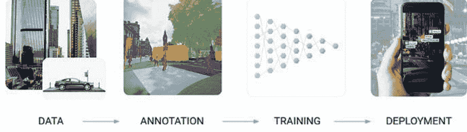
图 1.1 机器学习项目的结构。

这篇文章[117]发表于2018年，但这个趋势至今仍在持续：深度学习的论文数量呈指数增长，每个深度学习的子领域都受到越来越多的关注，而且这一切都没有显示出任何停止的迹象。我们正处于人工智能的第三次炒作浪潮中，没有人知道它是否会像前两次一样崩溃（我们将在第2.1节简要讨论它们）以及何时会崩溃。

尽管有所有这些进展，但在使用机器学习解决给定问题的基本流程仍然大致相同，如图1.1所示：

- 首先，需要收集与特定问题和领域相关的原始数据；
- 其次，根据问题设置对数据进行标记；
- 第三，机器学习模型在生成的带标签数据集上进行训练（通常还会在用于测试的数据子集上验证性能）；
- 第四，在训练模型后，需要将其部署到实际环境中进行推理；这一部分通常涉及在资源有限的环境中部署模型或尽量减少延迟。

在机器学习领域发表的成千上万篇论文中，绝大多数都涉及“训练”阶段：我们如何改变网络架构以在标准问题上获得更好的结果或解决全新的问题？一些论文涉及“部署”阶段，旨在将模型适配并在较小的边缘设备上运行推理，或者监控模型在实际环境中的性能。

然而，任何机器学习从业者都会告诉你，正是“数据”和（尤其是某些问题的）“注释”阶段占据了任何真实数据科学项目的80%以上，标准开放数据集是不够的。这80%会变成99%并成为真正的瓶颈吗？或者它们已经这样做了吗？让我们找出来。

对于计算机视觉问题，所需的标注通常非常费时费力。假设你想教一个模型数一下在田地里吃草的奶牛，这是一个在农业中应用深度学习的自然且有潜力的想法。这里的基本计算机视觉问题要么是对象检测，即在奶牛周围画出边界框，要么是实例分割，即区分奶牛的轮廓。为了训练模型，你需要很多带有标注的照片，就像图1.2中所示（图1.2a上的分割；图1.2b上的对象检测）。

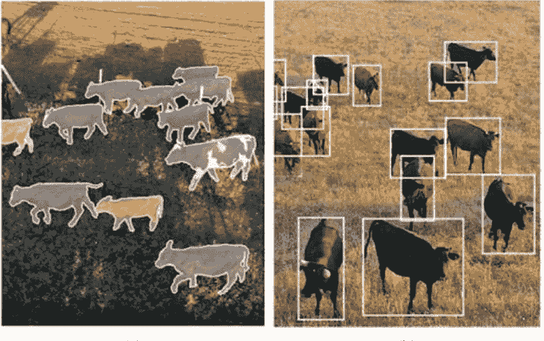
图 1.2 标准计算机视觉问题的样本标注: (a) 实例分割; (b) 物体检测。

想象一下手工标注这样的照片需要多少工作量。自然地,人们已经开发出工具来部分自动化这个过程。例如,一个最先进的标注工具(参见,例如,[829])会建议由一些通用模型生成的分割候选项,人类标注者只需要通过点击被错误分割的单个像素来修正这个模型的错误。但是每张照片可能仍然需要几分钟的时间,而标准分割或物体检测模型的训练集应该有成千上万甚至数十万这样的照片。这样累积下来,仅仅标注就需要人年和数十万甚至数百万美元的花费。

存在着许多不同问题的大型开放数据集,包括分割和物体检测。但是一旦你需要超出这些数据集已经涵盖的类别、设置和条件的内容,你就会失望;例如,ImageNet中有牛,但没有从上方用无人机拍摄的牛。

即使数据集看起来是为手头的问题量身定制的,它可能包含危险的偏见。例如,假设基本问题是人脸识别,这是一个具有大规模数据集的经典计算机视觉问题,可以自由获取[37,38,366,542];还存在人工合成的人物数据集,我们将在第6.6节中讨论它们。但是,如果你想要在“野外”识别人脸,你需要一个覆盖各种人脸旋转的数据集,而标准数据集主要由正面照片组成。例如,工作[1017]表明,标准开放大规模人脸识别数据集IJB-A [460]中的人脸旋转分布极不平衡;该工作讨论了如何通过从IJB-A数据集生成人脸的合成图像来填补这一分布中的空白(详见第10.3节,我们将详细讨论这项工作)。

## 1.2 一次性学习及更多类别：更少的数据
我们已经提到了人脸识别系统，并刚刚讨论了计算机视觉系统通常需要大量标记的训练样本来学习如何识别新类别的对象。但是人脸识别系统应该如何工作呢? 如果我们要求每个需要识别的人都需要在不同环境下拍摄数百张照片, 那么绝大多数人脸识别用例都无法实现。当一个人通常只有几张照片时, 人脸识别系统如何希望能够识别一个新的人脸?

答案是人脸识别系统与常规图像分类器有些不同。任何处理非结构化数据（如照片）的机器学习系统基本上可以分为两部分：

- 特征提取，将图像转换为（更小的）数值向量，通常称为嵌入或潜在编码
- 机器学习模型（例如分类器），使用提取的特征来解决实际问题。

因此, 常规图像分类器由特征提取网络和分类模型组成, 如图1.3所示; 这种架构被用于将深度学习革命引入计算机视觉的第一批神经网络, 如 AlexNet、GoogLeNet等（我们将在第3.1节讨论它们）。在深度学习中，分类器通常非常简单, 大多数情况下基本上等同于逻辑回归, 而特征提取才是有趣的部分。实际上, 深度学习的大部分优势来自于神经网络能够学习比我们人类能够设计的任何手工特征提取方法更好的能力。


图 1.4 孪生网络的通用架构。

要训练这种网络，确实需要大量标记的人脸，并且要添加一个新的人脸，需要相当多的新类别示例。然而，这不是唯一的方式。现代人脸识别系统发展的一个重要方向与以各种方式学习人脸嵌入（学习特征提取）有关。例如，FaceNet[771]使用了孪生网络方法的一种修改，其中目标不是类别标签，而是人脸嵌入之间的距离或相似性。目标是以这样的方式学习嵌入，使得相同人脸的嵌入彼此靠近，而不同人脸的嵌入则明显分离，相互之间距离较远。

这种方法的通用架构如图1.4所示：特征提取器生成数值特征，这些特征被视为欧几里得空间中的向量，损失函数的设计大致上是将对应于同一人的向量彼此靠近，并将从不同人的图像中提取的向量推开。

在以基于距离的度量为导向的训练了FaceNet模型之后，我们可以使用嵌入来进行所谓的一次性学习。假设新面孔的嵌入具有相同的基本属性，我们可以简单地计算一个新人的嵌入（只需一张照片作为输入！），然后通过在嵌入空间中寻找最近邻来进行分类。虽然这种方法在面部识别方面遇到了一些问题，由于难以挖掘出困难的负例，一些最先进的人脸识别系统目前是通过附加技巧和修改损失函数来进行训练的分类器。但这种方法仍然是研究领域的重要组成部分。

这是一种简化但现实的一次性学习系统工作方式的描述。

但是，如果一个新类别没有任何可用的数据，我们该怎么办呢？

这种设置被称为零样本学习。这个问题听起来不可能，而且确实如此：如果你只知道“类别1”和“类别2”的图像，然后被要求在没有其他信息的情况下区分“类别3”和“类别4”，那么任何机器学习都无法帮助你。但在现实生活中，情况并非如此：即使我们没有任何图像，我们通常对新类别有一些背景知识。例如,当我们被要求识别一个“约克夏梗”²，我们知道它是一种狗，甚至可能有它的文字描述，比如可以从维基百科上获取。有了这些信息，我们可以尝试为类别名称和图像学习一个联合嵌入空间，然后使用相同的最近邻方法，但寻找最近的标签嵌入而不是其他图像（对于新类别我们没有图像）。

这种跨模态零样本学习最初由Socher等人[810]提出，他们训练了一个模型，根据从无监督文本语料库中学习到的类别知识来识别图像上的对象。他们的模型学习了一个词嵌入和图像特征向量的联合潜在空间。自然地，这种方法不会像在大规模标记图像集上训练那样准确，但是零样本学习系统越来越成功。特别是，Zhu等人最近的一篇论文[1029]使用生成对抗网络（GAN）通过文本描述“产生”新类别的图像，然后从这些“产生”的图像中提取特征；这与我们在第10章中探索的使用GAN生成和改进合成数据的方法非常接近；还可以参考最近关于零样本学习和少样本学习的调查[911,916,917,949]。

然而需要注意的是，一次性学习和零样本学习仍然需要大规模标记数据集。不同之处在于，我们不再需要大量图像来表示每个新类别。但是，特征提取网络必须在类似的标记类别上进行训练：如果你在鸟类上进行训练，然后尝试根据其文本描述寻找椅子，零样本方法将无法工作。在我们能够使用训练于各种可能图像上的超级网络之前（正如我们很快将看到的，即使使用当前的方法，我们还有很长的路要走），这仍然是一种数据密集型的方法，尽管对使用何种数据的限制有所放宽。

模型通常采用一种折中的方法，试图从多个示例中进行泛化，这被称为少样本学习[916]。与一次性学习类似，从少量示例中进行复杂问题的泛化需要通过富有表达力和信息丰富的先验分布来引导，否则数据将不足以支持泛化。在许多方面，这就是人类学习的方式：我们通常需要一些示例来理解新概念，但不需要成千上万个示例，因为新概念可能符合我们一生中建立的关于世界的先验框架。

为了在机器学习模型中获得这些先验分布，我们可以使用多种不同的方法。我们已经在上面看到了一些例子，而一次性学习和少数样本方法的一般分类至少包括以下内容：

- 数据增强通过不改变我们需要学习的属性的转换来扩展可用数据集；
- 多任务学习训练一个模型来解决多个问题，每个问题可能有一个小的数据集，但是这些数据集的总量足够大；
- 嵌入学习学习可以推广到新示例的潜在表示，正如我们上面讨论的那样；

² ImageNet[187]，计算机视觉模型的主要基础数据集，非常喜欢犬类：它区分了来自世界各地的120个不同的狗品种。

## 1.2 一次性学习及更多类别：更少的数据
- 微调使用少量新数据更新已经在不同任务（可能是无监督的）上预训练的现有模型。

我们将在本书中遇到所有这些技术。

## 1.3 弱监督训练：以计算为代价交换标签
对于许多问题来说，获取带标签的数据是昂贵的，但是未标记的数据，尤其是与特定问题无关的数据，是非常丰富的。再次考虑我们所讨论的基本计算机视觉问题：获取大量带标签的牛群图像数据集非常昂贵，但获取大量未标记的这类图像数据集要便宜得多，而且只是获取带有和不带有牛的大量图像几乎是微不足道的。

但是未标记的数据能帮助吗？基本直觉告诉我们可能不容易，但应该是可能的。毕竟，我们人类从各种随机图像中学习，并且在婴儿期，我们对周围世界有了一种很好的直觉。凭借这种直觉，我们以后可以毫不费力地进行一次性和零次学习。而且这些图像实际上从来没有被标记过，我们所做的学习几乎不能被称为监督学习。虽然这与人类的能力相去甚远（例如，Francois Chollet最近的一篇论文[154]对人工智能的实际普适性进行了详细分析），但在机器学习中有几种方法正在开发中，以利用所有这些额外的未标记数据。

首先，可以使用无标签数据生成新的标签数据；虽然新的“伪标签”不能保证是正确的，但它们仍然会有所帮助，并且可以在后续迭代中重新访问和纠正它们。谢尔等人最近的一项研究工作中出现了一个引人注目的例子，他们来自谷歌大脑和卡内基梅隆大学，应用了以下算法：

- 从通常的方式训练的“教师”模型开始，使用（较小的）标记数据集；
- 使用“教师”模型对（较大的）无标签数据集进行操作，生成伪标签；
- 在生成的大型标记数据集上训练“学生”模型；
- 将训练好的学生模型作为下一次迭代的教师，然后重复这个过程。

这是一种相当标准的方法，在半监督学习中已经多次使用，并且也被称为知识蒸馏[129,293,345,541,603]。但是，谢尔等人通过向学生模型添加噪声，成功改进了ImageNet这个最常用和最具挑战性的大规模图像分类数据集的最新结果。然而，为了实现这一点，他们需要一个包含3亿张无标签图像的单独数据集和大量的计算能力：在一个拥有2048个核心的谷歌TPU上需要3.5天的时间，与AlphaZero超越其他所有对手所需的规模相同[800]；我们很快会看到这种计算并不是免费的。

另一个有趣的例子是用（大量的）无标签数据替换有标签数据的问题，这个问题我们已经讨论过了：分割。确实很难为训练分割模型生成有标签的数据…但是我们必须这样做吗？在深度学习出现之前，经典计算机视觉的分割模型不需要任何有标签的数据：它们根据像素的特征（颜色和可能是相邻像素的特征）进行像素聚类，或者运行一个算法将像素图切割成具有最小成本的片段[657,839]。当然，现代深度学习模型效果更好，但是最近的进展似乎使得无需有标签数据也能训练深度学习模型进行分割成为可能。

像W-Net [948]这样的方法使用无监督的自编码器式训练从像素中提取特征，然后使用经典算法对其进行分割。

诸如不变信息聚类[399]的方法开发了图像聚类方法，然后以基于卷积的方式将其应用于每个像素，从而将图像聚类转化为分割。最引人注目的工作之一是使用GAN进行图像处理的无监督聚类。

“剪切和粘贴”方法[716]以对抗的方式工作：

- 一个网络，即掩码生成器，根据检测到的对象的像素特征构建分割掩码；
- 然后根据该掩码将对象剪切出来，并将其转移到图像上的不同位置，不包含对象；
- 另一个网络，即鉴别器，现在必须区分图像块是由这个剪切和粘贴流程生成的，还是真实图像的一部分。

这个想法是好的分割掩码将产生逼真的粘贴图像，为了说服鉴别器，掩码生成器必须学会生成高质量的分割掩码。我们将在第9.3节讨论这种方法及其对于合成数据的影响。

半监督师生训练和无监督分割通过剪切和粘贴只是目前正在开发的众多方向之一。在这些工作中，研究人员正在探索各种方式来交换标记数据集的需求，以获得额外的无标签数据、额外的无关数据或额外的计算资源，这些资源变得越来越容易获取。然而，这并不能完全解决数据问题，计算挑战可能会变得不可逾越。

## 1.4 无数据的机器学习：超越摩尔定律
图 1.5 通用强化学习流程图。

这种可能性最大的主要领域是强化学习 (RL) , 在这个领域中, 一个代理学习在交互环境中表现良好 [788,831]。一个代理可以执行动作, 并从环境中获得这些动作的奖励。通常, 现代强化学习架构由处理环境状态并将其转化为特征的特征提取部分和将特征转化为动作并将环境奖励转化为权重更新的强化学习代理组成; 请参见图 1.5 中的示意图。


这些方法的典型代表是 DeepMind的AlphaZero[800]。他们的原始突破是AlphaGo[799], 这是一个在2016年3月的官方比赛中击败了顶级人类围棋选手李世石的模型。在DeepBlue击败卡斯帕罗夫 (Kasparov) 在国际象棋比赛后, 专业水平的围棋仍然是计算机程序无法达到的, AlphaGo的成功甚至在2016年也是出乎意料的。李世石与AlphaGo之间的比赛成为人工智能历史上最受关注的事件之一, 并被广泛认为是亚洲在人工智能领域的“斯普特尼克时刻”, 即中国、日本和韩国意识到深度学习应该被认真对待的时刻。

但是 AlphaGo利用了大量标记数据: 它有一个预训练步骤, 使用了一个大型的专业比赛数据库。

AlphaZero之所以被称为AlphaZero, 是因为它不需要任何训练数据: 它知道游戏规则, 并通过自我对弈来取得顶级结果, 实际上使用了一个非常简单的损失函数和树搜索。AlphaZero在围棋中击败了AlphaGo (以及其后续版本AlphaGo Zero) 和顶级国际象棋引擎Stockfish。

DeepMind强化学习团队最近的一个成果MuZero[770]更加令人印象深刻。MuZero是一种基于模型的强化学习方法, 即在运行过程中构建环境模型, 并且不事先知道游戏规则, 而是需要从零点开始学习; 例如, 在国际象棋中, 它不能进行非法移动, 但可以在树搜索中考虑它们, 并且必须自己学习它们是非法的。在这种额外的复杂情况下, MuZero能够在国际象棋和将棋中达到AlphaZero的水平, 并且在围棋中甚至超越它。最重要的是, 同样的模型也可以应用于更复杂的环境情况。

图1.6 深度学习的变化趋势：机器学习中“摩尔定律”在深度学习兴起前后的比较。图表由 OpenAI [16] 提供。

例如，将状态应用于 Atari 环境中的电脑游戏（强化学习中的标准基准）。

那么问题在哪里？这是数据问题的终结吗？一个缺点是，并非每个问题都可以用不需要数据的强化学习来表述。你可以学会玩游戏，即自包含的有限结构，其中所有规则都是事先知道的。但是，如何学习自动驾驶或行走，以及这些情况的各个组成部分的更广泛的可能情况呢？

这里有一个可能的解决方案，就是使用合成虚拟环境，我们将在第7章中详细讨论它们。

另一个，也许更严重的问题是强化学习进一步发展所需的计算量。为了学会下棋和围棋，MuZero 使用了 1000 个第三代 Google TPU 来模拟自我对弈游戏。这本身并没有告诉我们太多信息，但是这里有一个有趣的观察结果，由 OpenAI 团队[16] 提出，在图 1.6 中有所说明。他们注意到，在 2012 年之前，用于训练最先进的人工智能模型所需的计算资源基本上按照摩尔定律增长，每两年计算需求翻倍。但是随着深度学习的出现，在 2012 年至 2019 年期间，用于顶级人工智能模型训练的计算资源平均每 3.4 个月翻倍！这是一个巨大的增长速度，显然不能永远持续下去，因为实际硬件计算能力的增长相对于摩尔定律正在放缓。根据最近的估计，复制 AlphaZero 实验目前需要花费约 3500 万美元 Google 云计算费用[365]；虽然计算成本在下降，但下降速度远远低于 AI 所需的计算增长速度。

因此，进一步发展人工智能的一个可能情景是，确实，这种“蛮力”方法在理论上可能会带我们走得很远，甚至可能达到通用人工智能，但它需要比我们目前在我们微小的太阳系中拥有的计算能力更多。请注意，类似的现象，尽管规模较小，也发生在人工神经网络的第二波炒作中：1980 年代末的研究人员对神经网络结构（包括 CNN、RNN、RL 等）有很多伟大的想法，但数据和计算能力都不足以取得突破，神经网络被归类为“几乎任何事情的第二好方法”[3]。

然而，目前来看，强化学习代表了另一种可行的方式，用计算来交换标记数据，正如 AlphaGo 发展成 AlphaZero 和 MuZero 所清楚展示的那样。通过这样，我们对替代方案进行了简要概述，并进入了本书的主题：合成数据。

## 1.5 为什么使用合成数据？

让我们回到分割问题，这是一个标准的计算机视觉问题，在第 1.1 节中我们已经讨论过。如何为图像分割生成一个带标签的数据集？在某个时候，所有的图像都必须经过人工处理：人类必须要么绘制，要么至少验证和修正分割掩模。使结果像素完美是如此费力，以至于通常被认为不值得这样做。

图 1.7a-c 展示了行业标准 Microsoft Common Objects in Context (MS COCO) 数据集[525] 的样本；你可以立即看到分割掩模是一个相当粗糙的多边形，而且缺少许多更细的特征。顺便说一句，我们很快就找到了这样粗糙的分割掩模；这些是“狗”和“人”查询找到的一些最早的图像。

如何获得更高质量的分割数据集？要手动纠正 MS COCO 数据集中的所有这些掩模可能需要花费数十万美元。幸运的是，有一个不同的解决方案：合成数据。在分割的背景下，这意味着数据集开发者创建一个包含他们想要识别的对象及其周围环境的 3D 环境，然后渲染结果。图 1.7d-e 显示了一个名为 ProcSy [449] 的合成数据集的样本帧（我们在第 6.5 节中详细讨论）：请注意分割掩模现在完全正确。虽然 3D 建模仍然主要是手工劳动，但这是一次性的投资，在此投资之后，可以获得潜在无限数量的像素完美标记的数据：不仅包括 RGB 图像和分割掩模，还包括深度图像、从不同视点产生的立体图像对、点云、合成视频片段和其他模态。

一般来说，现代人工智能的许多问题归结为数据不足：要么可用的数据集太小，要么即使捕捉未标记数据相对容易，手动标记的成本也非常高昂。

通过从头开始生成人工数据或使用先进的数据操作技术生成新颖且多样的训练样例，合成数据是解决数据问题的重要方法。合成数据方法最容易在标准计算机视觉问题中得到体现，就像我们之前所做的那样，但它在其他领域也是相关的（我们将在第 8 章中讨论其中一些）。

当然，还会出现其他问题；其中最重要的问题是域转移问题：正如您从图 1.7 中可以看到的那样，合成图像并不完全像真实图像，因此必须尽可能使其逼真，并/或设计帮助模型从合成训练集转移到真实测试集的技术；因此，域自适应成为合成数据研究和本书中的一个重要主题（参见第 10 章）。然而，请注意，合成数据研究中的一个常见主题是逼真性是否真的必要；我们将在本书中多次遇到这个问题。

我们首先对合成数据进行一些一般性的说明。首先，注意到合成数据可以通过软件合成数据生成器在训练过程中即时产生并提供给机器学习模型，从而减轻了存储庞大数据集的需求；例如，Mason 等人[583] 详细讨论了这种“即时生成”的方法。其次，虽然合成数据已经成为一个兴起的领域，但我不知道有关机器学习或深度学习中合成数据的令人满意的总体概述，这是我撰写本书的主要动机。

我想指出一些试图涵盖合成数据应用的调查[157、467、875]以及《国际计算机视觉杂志》的特刊[253]，但我希望本书能够呈现一个更全面的画面。

第三，我们区分合成数据和数据增强；后者是一组旨在修改真实数据而不是创建新的合成数据的技术。如今，数据增强是几乎每个计算机视觉流水线中至关重要的一部分；我们参考调查报告[792、914]，特别推荐 Albumentations 库[104]，该库在我们的实践中已经证明非常有价值，但在本调查中，我们集中讨论合成数据而不是增强技术（后者将仅成为第 3.4 节的主题）。不可否认，它们之间的界限模糊，这里讨论的一些技术也可以被归类为“智能增强”。

第四，我们注意到合成数据在机器学习中的一个自然应用：在受控的合成环境中测试假设和比较方法和算法。玩具示例和说明性示例通常是合成的，具有已知的数据分布，以便可以评估机器学习模型对该分布的学习效果。这种方法在整个领域中被广泛使用，有时用于整个元分析[80, 491, 797]，我们在这里不详细讨论它；我们的主题是将合成数据用于转移到真实数据，而不是在合成数据集上直接比较模型。

(a)
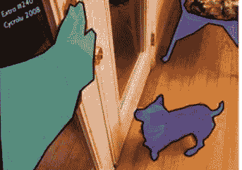
(b)
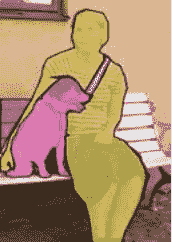
(c)
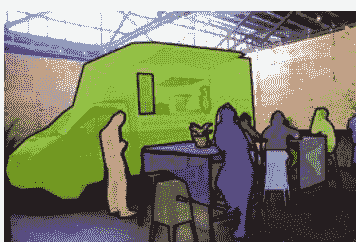
(d)
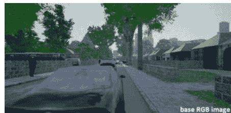
(e)
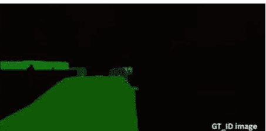

图 1.7 样本图像：(a-c) MS COCO [525] 实际数据样本，上面叠加了地面真实分割图；(d-e) ProcSy[449]：(d) RGB 图像；(e) 地面真实分割图。

## 1.6 计划

本书涵盖了合成数据在机器学习中的三个主要应用方向；在本节中，我们介绍这三个方向，并提供与这些方向相关的书中具体部分的参考文献。

1. 使用合成数据集直接训练深度学习模型。
这是计算机视觉中经常采用的方法，本书的大部分内容都是围绕这种方法展开的。特别是，可以：
- 在合成数据上训练模型，目的是在真实数据上使用它们；我们在第 6、7 和 8 章中讨论了这种方法；
- 训练（通常是生成性的）模型，改变（改进）合成数据，使其更适合训练或调整模型以允许在合成数据上进行训练；第 10 章专门讨论了这种模型。

2. 使用合成数据增强现有真实数据集，使得生成的混合数据集更适合训练模型。在这种情况下，通常使用合成数据来覆盖真实数据集中不足够表示的数据分布部分，主要目的是减轻数据集偏差。合成数据可以是以下两种情况之一：
- 可以使用基于 CGI 的方法单独生成，例如计算机视觉中的方法（请参见第 3 章和第 7 章的示例）
- 可以使用生成模型从现有真实数据中生成（请参见第 10.4 节）

3. 使用合成数据解决隐私或法律问题，使得使用真实数据变得不可能或极其困难。这在某些特定应用领域尤为重要，其中我们讨论的包括：
- 医疗保健中的合成数据，不仅限于图像，还包括医疗记录等（第 10.7 节）
- 金融和社会科学中的合成数据，直接应用很困难，但与隐私相关的应用开始出现（第 11.5 节）
- 具有隐私保证的合成数据：许多应用足够敏感，需要隐私保证，例如从差分隐私框架的角度来看，已经有了一系列重要的工作使得合成数据生成提供了这样的保证，我们在第 11 章中进行了讨论。

本书的组织如下。第 2 章对深度学习进行了非常简要的介绍；虽然我们不能指望在一章的篇幅内提供一个真正深入的入门教材，但我们将从深度学习革命如何在 2000 年代末改变机器学习的基础知识开始（第 2.1 节），介绍神经网络的组织结构（第 2.3 节），以及通过各种梯度下降的修改方式进行训练（第 2.4 节和第 2.5 节）。

接下来，由于计算机视觉是应用合成数据最常见的领域，我们将在第 3 章中介绍专门用于计算机视觉问题的深度架构，并在本书的其他章节中使用。第 3.1 节介绍了卷积神经网络的概念，第 3.2 节介绍了现代卷积架构在图像分类、目标检测和分割中的几个基本思想，第 3.3 节提供了一个用于目标检测的神经架构案例研究；虽然我们不能涵盖所有内容，但至少尝试深入研究一个主题，以说明计算机视觉中深度学习方法的深度和多样性。

最后，最先进的入门章节涉及深度学习中的生成模型；它们是第 4 章的主题。我们首先讨论机器学习中的生成模型（第 4.1 节），介绍了判别模型和生成模型之间的区别。接下来，我们讨论 Ian Goodfellow 关于深度学习生成模型的分类，并概述了可计算密度模型，包括对归一化流的介绍（第 4.2 节）。在第 4.3 节中，我们讨论变分自编码器作为近似显式密度模型的主要示例。第 4.4 节介绍了与合成数据最直接相关的生成模型类别：生成对抗网络（GAN）。第 4.5 节讨论了现代 GAN 中的损失函数，第 4.6 节简要概述了一些重要的基于 GAN 的通用架构，第 4.7 节以基于 GAN 的风格转换案例研究结束，这个问题既是现代对抗性架构的很好说明，也与合成到真实领域适应直接相关。

第 5 章专门讨论了合成数据的早期历史。合成数据似乎只在过去几年中才开始兴起，但我们将看到，合成数据的使用可以追溯到 1970 年代，当时计算机视觉迈出了第一步（第 5.1 节），并在计算机视觉的整个历史中被用作实验比较的测试平台（第 5.2 节），并在 1989 年用于训练第一辆自动驾驶汽车（第 5.3 节）。本章的最后几节专门讨论了早期的机器人技术：我们首先讨论了合成数据如何从一开始就用于训练机器人控制系统，并面临一些保留和批评（第 5.4 节），然后详细介绍了一个早期的机器人导航系统 MOBOT（第 5.5 节）。

第 6 章介绍了基本计算机视觉问题的合成数据集和结果，包括低层问题，如光流或立体视差估计（第 6.2 节），基本对象数据集（第 6.3 节），基本高层计算机视觉问题，包括目标检测案例研究（第 6.4 节）和其他高层问题的讨论（第 6.5 节），人类相关的合成数据（第 6.6 节），以及字符和文本识别和视觉推理问题（第 6.7 节）。在整个第 6 章中，我们引用了一些通过在合成数据上进行训练而改进结果的特定架构，并展示了来自合成数据集的图像示例。

在第 7 章中，我们继续讨论更接近于全面模拟环境的合成数据集，涵盖户外和城市环境（第 7.2 节），室内场景（第 7.3 节），用于机器人技术的合成模拟器（第 7.4 节），用于自主飞行器的模拟器（第 7.5 节）以及用作模拟环境的电脑游戏（第 7.6 节）。对于例如端到端强化学习架构，合成模拟环境是绝对必要的，我们将看到一些情况的例子，其中它们足以训练成功的强化学习代理，以及需要进行领域转移的其他情况。

虽然合成数据在计算机视觉中起到了最重要的作用，但还有其他应用领域也在第 8 章中进行了讨论。特别是神经编程（第 8.2 节）是一个完全依赖于自动生成的训练样本的领域：强迫人类编写数百万个琐碎的计算机程序是没有意义的。在生物信息学（第 8.3 节）中，合成数据的大多数应用再次集中在医学成像领域，但也有一些领域学习如何生成其他类型的信息，例如分子指纹，并在这些合成生成的数据上训练后续模型。最后，自然语言处理（第 8.4 节）尽管在文本生成方面取得了明显的成功，但合成数据在该领域并没有真正起飞。能够生成具有预定义属性的连贯文本的计算机程序必须是一个能够捕捉到很多有用特征的 AI 模型，通常使用模型本身比尝试在其输出上学习不同的模型更具生产力；然而，在自然语言处理中也有一些合成数据的例子。

第 9 章讨论了旨在改进合成数据生成的研究。域随机化（第 9.1 节）的概念意味着尽可能覆盖合成样本的数据分布，使其最大化不同且随机化，希望能够捕捉到支持合成数据分布的真实数据。第 9.2 节讨论了基于 CGI 生成的方法的当前发展，包括对真实世界传感器（相机、LiDAR 系统等）进行更真实的模拟以及更复杂的定义和生成合成场景的方式。第 9.3 节讨论了通过“剪切和粘贴”真实数据样本的合成数据，并以对生成模型直接生成合成数据的讨论结束本章（第 9.4 节）。很少见到这样的例子，因为类似于自然语言处理，从给定领域训练生成模型以产生高质量样本的模型可能已经包含了可以直接或微调用于各种应用的模型；尽管如此，GANs 仍然可以在某些情况下直接提供帮助。

本书的下一部分涉及合成数据的主要研究问题，即合成到真实领域的适应性问题：我们如何使在合成数据上训练的模型在真实样本上表现良好？毕竟，整个企业的最终目标始终是将模型应用于真实数据。有了这个，我们进入了第 10 章，讨论合成到真实领域的适应性本身。对于这个问题，有许多方法可以广泛地分为两类：
- 合成到真实的改进，其中使用领域适应模型使合成数据更加真实（第 10.1 节）；
- 特征/模型级别的领域适应，其中模型和/或训练过程进行调整，而不是数据本身（第 10.5 节）。

区别在于，通过改进，通常可以提取改进的输入数据：要么是使合成样本“更真实”，要么是使真实样本“更合成化”；而在模型级别的领域适应中，架构通常只是学习从两个领域中提取共同特征。在本章中，我们还讨论了控制和机器人领域适应的案例研究（第 10.6 节）和医学影像领域适应（第 10.7 节）。

第 11 章专门讨论了合成数据的隐私方面：我们能否生成不包含原始数据集中个体个人信息的合成数据？为了获得这样的保证，我们需要涉足差分隐私，这是一个更多属于理论密码学而非机器学习领域的领域。第 11.2 节和第 11.3 节介绍了差分隐私的一般概念和在深度学习模型中的具体应用，第 11.4 节展示了如何生成具有差分隐私保证的合成数据，第 11.5 节则介绍了关于金融和相关领域中私密合成数据的案例研究，特别是电子医疗记录。

为了展望未来，我们将第 12 章专门讨论与合成数据相关的进一步研究方向，这些方向似乎最有前景。我们考虑了四个这样的方向：
- 第 12.1 节考虑了合成数据的过程生成，其中数据的真实性不是通过低级细化而是通过改进高级生成过程来提高的：例如，我们不是在改进椅子上木材和织物的纹理，而是在谈论整个合成房间内部布局的更一致性。
- 在第 12.2 节中，我们介绍了合成数据生成的反馈闭环的概念：由于最终目标是改善在合成数据集上训练的模型的性能，也许我们可以改变合成数据生成的参数，以直接增加这个度量；
- 第 12.3 节讨论了将领域知识引入领域适应的问题；具体而言，我们考虑了一个例子，其中模型包含了一个领域特定的生成模型，用于生成合成图像，并且还包含了一个自下而上的模型，用于估计图像中必要的参数；
- 第 12.4 节展示了如何通过添加易于在合成数据集中获得的附加模态来改进领域适应模型；例如，在计算机视觉中，通过深度图和表面法线的 3D 信息来增强合成数据是微不足道的，因为合成数据是从 3D 场景中生成的，所以这些附加信息可能有助于使数据更加逼真。

最后，第 12.5 节通过对现代人工智能中合成数据的位置和可能的未来工作进行一些总结，结束了本书。

到目前为止，我们已经看到深度学习革命对计算能力和数据的需求越来越难以满足。有一些方法可以避免对不断增长的标记数据集的需求，但它们通常似乎需要更多的计算资源，而这些资源现在也不容易获得。我们已经看到合成数据是摆脱这个困境的一种可能途径。

但对于初学者来说，仍然不清楚这个“深度学习”到底是什么，这正是我们在下一章中要讨论的内容。

## 第 2 章 深度学习与优化

深度学习目前不仅是机器学习领域中最热门的领域，而且是整个科学界最热门的领域之一。自 2000 年代中期以来，深度学习模型一直在推动人工智能的革命，显著提升了机器学习的最新技术水平：计算机视觉、自然语言处理、语音和声音处理、生成模型等等。本书专注于合成数据应用；我们无法对整个领域进行全面的介绍，建议读者参考其他书籍以获得更详细的深度学习概述[153,289,630,631]。尽管如此，在本章中，我们将从介绍深度神经网络开始，描述该领域的主要思想。我们特别关注深度学习中的优化方法，从常规梯度下降开始，逐步介绍自适应梯度下降变体和最新的思想。

## 2.1 深度学习革命

在 2006-2007 年，机器学习经历了一次真正的革命，为人工神经网络（ANNs）特别是人工智能（AI）开启了新的第三次“炒作浪潮”。有趣的是，可以说人工神经网络直接导致了历史上所有三次 AI“炒作浪潮”的发生[1]：
- 在 1950 年代和 1960 年代初，弗兰克 · 罗森布拉特的感知机[735,736]，本质上是一个非常简单的人工神经网络，成为实际实施和在《纽约时报》上推出的第一个机器学习形式之一。
> [1] 对于人工神经网络和深度学习的早期历史，我推荐一篇由深度学习之父之一 Jürgen Schmidhuber 教授[767] 撰写的综述；它从牛顿和莱布尼兹开始，他们的成果，正如我们将看到的，对于 ANN 训练至今仍然非常相关。
- 尽管梯度下降是一个非常古老的想法，至少从 19 世纪初就已经被知道和使用，但直到 20 世纪 80 年代，人们才意识到反向传播，即通过计算图来计算网络中可训练权重的梯度，可以用于将梯度下降应用于具有几乎任意非循环架构的深度神经网络；这个想法在 20 世纪 80 年代初在研究界变得普遍[924]，而 Rumelhart 等人的著名 Nature 论文[742] 标志着神经网络进入大众心目中和商业应用的第二次兴起。

这两个炒作浪潮都被证明是过早的，无论是在 1960 年代还是在 1990 年代，神经网络都无法达到研究人员和投资者的期望。

有趣的是，现在我们明白，这种缺陷既是技术上的，也是数学上的：如果晚期的 1980 年代或 1990 年代的神经结构能够使用现代计算资源和更重要的是现代数据集，它们的性能将非常出色。但是目前来看，这些大诺言显然是没有根据的；让我给你讲一个故事。

第一次炒作浪潮停止的主要原因之一是一项大型项目的失败，而这个项目正是机器翻译！当时正值冷战的高峰期，美国政府决定开发一种从俄语到英语的自动翻译机器，至少用于正式文件。他们对 1954 年的乔治敦-IBM 实验非常兴奋，这是一个非常有限的机器翻译系统的早期演示。演示取得了巨大成功，当时的研究人员确信大规模机器翻译就在眼前。

自然地，这个愿景没有实现，十二年后的 1966 年，ALPAC（自动语言处理咨询委员会）发布了一份著名的报告，不得不承认机器翻译目前还无法实现，并强调需要进行更多的计算语言学研究[620]。这导致了美国资助机构对人工智能普遍的失望，当资助停止后，研究人员通常不得不转向其他课题，于是第一次“人工智能寒冬”到来。这是一个很好的例证，早期的人工智能是多么乐观：当然，研究人员并不期望完美，他们会对现代的谷歌翻译的状态感到满意，但现在我们意识到，谷歌翻译所能做到的需要经历多么漫长而艰辛的道路。

然而，在 2000 年代中期，深度神经网络开始认真工作。那个时候证明有效的深度神经网络训练方法是基于无监督预训练[226]：Hinton 教授的团队通过深度置信网络（DBN）在深度学习方面取得了第一批重大成功，这是一种通过受限玻尔兹曼机进行预训练的方法，而梯度下降只在最后阶段进行[344, 347]，而在 Ben 教授的研究中-深度学习在实际应用中显著改善的第一个领域是语音识别，通过DBNs从原始声音中提取特征取得了突破性的结果 [346]。 紧随其后的是计算机视觉 ，在第3章中我们会详细讨论，然后是自然语言处理 (NLP) 。 在NLP中，关键贡献被证明是词嵌入，低维向量捕捉了一些词的语义和句法特性，同时使得深度神经网络的输入维度更易处理 [79, 600, 666]。 这些词嵌入最初主要由循环网络处理，但近年来，基于自注意力的架构已经超越了该领域：Transformer、基于BERT的模型和GPT系列 [94, 179, 192, 697, 698, 891]。 我们将在第8.4节涉及自然语言处理，尽管对于NLP来说，合成数据并不像计算机视觉那样相关。

我们在第1.1节中讨论了数据问题可能成为深度学习某些领域进一步发展的限制因素，并且在某些应用领域已经成为这样的因素。 然而，目前在大多数机器学习领域中，深度神经网络定义了最先进的技术，并且进展似乎没有停止。 在本章中，我们将讨论深度学习的一些基础知识，下一章将特别强调卷积神经网络（第3.1节及以后），因为它们是计算机视觉中深度学习的主要工具，而合成数据在该领域尤为重要。 但是在继续之前，让我先进行一个更一般的介绍，解释机器学习问题如何导致优化问题，神经网络如何表示机器学习模型，以及如何解决这些优化问题。

在我们继续之前，有一个重要的免责声明。 我是在2020年写的这本书，深度学习在不断发展的。 虽然基本的东西，如贝叶斯规则和神经网络作为计算图，将一直存在，但很难说与机器学习相关的几乎任何领域的当前最先进技术是否会长期保持最先进。 一个例子是：在本书的第一版草稿中，我写道，单个单元的激活函数基本上已经完成了。 ReLU及其泄漏变体在大多数问题中表现良好，你还可以尝试通过自动搜索（实际上非常详尽）找到的Swish ，这就是全部，未来很可能不会在这方面给我们带来惊喜。 毕竟，这些只是一元函数，而Swish论文明确表示简单的激活函数优于复杂的激活函数[702] 。 但是在2020年9月... 好吧，我们不要泄露，看看第2.3节的结尾。这就是为什么在本章和下一章中，我试图主要集中在神经架构的思想和动机上。 我绝对不会试图推荐任何给定的架构，因为很可能当你阅读这篇文章时，推荐已经发生了变化。当我说“当前的技术水平”时，我只是尽可能更新了我尝试过的想法的快照，其中一些可能在你阅读这篇文章时已经过时了。全面调查深度学习的时间还没有到来。所以我很高兴这本书是关于合成数据的，我只需要这两章的简要介绍。

## 2.2 机器学习的（非常）简要介绍

在进入神经网络之前，让我简要地将它们放入更一般的机器学习问题的背景中。我通常在机器学习课程中告诉学生，机器学习是应用概率论的一个领域。

事实上，大多数机器学习问题可以数学上表述为贝叶斯规则的应用:

$$p(\theta \mid D)=\frac{p(\theta) p(D \mid \theta)}{p(D)}$$

其中 $D$ 表示数据，$\theta$ 表示模型参数。在机器学习中，贝叶斯规则中的分布具有以下含义和直观理解:

- $p(D \mid \theta)$ 是似然函数，即模型本身；似然函数捕捉了我们对数据生成的概率分布的假设；
- $p(\theta)$ 是先验概率，即在获取任何数据之前，我们对模型参数的分布的信念；
- $p(\theta \mid D)$ 是后验概率，即在考虑可用数据之后，我们对模型参数的分布的信念；
- $p(D)=\int p(D \mid \theta) p(\theta) \mathrm{d} \theta$ 是数据的证据或边际概率，根据似然函数对所有可能的 $\theta$ 值进行平均。

这个简单的公式导致了大多数机器学习问题的数学形式。第一个问题，也是经典统计学中常见的问题， 是找到最大似然假设

$$\theta_{ML}=\operatorname{arg} \max _{\theta} p(D \mid \theta)$$

第二个问题是将似然乘以先验， 得到后验

$$p(\theta \mid D) \propto p(D \mid \theta) p(\theta)$$

然后找到最大后验假设:

$$\theta_{MAP}=\operatorname{arg} \max _{\theta} p(\theta \mid D)=\operatorname{arg} \max _{\theta} p(D \mid \theta) p(\theta)$$

当将这两个问题视为优化问题时（我们很快会看到），它们通常具有相似的结构，并且大多数实际的机器学习都是通过最大化似然或后验来完成的。

最后，通常也是最困难的问题是找到下一个数据点的预测分布:

$$p(x|D)=\int p(x, \theta|D) \mathrm{d} \theta=\int p(x|\theta) p(\theta|D) \mathrm{d} \theta$$

对于至少是中等复杂模型的似然函数，这通常导致难以处理的积分和需要开发近似方法。有时，这第三个问题被称为贝叶斯推断，尽管这个术语适用于出现先验的任何情况。

这种数学本质可以应用于不同性质的各种问题。就其设置而言，机器学习问题通常大致分为（图2.1提供了一个示例）:

- 监督学习问题，其中数据以 $D=\left\{\left(\mathbf{x}_n, \mathbf{y}_n\right)\right\}_{n=1}^{N}$ 的形式给出，其中 $\mathbf{x}_n$ 是第 $n$ 个数据点（模型的输入），$\mathbf{y}_n$ 是目标变量：
  - 在分类问题中，目标变量 $y$ 是离散的，即我们需要将 $x$ 放入一个离散的类别中；
  - 在回归问题中，目标变量 $y$ 是连续的，即我们需要在给定 $x$ 的情况下尽可能低的误差预测 $y$ 的值；
- 无监督学习问题是关于学习数据分布的问题；
- 降维技术旨在学习一个低维表示，仍然能够捕捉到高维数据集的重要信息；
- 聚类基本上也是一样的，但不是降到连续空间，而是降到一个离散的聚类集合，将输入数据集中的每个 $x$ 分配给一个聚类标签；这里与有监督学习中的分类/回归区别有一定的相似性；
- 强化学习问题通常在学习开始之前不存在数据，代理需要通过与环境的交互来收集自己的数据集；
  - 在直接强化学习中，代理通过学习各种状态和动作的值函数或通过参数化 $\pi$ 并直接通过策略梯度学习来学习其行为策略 $\pi$；
  - 在间接强化学习中，代理利用经验构建环境模型，从而实现规划。

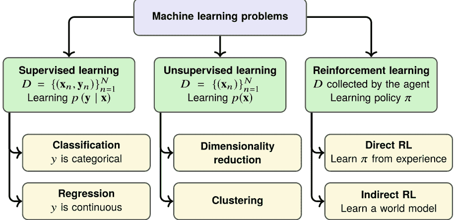

图2.1 机器学习问题的一般分类。

当然，存在中间情况和这些问题的融合，其中最重要的可能是半监督学习，其中数据集的一部分（通常很小）被标记，而另一部分（通常要大得多）没有标记。在本书中，我们主要考虑监督学习问题。 例如，在计算机视觉中，图像分类问题可以用图像（一个三维像素数组，其中第三维是颜色）和目标类别的独热表示（即 $y = (0 ... 0 1 0 ... 0)$）来形式化，其中1表示正确答案的位置。

对于一个简单但已经非平凡的例子，考虑伯努利试验，即抛掷一枚（不一定公平的）硬币的分布。 这里只有一个参数，假设 $\theta$ 是硬币正面朝上的概率。在这种情况下，数据 $D$ 是一系列结果，正面或反面，如果 $D$ 包含 $n$ 个正面和 $m$ 个反面，则似然函数为

$$p(D \mid \theta) = \theta^n (1 - \theta)^m$$

最大似然假设显然是

$$\theta_{ML} = \arg \max_\theta \theta^n (1 - \theta)^m = \frac{n}{n+m}$$

但在现实生活中，这个单一数字显然是不足够的。 如果你从钱包里随机拿出一枚硬币，抛掷一次，观察到正面，你的数据集将有 $n=1$ 和 $m=0$，最大似然假设将是 $\theta_{ML}=1$，但你很难期望这个硬币现在总是正面朝上。问题在于你已经对这个硬币有一个先验分布，在实验次数趋近无穷大时，最大似然假设是完全合理的，但对于较小的样本，先验分布肯定会起到重要作用。

假设先验分布是均匀的， $p(\theta)=1$ 当 $\theta \in [0, 1]$，否则为 0。 注意这与你从钱包中拿出一枚硬币的情况不太一样，你会更倾向于期望一个以 $1/2$ 为中心的钟形分布。这个先验分布更适用于一个关于其先验知识一无所知的新现象，除了它有两个可能结果。但即使对于这个先验分布，结论也会改变。首先，后验分布现在是

$$p(\theta \mid D)=\frac{p(\theta) p(D \mid \theta)}{p(D)}=\left\{\begin{array}{cc} \frac{1}{p(D)} \theta^{n}(1-\theta)^{m}, & \text { 对于 } \theta \in[0,1], \\ 0, & \text { 否则, } \end{array}\right.$$

其中归一化常数可以计算为

$$\begin{aligned} p(D)=\int p(\theta) p(D \mid \theta) \mathrm{d} \theta=\int_{0}^{1} \theta^{n}(1-\theta)^{m} \mathrm{d} \theta= & \frac{\Gamma(n+1) \Gamma(m+1)}{\Gamma(n+m+2)}=\frac{n! m!}{(n+m+1)!} \end{aligned}$$

由于先验分布是均匀的，后验分布仍然在相同的点上取得最大值：

$$\theta_{MAP}=\theta_{ML}=\frac{n}{n+m} .$$

这种情况在图2.2a中有所体现，该图显示了具有均匀先验分布和数据集的参数 $\theta$ 的先验分布、似然函数和后验分布，其中数据集包含两个正面。后验分布当然与似然函数具有相同的最大值，即 $\theta_{MAP}=\theta_{ML}=1$。

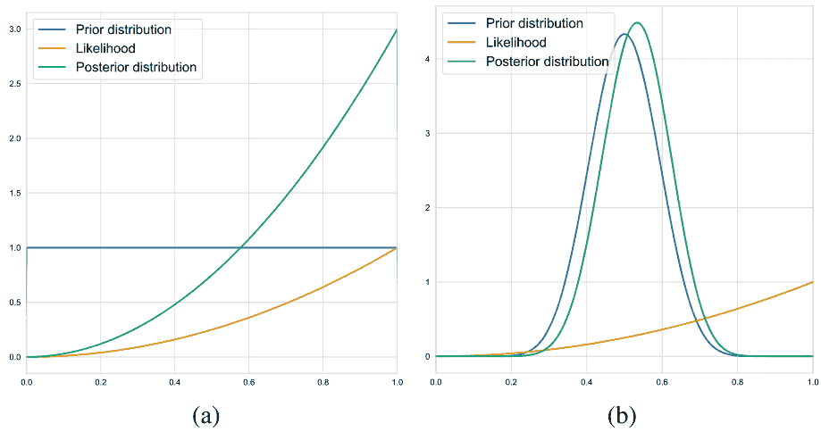

图2.2 与伯努利试验相关的分布：(a) 均匀先验分布，数据集中有两个正面；(b) 先验分布为Beta $(15,15)$，数据集中有两个正面。

但是预测分布会讲述一个不同的故事，因为后验在其右边界上取得最大值，而预测应该整合整个后验。让我们找出这个硬币在下一次投掷中正面朝上的概率:

$$p(\text{正面}|\text{数据})=\int_{0}^{1} p(\text{正面}|\theta) p(\theta|\text{数据}) \mathrm{d} \theta=\int_{0}^{1} \frac{\theta^{n+1}(1-\theta)^{m}}{p(\text{数据})} \mathrm{d} \theta=\frac{(n+1) ! m!}{(n+m+2) !} \cdot \frac{(n+m+1) !}{n! m !}=\frac{n+1}{n+m+2} .$$

在这个公式中，我们推导出了所谓的拉普拉斯继承法则，它展示了如何将贝叶斯平滑应用于伯努利试验。

请注意，在现实中，如果你从口袋里随机拿出一枚硬币，均匀先验分布将是对这枚硬币的信念的一个较差的模型。它可能更像是图2.2b中显示的先验分布，我们展示了完全相同的数据集经过非均匀、信息丰富的先验分布处理后的结果 $p(\theta)=\operatorname{Beta}(\theta ; 15,15)$ 。Beta分布

$$\operatorname{Beta}(\theta ; \alpha, \beta) \propto \theta^{\alpha-1}(1-\theta)^{\beta-1}$$

是伯努利试验的共轭先验分布，这意味着将Beta分布与伯努利试验的似然相乘后，我们再次得到一个Beta分布的后验分布:

$$\text { Beta }(\theta ; \alpha, \beta) \times \theta^{n}\left(1-\theta\right)^{m} \propto \text { Beta }(\theta ; \alpha+n, \beta+m) .$$

例如，在图2.2b中，先验分布为Beta $(\theta ; 15,15)$，经过乘以 $\theta^{2}$ 并重新归一化后，后验分布变为Beta $(\theta ; 17,15)$ 。

在机器学习中，几乎总是假设不同的数据点在给定模型参数的情况下是独立产生的，也就是说，

$$p(D \mid \theta)=\prod_{n=1}^{N} p\left(d_{n} \mid \theta\right)$$

对于数据集 $D=\left\{d_{n}\right\}_{n=1}^{N}$， 这是一个好的假设。因此， 在优化之前， 通常最好取对数， 得到对数似然函数

$$\log p(D \mid \theta)=\sum_{n=1}^{N} \log p\left(d_{n} \mid \theta\right)$$

以及对数后验分布 （注意， 在取对数后， 比例关系变为一个加法常数）

$$\log p(\theta \mid D)=\log p(\theta)+\sum_{n=1}^{N} \log p\left(d_{n} \mid \theta\right)+\text { 常数 },$$

通常是被优化的实际函数。因此，在复杂的机器学习模型中，先验通常以正则化器的形式出现，即对 $\theta$ 的不可能值施加惩罚的附加项。

再举一个相对简单的例子，让我们考虑线性回归，这是一个监督学习问题，即拟合数据的线性模型，即找到一个权重向量 $\mathbf{w}$，使得 $y \sim \mathbf{w}^\top \mathbf{x}$ 对于数据对集合 $D=(\mathbf{X},\mathbf{y})=\{(\mathbf{x}_1,\mathbf{y}_1),...,(\mathbf{x}_N,\mathbf{y}_N)\}$。这里的第一步是定义似然函数，即表示

$$y=\mathbf{w}^\top \mathbf{x}+\varepsilon$$

对于某个随机变量（噪声）$\varepsilon$ 并定义其分布为 $\varepsilon$。自然的选择是以零为中心的正态分布，$\varepsilon \sim \mathcal{N}(0,\sigma^2)$，得到似然函数为

$$p(\mathbf{y}|\mathbf{w},\mathbf{X})=\prod_{n=1}^{N}p(y_n|\mathbf{w},\mathbf{x}_n)=\prod_{n=1}^{N}\mathcal{N}(y_n|\mathbf{w}^\top \mathbf{x}_n,\sigma^2)。$$

对这个表达式取对数，我们得到最小二乘优化问题:

$$\log p(\mathbf{y}|\mathbf{w},\mathbf{X})=\sum_{n=1}^{N} \log \mathcal{N}(y_n|\mathbf{w}^\top \mathbf{x}_n,\sigma^2) = -\frac{N}{2} \log (2\pi\sigma^2) - \frac{1}{2\sigma^2} \sum_{n=1}^{N} (y_n-\mathbf{w}^\top \mathbf{x}_n)^2$$

因此，最大化 $\log p(\mathbf{y}|\mathbf{w},\mathbf{X})$ 等同于最小化 $\sum_{n=1}^{N}(y_n-\mathbf{w}^\top \mathbf{x}_n)^2$，而且找到最大似然假设不需要精确的 $\sigma^2$ 的值。

线性回归在图2.3中有所说明，最简单的一维线性回归在图2.3a中显示。然而，即使数据是一维的，回归也不必如此:如果我们怀疑比线性更复杂的依赖关系，我们可以在运行线性回归之前从输入中提取特征来表示它。

在这个例子中，数据是从一个正弦函数的一个周期生成的，所以可以合理地认为它应该被一个三次多项式很好地插值。图2.3b显示了通过训练模型得到的近似结果。

$$y=w_0+w_1x+w_2x^2+w_3x^3+\varepsilon,$$

这相当于 $y=\mathbf{w}^\top \mathbf{x}+\varepsilon$ 对于 $\mathbf{x}=(1, x, x^2, x^3)^\top$，即等同于从 $x$ 中手动提取多项式特征，然后将其输入线性回归。这样，线性回归可以用来近似更复杂的依赖关系。

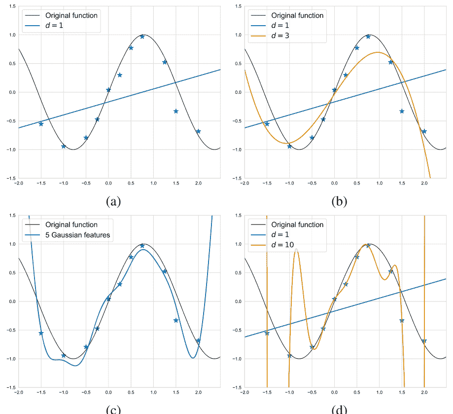

图2.3 线性回归：(a) 一维线性回归；(b) 具有多项式特征的线性回归；(c) 具有高斯特征的线性回归；(d) 线性回归中的过拟合。

例如，图2.3c展示了使用五个高斯特征近似的相同数据集，即形式为

$$\phi(x ; \mu, s)=e^{-\frac{1}{2} s(x-\mu)^{2}}$$

事实上，大多数解决回归问题的神经网络都将线性回归作为其最后一层，而用于分类问题的神经网络则使用softmax层，即逻辑回归模型。神经网络提供的不同之处和主要优势在于，这些简单模型在最后一层实现的特征也是从数据中自动学习的。

通过这种额外的特征提取，即使是线性回归也可能出现过拟合的迹象，例如，如果特征（向量 $\mathbf{x}$ 的分量）之间的相关性过高。线性回归中过拟合的极端情况如图2.3d所示：如果我们对 $N$ 个点拟合一个 $N-1$ 次多项式，那么它将显然只是对所有这些点进行插值，训练集上的误差为零，但提供的预测是相当无用的，正如图 2.3d 清楚地说明的那样。

在这种情况下，我们可能希望限制 $\mathbf{w}$ 的可取值，例如说 $\mathbf{w}$ 的值应该是“小”的。我故意将这个陈述非常模糊，可以通过选择适当的先验分布来形式化。例如，我们可以将以零为中心的正态分布作为先验。这次，它是一个多维正态分布，假设我们对各个特征没有偏好，因此我们假设先验是均匀的:

$$p(\mathbf{w})=\mathcal{N}\left(\mathbf{w} \mid \mathbf{0}, \sigma_0^2 \mathbf{I}\right)$$

然后我们得到以下的后验分布:

$$\begin{aligned} \log p\left(\mathbf{w} \mid \mathbf{y}, \mathbf{X}\right) & =\sum_{n=1}^N \log \mathcal{N}\left(y_n \mid \mathbf{w}^\top \mathbf{x}_n, \sigma^2\right)+\log \mathcal{N}\left(\mathbf{w} \mid \mathbf{0}, \sigma_0^2 \mathbf{I}\right) \\ & =-\frac{N}{2} \log \left(2 \pi \sigma^2\right)-\frac{1}{2 \sigma^2} \sum_{n=1}^N\left(y_n-\mathbf{w}^\top \mathbf{x}_n\right)^2-\frac{d}{2} \log \left(2 \pi \sigma_0^2\right)-\frac{1}{2 \sigma_0^2} \mathbf{w}^\top \mathbf{w} \end{aligned}$$

这个后验分布的最大化问题现在等价于最小化

$$\sum_{n=1}^N\left(y_n-\mathbf{w}^\top \mathbf{x}_n\right)^2+\frac{\lambda}{2} \mathbf{w}^\top \mathbf{w}, \text { 其中 } \lambda=\frac{\sigma^2}{\sigma_0^2}.$$

这被称为岭回归。更一般地说，以零为中心的高斯先验正则化被称为 $L_2$-正则化，因为正如我们刚刚看到的，它相当于将权重向量的 $L_2$-范数添加到目标函数中。

在本书中，我们不会花太多时间在贝叶斯分析上，但请注意一件事：机器学习问题是基于概率假设和贝叶斯规则的，但从算法和实践的角度来看，它们通常是优化问题。找到最大似然假设等于最大化 $p(D|\theta)$，而找到最大后验假设意味着最大化 $p(\theta|D)$；通常，机器学习中的主要计算挑战要么在于这些最大化过程，要么在于找到适当的方法来近似预测分布中的积分。

因此，一旦做出概率假设并计算出像上面展示的公式，从算法的角度来看，机器学习问题通常看起来像一个依赖于数据点和模型参数的目标函数，需要对模型参数进行优化。在简单的情况下，例如伯努利试验或线性回归，这些优化问题可以精确求解。然而，一旦模型变得更加复杂，优化问题就变得更加困难，几乎总是非凸的。

## 2.3 深度学习简介

在深入研究最先进的一阶优化方法之前，让我们先对神经网络进行简要介绍。作为一个数学模型，神经网络实际上早于人工智能的出现：著名的沃伦·麦卡洛和沃尔特·皮茨的论文于1943年撰写[589]，而人工智能作为一个科学领域通常被认为诞生于艾伦·图灵的作品，特别是他在1950年的论文《计算机与智能》中引入了图灵测试[877,878]。更有趣的是，麦卡洛和皮茨的原始工作已经包含了一个非常现代的单个人工神经元模型（感知器），即线性阈值单元，它对于输入 $\mathbf{x}$、权重 $\mathbf{w}$ 和阈值 $a$ 输出：

$$
y = \begin{cases}
1, & \text{如果 } \mathbf{w}^{\top} \mathbf{x} \geq a, \\
0, & \text{如果 } \mathbf{w}^{\top} \mathbf{x} < a.
\end{cases}
$$

这正是当今神经网络中的单元结构，输入的线性组合后跟一个非线性函数：

$$
y = h\left(\mathbf{w}^{\top} \mathbf{x}\right).
$$

激活函数 $h$ 通常是不同的，我们将在下一页或两页中介绍现代激活函数。

线性阈值单元实际上是最早实现的机器学习模型之一（更像是那个时代的硬件）：1958年，由 Frank Rosenblatt [735] 开发的 Perceptron 设备能够从数据中学习权重，并且实际上可以接收一个 $20 \times 20$ 的图像作为输入。Perceptron 也是第一次人工智能热潮的重要因素。

例如，一篇《纽约时报》文章（几乎不是一个不可靠的小报）专门讲述了这台机器，以下是其中的一段话：“电子计算机的胚胎……在海军的演示中，经过五十次尝试后，学会了区分左右。该服务表示将使用这一原理构建其第一台感知机思维机器，能够阅读和写作。预计将在一年左右完成，耗资10万美元”[858]。当然，这样的事情从未发生过，但是人工神经网络诞生了。

深度神经网络的主要基本思想是连接主义，这是一种认知科学和神经生物学的方法，认为在非常大的简单计算元网络中会出现复杂的行为和智能 [51, 52]。作为哲学和计算机科学的一个运动，连接主义在20世纪80年代崭露头角，与深度神经网络引起的第二次人工智能“炒作浪潮”一起出现。如今，深度学习提供了大量证据，表明简单单元的复杂网络在人工智能的最复杂任务中表现出色，即使我们仍然不完全理解人脑，也许强大的人级AI不能通过简单的层叠来实现（老实说，我们真的不知道）。

人工神经网络由其计算图定义。计算图是一个有向无环图 $G = (V, E)$，其节点对应于基本函数，而指向节点的边对应于它们的参数。源节点（入度为零的节点）表示输入变量，而其他节点表示这些变量的函数，这些函数是由节点中显示的函数组合而成的（为了简洁和清晰起见，我不会给出明显的递归定义）。在机器学习的神经网络中，计算图通常包含一个单独的汇节点（出度为零的节点），并且被认为计算与该汇节点对应的函数。

图2.4显示了一个由简单算术函数组成的示例计算图。图中在相应节点内显示了变量和基本函数，并且以输入变量沿着其出边的函数形式显示了节点的结果；变量被人为地分为“输入” $x$ 和“权重”。
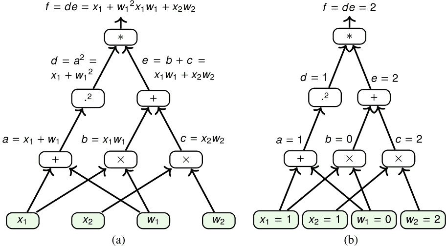
图2.4 一个样本计算图：(a) 函数定义；(b) $x_1=x_2=1, w_1=0, w_2=2$ 的样本计算。
$w$ 仅用于说明目的。在这个例子中，图的顶部顶点计算函数
$$f = (x_1 + w_1)^2 (x_1 w_1 + x_2 w_2)$$。

使用计算图的主要思想是能够将这些图计算的函数作为目标来解决优化问题。要将第一阶优化方法（如梯度下降）应用于函数 $f(\mathbf{w})$ 关于其输入 $\mathbf{w}$ 的情况，我们需要能够做到以下两点：
- (1) 在每个点 $\mathbf{w}$ 上计算函数 $f(\mathbf{w})$；
- (2) 对于优化变量，计算目标函数的梯度 $\nabla_{\mathbf{w}} f$。

计算图为第一个任务提供了明显的算法：如果我们知道如何计算每个基本函数，我们只需从源（变量）到汇点遍历图，计算中间结果，最终得到 $f$ 的值。例如，让我们设置 $x_1 = x_2 = 1, w_1 = 0, w_2 = 2$；遍历图2.4b中的节点得到图2.4b中所示的值：
$$a = x_1 + w_1 = 1, \quad b = x_1 w_1 = 0, \quad c = x_2 w_2 = 2, \quad d = a^2 = 1, \quad e = b + c = 2, \quad f = de = 2.$$

至于第二个任务，有两种可能的方法可以在计算图中获取梯度。假设在图2.4中，我们想要计算 $\nabla_{\mathbf{w}} f$ 对于 $x_1=x_2=1, w_1=0, w_2=2$。第一种方法，即正向传播，是计算函数值和偏导数。通过这种方式，我们可以计算图中每个节点相对于相同变量的偏导数；图2.5显示了相对于 $w_1$ 的导数结果：
$$\frac{\partial a}{\partial w_1} = \frac{\partial w_1}{\partial w_1} = 1, \quad \frac{\partial b}{\partial w_1} = x_1 \frac{\partial w_1}{\partial w_1} = 0, \quad \frac{\partial c}{\partial w_1} = 0, \quad \frac{\partial d}{\partial w_1} = 2a \frac{\partial a}{\partial w_1} = 2, \quad \frac{\partial e}{\partial w_1} = \frac{\partial b}{\partial w_1} + \frac{\partial c}{\partial w_1} = 1, \quad \frac{\partial f}{\partial w_1} = d \frac{\partial e}{\partial w_1} + e \frac{\partial d}{\partial w_1} = 1 + 4 = 5.$$

然而，这种方法并不可扩展；它只能得到导数 $\frac{\partial f}{\partial w_1}$，为了计算 $\frac{\partial f}{\partial w_2}$，我们需要再次遍历整个图！由于在深度学习中，问题通常是计算相对于具有数千甚至数百万个组件的权重向量 $\mathbf{w}$ 的梯度 $\nabla_{\mathbf{w}} f$，要么运行算法 $|\mathbf{w}|$ 次，要么在每个计算节点上花费等于 $|\mathbf{w}|$ 的内存是完全不切实际的。

这就是为什么在深度学习中，反向传播是获取梯度的主要工具。主要优点是这次我们得到了两个导数，$\frac{\partial f}{\partial w_1}$ 和 $\frac{\partial f}{\partial w_2}$，仅通过图的一次反向传播后。

再次，这个计算中的主要工具就是链式法则。给定一个图节点 $v = h(x_1, \dots, x_k)$，它有子节点 $g_1, \dots, g_l$ 在计算图中，反向传播算法计算
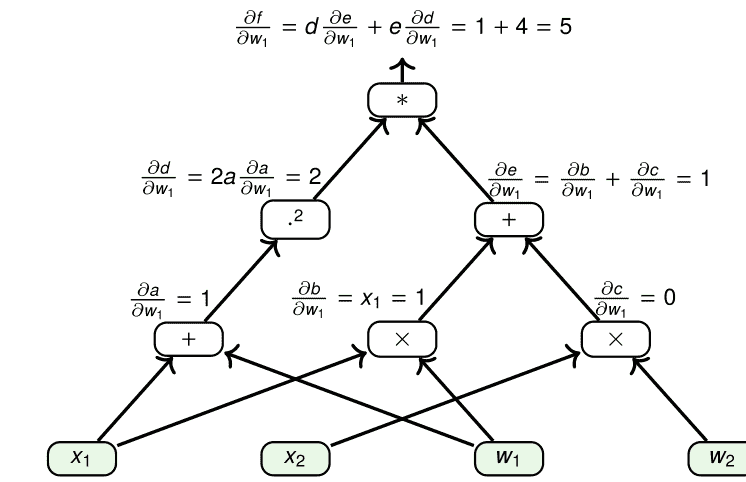
图2.5 对于图2.4中的 $x_1=x_2=1, w_1=0, w_2=2$，进行梯度计算：前向传播。
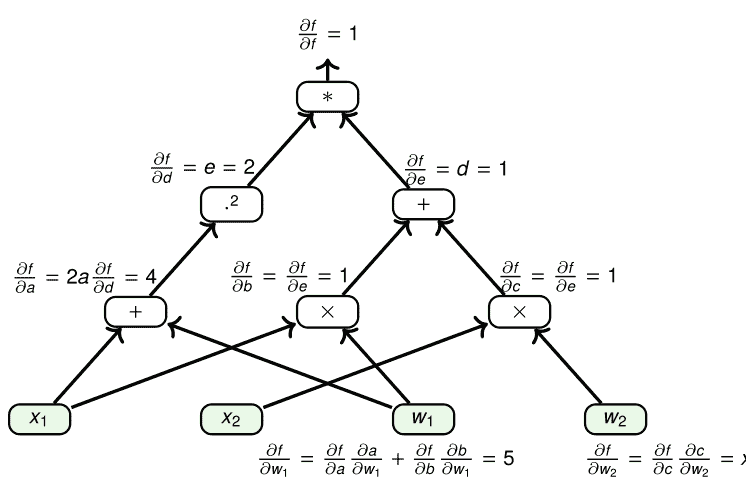
图2.6 对于图2.4中的 $x_1=x_2=1, w_1=0, w_2=2$，进行梯度计算：反向传播。
$$\frac{\partial f}{\partial v} = \frac{\partial f}{\partial g_1} \frac{\partial g_1}{\partial v} + \ldots + \frac{\partial f}{\partial g_l} \frac{\partial g_l}{\partial v},$$
其中的值 $\frac{\partial f}{\partial g_j} \frac{\partial g_j}{\partial v}$ 已在算法的前几个步骤中获得，并由节点 $v$ 从其子节点接收，并发送给每个父节点 $x_i$ 的值 $\frac{\partial f}{\partial v} \frac{\partial v}{\partial x_i}$。归纳的基础是汇聚节点，$\frac{\partial f}{\partial f} = 1$，而不是之前的源节点。在图2.4中的示例中，我们得到了图2.6中显示的导数：

$$
\frac{\partial f}{\partial f} = 1, \quad \frac{\partial f}{\partial d} = e = 2, \quad \frac{\partial f}{\partial e} = d = 1, \quad \frac{\partial f}{\partial a} = 2a \frac{\partial f}{\partial d} = 4, \quad \frac{\partial f}{\partial b} = \frac{\partial f}{\partial e} = 1, \quad \frac{\partial f}{\partial c} = \frac{\partial f}{\partial e} = 1,
$$
$$
\frac{\partial f}{\partial w_1} = \frac{\partial f}{\partial a} \frac{\partial a}{\partial w_1} + \frac{\partial f}{\partial b} \frac{\partial b}{\partial w_1} = 5, \quad \frac{\partial f}{\partial w_2} = \frac{\partial f}{\partial c} \frac{\partial c}{\partial w_2} = x_2 = 1.
$$

一个真实的神经网络几乎总是被组织成层。这意味着神经网络的计算图具有在拓扑顺序上不可比较的节点子集，因此可以并行计算。这些节点通常也具有相同的输入和激活函数（或者至少具有相同的输入结构，例如我们将在第3.1节中考虑的卷积神经网络），这意味着对整个层的操作可以表示为矩阵乘法和对向量的分量应用相同函数。

这种结构使得可以使用专门设计为高度并行架构的图形处理单元 (GPU) 来处理矩阵运算和向量的分量操作，相比基于CPU的实现，训练速度提高了10-50倍。使用GPU训练神经网络的想法至少可以追溯到2004年[639]，卷积网络在2006年已经在GPU上实现[127]。这个想法很快被广泛接受，并成为深度学习革命的重要因素：对于许多应用来说，这种10-50倍的加速正是将神经网络带入实际解决方案领域所需要的。

因此，最早和最自然的神经网络架构之一是全连接（或密集连接）网络：一系列层，使得第 $l$ 层的神经元接收第 $l-1$ 层的所有神经元的激活作为输入，并将其输出发送给第 $l+1$ 层的所有神经元，即相邻的两个层之间形成完全二分图的连接。

全连接网络在某些应用中仍然相关，并且许多架构包括全连接层。然而，它们通常不适用于图像或声音等非结构化数据，因为它们随着输入数量的增加而扩展得很差，导致大量的权重几乎不可避免地过拟合。

例如，一个完全连接网络的第一层具有200个神经元，并接收一个 $1024 \times 1024$ 的图像作为输入，将会有超过 $2$ 亿个权重！无论使用多少 $L_2$ 正则化都无法解决这个问题，我们将在第3.1节中看到如何避免这种过拟合。另一方面，一旦一个不同结构的网络已经从这个图像中提取了几百或几千个特征，那么在最后添加一层或两层全连接层以允许特征之间自由交互是有意义的，因此密集连接在现代架构中仍然有一席之地。

图2.7展示了一个具体的三层网络示例，以及为这个特定情况推导出的反向传播算法。在左边，它展示了架构：输入 $\mathbf{x}$ 通过两个带有权重矩阵 $W^{(1)}$ 和 $W^{(2)}$ 的隐藏层（在这个例子中，我们忽略偏置向量以避免进一步混乱符号表示）。每一层还有一个非线性激活函数 $h$，因此它的输出为
$$\mathbf{z}^{(1)} = h\left(W^{(1)} \mathbf{x}\right) \quad \text{和} \quad \mathbf{z}^{(2)} = h\left(W^{(2)} \mathbf{z}^{(1)}\right)。$$
之后，网络有一个标量输出
$$y = h\left(\mathbf{w}^{(3)^{\top}} \mathbf{z}^{(2)}\right)，$$
再次使用激活函数 $h$ 和权重向量 $\mathbf{w}^{(3)}$ 从 $\mathbf{z}^{(2)}$ 计算，然后目标函数 $f$ 是标量 $y$ 的函数。

中间列的公式显示了前向传播部分，即沿着图进行的计算，右侧的公式显示了以 $\frac{\partial f}{\partial y}$ 开始的反向传播算法，并且朝相反的方向前进。虚线将图形分割成计算层，并且计算在虚线内分组。

例如，在第二个隐藏层上，我们有权重矩阵 $W^{(2)}$，来自下一层的输入 $\mathbf{z}^{(1)}$，输出 $\mathbf{z}^{(2)} = h\left(W^{(2)} \mathbf{z}^{(1)}\right)$。在反向传播过程中，我们还有来自上一层的梯度 $\nabla_{\mathbf{z}^{(2)}} f$ 作为归纳假设的一部分。在反向传播中，这个密集层需要完成两件事：
- 计算相对于自己的权重矩阵 $W^{(2)}$ 的梯度，以便可以更新它们；这可以通过以下方式实现：
  $$\nabla_{W^{(2)}} f = h'\left(W^{(2)} \mathbf{z}^{(2)}\right) \left(\nabla_{\mathbf{z}^{(2)}} f\right) \mathbf{z}^{(1)^{\top}}；$$
  注意维度匹配：$W^{(2)}$ 在这个例子中是一个 $3 \times 4$ 的矩阵，$\nabla_{\mathbf{z}^{(2)}} f$ 是一个 $3 \times 1$ 的向量，$\mathbf{z}^{(1)}$ 是一个 $4 \times 1$ 的向量；
- 计算相对于输入 $\mathbf{z}^{(1)}$ 的梯度，并将其传递到下一层：
  $$\nabla_{\mathbf{z}^{(1)}} f = h'\left(W^{(2)} \mathbf{z}^{(2)}\right) W^{(2)^{\top}} \nabla_{\mathbf{z}^{(2)}} f。$$

图2.7展示了其余的计算过程，为了简洁起见引入了中间向量 $\mathbf{o}$。正如我们所看到的，这个算法完全以矩阵运算和函数的逐分量应用的形式表达，因此它很容易适应基于GPU的并行化。

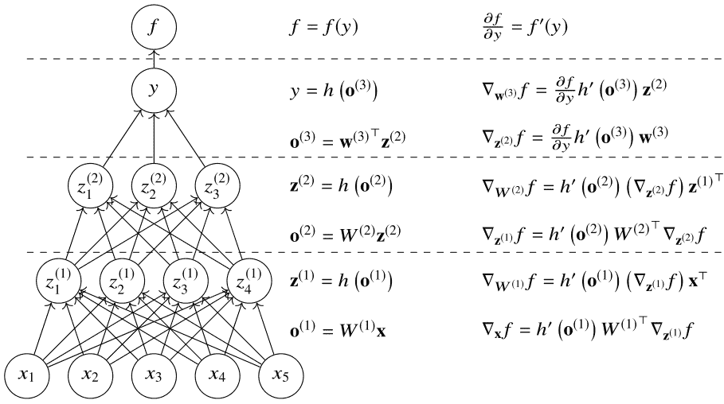
图2.7 一个三层全连接架构，用于反向传播计算。

本节剩下的唯一事情就是更多地讨论激活函数。

原始的阈值激活函数，由McCulloch和Pitts建议并由Rosenblatt实现，现在几乎不再使用：如果没有其他选择，通过梯度下降优化阈值函数是很困难的，因为阈值函数的导数在任何地方都是零或不存在。在神经网络的历史中，最流行的激活函数一直是sigmoid函数，通常是逻辑sigmoid函数
$$\sigma(a) = \frac{1}{1+e^{-a}}$$
或者双曲正切函数 tanh
$$\tanh(a) = \frac{e^{a}-e^{-a}}{e^{a}+e^{-a}}$$

图2.8显示了从阈值到ReLU的几个经典激活函数。然而，过去十年的研究表明，如果不在一侧至少有一个水平渐近线来限制激活函数（对于深度网络的内部层，当然在分类问题的末尾仍然需要softmax函数），则可以获得更好的激活函数族。现代人工神经网络中最流行的激活函数是修正线性单元（ReLU）
$$\operatorname{ReLU}(x) = \begin{cases} 0, & \text{if } x < 0, \\ x, & \text{if } x \geq 0 \end{cases}$$
以及其变体，对于负输入没有硬零点，而是一个增长较慢的函数，例如leaky ReLU [570]

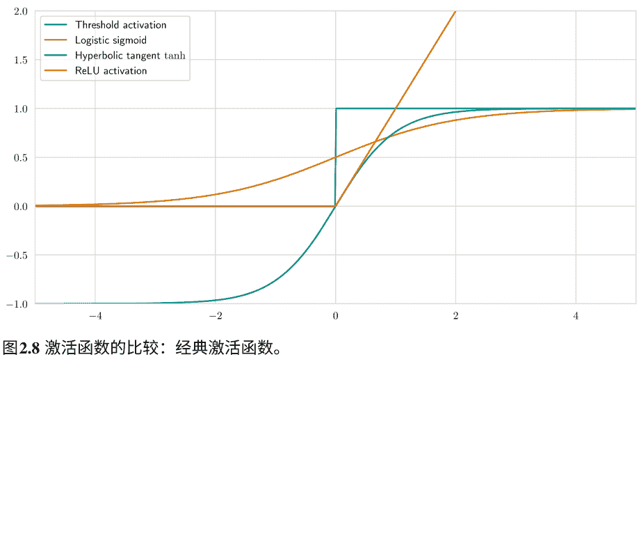
图2.8 激活函数的比较：经典激活函数。

$$\text{LReLU}(x) = \begin{cases} a x, & \text{if } x < 0, \\ x, & \text{if } x > 0 \end{cases}$$
或者指数线性单元 [161]
$$\mathrm{ELU}(x) = \begin{cases} \alpha\left(e^{x}-1\right), & x < 0 \\ x, & x \geq 0 \end{cases}$$

还有一种平滑的ReLU变体，称为 softplus 函数[282]：
$$\operatorname{softplus}(x) = \ln\left(1+e^{x}\right)。$$

您可以在图2.9中看到ReLU变体的比较。无论如何，现代神经网络中使用的所有激活函数都必须是可微分的，以便进行梯度下降；在零测度子集上有尖点是可以接受的，就像ReLU一样，因为可以在该点将导数设为零。

总是很诱人尝试通过切换激活函数来获得更好的结果，但大多数情况下都会失败：这通常是我建议最后尝试的优化方法。然而，如果你系统地尝试许多不同的激活函数，并且使用各种模型，可能有可能改进标准方法。

2017年，Google Brain的研究人员Ramachandran等人[702]正是这样做的：他们构建了一个可能的激活函数搜索空间（基本上是一个递归的计算图，其中包含要插入的可能的一元和二元函数的列表），使用神经架构搜索[1031]的思想将激活函数的搜索形式化为强化学习问题，并充分利用了Google强大的计算能力来彻底搜索这个空间。

Google的巨大计算能力
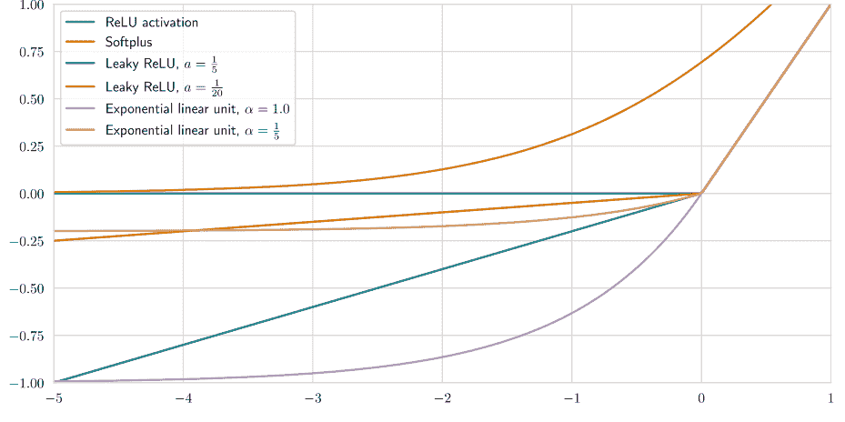
图2.9 激活函数的比较：ReLU变种。

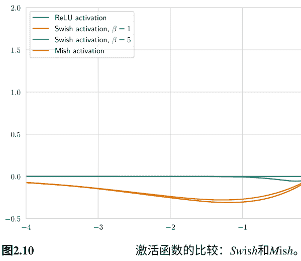

可能。结果很有趣：尤其是，Ramachandran等人发现，复杂的激活函数在性能上一直不如简单的激活函数。作为最有前景的结果函数，他们强调了所谓的Swish激活函数：

$$\text{Swish}(x) = x \sigma(\beta x) = \frac{x}{1+e^{-\beta x}}.$$

根据参数 $\beta$ 的不同，Swish将范围从完全线性（当 $\beta=0$ 时）缩放到ReLU（当 $\beta \rightarrow \infty$ 时）。图2.10显示了Swish激活函数和其他变体；Swish最有趣的特点可能是它不是单调的，并且在负部分有一个最小值。

2019年，Misra [604] 提出了Mish激活函数，这是Swish的一种变体：

$$\text{Mish}(x) = x \tanh(\operatorname{softplus}(x)) = x \tanh\left(\ln\left(1+e^{x}\right)\right).$$

Swish和Mish激活函数已在许多应用中进行了测试，包括计算机视觉中的卷积架构，它们现在定义了最先进的技术，尽管传统的ReLU仍然远未完全被取代。

上述文本是在2020年夏天写的。但是，当然，这并不是故事的结束。2020年9月，马等人[567]对Swish和ReLU进行了新的研究。他们通过使用最大函数的平滑近似将它们进行了泛化：

$$S_{\beta}\left(x_{1}, \ldots, x_{n}\right)=\frac{\sum_{i=1}^{n} x_{i} e^{\beta x_{i}}}{\sum_{i=1}^{n} e^{\beta x_{i}}}.$$

让我们用两个函数替换参数的位置：对于硬最大值 $\max(g(x), h(x))$，我们得到了它的平滑对应函数

## 2.3 深度学习简介

$$
\begin{aligned}
S_{\beta}(g(x), h(x)) &= g(x) \frac{e^{\beta g(x)}}{e^{\beta g(x)}+e^{\beta h(x)}}+h(x) \frac{e^{\beta h(x)}}{e^{\beta g(x)}+e^{\beta h(x)}} \\
&= g(x) \sigma(\beta(g(x)-h(x))) + h(x) \sigma(\beta(h(x)-g(x))) \\
&= (g(x)-h(x)) \sigma(\beta(g(x)-h(x))) + h(x).
\end{aligned}
$$

马等人称之为ActivateOrNot(ACON) 激活函数。他们指出：
- 对于 $g(x)=x$ 和 $h(x)=0$，硬最大值是 $\text{ReLU}(x)=\max(x,0)$，而平滑对应的是
  $$f_{\text{ACON-A}}(x, 0)=S_{\beta}(x, 0)=x \sigma(\beta x)$$
  也就是说，精确地说，Swish激活函数；
- 对于 $g(x)=x$ 和 $h(x)=ax$，其中 $a<1$，硬最大值是 $\text{LReLU}(x)=\max(x, ax)$，而平滑对应物是
  $$f_{\text{ACON-B}}=S_{\beta}(x, a x)=(1-a) x \sigma(\beta(1-a) x)+a x;$$
- 这两个函数都可以直接推广到
  $$f_{\text{ACON-C}}=S_{\beta}\left(a_{1} x, a_{2} x\right)=\left(a_{1}-a_{2}\right) x \sigma\left(\beta\left(a_{1}-a_{2}\right) x\right)+a_{2} x;$$
  在这种情况下，$a_1$ 和 $a_2$ 可以成为可学习的参数，它们的直观含义是ACON-C的导数的极限：
  $$\lim_{x \rightarrow \infty} \frac{\mathrm{d} f_{\text{ACON-C}}}{\mathrm{d} x}=a_{1}, \quad \lim_{x \rightarrow-\infty} \frac{\mathrm{d} f_{\text{ACON-C}}}{\mathrm{d} x}=a_{2}$$

图2.11展示了ACON-C函数在不同的 $a_1$, $a_2$ 和 $\beta$ 值下的情况，从完全符合Swish函数开始，展示了可能的多样性。

这一切刚刚发生，到目前为止很难说这个想法是否会在许多神经架构中流行起来，还是悄悄地消失。但这是写关于深度学习的困难之一的很好的例子；我们在后面的章节中也会看到类似的例子。

让我们总结一下。我们已经看到神经网络是如何构建成由简单函数组成的计算图的，以及这种结构如何使我们能够开发出对于任何子集变量的目标函数的梯度的高效算法，通常在神经网络中是相对于权重的。然而，能够计算梯度只是实现高效优化算法的第一步。在下一节中，我们简要讨论目前在深度学习中使用的主要一阶优化算法。

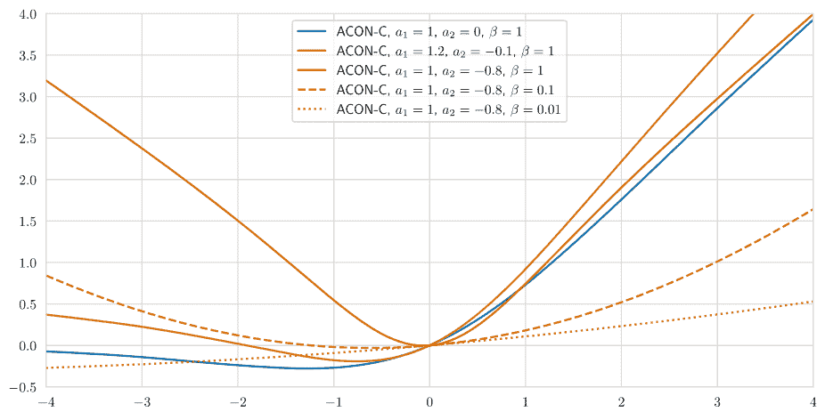

图2.11 激活函数的比较：具有不同参数的ACON-C函数。

## 2.4 深度学习中的一阶优化

在本节中，我们将继续介绍深度学习，并从优化的角度进行考虑。我们已经了解了如何计算梯度，在这里我们将讨论如何使用这些梯度来找到给定函数的局部最小值。在本节中，我们假设我们已经给定了一个损失函数 $f(\mathbf{w}, d)$，其中 $d$ 是一个数据点，$\mathbf{w}$ 是权重向量，而问题是在给定数据集 $D$ 上最小化总损失函数 $F(\mathbf{w})$：

$$F(\mathbf{w})=\sum_{d \in D} f(\mathbf{w}, d) \rightarrow_{\mathbf{w}} \min.$$

算法1展示了常规的“纯粹”梯度下降（GD）：在每一步中，计算当前点的梯度并向相反方向移动。在常规的GD中，很多事情取决于学习率 $\alpha$。学习率应该随时间减小是有道理的，第一个想法是选择一个固定的时间表来改变 $\alpha$：
- 线性衰减方式：
  $$\alpha=\alpha_{0}\left(1-\frac{t}{T}\right)$$
- 指数衰减方式：
  $$\alpha=\alpha_{0} e^{-\frac{t}{T}}.$$

在这两种情况下，$T$ 被称为温度（它在统计力学中起到类似温度的作用），它越大，学习率随时间的衰减越慢。

### 算法 1：梯度下降
```
初始化 w_0, k := 1;
重复
    w_{k+1} := w_k - α Σ_{d∈D} ∇_w F(w_k, d);
    k := k + 1;
直到满足停止条件;
```

但这些当然只是可以大大改进的初步想法。

优化理论有一个完整的研究领域致力于梯度下降和如何在任何给定步骤上找到最优值 $\alpha$。我们参考，例如，书籍和调查[84, 96, 625, 633]对此进行详细处理，并只给出主要思想的简要概述。

特别是，自1960年代以来已知的基本优化理论导致了所谓的Wolfe条件和Armijo规则。如果我们正在最小化 $f(\mathbf{w})$，并且在第 $k$ 步已经找到了我们需要移动的方向 $\mathbf{p}_k$（例如，在梯度下降中，我们有 $\mathbf{p}_k=\nabla_\mathbf{w} f(\mathbf{w}_k)$），问题变为

$$\min_\alpha f(\mathbf{w}_k + \alpha \mathbf{p}_k),$$

一个一维优化问题。

研究这个问题，研究人员发现：
- 对于 $\phi_k(\alpha) = f(\mathbf{w}_k + \alpha \mathbf{p}_k)$，我们有 $\phi'_k(\alpha) = \nabla f(\mathbf{w}_k + \alpha \mathbf{p}_k)^\top \mathbf{p}_k$。如果 $\mathbf{p}_k$ 是下降的方向，那么 $\phi'_k(0) < 0$；
- 步长 $\alpha$ 必须满足Armijo准则：
  $$\phi_k(\alpha) \leq \phi_k(0) + c_1 \alpha \phi'_k(0) \quad \text{对于某个 } c_1 \in (0, 1/2)$$
- 或者更强的Wolfe条件，即满足Armijo准则，并且
  $$|\phi'_k(\alpha)| \leq c_2|\phi'_k(0)|,$$
  即，我们的目标是减小梯度的投影。

现在，优化过程应该根据梯度的 $L^2$ 范数停止，即当 $\|\nabla_\mathbf{w} f(\mathbf{w}_k)\|_2 \leq \varepsilon$ 或 $\|\nabla_\mathbf{w} f(\mathbf{w}_k)\|^2 \leq \varepsilon\|\nabla_\mathbf{w} f(\mathbf{w}_0)\|^2$ 时。

然而，梯度下降等一阶方法在不同变量的尺度不同时开始受到影响。这种行为的一个经典例子如图2.12所示，其中三个图表展示了三个非常简单的二次函数的梯度下降优化，都采用了形式为 $x^2 + \rho y^2$ 的不同 $\rho$ 值。

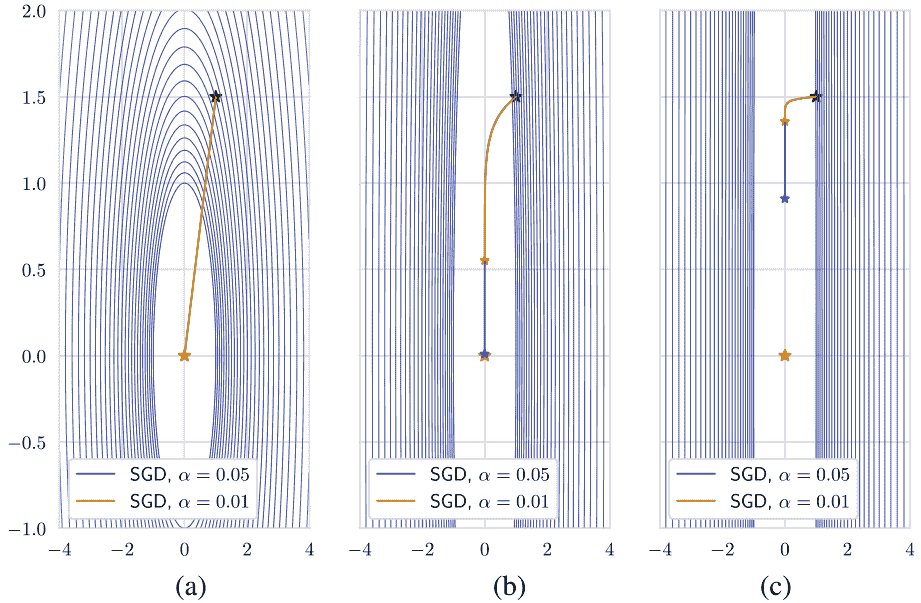

图2.12 使用不同变量尺度的样本梯度下降优化：(a) $f(x, y) = x^2 + y^2$; (b) $f(x, y) = x^2 + \frac{1}{10}y^2$; (c) $f(x, y) = x^2 + \frac{1}{100}y^2$。

这些函数是完全凸的，而SGD（实际上，在这种情况下是完全的GD）应该没有任何问题地找到最优解。事实上，它确实没有问题，但是当变量的尺度变得非常不同的时候，梯度下降在垂直轴上变得非常缓慢；图表显示了相同的学习率对于可比较的 $x$ 和 $y$ 效果很好，但是当它们变得非常不同时，速度显著减慢。

### 算法 2：随机梯度下降与小批量
```
初始化 w_0, k := 0;
重复
    D_k := 样本 (D);
    w_{k+1} := w_k - \alpha \sum_{d \in D_k} \nabla_w f(w_k, d);
    k := k + 1;
直到满足停止条件;
```

在深度学习中，这种情况非常常见：例如，来自深度网络的不同层的权重肯定具有不同的尺度。因此，对于机器学习问题，最好使用自适应梯度下降算法，根据优化景观自适应地设置不同变量的尺度。自然地，最好的方法是转向二阶方法。从理论上讲，我们可以在这里应用牛顿法：

$$\mathbf{g}_k = \nabla_\mathbf{w} f(\mathbf{w}_k), \quad H_k = \nabla_\mathbf{w}^2 f(\mathbf{w}_k),$$

然后我们得到

$${\bf w}_{k+1} = {\bf w}_k - \alpha_k H_k^{-1} {\bf g}_k,$$

Armijo法则在这里也适用：我们应该选择 $\alpha_k$，使得

$$f({\bf w}_{k+1}) \leq f({\bf w}_k) - c_1 \alpha_k {\bf g}_k^\top H_k^{-1} {\bf g}_k, \quad \text{其中} \ c_1 \approx 10^{-4}.$$

使用牛顿法来训练深度神经网络将是很好的！不幸的是，现实中的神经网络有很多参数，数量级为数千甚至数百万。在这种情况下，计算和支持Hessian矩阵是完全不切实际的，甚至更不切实际的是求逆它——请注意，二阶方法使用 $H_k^{-1}$。

存在各种各样的拟牛顿方法，它们不会显式计算Hessian矩阵，而是通过梯度值来近似计算。其中最著名的可能是BFGS算法，以Charles George Broyden、Roger Fletcher、Donald Goldfarb和David Shanno [237]命名。这个想法不是计算Hessian矩阵，而是保持低秩近似并通过当前梯度值进行更新。这是一个很棒的算法，它有带有有界内存的版本，而且它也可以很好地对梯度进行重新缩放……

……但是一个巨大的Hessian矩阵只是我们问题的开始。而且，在机器学习的情况下，我们也不能真正承担梯度下降！问题是损失函数被定义为输入数据集的总和 $\sum_{d \in D} f(\mathbf{w}, d)$，而实际上，遍历整个数据集只进行一次神经网络权重的更新通常是不可行的。这意味着我们不能使用BFGS算法和其他拟牛顿方法，因为我们也没有梯度的值。

因此，在深度学习中，通常使用随机梯度下降（SGD），其一般形式如算法2所示：不同之处在于，在每一步中，梯度的计算不是针对整个数据集 $D$，而是针对数据子样本 $D_k$。

我们如何形式化理解随机梯度下降，它如何适应优化理论？通常，我们试图解决的问题可以被框架化为一个随机优化问题：

$$F(\mathbf{w}) = \mathbb{E}_{q(\mathbf{Y})} [f(\mathbf{w}, \mathbf{Y})] \rightarrow_{\mathbf{w}} \min,$$

其中 $q(\mathbf{Y})$ 是一些已知分布。这里的基本示例是最小化经验风险：

$$F(\mathbf{w}) = \frac{1}{N} \sum_{i=1}^N f_i(\mathbf{w}) = \mathbb{E}_{i \sim U(1, \ldots, N)} [f_i(\mathbf{w})] \rightarrow_{\mathbf{w}} \min.$$

另一个重要的示例是最小化变分下界，但这超出了本节的范围。

这种形式化清楚地说明了从形式上看什么是小批量。对小批量进行平均可以简单地看作是对子样本计算的随机优化目标函数的经验估计：

$$\hat{F}(\mathbf{w})=-\frac{1}{m} \sum_{i=1}^{m} f(\mathbf{w}, y_i), \quad \hat{\mathbf{g}}(\mathbf{w})=-\sum_{i=1}^{m} \nabla_{\mathbf{w}} f(\mathbf{w}, y_i)$$

其中 $m$ 表示小批量大小。基本数理统计告诉我们，这些估计具有许多理想的性质：它们是无偏的，它们总是收敛于期望的真实值（尽管收敛可能很慢），并且它们易于计算。

一般来说，随机梯度下降受到这些思想的启发，可以被认为是梯度下降的蒙特卡洛变体。不幸的是，这并不意味着我们可以将这些蒙特卡洛估计值插入到类似BFGS的拟牛顿方法中：方差很大，单个小批量的梯度通常与真实梯度几乎没有共同之处，而BFGS无法使用这些估计值。设计随机版本的拟牛顿方法是一个非常有趣的开放问题，但似乎是一个非常困难的问题。

但是，即使在一阶情况下，SGD也存在一些明显的问题：
- 它从来没有完全正确的方向；
- 此外，SGD甚至在 $F(\mathbf{w})$ 被最小化的确切点上也没有零更新，即使我们幸运地达到最小值，我们也无法识别它，而且具有恒定步长的SGD永远不会收敛；
- 由于我们既不知道 $F(\mathbf{w})$ 也不知道 $\nabla F(\mathbf{w})$（只有它们具有巨大方差的蒙特卡洛估计），我们无法使用Armijo准则和Wolfe条件来找到最优步长。

有一个标准的分析可以应用于SGD；让我们看看某个目标函数的单次迭代

$$F(\boldsymbol{\omega}) = \mathbb{E}_{q}(\mathbf{Y})[f(\boldsymbol{\omega}, \mathbf{Y})] \rightarrow \min.$$

在接下来的内容中，我们用 $\mathbf{g}_k$ 表示 $\mathbf{w}_k$ 点的梯度，因此

$$\mathbf{w}_{k+1} = \mathbf{w}_k - \alpha_k \hat{\mathbf{g}}_k, \quad \mathbb{E}[\hat{\mathbf{g}}_k] = \mathbf{g}_k = \nabla F(\mathbf{w}_k).$$

让我们尝试估计迭代 $k$ 上的残差；用 $\mathbf{w}_{\text{opt}}$ 表示真实的最优解，我们得到

$$
\begin{aligned}
\|\mathbf{w}_{k+1} - \mathbf{w}_{\text{opt}}\|^2 &= \|\mathbf{w}_k - \alpha_k \hat{\mathbf{g}}_k - \mathbf{w}_{\text{opt}}\|^2 \\
&= \|\mathbf{w}_k - \mathbf{w}_{\text{opt}}\|^2 - 2\alpha_k \hat{\mathbf{g}}_k^{\top} (\mathbf{w}_k - \mathbf{w}_{\text{opt}}) + \alpha_k^2 \|\hat{\mathbf{g}}_k\|^2.
\end{aligned}
$$

对于迭代 $k$，我们对 $q(y)$ 的期望得到

$$\mathbb{E}\left[\left\|\mathbf{w}_{k+1}-\mathbf{w}_{\text {opt }}\right\|^{2}\right]=\left\|\mathbf{w}_{k}-\mathbf{w}_{\text {opt }}\right\|^{2}-2 \alpha_{k} \mathbf{g}_{k}^{\top}\left(\mathbf{w}_{k}-\mathbf{w}_{\text {opt }}\right)+\alpha_{k}^{2} \mathbb{E}\left[\left\|\hat{\mathbf{g}}_{k}\right\|^{2}\right] .$$

现在我们来到了优化理论中的常见步骤，我们做出了过于强烈的假设。在进一步的分析中，让我们假设 $F$ 是凸的；当然，在真实的深度神经网络中，这并不成立，但事实证明，这种分析与实际情况相关，所以我们现在就运用它。

具体来说，我们将利用以下事实

$$F\left(\mathbf{w}_{\mathrm{opt}}\right) \geq F\left(\mathbf{w}_{k}\right)+\mathbf{g}_{k}^{\top}\left(\mathbf{w}_{k}-\mathbf{w}_{\text {opt }}\right) .$$

现在让我们将这个公式与上面的 $\mathbb{E}$ 结合起来：

$$
\begin{aligned}
\alpha_{k}\left(F\left(\mathbf{w}_{k}\right)-F\left(\mathbf{w}_{\mathrm{opt}}\right)\right) & \leq \alpha_{k} \mathbf{g}_{k}^{\top}\left(\mathbf{w}_{k}-\mathbf{w}_{\text {opt }}\right) \\
& =\frac{1}{2}\left\|\mathbf{w}_{k}-\mathbf{w}_{\text {opt }}\right\|^{2}+\frac{1}{2} \alpha_{k}^{2} \mathbb{E}\left[\left\|\hat{\mathbf{g}}_{k}\right\|^{2}\right]-\frac{1}{2} \mathbb{E}\left[\left\|\mathbf{w}_{k+1}-\mathbf{w}_{\text {opt }}\right\|^{2}\right] .
\end{aligned}
$$

接下来，我们对左侧进行期望并求和：

$$
\begin{aligned}
\sum_{i=0}^{k} \alpha_{i}\left(\mathbb{E}\left[F\left(\mathbf{w}_{i}\right)\right]-F\left(\mathbf{w}_{\text {opt }}\right)\right) & \leq \frac{1}{2}\left\|\mathbf{w}_{0}-\mathbf{w}_{\text {opt }}\right\|^{2}+\frac{1}{2} \sum_{i=0}^{k} \alpha_{i}^{2} \mathbb{E}\left[\left\|\hat{\mathbf{g}}_{i}\right\|^{2}\right]-\frac{1}{2} \mathbb{E}\left[\left\|\mathbf{w}_{k+1}-\mathbf{w}_{\text {opt }}\right\|^{2}\right] \\
& \leq \frac{1}{2}\left\|\mathbf{w}_{0}-\mathbf{w}_{\text {opt }}\right\|^{2}+\frac{1}{2} \sum_{i=0}^{k} \alpha_{i}^{2} \mathbb{E}\left[\left\|\hat{\mathbf{g}}_{i}\right\|^{2}\right] .
\end{aligned}
$$

我们已经得到了在不同点上带有权重 $\alpha_{i}$ 的函数值之和。现在让我们使用凸性假设：

$$
\mathbb{E}\left[F\left(\frac{\sum_{i} \alpha_{i} \mathbf{w}_{i}}{\sum_{i} \alpha_{i}}\right)-F\left(\mathbf{w}_{\mathrm{opt}}\right)\right] \leq \frac{\sum_{i} \alpha_{i}\left(\mathbb{E}\left[F\left(\mathbf{w}_{i}\right)\right]-F\left(\mathbf{w}_{\mathrm{opt}}\right)\right)}{\sum_{i} \alpha_{i}} \leq \frac{\frac{1}{2}\left\|\mathbf{w}_{0}-\mathbf{w}_{\text {opt }}\right\|^{2}+\frac{1}{2} \sum_{i=0}^{k} \alpha_{i}^{2} \mathbb{E}\left[\left\|\hat{\mathbf{g}}_{i}\right\|^{2}\right]}{\sum_{i} \alpha_{i}} .
$$

因此，我们得到了一个关于某个中间值的残差上界，该中间值是线性组合中的一部分 $\mathbf{w}_{i}$；这在优化理论中也是常见情况，在实践中通常发现均值和最后一个点，或者最后一个点 $\mathbf{w}_{K}$ 之间没有区别，甚至最后一个点更好。

换句话说，我们发现如果初始残差受到 $R$ 的限制，即 $\|\mathbf{w}_0 - \mathbf{w}_{\text{opt}}\| \le R$，并且随机梯度的方差受到 $G$ 的限制，即 $\mathbb{E}[\|\mathbf{g}_k\|^2] \le G^2$，那么

$$\mathbb{E}[F(\mathbf{w}_k) - F(\mathbf{w}_{\text{opt}})] \le \frac{R^2 + G^2 \sum \alpha_i^2}{2 \sum \alpha_i}$$

这是随机梯度下降的理论分析中的主要公式。特别地，对于恒定的步长 $\alpha_i = h$，我们得到

$$\mathbb{E}[F(\mathbf{w}_k) - F(\mathbf{w}_{\text{opt}})] \le \frac{R^2}{2h(k+1)} + \frac{G^2 h}{2} \to \frac{G^2 h}{2}$$

让我们总结一下从上面的分析中得出的 SGD 的行为：

- SGD 进入了一个半径为 $\frac{1}{2} G^2 h$ 的“不确定区域”，这个半径与步长成比例；
- 这意味着我们走得越快，越快地到达不确定区域，但是这个不确定区域会越大；换句话说，在优化过程中减小步长是有意义的；
- SGD 收敛速度相当慢：已知对于凸函数，全梯度的收敛速度为 $O(1/k)$，而 SGD 的收敛速度仅为 $O(1/\sqrt{k})$；
- 另一方面，当 SGD 远离不确定区域时，其收敛速度也为 $O(1/k)$，只有当我们到达不确定区域时才会减慢；
- 但所有这些仍然取决于 $G$，在实践中我们无法可靠地估计，这也是贝叶斯分析在深度学习中的一个重要问题。

### 算法 3: 带动量的随机梯度下降
| 初始化 $\mathbf{w}_0, \mathbf{u}_0 := 0, k := 0$; |
| :--- |
| **重复** |
| $\quad D_k := \text{采样}(D)$; |
| $\quad \mathbf{u}_{k+1} := \gamma \mathbf{u}_k + \alpha \sum_{d \in D_k} \nabla_{\mathbf{w}} f(\mathbf{w}_k, d)$; |
| $\quad \mathbf{w}_{k+1} := \mathbf{w}_k - \mathbf{u}_{k+1}$; |
| $\quad k := k + 1$; |
| **直到满足停止条件**; |

上述所有结果表明我们需要进一步改进：纯粹的普通 SGD 可能不是最好的方法，如何随时间改变学习率还没有明确的答案，以自适应方式重新缩放梯度的问题仍然是开放且重要的。

幸运的是，有很多改进方法正好可以解决这个问题。我们再次参考 [84, 96, 625, 633] 中的经典优化技术，并继续探讨在深度学习中特别有效的方法。

### 算法 4: Nesterov 加速梯度
初始化 $\mathbf{w}_0, \mathbf{u}_0 := 0, k := 0$;
重复
$\quad D_k := \text{采样}(D)$;
$\quad \mathbf{u}_{k+1} := \gamma \mathbf{u}_k + \alpha \sum_{d \in D_k} \nabla_{\mathbf{w}} f(\mathbf{w}_k - \gamma \mathbf{u}_k, d)$;
$\quad \mathbf{w}_{k+1} := \mathbf{w}_k - \mathbf{u}_{k+1}$;
$\quad k := k + 1$;
直到满足停止条件;

## 2.5 自适应梯度下降算法

正如我们在前一节中所看到的，基本梯度下降在深度神经网络的情况下是不可行的，而随机梯度下降需要谨慎选择学习率，并且很可能需要沿不同方向进行一些重新缩放。在这里，我们讨论了一些在深度学习中表现良好的一阶优化的各种思想，有些是经典的，有些是非常新颖的。

第一个思想是动量法：让我们将当前值 $\mathbf{w}$ 视为一个物质点沿着我们正在最小化的函数 $F$ 的地形下降，就像在真实的牛顿物理中一样，这个物质点从一个时间点带有一部分动量到下一个时间点。在离散时间中，这意味着在步骤中我们保留了先前更新的一部分 $\mathbf{u}_{k-1}$，如算法 3 所示。在实际情况中，动量衰减参数 $\gamma$ 通常接近于 1，例如 $\gamma = 0.9$ 甚至 $\gamma = 0.999$。动量法自至少 1980 年代中期以来一直是深度学习的重要方法；它是由 Rumelhart、Hinton 和 Williams 在著名的《自然》杂志上提出的神经网络方法 [742]。

动量法经常与另一个重要的启发式方法，隐式更新相结合。在常规 SGD 中，使用隐式更新意味着梯度不是在点 $\mathbf{w}_k$ 处计算，而是在下一个点 $\mathbf{w}_{k+1}$ 处计算：

$$\mathbf{w}_{k+1} := \mathbf{w}_k - \alpha \sum_{d \in D_k} \nabla_{\mathbf{w}} f(\mathbf{w}_{k+1}, d)$$

这使得它成为一个隐式方程而不是显式方程，并且可以看作是近端梯度法的随机形式。在经典优化理论中，使用隐式更新通常有助于数值稳定性。

> 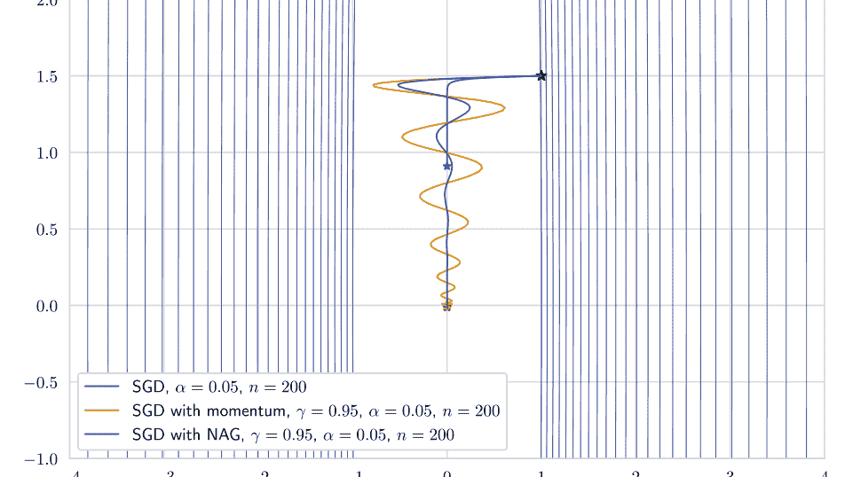
> **图 2.13** 梯度下降优化对于 $F(x, y) = x^2 + \frac{1}{100} y^2$ 的影响：动量的效果。

应用于动量计算，隐式更新产生了 Nesterov 加速梯度 (NAG) 方法，以其发明者 Yurii Nesterov [624] 命名。在这种方法中，我们不是在点 $w_k$ 处计算梯度，而是首先应用动量更新（毕竟，我们已经知道我们需要朝那个方向移动），然后在点 $w_k + \gamma u_k$ 处计算梯度。这样，更新仍然是显式的，但数值稳定性得到了很大的提高，Nesterov 的结果是这个版本的梯度下降比通常的版本收敛更快。

我们在算法 4 中展示了 Nesterov 加速梯度。

图 2.13 展示了基于动量的方法如何解决我们在图 2.12 中看到的问题。在图 2.13 中，我们考虑了相同的问题函数 $F(x, y) = x^2 + \frac{1}{100} y^2$ 并显示每种方法的相同迭代次数。现在，常规动量和 Nesterov 加速梯度收敛速度更快，并且实际上有足够的时间收敛，而常规 SGD 仍在缓慢接近最优解。请注意，Nesterov 加速梯度比基本动量 SGD 更稳定，不会像基本动量 SGD 那样震荡：这正是在计算梯度时“前瞻”效果的稳定化效应。

要进一步发展，注意到到目前为止，学习率在向量 $\mathbf{w}$ 的所有方向上都是相同的，并且我们要么使用某个递减的全局学习率 $\alpha$，要么根据精确选择的方向使用 Armijo 规则选择学习率。现代自适应 SGD 的变体使用以下启发式方法：在 $\mathbf{w}$ 的变化较慢的分量上移动得更快，并在 $F$ 变化较快的区域移动得更慢（通常意味着我们接近局部极值点）。

这方面的第一种方法是在 2011 年提出的 Adagrad [209]。这个想法是以它们的平方和的形式跟踪总累积梯度值；这在形式上是向量化的，以对角矩阵 $G_k$ 的形式表示，其对角线元素包含到目前为止累积的偏导数之和：

### 算法 5: Adagrad
初始化 $\mathbf{w}_0, G_0 := 0, k := 0$;
重复
$\quad D_k := \text{采样}(D)$;
$\quad \mathbf{g}_k := \sum_{d \in D_k} \nabla_{\mathbf{w}} f(\mathbf{w}_k, d)$;
$\quad G_{k+1} := G_k + \operatorname{diag}(\mathbf{g}_k)$;
$\quad \mathbf{w}_{k+1} := \mathbf{w}_k - \frac{\alpha}{\sqrt{G_{k+1} + \epsilon}} \mathbf{g}_{k+1}$;
$\quad k := k + 1$;
直到满足停止条件;

$$G_{k, ii} = \sum_{l=1}^{k} \frac{\partial F_l}{\partial \mathbf{w}_i}, \quad \text{其中 } F_l(\mathbf{w}) = \sum_{d \in D_l} f(\mathbf{w}, d)$$

Adagrad 在算法 5 中总结。学习率现在变得自适应：当某些方向上的梯度变大时，它们的平方和 $G_{k, ii}$ 也变大，梯度下降在这个方向上变慢。因此，不再需要手动调整学习率；在大多数实现中，初始学习率设置为 $\alpha = 0.01$ 或其他类似的常数，并保持不变。

然而，Adagrad 的主要问题也很明显：虽然它可以减慢下降速度，但永远无法加快速度。因此，如果函数 $F$ 在某个方向上的斜率变陡，然后再次变平，Adagrad 将沿着这个方向继续非常缓慢地前进。解决这个问题的方法非常简单：不再使用梯度的平方和，而是使用指数移动平均值。

### 算法 6: RMSprop
初始化 $\mathbf{w}_0, G_0 := 0, k := 0$;
重复
$\quad D_k := \text{采样}(D)$;
$\quad \mathbf{g}_k := \sum_{d \in D_k} \nabla_{\mathbf{w}} f(\mathbf{w}_k, d)$;
$\quad G_{k+1} := \gamma G_k + (1 - \gamma) \operatorname{diag}(\mathbf{g}_k)$;
$\quad \mathbf{w}_{k+1} := \mathbf{w}_k - \frac{\alpha}{\sqrt{G_{k+1} + \epsilon}} \mathbf{g}_{k+1}$;
$\quad k := k + 1$;
直到满足停止条件;

第一次尝试是由 Geoffrey Hinton 在他的 Coursera 课程中提出的 RMSprop 算法，但据我所知，从未正式发表过。它用一个计算指数移动平均值的公式替换了梯度平方和的总和 $G_{k+1} := G_k + \operatorname{diag}(\mathbf{g}_k)$：

$$G_{k+1} := \gamma G_k + (1 - \gamma) \operatorname{diag}(\mathbf{g}_k)$$

Hinton 建议使用 $\gamma = 0.9$。我们在算法 6 中展示了 RMSprop。

但还有一个更不明显的问题。如果你看一下 RMSprop 中的最终更新规则，或者实际上是在我们迄今考虑过的任何随机梯度下降变体中的更新规则，你会注意到更新中的测量单位不匹配！例如，在普通的 SGD 中，我们更新

$$\mathbf{w}_{k+1} := \mathbf{w}_k - \alpha \nabla_{\mathbf{w}} F_k(\mathbf{w}_k, d)$$

这意味着我们从 $\mathbf{w}$ 中减去了 $F_k$ 相对于 $\mathbf{w}$ 的偏导数。换句话说，如果 $\mathbf{w}$ 以秒为单位，$f(\mathbf{w}, d)$ 以米为单位，那么我们从秒中减去每秒的米，从物理角度来看几乎是不合理的操作！从数学上讲，这意味着这些向量的尺度可能差异很大，导致不匹配和收敛困难。

Adagrad 和 RMSprop 改变了单位，但问题仍然存在：现在我们将梯度更新除以平方梯度的和的平方根，所以现在我们减去的是一个无量纲的值，几乎没有什么改进。请注意，在二阶方法中，这个问题不会出现；在牛顿法中，更新规则是 $\mathbf{w}_{k+1} = \mathbf{w}_k - \alpha_k H_k^{-1} \mathbf{g}_k$；在上面的例子中，我们会得到

$$\text{秒} := \text{秒} - \alpha \left(\frac{\text{米}}{\text{秒}^2}\right)^{-1} \frac{\text{米}}{\text{秒}}$$

现在测量单位很好地匹配了。

### 算法 7: Adadelta
初始化 $\mathbf{w}_0, G_0 := 0, H_0 := 0, \mathbf{u}_0 := 0, k := 0$;
重复
$\quad D_k := \text{采样}(D)$;
$\quad \mathbf{g}_k := \sum_{d \in D_k} \nabla_{\mathbf{w}} f(\mathbf{w}_k, d)$;
$\quad H_{k+1} := \rho H_k + (1 - \rho) \operatorname{diag}(\mathbf{u}_k)$;
$\quad G_{k+1} := \gamma G_k + (1 - \gamma) \operatorname{diag}(\mathbf{g}_k)$;
$\quad \mathbf{u}_{k+1} := \frac{\sqrt{H_{k+1} + \epsilon}}{\sqrt{G_{k+1} + \epsilon}} \mathbf{g}_k$;
$\quad \mathbf{w}_{k+1} := \mathbf{w}_k - \mathbf{u}_{k+1}$;
$\quad k := k + 1$;
直到满足停止条件;

### 算法 8: Adam
| 初始化 $\mathbf{w}_0, G_0 := 0, \mathbf{m}_0 := 0, \mathbf{v}_0 := 0, \mathbf{u}_0 := 0, k := 1$; |
| :--- |
| **重复** |
| $\quad D_k := \text{采样}(D)$; |
| $\quad \mathbf{g}_k := \sum_{d \in D_k} \nabla_w f(\mathbf{w}_k, d)$; |
| $\quad \mathbf{m}_k := \beta_1 \mathbf{m}_{k-1} + (1 - \beta_1) \mathbf{g}_k$; |
| $\quad \mathbf{v}_k := \beta_2 \mathbf{v}_{k-1} + (1 - \beta_2) \mathbf{g}_k^2$; |
| $\quad \hat{\mathbf{m}}_k := \frac{\mathbf{m}_k}{1 - \beta_1^k}, \quad \hat{\mathbf{v}}_k := \frac{\mathbf{v}_k}{1 - \beta_2^k}$; |
| $\quad \mathbf{u}_k := \frac{\alpha}{\sqrt{\hat{\mathbf{v}}_k + \epsilon}} \hat{\mathbf{m}}_k$; |
| $\quad \mathbf{w}_{k+1} := \mathbf{w}_k - \mathbf{u}_k$; |
| $\quad k := k + 1$; |
| **直到满足停止条件**; |

为了解决这个问题，而不借助于二阶方法，Adadelta [989] 的作者提议添加另一个指数移动平均值，这次是对权重更新本身进行移动平均，将其添加到分子中，从而得到正确的更新测量单位。换句话说，在 Adadelta 中，我们根据权重的值对更新进行重新缩放，并跟踪平均权重：

$$\mathbf{w}_{k+1} := \mathbf{w}_k - \mathbf{u}_{k+1} = \mathbf{w}_k - \frac{\sqrt{H_{k+1} + \epsilon}}{\sqrt{G_{k+1} + \epsilon}} \mathbf{g}_k$$

其中

$$H_{k+1} = \rho H_k + (1 - \rho) \operatorname{diag}(\mathbf{u}_k)$$

也就是说，$H_k$ 累积了之前步骤的权重更新。通过这种方式，更新被正确地重新缩放，测量单位恢复到其正确的值。

但这并不是终点。下一个算法，Adam（自适应矩估计）[454]，在许多应用中仍然是深度学习的首选算法。它与 Adadelta 和 RMSprop 非常相似，但 Adam 还存储了过去梯度的平均值（即指数移动平均值，与通常情况下的动量类似），这对于更新起到了一种动量的作用。

严格来说，这意味着 Adam 有两个用于更新衰减的参数 $\beta_1$ 和 $\beta_2$，保持两个指数移动平均值，$\mathbf{m}_k$ 用于梯度，$\mathbf{v}_k$ 用于梯度的平方，并且类似于 RMSprop 但使用基于动量的 $\mathbf{m}_k$ 进行更新，而不仅仅是 $\mathbf{g}_k$。另一个特点是由于 $\mathbf{m}_k$ 和 $\mathbf{v}_k$ 初始化为零，它们对零有偏差，作者通过除以 $(1 - \beta_i^k)$ 来纠正这种偏差：

> 
> **图 2.14** 对于 Beale 函数，使用不同的学习率进行梯度下降。

$$\begin{aligned} \mathbf{m}_{k} &= \beta_{1} \mathbf{m}_{k-1} + (1-\beta_{1}) \mathbf{g}_{k} \\ \mathbf{v}_{k} &= \beta_{2} \mathbf{v}_{k-1} + (1-\beta_{2}) \mathbf{g}_{k}^{2} \\ \mathbf{u}_{k} &= \frac{\alpha}{\sqrt{\frac{\mathbf{v}_{k}}{1-\beta_{2}^{k}}}+\epsilon} \frac{\mathbf{m}_{k}}{1-\beta_{1}^{k}} \end{aligned}$$

我们在算法 8 中给出了完整的描述。

当 Adam 出现时，它迅速席卷了深度学习领域。它最显著的特点之一是几乎不需要调整超参数：作者 Diederik Kingma 和 Jimmy Ba 推荐 $\beta_1 = 0.9$，$\beta_2 = 0.999$，$\epsilon = 10^{-8}$，这些值对于绝大多数实际情况都很好。

基本上，到目前为止 Adam 是训练深度神经网络的默认方法，只有在某些情况下 Adam 失败时，从业者才会转向其他方法。

在继续介绍其他方法和最新消息之前，让我给出一个所有这些算法的示例。对于这个示例，我选择了一个在这类示例中非常常见的标准函数；这就是 Beale 函数。

$$F(x, y) = (1.5 - x + xy)^2 + (2.25 - x + xy^2)^2 + (2.625 - x + xy^3)^2$$

这是一个简单而连续但非凸函数，具有有趣的优化景观。所有优化算法都从相同的起点 $(1, 2)$ 开始运行，Beale 函数在 $(3, 0.5)$ 处有一个全局最小值，这是我们的主要目标。

## 2.5 自适应梯度下降算法

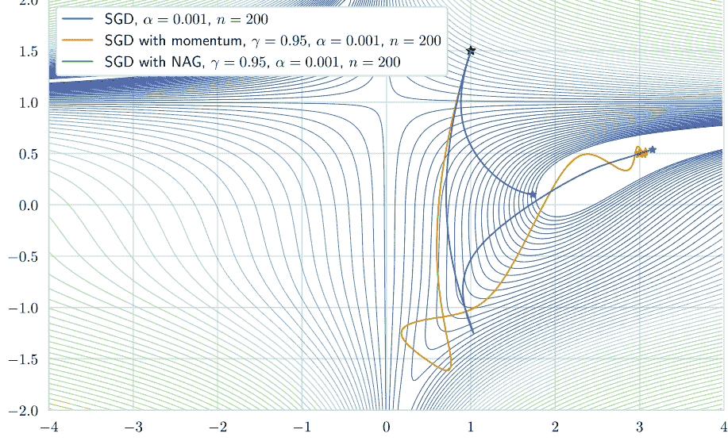

图2.15 基于动量的Beale函数方法

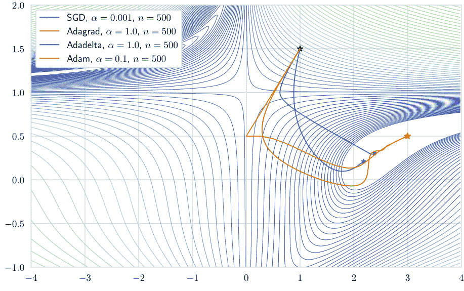

图2.16 Beale函数的自适应梯度下降方法

实验结果显示在图2.14、2.15和2.16中。图2.14显示，即使在复杂的优化景观中，通常也可以找到适合基本SGD的学习率。问题在于这个值并不明显：例如，在这种情况下，我们看到超过最佳学习率（大约为0.01），即使一点点也可能导致发散或其他不良行为：注意到α = 0.05的图快速失控。

图2.15展示了基于动量的方法的工作原理：我们可以看到，对于相同的初始学习率和相同的迭代次数，带动量的SGD和带Nesterov加速梯度的SGD更快地找到最优解。我们还可以看到NAG的稳定效果：带Nesterov动量的SGD比普通动量的SGD超调和振荡要少得多。最后，图2.16展示了自适应梯度下降算法的行为；在这个特定的例子中，Adagrad和Adam似乎效果最好，尽管这个二维例子并不能真正展示自适应方法的优势。

已经有人试图解释Adam发生了什么，并且为什么它如此好。特别是，Heusel等人在一篇有影响力的论文[340]中表明，使用Adam进行随机优化可以描述为具有摩擦的重球（HBF）的动力学，也就是说，Adam遵循牛顿力学中HBF的微分方程。过去梯度的平均有助于“球”（当前的w值）摆脱局部最小值的小区域，并倾向于目标函数景观中的大“山谷”。Heusel等人利用这个特性来帮助GAN生成器避免模式崩溃（我们将在第4章中更详细地讨论GAN），但这个观点是完全通用的，并适用于任何上下文中的Adam优化。

有人对Adam和类似方法提出了批评。在另一篇有影响力的论文中，Wilson等人[927]证明了：

- 当优化问题存在许多局部最小值时，不同的自适应算法可能会从相同的起始点收敛到不同的最小值；
- 特别是，自适应方法可能会过拟合，即找到非泛化的局部解；
- 而且所有这些情况不仅发生在理论最坏情况下，这对我们来说是自然且可以接受的，而且还发生在实际例子中。

Wilson等人得出结论，自适应梯度下降方法并不真正优于标准的SGD，并建议使用适当的步长调整的SGD而不是Adam和其他算法。

因此，研究人员一直在寻找快速和通用的自适应梯度下降算法的圣杯。自从2014年提出Adam以来，已经有很多尝试进一步改进自适应梯度下降算法。由于这不是本书的主要内容，而且Adam仍然是默认选择，我不会对这些尝试进行全面调查，只会顺便提及一些最有趣的想法。

## 2.5 自适应梯度下降算法

首先，亚当本身已经进行了几次修改：

- 原始亚当论文[454]提出了基于$L_{\infty}$范数而不是$L_2$范数来缩放梯度的Adamax修改；在这个变种中，$\mathbf{m}_k$的计算方式与上述相同，但是缩放是使用
  $$
  \mathbf{v}_k^{\infty}=\max \left(\beta_a \mathbf{v}_{k-1},\left|\mathbf{g}_k\right|\right) \text{，}
  $$
  而$\mathbf{v}_k^{\infty}$在算法8中代替了$\hat{\mathbf{v}}_k$（在这种情况下不会发生初始化偏差）；

- AMSGrad[708]是一个非常相似的想法：作者提出了一个简单问题的例子，原始Adam无法收敛，通过将梯度的运行平均值与到目前为止的所有$\mathbf{v}_t$的最大值进行归一化来修复这个问题；在算法8中，这意味着我们让
  $$
  \mathbf{u}_k:=\frac{\alpha}{\sqrt{\mathbf{v}_k^{\prime}}+\epsilon} \hat{\mathbf{m}}_k
  $$
  对于$\mathbf{v}_k^{\prime}=\max \left(\mathbf{v}_{k-1}^{\prime}, \mathbf{v}_k\right)$，其中max被理解为分量方式，并且$\mathbf{v}_k$的定义与算法8中完全相同；

- Nadam[204]是对$Adam$的修改，它使用Nesterov动量代替常规动量进行$\mathbf{m}_k$的更新；回退一步，$Adam$的更新规则可以写成
  $$
  \begin{aligned}
  \mathbf{w}_{k+1} & =\mathbf{w}_k-\frac{\alpha}{\sqrt{\hat{\mathbf{v}}_k}+\epsilon}\left(\frac{\beta_1 \mathbf{m}_{k-1}}{1-\beta_1^k}+\frac{\left(1-\beta_1\right) \mathbf{g}_k}{1-\beta_1^k}\right) \\
  & \approx \mathbf{w}_k-\frac{\alpha}{\sqrt{\hat{\mathbf{v}}_k}+\epsilon}\left(\beta_1 \hat{\mathbf{m}}_{k-1}+\frac{\left(1-\beta_1\right) \mathbf{g}_k}{1-\beta_1^k}\right)
  \end{aligned}
  $$
  （近似，因为我们不区分$1-\beta_1^k$和$1-\beta_1^{k-1}$在分母中），现在我们可以用当前估计$\hat{\mathbf{m}}_k$替换偏差校正估计$\hat{\mathbf{m}}_{k-1}$，从而将常规动量转换为Nesterov版本：
  $$
  \mathbf{w}_{k+1}=\mathbf{w}_k-\frac{\alpha}{\sqrt{\hat{\mathbf{v}}_k}+\epsilon}\left(\beta_1 \hat{\mathbf{m}}_k+\frac{\left(1-\beta_1\right) \mathbf{g}_k}{1-\beta_1^k}\right)；
  $$

- QHAdam（准超双曲Adam）[565]用其准超双曲版本替换了Adam中的动量估计器$\mathbf{v}_k$和$\mathbf{m}_k$，即在普通SGD和基于动量的Adam更新之间进行加权平均；QHAdam中的更新规则如下
  $$
  \mathbf{w}_{k+1}=\mathbf{w}_k-\alpha \frac{\left(1-\nu_1\right) \mathbf{g}_k+\nu_1 \hat{\mathbf{m}}_k}{\left(1-\nu_2\right) \mathbf{g}_k^2+\nu_2 \hat{\mathbf{v}}_k}，
  $$
  其中$\hat{\mathbf{m}}_k$和$\hat{\mathbf{v}}_k$的定义如算法8所示，$\nu_1, \nu_2$是新的常数；

- Wilson等人的批评，以及Adam在优化过程的初始阶段更快的收敛速度，导致了在训练过程中在某个关键点从Adam切换到SGD的想法[447]。

AdamW[556,557]可能是最有趣的Adam变体之一。它回溯到1980年代，最初用于神经网络的$L_2$正则化方法，即权重衰减[322]：
$$
\mathbf{w}_{k+1}=(1-\beta) \mathbf{w}_k-\alpha \nabla_{\mathbf{x}_k} F_k，
$$
其中$\beta$是权重衰减率，$\alpha$是学习率。在这个公式中，权重被拉近到零。自然地，人们立即注意到（就在原始论文[322]中）这种方法与改变目标函数$F_k$是完全等价的：
$$
F_k^{\mathrm{reg}}\left(\mathbf{w}_k\right)=F_k\left(\mathbf{w}_k\right)+\frac{\beta}{2}\left\|\mathbf{w}_k\right\|_2^2
$$
甚至直接改变梯度：
$$
\nabla_{\mathbf{w}_k} F_k^{\text {reg }}=\nabla_{\mathbf{w}_k} F_k+\beta \mathbf{w}_k
$$
但是，尽管这个等价性对于普通的SGD成立，但对于自适应梯度下降的变体却不成立！AdamW的想法是回到原始的权重衰减并“修复”Adam，以恢复等价性。作者展示了如何在不损失效率的情况下，仅略微改变Adam的更新方式来实现这一点。与算法8相比，唯一的变化是现在更新$\mathbf{u}_k$的方式为
$$
\mathbf{u}_k:=\frac{\alpha \hat{\mathbf{m}}_k}{\sqrt{\hat{\mathbf{v}}_k}+\epsilon}+\lambda \mathbf{w}_k
$$
而不是像直接应用Adam到正则化目标函数时那样，将$\lambda \mathbf{w}_k$添加到$\mathbf{g}_k$中。

已经在[556,557]中证明AdamW具有几个重要的优点。除了在某些实验中改善了泛化性能之外，它在解耦超参数方面也比原始的Adam更好。这意味着超参数的最佳值，如初始学习率$\alpha$和正则化参数$\lambda$，彼此之间不相互依赖，因此可以通过独立试验找到，这使得超参数调整更加容易。

尽管有这么多种类的一阶优化算法及其变体，但在深度学习的优化领域中，还没有最终定论。就像现在这样，一些乍一看可能会彻底改变领域的新想法，在原始实验未在更广泛的研究和工程实践中得到确认后，往往会逐渐被遗忘。一个很好的例子是超级收敛[806]，即通过循环调度改变学习率，不时将其增加到较大的值，以提供额外的正则化和提高泛化能力。原始实验非常有希望，而课程学习的思想在深度学习中有着悠久而成功的历史[63]（我们将在不同的背景下，特别是在第6.4节中再次讨论这个思想）。但是，“超级”在“超级收敛”中并没有在各种情况下得到证实。将学习率增加回来的想法已经成为深度学习实践者的工具之一，但循环学习率并没有成为深度学习的主流。增加学习率的想法已经被添加到深度学习从业者的工具箱中，但循环学习率并没有成为深度学习的主要方法。

## 2.6 结论

总之，在本节中，我们看到了近年来应用于深度神经网络的一阶优化的主要思想。自适应梯度方法取得了很大的进展：除了经典的基于动量的方法外，我们还讨论了最近开发的优化方法，这些方法根据不同的权重以不同的方式调整学习率。到目前为止，应用深度学习的研究人员大多将优化问题视为暂时解决，通常默认使用Adam或其后续变体，如AdamW，并在Adam在局部最小值中陷入困境时回退到SGD。然而，一阶自适应优化方法的新变体仍在不断出现，并且相关研究仍在继续。

二阶方法或其近似方法，如拟牛顿优化方法，仍然难以实现。看起来，为了适应通过小批量优化大型数据集中固有的巨大变化，开发适用于随机梯度下降的它们的变体将非常困难。但是，我也不知道在这个方向上是否有负面结果，所以谁知道，也许深度学习的下一个重大突破将是应用二阶优化方法或其近似方法到神经网络上。

我想总结一下其他一些有趣的研究方向，迄今为止还没有完全导致新的优化算法，但可能会这样做。在最近几年中，研究人员开始将深度神经网络和由它们表示的函数作为研究对象，而不仅仅是逼近或优化的工具。特别是，在深度神经网络的优化景观方面，最近有一些有趣而启发性的研究。我想强调一下几个作品：

- 李等人[514]研究了学习率如何影响泛化，并建立了训练中使用的学习率与模型“学习”的课程之间的联系；
- 黄等人[370]表明，现实生活中的神经网络的优化景观中存在许多具有近乎完美的训练集准确性但泛化能力很差（测试集准确性）的坏极小值；作者将这个景观描述为一个“雷区”，但发现SGD在某种程度上“奇迹般地”避开了坏极小值，并找到了具有良好泛化性能的局部极小值；
- Keskar等人[446]和He等人[326]研究了深度学习中常用的损失函数的梯度图景，发现“平坦”局部最小值具有更好的泛化性能，讨论了哪种训练模式更容易陷入平坦或尖锐的局部最小值；
- Chen等人[132]将这个理论部分应用到实践中，展示了如何改变优化图景以帮助优化器陷入平坦的最小值；
- Izmailov等人[391]指出，通过一种非常简单的技巧，即随机权重平均化，在SGD轨迹上的几个点上组合权重，可以实现更好（更宽）的局部最优解；这是之前开发的快速几何集成技巧[263]的简化版本；
- Nakkiran等人[618]讨论了模型规模增加时性能变差然后变好的双下降现象；双下降现象已经有一段时间了，但Nakkiran等人引入了有效的模型复杂度，这是一个可以解释双下降现象的训练过程的数值度量；
- Wilson和Izmailov[928,929]从贝叶斯的角度考虑了相同的效应，从贝叶斯推理的角度解释了深度学习的一些奥秘，并研究了深度学习中使用的正则化所隐含的函数先验性质。

这仅是一些例子，还有很多。这个研究方向似乎非常有前途，实际上看起来还处于早期阶段。因此，我期待在最近的未来在这个方向上有令人兴奋的新发展。

在下一章中，我们将从关于深度学习和优化的一般性评论转向具体的神经架构。我们将更详细地考虑使用最广泛且效果最好的合成数据的机器学习领域：计算机视觉。

## 第三章
### 用于计算机视觉的深度神经网络

计算机视觉问题与对数字图像、视频或类似输入（如3D点云）的理解有关，解决诸如图像分类、目标检测、分割、3D场景理解、视频中的目标跟踪等问题。计算机视觉的神经方法最初是模仿哺乳动物的视觉皮层，但很快成为一门独立的科学，已经开发出许多架构，并且新的架构仍在不断出现。在本章中，我们主要讨论计算机视觉中最流行的架构，主要集中在思想而不是具体模型上。我们还讨论了用于计算机视觉的合成数据的第一步：数据增强。

## 3.1 计算机视觉和卷积神经网络

计算机视觉是人工智能中最古老且最重要的子领域之一。在人工智能的早期阶段，即使是领先的研究人员也认为计算机视觉可能会变得足够简单：AI的创始人之一Seymour Papert最初将几个基本的计算机视觉问题作为学生项目来解决，以便“有效利用我们的暑期工作人员”[654]（参见第5.1节）。但很快就明显地意识到，计算机视觉实际上是一项更加雄心勃勃的事业，尽管经过几十年的努力和进展，相应的问题仍然没有完全解决。

在对视觉皮层的研究中，David H. Hubel和Torsten N. Wiesel取得了最重要的进展，他们在获得诺贝尔奖的合作中首次分析了哺乳动物视觉皮层中个别神经元的激活，其中最著名的是猫[376,377,925]。他们研究了视觉皮层的早期层次，并意识到第一层处理的个别神经元对简单的形状有反应，而第二层的神经元对第一层神经元的某些组合有反应。例如，一个第一层神经元可能会对视野中的水平线作出反应（称为感受野，这个术语也适用于人工智能），而另一个第一层神经元可能会对垂直线作出反应。如果这两个神经元同时被激活，第二层神经元可能会对出现在其感受野中的十字形状作出反应，实现了接近逻辑与的功能（当然，我在极大地简化，但这是基本思想）。换句话说，第一层神经元捕捉到输入的非常简单的特征，而第二层神经元捕捉到第一层神经元的组合。Hubel 和 Wiesel 足够明智，没有进一步深入超过前两层，因为大脑中的信号处理在此之后变得更加复杂。但即使这些最初的见解已经足够显著推进了人工智能...

卷积神经网络（CNN）的基本思想非常简单。我们知道，例如，从Hubel和Wiesel的研究中，处理视觉信息的一个合理方法是提取简单特征，然后将简单特征的组合产生更复杂的特征。简单特征通常对应于小的感受野：例如，我们可能希望第一层神经元在一个5×5像素的窗口中捕捉到垂直梯度。但是，这种特征提取应该同样应用于每个5×5窗口，也就是说，我们可以将相同的可学习变换应用于每个窗口，使用共享权重，而不是训练神经网络对每个窗口进行相同的操作，比如在一个1024×1024的图像上。这个想法作为结构正则化器起作用，在CNN中节省了大量的权重，相比于等效的全连接网络。从数学上讲，这个想法可以表示为输入和小的可学习变换之间的卷积，因此得名。

图3.1展示了卷积网络的基本思想：一个5×5的输入图像被分解成3×3的窗口，每个窗口都通过相同的小型神经网络，得到一个特征向量作为结果。经过这个转换，5×5的图像在宽度和高度上变成了3×3的输出。

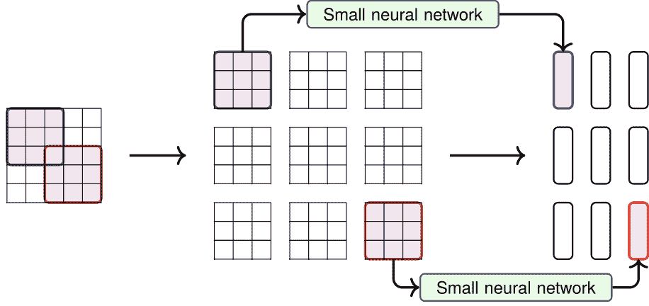

图3.1 卷积神经网络的基本思想；蓝色和红色的颜色遵循两个3×3窗口的转换，相同的小型神经网络也应用于其他窗口。

卷积层实际上只是实现这个思想的一种方式，尽管迄今为止最受欢迎。它是由一组可学习的滤波器（或内核）定义的层，这些滤波器在整个输入张量上进行卷积。卷积可以是任意维度的，但对于计算机视觉来说，最受欢迎和直观的是二维卷积，因此我们将在示例中使用它们。在这种情况下，输入是一个三维张量（宽度 × 高度 × 通道，灰度图像有一个通道，彩色图像有三个通道，神经网络内部的中间表示可以有任意多个），卷积最好被视为一个四维张量的维度：输入通道 × 宽度 × 高度 × 输出通道。

图3.2展示了一个卷积层的玩具数值示例，该卷积层由一个 3×3×2 的权重张量和 ReLU 激活函数组成，应用于一个 5×5×1 的输入图像。

对于第一个“真实”的示例，让我们考虑一下 Sobel 算子，这是一个经典的计算机视觉工具，可以追溯到 1968 年 [809]。它是图像梯度的离散计算，在经典计算机视觉中用于边缘检测。对于我们的示例，我们注意到 Sobel 算子的主要组成部分是两个 3×3 的卷积矩阵。
$$
S_x = \begin{pmatrix} 1 & 0 & -1 \\ 2 & 0 & -2 \\ 1 & 0 & -1 \end{pmatrix}, \quad S_y = \begin{pmatrix} 1 & 2 & 1 \\ 0 & 0 & 0 \\ -1 & -2 & -1 \end{pmatrix}.
$$
基本上，$S_x$表示图像梯度的水平分量，$S_y$表示垂直分量。

如果我们取一个像手写数字的MNIST数据集中的图像，如图3.3a所示，并应用一个与矩阵$S_x$的卷积，我们得到图3.3b中所示的结果。与矩阵$S_y$的卷积结果显示在图3.3c中。在这个示例中，我们可以看到小矩阵的卷积产生了有意义的特征。

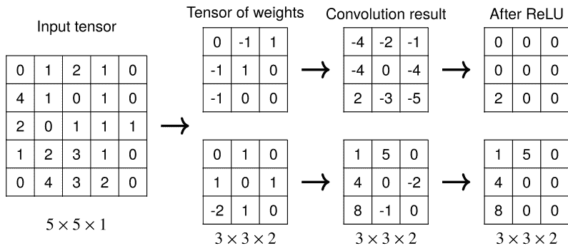

图3.2 一个由线性卷积组成的卷积层的示例：应用 3×3×2 的权重张量和 ReLU 激活函数。

## 3.1 计算机视觉和卷积神经网络


图3.3 卷积的示例应用: (a) 原始手写数字; (b) 与矩阵 $S_{x}$ 进行卷积, 图像梯度的水平分量; (c) 与矩阵 $S_{y}$ 进行卷积, 图像梯度的垂直分量。

提取: 图3.3b、c中显示的特征的含义非常清楚, 并且确实反映了输入图像在相应方向上的像素强度的变化。请注意, 在神经网络中, 两个卷积都将被视为一个维度为 $3 \times 3 \times 2$ 的单个张量, 并且将其应用于大小为 $28 \times 28$ 的图像的结果将是一个具有两个通道（特征图）的张量, 如图3.3b、c所示。请注意, 在此示例中, 输出的宽度和高度保持在28而不是在每一侧减少1, 因为结果是使用填充计算的, 即在输入的每一侧都添加了一行和一列的零; 这是卷积网络中常用的技巧, 当希望保持输入大小不变时使用。

在可训练的神经网络中, 矩阵 $S_{x}$ 和 $S_{y}$ 中的权重不会提前设置, 而是表示需要通过梯度下降学习的权重, 正如我们在前一章中讨论的那样。实际上, 卷积首次引入到人工神经网络中是很久以前的事情, 甚至在反向传播还没有被普遍接受之前。这就是在1970年代末由福岛邦彦开发的Neocognitron[248-250]。在许多方面, Neocognitron是一个开创性的架构: 在深度网络几乎不存在的时代, 它是一个深度神经网络; 它从输入的小窗口中进行特征提取——这正是卷积网络的思想; 它以无监督的方式进行训练, 学习识别不同类型的模式; 实际上, 它已经具备了ReLU激活函数——这一切都发生在20世纪70年代! Neocognitron被广泛认为是CNN的前身, 尽管需要几年时间将这些思想应用到现代CNN架构中, 但它们实际上在20世纪80年代以其现代形式出现。

在传统的卷积网络中, 如LeNet[501], 卷积层通常与非线性激活函数（逐元素应用）和池化层交替出现, 以减小维度。最流行的是最大池化层, 它没有任何可训练的参数, 只是用窗口（通常是 $2 \times 2$ ）覆盖输入张量, 并选择每个特征中的最大值。

输入图像, $32 \times 32$
$5 \times 5$ conv, 6 feature maps
tanh activation
$28 \times 28 \times 6$ tensor
$2 \times 2$ average pooling
$14 \times 14 \times 6$ tensor
$5 \times 5$ conv, 16 feature maps
tanh activation
$10 \times 10 \times 16$ tensor
$2 \times 2$ average pooling
$6 \times 6 \times 16$ tensor
$5 \times 5$ conv, 120 feature maps
tanh activation
$1 \times 1 \times 120$ tensor
$120 \times 84$ fully connected layer
$84 \times 10$ fully connected layer
Softmax
Output, 10 classes

图3.4 LeNet-5架构[501]。

0.40 1.00
0.35
0.30 0.99
0.25
0.20 Training set loss 0.98
0.15 Validation set loss
0.10 Training set accuracy
0.05 Validation set accuracy 0.97
0.00 0.96
0 2 4 6 8 10 12 14

图3.5 LeNet-5在手写数字的MNIST数据集上的训练过程。

窗口。基本的直觉是我们希望特征对应于从较小到较大的窗口延伸的某些属性；例如, 如果图像中的一个 $128 \times 128$ 窗口中存在一只猫, 则包含它的每个 $256 \times 256$ 窗口中也存在一只猫。最大池化还引入了很多稀疏性, 有助于保持计算更高效。

为了一个扩展的例子, 让我们实现和研究（稍微修改的）LeNet-5网络在 $32 \times 32$ 灰度图像上的操作（我们将使用MNIST手写数字）, 这是一个简单的卷积架构, 如图3.4所示。在图中, 执行转换的层显示为绿色填充的矩形, 当前特征映射的尺寸显示为蓝色填充的矩形。正如你可以看到, 每个 $5 \times 5$ 的卷积会将输入张量的宽度和高度减小4, 因为这里没有填充, 而每个 $2 \times 2$ 的池化层（在LeNet的情况下是平均池化）会将输入维度减半。

图3.5展示了这个网络在MNIST数据集上使用Adam优化器和批量大小32进行训练的过程。正如你所看到的, 训练集上的损失函数（正确答案和网络预测之间的平均交叉熵）稳步减小, 但验证集上的损失函数并不单调。在这个实验中, 验证集上取得了最好的结果。（在重新初始化权重后, 具体结果可能会发生变化）经过12个训练周期后。

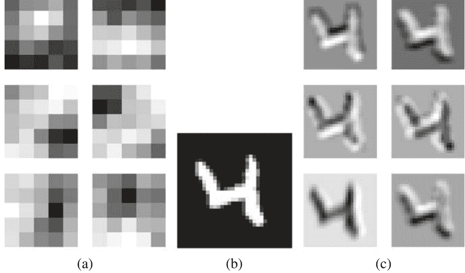

图3.6 LeNet-5的第一层视图: (a) 六个卷积的权重; (b) 样本输入图像; (c) 从(a)中卷积在(b)上产生的激活。

图3.6展示了训练网络的第一层。它展示了在图3.6a中训练的六个5×5卷积的权重, 并将它们应用于图3.6b中的样本数字的结果 (与图3.3中相同, 只是用零填充到32×32的大小), 结果显示在图3.6c中。可以看到, 第一层已经学会提取简单的几何特征, 很多方面类似于图3.3中显示的图像梯度。

在计算机视觉中使用的现代网络通常采用非常相似的卷积层。它们通常与LeNet不同之处在于使用ReLU激活函数或其变种, 而不是Sigmoid激活函数 (请回顾第2.1节中的讨论)。ReLU非线性函数最早在[616]中被重新引入到深度学习中的玻尔兹曼机中, 并在深度卷积网络中被AlexNet广泛推广 (请参见下面的第3.2节)。

在过去的十年中, 卷积神经网络在计算机视觉领域占据主导地位, 并在许多其他机器学习领域中越来越受欢迎。例如, 在2014年至2016年期间, 一维卷积神经网络在自然语言处理 (NLP) 中变得越来越重要, 甚至取代了循环神经网络[423, 1010]; 在2017年之后, 基于自注意力的架构 (如Transformer) 特别是BERT和GPT系列在NLP中取得了最佳结果[192, 697, 891]。但是类似BERT的模型仍然经常用于预训练词嵌入, 然后通过CNN和/或RNN来解决下游任务。

然而, 即使对于卷积架构的基本潜在思想, 仍然存在有效的批评。最重要的两个批评涉及缺乏平移不变性和几何丢失沿着深度CNN。缺乏平移不变性意味着在CNN中, 如果稍微移动或旋转头部, 本应产生给定特征（例如, 在照片上识别猫头）的单元可能不会激活。在机器学习实践中, 通过广泛的数据增强通常可以实现CNN中的平移不变性, 其中始终包括简单的几何变换, 例如重新裁剪图像, 按接近1的因子进行重新缩放等（我们将在第3.4节详细讨论增强）。然而, 仅通过扩展数据集来实现完全的平移不变性远非保证, 并且似乎极其浪费：如果我们处理的是图像, 我们已经知道应该存在平移不变性, 为什么要通过这种绕圈子的方式为每个问题从头学习呢？

“几何丢失”问题源于标准卷积神经网络使用池化层, 将关于低层特征的信息传递到分辨率较小的高层特征图中。因此, 随着信号从底层传递到顶层, 网络逐渐失去了特征起源的确切位置。因此, 高层特征无法激活低层特征之间的几何关系, 有时被称为“毕加索问题”：卷积特征可以在脸上寻找两只眼睛、鼻子和嘴巴, 但无法确保这些特征的位置是否正确。这是因为池化层在神经网络中有助于减少特征表示的冗余, 防止过拟合, 改善训练过程, 同时以一种固定且非常粗糙的方式“路由”低层信息到高层特征。

这两个问题已经在2014年被Geoffrey Hinton [343]指出。为了缓解这些问题, Hinton提出了一种新的方法来进行特征组合：胶囊网络。在胶囊网络中, 使用特殊的（可训练的）路由系数来指示哪些低级特征对于给定的高级特征更重要, 并且特征（胶囊）本身明确包括特征的方向和相互位置, 并明确估计所得到的复合特征的可能性[247, 349, 452, 748]。因此, 平移不变性是内置的, 路由是动态的, 胶囊网络的参数比CNN少得多, 并且整个过程更类似于人类视觉而不是CNN：胶囊是根据皮层柱设计的。

然而, 目前看来, 将胶囊网络扩展到实际问题仍然太困难：为大规模CNN开发的计算技巧对胶囊网络没有帮助, 到目前为止, 它们在超过MNIST和类似规模的数据集上的扩展仍然困难。因此, 所有现代的实际计算机视觉架构都是基于CNN而不是胶囊或其他类似的想法, 例如其他等变扩展, 如球面CNN [163]或可操纵CNN [164], 胶囊网络的应用只是开始出现[227]。因此, 我们不会详细讨论这些替代方案, 但我想提到的是, 计算机视觉的未来可能会有与今天的CNN非常不同的东西。

## 3.2 现代卷积架构

在本节中, 我们将概述使计算机视觉达到当前艺术水平的主要思想。我们将简要回顾深度学习革命期间卷积架构的发展历史, 但只涉及主要观点, 重点集中在这些架构为我们今天拥有的卷积神经网络的各种想法上。有关更详细的介绍, 我们参考[153, 225, 631]和其他来源(图3.7)。

### MCDNN

计算机视觉中的深度学习革命始于2010年至2011年, 当时深度学习理论的最新进展以及在高度并行的图形处理器(GPU)上训练和使用神经网络的技术使得训练比以前更深的网络和更多的单元成为可能。深度学习首次成功解决的基本问题是图像分类。2011年, Jürgen Schmidhuber小组的Dan Cireşan设计的一个网络赢得了多个计算机视觉竞赛[159]。特别是, 这个网络是第一个在实际相关的计算机视觉问题中实现超人类性能的网络, 在IJCNN交通标志识别竞赛中仅有0.56%的错误率, 而该数据集上的平均人类错误率为1.16%[160]。

在架构上, Ciresan的网络被称为多列深度神经网络(MCDNN), 它是由具有最大池化的深度卷积网络委员会组成。它展示了几个重要的思想:

- MCDNN使用了一种基本的卷积架构, 非常类似于 LeNet系列的网络(因此我们不为它单独显示一个图), 但它是最早一批始终使用最大池化而不是平均池化或其他变体的网络之一;
- 该架构包含了几个相同的网络, 这些网络在不同的预处理输入上进行了训练, 其中预处理的变化包括不同的颜色归一化和对比度调整; 因此, MCDNN已经展示了数据增强在计算机视觉中的重要性, 这是一个至今仍然至关重要的主题, 也是合成数据的动机之一。

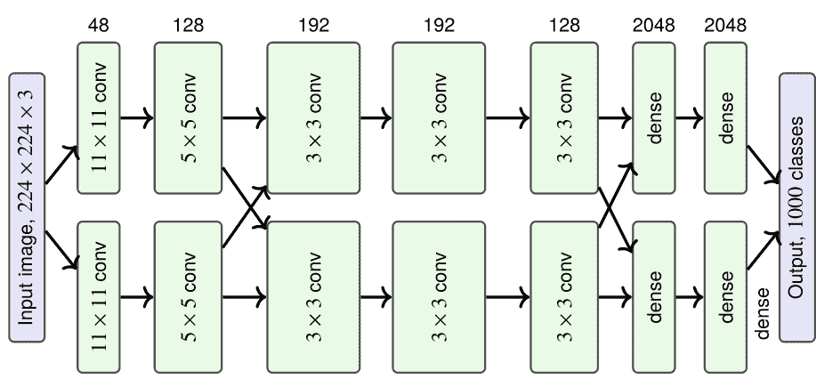

图3.7 AlexNet架构[477]。

### AlexNet

然而, MCDNN处理的是非常小的图像, 裁剪出尺寸为 $48 \times 48$ 像素的交通标志边界框。 现代大规模架构的发展可以处理更高分辨率的图像, 始于AlexNet [477], 这是由Alex Krizhevsky在Hinton教授的团队中开发的网络 (见图3.7进行说明）。 具有8个可训练层的 AlexNet成为最早成功的真正深度卷积网络之一。 它在2012年的ImageNet大规模视觉识别挑战赛 (ILSVRC) 中, 以前所未有的优势击败了所有竞争对手: 两个提交的版本的 AlexNet在测试集上的错误率 (以前5个猜测的分类准确率来衡量) 约为15-16%, 而最接近的竞争对手只能达到26%的错误率$^{1}$! 在架构上, AlexNet再次引入了几个新的思想:

- 它引入并立即推广了ReLU激活函数作为卷积层中使用的非线性函数; 之前, 卷积网络中最常使用的是tanh激活函数;
- 它强调了数据增强在训练计算机视觉问题的神经网络中的关键作用; 我们将在第3.4节中详细讨论 AlexNet的情况;
- 它是最早大规模使用dropout进行额外正则化的网络之一;
- 最后, 它是最早具有模型并行化特性的神经网络之一: 模型在两个GPU之间进行分布式处理; 早在2012年, 这是一项真正的工程壮举, 但自那时以来, 它已成为 PyTorch或 Tensorflow等深度学习框架的标准功能。

AlexNet的巨大成功标志着计算机视觉领域的一个新时代的开始: 自2012年以来, 卷积神经网络一直占据主导地位。 CNN在几乎所有计算机视觉问题中都取得了改进和定义最先进的成果: 图像分类、目标检测、分割、姿态估计、深度估计、目标跟踪、视频处理等等。 我们将在第3.3节中更详细地讨论目标检测和分割架构。目前, 重要的部分是它们都具有卷积主干网络, 可以同时在多个层上进行特征提取: CNN的底层 (最靠近输入) 提取局部特征并可以生成高分辨率的特征图, 而顶层 (最靠近输出) 提取的特征具有较大的感受野, 可以泛化更多信息, 因此可以学习更深层次的语义, 但在此过程中会丢失一些几何信息 (我们在第3.1节中已经讨论过这个问题)。

> $^{1}$ http://image-net.org/challenges/LSVRC/2012/results.html.

### VGG

深度卷积神经网络的下一步也与ILSVRC挑战相关: 多年来, 图像分类的顶级结果都标志着新的重要思想, 后来这些思想渗透到了许多其他架构中。 最富有成果的一年是2014年, 当时最好的ImageNet分类结果由VGG网络实现。VGG网络由Simonyan和Zisserman [802]实现了ImageNet分类的最佳结果；名称源自牛津大学的视觉几何组。定义VGG系列的主要思想是, 卷积神经网络中的单个卷积几乎不需要很大：一个 $5 \times 5$ 的卷积可以表示为两个 $3 \times 3$ 的卷积的组合, 没有任何池化或非线性层, 一个 $7 \times 7$ 的卷积只是三层 $3 \times 3$ 的卷积, 依此类推。图3.8显示了VGG系列的第一个成功网络；请注意, 最大池化层出现在两个或三个卷积层的组合之后, 从而分解了更大的卷积。


图3.8 VGG：分解大卷积[802]。

这导致了更深的网络, 权重更少, 同时作为额外的正则化, 使训练和推断更高效。后来的架构还尝试将 $n \times n$ 的二维卷积表示为 $1 \times n$ 和 $n \times 1$ 的一维卷积的组合, 并且这个技巧在现代CNN架构中也很常见。

### Inception和GoogLeNet

同年, Google提出了GoogLeNet, 由Szegedy等人设计的网络赢得了ILSVRC 2014的目标检测赛道。

与Lin等人关于“网络中的网络”架构的前期工作一起, 它具有三个重要的思想, 至今仍然存在：Inception模块, $1 \times 1$ 卷积和辅助分类器。

首先, “网络中的网络”架构采用了卷积网络的基本思想, 即对输入的所有局部窗口应用相同的简单变换, 并进一步发展了常规CNN。他们设计了特殊的架构来实现“简单变换”（不再那么简单）, 因此单个层实际上将整个神经网络应用于输入的每个窗口, 因此得名。这些来自[836]的小型网络的架构称为Inception模块, 如图3.9所示。此后, 已经进行了许多修改, 包括Inception v2和v3 [837]以及Inception与ResNet的组合（见下文）。

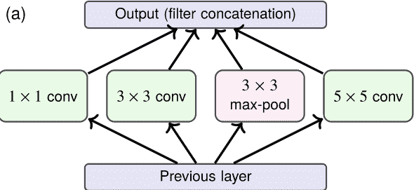
图3.9 Inception 模块：（a） 基本的“天真”Inception v1 模块[836]；（b）通过1×1 卷积进行维度缩减的Inception v1 模块[836]；（c）示例Inception v2 模块[837]。

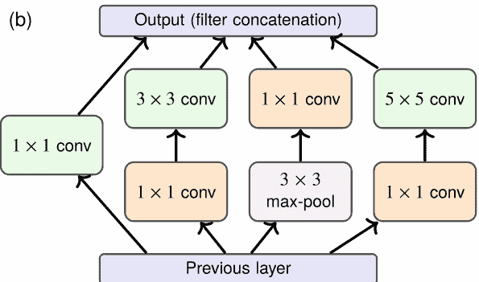
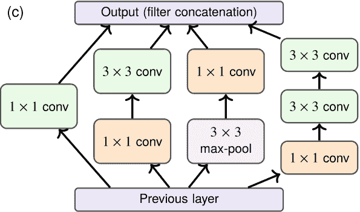

其次, $1 \times 1$ 卷积在网络内部模块的所有变体中起着重要作用。乍一看, $1 \times 1$ 卷积似乎毫无意义。然而, 虽然它们确实不会从相邻像素中收集任何新特征, 但它们通过学习给定像素中特征向量的（非线性的, 否则它确实是无意义的）变换来提供额外的表达能力。在实践中, 通常需要改变特征向量的维度, 通常是在执行更多计算量要求较高的变换之前减少维度。

例如, 将一个512维向量映射到一个512维向量的3×3 卷积具有 $512 \times 3 \times 3 \times 512 = 9 \times 2^{18} \approx 2.36M$ 个权重。但是, 如果我们先应用1×1 卷积将维度减小到64, 然后再将结果映射回512维, 我们会添加两个卷积, 每个卷积都有 $512 \times 1 \times 1 \times 64 = 2^{15} = 32768$ 个权重, 但将3×3 卷积减少到 $64 \times 3 \times 3 \times 64 = 9 \times 2^{12}$ 个权重, 总共约为 $2 \times 2^{15} + 9 \times 2^{12} \approx 102K$ 个权重, 减少了超过20倍！这种降维所暗示的额外近似通常不会有害, 甚至可能作为额外的结构正则化。

这个想法已经被广泛应用于试图最小化卷积神经模型的内存占用或延迟的架构中。图3.9b显示了具有1×1卷积的Inception v1模块, 它执行这些维度缩减, 图3.9c显示了Inception v2如何通过VGG的基本思想将这个模块修改为3×3卷积的组合[837]。我们这里没有展示所有Inception模块的变体, 请参考[836, 837]了解更多细节。

第三, GoogLeNet是一个深度网络, 它有22层可训练参数, 如果计算池化层的话则有27层。当通过梯度下降进行训练时, GoogLeNet面临的问题与第2.4节中讨论的深度神经网络类似: 误差传播受限, 当顶层达到饱和时, 底层的训练变得非常困难。为了克服这个问题, Szegedy等人提出使用辅助分类器来帮助损失梯度传播到底层[836]。

GoogLeNet架构(见图3.10)有两个辅助分类器, 它们有单独的分类头(以分类层结束的浅层网络)。损失函数是相同的(二元交叉熵分类损失), 它们与主要损失函数简单地相加, 形成整个网络的目标函数:

$$\mathcal{L}_{\text {GOOGLENET }}=\mathcal{L}_{\text {MAINBCE }}+\alpha_{1} \mathcal{L}_{\text {AUXBCE } 1}+\alpha_{2} \mathcal{L}_{\text {AUXBCE } 2}$$

$\alpha$ 系数初始化为0.3, 并在训练过程中逐渐减小。这个技巧旨在加快训练的早期阶段底层的训练速度并改善收敛性, 但Szegedy等人报告说, 实际上收敛速度没有显著改善, 但网络的最终性能更好, 因此辅助分类器更像是一个正则化器。

### ResNet

尽管取得了这些有希望的结果, 但辅助分类器在现代架构中并不广泛使用。原因是它们本来打算解决的主要问题, 在顶层饱和后的误差传播问题, 已经以一种更好的方式解决了。由He Kaiming领导的微软研究团队开发并实施了深度残差学习的思想[330], 这是ResNet架构成功的主要推动力, 该架构在ILSVRC 2015中在分类(将ImageNet Top-5错误率降低到3.5%)和目标检测(使用更快的R-CNN检测架构, 在第3.3节中将讨论)方面获胜。

ResNet的基本结构很简单: 它是一系列连续的层组成, 每个层通常只是一个卷积层, 可能还带有批归一化。主要区别在于, 在残差单元中, 计算输入x的函数F(x)的层(在图3.11a中示意)会补充一个直接的残差连接, 以绕过该层, 从而计算产生第k层输出的整体函数, 表示为$\mathbf{y}^{(k)}$从输入向量$\mathbf{x}^{(k)}$计算而来。

$$\mathbf{y}^{(k)}=F\left(\mathbf{x}^{(k)}\right)+\mathbf{x}^{(k)}$$

## 3.2 现代卷积架构

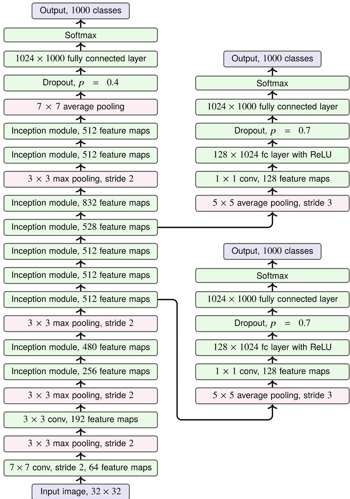

图3.10 GoogLeNet的总体架构。

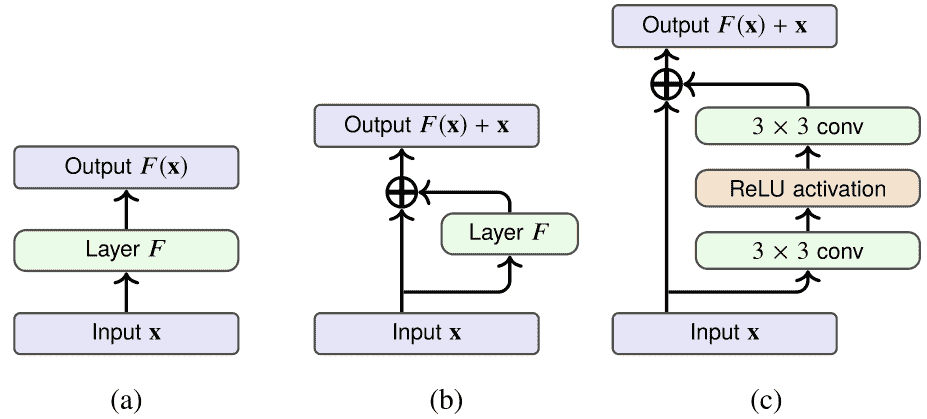

> 图3.11 深度残差学习：(a)简单层的示意图；(b)带有残差连接的层的示意图 来自[330]的示例ResNet层。

其中， $x^{(k)}$ 是第 $k$ 层的输入向量， $F(x)$ 是该层计算的函数， $y^{(k)}$ 是将成为 $x^{(k+1)}$ 并将被馈送到网络中下一层的残差单元的输出（参见图3.11b）。

这个名称源于整个层应该近似于某个函数 $H(x)$，这意味着实际的神经层必须近似于残差 $F(x) \approx H(x) - x$；这对于 $F(x)$ 来说并不会使问题变得复杂（如果有的话），但同时为梯度提供了绕过 $F(x)$ 的直接路径。

$$
\frac{\partial y^{(k)}}{\partial x^{(k)}} = 1 + \frac{\partial F(x^{(k)})}{\partial x^{(k)}}
$$

即使层 $F$ 完全饱和，其接近零的导数不会阻碍训练：梯度将简单地流向前一层不变。

残差学习并不是一个新的想法：它与长期以来一直在循环架构中使用的恒定误差旋转木马思想相同，特别是在1990年代末由Hochreiter、Gers和Schmidhuber [273,350] 开发的著名的长短期记忆（LSTM）架构中。循环网络本质上是一个非常深的网络（考虑其在整个输入序列上展开的计算图），同样的现象会导致梯度爆炸或消失，从而有效地限制了信息（“记忆”）在循环网络中的传播。恒定误差旋转木马正是让梯度有一个“直接路径”流动的思想。

然而，He等人是第一个将这个想法应用于“展开”的深度卷积神经网络，并取得了巨大的成功。请注意，在[331]中进行的几种残差架构的比较表明，最好的结果是通过使用最简单的残差连接来实现的：通常最好将直接路径保持不受任何转换（如非线性、批量归一化等）的影响。

甚至使用可能学习“打开”和“关闭”路径的控制门也被证明是一个不好的想法，这个想法在类似LSTM的循环架构中取得了成功。图3.11c显示了来自[330]的一个简单的样本残差层，当然，这个想法在原始论文和后续的研究中还有很多变体。

从架构上讲，这使得训练非常深的网络成为可能。Kaiming He创造了“深度革命”的术语：VGG有19个可训练层，GoogLeNet有22个，但即使是第一个版本的ResNet也包含了152个层。它仍然是一个受欢迎的特征提取骨干，通常被称为ResNet-152，还有一个受欢迎的较小变体ResNet-101，有101层（在这里以图形形式呈现深度残差网络的架构既没有足够的空间，也没有太多意义）。理论上，残差连接允许训练具有数百甚至数千层的网络，但实验证明，从大约200层开始，性能几乎没有或者只有很小的改善。

一些最好的现代卷积特征提取器是由Inception的网络内部思想和残差连接思想的结合而产生的。2016年，Szegedy等人[835]提出了Inception-v4和几个版本的Inception ResNet架构，为小型网络单元和整个全局网络提供了新的架构。由此产生的架构仍然是最好的特征提取器，并经常用作目标检测和分割架构的骨干。

追求效率：MobileNet、SqueezeNet和其他。在基本问题（如图像分类）中取得最好的结果是通过使用复杂网络（如Inception ResNet系列）来实现的。然而，人们经常需要在最终性能和可用计算资源之间进行权衡；即使是台式电脑上的GPU可能无法顺利运行现代网络，而计算机视觉通常在智能手机或嵌入式设备上进行。因此，需要开发既能节省网络大小（通常与权重数量有关的内存）又能减少运行时间（通常取决于层数）而又不损失太多性能的架构。自然而然地，拥有卓越性能和小型网络将是最理想的。在下面，我们不会介绍具体的架构（我相信在给出了一个完整的GoogLeNet示例之后，进一步介绍完整的架构只会使书籍变得混乱，这些信息很容易找到，也不需要记住），而只会对研究人员在这些架构中使用的思想进行概述。

如何保存权重？我们已经讨论过，卷积是一个很好的结构正则化器：通过在整个图像上应用相同的权重，卷积可以在一个任意大的输入中提取特征，并且只需要固定且相对较小的权重数量。但这还不是全部：卷积本身也可以变得非常大。

假设你有一个具有256个通道的层（甚至是一个非常合理的数量），并且你想要应用一个5×5的卷积来得到输出的另外256个通道。一个直接的四维卷积，正如我们在第3.1节中讨论的那样，

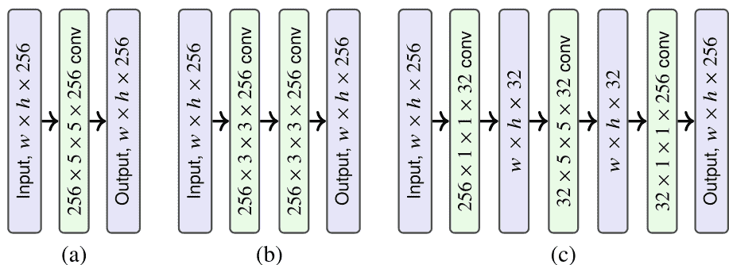

图3.12减少卷积的示意图：(a)基本的单个卷积；(b)VGG技巧；(c)瓶颈技巧。

$$
256 \times 5 \times 5 \times 256 = 1638400
$$

权重（如图3.12a所示）。当然，与一个具有256个神经元的前馈层相比，这是一个很大的改进。与 $宽度 \times 高度 \times 256$ 个权重相比，但通常希望进一步减少这1.6M个权重。

让我们简要介绍一下现代架构中用于此目的的主要思想。请注意，下面显示的所有方法严格来说都不等同于一个卷积，这是很自然的：具有1.6M个权重的网络可能比具有十倍较少权重的网络更具表现力。幸运的是，事实证明，这种额外的表现力通常不会提高性能，实际上可能会因为过拟合或数据不足而导致性能下降。

首先，我们可以使用VGG技巧，用两个 $3 \times 3$ 的卷积组合来表示一个 $5 \times 5$ 的卷积（见图3.12b）。这将将权重数量减少到 $2 \times (256 \times 3 \times 3 \times 256) = 1179648$。如果我们表示 $3 \times 3$ 卷积作为 $1 \times 3$ 和 $3 \times 1$ 的组合，参考文献[837]。

其次，我们可以使用瓶颈技巧，这是由Inception系列架构首次推广的。上一层中的1.6百万个权重是由于我们需要对卷积的所有维度进行乘法运算。但是，如果我们首先使用 $1 \times 1$ 卷积进行压缩，将256个通道压缩到一个更可管理的大小，那么我们可以将其中一些乘法运算转换为加法运算。

首先进行 $1 \times 1$ 卷积，然后在减少的张量上进行 $5 \times 5$ 的空间卷积，再次产生一个具有少量通道的张量（例如32个通道），然后再使用另一个 $1 \times 1$ 卷积进行扩展。

这种方法，如图3.12c所示，有点类似于对卷积张量进行低秩逼近。假设瓶颈部分有32个通道，则三个结果卷积中的总权重数将为

$$
256 \times 1 \times 1 \times 32 + 32 \times 5 \times 5 \times 32 + 32 \times 1 \times 1 \times 256 = 41984
$$

如果我们在中间的 $5 \times 5$ 卷积中应用VGG技巧，可以再次进行轻微的进一步减少。到这一点，我们已经取得了显著的网络尺寸缩小，将权重总数减少超过28倍。

瓶颈思想被提出并成功地应用于SqueezeNet架构中，该架构用Fire模块替换了Inception单元，其具有“挤压-扩展”结构：首先使用1×1卷积来减少通道数，然后再扩展它们，应用多个不同的卷积并连接输出[382]。

但这还不是全部！第三，我们甚至可以进一步采用瓶颈方法，使用深度可分离卷积。

现在的想法是进一步分解中间的张量，即32×5×5×32卷积，仍然具有所有四个因子。这个卷积将所有通道混合在一起；但是如果我们将混合留给1×1卷积（毕竟，这正是它们所做的），并且只集中在空间部分呢？从形式上讲，我们用32个单独的5×5卷积替换了一个单一的卷积，每个卷积仅应用于一个通道。这明显降低了中间卷积的表达能力，因为现在结果中的每个通道只能访问输入中的一个通道；但由于通道可以在1×1卷积中自由交换信息，通常不会导致任何显著的性能损失。在我们的运行示例中，我们可以将这个想法应用于瓶颈，去掉32个因子，总共得到

$$
256 \times 1 \times 1 \times 32 + 32 \times 5 \times 5 + 32 \times 1 \times 1 \times 256 = 17184
$$

权重。或者，我们可以忘记整个瓶颈的想法，而是使用256个深度可分离卷积代替其中一个1×1卷积和瓶颈，从而得到

$$
256 \times 1 \times 1 \times 256 + 256 \times 5 \times 5 = 71936
$$

权重。第二种方法在这种情况下看起来更糟，但首先，它取决于实际的维度，其次，将所有特征压缩到非常小的瓶颈往往会丢失信息，因此如果我们可以在不压缩特征的情况下实现相同的结果，可能会获得更好的性能。

深度可分离卷积是由Francois Chollet在[152]中引入的，他指出一个基本的Inception模块可以表示为混合通道子集的深度可分离卷积，并提出了将这个想法发展到逻辑上的Xception模块，正如我们刚刚讨论的那样。它们还成为构建MobileNet网络系列的主要工具，这些网络系列专门设计用于节省内存，并仍然是最好的工具之一[358]。

神经架构搜索和EfficientNet。在上面的调查中，像使用1×1卷积来压缩通道的基本思想很容易理解，我们可以看到研究人员可能会想出这样的想法。一个更困难的问题是如何提出实际的架构。谁、如何能够确定GoogLeNet中的骨干网络确实需要两个卷积层，然后是九个基本的Inception模块，以恰当的方式交替进行最大池化？

实际答案很简单：没有定理表明哪种架构最好；你只需要提出一系列不同的架构，这些架构在尺寸上“有意义”，在实践中测试很多，并选择表现最好的那个。

这看起来非常像一个机器学习问题：你有构建块（各种卷积、池化层等）和一个明确定义的目标函数（比如，在训练收敛后在ImageNet测试集上的性能）。

自然地，不久之后研究人员决定自动化这个过程。这个问题很自然地被表述为一个强化学习问题：虽然我们没有一个现成的数据集，但我们可以在任何网络上计算目标函数。但是计算目标函数非常昂贵（你需要训练一个大型模型直到收敛）。这种开发神经网络的方法被称为神经架构搜索（NAS）；我不会详细介绍它，会参考NAS的主要来源[532, 846, 930, 1031]。

在卷积架构中，神经架构搜索产生了EfficientNet家族，由Tan和Le在2019年提出。他们引入了复合缩放方法，基本上将以上所有讨论归纳为一种单一方法，根据一组缩放系数来缩放网络的宽度、深度和分辨率。这种方法本身已经能够改进现有的架构，但更重要的是，这种泛化使作者能够在一个高效的参数空间中找到最佳网络的问题。由此产生的网络超越了所有的前任，为性能/效率权衡设定了一个全新的帕累托前沿。

总结一下，在本节中我们看到了构成卷积架构的主要思想。但请注意，我们所讨论的一切都可以用“在ImageNet上训练”来表达，也就是说，上述所有网络都解决了图像分类问题。但这只是计算机视觉中的一个问题，甚至不是最重要的问题…我们如何解决目标检测、分割和其他所有问题？让我们找出答案。

## 3.3 案例研究：目标检测的神经架构

在后续章节中，我们将考虑使用合成数据进行计算机视觉。我们已经看到了哪些卷积架构被认为是最先进的图像特征提取器。然而，计算机视觉涵盖了许多问题，特征提取通常只是一个开始。事实上，即使是在20世纪60年代引入的计算机视觉的基本设置——教会机器人环顾四周并导航环境——也涉及比图像分类更多的内容。当我打字时，我不仅仅识别出一个“显示器”，尽管它占据了我视野的大部分：我还可以看到和区分键盘、我的双手、屏幕上的各种物体，甚至可以看到每个字母，等等，所有这些都在同一张图片中。

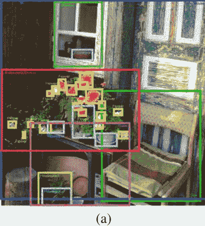

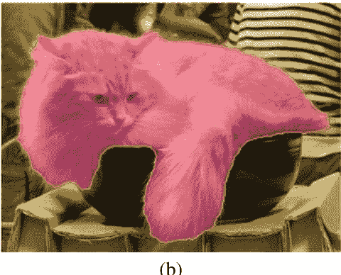

图3.13来自OpenImages数据集的样本训练集注释[61,473,489]：(a)目标检测；(b)分割。

在这个基本的计算机视觉环境中，真正的高级问题是

- 目标检测，即在图像中找到物体的位置，通常形式化为一个边界框（由四个数字定义的矩形，通常是两个对角线的坐标），并对每个边界框内的物体进行分类；
- 实例分割，即找到图像中每个物体的实际轮廓；这可以形式化为图像中每个像素的单独分类问题：这个特定像素属于哪个物体（或背景）？

图3.13显示了来自OpenImages数据集的样本训练集注释，该数据集目前是可用具有目标检测和分割标签的真实数据中最大的之一[61,473,489]。

请注意，在这些新问题中，网络的输出突然占用了比以往更高的维度。在一个ImageNet分类问题中，输出是一个分配给这些类别的概率向量，因此它的维度为1000。在目标检测问题中，输出的维度与1000相同，再加上四个数字来定义每个目标的边界框，而且通常比这个维度还要高。在实例分割问题中，输出在形式上每个像素都有1000个维度，尽管在实践中很少以这种直接的方式进行分割。

尽管我很想这样做，但我既没有足够的空间，也没有足够的意志力来使本章成为计算机视觉整个研究领域的广泛调查。因此，在本节中，我将尝试更深入地调查一个特定的计算机视觉问题，即目标检测。这将展示现代计算机视觉中许多重要的思想，并与第6.4节的案例研究相一致，在那里我们将看到这里考虑的目标检测架构如何从使用合成数据中受益。

目标检测和分割一直存在，至少从20世纪60年代开始。我不会详细讨论这些问题的经典方法，因为首先，我们的重点是深度学习，其次，大多数经典方法确实已经被现代神经网络所淘汰。我只想提到一个经典方法，即2004年开发的选择性搜索算法[234]。简而言之，它将图像表示为一个图，其中边的权重显示小块之间的相似性，从单个像素开始逐渐将它们合并，直到图像被分成许多（通常是几百个）小块。这被称为预分割或子分割，生成的小块通常被称为超像素，即假设这些小块非常均匀，肯定属于同一个对象。即使在今天，这可能仍然是一种有用的方法，并且在某些情况下仍然被用作深度学习方法的预处理[184]，因为经过预分割后，问题的维度大大降低，从数百万个像素减少到数百个或最多几千个超像素。

在2012年，选择性搜索成为了一个经典的目标检测算法的基础[884]，其工作原理如下：

- 使用选择性搜索进行预分割；
- 贪婪地合并结果图中最近的邻居节点；可以尝试许多不同的接近度度量方法，基于颜色、纹理、填充、大小和其他属性；
- 因此，构建一个由超像素组成的大型边界框集合；这是用于目标检测的候选框集合，但在这个阶段，它不可避免地包含了很多误报；
- 选择正例和负例，注意包括与正确边界框重叠的困难负例；
- 训练一个分类器（在这种情况下是SVM），区分正例和负例；在推断过程中，每个候选边界框都会通过SVM进行过滤，以尽可能地排除误报。

这个流程将引导我们进入我们的第一系列神经网络。但在此之前，我们需要学习另一个技巧。

卷积化和OverFeat。在前一节中，我们已经看到了卷积神经网络的许多精彩特性。但是还有一个更重要的优势我们没有在那里提到。请注意，在计算CNN的权重时，我们从未使用输入或输出图像的宽度和高度，只使用了通道数和卷积本身的大小。这是因为卷积不关心其输入的大小：它们应用于具有共享权重的给定大小的所有窗口，图像包含多少此类窗口并不重要。如果网络不包含具有固定拓扑结构的密集连接层，因此可以应用于任意大小的输入，则称为完全卷积网络。

但是我们也可以将常规的卷积神经网络，例如AlexNet用于图像分类，转化为完全卷积网络！在一个称为卷积化的过程中，我们只需将全连接层视为1×1的卷积。默认的AlexNet将224×224的图像作为输入，因此我们可以覆盖输入图像，通过 $224 \times 224$ 的窗口，并将每个窗口通过AlexNet运行；最后的全连接层变成了具有相应通道数的 $1 \times 1$ 卷积，并具有相同的计算效率。通过这个过程，我们将原始图像转换为各种类别的热力图：每个 $224 \times 224$ 的窗口将变成对应类别的概率向量。

这个过程非常有帮助；特别是现代深度神经网络在目标检测方面的一个最早成功的应用，OverFeat，正是这样做的，它用回归模型替换了最终的分类器，预测边界框，并用贪婪算法后处理了该网络的结果，将提议的边界框合并在一起（自然地，这样的过程会导致很多重叠的候选框）[782]。这种方法在目标检测和目标定位（一种目标检测的变体，已知图片中只有一个重要目标，并且问题是定位其边界框）方面赢得了ILSVRC 2013挑战赛。

大多数现代架构没有将这个想法推向极致，即不为输入窗口生成类概率向量。但基本上，它们都使用卷积化来提取特征，即将输入图像通过CNN的第一层进行处理，通常是我们在前一节中讨论过的CNN之一。这个CNN被称为目标检测或分割流水线的主干，通过使用主干的完全卷积对应物，流水线可以从任意大小的输入图像中提取特征。

两阶段目标检测：R-CNN家族。现在让我们回顾一下基于选择性搜索的目标检测流水线[884]，看看我们如何将CNN引入其中。

第一个想法是使用CNN来提取边界框内的目标分类特征，也许还有最终的SVM来排除误报。这正是R-CNN [276]的想法，它在2013-2014年左右定义了新的目标检测技术水平。流水线的运行方式如图3.14a所示：

- 运行选择性搜索以生成候选边界框，如上所述；
- 将每个区域通过骨干卷积神经网络（如AlexNet，预训练于图像分类并可能在训练集上微调）；在这个阶段，原始的R-CNN实际上会对每个区域进行变形，使其尺寸与CNN的输入匹配；
- 使用CNN生成的特征训练一个SVM进行分类，以去除误报；
- 使用相同的特征训练一个单独的边界框回归器，即微调边界框的角点，以改善物体的定位。

这种方法在训练中非常有效，但非常脆弱（需要训练多个模型，但需要良好的组合效果），而且速度非常慢：即使在GPU上，R-CNN管道对单个图像的推理需要大约45-50秒！这绝对是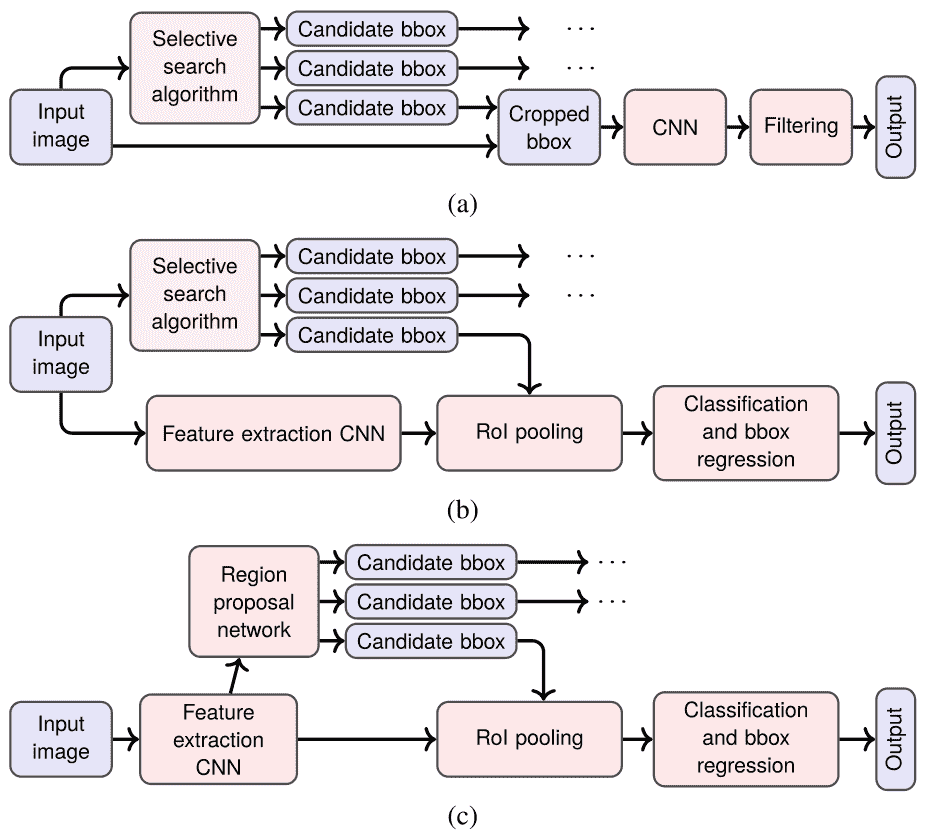

图3.14 R-CNN系列架构：(a) 原始R-CNN流程[276]; (b) 快速R-CNN [277]; (c) 更快的R-CNN [718]。

这种方法在实际中不切实际, 因此在这个方法的进一步发展中, 试图使R-CNN工作更快。

这种过长的运行时间的主要原因是R-CNN需要对每个区域进行一次CNN的遍历。 因此, 快速R-CNN [277], 如图3.14b所示, 被设计成可以使用主干CNN的一次遍历来处理整个图像。快速R-CNN的主要思想是引入一个感兴趣区域(Region of Interest, RoI)投影层, 该层从一个区域中收集特征。 RoI投影层没有任何权重; 它只是将给定的边界框映射到给定层的特征, 将原始图像的几何结构转换为该特征层中的(缩小的)几何结构。 因此, 对应于不同边界框的特征张量将具有不同的维度。

为了能够将它们通过相同的分类器, Fast R-CNN引入了RoI池化层, 该层使用所需的尺寸进行最大池化, 以将所有边界框缩小到相同的大小。 因此, 对于每个边界框, 我们得到一个具有相同尺寸的特征张量, 现在可以通过网络进行处理。

执行对象分类和边界框回归（这意味着边界框有四个输出，类别有 C 个输出）。 只需对每个边界框运行网络的最后部分，而进行特征提取的网络部分可以针对每个图像运行一次（这部分网络更大）。

Fast R-CNN比普通的 R-CNN 快两个数量级，而且没有损失质量。 但它仍然相对较慢，现在瓶颈不在神经网络上了。 系统中最慢的部分现在是产生候选边界框的选择性搜索算法。

得名恰当的 Faster R-CNN [718] 通过在同一神经网络中生成候选边界框来消除了最后的瓶颈。 在 Faster R-CNN 架构中（现在它确实是一个神经架构，而不是不同模型和算法的流水线），如图3.14c所示，输入图像首先经过特征提取，然后将特征张量馈送到一个单独的区域建议网络（RPN）。 RPN沿着特征张量移动一个可能的边界框的滑动窗口，产生一个表示该框中是否有物体的分数，同时还给出该框的精确坐标。该网络的前几个结果被用于RoI 投影层，然后它的工作方式与上面讨论的完全相同。

请注意，所有这些处理现在都成为同一计算图的一部分，梯度可以无缝地通过所有新层传播：它们最终都只是可微分函数。

对我来说，这是神经网络表达能力的完美例证：如果你需要在途中进行一些额外的处理，通常可以将其作为神经网络的一部分来完成，并以端到端的方式进行训练。 不久之后，更快的 R-CNN 出现了，并通过 R-FCN（基于区域的全卷积网络）进一步改进和加速，引入了编码有关边界框中特定位置信息的位置敏感特征图（“对象的左侧”，“右下角”等）[177]；我们这里不详细介绍。更快的 R-CNN 和 R-FCN 仍然是相关的目标检测框架（它们被认为速度较慢但效果好），只是首选的主干网络会不时变化。

### 3.3 案例研究: 目标检测的神经架构

一阶段目标检测：YOLO 和 SSD。 用于目标检测的 R-CNN 系列网络被称为两阶段目标检测，因为即使是更快的 R-CNN 也有两个明显可区分的独立阶段：网络的一部分产生候选边界框，另一部分分析它们，对它们的真实性进行排名，并对其中的对象进行分类。

但是也可以在一次通过中进行目标检测，同时寻找边界框和物体本身。这种方法最早成功应用于原始的YOLO（“你只看一次”）目标检测器，由Redmon等人[709]提出。 这又是一个单一的神经网络，它实现了以下流程：

- 将图像分割成一个 $S \times S$ 的网格，其中 $S$ 是一个固定的小常数（例如，$S = 7$）；
- 在每个单元格中，预测边界框和其中的类别的概率；这意味着网络的输出是一个大小为 $S \times S \times(5 B+C)$ 的张量，其中 $C$ 是类别的数量 (我们在每个单元格中进行分类, 产生各种类别的概率 $p(\text{class} | \text{obj})$, 假设该单元格包含一个物体), 而 $5B$ 表示每个边界框由五个数字定义: 四个坐标和网络对该框的正确性的确定程度的分数;
- 然后边界框可以通过整体概率进行排序 $p(\text{类别}_i | \text{目标})p(\text{目标})\text{IoU}$，其中 $p(\text{目标})\text{IoU}$ 是上述确定性分数的目标: 如果这里没有物体, 我们希望它为零; 如果有物体, 则反映当前边界框与真实边界框之间的相似性, 表示为交并比分数 (也称为 Jaccard 相似性指数)

所有这些都可以通过进行端到端的训练, 使用单一的损失函数来组合对于错误预测边界框、错误放置以及错误类别的惩罚。总体而言, YOLO最小化

```latex
\begin{aligned} \mathcal{L}(\theta) = & \lambda_{\text {coord }} \sum_{i=1}^{S^2} \sum_{j=1}^{B}\left[\text { 目标 }_{i j}\right]\left(\left(x_i-\hat{x}_i(\theta)\right)^2+\left(y_i-\hat{y}_i(\theta)\right)^2\right) \ & +\lambda_{\text {坐标 }} \sum_{i=1}^{S^2} \sum_{j=1}^{B}\left[\text { 目标 }_{i j}\right]\left(\left(\sqrt{w_i}-\sqrt{\hat{w}_i(\theta)}\right)^2+\left(\sqrt{h_i}-\sqrt{\hat{h}_i(\theta)}\right)^2\right) \ & +\sum_{i=1}^{S^2} \sum_{j=1}^{B}\left[\text { 目标 }_{i j}\right]\left(C_i-\hat{C}_i(\theta)\right)^2+\lambda_{\text {noobj }} \sum_{i=1}^{S^2} \sum_{j=1}^{B}\left[-\mathrm{Obj}_{i j}\right]\left(C_i-\hat{C}_i(\theta)\right)^2 \ & +\sum_{i=1}^{S^2}\left[\text { 目标 }_{i j}\right] \sum_c\left(p_i(c)-\hat{p}_i(c ; \theta)\right)^2 \text {, }\end{aligned}
```

其中 $\theta$ 表示网络的权重, 网络输出表示为 $\theta$ 的函数。

让我们更详细地了解原始的 YOLO 损失函数, 因为它为其他物体检测器中的这种损失函数提供了一个说明性的例子:

- $\left[\mathrm{Obj}_{i, j}\right]$ 是事件的指示器, 即第 $j$ 个边界框 (在 $B$ 中的第 $i$ 个单元格) 是否“负责”在该单元格中出现一个实际对象, 即, 如果是真的则为 $\left[\mathrm{Obj}_{i j}\right]=1$, 否则为 0;
- 类似地, $\left[\mathrm{Obj}_i\right]=1$ 当且仅当一个对象出现在单元格 $i$ 中;
- 前两个项处理边界框的位置和尺寸: 如果边界框 $j$ 在单元格 $i$ 中负责一个真实对象, 则边界框应该是正确的, 因此我们将预测边界框的左下角坐标、宽度和高度与真实边界框靠近;
- 第三个和第四个项与 $\hat{C}_i(\theta)$ 有关，它表示此单元格中存在对象的置信度；显然，它与实际数据 $C_i$ 靠近；请注意，由于具有对象和没有对象的单元格不平衡（尽管这种不平衡无法与我们在SSDs中看到的不平衡相提并论），还有一个额外的权重 $\lambda_{\text{coord}}$ 来考虑这一事实；
- 第五项处理分类问题：内部求和是针对类别的，它将网络输出给单元格$i$的概率向量 $\hat{p}_i(c)$ 与实际类别更接近，前提是该单元格中存在对象；
- $\lambda_{\text{coord}}$ 和 $\lambda_{\text{noobj}}$ 是预先设定的超参数和常数；原始的YOLO使用 $\lambda_{\text{coord}} = 5$ 和 $\lambda_{\text{noobj}} = \frac{1}{2}$。

原始的YOLO具有相对简单的特征提取器，可以实时获得接近最佳 Faster R-CNN结果的结果，每秒处理40-50帧，而 Faster R-CNN 则少于10帧。

对一次性预测所有内容的进一步发展导致了单次检测器(SSD) [540]。 SSD使用一组预定义的锚框作为特征图中每个位置的默认可能性。它有一个单一的网络，同时预测类别标签和相应的盒子角度的精细位置，适用于每个可能的锚框。应用于单个特征张量，这种方案显然只能检测到特定尺度的对象，因为锚框将占据一定数量的“像素”。 因此，原始的SSD架构已经在几个不同的尺度上应用了这个想法，即几个不同的特征层。

网络再次以端到端的方式进行训练，使用单一的损失函数。

请注意，SSD有很多输出：对于一个$M\times N$的特征图，它有$M\times N\times (C+4)$个输出，对于基本的SSD架构和$300\times 300$的输入图像，每个类别有8732个输出，即每个图像可能有数百万个输出。 但是这并不会显著影响性能，因为所有这些输出都是在神经网络的单次扫描中并行计算的。 SSD的性能比原始的YOLO更好，与或甚至超过了 Faster R-CNN 的性能，并且计算成本只是原来的一小部分。

自从原始的YOLO以来，YOLO系列的一阶段目标检测器已经取得了长足的进步。我不会详细解释每个版本，但会提到Joseph Redmon及其团队在每个后续迭代中引入的主要思想：

- YOLOv2 [710] 试图修复原始YOLO的许多定位错误和低召回率；他们改变了架构（添加了批归一化层和从较早层到后续层的跳跃连接，以增加几何分辨率，预测边界框偏移而不是坐标等），预训练了自己的高分辨率（$448 \times 448$）分类器，而不是使用在ImageNet上预训练的分类器（$256 \times 256$），并且添加了多尺度训练，即在不同的图像尺寸上进行训练；
- YOLO9000 在同一篇论文[710]中提出，通过使用分层softmax的思想将对象检测推广到大量类别（准确地说是9000个类别）：不再为9000个类别使用单个softmax层，其中一百个类别是各种狗的品种，而是首先分类对象是否为生物，然后如果是动物，在决策树的几层之后才进一步分类到具体的品种；
- YOLOv3 [711] 改变了特征提取架构，并引入了一些小的改进，特别是类似于我们将在下面讨论的特征金字塔网络的多尺度架构。

另一个重要的单阶段目标检测器是由林等人提出的 RetinaNet[524]。这里的主要创新是一种用于目标检测的修改损失函数，称为focal loss。单阶段目标检测的一个问题是输出极不平衡：我们已经多次注意到，单阶段检测器具有大量表示各种候选边界框的输出，但其中有多少实际上是正确的?

这个问题的数学方面是，即使是正确分类的例子（将背景中的边界框正确分类为“无对象”）仍然对分类损失函数有贡献：通常的交叉熵损失等于 $-\log p$，其中正确类别的概率为 $p$。当 $p$ 接近1时（网络确信时），这是一个很小的值，但负例比正例多一千倍，而这些相对较小的值会累加起来。因此，焦点损失降低了对分类良好的例子的损失，通过损失函数中的额外多项式因子将其接近于零：对于一个正确分类的例子，焦点损失为 $-(1-p)^\gamma \log p$，其中 $\gamma > 0$，而不是通常的交叉熵损失 $-\log p$。自原始工作以来，焦点损失已被证明是一种非常有用的思想，在各种深度学习模型中被广泛使用。

YOLO系列网络和 RetinaNet 在实时目标检测方面定义了最先进的技术。特别是YOLOv3在至少2年的时间里是首选模型，直到最近才开始有所改变。

我们将在本节末尾回顾YOLO的故事，但现在让我们看看现代目标检测中的其他主要思想。

### 不同尺度的目标检测：特征金字塔网络

为了激发下一组思想，让我们分析一下历史上一直困扰目标检测的具体问题。如果你看一下通常检测到的对象的实际结果，你会发现目标检测中的绝对数量相当低：在图像分类器将 ImageNet的前5%测试错误率降至超人水平（人类水平估计约为5.1%）[329]之后，最好的目标检测器在（相对简单的）PASCAL VOC数据集上的平均精度约为80%，在更现实的Microsoft COCO数据集上的平均精度难以超过35%。在撰写本文时（2020年夏季），Microsoft COCO上的最佳mAP约为55%，仍然远离完美[848,900]。为什么结果如此之低?

一个大问题在于需要识别的对象具有不同的尺度。大多数上述模型对小物体的识别效果非常差，而现实生活中和实际数据集（如微软COCO）中有很多这样的小物体。这是由于所谓的有效步长：当区域建议网络开始工作时，原始几何形状已经被初始卷积层大大压缩了。例如，基本的Faster R-CNN架构具有有效步长16，即16×16的对象在RPN中只被视为一个像素。我们可以尝试通过不进行池化的卷积层来机械地减小有效步长。

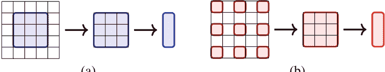

图3.15卷积类型：（a）常规卷积；（b）扩张卷积。

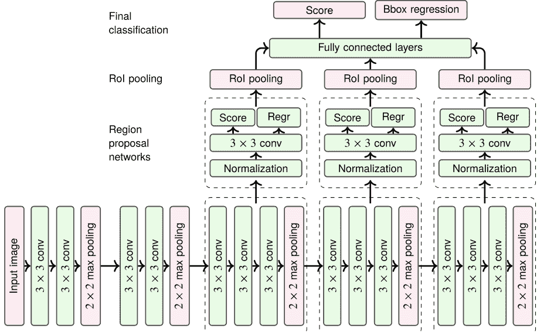

图3.16多尺度对象识别：来自[222]的一个示例架构，没有自顶向下的连接。

而不减少几何形状，网络会变得巨大且基本不可行。另一方面，也有大型物体：一辆汽车可能占据照片的80%，或者只是一个30×30像素的小点；有时同一张照片上会发生这两种情况。我们该怎么办？

一个想法是改变我们进行卷积的方式。许多目标检测架构使用扩张卷积（有时也称为空洞卷积），即输入窗口不是连续的像素矩形，而是来自前一层的一组跨步像素，如图3.15所示；详细解释请参见[211]。通过扩张卷积，只需较少的层即可实现大的感受野，从而节省网络大小。扩张卷积被用于Faster R-CNN、R-FCN和其他网络；例如，Yu和Koltun的一项工作成功地将扩张卷积应用于语义分割[980]。

但这只是一个可以改善情况的技巧，而不是解决方案。我们仍然需要在同一图像中处理多尺度对象。在这个方向上的第一个自然想法是从主干特征提取的几个不同层中收集建议网络。在纯粹的形式下，这个想法是由Eggert等人[222]提出的，其中架构有几个（确切地说是三个）不同的区域建议网络，每个网络都设计用于识别给定尺度的对象，从小到大。图3.16显示了他们架构的概要；具体细节与Faster R-CNN非常接近。结果显示，这种架构相比基本的Faster R-CNN有所改进，几乎整个改进都来自对小物体更好的识别。

蔡等人[108]以不同形式实现了类似的想法，他们使用了一个具有多个不同输出尺度的分支的单一区域提议网络（这些分支看起来有点像 GoogLeNet）

但是，突破性的发展是研究人员意识到顶层可以向下层提供信息，以便更好地提出建议并更好地对其中的对象进行分类。卷积主干的早期层只能查看输入图像的一小部分，可能缺乏产生良好对象提议所需的语义表达能力。因此，添加自上而下的连接将是有益的，即使用CNN顶层产生的语义丰富特征来帮助早期层理解它们正在查看的对象。

这正是2016年林等人提出的特征金字塔网络（FPN）的思想。实际上，有两种方法可以实现这一点。一种方法是使用跳跃连接从上到下获取；工作[108]已经包含了实现这一思想的架构，并且在其他先前的工作中也出现过[674]；我们在图3.17a中进行了说明。特征金字塔方法的不同之处在于，林等人不是将语义信息传递到底层，而是在沿着这条自上而下的路径上独立地进行多层RoI预测，如图3.17b所示；这使得网络能够更好地处理不同尺度的对象。请注意，放大和组合部分不必具有复杂的结构：在[523]中，放大是一个单一的卷积层，组合是通过对特征使用单一的 $1 \times 1$ 卷积并将其添加到放大结果中来完成的。

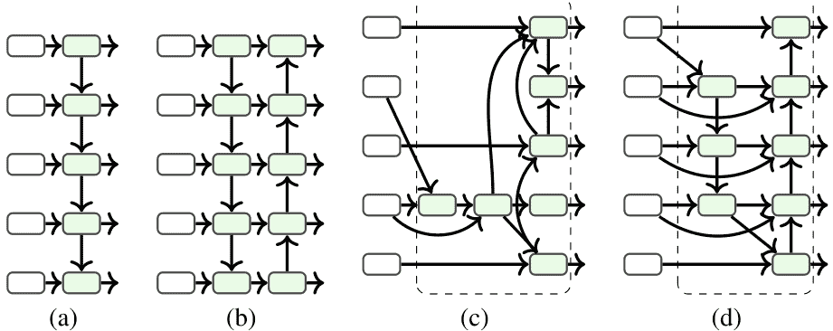

> 图3.18 各种金字塔架构中的自顶向下路径: (a) FPN [523]; (b) PANet [538];(c) NAS-FPN [274]; (d) BiFPN from EfficientDet[848]. 虚线矩形显示了重复的块。

如果需要，"预测"部分可以很复杂，例如，它可以表示来自Faster R-CNN的RPN。

特征金字塔已成为两阶段目标检测的重要组成部分。一项重要的进展是路径聚合网络(PANet)[538]，它在金字塔的层之间添加了新的路径，并引入了自适应特征池化; 具体来说，它们在自顶向下的路径上添加了另一个自底向上的路径，如图3.18b所示。另一个进展是NAS-FPN[274]，它使用神经架构搜索找到了更好的特征金字塔架构。其结果架构如图3.18c所示；请注意，只显示了一个块，但在最终架构中重复出现多次。

目前，特征金字塔架构的研究已经达到了 EfficientDet，这是由 Google Brain 研究员 Tan 等人开发的网络[848]。目前，这个网络的变种显示出了记录性能，有时会输给基于CSPNet的解决方案，这是一个新近开发的CNN骨干网络（我们不会详细介绍）[900]。EfficientDet 提出了一个新的解决方案，用于多尺度特征融合问题，这个架构被称为BiFPN（加权双向特征金字塔网络）；其中一个重复块的概要如图3.18d所示。

### YOLOv4、YOLOv5和当前的最新技术

我想在写这本书的时候，用一个有趣的故事来结束这一节。

在YOLOv3之后，Joseph Redmon，我们讨论过的所有YOLO架构的主要作者，宣布他停止进行计算机视觉研究。[^2] 大约2年来，YOLOv3基本上定义了目标检测的最新技术水平：能够超越它的检测器工作速度更慢。但是在2020年，Alexey Bochkovskiy等人发布了YOLOv4，这是YOLO的一个显著改进（并且再次加速）的版本[78]。通过使用新的数据增强方法，甚至包括基于GAN的风格转换（我们将在第10章讨论此类架构），

[^2]: 他说主要原因是“军事应用和隐私问题最终变得不可忽视”。事实上，现代计算机视觉可能引发某些伦理关切，尽管很难确定哪一方更重要。

通过在训练中使用混合过程[993]，以及其他最近开发的许多技巧（参见第3.4节），Bochkovskiy等人成功地达到了与EfficientDet相当的性能，并且与YOLOv3相当的性能。

但这还不是故事的结局。仅仅两个月后，另一组作者发布了一个称为YOLOv5的物体检测器。在撰写本文时（2020年夏季），尚未发表关于YOLOv5的研究论文或预印本，但有一个代码存储库[3]，作者的博客文章声称YOLOv5在模型大小上达到了与YOLOv4相同的性能，并且具有更好的延迟[622,623]。这引发了关于命名、功劳等方面的争议，但更重要的是，目前尚未确定哪个检测器更好；比较有争议，第三方比较也并不确凿。随后发布的PP-YOLO [547]进一步加剧了问题，它是YOLOv3的改进重新实现，还添加了许多新技巧，并且在性能上超过了YOLOv4。

> [3] https://github.com/ultralytics/yolov5

当你阅读这篇文章时，争议可能已经解决了，也许你已经在使用YOLOv6或更高版本，但我认为当前深度学习的现状是一个很好的例证，展示了现代深度学习的活力和生命力。即使在像目标检测这样的经典标准问题中，事情也可能发生得非常快！

## 3.4 数据增强：合成数据的第一步

在前一节中，我们已经多次提到了数据增强。

数据增强被定义为对输入数据进行可预测地改变目标标签的转换。这样可以显著地（通常是几个数量级）增加可用数据的数量，而不需要额外的标注成本。实际上，我更倾向于将数据增强视为合成数据的第一步：并不存在真正的合成数据生成，但存在对现有真实数据的重新组合和调整，而生成的图像通常看起来非常“合成”。

数据增强对神经网络的影响始于深度学习革命之前；例如，Simard等人在2003年就使用扭曲来增强MNIST训练集，而且我并不确定这是否是最早的参考文献。在第3.2节中讨论的MC-DNN网络，可以说是计算机视觉领域第一个真正成功的深度神经网络，它也使用了类似的增强方法，尽管它是一个相对较小的网络，用于识别相对较小的图像（交通标志）。

但让我们从2012年开始，从我们在第3.2节中详细讨论过的AlexNet[477]开始。AlexNet是使计算机视觉领域发生深度学习革命的网络。即使在早期，在2012年，如果没有数据增强，这已经是不可能的！AlexNet使用了两种增强方法：

- 水平反射（垂直反射通常无法产生合理的照片）和
- 图像平移；这就是为什么AlexNet架构（如图3.7所示）使用224×224×3的输入，而实际的ImageNet数据点有256个像素：224×224的图像是从更大的256×256图像中随机裁剪得到的。

通过这两种变换，我们可以安全地假设分类标签不会改变。即使我们讨论的是目标检测，将边界框与输入一起进行平移、裁剪和/或反射也是微不足道的，这正是我们所说的“以可预测的方式改变”。生成的图像当然高度相互依赖，但它们仍然涵盖了比原始数据集更广泛的输入，从而减少了过拟合。在训练AlexNet时，Krizhevsky等人估计他们可以从单个输入训练图像生成2048个不同的图像。有趣的是，即使ImageNet如此庞大（AlexNet在标有1000个类别的1.2百万个训练图像的子集上进行训练），现代神经网络更大（AlexNet有6000万个参数）。Krizhevsky等人对他们的数据增强方法有以下评价：“如果没有这个方案，我们的网络将严重过拟合，这将迫使我们使用更小的网络”[477]。

到目前为止，这已经成为计算机视觉中的一个基本技术：虽然方法可能不同，但很难找到一个完全不需要数据增强的情况。为了回顾计算机视觉中常见的增强方式，我将以Buslaev等人开发的Albumentations库为例[103]；尽管该论文仅于2020年发布，但该库已经存在了几年，并且现在已成为行业标准。

首先是颜色转换。改变颜色饱和度、置换颜色通道或转换为灰度肯定不会改变边界框或分割掩码，如图3.19所示。该图还显示了两种不同类型的模糊、jpeg压缩以及各种亮度和对比度变换。

下一个明显的类别是简单的几何变换。同样，当图像旋转或裁剪时，对于分割掩码应该如何处理是没有疑问的：我们可以简单地对标记进行相同的变换。图3.20展示了全局几何变换（如翻转或旋转）和根据网格定义的局部扭曲的示例（图3.20b）。相同的思想也可以应用于其他类型的标记；例如，关键点（面部特征点、姿势估计中的骨骼关节等）可以被视为分割的特殊情况，并且可以与输入图像一起进行更改。

所有这些转换都可以链接并多次应用。图3.21显示了使用Albumentations库生成的更复杂的示例；它对应以下增强链：

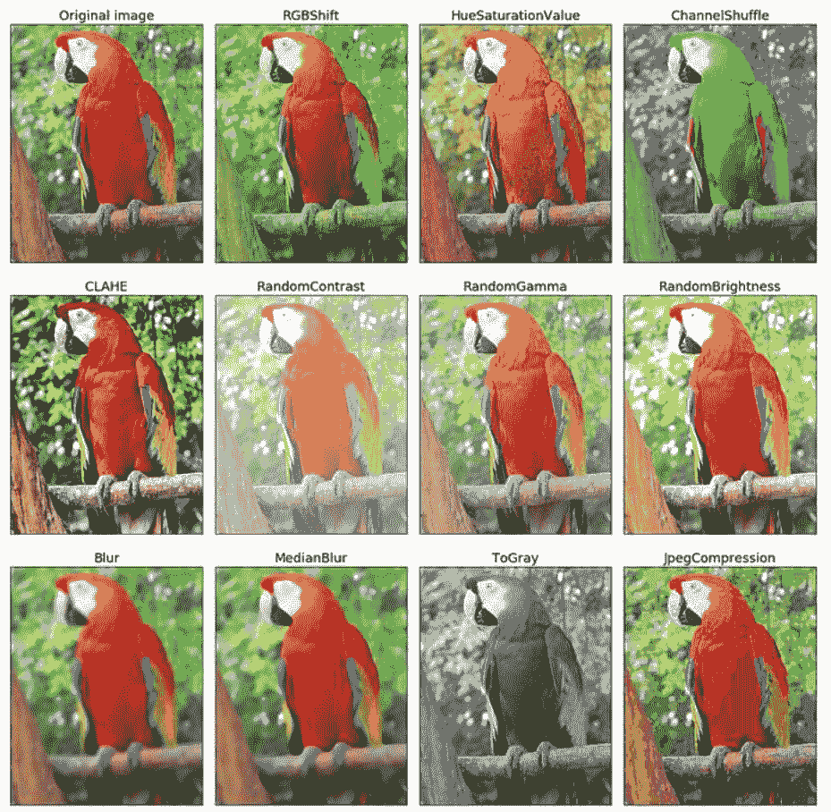

图3.19 Albumentations 库提供的样本颜色转换和模糊效果 [103]。

- 从预定义的尺寸范围中随机裁剪；
- 将裁剪进行平移、缩放和旋转以匹配原始图像尺寸；
- 应用（随机）颜色偏移；
- 添加模糊效果；
- 添加高斯噪声；
- 为图像添加随机弹性变换；
- 执行mask dropout，将一部分分割掩码移除并在图像上用黑色填充。

这是相当多的操作！但是我们如何知道这是处理这个特定问题的最佳方法？我们能找到最佳的增强序列吗？事实上，最近的研究表明我们可以寻找一种元策略来进行增强，该策略将考虑到特定的问题设置；我们将在第12.2节讨论这些方法。

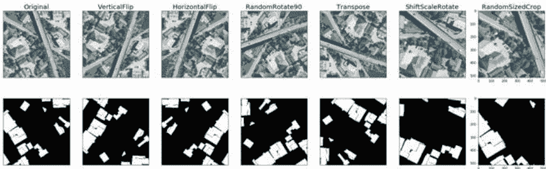
(a)
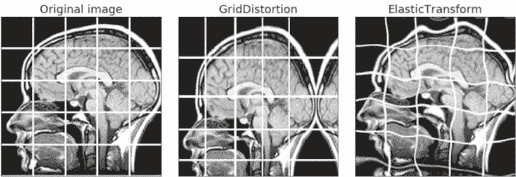
(b)
图3.20 Albumentations 库提供的样本几何变换[103]：(a) 全局变换；(b) 局部扭曲。

但即使如此也不止于此！如果我们进一步扩展数据增强，允许增强产生更复杂的输入数据点组合呢？在2017年，Lemley等人在题为“智能增强：学习最佳数据增强策略”的工作中提出了这个想法[506]。他们的基本思想是有两个网络，“网络A”实现增强策略，“网络B”实际上在产生的增强数据上进行训练并解决下游任务。这里的区别在于，“网络A”不仅仅从预定义的策略中选择，而是作为一个生成网络，可以以智能的方式将两个不同的训练集示例融合为一个。我不会详细介绍这种方法，但图3.22提供了[506]中的两个典型示例。

这种“智能增强”逼近于合成数据生成：变换是复杂的，生成的图像可能与原始图像完全不同。但在我们转向后续章节中的实际合成数据生成之前，让我们讨论其他有趣的想法，即使在增强的层面上也可以应用。

Mixup是由麻省理工学院和FAIR的研究人员张等人在2018年引入的一种技术[993]，它从相反的角度看待问题：如果我们将标签与训练样本混合在一起会怎样？这是以非常直接的方式实现的：对于两个带有标签的输入数据点，张等人构造一个凸组合。

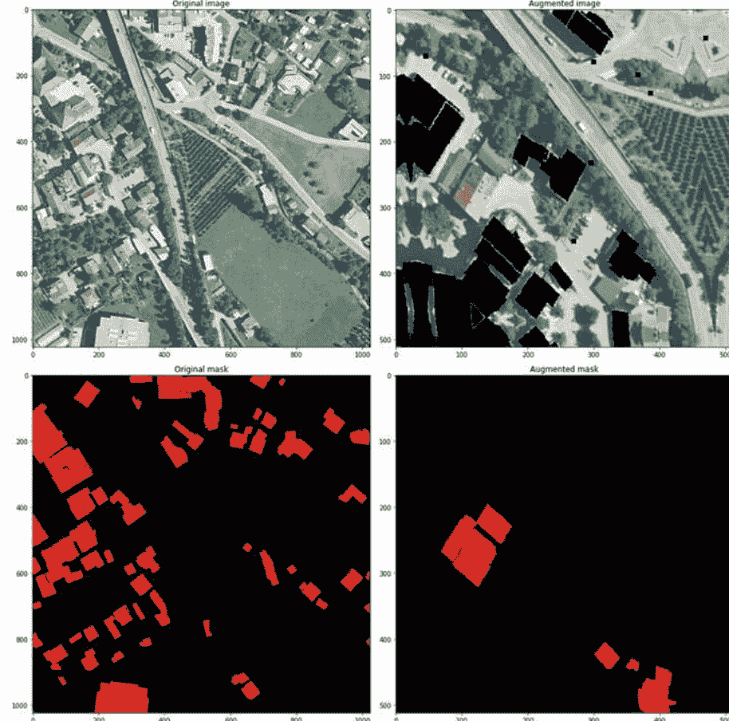
图3.21 数据增强的一个复杂示例，使用了来自Albumentations库的变换[103]。
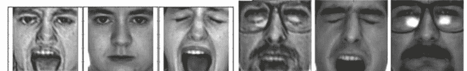
图3.22 “智能增强”的一个示例，由Lemley等人[506]制作：左侧的图像是右侧两个图像的混合组合产生的。

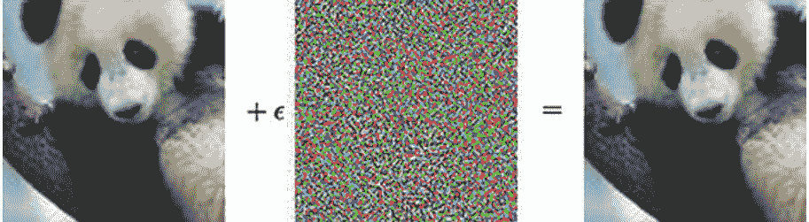
图3.23 著名的“熊猫对长臂猿”对抗性示例[292]：左边的图像被AlexNet识别为熊猫，置信度为57.7%，但在添加了一些随机噪声后，网络将右边的图像识别为长臂猿，置信度为99.3%。

**输入和标签的双重性质：**

$$\tilde{\mathbf{x}}=\lambda \mathbf{x}_{1}+(1-\lambda) \mathbf{x}_{2}$$，其中 $\mathbf{x}_{1}, \mathbf{x}_{2}$ 是原始输入向量，$\tilde{\mathbf{y}} =\lambda \mathbf{y}_{1}+(1-\lambda) \mathbf{y}_{2}$，其中 $\mathbf{y}_{1}, \mathbf{y}_{2}$ 是独热编码的标签。

混合标签不会改变网络架构或训练过程：二元交叉熵可以轻松推广到目标离散分布而不是目标独热向量。

生成的标记数据涵盖了更加稳健和连续的分布，这有助于泛化能力。张等人报告了在训练生成对抗网络方面的显著改进。到目前为止，混合的想法已经成为深度学习工具箱中的重要组成部分：你经常可以将其视为一种增强策略，尤其是在现代生成对抗网络架构的训练中。

我想在本节中讨论的最后一个想法是自对抗训练，这是一种将对抗性示例 [292,484] 纳入训练过程的增强技术。对抗性示例是一个非常有趣的案例，展示了现代深度神经网络中的某些结构和概念问题。事实证明，对于大多数现有的人工神经网络结构，我们可以通过对输入图像进行微小的噪声修改，使得结果在我们人类看来与原始图像完全无法区分，但网络非常确信它是完全不同的东西。Goodfellow 等人在对抗性示例的一篇最早的论文中提到的最著名的例子 [292]，一只熊猫变成了一只非常自信的长臂猿，如图 3.23 所示。

到目前为止，对抗性示例及其防御方法已成为现代深度学习中一个广泛研究领域；请参考 [781,963] 以获取最近关于对抗性示例、攻击和防御的调查报告。

在最简单的情况下，这些对抗性示例是通过以下过程产生的：

- 假设我们有一个网络和一个输入 $x$，我们想要使其对抗性；假设我们想要将一只熊猫变成长臂猿；
形式上，这意味着我们想要增加网络输出向量 $y$ 中“长臂猿”组件的值（以牺牲“熊猫”组件的值为代价）；
- 因此，我们固定网络的权重，并开始常规的梯度上升，但是相对于输入 $x$ 而不是权重进行；

这是找到对抗性示例的关键思想；它并不能解释为什么它们存在（这不是一个简单的问题），但如果它们存在，那么在“白盒”场景中，即网络及其权重为我们所知的情况下，找到它们并不是那么困难，因此我们可以对输入图像执行这种梯度上升。

那么我们如何将这个想法转化为一种增强技术呢？给定一个输入实例，让我们按照当前正在训练的网络的步骤将其转化为对抗性示例。然后我们在这个示例上训练网络。

这可能使网络对对抗性示例更具抵抗力，但重要的是，它通常使网络更稳定和健壮：现在我们明确要求网络在每个输入图像的小邻域内稳健地工作。请注意，基本思想可以再次描述为“使输入数据分布覆盖更多领域”，但现在我们已经走了很长的路，不再局限于水平反射和随机裁剪。

请注意，与基本几何增强不同，这可能是一个相当昂贵的过程。但是成本完全由训练承担：是的，您可能需要将最终模型训练两周而不是一周，但结果模型的性能当然是相同的。模型架构不会改变，只有训练过程会改变。

最近最好的综合数据增强的一个例子是我们在第3.3节中讨论的架构：Bochkovskiy等人的YOLOv4[78]。与目标检测领域的许多其他进展类似，YOLOv4本质上是许多小改进的组合。面对提高性能但不牺牲推理速度的挑战，Bochkovskiy等人将这些改进系统化，并将其分为两个子集：

- “免费赠品”包括一些技巧和改进，完全不改变生成网络的推理速度，只修改训练过程；
- “特别赠品”包括在推理过程中确实有成本的改变，但希望成本尽可能小。

> “特别赠品”包括与架构相关的所有改变：新的激活函数、边界框后处理、简单的注意机制等。但是，YOLOv4整体改进的大部分来自“免费赠品”...几乎完全由增强组成。

YOLOv4使用各种标准的增强技术，自对抗训练，并且混合了我们刚刚讨论过的Mosaic和CutMix增强技术，这些增强技术将输入图像组合成从其他图像中裁剪出的部分（当然还有对象和边界框）。这只是一个例子，但毫无疑问，数据增强在现代计算机视觉中起着核心作用：几乎每个模型都是通过某种形式的数据增强进行训练或预训练的。

## 3.5 结论

在本章中，我们简要介绍了计算机视觉中深度学习的世界。我们已经看到了所有计算机视觉应用的基本工具——卷积和卷积层，并讨论了如何将卷积层组合在一起形成图像的深度特征提取器，并且看到了这些特征提取器如何成为目标检测和分割流程的关键部分。

在一个简短的章节中真的没有希望涵盖计算机视觉的全部内容。在本章中，我决定集中介绍卷积架构的最重要的思想，并以一个基本的高级计算机视觉问题，即目标检测，作为一个深入的例子进行回顾。目标检测和分割等问题与本书的主题，即合成数据，非常契合。在合成图像中，目标检测和分割标签都是免费的：因为我们控制整个场景，其中的所有对象和相机，我们准确地知道每个像素属于哪个对象。另一方面，对于这两个问题的手动标注非常繁琐（试着估计一下标注像图3.13中所示的照片需要多长时间！）。因此，这些基本的高级问题对于合成数据的整个理念至关重要，在第6章中我们将看到现代合成数据集如何帮助我们在本章中遇到的网络。事实上，在第6.4节中，我将专门介绍使用合成数据进行目标检测的一个完整案例研究。

在本章中，我们还开始讨论合成数据，以其最简单的形式进行数据增强。我们已经看到增强在计算机视觉中已经成为一种几乎不可或缺的工具，从简单的几何和颜色变换到非常复杂的过程，如自对抗训练。但是，即使是“智能”增强也只是真实数据的组合和修改的结果，而真实数据又是在之前有人标记过的，所以在第6章中，我们将转向纯粹的合成示例。

然而，在我们这样做之前，我们需要另一章的介绍。在下一章中，我们将考虑深度学习中的生成模型，从一般介绍生成模型的概念到基于GAN的现代架构和一个风格转移的案例研究，这对于合成到真实领域的适应性特别重要。

# 第4章 深度学习中的生成模型

到目前为止，我们主要讨论了旨在解决有监督问题的判别式机器学习模型，即学习目标变量在输入条件下的条件分布。在本章中，我们考虑生成模型其目的是学习输入的整个分布，并能够从该分布中采样新的输入。我们将进行一般介绍生成模型，然后继续深度学习中的生成模型。首先，我们将讨论使用深度神经网络对分布因子建模的显式密度模型以及其重要的特例，归一化流，以及用变分自编码器表示的近似分布的显式密度模型。

然后我们将继续主要内容，生成对抗网络，讨论各种对抗性架构和损失函数，并给出一个与合成到真实转换直接相关的样例研究。

## 4.1 生成模型简介

本书中考虑的所有方法都属于机器学习领域，其中大部分使用深度神经网络，因此属于深度学习范畴。在第2章中，我们简要介绍了机器学习的最重要范式：具有先验、后验和似然的机器学习的概率基础，有监督和无监督学习，以及该领域的其他基本概念。

在本章中，是时候讨论机器学习的另一个重要区别了：判别模型和生成模型之间的区别。直观上讲，区别非常明显：如果你需要在图片上区分猫和狗，你正在训练一个判别模型；如果你想生成一张新的猫的图片，你需要一个生成模型。

形式上，这个差异可以表示如下：

- 判别模型学习条件分布 $p(y \mid \mathbf{x})$，其中 $\mathbf{x}$ 是输入数据点，$y$ 是目标变量；
- 生成模型学习联合分布 $p(y, \mathbf{x})$ 或 $p(\mathbf{x})$，或者至少学习一种从该分布中采样的方法（我们将在本章中看到这种差异）。

直观上也很清楚，学习生成模型比学习判别模型更困难：生成一张新的猫的照片应该比仅仅区分猫和狗更困难，对吗？这在形式上也很清楚：如果你有一个生成模型并且可以计算 $p(y, \mathbf{x})$，那么计算 $p(y \mid \mathbf{x})$ 就足够了。

对于所有的 $y$ 值（通常在分类问题中是可行的），规范化结果，但是从 $p(y \mid \mathbf{x})$ 到 $p(y, \mathbf{x})$ 没有明确的方法。

实际上，这意味着生成模型要么需要应对更困难的优化问题（正如我们将在GAN的情况下看到的那样），要么需要对这个分布的结构做出更强的假设。请注意，无监督学习的模型通常是生成模型，因为没有明确的目标变量，但实际上这并不是必需的：例如，我们将讨论一个简单的自编码器，虽然它是一个很好的无监督降维模型，但还不足以作为一个生成模型。

在继续之前，让我先谈一下关于生成模型的一个重要观点。考虑在最大似然框架下学习一个生成模型：

```
$$\theta^{*}=\arg \max_{\theta} \prod_{\mathbf{x} \in \mathcal{D}} p(\mathbf{x} ; \theta)=\arg \max_{\theta} \sum_{\mathbf{x} \in \mathcal{D}} \log p(\mathbf{x} ; \theta)$$
```

其中 $p=p_{\text{model}}$ 是模型概率密度。请注意，这里 $D$ 表示数据集，所以如果我们的模型足够表达数据，那么最大似然可能是最佳策略；过拟合在生成模型中也是一个问题，我们必须通过引入更严格的假设和/或先验条件来缓解它对 $p(\mathbf{x} ; \theta)$ 的影响。

我们可以从不同的角度看待同一个优化问题。考虑“数据分布” $p_{\text{data}}$，它被定义为集合 $D$ 中的均匀分布。在这种情况下，$p_{\text{data}}$ 和 $p_{\text{model}}$ 之间的Kullback-Leibler散度变为

```
$$\mathrm{KL}\left(p_{\text{data}} \| p_{\text{model}}\right)=-\frac{1}{|D|} \sum_{\mathbf{x} \in \mathcal{D}} \log p_{\text{model}}(\mathbf{x}) d \mathbf{x}+\text{常数}$$
```

这意味着最小化 $p_{\text{data}}$ 和 $p_{\text{model}}$ 之间的KL散度与最大化上述似然是完全等价的。换句话说，在优化问题中，数据点试图“拉高”概率密度 $p_{\text{model}}$，而## 4.1 生成模型简介

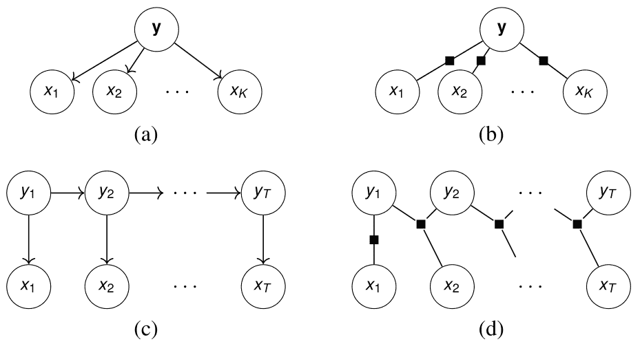

图4.1 机器学习中的样本生成模型和判别模型: (a)朴素贝叶斯的有向图模型; (b)逻辑回归的因子图; (c)隐马尔可夫模型的有向图模型; (d)线性链条件随机场的因子图。

相反的约束是我们的概率假设和 p 模型必须总和为一的事实。

在本节中，让我们考虑几个例子，以说明生成模型和判别模型之间的差异和固有的对偶性。

对于一个简单但非常具有说明性的例子，考虑朴素贝叶斯分类器。它是一个生成模型，假设给定类别标签 y 时，特征 x = (x_1 ... x_K) 是独立的：

$$ p(y, \mathbf{x}) = p(y) \prod_{k=1}^{K} p(x_k \mid y) . $$

在这样强的假设下，即使是生成模型也相当直接地进行训练：假设有 N 个类别，y \in \{1, \dots, N\}，每个 x_k 是一个离散变量，有 M 个取值，x_k \in \{1, \dots, M\}，朴素贝叶斯的参数为

$$ \theta_{kmn} = p(x_k = m \mid y = n), \quad \theta_n = p(y = n), $$

它们可以通过收集数据集统计信息来独立学习。对于其他（例如连续）的 x_k 分布也是如此：朴素贝叶斯的假设使我们能够独立地从数据子集中学习它们。一旦训练了这个模型，从联合分布 p(y, x) 中进行采样就变得简单了：首先采样 y，然后在给定 y 的条件下采样 x_k。图4.1a显示了对应于朴素贝叶斯的有向图模型。

让我们以不同的形式重新写出朴素贝叶斯分类器的联合似然函数，明确显示其对参数的依赖关系：

$$ \begin{aligned} p(D \mid \theta) &= \prod_{(\mathbf{x}, y) \in D} p(y) \prod_{k=1}^{K} p(x_k \mid y) = \prod_{(\mathbf{x}, y) \in D} \prod_{n=1}^{N} \left( \theta_n \prod_{m=1}^{M} \prod_{k=1}^{K} \theta_{kmn}^{[x_k = m]} \right)^{[y = n]} \\ &= \exp \left( \sum_{(\mathbf{x}, y) \in D} \left( \sum_{n=1}^{N} [y = n] \log \theta_n + \sum_{n=1}^{N} \sum_{m=1}^{M} \sum_{k=1}^{K} [y = n][x_k = m] \log \theta_{kmn} \right) \right), \end{aligned} $$

其中 [·] 表示括号中的语句成立时为 1，不成立时为 0。换句话说，朴素贝叶斯分类器假设对数似然

$$ \log p(\mathbf{x}, y \mid \theta) = \sum_{n=1}^{N} [y = n] \theta_n + \sum_{n=1}^{N} \sum_{m=1}^{M} \sum_{k=1}^{K} [y = n][x_k = m] \theta_{kmn} $$

是可训练参数的线性函数，其系数表示数据点的某些特征（x和y的各种值的指示器）。

现在考虑一个基本上做出相同假设的线性判别模型：逻辑回归。在逻辑回归中，对于输入的x和y，我们建模

$$ p(y = n \mid \mathbf{x}; \theta) = \frac{e^{\sum_{k=1}^{K} \theta_{nk} x_k}}{\sum_{n'=1}^{N} e^{\sum_{k=1}^{K} \theta_{n'k} x_k}} = \frac{1}{Z(\mathbf{x})} \exp \left( \sum_{k=1}^{K} \theta_{nk} x_k \right), $$

所以

$$ \log p(y = n \mid \mathbf{x}; \theta) = \sum_{k=1}^{K} \theta_{nk} x_k + \log Z(\mathbf{x}). $$

我们现在看到朴素贝叶斯的表达式是这个表达式的一个特殊情况，对于特定的（尽管相当普遍）特征形式。逻辑回归为条件分布 p(y | x) 提供了一个简单的分解，类似于朴素贝叶斯的分解，其因子图如图 4.1b 所示，非常相似。然而，请注意，现在它是一个因子图而不是有向图模型：这仅仅是对 p(y | x) 的分解，而不是完整的联合分布 p(y, x)。

因此，作为一个判别模型，逻辑回归推广了朴素贝叶斯模型，为建模分布 p(y | x) 提供了更大的灵活性，而不需要在朴素贝叶斯版本中对特征形式施加额外的限制，而且训练成本也不增加。另一方面，逻辑回归似然函数中的常数取决于 x。这意味着对于一般形式的特征 x，计算将会很困难，而逻辑回归并没有提供一种方便的方式来从联合分布 p(y, x) 中进行采样。朴素贝叶斯提供了当这个常数可行且可计算时的特殊情况。由于这种对偶性，我们说朴素贝叶斯和逻辑回归构成了一个生成-判别对。

另一个稍微复杂的生成-判别对的例子是隐马尔可夫模型（HMM）和条件随机场（CRF）。一个隐马尔可夫模型包含一系列可观测变量 $X=\left\{x_{t}\right\}_{t=1}^{T}$ 和隐藏状态 $Y=\left\{y_{t}\right\}_{t=1}^{T}$，具有以下独立性假设：

$$ p(y \mid \mathbf{x})=\prod_{t=1}^{T} p\left(y_{t} \mid y_{t-1}\right) p\left(x_{t} \mid y_{t}\right) . $$

相应的有向图模型如图4.1c所示。同样，当参数已知时，从HMM中进行采样是直接的：我们可以沿着时间增加的方向进行。

与上述朴素贝叶斯类似，让我们以不同的形式重写HMM：

$$ p(y \mid \mathbf{x})=\prod_{t=1}^{T} \exp \left(\sum_{i, j \in S} \theta_{i j}\left[y_{t}=i\right]\left[y_{t-1}=j\right]+\sum_{i \in S} \sum_{o \in O} \mu_{o i}\left[y_{t}=i\right]\left[x_{t}=o\right]\right) $$

其中，$S$ 是隐藏状态的集合，$O$ 是可观察值的集合。在隐马尔可夫模型中，我们有

$$ \theta_{i j}=\log p\left(y_{t}=i \mid y_{t-1}=j\right), \quad \mu_{o i}=\log p(x=o \mid y=i) $$

与逻辑回归类似，我们可以引入与上述指标对应的特征函数 $f_{k}\left(y_{t}, y_{t-1}, x_{t}\right)$，让我们明确地写一下：

$$ f_{i j}\left(y, y^{\prime}, x\right)=\left[y=i\right]\left[y^{\prime}=j\right] \quad \text{对于每个转换} $$

$$ f_{i o}\left(y, y^{\prime}, x\right)=\left[y=i\right][x=o] \quad \text{对于每个可观察的情况} $$

请注意，每个特征只依赖于两个相邻的隐藏状态和一个单独的观察值（实际上甚至更少，但让我们稍微概括一下）。

我们现在可以做一个类似于逻辑回归从朴素贝叶斯中获得的技巧：我们将替换为更一般形式的特征，表达条件分布 $p(y \mid x)$ 而不是联合分布 $p(y, x)$：

$$ p(y \mid \mathbf{x})=\frac{\prod_{t=1}^{T} \exp \left(\sum_{k=1}^{K} \theta_{k} f_{k}\left(y_{t}, y_{t-1}, x_{t}\right)\right)}{\sum_{y^{\prime}} \prod_{t=1}^{T} \exp \left(\sum_{k=1}^{K} \theta_{k} f_{k}\left(y_{t}^{\prime}, y_{t-1}^{\prime}, x_{t}\right)\right)} . $$

这正是线性链条件随机场(CRF)的定义方式：

$$ p(y \mid \mathbf{x}) = \frac{1}{Z(\mathbf{x})} \prod_{t=1}^{T} \exp \left( \sum_{k=1}^{K} \theta_k f_k(y_t, y_{t-1}, x_t) \right) $$

即，我们只是允许特征和可观察变量的更一般形式。线性链CRF对应的因子图如图4.1d所示。请注意，由于现在计算 $Z(x)$ 是不可行的，我们必须采用判别建模，并且再次无法轻松从 $p(x, y)$ 中采样。

条件随机场代表了一类非常有趣的模型。在深度学习领域，它是为复杂的非结构化输入保持相关性的少数“简单”概率模型之一：线性链条件随机场常常被用于序列标注问题中，这些问题在自然语言处理、语义分割或视频分析中出现[29, 508]；例如，BiLSTM-CNN-CRF架构已经成为命名实体识别等问题中的重要方法[144, 494, 569, 650, 938]。但我只是想用条件随机场作为一个例子来说明生成模型和判别模型之间的区别；关于条件随机场的更多信息，请参考[830, 978]；还要注意，条件随机场也可以被看作是循环神经网络，并且可以集成到神经架构中[1022]。

总结一下这一节。在这两个例子中，我们看到了机器学习中生成模型和判别模型之间的自然对应关系。一般来说，当涉及到预测目标变量时，判别模型通常比生成模型更灵活和表达能力更强；这是可以理解的，因为它们解决的是一个更简单的问题。生成模型之所以重要并且可以优于判别模型有几个原因，但在本书中，我们只需要说有时我们实际上需要生成 x：画一只猫的图片，使合成图像更加逼真，或者在数据集中引入额外的变化。让我们看看在这样一个高维度生成问题中我们有哪些选择。

## 4.2 深度学习生成模型的分类和可计算密度模型: FVBN 和归一化流

在前一节中，我们已经介绍了机器学习中生成模型的主要基础，并且看到了两个具体的例子。在本部分中，我们将讨论生成模型如何应用于深度学习。

深度学习生成模型的一般分类，如图4.2所示，遵循Ian Goodfellow在他于2016年NIPS教程[291]中介绍的生成对抗网络（GANs）以及生成模型在现代机器学习中的位置，并引入了与图4.2类似的分类。然而，这个分类中的节点已经有了许多新的例子。

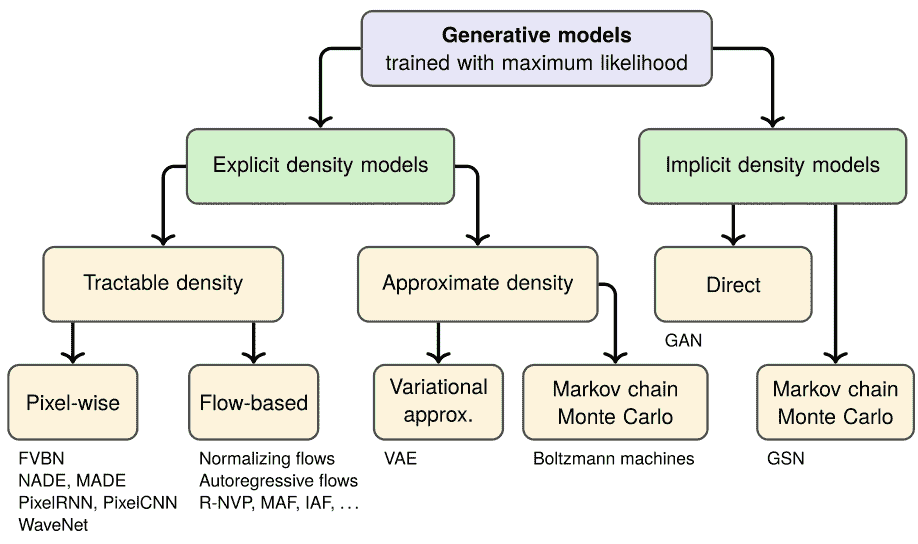

图4.2 深度学习中生成模型的分类[291]。

在过去的几年里，让我们简要地回顾一下这些变化，然后再继续生成对抗网络。

分类法中的第一个划分是显式密度和隐式密度模型之间的区别。区别在于，在前者中，我们做出明确的概率假设，使我们能够将结果联合分布的密度写成较小分布的乘积。我们在第4.1节中看到的生成模型都是显式密度模型：实际上，如果你能为你的假设集绘制一个因子图或有向图模型，那么你很可能处于显式密度领域。

实际上，这种明确的因子分解几乎总是有向图模型的特征形式：为了分解一个大的联合分布

$$ p(\mathbf{x})=p\left(x_{1}, \ldots, x_{n}\right) $$

首先让我们注意到

$$ p(\mathbf{x})=p\left(x_{1}\right) p\left(x_{2} \mid x_{1}\right) \ldots p\left(x_{n} \mid x_{1}, x_{2}, \ldots, x_{n-1}\right) . $$

这种分解当然总是正确的。但现在让我们尝试施加限制，以减少每个因子中的条件集。例如，我们上面讨论的朴素贝叶斯分类器将每个条件缩减为一个（目标）变量：

$$ p(\mathbf{x}, y)=p(y) p\left(x_{1} \mid y\right) \ldots p\left(x_{n} \mid y\right) . $$

在显式密度模型中，存在一个重要的分歧，取决于我们是否将这种简化的分解视为密度本身，假设它是可处理的并学习其参数，还是将其视为一类近似，我们需要找到最好的一个。经典的概率模型，如我们在第 4.1 节中讨论的模型，属于可处理密度模型的类别，但是深度学习的最新进展扩展了这个类别，涉及了很多新的有趣案例。

深度学习中的第一类可处理密度模型是完全可见信念网络 (FVBN)，最初由Geoffrey Hinton的团队在上世纪90年代中期开发[242,243]，但目前正在更大规模地开发。他们利用了上述分解：

$$ P_{\text {模型 }}(\mathbf{x})=\prod_{i=1}^{n} P_{\text {模型 }}\left(x_{i} \mid x_{1}, x_{2}, \ldots, x_{i-1}\right), $$

然后使用神经网络对每个概率分布进行建模。我们不会过多地使用这个家族的模型，所以不需要详细介绍，但是让我们简要提到一些值得注意的例子。

神经自回归分布估计 (NADE) [887]是一种架构，它改变了标准自编码器架构，该架构将 $\mathbf{x}$ 映射到 $\hat{\mathbf{x}}$，并使用损失函数使 $\hat{\mathbf{x}} \approx \mathbf{x}$。它使第一个分量 $\hat{\mathbf{x}}_{0}$ 不依赖于 $\mathbf{x}$，$\hat{\mathbf{x}}_{1}$ 仅依赖于 $\mathbf{x}_{0}$，$\hat{\mathbf{x}}_{2}$ 依赖于 $\mathbf{x}_{0}$ 和 $\mathbf{x}_{1}$，依此类推。通过这种方式，NADE 将经典自编码器改变为满足上述分解并可用于生成的自编码器。这个模型的下一个迭代，用于分布估计的掩码自编码器 (MADE) [272]通过巧妙地使用掩码，能够对 $\mathbf{x}$ 的不同排序进行平均，进一步改善了结果。

在图像领域中，FVBNs由DeepMind研究人员Aäron van den Oord等人开发的PixelRNN和PixelCNN表示[645]。分解的基本思想保持不变，生成过程逐像素进行，但现在每个因子 $p_{\text {model }}\left(x_{i} \mid x_{1}, x_{2}, \ldots, x_{i-1}\right)$ 由一个循环或卷积结构进行建模，分别接受之前生成的所有像素作为输入。

创新之处在于如何组织循环或卷积网络，以从一个不完全矩形的像素集合中合并信息，这些像素是在此之前生成的。Van den Oord等人提出了特殊的基于LSTM的架构，PixelRNN按行和列进行处理，而PixelCNN使用特殊的掩码卷积（掩码确保网络不会提前查看尚未生成的像素）。后来，OpenAI研究人员Tim Salimans等人对PixelCNN模型进行了改进，成为PixelCNN++[755]。

对于可处理的密度模型来说，一个重要的突破是由van den Oord等人提出的WaveNet [642]。WaveNet在文本转语音方面取得了重大突破，产生了非常逼真的语音样本，并且在音频生成的最新技术方面推动了艺术水平的发展。本质上，WaveNet是一个具有一维扩张卷积的FVBN模型，用于将当前分布的条件部分中的所有先前生成的输入组合起来。WaveNet在[156]中得到了改进，并在[140,643]中变得更加高效……但为了提高效率，DeepMind的研究人员不得不将WaveNet的最新版本推出FVBN的领域之外。

FVBN的一般问题在于，按照其设计，生成过程必须是顺序的：为了生成 $x_{i}$，FVBN必须知道 $x_{i-1}$。实际上，由于其接近性，$x_{i-1}$ 很可能是 $x_{i}$ 的最重要条件之一：例如，在音频生成中，最后一个节拍很重要，而在图像生成中，相邻的像素也可能很重要。因此，按照设计，无法实现基于FVBN的架构的并行生成，这意味着对于像图像或音频生成这样的高维问题，这种模型不可避免地会相当慢：您必须为图像中的每个像素运行一个神经网络（数百万次）或为音频中的每个值运行一个神经网络（每秒数万次）。

幸运的是，近年来有一种不同的方法来构建显式密度模型，这种方法迅速变得流行起来。归一化流提供了一种将复杂分布构建为由可逆变换表示的单个组件的组合的方法[462,723]。我们知道对于 $\mathbf{z} \in \mathbb{R}^{d}$，$\mathbf{z} \sim q(\mathbf{z})$ 和一个可逆函数 $f: \mathbb{R}^{d} \rightarrow \mathbb{R}^{d}$，随机变量 $\mathbf{y}=f(\mathbf{z})$ 将具有密度

$$ q_{\mathbf{y}}(\mathbf{y})=q(\mathbf{z})\left|\operatorname{det} \frac{\partial f^{-1}}{\partial \mathbf{y}}\right|=q(\mathbf{z})\left|\operatorname{det} \frac{\partial f}{\partial \mathbf{z}}\right|^{-1} $$

如果我们连续组合几个这样的函数，很容易看出会发生什么：

$$ \begin{gathered} \mathbf{z}_{k} = f_{k}\left(\mathbf{z}_{k-1}\right), \mathbf{z}_{0} \sim q_{0}\left(\mathbf{z}_{0}\right), \\ \mathbf{z}_{K} \sim q_{K}(\mathbf{z})=q_{0}\left(\mathbf{z}_{0}\right) \prod_{k=1}^{K}\left|\operatorname{det} \frac{\partial f_{k}}{\partial \mathbf{z}_{k-1}}\right|^{-1}, \\ \log q_{K}(\mathbf{z})=\log q_{0}\left(\mathbf{z}_{0}\right)-\sum_{k=1}^{K} \log \left|\operatorname{det} \frac{\partial f_{k}}{\partial \mathbf{z}_{k-1}}\right| \end{gathered} $$

这个一般的想法在图4.3a中有所说明。通过大量的相对简单的变换，我们可以尝试将一个非常复杂的分布近似为一个简单的分布（比如标准高斯分布）的转换。这样的变换可以包括，例如，一个平面（线性）流，通过超平面“切割”空间：

$$ \begin{gathered} f(\mathbf{z})=\mathbf{z}+\mathbf{u} h(\mathbf{w} \mathbf{z}+b), \\ \left|\operatorname{det} \frac{\partial f}{\partial \mathbf{z}}\right|=\left|1+\mathbf{u}^{\top}\left(h^{\prime}(\mathbf{w} \mathbf{z}+b) \mathbf{w}\right)\right|, \end{gathered} $$

或者一个径向流，通过球体“切割”空间：

$$ \begin{gathered} f(\mathbf{z})=\mathbf{z}+\beta h(\alpha, r)\left(\mathbf{z}-\mathbf{z}_{0}\right), \text { 其中 } r=\left\|\mathbf{z}-\mathbf{z}_{0}\right\|_{2}, h(\alpha, r)=\frac{1}{\alpha+r} . \end{gathered} $$

图4.3 基于流的生成模型：(a) 流作为变换的组合的一般思想；(b) 掩码自回归流 (MAF)；(c) 逆自回归流 (IAF)。

这里唯一的限制是对于每个变换 $f(\mathbf{z})$，我们需要有一种高效的方法来计算其雅可比行列式 $\det \frac{\partial f}{\partial \mathbf{z}}$。乍一看，这听起来相当严格，因为计算行列式很困难。但请注意，如果雅可比矩阵是上三角形的，它的行列式就是主对角线的乘积！这正是自回归流[456]的思想，其中

$$y_i = f(z_1, \dots, z_i), \quad \det \frac{\partial f}{\partial z} = \prod_{i=1}^d \frac{\partial y_i}{\partial z_i}$$

最简单的自回归流的例子是由 Real Non-Volume Preserving Flows (RealNVP)[198] 给出的，它们不太具有表现力，但非常高效。这里的体积保持是指雅可比矩阵：如果 $\det \frac{\partial f}{\partial z} = 1$ 那么体积是保持的，在 RealNVP 中则完全不是这样。对于一些函数 $\mu, \sigma: \mathbb{R}^k \rightarrow \mathbb{R}^{d-k}$，我们定义

$$y_{1:k} = z_{1:k}, \quad y_{k+1:d} = z_{k+1:d} \cdot \sigma(z_{1:k}) + \mu(z_{1:k})$$

即，我们复制前 $k$ 维度并对其余部分应用线性变换。结果是，由单位矩阵和下三角矩阵组成的一阶导数矩阵可以得到，雅可比矩阵可以计算为

$$\operatorname{det} \frac{\partial \mathbf{y}}{\partial \mathbf{z}}=\prod_{i=1}^{d-k} \sigma_{i}\left(\mathbf{z}_{1: k}\right)$$

请注意，在这种情况下，计算（完全并行计算！）和反转甚至对于不可逆的 $\mu$ 和 $\sigma$ 都非常容易。

将 RealNVP 推广为更具表现力的变换有两种方法。第一种是掩码自回归流 (MAF) [652]，如图4.3b所示：

$$y_{1}=\mu_{1}+\sigma_{1} z_{1}, \quad y_{i}=\mu\left(\mathbf{y}_{1: i-1}\right)+\sigma\left(\mathbf{y}_{1: i-1}\right) z_{i}$$

这是一个更具表现力的模型，其雅可比矩阵仍然非常简单，$\prod \sigma\left(\mathbf{y}_{1: i-1}\right)$，并且可以很容易地求逆。但是现在它不能并行计算（至少一般情况下不能）。因此，MAF 可以有效地用于密度估计（即训练），但应用结果较慢，就像 RealNVPs 一样。

另一种方法是逆自回归流 (IAF) [456]，如图4.3c所示，基本上是相反的方式操作：

$$y_{i}=z_{i} \sigma\left(\mathbf{z}_{1: i-1}\right)+\mu\left(\mathbf{z}_{1: i-1}\right)$$

现在 $\mathbf{y}$ 只取决于 $\mathbf{z}$，可以非常高效地计算（并行计算）：

$$\mathbf{y}=\mathbf{z} \cdot \sigma(\mathbf{z})+\mu(\mathbf{z}), \quad \operatorname{det} \frac{\partial \mathbf{y}}{\partial \mathbf{z}}=\prod_{i=1}^{d} \sigma_{i}(\mathbf{z})$$

如果我们考虑一个组合 $f_{K} \circ \ldots \circ f_{0}(\mathbf{z})$，我们得到

$$\log q_{K}\left(\mathbf{z}_{K}\right)=\log q(\mathbf{z})-\sum_{k=0}^{K} \sum_{i=1}^{d} \log \sigma_{k, i}$$

现在从这个模型中进行采样非常高效，但计算其密度更困难，尽管仍然可以通过分析方法计算。

这里的深度学习部分是我们可以用神经网络参数化 $\mu$ 和 $\sigma$。特别是，Pixel CNN、IRNN、MADE 和 WaveNet 都可以看作是正态流的基本情况。下一个有趣的步骤是在 ParallelWaveNet[643] 中采用了并行密度蒸馏的方法。

WaveNet 是一种学习快速的模型（学习可以并行进行），但是采样较慢（采样必须是顺序的）。将其传递给一个 IAF 以快速采样将是很棒的：

$$\log p_{X}(\mathbf{x})=\log p_{Z}(\mathbf{z})-\log \left|\frac{\partial \mathbf{x}}{\partial \mathbf{z}}\right|, \quad \log \left|\frac{\partial \mathbf{x}}{\partial \mathbf{z}}\right|=\sum_{t} \log \frac{\partial f\left(\mathbf{z}_{\leq t}\right)}{\partial z_{t}}$$

现在采样将按照 $\mathbf{z} \sim q(\mathbf{z})$（在 WaveNet 的情况下为逻辑分布），然后我们得到

$$x_{t}=z_{t} \cdot s\left(\mathbf{z}_{\leq t}, \theta\right)+\mu\left(\mathbf{z}_{\leq t}, \theta\right)$$

对于 $s$ 和 $\mu$，我们可以使用与基本的 WaveNet 相同类型的卷积网络。

现在从这个 IAF 中进行采样很容易，但是训练它完全不实际。并行密度蒸馏的技巧是使用损失函数基于教师模型 $p_{T}(\mathbf{x})$ 训练一个学生模型 $p_{S}(\mathbf{x})$。

$$\mathrm{KL}\left(P_{S} \| P_{T}\right)=H\left(P_{S}, P_{T}\right)-H\left(P_{S}\right)$$

跳过数学部分，我只想说概率假设和逻辑分布的形式使得熵和交叉熵的计算变得容易，现在我们可以在学生端生成 $\mathbf{x}$，然后在教师端并行计算 $p_{T}\left(x_{t} \mid \mathbf{x}_{<t}\right)$，然后高效地从 $p_{S}\left(x_{t} \mid x_{<t}\right)$ 中采样出多个 $x_{t}$，对于每个 $t$。为学生网络添加一些辅助损失函数，我们可以获得相同类型的音频生成质量。但是原始的 WaveNet 每秒可以产生 172 个样本，而经过提炼的 Parallel WaveNet 可以使用相同的硬件每秒产生超过 500,000 个样本…

逻辑上的替代方案是尽可能地推广可以在采样和训练中高效的流（即 RealNVP 流）。我不会详细介绍，但请注意能够生成高分辨率图像的 GLOW 模型[455] 和将 GLOW 和 WaveNet 结合起来实现更快生成的 WaveGLOW 模型[685]。

## 4.3 近似显式密度模型: VAE

在前一节中，我们考虑了可处理的密度模型，其中假设一个显式函数来表示所讨论的概率分布。现在我们转向近似密度模型，其中使用显式可处理的分布密度族来找到最佳的数据分布近似。

$p_{\text {data }}$ 是该族中的一个成员。

我们不会详细考虑玻尔兹曼机，它可以被视为给定密度的马尔可夫链蒙特卡洛近似；有关详细信息，请参阅 $[348,752,753]$。但是，让我们至少简要地考虑一下可能是目前最重要的这个族的代表：变分自编码器（VAE）[200, 457, 458]。

- 编码器 $E$ 从输入 $\mathbf{x}$ 产生潜在编码 $\mathbf{z}$
- 试图从潜在编码 $\mathbf{z}$ 中重构 $\mathbf{x}$ 的解码器 $D$。

换句话说，给定的图像 $\mathbf{x}$ 首先被压缩成潜在表示 $\mathbf{z} = E(\mathbf{x})$，然后再“解压缩”回来

$$\hat{\mathbf{x}}=D(E(\mathbf{x}))$$

这应该与原始图像 $\mathbf{x}$ 匹配。在这种情况下，为了训练编码器 $E$ 和解码器 $D$ 的组合，我们可以使用 $\hat{\mathbf{x}}$ 和 $\mathbf{x}$ 之间的各种相似性度量：在最简单的情况下，可以使用差异的 $L_2$ 或 $L_1$ 范数 $\|\hat{\mathbf{x}}-\mathbf{x}\|$。

但是这个想法也被证明无法获得一个生成模型。虽然一个经过良好训练的自编码器可以确保一个真实的照片 $\mathbf{x}$ 在 $D(E(\mathbf{x}))$ 之后被重构为这样的照片，但这并不能说明如何解码相同维度的随机向量 $\mathbf{z}$。与真实图像（比如猫的照片）对应的潜在向量很可能构成潜在编码空间中的一个相当复杂的子集（子流形），而从某个标准分布中采样得到的随机向量几乎没有机会落入这个子集中，就像一组几乎没有机会构成类似照片的随机像素一样。

因此，我们需要“解决这个分布中的问题”。一种方法是使用对潜在代码分布进行强假设，也就是使用具有足够简单结构的编码器和解码器，以便这个代码子集也必然具有简单结构。

在极端情况下，这可以简化为主成分分析（PCA），一种可以看作是具有线性编码器和线性解码器的自编码器方法。PCA 最小化了点与其在结果子空间上的投影之间的 $L_2$-范数（欧几里德距离）。这个模型的概率解释，被称为概率 PCA，被制定为一个关于 $\mathbf{x}$ 的生成模型，其中包含高斯噪声：

$$\mathbf{x} \sim \mathcal{N}\left(\mathbf{x} \mid W \mathbf{z}, \sigma^{2} \mathbf{I}\right), \quad \mathbf{z} \sim \mathcal{N}(\mathbf{z} \mid \mathbf{0}, I)$$

但是在深度学习中，针对高维数据，我们希望能够训练出更具表达能力的编码器和解码器。变分自编码器的起点与概率主成分分析相同，但是用非线性函数代替线性投影：

$$p(\mathbf{x}, \mathbf{z} \mid \theta)=p(\mathbf{x} \mid \mathbf{z}, \theta) p(\mathbf{z} \mid \theta)=\mathcal{N}(\mathbf{z} \mid \mathbf{0}, \mathbf{I}) \prod_{j=1}^{D} \mathcal{N}\left(x_{j} \mid \mu_{j}(\mathbf{z}), \sigma_{j}(\mathbf{z})\right)$$

现在我们可以用具有参数 $\theta$ 的神经网络来参数化 $\mu_j(\mathbf{z})$ 和 $\sigma_j(\mathbf{z})$；在 VAE 中，通常假设 $\sigma_j(\mathbf{z})$ 为常数 $\sigma$。

从形式上讲，VAE 是一个生成模型，其训练目标是最大化数据集中每个 $\mathbf{x}$ 的似然性。

$$p(D \mid \theta)=\prod_{\mathbf{x} \in X} \int p(\mathbf{x} \mid \mathbf{z}, \theta) p(\mathbf{z}) \mathrm{d} \mathbf{z}=\prod_{\mathbf{x} \in X} \int \mathcal{N}\left(\mathbf{x} \mid f(\mathbf{z}, \theta), \sigma^{2} \mathbf{I}\right) p(\mathbf{z}) \mathrm{d} \mathbf{z}$$

对于 $\mathbf{z}$ 的先验分布通常被认为是标准高斯分布 $p(\mathbf{z}) = \mathcal{N}(\mathbf{z} \mid \mathbf{0}, I)$。

请注意，这个形式化还没有任何编码器，只有一个解码器。为了训练这个模型，我们可以使用随机梯度上升：从 $p(\mathbf{z})$ 中采样 $z_1, \dots, z_n$，近似

$$p(\mathbf{x} \mid \theta) \approx \frac{1}{n} \sum_{i=1}^{n} \mathcal{N}(\mathbf{x} \mid f(\mathbf{z}_i, \theta), \sigma^2 \mathbf{I}) p(\mathbf{z}_i)$$

并通过梯度上升最大化这个近似值，沿着 $\theta$ 方向。

这种方法的问题是，对于几乎所有的 $\mathbf{z}$，$p(\mathbf{x} \mid \mathbf{z}, \theta)$ 都会非常小，除了从一个能够产生类似于 $\mathbf{x}$ 的图像的 $\mathbf{z}$ 的小区域之外，因此直接采样需要指数级别（完全不切实际）的 $\mathbf{z}_i$。这就是 encoder 在 VAE 框架中的作用：编码器捕捉到一个分布 $q(\mathbf{z} \mid \mathbf{x})$，该分布应该能够从这个邻域中产生潜在编码 $\mathbf{z}$，即具有较高 $p(\mathbf{x} \mid \mathbf{z}, \theta)$ 值的 $\mathbf{z}$。

为了实现这一点，我们需要 $q(\mathbf{z})$ 作为 $p(\mathbf{z} \mid \mathbf{x})$ 的近似值，对于给定的 $\mathbf{x}$。让我们尝试以相对直接的方式获得这个近似值，通过最小化两个分布之间的 KL 散度：

$$\begin{aligned}
\text{KL}(q(\mathbf{z}) \parallel p(\mathbf{z} \mid \mathbf{x})) &= \mathbb{E}_{\mathbf{z} \sim q} [\log q(\mathbf{z}) - \log p(\mathbf{z} \mid \mathbf{x})] = \\
&= \mathbb{E}_{\mathbf{z} \sim q} [\log q(\mathbf{z}) - \log p(\mathbf{x} \mid \mathbf{z}) - \log p(\mathbf{z})] + \log p(\mathbf{x}) = \\
&= \mathbb{E}_{\mathbf{z} \sim q} [\log q(\mathbf{z}) - \log p(\mathbf{z})] - \mathbb{E}_{\mathbf{z} \sim q} [\log p(\mathbf{x} \mid \mathbf{z})] + \log p(\mathbf{x}) = \\
&= \text{KL}(q(\mathbf{z}) \parallel p(\mathbf{z})) - \mathbb{E}_{\mathbf{z} \sim q} [\log p(\mathbf{x} \mid \mathbf{z})] + \log p(\mathbf{x}),
\end{aligned}$$

这意味着

$$\log p(\mathbf{x}) - \text{KL}(q(\mathbf{z}) \parallel p(\mathbf{z} \mid \mathbf{x})) = \mathbb{E}_{\mathbf{z} \sim q} [\log p(\mathbf{x} \mid \mathbf{z})] - \text{KL}(q(\mathbf{z}) \parallel p(\mathbf{z}))$$

现在，由于我们可以自由选择任何分布 $q$，VAE 使 $q(\mathbf{z})$ 依赖于 $\mathbf{x}$，将其转化为 $q(\mathbf{z} \mid \mathbf{x})$，现在上述方程的右边作为我们要最大化的值 $\log p(\mathbf{x})$ 的下界。这正是我们这种情况下著名的变分下界，但由于我们将不再使用变分推断，我不会进一步详细介绍。可以说，如果 $q(\mathbf{z} \mid \mathbf{x})$ 与 $p(\mathbf{z} \mid \mathbf{x})$ 完全匹配，下界将变得精确，将 KL-散度降低到零，如果我们使用足够表达的模型来表示 $q(\mathbf{z} \mid \mathbf{x})$，我们可以希望下界足够精确，以便我们可以最大化右边的值。当然，我们通过使用神经网络来表示 $q(\mathbf{z} \mid \mathbf{x})$ 来实现这一点。

换句话说，VAE 由

- 编码器，一个将输入 $\mathbf{x}$ 映射到分布参数 $q(\mathbf{z} \mid \mathbf{x})$ 的神经网络；让我们假设（通常是 VAE 的做法） $q(\mathbf{z} \mid \mathbf{x})$ 是一个高斯分布，其参数由编码器生成：

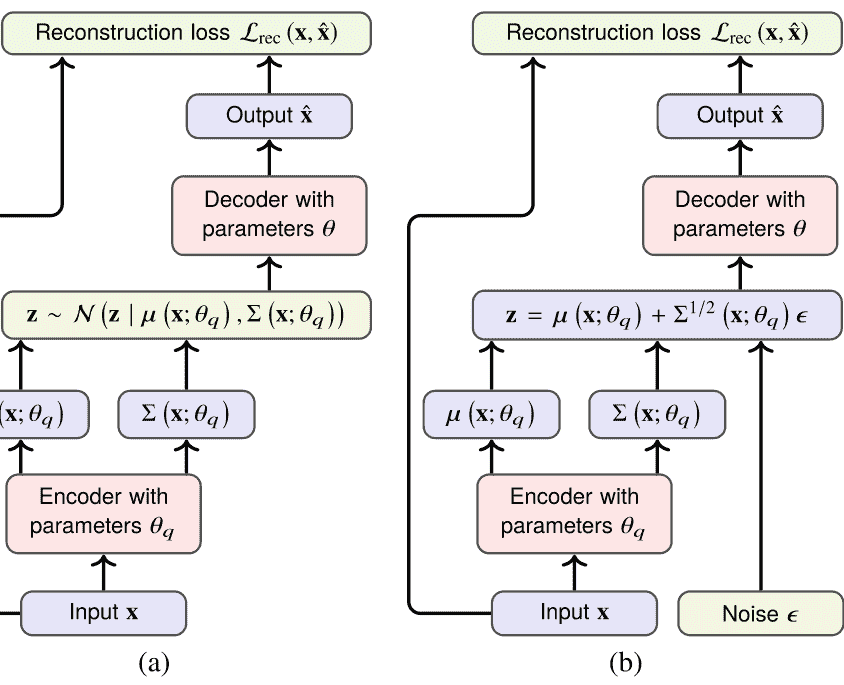

图4.4 变分自编码器：(a) 使用采样 $\mathbf{z}$ 的基本思想；(b) 使用预先采样的噪声 $\epsilon$ 的重参数化技巧。

$$q(\mathbf{z} \mid \mathbf{x}) = \mathcal{N}(\mathbf{z} \mid \boldsymbol{\mu}(\mathbf{x}; \theta_q), \boldsymbol{\Sigma}(\mathbf{x}; \theta_q));$$

- 解码器，一个将从 $q(\mathbf{z} \mid \mathbf{x})$ 中采样得到的潜在编码 $\mathbf{z}$ 映射到 $\mathbf{x}$ 的神经网络。

我们如何训练 VAE？为了训练编码器参数，我们需要最小化

$$\mathbb{E}_{\mathbf{z} \sim q(\mathbf{z} \mid \mathbf{x})} [\log p(\mathbf{x} \mid \mathbf{z})] - \text{KL}(q(\mathbf{z} \mid \mathbf{x}) \parallel p(\mathbf{z}))$$

由于 $p$ 和 $q$ 都有已知的标准形式，比如两个高斯分布，第二项可以作为 $\theta_q$ 的参数的函数进行解析计算。第一项无法精确计算，我们需要通过采样来近似计算。实际上，VAEs 只采样一个值 $\mathbf{z} \sim q(\mathbf{z} \mid \mathbf{x})$，将其代入对数似然函数中，得到一个关于 $\theta$ 的函数；这正是随机梯度下降所做的。

图4.4a展示了得到的方案。现在看起来我们可以简单地使用一些标准的重构损失函数，比如 $L_2$-范数 $\|\mathbf{x}-\hat{\mathbf{x}}\|^2$，但是我们还有一个问题：我们的自编码器在编码器和解码器之间进行采样 $\mathbf{z}$！从 $\mathcal{N}(\mathbf{z} \mid \boldsymbol{\mu}(\mathbf{x}; \theta_q), \boldsymbol{\Sigma}(\mathbf{x}; \theta_q))$ 中采样不是问题在前向步骤中，但如何通过采样过程传递梯度还不清楚…

幸运的是，有一个选项，称为重参数化技巧，让我们回避了这个问题。解决方案很简单，只需从标准高斯分布中采样噪声 $\epsilon$，即 $\epsilon \sim \mathcal{N}(\mathbf{0}, \mathbf{I})$，并用编码器的结果进行重新缩放：

$$\mathbf{z} = \boldsymbol{\mu}(\mathbf{x}; \theta_q) + \boldsymbol{\Sigma}^{1/2}(\mathbf{x}; \theta_q)\epsilon$$

通过重参数化技巧，$\epsilon$ 可以提前进行采样，并作为自动编码器的另一个输入；网络内部不需要进行采样。现在，整个流程如图4.4b所示，可以使用梯度下降进行训练。

这只是 VAE 的第一个基本变体。还有很多扩展，近年来，变分自动编码器已成为一个非常重要的模型类，开始与 GAN 在多样性和生成质量方面相媲美。例如，可以将 VAE 用于离散对象；特别是在协同过滤[516,789]中，动态 VAE 用于处理序列数据[275]等等。在我们最重要的图像高维生成应用中，VAE 也正在迅速接近最好的 GAN 质量。在这方面，有两个主要方向。

在由 DeepMind 研究人员 van den Oord 等人[644]开发的矢量量化 VAE 中，并在 Razavi 等人[707]的后续工作中进行了扩展，潜在代码被量化：

$$\text{量化}(\mathbf{z}_e(\mathbf{x})) = \mathbf{e}_k, \quad k = \arg\min_j \|\mathbf{z}_e(\mathbf{x}) - \mathbf{e}_j\|_2$$

梯度通过离散层简单地复制（否则会停止反向传播）。嵌入是通过矢量量化算法进行训练的，即我们只是将 $\mathbf{e}$ 更接近于编码器输出 $\mathbf{z}_e(\mathbf{x})$，并且编码器也更接近于嵌入。得到的损失函数为

$$\mathcal{L}^{\text{VQ-VAE}} = \log p(\mathbf{x} \mid \mathbf{z}_q(\mathbf{x})) + \|\text{sg}[\mathbf{z}_e(\mathbf{x})] - \mathbf{e}\|_2^2 + \beta \|\mathbf{z}_e(\mathbf{x}) - \text{sg}[\mathbf{e}]\|_2^2$$

其中 sg (stopgradient) 是停止梯度传播的运算符：其前向传递计算恒等函数，后向传递返回零。解码器正在优化 $\mathcal{L}^{\text{VQ-VAE}}$ 中的第一项，编码器处理第一项和第三项，嵌入本身是用第二项进行训练的。

最初的 VQ-VAE 基于 PixelCNN，并按照 2017 年的标准生成了非常合理的图像，而 VQ-VAE-2 则使生成过程变得分层，从而产生了具有最先进生成质量的高分辨率图像。

但是在这方面，NVIDIA 的研究人员似乎始终保持领先：Vahdat 和 Kautz[888] 的 Nouveau VAE (NVAE) 是一种能够与最新的 GANs 生成样本相媲美的 VAE。NVAE 也是一种分层模型：$$
\begin{aligned} 
p(\mathbf{z}) & =\prod_{l} p\left(\mathbf{z}_{l} \mid \mathbf{z}_{<l}\right), \\
q(\mathbf{z} \mid \mathbf{x}) & =\prod_{l} q\left(\mathbf{z}_{l} \mid \mathbf{z}_{<l}, \mathbf{x}\right), \\
\mathcal{L}_{\mathrm{VAE}}(\mathbf{x}) & =\mathbb{E}_{q}[\log p(\mathbf{x} \mid \mathbf{z})]-\mathrm{KL}\left(q\left(\mathbf{z}_{1} \mid \mathbf{x}\right) \| p\left(\mathbf{z}_{1}\right)\right) \\
& -\sum_{l=2}^{L} \mathbb{E}_{q\left(\mathbf{z}_{<l} \mid \mathbf{x}\right)}\left[\mathrm{KL}\left(q\left(\mathbf{z}_{l} \mid \mathbf{x}, \mathbf{z}_{<l}\right) \| p\left(\mathbf{z}_{l} \mid \mathbf{z}_{<l}\right)\right)\right],
\end{aligned}
$$

它的训练方式与基本的VAE类似，通过重新参数化技巧进行。NVAE的作者们在寻找编码器和解码器的最佳架构方面进行了精心设计，并采用了特殊技巧来稳定训练（这对于分层模型来说是一个重要问题）并节省内存。因此，NVAE为生成模型提供了一些最好的样本，比如高清晰度的人脸，这是一个常见的生成模型基准测试。

变分自编码器在合成数据生成方面开始受到关注。作为一个有趣的最近的例子，我想提到肖等人的工作[953]，他们生成了合成的时空聚合物，即用于地理空间分析和遥感的 多尺度图像，这些图像是基于像素级和宏观特征级条件（如道路网络）的。他们引入了一种基于VAE的新型深度条件生成模型(DCGM)架构，并展示了生成的合成数据对于训练下游任务模型的有用性。

但是，生成对抗网络仍然是最灵活且通常是最好的现代生成模型类别。下一章中许多关于合成到真实领域适应的例子将使用GAN。因此，从下一节开始，我们将对生成对抗网络进行简要回顾，比我们到目前为止讨论的模型稍微详细一些。

## 4.4 生成对抗网络

从现在开始，我们主要的生成模型示例将来自于图4.2中的“直接隐式密度”类，并且将由生成对抗网络（GANs）表示。在我看来，GANs最清晰的动机来自于与黑盒生成模型相关的优化问题，或者更准确地说，明显缺乏这样一个问题。

事实上，假设你想让神经网络画猫的图片。设计一个卷积架构来接受随机数向量作为输入（我们需要一些随机性来源，神经网络本身不会提供），并输出表示给定维度图像的张量是没有问题的。它甚至可以是一个相当简单的架构... 但是目标函数会是什么呢？ 我们无法写出一个能够捕捉到“猫性”图像: 听起来非常像我们试图解决的问题。在第4.3节中, 我们已经看到了一种解决这个问题的方法: 从自动编码器中获取损失函数的基本灵感, 但修改它们的架构, 使得潜在代码的分布足够简单以进行采样。

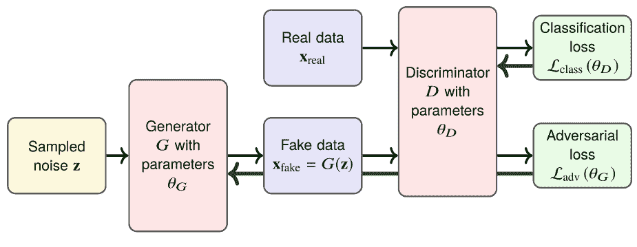

图4.5 基本的GANs架构。粗绿箭头显示梯度的流动:判别器使用分类损失进行训练, 生成器使用判别器的帮助计算的对抗损失进行训练。

生成对抗网络的主要思想是形式化这种“猫性”属性的不同方式。GAN通过一个单独的网络, 即判别器, 来区分真实对象和生成器生成的伪造对象。判别器 (参见图4.5的一般示意图) 解决的是一个二元分类问题, 学习输出1表示真实图像, 输出0表示伪造图像。另一方面, 生成器试图“欺骗”判别器, 使其认为由生成器从随机噪声生成的伪样本实际上来自真实数据集。这意味着生成器的损失也取决于判别器的当前状态; 在图4.5中显示为对抗损失 $\mathcal{L}_{\text{adv}}$ 。请注意, 在最基本的公式中, $\mathcal{L}_{\text{adv}}$ 和 $\mathcal{L}_{\text{class}}$ 是由生成器和判别器以两个不同的方向优化的相同函数, 但在我们的阐述中 (以及GAN的历史中), 它们几乎立即变得不同。

在一种类似EM的方案中, 生成器 G和判别器 D可以交替训练, 在理想情况下, 训练将按照以下方式进行:

- 首先生成器产生基本上是随机噪声, 但判别器也无法区分任何东西;
- 因此, 我们首先训练判别器来区分真实图像和 G产生的随机噪声;
- 然后我们用一个目标函数来训练生成器, 目标是“欺骗”判别器;
- 但这只是一个已经学会欺骗一个非常简单判别器的生成器, 所以我们继续这种交替训练直到收敛。

从形式上讲, 生成器是一个函数

$$G = G(z; \theta_g) : Z \rightarrow X,$$

而判别器是一个函数

$$D = D(x; \theta_d) : X \rightarrow [0, 1].$$

判别器的目标函数通常是二元分类错误函数，即二元交叉熵

$$\mathbb{E}_{\mathbf{x} \sim p_{\text{数据}}(\mathbf{x})} [\log D(\mathbf{x})] + \mathbb{E}_{\mathbf{x} \sim p_g(\mathbf{x})} [\log(1 - D(\mathbf{x}))],$$

其中 $p_g(\mathbf{x}) = G_{\mathbf{z} \sim p_z}(\mathbf{z})$ 是由 $G$ 生成的分布；换句话说，在训练过程中，鉴别器将标记为0的假数据生成自 $G$，将真实数据标记为1。

生成器正在学习欺骗鉴别器，也就是说，在最简单的设置中，$G$ 正在最小化

$$\mathbb{E}_{\mathbf{x} \sim p_g(\mathbf{x})} [\log(1 - D(\mathbf{x}))] = \mathbb{E}_{\mathbf{z} \sim p_z(\mathbf{z})} [\log(1 - D(G(\mathbf{z})))]$$

现在，将两者结合起来，我们得到了一个典型的极小极大博弈：

$$\min_G \max_D V(D, G), \quad \text{其中}$$

$$V(D, G) = \mathbb{E}_{\mathbf{x} \sim p_{\text{数据}}(\mathbf{x})}[\log D(\mathbf{x})] + \mathbb{E}_{\mathbf{z} \sim p_z(\mathbf{z})}[\log(1 - D(G(\mathbf{z})))]$$

请注意，这立即使得GAN的训练变得比我们在本书中看到的任何东西都更加困难：一般来说，随着量词的每一次额外变化，优化问题变得更加困难。在GAN的一般理论和实践中，许多事情都与试图简化和优化训练过程有关。

上述优化问题具有一些良好的性质。可以证明[290]，当 $p_g = p_{\text{数据}}$ 时，$\max_D V(D, G)$ 被最小化。同时，对于固定的生成器 $G$，判别器 $D$ 的最优分布为该函数。

$$D_G^*(\mathbf{x}) = \frac{p_{\text{数据}}(\mathbf{x})}{p_{\text{数据}}(\mathbf{x}) + p_g(\mathbf{x})},$$

也就是说，简单地说，贝叶斯最优分类器在 $p_{\text{数据}}$ 和 $p_g$ 之间。当且仅当 $p_g = p_{\text{数据}}$ 几乎在任何地方时，该准则的全局最小值才能达到；对于最优 $D$ 来说，准则本身等价于最小化

$$\text{KL} \left( p_{\text{数据}} \left\| \frac{p_{\text{数据}} + p_g}{2} \right\| \right) + \text{KL} \left( p_g \left\| \frac{p_{\text{数据}} + p_g}{2} \right\| \right),$$

这是一种称为Jensen-Shannon散度的两个分布之间的对称相似度度量。

所以我们知道，至少在理论上，GAN应该得出正确的答案，并且尽可能地使 $p_g$ 接近 $p_{\text{数据}}$。但是所有这些理论结果都是基于生成器目标函数等于 $\mathbb{E}_{z \sim p_z}[\log(1-D(G(z)))]$ 的情况，也就是对于 $G$ 和 $D$ 的单一目标函数的极小极大问题。不幸的是，在实践中，这证明是一个非常不方便的生成器目标函数，导致饱和和收敛非常缓慢。即使是最初引入GAN的工作[290]也立即建议，而不是最小化 $\mathbb{E}_{z \sim p_z}[\log(1-D(G(z)))]$，应该最小化

$$-\mathbb{E}_{z \sim p_z}[\log D(G(z))]。$$

非正式地说，通过这个目标函数，我们最大化了 $D$ 给出错误答案的概率，而不是最小化 $D$ 给出正确答案的概率；这是有区别的!

因此, GAN通常使用交替的EM-like方案进行训练:

- 固定 $G$ 的权重, 并根据最小化误差函数来更新 $D$ 的权重

  $$\mathbb{E}_{\mathbf{x} \sim p_{\text {数据 }}(\mathbf{x})}[\log D(\mathbf{x})]+\mathbb{E}_{\mathbf{x} \sim p_{g}(\mathbf{x})}[\log (1-D(\mathbf{x}))];$$

- 固定 $D$ 的权重, 并根据最小化误差函数来更新 $G$ 的权重

  $$-\mathbb{E}_{\mathbf{z} \sim p_z}[\log D(G(\mathbf{z}))]。$$

最初的GAN在MNIST等玩具示例上工作, 基于这些原则的第一个真正成功的架构之一是深度卷积GAN (DCGAN) [696]。它使用了一个完全卷积的架构, 没有使用最大池化 (而是使用步幅卷积), 添加了批归一化层, 使用了当时新出现的Adam优化器, 并添加了一些其他技巧来改进结果。因此, DCGAN学会了在LSUN数据集上生成非常合理的图像, 即 64 x 64的彩色图像。

自2015年以来, GAN已经取得了长足的发展。著名的现代架构包括StyleGAN [438, 439], 能够生成逼真的 1024 x 1024 像素的人脸图像, 以及BigGAN [90], 在ImageNet或JFT-300M [827] 上训练时能够生成来自数千个不同类别的 512 x 512像素图像。显然, 现代架构比DCGAN要大得多且更复杂, 数据集的规模也比LSUN大得多。但是, 对于训练高质量GAN来说, 也有一些在概念上新颖且非常有用的想法。在本章的其余部分, 我们将从GAN训练的一般观点讨论这些想法, 但只深入探讨那些对于后续的从合成到真实领域适应非常有用的想法。

## 4.5 GAN中的损失函数

在前一节中,我们了解了GAN的基本思想,并看到它们的训练过程是在学习生成器G和判别器D的参数之间进行优化的。正如我们所见,即使是最初的GAN [290]也没有为生成器和判别器使用相同的损失函数。自2015年以来,已经提出了许多不同的GAN中生成器和判别器的损失函数。在本节中,我将简要概述这些想法,并展示那些对于后续章节中讨论的GAN特别相关的损失函数。在文献中,这些损失函数通常被称为对抗损失（参见图4.5）。

最早但仍常用的想法之一是最小二乘GAN (LSGAN)[580]。上述GAN的问题在于误差函数(Jensen-Shannon散度)在生成器分布 $p_{\mathrm{g}}$ 与正确答案相差较大时会饱和:判别器D在末尾具有逻辑sigmoid函数,生成器的梯度必须首先通过该sigmoid函数。由于这种饱和效应,训练常规GAN通常较慢且不稳定。

LSGAN的思想与你所了解的分类完全相悖。LSGAN提出将分类的sigmoid函数转换为二次误差函数:

$$
\begin{aligned} 
& \min _{D} V_{\mathrm{LSGAN}}(D)=\frac{1}{2} \mathbb{E}_{\mathbf{x} \sim p_{\text {数据 }}}\left[(D(\mathbf{x})-b)^{2}\right]+\frac{1}{2} \mathbb{E}_{\mathbf{z} \sim p_{\mathbf{z}}}\left[(D(G(\mathbf{z}))-a)^{2}\right], \\
& \min _{G} V_{\mathrm{LSGAN}}(G)=\frac{1}{2} \mathbb{E}_{\mathbf{z} \sim p_{z}}\left[(D(G(\mathbf{z}))-c)^{2}\right], 
\end{aligned}
$$

这意味着鉴别器学习对于伪造输入输出a,对于真实输入输出b,而生成器试图“说服”鉴别器对伪造输入输出c (G无法控制真实输入,因此该部分总是从其目标函数中消失)。这对于分类来说是非常反直觉的,因为尝试使用最小二乘法学习分类器通常是一个非常糟糕的主意:例如,对于被正确分类且具有高置信度的输入,错误开始增加!然而,LSGAN带来了一个很好的理论结果:如果b-c=1且b-a=2,也就是说,生成器说服鉴别器对于伪造数据输出“我不知道”(c恰好位于a和b的中间),则最优鉴别器的LSGAN优化问题

$$D_{\mathrm{LSGAN}}^{*}=\frac{b p_{\text {数据 }}(\mathbf{x})+a p_{\mathrm{g}}(\mathbf{x})}{p_{\text {数据 }}(\mathbf{x})+p_{\mathrm{g}}(\mathbf{x})}$$

等价于最小化数据 $p_{\text{数据}}$ 和生成数据 $p_{\mathrm{g}}$ 之间的皮尔逊 $\chi^{2}$ 散度。但在这种情况下,实践与理论再次不同:在实践中,LSGAN通常使用a=0和b=c=1进行训练。LSGAN已被证明对G和D的架构变化更稳定,更容易训练,并且更不容易发生模式崩溃;总的来说,二次对抗损失函数已成为现代基于GAN的架构中的基本方法之一。

另一个重要的对抗损失函数，也是非常有趣的一个，来自于Wasserstein GAN (WGAN) [27]。为了解释这里发生了什么，我们需要退后一步。

学习概率分布是什么意思?这意味着学习的分布模型应该与给定的数据分布相似，也就是说，我们最有可能最小化KL($p_{\text{data}}||p_{\text{model}}$)、KL($p_{\text{model}}||p_{\text{data}}$)或者同一家族的其他相似度量，如Jensen-Shannon散度。

现在假设两个分布， $p_{\text{data}}$ 和 $p_{\text{model}}$，具有不相交的支持。例如，假设 $p_{\text{data}}$是“1024x1024”大小的彩色猫照片的分布；这意味着它的支持位于 $3.2^{20}$ 维空间中，这是一个非常大的空间!如果我们将某个模型分布 $p_{\text{model}}$ 参数化为具有低维支持 (这也听起来非常合理，因为我们不想覆盖整个 $3.2^{20}$ 维空间，我们只想捕捉猫照片)，它们的支持的交集几乎为零，直到模型分布已经非常类似于数据分布。

不幸的是，这破坏了通常在分布之间的相似度度量。库尔巴克-莱布勒散度是

$$\text{KL} ( p_{\text{数据 }} || p_{\text{模型 }} ) = \int p_{\text{数据}}(x) \log \frac{p_{\text{数据}}(x)}{p_{\text{模型}}(x)} dx,$$

因此，如果它们的支持集不相交，KL散度就是无穷大。Jensen-Shannon散度不是无穷大，但它退化为一个常数：

$$\text{JSD} ( p_{\text{数据 }} || p_{\text{模型 }} ) = \frac{1}{2} \text{KL} \left( p_{\text{数据 }} \left\| \frac{p_{\text{数据 }} + p_{\text{模型 }}}{2} \right. \right) + \frac{1}{2} \text{KL} \left( p_{\text{模型 }} \left\| \frac{p_{\text{数据 }} + p_{\text{模型 }}}{2} \right. \right) = \log 2.$$

然而，无穷大和常数并不适合作为良好的目标函数：对 $p_{\text{模型}}$ 的微小扰动不会改变KL或JSD，因此梯度将为零或不存在。

这听起来像是一个非常普遍的批评，那为什么整个机器学习过程不会以这种方式失败呢?问题在于，机器学习通常使用模型分布 $p_{\text{模型}}$，它覆盖整个空间。例如，我们可以向 $p_{\text{模型}}$ 分布添加一个全维高斯噪声，集中在低维变量上，从而将其支持扩展到整个空间;这将完全解决问题 (现在 $p_{\text{数据}}$ 集中在低维子集上也没有问题)，并且可能对应于误差函数中的某个 $L_2$-范数。

如果你只需要在训练后找到 $p_{\text{模型}}$ 的最大值，即找到最大似然或最大后验假设，那么这个解决方案是可以的。但对于生成模型来说，这可能会导致问题：我们并不真正想从中采样。“模糊”的噪声分布。在显式生成模型中，我们通常可以在训练模型后去除这种噪声，从而解决了这个问题。但在生成对抗网络中，这将是一个非常困难的任务，因为我们实际上并没有真正的分布密度模型，我们所拥有的只是一个能够从中采样的黑盒子。

为了解决这个问题，Wasserstein GAN (WGAN) 提出考虑其他相似度度量来衡量数据分布和模型分布之间的相似性。我不会详细介绍数学细节，请参考[27]了解详情。简而言之，WGAN基于地球移动距离，也被称为Wasserstein距离：

$$W\left(p_{\text {数据 }}, p_{\text {模型 }}\right)=\inf _{\gamma \in \Gamma\left(p_{\text {数据 }}, p_{\text {模型 }}\right)} \mathbb{E}_{(\mathbf{x}, \mathbf{y}) \sim \gamma}\left[\|\mathbf{x}-\mathbf{y}\|\right] \text {, }$$

其中 $\Gamma(p_{\text{数据}}, p_{\text{模型}})$ 是联合分布的集合 $\gamma(x,y)$，其边际分布是 $p_{\text{数据}}$ 和 $p_{\text{模型}}$。换句话说，$\gamma(x,y)$ 显示了要以最佳方式将对应于 $p_{\text{数据}}$ 的“土堆”改变为对应于 $p_{\text{模型}}$ 的“土堆”需要移动多少“土地”（概率质量）。

在上面的例子中，如果 $p_{\text{数据}}$ 和 $p_{\text{模型}}$ 看起来相同，并且集中在距离 $\theta$ 的平行直线上，它们之间的地球移动距离将为 $\theta$：您需要移动总质量为1，使每个点移动距离 $\theta$。因此，它的梯度存在，梯度下降实际上会使平行线更加接近。

Wasserstein距离听起来非常适合这个任务，但定义 $W\left(p_{\text{data }}, p_{\text{model }}\right)$ 的泛函看起来不像是容易计算或者求梯度的东西。幸运的是，康托罗维奇-鲁宾斯坦对偶性（再次，让我们跳过证明）说最小值

$$W\left(p_{\text {数据 }}, p_{\text {模型 }}\right)=\inf _{\gamma \in \Gamma\left(p_{\text {数据 }}, p_{\text {模型 }}\right)} \mathbb{E}_{(\mathbf{x}, \mathbf{y}) \sim \gamma}\left[\|\mathbf{x}-\mathbf{y}\|\right]$$

等价于最大值

$$W\left(p_{\text {data }}, p_{\text {model }}\right)=\sup _{\|f\|_{L} \le 1}\left(\mathbb{E}_{\mathbf{x} \sim p_{\text {数据 }}}[f(\mathbf{x})]-\mathbb{E}_{\mathbf{x} \sim p_{\text {模型 }}}[f(\mathbf{x})]\right) \text {, }$$

其中最大值是在所有具有 Lipschitz常数 ≤ 1的函数中取得的。

由于我们想要训练一个生成模型 $p_{\text{model}} = g_\theta(z)$，现在只需通过神经网络对所有内容进行参数化。让我们引入一个网络 $f_w$ 用于函数 $f$ 和一个网络 $g_\theta$ 用于 $g$。然后训练可以再次按照交替的方式进行，如下所示：

- 给定 $g_\theta$，更新 $f_w$ 的权重，最大化

  $$\mathbb{E}_{\mathbf{x} \sim p_{\text {数据 }}}[f(\mathbf{x})]-\mathbb{E}_{\mathbf{x} \sim p_{\text {模型 }}}[f(\mathbf{x})] ;$$

- 给定 $f_w$，计算$\nabla_{\theta} W\left(p_{\text {数据 }}, p_{\text {模型 }}\right)=\nabla_{\theta}\left(\mathbb{E}_{\mathbf{x} \sim p_{\text {数据 }}}[f(\mathbf{x})]-\mathbb{E}_{\mathbf{x} \sim p_{\text {模型 }}}[f(\mathbf{x})]\right)=-\mathbb{E}_{\mathbf{z} \sim Z}\left[\nabla_{\theta} f_{\mathbf{w}}\left(g_{\theta}(\mathbf{z})\right)\right].$

只需确保 $f_{\mathbf{w}}$ 是具有常数 $\leq l$ 的 Lipschitz 函数。原始工作以一种非常简单而有效的方式进行：截断梯度，以确保其范数不超过 $l$。但很快发现 [303] 在梯度上引入一个软正则化器是一个更好的主意，例如

$\lambda \mathbb{E}_{\hat{\mathbf{x}} \sim P_{\hat{\mathbf{x}}}}\left[\left(\left\|\nabla_{\hat{\mathbf{x}}} D(\hat{\mathbf{x}})\right\|_{2}-1\right)^{2}\right].$

LSGAN和WGAN是撰写本书时（2020年末）最流行的对抗性损失函数。但还有其他选项仍然相关。

特别是，基于能量的生成对抗网络（EBGAN）[1019]将鉴别器视为将低能量值分配给接近数据分布区域、高能量值分配给其他区域的能量函数。在这种设置中，生成器应该产生具有最小能量值的高度可变的样本。

这种方法允许使用任何架构作为鉴别器，不一定是以逻辑 sigmoid 结束的分类器。EBGAN [1019]的第二个想法是将自编码器用作鉴别器，输出其重构误差，即

$D(\mathbf{x})=\|\operatorname{Dec}(\operatorname{Enc}(\mathbf{x}))-\mathbf{x}\|$。

现在，低能量区域是那些可以被这个自编码器准确重构的区域，而高能量区域是那些不能被准确重构的区域。这个想法是使用真实图像来训练这个自编码器，假设假图像不会很好地映射到自编码器的潜在特征并且无法被很好地重构。图4.6提供了一个示例。

这是一个富有成果的想法，但我们还需要对鉴别器进行一些“帮助”。因此，鉴别器的训练损失包括重构损失和当 $G(\mathbf{z})$ 开始生成合理图像并要求 $D$ 区分真假样本时触发的铰链损失：

$\mathcal{L}_{D}^{\mathrm{EBGAN}}(\mathbf{x}, \mathbf{z})=D(\mathbf{x})+[m-D(G(\mathbf{z}))]_{+}$,

其中 $[a]_{+}=\max (0, a)$。

至于生成器，在EBGAN中的对抗损失很直接（虽然有一些变化，但我们现在跳过它们）：

$\mathcal{L}_{G}^{\mathrm{EBGAN}}(\mathbf{z})=D(G(\mathbf{z}))$。

最后，我们还需要来自边界平衡生成对抗网络（BEGAN）[66]的最后一个对抗损失。它遵循EBGAN的一般思想（实际上，图4.6仍然完全相关），但添加了一点 Wasserstein。

图4.6 EBGAN的基本架构[1019]。

BEGAN的思想是保持自编码器结构，但是从直接优化鉴别器的重构损失转变为优化真实图像和伪造图像的重构损失分布之间的距离。BEGAN的作者认为，两个分布之间的 Wasserstein 距离在它们均值的 $\mathcal{L}_1$ 范数差的绝对值 $\left|\mathbf{m}_1-\mathbf{m}_2\right|$ 有一个下界。我们可以在给定的小批量图像上捕捉这个函数，用真实图像的平均自编码器损失 $L_{\mathrm{rec}}(\mathbf{x})$ 代替 $\mathbf{m}_1$，用伪造图像的平均自编码器损失 $\mathcal{L}_{\mathrm{rec}}(G(\mathbf{z}))$ 代替 $\mathbf{m}_2$。现在，鉴别器希望将这两个分布拉开，因此结果应该由鉴别器最大化，而生成器希望使这两个分布尽可能相似，因此结果应该由生成器最小化。更多细节和证明请参考[66]。

到目前为止，我们已经看到了几种可以替代基本 GAN 损失的对抗性损失函数，我们在第 4.4 节中讨论过。在下一节中，我们将考虑一些在文献和各种应用中经常出现的基于 GAN 的通用架构，这些架构构成了生成对抗网络的大部分应用。

## 4.6 基于GAN的架构

如上所述，GAN 的设计目的是学习从数据集定义的域中生成对象 $\mathbf{x}$；目标是以这样的方式生成“假”对象，使得这些对象与真实对象无法区分。然而，在某些情况下，对抗性学习的思想仍然非常有效，但是图 4.5 中显示的基本架构需要进行某些修改。在本节中，我们讨论了三种在非常不同的应用中多次使用的基本架构思想：条件 GAN、对抗性自编码器和逐渐增长的 GAN。首先，如果我们想要生成几个不同类别的对象并控制我们现在生成的类别，该怎么办？训练几个单独的 GAN 将是浪费时间和数据：如果你想生成猫和狗，将数据集合并在一起会非常有帮助，因为两个类别的基本特征几乎保持一致，直到最后。

为了训练多个类别的单个 GAN，我们可以使用条件 GAN，这是在 2014 年原始 GAN 发表后几乎立即提出的 [602]。这是一个直接的扩展：我们向生成器和判别器都提供条件 $y$，如图 4.7 所示。在我们的例子中，生成器会知道它需要生成一只猫还是一只狗，判别器会知道假图像应该代表哪种动物。条件 GAN 可以利用与常规 GAN 相同的损失函数，我们在第 4.5 节中已经讨论过。

本节中的第二个重要思想涉及到由 Makhzani 等人在 2016 年发明的对抗自编码器 [576]。在第 4.3 节中，我们已经讨论了为什么自编码器本身不能产生生成模型的原因：潜在代码的分布在它们的低维空间中可能非常复杂。在那一节中，我们讨论了变分自编码器，它提供了一种解决这个问题的方法，即通过参数化潜在代码的分布。

对抗自编码器 (AAE) 提供了一种不同的解决这个问题的方法，它利用了对抗训练的基本思想，引入了一个鉴别器。但是在这里，鉴别器不是区分假图像和真实图像，而是区分假代码和真实代码。AAE 的一般结构如图 4.8 所示：

- 编码器 Enc 试图学习分布 $q(\mathbf{z}|\mathbf{x})$，生成假的潜在编码 $\mathbf{z}$；
- 我们称之为假 $\mathbf{z}$，因为鉴别器 $D$ 试图区分来自给定分布 $p(\mathbf{z})$ 的假 $\mathbf{z}$ 和真实样本 $\mathbf{z}$；
- 同时，解码器 Dec 以通常的自编码器方式重构原始输入 $\mathbf{x}$，生成重构 $\hat{\mathbf{x}}$；

图4.8 对抗自编码器[576]。

- 这个架构的损失函数由重构损失 $\mathcal{L}^{\mathrm{AAE}}_{\mathrm{rec}}$ 组成，它显示了 $\hat{\mathbf{x}}$ 和 $\mathbf{x}$ 的相似程度，并且对于鉴别器的对抗损失 $\mathcal{L}^{\mathrm{AAE}}_{\mathrm{adv}}$ 通常是二元交叉熵。

显然，我们选择将 $p(\mathbf{z})$ 作为一个简单的标准分布进行采样。这个想法在精神上类似于 VAEs，但是 AAEs 不是最小化 $q(\mathbf{z})$ 和给定先验之间的 KL-散度，而是使用对抗性过程。

让我用 AAEs 的例子来说明可能的对抗性架构的多样性，即使它们是为了解决同一个问题而设计的。假设我们想要制作一个有条件的 AAE，比如生成猫、狗和兔子，同时能够控制我们正在生成的这些类别。基本的有条件 AAE 架构可以像条件 GAN 一样，在架构的编码器、解码器和鉴别器中都添加条件 $\mathbf{y}$ 作为输入，同时为每个类别选择不同的分布，这样我们可以分别从每个类别中采样潜在编码 $\mathbf{z}$。

然而，这并不是最好的想法（我甚至还没有画出一个图来说明它），因为这种方法不能推广到半监督设置：如果我们不知道一些图像的标签怎么办？训练自动编码器仍然是有用的，我们甚至知道要将其与哪个分布区分开：让我们简单地采用所有类别分布的混合（如果我们知道它们，则为均匀分布或具有类别先验）。

但是，制作条件性自适应编码器仍然有两种合理的方法，每种方法都有其自身的特点。图 4.9 显示了这两种可能的方法：

图4.9 条件对抗自适应编码器的两个版本[576]: (a) 只将类别标签提供给鉴别器; (b) 解码器接收类别标签。

- 在图 4.9a 中，自动编码器根本不关心类别标签，标签（还有一个未知类别的额外选项）只被馈送给鉴别器；这意味着鉴别器将尝试将每个类别与分布的不同模式关联起来 ($\mathbf{z}$)；
- 在图 4.9b 中，类别标签被输入到解码器中；这意味着解码器现在可以“免费”获取类别信息，而潜在编码只编码图像的 style；这种架构可以导致风格和内容的解缠（在这种情况下，内容是类别标签）；我们将在第 4.7 节中看到更多这种解缠的例子。

这些想法都已经出现在原始工作 [576] 中，并且自那时以来，AAE 已经得到了许多扩展，并在许多生成模型的应用中取得了成功，包括生成分子结构等离散对象 [419,420,679]。在许多问题中，对抗自编码器仍然是 VAE 的一个可行替代方案。

我们的下一个目标与生成高维数据的问题有关。在 2014 年，GAN 在 MNIST 数据集的 28×28 的黑白图像上表现得相当不错，但无法处理合理大小的照片。

改进的架构，如上述的 DCGAN，可以生成高达 64×64 的彩色图像，但与实际应用相比仍有很大差距。需要新的思路。

在这方面，可能最有成果的想法是渐进式增长的 GAN，最早出现在由 NVIDIA 研究人员 Karras 等人开发的 ProGAN 模型中 [435]。基本思想很简单：假设我们想要生成分辨率的图像（实际上，ProGAN 可以达到 1024×1024 的人脸图像和 512×512 的更一般的数据集）。训练一个普通的 GAN 来生成 4×4 的图像并不是一件大事。然后让我们将这个 4×4 图像作为输入（也可以说是作为条件）用于下一个 GAN，基本上执行超分辨率，将图像从 4×4 上采样变成 8×8，依此类推：每一层只需要进行 2 倍超分辨率，即使对于高分辨率也是完全可能的。

图4.10 渐进生长的GAN: 来自ProGAN生成器结构的摘录[435]。

图 4.10 通过 ProGAN 生成器的摘录来说明这个想法的架构。这个想法是在训练过程中逐渐添加新的上采样模块，但保持深层架构中的所有层进行训练。为了避免突然的惊喜（可能会扰乱之前的层），当我们转移到具有未训练权重的下一层时，ProGAN 逐渐地通过残差架构“淡入”每个新层，如图 4.10 所示，并且 $\alpha$ 逐渐从 0 增加到 1。鉴别器（图 4.10 中未显示）也随着生成器逐渐增长；我们可以将高分辨率图像降采样以获得任何中间维度的真实图像。

ProGAN 是基于 GAN 的生成中的一个重要突破：突然之间，GAN 能够生成高分辨率、具有高质量潜在空间插值的图像。它被广泛宣传，并催生了诸如 BigGAN [89] 和 StyleGAN 等架构，我们将在下一节中讨论。

## 4.7 案例研究: 基于GAN的风格转移

本书中 GAN 的主要用途与合成到真实领域的适应相关。正如我们将在第 10 章中看到的，解决这个问题的一个重要方法是改进，即试图使合成数据更加真实。通常使用基于 GAN 的架构来实现这一点。

因此，在本节中，让我们考虑更一般的风格转移问题，即在保留内容的同时将图像重新绘制为另一种风格。这将使我们能够讨论主要的基于 GAN 的风格转移架构，这在第 10 章中将被频繁引用。

我们从一个架构开始，这个架构在 2015 年将艺术风格转移置于地图上，由 Gatys 等人的《艺术风格的神经算法》[264] 提出。他们使用了一个直接的 CNN，并指出高层次的内容信息在网络的较低和较高层次提取的特征中得到保留，但是在较高层次上，像素级的信息是丢失的。另一方面，图像的风格是通过提取特征之间的相关性来捕捉的，这个想法在 [265] 中曾经被提到，并且后来在 GANs 中成为了一种基本形式的纹理损失。在 [264] 中，相关性通过相应特征的 Gram 矩阵进行形式化。

[264] 中的关键思想是这些表示是可分离的，你可以将一个图像的内容（特征激活）与另一个图像的风格（特征相关性）相结合。基本思想很简单但很美：让我们固定一个特征提取器 CNN，并对输入图像 $\mathbf{x}$ 进行梯度下降，而不是对网络权重进行梯度下降。这个想法与我们在第 3.4 节讨论的对抗性示例的生成非常相似。图像的损失函数将包括 $\mathbf{x}$ 和内容图像 $\mathbf{x}_c$ 的特征激活之间的相似性（内容损失 $\mathcal{L}^{\text{Gat\_content}}$）以及 $\mathbf{x}$ 和风格图像 $\mathbf{x}_s$ 的 Gram 矩阵之间的相似性（风格损失 $\mathcal{L}^{\text{Gat\_style}}$）：

$$\begin{aligned}& \mathcal{L}^{\mathrm{GAT}}(\mathbf{x})=\alpha \mathcal{L}_{\text {content }}^{\mathrm{GAT}}\left(\mathbf{x}, \mathbf{x}_{c}\right)+\beta \mathcal{L}_{\text {style }}^{\mathrm{GAT}}\left(\mathbf{x}, \mathbf{x}_{s}\right), \text { 其中 } \\& \mathcal{L}_{\text {content }}^{\mathrm{GAT}}\left(\mathbf{x}, \mathbf{x}_{c}\right)=\sum_{l=1}^{L} w_{\text {content }}^{(l)} \cdot \frac{1}{2} \sum_{i, j}\left(F_{i, j}^{(l)}(\mathbf{x})-F_{i, j}^{(l)}\left(\mathbf{x}_{c}\right)\right)^{2}, \\& \mathcal{L}_{\text {style }}^{\mathrm{GAT}}\left(\mathbf{x}, \mathbf{x}_{s}\right)=\sum_{l=1}^{L} w_{\text {style }}^{(l)} \cdot \frac{1}{4 W_{l}^{2} H_{l}^{2}} \sum_{i, j}\left(G_{i, j}^{(l)}(\mathbf{x})-G_{i, j}^{(l)}\left(\mathbf{x}_{s}\right)\right)^{2},\end{aligned}$$

其中 $F^{(l)}(\mathbf{x})$ 表示 CNN 在层 $l$ 从 $\mathbf{x}$ 提取的特征，$G^{(l)}(\mathbf{x})$ 是这些特征的格拉姆矩阵，$G_{i, j}^{(l)}(\mathbf{x})=\sum_{k} F_{i, k}^{(l)}(\mathbf{x}) F_{j, k}^{(l)}(\mathbf{x})$，$W_{l}$ 和 $H_{l}$ 是特征张量在层 $l$ 的维度，$w_{\text{content}}^{(l)}$ 和 $w_{\text{style}}^{(l)}$ 是内容损失和风格损失中不同层的常数权重，$\alpha$ 和 $\beta$ 是常数。该架构在图 4.11 中展示了示例卷积架构，它有五层产生所需的特征。

Gatys 等人的方法在艺术风格转移方面表现非常好，它是第一个在 2015 年左右被广泛宣传的风格转移方法，当时“将照片变成毕加索画作”的图片在网络上短暂地泛滥。然而，这种方法有一个重要的缺点：要进行风格转移，实际上需要对图像像素执行梯度下降，对于高分辨率图像来说，这基本上等同于训练一个具有数百万个权重的神经网络直到收敛。这个过程需要很长时间，可能会有收敛困难，可能会陷入局部最小值等等。所以这就是生成对抗网络在风格转移中的应用场景。

图4.12 pix2pix 模型[389]。

最直接的基于 GAN 的风格转移方法是由 Isola 等人开发的 pix2pix 模型 [389]。这是一个直接的条件 GAN，如图 4.12 所示：

- 生成器接收一个风格的图像作为输入（条件），并应该生成一个不同风格的相同图像；
- 判别器接收两个图像（真实或虚假图像和条件），并试图区分目标风格中的真实图像和生成器生成的虚假图像。

后来，pix2pix 在 pix2pixHD 模型 [909] 中得到了进一步的改进，该模型使用了增强的编码器和解码器架构，并将原始 pix2pix 扩展到高清图像。特别是，pix2pixHD 中的生成器由两个部分组成，第二部分增强了第一部分的结果。这个概念中的“风格”甚至不必是实际的图像风格。可以说，例如，StackGAN [994]，一种用于文本到照片图像合成的模型，也是一个非常类似于 pix2pix 的风格转移模型，但这里的源风格不是图像，而是对图像应该如何看起来的文本描述。

然而，作为 pix2pix 模型基础的条件 GAN 存在一个原则性的限制：它需要一个包含两种样式图像的配对数据集，这些图像具有相匹配的内容。确实，在图 4.12 中，两种不同样式的鉴别器输入必须匹配，否则生成器可以简单地记住一些目标样式的图像，并始终输出它们，而不考虑输入。对于某些风格转换应用，这不是一个问题：例如，如果我们想从分割图创建一个逼真的照片，我们需要一个分割图数据集，而这些配对数据又去哪里找呢？但在其他应用中，我们就没有那么幸运了：例如，我们很难找到与莫奈画作内容完全匹配的照片。合成到真实风格转换也属于后一类：通常，我们通过计算机生成图像来产生合成数据，而在现实世界中并没有完全匹配的场景可以拍摄。

我们如何避免这个问题？我们再次面临一个类似的任务，就像在本章开始时我们想要捕捉图像的“猫”的特征一样。现在问题是如何捕捉给定图像的内容，而不考虑其风格。而且，通过引入更多的网络到架构中，又出现了一个有趣的解决方案。CycleGAN [1025] 的想法如图 4.13 所示，是同时训练两个风格转换而不是一个。给定一个源域 X 和一个目标域 Y，我们进行训练：

- 一个生成器 $F: X \to Y$，将图像从源域翻译到目标域；这是我们实际上想要作为整个过程的结果进行训练的函数；
- 另一个生成器 $G: Y \to X$，将图像从目标域翻译回源域；
- 一个鉴别器 $D_x$，在源域 X 中学习区分真实和虚假图像；
- 另一个鉴别器 $D_y$，在目标域 Y 中学习区分真实和虚假图像。

## 4.7 案例研究：基于GAN的风格转换


图4.13 CycleGAN的一般架构[389]（为了清晰起见，省略了具有随机噪声和随机选择鉴别器输入的节点）。

CycleGAN具有这两个GAN的常规损失函数：对于 $D_X$ 和 $D_Y$ 的分类损失函数以及对于 $G$ 和 $F$ 的对抗损失函数；原始的CycleGAN模型[1025]使用了我们在第4.4节中讨论的基本GAN损失。

$$\mathcal{L}_{\mathrm{GAN}}(F, D_{Y}, X, Y)=\mathbb{E}_{\mathbf{x} \sim p_{\text {数据 }}^{x}}\left[\log \left(1-D_{Y}(F(\mathbf{x}))\right)\right], \quad \mathcal{L}_{\mathrm{GAN}}(G, D_{X}, Y, X)=\mathbb{E}_{\mathbf{y} \sim p_{\text {数据 }}^{y}}\left[\log \left(1-D_{X}(G(\mathbf{y}))\right)\right].$$

但是可以使用我们在第4.5节讨论过的任何现代对抗损失函数来进行类似的架构。这里的新颖之处在于一旦我们将图像从源域翻译到目标域并返回，得到的图像 $G(F(\mathbf{x}))$ 应该与 $\mathbf{x}$ 完全匹配，我们可以使用简单的像素损失来捕捉这一事实。在原始的CycleGAN [1025]中，这个循环一致性损失被定义为差异的 $L_{1}$ 范数：

$$\mathcal{L}_{\text {cycle }}(F, G)=\mathbb{E}_{\mathbf{x} \sim p_{\text {数据 }}^{x}}\left[\|G(F(\mathbf{x}))-\mathbf{x}\|_{1}\right]+\mathbb{E}_{\mathbf{y} \sim p_{\text {数据 }}^{y}}\left[\|F(G(\mathbf{y}))-\mathbf{y}\|_{1}\right].$$

期望意味着我们从源域图像数据集中采样 $\mathbf{x}$，并从目标域图像数据集中采样 $\mathbf{y}$（但它们不再需要匹配彼此的内容）。

最终损失现在只是上述损失的线性组合：

$$\mathcal{L}^{\text{CYCLE}} = \mathcal{L}_{\text{GAN}}(F, D_Y, X, Y) + \mathcal{L}_{\text{GAN}}(G, D_X, Y, X) + \lambda \mathcal{L}_{\text{cycle}}(F, G).$$

CycleGAN被证明是一个非常强大的想法，它带来了许多改进和衍生模型。它已经成为图像生成和操作模型的重要工具，在第10章中我们将遇到许多这样的循环和循环一致性损失。

但是所有这些模型都需要相对较大的每个风格的数据集。通常这不是一个问题，但是，例如，对于艺术风格转换，只有那么多莫奈的画作可用，如果你有几百种不同的风格或者想让用户指定自己的风格，问题也会出现。为了进行少样本风格转换，我们需要另一个想法。

当基于GAN的风格转换发展到CycleGAN时，Gatys等人的基本思想，即通过使用不同特征的不同统计量来解开风格和内容，也得到了进一步的发展。风格转换中最重要的最近开发的工具之一是Huang和Belongie提出的自适应实例归一化（AdaIN）[371]的思想。让我们首先回顾一下现代深度学习模型的基本构建模块之一：批归一化[387]。在批归一化（BN）层中，使用小批量统计量来减少前一层输出的内部协变量偏移：

$$\text{BN}(\mathbf{x}) = \gamma \left( \frac{\mathbf{x} - \mu(\mathbf{X})}{\sigma(\mathbf{X})} \right) + \beta,$$

其中 $\mathbf{X}$ 表示输入的小批量，统计量是根据这个小批量计算的，而 $\gamma$ 和 $\beta$ 是从数据中学习到的BN层参数。

在BN层中使用的统计数据是定义样式的自然选择。但是，对完全不同的小批量图像进行平均不会有助于样式转移，因此对于样式转移，我们采用实例归一化 $\text{IN}(\mathbf{x})$：与 $\text{BN}(\mathbf{x})$ 完全相同的转换，但是统计数据是针对单个图像的每个通道分别计算的。

将这个想法应用于样式转移的第一个方法是条件实例归一化[210]，其中 $\gamma$ 和 $\beta$ 分别针对每种样式进行训练：

$$\text{CIN}(\mathbf{x}; s) = \gamma_s \left( \frac{\mathbf{x} - \mu(\mathbf{x})}{\sigma(\mathbf{x})} \right) + \beta_s.$$

但是，这仍然需要针对每种样式运行单独的训练过程，并且无法扩展到大量的样式。下一个合乎逻辑的步骤是在自适应实例归一化(AdaIN)中，使用相同的转换对内容图像 $\mathbf{x}_c$ 进行处理，但是参数 $\gamma$ 和 $\beta$ 是样式图像 $\mathbf{x}_s$ 的统计数据学习而来：

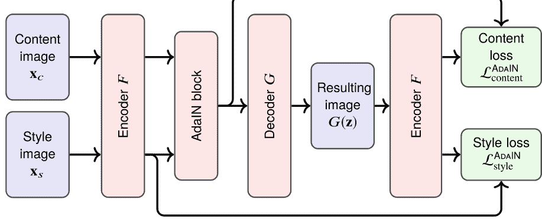

图4.14 基本的AdaIN模型来自[371]。

$$\text{AdaIN}(\mathbf{x}_c, \mathbf{x}_s) = \sigma(\mathbf{x}_s) \left( \frac{\mathbf{x}_c - \mu(\mathbf{x}_c)}{\sigma(\mathbf{x}_c)} \right) + \mu(\mathbf{x}_s).$$

黄和Belongie [371]表明，即使在一个非常简单的架构中，AdaIN也可以用于风格转移，如图4.14所示。他们将其应用于艺术风格转移，这种方法的需求尤为迫切，因为我们不能依赖于拥有给定风格的大型图像数据集。在这个架构中，AdaIN层应用于卷积编码器 $F$ 的结果（具体来说，在这种情况下是VGG编码器）。然后使用解码器 $G$ 对结果进行解码，并且整个架构使用两个损失进行训练：

$$\mathcal{L}^{\text{ADAIN}} = \mathcal{L}^{\text{ADAIN}}_{\text{content}} + \lambda \mathcal{L}^{\text{ADAIN}}_{\text{style}},$$

其中

- 内容损失 $\mathcal{L}^{\text{ADAIN}}_{\text{content}}$ 基本上是自动编码器损失，检查如果我们通过 $F$ 将 $G$ 的结果重新编码，是否得到与我们开始时相同的特征张量：

$$\mathcal{L}_{\text{content}}^{\text{ADAIN}} = \| F(G(\mathbf{z})) - \mathbf{z} \|_2,$$

其中 $\mathbf{z} = \text{AdaIN}(F(\mathbf{x}_c), F(\mathbf{x}_s))$；

- 风格损失 $\mathcal{L}^{\text{ADAIN}}_{\text{style}}$ 比较了风格图像 $\mathbf{x}_s$ 的编码统计信息（应该编码风格）和结果图像的统计信息（假设已交换风格）：

$$\mathcal{L}_{\text{style}}^{\text{ADAIN}} = \sum_{l=1}^{L} \left\| \mu \left( F^{(l)}(G(\mathbf{z})) \right) - \mu \left( F^{(l)}(\mathbf{x}_s) \right) \right\|_2 + \sum_{l=1}^{L} \left\| \sigma \left( F^{(l)}(G(\mathbf{z})) \right) - \sigma \left( F^{(l)}(\mathbf{x}_s) \right) \right\|_2.$$

其中 $F^{(l)}$ 表示VGG编码器 $F$ 中层 $l$ 的输出。

AdaIN层最重要的特点是风格可以从风格特征或甚至单个图像中编码。因此，基于AdaIN的模型不需要大型数据集，可以解决我们在前面几段中遇到的问题。特别是由刘等人开发的Few-Shot无监督图像到图像转换模型（FUNIT）能够在许多不同的风格之间进行转换，每个风格由少量图片定义（因此标题中有“few-shot”一词）。

FUNIT中的基本思想包括一个条件生成器和一个多任务对抗鉴别器。鉴别器解决多个分类任务，每个类别一个，决定输入图像是该类别的真实图像还是生成器产生的翻译输出。FUNIT的训练通过优化问题完成。

$$\begin{aligned}
\min_{D} \max_{G} \mathcal{L}^{\text{FUNIT}}(D, G), \\
\mathcal{L}^{\text{FUNIT}}(D, G)=\mathcal{L}_{\mathrm{GAN}}^{\text{FUNIT}}(D, G)+\lambda_{1} \mathcal{L}_{\mathrm{rec}}^{\text{FUNIT}}(G)+\lambda_{2} \mathcal{L}_{\text{feat}}^{\text{FUNIT}}(G),
\end{aligned}$$

其中

- $\mathcal{L}_{\mathrm{GAN}}^{\mathrm{FUNIT}}(D, G)$ 是通常的条件 $\mathrm{GAN}$ 损失，

- $\mathcal{L}_{\mathrm{rec}}^{\mathrm{FUNIT}}(G)$ 是重构损失，它表示如果我们对样式和内容使用相同的图像，我们应该得到相同的输出图像：

$$\mathcal{L}_{\mathrm{rec}}^{\mathrm{FUNIT}}(G)=\mathbb{E}_{\mathbf{x}}\left[\|\mathbf{x}-G(\mathbf{x}, \mathbf{x})\|_{1}\right];$$

- $\mathcal{L}_{\text{feat}}^{\text{FUNIT}}(G)$ 是特征匹配损失，试图匹配来自类别图像 $\left\{\mathbf{y}_1, \ldots, \mathbf{y}_K\right\}$ 和翻译输出 $\hat{\mathbf{x}}$ 的鉴别器特征：

$$\mathcal{L}_{\text{feat}}^{\mathrm{FUNIT}}(G)=\mathbb{E}_{\mathbf{x},\left\{\mathbf{y}_1, \ldots, \mathbf{y}_K\right\}}\left[\left\|D_f(\hat{\mathbf{x}})-\frac{1}{K} \sum_{k=1}^K D_f\left(\mathbf{y}_k\right)\right\|_1\right],$$

其中 $D_f(\mathbf{x})$ 是从鉴别器的倒数第二层获取的特征；换句话说，特征匹配损失直接要求生成器欺骗鉴别器，使其混淆 $\hat{\mathbf{x}}$ 和 $\left\{\mathbf{y}_1, \ldots, \mathbf{y}_K\right\}$，起到一种正则化的作用。

FUNIT的有趣部分是生成器架构，如图4.15所示。它明确区分内容编码器和风格编码器：前者应用于内容图像 $\mathbf{x}$，后者应用于每个输入类别图像 $\left\{\mathbf{y}_1, \ldots, \mathbf{y}_K\right\}$，它们共同定义了风格。然后，从风格图像产生的特征被平均以获得风格编码 $\mathbf{z}_y$，经过几个完全卷积层后，该编码被用作解码器中AdaIN块的风格输入（系数 $\mu$ 和 $\sigma$）。

在黄等人的多模态无监督图像到图像翻译（MUNIT）模型中，沿着这些思路迈出了下一步。该模型结合了FUNIT和CycleGAN的思想。MUNIT中使用的自编码器与之非常相似。

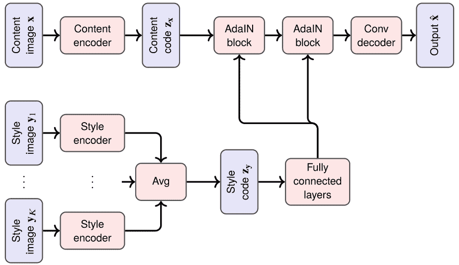

图4.15 FUNIT生成器架构[537]。

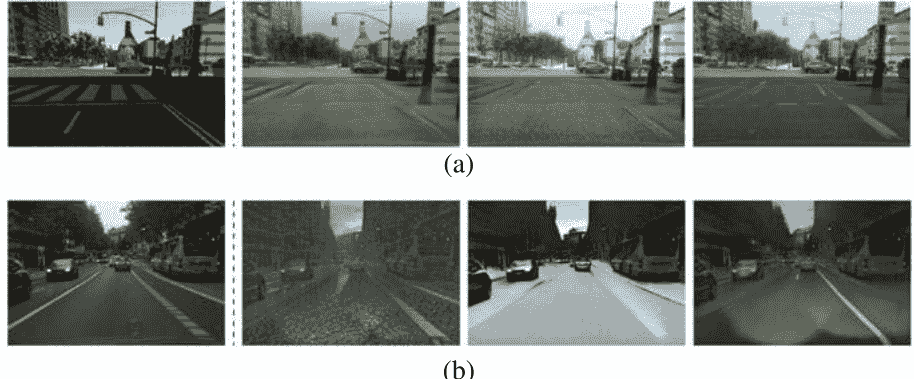

图4.16 合成到真实和真实到合成的MUNIT样本结果[374]：（a）SYNTHIA到Cityscapes；(b) Cityscapes到SYNTHIA。

图4.15中显示的FUNIT架构：从输入图像 $\mathbf{x}$，一个编码器 $E^c$ 生成内容编码 $\mathbf{c}$，另一个编码器 $E^s$ 生成风格编码 $\mathbf{s}$，然后通过AdaIN块在解码器（生成器）$G$ 中使用。与FUNIT类似，这种明确的风格和内容解耦允许在解码器中组合来自一张图像的风格编码和另一张图像的内容编码进行风格转移；图4.16展示了合成到真实和真实到合成转换的MUNIT样本结果。

区别在于这些自编码器的一般结构，如图4.17所示。MUNIT中的整体损失函数为

$$\mathcal{L}^{\text{MUNIT}}=\mathcal{L}_{\mathrm{GAN}, 1}^{\text{MUNIT}}+\mathcal{L}_{\mathrm{GAN}, 2}^{\text{MUNIT}}+\lambda_{1}\left(\mathcal{L}_{\mathrm{rec}, \mathbf{x} 1}^{\text{MUNIT}}+\mathcal{L}_{\mathrm{rec}, \mathbf{x} 2}^{\text{MUNIT}}\right)+\lambda_{2}\left(\mathcal{L}_{\mathrm{rec}, \mathbf{c} 1}^{\text{MUNIT}}+\mathcal{L}_{\mathrm{rec}, \mathbf{c} 2}^{\text{MUNIT}}\right)+\lambda_{3}\left(\mathcal{L}_{\mathrm{rec}, \mathbf{s} 1}^{\text{MUNIT}}+\mathcal{L}_{\mathrm{rec}, \mathbf{s} 2}^{\text{MUNIT}}\right),$$

其中

- $\mathcal{L}_{\text{GAN}, 1}^{\text{MUNIT}}$ 是在域 $\mathbf{x}_1$ 中的对抗损失，$\mathcal{L}_{\mathrm{GAN}, 2}^{\text{MUNIT}}$ 是在域 $\mathbf{x}_2$ 中的对抗损失；

- $\mathcal{L}_{\text{rec}, \mathbf{x} 1}^{\text{MUNIT}}$ 和 $\mathcal{L}_{\text{rec}, \mathbf{x} 2}^{\text{MUNIT}}$ 分别是应用于图像 $\mathbf{x}_1$ 和 $\mathbf{x}_2$ 的自编码器的重构损失（图4.17中未显示）：

$$\mathcal{L}_{\mathrm{rec}, \mathbf{x} 1}^{\mathrm{MUNIT}}=\mathbb{E}_{\mathbf{x}_{1}}\left[\left\|G_{1}\left(E_{1}^{c}\left(\mathbf{x}_{1}\right), E_{1}^{s}\left(\mathbf{x}_{1}\right)\right)-\mathbf{x}_{1}\right\|_{1}\right];$$

- $\mathcal{L}_{\text{rec}, \mathbf{c} 1}^{\mathrm{MUNIT}}$ 和 $\mathcal{L}_{\text{rec}, \mathbf{c} 2}^{\mathrm{MUNIT}}$ 是两个相应领域的内容重建损失：

$$\mathcal{L}_{\mathrm{rec}, \mathbf{c} 1}^{\mathrm{MUNIT}}=\mathbb{E}_{\mathbf{c}_{1}, \mathbf{s}_{2}^{\prime} \sim q}\left[\left\|E_{2}^{c}\left(G_{2}\left(\mathbf{c}_{1}, \mathbf{s}_{2}^{\prime}\right)\right)-\mathbf{c}_{1}\right\|_{1}\right],$$

其中 $q(\mathbf{s})=\mathcal{N}(\mathbf{s} \mid \mathbf{0}, \mathbf{I})$ 是样式编码的标准高斯先验；

- $\mathcal{L}_{\text{rec}, \mathbf{s} 1}^{\mathrm{MUNIT}}$ 和 $\mathcal{L}_{\text{rec}, \mathbf{s} 2}^{\mathrm{MUNIT}}$ 是两个相应领域的样式重建损失：

$$\mathcal{L}_{\mathrm{rec}, \mathbf{s} 1}^{\mathrm{MUNIT}}=\mathbb{E}_{\mathbf{c}_{2}, \mathbf{s}_{1}^{\prime} \sim q}\left[\left\|E_{1}^{s}\left(G_{1}\left(\mathbf{c}_{2}, \mathbf{s}_{1}^{\prime}\right)\right)-\mathbf{s}_{1}^{\prime}\right\|_{1}\right].$$

通过这种架构，MUNIT可以在完全无监督的方式下学习进行风格转换，使用非配对的数据和由一组图像编码的领域。

请注意，风格转换模型原则上可以直接用于合成到真实的风格转换，使合成图像更加逼真，类似于艺术风格转换模型将莫奈的风景变成照片。本节中提到的许多模型提供了合成到真实样本的结果；特别是，图4.16重现了MUNIT [374]生成的户外场景的一些合成到真实风格转换的示例。我们将在第10章中更详细地讨论合成到真实的细化问题。

所有这些想法都在最新的风格转换模型中得到了结合。一种著名的架构是由NVIDIA研究人员Karras等人开发的StyleGAN [437]，其主要用途是生成具有不同“粒度级别”的其他人脸的条件（风格）。基本思想是将从风格图像中提取的风格作为生成器的不同层的输入，并且风格以AdaIN的方式定义和使用。另一方面，这些级别本身遵循我们在第4.6节中讨论的渐进增长的思想。StyleGAN架构如图4.18所示。我不会详细介绍这个（确实相当复杂）的架构，但让我简要解释一下图4.18中的主要数据流程：

- StyleGAN使用逐渐增长的架构；图4.18显示了第一个和第二个块，其输出为 $4 \times 4$ 和 $8 \times 8$，并且后续块与图4.18中的 $8 \times 8$ 块具有相同的结构；

- StyleGAN在开始时没有潜在噪声输入；它从一个常数 $4 \times 4 \times 512$ 张量开始；

## 4.7 案例研究：基于GAN的风格转移

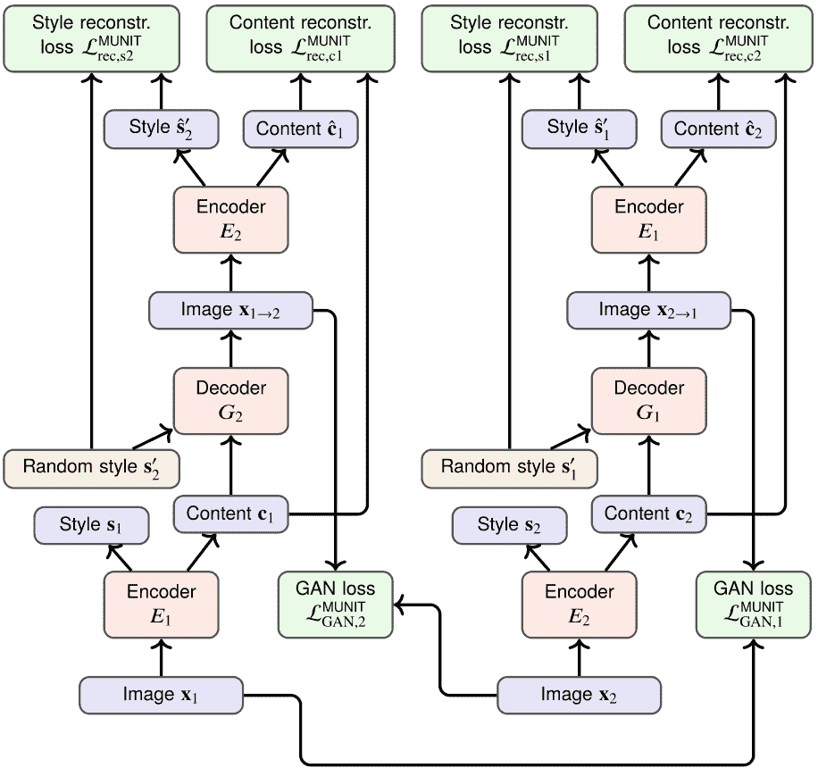

图4.17 MUNIT的总体架构[374]。

- 噪声在卷积块之后的每个渐进级别上注入；它是经过缩放的不相关高斯噪声，缩放因子通过学习得到（在图4.18中表示为B）；
- 样式在AdaIN层中添加，采用我们上面讨论过的常规AdaIN结构；样式向量由给定的潜在向量z生成，然后通过完全连接的映射网络将其映射为权重向量w，然后将向量w专门用于每个AdaIN块的样式(γ,β)，其中A表示学习得到的仿射变换（在图4.18中表示为A）。

通过这种架构，StyleGAN能够对最终图像进行非常精细的控制，因为在渐进式增长的不同层级上的样式和噪声会产生不同“尺度”的变化。特别是对于人脸来说，低分辨率（4×4、8×8）控制着姿势、一般发型和大的细节，如太阳镜；中等分辨率（16×16、32×32）控制着面部特征、发型的具体细节和面部表情；最终层（高达1024×1024）控制着色彩方案和非常细微的细节。这意味着，通过使用几个不同的分辨率的风格向量w，我们可以将几个人脸合并成一个，甚至可以控制从每个输入中精确选择什么。

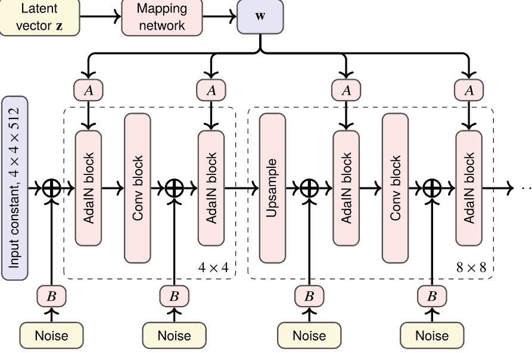

图4.18 StyleGAN架构[437]。

类似的想法也被用于由Nirkin等人[632]提出的Face Swapping GAN (FSGAN)。接下来的步骤是由同一NVIDIA团队的Karras等人在StyleGAN2中进行的下一次迭代[440]。此后又有两个进一步的发展：StyleGAN的半监督版本在高分辨率下进行解缠学习[629]，以及在有限大小数据集上进一步改进生成质量的StyleGAN训练变体[436]。风格转换和相关任务仍然是一个非常活跃和有趣的研究领域，我绝对期待在最近的未来会有许多新的模型和改进。

## 4.8 结论

本章试图对生成式深度学习模型的世界进行简要介绍。当然，在这个简短的章节中，我们无法充分涵盖这个广泛的主题。但我希望我们在这里概述的基本思想足以使读者初步了解，足以理解第10章，并且本章提供的参考资料将有助于更多地了解深度学习中的生成模型。

最后一节关于风格转移案例研究的部分远非随机的：风格转移是我们将在第10.1节和第10.4节中讨论的合成到真实细化的基本任务。正如我们已经指出的，新的风格转移模型几乎可以直接应用于使合成数据看起来更加真实。

但下一章将描绘一个更广泛的画面：它将调查许多不同的想法用于合成到真实领域的适应。然而，其中许多是基于生成模型，特别是生成对抗网络，所以在第10章中可以期待更多基于GAN的架构。

但在我们继续进行领域适应之前，在接下来的几章中我们将考虑更直接的合成数据应用。在下一章中，我们将从计算机视觉的早期工作历史开始，这些工作似乎与合成数据以一种形式或另一种形式密不可分。

# 第5章 合成数据的早期阶段

人工合成数据似乎只在近年来变得非常重要，这要归功于现代计算机图形学的兴起，它可以实现接近真实的图像。

但事实上，人工合成数据从计算机视觉的起源，即上世纪60年代开始就一直被使用。在本章中，我们将从人工合成数据的早期开始，展示一些最早的计算机视觉模型和应用，并讨论一些一直以来非常困难甚至不可能在没有人工合成数据的情况下完成的计算机视觉方面的问题。

## 5.1 线条绘制：计算机视觉的第一步

在本章中，我们将看到人工合成数据是如何开始其旅程以及它的早期情况。我们将看到人工合成数据如何渗透到计算机视觉的最初阶段；然后在后续章节中，我们将继续探讨现代技术的最新进展以及人工合成数据如何对其有所帮助。但是，人工合成数据的旅程要比深度学习的兴起早得多…

计算机视觉在现代形式上几乎与人工智能领域的开始同时开始，并且一开始就是一个非常雄心勃勃的努力。

有一个著名的轶事说马文·明斯基要求他的本科生杰拉尔德·萨斯曼在暑期项目中解决计算机视觉问题，但这并不完全正确；事实上，真正的任务是“将相机连接到计算机并进行一些操作”，明斯基并没有期望太多。

然而，这个轶事确实反映了当时的精神。1966年，塞摩尔·帕佩特的暑期视觉项目旨在为约10名暑期实习生提供一个构建分割系统的机会：“暑期视觉项目是为了有效利用我们的暑期工作人员来构建一个视觉系统的重要部分……该项目的主要目标是构建一个能够将视频图像分割成可能区域的程序系统。”物体，可能是背景区域和混乱……最终目标是对象识别，通过将对象与已知对象的词汇进行匹配来实际命名对象”[654]。

当然，这种乐观是没有根据的。回到20世纪60年代和70年代，即使作为纯粹的学术练习，在真实照片上进行可用的分割也非常困难。因此，计算机视觉研究人员转向了……合成数据。在这种情况下，早期合成数据的主要目的是为计算机视觉算法提供更简单的测试问题，当时许多计算机视觉问题被普遍认为适合算法而不是大型可训练模型。早期计算机视觉中充斥着以人工绘画形式的合成图像。

例如，考虑一下线标记问题：给定一张清晰显示线条的图片，标记哪些线条代表凹边，哪些代表凸边。

图5.1展示了一张带有这种标记的两个嵌套平行六面体的示例图片，取自David Huffman的经典论文《不可能的物体作为无意义的句子》[379]。左边的图显示了一张完全标记的“X射线”图像，所有不可见的边缘也清晰标记出来，右边的图只显示可见部分，但仍然完全标记。问题是，给定一个类似右边图中没有标记的图形，要生成标记，用“+”表示凸边，用“-”表示凹边。

麦克斯韦·克洛斯在他的开创性论文《关于看东西》[162]中提出了一个不同但非常相似的问题。图5.2a展示了这个问题的一个示例插图。在这里，克洛斯根据构成它们的边的数量和边的类型（凹边还是凸边）区分不同类型的角。基本上，问题是一样的：找出作为线条绘制的多面体的形状。

请注意，霍夫曼和克洛斯都将实际构建该图的问题抽象出来（在现代计算机视觉中，它被称为边缘检测），并开始假设线图已经构建完成。这正是为什么他们需要合成数据的原因：在20世纪70年代的现实世界边缘检测会带来太多问题。另一方面，将真实照片抽象化会忽略掉重要的纹理和光照信息，这些信息可以用来推断哪些边缘是凸的，哪些是凹的。

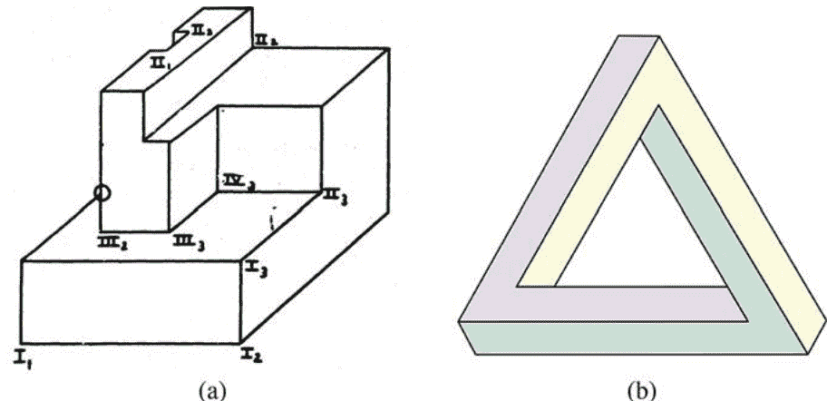

图5.2 线描图和不可能的物体： （a）来自[162]的示例； （b）彭罗斯三角形（图片来自维基百科）。

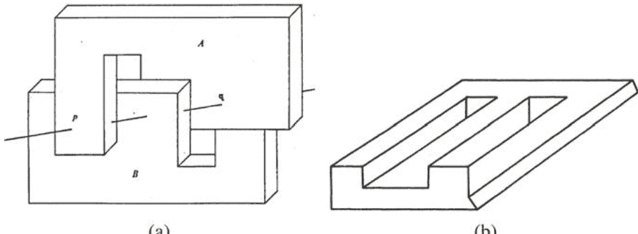

图5.3 难以检测的不可能物体： （a）来自[379]的示例； （b）来自[162]的示例。

重要的信息包括纹理和光照，可以用来推断哪些边缘是凸的，哪些是凹的。现代单图像3D场景重建模型试图充分利用这些信息。

两位研究人员（据我所知，独立地）致力于开发解决这个问题的算法。他们主要将其作为一个拓扑问题来解决，使用了图论的语言，并开发了一些条件，使得一个二维线条图可以对应一个可行的三维物体。看起来他们都对不可能的物体着迷，即二维图像看起来逼真，并满足许多合理的必要条件，但同时在三维空间中无法真正实现。想象一下M.C. Escher的画作或者著名的彭罗斯三角形（如图5.2b所示）。图5.3展示了两个更复杂的多面体形状，左边的（图5.3a）来自Huffman的工作，右边的（图5.3b）来自Clowes。它们都是不可能的，但通过检查它们的线条图的局部属性并不容易发现这种不可能性。

两篇论文中的算法都不需要训练集，但是它们完全在人工生成的线条图上进行了测试，这是计算机视觉中最早和最简单的合成数据的例子之一。尽管从现代标准来看，这听起来像一个非常人工的例子，问题似乎更属于计算几何学领域而不是计算机视觉，但它非常典型于视觉领域的早期工作，更依赖于算法方法而不是自下而上的特征提取和学习。

## 5.2 合成数据作为定量比较的测试平台

正如我们在上一节中看到的，在计算机视觉的早期阶段，许多问题不是通过机器学习来解决的，而是通过直接尝试开发特定任务的算法来解决的。让我们以本节的运行示例来解决测量光流的问题。这是基本的低级计算机视觉问题之一：估计图像像素的表观运动速度分布。

光流可以帮助在图像上找到移动物体或估计（可能减去）相机本身的运动，但它最常见的用途是用于立体匹配：通过计算同时从两个摄像机拍摄的图像之间的光流，可以构建场景的立体视图，进行深度估计，并在很大程度上实现真正的三维场景理解。从数学上讲，光流是一组向量场，用于估计一对图像之间每个像素的运动。

光流估计算法分为两类：稠密光流估计旨在计算整个图像之间的差异，而稀疏算法仅跟踪给定点的小子集。图5.4展示了在涩谷十字路口视频上使用两种代表性算法进行光流估计的示例：Farnebäck算法用于稠密光流估计[232]，Lucas-Kanade算法用于稀疏版本[561]，实现在OpenCV库[390]中。

对于低级计算机视觉问题和计算机视觉的早期工作来说，Farnebäck和Lucas-Kanade方法都是固定的算法，没有参数可以从数据中学习，也没有需要标记的训练集。这是解决这个问题的一种自然方法，因为手动标记光流是一项巨大的任务，目前还没有大规模的真实图像数据集来进行光流估计的地面真实标记；我们将在第6.2节讨论当代的合成数据集，但它们中没有一个由真实场景组成的大规模组件。

然而，另一个问题出现了：虽然对于经典的光流估计算法来说没有必要有一个训练集，但是对于一个测试集呢？如果没有带有地面真实答案的数据集，我们如何找出哪个算法更好呢？

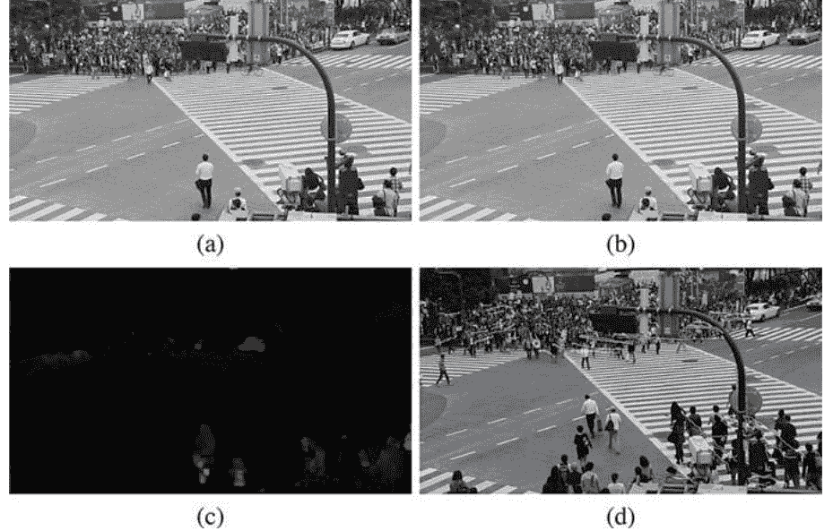

图5.4 示例光流估计，代码示例取自[521]： (a) 第一个原始帧; (b) 第二个原始帧; (c) 由Farneback算法[232]计算的帧之间的稠密光流; (d) 由Lucas-Kanade算法[561]在较长的视频序列上估计的几个关键点的稀疏光流。

计算机视觉的早期工作经常完全忽视了这个问题。例如，在他们的开创性论文[561]中，Lucas和Kanade没有提供任何关于他们的算法效果如何的定量估计，他们只给出了几个基于单个真实世界立体对的示例，如图5.5所示。这是完全典型的：所有早期的光流估计工作都开发和展示了新的算法，但没有提供任何原则性的比较手段，只是在少数几个真实示例上进行测试。

然而，当足够多的算法积累起来时，对一个诚实且具有代表性的比较的需求变得非常迫切。作为这样一个比较的例子，我们跳到1994年，看看Barron等人的论文《光流技术的性能》[42]。他们提出了光流估计算法的分类和调查，包括各种微分（如Lucas-Kanade）、基于区域的和基于能量的方法。但是为了进行公正的实验比较，他们需要一个具有已知正确答案的测试集。当然，他们选择了合成数据来进行测试。

Barron等人简明扼要地总结了合成数据的优点和缺点，这些优点至今仍然成立： “合成输入的主要优势在于可以以有条理的方式控制和测试2D运动场和场景属性。特别是，我们可以访问真实的2D运动场，从而可以量化性能。相反，必须记住这样的输入通常是干净的信号(不包括遮挡、镜面反射、阴影、透明等)。因此，这个性能度量应该被视为对真实图像序列中预期误差的乐观上限”[42]。

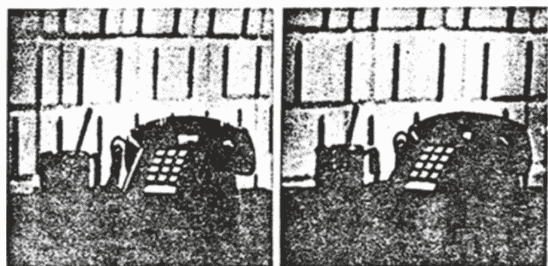

图5.5 用于[561]中测试的真实立体对。

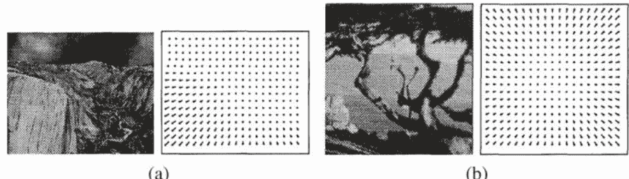

图5.6 来自[42]的样本合成光流场： (a)平移序列, 相机在较大图像上水平移动; (b)发散序列, 相机沿着垂直于图像的视线移动。

具体来说，在他们的比较中，他们使用了正弦输入和在明亮背景上移动的黑色方块。对于更复杂的任务，他们使用了合成相机运动。例如，如果你拍摄一张静止的真实照片，并开始在这个图像上裁剪一个移动的窗口，结果就是你基本上得到了一个相机垂直于其视线沿图像移动的情况，而光流是完全已知的，因为你控制了这个运动的速度（见图5.6a）。如果你拿一个窗口开始扩展它，你会得到一个相机沿着其视线向外移动，垂直于图像平面（见图5.6b）。这些合成数据生成技术简单而看似天真，但它们确实允许进行合理的定量比较：结果表明，即使在这样看似简单的输入上，经典的光流估计算法给出了非常不同的答案，准确性也有很大差异。

这个例子说明了一个更普遍的观点：虽然传统的低级计算机视觉问题的算法几乎从不涉及任何参数的学习，但为了进行公正的比较，需要一个具有已知正确答案的测试集，而这正是合成数据可以发挥作用的地方。在大规模真实数据集仍然不可用的问题中，例如光流估计，合成测试集至今被广泛使用。

## 5.3 ALVINN：1989年的自动驾驶神经网络

自动驾驶车辆的想法非常古老。在《一千零一夜》中出现了一块魔法飞毯，被归功于所罗门王的宫廷。列奥纳多·达·芬奇留下了一张经过预先编程的时钟车的草图。关于自动驾驶汽车的全面历史概述，请参阅马克·韦伯的一篇文章，其中展示了早期尝试自动驾驶汽车的许多绘画和照片。以借用一个例子，早在1939年，通用汽车在纽约世界博览会上有一个大型展馆；在一个名为“未来乐园”的游乐设施中（马特·格勒宁受到通用汽车的启发吗？），他们展示了他们对未来城市的愿景。这些城市包括智能道路，可以向智能车辆提供信息，并且它们可以在没有人类监督的情况下自主驾驶。

现实与这个愿景仍然没有完全接轨，自动驾驶车辆的道路一直充满挑战。但是早在1970年代，就有成功的自动驾驶汽车实验。特别是在1977年，日本筑波机械工程实验室开发了一台计算机，可以根据城市街道上可视区分的标记自动驾驶汽车。

在1980年代，由DARPA资助的一个项目成功地实现了计算机视觉下的真实道路行驶。这就是著名的ALV（自主陆地车）项目，其视觉系统能够在图像中定位道路，解决逆几何问题，并将结果发送给导航系统。这个名为VITS（Vision Task Sequencer）的视觉系统，并没有使用现代意义上的机器学习。

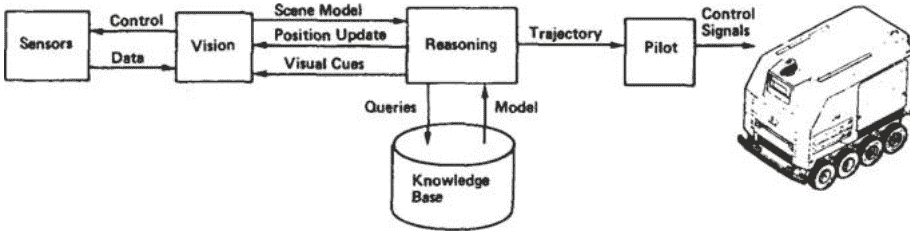

图5.7 ALV自动驾驶汽车控制系统的总体架构[879]。


图5.8 为ALV自动驾驶汽车设计的VITS视觉系统架构[879]。

与其他计算机视觉系统相似，正如我们上面讨论的那样，它依赖于专门开发的分割、道路边界提取和逆几何算法。图5.7显示了ALV的总体架构，如[879]所示，图5.8显示了视觉系统的流水线。

该论文报告称，ALV“可以以最高10公里/小时的速度行驶4.2公里的距离，处理道路表面的变化，并在一个锐利的、几乎是U形的弯道上导航”。在障碍物避免被添加到导航系统之后，阿尔文（这是ALV项目实际自动驾驶汽车的昵称）可以在道路上避开障碍物，并在干净的道路上加速到20公里/小时。这些对当时来说真的是令人印象深刻的结果，而且它们纯粹是通过定制的算法实现的：阿尔文不学习，不需要任何数据，因此也不需要合成数据集。

但是这种“无学习”立场很快改变了。1989年，迪恩・A・波默洛在NIPS上发表了一篇论文（这是第二届NIPS，与现在的完全不同），名为ALVINN：一种神经网络自主陆地车[680]。这是最早尝试基于机器学习为自动驾驶汽车开发计算机视觉系统的之一。对于现代读者来说，更有趣的是它是基于神经网络的！ALVINN的基本架构如图5.9所示。神经网络有两个不同性质的输入：30×32的视频和8×32的测距数据。神经网络的架构是一个经典的两层前馈网络：输入像素经过隐藏层，然后传递到输出单元，试图识别前方转弯的曲率，以使车辆保持在道路上。还有一个特殊的道路强度反馈单元，仅告诉前一张输入图像中的道路是否比背景亮或暗。

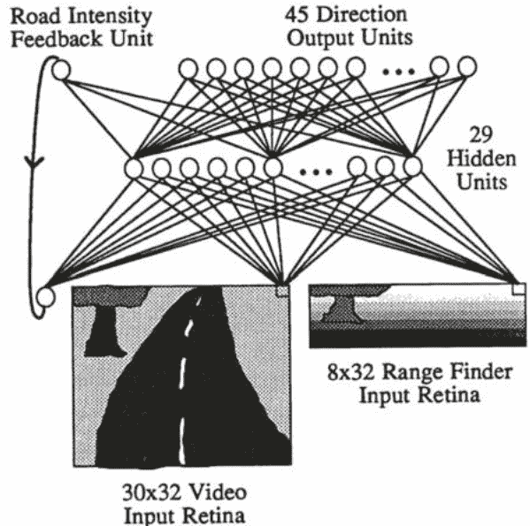

图5.9 ALVINN神经网络的架构[680]。

下一步是训练ALVINN。为了学习，神经网络需要一个带有真实标签的训练集。Dean Pomerleau在关于训练数据收集方面写道：“在实际道路图像上进行训练在逻辑上是困难的，因为为了开发一个通用的表示，网络必须被呈现大量训练样本，这些样本描绘了各种条件下的道路。”

收集这样的数据集将是困难的，而且参数的变化，如相机方向，将需要收集一个全新的道路图像集……”这正是我们在第1章中讨论的关于标签和数据集代表性的问题，只是Pomerleau在1989年谈论这些问题时，是在30×32像素视频的背景下。

那他的解决方案是什么？让我们继续阅读：“……为了避免这些困难，我们开发了一个模拟道路生成器，用于创建用作网络训练样本的道路图像。”一旦研究人员需要用神经网络解决现实世界的计算机视觉问题，就出现了合成数据。这是最早使用自动生成的合成数据集来训练真实计算机视觉系统的例子之一。实际上，那些年代传感器的低分辨率使得使用合成数据更加容易。图5.10显示了ALVINN使用的两个图像，左边是真实图像，右边是模拟图像。当真实相机的工作方式像这样时，在合成数据中实现照片般的逼真并不需要太多的努力。

结果是积极的。在合成测试集上，ALVINN能够在大约90%的时间内正确地（在两个单位内）预测转弯曲率，与当时最好的手工算法相当。在实际测试中，ALVINN能够以每秒半米的速度沿着400米的路径驾驶汽车。有趣的是，限制因素在于计算机系统的处理速度。

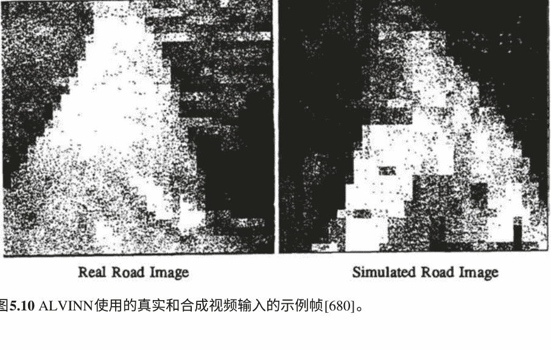

图5.10 ALVINN使用的真实和合成视频输入的示例帧[680]。

这里的关键因素是计算机系统的处理速度。Pomerleau报告称，ALV的手工算法可以达到每秒1米的速度，但只能在更快的Warp计算机上实现，而ALVINN是在机载的Sun计算机上工作的，他预计在切换到Warp后会有“显著的加速”。

这一部分可能引用了太多ALVINN论文[680]的内容，但这项工作是对合成数据积极特征的一个很好的早期快照，我不得不再次引用Pomerleau的结论：“一旦开发出一个真实的人工道路生成器，反向传播算法在半小时内就能产生一个相对成功的道路跟踪系统。”在CMU的视觉和自主导航团队进行了多个月的算法开发和参数调整，才能达到使用传统图像处理和模式识别技术达到类似水平的性能。

Pomerleau说这更多是对机器学习而不是手工算法开发的赞美，但它也突出了合成数据相对于手动标记的优势：如果Pomerleau的团队必须手动标记每个来自真实相机的图像，那将需要超过半小时的时间。而且，为了训练不同的驾驶条件，他们需要在现场收集一个全新的数据集，使用真实汽车，而不仅仅是调整合成数据生成器的参数。

到目前为止，很难想象没有合成数据集的自动驾驶汽车的计算机视觉系统；我们将在第7.2节中详细讨论它们。但是，现代的合成数据方法对于自动驾驶车辆通常不仅集中于创建一组标记的合成图像和视频，而是提供一个交互式模拟，一个可以用来训练驾驶算法的虚拟城市。这将引出我们的下一个话题。

## 5.4 早期仿真环境：机器人与仿真的批评

机器人学并不像人工智能那样古老：在最初几年里，构建一个能在现实世界中运行的实际物体是一个巨大的障碍。然而，机器人学很早就被认为是人工智能的主要问题之一，一旦有可能，人们就开始构建现实世界的机器人。最早尝试配备视觉系统的机器人之一是斯坦福大学的Cart，建于1970年代，如图5.11所示（图片摘自Hans Moravec [613]的一篇后续综述论文）。

Cart配备了一个内置的电视系统，并且一个计算机程序试图根据该系统广播的图像驱动Cart通过障碍物课程。基于从不同摄像机位置拍摄的几个图像（一种“超立体”视觉），其视觉算法试图找到感兴趣的点（特征），检测障碍物，并避免或绕过它们。对于一个早期系统来说，它非常成功，尽管性能不是很出色：Cart每10-15分钟移动约1米。尽管如此，在这些移动中，Cart能够成功避开现实生活中的障碍物。

正如我们已经讨论过的，在1990年代之前，计算机视觉很少基于任何形式的学习：研究人员试图设计算法，只需要数据来测试和比较它们。这对于机器人技术也是如此：早期的机器人（如Cart）在视觉、路径规划和其他方面都有硬编码的算法。

然而，对Cart和类似机器人的实验告诉研究人员，在现实世界中验证他们的想法是非常昂贵且往往完全不可能的。大多数研究人员决定首先在计算机模拟中测试算法，然后再进行真实世界的测试。这样做有两个主要原因：

- 在模拟世界中测试新算法比将其嵌入到真实机器人中并在现实中测试要容易、快速和廉价得多；
- 模拟可以抽象出许多真实世界机器人必须面对的问题，例如传感器读数中的不可预测的噪声源、硬件的缺陷、累积误差等；重要的是能够区分你的算法之所以不起作用是因为它在一般情况下是一个坏主意还是因为在这种特殊情况下传感器噪声太大。

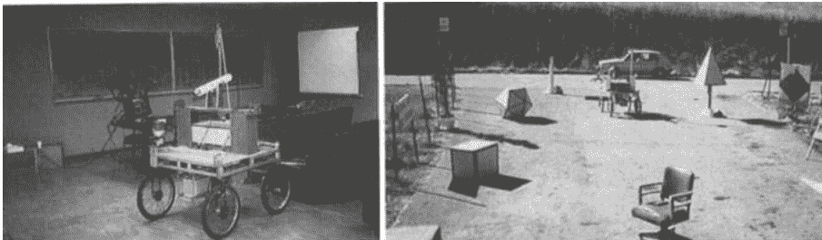

图5.11 斯坦福购物车[613]。

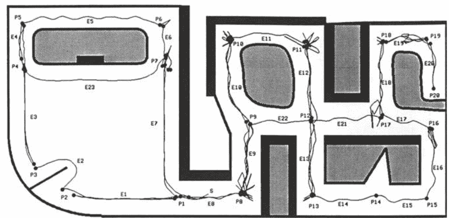

图5.12 来自[479]的系统和10%随机误差的样本探索结果。

因此，机器人学转向了“先模拟，后构建”的原则，至今仍然遵循这一原则。

例如, Benjamin Kuipers和Yung-Tai Byun基于空间表示的语义层次结构开发了一种机器人探索和建图方法[479, 481]。 这意味着他们的机器人应该逐渐从控制层面开始工作, 找到独特的地点和路径, 然后通过拓扑层面创建环境的拓扑网络描述, 最后转换为几何层面, 通过融合有关距离和地点之间全局度量关系的局部信息将拓扑转换为几何地图。 图5.12显示了在嘈杂的传感器读数下, 该导航算法探索迷宫的样本轨迹。

这种方法本身是一项开创性的工作, 但现在不是我们的主题, 我不会再详细介绍它。然而, 我想指出的是, 他们实施和测试该方法的方法: Kuipers和Byun编写了一个名为NX Robot Simulator的二维模拟环境 (顺便说一句, 是用Common Lisp编程的)。 在这个环境中, 虚拟机器人可以访问十六个声纳式距离传感器和一个指南针, 并通过两个履带式链条移动。

这个模拟的另一个有趣之处在于, Kuipers和Byun特别注意实现了反映真实误差的声纳误差模型。

图5.13a显示了他们模拟的一个样本图片; 在左边, 你可以看到一个机器人以16个方向发射声纳射线, 右边的直方图显示了传感器读数 (用垂直线表示) 和真实距离 (用X和O标记表示)。 请注意, O标记表示由于镜面反射而产生的系统误差, 比由正常随机误差产生的X标记的偏差更严重。 作者们还将其制作成了一个带有GUI界面的软件产品, 在20世纪80年代要比现在困难得多; 图5.13b显示了一个示例截图。算法在模拟中运行良好, 并且该模拟如此逼真, 以至于实际上可以将结果转移到现实世界中。在后续的工作中[480],

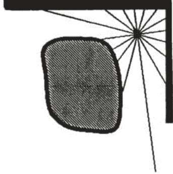

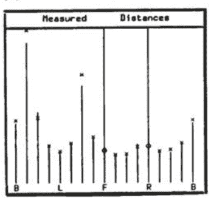

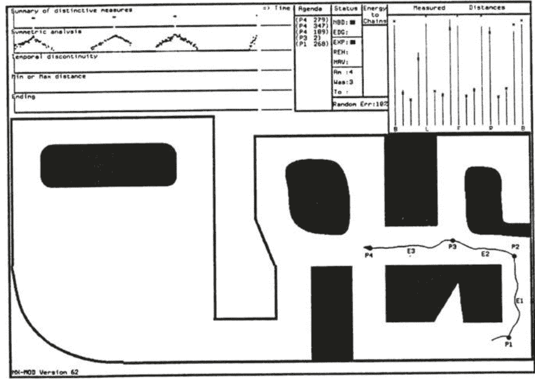

| Measured | Distances |
|---|---|
| (P4 279) | HBD: |
| (P4 347) | EDD: |
| (P4 185) | EXP: |
| (P3 2) | REH: |
| (P1 268) | MIV: |
| An: 4 | Was: 3 |
| To: | Random Err: 182 |

| Measured | Distances |
|---|---|
| | |

图5.13 NX机器人模拟器: (a)模拟的样本图像[479]; (b)模拟程序的图形界面[481]。

Kuipers等人报告了他们在两个不同的感知运动系统上成功实现了他们的算法的两个物理移动机器人Spot和Rover的实验。

请注意,合成数据在20世纪80年代比今天要困难得多。作为另一个早期的例子,我可以提到Raczkowsky和Mitten-buehler [694]在机器人技术中讨论相机模拟的工作。它主要致力于构建一个3D场景,而在1989年,你必须自己完成所有工作,所以这篇论文涵盖了以下内容:

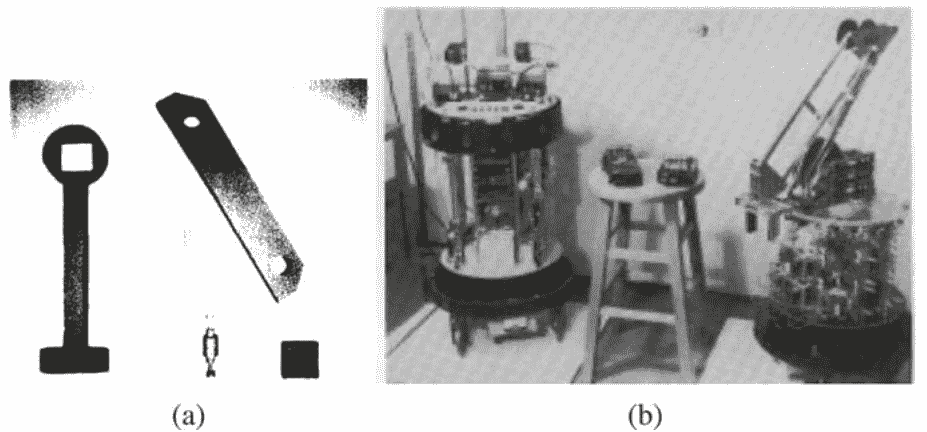

构建一个3D场景,并且在1989年,你必须自己完成所有工作,所以这篇论文涵盖了以下内容:

- 定义一个3D对象的表面、轮廓和顶点;
- 光学表面属性,包括菲涅尔反射、漫反射、光通量密度等;
- 完整的光源模型,包括辐射度、波长等;
- 最后是模拟机器人相机的镜头系统和电子硬件的相机模型。

在那些日子里,只有在经历了所有这些之后,你才能制作出像图5.14a中展示的某种工件的200 ×200合成照片那样令人惊叹的逼真图像。

幸运的是,现代3D建模软件或游戏引擎已经解决了大部分这些问题。然而,相机模型在现代合成数据应用中仍然相关。例如,对于智能手机制造商来说,一个重要的用例可能是在相机更换时重新训练或迁移其计算机视觉模型,你需要一个适用于新旧相机的好模型来捕捉这种变化并进行过渡。

尽管取得了这些成功,但并不是每个人都相信计算机模拟在机器人技术中的应用。在与[480]同一本书中,罗德尼·布鲁克斯 (Rodney Brooks) 和玛雅·马塔里克 (Maja Mataric) 撰写的另一章节,恰如其分地命名为“真实机器人,真实学习问题”[93],专门警告研究机器人技术的研究人员不要过度依赖模拟。布鲁克斯和马塔里克这样表达:“模拟注定会成功。”即使怀着最好的意图,人们也很容易通过调整模拟的细节来解决问题,而不是通过控制程序或学习算法。另一个常见的陷阱是使用对于真实机器人来说根本不可能获得的全局信息。此外,往往很难区分与模拟环境相关的问题与与实际学习问题相关的问题。

基本上，他们警告说计算机视觉问题尚未解决，虽然模拟可以为机器人提供“前方有食物”等高级信息，但在现实中，这样的高级信息是不可获得的。当然，这一点至今仍然成立，现代机器人视觉系统利用了物体检测、分割和其他高级计算机视觉任务的所有现代进展（顺便说一句，合成数据在这本书的其他部分也起到了很大的帮助）。这听起来像是一些非常基本的观点，毫无疑问是正确的，它们更像是问题设定的一部分，而不是真正的批评。

然而，布鲁克斯还提出了一个更有趣的批评，不仅针对合成数据和模拟，而且针对整个机器人视觉程序；虽然这对于本书来说只是一个旁白，但这是一个有趣的旁白，我想详细阐述一下。布鲁克斯的思想在他的两篇开创性论文《没有表示的智能》[92]和《没有理由的智能》[91]中得到了总结。在前者中，布鲁克斯认为，对真实世界的抽象表示是当代人工智能解决方案的一个危险武器，可能导致自欺欺人。他说，真实生活中的智能并没有进化成为解决像下棋或证明定理这样明确定义的抽象问题的机器：动物和人类的智能与感知和移动是不可分割的。这主要是对早期人工智能方法的批评，这些方法确实集中在抽象问题，如方块世界或知识工程。

在《没有理由的智能》一书中，布鲁克斯进一步论证了在现实世界中，即机器人系统中，抽象和知识基本上是无法获得的。例如，他提到了基于线条绘图的视觉算法，我们在第5.1节中讨论过，并承认尽管一些早期的线条检测成功可以追溯到1960年代，但即使在1990年代初，我们也没有可靠的方法将现实生活中的图像转换为线条绘图。布鲁克斯评论道：“试试吧！你会惊讶于它有多糟糕”，这个评论直到今天仍然非常贴切。

布鲁克斯提出了他认为对于人工智能至关重要的四个关键思想：

- **情境性**，即将人工智能代理放置在具有连续性、惊喜或持续历史的真实世界中；布鲁克斯认同这样一个世界很难在模拟中准确反映，并得出结论：“世界是最好的模型”。
- **具体化**，即机器人在现实世界中的物理基础；这对于避免抽象模拟可能导致的自欺欺人的陷阱非常重要；除了带来新问题外，具体化还可以通过将推理和结论基于现实世界来解决抽象问题；
- **智能**，布鲁克斯提议以比人类更简单的动物为模型，首先集中于感知和移动，然后再转向抽象问题解决，就像我们人类在进化过程中所做的一样；
- **涌现**，布鲁克斯区分了传统人工智能系统的功能组件（例如视觉系统、路径规划系统等）和基于行为的系统，其中每个功能单元负责形成给定行为所需的端到端处理（例如避障、凝视控制等）；

至于模拟，布鲁克斯得出结论，它们是可能导致过于乐观结果解释的抽象的例子，并主张完全集成的智能移动机器人。

有趣的是，这与汉斯・莫拉维克在他1990年的论文中写的话相呼应，他在那篇论文中提到了我上面引用的斯坦福大学Cart机器人[613]：“我的结论是，解决发展移动有机体的日常问题会引导人们走向普遍智能的方向，而解决固定实体的问题更有可能导致非常专门化的解决方案。”布鲁克斯将他的想法付诸实践，领导了麻省理工学院人工智能实验室的长期努力，创建移动自主机器人。那里开发的机器人——艾伦、赫伯特、汤姆和杰瑞，如图5.14b所示——旨在与世界互动，而不是计划和执行计划。这项工作很快遇到了技术障碍：在1980年代末，硬件还无法胜任这项任务。但布鲁克斯的想法仍然存在：《无需表示的智能》已经被引用超过2000次，并且至今仍在被引用，涉及领域包括机器人学、认知科学、纳米技术，甚至法律（与人工智能相关的立法是一个非常有趣的话题，顺便说一下）。

仿真对机器人有用吗？当然有用，并且越来越有用！虽然我相信上面所展示的批评有很多道理，但在我看来，在大多数应用中，问题归结为以下几点：当你的机器人在仿真中工作时，并不意味着它在现实生活中也能工作。这当然是真的。

另一方面，如果你的机器人甚至在仿真中都无法工作，那么现在开始建造真实系统肯定为时过早。此外，机器人技术的现代发展，如强化学习的成功，似乎与布鲁克斯的观点有着奇怪的关系。一方面，这无疑是朝着以行为为导向而不是由明确的预先设计的功能单元组成的端到端系统的方向迈出的一步。另一方面，在现代强化学习的状态下，完全没有希望提出复杂系统（如机器人）可以在现实生活中进行训练：它们绝对需要仿真，因为它们需要数百万甚至数十亿次的训练。我们将在第7章中看到这种系统的例子。

然而，虽然研究人员至今在模拟中训练机器人，但准确的3D建模并不足以创建一个对机器人有用的模拟。让我们用机器人学的另一个早期例子来总结本章，以说明这一点。

## 5.5 案例研究：MOBOT和模拟的问题

在前一节中，我们已经讨论了机器人模拟的一般情况：它们是什么，以及为什么它们对基于机器学习的机器人是不可避免的。我们甚至触及了模拟在机器人领域中更多哲学上的含义，讨论了早期对模拟是否真正有用或可能成为该领域的死胡同的担忧。在这里，让我们更详细地考虑一个关于机器人在室内环境中导航的重要项目MOBOT的例子。


图 5.15 MOBOT 项目的插图 [97,219,356,414,872,1030]：(a) 机器人本身；(b) MOBOT 的抽象层次结构；(c) MOBOT 中的世界建模；(d) ps-WM 架构。

MOBOT (移动机器人, 这是本节中你将看到的最简单的首字母缩写之一) 是在1990年代上半叶由埃瓦尔德·冯·普特卡默领导的卡尔斯鲁厄理工大学的一个团队开发的 [97,219,356,414,872,1030]。

MOBOT (具体来说, 是 MOBOT-IV 版本) 如图 5.15a 所示。请注意围绕机器人的黑色方框, 它们是声纳传感器, 稍后我们将回到它们。MOBOT 开发人员解决的主要问题是环境导航, 即构建环境地图并理解机器人需要去哪里的方法。图 5.15b 展示了一个逐渐将决策细化到最细节的良好抽象层次结构。而且, 世界建模也有三个不同的层次; 根据抽象层次的不同, MOBOT 以不同的方式看待世界, 如图 5.15c 所示。

本质上, 这归结为同样的老问题: 弄清楚传感器读数并将它们映射到所有这些漂亮的抽象层, 机器人可以运行路径规划算法, 如常青的 A* [323]。除了声纳, 机器人还有激光雷达, 以及ps-WM的整体方案 (特定世界建模; 我告诉过你缩写只会变得更奇怪) 项目 [414], 如图5.15d所示, 看起来相当复杂。请注意, 有几种不同类型的地图需要更新。

但在本书中, 我们对MOBOT项目特别感兴趣, 因为它包含了一个最早的全尺寸3D仿真环境的例子用于机器人技术。这是3d7仿真环境 [872]; 这个晦涩的名字并不指的是一个不存在的七面体骰子, 而是“3D Simulation Environment”的缩写。3d7环境是为MOBOT-IV开发的, 这是一个自主移动机器人, 用于室内环境导航; 它具有通用的目标, 而不仅仅是一个机器人吸尘器, 因为它的场景理解本质上是三维的, 而对于许多特定的任务来说, 2D地图就足够了。

3d7的整体结构如图5.16a所示。它非常直观: 软件模拟了一个3D环境、机器人传感器和机器人运动, 使开发人员能够建模各种情况, 选择最佳的传感器数据处理和动作控制算法等, 就像我们之前讨论的那样。

我想通过这个例子传达的主要观点是: 创建逼真的模拟非常困难。通常, 当我们谈论合成数据时, 我们集中在计算机视觉上, 并强调创建逼真的3D环境所需的工作。确实, 这是很多工作, 但仅仅创建一个逼真的3D场景并不是机器人技术的终点。对于3D环境建模, 3d7包含了一个环境编辑器, 可以放置基本的3D对象, 如立方体、球体或圆柱体, 还可以放置更复杂的对象, 如椅子或桌子。它生成了一个包含语义对象和几何基元标签的场景, 如图5.16b所示。

但是接下来有趣的部分开始了。MOBOT-IV包含两个光学设备: 激光雷达传感器和与MOBOT-III相比的全新添加, 红外范围扫描设备。这意味着为了进行有用的模拟, 3d7环境必须模拟这两个设备。

结果发现这两个模拟都代表着有趣的项目。LARS, 激光雷达模拟器, 旨在模拟MOBOT-III的真实激光雷达传感器和MOBOT-IV的新红外范围扫描仪。它生成了图5.16c中的模拟。至于声纳范围传感器, 相应的USS2D模拟器 (超声波传感器模拟2D) 更加有趣。它基于 [478] 的工作, 涉及大约30页的深入声学建模; 我不会详细介绍, 但请相信, 那里有很多细节。最终结果是一组与最近墙壁反射对应的声纳范围读数; 图5.16d显示了一组样本读数。

但是等等, 这还不是全部! 在完成所有这些之后, 你只是模拟了传感器读数! 为了真正测试你的算法, 你还需要建模机器人可以采取的动作以及环境对这些动作的响应。对于3d7来说, 这意味着一个独立的机器人运动仿真模型, 称为SKy (Simulation of Kinematics and Dynamics of wheeled mobile robots)。

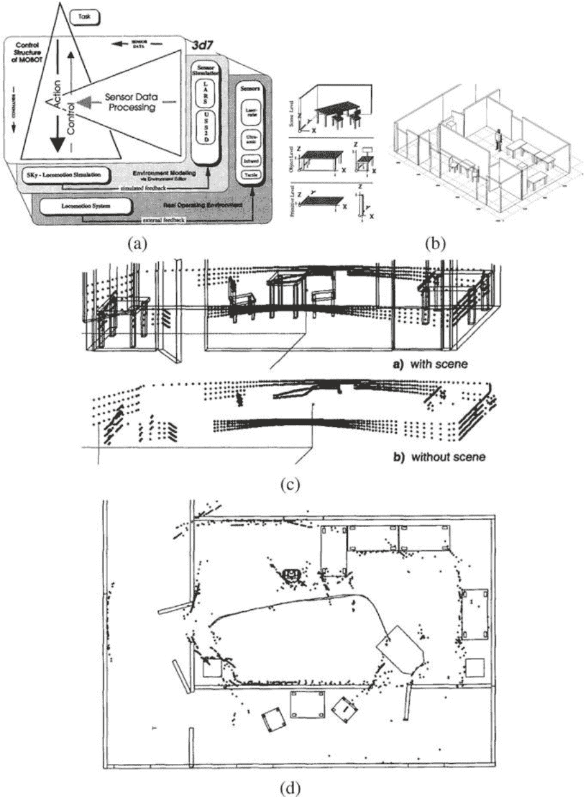

图5.16 3d7仿真环境[872]：（a）整体结构；（b）示例3D场景；（c）LARS激光仿真；（d）USS2D超声波传感器仿真。

这也值得有一篇自己的论文，但我们绝对不会深入讨论。所有这些部分都可以在图5.16a中找到。

MOBOT项目并不包含许多机器学习模型，它主要由设计用于处理传感器读数的固定算法运行。

即使3d7仿真环境主要设计用于测试各种数据处理算法（世界建模）和控制算法（例如路径规划或避碰），这是一种类似于我们之前讨论过的早期计算机视觉的合成数据应用。

但在某个时候，MOBOT设计师确实尝试了一些机器学习。这项工作[1030]的标题是“具有神经网络的自主移动机器人上的实时学习”，听起来与本书非常相关。然而，这些并不是我们所熟悉的神经网络：事实上，Zimmer和von Puttkamer使用了自组织映射（SOM），有时也称为Kohonen映射，以对传感器读数进行聚类。

问题设置如下：当机器人在周围移动时，它收集传感器信息。基本问题是构建一个包含所有障碍物的地板拓扑图。为了做到这一点，机器人需要能够识别已经到过的地方，即对整个传感器读数集进行聚类，转化为可以作为拓扑表示节点的“位置”。由于机器人运动的不精确性，我们不能依赖于运动学模型来确定我们试图到达的位置:小误差往往会累积。相反,作者建议对传感器读数进行聚类:如果当前的读数向量与我们之前看到的相似,那么我们可能处于大致相同的位置。

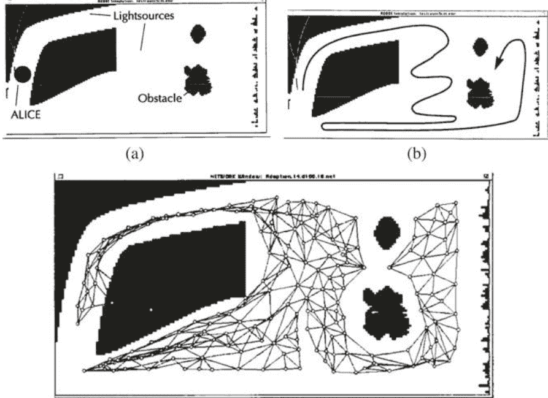

图5.17 MOBOT项目中的学习[1030]：（a）示例测试环境；（b）测试轨迹；（c）由 SOMs 生成的拓扑表示。

而且我们再次看到了完全相同的效果:虽然Zimmer和von Puttkamer确实对真实机器人进行了实验,但大多数SOM训练的实验都是使用合成数据进行的。这些数据是在一个测试环境中收集的,如图5.17a所示,测试轨迹如图5.17b所示。当虚拟机器人覆盖了这条轨迹后,SOM会很好地聚类,并允许构建一个图形,即领土的拓扑表示,如图5.17c所示。

## 5.6 结论

在本章中,我们看到了合成数据如何从机器学习的早期年份开始成为一个重要组成部分,主要集中在计算机视觉领域。

对于早期的计算机视觉算法来说,合成数据是唯一的选择,因为它们无法真正处理真实数据。它在为各种计算机视觉算法创建测试集方面非常宝贵,尤其是在那些手动标注非常困难的问题上(比如光流估计)。

我们还看到了机器人仿真系统的主要组成部分,讨论了需要进行仿真的许多不同方面,并了解了这些内容是如何在卡塞尔大学的MOBOT机器人项目中结合在一起的。在早期,仿真对于机器人技术非常重要,而现在它们已经变得不可或缺。

但这只是初步的步骤。从下一章开始,我们将接近使用合成数据训练深度学习模型的最新技术。我们下一个的主题是看看合成数据如何帮助解决基本的计算机视觉问题,如图像分类、目标检测、分割,以及本章中提到的光流估计。我们还将回顾已被用作研究测试平台的最重要的合成数据集。

# 第6章 用于基本计算机视觉问题的合成数据

现在是时候加快速度了：从本章开始，我们将讨论合成数据在各个方面的最新进展。本章专门讨论基本的计算机视觉问题：我们从光流估计和立体图像匹配等低级问题开始，然后介绍用于训练计算机视觉模型的基本对象数据集，并详细讨论了合成数据用于目标检测的案例研究，最后介绍了合成人体、OCR和视觉推理等多个不同的用例。

## 6.1 引言

在本章中，我们概述了在计算机视觉中使用合成数据的几个方向，调查了近期研究中广泛使用的热门合成数据集及其研究。我们按照用例对数据集和模型进行分类，从通用对象检测和分割问题到特定领域如人脸识别。

所有这些领域都极大地受益于合成数据的像素完美标注，默认情况下，合成数据提供了经典计算机视觉标注的形式，包括对象的边界框和分割掩模，以及手动完成非常困难或不可能完成的标注类型：深度估计、立体图像匹配、体素空间中的3D标注等等。

在第6.2节中，我们从低级计算机视觉问题开始，如光流或立体视差估计。接下来，我们将进行基本的高级计算机视觉问题，包括基本对象的识别（第6.3节），通过合成数据改进对象检测的案例研究（第6.4节），以及解决其他高级计算机视觉问题（第6.5节）。我们还将讨论几个更专业的方向：与人相关的计算机视觉问题，如人脸识别或人群计数（第6.6节），以及更狭窄的视觉相关问题，如字符和文本识别以及视觉推理（第6.7节）。请参考表6.1，了解本章考虑的主要合成数据集的简要概述。

## 表6.1 本章考虑的主要合成数据集概述
| 数据集名称 | 年份 | 参考文献 | 大小/备注 |
| :--- | :--- | :--- | :--- |
| **低级计算机视觉** | | | |
| 筑波立体 | 2012 | [671] | 1800 对高分辨率立体图像 |
| MPI-Sintel | 2012 | [105] | 来自动画电影的光流 |
| Middlebury 2014 | 2014 | [764] | 33 个高分辨率立体数据集 |
| 飞行椅 (Flying Chairs) | 2015 | [202] | 22K 帧对带有地面真实光流的图像 |
| 飞行椅 3D (FlyingThings3D) | 2015 | [586] | 22K 立体帧 |
| Monkaa | 2015 | [586] | 8591 个立体帧 |
| 驾驶 (Driving) | 2015 | [586] | 4392 个立体帧 |
| UnrealStereo | 2016 | [1008] | 数据生成软件 |
| 水下 (Underwater) | 2018 | [641] | 水下合成立体对生成器 |
| **基本物体数据集** | | | |
| YCB | 2015 | [690] | 5个类别中的77个物体 |
| ShapeNet | 2015 | [122] | > 3M模型，3135个类别，丰富标注 |
| ShapeNetCore | 2017 | [973] | 51K手动验证的模型，55个类别 |
| UnrealCV | 2017 | [690] | 用于生成合成数据的UE4插件 |
| VANDAL | 2017 | [115] | 4.1M深度图像，9K物体，319个类别 |
| SceneNet | 2015 | [320] | 自动室内合成数据生成器 |
| SceneNet RGB-D | 2017 | [588] | 来自16K 3D轨迹的5M RGB-D图像 |
| DepthSynth | 2017 | [677] | 深度传感器的逼真模拟 |
| PartNet | 2018 | [608] | 26671个模型，573535个标注的部分实例 |
| 掉落物品 (Falling Things) | 2018 | [868] | 虚拟环境中的61.5K YCB物体图像 |
| ADORESet | 2019 | [47] | 用于对象识别测试的混合数据集 |
| **合成人物数据集** | | | |
| ViHASi | 2008 | [699] | 基于轮廓的动作识别 |
| Agoraset | 2014 | [171] | 人群场景生成器 |
| LCrowdV | 2016 | [145] | 1M 视频，20M 帧与人群 |
| PHAV | 2017 | [815] | 40K 行动识别视频，35个类别 |
| SURREAL | 2017 | [889] | 145个主题，2.6K序列，6.5M 帧 |
| SyRI | 2018 | [34] | 虚拟人物在UE4中具有逼真的照明 |
| GCC | 2019 | [907] | 15K 图像，7.6M 主题 |
| CLOTH3D | 2019 | [67] | 虚拟人物穿着各种服装 |

## 6.2 低级计算机视觉

低级计算机视觉问题包括，特别是，光流估计，即估计图像中运动的表观速度分布，立体图像匹配，即找到两个不同视角下同一场景的图像的对应点，背景减除等。解决这些问题的算法可以作为计算机视觉系统的基础；例如，光流对于运动估计和视频压缩非常重要。低级问题通常可以用不需要现代大规模数据集或很多学习的方法来解决，例如，经典的光流估计的微分方法。然而，与此同时，地面真实数据集很难手动标记，而能够提供光流或立体图像对应的直接测量的硬件传感器很难构建 (例如，普通的光流传感器只是运行相同的估计算法)。

所有这些原因使得低级计算机视觉成为最古老的问题之一，合成数据最初主要用于评估（参见第5.2节）；我们在图6.1中展示了本节考虑的数据集。早在1980年代末[529]和1990年代初[43]，就有作品展示和使用合成数据集来评估不同的光流估计算法。1999年，Freeman等人[240]提出了一个通过合成生成的图像世界，其中的标签来自相应的3D场景，旨在训练和评估低级计算机视觉算法。

Baker等人[36]提出了一个现代的低级视觉数据集Middlebury；除了使用特制的计算机控制照明进行真实测量的地面真实数据外，他们还提供了逼真的合成图像作为数据集的一部分，并将其纳入了对光流和立体对应估计算法的大规模评估中。Middlebury数据集在低级计算机视觉算法的发展中起到了重要作用[765, 775]，但其主要重点仍然是真实图像，这可以从其下一个版本Middlebury 2014[764]中看出。

Peris等人[671]提出了带有合成数据和地面真实视差图的筑波CG立体数据集，并展示了视差分类质量的改进。Butler等人[105]提出了一个合成光流数据集MPI-Sintel，该数据集源自于短动画电影Sintel[1]，是Durian Open Movie Project的一部分。MPI-Sintel的主要特点是它包含了相同场景的不同渲染设置，质量和复杂度各异；这种方法可以更深入地了解各种光流算法的失效情况。这是一个有趣的想法，尚未在基于深度学习的计算机视觉的合成数据中得到应用，但可能值得研究。

Meister和Konermann的一项有趣研究[596]表明，虽然真实数据和合成数据（合成数据使用光线追踪技术制作，质量非常高）在光流检测方面，虽然合成数据和真实数据在平均端点误差方面得到了大致相同的结果，但误差的空间分布是不同的，因此在这种情况下，合成数据可能以意想不到的方式补充真实数据。

> [1] http://www.sintel.org/

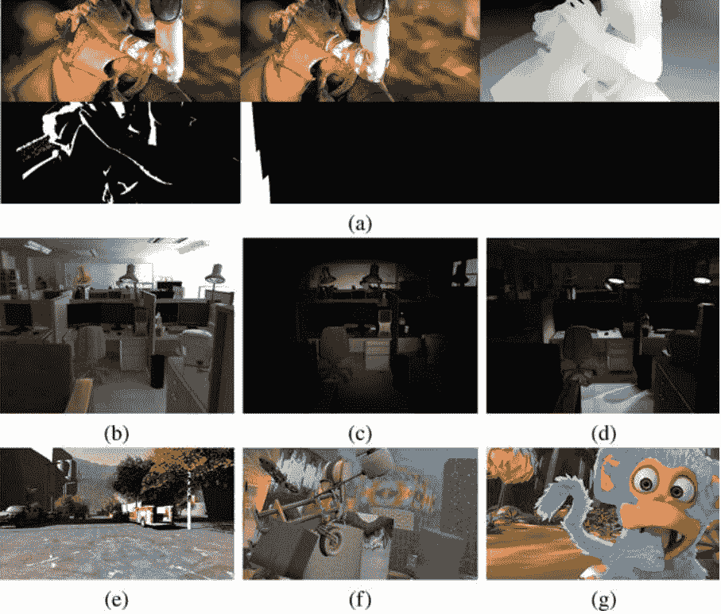

**图6.1** 来自合成低级数据集的样本图像: (a) MPI-Sintel[105]（从左到右：左视图，右视图, 视差；底部行显示遮挡和超出帧范围的像素）；(b-d) Tsukuba CG立体数据集[671]在不同的照明条件下：(b) 白天，(c) 闪光灯，(d) 灯光；(e) Driving[586]；(f) FlyingThings3D[586]；(g) Monkaa[586]。

随着该领域从经典的无监督方法转向深度学习，最先进的模型开始需要无法在现实生活中产生的大型数据集，并且在转向深度学习后，合成数据集开始占主导地位。

Dosovitsky等人[202]提出了一个大规模的合成数据集，称为飞行椅（Flying Chairs），来自一个公共的3D椅子模型数据库，将它们添加到真实的背景上以训练基于CNN的光流估计模型。Mayer等人[586]将这项工作从光流扩展到视差和场景流估计，提出了三个合成数据集，这些数据集是在Blender（类似于Sintel）中生成的：
- **FlyingThings3D**：随机轨迹上飞行的日常物品；
- **Monkaa**：根据同名动画短片制作，具有柔软的非刚性运动和复杂的细节，如毛发；
- **Driving**：以驾驶汽车的视角呈现自然动态的户外场景（更多户外数据集请参见第7.2节）。

图6.2 基本对象的合成数据集示例图像: (a-c) 来自 ShapeNet [122]的形状: (a) 飞机，(b) 椅子，(c) 大钢琴; (d-e) 来自YCB对象和模型集[110]: (d) 桃子，(e) 番茄汤罐; (f-g) SceneNet的3D场景[319,320]: (f) 客厅，(g) 卧室; (h-k) VANDAL的深度图像[115]: (h) 书桌, (i) 咖啡机, (k) 钢琴.

## 6.3 基本对象数据集

基本的高级计算机视觉问题，如目标检测或分割，完全可以享受合成数据提供的完美标注的好处，并且有很多努力致力于使合成数据适用于这些问题。由于制作合成数据需要开发3D模型，数据集通常还包括与3D相关的标注，如深度图、形状的标记3D部分、体积化的3D数据等。这些问题有许多应用，包括日常物品和零售物品的目标检测（其中高数量的类别和频繁出现的新类别使得使用真实数据不切实际），小物体的计数和检测，基本上所有语义和实例分割的应用（手动标注特别难以获取），等等。

许多研究将合成数据应用于识别日常物品，如零售物品、食物或家具，其中大部分都依赖于相同的3D模型数据库。由Chang等人开发的ShapeNet索引超过300万个模型，其中22万个模型被分类为3135个与WordNet同义词集相匹配的类别。除了类别标签，ShapeNet还包括几何、功能和物理注释，包括对称平面、部件层次结构、重量和材料等等；我们在图6.2中展示了ShapeNet和其他基本物体数据集的样本。研究人员经常使用经过清洗和手动验证的ShapeNet-Core子集，该子集涵盖了55个常见物体类别，约有51,000个独特的3D模型。

ShapeNet已成为进一步改进标注工作的基础。特别是区域注释（例如，将飞机分为机翼、机身和尾翼）即使在合成数据集中也是一个手动过程，而形状分割模型越来越依赖于合成数据[971]；这也与3D网格分割问题[787]有关。基于ShapeNet，Yi等人[972]开发了一个基于主动学习的可扩展区域注释框架，Chen等人[137]发布了一个用于3D网格分割的基准数据集。

与ShapeNet相关的最新重要工作是PartNet [608]的发布，这是一个大规模的3D对象数据集，标注了细粒度、实例级和分层的3D部件信息；它包含了来自24个物体类别的26,671个3D模型中的573,585个部件实例。PartNet主要用于作为3D对象和场景理解的基准，但相应的3D模型无疑将被广泛用于生成合成数据。

生成合成数据的一种常见方法是重复使用3D艺术家为创建虚拟环境的视频游戏所做的工作。例如，Richter等人[724,725]从《侠盗猎车手V》视频游戏中捕获了数据集（也参见第7.2节）。他们专注于语义分割；需要注意的是，为了进行分割，仍然需要手动标注像素级标签，但作者声称通过捕获游戏与图形硬件之间的通信，他们已经成功将标注成本（注释时间）降低了数个数量级。一旦标注员完成了第一帧的工作，相同的网格、纹理和着色器组合可以在后续帧上自动识别和标记，标注员只需标记新的组合。实质上，游戏引擎提供了跨帧持久的完美超像素（我们在第3.3节讨论了超像素）。

随着《侠盗猎车手V》和其他游戏在收集合成数据集方面变得流行（也参见第7.2节），出现了更多专门的解决方案。其中一种解决方案是由邱等人[689,690]开发的UnrealCV，这是一个针对流行游戏引擎Unreal Engine 4的开源插件，提供了一些命令来获取并设置相机位置和视野，获取场景中的对象集合以及它们的位置，设置光照参数，修改对象的属性，如材质，并从引擎中捕获当前相机和光照参数下的图像和深度地面真实性。这样可以从真实的虚拟世界中创建合成图像数据集。

机器人技术促使了具有可能进行操作的对象合成数据集的出现，通常具有相当准确的物理模型。这些数据集中的计算机视觉目标通常与机器人感知相关，包括分割、深度估计、对象姿态估计和对象跟踪。特别是，Choi等人[148]提供了一个用于跟踪滤波器的3D模型数据集，而Hodan等人[351]提供了一个真实的无纹理对象数据集，并补充了这些对象的3D模型，提供了6D真实姿态。Lee等人[502]使用带有遮挡效果的模拟视频序列测试现有的跟踪方法。Papon和Schoeler[655]考虑了室内场景中对象姿态和深度估计的问题。他们开发了一个合成数据生成器，并在7000个随机生成的场景上进行训练，使用了来自ModelNet10数据集[944]的2842个姿态对齐模型的≈60K个实例，展示了在真实测试数据上的出色结果。

由Calli等人提出的耶鲁大学-CMU-伯克利(YCB)对象和模型集[110]包含一组常用于机器人抓取的3D对象模型，以及真实RGB-D扫描和对象的物理属性数据库，这使得可以在模拟中使用它们。

一旦我们拥有了这些基本对象，下一步就是将它们放入上下文中；不巧的是，一个主要的对象检测数据集被称为常见上下文中的对象（Objects in Common Context）。例如，在现实世界的对象检测和分割数据集中，如果同一张图片包含不同比例（图片比例上的小和大）的对象，并且这些对象嵌入到丰富的上下文中，问题会变得更加困难。如果背景中包含其他不需要识别但可能混淆模型的对象，则背景尤其困难；它们通常被称为干扰物。当然，如果你有一个以白色背景为中心的合成椅子，就像上面的图像一样，相应的对象检测或分割问题将变得容易，而在这种数据集上训练的网络在真实对象检测方面不会有太大的进展。

那么我们能做些什么呢？表面上看，我们可能不得不咬紧牙关，开始开发捕捉真实3D场景的复杂背景。研究人员实际上在创建模拟和数据集以训练自动驾驶汽车方面做得很好，我们将在第7.2节中讨论这个问题，这是一种完全合理的时间和精力投资。但在高级目标检测问题中，例如目标检测或分割，有时甚至更简单的方法也可以很好地工作。这些问题中最困难的情况之一是物体之间的复杂交互：部分遮挡、由于与相机的不同距离而引起的不同尺度等等。那么为什么我们不使用一个更或多或少通用的场景，随机放置物体，努力实现一个杂乱而复杂的场景，但对物理合理性不太关注呢？

这符合域随机化的叙述，这是一个通用术语，意味着随机化合成场景的参数，以捕捉尽可能多的合成数据变化。这个想法是，如果网络学会在非常广泛和多样化的数据分布上完成工作，它将有望在真实数据上表现良好，即使这些合成数据的个别样本与真实情况相差很远。域随机化在合成数据研究中起着重要作用，我们将在第9.1节中详细讨论它，但即使在其最简单的形式中，它也对生成计算机视觉数据集很有用。

当你将这个想法付诸实践时，你会得到像飞行椅子这样的数据集，我们在上面已经考虑过掉落的物品。NVIDIA研究员Tremblay等人的掉落物品(FAT)数据集[868]包含大约61500张来自YCB数据集的21个家庭物品的图像，并将其放置在虚拟环境中，在各种照明条件下，具有3D姿势，像素完美的分割，深度图像和每个物体的2D/3D边界框坐标。虚拟环境足够逼真，但场景完全是随机的，有很多遮挡物和物体在空中飞行。我们在图6.3中展示了FAT的样本图像。

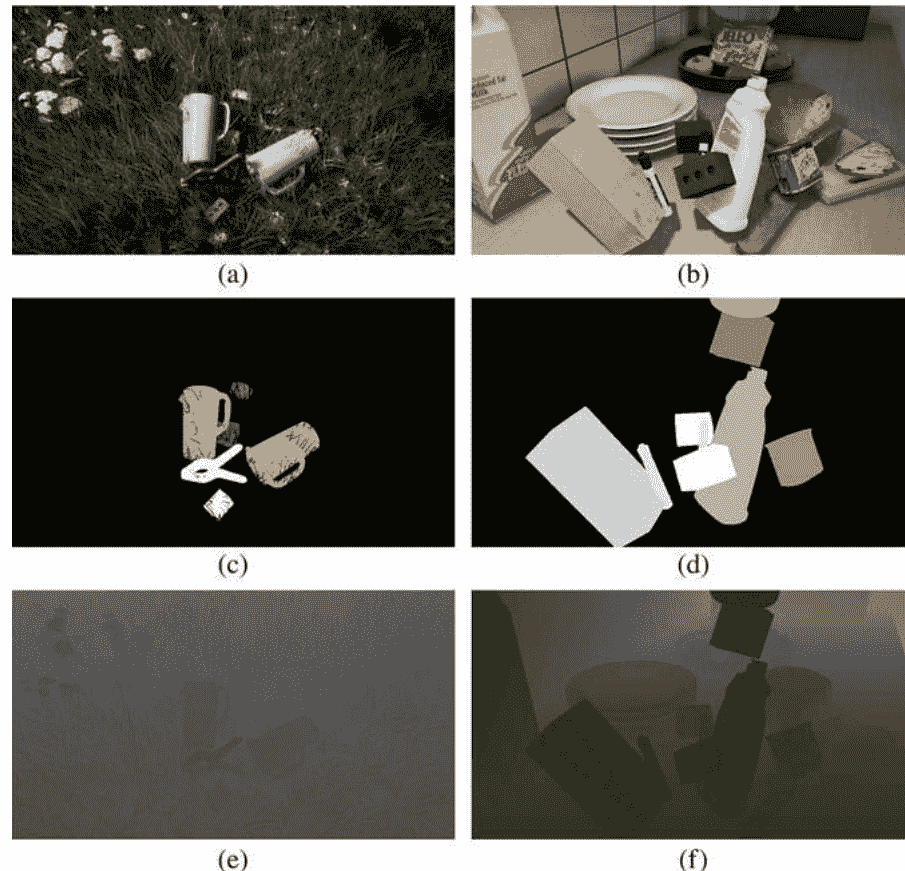

**图6.3** 掉落物品数据集[868]的样本图像：(a-b) RGB图像，(c-d) 真实分割图；(e-f) 深度图。

遮挡物和物体在空中随意飞行，场景非常混乱；我们在图6.3中展示了FAT的样本图像。

“掉落物品”数据集还展示了合成数据的另一个趋势：即使只有21个物体，数据集的大小也达到了42GB，可以作为一个独立的数据集进行下载。这是一个常见的主题：随着合成数据集的规模增长，完全预先渲染并通过网络传输它们变得越来越不实际。为了避免这个问题，越来越多地使用程序生成的方法，只在需要时才渲染图像；我们将在第12.1节中再次讨论这个想法。

最近的研究开始更复杂地使用日常物体的合成数据集，特别是将它们放置在真实环境中。Abu Alhaija等人[5]和Georgakis等人[270]提出了将真实背景与合成物体相结合的方法（在第9.3节中我们还将讨论将真实物体放置在真实背景中的问题）。在[5]中，背景来自KITTI室外场景数据集，物体是合成的汽车模型；而在[270]中，作者将合成物体放置在室内场景中，目标是为家庭服务机器人提供支持。

合成数据在深度学习中已经多次用于真实背景，但是[5]和[270]的主要区别在于它们能够以与背景场景的其余部分一致的方式将合成对象粘贴到真实表面上。Abu Alhaija等人开发了一种自动分析流程，可以识别360°全景图像上的道路表面，但同时他们得出结论，插入汽车的最佳方式（就生成的分割模型质量而言）是手动进行，几乎所有的实验都使用了手动车辆放置。

这些实验表明，对于实例分割和目标检测的最新模型，在训练时使用合成汽车增强的场景可以在真实验证测试中获得更好的结果。Georgakis等人使用[852]中的算法从图像中提取支撑表面，并在这些表面上以适当的比例放置合成对象；他们通过在混合的真实+合成数据集上进行训练显示出显著的改进。自动驾驶领域中最新且目前最先进的流程之一是AADS [513]，我们将在第7.2节中讨论。

到目前为止，读者可能会想知道创建自己的合成数据集需要多少努力。如果您需要一个真正大规模的具有照片般逼真渲染质量的数据集，可能需要很多工作，目前还没有办法节省实际的3D模型设计。但是，正如在机器学习行业经常发生的那样，人们正在努力将所有这些项目中共同的事物商品化，例如3D场景和背景的随机化、对象放置、光照修改和其他参数，以及这些随机化场景的程序化生成。

一个最近的例子是NVIDIA的数据集合成器（NDDS）[859]，这是一个用于虚幻引擎4的插件，可以让计算机视觉研究人员轻松将3D模型和纹理转化为可用的合成数据集。NDDS可以生成RGB图像、分割地图、深度图和边界框，如果3D模型包含对象的关键点，则这些关键点和对象姿态也可以导出。更重要的是，NDDS具有场景随机化的自动化工具：您可以随机化光照条件、相机位置、姿态、纹理等。

基本上，NDDS使得创建类似于 FallingThings dataset 的自己的数据集变得容易。结果可以与图6.3中的示例完全相似。NVIDIA的研究人员已经开始使用NDDS为计算机视觉生成合成数据集。例如，Jalal等人的SIDOD（用于3D物体姿态识别的合成图像数据集）[395]是一个相对较小的合成数据集，只有144K个立体图像对，但它是第一个将所有类型的输出与飞行干扰物结合的数据集之一。

一般来说，现在研究人员相对容易获取到大规模的三维模型数据集，用于生成合成环境（我们将在第7.2节和第7.3节中看到更多相关内容），将合成对象添加为真实图像的干扰物，以更智能的方式将合成对象放置在真实背景中等等。虽然随着相应硬件的普及，带有真实扫描的RGB-D数据集也越来越多（参见，例如，调查[236]和[151]），但它们在标注质量和环境多样性方面无法与合成数据相媲美（另请参阅第9.1节）。在接下来的几节中，我们将看到这一进展如何帮助解决基本的计算机问题：毕竟，识别合成对象从来都不是最终目标。

## 6.4 案例研究：使用合成数据进行目标检测

即使是一本书也可能没有足够大的页边距来全面讨论每一个计算机视觉问题。因此，我将在这本主要是高层次调查的书里，穿插几个代表更详细的案例研究的章节，深入探讨特定问题或应用的细节。第一个这样的案例研究涉及到用于目标检测的合成数据。在第3.3节中，我们已经概述了用于目标检测的主要架构，并在这里看到了一些应用合成数据于目标检测的关键作品，提供了至今仍然相关的见解。我们将按照时间顺序大致回顾七篇论文。

我们专注于使用合成数据训练深度学习神经网络，因此我们关于目标检测的合成数据的故事不能早于第一个深度学习模型。但它也不晚：我们在这个回顾中的第一篇论文是由彭等人[664]撰写的；它于2015年ICLR发布，预印本日期为2014年。回到2014年，计算机视觉中的深度学习革命仍处于早期阶段，因此在图像分类架构方面，可以作为目标检测骨干的研究人员只有AlexNet、VGG和GoogLeNet（Inception系列的第一款；更多细节请参见第3.2节）。但当时很少有对“骨干”的讨论：目标检测的最新技术，相对于ILSVRC2013检测赛道的冠军OverFeat[783]（OverFeat的mIoU为31.4%，而OverFeat为24.3%），是R-CNN[276]，这是我们在第3.3节中讨论的最直接的两阶段目标检测架构。在2014年，研究人员不确定合成数据是否有所帮助。此外，他们拥有的合成数据远非逼真，更像是ShapeNet。

图6.4 用于目标检测的样本合成图像：(a) [664]中使用的数据集样本；(b) [77]中的样本3D边界框；(c) [664]中比较的不同合成数据变化；(d) [77]中的不同光照条件。

关于我们上面讨论的数据集，彭等人的工作在很多方面旨在研究这个问题：你能通过看起来像图6.4a中所示样本的合成数据来改进目标检测或者学习识别新的类别吗？因此，彭等人的主要问题是分离不同的“视觉线索”，即物体的不同组成部分。简单的合成数据在形状方面表现得很好，但在纹理或逼真的不同姿势方面表现不佳，并且背景必须单独插入，所以可能不会很匹配。鉴于这种质量上的差异，我们对目标检测模型有什么期望呢？

为了研究这个问题，彭等人提出了一个目标检测流程，看起来像R-CNN，但实际上比它更简单。他们使用在ImageNet上预训练的AlexNet作为特征提取器，并在从区域提议中提取的特征上训练分类器。然后，他们开始测试对各种线索的鲁棒性，生成不同的合成数据集，并在这些数据集上训练后，在真实测试集上测试目标检测性能。图6.4c显示了他们比较的六个不同版本的训练数据：RGB和均匀灰色对象叠加在真实、灰色和纯白背景上。通过彻底的实验研究，彭等人得到了非常有趣的结果，这些结果并不符合标准的直觉，即拥有更多细节会得到更好的结果。最简单的合成数据集，即在白色背景上的均匀灰色对象，得到了非常合理的结果，并且在更复杂的背景上明显优于灰色对象。另一方面，[664]中的实验表明，为给定的对象添加更多种类的视角（前面、侧面和其他视角）总是有帮助的，有时候帮助很大。[664]中的实际结果在2015年并没有真正代表目标检测的最新技术，现在也不再相关；目标检测的方法和架构也已经过时。但是结论和比较显示出一个重要的趋势，这个趋势贯穿于许多关于计算机视觉中合成数据的早期结果：对于许多模型来说，细节和纹理并不重要，因为模型是在寻找形状和物体边界。如果对于你的模型来说是这样的情况，那么拥有各种形状和姿势更加重要，而纹理可以作为一个附加考虑。回顾现在，我可能会总结这个教训：不同的线索对于不同的模型可能具有不同的重要性。因此，除非你愿意投入大量资源来努力实现全面的逼真效果，否则最好通过实验来找出哪些方面真正重要且值得投资，哪些方面可以忽略（例如，在这种情况下，你可以将对象保持为灰色并跳过纹理）。

按时间顺序，第二篇论文是Bochinski等人使用合成视频进行目标检测的最早方法之一[77]。这是我找到的第一批尝试构建完整虚拟世界以生成计算机视觉系统的合成数据的尝试之一，特别是用于目标检测。

Bochinski等人也是使用游戏引擎进行合成数据生成的先驱之一。作为引擎，他们使用了Valve设计的基于Source引擎的沙盒游戏Garry's Mod，该引擎用于Half-Life和Counter-Strike游戏。当时，Source引擎具备了非常强大的物理引擎，并且还支持用于人类和车辆的脚本编写。因此，相对而言，相对容易创建一个模拟的城市驾驶应用世界，其中包括人类、汽车和放置在真实位置的监控摄像头。Bochinski等人扩展了引擎以能够导出边界框、分割和其他类型的标注；参见图6.4b，其中显示了带有3D边界框和遮挡分割掩模的示例人体目标。该引擎还允许改变光照条件（图6.4d显示了一个示例），并且自然地可以在任意位置放置摄像头，例如在真实的监控摄像头位置。

对于目标检测，由于Bochinski等人使用了视频数据，他们使用了一种简单的经典技术来构建边界框：背景减除。基本上，这意味着他们训练一个高斯混合模型来描述每个像素的历史，如果像素变得足够不同，就被认为是前景（对象）而不是背景。CNN仅用于在生成的边界框内进行分类（和训练）。因此，他们在实际测试集上取得了相当不错的结果。这项工作说明了即使是相对粗糙的合成数据也可以对过时的流程有所帮助：在这里，边界框是通过经典算法检测出来的，因此合成数据仅用于训练分类器，但仍然起到了帮助作用，并产生了一个合理的监控应用。

对于第三篇论文，我们注意到Hinterstoisser等人提出了一种使用合成数据进行目标检测的有趣方法。他们指出纯粹训练的问题。由于合成数据（渲染）图像与真实照片之间的低级差异，合成数据可能会产生次优结果。为了避免这种情况，他们建议仅在合成数据上训练顶层，同时冻结底层，例如预训练的目标检测架构；通过这种方式，基本特征将适用于真实照片领域，而分类部分（顶层）可以针对新类别进行微调。否则，这是对合成数据的直接测试：Hinterstoisser等人将合成渲染叠加在随机选择的背景上，并使用冻结的特征提取层对预训练的Faster-R-CNN [719]、R-FCN [178]和Mask R-CNN [327]目标检测架构进行微调。

他们报告称，冻结层有助于显著提高性能，并且合成数据生成流程中的不同领域随机化步骤（也参见第9.1节）也有所帮助，获得了接近大规模真实数据集训练的结果。第四和第五篇论文都致力于食品和小商贩物品的多目标检测。在继续阅读论文之前，让我简要解释一下为什么这个特定应用——在超市货架上或冰箱中识别多个物体——听起来像是合成数据的完美选择。有几个原因，每个原因都相当普遍，也可能适用于其他应用。

首先，背景和场景构图非常标准化（冰箱内部，超市货架），因此模拟它们的真实性并不需要太多的努力。这类应用的数据集通常使用非常简单的背景。图6.5a展示了我们今天第一篇论文的数据集的一些样本，这是Rajpura等人的工作[701]；这些样本可以从相应的位置获取。

图6.5 在受限空间中进行多目标检测的合成图像示例：(a) 来自[701]的样本；(b) 来自[342]的由干扰物体构成的样本背景；(c-d) 来自[342]的合成图像样本。

图6.6 在受限空间中进行多目标检测的真实图像示例：(a) 来自SKU-110K [285]的真实样本图像；(b) 来自[904]的自动售货机的真实图像样本。

GitHub代码库³；整个数据集由几种表面纹理和几个玻璃货架的光泽表面组成。

其次，虽然简单，但这些问题的场景和背景绝对不是ImageNet和其他标准数据集中常见的景象。标准数据集中包含大量人们在户外野餐的照片和数十种不同品种的狗（ImageNet有120种！），但冰箱内部或带有标签物品的超市货架的照片并不多。因此，研究人员不能像以前那样轻松地重用预训练模型。

第三，这些场景在标准目标检测数据集中可能不受欢迎，正是因为它们非常难以手动标记。一个超市货架上可能有数百个密集排列的物品；作为示例，图6.6a显示了一个来自名为SKU-110K的真实数据集的示例图像；它仅在2019年收集[285]。

第四，即使我们现在拥有一个大规模的真实数据集，我们还没有真正完成，因为新的物体经常出现。超市（或冰箱，因为它在很多方面包含相同类型的物体）的系统必须轻松支持引入新的物体类别，因为新产品或者更常见的是旧产品的新包装不断推出。每年每个超市都会出现成千上万个新物体，有时一次出现数百个新物体（想想圣诞包装）。当你拥有一个真实的数据集时，添加新的图像需要很多工作：仅仅拥有一些新物体的照片是不够的，你还需要将其放在货架上，被新旧物体包围，以不同的组合方式……这变得非常困难非常快。在合成数据集中，添加一个新的3D模型就足以创建任意数量的场景以及任意组合。

第五个也是最后一个观点是，在这个应用程序中，虽然你需要很多对象和合成数据集的很多3D模型，但大多数对象相对容易建模。它们是Tetra Pak纸盒、标准化瓶子、纸盒等。超市里的成千上万种商品通常只有很少的不同包装选择，其中大部分是带有不同标签的标准商品。因此，一旦你有了一个例如品脱瓶的3D模型，大多数啤酒都可以通过交换一些纹理来覆盖，而瓶子本身并不是一个难建模的物体（与人脸或汽车相比）。考虑到这一切，对于小型零售商品的物体检测似乎非常适合使用合成数据。

Rajpura等人[701]是最早尝试使用合成数据进行这种应用的人之一。他们专注于识别冰箱内的物体，并在图6.5a中展示了他们合成数据的一些样本。他们的数据集基于我们上面讨论过的ShapeNet仓库中的标准瓶子和包装，并使用Blender（通常是合成数据的首选工具，因为它非常标准且免费）创建了冰箱内部的简单场景，并放置了具有不同纹理的物体。对于物体检测，Rajpura等人使用了GoogLeNet的全卷积版本，该版本生成覆盖图和一个单独的边界框预测器，并对其结果进行训练。

他们的实验结果说明了在计算机视觉中使用合成数据的几个重要一般性观点。首先，Rajpura等人发现混合数据集的性能显著提高。在他们的比较中，即使只使用10%的真实数据并添加90%的合成数据，其性能也远远超过纯合成数据和纯真实数据集。然而需要注意的是，他们只有400张真实图像（因为手动标记这样的图像非常困难），而且合成数据的规模也不是很大（3600张合成图像）。然而，另一个有趣的结论是，添加更多的合成图像实际上可能会造成损害。在[701]中，性能在添加了4000张合成图像后开始下降，也就是在10/90的比例有利于合成数据之后。

这可能是由于对合成数据过拟合，这仍然是一个重要的问题。如果数据集使用了大量的合成图像，网络可能会开始过拟合于这些合成图像的特定特点。更一般地说，合成数据与真实数据不同，因此当你尝试将在合成数据上训练的网络应用于真实测试集时，总会存在固有的领域转移问题。当然，这是一个非常广阔的研究领域，我们将在第10章中更详细地讨论它。

下一项工作已经带我们来到2019年。王等人[904]研究了智能售货机中目标检测的合成数据生成和领域适应问题。

这个前提看起来非常相似：售货机上放置了小食品，系统需要通过位于售货机内部的摄像头判断哪些物品仍然存在。但在计算机视觉方面，有几个有趣的点使其与[701]有所区别，并突显了合成数据在这两年间的进展。让我们按顺序来考虑它们。

首先是数据生成。2017年，研究人员使用现成的简单ShapeNet对象。2019年，售货机对象的3D形状通过高质量商业3D扫描仪进行扫描，这里使用的是Shining 3D⁴。此外，3D扫描仪在处理镜面或透明材料时仍然存在很大困难，因此对于镜面材料，王等人使用了另一种全新的神经架构（实际上是对抗性神经网络），基于多个RGB图像将镜面材料转换为漫反射材料，并在渲染过程中恢复材料（他们使用了Unity3D进行渲染）。镜面到漫反射的转换基于之前专门研究这个特定主题的工作[940]。至于透明材料，王等人在2019年放弃了，他们表示“虽然可以通过引入一些手动工作来缓解这个问题，但这超出了本文的范围”，并且简单地避免使用透明物体。这个问题在这项工作之后得到了纠正，现在合成数据可以成功地帮助解决透明物体的计算机视觉问题[751]。

其次，王等人引入并应用了一个单独的模型来处理结果物体网格的变形。罐子和包装在自动售货机中可能会变形或鼓起，因此他们的合成数据生成流程会添加随机变形，包括一个（或多或少）基于能量的逼真模型，该模型具有刚度参数，也是基于之前专门针对此问题的工作[906]。

第三，相机。由于物理限制，自动售货机使用鱼眼相机以覆盖物体所在的整个区域；我们在图6.6b中展示了来自该论文的样本图像。这是王等人的自动售货机以及每个货架上相机的样本图像。3D渲染引擎通常只支持针孔相机模型，因此王等人再次使用了由Kannala和Brandt [431]提供的单独的最先进相机模型，对真实鱼眼相机进行校准，然后引入一些随机变化和噪声。

第四，合成到真实图像的转换，即改善生成的合成图像使其更加逼真。王等人使用了基于CycleGAN的风格转换的变体，我们将在第10.3节中详细讨论。最后，是目标检测流程。王等人比较了几种最先进的目标检测方法，包括PVANET [453]、SSD [539]和YOLOv3 [711]。

与我们之前考虑的所有其他作品不同，这些架构在今天仍然非常相关（最近发布了一些新版本）。

结果与先前的研究一致：自2017年以来，结果的绝对数值和质量显著提高，但总体结论仍然相同。仍然有助于拥有既有真实数据又有合成数据的混合数据集。顺便提一下，数据集再次相当小；这次是因为模型在这种受限制的环境中使用这种类型的数据已经足够好，更多的合成数据可能并没有帮助。

有趣的是，PVANET产生了最好的结果，这与许多其他目标检测应用（在标准比较中，YOLOv3通常是最好的）相反。这导致了另一个重要的观点，仍然相关：在特定应用中，最好至少重新比较当前最先进的架构。通常情况下，这不会给项目增加太多成本：在这种情况下，王等人明显花费了更多的时间和资源来准备和调整合成数据，而不是测试两个额外的目标检测架构。但是，它可能会产生一些意想不到的结果（可以解释为什么PVANET在这种情况下获胜，但这可能是事后解释），并且让您选择对您自己的项目最好的选择。

有了这个，我们来到了这个案例研究的第六个工作。它来自于第三个工作的同一组，由Hinterstoisser等人撰写[342]，题为“一个注释保存即是一个注释获得：使用完全合成的训练进行目标实例检测”。与之前的工作类似，他们考虑了多个小型常见物体的检测，其中大部分是食品和药品包装。但是，这篇论文有趣的地方在于他们声称在没有任何真实数据的情况下通过纯合成数据集进行训练取得了出色的结果。

他们的第一个贡献是对背景图像的领域随机化的有趣观点（详见第9.1节关于领域随机化的更多细节）。Hinterstoisser等人尝试通过以下过程获得最大混乱的合成图像：
- 获取一个单独的分散物体3D模型数据集，这些模型代表当前应用中不需要识别的物体（在论文中，他们有约15000个这样的分散物体模型）；
- 在背景上以随机姿势和大致与前景物体相对应的比例渲染这些物体，同时随机变化背景物体颜色的色调（这是带有分散物体的标准领域随机化）；
- 选择并放置新的背景物体，直到覆盖背景的每个像素（这是有趣的部分）；
- 然后将前景物体放置在顶部（我们将在下面更详细地讨论）。

由于这种方法的结果，合成数据集不必拥有任何背景图像或场景：背景完全由干扰对象组成。图6.5b显示了一个样本生成的背景，图6.5c-d包含了生成的合成图像的示例。

但这只是其中的一部分。另一部分是如何生成前景层，包含我们实际想要识别的对象。在这里，Hinterstoisser等人的贡献是，他们引入了一个确定性的课程表，用于放置前景对象，而不是像之前的研究人员那样将3D模型放置在随机姿势或与背景表面对应的姿势上：
- 按照从大到小的顺序迭代各个尺度，这样网络首先可以更容易地识别大对象，然后再学习找到它们的较小版本；对于每个尺度，迭代所有可能的旋转；
- 然后对于每个尺度和旋转，迭代遍历所有可用对象，在可能重叠的位置放置并在边界处裁剪；还有一个单独的过程允许背景干扰对象部分遮挡前景。

结果，这种纯合成方法优于一个包含2000张真实训练集的方法。Hinterstoisser等人甚至估计了成本：他们报告说，他们花了大约200小时来获取和标记真实训练集。这应该与仅需5小时来扫描3D模型进行比较：通常情况下，使用合成数据，一旦流程准备好，您只需要扫描3D模型即可添加新对象或在不同环境中重新训练。该工作[342]还提供了非常详细的消融研究。作者分析了他们的哪些想法对结果的贡献最大。有趣的是（有点令人惊讶的是），他们的课程策略取得了最大的效果。另一个有趣的结论是，纯合成的杂乱背景实际上比一个看似更真实的替代策略表现得更好：使用真实世界的背景图像并用合成的干扰对象进行增强（毫无疑问，干扰对象无论如何都是有用的）。

通过这些结果，Hinterstoisser等人有可能重新定义我们对于使用合成数据进行目标检测的看法和使用方式；这些结论很可能也适用于分割和可能的其他计算机视觉问题。实质上，他们表明，如果正确操作，合成数据在目标检测方面可以比真实数据更好。我们必须承认，“正确操作”包括合成数据生成流程中的每一个细节，甚至包括看似微不足道的姿势顺序。

最后，这个案例研究中的最后一篇论文是Nowruzi等人的[635]。题为“我们实际上需要多少真实数据：使用合成和真实数据分析目标检测性能”的这项工作集中在不同领域的图像上，即在城市室外环境中识别物体，并明显意图用于自动驾驶。然而，它得出的结论似乎适用于远远超出这个特定案例的范围，这篇论文已成为合成数据领域专家们的首选来源。

这项工作与其他来源的不同之处在于，它不是在一个通用框架内研究不同的数据集生成方法，而是考虑了各种现有的合成和真实数据集，将它们置于可比较的条件下，并得出关于如何最好地利用合成数据进行目标检测的结论。Nowruzi等人考虑了三个真实数据集：

³ https://github.com/paramrajpura/Syn2Real
⁴ https://www.shining3d.com/3d-digitizing-solutions/

- 伯克利深度驱动（BDD） [981]，一个大规模的真实数据集（100K张图像），具有分割和目标检测标签；
- Kitti-CityScapes (KC)，一个由视觉上相似的经典城市驾驶数据集KITTI [269]和CityScapes [167]组合而成；
- NuScenes (NS) [107]，一个包含1000个标记视频场景的数据集，每个场景长20秒；

以及三个合成数据集（我们在第7章中展示了它们的样本图像）：

- Synscapes (SD) [935]，一个设计成模仿Cityscapes属性的合成数据集（参见图7.3e-f）；
- Playing for 4 Benchmark (P4B) [725]，一个合成数据集，其中包含从《侠盗猎车手V》游戏引擎中获得的视频序列（见图7.3a-b）；
- CARLA [203]，一个全尺寸驾驶模拟器，也可以用来生成带标签的计算机视觉数据集（图7.4c-e）。

为了使所有数据集处于同等地位，作者仅使用每个数据集的15000张图像（因为最小的数据集有15K张图像），将所有图像调整为640x370像素，并删除在这些条件下变得太小的对象的注释（图像高度小于4%）。 目标检测模型也非常标准：它是一个带有MobileNet骨干网络的SSD检测器，可能是为了训练和评估的计算效率而选择的。 当然，有趣的部分是结果。

首先，正如人们所预期的那样，增加更多数据是有帮助的。 在每个数据集的较小部分上进行训练会显著影响结果。 第二个重要问题是关于迁移学习的：当在一个数据集上训练时，目标检测模型在另一个数据集上的表现如何？ 自然地，当模型在同一个数据集上进行训练和测试时，取得最佳结果；这对于合成数据和真实数据都是如此，但在这个比较中，合成数据明显优于真实数据。

这是计算机视觉中所有合成数据的一个普遍主题：合成数据集上的结果总是更好，有时过于好，表明过拟合（但希望这种情况不会发生）。 除了CARLA（似乎是一个无法转移的异常值），合成数据集表现得相当好，转移结果与真实数据集的转移结果聚集在一起。 真实数据集仍然稍微好一些，但请注意，Nowruzi等人通过使真实数据集和合成数据集的大小相等，消除了合成数据的一个关键优势。

但真正的积极结果稍后出现。Nowruzi等人比较了两种不同的混合数据集使用方法，其中合成数据与真实数据结合：

- 合成-真实数据混合，即在完整的合成数据集中添加少量真实数据，并在联合混合数据集上训练网络；
- 在真实数据上微调，即在合成数据集上完全训练网络，然后在（部分）真实数据集上进行微调，因此合成数据和真实数据的训练是分开进行的。

实际上，第二种方法在实践中更加方便：你可以拥有一个巨大的合成数据集，并对其进行一次训练，然后将得到的模型适应各种实际条件，这在计算上要容易得多。

而[635]的主要结论是，对真实数据进行微调的效果实际上比仅仅混合真实数据和合成数据要好得多。

让我们总结一下。在本节中，我们详细考虑了关于合成数据用于目标检测的几项研究。当然，这远远不是一个完整的调查。在其他研究中，Bayraktar等人[46]在机器人技术领域展示了在混合数据集上改进目标检测的成果，他们通过在真实数据集中添加由Gazebo仿真环境生成的图像来扩充数据集（详见第7.4节）。在最近的一项研究中，Bayraktar等人[47]测试了现代目标识别架构，如VGGNet[477]、Inception v3[838]、ResNet[328]和Xception[152]，通过对ADORESet数据集进行微调，该数据集包含30个目标类别的每个类别2500张真实图像和750张合成图像；他们发现混合数据集相比纯合成数据集或纯真实数据集在识别质量上取得了更好的效果。合成数据用于目标检测的最近应用包括用于训练机器人手臂的物体堆叠检测[100]、计算机游戏物体[819]、烟雾检测[962]、可变形部件模型[985]、生物医学文献中的人脸检测[185]、微型飞行器（无人机）的检测[626,739]等等。

然而，我们看到的论文，尤其是最近的两篇有影响力的论文[342,635]，有一个共同的主题：它们展示了训练的确切课程和合成数据生成和呈现给网络的微小细节是多么重要。在这些研究之前，很难相信仅仅改变合成对象的姿势和尺度随机化策略就能将结果提高0.2-0.3的平均精度（这是一个巨大的差异！）。

所有这些都表明，即使对于一个相对简单的问题，如目标检测，合成数据领域仍有很多需要学习的地方。使用合成数据并不像尽可能地将随机生成的东西投入网络那样简单。当然，这是一件好事：更困难的问题和不确定的结果也意味着更多的研究机会，以及对神经网络工作原理和计算机视觉最终解决方案的更深入理解。

而我们在本节中讨论的结果表明，虽然合成数据已经对我们很有帮助，但仍然有一条迷人而富有成果的道路在前方等待着我们。

## 6.5 其他高级计算机视觉问题

在前一节中，我们详细讨论了在目标检测中使用合成数据所学到的经验教训，这是一个经典且经常使用的高级计算机视觉问题。

分割是另一个经典的计算机视觉问题，通过像素级别的完美合成标注可以获得明显的好处。上述的SceneNetRGB-D数据集由McCormac等人[588]提供，并附带了一项研究，表明仅使用纯合成数据从头开始预训练的仅RGB的CNN在语义分割方面可以超过在ImageNet上预训练的CNN；据我们所知，这是合成数据首次实现这样的改进。该数据集实际上是SceneNet[319,320]的扩展，它是一个用于室内场景的注释模型生成器。

我们可以使用现有的3D物体模型数据集，并将它们放置在带有合成注释的3D环境中。 到目前为止，分割模型通常使用合成数据进行训练：语义分割是大多数汽车驾驶模型（第7.2节）和室内导航模型（第7.3节）的主要问题，Garratt等人[295]在堆叠物体的深度图中进行对象分割等。

Saleh等人[754]指出，在语义分割问题中，并不是所有类别都适合使用合成数据。 与对象（人、汽车、自行车等，即[334]中的物体）相对应的前景类别非常适合对象检测器（大量使用形状），但在分割网络中，由于它们的纹理（分割模型通常依赖于纹理）很难做到照片般逼真的合成到真实的转换。 另一方面，背景类别（草地、道路表面、天空等，即[334]中的物质）在合成图像上看起来非常逼真，因为它们具有高度的“纹理逼真性”，可以成功地在合成数据上训练语义分割网络用于背景类别。因此，Saleh等人提出了一个流程，将基于检测的Mask R-CNN [327]的前景类别与基于语义分割的DeepLab [133]的背景类别相结合。

尽管大多数关于合成数据的研究使用大型和知名的合成数据集，但也有很多努力通过从头开始开发合成数据集将合成数据引入新的应用。 例如，O'Byrne等人[636]开发了一个用于海洋结构物上生物污垢检测的合成数据集，即在水下图像上分割各种类型的海洋生长物。Ward等人[920]通过使用Blender生成的合成数据集改进了Arabidopsis植物的叶片分割，用于CVPPP叶片分割挑战。 对于叶片计数的并行挑战，Ubbens等人[883]基于L系统植物模型生成了合成数据，他们报告了改进的计数结果。Moiseev等人[609]提出了一种生成合成街道标志的方法，显示出它们在识别方面的改进。Neff等人[621]使用GAN生成了对小型分割数据集进行合成增强的数据。我们还注意到研究人员也开始在其他问题中使用合成数据，例如视频流摘要[12]。

基于CGI的合成数据的另一个重要应用类别与3D姿态、视角和深度估计等问题相关，其中真实数据的手动标注非常困难，有时几乎不可能。 这里的一个基本问题是2D-3D对齐，即在2D图像和3D模型之间找到对应区域的问题（这也意味着对物体的姿态估计）。

在早期的工作中，Aubry等人[31]解决了椅子的2D-3D对齐问题，使用了一组合成CAD模型的数据集。Gupta等人[311]使用合成数据的渲染图像训练了一个CNN来检测和分割物体实例，以进行3D模型对齐。Su等人[821]通过在合成的2D视图上训练他们的多视角CNN，学习了从多个2D图像中识别3D形状的能力。Triyonoputro等人[873]使用多视角合成图像训练了一个深度神经网络，以帮助工业机器人的视觉伺服。Liu等人[535]通过在一组3D模型的数据集上进行训练，从单个RGB图像中进行室内场景建模，还有其他的工作[533]从单个图像中对室内基本物体进行2D-3D对齐。Shoman等人[791]使用合成数据进行相机定位（跟踪和增强现实系统的关键部分），使用合成数据来覆盖各种光照和天气条件。他们使用类似自动编码器的架构将从真实和合成数据中提取的特征结合起来，并报告了显著改进的结果。

对象的3D位置和方向估计，也称为6自由度（6-DoF）姿态估计，是与机器人抓取和操作相关的另一个重要的计算机视觉问题。NVIDIA的研究人员Tremblay等人[869]使用合成数据来处理这个问题：使用我们将在第9.1节中考虑的合成数据生成技术，他们训练了一个深度神经网络，并报告了首个完全基于合成数据训练的6-DoF姿态估计的最新网络。新颖之处在于Tremblay等人在混合域随机图像上进行训练，其中随机放置了分散注意力的对象在随机背景前面，并且在真实物理约束下放置了前景对象在3D背景场景中的照片般逼真的图像；域随机图像提供了覆盖真实数据所需的多样性（参见第9.1节），而逼真图像为对象提供了适当的上下文，并且更容易转移到真实数据。最新的结果[577,612,695]表明，合成数据，特别是对于数据的适当域随机化和特征的域自适应，确实可以成功地将3D姿态估计从合成转移到真实对象。

这也与深度估计有关；合成渲染很容易与像素完美的深度图进行增强，并且许多合成数据集包括RGB-D数据。Carlucci等人[115]创建了VANDAL，这是最早的合成深度图像数据库之一，从公共CAD库中收集了大约480个ImageNet常见物体类别的3D模型；作者表明，通过常见的CNN架构从这些深度图像中提取的特征可以改善物体分类，并且与在ImageNet上训练的相同架构提取的特征是互补的。

Liebelt等人[519]使用3D模型提取一组3D特征图，然后使用最近邻方法进行多视角物体分类检测和3D姿态估计。Lee和Moloney[504]提供了一个具有高质量立体图像对的合成数据集，并展示了深度神经网络在立体视觉上的竞争性表现。西门子研究员Planche等人[677]考虑了从真实传感器生成更真实深度数据的问题，并提出了DepthSynth，这是一个能够生成真实深度数据而不仅仅是合成完美深度图的端到端框架；他们表明，这种增加的真实性可以改善现代2.5D识别方法。

通过合成数据提供的简单变化和转换不仅可以直接通过训练改善结果，还可以作为研究神经网络和其他特征提取器性质的有价值工具。特别是，Pinto等人[675]使用合成数据研究了不同现有视觉特征集对位置、尺度、姿态和光照变化的不变性，而Kaneva等人[429]使用逼真的虚拟环境评估图像特征描述符。Peng等人[663]、Pepik等人[667]和Aubry和Russell[32]使用合成数据研究了深度卷积网络的性质，特别是对各种变换的鲁棒性，因为合成数据易于以预定义的方式进行操作。

早期的研究认识到合成图像和真实图像之间的领域差距使得仅在合成数据上进行训练不能期望达到最先进的结果，因此许多研究集中于构建混合数据集来弥合这一差距。
具体而言，Vázquez等人[892]考虑了行人检测，并提出了一种基于主动学习的方案：他们最初在虚拟数据上训练一个检测器，然后使用选择性采样[165]从真实图像中选择一小部分进行手动标记，以达到与在大型真实数据集上训练相当的结果，同时只使用了10倍少的真实数据。

早期的研究中也使用了纯合成方法，尽管主要用于手动标记比目标检测或分割更困难和噪声更大的问题。 Su等人[822]的CNN渲染方法在视角估计问题上优于真实数据，采用了混合合成+真实数据集。 合成数据有助于改善Gupta等人[310]的3D物体姿态估计，以及Liebelt和Schmid [518]和Stark等人[817]的多视角物体类别检测；作为中间步骤，后者使用合成数据来学习形状模型。Hattori等人[325]在纯合成数据集上训练了场景特定的行人检测器，将渲染的行人叠加在固定的真实场景背景上；Marin等人[582]也使用合成数据进行行人检测。

我们通过回答一个重要问题来结束本节，即：为了帮助解决底层计算机视觉问题，合成数据必须有多真实？早期的研究经常认为，对于良好的领域转移结果，并不需要照片般逼真的效果；参见，例如，[826]。 Movshovitz-Attias等人详细研究了这个问题。 通过汽车视角估计问题的例子，他们表明逼真的渲染确实有帮助，并展示了合成数据和真实数据训练模型之间的差距通常可以通过领域适应来解释（即，从不同的真实数据集进行适应与从合成数据集进行适应一样困难），混合合成+真实数据集可以显著优于仅使用真实数据进行训练。

Tsirikoglou等人提供了另一个数据点，他们在合成数据的渲染领域提出了非常逼真的努力，包括基于蒙特卡洛的光传输模拟和光学和传感器的模拟（参见第7.2节，我们在那里讨论了Wrenninge和Unger继续这项工作的情况）。 他们在目标检测方面展示了比其他合成数据集更好的结果，并得出结论：“在最大程度上增加变化和逼真度是非常值得的努力”。

## 6.6 合成人类

合成数据中的人工模型和图像（包括面部和全身）是一个特别有趣的主题。一方面，由于几个原因，真实数据集在这里更难收集：

- 在收集真实人脸数据时涉及隐私问题；
- 对于一些基本的计算机视觉问题，标注尤其复杂：虽然姿势估计是可行的，但面部关键点检测（面部识别和图像处理的关键要素）可能需要在人脸上指定几十个地标，这对于人工标注来说非常困难[189,843]；
- 最后，即使有一个大型数据集可用，它的组成中往往存在性别、种族或其他人类主体参数的偏见，有时甚至是出了名的[470,864]。

另一方面，也存在一些复杂性：

- 合成的3D人物模型，尤其是合成的面部模型，要比基本物体的模型难得多，尤其是如果需要足够的保真度的话。
- 在实践中，基本的与人相关的任务非常重要，因此已经存在大量用于人脸识别[112, 306, 512]、姿态估计[24, 388, 543, 874]和其他问题的真实数据集，这通常限制了合成数据的覆盖范围，只能用于处理边缘情况、增强真实数据集或用于更奇特的用例。

这导致了可用合成人脸的质量与人脸识别和其他相关任务的改进之间的紧张关系。在本节中，我们回顾了如何利用合成人物来改进计算机视觉模型在这个领域的应用；本节涵盖的数据集在图6.7中有所说明。在早期的工作中，Queiroz等人[691]提出了一种用于生成具有自动地面真实性的合成视频的流水线，并生成了具有真实面部皮肤纹理的虚拟人脸数据库(VHuF)，这些纹理可以从真实照片中提取出来。Bak等人[34]提出了用于人物再识别的合成数据(SyRI)数据集，该数据集使用Adobe Fuse CC设计了虚拟3D人物，并使用Unreal Engine 4进行高速渲染。有趣的是，他们通过使用光探头和全景照片收集的真实HDR环境贴图来模拟真实的光照条件（图6.7）。

尽管对于全脸正面高质量照片的人脸识别在2D方面已经基本解决，但在分类[843]和通过嵌入[771]进行检索方面实现人类和超人类的性能，以及在野外[197, 366, 499, 500, 902]的姿态不变人脸识别，即在任意角度和不完美条件下，仍然具有挑战性。在这里，通常使用合成数据来增强真实数据集，其中正面照片通常占主导地位，以获得更多样化的数据点；我们参考黄等人的作品[369]和赵等人的作品[1016, 1017]，对基于GAN的改进进行了详细的概述。

胡等人提供了一种有趣的方法来创建用于人脸识别的合成数据[360]。在他们的“弗兰肯斯坦”流水线中，他们结合了来自不同主体的自动检测到的身体部位（眼睛、嘴巴、鼻子等）；有趣的是，他们报告称，由于生成图像中的不可避免的伪影效果，包括边界效应和面部补丁之间的变化，不会妨碍对合成数据的训练，甚至可能提高所得模型的鲁棒性。

还有一个相关的领域是3D辅助人脸识别。这种方法使用了一个抽象人脸的可塑性合成3D模型，该模型具有一些自由参数；模型学习调整这些参数，使得3D模型适应给定的照片，然后使用模型和照片的纹理来产生一个正面图像，或者直接识别从其他角度拍摄的照片。这是一种经典的方法，可以追溯到20世纪90年代末[75,76]，并在许多后续的工作中发展出新的可塑性模型[361,378]，使用深度学习来执行变形参数的回归[865]，扩展到3D人脸扫描[74]等等；更多细节请参见调查报告[197]。Xu等人[965]也使用合成数据来训练他们的3D辅助模型，以实现姿态不变的人脸识别。最近的研究使用GAN来生成用于3D辅助人脸识别的合成数据[1017]；我们将在第10.4节详细讨论这种方法。

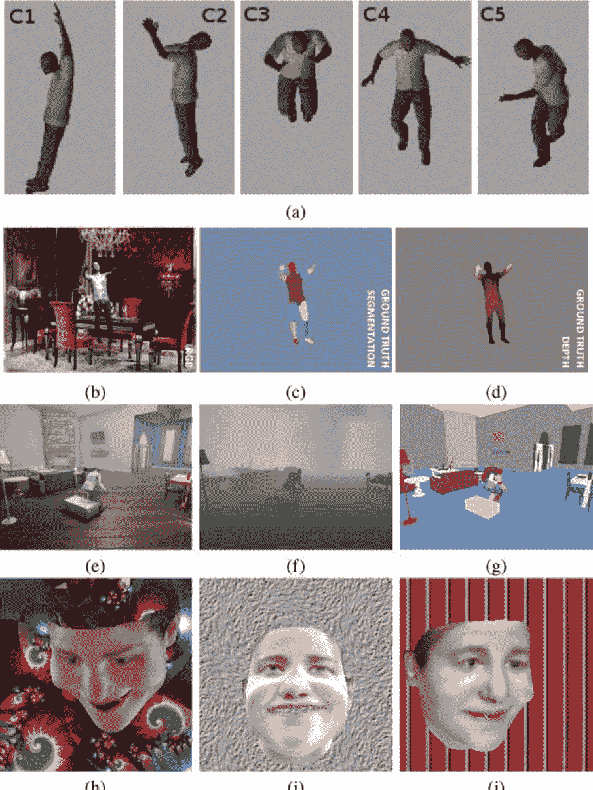

图6.7 来自与人相关的合成数据集的示例图像：(a)来自ViHASN[699]的视频帧；(b-d)来自SURREAL [889]的带有真实标签的帧：(b) RGB图像，(c) 分割图，(d) 深度图；(e-g)来自PHAV [815]的帧：(e) RGB图像，(f) 分割图，(g) 深度图；(h-j)来自[471, 472]的带有随机背景的合成人脸样本（基于巴塞尔人脸模型）。

为了解决人脸识别中的数据偏差和相关问题，Kortylewski等人[471,472]开发了一个流程来直接创建合成人脸。他们使用了Basel Face Model 2017[271]，这是一个三维可塑性人脸模型[74,75]，并且特别注意随机化姿势、相机位置、光照条件和背景。他们使用OpenFace框架[17,760]进行人脸识别和面部关键点检测，并使用最先进的检测和对齐模型[1000]以及关键点检测模型[703]，取得了显著改进的结果。

人体姿势估计是一个非常著名且广泛研究的问题[181,543,995]，有许多直接应用，因此该领域不缺乏真实数据，有大规模数据集可用[25,411,525]，并且最先进的模型取得了令人印象深刻的结果[823,828,970]。然而，合成数据仍然有助于改进。Ludi等人[562]表明，在罕见的情况下，现有的姿势估计模型会产生错误，但通过使用覆盖这些特殊情况的合成数据来增加训练集，可以改善姿势估计。

Rematas等人考虑了另一个专门的用例，这是一个非常有趣的姿势估计应用，称为足球桌面游戏[715]。他们为足球运动员训练了专门的姿势和深度估计模型，并生成了一个统一的模型，将足球比赛的2D镜头映射到适合通过增强现实设备在真实桌面上渲染的3D模型。对于训练，Rematas等人使用了从FIFA视频游戏系列中捕获的合成数据。这些是合成数据如何改善结果的模型示例，即使有全面的真实数据集可用。我们还注意到Bertiche等人最近提出的CLOTH3D数据集[67]，其中包含穿着数千种不同服装的全身人体3D模型（请参见图6.8进行说明）。

从静态图像到视频，我们从人体动作识别[682,996]开始。Ragheb等人的ViHASi[699]是一个用于基于轮廓的人体动作识别的虚拟环境和数据集。De Souza等人[815]提出了Procedural Human Action Videos(PHAV)，这是一个包含39,982个视频的合成数据集，每个动作有超过1,000个示例，涵盖35个类别。Inria和MPI的研究人员Varol等人[889]提出了用于真实任务的合成人物(SURREAL)数据集。

它们生成带有人体部分分割和深度估计标签的逼真合成图像，产生了6.5M帧的67.5K短片（每个短片约100帧）和2.6K个动作序列，涵盖了145个不同的合成对象。

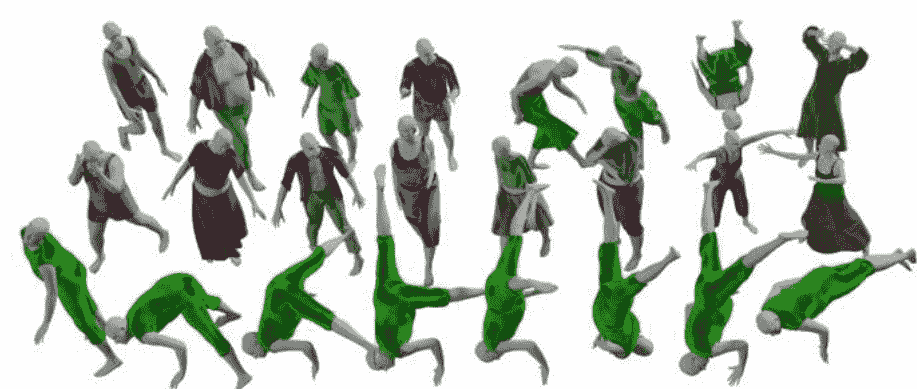

图6.8 来自CLOTH3D数据集的样本图像[67]。

微软研究员Khodabandeh等人[451]提出了DIY人体动作生成器。他们的框架包括一个生成模型，称为骨骼轨迹GAN，它学习生成以所需动作标签为条件的人体骨骼帧序列，以及一个帧GAN，它生成以骨骼和人物的参考图像为条件的逼真帧。因此，他们可以生成以参考图像为定义并执行所需动作的逼真人物视频，而且帧GAN是在一组未标记的人体动作视频上进行训练的。

我们还在这里提到了一些与合成数据相关的隐私应用，这些应用与差分隐私无关（我们在第11节中讨论）。例如，Ren等人[721]提出了一种用于视频人脸匿名化的对抗性架构；他们的模型学习如何修改原始真实视频以去除私人信息，同时仍然最大化行为识别模型的性能。

随着问题从静态变为动态，例如我们转向对监控摄像头上的人类动作进行识别，合成数据采用了全尺寸的模拟环境形式。这个方向早在很久以前就开始了：早在2007年，Taylor等人[853]使用了Half-Life 2游戏引擎和额外的相机参数来模拟真实世界的监控摄像头，以侦测各种不同的事件。Fernandez等人[235]将虚拟代理放置在真实的视频监控镜头中，以一种增强现实的方式来模拟罕见事件。Qureshi和Terzopoulos[693]提出了一种多摄像头虚拟现实监控系统。

一个有趣的与人类相关的视频分析问题，对于自动驾驶车辆来说，是预测城市环境中行人轨迹的问题。安德森等人[20]开发了一种基于随机采样的行人轨迹模拟方法。然后，他们使用Gupta等人[307]的SocialGAN模型进行训练，该模型使用循环架构生成行人轨迹，并使用循环鉴别器来区分真实轨迹和虚假轨迹；安德森等人表明，合成轨迹显著改善了像SocialGAN这样的预测模型的结果（图6.9）。

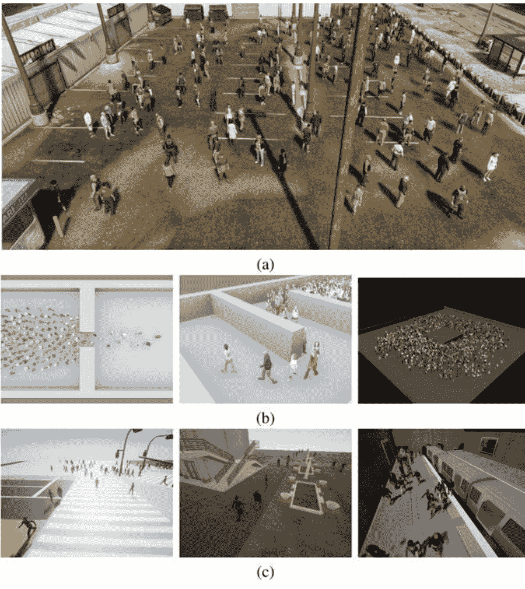

图6.9合成人群计数数据集的示例图像：(a)GTA5人群计数[907]；(b)Agoraset[171]；(c)LCrowdV[145]。

合成人群数据集的另一个重要应用是人群计数。在这种情况下，收集地面真实标签尤其是如果模型除了简单计数之外还要进行分割，是非常费力的，因为人群计数场景通常非常拥挤，包含数百甚至数千人。现有的真实数据集要么相对较小，要么不够多样化；例如，UCSD数据集[118]和Mall数据集[131]都有约50,000个行人，但每个数据集都是从单个监控摄像头收集的，ShanghaiTech数据集[1012]有约330,000个头部，但只有约1200张图像，同样是在同一事件上收集的，而UCF-QNRF数据集[383]虽然比之前的数据集更加多样化，但仅限于极度拥挤的场景，同一张图像上最多有12,000人，并且只有约1500张图像。

在首次尝试使用合成数据集进行人群计数的研究中，LCrowdV系统[145]生成了带标签的人群视频，并显示通过将合成数据集与真实数据相结合，可以提高行人检测的准确性；LCrowdV和其他人群计数数据集在图6.9中有所说明。为了提供足够的多样性和规模，Wang等人[907]提出了一种使用Grand Theft Auto V引擎收集的合成GTA5人群计数数据集；该发布的数据集包含约15,000张合成图像，其中有超过7.5百万个标注的人物出现在各种场景中。他们比较了各种人群计数方法，特别是他们的新空间全卷积网络（SFCN）模型，该模型直接预测拥挤图像上人群的密度图。他们报告了在GCC上进行预训练，然后在真实数据集上进行微调时取得的改进结果；他们还考虑了我们在第10.5节中讨论的基于GAN的方法。Ekbatani等人[224]开发了一种更直接的生成合成数据的方法，他们从图像中提取真实行人，并将它们添加到其他背景的不同位置，还采用了特殊的改进程序以增加逼真度；他们还报告了改进的计数结果。Khadka等人[448]还提出了一个合成人群数据集，展示了人群计数的改进。

这与人群分析有关，合成数据用于对人群进行建模和训练视觉人群分析工具的渲染图像[798]。黄等人[367]提出了可用于此类模拟的虚拟人群模型。Courty等人[171]提供了用于人群分析研究的Agoraset数据集，旨在通过Heibling和Molnár[335]的社会力模型模拟代理轨迹，并使用Mental Ray渲染器[208]进行高质量渲染；该数据集包含26个不同的角色，并提供各种不同的场景：走廊，绕过障碍物，通过瓶颈逃生等等。

总的来说，我们总结出，虽然最流行的问题，如正面人脸识别或人体姿势估计，已经通过在真实数据集上训练模型成功解决（因为对于这些问题已经有足够的兴趣来收集和手动标记大规模数据集），但合成数据仍然对减轻真实集合中的数据偏差效应非常重要，涵盖边缘情况，并解决其他问题或使用不同类型数据的基本问题，例如在不同的模态下（例如使用红外传感器的人脸识别）。

我相信在与人类相关的计算机视觉问题中，合成数据有重要的机会，并且预计这个领域在不久的将来会有所发展。

## 6.7 其他与视觉相关的任务：OCR 和视觉推理

在本节中，我们讨论另外两个与视觉相关的问题，其中相应的模型通常是在合成数据上进行训练的。我们从光学字符识别（OCR）开始。与文本识别相关的各种任务，包括OCR本身、文本检测、布局分析和文档数字化的文本行分割，通常都会利用合成数据进行攻击，通常是在真实图像上叠加合成文本。

这是该领域的一种标准技术，因为以随机方式粘贴的文本即使在最小的附加后处理下也看起来相当合理。例如，在字符检测和识别方面使用了合成数据[10,111,910,991]，在文本块检测方面使用了合成数据[392,393]。Krishnan和Jawahar[475]使用合成数据预训练深度神经网络，以学习手写单词图像的高效表示。Jo等人[404]训练了一个端到端的卷积架构，可以将混合手写和打印文本的文档数字化；为了训练网络，他们生成了一个合成数据集，在机器打印的表格上叠加了真实的手写文本，并在粘贴之前应用了Otsu二值化。

已经存在合成文本的已发布数据集和用于生成它们的软件，特别是MJSynth[392]（参见图6.10a的示例）和SynthText in the Wild[308]。在后一项工作中，Gupta等人使用现有的深度估计和分割解决方案来找到适合放置合成文本的自然图像区域（平面），并找到给定平面的正确旋转。这个过程在图6.10b的顶部行中有所说明，底部行显示了插入到适当区域的示例文本。

此外，最近的研究使用基于GAN的细化方法（参见第10.1节）使合成文本更加逼真[220]。还存在基于GAN的合成手写生成模型，这些模型以字符序列为条件并产生出色的结果[14,398]。我们注意到最近有一项研究涉及受限OCR，具体而言是针对特定领域语言的OCR，并且还研究了为此任务生成合成数据[670]。

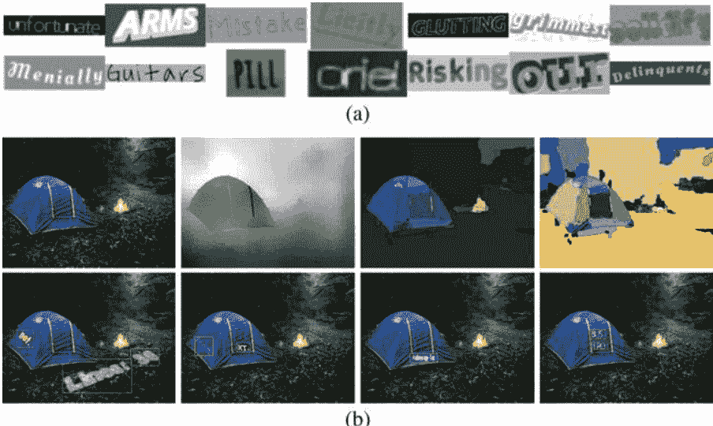

图6.10用于文本识别的合成数据集：(a)MJSynth[392]；(b)野外合成文本[308]；从上到下，从左到右：RGB图像，深度图，语义分割，适合放置文本的过滤区域。

本节的第二个主题是视觉推理，即训练模型进行关于视觉数据的推理和回答问题的人工智能领域。通常以视觉问答(VQA)的形式进行研究，当模型被训练用于回答关于图片的问题，例如“小金属球的颜色是什么？”或者“球和盒子的数量是否相等？”。

存在基于真实照片的视觉问答数据集，由人工标注者收集和验证；其中包括第一个大型数据集VQA [8]及其最新扩展VQA v2.0 [294]。然而，这个问题自然而然地可以进行自动化生成，因此合成数据集在这个领域中非常重要。

最重要的合成数据集是由Johnson等人与斯坦福大学和Facebook合作研究中创建的组合语言和基本视觉推理（CLEVR）[408]。它包含了10万个由简单几何形状组成的场景渲染图像，以及大约100万（853K个独特的）关于这些图像的自动生成问题。创建这个数据集的目的是为了能够对VQA模型进行详细分析，简化视觉识别并集中于对对象的推理。

在CLEVR中，场景被表示为场景图[410,474]，其中节点是带有属性（形状、大小、材料和颜色）的对象，边对应于对象之间的空间关系（“左”，“右”，“后面”和“前面”）。

可以根据场景图的随机位置渲染场景中的对象。问题被表示为可以在场景图上执行的功能程序，例如“白色球右边的立方体是什么颜色？”。不同的问题类型包括查询属性（“什么颜色”），比较属性（“它们大小相同吗”），存在性（“有没有”），计数（“有多少”）和整数比较（“有更少吗”）。在生成问题时，特别注意确保答案存在且唯一，然后使用相对简单的语法生成自然语言问题。图6.11显示了两个示例问题及其功能程序：在图6.11a中，程序是一个简单的过滤器链，而图6.11b添加了一个逻辑连接词，使图形成为一棵树。

我们还注意到谷歌大脑研究人员最近发布的一个COG数据集[968]，它将CLEVR的思想扩展到了视频处理。它还包含了从功能程序生成的合成视觉输入和问题，但现在问题可以涉及时间（例如，“最新的三角形的颜色是什么？）。作者还发布了一个可以生成逐渐更具挑战性且具有最小响应偏差的合成视频-问题对的生成器（在这种情况下，生成器从平衡的目标响应集开始，然后为其生成视频和问题，而不是相反）。

最后，视觉问答领域可以推广到仅仅是问答（QA）。为了创建用于训练QA模型的数据集，研究人员几乎不可避免地使用合成数据生成，从知识图谱或其他结构化知识表示中提取问题的训练集。但是，这个领域直到最近才开始从简单的基于模板的问题生成转变为。

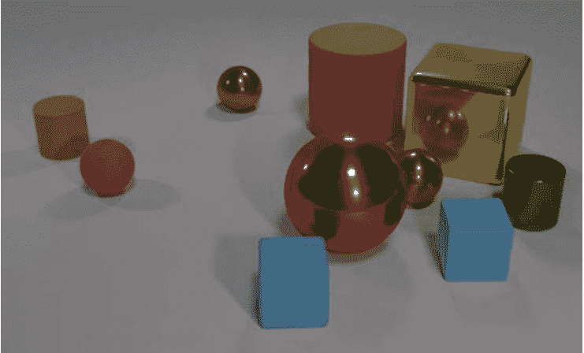

(a)

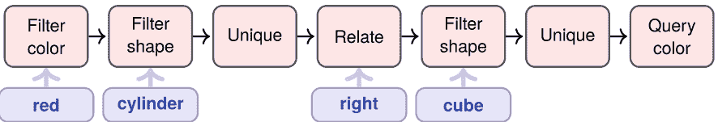

(b) Chain-structured question: What color is the cube to the right of the red cylinder?

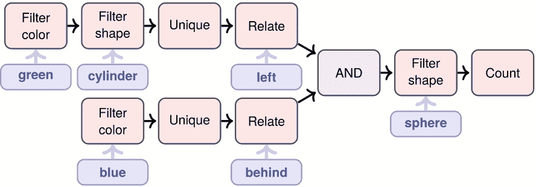

(c) Tree-structured question: How many spheres are behind the blue thing and on the left side of the left cylinder?

图6.11 CLEVR数据集[408]：(a) 样本图像；(b–c) 样本视觉推理问题。

对于如何生成合成数据以及现有生成方法是否会导致信息泄漏或其他不良影响的更广泛研究，提出了一些问题。我们注意到Lindjordet和Balog最近的一项工作[527]提出了这些问题，并希望他们所发现的泄漏效应和不够多样化的问题模式能在最近的将来得到解决。

## 6.8 结论

这是本书中第一章实际上专门讨论合成数据及其如何改善深度学习模型训练的章节。我们考虑了经常用于训练计算机视觉模型的基本合成数据集，并展示了合成数据有助于更好地解决基本计算机视觉问题的示例。

对于最基本的计算机视觉问题，如图像分类或目标检测，在本章中我们看到的共同主题是合成数据对于通用模型来说并不那么有用。事实上，当ImageNet和OpenImages已经可用时，合成数据可能并不会有太大帮助。但是，一旦问题设置稍有变化——无论是在狭窄领域中更详细的任务，相机设置的变化，还是不寻常的对象——合成数据立即显现出其优势。

我们还讨论了几个应用领域，其中合成数据相对容易生成，而标记真实数据则更加困难，因此几乎不可避免地会使用合成数据至少与真实数据集一起使用。在下一章中，我们将继续讨论合成数据完全不可或缺的情况：交互式模拟环境。

# 第7章 合成模拟环境

在本章中,我们从静态合成图像数据集(预渲染或程序生成)转向整个模拟环境,这些环境可以用于即时生成合成数据集或为强化学习代理提供学习环境。我们讨论了户外环境(主要用于自动驾驶)、室内环境和基于物理的机器人仿真的数据集和模拟。我们还特别研究了无人机数据集和计算机游戏作为模拟环境的使用案例。

## 7.1 引言

虽然收集合成数据集本身就是一项具有挑战性的任务,但对于训练自动驾驶汽车、无人机或工业机器人等车辆或机器人的控制来说是不够的。学习控制车辆或机器人通常需要强化学习[831],其中代理需要通过与环境的交互来学习,并且通过强化学习进行真实世界实验来训练自动驾驶汽车或机械臂是完全不切实际的。幸运的是,这是另一个合成数据发光的领域:一旦拥有一个完全开发的3D环境,可以生成计算机视觉或其他传感器读数的数据集,与该环境进行主动交互只是多了一步。因此,在下面考虑的大多数领域中,我们可以看到从静态合成数据集到交互式模拟环境的转变。

强化学习(RL)代理通常在模拟环境中进行训练,因为强化学习的交互性使得在真实世界中进行训练非常昂贵。我们在第10.6节中讨论了在这种情况下合成到真实领域的适应性。然而,在许多研究中,并没有明确的领域适应:机器人在模拟器上进行训练,然后在真实数据上进行微调或者直接转移到真实世界。

| 姓名 | 年份 | 参考文献 | 引擎 | 大小/备注 |
| :--- | :--- | :--- | :--- | :--- |
| 室外城市环境，驾驶 | | | | |
| TORCS | 2014 | [946] | 自定义 | 基于游戏的模拟引擎 |
| Virtual KITTI | 2016 | [254] | 统一 | 5个环境，50个视频 |
| GTAVision | 2016 | [412] | 侠盗猎车手V | GTA插件，200K张图片 |
| SYNTHIA | 2016 | [731] | 统一 | 213K张图片 |
| 侠盗猎车手V | 2016 | [725] | 侠盗猎车手V | 25K张图片 |
| VIPER | 2017 | [724] | 侠盗猎车手V | 254K张图片 |
| CARLA | 2017 | [203] | UE | 模拟器 |
| VIES | 2018 | [754] | Unity3D | 61K张图片，5个环境 |
| ParallelEye | 2018 | [857] | Esri | 程序生成，从OSM导入 |
| VIVID | 2018 | [492] | UE | 以人为重点的城市模拟 |
| DeepDrive | 2018 | [692] | UE | 驾驶模拟+8.2小时的视频 |
| PreSIL | 2019 | [380] | 侠盗猎车手V | 50K张带有LIDAR点云的图片 |
| AADS | 2019 | [513] | 自定义 | 真实背景上的汽车3D模型 |
| WoodScape | 2019 | [975] | 自定义 | 360°全景图，鱼眼相机 |
| ProcSy | 2019 | [449] | Esri | 具有不同条件的过程生成 |
| 机器人模拟器和空中导航 | | | | |
| Gazebo | 2004 | [464] | 自定义 | 行业标准机器人模拟器 |
| MuJoCo | 2012 | [862] | 自定义 | 用于机器人技术的常见物理引擎 |
| AirSim | 2017 | [785] | UE | 传感器读数，硬件在环 |
| CAD²RL | 2017 | [749] | 自定义 | 室内飞行模拟 |
| X-Plane | 2019 | [812] | X-Plane | 8K降落，114个跑道 |
| 空中学习 | 2019 | [476] | — | 飞行模拟平台 |
| VRGym | 2019 | [957] | UE | 用于人机交互训练的虚拟现实 |
| ORRB | 2019 | [147] | 统一 | 用于训练真实机器人的准确模拟 |
| 室内环境 | | | | |
| ICL-NUIM | 2014 | [321] | 自定义 | 带有噪声模型的RGB-D，2个场景 |
| SUNCG | 2016 | [814] | 自定义 | 45K层楼，3D模型 |
| MINOS | 2017 | [761] | SUNCG | 基于SUNCG的室内模拟 |
| AI2-THOR | 2017 | [466] | Unity3D | 带有可操作对象的室内模拟 |
| House3D | 2018 | [943] | SUNCG | 基于SUNCG的室内模拟 |
| Habitat | 2019 | [579] | 自定义 | 室内模拟平台和库 |
| Hypersim | 2020 | [726] | 自定义 | 逼真的室内模拟 |

表7.1显示了我们在本节中回顾的数据集和模拟器的简要概述。为了更清晰地阐述，我们将室外（第7.2节）和室内（第7.3节）场景的环境和“静态”合并在一起，包括一些使用它们来改进强化学习代理和其他模型的作品。

### 7.2 城市和户外环境:学习驾驶

合成数据的一个重要应用方向与导航、定位和建图(SLAM)或类似问题有关,旨在改善自主机器人的运动。可能的应用包括SLAM、运动规划和自动驾驶汽车的运动控制(城市导航)[239,498,601,649],无人机[11,170,428]等;还可以参考关于移动机器人导航的综述[83,190]以及关于自动驾驶的感知和控制的综述[662]。

在继续介绍当前的最新技术之前,让我提醒一下一个有趣的历史事实,我们在第5.3节中详细讨论过:一个基于神经网络的最早的自动驾驶尝试,ALVINN [680],其输入是30×32的视频,补充了8×32的测距数据,已经在合成数据上进行训练。一个被广泛采用的全尺寸视觉仿真环境,用于机器人技术,是 Gazebo[464](见第7.4节),它还提供了室内和室外环境用于机器人控制训练。

在最近的一项工作中,施乐公司的研究人员Gaidon等人[254]提出了一个逼真的合成视频数据集Virtual KITTI 1,用于目标检测、多目标跟踪、场景级和实例级语义分割、光流和深度估计。该数据集包含使用Unity游戏引擎创建的五个不同的虚拟室外环境和50个逼真的合成视频。Gaidon等人研究了现有的多目标跟踪器,例如基于改进的最小成本流算法[676]和基于马尔可夫决策过程[950]的跟踪器;他们发现了最小的真实与虚拟之间的差距。然而,请注意,[254]中的实验是在训练于真实数据并在合成视频上进行评估的跟踪器上进行的(在这方面它们表现良好),而不是反过来。总的来说,Virtual KITTI数据集太小,无法用于训练模型,它是用于评估的,这也解释了实验设置。

另一方面,约翰逊-罗伯特森等人[412]提出了一种使用合成数据进行训练的方法。他们通过捕捉来自《侠盗猎车手V》视频游戏的场景信息收集了大量数据集,该游戏提供了足够逼真的图形,并且在GPU模板缓冲区中存储了深度图和粗略边界框等场景信息,这些信息也可以被捕捉到;作者们开发了一个自动化流程来获取紧凑的边界框。生成了三个数据集,分别包含10K、50K和200K张图像。[412]的主要积极结果是

> 1这个名称来自于卡尔斯鲁厄理工学院和芝加哥丰田技术研究所的联合项目中创建的KITTI数据集[269,598]。

## 7.2 城市和户外环境：学习驾驶

在50K和200K张图像上训练的标准Faster R-CNN架构[719]在真实验证集(KITTI)上的表现优于在真实数据集上训练的相同架构。真实训练集是Cityscapes[167]，包含2975张图像，因此尽管作者使用了比真实数据更多的合成数据，但差异只有1-2个数量级。里克特等人[724,725]的VIPER和GTAV数据集也是从《侠盗猎车手V》中捕捉到的；后者提供了超过250K张1920 × 1080的图像，完全注释了光流、实例分割掩码、3D场景布局和视觉里程计。

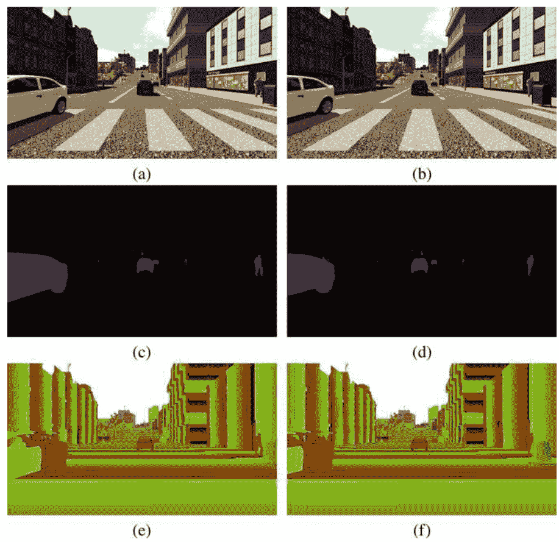

图7.1 SYNTHIA-SF的样本图像[338]：(a-b) RGB地面真实图像（左右相机）；(c-d) 地面真实分割图；(e-f) 深度图（深度以颜色编码为 R + 256 · G + 256² · B）。

SYNTHIA数据集由Ros等人[731]提供，为语义分割提供了合成图像的城市场景标记。它包括作者使用Unity平台构建的虚拟纽约城的渲染图像，并包含13个类别的分割注释，如行人、骑车者、建筑物、道路等。该数据集包含超过213,000个合成图像，涵盖了各种场景和环境条件；[731]中的实验证明，将真实数据集与SYNTHIA合并可以改善分割效果。随后，Hernandez-Juarez等人[338]提出了SYNTHIA-SF，即SYNTHIA的旧金山版本。我们在图7.1中展示了SYNTHIA-SF数据集中的一个样本帧（即两个帧，因为该数据集包含两个摄像头）。Saleh等人[754]提出了一个名为虚拟环境实例分割(VEIS)的Unity3D框架；虽然不太真实，但它在他们的基于检测的流水线中表现良好（参见第6.5节）。Li等人[511]提供了一个包含有雾图像的合成数据集，以模拟困难的驾驶条件。我们注意到Lopez等人[548]的工作，他们的实验证明SYNTHIA和GTAV中实现的逼真程度已经足够成功地转移目标检测方法（图7.2）。

田等人[857]提出了用于城市室外场景的ParallelEye合成数据集。他们的方法非常灵活，依赖于之前开发的Esri CityEEngine框架[954]，该框架提供了基于地形数据批量生成3D城市场景的功能。在[857]中，这些数据是从OpenStreetMap平台自动提取的。然后将3D场景导入到Unity3D游戏引擎中，该引擎有助于在道路上添加城市车辆，设置交通规则，并支持不同的天气和照明条件。田等人展示了在ParallelEye上训练的最先进架构在真实的KITTI测试集上与在真实的KITTI训练集上训练相比，物体检测质量有所提高。

李等人[513]开发了能够在真实RGB图像上插入合成交通的增强自动驾驶模拟(AADS)环境。从用于自动驾驶的真实ApolloScape数据集[372]开始，该数据集包含LIDAR点云，作者通过去除移动物体、修复恢复背景、估计照明条件、模拟合成车辆的交通条件和轨迹、根据照明和其他条件预处理模型的纹理，并在道路上的实际位置添加合成车辆。这样，一张真实图像可以在不同的合成交通情况下多次重复使用。

这与Abu Alhaija等人的方法类似[5]（参见第6.3节），但由于有3D信息，AADS还可以改变观察视角，甚至可以在闭环模拟器（如CARLA或AirSim）中使用（见下文）。我们不详细介绍虚拟交通仿真的广泛和多样化领域，并参考最近的一项调查[123]。

Wrenninge和Unger [935] 提出了Synscapes数据集，延续了Tsirikoglou等人的工作[876]（见第6.5节），其中包含了城市场景的准确逼真的渲染图像（图7.3e-f），使用无偏路径追踪进行渲染，以及相机光学中的光散射效应特殊模型、运动模糊等等。他们发现，尽管后者具有更多种类的场景、行人和汽车模型，但他们为了实现逼真效果而进行的额外努力确实在目标检测方面取得了显著改进。

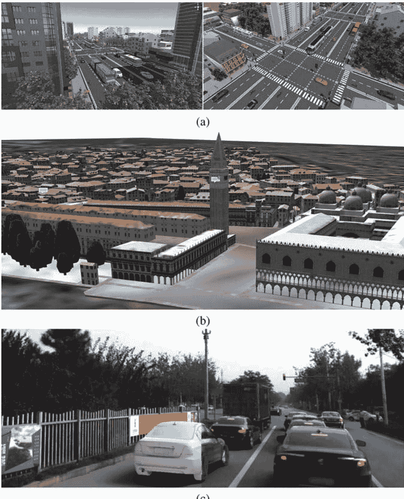

图7.2 来自合成户外数据集的示例图像：(a) VEIS [754]；(b) Esri CityEngine Venice示例场景[954]；(c) AADS [513]（来自展示视频的一帧的一部分）。

Khan等人[449]引入了ProcSy，这是一个通过程序生成的合成数据集，旨在进行语义分割（我们在图1.7c-d中展示了一个示例帧）。它模拟了现实世界的城市环境，主要强调模拟相同场景的各种天气和光照条件。作者们表明，例如，在训练集中仅添加3%的雨天图像就可以将最先进的分割网络（在本例中为Deeplab v3+ [135]）的mIoU提高了很多，在雨天测试图像上提高了10%。这再次证明了使用合成数据增强真实数据集并覆盖罕见情况的好处；关于这项工作的过程性讨论，请参见第12.1节。

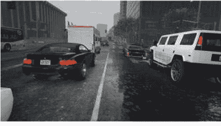
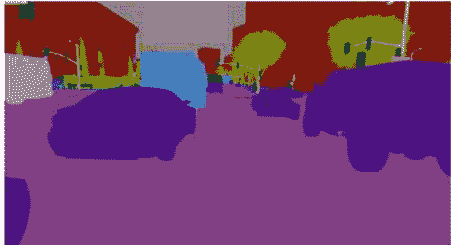
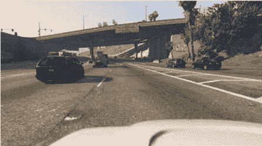
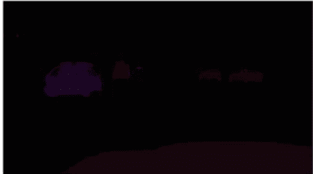
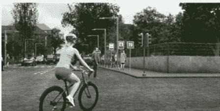
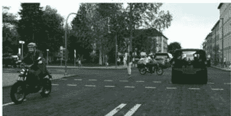

图7.3 来自合成户外数据集的样本图像：(a-b) GTAV [725]：(a) RGB图像，(b) 地面真实分割；(c-d) VIPER [724]：(c) RGB图像，(d) 地面真实分割；(e-f) Synscapes [935]。

具有显式3D数据的合成数据集（带有模拟传感器）用于室外环境较少见，尽管这些传感器似乎很容易集成到自动驾驶汽车硬件中。在他们开发的SqueezeSeg架构中，吴等人[936,937]将激光雷达模拟器添加到了《侠盗猎车手V》中，并从游戏中收集了一个合成数据集。Griffiths和Boehm [298]的SynthCity是一个大规模的开放合成数据集，基本上是一个城市/郊区环境的大型点云。它使用Blender插件[300]模拟移动激光扫描仪(MLS)读数，并专门用于深度神经网络的预训练。

Yogamani等人[975]提出了WoodScape，这是一个用于自动驾驶的多摄像头鱼眼数据集，专注于获取车辆周围的360°感知，通过具有大视场的全景鱼眼图像。他们记录了4个鱼眼摄像头，水平视场为190°，以及旋转式激光雷达、GNSS和IMU传感器，还有具有深度标记的40万帧和具有语义分割标记的1万帧的里程计信号。对我们来说，重要的是，他们除了真实数据集外，还发布了一个与他们的鱼眼摄像头相匹配的合成部分（1万帧），旨在帮助合成到真实的迁移学习。这进一步验证了合成数据在自动驾驶中的重要性。

模拟环境而不是数据集，自然也是户外导航场景的重要组成部分；下面我们将描述该领域中的主要参与者，并参考调查报告[430, 824]对其中一些进行深入分析。还有一个独立的工作线路与在这些模拟器中开发更准确的建模相关，例如传感器噪声模型[605]，这超出了本书的范围。

TORCS (The Open Racing Car Simulator) [946]是一个开源的3D汽车赛车模拟器，起初是为了Linux而开发的游戏，在20世纪90年代末成为了一个越来越受欢迎的驾驶代理和智能控制系统的虚拟仿真平台。TORCS提供了足够复杂的赛车物理模拟，包括准确的基本属性（质量、转动惯量）、机械细节（悬挂类型等）、轮胎的摩擦特性以及逼真的空气动力学模型，因此被广泛认可为合成数据的有用来源。TORCS已成为年度模拟赛车锦标赛[544]的基础，并在数百项关于自动驾驶和控制系统的研究中使用（参见第7.4节）；TORCS和其他户外驾驶模拟器在图7.4中有所展示。

CARLA (CAR Learning to Act) [203]是一个用于城市驾驶的开放模拟器，作为Unreal Engine 4[434]的开源层开发。从技术上讲，它与[412]类似，通过提供传感器（以RGB相机的形式，具有可自定义的位置）、地面真实深度图、用于驾驶的12个语义类别的地面真实语义分割图（道路、车道标线、交通标志、人行道等）、环境中动态物体的边界框以及代理自身（车辆位置和方向）的测量值，来扩展Unreal Engine 4的功能。DeepDrive[692]是一个专为训练自动驾驶AI模型而设计的模拟器，也是作为Unreal Engine插件开发的；它提供了8个分辨率为512×512的RGB相机，以接近实时的速率（20Hz）生成了一个8.2小时的视频数据集。

VIVID (VIrtual environment for VIsual Deep learning) 是由Lai等人[492]开发的，它解决了一个更有雄心的问题：在各种不同的合成环境中添加人们的互动以及更广泛的合成环境。他们提供了一个通用的数据集和模拟器，用于室外场景，如室外拍摄、森林火灾、无人机在仓库中巡逻、道路上的行人检测等。VIVID也基于虚幻引擎，并利用其提供的各种资源；例如，场景中的NPC是使用Blueprint进行编程的（Blueprint是虚幻引擎的脚本引擎），人体模型则由虚幻动画编辑器进行动画处理。VIVID提供了记录视频模拟和通过TCP/IP协议与深度学习库通信的功能，通过最初为AirSim开发的Microsoft Remote Procedure Call (RPC) 库进行通信（参见第7.4节）。至于自动驾驶中的强化学习（RL），CARLA模拟器的原始论文[203]还提供了在合成数据方面的条件模仿学习、深度强化学习和模块化流水线之间的比较，其中模块化流水线在感知、局部规划和连续控制方面分离，取得了有限的成功，但通常最好的结果是由模块化流水线获得的。

许多关于自动驾驶的研究使用TORCS [946]作为测试平台，无论是在虚拟自动驾驶竞赛中还是作为一个成熟的研究平台。我并不打算提供对整个领域的全面深入调查，只是注意到尽管TORCS有着悠久的历史，但它仍然被积极地用于研究目的。特别是，Sallab等人[756,757]在深度强化学习中使用它。

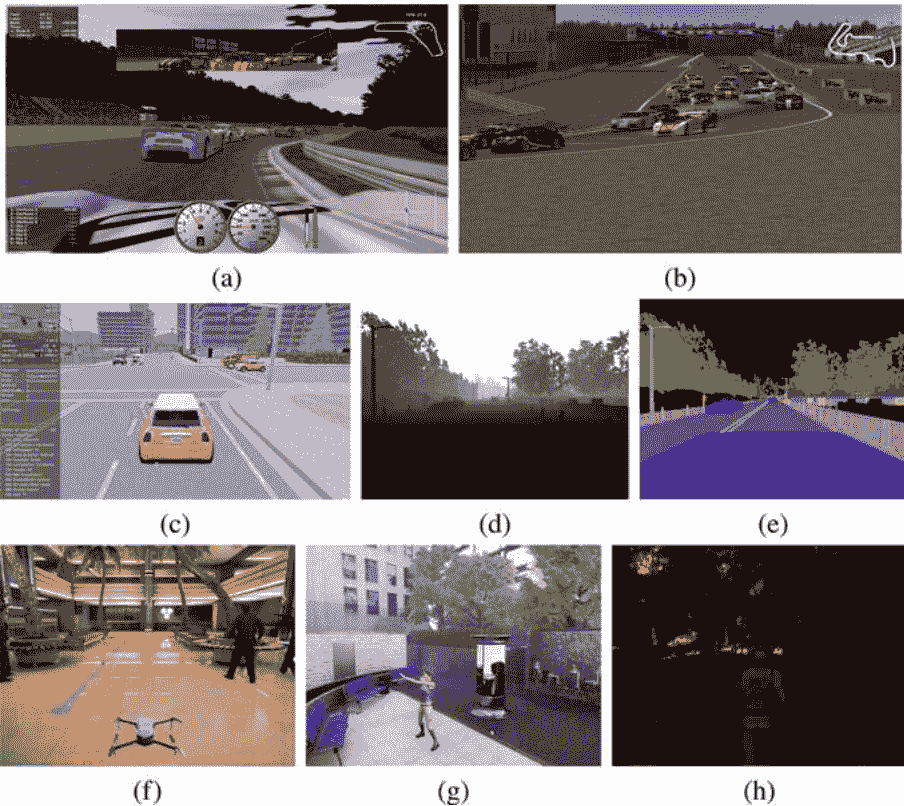

图7.4 室外环境的样本图像：(a–b) TORCS [946]；(c–e) CARLA [203]；(f–h) VIVID [492]。

用于车道保持辅助和自动驾驶的框架；Xiong等人[960]在深度强化学习的基础上增加了基于安全性的控制，Wang等人[908]训练了一个深度强化学习代理用于TORCS中的自动驾驶，Barati等人[41]使用它为深度强化学习代理添加了多视角输入，Li等人[509]开发了基于TORCS的深度强化学习环境Visual TORCS，Ando、Lubashevsky等人[21,560]使用TORCS研究人类驾驶的统计特性，Glassner等人[279]将重点转移到轨迹学习上，Luo等人[564]将TORCS作为主要测试环境用于一种新的策略梯度算法变体，Liu等人[534]利用TORCS中的多模态传感器进行端到端学习，Xu等人[844]训练一个分割网络并将分割结果馈送给RL代理，以统一来自TORCS的合成图像和真实数据，等等。在最近的一项有趣的工作中，Choi等人[149]考虑了驾驶体验的转移问题，但是他们考虑的是从一个合成模拟器到另一个合成模拟器的转移，而不是从合成模拟器到真实领域的转移。Tai等人[842]在虚拟环境中学习了无地图导航的连续控制。

自动驾驶中的合成数据也可以扩展到其他传感器模态。Thieling等人[855]讨论了各种机器人传感器的物理真实模拟问题。Yue等人[983]基于《侠盗猎车手V》引擎提出了一个激光雷达点云生成器，在将KITTI数据集与他们的合成数据相结合时，在点云分割方面取得了显著的改进。Sanchez等人[840]使用机器人模拟器Gazebo生成合成的3D点云（见第7.4节）。Wang等人[901]开发了一个独立的开源插件用于激光雷达点云生成。Fang等人[231]提出了一个增强的激光雷达点云模拟器，可以从真实的3D扫描仪数据生成模拟的点云，并通过添加合成对象（额外的汽车）进行扩展。

基于GTA V的工作最近由Hurl等人[380]继续进行，他们在GTA V引擎内开发了一个精确的LIDAR模拟器，并发布了PreSIL（精确合成图像和LIDAR）数据集，包含超过50000帧的深度信息、点云、语义分割和详细注释；我们使用PreSIL在图7.5中展示了现代合成数据集中可用的模态。还存在一些关于合成环境特定元素的工作，从而增强真实数据与合成元素的结合；例如，Bruls等人[95]生成了合成的道路标记布局，改善了道路标记分割，特别是在边缘情况下。

室外模拟环境不仅限于驾驶，还可以成功地用于自主飞行器的模拟器和合成数据集。其中大部分是为无人机设计的，并且强调插入机器人控制器，甚至可能采用硬件在环(hardware-in-the-loop)方法；我们在第7.4节和第7.5节中讨论这些模拟器。

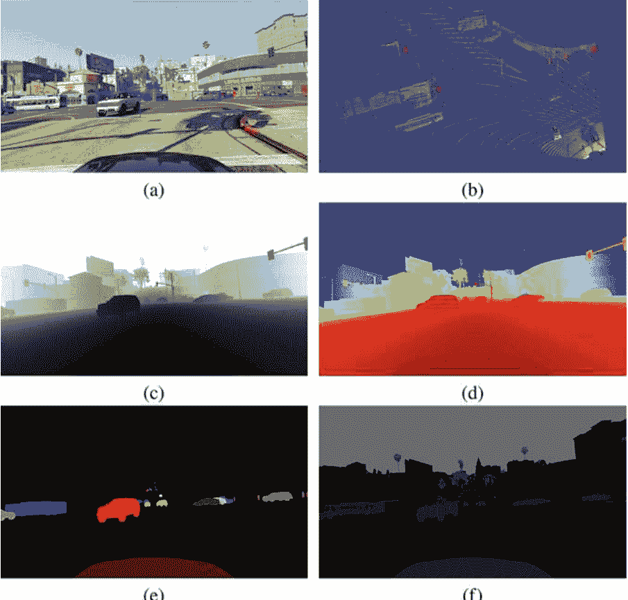

图7.5 PreSIL数据集的示例图像[380]：(a) RGB图像，(b) 点云，(c) 黑白深度图，(d) 彩色深度图，(e) 分割图，(f) 模板缓冲区。

## 7.3 室内场景的数据集和模拟器

尽管如前一节所见，许多有影响力的应用主要集中在户外，室内导航也是一个重要的领域，需要使用合成数据集。主要问题仍然是相同的——SLAM和导航，但潜在的应用现在更多地涉及家庭机器人、工业机器人和具身化人工智能[584, 1023]。存在大规模的努力来创建室内场景的真实注释数据集[121, 176, 796, 813, 947, 951]，但合成数据在该领域中的使用越来越多[1001]。历史上，室内导航的主要合成数据集是由Song等人提出的SUNCG [814]。它包含超过45,000个不同的场景（私人住宅的楼层），具有手动创建的真实房间布局、3D模型的特点、家具、逼真的纹理等等。所有场景都在对象级别上进行了语义注释，并且该数据集提供了场景的合成深度图和体积地面真实数据。原始论文[814]在语义场景完成方面提出了最先进的结果，但是，自然地，SUNCG已经被用于许多与深度估计、室内导航、SLAM等相关的任务[2,143,318,568,688]，并且它经常作为场景理解竞赛的基础[825]。有趣的是，在撰写本文时，SUNCG网站已经关闭，数据集本身由于数据的法律争议而无法获取；这就是为什么图7.6c显示的是[814]中的标准展示图片，而不是数据样本。虽然合成数据可以解决许多与真实数据相关的法律问题（作为此类问题的主要例子，请参见第11章对隐私问题的讨论），但是数据，尤其是手工制作或手动收集的3D模型，仍然是知识产权，并且除非妥善发布到公共领域，否则可能带来自身的问题。

SUNCG已经产生了许多模拟环境。在SUNCG之前，我们注意到上面提到的Gazebo平台[464]（另见第7.4节）和V-REP机器人仿真框架[728]，它们不仅提供了视觉信息，还模拟了许多实际的机器人类型，进一步简化了控制部署和开发。Handa等人[321]提供了他们自己的模拟客厅环境和数据集ICL-NUIM（伦敦帝国学院和爱尔兰国立大学Maynooth），特别强调视觉里程计和SLAM；他们使用光线追踪渲染高质量的RGB-D图像，并特别注意模拟深度和RGB通道的噪声模型。

Savva等人的MINOS [761]是一个室内导航的多模态模拟器（后来被Habitat取代，见下文）。Wu等人[943]将SUNCG打造成一个名为House3D的大规模仿真环境，具有适用于大规模强化学习的高速渲染能力。在House3D中，虚拟代理可以自由地探索来自SUNCG的3D环境，同时提供SUNCG的所有模态。House3D已经被广泛用于自然语言导航控制：Wu等人[943]提出了RoomNav，一种通过自然语言指令进行导航的任务，并提供了一些能够执行该任务的模型；而Das等人[183]提出了一种具有体验的问答模型，其中机器人通过在室内环境中导航来回答自然语言问题。AI2-THOR（交互之家）框架[466]基于Unity3D游戏引擎提供了近乎逼真的可交互环境，其中包含可操作的物体（可以打开的门，可以移动的家具等）（在图7.6f-g中展示了对同一场景中的物体应用了一些动作之后的示例）。Zhang等人[1009]研究了合成数据逼真性对各种室内视觉任务的重要性。他们修复了SUNCG的3D模型中的一些问题，改进了它们的几何和材质，为每个场景采样了多样化的相机，并比较了OpenGL渲染与基于物理的渲染（使用Metropolis光传输模型[893]和Mitsuba渲染器）在各种情况及照明条件下的效果。他们的主要结论是，再次强调，增加真实感是值得的：质量的提升非常显著。

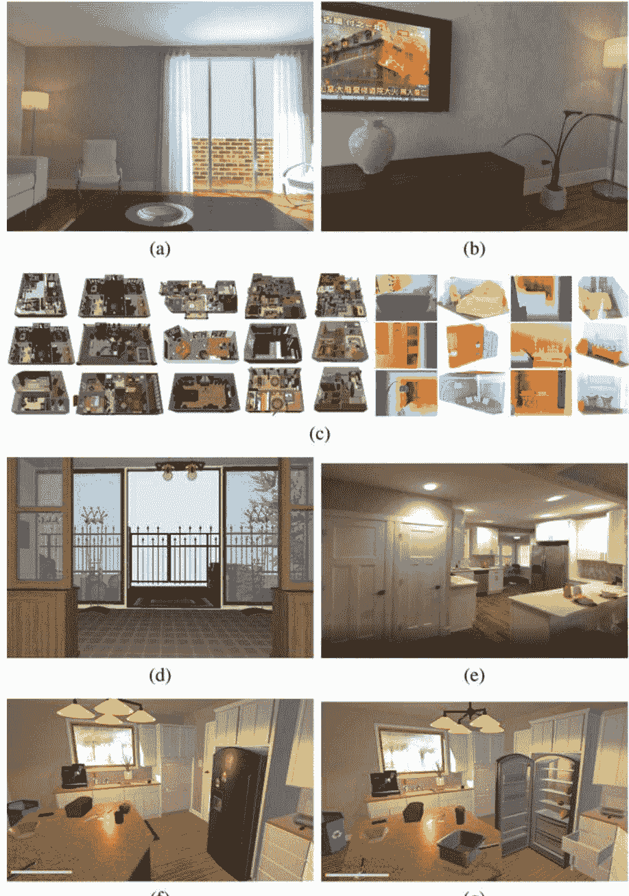

图7.6 室内数据集和模拟环境的示例图像：(a-b) ICL-NUIM [321]；(c) SUNCG [814]；(d) House3D [943]；(e) Habitat [579]；(f-g) AI2THOR [466]。

该领域最近两个（也非常令人印象深刻）的进展是由Facebook发布的Habitat和由Apple发布的Hypersim。Habitat是由Facebook研究人员Savva等人开发的一种用于具身人工智能的仿真平台。它的模拟器称为Habitat-Sim，在本节中我们对之前的工作进行了一些重要的改进：

- 数据集支持：Habitat-Sim支持合成数据集（如SUNCG [814]）和真实世界数据集（如Matterport3D [121]和Gibson [947]）；
- 渲染性能：Habitat-Sim每秒可以渲染数千帧，比之前的模拟器快10-100倍；作者声称“使用Habitat-Sim生成图像通常比从磁盘加载图像更快”；这对于大规模模型训练至关重要，因为模拟器常成为瓶颈；
- 人类作为代理：人类可以在模拟环境中充当代理，这允许在代理训练和评估中使用真实的人类行为；
- 附带的库：Habitat-API库定义了具体的AI任务，并实现了易于开发代理的度量标准。

Savva等人还对各种最先进的代理进行了大规模实验研究，得出结论（与先前的研究相反）：基于强化学习的代理优于基于SLAM的代理，并且RL代理在包括从SUNCG到Matterport3D和Gibson的合成到真实泛化方面表现最佳。这对于室内导航中的合成数据是一个重要的发现，我们期望它在后续研究中得到验证。

Hypersim 是由苹果研究员罗伯茨和帕兹坎于2020年底发布的一套逼真的室内图像数据集[726]。不仅仅是简单地渲染3D场景，他们还开发了一种新颖的计算机图形学流水线，该流水线使用三角网格进行注释（特别是为了避免在需要不同注释时重新渲染），并使用特殊算法对相机轨迹进行采样。这使得罗伯茨和帕兹坎能够创建一个近2TB的数据集，其中包括3D场景、相机轨迹、无损高动态范围图像以及各种不同类型的注释，如图7.7中Hypersim的示例图像所示。除了图7.7中显示的注释类型外，该数据集还包括3D边界框和网格注释。

我确实希望Habitat、Hypersim及其后继者成为室内导航和具身化人工智能研究的新标准。

## 7.4 机器人模拟器

我们已经看到自动驾驶模拟器主要集中在准确反映外部世界，建模额外的传感器如LIDAR和驾驶过程的物理特性。用于室内机器人和无人机的模拟器增加了另一个复杂性：这些机器人的嵌入式硬件可能相对较弱，需要考虑在内。

---
**参考文献/链接注释：**
2. https://www.openstreetmap.org/
3. http://torcs.sourceforge.net/
4. http://sun...（原文截断）
5. https://futurism.com/tech-suing-facebook-princeton-data
6. http://github.com/facebookresearch/House3D
7. http://www.mitsuba-renderer.org/

## 7.4 机器人模拟器

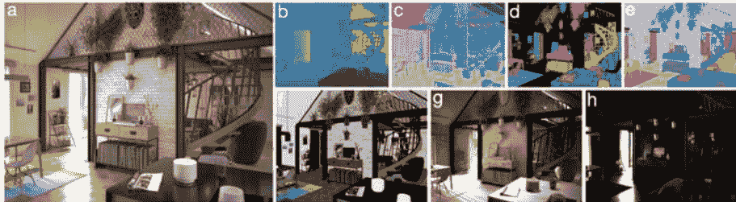

图7.7 Hypersim数据集的示例图像[726]：(a)逼真的渲染；(b)深度；(c)表面法线；(d-e)实例级语义分割；(f)漫反射反射率；(g)漫反射照明；(h)非漫反射残差图像，捕捉光照效果。

相对较弱，需要考虑在内。因此，机器人模拟器通常支持机器人操作系统8 (ROS)，这是一个编写机器人软件的常用框架。在某些情况下，模拟器甚至提供硬件在环 (HIL) 功能，可以将真实的硬件控制器插入模拟器；例如，测试无人机的硬件在环方法已经存在很长时间，并且代表了飞行控制器开发中的重要方法论[7, 683, 899]。我们还参考了调查报告[337, 575]。

为了简要回顾，我们重点介绍四个作品，首先是两个标准参考文献。Gazebo，最初由Koenig和Howard [464]提出，现在由OSRF（开放源机器人基金会）开发，可能是最著名的机器人仿真平台。它支持ROS集成，已经在DARPA机器人挑战赛[9], NASA太空机器人挑战赛和其他项目中使用，并且对机器人领域的成千上万个研究和工业项目起到了重要作用。

Gazebo使用逼真的物理引擎（实际上是几个不同的引擎），支持照明效果、重力、惯性等等；它可以通过ROS与机器人硬件集成，并提供常常能够成功转移到真实世界的逼真仿真。

MuJoCo（多关节动力学与接触）由Todorov [862]开发，是一种专门用于接触丰富行为的物理引擎，在机器人领域广泛应用。Gazebo和MuJoCo都已成为机器人研究的行业标准，调查它们的全部应用范围远远超出了本工作的范围。

当然还有其他平台。例如，Gupta和Jarvis [309]提出了一个基于Half-Life 2游戏引擎的模拟平台，用于训练移动机器人。

另外两项工作则相反，非常新近，可能在不久的将来定义一个新的行业标准。首先，谢等人提出了 VRGym[957]，一个用于物理和交互式AI代理的虚拟现实测试平台。它们与以前的工作的主要区别在于通过虚拟现实硬件集成支持人类输入。渲染和物理引擎基于Unreal Engine 4，额外的多传感器硬件能够进行全身感知并整合人体主体和虚拟环境，而ROS桥允许与机器人硬件轻松通信。谢等人对强化学习算法进行了基准测试，并展示了社交感知模型和意图预测的可能性；VRGym已经在进一步扩展和专门化，例如VRKitchen由高等人设计用于学习烹饪任务（图 7.8）。

https://www.ros.org/。

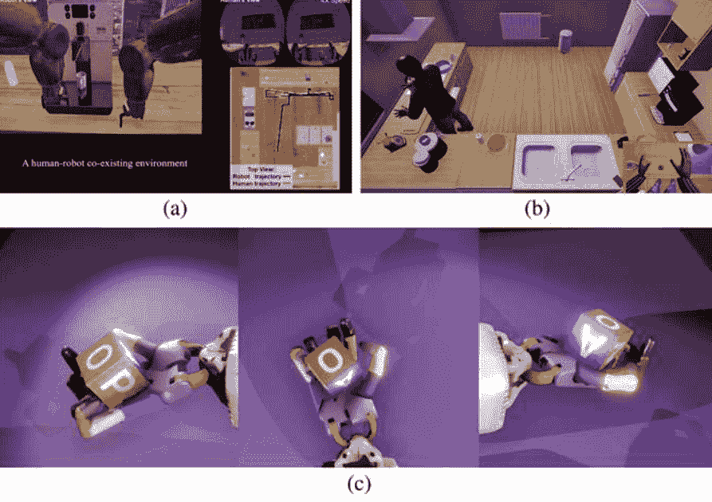

图 7.8 机器人模拟环境的示例图像：(a) VRGym [957]；(b) VRKitchen [261]；(c) ORRB [147]。

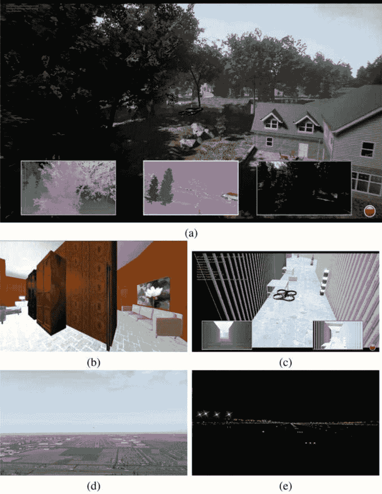

图7.9来自飞行模拟器的样本图像：(a) AirSim[785]带有深度、分割和底部的RGB无人机视图; (b) $\mathrm{CAD}^{2} \mathrm{RL}$ [749]; (c) Air Learning [476] (深度图像和底部的无人机相机视图); (d-e) X Plane数据集 [812]。

## 7.5 无人机视觉应用

长期以来，研究一直致力于基于视觉的无人机操作方法 [11]。由于在这种情况下几乎不可避免地需要使用模拟环境进行训练，并且通常测试模型也受限于合成模拟器（在户外进行真实世界实验非常昂贵，而在城市环境中则被禁止），几乎整个领域都使用某种形式的合成数据集或模拟器；本节中涵盖的一些数据集和模拟器在图7.9中有所说明。无人机的经典视觉相关问题包括无人机通常通过计算机视觉解决的三个主要任务：

- 本地化和姿态估计，即在2D（地图上）和3D空间中估计无人机的位置和方向；对于这个问题，可以使用由真实世界无人机收集的真实数据集[82, 727, 779, 820]，该领域已经足够先进，可以使用实际的现场测试，因此仅使用合成结果会受到怀疑，但现有的研究仍然经常使用合成模拟器，可以是为了解决特定问题而手工制作的[921]，也可以是基于专业飞行模拟器[26]。
- 障碍物检测和避障，在现实世界中进行实验往往过于昂贵，甚至用于测试[106]。
- 视觉伺服，即使用来自视觉传感器的反馈以保持位置、稳定性和执行机动；在这里，通常使用合成数据作为开发的控制器的硬件在环模拟器[503]，有时与全尺寸飞行模拟器[485]或专门设计的“虚拟现实”环境[763]相结合。

在最近几年中，对于无人机的合成数据的这些经典应用已经得到了扩展，并通过现代合成数据生成方法达到了新的高度。例如，Marcu等人[581]考虑了为无人机寻找安全着陆区域的问题，这需要深度估计和分割成“水平”、“垂直”和“不确定”区域，以区分适合着陆的水平区域。为了训练用于这种分割和深度估计任务的卷积架构，作者提出了一种有趣的生成合成数据的方法：他们从谷歌地球数据中提取3D场景。然而，由于谷歌地球中的3D网格远非完美，作者随后将纹理映射到3D场景中，以获得外观不太逼真但深度图完美的图像。Marcu等人展示了从鸟瞰图的角度来看，生成的图像看起来相当逼真，并在生成的合成数据集上比较了不同的分割架构。

Oyuki Rojas-Perez等人[729]还比较了在合成和真实数据集上训练所得到的结果，结果表明合成数据由于合成图像的深度图的可用性而更有优势。在最近的一项工作中，Castagno等人[116]使用高保真度的视觉合成曼哈顿屋顶模型解决了着陆点选择问题，该模型使用Unreal Engine渲染，并通过AirSim提供给模拟机器人。

Gazebo已经被用于无人机模拟[251]，但在该领域中有更受欢迎的专业模拟器。Microsoft的AirSim[785]是一个更像Gazebo的机器人模拟器而不是准确的飞行模拟器（如Microsoft Flight Simulator或X-Plane）：它包含一个详细的物理引擎，旨在与特定飞行控制器进行交互，并提供基于真实物理的车辆模型，同时支持ROS与无人机的软件和/或硬件进行交互。除了使用虚幻引擎4进行可视化渲染外，AirSim还提供传感器读数，包括气压计、陀螺仪、加速度计、磁力计和GPS。AirSim还作为虚幻引擎4的插件可用，可基于AirSim模拟自主车辆的扩展和新项目。

有许多扩展和项目使用AirSim并提供有趣的合成模拟环境（参见调查[575]），特别是：
- 陈等人[134]添加了真实的森林，用于无人机的森林视觉感知；
- 邦迪等人[81]专注于野生动物保护，通过增加例如非洲大草原的逼真渲染来扩展引擎；
- 在两个不同的项目中，Smyth等人[807, 808]和Ullah等人[885]模拟了关键事件（如化学、生物或核事件或袭击），并明确目标是训练自主无人机在这些虚拟环境中收集数据；
- Huang等人[364]通过自然语言理解模型扩展了AirSim，用于模拟对无人机的自然语言指令等等。

我们还注意到，微软最近还扩展了AirSim，包括自主车辆模拟，使该引擎适用于我们在第7.2节中讨论的所有任务。虽然AirSim和Gazebo是最成功的仿真框架，但我们还注意到其他用于多智能体仿真的框架，通常没有真实的3D渲染环境（还可以参见[615]中框架的比较和[737]中感知系统的比较）：JaSIM[257]，基于Janus平台[266]的多智能体3D环境模型，Repast Simphony [634]，用于复杂自适应系统的基于代理的仿真库，FLAME[459]，专注于并行仿真，以及JADE[56]，用于多智能体仿真的流行库。

Sadeghi和Levine[749]提出了用于避免在室内环境中飞行时发生碰撞的CAD²RL框架。他们通过领域随机化思想（见第9.1节）激励使用合成数据，并在Blender中构建了各种室内模拟环境。他们在训练过程中不使用任何真实图像，完全依靠模拟数据来学习强化学习代理的Q函数，使用完全卷积神经网络。作者报告了在许多复杂场景中的改进，例如绕过拐角飞行，穿越狭窄走廊，上楼梯，避开动态障碍物等。

最近由Krishnan等人提出的Air Learning平台是一个端到端的自主飞行机器人仿真环境，结合了可插拔的环境和物理引擎（如AirSim或Gazebo）、学习算法、机器人控制策略（使用TensorFlow或PyTorch等实现）、以及“硬件在环”控制器，可以插入和评估真实飞行控制器在Air Learning平台上的性能。作为一个例子，Krishnan等人对点对点避障的几种强化学习方法进行了基准测试任务并得出重要结论：例如，结果表明，拥有更多的计算能力（台式电脑CPU与树莓派）可以显著改善结果，产生几乎2倍较短的轨迹。

在基于视觉的合成数据集中，我们注意到Solovev等人的工作[812]，他们基于X-Plane飞行模拟器[493]提供了一个用于飞机着陆的合成数据集，该模拟器也被用于其他无人机模拟[73, 262]。Solovev等人的主要目的是通过结合不同的模态（RGB图像和各种传感器）来提供一个表示学习的基准，但是所得到的合成数据集足够大且多样化，可以用于其他应用：来自114个不同跑道的8K着陆的93GB图像和传感器读数。

Madaan等人提供了另一个有趣的应用，真实数据和合成数据结合在一起，解决了无人机的一个真正的生死问题：线缆检测。他们使用真实的背景图像，并将其与逼真的3D线缆模型叠加在一起。作者改变了线缆的不同属性（材料、线缆下垂、摄像机角度等），但没有试图使线缆适应背景图像本身的语义，只是将线缆粘贴到图像上。尽管如此，Madaan等人报告了在合成数据上进行训练，然后在小规模真实数据集上进行微调取得了良好的结果；合成预训练证明是有帮助的。

9. https://www.google.com/earth/

## 7.6 电脑游戏作为虚拟环境

电脑游戏和游戏引擎一直是深度强化学习和人工智能中非常重要的问题来源和虚拟环境[113, 417, 766]。现代深度强化学习的许多基础工作都是在2D街机游戏的环境中完成的，通常是经典的Atari游戏[55, 607]。首先，许多新的强化学习架构或训练程序的想法都是直接将深度强化学习应用于复杂合成环境中的导航，特别是在视频游戏中导航迷宫，如Doom[69]和Minecraft[638]，或者特别构建的3D迷宫，例如来自DeepMind Lab环境[49, 780]。Doom成为了一种行业标准，VizDoom框架由Kempka等人开发[443]，后来在许多重要作品中使用[15, 495, 705, 942]；如图7.10所示。

其他类型的游戏，特别是实时策略游戏[19, 851]，也是深度强化学习的合成环境的丰富来源；我们注意到用于机器学习研究的TorchCraft库在星际争霸[834]中，从星际争霸中提取的合成数据集[526, 599, 939]，具有三个简化的实时策略游戏的ELF（Extensive，Lightweight，and Flexible）库平台[856]，以及用于星际争霸Ⅱ的SC2LE（StarCraft II Learning Environment）库[896]。赛车游戏已被用作训练端到端强化学习驾驶代理的环境[672]。

虽然来自电脑游戏的数据在技术上可以被视为合成数据，但我们不会进一步详细介绍与游戏相关的研究，而是集中在虚拟环境上，这些环境专为机器学习和/或转移到现实世界任务而设计。然而，请注意，合成数据已经开始进入学习玩电脑游戏的领域：Justesen等人[418]表明，使用程序生成的关卡可以改善泛化和最终结果，甚至可以在每次评估时都在全新的关卡上工作良好的模型。

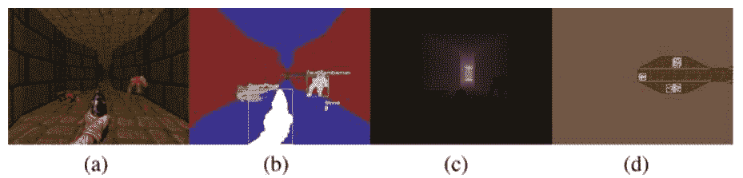

图7.10 VizDOOM环境的示例快照[443]: (a) RGB图像; (b) 物体检测标签; (c) 深度图; (d) 环境地图。

上述所有内容似乎与合成数据的一般主题不太相关：虽然游戏环境确实是“合成”的，但通常没有将玩星际争霸的强化学习代理转移到真实的武装冲突中的目标（谢天谢地）。然而，最近的研究表明这个方向有潜力。例如，虽然第一人称射击游戏中的导航与真实机器人导航非常不同，但已经开始出现从电脑游戏到现实世界的转移学习的成功尝试。Karttunen等人[442]提出了一个在毁灭战士环境中训练并转移到真实Turtlebot上的强化学习代理，通过冻结DQN网络中的大部分权重，只微调其中的一小部分权重。随着电脑游戏变得更加逼真，我们预计这种转移将变得更容易。

## 7.7 结论

这是关于合成数据主要应用的第二章。我们讨论了从经典机器人模拟器到电脑游戏的模拟环境。在这些环境中，产生的数据必然是合成的，但在许多领域和应用中，例如强化学习，它们代表了训练模型的唯一实际方式。

接下来的两章将更短，并涵盖大多数其他直接应用合成数据的内容。在第8章中，我们将考虑计算机视觉和模拟环境之外的合成数据应用；在其他机器学习领域，如自然语言处理，合成数据的重要性较小，但我们将找到几个重要案例。第9章将介绍合成数据发展的几个方向，这可能会为未来的合成数据集提供更好的可能性。

然后，我们将继续本书的第二个主题：使用生成模型进行合成到真实领域的适应。

## 第8章
## 计算机视觉之外的合成数据

虽然计算机视觉仍然是合成数据应用的主要关注点，但其他领域也开始使用合成数据集，其中一些方向完全依赖于合成数据。在本章中，我们对其中一些领域进行了调查。具体而言，第8.1节讨论了结构化合 成数据在欺诈和入侵检测以及网络和/或系统日志等应用中的使用；第8.2节考虑了神经编程；第8.3节讨论了合成数据在生物信息学中的生成和使用；第8.4节回顾了合成数据在自然语言处理中的（确实有限的）应用。

## 8.1 合成系统日志用于欺诈和入侵检测

在本章中，我们讨论了除计算机视觉之外的其他领域，合成数据在这些领域也可以起到帮助作用。首先，让我们考虑一个非常广泛的数据集领域，涵盖了许多不同的应用领域：表格数据，即用户记录，各种技术或计算机系统的日志，网络流量跟踪等等。有重要的情况需要合成表格数据的原因是出于隐私考虑；例如，不可能发布真实的电子医疗记录，必须使用具有隐私保证的合成数据集。我们将在第11.5节讨论这类应用。

除了隐私问题之外，合成表格数据的另一个动机来源是系统需要识别在真实数据集中不够频繁出现的罕见事件。对于一个具体的案例研究，在本节中我们考虑安全应用中的罕见事件，例如欺诈检测或入侵检测。欺诈和入侵检测系统基于网络日志（跟踪）和系统调用日志运行，因此在这种情况下需要合成这种结构化数据。

由于真实入侵数据非常稀缺，这个领域长期以来一直使用合成数据，但通常情况更类似于我们在第5.2节中讨论的计算机视觉的早期阶段：合成数据被生成用作测试平台，以比较甚至不一定基于机器学习的方法。一个值得注意的例子是1998年和1999年由MIT的林肯实验室组织、DARPA赞助的离线入侵检测评估[528, 574]。这个竞赛的测试数据包含了一个完全模拟的大型计算机网络的网络流量和系统日志文件，攻击和背景的“正常操作”数据都是完全合成的。

竞赛组织者使用真实的网络跟踪数据来模拟背景数据，然后通过运行相应的仿真脚本[445]生成攻击。

然而，1998年和1999年的比赛正是因为其合成数据集的质量而受到批评。McHugh [590] 指出这些比赛中的测试数据集没有经过充分验证，整个数据生成过程也没有充分解释。事实上，上述论文只给出了模糊的描述，称他们生成了与实际流量“相似”的数据（实际上是与在空军基地上看到的流量相似）。然而，互联网上的真实数据变化很大，包含许多看似异常但合法的流量（包括随机垃圾数据），通常以类似恶意洪水攻击的方式出现。合成攻击也存在问题：虽然攻击仿真脚本似乎足够逼真，但攻击的分布以及其在真实世界中的反映程度仍然不清楚。所有这些观点确实代表了在生成合成数据时需要做出的设计选择，并且必须得到明确和充分的解决。

因此，自2000年代初以来，该领域的研究人员开始更加关注生成合成数据的过程。让我们强调Lundin等人的工作[563]，他们开发了一种合成欺诈数据生成的方法论。鉴于临时方法的不足，他们设计了一个通用框架，突出了必要的设计选择；我们在图8.1中展示它。该框架确定了以下步骤：
- 数据收集应该产生真实数据，然后对其进行建模生成合成数据；
- 数据分析识别收集数据的重要属性，包括用户统计信息、用户和攻击者的分类以及系统配置文件；
- 配置文件生成识别要在合成数据生成中使用的各种用户配置文件；
- 用户和攻击建模生成（通常是简化的）用户和攻击者行为模型，例如，使用有限状态机[186]，其中用户配置文件作为这些模拟器的参数；
- 系统建模产生对用户操作的系统反应的模拟器；如果软件中有真实系统可用，但通常仅限于与欺诈或入侵检测相关的建模方面即可满足要求。


图8.1 Lundin等人[563]提出的合成数据生成方法

通过完成这些步骤，我们获得一组可以提供给用户和攻击者模拟器的用户配置文件，并将这些模拟器产生的行为输入到系统模拟器中。请注意，尽管这种方法可能乍一看很简单，但实际上它的重点是突出显示在构建合成数据生成系统时需要做出哪些设计选择；从这个角度来看，这种方法仍然具有相关性。

除了网络欺诈/入侵检测外，这种方法还被用于移动转账服务的欺诈检测[252]和合成电子健康记录的生成[592]。

另一个类似的领域，需要以结构化系统日志的形式进行合成数据以进行欺诈检测的是金融安全 [552]。在这里，真实的金融记录通常代表着敏感信息，真实数据中的欺诈案例往往很难标记，这也导致了合成生成的需求。在这里，我们可以强调来自布莱金厄技术学院的两位研究人员E.A. Lopez-Rojas和S. Axelsson的一系列工作。在[550]中，他们构建了一个用于训练欺诈检测系统的合成数据的多智能体模拟器（MABS）。在随后的工作中，他们将这种基于代理的方法应用于几个不同的领域，其中需要检测金融欺诈：
- 原始工作[550]应用于洗钱检测，后来作者们将同样的模拟器应用于检测移动货币系统中的可疑金融交易[551]；
- 在[553]中，Lopez-Rojas和Axelsson开发了一个基于真实数据的代理模拟器RetSim，用于[554, 555]中的零售交易欺诈检测；
- 在[549]中，他们将原始模拟器扩展为基于原始数据集的代理模拟器PaySim，模拟移动支付交易。

代理模拟器的基本思想是生成对应于客户（例如，移动支付系统的用户）的实体，设置客户之间的交易参数，然后生成合成数据，目的是在其上训练欺诈检测模型。

一般而言，以模拟系统日志或合成电子记录的结构化合成数据在实际数据不可用或敏感的领域中有很多应用。然而，在这种方法中存在固有的权衡。通过手动编程或仅调整少量分布参数来自真实数据的简单模拟器，我们可以确保避免隐私问题。但是这些模拟器的价值有限：为什么我们需要生成大规模的合成数据集来检测我们自己已经知道如何编程的行为呢？ 因此，为了提供超越我们已知的附加价值，合成数据生成系统需要能够从我们无法简单编程到代理行为中学习模式。

而一旦我们依赖于学习来揭示隐含的模式，隐私问题就会浮出水面。

因此，尽管我们在本节中讨论的一些相对早期的尝试可以很好地学习反映原始数据分布，但这些方法实际上没有保护敏感原始数据所需的固有安全性。因此，在第11章中，我们将更详细地讨论这种数据形式的隐私保证。现在是时候转向一个完全不敏感的领域了，在这个领域中，可以相当容易地生成高度逼真（甚至可以说是真实的）数据。

## 8.2 神经编程的合成数据

合成数据至关重要的一个有趣领域是神经程序合成和神经程序归纳。教授机器学习模型编程的基本思想可以大致分为两个子领域：
- 程序归纳旨在训练一个端到端可微分模型来捕捉一个算法[191]；
- 程序综合试图教会模型特定领域语言（DSL）的语义，以便模型能够根据给定的规范生成程序[432]。

基本上，在程序归纳中，网络是程序，而在程序综合中，网络编写程序。

自然地，这两个任务都需要大量的程序数据集以及它们的输入-输出对。由于不存在这样的大型数据集，并且在这种情况下生成合成程序并运行它们相对容易（可以说甚至比生成计算机视觉的合成数据更容易），所有现代作品都使用合成数据来训练“神经计算机”。

在程序归纳中，任务目前相对简单，合成数据生成并不太困难。例如，Joulin和Mikolov [415]提出了一种新的架构（堆叠增强循环网络），用于学习算法生成的符号序列的规律性；训练数据与以前的类似作品[273, 350, 354, 926]一样，是通过手工制作的简单算法合成生成的，包括从模式生成序列，例如 $a^n b^{2n}$ 或 $a^n b^m c^{n+m}$ ，二进制加法（监督问题要求继续一个字符串，例如110 + 10 =），以及类似的简单算法任务的形式化。Zaremba和Sutskever [987]训练一个模型来执行程序，即将它们的文本表示映射到输出；他们生成训练数据作为Python风格的程序，包括加法、减法、乘法、变量赋值、if语句和for循环（但不包括嵌套循环），每个程序以一个print语句结束；见图8.2作为示例。 神经RAM机器[483]在许多简单任务（访问、增量、复制等）上进行训练，其具体实例是随机合成的。 神经图灵机[296]和神经GPU[241, 421]也是如此：它们在合成的简单基本问题（如复制、排序和算术运算）上进行训练和评估。

在神经程序合成中，程序通常是简单的，并且是自动生成的；仅在最近才开始尝试收集用于程序合成的自然数据集[988]。 基于学习的程序合成（早期尝试基于逻辑推理[578]）始于学习字符串操作程序[304]，很快发展成为深度学习，使用循环架构来引导基于搜索的方法[894]或在编码器-解码器架构中生成程序[138, 194]。 在[101, 794]中，强化学习被添加到循环架构之上，以减轻程序别名问题，即许多不同的等效程序提供同样正确的答案，而训练集只包含一个。所有上述模型都是在随机生成的程序的合成数据集上进行训练的（通常以抽象语法树的形式），并在随机化的输入集上运行。

```
Input:
j=8584
for x in range(8):
    j+=920
b=(1500+j)
print((b+7567))

Target: 25011.
```

```
Input:
i=8827
c=(i-5347)
print((c+8704) if 2641<8500 else 5308)

Target: 12184.
```

图8.2 从[987]中提取的样本合成程序。

作为一个独立的方面，我们提到了关于视觉推理和一般性问题回答的程序合成工作[362, 409, 759]。为了进行视觉问题回答[8]，模型被训练以基于自然语言问题组合一个短程序，该程序将导致答案，通常以执行图或网络架构的形式。这一工作基于神经模块网络[22, 120]和类似的结构[23, 363]，网络学习创建一组模块的组合（在问题解析的基础上进行问答），这些模块也是神经网络，全部联合学习（然而，参见[776]中的批评）。最新的工作使用基于自注意机制的架构，在各种自然语言处理任务中已经证明了其价值[507]。自然地，大多数这些工作使用CLEVR合成数据集进行评估（参见第6.7节）。

在这个领域中，合成数据的生成本身并没有得到太多关注，直到最近才开始引起兴趣。Shin等人的工作[790]对神经程序合成的当代合成数据生成技术进行了研究，并得出结论，即即使在测试集上表现良好，生成的模型也不能完全捕捉到编程语言的全部语义。Shin等人表明，包括流行的tensor2tensor库[890]中的合成数据生成算法在内的算法存在偏差，无法覆盖程序空间的重要部分，并且会导致最终结果的恶化。为了解决这个问题，他们提出了一种新的方法论，用于生成程序归纳和合成数据集的分布，对于两个重要的领域：计算器（计算算术表达式的结果）和Karel（在二维网格上移动的虚拟机器人实现给定目标，包括墙壁和标记）。我们预计在不久的将来会有更多关于神经程序归纳和合成的合成数据生成方面的研究。

## 8.3 生物信息学中的合成数据

我们在本书中使用了来自医疗保健和生物医学领域的例子；例如，参见第10.7节和第11.5节。在本节中，我们重点关注生物信息学中的合成数据应用，这些应用不包括生成合成医学图像（通常使用生成模型完成；参见第10.7节）或通过合成数据集（第11.5节）为敏感数据提供隐私保证。事实证明，在生物信息学中仍然有很多合成数据被常规使用和生成；参见[146]中的调查。请注意，在本节中，我们将介绍一些生成模型的示例应用，关于深度生成模型的详细介绍将在第4章中进行。

对于生物信息学和医学中的许多方法来说，生成的合成数据是最终目标，而不是改进机器学习模型的工具。在生物信息学和医学中，特别是de novo药物设计[324, 769]是一个在大约10⁶⁰可合成分子[267, 722]的搜索空间中寻找具有理想性质的分子的领域。目标是找到（在这样一个庞大的空间中，更准确地说是生成）候选分子，需要在实验研究和临床试验中进一步探索。

首次现代尝试使用基于规则的方法进行de novo药物设计，模拟化学反应[769]，但很快转向基于深度学习[130, 268]的生成模型。 在这种情况下，分子通常以SMILES格式[923]表示，将分子图编码为一定形式的字符串，这使得可以使用序列学习模型生成新的SMILES字符串。Segler等人[773]使用基于LSTM的RNN学习化学语言模型，而Gómez-Bombarelli等人[286]训练了一个变分自编码器（VAE），它已经是一个能够生成新候选分子的生成模型。 为了进一步改进生成，Kusner等人[487]开发了一种名为语法变分自编码器的VAE扩展，可以考虑SMILES形式语法的规则，并使VAE的输出符合语法。 然后使用这些模型获得具有所需属性的分子，研究人员要么使用一小组标记的正例[773]，要么通过增强学习来增强RNN训练过程[397]。 特别是，Olivecrona等人[640]使用经过训练的递归神经网络生成SMILES表示：首先，在RDKit子集[496]和ChEMBL数据库[267]上以监督方式训练一个先验网络（3层1024个GRU），然后使用REINFORCE算法对具有相同结构的RL代理进行微调，以改进生成的SMILES编码。 Popova等人[681]提出了类似的架构，但基于堆叠增强循环网络[416]作为基础，可以实现更长依赖关系。

我们特别注意到由Insilico研究人员Kadurin、Polykovskiy和其他人应用不同的生成模型来解决这个问题的一系列工作：
- Kadurin等人[419]使用有监督的对抗自编码器[576]进行训练，并将条件（在这种情况下，治疗后肿瘤细胞的生长抑制百分比）作为一个独立的神经元添加到潜在层；
- 在[420]中，Kadurin等人比较了对抗自编码器（AAE）和变分自编码器（VAE）在同一问题上的表现，通过对架构进行新的修改，改进了生成效果；
- 在[679]中，Polykovskiy等人引入了一种新的AAE修改，即纠缠条件对抗自编码器，以确保潜在特征的解缠；在这种情况下，这在药物发现中仍然相当罕见，一个新发现的分子（Janus激酶3的新抑制剂）实际上在实验室中进行了测试，并显示出良好的活性和体外选择性；
- Kuzmynikh等人[488]提出了一种基于波变换的新型三维分子表示，这导致了基于CNN的自动编码器的性能改进和改进的MACCS指纹预测；
- Polykovskiy等人[678]提出了分子集（MOSES），这是一个用于分子生成模型的基准平台，它实现并比较了包括CharRNN [774]、VAE、AAE和Junction Tree VAE [403]在内的各种分子生成模型以及各种评估指标的生成结果。

上述工作可以被视为合成数据（在本例中为分子结构）的生成，这些数据可以直接用于实际应用。Johnson等人[406]承担了一个雄心勃勃的项目：

他们基于荧光显微镜图像学习了细胞和核形态变异的生成模型。他们的模型基于两个对抗性自动编码器[576]，一个学习细胞和核形状的概率模型，另一个学习基于第一个自动编码器对细胞和核形状进行编码的子细胞结构之间的相互关系。生成的模型能够产生具有已知亚细胞结构定位的细胞的逼真合成图像。

生物信息学中“合成数据”的一个有趣变体是通过对合成生物材料进行实验学习。例如，Rosenberg等人[734]研究了替代RNA剪接，特别是遗传变异对分子表型的功能影响。为了做到这一点，他们创建了一个规模庞大的基因库，其中包含超过两百万个随机生成的合成DNA序列，然后使用大规模并行报告分析（MPRA）来测量实验中所有小基因的异构比例，然后使用它来学习替代剪接的（简单线性）机器学习模型。结果表明，这种方法显著提高了预测质量，在预测体内实验结果方面，优于基于实际人类基因组[959]训练的最先进的深度学习模型。

我们还注意到了一个相关的生物信息学数据模拟领域，通常会产生逼真的合成生成器。例如，van den Bulcke等人[99]提供了一个用于合成基因表达数据的生成器，能够产生合成转录调控网络和模拟基因表达数据，同时与生物网络的真实统计数据密切匹配。

## 8.4 自然语言处理中的合成数据

合成数据在自然语言处理（NLP）中并没有被广泛使用，至少远远不如在计算机视觉中广泛使用。在我们看来，这是有概念上的原因的。与计算机视觉相比：在那里，合成数据生成的过程可以与模型的学习分开进行，而模型学习的本质在某种程度上与真实数据和合成数据之间的差异是“正交”的。如果我向你展示一个新的汽水瓶的卡通广告，即使你永远不会将卡通与真实照片混淆，你也能在超市里找到它。

另一方面，在自然语言处理中，文本生成本身就是一个困难的问题。生成具有预定义目标变量（如主题或情感）的有意义的合成文本的问题是自然语言处理中许多研究的主题；在完全解决之前，我们还有很长的路要走，很可能当文本生成最终达到接近人类水平时，目标变量的判别模型将很容易从中得出，从而使合成数据变得无用。事实上，最近在自然语言处理中的发展，特别是GPT系列语言模型和基于自注意力的BERT系列模型已经证明了这一点：最近的研究表明，这些模型可以在非常少或没有监督的情况下学习执行复杂的自然语言处理相关任务[94，698]。

尽管如此，已经有一些研究在自然语言处理中使用数据增强的方法，这种方法几乎等同于使用合成数据。已经有一些简单的增强方法，比如简单地删除某些单词[778]。在[913]中展示的这个想法的发展是替换掉某些单词，并用词汇表中的随机单词替换它们]。[958]的工作开发了一种为语言模型添加数据噪声的方法，以一种类似于基于n-gram的语言模型中的平滑方法向单词计数中添加噪声。

更为发展的方法是使用同义词进行数据增强：可以用同义词替换单词，从而扩展数据集，得到“合成句子”，这些句子仍然可以保留目标变量，如文本的主题、情感等。张等人[1004]直接使用这种方法训练了一个字符级网络进行文本分类，而Galinsky等人[256]则测试了在俄语等形态丰富的语言中使用同义词进行增强。在[230]中，同义词增强被用于低资源机器翻译，辅助的基于LSTM的语言模型用于识别同义词替换是否正确。王等人[912]专注于研究推文，提出使用基于嵌入的数据增强，利用词向量空间中的相邻单词作为同义词。小林[461]通过使用双向语言模型在单词位置上预测的原词的词位关系，将句子中的单词替换为与原词具有范式关系的其他单词，从而扩展了同义词增强的方法。

生成合成文本的技术不断发展。首先，基于Transformer系列的多头自注意力的现代语言模型，从Transformer本身[891]开始，然后由BERT[192]、OpenAI GPT[697]、Transformer-XL[179]、OpenAI GPT-2[698]、GROVER[990]和GPT-3[94]进一步发展，生成的文本越来越连贯。实际上，Zellers等人[990]表明，他们基于GPT-2的GROVER模型在条件生成方面（例如，根据标题、领域和作者生成新闻文章的文本）在风格和内容（由人类评估）方面优于人类生成的“假新闻”/“宣传”类别，而GPT-3则更好。

此外，最近开发的模型可以使用GAN生成文本。这是一个具有挑战性的问题，因为与图像不同，文本是离散的，因此生成器的输出不可微分。解决这个问题有几种方法：
- 使用REINFORCE算法和其他能够处理离散输出的强化学习技术进行训练；这条路径已经在名为SeqGAN [982]的开创性模型、用于生成长文本片段的LeakGAN [305]和学习使用演员-评论家条件GAN [233]填补缺失文本的MaskGAN等模型中采取；
- 用连续函数逼近离散采样；这些方法包括Gumbel Softmax技巧 [486]、TextGAN逼近arg max函数[1007]，TextKD-GAN使用自动编码器将one-hot表示平滑为softmax输出[313]，等等；
- 生成自动编码器潜在空间的元素，而不是直接生成文本；这个领域始于赵等人的对抗性正则化自动编码器[1018]，并通过解开潜在空间中的风格和内容来扩展到文本风格转换[405]，解开语法和语义[40]，用于对话建模的DialogWAE[301]，能够生成两种语言中的平行句子的Bilingual-GAN[704]，以及其他作品。

然而，对于文本的生成模型的丰富并没有导致合成数据在训练自然语言处理模型方面的任何显著应用；这仅在非常受限的领域，如电子病历[302]中进行（我们在第11.5节中详细讨论了这个领域）。我们在本节开始时已经提出了这个问题的原因，到目前为止，自然语言处理的发展支持了我们的观点。

## 8.5 结论

总的来说，在本章中，我们从鸟瞰的角度看到了在几个不常被提及的领域中使用合成数据的概述：例如系统日志的表格数据，神经编程的数据，以及自然语言处理和生物信息学中除了医学成像之外的合成数据。有时，这种合成数据生成仍然受限（如在自然语言处理中），有时它具有不同的目的（如在新药设计中），但所有这些例子显示出合成数据在不太明显的应用中开始获得关注。

在下一章中，我们将考虑几个旨在改进合成数据生成本身而不是寻找新应用的方向。我们将看到旨在改进基于CGI的合成数据制作过程的方法，或者通过从真实数据点中组合它或通过生成模型直接生成它的完全不同的方法。

# 第9章 合成数据发展的方向


在本章中，我们概述了我们认为代表有希望进一步改进合成数据，使其在计算机视觉和其他领域中更有用的主要方向。 特别是，我们讨论了域随机化的概念（第9.1节），旨在改进合成数据集的应用，改进基于CGI的合成数据生成本身的方法（第9.2节），以及通过剪切和粘贴从真实图像创建合成数据的方法（第9.3节），最后通过生成模型产生合成数据的可能性（第9.4节）。后者意味着从头开始生成有用的合成数据，而不是领域适应和改进，我们在单独的第10章中考虑这一点。

## 9.1 领域随机化

领域随机化是使从合成到真实数据的直接迁移学习实际起作用的最有希望的方法之一。 领域随机化的基本思想自1990年代就已经被人们所知[394]，但可能是在[861]中首次明确提出和命名的。 考虑一个模型，该模型应该在合成数据集 $D_{\mathrm{syn}} \sim p_{\mathrm{syn}}$ 上进行训练，其中 $p_{\mathrm{syn}}$ 表示合成数据的分布，并且稍后应用于真实数据集 $D_{\mathrm{real}} \sim p_{\mathrm{real}}$， 其中 $p_{\mathrm{real}}$ 是真实数据的分布。 这个想法很简单： 让我们尝试使合成数据分布 $p_{\mathrm{syn}}$ 足够广泛和多样化， 以便在 $p_{\mathrm{syn}}$ 上训练的模型足够强大， 能够在 $p_{\mathrm{real}}$ 上表现良好。

理想情况下，我们希望能够完全覆盖真实数据，但实际上这是不可能直接实现的。 相反，在计算机视觉中，可以通过多种方式对合成数据进行随机化和多样化处理，无论是在构建3D场景还是从中渲染2D图像的层面上。

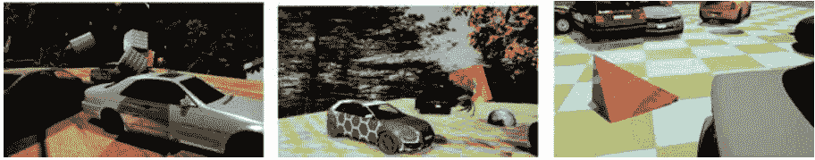

图9.1 由Tremblay等人[867]采用域随机化方法生成的样本图像，用于室外驾驶数据集。

- 在场景构建层面上，合成数据生成器（SDG）可以随机化对象的数量、相对和绝对位置、干扰对象的数量和形状、场景背景的内容、参与场景中的所有对象的纹理等等；
- 在渲染层面上，SDG可以随机化光照条件，特别是光源的位置、方向和强度，通过修改图像分辨率、渲染类型（如光线追踪或其他选项）、向生成的图像添加随机噪声等方式改变渲染质量。

Tobin等人[861]首次展示了域随机化的有效性；他们使用简单的几何形状（多面体）作为目标和干扰对象，随机纹理（如渐变填充或棋盘格图案）。作者发现，当只有少量真实训练集可用时，合成预训练确实非常有帮助，但只有在足够随机化的情况下才有帮助，特别是在使用大量随机纹理时。

后来，NVIDIA的研究人员Tremblay等人[867]将这种方法应用到了一个更具雄心的领域，他们使用以下步骤在合成数据上训练目标检测模型：

- 在场景中创建随机的三维场景，在随机表面上添加感兴趣的对象；
- 添加所谓的“飞行干扰物”，即各种几何形状，用作目标检测的负例；
- 对每个对象添加随机纹理，随机化相机设置、光照和其他参数。

生成的图像完全不真实（参见图9.1中用于训练汽车检测的几个样本），但足够多样化，使网络必须集中于所讨论的对象形状。

Tremblay等人报告了他们的数据集上相对于Virtual KITTI（参见第7.2节）改进了R-FCN [178]和SSD [539]架构的汽车检测结果，但未能改进Faster R-CNN [719]；此外，他们还在混合数据集上（将一个域随机化的训练集添加到COCO [525]中）进行了改进，并进行了详细的消融研究和广泛的实验，展示了各种超参数的影响。

从那时起，域随机化已经在许多研究中被使用和进一步发展。Borrego等人[85]旨在改进常见物体的目标检测，显示出在数据集的合成部分中进行域随机化显著改善了结果。

Tobin等人[860]考虑了机器人抓取这个特别严重缺乏真实数据的问题（也参见第7.4节和第10.6节）。他们使用域随机化生成各种不真实的程序生成的物体网格和纹理物体，以便在其上训练的模型也能推广到真实物体。他们表明，完全在非真实的程序生成的物体上训练的抓取模型可以成功地转移到真实物体上。

直到最近，域随机化一直在假设合成数据中不需要真实性。Prakash等人[684]采取了下一个逻辑步骤，继续努力进行结构化域随机化。他们仍然随机化上述所有设置，但仅在真实范围内，并考虑到特定场景的结构和上下文。

最后，另一个重要的方向是学习如何随机化。Van Vuong等人[897]在这个方向上提供了最早的工作，集中在选择最佳的域随机化参数，用于增强学习策略的模拟到真实环境的转移。他们表明，控制马尔可夫决策过程采样的参数对于将学习策略转移到真实环境的质量很重要，并且这些参数可以进行优化。我们将这视为第一次尝试，并期望有更多的工作致力于结构化和完善域随机化的参数。

## 9.2 改进基于CGI的生成

计算机视觉中合成数据的基本工作流程相对简单：准备3D模型，将其放置在受控场景中，设置环境（相机类型、光照等），并渲染用于训练的合成图像。

然而，一些关于合成数据的工作提出了额外的方法来增强数据，而不是通过域适应/改进到真实图像（我们将在第10节讨论这些方法），而是直接在CGI生成阶段进行。

这种增加计算机生成图像真实感的方法有两个不同的方向。

第一个方向是使物体更加真实。例如，王等人[904]在智能售货机中识别零售商品；为了模拟物体的自然变形，他们使用了一种基于表面的网格变形算法[906]，引入并最小化了物体网格的全局能量函数，考虑了随机变形和材料的刚性特性（王等人还使用了基于GAN的细化方法，详见第10.3节）。另一种方法，由Rozantsev等人[738]提出，是估计从数据中合成类似图像所需的渲染参数；这种方法与我们在第12.2节讨论的合成数据生成反馈循环相结合。

第二个方向是使“传感器”更加真实，引入了模拟真实相机/传感器噪声特性的合成数据后处理。例如，我们讨论了由Planche等人提出的DepthSynth [677]（见第6.5节），这是一个使模拟深度数据更加逼真、更接近真实深度的系统，而Taylor等人提出的OVMM系统[853]（第6.6节），以及Handa等人提出的ICL-NUIM数据集[321]（第7.2节）则特别关注模拟真实相机的噪声。甚至有一个完全致力于更好地建模真实世界相机噪声和失真的研究领域[72]。除了在图像层面上增加逼真度外，场景的高层次一致性和逼真度也是一个问题。当场景是手工制作时，一致性没有问题，但现代数据集的规模要求自动化场景组合。我们注意到最近由NVIDIA、多伦多大学和麻省理工学院共同努力的方向：Kar等人提出的Meta-Sim[433]，这是一个学习生成合成城市环境的通用框架（也见第7.2节）。Meta-Sim通过使用场景图和概率场景语法这种在计算机图形学中常见的表示方法[1026]，来表示3D场景的组合。其目标是学习如何转换来自概率语法的样本，使得合成场景的分布与真实数据集中场景的分布相似；这被称为弥合分布差异。此外，Meta-Sim还可以通过优化生成的合成数据的性能来学习这些转换，以用于特定任务（如目标检测）的网络训练（也见第12.2节）。

还有一些特定领域的发展，可以改善特定领域的合成数据生成。例如，Cheung等人[145]提出了一个名为LCrowdV的群众视频生成框架，该框架结合了一个过程模拟框架，专注于运动和人类行为，以及一个图像/视频生成框架。而Anderson等人[20]开发了一种基于随机采样的行人轨迹模拟方法（见第6.6节）。总的来说，尽管计算机图形学越来越多地使用机器学习来加速渲染（例如，通过学习复杂的计算密集型变换的近似值[424,651]）并改善结果的3D图形，但合成数据的工作很少利用这些进展；改进基于CGI的合成数据通常被认为是使其更加逼真的细化模型的方向（见第10.1节）。然而，我们确实预计在特定领域会有进一步的有趣发展，特别是在特定传感器的特性很重要的情况下（例如，自动驾驶车辆中的激光雷达）。

## 9.3 合成真实数据以产生合成数据集

我们认为，另一个值得注意的工作领域位于合成数据的数据增强之间，即使用不同真实图像的组合和融合来产生更大更多样化的图像训练集。这不需要使用CGI来渲染合成图像，但需要一个真实图像数据集。

在这个方向上的早期工作受到所需分割质量的限制，以剪切出真实对象。然而，对于某些问题来说，工作相对容易。例如，Eggert等人[221]专注于公司标志检测。为了生成合成图像，他们使用少量真实基础图像，其中标志清晰可见，并提供分割掩模，应用随机变形、颜色转换和模糊处理，然后将修改后（分割的）标志粘贴到新的背景图像上。在这个扩展数据集上的训练改善了标志检测结果。在第6.6节中，我们讨论了用于合成人脸的“弗兰肯斯坦”流程[360]。

该领域的研究始于Dwibedi等人的剪切、粘贴和学习方法[213]，该方法基于只需要在补丁级别上具有逼真度来训练目标检测器的假设。他们使用分割模型对一组对象实例图像进行分割（假设实例图像足够简单，分割几乎完美），然后将它们粘贴到随机背景场景中，不考虑保持比例或场景组合。Dwibedi等人比较了不同的经典计算机视觉融合方法（例如，高斯融合和泊松融合[669]），以减轻粘贴后边界伪影的影响；他们报告了改进的实例检测结果。后来，基于GAN的模型（用于更逼真的粘贴和修复）扩展了剪切和粘贴的工作，并在无监督分割方向上继续发展，由Remez等人[716]和Ostyakov等人[648]进行了研究。

后续的研究扩展了这种方法，以生成更真实的合成数据集。Dvornik等人[212]认为，这种类型的数据增强的一个重要问题是保持视觉上下文，即使得物体周围的环境更加真实或不真实。他们描述了一个初步实验，在新场景中将分割的物体放置在完全随机的位置，并且在VOC'12数据集上的目标检测没有看到显著的改进，实际上性能下降了，无论是分心因素还是用于混合和边界伪影去除的策略。因此，他们添加了一个单独的模型（也是CNN），该模型预测可以放置在图像的给定边界框中的物体的种类，并且使用该边界框屏蔽出的图像的其余部分。然后，训练好的模型用于评估数据增强的潜在边界框，选择具有最佳物体类别得分的边界框，然后在边界框中粘贴一个分割的物体。作者报告了在VOC'12上改进的目标检测结果。

Wang等人[903]将其发展为一个更简单的概念，即实例切换：让我们仅在训练集的不同图像之间切换相同类别的实例；这样，上下文就会自动正确，并且形状和比例也可以考虑在内。Wang等人还建议使用实例切换来调整训练集中各类别实例的分布，并通过为得分较低的类别添加更多切换来考虑类别重要性。由此产生的PSIS（渐进和选择性实例切换）系统在包括Faster-R-CNN[719]、FPN[523]、MaskR-CNN[327]和SNIPER[803]在内的各种目标检测器上提供了改进的MS COCO数据集结果。

为了详细考虑，让我们考虑Jin和Rinard最近的一项工作[402]，他们将这种基本的剪切和粘贴方法提升到了一个新的水平。实质上，他们仍然使用相同的基本流程：

- 采用由合成对象组成的对象空间 $O$，这些对象以随机姿势放置，并经过多种不同的增强处理；
- 采用由背景图像组成的上下文空间 $C$；
- 随机将 $O$ 中的对象与 $C$ 中的背景叠加；
- 在生成的复合图像上训练神经网络。

然而，Jin和Rinard详细考虑了这种方法，并引入了几个重要的技巧，使得这种简单方法能够提供领域适应和少样本学习中最好的结果之一。

首先，采样。计算机视觉的一个常见陷阱是，当你只有相对较少的一个类的示例时，它们不能具有各种不同的背景。因此，在类似过拟合的过程中，网络可能开始学习背景的特征而不是该类别中的对象的特征。

那么，最简单的解决办法是什么？我们如何告诉分类器重要的是对象而不是背景？通过合成图像，这很容易：让我们在同一背景上放置几个不同的对象！然后，由于标签不同，分类器将被迫学习到背景并不重要，而是对象之间的差异才能区分类别。因此，Jin和Rinard特别注意引入平衡采样的对象和背景。基本过程是对随机的双正则化进行采样，以便每个对象都放置在相同数量的背景上，反之亦然。

Jin和Rinard使用的另一个想法源于一个明显的事实，即分类器必须学会区分不同的对象。因此，对于训练来说，集中于分类器可能混淆两个对象的困难情况会很有益。在[402]中，这个想法有两种变体。首先，针对图像，作者建议将一个对象叠加在另一个对象之上，以便前一个对象为后一个对象提供最大混淆的背景。其次，他们使用了鲁棒性训练，这是一种基本上等同于我们在第3.4节中讨论的自对抗训练方法，但在这里应用于合成图像。这个想法是，如果我们在合成图像上进行训练，这些图像可能看起来有点不真实，可能不足以混淆一个不完美的分类器，我们可以通过将其转化为对抗性示例来增加难度。

通过将所有这些想法结合起来，Jin和Rinard得到了一个相对简单的流程，能够通过仅使用每个对象类的一个合成图像来实现最先进的结果。请注意，这里没有复杂的领域适应：所有的想法都可以被视为类似于我们在第3.4节中考虑的智能增强。

随着条件生成模型的发展，这个领域已经发展成更复杂的条件生成，通常被称为图像融合，超越了剪切和粘贴；我们在第10.4节中讨论了这些扩展。

## 9.4 由生成模型产生的合成数据

生成模型，特别是生成对抗网络（GAN）[290]，我们将在第4章中详细讨论，越来越多地被用于领域适应，无论是通过改进合成图像使其更加逼真，还是通过“智能增强”对真实数据进行非平凡的转换。

我们在第10章中讨论了这些技术。为经典计算机视觉应用程序直接从随机噪声生成合成数据通常听起来并不令人期待：GAN只能尝试逼近数据中已有的内容，那么为什么模型本身不能做到呢？然而，在许多应用中，由GAN直接从随机噪声生成的合成数据，通常带有一个抽象条件，比如分割掩模，可以起到帮助作用；在本节中，我们考虑了几个这些方法的示例。

对象计数（图像上的对象）是一个计算机视觉问题，从形式上讲，它可以简化为对象检测或分割，但在实践中却更加困难：为了正确计数，模型需要检测图像上的所有对象，不能漏掉一个。大型数据集对计数有帮助，而由GAN生成的合成数据，可以根据对象数量或分割掩模进行条件生成，可以随机生成，也可以从标记的真实数据集中获取，这些都被证明是有帮助的。特别是，在植物图像上进行叶片计数的研究中，Giuffrida等人的ARIGAN [278]根据叶片数量生成拟南芥植物的图像，Zhu等人根据分割掩模生成相同的图像[1028]，Kuznichov等人[490]生成保留叶片几何结构的合成增强数据；所有这些工作都报告了改进的计数结果。

Santana和Hotz [758]提出了一个生成模型，可以学习生成逼真的道路图像甚至视频，用于自动驾驶汽车的潜在训练。他们的模型是基于[497]的VAE+GAN自编码器架构，结合了一个递归转换模型，可以在嵌入空间中学习逼真的转换。生成的模型可以产生保留至少100帧视频中的道路纹理、车道标线和车边缘的合成视频。然而，这种有趣的方法尚未对实际驾驶代理的训练产生任何改进。

很难找到纯粹由生成模型从头开始生成合成数据的令人印象深刻的应用；正如我们所讨论的，这可能是一个原则性的限制。

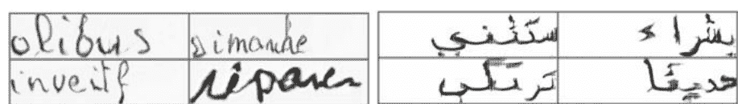

图9.2 由Alonso等人[14]生成的样本手写文本：（a）法语；（b）阿拉伯语。

然而，即使有少量额外的监督也可能起到作用。例如，Alonso等人[14]考虑对合成手写文本（也见第6.7节）。他们将生成器与文本本身（字符序列）进行条件化，为各种词汇单词生成手写实例，并用生成的合成数据集（图9.2）增强真实的RIMES数据集[299]。Alonso等人报告了在编辑距离和词错误率方面改进的字符识别性能。这个例子表明，合成数据不需要涉及复杂的3D建模就可以起作用并改善结果；在这种情况下，Alonso等人为生成模型提供的所有信息只是一个词汇表。

一个相关但不同的领域考虑了基于对抗性架构的无监督分割方法和其他计算机视觉问题，包括通过剪切和粘贴学习分割[716]，通过修复在图像对之间移动对象进行无监督分割[648]，从未标注的医学图像中学习分割[1011]，以及更多[70]。虽然这不是纯粹的合成数据，但我们通常期望无监督的计算机视觉方法在使用合成数据方面是一个重要趋势。

到目前为止，我们已经看到了许多合成数据的例子和应用。我们遇到的大多数合成数据生成都涉及手动组件：例如，在计算机视觉中，3D场景通常是手工设置的，使用手工制作的3D对象。然而，我们已经看到了一些情况，可以使用生成模型自动产生合成数据。在合成数据应用的背景下，更重要的是，生成模型可以帮助调整合成数据，使其更加逼真，或者在合成数据训练后，调整模型以在真实数据上良好工作。我们已经在第4章中介绍了生成模型，特别是基于GAN的架构，接下来的章节中，是时候让它们为合成到真实领域的适应性做出贡献了。

# 第10章 从合成到真实领域的适应和改进

领域适应是一组旨在使在一个数据领域上训练的模型在不同的目标领域上表现良好的技术。在本章中，我们对用于合成到真实适应的领域适应方法进行了调查，即使模型在合成数据上训练良好，在真实数据上也能良好工作，这几乎总是最终目标。我们区分了两种主要方法。

在合成到真实改进中，输入的合成数据通常被修改，以使其更加真实，我们实际上可以看到修改后的数据。在基于模型的领域适应中，训练过程或模型结构发生变化以确保领域适应，而数据仍然保持合成的状态。我们将讨论两种方法的神经架构，包括许多基于生成对抗网络的模型。

## 10.1 合成到真实领域的适应和改进

到目前为止，我们已经讨论了直接应用，其中合成数据被用来增加不足的真实数据集的大小或创建虚拟环境进行训练。在本章中，我们将介绍一些可以更有效地使用合成数据的方法。领域适应是一组旨在使在一个数据领域上训练的模型，在不同的目标领域上工作良好的技术。这对于合成数据来说是一个自然的选择：在几乎所有的应用中，我们希望在合成数据的源领域中训练模型，然后将结果应用于真实数据的目标领域。

在本章中，我们对已经用于这种合成到真实适应的领域适应方法进行了调查。在本章中，我们将这些方法大致分为两组。第一组方法从数据层面上操作，这使得可以提取“改进”的合成数据，以便在真实数据上更好地工作，而第二组方法直接在模型、特征空间或训练过程上操作，而不改变数据本身。我们主要关注与深度神经网络相关的最新工作，并参考例如综述[660]以了解早期工作的概述。

在第10.1节中，我们讨论了合成到真实的改进，其中模型学习使用对抗框架使合成的“假”数据更加逼真；我们从凝视估计的案例研究开始（第10.2节），这是该领域最早的应用之一，然后继续介绍其他这类改进器的应用（第10.3节）和以相反方向工作的基于GAN的模型，使真实数据更加“合成化”（第10.4节）。在第10.5节中，我们讨论了特征和模型层面上的领域适应，即执行合成到真实的领域适应但不一定产生更逼真的合成数据的方法。第10.6节专门讨论了控制和机器人领域的领域适应，在第10.7节中，我们介绍了医学成像中对抗性架构的案例研究，这是使用GAN生成的合成数据可以显著改善结果的领域之一。

我们主要关注与深度神经网络相关的最新工作，并参考[660]的调查概述早期工作。

第一组用于合成到真实领域适应的方法主要处理数据本身。下面的模型可以接受合成图像并对其进行“改进”，使其更适合后续的模型训练。请注意，虽然在我们讨论的大多数工作中，目标基本上是使合成数据更加真实（并且通过鉴别器支持将改进的合成数据与真实样本区分开来），但这并不一定是必须的；一些关于合成数据的早期工作得出结论，例如，如果合成图像不太真实，则可能效果更好，从而使模型更好地泛化；我们已经在第9.1节中讨论过这个问题。我们从一个特定问题的案例研究开始，这个问题推动了合成到真实的改进，然后继续其他方法，既改进已有的合成数据，又通过生成操作从真实数据中生成新的合成数据。

### 10.2 案例研究:基于GAN的凝视估计改进

Apple的研究人员Shrivastava等人在[793]中给出了直接从合成到真实的改进的首个成功示例，因此我们首先详细考虑这个案例研究，并展示了研究的进展。

这里的潜在问题是凝视估计：识别人眼注视的方向。凝视估计方法通常分为基于模型的方法，对眼睛和相邻区域的几何结构进行建模，以及基于外观的方法，直接使用眼睛图像作为输入；自然地，对于后一类方法，需要制作和改进合成数据。

在[793]之前，这个问题已经通过合成数据得到了解决。Wood等人[933,934]提供了一个大型的真实人眼渲染数据集，并展示了在真实测试集上相比于之前使用MPII-Gaze进行的工作的改进。

### 10.2 案例研究:基于GAN的凝视估计改进

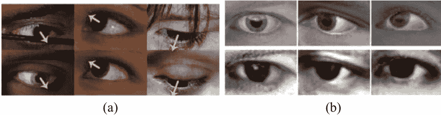

图10.1用于训练凝视估计模型的合成图像: (a) 来自UnityEyes[934]的样本图像; (b) 来自UnityEyes的样本图像 (顶部) 通过SimGAN进行改进 (底部) [793]。

真实标记图像数据集[1003]。请注意，这里的常规尺度增加表现为可变性的增加：$MPIIGaze$ 包含约21.4K张图像，而合成训练集仅约为 $1M$ 张图像，但 $MPIIGaze$ 中的所有图像都来自实验的同15位参与者，而[934]中开发的 $UnityEyes$ 系统可以在不同的随机环境中渲染每个图像，这使得模型更加稳健。图10.1 a显示了来自 $UnityEyes$ 数据集的样本图像。

Shrivastava等人通过提出基于GAN的系统进一步改进了这一结果，该系统通过训练来改善合成眼睛图像，使其更加逼真。他们将这个想法称为模拟+无监督学习，使用具有SimGAN对抗性结构的 $Refiner$ 网络来实现转换。SimGAN由一个生成器（refiner）$G_{\theta}^{\mathrm{REF}}$ 和一个判别器 $D_{\phi}^{\mathrm{REF}}$ 组成，判别器具有参数 $\phi$；参见图 10.2。

判别器通过标准的二元分类损失函数学习区分真实图像和改进后的图像。

```
$$\mathcal{L}_{D}^{\mathrm{REF}}(\phi)=-\mathbb{E}_{S}\left[\log D_{\phi}^{\mathrm{REF}}\left(\hat{\mathbf{x}}_{S}\right)\right]-\mathbb{E}_{T}\left[\log \left(1-D_{\phi}^{\mathrm{REF}}\left(\mathbf{x}_{T}\right)\right)\right]$$
```

其中 $\hat{\mathbf{x}}_{S}=G_{\theta}^{\mathrm{REF}}\left(\mathbf{x}_{S}\right)$ 是由 $G_{\theta}^{\mathrm{REF}}$ 生成的 $\mathbf{x}_{S}$ 的改进版本。生成器，反过来，通过真实性损失 $\mathcal{L}_{\text {real }}^{\mathrm{REF}}$ 和正则化损失 $\mathcal{L}_{\text {reg }}^{\mathrm{REF}}$ 的组合进行训练，真实性损失使 $G_{\theta}^{\mathrm{REF}}$ 学会欺骗 $D_{\phi}^{\mathrm{REF}}$，而正则化损失捕捉到改进图像与原始图像之间的相似性，以保留目标变量（注视方向在[793]中）：

```
$$\mathcal{L}_{G}^{\mathrm{REF}}(\theta)=\mathbb{E}_{S}\left[\mathcal{L}_{\text {real }}^{\mathrm{REF}}\left(\theta ; \mathbf{x}_{S}\right)+\lambda \mathcal{L}_{\mathrm{reg}}^{\mathrm{REF}}\left(\theta ; \mathbf{x}_{S}\right)\right]$$
```

其中

```
$$\begin{aligned} & \mathcal{L}_{\text {real }}^{\mathrm{REF}}\left(\theta ; \mathbf{x}_{S}\right)=-\log \left(1-D_{\phi}^{\mathrm{REF}}\left(G_{\theta}^{\mathrm{REF}}\left(\mathbf{x}_{S}\right)\right)\right), \\ & \mathcal{L}_{\mathrm{reg}}^{\mathrm{REF}}\left(\theta ; \mathbf{x}_{S}\right)=\left\|\psi\left(G_{\theta}^{\mathrm{REF}}\left(\mathbf{x}_{S}\right)\right)-\psi\left(\mathbf{x}_{S}\right)\right\|_{1} \end{aligned}$$
```

图10.2 SimGAN的架构，一种基于GAN的合成数据细化器[793]。

其中 $\psi(\mathbf{x})$ 是一个映射到特征空间的函数（可以包含图像本身、图像导数、颜色通道的统计信息或由预训练CNN生成的特征），$\| \cdot \|_1$ 表示 $L_1$ 距离。在图10.2中，黑色箭头表示数据流动，绿色箭头表示梯度流动（在后续图片中，我们省略梯度流动以避免混乱）；$\mathcal{L}_{\text{real}}^{\text{REF}}(\boldsymbol{\theta})$ 和 $\mathcal{L}_{\text{real}}^{\text{REF}} D(\boldsymbol{\phi})$ 在同一个块中显示，因为它们是相同的损失函数，分别对 $G_\theta^{\text{REF}}$ 和 $D_\phi^{\text{REF}}$ 的不同权重进行微分。

在SimGAN中，生成器是一个完全卷积神经网络，由几个ResNet块[328]组成，不包含任何步幅或池化，这使得它能够在像素级别上操作同时保持全局结构。训练过程通过最小化 $\mathcal{L}_G^{\text{REF}}(\boldsymbol{\theta})$ 和 $\mathcal{L}_D^{\text{REF}}(\boldsymbol{\phi})$ 交替进行，还有一个额外的技巧是从存储的精炼图像历史中绘制训练样本以使鉴别器对所有版本的生成器都有效。另一个重要特征是对抗损失的局部性，$\mathcal{L}_D^{\text{REF}}$ 在原始图像的局部块上输出概率图，并且 $\mathcal{L}_D^{\text{REF}} D(\boldsymbol{\phi})$ 在块上求和。图10.1b中显示了样本结果；很明显，SimGAN的结果（在图10.1b底部显示）比原始合成图像（在图10.1b顶部显示）更加逼真。

SimGAN的思想后来被许多研究所采纳并扩展。SimGAN的直接继承者GazeGAN由Sela等人[777]开发，应用于合成数据的改进，借鉴了CycleGAN用于无配对图像翻译的思想[1025]（参见第4.7节）。GazeGAN的结构包含四个网络：$G^{\text{Gz}}$ 是学习将合成域S中的图像映射到真实域R的生成器，$F^{\text{Gz}}$ 学习相反的映射，从R到S，还有两个判别器 $D^S$ 和 $D_R^{\text{Gz}}$ 分别学习区分合成域和真实域中的真实和伪造图像。

## 10.2 案例研究：基于GAN的凝视估计改进

图10.3 GazeGAN的架构[777]。具有相同标签的块具有共享权重。

图10.3显示了GazeGAN架构的概述。它使用以下损失函数：
- 使用LSGAN[580]生成器的损失函数，通过标签平滑化为0.9[668]来稳定训练：
$$\mathcal{L}_{\mathrm{LSGAN}}^{\mathrm{Gz}}(G, D, S, R)=\mathbb{E}_{\mathbf{x}_{\mathrm{S}} \sim p_{\mathrm{syn}}}\left[\left(D\left(G\left(\mathbf{x}_{\mathrm{S}}\right)\right)-0.9\right)^{2}\right]+\mathbb{E}_{\mathbf{x}_{T} \sim p_{\mathrm{real}}}\left[D\left(\mathbf{x}_{T}\right)^{2}\right];$$
这个损失函数应用于两个方向，即 $\mathcal{L}_{\mathrm{LSGAN}}^{\mathrm{Gz}}\left(G^{\mathrm{Gz}}, D_{R}^{\mathrm{Gz}}, X_{S}, X_{T}\right)$ 以及 $\mathcal{L}_{\mathrm{LSGAN}}^{\mathrm{Gz}}\left(F^{\mathrm{Gz}}, D_{S}^{\mathrm{Gz}}, X_{T}, X_{S}\right)$；
- 循环一致性损失[1025]旨在确保 $F \circ G$ 和 $G \circ F$ 接近于恒等映射：
$$\mathcal{L}_{\mathrm{Cyc}}^{\mathrm{Gz}}\left(G^{\mathrm{Gz}}, F^{\mathrm{Gz}}\right)=\mathbb{E}_{\mathbf{x}_{S} \sim p_{\mathrm{syn}}}\left[\left\|F^{\mathrm{Gz}}\left(G^{\mathrm{Gz}}\left(\mathbf{x}_{S}\right)\right)-\mathbf{x}_{S}\right\|_{1}\right]+\mathbb{E}_{\mathbf{x}_{T} \sim p_{\mathrm{real}}}\left[\left\|G^{\mathrm{Gz}}\left(F^{\mathrm{Gz}}\left(\mathbf{x}_{T}\right)\right)-\mathbf{x}_{T}\right\|_{1}\right];$$
- 最后，为了保留凝视方向（使目标变量在转移时不发生变化），作者训练了一个单独的凝视估计网络 $E^{\mathrm{Gz}}$，该网络设计为在合成数据上过拟合并且非常准确地预测凝视；该损失函数确保 $E^{\mathrm{Gz}}$ 在应用 $F \circ G$ 之后仍然有效：
$$\mathcal{L}_{\text {GazeCyc }}^{\mathrm{Gz}}\left(G^{\mathrm{Gz}}, F^{\mathrm{Gz}}\right)=\mathbb{E}_{\mathbf{x}_{\mathrm{S}} \sim p_{\mathrm{syn}}}\left[\left\|E^{\mathrm{Gz}}\left(F^{\mathrm{Gz}}\left(G^{\mathrm{Gz}}\left(\mathbf{x}_{\mathrm{S}}\right)\right)\right)-E^{\mathrm{Gz}}\left(\mathbf{x}_{\mathrm{S}}\right)\right\|_{2}^{2}\right].$$

Sela等人报告了改进的凝视估计结果。对我们来说，重要的是，他们的操作不是在[793]中的 $30 \times 60$ 灰度图像上进行的，而是在 $128 \times 128$ 彩色图像上进行的，并且GazeGAN实际上不仅改进了眼睛本身，还改进了图像的部分（例如，鼻子和头发），这些部分不是眼睛的3D模型的一部分。

最后，需要注意的是：基于GAN的改进并不是唯一的选择。Kan等人[427]比较了用于瞳孔中心数据增强的三种方法：点检测、真实图像的仿射变换、来自UnityEyes的合成图像以及基于GAN的改进。

在他们的实验中，通过仿射变换进行的真实数据增强明显优于UnityEyes，但仍然不及增强的真实数据集。这是一个普遍的共识的例子：在有真实数据集的情况下，应该尽可能地挤出所有可用的信息，并进行尽可能多的增强，无论数据集是否使用合成数据进行增强。

## 10.3 用GAN改进合成数据

凝视估计是基于GAN改进的方便问题，因为用于凝视估计的眼睛图像具有相对较低的分辨率，并且在许多应用中，将GAN扩展到高分辨率图像已被证明是一项困难的任务。

尽管如此，在本节中，我们考虑了其他基于GAN的合成到真实领域适应的更广泛的情况。

我们从与[793]平行的早期研究开始，这项研究是由Google的研究人员Bousmalis等人完成的。他们训练了一个基于GAN的架构进行像素级域适应（PixelDA），使用了基本的风格转换GAN（基本上是我们第4.7节中讨论的pix2pix），即通过交替优化步骤来解决：
$$\min _{\theta_{G}, \theta_{T}} \max _{\phi} \lambda_{1} \mathcal{L}_{\mathrm{dom}}^{\mathrm{PIX}}\left(D^{\mathrm{PIX}}, G^{\mathrm{PIX}}\right)+\lambda_{2} \mathcal{L}_{\mathrm{task}}^{\mathrm{PIX}}\left(G^{\mathrm{PIX}}, T^{\mathrm{PIX}}\right)+\lambda_{3} \mathcal{L}_{\mathrm{cont}}^{\mathrm{PIX}}\left(G^{\mathrm{PIX}}\right),$$
其中：
- $\mathcal{L}_{\text {dom }}^{\mathrm{PIX}}\left(D_{\mathrm{PIX}}, G^{\mathrm{PIX}}\right)$ 是域损失：
$$\mathcal{L}_{\text {dom }}^{\mathrm{PIX}}\left(D^{\mathrm{PIX}}, G^{\mathrm{PIX}}\right)=\mathbb{E}_{\mathbf{x}_{S} \sim P_{\mathrm{syn}}}\left[\log \left(1-D^{\mathrm{PIX}}\left(G^{\mathrm{PIX}}\left(\mathbf{x}_{S} ; \theta_{G}\right) ; \phi\right)\right)\right]+\mathbb{E}_{\mathbf{x}_{T} \sim P_{\text {real }}}\left[\log D^{\mathrm{PIX}}\left(\mathbf{x}_{T} ; \phi\right)\right];$$
- $\mathcal{L}_{\text {task }}^{\mathrm{PIX}}\left(G_{\mathrm{PIX}}, T^{\mathrm{PIX}}\right)$ 是任务特定损失，在[87]中是由分类器 $T^{\mathrm{PIX}}(\mathbf{x} ; \boldsymbol{\theta}_{T})$ 提供的图像分类交叉熵损失，该分类器也作为模型的一部分进行训练：
$$\mathcal{L}_{\text {task }}^{\mathrm{PIX}}\left(G^{\mathrm{PIX}}, T^{\mathrm{PIX}}\right)= \mathbb{E}_{\mathbf{x}_{S}, \mathbf{y}_{S} \sim p_{\mathrm{syn}}}\left[-\mathbf{y}_{S}^{\top} \log T^{\mathrm{PIX}}\left(G^{\mathrm{PIX}}\left(\mathbf{x}_{S} ; \theta_{G}\right) ; \theta_{T}\right)-\mathbf{y}_{S}^{\top} \log T^{\mathrm{PIX}}\left(\mathbf{x}_{S} ; \theta_{T}\right)\right];$$
- $\mathcal{L}_{\text {cont }}^{\mathrm{PIX}}\left(G_{\mathrm{PIX}}\right)$ 是内容相似性损失，旨在使 $G^{\mathrm{PIX}}$ 保留与目标变量相关的图像部分；在[87]中，$\mathcal{L}_{\text {cont }}^{\mathrm{PIX}}$ 用于保留前景对象（稍后需要进行分类）的均方误差应用于它们的掩码。

$$\mathcal{L}_{\text {cont }}^{\mathrm{PIX}}\left(G^{\mathrm{PIX}}\right) =\mathbb{E}_{\mathbf{x}_S \sim p_{\mathrm{syn}}}\left[\frac{1}{k}\left\|\left(\mathbf{x}_S-G^{\mathrm{PIX}}\left(\mathbf{x}_S ; \boldsymbol{\theta}_G\right)\right) \odot \mathbf{m}(\mathbf{x})\right\|_2^2 -\frac{1}{k^2}\left(\left(\mathbf{x}_S-G^{\mathrm{PIX}}\left(\mathbf{x}_S ; \boldsymbol{\theta}_G\right)\right)^{\top} \mathbf{m}(\mathbf{x})\right)^2\right],$$
其中 $\mathbf{m}\left(\mathbf{x}_S\right)$ 是从合成数据渲染器中提取的前景对象的分割掩码；请注意，此损失不坚持保留对象中的像素值，而是鼓励模型以一致的方式更改对象像素，保持它们的成对差异。

Bousmalis等人将这个GAN应用于合成裁剪的LineMod数据集，这是一个小物体分类数据集的合成版本[931]，对物体进行了分类和姿态估计。他们报告称，在两个指标上与仅使用合成数据训练和许多先前的领域适应方法相比，结果有所改善。

许多现代合成数据改进方法包括CycleGAN的思想[1025]。最直接的应用是Stein和Roy提出的GeneSIS-RT框架[818]，它使用在合成和真实图像的非配对数据集上训练的CycleGAN直接改进合成数据。他们表明，通过CycleGAN学习的图像到图像转换产生的训练集可以改善用于障碍物避免和语义分割等真实世界任务的机器学习系统的结果。

Zheng等人的 $\mathrm{T}^2 \text{Net}$ [1020]使用合成到真实的改进来进行单张图像的深度估计。这项工作也使用了CycleGAN的一般思想，通过一个使图像更真实的转换网络。这里的新思想是 $\mathrm{T}^2 \text{Net}$ 要求合成到真实生成器 $G_S^{\mathrm{T2}}$ 不仅要将一个特定领域（合成数据）转换为另一个领域（真实数据），还要在多个不同的输入领域中工作，使得每种情况下的输入图像“更真实”，如图10.4所示。

本质上，这意味着 $G_S^{T2}$ 旨在学习最小的转换，使图像更加真实，特别是不应该改变真实图像太多。总的来说，T²Net具有生成器损失函数：
$$\mathcal{L}^{\mathrm{T} 2} = \mathcal{L}_{\mathrm{GAN}}^{\mathrm{T} 2}(G_S^{\mathrm{T} 2}, D_T^{\mathrm{T} 2}) + \lambda_1 \mathcal{L}_{\mathrm{GAN}_f}^{\mathrm{T} 2}(f_{\text {任务 }}, D_f^{\mathrm{T} 2}) + \lambda_2 \mathcal{L}_r^{\mathrm{T} 2}(G_S^{\mathrm{T} 2}) + \lambda_3 \mathcal{L}_l^{\mathrm{T} 2}(f_{\text {任务 }}^{\mathrm{T} 2}) + \lambda_4 \mathcal{L}_s^{\mathrm{T} 2}(f_{\text {任务 }}^{\mathrm{T} 2})$$
其中：
- $\mathcal{L}_{\mathrm{GAN}}^{\mathrm{T} 2}(G_S^{\mathrm{T} 2}, D_T^{\mathrm{T} 2})$ 是合成到真实转换的常规 GAN 损失，其中鉴别器 $D_T^{\mathrm{T} 2}$：
$$\mathcal{L}_{\mathrm{GAN}}^{\mathrm{T} 2}(G_S^{\mathrm{T} 2}, D_T^{\mathrm{T} 2}) = \mathbb{E}_{\mathbf{x}_S \sim p_{\mathrm{syn}}} \left[\log (1 - D_T^{\mathrm{T} 2}(G_S^{\mathrm{T} 2}(\mathbf{x}_S)))\right] + \mathbb{E}_{\mathbf{x}_T \sim p_{\mathrm{real}}} \left[\log D_T^{\mathrm{T} 2}(\mathbf{x}_T)\right];$$
- $\mathcal{L}_{\mathrm{GAN}_f}^{\mathrm{T} 2}(f_{\text {任务 }}, D_f^{\mathrm{T} 2})$ 是从翻译和真实图像中提取的特征的特征级 GAN 损失，其中鉴别器 $D_f^{\mathrm{T} 2}$：
$$\mathcal{L}_{\mathrm{GAN}_f}^{\mathrm{T} 2}(f_{\text {任务 }}^{\mathrm{T} 2}, D_f^{\mathrm{T} 2}) = \mathbb{E}_{\mathbf{x}_S \sim p_{\mathrm{syn}}} \left[\log D_f^{\mathrm{T} 2}(f_{\mathrm{task}}^{\mathrm{T} 2}(G_S^{\mathrm{T} 2}(\mathbf{x}_S)))\right] + \mathbb{E}_{\mathbf{x}_T \sim p_{\mathrm{real}}} \left[\log (1 - D_f^{\mathrm{T} 2}(f_{\mathrm{task}}^{\mathrm{T} 2}(\mathbf{x}_T)))\right];$$
- $\mathcal{L}_r^{\mathrm{T} 2}(G_S^{\mathrm{T} 2}) = \left\|G_S^{\mathrm{T} 2}(\mathbf{x}_T) - \mathbf{x}_T \right\|_1$ 是真实图像的重建损失；
- $\mathcal{L}_r^{\mathrm{T} 2}(f_{\mathrm{task}}^{\mathrm{T} 2}) = \left\|f_{\mathrm{task}}^{\mathrm{T} 2}(\hat{\mathbf{x}}_S) - \mathbf{y}_S \right\|_1$ 是深度估计合成图像的任务损失，即预测深度图像与原始合成深度图像之间的差异的 $L_1$ 范数；这个损失确保了平移不会改变深度图像；
- $\mathcal{L}_s^{\mathrm{T} 2}(f_{\mathrm{task}}^{\mathrm{T} 2}) = \left|\partial_x f_{\mathrm{task}}^{\mathrm{T} 2}(\mathbf{x}_T)\right|^{-\left|\partial_x \mathbf{x}_T\right|} + \left|\partial_y f_{\mathrm{task}}^{\mathrm{T} 2}(\mathbf{x}_T)\right|^{-\left|\partial_y \mathbf{x}_T\right|}$，其中 $\partial_x$ 和 $\partial_y$ 是图像梯度，是深度估计实际图像的任务损失；由于现在没有真实深度图像，这个正则化项是一个局部平滑损失，旨在优化物体边界，是深度估计模型中常用的工具[284]。

郑等人表明T²Net可以从合成图像中生成逼真的图像，得出端到端训练优于分离训练（翻译网络和深度估计网络）的结论，并指出T²Net可以在没有真实配对数据的情况下实现良好的深度估计结果，甚至超过一些（但不是全部）监督方法。T²Net处理的一些样本户外场景如图10.5所示。

我们注意到一些基于细化器的架构的更多有趣应用。王等人[919]使用了一个经典的细化器，模仿[793]进行人体运动合成和控制。他们的模型首先通过循环神经网络生成一个运动序列，然后通过GAN进行细化；由于目标是对序列进行建模和细化，细化器中的生成器和判别器都采用了基于RNN的架构。Dilipkumar[196]应用SimGAN改进了手写识别。他们生成了合成手写图像，并应用SimGAN进行细化。

图10.5 通过 $\mathrm{T}^{2}$ Net进行合成到真实的细化[1020]: (a) 输入的合成图像; (b) 细化后的图像; (c) 真实图像（用于比较）。

在训练后, 它们在结果混合数据集上显著提高了对真实手写的识别能力。

最近的一个例子是由Wang等人提供的, 他们在经典的计算机视觉环境中应用了基于GAN的细化方法[904], 该工作的其他方面我们已经在第6.4节中讨论过。他们考虑了在自动售货机内识别物体的问题; 这是监控供应状态所需的基本功能, 通常是基于物体检测完成的。

Wang等人首先扫描物体, 对生成的3D模型添加随机变形 (参见第9.2节), 设置场景并使用与智能售货机中使用的鱼眼相机相匹配的设置进行渲染。然后, 他们使用基于CycleGAN的架构对渲染图像进行虚拟到真实的风格转换 (图10.6)。这里的创新之处在于Wang等人将前景和背景的损失分开, 认为前景对象所需的风格转换与背景的风格转换非常不同（更强烈）。因此, 他们使用了整体损失函数

$$
\begin{aligned} \mathcal{L}^{\mathrm{OD}}= & \mathcal{L}_{\mathrm{GAN}}^{\mathrm{OD}}\left(G^{\mathrm{OD}}, D_{T}^{\mathrm{OD}}, \mathcal{X}_{S}, \mathcal{X}_{T}\right)+\mathcal{L}_{\mathrm{GAN}}^{\mathrm{OD}}\left(F^{\mathrm{OD}}, D_{S}^{\mathrm{OD}}, \mathcal{X}_{T}, \mathcal{X}_{S}\right)+ \\
& +\lambda_{1} \mathcal{L}_{\mathrm{cyc}}^{\mathrm{OD}}\left(G^{\mathrm{OD}}, F^{\mathrm{OD}}\right)+\lambda_{2} \mathcal{L}_{\mathrm{bg}}^{\mathrm{OD}}+\lambda_{3} \mathcal{L}_{\mathrm{fg}}^{\mathrm{OD}}, \text { 其中 }
\end{aligned}
$$

- $\mathcal{L}_{\mathrm{GAN}}^{\mathrm{OD}}(G, D, X, Y)$ 是生成器 $G$ 从域 $X$ 映射到域 $Y$ 的标准对抗损失函数, 鉴别器 $D$ 用于区分域 $Y$ 中的真实图像和伪造图像;

- $\mathcal{L}_{\mathrm{cyc}}^{\mathrm{OD}}(G, F)$ 是CycleGAN [1025]中使用的循环一致性损失函数, 如上所述;

- $\mathcal{L}_{\mathrm{bg}}^{\mathrm{OD}}$ 是背景损失, 这是仅针对图像背景部分计算的循环一致性损失, 由掩码 $\mathbf{m}_{\mathrm{bg}}$ 定义:

$$
\begin{aligned} \mathcal{L}_{\mathrm{bg}}^{\mathrm{OD}}= & \mathbb{E}_{\mathbf{x}_{T} \sim p_{\text {real }}}\left[\left\|\left(G^{\mathrm{OD}}\left(F^{\mathrm{OD}}\left(\mathbf{x}_{T}\right)\right)-\mathbf{x}_{T}\right) \odot \mathbf{m}_{\mathrm{bg}}\left(\mathbf{x}_{T}\right)\|_{2}\right\] \\
& +\mathbb{E}_{\mathbf{x}_{S} \sim p_{\mathrm{syn}}}\left[\left\|\left(F^{\mathrm{OD}}\left(G^{\mathrm{OD}}\left(\mathbf{x}_{S}\right)\right)-\mathbf{x}_{S}\right) \odot \mathbf{m}_{\mathrm{bg}}\left(\mathbf{x}_{S}\right)\right\|_{2}\right] ;
\end{aligned}
$$

图10.6 在[904]中使用的细化器的架构。具有相同标签的块共享权重。

- $\mathcal{L}_{\mathrm{fg}}^{\mathrm{OD}}$ 是前景损失，类似于 $\mathcal{L}_{\mathrm{bg}}^{\mathrm{OD}}$ 但仅针对色调通道计算在HSV颜色空间中（作者认为颜色和轮廓对于识别最关键），如下所示:

$$
\mathcal{L}_{\mathrm{fg}}^{\mathrm{OD}} = \mathbb{E}_{\mathbf{x}_T \sim p_{\text{real}}} \left[ \left\| \left( G^{\mathrm{OD}}(F^{\mathrm{OD}}(\mathbf{x}_T)) \right)^H - \mathbf{x}_T^H \right\|_2 \odot \mathbf{m}_{\mathrm{fg}}(\mathbf{x}_T) \right] + \mathbb{E}_{\mathbf{x}_S \sim p_{\mathrm{syn}}} \left[ \left\| \left( F^{\mathrm{OD}}(G^{\mathrm{OD}}(\mathbf{x}_S)) \right)^H - \mathbf{x}_S^H \right\|_2 \odot \mathbf{m}_{\mathrm{fg}}(\mathbf{x}_S) \right].
$$

在合成数据中，前景和背景的分割是自动完成的，在真实数据中由于相机位置固定，因此在[904]中变得很容易，作者可以从他们在实验中使用的自动售货机中收集一组真实背景模板数据集，然后简单地减去背景部分以获得前景部分。

因此，Wang等人在所有三种测试的目标检测架构PVANET [453]，SSD [539]和YOLOv3 [711]中使用混合真实数据和合成数据的数据集时，报告了显著改进的结果。更重要的是，他们报告了基本合成数据和经过改进的合成数据之间的比较，通过改进在所有架构中都取得了明显的增益。

Wang等人[907]¹在人群计数的背景下讨论了合成到真实领域的域适应，合成数据在这个领域已经成功使用了很长时间。他们使用Grand Theft Auto V引擎收集合成数据，生成所谓的GTA5 Crowd Counting(GCC)数据集（另见第6.6节）。他们还使用了基于CycleGAN的从合成图像领域 $\mathcal{X}_S$ 到真实图像领域 $\mathcal{X}_T$ 的改进器，但是指出CycleGAN很容易丢失局部模式和纹理，而这正是人群计数所重要的。因此，他们修改了

> ¹ 这是一个不同的人，来自中国陕西西北工业大学的王琦，而之前论文的第一作者是来自 CloudMinds Technologies的王凯。

## 10.3 用GAN改进合成数据

CycleGAN损失函数使用结构相似性指数 (SSIM) [1024]来计算图像之间的相似性, 以局部模式为基础。他们最终的损失函数是

$$
\begin{aligned}
\mathcal{L}^{\mathrm{SSIM}}= & \mathcal{L}_{\mathrm{GAN}}^{\mathrm{SSIM}}\left(G^{\mathrm{SSIM}}, D_{T}^{\mathrm{SSIM}}, \mathcal{X}_{S}, \mathcal{X}_{T}\right)+\mathcal{L}_{\mathrm{GAN}}^{\mathrm{SSIM}}\left(F^{\mathrm{SSIM}}, D_{S}^{\mathrm{SSIM}}, \mathcal{X}_{T}, \mathcal{X}_{S}\right) \\
& +\lambda \mathcal{L}_{\mathrm{cyc}}^{\mathrm{SSIM}}\left(G^{\mathrm{SSIM}}, F^{\mathrm{SSIM}}, \mathcal{X}_{S}, \mathcal{X}_{R}\right)+\mu \mathcal{L}_{\mathrm{SE}}^{\mathrm{SSIM}}\left(G^{\mathrm{SSIM}}, F^{\mathrm{SSIM}}, \mathcal{X}_{S}, \mathcal{X}_{R}\right),
\end{aligned}
$$

其中 $G^{\mathrm{SSIM}}: \mathcal{X}_{S} \rightarrow \mathcal{X}_{T}$ 是从合成到真实领域的生成器, $F^{\mathrm{SSIM}}: \mathcal{X}_{T} \rightarrow \mathcal{X}_{S}$ 在相反方向上工作, $D_{T}^{\mathrm{SSIM}}$ 和 $D_{S}^{\mathrm{SSIM}}$ 是相应的鉴别器, $\mathcal{L}_{\mathrm{GAN}}^{\mathrm{SSIM}}$ 是标准的GAN损失函数, $\mathcal{L}_{\mathrm{cyc}}^{\mathrm{SSIM}}$ 是上述定义的循环一致性损失, 而 $\mathcal{L}_{\mathrm{SE}}^{\mathrm{SSIM}}$ 是一种特殊的损失函数, 旨在改善SSIM:

$$
\begin{aligned}
\mathcal{L}_{\mathrm{SE}}^{\mathrm{SSIM}}\left(G^{\mathrm{SSIM}}, F^{\mathrm{SSIM}}, \mathcal{X}_{S}, \mathcal{X}_{R}\right)= & \mathbb{E}_{\mathbf{x}_{S} \sim p_{\text {syn }}}\left[1-\operatorname{SSIM}\left(\mathbf{x}_{S}, F^{\mathrm{SSIM}}\left(G^{\mathrm{SSIM}}\left(\mathbf{x}_{S}\right)\right)\right)\right] \\
& +\mathbb{E}_{\mathbf{x}_{T} \sim p_{\text {data }}}\left[1-\operatorname{SSIM}\left(\mathbf{x}_{T}, G^{\mathrm{SSIM}}\left(F^{\mathrm{SSIM}}\left(\mathbf{x}_{T}\right)\right)\right)\right] .
\end{aligned}
$$

Bak等人[34] (见第6.6节) 使用合成人作为人物再识别的方法进行域转换。该模型中的域由图像的光照条件表示; 该模型可以访问 $M$ 个真实源域和 $N$ 个合成域, 其中 $N \leqslant M$, 并且目标是在未知目标域中执行再识别。 为了实现这一点, Bak等人首先从所有域中学习了一个通用的特征表示, 但是即使在混合数据集上训练, 得到的模型也不能很好地泛化。

因此, Bak等人进行了域适应, 具体步骤如下: 首先选择最近的合成域, 并使用单独训练的域识别网络进行光照分类微调, 然后使用CycleGAN架构 (如上所示) 将该合成域转换为目标域, 并用其对再识别网络进行微调。 Bak等人在消融研究中报告了整个流程相对于任何单独部分的改进结果。

在机器人领域, 合成图像的领域适应性尚不常见, 但也出现了一些应用。 例如, Pecka等人[661]训练了一个基于CycleGAN的领域适应模型, 学习从非可微物理模拟器观察到的数据转换到从真实机器人平台收集的数据领域, 展示了改进的模拟到真实策略转移结果。

## 10.4 使用GAN从真实数据生成合成数据

如果最终目标始终是使模型在真实数据上工作而不是合成数据，那么应该这样做吗? 在本节中，我们将看到来自不同领域的两个示例，展示了为什么以及如何。

这个想法的第一个应用是从真实数据开始，生成其他在某些方面人工改变的逼真图像。这种方法可以作为扩展数据集的“智能增强”（回顾第3.4节，我们讨论了一些其他的“智能增强”），或者更有趣的是，可以“填补”数据分布中的空白，获得在原始数据集中缺乏的情况下的合成数据。

作为第一个例子，让我们考虑赵等人的工作[1016, 1017]，他们专注于将这个想法应用于野外人脸识别，而不是通过正面图像。他们继续了Tran等人的工作[866]（我们不详细回顾），以及Huang等人的工作[369]，他们提出了一个TP-GAN（双通道GAN）架构用于正面视图合成：给定一张人脸图片，生成一张正面视图图片。 TP-GAN的生成器 $G_{\theta}^{\mathrm{TP}}$ 具有两个路径：一个全局网络 $G_{\theta_{g}}^{\mathrm{TP}}$ 旋转整个面部和四个局部补丁网络 $G_{\theta_{i}^{l}}^{\mathrm{TP}}$，$i = 1, \ldots, 4$，处理四个面部标志（眼睛、鼻子和嘴巴）周围的局部纹理。 Both $G_{\theta_{g}}^{\mathrm{TP}}$ and $G_{\theta_{i}^{l}}^{\mathrm{TP}}$ 具有编码器-解码器架构和跳跃连接，用于多尺度特征融合。鉴别器 $D_{\phi}^{\mathrm{TP}}$ 学习区分真实的正面面部图像 $\mathbf{x}_{\text{front}} \sim \mathcal{D}_{\text{front}}$ 和合成图像 $G_{\theta}^{\mathrm{TP}}(\mathbf{x})$，$\mathbf{x} \sim p_{\text{data}}$：

$$
\min _{\theta} \max _{\phi}\left[\mathbb{E}_{\mathbf{x}_{\text {front }} \sim \mathcal{D}_{\text {front }}}\left[\log D_{\phi}^{\mathrm{TP}}\left(\mathbf{x}_{\text {front }}\right)\right]+\mathbb{E}_{\mathbf{x} \sim p_{\text {data }}}\left[\log \left(1-D_{\phi}^{\mathrm{TP}}\left(G_{\theta}^{\mathrm{TP}}(\mathbf{x})\right)\right)\right]\right] .
$$

TP-GAN中的合成损失函数是四个损失函数的总和:

- 像素级 $\mathcal{L}_1$ 损失，用于真实正面图像和旋转图像之间的比较：

$$
\mathcal{L}_{\text {像素 }}^{\mathrm{TP}}\left(\mathbf{x}, \mathbf{x}^{\mathrm{gt}}\right)=\frac{1}{W \times H} \sum_{i=1}^{W} \sum_{j=1}^{H}\left|G_{\theta}^{\mathrm{TP}}(\mathbf{x})_{i, j}-\mathbf{x}_{i, j}^{\mathrm{gt}}\right|,
$$

其中 $\mathbf{x}^{\mathrm{gt}}$ 是对应于 $\mathbf{x}$ 的真实正面图像，W 和 H 是图像的宽度和高度；这个损失在网络几个不同位置进行测量： $G_{\theta_g}^{\mathrm{TP}}$ 的输出， $G_{\theta_i^l}^{\mathrm{TP}}$ 的输出，以及 $G_{\theta}^{\mathrm{TP}}$ 的最终输出；

- 对称损失

$$
\mathcal{L}_{\text {sym }}^{\mathrm{TP}}=\frac{1}{W / 2 \times H} \sum_{i=1}^{W / 2} \sum_{j=1}^{H}\left|G_{\theta}^{\mathrm{TP}}(\mathbf{x})_{i, j}-G_{\theta}^{\mathrm{TP}}(\mathbf{x})_{W-(i-1), j}\right|,
$$

旨在保持人脸的对称性；

- 对抗损失

$$
\mathcal{L}_{\mathrm{adv}}^{\mathrm{TP}}=\frac{1}{N} \sum_{n=1}^{N}-\log D_{\phi}^{\mathrm{TP}}\left(G_{\theta}^{\mathrm{TP}}\left(\mathbf{x}_{n}\right)\right);
$$

- 身份保护损失

$$
\mathcal{L}_{\mathrm{ip}}^{\mathrm{TP}}=\sum_{l} \frac{1}{W_{l} \times H_{l}} \sum_{i=1}^{W_{l}} \sum_{j=1}^{H_{l}}\left|F^{l}\left(G_{\theta}^{\mathrm{TP}}(\mathbf{x})\right)_{i, j}-F^{l}\left(\mathbf{x}^{\mathrm{gt}}\right)_{i, j}\right|,
$$

其中 $F^{l}$ 表示应用于 $\mathbf{x}$ 和 $\mathbf{x}^{\mathrm{gt}}$ 的人脸识别网络的第 $l$ 层的输出（Huang等人使用了Light CNN [941], 并且只使用了其最后两层 $\mathcal{L}_{\mathrm{ip}}^{\mathrm{TP}}$ ); 这个想法基于感知损失[407], 是GAN中的一个流行想法, 用于在进行低级别转换时保留高级特征; 在这种情况下, 它用于在旋转人脸时保留人的身份。

通常情况下, 最终的损失函数是上述四个损失的线性组合和一个正则化项。

在[1017]中, 赵等人提出了双代理生成对抗网络 (DA-GAN) 模型, 该模型也适用于人脸, 但场景相反: TP-GAN将每张人脸旋转到正面视图, 而DA-GAN旨在填补真实数据分布中的“空洞”, 将真实人脸旋转, 使角度分布更加均匀。 他们从[1027]中使用3D可塑模型 (也参见第6.6节) , 使用循环注意力细化 (RAR) 模型[952]提取了68个面部关键点, 并使用3D-MM [74]估计了变换矩阵。然而, 作者报告称, 模拟质量在大偏航角下显著降低, 需要使用DA-GAN框架进一步改进。

同样, DA-GAN的生成器 $G_{\mathrm{DA}}^{\varphi}$ 将合成图像映射到精细化的图像。$\hat{\mathbf{x}}_{S}=G(\mathbf{x})$，它是在三个损失函数的线性组合上进行训练的：

$$
\mathcal{L}_{G}^{\mathrm{DA}}=-\mathcal{L}_{\mathrm{adv}}^{\mathrm{DA}}+\lambda_{1} \mathcal{L}_{\mathrm{tp}}^{\mathrm{DA}}+\lambda_{2} \mathcal{L}_{\mathrm{pp}}^{\mathrm{DA}},
$$

鉴别器 $D_{\varphi}^{\mathrm{DA}}$ 由两个并行分支 (代理) 组成, 进行优化 $\mathscr{L}_{\mathrm{adv}}^{\mathrm{DA}}$ 和 $\mathscr{L}_{\mathrm{tp}}^{\mathrm{DA}}$ 分别定义。损失函数的定义如下:

- 对抗损失 $\mathscr{L}_{\text {adv }}^{\mathrm{DA}}$ 遵循[66]中介绍的BEGAN架构: $D_{\varphi}^{\mathrm{DA}}$ 的这个分支是一个自编码器, 它最小化了Wasserstein距离, 并带有一个边界均衡正则化项:

$$
\mathcal{L}_{\mathrm{adv}}^{\mathrm{DA}}=\sum_{j}\left|\mathbf{x}_{T, j}-D_{\phi}^{\mathrm{DA}}\left(\mathbf{x}_{T}\right)_{j}\right|-k_{t} \sum_{i}\left|\hat{\mathbf{x}}_{S, i}-D_{\phi}^{\mathrm{DA}}\left(\hat{\mathbf{x}}_{S}\right)_{i}\right|,
$$

其中, 再次, $\mathbf{x}_{T}$ 是一个真实图像, $\hat{\mathbf{x}}_{S}$ 是一个精细图像, 而 $k_{t}$ 是一个边界均衡正则化项, 连续训练以保持平衡

$$
\mathbb{E}\left[\sum_{i}\left|\hat{\mathbf{x}}_{S, i}-D_{\phi}^{\mathrm{DA}}\left(\hat{\mathbf{x}}_{S}\right)_{i}\right|\right]=\gamma \mathbb{E}\left[\sum_{j}\left|\mathbf{x}_{T, j}-D_{\phi}^{\mathrm{DA}}\left(\mathbf{x}_{T}\right)_{j}\right|\right]
$$对于一些多样性比率 $\gamma$（详见[66,1017]了解更多细节）；一般来说，$\mathcal{L}_{\mathrm{adv}}^{\mathrm{DA}}$ 被设计用于保持精细化的人脸在真实人脸的流形中。

- 身份保护损失 $\mathcal{L}_{\mathrm{ip}}^{\mathrm{DA}}$，类似于 $\mathcal{L}^{\mathrm{TPip}}$，旨在以不同的方式使精细化尊重身份；这里的想法是将 $\mathbf{x}_T$ 和 $\mathbf{x}_S$ 通过相同（相对简单）的人脸识别网络，并将其特征结合在一起；DA-GAN为此目的使用了一个在 $D_{\phi}^{\mathrm{DA}}$ 的瓶颈层上训练的分类器 $C_{\phi}^{\mathrm{DA}}$：

$$
\begin{aligned}
\mathcal{L}_{\mathrm{ip}}^{\mathrm{DA}}= & \frac{1}{N} \sum_j\left[-y_j \log C_{\phi}^{\mathrm{DA}}\left(\mathbf{x}_{T, j}\right)+\left(1-y_j\right) \log \left(1-C_{\phi}^{\mathrm{DA}}\left(\mathbf{x}_{T, j}\right)\right)\right] \\
& + \frac{1}{N} \sum_j\left[-y_j \log C_{\phi}^{\mathrm{DA}}\left(\hat{\mathbf{x}}_{S, j}\right)+\left(1-y_j\right) \log \left(1-C_{\phi}^{\mathrm{DA}}\left(\hat{\mathbf{x}}_{S, j}\right)\right)\right]
\end{aligned}
$$

其中 $y_j$ 是真实标签。

- 像素级损失 $\mathcal{L}_{\mathrm{pp}}^{\mathrm{DA}}$ 是为了确保姿态（头部倾斜角度）在细化后保持不变的 $\mathcal{L}_1$ 损失：

$$
\mathcal{L}_{\mathrm{pp}}^{\mathrm{DA}}=\frac{1}{W \times H} \sum_{i=1}^W \sum_{j=1}^H\left|\mathbf{x}_{S, i, j}-\hat{\mathbf{x}}_{S, i, j}\right| .
$$

在训练过程中，DA-GAN交替优化 $G_{\mathrm{DA}_{\theta}}$ 和 $D_{\phi}^{\mathrm{DA}}$，并使用损失函数 $\mathcal{L}_{\mathrm{DA}}^{\mathrm{G}}$ 和 $\mathcal{L}_{\mathrm{DA}}^{\mathrm{D}}=\mathcal{L}_{\mathrm{DA}}^{\mathrm{adv}}+\lambda_1 \mathcal{L}_{\mathrm{DA}}^{\mathrm{ip}}$。根据[66]，为了衡量收敛性，DA-GAN同时测试重建质量和比例控制理论，评估：

$$
\mathcal{L}_{\mathrm{con}}^{\mathrm{DA}}=\sum_j\left|\mathbf{x}_{T, j}-D_{\phi}^{\mathrm{DA}}\left(\mathbf{x}_{T, j}\right)\right|+\left|\gamma \sum_j\left|\mathbf{x}_{T, j}-D_{\phi}^{\mathrm{DA}}\left(\mathbf{x}_{T, j}\right)\right|-\sum_i\left|\hat{\mathbf{x}}_{S, j}-D_{\phi}^{\mathrm{DA}}\left(\hat{\mathbf{x}}_{S, j}\right)\right|\right| .
$$

除了作者进行的实验外，DA-GAN还在大规模的NIST IJB-A竞赛[229]中进行了验证，其中基于DA-GAN的模型赢得了人脸验证和人脸识别的比赛。这个结果极大地支持了使用合成数据的一般前提：通过合成图像来增加数据集的大小并平衡训练数据的分布，在这种情况下非常有益。

Inoue等人[386]试图找到合成数据和真实数据之间的折中方案。他们使用两个变分自编码器（VAE）将合成数据和真实数据都转化为一个共同的伪合成图像空间，然后在这个共同空间的图像上训练CNN。训练序列如下：

- 训练 $\mathrm{VAE}_1: \mathcal{X}_S \rightarrow \hat{\mathcal{X}}_S$ 作为自编码器；
- 训练 $\mathrm{VAE}_2: \mathcal{X}_T \rightarrow \mathcal{X}_S$，其中解码器固定并与 $\mathrm{VAE}_1$ 的解码器共享权重；作为结果，$\mathrm{VAE}_2$ 必须学习从真实图像生成伪合成图像；
- 使用VAE₁将其映射到公共图像空间，在合成数据上训练特定任务的CNN；
- 在推断过程中，使用VAE₂和CNN的组合。

从真实图像生成合成数据的另一个想法是将真实图像的部分组合起来生成合成图像。我们在第9.3节中讨论了剪切和粘贴方法；这些想法的自然延伸是使用基于GAN的架构进行更复杂的语义条件。例如，Joo等人[413]提供了一种基于GAN的架构，用于生成融合图像，其中一个输入 $x$ 提供了一个人的身份，另一个输入 $y$ 提供了一个人的形状（姿势），结果是 $\hat{x}$，它具有 $x$ 的身份和 $y$ 的形状。他们的FusionGAN架构将CycleGAN的思想扩展到区分图像的身份和形状的损失上，引入了身份损失和形状损失的概念。FusionGAN依赖于一个具有不同形状但相同身份的图像数据集（例如，不同姿势下的同一个人；一个视频数据集可以作为一个简单的例子）；其整体损失函数为：

$$
\mathcal{L}^{\mathrm{FUS}}=\mathcal{L}_I^{\mathrm{FUS}}+\lambda \mathcal{L}_S^{\mathrm{FUS}}, \text{ 其中 }
$$

- $\mathcal{L}_I^{\mathrm{FUS}}$ 是身份损失：

$$
\begin{aligned}
\mathcal{L}_I^{\mathrm{FUS}}\left(G^{\mathrm{FUS}}, D^{\mathrm{FUS}}\right)= & \mathbb{E}_{\mathrm{x}, \mathrm{x}^{\prime} \sim p_{\text{real}}(\mathbf{x})}\left[\left\|1-D^{\mathrm{FUS}}\left(\mathbf{x}, \mathbf{x}^{\prime}\right)\right\|_2\right] \\
& +\mathbb{E}_{\mathbf{x} \sim p_{\text{real}}(\mathbf{x}), \mathbf{y} \sim p_{\text{real}}(\mathbf{y})}\left[\left\|D^{\mathrm{FUS}}\left(\mathbf{x}, G^{\mathrm{FUS}}(\mathbf{x}, \mathbf{y})\right)\right\|_2\right],
\end{aligned}
$$

即，鉴别器 $D^{\mathrm{FUS}}$ 学习区分具有相同身份（但形状不同）的真实图像对 $(x, x')$ 和伪造图像对 $(x, G^{\mathrm{FUS}}(x, y))$，其中 $G^{\mathrm{FUS}}$ 应该从 $x$ 中获取身份；

- $\mathcal{L}_S^{\mathrm{FUS}}$ 是形状损失，定义为：

$$
\mathcal{L}_{S_1}^{\mathrm{FUS}}\left(G^{\mathrm{FUS}}\right)=\mathbb{E}_{\mathrm{x}, \mathrm{x}^{\prime} \sim p_{\mathrm{real}}(\mathbf{x})}\left[\left\|\mathbf{x}^{\prime}-G^{\mathrm{FUS}}\left(\mathbf{x}, \mathbf{x}^{\prime}\right)\right\|_1\right]
$$

当 $x$ 和 $x'$ 具有相同的身份时，

$$
\begin{aligned}
\mathcal{L}_{S 2 a}^{\mathrm{FUS}}\left(G^{\mathrm{FUS}}\right)= & \mathbb{E}_{\mathbf{x} \sim p_{\mathrm{real}}(\mathbf{x}), \mathbf{y} \sim p_{\mathrm{real}}(\mathbf{y})}\left[\left\|\mathbf{y}-G^{\mathrm{FUS}}(\mathbf{y}, G^{\mathrm{FUS}}(\mathbf{x}, \mathbf{y}))\right\|_1\right], \\
\mathcal{L}_{S 2 b}^{\mathrm{FUS}}\left(G^{\mathrm{FUS}}\right)= & \mathbb{E}_{\mathbf{x} \sim p_{\mathrm{real}}(\mathbf{x}), \mathbf{y} \sim p_{\mathrm{real}}(\mathbf{y})}\left[\left\|G^{\mathrm{FUS}}(\mathbf{x}, \mathbf{y})-G^{\mathrm{FUS}}\left(G^{\mathrm{FUS}}(\mathbf{x}, \mathbf{y}), \mathbf{y}\right)\right\|_1\right],
\end{aligned}
$$

即，$G^{\mathrm{FUS}}(y, G^{\mathrm{FUS}}(x, y))$ 应该与 $y$ 相同，其身份来自 $y$，形状也来自 $y$，而 $G^{\mathrm{FUS}}(G^{\mathrm{FUS}}(x, y), y)$ 应该与 $G^{\mathrm{FUS}}(x, y)$ 相同，其身份来自 $x$，形状来自 $y$。

类似的想法已经扩展到了静态图像的动画化[795]、运动转移[119]和图像到图像的转换[566]。总的来说，这些工作属于生成语义操作与GAN的有趣领域。在这个方向上的重要工作包括Mask-Contrasting GAN [517]，它可以修改一个对象以在其分割掩模内有一个不同的适合的类别（例如，用狗替换猫），AttentionGAN [139] 执行相同的任务，使用基于注意力的架构，IterGAN [255] 尝试从2D图像进行迭代小规模3D操作，以及其他方法。

然而，虽然这个领域产生了非常有趣的作品，但到目前为止，我们还没有看到这些架构直接应用于生成合成数据。我相信类似于TP-GAN的想法在其他领域也可能是有成果的，特别是在需要一次或少量样本学习的情况下，像旋转这样的“智能增强”可以带来显著的改进。

使用真实到合成细化的第二种方法涉及使用相同的转移方向的完全不同的想法。为什么我们需要领域适应呢？因为我们希望在合成数据上训练的模型能够转移到真实输入上。这个想法是颠倒这个逻辑：让我们将真实数据转移到合成领域，在那里模型已经表现出色！

在机器人领域，这种实际到仿真的方法由张等人在一个名为“机器人虚拟现实眼镜”的框架中实现。它基于CycleGAN的思想，如同它们在CyCADA [352]中的延续，这是一个流行的领域适应模型，它在CycleGAN中添加了语义损失。VR-Goggles模型有两个生成器，$G_{\mathrm{VRG}-S}: \mathcal{X}_T \rightarrow \mathcal{X}_S$，带有鉴别器 $D_{S\text{-}VRG}$，用于区分合成图像和 $G_{\mathrm{VRG}-T}: \mathcal{X}_S \rightarrow \mathcal{X}_T$，带有鉴别器 $D_{T\text{-}VRG}$ 在真实图像领域中定义。

$$
\mathcal{L}^{\mathrm{VRG}} = \mathcal{L}_{\mathrm{GAN}}^{\mathrm{VRG}}(G_T^{\mathrm{VRG}}, D_T^{\mathrm{VRG}}; \mathcal{X}_S, \mathcal{X}_T) + \mathcal{L}_{\mathrm{GAN}}^{\mathrm{VRG}}(G_S^{\mathrm{VRG}}, D_S^{\mathrm{VRG}}; \mathcal{X}_T, \mathcal{X}_S) + \lambda_1 \left( \mathcal{L}_{\mathrm{cyc}}^{\mathrm{VRG}}(G_S^{\mathrm{VRG}}, G_T^{\mathrm{VRG}}; \mathcal{X}_T) + \mathcal{L}_{\mathrm{cyc}}^{\mathrm{VRG}}(G_T^{\mathrm{VRG}}, G_S^{\mathrm{VRG}}; \mathcal{X}_S) \right) + \lambda_2 \left( \mathcal{L}_{\mathrm{sem}}^{\mathrm{VRG}}(G_S^{\mathrm{VRG}}; \mathcal{X}_T, f_S^{\mathrm{VRG}}) + \mathcal{L}_{\mathrm{sem}}^{\mathrm{VRG}}(G_T^{\mathrm{VRG}}; \mathcal{X}_S, f_S^{\mathrm{VRG}}) \right) + \lambda_3 \left( \mathcal{L}_{\mathrm{shift}}^{\mathrm{VRG}}(G_T^{\mathrm{VRG}}; \mathcal{X}_S) + \mathcal{L}_{\mathrm{shift}}^{\mathrm{VRG}}(G_S^{\mathrm{VRG}}; \mathcal{X}_T) \right)
$$

其中：

- $\mathcal{L}_{\mathrm{GAN}}^{\mathrm{VRG}}$ 是标准的GAN损失函数：

$$
\mathcal{L}_{\mathrm{GAN}}^{\mathrm{VRG}}(G_T^{\mathrm{VRG}}, D_T^{\mathrm{VRG}}; \mathcal{X}_S, \mathcal{X}_T) = \mathbb{E}_{\mathbf{x}_T \sim p_{\text{real}}} \left[ \log D_T^{\mathrm{VRG}}(\mathbf{x}_T) \right] + \mathbb{E}_{\mathbf{x}_S \sim p_{\text{syn}, \mathbf{z}}} \left[ \log \left( 1 - D_T^{\mathrm{VRG}}(G_T^{\mathrm{VRG}}(\mathbf{x}_S)) \right) \right]
$$

- 类似地，对于 $\mathcal{L}_{\mathrm{GAN}}^{\mathrm{VRG}}(G_S^{\mathrm{VRG}}, D_S^{\mathrm{VRG}}; \mathcal{X}_T, \mathcal{X}_S)$；
- $\mathcal{L}_{\mathrm{sem}}^{\mathrm{VRG}}$ 是在CyCADA [352]中引入的语义损失；其思想是，如果我们对于合成域 $\mathcal{X}_S$ 有真实标签（在这种情况下，我们正在进行语义分割），我们可以训练一个网络 $f_S^{\mathrm{VRG}}$ 在 $\mathcal{X}_S$ 上进行训练，然后将其用于生成在没有真实标签的域 $\mathcal{X}_T$ 上的伪标签；现在，语义损失确保结果（分割图）在图像转换后保持不变：

## 10.4 使用GAN从真实数据生成合成数据

$$
\begin{aligned}
& \mathcal{L}_{\mathrm{sem}}^{\mathrm{VRG}}\left(G_{S}^{\mathrm{VRG}} ; \mathcal{X}_{T}, f_{S}^{\mathrm{VRG}}\right)=\mathbb{E}_{\mathbf{x}_{T} \sim p_{\mathrm{real}}}\left[\mathrm{CE}\left(f_{S}^{\mathrm{VRG}}\left(\mathbf{x}_{T}\right), f_{S}^{\mathrm{VRG}}\left(G_{S}^{\mathrm{VRG}}\left(\mathbf{x}_{T}\right)\right)\right)\right], \\
& \mathcal{L}_{\mathrm{sem}}^{\mathrm{VRG}}\left(G_{T}^{\mathrm{VRG}} ; \mathcal{X}_{S}, f_{S}^{\mathrm{VRG}}\right)=\mathbb{E}_{\mathbf{x}_{S} \sim p_{\mathrm{syn}}}\left[\mathrm{CE}\left(f_{S}^{\mathrm{VRG}}\left(\mathbf{x}_{S}\right), f_{S}^{\mathrm{VRG}}\left(G_{T}^{\mathrm{VRG}}\left(\mathbf{x}_{S}\right)\right)\right)\right],
\end{aligned}
$$

其中CE表示交叉熵；

- $\mathcal{L}_{\mathrm{shift}}^{\mathrm{VRG}}$ 是使图像平移结果对平移不变的平移损失：

$$
\mathcal{L}_{\text{shift}}^{\mathrm{VRG}}\left(G_{T}^{\mathrm{VRG}} ; \mathcal{X}_{S}\right)=\mathbb{E}_{\mathbf{x}_{S, i, j}}\left[\left\|G_{T}^{\mathrm{VRG}}\left(\mathbf{x}_{S}\right)_{[y \rightarrow j]}^{[x \rightarrow i]}-G_{T}^{\mathrm{VRG}}\left(\mathbf{x}_{S,[y \rightarrow j]}^{[x \rightarrow i]}\right)\|_{2}^{2}\right]
$$

其中 $\mathbf{x}_{[y \rightarrow j]}^{[x \rightarrow i]}$ 表示沿 $X$ 轴平移 $i$ 像素和沿 $Y$ 轴平移 $j$ 像素的平移操作，并且 $i$ 和 $j$ 均在网络的总下采样因子 $K$ 内均匀随机选择（因为结果始终对 $K$ 的倍数的平移不变）。

张等人在CARLA导航基准测试[203]上测试了他们的解决方案，并显示出显著的改进。

詹姆斯等人[396]考虑了相同类型的机器人抓取方法。他们的模型，随机到规范适应网络（RCAN），学习将高度随机的模拟图像（带有随机纹理）映射到规范（更简单）的渲染图像，并将真实图像映射到规范的渲染图像；有趣的是，他们使用了一个更简单的GAN架构，其中额外的损失仅仅将模拟图像的分割掩模和深度图结合在一起，并且没有循环一致性损失，却取得了良好的结果。

杨等人[969]采用了更简单的方法，引入了自动驾驶的领域统一。他们的模型名为DU-Drive，包括一个将真实图像转换为简化合成图像的生成器和一个将其与实际合成图像区分开的判别器；然后在模拟器中训练驾驶策略。

为什么这种逆向的从真实到仿真的方向对于机器人学特别合适，而且为什么我们之前在其他领域中没有看到这种方法？原因是在从真实到仿真的方法中，我们需要在推理过程中使用领域适应模型，作为使用模型的一部分。在大多数常规的计算机视觉应用中，这将是一个很大的阻碍。在计算机视觉中，如果某种预处理只是训练过程的一部分，通常认为它是免费的（我们在第3.4节中讨论了一些相当复杂的例子），而推理时间是宝贵的。机器人学是一个非常不同的环境：机器人和控制器通常在强化学习的仿真环境中进行训练，这意味着需要大量的计算资源来进行训练。仿真环境需要具有响应性和廉价性以支持，如果训练的每一帧都需要转换。通过基于GAN的模型生成合成数据可能会增加巨大的成本，这将使基于强化学习的训练变得不可行。另一方面，在推理过程中添加额外的模型可能是可接受的：是的，我们减少了每秒处理的帧数，但如果它仍然足够高，使机器人能够实时反应，那就没问题。

通过本节，我们结束了关于数据层面域适应的部分，即在数据层面上操作的域适应技术，将数据点从一个域翻译到另一个域。在下一节中，我们将讨论基于模型的域适应，即改变模型本身而保持数据不变的方法。

## 10.5 特征/模型层面的域适应

在之前的章节中，我们考虑了在数据层面上进行域适应的模型，即可以提取模型的一部分，将源域（在我们的案例中是合成图像）的数据点作为输入，并将其映射到目标域（真实图像的域）。然而，模型设计的最终目标很少涉及生成更逼真的合成图像；它们只是产生更好工作模型的一个步骤，例如在目标域没有监督的情况下。因此，为了更好地利用合成数据，考虑在特征层面或模型权重层面进行域适应是有意义的，即在特征或模型权重的空间中工作，而不再改变实际数据。

域适应的最简单方法是在不同域上共享权重或学习它们之间的显式映射[155,283]。虽然我们主要讨论其他方法，但我们注意到基于权重共享的简单技术仍然与域适应相关。具体而言，Rozantsev等人[739]最近提出了一种域适应方法，该方法在源域和目标域上训练了两个相似的网络，并使用特殊的正则化器将它们的权重调整到一起；作者在无人机检测的合成到真实域适应上评估了他们的方法，并取得了有希望的结果。

模型级域适应的另一种方法与从真实数据中挖掘相对强的先验知识有关，这些知识可以为在合成数据上训练的模型提供帮助，以修复问题案例或合成数据与真实数据之间的不一致性。例如，Zhang等人[1005,1006]提出了一种用于城市场景语义分割的课程学习方法来进行域适应。他们在合成数据上训练了一个分割网络（具体来说是在GTA数据集上训练；参见第7.2节），但在损失函数中加入了与真实图像中的通用标签分布相关的一个特殊组件：

$$\mathcal{L}^{\mathrm{CURR}}=\frac{1}{\left|\mathcal{X}_{S}\right|} \sum_{\mathbf{x}_{S} \in \mathcal{X}_{S}} \mathcal{L}\left(\mathbf{y}_{S}, \hat{\mathbf{y}}_{S}\right)+\lambda \frac{1}{\left|\mathcal{X}_{T}\right|} \sum_{\mathbf{x}_{T} \in \mathcal{X}_{T}} \sum_{k} C\left(p^{k}\left(\mathbf{x}_{T}\right), \hat{p}^{k}\left(\mathbf{x}_{T}\right)\right)$$

其中 $\mathcal{L}\left(\mathbf{y}_{S}, \hat{\mathbf{y}}_{S}\right)$ 是像素级交叉熵，一种标准的分割损失，而 $C\left(p^{k}\left(\mathbf{x}_{T}\right), \hat{p}^{k}\left(\mathbf{x}_{T}\right)\right)$ 是标签分布 $\hat{p}\left(\mathbf{x}_{T}\right)$ 在真实图像 $\mathbf{x}_{T}$ 中网络生成的分布 $p\left(\mathbf{x}_{T}\right)$ 之间的交叉熵（上标 $k$ 表示不同类型的标签分布）。

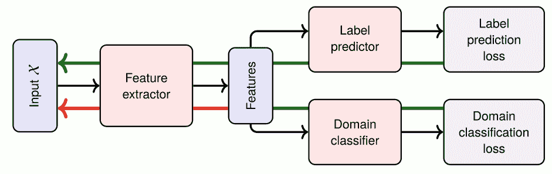

图10.7 模型级域适应的高级架构[259, 260]：来自域分类损失的梯度流（绿色）在特征处被反转（变为红色）。

请注意，真实数据中没有 $p(\mathbf{x}_T)$，这就是课程学习的作用：作者首先在合成数据上训练一个更简单的模型来估计 $p(\mathbf{x}_T)$ 从图像特征中，然后将其用于指导分割模型。最近的研究进展从仅仅强制标签分布转向在多个不同层面上匹配特征[368]。特别是，最近的研究[515, 984]引入了所谓的金字塔一致性损失，而不是 $C(p(\mathbf{x}_T), \hat{p}(\mathbf{x}_T))$，它试图在网络后续层的激活映射上强制保持一致性。

模型级域适应的主要方向之一是由Ganin和Lempitsky[259]发起的，他们提出了一个通用的无监督域适应框架。他们的方法如图10.7所示，包括：
- 特征提取器；
- 标签预测器，在提取的特征上执行必要的任务（例如分类）；
- 域分类器，它使用相同的特征并尝试对原始输入属于哪个域进行分类。

这个想法是训练标签预测器尽可能好地执行任务，同时使域分类器尽可能糟糕；这是通过梯度反转实现的，即将梯度乘以一个负常数，使其从域分类器传递到特征提取器。在随后的工作中，Ganin等人[260]将这种域适应方法推广到任意架构，并在不同领域进行了域适应的实验，包括图像分类、个人再识别和情感分析。我们还注意到在[545, 546, 881]中开发的域适应的扩展和类似方法，以及帮助产生域不变表示的域混淆度量[882]，但我们继续强调那些专门进行合成到真实域适应的工作。

许多通用的模型级域适应方法已经在合成到真实域适应上得到验证或随后扩展。Xu等人[964]考虑了行人检测问题（这项工作是[892]的延续，请参见第6.5节）。他们使用基于增强的过程来调整在虚拟数据集上训练的检测器，将更大的权重分配给与目标域相似的样本。

## 10 合成到真实领域的适应和改进

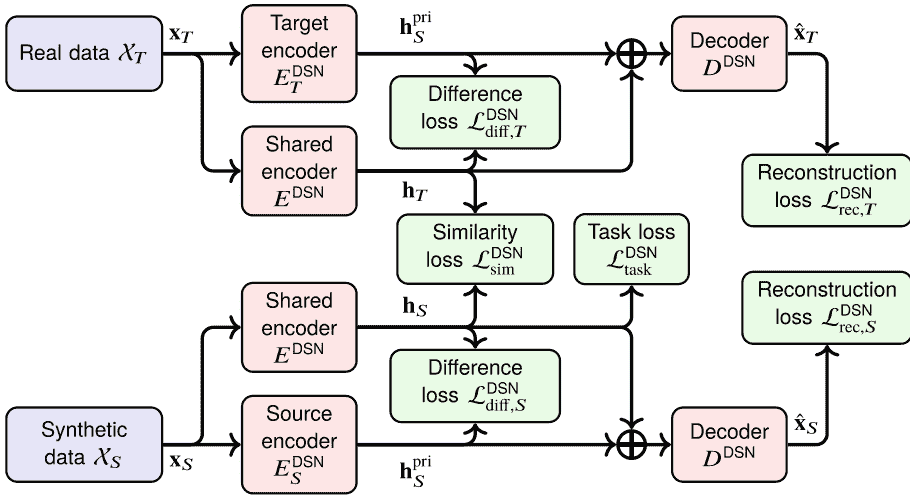

图10.8 域分离网络的架构[88]。具有相同标签的块共享权重。

Sun和Saenko [826]提出了一种基于去相关的域适应方法，既可以在无监督设置中使用，也可以在监督设置中使用，用于去相关化分类器的特征。后来，López等人[548]将在[892]中使用的SA-SVVM域适应扩展到训练基于可变形部件的模型，使用SYNTHIA数据集（见第7.2节）中的合成行人作为主要示例。在一篇并行论文中，SYNTHIA Ros等人[732]使用了一种称为平衡梯度贡献[733]的简单域适应技术，通过在（小）真实数据集上获得的梯度对合成数据进行正则化，进一步改善了他们在分割辅助合成数据上的结果。Ren等人[720]使用合成图像进行跨域自监督多任务学习：他们的模型预测图像的几个参数（表面法线、深度和实例轮廓），同时试图在特征空间中最小化合成数据与真实数据之间的差异。

域分离网络由Bousmalis等人[88]提出，如图10.8所示，明确地分离了源域和目标域的共享和私有组件。具体而言，他们引入了一个共享编码器 $E^{DSN}(x)$ 和两个私有编码器 $E_S^{DSN}$ 用于源域和目标域。域分离网络的总目标函数为：

$$\mathcal{L}^{DSN} = \mathcal{L}_{task}^{DSN} + \lambda_1 \mathcal{L}_{rec}^{DSN} + \lambda_2 \mathcal{L}_{diff}^{DSN} + \lambda_1 \mathcal{L}_{sim}^{DSN}$$

其中：
- $\mathcal{L}_{\mathrm{task}}^{\mathrm{DSN}}$ 是源域中的监督任务损失，例如，对于图像分类任务，它是：
  $$\mathcal{L}_{\mathrm{task}}^{\mathrm{DSN}} = -\mathbb{E}_{x_S \sim p_{\mathrm{syn}}} [y^T \log f^{\mathrm{DSN}}(E^{\mathrm{DSN}}(x_S))]$$
  其中 $f^{\mathrm{DSN}}$ 是对共享编码器输出进行操作的分类器；
- $\mathcal{L}_{\mathrm{rec}}^{\mathrm{DSN}}$ 是重构损失，定义为原始样本 $\mathbf{x}_S$ 和 $\mathbf{x}_T$ 与尝试从共享和私有表示的组合中重构图像的共享解码器 $D^{\mathrm{DSN}}$ 的结果之间的差异：
  $$\mathcal{L}_{\mathrm{rec}}^{\mathrm{DSN}} = -\mathbb{E}_{\mathbf{x}_S \sim p_{\mathrm{syn}}}\left[\mathcal{L}_{\mathrm{sim}}\left(\mathbf{x}_S, D^{\mathrm{DSN}}\left(E^{\mathrm{DSN}}\left(\mathbf{x}_S\right)+E_S^{\mathrm{DSN}}\left(\mathbf{x}_S\right)\right)\right)\right] -\mathbb{E}_{\mathbf{x}_T \sim p_{\mathrm{real}}}\left[\mathcal{L}_{\mathrm{sim}}\left(\mathbf{x}_T, D^{\mathrm{DSN}}\left(E^{\mathrm{DSN}}\left(\mathbf{x}_T\right)+E_T^{\mathrm{DSN}}\left(\mathbf{x}_T\right)\right)\right)\right]$$
  对于某些相似度度量 $\mathcal{L}_{\mathrm{sim}}$；
- $\mathcal{L}_{\mathrm{diff}}^{\mathrm{DSN}}$ 是差异损失，鼓励源域和目标域实例的隐藏共享表示 $E^{\mathrm{DSN}}\left(\mathbf{x}_S\right)$ 和 $E^{\mathrm{DSN}}\left(\mathbf{x}_T\right)$ 与其相应的私有表示 $E_S^{\mathrm{DSN}}\left(\mathbf{x}_S\right)$ 和 $E_T^{\mathrm{DSN}}\left(\mathbf{x}_T\right)$ 正交；在[88]中，差异损失定义为：
  $$\mathcal{L}_{\mathrm{diff}}^{\mathrm{DSN}}=\left\|H_S^{\top} H_S^{\mathrm{pri}}\right\|_F^2+\left\|H_T^{\top} H_T^{\mathrm{pri}}\right\|_F^2$$
  其中 $H_S$ 是 $E^{\mathrm{DSN}}\left(\mathbf{x}_S\right)$ 的矩阵，$H_S^{\mathrm{pri}}$ 是 $E_S^{\mathrm{DSN}}\left(\mathbf{x}_S\right)$ 的矩阵，类似地对于 $H_T$ 和 $H_T^{\mathrm{pri}}$；
- $\mathcal{L}_{\mathrm{sim}}^{\mathrm{DSN}}$ 是相似性损失，鼓励源域和目标域的隐藏共享表示 $E^{\mathrm{DSN}}\left(\mathbf{x}_S\right)$ 和 $E^{\mathrm{DSN}}\left(\mathbf{x}_T\right)$ 相互相似，即通过梯度反转层训练的域分类器无法区分它们，如[259]中所述；在[88]中，该损失由域分类器的交叉熵和隐藏表示的最大均值差异（MMD）[297]组成。

Bousmalis等人在几个合成到真实场景上评估了他们的模型，例如来自[609]的合成交通标志和来自LineMod dataset[931]的合成物体。

域分离网络成为域适应中的第一个重要示例之一，其中隐藏表示是域不变的，一些特征可以改变以从一个域过渡到另一个域。进一步的发展包括非监督域适应的非对称训练[750]、单向域映射的DistanceGAN[60]、共正则化对齐[482]、跨域自编码器[288]、多源域对抗网络[1015]、连续跨域翻译[531]、利用合成增强将人脸识别从图像适应到视频[811]等等[998]；所有这些进展都可能与合成到真实域适应相关，但我们将重点介绍一些已经在这两个域之间进行适应的工作。

基于特征的域适应的流行和重要领域与数据级别的域适应基本相同，但基于特征的域适应可以处理更高维度的输入和更复杂的场景，因为适应本身是在一个中间较低维度的空间中进行的。作为一个说明性的例子，让我们考虑计算机视觉问题的基于特征的域适应。

户外场景（参见第7.2节）。在他们的“野外FCNs”模型中，霍夫曼等人[353]考虑了基于特征的语义分割的领域自适应，其中源域有可用的真实数据（合成数据），但目标域没有可用的真实数据。他们的无监督领域自适应框架包含一个特征提取器 $f^{\mathrm{FCNW}}$ 和联合目标函数：

$L^{\mathrm{FCNW}}=L_{\mathrm{分割}}^{\mathrm{FCNW}}+L_{\mathrm{领域自适应}}^{\mathrm{FCNW}}+L_{\mathrm{互信息}}^{\mathrm{FCNW}}$

其中：
- $\mathcal{L}_{\mathrm{分割}}^{\mathrm{FCNW}}$ 是源域上的标准监督分割目标，其中有监督；
- $\mathcal{L}_{\mathrm{领域自适应}}^{\mathrm{FCNW}}$ 是域对齐目标，通过训练一个鉴别器（域分类器）来最小化表示空间中源域和目标域之间的距离；这里一个有趣的新想法是将一个粗网格中的单元作为这个目标的一个实例，该粗网格对应于领域自适应应该汇集在一起的高级特征的尺度；
- $\mathcal{L}_{\mathrm{互信息}}^{\mathrm{FCNW}}$ 是鼓励像素被分配给类 $c$ 的多实例损失，以使标记为 $c$ 的图像的百分比保持在源域中的预期范围内。

增加输入维度的另一个方向是从图像转向视频。Xu等人[962]使用对抗性域适应将目标检测模型——单次多框检测器（SSD）[539]和多尺度深度卷积神经网络（MSCNN）[108]——从合成样本转移到真实视频中的烟雾检测问题。

Chen等人[141]构建了跨城市适应模型，将来自不同领域的特征结合在一起，再次考虑了室外场景的语义分割。他们的框架优化了联合目标函数：

$L^{\mathrm{CCA}}=L_{\mathrm{task}}^{\mathrm{CCA}}+L_{\mathrm{global}}^{\mathrm{CCA}}+L_{\mathrm{class}}^{\mathrm{CCA}}$

其中：
- $\mathcal{L}_{\mathrm{task}}^{\mathrm{CCA}}$ 是任务损失，在这种情况下是源域中预测和实际分割掩码之间的交叉熵；
- $\mathcal{L}_{\mathrm{global}}^{\mathrm{CCA}}$ 是全局域对齐损失，再次定义为欺骗域鉴别器，类似于野外的FCNs；
- $\mathcal{L}_{\mathrm{class}}^{\mathrm{CCA}}$ 是类别间域对齐损失，其中网格单元被分配软class标签（从源域中提取和从目标域中预测），并且域分类器和鉴别器被分别训练和应用class-wise。

正如标题所示，跨城市适应旨在将在一个城市上训练的室外分割模型适应到其他城市，但陈等人也将其应用于从合成到真实数据的迁移。从SYNTHIA到Cityscapes的真实域适应（见第7.2节），在分割质量上取得了显著的提升。

洪等人[355]提供了最直接和最有前景的特征级合成到真实领域适应的应用之一。在他们的结构适应网络中，条件生成器 $G^{SDA}_\theta(x_S, z)$ 以特征作为输入。$f_l^{SDA}(x_S)$来自特征提取器的低层级层（即具有细粒度细节的特征）和随机噪声 $z$，并产生应该类似于从真实图像中提取的特征图的转换特征图。为了实现这一目标，$G^{SDA}$生成一个噪声图 $\tilde{G}_\theta^{SDA}(f_l^{SDA}(x_S), z)$ 然后将其添加到高层特征中：

$G_\theta^{SDA}(x_S, z) = f_h^{SDA}(x_S) + \tilde{G}_\theta^{SDA}(f_l^{SDA}(x_S), z)$

优化问题是：

$\min_{\theta, \theta'} \max_{\phi} \left(\mathcal{L}_{\mathrm{GAN}}^{\mathrm{SDA}}(G_\theta^{\mathrm{SDA}}, D_\phi^{\mathrm{SDA}}) + \lambda \mathcal{L}_{\mathrm{任务}}^{\mathrm{SDA}} (G_\theta^{\mathrm{SDA}}, T_{\theta'}^{\mathrm{SDA}})\right)$

其中：
- $\mathcal{L}_{\mathrm{GAN}}^{\mathrm{SDA}}$ 是特征空间中的GAN损失：
  $$\mathcal{L}_{\mathrm{GAN}}^{\mathrm{SDA}}(G_\theta^{\mathrm{SDA}}, D_\phi^{\mathrm{SDA}}) = \mathbb{E}_{\mathbf{x}_T \sim p_{\mathrm{real}}} \left[\log D_\phi^{\mathrm{SDA}}(\mathbf{x}_T)\right] + \mathbb{E}_{\mathbf{x}_S \sim p_{\mathrm{syn}, \mathbf{z}}} \left[\log \left(1 - D_\phi^{\mathrm{SDA}}(G_\theta^{\mathrm{SDA}}(\mathbf{x}_S, \mathbf{z}))\right)\right]$$
- $\mathcal{L}_{\mathrm{任务}}$ 是像素级分类器 $T_{\theta'}^{\mathrm{SDA}}$ 的任务损失，它与整个架构一起进行端到端训练；任务损失定义为分割掩码 $T_{\theta'}^{\mathrm{SDA}} (G_\theta^{\mathrm{SDA}}(\mathbf{x}_S, \mathbf{z}))$ 之间的像素级交叉熵产生。洪等人将结构自适应网络与其他最先进的方法进行了比较，包括野外FCN[353]和跨城市自适应[141]，使用源域数据集SYNTHIA和GTA以及目标域数据集Cityscapes；他们得出结论，这种自适应显著改善了城市场景的语义分割结果。

总结一下，特征级域适应为合成到真实适应提供了有趣的机会，但这些方法仍然大多是正在进行的工作。根据我们的经验，特征级和模型级的域适应通常是一种更简单和更稳健的方法，更容易实现，因此我们期待在这个方向上有新的令人兴奋的发展，并建议尝试这个方法家族来进行合成到真实的域适应（除非需要实际精细的图像）。

## 10.6 控制和机器人的域适应

在控制领域，联合域适应通常旨在将在模拟环境中学习的控制策略转移到真实环境中。正如我们在第7.3节和第7.2节中已经讨论过的那样，模拟环境几乎是不可避免的。

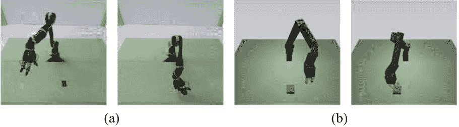

对于机器人的强化学习，模拟环境允许扩大数据集，与真实数据相比，涵盖了更广泛的情况（也可以参考调查[841]）。在这种设置下，域适应要么针对控制本身进行，要么同时针对控制和合成数据进行。

在深度学习之前，这个领域就已经存在了；例如，Saxena等人[762]在合成数据上学习了一个模型，用于估计之前未见过的物体的抓取位置。在Cutler等人[173]的研究中，通过在模拟器上进行训练，结果作为在真实世界中后续学习的先验知识。此外，在[174,175]中，Cutler等人进一步研究了多模态模拟器，在一系列逼真度逐渐增加的模拟器中训练强化学习代理；我们认为这个想法在其他领域也可能是有成果的。

DeepMind的研究人员Rusu等人[744]研究了在端到端强化学习机器人领域，从模拟环境到真实世界的迁移学习的可能性。他们使用了渐进网络[743]的一般思想，这是一种为多任务学习和迁移学习设计的架构，网络中的每一列解决一个新任务，并接收来自前一列的隐藏激活作为输入。Rusu等人提出了这个思想的一种修改，用于机器人的迁移学习，然后在MuJoCo物理模拟器[862]中训练第一列，然后转移到真实的Jaco机械臂，使用异步优势演员-评论家(A3C)强化学习框架[606]。即使使用相对简单的渲染引擎，如图10.9所示，作者报告了相对于简单的微调方法，渐进网络取得了改进的结果。

有很多研究考虑了类似的迁移学习，被称为机器人学中的“现实差距闭合”。特别是，Bousmalis等人[86]使用模拟环境学习机器人抓取，使用了一个称为Grasp-GAN的领域适应模型来使合成图像更加逼真（见第10.3节）；他们认为增加的逼真性提高了控制转移的结果。Tzeng等人[880]提出了一个框架，结合了有监督的领域适应（需要成对图像）和无监督的DA（在分布层面上对齐领域）；为此，他们引入了源域和目标域图像之间“弱配对”的概念，并学习找到匹配的合成图像。

## 10.6 控制和机器人的域适应

生成对齐数据。所得模型成功应用于为真实机器人训练视觉运动策略。

潘等人[977]考虑了自动驾驶的模拟到真实的转换；他们将合成图像转换为场景解析表示，然后通过与该解析表示对应的生成器生成逼真的图像；强化学习代理接收此图像作为其驾驶环境的一部分。甚至更简单的方法，例如徐等人[845]采用的方法，是直接将分割掩模作为强化学习代理的输入。

来自Wayve的研究人员Bewley等人[68]对模拟驾驶进行了领域适应；他们声称首次提出了从（显然是监督的）合成环境转移到完全无监督的真实环境的端到端驾驶策略。他们的模型同时进行图像转换和控制转移，在共同学习的潜在嵌入空间上学习控制。

该架构由两个编码器 $E^{\mathrm{WVE}}$ 和 $E_T^{\mathrm{WVE}}$，两个生成器 $G_S^{\mathrm{WVE}}$ 和 $G_T^{\mathrm{WVE}}$，两个鉴别器 $D_S^{\mathrm{WVE}}$ 和 $D_T^{\mathrm{WVE}}$ 以及一个控制器 $C^{\mathrm{WVE}}$ 组成。图像转换器遵循MUNI架构[536]，使用两个卷积变分自编码器网络在潜在嵌入之间进行交换以实现域之间的转换，即对于 $x_S \sim X_S, x_T \sim X_T$。

$$\begin{array}{ll}
\mathbf{z}_S = E_S^{\mathrm{WVE}}(\mathbf{x}_S) + \epsilon, & \hat{\mathbf{x}}_S = G_S^{\mathrm{WVE}}(\mathbf{z}_S), \\
\mathbf{z}_T = E_T^{\mathrm{WVE}}(\mathbf{x}_T) + \epsilon, & \hat{\mathbf{x}}_T = G_T^{\mathrm{WVE}}(\mathbf{z}_T),
\end{array}$$

翻译是计算 $z_S$ 与 $E_S^{\mathrm{WVE}}$ 并预测 $\hat{x}$ 与 $G_T^{\mathrm{WVE}}$，反之亦然。总体生成器损失函数为

$$\begin{aligned}
\mathcal{L}^{\mathrm{WVE}} & =\lambda_0 \mathcal{L}_{\mathrm{rec}}^{\mathrm{WVE}}+\lambda_1 \mathcal{L}_{\mathrm{cyc}}^{\mathrm{WVE}}+\lambda_2 \mathcal{L}_{\mathrm{ctrl}}^{\mathrm{WVE}}+\lambda_3 \mathcal{L}_{\mathrm{cyctrl}}^{\mathrm{WVE}}+ \\
& \quad +\lambda_4 \mathcal{L}_{\mathrm{LSGAN}}^{\mathrm{WVE}}+\lambda_5 \mathcal{L}_{\mathrm{perc}}^{\mathrm{WVE}}+\lambda_6 \mathcal{L}_{\mathrm{zrec}}^{\mathrm{WVE}},
\end{aligned}$$

其中
- $\mathcal{L}_{\mathrm{rec}}^{\mathrm{WVE}}$ 是两个域中的 $L_1$ 图像重建损失：
$$\begin{aligned}
& \mathcal{L}_{\mathrm{rec}}^{\mathrm{WVE}}(\mathbf{x}_S) = \|G_S^{\mathrm{WVE}}(E_S^{\mathrm{WVE}}(\mathbf{x}_S)) - \mathbf{x}_S\|_1, \\
& \mathcal{L}_{\mathrm{rec}}^{\mathrm{WVE}}(\mathbf{x}_T) = \|G_T^{\mathrm{WVE}}(E_T^{\mathrm{WVE}}(\mathbf{x}_T)) - \mathbf{x}_T\|_1;
\end{aligned}$$
- $\mathcal{L}_{\mathrm{cyc}}^{\mathrm{WVE}}$ 是两个域的循环一致性损失：
$$\mathcal{L}_{\mathrm{cyc}}^{\mathrm{WVE}}(\mathbf{x}_S) = \|G_S^{\mathrm{WVE}}(E_T^{\mathrm{WVE}}(G_T^{\mathrm{WVE}}(E_S^{\mathrm{WVE}}(\mathbf{x}_S)))) - \mathbf{x}_S\|_1$$
以及对 $X_T$ 类似；
- $\mathcal{L}_{\mathrm{ctrl}}^{\mathrm{WVE}}$ 是控制损失，用于比较在训练集上产生的控制与自动驾驶的控制：$\mathcal{L}_{\mathrm{ctrl}}^{\mathrm{WVE}}(\mathbf{x}_S)=\|C^{\mathrm{WVE}}(E_S^{\mathrm{WVE}}(\mathbf{x}_S)) - \mathbf{c}\|_1$ 用于真实控制 $c$，对 $X_T$ 类似；
- $\mathcal{L}_{\mathrm{cyctrl}}^{\mathrm{WVE}}$ 是控制周期一致性损失，使得转换到另一个域的图像的控制相似：
$$\mathcal{L}_{\mathrm{cyctrl}}^{\mathrm{WVE}}(\mathbf{x}_S) = \|C^{\mathrm{WVE}}(E_T^{\mathrm{WVE}}(G_S^{\mathrm{WVE}}(E_S^{\mathrm{WVE}}(\mathbf{x}_S)))) - C^{\mathrm{WVE}}(E_S^{\mathrm{WVE}}(\mathbf{x}_S))\|_1,$$
以及对 $X_T$ 类似；
- $\mathcal{L}_{\mathrm{GAN}}^{\mathrm{WVE}}$ 是应用于生成器-判别器对的LSGAN对抗损失（有关LSGAN的讨论，请参见第4.5节）；
- $\mathcal{L}_{\mathrm{perc}}^{\mathrm{WVE}}$ 是感知损失（参见上文），应用于两个图像转换方向，先应用实例归一化，如[373]所示；
- $\mathcal{L}_{\mathrm{zrec}}^{\mathrm{WVE}}$ 是潜在重构损失：$\mathcal{L}_{\mathrm{zrec}}^{\mathrm{WVE}}(\mathbf{z}_S)=\|E_T^{\mathrm{WVE}}(G_T^{\mathrm{WVE}}(\mathbf{z}_S)) - \mathbf{z}_S\|_1$，并且对于 $X_T$ 也是类似的。

Bewley等人将他们的方法与许多迁移学习基线进行比较，对于端到端学习驱动表现出优秀的结果，甚至进行了训练策略的实际实验。类似的技术也可以在没有合成数据的情况下使用；例如，Wulfmeier等人[945]使用类似的模型进行领域适应，以处理室外机器人中的外观变化，即天气条件、照明等的变化。

我们已经讨论了Inoue等人[386]、Zhang等人[999]、James等人[396]和Yang等人[969]的作品，他们使真实数据更接近于合成数据，用于与机器人抓取和视觉导航相关的计算机视觉问题（见第10.4节）。重要的是，这些模型不仅仅是翻译图像，还在真实世界的机器人上进行了测试。Zhang等人不仅展示了语义分割结果的改进，还在室内和室外视觉导航任务中进行了真实世界的机器人实验，首先在模拟环境中训练导航策略，然后直接在真实环境中部署在机器人上，而James等人则在真实的机器人手上测试了他们的解决方案，训练了QT-Opt策略[422]在模拟中进行抓取，并比在580,000个真实抓取情节上训练的相同策略更好地进行了5,000个额外的真实抓取情节，减少了99%以上的真实世界输入需求。

合成数据在深度学习中可能有用的另一个方向是生成合成行为来改进模仿学习[647]。Bansal等人[39]讨论了模仿学习中的数据不足问题：对于学习驾驶，即使是超过6000万个真实专家驾驶示例，相当于超过60天的驾驶时间，也不足以训练一个端到端的驾驶模型。为了缓解这种数据不足的问题，他们提出了他们的模仿学习框架ChauffeurNet，其中引入了合成扰动到专家驾驶示例中。

这样可以涵盖一些特殊情况，如碰撞和越野驾驶，即应该避免但在专家示例中缺乏的不良示例。有趣的是，扰动是引入到中间表示而不是原始传感器输入或控制器输出中。

总之，消除现实差距是控制和机器人领域中最重要的问题之一。在这个方向上，重要的突破不断出现，但在实现自动驾驶汽车和机械臂之前还有一段路要走。

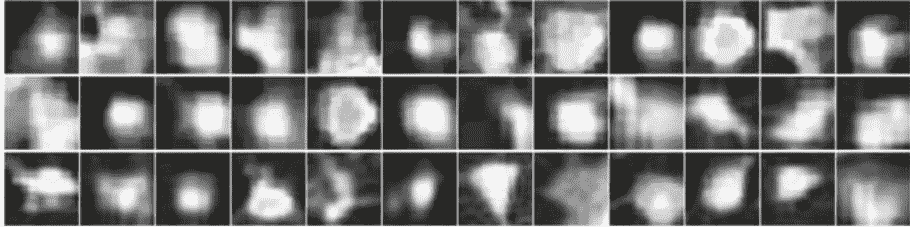

图10.10 来自[158]的真实和生成的肺结节：结节 1-18（从左到右编号）是合成的，19-36 是真实的良性结节。

在模拟环境中进行训练，然后完美地将这些技能转移到现实世界中。另一方面，这些技术是否真正在最后需要仍然是个未知数。一些有趣的最新进展在机器人技术中使用合成环境进行训练，但不使用任何明确的领域自适应，而是使用足够多样化的领域随机化作为主要工具；回想一下我们在第 7.4 节中讨论的 Dactyl 机械臂。

## 10.7 案例研究：基于 GAN 的医学影像领域自适应

医学影像是一个特别难以获得标记数据的领域。首先，尽管对于常规计算机视觉问题，手动标记已经很困难和昂贵，但在医学影像中，它的代价更高，因为无法通过匿名标注者进行众包。对于大多数问题，医学影像数据只能由经过专业培训的专业人员进行可靠标记，通常需要医学学位。

其次，出于明显的隐私原因，很难安排发布真实数据集，并且收集足够大的标记数据集来训练标准的目标检测或分割模型通常需要来自几个不同医院的协同努力；因此，除了一些公开竞赛外，大多数领域研究人员使用私有数据集，并且不被允许共享他们的数据。

第三，有些病理学简单地没有足够大且多样化的数据集。与此同时，通常有相对较大的通用数据集可用，例如健康组织的数据集，但没有特定感兴趣的病理学数据集。

尽管我们强调基于生成对抗网络 (GAN) 的生成方法，但我们注意到在医学成像任务中使用渲染的合成数据的成功尝试，这些尝试基于医学可视化和渲染工具的最新发展。例如，Mahmood等人[573]使用最近开发的电影渲染技术用于CT[223]（光在组织中传播的逼真模拟）来训练用于内窥镜数据的深度估计的卷积神经网络(CNN)。

GAN已广泛应用于生成逼真的医学图像[45, 53, 469, 627, 967, 974]。此外，由于图像是领域特定的且通常低分辨率，GAN生成的图像质量相对较快达到了可以在许多应用中通过“视觉图灵测试”欺骗，即使是经过训练的专家也很难区分真实图像和伪造图像。以肺结节样本为例，参见[158]并参见图10.10。确实很难区分真实图像和伪造图像，但这些放射学图像的总体质量和分辨率都很低，即使是简单的GAN在这种情况下也能做得很好。

另一个例子是基于GAN生成的磁共振(MR)脑图像在[109,314,317]中。因此，不足为奇基于GAN的领域自适应(DA)技术，特别是基于融合和增强真实图像的技术，越来越多地应用于医学成像。在本节中，我们对该领域的最新研究进行简要概述。

在一些研究中，合成数据是从头开始生成的，即通过训练生成对抗网络(GANs)将随机噪声转换为合成图像(参见第9.4节)。Frid-Adar等人[244, 245]使用了两种标准的GAN架构，深度卷积GAN(DCGAN)[696]和辅助分类GAN (ACGAN) [637]，并结合类别标签辅助信息生成了合成的肝脏CT图像。他们报告称，在使用卷积神经网络(CNNs)训练合成数据与对其高度有限的数据集(182个二维扫描分为三类病变)进行标准增强时，图像分类结果显著提高。Baur等人[967]尝试进行高分辨率皮肤病变合成，比较了几种GAN架构，并获得了非常逼真的结果，即使使用了小型训练数据集。

Han等人[316,317]专注于脑磁共振(MR)图像。他们使用逐渐增长的生成对抗网络(PGGAN)[435]生成256×256 MR图像，然后比较两种不同的改进方法:SimGAN[793](如第10.2节所讨论的)和UNIT [536],这是一种无监督的图像到图像翻译架构，将每个域映射到具有VAE-GAN架构的共享潜在空间[497](我们注意到原始论文[536]还将UNIT应用于合成到真实的翻译，另请参见第4.7节，我们在其中讨论基于GAN的风格转换架构)。Han等人报告了将基于GAN的合成数据与经典领域自适应技术相结合时取得的改进结果。

Neff[621]采用了稍微不同的方法:为了生成分割的合成数据，他使用了标准的WGAN-GP架构[303]，但生成了图像-分割对，即具有额外通道显示分割掩码的图像。Neff通过增加真实数据集与合成图像-分割对来改进分割结果。Mahmood等人[572]则从相反的角度来解决这个问题:他们使真实医学图像更像合成图像，然后再应用在合成数据上训练的网络(另请参见第10.4节)。通过这种方法，他们改进了内窥镜图像的深度估计的最新结果。

一般来说，医学影像中的分割问题特别难以标记，并且在许多情况下缺乏分割数据。在这种情况下，最近的研究经常使用条件GAN和pix2pix模型从随机分割掩模生成逼真的图像。例如，Bailo等人[33]使用pix2pixHD模型[909]生成红细胞图像。也就是说，他们的条件GAN进行优化

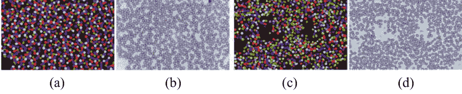

图10.11 Bailo等人生成的红细胞图像：(a)真实分割掩模；(b)相应的真实血液图像；(c)合成分割掩模；(d)相应的合成血液图像。

$$ \min _{G^{\mathrm{p2p}}}\left[\max _{D_{1}^{\mathrm{p2p}}, D_{2}^{\mathrm{p2p}}}\left[\mathcal{L}_{\mathrm{GAN}}^{\mathrm{p2p}}\left(G^{\mathrm{p2p}}, D_{1}^{\mathrm{p2p}}\right)+\mathcal{L}_{\mathrm{GAN}}^{\mathrm{p2p}}\left(G^{\mathrm{p2p}}, D_{2}^{\mathrm{p2p}}\right)\right]+\lambda_{1}\left(\mathcal{L}_{\mathrm{FM}}^{\mathrm{p2p}}\left(G^{\mathrm{p2p}}, D_{1}^{\mathrm{p2p}}\right)+\mathcal{L}_{\mathrm{FM}}^{\mathrm{p2p}}\left(G^{\mathrm{p2p}}, D_{2}^{\mathrm{p2p}}\right)\right)+\lambda_{2} \mathcal{L}_{\mathrm{PR}}^{\mathrm{p2p}}\left(G^{\mathrm{p2p}}(\mathbf{s}, E^{\mathrm{p2p}}(\mathbf{x})), \mathbf{x}\right)\right], $$

其中
- **x** 是输入图像，**s** 是分割掩模（它作为生成器的输入），
  $D_{1}^{\mathrm{p2p}}$ 和 $D_{2}^{\mathrm{p2p}}$ 是两个具有相同架构但在不同图像尺度上操作的判别器，$\mathcal{L}_{\mathrm{GAN}}^{\mathrm{p2p}}(G, D)$ 是常规的GAN损失；
- $E^{\mathrm{p2p}}(\mathbf{x})$ 是特征编码器网络，用于对对象的低级特征进行实例池化编码；其输出被馈送到生成器 $G^{\mathrm{p2p}}(\mathbf{s}, E^{\mathrm{p2p}}(\mathbf{x}))$ 中，并且可以用于在生成的图像中操纵对象风格（有关更多详细信息，请参见[909]）；
- $\mathcal{L}_{\mathrm{FM}}^{\mathrm{p2p}}$ 是特征匹配损失，使得鉴别器的不同层的特征（我们将输入到第 $i$ 层的 $D$ 表示为 $D(i)$）与 **x** 和 **G(s)** 匹配：
  $$ \mathcal{L}_{\mathrm{FM}}^{\mathrm{p2p}}(G, D)=\mathbb{E}_{(\mathbf{s}, \mathbf{x})}\left[\sum_{i=1}^{L} \frac{1}{N_{i}}\left\|D^{(i)}\left([\mathbf{s}; \mathbf{x}]\right)-D^{(i)}\left([\mathbf{s}; G\left(\mathbf{s}, E^{\mathrm{p2p}}(\mathbf{x})\right)]\right)\right\|_{1}\right] ; $$
- $\mathcal{L}_{\mathrm{PR}}^{\mathrm{p2p}}$ 是一种感知重建损失，用于某个特征编码器 $F$：
  $$ \mathcal{L}_{\mathrm{PR}}^{\mathrm{p2p}}(G, D)=\mathbb{E}_{(\mathbf{s}, \mathbf{x})}\left[\sum_{i=1}^{L^{\prime}} \frac{1}{M_{i}}\left\|F^{(i)}(\mathbf{x})-F^{(i)}\left(G\left(\mathbf{s}, E^{\mathrm{p2p}}(\mathbf{x})\right)\right)\right\|_{1}\right] . $$

在[33]中，真实数据集仅包含60个手动注释的1920×1200 RGB图像（另外还有40个用于测试的图像），尽管有很多注释的对象（平均每个图像有669个血细胞）。Bailo等人还开发了一种方案用于采样随机但真实的分割掩模，用于合成数据的生成。示例图像如图10.11所示，再次展示了这种基于GAN的架构生成的非常逼真的图像，这在很大程度上得益于规则化。

并且需要生成的图像具有相对简单的结构。Bailo等人报告了在真实数据和合成数据的组合上，使用FCN获得了改进的分割结果，并使用Faster R-CNN获得了改进的检测结果。

赵等人[1014]考虑了从真实分割图生成丝状结构图像（如视网膜底图和神经元图像）的问题，并强调以多种不同风格生成图像。他们的FILA-SGAN方法基于基于GAN的图像风格转换思想[407, 886]。

它的生成器损失函数是

$$ \mathcal{L}^{\mathrm{FIL}}=\mathcal{L}_{\mathrm{GAN}}^{\mathrm{FIL}}\left(G^{\mathrm{FIL}}, D^{\mathrm{FIL}}\right)+\lambda_{1} \mathcal{L}_{\mathrm{cont}}^{\mathrm{FIL}}\left(G^{\mathrm{FIL}}\right)+\lambda_{2} \mathcal{L}_{\mathrm{sty}}^{\mathrm{FIL}}\left(G^{\mathrm{FIL}}\right)+\lambda_{3} \mathcal{L}_{\mathrm{TV}}^{\mathrm{FIL}}\left(G^{\mathrm{FIL}}\right), $$

其中：

- $G^{\mathrm{FIL}}: \mathbf{y} \rightarrow \hat{\mathbf{x}}$ 是一个生成器，它接受一个二进制图像并生成一个“幻影” $\hat{\mathbf{x}}$；$D^{\mathrm{FIL}}$ 是一个合成与真实的鉴别器，$\mathcal{L}_{\mathrm{GAN}}^{\mathrm{FIL}}$ 是标准的GAN损失函数；
- $\mathcal{L}_{\mathrm{cont}}^{\mathrm{FIL}}$ 是内容损失，使生成的幻影 $\hat{\mathbf{x}}$ 与真实的原始图像 $\mathbf{x}$ 匹配，通过一些标准的CNN特征提取器（如VGG-19）的特征 $\phi^{(l)}$ 来证明：

$$ \mathcal{L}_{\text{cont}}^{\mathrm{FIL}}\left(G^{\mathrm{FIL}}\right)=\sum_{l} \frac{1}{W_{l} H_{l}}\left\|\phi^{(l)}(\mathbf{x})-\phi^{(l)}(\hat{\mathbf{x}})\right\|_{F}^{2}, $$

其中 $\mathbf{x}$ 是真实的原始图像，$l$ 跨越CNN块和层，$W_{l}$ 和 $H_{l}$ 是相应特征图的宽度和高度，$\|\cdot\|_{F}$ 是Frobenius矩阵范数；
- $\mathcal{L}_{\mathrm{sty}}^{\mathrm{FIL}}$ 是样式损失，它最小化 $\hat{\mathbf{x}}$ 和样式图像 $\mathbf{x}_{s}$ 之间的纹理差异：

$$ \mathcal{L}_{\mathrm{sty}}^{\mathrm{FIL}}\left(G^{\mathrm{FIL}}\right)=\sum_{l} \frac{\omega_{l}}{W_{l} H_{l}}\left\|\mathbb{G}^{(l)}\left(\mathbf{x}_{s}\right)-\mathbb{G}^{(l)}(\hat{\mathbf{x}})\right\|_{F}^{2} $$

其中 $\mathbf{x}_{s}$ 是样式图像，$\mathbb{G}^{(l)}$ 是CNN块中特征的Gram矩阵，$\omega_{l}$ 是其权重（超参数）；
- $\mathcal{L}_{\mathrm{TV}}^{\mathrm{FIL}}$ 是总变差损失，作为正则化项，鼓励 $\hat{\mathbf{x}}$ 变得平滑：

$$ \mathcal{L}_{\mathrm{TV}}^{\mathrm{FIL}}\left(G^{\mathrm{FIL}}\right)=\sum_{i, j}\left(\left\|\hat{\mathbf{x}}_{i, j+1}-\hat{\mathbf{x}}_{i, j}\right\|_{2}^{2}+\left\|\hat{\mathbf{x}}_{i+1, j}-\hat{\mathbf{x}}_{i, j}\right\|_{2}^{2}\right) $$

作为结果，赵等人报告了从分割图和单个风格图像生成的高度逼真的丝状结构图像，以多种不同的风格展示了一些示例，如图10.12所示。对我们来说，重要的是，他们还报告了使用最先进的方法改进了相应分割任务的分割结果。

## 10.7 案例研究：基于GAN的医学影像领域适应

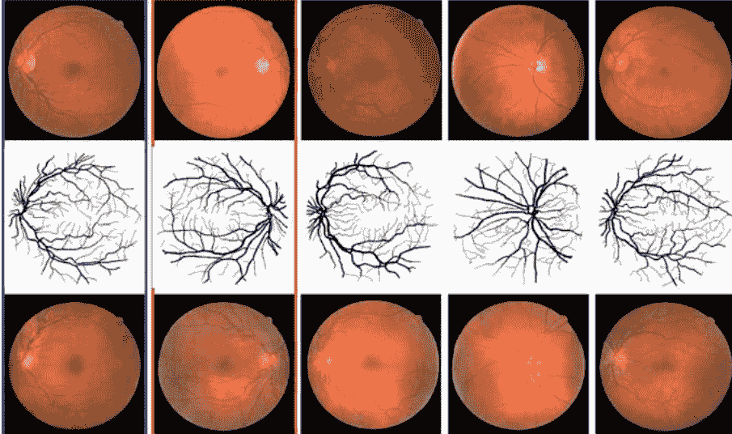

图10.12 赵等人[1014]的真实和生成的视网膜图像；每列中，顶部图像是真实图像，中间是地面真实丝状分割，底部是从该分割图生成的合成图像。

Sirazitdinov等人[804]使用基于条件GAN的类似架构，在X射线图像上生成类似管状物体，如穿刺针、导丝或导管；在介入放射学中，找到这些物体是一项非常重要的任务，但是真实的带有这些物体的数据（幸运的是）很难获得。

在其他研究中，Hou等人[357]使用GAN来改进合成组织病理学图像（类似于第10.2节讨论的SimGAN），并获得了改进的细胞核分割和胶质瘤分类结果。Tang等人[850]使用pix2pix模型[389]从定制的淋巴结掩模生成逼真的计算机断层扫描（CT）图像，并报告了改进的淋巴结分割结果。在[849]中，同一研究人员使用多模态图像到图像转换（MUNIT）模型[373]（我们在第4.7节中讨论过）生成具有自定义异常的逼真胸部X射线图像，并报告了使用U-Net和他们开发的模型XLSor进行的改进分割。Han等人[315]是第一个应用基于3D GAN的DA生成用于3D物体检测（即边界框）的数据的研究者；他们将其应用于合成肺结节的CT图像的背景中。

在相关方法中，可以从真实数据中生成合成数据，但在不同的领域中。例如，张等人[1013]使用基于CycleGAN的架构[1025]学习无配对CT和MR图像（分别为域A和域B）的体积到体积（即3D）转换。此外，他们使用分割器 $S_{A}^{\mathrm{VOL}}$ 和 $S_{B}^{\mathrm{VOL}}$ 增强基本的CycleGAN，以帮助保持分割掩模的一致性。总的来说，他们的模型优化损失函数

$$ \mathcal{L}^{\mathrm{VOL}}=\mathcal{L}_{\mathrm{GAN}}^{\mathrm{VOL}}\left(G_{A}^{\mathrm{VOL}}, D_{A}^{\mathrm{VOL}}\right)+\mathcal{L}_{\mathrm{GAN}}^{\mathrm{VOL}}\left(G_{B}^{\mathrm{VOL}}, D_{B}^{\mathrm{VOL}}\right)+\lambda_{1} \mathcal{L}_{\mathrm{cyc}}^{\mathrm{VOL}}\left(G_{A}^{\mathrm{VOL}}, G_{B}^{\mathrm{VOL}}\right)+\lambda_{2} \mathcal{L}_{\text{shape}}\left(S_{A}^{\mathrm{VOL}}, S_{B}^{\mathrm{VOL}}, G_{A}^{\mathrm{VOL}}, G_{B}^{\mathrm{VOL}}\right), $$

其中：

- $G_{A}^{\mathrm{VOL}}: A \rightarrow B$ 和 $G_{B}^{\mathrm{VOL}}: B \rightarrow A$ 是 CycleGAN 生成器，$D_{A}^{\mathrm{VOL}}$ 和 $D_{B}^{\mathrm{VOL}}$ 是域 A 和 B 中用标准 GAN 损失函数训练的用于区分真实和合成（由 $G^{\mathrm{VOL}}$ 生成）图像的判别器 $\mathcal{L}_{\mathrm{GAN}}^{\mathrm{VOL}}$；
- $\mathcal{L}_{\mathrm{cyc}}^{\mathrm{VOL}}$ 是循环一致性损失

$$ \mathcal{L}_{\mathrm{cyc}}^{\mathrm{VOL}}\left(G_{A}^{\mathrm{VOL}}, G_{B}^{\mathrm{VOL}}\right)=\mathbb{E}_{\mathbf{x}_{\mathrm{A}}}\left[\left\|G_{A}^{\mathrm{VOL}}\left(G_{B}^{\mathrm{VOL}}\left(\mathbf{x}_{A}\right)\right)-\mathbf{x}_{\mathrm{A}}\right\|_{1}\right] +\mathbb{E}_{\mathbf{x}_{\mathrm{B}}}\left[\left\|G_{B}^{\mathrm{VOL}}\left(G_{A}^{\mathrm{VOL}}\left(\mathbf{x}_{B}\right)\right)-\mathbf{x}_{B}\right\|_{1}\right], $$
- $S_{A}^{\mathrm{VOL}}: A \rightarrow Y$ 和 $S_{B}^{\mathrm{VOL}}: B \rightarrow Y$ 是生成 3D 分割掩模的分割器，$\mathcal{L}_{\mathrm{shape}}^{\mathrm{VOL}}$ 是形状一致性损失

$$ \mathcal{L}_{\mathrm{shape}}^{\mathrm{VOL}}\left(S_{A}^{\mathrm{VOL}}, S_{B}^{\mathrm{VOL}}, G_{A}^{\mathrm{VOL}}, G_{B}^{\mathrm{VOL}}\right)=\mathbb{E}_{\mathbf{x}_{\mathrm{B}}}\left[-\frac{1}{N} \sum_{i} y_{B}^{i} \log S_{A}^{\mathrm{VOL}}\left(G_{A}^{\mathrm{VOL}}\left(\mathbf{x}_{B}\right)\right)_{i}\right] + \mathbb{E}_{\mathbf{x}_{\mathrm{A}}}\left[-\frac{1}{N} \sum_{i} y_{A}^{i} \log S_{B}^{\mathrm{VOL}}\left(G_{B}^{\mathrm{VOL}}\left(\mathbf{x}_{A}\right)\right)_{i}\right], $$

其中 $\mathbf{y}_{A}$ 和 $\mathbf{y}_{B}$ 分别是 $\mathbf{x}_{A}$ 和 $\mathbf{x}_{B}$ 的真实分割结果。

张等人报告说，在他们的架构中进行的 3D 分割不仅改善了仅在真实数据上训练的基准模型，而且还改善了在生成的合成数据上分别对 $S_{A}^{\mathrm{VOL}}$ 和 $S_{B}^{\mathrm{VOL}}$ 进行微调的标准方法。Ben-Cohen 等人 [59] 提出了一个类似的架构，用于从 CT 图像生成 PET 扫描的跨模态合成数据，同样可以改善病变检测的分割结果。类似的图像到图像转换技术已经应用于从 2D MR 脑图像生成 CT 图像和反向转换 [401, 628, 932]，PET 到 CT [28]，心脏 CT 到 MR [125]，虚拟 H&E 染色，包括从未染色到染色的肺组织学图像的转换 [48] 和染色风格转换 [784]，多对比 MRI（从对比到对比）[182]，3D 跨模态 MRI [979]，不同风格的前列腺组织病理学 [717]，不同数据集的胸部 X 射线 [128] 等等。

基于模型的领域适应（我们在第 10.5 节中讨论过）也已经应用于医学成像的背景中。通常它被用于在不同类型的真实图像之间进行领域转移，例如在不同脑部区域之间 [65] 或从体外到体内图像 [166]，但是合成到真实的领域适应也是一个重要的主题。早在 2013 年，Heimann 等人 [333] 就生成了合成训练数据，例如用于数字重建超声探头定位的数字重建射线图形式。为了弥合合成图像和真实图像之间的领域差距，他们使用了标准实例加权，并发现了检测结果的显著改进。Kamnitskas等人[425]在3D脑损伤分割中使用了无监督的领域自适应，从一种MR图像类型切换到另一种。他们使用了最先进的3D多尺度全卷积分割网络[426]和一个使分割网络的中间特征表示在领域之间无法区分的领域鉴别器。

一般来说，基于GAN的医学图像架构，无论是生成合成数据还是从其他领域调整真实数据，都代表了进一步研究的有希望的方向，并且在我看来，将定义该领域的最新技术。然而，目前不同作品中使用的架构差异很大，并且往往缺乏对不同基于GAN的架构进行比较的情况：每个作品只与基准进行比较。需要进一步研究和大规模实验研究，以确定哪种架构最适用于与医学图像相关的各种领域适应问题。

## 10.8 结论

本章致力于对合成数据应用的领域适应方法进行调查。几乎所有合成数据的应用都面临着相同的合成到真实数据的转换问题：我们需要使在合成数据上训练的模型在实际应用中面对的真实数据上工作。最直接的方法当然是不进行任何转换，或者进行域随机化（参见第9.1节），并祈祷它能够工作。但在本章中，我们讨论了如何积极帮助模型更好地从合成数据转移到真实数据的方法。

我们已经看到，对于这个问题的方法可以广泛地分为两个类别。在合成到真实的改进中，我们在10.1、10.2和10.3节中讨论了领域适应改变数据本身，可以看到一个“改进”的图像，通常（但不总是）通过改进过程使其更加逼真。甚至存在与我们在10.4节中看到的相反的方法：使真实数据看起来更“合成”，以便在合成数据上训练的模型能更好地识别改进后的图像。

基于模型的领域适应方法，我们在10.5节中考虑过，保留数据但改变模型本身或训练过程。它们通常为合成和真实输入训练一个联合嵌入或特征空间，要求模型不区分这两个领域。我们还在控制和机器人技术（第10.6节）中看到了一些领域适应技术，以及基于GAN的医学成像领域适应的案例研究（第10.7节）。

通过这个，我们接近了书的结尾。下一章专门讨论一个与之前完全不同的领域：差分隐私。

这对于合成数据来说非常重要，因为在某些应用中，合成数据集被用来保护过于敏感而不能公开的真实数据。差分隐私是一种（实际上是唯一的）提供保证的方式，即通过某种生成模型产生的发布的合成数据集不会泄露有关模型所训练的真实数据的敏感信息。在下一章中，我们将看到在这方面可能存在的保证类型。

# 第11章 合成数据的隐私保证

在本章中，我们讨论合成数据的另一个重要应用领域：确保隐私。在许多现实世界的问题中，真实数据足够敏感，无法公开。一种可能的解决方案是训练生成模型，基于真实数据生成新的合成数据集，同时保持真实数据的机密性。但是我们如何确保真实数据不会被意外泄露？差分隐私的框架可以提供在这方面的保证。我们简要介绍差分隐私，它与机器学习的关系以及它对合成数据生成可以提供的保证。

## 11.1 为什么隐私很重要？

在许多领域中，真实数据不仅有价值，而且还很敏感；它应该受到法律、商业利益和公共道德的保护。在这些领域中，真实数据不可用，这正是合成数据解决方案具有吸引力的原因。

但是生成合成数据的模型仍然需要在真实数据集上进行训练，那么我们怎么知道我们没有泄露真实数据呢？许多著名的例子表明，天真地尝试匿名化数据通常是不够的。让我从几个说明性的例子开始，这些例子在计算机科学中的隐私研究中已经变得有名。

可能第一个这样的例子可以追溯到1997年，当时马萨诸塞州团体保险委员会发布了一个经过精心匿名化处理的数据集，其中包含了州雇员的病史。当它被发布时，来自麻省理工学院的博士生拉塔尼娅・斯威尼花了20美元购买了剑桥市所有选民的名单（这是完全合法的操作），根据邮政编码、出生日期和性别（这三个字段是它们共有的）将这两个数据集进行了合并，并立即确定了时任马萨诸塞州州长的威廉・韦尔德。她能够证实她的发现，因为韦尔德最近发生了一起公开的医疗事件，但她没有在去匿名化过程中保护信息。这是引起公众关注的最早的事件之一，Sweeney博士的作品可以追溯到1990年代，不仅引起了关注，还提出了一些具体的算法，这些算法可以在匿名化数据中侵犯隐私，并提出了一些在实践中有效保护隐私的方法[832, 833]。

第二个著名的例子发生在2006年8月4日，当时的互联网公司AOL的一个部门AOL Research发布了在3个月内针对超过65万用户的匿名搜索查询。当然，AOL研究并没有恶意行事：数据仅用于研究目的，数据集中除了按用户ID分组的搜索查询之外没有其他内容。但是搜索查询往往能够自证其明：在五天内，即8月9日，《纽约时报》发表了一篇关于其中一位搜索者的个人资料，他们能够从查询中识别出该用户。这个个人资料并没有包含任何可指责的内容，但其他搜索历史则不那么清白：有些搜索暗示该用户可能准备犯下谋杀（这是一个伦理问题：AOL或Google应该采取任何行动吗？），而“用户927”的种种变化甚至成为2008年费城一家剧院上演的一部实验性戏剧的基础。不，我不会引用这个用户搜索的内容，但幸运的是，这些信息只是几个搜索查询的距离...

搜索查询当然是揭示敏感信息的一个容易怀疑对象。AOL研究很快承认他们犯了一个错误，在三天内删除了数据集（当然，并没有帮助），并且由于这一丑闻，AOL的首席技术官Maureen Govern在几周内辞职。但是，如果我们发布一种更受限制的数据类型，会有什么问题呢？比如，只有用户没有输入任何奇怪内容的字段？比如，他们对推荐引擎中的产品评级？...

遗憾的是，第三个例子正是这种情况。在推荐系统领域工作的每个研究人员都知道Netflix奖，这是一个从2006年到2009年举办的竞赛，奖金为一百万美元[64]。这是在Kaggle成为一种事物之前，可以说Kaggle是在2010年成立的，部分原因是Netflix奖的巨大成功。这个竞赛揭示了关于推荐系统的几个新思路，这些思路发展成为整个研究方向，并长时间定义了推荐系统的最新技术[54, 468]。Netflix奖的数据集只包含电影的标识符（电影名称已知）和用户对它们的评级；用户只有数字ID，没有透露个人信息。

然而，即使这种类型的数据集被证明是危险的：2008年，德克萨斯大学的研究人员发现他们可以将IMDB用户资料（公开的）与已发布的数据集中的匿名化Netflix资料高度匹配[619]。这意味着他们可以挖掘用户选择不披露给公众IMDB资料的电影偏好信息；不用说，其中一些信息可能是相当敏感的。结果，根据[619]的论点，一起集体诉讼针对Netflix提起；公司与原告达成和解，但不得不取消已经宣布的第二届Netflix奖，这三个例子表明计算隐私是非常脆弱的。

对手可能拥有额外的信息，比如选民名单或公开的IMDB资料。对手不需要攻击数据集的大部分，因为对数据的一小部分成功攻击可能会造成损害；毕竟，绝大多数人并不关心谁知道他们的电影评分。具有高维用户信息的稀疏数据集有助于对手：Netflix奖的情况下，高度的置信度之所以成为可能，正是因为数据集中有很多电影可以挖掘相关性（约20,000部）。最后，在这三种情况下，数据集并不是由恶意黑客或不了解情况的人发布的：它们是由有经验的研究人员发布的，AOL和Netflix的情况下是计算机科学领域的研究人员。然而，证明安全更具资源性：在这些情况下，找到墙上的裂缝比建造完美的全面屏障要容易得多。

当研究人员将隐私保护视为计算机科学问题时，正式的负面结果也很快出现。Dinur和Nissim [199] 的一篇著名论文表明，即使数据库通过引入噪声来保护隐私，只需进行少量的数据库查询（例如，对子集求和或平均值），也足以造成严重的隐私侵犯。从形式上讲，他们的一个结果是，如果一个由 $n$ 个私有位 $d_1 \dots d_n$ 组成的数据库，通过子集 $S \subseteq \{1, \dots, n\}$ 定义的查询 $q_S(D) = \sum_{i \in S} d_i$ 近似地回答，并且数据库的答案误差在 $o(\sqrt{n})$ 的数量级上（很难想象一个有用的数据库对查询的误差达到 $\sqrt{n}$ 或更大！），那么多项式数量的查询足以重构几乎所有的 $n - o(n)$ 个私有位位于 $D$ 中。随后的结果使这一点更加强大。

这个问题也涉及到机器学习。如果一个机器学习模型在一个带有一些异常值的数据集上进行了训练，我们如何知道它不会直接“记忆”这些异常值并且不会向对手泄露它们？对于一个足够表达能力的模型来说，这种记忆是完全可能的，而且需要注意的是异常值通常是最敏感的数据点。例如，Carlini等人[114]表明，最先进的语言模型确实会记忆特定的符号序列，人们可以从原始数据集中提取出一个秘密的数字字符串，并且成功率相当高。

所有这些与合成数据有什么关系？对于隐私敏感的数据集上的机器学习可能是一个重要的应用领域，合成数据可以起到作用：如果AOL或Netflix不必发布他们的真实数据集，而是发布关于合成用户的信息，那将是多么好啊？这将立即缓解所有的隐私问题。另一方面，如果为评级选择均匀分布，或者为搜索查询选择随机字符串，那么这样的合成数据集将变得完全无用：显然，为了有用，合成数据的分布必须类似于真实数据的分布。但是这样一来，我们不是在泄露私人信息吗？看起来我们需要深入挖掘一下。

## 11.2 差分隐私简介

差分隐私领域由Dwork等人[214,216,218]开创，主要受到我们在前一节中看到的考虑因素的影响。Cynthia Dwork的作品被广泛认可为现代计算机科学中最新颖和有趣的进展之一。Dwork教授于2007年获得Dijkstra奖，2017年获得Gödel奖[216]，2020年获得Hamming奖和Knuth奖。

在该领域的主要定义中，对于一些正实数参数 $\epsilon$ 和 $\delta$，一个机制（随机算法）$M$ 被称为 $(\epsilon, \delta)$-差分隐私，如果对于任何仅在一个点 $x$ 上有差异的两个数据库 $D$ 和 $D^\prime$（即 $D \backslash\{x\} = D^\prime \backslash\{x\}$），以及任何输出子集 $S$，都有

$$p(M(D) \in S) \leq e^{\epsilon} p\left(M\left(D^\prime\right) \in S\right)+\delta,$$

或者等价地，对于输出范围中的每个点 $s$，都有

$$\left|\ln \frac{p(M(D)=s)}{p\left(M\left(D^\prime\right)=s\right)}\right| \leq \epsilon \text{ 以概率 } 1-\delta \text{ 。}$$

比率 $\ln \frac{p(M(D)=s)}{p(M(D^\prime)=s)}$ 是一个重要的量，称为隐私损失，需要绝对值有界。

这里的直觉是，只接收 $M$ 的输出的对手应该很难从 $D$ 中学到任何关于单个点的信息。相同的直觉可以用贝叶斯更新信念的方式重新表述（回顾第 2.2 节，我们讨论了贝叶斯定理是所有机器学习的基础）：对手在学到结果 $M(D)=s$ 后，更新他们对两个数据库的信念（即关于数据集是否包含某个特定点 $x$）为

$$\frac{p(D \mid M(D)=s)}{p\left(D^\prime \mid M(D)=s\right)}=\frac{p(D)}{p\left(D^\prime\right)} \frac{p(M(D)=s \mid D)}{p\left(M\left(D^\prime\right)=s \mid D^\prime\right)},$$

而右侧的后一比率恰好是隐私损失，其对数的绝对值受到 $\epsilon$ 的限制，在定义中。

这个定义具有许多重要的理想特性。首先，它对于附加信息的引入是鲁棒的，即对于某些对手可用的事件的知识：自然地，关于数据库的附加信息将有助于对手，但定义仍然保持不变：一个 $(\epsilon, \delta)$-差分隐私机制将保持 $(\epsilon, \delta)$-差分隐私，并且不会进一步帮助对手。其次，它对后处理是免疫的：对手不能计算私有机制结果 $M(D)$ 的某个函数并危及隐私，即隐私损失不能通过深思熟虑 $M$ 的结果而增加。第三，它是可组合的：如果对手可以访问两个机制 $M_{1}$（具有 $(\epsilon_{1}, \delta_{1})$-差分隐私）和 $M_{2}$（具有 $(\epsilon_{2}, \delta_{2})$-差分隐私），则它们的任何组合的参数都不会超过 $(\epsilon_{1}+\epsilon_{2}, \delta_{1}+\delta_{2})$。

无论 $M_{1}$ 和 $M_{2}$ 是否知道彼此的存在，这允许私有架构的模块化设计。第四，它允许群体隐私，即当数据库差异为 $k$ 个元素时，$(\epsilon, 0)$-差分隐私机制将至多成为 $(k \epsilon, 0)$-差分隐私。

不幸的是，这个定义掩盖了一个不愉快的权衡。如果我们设置 $\delta=0$，这个定义就变得太强了：例如，对于 $M$ 的重复应用来说，它过于悲观（指数增长）。但如果不是这样，$\delta$ 可能会隐藏隐私保护的完全失败：例如，一个 $(\epsilon, \delta)$-差分隐私机制可能以概率 $\delta$ 揭示整个数据库，或以概率 $1$ 揭示数据的 $\delta$ 份额。因此，在实践中，应该满足 $\delta \ll \frac{1}{n}$。

我不想深入讨论差分隐私的定义，所以我将用拉普拉斯机制的一个例子来结束这个简短的介绍。拉普拉斯机制可能是差分隐私机制中最简单和最经典的例子。假设我们正在向一个包含 $n$ 个整数的数据库发送数值查询，即查询是一个函数 $f: \mathbb{N}^n \rightarrow \mathbb{R}^{k}$。在这种情况下，这样的函数 $f$ 的一个重要特性是它们的 $L_{1}$ 敏感度，即改变数据库中的一个元素可以如何改变函数的程度的度量：

$$\Delta f=\max_{D, D^{\prime} \text{ 与 } D^{\prime} \text{ 在一个点上不同}}\left\|f(D)-f\left(D^{\prime}\right)\right\|_{1} \text{.}$$

拉普拉斯机制的工作原理如下：当有人要求计算 $f(D)$ 时，它计算出正确的答案，并输出一个由拉普拉斯分布扰动的版本（因此得名）：

$$M_{L}(D, f, \epsilon)=f(D)+\left(Y_{1}, Y_{2}, \ldots, Y_{k}\right), \text{ 其中 } Y_{i} \sim \text{ 拉普拉斯 }\left(\frac{\Delta f}{\epsilon}\right)$$

对于某个常数 $\epsilon$ 和拉普拉斯分布

$$\operatorname{Lap}(x \mid b)=\frac{1}{2 b} e^{-\frac{1}{b}|x|} \text{.}$$

现在让我们比较两个数据库 $D$ 和 $D^{\prime}$ 上 $M_L$ 结果的分布，这两个数据库只在一个点上有所不同。对于某个点 $\mathbf{z} \in \mathbb{R}^{k}$：

$$\begin{gathered} \frac{p\left(M_{L}(D, f, \epsilon)=\mathbf{z}\right)}{p\left(M_{L}\left(D^{\prime}, f, \epsilon\right)=\mathbf{z}\right)}=\prod_{i=1}^{k} \frac{e^{-\frac{\epsilon}{\Delta f}\left|f(D)_{i}-z_{i}\right|}}{e^{-\frac{\epsilon}{\Delta f}\left|f\left(D^{\prime}\right)_{i}-z_{i}\right|}}=\prod_{i=1}^{k} e^{\frac{\epsilon\left(\left|f\left(D^{\prime}\right)_{i}-z_{i}\right|-\left|f(D)_{i}-z_{i}\right|\right)}{\Delta f}} \leq \prod_{i=1}^{k} e^{\frac{\epsilon\left(\left|f\left(D^{\prime}\right)_{i}-f(D)_{i}\right|\right)}{\Delta f}}=e^{\frac{\epsilon\left\|f(D)-f\left(D^{\prime}\right)\right\|_{1}}{\Delta f}} \leq e^{\epsilon}, \end{gathered}$$

其中第一个不等式是三角不等式，第二个不等式是基于我们对 $f$ 的 $L_{1}$ 敏感性的假设。同样，$\frac{p\left(M_{L}(D, f, \epsilon)=z\right)}{p\left(M_{L}\left(D^{\prime}, f, \epsilon\right)=z\right)} \geq e^{-\epsilon}$，我们已经证明拉普拉斯机制是 $(\epsilon, 0)$-差分隐私。

类似的（但更复杂和繁琐）论证表明，可以使用 $L_2$-敏感性和高斯噪声来实现相同的效果。换句话说，如果我们将 $L_2$-敏感性定义为

$$\Delta_2 f = \max_{D, D': D \text{ 与 } D' \text{ 在一个点上不同}} \|f(D) - f(D')\|_2$$

并将高斯机制定义为

$$M_{\mathcal{N}}(D, f, \epsilon) = f(D) + \begin{pmatrix} Y_1, Y_2, \dots, Y_k \end{pmatrix}, \text{ 其中 } Y_i \sim \mathcal{N} \left( 0, \sigma^2 \right),$$

那么如果我们让

$$\sigma \geq c \frac{\Delta_2 f}{\epsilon}, \text{ 其中 } c^2 > 2 \ln \frac{1.25}{\delta};$$

详细信息请参见[218]。

## 11.3 深度学习中的差分隐私

我们对机器学习的隐私应用最感兴趣：如何在不提供训练数据的情况下提供学习结果的访问权限？在我们开始将差分隐私应用于机器学习之前，我们应该为这些考虑定义一个正式的设置。我们应该允许对手做什么？

有人可能认为我们可以向对手隐藏模型，但是理论和实践都表明，如果我们提供一个用于在模型上运行推理的接口（这是我们必须假设的），一个聪明的对手可以从模型中学到很多信息，以至于区分这两种情况就没有太多意义了。因此，这个领域的研究主要集中在如何在向对手提供模型及其权重的同时保持训练数据的私密性（“白盒”场景）。

请注意，一个泛化能力良好的模型不一定能保护隐私。泛化是一个平均情况的概念，它描述了模型的准确性（或其他目标函数）在新数据上的转移情况。另一方面，隐私是一个最坏情况的概念，它涉及到边界情况和整个模型提供的信息，而不仅仅是其性能。例如，如果你训练一个用于分类的支持向量机（SVM），它可能具有很好的泛化能力，但是模型将明确包含（并因此向任何对手提供）关于其支持向量的完整和未扰动的信息，这很难称为保护隐私。更不用说最近邻了……

使用经过尝试和测试的“标准模型”也并不真正有所帮助。例如，张等人[992]在一篇非常重要的论文中已经成为深度学习研究的经典之作，研究了像AlexNet这样的标准模型，以及像ImageNet这样的标准数据集（我们在第3.2节中讨论了AlexNet）。他们的实验的目的是引入一个随机排列的标签，即完全随机地分配来自1000个 ImageNet类别的标签，从而使数据集完全无法学习。在训练 AlexNet之后，他们确实在测试集上看到了纯粹的随机准确率（约为0.1%的top-1准确率和约为0.5%的top-5准确率），但在训练集上，模型实际上达到了超过90%的top-1准确率，与使用完全相同的学习参数在原始标签上训练后几乎没有差别！这意味着即使在没有泛化和提取有用特征的可能性的情况下，现代深度学习模型仍然可以通过简单地记忆数据来学到很多东西；还要注意的是，按照现代标准，AlexNet是一个相当小而弱的网络……

因此，如果我们想要能够在真实数据上进行训练，我们需要以某种方式引入保护隐私的转换到模型训练过程中。由于在本书中，我们主要关注深度学习，我不会详细介绍如何保护其他机器学习模型的隐私；在这个领域有越来越多的研究成果，我可以参考一些综述文章[238, 287, 312, 400]和其中的参考文献。本节我们的重点是如何使复杂的高维优化，例如使用随机梯度下降训练深度神经网络（回顾第2.4节和第2.5节），遵守隐私约束。正如我们已经看到的，实现差分隐私的基本方法是向 $M$ 的输出中添加噪声，就像拉普拉斯机制和高斯机制一样。许多经典的研究作品关注于在各种假设下估计和减少确保隐私所需的噪声量[214–217, 520]。然而，如何将这个想法应用到深度神经网络上并不是显而易见的。在深度学习中，有两种主要方法来实现差分隐私，即在随机梯度下降中实现。

在这个领域中，最重要的进展来自Abadi等人[1]，他们提出了一种在随机梯度下降期间控制训练数据影响的方法，称为差分隐私随机梯度下降（DP-SGD）。他们使用了我们在前一节中介绍的高斯机制，基本思想是在每一步的随机梯度下降中添加高斯噪声。但是为了估计所需噪声的方差 $\sigma$，高斯机制需要知道每个个体示例对梯度 $\mathbf{g}_t$ 在步骤 $k$ 上的影响的估计。当我们没有任何梯度上限的先验界限时，我们如何得到这样的估计呢？我们必须自己限制它们！具体来说，Abadi等人在每个随机梯度下降迭代中将梯度剪切到预定义的 $L_2$-范数值，并向结果梯度值添加高斯噪声。整个DP-SGD方案在算法9中呈现。通过对隐私损失变量进行仔细分析，即 $\ln \frac{p(A(D)=s)}{p(A(D')=s)}$，Abadi等人展示了在剪辑和随机噪声参数合理选择的情况下，所得算法保持差分隐私。此外，这是一种通用方法，不依赖于网络架构，并且可以扩展到基于SGD的各种一阶优化算法。

一年后，Papernot等人[653]（实际上，主要是来自Google的同一研究小组）提出了私有教师集成聚合（PATE）方法。在PATE中，最终的“学生”模型是从具有敏感数据访问权限的“教师”模型集合中训练出来的，而“学生”模型只能访问对于“教师”模型的（有噪声的）聚合结果，可以控制披露并保护隐私。这种方法的一个重要优势是，“教师”模型可以被视为黑盒，同时仍然基于[1]中的相同矩阵计算技术提供严格的差分隐私保证。顺便提一下，最好的结果是通过对“学生”进行对抗训练的半监督方式获得的，其中整个数据集对“学生”是可用的，但只对其中的一部分提供标签，以保护隐私。

```
算法9：差分隐私随机梯度下降

初始化   w_0, k := 0;

重复
    D_k := Sample(D);
    for d ∈ D_k do
        g_k(d) := ∇_w f(w_k, d);
        ḡ_k(d) := g_k(d) / max(1, 1/C ||g_k(d)||_2);
    结束
    g_k := 1/|D_k| (∑_{d∈D_k} ḡ_k(d) + N(0, σ²C²I));
    w_{k+1} := w_k - α_k g_k;
    k := k + 1;

直到满足停止条件;
```

总结一下，我认为重要的是要注意实际方面的事情。差分隐私是一个最坏情况的理论概念，而一个 $(\epsilon, \delta)$-差分隐私机制的定义可能会让读者想起理论密码学中的定义，在那里通常无法实际实现任何东西，甚至最好的结果通常要么是负面的，要么是不可能在实践中应用的。但是，差分隐私用于深度学习是一个实际实现的领域。Abadi等人的原始论文已经附带了一个存储库，其中添加了不同的差分隐私变体 TensorFlow optimizers[^1]。最新消息是发布了一个名为 Opacus 的库，由Facebook的研究人员 Davide Testuggine 和 Ilya Mironov 开发，可以为 PyTorch 模型提供差分隐私[^2]。

[^1] 在撰写本文时（2020年末），TensorFlow Privacy 库仍然得到良好的支持: https://github.com/tensorflow/privacy。
[^2] 在撰写本文时（2020年末），这个库最近发布，显然也不缺乏支持: https://github.com/pytorch/opacus。

## 11.4 用于合成数据生成的差分隐私保证

在本节中，我们回顾了差分隐私及相关概念在合成数据生成中的应用。其目的类似：通过对在真实数据上训练的某个模型生成的合成数据集的发布，不应泄露关于该真实数据集中个别数据点的信息。我们的回顾主要关注深度学习；对于更全面的领域概况，我们参考文献[71, 214]中的综述。

然而，我们注意到在经典机器学习中也有生成差分隐私合成数据集的努力。特别是，Lu等人[559]提出了一个模型，通过固定一组对数据库的查询并扰动输出来保护敏感数据库的隐私。Zhang等人提出了PrivBayes方法[997]：构建一个捕捉数据属性之间相关性和依赖关系的贝叶斯网络，向构成该网络的边缘注入噪声，然后从扰动网络中采样以生成私有的合成数据集。在类似的工作中，Ping等人的DataSynthetizer模型[673]能够接受敏感数据集作为输入，并生成具有相同统计和结构的合成数据集，同时提供差分隐私保证。

我们还注意到一些与合成数据有关的隐私应用，并不涉及差分隐私。例如，Ren等人[721]提出了一种对抗性架构，用于视频人脸匿名化；他们的模型学习如何修改原始真实视频，以去除私人信息，同时仍然最大化动作识别模型的性能（另见第6.6节）。

我们在前一节中讨论的一般方法已经被修改并应用于使用生成模型产生合成数据，主要是使用生成对抗网络。尽管这些方法相似，但我们注意到在这种情况下，合成数据带来了一个重要的概念差异。

数据发布方法（这里使用[871]中的术语）进行合成数据生成具有以下优点：
- 它们可以向第三方提供私人数据，以构建更好的模型和开发新技术，或使用可能对敏感数据持有者不可用的计算资源；
- 此外，这些第三方能够从不同来源汇集合成数据，而在模型发布框架中，这将需要传输敏感数据；
- 合成数据可以交易或自由公开，这是实现研究再现性的重要一步，特别是在生物信息学和医疗保健等领域，再现性是一个尤为重要的问题，同时敏感数据也很多。

在本节中，我们讨论现有的生成对抗网络（GANs）构建，为生成的数据提供严格的隐私保证。基本上，在理想情况下，一个差分隐私生成对抗网络必须生成一个人工数据集，该数据集将从相同的分布中进行采样 p_data，但具有差分隐私保证，如上所述。大多数这些工作中使用的一个普遍观点是，在基于GAN的架构中，只需要在鉴别器中具有隐私保证或附加的隐私保护修改（如添加噪声），因为生成器的梯度更新是鉴别器更新的函数。另一个重要的观点是，在生成差分隐私合成数据的情况下，几乎所有情况下都预计在随后的“学生”模型上训练的质量会下降，这并不是因为合成数据与真实数据在一般情况下存在任何缺陷，而是因为差分隐私的性质要求在生成模型训练中添加随机噪声。

Xie等人[955]提出了差分隐私生成对抗网络（DPGAN）模型，基本上是经典的Wasserstein GAN[27,303]，但在Wasserstein距离的梯度上添加了额外的噪声，采用了DP-SGD方法（第11.3节）。他们将DPGAN应用于生成电子健康记录，结果显示，训练在合成记录上的分类器的准确性接近于在真实数据上训练的分类器，同时保证差分隐私。Zhang等人[1002]进一步发展了这一方法，他们使用了改进的WGAN框架[303]，并在从LSUN数据集[1002]的各个子集生成的合成数据上获得了出色的结果，该数据集已经是一个完整的图像数据集，尽管分辨率较低（64×64）。

Beaulieu-Jones等人[50]将相同的思想应用于生成电子健康记录，具体是在Systolic Blood Pressure Trial (SPRINT) 数据分析挑战[205,854]的数据上进行训练，这些数据本质上是低维时间序列。他们使用了DP-SGD方法来处理辅助分类器生成对抗网络（AC-GAN）架构[637]，并研究了各种分类器在切换到合成数据时的准确性下降情况。Trastyn和Faltings[871]延续了这一研究方向，并展示了通过向鉴别器网络添加特殊的高斯噪声层可以获得差分隐私保证。他们展示了在MNIST数据集上使用合成生成数据训练的“学生”模型取得了良好的结果，但在SVHN数据集上性能下降更为严重。

贝叶斯方法是差分隐私的自然选择，因为它们处理整个参数分布，并且很容易添加额外的噪声以满足差分隐私的要求。在生成模型和贝叶斯方法的结合中，Saatchi和Wilson提供了GAN框架的贝叶斯变体，该变体提供了参数的完整后验分布表示。他们的贝叶斯GAN的思想是在生成器参数θ_g和判别器参数θ_d上引入先验分布，分别推断出θ_g和θ_d的后验分布：
以及 $p(\theta_d \mid \alpha_d)$，分别推断出 $\theta_g$ 和 $\theta_d$ 的后验分布。
$p(\theta_g \mid \alpha_g)$，

$$\begin{gathered}
p\left(\boldsymbol{\theta}_g \mid Z, \boldsymbol{\theta}_d\right) \propto p\left(\boldsymbol{\theta}_g \mid \boldsymbol{\alpha}_g\right) \prod_{n=1}^{N_g} D\left(G\left(\mathbf{z}_n ; \boldsymbol{\theta}_g\right) ; \boldsymbol{\theta}_d\right), \\
p\left(\boldsymbol{\theta}_d \mid Z, X, \boldsymbol{\theta}_g\right) \propto p\left(\boldsymbol{\theta}_d \mid \boldsymbol{\alpha}_d\right) \prod_{n=1}^{N_d} D\left(\mathbf{x}_n ; \boldsymbol{\theta}_d\right) \prod_{n=1}^{N_g}\left(1-D\left(G\left(\mathbf{z}_n ; \boldsymbol{\theta}_g\right) ; \boldsymbol{\theta}_d\right)\right),
\end{gathered}$$

其中，$x_n$ 和 $z_n$ 是实数输入，$N_d$ 和 $N_g$ 分别是真实样本和伪样本的数量。

Saatchi和Wilson在这个设置中提供了学习算法，通过蒙特卡洛积分和从随机梯度哈密顿蒙特卡洛的后验分布中采样，对随机噪声进行边缘化。Arnold等人将 BayesGAN 框架用于差分隐私，通过在训练过程中向梯度注入噪声，这被Wang等人证明可以提供差分隐私保证。他们将得到的DP-BayesGAN框架应用于微观数据，即具有40个解释变量和一个因变量的中等维度样本。

至于PATE框架，它不能直接应用于GAN，因为PATE集成的噪声聚合不是可微分函数，不能作为GAN鉴别器的一部分。Ács等人[6]提出使用差分隐私聚类方法将数据分割成 $k$ 个簇，然后在各自的簇上训练单独的生成模型（作者尝试了VAE），然后创建一个混合模型，该模型也具有差分隐私属性。Jordan等人[976]最近的研究通过在生成器产生的差分隐私合成数据上训练“学生-鉴别器”来规避非可微分性问题。学习过程在真实样本上为固定生成器更新“教师”分类器，然后为固定“教师”更新“学生-鉴别器”分类器和生成器。PATE-GAN在低维数据上表现良好，但在高维数据集（例如UCI癫痫发作识别数据集，具有184个特征）上开始失去优势。

然而，这些结果仍然令人失望；在为差分隐私提供必要的附加噪声的情况下，稳定GAN训练已被证明非常困难，这迄今为止不允许研究人员进展到更高分辨率的图像。在后续的工作中，Trastyn和Faltings[870]考虑了一种不同的方法：他们使用了经验DP框架[3,124,168,768]，这种方法经验性地估计了后验分布的隐私性，而确保隐私的修改通常是一个足够扩散的先验。在这个框架中，评估隐私性将减少到在原始数据集 $D$ 上训练GAN，从 $D$ 中删除一个样本以获得 $D'$，重新训练GAN并比较所有结果的概率，以此类推，重复这些实验足够多次以获得 $\epsilon$ 和 $\delta$ 的经验估计。对于现实中的GAN，大量的重新训练是不切实际的，因此Trastyn和Faltings修改了这个过程，使其直接在生成的集合 $\tilde{D}$ 上操作，而不是在原始数据集 $D$ 上操作。他们研究了在合成数据上训练的“学生”模型的隐私与准确性之间的权衡，并且展示了GAN在隐私和准确性方面可以达到实际价值的范围。他们提出的架构修改（在鉴别器末尾附近添加一个随机化层）在保持良好的生成质量的同时增强了DP保证，适用于CelebA[542]等数据集；事实上，它似乎起到了正则化的作用并改善了生成效果。

Frigerio等人[246]将DPGAN框架扩展到连续、分类和时间序列数据。他们使用了Wasserstein GAN损失函数[303]，并将moment accountant扩展到了这种情况。为了处理离散变量，生成器对每个可能的值都产生一个输出，并在顶部使用softmax层，其结果被发送到鉴别器。Bindschadler [71]提出了一种基于种子的合成数据生成修改：通过在某个种子真实数据记录的条件下生成数据记录的算法；这显著提高了质量，但引入了真实数据和合成数据之间的相关性。为了避免相关性，Bindschadler引入了隐私测试，拒绝不合适的合成数据点。

该方法可以用于基于编码器-解码器架构的复杂模型，通过向潜在空间中的种子添加噪声来生成合成数据；它已经在从人口普查数据到名人面部图像的不同领域进行了评估，后者通过VAE/GAN架构[497]实现。

最后，我们注意到，通过差分隐私保证生成的合成数据也开始获得法律地位；在一份技术报告[58]中，斯坦福法学院的Bellovin等人从数据可以发布的角度讨论了各种隐私定义。他们得出结论：“...正如我们建议的那样，合成数据可以与差分隐私相结合，实现最佳效果”，即将生成模型生成的合成数据的实用性与形式上的隐私保证相结合。

## 11.5 案例研究：经济学、医疗保健和社会科学中的合成数据

合成数据在经济学、医疗保健和社会科学中越来越多地被应用于各种应用领域。我们在这里讨论这组模型和应用，因为驱使这些领域的研究人员使用合成数据的主要关注点通常不是数据的缺乏，而是隐私问题。已经讨论了一些保证差分隐私的模型，因此在本节中，我们将集中讨论其他方法和应用。

早在1993年，鲁宾[740]就讨论了发布微观数据（即有关个体交易的信息）的危险以及数据发布的极其复杂的法律地位，即使使用标准技术对数据进行了掩盖，发布的数据仍可能被用来推导出受保护的信息。为了避免这些复杂情况，鲁宾提出使用合成数据代替：给定一个包含机密信息的数据集，对该数据集中的样本的机密值进行“遗忘”和插补，使用相同的背景变量但绘制机密数据的预测，从某种插补模型的预测中获取数据。对于多个样本重复这个过程，我们得到一个可以发布的多次插补总体。在同一年（实际上是同一期的《官方统计杂志》），Little[530]建议同时保留非机密部分的信息以改进插补。到目前为止，由多次插补产生的合成数据集已成为统计学的一个成熟领域，在金融和经济学[195,713]、医疗保健[18]、社会科学[102]、调查统计学[4,13]和其他领域都有应用。由于本次调查的重点是深度学习的合成数据，我们不详细介绍多次插补，并参考书籍[207]和该领域的主要最新来源[206,700,712,714]。

在最近的一项工作中，Heaton和Witte [332]提出了另一种有趣的金融合成数据的方法。他们从回测中的过拟合问题开始：由于金融产品数量众多，可用的时间序列相对较短，因此总是可以找到在回测期间表现良好的投资组合（产品子集），但这并不一定反映未来的表现。作者建议使用合成数据来评估已开发的金融策略的鲁棒性，而不是用于训练金融策略（他们认为这是不可行的）。他们通过生成具有不同异常分布的合成数据，在这些改变的情况下测试策略的鲁棒性。有趣的是，这里的动机不是改进或选择最佳策略，而是获得证明其鲁棒性的证据，以供监管目的使用。作为一个具体的应用，作者使用现有的欺诈检测算法在Kaggle信用卡欺诈检测数据集[180]中寻找异常，并生成平衡发现的异常的合成数据。

然而，目前我所知道的没有直接应用的地方是合成生成金融时间序列，这将导致在金融预测、开发金融策略等方面取得改进的结果。一般来说，金融时间序列因其不易预测或准确建模而臭名昭著，即使使用当前最先进的经济模型，生成有用的合成金融时间序列看起来仍然是未来的事情。此外，我们在第8.4节讨论的合成数据在自然语言处理中不受欢迎的原因在这里同样适用。

至于医疗保健，这又是一个早期就意识到需要合成数据的领域，而这种需求主要是由于隐私问题引起的：医院需要保护患者的机密性。自从早在1990年代初的第一批研究以来，研究人员主要集中在生成合成电子病历（EMR）以保护隐私[44]。

在最近的研究中，MDClone [594] 是一个系统，它从已有的队列中学习分布并采样合成电子病历，而不是直接重复使用原始数据点。Walonoski 等人 [898] 提出了 Synthea 软件套件，用于模拟合成患者的寿命并生成逼真的合成电子病历。McLachlan [591] 讨论了合成电子病历生成中的真实性以及验证方法，并在另一项工作中提出了一种状态转换机器，将领域知识和临床实践指南纳入生成逼真合成电子病历的过程中 [592]。

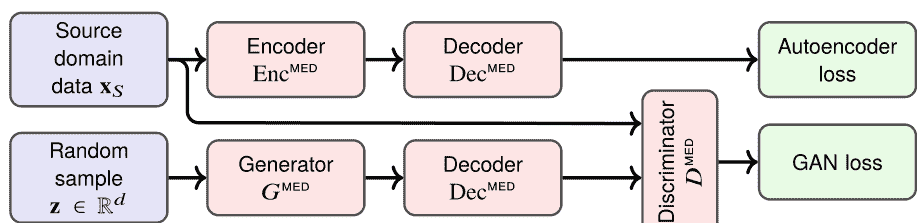

图 11.1 medGAN[150] 的架构。具有相同标签的块具有共享权重。

另一个相关的研究方向不是关注个体电子病历，而是对潜在患者群体进行建模。Smith 等人 [805] 制作的合成微观人口旨在匹配真实城市中的各种社会人口条件，并将其用于模拟建模以估计干预效果。Moniz 等人 [610, 746] 创建了合成电子病历，并在 CDC 公共卫生网格上提供了这些数据以进行模拟建模。Buczk 等人 [98] 为某种疾病的爆发生成合成电子病历（以及背景记录）。Kartoun [441] 从个体电子病历发展到整个虚拟患者库，重点是在使用模拟个体记录时保留正确的总体统计信息。然而，大部分研究并没有使用现代差分隐私的形式化方法或最新的生成模型的发展，直到最近研究人员才尝试将其引入医疗微观数据领域。

Choi等人[150]提出了GAN在合成EMR生成方面的直接应用。他们的medGAN模型包括一个生成器G_med，一个判别器D_med，以及一个具有编码器Enc_med和解码器Dec_med的自编码器；其架构如图11.1所示。自编码器被训练用于重构真实数据 $x_T \sim X_T$，而G_med学习从随机种子z生成潜在表示G_med(z)，使得D_med无法区分Dec_med(G_med(z))和真实样本 $x_T \sim X_T$。medGAN模型中的隐私是通过经验建立的，而隐私的主要理由是medGAN仅使用判别器对真实数据进行训练，而不会对生成器进行任何真实样本的训练。然而，需要注意的是，在生成方面，medGAN并不完美：例如，Patel等人[659]提出了用于相关离散数据生成的CorrGAN模型（不考虑隐私），并展示了相对简单的架构上对medGAN的改进。

DP-SGD框架也被应用于医学数据的GAN中。我们已经讨论了Beaulieu-Jones等人的研究[50]。合成数据在许多领域中都有重要的应用，包括但不限于金融，生成合成时间序列将是一个重要的应用。然而，这被证明是一个更困难的问题，解决方案才刚刚开始出现。特别是，Hyland等人提出了递归GAN（RGAN）和递归条件GAN架构，用于生成逼真的实值多维时间序列（包括ICU患者）并报告了成功生成和能够在合成数据上训练分类器的能力，尽管在真实数据上进行测试时质量有显著下降。Hyland等人还讨论了使用差分隐私训练程序的可能性，将DP-SGD框架应用于鉴别器，从而实现RGAN训练的差分隐私。作者报告称，在此过程之后，合成到真实测试结果明显恶化，但在ICU患者生命体征的分类任务上仍然合理。

最后，我们注意到与生成合成EMR以保护隐私相关的另一个新兴研究领域：使用神经语言模型生成EMR中的临床记录和自由文本字段（也参见第8.4节）。深度学习在自然语言处理方面的最新进展已经取得了大规模语言建模方面的突破[193, 359, 697]，并且已经应用于较小规模的临床记录数据集。Lee [505]使用编码器-解码器架构生成EMR的主诉文本。Guan等人[302]提出了一种名为mtGAN（医疗文本GAN）的GAN架构，用于生成合成的EMR文本。它基于SeqGAN架构[982]，并使用REINFORCE算法进行训练；Guan等人添加了一个条件，以便能够生成特定疾病或其他特征的EMR。 Melamud和Shivade [597]比较了基于LSTM的语言模型用于生成合成临床记录的效果，提出了一种新的隐私度量方法，并展示了有希望的结果。在这个方向上的进一步进展可能与最近开发的差分隐私语言模型[593]有关。

## 11.6 结论

在本章中，我们研究了一种与本书其他部分非常不同的合成数据的动机。我们制作合成数据的目的不是为了减轻收集和标记真实数据的困难，而是因为真实数据虽然可用，但出于法律或伦理原因不能发布。这个动机导致了非常不同的方法：现在主要问题是通过发布合成数据集来保证不发布真实数据。因此，在本章中，我们主要讨论了能够提供这些保证的主要（也可能是唯一）方法：差分隐私。

接下来，我们来到本书的最后一章。在这一章中，我们将尝试突出强调未来研究的最有前途的方向，我相信这些想法将在不久的将来带来有趣的进展。谁知道呢，也许我的读者中会有那些采取这些方向并通过合成数据将机器学习推向新的高度的人。让我们一起发现吧！

## 第12章

### 未来工作的有希望的方向

在这个总结性的章节中，我们讨论了深度学习中合成数据领域的下一步。我们考虑了在这个领域开始受到关注的四个不同的想法。首先，通过过程生成合成数据可以允许生成更大的合成数据集或即时生成的数据集。其次，最近的研究尝试从领域随机化转向生成反馈循环，将合成数据生成适应模型和问题。第三，我们讨论如何最好地将额外的知识纳入领域适应架构中；第四，展示了引入额外模态到合成数据集中的示例，以改善正式上可能不使用这些模态的下游任务。

## 12.1 过程生成合成数据

我们强调在合成数据领域进一步研究的第一个方向是过程生成。 例如，在我们在第7.3节中讨论的合成室内场景中，需要注意的是，在室内场景的主要合成数据集SUNCG中，3D场景及其布局是手动创建的。 虽然我们已经看到这种方法在标记图像方面比真实数据集有几个数量级的优势，但它仍然无法扩展到数百万个3D场景。实现这一点的唯一方法是学习一个能够根据某些随机输入种子随机变化的模型来生成3D场景的内容（在这种情况下，是带有家具和支持物体的室内环境）。这是一个比看起来更困难的问题：例如，卧室远不止是一个随机位置放置的预定义对象集合。

有一个与视频游戏的程序内容生成领域相关的大领域[336，786，863]，但我们强调Qi等人的最新工作[687]作为代表，更直接与合成数据相关。 他们提出了一种以人为中心的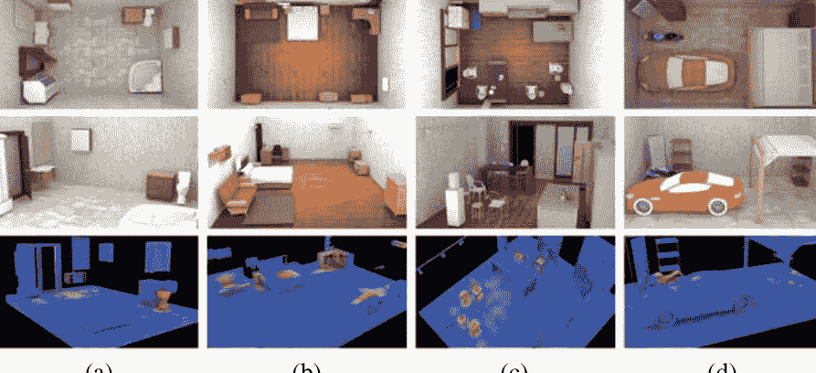

图12.1 由齐等人[687]程序生成的样本室内场景，包括两个渲染视图和一个热图：（a）浴室；（b）卧室；（c）餐厅；（d）车库。

建模室内场景布局的方法，基于属性空间AND-OR图[1026]，关联场景组件、物体和相应的人类活动。场景配置由解析图表示，其概率由对应的潜在函数建模，这些函数对应于家具之间的功能分组关系，支撑物体与支撑家具之间的关系，以及基于场景中采样的人类轨迹地图的家具之间的人为关系。在学习了物体之间关系的潜在函数权重之后，可以使用MCMC采样生成新的室内环境。齐等人在非常相同的SUNCG数据集上训练他们的模型，并展示生成的布局很难与原始的SUNCG数据（通过在布局分割图上训练的自动化最先进的分类器）区分开。这些样本图片中的一些在图12.1中再现，看起来相当令人信服。

在第7.2节中，我们已经讨论了Khan等人的ProcSy[449]。除了随机化天气和光照条件外，他们工作的另一个有趣部分是城市和户外场景的程序化生成。他们基于Parish和Müller[656]的方法进行程序化生成，该方法又基于Lindemayer系统（L-systems）[686]的概念，并体现在 CityEngine工具[954]中（见第7.2节）。他们使用了一部分真实的OpenStreetMaps数据来生成道路网络和建筑物，但我们希望基于相同思想的未来工作能够完全程序化地建模城市和道路网络。

我们相信，程序化生成可以在未来实现更大规模的合成数据应用，涵盖了仅仅随机放置对象不足以满足的情况。程序化生成所使用的模型的性质可能因具体应用领域而异，但一般来说，为了进行程序化生成，需要训练概率生成模型，既可以从真实数据或手动准备的合成数据中学习，又可以生成新样本。

```
算法 10: 在 SimOpt 框架中学习
初始化 p_φ(ξ), ε;
重复
  Env := 模拟 (p_φ);
  π_θ, p_φ := RL(Env);
  τ_真实 ∼ 真实回滚 (π_θ, p_φ);
  ξ ∼ p_φ;
  τ_ξ^ob ∼ 模拟回滚 (π_θ, p_φ, ξ);
  c(ξ) := D(τ_真实^ob, τ_ξ^ob);
  p_φ := 更新分布 (p_φ, ξ, c(ξ), ε);
直到满足停止条件;
```

## 12.2 从域随机化到生成反馈循环

Chebotar等人[126]通过引入SimOpt框架迈出了非常有趣的第一步。他们还在进行领域转移，将合成数据转移到真实领域中的机器人手臂的连续控制策略。

但重要的是，他们试图通过领域随机化来关闭合成数据生成和领域转移之间的反馈循环。以前关于领域随机化的研究（见第9.1节）手动调整了模拟参数的分布 $p_φ(ξ)$，以使在 $D_{ξ∼p}$ 上训练的策略表现良好。

相反，在[126]中，$p_φ(ξ)$ 的参数通过从真实观测结果的反馈循环中自动学习。SimOpt框架在算法10中呈现，并在图12.2中进行了说明。

其思想是从模拟中创建一个具有给定参数分布 $p_φ$ 的环境，然后训练一个策略 $\pi_{θφ}$ 使用一些强化学习算法，然后使用训练好的策略 $\pi_θ$ 采样两组轨迹：真实世界观测轨迹 $\tau_{real}^{ob}$ 和模拟观测轨迹 $\tau_{ξ}^{φ}$。思路是以一种方式更新分布 $p_φ$，使得这两组轨迹更加接近，这意味着在模拟中进行的训练将会产生在模拟和真实世界中表现相似的智能体。

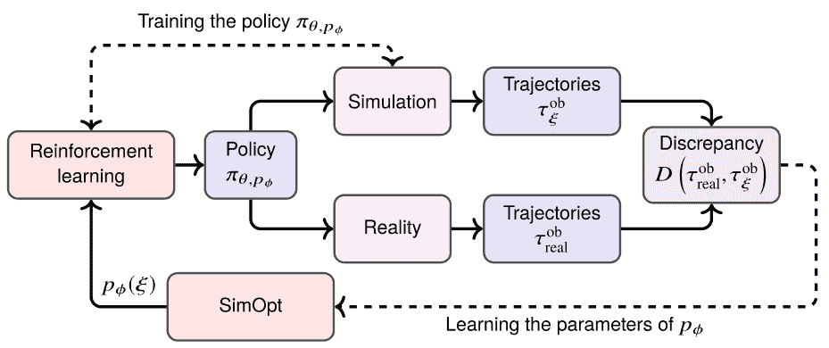

图12.2 SimOpt框架的结构 [126].

在[706]中提出了一种类似的数据增强方法。正如我们在第3.4节中讨论的那样，数据增强与合成数据的区别在于它修改真实数据而不是创建新数据；这些修改通常是使用预定义的转换函数（TFs）进行的，这些函数不会改变目标标签。这种假设有些不切实际：例如，如果我们通过平移或裁剪图像来进行图像分类的增强，可能会裁剪掉确定类别标签的对象。[706]中的工作放宽了这个假设，将TFs视为黑盒子，可能会将数据点移出所有必要的类别，进入“null”类别，但不能混淆不同类别的对象。作者通过对抗目标训练一个生成序列模型，该模型学习一系列不会将数据点移入“null”类别的TFs序列，通过训练一个空类别判别器 $D_φ^g$ 和一个生成器 $G_θ$ 来实现 $h_{τ_L} ∘ ... ∘ h_{τ_1}$ 的序列TFs：

```
min_θ max_φ E_{τ~G_θ} E_{x~U} [log(1 - D_φ^g(h_{τ_L} ∘ ... ∘ h_{τ_1}(x)))] + E_{x'~U} [log(D_φ^g(x'))],
```

其中 $U$ 是一些（可能是无标签的）数据的分布。由于TFs不一定是可微分或确定性的，学习 $G_θ$ 在强化学习的语法中被定义。

Pashevich等人[658]指出，增强函数的空间非常大（对于8种不同的变换，他们估计大约有 ≈ $3.6 \cdot 10^{14}$ 个增强函数），并提议使用蒙特卡洛树搜索（MCTS）[169, 463]通过自动探索找到最佳增强。他们将这个想法应用于增强合成图像，以实现机器人操作的模拟到真实策略转移，并在真实世界的任务（如堆叠方块或放置杯子）中报告了改进的结果。

接下来，谷歌大脑研究员Cubuk等人[172]采取了下一步，他们通过提出一个名为AutoAugment的框架来学习从数据中获取增强策略。他们的方法是基于最近在神经架构搜索方面的进展[35, 57, 1031, 1032]，这些进展最近为从图像中提取特征和图像分类（即EfficientNet，更多细节请参见第3.2节）、目标检测（即 EfficientDet系列，更多细节请参见第3.3节）等领域提供了新的神经架构。Cubuk等人使用强化学习来找到由一些参数化操作组成的最佳增强策略。因此，他们在CIFAR-10、CIFAR-100和ImageNet等经典数据集上显著改善了最新的研究成果。

在[172]中，控制器通过近端策略优化进行训练，这是一个相当复杂的强化学习算法[772]。此外，这种规模上的强化学习确实占用了大量的计算资源。那么，当我们不是谷歌大脑，无法为我们的问题运行这个流程时，这项研究能帮助我们吗？Cubuk等人指出，由此产生的增强策略确实可以在广泛的情况下转移。各种数据集和网络架构。另一方面，这种可转移性远非完美，到目前为止，AutoAugment的结果在其他作品中频繁出现，可能超出了作者的预期。

Zakharov等人[986]从域随机化的角度看待了类似的想法（另请参见第9.1节）。他们的框架由一个识别网络和一个欺骗网络组成，识别网络执行基本任务（例如目标检测和姿态估计），而欺骗网络则使用编码器-解码器架构转换合成输入。训练以对抗方式进行，交替进行两个阶段：
- 固定欺骗网络的权重，像往常一样更新识别网络，使用欺骗网络转换的合成图像作为输入；
- 固定识别网络的权重，使用相同目标但梯度相反的方式更新欺骗网络，更新欺骗网络使输入对识别网络变得困难。

欺骗网络的组织和约束方式使其变换不会改变基本事实标签，或以可预测的方式改变它们。这种对抗性框架展示了与最先进的领域适应框架相当的性能，并展示了更好的泛化能力（更好地避免过拟合）。

有两个最近的工作代表了关闭这个反馈循环的重要步骤。首先，Meta-Sim框架[433]，我们在第9.2节中讨论了高级过程场景生成的上下文，也在这个方向上取得了进展：合成数据生成的分布参数不仅调整使合成数据分布更接近真实数据，还改善了下游任务（如目标检测）的性能。这里的不同之处在于，Meta-Sim调整的不是图像增强函数的低级参数，而是高级参数，如以场景图形式捕捉的合成场景结构。

其次，Khirodkar等人的Visual Adversarial Domain Randomization and Augmentation (VADRA) 模型[450]在发展领域随机化思想方面迈出了下一步：不仅仅是随机化合成数据或使其与真实数据相似，而是学习一个生成渲染参数的策略 $\pi_{\omega}$，以使下游模型学习效果最佳。他们使用REINFORCE算法获得目标 $J(\omega)$ 的随机梯度，该目标包括下游模型的性能（对于有监督数据）和领域分类器的错误（对于无监督数据）；这是VADRA的“对抗”部分。

VADRA框架中的学习结构如图12.3所示，很好地说明了闭环反馈的一般思想。在VADRA中，策略 $\pi_{\omega}$ 生成用于合成数据生成器的渲染参数 $\theta$，以生成数据样本 $(x, y)$。这个数据样本用于生成假设（训练下游任务的模型），并且这个假设的误差（模型的性能）被用作学习 $\pi_{\omega}$ 的奖励。因此，与常规领域随机化相比，VADRA在对象检测和分割等合成到真实数据的转移问题上表现更好。


图12.3 VADRA 框架的结构[450]。

最近，Mehta等人[595]也探索了类似的思路，他们提出了主动域随机化，再次学习生成更好模拟实例的策略，但这次是在生成强化学习的马尔可夫决策过程的背景下，Ruiz 等人[741]也学习了一个输出模拟器参数的策略 $\pi_{\omega}$，通过强化学习技术学习生成数据以最大化验证准确性，Louppe等人[558]提供了一种基于变分近似的推断算法，用于拟合领域特定的不可微分模拟器的参数。

我们相信，这种自动学习生成高级和低级合成数据的元方法是一个重要的新方向，也可能适用于其他应用。在我看来，通过Ganin等人[258]的SPIRAL 框架或神经画家模型[375,617,1021]等方法可能进一步改进这个想法，这些方法训练对抗性架构以生成以刷子笔画或更高级图像合成样式的图像，这些图像具有诸如“在位置 $Y$ 处放置物体 $X$ ”之类的指令，这些或其他类型的图像高级描述可能更方便用于生成反馈循环。无论是使用这些想法还是其他想法，我预计在不久的将来会有进一步的发展。

## 12.3 通过领域知识改进领域适应性

为了展示这个方向，让我们考虑另一项关于凝视估计的工作（见第10.2节），该工作展示了一种成功的混合方法在图像细化中的应用。具体而言，王等人 [905]提出了一种非常不同的方法来生成凝视估计的合成数据：一种能够从上到下生成新的合成眼睛图像并从下到上执行贝叶斯推断以估计给定新图像中凝视的分层生成模型（HGM）。

他们的方法的一般结构如图12.4所示。具体而言，王等人设计了一个基于27个与眼睛相关的标志物的概率层次生成形状模型（HGSM），这些标志物共同表示人眼的形状。该模型连接了定义人类之间变化的个人参数、定义眼睛凝视的视觉轴参数和眼睛形状参数。HGSM的结构基于解剖学研究，并且其参数是从UnityEyes数据集[934]中学习得到的。在生成过程中，HGSM根据给定的凝视方向生成眼睛形状参数（眼球球坐标系中的27个标志点位置）。

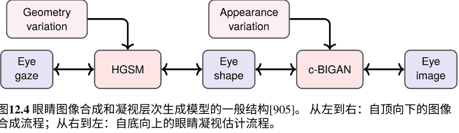

图12.4 眼睛图像合成和凝视层次生成模型的一般结构[905]。从左到右: 自顶向下的图像合成流程; 从右到左: 自底向上的眼睛凝视估计流程。

流程的第二部分使用有条件的BiGAN（双向生成对抗网络）架构[201]生成实际图像。双向生成对抗网络是一种学习将数据从潜在表示转换为对象并返回的架构，而常规生成对抗网络仅学习从潜在表示生成对象。在[905]中开发的有条件BiGAN（c-BiGAN）修改也是如此，不同之处在于条件是由HGSM生成的眼睛形状参数。因此，王等人的模型可以在两个方向上工作：
- 通过从先验分布中采样注视点、从HGSM中采样2D眼睛形状参数，然后使用生成器 $G$ of c-BiGAN生成精细图像；
- 通过首先通过c-BiGAN的编码器 $E$ 估计眼睛形状，然后在HGSM中进行贝叶斯推断来推断眼睛图像中的注视参数的后验分布。

Wang等人报告了模型本身在足够大的训练集上应用于注视估计的性能改进，还表明模型生成的合成数据改善了标准注视估计器（如[1003]中使用的LeNet）的结果。

总的来说，[905]的方法将结合包含领域知识和基于GAN的架构的概率生成模型似乎是一个非常有趣的进一步研究方向。我相信这种方法适用于除了注视估计之外的其他应用。

## 12.4 领域自适应的附加模态架构

另一个尚未广泛使用的自然想法是利用附加的数据模态，例如深度图或三维体积数据，这些数据在合成数据集中是免费提供的，但在真实数据集中通常不可用，以改进那些表面上不需要这些附加模态的任务。

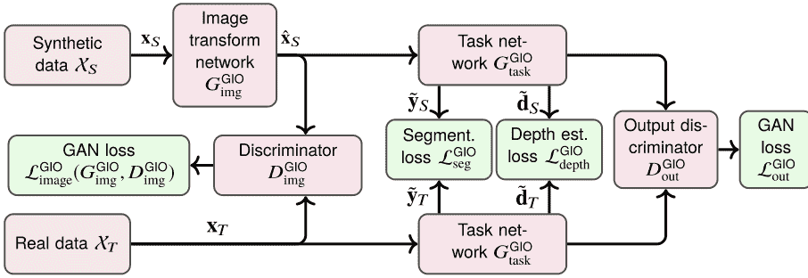

图12.5 GIO-Ada模型的一般结构，包括输入和输出层的领域自适应 [142]。

陈等人最近在这个方向上进行了开创性的工作[142]。他们指出，深度估计和分割是相关的任务，越来越多地与多任务学习架构一起学习[444,665,961]，然后提出利用这个想法来改进合成到真实领域的自适应。他们的模型，称为几何引导的输入输出自适应(GIO-Ada)，基于用于图像转换的PatchGAN架构[389]。

我们在图12.5上说明了GIO-Ada模型。与第10.3节中考虑的改进器类似，它们训练一个GAN生成器来改进合成图像，但改进器不仅以合成图像 $x_S$ 为输入，还以输入三元组 $(x_S, y, d)$ 为输入，其中 $x_S$ 是合成图像，$y$ 是其分割图，$d$ 是其深度图。此外，它们还结合了输出级别的适应，其中一个单独的生成器预测分割图和深度图，而一个鉴别器试图区分这些图像是来自合成变换图像还是真实图像。通过这种方式，模型可以利用深度信息来获得进一步改善真实图像分割的线索，而输出级别的适应则使合成和真实领域的分割结果更加接近。

具体而言，GIO-Ada模型以对抗方式优化以下目标：

```
\min _{G_{\text {img }}^{\text {GIO }}, G_{\text {task }}^{\text {GIO }}} \max _{D_{\text {img }}^{\text {GIO }}, D_{\text {out }}^{\text {GIO }}}\left[\mathcal{L}_{\text {seg }}^{\text {GIO }}+\lambda_1 \mathcal{L}_{\text {深度 }}^{\text {GIO }}+\lambda_2 \mathcal{L}_{\text {图像 }}^{\text {GIO }}+\lambda_3 \mathcal{L}_{\text {输出 }}^{\text {GIO }}\right],
```

其中
- $G_{\text {img }}^{\text {GIO }}$ 是一个执行输入级别适应的图像转换网络，即生成一个转换后的图像 $\hat{\mathbf{x}}=G_{\text {img }}^{\text {GIO}}(\mathbf{x}, \mathbf{y}, \mathbf{d})$；
- $G_{\text {task }}^{\text {GIO }}$ 是预测分割和深度图的输出级别适应网络 $(\tilde{y}, \tilde{d})=G^{\text {GIO }}_{\text {task}}(\mathbf{x})$；
- $D_{\text {img }}^{\text {GIO }}$ 是图像鉴别器，试图区分 $\hat{\mathbf{x}}_{S}$ 和 $\mathbf{x}_{T}$，并 $D_{\text {out }}^{\text {GIO }}$ 是输出鉴别器，区分 $(\tilde{y}_S, \tilde{d}_S)=G_{\text {task }}^{\text {GIO }}(\hat{x}_S)$ 和 $(x_T, y_T, d_T)$。

- $\mathcal{L}_{\text{seg}}^{\text{GIO}}$ 是分割交叉熵损失 $\mathcal{L}_{\text{seg}}^{\text{GIO}} = \mathbb{E}_{\mathbf{x}_S \sim p_{\text{syn}}} [\text{CE}(\mathbf{y}_S, \hat{\mathbf{y}}_S)]$；
- $\mathcal{L}_{\text{depth}}^{\text{GIO}}$ 是深度估计 $L_1$ 损失 $\mathcal{L}_{\text{depth}}^{\text{GIO}} = \mathbb{E}_{\mathbf{x}_S \sim p_{\text{syn}}} [\|\mathbf{d}_{S} - \hat{\mathbf{d}}_{S}\|_1]$；
- $\mathcal{L}_{\text{图像}}^{\text{GIO}}$ 是 $D_{\text{img}}^{\text{GIO}}$ 的GAN损失：

```
$\mathcal{L}_{\text{图像}}^{\text{GIO}} = \mathbb{E}_{\mathbf{x}_T \sim p_{\text{real}}} [\log D_{\text{img}}^{\text{GIO}}(\mathbf{x}_T)] + \mathbb{E}_{\mathbf{x}_S \sim p_{\text{syn}}} [\log(1 - D_{\text{img}}^{\text{GIO}}(\mathbf{x}_S))]$;
```

- $\mathcal{L}_{\text{输出}}^{\text{GIO}}$ 是 $D_{\text{out}}^{\text{GIO}}$ 的GAN损失：

```
$\mathcal{L}_{\text{输出}}^{\text{GIO}} = \mathbb{E}_{\mathbf{x}_T \sim p_{\text{real}}} [\log D_{\text{out}}^{\text{GIO}}(\tilde{\mathbf{y}}_T, \tilde{\mathbf{d}}_T)] + \mathbb{E}_{\mathbf{x}_S \sim p_{\text{syn}}} [\log(1 - D_{\text{out}}^{\text{GIO}}(\tilde{\mathbf{y}}_S, \tilde{\mathbf{d}}_S))]$.
```

Chen等人在标准的合成到真实适应方面报告了有希望的结果：Virtual KITTI到KITTI和SYNTHIA到Cityscapes（见第7.2节）。然而，对我们来说，这只是在使用合成数据生成器轻松提供的其他数据模态进一步改善领域适应的非常有趣的方向上的第一步。

## 12.5 结论

随着这一点，我们来到了整本书的最后一节。在这项工作中，我们尝试对现代深度学习中最有前景的一种通用技术进行调查，特别是计算机视觉：合成数据。这个几乎无限的完美标记数据的来源已经在许多问题中得到了探索，但我们相信还有更多潜在的用例。

在合成数据的直接应用中，我们讨论了许多不同的领域和用例，从基本的计算机视觉任务，如立体视差估计或语义分割，到用于自动驾驶、无人机和机器人的全面模拟环境。在领域适应部分，我们调查了各种各样的生成模型，用于合成到真实数据的精细化和特征级别的领域适应。作为合成数据应用的另一个重要领域，我们考虑了具有差分隐私保证的数据生成。

我们还回顾了致力于改进合成数据生成的工作，并概述了进一步研究的潜在有希望的方向。

总的来说，在本书中，我们看到合成数据在各种任务和领域中表现良好。我相信合成数据对于深度学习的进一步发展至关重要：许多应用需要昂贵或无法手工完成的标注，其他应用具有广泛的底层数据分布，真实数据集无法完全覆盖，还有其他应用可能从真实数据集中无法获得的附加模态中受益。此外，我相信合成数据将在不久的将来找到新的应用。例如，虽然这本书还没有专门讨论声音和语音处理的部分，但在这个领域使用合成数据的作品已经开始出现[510,745]。随着合成数据变得更加逼真(必要时)并涵盖更多的用例和模态,我预计它在深度学习中将扮演越来越重要的角色。

我坚信合成数据在深度学习的未来将不可或缺。让我们一起建设这个未来!

© The Editor(s) (if applicable) and The Author(s), under exclusive license to Springer Nature Switzerland AG 2021 S. I. Nikolenko, 深度学习优化的合成数据, 斯普林格优化及其应用 174, https://doi.org/10.1007/978-3-030-75178-4

# 参考文献

- 1. Abadi, M., Chu, A., Goodfellow, I., McMahan, H.B., Mironov, I., Talwar, K., Zhang, L.: 具有差分隐私的深度学习。在：2016年ACM SIGSAC计算机与通信安全会议论文集，CCS '16，第308-318页。ACM，纽约，纽约，美国（2016年）。 https://doi.org/10.1145/2976749.2978318
- 2. Abbasi, A., Kalkan, S., Sahillioğlu, Y.: 深度3D语义场景外推。可视化计算，35，271-279 (2018年)
- 3. Abowd, J., Schneider, M., Vilhuber, L.: 差分隐私在贝叶斯和线性混合模型估计中的应用。 J. Priv. Confid. 5(1), 185–205 (2013)
- 4. Abowd, J., Stinson, M., Benedetto, G.: 关于社会保障局的最终报告 关于sipp/ssa/irs公共使用文件项目。 技术报告，纵向雇主-家庭动态计划，美国人口普查局，华盛顿特区 (2006) https://hdl.handle.net/1813/43929
- 5. Abu Alhaija, H., Mustikovela, S.K., Mescheder, L., Geiger, A., Rother, C.: 增强现实遇见计算机视觉：城市驾驶场景的高效数据生成。 Int. J. Comput. Vis. 126(9), 961–972 (2018). https://doi.org/10.1007/s11263-018-1070-x
- 6. Melis, G., Castelluccia, C., Cristofaro, E.D.: 差分隐私混合生成神经网络。 CoRR (2017). arXiv e-prints abs:1709.04514
- 7. Adiprawita, W., Ahmad, A.S., Semibiriring, J.: 无人机快速开发生命周期中的硬件在环模拟器。 CoRR (2008). arXiv e-prints abs:0804.3874
- 8. Agrawal, A., Lu, J., Antol, S., Mitchell, M., Zitnick, C.L., Parikh, D., Batra, D.: VQA: 视觉问答。 Int. J. Comput. Vis. 123(1), 4–31 (2017). https://doi.org/10.1007/s11263-016-0966-6
- 9. Aguero, C., Koenig, N., Chen, I., Boyer, H., Peters, S., Hsu, J., Gerkey, B., Paepcke, S., Rivero, J., Manzo, J., Krotkov, E., Pratt, G.: 虚拟机器人挑战赛内部：模拟实时机器人灾难响应。 IEEE Trans. Autom. Sci. Eng. 12(2), 494–506 (2015). https://doi.org/10.1109/TASE.2014.2368997
- 10. Akbani, O., Gokrani, A., Quresh, M., Khan, F.M., Behlim, S.I., Syed, T.Q.: 自然场景图像中的字符识别。在：2015年国际信息与通信技术会议(ICICT)，第1-6页(2015)。 https://doi.org/10.1109/ICICT.2015.7469575
- 11. Al-Kaff, A., Martín, D., García, F., de la Escalera, A., Armingol, J.M.: 无人机计算机视觉算法和应用综述。 Expert Syst. Appl. 92, 447–463 (2018)。 https://doi.org/10.1016/j.eswa.2017.09.033
- 12. Al-Musawi, N.J., Hasson, S.T.: 使用合成噪声视频数据改进视频流摘要. Int. J. Adv. Comput. Sci. Appl. 6(12) (2015). https://doi.org/10.14569/IJACSA.2015.061233
- 13. Alfons, A., Kraft, S., Templ, M., Filzmoser, P.: 模拟接近真实的人口数据用于家庭调查，并应用于 eu-silc. Stat. Methods Appl. 20(3), 383–407 (2011). https://doi.org/10.1007/s10260-011-0163-2
- 14. Alonso, E., Moyssset, B., Messina, R.O.: 基于序列的对抗生成手写文本图像. CoRR (2019 ). arXiv e-prints abs:1903.00277
- 15. Alvernaz, S., Togelius, J.: 自编码器增强的神经进化在视觉末日游戏中的应用. In: 2017 IEEE Conference on Computational Intelligence and Games (CIG) pp. 1–8 (2017)
- 16. Amodei, D., Hernandez, D., Sastry, G., Clark, J., Brockman, G., Sutskever, I.: AI和计算 (2018). https://openai.com/blog/ai-and-compute/
- 17. Amos, B., Ludwiczuk, B., Satyanarayanan, M.: Openface: 一个通用的人脸识别库及其移动应用. Technical Report, CMU-CS-16-118, CMU School of Computer Science (2016)
- 18. 安, D., 利特尔, R.J.A., 麦克纳利, J.W.: 对纵向研究中高龄个体的披露限制的多重插补方法。Stat. Med. 29(17), 1769-1778 (2010年)。 https://doi.org/10.1002/sim.3974
- 19. 安德森, P., 古德温, M., 格兰莫, O.: Deep rts: 实时策略游戏中深度强化学习的游戏环境。在：2018年IEEE计算智能与游戏（CIG）会议，第1-8页（2018年）。 https://doi.org/10.1109/CIG.2018.8490409
- 20. 安德森, C., 杜, X., 瓦苏德万, R., 约翰逊·罗伯森, M.: 用于行人轨迹预测的随机采样模拟（2019年）。arXiv e-prints abs:1903.01860
- 21. 安藤, H., 卢巴舍夫斯基, I., 兹戈尼科夫, A., 斋藤, Y.: 车辆跟随的统计特性：理论和驾驶模拟实验（2015年）。arXiv e-prints arXiv:1511.04640
- 22. 安德烈亚斯, J., 罗尔巴赫, M., 达雷尔, T., 克莱因, D.: 用神经模块网络进行深度组合问题回答。CoRR（2015年）。arXiv e-prints abs:1511.02799
- 23. 安德烈亚斯, J., 罗尔巴赫, M., 达雷尔, T., 克莱因, D.: 学习组合神经网络进行问题回答。CoRR（2016年）。arXiv e-prints abs:1601.01705
- 24. Andriluka, M., Pishchulin, L., Gehler, P., Schiele, B.: 2D人体姿势估计：新的基准和最新技术分析。在：IEEE计算机视觉和模式识别会议（CVPR）（2014年）
- 25. Andriluka, M., Pishchulin, L., Gehler, P., Schiele, B.: 2D人体姿势估计：新的基准和最新技术分析。在：2014年IEEE计算机视觉和模式识别会议上，第3686-3693页（2014年）。 https://doi.org/10.1109/CVPR.2014.47126
- 26. Angelino, C.V., Baraniello, V.R., Cicala, L.: 使用IMU、GPS和相机的高空无人机导航。在：第16届国际信息融合会议，FUSION 2013，土耳其伊斯坦布尔，2013年7月9日至12日，第647-654页（2013年）
- 27. Arjovsky, M., Chintala, S., Bottou, L.: Wasserstein生成对抗网络。在：D. Precup, Y.W. Teh (eds.) 第34届国际机器学习大会论文集。机器学习研究的论文集，第70卷，第214-223页。PMLR，悉尼国际会议中心，澳大利亚（2017年）
- 28. Armanious, K., Yang, C., Fischer, M., Köstner, T., Nikolaou, K., Gatidis, S., Yang, B.: Medgan: 使用GAN进行医学图像翻译。CoRR（2018年）。arXiv e-prints abs:1806.06397
- 29. Arnab, A., Zheng, S., Jayasumana, S., Romera-Paredes, B., Larsson, M., Kirillov, A., Savchynskyy, B., Rother, C., Kahl, F., Torr, P.H.S.: 条件随机机场遇见深度神经网络用于语义分割：将概率图模型与深度学习相结合进行结构化预测。IEEE信号处理杂志。 35(1)，37-52（2018年）。 https://doi.org/10.1109/MSP.2017.2762355
- 30. Arnold, C., Neunhoeffer, M., Sternberg, S.: 使用贝叶斯生成对抗网络发布差分隐私合成微观数据 (2019). http://www.marcel-neunhoeffer.com/pdf/papers/dp_gan.pdf
- 31. Aubry, M., Maturana, D., Efros, A., Russell, B., Sivic, J.: 看到3D椅子：使用大型CAD模型数据集的示例部分对齐. 在：CVPR (2014)
- 32. Aubry, M., Russell, B.C.: 通过计算机生成的图像理解深度特征.在: 2015年IEEE国际计算机视觉会议(ICCV)论文集，ICCV '15，第2875-2883页.IEEE计算机学会，华盛顿特区，美国(2015). https://doi.org/10.1109/ICCV.2015.329
- 33. Bailo, O., Ham, D., Shin, Y.M.: 使用条件生成对抗网络进行数据增强的红细胞图像生成. CoRR (2019). arXiv e-prints abs:1901.06219
- 34. Bak, S., Carr, P., Lalonde, J.F.: 通过合成进行无监督人物再识别的域适应. In: ECCV (2018)
- 35. Baker, B., Gupta, O., Naik, N., Raskar, R.: 使用强化学习设计神经网络架构. CoRR (2016 ). arXiv e-prints abs:1611.02167
- 36. Baker, S., Scharstein, D., Lewis, J.P., Roth, S., Black, M.J., Szeliski, R.: 用于光流的数据库和评估方法. Int. J. Comput. Vis. 92(1), 1–31 (2011). https://doi.org/10.1007/s11263-010-0390-2
- 37. Bansal, A., Castillo, C., Ranjan, R., Chellappa, R.: 基于CNN的人脸验证的做与不做 (2017). arXiv预印本 arXiv:1705.07426
- 38. Bansal, A., Nanduri, A., Castillo, C.D., Ranjan, R., Chellappa, R.: Umdfaces: 用于训练深度网络的注释人脸数据集 (2016). arXiv预印本 arXiv:1611.01484v2
- 39. Bansal, M.: arXiv预印本 arXiv:1812.03079
- 40. 鲍, Y., 周, H., 黄, S., 李, L., 牟, L., Vechtomova, O., 戴, X.Y., 陈, J.: 从解耦的句法和语义空间生成句子。在: 计算语言学协会第57届年会论文集, pp. 6008-6019.
- 41. Barati, E., Chen, X., Zhong, Z.: 基于注意力的多视图深度强化学习。 CoRR（2019年）。 arXiv预印本arXiv:1905.03985
- 42. Barron, J.L., Fleet, D.J., Beauchemin, S.S.: 光流技术的性能。国际计算机视觉杂志12（1），43-77（1994年）。 https://doi.org/10.1007/BF01420984
- 43. Barron, J.L., Fleet, D.J., Beauchemin, S.S.: 光流技术的性能。国际计算机视觉杂志12（1），43-77（1994年）。 https://doi.org/10.1007/BF01420984
- 44. Barrows, R.C., Clayton, P.D.: 隐私、保密性和电子病历。美国医学信息学协会（JAMIA）3（2），139-48（1996年）
- 45. Baur, C., Albarqouni, S., Navab, N.: Melanogans: 使用gans进行高分辨率皮肤病变合成。 CoRR (2018)。 arXiv预印本 arXiv:1804.04338
- 46. Bayraktar, E., Yigit, C.B., Boyraz, P.: 一种用于桥接真实和仿真环境的混合图像数据集。机器视觉应用程序 30，23-40 (2018)
- 47. Bayraktar, E., Yigit, C.B., Boyraz, P.: 一种用于桥接真实和仿真环境的混合图像数据集。机器视觉应用程序 30(1)，23-40(2019)。 https://doi.org/10.1007/s00138-018-0966-3
- 48. Bayramoglu, N., Kaakinen, M., Eklund, L., Heikkilä, J.: 利用条件生成对抗网络实现高光谱肺组织学图像的虚拟染色。 在： 2017年IEEE国际计算机视觉研讨会（ICCVW），第64-71页（2017年）。 https://doi.org/10.1109/ICCVW.2017.15
- 49. Beattie, C., Leibo, J.Z., Teplyashin, D., Ward, T., Wainwright, M., Küttler, H., Lefrancq, A., Green, S., Valdés, V., Sadik, A., Schrittweis, J., Anderson, K., York, S., Cant, M., Cain, A., Bolton, A., Gaffney, S., King, H., Hassabis, D., Legg, S., Petersen, S.: Deepmind lab. CoRR (2016). arXiv预印本 arXiv:1612.03801
- 50. Beaulieu-Jones, B.K., Wu, Z.S., Williams, C., Lee, R., Bhavnani, S.P., Byrd, J.B., Greene, C.S.: 隐私保护生成式深度神经网络支持临床数据共享. bioRxiv (2018). https://doi.org/10.1101/159756
- 51. Bechtel, W.: 连接主义与心灵哲学:概述*. 南方哲学杂志26(S1), 17–41 (1988). https://doi.org/10.1111/j.2041-6962.1988.tb00461.x
- 52. Bechtel, W., Abrahamsen, A.: 连接主义与心灵: 并行处理网络导论.剑桥, MA: Blackwell (1990)
- 53. Beers, A., Brown, J.M., Chang, K., Campbell, J.P., Ostmo, S., Chiang, M.F., Kalpathy-Cramer, J.: 使用逐步增长的生成对抗网络进行高分辨率医学图像合成. CoRR (2018). arXiv预印本 arXiv:1805.03144
- 54. Bell, R.M., Koren, Y.: 从Netflix奖挑战中学到的教训. SIGKDD Explor. Newsl. 9(2), 75–79 (2007). https://doi.org/10.1145/1345448.1345465
- 55. Bellemare, M.G., Naddaf, Y., Veness, J., Bowling, M.: 街机学习环境：通用智能体评估平台。人工智能研究杂志 47(1), 253–279 (2013)
- 56. Bellifemine, F.L., Caire, G., Greenwood, D.: 使用JADE开发多智能体系统（代理技术系列）。约翰威利与桑斯公司，美国 (2007)
- 57. Bello, I., Zoph, B., Vasudevan, V., Le, Q.V.: 用强化学习进行神经优化器搜索。在：D. Precup, Y.W. Teh（编辑）第34届国际机器学习会议论文集。机器学习研究论文集，第70卷，第459–468页。PMLR，悉尼国际会议中心，澳大利亚 (2017)
- 58. Bellovin, S.M., Dutta, P.K., Reitingen, N.: 隐私和合成数据集。技术报告，SSRN (2018)
- 59. Ben-Cohen, A., Klang, E., Raskin, S.P., Soffer, S., Ben-Haim, S., Konen, E., Amitai, M.M., Greenspan, H.: 使用FCN和GAN网络从CT到PET的跨模态合成，以改善自动病变检测。CoRR (2018). arXiv预印本 arXiv:1802.07846
- 60. Benaim, S., Wolf, L.: 单侧无监督域映射。在: 第31届国际神经信息处理系统会议论文集，NIPS'17，页码752-762。Curran Associates Inc.，美国（2017年）
- 61. Benenson, R., Popov, S., Ferrari, V.: 与人类注释者进行大规模交互式对象分割。在: CVPR (2019)
- 62. Bengio, Y., Lamblin, P., Popovici, D., Larochelle, H.: 贪婪逐层训练深度网络。在: 神经信息处理系统（NIPS）（2007年）
- 63. Bengio, Y., Louradour, J., Collobert, R., Weston, J.: 课程学习。在：第26届国际机器学习年会论文集，ICML '09，第41-48页。计算机协会，美国纽约，纽约（2009年）。https://doi.org/10.1145/1553374.1553380
- 64. Bennett, J., Lanning, S.: Netflix奖。在：2007年KDD杯研讨会论文集，第3-6页。ACM，纽约（2007年）
- 65. Bermúdez-Chacón, R., Becker, C., Salzmann, M., Fua, P.: 可扩展的无监督领域适应电子显微镜。在：Ourselin, S., Joskowicz, L., Sabuncu, M.R., Unal, G., Wells, W. （eds.）医学图像计算与计算机辅助干预-MICCAI2016，第326-334页。斯普林格国际出版，Cham（2016年）
- 66. Berthelot, D., Schumm, T., Metz, L.: BEGAN: 边界平衡生成对抗网络. CoRR (2017). arXiv预印本 abs:1703.10717
- 67. Bertiche, H., Madadi, M., Escalera, S.: CLOTH3D: 穿着衣物的3D人体. CoRR (2019). arXiv预印本 abs:1912.02792
- 68. Bewley, A., Rigley, J., Liu, Y., Hawke, J., Shen, R., Lam, V.D., Kendall, A.: 从模拟中学习驾驶而无需真实世界标签 (2018). arXiv预印本 abs:1812.03823
- 69. Bhatti, S., Desmaisons, A., Miksik, O., Nardelli, N., Siddharth, N., Torr, P.H.S.: 使用SLAM增强的深度强化学习玩DOOM. CoRR (2016). arXiv预印本 abs:1612.00380
- 70. Bielski, A., Favaro, P.: 在扰动的生成模型中出现对象分割 (2019). arXiv预印本 abs:1905.12663
- 71. Bindschadler, V.: 隐私保护的基于种子的数据合成。伊利诺伊大学香槟分校博士学位论文 (2018)
- 72. Bisagno, N., Conci, N.: 多视角监控场景的虚拟摄像机建模。在: 2018年第26届欧洲信号处理会议 (EUSIPCO), pp. 2170–2174(2018). https://doi.org/10.23919/EUSIPCO.2018.8553409
- 73. Bittar, A., de Oliveira, N.M.F., de Figueiredo, H.V.: 使用x-plane进行硬件在环模拟，探索大气条件下的姿态控制。智能机器人系统杂志73(1), 271–287 (2014). https://doi.org/10.1007/s10846-013-9905-8

- 74. Blanz, V., Scherbaum, K., Seidel, H.: 将可塑模型拟合到三维人脸扫描中。 在：2007年IEEE第11届国际计算机视觉会议，第1-8页（2007年）。https://doi.org/10.1109/ICCV.2007.4409029

- 75. Blanz, V., Vetter, T.: 用于合成三维人脸的可塑模型。 在：第26届计算机图形学与交互技术年会，SIGGRAPH'99，第187-194页。 ACM Press/Addison-Wesley Publishing Co., 纽约，纽约，美国（1999年）。https://doi.org/10.1145/311535.311556

- 76. Blanz, V., Vetter, T.: 基于拟合三维可塑模型的人脸识别。 IEEE Trans. Pattern Anal. Mach. Intell. 25(9), 1063-1074 (2003). https://doi.org/10.1109/TPAMI.2003.1227983

- 77. Bochinski, E., Eiselein, V., Sikora, T.: 仅使用虚拟世界数据训练卷积神经网络进行多类目标检测。 在：2016年第13届IEEE国际会议高级视频和信号监控（AVSS），第278-285页（2016年）。https://doi.org/10.1109/AVSS.2016.7738056

- 78. Bochkovskiy, A., Wang, C.Y., Liao, H.Y.M.: YOLOv4：目标检测的最佳速度和准确性 (2020). arXiv e-prints arXiv:2004.10934

- 79. Bojanowski, P., Grave, E., Joulin, A., Mikolov, T.: 用子词信息丰富词向量。 CoRR (2016). arXiv e-prints abs:1607.04606

- 80. Bolsa-Canedo, V., Sánchez-Marqués, N., Alonso-Betanzos, A.: 对合成数据的特征选择方法的综述。 知识信息系统。 34(3), 483-519 (2013). https://doi.org/10.1007/s10115-012-0487-8

- 81. Bondi, E., Dey, D., Kapoor, A., Pivtoraiko, M., Shah, S., Fang, F., Dilkina, B., Hannaford, R., Iyer, A., Joppa, L., Tambe, M.: Airsim-w: 用于野生动物保护的无人机模拟环境。 在： ACM COMPASS (2018)

- 82. Bonetto, M., Korshunov, P., Ramponi, G., Ebrahimi, T.: 迷你无人机视频监控中的隐私。 在：2015年第11届IEEE国际会议和自动面部和姿势识别研讨会（FG）, pp. 1-6 (2015)

- 83. Bonin-Font, F., Ortiz, A., Oliver, G.: 移动机器人的视觉导航：一项调查. J. Intell. Rob. Syst. 53(3), 263 (2008). https://doi.org/10.1007/s10846-008-9235-4

- 84. Bonnans, J.F., Gilbert, J.C., Lemarechal, C., Sagastizábal, C.A.: 数值优化: 理论和实践方面. 斯普林格, 柏林海德堡 (2013)

- 85. Borrego, J., Dehban, A., Figueiredo, R., Moreno, P., Bernardino, A., Santos-Victor, J.: 将域随机化应用于合成数据以进行对象类别检测. CoRR (2018). arXiv e-prints abs:1807.09834

- 86. Bousmalis, K., Irpan, A., Wohlhart, P., Bai, Y., Kelcey, M., Kalakrishnan, M., Downs, L., Ibarz, J., Pastor, P., Konolige, K., Levine, S., Vanhoucke, V.: 使用模拟和领域适应来提高深度机器人抓取的效率. 2018 IEEE国际机器人与自动化会议 (ICRA) pp. 4243-4250 (2018)

- 87. Bousmalis, K., Silberman, N., Dohan, D., Erhan, D., Krishnan, D.: 无监督像素级领域自适应与生成对抗网络. 2017年IEEE计算机视觉与模式识别会议(CVPR)第95-104页 (2017)

- 88. Bousmalis, K., Trigeorgis, G., Silberman, N., Krishnan, D., Erhan, D.: 领域分离网络. 第30届国际神经信息处理系统会议(NIPS'16)论文集, 第343-351页. 美国Curran Associates Inc. (2016)

- 89. Brock, A., Donahue, J., Simonyan, K.: 大规模GAN训练用于高保真度自然图像合成. CoRR (2018). arXiv e-prints abs:1809.11096

- 90. Brock, A., Donahue, J., Simonyan, K.: 大规模GAN训练用于高保真度自然图像合成。 在：国际学习表示会议（2019）

- 91. Brooks, R.A.: 无理由的智能。 在：第12届国际人工智能联合会议论文集，第1卷，IJCAI'91，第569-595页。 Morgan Kaufmann出版商，美国加利福尼亚州旧金山（1991年）

- 92. Brooks, R.A.: 无表示的智能。 人工智能 47 (1-3), 139-159 (1991). https://doi.org/10.1016/0004-3702(91)90053-M

- 93. Brooks, R.A., Mataric, M.J.: 真实机器人, 真实学习问题, 第193-213页。 斯普林格美国, 波士顿, 马萨诸塞州 (1993). https://doi.org/10.1007/978-1-4615-3184-5_8

- 94. Brown, T.B., Mann, B., Ryder, N., Subbiah, M., Kaplan, J., Dhariwal, P., Neelakantan, A., Shyam, P., Sastry, G., Askell, A., Agarwal, S., Herbert-Voss, A., Krueger, G., Henighan, T., Child, R., Ramesh, A., Ziegler, D.M., Wu, J., Winter, C., Hesse, C., Chen, M., Sigler, E., Litwin, M., Gray, S., Chess, B., Clark, J., Berner, C., McCandlish, S., Radford, A., Sutskever, I., Amodei, D.: 语言模型是少样本学习器 (2020)

- 95. Bruls, T., Porav, H., Kunze, L., Newman, P.: 生成所有通往罗马的道路: 用于改进道路标记分割的道路布局随机化 (2019). arXiv e-prints abs:1907.04569

- 96. Bubeck, S.: 凸优化: 算法与复杂性。 Found. Trends Mach. Learn. 8(3-4), 231-357 (2015). https://doi.org/10.1561/2200000050

- 97. Buchberger, M., Jorg, K.W., von Puttkamer, E.: 基于激光雷达和声纳的世界建模和运动控制, 用于自主移动机器人mobot-iv的快速避障。 在: [1993] Proceedings IEEE International Conference on Robotics and Automation, pp. 534-540 vol.1 (1993). https://doi.org/10.1109/ROBOT.1993.292034

- 98. Buczak, A.L., Babin, S., Moniz, L.: 用于创建合成电子医疗记录的数据驱动方法。 BMC Med. Inform. Decis. Mak. 10(1), 59 (2010). https://doi.org/10.1186/1472-6947-10-59

- 99. Van den Bulcke, T., Van Leemput, K., Naudts, B., van Remortel, P., Ma, H., Verschoren, A., De Moor, B., Marchal, K.: Syntren: 用于设计和分析结构学习算法的合成基因表达数据生成器。 BMC Bioinform. 7(1), 43 (2006). https://doi.org/10.1186/1471-2105-7-43

- 100. Buls, E., Kadikis, R., Cacurs, R., Arents, J.: 用于堆叠物体检测的合成训练数据生成。 在: 机器视觉国际会议 (2019)

- 101. Bunel, R., Hausknecht, M.J., Devlin, J., Singh, R., Kohli, P.: 利用语法和强化学习进行神经程序合成。 CoRR (2018). arXiv e-prints abs:1805.04276

- 102. Burgard, J.P., Kolb, J.P., Merkle, H., Mnich, R.: 社会科学和官方统计学中用于开放和可重复方法研究的合成数据。 AStA 经济和社会统计档案 11(3), 233-244 (2017). https://doi.org/10.1007/s11943-017-0214-8

- 103. Buslaev, A., Iglovikov, V.I., Khvedchenya, E., Parinov, A., Druzhinin, M., Kalinin, A.A.: Albumentations: 快速和灵活的图像增强。 Information 11(2) (2020). https://doi.org/10.3390/info11020125

- 104. Buslaev, A.V., Parinov, A., Khvedchenya, E., Iglovikov, V.I., Kalinin, A.A.: Albumentations: 快速和灵活的图像增强。 CoRR (2018). arXiv e-prints abs:1809.06839

- 105. Butler, D.J., Wulff, J., Stanley, G.B., Black, M.J.: 用于光流评估的自然开源电影。 在: Fitzgibbon, A., Lazebnik, S., Perona, P., Sato, Y., Schmid, C. (eds.) 计算机视觉-ECCV 2012, pp. 611-625. Springer, 柏林, 海德堡 (2012)

- 106. Byrne, J., Taylor, C.J.: 用于视觉碰撞检测和估计的扩展分割。 在: 2009年IEEE国际机器人与自动化会议，第875-882页 (2009). https://doi.org/10.1109/ROBOT.2009.5152487

- 107. 凯撒, H., 班基蒂, V., 朗, A.H., 沃拉, S., 梁, V.E., 徐, Q., 克里希南, A., 潘, Y., 巴尔丹, G., 贝伊伯姆, O.: nuScenes: 用于自动驾驶的多模态数据集。 CoRR (2019). arXiv e-prints abs:1903.11027

- 108. 蔡, Z., 范, Q., 费里斯, R.S., 瓦斯孔塞洛斯, N.: 一种统一的多尺度深度卷积神经网络用于快速目标检测。 CoRR (2016). arXiv e-prints abs:1607.07155

- 109. 卡利梅里, F., 马祖洛, A., 斯塔米勒, C., 特拉奇纳, G.: 使用生成对抗神经网络进行生物医学数据增强。 在: Lintas, A., Rovetta, S., Verschure, P.F., Villa, A.E. (eds.) 人工神经网络和机器学习-ICANN 2017, 第626-634页。 斯普林格国际出版社, Cham (2017)

- 110. Calli, B., Singh, A., Walsman, A., Srinivasa, S., Abbeel, P., Dollar, A.M.: YCB对象和模型集: 为操纵研究建立共同基准。 在: 2015年国际

- 111. Emídio de Campos, T., Rakesh Babu, B., Varma, M.: 自然图像中的字符识别。 在: VISAPP 2009 - 计算机视觉理论和应用的第4届国际会议论文集，第2卷，第273-280页 (2009)

- 112. 曹, Q., 沈, L., 谢, W., 帕尔基, O.M., 齐瑟曼, A.: VggFace2: 一个用于识别不同姿势和年龄的人脸数据集。 在: 国际自动人脸和手势识别会议 (2018)

- 113. Capo, E.: 深度学习在视频游戏AI开发中的最新进展 (2018). http://www.honours-programme.deib.polimi.it/2018-I/Deliverable1/CSE_CAPO_SOTA.pdf

- 114. Carlini, N., Liu, C., Kos, J., Erlingsson, B., Song, D.: 秘密分享者: 测量意外的神经网络记忆和提取秘密. CoRR (2018). arXiv e-prints abs:1802.08232

- 115. Carlucci, F.M., Russo, P., Caputo, B.: 用于合成数据深度图像的深度表示. 在: 2017年IEEE国际机器人与自动化大会(ICRA), pp. 1362-1369 (2017). https://doi.org/10.1109/ICRA.2017.7989162

- 116. Castagno, J.D., Yao, Y., Atkins, E.M.: 实时城市模拟中屋顶着陆点识别和选择 (2019). arXiv预印本 abs:1903.03829

- 117. Castelle, M.: 深度学习作为一种认识集合 (2018). https://castelle.org/pages/deep-learning-as-an-epistemic-ensemble.html

- 118. Chan, A.B., Zhang, S., John Liang, Vasconcelos, N.: 隐私保护的人群监控: 无需人员模型或跟踪的人数统计. 在: 2008 IEEE Conference on Computer Vision and Pattern Recognition, pp. 1-7 (2008). https://doi.org/10.1109/CVPR.2008.4587569

- 119. Chan, C., Ginosar, S., Zhou, T., Efros, A.A.: 现在每个人都跳舞 (2018). arXiv预印本 abs:1808.07371

- 120. Chandu, K.R., Pyreddy, M.A., Felix, M., Joshi, N.N.: 文本丰富的神经模块网络用于视觉问答. CoRR (2018). arXiv预印本 abs:1809.08697

- 121. Chang, A.X., Dai, A., Funkhouser, T.A., Halber, M., NieBner, M., Savva, M., Song, S., Zeng, A., Zhang, Y.: Matterport3D: 室内环境中的RGB-D数据学习. CoRR (2017). arXiv预印本 abs:1709.06158

- 122. Chang, A.X., Funkhouser, T.A., Guibas, L.J., Hanrahan, P., Huang, Q., Li, Z., Savarese, S., Savva, M., Song, S., Su, H., Xiao, J., Yi, L., Yu, F.: ShapeNet: 一个信息丰富的3D模型库。 CoRR (2015). arXiv预印本 abs:1512.03012

- 123. Chao, Q., Bi, H., Li, W., Mao, T., Wang, Z., Lin, M.C., Deng, Z.: 关于视觉交通的调查模拟: 模型, 评估和在自动驾驶中的应用。 计算机图形学论坛 39(1), 287-308 (2020)

- 124. Charest, A.S., Hou, Y.: 关于经验性差分隐私的含义和限制。 J. Priv. Confident. 7(3), 185-205 (2017)

- 125. Chartsias, A., Joyce, T., Dharmakumar, R., Tsafaris, S.A.: 对无配对多模态心脏数据进行对抗性图像合成。 在: SASHIMI MICCAI (2017)

- 126. Chebotar, Y., Handa, A., Makoviychuk, V., Macklin, M., Issac, J., Ratliff, N.D., Fox, D.: 关闭模拟到真实的循环: 通过真实世界经验调整模拟随机化。 CoRR (2018). arXiv预印本 abs:1810.05687

- 127. Chellapilla, K., Puri, S., Simard, P.: 高性能卷积神经网络用于文档处理。 在: 国际手写识别前沿研讨会 (2006)

- 128. 陈, C., 窦, Q., 陈, H., 衡, P.: 语义感知生成对抗网络在胸部X射线分割的无监督领域适应中的应用。 CoRR (2018). arXiv预印本 abs:1806.00600

- 129. Chen, G., Choi, W., Yu, X., Han, T., Chandraker, M.: 通过知识蒸馏学习高效的目标检测模型。 在: I. Guyon, U.V. Luxburg, S. Bengio, H. Wallach, R. Fergus, S. Vishwanathan, R. Garnett (编辑): 神经信息处理系统的进展, 第30卷。 Curran Associates, Inc. (2017)

# 参考文献

- 130. Chen, H., Engkvist, O., Wang, Y., Olivecrona, M., Blaschke, T.: 深度学习在药物发现中的崛起。 Drug Discovery Today 23(6), 1241–1250 (2018)。 https://doi.org/10.1016/j.drudis.2018.01.039

- 131. Chen, K., Loy, C.C., Gong, S., Xiang, T.: 用于本地化人群计数的特征挖掘。在: BMVC (2012)

- 132. 陈, 李, 金, 杜, 李, 刘: 改变损失曲面以影响优化器行为的方法。arXiv电子打印版 arXiv:2009.08274 (2020)

- 133. 陈, 帕帕安德鲁, 科基诺斯, 墨菲, 尤尔: Deeplab: 具有深度卷积网络、空洞卷积和完全连接CRFs的语义图像分割。IEEE Trans. Pattern Anal. Mach. Intell. 40(4), 834–848 (2018)。 https://doi.org/10.1109/TPAMI.2017.2699184

- 134. 陈, 王, 朱: 学习可转移的无人机用于森林视觉感知 (2018)。arXiv预印本 abs:1806.03626

- 135. 陈, 朱, 帕帕安德鲁, 施罗夫, 亚当: 具有空洞可分离卷积的编码器-解码器用于语义图像分割。 在: Ferrari, V., Hebert, M., Sminchisescu, C., Weiss, Y. (eds.) 计算机视觉–ECCV 2018, pp. 833–851。 斯普林格国际出版, Cham (2018)

- 136. 陈, T., 福克斯, E., 格斯特林, C.: 随机梯度哈密顿蒙特卡洛。 在: E.P. 辛, T. 杰巴拉(编) 第31届国际机器学习大会论文集, 机器学习研究论文集, 第32卷(2), 第1683-1691页。 PMLR, 北京, 中国 (2014)。 http://proceedings.mlr.press/v32/cheni14.html

- 137. 陈, X., 戈洛文斯基, A., 范克豪瑟, T.: 3D网格分割基准测试。 ACM图形学交易。 28(3), 73:1–73:12 (2009)。 https://doi.org/10.1145/1531326.1531379

- 138. 陈, X., 刘, C., 宋, D.: 执行引导的神经程序合成。 在: 国际学习表示会议 (2019)

- 139. 陈, X., 徐, C., 杨, X., 陶, D.: Attention-GAN用于野外图像中的物体转换。 在: Ferrari, V., Hebert, M., Sminchisescu, C., Weiss, Y. (eds.) 计算机视觉–ECCV 2018, pp. 167-184。 斯普林格国际出版, Cham (2018)

- 140. 陈, Y., Assael, Y., Shillingford, B., Budden, D., Reed, S., Zen, H., Wang, Q., Cobo, L.C., Trask, A., Laurie, B., Gulcehre, C., van den Oord, A., Vinyals, O., de Freitas, N.: 样本高效自适应文本到语音 (2019)

- 141. 陈, Y., 陈, W., 陈, Y., 蔡, B., 王, Y.F., 孙, M.: 不再有歧视: 跨city适应道路场景分割器。 CoRR (2017)。 arXiv e-prints abs:1704.08509

- 142. 陈, Y., 李, W., 陈, X., Van Gool, L.: 从合成的语义分割数据中学习: 一种几何引导的输入输出适应方法。 在: IEEE计算机视觉和模式识别会议 (CVPR) (2019)

- 143. Chen, Y.T., Garbade, M., Gall, J.: 从单个深度图像使用对抗训练进行3D语义场景完成 (2019)。 arXiv电子打印 arXiv:1905.06231

- 144. Chernodub, A., Oliynyk, O., Heidenreich, P., Bondarenko, A., Hagen, M., Biemann, C., Panchenko, A.: Target: 您指尖上的神经论证挖掘。 在: 计算语言学协会 (ACL'2019) 第57届年会论文集。 意大利佛罗伦萨 (2019)

- 145. Cheung, E., Wong, T.K., Bera, A., Wang, X., Manocha, D.: LCrowdV: 为基于模拟的群体行为学习生成标记视频。 在: Hua, G., Jégou, H. (eds.) 计算机视觉–ECCV 2016研讨会, pp. 709–727。 斯普林格国际出版公司, Cham (2016)

- 146. Ching, T., Himmelstein, D.S., Beaulieu-Jones, B.K., Kalinin, A.A., Do, B.T., Way, G.P., Ferrero, E., Agapow, P.M., Zietz, M., Hoffman, M.M., Xie, W., Rosen, G.L., Lengerich, B.J., Israeli, J., Lanchantin, J., Woloszynek, S., Carpenter, A.E., Shrikumar, A., Xu, J., Cofer, E.M., Lavender, C.A., Turaga, S.C., Alexandari, A.M., Lu, Z., Harris, D.J., DeCaprio, D., Qi, Y., Kundaje, A., Peng, Y., Wiley, L.K., Segler, M.H.S., Boca, S.M., Swamidass, S.J., Huang, A., Gitter, A., Greene, C.S.: 深度学习在生物学和医学中的机遇和障碍。 J. R. Soc. Interface 15(141), 20170387 (2018)。 https://doi.org/10.1098/rsif.2017.0387

- 147. Chociej, M., Welinder, P., Weng, L.: ORRB—openai远程渲染后端。 CoRR (2019)。 arXiv e-prints abs:1906.11633

- 148. Choi, C., Christensen, H.I.: RGB-D物体跟踪: 基于GPU的粒子滤波方法。 在: 2013 IEEE/RSJ国际智能机器人与系统会议上，第1084-1091页 (2013)。 https://doi.org/10.1109/IROS.2013.6696485

- 149. Choi, D., An, T., Ahn, K., Choi, J.: 自动驾驶汽车端到端控制的驾驶经验转移方法。 CoRR (2018)。 arXiv e-prints abs:1809.01822

- 150. Choi, E., Biswal, S., Malin, B., Duke, J., Stewart, W.F., Sun, J.: 使用生成对抗网络生成多标签离散患者记录。 在: F. Doshi-Velez, J. Fackler, D. Kale, R. Ranganath, B. Wallace, J. Wiens (eds.) Machine Learning for Healthcare Conference第2届会议论文集，机器学习研究论文集，第68卷，第286-305页。 PMLR，马萨诸塞州波士顿 (2017)

- 151. Choi, S., Zhou, Q.Y., Miller, S., Koltun, V.: 一个大型的物体扫描数据集 (2016)。 arXiv e-prints arXiv:1602.02481

- 152. Chollet, F.: Xception: 使用深度可分离卷积的深度学习。 CoRR (2016)。 arXiv e-prints abs:1610.02357

- 153. Chollet, F.: Python深度学习, 第一版。 Manning出版社, 美国 (2017)

- 154. Chollet, F.: 关于智能度量的研究 (2019)。 arXiv e-prints arXiv:1911.01547

- 155. Chopra, S., Hadsell, R., LeCun, Y.: 通过应用于人脸验证的相似度度量学习判别性相似度。 在: 2005年IEEE计算机学会计算机视觉和模式识别会议(CVPR'05), 卷1, 页539-546 (2005)。 https://doi.org/10.1109/CVPR.2005.202

- 156. Chorowski, J., Weiss, R., Bengio, S., van den Oord, A.: 使用Wavenet自编码器进行无监督语音表示学习。 IEEE Trans. Audio Speech Lang. Process. (2019)

- 157. Chum, L., Subramanian, A., Balasubramanian, V.N., Jawahar, C.V.: 超越监督学习：计算机视觉的视角。 J. Indian Inst. Sci. 99(2), 177–199 (2019)。 https://doi.org/10.1007/s41745-019-0099-3

- 158. Chuquicusma, M.J.M., Hussein, S., Burt, J., Bagci, U.: 如何用生成对抗网络欺骗放射科医生？ 肺癌诊断的视觉图灵测试。 在: 2018 IEEE第15届国际生物医学成像研讨会（ISBI 2018），第240-244页（2018）。 https://doi.org/10.1109/ISBI.2018.8363564

- 159. Ciresan, D.C., Meier, U., Masci, J., Gambardella, L.M., Schmidhuber, J.: 灵活、高性能的卷积神经网络用于图像分类。 在: 国际人工智能联合会议IJCAI，第1237-1242页（2011）

- 160. Ciresan, D.C., Meier, U., Masci, J., Schmidhuber, J.: 用于交通标志分类的多列深度神经网络。 神经网络。 32, 333-338（2012）

- 161. Clevert, D.A., Unterthiner, T., Hochreiter, S.: 通过指数线性单元（ELUs）快速准确地进行深度网络学习。 arXiv电子打印版 arXiv:1511.07289（2015）

- 162. Clowes, M.: 关于视觉的一些见解。 人工智能。 2（1）， 79-116（1971）。 https://doi.org/10.1016/0004-3702(71)90005-1

- 163. Cohen, T.S., Geiger, M., Köhler, J., Welling, M.: 球面卷积神经网络。 CoRR (2018)。 arXiv电子打印 abs:1801.10130

- 164. Cohen, T.S., Welling, M.: 可定向卷积神经网络。 CoRR (2016)。 arXiv电子打印 abs:1612.08498

- 165. Cohn, D., Atlas, L., Ladner, R.: 通过主动学习提高泛化性能。 机器学习 15(2), 201–221 (1994)。 https://doi.org/10.1007/BF00993277

- 166. Conjeti, S., Katouzian, A., Roy, A.G., Peter, L., Sheet, D., Carlier, S., Laine, A., Navab, N.: 监督领域自适应决策森林: 在体外训练模型用于体内血管超声组织表征。 医学图像分析 32, 1–17 (2016)。 https://doi.org/10.1016/j.media.2016.02.005

- 167. Cordts, M., Omran, M., Ramos, S., Rehfeld, T., Enzweiler, M., Benenson, R., Franke, U., Roth, S., Schiele, B.: 用于语义城市场景理解的Cityscapes数据集。 在: IEEE计算机视觉和模式识别会议（CVPR）论文集（2016）

- 168. Cormode, G., Procopiuc, C.M., Shen, E., Srivastava, D., Yu, T.: 匿名数据的经验隐私和经验效用。 在: 2013年IEEE第29届国际数据工程研讨会（ICDEW）上，第77-82页（2013）。 https://doi.org/10.1109/ICDEW.2013.6547431

- 169. Coulom, R.: 蒙特卡洛树搜索中的高效选择性和备份操作符。 在: H.J. van den Herik, P. Ciancarini, H.H.L.M.J. Donkers (eds.) Computers and Games, pp. 72-83。 斯普林格柏林海德堡，柏林，海德堡（2007）

- 170. Courty, N., Mezouar, Y., Günard, N., Martinet, P.: 基于视觉的无人机导航。 控制工程实践。 18（7）， 789-799（2010）。 https://doi.org/10.1016/j.conengprac.2010.03.004（空中机器人专题）

- 171. Courty, N., Allain, P., Creusot, C., Corpetti, T.: 使用agoraset数据集：评估众包视频分析方法的质量。 模式识别信件。 44，161-170（2014）。 https://doi.org/10.1016/j.patrec.2014.01.004（模式识别和众包分析）

- 172. Cubuk, E.D., Zoph, B., Man, D., Vasudevan, V., Le, Q.V.: Autoaugment: 从数据中学习增强策略。 CoRR（2018）。 arXiv e-prints abs:1805.09501

- 173. Cutler, M., How, J.P.: 使用信息化的模拟先验进行高效强化学习机器人。 在: 2015年IEEE国际机器人与自动化会议（ICRA）， pp。 2605-2612（2015）。 https://doi.org/10.1109/ICRA.2015.7139550

- 174. Cutler, M., Walsh, T.J., How, J.P.: 多信度模拟器强化学习。 在: IEEE国际机器人与自动化大会(ICRA)，第3888-3895页。 香港（2014）。 http://markjcutler.com/papers/Cutler14_ICRA.pdf

- 175. Cutler, M., Walsh, T.J., How, J.P.: 多信度模拟器的现实世界强化学习。 IEEE机器人学交易 31(3)，655-671（2015）。 http://markjcutler.com/papers/Cutler15_TRO.pdf

- 176. Dai, A., Chang, A.X., Savva, M., Halber, M., Funkhouser, T., Nießner, M.: Scannet: 室内场景的丰富注释的3D重建。 在: 计算机视觉和模式识别(CVPR)会议，IEEE（2017）

- 177. 戴, J., 李, Y., 何, K., 孙, J.: R-fcn: 基于区域的全卷积网络的目标检测。 在: D.D.李, M.杉山, U.V.卢克斯堡, I.盖恩, R.加内特（编辑）：第29届神经信息处理系统进展，第379-387页。 Curran Associates, Inc. (2016)

- 178. 戴, J., 李, Y., 何, K., 孙, J.: R-FCN: 基于区域的全卷积网络的目标检测。 CoRR (2016)。 arXiv电子打印 abs：1605.06409

- 179. 戴, Z., 杨, Z., 杨, Y., 卡尔博内尔, J., 勒, Q., 萨拉胡特丁诺夫, R.: Transformer-XL：超出固定长度上下文的注意力语言模型。 在: 计算语言学协会第57届年会论文集，第2978-2988页。 计算语言学协会，意大利佛罗伦萨（2019）

- 180. Dal Pozzolo, A., Caelen, O., Le Borgne, Y.A., Waterschoot, S., Bontempi, G.: 从实践者的角度学习信用卡欺诈检测的经验。 专家系统应用 41, 4915-4928 (2014)。 https://doi.org/10.1016/j.eswa.2014.02.026

- 181. Dang, Q., Yin, J., Wang, B., Zheng, W.: 基于深度学习的2D人体姿势估计：一项调查。 清华科技 24(6), 663-676 (2019)

- 182. Dar, S.U.H., Yurt, M., Karacan, L., Erdem, A., Erdem, E., Öksüt, T.: 有条件生成对抗网络 在多对比度MRI中的图像合成。 CoRR (2018)。 arXiv e-prints abs:1802.01221

- 183. Das, A., Datta, S., Gkioxari, G., Lee, S., Parikh, D., Batra, D.: 具身化问题回答。 在: 2018年IEEE/CVF计算机视觉和模式识别研讨会(CVPRW)，第2135-213509页（2018）。 https://doi.org/10.1109/CVPRW.2018.00279

- 184. Davydow, A., Nikolenko, S. I.: 使用超像素和杰卡德指数进行土地覆盖分类后优化。 在: 2018年IEEE计算机视觉和模式识别会议论文集，第280-284页（2018）

- 185. Dawson, M., Zisserman, A., Nellaker, C.: 使用深度学习从生物医学文献中挖掘人脸。 在: 第8届ACM国际生物信息学、计算生物学和健康信息学会议，ACM-BCB '17， 第562-567页。 ACM，纽约，纽约，美国（2017）。 https://doi.org/10.1145/3107411.3107476

- 186. Debar, H., Dacier, M., Lampert, M.: 入侵检测系统的实验工作平台。IBM T.J. Watson 研究中心 (1999)
- 187. Deng, J., Dong, W., Socher, R., Li, L.J., Li, K., Fei-Fei, L.: ImageNet: 一个大规模的分层图像数据库。在: 2009年IEEE计算机视觉和模式识别会议, pp. 248-255. IEEE (2009)
- 188. Deng, J., Guo, J., Xue, N., Zafeiriou, S.: ArcFace: 用于深度人脸识别的加性角度边缘损失。在: 2019年IEEE计算机视觉和模式识别会议, CVPR 2019, 美国加利福尼亚州长滩, 2019年6月16日至20日, pp. 4690-4699。计算机视觉基金会。IEEE (2019)。https://doi.org/10.1109/CVPR.2019.00482
- 189. Deng, J., Guo, J., Zhou, Y., Yu, J., Kociya, I., Zafeiriou, S.: RetinaFace: 野外单阶段密集人脸定位。CoRR (2019)。arXiv e-prints abs: 1905.00641
- 190. Desouza, G.N., Kak, A.C.: 移动机器人导航视觉: 一项调查。IEEE Trans. Pattern Anal. Mach. Intell. 24 (2), 237-267 (2002)。https://doi.org/10.1109/34.982903
- 191. Dehghani, M., Bahdanau, D., Singh, R., Hausknecht, M., Kohli, P.: 神经程序归纳。在: I. Guyon, U.V. Luxburg, S. Bengio, H. Wallach, R. Fergus, S. Vishwanathan, R. Garnett (eds.) Advances in Neural Information Processing Systems 30, pp. 2080-2088. Curran Associates, Inc. (2017)
- 192. Devlin, J., Chang, M., Lee, K., Toutanova, K.: BERT: 深度双向预训练变压器用于语言理解。在: 2019年北美计算语言学协会会议论文集: 人类语言技术, NAACL-HLT 2019, 明尼阿波利斯, 美国, 2019年6月2日至7日, 第1卷 (长篇和短篇论文), 第4171-4186页 (2019)
- 193. Devlin, J., Chang, M.W., Lee, K., Toutanova, K.: Bert: 深度双向预训练变压器用于语言理解。arXiv预印本 arXiv: 1810.04805 (2018)
- 194. Devlin, J., Uesato, J., Bhupatiraju, S., Singh, R., Mohamed, A., Kohli, P.: Robustfill: 噪声I/O下的神经程序学习。CoRR (2017)。arXiv e-prints abs: 1703.07469
- 195. DiCesare, G.: 金融中的插补, 估计和缺失数据。滑铁卢大学博士论文 (2006)
- 196. Dilipkumar, D., Pczos, B.: 生成对抗性图像细化用于手写识别 (2017)。https://www.ml.cmu.edu/research/dap-papers/F17/dap-dilipkumar-deepak.pdf
- 197. Ding, C., Tao, D.: 关于姿态不变人脸识别的综合调查。ACM Trans. Intell. Syst. Technol. 7(3), 37:1–37:42 (2016)。https://doi.org/10.1145/2845089
- 198. Dinh, L., Sohl-Dickstein, J., Bengio, S.: 使用RealNVP进行密度估计。CoRR (2016)。arXiv e-prints abs: 1605.08803
- 199. Dinur, I., Nissim, K.: 在保护隐私的同时揭示信息。In: Proceedings of the Twenty-second ACM SIGMOD-SIGACT-SIGART Symposium on Principles of Database Systems, PODS '03, pp. 202–210. ACM, 纽约, 纽约, 美国 (2003)。https://doi.org/10.1145/773153.773173
- 200. Doersch, C.: 变分自编码器教程 (2021)
- 201. Donahue, J., Krahenbuhl, P., Darrell, T.: 对抗特征学习。CoRR (2016)。arXiv e-prints abs: 1605.09782
- 202. Dosovitskiy, A., Fischer, P., Ilg, E., Hauser, P., Hazirbas, C., Golkov, V., van der Smagt, P., Cremers, D., Brox, T.: 使用卷积网络学习光流。在: 2015 IEEE国际计算机视觉会议 (ICCV), 第2758-2766页 (2015)。https://doi.org/10.1109/ICCV.2015.316
- 203. Dosovitskiy, A., Ros, G., Codevilla, F., Lopez, A., Koltun, V.: CARLA: 一个开放的城市驾驶模拟器。在: 第1届机器人学习年会论文集, 第1-16页 (2017)
- 204. Dozat, T.: 将Nesterov动量纳入Adam中。在: ICLR研讨会, pp. 2013-2016 (2016)
- 205. Drazen, J.M., Morrissey, S., Campion, E.W., Jarcho, J.A.: 冲刺到终点。N. Engl. J. Med. 373(22), 2174-2175页 (2015)。https://doi.org/10.1056/NEJM1513991. PMID: 26551058
- 206. Drechsler, J.: 生成多重插补的合成数据集：理论与实现。博士论文，奥托-弗里德里希大学班贝格 (2010)
- 207. Drechsler, J.: 用于统计披露控制的合成数据集。统计学讲义，第201卷。斯普林格 (2011)
- 208. Driemeyer, T.: 使用Mental Ray进行渲染。斯普林格，纽约 (2001)
- 209. Duchi, J., Hazan, E., Singer, Y.: 自适应次梯度方法用于在线学习和随机优化。机器学习研究杂志。12(61), 2121-2159页 (2011)。http://jmlr.org/papers/v12/duchi11a.html
- 210. Dumoulin, V., Shlens, J., Kudlur, M.: 用于艺术风格的学习表示。ICLR (2017)
- 211. Dumoulin, V., Visin, F.: 深度学习卷积算术指南 (2016)。ArXiv e-prints
- 212. Dvornik, N., Mairal, J., Schmid, C.: 建模视觉上下文对增强目标检测数据集至关重要。CoRR (2018)。arXiv e-prints abs: 1807.07428
- 213. Dwibedi, D., Misra, I., Hebert, M.: 剪切、粘贴和学习: 令人惊讶地简单的实例检测合成。2017年IEEE国际计算机视觉会议(ICCV) pp.1310-1319 (2017)
- 214. Dwork, C.: 差分隐私: 结果综述。In: Agrawal, M., Du, D., Duan, Z., Li, A. (eds.) 计算模型的理论和应用, pp. 1-19. 斯普林格, 柏林海德堡 (2008)
- 215. Dwork, C., Kenthapadi, K., McSherry, F., Mironov, I., Naor, M.: 我们的数据，我们自己：通过分布式噪声生成保护隐私。在: Vaudenay, S. (编) 密码学进展-欧洲密码学会议2006年, 第486-503页。斯普林格, 柏林 (2006)
- 216. Dwork, C., McSherry, F., Nissim, K., Smith, A.: 在私有数据分析中校准噪声的敏感性。在: 密码理论第三届会议论文集, TCC'06, 第265-284页。斯普林格-施普林格, 柏林 (2006)。https://doi.org/10.1007/11681878_14
- 217. Dwork, C., Nissim, K.: 在垂直分割数据库上保护隐私的数据挖掘。在: Franklin, M. (编) 密码学进展-CRYPTO 2004, 第528-544页。斯普林格, 柏林 (2004)
- 218. Edlinger, T., von Puttkamer, E.: 自主移动机器人对室内环境的探索。In: IEEE/RSJ国际智能机器人与系统大会论文集 (IROS'94), vol. 2, pp. 1278-1284 (1994)。https://doi.org/10.1109/IROS.1994.407463
- 220. Efimova, V., Filchenkov, A.: 生成模型用于图像上的文本放置。In: IFMO青年研究者大会 (2019)
- 221. Eggert, C., Winschel, A., Lienhart, R.: 合成数据对公司标志检测的益处。In: 第23届ACM多媒体国际会议论文集, MM'15, pp. 1283-1286. ACM, 纽约, 纽约, 美国 (2015)。https://doi.org/10.1145/2733373.2806407
- 222. Eggert, C., Zecha, D., Brehm, S., Lienhart, R.: 改进公司标志检测中的小物体提议。CoRR (2017)。arXiv e-prints abs: 1704.08881
- 223. Eid, M.H., Cecco, C.N.D., Nance, J.W., Caruso, D., Albrecht, M.H., Spandorfer, A.J., Santis, D.D., Varga-Szemes, A., Schoepf, U.J.: CT中的电影渲染: 一种新颖、逼真的3D可视化技术。AJR Am. J. Roentgenol. 209(2), 370-379 (2017)
- 224. Ekbathani, H.K., Pujol, O., Segui, S.: 用于深度学习中的合成数据生成计算行人数目。在: 第6届国际模式识别应用和方法会议论文集—Vol. 1: ICPRAM, pp. 318-323. INSTICC, SciTePress (2017)。https://doi.org/10.5220/0006119203180323
- 225. Elgendy, M.: 深度学习视觉系统。Manning (2019)
- 226. Erhan, D., Bengio, Y., Courville, A., Manzagol, P.A., Vincent, P., Bengio, S.: 为什么无监督预训练有助于深度学习？机器学习研究杂志 11, 625-660 (2010)
- 227. Ertugrul, I.O., Jeni, L.A., Cohn, J.F.: Facscaps: 姿态无关的面部动作编码与胶囊。在: 2018年IEEE计算机视觉与模式识别大会工作坊, CVPR Workshops 2018, 美国犹他州盐湖城, 2018年6月18日至22日, 第2130-2139页。IEEE计算机学会 (2018)。https://doi.org/10.1109/CVPRW.2018.00287
- 228. Esteban, C., Hyland, S.L., Rätsch, G.: 基于循环条件GAN的实值(医学)时间序列生成。arXiv e-prints abs: 1706.02633 (2017)
- 229. 人脸识别挑战赛 (2017)。https://www.nist.gov/programs-projects/facerecognition-prize-challenge-2017
- 230. Fadaee, M., Bisazza, A., Monz, C.: 低资源神经机器翻译的数据增强。在: 第55届计算语言学协会年会 (第2卷: 短论文), 第567-573页。计算语言学协会, 加拿大温哥华 (2017)。https://doi.org/10.18653/v1/P17-2090
- 231. Fang, J., Yan, F., Zhao, T., Zhang, F., Zhou, D., Yang, R., Ma, Y., Wang, L.: 使用真实场景和交通流模拟自动驾驶的激光雷达点云 (2018)。arXiv e-prints abs: 1811.07112
- 232. Farneback, G.: 基于多项式展开的双帧运动估计。在: Bigun, J., Gustavsson, T. (eds.) 图像分析, 第363-370页。斯普林格, 柏林 (2003)
- 233. Fedus, W., Goodfellow, I., Dai, A.M.: MaskGAN: 通过填充来改进文本生成。在: 国际学习表示会议 (2018)
- 234. Felzenszwalb, P.F., Huttenlocher, D.P.: 高效基于图像分割。https://doi.org/10.1023/B:VISL.0000022288.19776.77
- 235. Fernandez, C., Baiget, P., Roca, F., González, J.: 通过虚拟代理增强视频监控镜头以进行增量事件评估。https://doi.org/10.1016/j.patrec.2010.09.027
- 236. Firman, M.: RGBD数据集: 过去、现在和未来。在: 2016年IEEE计算机视觉和模式识别研讨会 (CVPRW) 上, 第661-673页 (2016)。https://doi.org/10.1109/CVPRW.2016.88
- 237. Fletcher, R.: 优化的实用方法。约翰·威利和儿子, 纽约 (1987)
- 238. Fletcher, S.C.: 数据挖掘和隐私: 用差分隐私建模敏感数据。博士论文, 查尔斯·斯图尔特大学 (2017)
- 239. Fossen, T.I., Pettersen, K.Y., Nijmeijer, H.: 自主车辆的感知与控制: 应用于陆地、水上和空中车辆。控制与信息科学讲义, 第474卷。斯普林格 (2017)
- 240. Freeman, W.T., Pasztor, E.C.: 学习低级视觉。在: 第七届IEEE国际计算机视觉会议论文集, 第2卷, 第1182-1189页 (1999)。https://doi.org/10.1109/ICCV.1999.790414
- 241. Freivalds, K., Liepins, R.: 改进神经GPU架构以用于算法学习。CoRR (2017)。arXiv e-prints abs: 1702.08727
- 242. Frey, B.J.: 机器学习和数字通信的图形模型。麻省理工学院出版社 (1998)
- 243. Frey, B.J., Hinton, G.E., Dayan, P.: 醒睡算法是否产生良好的密度估计器? 在: 第8届国际神经信息处理系统会议论文集, NIPS'95, 第661-667页。麻省理工学院出版社, 马萨诸塞州剑桥市, 美国 (1995)
- 244. Frid-Adar, M., Diamant, I., Klang, E., Amitai, M., Goldberger, J., Greenspan, H.: 基于GAN的合成医学图像增强, 提高肝脏病变分类中CNN的性能。Neural Computation 321, 321-331 (2018)。https://doi.org/10.1016/j.neucom.2018.09.013
- 245. Frid-Adar, M., Diamant, I., Klang, E., Amitai, M., Goldberger, J., Greenspan, H.: GAN基于合成医学图像增强, 提高肝脏病变分类中CNN的性能。CoRR (2018)。arXiv e-prints abs: 1803.01229
- 246. Frigerio, L., de Oliveira, A.S., Gomez, L., Duverger, P.: 差分隐私生成对抗网络用于时间序列、连续和离散开放数据。在: Dhillon, G., Karlsson, F., Hedström, K., Ziquet, A. (eds.) ICT系统安全与隐私保护, pp.151-164. 斯普林格国际出版, Cham (2019)
- 247. Frosst, N., Sabour, S., Hinton, G.E.: DARCCC: 通过从类别条件胶囊重建来检测对手。CoRR (2018)。arXiv e-prints abs: 1811.06969
- 248. Fukushima, K.: 一种不受位置偏移影响的模式识别机制的神经网络模型——Neocognitron。Trans. IECE J62-A(10), 658-665 (1979)
- 249. Fukushima, K.: 多层神经网络的人工视觉: Neocognitron及其进展。神经网络 37, 103-119 (2013)
- 250. 福岛, K., 宫城, S.: 新认知: 一种自组织神经网络模型, 用于视觉模式识别机制。在: S.i. Amari, M.A. Arbib (eds.) 神经网络中的竞争与合作, 第267-285页。斯普林格, 柏林 (1982)
- 251. Furrer, F., Burri, M., Achtelik, M., Siegwart, R.: RotorS-一个模块化的Gazebo MAV模拟器框架, 第595-625页。斯普林格国际出版, Cham (2016)。https://doi.org/10.1007/978-3-319-26054-9_23
- 252. Gaber, C., Hemery, B., Achemlal, M., Pasquet, M., Urien, P.: 用于移动转账服务中欺诈检测的合成日志生成器。在: 2013年国际合作技术和系统会议 (CTS), 第174-179页 (2013)。https://doi.org/10.1109/CTS.2013.6567222
- 253. Gaidon, A., Lopez, A., Perronnin, F.: 合成视觉数据的合理有效性。Int. J. Comput. Vision 126(9), 899-901 (2018)。https://doi.org/10.1007/s11263-018-1108-0
- 254. Gaidon, A., Wang, Q., Cabon, Y., Vig, E.: 虚拟世界作为多目标跟踪分析的代理。在: CVPR (2016)
- 255. Galama, Y., Mensink, T.: Itergens: 迭代生成对抗网络用于学习和控制3D物体变换 (2018)。arXiv e-prints abs: 1804.05651
- 256. Galinsky, R., Alekseyev, A., Nikolenko, S.I.: 用同义词改进俄语自然语言处理的神经网络模型。在: 第5届人工智能和自然语言会议论文集, 第45-51页 (2016)
- 257. Galland, S., Gaud, N., Demange, J., Koukam, A.: 多智能体基于三维城市系统的环境模型模拟。在: 第7届欧洲多智能体系统研讨会 (EUMAS'09) 论文集 (2009)
- 258. Ganin, Y., Kulkarni, T., Babuschkin, I., Eslami, S.M.A., Vinyals, O.: 使用强化对抗学习合成图像程序。CoRR (2018)。arXiv e-prints abs: 1804.01118
- 259. Ganin, Y., Lempitsky, V.: 通过反向传播进行无监督领域适应。在: 第32届国际机器学习大会 (ICML'15) 论文集, 第37卷, 第1180-1189页。JMLR.org (2015)
- 260. Ganin, Y., Ustinova, E., Ajakan, H., Germain, P., Larochelle, H., Laviolette, F., Marchand, M., Lempitsky, V.: 领域对抗训练神经网络。机器学习研究杂志 17(1), 2111-2155 (2016)
- 261. Gao, X., Gong, R., Shu, T., Xie, X., Wang, S., Zhu, S.: Vrkit chen: 一个用于任务导向学习的交互式3D虚拟环境。CoRR (2019)。arXiv e-prints abs: 1903.05757
- 262. Garcia, R., Barnes, L.: 多无人机模拟器利用X-Plane。智能机器人系统杂志 57(1), 393 (2009)。https://doi.org/10.1007/s10846-009-9372-4
- 263. Garipov, T., Izmailov, P., Podoprikhin, D., Vetrov, D.P., Wilson, A.G.: 损失曲面, 模式连接性和DNN的快速集成。在: S. Bengio, H. Wallach, H. Larochelle, K. Grauman, N. Cesa-Bianchi, R. Garnett (eds.) Advances in Neural Information Processing Systems 31, pp. 8789-8798. Curran Associates, Inc. (2018)
- 264. Gatys, L.A., Ecker, A.S., Bethge, M.: 艺术风格的神经算法。CoRR (2015)。arXiv e-prints abs: 1508.06576
- 265. Gatys, L.A., Ecker, A.S., Bethge, M.: 纹理合成和使用卷积神经网络控制生成自然刺激。CoRR (2015)。arXiv e-prints abs: 1505.07376
- 266. Gaud, N., Galland, S., Hilaire, V., Koukam, A.: 用于整体和多智能体系统的组织平台。在: Hindriks, K.V., Pokahr, A., Sardina, S. (eds.) 多智能体系统编程, 第104-119页。斯普林格, 柏林 (2009)

# 参考文献
- 267. Gaulton, A., Bellis, L., Chambers, J., Davies, M., Hersey, A., Light, Y., McGlinchey, S., Akhtar, R., Atkinson, F., Bento, A., Al-Lazikani, B., Michalovich, D., Overington, J.: ChEMBL: 用于化学生物学和药物发现的大规模生物活性数据库。Nucleic Acids Research. 40, D1100–D1107 (2011)

- 268. Gawehn, E., Hiss, J., Schneider, G.: 药物发现中的深度学习。Molecular Information. 35 (2015). https://doi.org/10.1002/minf.201501008

- 269. Geiger, A., Lenz, P., Stiller, C., Urtasun, R.: 视觉与机器人相遇：KITTI数据集。International Journal of Robotics Research (IJRR) (2013)

- 270. Georgakis, G., Mousavian, A., Berg, A. C., Kosecka, J.: 在室内场景中合成目标检测的训练数据 (2017). arXiv e-prints, abs:1702.07836

- 271. Gerig, T., Morel-Forster, A., Blumer, C., Egger, B., Luthi, M., Schönborn, S., Vetter, T.: 可塑面部模型——一个开放的框架。在：2018年第13届IEEE国际会议自动面部手势识别(FG 2018)，第75–82页 (2018). https://doi.org/10.1109/FG.2018.00021

- 272. Germain, M., Gregor, K., Murray, I., Larochelle, H.: MADE: 用于分布估计的掩码自编码器。在：F. Bach, D. Blei (eds.) 第32届国际机器学习大会论文集，机器学习研究的论文集，卷37，第881–889页。PMLR，法国里尔 (2015). http://proceedings.mlr.press/v37/germain15.htm

- 273. Gers, F. A., Schmidhuber, J.: LSTM循环网络学习简单的无上下文和上下文敏感语言。IEEE Trans. Neural Netw. 12(6), 1333–1340 (2001). https://doi.org/10.1109/72.963769

- 274. Ghiasi, G., Lin, T., Le, Q. V.: NAS-FPN: 学习可扩展的特征金字塔架构用于目标检测。在：IEEE计算机视觉和模式识别大会，CVPR 2019，美国加利福尼亚州长滩，2019年6月16–20日，第7036–7045页。IEEE (2019). https://doi.org/10.1109/CVPR.2019.00720

- 275. Girin, L., Leglaive, S., Bie, X., Diard, J., Hueber, T., Alameda-Pineda, X.: 动态变分自编码器: 一份全面的综述 (2020)

- 276. Girshick, R., Donahue, J., Darrell, T., Malik, J.: 丰富的特征层次用于准确的物体检测和语义分割。在：2014年IEEE计算机视觉和模式识别会议，第580–587页 (2014)

- 277. Girshick, R. B.: 快速R-CNN。CoRR (2015). arXiv e-prints, abs:1504.08083

- 278. Giuffrida, M. V., Scharr, H., Tsafaris, S. A.: ARIGAN: 使用生成对抗网络合成拟南芥植物。CoRR (2017). arXiv e-prints, abs:1709.00938

- 279. Glassner, Y., Gispan, L., Ayash, A., Shohet, T. F.: 缩小实现全自动驾驶车辆系统的差距。CoRR (2019). arXiv e-prints, abs:1901.00114

- 280. Glorot, X., Bengio, Y.: 理解训练深度前馈神经网络的困难。在：Y. W. Teh, M. Titterington (eds.) 第十三届国际人工智能和统计学会议论文集, 机器学习研究的论文集, 卷9, 第249–256页. PMLR, 撒丁岛基亚拉度假村, 意大利 (2010)

- 281. Glorot, X., Bordes, A., Bengio, Y.: 深度稀疏整流器网络。在：AISTATS 15, 第315–323页 (2011)

- 282. Glorot, X., Bordes, A., Bengio, Y.: 深度稀疏整流神经网络。机器学习会议论文集, 15, 315–323 (2011)

- 283. Glorot, X., Bordes, A., Bengio, Y.: 大规模情感分类的领域自适应: 一种深度学习方法。第28届国际机器学习会议论文集, ICML'11, 第513–520页. Omnipress, 美国 (2011)

- 284. Godard, C., Mac Aodha, O., Brostow, G. J.: 单目深度估计的无监督左右一致性。CVPR (2017). http://visual.cs.ucl.ac.uk/pubs/monoDepth/

- 285. Goldman, E., Herzig, R., Eisenstat, A., Ratzon, O., Levi, I., Goldberger, J., Hassner, T.: 密集场景中的精确检测。CoRR (2019). arXiv e-prints, abs:1904.00853

- 286. Gómez-Bombarelli, R., Duvenaud, D. K., Hernandez-Lobato, J. M., Aguilera-Iparraguirre, J., Hirzel, T. D., Adams, R. P., Aspuru-Guzik, A.: 使用数据驱动的分子连续表示进行自动化化学设计。CoRR (2016). arXiv e-prints, abs:1610.02415

- 287. 龚, M., 谢, Y., 潘, K., 冯, K., 秦, A. K.: 关于差分隐私机器学习的调查[综述文章]。IEEE计算智能杂志 15(2), 49–64 (2020)

- 288. 冈萨雷斯-加西亚, A., 韦杰尔, J. v. d., 本吉奥, Y.: 用于跨领域解缠的图像到图像翻译。在：第32届国际神经信息处理系统会议论文集, NIPS'18, 第1294–1305页。Curran Associates Inc., 美国 (2018)

- 289. Goodfellow, I., Bengio, Y., Courville, A.: 深度学习。MIT出版社 (2016). http://www.deeplearningbook.org

- 290. Goodfellow, I., Pouget-Abadie, J., Mirza, M., Xu, B., Warde-Farley, D., Ozair, S., Courville, A., Bengio, Y.: 生成对抗网络。在：Z. Ghahramani, M. Welling, C. Cortes, N. D. Lawrence, K. Q. Weinberger (eds.) Advances in Neural Information Processing Systems 27, pp. 2672–2680. Curran Associates, Inc. (2014)

- 291. Goodfellow, I. J.: NIPS 2016教程：生成对抗网络。CoRR (2017). arXiv e-prints, abs:1701.00160

- 292. Goodfellow, I. J., Shlens, J., Szegedy, C.: 解释和利用对抗性示例 (2015)

- 293. Gou, J., Yu, B., Maybank, S. J., Tao, D.: 知识蒸馏：一项调查 (2021)

- 294. Goyal, Y., Khot, T., Agrawal, A., Summers-Stay, D., Batra, D., Parikh, D.: 使VQA中的V起作用：提升图像理解在视觉问答中的作用。Int. J. Comput. Vision 127(4), 398–414 (2019). https://doi.org/10.1007/s11263-018-1116-0

- 295. Grard, M., Brieg, R., Sella, F., Dellandra, E., Chen, L.: 深度图中的物体分割只需一个用户点击和一个经过合成训练的完全卷积网络。在：Ficuciello, F., Ruggiero, F., Finzi, A. (eds.) 人性化机器人技术，第207–221页。斯普林格国际出版，Cham (2019)

- 296. Graves, A., Wayne, G., Danihelka, I.: 神经图灵机。CoRR (2014). arXiv e-prints, abs:1410.5401

- 297. Gretton, A., Borgwardt, K. M., Rasch, M. J., Schölkopf, B., Smola, A.: 一个核两样本检验。J. Mach. Learn. Res. 13(1), 723–773 (2012)

- 298. Griffiths, D., Boehm, J.: SynthCity: 一个大规模的合成点云。arXiv e-prints arXiv:1907.04758 (2019)

- 299. Grosicki, E., Abed, H. E.: ICDAR 2009手写识别竞赛。In: 2009 10th International Conference on Document Analysis and Recognition, pp. 1398–1402 (2009). https://doi.org/10.1109/ICDAR.2009.184

- 300. Gschwandtner, M., Kwitt, R., Uhl, A., Pree, W.: Blensor: Blender传感器模拟工具箱。在：Bebis, G., Boyle, R., Parvin, B., Koracin, D., Wang, S., Kyungnam, K., Benes, B., Moreland, K., Borst, C., DiVerdi, S., Yi-Jen, C., Ming, J. (eds.) Advances in Visual Computing, pp. 199–208. 斯普林格，柏林，海德堡 (2011)

- 301. Gu, X., Cho, K., Ha, J. W., Kim, S.: DialogWAE: 带有条件Wasserstein自动编码器的多模态响应生成。在：国际学习表示会议 (2019)

- 302. Guan, J., Li, R., Yu, S., Zhang, X.: 合成电子病历文本的生成。在：2018年IEEE生物信息学和生物医学国际会议（BIBM），第374–380页 (2018). https://doi.org/10.1109/BIBM.2018.8621223

- 303. Gulrajani, I., Ahmed, F., Arjovsky, M., Dumoulin, V., Courville, A. C.: 改进的Wasserstein GANs训练。在：I. Guyon, U. V. Luxburg, S. Bengio, H. Wallach, R. Fergus, S. Vishwanathan, R. Garnett (eds.) 神经信息处理系统30的进展，第5767–5777页。Curran Associates, Inc. (2017)

- 304. Gulwani, S.: 使用输入输出示例在电子表格中自动处理字符串。SIGPLAN Not. 46(1), 317–330 (2011). https://doi.org/10.1145/1925844.1926423

- 305. Guo, J., Lu, S., Cai, H., Zhang, W., Yu, Y., Wang, J.: 通过带有泄漏信息的对抗训练进行长文本生成。CoRR (2017). arXiv e-prints, abs:1709.08624

- 306. Guo, Y., Zhang, L., Hu, Y., He, X., Gao, J.: Ms-Celeb-1M：用于大规模人脸识别的数据集和基准。CoRR (2016). arXiv e-prints, abs:1607.08221

- 307. Gupta, A., Johnson, J., Fei-Fei, L., Savarese, S., Alahi, A.: Social GAN：具有生成对抗网络的社交可接受轨迹。CoRR (2018). arXiv e-prints, abs:1803.10892

- 308. Gupta, A., Vedaldi, A., Zisserman, A.: 用于自然图像中文本定位的合成数据。CoRR (2016). arXiv e-prints, abs:1604.06646

- 309. Gupta, O. K., Jarvis, R. A.: 使用虚拟世界设计一个用于视觉和机器人系统的仿真平台。In: Bebis, G., Boyle, R., Parvin, B., Koracin, D., Kuno, Y., Wang, J., Wang, J. X., Wang, J., Pajarola, R., Lindstrom, P., Hinkenjann, A., Encarnação, M. L., Silva, C. T., Corning, D. (eds.) Advances in Visual Computing, pp. 233–242. Springer, Berlin, Heidelberg (2009)

- 310. Gupta, S., Arbeláez, P. A., Girshick, R. B., Malik, J.: 在RGB-D图像中推断3D物体姿态。CoRR (2015). arXiv e-prints, abs:1502.04652

- 311. Gupta, S., Arbeláez, P., Girshick, R., Malik, J.: 将3D模型与杂乱场景的RGB-D图像对齐。在：2015年IEEE计算机视觉和模式识别会议（CVPR），第4731–4740页 (2015). https://doi.org/10.1109/CVPR.2015.7299105

- 312. Ha, T., Dang, T. K., Dang, T. T., Truong, T. A., Nguyen, M. T.: 深度学习中的差分隐私：概述。在：2019年国际高级计算与应用会议（ACOMP），第97–102页 (2019)

- 313. Haidar, M. A., Rezagholizadeh, M.: 使用知识蒸馏和生成对抗网络进行文本生成。CoRR (2019). arXiv e-prints, abs:1905.01976

- 314. Han, C., Hayashi, H., Rundo, L., Araki, R., Shimoda, W., Muramatsu, S., Furukawa, Y., Mauri, G., Nakayama, H.: 基于GAN的合成脑MR图像生成。在：2018年IEEE第15届生物医学成像国际研讨会（ISBI 2018），第734–738页 (2018). https://doi.org/10.1109/ISBI.2018.8363678

- 315. 韩, C., 北村, Y., 工藤, A., 一之瀬, A., 伦敦, L., 古川, Y., 梅本, K., 中山, H., 李, Y.: 合成多样的肺结节：基于3D多条件GAN的CT图像增强用于目标检测。arXiv e-prints arXiv:1906.04962 (2019)

- 316. 韩, C., 伦敦, L., 荒木, R., 古川, Y., 莫里, G., 中山, H., 林, H.: 无限脑MR图像：基于PGGAN的数据增强用于肿瘤检测。CoRR (2019). arXiv e-prints, abs:1903.12564

- 317. 韩, C., 伦敦, L., 荒木, R., 长野, Y., 古川, Y., 莫里, G., 中山, H., 林, H.: 噪声到图像和图像到图像GAN的结合：脑MR图像增强用于肿瘤检测 (2019). arXiv e-prints, arXiv:1905.13456

- 318. 韩, X., 张, Z., 杜, D., 杨, M., 于, J., 潘, P., 杨, X., 刘, L., 熊, Z., 崔, S.: 深度强化学习的体积引导渐进式视图修复用于三维点场景从单个深度图像中完成 (2019). arXiv e-prints, abs:1903.04019

- 319. Handa, A., Patraucean, V., Badrinarayanan, V., Stent, S., Cipolla, R.: Scenenet：理解真实世界室内场景的合成数据。CoRR (2015). arXiv e-prints, abs:1511.07041

- 320. Handa, A., Patraucean, V., Stent, S., Cipolla, R.: Scenenet：用于室内场景理解的注释模型生成器。在：2016年IEEE国际机器人和自动化会议（ICRA），第5737–5743页 (2016). https://doi.org/10.1109/ICRA.2016.7487797

- 321. Handa, A., Whelan, T., McDonald, J., Davison, A. J.: RGB-D视觉里程计、3D重建和SLAM的基准测试。在：2014年IEEE国际机器人和自动化会议（ICRA），第1524–1531页 (2014). https://doi.org/10.1109/ICRA.2014.6907054

- 322. Hanson, S. J., Pratt, L. Y.: 比较用于最小网络构建的偏差与反向传播。在：D. S. Touretzky (ed.) 神经信息处理系统的进展I，第177–185页。Morgan-Kaufmann (1989)

- 323. Hart, P. E., Nilsson, N. J., Raphael, B.: 启发式确定最小成本路径的形式基础。IEEE Trans. Syst. Sci. Cybern. 4(2), 100–107 (1968). https://doi.org/10.1109/TSSC.1968.300136

- 324. Hartenfeller, M., Schneider, G.: 通过全新设计实现未来药物发现。Wiley Interdiscip. Rev. Comput. Mol. Sci. 1(5), 742–759 (2011). https://doi.org/10.1002/wcms.493

- 325. Hattori, H., Boddeti, V. N., Kitani, K., Kanade, T.: 在没有真实数据的情况下学习特定场景的行人检测器。在：2015年IEEE计算机视觉和模式识别会议（CVPR），第3819–3827页 (2015). https://doi.org/10.1109/CVPR.2015.7299006

# 参考文献

- 326. 何, 黄, 袁: 非对称山谷: 超越尖锐和平坦的局部最小值。CoRR (2019). arXiv e-prints abs:1902.00744

- 327. 何, Gkioxari, Dollár, Girshick: Mask R-CNN. 在: 2017年IEEE国际计算机视觉会议 (ICCV), 第2980-2988页 (2017). https://doi.org/10.1109/ICCV.2017.322

- 328. 何, 张, 任, 孙: 深度残差学习用于图像识别。CoRR (2015). arXiv e-prints abs:1512.03385

- 329. 何, 张, 任, 孙: 深入研究整流器: 在ImageNet分类上超越人类水平性能。CoRR (2015). arXiv e-prints abs:1502.01852

- 330. 何, 张, 任, 孙: 深度残差学习用于图像识别。在: Proc. 2016 CVPR, 第770-778页 (2016). https://doi.org/10.1109/CVPR.2016.90

- 331. 何, 张, 任, 孙: 深度残差网络中的身份映射。CoRR (2016). arXiv e-prints abs:1603.05027

- 332. Heaton, J., Witte, J.: 生成合成数据以测试金融策略和投资产品的合规性。技术报告, SSRN (2019)

- 333. Heimann, T., Mountney, P., John, M., Ionasec, R.: 无需标记学习: 超声探头定位的领域适应。在: Mori, K., Sakuma, I., Sato, Y., Barillot, C., Navab, N. (eds.) 医学图像计算与计算机辅助干预-MICCAI2013, 第49-56页。斯普林格, 柏林, 海德堡 (2013)

- 334. Heitz, G., Koller, D.: 学习空间上下文: 利用物品找到事物。在: Forsyth, D., Torr, P., Zisserman, A. (eds.) 计算机视觉-ECCV 2008, 第30-43页。斯普林格, 柏林, 海德堡 (2008)

- 335. Helbing, D., Molnár, P.: 社会力模型用于行人动力学。Phys. Rev. E 51, 4282-4286 (1995). https://doi.org/10.1103/PhysRevE.51.4282

- 336. Hendrikx, M., Meijer, S., Van Der Velden, J., Iosup, A.: 游戏的过程内容生成: 一项调查。ACM Trans. Multimedia Comput. Commun. Appl. 9(1), 1-22 (2013). https://doi.org/10.1145/2422956.2422957

- 337. Hentati, A.I., Krichen, L., Fourati, M., Fourati, L.C.: 用于无人机系统性能分析的仿真工具、环境和框架。在: 2018年第14届国际无线通信移动计算会议(IWCMC), 第1495-1500页(2018). https://doi.org/10.1109/IWCMC.2018.8450505

- 338. Hernandez-Juarez, D., Schneider, L., Espinosa, A., Vazquez, D., Lopez, A.M., Franke, U., Pollefeys, M., Moure, J.C.: 斜向Stixels: 代表旧金山最陡的街道。在: 英国机器视觉会议 (BMVC) ，2017年 (2017)

- 339. Hertz, J., Palmer, R.G., Krogh, A.S.: 神经计算理论导论, 第1版 edn. Perseus Publishing (1991)

- 340. Heusel, M., Ramsauer, H., Unterthiner, T., Nessler, B., Klambauer, G., Hochreiter, S.: GANs 通过两个时间尺度更新规则训练收敛到纳什均衡。CoRR (2017). arXiv e-prints abs:1706.08500

- 341. Hinterstoisser, S., Lepetit, V., Wohlhart, P., Konolige, K.: 关于预训练图像特征和深度学习的合成图像。在: Leal-Taixà, L., Roth, S. (eds.) 计算机视觉-ECCV 2018研讨会, 第682-697页。斯普林格国际出版社, Cham (2019)

- 342. Hinterstoisser, S., Pauly, O., Heibel, H., Marek, M., Bokeloh, M.: 保存的注释是赚取的注释: 使用完全合成的训练进行对象实例检测 (2019). arXiv e-prints arXiv:1902.09967

- 343. Hinton, G.: 卷积神经网络有什么问题? 2014年大脑与认知科学秋季学术报告系列演讲 https://www.youtube.com/watch?v=rTawFwUvnLE

- 344. Hinton, G., Salakhutdinov, R.: 用神经网络降低数据的维度 科学 313(5786), 504-507 (2006)

- 345. Hinton, G., Vinyals, O., Dean, J.: 提取神经网络中的知识 在: NIPS深度学习和表示学习研讨会 (2015)

- 346. Hinton, G.E., Deng, L., Yu, D., Dahl, G.E., Mohamed, A., Jaitly, N., Senior, A., Vanhoucke, V., Nguyen, P., Sainath, T.N., Kingsbury, B.: 用于声学建模的深度神经网络语音识别：四个研究小组的共同观点。IEEE信号处理杂志. 29(6), 82-97 (2012)

- 347. Hinton, G.E., Osindero, S., Teh, Y.W.: 一种用于深度置信网络的快速学习算法。神经计算. 18(7), 1527-1554 (2006)

- 348. Hinton, G.E., Osindero, S., Teh, Y.W.: 一种用于深度置信网络的快速学习算法。神经计算. 18(7), 1527-1554 (2006). https://doi.org/10.1162/neco.2006.18.7.1527

- 349. Hinton, G.E., Sabour, S., Frosst, N.: 具有EM路由的矩阵胶囊。在ICLR (2018)

- 350. Hochreiter, S., Schmidhuber, J.: 长短期记忆。神经计算. 9(8), 1735-1780 (1997). https://doi.org/10.1162/neco.1997.9.8.1735

- 351. Hodan, T., Haluza, P., Obdrzlek, S., Matas, J., Lourakis, M.I.A., Zabulis, X.: T-LESS: 一个用于纹理无关物体6D姿态估计的RGB-D数据集。CoRR (2017). arXiv e-prints abs:1701.05498

- 352. Hoffman, J., Tzeng, E., Park, T., Zhu, J., Isola, P., Saenko, K., Efros, A.A., Darrell, T.: CycADA: 循环一致的对抗域自适应。CoRR (2017). arXiv e-prints abs:1711.03213

- 353. Hoffman, J., Wang, D., Yu, F., Darrell, T.: 野外的FCNs: 像素级对抗和约束自适应。CoRR (2016). arXiv e-prints abs:1612.02649

- 354. Hildobler, S., Kalinke, Y., Lehmann, H.: 设计一个计数器: 循环网络中动力学和激活景观的另一个案例研究。 在: Brewka, G., Habel, C., Nebel, B.(eds.) KI-97: 人工智能进展, pp. 313-324. 斯普林格, 柏林, 海德堡 (1997)

- 355. 洪，王，杨，袁：有条件的生成对抗网络用于结构化领域适应。 在： 2018年IEEE/CVF计算机视觉和模式识别会议，第1335-1344页 （2018）。 https://doi.org/10.1109/CVPR.2018.00145

- 356. Hoppen, P., Kniemeyer, T., von Puttkamer, E.: 基于激光雷达的自主移动机器人的映射和导航。 在： IEEE国际机器人与自动化会议论文集，pp. 948-953 (1990). https://doi.org/10.1109/ROBOT.1990.126113

- 357. 侯，阿加尔瓦尔，萨马拉斯，库尔克，古普塔，萨尔茨：无监督组织病理学图像合成。CoRR （2017年）。 arXiv e-prints版 abs:1712.05021

- 358. Howard, A.G., Zhu, M., Chen, B., Kalenichenko, D., Wang, W., Weyand, T., Andreetto, M., Adam, H.: MobileNets： 用于移动视觉应用的高效卷积神经网络。CoRR （2017年）。 arXiv e-prints版 abs:1704.04861

- 359. 霍华德，J.，鲁德，S.：用于文本分类的精调语言模型。CoRR （2018年）。 arXiv e-prints abs：1801.06146

- 360. 胡，G.，彭，X.，杨，Y.，霍斯佩代尔斯，T.M.，Verbeek，J.：使用少量数据学习深度面部表示。IEEE Trans. Image Process. 27 (1)， 293-303 （2018年）。 https://doi.org/10.1109/TIP.2017.2756450

- 361. 胡，G.，严，F.，陈，C.H.，邓，W.，Christie, W.，基特勒，J.，罗伯逊，N.：使用统一的3D可塑模型进行人脸识别。 在： 计算机视觉-ECCV 2016：第14届欧洲会议 ，荷兰阿姆斯特丹，2016年10月11日至14日，论文集，第八部分，计算机科学讲义 ，第9912卷，第73-89页 （2016年）。 https://doi.org/10.1007/978-3-319-46484-8_5

- 362. 胡，R.，安德烈亚斯，J.，罗尔巴赫，M.，达雷尔，T.，塞恩科，K.：学习推理：端到端模块网络用于视觉问答。CoRR （2017年）。 arXiv e-prints abs:1704.05526

- 363. 胡，R.，罗尔巴赫，M.，安德烈亚斯，J.，达雷尔，T.，塞恩科，K.：用组合模块化网络建模指代表达中的关系。CoRR （2016年）。 arXiv e-prints abs:1611.09978

- 364. 黄，B.，Bayazit, D.，Ullman, D.，Gopalan, N.，Tellex, S.：飞行，摄像头，行动！ 使用自然语言和混合现实控制无人机。 在： IEEE国际机器人与自动化会议论文集 (2019年)

- 365. 黄，D.：AlphaGo Zero花费了多少钱？ （2019年)

- 366. Huang, G.B., Ramesh, M., Berg, T., Learned-Miller, E.: 野外标记人脸数据库：用于研究非受限环境下人脸识别的技术报告编号07-49，马萨诸塞大学阿默斯特分校（2007年）

- 367. Huang, H., Guo, H., Ding, Z., Chen, Y., Wu, X.: 用于人群分析的3D虚拟建模。在：2015年IEEE国际信息与自动化会议，第2949-2954页（2015年）。 https://doi.org/10.1109/ICInfA.2015.7279793

- 368. Huang, H., Huang, Q.X., Krhenbühl, P.: 通过深度激活匹配进行领域转移。在：ECCV（2018年）

- 369. Huang, R., Zhang, S., Li, T., He, R.: 超越人脸旋转：用于逼真和保持身份的正面视图合成的全局和局部感知GAN。 在：2017年IEEE国际计算机视觉会议（ICCV），第2458-2467页（2017年）。 https://doi.org/10.1109/ICCV.2017.267

- 370. 黄，W.R., Emam, Z., Goldblum, M., Fowl, L., Terry, J.K., Huang, F., Goldstein, T.: 通过可视化理解泛化。CoRR（2019年）。arXiv e-prints abs:1906.03291

- 371. 黄，X., Belongie, S.: 实时任意风格转换与自适应实例归一化。在：ICCV（2017年）

- 372. 黄，X., 程，X., 耿，Q., 曹，B., 周，D., 王，P., 林，Y., 杨，R.: 用于自动驾驶的阿波罗景观数据集。CoRR（2018年）。arXiv e-prints abs:1803.06184

- 373. 黄，X., 刘，M., Belongie, S.J., Kautz, J.: 多模态无监督图像到图像的转换。CoRR（2018年）。arXiv e-prints abs:1804.04732

- 374. 黄，X., 刘，M.Y., 贝隆吉，S., 考茨，J.: 多模态无监督图像到图像的翻译。在：ECCV（2018）

- 375. 黄，Z., 衡，W., 周，S.: 学习用基于模型的深度强化学习绘画（2019）。arXiv e-prints abs：1903.04411

- 376. Hubel, D.H., Wiesel, T.: 猫视觉皮层的感受野，双眼交互作用和功能架构。J. Physiol. (伦敦) 160, 106-154 (1962)

- 377. Hubel, D.H., Wiesel, T.N.: 猴子条纹皮层的感受野和功能架构。J. Physiol. 195 (1), 215-243 (1968)

- 378. Huber, P., 冯，Z., Christie, W., 基特勒，J., 雷奇，M.: 使用局部特征拟合3D可塑面模型。 在：2015年IEEE国际图像处理会议（ICIP），pp. 1195-1199 (2015)。 https://doi.org/10.1109/ICIP.2015.7350989

- 379. Huffman, D.A.: 不可能的对象作为无意义的句子。机器智能 6, 295-324 (1971)

- 380. Hurl, B., Czarnecki, K., Waslander, S.L.: 用于自动驾驶车辆感知的精确合成图像和激光雷达（PRESIL）数据集（2019年）。arXiv e-prints abs:1905.00160

- 381. Hutchins, J.: 1954年1月展示的乔治敦-IBM实验。 在： 机器翻译：从真实用户到研究。美洲机器翻译协会第六届会议，AMTA 2004，第102-114页。斯普林格（2004年）

- 382. Iandola, F.N., Moskwicz, M.W., Ashraf, K., Han, S., Dally, W.J., Keutzer, K.: SqueezeNet: AlexNet级别的准确性，参数减少50倍，模型大小<1MB。CoRR (2016年)。 arXiv e-prints abs:1602.07360

- 383. Idrees, H., Tayyab, M., Athrey, K., Zhang, D., Al-Madeed, S., Rajpoot, N.M., Shah, M.: 在密集人群中进行计数、密度图估计和定位的组合损失。CoRR (2018). arXiv e-prints abs:1808.01050

- 384. Ilg, E., Mayer, N., Saikia, T., Keuper, M., Dosovitskiy, A., Brox, T.: FlowNet 2.0: 具有深度网络的光流估计的演进。 在IEEE计算机视觉和模式识别会议（CVPR）（2017）中

- 385. Ilg, E., Saikia, T., Keuper, M., Brox, T.: 用于视差、光流或场景流估计的遮挡、运动和深度边界的通用网络。 在欧洲计算机视觉会议（ECCV）（2018）中

- 386. 井上，T., Choudhury, S., De Magistris, G., Dasgupta, S.: 使用变分自动编码器从合成到真实图像的迁移学习，用于精确位置检测。 在：2018年第25届IEEE国际图像处理会议（ICIP），第2725-2729页（2018年）。 https://doi.org/10.1109/ICIP.2018.8451064

- 387. Ioffe, S., Szegedy, C.: 批量归一化：通过减少内部协变量转移来加速深度网络训练。 CoRR (2015年) 。 arXiv e-prints abs:1502.03167

- 388. Ionescu, C., Papava, D., Olaru, V., Sminchisescu, C.: Human3.6M：大规模数据集和自然环境中的3D人体感知预测方法。IEEE Trans. Pattern Anal. Mach. Intell. 36(7) , 1325-1339 (2014年) 。 https://doi.org/10.1109/TPAMI.2013.248389

- 389. Isola, P., Zhu, J.Y., Zhou, T., Efros, A.A.: 具有条件对抗网络的图像到图像翻译。 在： 2017年IEEE计算机视觉和模式识别会议（CVPR） pp. 5967-5976 (2017年)

- 390. Itseez: 开源计算机视觉库（2015年）。 https://github.com/itseez/opencv

- 391. Izmailov, P., Podoprikhin, D., Garipov, T., Vetrov, D.P., Wilson, A.G.: 平均权重导致更宽的最优解和更好的泛化。 CoRR (2018年) 。 arXiv e-prints abs: 1803.05407

- 392. Jaderberg, M., Simonyan, K., Vedaldi, A., Zisserman, A.: 用于自然场景文本识别的合成数据和人工神经网络。 CoRR (2014年) 。 arXiv e-prints abs: 1406.2227

- 393. Jaderberg, M., Simonyan, K., Vedaldi, A., Zisserman, A.: 用卷积神经网络在野外阅读文本。 Int. J. Comput. Vision 116 (1) ， 1-20 (2016年) 。 https://doi.org/10.1007/s11263-015-0823-z

- 394. Jakobi, N., Husbands, P., Harvey, I.: 噪声和现实差距：进化机器人学中模拟的使用。 在： Morin, F., Moreno, A., Merelo, J.J., Chan, P. (eds.) 人工生命的进展，第704-720页。 斯普林格，柏林，海德堡（1995年）

- 395. Jalal, M., Spjut, J., Boudaoud, B., Betke, M.: Sidod：用于带有干扰物的3D物体姿态识别的合成图像数据集。 在： 2019年IEEE/CVF计算机视觉和模式识别研讨会（CVPRW ），第475-477页（2019年）

- 396. James, S., Wohlhart, P., Kalakrishnan, M., Kalashnikov, D., Irpan, A., Ibarz, J., Levine, S., Hadsell, R., Bousmalis, K.: 通过模拟到模拟实现模拟到真实：通过随机到规范适应网络实现数据高效机器人抓取（2018年）。 arXiv e-prints abs:1812.07252

- 397. Jacques, N., Gu, S., Turner, R.E., Eck, D.: 用增强学习调整递归神经网络。 CoRR (2016年) 。 arXiv e-prints abs:1611.02796

- 398. 季， B. ，陈， T. ：用于手写文本的生成对抗网络。 CoRR (2019年) 。 arXiv e-prints abs:1907.11845

- 399. 季， X. ，亨利克斯， J.F. ，韦达尔迪， A. ：不变信息蒸馏用于无监督图像分割和聚类。 CoRR (2018年) 。 arXiv e-prints abs:1807.06653

- 400. 季， Z. ，利普顿， Z.C. ，埃尔坎， C. ：差分隐私和机器学习：一项调查和评论。 CoRR (2014年) 。 arXiv e-prints abs:1412.7584

- 401. 金， C. ，郑， W. ，朱， S. ，朴， E. ，安， Y.S. ，韩， I.H. ，李， J. ，崔， X. ：使用成对和非成对数据的深度CT到MR 合成。 CoRR (2018年) 。 arXiv e-prints abs:1805.10790

- 402. 金， C. ， Rinard， M. ：从无关上下文的合成数据中学习（2020年）

- 403. 金， W. ，巴兹莱， R. ，雅克拉， T. ：分子图生成的联合树变分自动编码器（2018年）。 arXiv e-prints arXiv:1802.04364

- 404. Jo, J., Koo, H.I., Soh, J.W., Cho, N.I.: 通过端到端学习卷积神经网络进行手写文本分割。 CoRR (2019). arXiv e-prints abs:1906.05229

- 405. John, V., Mou, L., Bahuleyan, H., Vechtomova, O.: 非平行文本风格转换的解缠绕表示学习。 在： 第57届计算语言学年会论文集，第424-434页。 计算语言学协会，意大利佛罗伦萨（2019年）

- 406. Johnson, G.R., Donovan-Maiye, R.M., Maleckar, M.M.: 条件自动编码器的生成建模：构建一个集成细胞。 arXiv e-prints arXiv:1705.00092 (2017)

- 407. Johnson, J., Alahi, A., Fei-Fei, L.: 用于实时风格转换和超分辨率的感知损失。 在： ECCV (2016)

- 408. Johnson, J., Hariharan, B., van der Maaten, L., Fei-Fei, L., Zitnick, C.L., Girshick, R.B.: CLEVR：一个用于组合语言和基本视觉推理的诊断数据集。 在： 2017年IEEE计算机视觉和模式识别会议（CVPR） pp. 1988–1997 (2017年)

- 409. Johnson, J., Hariharan, B., van der Maaten, L., Hoffman, J., Li, F.F., Lawrence Zitnick, C., Girshick, R.: 推断和执行视觉推理的程序。 在： ICCV, pp. 3008–3017 (2017年) 。 https://doi.org/10.1109/ICCV.2017.325

# 参考文献

- 410. Johnson, J., Krishna, R., Stark, M., Li, L.J., Shamma, D.A., Bernstein, M.S., Fei-Fei, L.: 使用场景图像检索。在：2015年IEEE计算机视觉和模式识别会议 (CVPR) pp. 3668-3678 (2015)

- 411. 约翰逊, S., 埃弗林汉姆, M.: 用于人体姿势估计的聚类姿势和非线性外观模型。在：英国机器视觉会议论文集，第12.1-12.11页。BMVA出版社 (2010)。 https://doi.org/10.5244/C.24.12

- 412. 约翰逊-罗伯逊, M., 巴托, C., 梅塔, R., 斯里德哈尔, S.N., 罗森, K., 瓦苏德万, R.: 在矩阵中驾驶：虚拟世界能否替代人类生成的真实世界任务的注释？在：2017年IEEE国际机器人与自动化会议 (ICRA)，第746-753页 (2017)。 https://doi.org/10.1109/ICRA.2017.7989092

- 413. 朱, D., 金, D., 金, J.: 生成融合图像：一个人的身份和另一个人的形状。在：2018年IEEE/CVF计算机视觉与模式识别会议，第1635-1643页 (2018)。 https://doi.org/10.1109/CVPR.2018.00176

- 414. Jorg, K.W., Palmes, M., von Puttkamer, E.: 使用异构传感器信息的自主移动机器人的飞行员特定实时世界建模。在：第五届欧洲微型实时系统研讨会，第168-173页 (1993)。 https://doi.org/10.1109/EMWRT.1993.639087

- 415. Joulin, A., Mikolov, T.: 用堆栈增强的递归网络推断算法模式。在：第28届国际神经信息处理系统会议论文集-第1卷, NIPS'15, 第190-198页。 MIT出版社, 马萨诸塞州剑桥市, 美国 (2015)

- 416. Joulin, A., Mikolov, T.: 用堆栈增强的递归网络推断算法模式。 CoRR (2015)。 arXiv电子打印版: abs:1503.01007

- 417. Justesen, N., Bontrager, P., Togelius, J., Risi, S.: 深度学习在视频游戏中的应用. IEEE Trans. Games 1-20, (2019). https://doi.org/10.1109/TG.2019.2896986

- 418. Justesen, N., Torrado, R.R., Bontrager, P., Khalifa, A., Togelius, J., Risi, S.: 过程化关卡生成改善了深度强化学习的普适性. CoRR (2018). arXiv e-prints: abs:1806.10729

- 419. Kadurin, A., Aliper, A., Kazennov, A., Mamoshina, P., Vanhaelen, Q., Khrabrov, K., Zha-voronkov, A.: 有意义的潜在资源：在肿瘤学中应用深度对抗自编码器进行新分子开发. Oncotarget 8, (2016)

- 420. Kadurin, A., Nikolenko, S.I., Khrabrov, K., Aliper, A., Zhavoronkov, A.: drugan: 一个先进的生成对抗自编码器模型，用于在计算机中以期望的分子性质生成新分子。 Mol. Pharm. 14(9), 3098-3104 (2017)

- 421. Kaiser, L., Sutskever, I.: 神经GPU学习算法。 CoRR (2016). arXiv电子打印: abs:1511.08228

- 422. Kalashnikov, D., Irpan, A., Pastor, P., Ibarz, J., Herzog, A., Jang, E., Quillen, D., Holly, E., Kalakrishnan, M., Vanhoucke, V., Levine, S.: 面向基于视觉的机器人操作的可扩展深度强化学习。在：A. Billard, A. Dragan, J. Peters, J. Morimoto (eds.) 机器人学习会议论文集。机器学习研究的论文集，第87卷，第651-673页。 PMLR (2018)

- 423. Kalchbrenner, N., Grefenstette, E., Blunsom, P.: 用于建模句子的卷积神经网络。 CoRR (2014)。 arXiv e-prints: abs:1404.2188

- 424. Kallweit, S., Müller, T., Mcwilliams, B., Gross, M., Novak, J.: 使用预测辐射的神经网络渲染大气云。 ACM Trans. Graph. 36(6) (2017)。 https://doi.org/10.1145/3130800.3130880

- 425. Kamnitsas, K., Baumgartner, C., Ledig, C., Newcombe, V., Simpson, J., Kane, A., Menon, D., Nori, A., Criminisi, A., Rueckert, D., Glocker, B.: 使用对抗网络进行脑损伤分割的无监督领域自适应。 In: Niethammer, M., Styner, M., Aylward, S., Zhu, H., Oguz, I., Yap, P.T., Shen, D. (eds.) 医学图像处理, pp. 597-609。 Springer International Publishing, Cham (2017)

- 426. Kamnitsas, K., Ledig, C., Newcombe, V.F., Simpson, J.P., Kane, A.D., Menon, D.K., Rueckert, D., Glocker, B.: 高效多尺度3D CNN与全连接CRF用于准确的脑损伤分割。 Med. Image Anal. 36, 61-78 (2017)。 https://doi.org/10.1016/j.media.2016.10.004

- 427. Kan, N., Kondo, N., Chinsatit, W., Saitoh, T.: 基于数据增强的卷积神经网络瞳孔中心点检测的有效性。在: 2018年日本仪器与控制工程师协会 (SICE) 第57届年会论文集, 第41-46页 (2018)

- 428. Kanellakis, C., Nikolakopoulos, G.: 无人机计算机视觉调查: 当前发展和趋势。智能机器人系统杂志 (2017)。 https://doi.org/10.1007/s10846-017-0483-z

- 429. Kaneva, B., Torralba, A., Freeman, W.T.: 使用逼真虚拟世界评估图像特征。在: 2011年国际计算机视觉会议, 第2282-2289页 (2011年)。 https://doi.org/10.1109/ICCV.2011.6126508

- 430. 康, Y., 尹, H., 伯杰, C.: 测试你的自动驾驶算法: 公开可用的驾驶数据集和虚拟测试环境概述。IEEE智能车辆交易。 4, 171-185 (2019)

- 431. Kannala, J., Brandt, S.S.: 传统、广角和鱼眼镜头的通用相机模型和校准方法。IEEE模式分析。机器智能。 28 (8) , 1335-1340 (2006)

- 432. 康特, N.: 神经程序合成的最新进展。CoRR (2018)。 arXiv电子打印 abs:1802.02353

- 433. 卡尔, A., 普拉卡什, A., 刘, M., 卡梅拉奇, E., 袁, J., 鲁西尼亚克, M., 阿库纳, D., 托拉尔巴, A., 菲德勒, S.: 元模拟: 学习生成合成数据集。CoRR (2019)。 arXiv电子打印 abs:1904.11621

- 434. Karis, B.: 虚幻引擎4中的真实着色。技术报告, Epic Games (2013). http://blog.selfshadow.com/publications/s2013-shading-course/karis/s2013_pbs_epic_notes_v2.pdf

- 435. Karras, T., Aila, T., Laine, S., Lehtinen, J.: 渐进式增长的GANs用于提高质量、稳定性和变化性。CoRR (2018). arXiv e-prints abs:1710.10196

- 436. Karras, T., Aittala, M., Hellsten, J., Laine, S., Lehtinen, J., Aila, T.: 用有限数据训练生成对抗网络 (2020)

- 437. Karras, T., Laine, S., Aila, T.: 用于生成对抗网络的基于风格的生成器架构。CoRR (2018). arXiv e-prints abs:1812.04948

- 438. Karras, T., Laine, S., Aila, T.: 用于生成对抗网络的基于风格的生成器架构。在: IEEE/CVF计算机视觉和模式识别会议 (CVPR) (2019) 的论文集中。

- 439. Karras, T., Laine, S., Aittala, M., Hellsten, J., Lehtinen, J., Aila, T.: 分析和改进StyleGAN的图像质量。在: IEEE/CVF计算机视觉和模式识别会议 (CVPR) (2020) 中。

- 440. Karras, T., Laine, S., Aittala, M., Hellsten, J., Lehtinen, J., Aila, T.: 分析和改进StyleGAN的图像质量。在: CVPR (2020)的论文集中。

- 441. Kartoun, U.: 生成虚拟患者库的方法论。CoRR (2016)。 arXiv e-prints abs:1608.00570

- 442. Karttunen, J., Kanervisto, A., Hautamki, V., Kyrki, V.: 从视频游戏到真实机器人: 动作空间之间的转移 (2019). arXiv电子打印 abs:1905.00741

- 443. Kempka, M., Wydmuch, M., Runc, G., Toczek, J., Jaskowski, W.: ViZDoom: 基于Doom的视觉强化学习研究平台.在: IEEE计算智能与游戏会议, 第341-348页. IEEE, 希腊圣托里尼 (2016)

- 444. Kendall, A., Gal, Y., Cipolla, R.: 使用不确定性进行多任务学习以权衡场景几何和语义损失。CoRR (2017). arXiv电子打印 abs:1705.07115

- 445. Kendall, K.: 用于评估入侵检测系统的计算机攻击数据库. 麻省理工学院 (1999年) 的M.Sc.论文

- 446. Keskar, N.S., Mudigere, D., Nocedal, J., Smelyanskiy, M., Tang, P.T.P.: 关于深度学习的大批量训练: 泛化差距和尖锐极小值。CoRR (2016)。 arXiv e-prints abs:1609.04836

- 447. Keskar, N.S., Socher, R.: 通过从adam切换到SGD来提高泛化性能。CoRR (2017)。 arXiv e-prints abs:1712.07628

- 448. Khadka, A.R., Oghaz, M.M., Matta, W., Cosentino, M., Remagnino, P., Argyriou, V.: 学习如何使用合成数据分析人群行为。在第32届计算机动画和社交代理人国际会议(CASA'19)的论文集中,第11-14页。ACM,纽约,纽约,美国(2019年)。https://doi.org/10.1145/3328756.3328773

- 449. Khan, S., Phan, B., Salay, R., Czarnecki, K.: Procsy: 面向语义分割网络影响因素研究的过程合成数据集生成。在: 计算机视觉和模式识别(CVPR)研讨会(2019年)

- 450. Khirodkar, R., Yoo, D., Kitani, K.M.: Vadra: 视觉对抗领域随机化和增强(2018年)。arXiv电子打印 arXiv:1812.00491

- 451. Khodabandeh, M., Joze, H.R.V., Zharkov, I., Pradeep, V.: Diy人类行为数据集生成。在: 2018年IEEE/CVF计算机视觉和模式识别研讨会(CVPRW),第1529-152910页(2018年)。https://doi.org/10.1109/CVPRW.2018.00194

- 452. Killian, T.W., Goodwin, J.A., Brown, O.M., Son, S.H.: 核化胶囊网络(2019年)。arXiv电子打印 arXiv:1906.03164

- 453. 金, K., Cheon, Y., Hong, S., Roh, B., Park, M.: PVANET: 深度但轻量级的神经网络用于实时目标检测. CoRR (2016). arXiv电子打印 abs:1608.08021

- 454. Kingma, D.P., Ba, J.: Adam: 一种用于随机优化的方法.在: Y. Bengio, Y. LeCun (eds.) 第三届国际学习表示会议, ICLR2015, 圣地亚哥, 加利福尼亚州, 美国, 2015年5月7日至9日, 会议论文集(2015)

- 455. Kingma, D.P., Dhariwal, P.: Glow: 具有可逆1x1卷积的生成流.在: S. Bengio, H. Wallach, H. Larochelle, K. Grauman, N. Cesa-Bianchi, R. Garnett (eds.) 神经信息处理系统的进展, 第31卷, pp.10215-10224. Curran Associates, Inc. (2018)

- 456. Kingma, D.P., Salimans, T., Jozefowicz, R., Chen, X., Sutskever, I., Welling, M.: 逆自回归流改进的变分推断。在: D. Lee, M. Sugiyama, U. Luxburg, I. Guyon, R. Garnett (编辑): 神经信息处理系统的进展, 第29卷, pp.4743-4751。 Curran Associates, Inc. (2016)

- 457. Kingma, D.P., Welling, M.: 自动编码变分贝叶斯。在: 第二届国际学习表示会议, ICLR 2014, Banff, AB, Canada, 2014年4月14日至16日, 会议跟踪论文集(2014)

- 458. Kingma, D.P., Welling, M.: 变分自编码器简介。CoRR(2019)。arXiv e-prints abs:1906.02691

- 459. Kiran, M., Richmond, P., Holcombe, M., Chin, L.S., Worth, D., Greenough, C.: Flame: 在并行硬件架构上模拟大规模代理人群体. In: Proceedings of the 9th International Conference on Autonomous Agents and Multiagent Systems: Volume 1-Volume 1, AAMAS '10, pp. 1633-1636. International Foundation for Autonomous Agents and Multiagent Systems, Richland, SC (2010)

- 460. Klare, B.F., Klein, B., Taborsky, E., Blanton, A., Cheney, J., Allen, K., Grother, P., Mah, A., Burge, M., Jain, A.K.: 推动无约束人脸检测和识别的前沿: Iarpa janus benchmark a. In: 2015 IEEE Conference on Computer Vision and Pattern Recognition (CVPR), pp. 1931-1939 (2015). https://doi.org/10.1109/CVPR.2015.7298803

- 461. Kobayashi, S.: 上下文增强: 通过词语的范式关系进行数据增强. In: Proceedings of the 2018 Conference of the North American Chapter of the Association for Computational Linguistics: Human Language Technologies, Volume 2 (Short Papers), pp. 452-457. Association for Computational Linguistics, New Orleans, Louisiana (2018). https://doi.org/10.18653/v1/N18-2072

- 462. Kobyzev, I., Prince, S., Brubaker, M.: 正规化流: 当前方法的介绍和回顾. IEEE Trans. Pattern Anal. Mach. Intell. (2020). https://doi.org/10.1109/TPAMI.2020.2992934

- 463. Kocsis, L., Szepesvári, C.: 基于赌博机的蒙特卡洛规划.在: F. Frank, J., Scheffer, T., Spiliopoulou, M. (eds.) 机器学习: ECML2006, pp.282-293. 斯普林格, 柏林, 海德堡(2006)

- 464. Koenig, N., Howard, A.: Gazebo的设计和使用范例, 一个开源多机器人模拟器.在: 2004 IEEE/RSJ国际智能机器人和系统会议

- 465. Kohonen, T.: 自组织形成拓扑正确的特征映射, 第509-521页. 麻省理工学院出版社, 美国剑桥 (1988)
- 466. Kolve, E., Mottaghi, R., Gordon, D., Zhu, Y., Gupta, A., Farhadi, A.: AI2-THOR: 一个用于视觉人工智能的交互式3D环境. CoRR (2017). arXiv电子打印 abs:1712.05474
- 467. Korakakis, M., Mylonas, P., Spyrou, E.: 关于利用人工智能和合成数据的现代虚拟环境的简要调查. 在: MCIS 2018会议论文集 (2018)
- 468. Koren, Y.: 关于协同过滤的最新进展教程. 在: 2008 ACM推荐系统会议论文集, RecSys '08, 第333-334页. 计算机协会, 纽约, 纽约, 美国 (2008). https://doi.org/10.1145/1454008.1454067
- 469. Korkinof, D., Rijken, T., O'Neill, M., Yearsley, J., Harvey, H., Glocker, B.: 使用渐进生成对抗网络进行高分辨率乳房X线合成. CoRR (2018). arXiv电子打印 abs:1807.03401
- 470. Kortylewski, A., Egger, B., Schneider, A., Gerig, T., Morel-Forster, A., Vetter, T.: 实证分析数据集偏差对深度人脸识别系统的影响. CoRR (2017). arXiv电子打印 abs:1712.01619
- 471. Kortylewski, A., Egger, B., Schneider, A., Gerig, T., Morel-Forster, A., Vetter, T.: 分析和减少数据集偏差对人脸识别的损害. 在： IEEE计算机视觉和模式识别（CVPR）研讨会（2019）
- 472. Kortylewski, A., Schneider, A., Gerig, T., Blumer, C., Egger, B., Reynéke, C., Morel-Forster, A., Vetter, T.: 用合成人脸来提升深度神经网络的性能. CoRR (2018). arXiv电子打印 abs: 1811.08565
- 473. Krasin, I., Duerig, T., Alldrin, N., Ferrari, V., Abu-El-Haija, S., Kuznetsova, A., Rom, H., Uijlings, J., Popov, S., Kamali, S., Malloci, M., Pont-Tuset, J., Veit, A., Belongie, S., Gomes, V., Gupta, A., Sun, C., Chechik, G., Cai, D., Feng, Z., Narayanan, D., Murphy, K.: OpenImages: 用于大规模多标签和多类图像分类的公共数据集（2017）. 数据集可从https://storage.googleapis.com/openimages/web/index.html获得
- 474. Krishna, R., Zhu, Y., Groth, O., Johnson, J., Hata, K., Kravitz, J., Chen, S., Kalantidis, Y., Li, L.J., Shamma, D.A., Bernstein, M.S., Fei-Fei, L.: Visual Genome: 使用众包密集图像注释连接语言和视觉. Int. J. Comput. Vision 123 (1), 32-73 (2017). https://doi.org/10.1007/s11263-016-0981-7
- 475. Krishnan, P., Jawahar, C.V.: Hwnet v2: 用于手写文档的高效字图像表示. 国际文档分析与识别杂志 (IJDAR) (2019). https://doi.org/10.1007/s10032-019-00336-x
- 476. Krishnan, S., Boroujeridian, B., Fu, W., Faust, A., Reddi, V.J.: Air learning: 用于自主空中机器人算法硬件基准测试的人工智能研究平台. CoRR (2019). arXiv e-prints abs:1906.00421
- 477. Krizhevsky, A., Sutskever, I., Hinton, G.E.: 使用深度卷积神经网络进行Imagenet分类. 在: 第25届神经信息处理系统国际会议论文集—第1卷, NIPS'12, pp. 1097-1105. Curran Associates Inc., 美国 (2012)
- 478. Kuc, R., Siegel, M.W.: 基于物理模拟的声音传感器机器人导航模型. IEEE Trans. Pattern Anal. Mach. Intell. PAMI-9(6), 766-778 (1987). https://doi.org/10.1109/TPAMI.1987.4767983
- 479. Kuipers, B., Byun, Y.T.: 基于空间表示的语义层次的机器人探索和建图策略. Rob. Auton. Syst. 8(1), 47-63 (1991). https://doi.org/10.1016/0921-8890(91)90014-C (特刊：朝向学习机器人)
- 480. Kuipers, B., Froom, R., Lee, W.Y., Pierce, D.: 机器人学习中的语义层次，第141-170页. Springer US, 波士顿, 麻省 (1993). https://doi.org/10.1007/978-1-4615-3184-5_6
- 481. Kuipers, B.J., Byun, Y.T.: 机器人空间学习的稳健定性方法. 在: 第七届AAAI全国人工智能大会论文集, AAAI'88, 第774-779页. AAAI出版社 (1988)
- 482. Kumar, A., Sattigeri, P., Wadhawan, K., Karlinsky, L., Feris, R., Freeman, W.T., Wornell, G.: 无监督领域自适应的共同正则化对齐. 在: 第32届神经信息处理系统国际会议论文集, NIPS'18, 第9367-9378页. Curran Associates Inc., 美国 (2018)
- 483. Kurach, K., Andrychowicz, M., Sutskever, I.: 神经随机访问机. ICLR (2016)
- 484. Kurakin, A., Goodfellow, I.J., Bengio, S.: 物理世界中的对抗性样本. CoRR (2016). arXiv电子打印版 abs:1607.02533
- 485. Kurnaz, S., Kaynak, O., Konakoglu, E.: 基于自适应神经模糊推理系统的无人机自主飞行控制. 在： 第4届国际神经网络研讨会论文集：神经网络的进展， ISNN '07，第14-21页. 斯普林格出版社，柏林，海德堡 (2007). https://doi.org/10.1007/978-3-540-7238
- 486. Kusner, M.J., Hernández-Lobato, J.M.: 具有Gumbel-softmax分布的离散元素序列的GAN. arXiv e-prints arXiv:1611.04051 (2016)
- 487. Kusner, M.J., Paige, B., Hernández-Lobato, J.M.: 语法变分自编码器 (2017). arXiv e-prints arXiv:1703.01925
- 488. Kuzminykh, D., Polykovskiy, D., Kadurin, A., Zhebrak, A., Baskov, I., Nikolenko, S.I., Shayakhmetov, R., Zhavoronkov, A.: 3D分子表示基于波变换的卷积神经网络. Mol. Pharm. 15(10), 4378–4385 (2018)
- 489. Kuznetsova, A., Rom, H., Alldrin, N., Uijlings, J., Krasin, I., Pont-Tuset, J., Kamali, S., Popov, S., Malloci, M., Kolesnikov, A., Duerig, T., Ferrari, V.: 开放图像数据集v4: 统一的图像分类、目标检测和视觉关系检测规模. IJCV (2020)
- 490. Kuznichov, D., Zvirin, A., Honen, Y., Kimmel, R.: 用于玫瑰植物叶片分割和计数任务的数据增强 (2019). arXiv e-prints arXiv:1903.08583
- 491. Lagani, V., Karouzou, A.D., Gomez-Cabrero, D., Silberberg, G., Tsamardinos, I.: 用于重建基因-基因相互作用的数据合并和元分析方法的比较评估. BMC Bioinform. 17(S-5), S194 (2016). https://doi.org/10.1186/s12859-016-1038-1
- 492. Lai, K.T., Lin, C.C., Kang, C.Y., Liao, M.E., Chen, M.S.: Vivid: 用于视觉深度学习的虚拟环境. 在: 第26届ACM国际多媒体会议论文集, MM '18, pp. 1356–1359. ACM, 纽约, 纽约, 美国 (2018). https://doi.org/10.1145/3240508.3243653
- 493. Laminar Research: X-plane飞行模拟器 (2018). https://www.x-plane.com/
- 494. Lample, G., Ballesteros, M., Subramanian, S., Kawakami, K., Dyer, C.: 用于命名实体识别的神经架构. 在： 2016年北美计算语言学协会会议论文集：人类语言技术， pp. 260–270. 计算语言学协会， 加利福尼亚圣地亚哥 (2016). https://doi.org/10.18653/v1/N16-1030
- 495. Lample, G., Chaplot, D.S.: 用深度强化学习玩FPS游戏. 在： 第三十一届AAAI人工智能大会论文集， AAAI'17， pp.2140–2146. AAAI出版社 (2017)
- 496. Landrum, G.: Rdkit: 开源化学信息学软件 (2016). https://github.com/rdkit/rdkit/releases/tag/Release_2016_09_4
- 497. Larsen, A.B.L., Sønderby, S.K., Larochelle, H., Winther, O.: 使用学习的相似度度量进行像素之外的自动编码. 在： M.F. Balcan, K.Q. Weinberger (eds.) 第33届国际机器学习大会论文集. 机器学习研究的论文集, vol. 48, pp. 1558–1566. PMLR, 纽约, 纽约, 美国 (2016)
- 498. Lategahn, H., Geiger, A., Kitt, B.: 用于自主地面车辆的视觉SLAM. 在 : IEEE国际机器人与自动化大会论文集, pp. 1732–1737 (2011). https://doi.org/10.1109/ICRA.2011.5979711
- 499. Learned-Miller, E., Huang, G.B., RoyChowdhury, A., Li, H., Hua, G.: 野外标记人脸调查, pp. 189–248. 斯普林格国际出版社, Cham (2016). https://doi.org/10.1007/978-3-319-25958-1_8
- 500. Learned-Miller, G., Huang, G.B., RoyChowdhury, A., Li, H., Hua, G.: 野外标记人脸：更新和新的报告程序. 技术报告UM-CS-2014-003, 马萨诸塞大学阿默斯特分校（2014）
- 501. Lecun, Y., Bottou, L., Bengio, Y., Haffner, P.: 基于梯度的学习应用于文档识别. IEEE 86(11), 2278-2324 (1998)
- 502. Lee, B.Y., Liew, L.H., Cheah, W.S., Wang, Y.C.: 用于理解基于核的物体跟踪中遮挡效应的模拟视频. 在：Yeo, S.S., Pan, Y., Lee, Y.S., Chang, H.B. (eds.) 计算机科学及其应用, pp. 139-147. 斯普林格, 荷兰, 多尔德雷赫特 (2012)
- 503. 李, D., 瑞安, T., 金, H.J.: 基于图像的视觉伺服技术实现垂直起降无人机在移动平台上的自主降落. 在：2012年IEEE国际机器人与自动化大会, 第971-976页 (2012). https://doi.org/10.1109/ICRA.2012.6224828
- 504. 李, K., 莫洛尼, D.: 对深度学习立体深度算法的合成数据进行评估. 在：国际水印和图像处理会议ICWIP 2017, 第42-45页. ACM, 美国纽约 (2017). https://doi.org/10.1145/3150978.3150982
- 505. 李, S.: 电子健康记录的自然语言生成. 在：npj数字医学 (2018)
- 506. 莱姆利, J., 巴兹拉夫坎, S., 科科兰, P.: 智能增强学习最佳数据增强策略. IEEE Access 5, 5858-5869 (2017). https://doi.org/10.1109/ACCESS.2017.2696121
- 507. 刘易斯, M., 范, A.: 生成式问答：学习如何回答整个问题. 在：国际学习表示会议 (2019)
- 508. 李, C., 李, Y., 王, K., 拉哈曼, M.M., 李, X., 孙, C., 陈, H., 吴, X., 张, H., 王, Q.: 病理图像分析中MRF和CRF方法的综述 (2020)
- 509. 李, D., 赵, D., 张, Q., 陈, Y.: 基于强化学习和深度学习的自动驾驶侧向控制. CoRR (2018). arXiv电子打印 abs:1810.12778
- 510. 李, J., 加德, R., 金斯伯格, B., 拉夫鲁金, V.: 用合成语音增强训练神经语音识别系统. CoRR (2018). arXiv电子打印 abs:1811.00707
- 511. 李, K., 李, Y., 尤, S., 巴恩斯, N.: 在恶劣天气条件下基于数据驱动方法的道路场景的照片逼真模拟. 在：2017年IEEE国际计算机视觉工作坊（ICCVW）, 第491-500页 (2017). https://doi.org/10.1109/ICCVW.2017.65512
- 512. 李, S.Z., 贾恩, A.K.: 人脸识别手册, 第二版. 斯普林格出版公司 (2011)
- 513. 李, W., 潘, C., 张, R., 任, J., 马, Y., 方, J., 严, F., 耿, Q., 黄, X., 龚, H., 徐, W., 王, G., Manocha, D., 杨, R.: Aads：使用数据驱动算法的增强自动驾驶模拟. CoRR (2019). arXiv e-prints abs:1901.07849
- 514. 李, Y., 魏, C., 马, T.: 关于解释初始大学习率在训练神经网络中的正则化效果. 在：H. Wallach, H. Larochelle, A. Beygelzimer, F. d' Alch -Buc, E. Fox, R. Garnett (eds.) Advances in Neural Information Processing Systems 32, pp.11674-11685. Curran Associates, Inc. (2019)
- 515. 连, Q., 吕, F., 段, L., 龚, B.: 构建自我激励的金字塔课程，用于跨领域语义分割：一种非对抗性方法 (2019). arXiv e-prints abs:1908.09547
- 516. 梁, D., 克里希南, R.G., 霍夫曼, M.D., 杰巴拉, T.: 变分自编码器用于协同过滤. 在：2018年世界互联网大会论文集, WWW '18, 第689-698页. 国际世界互联网大会指导委员会, 日内瓦共和国和日内瓦州, 瑞士 (2018). https://doi.org/10.1145/3178876.3186150
- 517. 梁, X., 张, H., 邢, E.P.: 对比GAN的生成语义操作. CoRR (2017). arXiv电子打印版 abs:1708.00315
- 518. Liebelt, J., Schmid, C.: 带有3D几何模型的多视图物体类别检测. 在：2010年IEEE计算机学会计算机视觉和模式识别会议上, 第1688-1695页 (2010). https://doi.org/10.1109/CVPR.2010.5539836

# 参考文献

- 519. Liebelt, J., Schmid, C., Schertler, K.: 使用3D特征图进行视点无关的物体类别检测. 在： 2008年IEEE计算机视觉和模式识别会议上, 第1-8页 (2008). https://doi.org/10.1109/CVPR.2008.4587614
- 520. Ligett, K., Neel, S., Roth, A., Waggoner, B., Wu, S.Z.: 首先准确性：为准确性约束的ERM选择差分隐私级别. 在： I. Guyon, U.V. Luxburg, S. Bengio, H. Wallach, R. Fergus, S. Vishwanathan, R. Garnett (eds.) 神经信息处理系统30的进展, 第2566-2576页. Curran Associates, Inc. (2017)
- 521. Liu, C.: 光流运动估计入门 (2019). https://nanonets.com/blog/optical-flow/
- 522. Lin, M., Chen, Q., Yan, S.: 网络中的网络 (2013). http://arxiv.org/abs/1312.4400
- 523. Lin, T., Dollár, P., Girshick, R., He, K., Hariharan, B., Belongie, S.: 特征金字塔网络用于目标检测. 在： 2017年IEEE计算机视觉和模式识别会议（CVPR）, 第936-944页 (2017). https://doi.org/10.1109/CVPR.2017.106
- 524. Lin, T., Goyal, P., Girshick, R., He, K., Dollár, P.: 密集目标检测的焦点损失. 在： 2017年IEEE国际计算机视觉会议（ICCV）, 第2999-3007页 (2017)
- 525. Lin, T., Maire, M., Belongie, S.J., Bourdev, L.D., Girshick, R.B., Hays, J., Perona, P., Ramanan, D., Dollár, P., Zitnick, C.L.: Microsoft COCO: 上下文中的常见对象. CoRR (2014). arXiv电子打印 abs: 1405.0312
- 526. Lin, Z., Green, J., Halidor, V., Sinha, G.: STARDATA: 星际争霸AI研究数据集. CoRR (2017). arXiv电子打印 abs:1708.02139
- 527. Lind, T., Balog, K.: 清理用于问题回答的合成训练数据生成在知识图上. 2020年ACM SIGIR国际会议论文集关于信息检索理论 (2020). https://doi.org/10.1145/3409256.3409836
- 528. Lippman, R., Haines, J.W., Fried, D.J., Korba, J., Das, K.: 1999年分析和结果darpa离线下入侵检测评估. 在：德巴尔, H., 梅, L., 吴, S.F.（编）最近入侵检测的进展, 第162-182页. 斯普林格, 柏林, 海德堡 (2000)
- 529. Liu, J.J., Verri, A.: 分析差分匹配方法用于光流. 在：视觉运动研讨会论文集, 第173-180页 (1989). https://doi.org/10.1109/WVM.1989.47107
- 530. Little, R.: 掩盖数据的统计分析. J. Off. Stat. 9, 407–426 (1993)
- 531. Liu, A.H., Liu, Y.C., Yeh, Y.Y., Wang, Y.C.F.: 用于多领域图像转换和操作的统一特征解缠器. 在: 第32届国际会议神经信息处理系统, NIPS’18, pp. 2595–2604. Curran Associates Inc., 美国 (2018)
- 532. Liu, C., Zoph, B., Shlens, J., Hua, W., Li, L., Fei-Fei, L., Yuille, A.L., Huang, J., Murphy, K.: 渐进式神经架构搜索. CoRR (2017). arXiv e-prints abs:1712.00559
- 533. Liu, F., Wang, S., Ding, D., Yuan, Q., Yao, Z., Pan, Z., Li, H.: 室内物体检索: 2D-3D对齐使用单张图像和交互式ROI-based细化. 计算机图形. 70, 108-117（2018年）. https://doi.org/10.1016/j.cag.2017.07.029（CAD/Graphics 2017）
- 534. 刘刚, Siravuru, A., Prabhakar, S., Veloso, M.M., Kantor, G.: 学习端到端多模态传感器自主导航策略. CoRR (2017). arXiv电子打印 abs:1705.10422
- 535. 刘明, 郭勇, 王杰: 使用法线推理和边缘特征从单张图像建模室内场景. 可视化计算机 33（10）, 1227-1240（2017年）. https://doi.org/10.1007/s00371-016-1348-3
- 536. 刘明阳, 布鲁尔, T., 考茨, J.: 无监督图像到图像的转换网络. 在：I. Guyon, U.V. Luxburg, S. Bengio, H. Wallach, R. Fergus, S. Vishwanathan, R. Garnett (eds.) 神经信息处理系统30的进展, pp. 700-708. Curran Associates, Inc.（2017年）
- 537. 刘明阳, 黄晓, 马利亚, 卡拉斯, 艾拉, 莱汀南, 考茨: 少样本无监督图像到图像的转换. 在： IEEE国际计算机视觉会议（ICCV）（2019年）
- 538. 刘硕, 齐亮, 秦华, 施杰, 贾杰: 路径聚合网络用于实例分割. 在： 2018年IEEE/CVF计算机视觉与模式识别会议, 第8759-8768页（2018年）

# 参考文献

- 539. 刘伟,安格洛夫,埃尔汉,塞杰迪,里德,傅春阳,伯格:SSD:单次多框检测器。在:Leibe,B.,Matas,J.,Sebe,N.,Welling,M.(eds.)计算机视觉-ECCV2016,第21-37页。斯普林格国际出版,Cham(2016年)
- 540. 刘伟,安格洛夫,埃尔汉,塞杰迪,里德,富,伯格:SSD:单次多框检测器。CoRR (2015). arXiv e-prints abs:1512.02325
- 541. 刘熙,何鹏,陈伟,高健:通过知识蒸馏改进多任务深度神经网络以提高自然语言理解。CoRR (2019). arXiv e-prints abs:1904.09482
- 542. 刘志,罗普,王旭,唐晓:野外深度学习人脸属性。在:国际计算机视觉会议(ICCV)论文集 (2015年)
- 543. 刘志,朱杰,布杰,陈超:人体姿势估计综述。J. Vis. Commun. Image Represent. 32(C), 10-19 (2015年). https://doi.org/10.1016/j.jvcir.2015.06.013
- 544. Loaicono, D., Cardamone, L., Lanzi, P. L.: 模拟赛车锦标赛: 竞赛软件手册。CoRR (2013). arXiv e-prints abs:1304.1672
- 545. Long, M., Cao, Y., Wang, J., Jordan, M. I.: 用深度适应网络学习可迁移特征。在:第32届国际机器学习大会论文集-第37卷, ICML'15, 第97-105页. JMLR.org (2015)
- 546. Long, M., Zhu, H., Wang, J., Jordan, M. I.: 用残差传输网络进行无监督领域适应。在:第30届国际神经信息处理系统大会论文集, NIPS'16, 第136-144页. Curran Associates Inc., 美国 (2016)
- 547. Long, X., Deng, K., Wang, G., Zhang, Y., Dang, Q., Gao, Y., Shen, H., Ren, J., Han, S., Ding, E., Wen, S.: PP-YOLO: 一个有效和高效的目标检测器实现 (2020). arXiv e-prints arXiv:2007.12099
- 548. López, A. M., Xu, J., Gómez, J. L., Vázquez, D., Ros, G.: 从虚拟到现实世界的视觉感知, 使用领域适应性——以DPM为例, 第243-258页。斯普林格国际出版, Cham (2017年). https://doi.org/10.1007/978-3-319-58347-1_13
- 549. Lopez-Rojas, E., Elmir, A., Axelsson, S.: Paysim: 用于欺诈检测的金融移动支付模拟器。在:第28届欧洲建模与仿真研讨会, EMSS, 拉纳卡, 第249-255页。热那亚大学 (2016年)
- 550. Lopez-Rojas, E. A., Axelsson, S.: 使用合成数据进行洗钱检测。在:瑞典人工智能学会第27届年度研讨会, 第71(5)卷, 第33-40页. 林雪平电子会议论文集 (2012)
- 551. Lopez-Rojas, E. A., Axelsson, S.: 基于多智能体的金融交易模拟(mabs)用于反洗钱(aml). 在:北欧安全信息技术会议. 布莱金厄技术学院 (2012)
- 552. Lopez-Rojas, E. A., Axelsson, S.: 金融数据集中用于欺诈检测研究的计算机模拟综述. 在:2016未来技术会议(FTC), pp.932-935 (2016). https://doi.org/10.1109/FTC.2016.7821715
- 553. Lopez-Rojas, E. A., Gorton, D., Axelsson, S.: Retsim: 一种用于欺诈检测的鞋店代理模拟. 在:第25届欧洲建模与仿真研讨会, EMSS2013; 雅典; 希腊, pp.25-34 (2013)
- 554. Lopez-Rojas, E. A., Gorton, D., Axelsson, S.: 扩展retsim模拟器以估计零售店领域的欺诈成本。在:欧洲建模和仿真研讨会论文集 (2015年)
- 555. Lopez-Rojas, E. A., Gorton, D., Axelsson, S.: 使用retsim模拟器进行欺诈检测研究。国际仿真过程模型杂志。10(2), 144-155 (2015年). https://doi.org/10.1504/IJSPM.2015.070465
- 556. Loshchilov, I., Hutter, F.: 修复Adam中的权重衰减正则化。CoRR (2017). arXiv e-prints abs:1711.05101
- 557. Loshchilov, I., Hutter, F.: 解耦的权重衰减正则化。在2019年5月6日至9日, 美国路易斯安那州新奥尔良举行的第7届国际学习表示会议(ICLR2019)中。OpenReview.net (2019年)
- 558. Louppe, G., Hermans, J., Cranmer, K.: 非可微模拟器的对抗变分优化。arXiv e-prints arXiv:1707.07113 (2017年)
- 559. Lu, W., Miklau, G., Gupta, V.: 为不受信任的系统评估生成私有合成数据库。在: 2014年IEEE第30届国际数据工程大会, 第652-663页 (2014年). https://doi.org/10.1109/ICDE.2014.6816689
- 560. Lubashevsky, I., Ando, H.: 车辆跟随的间歇控制特性: 理论和驾驶模拟实验。arXiv e-prints arXiv:1609.01812 (2016年)
- 561. Lucas, B. D., Kanade, T.: 一种迭代图像配准技术及其在立体视觉中的应用。在: 第7届国际人工智能联合会议论文集-第2卷, IJCAI'81, 第674-679页。Morgan Kaufmann Publishers Inc., 旧金山, 加利福尼亚, 美国 (1981年)
- 562. Ludl, D., Gulde, T., Thalji, S., Curio, C.: 使用模拟改进人体姿势估计的边缘情况。在: 2018年第21届智能交通系统国际会议 (ITSC), 第3575-3582页 (2018)。https://doi.org/10.1109/ITSC.2018.8569489
- 563. Lundin, E., Kvarnström, H., Jonsson, E.: 一种合成欺诈数据生成方法。在: Deng, R., Bao, F., Zhou, J., Qing, S. (eds.) 信息与通信安全, 第265-277页。斯普林格, 柏林, 海德堡 (2002)
- 564. Luo, M., Tong, Y., Liu, J.: 正交策略梯度与自动驾驶应用。CoRR (2018). arXiv e-prints abs:1811.06151
- 565. 马, J., Yarats, D.: 深度学习的准超双曲动量和Adam。CoRR (2018). arXiv e-prints abs:1810.06801
- 566. 马, L., 孙, Q., Schiele, B., Gool, L. V.: 图像到图像的新型双层范式翻译 (2019)。arXiv e-prints abs:1904.09028
- 567. 马, N., 张, X., 孙, J.: 激活与否: 学习定制激活。arXiv e-prints arXiv:2009.04759 (2020)
- 568. 马, R., Patil, A. G., Fisher, M., Li, M., Pirk, S., Hua, B. S., Yeung, S. K., Tong, X., Guibas, L. J., 张, H.: 从场景数据库中基于语言的3D场景合成。ACM Trans. Graph. 37, 212:1-212:16 (2018)
- 569. 马克斯, 霍维: 通过双向LSTM-CNNs-CRF进行端到端序列标注。在: 第54届计算语言学年会论文集 (第1卷: 长论文), 第1064-1074页。计算语言学协会, 柏林, 德国 (2016年)。https://doi.org/10.18653/v1/P16-1101
- 570. 马斯, 汉农, 吴恩达: 整流非线性改善神经网络声学模型。在: 2013年ICML深度学习音频、语音和语言处理研讨会上
- 571. 马丹, 马图拉纳, 谢勒: 使用合成数据和扩张卷积网络进行无人机的线缆检测。在: 2017年IEEE/RSJ国际机器人与系统大会 (IROS) 上, 第3487-3494页 (2017年)。https://doi.org/10.1109/IROS.2017.8206190
- 572. Mahmood, F., Chen, R., Durr, N. J.: 通过对抗训练进行合成医学图像的无监督逆域自适应。CoRR (2017). arXiv e-prints abs:1711.06606
- 573. Mahmood, F., Chen, R. J., Sudarsky, S., Yu, D., Durr, N. J.: 使用逼真的医学图像微调深度神经网络的深度学习。CoRR (2018). arXiv e-prints abs:1805.08400
- 574. Mahoney, M. V., Chan, P. K.: 对1999年darpa/lincoln实验室评估数据进行网络异常检测的分析。在: Vigna, G., Kruegel, C., Jonsson, E. (eds.) 入侵检测的最新进展, pp. 220-237. Springer, Berlin, Heidelberg (2003)
- 575. Mairaj, A., Baba, A. I., Javaid, A. Y.: 应用特定的无人机模拟器: 最新进展和挑战。Simul. Model. Pract. Theory 94, 100-117 (2019). https://doi.org/10.1016/j.simpat.2019.01.004
- 576. Makhzani, A., Shlens, J., Jaitly, N., Goodfellow, I.: 对抗自编码器。在: 国际学习表示会议 (2016年)
- 577. Malik, J., Elhayek, A., Nunnari, F., Varanasi, K., Tamaddon, K., Heloir, A., Stricker, D.: 通过从合成深度学习估计3D手势和形状的端到端方法。在: 2018年国际3D视觉会议 (3DV), 第110-119页 (2018年)。https://doi.org/10.1109/3DV.2018.00023
- 578. Manna, Z., Waldinger, R. J.: 迈向自动程序合成。ACM通信。14（3），151-165（1971年）。https://doi.org/10.1145/362566.362568
- 579. Manolis Savva*, Abhishek Kadian*, Oleksandr Maksymets*, 赵, Y., Wijmans, E., Jain, B., Straub, J., 刘, J., Koltun, V., Malik, J., Parikh, D., Batra, D.: Habitat：一个用于具身人工智能研究的平台。arXiv预印本 arXiv：1904.01201（2019年）
- 580. 毛, X., 李, Q., 谢, H., 刘, R. Y. K., 王, Z., Smolley, S. P.: 最小二乘生成对抗网络。在：2017年IEEE国际计算机视觉会议（ICCV），第2813-2821页（2017年）。https://doi.org/10.1109/ICCV.2017.304
- 581. Marcu, A., Costea, D., Licarte, V., Prăvu, M., Slușanschi, E., Leordeanu, M.: SafeUAV：从合成数据中学习估计深度和安全着陆区域的方法。在：Leal-Taixà, L., Roth, S. (eds.) 计算机视觉-ECCV 2018研讨会，第43-58页。斯普林格国际出版，Cham（2019年）
- 582. Martín, J., Vázquez, D., Jerónimo, D., López, A. M.: 在虚拟场景中学习外观以进行行人检测。在：2010年IEEE计算学会计算机视觉和模式识别会议，第137-144页（2010年）。https://doi.org/10.1109/CVPR.2010.5540218
- 583. Mason, K., Vejdan, S., Grijalva, S.: 一种用于高效生成合成大数据集的“即时”框架（2019年）。arXiv e-prints abs:1903.06798
- 584. Mautz, R., Tilch, S.: 室内光学定位系统调查。在：2011年国际室内定位和室内导航会议，IPIN 2011，第1-7页（2011年）。https://doi.org/10.1109/IPIN.2011.6071925
- 585. Mayer, N., Ilg, E., Fischer, P., Hazirbas, C., Cremers, D., Dosovitskiy, A., Brox, T.: 什么使得合成训练数据对于学习视差和光流估计有效? 国际计算机视觉杂志 126(9), 942–960 (2018). https://doi.org/10.1007/s11263-018-1082-6
- 586. Mayer, N., Ilg, E., Husserl, P., Fischer, P., Cremers, D., Dosovitskiy, A., Brox, T.: 一个用于训练卷积网络进行视差、光流和场景流估计的大型数据集。CoRR (2015). arXiv e-prints abs:1512.02134
- 587. McCarthy, J., Minsky, M., Rochester, N., Shannon, C. E.: 关于达特茅斯夏季研究项目的人工智能提案 (1955). http://www-formal.stanford.edu/jmc/history/dartmouth/dartmouth.html
- 588. McCormac, J., Handa, A., Leutenegger, S., Davison, A. J.: SceneNet RGB-D: 5m合成图像能否在室内分割上击败通用的Imagenet预训练图像? 在：2017年IEEE国际计算机视觉会议（ICCV），第2697-2706页（2017年）。https://doi.org/10.1109/ICCV.2017.292
- 589. McCulloch, W., Pitts, W.: 神经活动中国有思想的逻辑演算。数学生物物理学报7, 115–133 (1943年)
- 590. McHugh, J.: 1998年林肯实验室入侵检测评估。在：Debar, H., Ma, L., Wu, S. F. (eds.) 入侵检测的最新进展，第145-161页。斯普林格，柏林，海德堡 (2000)
- 591. McLachlan, S.: 合成数据生成中的现实主义。马塞大学博士论文，新西兰帕默斯顿北 (2017年)
- 592. 麦克拉克兰, S., 杜贝, K., 加拉格尔, T.: 使用CareMap与健康事件统计数据生成逼真的合成电子医疗记录。在：2016年IEEE国际医疗信息学会议（ICHI），第439-448页（2016年）。https://doi.org/10.1109/ICHI.2016.83
- 593. 麦克马汉, H. B., 拉马奇, D., 塔尔瓦尔, K., 张, L.: 学习差分隐私循环语言模型。在：国际学习表示会议（2018年）
- 594. MdClone：引入新的临床数据范例（2016年）。https://www.mdclone.com/
- 595. 梅塔, B., 迪亚兹, M., 戈莱莫, F., 帕尔, C. J., 保罗, L.: 主动域随机化（2019年）。arXiv e-prints abs:1904.04762
- 596. 迈斯特, S., 康德曼, D.: 真实与真实渲染场景的光流评估。在：2011年第14届ITG电子媒体技术会议，第1-6页（2011年）
- 597. 梅拉穆德, O., 希瓦德, C.: 利用神经语言模型自动生成可共享的合成临床笔记（2019年）。arXiv e-prints abs:1905.07002
- 598. Menze, M., Geiger, A.: 自主车辆的物体场景流。在: 计算机视觉和模式识别会议 (CVPR) (2015)
- 599. Merelo Guervós, J. J., Fernández-Ares, A., Álvarez-Caballero, A., García-Sánchez, P., Rivas, V. M.: ReddwarfData: 一个简化的星际争霸比赛数据集。CoRR (2017). arXiv e-prints abs:1712.10179
- 600. Mikolov, T., Sutskever, I., Chen, K., Corrado, G., Dean, J.: 词和短语的分布式表示及其组合性。CoRR (2013). arXiv e-prints abs:1310.4546
- 601. Milz, S., Arbeiter, G., Witt, C., Abdallah, B., Yogamani, S.: 用于自动驾驶的视觉SLAM: 探索深度学习的应用。在: IEEE计算机视觉和模式识别会议 (CVPR) 工作坊 (2018)
- 602. Mirza, M., Osindero, S.: 条件生成对抗网络。CoRR (2014). arXiv e-prints abs:1411.1784
- 603. Mirzadeh, S. I., Farajtabar, M., Li, A., Ghasemzadeh, H.: 通过教师助理改进知识蒸馏以弥合学生和教师之间的差距 (2019)
- 604. Misra, D.: Mish: 一种自我正则化的非单调激活函数。arXiv e-prints arXiv:1908.08681 (2019)
- 605. Mitra, P., Choudhury, A., Aparow, V. R., Kulandaivelu, G., Dauwels, J.: 朝着自动驾驶车辆中感知误差建模。在: 2018年第21届智能交通系统国际会议 (ITSC), pp. 3024–3029 (2018). https://doi.org/10.1109/ITSC.2018.8570015
- 606. Mnih, V., Badia, A. P., Mirza, M., Graves, A., Lillicrap, T., Harley, T., Silver, D., Kavukcuoglu, K.: 深度强化学习的异步方法。在：M. F. Balcan, K. Q. Weinberger (eds.) 机器学习第33届国际会议论文集，机器学习研究的论文集，卷48，第1928-1937页。PMLR，纽约，美国 (2016)
- 607. Mnih, V., Kavukcuoglu, K., Silver, D., Rusu, A. A., Veness, J., Bellemare, M. G., Graves, A., Riedmiller, M., Fidjeland, A. K., Ostrovski, G., Petersen, S., Beattie, C., Sadik, A., Antonoglou, I., King, H., Kumaran, D., Wierstra, D., Legg, S., Hassabis, D.: 通过深度强化学习实现人类水平的控制。Nature 518(7540)，529-533 (2015)。http://dx.doi.org/10.1038/nature14236
- 608. 莫, 朱, 张, 易, Tripathi, Guibas, 苏: PartNet：一个用于细粒度和分层部分级3D对象理解的大规模基准。CoRR(2018). arXiv e-prints arXiv:1812.02713 (2019)
- 609. Moiseev, Konev, Chigorin, Konushin: 评估基于合成生成数据训练的交通标志识别方法。在：Blanc-Talon, Kasinski, Philips, Popescu, Scheunders (eds.) 智能视觉系统的高级概念, pp. 576–583. 斯普林格国际出版，Cham (2013)
- 610. Moniz, Buczak, Hung, Babin, Dorko, Lombardo: 构建和验证合成电子病历。在：在线公共卫生信息学杂志 (2009)
- 611. Moor, J.: 达特茅斯学院人工智能会议：未来五十年。AI Mag. 27(4), 87 (2006). https://doi.org/10.1609/aimag.v27i4.1911
- 612. Mora, P. B.: 用合成数据训练的真实物体的深度3D姿势回归。M.Sc.论文, Universitat Politècnica de Catalunya (UPC) (2019)
- 613. Moravec, H. P.: 斯坦福购物车和CMU Rover，第407-419页。斯普林格纽约,纽约，纽约州（1990年）。https://doi.org/10.1007/978-1-4613-8997-2_30
- 614. Movshovitz-Attias, Y., Kanade, T., Sheikh, Y.: 照片逼真渲染对视觉学习有多有用？在：华, G., 杰古, H. (eds.) 计算机视觉-ECCV 2016研讨会，第202-217页。斯普林格国际出版, Cham (2016年)
- 615. Mualla, Y., Bai, W., Galland, S., Nicolle, C.: 无人机运输应用的基于代理的仿真框架比较。Procedia计算机科学 130，791–796 (2018年)。https://doi.org/10.1016/j.procs.2018.04.137。第9届国际环境系统、网络和技术会议 (ANT 2018) /第8届国际可持续能源信息技术会议 (SEIT-2018) /附属研讨会

- 616. Nair, V., Hinton, G.E.: 矫正线性单元改进了受限玻尔兹曼机。 在：第27届国际机器学习大会（ICML'10）国际会议论文集，第807-814页。 Omnipress，麦迪逊，威斯康星州，美国（2010年）

- 617. Nakano, R.: 神经画家：用于生成笔刷画的学习可微约束（2019年）。 arXiv电子打印版 abs:1904.08410

- 618. Nakkiran, P., Kaplun, G., Bansal, Y., Yang, T., Barak, B., Sutskever, I.: 深度双下降：更大的模型和更多的数据伤害在哪里。 在：国际学习代表大会（2020年）

- 619. Narayanan, A., Shmatikov, V.: 大规模稀疏数据集的强大去匿名化。 在：2008年IEEE安全与隐私研讨会（SP 2008），第111-125页（2008年）

- 620. 国家研究委员会：语言和机器：计算机在翻译和语言学中的应用。 国家学院出版社，华盛顿特区（1966年）。 https://doi.org/10.17226/9547

- 621. Neff, T.: 使用生成对抗网络进行深度学习的数据增强。 博士学位论文，格拉茨理工大学（2018年）

- 622. Nelson, J., Solawetz, J.: 对yolov5争议的回应（2020年）。 https://blog.roboflow.com/yolov4-versus-yolov5/

- 623. Nelson, J., Solawetz, J.: Yolov5已经到来：每秒140帧的最先进目标检测（2020年）。 https://blog.roboflow.com/yolov5-is-here/

- 624. Nesterov, Y.: 一种无约束凸优化问题的收敛速率为 $o(1/k^2)$ 的方法。 Doklady AN USSR 269, 543-547 (1983)

- 625. Nesterov, Y.: 凸优化导论. 斯普林格 (2004)

- 626. Nguyen, T., Miller, I., Cohen, A., Thakur, D., Prasad, S., Guru, A., Taylor, C.J., Chaudhari, P., Kumar, V.: Pennsyn2real: 在没有人工标注的情况下训练目标识别模型 (2020). arXiv e-prints abs:2009.10292

- 627. Nie, D., Trullo, R., Lian, J., Wang, L., Petitjean, C., Ruan, S., Wang, Q., Shen, D.: 基于深度卷积对抗网络的医学图像合成. IEEE Trans. Biomed. Eng. 65(12), 2720-2730 (2018). https://doi.org/10.1109/TBME.2018.2814538

- 628. Nie, D., Trullo, R., Petitjean, C., Ruan, S., Shen, D.: 基于上下文感知生成对抗网络的医学图像合成. CoRR (2016). arXiv e-prints abs:1612.05362

- 629. Nie, W., Karras, T., Garg, A., Debnath, S., Patney, A., Patel, A.B., Anandkumar, A.: 半监督StyleGAN用于解缠学习 (2020)

- 630. Nielsen, M.A.: 神经网络与深度学习。决策出版社（2018）。 http://neuralnetworksanddeeplearning.com/

- 631. Nikolenko, S., Kadurin, A., Arkhangelskaya, E.: 深度学习。Piter（2017）

- 632. Nirkin, Y., Keller, Y., Hassner, T.: FSGAN：主体不可知的人脸交换和再现。 在：IEEE国际计算机视觉会议论文集，第7184-7193页（2019年）

- 633. Nocedal, J., Wright, S.J.: 数值优化。Springer运筹学与金融工程系列。Springer，纽约（2006年）

- 634. North, M.J., Collier, N.T., Ozik, J., Tatara, E.R., Macal, C.M., Bragen, M., Sydelko, P.: 使用repast simphony进行复杂自适应系统建模。复杂自适应系统模型。 1（1），3（2013年）。 https://doi.org/10.1186/2194-3206-1-3

- 635. Nowruzi, F.E., Kapoor, P., Kolhatkar, D., Hassanat, F.A., Laganière, R., Rebut, J.: 我们实际上需要多少真实数据：使用合成和真实数据分析目标检测性能(2019). arXiv e-prints abs:1907.07061

- 636. O'Byrne, M., Pakrashi, V., Schoefs, F., Ghosh, B.: 使用在合成图像上训练的深度网络对水下图像进行语义分割. 海洋科学与工程杂志 6(3) (2018). https://doi.org/10.3390/jmse6030093

- 637. Odena, A., Olah, C., Shlens, J.: 带有辅助分类器生成对抗网络的条件图像合成. 在：第34届国际机器学习大会论文集—第70卷，ICML'17，第2642-2651页。JMLR.org (2017)

- 638. Oh, A., Joulin, A., Tang, S., LeCun, Y.: 在Minecraft中的记忆、主动感知和行动控制。 在：第33届国际机器学习会议论文集—第48卷，ICML'16，第2790-2799页。JMLR.org（2016年）

- 639. Oh, K.S., Jung, K.: 神经网络的GPU实现。Pattern Recogn. 37(6), 1311-1314 (2004年)。https://doi.org/10.1016/j.patcog.2004.01.013

- 640. Olivecrona, M., Blaschke, T., Engkvist, O., Chen, H.: 通过深度强化学习进行分子全新设计。J. Cheminform. 9(1), 48 (2017年)。https://doi.org/10.1186/s13321-017-0235-x

- 641. Olson, E.A., Barbalata, C., Zhang, J., Skinner, K.A., Johnson-Roberson, M.: 用于水下视差估计深度学习的合成数据生成。在：OCEANS 2018MTS/IEEE Charleston pp. 1-6 (2018)

- 642. van den Oord, A., Dieleman, S., Zen, H., Simonyan, K., Vinyals, O., Graves, A., Kalchbrenner, N., Senior, A., Kavukcuoglu, K.: Wavenet: 用于原始音频的生成模型。在：Arxiv (2016)

- 643. van den Oord, A., Li, Y., Babuschkin, I., Simonyan, K., Vinyals, O., Kavukcuoglu, K., van den Driessche, G., Lockhart, E., Cobo, L., Stimberg, F., Casagrande, N., Grewe, D., Noury, S., Dieleman, S., Elsen, E., Kalchbrenner, N., Zen, H., Graves, A., King, H., Walters, T., Belov, D., Hassabis, D.: 并行WaveNet: 快速高保真语音合成。在：J. Dy, A. Krause (eds.) Proceedings of the 35th International Conference on Machine Learning, Proceedings of Machine Learning Research, vol. 80, pp. 3918-3926. PMLR, Stockholmsmässan, Stockholm Sweden (2018). http://proceedings.mlr.press/v80/oord18a.html

- 644. van den Oord, A., Vinyals, O., Kavukcuoglu, K.: 神经离散表示学习。在：I. Guyon, U.V. Luxburg, S. Bengio, H. Wallach, R. Fergus, S. Vishwanathan, R. Garnett (eds.) Advances in Neural Information Processing Systems, vol. 30, pp. 6306-6315. Curran Associates, Inc. (2017)

- 645. Oord, A.V., Kalchbrenner, N., Kavukcuoglu, K.: 像素递归神经网络。在：M.F. Balcan, K.Q. Weinberger (eds.) Proceedings of The 33rd International Conference on Machine Learning. Proceedings of Machine Learning Research, vol. 48, pp. 1747-1756. PMLR, 纽约, 纽约, 美国 (2016). http://proceedings.mlr.press/v48/oord16.html

- 646. OpenAI, Andrychowicz, M., Baker, B., Chociej, M., Józefowicz, R., McGrew, B., Pachocki, J.W., Pachocki, J., Petron, A., Plappert, M., Powell, G., Ray, A., Schneider, J., Sidor, S., Tobin, J., Welinder, P., Weng, L., Zaremba, W.: 学习灵巧的手部操作。CoRR (2018年)。arXiv电子打印 abs:1808.00177

- 647. Osa, T., Pajarinen, J., Neumann, G., Bagnell, J.A., Abbeel, P., Peters, J.: 关于模仿学习的算法视角。CoRR (2018年)。arXiv电子打印 abs:1811.06711

- 648. Ostyakov, P., Suvorov, R., Logacheva, E., Khomenko, O., Nikolenko, S.I.: S EIGAN: 同时学习分割、增强和修复的组合图像生成。CoRR (2018年)。arXiv电子打印 abs:1811.07630

- 649. Paden, B., Čap, M., Yong, S.Z., Yershov, D., Frazzoli, E.: 自动驾驶城市车辆的运动规划和控制技术综述。IEEE Trans. Intell. Veh. 1, (2016年)。https://doi.org/10.1109/TIV.2016.2578706

- 650. Panchendrarajan, R., Amaresan, A.: 双向LSTM-CRF用于命名实体识别。在：第32届太平洋亚洲语言、信息和计算会议论文集。计算语言学协会，香港（2018）

- 651. Panin, M., Nikolenko, S.I.: 用潜在空间光探针渲染大气云。在：第12届ACM SIGGRAPH计算机图形学与交互技术亚洲会议展览，第21-24页（2019）

- 652. Papamakarios, G., Pavlakou, T., Murray, I.: 用于密度估计的掩码自回归流。在：I. Guyon, U.V. Luxburg, S. Bengio, H. Wallach, R. Fergus, S. Vishwanathan, R. Garnett (编辑) 神经信息处理系统的进展，第30卷，第2338-2347页。Curran Associates, Inc. (2017)

- 653. Papernot, N., Abadi, M., Erlingsson, Ø., Goodfellow, I.J., Talwar, K.: 半监督知识迁移用于深度学习从私有训练数据中。在：第五届国际学习表示会议，ICLR 2017，图伦，法国，2017年4月24日至26日，会议跟踪论文集（2017年）

- 654. Papert, S.A.: 夏季视觉项目（1966年）。https://dspace.mit.edu/handle/1721.1/6125

- 655. Papon, J., Schoeler, M.: 使用在合成RGB-D上训练的深度网络的语义姿势。在：2015年IEEE国际计算机视觉会议（ICCV），第774-782页（2015年）。https://doi.org/10.1109/ICCV.2015.95

- 656. Parish, Y.I.H., Müller, P.: 城市的程序化建模。在：第28届年度计算机图形学和交互技术会议，SIGGRAPH '01，第301-308页。ACM，纽约，纽约，美国（2001年）。https://doi.org/10.1145/383259.383292

- 657. Parker, J.R.: 图像处理和计算机视觉算法，第二版。Wiley出版（2010年）

- 658. Pashevich, A., Strudel, R.A.M., Kalevatykh, I., Laptev, I., Schmid, C.: 学习增强合成图像以进行模拟到真实策略转移。CoRR（2019年）。arXiv e-prints abs:1903.07740

- 659. Patel, S., Kakadiya, A., Mehta, M., Derasari, R., Patel, R., Gandhi, R.: 使用对抗训练进行相关离散data生成。CoRR（2018年）。arXiv e-prints abs:1804.00925

- 660. Patel, V.M., Gopalan, R., Li, R., Chellappa, R.: 视觉领域适应：近期进展综述。IEEE信号处理杂志。32 (3)，53-69（2015年）。https://doi.org/10.1109/MSP.2014.2347059

- 661. 基于数据驱动的策略转移与不精确感知仿真：Pecka, M., Zimmermann, K., Petríček, M., Svoboda, T. IEEE机器人与自动化通信 3, 3916-3921 (2018)

- 662. Pendleton, S.D., Andersen, H., Du, X., Shen, X., Meghjani, M., Eng, Y.H., Rus, D., Ang, M.H.: 自主车辆的感知、规划、控制和协调。机器 5(1) (2017). https://doi.org/10.3390/machines5010006

- 663. Peng, X., Sun, B., Ali, K., Saenko, K.: 使用合成图像探索深度卷积神经网络中的不变性。CoRR (2014). arXiv电子打印 abs:1412.7122

- 664. Peng, X., Sun, B., Ali, K., Saenko, K.: 从3D模型中学习深度目标检测器。在：2015年IEEE国际计算机视觉会议(ICCV)论文集，ICCV'15，第1278-1286页。IEEE计算机学会，华盛顿特区，美国(2015). https://doi.org/10.1109/ICCV.2015.151

- 665. 彭旺，沈晓辉，林哲，科恩，S.，普赖斯，B.，尤伊尔，A.: 从单张图像中实现统一的深度和语义预测。在：2015年IEEE计算机视觉和模式识别会议（CVPR），第2800-2809页（2015年）。https://doi.org/10.1109/CVPR.2015.7298897

- 666. Pennington, J., Socher, R., Manning, C.D.: Glove：用于词表示的全局向量。在：2014年经验方法在自然语言处理中的会议论文集（EMNLP），第1532-1543页。计算语言学协会，卡塔尔多哈（2014年）

- 667. 佩皮克, B., 贝宁森, R., 里奇尔, T., 希勒, B.: 卷积神经网络在检测方面的局限性是什么？CoRR（2015年）。arXiv电子打印版 abs:1508.02844

- 668. Pereyra, G., Tucker, G., Chorowski, J., Kaiser, L., Hinton, G.E.: 通过惩罚自信的输出分布来正则化神经网络。CoRR (2017)。arXiv e-prints abs:1701.06548

- 669. Pérez, P., Gangnet, M., Blake, A.: 泊松图像编辑。ACM Trans. Graph. 22(3), 313-318(2003)。https://doi.org/10.1145/882262.882269

- 670. Perianez-Pascual, J., Rodriguez-Echeverria, R., Burgueño, L., Cabot, J.: 面向DSL的光学字符识别，第126-132页。Association for Computing Machinery, 美国纽约，纽约，美国(2020)

- 671. Peris, M., Martull, S., Maki, A., Ohkawa, Y., Fukui, K.: 朝向模拟驱动的立体视觉系统。In: Proceedings of the 21st International Conference on Pattern Recognition(ICPR2012), 第1038-1042页(2012)

- 672. Perot, E., Jaritz, M., Toromanoff, M., de Charette, R.: 使用深度强化学习在逼真的赛车游戏中进行端到端驾驶。在：2017年IEEE计算机视觉和模式识别研讨会（CVPRW），第474-475页（2017年）。https://doi.org/10.1109/CVPRW.2017.64

- 673. Ping, H., Stoyanovich, J., Howe, B.: Datasynthesizer：隐私保护的合成数据集。在：第29届国际科学和统计数据库管理会议论文集，SSDBM '17，第42:1-42:5页。ACM，纽约，纽约，美国（2017年）。https://doi.org/10.1145/3085504.3091117

# 参考文献

- 674. Pinheiro, P.H.O., Lin, T., Collobert, R., Dollar, P.: 学习细化物体分割。CoRR (2016)。arXiv e-prints abs:1603.08695
- 675. Pinto, N., Barhomi, Y., Cox, D.D., DiCarlo, J.J.: 在不变的物体识别任务上比较最先进的视觉特征。在: 2011年IEEE计算机视觉应用研讨会(WACV), 第463-470页 (2011年)。https://doi.org/10.1109/WACV.2011.5711540
- 676. Pirsiavash, H., Ramanathan, D., Fowlkes, C.C.: 用于跟踪可变数量物体的全局最优贪婪算法。CVPR 2011, 第1201-1208页 (2011年)。https://doi.org/10.1109/CVPR.2011.5995604
- 677. Planche, B., Wu, Z., Ma, K., Sun, S., Kluckner, S., Lehmann, O., Chen, T., Hutter, A., Zakharov, S., Kosch, H., Ernst, J.: Depthsynth: 从CAD模型实时生成逼真的合成数据用于2.5D识别。在: 2017年国际3D视觉会议(3DV), 第1-10页 (2017年)。https://doi.org/10.1109/3DV.2017.00011
- 678. Polykovskiy, D., Zhebrak, A., Sanchez-Lengeling, B., Golovanov, S., Tatanov, O., Belyaev, S., Kurbanov, R., Artamonov, A., Aladinsky, V., Veselov, M., Kadurin, A., Nikolenko, S.I., Aspuru-Guzik, A., Zhavoronkov, A.: 分子集合(MOSES): 分子生成模型的基准平台 (2018年)
- 679. Polykovskiy, D., Zhebrak, A., Vetrov, D., Ivanenkov, Y., Aladinskiy, V., Mamoshina, P., Bozdaganyan, M., Aliper, A., Zhavoronkov, A., Kadurin, A.: 纠缠条件对抗自编码器用于全新药物发现。Mol. Pharm. 15(10), 4398-4405 (2018). https://doi.org/10.1021/acs.molpharmaceut.8b00839. PMID: 30180591
- 680. Pomerleau, D.A.: Alvinn: 一个神经网络中的自主陆地车辆。在: Touretzky, D.S. (ed.) Advances in Neural Information Processing Systems 1, pp. 305-313. Morgan Kaufmann Publishers Inc., 美国旧金山, 加利福尼亚州 (1989)
- 681. Popova, M., Isayev, O., Tropsha, A.: 深度强化学习用于全新药物设计。Sci. Adv. 4(7) (2018). https://doi.org/10.1126/sciadv.aap7885
- 682. Poppe, R.: 基于视觉的人类动作识别综述。图像视觉计算。28(6), 976-990 (2010). https://doi.org/10.1016/j.imavis.2009.11.014
- 683. Prabowo, Y.A., Trilaksono, B.R., Triputra, F.R.: 固定翼无人机视觉伺服的硬件在环仿真. 在: 2015年国际电气工程与信息学会议 (ICEEI), pp. 247-252 (2015). https://doi.org/10.1109/ICEEI.2015.7352505
- 684. Prakash, A., Boochoon, S., Brophy, M., Acuna, D., Cameracci, E., State, G., Shapira, O., Birchfield, S.T.: 结构化领域随机化: 通过上下文感知的合成数据弥合现实差距。CoRR (2018). arXiv e-prints abs:1810.10093
- 685. Prenger, R., Valle, R., Catanzaro, B.: Waveglow: 基于流的生成网络用于语音合成. CoRR (2018). arXiv e-prints abs:1811.00002
- 686. Prusinkiewicz, P., Hanan, J.: Lindenmayer系统、分形和植物, Springer Science & Business Media, vol. 79. Springer (2013)
- 687. Qi, S., Zhu, Y., Huang, S., Jiang, C., Zhu, S.: 使用随机语法进行以人为中心的室内场景合成。在: 2018年IEEE/CVF计算机视觉和模式识别会议上, 第5899-5908页 (2018年)。https://doi.org/10.1109/CVPR.2018.00618
- 688. Qi, X., Liao, R., Jia, J., Fidler, S., Urtasun, R.: 用于RGBD语义分割的3D图神经网络。在: 2017年IEEE国际计算机视觉会议 (ICCV) 第5209-5218页 (2017年)
- 689. Qiu, W., Yuille, A.L.: Unrealcv: 将计算机视觉连接到虚幻引擎。CoRR (2016年)。arXiv电子打印 abs:1609.01326
- 690. 邱, W., 钟, F., 张, Y., 乔思远, Z.X., 金, T.S., 王, Y., 尤尔, A.: Unrealcv: 计算机视觉的虚拟世界。ACM多媒体开源软件竞赛 (2017)
- 691. Queiroz, R., Cohen, M., Moreira, J.L., Braun, A., Jacques Junior, J.C., Musse, S.R.: 使用合成面孔生成面部真实性。在: 2010年第23届SIBGRAPI图形、模式和图像会议上, 第25-31页 (2010年)。https://doi.org/10.1109/SIBGRAPI.2010.12
- 692. Quiter, C., Ernst, M.: deepdrive/deepdrive: 2.0 (2018年)。https://doi.org/10.5281/zenodo.1248998
- 693. Qureshi, F.Z., Terzopoulos, D.: 虚拟现实中的监控：系统设计和多摄像头控制。在：2007年IEEE计算机视觉和模式识别会议，第1-8页（2007年）。https://doi.org/10.1109/CVPR.2007.383071
- 694. Raczkowsky, J., Mittenbuehler, K.H.: 机器人应用中的摄像头模拟。IEEE计算机图形学与应用 9(1), 16-25 （1989年）。https://doi.org/10.1109/38.203306
- 695. Rad, M., Oberweger, M., Lepetit, V.: 从合成图像中学习快速准确的3D姿态推断的特征映射。CoRR (2017年)。arXiv e-prints abs:1712.03904
- 696. Radford, A., Metz, L., Chintala, S.: 无监督表示学习与深度卷积生成对抗网络。在：2016年第四届国际学习表示会议, ICLR 2016，圣胡安，波多黎各，2016年5月2-4日，会议论文集（2016年）
- 697. Radford, A., Narasimhan, K., Salimans, T., Sutskever, I.: 通过生成式预训练改进语言理解 (2018). https://s3-us-west-2.amazonaws.com/openai-assets/researchcovers/languageunsupervised/languageunderstandingpaper.pdf
- 698. Radford, A., Wu, J., Child, R., Luan, D., Amodei, D., Sutskever, I.: 语言模型是无监督的多任务学习器 (2018). https://d4mucfpksywv.cloudfront.net/better-language-models/language-models.pdf
- 699. Ragheb, H., Velastin, S., Remagnino, P., Ellis, T.: Vihasi: 用于基于轮廓的动作识别方法性能评估的虚拟人类动作轮廓数据. 在: 2008年第二届ACM/IEEE国际分布式智能摄像头会议, 第1-10页 (2008). https://doi.org/10.1109/ICDSC.2008.4635730
- 700. Raghunathan, T., Reiter, J., Rubin, D.: 统计披露限制的多重插补。J. Off. Stat. 19(1), 1–16 (2003)
- 701. Rajpura, P.S., Hegde, R.S., Bojinov, H.: 使用合成图像训练的深度卷积神经网络进行目标检测。CoRR (2017). arXiv e-prints abs:1706.06782
- 702. Ramachandran, P., Zoph, B., Le, Q.V.: 寻找激活函数。CoRR (2017). arXiv e-prints abs:1710.05941
- 703. Ranjan, R., Patel, V.M., Chellappa, R.: Hyperface: 用于人脸检测、关键点定位、姿态估计和性别识别的深度多任务学习框架。IEEE Trans. Pattern Anal. Mach. Intell. 41(1), 121–135 (2019). https://doi.org/10.1109/TPAMI.2017.2781233
- 704. Rashid, A., Do-Omri, A., Haidar, M.A., Liu, Q., Rezagholizadeh, M.: 双语-GAN: 迈向平行文本生成的一步。在: 优化和评估神经语言生成方法研讨会论文集，第55-64页。计算语言学协会，明尼苏达州明尼阿波利斯（2019年）。https://doi.org/10.18653/v1/W19-2307
- 705. Ratcliffe, D.S., Devlin, S., Kruschwitz, U., Citi, L.: Clyde: 一种深度强化学习的毁灭游戏代理。在: AAAI研讨会（2017年）
- 706. Ratner, A.J., Ehrenberg, H., Hussain, Z., Dunnmon, J., Ren, C.: 学习为数据增强组合领域特定转换。在: I. Guyon, U.V. Luxburg, S. Bengio, H. Wallach, R. Fergus, S. Vishwanathan, R. Garnett (eds.) Advances in Neural Information Processing Systems 30, 第3236-3246页。Curran Associates, Inc. (2017)
- 707. Razavi, A., van den Oord, A., Vinyals, O.: 用VQ-VAE-2生成多样化的高保真图像。CoRR (2019). arXiv电子打印 abs:1906.00446
- 708. Reddi, S.J., Kale, S., Kumar, S.: 关于adam及其更多的收敛性。CoRR (2019)。arXiv电子打印 abs:1904.09237
- 709. Redmon, J., Divvala, S.K., Girshick, R.B., Farhadi, A.: 你只看一次：统一的、实时的目标检测。CoRR (2015)。arXiv电子打印 abs:1506.02640
- 710. Redmon, J., Farhadi, A.: YOLO9000：更好、更快、更强。CoRR (2016)。arXiv电子打印 abs:1612.08242
- 711. Redmon, J., Farhadi, A.: Yolov3：一种渐进改进。CoRR (2018)。arXiv电子打印 abs:1804.02767
- 712. Reiter, J.P.: 发布多次插补的合成公共使用微观数据：一个说明和实证研究。J. R. Stat. Soc. Ser. A 168, 185–205 (2005)。https://doi.org/10.1111/j.1467-985X.2004.00343.x
- 713. Reiter, J.P., Drechsler, J.: 以两个阶段生成的多次插补合成数据的发布以保护机密性. Stat. Sinica 20, (2007)
- 714. Reiter, J.P., Raghunathan, T.E.: 多次插补的多次适应。J. Am. Stat. Assoc. 102, 1462-1471 (2007)
- 715. Rematas, K., Kemelmacher-Shlizerman, I., Curless, B., Seitz, S.: 您桌上的足球。在: 2018年IEEE/CVF计算机视觉和模式识别会议，第4738-4747页 (2018). https://doi.org/10.1109/CVPR.2018.00498
- 716. Remez, T., Huang, J., Brown, M.R.: 通过剪切和粘贴学习分割。在：ECCV (2018)
- 717. Ren, J., Hacıhaliloglu, I., Singer, E.A., Foran, D.J., Qi, X.: 敌对领域适应用于前列腺组织病理学全切片图像的分类。在：医学图像计算和计算机辅助干预—MICCAI 2018—第21届国际会议，格拉纳达，西班牙，2018年9月16日至20日，论文集，第II部分，第201-209页 (2018). https://doi.org/10.1007/978-3-030-00934-2_23
- 718. 任, S., 何, K., Girshick, R., 孙, J.: Faster r-cnn: 基于区域建议网络的实时目标检测. 在: C. Cortes, N.D. Lawrence, D.D. Lee, M. Sugiyama, R. Garnett (eds.) Advances in Neural Information Processing Systems 28, pp. 91-99. Curran Associates, Inc. (2015)
- 719. 任, S., 何, K., Girshick, R., 孙, J.: Faster r-cnn: 基于区域建议网络的实时目标检测. IEEE Trans. Pattern Anal. Mach. Intell. 39(06), 1137-1149 (2017). https://doi.org/10.1109/TPAMI.2016.2577031
- 720. 任, Z., 李, Y.J.: 使用合成图像的跨领域自监督多任务特征学习. 在: 2018 IEEE/CVF计算机视觉与模式识别会议, pp.762-771 (2018)
- 721. 任志刚, 李英杰, 刘明松: 学习匿名化人脸以保护隐私的行为检测。在: Ferrari, V., Hebert, M., Sminchisescu, C., Weiss, Y. (eds.) 计算机视觉-ECCV 2018, 第639-655页。斯普林格国际出版, Cham (2018)
- 722. Reymond, J.L., Ruddigkeit, L., Blum, L., van Deuren, R.: 化学空间的枚举。Wiley Interdisc. Rev. Comput. Mol. Sci. 2(5), 717-733 (2012)。https://doi.org/10.1002/wcms.1104
- 723. Rezende, D., Mohamed, S.: 具有归一化流的变分推断。在: F. Bach, D. Blei (eds.) 第32届国际机器学习大会论文集。机器学习研究的论文集, 卷37, 第1530-1538页。PMLR, 法国里尔 (2015)。http://proceedings.mlr.press/v37/rezende15.html
- 724. Richter, S.R., Hayder, Z., Koltun, V.: 为基准而玩耍。CoRR (2017). arXiv电子打印 abs:1709.07322
- 725. Richter, S.R., Vineet, V., Roth, S., Koltun, V.: 为数据而玩耍: 来自计算机游戏的真实数据。CoRR (2016). arXiv电子打印 abs:1608.02192
- 726. Roberts, M., Paczan, N.: Hypersim: 用于整体室内场景理解的逼真合成数据集 (2020)
- 727. Robicquet, A., Sadeghian, A., Alahi, A., Savarese, S.: 学习社交礼仪: 拥挤场景中的人类轨迹理解。在: Leibe, B., Matas, J., Sebe, N., Welling, M. (eds.) 计算机视觉-ECCV 2016, pp. 549-565. 斯普林格国际出版社, Cham (2016)
- 728. Rohmer, E., Singh, S.P.N., Freese, M.: V-REP: 一个多功能和可扩展的机器人仿真框架。在: 2013年IEEE/RSJ国际智能机器人与系统会议, pp. 1321-1326 (2013)。https://doi.org/10.1109/IROS.2013.6696520
- 729. Rojas-Perez, L.O., Munguia-Silva, R., Martinez-Carranza, J.: 使用单个航拍图像进行实时着陆区域检测的无人机。在: IMAV2018, 第10届国际微型飞行器会议(IMAV) (2018)
- 730. Ronneberger, O., P. Fischer, Brox, T.: U-Net: 用于生物医学图像分割的卷积网络。在: 医学图像计算与计算机辅助干预(MICCAI), LNCS, 卷. 9351, pp. 234-241。斯普林格 (2015)。http://lmb.informatik.uni-freiburg.de/Publications/2015/RFB15a, arXiv:1505.04597 [cs.CV]

# 参考文献

- 731. Ros, G., Sellart, L., Materzynska, J., Vazquez, D., Lopez, A.M.: SYNTHIA数据集：一个用于城市场景语义分割的大型合成图像集合。在：2016年IEEE计算机视觉和模式识别会议（CVPR），第3234-3243页（2016年）。https://doi.org/10.1109/CVPR.2016.352

- 732. Ros, G., Sellart, L., Villalonga, G., Maidanik, E., Molero, F., Garcia, M., Cedeño, A., Perez, F., Ramírez, D., Escobar, E., Gomez, J.L., Vazquez, D., Lopez, A.M.: SYNTHIA的领域自适应语义分割，第227-241页。斯普林格国际出版，Cham（2017年）。https://doi.org/10.1007/978-3-319-58347-1_12

- 733. Ros, G., Stent, S., Alcantarilla, P.F., Watanabe, T.: 用于道路场景语义分割的约束解卷积网络的训练。CoRR（2016年）。arXiv e-prints abs:1604.01545

- 734. Rosenberg, A., Patwardhan, R., Shendure, J., Seelig, G.: 从数百万个随机序列中学习替代剪接的序列决定因素。Cell 163(3), 698-711 (2015年)。https://doi.org/10.1016/j.cell.2015.09.054

- 735. 罗森布拉特, F.: 感知器：大脑中信息存储和组织的概率模型。心理学评论 65 (6), 386 (1958)

- 736. 罗森布拉特, F.: 神经动力学原理。斯巴达, 纽约 (1962)

- 737. 罗西克, F., 纳瓦罗, P.J., 费尔南德斯, C., 帕迪利亚, A.: 自主车辆研究中感知系统和模拟器的系统性综述。传感器 19 (3) (2019)。https://doi.org/10.3390/s19030648

- 738. 罗赞采夫, A., 勒佩蒂特, V., 富亚, P.: 用于训练目标检测器的合成图像渲染。计算机视觉与图像理解 137, 24-37 (2015)。https://doi.org/10.1016/j.cviu.2014.12.006

- 739. Rozantsev, A., Salzmann, M., Fua, P.: 深度领域适应的权重共享之外. IEEE Trans. Pattern Anal. Mach. Intell. 41(4), 801-814 (2019). https://doi.org/10.1109/TPAMI.2018.2814042

- 740. Rubin, D.: 讨论: 统计披露限制. J. Off. Stat. 9, 462-468 (1993)

- 741. Ruiz, N., Schulter, S., Chandraker, M.: 学习模拟. In: 国际学习表示会议 (2019)

- 742. Rumelhart, D.E., Hinton, G.E., Williams, R.J.: 通过反向传播学习表示. Nature 323(6088), 533-536 (1986)

- 743. Rusu, A.A., Rabinowitz, N.C., Desjardins, G., Soyer, H., Kirkpatrick, J., Kavukcuoglu, K., Pascanu, R., Hadsell, R.: 渐进神经网络. CoRR (2016). arXiv e-prints abs:1606.04671

- 744. Rusu, A.A., Vecerik, M., Roth, T., Heess, N., Pascanu, R., Hadsell, R.: 用渐进网络从像素中进行真实机器人学习。在：CoRL (2017)

- 745. Rygaard, L.V.: 使用合成语音改善低资源语言的语音识别。在：Grace Hopper Celebration 2015, 海报展示会 (2015)

- 746. S. Lombardo, J., Moniz, L.: 一种用于生成和分发合成医疗记录数据以评估疾病监测系统的方法。Johns Hopkins APL Technical Digest (Applied Physics Laboratory) 27 (2008)

- 747. Saatchi, Y., Wilson, A.G.: 贝叶斯生成对抗网络。在：I. Guyon, U.V. Luxburg, S. Bengio, H. Wallach, R. Fergus, S. Vishwanathan, R. Garnett (eds.) Advances in Neural Information Processing Systems 30, pp. 3622-3631. Curran Associates, Inc. (2017)

- 748. Sabour, S., Frosst, N., Hinton, G.E.: 胶囊之间的动态路由 (2017). arXiv e-prints abs:1710.09829

- 749. Sadeghi, F., Levine, S.: Cad2rl: 无需真实图像的真实单图像飞行 (2017). arXiv e-prints abs:1611.04201

- 750. Saito, K., Ushiku, Y., Harada, T.: 非监督领域适应的非对称三训练. 在: 第34届国际机器学习大会论文集—Volume70, ICML'17, pp. 2988-2997. JMLR.org (2017)

- 751. Sajjan, S.S., Moore, M., Pan, M., Nagaraja, G., Lee, J., Zeng, A., Song, S.: ClearGrasp: 透明物体的3D形状估计用于操纵. arXiv e-prints arXiv:1910.02550 (2019)

- 752. Salakhutdinov, R., Hinton, G.: 深度玻尔兹曼机. 在: D. van Dyk, M. Welling (eds.) 人工智能和统计学的第十二届国际会议论文集, 机器学习研究的论文集, 第5卷, 第448-455页. PMLR, 希尔顿克利尔沃特海滩度假村, 佛罗里达州克利尔沃特海滩, 美国 (2009). http://proceedings.mlr.press/v5/salakhutdinov09a.html

- 753. Salakhutdinov, R., Larochelle, H.: 高效学习深度玻尔兹曼机. 在: Y.W.Teh, M. Titterington (eds.) 人工智能和统计学的第十三届国际会议论文集, 机器学习研究的论文集, 第9卷, 第693-700页. JMLR研讨会和会议论文集, 基亚拉古纳度假村, 萨丁尼亚,意大利 (2010). http://proceedings.mlr.press/v9/salakhutdinov10a.html

- 754. Saleh, F.S., Aliakbarian, M.S., Salzmann, M., Petersson, L., Alvarez, J.M.: 有效使用合成数据进行城市场景语义分割. CoRR (2018年)。arXiv电子打印abs:1807.06132

- 755. Salimans, T., Karpathy, A., Chen, X., Kingma, D.P.: Pixelcnn++: 通过离散化的逻辑混合似然和其他修改改进Pixelcnn. CoRR (2017年)。arXiv e-prints abs:1701.05517

- 756. Sallab, A.E., Abdou, M., Perot, E., Yogamani, S.: 全面深度强化学习用于车道保持辅助 (2016年)。arXiv电子打印abs:1612.04340

- 757. Sallab, A.E., Abdou, M., Perot, E., Yogamani, S.: 用于自动驾驶的深度强化学习框架 (2017年)。arXiv电子打印abs:1704.02532

- 758. Santana, E., Hotz, G.: 学习驾驶模拟器 (2016). arXiv e-prints abs:1608.01230

- 759. Santoro, A., Raposo, D., Barrett, D.G.T., Malinowski, M., Pascanu, R., Battaglia, P.W., Lillicrap, T.P.: 一个简单的神经网络模块用于关系推理。在：NIPS (2017)

- 760. Santoso, K., Kusuma, G.P.: 使用改进的openface进行人脸识别。 Procedia计算机科学 135, 510–517 (2018). https://doi.org/10.1016/j.procs.2018.08.203. 第三届国际计算机科学与计算智能会议 (ICCSCI 2018): 为更好的生活赋能数字时代的智能技术

- 761. Savva, M., Chang, A.X., Dosovitskiy, A., Funkhouser, T., Koltun, V.: MINOS: 多模态室内导航模拟器 (2017). arXiv e-prints arXiv:1712.03931

- 762. Saxena, A., Driemeyer, J., Ng, A.Y.: 利用视觉进行新颖物体的机器人抓取。国际机器人研究杂志27(2), 157–173 (2008)。https://doi.org/10.1177/0278364907087172

- 763. Sayre-McCord, T., Guerra, W., Antonini, A., Arneberg, J., Brown, A., Cavalheiro, G., Fang, Y., Gorodetsky, A., McCoy, D., Quilter, S., Riether, F., Tal, E., Terzioglu, Y., Carlone, L., Karaman, S.: 利用逼真的相机模拟进行视觉惯性导航算法开发。 在: 2018年IEEE国际机器人与自动化会议(ICRA), pp. 2566–2573 (2018)。https://doi.org/10.1109/ICRA.2018.8460692

- 764. Scharstein, D., Hirschmiller, H., Kitajima, Y., Krathwohl, G., Nesic, N., Wang, X., Westling, P.: 具有亚像素精度地面真实值的高分辨率立体数据集。在: X. Jiang, J. Horneegger, R. Koch (eds.) GCPR, 计算机科学讲义, vol.8753, pp. 31–42. 斯普林格 (2014)。http://dblp.uni-trier.de/db/conf/dagm/gcpr2014.html#ScharsteinHKKNWW14

- 765. Scharstein, D., Szeliski, R., Zabih, R.: 密集双帧立体对应算法的分类和评估。 在：IEEE立体和多基线视觉研讨会 (SMBV 2001) 论文集, 第131-140页 (2001年)。https://doi.org/10.1109/SMBV.2001.988771

- 766. Schaul, T., Togelius, J., Schmidhuber, J.: 通过游戏测量智能。 CoRR (2011年)。arXiv电子打印 abs:1109.1314

- 767. Schmidhuber, J.: 神经网络中的深度学习概述。 CoRR (2014年)。arXiv电子打印 abs:1404.7828

- 768. Schneider, M.J., Abowd, J.M.: 用贝叶斯先验分布和合成数据保护相关时间序列的新方法。 J. R. Stat. Soc. A. Stat. Soc. 178(4), 963–975 (2015年)。https://doi.org/10.1111/rss.a.12100

- 769. Schneider, P., Schneider, G.: 混沌边缘的全新设计。 J. Med. Chem. 59(9), 4077–4086 (2016)。https://doi.org/10.1021/acs.jmedchem.5b01849. PMID: 26881908

- 770. Schriftwieser, J., Antonoglou, I., Hubert, T., Simonyan, K., Sifre, L., Schmitt, S., Guez, A., Lockhart, E., Hassabis, D., Graepel, T., Lillicrap, T., Silver, D.: 通过学习模型进行规划，掌握雅达利、围棋、国际象棋和将棋 (2019)。arXiv e-prints arXiv:1911.08265

- 771. Schroff, F., Kalenichenko, D., Philbin, J.: Facenet: 用于人脸识别和聚类的统一嵌入。 在: 2015年IEEE计算机视觉和模式识别(CVPR)会议上，第815-823页 (2015)

- 772. Schulman, J., Wolski, F., Dhariwal, P., Radford, A., Klimov, O.: 近端策略优化算法. CoRR (2017). arXiv e-prints abs:1707.06347

- 773. Segler, M.H.S., Kogej, T., Tyrchan, C., Waller, M.P.: 用循环神经网络生成聚焦的分子库进行药物发现. CoRR (2017). arXiv e-prints abs:1701.01329

- 774. Segler, M.H.S., Kogej, T., Tyrchan, C., Waller, M.P.: 用循环神经网络生成聚焦的分子库进行药物发现. ACS Cent. Sci. 4(1), 120-131 (2018)。https://doi.org/10.1021/acscentsci.7b00512. PMID: 29392184

- 775. Seitz, S.M., Curless, B., Diebel, J., Scharstein, D., Szeliski, R.: 多视图立体重建算法的比较和评估。 在：2006年IEEE计算机学会计算机视觉和模式识别会议论文集-卷1，CVPR'06，第519-528页。 IEEE计算机学会，华盛顿特区，美国（2006年）。https://doi.org/10.1109/CVPR.2006.19

- 776. Sejnova, G., Tesar, M., Vavrecka, M.: VQA的组合模型：神经模块网络真的能计数吗？ 计算机科学会议论文集 145，481-487（2018年）。https://doi.org/10.1016/j.procs.2018.11.110（第9届年度国际生物启发式认知架构会议后续论文，BICA 2018（BICA学会的第九次年会），于2018年8月22日至24日在捷克共和国布拉格举行）

- 777. Sela, M., Xu, P., He, J., Navalpakkam, V., Lagun, D.: Gazegan—无配对对抗图像生成用于凝视估计。 CoRR (2017)。arXiv e-prints abs:1711.09767

- 778. Sennrich, R., Haddow, B., Birch, A.: 爱丁堡神经机器翻译系统用于wmt16。 在: 第一届机器翻译会议论文集，第371-376页。 计算语言学协会，德国柏林（2016）。https://doi.org/10.18653/v1/W16-2323

- 779. Sensefly数据集（2019）。https://www.sensefly.com/education/datasets/

- 780. Sepulveda, G., Niebles, J.C., Soto, A.: 基于深度学习的室内自主导航方法。 在: 2018年IEEE国际机器人与自动化大会（ICRA），第4646-4653页（2018）。https://doi.org/10.1109/ICRA.2018.8460646

- 781. Serban, A., Poll, E., Visser, J.: 对象识别中的对抗性示例：一项综合调查。 ACM计算机调查。 53(3) (2020)。https://doi.org/10.1145/3398394

- 782. Sermanet, P., Eigen, D., Zhang, X., Mathieu, M., Fergus, R., LeCun, Y.: OverFeat: 综合识别、定位和检测使用卷积网络。 arXiv e-prints arXiv:1312.6229 (2013)

- 783. Sermanet, P., Eigen, D., Zhang, X., Mathieu, M., Fergus, R., LeCun, Y.: Overfeat: 综合识别、定位和检测使用卷积网络。 在：Y. Bengio, Y. LeCun (eds.) 2014年第二届国际学习表示会议，ICLR 2014, Banff, AB, Canada, 2014年4月14日至16日，会议论文集（2014年）

- 784. Shaban, M.T., Baur, C., Navab, N., Albarqouni, S.: Staingan: 数字组织学图像的染色风格转移。 CoRR（2018年）。arXiv e-prints abs:1804.01601

- 785. Shah, S., Dey, D., Lovett, C., Kapoor, A.: Airsim: 高保真视觉和物理模拟自动驾驶车辆。 在：Field and Service Robotics（2017年）。arXiv e-prints abs:1705.05065

- 786. Shaker, N., Togelius, J., Nelson, M.J.: 游戏中的程序化内容生成，第一版。 斯普林格出版公司（2016年）

- 787. Shamir, A.: 网格分割技术综述。 计算机图形学论坛 27 （6）， 1539-1556（2008年）。https://doi.org/10.1111/j.1467-8659.2007.01103.x

- 788. Shao, K., Tang, Z., Zhu, Y., Li, N., Zhao, D.: 视频游戏中深度强化学习综述（2019年）。arXiv电子打印版 arXiv:1912.10944

# 参考文献

- 789. Shenbin, I., Alekseev, A., Tutubalina, E., Malykh, V., Nikolenko, S. I.: Recvae: 一种新的变分自编码器，用于具有隐式反馈的前n推荐。在：第13届国际网络搜索和数据挖掘会议，第528-536页（2020年）

- 790. Shin, R., Kant, N., Gupta, K., Bender, C., Trabucco, B., Singh, R., Song, D.: 用于神经程序合成的合成数据集。在：国际学习表示会议（2019年）

- 791. Shoman, S., Mashita, T., Plopsi, A., Ratsamee, P., Uranishi, Y., Takemura, H.: 使用合成图像的光照不变相机定位。在：2018年IEEE国际混合和增强现实附属会议（ISMAR-Adjunct），第143-144页（2018年）。https://doi.org/10.1109/ISMAR-Adjunct.2018.00053

- 792. Shorten, C., Khoshgoftaar, T. M.: 深度学习中图像数据增强的调查。J. 大数据 6(1), 60（2019年）。https://doi.org/10.1186/s40537-019-0197-0

- 793. Shrivastava, A., Pfister, T., Tuzel, O., Susskind, J., Wang, W., Webb, R.: 通过对抗训练从模拟和无监督图像中学习。在：2017年IEEE计算机视觉和模式识别会议（CVPR），第2242-2251页（2017年）

- 794. Si, X., Yang, Y., Dai, H., Naik, M., Song, L.: 为语法引导的程序合成学习元求解器。在：国际学习表示会议（2019年）

- 795. Siarohin, A., Lathuilière, S., Tulyakov, S., Ricci, E., Sebe, N.: 通过深度运动转移来使任意对象动画化（2018年）。arXiv e-prints abs:1812.08861

- 796. Silberman, N., Hoiem, D., Kohli, P., Fergus, R.: 室内分割和支持推理来自RGBD图像。在：Fitzgibbon, A., Lazebnik, S., Perona, P., Sato, Y., Schmid, C. (eds.) 计算机视觉-ECCV 2012，第746-760页。斯普林格，柏林，海德堡（2012）

- 797. Silva, S., Gutman, B., Romero, E., Thompson, P. M., Altmann, A., Lorenzi, M.: 分布式医学数据库中的联合学习：大规模亚皮质脑数据的元分析（2019）

- 798. Silveira Jacques Junior, J. C., Musse, S. R., Jung, C. R.: 使用计算机视觉进行人群分析技术。IEEE信号处理杂志 27(5), 66-77（2010）。https://doi.org/10.1109/MSP.2010.937394

- 799. Silver, D., Huang, A., Maddison, C. J., Guez, A., Sifre, L., van den Driessche, G., Schrittwieser, J., Antonoglou, I., Panneershelvam, V., Lanctot, M., Dieleman, S., Grewe, D., Nham, J., Kalchbrenner, N., Sutskever, I., Lillicrap, T., Leach, M., Kavukcuoglu, K., Graepel, T., Hassabis, D.: 通过深度神经网络和树搜索掌握围棋。自然 529(7587), 484-489（2016）。https://doi.org/10.1038/nature16961

- 800. Silver, D., Hubert, T., Schrittwieser, J., Antonoglou, I., Lai, M., Guez, A., Lanctot, M., Sifre, L., Kumaran, D., Graepel, T., Lillicrap, T., Simonyan, K., Hassabis, D.: 通过自我对弈掌握国际象棋、将棋和围棋的通用强化学习算法。科学 362(6419), 1140-1144（2018）。https://doi.org/10.1126/science.aar6404

- 801. Simard, P. Y., Steinkraus, D., Platt, J. C.: 应用于视觉文档分析的卷积神经网络的最佳实践。在：第七届国际文档分析与识别会议，2003年。论文集，第958-963页（2003年）。https://doi.org/10.1109/ICDAR.2003.1227801

- 802. Simonyan, K., Zisserman, A.: 非常深的卷积神经网络用于大规模图像识别（2014年）。arXiv e-prints abs:1409.1556

- 803. Singh, B., Najibi, M., Davis, L. S.: 狙击手：高效的多尺度训练。在：S. Bengio, H. Walach, H. Larochelle, K. Grauman, N. Cesa-Bianchi, R. Garnett (编辑) Advances in Neural Information Processing Systems 31, pp. 9310-9320. Curran Associates, Inc.（2018）

- 804. Sirazitdinov, I., Schulz, H., Saalbach, A., Renisch, S., Dylov, D. V.: 用于医学成像中语义分割的管状形状感知数据生成（2020年）

- 805. Smith, D. M., Clarke, G. P., Harland, K.: 改进空间微观模拟模型中的合成数据生成过程。环境。计划。经济。空间 41(5), 1251-1268（2009年）。https://doi.org/10.1068/a4147

- 806. Smith, L. N., Topin, N.: 超收敛：使用大学习率对残差网络进行非常快速的训练。CoRR（2017）。arXiv e-prints abs:1708.07120

- 807. Smyth, D. L., Fennell, J., Abinesh, S., Karimi, N. B., Glavin, F. G., Ullah, I., Drury, B., Madden, M. G.: 用于关键事件调查的多机器人导航、分析和决策支持的虚拟环境（2018）。arXiv e-prints abs:1806.04497

- 808. Smyth, D. L., Glavin, F. G., Madden, M. G.: 使用游戏引擎模拟关键事件和自主无人机的数据收集。在：2018年IEEE游戏、娱乐、媒体会议（GEM），第1-9页（2018年）。https://doi.org/10.1109/GEM.2018.8516527

- 809. Sobel, I.: 一个各向同性的3x3图像梯度算子。斯坦福人工智能项目1968年演讲（2014）

- 810. Socher, R., Ganjoo, M., Manning, C. D., Ng, A.: 通过跨模态转移实现零样本学习。在：C. J. C. Burges, L. Bottou, M. Welling, Z. Ghahramani, K. Q. Weinberger（编辑）神经信息处理系统26的进展，第935-943页。Curran Associates, Inc.（2013年）

- 811. Sohn, K., Liu, S., Zhong, G., Yu, X., Yang, M., Chandraker, M.: 无标签视频中的无监督领域自适应人脸识别。CoRR（2017年）。arXiv e-prints abs:1708.02191

- 812. Solovev, P., Aliev, V., Ostyakova, P., Sterkin, G., Logacheva, E., Troeshestov, S., Suvorov, R., Mashikhin, A., Khomenko, O., Nikolenko, S. I.: 通过多模态数据学习复杂系统中的状态表示。CoRR（2018年）。arXiv e-prints abs:1811.11067

- 813. Song, S., Lichtenberg, S. P., Xiao, J.: Sun RGB-D: 一个RGB-D场景理解基准套件。在：2015年IEEE计算机视觉和模式识别会议（CVPR），第567-576页（2015年）。https://doi.org/10.1109/CVPR.2015.7298655

- 814. 宋, S., 于, F., 曾, A., 张, A. X., 萨瓦, M., 芬克豪瑟, T.: 从单个深度图像中进行语义场景补全。在：第30届IEEE计算机视觉和模式识别大会论文集（2017年）

- 815. de Souza, C. R., Gaidon, A., Cabon, Y., López, A. M.: 生成用于训练深度动作识别网络的视频的过程。在：2017年IEEE计算机视觉和模式识别大会（CVPR）上，第2594-2604页（2017年）。https://doi.org/10.1109/CVPR.2017.278

- 816. Srivastava, N., Hinton, G., Krizhevsky, A., Sutskever, I., Salakhutdinov, R.: Dropout：一种防止神经网络过拟合的简单方法。机器学习研究杂志 15, 1929-1958（2014年）。http://jmlr.org/papers/v15/srivastava14a.html

- 817. Stark, M., Goesele, M., Schiele, B.: 回到未来：从3D CAD数据中学习形状模型。在：BMVC（2010）

- 818. Stein, G. J., Roy, N. G.: Genesis-RT：为训练次要的真实世界任务生成合成图像。在：2018年IEEE国际机器人与自动化会议（ICRA），pp. 7151-7158（2018）

- 819. Struckmeier, O.: LeagueAI：通过自动生成的训练数据和领域随机化来提高目标检测器的性能和灵活性（2019）。arXiv e-prints https://arxiv.org/abs/1905.13546

- 820. Sturm, J., Engelhard, N., Endres, F., Burgard, W., Cremers, D.: 用于评估RGB-D SLAM系统的基准。在：2012年IEEE/RSJ国际智能机器人与系统会议，pp. 573-580（2012）

- 821. 苏, H., 马吉, S., 卡洛格拉基斯, E., 利尔德-米勒, E.: 用于3D形状识别的多视角卷积神经网络。在：2015年IEEE国际计算机视觉会议（ICCV），第945-953页（2015年）。https://doi.org/10.1109/ICCV.2015.114

- 822. 苏, H., 齐, C. R., 李, Y., 古巴斯, L. J.: 使用渲染的3D模型视图在图像中进行视点估计的CNN。在：2015年IEEE国际计算机视觉会议（ICCV），第2686-2694页（2015年）。https://doi.org/10.1109/ICCV.2015.308

- 823. 苏, Z., 叶, M., 张, G., 戴, L., 盛, J.: 改进的多阶段人体姿势估计模型。CoRR（2019年）。arXiv e-prints abs:1902.07837

- 824. Sulkowski, T., Bugiel, P., Izydorczyk, J.: 在寻找终极自动驾驶模拟器。在：2018年国际信号与电子系统会议（ICSES），第252-256页（2018年）。https://doi.org/10.1109/ICSES.2018.8507288

- 825. 2019年相扑工作坊360°室内场景理解和建模（2019年）。https://sumochallenge.org/2019-sumo-workshop.html

- 826. Sun, B., Saenko, K.: 从虚拟到现实：快速将虚拟物体检测器适应到真实领域。在：英国机器视觉会议论文集。BMVA出版社（2014）

- 827. Sun, C., Shrivastava, A., Singh, S., Gupta, A.: 重新审视数据在深度学习时代的不合理有效性。在：2017年IEEE国际计算机视觉会议（ICCV），第843-852页（2017年）。https://doi.org/10.1109/ICCV.2017.97

- 828. 孙凯, 肖博, 刘迪, 王军: 深度高分辨率表示学习用于人体姿势估计。CoRR（2019）。arXiv e-prints abs:1902.09212

- 829. Supervisely: AI辅助标注（2019）。https://docs.supervise.ly/

- 830. Sutton, C., McCallum, A.: 条件随机场简介。Found. Trends Mach. Learn. 4(4), 267-373（2012）。https://doi.org/10.1561/2200000013

- 831. Sutton, R. S., Barto, A. G.: 强化学习：导论，第2版。麻省理工学院出版社，剑桥，马萨诸塞州（2018）

- 832. Sweeney, L.: 在共享医疗数据时保持患者机密性需要技术和政策之间的共生关系。MIT A.I. 工作论文编号 AIWP-WP344b（1997）

- 833. Sweeney, L.: 将技术和政策结合起来维护机密性。J. Law Med. Ethics 25(2-3), 98-110（1997）。https://doi.org/10.1111/j.1748-720X.1997.tb01885.x

- 834. Synnaeve, G., Nardelli, N., Auvolat, A., Chintala, S., Lacroix, T., Lin, Z., Richoux, F., Usunier, N.: Torchcraft：用于实时策略游戏的机器学习研究库。CoRR（2016）。arXiv e-prints abs:1611.00625

- 835. Szegedy, C., Ioffe, S., Vanhoucke, V.: Inception-v4, inception-resnet和残差连接对学习的影响。CoRR（2016）。arXiv e-prints abs:1602.07261

- 836. Szegedy, C., Liu, W., Jia, Y., Sermanet, P., Reed, S. E., Anguelov, D., Erhan, D., Vanhoucke, V., Rabinovich, A.: 用卷积深入探索（2014）。arXiv e-prints abs:1409.4842

- 837. Szegedy, C., Vanhoucke, V., Ioffe, S., Shlens, J., Wojna, Z.: 重新思考计算机视觉中的Inception架构（2015）。arXiv e-prints abs:1512.00567

- 838. Szegedy, C., Vanhoucke, V., Ioffe, S., Shlens, J., Wojna, Z.: 重新思考计算机视觉中的Inception架构。在：2016年IEEE计算机视觉和模式识别会议（CVPR），第2818-2826页（2016年）。https://doi.org/10.1109/CVPR.2016.308

- 839. Szeliski, R.: 计算机视觉：算法与应用。计算机科学文本。斯普林格，伦敦（2011年）

- 840. 桑切斯, M., 马丁内斯, J. L., 莫拉莱斯, J., 罗布尔斯, A., 莫兰, M.: 用Gazebo自动生成带标签的自然环境3D点云。在：2019年IEEE国际机电一体化会议（ICM），卷1，第161-166页（2019年）。https://doi.org/10.1109/ICMECH.2019.8722866

- 841. Tai, L., Liu, M.: 深度学习在移动机器人中的应用——从感知到控制系统：为什么和为什么不的调查。CoRR（2016）。arXiv e-prints abs:1612.07139

- 842. Tai, L., Paolo, G., Liu, M.: 虚拟到真实的深度强化学习：无地图导航的移动机器人的连续控制。In: 2017 IEEE/RSJ 国际智能机器人与系统大会（IROS），pp. 31-36（2017）。https://doi.org/10.1109/IROS.2017.8202134

- 843. Taigman, Y., Yang, M., Ranzato, M., Wolf, L.: Deepface: 接近人类级别的人脸验证性能. In: 2014 IEEE 计算机视觉与模式识别大会, pp. 1701-1708 (2014). https://doi.org/10.1109/CVPR.2014.220

- 844. Tan, B., Xu, N., Kong, B.: 强化学习和图像翻译在现实中的自动驾驶。CoRR（2018）。arXiv e-prints abs:1801.05299

- 845. 谭, B., 徐, N., 孔, B.: 强化学习和图像转换在现实中的自动驾驶（2018年）。arXiv e-prints abs:1801.05299

- 846. 谭, M., 陈, B., 庞, R., 瓦苏德万, V., 勒, Q. V.: MnasNet: 面向移动的神经架构搜索。CoRR（2018年）。arXiv e-prints abs:1807.11626

- 847. 谭, M., 勒, Q. V.: EfficientNet: 重新思考卷积神经网络的模型缩放。CoRR（2019年）。arXiv e-prints abs:1905.11946

- 848. 谭, M., 庞, R., 勒, Q. V.: EfficientDet: 可扩展和高效的目标检测。在：IEEE/CVF计算机视觉和模式识别（CVPR）会议论文集（2020年）

# 参考文献

- 849. 唐, Y., 唐, Y., 肖, J., 萨默斯, R.M.: XIsor: 使用交叉关注和定制的真实放射性异常生成的胸部X射线的强大准确的肺分割器。 CoRR (2019)。arXiv e-prints abs: 1904.09229
- 850. 唐, Y.B., Oh, S., 唐, Y.X., 肖, J., 萨默斯, R.M.: 使用生成对抗网络进行CT真实数据增强以实现鲁棒的淋巴结分割。 在: SPIE医学成像2019年: 计算机辅助诊断, 卷10950 (2019)。https://doi.org/10.1117/12.2512004
- 851. 唐, Z., 邵, K., 朱, Y., 李, D.M., 赵, D., 黄, T.: 星际争霸AI的计算智能综述。 在: 2018年IEEE计算智能对称系列 (SSCI) 上, 第1167-1173页 (2018年)
- 852. Taylor, C.J., Cowley, A.: 使用RGB-D图像解析室内场景。 在: 机器人学: 科学和系统 (2012年)
- 853. Taylor, G.R., Chosak, A.J., Brewer, P.C.: OVVV: 使用虚拟世界设计和评估监控系统。 在: 2007年IEEE计算机视觉和模式识别会议, 第1-8页 (2007年)。 https://doi.org/10.1109/CVPR.2007.383518
- 854. SPRINT研究小组: 一项关于强化与标准血压控制的随机试验。 N. Engl. J. Med. 373(22), 2103-2116 (2015年)。 https://doi.org/10.1056/NEJMoa1511939. PMID: 26551272
- 855. Thieling, J., Roßmann, J.: 高度可扩展和广义的传感器结构, 用于高效基于物理的多模式传感器网络模拟。 在: 2018年第12届国际传感技术会议 (ICST), 第202-207页 (2018年)。 https://doi.org/10.1109/ICSensT.2018.8603563
- 856. 田, Y., 龚, Q., 尚, W., 吴, Y., Zitnick, L.: ELF: 一种广泛、轻量级和灵活的研究平台, 用于实时策略游戏。 CoRR (2017年)。arXiv e-prints abs: 1707.01067
- 857. 田, Y., 李, X., 王, K., 王, F.Y.: 使用虚拟图像训练和测试物体检测器。 IEEE/CAA J. Autom. Sinica 5, 539–546 (2018年)。 https://doi.org/10.1109/JAS.2017.7510841
- 858. 《纽约时报》: 新的海军装置通过实践学习; 心理学家展示了一台能阅读和变得更聪明的计算机的胚胎 (1958年)。 https://www.nytimes.com/1958/07/08/archives/new-navy-device-learns-by-doing-psychologist-shows-embryo-of.html
- 859. To, T., Tremblay, J., McKay, D., Yamaguchi, Y., Leung, K., Balanon, A., Cheng, J., Hodge, W., Birchfield, S.: NDDS: NVIDIA深度学习数据集成器 (2018年)。 https://github.com/NVIDIA/Dataset_Synthesizer
- 860. Tobin, J., Biewald, L., Duan, R., Andrychowicz, M., Handa, A., Kumar, V., McGrew, B., Ray, A., Schneider, J., Welinder, P., Zaremba, W., Abbeel, P.: 领域随机化和生成模型用于机器人抓取。 在: 2018年IEEE/RSJ国际智能机器人与系统大会(IROS), 第3482-3489页(2018)。 https://doi.org/10.1109/IROS.2018.8593933
- 861. Tobin, J., Fong, R., Ray, A., Schneider, J., Zaremba, W., Abbeel, P.: 领域随机化用于将深度神经网络从模拟转移到真实世界。 在: 2017年IEEE/RSJ国际智能机器人与系统大会(IROS), 第23-30页(2017)。 https://doi.org/10.1109/IROS.2017.8202133
- 862. Todorov, E., Erez, T., Tassa, Y.: MuJoCo: 用于基于模型的控制的物理引擎。 在: 2012年IEEE/RSJ国际智能机器人与系统会议上, 第5026-5033页(2012)
- 863. Togelius, J., Kastbjerg, E., Schedl, D., Yannakakis, G.N.: 什么是程序内容生成? : 马里奥的边界。 在: 第2届国际游戏程序内容生成研讨会论文集, PCGames '11, 第3:1-3:6页。 ACM, 纽约, 纽约, 美国 (2011年)。 https://doi.org/10.1145/2000919.2000922
- 864. Tommasi, T., Patricia, N., Caputo, B., Tuytelaars, T.: 对数据集偏差的深入研究, 第37-55页。 斯普林格国际出版社, 尚姆 (2017年)。 https://doi.org/10.1007/978-3-319-58347-1_2
- 865. Tran, A.T., Hassner, T., Masi, I., Medioni, G.G.: 用非常深的神经网络回归鲁棒和判别性的3D可塑模型。 在: 2017年IEEE计算机视觉和模式识别 (CVPR) 会议上, 第1493-1502页 (2017年)
- 866. Tran, L., Yin, X., Liu, X.: 用于姿态不变的面部识别的解缠表示学习GAN。 在： 2017 年IEEE计算机视觉和模式识别（CVPR）会议上，第1283-1292页（2017年）。 https://doi.org/10.1109/CVPR.2017.1418
- 867. Tremblay, J., Prakash, A., Acuna, D., Brophy, M., Jampani, V., Anil, C., To, T., Cameracci, E., Boochoon, S., Birchfield, S.T.: 用合成数据训练深度网络：通过领域随机化弥合现实差距。 在： 2018年IEEE/CVF计算机视觉和模式识别研讨会（CVPRW）上，第1082-1088页（2018年）
- 868. Tremblay, J., To, T., Birchfield, S.: 落下的物体：用于3D物体检测和姿态估计的合成数据集。 在： 2018年IEEE/CVF计算机视觉和模式识别研讨会（CVPRW）上，第2119-2123页（2018年）。 https://doi.org/10.1109/CVPRW.2018.00275
- 869. Tremblay, J., To, T., Sundaralingam, B., Xiang, Y., Fox, D., Birchfield, S.T.: 深度目标姿态估计用于家庭物体的语义机器人抓取。在： CoRL (2018)
- 870. Triastcyn, A., Faltings, B.: 生成私有深度学习的人工数据 (2018). arXiv e-prints arXiv:1803.03148
- 871. Triastcyn, A., Faltings, B.: 使用GAN生成差分隐私数据集。CoRR (2018). arXiv e-prints abs: 1803.03148
- 872. Trieb, R., Von Puttkamer, E.: 3D7仿真环境：自主移动机器人开发工具。 在： 国际建模、分析和计算机与通信系统仿真研讨会论文集，第358-361页 (1994). https://doi.org/10.1109/MASCOT.1994.284398
- 873. Triyonoputro, J.C., Wan, W., Harada, K.: 使用基于合成数据训练的多视图图像和深度网络快速将销子插入不确定孔中 (2019). arXiv e-prints abs: 1902.09157
- 874. Trumble, M., Gilbert, A., Malleson, C., Hilton, A., Collomosse, J.: 使用视频和惯性传感器融合的3D人体姿势估计. BMVC (2017). https://doi.org/10.5244/C.31.14
- 875. Tsirikoglou, A., Eilertsen, G., Unger, J.: 用于视觉机器学习的图像合成方法综述. Comput. Graph. Forum 39(6), 426-451 (2020). https://doi.org/10.1111/cgf.14047
- 876. Tsirikoglou, A., Kronander, J., Wrenninge, M., Unger, J.: 用于汽车应用中合成数据生成的过程建模和基于物理的渲染。CoRR (2017). arXiv e-prints abs: 1710.06270
- 877. 图灵, A.M.: 计算机与智能。 心灵 59(236), 433-460 (1950)。 http://www.jstor.org/stable/2251299
- 878. 图灵, A.M.: 计算机与智能, 第11-35页。 麻省理工学院出版社, 剑桥, 马萨诸塞州, 美国 (1995)
- 879. Turk, M.A., Morgenthaler, D.G., Gremban, K.D., Marra, M.: VITS: 用于自主陆地车导航的视觉系统。 IEEE Trans. Pattern Anal. Mach. Intell. 10(3), 342-361(1988)
- 880. Tzeng, E., Devin, C., Hoffman, J., Finn, C., Peng, X., Levine, S., Saenko, K., Darrell, T.: 从模拟环境到真实环境中深度视觉运动表示的适应性研究。 CoRR (2015). arXiv e-prints abs: 1511.07111
- 881. Tzeng, E., Hoffman, J., Darrell, T., Saenko, K.: 跨领域和任务的同时深度迁移。 在2015年IEEE国际计算机视觉大会(ICCV)论文集中的论文，第4068-4076页。 IEEE计算机学会, 华盛顿, 美国(2015年)。 https://doi.org/10.1109/ICCV.2015.463
- 882. Tzeng, E., Hoffman, J., Zhang, N., Saenko, K., Darrell, T.: 深度领域混淆: 最大化领域不变性。CoRR (2014). arXiv e-prints abs: 1412.34748
- 883. Ubbens, J., Cieslak, M., Prusinkiewicz, P., Stavness, I.: 在深度学习中使用植物模型: 以玫瑰植物叶片计数为例. Plant Methods 14(1), 6 (2018). https://doi.org/10.1186/s13007-018-0273-z
- 884. Uijlings, J., van de Sande, K., Gevers, T., Smeulders, A.: 选择性搜索用于目标识别。 国际计算机视觉杂志 (2013)
- 885. Ullah, I., Abinesh, S., Smyth, D.L., Karimi, N.B., Drury, B., Glavin, F.G., Madden, M.G.: 用于关键事件调查的虚拟试验台，具备自主远程航空器勘测、人工智能和决策支持。在: Alzate, C., Monreale, A., Assem,H., Bifet, A., Buda, T.S., Caglayan, B., Drury, B., García-Martín, E., Gavaldá, R., Koprinska,I., Kramer, S., Lavesson, N., Madden, M., Molloy, I., Nicolae, M.I., Sinn, M. (eds.) ECMLPKDD 2018 Workshops, pp. 216–221. 斯普林格国际出版社, Cham (2019)
- 886. Ulyanov, D., Lebedev, V., Vedaldi, A., Lempitsky, V.: 纹理网络：纹理和风格化图像的前馈合成。在: 第33届国际机器学习大会论文集—第48卷, ICML’16, pp. 1349–1357. JMLR.org (2016年)
- 887. Uria, B., Côté, M.A., Gregor, K., Murray, I., Larochelle, H.: 神经自回归分布估计。J. Mach. Learn. Res. 17(205), 1–37 (2016). http://jmlr.org/papers/v17/16-272.html
- 888. Vahdat, A., Kautz, J.: NVAE: 一种深层分层变分自编码器 （2021年）
- 889. Varol, G., Romero, J., Martin, X., Mahmood, N., Black, M.J., Laptev, I., Schmid, C.: 从合成人类中学习。CoRR （2017年）。arXiv e-prints abs: 1701.01370
- 890. Vaswani, A., Bengio, S., Brevdo, E., Chollet, F., Gomez, A.N., Gouws, S., Jones, L., Kaiser, L., Kalchbrenner, N., Parmar, N., Sepassi, R., Shazeer, N., Uszkoreit, J.: Tensor2Tensor用于神经机器翻译。CoRR （2018年）。arXiv e-prints abs: 1803.07416
- 891. Vaswani, A., Shazeer, N., Parmar, N., Uszkoreit, J., Jones, L., Gomez, A.N., Kaiser, L., Polosukhin, I.: 注意力就是一切。在: I. Guyon, U.V. Luxburg, S. Bengio, H. Wallach, R. Fergus, S. Vishwanathan, R. Garnett (eds.) Advances in Neural Information Processing Systems 30, pp. 5998–6008. Curran Associates, Inc. (2017年)
- 892. Vázquez, D., López, A.M., Marín, J., Ponsa, D., Gernimo, D.: 用于行人检测的虚拟和真实世界适应性. IEEE模式分析与机器智能 36(4), 797–809(2014). https://doi.org/10.1109/TPAMI.2013.163
- 893. Veach, E., Guibas, L.J.: 大都会光传输. 在: 计算机图形学和交互技术年会第24届会议论文集, SIGGRAPH '97, pp. 65–76. ACM Press/Addison-Wesley Publishing Co., 纽约, 纽约州, 美国 (1997). https://doi.org/10.1145/258734.258775
- 894. Vijayakumar, A.J., Mohta, A., Polozov, O., Batra, D., Jain, P., Gulwani, S.: 神经引导的从示例中实时程序综合的演绎搜索. CoRR (2018). arXiv e-prints abs: 1804.01186
- 895. 文森特, P., 雨果, L., 本吉奥, Y., 曼扎戈尔, P.A.: 使用去噪自编码器提取和组合稳健特征。在：第25届国际机器学习大会论文集, ICML '08, 第1096-1103页。ACM, 纽约, 纽约, 美国（2008年）。https://doi.org/10.1145/1390156.1390294
- 896. Vinyals, O., Ewalds, T., Bartunov, S., Georgiev, P., Vezhnevets, A.S., Yeo, M., Makhzani, A., Köttler, H., Agapiou, J., Schrittwieser, J., Quan, J., Gaffney, S., Petersen, S., Simonyan, K., Schaul, T., van Hasselt, H., Silver, D., Lillicrap, T.P., Calderone, K., Keet, P., Brunasso, A., Lawrence, D., Ekermo, A., Repp, J., Tsing, R.: 星际争霸II：强化学习的新挑战。CoRR （2017年）。arXiv e-prints abs: 1708.04782
- 897. Vuong, Q.V., Vikram, S., Su, H., Gao, S., Christensen, H.I.: 如何选择领域随机化参数以实现强化学习策略的模拟到真实转移？ （2019年） arXiv e-prints abs: 1903.11774
- 898. Walonoski, J., Kramer, M., Nichols, J., Quina, A., Moesel, C., Hall, D., Duffett, C., Dube, K., Gallagher, T., McLachlan, S.: Synthea: 一种生成合成患者和合成电子健康记录的方法和软件机制。美国医学协会杂志。 25(3), 230–238 (2017)
- 899. Wandarosa, R., Trilaksono, B.R., Hidayat, E.: 用于化学危害监测任务的无人机六旋翼硬件在环仿真。在：2016年第六届国际系统工程与技术会议（ICSET），第189–193页（2016年）。https://doi.org/10.1109/ICSEngT.2016.7849648

- 900. 王, C.Y., 廖, H.Y.M., 叶, I.H., 吴, Y.H., 陈, P.Y., 谢, J.W.: CSPNet: 一种可以增强CNN学习能力的新骨干。arXiv电子打印版arXiv:1911.11929 (2019)

- 901. 王, F., 庄, Y., 顾, H., 胡, H.: 用于3D数据分析的合成激光雷达点云的自动生成。IEEE Trans. Instrum. Meas. 68 (7), 2671-2673 (2019). https://doi.org/10.1109/TIM.2019.2906416

- 902. 王, H., 康, B., 金, D.: Pfw: 用于研究非受控环境中人脸识别和验证的野外人脸数据库。在：2013年第二届IAPR亚洲会议上模式识别，第356-360页 (2013). https://doi.org/10.1109/ACPR.2013.53903

- 903. 王, H., 王, Q., 杨, F., 张, W., 左, W.: 通过渐进和选择性实例切换进行目标检测的数据增强 (2019). arXiv电子打印版abs:1906.00358

- 904. 王, K., 史, F., 王, W., 南, Y., 连, S.: 智能售货机中的目标检测的合成数据生成和适应。CoRR (2019). arXiv电子打印版abs:1904.12294

- 905. 王, K., 赵, R., 季, Q.: 用于眼睛图像合成和眼睛注视估计的分层生成模型。在：2018年IEEE/CVF计算机视觉和模式识别会议上，第440-448页 (2018). https://doi.org/10.1109/CVPR.2018.00053

- 906. 王, K., 郑, J., 谢, H.S., 马, Y.: 基于边缘图的三角网格变形。计算机辅助设计应用 9(3), 345-359 (2012). https://doi.org/10.3722/cadaps.2012.345-359

- 907. 王, Q., 高, J., 林, W., 袁, Y.: 从合成数据中学习野外人群计数。CoRR (2019). arXiv电子打印版abs:1903.03303

- 908. 王, S., 贾, D., 翁, X.: 用于自动驾驶的深度强化学习。CoRR (2018). arXiv电子打印版abs:1811.11329

- 909. 王, T., 刘, M., 朱, J., 陶, A., 考茨, J., 卡坦扎罗, B.: 具有条件GAN的高分辨率图像合成和语义操作。在：2018年IEEE/CVF计算机视觉与模式识别会议上，第8798-8807页 (2018). https://doi.org/10.1109/CVPR.2018.00917

- 910. 王, T., 吴, D.J., 科茨, A., 吴, A.Y.: 卷积神经网络的端到端文本识别。在：第21届国际模式识别大会(ICPR2012)论文集，第3304-3308页 (2012)

- 911. 王, W., 郑, V.W., 于, H., 苗, C.: 零样本学习的调查：设置，方法和应用。ACM智能系统技术交易。 10(2) (2019). https://doi.org/10.1145/3293318

- 912. 王, W.Y., 杨, D.: 那真让人讨厌！！：基于词汇和框架语义嵌入的数据增强方法，使用#petpeeve推文自动分类讨厌行为。在：EMNLP (2015)

- 913. 王, X., 范, H., 戴, Z., 纽比格, G.: Switchout：一种用于神经机器翻译的高效数据增强算法。在：2018年经验方法自然语言处理会议论文集，第856-861页。计算语言学协会，布鲁塞尔，比利时 (2018)

- 914. 王, X., 王, K., 连, S.: 关于人脸数据增强的调查。CoRR (2019). arXiv电子打印版abs:1904.11685

- 915. 王, X., 王, S., 张, S., 付, T., 石, H., 梅, T.: 支持向量引导的面部识别的softmax损失。CoRR (2018). arXiv电子打印版abs:1812.11317

- 916. 王, Y., 姚, Q.: 少样本学习：一项调查。CoRR (2019). arXiv电子打印版abs:1904.05046

- 917. 王, Y., 姚, Q., 郭, J.T., 倪, L.M.: 从少量示例中进行泛化：关于少样本学习的调查。ACM计算机调查。 53 (3) (2020). https://doi.org/10.1145/3386252

- 918. 王, Y.X., Fienberg, S.E., Smola, A.J.: 免费的隐私：后验抽样和随机梯度蒙特卡洛。在：第32届国际会议论文集机器学习国际会议—第37卷, ICML'15, 第2493-2502页。JMLR.org (2015)

- 919. 王, Z., 柴, J., 夏, S.: 结合循环神经网络和对抗训练进行人体动作合成和控制。CoRR (2018). arXiv电子打印版abs:1806.08666

- 920. 沃德, D., 莫哈达姆, P., 哈德森, N.: 使用合成数据进行深度叶片分割。在：BMVC (2018)

- 921. 沃伦, M., 阿普克罗夫特, B.: 用于长距离立体视觉里程计的稳健尺度初始化。在: 2013年IEEE/RSJ国际智能机器人与系统会议, 第2115-2121页 (2013). https://doi.org/10.1109/IROS.2013.6696652

- 922. 韦伯, M.: 去哪里? 自主车辆的历史 (2014). https://computerhistory.org/blog/where-to-a-history-of-autonomous-vehicles/

- 923. 韦宁格, D.: SMILES, 一种化学语言和信息系统。1.方法论和编码规则简介。化学信息计算科学杂志 28(1), 31-36 (1988). https://doi.org/10.1021/ci00057a005

- 924. 韦伯斯, P.J.: 非线性灵敏度分析进展的应用。在: 第10届IFIP会议论文集, 31.8-4.9, 纽约, 第762-770页 (1981)

- 925. Wiesel, D.H., Hubel, T.N.: 猫的条纹皮层中单个神经元的感受野。J. Physiol. 148, 574-591 (1959)

- 926. Wiles, J., Elman, J.L.: 在循环网络中学习计数而不使用计数器: 动力学和激活景观的案例研究。在: ACSS (1995)

- 927. Wilson, A.C., Roelofs, R., Stern, M., Srebro, N., Recht, B.: 机器学习中自适应梯度方法的边际价值。在: I.Guyon, U.V.Luxburg, S.Bengio, H.Wallach, R.Fergus, S.Vishwanathan, R.Garnett (eds.) Advances in Neural Information Processing Systems 30, pp.4148-4158. Curran Associates, Inc. (2017)

- 928. Wilson, A.G.: 贝叶斯深度学习的案例 (2020). arXiv电子打印arXiv:2001.10995

- 929. Wilson, A.G., Izmailov, P.: 贝叶斯深度学习和概率视角的泛化 (2020). arXiv电子打印arXiv:2002.08791

- 930. Wistuba, M., Rawat, A., Pedapati, T.: 神经架构搜索综述。CoRR (2019). arXiv电子打印abs:1905.01392

- 931. Wohllhart, P., Lepetit, V.: 学习用于物体识别和3D姿态估计的描述符。2015年IEEE计算机视觉与模式识别会议(CVPR) pp.3109-3118 (2015)

- 932. Wolterink, J.M., Dinkla, A.M., Savenije, M.H.F., Seevinck, P.R., van den Berg, C.A.T., Isgum, I.: 使用非配对数据进行深度MR到CT合成。CoRR (2017). arXiv电子打印abs:1708.01155

- 933. 伍德, E., 巴尔特鲁艾蒂斯, T., 张, X., 苏加诺, Y., 罗宾逊, P., 布林, A.: 用于眼睛形状注册和凝视估计的眼睛渲染。在: 2015年IEEE国际计算机视觉会议(ICCV), 第3756-3764页 (2015). https://doi.org/10.1109/ICCV.2015.4289

- 934. 伍德, E., 巴尔特鲁赛蒂斯, T., 莫雷西, L.P., 罗宾逊, P., 布林, A.: 从一百万个合成图像中学习外观为基础的凝视估计器。在: 第九届双年度ACM眼动研究与应用学术研讨会, ETRA'16, 第131-138页。ACM, 纽约, 纽约, 美国 (2016). https://doi.org/10.1145/2857491.2857492

- 935. Wrenninge, M., Unger, J.: Synscapes: 用于街景解析的逼真合成数据集。CoRR (2018). arXiv电子打印版abs:1810.08705

- 936. 吴, B., 万, A., 岳, X., Keutzer, K.: Squeezeseg: 具有循环CRF的卷积神经网络用于实时道路物体分割来自3D激光雷达点云的。CoRR (2017). arXiv电子打印版abs:1710.07368

- 937. 吴, B., 周, X., 赵, S., 岳, X., Keutzer, K.: Squeezesegv2: 改进的模型结构和无监督领域自适应用于来自激光雷达点云的道路物体分割。CoRR (2018). arXiv电子打印版abs:1809.08495

- 938. 吴, F., 刘, J., 吴, C., 黄, Y., 谢, X.: 基于CNN-LSTM-CRF和联合训练的神经中文命名实体识别。在: 世界广泛的网络会议, WWW'19, 第3342-3348页。计算机协会, 纽约, 纽约, 美国 (2019). https://doi.org/10.1145/3308558.3313743

- 939. 吴, F., 黄, Y., 张, Y.: 星际争霸II宏观管理数据集 (2017). arXiv电子打印版abs:1710.03131

- 940. 吴, 黄, 波特尼尔, 塞拉, 科恩-奥尔, 基梅尔, 兹威克: 多视角重建的镜面到漫反射转换。CoRR (2018). arXiv电子打印版abs:1807.05439

- 941. 吴，何，孙，谭：用于深度人脸表示的轻量级CNN和噪声标签。IEEE Trans. Inf. Forensics Secur. 13, 2884-2896 (2018)

- 942. 吴，田：使用演员-评论家课程学习训练第一人称射击游戏的代理。在：ICLR (2017)

- 943. 吴，Y.，吴，Y.，Gkioxari，G.，田，Y.：使用逼真且丰富的3D环境构建具有通用性的代理。CoRR (2018). arXiv电子打印版abs: 1801.02209

- 944. 吴，Z.，宋，S.，Khosla，A.，唐，X.，肖，J.：用于2.5D物体识别和下一个最佳视角预测的3D ShapeNets (2014). arXiv电子打印版abs: 1406.5670

- 945. Wulfmeier，M.，Bewley，A.，Posner，I.：通过对抗性领域自适应解决户外机器人外观变化问题。2017年IEEE/RSJ国际智能机器人与系统会议 (IROS) 第1551-1558页 (2017)

- 946. Wymann，B.，Espi ，E.，Guionneau，C.，Dimitrakakis，C.，Coulom，R.，Sumner ，A.：TORCS，开放式赛车模拟器 (2014). http://www.torcs.org

- 947. 夏，F.，Zamir，A.R.，He，Z.，Sax，A.，Malik，J.，Savarese，S.：Gibson Env: 为体验代理提供真实世界感知. CoRR (2018). arXiv e-prints abs:1808.10654

- 948. 夏，X.，Kulis，B.: W-Net: 一种用于完全无监督图像分割的深度模型. CoRR (2017). arXiv e-prints abs:1711.08506

- 949. 贤，Y.，Lampert，C.H.，Schiele，B.，Akata，Z.：零样本学习——对好的、坏的和丑陋的全面评估. CoRR (2017). arXiv e-prints abs:1707.00600

- 950. 向，Y.，Alahi，A.，Savarese，S.: 学习跟踪: 基于决策的在线多目标跟踪. 在: 2015年IEEE国际计算机视觉会议(ICCV), pp. 4705-4713 (2015). https://doi.org/10.1109/ICCV.2015.534

- 951. 肖，J.，欧文斯，A.，托拉尔巴，A.：Sun3d: 使用sfm和对象标签重建的大空间数据库。 在：2013年IEEE国际计算机视觉会议，第1625-1632页 (2013年)。 https://doi.org/10.1109/ICCV.2013.458

- 952. 肖，S.，冯，J.，邢，J.，赖，H.，严，S.，卡西姆，A.：通过循环注意力精细调节网络实现鲁棒的面部标志检测。 在：Leibe，B.，Matas，J.，Sebe，N.，Welling，M. (eds.) 计算机视觉-ECCV 2016，第57-72页。 斯普林格国际出版，Cham (2016)

- 953. 肖，X.，甘古里，S.，潘迪，V.：VAE-Info-CGAN：通过结合像素级和特征级地理空间条件输入生成合成图像。 在：第13届ACM SIGSPATIAL国际交通科学计算研讨会，IWCTS '20。 ACM，纽约，纽约，美国 (2020年)。 https://doi.org/10.1145/3423457.3429361

- 954. 胡晓霞，刘雪峰，何振明，张佳华：基于ESRI CityEngine的3D城市批量建模。 在：2013年智能与可持续城市国际会议 (ICSSC 2013)，第69-73页 (2013年)。 https://doi.org/10.1049/cp.2013.1979

- 955. 谢，林，王，王，周：差分隐私生成对抗网络。 CoRR (2018年)。 arXiv电子打印版abs:1802.06739

- 956. 谢，卢恩，霍维，乐，自我训练与有噪声学生改进ImageNet分类 (2019年)。 arXiv电子打印版arXiv:1911.04252

- 957. 谢，X.，刘，H.，张，Z.，邱，Y.，高，F.，齐，S.，朱，Y.，朱，S.C.：VRGym：一个用于物理和交互式人工智能的虚拟测试平台。 在：ACM图灵庆祝会议-中国，ACM TURC '19，第100:1-100:6页。 ACM，纽约，纽约，美国 (2019年)。 https://doi.org/10.1145/3321408.3322633

- 958. 熊，H.Y.，阿里帕纳希，B.，李，L.J.，布雷切内德，H.，梅里科 ，D.，袁，R.K.C.，华，Y.，格罗索夫，S.，纳贾法巴迪，H.S.，休斯，T.R.，莫里斯，Q.，巴拉什，Y.，克雷纳，A.R.，约吉奇，N.，谢勒，S.W.，布伦科维，B.J.，弗雷，B.J.：人类剪接密码揭示了疾病遗传决定因素的新见解。 科学 347(6218) (2015年)。 https://doi.org/10.1126/science.1254806

- 959. 熊，X.，王，J.，张，F.，李，K.：结合深度强化学习和安全基于控制的自动驾驶。 CoRR (2016年)。 arXiv电子打印abs: 1612.00147

- 960. 徐, D., 欧阳, W., 王, X., 塞贝, N.: PAD-Net: 多任务引导的预测和蒸馏网络, 用于同时深度估计和场景解析。 在: 2018年IEEE / CVF计算机视觉和模式识别会议 , 第675-684页 (2018年)

- 961. 徐, G.Y., 张, Q., 刘, D., 林, G., 王, J., 张, Y.: 从合成到现实的对抗性适应, 用于快速烟雾检测器. IEEE Access 7, 29471-29483 (2019年)

- 962. 徐, H., 马, Y., 刘, H., 德布, D., 刘, H., 唐, J., 詹, A.K.: 对抗性攻击和在图像, 图形和文本中进行防御: 一项综述. CoRR (2019年) 。 arXiv 电子打印abs: 1909.08072

- 963. 徐, J., 瓦斯克斯, D., 拉莫斯, S., 洛佩斯, A.M., 庞萨, D.: 通过提升IDA示例分类器来调整行人检测器. 在: 2013年IEEE计算机视觉和模式识别研讨会, 第688-693页 (2013年) 。 https://doi.org/10.1109/CVPRW.2013.10

- 964. 徐, X., 窦, P., 乐, H.A., 卡卡迪亚里斯, I.A.: 当3D辅助2D人脸识别遇到深度学习: 用于姿态不变人脸识别的扩展UR2D. CoRR (2017年) 。 arXiv电子打印版abs: 1709.06532

- 965. Yan, M., Zhao, M., Xu, Z., Zhang, Q., Wang, G., Su, Z.: VarGFaceNet: 一种高效的变量组卷积神经网络, 用于轻量级人脸识别. CoRR (2019). arXiv e-prints abs:1910.04985

- 966. Yan, P., Xu, S., Rastinehad, A.R., Wood, B.J.: 对抗性图像配准及其在MR和TRUS图像融合中的应用. CoRR (2018). arXiv e-prints abs:1804.11024

- 967. Yang, G.R., Ganichev, I., Wang, X.J., Shlens, J., Sussillo, D.: 用于视觉推理的数据集和架构, 带有工作记忆 。 在: ECCV (2018)

- 968. Yang, L., Liang, X., Xing, E.P.: 无监督的真实到虚拟领域统一, 用于端到端高速公路驾驶. CoRR (2018). arXiv e-prints abs:1801.03458

- 969. 杨, W., 李, S., 欧阳, W., 李, H., 王, X.: 学习特征金字塔用于人体姿势估计 。 CoRR (2017) 。 arXiv电子打印abs: 1708.01101

- 970. 易, L., 古巴斯, L., 赫茨曼, A., 金, V.G., 苏, H., 尤梅尔, E.: 从在线存储库中学习分层形状分割和标记. ACM Trans. Graph. 36 (4), 70:1-70:12 (2017) 。 https://doi.org/10.1145/3072959.3073652

- 971. 易, L., 金, V.G., 塞兰, D., 沈, I.C., 严, M., 苏, H., 卢, C., 黄, Q., 谢弗, A., 古巴斯, L.: 用于3D形状集合中区域注释的可扩展主动框架. ACM Trans. Graph. 35 (6), 210:1-210:12 (2016) 。 https://doi.org/10.1145/2980179.2980238

- 972. 易, L., 邵, L., 萨瓦, M., 黄, H., 周, Y., 王, Q., 格雷厄姆, B., 恩格尔克, M., 克洛科夫, R., 伦皮茨基, V.S., 甘, Y., 王, P., 刘, K., 于, F., 水, P., 胡, B., 张, Y., 李, Y., 布, R., 孙, M., 吴, W., 郑, M., 崔, J., 金, C., Geetchandra, A., 穆尔蒂, N., 拉姆, B., 曼达, B., 拉马纳坦, M., 库马尔, G., 普里塔姆, P., 斯里瓦斯塔瓦, S., 布格拉, S., 拉尔, B., 哈内, C., 图尔西亚尼, S., 马利克, J., 拉弗, J., 琼斯, R., 李, S., 卢, J., 金, S., 于, J., 黄, Q., 卡洛格拉基斯, E., 萨瓦雷斯, S., 汉拉汉, P., 芬克豪泽, T.A., 苏, H., 古巴斯, L.J.: 从ShapeNet Core55进行大规模3D形状重建和分割. CoRR (2017) 。 arXiv电子打印abs: 1710.06104

- 973. Yi, X., Walia, E., Babyn, P.: 医学影像中的生成对抗网络: 一项综述. CoRR (2018). arXiv e-prints abs:1809.07294

- 974. Yogamani, S., Hughes, C., Horgan, J., Sistu, G., Varley, P., O’Dea, D., Uricic, M., Milz, S., Simon, M., Amende, K., Witt, C., Rashed, H., Chennupati, S., Nayak, S., Mansoor, S., Perroton, X., Perez, P.: Woodscape: 用于自动驾驶的多任务、多摄像头鱼眼数据集. CoRR (2019). arXiv e-prints abs:1905.01489

- 975. Yoon, J., Jordon, J., van der Schaar, M.: PATE-GAN: 具有差分隐私保证的生成合成数据. In: 国际学习表示会议 (2019)

- 976. You, Y., Pan, X., Wang, Z., Lu, C.: 虚拟到真实的强化学习用于自动驾驶. CoRR (2017)。 arXiv e-prints abs:1704.03952

- 977. 于, B., 范, Z.: 条件随机场的综合评述: 变体, 混合和应用. 人工智能评论 53, 1-45 (2020). https://doi.org/10.1007/s10462-019-09793-6

- 978. 于, B., 周, L., 王, L., Fripp, J., Bourgeat, P.: 基于3D CGAN的跨模态MR图像合成用于脑肿瘤分割. 在: 2018年IEEE第15届国际生物医学成像研讨会(ISBI 2018), pp. 626-630 (2018). https://doi.org/10.1109/ISBI.2018.8363653

# 参考文献

- 980. 于, F., Koltun, V.: 多尺度上下文聚合通过扩张卷积. arXiv电子打印 arXiv:1511.07122 (2015)

- 981. 于, F., 贤, W., 陈, Y., 刘, F., 廖, M., 马德哈万, V., 达雷尔, T.: BDD100 K: 一个具有可扩展注释工具的多样化驾驶视频数据库。 CoRR (2018)。 arXiv e-prints abs:1805.04687

- 982. 于, L., 张, W., 王, J., 于, Y.: Seqgan: 具有策略梯度的序列生成对抗网络。在: 第三十一届AAAI人工智能大会论文集, AAAI'17, 第2852-2858页。AAAI出版社 (2017年)

- 983. 岳, X., 吴, B., Seshia, S.A., Keutzer, K., Sangiovanni-Vincentelli, A.L.: 一种激光雷达点云生成器: 从虚拟世界到自动驾驶。在: ICMR (2018年)

- 984. 岳, X., 张, Y., 赵, S., Sangiovanni-Vincentelli, A., Keutzer, K., 龚, B.: 域随机化和金字塔一致性: 无需访问目标域数据的仿真到实际泛化 (2019年)。 arXiv e-prints abs:1909.00889

- 985. Yilmaz, B., Amasyali, M.F., Balcilar, M., Uslu, E., Yavuz, S.: 人工数据集扩大对可变形部件模型性能的影响。在: 2016年第24届信号处理和通信应用会议 (SIU), 第193-196页 (2016年)。 https://doi.org/10.1109/SIU.2016.7495710

- 986. Zakharov, S., Kehl, W., Ilic, S.: Deceptionnet: 基于网络驱动的领域随机化。 CoRR (2019年)。 arXiv电子打印版abs:1904.02750

- 987. Zaremba, W., Sutskever, I.: 学习执行。 CoRR (2014年)。 arXiv电子打印版abs:1410.4615

- 988. Zavershynskyi, M., Skidanov, A., Polosukhin, I.: NAPS: 自然程序综合数据集。 CoRR (2018年)。 arXiv电子打印abs:1807.03168

- 989. Zeiler, M.D.: ADADELTA: 一种自适应学习率方法。 CoRR (2012年)。 arXiv电子打印 abs:1212.5701

- 990. Zellers, R., Holtzman, A., Rashkin, H., Bisk, Y., Farhadi, A., Roesner, F., Choi, Y.: 抵御神经假新闻。 CoRR (2019年)。 arXiv电子打印abs:1905.12616

- 991. Zhang, B., Zhao, W., Liu, J., Wu, R., Tang, X.: 自然场景图像中的字符识别使用局部描述。在: 张, Y., 周, Z.H., 张, C., 李, Y. (编辑) 智能科学和智能数据工程, 第193-200页。 斯普林格, 柏林, 海德堡 (2012年)

- 992. Zhang, C., Bengio, S., Hardt, M., Recht, B., Vinyals, O.: 理解深度学习需要重新思考泛化。 CoRR (2016年)。 arXiv电子打印abs:1611.03530

- 993. Zhang, H., Ciss, M., Dauphin, Y.N., Lopez-Paz, D.: 混合: 超越经验风险最小化。 CoRR (2017年)。 arXiv电子打印abs:1710.09412

- 994. 张, H., 徐, T., 李, H., 张, S., 黄, X., 王, X., Metaxas, D.N.: Stackgan: 文本到照片逼真图像合成与堆叠生成对抗网络。 CoRR (2016)。 arXiv电子打印abs: 1612.03242

- 995. 张, H.B., 雷, Q., 钟, B.N., 杜, J.X., 彭, J.: 人体姿势估计综述。智能自动化软件计算。 22 (3), 483-489 (2016)。 https://doi.org/10.1080/10798587.2015.1095419

- 996. 张, H.B., 张, Y.X., 钟, B., 雷, Q., 杨, L., 杜, J.X., 陈, D.S.: 基于视觉的人体动作识别方法综述。 传感器 19, 1005 (2019)。 https://doi.org/10.3390/s19051005

- 997. 张, J., Cormode, G., Procopiuc, C.M., Srivastava, D., Xiao, X.: Privbayes: 通过贝叶斯网络进行私密数据发布。 ACM Trans. Database Syst. 42(4), 25:1–25:41 (2017)。 https://doi.org/10.1145/3134428

- 998. 张, J., Li, W., Ogunbona, P., Xu, D.: 跨数据集视觉识别的迁移学习的最新进展: 以问题为导向的视角。 ACM Comput. Surv. 52(1), 7:1–7:38(2019)。 https://doi.org/10.1145/3291124

- 999. 张, J., Tai, L., Xiong, Y., Liu, M., Boedecker, J., Burgard, W.: 机器人的VR眼镜: 用于视觉控制的真实到仿真域适应。 CoRR (2018)。 arXiv e-prints abs:1802.00265

- 1000. 张, K., 张, Z., 李, Z., 乔, Y.: 使用多任务级联卷积网络进行联合人脸检测和对齐。 IEEE Signal Process. Lett. 23(10), 1499–1503 (2016)。 https://doi.org/10.1109/LSP.2016.2603342

- 1001. 张三华, 张四杰, 梁阳, 霍尔: 三维室内场景合成综述。计算机科学与技术杂志 34 , 594-608 (2019)

- 1002. 张新, 季松, 王涛: 通过深度生成模型实现差分隐私发布。CoRR (2018). arXiv电子打印版摘要:1801.01594

- 1003. 张新, 菅野阳, 弗里茨, 布林: 野外基于外貌的凝视估计。在: 2015年IEEE计算机视觉与模式识别会议(CVPR), 第4511-4520页 (2015). https://doi.org/10.1109/CVPR.2015.7299081

- 1004. 张新, 赵杰, LeCun, Y.: 基于字符级卷积网络的文本分类。在: C. Cortes, N.D. Lawrence, D.D. Lee, M. Sugiyama, R. Garnett (编辑) Advances in Neural Information Processing Systems 28, pp. 649-657. Curran Associates, Inc. (2015)

- 1005. 张, Y., David, P., Foroosh, H., Gong, B.: 一种用于城市场景语义分割的课程领域自适应方法。CoRR (2018)。arXiv e-prints abs:1812.09953

- 1006. 张, Y., David, P., Gong, B.: 城市场景的课程领域自适应语义分割。CoRR (2017)。arXiv e-prints abs:1707.09465

- 1007. 张, Y., 甘, Z., 范, K., 陈, Z., Henao, R., 沈, D., Carin, L.: 用于文本生成的对抗特征匹配 (2017)。arXiv e-prints arXiv:1706.03850

- 1008. 张, Y., 邱, W., 陈, Q., 胡, X.C., 尤, A.L.: 虚拟立体: 用于分析立体视觉的合成数据集 (2016年)。arXiv电子打印版 arXiv:1612.04647

- 1009. 张, Y., 宋, S., 尤梅尔, E., 萨瓦, M., 李, J., 金, H., 芬克豪瑟, T.A.: 基于物理的室内场景理解的渲染。CoRR (2016年)。arXiv电子打印版 abs:1612.07429

- 1010. 张, Y., 华莱士, B.C.: 卷积神经网络的敏感性分析（和从业者指南）用于句子分类。CoRR (2015年)。arXiv电子打印版 abs:1510.03820

- 1011. 张, Y., 杨, L., 陈, J., 弗雷德里克森, M., 休斯, D.P., 陈, D.Z.: 利用未标注图像的生物医学图像分割的深度对抗网络。在: Descoteaux, M., Maier-Hein, L., Franz, A., Jannin, P., Collins, D.L., Duchesne, S. (eds.) 医学图像计算与计算机辅助干预 (MICCAI 2017), pp. 408-416. 斯普林格国际出版, Cham (2017年)

- 1012. 张, Y., 周, D., 陈, S., 高, S., 马, Y.: 基于多列卷积神经网络的单图像人群计数。在: 2016年IEEE计算机视觉和模式识别会议 (CVPR), 第589-597页 (2016年)。https://doi.org/10.1109/CVPR.2016.7010

- 1013. 张, Z., 杨, L., 郑, Y.: 用循环和形状一致性生成对抗网络翻译和分割多模态医学体积。在: 2018年IEEE/CVF计算机视觉和模式识别会议上, 第9242-9251页 (2018年)

- 1014. 赵, H., 李, H., 程, L.: 用GAN合成纤维状结构图像。CoRR (2017年)。arXiv电子打印abs:1706.02185

- 1015. 赵, 华, 张, 武, 科斯特拉, 莫拉, 戈登: 对抗多源领域适应。在: 第32届国际会议神经信息处理系统, NIPS'18, 第8568-8579页。Curran Associates Inc., 美国 (2018年)

- 1016. 赵, 杨, 程, 程, 李, 周, 徐, 卡尔莱卡, 普拉纳塔, 沈, 兴, 严, 冯: 3D辅助的深度姿态不变人脸识别。在: 第二十七届国际联合会议人工智能, IJCAI-18, 第1184-1190页。国际联合人工智能会议组织 (2018年)。https://doi.org/10.24963/ijcai.2018/165

- 1017. 赵, J., 熊, L., 李, J., 邢, J., 严, S., 冯, J.: 3D辅助双代理GAN用于无约束人脸识别。IEEE Trans. Patt. Anal. Mach. Intell. 2380-2394, (2018)。https://doi.org/10.1109/TPAMI.2018.2858819

- 1018. 赵, J.J., 金, Y., 张, K., Rush, A.M., LeCun, Y.: 对抗性正则化自动编码器用于生成离散结构。CoRR (2017)。arXiv e-prints abs:1706.04223

- 1019. 赵, J.J., 马修, M., LeCun, Y.: 基于能量的生成对抗网络。CoRR (2016)。arXiv e-prints abs:1609.03126

- 1020. 郑, C., Cham, T.J., 蔡, J.: T2net: 用于解决单个图像深度估计任务的合成到真实的翻译。在: Ferrari, V., Hebert, M., Sminchisescu, C., 魏斯, Y. (编辑) 计算机视觉-ECCV 2018，第798-814页。斯普林格国际出版，Cham (2018)