# 面向生物医学和健康信息的深度学习技术

大数据研究 68

Sujata Dash · Biswa Ranjan Acharya · Mamta Mittal · Ajith Abraham · Arpad Kelemen 编辑


### 大数据研究

## 第68卷

## 系列编辑

Janusz Kacprzyk，波兰科学院，华沙，波兰

该系列“大数据研究”(SBD)快速出版并以高质量发布大数据领域的新发展和进展。其目的是涵盖大数据的理论、研究、开发和应用，以及其嵌入在工程、计算机科学、物理学、经济学和生命科学等领域中的应用。

该系列的书籍涉及对最近的数字来源生成的大型、复杂和/或分布式数据集的分析和理解，这些数字来源来自传感器或其他物理仪器，以及模拟、众包、社交网络或其他互联网交易，如电子邮件或视频点击流等。该系列包含大数据领域的专著、讲义和编辑的专著，涵盖计算智能领域，包括神经网络、进化计算、软计算、模糊系统，以及人工智能、数据挖掘、现代统计学和运筹学，以及自组织系统。对于投稿者和读者来说，短时间的出版周期和全球范围的分发都具有特殊的价值，这使得研究成果能够广泛而迅速地传播。

**索引：**本系列图书已提交至ISI Web of Science、DBLP、Ulrichs、MathSci Net、Current Mathematical Publications、Mathematical Reviews、Zentralblatt Math: MetaPress和Springerlink。

更多关于本系列的信息，请访问http://www.springer.com/series/11970

Sujata Dash · Biswa Ranjan Acharya · Mamta Mittal · Ajith Abraham · Arpad Kelemen 编辑

# 深度学习技术在生物医学和健康信息学中的应用

编辑

Sujata Dash
计算机科学系
北奥里萨大学
塔卡特普尔，奥里萨邦，印度

Biswa Ranjan Acharya
计算机科学与工程学院
Kalinga Institute of Industrial Technology Deemed to be University 布巴内斯瓦尔，
奥里萨邦，印度

Mamta Mittal
计算机科学与工程系
G. B. Pant政府工程学院
新德里，德里，印度

Ajith Abraham
创新和研究卓越的科学网络机器智能研究实验室
奥本，阿拉巴马州，美国

Arpad Kelemen
马里兰大学组织系统与成人健康系
美国马里兰州巴尔的摩

ISSN 2197-6503
ISSN 2197-6511 （电子版）
大数据研究
ISBN 978-3-030-33965-4
ISBN 978-3-030-33966-1（电子书）
https://doi.org/10.1007/978-3-030-33966-1

© Springer Nature Switzerland AG 2020

本作品受版权保护。出版商保留所有权利，包括全部或部分材料的翻译、重印、插图的再利用、朗读、广播、微缩胶片复制或以任何其他实体方式复制、传输或信息存储和检索、电子适应、计算机软件或类似或不同的已知或今后开发的方法。

在本出版物中使用一般描述性名称、注册名称、商标、服务标志等，并不意味着即使在没有具体声明的情况下，这些名称也不受相关保护法律和法规的约束，因此可以自由使用。

出版商、作者和编辑可以安全地假设本书中的建议和信息在出版日期时被认为是真实和准确的。出版商、作者或编辑对本文中包含的材料不提供明示或暗示的保证，也不对可能存在的任何错误或遗漏负责。出版商对已发表的地图和机构隶属不持立场。

这本Springer印记由注册公司Springer Nature Switzerland AG出版，注册地址为：瑞士Cham市Gewerbestrasse 11号。

## 前言

### 概述

生物医学和健康信息学是信息科学、计算机科学和医疗保健交叉领域的新兴研究领域。医疗保健信息学和分析是一个新时代，由于大量的生物医学数据可以轻松获取，进一步分析带来了巨大的机遇和挑战。医疗保健信息学的目标是通过高效分析丰富的生物医学和医疗保健数据，包括患者数据、电子健康记录（EHRs）和生活方式，来确保高质量、高效的医疗保健、更好的治疗和生活质量。以前，开发生物医学或医疗保健模型通常需要领域专家；然而，最近代表性学习算法（深度学习技术）的进展使得可以自动学习给定数据的模式和表示，从而开发这种模型。

深度学习方法具有多层表示，在每个层次上系统学习更高级的抽象表示。基于深度学习的算法在计算机视觉、图像处理、自然语言处理、语音识别、视频分析、生物医学和健康信息学等领域展示了出色的性能。深度学习方法，如深度置信网络、卷积神经网络、深度自编码器和深度生成网络，已经成为强大的计算模型。由于其提取复杂隐藏特征和在无监督环境中学习高效表示的能力，这些方法在处理大量数据和大量应用程序方面取得了显著的成功。

这本书在改善人类生活方面起着至关重要的作用。所有从事生物医学和健康信息学以及深度学习的研究人员和从业者都将受益匪浅。这本书将是深度学习在生物医学和健康相关应用中最先进方法的很好收集。对于新的研究人员和从业者来说，这将非常有益，可以快速了解最佳的方法。他们将能够比较不同的方法，并推进他们的研究。这对于直接影响人类生活和健康改善的最重要的研究领域来说，将非常有益。这本书非常有用，因为市场上没有一本提供生物医学和健康信息学基于深度学习模型的最新方法的好书，因为深度学习是最近出现的，并且在生物医学和医疗保健领域仍然不成熟的研究领域。

本书，《生物医学和健康信息学中的深度学习技术》，旨在讨论与生物医学和健康信息学问题相关的深度学习应用，并提出最新的研究方法和新兴发展，以造福研究人员和从业者。在本卷中，49位享有国际声誉的研究人员和从业者提出了最新的研究进展、当前趋势、最新报告、案例研究以及在生物医学和健康信息学以及深度学习领域进一步发展的建议。

### 目标

本书的目的是报告生物医学和健康信息学以及深度学习领域的最新进展和发展。本书包括以下三个部分：
- 生物医学工程和健康信息学中的深度学习
- 深度学习和电子健康记录
- 医学图像处理中的深度学习

### 组织

《生物医学和健康信息学中的深度学习技术》共有16章。它们分为三个部分，如下所示：
- 第一部分：生物医学工程和健康信息学的深度学习。本部分重点介绍深度学习范式及其在生物医学和健康信息学、临床决策支持系统、疾病诊断和监测系统以及健康信息学的推荐系统中的应用。本部分共有六章。第一章探讨了深度学习在医疗数据中的应用，如信息和关系提取。第二章和第三章的贡献重点关注于应用深度学习技术从许多生物医学文本挖掘任务中发现生物医学命名实体。第四章介绍了深度学习和神经网络的发展，并讨论了其在医疗保健领域的应用。以及其在生物医学信息学和计算生物学研究中的相关性在公共卫生领域。第五章讨论了各种现有的深度学习技术及其在临床系统决策支持中的应用。第六章讨论了健康推荐系统的挑战和问题。
- 第二部分：深度学习和电子健康记录。第二部分包括七章。第一章讨论了使用EHR设计和实现可解释的深度学习系统的贡献。第二章审查了与EHR数据分析和归纳相关的深度学习策略。第三章的贡献集中在深度学习在许多领域的广泛应用，包括生物信息学用于生物医学成像数据的分析和分类，来自组学和生物医学信号处理的序列数据。第四章讨论了先进的分布式安全技术，如区块链，以保护健康数据免受未经授权的访问。第五章介绍了基于CNN的疟疾疾病分类，将血液片分类为感染和正常血液片。第六章介绍了基于深度强化学习的完整医疗建议方法，包括要服用的药物，要咨询的医生，要获取的营养和要进行的活动，包括锻炼和喜欢的运动。第七章介绍了使用深度学习技术处理基于文本的提取和检索的优势。
- 第三部分：医学图像处理的深度学习。本部分共有三个章节。第一章讨论了几种深度学习架构，可以有效用于ECG信号分析，以便检测糖尿病。第二章讨论了DL方法在分析生物医学图像及其在分类、注册和分割方面的应用中所面临的问题和挑战。最后一章概述了基于深度学习的分割算法，特别涉及脑肿瘤分类、各种挑战以及未来的发展方向。

### 目标受众

本卷是一本参考书，旨在支持以下潜在受众：
- 希望了解当前实践、机制和研究进展的该领域研究人员。
- 对生物医学和信息学领域的学生和学者，对当前发展的进一步了解感兴趣的人。
- 来自技术学院、研发机构以及从事机器学习、深度学习、生物医学工程、健康信息学和相关领域的行业和人员。

## 致谢

编辑们要感谢参与此项目的所有人的帮助，特别是参与审查过程的审稿人。没有他们的支持，这本书就不会成为现实。

首先，编辑们要感谢每一位作者在书籍准备过程中的时间、贡献和理解。

其次，编辑们要感谢审稿人对章节质量、连贯性和内容呈现的宝贵贡献。

最后但并非最不重要的是，编辑们在准备本书期间感谢他们的家人的爱、理解和支持。

| 地址 | 姓名 |
|---|---|
| 巴里帕达，奥里萨邦，印度 | 苏贾塔·达什 |
| 布巴内斯瓦尔，奥里萨邦，印度 | 比斯瓦·兰詹·阿查里亚 |
| 印度新德里 | 曼塔·米塔尔 |
| 美国阿本，阿拉巴马州 | 阿吉斯·亚伯拉罕 |
| 美国马里兰州巴尔的摩 | 阿尔帕德·凯莱曼 |

## 目录

# 生物医学工程和健康信息学的深度学习

- MedNLU: 医学文本的自然语言理解器 . 3
  H. B.巴拉蒂·加内什，U.雷什玛，K. P. 索曼和 M.安德库马尔
- 基于深度学习的生物医学命名实体识别系统 23
  普拉加蒂卡·米什拉，西塔纳斯·比斯瓦斯和苏贾塔·达什
- 生物医学命名实体识别的消歧模型 . . . 41
  A. 库马尔
- 深度学习在医疗保健和生物医学中的应用 . . . 57
  Shubham 米塔尔和Yasha 哈西贾
- 临床决策支持系统的深度学习: 一项综述来自智能医疗全景 79
  E. Sandeep 库马尔和Pappu Satya Jayadev
- 基于机器学习和深度学习的综述 健康信息学中的推荐系统 101
  Jayita Saha, Chandreyee Chowdhury和Suparna Biswas

### 深度学习和电子健康记录

- 使用电子健康记录的深度学习和可解释人工智能在医疗保健中的应用 . . . . 129
  Sujata Khedkar, Priyanka Gandhi, Gayatri Shinde 和Vignesh Subramanian
- 分析电子健康记录 (EHR) 的深度学习 . . 149
  Pawan Singh Gangwar和Yasha 哈西贾
- 深度架构在生物信息学中的应用 . 167
  Sagnik Sen, Rangan Das, Swaraj Dasgupta和Ujjwal Maulik
- 使用深度学习的智能安全大健康数据管理和区块链技术: 概述 187
  Sohail Saif, Suparna Biswas和Samiran Chattopadhyay
- 使用CNN技术和SGD的疟疾疾病检测 RMSprop和ADAM优化器 211
  Avinash Kumar, Sobhangi Sarkar和Chittaranjan Pradhan
- 基于深度强化学习的个性化健康推荐 推荐 231
  Jayraj Mulani, Sachin Heda, Kalpan Tumdi, Jitali Patel, Hitesh Chhinkaniwala和Jigna Patel
- 使用基于深度学习的自然语言处理技术 用于临床决策支持与电子病历 257
  Runjie Zhu, Xinhui Tu和Jimmy Huang

### 医学图像处理中的深度学习

- 使用ECG信号进行糖尿病检测: 概述 299
  G. Swapna, K. P. Soman和R. Vinayakumar
- 深度学习与生物医学图像分析的未来 329
  Monika Jyotiyana和Nishtha Kesswani
- 使用深度学习的MRI图像中的自动化脑肿瘤分割 学习: 概述、挑战和未来 347
  Minakshi Sharma和Neha Miglani

## 编辑和贡献者

### 关于编辑

Sujata Dash于1995年从印度奥里萨邦Berhampur大学获得计算建模博士学位。她是北奥里萨大学巴里帕达分校计算机科学与应用研究生部的副教授。她在国际期刊、会议和著名出版物的章节中发表了150多篇技术论文。她指导了许多计算机科学博士学位的学者。她是IEEE、CSI、ISTE、OITS、OMS、IACSIT、IMS和IAENG等许多专业机构的成员。她是多个国际期刊的编辑委员会成员，也是许多国际期刊的审稿人。她目前的研究兴趣包括机器学习、分布式数据挖掘、生物信息学、智能代理、Web数据挖掘、推荐系统和图像处理。

Biswa Ranjan Acharya 是一位学者，目前与Kalinga Institute of Industrial Technology Deemed to be University合作，并在Veer Surendra Sai University of Technology (VSSUT)攻读计算机应用的博士学位。他于2009年获得IGNOU的MCA学位，2012年获得Biju Patnaik University of Technology (BPUT)的计算机科学与工程硕士学位。他还与IEEE、IACSIT、CSI、IAENG和ISC等各种教育和研究机构有联系。他在软件工程师方面有2年的行业经验，在雷文肖大学和软件开发领域有10年的学术经验。他目前正在研究多处理器调度以及数据分析、计算机视觉、机器学习和物联网等不同领域。他在国际知名期刊上发表了一些研究文章，并担任审稿人。

Mamta Mittal 毕业于库鲁克什特拉大学计算机工程专业，于2001年获得学士学位，并于YMCA法里达巴德分校获得计算机工程硕士学位(荣誉)。她的博士学位来自帕提亚拉的塔帕尔大学计算机工程专业，拥有超过16年的丰富经验。目前，她在G. B. Pant政府工程学院工作，负责指导GGSIPU的博士候选人。她正在进行DST批准的项目“基于物联网的中型自主车辆混合导航模块的开发”。她发表了许多SCI/SCIE/Scopus索引论文，并担任知名出版商的图书编辑。

Ajith Abraham 目前担任机器智能研究实验室(MIR Labs)的主任，该实验室的成员来自100多个国家。Abraham博士在工业和学术界拥有超过27年的研发经验。他在多学科环境中工作，涉及机器(网络)智能、网络安全、传感器网络、Web智能、调度、数据挖掘等领域，并应用于各种实际问题。他在全球范围内的100多所大学发表了100多次会议主题演讲/教程和邀请研讨会/讲座。

Arpad Kelemen 是马里兰大学信息学教授，他在生物医学信息学、人机交互、教育和自我管理的游戏开发、数据挖掘、机器学习、人工智能、智能患者护理技术以及软件和医疗数据库开发方面具有专业知识。他发表了60多篇同行评审的研究文章和两本书，并担任了多个来自NSF、NIH、HRSA和纽约州科学、技术和创新基金会的资助项目的PI、Co-PI和Co-I。Kelemen博士拥有来自孟菲斯大学的计算机科学博士学位，以及来自匈牙利塞格德大学的硕士和学士学位。

### 贡献者

- M. Anand Kumar 卡纳塔克邦国立技术学院信息技术系,印度
- H. B. Barathi Ganesh Amrita工程学院,计算工程和网络中心(CEN), Amrita Vishwa Vidyapeetham,印度科英布托尔
- Sitanath Biswas 印度巴里帕达北奥里萨大学
- Suparna Biswas 计算机科学与工程系,穆拉纳阿布尔卡拉姆阿扎德技术大学,加尔各答,西孟加拉邦,印度
- Samiran Chattopadhyay 信息技术系，加尔各答大学，加尔各答，西孟加拉邦，印度
- Hitesh Chhinkaniwala 阿达尼基础设施工程学院，艾哈迈达巴德，印度
- Chandreyee Chowdhury 计算机科学与工程系，加尔各答大学，印度
- Rangan Das 计算机科学与工程系，加尔各答大学，加尔各答，印度
- Swaraj Dasgupta 计算机科学与工程系，加尔各答大学，加尔各答，印度
- Sujata Dash 印度巴里帕达北奥里萨大学
- Priyanka Gandhi 计算机工程系，VESIT，孟买，印度
- Pawan Singh Gangwar 德里工业大学，德里，印度
- Yasha Hasija 德里工业大学，德里，印度
- Sachin Heda 计算机科学与工程系，Nirma大学技术学院，印度艾哈迈达巴德
- Jimmy Huang 信息检索和知识管理研究实验室，约克大学信息技术学院，加拿大多伦多
- Monika Jyotiyana 拉贾斯坦中央大学，班达尔辛德里，印度阿杰梅尔
- Nishtha Kesswani 拉贾斯坦中央大学，班达尔辛德里，印度阿杰梅尔
- Sujata Khedkar 计算机工程系，VESIT，印度孟买
- A. Kumar 计算机科学与工程系，印度国家技术研究所Raipur，恰蒂斯加尔邦，印度
- Avinash Kumar 计算机工程学院，KIIT DU，印度布巴内斯瓦尔
- Ujjwal Maulik 计算机科学与工程系，贾达普尔大学贾达普尔，加尔各答，印度
- Neha Miglani 计算机工程系，印度库鲁克什特拉国立技术学院
- Pragatika Mishra 甘地技术学院，印度布巴内斯瓦尔
- Shubham Mittal 德里工艺大学，印度德里
- Jayraj Mulani 计算机科学与工程系，尼尔玛大学技术学院，印度艾哈迈达巴德
- Jigna Patel 计算机科学与工程系，尼尔玛大学技术学院，印度艾哈迈达巴德

Jitali Patel 计算机科学与工程系，尼尔玛大学技术学院，印度艾哈迈达巴德

Chittaranjan Pradhan 计算机工程学院，KIIT DU，印度布巴内斯瓦尔

U. Reshma Arnekt Solutions Pvt. Ltd., 马加尔帕塔市，浦那，马哈拉施特拉邦，印度

Jayita Saha 计算机科学与工程，贾达普尔大学，加尔各答，印度

Sohail Saif 计算机科学与工程系，Maulana Abul Kalam Azad University of Technology, Kolkata, West Bengal, India

E. Sandeep Kumar 电信工程系，M.S. Ramaiah Institute of Technology, Bengaluru, India

Sobhangi Sarkar 计算机工程学院，KIIT DU，Bhubaneswar, India

Pappu Satya Jayadev 电气工程系，IIT Madras, Chennai, India

Sagnik Sen 计算机科学与工程系，Jadavpur University, Jadavpur, Kolkata, India

Minakshi Sharma 计算机工程系，National Institute of Technology, Kurukshetra, India

Gayatri Shinde 计算机工程系，VESIT, Mumbai, India

K. P. Soman Amrita School of Engineering, Center for Computational Engineering and Networking (CEN), Amrita Vishwa Vidyapeetham, Coimbatore, India

Vignesh Subramanian 计算机工程系，VESIT, 孟买, 印度

G. Swapna Amrita工程学院，计算工程与网络中心（CEN），Amrita Vishwa Vidyapeetham, 科伊马托尔，印度

Xinhui Tu 华中师范大学计算机科学学院，武汉，中国

Kalpan Tumdi 计算机科学与工程系，尼尔玛大学技术学院，艾哈迈达巴德，印度

R. Vinayakumar Amrita工程学院，计算工程与网络中心（CEN），Amrita Vishwa Vidyapeetham，科伊马托尔，印度

## 编辑和贡献者

Runjie Zhu 信息检索与知识管理研究实验室，电气工程与计算机科学系，约克大学，多伦多，加拿大

## 缩写

| 缩写 | 中文全称 |
| :--- | :--- |
| AD | 阿尔茨海默病 |
| AdaGrad | 自适应梯度算法 |
| ADC | 模拟到数字转换器 |
| ADHD | 注意力缺陷多动障碍 |
| ADNI | 阿尔茨海默病神经影像学计划 |
| AE | 自动编码器 |
| AES | 高级加密标准 |
| AFLC | 自适应模糊领导者聚类算法 |
| AHE | 自适应直方图均衡化 |
| AI | 人工智能 |
| AMBE | 绝对平均亮度误差 |
| ANFIS | 自适应神经模糊推理系统 |
| ANN | 人工神经网络 |
| ANS | 自主神经系统 |
| 抗循环肽 | 抗循环脱氨酶肽 |
| ApEn | 近似熵 |
| AR | 自回归 |
| AUC | 曲线下面积 |
| AV | 房室 |
| BBHE | 双直方图均衡化 |
| BCHC | 伯明翰社区医疗 |
| BERT | 双向编码器表示来自变压器 |
| BETA | 使用透明近似的黑盒解释 |
| BiLSTM | 双向长短时记忆网络 |
| BiLM | 双向语言模型 |
| Bio-NER | 生物医学命名实体识别 |
| BMESO | B-开始 M-中间 E-结束 S-单个 O-外部 |
| BMI | 身体质量指数 |
| BOE | 事件包 |
| BoW | 词袋模型 |
| BRCA1 | 乳腺癌基因类型1 |
| BUN | 血尿素氮 |
| C4.5 | 决策树算法 |
| CAD | 计算机辅助设计 |
| CAMDM | 计算机辅助医疗决策 |
| CAN | 心血管自主神经病变 |
| CAT | 计算机化轴向层析成像 |
| CBIR | 基于内容的图像检索 |
| CBoW | 连续词袋模型 |
| CD | 相关维度 |
| CDBN | 卷积深度置信网络 |
| CDC | 疾病控制与预防中心 |
| CDP | 牙科程序和命名规范 |
| CDSS | 临床决策支持系统 |
| CE | 字符嵌入 |
| CEC | 常数误差旋转木马 |
| CGMS | 连续葡萄糖监测系统 |
| CLAHE | 对比度受限自适应直方图均衡化 |
| CM | 混淆矩阵 |
| CNN | 卷积神经网络 |
| CP | 临床预测 |
| CPI | 化合物 -蛋白质相互作用 |
| CPT | 当前操作术语 |
| CRF | 条件随机场 |
| CRP | C-反应蛋白 |
| CRPS | 连续排名概率得分 |
| CSF | 脑脊液 |
| CSG | 连续跳字模型 |
| CT | 计算机断层扫描 |
| CUIs | 概念唯一标识符 |
| DAE | 去噪自编码器 |
| DAG | 有向无环图 |
| DBM | 深度玻尔兹曼机 |
| DBN | 深度置信网络 |
| DCNNs | 深度卷积神经网络 |
| DDI | 药物-药物相互作用 |
| DES | 数据加密标准 |
| DET | 确定性 |
| DFA | 去趋势波动分析 |
| DIARETDB1 | 糖尿病视网膜病变数据库 |
| DL | 深度学习 |
| DM | 糖尿病 |
| DNA | 脱氧核糖核酸 |
| DNN | 深度神经网络 |
| DQN | 深度Q网络 |
| DRG | 诊断相关分组 |
| DRL | 深度强化学习 |
| DRMM | 深度相关匹配模型 |
| EBV | 爱普斯坦-巴尔病毒 |
| ECG | 心电图 |
| ED | 编码器-解码器 |
| EE | 能量消耗 |
| EEG | 脑电图 |
| EHR | 电子健康记录 |
| EI | 扩展智能 |
| ELMO | 来自语言模型的嵌入 |
| EM | 期望最大化 |
| Email | 电子邮件 |
| EMD | 经验模态分解 |
| EMR | 电子健康记录 |
| EPS | ε |
| ESR | 红细胞沉降率 |
| ESRD | 末期肾脏疾病 |
| FCM | 模糊C均值 |
| FDA | 食品和药物管理局 |
| FFT | 快速傅里叶变换 |
| FHE | 基于模糊逻辑的直方图均衡化 |
| FIS | 模糊推理系统 |
| FITBIR | 联邦机构创伤性脑损伤研究 |
| FN | 假阴性 |
| FP | 假阳性 |
| GAN | 生成对抗网络 |
| GBDT | 梯度提升决策树 |
| GBT | 梯度提升树 |
| GLoVe | 全局向量 |
| GM | 灰质 |
| GPS | 全球定位系统 |
| GPUs | 图形处理单元 |
| GRAM | 基于图的注意力模型 |
| GRU | 门控循环单元 |
| GSN | 生成随机网络 |
| HAR | 人体活动识别 |
| HbA1c | 血红蛋白A1c |
| HCPCS | 医疗常见程序编码系统 |
| HCUP | 医疗成本和利用项目 |
| HDL | 高密度脂蛋白 |
| HE | 直方图均衡化 |
| HER | 回顾性经验重放 |
| HF | 心力衰竭 |
| HIN | 异构信息网络 |
| HMD | 人类死亡数据库 |
| HMM | 隐藏马尔可夫模型 |
| HOS | 高阶谱 |
| HPI | 患者病史 |
| HRS | 健康推荐系统 |
| HRV | 心率变异性 |
| i2b2 | 用于整合生物学和床边的信息学 |
| IBL | 基于实例的学习 |
| ICD | 国际疾病分类 |
| ICD9 | 国际疾病分类9 |
| ID | 标识符 |
| IDPs | 本质上无序的蛋白质 |
| IDRs | 本质上无序的区域 |
| IE | 信息提取 |
| IMA | 印度医学协会 |
| IMF | 内在模态函数 |
| IOB | 内部 —外部 —开始 |
| IoT | 物联网 |
| IR | 信息检索 |
| JSON | JavaScript对象表示法 |
| KNN | K最近邻算法 |
| KPCA | 核主成分分析 |
| LA | 左臂 |
| LAM | 层次性 |
| LDA | 线性判别分析 |
| LDL | 低密度脂蛋白 |
| LIDC | 肺图像数据库联盟数据集 |
| LIME | 本地可解释模型 |
| LL | 左腿 |
| LoG | 高斯拉普拉斯算子 |
| LSDB | 位点特异性数据库 |
| LSTM RNN | 长短期记忆循环神经网络 |
| LSTM | 长短期记忆 |
| LV | 左心室 |
| MCEMJ | 从医学期刊中提取的医学概念嵌入 |
| MDF | 马尔可夫决策过程 |
| medGAN | 医学生成对抗网络 |
| MEMM | 最大熵马尔可夫模型 |
| MICCAI | 医学图像计算与计算机辅助干预 |
| MIDAS | 多媒体医学存档系统 |
| MIL | 多实例学习 |
| MILA | 蒙特利尔学习算法研究所 |
| MiME | 多层次医学嵌入 |
| MIMIC | 重症监护医学信息市场 |
| MinPts | 最小点数 |
| MiRNA | 微核糖核酸 |
| ML | 机器学习 |
| MLEE | 多层次事件提取 |
| MLP | 多层感知器 |
| MRI | 磁共振成像 |
| MRNA | 信使核糖核酸 |
| MSE | 均方误差 |
| MTL | 多任务学习 |
| MTM | 多任务模型 |
| NDC | 国家药物编码 |
| NDD | 神经退行性疾病 |
| NEC | 命名实体分类 |
| NED | 命名实体检测 |
| NER | 命名实体识别 |
| NGS | 下一代测序 |
| NIHCC | 国家卫生研究院临床中心 |
| NLM | 国家医学图书馆 |
| NLP | 自然语言处理 |
| NLU | 自然语言理解 |
| NMS | 非极大值抑制 |
| NN | 神经网络 |
| NNE | 非命名实体 |
| NO | 一氧化氮 |
| NP | 名词短语 |
| OAI | 骨关节炎倡议 |
| OASIS | 开放获取成像研究系列 |
| OGTT | 口服葡萄糖耐量试验 |
| PCA | 主成分分析 |
| PD | 帕金森病 |
| PDA | 个人数字助理 |
| PET | 正电子发射断层扫描 |
| PHQ | 患者健康问卷 |
| PII | 个人可识别信息 |
| PINN | 成对输入神经网络 |
| PNS | 副交感神经系统 |
| POMDP | 部分观测的马尔可夫决策过程 |
| POS | 词性 |
| PoW | 工作证明 |
| PP | 介词短语 |
| PPG | 光电容积描记法 |
| PPI | 蛋白质-蛋白质相互作用 |
| PSD | 功率谱密度 |
| PSNR | 峰值信号 -噪声比 |
| QSAR | 定量结构–活性关系 |
| RA | 右臂 |
| RBM | 受限玻尔兹曼机 |
| RCNNs | 区域卷积神经网络 |
| RE | 关系抽取 |
| ReLU | 修正线性单元 |
| RF | 随机森林 |
| RL | 表示学习 |
| RMSE | 均方根误差 |
| RMSProp | 均方根传播 |
| RNA | 核糖核酸 |
| RNN | 循环神经网络 |
| RoI | 感兴趣区域 |
| RP LIME | 随机选择局部可解释模型 |
| RQA | 循环量化分析 |
| RR | 循环率 |
| RS | 推荐系统 |
| RSA | Rivest–Shamir–Adleman |
| RSNA | 北美放射学会 |
| SA | 窦房结 |
| SAE | 稀疏自编码器 |
| SampEn | 样本熵 |
| SBE | 基于周围的嵌入特征 |
| SCR | 摘要护理记录 |
| SDP | 最短依赖路径 |
| SEER | 生存流行病学和结果计划 |
| SGD | 随机梯度下降 |
| SHMS | 智能医疗监测系统 |
| SIFT | 尺度不变特征变换 |
| SiRNA | 小干扰核糖核酸 |
| SMS | 短信服务 |
| SNS | 交感神经系统 |
| SP LIME | 选择性挑选本地可解释模型 |
| SPECT | 单光子发射计算机断层扫描 |
| SPPMI | 偏移的正点互信息 |
| SQL | 结构化查询语言 |
| SRL-RNN | 具有循环神经网络的监督强化学习 |
| SSIM | 结构相似性指数均值 |
| STARE | 视网膜的结构分析 |
| SVD | 奇异值分解 |
| SVM | 支持向量机 |
| TCIA | 癌症影像存档 |
| TD | 时序差分 |
| TE | 音调熵 |
| TG | 甘油三酯 |
| TN | 真阴性 |
| TP | 真阳性 |
| t-SNE | t-分布随机邻居嵌入 |
| TT | 捕获时间 |
| UCI | 加利福尼亚大学欧文分校 |
| UMLS | 统一医学语言系统 |
| UQI | 通用质量指数 |
| USF | 南加利福尼亚大学 |
| UTI | 尿路感染 |
| VAE | 变分自编码器 |
| VEGF | 血管内皮生长因子 |
| VGG | 视觉几何组 |
| VHL | 冯·希波尔–林道病 |
| VIA | 视觉和图像分析 |
| VP | 动词短语 |
| WBAN | 无线身体区域网络 |
| WBCD | 威斯康星州乳腺癌数据集 |
| WE | 词嵌入 |
| WHO | 世界卫生组织 |
| WM | 白质 |
| XML | 可扩展标记语言 |

## 生物医学和健康信息学的深度学习

### MedNLU：医学文本的自然语言理解器

H.B. 巴拉蒂・加内什，U. 雷什玛，K.P. 索曼和 M. 安德库马尔

摘要 自然语言理解是构建临床基于文本的应用程序的基本任务之一。通过向量空间模型和序列建模任务可以实现对这些临床文本的理解。本文重点研究序列建模，即命名实体识别和词性标注，通过在i2b2临床语料库上达到93.8%的F1得分和在GENIA语料库上达到97.29%的F1得分来实现最先进的性能。本文还介绍了特征融合的性能，通过整合词嵌入、特征嵌入和字符嵌入来进行序列建模任务。我们还提出了一个基于序列建模架构的框架，名为MedNLU，它具有在临床文本上执行词性标注、分块和实体识别的能力。MedNLU中的序列建模器是一个集成的框架，包括卷积神经网络、条件随机场和双向长时记忆网络。

H.B. Barathi Ganesh (✉) · K.P. Soman Amrita工程学院，计算工程和网络中心（CEN），Amrita Vishwa Vidyapeetham，印度坎培拉，印度 e-mail: barathiganesh.hb@gmail.com

K.P. Soman 电子邮件: kp_soman@amrita.edu.com

U. Reshma Arnekt Solutions Pvt. Ltd.，五角大楼P-3，马加尔帕塔市，普纳，马哈拉施特拉邦，印度 e-mail: reshma.u@arnekt.com

M. Anand Kumar 卡纳塔克邦国立技术学院信息技术系，苏拉特卡尔，印度 电子邮件: m_anandkumar@nitk.edu.in

医学领域以临床报告的形式生成数字数据-结构化/半结构化数据、原始数据以及消费者/患者产生的数据量社交媒体平台。没有一个人能够获得并保持理解这些数据的全部知识。这就需要自然语言处理(NLP),它是人工智能的一个子领域之一。MedNLU 是一个框架,用于解决理解数字健康数据中隐藏信息所涉及的挑战。这个框架将成为许多需要自然语言处理和理解的医疗应用的基本组成部分。

MedNLU包括人工智能的子领域,如NLP、传统机器学习和深度学习。它以医疗文本或医疗文件作为输入,并输出标记化文本、分块文本、解析文本、实体和与医疗文本相关的词性标记。

通过利用这些实体和POS标签,可以构建知识库,用于数据库管理和对话系统。MedNLU框架的组件如图1所示。

大多数健康文档是使用电子健康记录(EHRs)生成的,其中包括患者家族病史记录,初始投诉原因,诊断和治疗,处方药物,实验室检查和结果,就诊记录,行政和计费数据,患者人口统计学数据,进展记录,生命体征,病史,免疫日期,过敏反应,放射学图像等。几乎所有患者的详细信息都可以轻松获取给临床医生和医师。

图1 MedNLU框架


在任何时间点。借助NLP在医疗保健领域的帮助,原本需要人工辅助重新检查文档的终端系统被基于NLP的系统取代。全球范围内已经有许多医院开始每天使用自然语言处理(NLP)技术。

从中提取信息将有助于开发决策支持系统、不良药物反应识别、药物监测、药代动力学的有效管理、患者队列识别、有效的电子病历开发和维护等应用。这些所需的信息主要通过NLU任务(如命名实体识别(NER)、词性标注和分块)[1-4]来提取。

到目前为止,医学领域主要使用基于规则的NLU方法[5,6]。基于规则的方法实际上是一组手工编码的规则,用于从医学数据中提取有价值的信息。针对每组文档中需要提取的知识资源,制定了一些方便每个文档结构的规则。简单来说,使用了文档特定的规则进行知识提取。稍后才开始使用基于算法的模型,减轻了手动编码数据的工作量[7,8]。

最近,研究人员开始将深度学习应用于医疗保健领域的大数据,例如命名实体识别和关系提取[9-11]。

通过观察,我们在这里介绍了特征融合在顺序建模任务中的性能,包括词嵌入、特征嵌入和字符嵌入。MedNLU中的序列建模器是一个集成的框架,包括卷积神经网络(CNN)、长短期记忆网络(LSTM)和条件随机场(CRF)。提出的框架名为MedNLU,具有在临床文本上执行命名实体识别、词性标注、解析和分块的能力。这个实验还证明,即使没有领域特定的词嵌入模型,序列模型架构仍然可以使用从通用英文文本中开发的词嵌入达到最先进的性能。

## 2 相关工作

在[12]中发表了关于有效计算密集词矩阵和在word2vec上添加不同架构的下游模型的论文,对于研究团队利用医疗保健领域中的大数据具有重要影响。因此,文本分类任务,如情感分析、文本摘要、信息提取(IE)[14]和信息检索(IR),这些是常见的自然语言处理问题[15],已经开始使用词嵌入。由于其在医疗保健和生物信息学中的广泛应用。一些医疗保健问题,如关系提取(RE)、命名实体识别(NER)[1]、药物-疾病相互作用、医学同义词提取[2]和化学-疾病关系,受到特别关注。封闭集小语料库或通用大语料库,如Google新闻和维基百科 [16] 大多数时间被人们用于训练嵌入模型。这些模型不能直接使用，因为临床文本包含的临床词汇比一般词汇多，并且不遵循一般语法模式。

计算单词向量后，使用不同的方法对单词嵌入模型进行评估。上下文预测和语义向量的上下文计数是其中的几种方法，用于测量数据与不同参数之间的关系和相关性问题，以评估单词嵌入模型 [17]。由于其能够提供更好的结果，选择了计数预测模型而不是基于计数的模型。Landauer Thomas [18] 使用潜在语义分析从文本中进行间接知识积累，并通过局部共现分析相似性。Turney [19] 在类比任务中使用无监督向量进行分类问题，许多其他人试图修改这种无监督学习文本应用的方式 [20]。在生物信息学领域，Pakhomov [12] 对单词嵌入进行了评估。

由于对临床文本 (HIPAA) 使用的限制，临床POS标记的工作较少。Pestian等人报道了辛辛那提儿童医学中心对390,000个儿科序列的POS注释。通过将特殊词典添加到标记器词表中，训练后的标记器的准确率达到了91.5%。但是标记器和语料库都不可用。为了在训练WSJ语料库的同时减少临床文本注释的维度，Liu等人开发了采样方法。在标记病理报告时，评估了其中一种采样方法，发现训练数据减少了84%，准确率达到了92.7%。由于领域限制，注释语料库和训练过的标记器对研究社区不可用。明尼苏达州罗切斯特的梅奥诊所开发了MED语料库，其中包含来自273个临床笔记的100,650个POS标记的标记。将注释与GENIA和POS标记的语料库汇集在一起，临床笔记的准确率达到了93.6%。即使没有临床文本语料库，梅奥诊所也开发了一个生物医学NLP软件包cTAKES，它是一个完整的预训练可重用模型。

进行命名实体识别的经典方法是基于字典和规则的方法[5]，这需要领域专业知识来检测适当的规则。早期，大多数研究人员主要关注命名实体识别任务，大多采用传统机器学习方法或传统机器学习和基于规则的方法的组合。在[23]中，使用了不同的监督和半监督机器学习算法来解决命名实体识别问题，重点是依赖于领域属性和专门的文本特征。将条件随机场 (CRF) 和支持向量机 (SVM) 算法与不同的模式匹配规则相结合的混合模型在[7]中显示出更好的输出。在[8]中，将一些预处理技术 (如注释和真实大小写) 与基于CRF的命名实体识别相结合，似乎具有更好的概念提取性能。i2b2挑战中表现最好的模型采用了CRF和半马尔可夫隐马尔可夫模型（HMM），在共享任务中的F-score值为0.85。

布朗聚类方法被用于从未标记的语料库中推导出无监督特征表示，与HMM算法相结合，这是2010年i2b2/VA挑战赛中表现最佳的系统[24]。布朗聚类的一对一无监督词特征表示无法捕捉到词之间的多个方面关系。因此，Jonnalagadda [25]提出了临床实体识别，通过包含分布式词表示和随机索引模型进行改进。通过整合从英文维基百科语料库中获得的词嵌入，已经应用于不同的NER任务[25]，发现这是一种成功的方法。基于CRF的概念提取系统[26]通过从特定领域的语料库中获得的二值化词嵌入获得了增强的性能。

随着深度学习的开始，一种机器学习的子集，视觉、NER和语音等方面取得了无与伦比的结果。神经网络中自动学习特征，减少了以前需要的人力，使神经网络比传统的机器学习算法更有优势。研究人员现在开始将深度学习算法应用于医疗保健数据中的NER和关系提取等任务[9-11]。

## 3 方法论

我们实现中使用的神经网络架构具有多个组件。整个过程的架构如图2所示。

文本表示是任何自然语言理解任务中首要的技术。它为后续的机器学习或深度学习算法的性能奠定了基础。在我们的问题陈述中，我们将输入句子转换为一个向量表示，结合了三个不同的属性，即词嵌入、字符嵌入和特征向量。字符嵌入是通过使用[27]中描述的CNN方法计算得出的。在这个实验中，我们使用了从《医学病例报告杂志》（Health Embedding）开发的领域特定词嵌入模型，并且还尝试了来自Google的词嵌入（Google Embedding）的架构。通过将这三个向量与Bi-LSTM和CRF或SoftMax网络融合，得出最终的预测。开发的健康嵌入通过定性和定量方法进行评估。

#### 3.1 词嵌入

词嵌入通过一个低维向量来捕捉词语的上下文含义。一个词向量应该清晰地表示相邻词语的分布当前词语周围的词语。这种表示词语的方法已经帮助在许多具有挑战性的自然语言处理任务中取得了最先进的性能。学习词嵌入的两个主要模型是基于相邻词语（或上下文）学习当前词语表示的连续词袋模型（CBOW）和基于上下文词语预测相邻词语的连续跳字模型（Continuous Skip-Gram）[13, 28]。

在我们的实验中，我们采用了CBOW模型进行词嵌入。输入层由大小为S的上下文单词和词汇表V组成。这个输入被传递给隐藏层h，它是一个N维向量。最后，输出y是来自训练样本的独热编码单词。输入层通过一个V xN的权重矩阵W连接到隐藏层，隐藏层通过一个N xV的权重矩阵Wt连接到输出层。前向传播计算如下所示：

$$h = \frac{1}{s} W \sum_{i=1}^{s} x_i$$

最后，输出被计算为：

$$y_j = P(w_1, \dots, w_c) = \frac{\exp(u_j)}{\sum_{j=1}^v \exp(u'_j)}$$

其中，$u_j$ 是输出层中每个层的输入。这个前向传播之后，模型通过反向传播来学习参数，参数以权重的形式表示。

矩阵W和 $W_o$。权重矩阵被随机初始化。成本函数(E)是根据输入单词计算出的输出单词的条件概率，使用训练样本来计算。我们的目标是最大化条件概率。最大化条件概率类似于最小化负对数概率。最终目标函数可以写成：

最小化 $J = - \log P(w_1, \dots, w_c)$

优化过程包括计算目标函数对未知参数的梯度[14]。参数最终通过随机梯度下降在每次迭代中更新。

#### 3.2 字符嵌入

使用卷积神经网络（CNN）提取单词的字符级表示。CNN有助于从单词中提取形态信息，并将其转化为神经编码。早期的研究表明，卷积神经网络是从字符中挖掘前缀（前n个字符）和后缀（最后n个字符）信息的突出方法之一，并将其表示为较低维度的向量，称为字符嵌入。图2显示了用于挖掘给定单词的字符级向量表示的CNN架构。该架构与Chiu等人提出的架构类似。除了字符类型特征外，在这个实验中我们只使用字符嵌入作为CNN的输入。使用CNN提取字符嵌入的架构概述如图3所示。

#### 3.3 特征向量

特征向量只是一个独热编码向量。它将7个分类属性转换为一个独热编码向量。不同的分类属性包括起始大小写、大写、小写、全数字、部分数字、包含数字和其他属性。

最终的向量输入是字符嵌入（字符表示的向量）、词嵌入（词表示的向量）和特征向量（分类属性）的串联。我们将这种串联称为特征融合。在一个设置中，我们使用了预训练的Google新闻向量作为词嵌入，而在另一个设置中，我们使用了在医疗保健数据上训练的自己的嵌入。这些医疗保健嵌入似乎比预训练的嵌入效果更好。在我们的实验中，我们观察到使用特征融合的实现比仅使用词嵌入获得更好的结果。

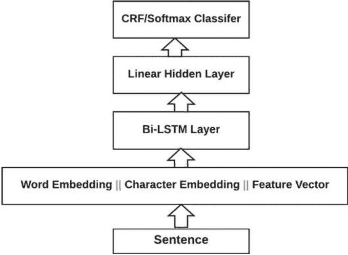
图2 序列建模

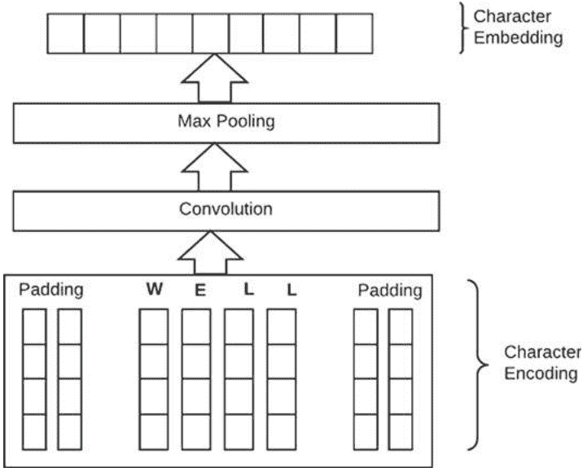
图3 用于字符嵌入的CNN

#### 3.4 双向长短期记忆(Bi-LSTM)

文本数据只是一串按照某些语言特定规则组合在一起的单词。与顺序数据天然适配的最合适的网络架构是长短期记忆 (LSTM) 网络。LSTM的网络架构在方向性上有所不同。它可以是单向的或双向的。Bi-LSTM可以访问过去和未来的信息 [29,30]。

LSTM网络由一组内存块组成。每个LSTM单元都有一个自连接的内存单元和三个门，即输入门、输出门和遗忘门。

这些输入、输出和重置门对应于单个LSTM单元的写入、读取和重置操作。这些内存块帮助LSTM单元保留信息，使其能够在更长的时间内保持信息，并解决长距离依赖问题。

在自然语言处理 (NLP) 的顺序任务中，同时考虑过去和未来的上下文总是更好的选择。然而，LSTM单元保留的是过去值而不是未来值的信息。对于上述情况，一个优雅的解决方案是使用双向LSTM单元 [29]。这个想法是复制LSTM单元并将其并排堆叠在一起。第一个单元按原样读取输入，而第二个单元读取相同的输入，但是是其反向副本。实践证明对于顺序任务效果更好。

#### 3.5 条件随机场

在序列标注任务中，考虑相邻标签之间的相关性总是有益的。在自然语言处理任务中，如词性标注和命名实体识别，每个序列中有多个标签。我们不是解码单个标签，而是使用CRF [31]共同建模序列。

给定一个输入词序列 $\mathrm{x}=\mathrm{x}_{1}, \mathrm{x}_{2}, \ldots, \mathrm{x}_{\mathrm{n}}$，其中每个元素是序列中每个单词的向量表示。另一个序列 $\mathrm{y}=\mathrm{y}_{1}, \mathrm{y}_{2}, \ldots, \mathrm{y}_{\mathrm{n}}$ 表示词序列 $\mathrm{x}$ 的标签序列。给定词序列的条件概率标签序列给出了给定的词序列的概率序列模型。可以表示为：

$$p(x ; W, b)=\frac{\prod_{i=1}^{n} \exp \left(\boldsymbol{W}_{y, y^{\prime}}^{T} z_{i}+b_{y, y^{\prime}}\right)}{\sum_{y^{\prime} \in \gamma(z)} \prod_{i=1}^{n} \exp \left(\boldsymbol{W}_{y, y^{\prime}}^{T} z_{i}+b_{y, y^{\prime}}\right)}$$ (4)

其中y'和y是标签对。W和b是与语言对应的权重向量和偏置。CRF的训练是使用最大似然估计进行的。对于训练集对 $\left(x_{i}, y_{i}\right)$，对数似然函数如下：

$$L(W, b)=\sum_{i} \log p(y|z ; W, b)$$ (5)

目标是选择参数，使对数似然函数最大化。为了获取概率最高的标签序列，我们使用以下公式：

$$y^{*}=\argmax p(y|z ; W, b)$$ (6)

### 4 语料库统计数据

用于构建分布表示模型（词嵌入）的数据是通过从GENIA [32]、Journal of Medical Case Reports (BMC)和i2b2 [33]等来源的文本内容进行网络爬取而创建的。像GENIA语料库和i2b2语料库这样的封闭集小语料库包括用于进行词性标注和命名实体识别的临床数据。医学期刊的内容是通过网络爬虫收集的，网络爬虫是用于从互联网积累相关数据的程序。网络爬虫获取与种子URL对应的文档，并解析种子页面中的链接，并将每个URL放入队列中。这些链接用于收集文本数据。

统一清理应用于爬取的数据（训练）以及测试数据（GENIA和i2b2）。统一清理应用于从原始数据中删除无关内容。它包括处理特殊字符如 $\pm$，拉丁字母，等等，这些都不是由UTF-8编码方案编码的。我们还删除了数量微不足道的类别：预定决定词(PDT)，感叹词(UH)和?/=

创建MedNLU所使用的语料库的统计数据显示在表1中。GENIA [32]语料库用于创建MedNLU中的词性标注模型。i2b2临床[33]语料库用于标注3种类型的临床标签，它们被命名为问题，测试和治疗。这些标签由连续的单词组成。该语料库包含16107个患者出院总结的句子。

i2b2临床语料库遵循Inside-Outside-Beginning (IOB)格式。

| 指标 | 爬取的数据 (BMC) | GENIA 语料库 | i2b2 临床 |
|---|---|---|---|
| 文档数量 | 4109 | 67 | - |
| 句子数量 | 434,099 | 23,467 | 16,107 |
| 单词数量 | 7,861,071 | 439,403 | 201,015 |
| 平均每句话的单词数 | 18.10 | 18.72 | 12.48 |

表1 实验数据统计

### 5 实验和观察

MedNLU的顺序建模器是通过集成CNN、BLSTM和CRF构建的。系统图示如图2所示。该实验是在具有以下配置的系统上执行的：RAM 32 GB, NVIDIA GEFORCE GTX1080, i7处理器, Python 3和Ubuntu 16.04 LTS。对于每个单词，使用CNN计算字符级表示（即30×1向量），如图2所示。对于这些嵌入，我们通过反向传播的权重更新过程中修改初始嵌入来微调它们。这些字符嵌入与相应的词嵌入(300×1)和特征向量(7×1)进行连接。这个连接向量被输入到BLSTM，然后是CRF层。为了性能观察的目的，我们还将BLSTM与典型的SoftMax层集成在一起。

在计算字符嵌入期间，dropout已应用于多个层次。它在输入到CNN之前以及在BLSTM的输入和输出向量上应用。在所有的dropout层中，dropout率都被固定为0.25。这在图1中显示。参数的优化是使用批量大小为32和提前停止5的小批量Adam优化器进行的。

我们使用了从一般新闻文本生成的预训练词嵌入(Google嵌入)，以及从临床文本开发的嵌入模型(健康嵌入)。Python Gensim库用于开发健康嵌入。从word2vec中，使用以下参数计算健康嵌入：最小词频为1，嵌入维度为300，窗口大小为4。用于创建健康嵌入模型的语料库已在语料库统计信息中解释。系统图如下所示，见图4。

通过定性和定量分析评估创建的词嵌入。我们使用余弦距离来推断单词/短语之间的相似性，以进行定性评估。针对目标词，选择前五个相似的词进行进一步分析。定性分析结果见下表2。

在定性分析中，通过使用两个连续建模任务（POS标记和NER）的数据来验证健康嵌入（计算临床文本的向量）。根据三个不同的类别（疾病、症状和药物名称）进行定性评估。

t分布随机邻域嵌入（t-SNE）的主要目的是用于可视化高参数数据。在t-SNE之前，已经开发了多维缩放、Sammon映射和基于图的技术。在t-SNE中，将向量之间的欧氏距离转换为概率分布，使得相似的向量具有较高的概率。t-SNE地图是将D维数据可视化为二维或三维数据。

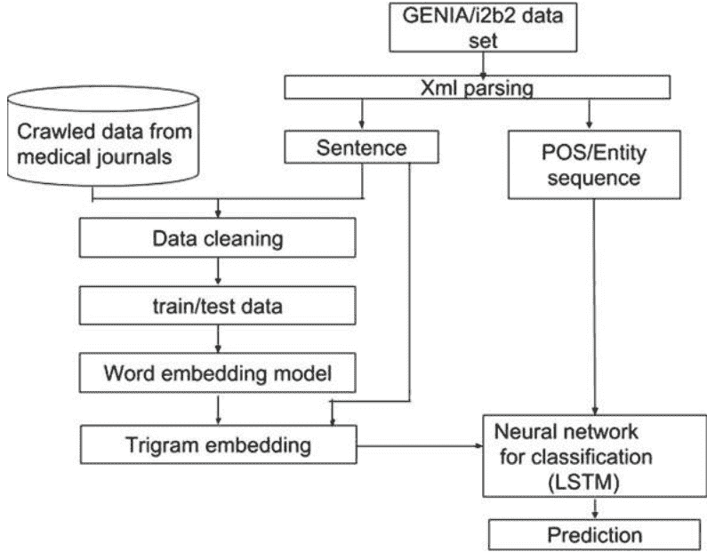
图4 用于创建医疗保健嵌入的模型图

| 类别 | 目标词语/短语 | 健康嵌入 | 谷歌词嵌入 | 来自glove的维基百科嵌入 |
|---|---|---|---|---|
| 疾病 | 糖尿病 | 银屑病 中性粒细胞减少症 精神分裂症 癫痫 肥胖症 | 糖尿病患者 糖尿病 高血压 糖尿病 心脏病 | 高血压 肥胖症 关节炎 癌症 阿尔茨海默病 |
| 症状 | 呼吸困难 | 疲劳 腹泻 恶心 关节痛 头晕 | 呼吸困难 瘙痒 鼻咽炎 症状严重程度 流鼻涕 | 气短 气喘 发绀 光过敏 昏厥 |
| 药物 | 阿司匹林 | 硫唑嘌呤 利福平 卡培他滨 多柔比星 氟康唑 | 阿司匹林 布洛芬 他汀类药物 他汀类药物 钙 补充剂 | 布洛芬 他莫昔芬 药丸 他汀类药物 药物 |

表2 定性分析结果

通过将目标词按不同类别生成，并在图5中显示。t-分布随机邻居嵌入将向量从高维空间映射到二维空间。在本文中，可以通过t-SNE映射可视化在向量空间中接近的健康嵌入向量。

在上图中，橙色、蓝色和绿色的数据点分别代表疾病、药物和症状等不同类别。从图5中，我们可以清楚地观察到计算的健康嵌入将不同类别（疾病、药物、症状）映射到不同的聚类中。

我们将我们的分析建模为分类任务，以进行定量分析。如Ghanny等人[34]所述，我们然后在GENIA语料库的POS标记表示上评估了词嵌入，如图4所示，以确保表示的质量。

在POS标记任务中，我们总共有26个类别，并将其映射到具有12个类别计数的元标签。在实体识别任务中，我们有7个类别。关于这些类别的统计数据在表3和表4中给出。所得到的定量结果在下图6中给出。通过使用LSTM作为分类器，我们使用10×10折交叉验证得到了结果。

最后，我们得到了四种架构（[Google嵌入或健康嵌入]+BLSTM+[CRF或SoftMax]）的性能结果。这些组合在图6中给出了POS任务的观察结果。序列建模器在NER语料库上的性能显示在图7a、b中，而在POS语料库上的性能显示在图8a、b中。

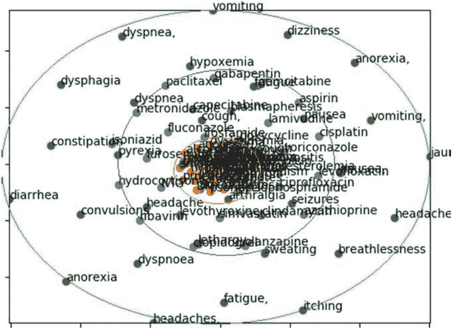
图5 t-SNE通过word2vec CBOW模型计算的健康嵌入的映射

通过正则表达式解析器执行分块和解析。一组规则用于提取从句（S）、介词短语（PP）、动词短语（VP）和名词短语（NP）。这些常见的语法规则是基于POS标记语料库中其出现频率提取的。从分块中得到的解析树也是MedNLU的一部分。可以观察到CRF在NER和POS标记任务中的表现优于SoftMax。这确保了输出层需要序列建模器，而不是典型的SoftMax层。构建CRF和基于SoftMax的模型所需的时间几乎相同。因此，我们没有给出构建所提出的序列建模器所需的时间消耗的详细信息。

谷歌嵌入在两个任务中取得了比健康嵌入更好的结果，赢得了比赛。因此，这确保了序列建模器独立于领域知识的要求。还可以推断出字符嵌入包含有关医学词汇的信息，这些词汇在谷歌嵌入中不存在。

我们还比较了其他模型在实验语料库上获得的结果。序列建模器能够在i2b2临床语料库上实现最先进的性能。统计数据如下表5所示。MedNLU能够实现近8%的性能改进。由于缺乏标准的分开的训练和测试文件，我们没有比较GENIA语料库的结果。

表3 POS语料库：目标class统计

| POS标签 | 计数 | POS标签 | 计数 |
|---|---|---|---|
| SYM | 3217 | IN | 12,414 |
| CC | 4122 | CD | 4672 |
| JJ | 8454 | VB | 11,822 |
| NN | 36,085 | RB | 3034 |
| WDT | 442 | PRP | 807 |
| DT | 7171 |  |  |

表4 NER语料库：目标class统计

| NER标签 | 计数 |
|---|---|
| B-问题 | 19,664 |
| I-问题 | 27,938 |
| B-测试 | 13,831 |
| I-测试 | 11,898 |
| B-治疗 | 14,185 |
| I-治疗 | 12,053 |
| O | 291,706 |

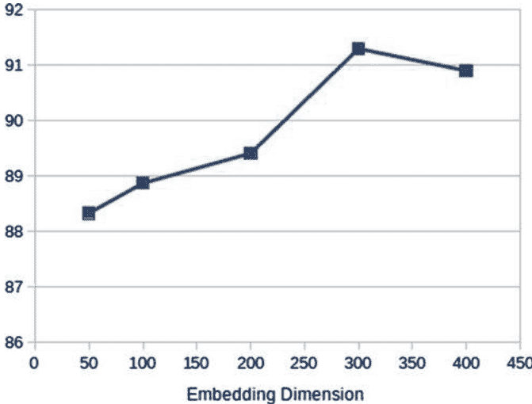
图6 通过定量分析评估健康嵌入的性能

## 6 结论

已开发出一种用于临床文本的自然语言理解的综合框架。在词性标注和图7 (a) 谷歌嵌入-序列建模器与CRF和SoftMax在NER上的性能 (b) 健康嵌入-序列建模器与CRF和SoftMax在NER上的性能

![图7相关图像占位符]

![图7相关图像占位符]

(a) Google Embedding CRF - POS

![图8相关图像占位符]

(b) Health Embedding CRF - POS

![图8相关图像占位符]

图8 (a) 谷歌嵌入-序列建模器与CRF和SoftMax在POS标记上的性能 (b) 健康嵌入-序列建模器与CRF和SoftMax在POS标记上的性能

### 表5 与其他系统在NER语料库上获得的结果进行比较

| 方法论 | 精确度 (%) | 召回率 (%) | F-得分 (%) |
|---|---|---|---|
| 半监督隐马尔可夫模型[24] | 83.64 | 86.88 | 85.23 |
| 分布语义和CRF[25] | 85.60 | 82.70 | 83.70 |
| CRF-神经嵌入[26] | 85.10 | 80.60 | 82.80 |
| MedNLU | 94.60 | 93.10 | 93.8 |

通过达到93.8%的F1得分作为i2b2临床语料库的最新性能，并在GENIA语料库上实现97.29%的F1得分，进行命名实体识别。从观察结果可以清楚地看出，字符嵌入提供了有关临床词汇的附加子词信息。字符嵌入与词嵌入（针对一般文本计算）一起解决了临床文本词嵌入模型的需求。从临床词汇中提取的子特征也有助于实现目标。提出的MedNLU具有在临床文本上执行命名实体识别、词性标注、解析和分块的能力。

这些连续的结果足够好，可以进一步扩展这个框架，以构建关系提取和依赖解析模块。同时，现有的注释语料库明显不足以驱动深度学习算法。因此，未来的工作还将重点关注创建大型注释的临床文本语料库。框架还将进一步扩展，包括支持寻找不良药物反应和残疾的特征。

### 参考文献

- 1. Wang, Y., Wang, L., Rastegar-Mojarad, M., Moon, S., Shen, F., Afzal, N., Liu, S., Zeng, Y., Mehrabi, S., Sohn, S. et al.: 临床信息提取应用：文献综述。J. Biomed. Inform, 2017
- 2. Yogatama, D., Liu, F., Smith, N.A.: 最大化语义体积的摘要提取。在：2015年经验方法国际会议论文集，第1961-1966页（2015年）
- 3. Pestian, J.P., Itert, L., Duch, W.: 儿科文本语料库的词性标注开发。在：波兰扎科帕内举行的国际IIS：IIPWM'04会议论文集。Springer，第219-26页（2004年）
- 4. Pakhomov, S.V., Coden, A., Chute, C.G.: 手动注释了词性的临床笔记语料库的开发。国际医学信息学杂志。75 (6)，418-429页（2006年）
- 5. Hirschman, L., Morgan, A.A., Yeh, A.S.: MITRE公司。无论如何提取生物名称的Rutabagao。生物医学信息学杂志。35 (4)，247-259（2002年）
- 6. Savova, G.K., Masanz, J.J., Ogren, P.V., Zheng, J., Sohn, S., Kipper-Schuler, K.C., Chute, C.G.: 梅奥临床文本分析和知识提取系统（ctakes）：架构，组件评估和应用。美国医学信息学协会杂志。17 (5)，507-513（2010年）
- 7. Boag, W., Wacome, K., Naumann, T., Rumshisky, A.: Cliner：一种用于临床命名实体识别的轻量级工具。AMIA临床研究信息学联合峰会（海报）（2015年）
- 8. Fu, X., Ananiadou, S.: 从临床记录中提取临床概念的改进方法。在：BioTxtM14会议论文集（2014年）
- 9. Lv, X., Guan, Y., Yang, J., Wu, J.: 基于深度学习的临床关系提取。国际混合信息技术杂志，第237-248页（2016年）
- 10. Wu, Y., Jiang, M., Lei, J., Xu, H.: 使用深度神经网络在中文临床文本中进行命名实体识别。健康技术与信息学研究，第624页（2015年）
- 11. Dong, X., Qian, L., Guan, Y., Huang, L., Yu, Q., Yang, J.: 基于深度学习的电子病历命名实体识别的多类分类方法。在：科学数据峰会（NYSDS），IEEE，第1-10页（2016年）
- 12. Pakhomov, S.V., Finley, G., McEwan, R., Wang, Y., Melton, G.B.: 语料库领域对医学术语的分布语义建模的影响。生物信息学 32(23), 3635-3644 (2016)
- 13. Mikolov, T., Sutskever, I., Chen, K., Corrado, G.S., Dean, J.: 词和短语的分布式表示及其组合性。在：神经信息处理进展，第3111-3119页（2013）
- 14. Ganguly, D., Roy, D., Mitra, M., Jones, G.J.: 基于词嵌入的信息检索通用语言模型。在：第38届国际ACM SIGIR会议论文集，ACM，第795-798页（2015）
- 15. Ganesh, H.B., Kumar, M.A., Soman, K.P.: 从向量空间模型到语义向量空间模型。在：信息检索评估论坛，Springer，Cham，第50-60页（2018）
- 16. Tang, B., Cao, H., Wang, X., Chen, Q., Xu, H.: 评估生物医学命名实体识别任务中的词表示特征。BioMed研究国际，2014年（2014）
- 17. Jagannatha, A., Chen, J., Yu, H.: 从维基百科中挖掘和排名生物医学同义词候选词。在：第六届国际健康文本挖掘和信息分析研讨会论文集，第142-151页（2015）
- 18. Gurulingappa, H., Toldo, L., Schepers, C., Bauer, A., Megaro, G.: 临床决策支持的半监督信息检索系统。在TREC (2016)中
- 19. Peter, D.T.: 一种统一的类比、同义词、反义词和关联的方法。在：计算语言学国际会议第22届会议论文集，第1卷。计算语言学协会，第905-912页（2008年）
- 20. Landauer, T.K., Dumais, S.T.: 柏拉图问题的解决方案：潜在语义分析理论的知识获取、归纳和表示。心理学评论 104(2)，211 (1997)
- 21. Liu, K., Chapman, W., Hwa, R., Crowley, R.S.: 启发式样本选择以最小化部分词性标注器的参考标准训练集。美国医学信息学协会杂志 14(5)，641-650 (2007)
- 22. Fan, J.W., Prasad, R., Yabut, R.M., Loomis, R.M., Zisook, D.S., Mattison, J.E., Huang, Y.: 临床文本的词性标注：机构之间的墙还是桥梁？在：AMIA年会论文集，第2011卷。美国医学信息学协会，第382-391页（2011年）
- 23. Lafferty, J., McCallum, A., Pereira, F.: 条件随机场：用于分割和标记序列数据的概率模型。ICML。第282-289页（2001年）
- 24. de Bruijn, Berry, Cherry, Colin, Kiritchenko, Svetlana, Martin, Joel, Zhu, Xiaodan：机器-学习解决临床信息提取的三个阶段：i2b2的最新技术。美国医学信息学协会。18(5)，557-562页（2011年）
- 25. Jonnalagadda, S., Cohen, T., Wu, S., Gonzalez, G.: 通过分布语义增强临床概念提取。J. Biomed. Inform. 45(1), 129-140 (2012)
- 26. Wu, Y., Xu, J., Jiang, M., Zhang, Y., Xu, H.: 一项关于临床文本中命名实体识别的神经词嵌入研究。在：AMIA年度研讨会论文集，卷2015，第1326页。美国医学信息学协会（2015）
- 27. Chiu, J.P.C., Nichols, E.: 具有双向lstm-cnns的命名实体识别。arXiv预印本 arXiv:1511.08308 (2015)
- 28. Ganesh, H.B., Kumar, M.A., Soman, K.P.: 在健康护理文本分类中的分布语义表示。在：信息检索和评估论坛国际会议，页201-204，2016年
- 29. Dyer, C., Ballesteros, M., Ling, W., Matthews, A., Smith, N.A.: 基于堆栈长短期记忆的转移依赖解析。在：ACL-2015会议论文集（卷1：长论文），第334-343页（2015年）
- 30. Graves, A., Schmidhuber, J.: 双向lstm和其他神经网络架构的逐帧音素分类。神经网络 18 (5-6) , 602-610 (2005年)
- 31. Settles, B.: 使用条件随机场和丰富的特征集进行生物医学命名实体识别。在：COLING 2004 NLPBA会议论文集，2004年，第104-108页（2004年）
- 32. Verspoor, K., Cohen, K.B., Lanfranchi, A., Warner, C., Johnson, H.L., Roeder, C., Choi, J.D., Funk, C., Malenkiy, Y., Eckert, M., et al.: 一篇全文期刊文章语料库是揭示生物医学自然语言处理工具性能差异的强大评估工具。BMC生物信息学 13 (1) , 207（2012年）
- 33. Uzuner, O., South, B.R., Shen, S., DuVall, S.L.: 2010年i2b2/VA挑战赛关于临床文本中的概念、断言和关系。美国医学信息学协会。2011年9月-10月18日(5), 552-556
- 34. Ghannay, S., Favre, B., Esteve, Y., Camelin, N.: 词嵌入评估和组合。在: 第十届语言资源和评估国际会议论文集(LREC 2016), pp. 300-305 (2016)
- 35. Baroni, M., Dinu, G., Kruszewski, G.: 不要计数, 预测! 上下文计数与上下文预测语义向量的系统比较。在: 第52届计算语言学协会年会论文集(第1卷: 长论文), vol. 1, pp. 238-247 (2014)

H. B. Barathi Ganesh目前是Arnekt Solutions Pvt Ltd.的首席技术官，是一位在实施AI技术和企业系统方面拥有5年以上经验的人工智能技术专家。

持续将技术与业务需求相结合，为定义强大的未来业务战略做出贡献，通过高性能的服务和产品实现了具有成本效益的结果。在汽车、银行金融、教育、电子商务、物流、制造和零售等领域拥有广泛的人工智能专业知识。

U. Reshma：自然语言处理、传统机器学习和深度学习领域的首席工程师和研究员。在人工智能的子领域有扎实的基础理解。

K. P. Soman目前担任阿姆里塔计算工程与网络中心 (CEN) 的主任和教授，位于科伊马托尔校区。他在国内外期刊和会议论文集上发表了300多篇论文。他为工业界和学术界组织了一系列关于高级信号处理、小波、核方法、深度学习和大数据分析等方面的研讨会和暑期学校。他撰写了《洞察小波》、《洞察数据挖掘》、《支持向量机和其他核方法》和《信号与图像处理-稀疏方式》等书籍，由Prentice Hall、新德里和Elsevier出版。

M. Anand Kumar从Amrita Center for Computational Engineering and Networking (CEN), Coimbatore Campus获得了他的机器翻译博士学位。目前在卡纳塔克邦国立技术学院信息技术系担任助理教授。他在国内外期刊和会议论文集上发表了100多篇文章。他的研究兴趣包括自然语言处理、文本挖掘、深度学习和迁移学习。

# 基于深度学习的生物医学命名实体识别系统

普拉加蒂卡·米什拉，西塔纳斯·比斯瓦斯和苏贾塔·达什

摘要：在本章中，我们提出了一个非常关键的问题，即医学命名实体识别系统。命名实体识别是指在人工智能、信息检索和数据提取等语言处理过程中的重要任务。语言处理是工程学、计算机科学和信息工程的一个子领域，涉及计算机与人类语言之间的交互。它涉及方法和分析语言信息的过程。这是一种计算机活动，计算机在其中被用于理解、修改和分析活动，以及通信策略。语言处理（NLP）的一个重要组成部分是实体识别（NER），它用于在语言文本中查找和分类具有特定含义的表达式。命名实体的各种类型包括人名、组织名、地名、数字等。在本书章节中，我们只处理医学命名实体识别（Bio-NER），这是从文档中提取医学文本术语的基本任务，如核糖核酸、细胞类型、细胞系、蛋白质和DNA。生物医学NER是从文档中提取医学信息的核心和关键任务之一。识别或确定医学命名实体似乎比确定传统命名实体更困难。在本书章节中，我们使用深度学习算法，也称为深度结构学习或可训练学习。它是基于学习数据表示的机器学习方法的一个分支。这种学习可以是有监督的、半监督的或无监督的。深度学习模型主要受到生物神经中的信息处理和通信模式的启发。

P. Mishra
甘地技术学院，博帕内斯瓦尔，印度
e-mail: pragatika18mishra@gmail.com

S. Biswas · S. Dash (✉)
北奥里萨大学，巴里帕达，印度
e-mail: sujata238dash@gmail.com

S. Biswas
电子邮件: sitanathbiswas2006@gmail.com

© Springer Nature Switzerland AG 2020
S. Dash等人（编辑），生物医学和健康信息学的深度学习技术，Studies in Big Data 68，https://doi.org/10.1007/978-3-030-33966-1_2

尽管如此，这些系统在结构和功能上仍然存在各种变化，类似于生物大脑的结构和功能。为了实验和分析，我们使用了GENIA语料库，该语料库是由一组研究人员创建的，用于开发生物科学中的数据和文本挖掘系统。它包含了1,999篇MEDLINE摘要。GENIA语料库已经被语言处理社区松散地应用于语言搜索系统和生物人类语言技术任务的改进。在这个分析过程中，我们提出了一个支持神经网络模型的Bio-NER多任务学习方案，以节省人力资源。深度神经规范具有多个层次，每个层次根据下层生成的特征进行抽象。与Saha等人的实验结果(Pattern Recogn. Lett 3:1591-1597, 2010) 相比，精确度为68.12，召回率为67.66，F-Score为67.89；与Liao等人的实验结果(基于Skip-Chain Crfs的生物医学命名实体识别，pp. 1495-1498, 2012) 相比，精确度为72.8，召回率为73.6，F-Score为73.2；与ABNER (生物医学命名实体识别器，pp. 46-51, 2013) 的实验结果相比，精确度为69.1，召回率为72.0，F-Score为70.5；与Sasaki等人的实验结果(如何在统计Ner中充分利用Ne字典，pp. 63-70,2008)相比，精确度为68.58，召回率为79.85，F-Score为73.78；与Sun等人的实验结果(Comput. Biol. Med 37:1327-1333, 2007) 相比，精确度为70.2，召回率为72.3，F-Score为71.2；我们的系统在GENIA正常测试语料库上取得了精确度为66.54，召回率为76.13，F-Score为71.01%，这接近于仅使用词性特征的先进性能，并表明深度学习可以有效地用于医学命名实体识别。本书章节包括以下部分：引言、文献综述、架构、实验、结果与分析、结论与未来工作以及参考文献。

关键词：GENIA语料库、深度学习、机器学习、自然语言处理、命名实体识别

## 1 引言

在本书章节中，我们正在处理一个非常关键的问题，即医学命名实体识别系统。命名实体识别是语言处理中的一个重要任务，涉及计算语言学、信息检索和数据提取。语言处理是技术、计算机科学和数据工程的一个子领域，处理计算机与人类语言之间的交互。它处理语言信息的方法并进行分析。

这是一种计算机活动，计算机在其中被用于理解、修改和分析，包括自动化活动和通信方式。命名实体识别 (NER) 是自然语言处理 (NLP) 中的一个关键组成部分，用于在文本中查找和分类具有独特含义的表达。各种类型的命名实体包括人名、组织名、地名、数字等。在本书章节中，我们在处理医学命名实体识别（Bio-NER）方面，有一种倾向完全处理医学文本术语，如聚合物、细胞类型、细胞系、蛋白质和DNA。生物医学NER是从文本中提取医学数据的最简单和最重要的任务。 识别或区分医学命名实体似乎比识别传统命名实体更加困难。 生物医学命名实体识别面临五个挑战：

- 新医学术语的数量不断增加。 因此，很难建立一个包含最新术语的词典。
- 在上下文中，同一个词可能被归类为不同的实体。
- 实体的长度可能相当长，并且可能包含特殊字符，如连字符。
- 缩写词在生物医学领域经常被使用，会出现歧义情况。
- 在生物医学术语中，常规术语或功能术语是统一的。 因此，术语变得非常长。 对于生物医学NER来说，将带有命名实体的句子分割是具有挑战性的。

最近，深度学习构建方法已经应用于生物医学命名实体识别（Bio-NER），并显示出有希望的结果。

然而，大量的训练数据或数据的稀缺性可能会影响深度学习方法的性能。 深度学习也被称为深度结构学习或分层学习。 它是机器学习方法的一个更广泛的分支，基于学习数据表示，而不是特定的任务算法。 深度学习模型主要受到生物神经系统中的通信模式和信息处理的启发，但与生物大脑（人脑）的功能和结构特性有很多不同之处。 此外，深度学习方法如深度信念网络、深度神经网络和循环神经网络被应用于音频识别、计算机视觉、社交网络过滤、生物信息学、自然语言处理等领域，在某些情况下已经展示出与人类专家相当甚至更高的结果。 这种学习可以是：有监督学习，即基于示例输入-输出对学习将输入映射到输出的机器学习任务；半监督学习是一类利用未标记数据训练少量标记数据的机器学习任务和技术；无监督学习是指没有教师的学习，也称为自组织，是一种建模输入概率密度的方法。 在这项研究工作中，我们采用了基于卷积神经网络（CNN）的方法。

命名实体识别（NER）是指在给定的文本中计算机化地查找并标记实体的过程。 在医学领域中，典型的实体类型包括疾病、化学物质、基因和大分子。 生物医学NER（BioNER）是许多下游文本挖掘应用的重要组成部分，例如药物相互作用的提取[1]和疾病治疗关系。 在构建复杂的医学应用时，还可以使用Bio-NER。

实体搜索工具[2]允许用户进行高级查询以寻找生物实体。在医学文本挖掘中，命名实体识别主要集中在词典、规则和基于机器学习的方法[3-5]。基于词典的系统具有简单而直观的结构，但无法处理未知实体或多义词，导致召回率较低[3,4]。此外，构建和维护一个全面和最新的词典需要大量的劳动密集型工作。经典的主要方法更具可扩展性，但需要手工制作特征集以适应数据集[5]。这些基于词典和规则的方法能够实现高精度[2]，但当出现训练数据中没有的新词时，可能会产生错误的预测（词汇外问题）。

Habibi等人[6,7]利用字符级词嵌入来捕捉医学专业实体的特征，如书写选项，并取得了渐进的性能，证明了字符级词嵌入在生物命名实体识别中的效率。尽管这些模型已经显示出一些潜在的结果，但是命名实体识别在医学专业领域仍然是一项非常困难的任务，原因如下。

首先，生物命名实体识别任务的训练数据量有限。相反，JNLPBA语料库[8]仅包含基因和蛋白质的注释。因此，每种实体类型的知识仅包含总体注释数据量的一小部分。多任务学习（MTL）是一种同时训练多个任务的技术。MTL可以影响完全不同的数据集，这些数据集是为不同但相关的任务而构建的[9]。尽管基因提取与化学物质提取完全不同，但每个任务都需要学习一些通用特征，这有助于理解医药文本中的语言表达。由于基于MTL的模型是在各种类型的实体和更大的训练数据上进行训练的，它们对各种医学专业实体有广泛的接触，这意味着更高的召回率。相反，由于MTL模型是在不同实体类型的组合上进行训练的，它们倾向于在区分实体类型时存在困难，导致精确度较低。

医学专业领域内命名实体识别（NER）存在困难的另一个原因是，根据其上下文，一个实体可能被标记为完全不同的实体类型。例如，基于BiLSTM-CRF的疾病实体模型错误地将“BRCA1”命名为疾病实体，因为训练集中存在类似“BRCA1异常”或“Brca1缺陷”的疾病名称。此外，将“VHL”（Von Hippel-Lindau疾病）标注为疾病实体的训练集会使模型产生困惑，因为VHL也可以用作因子名称，因为该因子的变异会导致VHL疾病。因此，每个模型都是其领域的专家，并通过利用来自其他模型的多领域数据来提高准确率。受Collobert[10]的作品的启发，我们倾向于建立一个神经网络模型来支持药物NER任务。我们的研究表明，深度学习可以高效地应用于药物NER。我们的设计实现了朝着GENIA语料库的渐进性能迈进，该语料库已被许多研究团队采用作为评估标准。

## 2 文献综述

在生物医学领域，每天产生的数据量达到了千兆字节甚至是太字节。这样大量数据的存在推动了医学研究领域的发展。医学命名实体识别是医学科学研究的重要第一步。与一般的命名实体识别相比，医学命名实体识别更加复杂，因为它涉及到每天动态变化的群集成员、明显的边界和表达的不规则性。基因的普及性，提取出人类基因的独特标识符列表以及与物理大分子-蛋白质相互作用注释相关的信息。在基因标准化任务中，发现了一种公正的准确性和召回率的提交。在蛋白质相互作用任务中，根据注释提取进展获得了不同的结果。最终发现的特征任务是系统输出的分组，结果优于单一系统，这导致了在该背景下最重要的文本挖掘元服务器的发展。已经有许多监督技术被用于学习医学命名实体识别问题，例如：MEMMs（最大熵马尔可夫模型）或条件马尔可夫模型，它是一种将HMM和最大熵模型结合起来用于序列标注的图形模型。MEMMs在语言处理中有许多应用，包括特定领域的词性标注和信息提取。

HMM（隐马尔可夫模型）[17]将应用数学马尔可夫模型到被建模的系统中，该系统被视为具有未观察到的状态的过程。CRF（条件随机场）[18]是一种应用数学建模方法的类别，用于模式识别和机器学习，用于结构化预测。CRF能够考虑上下文。例如，线性链CRF预测输入样本序列的标签序列。它在语言处理中很流行。HMM、MEMMs和CRF是三种流行的应用数学模型方法，经常应用于模式识别和机器学习问题。在隐马尔可夫模型（HMM）中，“隐藏”一词表示只能看到系统释放的符号。隐马尔可夫模型的优点是具有高效的学习算法的坚实基础。而隐马尔可夫模型的缺点包括其依赖于每个状态及其对应的观察对象。序列标注与个别单词有关，还与序列长度或上下文等方面有关。最大熵马尔可夫模型考虑了相邻和完全观察到的序列之间的依赖关系，具有更好的表达能力。条件随机场模型解决了标注偏见问题。

与隐马尔可夫模型相比，CRF没有严格的独立假设，并且可以适应任何联系信息。因此，它的特征设计是灵活的。与最大熵马尔可夫模型相比，CRF计算全局最优输出节点的条件概率；它克服了标签偏差的缺点。CRF还被Settles[2]用于医学实体识别，在GENIA语料库上取得了69.9%的F-分数，同时结合了各种类型的字符。而HMM在应用于GENIA语料库时，精确度为65.5%，召回率为66.9%[2]。李等人在GENIA语料库上提出了两个医学命名实体识别模型，分为两个部分[10,19]：命名实体检测（NED）：这是第一部分，用于区分非命名实体（NNE）并识别它们的类型。命名实体分类（NEC）：这是第二部分，使用多代理技术或策略，达到了76.06%的F-分数。

在构建复杂的医学实体搜索工具[20]时，BioNER还被用于允许用户提出复杂的查询来搜索生物医学实体。医学文本挖掘中的NER主要集中在词典、规则和基于机器学习的方法上[3-5,21-23]。基于词典的系统具有简单直观的结构，但无法处理未知实体或模糊词，导致召回率低[3,4]。这些基于规则和词典的方法能够达到高精确度[3]，但当句子中出现一个不在训练集中的新词时（词汇外问题），会产生错误的预测。

词汇外问题的困扰在医学领域中经常发生，因为替换医学术语（如新的药物名称）是常见的。Habibi等人[24]利用字符级词嵌入来捕捉医学实体的书写特征，并取得了不错的性能，证明了字符级词嵌入在BioNER中的有效性。尽管这些模型已经显示出一些潜力，但NER在医学领域仍然是一项非常困难的任务，原因如下。首先，对于BioNER任务，只有有限数量的训练数据可用。黄金标准数据集只包含1或2种实体的注释。例如，NCBI语料库[8]包含疾病的注释，但不包含其他类型的实体，如蛋白质和基因。相反，JNLPBA语料库[9]只包含蛋白质和基因的注释。因此，每种实体类型的数据仅包含全部注释数据的一小部分。多任务学习（MTL）是一种同时训练多个任务的方法。MTL可以影响不同的数据集，这些数据集是为不同但相关的任务而组成的[25]。

尽管基因提取与化学物质提取完全不同，但每个任务都需要学习一些通用特征，这些选项可能有助于理解医学专业文本的语言表达。[26,27]取得了与先进的单一任务NER模型相当的性能。与仅使用一个静态模型的标准MTL方法相比，CollaboNet由多个在完全不同的数据集上训练的模型组成。

## 3 架构

在本章中，我们使用了一种基于卷积神经网络（CNN）的技术，该技术已经在一些人类语言技术（自然语言处理）任务中取得了成功[28-30]。这种卷积神经网络是由Bengio[30]提出的用于概率语言模型的。神经网络是在此之后引入的，用于复杂的人类语言技术任务。我们考虑了这一点，用于医学命名实体识别任务。设计如图1所示。与之前的过度工程系统相比，这里实施的深度学习方法减少了对语言创造力的依赖。在图1中，标记为β的词元位于窗口的右中部，并在“t”时刻计算。

滑动窗口中包含的单词被表示为实值向量，作为该神经网络的输入。在线性层和sigmoid层的转换之后，为每个单词β的标签计算节点得分。最后，句子的评分在过程结束时作为输出给出。然后，应用维特比算法来得到最佳状态下的标签序列。此外，我们的CNN输入的长度是固定的，并根据文本信息进行调整。首先，通过医学论文中的大量数据创建一个词典S。将S中的单词转化为CNN的输入向量。词典中的每个单词都有一个预设的维度向量。

因此，将单词转化为向量后，它们被存储在矩阵M中。
$M \in D \times |S|$ (1)
其中，D是节点的向量维度。
$|S|$是词汇表或单词字典的大小。在这里，我们将$|S|$视为有限的。
M是随机初始化的，并且使用通用神经网络在大量的生物医学文本论文（未标记）上进行训练。
M，作为实值向量的表示，可以通过两种方式获得：
- 第一种方法是将每个单词i的向量初始化为所有位置为零（0），位置M为1，然后通过训练阶段[29]中的参数进行优化。
- 第二种技术是将单词的表示视为训练神经网络语言模型的一部分[31-34]。

### 图1 神经网络的架构
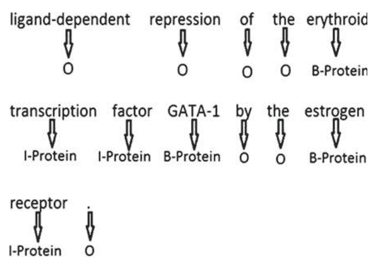

基于深度学习的生物医学命名实体识别系统 31
在本章中，我们倾向于优化单词的表示以用于Bio-NER任务。在这里，我们使用第二种技术。在比较不同的语言模型[34-37]后，我们选择了 skip-gram 神经网络语言模型。这个模型不是最好的模型，但对于训练罕见单词更加适用。

### 3.1 句子级特征提取
在医学实体识别任务中，对于每个单词，需要为句子中的每个单词提供正确的标签，以指示它是否是生物实体识别（Bio-NER）或其他类型。这些句子作为输入，并为每个句子提供相应的标签序列作为输出。句子的长度不固定，但神经网络的输入是固定的。这就是为什么我们选择窗口方法的解释。因此，窗口大小在开始时确定为“k”，由于窗口方法，系统中可能出现不同的准确性。由于窗口方法，每个单词的标签与其相邻单词之间的依赖关系数据受到关注。因此，窗口中标记单词附近的单词将一起经历该层。当我们研究位置C处的单词时，将传递给映射层的是位置范围为$[(C - (k - 1)/2), (C + (k - 1)/2)]$的相邻单词。

因此，每个单词通过这一层被转换为D维向量；因此线性层的输入大小保持不变。

### 3.2 标签的标注
深度神经网络被描述为一种具有多层结构的模式。层次结构基于下层所做的选择而具有不同的特征。根据神经网络的设计，每一层可以是线性函数或其他变换。
我们的设计中，函数$f_\theta(.)$描述了这个三层：
$f(x) = M^2 g \left( M^1 x + b^1 \right) + b^2$ (2)
其中，矩阵 $M^1 \in \mathbb{R}^{H \times Dk}$，$b^1 \in \mathbb{R}^{1 \times H}$，$M^2 \in \mathbb{R}^{|L| \times H}$，$b^2 \in \mathbb{R}^{1 \times |L|}$ 和 $g(.)$ 是sigmoid函数。H是隐藏单元的数量。
- $|L|$是可能的标签集合的大小。使用随机梯度上升法，在训练集T上
V维参数矩阵 $\theta$ 将通过最大化对数似然进行训练：
$\sum_{(x,y)\in T} \log p(y|x, \theta)$
这是多类分类。

由于$f(x, l, \theta)$用于描述示例x中第l个标签的得分，对应于训练窗口。因此，$f(x, l, \theta)$被解释为条件概率$P(l | x, \theta)$。
现在，使用softmax回归操作
$P(l|x, \theta) = \frac{e^{f(x,l,\theta)}}{\sum_j e^{f(x,j,\theta)}}$
我们将对数相加操作定义为
$\log\_\text{add}(z) = \log \left( \sum_i e^{z_i} \right)$
因此，训练集(x, y)的对数似然是
$\log p(y|x, \theta) = f(x, y, \theta) - \log\_\text{add} \, f(x, j, \theta)$
这里，$f(x_{[1:T]}, l, t, \theta)$是句子$x_{[1:T]}$的输出分数——其中l是标签，t是时间，$\theta$是参数。
Bio-NER包含了对标签路径的得分的关注，因为同一句子中的标签之间存在依赖关系。因此，在解释输出时，我们必须始终考虑标签之间的依赖关系。句子x在路径上的得分是两个组成部分的总和。首先是提到的节点得分，然后是转移得分$A_{lj}$，即从标签l转换到j的概率。
在这里，$\tilde{\theta}$被表示为包括$A_{lj}$和$\theta$在内的所有参数。
对于句子$x_{[1:T]}$，具有标签$l_{[1:T]}$的路径的得分是
$W \left( x_{[1:T]}, l_{[1:T]}, \tilde{\theta} \right) = \sum_{t=1}^T \left( A_{[t-1]l_{[t]}} + f \left( x_{[1:T]}, l_{[t]}, t, \theta \right) \right)$
对于采取真实标记路径$y_{[1:T]}$的对数条件概率为
$\log P(y_{[1:T]}|x_{[1:T]}, \tilde{\theta}) = W \left( x_{[1:T]}, y_{[1:T]}, \tilde{\theta} \right) - \log\_\text{add}_{l_{[1:T]}} W \left( x_{[1:T]}, l_{[1:T]}, \tilde{\theta} \right)$
在训练阶段，为了最大化
$\sum_{(x,y\in T)} \log P(y_{[1:T]}|x_{[1:T]}, \tilde{\theta}),$
所有参数 $\theta$ 在 $(x_{[1:T]}, y_{[1:T]})$ 上进行训练。在推断过程中，使用维特比算法来找到
$\arg_{l_{[1:T]}} \max W(x_{[1:T]}, l_{[1:T]}, \tilde{\theta})$ (7)

### 3.3 随机梯度优化
最简单的优化算法来减少一个公式是梯度下降算法。考虑到计算量的巨大，我们倾向于选择随机梯度[38]优化技术。每次迭代步骤中计算出一个示例(x, y)的新值 $\theta$。
$\theta \leftarrow \theta + \epsilon \Delta \log p(y|x, \theta)$ (8)
$\Delta \log p(y|x, \theta)$显示了梯度
$\log p(y_{[1:T]}|x_{[1:T]}, \theta)$ (9)
关于 $\theta$ 的导数和 $\epsilon$ 作为一个小的正常数，其中 $\epsilon$ 是选择的学习率。

## 4 实验
Bio-NER的任务是识别诸如疾病、病毒、蛋白质和基因等实体，并在简单的医学文本中对它们进行标记。图2显示了给定句子中的每个单词被视为一个标记，并与所选的标签相关联。在这里，标签O、B-C或I-C不仅表示聚类，还表示标记在命名实体内的位置，其中C表示类别，B和I分别表示实体内的起始和中间位置。有五个标签类别：DNA、RNA、蛋白质、细胞类型和细胞系。这里的O表示不是命名实体的标记。在GENIA语料库中，标注文件被称为BIO标签。图2中使用了这个BIO标签来表示11个标签。这些标记中的每一个都被分配了11个标签之一。

### 图2 生物医学命名实体识别示例


## 5 实验结果及其分析
未标记的知识是从PubMed信息中收集的，使用了Biopython，并选择了用于搜索的关键词'药物'、'蛋白质'、'相互作用'、'细胞类型'和'DNA'。我们考虑了来自PubMed的339,074篇论文，其中294,893篇论文有摘要。我们使用了整个430 MB的文件作为我们的未标记数据。我们使用Word2vec工具来应用我们的skip-gram语言模型。结果是，我们的词汇表S中包含了205,914个单词和600维向量。我们还考虑了词性标注工具。这个工具是专门为医药文本设计的，因为医药文本的特点与其他文章有很大的不同。在这个实验中使用了GENIA语料库，选择了准确率、召回率和F-score进行分析。准确率是系统正确检测到的命名实体数量除以系统识别到的命名实体总数。召回率是系统正确检测到的命名实体数量除以输入文本中包含的命名实体总数，是系统的综合性能指标。

$F_得分 = \frac{2(\text{精确率} \times \text{召回率})}{\text{精确率} + \text{召回率}}$

根据不同的系统，超分子和聚合物等类别具有最高的F-得分。训练数据中每个实体的数量在表1中显示。通过查看表1和图3，我们可以发现“细胞类型”类别的训练数据集最小，但精确率最高，F-得分次高。在图4中，我们可以看到有12个“B-DNA”错误标记为“B-Protein”，其数量比其他类别更多。

在研究训练数据时，我们发现了两个主要原因：医学专业命名实体由许多嵌套的命名实体组成。例如，

### 表1 主要实体类别和性能
| 类别 | 精确率 | 召回率 | F-分数 |
|---|---|---|---|
| 蛋白质 | 0.6389 | 0.8062 | 0.7128 |
| DNA | 0.6427 | 0.6761 | 0.6590 |
| RNA | 0.6050 | 0.6102 | 0.6076 |
| 细胞类型 | 0.7344 | 0.7356 | 0.7351 |
| 细胞系 | 0.5008 | 0.6160 | 0.5524 |
| 总体 | 0.6486 | 0.7610 | 0.7004 |

### 图3 主要实体类别和每个类别所包含的训练数据的单词
像‘病毒’、‘埃普斯坦-巴尔’、‘蛋白质’、‘细胞’、‘EBV’等词汇在每个实体中，但在图4中却属于完全不同的类别。
发现这些单词可能根据类别出现在不同的位置。BMESO符号用于利用这些信息，因为BIO符号无法呈现这样的信息（图5）。
BMESO符号类似于BIO符号，它提供了每个单词在实体中的详细描述。这里的B表示实体的开始，E表示实体的结束。B和E之间的单词被表示为M。如果实体是单数，它将被表示为S。第二个原因是训练的需要。

### 图4 错误分布
| NER1 | Epstein-Barr Virus | ( | EBV | ) | latent membrane protein | 1 | | | |
|---|---|---|---|---|---|---|---|---|---|
| LABEL1 | I-DNA | I-DNA | I-DNA | I-DNA | I-DNA | I-DNA | I-DNA | I-DNA | I-DNA |
| ( | LMP-1 | ) | gene | | | | | | |
| I-DNA | I-DNA | I-DNA | I-DNA | | | | | | |
| NER2 | Epstein-Barr Virus | ( | EBV | ) | nucleus enzyme | 2 | | | |
| LABEL2 | B-protein | I-protein | I-protein | I-protein-I-protein | I-protein | I-protein | I-protein | | |
| ( | EBNA-2 | ) | protein | | | | | | |
| 0 | B-protein | 0 | 0 | | | | | | |

### 图5 NERs和标签示例
训练集中未显示的标签集合以及实体。GENIA文件的最终结果列在表2中。
与Saha等人的实验结果进行比较[39]，精确度为68.12，召回率为67.66，F-Score为67.89；与Liao等人的实验结果进行比较[40]，精确度为72.8，召回率为73.6，F-Score为73.2；与ABNER的实验结果进行比较[41]，精确度为69.1，召回率为72.0，F-Score为70.5；与Sasaki等人的实验结果进行比较[42]，精确度为68.58，召回率为79.85，F-Score为73.78；与Sun等人的实验结果进行比较[43]，精确度为70.2，召回率为72.3，F-Score为71.2；我们的系统实现了66.54的精确度，召回率表2 与最先进的系统比较

| 团队 | 精确率 | 召回率 | F-分数 |
|---|---|---|---|
| Saha等人[39] | 68.12 | 67.66 | 67.89 |
| Liao等人[40] | 72.8 | 73.6 | 73.2 |
| ABNER [41] | 69.1 | 72.0 | 70.5 |
| Sasaki等人[42] | 68.58 | 79.85 | 73.78 |
| Sun等人[43] | 70.2 | 72.3 | 71.2 |
| 我们的结果 | 66.54 | 76.13 | 71.01 |

召回率 76.13 和 F-分数 71.01% 在 GENIA 标准测试语料库上，几乎达到了最先进的性能。然而，生物医学词典每天都在变化，由于任务和语料库的不同而存在差异。

## 6 结论和未来的范围

在本书章节中，我们在医学命名实体识别系统上使用了复合层神经网络。所取得的结果接近最先进的性能。神经网络的性能还有改进空间。左边界词的判断非常重要，标记错误会影响当前词或后续词。可以在将来探索正向识别和反向识别以提高系统的准确性。

### 参考文献
- 1. Lim, S., Lee, K., Kang, J.: 使用递归神经网络从文献中提取药物相互作用。PLoS ONE 13(1), e0190926 (2018)
- 2. Lee, K., Hwang, Y., Kim, S., Rim, H.: 基于SVM的两阶段模型的生物医学命名实体识别。
- 3. Hettne, K.M., Stierum, R.H., Schuemie, M.J., Hendriksen, P.J., Schijvenaars, B.J., Mulligen, E.M.V.等：用于在自由文本中识别小分子和药物的字典。Bioinformatics. 25(22), 2983–2991 (2009)
- 4. Song, M., Yu, H., Han, W.S.: 开发一种混合基于字典的生物实体识别技术。
- 5. Fukuda, K.I., Tsunoda, T., Tamura, A., Takagi, T.等：走向信息提取：从生物论文中识别蛋白质名称。在：Pac Symp Biocomput. vol. 707, p. 707–718 (1998)
- 6. Lample, G., Ballesteros, M., Subramanian, S., Kawakami, K., Dyer, C.: 用于命名实体识别的神经架构。在：HLT-NAACL. The Association for Computational Linguistics. p. 260–270 (2016)
- 7. Pyysalo, S., Ginter, F., Moen, H., Salakoski, T., Ananiadou, S.: 用于生物医学文本处理的分布语义资源。在：Proceedings of the 5th International Symposium on Languages in Biology and Medicine, Tokyo, Japan. p. 39–43 (2013)
- 8. Kim, J.D., Ohta, T., Tsuruoka, Y., Tateisi, Y., Collier, N.: 在JNLPBA上介绍生物实体识别任务。在：国际自然语言处理联合研讨会论文集。计算语言学协会。第70-75页 (2004)
- 9. Caruana, R.: 多任务学习。机器学习。28(1), 41-75 (1997)。可从: https://doi.org/10.1023/A:1007379606734获取
- 10. Collobert, R.: 用于高效判别式解析的深度学习。在:国际人工智能与统计学会议 (2011)
- 11. Dai, H., Chang, Y.C., Tsai, R.T.Z.H., Hsu, W.: 生物文本挖掘在下一个十年面临的新挑战。计算机科学与技术杂志。25(1), 169-179 (2010)
- 12. Krallinger, M., Morgan, A., Smith, L., Leitner, F., Tanabe, L., Wilbur, J., Hirschman, L., Valencia, A.: 对生物学的文本挖掘系统的评估:第二个生物信息学社区挑战的概述. Genome Biol. 9(2) (2008)
- 13. Dai, H., Huang, C., Lin, R., Tsai, R., Hsu, W.: Biosmile web search: 用于注释生物医学实体和关系的网络应用程序. Nucleic Acids Res. 36, 390-397 (2008)
- 14. Rebholz-Schuhmann, D., Arregui, M., Gaudan, S., Kirsch, H., Jimeno, A.: 通过网络服务进行文本处理: 调用Whatizit. Bioinformatics. 24(2), 296-300 (2008)
- 15. Si, L., Kanungo, T., Huang, X.: 通过结合多个系统的结果来提高生物实体识别的性能.在:第5届国际生物信息学研讨会论文集 ACM (2005), pp. 76-83
- 16. Tsuruoka, Y., Tateisi, Y., Kim, J.-D., Ohta, T., McNaught, J., Ananiadou, S., Tsujii, J.I.: 为生物医学文本开发一个强大的词性标注器。在:信息学进展。Springer (2005), 第382-392页
- 17. Vlachos, A.: 评估和组合生物医学命名实体识别系统。在: BioNLP 2007: 生物学, 翻译和临床语言处理 (2007), 第199-206页
- 18. Li, L., Zhou, R., Huang, D.: 使用CRF的两阶段生物医学命名实体识别。计算生物学化学。33(4), 334-338 (2009)
- 19. Li, L., Fan, W., Huang, D.: 基于集成分类器和多智能体策略的两阶段生物NER系统. IEEE/ACM Trans. Comput. Biol. Bioinf. 10(4), 897-904 (2013)
- 20. Li, S., Kim, D., Lee, K., Choi, J., Kim, S., Jeon, M., 等: BEST: 下一代生物医学实体搜索工具, 用于从生物医学文献中进行知识发现。PLoS ONE 11(10), e0164680 (2016)
- 21. Proux, D., Rechenmann, F., Julliard, L., Pillet, V., Jacq, B.: 在生物文本中检测基因符号和名称。基因组信息。9, 72-80 (1998)
- 22. Tsai, R.T.H., Sung, C.L., Dai, H.J., Hung, H.C., Sung, T.Y., Hsu, W.L.: NERBio: 使用选定的词语连词、术语规范化和全局模式来改进生物医学命名实体识别。在: BMC生物信息学. BioMed Central。7, S11 (2006)
- 23. Ju, M., Miwa, M., Ananiadou, S.: 用于嵌套命名实体识别的神经分层模型。在: 2018年北美计算语言学协会会议论文集: 人类语言技术, 第1卷 (长文)。卷1, p. 1446-1459 (2018)
- 24. Dogan, R.I., Leaman, R., Lu, Z.: NCBI疾病语料库: 用于疾病名称识别和概念规范化的资源。J.生物医学信息学。47, 1-10 (2014)
- 25. Crichton, G., Pyysalo, S., Chiu, B., Korhonen, A.: 一种用于生物医学命名实体识别的神经网络多任务学习方法。BMC生物信息学。18(1), 368 (2017)
- 26. Zheng, J.G., Howison, D., Zhang, B., Hahn, J., McGuinness, D., Hendler, J等: 用于生物医学文献的实体链接。在: ACM第8届国际数据和文本挖掘生物信息学研讨会论文集。ACM。第3-4页 (2014)
- 27. Tsutsui, S., Ding, Y., Meng, G.: 机器阅读方法理解阿尔茨海默病文献。在: 第十届国际数据和文本挖掘生物医学信息学研讨会 (DTMBIO) 论文集 (2016)
- 28. Bengio, Y., Vincent, P.: 一个神经概率语言模型。在: NIPS。卷13 (2001)
- 29. Weston, J., Chopra, S., Bordes, A.: 自然语言处理的统一架构: 深度神经网络与多任务学习。在: ICML (2008)
- 30. Collobert, J., Weston, J., Bottou, L., Karlen, M., Kavukcuoglu, K., Kuksa, P.: (几乎)从头开始的自然语言处理。JMLR (2011)
- 31. Bengio, Y., Dumoulin, N., Ionita, C.: 一个神经概率语言模型。J. Mach. Learn. Res. 3, 1137-1155 (2003)
- 32. Schwenk, H.: 连续空间语言模型。计算机语音语言。21(3), 492-518 (2007)
- 33. Mikolov, T., Karafiat, M., Burget, L., Cernocky, J., Khudanpur, S.: 循环神经网络基于语言模型。在: 国际语音交流协会 (INTERSPEECH) 第十一届年会 (2010), 第1045-1048页
- 34. Mnih, A., Teh, Y.W.: 一种快速简单的训练神经概率语言模型的算法。在: 第29届国际机器学习大会 (ICML-12) (2012), 第1751-1758页
- 35. Collobert, R.: 用于高效判别式解析的深度学习。在: 国际人工智能和统计学会议 (AISTATS) (2011)
- 36. Turian, J., Ratinov, L., Bengio, Y.: 单词表示: 一种简单且通用的半监督学习方法。在: 计算语言学协会第48届年会 (2010), 第384-394页
- 37. Yih, W.T., Mikolov, T., Zweig, G.: 在连续空间词表示中的语言规律性。在: 2013年北美计算语言学协会会议论文集: 人类语言技术, (2013) 第746-751页
- 38. Bottou, L.: 神经网络中的随机梯度学习。在: 神经-尼姆斯会议论文集, 第91卷 (1991)
- 39. Saha, S., Sarkar, S., Mitra, P.: 用于命名实体识别的复合核。Pattern Recogn. Lett. 3, 1591-1597 (2010)
- 40. Liao, Z., Wu, H.: 基于跳链条件随机场的生物医学命名实体识别。在: 工业控制和电气工程 (ICICEE), 2012年国际会议论文集。IEEE (2012), 第1495-1498页
- 41. ABNER: 生物医学命名实体识别器 (2013), 第46-51页
- 42. Sasaki, Y., McNaught, J., Ananiadou, S.: 如何充分利用统计ner中的ne词典。在: 当前生物医学自然语言处理研讨会论文集 (2008), 第63-70页
- 43. Sun, C., Guan, Y., Wang, X., Lin, L.: 基于丰富特征的条件随机场用于生物学命名实体识别。计算机生物学和医学 37, 1327-1333 (2007)

Pragatika Mishra是毕加索帕特纳克技术大学计算机科学与工程专业的硕士。她在本科生教学方面有约2年的经验。她的研究兴趣包括人工智能和机器学习。

Sitanath Biswas在Utkal大学获得了计算机科学与工程的硕士学位, 目前在北奥里萨大学巴里帕达分校攻读博士学位。他目前在甘地技术学院担任助理教授。他在教学和研究方面有超过14年的经验。他在各种国际知名期刊上发表了18篇研究论文。他的研究领域是人工智能和自然语言处理。

Sujata Dash在1995年获得了印度贝尔汉普尔大学计算建模的博士学位。她是印度巴里帕达北奥里萨大学计算机科学与应用研究生院的副教授。她在国际期刊、会议和著名出版物的书籍章节上发表了150多篇技术论文。她指导了许多计算机科学博士学位的学者。她与许多机构合作。像IEEE、CSI、ISTE、OITS、OMS、IACSIT、IMS和IAENG这样的专业机构。她是几个国际期刊的编辑委员会成员，也是许多国际期刊的审稿人。她目前的研究兴趣包括机器学习、分布式数据挖掘、生物信息学、智能代理、Web数据挖掘、推荐系统和图像处理。

# 生物医学命名实体识别的消歧模型

### A. 库马尔

摘要 发现生物医学命名实体是许多生物医学文本挖掘任务的初步步骤之一。在生物医学领域,包括疾病、化学物质、基因和蛋白质在内的典型实体都存在。为了找到这些实体,目前将深度学习方法应用于生物医学命名实体识别 (Bio_NER),取得了显著的结果。尽管基于深度学习的方法取得了令人满意的结果,但仍然需要大量的数据进行训练,因为数据的缺乏可能是Bio_NER性能的障碍之一。Bio_NER道路上的另一个障碍是生物实体的多义性或错误分类。这意味着一个生物医学实体在不同地方可能有不同的含义,即一个基因命名实体可能被标记为疾病名称。当条件随机场与基于深度学习的方法 (即双向长短期记忆网络)相结合时,它错误地将基因实体“BRCA1”标记为疾病实体,而在训练数据集中实际上是“BRCA1异常”或“Braca1缺陷”。同样 , Bi-LSTM CRF模型将一个名为“VHL (Von Hippel-Lindau病)”的基因命名实体标记为疾病。本章还解决了生物医学领域中的另一个问题,即实体的长度和复杂性,例如细胞的名称为“A375M (B-Raf (V600E) ) 是一种人类黑色素瘤细胞系”,在这个生物医学实体中,存在多个单词,但仍然很难找到这个特定生物实体的上下文信息。由于数据缺乏和实体错误分类问题,本章嵌入了多个Bio_NER模型。在提出的模型中,使用不同数据集训练的模型连接在一起,以便目标模型通过结合另一个模型获得信息,从而降低了误报率 。引入了依赖于Bi-LSTM门的循环神经网络(RNN)来处理生物医学实体中的长距离和复杂依赖关系。在这项研究工作中使用了BioCreative II GM语料库、Pubmed、黄金标准数据集和JNLPBA数据集。

A. Kumar (✉)
计算机科学与工程系,国家技术研究所Raipur,
Raipur, Chhattisgarh 492010,印度
e-mail: akumar.phd2018.cs@nitrr.ac.in

关键词：信息提取・生物医学命名实体识别 (Bio-NER) - 条件随机场 (CRF) - 深度学习・机器学习（ML）・长短期记忆网络 (LSTM) ·文本挖掘

## 缩写
- CRF 条件随机场
- LSTM 长短期记忆
- BILSTM 双向长短期记忆
- BioNER 生物医学命名实体识别
- NER 命名实体识别
- MTM 多任务模型
- WE 词嵌入
- CE 字符嵌入

## 1 引言

随着互联网的不断发展，生物医学文本数据也在增加，为了从各种生物医学文本数据中获取有意义和重要的信息，需要一种强大的技术。在本章中，使用了命名实体识别 (NER) 技术，它是信息提取 (IE) 的一种技术，也是文本挖掘的一部分。命名实体识别 (NER) 需要标记文本数据集中的实体。NER可以自动识别感兴趣领域中的自然语言中的命名实体。在生物医学文本数据中，需要标记许多实体，如基因名称、蛋白质名称、疾病、化学物质、药物等。在最近的研究中，大多数研究人员关注蛋白质和基因项的提取，而一些研究则关注疾病实体的提取。生物医学命名实体识别与普通命名实体识别相比，更加困难，因为生物医学命名实体识别具有各种别名、缩写、命名约定和可能与蛋白质或基因具有相同名称的术语相关的生物体。例如，一个生物医学实体称为p53，在某种上下文中被称为一种蛋白质名称。

同样，p53也指的是一个分子量为53 KD的蛋白质。为了解决这类问题，已经应用了不同的命名实体识别方法，如基于规则的方法、基于字典的方法和基于机器学习的方法。正如我们所知，每天都有成千上万篇生物医学文献在成千上万的期刊上发表，这导致了新术语的出现和现有生物医学词汇的拼写变体。基于规则和基于字典的命名实体识别方法并不适用，因为它们的预测能力较弱。

### 1.1 基于规则的方法

基于规则的方法处理正字法和形态结构。与基于字典的方法相比，基于规则的方法表现更好。在一个字符字符串中，用于识别术语，然后根据规则和手工制作的模式来连接命名实体的相邻词。基于规则的方法的缺点是它高度依赖于基于领域的命名实体，这些实体具有共同的形态和正字特征。根据手工制作的特征，不适用于新领域或命名约定，可以尝试其他方法。

### 1.2 基于字典的方法

基于字典的方法用于从给定文本中找到整个命名实体，通过字典在生物医学文本挖掘中应用了各种术语。“HUGO”的一个实例是一个术语，它提供了21,000个人类基因实体。UniProt数据库的Swiss-Prot包含180,000条蛋白质记录，经常被使用。BioThesaurus包括数百万个基因和蛋白质的汇编。基因和蛋白质通过交叉引用在iProclass数据库的UniProt条目中进行映射。与基于机器学习的方法不同，基于字典的方法的显著优势是使用外部标识符为每个条目构建提供元数据的注释提取名称。然而，这种方法面临各种挑战，包括由于名称的歧义性导致的假阳性。拼写变体和同义词导致了假阴性。这种方法依赖于对特定领域的词典进行整理和创建，其中包含数百万个实体。为了解决拼写变体的问题，鹤冈等人使用变体生成器和字符串搜索方法，在GENIA语料库上通过精确匹配算法实现了改进的F-Score [1, 2]。

### 1.3 基于机器学习的方法

基于机器学习的方法是文本挖掘领域中最好且经常使用的方法之一。BioCreative II蛋白质或基因任务通过使用基于机器学习的方法取得了最佳性能。不同类型的监督学习方法，如支持向量机 (SVM) [3]，隐马尔可夫模型 (HMM) [2]，条件随机场 (CRF) [4]，最大熵马尔可夫模型 (MEMMs) [5]，基于案例的方法[6]已经在命名实体识别中使用。监督学习方法仅利用标注的文本语料库。为了解决在使用大量特征集合进行训练时遇到的数据稀疏问题。最近，一些半监督学习方法用于大规模未标注的文本语料库。机器学习方法的关键部分是适当选择由命名实体表示的特征集合。最常用的特征包括形态模式、词性标注、拼写单词模式形成、分词、词形还原和上下文特征的结合。

最近，深度学习方法的重要性已经通过各种研究得到证明。Sahu和Anand[7]展示了递归神经网络 (RNN) 在生物医学文本命名实体识别方面的能力。Sahu和Anand提出的模型是条件随机场 (CRF) 与双向长短期记忆 (Bi-LSTM) 的结合，使用了字符级 (CL) 和词级 (WL) 嵌入，但他们没有描述CL和WL嵌入与Bi-LSTM-CRF模型的好处。Habib等人[8]将Bi-LSTM-CRF模型Lample等人[9]与Pyysalo等人[10]的词嵌入相结合。Habibi使用了基于CL的词嵌入来捕捉生物医学实体的正字特征。Habibi等人说明了字符级词嵌入在生物医学命名实体识别中的潜力。尽管给定的模型显示出了显著的结果，但生物医学命名实体识别领域仍然面临着非常具有挑战性的任务。首先，要处理生物医学NER任务中仅有的少量训练数据。黄金标准数据集仅包含一个或两个类型的实体注释。NCBI语料库[11]仅包含疾病注释，并不包含其他类型的实体，如基因和蛋白质。而在JNLPBA语料库[12]中，只包含基因和蛋白质的注释。因此，每个实体的总注释数据量都会受到一定程度的损失。讨论多任务学习模型，该模型用于同时训练多个任务。多任务学习可以受到不同但相关任务的不同数据集的影响[13]。尽管基因实体的提取与化学实体完全不同。这两个任务都需要学习一些标准特征，以帮助访问生物医学文本的语言表达。Chichton等人[14]开发了一个多任务学习模型，该模型通过包含不同类型实体注释的各种数据集进行训练。与其他最先进的单任务命名实体识别模型相比，Wang等人[15]提出的多任务学习模型表现更好。这么多的文献综述激发了我们对所提出模型的兴趣，所提出的模型是多个模型的组合。与之前的传统多任务学习方法只使用单任务模型不同，所提出的模型为不同的任务训练了不同的数据集。所提出的模型用于训练特定类型的实体的注释数据集，使其针对自己的实体类型进行训练。多任务学习方法的主要缺点是产生高召回率和低精确率值。因此，基于多任务学习方法的模型训练多种类型的实体，并具有更广泛的训练数据集。各种生物医学实体的覆盖范围更广，导致召回率更高。另一方面，基于多任务学习的模型训练了不同类型的实体的组合，这使得很难区分不同类型的实体，从而导致较低的精确率值。在生物医学领域中，命名实体识别被认为是困难的另一个原因是根据文本上下文将NER标记为不同的实体类型。在本章中，观察到许多错误预测涉及多义问题。例如，一个词可以用作疾病名称和基因名称。设计的模型将疾病实体错误地标记为基因，这个实体的混淆问题导致了误报率的增加。例如，用于标记疾病类型实体的BI-LSTM-CRF模型错误地将基因名称“BRCA1”标记为疾病类型实体，因为训练数据集中存在“BRCA1异常”或“BRCA1缺陷”等疾病名称。此外，在训练数据集中，将“VHL”（Von Hippel-Lindau病）标记为疾病实体会使模型混淆，因为“VHL”也用于基因名称，并且基因突变后会转化为疾病。为了解决由多义词引起的误报问题，提出了一种模型，其中“BRCA1”利用化学和基因模型的输出。一旦它被预测为基因，它会通知疾病模型它将“BRCA1”识别为基因，这样疾病模型就不需要预测为疾病。在所提出的模型中，每个模型都单独训练其实体类型，并进一步使用另一个模型的输出来训练其他类型的实体。

剩下的章节按照以下方式组织：第2节描述了条件随机场（CRF）、长短期记忆（LSTM）和双向长短期记忆（BILSTM）的基本概念，这些概念在深度学习领域中被使用；第3节介绍了使用生物医学数据集的提出的方法。第4节描述了数据集的描述和评估矩阵；第5节将提出的模型与现有的生物医学命名实体识别的多任务模型（MTM）进行了比较；最后，第6节总结了本章的内容，并提出了未来的工作。

## 2 背景

在接下来的部分中，深度技术已经应用于生物医学命名实体识别。关于这三种方法的简要介绍如下。

### 2.1 深度学习技术

深度学习是人工神经网络技术的一部分，也是机器学习的一个子类。在深度学习中，使用多个层来从输入数据集中提取更高级别的特征。LSTM（长短期记忆）在深度学习领域中被使用，并且是递归神经网络的一部分。与前馈神经网络相反，LSTM还包含反馈连接。LSTM能够处理单个数据以及视频或语音等数据序列。LSTM包含一个单元、一个输出门、一个输入门和一个遗忘门，单元用于记住值，其余三个门控制信息的流动。

#### 2.1.1 CRF模型

条件随机场是一种概率图模型，通常用于序列标记任务，如命名实体识别、物体识别、词性标注等。CRF是一种有条件训练的模型，能够处理大量的非独立特征。尽管CRF是离散分类器，但它具有考虑相邻示例的特殊属性。

#### 2.1.2 LSTM网络

长短期记忆（LSTM）是基于循环神经网络（RNN）的神经网络，能够高效地处理可变长度的输入。研究证明，RNN在语音识别、语言建模和机器翻译等各种自然语言处理任务中非常有用，而基于RNN的LSTM变体则被广泛使用。所提出的模型使用了Graves等人的LSTM框架。

通过给定嵌入层的输出，使用以下步骤来计算隐藏状态。

$$
\begin{aligned}
& \mathbf{i}_{t}=\sigma\left(\mathbf{W}_{x i} \mathbf{x}_{t}+\mathbf{W}_{h i} \mathbf{h}_{t-1}+\mathbf{b}_{i}\right) \\
& f_{t}=\sigma\left(\mathbf{W}_{x f} \mathbf{x}_{t}+\mathbf{W}_{h f} \mathbf{h}_{t-1}+\mathbf{b}_{f}\right) \\
& \mathbf{c}_{t}=f_{t} \odot \mathbf{c}_{t-1}+\mathbf{i}_{t} \odot \tanh \left(\mathbf{W}_{x c} \mathbf{x}_{t}+\mathbf{W}_{h c} \mathbf{h}_{t-1}+\mathbf{b}_{c}\right) \\
& \mathbf{o}_{t}=\sigma\left(\mathbf{W}_{x o} x_{t}+\mathbf{W}_{h o} \mathbf{h}_{t-1}+\mathbf{W}_{c o} \mathbf{c}_{t}+\mathbf{b}_{o}\right) \\
& \mathbf{h}_{t}=\mathbf{o}_{t} \odot \tanh \left(\mathbf{c}_{t}\right)
\end{aligned}
$$

其中，双曲正切函数和 sigmoid 函数分别表示为 tanh 和 σ，并用于逐元素乘积。前向 LSTM 用于在正向方向上提取输入的表示，而后向 LSTM 用于在反向方向上表示输入。前向和后向 LSTM 的串联是由 Schuster 和 Paliwal [19] 提出的隐藏状态，它经常在各种序列编码任务中使用。

#### 2.1.3 BILSTM-CRF网络

双向长短期记忆（BILSTM）网络处理后向依赖问题、长期依赖问题，对相邻输出标签建模依赖以提高序列标记模型的性能[15]。条件随机场（CRF）应用于 BI-LSTM 的输出层之后，以捕捉依赖关系。BILSTM-CRF 网络模型架构如图 1 所示。

在输入层，单词以标记的形式输入，然后这些标记通过 BILSTM 层。BILSTM 层的输出进入 CRF

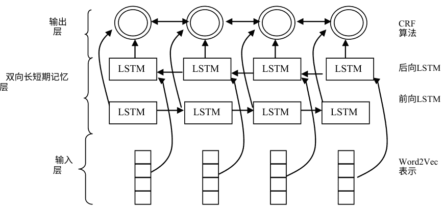

模型，其中 CRF 模型根据标记方案标记输入标记序列。

给定序列中每个标签的概率 $S=w_{1} \ldots, w_{n}$ 通过以下方程计算

$$
z_{t}=W_{y} h_{t}^{bi}+b_{y} \tag{6}
$$

$$
p\left(y_{t} \mid w_{1} \ldots, w_{n} ; \Theta\right)=\text{softmax}\left(z_{t}\right) \tag{7}
$$

$$
\text{softmax}(z_i) = \frac{e^{z_i}}{\sum_{k} e^{z_k}}
$$

其中 $W_{y}$ 和 $b_{y}$ 在等式 (6) 中显示为完全连接层的参数，用于计算每个标签的概率，应用 softmax(.) 函数。基于等式 (7) 中的概率 $p$，训练目标是通过以下步骤最小化。

$$
\begin{aligned}
L_{LSTM} &= -\sum_{t=1}^{N} \log p\left(y_{t} \mid w_{1}, \ldots, w_{n} ; \Theta\right) \tag{8} \\
L_{CRF} &= -\sum_{t=1}^{T}\left(A_{y_{t-1}, y_{t}}+z_{t, y_{t}}\right) \tag{9} \\
L &= L_{LSTM} + L_{CRF} \tag{10}
\end{aligned}
$$

其中，$L_{LSTM}$ 用于标签 $y_{t}$ 的交叉熵损失，而 $L_{CRF}$ 表示负句级对数似然。$A_{y_{t-1}, y_{t}}$ 和 $z_{t, y_{t}}$ 分别表示转移得分和发射得分，用于计算标签得分。

## 3 方法论

本节描述了提出模型的架构。将多个数据集（如NCBI [11]、BC5CDR [20]、JNLPBA [21]、BC4CHEMD [22]）组合作为输入数据集，图2显示了提出模型的架构。以下步骤描述了提出的模型。

- 1. 首先将所有生物医学数据集合并，并将其发送到各个模型。
- 2. 每个模型根据其生物实体类型训练数据集，并将其发送到最大池化函数。
- 3. 最大池化的功能是逐渐减小表示的数据集大小，以减少网络中的参数和计算量。池化层独立地操作每个特征图。

# 生物医学命名实体识别的消歧模型

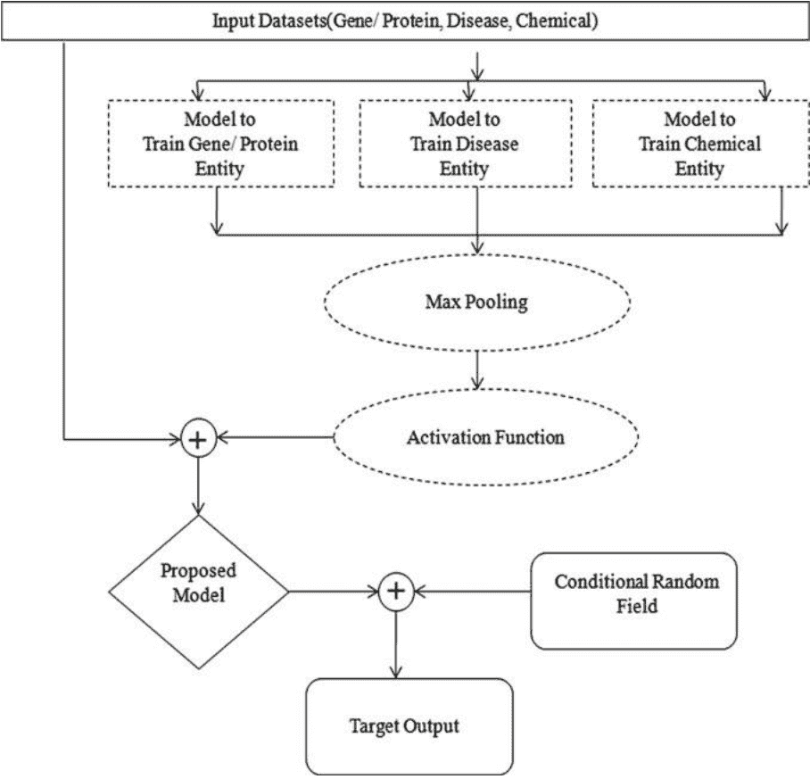

### 图2 所提出模型的架构

- 4. 激活函数在神经元的输出中引入了非线性。然后将其发送到目标模型。
- 5. 所提出的模型再次与条件随机场（CRF）相结合，以提供顺序标记的输出
- 6. 目标输出将提供带注释的标记数据集。

在本章中，介绍了深度学习的概念。为了处理基于深度学习的方法，需要非常大量的数据集，而生物医学数据集能够满足深度学习方法的要求。在生物医学命名实体识别中使用基于深度学习的方法的优势是减少错误的概率。这将在评估部分中进一步讨论。

| 序号 | 语料库 | 实体类型 | #注释 | #句子 | 数据大小 |
| :--- | :--- | :--- | :--- | :--- | :--- |
| 1. | NCBI疾病 [11] | 疾病 | 6881 | 7639 | 793篇摘要 |
| 2. | JNLPBA [21] | 基因/蛋白质 | 35,336 | 22,562 | 2404篇摘要 |
| 3. | BC5CDR [14] | 疾病 | 12,852 | 14,228 | 1500篇文章 |
| 4. | BC4CHEMD [15] | 疾病 | 84,310 | 86,679 | 10,000篇摘要 |

## 4 评估

### 4.1 数据集描述

在本节中，考虑了四个生物医学数据集用于实验研究，分别是NCBI [11]，BC5CDR [20]，JNLPBA [21]，BC5CDR [22]，这四个数据集都是由Chichton等人[14]收集的。这四个数据集是从MEDLINE摘要[23]中构建的，每个数据集都集中在三个生物医学实体类型之一，即基因或蛋白质、疾病和化学物质。本研究不考虑JNLPBA中的细胞类型实体标签。所有数据集都包含生物医学实体的输入句子。JNLPBA包含训练和测试数据集，而其他三个数据集包含开发、训练和测试数据集。JNLPBA使用训练数据集的一小部分作为开发数据集，大小大约等于测试数据集的大小。JNLPBA数据集来自Chichton等人[14]，包含分割的句子。本章需要由Kim等人[20]开发的原始数据集，其中包含更准确的句子分割。数据集的描述如表1所示。

### 4.2 评估指标

为了评估生物医学命名实体识别任务的性能，考虑了信息提取 (IE) 指标。为了计算精确度 (P) ，召回率 (R) 和 F-Score 或 F-Measure ($F_1$) ，定义了方程 (11) ， (12) ， (13) 。如下所示：

$$
\text{精确率 }(P)=\frac{TP}{TP+FP} \tag{11}
$$

$$
\text{召回率 }(R)=\frac{TP}{TP+FN} \tag{12}
$$

$$
F\text{-度量 }\left(F_{1}\right)=\frac{2 \times P \times R}{P+R} \tag{13}
$$

- 其中：
  - TP代表（真正例）＝序列中正确实体的总数。
  - TP+FP代表（假正例）＝序列中地面真实实体的总数。
  - TP +FN代表（假负例）＝序列中预测实体的总数。

### 4.3 后处理和参数设置

后处理步骤用于纠正错误的BIOES序列。这些步骤增加了约0.1-0.5%的精度，F1得分约为0.04-0.3%。通常使用精度、召回率和F1得分来评估模型的性能。

AdaGrad优化器[24]的初始学习率为0.01，每个时期按0.95的指数衰减。字符级嵌入的维度(dchar)保持为30，字符级词嵌入的维度(dclwe)保持为200 * 3。正向和反向LSTM均使用300个隐藏单元。 Dropout[25]应用于提出模型的两个部分：CLWE的输出(0.5)和BILSTM(0.3)。实验的最小批量大小为10，参数设置大部分与Wang等人[3]相同。只有很少的设置与Wang的参数不同，如dropout率等。参数仅用于验证集。

## 5 结果和讨论

表2显示了多任务学习模型和提出的模型之间的实验结果比较。Wang等人使用BC5CDR-Disease数据集进行实验。Wang在BC5CDR-disease数据集上反复测试他的模型。

**表2 性能比较**
| 序号 | 数据集 | 提出的模型 | | | Wang等人[26] | | |
| :--- | :--- | :--- | :--- | :--- | :--- | :--- | :--- |
| | | 精确率 | 召回率 | F1得分 | 精确率 | 召回率 | F1得分 |
| 1. | NCBI-disease | 84.48 | 87.27 | 86.36 | 85.86 | 86.42 | 86.14 |
| 2. | JNLPBA | 74.43 | 83.22 | 78.58 | 70.91 | 76.34 | 73.52 |
| 3. | BC5CDR-disease | 85.61 | 82.61 | 84.08 | *83.73 | *82.93 | *83.33 |
| 4. | BC4CHEMD | 90.78 | 87.01 | 88.85 | 91.30 | 87.53 | 89.37 |
| 5. | 平均 | 84.07 | 85.03 | 84.47 | 82.95 | 83.30 | 83.09 |
| * 这个实验不是从原始论文中借鉴的 | | | | | | | |

来与其他模型进行比较。表中星号符号表示的是迭代结果。提出的模型进行了十次不同初始化的实验，然后取四个数据集的算术平均值来评估每个模型的性能。

如表2所示，与MTM模型相比，提出的模型在所有数据集上都获得了更高的精确度和F1得分。提出的模型能够改善精确度和召回率。与Wang等人[15]的多任务模型（MTM）相比，提出的模型在四个数据集上的表现也更好。提出的模型包括每个实体类型的专家训练模型，进一步提高了生物医学命名实体识别性能。

当与基准模型相比较时，所提出的模型平均精度更高。尽管召回率略有增加，但在考虑生物-NER模型的实际应用时，精确度的增加比召回率更有价值。在大型语料库中重复重要信息的概率很高，但在命名实体系统的性能中可能不会造成任何问题，它将在其他地方得到补偿。然而，错误信息和错误传播可能会影响整个系统。

将生物医学实体识别为不同的生物实体类型是生物实体错误的一种类型。例如，当在句子中使用‘VHL’作为基因时，将其识别为疾病是一种生物实体错误的类型。有趣的是，生物实体错误通常发生在生物实体混淆或实体包含多个单词（例如BRCA1）的情况下。从MTM中出现的错误数量为4334，而在四个数据集（BC5CDR-disease，BC4CHEMD，JNLPBA，NCBI）上所提出的模型给出的错误数量为3966，比MTM模型少368个。所提出的模型在错误分析中表现最佳。

对STM进行的不准确性调查，它是一个单一的LSTM-CRF模型，在JNLPBA中对生物实体进行分类时显示出了很多错误。它包含了JNLPBA总错误的49.3%。对MTM模型进行的错误调查是一个生物实体错误，其中包含了4334个错误中的1333个，占不正确错误的38%。与其他类型的错误（如跨度错误）相比，生物实体错误的数量要大得多，跨度错误是最常见的错误类型，包含了38%的不正确错误。

尽管大多数跨度错误来自主观注释或可以被非专家轻松修复，但生物实体错误对于生物医学研究人员来说很难检测出来。此外，对于生物医学文本挖掘方法（如药物相互作用提取），跨度错误可能会导致轻微的错误。生物实体错误可能导致完全不同的结果。

在提出的模型中，每个专家模型都训练了单一实体类型的数据集，并将训练数据的输出与词嵌入连接起来。其他专家模型将知识共享给目标模型，如图2所示，以减少生物实体类型错误问题。表2显示，共有736个错误是生物实体错误，占所有错误的18.6%。

## 6 结论

通过引入包含多个双向LSTM-CRF (BILSTM-CRF) 模型的方法来总结本文，用于识别生物医学实体。大多数最先进的方法只能处理单一类型的实体。所提出的模型可以处理多个数据集，并具有更高的F1得分。与多任务模型不同，所提出的模型使用了各种单一任务NER模型，为其他模型提供更多信息以实现最高精度。为了提高多任务模型的性能，所提出的模型对具有多义性或具有相同正字特征的生物医学实体进行了分类。结果显示，与在四个Bio NER数据集上提出的相关工作相比，所提出的模型在精确度、召回率和F1得分方面取得了出色的结果。尽管这个提出的模型存在一些计算开销，但当它给出准确的结果时，这是没有意义的。

这个提出的模型将来会在地理空间数据集上实施。

## 致谢

作者们要感谢国家技术研究所Raipur提供的必要基础设施和研究设施。

### 参考文献

- 1. 钟, 华, 胡, 晓: 使用语义类型的机器学习进行疾病命名实体识别。国际机器学习计算 3(6), 494-498 (2014)
- 2. 科利尔, N., 诺巴塔, C., 辻井, J.: 使用隐马尔可夫模型提取基因和基因产品的名称, 卷。1. 在: 第18届计算语言学会议论文集, pp. 201-207 (2000)
- 3. 周, G.D.: 使用互信息独立模型和SVM加sigmoid在生物医学文本中识别名称。国际医学信息学 75(6), 456-467 (2006)
- 4. Lafferty, J., Mccallum, A., Pereira, F.C.N., Pereira, F.: 条件随机场, pp. 282-289 (2001)
- 5. McCallum, A., Freitag, D., Pereira, F.C.N.: 最大熵马尔可夫模型用于信息提取和分割. 在: 第十七届国际机器学习大会论文集, Morgan Kaufmann Publishers Inc, San Francisco, CA, USA, pp. 591-598(2000)
- 6. Neves, M.L., Carazo, J.-M., Pascual-Montano, A.: Moara: 用于提取和规范化基因和蛋白质提及的Java库. BMC Bioinf. 11(1), 157 (2010)
- 7. Sahu, S.K., Anand, A.: 用于疾病名称识别的循环神经网络模型使用领域不变特征. ArXiv E-Prints. arXiv:1606.09371 (2016)

8. Habibi, M., Weber, L., Neves, M., Wiegandt, D.L., Leser, U.: 使用词嵌入的深度学习改进了生物医学命名实体识别。生物信息学 (牛津, 英国) 33 (14), i37-i48 (2017年)

9. Lample, G., Ballesteros, M., Subramanian, S., Kawakami, K., Dyer, C.: 用于命名实体识别的神经架构。ArXiv E-Prints. arXiv:1603.01360 (2016年)

10. Pyysalo, S., Ginter, F., Moen, H., Salakoski, T., Ananiadou, S.: 用于生物医学文本处理的分布语义资源。在: 第5届生物学和医学语言学会会议 (LBM'13) 论文集, 第39-44页 (2013年)

11. Doğan, R.I., Leaman, R., Lu, Z.: NCBI疾病语料库: 用于疾病名称识别和概念规范化的资源。J. Biomed. Inform. 47, 1-10 (2014年)

12. Goulart, R.R.V., Strube de Lima, V.L., Xavier, C.C.: 对生物医学文本中的命名实体识别的系统性回顾。巴西计算机学会杂志。17(2), 103–116 (2011)

13. Caruana, R.: 多任务学习。机器学习。28(1), 41–75 (1997)

14. Crichton, G., Pyysalo, S., Chiu, B., Korhonen, A.: 一种神经网络多任务学习方法用于生物医学命名实体识别。BMC生物信息学。18(1), 368 (2017)

15. Wang, X., Zhang, Y., Ren, X., Zhang, Y., Zitnik, M., Shang, J., Langlotz, C., Han, J.: 通过深度多任务学习进行跨类型的生物医学命名实体识别。ArXiv E-Prints. arXiv:1801.09851 (2018)

16. Graves, A., Mohamed, A., Hinton, G.: 使用深度递归神经网络的语音识别。在: IEEE国际会议, 多伦多大学计算机科学系, 第3号, 第6645-6649页

17. Kim, Y., Jernite, Y., Sontag, D., Rush, A.M.: 基于字符的神经语言模型。ArXiv E-Prints. arXiv:1508.06615 (2015)

18. Hochreiter, S., Schmidhuber, J.: 长短期记忆。神经计算。9(8), 1735-1780 (1997)

19. Song, M., Yu, H., Han, W.-S.: 开发一种混合基于词典的生物实体识别技术。BMC医学信息决策。15(1), S9 (2015)

20. Kim, J.-D., Ohta, T., Tsuruoka, Y., Tateisi, Y., Collier, N.: 介绍JNLPBA生物实体识别任务。在: 国际自然语言处理联合研讨会论文集生物医学及其应用, 计算语言学协会, 斯特拉斯堡, 法国, 第70-75页 (2004)

21. Kim, J., Ohta, T., Tsuruoka, Y., Tateisi, Y., Collier, N.: JNLPBA的生物实体识别任务介绍, 70-75页 (未知年份)

22. Krallinger, M., Rabal, O., Leitner, F., Vazquez, M., Salgado, D., Lu, Z., Leaman, R., Lu, Y., Ji, D., Lowe, D.M., Valencia, A.: CHEMDNER化学物质和药物语料库及其注释原则。J. Cheminf. 7 (Suppl 1 Text mining for chemistry and the CHEMDNERtrack), S2-S2 (2015年)

23. Ratinov, L., Roth, D.: 命名实体识别中的设计挑战和误解。在: 计算自然语言学习第十三届会议论文集, 计算语言学协会, 斯特拉斯堡, 法国, 第147-155页 (2009年)

24. Campos, D., Matos, S., Oliveira, J.L.: 生物医学命名实体识别: 机器学习工具综述。在: Sakurai, S. (编) 高级文本挖掘的理论和应用 (2012年)

25. 福田, K., 田村, A., 角田, T., 高木, T.: 走向信息提取: 从生物论文中识别蛋白质名称。在: 太平洋生物计算研讨会, 第707-718页 (1998年)

26. 金, S., 陈, J.Y., Cutello, V., 李, D.: DTMBIO 2016: 第十届国际生物医学信息学数据和文本挖掘研讨会。在: 第25届ACM国际信息和知识管理会议论文集, 第2511-2512页 (2016年)

Ashutosh Kumar于2014年从Rajiv Gandhi Proudyogiki Vishwavidyalaya获得计算机科学与工程学士学位（B.E.）。他于2017年从中央拉贾斯坦大学获得计算机科学与工程硕士学位（M.Tech）。目前，他是国家技术研究所的博士研究学者。他的研究兴趣包括“生物医学文献的文本挖掘”和“命名实体识别”。

# 深度学习在医疗保健和生物医学中的应用

Shubham Mittal 和 Yasha Hasija

摘要
过去几十年中，医学和医疗保健领域的不断进步和改进使我们进入了一个数据驱动的时代，大量的数据被收集和存储。随着这种变化，现有系统和流程需要进行分析和技术升级。收集的数据以个体或患者的电子健康数据的形式存在，可以是读数、文本、语音或图像。人工智能的一种方式——“机器学习”是计算机系统使用模型进行自学习的指令的研究，这些模型基于参数的权重而不需要提供明确的指令。与过去十年的生物医学进展并行的是，机器学习算法和工具的改进越来越明显。深度学习是其中更有前景的算法之一。它是一种人工神经网络，通过多个处理层来设计计算模型，以便学习具有多个抽象层次的数据表示。研究表明，深度学习可能比先前的机器学习算法更有优势，并且其预测性能更好，因此引起了重要关注。由于其多层次的表示和超越人类准确性的结果，深度学习在健康信息学和生物医学领域特别广泛应用。

这些涉及到分子诊断领域，包括药物基因组学和病原变异的鉴定，在实验数据解释方面包括DNA测序和基因剪接，在蛋白质结构分类和预测、生物医学成像、药物发现、医学信息学等方面。本章的目的是讨论这些应用，并详细阐述它们在改善现代医疗和药学方面的作用。

深度学习算法在学习模式和从复杂数据集中提取属性方面显示出改进的潜力。我们首先介绍深度学习和人工神经网络的发展，然后讨论其在医疗保健领域的应用，最后谈论其在生物医学信息学中的相关性。

和公共卫生领域的计算生物学研究。最后，从现代医疗保健的角度讨论深度学习算法的未来范围。

S. Mittal  Y. Hasija (✉)
德里工业大学,印度德里
e-mail: yashahasija06@gmail.com

S. Mittal
电子邮件: mshubham9606@gmail.com

Springer Nature Switzerland AG 2020
S. Dash等人 (编辑),生物医学和健康信息学的深度学习技术,大数据研究68
, https://doi.org/10.1007/978-3-030-33966-1_4

## 1 引言

在过去的10-15年里,在生命科学领域的数据获取技术取得了巨大的进展,同时改进了计算生物学和数字存储技术,将现代生物学从数据贫乏的科学转变为数据丰富的科学。由于这一发展,今天的研究是数据驱动的,对于生物问题有多种潜在的解决方案,不像以前一个问题只有一个答案。生物信息学在不同方面协助处理这个大型数据集,无论是存储、提取还是分析数据。使用编程和算法进一步处理数据提取技术的计算生物学技术。这组用于发现生物数据中有意义的关系、模式和功能的方法被称为“数据挖掘”。

在1990年代初,一项成为计算科学流行部分的研究领域是“软计算”。软计算作为一个术语代表了所有能够在处理模糊现实情况时提供灵活信息处理能力的方法学。尽管硬计算追求精确性,软计算处理的是部分真相、模糊性、不准确性和近似性,以获得问题的解决方案[1,2]。早些时候,这是不可能的,只有简单的系统可以通过计算方法进行精确分析和建模,而医学、生物学、管理学、人文学等更复杂的研究领域则难以通过传统的分析和数学方法进行控制。然而,软计算技术相互补充,因此生物过程更接近于软计算技术,而不是主要基于逻辑(如谓词逻辑和命题逻辑)的传统技术。软计算的主要组成部分包括遗传算法、粗糙集、模糊逻辑、神经网络和小波等信号处理工具。在这些中,神经网络在计算上具有广泛的分类和表示生物数据的范围。神经网络在数据丰富的环境中具有强大的学习和泛化能力[3]。神经网络中使用的算法称为机器学习算法。

### 1.1 机器学习

通过使用经验数据的计算机程序方法来寻找问题的答案被称为学习[4]。在过去的几十年中，已经提出几种机器学习算法。随着世界各地每天产生的大量生物数据，需要计算技术来分析这些数据。机器学习技术具有这样的处理能力，可以从大量数据中提取有用的隐藏关系。机器学习算法的工作原理基本上是：它们分析整个数据，调整其内部结构以适应给定的数据，并生成给定结果的估计模型的隐藏层[5]。生物信息学应用机器学习算法面临的主要挑战有两个。第一个是数据样本数量较少，第二个是生命科学中每个样本都具有数千个特征。

机器学习算法按以下方式进行分类：
- **有监督学习**：模型是通过输入和期望的输出进行训练的，目的是能够准确预测未知的未来输出。使用的数据是带有标签的，当目标输出是连续变量时，任务被称为“回归”，当目标输出是一组离散值时，任务被称为“分类”。
- **无监督学习/聚类**：与监督学习不同，无监督学习使用无标签数据。此外，数据的聚类是基于匹配相似性和接近性来创建的，这有助于进一步分析数据。
- **半监督学习**：这种类型的学习通过将输入数据分类为两种类型来进行，即在少量带标签的数据和大量无标签的数据上进行模型训练。
- **强化学习**：与之前的学习模型不同，这个模型旨在改善在线性能，并且没有任何输入和输出数据。
- **优化**：涉及选择最佳拟合数据的模型，即在众多可能的模型中选择给出最优结果的模型。

### 1.2 人工神经网络

人工智能（AI）-机器学习的应用使系统能够通过自动学习来执行各种任务，并且随着经验的积累而不需要任何特定的编程。不断改进。为了做到这一点，系统必须熟悉一个数据集，这被称为“训练数据”。主要的两种机器学习方法-监督学习和无监督学习训练一个算法。在训练时，提供了一定的指令，并且是从这些指令中，监督学习生成一个能够重现输出的函数[2]。当输出数据中存在连续值时，训练过程被称为“回归”，当输出数据中存在分类值时，被称为“分类”[6]。无监督学习包括创建一个函数，该函数考虑未标记的输入数据中的隐藏结构，与有监督数据不同。在训练阶段，对训练数据集进行预处理并提取重要特征。

预处理包括噪声减少、特征提取、图像矫正和类似操作。对于每个新的应用程序，需要以新的方式设计特征，因为特征提取是一项具有挑战性的任务，特别是在医学重要性方面。这个过程在深度学习文献中经常被称为“手工制造”特征。根据特征向量 x ∈ R^n，分类器必须预测精确的类别 y，这通常通过函数 y=f(x) 来评估，该函数直接给出分类结果 ^y。分类器的参数向量 θ 是在训练阶段获得的，并在单独的测试数据集上进行检查。

人工神经网络是机器学习中一种著名的分类和回归算法，它通过模仿人脑中神经元和突触的结构和信号传递来表示计算分析中的多层单元。ANN由相互关联的人工神经元组成，每个神经元实现一个简单的分类器模型，根据一定的加权求和给出决策信号作为输出。大量的这些基本计算元素被累积在一起形成ANN [7]。

在这里，网络的特征是通过某种有价值的算法进行训练的，例如“反向传播”算法，在这个算法中，输入和预期的决策输出以成对的方式呈现，反映了大脑专注于外部刺激感知以学习实现特定任务的情况（图1）。

输入数据中使用的机器学习特征可以是数值和名义值。定义逻辑和强大的特征对于机器学习研究至关重要。人工神经网络在许多领域展现出了非凡的性能，但也存在一些缺点，例如在优化过程中局部最小值的下降以及对某些值的过拟合（过度训练）。基于人工神经网络的预测技术在过去几年中展示了令人难以置信的能力，可以解决非线性建模问题[8]在各种应用中，但由于深度网络训练相关的问题，大多数这些方法由浅层架构组成。由于最近提出的快速学习算法，深度架构近年来引起了很多关注，特别是因为深度人工神经网络已经证明在模式识别、分类和机器学习领域中优于传统方法。DNN由一系列堆叠的层组成。预测是基于第一层，即输入层进行的。最后一层的输出预测一个类别或值。

隐藏层是指输入层和输出层之间的层，它们之所以被称为隐藏层，是因为它们的状态与可观察的数据无关。

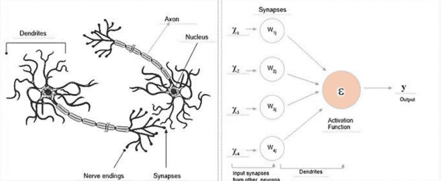

图1 真实神经元（左侧）和人工神经元（右侧）之间的概念类比

神经网络的多层结构使其能够做出更复杂的决策。对于显式训练模型，每个边缘都需要优化的权重。这些权重使用大量特征的总和，并且以随机方式初始化，最终由优化算法（如“梯度下降”算法）进行调整。在将训练样本数据应用于网络之后，评估目标类别和预测之间的损失函数。所有特征都会轻微地朝着有利于最小化损失函数的方向更新。基于这些网络，存在许多类别的深度学习，每种都有不同的方法。与传统的人工神经网络相比，深度神经网络的层数更多，同时在识别研究和预测方面表现更好，尤其是当层数变得更复杂时。

### 1.3 深度学习

深度学习通过计算设计的模型，可以表示多个抽象层次，并且包含许多层次的处理。深度学习技术于2000年引入，但由于技术的升级，如今正蓬勃发展。它在语音识别、物体检测以及基因表达研究和药物发现等生物学领域的应用中取得了显著的改进和增加[9]。通过使用反向传播算法，深度学习可以在大型数据集中发现复杂的结构，以指导机器改变其内部参数，然后利用这些参数计算每一层的演示结果[10,11]。深度卷积网络在处理视频、图像、音频和语音方面引发了一场革命，而循环网络在分析文本和语音等序列数据方面表现出色。

与浅层学习（有监督学习）不同，深度学习可以进行无监督学习，并且在很少的指导下，它可以从高维原始数据中学习到独特的复杂模式[12]。这种优化被称为广度或深度的权衡；也就是说，深度学习在语言和图像识别、视频游戏、绘画风格的复制甚至古典音乐的创作方面都展示了其有用性。

这些任务需要表示学习，即从未经处理的原始数据中检测/分类模式，特别是当所讨论的数据具有分层结构时。 例如，图像识别从像素边缘开始学习子图像的排序，然后是图案，直到最终输出是完整的对象。 深度神经网络算法特别适用于无监督学习，在每一层上可以作为特征检测单元，从原始输入信号中逐渐提取出更复杂和不变的特征。 现在，机器可以准确地识别数百万张图像，这在人类标准下似乎是不可能的任务。 使用深度学习，机器能够学习区分相似的对象或具有高准确性的句子。 它们还激发了机器学习社区，使得自动化诸如生物学中的图像识别、预测、分类和注释等任务的想法得以实现，其中庞大的复杂性和数据的广泛性已经超过了人类的分析能力。

## 2 深度学习：最新趋势

深度学习在生物和非生物领域中产生了巨大的潜力和持续的应用。

### 2.1 在非生物领域中

自从2000年早期卷积神经网络的出现以来，深度学习的应用已经取得了越来越大的进展。 它已经被广泛应用于诸多成功的领域，如图像分割和人脸识别。

然而，在2012年之前，这些应用并没有在研究和工业界引起太多关注，直到在一个包含数百万张图像用于训练和15万张图像用于验证和测试的ImageNet 竞赛中[16]。 这场竞赛创造了一个新的领域，并产生了巨大的影响，促使研究人员进行合作和竞争，而无需收集大规模的标记数据集[5]。 ‘Dropout’—一种用于调节的新技术和一种新的图像扩展技巧，被用于改善这场竞赛的结果。 此外，微软、谷歌和Facebook等IT和AI界的巨头开始将深度学习算法应用于图像识别作为重要的研究领域。 在此之后，深度学习技术在2012年的错误率为16%，到2016年降至3%以下，因此超过了目标分类性能。任何人类。目标分类创新已经转移到语义分割和目标定位。基于RNN的语言模型和基于CNN的图像识别框架被整合在一起，建立了一个视觉问答和图像字幕系统。

另一个重要领域是语音识别，计算机科学和电气工程知识以及语言学和医疗保健（包括放射学）的研究可以结合起来。许多研究人员已经开发出了通过计算设备（包括机器人和智能技术）实现语音到文本的翻译和识别技术。最近，由于深度学习和大数据的进展，在语音识别方面取得了巨大的进步[17]。这一点可以从多个国际公司（如Facebook、Google）中可用的众多语音识别系统以及在这一领域发表的众多科研论文中得到证明。

### 2.2 在生物领域中

基因的表达谱可以被视为细胞或组织内活动的快照或图像，就像图片（图像）代表环境中的物体一样。基因表达的模式展示了细胞的物理状态，就像图片中的物体由像素模式表示一样。这就是为什么生物数据和深度学习在音频和图像数据方面取得了相当大的成功的相似性可以进行比较的方式。

无论背景如何，深度学习算法都必须区分两个非常相似但经典不同的图像，同样，必须区分两个非常相似但经典不同的疾病病理学，这就是为什么区分基本差异是绝对必要的。不变性和选择性对基因表达分析和图像识别都是必需的，并且也是CNNs [18]的两个描述符。

其他深度学习应用也可以做出非常相似的类比；例如，语言预测需要使用循环神经网络进行顺序学习，这与生物学中的信号传导非常相似，其中一个事件可以从之前的事件中预测出来，就像在一个句子中可以从前面的一组词中预测出一个单词一样。另一个类似的例子是预测生物靶点（如蛋白质）的结构。

虽然这些并行比较是具有说明性质的，但它们与深度神经网络一起具有各种优势，从而加强了它们在生物应用中的案例。首先，深度网络需要数据集才能进行成功的分析，而生命科学数据提供的数据远远超过需求。此外，深度神经网络设计良好，可以利用广泛分布、噪声较大且高维度的数据，这在生物学中提取的数据中非常普遍[18]。此外，深度神经网络具有泛化的能力，即如果它被训练了一次，就可以应用于其他各种数据集，这正是所需的。

图2 深度神经网络组装。a）输入数据——它包括来自电子健康记录、临床数据以及微阵列、MRI等分子数据的数据。b）数据预处理——在这一步骤中，源数据在通过深度神经网络进行分析之前进行预处理。正在使用标准化、归一化、降噪等技术。c）深度神经网络——预处理后的数据在多个隐藏层中使用，同时提取重要特征，并在输出层中具有经过训练的神经元。d）输出——这个结果有助于各种生物医学和医疗应用，如疾病诊断、基因型-表型相关性、疾病预测、药物基因组学和药物反应等等。

用于分析多平台异质数据，例如基因表达数据。

尽管生物数据与DNN非常匹配，但由于几个可能的原因，它们在生物学中的应用进展缓慢。这可能是因为用于训练的生物数据具有许多相关特征，不同于非生物数据。

在处理深度学习数据时，需要进行更多的计算试验和研究。此外，深度神经网络在解释数据方面的能力较差，因为它们只能通过简单的关系、关联和模式来学习。这种模型被称为“黑盒子”，因此在解释上也需要人类的支持[18]。但深度学习的好处超过了其负面影响，并且随着时间的推移可能会被克服（图2）。

## 深度学习在生物医学中的3个应用

让我们在本节中回顾当前和可能的生物医学应用，当涉及到深度学习时。

### 3.1 生物标志物

在生物医学中，将数据转化为能够重现物理状态和表型（如疾病）的生物标志物是一项有价值的任务。生物标志物具有的高度重要性不言而喻，在评估临床试验结果、识别疾病和监测疾病时，尤其是对于像癌症这样的疾病。对于现代转化医学来说，以高灵敏度鉴定特定生物标志物是一个巨大的挑战[10, 2]。生物标志物开发的一个重要工具是计算生物学，它可以使用任何数据源，从蛋白质组学到基因组学。

### 3.2 基因组研究

下一代测序技术已经帮助产生了大量的基因组数据。这些数据可以通过计算方法进行分析，例如结构注释基因组，包括预测蛋白质结合位点、剪接位点和非编码调控序列。

基因组学的一个重要领域是环境基因组学或元基因组学，NGS已经引起了人们的关注。其中一个挑战是对物种多样性和序列数据进行功能分析。使用深度置信网络和RNN，已经实现了人类微生物组数据和元基因组数据的表型分类。这些方法可以以层次化的方式学习表示数据集，但无法提高分类的准确性。然而，在大型数据集上，并且在适当选择网络参数后，DNN被认为有潜力极大地改进元基因组学算法。

### 3.3 转录组分析

各种类型的转录本被分析以收集功能重要的信息，例如剪接密码、疾病生物标志物等。这些可以是miRNA、mRNA、siRNA等。由于来自不同来源的基因表达数据依赖于许多因素，因此需要进行归一化处理。对于跨平台分析，深度神经网络非常适合，因为它们具有很强的泛化能力[10]。基因表达数据集的规模以及处理基因表达数据的其他主要问题，例如数据集的规模、降维和选择性/不变性的需求，在下一节中进行了详细介绍。

使用高维矩阵分析转录组数据也被证明非常成功的深度学习方法。在一种技术中，深度学习被用于提取癌症数据集的特征，这在以前使用的基本特征选择方法上取得了很大的成功[2]。结果显示出更高的准确性，更好的癌症分类和特征选择。另一个深度学习取得成功的例子是Fakoor等人在基因表达数据中应用自编码器网络进行癌症分类的情况。

### 3.4 医学图像处理

全球范围内，DNN在图像分析方面是最成功的应用之一。深度学习的架构在图片中识别物体方面比人类检测和传统图像识别更好。因此，在全球范围内，所有先进的软件系统都使用深度学习进行涉及物体识别、检索和分类的图像分析[2,14]。在医学领域，这对于研究人员和技术人员根据症状图片识别疾病非常有价值，尤其是在皮肤病学障碍和显示基因表达和内部身体成像的图像中[2,10]。卷积神经网络在图像分析领域中被证明是最有用的。

### 3.5 剪接

深度学习在生物医学领域的另一个高度使用的领域是剪接，它表明真核生物的生物活性。目前的技术在调节剪接方面证明是不足的，无论是剪接位点的结构、状态还是剪接抑制剂或增强剂。但最明显的问题是在剪接代码位置的“原始读取”，其长度实际上比实际基因要短得多，并且具有非常高的重复水平[2,10]。深度学习在研究剪接机制和理解剪接代码方面具有高效率，在剪接预测方面优于贝叶斯方法。

### 3.6 蛋白质组学研究

深度学习以层次化方式表示数据，并从复杂的相互作用中提取和学习，这对蛋白质网络分析非常有益。例如，使用磷酸化数据，可以创建一个深度学习置信网络（双模态），以预测人类细胞对刺激的响应，从而根据大鼠细胞对相同刺激的响应进行预测。所使用的算法在传统方法[2,10]上显示出非常高的准确性。此外，蛋白质组学的分析方法（算法）不需要大量的训练数据，不像其他机器学习算法。事实上，与转录组学相比，蛋白质组学在研究中仍然非常新，并且包含的数据量非常少。

### 3.7 结构生物学和化学

蛋白质建模，包括蛋白质折叠和动态，是结构生物学和化学的研究内容。对于酶的良好功能预测，RNA结合，底物和抗原结合，完美的结构确定非常重要。

阿尔茨海默病和帕金森病等疾病是通过结构生物学研究鉴定的异常蛋白质的积累导致的。比较建模是一种基于化合物同源性预测蛋白质二级结构的技术，但由于有限数量的注释良好的化合物，这并不容易[2,10]。应用序列的深度学习极大地改进了蛋白质结构预测。某些蛋白质即使缺乏独特的结构也非常重要。这些蛋白质被称为IDPs或无序蛋白质，没有连续结构的区域被称为无序区域或IDRs。深度学习算法已被用于将IDP/IDR与有结构的蛋白质分离。早在2013年，Eickholt和Cheng发表了一种基于序列的深度学习预测器“DN disorder”，在预测无序蛋白质方面取得了很高的成功率，超过了其他先进的预测器。2015年，开发了一种更好的预测器“DeepCNF”，它可以通过获取和分析实验数据来预测IDPs和具有IDRs的特定蛋白质。这证明了这种算法比ab initio预测器中使用的算法更好。

### 3.8 药物发现

应用计算技术来发现药物并研究其生物化学一直是全球药物研究的重要组成部分，它不仅可以缩短时间，还可以节省成本和资源。尽管存在几种方法来做到这一点，但由于某些限制，如受蛋白质类别的限制或无法进行高通量筛选等，目前还没有被宣布为“最佳”方法。Wang等人使用PINN (Pairwise Input Neural Network) 来研究靶标和配体的相互作用，通过从靶标概要和蛋白质序列中提取特征[2,10,19]。使用DNN和CNN可以预测药物毒性和高反应性等性质，这些是药物设计和发现中非常重要的方面。

## 4 深度学习在医疗保健中的应用

### 4.1 转化生物信息学

随着人类基因组计划的发现，我们获得了大量以前未被探索的生物数据，包括基因、蛋白质以及描述基因如何与外部环境相互作用以产生蛋白质的过程的知识。此外，生命科学和生物技术的发展大大降低了基因测序的成本，并通过基因组和蛋白质组分析指导疾病治疗[20]。转化医学基本上涉及将基础生物实验室中进行的研究应用于临床层面，利用临床观察的输入。生物信息学涉及使用计算技术和算法来严格存储、表示或分析生物数据，包括细胞内代谢物、RNA表达、DNA序列和蛋白质[21]。转化生物信息学整合了这两个领域；它涉及开发数据库和算法，通过将临床护理的改进作为最终目标，研究基本的细胞和分子数据。简而言之，转化生物信息学研究将分子信息（小分子、脂质、蛋白质、RNA和DNA）与临床实体（患者、症状、疾病、病理报告、实验室检查、临床图像和药物）的知识相结合，以改善我们对生物的理解，最终改善患者护理。这导致了个性化医学中的生物信息学研究，其中治疗是专门为个体设计的，而不是一般适用于许多人。

在传统生物信息学领域，机器学习包括三个研究领域：过程预测、疾病预防和个性化治疗。这些领域受到生命科学的三个主要领域的支配：基因组学、表观基因组学和药物基因组学。基因组学是对DNA结构、基因、蛋白质的生成和表型表达的研究，旨在创建有针对性的治疗方法；药物基因组学旨在创建具有最小副作用的更有效药物，并为个体提供专门治疗；表观基因组学是研究环境因素对蛋白质相互作用和形成的影响的研究[21]。

种群和物种之间的遗传变异是由于可变剪接的结果，因此是涉及机器学习的研究领域之一。对它们的理解可能是早期检测疾病的基石。深度学习和机器学习算法在计算生物学中的另一个应用是使用QSAR（定量构效关系）和CPI（化合物-蛋白质相互作用）进行蛋白质相互作用研究[21]。这些方法还有助于建模蛋白质与RNA的结合。此外，由于多种原因，如转录或翻译错误、染色体不稳定、癌症进展或细胞分化，DNA甲基化会影响DNA的表达，这是一个需要使用深度神经网络进行更多研究的领域。

### 4.2 用于健康和福祉的通用传感

深度学习最具应用潜力的领域之一是在医疗保健中使用智能设备进行生物传感。这些算法可以用于监测卡路里摄入量、帮助部分视力障碍者、检测生物医学设备的异常等。这些应用已在下面的小节中讨论过。

#### 4.2.1 识别活动和能量消耗

营养学家说，为了保持健康和健美，应该摄入有限数量的卡路里。但是如今肥胖症猖獗，已经成为流行病之一，是导致危险和慢性疾病（如与心脏相关的疾病和二型糖尿病等）的原因之一。通过跟踪所摄入食物的种类、数量以及进行的锻炼或体育活动的持续时间和类型，可以克服这个问题，所有这些都有助于保持健康。然而，要做到这一点，需要有能力从众多食物和活动中选择可能具有普遍性的特征[21]。这通过可穿戴设备和智能手机来监测和管理食物摄入和能量消耗来实现。

最近创建了一个卡路里测量系统，它充当了一个助手，可以估计图片中食物项目的卡路里数量，这些信息有助于消费者控制或预防与疾病相关的健康问题，通过控制摄入该食物项目的量[21]。该系统通过智能手机应用，并使用卷积神经网络(CNNs)，导致更多先进技术的应用，如移动云计算、尺寸校准和距离估计，有助于识别食物类型、估计卡路里，并对人类活动进行分类，例如婴儿爬行、有人摔倒（异常活动将引起警报并通知家庭成员）[21]。此外，通过比较不同的人体活动识别数据集和基于CNN的方法在这些数据集上的性能，发现深度学习方法具有更好的分类准确性，更具普适性。此外，低功耗的智能可穿戴设备效率较低，无法处理深度学习所需的更大计算复杂性。在这种情况下，建议使用预处理标准化技术，因为它们可以减少由传感器属性（如方向和位置）引起的数据差异。

#### 4.2.2 生命体征异常检测

长期患病和病情危急的个体需要密切监测，因此分析其生命体征的差异非常重要。然而，异常情况因患者和设备以及噪音的不同而异。机器学习技术在检测不规则性方面做出了巨大贡献[21]。脑电图是一种记录电子脑活动的设备；2010年，Wulsin等人[22]提出了一种使用深度置信网络（DBN）检测脑电图中差异的方法。这些方法使用了大型数据集，证明了DBN是一种更有效的方法，甚至超过了支持向量机（SVM）[21]。2015年，Wang等人[23]创建了一种压缩信号的DBN，从而实现了50%的能量节省，同时保持了相同的神经解码准确性，这是开发低功耗植入式和可穿戴传感器的重大突破。

#### 4.2.3 辅助设备

这些设备用于理解物体的形状和体积，并通过在三维空间中操作来对其进行分类。它可以用于患有视觉或听觉障碍、语言障碍等的患者，用户通过手势、触觉反馈或音频反馈提供反馈。深度学习极大地帮助改进这些设备；例如，2016年，Poggi等人提出了一种基于CNN的可穿戴设备，用于帮助视力受损的人们检测障碍物。类似地，针对听觉障碍患者和高度敏感环境（如手术期间）的基于手势的辅助设备已被提出，其中无触摸人机交互更可取[21]。事实上，2015年，Huang等人提出了一种基于DNN的用于识别手语的实时数据方法[25,26]。然而，许多类似的应用，如手势识别，由于手势姿势的众多可能区分以及随后的算法复杂性，是相当具有挑战性的。

### 4.3 医学信息学

这个领域旨在研究医学领域中的大量聚合数据，以增强和发展临床领域的决策支持系统，同时增加医疗保健数据评估，以确保良好的质量和便捷的医疗服务访问。电子健康记录（EHR）是非常数据密集的信息源，涉及患者数据，包括他们的药物处方、推荐的治疗、诊断的疾病、疫苗接种记录和来自脑电图和临床图像等机器的实验室测试结果。对这个庞大的数据集进行挖掘肯定会让我们更好地理解疾病，并最终改善其管理[21]。然而，这也存在一些缺点。例如，由于信息的不规则编译，数据存在复杂性。同样，疾病的识别和诊断之间的不规则延迟增加了学习的复杂性。

深度学习以监督和无监督的方式理解数据描述，其成就主要归功于其学习独特模式和特征的能力。通过深度学习方法，大规模数据集的扩展非常出色。此外，深度神经网络可以关联数据架构的多个组件，这就是它们能够很好地处理多个模型的信息的原因[21]。出于这些原因和更多原因，深度学习在医学信息学研究中被广泛接受。2015年，Shin等人[27]提出了一种图像-文本CNN，用于识别与放射学图像和报告相关的数据，这些数据来自医院的图片和信息数据库。2014年，Liang等人[28]使用了修订版的CDBN来训练大规模高血压数据集。2016年，Putin等人[29]利用深度学习识别基于血液检测的预测人类年龄的标记物。2015年，Nie等人[30]提出了一种用于自动推断疾病的DNN。随后，还开发了更多方法来解释医疗保健数据，其中一些方法包括GBDT（梯度提升决策树）、LSTM RNN等。因此，深度学习极大地提高了从诊所、医院、数据云或研究机构获取各种数据的可访问性。

### 4.4 公共卫生

通过分析疾病程度和与环境的相互作用，公共卫生旨在改善医疗设施，预防疾病并延长寿命。公共卫生领域涉及流行病和大流行病研究，其应用包括空气质量检测，药物安全保证，流行病监测，以及环境因素对生活方式疾病（如肥胖症）的影响研究。计算方法有助于创建这些研究的模型；然而，它们目前的局限性在于缺乏将实时数据纳入分析的能力，然而，如果深度学习被纳入其中，将能够更好地推广。这是因为它们是数据驱动的方法，并且能够根据新数据集优化成本函数[10]。一个例子是“随机梯度下降”这样的优化算法，在深度神经网络中被广泛使用。因此，对于分析公共卫生数据，最建议使用深度学习方法，以及网络分析和推荐系统。

评估和预测空气污染物浓度是深度学习的一个应用之一。Ong等人在2015年[31]设计了一个系统，该系统收集了日本52个城市的传感器数据，并基于此预测了该国的空气污染水平[21]。所使用的DNN方法是以在线方式进行训练的，由堆叠的自编码器组成。然而，正如发现的那样，深度学习技术受到现实世界中不完整数据的影响。通过进行流行病学研究跟踪疾病爆发，并通过社交媒体评估生活方式疾病，是健康领域中深度学习的另一个非常有趣的应用。这些疾病的例子包括埃博拉和流感。2015年，赵等人[32]使用Twitter持续而相当准确地追踪公众健康的应用[1]。在这里，DNN被用来检查描述流行病及其与环境变化相关的特征，以追踪疾病的发展。不仅如此，Twitter上的消息也可以用于研究抗生素并显示出对肠道疾病的良好预测。为了对抗生素相关类别进行分类，使用了DBN，而在2016年，Zou等人[33]使用深度学习来识别三种类型的肠道疾病。此外，在2016年，Garimella等人[34]使用来自Instagram的地理标记图片来追踪饮酒、肥胖、吸烟和其他生活方式疾病，并将用户的分类与深度学习注释进行了比较。研究结果表明，基于深度学习的算法注释在预测和分类药物滥用和饮酒等行为方面更加成功。

来自手机的数据，如短信或电话位置，可以很好地用于描述人类行为。这种技术使用了CNN，它在预测个体的性别和年龄方面非常准确，越来越受欢迎。因此，个人的元数据、移动网络、社交媒体数据和电子健康记录有助于制定公共卫生政策。这也可以帮助在疾病大规模监测和症状出现时创建警报机制。然而，收集此类个人数据也存在隐私侵犯的风险，无论是通过Facebook、Twitter、Instagram等社交媒体平台，还是通过包含敏感数据且安全性低、易受攻击的数据库。因此，当前情况要求个人能够控制对其私人健康信息的访问，同时创建使用深度学习算法进行大规模研究的机制（表1）。

## 生物医学和健康信息学中的深度学习的5个挑战

与以前的机器算法相比，深度学习在特征提取、识别和分类方面表现出优势，但仍面临几个挑战。生物数据非常复杂，人类很难单独解释它。深度学习中的DNN缺乏透明度，无法很好地控制质量水平，因此无法很好地解释生物关系[21]。它们需要人类的参与和计算分析，以全面分析给定的生物数据。这被称为“黑匣子”问题。此外，为了获得高准确性，深度学习算法需要大量的训练数据，而在大多数情况下这些数据并不是立即可用的。

训练数据不足会导致过拟合的风险，即尽管训练误差很低，但测试误差很高。此外，很难选择适合任务的特定类型的DNN。

虽然有一些工具可以帮助选择，例如超参数优化技术，但在决定使用哪种架构时，并不总是明确的，特别是当不断添加新的架构时。虽然总体上来说，计算技术降低了数据分析的成本并节省了时间，但特别是DNNs，其数据训练过程非常耗时，并且需要像GPU程序员这样的熟练人员。科学家还发现深度学习无法回答一些重要问题并提供解决方案。首先，使用深度学习获得的许多高级可视化结果并不容易解释。此外，在分类中，有时没有规定可以应用更改以解决任何问题。此外，深度学习并不适用于所有类型的疾病，尤其是罕见疾病。此外，证据还表明，通过对输入进行微小的更改，DNNs也很容易被欺骗以获取错误分类的信息。

### 表1 深度学习在生物医学和医疗保健中的应用总结

| 应用 | 数据来源 | 使用的深度学习算法 | 参考文献 |
|---|---|---|---|
| 癌症诊断和分类 | 基因表达数据 | 深度自编码器 | [35] |
| 蛋白质二级结构预测 | PDB, CASP9, CASP10 | DNSS (多模态DBNs) | [36] |
| 基因变异 | 微阵列数据 | 深度神经网络 | [37] |
| 注释基因表达模式 | 基因表达数据 | 卷积神经网络 | [38] |
| 宏基因组分类 | 微生物组测序数据 | RNN, DBN | [39] |
| 靶标-配体相互作用预测 | 单细胞蛋白质数据库 | 奇异值分解和自编码器 | [40] |
| DNA甲基化 | DNA, RNA测序data | 深度神经网络 | [41, 42] |
| 鉴定表达定量性状位点 (eQTL) | RNA测序和全基因组范围的SNP阵列data | 深度神经网络 | [43] |
| 非编码变异的影响 | 转录因子结合谱，组蛋白标记谱来自ENCODE和表观基因组学项目 | DeepSEA (CNN) | [44] |
| 建模RNA结合蛋白靶点的结构特征 | doRINA (数据库RNA在转录后调控中的相互作用) | DBN (多模态DBN) | [45] |
| 3D脑重建 | 磁共振成像 | 深度自编码器 | [46, 47] |
| 阿尔茨海默病诊断 | PET扫描 | DNN, CNN | [48] |
| 细胞聚类 | 显微镜 | 深度自编码器 | [49, 50] |
| 出血检测 | X射线图像 | 深度神经网络 | [51, 52] |
| 器官分割 | 内窥镜图像 | 卷积神经网络 | [53] |
| 人体活动识别 | 可穿戴设备 | CNN, DNN | [54, 55] |

## 6 结论

  毫不奇怪，如今产生的大量生物数据对于人类来说太大了，无法单独分析。此外，我们因此需要机器学习的支持，特别是深度学习算法，以有效地解释生物医学和医疗保健领域的数据[10]。近年来，在生物医学领域的深度学习研究和发展使我们进入了一个广泛应用于药物设计、基因组学和蛋白质组学分析、转录组基因表达分析、剪接、医学图像处理、多组学研究等领域的时代[2,14]。在医疗保健领域，当DNN应用于转化生物信息学、寻找基因变异、研究靶点和配体相互作用、医学成像、辅助可穿戴设备、医学信息学、公共卫生等方面时，也出现了类似的进展。尽管这种深度学习在生物科学中的方法仍处于初级阶段，但它是一种新颖的方法，并且在技术的成本、时间和使用范围方面具有巨大的潜力，从而彻底改变了生命科学的情景。尽管在算法应用方面存在一些缺点，但在生物领域的改进程度使这些缺点变得不那么重要，尽管我们在深度学习应用的初期阶段。随着时间的推移，这些方法论必将得到改进，这是由于成千上万的人们为了研究和开发生命科学数据上的深度学习算法而聚集在一起所形成的伙伴关系的结果。全球范围内的IT和制药巨头正在迅速投资于计算生物科学的研究，因为未来几年预计该领域将呈现出巨大的增长。

  该书章节的目标是实现两个目标——一是让读者了解神经网络和特别是深度学习在生物科学中的最新进展及其当前和未来的应用。第二个目标是弥合纯生物学家和计算生物学家社区之间的鸿沟[21,56]。由于缺乏意识，许多生物科学领域的深度神经网络研究结果甚至还没有被公布，而且沟通也即将到来。当大量的人们以共同的目标联合起来并共同努力时，研究进展呈指数增长，就像深度神经网络在大型数据集上更有效地工作一样。

### 参考文献

- 1. Angermueller, C., Pärnamaa, T., Parts, L., Stegle, O.: 计算生物学的深度学习。分子系统生物学 12(7), 878 (2016)
- 2. Cao, C., et al.: 深度学习及其在生物医学中的应用。Genom. Proteom. Bioinf. 16(1), 17–32 (2018)
- 3. Rajeswari, K., Vivekanandan, N., Amitaraj, P., Fulambarkar, A.: 通过物联网重新设计现代医疗保健的研究，页码59-69 (2017年)
- 4. Jiang, F., 等：医疗保健中的人工智能：过去、现在和未来。中风血管神经学2(4), 230-243 (2017年)
- 5. LeCun, Y., Bengio, Y., Hinton, G.: 深度学习。自然521(7553), 436(2015年)
- 6. Nelson, D., Wang, J.: 人工神经系统简介。神经计算4(6), 328-330(2003年)
- 7. Jain, A.K., Mao, J., Mohiuddin, K.M.: 人工神经网络：教程。计算机29(3), 31-44(1996年)
- 8. Pour, M.P., Seker, H., Shao, L.: 自动化病变分割和皮肤镜特征分割用于皮肤癌分析。在：IEEE工程与医学生物学学会年度国际会议论文集，EMBS，第640-643页(2017)
- 9. Norgéot, B., Glicksberg, B.S., Butte, A.J.: 对深度学习医疗保健的呼吁。Nat. Med. 25(1), 14-15(2019)
- 10. Mamoshina, P., Vieira, A., Putin, E., Zhavoronkov, A.: 深度学习在生物医学中的应用。Mol. Pharm. 13(5), 1445-1454(2016)
- 11. Ching, T., et al.: 生物学和医学中深度学习的机遇和障碍。J. R. Soc. Interface 15(141)(2018)
- 12. Min, S., Lee, B., Yoon, S.: 生物信息学中的深度学习。简要.生物信息学. 18(5), 851-869(2017)
- 13. Erickson, B.J., Korfiatis, P., Akkus, Z., Kline, T., Philbrick, K.: 用于深度学习的工具包和库.数字成像杂志 30(4), 400-405(2017)
- 14. Akkus, Z., Galimzianova, A., Hoogi, A., Rubin, D.L., Erickson, B.J.: 用于脑MRI分割的深度学习：现状和未来发展方向.数字成像杂志 30(4), 449-459(2017)
- 15. Miotto, R., Wang, F., Wang, S., Jiang, X., Dudley, J.T.: 医疗保健中的深度学习：综述，机遇和挑战。简要.生物信息学. 19(6), 1236-1246(2017)
- 16. Hinton, G.E., Osindero, S., Teh, Y.-W.: 一种用于深度置信网络的快速学习算法.Neural Comput. 18(7), 1527-1554(2006)
- 17. Neapolitan, R.E., Neapolitan, R.E.: 神经网络和深度学习.在：人工智能，pp. 389-411(2018)
- 18. Esteva, A., et al.: 深度学习在医疗保健中的指南. Nat. Med. 25(1), 24-29(2019)
- 19. Faust, O., Hagiwara, Y., Hong, T.J., Lih, O.S., Acharya, U.R.: 基于生理信号的医疗保健应用的深度学习综述.Comput. Methods Programs Biomed.161, 1-13(2018)
- 20. Kim, K.G.: 书评：深度学习.Healthc. Inform. Res. 22(4), 351(2016)
- 21. Ravi, D., et al.: 健康信息学的深度学习.IEEE J. Biomed. Health Inf. 21(1), 4-21(2017)
- 22. Wulsin, D., Blanco, J., Mani, R., Litt, B.: 使用深度信念网络进行半监督异常检测EEG波形.在：Proceedings—9th International Conference on Machine Learning and Applications，ICMLA 2010，pp. 436-441(2010)
- 23. Wang, A., Song, C., Xu, X., Lin, F., Jin, Z., Xu, W.: 用于能源高效植入式神经解码的选择性和压缩感知.在：IEEE生物医学电路和系统会议：为健康的思维和能力的工程，BioCAS 2015—Proceedings(2015)
- 24. Poggi, M., Mattoccia, S.: 基于嵌入式3D视觉和深度学习的可穿戴式视觉辅助设备.在：Proceedings—IEEE计算机和通信学术研讨会，Aug 2016，pp. 208-213
- 25. Huang, J., Zhou,W., Li, H., Li, W.: 使用RealSense的手语识别。在：2015年IEEE中国峰会和国际信号与信息处理会议，ChinaSIP 2015-会议论文集，第166-170页(2015年)
- 26. Tang, A., Lu, K., Wang, Y., Huang, J., Li, H.: 一种使用深度神经网络的实时手势识别系统。ACM智能系统技术交易 6(2)，1-23页(2015年)
- 27. Shin, H.-C., Lu, L., Kim, L., Seff, A., Yao, J., Summers, R.M.: 在大规模放射学数据库上进行交替文本/图像深度挖掘，用于自动化图像解释。机器学习杂志研究 17(1-31)，2页(2015年)
- 28. Liang, Z., Zhang, G., Huang, J.X., Hu, Q.V.: 基于EMR的医疗决策深度学习。在：2014年IEEE国际生物信息学和生物医学会议，IEEE BIBM 2014，第556-559页(2014年)
- 29. Korzinkin, M., 等：人类衰老的深度生物标志物：深度神经网络在生物标志物开发中的应用。 Aging (Albany NY) 8(5), 1021-1033 (2016)
- 30. Nie, L., Wang, M., Zhang, L., Yan, S., Zhang, B., Chua, T.S.: 通过稀疏深度学习从健康相关问题推断疾病。 IEEE Trans. Knowl. Data Eng. 27(8), 2107-2119(2015)
- 31. Ong, B.T., Sugiura, K., Zettsu, K.: 使用环境监测数据动态预训练的深度递归神经网络预测PM2.5。神经计算应用。 27(6),1553-1566 (2016)
- 32. Zhao, L., Chen, J., Chen, F., Wang, W., Lu, C.T., Ramakrishnan, N.: SimNest：通过在线半监督深度学习进行社交媒体嵌套流行病模拟。 In: Proceedings—IEEE International Conference on Data Mining, ICDM, Jan 2016, pp. 639-648
- 33. Zou, B., Lampos, V., Gorton, R., Cox, I.J.: 利用社交媒体内容进行传染性肠道疾病监测，第157-161页 (2016年)
- 34. Garimella, K., Alfayad, A., Weber, I.: 用于公共卫生的社交媒体图像分析。 在：2015年人机交互因素计算系统CHI会议论文集，第5543-5547页
- 35. Fakoor, R., Ladhak, F., Nazi, A., Huber, M.: 使用深度学习提高癌症诊断和分类。 在：2013年ICML工作坊论文集。
- 36. Spencer, M., Eickholt, J., Cheng, J.: 一种深度学习网络方法用于从头预测蛋白质二级结构。 IEEE/ACM计算机生物学与生物信息学交易（2014年）
- 37. Quang, D., Chen, Y., Xie, X.: DANN：一种用于注释遗传变异致病性的深度学习方法。生物信息学（2015年）
- 38. Zeng, T., Li, R., Mukkamala, R., Ye, J., Ji, S.: 深度卷积神经网络用于注释小鼠大脑中的基因表达模式。 BMC Bioinf. (2015)
- 39. Ditzler, G., Polikar, R., Rosen, G.: 多层和递归神经网络用于微生物分类。 IEEE Trans. Nn biosci. (2015)
- 40. Wang, C., Liu, J., Luo, F., Tan, Y., Deng, Z., Hu, Q.N.: 用于目标-配体相互作用预测的成对输入神经网络。 在：2014年IEEE国际生物信息学和生物医学会议论文集，IEEE BIB M 2014 (2014)
- 41. Tian, K., Shao, M., Wang, Y., Guan, J., Zhou, S.: 通过深度学习提升化合物-蛋白质相互作用预测。 Methods (2016)
- 42. Angermueller, C., Lee, H.J., Reik, W., Stegle, O.: DeepCpG: 使用深度学习准确预测单细胞 DNA甲基化状态。基因组生物学（2017）
- 43. Witteveen, M.J.: 使用深度学习识别和阐明表达定量性状位点 (eQTL) 及其调控机制 (2014)
- 44. Zhou, J., Troyanskaya, O.G.: 使用基于深度学习的序列模型预测非编码变异的影响。自然方法 (2015)
- 45. Zhang, S., 等：用于建模RNA结合蛋白靶点结构特征的深度学习框架。核酸研究（2015）
- 46. Mansoor, A., 等：用于前视觉通路分割的深度学习引导的分割形状模型。 IEEE医学成像交易（2016）
- 47. Shan, J., Li, L.: 一种用于眼底图像微血管瘤检测的深度学习方法。 在：2016年IEEE第一届连接健康应用、系统和工程技术国际会议论文集，CHASE 2016 (2016)
- 48. Fritscher, K., Raudaschl, P., Zaffino, P., Spadea, M.F., Sharp, G.C., Schubert, R.: 用于快速分割3D医学图像的深度神经网络。 在计算机科学讲座笔记中（包括子系列人工智能讲座笔记和生物信息学讲座笔记） （2016年）
- 49. Avendi, M.R., Kheradvar, A., Jafarkhani, H.: 一种结合深度学习和可变形模型的方法，用于心脏MRI中左心室的完全自动分割。医学图像分析（2016年）
- 50. Cheng, J.Z., et al.: 基于深度学习架构的计算机辅助诊断：应用于超声图像中的乳腺病变和CT扫描中的肺结节。 科学报告（2016年）
- 51. Rose, D.C., Arel, I., Karnowski, T.P., Paquit, V.C.: 将深层聚类应用于乳腺X光摄影图像分析。 在2010年生物医学科学与工程会议的论文集中，BSEC 2010：神经科学中的生物医学研究和分析，BRAiN（2010年）
- 52. Wang, J., MacKenzie, J.D., Ramachandran, R., Chen, D.Z.: 用于组织学组织图像中语义分割的深度学习方法。 在计算机科学讲座笔记中（包括子系列人工智能讲座笔记和生物信息学讲座笔记）（2016年）
- 53. Xu, T., Zhang, H., Huang, X., Zhang, S., Metaxas, D.N.: 多模态深度学习用于宫颈dysplasia诊断。 在：计算机科学讲义（包括子系列计算机科学讲义人工智能和生物信息学讲义）（2016年）
- 54. Sun, L., Jia, K., Chan, T.H., Fang, Y., Wang, G., Yan, S.: DL-SFA：深度学习的慢速特征分析用于动作识别。 在：IEEE计算机学会会议论文集计算机视觉和模式识别（2014年）
- 55. Ravi, D., Wong, C., Lo, B., Yang, G.Z.: 深度学习用于人体活动识别：一种低功耗设备上的资源高效实现。 在：BSN 2016—第13届年度身体传感器网络会议（2016年）
- 56. Dolmans, D.H.J.M., Loyens, S.M.M., Marcq, H., Gijbels, D.: 深度学习和表层学习在问题导向学习中的应用：文献综述。 Adv. Health Sci. Educ. 21(5), 1087–1112 (2016)

Shubham Mittal是一位充满活力的个体，目前正在德里工业大学攻读生物信息学硕士学位。他在生物技术方面完成了学士学位，对生命科学中的计算研究充满了动力，并且拥有深入的领域知识。 在业余时间，Shubham喜欢打篮球、听音乐和阅读小说。

Yasha 博士是德里工业大学的副教授。她拥有生物技术的学士和硕士学位，以及生物信息学的博士学位。除了扎实的学术基础外，Yasha 博士是一个充满活力的个体和非常好的演讲者。 专攻基因组信息学和人类疾病相互作用研究，她的一些研究兴趣包括皮肤疾病的遗传分析、结核病研究以及人类遗传变异在与年龄相关的疾病中的作用。

# 临床决策支持系统的深度学习:智能医疗全景的综述

### E. Sandeep 库马尔和Pappu Satya Jayadev

摘要

  近年来,深度学习(DL)的创新是巨大的,DL技术的应用范围不断扩大,涵盖了许多领域的广泛服务。这主要是由于两个原因,即可用于分析的大量数据的可用性以及硬件在存储和计算能力方面的进步。医疗保健是一个正在经历大规模提升的领域,这主要是由于DL的普及。在医疗保健生态系统中,正在使用和进一步开发各种DL算法来解决不同的问题。临床医疗保健是其中一个最重要的领域,在这个领域中,学习算法已经被尝试用于辅助决策。在这个方向上,将DL与图像处理、自然语言处理、虚拟现实等现有领域相结合,进一步为临床医疗保健的自动化和质量改进铺平了道路。这种智能决策在医疗保健和临床实践中也有望实现全面治疗。在本章中,我们回顾和总结了各种现有的DL技术及其在临床系统决策支持中的应用。DL主要有三个应用领域,即图像分析、自然语言处理和可穿戴技术,这些领域将被详细讨论。在本章的最后,还将包括一个关于未来研究方向的部分,如处理诊断数据中的类别不平衡、DL用于预后导致预防护理、数据隐私和安全等。本章对于渴望在DL应用于医疗保健领域的初学者研究人员和工程师来说将是一份宝贵的资料。

关键词 机器学习 · 深度学习 · 智能医疗 · 临床决策支持系统

## 1 引言

  深度学习在最近几年中展示了其在减少大型数据集方面的潜力，以更适合分类和预测应用的抽象表示形式，这是许多智能技术系统的核心。大多数深度学习算法由嵌入原始线性或非线性操作的一系列块组成，这些操作在数据从一个块流向另一个块时进行，从而学习数据集中所包含的信息的更简洁表示，并有助于决策过程[1]。

  医疗保健系统由医生、护士、一线管理人员、中层管理人员、高级管理人员和董事会组成。决策过程是这个群体的一个关键方面，他们所做的决策可以被分类为临床和非临床。临床决策支持系统（CDSS）是一种技术驱动的安排，可以帮助医生或任何医疗从业者做出更好的决策。在临床系统中，涉及到诊断、治疗、治疗和医疗处方等方面的决策，而非临床决策包括资源分配、预算、战略规划等方面的决策。尽管深度学习可以帮助各种决策，但在本章中，我们将专注于讨论深度学习在临床决策中的应用。

  临床决策是众多复杂而具有挑战性的决策支持系统之一，主要是因为决策过程中涉及到各种可测量和不可测量的属性，以及这些属性之间存在的复杂关系。这些属性包括患者的信念、生活方式、经验、教育水平、诊断报告、历史健康记录等。深度学习算法可以作为支持决策过程的有效工具，但输入算法的属性必须是可测量和可量化的。

  为了理解深度学习在临床决策支持系统中的位置，让我们看一下临床决策支持系统的一般块图，如图1所示。

  该系统主要有三个模块：患者的主要数据[2]——这些数据包括观察到的症状、诊断报告、患者的病历等；次要数据包括与医疗系统外部相关的数据，包括患者的饮食习惯、对某些过敏原的敏感性、患者的权益等，这些数据需要考虑以做出更明智的健康决策。知识库指的是存储在数据库中的其他患者的历史医疗记录，可以作为当前患者决策的参考。在[3,4]中，我们看到作者提出了一个基于模糊规则的虚拟诊所系统，其目标是自动分配医生给患者，然后通过使用历史知识库来协助医生开具处方。然而，随着数据库的扩大，它可能包含成千上万条记录，使得彻底搜索这些记录几乎不可能。这就是深度学习发挥作用的地方，它具有深度神经网络的强大表示能力。机器学习和/或深度学习模型有将庞大的数据库压缩成抽象的小型表示的潜力。

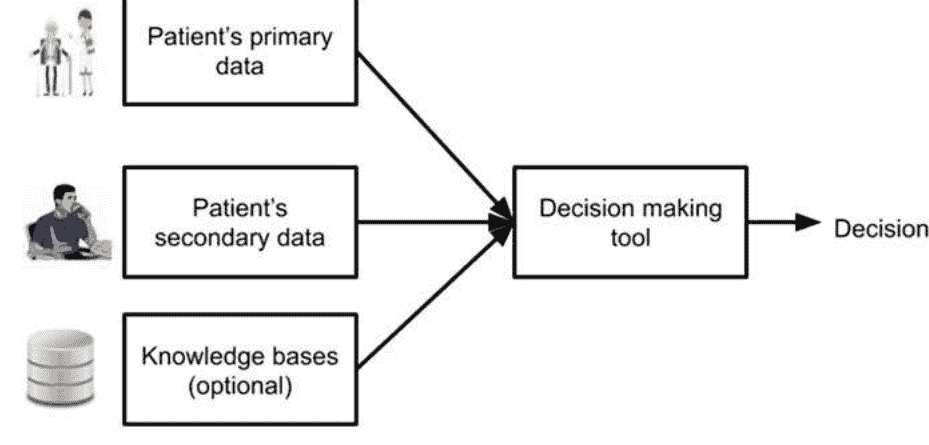

图1 临床决策支持系统的块图

几乎可以替代知识库，使其成为可选项。这些模型可以直接用作CDSS中的决策工具。例如，在[5]中，作者使用深度前馈神经网络预测住院患者的临床医嘱模式。考虑的特征包括合并症、患者性别和种族、国际疾病分类（ICD）-诊断代码等，来自电子健康记录。他们得出结论，基于深度神经网络的模型在预测实际临床实践方面优于标准护理人员编写的医嘱集。在[6]中，作者使用卷积神经网络对患者的电子健康记录进行处理，并提取诊断的高级语义信息并生成报告。这个结果被用作医疗从业者对健康状况的结论的辅助。在临床保健的不同领域中，有许多ML和DL的应用，也有未来可以探索的DL的潜在应用，这些将在本章的后面部分进行介绍。

本章的其余部分安排如下：在第2节中，我们回顾了现有的DL在图像处理（计算机视觉）中的应用，用于CDSS；在第3节中，我们讨论了DL在自然语言处理（NLP）中的应用，同时强调了某些现有的挑战；在第4节中，我们讨论了基于DL和可穿戴设备技术的CDSS；在第5节中，我们讨论了使用DL进行CDSS的相关问题；在第6节中，我们讨论了关于DL在CDSS中的未来研究展望；最后，在第7节中，我们对本章进行了总结和结论。

## 2 深度学习和图像分析

图像分析是智能医疗领域中一个被广泛探索的领域。自从数字成像出现以来，使用天真的基于规则的架构对图像进行自动化分析。90年代初期的时代转向了使用简单的机器学习算法从图像中提取有用的模式和信息。然而，这涉及到很多手工工程，包括决定提取哪些特征，如何提取特征，选择哪种算法进行决策等等。深度学习的最新进展给人们带来了很大的解脱，因为深度学习的架构特性非常强大，可以无缝地从给定的数据中提取特征并近似预测函数。这种深度学习算法的特殊潜力使其成为图像分析和计算机视觉应用的首选工具。

在所有现有的研究工作中，涉及图像分析的模块是相似的。这些模块在图2中总结如下：图像获取包括使用各种方法捕获实体的图像，这些图像经过预处理阶段，图像被过滤或经过手动边界框刻画，修改后的图像被传入卷积神经网络（CNN）块进行训练。获取的图像传递给一个解释器（可选），可以是全连接网络、自编码器等，将前几个阶段获得的图像量化为医疗从业者可以理解的所需形式。现在我们来看看近年来研究人员在医学图像分析中提出的DL的各种应用。

卷积神经网络在使用DL进行图像分析的工作中经常出现。使用CNN的原因是：CNN学习相关特征，就像人脑从图像中提取特征一样。CNN的另一个重要特点是权重共享[7]，即卷积核在图像中共享，这有效地学习局部模式，并通过减少整个过程中涉及的参数数量来提高模型效率。在图像分析中，与传统的密集神经网络相比，CNN更容易使用迁移学习[7]。

让我们看看一些使用CNN进行图像分析任务的作品。在[8]中，作者回顾了深度学习在各种医学影像应用中的应用。他们指出图像分析

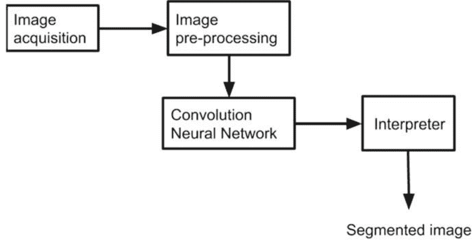

图2 使用CNN进行图像分析的一般块图

主要在病理学、肺部、脑部、心脏、腹部、乳房、骨骼、视网膜等方面进行了研究。此外，还使用了各种成像模式，如MRI、CT、X射线、PET、超声和可见光范围，其中MRI和可见光显微成像在图像分析中被广泛使用。此外，作者指出图像分析技术，如分割、分类（用于医学检查和推理以及目标检测）和配准得到了广泛研究。在这些方法中，感兴趣区域（RoI）的分割和给定图像中对象的检测是图像分析方法中最常研究的，因为它们具有实际应用的意义。

在[9]中，作者提出了一种用于识别心脏腔室的感兴趣区域分割的方法。该方法分为三个部分，第一部分使用卷积神经网络（CNN）[10]来定位图像帧中包含左心室（LV）的区域，第二部分使用堆叠自编码器从第一部分输入的图像中推断出LV的形状，第三部分包括一个Dense-NN来分割并生成LV的二值掩模。该算法在公开可用的LV数据集（MRI扫描）上进行了训练和验证，准确率达到96.69%。

在[11]中，作者提出了一种基于涂鸦的卷积神经网络用于图像分割任务。正如作者所述，完全自动化的深度学习算法在未见过的/测试图像上表现较差，因此需要一个边界框来简化算法的搜索空间。这种基于边界框的训练方法提供了更好的分割准确性。[12]中的工作提出了一种多模态图像分割方法，作者使用了MRI、PET和CT成像。图像经过三个单独的卷积神经网络，然后将输出融合在一起，以获得更精确的分割图像。在[13]中，作者提出了一种使用深度卷积神经网络（DCNNs）协同进行脑肿瘤和皮肤病变分割的新型架构。DCNNs成对出现，每当一个DCNN对数据输入进行错误分类时，就会产生一种协同错误，这会更新整个网络，以及通常的反向传播错误。在表1中以简洁的方式呈现了使用CNN的类似工作。

尽管CNN在目标检测和分割方面表现出很高的效果，但它们需要具有大量样本和相应高内存需求和处理能力的数据集。而且它们无法检测边界处像素信息的变化。因此，[18]中的作者提出了一种基于循环神经网络（RNN）的架构，它学习了基于水平集的可变形模型（LDMs，也称为几何或隐式主动轮廓模型），这些模型在恒定和平均曲率速度下演化。本研究考虑的具体任务包括彩色眼底图像中的视盘和杯的分割、组织病理学图像中的细胞核以及心脏MRI体积中的左心房。图2中的块图将保持不变，但CNN块将被RNN替代。类似使用CNN和RNN进行医学分割的工作可以在[19-21]中看到。表2显示了在大多数与医学成像相关的研究中使用的图像数据集。

**表1 DL和图像分析工作**

| 引用 | 成像模式 | 备注 |
|---|---|---|
| Koitka等人[14] | X射线 | 使用更快的RCNN和Inception ResNet V2作为特征提取器。DL技术用于确定骨骼中的骨化区域，以确定化石的年龄。数据集来自RSNA儿科骨龄挑战赛 |
| Deniz等人[15] | MRI（磁共振成像） | UNets（一种CNN）用于处理MR图像切片，以分割近端股骨ROI进行骨折风险评估。 |
| Abd-Ellah等人[16] | MRI（磁共振成像） | 该工作分为两个阶段：第一阶段使用CNN（AlexNets、VGG-16和VGG-19）与基于纠错输出码的支持向量机（ECOC-SVM）进行肿瘤检测，第二部分使用R-CNN进行肿瘤定位。 |
| Kamnitsas等人[17] | MRI（磁共振成像） | 该工作使用3D CNN从患有脑肿瘤和缺血性中风的患者的脑图像中分割病变 |

摘要

本节回顾了各种DL算法及其在图像分析任务中的应用。现有的图像分析工作大多集中在图像分割和RoI的检测上。CNN及其变种等DL架构可以广泛见到。RNN也被应用于一些图像任务中，并且在文献中也遇到了将深度学习与朴素机器学习技术（如支持向量机）相结合的情况。尽管使用机器学习技术进行图像分割已经研究了很多年，但由于涉及大量手工特征工程，从图像（特别是医学图像）中提取有意义的信息是一项繁琐的工作。DL算法的使用减少了这种工作量，并且依赖医学成像推断的临床支持系统得到了及时决策的工具。观察到在与图像分析相关的现有文献中，有监督的深度学习技术比无监督学习技术更常用。

**表2 医学成像研究常用的图像数据集**

| 数据集 | 备注 |
|---|---|
| Brainweb [22] | 包含正常和多发性硬化的模拟脑MRI图像 |
| MICCAI [23] | 包含脑肿瘤数据 |
| NIHCC [24] | 包含8种疾病的胸部X射线图像：肺不张，心脏肥大，积液，浸润，肿块，肺炎，气胸 |
| TCIA [25] | 肺图像数据库联盟（LIDC），用于评估反应的参考图像数据库（RIDER）以及与乳腺癌，肺幻影，非小细胞肺癌，脑癌，胶质母细胞瘤，鳞状细胞癌，前列腺癌等相关的其他图像数据集 |
| OASIS [26] | 包含脑部图像 - MR和PET |
| ADNI [27] | 包含与阿尔茨海默病相关的数据 |
| FITBIR [28] | 创伤性脑损伤数据集 |
| STARE [29] | 视网膜图像数据集 |
| 约翰霍普金斯医学研究所数据库[30] | 脑图像数据库 |
| MIDAS [31] | 脑损伤图像数据集 |
| UCI数据库 [32] | 帕金森病数据集 |
| 康奈尔数据库 [33] | 胸部CT图像 |
| USF数据库 [34] | 乳腺X线摄影和步态基线 |
| LIDC [35] | 肺部图像数据库 |
| SCR数据库 [36] | 胸部X射线片 |
| VIA团队 [37] | 肺部图像数据库 |
| Mini-MIAS [38] | 乳腺X线摄影图像 |
| DIARETDB1 [39] | 糖尿病视网膜病变图像 |
| OAI [40] | 通用图像数据库 |

## 3 深度学习和自然语言处理

自然语言处理（NLP）是计算机程序理解、解释和操作人类语言的能力。NLP在一般情况下的应用包括企业搜索，计算机程序从人类语音中提取信息，从而在数据库中搜索相关记录并返回答案。情感分析是NLP的另一个强大应用，数据科学家通过分析评论和评价来获得反馈，以进一步改进。特别是在医疗保健领域，NLP除了上述应用外还发挥着重要作用。首先，尽管许多患者可以访问他们的电子健康记录（EHR），这是实时的患者数据记录，但他们无法解释它。其中一个主要原因是医务人员缺乏时间让患者理解EHR数据。通过使用自然语言处理（NLP），人们可以理解数据并通过建议的医疗处方、日常活动图表等方式保持健康。此外，将图像或PDF转换为信息文本，并解析和分析以提取有用信息也是NLP的另一个应用。一个最好的例子是IBM Watson机器，该机器经过训练可以运行在患者的数据上，并提取风险特征，从而预测可能影响患者的疾病。

让我们来看看现有文献中使用NLP进行临床支持系统的工作。在[42]中的工作提出了一种使用NLP从自由文本医疗报告中提取潜在医疗状况的方法。这里的整个过程由两个主要组件组成：背景应用程序和问题列表管理应用程序。背景应用程序负责使用基于规则的NLP从医疗文件中提取可能的医疗状况的信息，并将其存储在中央数据库中。问题列表管理应用程序访问存储在数据库中的数据，并对患者的医疗问题做出结论。该工作侧重于80种不同类型的医疗状况，如心律失常或缺血性心脏病；二尖瓣狭窄或左束支传导阻滞；哮喘或疼痛。在[43]中，作者提出了一种基于NLP的方法来分析和比较那些更有可能自杀和已经尝试自杀的患者的健康记录。该工作基于这样一个事实，即许多有自杀风险的患者会去咨询他们的医生。这项研究使用了eNQUIRNet，这是一个将EHR数据链接到多个非集成的初级保健临床组织的数据库，代表着超过300万患者和1700名临床医生。使用三个来源来确认患者是否有自杀倾向——首先搜索ICD-9代码（国际疾病分类代码），指示自杀企图或意向：E950-959（企图）和V62.84（意向）来自EHR，其次是解析HPI字段（现病史）以识别与自杀症状相关的条目，如自残、上吊、切割企图；第三个字段是PHQ-9（患者健康问卷）检查，记录了抑郁症的严重程度。提取的字段证实自杀企图比仅仅意向更常见。在[44]中也看到了类似的工作，根据292名患者的胸部X射线报告，使用基于规则的NLP推断急性细菌性肺炎的存在。

然而，尽管被认为是临床支持的NLP系统，但上述所有方法都没有使用DL的概念。在这个背景下，我们提出了一种使用CNN进行文本分类的方法。该方法包括以下几个阶段：(i)从数据记录中提取关键词 (ii)将文本/句子和医学代码的词序列转换为向量形式，使用查找表/特征映射过程 (iii) 将获得的向量序列输入到一系列卷积和池化层中，对文本进行疾病发生分类。图3中的块图解释了这种方法。分类层的输出可以用于CDSS中的任何预测或识别目的。

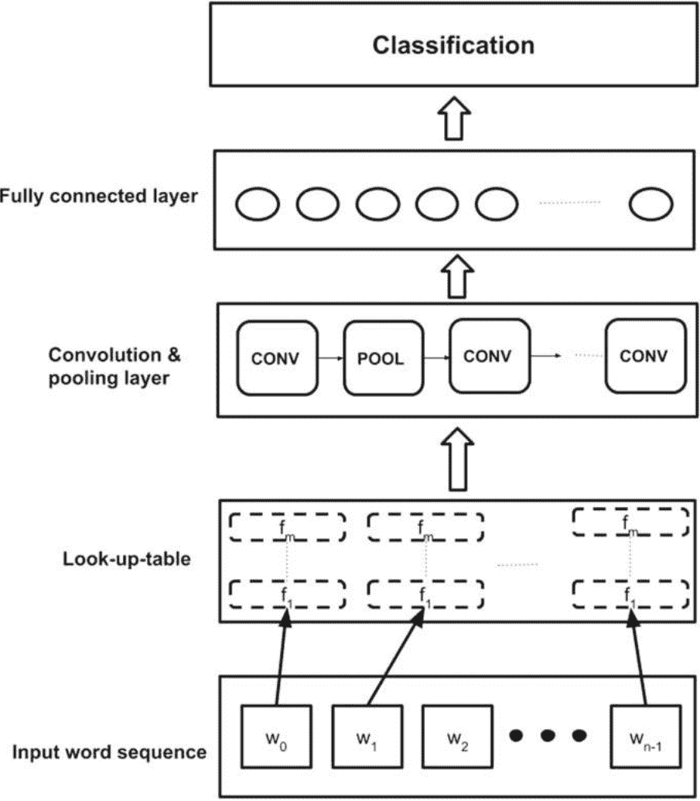

图3 从文本数据中使用CNN进行分类

类似地，我们可以使用RNN从文本中学习。图4是基于RNN的可能架构，可用于从文本数据中学习。该图显示了一系列按顺序连接形成网络的RNN单元。临床文本或医学代码中的单词被作为输入提供给这个序列学习器，输出可以从所有RNN单元或仅从最后一个RNN单元中获取，根据需求。例如，从电子病历中提取的文本或症状信息可以被输入到这些网络中，以预测最可能影响患者的疾病。

可以通过将架构中的普通RNN替换为长短期记忆（LSTM）单元来构建类似的网络。使用LSTM的优点是使用内存单元和多个门将信息延续到序列的较长部分。这有助于神经网络在训练数据集中学习变化并减少错误。

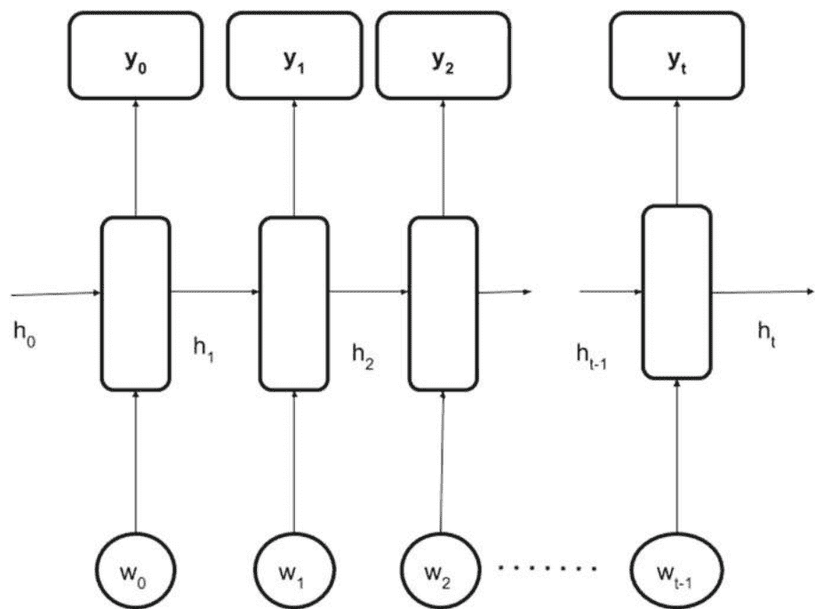

以下是临床支持和医疗应用中经常使用的数据集的一些链接。

**表3 临床支持与医疗应用中常用的数据集**

| 数据集 | 备注 |
|---|---|
| MIMIC [45] | 由MIT开发，具有约40,000名危重患者的匿名健康记录 |
| i2b2 [46] | 近1500名患者的健康记录 |
| HealthData [47] | 来自美国联邦政府的健康数据 |
| BCHC数据平台[48] | 来自26个城市的健康数据，涵盖34个健康指标和6个人口统计指标 |
| HMD [49] | 人类死亡数据库 |
| MHealth数据集[50] | 身体动作和体育活动的数据库 |
| 医疗保险[51] | 医生和其他医疗保健专业人员为医疗保险受益人提供的服务和程序的数据 |
| LSDB [52] | 与生命科学相关的数据 |
| HCUP-US [53] | 数据集包含美国医院住院、急诊就诊和门诊手术的接触级信息 |
| SEER [54] | 由美国政府提供的按人口统计分组（如年龄、种族和性别）分割的癌症发病率数据 |
| BROAD [55] | 按项目分类的数据，如脑癌、白血病、黑色素瘤等 |

一般来说，DL应用于EHR的整体系统框图如图5所示。

如图5所示，应用于EHR的深度学习技术应执行三个主要任务：单一概念提取，即提取可能的疾病、治疗和程序等信息。其次，时间事件提取，即为事件分配时间，如几小时内，本月内等。

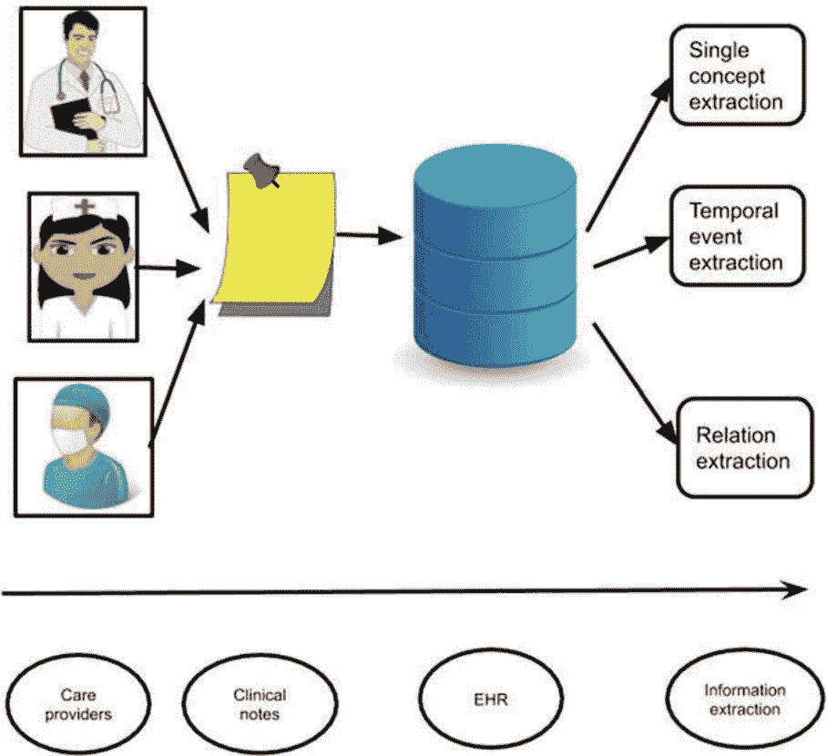

图5 用于医疗决策的自然语言处理 [56]

第三个是关系抽取，比如哪种治疗对什么有影响，哪种测试用于什么等等。

在上面的讨论中，详细解释了一些深度学习技术，如卷积神经网络和循环神经网络。然而，还有其他广泛应用于临床决策支持的自然语言处理应用的深度学习技术，例如Boltzmann机器及其变种，如深度置信网络[57]，自编码器及其变种，如稀疏自编码器，变分自编码器和去噪自编码器。在这种情况下，[58]中的作者使用了深度置信网络（DBNs），它使用受限玻尔兹曼机（RBMs）作为呼叫中心客户热线中技术支持的构建模块，为一家财富500强公司提供技术支持。RBMs具有使用可见节点和隐藏节点架构从数据中提取有用特征的优势。获取的特征被馈送到RBMs的层中形成DBN，并使用Kullback-Leibler散度进行训练。

此外，DBN也被用作传统机器学习算法（如SVM、最大熵和提升）的特征提取器。该研究得出的结果证明，将DBN与SVM相结合，比单独使用这些学习模型解决呼叫路由问题时能够提供更高的准确性。同样的方法也可以用于处理医学领域的语音。RBM在其他领域也有一些应用[59-61]。

### 3.1 在医疗保健中使用深度学习进行自然语言处理的挑战

- 数据异构性：电子病历数据以不同的形式存在，从手写文本到打印文件不一而足。深度学习算法必须能够解析和理解这些数据。具体来说，临床文本包含缩写、速记符号，并且在不同的临床医生之间存在差异。
- 政策和数据隐私问题：使用深度学习算法进行训练需要大量的数据集。将这些数据提供给深度学习研究人员始终受到患者政策和隐私问题的限制。
- 决定基准：由于许多研究人员使用自己的私人数据，他们不愿意将数据共享给其他研究人员，因此，在临床支持任务中设定一个共同的基准是困难的。
- 深度学习的固有问题：这些问题源于深度学习算法本身，如任务模型的选择、数据大小、调整超参数、高性能硬件要求、过拟合和欠拟合问题、泛化问题、灵活性（偏差和方差的权衡）以及多任务（利用共同知识学习多个任务）问题。

摘要

自然语言处理（NLP）是深度学习研究社区中受追捧的领域之一。使用深度学习来理解和解释健康记录可以节省临床医生的时间，同时为患者提供及时的药物治疗。NLP应用涉及从简单的基于规则的数据解析技术到使用卷积和循环神经网络的各种算法。在使用基于深度学习的NLP进行CDSS时存在一些挑战和问题。

解决这些问题将成为自动化医学进展的重要里程碑。

## 4 深度学习和可穿戴设备技术

可穿戴技术正在改变消费电子产品。随着电路技术的进步，可穿戴设备被广泛用于捕捉患者的模式，以支持临床和决策过程。苹果的iWatch[62]具有Mayo诊所应用程序，可以捕捉患者的健康状况，如心率、血压、体温和消耗的卡路里，是可穿戴技术的最佳示例之一。远程患者监测是这项技术的重点之一，患者可以在没有再入院的情况下进行监测，并在健康状况突然下降时进行干预。这些设备收集数据并传输到集中的云端，临床支持决策在那里进行。

总的来说，将深度学习与可穿戴技术结合起来是通过将大数据系统与人类神经系统[63]进行比较而得出的。人体中枢神经系统由大脑和脊髓作为主要器官组成。脊髓通过感觉器官从身体的不同部位接收信号。可穿戴深度学习技术中模仿了同样的现象，其中由深度学习支持的云构成系统的大脑，感知和通信模块类似于感觉器官和脊髓。可穿戴技术与深度学习的完整框图如图6所示。

可穿戴传感器的内部架构如图7所示，其中有一个内部电池和一个充电器单元，有时模块可以由外部处理器驱动并与之接口。生物传感器用于从身体中获取生理信号。这些信号经过前置放大器和信号调理电路，以消除噪声和微小的信号伪像，并通过模数转换器（ADC）进行转换。从ADC，信号通过控制器无线传输数据，使用适当的无线模块。有时感测模块可能直接发送到云端或附近的聚合器，聚合来自许多传感器的数据并将数据传输到云端。

可穿戴技术已经发展并取得了许多改进和创新，其中一些在这里进行了讨论。如前所述，在传统的可穿戴技术系统中，由于算法需要大量的计算能力来执行，DL驻留在云端，而由电池驱动的感测模块无法执行这些算法。在这种情况下，[64]中的作者提供了一种创新的解决方案，即将DL任务分配给本地手持设备，如智能手机或平板电脑，引入边缘计算的概念。这样做不需要始终进行互联网连接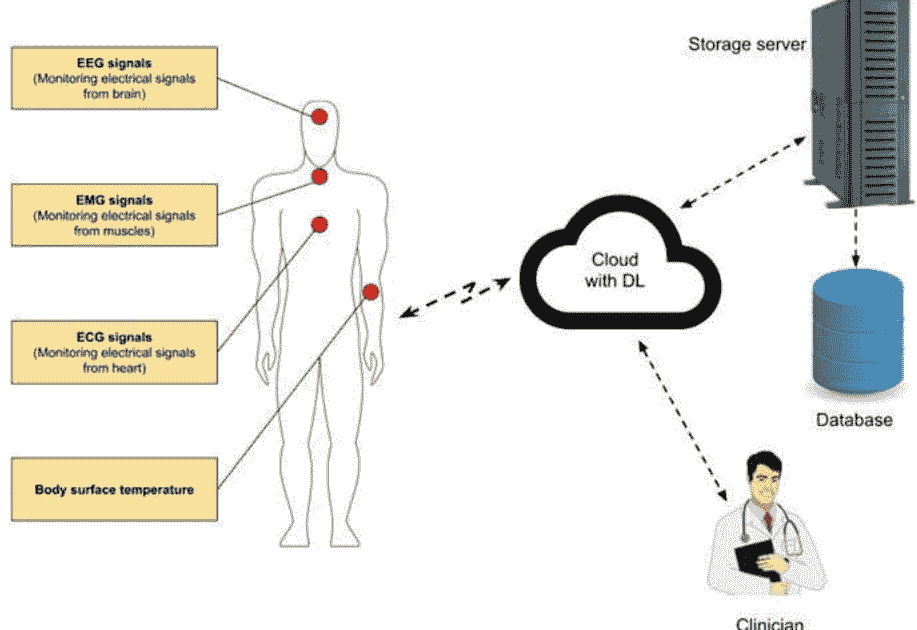

### 图6 可穿戴式深度学习的块图

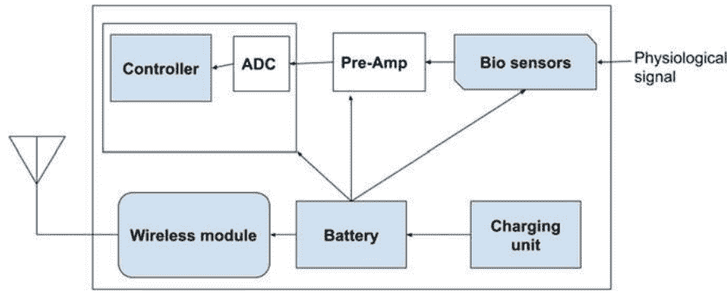

### 图7 感知模块的块图

可以避免将数据传输到外部站点（云）导致的隐私泄露。

在[65]中，作者提出了使用智能手机作为感知设备，并在手机上运行DL程序的新思路。智能手机上可用的加速度计、陀螺仪和磁力计传感器用于研究人体活动。该工作使用SIFT（尺度不变特征变换）从智能手机传感器捕获的信号中进行特征提取，获取的特征被传递给卷积神经网络，用于将信号分类为人体活动。

在[66]中，作者提出了基于可穿戴技术和基本机器学习算法的CDSS的完整架构。该架构包含四个层次：第一层对生理信号（如心电图、脑电图、呼吸信号、氧气和心率、体温、踝关节和脚部运动）进行普遍监测。获得的信号传递给第二层，即使在这个阶段准确的实验室测量结果尚不可用，也为医生提供初步的决策支持。在第三层，对患者的更详细分析结合实验室测量结果进行。最后，第四层提供后诊断建议、处方等。所有这些层都与包含机器学习算法的诊断引擎内部连接，为每个层提供决策。所有实验室测试和诊断数据都被馈送到该引擎，以在任何时间点提供适当的决策。机器学习辅助模块包含单个或集成的学习算法。作者们探索了随机森林、朴素贝叶斯、K最近邻、支持向量机、最佳优先决策树和多层感知器模型在诊断推理中的应用。这些模型为探索使用深度学习算法而不是传统的机器学习算法开辟了道路。

在[67]中观察到了一项非常有趣的工作，作者们提出了一种使用可穿戴技术监测心理健康症状的方法。通过GPS、加速度计和陀螺仪获取运动数据，通过智能手机或手表的麦克风获取语音，通过手机摄像头获取面部表情，通过摄像头获取眼睛的眨眼模式，通过智能手表获取皮肤电活动，通过语音通话、Twitter和其他社交网络数据获取社交互动模式。虽然没有详细讨论如何利用这些信号来监测心理健康，但这开辟了一个新的方向，可以使用与[65]中处理的方法相同的方法设计基于学习心理健康信号的CDSS。

在[68]中，提出了使用可穿戴技术远程监测老年公民的智能医疗监测系统（SW-SHMS）。SW-SHMS的架构主要由三个部分组成：患者的环境，其中身体附着传感器以读取温度、血氧水平、心率等数据，这些传感数据通过患者的智能手机或网关设备传输到云端。相应的块图如图8所示。

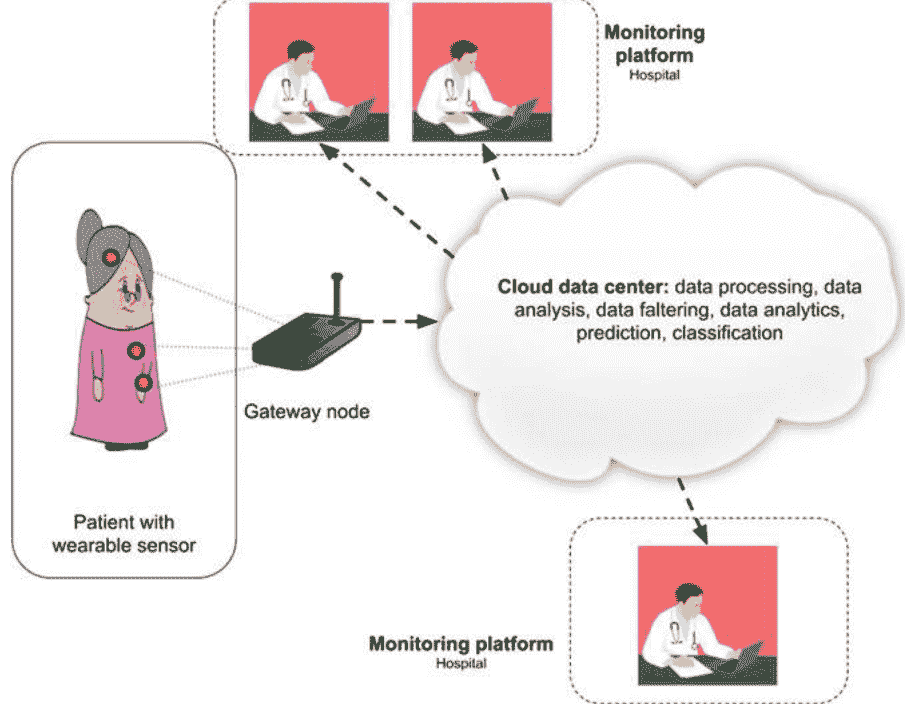

### 图8 SW-SHMS系统架构

云端使用机器学习和/或深度学习算法对数据进行各种分析，提取有用的推断，然后将其发送到包含医生的监测平台，医生可以做出临床决策并采取预防措施。

根据[63]中对现有工作的调查，以下是经常与可穿戴技术结合使用的DL算法列表：深度无监督学习-受限玻尔兹曼机、深度置信网络、深度玻尔兹曼机、自编码器和变分自编码器、生成对抗网络和序列学习；深度有监督学习-前馈神经网络、深度神经网络、脉冲神经网络、序列到序列学习, RNNs, LSTMs, GRUs, 卷积LSTMs; 深度强化学习-深度Q网络和逆向DRL。

摘要：大多数使用可穿戴技术与DL的作品具有类似的架构，其中在云上进行分析和其他DL任务的应用。然而，也有一些例外，研究人员提出使用边缘计算来解决隐私泄露和集中式云方法的计算负担问题。几乎所有类型的DL算法都被用于进行分析。从分析中获得的结果被用于协助临床医生对患者做出进一步的决策。

## 使用DL进行CDSS的5个问题

以下是仍然存在于使用DL进行CDSS的几个问题：

- 1. 法规和政策：在临床决策支持系统使用DL没有固定的规则和法规。为了克服这个困难，美国FDA制定了第一套评估医疗人工智能系统的法规[69]。FDA提到的指南明确通知了临床试验中数据和自适应设计的使用。在这方面，Arterys的医学影像平台成为首个获得FDA批准的DL平台用于CDSS。
- 2. 数据共享：DL系统的训练和验证需要大量的数据，并且需要在医院和DL专家之间共享。目前，人们没有共享数据的动力，而且他们受到知识产权和隐私政策的限制。然而，数据交换现在正逐渐转向基于奖励的系统，一个最好的例子是保险公司从医生那里收集数据进行数据分析，健康数据的众包也在逐渐兴起。
- 3. 数据兼容性：有时候机器获取的数据和医疗领域采用的程序对于深度学习/机器学习系统来说并不有用，因为它们与所使用的算法不兼容。
- 4. 隐私问题：正如前面提到的，健康数据是个人信息，很多时候家庭成员、亲戚和临床医生可能会拒绝提供数据，认为这是侵犯隐私。为了解决这个问题，深度学习专家提出了分布式机器学习的概念，即在生成数据的地方进行训练和测试学习算法，而不需要将数据传输到集中式云端。然而，这种方法可能仍然需要相当长的时间才能被医务人员接受并定期使用。
- 5. 社会文化问题：大多数患者或临床医生不信任在医疗领域使用人工智能，在许多情况下，人们更加谨慎地对待使用人工智能来押上他们的生命或职业。此外，医疗领域的从业人员担心由于人工智能系统显示出比人类专家更高水平的准确性而导致工作不稳定。此外，普通大众对人工智能的概念不可理解，存在由于无知和不确定性而产生的恐惧。
- 6. 透明度：许多深度学习算法都包含没有太多内部细节的黑盒子，并且在解释为什么某些预测来自算法方面缺乏。这使得临床医生对基于人工智能的系统不太信任。

## 6个未来研究方向

- 1. 解释性深度学习：如前所述，许多深度学习算法缺乏对预测的解释，并且像黑盒子一样工作。这一方面将不允许对基于深度学习的临床决策支持系统产生足够的信任，临床医生必须做出生死决策。这是一个需要在未来研究中解决的重要问题。
- 2. 理性与非理性：人类在医疗决策方面可能极其非理性。但是机器学习和深度学习算法被训练成理性学习者。这个问题需要在未来的研究中解决，有研究人员提出了基于博弈论的解决方案。然而，这仍然是一个未解决的问题。
- 3. 数据安全和隐私：当有一组数据库或一个众包的数据池被用于在线训练和测试ML/DL算法时，算法被破坏或数据泄露的风险总是存在的。因此，安全性始终是这些专家系统关注的问题。此外，患者的隐私也应该得到保护。在这种情况下，总是需要新颖的安全和隐私算法。
- 4. 人工智能（AI）向扩展智能（EI）的转变：人类智能与人工智能的概念应该在未来的研究中逐渐消失。这也增加了患者和临床医生使用人工智能进行医疗保健的信任。只有当人工智能转变为扩展智能时，机器才能成为学习和支持生态系统的一部分，即机器为人类日常生活中的活动提供支持。
- 5. 偏斜或不平衡的数据集：对于用于训练和验证AI算法的数据集，确保数据集不偏向于单一类别非常重要。如果数据是类别不平衡的，则需要对数据进行预处理或修改算法，以便以无偏的方式进行学习。这在许多现有的研究中很少得到解决，需要在未来加以研究。
- 6. 预后的深度学习：大部分关注深度学习应用于诊断的工作都是为了推断。然而，目前很少有关注预后（提前了解健康状况可能如何发展）的研究，这是导致医疗状况的一个方向。除了诊断，将深度学习应用于预后将是未来研究的一个好方向。

## 7 结论

在本章中，我们讨论了深度学习在CDSS中的三个重要应用，即图像分析、自然语言处理和可穿戴技术。

当人工智能等颠覆性技术进入医疗保健和医学领域时，传统的医疗方法和临床决策手段发生了巨大的转变。这在当今时代非常重要，我们正朝着建设智能城市的方向发展，其中智能医疗占据重要地位。使用先进的学习算法使临床医生的工作变得简单，节省时间，并提高患者和普通人的生活质量。在使用AI和DL进行CDSS时存在一些问题，特别是安全和隐私问题，但毫无疑问，在未来，DL将成为临床诊断决策中最强大的工具之一，从而实现智能医疗。

### 参考文献

- 1. Esteva, A., Robicquet, A., Ramsundar, B., Kuleshov, V., DePristo, M., Chou, K., Cui, C., Corrado, G., Thrun, S., Dean, J.: 深度学习在医疗保健中的指南. Nat. Med. 25, 24–29 (2019)
- 2. Safran, C., Bloomrosen, M., Hammond, W.E., Labkoff, S., Markel-Fox, S., Tang, P.C., Detmer,D.E.: 迈向国家卫生数据二次利用的框架：美国医学信息学协会白皮书. J. Am. Med. Inf. Assoc. 14(1), 1–9 (2007). https://doi.org/10.1197/jamia.m2273. ISSN 1067-5027. PMC 2329823. PMID 17077452
- 3. Atta-ur-Rahman, M.I.B.A: 虚拟诊所：一个CDSS辅助的远程医疗框架。 在：远程医疗技术，第15章，第1版。爱思唯尔出版社（2019年）
- 4. Atta-ur-Rahman, S.M.H., Jamil, S.: 虚拟诊所：巴基斯坦偏远地区的远程医疗提案。在：第三届世界信息与通信技术大会（WICT'13），第46-50页，12月15-18日，越南（2013年）
- 5. Wang, J.X., Sullivan, D.K., Wells, A.J., Wells, A.C., Chen, J.H.: 临床订单决策支持的神经网络。AMIA Jt. Summits Trans. Sci. Proc. 2019，315-324页（2019年）
- 6. Yang, Z., Huang, Y., Jiang, Y., Sun, Y., Zhang, Y.-J., Luo, P.: 基于卷积神经网络的电子病历临床助理诊断。科学报告。 8（6329）（2018年）
- 7. Yamashita, R., Nishio, M., Do, R.K.G., Togashi, K.: 卷积神经网络：概述和在放射学中的应用。 Insights Imaging 9，611-629页（2018年）。 https://doi.org/10.1007/s13244-018-0639-9. Springer出版社
- 8. Litjens, G., Kooi, T., Bejnordi, B.E., Setio, A.A.A., Ciompi, F., Ghafoorian, M., van der Laak, J.A.W.M., van Ginneken, B., Sánchez, C.I.: 对医学图像分析中的深度学习进行调查。医学图像分析。 42，60-88（2017年）
- 9. Avendi, M., Kheradvar, A., Jafarkhani, H.: 结合深度学习和可变形模型的方法，完全自动分割心脏MRI中的左心室。医学图像分析。 30，108-119（2016年）
- 10. Szegedy, C., Toshev, A., Erhan, D.: 用于目标检测的深度神经网络。NIPS（2013年）
- 11. Wang, G., Li, W., Zuluaga, M.A., Pratt, R., Patel, P.A., Aertsen, M., Doel, T., David, A.L.,Deprest, J., Ourselin, S., Vercauteren, T.: 使用图像特定的微调进行交互式医学图像分割的深度学习。IEEE Trans. Med. Imaging 37（7），1562-1573（2018年）
- 12. Guo, Z., Li, X., Huang, H., Guo, N., Li, Q.: 基于多模态卷积神经网络的医学图像分割：图像融合方案研究。 在：IEEE第15届国际生物医学成像研讨会（ISBI 2018），2018年4月4日至7日，华盛顿特区，美国，pp. 903-907
- 13. Zhang, J., Xie, Y., Wu, Q., Xia, Y.: 利用协同深度学习进行医学图像分类. 医学图像分析 54, 10-19 (2019)
- 14. Koitka, S., Demircioglu, A., Kim, M.S., Friedrich, C.M., Nensa, F.: 使用深度神经网络进行儿童手部射线照片的骨化区域定位. PLoS One13(11), e0207496 (2018). https://doi.org/10.1371/journal.pone.0207496
- 15. Deniz, C.M., Xiang, S., Hallyburton, R.S., Welbeck, A., Babb, J.S., Honig, S., Cho, K., Chang,G.: 使用深度卷积神经网络从MR图像中分割近端股骨. Sci. Rep. 8(16485) (2018)
- 16. Abd-Allah, M.K., Awad, A.I., Khalaf, A.A.M., Hamed, H.F.A.: 两阶段多模型自动脑肿瘤诊断系统，使用卷积神经网络从磁共振图像中，欧洲信号和图像处理期刊 2018，97 (2018)
- 17. Kamnitsas, K., Ledig, C., Newcombe, V.F.J., Simpson, J.P., Kane, A.D., Menon, D.K., Rueckert, S., Glocker, B.: 高效多尺度3D CNN与完全连接CRF用于准确的脑损伤分割，医学图像分析 36，61-78 (2017)
- 18. Chakravarty, A., Sivaswamy, J.: RACE-net: 一种用于生物医学图像分割的循环神经网络 ，IEEE生物医学和健康信息学杂志
- 19. Wang, S., He, K., Nie, D., Zhou, S., Gao, Y., Shen, D.: 使用具有边界敏感表示的完全卷积网络进行CT男性盆腔器官分割。医学图像分析。（2019年）
- 20. Ambellan, F., Tack, A., Ehlke, M., Zachow, S.: 结合统计形状知识和卷积神经网络的自动化膝骨和软骨分割。来自骨关节炎倡议的数据。医学图像分析。52, 109-118 (2019年)
- 21. Gao, Y., Phillips, J.M., Zheng, Y., Min, R., Fletcher, P.T., Gerig, G.: 全卷积结构化LSTM网络用于联合4D医学图像分割。在：IEEE第15届国际生物医学成像研讨会 (ISBI 2018) , 华盛顿特区，2018年，第1104-1108页。 https://doi.org/10.1109/isbi.2018.8363764
- 22. http://brainweb.bic.mni.mcgill.ca/brainweb/
- 23. http://braintumorsegmentation.org/
- 24. https://nihcc.app.box.com/v/ChestXray-NIHCC
- 25. https://www.cancerimagingarchive.net/
- 26. http://www.oasis-brains.org/#data
- 27. http://adni.loni.usc.edu/
- 28. https://fitbir.nih.gov/
- 29. http://cecas.clemson.edu/~ahooover/stare/
- 30. http://lbam.med.jhmi.edu/
- 31. https://www.insight-journal.org/midas/
- 32. http://archive.ics.uci.edu/ml/index.php
- 33. http://www.via.cornell.edu/databases/
- 34. http://www.eng.usf.edu/cvprg/
- 35. https://wiki.cancerimagingarchive.net/display/Public/LIDC-IDRI
- 36. http://www.isi.uu.nl/Research/Databases/SCR/
- 37. http://www.via.cornell.edu/crfp.html
- 38. http://peipa.essex.ac.uk/info/mias.html
- 39. http://www2.it.lut.fi/project/imageret/dia ret DB1/
- 40. https://oai.epi-ucsf.org/datarelease/
- 41. IBM Watson临床决策支持系统。 https://www.ibm.com/watson-health/solutions/clinical-decision-support
- 42. Meystre, S., Haug, P.J.: 通过自然语言处理从电子临床文档中提取医疗问题:性能评估。J. Biomed. Inf. 39(6), 589-599 (2006). ISSN 1532-0464
- 43. Anderson, H.D., Pace, W.D., Brandt, E., Nielsen, R.D., Allen, R.R., Libby, A.M., West, D.R., Valuck, R.J.: 使用电子健康记录在初级保健中监测自杀患者。J.Am. Board Fam. Med. 28 (1), 65-71 (2015). https://doi.org/10.3122/jabfm.2015.01.14018144 Fiszman, M., Chapman, W.W., Aronsky, D., Evans, R.S., Haug, P.J.: 从胸部X射线报告中自动检测急性细菌性肺炎。J. Am. Med. Inform. Assoc. 7(6), 593-604(2000)
- 45. https://mimic.physionet.org/
- 46. https://www.i2b2.org/NLP/DataSets/Main.php
- 47. https://healthdata.gov/search/type/dataset
- 48. https://bchi.bigcitieshealth.org/indicators/1827/searches/34444
- 49. https://www.mortality.org/
- 50. https://archive.ics.uci.edu/ml/datasets/MHEALTH+数据集
- 51. https://www.cms.gov/Research-Statistics-Data-and-Systems/Statistics-Trends-and-Reports/Medicare-Provider-Charge-Data/Physician-and-Other-Supplier.html
- 52. https://dbarchive.biosciencedbc.jp/index-e.html
- 53. https://hcup-us.ahrq.gov/databases.jsp
- 54. https://seer.cancer.gov/faststats/index.html
- 55. https://gengo.ai/datasets/18-free-life-sciences-medical-datasets-for-machine-learning/?utm_campaign=c&utm_medium=quora&utm_source=rei
- 56. Shickel, B., Tighe, P.J., Bihorac, A., Rashidi, P.: 深度EHR: 对电子健康记录 (EHR) 分析中深度学习技术的最新进展的调查。 IEEE J. Biomed. HealthInf. 22(5), 1589-1604 (2018). https://doi.org/10.1109/JBHI.2017.2767063

57. Sarıkaya, R., Hinton, G.E., Deoras, A.: 应用深度信念网络进行自然语言理解. IEEE/ACM Trans. Audio, Speech, Lang. Process. 22(4), 778–784 (2014). https://doi.org/10.1109/TASLP.2014.2303296

58. Pan, S.J., Yang, Q.: 转移学习综述. IEEE Trans. Knowl. Data Eng. 22(10), 1345–1359 (2010). https://doi.org/10.1109/TKDE.2009.191

59. Jin, Y., Zhang, H., Du, D.: 通过Delta规则改进深度置信网络用于情感分类。 在：IEEE第28届人工智能工具国际会议（ICTAI），圣何塞，加利福尼亚州，第410-414页（2016年）。 https://doi.org/10.1109/ictai.2016.006960

60. Jiang, X., Zhang, H., Duan, F., Quan, X.: 基于RNA-seq数据的亨廷顿病相关基因的识别. BMC Bioinf. 18(1), 447 (2017). https://doi.org/10.1186/s12859-017-1859-6

61. Tomczak, J.M.: 从受限玻尔兹曼机中学习有信息的特征。 神经过程信件。 44(3), 735-750 (2016年)。 https://doi.org/10.1007/s11063-015-9491-9. Springer Publications

62. https://www.apple.com/in/watch/

63. Dargazany, A.R., Stegagno, P., Mankodiya, K.: 可穿戴式深度学习：可穿戴式物联网和深度学习用于大数据分析的概念、文献和未来。移动信息系统。 (8125126), 20 (2018). https://doi.org/10.1155/2018/8125126

64. Xu, M., Qian, F., Zhu, M., Huang, F., Pushp, S., Liu, X.: DeepWear: 自适应本地卸载用于可穿戴式深度学习。 IEEE Nat. Future Mob. Inf. Syst. Article ID 8125126, 20 (2018). https://doi.org/10.1155/2018/8125126 Transactions on Mobile Computing, https://doi.org/10.1109/tmc.2019.2893250

65. Ravi, D., Wong, C., Lo, B., Yang, G.: 人类活动识别的深度学习: 低功耗设备上的资源高效实现。 在: IEEE第13届国际可穿戴和植入式身体传感器网络大会（BSN），旧金山，加利福尼亚州，第71-76页（2016年）。 https://doi.org/10.1109/bsn.2016.7516235

66. Yin, H., Jha, N.K.: 基于可穿戴医疗传感器和机器学习集成的疾病诊断健康决策支持系统。 IEEE Trans. Multi-Scale Comput. Syst. 3(4), 228–241 (2017). https://doi.org/10.1109/tmcs.2017.2710194

67. Abdullah, S., Choudhury, T.: 监测严重精神疾病的传感技术。 IEEE多媒体 25(1), 61–75 (2018). https://doi.org/10.1109/mmul.2018.011921236

68. Al-khafaji, M., Baker, T., Chalmers, C., Asim, M., Kolivand, H., Fahim, M., Waraich, A.: 通过可穿戴传感器远程监测老年人的健康。 Multimed. Tools Appl. 78(17), 24681–24706 (2019). https://doi.org/10.1007/s11042-018-7134-7. Springer出版

69. Jiang, F., Jiang, Y., Zhi, H., et al.: 医疗保健中的人工智能: 过去、现在和未来。 中风血管神经学 2 (2017). https://doi.org/10.1136/svn-2017-000101

E. Sandeep Kumar完成了他的工程学士学位（B.E.）在电信工程，来自卡纳塔克邦Shimoga的Jawaharlal Nehru National College of Engineering (JNNCE)，印度，获得六个优秀奖和荣誉。他在数字通信工程方向获得了技术硕士学位（M. Tech）来自M.S. Ramaiah Institute of Technology (MSRIT)，班加罗尔，印度，以第一名和金牌的成绩。目前，他是MSRIT，IIT-Madras和FIU，迈阿密的合作博士研究生。他的兴趣领域是数据和网络科学，并在国际、国内期刊和会议上发表了许多论文。

Pappu Satya Jayadev获得了他的电气与电子工程学士学位，成绩优秀，来自Visakhapatnam的Gayatri Vidya Parishad College of Engineering。目前，他是IIT Madras的研究生学者（M.S. + Ph.D.），在与Dr. Ramkrishna Pasumarthy和Dr. Nirav Bhatt合作。他隶属于IIT Madras的Robert Bosch Center for Data Science and AI以及Systems and Control groups。他的研究兴趣包括系统的分析、优化和控制，应用机器学习和深度学习的工具。他的作品已经在多个国家和国际会议上发表。

# 基于机器学习和深度学习的健康信息学推荐系统综述
Jayita Saha, Chandreyee Chowdhury和Suparna Biswas

摘要 推荐系统在个性化医疗保健中变得至关重要,因为它们根据特定的需求和健康记录的可用性为患者提供有意义的信息。随着机器学习技术的改进,推荐系统为医学科学带来了几个机会。即使数据集多样且无结构,系统也可以使用深度学习更高效地解决复杂问题。在这里,我们全面概述了现有推荐系统所面临的挑战。详细讨论了通常应用于健康推荐系统的机器学习和深度学习技术,以及它们在健康信息学中的应用。

关键词 健康信息学 ·推荐系统 ·机器学习 ·深度学习 ·智能医疗 ·半监督学习

J. Saha · C. Chowdhury (通讯作者) 计算机科学与工程, 加达夫普尔大学, 印度加尔各答 e-mail: chandreyee.chowdhury@gmail.com
J. Saha 电子邮件: gjai.2000@gmail.com
S. Biswas 计算机科学与工程, 穆拉纳·阿布尔·卡拉姆·阿扎德技术大学, 印度加尔各答 电子邮件: mailtosuparna@gmail.com

◎ Springer Nature Switzerland AG 2020
101
S. Dash等人(编), 生物医学和健康信息学的深度学习技术, 大数据研究68, https://doi.org/10.1007/978-3-030-33966-1_6

## 1 生物医学和健康信息学简介
世界面临着诸多人口统计挑战,如预期寿命的增加导致人口老龄化和慢性疾病的流行。治疗这些疾病通常需要每天监测,常常需要住院。这些挑战还受到不断上升的医疗费用的影响。幸运的是,技术已经取得了长足的进步,为公民提供了在自由生活条件下监测健康参数的帮助。因此,住院期间可以缩短,同时提高公民的生活质量。用户行为可以通过非侵入式感知技术客观监测,以揭示身体活动和日常生活方式对个体健康的影响之间的关系。

健康信息学有助于将技术、通信和医疗保健联系起来,以提高安全性、健康生活方式的质量和运营医疗信息系统的质量。在这里,信息学指的是如何应用从收集的数据中提取的知识来改善健康和医疗保健服务质量的科学。因此,在健康信息学中,计算机和信息科学原理被应用于改善患者护理和公共卫生。

这些技术已经出现,为健康专业人员和公民提供帮助,特别是通过对各种健康记录进行详细分析来监测健康状况,如图1所示。这些辅助应用在传播健康意识方面起着至关重要的作用。例如,智能手机和可穿戴感应设备用于收集人类日常活动和与日常生活相关的信息[1]。

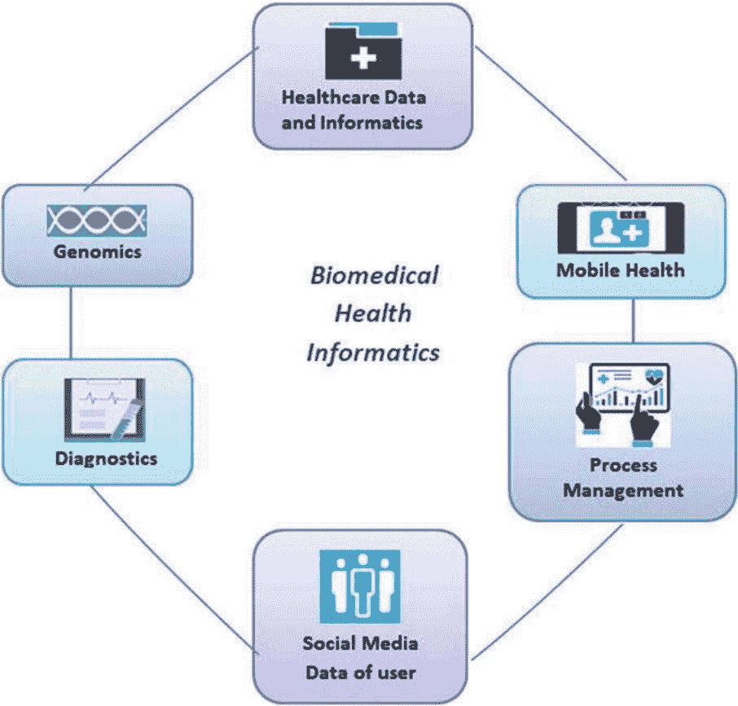
图1 生物医学和健康信息学的组成部分

当前的研究表明,跟踪与生活方式相关的信息,如每日步数、体重和消耗的卡路里,对于培养用户意识非常有用,这最终可能导致健康的生活方式——这是治疗许多慢性疾病的关键组成部分。事实上,随着时间的推移,这些测量结果可能揭示有关用户努力和最终结果的有趣见解。在这种情况下,推荐系统可以方便地用于健康信息学,这可能有助于改善慢性健康状况。因此,在本章中,将概述推荐系统。本章还详细介绍了这些系统的最新应用,以及应用的机器学习,特别是深度学习技术。

## 2 推荐系统简介
推荐系统旨在通过提供适当的选项来帮助用户轻松高效地执行任务。这些系统通过对大量数据进行过滤来学习用户行为[2]。

健康推荐系统的两种情景如下。
- 在第一种情景中,健康专业人员被视为健康推荐系统的最终用户。
- 在第二种情景中,患者被视为最终用户。

健康专业人员可以通过使用推荐系统获取其他信息,例如相关研究文章或临床指南。在第二种情景中,最终用户可以通过获取基于证据的高质量健康相关内容获益。

在医疗保健中,推荐系统(RS)[3]在决策和个性化医疗方面非常有用,可以根据领域和可用健康记录的特定特征生成有意义的推荐。

然而,推荐系统还应该理解患者、需求和健康与疾病管理的背景。因此,健康推荐系统应该对这些应用更加敏感[2]。在下面的小节中,讨论了这种系统的架构及其在文献中报道的应用。

### 2.1 在医疗保健领域的应用
推荐系统在健康信息学中的应用越来越受欢迎,尤其是针对应用程序。从生物信息学到预测传染病传播,这些系统通常用于检测任何隐藏的模式,从而推荐合适的解决方案。这些系统大多基于机器学习,尤其是深度学习技术。这些学习技术在接下来的章节中详细介绍。在表1中，总结了应用不同深度学习技术的代表性健康信息学应用。这些技术在接下来的章节中详细讨论。主要应用领域如下。

| 应用领域 | 应用 | 输入参数 | 学习技术 |
|---|---|---|---|
| 生物信息学[4-6] | 药物设计 | 分子化合物 | 深度神经网络 |
|  | RNA结合蛋白 化合物蛋白 相互作用 | 基因RNA/DNA 序列 分子化合物 | 深度置信网络 深度神经网络 |
| 医学影像[7-9] | 组织分类 器官分割 肿瘤检测 出血检测 | MRI/CT图像 显微镜 高光谱图像 内窥镜图像 | 卷积神经网络 卷积深度置信网络 深度神经网络 |
| 普遍感知[10-13] | 生物参数的 监测异常检测 | 心电图，脑电图 植入式设备 | 卷积神经网络 |
|  | 人体活动 识别 | 可穿戴感知 设备 智能手机 视频 | 卷积神经网络 深度置信网络 |
|  | 障碍物检测 手语 识别 手势 识别 | RGB-D相机 Real-sense相机 深度相机 | 卷积神经网络 深度置信网络 |
| 公共卫生[14,15] | 生活方式疾病 传染病 流行病 | 短信 社交媒体数据 地理标记的图像 | 卷积神经网络 深度置信网络 深度神经网络 |

表1 推荐在健康信息学中的应用概述

生物信息学-它专注于研究和理解分子水平上的生物过程。药物基因组学是生物信息学的一个领域，试图分析不同个体因其遗传差异而导致的可变药物反应。因此，这个领域探索设计更有效的个性化治疗药物，从而减少副作用。了解环境因素对蛋白质形成及其相互作用的影响是另一个有趣的应用领域，深度学习技术在其中非常有用。

• 医学成像—自动化医学图像分析是现代医学的重要需求。近年来，深度学习技术，特别是卷积神经网络在医学图像研究社区中越来越受欢迎。这是因为深度学习技术在计算机视觉应用中表现出极高的性能，并且在GPU上并行化时可以提高运行时性能。

• 普遍感知—环境、可穿戴甚至可植入传感器被用于监测老年人在自由生活条件下的身体生命体征。全天候监测一个人的能量消耗以及他的食物摄入有助于控制肥胖，从而改善个人健康。不同的可穿戴和环境传感器被用于监测日常活动，为老年患者提供帮助，改善他们的生活质量。人体活动识别还可以用于心脏和中风患者的康复以及创伤后恢复。可以使用可穿戴和植入式辅助设备进行此类活动识别。对于重症监护患者的治疗来说，持续监测身体生命体征非常重要，因为这些患者的身体状况需要仔细分析[16]。

• 公共卫生—这是一个重要的学科，旨在通过分析疾病可能的传播模式主动预防疾病。它还旨在研究环境因素对社会行为的影响。疾病的传播甚至是环境因素引起的社会习惯可以局限于一个小区域、一个州甚至整个国家。公共卫生应用主要关注流行病和生活方式疾病的不同传播模式，并分析影响这种行为的固有因素。随着数据规模的增加，可扩展性成为一个关键问题，传统的预测模型很难解决。因此，这些系统的性能调优是困难的，只能由领域专家来完成。深度学习算法设计主要探索在线机器学习。因此，成本函数优化是顺序进行的，并且新的训练数据集被视为系统的输入。因此，显然，深度学习技术在公共卫生研究中的健康推荐系统中起着重要作用[17]。

### 2.2 系统架构
健康推荐系统遵循健康信息学系统的基本架构，如图2所示，有几个阶段。公开可用的健康数据集和质量指标是健康信息学中推荐系统成功的两个关键问题。

## 3 健康推荐系统概述
机器学习算法在前一节中提到的应用领域的各种推荐系统中非常有用。它可以提供比传统方法更好的推荐。它可以减少计算复杂性，并且可以与多源数据一起工作。现有的健康推荐系统 (HRS) 可以根据其应用领域分为两类。

- (a) 疾病诊断HRS
  患有多种健康问题的人可能面临特定的挑战和共病症。挑战的发生可能透露出潜在的医疗状况。通过推荐,可以尽早诊断医疗状况,以提供早期护理,否则是不可能的。因此,也可以预防导致医疗紧急情况的医疗状况。
  
  医疗保健推荐系统对慢性疾病的诊断和监测起着重要作用,通过提供适当的建议和预测与已诊断疾病相关的风险,对需要持续监测和支持的人们起到延伸的作用。这样的系统可以作为辅助医生和患者的管理和控制工具。然而,由于医学数据的复杂性,如不平衡、大规模、多维、噪声和/或缺失数据等因素,实时提供医学数据的准确推荐是一项具有挑战性的任务。
  
  抑郁症和心理障碍在现代社会中越来越成为一个重大问题。抑郁症通常伴随着负面影响,包括身体、情绪和行为症状的混合。因此,在[18]中提出了一种基于智能手机的智能健康推荐系统,用于监测患有心理障碍(主要与焦虑有关)的患者,并根据需要提供治疗。推荐系统利用物联网技术设计,用于获取基于患者数据的适当建议。这些系统通过提供适当的建议,帮助照顾者更好地改善患者的生活质量。为了处理足够的数据集,现有的基准数据集已被用于实验提出的系统。
  
  使用异构传感器感知各种生理信号，以分析患者的状况并提供个性化解决方案。基于云的推荐系统架构有助于上传和下载健康数据，并具有适当的访问控制策略。
  
  在[19]中，设计了一种专门针对患有慢性疾病（如糖尿病）的患者的推荐系统，通过预测准确的疾病相关风险和可信赖的健康建议，改善生活质量，同时帮助患者和照顾者。通过应用多种分类决策树算法建立准确的预测模型，诊断与慢性疾病相关的风险，并通过基于患者的医疗历史、外部特征等应用统一的协同过滤来提供更准确的医疗建议。现有推荐系统的挑战包括：（i）由于人为错误或传感器设备等原因导致的数据缺失或错误，医疗数据库的规模庞大等；（ii）二维数据问题，一方面基于历史推荐，另一方面是患者的外部特征与医生建议之间的关系。因此，与其他算法（如J48、决策树桩、REP树等）相比，[19]中提出的推荐系统在召回率、精确度等方面使用随机森林算法表现更好。
  
  智能和准确的推荐系统开发已经吸引到了资金，因为它与当前社会经济状况相关，并且得到了物联网、机器学习、大数据等支持。在[20]中，作者提出并开发了一个针对患有痴呆症的人们的个性化护理和支持的推荐系统，痴呆症导致患者的记忆丧失，全球患者数量正在急剧增加。这项工作由欧盟H2020项目资助，旨在构建一个软件平台，将痴呆症患者和他们的照顾者视为一个整体。推荐系统对用户数据的依赖性会导致所谓的冷启动问题。在系统中处理新用户是有问题的，因为数据库中可能没有足够的信息来满足新用户的要求。应该在基于通用模型的广义解决方案和过度准确性/过度估计之间保持平衡。

- (b) 基于内容的健康推荐系统
  这种类型的推荐系统旨在让用户语义地探索和检测与他/她的疾病相关的情况。 这种系统通常遵循分层架构，如[21]中所述。 它由以下部分组成：(i) 用户层，用于记录用户代理的互动和偏好，管理语义搜索、数据源访问和偏好排序，(ii) 数据层，用于存储获取的数据并进行访问控制。通过将这种基于语义的方法与更结构化的医疗从业者方法相结合，可以进一步提高该系统的性能。
  
  互联网上与健康相关的视频的巨大流行引发了对视频质量和内容的担忧。 为了帮助人们参考此类视频，设计了一个基于内容的推荐系统[22]，将其与内容丰富的健康相关视频链接起来。 这种链接的方法是通过应用自然语言处理（NLP）从YouTube视频中提取元数据或关键词，如视频名称、标题、主题等。这些关键词用于搜索基于语义网的内容以供参考。通过多个度量标准（如相关性、精确度等）评估此类链接的正确性和有效性。
  
  还设计了系统来搜索和选择互联网上可靠的健康相关网页内容，以进行个性化推荐[23]。在这种情况下，推荐系统可以分为协同推荐系统、基于内容的推荐系统和基于知识的推荐系统等。用户和项目的个人资料、社交媒体信息通常作为推荐系统的输入。

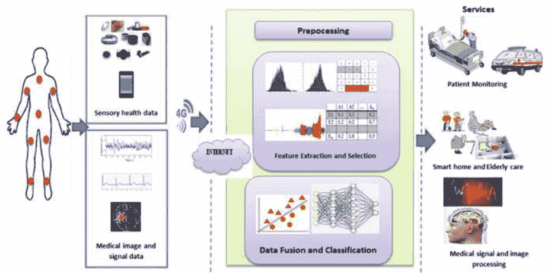
图2 健康推荐系统的系统架构

## 4 健康信息学的学习技术
选择适当的学习技术来分析健康数据对于减轻健康推荐系统的几个挑战非常重要。这些技术被应用于构建模式来描述、分析、预测数据并定义用户的当前健康状况。在医学图像处理中可以找到多种使用不同机器学习技术进行疾病诊断和早期检测的工作。现有的学习技术包括有监督、半监督和无监督，如图3所示。

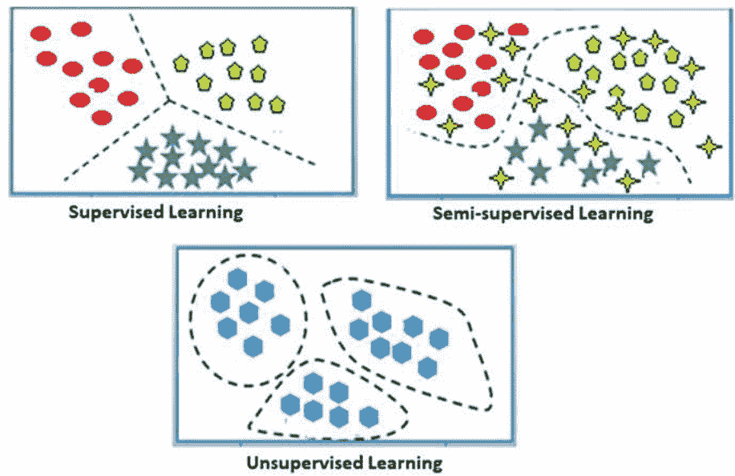
图3 机器学习和深度学习的学习技术

### 4.1 有监督学习

有监督学习是一种用于识别对象和基于先前相关数据诊断疾病的学习技术。它可以应用于有足够标记的数据。

用于健康推荐系统的代表性有监督分类器如下所述。

#### 4.1.1 基于实例的学习

基于实例的学习方法 (IBL) [24]是一种监督学习算法，用于学习多种类型的数据库并对对象进行分类。每个实例可以通过n个属性-值对来描述。通常，从内存中获取一组相关实例来对任何新的查询进行分类。最流行的基于实例的学习算法是k最近邻(kNN)算法。尽管它可以解决复杂的问题，但它是一种简单的学习算法，并且可以使用很少的信息进行工作。

可以使用多种距离度量来定义实例的最近邻。可以计算所有实例的欧氏距离，以在n维空间中找到最近邻，如图4b所示。

人体活动识别 (HAR) 系统面临的挑战是训练和测试环境完全不同。其中一个主要问题是设备无关的活动监测。智能手机上的惯性传感器，如加速度计、陀螺仪，通常用于收集各种日常活动的原始感知数据。kNN在[25]中应用于设备无关的活动监测，并且被发现具有相当高的准确性。

研究人员最近提出了一个术语——能量消耗(EE)。HAR和EE都已经得到了研究，但仍然存在一些挑战，比如能量在人体运动或不动时的能量消耗。在[26]中，作者尝试使用加速度计和心电图来解决这个问题。为了提出这个系统，他们从13名自愿参与者那里收集了六种日常活动的数据。选择了一些心率变异性(HRV)参数来分析HAR系统的性能。具有HRV参数的活动特定模型提供了更好的性能。他们的结果表明，人体生理数据对HAR和能量消耗有重要影响，这对于辅助生活和健康保健系统的高效运作非常重要。

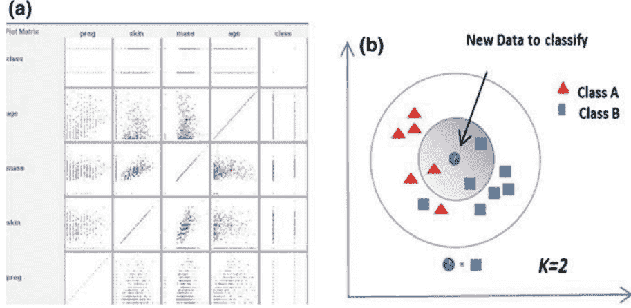

图4 逻辑回归和k最近邻(kNN)分类的示例

#### 4.1.2 决策树 (J48)

决策树(J48)算法可以用于分类和回归问题，它可以通过树形表示来解决问题。它可以明确和直观地表示决策。每棵树都包含内部节点和叶节点。内部节点对应一个属性，类标签存在于叶节点中。树的表示可理解为使用了if-then规则。树是任意生长的，因此应该为叶节点固定一个最小数量的输入，或者指定模型的最大深度。修剪有助于改善算法的性能并减少复杂性。它删除了一些使用重要性较低的特征的分支。

文献[19]中提出了一种基于决策树和协同过滤的健康推荐系统。与疾病相关的数据大多数是庞大的，并且来自多个来源。大部分时间数据是多维的，数据集中存在一些缺失或噪声。使用传统方法处理这些数据变得困难。过滤技术用于去除噪声并减少模糊标签。在这里应用决策树来构建用于预测、诊断疾病及其风险的模型。使用多个决策树构建了一个随机森林的集成模型。统一的协同过滤方法有助于根据先前记录和其他特征实现更好的推荐。

决策树在HRS中可以单独使用或与其他有监督的分类器结合使用。在[27]中，作者考虑了基于智能手机和手腕佩戴的运动传感器(加速度计、陀螺仪和线性加速度)来识别吸烟、进食、喝咖啡等多种复杂活动。朴素贝叶斯、决策树和k最近邻(kNN)三种不同的分类器被用于不同的窗口大小，以识别简单和复杂的活动。

GENEActiv是一款佩戴在手腕上的三轴加速度计，用于分类行走、跑步和静止活动，并取得了良好的准确性。在[29]中，作者在他们的框架中同时使用了支持向量机(SVM)和决策树。

抑郁症的预测和监测是健康推荐系统面临的重要挑战。分析和预测疾病需要大量的用户行为、日常活动、情绪细节等数据。异构数据使系统变得复杂。因此，[18]中的作者提出了一个智能系统来提供有用的建议。决策树和支持向量机的组合被用来构建这个系统。考虑了与抑郁症相关的各种外部因素来构建这个预测模型。

#### 4.1.3 逻辑回归 (LR)

逻辑回归是一种分类技术，它应用了sigmoid函数对输入特征的线性组合进行预测。它可以根据实值输入进行数据预测，这些输入通过权重或系数值进行线性组合。一般来说，输出是二进制值0或1。将逻辑回归分类应用于糖尿病数据集时，默认参数下的输出如图4a所示。

在[30]中，作者提出了一种具有最少数量的智能手机惯性传感器的设备无关的活动监测方法。这种能源高效的普适系统是基于机器学习的，并且使用廉价的时域特征的逻辑回归表现良好。

#### 4.1.4 多层感知器 (MLP)

多层感知器是一种前馈人工神经网络，由多个感知器组成。它至少有三层，(i) 输入层用于输入模式，(ii) 输出层对给定输入进行预测，(iii) 两个层之间可以有任意数量的隐藏层。该网络的每个节点都是神经元，并使用非线性激活函数。多层感知器利用一种称为反向传播的监督学习技术。在前向传递中，信号从输入层通过隐藏层到达输出层。输出被反馈到输入，按照反向传播算法调整权重和偏差。它与线性感知器很容易区分，因为它具有多个层和非线性激活函数。

多层感知器在人体行为识别系统中得到广泛应用。对于人体活动识别，可以利用多层感知器监测多种详细的日常活动[31]。多层感知器还可以与其他分类器结合使用，进一步提高准确性。例如，在[31]中，它还与LogitBoost和SVM结合使用，即使用户手持智能手机，也能识别日常活动。

#### 4.1.5 集成模型

有时，使用一个基本分类器很难准确检测出所有个体类标签。可以应用一组分类器来代替。

集成模型结合了不同基本学习器的结果。每个基本学习器都试图根据训练集实例对测试集实例进行分类。

集成模型通过结合所有基本学习器的结果来对测试实例的类标进行决策。这增加了系统的普适性。

装袋和提升是文献中广泛使用的两种集成方法。在装袋中，训练集被划分为多个袋子，并根据每个子集调整一个基本分类器，形成一组分类模型。但是，在提升中，相同的训练集在不同的迭代中应用，尽管每个实例根据在前一次迭代中分类的难易程度被赋予不同的权重。

集成可能表示基于不同条件的分类器的组合。例如，在[32]中，形成了一个基于条件的集成分类器，以解决使用不同智能手机(具有各种硬件配置)和使用行为(例如，用户如何携带智能手机(衬衫口袋，右裤袋或右手)对详细的HAR的影响。它遵循包装原则。针对消费者的医疗保健推荐系统需要根据预测不同健康状况的概率值提供相关建议。[33]中使用集成模型来构建这种模型。贝叶斯网络和随机森林被用来构建集成模型，并提供更好的推荐。

### 4.2 半监督学习

对于各种医疗保健推荐问题，如为不同紧急情况收集足够的数据，标记变得昂贵。因此，半监督学习算法被设计用来处理标记和未标记数据的组合。从未标记数据中提取特征，并映射以确定特征空间中数据的分散程度。

#### 4.2.1 多实例学习

在多实例学习中，每个对象包含一组实例，并且仅与一个标签相关，如图5a所示。因此，并不需要为每个单独的实例标记，只需为一组实例分配一个适当的标签。

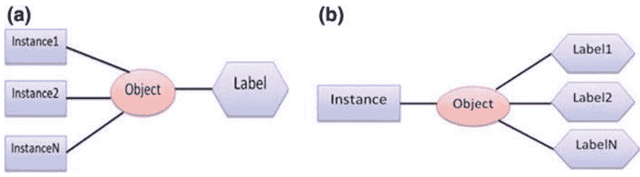

图5 半监督学习技术 a多实例学习和 b多标签学习

半监督学习对于稀疏标记的数据至关重要。在[34]中，作者提出了一个用于监测用户日常活动的HAR框架。该数据集的标记很稀疏。他们应用了多实例学习 (MIL) 来处理不同的注释策略。文献中还发现了一些新的多实例学习扩展，以减少传统监督的要求水平。MI-SVM，引文kNN分类器也被设计用于处理具有单个标签的多个实例。在MIL中，使用多种类型的包来表示连续数据集。在[34]中，考虑了三种类型的标签（单一标签、多标签和多数投票）来表示整个测试和训练数据集。迭代多实例支持向量机（SVM）在单一标记的包上表现更好，而标准的多实例SVM在多标记的包上表现更好。

#### 4.2.2 多标签学习

在多标签学习中，训练数据集包含与一组标签相关联的实例。它可以根据具有已知标签集的训练实例对未知实例的标签集进行分类。一般来说，一个实例存在于一个多标签对象中，并且与之相关联的K个类标签如图5b所示。

在[35]中，作者提出了一种基于多标签机器学习和期望最大化（EM）算法的HAR系统。当两个动作之间存在时间间隔时，该系统可以正确识别多个活动。伪序列数据用于整个实验。多标签数据集是随机标记的。执行EM算法并学习数据标签的概率分布。

#### 4.2.3 基于图的学习

基于图的半监督学习技术也用于基于HAR的HRS系统。在[36]中报告的实验数据集中发现了一小部分带有少量未标记数据的标记数据。通过将提供的标签传播到相邻数据，HAR框架可以记录长时间的活动数据，而无需详细注释。

在无监督学习中，数据集不需要任何标签，数据模式对我们来说是未知的，我们需要找到未标记数据中的隐藏模式。当数据标签的近似值较差时，它是有用的。聚类是一种无监督学习机制，将相似的数据分组组成簇。下面讨论了可以应用于HRS的代表性聚类机制。

### 4.3 无监督学习

#### 4.3.1 k均值聚类

K均值聚类是一种迭代聚类算法。在初始状态下需要定义聚类的总数或k。质心是聚类的中心，在初始状态下随机选择质心。所有数据点被分组到k个簇中，使得每个数据点属于其中一个簇。该算法从选择k个簇的初始个体质心开始。每个数据点被分配到其最近的质心，所有被分配到一个质心的点创建一个簇。更新簇的质心，并从初始状态改变数据点的分配。直到簇稳定为止，算法将继续进行。

在[37]中，作者提出了一种基于骨骼运动数据的日常活动监测系统。数据是从一种廉价的RGBD（RGB-深度）传感器收集的。

数据标记没有得到很好的维护，因此在这里使用了无监督学习。使用k-means聚类报告了可观的精确度和召回率值。

#### 4.3.2 基于密度的空间聚类应用（DBSCAN）

这是一种聚类技术，主要用于无监督学习。不需要按优先顺序设置聚类数。它可以构建任意形状的聚类。该算法使用两个重要参数来定义聚类。一个是eps或epsilon，一个正数，用于表示点的邻域半径。

另一个是MinPts，一个点的eps-邻域之间的最小点数。它可以识别特征空间中密集区域的数据点。具有MinPts的密集区域内的数据点被称为核心点。

边界点没有MinPts，它直接从核心点可达。最初，它通过随机选择一个数据点p从数据集中开始，该点不包含在任何簇中。计算该点的邻域。当在eps-邻域距离内包含更多的MinPts点，给定的数据点p被认为是核心点。将eps-邻域中的所有直接可达点包括在内，以创建簇。根据需要扩展簇，以包括所有密度可达点。当当前簇中没有更多的点可包括时，算法从数据集中随机选择下一个未分类的数据点。

算法将继续进行，直到所有点都被分类或处理完。少数点s具有少于MinPoints个点，并且不属于任何簇。这些点被视为噪声点并被丢弃。它可以将高密度簇与低密度簇分开，并管理给定数据集中的异常点。图6a显示了聚类之前的数据集，图6b表示应用DBSCAN后的簇。如果簇的密度非常高维且变化很大，DBSCAN无法很好地工作。

有时候很难获得用户执行的每个活动的正确标签。因此，逐个实例的标记变得昂贵。在[39]中，作者提出了一种使用无监督学习的HAR。在这里，不同活动的数量是未知的。数据是从智能手机惯性传感器收集的。提取了几个特征。高斯混合方法与DBSCAN聚类相结合，使得该系统更加高效。通过适当调整MinPts和eps，当系统对活动数量不知道时，可以达到良好的准确性。

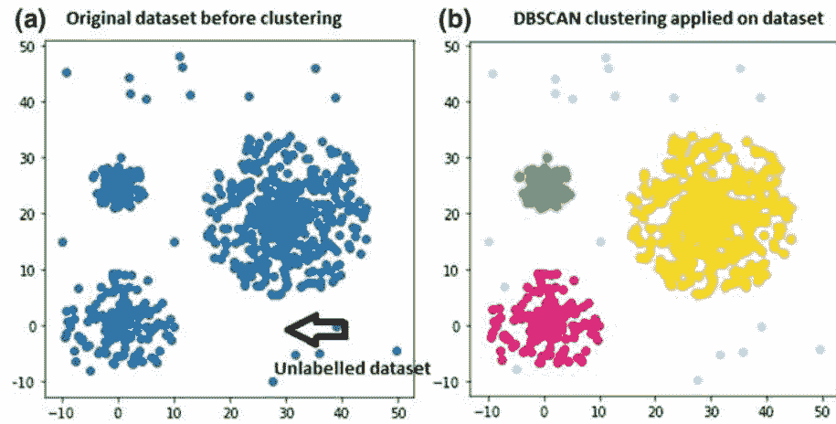

图6 DBSCAN聚类技术 a聚类之前的原始数据集，b聚类后的数据[38]

#### 4.3.3 分层聚类

分层聚类是另一种类型的聚类算法。数据点被分组形成一个树或聚类的层次结构。聚类通过树状图进行图形化表示。最初，所有数据点被分配到一个聚类中。它需要一个终止条件来停止算法。一般来说，有两种类型的分层聚类，一种是凝聚式(自下而上)，另一种是分裂式(自上而下)。凝聚式聚类从每个聚类代表一个数据点开始。在每一步中，所有相似的聚类对被合并。另一方面，分裂式聚类从顶层开始，一个单一的聚类包含所有数据点。它在每一步将顶层聚类分割成子聚类，直到每个子聚类只包含一个数据点。聚类建立的条件被称为两个对象的链接或不相似度。

在分层聚类中使用了几种链接类型。两个不同聚类中两个点之间的最小距离被称为单链接或最小，而两个不同聚类中两个点之间的最大距离被称为完全链接或最大。最初，计算了每对点之间的距离，然后计算了两个不同聚类中所有点之间的平均距离。这被称为平均链接或组平均。另外，也可以使用Ward方法，它计算了两个不同聚类中各个点的距离的平方和。一些先进的工作在表2中总结。这些工作基于普适感知应用，这也对公共卫生产生了影响。表格显示了最近的研究如何大量使用上述不同类型的机器学习技术。

| 现有工作和年份 | 传感器或设备和位置 | 学习技术 | 实现的分类器 | 备注 |
|---|---|---|---|---|
| [25] 2013 | 智能手机, 加速度计, 陀螺仪, 磁传感器 | 有监督的, TM | k最近邻算法 (kNN) | 设备无关活动监测, 具有昂贵的频域特征 |
| [37] 2013 | RGBD (RGB-深度) 传感器 | 无监督学习, 聚类 | k均值聚类 | 未标记的数据被识别 |
| [39] 2014 | 智能手机惯性传感器 | 无监督学习, 聚类 | DBSCAN | 未标记的数据被识别, 当活动数量未知时可以识别 |
| [26] 2017 | IMU传感器加速度计, 手腕, T-Rex TR100A ECG | 有监督的, TM | 线性SVM, 径向基SVM, k最近邻, LDA | 识别步行活动和能量消耗在活动期间。LDA在IMU和选择的心率上达到最高准确率 |
| [27] 2017 | 佩戴在手腕上的运动传感器 (加速度计, 陀螺仪, 气压计) | 有监督的, TM | 朴素贝叶斯, 决策树和k最近邻 | 识别复杂活动, 也可以改变窗口大小 |
| [32] 2018 | 智能手机加速度计, 陀螺仪 | 监督,集成学习(基于条件) | 带有参数调整的逻辑回归 | 设备和位置无关的详细信息 (活动缓慢/快速步行, 坐在地板/椅子上) 监测 |

### 4.4 性能指标

系统的性能可以通过几个性能指标来衡量 [40]。混淆矩阵: 混淆矩阵 (CMnn) 表示不同分类算法的分类结果。它具体规定如下。

- 真正例 (TP): 被正确分类为正例的正例数量。
- 真负例 (TN): 被正确分类为负例的负例数量。
- 假阳性 (FP)：将负实例错误分类为正实例的数量。
- 假阴性 (FN)：将正实例错误分类为负实例的数量。

敏感性：在检测到正标签时，测试结果为阳性的概率。

$$
\text { 敏感性 }=\frac{T P}{(T P+F N)}
$$

特异性：在检测到负标签时，测试结果为阴性的概率。

$$
\text { 特异性 }=\frac{T N}{(F P+T N)}
$$

准确性：所有类别的整体分类性能由以下方程表示，这是现有文献中的标准。

$$
\text { 准确性 }=\frac{(T P+T N)}{(T P+T N+F P+F N)}
$$

F-度量 (F1) : 它计算了结合了精确度和召回率的模型准确性。如果输出具有较低的假阳性和假阴性，则分类器正确地识别了真实对象。其定义如下。

$$
F_{1}=2 \times \frac{\text { 精确度 } \times \text { 召回率 }}{\text { 精确度 + 召回率 }}
$$

精确度：精确度描述了模型在预测的正例中有多准确，以及实际上有多少数据点是正例。

$$ \text { 精确度 }=\frac{T P}{(\text { 假正例 }+\text { 真正例 })} $$

召回率：分类器的完整性可以使用召回率来衡量。低召回率表示有许多假阴性。召回率表示模型捕获的实际正例中有多少真正标记为正例（真正例）。

$$ \text { 召回率 }=\frac{T P}{(T P+F N)} $$

大多数现有的作品在这里使用了上述一种或多种性能指标。

## 健康数据的深度学习

对于生物信息学和医学成像应用来说，构建一个足够正确的推荐系统是具有挑战性的。主要的挑战是，在监督学习中，随着我们向系统中添加更多数据，准确性并没有显著提高。最初，准确性会提高，但随后几乎稳定下来，即使我们添加更多数据，也无法很好地扩展。这些技术的性能在很大程度上取决于从数据中提取的手工特征。如今，不仅机器变得更强大，可以执行复杂的机器学习技术，而且今天有大量的数据可用，足以充分代表不同的疾病。因此，深度学习技术可以应用于健康记录，可以自动从数据中提取特征。这些技术可以提取人类用户感知但难以在数学上定义的更高维特征。通过足够代表数据集不同标签的大量数据，深度学习技术可以提取有用的特征，从而提高准确性。深度学习不仅适用于分析医学图像或基因序列，而且在数字化社会和多源数据的可用性下，对于个人推荐系统也非常有用。

深度学习技术基于神经网络。深度网络中存在多个隐藏层。第一个输入层接收多个数据作为输入，然后将第一个隐藏层的激活函数应用于这些数据。然后将这些激活传递给后续的隐藏层，以实现所需的输出。

利用深度学习技术，可以基于用户的推荐和他们与患者的社交关系构建健康推荐系统。在[41]中，开发了一个基于推荐者的信任和不信任关系的系统。节点信息和结构信息与深度学习方法相结合，以实现更好的性能。

### 5.1 监督学习

#### 5.1.1 卷积神经网络

卷积神经网络是一种包含多个隐藏层的多层神经网络。每一层都由神经元组成，这些神经元带有权重。卷积和池化是这些隐藏层执行的两个主要功能。卷积滤波器用于生成特征图。但是，大量的特征会增加计算复杂性，并且可能容易过拟合。

因此，在卷积层之后使用池化，通过应用一些池化函数 (最大值、最小值等 ) 连接前一层的一部分感知器。池化用于降低维度，以避免过拟合。卷积和池化的不同组合被基于CNN的HRS使用。

修正线性单元 (ReLU) 可以作为CNN的激活函数，而不是Sigmoid函数 (在ANN中通常使用)。这通常可以实现更好的梯度下降搜索学习速度。 CNN的最后一层是一个完全连接层，类似于ANN，并且被称为softmax。

文献[10]中的作者提出了一种基于CNN的算法，用于检测心肌梗死 (MI)，使用心电图 (ECG) 信号。该系统能够从未知的ECG信号中检测出异常心跳，即使有噪音。本研究使用了两个数据集。使用Daubechies小波6母小波函数来去除ECG记录中的噪音和基线漂移。信号的R峰被检测出来，并使用R峰对整个信号进行分段。分段信号使用Z得分进行归一化，并通过CNN层。在CNN的卷积层中提取输入ECG信号的特征。在网络的几个层中使用Leaky修正线性单元作为激活函数，并在最后一层使用softmax函数。最大池化函数有助于减小特征图的大小，并减少下一层中的神经元数量。在这个提出的网络中应用了反向传播方法。在执行过程中需要维护一些参数，如正则化 (控制数据过拟合)、动量 (快速或慢速网络学习时间)、学习率等。该系统对没有噪音的ECG心跳表现更好，并获得良好的准确性值。该提出的系统有助于心血管疾病的早期诊断。

帕金森病是一种神经运动障碍。从佩戴在患者身上的可穿戴传感器捕获的加速度计信号对于监测帕金森病患者可能是有益的。在[42]中，作者开发了这样的机制。

加速度计信号被作为输入，并使用多个一维卷积核对输入进行滤波。对加速度计数据应用偏置。使用最大池化来减少特征维度。在最后一层使用softmax函数进行分类。它提供了比现有的分类器更好的结果。

现在，深度学习在人体活动识别中起着至关重要的作用。[43]中的作者提出了一种基于CNN、LSTM和ELM分类器操作的深度学习框架。大多数现有的人体活动识别系统应用了手工制作的特征和专家知识，如统计方法等。这里使用CNN在第一阶段从加速度计信号中提取特征，并将其视为原始数据的更高级抽象。由于基本结构中忽略了时间依赖性，因此很难从实时传感器数据中识别出活动序列。人体活动监测可能会遇到一些挑战，例如少数活动类之间的相似性（如正常行走或缓慢行走），在一段时间内加速度计值的变化等。因此，作者在基本CNN中应用了长短期记忆（LSTM）以获得更好的识别准确性。但在实时情况下，很难获得良好的分类结果。因此，将极限学习机（ELM）与CNN-LSTM集成，以提高所提出框架的实时性能。隐藏层的参数是随机选择的，并使用最小二乘法计算权重。所提出的框架应用基准CNN实现了0.88的F-Score，而CNN-LSTM-ELM技术实现了更好的预测，并且通过所提出的技术改进了结果。

CNN被用于建模智能健康推荐系统[44]。它在补充数据上工作，根据先前的数据分析找到推荐的医院。卷积受限玻尔兹曼机（RBM）模型是RBM和CNN的组合，作为两层模型使用两种学习方法的特征。它可以处理大数据，并帮助构建有效的健康推荐系统。使用均方根误差和平均绝对误差等两种技术来最小化系统误差。

#### 5.1.2 循环神经网络

在现实生活中，很难用固定长度的输入和输出来表示所有问题。例如时间序列的人类日常活动加速度计跟踪，由于连续的数据模式，在每个时间窗口中都会有新的数据样本，因此需要一个能够存储数据序列并利用信息上下文的强大系统。

循环神经网络（RNN）是一种强大的神经网络，可以利用数据模式的顺序信息。这有助于构建上下文感知的推荐系统。RNN可以捕捉先前计算的信息，并将其作为输入传递给下一个隐藏层。它可以在训练阶段沿时间方向处理大型网络，并在识别阶段进行快速的顺序处理。有时，RNN模型的输出不仅取决于序列中的先前输出，还需要未来的元素，如图7a所示。这种网络被称为双向RNN。RNN可以很好地处理不同大小的处理输入。它可以利用历史信息进行计算。生成的权重在网络中共享。但是，与其他网络相比，计算速度较慢，有时很难访问远处的信息。

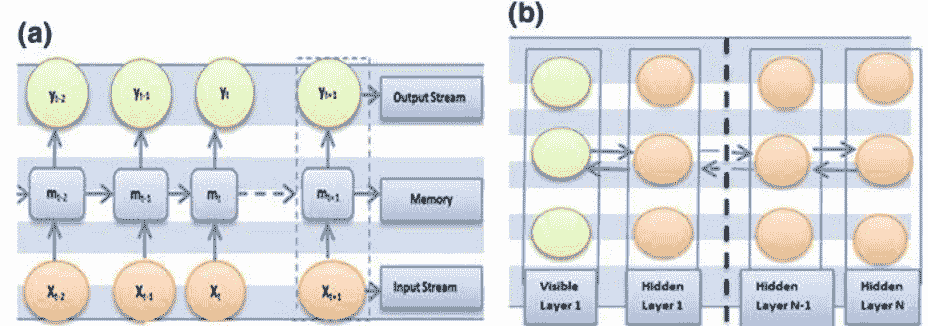

图7 循环神经网络和受限玻尔兹曼机的深度学习技术

在[45]中，作者提出了一种使用RNN和基于密度的聚类方法的新型患者监测框架。它可以监测心电图信号，并识别用户的心电图节拍与不同的心率。在这里，特征是自动提取的，基于包括当前心跳和前一个心跳的T波的形态信息。它计算心电图信号之间的强相关性，并考虑具有不同长度的心电图节拍。在这里，应用了一种称为长短期记忆(LSTM)的变种RNN来保持先前上下文的细节。

### 5.2 无监督深度学习

#### 5.2.1 受限玻尔兹曼机和深度置信网络

受限玻尔兹曼机(RBM)是无监督深度学习中的重要技术。它是一个概率无向图模型，如图7b所示。

它对降维、分类、回归、特征学习等非常有用。两层RBM叠加在一起构建了深度置信网络(DBN)。从数据点中提取出几个低级特征，每个可见节点都捕捉到了这些信息。每个输入都乘以一个权重，然后将结果加到一个偏置上。然后将这些结果输入到一个激活函数中。激活函数有助于生成输出。它可以将所有输入添加到一个单独的节点中，然后将所有输入乘以权重，并将所有乘积的总和加到偏置上。

可以使用贪婪的方式训练RBM来构建DBN。DBN的单层网络在双模式下工作，对于其前一个节点来说是隐藏层，对于下一个节点来说是可见层或输入层。

文献[11]中提出了一种基于可穿戴传感器的DBN的HAR系统。从原始数据集中自动提取特征。使用线性判别分析(LDA)和核主成分分析(KPCA)来降低特征空间的维度。对于DBN，需要配置几个超参数，如小批量大小、初始权重值、学习率、隐藏层和单元的数量等。

#### 5.2.2 自编码器

自编码器在使用反向传播技术进行深度网络的无监督学习中起着重要作用。自编码器网络由编码器和解码器两部分组成。通常情况下，自编码器的编码器部分将输入数据转换为一个压缩版本，而不会丢失相关信息，从而减小了整体数据大小。这个减小过程被称为降维。解码器部分帮助将数据转换为大型格式，并获得与输入类似的输出。它具有减少和重现输入特征的能力。它遵循传统神经网络的架构，输入和输出层具有相同数量的节点。隐藏层中的节点总数较少。自编码器的几个重要参数包括：(i) 中间层或编码大小的节点总数，(ii) 层数的总数，(iii) 每层的节点总数，以及 (iv) 根据输入值范围的损失函数（交叉熵和均方误差）。在文献中，提到了不同类型的自编码器，例如稀疏自编码器、正则化自编码器和多层自编码器。

在[46]中，作者提出了一种基于无监督深度特征学习自编码器的新型深度网络。这里从电子健康记录（EHR）中检索患者信息，以代表一般信息集。它可以在没有用户干预的情况下自动管理和组合多领域患者数据。

它可以很好地预测来自大型数据库的几个患者的疾病。预处理的数据有助于使用一系列非线性变换深入了解来自EHR的患者详细信息。

癌症通常是通过细胞的基因表达来检测的。使用无监督深度网络可以区分正常的非癌组织基因表达和癌组织基因表达之间的差异[47]。

最初，考虑使用稀疏特征学习技术来表示高维原始特征空间的PCA。然后，应用自编码器来提高从基因表达中准确检测癌症的准确性。

找到患者当前状况的相关信息并理解不同的医学术语及其关系非常困难。协同健康推荐系统在这种情况下提供有用的推荐，但它面临着稀疏数据、冷启动问题等多个问题。在[48]中，开发了一个推荐系统，该系统结合了各种外部因素（当前时间、天气等）来监测用户的日常行为。它考虑了灵活的上下文特定输入和过渡矩阵，而不是常数数据。应用自编码器构建这样一个协同过滤推荐系统。生成用户偏好使用自动编码器的编码和解码过程，并将数据存储为矩阵。参数被优化以减少重构问题。

在[49]中，作者提出了一种基于深度学习的协同健康推荐系统，该系统基于来自多个来源的异构数据。变分自动编码器神经网络被设计用于学习医生的初级护理细节，并提取患者的各种特征以与用户配置文件结合。发现其表现相当出色。

## 6 结论

学习健康数据以检测和识别用户活动中的疾病或异常是构建强大健康推荐系统的重要挑战。我们可以找到这种类型系统的各种应用，如医疗保健、早期诊断、老年护理、健身追踪和活动监测或跌倒检测。本章提供了健康推荐系统中使用的学习技术的见解。

它介绍了机器学习技术以及深度学习技术的最新趋势和发展。由于其自动化特征提取技术，深度学习技术被发现表现更好，使系统更加高效智能。在这里，我们还讨论了几种无监督学习技术，以及当数据集对系统完全未知时它们的帮助。

### 参考文献

- 1. Swan, M.: 传感器狂热! 物联网、可穿戴计算、客观指标和量化自我2.0. J. Sens. Actuator Netw. 1(3), 217-253 (2012)
- 2. Calero Valdez, A., Ziefle, M., Verbert, K., Felfernig, A., Holzinger, A.: 健康信息学的推荐系统现状和未来展望. In: Holzinger, A. (ed.) 机器学习在健康信息学中的应用. 计算机科学讲义, vol. 9605. Springer, Cham (2016)
- 3. Erdeniz, S.P., Maglogiannis, I., Menychtas, A., Felfernig, A., Tran, T.N.T.: 物联网启用的移动健康应用的推荐系统。 In: Iliadis, L., Maglogiannis, I., Plagianakos,V. (eds.) 人工智能应用和创新. AIAI 2018. IFIP信息与通信技术进展, vol. 520. Springer, Cham (2018)
- 4. Ram Sundar, B., Kearnes, S., Riley, P., Webster, D., Konerding, D., Pande, V.: 用于药物发现的大规模多任务网络 (2015). arXiv:1502.02072
- 5. 张, S., 周, J., 胡, H., 龚, H., 陈, L., 程, C., 曾, J.: 一种用于建模RNA结合蛋白靶标结构特征的深度学习框架。核酸研究。 44 (2015) 。 https://doi.org/10.1093/nar/gkv1025
- 6. 田, K., 邵, M., 王, Y., 关, J., 周, S.: 通过深度学习提升化合物-蛋白质相互作用预测。方法 110 (2016) 。 https://doi.org/10.1016/j.ymeth.2016.06.024
- 7. 徐, T., 张, H., 黄, X., 张, S., Metaxas, D.N.: 用于宫颈异常增生诊断的多模态深度学习。在 : Ourselin, S., Joskowicz, L., Sabuncu, M., Unal, G., Wells, W. (eds.) 医学图像计算与计算机辅助干预-MICCAI 2016. MICCAI2016. 计算机科学讲义, 第9901卷。斯普林格, 洪堡 (2016)
- 8. Brosch, T., Tam, The Alzheimer’s Disease Neuroimaging Initiative: 通过深度学习对脑部MRI进行流形学习。 在: Mori, K., Sakuma, I., Sato, Y., Barillot, C., Navab, N. (eds.) Medical Image Computing and Computer-Assisted Intervention—MICCAI 2013. MICCAI2013. 计算机科学讲义, 卷8150。 Springer, 柏林 (2013)
- 9. Rose, D.C., Arel, I., Karnowski, T.P., Paquit, V.C.: 将深层聚类应用于乳房X光摄影图像分析。 在: 生物医学科学和工程会议, 橡树岭, TN, 第1-4页 (2010年)
- 10. Acharya, U.R., Fujita, H., Oh, S., Hagiwara, Y., Tan, J.H., Adam, M.: 应用深度卷积神经网络自动检测心肌梗死使用ECG信号。 信息科学。 415-416, 190-198 (2017年)
- 11. Hassan, M.M., Huda, S., Uddin, M.Z., Almogren, A., Alrubaian, M.: 利用深度学习从身体传感器数据中识别人类活动。 J. Med. Syst. 42, 99 (2018)
- 12. Poggi, M., Mattoccia, S.: 基于嵌入式3D视觉和深度学习的可穿戴式视觉辅助设备, 用于视觉障碍者。 在IEEE计算机和通信研讨会上, 第208-213页 (2016)
- 13. Huang, J., Zhou, W., Li, H., Li, W.: 使用Real-Sense进行手语识别。 在: IEEE中国, SIP, 第166-170页 (2015)
- 14. Garimella, V.R.K., Alfayad, A., Weber, I.: 用于公共卫生的社交媒体图像分析。 在: CHI 人因计算机系统会议, 第5543-5547页 (2016)
- 15. Zou, B., Lampos, V., Gorton, R., Cox, I.J. 利用社交媒体内容进行传染性肠道疾病监测。 在: 第6届国际数字健康会议, 第157-161页 (2016)
- 16. Saha, J., Chowdhury, C., Biswas, S.: 基于智能手机的人体活动识别的两阶段集成分类器, 独立于硬件配置和使用行为。 Microsyst. Technol. 24, 2737 (2018)
- 17. Huang, T., Lan, L., Fang, X., An, P., Min, J., Wang, F.: 大数据在健康科学中的应用前景和挑战。 大数据研究。 2(1), 2-11 (2015)
- 18. Yang, S., Zhou, P., Duan, K., Hossain, M.S., Alhamid, M.F.: emHealth: 通过抑郁症预测和智能健康推荐系统实现情绪健康。 移动网络应用。 23, 216-226 (2018)
- 19. Hussein, A.S., Omar, W.M., Li, X., Ati, M.: 高效的慢性疾病诊断预测和推荐系统。 In: IEEE-EMBS生物医学工程与科学会议论文集, 浮罗交怡, 第209-214页 (2012年)
- 20. Felipe, L.O., Barrué, C., Cortés, A., Wolverson, E., Antomarini, M., Landrin, I., Votis, K., Paliokas, I., Cortés, U.: 在CAREGIVER-SPROMMD项目的背景下设计的健康推荐系统。 在: PETRA '18:第11届与辅助环境相关的普适技术会议论文集, 希腊科孚岛, 六月 (2018 年)
- 21. Morrell, T.G., Kerschberg, I.: 个人健康探索者: 一个语义健康推荐系统。 在: IEEE第28届国际数据工程会议研讨会论文集, 弗吉尼亚州阿灵顿, 第55-59页 (2012年)
- 22. Bocanegra, C.L.S., Ramos, J.L.S., Rizo, C., Civit, A., Fernandez-Luque, L.: HealthRecSys: 一个语义内容推荐系统, 用于补充健康视频。 BMC Med. Inform. Decis. Mak. 17, 63 (2017)
- 23. 桑切斯-博卡内格拉, C.L., 桑切斯-拉古纳, F., 塞维亚诺, J.L.: 健康推荐系统简介 。方法分子生物学 1246, 131-146 (2015年)
- 24. Keogh, E.: 基于实例的学习。 在: Sammut, C., Webb, G.I. (eds.) 机器学习百科全书。 斯普林格, 波士顿 (2011年)
- 25. Ustev, Y.E., Incel, O.D., Ersoy, C.: 用户, 设备和方向无关的移动电话上的人体活动识别挑战和建议。在: ACM全球普适计算会议附属出版物, 苏黎世, 第1427-1435 页 (2013年)
- 26. Park, H., Dong, S.Y., Lee, M., Youn, I.: 心率变异参数在活动识别和能量消耗估计中的作用使用可穿戴传感器。 传感器 (巴塞尔) 2017 (7), 1698 (2017年)
- 27. Shoaib, M., Bosch, S., Incel, O.D., Scholten, H., Havinga, P.J.M.: 使用智能手机和手腕运动传感器进行复杂的人类活动识别。 在： 传感器， 第426页 （2016年）
- 28. Zhang, S., Rowlands, A.V., Murray, P., Hurst, T.L.: 使用GENEA手腕加速计进行身体活动分类。 医学科学运动锻炼。 44， 742-748 （2012年）
- 29. Garcia-Ceja, E., Brena, R.F., Carrasco-Jimenez, J.C., Garrido, L.: 从手腕手表加速计数据中进行长期活动识别。 传感器 14， 22500-22524 （2014年）
- 30. Saha, J., Chowdhury, C., Biswas, S.: 使用智能手持设备进行设备无关的活动监测。 在： 第7届云计算、数据科学和工程国际会议—Confluence， 诺伊达 ， 第406-411页 （2017年）
- 31. Bayat, A., Pomplun, M., Tran, D.A.: 使用智能手机加速度计数据进行人体活动识别的研究。 Procedia Comput. Sci. 34, 450-457 (2014)
- 32. Saha, J., Roy Chowdhury, I., Chowdhury, C., Biswas, S., Aslam, N.: 一种基于条件的设备无关详细人体活动识别的集成分类器。 Information 9(4), 94 (2018)
- 33. Jamshidi, S., Torkamani, M.A., Mellen, J., Jhaveri, M., Pan, P., Chung, J., Kardes, H.: 使用电子病历的混合健康旅程推荐系统。 在： 第3届国际健康推荐系统研讨会（HealthRecSys 2018）论文集，与第12届ACM推荐系统会议（ACM RecSys 2018）同期举办，加拿大温哥华（2018）
- 34. Stikic, M., Schiele, B.: 使用多实例学习从稀疏标记数据中进行活动识别。 在： 位置和上下文感知的会议。 LoCA 2009年。 计算机科学讲义， 第5561卷。 Springer， 柏林（2009年）
- 35. Toda, T., Inoue, S., Tanaka, S., Ueda, N.: 为具有不准确时间戳的标签训练人体活动识别。 在： UbiComp '14附录， 第863-872页， 2014年9月13-17日
- 36. Stikic, M., Larlus, D., Schiele, B.: 基于多图的半监督学习用于活动识别。 在： 国际可穿戴计算机研讨会， 林茨， 第85-92页（2009年）
- 37. Ong, W.H.: 一种无监督的人体活动检测和识别方法。 国际模拟系统科学技术杂志。 14 (5) （2013年）
- 38. https://medium.com/odessa-ml-club/a-journey-to-clustering-introduction-to-dbscan-e724fa899b6f. 上次见面是在2019年5月20日
- 39. Kwon, Y., Kang, K., Bae, C.: 使用智能手机传感器进行人类活动识别的无监督学习。 专家系统应用 41(14), 6067-6074 (2014)
- 40. Lara, O.D., Labrador, M.A.: 使用可穿戴传感器进行人类活动识别的调查。 在： IEEE通信调查和教程， 第15卷（2013年）
- 41. Yuan, W., Li, C., Guan, D., 等： 使用深度学习进行社会化医疗服务推荐。 神经计算应用 30, 2071-2082 (2018)
- 42. Eskofier, B.M.等： 基于传感器的运动分析的最新机器学习进展： 帕金森病评估的深度学习。 在： 第38届IEEE工程医学与生物学学会国际会议（EMBC）论文集， 奥兰多， 佛罗里达， pp. 655-658 (2016)
- 43. 孙， J.， 付， Y.， 李， S.， 何， J.， 徐， C.， 谭， L.： 基于可穿戴传感器的深度卷积网络和极限学习机的顺序人类活动识别。 Hindawi J. Sens. (8580959)， 10 (2018)
- 44. Sahoo, A.K., Pradhan, C., Barik, R.K., Dubey, H.: DeepReco: 基于深度学习的协同过滤健康推荐系统。 计算 7(25)(2019)
- 45. 张， C.， 王， G.， 赵， J.， 高， P.， 林， J.， 杨， H.: 基于循环神经网络和聚类技术的患者特异性心电图分类。 在： 第13届IASTED国际生物医学工程会议（BioMed）， 奥地利因斯布鲁克， 第63-67页（2017）
- 46. Miotto, R., Li, L., Kidd, A.B., Dudley, J.T.: 深度患者: 从电子健康记录中预测患者未来的无监督表示。 科学报告。 6, 1-10 (2016)

- 47. Fakoor, R., Ladhak, F., Nazi, A., Huber, M.: 使用深度学习提高癌症诊断和分类。在: 第30届国际机器学习大会论文集，JMLR: W&CP vol. 28，美国乔治亚州亚特兰大（2013年）

- 48. Sedhain, S., Menon, A.K., Xie, L., Sanner, S.: AutoRec: 自动编码器遇见协同过滤。在: 第24届国际万维网会议，意大利佛罗伦萨（2015年）

- 49. Deng, X., Huangfu, F.: 协同变分深度学习用于医疗推荐。IEEE Access 7, 55679-55688 (2019)

Jayita Saha目前正在印度贾达普尔大学攻读计算机科学与工程博士学位。她分别于2008年和2011年从杜尔加普尔高级技术与管理学院和贾达普尔大学获得计算机科学与工程的学士和硕士学位。她的研究兴趣包括人类活动识别和机器学习。

Chandreyee Chowdhury自2006年起担任贾达普尔大学计算机科学与工程系助理教授。她于2013年从贾达普尔大学获得工程博士学位，并于2005年从贾达普尔大学获得计算机科学与工程硕士学位。她的研究兴趣包括无线传感器网络及其变种、移动群体感知和人类活动识别。她于2014年获得Erasmus Mundus的博士后奖学金，前往英国诺桑比亚大学进行研究工作。她是许多国际会议的技术程序委员会成员。她是IEEE和IEEE计算机学会的成员。

Suparna Biswas是印度Maulana Abul Kalam Azad大学计算机科学与工程系的副教授，自2018年起任职。她在贾达普尔大学获得了M.E.和Ph.D.学位。她于2014年获得Erasmus Mundus的博士后奖学金，在英国Northumbria大学进行研究工作。她合著了许多发表在国际会议和期刊上的研究论文。她曾担任国际知名会议和期刊的审稿人。她的研究兴趣包括移动计算、网络安全、无线身体区域网络、医疗应用等。

### 深度学习和电子健康记录

# 利用电子健康记录的深度学习和可解释人工智能在医疗保健中的应用

Sujata Khedkar, Priyanka Gandhi, Gayatri Shinde 和 Vignesh Subramanian

摘要：随着时间的推移，人工智能在医疗领域证明了其巨大的帮助。快速发展的技术使得可以预测许多不同疾病风险的工具变得可用。患者的电子健康记录（EHR）包含每个患者每次就医的各种医疗数据。现在有许多预测模型，如随机森林、提升树，提供了高准确性，但缺乏端到端的可解释性；而朴素贝叶斯、逻辑回归和单一决策树等模型虽然可解释性较强，但准确性较低。这些模型是可解释的，但它们无法捕捉EHR数据中特征属性的时间关系，最终导致模型的准确性受到损害。在关键的医疗应用中，模型的可解释性是至关重要的。可解释性帮助医务人员理解机器学习系统，建立信任。本章介绍了使用电子病历（EHR）的可解释深度学习系统在医疗保健中的设计和实现。本章讨论了在EHR数据上使用注意力机制和循环神经网络（RNN）来预测患者的心脏衰竭，并提供导致预测的关键诊断的见解。将患者的病史作为顺序输入提供给RNN，该模型预测心脏衰竭风险并提供解释性。这代表了一种前期可解释模型。训练了一个具有两个层级和注意力模型的神经网络，用于检测患者历史中可能具有影响力和重要性的访问，并理解对患者数据的任何预测背后的原因。因此，首先考虑最后一次访问是有益的。当进行预测时，访问级别的贡献被赋予优先级，即哪次访问对最终预测的贡献最大，其中每次访问包含多个代码。这个模型对医务人员有帮助，可以根据电子健康记录预测患者患有的疾病对心力衰竭风险的贡献。然后，本地可解释模型-不可知解释（LIME）对此模型进行改进，提供对心力衰竭风险积极和消极贡献的不同特征。

S. Khedkar (X) P. Gandhi G. Shinde V. Subramanian 计算机工程系, VESIT, 孟买, 印度 e-mail: sujata.khedkar@ves.ac.in

P. Gandhi 电子邮件: 2015priyanka.gandhi@ves.ac.in

G. Shinde 电子邮件: 2015gayatri.shinde@ves.ac.in

V. Subramanian 电子邮件: 2015vignesh.subramanian@ves.ac.in

## 1 引言

人工智能 (AI) 在医疗领域有着巨大的影响。应用程序如管理医疗记录、协助医生进行手术、根据患者病史预测疾病、药物研发或健康监测应用如 FitBit，所有这些都可以通过 AI 实现。但使用这些系统的用户数量仍然较少。这主要是因为人类在涉及到他们的健康时很难相信机器。根据新的欧洲通用数据保护条例建议，在处理医疗保健时，了解模型输出的确切原因是强制性的。

与领域专家交流发现，医生不喜欢使用人工智能 (AI) 系统作为诊断的辅助工具。据他们说，这些系统可以加快诊断过程，但不能提供决策背后的原因。因此，他们无法信任该系统，必须继续使用他们的手动诊断方法。因此，尽管在研究领域取得了巨大进展，由于对系统的不信任，他们无法找到广泛的商业应用。本章介绍了基于电子病历数据 [1, 2] 的可解释 AI 系统的设计。讨论了在电子病历数据上使用注意力机制和循环神经网络 (RNN) 来预测患者的心力衰竭，并使用 LIME 提供导致预测的关键诊断的见解。

本章的组织如下。在第 2 节中，讨论了相关工作。然后在第 3 节中，描述了提出的方法论。第 4 节描述了实验和评估。结论和未来工作在第 5 节中描述。

## 2 相关工作

下一节描述了相关工作。

Holzinger 等人 [3] 讨论了构建可解释模型的各种医学领域方法。预测解释对教学、学习非常有益，研究甚至在法庭上。在医学领域，对可解释模型的需求正在增加。它们必须重新演绎决策和知识提取过程。可解释性分为两类：ante-hoc 和 post-hoc。Ante-hoc 系统将可解释性纳入模型本身，而 post-hoc 系统涉及使用次要简单模型解释复杂模型的预测。ante-hoc 模型的示例包括决策树、线性回归、模糊推理系统等。post-hoc 模型的示例包括 BETA（使用透明近似解释的黑盒解释）等算法。赵 [4] 使用了填充了各种医疗数据的电子健康记录（EHR）数据集，用于每个患者的每次就医。由于其规模、维度和不规则性，对 EHR 数据集进行的现有数据分析方法无法充分理解。心力衰竭（HF）很难预测，因为它是一个总体条件而不是一个明确的表型。崔等人 [5] 使用卷积神经网络（CNN）处理这些数据。使用了 MIMICIII 数据集，包括 46,520 名患者、651,047 个诊断事件、240,095 个程序和 4,156,450 个预测。对于每个患者，从 EHR 记录中提取了有关 ICD-9（国际疾病分类）代码、程序项目和药物名称的信息，并按类似于“句子”的顺序排列。然后使用 word2vec 模型将这些句子转换为嵌入向量，然后用于训练 CNN。在卷积和全连接层中使用的激活函数是修正线性单元（ReLU）。

心力衰竭（HF）是一种复杂的疾病，其预测因导致它的各种状况和事件而变得特别困难。心力衰竭可能是由于肾功能衰竭、冠状动脉疾病、神经障碍、糖尿病、其他疾病的药物治疗、已进行的手术以及以前的心脏病发作所导致的。这种复杂性使得预测心力衰竭变得非常困难。

电子健康记录（EHR）数据集是解决这个问题的关键，然而，其规模使得传统技术几乎无法渗透。因此，本文的作者采用了在 NLP（自然语言处理）背景下使用 CNN 的新方法来高效处理这些数据。首先，将数据连接成一个序列形式，包括诊断、手术和药物。然后，将该序列输入到嵌入层中。为了进行比较，随机和 word2vec 嵌入都被使用了。多个这样的嵌入向量被堆叠在一起，并一起输入到 CNN 中。CNN 处理这个输入并产生一个二进制输出（HF 或非 HF）。

Guestrin 等人 [6] 在他们的论文中讨论了机器学习模型是黑盒子的问题。通过理解预测背后的原因可以建立信任。它提供了对模型的深入了解，并可用作评估模型性能和构建更准确、更正确模型的技术。

Guestrin 等人 [6] 引入了一种名为 LIME 算法的新算法，用于解释任何模型的预测。LIME 将给定的模型视为“黑盒子”，并尝试通过学习预测函数 f(x) 在 x 周围的行为来解释预测实例 x。通过对输入进行随机扰动和随机采样，可以获得 x 周围的实例。随机采样是均匀的，以确保在 x 的周围均匀采样。这样可以获得对预测实例的局部忠实解释。

解释单个实例是不够的，因此生成并呈现多个实例的解释，以解释整个模型。使用两种技术：SP-LIME（选择性选择 LIME）和 RP-LIME（随机选择 LIME）来选择要呈现给用户的实例。RP-LIME 涉及随机选择实例。这种方法可能会导致一些特征无法解释。SP-LIME 涉及选择实例，以覆盖所有特征，并选择最少的冗余实例。

Bengio 等人 [7]，本文涉及神经机器翻译，所提出的模型可以用于许多其他应用。在电子健康记录数据的背景下，注意力模型可以帮助指出用于生成预测的特征。这既可以为模型增加可解释性，也可以在进行预测时评估模型是否考虑了正确的特征。在 RNN 的每个隐藏状态下，通过考虑与该隐藏状态相关的所有输入特征的注意力权重来形成上下文向量。在电子健康记录数据的背景下，可以从数据中学习注意力权重，并通过可视化这些注意力权重来分析预测和预测的原因。

Choi 等人 [8] 使用基于图的注意力模型（GRAM）创建了基于电子健康记录数据的可解释性预测模型。GRAM 使用一个有向无环图称为知识 DAG，以及预测性神经网络模型，其中每个叶节点表示一个医学概念，非叶节点表示更一般的概念。它利用了医学领域建立的强大的分层本体论。使用父节点（概念）的过程可以使用注意力机制和端到端训练来执行。GRAM 显示比基本的 RNN（电子健康记录数据中使用的标准模型）实现了更高的准确性，AUC 为 84.48%，同时也具有可解释性，不同于 RNN。对于解释的定性评估，使用 GRAM 学习的 2000 个随机选择的疾病的最终表示的 2D 图使用 t-SNE 算法绘制。

GRAM 演示了如何使用辅助模型来解释任何神经网络的预测。知识 DAG 成功地利用医学本体论的启发式知识来学习解释，即使可用的数据集很小。将 RNN 作为预测神经网络的使用非常有用，因为 RNN 已经被用于处理 EHR 数据。

## 3 提出的方法论

为了实现可解释性，使用了两种方法，如图 1 所示。

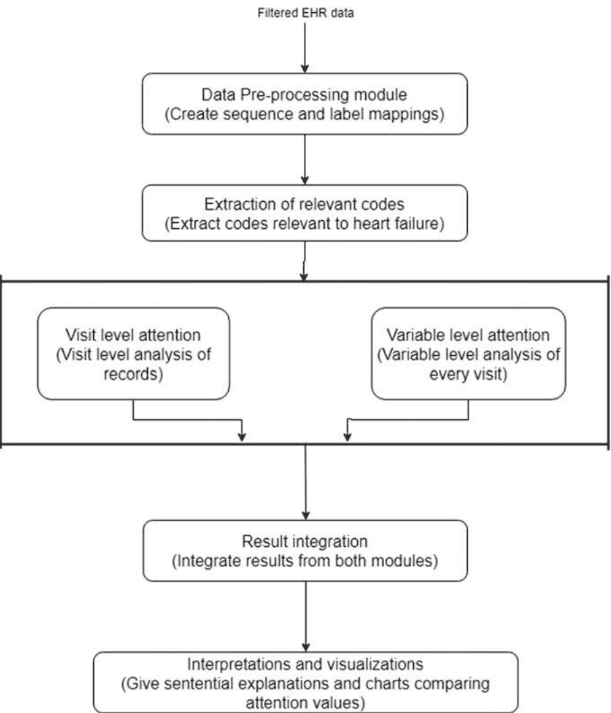

图 1 提出的方法论

可解释性广泛分为两种类型：前期可解释性和后期可解释性。在前期解释模型中，解释被构建到预测模型中，而在后期解释模型中，解释是在预测之后提供的。

从 MIMIC III 数据库 [2] 获取了电子健康记录 (EHR) 数据，对其进行了审查。MIMIC III 数据集由 46,520 名患者、651,047 个诊断事件和 240,095 个程序组成。对于每个患者，都有关于患者诊断和进行的程序的 ICD-9（国际疾病分类）代码的信息。这个数据集被用于基于注意力的 RNN 模型。

第二个使用的数据集是来自 UCI ML 存储库的 Cleveland 数据集 [9]，被许多人用来构建心脏病预测模型。这是一个由 303 个患者记录组成的小型数据集。它被用来研究 LIME 算法。

### 注意机制：

神经网络中的注意机制与人类的视觉注意机制几乎相似。从人类的角度来看，注意力告诉人脑关于模型工作的具体内容和可视化。注意机制允许网络在计算注意力值时参考输入序列，并不强制网络将所有输入信息编码为固定长度的向量。

### 3.1 概念系统设计

- 数据预处理模块：数据被处理，并创建字典，将患者编号映射到入院序列，以及每个单独的入院与一系列 ICD-9 代码，以及其他映射，如时间戳和住院时间。这些映射直接被模型使用，作为所需实际数据的表示。
- 提取相关代码：只有显示与心力衰竭相关的代码的患者才被考虑用于训练。此外，患者必须在十二个月内进行至少三次就诊。
- 就诊级别的注意力：对每个患者的就诊进行关注，作为整体特征，考虑住院时间和就诊之间的时间。
- 变量级别的注意力：对每次就诊中的 ICD-9 代码进行关注，计算它们对输出的贡献。
- 结果整合：将来自注意力级别的结果整合，并将模型的最终输出与贡献分数一起传递，以进行展示和可视化。
- 可视化和句子解释：通过创建每个 ICD-9 代码的注意力分数的可视化来分析，以确定哪些诊断对模型的输出贡献最大。

### 3.2 注意力模型

注意力模型在预测输出时“关注”输入的部分，而不是按顺序处理它。因此，如果输入中特定特征的注意力值很高，那么它会对输出产生很大影响。这使我们能够解释模型，了解在预测是否存在心力衰竭时考虑了输入的哪个部分。注意力映射可视化帮助我们了解网络在尝试进行预测时看到了哪些部分。注意力机制使网络能够访问内部记忆。因此，网络可以选择从记忆中检索什么。网络通过加权组合所有记忆位置来检索。

序列对于我们日常生活中的每个任务都很重要。无论是语言中单词的顺序重要，还是基因组数据中每个序列都有不同的含义。时间定义了时间序列数据中事件的发生。因此，需要一种特定的神经网络模型，即递归神经网络，用于处理由时间定义的数据。

任何患者的病史对于准确预测医学诊断至关重要。循环神经网络（RNN）利用这些病史作为顺序信息来预测患者的心脏衰竭风险以及其背后的解释。

循环神经网络（RNN）遭受梯度消失问题的困扰。这会导致长输入序列中的过去信息被冲刷掉。为了解决这个问题，许多技术被提出，如长短期记忆（LSTM）单元、门控循环单元（GRUs）。GRU（门控循环单元）通过使用称为“门”的向量来解决这个问题。

RNN 存在梯度消失问题，GRUs 通过使用两个“门”——重置门和更新门来解决这个问题。这两个向量确定了应该传递给输出（RNN 中的下一个 t 状态）的信息（值）。GRUs 可以被训练以长时间保留信息，而不会随时间遗忘。

### 3.3 GRU：它是如何工作的

让我们来看一些 GRU 的工作原理和其中的数学，如图 2 所示。GRU 可以用图示表示，如图所示。图中的符号表示如下：


Sigmoid 函数分别表示之前提到的更新门和重置门。

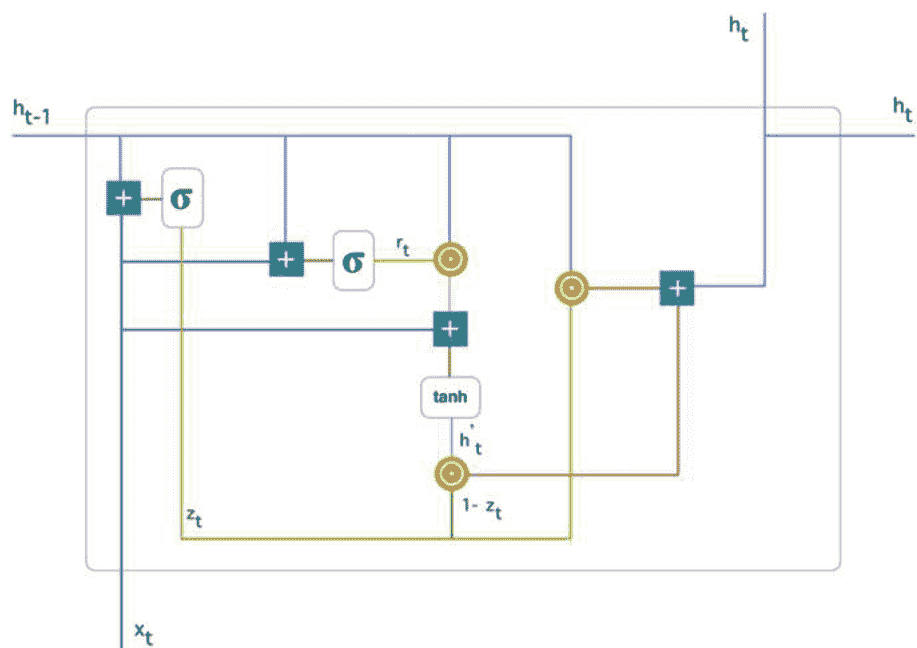

- 1. 更新门：更新门决定了多少过去的信息从之前的时间步传递到未来。时间步 t 的更新门值 z_t 通过以下公式计算:
  $z_{t}=\sigma\left(W^{(z)} x_{t}+U^{(z)} h_{t-1}\right)$
- 2. 重置门：该门用于决定从模型中遗忘多少过去的信息。它的计算如下:
  $r_{t}=\sigma\left(W^{(r)} x_{t}+U^{(r)} h_{t-1}\right)$
- 3. 最终内存内容：最终内存内容，即传递到下一个时间步的输出，通过两个步骤计算。首先，使用重置门存储过去的相关信息，在一个名为当前内存内容的变量中，h'
  $h_{t}^{\prime}=\operatorname{tanh}\left(W x_{t}+r_{t} \odot U h_{t-1}\right)$
  最后，我们计算 h_t 向量，其中包含要传递给网络下一层的信息。更新门用于此操作。从 h' 和 h_{t-1} 中收集的信息如下确定:
  $h_{t}=z_{t} \odot h_{t-1}+\left(1-z_{t}\right) \odot h_{t}^{\prime}$

基于注意机制的模型具有两个级别的注意力，首先检测有影响力的过去访问，然后检测这些访问中的重要临床变量。注意模型试图模仿医生在会诊期间的行为。就像医生一样，它更关注最近的临床访问，首先考虑最近的访问，然后再考虑之前的访问，即按相反的顺序。

这是因为静态模型通常将所有先前的信息组合在一起，从而忽略了任何与时间相关的信息，并可能导致丢失输入数据中存在的时间关系，这可能导致具有巨大时间差异的输入数据得到相似的预测。因此，考虑最后一次访问首先是有益的，因此模型知道哪次访问更重要，并且模型是基于对访问特定特征的训练，这些特征有助于预测。

当进行预测时，访问级别的贡献被优先考虑，即哪次访问对最终预测的贡献最大，其中每次访问包含多个代码。此外，必须了解变量级别的贡献，即哪个变量对最终预测的贡献更大。该模型可以分为三个部分。第一部分由 GRU 控制，用于访问级别的注意权重，由于每次访问包含多个变量，第二部分由 GRU 控制，生成变量级别的注意权重。第三部分是多层感知器，用于嵌入访问信息以保持可解释性。使用 MLP 将访问嵌入到较低维空间。部分 1 和部分 2 形成侧循环，稍后与 MLP 模型结合进行预测。由于预测过程中没有循环，该模型是可解释的端到端模型。

该模型有两个主要优点:
- 以相反的时间顺序运行 GRU 可以提供计算上的优势
- 当使用时间戳时，预测过程可以有显著的改进。时间戳提供了患者在 ICU 中停留的时间长度。这个参数增加了模型的准确性，因为较长的 ICU 停留时间可能表示增加的风险。

从 MIMIC III 数据集中提取出心力衰竭患者及其符合资格的 ICD-9 诊断代码，用于训练和测试基于注意力的解释模型。数据集中有 2349 名患者，共有 9587 次入院记录和 135,709 次诊断记录，准备好的数据集中有 2989 个唯一的 ICD-9 代码。这些提取出的患者符合至少有 3 次就诊并且具有来自与心力衰竭相关的诊断代码列表的条件。该列表是根据 MIMIC III 数据集的创建者以及该领域的一些专家提供的数据编制的。

超参数调整：

使用密集神经网络训练数据很容易实现非常高的准确性，但这些可能不会很好地推广到验证和测试集。此外，避免使用深度/复杂的架构可能导致数据集上的低准确性。因此，必须找到一个既能很好地推广又具有高准确性的平衡点。

一些模型由于鞍点和局部最小值导致梯度为零，因此需要调整超参数（如学习率）并将优化器更改为 Adam 或 Adadelta，以避免陷入停滞并停止进一步学习。

超参数：

层数：必须明智地选择，因为过高的层数可能会引入过拟合和梯度消失和梯度爆炸问题，而较低的层数会导致模型具有高偏差和低潜力。由于模型具有两个独立的 GRU 单元，用于训练访问级别代码和变量级别代码，分别训练访问代码和变量代码，其中访问代码和变量代码具有 128 个隐藏层。由于模型的性能指标是准确性，在将隐藏层数更改为 256 时，模型的准确性没有显著变化。因此，隐藏层计数保持为 128，以保持模型的简单性。应用于初始整数列表的线性嵌入从 128 个嵌入大小调整为 256，因为它显示出模型准确性增加了 9%，并且成本函数显著减少。

激活函数：在这方面，流行的选择有 ReLU、Sigmoid、Tanh 和 LeakyReLU。对于 GRU 模型的更新门（用于确定要传递多少过去的信息）和重置门（用于决定要忘记多少过去的信息），使用 sigmoid 和 tanh 作为激活函数。

优化器：它是模型用来更新每一层权重的算法，以最小化成本函数。对于这个模型，最初使用的是 AdaGrad 作为优化器，但它有一些自身的问题，比如学习率 η 的不断衰减、学习率 η 的手动选择。为了解决这些问题，优化器被切换到 Adadelta。

初始化：并不起很大的作用，因为默认值效果很好，但仍然应避免使用零或任何常数值（在所有单元中相同）的权重初始化。权重在线性嵌入中初始化为 -1 到 1 之间，在访问级别（alpha）和变量级别（beta）中初始化。偏置以适当的数据类型和格式初始化为 0。

批量大小：它表示在更新权重矩阵之前向网络展示的模式数量。如果批量大小较小，模式重复次数较少，权重会分散在各个位置，导致收敛困难。变得困难。对于这个模型，批量大小初始化为100。这是合适的，因为进一步修改只会增加执行时间。

- Epoch的数量：Epoch的数量是整个训练数据集通过模型的次数。这里使用了17个Epoch，进一步增加/减少不会对准确性产生影响。Epoch的数量是一个重要的超参数，因为增加这个数量可能导致模型过拟合，而减少这个数量可能导致结果不佳，因为模型可能无法充分发挥其潜力。过拟合可能导致泛化，最终会导致梯度消失和梯度爆炸问题。

- Dropout：Dropout层的保持概率可以被视为超参数，它可以作为正则化器帮助我们找到最佳的偏差-方差平衡点。Dropout应用于两个地方：（1）输入嵌入层，（2）上下文向量c_i。它们各自的dropout率分别为0.4和0.4。简单来说，这个值是精确的，因为它补充了模型的性能指标。Dropout值会影响性能，因此建议根据数据进行调整。

- L1/L2正则化：任何机器学习模型都需要从提供给它的所有特征中学习。L2正则化应用于W_emb（线性嵌入层的权重）、w_alpha（访问级GRU模型的权重）、W_beta（变量级GRU模型的权重）和w_output（在将alpha、beta权重与输入向量的嵌入连接后的输出层）。

训练模型使用测试数据集评估性能指标。通过成本函数测量预测值与其对应真实值之间的差异。为了找到这个成本（train_cost），使用Adadelta优化算法。Adadelta是一种随机梯度下降算法家族中的优化算法。它找到最小的成本值。它使用各种权重，并根据损失始终更新权重，因此每次都可以尝试新的权重值。首先使用一些初始权重运行模型，然后通过执行数千次迭代来更新它们，试图找到正确的组合。需要注意的是，Adadelta寻找的是最小成本，而不是最小权重，因此它只更新权重，而不是最小化它们。

### 3.4 LIME算法

LIME实现目标的一般方法如下：

- 1. 对于每个要解释的预测，对观察结果进行n次排列。
- 2. 让复杂模型预测所有排列观测的结果。
- 3. 计算所有排列与原始观测之间的距离。
- 4. 将距离转换为相似度分数。
- 5. 从排列数据中选择描述复杂模型结果最好的m个特征。
- 6. 将简单模型拟合到排列数据中,通过排列数据中的特征加权相似度解释复杂模型结果。
- 7. 从简单模型中提取特征权重,并将其用作解释复杂模型的局部行为。

## 4 结果与讨论

使用多层感知器、随机森林和朴素贝叶斯算法的LIME算法结果如下所述。

### 4.1 多层感知器(MLP)

多层感知器(MLP)由三种类型的层组成——接收信号的输入层,输出层进行决策或预测,以及在输入和输出之间执行特征的实际处理的任意数量的隐藏层。

MLP中使用的隐藏层数量为14,激活函数为ReLU,使用了lbfgs求解器。

得到的平均准确率为83.11%。

图3展示了当LIME解释模型在MLP上运行时,MLP作为一个黑盒模型的结果。

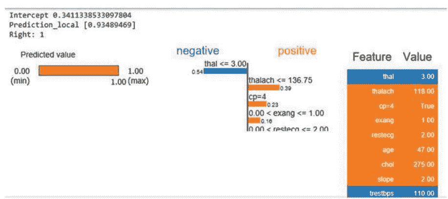
图3 多层感知器 (MLP)

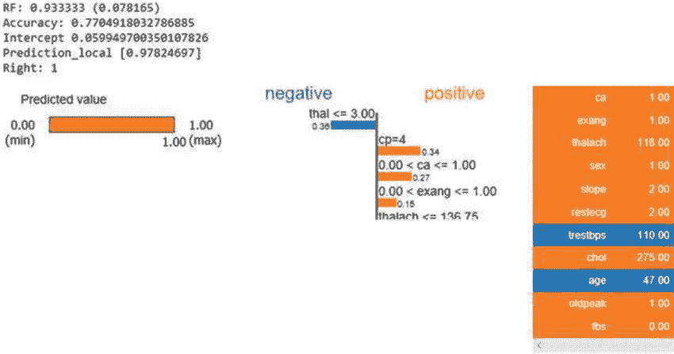
图4 随机森林算法

### 4.2 随机森林算法

集成分类器随机森林分类器用于对对象进行分类。

该分类器选择训练集的子集，生成一组决策树，并聚合来自不同决策树的决策，计算测试对象的最终类别。克利夫兰数据集的准确率为77%，如图4所示。

### 4.3 朴素贝叶斯算法

它是一种基于贝叶斯定理的统计分类器。它使用类条件独立性假设。

它使用了简化的概率计算，因此被称为朴素贝叶斯。这种简化使得计算更容易处理。因此，它通过图5所示的77%的准确率表现良好。

从上述结果可以得出结论，对于这个特定的患者，模型预测患者存在心脏病，并且平均而言，特征Thalach（最大心率）、包括运动引起的心绞痛、无症状胸痛、ca（主要血管数量）和静息心电图结果是对患者心脏衰竭疾病的积极贡献特征。因此，未来必须监测这些特征以降低心脏衰竭的风险。特征“Thal”的值小于3，表示正常，因此对患者心脏病的指示没有贡献，或者说是负面贡献。

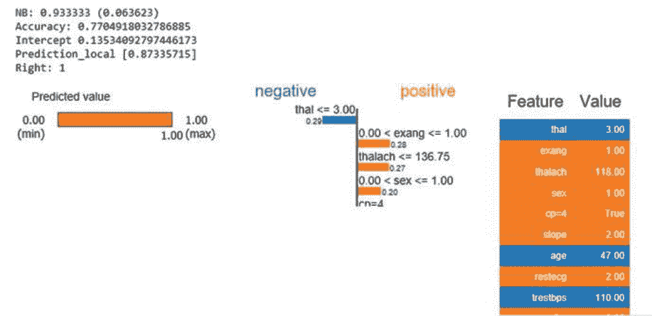


### 4.4 注意机制的结果

通过将输入层的数量从128增加到256,准确率提高到82.6%,最初为73%,如图6和7所示。

如图8和9所示,这里D_428:充血性心力衰竭,D_427:心动过速和D_996:心脏起搏器机械并发症。

在测试数据上运行模型时,会生成一个'.txt'文件。它包含每个ICD9代码相对于每个访问对于一个个体患者的贡献分数。这

```
Epoch:0, Train_cost:1.964693, Validation_AUC:0.622260
Currently the best validation AUC found. Test AUC:0.622260 at epoch:0
Epoch:1, Train_cost:1.845928, Validation_AUC:0.684047
Currently the best validation AUC found. Test AUC:0.684047 at epoch:1
Epoch:2, Train_cost:1.738916, Validation_AUC:0.704634
Currently the best validation AUC found. Test AUC:0.704634 at epoch:2
Epoch:3, Train_cost:1.641980, Validation_AUC:0.711145
Currently the best validation AUC found. Test AUC:0.711145 at epoch:3
Epoch:4, Train_cost:1.554097, Validation_AUC:0.711176
Currently the best validation AUC found. Test AUC:0.711176 at epoch:4
Epoch:5, Train_cost:1.473742, Validation_AUC:0.709409
Epoch:6, Train_cost:1.400046, Validation_AUC:0.709384
Epoch:7, Train_cost:1.329736, Validation_AUC:0.712995
Currently the best validation AUC found. Test AUC:0.712995 at epoch:7
Epoch:8, Train_cost:1.263034, Validation_AUC:0.720022
Currently the best validation AUC found. Test AUC:0.720022 at epoch:8
Epoch:9, Train_cost:1.197548, Validation_AUC:0.731286
Currently the best validation AUC found. Test AUC:0.731286 at epoch:9
The best validation & test AUC:0.731286, 0.731286 at epoch:9
```


```
Initializing the parameters ... using randomly initialized code embedding
Building the model ... not using time information, fine-tuning code representations
adadelta
Loading data ... done
Optimization start !!
Epoch:0, Train_cost:3.232520, Validation_AUC:0.667064
Currently the best validation AUC found. Test AUC:0.667064 at epoch:0
Epoch:1, Train_cost:2.996768, Validation_AUC:0.707742
Currently the best validation AUC found. Test AUC:0.707742 at epoch:1
Epoch:2, Train_cost:2.783378, Validation_AUC:0.713764
Currently the best validation AUC found. Test AUC:0.713764 at epoch:2
Epoch:3, Train_cost:2.588621, Validation_AUC:0.710180
Epoch:4, Train_cost:2.410698, Validation_AUC:0.708970
Epoch:5, Train_cost:2.243606, Validation_AUC:0.719399
Currently the best validation AUC found. Test AUC:0.719399 at epoch:5
Epoch:6, Train_cost:2.086244, Validation_AUC:0.733326
Currently the best validation AUC found. Test AUC:0.733326 at epoch:6
Epoch:7, Train_cost:1.938471, Validation_AUC:0.749850
Currently the best validation AUC found. Test AUC:0.749850 at epoch:7
Epoch:8, Train_cost:1.810474, Validation_AUC:0.765403
Currently the best validation AUC found. Test AUC:0.765403 at epoch:8
Epoch:9, Train_cost:1.685449, Validation_AUC:0.775841
Epoch:9, Train_cost:1.685449, Validation_AUC:0.775841
Currently the best validation AUC found. Test AUC:0.775841 at epoch:9
Epoch:10, Train_cost:1.577652, Validation_AUC:0.787546
Currently the best validation AUC found. Test AUC:0.787546 at epoch:10
Epoch:11, Train_cost:1.475197, Validation_AUC:0.797628
Currently the best validation AUC found. Test AUC:0.797628 at epoch:11
Epoch:12, Train_cost:1.392700, Validation_AUC:0.802550
Currently the best validation AUC found. Test AUC:0.802550 at epoch:12
Epoch:13, Train_cost:1.305567, Validation_AUC:0.800237
Epoch:14, Train_cost:1.247123, Validation_AUC:0.815316
Currently the best validation AUC found. Test AUC:0.815316 at epoch:14
Epoch:15, Train_cost:1.178127, Validation_AUC:0.821516
Currently the best validation AUC found. Test AUC:0.821516 at epoch:15
Epoch:16, Train_cost:1.121122, Validation_AUC:0.825900
Currently the best validation AUC found. Test AUC:0.825900 at epoch:16
The best validation & test AUC:0.825900, 0.825900 at epoch:16
```

图7 最终的超参数调整

该图显示了特定患者的特定访问中ICD9代码的贡献。

如图10所示, RNN模型的准确率为82.5%。一些疾病被错误分类, 但考虑到该模型还能够解释, 可以说模型的准确率是高效的。此外, 这使工程师能够了解模型在某些地方给出了错误的预测并且必须改进, 从而增加透明度。

图11显示了患有特定疾病的患者数量。 例如, 慢性肾脏疾病有1670名患者, 酸中毒在1638名患者中发现, 等等。

平均而言, 那些对心力衰竭产生负面影响并且对其影响最小的疾病在图12中绘制。 例如, 烟草使用障碍的贡献率低至 -0.0134; 同样, 肥胖症的平均贡献率为 -0.0127, 也较低。

```
---------- visit_index:0 ----------
D_428:0.093765 D_584:0.058581 D_355:0.016668 D_253:0.006551
D_458:0.043802 D_427:0.088529 D_507:0.009245 D_276:0.025737

---------- visit_index:1 ----------
D_38:0.057131 D_584:0.055679 D_575:-0.005129 D_253:0.006952
D_493:-0.075103 D_427:0.085047 D_276:0.023918 D_518:0.002453

---------- visit_index:2 ----------
D_518:0.001443 D_384:0.016059 D_584:0.051752 D_785:0.045712
D_253:0.007291 D_427:0.079457 D_996:0.064654 D_482:0.008082

patient_index:0, label:1, score:0.623746
```

```
---------- visit_index:0 ----------
D_E884:-0.006092 D_427:0.083336 D_332:0.011624 D_331:0.008032
D_853:-0.004967 D_272:-0.085196 D_294:0.018561 D_49:0.020207
D_V45:0.009687

---------- visit_index:1 ----------
D_349:0.002463 D_599:-0.021558 D_E879:-0.007742 D_31:-0.073316
D_427:0.083046 D_43:-0.004049 D_294:0.018416 D_49:0.020173 D_V45:0.009447

---------- visit_index:2 ----------
D_780:-0.018120 D_458:0.038843 D_427:0.078129 D_43:-0.004112
D_355:0.014473 D_272:-0.079959 D_294:0.017409 D_49:0.019309 D_V45:0.008682

patient_index:1, label:1, score:0.473506
```

图8 考虑进行测试的各种患者

```
Top 5 explanations for prediction:
1: High D_428 with an attention score of 0.093765 seen in visit 1
2: Presence of D_427 with an attention score of 0.088529 seen in visit 1
3: High D_427 with an attention score of 0.085047 seen in visit 2
4: Patient has D_427 with an attention score of 0.079457 seen in visit 3
5: High D_996 with an attention score of 0.064654 seen in visit 3
```

图9 预测的文本解释

平均而言，对心力衰竭产生积极影响并且对其影响最大的疾病在此图表中绘制。例如，房颤的平均分数为0.0253，贡献最大；同样，充血性心力衰竭的平均分数为0.0206，也有更大的贡献，如图13所示。

图14显示了特定疾病在某次就诊中被发现的总次数。例如，慢性肾脏疾病总共发现了4029次；同样，充血性心力衰竭发现了3742次，等等。

使用EHR的深度学习和可解释AI在医疗保健中

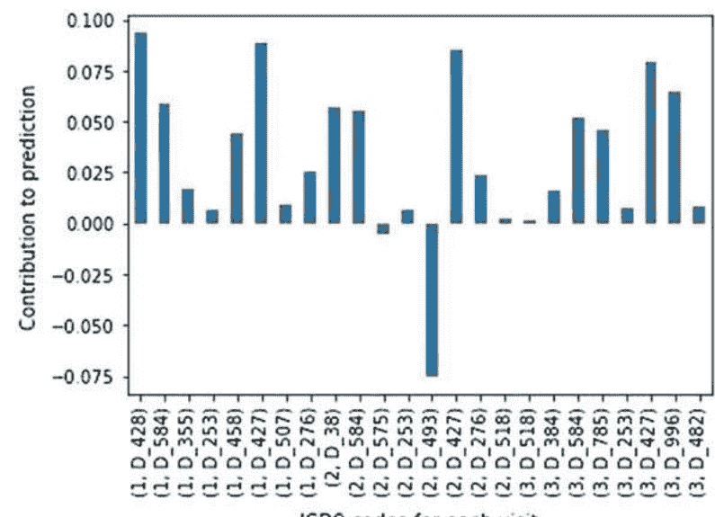
图10 使用前期解释模型-注意机制的患者的图形输出

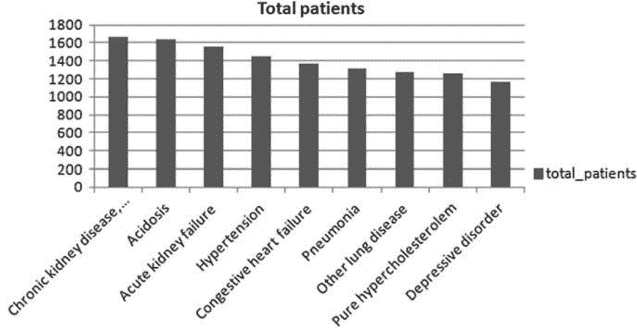
图11 患者总数与诊断

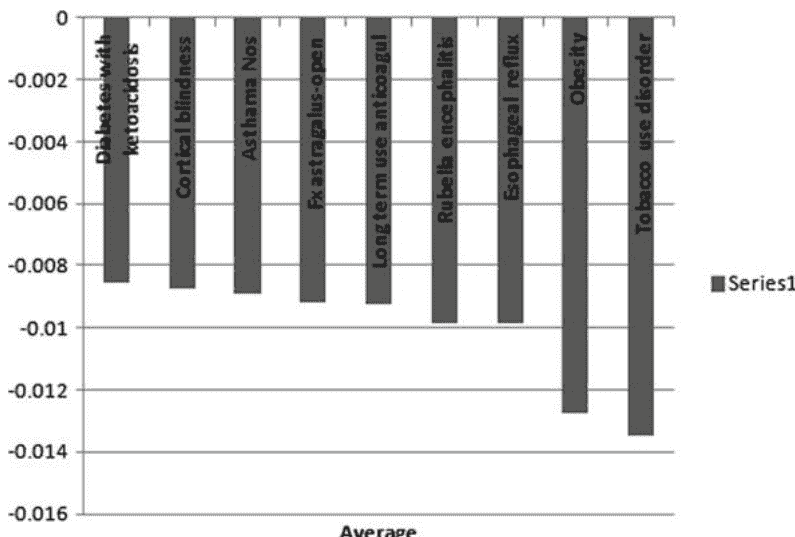
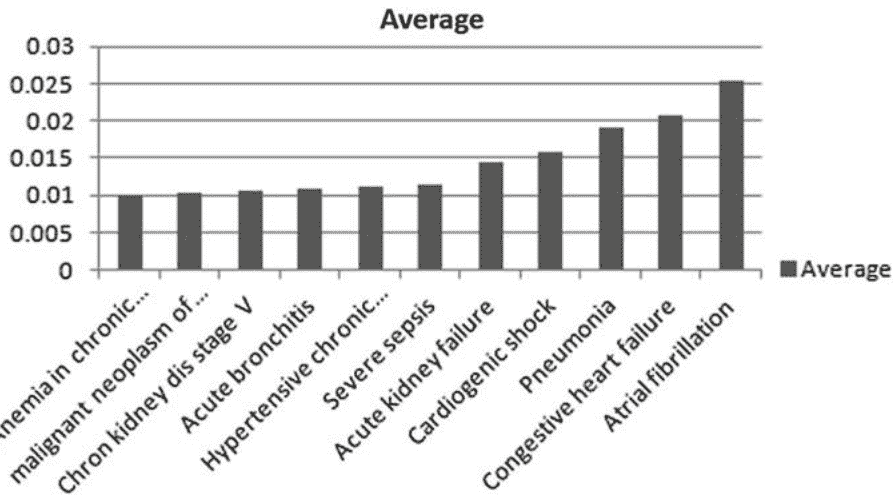

## 5 结论

人工智能 (AI) 和神经网络，尤其是由于不断改进的计算能力，在过去的十年中取得了前所未有的进展。然而，由于对模型的不信任，这些进展在商业和社会角度上尚未得到利用。

图14 ICD_9代码的发生

黑盒性质使得商业应用仍然使用相对简单和不太准确的算法。

这个困境表明迫切需要为深度神经网络带来可解释性。本章通过描述一个可解释的神经网络来解决这个需求，该网络可以解释自己的预测，并将其与后期解释器（如LIME）进行比较。以可解释的方式预测心脏衰竭的可能性将给医生提供早期警告，并有助于降低再入院率。使用RNN的模型准确率为82.5%。这个解决方案将有助于建立对AI的信任，并广泛和有益地使用神经网络。未来，该模型可以扩展到预测其他疾病。可以测试集成算法的有效性以进行更精确的预测。

### 参考文献
- 1. Goldberger, A.L., Amaral, L.A.N., Glass, L., Hausdorff, J.M., Ivanov, P.Ch., Mark, R.G., Mietus, J.E., Moody, G.B., Peng, C.-K., Stanley, H.E.: PhysioBank, PhysioToolkit, and PhysioNet(June 13): components of a new research resource for complex physiologic signals. 循环 101(23), e215–e220. (循环电子页面; http://circ.ahajournals.org/content/101/23/e215.full) (2000)
- 2. MIMIC III数据集 (Medical Information Mart for Intensive Care III). https://mimic.physionet.org/
- 3. Holzinger, A., Biemann, C., Pattichis, C.S., Kell, D.B.: 构建可解释的医学领域AI系统需要什么 (2017). arXiv:1712.09923v1
- 4. Zhao, C., Shen, Y., Yao, L.-P.: 基于卷积神经网络的患者表示学习模型，用于发现心力衰竭的时间表型 (2017)
- 5. Choi, E., Bahadori, M.T., Kulas, J.A., Schuetz, A., Stewart, W.F., Sun, J.: RETAIN: 一种可解释的预测模型，使用逆时间注意机制进行医疗保健。 在：第30届神经信息处理系统会议(NIPS)，西班牙巴塞罗那(2016)
- 6. Guestrin, C., Singh, S., Ribeiro, M.T.: 为什么我应该相信你？ 解释任何分类器的预测 (2016). arXiv:1602.04938
- 7. Bahdanau, D., Cho, K.H., Bengio, Y.: 使用注意机制的神经机器翻译论文，ICLR (2015)
- 8. Choi, E., Bahadori, M.T., Song, L., Stewart, W.F., Sun, J.: GRAM: 基于图的注意力模型用于医疗保健。 在：ACM SIGKDD国际会议上的知识发现和数据挖掘，第787-795页（2017年）
- 9. 克利夫兰心脏病数据集：（1988年）。 https://archive.ics.uci.edu/ml/datasets/heart+Disease

Sujata Khedkar 教授在孟买大学维韦坎德教育学会技术学院计算机工程系担任副教授。她目前的研究重点是人工智能和大数据分析。她是ISTE和CSI的成员。

Priyanka Gandhi是一名软件开发人员，对人工智能和大数据技术领域有着积极的研究兴趣。她于2019年从孟买大学V.E.S.I.T.获得计算机工程学士学位。

Gayatri Shinde是一位软件开发人员，对人工智能和深度学习领域有着活跃的研究兴趣。她于2019年从孟买大学的V.E.S.I.T.获得计算机工程学士学位。

Vignesh Subramanian是一位软件开发人员，对人工智能和大数据分析领域有着活跃的研究兴趣。他于2019年从孟买大学的V.E.S.I.T.获得计算机工程学士学位。

# 用于电子健康记录（EHR）分析的深度学习

## 摘要
在当前情况下，医疗中心和医院中的每个医疗设备、临床仪器和实验室设置都与数字设备相连，这导致了数字数据的爆炸式增长。因此，电子健康记录（EHR）中生成和存储的数字信息数量呈指数级增长。因此，EHR已成为一个蓬勃发展的研究领域，因为EHR可以提供许多未开发的可能性，其中包含的数据可以带来许多好处。EHR具有多种分类模式和控制词汇，用于记录相关的医疗信息和事件。因此，协调和分析机构之间以及术语之间的数据是一个持续的研究领域。各种深度学习EHR系统提出了几种临床代码表示形式，可以轻松实现跨机构分析和应用。EHR记录的主要用途是存储患者信息，如患者的病史、进展、人口统计学、诊断和药物治疗。

但全球范围内的研究人员已经发明了电子病历的二次使用，用于多个临床和健康信息学应用。电子健康记录（EHRs）的二次使用有望推动临床研究，并导致更明智的临床决策。总结和表示患者数据的挑战阻碍了使用EHRs预测患者未来的广泛实践。同时，机器学习领域在深度学习方面取得了广泛的进展。当前医疗信息学研究侧重于将基于EHRs的深度学习应用于临床任务。在这个背景下，这里描述的深度学习技术可以应用于各种类型的临床应用，如信息提取、表示学习、结果预测、表型和去识别化。已经确定了当前研究的几个限制，如模型可解释性和数据的异质性。

## 1 引言
在过去的十年中，医院选择电子健康记录（EHR）系统的数量大幅增加，为医疗机构、医院和医生采用EHR系统提供了300亿美元的激励措施[1]。

根据最新报告，约84%的医院至少采用了基本的EHR系统，比2008年增加了9倍[2]。此外，基于办公室的医生采用基本和保证的EHR系统的比例从42%增加到了87%[3]。

EHR框架存储了每个患者的经验信息，包括统计数据、研究实验室测试和结果、诊断、处方、临床笔记、放射学图像等[1]。虽然主要用于从动态角度提高医疗效率，但许多研究发现了临床数据的次要应用[4,5]。具体而言，包含在EHR框架中的患者信息已被用于许多任务，如医学概念提取[6,7]、疾病诊断、患者指导建模、临床决策支持系统等（表1）。

| 项目 | 深度电子病历任务 | 参考文献 |
|---|---|---|
| Deepr | 医院再入院预测 | [8] |
| DeepPatient | 多结果预测 | [9] |
| Doctor AI | 心力衰竭预测 | [10] |
| DeepCare | 电子病历概念表示 | [11] |
| eNRBM | 自杀风险分层 | [12] |
| Med2Vec | 电子病历概念表示 | [10] |

直到最近几年，对丰富的EHR数据进行分析的大部分方法都依赖于传统的统计和机器学习技术，如逻辑回归、支持向量机（SVM）和随机森林[13]。近年来，深度学习技术在捕捉长期条件和深层次特征构建方面取得了巨大进展[14]。鉴于深度学习技术的普及和患者数据的日益庞大，越来越多的研究发表了将深度学习应用于EHR数据的临床信息学任务，相比传统方法，这些方法在性能上表现更好，并且需要更少的耗时预处理和特征工程。

本章审查了用于电子病历数据分析和推断的特定深度学习策略，并讨论了这些进展所带来的强大临床应用。与其他研究不同，其他研究探索了健康信息学应用的广泛背景，从基因组分析到生物医学图像分析，本章仅关注与电子病历数据相关的深度学习方法[15]。

## 2 电子健康记录（EHR）系统
EHR系统的使用在医院和门诊环境中都得到了显著扩展[2]。急诊医院和诊所的EHR使用可以通过减少错误、提高效率和改善护理协调来改善患者护理。同时，还为研究人员提供了丰富的数据资源。EHR系统的功能可以有所不同，并且通常被分为基本EHR无临床记录、带有EHR的基本临床记录和综合系统。

尽管缺乏额外创建的功能，但即使是基本的电子病历系统也可以提供患者的医疗历史、挑战和药物使用的数据。电子病历系统最初是为医院内部管理任务而设计的，一些分类设计用于记录相关的医疗信息和案例。一些模型结合了分析代码、系统代码、再检查观察和处方代码。这些代码可以在不同机构之间变化，资源维护着中间的指导点。鉴于庞大的模式展示，混合和探索不同措辞和不同机构之间的数据是一个持续的研究领域。部分深度电子病历系统在该领域提出了适用于跨机构分析和应用的临床代码表示类型。电子病历系统存储了多种类型的患者数据，包括人口统计学信息、诊断、体检、传感器测量、实验室检测结果、开药或用药情况以及临床笔记[15]。电子病历数据是异构的，包括多种数据类型：
- (1) 数值求和，例如BMI（体重文件）
- (2) 日期时间对象，例如出生日期或发病时间
- (3) 分类特征
- (4) 自然语言自由内容，例如进展记录或出院总结
- (5) 衍生时间安排，例如围手术期主要体征或多模态患者病史

虽然其他生物医学数据，例如医学图像或基因组数据，存在并在后续的大型文章中推广，但在本综述中，我们专注于现代电子病历系统中存在的这5种数据类型。

## 3 机器学习概述
机器学习方法可以彻底分为两个重要类别：有监督学习和无监督学习。有监督学习方法包括推导一个映射函数，例如 y = f(x)，输入 x 输出 y。有监督学习任务的示例包括回归和分类，算法包括逻辑回归和支持向量机。另一方面，无监督学习框架的目标是获取 x 的分布的有趣属性。无监督学习任务的示例包括聚类和密度估计。输入的表示是贯穿所有机器学习框架的一个基本问题。对于每个数据点，被称为特征的属性集被分离出来用作机器学习框架的输入。在传统机器学习中，特征通常是基于领域数据手工制作的。深度学习的一个内在准则是自动数据导向的特征提取。

## 4 深度学习及其方法
深度学习涵盖了广泛的方法。在这一部分中，对深度学习方法进行了简要概述。对于每个指定的工程，都包含了描述其任务关键技术的关键条件。

深度学习中的主要思想是表示。通常情况下，将输入特征手工制作成机器学习算法所需的形式，这取决于专业知识和领域的学习，以选择先前感兴趣的明确实例。制定、提取、选择和评估合适的特征的规划方法可能是困难和耗时的，并且通常被认为是需要创造力、实验和运气的“黑暗艺术”。另一方面，深度学习技术直接从数据本身中提取出理想的特征，没有人为指导，考虑到可能是未知或隐藏的个性化数据关联的自动发现。深度学习中的复杂数据表示通常被表达为其他更清晰的表示形式的模式。例如，观察图像中的人可能包括从像素到边缘的特征提取。这种无监督的不同层次的复杂表示的思想是深度学习中的一个重要主题。绝大多数深度学习算法和架构都基于人工神经网络（ANN）的结构。ANN由多个相互连接的节点（神经元）组成，按照图2所示的层次结构排列。

$$E(\theta, D)=-\sum_{i=0}^{D}\left[\log P\left(Y=y_{i} \mid x_{i}, \theta\right)\right]+\lambda\|\theta\|_{P}$$

条件约束中的主要项是整个训练数据集 (D) 上的对数损失；第二项试图限制受训模型参数 $\theta$ 的 p-范数，该范数由可调参数 $\lambda$ 控制。这第二项被称为正则化，是一种用于防止模型过拟合并提高其对新的、隐藏的参考点的能力的方法。损失函数通常使用反向传播进行优化，反向传播是一种最小化损失的权重优化方法。

在本节的其余部分，将评估几种常见的深度学习模型，这些模型用于深度电子健康记录的应用，这些模型都基于人工神经网络的结构和增强技术。在这个综述中，展示了对电子病历数据进行调查的常规深度学习模型的各个层面的视角，以及实现它们的选定作品，如图3所示。

图2 一个基本的神经网络 [16]
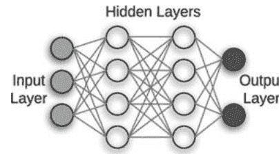

### 4.1 多层感知器 (MLP)
MLP是一种包含多个隐藏层的人工神经网络，其中第 l 层的每个神经元与第 l + 1 层的每个神经元完全连接。传统上，这些网络被限制为两到三个隐藏层，并且信息流只在一个方向上，而不是重复/无向模型。扩展了单层人工神经网络的可能性，每个隐藏单元都会对前一层的输出进行加权求和，然后通过非线性激活函数（$\sigma$）进行激活。在这里，d 是前一层的单元数量，$x_j$ 是前一层的输出的第 j 个节点，$w_{ij}$ 和 $b_{ij}$ 是与每个 $x_j$ 相关的权重和偏置项。传统上选择 sigmoid/tanh 作为非线性激活函数，但现代网络使用修正线性单元（ReLU）等函数。

$$h_i = \sigma \left(\sum_{j=1}^{d} x_j w_{ij} + b_{ij}\right) \quad (2)$$

在训练过程中，随着隐藏层的增加，网络学习到了数据 x 和输出 y 之间的关系。随着隐藏层的增加，数据将以更加动态的方式显示出来，这是由于每个隐藏层的非线性激活所导致的。虽然多层感知器(MLP)是最简单的模型之一，但是其他结构通常会结合完全连接的神经元。

### 4.2 卷积神经网络(CNN)
CNN最近已经成为一个非常常见的工具，特别是在图像处理领域。CNN在原始数据上具有局部连接性。例如，不再将一个 50 × 50 的图像视为 2500 个无关的像素，而是通过将图像视为邻域像素块的集合来提取更重要的特征。基本上，一维(1D)时间序列也可以被视为邻域信号片段的整合。一维卷积的公式如下所示，其中 x 是输入信号，w 是权重函数或卷积滤波器。

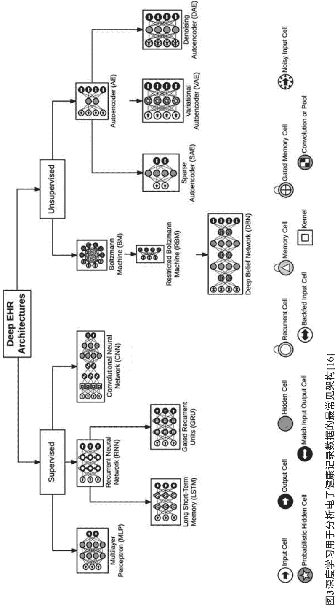
图3 深度学习用于分析电子健康记录数据的最常见架构[16]

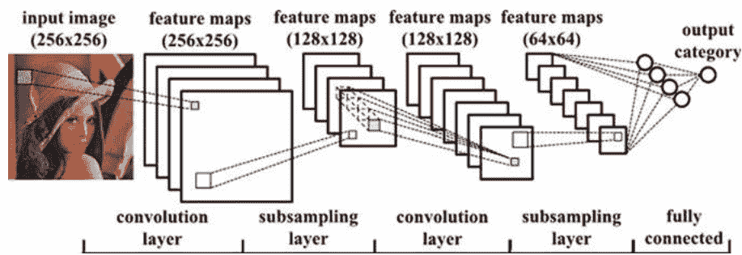
图4 卷积神经网络 (CNN) 用于图像分类[16]

$$C_{1d}=\sum_{a=-\infty}^{\infty} x(a) w(t-a) \quad (3)$$

同样，二维 (2D) 卷积在下面的表达式中被介绍，其中 $X$ 是一个二维网格，$K$ 是卷积核。

$$C_{2d}=\sum_{m} \sum_{n} X(m, n) K(i-m, j-n) \quad (4)$$

由于通道数量通常比数据小得多，CNN包含不足的连接，从而实现了通常较少的参数。卷积也促进了参数共享，因为每个通道在整个数据上都有连接。在CNN中，卷积层是多个卷积通道，它们都承担着来自前一层的相同任务，理想情况下可以提取出不同的低层特征。因此，通常将子采样或池化层连接到提取的特征上（图4）。

### 4.3 循环神经网络 (RNN)
当信息逐渐被请求时，RNNs 是一个确切的决策（例如，时间序列数据或自然语言）。虽然 1D (一维) 序列可以被馈送到 CNN，但是得到的特征是浅层的，因为只考虑了几个邻居之间的紧密连接。RNNs 被设计用于处理多个长期共享的条件。RNNs 是通过连续更新一个隐藏状态 $h_t$，该隐藏状态不仅基于当前时间 $t$ 的激活信息 $x_t$，还基于过去的隐藏状态 $h_{t-1}$，而过去的隐藏状态又从 $x_{t-1}, h_{t-2}$ 等中更新（图 5）。因此，设置整个序列后的最后一个隐藏状态包含了所有过去部分的信息。

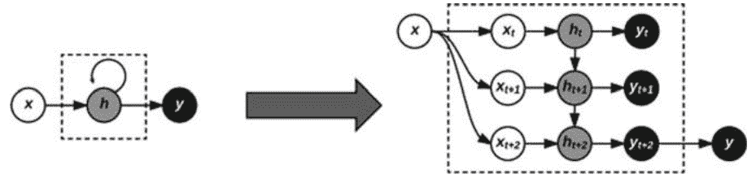
图5 RNN：符号表示（左），扩展表示（右）[16]

标准RNN变种包括长短期记忆（LSTM）和门控循环单元（GRU）模型，两者都被称为门控RNN。而标准的RNN包含相互连接的隐藏单元，门控RNN中的每个单元都被一个特殊的单元所取代，该单元包含内部循环回路和一组控制数据流动的门。它们在模拟长期渐进条件方面表现出色，具有多种优势。

### 4.4 自编码器（AE）
AE是一种深度学习模型，封装了无监督表示学习的可能性。最初作为预训练监督深度学习模型的早期工具，特别是在标记数据稀缺的情况下，但同时也适用于完全无监督的任务，例如表型发现。自编码器旨在将输入编码为低维空间 z。然后通过重建一个近似的表示 $\hat{x}$ 来确定编码表示 z 的质量。$W$ 和 $W^0$ 是各自的编码和解码权重，当重建误差 $\|x - \hat{x}\|$ 小于一定值时，编码表示 z 被认为是可靠的。

$$z=\sigma(W x+b)$$
$$\hat{x}=\sigma\left(W^{\prime} z+b^{\prime}\right)$$

当AE训练完成时，单个数据通过网络进行馈送，其中大多数深层隐藏层激活作为数据的编码表示。AE用于将信息转换为仅存储最重要的推断尺寸的格式。因此，它们类似于标准的维度降低技术，如主成分分析（PCA）和奇异值分解（SVD），但对于复杂问题具有简单的优势，因为通过每个隐藏层的激活函数进行非线性转换。


图6 两个独立训练的堆叠自动编码器隐藏层[16]

深度AE系统可以通过一种称为堆叠（图6）的贪婪结构进行构建和训练。已经引入了多种AE的变体，包括去噪自动编码器（DAE），稀疏自动编码器（SAE）和变分自动编码器（VAE）。

### 4.5 限制玻尔兹曼机（RBM）
其他无监督的深度学习工程用于学习输入信息的表征是RBM。RBM的目的类似于自编码器，但RBM通过评估数据信息的概率分布来采取随机的观点。因此，RBM通常被视为生成模型，试图模拟生成数据的隐藏技术。被认可的RBM是一个具有双重可见单元（$\tilde{v}$）和隐藏单元（$\tilde{h}$）的能量模型，其能量函数在方程中定义。

$$E(v, h) = -b^T v - c^T h - v^T W h$$

在BM中，所有单元都是完全连接的，而在RBM中，任何两个可见单元/任何两个隐藏单元之间都没有关联。训练RBM通常通过随机优化（例如Gibbs采样）来实现。

## 5 深度电子健康记录应用
在这个领域中，我们回顾了基于深度电子健康记录学的持续进展所产生的临床应用的最前沿。在表中显示了深度电子健康记录学项目和目标任务的概述，我们以星号标记| 任务 | 子任务 | 输入数据 |
| :--- | :--- | :--- |
| 信息提取 | 时间事件提取<br>缩写扩展<br>关系提取<br>单一概念提取 | 临床笔记 |
| 表示学习 | 概念表示<br>患者表示 | 医疗代码 |
| 结果预测 | 静态预测<br>时间预测 | 混合 |
| 表型划分 | 新表型发现<br>改进现有定义 | 混合 |
| 去识别 | 临床文本的去识别 | 临床笔记 |

根据当前研究的一致集合，给出了当前任务和子任务的定义。本领域其余部分的应用和结果大部分基于私有电子健康记录数据集，这些数据集属于独立的医疗机构（第七节）。然而，少数研究包括了一个公开可用的基本概念数据库，以及公开的临床笔记数据集（表2）。

### 5.1 电子病历信息提取 (IE)

与传统上用于计费和监管目的的有组织的电子病历信息不同，临床笔记更加细致，并且主要用于医疗服务提供者的详细记录。每个患者的经历都与一些临床笔记相关，例如入院记录、出院总结和转诊医嘱。从历史上看，这些技术需要大量的非自动化部分构建和本体映射；这也是为什么这种方法在应用方面受到限制的原因之一。总的来说，一些最近的研究集中在使用深度学习来提取重要的临床信息（图7）。

主要的子任务包括
- (1) 单一概念提取,
- (2) 时间事件提取,
- (3) 关系提取, 和
- (4) 缩写扩展

### 评估方法

准确率、回顾率和F1分数是包括单一概念提取、时间事件提取[18]等任务的基本分类测量。临床关系提取[19]。临床缩写形式发展研究采用准确性作为评估方法。虽然一些研究共享相似的任务和评估测量。

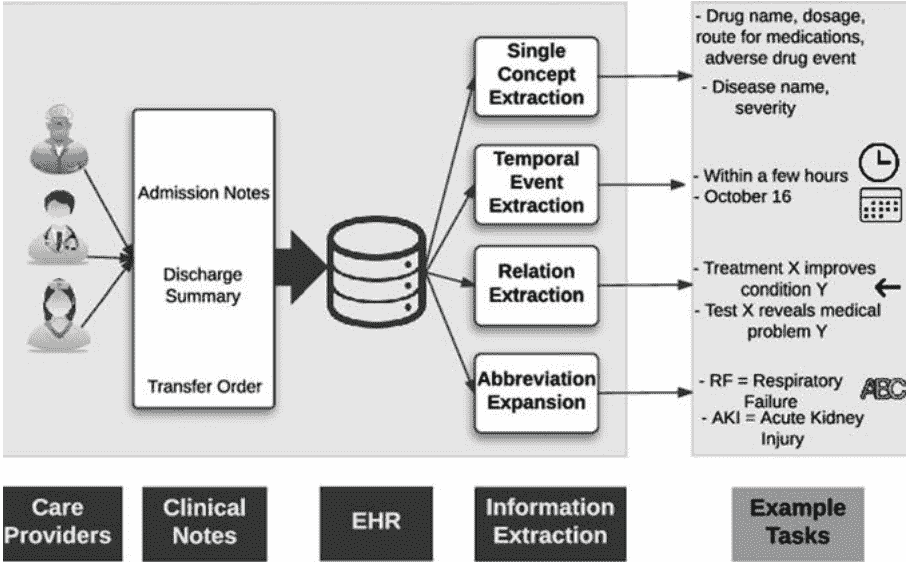

图7 电子健康记录信息提取（IE）[16]

### 5.2 电子健康记录表示学习

目前，手工样本被用于映射结构化医学概念，其中每个概念被赋予一个明确的代码由其重要语义。这些静态的多层次关联忽略了不同类型和编码方案的概念之间的自然相似性。连续的深度学习系统用于更详细的分析和更加精确的预测任务。

在这一领域，首先描述了用于解决离散医学代码的深度电子健康记录技术，作为可证明的任意维度向量。这些任务是无监督的，侧重于常见的关联和群体。

#### 5.2.1 概念表示

最近的几项研究应用了深度无监督表示学习技术来推导电子健康记录（EHR）概念向量，以捕捉潜在的相似性和自然的医学概念之间的聚类。我们将这个领域称为EHR概念表示，并且它的主要目标是从稀疏的医疗代码中获得向量表示，以便在向量空间中相似的概念是相邻的。无监督学习：除了受NLP启发的方法之外，其他常见的深度学习表示学习方法也被用于解决EHR概念。Tran等人设计了一个改进的受限玻尔兹曼机（RBM），它使用结构化训练方法来构建表示转换。他们评估了不同医疗概念之间的关联质量，并发现通过自动编码器获得的表示在训练直接模型方面远远优于传统的线性模型，达到了一流的性能。

#### 5.2.2 患者表征

在文献中提出了几种不同的深度学习方法来获取患者的向量表示。大多数技术要么受到NLP技术的启发，例如分布式词表示，要么使用降维技术，例如自动编码器。

### 电子健康记录表示学习的评估方法

包括表征学习在内的大部分评估都是基于代理任务的，根据代理任务的安排来评估它们的表征，人们普遍认为预测的改进是由于对临床概念或患者的更加准确的表征。因此，评估技术是多样化且任务相关的，包括诸如AUC（心衰起始预测、疾病预测、临床风险组预测）、准确率@k（疾病发展、疾病标记）、召回率@k（医疗编码预测、临床事件预测）、准确率（非计划再入院预测）或准确率、精确率和F1分数（信息提取）、非计划再入院预测、风险分层等。一些研究不包括任何次要的分类任务，而是专注于直接评估所学到的表征。

#### 5.2.3 结果预测

许多深度电子健康记录系统的明确目标是预测患者的结果。

(1) 静态/一次性预测（例如利用来自单次经历的数据进行心力衰竭预测），以及（2）时间结果预测（例如在半年内进行心力衰竭预测，或利用连续经历的记录数据进行疾病发作预测）。这些预测系统中有很多使用无监督数据建模的方法，例如临床概念表示（第五部分-B）。一般来说，主要贡献就是深度表示学习。

- (1) 静态结果预测：
结果预测应用程序的最明显类别是预测特定结果而不包括常见限制。
- (2) 时间结果预测：
他们还根据过去的结论和干预措施预测未来的再入院情况。对于所有任务，他们发现深度方法表现最佳。Nickerson等人使用MLP和LSTM系统预测术后反应，包括术后尿潴留（POUR）和短暂的术后疼痛，以提出更有效的术后疼痛管理方法。Nguyen等人的Deepr系统使用CNN来预测出院后的自发再入院。与其他方法类似，Deepr使用离散的临床事件代码。

#### 5.2.4 计算表型

随着详细的临床健康记录的整体性和可访问性的爆炸式增长，发现和改进广泛的疾病和诊断定义和界限有着巨大的任务机会。模型使用的逻辑是通过从原始数据中找到潜在的关联和多层次的概念，让数据自我证明其真实性，而无需人为监督或先入为主的偏见。随着大量临床数据的可用性，许多实时研究已经利用深度学习系统进行计算表型分析。计算表型有两个基本应用：
- (1) 发现和分层新的亚型;
- (2) 找到明确的表型，以改善现有疾病界限和定义下的分类。

这两个领域都试图寻找新的数据驱动表型；前者是一个基本上无监督的尝试，即很难定量评估，而后者则与有效验证结果的监督学习自然相关联。

#### 5.2.5 临床数据去识别

临床笔记通常包含明确的个人健康信息（PHI），这使得公开发布各种有价值的临床数据集变得困难[20]。Dernoncourt等人[20]提出了一个用于修改临床内容的去识别框架，该框架用一个相对持久的手动去识别过程替代了共享受限数据的方法。他们的结构包括一个双向LSTM网络（Bi-LSTM）和词级和字符级嵌入。作者发现他们的系统在性能上处于领先地位，同时具有限制性随机场方法也表现出色。在一项类似的研究中，Shweta等人研究了不同的RNN结构和词嵌入方法，用于识别临床内容中可能可识别的命名实体。

## 6 解释性

由于深度学习方法在各种任务上取得了最佳性能，因此其主要问题是输出模型通常很难解释。因此，一些深度学习结构经常被称为“黑盒子”，只有输入和输出预测对人类观察者有意义。模型缺乏透明度的主要缺点实际上是深度学习如此有效的原因：非线性数据转换的层次揭示了输入中隐藏的因素。这个问题在性能和可理解性之间存在权衡（表3）。

在临床领域中，模型的简明性是最重要的，因为预测可能被用于影响患者的治疗和决策。这就是为什么像逻辑回归这样的可解释的线性模型在临床信息学中得不到应用的原因。在本章中，将尝试使临床深度学习更加可解释。

### 6.1 最大激活

图像处理领域中的一种常见方法是查看每个隐藏单元的最大激活对应的输入数据类别。这是一个初步研究，旨在探索模型已经学到了什么，并且可以用来赋予原始特征选择的重要性。这种方法已经被相关研究中的许多调查所采纳。

表3 深度电子健康记录系统的可解释性技术
| 类型 | 方法 |
| :--- | :--- |
| (1) 最大激活 | • 输出激活最大化 [21]<br>• 卷积滤波器响应 [8]<br>• 密集层顶层权重最大化 [16] |
| (2) 约束 | • 非负矩阵分解 [21]<br>• 非负性 [12]<br>• 本体平滑 [12]<br>• 稀疏性 [22]<br>• 正则化 [12] |
| (3) 定性聚类 | • t-SNE [8] |
| (4) 模仿学习 | • 可解释的模仿学习 [23] |

### 6.2 约束

其他人对于深度模型的可解释性有强制性的训练约束。作者将每个代码权重网络的每个列的前k个值作为一个明显的疾病群体，可以在主观审查中解释。他们还对于用于分析每个神经元学习到的访问类型的第二次访问嵌入矩阵执行相同的过程。同样，eNRBM工程也在RBM的权重中实施了非负性。在时间序列数据的表型发现系统中，他们对AE的正则化和稀疏性要求导致了第一层的连续特征，这些特征可以解释为对功能元素（如上升或下降的信号倾斜）的探测器，这是学术模型权重可解释性的另一个例子。

### 6.3 定性聚类

在电子健康记录（EHR）概念表示和表型研究中，一些研究指出通过查看后续矢量化表示的常规群体来获得更间接的可解释性概念。同样地，Nguyen等人通过t-SNE将临床事件和患者向量的分布式表示投影到2个维度，从而允许对相似诊断和患者亚组的主观比较。

### 6.4 模仿学习

深度模型透明度的问题最终在可解释的模仿学习方法中得到解决。首先，使用相关类别标签对原始患者数据进行深度神经网络训练，每个样本生成一个向量。然后，使用原始患者数据训练额外的梯度提升树（GBT），但使用深度网络的概率预测作为目标标签。由于GBT是可解释的线性模型，可以在拟合深度网络的同时分配原始数据特征的重要性。模仿学习方法具有与其他方法相似或更好的性能，在某些表型和死亡预测任务中，同时保持所需组件的简单性，使用标准的直接和深度模型。

## 7 讨论和未来展望

本章简要介绍了当前深度学习研究在电子健康记录分析方面的情况。从事实上，本章的大部分内容都是在过去两年中发表的[1]，这表明这是一个不断发展的领域。

回顾基于深度学习的图像和自然语言处理的进展，我们可以清楚地看到与当前以电子健康记录为驱动的深度学习研究的发展进程有明显的时间上的相似性。特别是，在本综述中，大部分研究与表示学习的概念相关，即如何有效地表示过去十年中可获得的大量原始患者数据。基础图像处理研究关注的是由单个像素组成的图像的越来越复杂和分层的表示。此外，自然语言处理还关注语言的单词、句子和文档级别的表示，包括单个单词或字符。此外，还在研究如何从个体医疗代码、人口统计数据和生命体征等不同的静态健康数据中进行表示[1]。

### 参考文献

1. Shickel, B., Tighe, P.J., Bihorac, A., Rashidi, P.: 深度EHR：对电子健康记录（EHR）分析的深度学习技术的最新进展调查。 IEEE J. Biomed. Health Inform. 22(5), 1589–1604 (2018)
2. Birkhead, G.S., Klompas, M., Shah, N.R.: 利用电子健康记录进行公共卫生监测以促进公共卫生。 Annu. Rev. Public Health 36(1), 345–359 (2015)
3. Charles, D., Gabriel, M., Searcy, T., Carolina, N., Carolina, S.: 美国非联邦急性医疗机构采用电子健康记录系统：2008年至2014年。 2009年《健康经济和临床健康信息技术（HITECH）法案》指导国家协调员办公室，第4卷，第23期，第2008-2014页（2015年）
4. Jamoom, E., Yang, N.: 美国办公室医生的电子健康记录采用和使用情况表，按州划分。 在：2015年全国电子健康记录调查，第1-2页（2016年）
5. Botsis, T., Hartvigsen, G., Chen, F., Weng, C.: 电子病历的二次使用：数据质量问题和信息学机会。 在： AMIA联合峰会转化科学论文集，卷。2010，第1-5页（2010年）
6. Skrøvseth, S.O., Augestad, K.M., Ebadollahi, S.: 使用电子病历的数据驱动方法评估医学测试的效用。生物医学信息学杂志。 53，270-276（2015年）
7. Meystre, S.M., Savova, G.K., Kipper-Schuler, K.C., Hurdle, J.F.: 从电子健康记录中提取文本文档的信息：近期研究综述。 在： 医学信息学年鉴，第128-144页（2008年）
8. Ekbal, A., Saha, S., Bhattacharyya, P.: 临床记录中患者数据去识别的深度学习架构。在： 临床自然语言处理研讨会论文集，第32-41页（2016年）
9. Choi, Y., Chiu, C.Y.-I., Sontag, D.: 学习医学概念的低维表示。 在： AMIA联合峰会转化科学论文集，第2016卷，第41-50页（2016年）
10. Nguyen, P., Tran, T., Wickramasinghe, N., Venkatesh, S.: Deepr：一种用于医疗记录的卷积网络。IEEE J. Biomed. Health Inform. 21(1)，22-30页（2017年）
11. Choi, E., et al.: 用于医学概念的多层表示学习。 在： ACM SIGKDD国际知识和发现与数据挖掘会议论文集，第1495-1504页，2016年8月13-17日
12. Pham, T., Tran, T., Phung, D., Venkatesh, S.: DeepCare：一种用于预测医学的深度动态记忆模型。 在： 计算机科学讲义（包括子序列 计算机科学讲义 生物信息学），第965 2卷LNAI，第30-41页，2016年2月
13. Jiang, M., et al.: 基于机器学习的方法研究从出院总结中提取临床实体及其断言。J. Am. Med. Inform. Assoc. 18(5)，601-606页（2011年）
14. Borovcnik, M., Bentz, H.-J., Kapadia, R.: 概率视角（1991年）
15. Goodfellow, I., Bengio, Y., Courville, A.: 深度学习. MIT出版社 (2016)
16. Cheng, Y., Wang, F., Zhang, P., Hu, J.: 电子健康记录的风险预测: 一种深度学习方法. 在: 第16届国际数据挖掘会议2016 (SDM 2016), pp. 432–440 (2016)
17. Wong, C., Deligianni, F., Berthelot, M., Andreu-perez, J., Lo, B., Yang, G.: 健康信息学的深度学习. IEEE J. Biomed. Health Inform. 21(1)，4–21 (2017)
18. Fries, J.A.: Brundlefly在SemEval-2016任务12中: 循环神经网络与联合推理 用于临床时间信息提取. 在: SemEval 2016—第10届国际研讨会 语义评估论文集, pp. 1274–1279 (2016)
19. Lv, X., Guan, Y., Yang, J., Wu, J.: 利用深度学习进行临床关系提取。国际混合信息技术杂志 9(7), 237–248 (2016)
20. Dernoncourt, F., Lee, J.Y., Uzuner, O., Szolovits, P.: 利用循环神经网络对患者笔记进行去识别。美国医学信息学协会杂志 24(3), 596–606 (2017)
21. Tran, T., Nguyen, T.D., Phung, D., Venkatesh, S.: 通过EMR驱动的非负受限玻尔兹曼机 (eNRBM) 学习医学对象的向量表示。生物医学信息学杂志 54, 96–105 (2015)
22. Lasko, T.A.: 从电子病历中发现表型，你如何看待国际象棋棋盘？（2017）
23. Che, Z., Purushotham, S., Khemani, R., Liu, Y.: ICU结果预测的可解释深度模型。 在： AMIA ... 年度研讨会论文集。AMIA研讨会，第2016卷，第371-380页（2016年）

Pawan Singh Gangwar 先生是一位充满活力的个体，目前在德里工业大学攻读生物信息学硕士学位。他在生物技术方面完成了学士学位，对生命科学的计算研究充满了动力，并且具有深入的领域知识。在业余时间，Pawan喜欢打羽毛球、下棋和听音乐。

Yasha Hasija 博士是一位多才多艺的学者，是德里工业大学的副教授。她拥有生物技术学士和硕士学位以及生物信息学博士学位。除了拥有扎实的学术基础外，Yasha博士还是一位充满活力的个体和非常好的演讲者。专攻基因组信息学和人类疾病相互作用研究，她的一些研究兴趣包括：皮肤病遗传分析、结核病研究以及人类遗传变异在与年龄相关的疾病中的作用。

# 深度架构在生物信息学中的应用

Sagnik Sen, Rangan Das, Swaraj Dasgupta和Ujjwal Maulik

摘要 最近在生物学领域的发现已经将其变为一个数据丰富的领域。这引发了多种机器学习应用，尤其是深度学习，这是一组在过去几十年中迅速发展的方法。深度学习（DL）广泛应用于许多领域，包括生物信息学中的生物医学成像数据的分析和分类，来自组学和生物医学信号处理的序列数据。它已被用于预测蛋白质结构，揭示基因表达调控，分类异常并理解大脑的功能。基本的深度神经网络包含堆叠的非线性处理单元，非常灵活，并且已经广泛应用于几乎所有生物信息学领域。卷积神经网络在处理图像数据时非常有效，并且被用于分类生物医学图像，如组织病理学图像、细胞图像、X射线图像、磁共振图像等。它们已被用于异常分类、识别和分割。对于需要处理顺序数据的领域，例如蛋白质结构预测和脑解码，经常使用循环神经网络。除此之外，目前正在探索许多新的架构来解决深度学习的一些常见缺点。将模糊系统纳入深度学习中是为了提高这些模型的性能。深度学习中的多模态学习使现代架构能够处理异构数据。

关键词 深度架构 ·生物信息学 ·生物医学图像 ·卷积神经网络 ·循环神经网络

S. Sen ( ) · R. Das · S. Dasgupta · U. Maulik
计算机科学与工程系，贾达普尔大学，贾达普尔，加尔各答 700032，印度
电子邮件：sagnik.sen2008@gmail.com

R. Das
电子邮件：rangan@live.in

S. Dasgupta
电子邮件：swarajdasgupta5@gmail.com

U. Maulik
电子邮件：umaulik@cse.jdvu.ac.in

## 1 引言

深度学习（DL）是机器学习中一个重要的领域，最近受到了很多关注。深度学习方法通过逐步从输入数据中提取复杂特征，并将这些特征映射到输出。学习算法可以有效地建立输入和期望输出之间的复杂关系。因此，它在计算机视觉和模式识别、自动驾驶汽车、机器人、天气预报、地震预测甚至生成模型等领域得到了广泛应用。这些创新不仅受到了深度架构的最新算法进展以及大吞吐量数据的可用性的推动。为了有效地训练深度学习模型，需要大量的数据。随着现代设备、测序技术和改进的成像技术，生物学已经成为一个数据丰富的领域。组学数据本身就是累积数据的一个重要部分。还有大量的图像数据和信号数据可供使用。为了充分利用大量可用的数据，深度学习提供了完美的工具集。当代的深度学习模型被用于解决各种生物学问题，如蛋白质结构预测、蛋白质相互作用分析、蛋白质功能预测、生物图像分析、脑信号分析等。

以前，为了理解生物数据，许多其他众所周知的算法被使用，例如支持向量机（SVM），隐马尔可夫模型（HMM），随机森林，高斯网络，贝叶斯网络等等。这些算法在蛋白质组学，基因组学，系统生物学和许多其他相关领域中得到了广泛应用。无论使用什么算法，方法的性能都严重依赖于作为输入的特征是什么。特征代表输入数据，随后由机器学习算法处理，提供相关的输出。但是，在组学领域中，选择正确的特征可能是一项非常困难的任务。这对于深度学习做出了巨大贡献，不仅帮助在其他领域取得了巨大进展，而且在生物信息学中也有所帮助。

### 1.1 深度学习：概述

深度学习在现实世界的应用中显示出巨大的潜力，而大多数机器学习算法却失败了。大多数早期的机器学习方法在特征工程方面严重依赖领域专家的知识，即为机器学习模型创建输入的任务。这是一个很大的限制，因为处理原始数据以创建特征的任务是一项繁琐的任务。这是深度学习所解决的问题，它可以自动生成特征并将其映射到输出。这是通过多层非线性处理单元（称为人工神经元或感知器）完成的。每个层的神经元与前一层和后一层的所有其他神经元连接，但与该层内的其他神经元没有连接。在其自身层中的神经元之间的连接。这些神经元的层叠在一起，形成了一个深度神经网络。每个神经元都可以使用一组参数进行微调，称为权重和偏差。随着深度神经网络的训练，这些参数通过学习算法进行调整，以使误差最小化。随着每个层的神经元在每次迭代中进行训练，它们在从输入数据中提取相关特征方面变得更加优秀。大多数深度学习模型都是基于这个技术构建的，可以广泛分类为三个类别的深度学习架构：深度神经网络（DNN）、卷积神经网络（CNN）和循环神经网络（RNN）。术语“深度神经网络”是一个非常通用的术语，通常用来指代所有深度学习架构，但在这种情况下，指的是多层感知器（MLPs）、受限玻尔兹曼机（RBMs）和堆叠自编码器（SAEs）。CNN已经被用于计算机视觉问题。在这种情况下，医学图像、显微图像广泛地与CNN一起用于分析。RNN用于预测或分析序列数据，例如生物医学信号数据和序列数据。

### 1.2 蛋白质结构概述

蛋白质本质上是氨基酸的聚合物[1,2]。在转录和翻译之后，氨基酸序列形成后，氨基酸链会折叠成不同的形状。氨基酸链的序列代表了蛋白质的初级结构。这条链是在蛋白质合成过程中由肽键形成的。因此，氨基酸序列也被称为多肽。

这些多肽会折叠成简单的结构，如环、片段或螺旋。这些结构被称为二级结构。二级结构是多肽骨架链上的规则局部亚结构。根据链中存在的氨基酸，形成不同的结构。形式上，这些结构主要有三种类型：α-螺旋、β-片层和环[1,2]。肽链骨架中羰基氧和胺氢之间存在的氢键决定了这一点。随后，蛋白质的三级结构是其三维结构，是二级结构折叠在一起形成的。三级结构具有一个多肽链骨架，带有单个或多个蛋白质二级结构（PSS）。在确定三级结构的过程中，有不同类型的键合和非键合能量起作用[1,2]。这些包括共价键能量、氢键相互作用能量、静电能量、范德华力和其他分子内力。许多三级结构组合在一起形成四级结构。当多个蛋白质结构结合在一起达到最小全局能量状态时，就会发生这种情况[3]。

蛋白质结构预测是一个非常困难的任务，因为涉及到多个参数。利用现代方法从原始序列预测二级结构并不那么困难。Chou-Fasman算法是一种统计工具，最初用于从多肽序列中找到二级蛋白质结构。现在有多种方法可以进行这种预测，并且具有更高的准确性。例如，循环神经网络可以轻松超越Chou-Fasman算法。然而，预测三维结构是一个相当大的挑战。计算技术分为两种类型，即基于模板和从头计算，用于计算三维结构的预测。其中，基于模板的技术已经过时，并且依赖于与另一个已知结构样本的序列相似性，例如同源建模。然而，最重要的目标是设计具有全局最小能量的结构。迄今为止，已经设计了多种基于机器学习的算法。其中大多数算法通过多个结构来近似结果，然后进一步优化该结果。

特定蛋白质的功能取决于其蛋白质的结构。蛋白质通过结合位点与其他元素（主要是蛋白质，除了DNA结合蛋白质）相互作用。蛋白质的相互作用伙伴是由蛋白质之间的兼容结合位点决定的。类似地，蛋白质-蛋白质相互作用（PPI）网络是由多个相互作用伙伴[7,8]派生的。在生物水平上，PPI网络具有其自身的重要性。从技术上讲，蛋白质是任何生物元素的主要功能元素。它们的行为取决于功能和相互作用伙伴，这有助于定义蛋白质在任何生物途径中的位置[7,8]。预测功能和相互作用伙伴是计算生物学中的一些已知挑战。已经实施了不同的隐马尔可夫模型[9]、遗传算法来解决这类问题的一些最优水平。然而，处理时间相当长。因此，在这样一个领域中，算法改进的空间更大，例如，赵和龚[10]描述了一个深度模型来预测蛋白质相互作用对。

深度架构对图像处理有更大的影响[11]。因此，深度学习方法被应用于医学图像以诊断异常疾病情况[12, 13]。在最近的研究中，观察到不同的深度架构被应用于MRI数据[13]、高光谱图像等等。

## 2 预测蛋白质结构的深度学习方法

预测蛋白质结构是生物信息学领域中最古老的问题之一。由于结构是由序列决定的，循环神经网络直观上是合适的选择。然而，其他网络如CNN和生成随机网络（GSN）也被使用过。下面将对这些进行讨论。

### 2.1 使用长短期记忆（LSTM）网络进行预测

与DNN或CNN不同，RNN具有循环计算图。传统的DNN和CNN被建模为前馈网络。RNN通常使用长短期记忆（LSTM）[15-17]单元来实现。在前馈神经网络[18-21]中，神经元之间的连接不形成任何循环，而在循环神经网络（RNN）[22,23]中允许循环连接。

循环神经网络（RNN）和多层感知机（MLP）之间的主要区别在于MLP只能映射输入和输出，而RNN可以将前面输入的整个历史映射到每个输出。LSTM可以在任意间隔内回忆值。LSTM网络与标准RNN类似，只是隐藏层现在具有记忆单元而不是求和单元。图1描述了工作流程的示意图。这些记忆单元可以记住它所见过的过去模式而不会丢失。用于RNN的相同输出层也可以用于LSTM[15]。LSTM可以用于蛋白质的结构预测[24-26]。

甚至RNN也可以应用于预测蛋白质的二级结构[27]，然而，RNN的一个缺点是梯度消失的问题[27,28]。LSTM用于解决梯度消失的问题。

对于蛋白质的二级结构预测，简单的RNN不适用。

RNN只考虑过去的序列，然而，蛋白质序列需要提前知道整个序列。这个问题可以通过双向RNN来解决[29]。双向RNN在两个方向上处理数据，并且有两个独立的隐藏层，然后将其馈送到输出层[29]。双向RNN和LSTM的组合是双向LSTM[30]。通过在softmax层中对每个层的激活进行归一化，将两个层组合起来[22]。LSTM

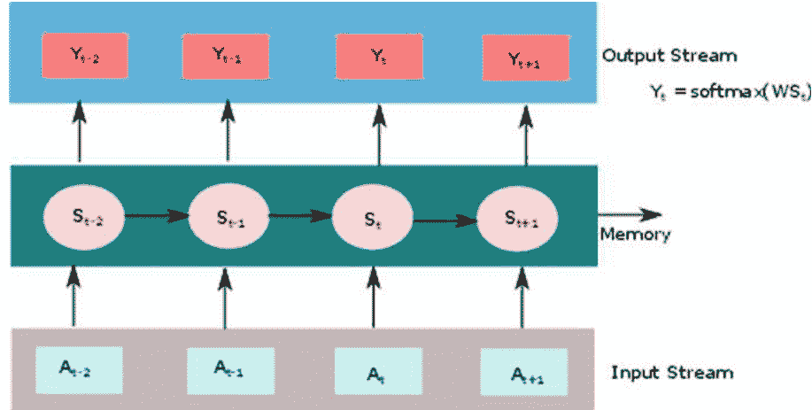

图1 显示递归神经网络的工作流程的示意图

使用前馈网络和softmax预测函数进行PSS预测[24]。方程1-8给出了LSTM架构的详细描述，该架构用于蛋白质二级结构预测[24]。

$F_{t}=\sigma\left(W_{F} h_{t-1}+W_{F} a_{t}+b_{F}\right)$

$I_{t}=\sigma\left(W_{I} h_{t-1}+W_{I} a_{t}+b_{I}\right)$

$\widetilde{G}_{t}=\operatorname{tanh}\left(a_{t} W_{G}+h_{t-1} W_{G}+b_{G}\right)$

$M_{t}=F_{t} \odot M_{t-1}+I_{t} \odot \widetilde{g}_{t}$

$Y_{t}=\sigma\left(\alpha_{t} W_{Y}+h_{t-1} W_{Y}+b_{Y}\right)$

$h_{t}=Y_{t} \odot \operatorname{tanh}\left(M_{t}\right)$

$h_{t-r e c}=h_{t}+$ 向前传递 $\left(h_{t}\right)$

$\sigma(x)=\frac{1}{1+\exp (1-x)}$

$a_{t}$: 上一层的输入: $h_{t}^{l-1}$

$F_{t}$: 遗忘门

$I_{t}$: 输入门

$\widetilde{G}_{t}$: 新的记忆细胞

$M_{t}$: 最终的记忆细胞。

$Y_{t}$: 输出门

$h_{t}$: 最终隐藏状态

$h_{t-r e c}$: 前向递归。

Sonderby和Winther [24]通过在回归隐藏状态之间引入前馈网络来修改了他们的LSTM架构，用于蛋白质二级结构预测，如公式7所示。这种蛋白质二级结构预测方法主要关注8类二级结构[31]的预测，这比传统的3类和8类二级结构标签更具信息性，这些标签是使用DSSP程序[32]设计的。DSSP程序将每个残基分类为八个类别（C：环和不规则元素（对应于DSSP输出的空白字符），E：$\beta$折叠，H：$\alpha$螺旋，B：$\beta$桥，G：$3_{10}$螺旋，I：$\pi$-螺旋，T：转折，S：弯曲）。该模型使用具有300或500个LSTM单元的3层。FF网络使用两层ReLU激活实现，每层具有相似数量的单元。双向前向和后向的输出连接到一个向量，该向量通过两个ReLU激活层转发，每层具有300或500个隐藏单元。这种方法实现了准确率

### 2.2 深度监督卷积生成随机网络

67.40% [24],比GSN方法[33]的准确率66.40%要好。而LSTM网络的表现也比双向RNN方法[34]的准确率51.10%要好。

生成随机网络 (GSN) [35]最近被用于[36]学习生成数据分布模型,而不需要说明任何概率图模型。

反向传播被应用于训练GSN模型[35,37]。GSN可以估计由马尔可夫链的转移算子生成的数据,而不是直接参数化P(X)[38]。GSN训练一个用于重构输入X的随机计算图[39]。GSN的主要优势是计算图可以具有潜在状态。这类似于生成模型,如深度Boltzmann机 (DBM) [40]。架构如下所述:有两个输入,即特征通道X和标签通道y,用于应用卷积GSN。图2显示了卷积GSN模型的架构。对于有监督的卷积GSN,计算图会破坏标签通道并重构标签通道。特征图作为输入传递给第一个隐藏层来计算激活函数[33]。卷积GSN包括一个输入层和一个卷积层。卷积GSN中的计算图使用逐层采样,类似于DBM[40]。卷积GSN的计算图层必须有一个卷积层,但池化层是可选的。堆叠的卷积层可以用于更深的架构[36]。卷积GSN方法用于PSS预测主要关注8状态二级结构[31]的预测,这给出了比3状态二级结构更多的结构信息。与3类二级结构不同,8类可以区分3螺旋和4螺旋。因此,它可以用来描述不同类型的环区域。位置特异性评分矩阵 (PSSM) 也用于预测蛋白质的二级结构[41]。PSSM是一个大小为n×b的矩阵,其中n是


图2 显示了具有2个卷积GSN层的卷积GSN的架构

### 2.3 潜在卷积神经网络

蛋白质长度为b是氨基酸类型的数量。使用UniRef90数据集生成PSSM矩阵。生成的PSSM矩阵用作卷积GSN模型[33]的输入。然后，将PSSM矩阵的分数转换为0-1范围，使用sigmoid函数[42]。蛋白质数据集由PISCES Cull PDB服务器[43]生成。数据集包含6128个蛋白质，随机分为一个包含5600个蛋白质的训练集，一个包含256个蛋白质的验证集和一个包含272个蛋白质的测试集[33]。通过3D蛋白质数据库(PDB)结构和二级结构分配数据库(DSSP)程序[32]确定了8状态二级结构标签。训练数据包含标签和特征。为了向输入标签中注入一些噪声，一半的输入标签被随机设置为零。卷积GSN通过反向传播[35]进行全局训练。可见层使用sigmoid激活函数，而所有其他层使用tanh激活函数。这种卷积生成随机网络方法用于蛋白质二级结构预测[33]，Q8准确率达到了66.40%，优于CNF/Raptor-SS8[44]的Q8准确率为64.90%。这种卷积GSN方法的主要缺点是卷积结构是硬编码的，因此有时可能无法捕捉蛋白质序列的空间组织。

应用CNN算法的深度架构被用于实现一个用于预测蛋白质结构的潜在深度学习系统。这个架构有两个层次。

首先，实施了堆叠稀疏自编码器方法来提取初始蛋白质特征，然后筛选后的数据被用作潜在CNN架构的输入。下面详细描述了这两个层次。

堆叠稀疏自编码器方法提取初始蛋白质特征。自编码器是一种无监督的特征提取模型。自编码器由三层人工神经元组成，其中中间隐藏层的节点数少于输入层，而输出层和输入层的节点数相同。自编码器的目标是在输出中复制输入。由于数据通过较少的中间节点传递，特征被压缩，输出仅由输入的最显著特征表示。

这就是自编码器自动提取重要特征的方式。

堆叠自编码器由多个连续的自编码器组成，其中一个层的提取特征作为输入传递给后续的自编码器。

[45]。稀疏自编码器用于提取蛋白质特征的初始水平。

当与CNN结合使用时，可以获得更好的一组特征。在架构中，稀疏自编码器作为重新处理和特征提取单元。对于预处理，可用的蛋白质数据集被分为训练数据和验证数据两部分。二进制表示与序列字符串进行映射。从20个氨基酸的组合中，一个氨基酸用1编码，其他位置都设置为0。需要二十个二进制字符串每个字符串代表一个氨基酸。 因此，输入数据的大小为20 × M，其中 M是链中的氨基酸数量[5]。 相同的过程已经在输出中使用。 α螺旋表示为[1 0 0] ，而β折叠和环表示为[0 1 0]和[0 0 1] [5]。 20 × M维度的输入数据被馈送到自编码器中，以从训练数据中检测特征的初始值。 使用这些特征，softmax分类器被训练[46]以预测二级结构[47]。

使用潜在CNN结构实现的深度学习基于动物视觉皮层的CNN深度架构受到启发[48]。 Al-Azzawi在[47]中描述了一种基于堆叠稀疏自编码器的潜在深度学习架构。

CNN基于神经网络。 它们由层或人工神经元组成，可以学习共享的权重和偏差。 CNN使用反向传播算法来训练网络[49,50]。 局部感受野或局部滤波器扫描整个输入数据。 这个局部滤波器单元共享相同的权重和偏差。 这意味着初始隐藏层中的所有神经元学习相同的特征[49,50]。 特征提取是通过输入数据与滤波器进行卷积，并包括一个偏差项，然后通过激活函数传递数据来完成的。 CNN将学习到的滤波器应用于卷积前一层的特征图。 第二个操作是池化。 池化层执行子采样以减小输出的大小。 最大池化是一种常用的子采样方法，它在输出的局部窗口中取最大值。 整个地图被分成小的、大小相等的区域，每个区域取最大值[49,50]。

连接的最后一层是全连接层。 如前所述，潜在的CNN结构是堆叠稀疏自编码器和深度CNN的组合方法。 Al-Azzawi [47]使用了包含主要和次要结构及其三类描述的SCRATCH蛋白质数据集。 PSS预测系统的性能通过正确预测或真阳性的数量与总尝试次数的比率来衡量[47]。 通过使用堆叠稀疏自编码器，训练准确率达到了62.67%，测试准确率达到了61.04%[47]。 使用SCRATCH蛋白质数据集，蛋白质二级结构预测系统的潜在深度学习方法的准确率达到了90.31%[47]。 而Christophe提出的机器学习方法达到了84.51%[51]。

## 3 蛋白质相互作用和蛋白质功能预测的3种深度学习方法

为了理解分子机制，蛋白质功能预测是关键点。

在结构-功能范式下，蛋白质的功能依赖于细胞和亚细胞水平上的蛋白质结构。 从结构或生物物理特性预测蛋白质的有机体特异性功能是一个基于机器学习的建模问题。 在此之后，相互作用合作伙伴的确定是根据蛋白质的功能分类来决定的。从蛋白质相互作用（PPI）网络中预测相互作用伙伴也是计算挑战之一。通过应用深度架构可以解决上述问题。下面讨论了最近关于这个主题的一些研究。

### 3.1 基于深度卷积神经网络的蛋白质功能识别

蛋白质功能预测方法是用于定义蛋白质的生物学和生化角色的技术。DCNN是机器学习中的高性能模型[49,50]，用于设计蛋白质功能预测的预测模型图3。DCNN由卷积和池化层组成。网络中每个滤波器的深度从开始到结束逐渐增加。最后一个阶段基本上由一个或多个全连接层组成。DCNN架构可用于预测蛋白质的功能[52]。蛋白质功能与蛋白质的三维结构相关。结合位点也影响功能。蛋白质中的一个结构模体是折叠成一定结构的结构模体。CA TH是蛋白质结构的分层分类[53]。SCOP被引入以提供已知蛋白质结构的详细描述和描述[54]。对于蛋白质的三级结构识别，特征提取是一个关键步骤。蛋白质三维结构识别的一种传统方法是提取特征向量，然后通过某种距离度量进行比较[55]。但是这种基于距离的方法可能无法给出某些类型的相似结构，并且非常敏感。三维结构是基于

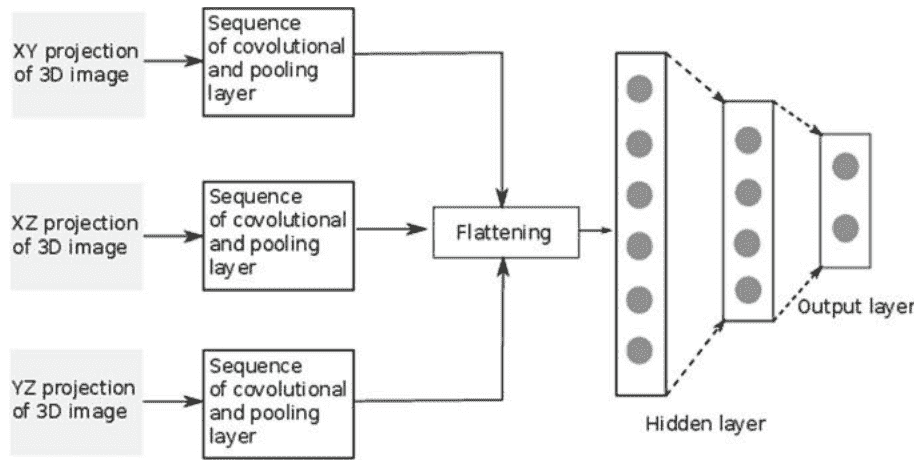

图3 用于三级蛋白质结构预测的DCNN架构[52]

在一个由一个或多个蛋白质二级结构或域包围的骨架多肽链上。侧链与蛋白质亚单位的结合和相互作用定义了完整的三维结构。蛋白质的三级结构用三维空间中的原子位置表示[2]。对于使用DCNN进行蛋白质功能预测，需要一个三维（3D）数组来表示蛋白质的三级结构。可视化工具[56]可以以3D形式描述蛋白质结构。然而，DCNN需要显示3D数组中原子之间连接的坐标。虚拟现实机器语言（VRML）可以用于更好地可视化和像素坐标。可以使用Molscript工具将PDB文件转换为VRML格式[57]。然后使用3D网格可视化工具Binvox生成包含0和1的3D数组。这些1表示数组中存在一个对象[52, 58]。经过预处理，将三级蛋白质结构表示为3D数组格式。将此3D数组投影到特征空间的三个垂直超平面XY，XZ，YZ中[52]。每个投影的2D图像作为DCNN的输入。在深度CNN中，为每个投影视图实现单独的特征提取层。最后一层应用修正线性单元（ReLU）[11]进行分类。DCNN从三个单独投影的图像中提取特征，并使用全连接神经网络对其进行分类。蛋白质的功能属性完全取决于结合位点区域的形状和大小。提出的方法[52]应用DCNN，可以根据其活性域对蛋白质进行分类，从而确定其功能。数据集被划分为5个不重叠的数据集，每个数据集也被划分为训练集和验证集[52]。这个提出的模型[52]达到了最高88%的准确率和平均81%的准确率，接近最近基于蛋白质折叠识别的成功方法的准确率[59-62]，分别为89%、74%、80%和84.04%（图4）

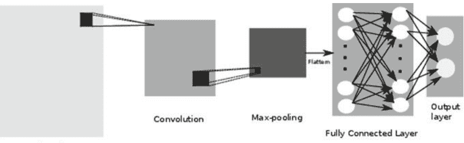

图4 显示深度卷积神经网络工作流程的示意图

### 3.2 基于深度学习的PPI界面残基对预测

PPI是涉及两个或多个蛋白质分子的生化事件。PPI在细胞的功能中起着重要作用。识别PPI位点很重要,因为它们显示了哪些氨基酸残基对蛋白质间相互作用起到了最大的贡献。这也使它们成为潜在的药物靶点。此外,它们还使我们能够深入了解代谢和信号转导网络。像蛋白质工程、蛋白质设计、药物设计和其他应用领域都严重依赖于对PPI的理解。为了正确预测PPI,已经设计了预测单体蛋白质结合位点的方法[63]。主要有四种方法,包括机器学习[64]、基于模板的方法[65]、相关突变[66]和结构模型[67]。后者被广泛应用,但存在一些限制[68]。如今,深度架构已成为执行PPI界面残基对预测的流行方法之一[69-71][10]。更准确地说,应用了LSTM[15-17]。如前所述,LSTM是一种RNN架构,可以记住任意间隔的值。与RNN不同,LSTM中的求和单元被记忆单元所取代。记忆单元可以记住先前看到的信息。用于RNN的输出层也可以用于LSTM。RNN由输入层、隐藏层和输出层组成。

输入按顺序通过这些层传播。这是前向传递。神经网络中调节权重的主要方法有两种,第一种是实时递归学习,第二种是反向传播。对于反向传播,首先需要计算损失函数或误差函数相对于网络输出的偏导数。为了改变权重,需要计算损失函数相对于权重的偏导数。最后,应用链式调整规则,观察权重的方向。这个过程称为反向传递。输出取决于细胞状态,细胞状态由运行sigmoid层确定。然后,将细胞状态放入带有tanh激活函数的激活层中,以将值归一化为-1到1之间。

将sigmoid门处的sigmoid值相乘,将最终输出存储。这个LSTM模型在国际关键评估蛋白质相互作用预测[72,73]上进行训练、验证和测试。该方法在蛋白质相互作用界面残基对的预测上达到了90%的准确率。

## 4 医学成像和疾病诊断中的4种深度学习方法

CNN是解决计算机视觉问题的强大工具。DCNN可以自动学习从原始输入数据中获得的中层和高层抽象。准确的疾病诊断在很大程度上依赖于图像获取和图像解释。1996年,CNN被应用于乳腺癌检测的医学图像处理中[74]。

### 4.1 基于补丁的CNN方法用于脑MRI分割

磁共振成像（MRI）在医学诊断中起着至关重要的作用，特别是在诊断脑部问题时。脑部的结构变化可能对许多疾病的症状有所对应。医学图像分割是自动或半自动识别2D或3D图像内边界的过程。这类图像的高变异性是最大的挑战。不仅不同人体解剖结构差异巨大，而且不同的医学成像方法，如CT、PET、X射线等，都有其自身的特点。MRI提供了相当详细的成像。因此，MRI图像已被用于实现自动分割。在现代医学研究中，脑MRI的分割起着重要的作用。观察感兴趣区域的体积测量可以用来评估某些疾病的严重程度或脑部的评估[75]。

有几种可用的分割方法，基本上是基于边缘和轮廓的[12]。然而，使用上述方法在脑MRI分割中实现良好的准确性是相当具有挑战性的。CNN是一种适合的方法，因为它可以处理多维向量。因此，灰度和彩色图像都可以使用CNN进行处理[76-78]。传统的脑MRI分割方法也存在一些局限性。传统的脑MRI分割方法非常耗时，而且训练数据是脑MRI分割的一个主要问题。为了克服这些困难，[79]使用基于补丁的CNN架构实现了脑MRI分割。Cui等人[79]使用了一个公共数据集CANDI神经影像访问点来进行基于补丁的脑MRI分割。该数据集包含来自四个诊断组的103个MRI：双相障碍（有和无精神病症状）、精神分裂谱系和健康对照组[80]。

在[79]中，Cui等人提取了几组MRI数据，每组数据包含4到5个MRI。这些图像被分成256×256、32×32和13×13的补丁。训练集中有近十万个训练图像补丁。该方法利用CNN对脑MRI进行像素级自动分割[81]。在图像分割任务中，每个图像补丁都有一个标签。这些补丁的标签用于创建一个新的分割后的MRI图像。所提出的CNN架构实现了90.83%的准确率[79]。它使用了多个5×5的卷积核。

该提出的CNN架构与五种不同的深度学习架构进行了比较，其中三种是CNN（CNN1、CNN2和CNN3），另外两种是人工神经网络（ANN1和ANN2）。前两种CNN架构CNN1和CNN2的分层结构与提出的CNN架构相同，唯一的区别是CNN1和CNN2使用的特征图比提出的CNN少。CNN1和CNN2的输入补丁大小都是32×32。在卷积层中，激活函数被替换为sigmoid函数。第三个CNN架构CNN3使用13×13个输入补丁尺寸。CNN3包含4个卷积层和一个全连接层。最大池化层不是CNN3的一部分。两种不同ANN的结构是：ANN1是一个3层架构，ANN2是一个5层架构。在ANN1中，第一层、第二层和第三层分别包含1024、150和10个神经元。在ANN2中，第一层、第二层、第三层、第四层和第五层分别包含1024、800、400、150和10个神经元。

| 生物问题 | 应用的机器学习方法 | 准确率 (%) |
| --- | --- | --- |
| 蛋白质二级结构预测 | 潜在的 CNN [47] | 90.3126 |
| | 机器学习和结构相似性 [51] | 84.51 |
| | LSTM [24] | 67.4 |
| | GSN [33] | 67.4 |
| | 堆叠稀疏自编码器 [47] | 62.674 |
| | CNF/Raptor-SS8 [44] | 64.9 |
| | RNN [34] | 51.1 |
| 蛋白质功能预测 | 蛋白质折叠 [59] | 89 |
| | 深度 CNN [52] | 88 |
| | 图核函数 [62] | 84.04 |
| | 分层分类 [61] | 80 |
| 蛋白质-蛋白质相互作用界面残基对预测 | LSTM [10] | 90 |
| 脑 MRI 分割 | 提出的 CNN((卷积, 池化) = 48, (卷积, 池化) = 96, 卷积 = 700, 卷积 = 19, softmax = 19) [79] | 90 |
| | CNN2((卷积, 池化) = 20, (卷积, 池化) = 50, 卷积 = 500, 卷积 = 19, softmax = 19) [79] | 90.83 |
| | CNN1((卷积, 池化) = 20, (卷积, 池化) = 50, 卷积 = 500, 卷积 = 19, softmax = 19) [79] | 90.81 |
| | CNN3(卷积 = 40, 卷积 = 160, 卷积 = 500, 卷积 = 19, softmax = 19) [79] | 89.97 |
| | ANN1(3层 (1024-150-10)) [79] | 86.25 |
| | ANN2(5层 (1024-800-400-150-10)) [79] | 74.94 |
| 细胞分类 | 深度 CNN(血细胞-3尺寸 (973 × 799 × 33)) [14] | 93 |
| | 深度 CNN(血细胞-2尺寸 (462 × 451 × 33)) [14] | 89.92 |
| | 支持向量机(血细胞-2) [14] | 63.11 |
| | 支持向量机(血细胞-3) [14] | 56.35 |
| 阿尔茨海默病识别 | 深度 CNN [13] | 96.8588 |
| | 支持向量机 [83] | 84 |
| 识别转移性乳腺癌 | 深度卷积神经网络 [84] | 98.4 |
| 注释遗传变异的致病性 | 深度神经网络 [85] | 66.1 |
| 分类和分割显微镜图像 | 深度卷积神经网络 [86] | 72.3 |

通过CNN1、CNN2、CNN3、ANN1和ANN2这5种不同的架构，分别实现了89.97%、90.18%、86.25%、76.68%和74.94%的准确率 [79]。由于具有多个特征图，所以提出的CNN表现最佳。Dice系数（DR）[82]也用于衡量分割准确性。较大的值表示更高的分割准确性。提出的CNN实现了95.19%的DR。CNN1、CNN2和CNN3分别实现了94.12%、94.83%和92.62%的DR [79]。提出的CNN能够成功分割复杂的边缘像素。然而，也有一些像素被错误分类（表1）。

### 参考文献

- 1. 保罗，L.，科里，R.B.，布兰森，H.R.: 蛋白质的结构: 多肽链的两个氢键螺旋构型。 Proc Natl Acad Sci 37(4)，205-211 (1951)
- 2. Ivar, B.C.: 蛋白质结构导论。 Garland Publishing, 纽约 (1999)
- 3. Patel, M., Shah, H.: 使用支持向量机进行蛋白质二级预测。 在: 国际机器智能和研究进展会议, pp. 594-598 (2013)
- 4. Chou, P.Y., Fasman, G.D.: 从氨基酸序列预测蛋白质的二级结构。 趋势生物医学科学 2, 128-131 (1977)
- 5. Hasic, H., Buza, E., Akagic, A.: 基于多个人工神经网络的蛋白质二级结构预测的混合方法, pp. 1195-1200。 MIPRO, Opatija (2017)
- 6. Cheng, J., Tegge, A.N., Baldi, P.: 蛋白质结构预测的机器学习方法。 IEEE Rev. Biomed. Eng. 1, 41-49 (2008)
- 7. Andreopoulos, W., Labudde, D.: 蛋白质相互作用网络。 在: 蛋白质纯化和分析 I: 方法和应用。 iConcept Press (2013)
- 8. Jaimovich, A.: 理解蛋白质相互作用网络。 博士论文。 希伯来大学 (2010)
- 9. Asai, K., Hayamizu, S., Handa, K.I.: 通过隐藏马尔可夫模型预测蛋白质二级结构。 Bioinformatics 9(2), 141-146 (1993)
- 10. Zhao, Z., Gong, X.: 基于深度学习架构的蛋白质相互作用界面残基对预测, IEEE/ACM Trans. Comput. Biol. Bioinform. (2017)
- 11. Krizhevsky, A., Sutskever, I., Hinton, G.E.: 使用深度卷积神经网络进行Imagenet分类。 在: Advances in Neural Information Processing Systems, pp. 1097-1105 (2012)
- 12. Ciresan, D.C., et al.: 使用深度神经网络在乳腺癌组织学图像中检测有丝分裂。 在: 国际医学图像计算与计算机辅助干预会议。 Springer, Berlin, Heidelberg (2013)
- 13. Sarraf, S., Tofghi, G.: 基于深度学习的流程用于识别阿尔茨海默病使用 fMRI数据。 在: IEEE, 未来技术会议, 页816-820, 2016年
- 14. Li, X., Li, W., Xu, X., Hu, W.: 使用卷积神经网络在医学高光谱图像中进行细胞分类。 在: 第二届国际图像、视觉和计算会议, 页501-504 (2017年)
- 15. Hochreiter, S., Schmidhuber, J.: 长短期记忆。 神经计算。 9 (8) , 1735-1780 (1997年)
- 16. Greff, K., Kumar Srivastava, R., Koutnik, J., Steunebrink, B.R., Schmidhuber, J.: LSTM: 一个搜索空间奥德赛 (2017年) 。 arXiv:1503.04069v1
- 17. Gers, F.A., Schraudolph, N.N., Schmidhuber, J.: 使用LSTM循环神经网络学习精确的时间。 J. Mach. Learn. Res. pp. 115-143 (2002)
- 18. Svozil, D., Kvasnicka, V., Pospichal, J.: 多层前馈神经网络简介。 Chemom. Intell. Lab. Syst. 39, 43–62 (1997)
- 19. Toh, K.-A., Lu, J., Yau, W.-Y.: 全局前馈神经网络学习用于分类和回归。 在： 国际能量最小化方法在计算机视觉和模式识别中的应用研讨会, pp. 407–422 (2001)
- 20. Bishop, C.M.: 用于模式识别的神经网络。 牛津大学出版社, 纽约 (1995)
- 21. Schmidt, W.F., Kraaijveld, M.A., Duin, R.P.W.: 具有随机权重的前馈神经网络。 在： 第11届国际模式识别会议B会议： 模式识别方法和系统, 论文集, 卷2, pp. 1–4 (1992)
- 22. Graves, A.: 用循环神经网络进行监督序列标记。 Springer, Berlin, pp. 5–13 (2012)
- 23. Pascanu, R., Gulcehre, C., Cho, K., Bengio, Y.: 如何构建深度循环神经网络 (2013). arXiv预印本 arXiv:1312.6026
- 24. Sonderby, S.K., Winther, O.: 利用长短期记忆网络进行蛋白质二级结构预测 (2015). arXiv:1412.7828v2
- 25. Hochreiter, S., Heusel, M., Obermayer, K.: 快速基于模型的蛋白质同源性检测无需对齐。 生物信息学 23(14), 1728–1736 (2007)
- 26. Min, S., Lee, B., Yoon, S.: 生物信息学中的深度学习。 简报. 生物信息学。 18(5), 851–869 (2017)
- 27. Baldi, P., Brunak, S., Frasconi, P., Soda, G., Pollastri, G.: 在蛋白质二级结构预测中利用过去和未来。 生物信息学 15(11), 937–946 (1999)
- 28. Bengio, Y., Simard, P., Frasconi, P.: 用梯度下降学习长期依赖关系是困难的。 IEEE Trans. Neural Netw. 5(2), 157–166 (1994)
- 29. Schuster, M., Paliwal, K.K.: 双向递归神经网络。 IEEE Trans. Signal Process. 45(11), 2673–2681 (1997)
- 30. Graves, A., Schmidhuber, J.: 使用双向LSTM和其他神经网络架构进行逐帧音素分类。 神经网络。 18(5–6), 602–610 (2005)
- 31. Yaseen, A., Li, Y.: 基于模板的蛋白质8状态二级结构预测。 在： IEEE第三届计算生物和医学科学国际会议 (ICCABS)，第1-2页 (2013年)
- 32. Wolfgang, K., Christian, S.: 蛋白质二级结构词典： 氢键和几何特征的模式识别。 生物聚合物 22(12), 2577-2637 (1983)
- 33. Zhou, J., Troyanskaya, O.G.: 深度监督和卷积生成随机网络用于蛋白质二级结构预测。 在： 第31届国际机器学习大会, 中国北京, JMLR : W&CP, 第32卷, 第745-753页 (2014)
- 34. Pollastri, G., Przybylski, D., Rost, B., Baldi, P.: 使用循环神经网络和配置文件改进蛋白质二级结构在三个和八个类别中的预测, 蛋白质: 结构。 功能。 遗传。 47(2), 228-235 (2002)
- 35. Bengio, Y., Thibodeau-Laufer, E., Alain, G.: 可通过反向传播训练的深度生成随机网络。 在： 国际机器学习大会, 第226-234页 (2014)
- 36. Bengio, Y.: 学习人工智能的深度架构。 Found. Trends Mach. Learn. 2(1), 1-127 (2009)
- 37. Du, C., Zhu, J., Zhang, B.: 使用双重随机梯度MCMC学习深度生成模型。 IEEE Trans. Neural Netw. Learn. Syst. (2017)
- 38. Ozair, S., Yao, L., Bengio, Y.: 用于生成随机网络的多模态转换。 arXiv: 1312.5578v4 (2014)
- 39. Bengio, Y., Yao, L., Alain, G., Vincent, P.: 广义去噪自编码器作为生成模型。 在: Advances in Neural Information Processing Systems, pp. 899–907 (2013)
- 40. Salakhutdinov, R., Hinton, G.: 深度玻尔兹曼机。 出现在Proceedings of the 12th International Conference on Artificial Intelligence and Statistics (AISTATS), Clearwater Beach, Florida, USA, vol. 5 of JMLR: W&CP 5 (2009)
- 41. Jones, D.T.: 基于位置特异性评分矩阵的蛋白质二级结构预测。 J. Mol. Biol. 292(2), 195–202 (1999)
- 42. Jamel, T.M., Khammas, B.M.:使用FPGA实现神经网络的Sigmoid激活函数。在: Al-Ma'moon大学学院第13届科学会议(2012)
- 43. Wang, G., Dunbrack Jr., R.L.: PISCES:蛋白质序列筛选服务器。 Bioinformatics 19, 1589-1591 (2003)
- 44. Wang, Z., Zhao, F., Peng, J., Xu, J.:使用条件神经场进行蛋白质8类二级结构预测。 Proteomics 11(19), 3786-3792 (2011)
- 45. Ng, A.:稀疏自编码器。CS294A讲义,第72卷(2011)
- 46. Ng, A.:监督学习。CS229讲义,第1-3页(2000年)
- 47. Al-Azzawi, A.:基于潜在卷积神经网络结构的一级特征提取的深度学习方法用于二级结构蛋白质预测。国际高级计算机科学与应用杂志,第8卷(4期),第5-12页(2017年)
- 48. Hubel, D.H., Wiesel, T.N.:猴子条纹皮层的感受野和功能结构。
- 49. LeCun, Y., Bengio, Y.:图像、语音和时间序列的卷积网络。AT&T贝尔实验室,信息学研究部(1995年)
- 50. LeCun, Y., Boser, B., Denker, J.S., Henderson, D., Howard, R.E., Hubbard, W., Jackel, L.D.:用反向传播网络进行手写数字识别。神经信息处理系统进展,第396-404页(1990年)
- 51. Magnan, C.N., Baldi, P.:完美预测蛋白质二级结构和相对溶剂可及性。机器学习：结构与相似性生物信息学。30(18), 2592-2597 (2014)
- 52. Tavanaei, A., Maida, A.S., Kaniymattam, A., Loganantharaj, R.:通过深度卷积网络识别蛋白质功能的结构。在:IEEE国际生物信息学和生物医学会议(BIBM),第145-149页(2016)
- 53. Orengo, C.A., Michie, A.D., Jones, S., Jones, D.T., Swindells, M.B., Thornton, J.M.:CATH一个蛋白质域结构的分层分类。结构5(8), 1093-1109 (1997)
- 54. Murzin, A.G., Brenner, S.E., Hubbard, T., Chothia, C.:SCOP:一个蛋白质序列和结构研究的结构分类数据库。J. Mol. Biol. 247(4), 536-540 (1995)
- 55. Karim, R., Al-Aziz, M.M., Shatabda, S., Rahman, M.S., Mia, M.A.K., Zaman, F., Rakin, S.:CoMGrad和PHOG:从计算机视觉到快速准确的蛋白质三级结构检索。科学报告5, 1-11 (2015年)
- 56. Pettersen, E.F., Goddard, T.D., Huang, C.C., Couch, G.S., Greenblatt, D.M., Meng, E.C., Ferrin, T.F.: UCSF chimera一种用于探索性研究和分析的可视化系统。J. Comput. Chem. 25(13), 1605-1612 (2004年)
- 57. Kraulis, P.K.:MOLSCRIPT:一种用于生成蛋白质结构的详细和语义绘图的程序。J. Appl. Crystallogr. 24, 946-950 (1991年)
- 58. Nooruddin, F., Turk, G.:使用体积技术简化和修复多边形模型。在:IEEE Trans. Vis. Comput. Graph. 9(2), 191-205 (2003)
- 59. Zakeri, P., Jeuris, B., Vandebril, R.:使用几何核数据融合进行蛋白质折叠识别。 Bioinformatics 30(13), 1850-1857 (2014)
- 60. Brylinski, M., Lingam, D.:eThread:一种高度优化的基于机器学习的元线程和蛋白质三级结构建模方法。 PLoS One 7(11), e50200 (2012)
- 61. Lin, C., Zou, Y., Qin, J., Jiang, Y., Ke, C., Zou, Q.:使用新的集成分类器进行蛋白质折叠的分层分类。 PLoS One 8(2), e56499 (2013)
- 62. Borgwardt, K.M., Ong, C.S., Schonauer, S., Vishwanathan, S.V.N., Smola, A.J., Kriegel, H.-P.:通过图核进行蛋白质功能预测。生物信息学21, i47-i56 (2005)
- 63. Giard, J., Ambroise, J., Gala, L.J.:应用于蛋白质结合位点预测和与经典分类方法进行比较的回归。BMC生物信息学。10(1), 1-12 (2009)
- 64. Cheng, J., Baldi, P.:使用支持向量机和大型特征集进行改进的残基接触预测。BMC生物信息学。8(2), 1-9 (2007)
- 65. Ohue, M., Matsuzaki, Y., Shimoda, T.:基于模板和全新对接方法之间的共识,高精度蛋白质相互作用预测。BMC会议。7(7), S6 (2013)

- 66. Gobel, U., Sander, C., Schneider, R.: 蛋白质中的相关突变和残基联系。 BMC Proc. 7(7), S6 (2013)
- 67. Singh, R., Park, D., Xu, J., Hosur, R., Berger, B.: Struct2Net: 一种基于结构的方法预测蛋白质相互作用的网络服务。核酸研究。 38(2), 508-515 (2010)
- 68. Moult, J.B., Fidelis, K., Rost, B.: 蛋白质结构预测方法的关键评估，CASP，第6轮。蛋白质 (2010)
- 69. Lena, D.P., Nagata, K., Baldi, P.: 用于蛋白质接触图预测的深度架构。 Bioinformatics 28(19), 2449-2457 (2012)
- 70. Larochelle, H., Bengio, Y., Louradour, J.: 探索训练深度神经网络的策略。机器学习研究。 1-40 (2009)
- 71. Alessandro, L., Gianluca, P., Pierre, B.: 深度架构和深度学习在化学信息学中的应用: 预测药物样分子的水溶性. 化学信息学模型. 53(7), 1563-1575 (2013)
- 72. Vreven, T., Moal, H.I., Vangone, A.: 综合蛋白质相互作用基准的更新: 对接基准版本5和亲和力基准版本2. 分子生物学杂志. 427(19), 3031-3041 (2015)
- 73. Janin, J., Henrick, K., Moult, J.: 预测相互作用的评估. CAPRI: 预测相互作用的关键评估. 蛋白质结构与功能. 52(1), 2-9 (2003)
- 74. Sahiner, B.: 乳房组织的肿块和正常组织的分类: 一个具有空间域和纹理图像的卷积神经网络分类器. IEEE医学图像处理. 15(5), 598-610 (1996)
- 75. Shaun, P.: 脑MRI分割，计算手术和双重训练，第45-73页。 Springer，美国（2010年）
- 76. Yue-Hei Ng, J., Hausknecht, M., Vijayanarasimhan, S., Vinyals, O., Monga, R., Toderici, G.: 超越短片段：用于视频分类的深度网络。在：IEEE计算机视觉和模式识别（CVPR）会议上，第4694-4702页（2015年）
- 77. Ye, H., Wu, Z., Zhao, R.-W., Wang, X., Jiang, Y.-G., Xue, X.: 评估两流CNN用于视频分类。在：第5届ACM国际多媒体检索会议论文集，第435-442页（2015年）
- 78. Karpathy, A., Toderici, G., Shetty, S., Leung, T., Sukthankar, R., Fei-Fei, L.: 大规模视频分类与卷积神经网络。在：IEEE国际计算机视觉和模式识别会议论文集，第1725-1732页（2014年）
- 79. Cui, Z., Yang, J., Qiao, Y.: 基于补丁的CNN方法进行脑MRI分割。在：第35届中国控制会议论文集，第27-29页（2016年）
- 80. 肯尼迪，N.D.，哈塞尔格罗夫，C.，霍奇，M.S.：CANDIShare：儿童神经影像数据资源。神经信息学 10(3)，319-322（2012年）
- 81. Leena Silvoster, M., Govindan, V.K.：基于卷积神经网络的分割。在：计算机网络和智能计算：信息处理的第5届国际会议，ICIP，卷157，第190页（2011年）
- 82. 张，W.，李，R.，邓，H.，文鲁，L.，林，W.，季，S.，沈，D.：用于多模态等强度婴儿脑图像分割的深度卷积神经网络。神经影像214-224（2015年）
- 83. Tripoliti, E.E., Fotiadis, D.I., Argyropoulou, M.: 一种监督方法，用于辅助诊断和分类阿尔茨海默病的状态，使用来自FMRI实验的数据。在：工程医学与生物学学会。EMBS 2008. IEEE第30届年会国际会议，第4419-4422页（2008年）
- 84. Wang, D., Khosla, A., Gargeya, R., Irshad, H., Beck, A.H.: 用于识别转移性乳腺癌的深度学习（2016年）。arXiv预印本arXiv：1606.05718
- 85. Quang, D., Chen, Y., Xie, X.: DANN：一种用于注释致病性遗传变异的深度学习方法。生物信息学 31（5），761-763（2014年）
- 86. Kraus, O.Z., Grys, B.T., Ba, J.等：用深度学习自动分析高内容显微镜数据。分子系统生物学。13（924）（2017年）


Sagnik Sen目前是加尔各答贾达普尔大学计算机科学与工程系的博士研究生。他在计算生物学、生物信息学和结构生物学领域有专业知识。作为硕士的金牌获得者，Sagnik因其研究获得了印度科学技术部（政府）的INSPIRE奖学金。Sagnik的工作已经发表在许多高度受人尊敬的同行评审的国际期刊上。在过去几年里，Sagnik在无序蛋白质及其功能和结构的洞察性工作上做了一些有见地的工作。他的工作在生物学和计算机科学之间提供了强大的结合。


Rangan Das是加达夫普尔大学计算机科学与工程系的硕士研究生，他目前的研究兴趣涵盖了深度学习领域。


Swaraj Dasgupta 是加达夫普尔大学计算机科学与工程系的硕士研究生，他目前的研究兴趣涵盖了先进机器学习领域。


博士 Ujjwal Maulik是加达夫普尔大学计算机科学与工程系的教授，自2004年以来一直在印度任职。他分别于1986年和1989年获得物理学和计算机科学学士学位。随后，他分别于1992年和1997年获得计算机科学硕士和博士学位。Maulik博士曾于1997年在洛斯阿拉莫斯国家实验室（美国新墨西哥州洛斯阿拉莫斯）、1999年在新南威尔士大学（悉尼，澳大利亚）、2004年在马里兰巴尔的摩县大学（美国）、2009年在海德堡大学（德国）、2010年、2011年和2012年在德国癌症研究中心（DKFZ）、2014年和2017年在国际理论物理中心（ICTP，意大利的的里雅斯特）、2014年和2016年在帕多瓦大学（意大利）工作过。

# 智能、安全的大健康数据管理：深度学习和区块链技术概述

Sohail Saif, Suparna Biswas和Samiran Chattopadhyay

摘要基于传感器的健康数据收集、远程访问健康数据以提供实时建议已成为智能和远程医疗的关键优势。 这种健康监测和支持在患者和医生中越来越受欢迎，因为它不需要身体活动，而这在当前社会经济环境下，老年人大多独居时并不总是可能的。 在这种情况下，医疗信息学起着关键作用。 传感器产生的大量原始数据需要应用机器学习和深度学习算法进行有用信息的提取，以开发智能知识库，为需要时提供适当的解决方案。 真正的挑战在于数据存储和检索，以满足安全、隐私、可靠性和可用性的要求。 保存在电子病历（EMR）中的健康数据通常保存在客户端-服务器数据库中，其中中央协调员进行访问控制，如创建、访问、更新或删除健康记录。 但是，在由传感器、物联网（IoT）、云、深度学习、大数据等支持的智能和远程医疗中，EMR需要在多个利益相关者之间以分布式方式进行访问，例如医院、医生、研究实验室、患者亲属、保险提供商等。 因此，必须确保健康数据受到未经授权的访问的保护，特别是使用区块链等先进的分布式安全技术来维护数据完整性。

关键词电子病历 ·大数据 ·安全 ·区块链 ·深度学习

S. Saif · S. Biswas (区)
计算机科学与工程系, Maulana Abul Kalam Azad
Technology大学, 加尔各答, 西孟加拉邦, 印度
email: mailtosuparna@gmail.com

S. Saif
电子邮件: sohailsaif7@gmail.com

S. Chattopadhyay
信息技术系, Jadavpur大学, 加尔各答, 西孟加拉邦, 印度
e-mail: samirancju@gmail.com

## 1 引言

智能和远程医疗对于老年护理[1]和患者监测在研究人员中越来越受欢迎，因为它在今天的社会经济环境中具有适用性和接受度，人类的平均寿命增加了，导致需要与年龄相关的疾病并且没有个性化护理。

电子病历 (EMR) [2] 传统上保存在分布式数据库中，这些数据库大多遵循客户端-服务器架构。有一个中央控制器，称为管理员，用于监督或管理终端用户创建、访问、更新或删除健康记录的权限。传感器感知到的健康数据容易受到安全攻击和漏洞[3]。在传感单元中，几个微小的传感器 (可穿戴、植入或环境等) 获取数据。这些设备容易受到摔倒等人工操作导致的损坏，导致数据丢失或错误数据，还可能被对手攻击以窃取或篡改数据，可能被非法替换等。在通信单元中，传感器数据通过各种异构通信链路传输，例如短程通信链路 (如蓝牙、Wi-Fi、Zigbee、WiMax)，具有不同的链路质量、安全措施等。在存储和处理单元中，数据存储在云服务器中，以供进一步访问、处理、知识构建、反馈或生成建议等[4]。该过程的第一阶段包括数据的感知、数据的传输和数据的保存在云中。第二阶段包括从云中访问数据，分析或修改数据，由医疗保健中的多个利益相关者更新或删除云中的数据 (图1)。现在，对于医疗保健数据，隐私和完整性是需要确保的两个重要属性，以便人们不必担心通过未经授权的访问泄露他们的敏感数据。健康数据的完整性很重要，因为如果基于不正确的数据生成建议，则建议的准确性会降低。物联网和云计算支持的医疗保健框架的底层安全措施和原则有助于避免由于单独实施加密算法而导致的额外计算复杂性和资源消耗。由于健康数据访问涉及多方，如果需要在发送方对数据进行加密，然后在相应的接收方对数据进行解密，那么会增加延迟，这在时间关键的应用程序 (如医疗保健) 中是不可取的。此外，物联网智能医疗系统中的设备是异构的，具有不同的资源水平，例如传感器到智能手机/平板电脑/笔记本电脑到高端工作站/服务器。因此，像数据加密标准 (DES)、高级加密标准 (AES) 或Rivest-Shamir-Adleman (RSA) 这样的单边加密解密算法不能应用于智能医疗架构的所有层次。因此，直接的机密性可能存在实施问题，但可以通过实施身份验证和完整性来确保机密性。在区块链[5]中，有一个分散的网络，利益相关者 (医院、医生、研究实验室和保险提供商) 彼此连接，称为区块链节点。健康传感器收集数据并将其发送给个人数字助理 (PDA)，然后通过接入点将数据转发到区块链网络。在一个会话中转发到区块链网络的数据称为一个块。前一个数据的哈希与新数据绑定在一起，因此

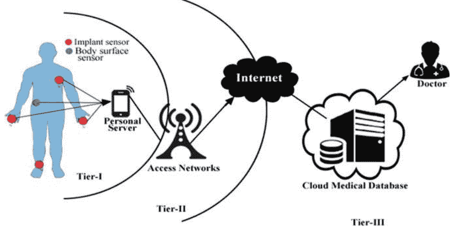

图1 无线体域网络（WBAN）基于传统的三层架构的医疗保健[8]

区块链网络可以验证新的数据块，一旦验证通过，数据的哈希值将存储在区块链节点中，健康信息以加密格式存储在云数据库中。

存储在云数据库中的大健康数据[6]需要使用机器学习技术进行进一步的知识提取。深度学习技术现在在医疗保健领域被广泛应用；一些流行的应用包括早期疾病检测、DNA（脱氧核糖核酸）分析、新药有效性预测、个性化治疗等。在健康信息学中使用深度学习技术的一个重大挑战是需要大量标记数据。但是电子病历可能包含不同的未标记数据，例如没有任何医学状况（如癌症或纤维化）的X射线图像。在这种情况下，可以使用无监督学习技术对数据进行标记，使用数据挖掘。对于带有标签的数据，可以使用监督学习。对于带有标签和未标记的数据的组合，需要应用半监督学习。卷积神经网络（CNN）是目前在健康数据中高度影响力的深度学习技术，其他技术包括深度神经网络（DNN）、深度自编码器、深度置信网络（DBN）、循环神经网络（RNN）。在实时应用中，如医疗保健，DNNs已经成功地实现了图形处理单元（GPU）的并行支持[7]。

## 2 相关工作

本节介绍了与大型健康数据相关的一些工作，以及使用深度学习技术智能处理这些数据时涉及的问题。此外，健康数据的安全性在隐私、认证和完整性方面非常重要，因此需要高效的安全技术来确保大型健康数据的安全，并关注相关问题和挑战。

在保护健康数据的安全性方面,隐私、认证和完整性至关重要,因此需要高效的安全技术来确保大型健康数据的安全,并关注相关问题和挑战。

在[7]中,作者对深度学习技术在处理大型健康数据方面的优势、缺点和未来,发展进行了严格的评估。深度学习在基于传感器的健康数据和基于图像的数据中的应用也受到关注。在健康信息学中,电子病历(EMR)包含了患者的病史,例如诊断结果、是否进行过医学检查、处方建议和随访情况、疫苗接种数据、过敏倾向、时间变化的信号(如脑电图(EEG)、心电图(ECG)或肌电图(EMG)信号)、使用压力、温度、脉搏率、心率等普适传感器的感知数据。健康信息学中的健康数据并不总是完整和标记的。这些数据也可能存在错误。此外,由于感知或数据采集设备是异构的,数据的格式和大小也不相同。数据采集的速率和顺序也有所不同,这给处理此类数据集带来了巨大的挑战。在处理大型健康数据时,深度学习技术(如DNN、CNN等)面临着真正的挑战,这是由于该技术本身的特性所决定的。缺乏正确和完整的训练数据可能导致DNN模型的训练效果不佳。此外,有限的训练标记数据可能在使用新数据集进行测试时导致巨大的误差。研究人员经常将深度学习技术(如CNN模型)作为黑盒子使用,而没有对隐藏层、权重等进行适当的解释。正确和高效的预处理、过滤和归一化训练数据集非常重要,因为噪声可能导致机器学习技术(如逻辑回归等)中的数据误分类。尽管如此,如果能够建立洞察力和适当解释超参数,就可以控制和预定义DNN的结构和CNN中的滤波器数量。在这种情况下,提出了一种基于区块链的医疗数据共享方案,可以在不信任的多方之间确保机密性、身份验证和访问控制[9]。为了消除入侵者的非法修改,云端数据的合法方之间的交易请求使用加密密钥进行保护。

已经开发了一个威胁模型,识别了健康数据和医疗报告的安全攻击和威胁。当数据访问请求来自一个实体时,首先进行基于签名的身份验证,然后检索数据。这些数据被加密并发送给请求者。还考虑了数据访问请求的目的。基于真实测试场景,对延迟和请求者数量的性能评估进行了。在[10]中,作者对区块链及其在医疗保健领域的应用进行了严谨而逻辑性的综述。该方法系统地发现了区块链技术的特点,使其适用于在患者的共享医疗记录中确保安全和可信的交易。已经分析和评估了大量出版物,基于相关参数,如使用的区块链平台,实施的共识算法,区块链网络类型,智能合约等。这项工作涉及在2008年至2019年期间对医疗保健领域的区块链论文进行严谨的搜索,发现只有从2015年开始才有值得分析的高质量工作,并且只有实施的工作才有。

2017年和2018年的出版物表明,基于区块链的安全医疗兴趣正在增加。尽管区块链是一种非常非常有前途和高效的技术,可以处理多个利益相关方之间的共享医疗记录,确保身份验证、保密性、完整性和访问控制等,但在实际医疗场景中,它也面临一些限制和挑战。在[11]中,作者们已经确定了许多挑战,例如通信、存储方面的额外开销,执行访问数据请求的延迟,可扩展性问题等。此外,已对所提出的基于区块链的算法进行了性能评估。

在[12]中,对深度学习技术在医疗保健领域的应用进行了有趣的综述。他们对应用于特定生理信号(如心电图、肌电图、脑电图)的深度学习技术进行了分类。对深度学习方法的数学和架构方面的详细而深入的说明将吸引相关领域的初学者或现有研究人员。在[13]中,作者提出了一种使用智能合约实现的基于私有区块链的独特安全远程医疗系统,该系统基于以太坊协议。基于以太坊的私有区块链确保只有经过身份验证的用户可以访问患者的健康数据。在这项工作中,只有传感器中的数据感知、使用智能合约在智能设备中进行处理、向护理人员生成和发送警报等事件被存储在区块链账本中。与医疗记录相关的实际机密信息保存在电子病历中,并在电子病历和区块链账本之间维护映射以访问或检索数据。在开发和实施这项工作时,还发现了一些限制,例如高效的密钥管理、延迟等。在物联网启用的系统中,传感器数量很多,并且随着时间的推移将迅速增加,因此密钥的生成和分发是一个棘手的问题。在区块链账本处理中减少延迟以支持紧急医疗场景的系统范围也是一个真正的挑战。最近的一项研究工作[14]提出了一种基于卷积神经网络的方法来预测慢性疾病风险。作者们收集了中国中央医院的一个地区性慢性疾病的真实医院数据,由于健康数据大多是无标签的并且包含缺失数据,他们使用潜在因子模型来重构缺失的信息。他们实施了他们的提议,并与其他疾病预测算法进行了比较。他们的实验结果显示了94.8%的准确率和相对较好的收敛速度。在[15]中,作者们表明一些机器学习算法容易受到被称为中毒攻击的安全攻击。在这种类型的攻击中,攻击者使用恶意数据增加训练数据集,导致结果与预期不符。在诊断患者时,这可能对生命构成威胁。最后,作者们提出了防止这类攻击的技术。

在表1中,我们展示了近年来在医疗应用中应用深度学习技术的一些研究成果。表2展示了使用区块链共享健康数据的研究成果。

| 作者，年份 | 应用 | 输入数据 | 深度学习方法 |
|---|---|---|---|
| Sun等人[16]，2016年 | 肺癌诊断 | 肺部图像数据库联盟(LIDC)数据集 | 卷积神经网络 |
| Esteva等人[17]，2017年 | 皮肤癌分类 | 临床成像 | 卷积神经网络 |
| Ahmed等人[18]，2016年 | 乳腺癌分类 | 威斯康星乳腺癌数据集(WBCD) | DBN |
| Fakoor等人[19]，2013年 | 癌症诊断和分类 | 基因表达 | 深度自编码器 |
| Ramsundar等人[20]，2015年 | 药物发现 | 分子化合物 | 深度神经网络 |
| Rongjian等人[21]，2014年 | 脑疾病诊断 | 阿尔茨海默病神经影像学倡议(ADNI)数据集 | 卷积神经网络 |
| Mohsen等人[22]，2017 | 脑肿瘤分类 | 磁共振成像(MRI)图像 | 深度神经网络 |
| Amin等人[23]，2018 | 脑肿瘤检测 | 磁共振成像(MRI)图像 | 深度神经网络 |
| Yaniv等人[24]，2015 | 胸部病理检测 | X射线图像 | 卷积神经网络 |
| Charissa等人[25]，2016 | 人体活动识别 | 原始传感器数据 | 卷积神经网络 |

| 作者，年份 | 保密性 | 身份验证 | 访问控制 | 完整性 | 实施 |
|---|---|---|---|---|---|
| Zhang等人[26], 2018 | ✓ | ✓ | × | ✓ | ✓ |
| Azaria等人[27], 2016 | ✓ | ✓ | × | × | × |
| Peterson等人[28], 2016 | ✓ | ✓ | × | × | × |
| Patel等人[29], 2018 | ✓ | ✓ | × | × | × |
| Xia等人[9], 2017 | ✓ | ✓ | ✓ | × | ✓ |

## 3 预备知识

在本节中，我们简要讨论了物联网(IoT)、大数据、各种深度学习技术和区块链技术。然后，详细讨论了提出的架构。

### 3.1 物联网 (IoT)

物联网背后的概念是将互联网与人类连接起来，可以通过将机器和其他物理物体与互联网连接起来来实现[30]。这项技术正在快速发展并在医疗保健领域得到应用。基于物联网的技术的使用对医生和患者都有很大帮助。例如，患者可以在不必亲自去诊所的情况下向医生咨询，或者需要实时监测的患者不需要去医院。医生可以通过使用生物传感器和互联网观察患者的生理参数。无线身体区域网络（WBAN）是支持远程医疗的核心技术之一。它基本上由一些电池供电的轻便无线传感器组成，可以佩戴和植入。这些传感器通过短距离通信与接入点连接，该接入点将数据转发给医疗机构，如诊所、医院。这些物联网系统产生了大量的数据，可以被归类为“大数据”。这些数据需要以安全和高效的方式处理，以便所有利益相关者都可以访问。

### 3.2 大数据

大数据是一个庞大的数据集，可能以结构化、非结构化和半结构化的格式存储数据。结构化数据基本上存储在不同的数据库中或以表格格式存储在电子表格中。图像、视频、音频属于非结构化类别，这些数据很难进行分析。半结构化数据不遵循任何严格的标准，比如XML。这些数据可以通过各种机器学习技术在新兴应用中使用，如临床决策支持、疾病预测等。医疗保健部门产生了大量的数据，如传感器数据、以前的健康记录、药物记录。这些庞大的数据很难使用传统软件或硬件系统进行管理。使用云平台可以降低高效存储和共享的成本。

### 3.3 深度学习

深度学习是一种突出的无监督特征学习方法，用于从低级数据中提取高级特征。由于特征识别是耗时的和昂贵的，所以使用深度学习（DL）。无监督学习的主要优势是它不需要标记的数据进行学习。在大多数情况下，医疗健康数据不包含标签，比如没有任何医疗状况的X射线图像。标记的数据也可以用于DL技术，这被称为监督学习。

有各种类型的深度学习技术。在本节中，我们讨论一些流行的深度学习技术。

最受欢迎的深度学习者之一是人工神经网络（ANN）。它由感知器组成，即神经元，这些神经元按层次组织。层包含一个输入层，一个或多个隐藏层和一个输出层。隐藏层作为训练层，但增加隐藏层的数量并不能保证改善结果。如果添加了太多层或感知器，可能会出现过拟合问题，结果是捕捉到太多的噪声数据而不是实际特征。这会降低准确性。人工神经网络的架构如图2所示。卷积神经网络（CNN）在医疗保健中最有帮助，输入是一个固定大小的向量。例如，输入是包含病理图像的像素值的数组，然后将其映射到输出，如肿瘤类型。在这种情况下，不同类型的肿瘤图像被用作训练的输入。

在CNN中，感知器相互连接，并在每次迭代中分配和调整权重。在每次迭代后，使用损失函数来确定错误，然后进行反向传播来调整权重。由于信号是单向传递的，即从输入层到输出层，因此被称为前馈网络。

在循环神经网络中，存在前向和后向连接。可以使用梯度下降来减小损失函数。

图2人工神经网络的架构

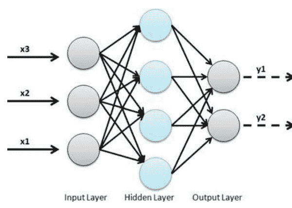

### 3.4 流行的深度学习器

有各种深度学习技术可供选择；我们必须明智地选择最适合特定问题的技术。表3显示了在健康信息学中使用的一些流行方法。

| 描述 | 优点/缺点 | 架构 |
|---|---|---|
| **深度神经网络**<br>• 这是一种包含多个隐藏层的神经网络类型<br>• 一般用于分类或回归<br>• 非线性假设可以被表达 | **优点**<br>• 在不同应用中广泛使用的成功率<br><br>**缺点**<br>• 如果CPU的计算能力不好，训练过程可能会非常慢 | (图片) |
| **深度自动编码器**<br>• 它是一个完全连接的神经网络，有两个阶段，即编码器和解码器<br>• 它在特征提取方面表现更好<br>• 编码器将高维输入向量转换为低维特征 | **优点**<br>• 标记数据对学习过程不是必需的<br>有许多变种可用<br><br>**缺点**<br>• 需要较长的处理时间 | (图片) |
| **深度置信网络**<br>• 由RBM组成，RBM有一个可见层和一个隐藏层<br><br>• 每个子网络的隐藏层作为下一个RBM的可见层 | **优点**<br>• 可以进行有监督和无监督的训练<br><br>**缺点**<br>• 由于初始化和抽样，学习过程是昂贵的 | (图片) |
| **深度玻尔兹曼机**<br>• 它由多个隐藏层组成，这些隐藏层以单向方式相互连接<br><br>• 层中的节点彼此独立，但依赖于其他层 | **优点**<br>• 可以进行有监督和无监督的训练<br><br>**缺点**<br>• 基于均值场的推理近似技术比深度置信网络慢 | (图片) |
| **循环神经网络**<br>它具有分析流式数据的能力。对于输出依赖于先前输入的应用程序非常有用<br>每个隐藏层都有自己的权重和偏差 | **优点**<br>如果存在反馈连接，它可以以激活的形式存储顺序事件<br><br>**缺点**<br>如果使用tanh和ReLU激活函数，训练可能会很困难 | (插图) |
| **卷积神经网络**<br>它由一个或多个卷积层后跟一个或多个连接层组成<br><br>交叉熵、平方损失误差是一些常见的计算误差的函数 | **优点**<br>它可以接受图像作为输入，对医疗应用非常有帮助<br><br>**缺点**<br>执行需要大规模标记数据集 | (插图) |

#### 卷积神经网络

卷积神经网络（CNN）是最流行的深度学习方法之一，受到人类视觉皮层的启发。它是一种前馈网络，由许多层组成，也是一组交错的前馈层，具有卷积滤波器。当输入数据通过各层时，每层都提取出高级特征。这种技术在医学成像的时代非常有帮助。例如，可以通过组织形态的不规则性来分类肿瘤。CNN可以应用于读取人类专家难以完成的模式识别任务。例如，可以从组织样本中检测出许多疾病的早期阶段。

#### 循环神经网络

循环神经网络（RNN）是另一种在医疗保健领域非常有用的技术，因为它支持流式数据，可以进一步进行分析。这里使用固定大小的输入向量，也可以提供诸如语音、文本或DNA序列等数据作为输入，输出取决于先前的输入。在RNN的架构中，感知器与自身相互连接，作为连续输入的记忆。对于医疗保健场景，RNN可以应用于医学文本的分析，例如病史。例如，一组患者患有相同的疾病，但症状不同。RNN具有扫描一组文本文件以找到相似性的能力；这可以帮助医生诊断疾病。

#### 深度自动编码器

最近的研究表明,在各种数据集上没有通用的特征集能够准确工作。使用数据驱动的学习方法进行特征提取更准确。因此,引入了自动编码器神经网络。在这种情况下,使用相同数量的输入和输出,以便可以重新创建输入向量,而不是分配类标签。这是一种无监督的技术。通常,隐藏层少于输入/输出层。为了提取相关特征,它将数据编码为较低维空间,但如果输入数据具有较高维度,则单个隐藏层是足够的。

#### 深度玻尔兹曼机

这是一种无监督学习技术,不同层之间的连接是无向的,并且它包含多个隐藏层。如果我们将奇数层放在一边,偶数层放在另一边,它可以被视为一个二分图。深度玻尔兹曼机 (DBM) 中不存在层内连接,只有相邻层的单元之间有连接。马尔可夫链被用来确定似然函数的梯度,但在实际中速度较慢。

#### 受限玻尔兹曼机

玻尔兹曼机的一种流行变体是受限玻尔兹曼机(RBM),它具有随机性质。在随机单元中使用特定的分布函数来建模网络。学习过程中有一些步骤称为吉布斯采样,它调整权重以使重构误差最小化。RBM中的节点是无向的,因此值可以在两个方向上传播。训练RBM的一种常见方法是使用对比散度(CD)算法,它是一种无监督学习技术。CD算法有两个阶段,分别称为正相和负相。在正相阶段,通过改变网络配置来复制训练集;在负相阶段,根据当前网络配置重新创建数据。

#### 深度置信网络

深度置信网络(DBN) 可以被视为受限玻尔兹曼机(RBM)的组合。在DBN中,每个子网络的隐藏层连接到下一个RBM的可见层。顶部两层的连接是无向的,而较低层的连接是有向的。逐层贪婪学习技术用于初始化DBN,并逐渐进行修改以实现目标输出。

一些流行的深度学习技术总结在表3中。

表4列出了可以实现神经网络的流行软件包。

### 表4 神经网络实现的软件工具

| 软件 | 开发者 | 平台 | 支持的技术 (卷积神经网络) | RNN | DBN | RBM | 云支持 |
|---|---|---|---|---|---|---|---|
| 神经设计师[31] | Artelnics | Microsoft Windows, Linux | ✓ | ✓ | ✓ | × | ✓ |
| Keras [32] | François Chollet | Microsoft Windows, Linux | ✓ | ✓ | ✓ | × | × |
| Apache SINGA [33] | Apache软件基金会 | Linux, macOS, Windows | ✓ | ✓ | × | ✓ | × |
| Deeplearning4j [34] | 亚当·吉布森，乔什·帕特森 | Linux, macOS, Windows, Android | ✓ | ✓ | ✓ | ✓ | × |
| Microsoft Cognitive Toolkit [35] | Microsoft研究 | Windows, Linux | ✓ | ✓ | × | × | × |
| Apache MXNet [36] | Apache软件基金会 | Windows, macOS, Linux | ✓ | ✓ | × | ✓ | ✓ |
| OpenNN [37] | Artelnics | Microsoft Windows, Linux | ✓ | ✓ | × | × | × |
| PyTorch [38] | 亚当·帕斯克 | Linux, macOS, Windows | ✓ | ✓ | ✓ | ✓ | × |
| TensorFlow [39] | 谷歌Brain | Linux, macOS, Windows, Android | ✓ | ✓ | ✓ | ✓ | × |
| Theano [40] | 蒙特利尔学习算法研究所(MILA) | Linux, macOS, Windows | ✓ | ✓ | × | ✓ | × |

### 3.5 深度学习者的应用和挑战

机器学习（ML）在健康信息学领域有各种成功的应用，而深度学习（DL）技术则较新，其采用速度较慢。然而，DL有着快速的进展，尽管面临挑战，但结果可能是有希望的。我们可以将DL的医疗应用分类如下：

- 预测性医疗保健，例如对各种疾病的治疗预测的效率。
- 医疗决策支持，例如使用患者的生理信息可以检测和诊断各种疾病。
- 个性化治疗，例如可以根据个体患者的需求设计个性化药物。

#### 预测性医疗

这种类型的应用程序旨在在患者进入危急状态之前检测疾病，以便及早开始治疗。一般来说，早期阶段很难检测到阿尔茨海默病。预测性医疗的其他领域包括预测治疗的有效性。深度学习（DL）可以用于检测人眼难以检测到的异常，例如计算机断层扫描（CAT）或放射照片。DL在异常检测方面非常有效，因为它可以检测到早期阶段人眼无法察觉的小变化。医学图像易于获取，并且可以用作训练数据，从而解决稀疏数据问题。

患者的行为数据也可以用于早期疾病的检测。使用这些不同的医疗数据，深度学习可以构建预测模型。另一个重要的预测性医疗保健的应用是对新药效率的预测。到目前为止，结果并不令人满意，但可以发明新的发展方法。

#### 医疗决策支持

深度学习在医疗信息学中的一个重要应用是医疗决策支持，这在当今非常流行。深度学习技术可以帮助医生在医学诊断的每个阶段，如疾病检测、个性化治疗、治疗后疗法等方面。在通过图像分析进行疾病预测的情况下，深度学习技术可以比人类更准确。生物医学文本分析可以通过深度学习来完成。由于领域无关性，任何类型的数据都可以进行分析和相关性分析。可以使用不同类型的电子病历数据对患者进行相关性分析，以提供更好的诊断。此外，可以通过单个数据集进行相关性分析，例如可以从不同的MRI图像中相关联脑区。对于相关性分析，广泛使用CNN技术。CNN可以从异构传感器收集的数据中创建抽象。医生可能无法查阅患者的大量病史，因此深度学习可以完成这项任务并提供医疗决策支持。

#### 个性化治疗

个性化治疗与医疗决策支持密切相关。基于预测，深度学习技术可以支持决策，并且可以提供个性化治疗以及设计药物。存储在云数据库中的电子健康记录大多是多模态和非结构化的，由于最近技术的进步，深度学习可以基于此进行诊断。

数据。可以根据各种数据提供个性化治疗。例如，生物标志物可以通过DNA分析和基因组挖掘来确定。生物标志物只是一种可以测量的生物状态（疾病）指标。每一种疾病都是在人体内部发展的。生物标志物可以确定这种发展的概率，并帮助医学专家提供更好的预测和诊断。基因组学有助于识别导致疾病发展的基因等位基因。药物的有效性可以通过评估药物应用时基因差异来确定，这被称为药物基因组学。这有助于降低药物剂量和副作用。深度学习技术在基因表达数据的癌症分类中表现出色。

例如，为了预测剪接模式，可以使用DL从核糖核酸 (RNA) 和微核糖核酸 (miRNA) 数据中提取特征，这样可以高效地进行特征提取。因此，DL可以帮助我们分析电子病历中的数据，并提供个性化药物。

### 挑战

在健康数据领域，深度学习面临许多挑战。根据药物的性质，需要安全性、可用性、可靠性和效率。例如，健康传感器必须连续工作，没有任何中断，以便处理紧急情况。一些最近的研究表明，卷积神经网络中可以使用权重过滤器来提取高级特征，但整个学习模块可能变得不可解释。大多数研究在不知道成功可能性的情况下使用DL技术；如果出现错误分类问题，则无法进行修改。我们在前面的章节中讨论了有效和可靠的训练模型所需的大型数据集。现在，大量的医疗保健数据可用，但疾病特定数据仍然有限。因此，DL不适用于涉及罕见疾病的应用。在训练深度神经网络时，另一个常见问题是过拟合问题，当使用小型训练数据集时会出现这个问题。当训练集中的样本总数与网络中的参数数量成比例时，就会发生过拟合问题。可以通过在训练过程中利用正则化技术（如dropout）来避免过拟合问题。DNN不直接支持原始数据作为输入数据；因此，需要进行一些预处理或更改输入域。控制DNN架构的超参数，例如CNN中的滤波器数量，是一个盲目的探索过程，非常需要准确的验证。找到最佳的超参数集合和正确的原始数据预处理是一项具有挑战性的任务，这可能导致长时间的训练过程。DL中的另一个重要问题是许多DNN可以很容易地被欺骗；如果对输入数据进行微小的更改（在图像中添加不可察觉的噪音），则样本将被错误分类[41]。

可以注意到，大多数机器学习算法都会受到这个问题的影响。如果某个特征的值设置得非常高或非常低，在逻辑回归中肯定会出现错误分类的问题。在决策树中，如果最后一层中的一个二进制特征被切换，那么将会产生错误的结果。因此，我们可以说任何机器学习技术都容易受到安全攻击的影响，因为简单的修改就会导致系统产生错误的结果。

### 3.6 区块链技术

区块链是一个分散的CPU/节点集合，数据可以存储在区块中。它也被称为分散账本，数据块会不断更新（图3）。数据块可能包含协议、合同、销售、金融交易、健康数据等。区块链是由Satoshi Nakamoto在2008年引入的。基本上，它是为了保护加密货币（比特币）交易而开发的。但现在这种点对点技术已经被各个领域采用，如金融、交通、教育、医疗保健、治理等。加密算法使系统防篡改；这些算法使得在区块链中存储的数据/交易在计算上不可能被修改。入侵者需要攻破目标区块链网络的51%的CPU/节点才能克服哈希算力。

一个块包含一个头部和一个消息。头部中的几个参数如下：（i）时间戳记录块创建的确切时间，（ii）前一个块哈希指的是链中前一个块的哈希，（iii）默克尔根包含了树根的哈希，该树是交易的SHA256哈希，（iv）难度目标是一段难以实现的数据，由工作证明（PoW）算法设置，（v）Nonce是为了实现难度目标而需要的，它还可以防御重放攻击。每个块通过前一个块的哈希相互连接。另一方面，消息包含前一个交易的哈希，要发送的交易/消息和所有者的数字签名。这个数字签名被视为交易/消息所有权的证明，可以通过所有者的公钥进行验证。每次批准并添加到区块链中的块都变得不可变，无法篡改或更改。

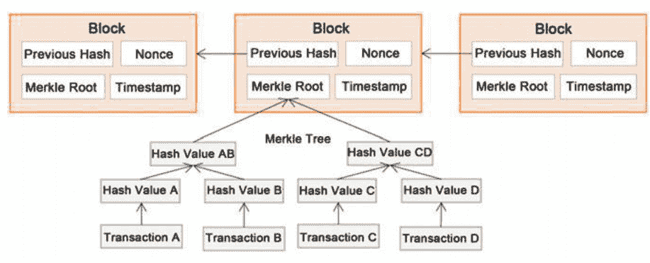

图3 区块链中的一个块的结构[42]

### 3.7 区块链的类型

一般来说，区块链的类型可以根据管理的数据、数据的可用性和用户执行的操作而有所不同。我们可以将其分类如下：

- 公共区块链（无需许可）
- 联盟（公共许可）
- 私有区块链。

从区块链的类型可以看出，对公众可见和可访问的区块链是公共区块链。然而，整个数据可能不对公众可见，因为数据的某些部分可能以加密格式存在，以保持参与者的匿名性[43]。在公共区块链中，任何人都可以加入区块链并充当节点，或者成为矿工；因此，需要获得批准。

加密货币网络属于这一类别，其中矿工获得一些经济激励。例如，比特币、以太坊、莱特币都是基于公共区块链的加密货币网络。

在联盟型区块链中，只有选定的节点被允许参与分布式共识过程[43]。任何行业都可以使用这种类型的区块链。有时，联盟型区块链是为特定行业（例如，医疗保健部门）开发的，但根据批准对公众开放。私有区块链是分散的网络[43]，只有经过许可的节点可以加入网络。私有区块链中的节点任务，例如执行交易、执行智能合约或充当矿工，是受控制的。

基本上，一个值得信赖的组织管理着区块链。像Ripple [44]、Hyperledger Fabric [45]这样的平台只支持私有区块链网络。

### 3.8 医疗保健领域的区块链挑战

将区块链整合到医疗保健系统中是非常具有挑战性的。需要解决管理、技术问题等挑战。在这里，我们讨论了几个相关的挑战。

#### 互操作性

以快速有效的方式在不同的医疗保健提供者之间共享数据是一项具有挑战性的任务。由于缺乏合作和协调，这成为有效数据共享的障碍[27]。患者和其他医疗保健利益相关者可能在数据共享和检索过程中遇到问题。

#### 数据的管理、匿名性和隐私

管理大型健康记录并在医疗提供者之间共享并不是一项容易的任务，尤其是在整合区块链的情况下。由于健康数据具有敏感性质，它只应与可信任的各方共享。必须确保未经授权的实体无法访问数据。在采用区块链技术时，必须遵守国家法规和数据隐私。

## 服务质量 (QoS)

在医疗领域采用区块链技术的一个重要关注点是交付时间，数据必须在所需时间内交付。如果所需数据未能及时交付，患者的生命可能会受到威胁。由于区块链架构的复杂性，引入区块链可能会导致计算延迟。在将区块链技术服务应用于医疗领域之前，需要进行大量研究以减少延迟并在可靠性方面保持服务质量。

## 异构设备和流量

生物传感器是医疗保健的重要组成部分，这些传感器设备会产生各种类型的流量。一般来说，数据流量分为两类：紧急流量和正常流量。在紧急情况下从患者收集的数据产生的流量属于紧急流量，而定期监测中传感器收集的数据属于正常流量。因此，在实施医疗区块链时，非常需要一种优先机制，以便紧急流量相对于常规流量经历最小的延迟。

## 延迟

延迟是医疗保健的重要参数。一些医疗应用程序基于实时监测，以加快诊断过程。在区块链中，区块在添加/共享给不同利益相关者之前会进行验证，这个过程会导致访问数据和分析的延迟。因此，在设计基于区块链的医疗系统时，必须考虑这种延迟。

## 资源限制和能源效率

由于区块链增加了计算复杂性，加密方法可能对传感器造成负担。生物传感器在计算能力、电池备份等方面是资源受限的设备，因此，这种高计算负载可能会导致传感器温度升高。这会给患者带来不适。能源效率是另一个挑战，因为传感器是由电池供电的。

## 存储容量和可扩展性

由于健康传感器生成的数据量巨大，区块链的节点应该能够存储这些大量数据。健康数据可能包括医学图像、实验室报告、药物历史记录，所有这些都需要大量的存储空间。如果使用云存储平台，这个问题可以得到解决。

## 安全

在将区块链应用于医疗保健中，另一个重要问题是所收集数据的可靠性。尽管区块链因其存储在其中的数据不可变而受欢迎，但有时来自传感器的数据可能会损坏；因此，数据将保持损坏状态。在区块链节点中接收到的数据可能会被篡改，这可能是由于不同的安全攻击，如虚假数据注入、窃听等。因此，必须采取有效的安全机制来确保数据的完整性。

## 数据挖掘

区块链基于数据块的验证；每次来自传感器的数据被视为一个数据块，并且每次从传感器发送的数据在添加到链中之前都需要进行验证。因此，当患者数量增加时，问题就会出现；在这种情况下，挖掘所需的时间将更长，因为计算负载将增加。因此，在将区块链整合到医疗保健中时，高效的挖掘也是一个非常具有挑战性的问题。

## 4 系统模型

一个典型的基于物联网的医疗保健系统由三层组成。第一层由不同的健康传感器组成，如心电图、脉搏、血压等。通常，这些传感器被放置在患者的身体上。它们负责从患者身体中感知不同的生理参数，然后将这些信息发送到个人数字助理设备 (PDA)。在第二层中，个人数字助理设备通过互联网连接将数据转发到医疗服务器，第三层中的医生/医疗机构可以访问这些数据。但是，在传输过程中的数据容易受到各种网络攻击的威胁。因此，我们必须采取保密性、身份验证、完整性和访问控制等安全措施。这四个参数是医疗保健应用程序的众所周知的安全要求[47]。

### 攻击模型

传统的基于物联网的应用程序主要面临两种类型的攻击：针对保密性的攻击和针对完整性的攻击。保密性意味着不泄露患者的私人信息，这容易受到不同威胁的影响。对保密性的常见安全攻击包括窃听、冒充攻击、侧信道攻击、数据嗅探等。因此，处理针对保密性的安全攻击非常重要。完整性确保数据在通信过程中的完整性。现在，基于物联网的生物传感器从患者那里收集生理信息，并将这些信息发送到医疗机构。由于这些数据通过一些不安全的有线/无线连接发送，攻击者很容易物理上/远程捕获转发设备并篡改传感器收集的信息。结果可能导致错误的诊断。针对完整性的一些常见攻击包括数据修改攻击、虚假数据注入攻击、重放攻击等。在我们提出的框架中，我们考虑了区块链，它可以防御攻击对完整性的影响，因为它的工作性质，以及处理对机密性的攻击可以使用各种加密方案对转发设备上的数据进行加密，并且可以使用医疗服务提供者的秘密密钥解密数据。

### 提议的架构

在这里，我们提出了一个安全智能的框架，以有效地与不同的医疗设施共享数据。整体基于区块链的架构如图4所示，云存储用于存储电子病历（EMR）。

在我们提出的框架中，通过传感器收集的数据首先发送到PDA设备；该设备将使用标准哈希算法生成健康数据的哈希值，然后，哈希值将通过互联网转发到私有区块链网络。在区块链中，每个医疗设施，如医院、实验室、保险公司、研究实验室等，都将充当区块链节点。从PDA设备发送的哈希值将被每个节点接收，并且该数据块需要由节点进行验证和验证。验证是基于接收到的哈希值进行的，并且该哈希值与先前接收到的数据块的哈希值进行比较。这是可能的，因为PDA设备生成的数据块还包含先前块的哈希值。

大多数区块链节点需要验证区块。一旦验证通过，区块被添加到链中，并生成唯一的秘密密钥和标识符（ID号）。密钥和ID被发送回PDA设备。PDA设备使用密钥加密实际健康数据，并将加密数据、健康数据的哈希值和ID发送到基于云的数据库服务器。如果有人试图篡改一个区块的数据，那么接下来的区块也会受到影响。每当任何医疗机构需要访问存储在云中的健康数据时，首先通过ID识别数据，然后使用秘密密钥进行解密。解密完成后，健康数据就可以使用了。它作为各种基于深度学习的医疗应用的输入。我们之前已经讨论过深度学习技术在各种医疗应用中的应用，如预测性医疗。

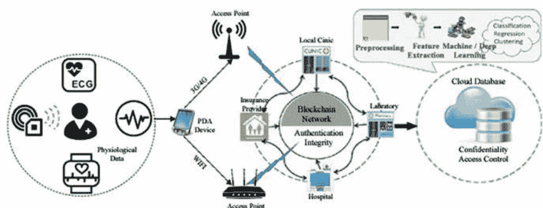

图4 提出的基于区块链的健康数据共享框架

医疗决策支持、个性化治疗等。所提出的架构的主要优势是不同医疗机构之间的数据共享以及数据可以用于各种医疗应用，以安全的方式进行。在我们的架构中，安全要求得到了保持。由于使用了私有区块链，只有经过身份验证的用户才能存储/访问数据。加密算法有助于保持数据的机密性。由于区块链的工作性质，保持了数据的完整性，并且访问控制是基于秘密密钥的。由于秘密密钥是由区块链节点生成的，只有它们有权限解密数据。

## 5 开放性研究问题

在本文中，我们描述了区块链和深度学习在健康信息学中的作用。这两种新兴技术都面临一些挑战，这是一个研究领域，适当的研究可以缓解这些问题。正如前面讨论的，单向加密算法如DES、AES、3DES不适用于区块链的医疗应用，应用这些算法会增加数据共享的延迟。因此，低复杂度的加密解密算法设计是一个重要的研究领域。密钥的生成和共享应该以一种高效的方式进行，以免增加基于区块链的健康数据共享平台的复杂性。此外，随着物联网智能和远程医疗中利益相关者的数量可能不断增加，需要解决通信开销问题和存储开销问题，以设计一个基于区块链的安全医疗系统。存储在电子病历中的健康数据很大程度上是未标记的、缺失的数据、噪声数据等。因此，研究人员应考虑从缺失数据中重建数据，需要进行数据过滤以去除噪声。此外，由于样本量和数据量大，健康数据是大数据。新兴研究人员可以根据自己的研究背景准备自己的数据库，而不仅仅使用现有的基准数据库，考虑目标对象的人口统计学、地理位置、相关疾病等，以获得更真实的智能数据处理结果。在这个领域有许多研究问题，需要适当的探索以有效地采用深度学习和区块链技术在健康信息学中。

## 6 结论

当前时代是智能和远程应用的时代，在各个领域中，特别是在医疗保健领域，涉及到与大健康数据相关的多个利益相关者，这些数据需要使用区块链等安全技术以分布式方式获取、存储、检索，并通过应用深度学习技术进行智能处理。在将深度学习技术应用于医疗健康记录时，仍然存在问题和挑战，因为这些记录往往不完整、可能存在错误，并且可能没有标记。此外，由于健康记录的规模庞大且涉及多方，执行区块链方法的所有步骤可能会导致额外的存储开销、通信开销和处理提交的数据访问请求的延迟，从而使得物联网实时医疗保健支持变得不切实际。本章节讨论了所有相关的深度学习算法和工具，介绍了与大数据、医疗保健、安全、物联网等相关的基本概念，并阐述了基于区块链的架构，并为研究人员提供了攻击模型，以便全面了解和探索这一领域。

## 致谢

这项工作是在西孟加拉邦政府科学与技术生物技术部的研究项目资助下完成的，项目批准号为230(Sanc)/ST/P/S&T/6G-14/2018。

### 参考文献

- 1. Majumder, S., Aghayi, E., Noferesti, M., Memarzadeh-Tehran, H., Mondal, T., Pang, Z., Deen, M.J.: 老年人健康的智能家居——最新进展和研究挑战。传感器 17, 2496 (2017)
- 2. Bahga, A., Madisetti, V.K.: 云中的医疗数据集成和信息学。计算机 48(2), 50–57 (2015)
- 3. Movassaghi, S., Abolhasan, M., Lipman, J., Smith, D., Jamalipour, A.: 无线身体区域网络：一项调查。IEEE Commun. Surv. Tutor. 1–29 (2013)
- 4. Zhang, Y., Qiu, M., Tsai, C., Hassan, M.M., Alamri, A.: 健康CPS: 由云和大数据辅助的医疗网络物理系统。IEEE系统杂志 11(1), 88–95 (2017)
- 5. Nakamoto, S.: 比特币：一种点对点的电子现金系统 (2008)
- 6. Andreu-Perez, J., Poon, C.C.Y., Merrifield, R.D., Wong, S.T.C., Yang, G.: 健康的大数据。IEEE生物医学和健康信息学杂志 19(4), 1193–1208 (2015)
- 7. Ravi, D., Wong, C., Deligianni, F., Berthelot, M., Andreu-Perez, J., Lo, B., Yang, G.: 健康信息学的深度学习。IEEE生物医学和健康信息学杂志 21(1), 2–41 (2017)
- 8. Karmakar, K., Saif, S., Biswas, S., Neogy, S.: WBAN安全性：一个基于生物密钥的框架的研究和实现。In: 2018第五届新兴信息技术应用国际会议(EAIT), pp. 1–6 (2018)
- 9. 夏, Q., 西法, E.B., 阿萨莫阿, K.O., 高, J., 杜, X., 古伊扎尼, M.: MeDShare: 通过区块链在云服务提供商之间进行无信任的医疗数据共享。IEEE Access 5, 14757–14767 (2017)
- 10. Hölbl, M., Kompara, M., Kamišalić, A., Nemec, Zlatolas, L.: 区块链在医疗保健中的使用的系统性回顾。Symmetry 10, 470 (2018)
- 11. 沈, B., 郭, J., 杨, Y.: MedChain: 通过区块链实现高效的医疗数据共享。Appl. Sci. 9, 1207 (2019)
- 12. Faust, O., Hagiwara, Y., Hong, T.J., Lih, O.S., Rajendra Acharya, U.: 基于生理信号的医疗应用的深度学习综述。Comput. Methods Programs Biomed. 161, 1–13 (2018)
- 13. Griggs, K.N., Ossipova, O., Kohlios, C.P., 等：使用智能合约的医疗区块链系统，用于安全的远程患者监测。J. Med. Syst. 42, 130 (2018)
- 14. Chen, M., Hao, Y., Hwang, K., Wang, L., Wang, L.: 通过机器学习预测疾病来自医疗社区的大数据。IEEE Access 5, 8869–8879 (2017)
- 15. Mozaffari-Kermani, M., Sur-Kolay, S., Raghunathan, A., Jha, N.K.: 系统性的毒害攻击和对医疗机器学习的防御。IEEE J. Biomed. Health Inf. 19(6), 1893–1905 (2015)
- 16. Sun, W., Zheng, B., Qian, W.: 使用深度学习算法辅助肺癌诊断。In: SPIE 9785的会议记录，医学成像2016：计算机辅助诊断，97850Z，2016年3月24日
- 17. Esteva, A., Kuprel, B., Novoa, R.A., Ko, J., Swetter, S.M., Blau, H.M., Thrun, S.: 深度神经网络在皮肤癌分类中的皮肤科医生级别分类。自然 542(7639), 115–118 (2017)
- 18. Abdel-Zaher, A.M., Eldeib, A.M.: 使用深度置信网络进行乳腺癌分类。Expert Syst. Appl. 46, 139–144 (2016)
- 19. Fakoor, R., Ladhak, F., Nazi, A., Huber, M.: 使用深度学习提高癌症诊断和分类。In: 机器学习在改变医疗保健中的作用的ICML研讨会论文集，2013年6月
- 20. Ramsundar, B., Kearnes, S., Riley, P., Webster, D., Konering, D., Pande, V.: 用于药物发现的大规模多任务网络。arXiv预印本arXiv:1502.02072 (2015)
- 21. Li, R., Zhang, W., Suk, H., Wang, L.: 基于深度学习的影像数据补全以改善脑部疾病诊断。In: MICCAI 2014会议论文集，2014年9月，第305-312页
- 22. Mohsen, H., El-Dahshan, E.S.A., El-Horbaty, E.S.M., Salem, A.: 使用深度学习神经网络进行脑肿瘤分类。Fut. Comput. Inf. J. 3(1), 68–71 (2018)
- 23. Amin, J., Sharif, M., Yasmin, M., Fernandes, S.: 用于脑肿瘤检测的大数据分析：深度卷积神经网络。Fut. Gener. Comput. Syst. 87, 290–297 (2018)
- 24. Bar, Y., Diamant, I., Wolf, L., Lieberman, S., Konen, E., Greenspan, H.: 使用非医学训练的深度学习进行胸部病理检测。In: 2015年IEEE第12届国际生物医学成像研讨会(ISBI)，纽约，第294-297页 (2015)
- 25. Ronao, C.A., Cho, S.B.: 使用深度学习神经网络进行智能手机传感器的人体活动识别。Expert Syst. Appl. 59, 235–244 (2016)
- 26. Zhang, P., White, J., Schmidt, D.C., Lenz, G., Rosenbloom, S.T.: FHIRChain: 将区块链应用于安全和可扩展地共享临床数据。计算机结构生物技术 16, 267-278 (2018)
- 27. Azaria, A., Ekblaw, A., Vieira, T., Lippman, A.: MedRec: 使用区块链进行医疗数据访问和权限管理。In: 2016年第二届开放和大数据国际会议(OBD)，维也纳，第25-30页 (2016)
- 28. Peterson, K., Deedvanu, R., Kanjamala, P., Boles, K.: 基于区块链的健康信息交换网络方法。In: NIST Workshop Blockchain Healthcare会议论文集，卷1，第110页 (2016)
- 29. Patel, V.: 通过区块链共识实现安全和去中心化的医学影像数据共享框架。健康信息杂志 1-14 (2018)
- 30. Chun-Wei, T., Chin-Feng, L., Ming-Chao, C., Yang, L.T.: 物联网数据挖掘：一项调查。IEEE Commun. Surv. Tutor. 16(1), 77–97 (2014)
- 31. ArteInics: 神经设计师（2015年）。在线提供：https://www.neuraldesigner.com
- 32. Chollet, F.: Keras（2016年）。在线提供：https://keras.io/
- 33. Apache软件基金会：Apache Singa（2016年）。在线提供：https://singa.incubator.apache.org
- 34. Skymind: Deeplearning4j（2016年）。在线提供：http://deeplearning4j.org
- 35. 微软：Microsoft认知工具包（2016年）。在线提供：https://github.com/microsoft/cntk
- 36. Apache软件基金会：Apache MXNet（2016年）。在线提供：https://mxnet.apache.org/
- 37. ArteInics: OpenNN (2014)。在线提供：http://www.opennn.net
- 38. Paszke, A., Gross, S., Chintala, S., Chanan, G.: PyTorch (2016)。在线提供：https://pytorch.org
- 39. Google: Tensorflow (2016)。在线提供：https://www.tensorflow.org
- 40. 蒙特利尔大学: Theano (2019)。在线提供：http://deeplearning.net/software/theano/
- 41. Ismail Fawaz, H., Forestier, G., Weber, J., Idoumghar, L., Muller, P.-A.: Adversarial attacks on deep neural networks for time series classification. In: IEEE International Joint Conference on Neural Networks (2019)
- 42. Bahga, A., Madisetti, V.K.: 工业物联网的区块链平台。J. Softw. Eng. Appl. 09, 533–546 (2016)
- 43. 郑, Z., 谢, S., 戴, H., 陈, X., 王, H.: 区块链技术概述：架构，共识和未来趋势。In: 2017年IEEE国际大数据大会（BigData Congress）论文集, 美国马萨诸塞州波士顿, 2017年12月11日至14日, 第557-564页 (2017年)
- 44. Ripple: Ripple-全球无摩擦体验的汇款方式（2018年）。在线提供: https://ripple.com
- 45. Androulaki, E., Manovich, Y., Muralidharan, S., Murthy, C., Nguyen, B., Sethi, M., Singh, G., Smith, K., Sorniotti, A., Stathakopoulou, C.等: Hyperledger Fabric: 一种用于许可区块链的分布式操作系统。In: 第十三届EuroSys会议论文集, 葡萄牙波尔图, 2018年4月23日至26日
- 46. 张, J., 薛, N., 黄, X.: 一种用于普遍社交网络健康护理的安全系统。IEEE Access 4, 9239-9250 (2016年)
- 47. Saif, S., Gupta, R., Biswas, S.: 在WBAN中实现云辅助安全数据传输以进行健康监测。In: 国际高级计算和通信范式会议（ICACCP 2017）论文集, 智能系统和计算, 第705卷, 第665-674页（2018年）

Sohail Saif在西孟加拉邦穆拉纳・阿布尔・卡拉姆・阿扎德技术大学担任全职博士研究学者。他于2014年和2018年分别从西孟加拉邦穆拉纳・阿布尔・卡拉姆・阿扎德技术大学获得计算机科学与工程学士学位和软件工程硕士学位。他的研究兴趣包括物联网, 网络安全和远程医疗。

Suparna Biswas是Maulana Abul Kalam Azad University of Technology, WB计算机科学与工程系的副教授。她分别于2004年和2013年在西孟加拉邦贾达普尔大学获得了ME和Ph.D.学位。2014年至2015年期间, 她是英国纽卡斯尔北恩布里亚大学cLINK项目的ERAS-MUS MUNDUS博士后研究员。她的研究兴趣包括物联网、无线身体区域网络、机器学习、网络安全和远程医疗。她在同行评议的国际期刊和会议上发表了多篇研究论文。她目前是一项由WB DST资助的基于物联网的安全远程医疗主要研究项目的负责人。

Samiran Chattopadhyay是贾达普尔大学信息技术系的教授。他曾担任该系主任超过十二年, 并担任移动计算与通信学院联合主任。他是印度理工学院卡拉格普尔分校的研究生、博士研究生和金牌获得者, 他在贾达普尔大学获得了博士学位。他在计算机协会、Inter ra Systems India、Agilent和Motorola等知名企业担任技术顾问已有二十年的经验。他领导开发了一个开源的C++基础设施和工具集, 遵循GNU GPL 3.0许可协议发布。他曾作为访问教授访问过英国的几所大学。他一直致力于安全算法、生物信息学、分布式和移动计算以及中间件的研究。他是多个国际会议的程序主席、组织主席和IPC成员。他在知名期刊和国际同行评议会议上发表了180多篇论文。

# 使用CNN技术和SGD、RMSprop和ADAM优化器进行疟疾检测

Avinash Kumar, Sobhangi Sarkar 和 Chittaranjan Pradhan

**摘要**：疟疾是一种威胁生命的疾病，当感染的雌性按蚊叮咬人时传播。疟疾是世界上主要的疾病之一。存在许多药物可以治愈疟疾，但由于技术和设备不足，我们无法检测和治愈它。诊断疟疾的方法涉及对寄生虫和红细胞进行物理计数，这是一项劳动密集且容易出错的过程，特别是如果患者需要多次测试。这个问题可以通过训练机器来完成病理学家的工作来解决。我们可以使用许多深度学习算法来训练机器。我们的模型使用基于CNN的分类方法将血液片分类为感染和正常血液片。实验结果表明我们的模型在显微图像上表现良好，准确率达到96.62%，模型复杂度较低，计算时间较短。因此，超越了先前使用的最先进技术。

**关键词**：疟疾；卷积神经网络；随机梯度下降；ADAM；RMSprop；深度学习

## 1 引言

世界上导致死亡的主要原因之一是非常有害的疾病，如疟疾。当一只感染了疟疾的雌性按蚊叮咬一个人时，疟疾就会传播。它是世界上主要的疾病之一，导致危及生命的疾病，并增加了像印度这样的国家的死亡率。不同种类的疟原虫，包括恶性疟原虫、卵形疟原虫、间日疟原虫和三日疟原虫，都可以对人类造成疾病，其中恶性疟原虫是最致命的。根据世界卫生组织的疟疾报告，大约33亿人面临患疟疾的风险。

> **作者信息**：
> A. Kumar (✉) · S. Sarkar · C. Pradhan
> 计算机工程学院，KIIT DU, Bhubaneswar, 印度
> 电子邮件：avinash1605@gmail.com
> S. Sarkar 电子邮件：shobhangisarkar@gmail.com
> C. Pradhan 电子邮件：chitaprnakash@gmail.com

根据2015年的报告[1]，大约有33亿人在不同国家面临患疟疾的风险。报告还提到，大约有12亿人处于更高的风险之中。据估计，2015年全球发生了约2.14亿例疟疾，并导致约43.8万人死亡。疟疾在非洲等国家的影响更大，其中约91%[2]的死亡总数是由疟疾引起的，其中包括五岁以下儿童的三分之二的死亡。一些疟疾的症状包括肌肉疼痛、呕吐、寒战，而在一些严重情况下会导致昏迷，最终导致患者死亡。

存在许多药物可以使疟疾成为可治疗的疾病，但由于缺乏新设备和人工计数血细胞，死亡率正在迅速增加。世界范围内用于诊断疟疾的标准方法是血液显微镜检查。尽管这种方法经常使用，但存在很大的缺点。这种方法需要病理学家的高度专业知识，这取决于疟疾易发地区所面临的大规模分析负担。这种方法涉及手动计数寄生虫和红细胞药物，这是一项劳动密集型且容易出错的过程，特别是如果患者需要多次测试。然而，准确的计数对于准确诊断疟疾以及测试药物有效性、药物耐药性和估计疾病严重程度至关重要。这个问题可以通过训练机器来解决病理学家的工作。我们可以使用许多深度学习算法[3-5]来训练机器。

深度学习是增长最快的领域，在医学领域表现出色。我们在我们的模型中使用了一种被广泛称为卷积神经网络（CNN）的深度学习模型[4]。

CNN模型的主要特点是在模型适应输入特征后，它可以自动检测到重要特征，无需任何人工监督来训练学习层。CNN模型为我们提供了很好的可视化，帮助我们理解关系。与其他模型相比，CNN在计算上更有效。CNN的另一个优点是训练模型容易，并且与完全连接具有相同数量的隐藏单元的网络相比，参数较少[6-8]。

## 2 背景

CNN主要用于对图像进行分类，根据相似性对图像进行分组，并进行不同的识别操作，如图像或对象识别。CNN的应用不限于任何一个领域。CNN的一些应用包括在医学图像中检测不同的异常，字符文本生成，自动化许多设备等等[9]。

### 2.1 卷积神经网络 (CNN)

现在我们可以在各个地方看到CNN的应用。这是最受追捧的深度学习架构之一。卷积神经网络的普及和有效性增加了对深度学习的兴趣。从2012年的AlexNet开始，对CNN的兴趣迅速增长，并一直持续至今。

CNN是解决所有与图像相关问题的最佳方案。当涉及到与图像相关的问题陈述时，CNN是最终的选择模型，因为它具有高准确性。CNN可以应用于不同的模型，如推荐模型、自然语言处理等等。CNN相对于其他算法的主要优势在于，它能够自动检测对分类至关重要的特征，而无需对模型进行教学。例如，给定两个不同对象的图片，它会自动检测出区分这两个类别的特征。CNN模型遵循一些架构，如图1所示。

首先，我们会对输入图像进行操作。在输入图像上进行卷积和池化操作，同时还有不同数量的全连接层。在进行多类别分类时，我们得到的输出是softmax。

#### 2.1.1 CNN的层

**卷积**

CNN的基本层是卷积层。卷积是对两组通过数学计算得到的信息进行合并。输入图像在左侧，卷积滤波器在右侧[11]。我们也将卷积滤波器称为核。图2显示了卷积操作。

通过在输入信号上滑动窗口来执行卷积。它通过将元素相乘并将结果相加来计算。这个和被映射到特征图上。感受野是当所有这些操作发生时的领域。感受野的大小与滤波器的大小相同。图3显示了卷积层。

在涉及图像的问题中，进行3D卷积。这里的图像有三个维度，即长度、高度和宽度。图像的颜色或RGB通道由图像的高度表示。为了进行实际的卷积，我们需要使用不同的滤波器进行多次卷积，然后将每次卷积的结果合在一起形成卷积层的实际输出。

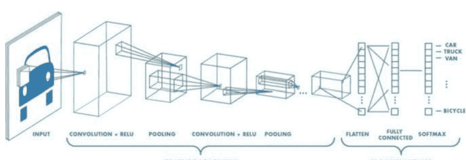
图1 具有多个卷积层的神经网络[10]

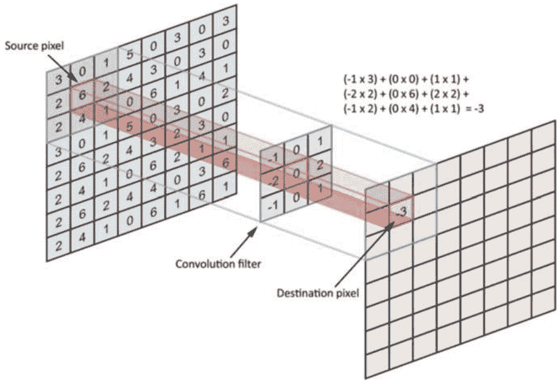
图2 卷积操作[10]

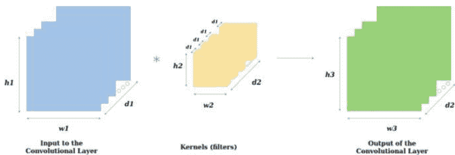
图3 卷积层[10]

**非线性**

像ANN和自动编码器这样的神经网络之所以强大，是因为它们具有非线性特性。这里，加权输入的总和通过激活函数传递以获得输出。CNN也使用类似的技术。在CNN中，我们从卷积层获得的输出通过relu激活函数传递。这意味着映射到特征图的输出不仅仅是矩阵乘积元素的总和，还应用了relu函数。如果考虑所有进行的卷积，relu激活函数应用于每个网络，因为没有它，网络将无法强大[11]。

方程1，数学上定义了Relu激活函数。

$$ y = \max(0, x) \quad (1) $$

图4代表了Relu曲线。我们可以通过以下代码实现，在我们的模型中添加relu层。

```python
from keras.layers import Activation, Dense
model.add(Dense(64, activation='relu'))
```


图4 Relu 激活函数 [10]

**步幅和填充**

步幅是在卷积的每一步中滑动卷积滤波器的次数。默认步幅值被认为是1。步幅越大，特征图越小。

当步幅大小增加时，特征图的大小会减小，并且可能会小于输入图像的大小，因为图像必须包含卷积滤波器。为了保持图像和特征图的相同尺寸，我们需要在图像周围进行填充[11]。

填充可以是全零，也可以是输入图像边缘已经提到的值。现在，通过填充，我们可以获得类似的特征图图像的大小。这就是为什么在CNN中使用填充来保持特征图的大小，否则它可能会在每一步中缩小。

图5说明了完全填充和相同填充如何应用于CNN。

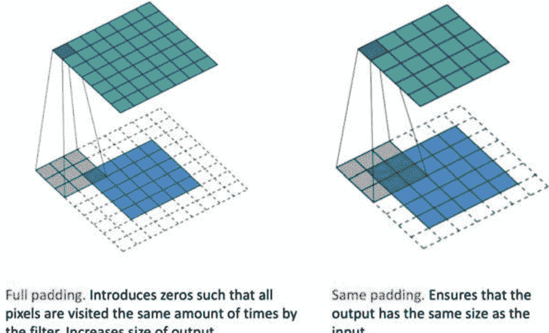
图5 完全填充和相同填充[10]

**池化**

我们在卷积之后进行池化以减小大小。它还帮助我们减少参数，从而减少训练时间。它通过减小特征图的高度和宽度并保持深度或RGB值不变来帮助进行下采样。

最常用的池化技术是最大池化。它通过在每个池化窗口中选择最大值来工作。池化没有参数。它还通过从每个窗口中选择最大值来执行滑动窗口技术。窗口的大小由步幅的值指定。

图6显示了最大池化，其中一个窗口像正常的卷积一样滑动，并获得最大值作为输出。

如果只考虑卷积而忽略池化，我们需要考虑四个重要因素。它们包括：

- 过滤器大小：通常使用3×3或5×5或7×7的过滤器大小。
- 过滤器数量：通常在32-1024的范围内变化。使用的过滤器数量越多，网络越强大。这也有一定的限制。当过滤器数量增加时，由于参数数量的增加，过拟合问题也会增加。
- 步幅：步幅的大小始终保持为1。
- 填充：通常首选填充。

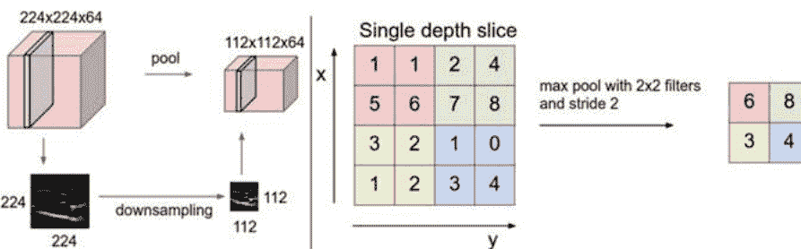
图6 最大池化层[10]

现在，在进行池化和卷积之后，我们添加一个名为全连接的额外层，以完成CNN架构。在进行池化和卷积之后，我们得到的输出是一个3D体积，但是对于全连接层，我们需要将其输入转换为1D体积。因此，我们需要将池化层中获得的3D体积输出转换为1D体积，以便它可以成为全连接层的输入。展平是将3D体积转换为1D体积的简单方法。图7显示了卷积神经网络的全连接层。

CNN的训练方式与ANN相同，都是通过反向传播和梯度下降来完成的。数学运算的参与是由于卷积。


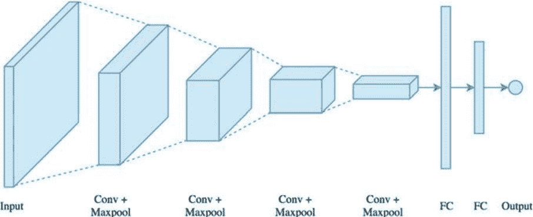
图8 卷积神经网络的实现架构[10]

#### 2.1.2 直觉和实现

要实现CNN架构，我们需要实现两种技术，即特征提取和特征分类。特征提取是通过卷积层和池化层来完成的。在这个阶段，从一张匿名图片中提取出重要的特征。例如，从给定的人物图片中提取出腿的数量、手的数量、眼睛的数量等。卷积层通过将多个层叠加在一起来训练自己识别这些特征。例如，第一层检测图像的轮廓，第二层检测大小，第三层检测颜色，当它们在许多图像中进行比较时，就会得到一个特定的特征[12]。

模型使用的架构是四个卷积层和一个池化层的组合，然后是两个全连接层。卷积神经网络的实现架构如图8所示。

实现CNN的基本代码如下：

```python
model = Sequential()
model.add(Conv2D(32, (3,3), activation='relu', padding='same', name='conv_1', input_shape=(150,150,3)))
model.add(MaxPooling2D((2,2), name='maxpool_1'))
model.add(Conv2D(64, (3,3), activation='relu', padding='same', name='conv_2'))
model.add(MaxPooling2D((2,2), name='maxpool_2'))
model.add(Conv2D(128, (3,3), activation='relu', padding='same', name='conv_3'))
model.add(MaxPooling2D((2,2), name='maxpool_3'))
model.add(Conv2D(128, (3,3), activation='relu', padding='same', name='conv_4'))
model.add(MaxPooling2D((2,2), name='maxpool_4'))
model.add(Flatten())
model.add(Dropout(0.5))
model.add(Dense(512, activation='relu', name='dense_1'))
model.add(Dense(128, activation='relu', name='dense_2'))
model.add(Dense(1, activation='sigmoid', name='output'))
```

### 2.2 随机梯度下降 (SGD)

在SGD中，随机指的是与随机可能性相关的系统或任务。在这个过程中，我们随机选择数据集中的一些样本，而不是整个数据集。SGD仅使用单个或较少的训练样本计算参数的梯度[12]。方程2显示了每个训练样本的更新。

$$ W := w - \eta \nabla Q_i(w) \quad (2) $$

### 2.3 RMSprop

RMSprop优化器类似于具有动量的梯度下降算法。RMSprop优化器限制了竖直方向上的振荡。因此，我们可以增加学习率，算法可以在水平方向上迅速收敛。RMSprop和梯度下降的区别在于梯度的计算方式[13]。我们根据公式3计算均方的运行平均值。

$$ v(w, t) = \gamma v(w, t-1) + (1-\gamma)(\nabla Q_i(w))^2 \quad (3) $$

在公式3中，$\gamma$是遗忘因子。

$$ w := w - \frac{\eta}{\sqrt{v(w, t)}} \nabla Q_i(w) \quad (4) $$

公式4显示了参数的更新。

### 2.4 自适应矩估计 (ADAM)

我们可以使用ADAM作为优化算法，用于更新训练数据中的网络权重，作为经典随机梯度下降系统的替代。这是用于执行优化的一种最佳优化器。ADAM是从adagrad演变而来的，是一种更可调节的方法。ADAGRAD和动量的组合被称为ADAM [14]。

参数 $w^{(t)}$ 和 $L^{(t)}$，其中指数t表示当前训练迭代，ADAM中的参数更新如下：

$$m_w^{(t+1)} \leftarrow \beta_1 m_w^{(t)} + (1-\beta_1) \nabla_w L^{(t)} \quad (5)$$

$$v_w^{(t+1)} \leftarrow \beta_2 v_w^{(t)} + (1-\beta_2) \left(\nabla_w L^{(t)}\right)^2 \quad (6)$$

$$\hat{m}_w = \frac{m_w^{(t+1)}}{1 - (\beta_1)^{(t+1)}} \quad (7)$$

$$\hat{v}_w = \frac{v_w^{(t+1)}}{1 - (\beta_2)^{(t+1)}} \quad (8)$$

$$w^{t+1} \leftarrow w^t - \eta \frac{\hat{m}_w}{\sqrt{\hat{v}_w} + \epsilon} \quad (9)$$

在方程5和6中，$\beta_1$和$\beta_2$是梯度的遗忘因子和梯度的二阶矩。在方程9中，$\epsilon$是用于防止除以0的小标量。

## 3 自动诊断疟疾

通过实施细胞图像的分类，深度学习可以在防止错误诊断决策方面起到重要作用。一个被广泛称为深度学习的机器学习领域在医学领域以外的其他领域表现出色，因为在医学领域中，由于缺乏相关知识和一些隐私问题，其应用较少。但是，在过去几年中，医疗领域已经开始使用深度学习[15]。

一个被广泛认可的人工神经网络的超类，卷积神经网络（CNN）在各种计算机视觉操作中变得最有影响力，并在不同领域，包括医学科学领域，获得了认可。CNN模型可以通过反向传播学习空间特征，其中涉及不同的构建模块。图9展示了CNN模型的一个例子。

CNN是一种专门用于2维数据（如视频和图像）的最佳深度学习模型。CNN模型为我们提供了很好的可视化，帮助我们理解关系。CNN模型的主要特点是在模型适应输入特征后，它可以自动检测重要特征，无需任何人工监督来训练学习层。与其他模型相比，CNN在计算上比其他模型更有效。CNN的另一个优点是训练模型容易，并且与具有相似数量隐藏单元的全连接网络相比，参数较少[17-20]。

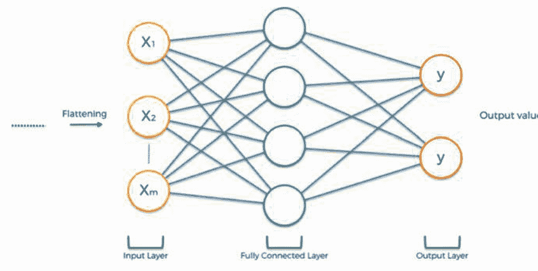
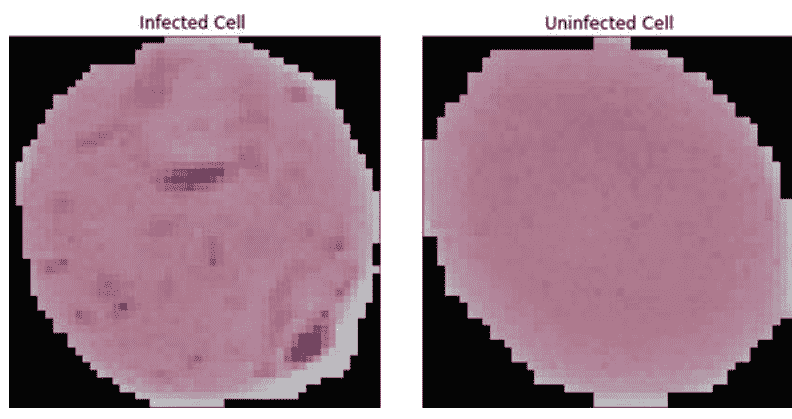

### 3.1 图像获取

系统开发中使用的数据来自国家医学图书馆（NLM）的官方网站，其中包含27,558张细胞图像，进一步分为感染和未感染的细胞。图10显示了样本数据集。

### 3.2 数据可视化

在特定上下文中使用一系列静态和交互式图形来帮助我们理解和解释大量数据的技术被称为数据可视化。

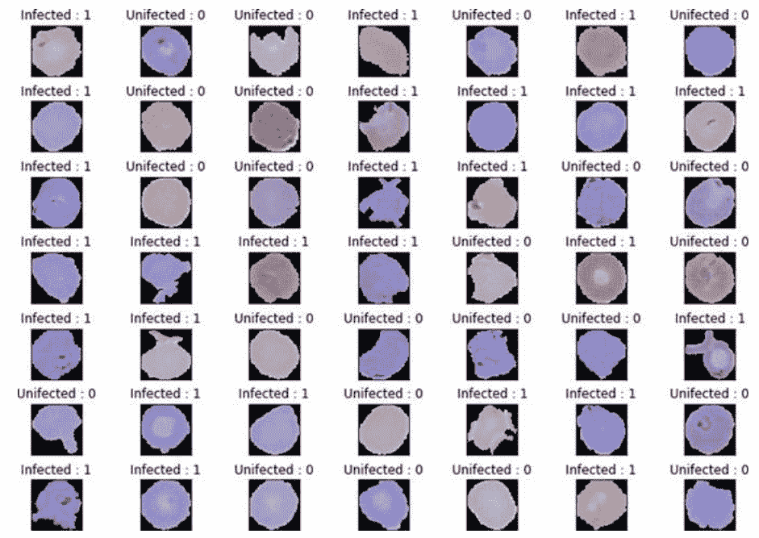
图11 感染和未感染细胞的标记图像

作为数据可视化。我们随机绘制了寄生和未感染的细胞，如下图11所示，并将它们标记为1和0。

### 3.3 数据预处理

预处理是在机器学习或深度学习算法应用之前对原始数据进行转换的过程。数据的预处理在机器学习中是一个重要的阶段，因为可以从中提取数据的标准和功能细节，这可能会影响模型的质量和准确性，因此数据的处理非常重要。

例如，如果我们在原始图像上训练卷积神经网络，结果会很差。预处理阶段还有助于加速整个模型。在我们的模型中，图像被处理成Jupyter Notebook。在将图像输入CNN进行训练之前，我们通过将图像除以255来对图像进行归一化处理。

## 4 提出的模型

卷积神经网络是最有效的神经网络之一，用于处理图像并进行分类。在我们的模型中，我们使用Keras创建了CNN模型。图12描述了我们模型的基本流程。

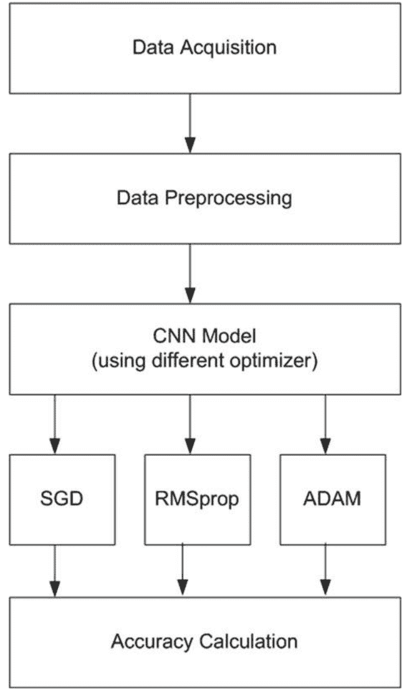
图12 提出模型的流程图

### 二维卷积

这将创建一个卷积核。我们设置了一些属性，如下所定义：

- 滤波器：第一个参数定义了层的输出形状。在这种情况下，对于不同的层，我们将值设置为16、32、64。
- 核大小：它定义了我们要使用的窗口的大小，该窗口将沿着图像遍历。我们将其设置为2。
- 输入大小：它用于定义每个图像的输入大小。参数输入形状将为(50, 50, 3)。我们只需要为第一层定义输入形状。
- 激活：激活函数在此参数中定义。我们使用relu作为激活函数，也被称为修正线性单元。
- 填充：当输出特征图的大小与输入特征图相同时，称为填充。

### 最大池化2D

池化大小：它定义了将转换为1个值的像素值的矩阵大小。我们将池化大小的值设置为2。

### 丢弃

它随机选择一些值设置为0，以防止模型过拟合，我们只使用了rate参数，并将其设置为0.2。

### 展平

它将完整的n维矩阵展平为一个单一的数组。

### 稠密

它定义了一个密集连接的神经网络层，我定义了以下参数：

- 激活：它定义了激活函数，我们将其设置为relu。
- 单位：给定层中神经元的数量由单位定义。

### 模型训练和结果分析

使用fit方法，我们使用x_train和y_train训练了模型。我们将总的epochs设置为50，这基本上是对完整数据集进行50次迭代，每次迭代使用批量大小为50。我们还将数据分割为0.1的验证集，因此模型在90%的训练数据上进行训练，并在10%的训练数据上进行验证。我们的实验示例的摘要显示在表1中。

我们使用不同的优化器评估了我们的模型，并获得了不同的准确性。

### 表1 模型摘要

| 层（类型） | 输出形状 | 参数# |
| :--- | :--- | :--- |
| conv2d_1 (Conv2D) | (None, 50, 50, 16) | 208 |
| max_pooling2d_1 (MaxPooling2D) | (None, 25, 25, 16) | 0 |
| conv2d_2 (Conv2D) | (None, 25, 25, 32) | 2080 |
| max_pooling2d_2 (MaxPooling2D) | (None, 12, 12, 32) | 0 |
| conv2d_3 (Conv2D) | (None, 12, 12, 64) | 8256 |
| max_pooling2d_3 (MaxPooling2D) | (None, 6, 6, 64) | 0 |
| dropout_1 (Dropout) | (None, 6, 6, 64) | 0 |
| flatten_1 (Flatten) | (None, 2304) | 0 |
| dense_1 (Dense) | (None, 500) | 1,152,500 |
| dropout_2 (Dropout) | (None, 500) | 0 |
| dense_2 (Dense) | (None, 2) | 1002 |
- 总参数: 1,164,046
- 可训练参数: 1,164,046
- 不可训练参数: 0

### 4.1 使用SGD优化器进行疟疾检测

在这里，随机性描述了与随机可能性相关的系统或任务。在这个过程中，我们不是选择整个数据集，而是随机从数据集中选择几个样本。SGD仅使用单个或少量训练样本来计算参数的梯度。当我们在模型中应用SGD优化器时，在测试集上给出了95.54%的准确率，在训练集上给出了95.33%的准确率。

在我们的模型训练过程中，找到了准确率和对数损失（也称为成本函数）参数，并绘制在图13中。

在我们的模型中使用SGD优化器时，得到的分类报告如表2所示。

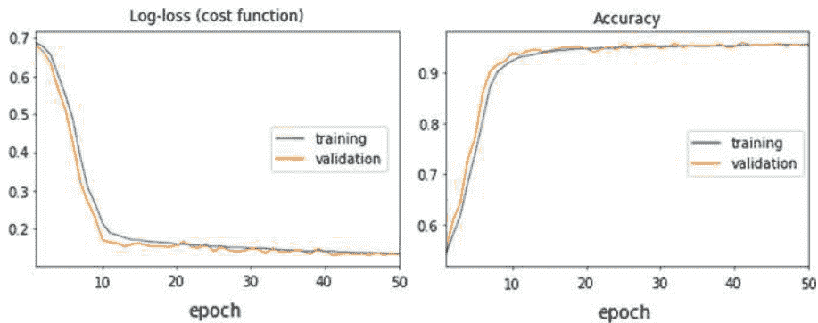

图13 使用SGD技术时的对数损失和准确率图

| | 精确率 | 召回率 | F1分数 | 支持 |
|---|---|---|---|---|
| 0 | 0.98 | 0.94 | 0.96 | 1408 |
| 1 | 0.94 | 0.98 | 0.96 | 1347 |
| 平均/总计 | 0.96 | 0.96 | 0.96 | 2755 |

### 4.2 使用RMSprop优化器进行疟疾检测

RMSprop优化器类似于具有动量的梯度下降算法。RMSprop优化器限制了向上方向的振荡。因此，我们可以增加学习率，使算法在水平方向上迅速收敛。RMSprop和梯度下降的区别在于梯度的计算方式。

当我们在模型中应用RMSprop优化器时，在测试集上得到了95.54%的准确率，在训练集上得到了95.32%的准确率。在我们的模型训练过程中，找到了准确率和对数损失（也称为成本函数）参数，并绘制在图14中。

在我们的模型中使用RMSprop优化器获得的分类报告如下表3所示。

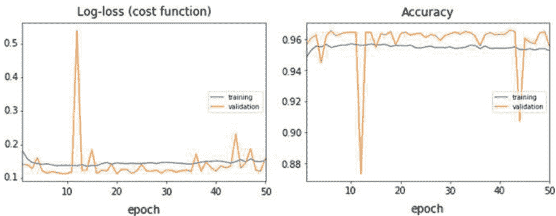

图14 使用RMSprop技术时的对数损失和准确率图

| | 精确率 | 召回率 | F1分数 | 支持 |
|---|---|---|---|---|
| 0 | 0.96 | 0.96 | 0.96 | 1408 |
| 1 | 0.95 | 0.95 | 0.95 | 1347 |
| 平均/总计 | 0.96 | 0.96 | 0.96 | 2755 |

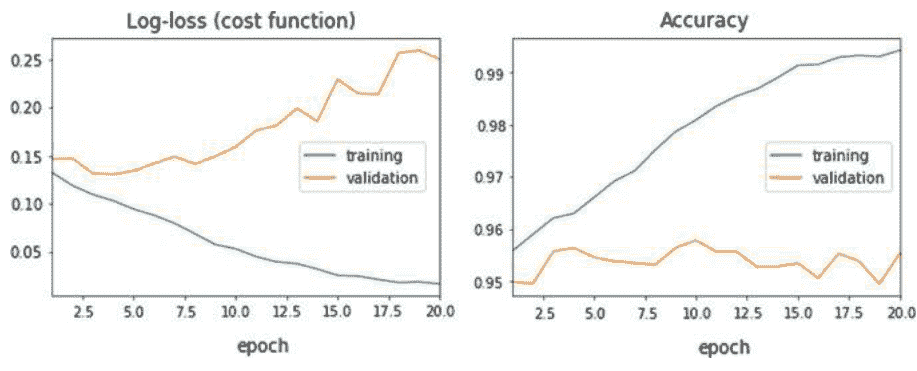

图15 使用ADAM技术时的对数损失和准确率图

### 表4 使用ADAM的分类报告

| | 精确率 | 召回率 | F1分数 | 支持 |
|---|---|---|---|---|
| 0 | 0.95 | 0.96 | 0.95 | 1408 |
| 1 | 0.96 | 0.96 | 0.96 | 1347 |
| 平均/总计 | 0.96 | 0.96 | 0.96 | 2755 |

### 4.3 使用ADAM优化器进行疟疾检测

我们可以使用ADAM作为传统随机梯度下降系统的替代优化算法来更新训练数据中的网络权重。这是用于执行优化的，并且是目前最好的优化器之一。ADAM是从adagrad演变而来的，它是一种更可调节的方法。ADAGRAD和动量的组合被称为ADAM。

在我们的模型中，Adam优化器在训练集上给出了96.88%的准确率，在测试集上给出了96.62%的准确率。在模型训练过程中，准确率和对数损失（也称为成本函数）参数被发现，并绘制成图表，如图15所示。

在我们的模型中使用Adam优化器时得到的分类报告如下表4所示。

## 5. 5种不同技术的比较

在我们的数据集上分析不同的优化器后，我们得到了在训练集和测试集上的不同准确率，如图16和17所示。

使用不同的优化器得到的不同准确率已绘制出来。

在测试集和训练集上，我们发现ADAM优化器在我们的数据集上表现非常好，在测试集上的准确率为96.62%，在训练集上的准确率为96.88%。

### 图16 测试集上的准确率


### 图17


## 6. 结论和未来工作

所提出的方法的目的是提高疟疾检测的质量，这可以帮助显微镜师轻松准确地检测疟疾，并尽快开始适当的药物治疗。未来的工作方向是改进性能和增强算法，并对血细胞图像进行去噪，以更好地检测疟疾。另一个未来工作的方向是将该模型实施到一个单一应用程序中，可以在任何智能手机上运行，以便轻松检测疟疾。

### 参考文献

- 1. 疟疾显微镜质量保证手册，版本2。世界卫生组织（2016年）
- 2. 世界疟疾报告。世界卫生组织（2016年）
- 3. O’Meara, W.P., Mckenzie, F.E., Magill, A.J., Forney, J.R., Permpanich, B., Lucas, C., Gasser, R.A., Wongsrichanalai, C.: 通过显微镜确定疟疾寄生虫密度的可变性来源。美国热带医学和卫生杂志。 73（3），593-598（2005年）
- 4. Rajaraman, S., Antani, S.K., Xue, Z., Candemir, S., Jaeger, S., Thoma, G.R.: 通过深度学习中突出的网络激活来可视化胸部X射线片中的异常。 在：生命科学会议，IEEE，澳大利亚，第71-74页（2017年）
- 5. Liang, Z., Powell, A., Ersoy, I., Poostchi, M., Silamut, K., Palaniappan, K., Guo, P., Hossain, M.A., Sameer, A., Maude, R.J., Huang, J.X., Jaeger, S., Thoma, G.: 基于CNN的疟疾诊断图像分析。 在：国际生物信息学和生物医学会议，IEEE，中国，第493-496页 (2016年)
- 6. Dong, Y., Jiang, Z., Shen, H., Pan, W.D., Williams, L.A., Reddy, V.V.B., Benjamin, W.H., Bryan, A.W.: 评估深度卷积神经网络自动识别疟疾感染细胞。 在：国际生物医学和健康信息学会议，IEEE，美国，第101-104页 (2017年)
- 7. Shang, W., Sohn, K., Almeida, D., Lee, H.: 通过连接的修正线性单元理解改进卷积神经网络。 在：国际机器学习会议，ACM，美国，第2217-2225页 (2016年)
- 8. Szegedy, C., Liu, W., Jia, Y., Sermanet, P., Reed, S., Anguelov, D., Erhan, D., Vanhoucke, V., Rabinovich, A.: 使用卷积进行更深入的研究。 在：国际计算机视觉和模式识别会议，IEEE，美国，第1-9页 (2015年)
- 9. Bergstra, J., Bengio, Y.: 超参数优化的随机搜索。 机器学习杂志. Res. 13(1), 281-305 (2012)
- 10. Saha, S. https://towardsdatascience.com/a-comprehensive-guide-to-convolutional-neural-networks-the-eli5-way-3bd2b1164a53
- 11. Majumdar, S.: 在Keras中实现DenseNet。 GitHub
- 12. Shang, F., Zhou, K., Liu, H., Cheng, J., Tsang, I.W., Zhang, L., Tao, D., Jiao, L.: VR-SGD: 一种简单的随机方差减少方法用于机器学习。 IEEE Trans. Knowl. Data Eng. (2018)
- 13. Yazan, E., Talu, M.F.: 基于随机梯度下降的优化技术比较。 在：国际人工智能和数据处理研讨会。 IEEE，土耳其 (2017年)
- 14. Zhang, Z.: 改进的Adam优化器用于深度神经网络。 在：国际服务质量研讨会。 IEEE，加拿大 (2018年)
- 15. Gopakumar, G.P., Swetha, M., Sai Siva, G., Sai Subrahmanyam, G.R.K.: 基于卷积神经网络的疟疾诊断，使用自制幻灯片扫描仪获取的血液涂片图像的焦点堆栈。 J. Biophotonics 11 (3) (2017年)
- 16. Saha, S.: 卷积神经网络的全面指南-ELI5方式。 Towards Data Science
- 17. Prabhu, R.: 理解卷积神经网络（CNN）-深度学习
- 18. Bibin, D., Nair, M.S., Punitha, P.: 使用深度置信网络从外周血涂片图像中检测疟原虫。 IEEE, pp. 9099-9108 (2017年)
- 19. Das, D.K., Maiti, A.K., Chakraborty, C.: 利用薄血涂片的光学显微图像对疟疾感染阶段进行自动化特征化和分类。 J. Microsc. 257(3), 238–252 (2015)
- 20. Kumar, A., Sarkar, S., Pradhan, C.: 农业中的作物识别和害虫控制技术推荐系统。 In: 通信和信号处理国际会议。 IEEE, 印度, pp. 185–189 (2019年)

Avinash Kumar是印度比哈尔邦布巴内斯瓦尔市KIIT DU的大四学生。他的研究兴趣包括图像处理、深度学习和机器学习，并且目前在不同的研究领域工作。

Sobhangi Sarkar是印度比哈尔邦布巴内斯瓦尔市KIIT DU的大四学生。她的研究兴趣包括深度学习、图像处理和机器学习，并且目前在不同的研究领域工作。

Chittaranjan Pradhan在KIIT DU的计算机工程学院工作，位于印度Bhubaneswar。他的研究包括信息安全、图像处理、数据分析和多媒体系统。Pradhan博士在国内外期刊和会议上发表了50多篇文章。

# 基于深度强化学习的个性化健康推荐

Jayraj Mulani, Sachin Heda, Kalpan Tumdi, Jitali Patel, Hitesh Chhinkaniwala和Jigna Patel

**摘要** 在信息学时代，提供个性化推荐以减轻信息过载的影响变得至关重要。就个性化推荐而言，生物医学和健康护理信息学领域仍然未被开发利用。大多数现有的推荐系统在一定程度上未能解决数据稀疏性和用户-项目关系的非线性等问题。基于深度强化学习的系统可以革新推荐架构，因为它具有使用非线性转换、表示学习、序列建模和灵活性实现这些架构的能力。在本文中，我们提出了一种基于深度强化学习的完整健康护理推荐方法，包括服用药物、咨询医生、获得营养和进行锻炼和喜欢的运动。我们尝试利用“演员-评论家”模型来增强模型根据用户的实时反馈不断更新信息获取策略的能力。健康行业通常涉及长期问题。传统的推荐系统未能考虑长期效果，因此未能捕捉到人们的动态情感。这种方法将推荐过程视为顺序决策过程，从而解决了上述问题。据估计，超过7亿人将拥有可穿戴设备，监测他们的每一步。使用这些智能设备收集的数据，结合其他来源如电子健康记录、营养数据和调查收集的数据，可以使用大数据分析工具进行处理，并提供给推荐系统生成理想的推荐。这些数据，在编码（状态）为适当格式后，将被输入到Actor网络中，该网络将学习一种优先考虑特定推荐（动作）的策略。动作，状态对将被输入到评论家网络中，该网络生成与动作，状态对相关联的奖励。这个奖励用于更新Actor网络的策略。评论家网络使用预定义的预期奖励进行学习。因此，我们发现使用大数据分析工具和深度强化学习等智能方法可以显著改善健康护理的推荐结果，帮助创建无缝个性化系统。

J. Mulani · S. Heda · K. Tumdi · J. Patel (✉) · J. Patel
计算机科学与工程系, 技术学院
尼尔玛大学, 艾哈迈达巴德, 印度
e-mail: Jitali.patel@nirmauni.ac.in

J. Mulani
电子邮件: 16bce076@nirmauni.ac.in

S. Heda
电子邮件: 16bce074@nirmauni.ac.in

K. Tumdi
电子邮件: 16bce080@nirmauni.ac.in

J. Patel
电子邮件: jignas.patel@nirmauni.ac.in

H. Chhinkaniwala
阿达尼基础设施工程学院, 艾哈迈达巴德, 印度
e-mail: drhiteshrc1@gmail.com

© Springer Nature Switzerland AG 2020
S. Dash et al. (eds.), 生物医学和健康信息学中的深度学习技术,
大数据研究 68, https://doi.org/10.1007/978-3-030-33966-1_12

231

**关键词** 大数据 · 深度强化学习 · 推荐系统 · 生物医学和健康信息学 · 演员评论模型 · 电子健康记录

## 1. 引言

推荐系统已经开始在包括娱乐、零售、教育、旅游等行业发挥关键作用。然而，利用有效和准确的推荐系统潜力的最大行业之一是医疗保健行业。时机已经到来，人们已经开始释放我们拥有和可以开发的最先进技术的潜力，以改善他们生活中最重要的方面，即健康。第2.2节中显示的事实和数据令人惊讶。世界卫生组织的研究得出结论，有超过12,400种疾病、疾病和与健康相关的疾病可能在任何一天袭击我们。一方面，美国约有一半的人口不知道潜在的健康威胁，无论是肥胖、糖尿病、心力衰竭等等，另一方面，我们每天产生的与健康和健身有关的数据量达到了无数字节。个性化健康推荐系统旨在弥合这一差距。

在本章中，我们提出了一个基于深度强化学习的个性化健康推荐框架。第2和第3节旨在提供有关手头主题的一些基本但重要的文献。它讨论了各种事实和数据，大数据和强化学习在推荐系统中的作用，详细说明了现有的推荐系统，并提出了基于强化学习的推荐的需求。它还讨论了我们试图解决的各种问题。它们包括意识、数据未充分利用、一些安全问题以及医生与患者比例低的问题。

下一节将讨论现有解决方案在解决这些问题上的一些局限性，包括缺乏全面的推荐系统、系统偏见和短视的推荐。

接下来，我们尝试使用深度强化学习的一些特性，结合标准机器学习和数据挖掘算法和技术，以及大数据的潜力，通过克服上述限制来解决这些问题。然后，讨论了上述三层深度强化学习框架来支持我们的论点。提出的框架包括三个层次。第一层是数据集成和预处理层。在这一层中，我们尝试整合从各种来源收集的数据并进行处理，使用大数据[1]和数据挖掘技术，以便将其输入到第二层。第二层是疾病概率预测层。它包括10种传统机器学习和深度学习算法，用于预测10种常见疾病的概率，并提出一些建议。最后，第三层是推荐生成层。它包括一个演员评论模型，帮助我们做出顺序决策，从而提出理想的推荐。最后，描述了处理演员评论模型的输出并将其应用的方法。最后，提供了一些医生提供的样本推荐供参考。

## 2. 背景

在互联网和信息学时代，消耗和生成的信息量呈指数增长。在这个众多应用程序生成和使用信息之前，管理信息并将正确的信息传递给正确的人并不那么困难。然而，考虑到目前的情况，向特定受众传递个性化信息变得非常困难。这就是强大的推荐系统发挥作用的地方。推荐系统的先前工作主要包括基于内容的协同过滤技术、深度学习模型、分解机、回归模型、混合机制等。

### 2.1. 推荐系统

基于内容的推荐系统基于用户的个人资料，其中包含用户的信息以及用户喜欢的物品类型的要点。

利用这些信息，可以构建模型来识别并推荐用户可能喜欢的其他相似物品。然而，这种模型无法识别用户可能感兴趣的其他领域。因此，为了解决这个问题，出现了一种新的方法，称为协同过滤。协同过滤背后的基本思想是“相似的用户有相似的喜好”。协同过滤[2]利用了相似选择的人倾向于喜欢相似产品的事实。此外，同行喜欢的相似物品可能对其他人的推荐有利。协同过滤可以通过两种方式实现。上面讨论过，第一个被称为用户-用户协同过滤，另一个被称为物品-物品协同过滤。

此外，还可以使用基于内容和协同过滤的混合推荐系统来构建推荐系统[3]。第三种方法称为基于属性的协同过滤，可以解决数据稀疏性、过度规范化、启动缓慢等持久问题。健康感知推荐系统或HARE是一种基于本体的模型，以吸引力水平为基础提供推荐。

上述所有推荐方法都是从客户的角度构建的，帮助他们有效选择，无论他们是否正在寻找。然而，在健康和生物信息学领域，我们找不到有效的模型来提供推荐。此外，这些方法还存在一些需要解决的问题。这些方法未能考虑到其推荐的长期影响。特别是在健康领域，长期结果远远超过短期成功。基于强化学习的模型与神经网络的力量共同在动态环境中工作，从而克服了传统推荐系统的缺点，使其独树一帜。医疗保健推荐需要做出顺序决策，而不是即时决策[4]。所提出的框架有助于解决这些问题，并为有效的健康推荐提供独特的全方位视角。

### 2.2. 事实和数据

为了使机器学习和表现良好，它们需要的是数据；不仅仅是任何数据，而是相关的、完整的、格式化的和一致的数据。根据国际数据公司的估计，到2020年，仅与医疗保健行业相关的数据将每年产生2314艾字节（1艾字节 = 10^9 字节），这是以每年48%的惊人速度增长。鉴于此，以及从这些数据中提取有价值信息的高级算法，再加上兼容的先进硬件，我们有机会为社会做出贡献。提到这一点，最大的问题是这些数据的来源和真实性。

我们对斯坦福医学2017年健康趋势报告中提到的一些事实并不感到惊讶，该报告名为“利用健康数据的力量”。84%的患者愿意分享血压或基本实验室检测结果等重要统计数据，75%的人愿意分享有关内脏健康的信息。我们被物联网、大数据、机器学习、深度学习等流行词所困扰。从统计分析来看，可穿戴技术市场将达到340亿美元，每天产生无数字节的可用研究数据。健康领域研究的指数增长速度激励着许多研究人员做出重大贡献。

贡献。除了可穿戴设备外，还有大量的数据可供公众和研究使用，如Kaggle、世界卫生组织数据集、data.gov等平台。大数据工具可以帮助智能系统有效地收集、管理和处理数据。

### 2.3 大数据

在过去几十年中，有几个热门词汇引起了人们的关注，其中之一就是大数据。在对其进行技术定义之前，让我们先给出一些关于这个话题的原因。福布斯报道称，每分钟大约有415万个YouTube视频被观看，Twitter上发送了456,000条推文，Instagram上发布了46,740张照片，Facebook上发布了510,000条评论和293,000条状态更新。福布斯还报道称，根据我们目前的速度，我们正在创造2.5千万亿字节的数据，而且这个速度还在不断加快。

物联网（IoT）是其中一项重要技术，在这个领域发挥着重要作用。想象一下这些活动产生的数据量。社交媒体、电信、商业应用和其他领域的快速数据创建正在导致大数据的形成。大数据关乎数据的规模和容量，这是人们对大数据的最大误解。但实际上，它不仅仅局限于大量收集的数据，而是来自不同来源以不同格式的大量数据的集合。以前也会产生数据，但那些数据是以适当的格式存在的，所以关系型数据库能够存储它们。但由于数据的多样性，现在不可能将它们存储在传统格式中。大数据有三种不同的格式：结构化、非结构化和半结构化。

#### 2.3.1 特征

下图解释了大数据的五个V [5]：
- 1. 容量：大量的数据
- 2. 多样性：来自各种资源的不同数据格式，被整合
- 3. 速度：数据生成的速度
- 4. 价值：提取有用的数据
- 5. 真实性：数据中的不一致性和不确定性（图1）。

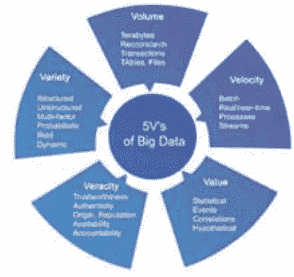

图1 大数据特征

#### 2.3.2 大数据分析

除了存储这么大量的数据之外，还有一个与之相关的重要问题，即从这个数据集中找到有用的信息（知识）。这产生了大数据分析。这是处理大数据的复杂过程，以寻找任何隐藏的信息、有趣的模式、市场趋势和客户偏好，这确实可以帮助组织制定他们的营销策略。这是一个将从各种来源检索到的原始、非结构化数据转化为有用信息的过程。有各种工具可用于执行此任务，如Hadoop、Spark、Hive、Pig等。

现今的组织意识到大数据是强大的，但他们开始意识到，只有与智能自动化相匹配时，它才是有价值的。借助巨大的计算能力，机器学习（ML）和强化学习（RL）框架帮助组织更有效地管理、分析和利用他们的数据。机器学习和强化学习也被用于使用复杂算法从大量数据中找到隐藏的信息和模式，以实现更快和更准确的结果。

它们的能力影响几乎每个领域。它们对医疗保健产生了深远的影响，通过提供个性化的治疗方案和改善诊断。预测性调查使专家和临床医生能够集中精力提供更好的服务和患者护理，为患者的需求提供积极主动的解决方案。

### 2.4 强化学习

强化学习是机器学习的一个领域，在这个领域中，一个智能体通过采取各种行动并观察采取这些行动后获得的奖励/结果来学习如何在给定环境中行为。基本上，它将情况或状态与相应的行动进行映射。具体来说，学习者或智能体采取各种行动并与环境进行交互，旨在通过最优地采取行动来最大化其预期的奖励。奖励可以被定义为智能体在从环境中采取特定行动后获得的结果。

然而，为了最大化总体或预期的奖励，智能体不能总是贪婪地行动并最大化即时奖励。强化学习算法尝试在长期内最大化奖励。策略可能是代理人的行动计划（图2）的定义或非定义。

Agent → State → Reward (r_t, r_{t+1})
Action (a_t) → Environment → State (s_{t+1})


图2 强化学习元素

#### 2.4.1 马尔可夫决策过程

马尔可夫决策过程（MDP）是用于建模强化学习问题的过程。它用数学方式建模顺序决策问题。

强化学习问题中的环境由一组状态 $S$，一组动作 $A$，转移概率 $p(s' | s, a)$，初始状态的概率分布 $p(s_0)$，奖励函数 $r: S \times A \to \mathbb{R}$（其中 $\mathbb{R}$ 是实数）和折扣因子 $\gamma \in [0, 1]$ 组成。这些组件用于构建马尔可夫决策过程。MDP被定义为一个元组 $(S, A, p, r, \gamma)$。策略 $\pi$ 用于将状态映射到相应的动作。$\pi: S \to A$。也可以使用带有折扣因子 $\gamma$ 的折扣奖励。在这里，代理的目标是最大化期望回报，如公式(1)所示。

$$
G_t=\sum_{k=0}^{\infty} \gamma^k R_{t+k+1} \quad (1)
$$

#### 2.4.2 Q学习

Q学习使用动作-值函数来表示策略 $\pi$，该函数表示代理在状态 $s$ 下采取行动 $a$ 的好坏程度。方程(2)表示要使用的Q值函数。

$$
Q_\pi(s, a)=E_\pi\left[G_t \mid S_t=s, A_t=a\right] \quad (2)
$$

Q学习的基本版本维护了每个状态-动作对值的Q值表。贝尔曼方程（方程3）通过多次迭代来学习最优的Q值函数。通过获得的最优策略Q表可以表示为 $Q^*(s, a)$。

$$
Q_*(s, a) = E \left[ R_{t+1} + \gamma \max_{a'} Q_*(s', a') \right] \quad (3)
$$

这里的 $(s', a')$ 表示可能的下一个状态-动作对。

#### 2.4.3 深度 Q 学习

对于每个状态-动作空间找到 Q 值的过程在动作和状态是连续和高维的情况下是不可行的。此外，在推荐系统中，状态的数量将非常大。因此，如果状态空间大小增加，学习每个状态-动作对的 Q 值的过程会变得非常缓慢。因此，需要一个参数化的值函数 $Q(s, a; \theta)$ 来近似 Q 值。这里，$\theta$ 表示用于定义 Q 值的参数向量。可以使用各种函数逼近器，如特征的线性组合、神经网络、最近邻、傅里叶/小波基。

Deep Q Network (DQN) [6]，一种用于深度Q学习的算法，使用神经网络作为值函数的近似器。DQN为给定状态 $(s)$ 可以采取的每个动作 $(a)$ 提供 Q 值 $(Q(s,a))$ 作为输出。在深度Q网络中，数据集由形式为 $\langle s, a, r, s' \rangle$ 的元组生成，其中在状态 $(s)$ 处采取动作 $(a)$，并在到达新状态 $(s')$ 后观察到即时奖励 $(r)$。一旦完成足够数量的迭代，就从存储在内存中的数据库中随机选择元组进行经验回放。

DQN使用 $\epsilon$-贪婪策略来收集各种状态的信息存储在内存中。网络根据下面给出的损失函数更新神经网络的权重。

损失 = $E[Q(s, a; \theta) - [r(s, a) + Q(s', a'; \theta^-)]] \quad (4)$

这里 $\theta^-$ 是之前存储的（冻结的）参数值，$\theta$ 是新推导出来的参数。还有一种名为 Dueling DQN 的改进方法，它使用共享网络参数来估计状态值函数 $V(s)$ 和优势函数 $A(s, a)$ [7]。

#### 2.4.4 策略梯度

DQN方法通过神经网络学习状态-动作值函数，然后相应地选择动作。策略梯度方法直接学习参数化函数 $(a, s)$ 的策略 [8]。奖励函数的值取决于这个策略，可以应用各种算法来最大化奖励。连续空间的奖励函数可以定义如下：

$$
J(\theta)=\sum_{s \in S} d^{\pi}(s) \sum_{a \in A} \pi_{\theta}(a \mid s) Q^{\pi}(s, a) \quad (5)
$$

这里 $d_{\pi}$ 是马尔可夫链的稳态分布 $\pi_{\theta}$。方程表明奖励函数取决于动作选择以及状态的稳态分布。该定理使用似然比来计算策略梯度如下所示：

$$
\nabla_{\theta} J(\theta)=E_{\pi_{\theta}}\left[\nabla_{\theta} \log \pi_{\theta}(s, a) Q^{\pi_{\theta}}(s, a)\right] \quad (6)
$$

#### 2.4.5 演员-评论家模型

基于策略的方法和基于值的方法（深度Q学习）都有一定的缺点。基于策略的方法的问题在于很难找到一个评估算法生成的策略的好的评分函数。同样，对于基于值的方法，策略隐含在值函数的近似中。因此，评估模型的行为是困难的。

Actor-Critic模型是一种混合方法，结合了策略方法和价值方法的特点。在这个模型中，使用了两个神经网络，一个是控制代理行为的演员网络（基于策略），另一个是评估演员行为的评论家网络（基于价值）。

图3显示了Actor-Critic模型的架构。演员与环境进行交互，并更新估计策略的演员网络的 $\theta$ 参数值。策略。评论家根据获得的奖励评估演员的行为，并根据价值函数逼近的参数更新。


图3 演员-评论家模型

## 3. 问题

我们试图解决的问题可以分为四个方面。有必要解决这些问题。这些问题包括：

### 3.1 数据利用

首先，尽管我们拥有关于人们以前的健康记录以及有关它如何影响一个人当前健康的知识，考虑到环境条件以及他/她正在接受的药物，但我们无法充分利用所有这些信息。除此之外，我们拥有的数据可能高度时间敏感，这意味着如果现在有用，它可能随时变得过时。因此，重要的是正确利用数据并从中生成有用的见解。

### 3.2 健康意识

第二个，也是最重要的观点是，即使在技术的进步下，大多数人甚至没有意识到自己正在患病。除此之外，主要是由于医学术语，即使他们进行了测试，一旦测试完成，他们也不会在将来跟踪结果。在繁忙的日程中，许多人忘记了悬在他们面前的健康威胁。通过我们的方法，我们提供了端到端的解决方案来收集数据，解释数据，并让人们更加了解自己的健康和健康问题。

### 3.3 医生与患者的比例

第三个观点是，即使我们拥有如此先进的医疗技术，医生仍然无法满足如此多的患者需求。我们的医生与患者的比例低于1:1000，这使得医生很难及时处理如此庞大的患者数量。因此，如果我们能够开发一些智能机器来替代医生处理一些不那么高风险的疾病，那将使人们能够基于数据的智能决策系统来推荐他们，通过预测可能发生的疾病，基于可用数据和类似患者的历史，来减轻疾病或在某些情况下甚至预防它们。

### 3.4 信息安全

最后，第四个角度可能涉及安全问题。从与医疗保健相关的各种来源收集的数据可以用于为相关人员提供更好的解决方案，解决他们的健康问题。然而，数据的安全性应该是首要重要的。必须确保健康相关的数据被用于社会的利益和改善，以提供健康相关的建议。它不应该被滥用以获得公司的财务利益。我们提出的框架确保数据的安全性。我们收集的与健康相关的数据集仅用于提供改善人们健康的建议。我们试图避免包含涉及健康领域中各种公司、医生和医院的财务利益的建议。

该框架的唯一目的是利用与健康相关的数据和各种智能算法的知识、机器学习和人工智能，以改善社会。

没错，每个人都是不同的，即使他们患有相同的疾病，也不会有两个人服用相同的药物。然而，除了药物之外，一些其他措施，如良好的饮食或更好的运动方式，也可以帮助战胜疾病。我们的目标是为这些方面提供更好的建议，这些建议可以推广，并且对于所有人都是有益的，无论代谢差异如何。

## 4. 现有解决方案的局限性

对于上述问题有很多解决方案。然而，没有问题是完全解决的。我们发现以下是其中一些他们存在的许多局限性：

### 4.1 缺乏全面解决方案

许多现有的健康相关建议解决方案缺乏全面的解决方案和建议。有各种在线聊天机器人系统（WebMD）可用，询问与他的健康相关的各种问题，并建议服用药物。然而，这些系统只考虑当前情况。此外，对于药物推荐和疾病识别，也不考虑特定个人的病史和家庭情况。有些疾病是天生的家族遗传疾病。因此，如果不考虑家族病史，疾病预测可能是错误的。

同样，有各种在线系统可根据个人的年龄、性别、体重、身高和其他必要信息提供饮食建议和饮食计划。然而，这些系统缺乏识别潜在疾病的功能。

### 4.2 系统偏见

现有的推荐系统处理用户对物品的反馈。在构建模型时，系统只考虑用户对系统已经推荐的物品的反馈。这个问题被称为系统偏见，即系统只考虑用户对系统已经推荐的物品的反馈。在我们的情况下，系统必须根据给定的情况推荐内容和详细信息。此外，系统不一定只考虑已经推荐的内容。

### 4.3 近视推荐

推荐系统被训练以优化即时响应。因此，它们倾向于推荐具有吸引力的内容或用户非常熟悉的项目。这些系统避免了对可以带来更高长期效益的新事物的探索。然而，正如前面所述，并且还包括控制探索和利用的功能。因此，可以使用基于强化学习的算法来解决现有推荐系统的问题。

## 5. 强化学习的特点及问题解决

### 5.1 折扣未来奖励

基于强化学习的算法使用折扣未来奖励。在决定当前状态的动作时，也考虑到代理将在几个动作之后收到的奖励。因此，可以通过基于强化学习的方法实现长期效益 [9]。

### 5.2 探索-利用控制

基于强化学习的算法提供了控制探索（随机采取行动）和利用（贪婪采取行动）的功能。$\epsilon$-贪婪策略允许我们控制智能体的探索。此外，在构建深度强化学习模型时还使用了探索衰减参数，以减少智能体在一定迭代或行动后的探索。

### 5.3 在动态环境中学习的能力

强化学习和深度强化学习算法被用于训练机器人在动态和实时环境中工作。此外，这些算法还被用于训练智能体玩各种游戏。

智能体通过采取各种行动获取环境信息，一旦进行了足够的训练，就能够表现出最佳行为 [DeepMind]。因此，基于强化学习的推荐系统也可以在动态环境中高效工作。

## 6. 提出的框架

在前面的部分中，我们看到了各种疾病以及一些令人震惊的统计数据。很明显问题仍然存在。以下是我们对可能解决方案的贡献方式。因此，这里是一个名为“基于深度强化学习的个性化健康推荐框架”的三层框架。第一层是数据预处理层。第二层是疾病识别和预测层，第三层是推荐生成层。图4展示了同样的概述。

我们之前讨论过每秒生成数百万千字节的数据事实。网站、智能手机、可穿戴设备、医院报告等都被发现是这个问题的主要贡献者。如今，这种庞大、多样化、多变、高速和真实的数据积累被称为大数据。

如图4所示，从各种来源收集的数据首先必须进行整合。整合过程很繁琐，因为从各种来源收集的数据具有不规则和不一致的结构和格式。然而，这是一个必要的步骤。在提出的框架中，整合是以患者为主体进行的。每个患者可以被分配一个全球唯一患者ID，并且与该患者相关的所有数据可以以半结构化格式存储，使我们能够适应结构化、半结构化和非结构化的数据。数据，可以从报告、可穿戴设备、健康记录、医院患者记录等中获取。

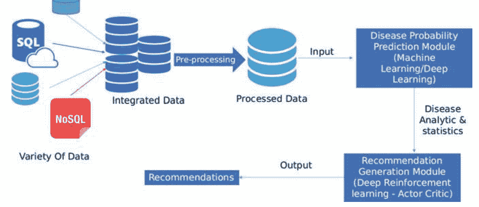

图4 框架概述

此外，仅仅进行整合是不够的。在实际使用数据之前，必须使用高质量的数据挖掘技术对数据进行预处理。下面将详细讨论数据的预处理和使用方法。

### 6.1 数据预处理层

正如之前讨论的，我们可以从各种各样的来源收集到大量的数据。然而，所有这些数据都是原始的，不能直接使用。我们拥有的数据包含许多异构参数。我们拥有的所有原始数据都存在一些常见问题：

- 1. 缺失数据：我们不可能获得所有人的所有细节，尤其是患者的细节。我们必须处理缺失数据。有几种处理缺失数据的替代方案。其中一些是：
  - 用常数替换：如果我们深入挖掘并思考缺失数据背后的原因，很有可能是该人没有患上该疾病。因此，关于该特定属性的任何测试结果都不可用，或者情况可能完全相反。该人对任何这样的测试都不知情，甚至可能在可预见的未来患上这种疾病的可能性都不存在。因此，考虑到这两种情况，我们可以将其转换为两条记录，通过复制它。在第一条记录中，我们用正常人的该属性值替换缺失值。我们使用这些数据来预测疾病。第二条记录中，我们忽略该参数，或者如果可能的话，可以使用一些不太相关的参数来预测疾病。最后，可以比较两种预测的机会，并选择最大值，或者可以将两个预测的平均值作为最终结果。
  - 插值：缺失数据的另一个可能性是该人在某一年没有进行特定的测试。但是，前后时间段的数据是可用的。可以采用不同类型的插值技术来填补缺失的信息。
- 2. 数据格式：我们计划收集的数据来自不同的来源，由不同的组织收集和维护，涉及不同的疾病和不同的医院，并以不同的模型（非结构化、结构化或半结构化）存储。处理这种数据的最佳方法是将数据转换为一种格式，既能容纳当前可用的数据，也能容纳未来多年生成和收集的数据。XML或JSON是最佳格式。许多基于文档的数据库可以帮助将数据从不同的格式转换为所述格式。
- 3. 归一化：深度学习和机器学习算法需要以归一化的形式提供数据。
- 4. 数据集成：我们收集和预处理的数据必须以符合机器学习和深度学习算法输入格式的方式进行集成。因此，在使用数据之前，数据的集成也是一个重要的步骤。

### 6.2 疾病预测层

在预处理数据之后，我们进入疾病预测模块。现在，经过处理和集成的数据被输入到疾病预测层。在这一层中，我们尝试使用最准确的现有基于机器学习的算法来预测我们针对推荐生成的一些常见疾病的发生几率。

#### 6.2.1 疾病

- 1. 肥胖症：自几十年以来，肥胖症的发生率急剧增加。美国疾病控制和预防中心（CDC）进行的一项调查显示，美国有39.8%的人口患有肥胖症。肥胖症会导致心脏病发作、2型糖尿病和某些类型的癌症 [10]。CDC已经发起了许多宣传活动，以提高人们的意识。研究表明，如果能在5岁之前检测到肥胖症，可以采取必要的措施来预防它。SVM（支持向量机）在发现一个人是否患有/将患有肥胖症方面帮助我们最多 [11]。它经过了国家的测试。
- 2. 心脏病：接下来，我们来预测心脏病。最近的报告揭示了心脏病发作已成为主要死因，尤其是由于某些医疗疾病而导致的死亡。许多研究为预测一个人是否患有任何心脏病提供了优化的解决方案。再次，支持向量机 [12] 算法优于其他算法。典型的与心脏病相关的数据集包含13个特征和1个目标变量。其他数据贡献者之一是可穿戴设备。可以达到87%的准确率。
- 3. 糖尿病：糖尿病是最常见的慢性疾病之一。截至2015年，美国有3030万人，占其人口的9.4%，患有糖尿病。更令人震惊的信息是其中四分之一的人不知道他们患有糖尿病。机器学习的进步解决了这个问题。建议使用朴素贝叶斯分类器算法来预测糖尿病的存在。它通过给出76.3%的准确率 [13] 而胜过其他分类器。
- 4. 类风湿性关节炎：风湿病是一种折磨人的肌肉骨骼系统疾病，降低了患者的生活质量。对于预测将患风湿性疾病的患者来说，这是非常重要的，因为这关系到他们的生活质量。一些常见的症状包括疲劳、肌肉和关节的不明疼痛、厌食等。除非患者自己意识到，否则很难诊断出这些症状。其他可以识别的症状包括早晨僵硬、手和腕关节的炎症等。可以用于早期预测的一些特征包括类风湿因子、抗-CCP、BUN、总胆固醇、低密度脂蛋白、高密度脂蛋白、甘油三酯、葡萄糖、ESR和CRP。对于预测这种疾病，最好的算法是K-Means聚类算法，准确率为84%，其中 $k=4$。
- 5. 肝病：任何导致肝脏功能紊乱并可能导致疾病的干扰都被称为肝病。它也被称为肝脏疾病。根据世界卫生组织（WHO）的报告，全球约有3%的人口感染了丙型肝炎。每6个感染者中，有5个不知道自己患病。对于人们来说，了解这一点非常重要，因为肝脏在身体内协调一些关键活动。我们试图预测疾病并帮助患者了解情况。我们使用C4.5决策树算法来预测疾病 [14]。我们已经在UCI肝脏数据集上进行了测试。
- 6. 哮喘：这是一种慢性疾病，支气管管道在肺部的气道内变得肿胀或发炎，使其更容易受过敏的影响。反应。此外，肿胀使得空气在肺部来回运动困难，导致呼吸困难。美国每年对哮喘的支出为560亿美元。大约 $8.3\%$ 的人患有一种或另一种形式的哮喘。这些数字明确证明了在患者实际经历之前，需要一种有效的干预方法来识别严重的恶化情况的需求。

所以，在论文[15]中，他们构建了一个高效的预测系统，通过使用由每日哮喘日记准备的数据，采用自适应贝叶斯网络算法，实现了 $73.8\%$ 的敏感性和 $71.4\%$ 的特异性。

## 7. 痴呆症
痴呆症是一种神经退行性脑疾病，导致神经细胞死亡。神经细胞的损伤干扰了细胞之间的通信能力。痴呆症可能不被称为一种特定的疾病，而通常被称为描述一组与记忆或其他技能下降相关的症状的术语，这妨碍了患者进行日常任务的能力。阿尔茨海默病占60-80%的病例，其次是血管性痴呆。建议使用朴素贝叶斯分类器[16]来预测可用数据中的疾病。

## 8. 甲状腺
在印度，约有4200万人患有甲状腺疾病，主要是甲状腺功能减退症。每10个成年人中就有1个人患有甲状腺疾病。大多数患者是女性。每10个患有该疾病的女性中就有3个人对此毫无察觉。这种疾病常常被误认为是肥胖。

通过人工神经网络（ANN）的帮助，我们试图确定一个人是否患有甲状腺疾病。我们使用了UCI机器学习库中的甲状腺疾病数据集作为我们的框架。

## 9. 尿液感染
每年报告约有1.5亿人被诊断出患有尿路感染（UTI）。这是女性常见的疾病，因为她们的尿道解剖结构。这对生命构成了严重威胁。患有尿路感染的人应该经常接受诊断。

很难诊断出患有尿路感染的人，因为它的大部分症状与炎症等引起的症状相似。我们使用反向传播神经网络来预测这种疾病，该疾病具有复杂的症状[17]。该算法基于以下参数：
- 病史：性别、年龄、发热、出汗、寒战、腰痛、耻骨上疼痛、不适、排尿困难、尿频
- 全尿液分析：尿培养、葡萄糖、白细胞、红细胞、蛋白质
- 超声波：肾脏超声波、膀胱超声波。

## 10. 传染病
传染病往往足够明显。然而，其中一些需要采取一些措施来改善健康状况。由于它们具有传染性，它们容易迅速传播。它们需要及时解决。由于它们的种类繁多，LSTM（长短期记忆）和DNN（深度神经网络）是最佳选择的算法。Chae等人[18]指出，它们可能是最容易被注意到的，但要找到根本原因确实很困难。可以采取一些基本措施来减轻它们对一个人以及周围人的有害影响。

### 状态表示模块
Actor-Critic模型的Actor网络将状态或状态特征作为输入，并根据给定的输入[19]给出推荐。从疾病预测层模块获得的输出包含每种疾病发生的概率。这些概率连同患者的一般信息一起作为输入提供给状态表示模块。状态表示模块将根据演员模型所需的格式表示所述信息。基本上，它将值表示为有限数量的状态，用于预测演员模型中的动作。

### 6.3 推荐生成层
推荐生成层模块由一个Actor-Critic模型组成。图6显示了Actor-Critic模型的架构。该模块可以分为以下两个部分。

#### 6.3.1 Actor网络
Actor网络，也称为策略网络，显示在图5的左侧。Actor网络根据给定的状态 $s$ 生成动作 $a$，并通过调整神经网络的参数来学习策略。在这里，演员试图逼近与健康相关的策略来提供推荐。生成的推荐的详细信息在第6.3.3节中指定。Actor网络从状态表示模块接收一个状态作为输入。根据输入，演员预测相应的推荐。演员网络的参数从评论家网络产生的每个状态-动作对 $(s, a)$ 的Q值进行更新。使用策略梯度算法来更新演员网络的参数（图6）。

基于深度强化学习的个性化...

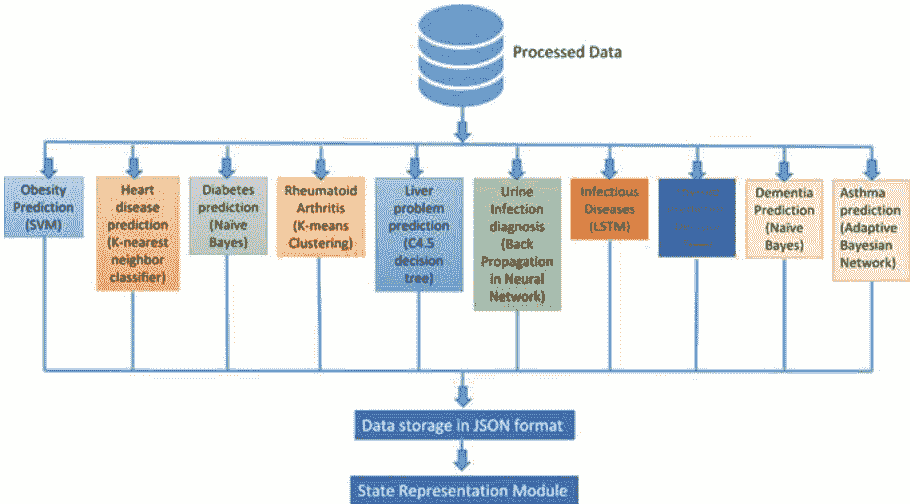

图5 疾病预测层

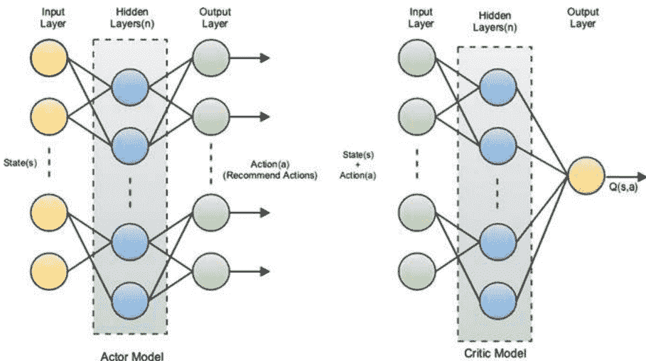

图6 推荐生成层

#### 6.3.2 评论家网络
评论家网络，也称为目标网络，显示在图5的右侧。评论家网络试图根据从环境中获得的奖励 $r(s, a)$ 来近似系统的价值函数，之后演员从当前状态 $s$ 中采取行动 $a$。奖励函数主要取决于系统实施的环境。可以从环境中给出与相关推荐相关的正向奖励和与无关推荐相关的负向奖励。

基于时序差异学习的误差用于通过计算获得的奖励和预测的Q值来更新评论家网络的参数。评论家网络生成的输出 $Q(s, a)$ 也用于评估演员的行动并更新演员网络的参数，如前所述。

#### 6.3.3 解释输出
激活函数 $\tanh(x)$ 产生的输出范围从 -1 到 1。它将是一个大小与输出神经元数量相等的数组。每个输出神经元代表一个与健康相关的建议。例如，散步、慢跑、进行特定的运动、推荐的饮食、一组特定的体育活动等。输出神经元的数量取决于应用的规模和所针对的疾病数量。问题是，这个数字数组如何帮助生成实际的建议。

建议采取以下步骤生成合适的建议：

### 步骤 1：分类
可以将概率和年龄组进行分类，如表1所示。这些分类可以根据需求进行修改和调整。它们旨在帮助最终用户（即生成建议的用户）。然后我们根据这些分类生成建议。

### 步骤 2：生成
在对疾病预测层、年龄组和发生概率的输出进行分类后，可以生成如表2所示的推荐。现在，问题是如何将这些推荐传达给目标用户。如果我们有一个专用的医疗门户，可以在用户登录时显示弹出窗口。然而，在没有这样的设施的情况下，我们可以使用推送通知服务，包括电子邮件、短信等媒体。

## 7. 未来改进
这里提出的系统在未来有各种改进的空间。我们计划进行的一些可能的改进如下所述。

### 7.1 演员-评论家推荐系统
这里提出的方法使用了演员-评论家模型来生成与健康相关的推荐。然而，随着深度强化学习的进步基于算法，可以使用各种改进和高效的算法与环境进行交互生成推荐。例如，回顾经验重放（HER）利用模型犯的错误来学习更好的策略[20]。因此，当前模型可以与HER相结合，通过学习从错误生成的负奖励来实现更高的准确性。

表1 概率和年龄的分类

| 疾病发生概率 (%) | 类别   |
|------------------|--------|
| 0-25             | 非常低 |
| 26-50            | 低     |
| 51-75            | 高     |
| 75-100           | 非常高 |

| 年龄组 | 类别   |
|--------|--------|
| 10-20  | 青少年 |
| 21-30  | 年轻人 |
| 31-40  | 成年人 |
| 41-50  | 中年人 |
| 51-60  | 老年人 |
| 61-80  | 高龄老人 |

表2 生成的建议（疾病：糖尿病）

| 发生概率 | 年龄组 | 动作       | Q值  | 建议                                                                 |
|----------|--------|------------|------|----------------------------------------------------------------------|
| 低       | 年轻人 | 慢跑       | 0.5  | 对于年轻人，慢跑比快走更推荐，还可以进行游泳、有氧运动等锻炼。     |
|          |        | 步行       | 0.3  |                                                                      |
|          |        | 游泳       | 0.7  |                                                                      |
|          |        | 有氧运动   | 0.8  |                                                                      |
| 高       | 老年人 | 步行       | 0.8  | 对于老年人中患糖尿病风险较高的人群，推荐步行而不是跑步。此外，考虑到年龄范围，建议选择瑜伽而不是剧烈运动。 |
|          |        | 慢跑/跑步  | -0.4 |                                                                      |
|          |        | 瑜伽       | 0.5  |                                                                      |

相关疾病：肥胖症

### 7.2 推荐
所提出的系统主要为身体活动和食物提供一般性建议。然而，可以将各种其他与健康相关的建议纳入其中，以便为每个患者提供高效和个性化的建议。

### 7.3 数据预处理
该系统旨在从医院、可穿戴设备和实验室中收集现成的数据。然而，稍微更具体的数据的可用性，例如特定患者的家族健康史、患者每天进行的身体活动类型以及患者日常生活习惯的其他细节，可以显著提高模型的疾病预测准确性。因此，可以根据疾病和患者的日常习惯生成更具体和准确的建议。信息检索系统可以用于更高效地收集数据。

### 7.4 疾病预测
可以基于提供的患者详细信息开发一种广义的方法来预测各种疾病。这可以以高效且稳健的方式帮助我们实现“个性化健康建议”的目标。

## 8. 结论
通往健康的道路铺满了良好的建议。医疗保健发展已被发现是最快增长的领域之一，包括太空探索、软件开发等。随着技术的进步，现在可以构建和实现几年前无法想象的东西。回来。所提出的方法是朝着构建这样的系统迈出的一步，通过利用我们拥有的技术。在本章中，我们尝试使用推荐系统、强化学习、机器学习和大数据的概念来实现相同的目标。人们对健康的关注日益增加，加上数据的巨大增长和技术的改进，使得这个框架成为未来的一个有希望的工作。由于其个性化的解决方案，这甚至可以成为一个有利的商业模式。

### 参考文献
- 1. Elgendy, N., Elragal, A.: 大数据分析：一篇文献综述。在：工业会议数据挖掘，第214-227页。 Springer, Cham (2014年7月)
- 2. 潘, C., 李, W.: 基于主题分析的研究论文推荐。在：2010年国际计算机设计与应用会议，第4卷，第V4-264页. IEEE (2010年6月)
- 3. 韩, Q., 季, M., 德特洛亚, I. M.D.R., 高尔, M., 泽尼洛维奇, L.: 一种用于初级医疗的患者-医生匹配的混合推荐系统。在：2018年IEEE第5届数据科学与高级分析国际会议（DSAA），第481-490页。 IEEE (2018年10月)
- 4. Wiesner, M., Pfeifer, D.: 健康推荐系统：概念，要求，技术基础和挑战。环境研究与公共卫生国际期刊 11 (3)，2580-2607 (2014年)。 https://doi.org/10.3390/ijerph110302580
- 5. Patgiri, R., Ahmed, A.: 大数据：游戏变革范式的V因素。在：2016年IEEE第18届高性能计算与通信国际会议；IEEE第14届智能城市国际会议；IEEE第2届数据科学与系统国际会议（HPCC/SmartCity/DSS），第17-24页。 IEEE (2016年12月)
- 6. Mnih, V., Kavukcuoglu, K., Silver, D., Graves, A., Antonoglou, I., Wierstra, D., Riedmiller, M.: 使用深度强化学习玩Atari游戏。 arXiv预印本arXiv:1312.5602。 (2013年)
- 7. Wang, Z., Schaul, T., Hessel, M., Van Hasselt, H., Lanctot, M., De Freitas, N.: 用于深度强化学习的对决网络架构。 arXiv预印本arXiv:1511.06581。 (2015年)
- 8. Sutton, R.S., McAllester, D.A., Singh, S.P., Mansour, Y.: 用于函数近似的策略梯度方法的强化学习。 在：神经信息处理系统进展，第1057-1063页。 (2000年)
- 9. 赵, 徐, 张, 丁, 尹, 赵, 唐: 深度强化学习用于列表推荐。 CoRR, 卷。 abs/1801.00209。 (2018年)
- 10. Mokdad, A.H., Ford, E.S., Bowman, B.A., Dietz, W.H., Vinicor, F., Bales, V.S., Marks, J.S.: 肥胖，糖尿病和与肥胖相关的健康风险因素的患病率，2001年。 JAMA 289 (1)，76–79 (2003年)
- 11. Montañez, C.A.C., Fergus, P., Hussain, A., Al-Jumeily, D., Abdulaimma, B., Hind, J., Radi, N.: 使用公开可用的遗传资料库进行肥胖预测的机器学习方法。 在：2017年国际联合神经网络会议（IJCNN），第2743-2750页。 IEEE (2017年5月)
- 12. Sharmila, R., Chellammal, S.: 一种增强心脏疾病预测的概念方法，使用数据技术。 Int. J. Comput. Sci. Eng. (2018年5月)
- 13. Sisodia, D., Sisodia, D.S.: 使用分类算法预测糖尿病。 Proc. Comput. Sci. 132, 1578–1585 (2018年)
- 14. Sindhuja, D., Priyadarsini, R.J.: 数据挖掘中用于分析肝脏疾病的分类技术调查。 Int. J. Comput. Sci. Mob. Comput. 5 (5)，483–488 (2016)
- 15. Finkelstein, J.: 个性化早期预测哮喘加重的机器学习方法。 Ann. New York Acad. Sci. 1387 (1)，153–165 (2017)
- 16. Jammeh, E.A., Camille, B.C., Stephen, W.P., Escudero, J., Anastasiou, A., Zhao, P., Chenore, T., Zajicek, J., Ifeachor, E.: 基于机器学习的初级保健中未诊断痴呆症的识别：可行性研究。 BJGP open 2(2). bjgpopen18X101589. (2018)
- 17. Ozkan, I.A., Koklu, M., Sert, I.U.: 基于人工智能方法的尿路感染诊断。Comput. Methods Progr. Biomed. 166, 51-59 (2018)
- 18. Chae, S., Kwon, S., Lee, D.: 利用深度学习和大数据预测传染病。Int. J. Environ. Res. Public Health 15(8), 1596 (2018)
- 19. 刘锋,唐然,李欣,张伟,叶洋,陈辉等:基于深度强化学习的显式用户-物品交互建模推荐。arXiv预印本arXiv:1810.12027. (2018)
- 20. Andrychowicz, M., Wolski, F., Ray, A., Schneider, J., Fong, R., Welinder, P.,等:事后经验重放。在:神经信息处理系统的进展,第5048-5058页。(2017)

Jayraj Mulani正在尼尔玛大学技术学院攻读B. Tech学位；目前在倒数第二年学习。他在高中是一名多才多艺的学生，曾获得神圣儿童学校全面表现最佳学生奖。他对学习新事物充满热情，一直致力于探索和研究从开发到建模到机器学习的技术。他的兴趣领域包括数据科学、图像处理、推荐技术、机器学习、深度学习、强化学习和信息检索。他是一位计算机科学爱好者，目标是在全球最好的大学攻读更高的教育。他对推荐系统的兴趣，加上人们面临的令人担忧的健康问题，促使他和他的朋友们思考这个个性化健康推荐系统。他希望这将改变生成个性化推荐的方式，使这项技术成为领域无关的。他坚信使用印度市场上最先进的工具解决数据驱动的问题。

Sachin Heda是一名来自Nirma大学技术学院的三年级本科生。从小就致力于解决现实生活中的问题。他是一个热情的学习者，对概念有很高的清晰度。他曾获得学校的男生领袖称号。作为一名计算机科学爱好者，他曾探索和研究过许多技术，包括数据科学、推荐技术和大数据。他是一个外向的人，认为现在人们对自己的健康越来越有意识。他和他的朋友们认为，这个个性化的健康系统将给人们的生活带来巨大的积极变化。

Kalpan Tumdi是一名来自Nirma大学技术学院的三年级本科生。他对学习和开发新事物充满热情，并对机器学习有浓厚的兴趣，这促使他参与各种与机器学习相关的研究。他的兴趣领域包括数据科学、图像处理、强化学习、机器学习和计算机视觉。随着人们对健康越来越重视，他的目标是利用机器学习和深度强化算法帮助人们了解如何改善健康和健身。

教授Jitali Patel在Nirma大学技术学院计算机科学与工程系担任助理教授。她于2010年从Dharmsinh Desai大学获得了硕士学位。她在教学领域有超过10年的经验。她教授过人工智能、信息检索、数据挖掘、面向对象编程和数据结构。她的研究兴趣和领域是机器学习及其应用。她发表了10多篇同行评审的研究文章。

Hitesh Chhinkaniwala是印度Adani基础设施工程学院信息与通信技术系的副教授和系主任。他的研究兴趣包括数据挖掘与知识发现、隐私保护、文本挖掘、文本摘要、信息提取、情感分析、统计数据分析和本体学习。他发表了20多篇同行评审的研究文章和一本书。他是《数据知识发现交易》（TKDD）的审稿人。

教授Jigna Patel在Nirma大学技术学院计算机科学与工程系担任助理教授。她于2008年从Dharmsinh Desai大学获得硕士学位。她在教学领域有超过10年的经验。她教授过计算理论、网络安全、人工智能、大数据分析、编程语言原理、计算机科学数学基础和C编程。她的研究兴趣包括数据仓库、数据挖掘和大数据分析。

# 使用基于深度学习的自然语言处理技术进行临床决策支持
Runjie Zhu, Xinhui Tu和Jimmy Huang

## 摘要
自然语言处理（NLP）是一个跨学科的研究领域，专注于人类语言和计算机之间的交互。近年来，使用深度学习方法解决NLP问题的趋势日益增加。深度学习在医疗领域的应用主要与将图像处理和计算机视觉技术应用于医学扫描进行疾病诊断的经典示例有关。电子健康记录（EHR）是另一个常被忽视的数据来源，与医学扫描一样重要，甚至更重要，它可以改变我们从患者的医疗记录中学习有用特征和信息的方式。这些存储在EHR中的基于文本的信息本质上是数据丰富的，但由于其高容量、多样性、速度和复杂性的特点，往往不被充分理解。然而，这些特点恰好适合深度学习的本质。因此，我们认为现在是总结当前状态、回顾和借鉴最新医学NLP技术的时候。与现有的综述不同，我们将当前基于深度学习的医学领域NLP技术分为三个主要目的：表示学习、信息提取和临床预测。同时，我们讨论深度学习方法的应用是否以不同方式解决了这些问题并彻底改变了这些任务。根据结果，我们发现使用深度学习方法革新现有医疗保健领域的距离仍然很长。然而，这些提出的方法取得的最新进展已经有了一个有希望的良好开端。此外，我们提出了一些法律和伦理考虑。

R. 朱 ( )
信息检索和知识管理研究实验室，电气工程与计算机科学系，约克大学，多伦多，加拿大 e-mail: sherryzh@cse.yorku.ca

X. 图 ( )
中华人民共和国武汉市华中师范大学计算机科学学院 e-mail: tuxinhui@mail.ccnu.edu.cn

J. 黄 ( )
信息检索和知识管理研究实验室，信息技术学院，约克大学，多伦多，加拿大 e-mail: jhuang@yorku.ca

介绍了医疗保健行业应用的现状，并提供了几个未来研究的可能方向。

关键词：深度学习、电子健康记录、自然语言处理、表示学习、信息提取、临床预测

## 1 引言

健康问题仍然是人类生活的核心问题。医疗保健是一个概念，通常指的是由医疗专业人员提供的一系列服务，可以通过体检、诊断、治疗、康复和预防等方式帮助患者改善或维持健康。由于医疗保健行业的特性，它可以以许多不同的形式和结构产生数据，例如DNA序列、医学扫描和电子健康记录(EHRs)，并且由于不断增长的患者数量、医疗设施和医疗服务提供者，这些数据以大规模和前所未有的速度产生。然而，这些医疗保健单位提供的数据通常没有经过良好处理和理解，因为其具有高容量、高速度、多样性和复杂性的特点。因此，过去几十年来，将基于深度学习的自然语言处理技术应用于医疗研究中越来越普遍。

深度学习作为机器学习的一个子集，是一类可以从一组给定的原始输入中直接提取特征的算法，而无需人为干预。在过去的几年中，这类算法引起了研究人员的关注，因为它们在各种任务和领域中都取得了有希望和稳健的结果。现在广泛认可的是，深度学习方法，如卷积神经网络（CNN）、循环神经网络（RNN）等，在不同的数据结构和不同的情况下都可以表现良好并取得稳健的结果。例如，在医疗保健领域，更常见的是应用卷积神经网络来检查放射学图像，而对于基于文本的医学记录，更常见的是应用循环神经网络。

电子健康记录（EHR）系统作为医疗行业的一个组成部分，最近逐渐引起了更多关注。EHR是指一个系统，用于收集所有患者的健康信息并以数字格式存储。研究人员和医疗专业人员认为EHR是提供领域问题洞察的非常重要的医学数据来源。然而，由于EHR的数据类型多样，并且系统包含大量的自由文本，传统模型很难解决这些问题。因此，能够在没有人为干预的情况下提取特征的深度学习模型特别适合解决EHR问题。EHR系统中的有用信息包括但不限于患者人口统计学数据、实验室结果、医学扫描图像、处方、病史和临床记录等。医院最初采用EHR系统来存储所有患者的数据以进行护理跟踪，并实现行政和用于计费目的。

在电子病历系统中包含的所有信息中，基于文本的临床笔记是患者电子病历中最重要的资源之一。然而，医生、护士、物理治疗师和药剂师通常使用不同的医学术语和表达方式分别完成每个部分。这导致了信息对齐的困难。因此，当前电子病历系统面临的最大挑战是所有电子病历的结构不同。在医学档案中对信息进行对齐已经是一项耗时的工作，更不用说为这些电子病历笔记、术语提取、嵌入或在多年间、跨医院或其他医疗服务提供者单位进行对齐的流水线。因此，当前电子病历管理的目标是通过为医生提供更好、更用户友好的电子病历系统来提高临床效率。此外，该系统还必须通过降低临床诊断成本和减少医疗误诊的可能性来提供帮助。

在本章中，我们介绍了目前在医疗保健领域采用的基于深度学习的方法的现状。然后我们讨论了未来工作的临床和技术机会的独特挑战和方向。在第2节中，我们概述了现有的深度学习方法，并介绍了将深度学习方法应用于医学领域的背景和动机。在第3节中，我们对当前基于深度学习的自然语言处理技术进行了分类和分析，主要包括表示学习、信息提取和临床预测。同时，我们比较了这些基于深度学习的自然语言处理模型在医学领域的实验结果，并关注这些技术的新颖性和多样性，以及它们的评估指标。在第4节中，我们介绍了一些其他相关的深度学习在医疗保健中的应用主题和问题，并讨论了法律和伦理考虑以及行业应用。最后，在第5节中，我们承认这些提出的方法所取得的最近进展已经有了一个有希望的良好开端。最后但并非最不重要的一点是，我们提供了几个未来研究的可能和有希望的方向。

## 2 自然语言处理的深度学习

自然语言处理是计算机科学和人工智能领域的热门研究领域，重点研究人类语言与计算机之间的交互。

具体而言，它提出了如何表示、处理和分析大量的自然语言数据。

神经网络是一种强大的学习模型。深度学习方法在图像和语音识别方面取得了令人瞩目的成功。在过去的几年中，自然语言处理也充分利用了深度学习算法和方法取得了巨大的进展。注意力已经从传统的机器学习模型，如支持向量机（SVM）和逻辑回归，转向了深度神经网络，像CNN和RNN这样的模型。这些深度学习方法消除了手工制作特征的耗时工作，并用自动特征学习来取代它们。

在本节中，我们介绍了自然语言处理研究领域中应用的主要深度学习方法和架构。主要方法包括分布式表示，这是深度学习模型的基础，CNN，RNN和基于Transformer的神经网络。

### 2.1 分布式表示

过去，常常使用本地表示来存储记忆和直接表示实体单个元素。这是一种易于理解和实现的结构，但非常低效，因为每个单元只与一个表示的事物相关联[1]。然而，分布式表示提供了一种有效和高效的方式，使用多个表示元素来表示每个单元。由于神经网络中不同单元的表示重叠，因此网络可以根据其泛化能力对新输入做出响应。网络能够通过预训练所有原始数据输入自动输出重要特征。

在我们的大多数研究案例中，学者们没有足够大的已注释数据用作分类任务的特征。因此，我们需要一种无监督的方法，如分布式表示，来预训练数据并将具有相似含义的单词嵌入到相似的向量中。

#### 2.1.1 词嵌入

词嵌入遵循分布假设，即具有相似含义的词语或术语更有可能出现在相似的上下文中。它通常作为深度学习架构中第一层的数据预处理函数。

同时，它还可以捕捉目标词语的邻近上下文，以计算词语之间的相似度。在大多数情况下，词嵌入是预训练并学习的，以便应用于大型文本语料库，以捕捉文本文档集合的句法和语义特征。它应用不变且可重复使用的嵌入来学习上下文中的词语表示。

#### 2.1.2 Word2Vec

Word2Vec是由Tomas Mikolov [2-4]创建的一组模型，它将大型文本语料库作为输入，生成词嵌入。它将文本语料库中的每个唯一词语映射到相应的向量空间中。

这些嵌入的词向量被定位在一种方式上，即相似的基于上下文的词语应该彼此更接近。这些模型被构建为神经网络两层网络，旨在重建整个文本语料库中单词之间的上下文。虽然Word2Vec不是深度神经网络（DNN），但它可以将文本转化为DNN可以理解的数值，而无需人工干预。

一般来说，Word2Vec以两种方式之一，即Skip-Gram或Continuous Bag of Words，对输入与上下文中的其他相邻单词进行训练。Skip-Gram是通过给定的单词来预测目标上下文的一种方式。具体而言，Skip-Gram模型的目标是通过最大化平均对数概率来实现。

$$\frac{1}{T} \sum_{t=1}^{T} \sum_{-c \leq j \leq c, j \neq 0} \log p(w_{t+j} | w_t)$$

给定一个单词序列，$w_1, w_2, \dots, w_t$，用于训练，其中$c$是训练上下文的大小。模型获得的训练样本越多，产生的结果就越准确。基本的Skip-Gram模型通过softmax函数定义了$p(w_{t+j} | w_t)$，如下所示：

$$p(w_O | w_I) = \frac{\exp(v'_{wO} \top v_{wI})}{\sum_{w=1}^W \exp(v'_w \top v_{wI})}$$

其中，$v_w$和$v'_w$是向量输入和输出的表示，$W$是词汇表中的单词数量。

连续词袋（CBOW）是一种根据给定上下文预测目标词的方法。它建立在词袋概念的基础上。词袋（BoW）是一种简化自然语言处理中表示的方法。它将文本表示为其词汇的集合，不限制单词的顺序或语法。它经常用于通过计算每个单词的频率作为特征来训练分类器对文档或文本进行分类。CBOW是一种在特征数量未知的情况下，用固定大小的向量表示无限数量特征的方法。CBOW的工作方式与词袋方法非常相似，可以对应向量的嵌入向量求和或求平均，同时忽略单词顺序信息：

$$\text{CBOW}(f_1, f_2, \dots, f_k) = \frac{1}{k} \sum_{i=1}^k v(f_i)$$

加权CBOW是CBOW的一个简单变体，其中每个向量都能够获得不同的权重，通过将权重$a_i$与特征$f_i$相关联，

$$\text{CBOW}(f_1, f_2, \dots, f_k) = \frac{1}{\sum_{i=1}^k a_i} \sum_{i=1}^k a_i v(f_i)$$

Chalapathy等人[5]提出了一种使用双向长短期记忆模型和条件随机场解码的RNN方法来生成词嵌入，即GloVe [6]和Word2Vec [3]。为了实践概念表示和提取，这个提出的双向长短期记忆（LSTM）-条件随机场（CRF）模型允许将句子中的每个单词首先输入并映射到一个随机单词嵌入向量。因此，目标词嵌入和模型可以简要描述。然后，模型应用GloVe、Skip-Gram和CBOW的词嵌入训练方法来学习整个数据集，以生成向量表示。这些向量序列然后被馈送到基于RNN的LSTM模型中，该模型擅长处理序列数据以生成一类医学概念。由于LSTM倾向于偏好最近的输入数据，Chalapathy等人计算前向和后向的隐藏表示状态以消除可能的偏差。

除了GloVe之外，当前研究人员在该领域中学习医学概念表示的另一种最流行的方法是使用Skip-Gram [4, 7]生成分布式嵌入。在向量空间中，单词的分布式表示能够有效地将相似的单词组合在一起，以提高自然语言处理的学习算法的性能。Mikolov等人介绍的Skip-Gram技术[4]是一种从大量非结构化文本数据中学习单词向量表示的高效方法。它能够预测上下文，从而捕捉单词之间的关系。

#### 2.1.3 上下文词嵌入

学习高质量的表示一直是一项艰巨的任务。在过去的几年中，上下文词嵌入取得了令人印象深刻的结果，并在许多最新的深度学习自然语言处理模型中得到了应用。这些上下文词嵌入方法被认为是理想的预训练词表示模型，能够准确捕捉句法和语义单词使用的复杂特征，并理解这些用法在不同自然语言环境下的变化。

ELMO，即来自语言模型的嵌入，是深度上下文相关的词表示模型之一。这些词向量在大型文本语料库上进行预训练，并作为深度双向语言模型（biLM）的所有内部层或内部状态的学习函数的结果。换句话说，这些向量的结果，它们在每个输入词或术语上方堆叠，用于每个最终任务，最终线性组合以产生最终输出。这种独特的设计可以显著提高模型性能。当这些函数作为“添加”到现有模型时，可以显著改善NLP领域中现有问题。常见词嵌入和ELMO模型之间最大的区别在于ELMO词表示使用整个句子作为输入。这些嵌入是在具有字符卷积的biLM上计算的，表示为内部网络状态的线性函数。从模型生成的表示是上下文、深度和基于字符的。

这意味着每个单词的表示取决于整个上下文，结合了深度神经网络的所有层，并允许网络形成对于未知词汇的强大表示进行训练。该模型的算法如下所示：

$$\text{ELMo}_{k}^{\text{任务}} = E(R_k; \Theta_{\text{任务}}) = \gamma^{\text{任务}} \sum_{j=0}^{L} s_j^{\text{任务}} h_{k_j}^{LM}$$

$$R_k = \{x_k^{LM}, \overrightarrow{h_{k,j}^{LM}}, \overleftarrow{h_{k,j}^{LM}} | j=1, \dots, L\} = \{h_{k,j}^{LM} | j=0, \dots, L\}$$

其中，$R_k$是一个2L层的双向语言模型的表示，$h_{k,j}^{LM}$是标记层，$\gamma_{\text{任务}}$是优化过程，$s_j^{\text{任务}}$是用于softmax归一化的权重，$\text{ELMo}_k=E(R_k; \Theta_e)$表示当ELMO将$R_k$中的所有层合并为一个向量时的条件。

### 2.2 卷积神经网络 (CNN)

卷积神经网络是深度学习中常用于计算机视觉[8]和自然语言处理（NLP）研究的一类深度神经网络。它类似于人脑中神经元的连接模式，是全连接网络中的正则化版本。具体而言，CNN由一个输入层、多个隐藏层和一个输出层组成。隐藏层结构包括卷积层、ReLU（激活函数）层、池化层、全连接层和归一化层。与其他分类算法相比，CNN需要更少的预处理，并且随着训练次数的增加，可以获得更好的结果。

在自然语言处理中，CNN被用于从大型文本语料库中识别局部字段的预测特征。然后，提取的特征被处理生成整个结构的固定大小的向量表示。因此，从本质上讲，CNN是一种有效的特征提取架构，可以自动识别句子中的预测n-gram词汇。用于NLP的基本卷积和池化模型用于将学习到的非线性函数应用于句子中大小为k的滑动窗口的每个示例。这些非线性函数充当过滤器，将k个单词窗口转换为标量值。通过在顶部应用多个函数，生成具有窗口中单词的重要特征的$I$维向量。然后，CNN架构的池化层被应用于组合每个$I$维向量生成的向量，通过取每个窗口中$I$维的最大值和平均值。这里的目的是在不考虑位置的情况下提取上下文中最突出的特征。然后将组合的向量应用于预测网络。

梯度用于调整滤波函数中的参数，从而强调初始给定任务中的那些重要方面。一般来说，随着k的增加，在句子或文本语料库上运行的$k$大小窗口，滤波函数会自动提取学习经验中的k元特征。

### 2.3 循环神经网络

RNN中节点之间的网络连接形成了一个沿时间序列的有向图，使其能够展现时间动态行为。由于RNN可以处理输入序列的特性，NLP任务（如信息提取和语音识别）通常使用RNN架构。

#### 2.3.1 循环神经网络

简单的循环神经网络架构对元素的顺序敏感。Mikolov在2012年对其进行了探索，并应用于语言模型的使用。正如论文中建议的，基本的RNN模型是一组连续层中的节点网络，其中每个节点与下一个连续层中的每个单个节点都有单向连接。

这些节点由输入节点组、输出节点组和隐藏节点组组成。具体来说，每个层中的神经元都有一个实值激活，可以随时间变化，而每个连接都包含一个实值权重，也可以随时间变化。通过在时间序列上沿连接的节点形成一个有向图，RNN模型可以利用内部记忆状态来处理输入序列，从而展现出动态行为。

值得注意的是，上述介绍的基本RNN结构在训练中效果较差，因为存在梯度消失的问题。由于后续步骤中的梯度无法到达较早的输入信号，并且在反向传播过程中迅速减小，基本RNN模型几乎无法捕捉到长距离的依赖关系。

#### 2.3.2 长短期记忆

LSTM是第一个引入门控机制来解决梯度消失问题的模型。它是研究领域中最成功的RNN架构之一。LSTM模型与标准前馈神经网络的反馈连接不仅可以处理单个数据点，还可以处理整个数据序列。经典的LSTM模型架构由一个记忆单元和三个调节门组成，分别是输入门、遗忘门和输出门。

从理论上讲，存储单元用于跟踪输入序列中的元素及其依赖关系。输入门负责控制新值输入能够流入记忆细胞的程度。遗忘门负责控制新值在记忆细胞中保留的程度。

输出门负责控制记忆细胞中的值在激活函数中的使用程度，也被称为逻辑函数。换句话说，在提出的模型中，LSTM将状态向量分割为记忆细胞，旨在跨时间和工作内存中保留记忆和误差梯度。几个平滑的数学函数控制这些记忆细胞的逻辑门。在每个输入状态级别中，应用一个门来决定新输入应该在多大程度上被合并到记忆细胞中，以及当前存在的记忆细胞中的内容应该在多大程度上被遗忘。

#### 2.3.3 门控循环单元（GRU）

为了解决梯度消失或长距离依赖的问题，Cho等人[10]分别提出了LSTM和GRU作为基于门控的架构，这些架构基于Hochreiter和Schmidhuber[11]早年提出的理论。GRU架构使用更新门和重置门作为两个向量，决定哪些信息流应该传递到输出层。与LSTM相比，GRU能够在训练过程中保持长期记忆，而不会在整个时间内清除或删除与未来预测无关的信息。此外，它不涉及单独的记忆组件，也包含较少的门。事实上，门控循环单元模型的架构与遗忘门的长短期记忆模型类似。

### 2.4 基于Transformer的神经网络

Transformer中的双向编码器表示（BERT）是Google在2018年末提出的。一经发布，它就引起了学术界和工业界的广泛关注，以进行进一步的研究。BERT由词嵌入和Transformer构成。在模型中，BERT中进行的词嵌入只是将词的低维表示投影到高维向量空间中。与传统的顺序模型（如LSTM、RNN、GRU等）相比，Google提出的Transformer是一种在时间序列中更有效地建模标记的长期依赖关系的新型神经网络架构。

它在训练中更高效，同时消除了先前标记的顺序依赖性。Transformer不是顺序地输入结果，而是采用编码器到解码器的架构，模型采用注意力系统将整个序列的整体情况作为输出传递给解码器。因此，BERT是一个仅使用编码器的模型，结合了上述所有特征。事实上，Google开发了两个特定版本的BERT模型，分别是BERT Base和BERT Large。BERT Base是一个基本的BERT模型，由12个Transformer块组成，768个隐藏层和12个注意力头；而$BERT_{Large}$模型是一个更大的模型，由24个Transformer块、1024个隐藏层和16个注意力头组成[12]。

GPT-2是由OpenAI提出的，在BERT之后稍微抢了一些风头。该模型是一个基于Transformer的大型语言模型，具有15亿个参数，训练集包含800万个网页[13]。它很容易在40 GB的互联网文本中训练，以便在上下文中给出所有先前单词的情况下进行下一个单词的预测。事实上，它能够产生令人惊讶和有希望的结果，进一步提升了自然语言处理的研究。特别是，它展示了生成合成文本样本的前所未有的能力。而且结果表明，它通常优于在相同领域上训练而没有在特定领域数据集上训练的其他语言模型。开发人员决定不公开最大模型的数据或参数，因此在这里不会进一步详述。

值得注意的是，与RNN和LSTM模型相比，基于Transformer的神经网络更加适合硬件。RNN和LSTM模型的现有问题是它们很难训练，因为内存带宽限制计算是必须的。对于许多硬件设计者来说，这是一个头疼的问题，因为在云端训练网络需要大量资源，而云端本身不具备可扩展性。因此，这些解决方案的适用性有限。例如，运行LSTM模型需要四个线性层，每个单元和每个时间步的计算都需要大量的内存带宽。而对于基于Transformer的方法，只需要一个基于2D卷积的NN和因果卷积来进行测试，生成的结果甚至可以更好。

### 2.5 生成对抗网络

生成对抗网络 (GAN) 是由Ian Goodfellow于2014年提出的。它作为一组深度神经网络架构的一部分，其中两个神经网络相互竞争，一个充当生成器，另一个充当鉴别器。具体而言，生成器负责生成各种不同类型的数据，包括文本、图像、音乐、语音等，使其看起来与原始训练集足够接近；而鉴别器用于识别输入数据是真实的训练数据还是虚构的数据。GAN 模型的潜力巨大，因为它们能够学习模仿任何类型和分布的数据，包括医学领域的电子病历数据。当GAN应用于电子病历系统时，模型中的生成器将创建新的合成患者记录，并传递给鉴别器。生成器的任务是产生虚假的“真实”临床数据，使鉴别器无法捕捉到。然而，鉴别器的目标是接收真实和虚假的医疗数据，并返回一个结果。

## 深度学习在医学信息处理中的三个主要应用

在过去的几年中，我们看到将基于深度学习的自然语言处理技术应用于医学信息处理的趋势不断上升。当前EHR管理的目标是通过为医生提供更好、更用户友好的EHR系统来提高临床效率。此外，该系统还必须帮助降低临床诊断成本，并尽量减少医疗误诊的可能性。事实上，在过去的几年中，基于神经网络的表示学习在许多领域取得了有希望的结果，并且已经开发出了许多自然语言处理应用程序。Hinton [14]在1986年的论文中介绍了分布式表示的符号数据。其思想是通过学习给定文本中每个单词的分布式表示来形成一个词嵌入层。同时，Bengio等人[15]在统计语言建模的背景下提出了神经网络语言模型[16]。衡量学习到的表示有多好通常取决于表示能否捕捉到庞大数量的输入的特征[17]。2006年，Hinton [18]在表示学习中引入了贪婪逐层无监督预训练的突破，许多其他学者紧随其后[19-23]。所提出的方法使用无监督特征学习分别学习每个层次的特征，然后consolidate上一层的结果。具体而言，通过将每一层的权重相加到下一层，模型以无监督的方式构建深度神经网络。因此，最终从原始数据输入直接生成一个深度监督预测器。

为了研究已经实现了上述目的的当前技术，我们将现有的基于深度学习的自然语言处理技术分为三大类，即表示学习、信息提取和临床预测。而且，这三个技术被认为是当前电子健康记录系统中采用的关键技术和应用。

### 3.1 表示学习 (RL)

深度学习模型的出色性能主要依赖于数据表示或特征选择。表示学习，也称为特征学习，是一组允许系统或模型学习的技术。原始数据输入的表示形式用于特征提取，并构建预测器或分类器。表示学习的任务可以是有监督的或无监督的。有监督的任务涉及使用带标签的输入进行特征学习，而无监督的任务涉及使用无标签的输入数据。总的来说，随着学术界和工业界的研究迅速增长，表示学习在所有新的发现中得到了滋养，并取得了整体上的经验成功。

一般来说，现有文献中有三种不同的使用学习词嵌入的方法。首先，学者们选择直接将整个模型作为一个有监督的任务进行训练，从头到尾随机初始化嵌入矩阵。这是一种容易采用的方法，但它完全跳过了词嵌入学习过程，因此可能会导致过拟合等问题。其次，一些学者选择部分数据来学习词嵌入，并在训练模型的其余部分中冻结它们。第三，过去几年中进行的大部分研究选择使用并训练整个词嵌入，从头到尾。由于深度学习方法在处理更多原始输入数据时表现更好，并且最近的大部分研究都属于这一类别，因此我们将在本章中仅关注第三种方法的文献。

在医学领域，表示通常涉及学习一系列用于行政目的或患者电子病历系统中的诊断和药物需求的医疗代码或笔记。与包含有序词序列的句子不同，患者档案中的医疗代码是随机排序的。为了将这些代码和笔记用作机器学习模型的输入，采用表示学习将它们转化为有意义的表示。Skip-gram、GloVe、CBOW、堆叠自编码器和BERT是目前常用的自然语言处理技术，用于学习分布式嵌入。在本节中，将讨论以下三个子类别中的流行深度学习基于自然语言处理的方法：学习医学概念的表示、学习患者的表示，以及学习临床缩写消歧的表示学习。

#### 3.1.1 医学概念

医疗编码和临床笔记都包含了大量有价值的信息，供医生进行医疗预测和决策。在普通患者的电子健康记录（EHR）中，非结构化数据占据了相当大的比例。医生、护士、物理治疗师和药剂师各自负责一部分综合档案，并以非结构化格式填写相关信息，即自由文本。对于患者来说，理解这些医学术语和医疗指示是困难的。而对于研究人员来说，这些自由文本是产生有效临床预测的宝贵信息，但也很难处理。实际上，由于不同机构的EHR系统结构不同，以及不同医疗保健提供者使用的医学术语的广泛多样性，从大型临床笔记数据池中提取有用信息仍然是一个未解决的问题。

医学数据元素的异质性和大量的非结构化数据使得临床护理和医学分析研究变得困难。大部分现有文献通过应用本体映射或直接利用原始数据输入（例如医疗记录或代码）来学习特征和表示。尽管像疾病表型这样的高级医学特征可以在一定程度上减少特征方面的问题，但它们仍然可能无法理解患者数据中嵌入的有意义的信息在整个电子病历系统中。

从患者的医疗记录中学习医学概念是一个主要的研究领域。研究人员和学者都明白，在医学领域中，许多现有的概念表示方法仍然面临数据效率挑战。它们仍然严重依赖于手工制作的特征和难以定义的广泛领域知识。为了解决这个问题，Choi等人利用医疗代码的编码关系，这些关系在EHR系统中本质上是多层结构，构建了他们的新方法。具体而言，他们提出了一种多层医学嵌入（MiME）架构，以多层次学习EHR数据的嵌入，并基于内在的EHR结构进行临床预测，而不需要外部标签的帮助。预测函数在两个独立的预测任务上进行评估，即心力衰竭的预测和序贯疾病的预测。结果表明，所提出的MiME模型在所有其他基准模型上都表现出显著的改进百分比。

Escudie等人[25]展示了使用深度神经网络学习患者就诊的低维表示的可能方法，以预测国际疾病分类（ICD）诊断类别，当这些代码未提供时。本文采用的深度神经网络方法将结构化/半结构化数据和非结构化的自由文本笔记作为输入。这些学习到的代码与医学领域相关，同时它们可以直接用作未来患者健康状况预测和预防的深度学习或机器学习算法的输入。

Choi等人[26]提出了一种不同的数据驱动方法，直接利用电子病历数据进行医学概念学习。具体而言，该方法将医学概念映射到彼此之间相似的概念向量，这取决于原始数据输入之间的时间共现关系。此外，它能够将电子病历系统中的异构患者医学数据转化为临床上有意义的特征。因此，与相关的临床概念向量同时构建患者向量。因此，他们提出的表示方法通过学习医学概念的表示来生成患者表示。

在他们的论文[26]中，作者提出了基于Skip-gram [4,7]的方法，用于学习多维向量，并捕捉诊断、药物和程序之间的潜在关系。De Vine等人[27]在他们的论文中利用UMLS概念从患者记录的自由文本和期刊摘要中学习表示。基本上，他们提出了一种神经语言建模的变体，而不是直接从自由文本中学习表示，通过预处理医学文本将单词映射到UMLS中的医学概念，从结构化本体中学习概念并从自由文本中提取信息。然后，采用Skip-gram模型进行学习以生成这些医学概念的词表示。因此，实证研究结果表明，所提出的模型与医学领域现有基准相比，与专家判断的语义相似度测量强相关。

Choi等人在2016年开展了一项工作，展示了如何利用神经语言建模学习医学概念的低维表示。这种方法的新颖之处在于不仅从文本中学习表示，还从丰富的索赔数据中学习表示。除了从医学期刊中学习医学概念嵌入（MCEMJ）的最直接方法外，Choi等人还引入了两种新颖的医学概念嵌入，用于学习医疗索赔数据和医学语料库中的词共现构建的医学图表。

第一个嵌入，MCEMJ，是在[27]中介绍的嵌入。第二组嵌入是从一家私人医疗保险公司的医疗索赔数据集中学习的。由于数据中包含许多重复的代码和短时间内发生的多个事件，作者在将数据输入Skip-Gram模型之前对数据进行了分区和随机重排。首先，将医疗索赔数据分成时间间隔，然后在每个时间间隔内删除重复项，然后将其随机重排为一系列概念。最后，将句子输入到word2vec系统中，在Skip-Gram模型上进行随机梯度下降。最后一组嵌入来自开源的电子健康记录（EHR）数据集。作者以两种方式学习表示：（1）基于共现计数，作者按边权重的比例对图边进行采样，然后将这些词对输入Skip-Gram模型；（2）利用Word2Vec的特性，隐式地分解移位正点互信息（SPPMI）矩阵的词和上下文[28]。

Minnaro-Gimenez等人[29]使用PubMed、Merck手册、Medscape和Wikipedia的医学文本集合，将Skip-gram应用于不同的临床文本，并对医学术语的表示学习进行实践。然而，实验结果显示采用word2vec方法的命中率较低。作者认为这些方法不适用于从受限制的医学文本数据集合中检索医学概念等需要高精度的任务。

Liu等人[30]提出了一个多任务框架，用于预测疾病，可以将医学代码等结构化信息整合到信息丰富的自由文本医学记录中。所提出的模型足够灵活，可以利用具有数值值的结构化数据和具有自由文本的非结构化数据生成单词或文本的向量表示。在他们的论文中，他们评估了当前的深度学习方法（CNN、LSTM和分层模型）在处理电子健康记录系统中的临床笔记时的性能。同时，他们提出了一种新颖的方法，考虑到自由文本中的否定词对临床预测的影响。结果表明，他们的方法不仅可以在预测窗口内有效进行疾病预测，而且不需要疾病特定的特征工程，这证实了深度学习方法的好处。

除了从患者的医疗记录中学习医学概念外，文本化的患者接触中的医疗编码也是进行概念表示的有用信息。医疗编码是指由医疗提供者用于表示或描述诊断、疾病类型、治疗方法、账单和费用，以及应用药物等的一串数字和/或字符。患者通常会收到自己的电子病历报告，其中包含为每个医院的行政目的而提供的一系列人口统计代码，一堆带有医学代码的医学术语，以及实验室测试值。最常见的医学代码包括但不限于CPT代码（当前操作术语）、HCPCS代码（医疗常用程序编码系统）、ICD代码（国际疾病分类）、残疾人ICF代码、诊断相关分组（DRG）、NDC代码（国家药品代码）、CDP代码（牙科程序和命名法代码）以及DSM-IV-TR代码（用于精神疾病）。然而，对于公众来说，所有这些医学代码似乎是医疗提供者的常识，但很难理解其背后的含义。因此，研究人员和学者有必要将这些代码作为输入输入模型，生成可感知的信息供公众使用，并产生可靠的临床预测。

一般来说，医生在临床决策中有两种方法，即使用从患者的医疗档案中提取的医疗代码。一种更直接的方法是静态方法，通过向模型提供一组单一的输入来预测医疗结果。例如，Choi等人[26]提出直接将电子病历数据输入模型，以学习异质概念和患者表征，基于共现模式。这种有效的医疗概念和患者表征学习方法使用单一输入生成可能的心力衰竭（HF）结果。同时，它还能够连接相关概念并提高预测建模的性能。

一种更复杂的方法是动态方法，通过向模型提供一系列输入来预测医疗结果。这些模型能够在每个电子病历原始输入被输入后或在整个电子病历数据点序列被学习后产生临床决策。例如，Choi等人[31]利用电子病历系统中的大型数据集开发了一个时间预测模型Doctor AI，用于学习观察到的医疗状况和用途，这将在第3.3节进一步讨论。2016年，Choi等人[32]通过提出一种名为Med2Vec的算法并构建一个数据集，其中包括患者就诊记录、诊断代码（ICD9）、实验室检验结果（LOINC）和药物使用（NDC）。由于Skip-Gram可以通过学习单词表示向量来预测上下文并捕捉单词之间的关系，因此有必要将研究中使用的医疗代码转换为有序的（目标，上下文）对。因此，他们将（目标，上下文）对定义在每个患者的档案级别，而不是医疗代码序列级别。通过这样做，Choi等人旨在有效且高效地学习医学概念的表示。此外，作者还能够通过将患者的医疗记录表示为二进制向量，并进一步输入到一个两层神经网络中，对患者的邻近就诊进行预测。

另一种应用于医学概念和事件提取的流行表示学习技术是词袋模型（BOW）。Li等人[33]提出了一种将词的分布特征融入医学事件提取中的嵌入学习方法。他们的模型以词袋特征作为基准，并且通过词嵌入特征学习生成的结果非常有希望，因为n-gram有效地丰富了上下文信息。

Tang等人[34]在他们的研究中应用了诸如词袋（BOW）和词性（POS）等特征学习过程，这与GloVe和Skip-Gram方法不同。在他们的实验中，Tang等人采用神经语言模型从生物医学语料库中生成词嵌入向量，实验结果比现有的工作稍好一些。

Gong等人[23]在他们的研究中通过将其改为事件包（BOE）来改进了BOW表示学习方法。BOE代表在他们逗留的前24小时内发生的事件数量。在他们的论文中，作者旨在将数据库特定表示映射到共享的医学概念列表。因此，该模型可以在数据库之间进行转移。同时，项目ID特征被构建为由每个患者的唯一（ID，文本值）组成的新标识符对。最后，通过常用的工具将表示转换为UMLS概念，用于识别UMLS概念。

事实上，无论医学代码是作为单一输入集还是作为输入序列提供，它们都是类似于常见医学笔记的常见数据源，用于医学概念表示和最终临床决策过程。然而，由于医学决策过程复杂，研究人员和学者不应仅考虑一种单一类型的数据作为生成有效临床预测的输入。

#### 3.1.2 患者表征

学习患者表征的目的是将患者的医疗记录中存在的原始信息映射到一个稠密向量中，以便用于未来的临床预测和分析，如疾病表型或聚类任务。

Miotto等人[35]提出了一项基于电子健康记录数据集的研究，使用了一种不同的无监督深度表征学习方法，以帮助临床预测，并构建一个通用的患者表征。该论文在来自Mount Sinai数据仓库的70多万名患者上进行了实验，并设计了一个三层的去噪自编码器堆叠，用于理解这些“深度患者”之间的层次规律和EHR系统之间的依赖关系。实验结果证明，所提出的设计比直接从原始EHR数据输入生成的表征性能显著更好。特别地，Miotto等人使用多层深度学习神经网络来发现患者表征。DNN中的每一层通过产生前一层数据输入中观察到的模式的更高级别表征来为下一层提供服务。由于每一层生成的特征比之前的层更加抽象，网络的最后一层通过整合所有之前的输入来输出患者表示的最终结果。

为了继续讨论Choi等人的工作[26]（在3.1.1节中），由于Skip-Gram [4]的出色特性，这里的词向量能够对语法和语义上的语料进行词类比计算。因此，患者表示是通过将所有向量相加直接生成的，从将患者个人资料中的所有医学概念转换为医学概念向量，直至单一表示向量。

Dligach等人[36]考虑了一种仅使用深度神经网络应用于文本变量的学习患者表示的替代方法。在他们提出的工作中，Dligach等人首先使用计费代码，例如ICD 9或CPT，作为监督来源来学习患者向量。然后，他们与从患者个人资料中的临床记录生成的一组UMLS概念唯一标识符（CUIs）一起训练所提出的模型，以预测可能与患者相关联的所有计费代码。实验结果证明，这种新方法学习到的表示足够好，可以达到目前标准共病检测任务的性能水平。

Zhang等人[37]提出了一个名为Patient2Vec的计算框架，用于学习患者的表示，同时克服了深度学习架构的可解释性问题。它学习每个患者的个性化深度表示，用于纵向电子健康记录数据。为了评估他们提出的方法，他们利用真实医院的电子健康记录数据，用它来预测未来的住院情况。此外，他们还将该方法在临床预测方面与其他基准模型进行了比较。该提出的架构包括五个部分：使用Skip-Gram学习医疗代码的向量表示，使用单侧卷积操作和非线性激活函数学习子序列内部自注意力，使用双向GRU-based RNN学习子序列级别的自注意力，通过添加患者特征（如人口统计信息和静态医疗条件）构建聚合的深度表示，以及使用线性和softmax层进行结果预测。事实上，Patient2Vec模型能够产生有意义的向量空间结构，并以显著的百分比优于基准模型。

Denaxas等人[38]提出了一种使用全局向量（GloVe）基于英国国家电子病历系统的学习疾病诊断和医疗程序的词嵌入方法。他们利用学到的患者表示来评估他们在识别因充血性心力衰竭而更有可能住院的患者方面的表现。具体来说，他们采用GloVe模型对自己创建的四个不同语料库进行词嵌入学习。之后，他们通过预测心力衰竭发作来评估学到的和归一化的患者级别嵌入，作为具有线性SVM分类器的监督二元分类任务。实验结果相对于当前传统的独热模型，在临床预测方面能够产生略微改进的性能。因此，它有可能在不久的将来使我们能够构建稳健的基于电子病历的疾病风险预测模型。

Wei等人[39]提出了一种基于端到端的临床决策支持系统，能够为目标患者生成和检索相关信息和文献，采用远程监督。该实验使用GloVe对维基百科文本进行训练，使用Word2Vec对生物医学文本进行训练，以从原始文本输入中训练ICD代码预测模型。请注意，所有原始输入数据均来自MIMIC-II数据集合。然后，采用深度相关匹配模型（DRMM）作为语义匹配模型来学习术语。之后，用户的查询候选文档被分成不同的段落，而单词嵌入被替换为段落级别的卷积嵌入。最后，计算余弦相似度来计算直接语义相似度得分以输出最终结果。他们的实验显示出了在信息检索任务中的显著改进的有希望的结果。

Zhu等人[40]引入了有监督和无监督的方法来评估患者相似性，还考虑了患者纵向电子病历数据中的时间属性匹配。事实上，作者建议通过在其之前和之后发生的医疗事件中定义一个唯一的医疗背景，并因此使用一个固定长度的向量表示来表达医疗概念嵌入并进行进一步的预测。通过患者表示的嵌入矩阵，采用有监督和无监督的方法来衡量相似性。具体而言，有监督方法采用CNN架构来学习电子病历系统中患者的最佳表示，并将卷积滤波器映射到固定长度的特征向量；而无监督方法分别应用RV和dCov系数来学习患者之间的线性和非线性关系。结果，这些实验在测试数据上的运行明显优于基线模型。他们还提出了未来研究的可能性朝着同一个方向。

Liu等人[41]通过区分具有强时间模式的长时间尺度医疗事件和具有无序共现的短时间尺度医疗事件来解决医疗事件和患者表示问题。因此，为了适应不同时间尺度上发生的临床事件，Liu等人提出了一种学习事件序列的分层表示的模型，可以适应不同时间范围的事件并捕捉核心时间依赖性。具体而言，所提出的模型首先使用RNN将整个医疗事件序列分成几组事件，每组事件使用自适应事件序列段模块。其次，该模型使用两种不同的机制学习事件序列的分层表示，即使用聚合GRU事件组函数的事件注意力和使用GRU序列表示的时间注意力。实验结果优于大多数现有模型，并对死亡和ICU入院的预测结果提供了有希望的结果。

#### 3.1.3 临床缩写表示

缩写在电子健康记录系统中经常出现。一项由一家知名在线知识库进行的研究显示，在存储的3,096,346个缩写中，有197,787个记录属于医学领域。该数字在所有十个领域中排名靠前（www.allacronyms.com）[42]。临床缩写的消歧是词义消歧的一个特殊例子。在医学研究中，临床缩写的消歧和扩展一直是重要的任务。由于没有普遍适用的字典或记录临床缩写的规则，医疗服务提供者，如医生、药剂师和护士，倾向于使用自己的缩写来表示某些诊断、治疗或药物在患者的医疗档案中。

因此, 在EHR系统中研究模糊的缩写成为最困难的任务之一, 特别是在重症监护室 (ICU) 中, 医疗记录在高压力和有限时间下进行。因此, 对临床记录中缩写的深入理解不仅有助于医学研究人员更好地理解疾病, 还能更有效和高效地提高医疗服务质量。

在[42]中, 刘等人通过利用面向任务的资源, 开始学习临床缩写的词嵌入。他们探索了两个领域的内容: (1) 通过规范化ICU文档中使用的所有缩写词, 有效减少临床缩写词的误解; (2) 让公众更好地理解医学自由文本中的缩写词。具体来说, 基于Harris在1954年引入的直觉[2], 刘等人运用词嵌入或分布语义表示来学习给定医学上下文中缩写词的含义, 而无需标记的输入数据。他们首先使用Word2Vec [3]来学习词嵌入。然后, 他们采用传统方法使用正则表达式来检测ICU笔记中的所有医学缩写词, 然后从特定领域知识库[42]中生成可能的缩写词扩展候选。他们通过定义候选列表中的单词组作为候选扩展的缩写词的扩展, 大多数情况下是一个多词短语, 然后进行相似性计算。尽管刘等人没有将深度学习应用于继续他们的实验, 但他们的方法仍然明显优于所有基准方法, 并达到了82.27%的准确率。

Wu等人[43]研究了神经词嵌入在临床缩写消歧中的应用, 并开发了两种新的词嵌入方法, 命名为LR_SBE和MAX_SBE, 用于从大型无标签医学语料库中生成词义消歧表示。Li等人[44]在2014年提出了基于周围的嵌入特征 (SBE) 的方法, 作为Wu等人研究的下一步基础。目标SBE词表示通过合并给定窗口大小中存在的所有相邻单词的嵌入行向量来学习。在SBE的基础上, Wu等人假设方向有助于学习更好的词表示。类似地, MAX-SBE表示采用相同的方法, 学习获取周围单词嵌入维度的最大值。作者将直觉表述为潜在特征得分越高, 单词的重要性就越高。

### 3.2 信息提取 (IE)

信息提取被认为是自然语言处理中的一个经典且广泛使用的任务。它指的是从非结构化的自然语言文本中提取目标结构化信息的一系列技术。尽管过去信息提取任务的研究和关注度有所增加, 但由于相对较高的难度, 信息提取的发展仍然局限于狭窄和受限的领域。

这是因为数据量的增加，信息提取的发展仍然局限于狭窄和受限的领域。

事实上,在医学领域中,信息提取一直是最重要的任务之一,特别是在电子健康记录系统采用之后。在医疗保健领域,从患者的电子健康记录中提取信息涉及学习和提取医学信息,包括医生的笔记、救护车记录和处方等,以供机器学习或深度学习模型使用。

不仅所有相关的医疗从业人员需要更加高效和全面地了解患者的健康状况,而且对于医疗保健领域的研究人员、学者或政策制定者来说,更好地了解疾病和患者群体是提供更好的诊断、治疗、干预甚至预防的重要基础。

在电子健康记录系统中,基于文本的临床笔记是研究患者信息最重要和最有价值的资源之一。然而,正如我们之前提到的,这里最大的挑战是医生、护士、物理治疗师和药剂师通常分别完成同一患者档案的每个部分,而不参考彼此的笔记。一方面,对于他们来说翻阅文件是耗时且不必要的;另一方面,每个医疗从业者都有自己偏好的医学术语,很难在本质上对齐。因此,这些不同的医学术语和表达方式给患者的电子健康记录系统中的信息对齐带来了困难。换句话说,当前电子健康记录系统中最具挑战性的任务是对齐所有结构不同的电子健康记录。事实上,将医疗档案中的信息对齐已经非常耗时,更不用说为这些电子健康记录笔记处理、术语提取、嵌入或跨年份和医院或其他医疗机构对齐创建一个流程了。

因此,对于当前的研究和研究来说,根据不同的上下文找出实体的含义是必要的。一般来说,有三种方法可以在医学语料库中进行信息提取。一种传统的提取信息的方法是遵循基于规则的方法并手动完成。然而,这种方法不仅在财务上代价高昂,而且耗时。进行信息提取的第二种方法是使用传统的机器学习方法。这些方法比基于规则的方法更高效,但也涉及一定程度的人工参与,因此也可能代价高昂。因此,最近开发了一种更有效和高效的提取信息的方法,称为基于深度学习的方法。事实上,许多最近的论文和研究在医学信息提取任务中开始使用这种第三种方法,即深度学习,因为它们可以从更低的成本和完全没有人工干预中获得巨大的好处。

#### 3.2.1 命名实体识别

目前的深度学习(DL)方法对实体识别进行了三大类别划分。经典的基于规则的方法通常采用关键词匹配,并为研究分配文档级别的标签;RNN方法需要大量带注释的实体数据集;而迁移学习方法则使用语言建模来提取生物医学命名实体识别（NER）。为了消除使用大量带注释实体作为训练先决条件的限制，最近的大多数研究采用了第二和第三种方法进行实体识别。

Gligic等人[45]引入了一种新的方法，利用迁移学习来克服神经网络模型对大规模标记数据的依赖性和数据稀缺性问题，用于实体识别。 具体而言，采用了神经网络作为更强大的结构，在I2B2发布的所有数据集（2007-2012年）上进行实验。 然后，采用CBOW和连续Skip-Gram（CSG）来训练嵌入，以供三个术语分类架构使用，分别是上下文无关前馈NN，上下文感知前馈NN和基于RNN的LSTM模型。 该方法首先单独提取药物、剂量、方式、频率、持续时间和原因的信息，然后使用一个由一百个GRU组成的双向RNN模型和一个双向LSTM编码器-解码器框架来研究它们之间的关系。

Sachan等人[46]通过使用未标记的文本数据来解决这个问题，以实现NER模型的更好结果。 具体而言，他们使用来自PubMed摘要的未注释数据训练双向语言模型（BiLM）作为迁移学习方法，预训练NER模型权重的相同架构。 从上述训练生成的结果为NER模型初始化更好的参数，并提高F1分数以及更快的收敛速度和更少的数据输入。

因此，所提出模型的转移权重以及预训练的词嵌入使作者能够进行端到端学习以及监督的NER任务。

Gorinski等人[47]采用不同的视角，比较了三种主要系统： （1） 基于规则的EdIE-R， （2） 结合深度学习的双向长短期记忆和条件随机场的EdIE-N，以及（3） 基于迁移学习的SemEHR与GATE Bio-YODIE。 他们评估了这三种架构在脑部成像报告中患者中的命名实体识别性能。 通过对常见数据集的训练，实验能够识别出这三种不同系统的优势和劣势。

此外，它还可以构建规则并经验性地评估每个系统的性能。 因此，他们认为虽然机器学习方法可能更容易采用，但基于规则的手工制作系统仍然是自动标记电子病历内容最准确和可靠的来源。

关于基因组数据的实体提取的其他相关研究包括Yin等人[48]，Huang等人[49, 50]和An等人[51]。 An等人的工作[51]是在[48-50]的基础上构建的，提出了一种评估医学术语在信息检索中新颖性和相关性的新指标，该指标基于TREC基因组跟踪提供的方面级性能度量。 实验结果表明，所提出的geNov指标在发现排名过程中的新颖性、冗余性和相关性方面优于现有指标。 此外，它对医学术语的新颖性和相关性非常敏感，所提出的三个参数可以根据不同的评估要求进行高度调整。

#### 3.2.2 关系提取

实体识别和关系提取都是自然语言处理中的标准任务。 在生物医学研究中，除了实体识别之外，还需要从文本中提取生物医学实体之间的关系。 许多现有的文献都采用基于特征的流水线模型来进行关系提取，这可能会导致问题，如错误传播、提取子任务时缺乏交互以及需要进行繁重的特征工程。 为了克服上述问题，常常采用基于深度学习的自然语言处理技术。

Li等人[52]提出了一种竞争性和有效的神经联合模型，用于实践中的关系提取，并最小化特征工程的工作量。 这种新颖的方法首先使用CNN对单词特征进行编码，得到相应的字符级表示。 然后，生成的字符级表示、单词嵌入和词性嵌入被输入到基于RNN的双向LSTM模型中，以学习实体表示和相关上下文，用于医学实体识别。 之后，通过第二个双向LSTM模型学习两个目标实体之间最短依赖路径（SDP）上的关系表示，并得到关系分类器。 两个BiLSTM RNN模型中的LSTM单元的参数是共享的，因此在实体识别和关系分类任务的训练中，第一部分使用的参数会影响第二部分。 Mehryary等人[53]还提出了一种基于LSTM模型的提取方法，利用句法依赖图（SDP）和Skip-Gram模型来获取词嵌入。

与李等人的工作类似，全等人[54]在2016年提出了一种多通道卷积神经网络，用于处理药物相互作用（DDI）提取和蛋白质相互作用（PPI）提取问题。 该提出的方法还通过卷积神经网络基于自动化特征学习技术简化了复杂的特征学习工作。 该研究中使用了CBOW来从Medline上的整个医学语料库中获取信息，而其他所有词嵌入都是从Pyysalo等人的研究[55]中借用的。 作为下一步，来自PubMed、PMC、MedLine和Wikipedia的五个版本的词嵌入被整合在多通道词嵌入输入层中。 事实上，模型中使用的多通道词嵌入的性能比当前最好的DDI提取模型提高了5.1%。在卷积层中，通过调整窗口大小，生成的嵌入被过滤以产生提取信息的n-gram。

因此，最大池化层能够有效地区分最重要的局部特征，同时降低特征维度。最后但并非最不重要的是，softmax层根据从上述所有信息中整合的信息进行最终的关系分类。

程等人[56]专注于从患者的电子病历系统中提取医学信息，用于疾病表型化。 作者为EHR系统中的每个患者构建了一个时间矩阵表示，其中时间在一个维度上，事件在另一个维度上。 然后，深度学习方法采用了一个四层的CNN来提取表型并预测未来的医学事件。 具体而言，框架的第一层由EHR的时间矩阵组成。然后，第二层从第一层中提取特征进行单侧卷积。

与上述作品类似，第三层的最大池化层消除了某些稀疏的数据点，只保留了最重要的数据点。最后，结构中有一个带有softmax激活函数的全连接层，用于输出预测结果。

Zeng等人[57]在他们的论文中密切研究了电子病历中医疗记录之间的关系与乳腺癌远处复发的识别。为了克服依赖手动图表审查来发现乳腺癌远处复发可能性的挑战，他们设计了一个混合模型，仅使用临床叙述和电子病历系统中的结构化数据。具体而言，该模型首先使用MetaMap提取医疗叙述特征，同时直接从系统中检索结构化的电子病历医疗数据。其次，采用线性核支持向量机作为预测模型，学习和识别潜在的乳腺癌远处复发患者。该模型由四个基准分类器组成，用于学习不同类型的特征，包括结构化和非结构化的特征，并取得最佳结果。总体而言，该模型通过结合从非结构化临床文本笔记中提取的特征元素和来自电子病历系统的结构化数据，对乳腺癌的远处复发进行诊断，取得了有希望的结果。

Galko等人[58]通过从公开可用的数据和BioASQ任务中检索相关的段落来学习广泛的关系提取。换句话说，他们成功地以问答形式检索段落。具体来说，他们使用神经网络词嵌入提出了一种用于余弦距离检索的加权方案。该论文首先将术语投影到语义上有意义的向量空间中，这些向量空间是从Word2Vec或GloVe中学习得到的。因此，查询问题和检索段落都以固定长度的向量表示。然后，空间中的每个术语都能够通过余弦距离函数将彼此连接起来。最后，通过给定的表示和相似度测量，将段落聚类和排名在列表中以生成最终结果。该提出的方法在余弦距离文本匹配方案方面明显优于传统模型，并且未来的工作可能在更广泛的主题领域应用。

Li等人[59]还利用卷积神经网络和分布式语义表示来开发二元事件关系提取任务。具体而言，该研究使用卷积层和最大池化层对医学文本中的原始数据输入进行建模。因此，最重要的特征是通过最大池化层自动生成的，从而直接对关系提取任务做出贡献。

#### 3.2.3 医学事件提取

在现有的深度学习自然语言处理技术应用于医学信息提取的文献中，事件提取在研究子领域中具有重要地位。医学事件指的是对患者的医疗记录进行的更改。这些医学事件可以为发现异常临床决策和应用提供有益的信息。这些决策和应用可能会导致严重问题,例如患者对某些治疗和药物产生负面反应。

Rahul等人[60]将双向递归神经网络 (RNN) 应用于医学事件提取的顺序标注和对结构化临床文本的理解。所提出的RNN模型避免使用NLP工具包生成的耗时的手工特征,并能够直接从文本语料库中的句子中提取更高层次的特征,以实现可比较的F1分数在多级事件提取 (MLEE) 语料库上。输入层使用单词的嵌入表示来学习更高层次的特征表示,逐层进行,直到获得最终的分类。具体而言,对于输入特征层,所提出的方法从文本语料库中的每个单词中提取两种类型的特征,即单词和实体。然后,在嵌入层中,每个特征输入被映射到一个密集的特征向量,供下一层使用。在双向RNN层中,每个单词都通过正向和反向RNN进行学习,以捕捉过去和未来的表示。通过这种方式,整个上下文在神经网络中被学习。

类似地,Jagannatha等人[61]在2016年尝试通过序列标记来解决电子病历语义理解问题,用于医学事件提取。条件随机场(CRF) 被用作基准模型,用于比较实验结果。最初,为了确保对不常见词汇的无偏表示,系统使用Skip-Gram技术从大型数据语料库中训练词向量在嵌入层。然后,当单词被分配到相应向量的表示时,它们也被输入到双向长短期记忆模型中,以进行正向和反向训练。双向长短期记忆层的输出,即单词和相关上下文的组合表示的输出,然后被输入到具有Softmax函数的前馈神经元中,产生概率值。同时,该论文还利用了另一种基于循环神经网络的算法GRU [62],在相同的结构中对输入数据进行训练,就像LSTM结构一样。实验证明,RNN模型通常是从大量电子病历语料库中提取医学事件的有价值技术。这些模型,特别是GRU,取得的改进表明,RNN模型记住不同范围和上下文依赖的信息的能力非常重要,对于有效的信息提取至关重要。

#### 3.2.4 生成与总结

自然语言生成是自然语言处理任务之一,专注于从结构化数据源 (如知识库或语言逻辑形式) 生成自然语言。该技术可应用于长期或短期任务,例如内容摘要和新闻报道,或在线购物网站上的产品描述。在过去几年中,深度学习方法在语言生成任务方面取得了巨大进展。理想情况下,自然语言生成是以编码器和解码器组成的端到端神经网络模型进行训练的。

编码器将用于生成源文本的隐藏表示，而解码器旨在生成目标文本。

Choi等人[63]应用自然语言生成技术来解决数据稀缺问题。他们提出了一种基于深度学习的生成对抗网络（GAN）模型，用于合成电子健康记录系统中的数据。该模型能够学习计数值和二值变量的分布，并使用两个神经网络。第一个神经网络用于生成虚假记录，而另一个神经网络用于区分真实记录和虚假记录。这个系统的优点是，GAN模型能够生成病人级别的记录，同时保护病人的个人信息。

然而，Choi等人提出的GAN系统只能产生离散数据，无法生成对研究社区有价值的电子病历系统中的自由文本记录。

Lee [64]引入了一种端到端的深度学习编码器-解码器算法，用于从电子病历的离散变量（包括年龄、性别和诊断结果）生成合成的主要症状。这些生成的合成主要症状利用了模型的优化过程，可以消除相对罕见的医学缩写和拼写错误，同时通过保留不包含个人身份信息（PII）的特征来保护患者的隐私。这些主要症状经过LSTM模型的预处理，以减小词嵌入矩阵的大小。编码器由一个单层前馈网络构成，将记录压缩到LSTM单元，而解码器则是一个单层LSTM模型，遵循Vinyals等人的方法[65]。在相同的概念下，采用词嵌入矩阵将主诉从整数序列转换为密集向量序列，同时应用softmax激活函数和前馈层来输出预测的单词概率的最终结果。

除了自然语言的生成，文本摘要也是自然语言处理中的一个常见问题和研究子领域。文本摘要是指对较长的文本语料进行简洁、准确和流畅的总结。能够自动摘要文本不仅可以更容易地发现和提取相关信息，还可以更高效地消化这些信息。

一般来说，自然语言处理任务中有两种不同的文本摘要方法。第一种是基于抽取的摘要方法。基于抽取的技术是指从源文档中提取关键词和短语，并将它们流畅地组合成摘要的一组算法和模型。第二种方法是基于抽象的摘要方法。这种方法基于重新解释和缩短源文档中包含的信息片段的技术。换句话说，抽象摘要方法能够像人类一样创建或重写新的术语、短语和句子，以传达源文档中最重要的信息。因此，基于抽取的摘要算法相对较受欢迎，因为基于抽象的方法更难开发和采用。

Liu等人[66]将抽取式摘要技术应用于医疗领域的电子病历系统中。他们采用了一种无监督的伪标记方法来研究如何利用电子病历中不同数据之间的内在相关性。

他们提出的方法能够在训练有监督模型时生成伪标签，而无需任何外部的注释数据来源。为了找到一个能够对患者整个文档进行最佳总结的子集，他们训练了一个无需直接人工注释的有监督模型。然后，利用医疗记录和患者之间的内在相关性，找到伪标签并生成摘要，以回答他们提出的三个研究问题[66]。随着模型对这些问题的处理，系统通过学习与特定疾病相关的临床实体来回答RQ1。对于RQ2，模型为笔记生成二进制标签向量，并应用整数线性规划来训练带有伪标签的数据，同时优化结果。对于RQ3，医疗记录通过一个有监督的双向GRU模型进行总结。总体而言，该研究通过展示其在文本摘要任务中优于其他现有的无监督基线模型，证实了所提出模型的有效性。未来还可以进一步改进该模型，以更好地帮助医生了解患者的病史，同时进一步降低临床成本。

#### 3.2.5 特定疾病的信息提取

Datta等人[67]在2019年早期发布了一篇关于现有医学NLP技术在癌症研究中的综述。它旨在提供癌症框架注释以及相关自然语言处理工具的宝贵资源。该论文总结了当前流行的NLP技术，能够从EHR系统中学习与癌症相关的有用特征，并涵盖了广泛的数据收集。通过审查79篇论文，作者创建了包括癌症诊断、肿瘤描述、癌症手术、乳腺癌诊断、前列腺癌诊断和前列腺癌患者疼痛等相关信息的框架语义原则。[67]这项研究回顾了最近的大部分工作都专注于治疗和乳腺癌诊断的信息提取，同时癌症诊断是所有审查论文中的重点之一，共有36篇论文。

### 3.3 临床预测 (CP)

临床预测在其本质上包含不确定性，是一个概率问题。事实上，临床预测是由研究人员、医生或其他医疗保健提供者执行的监督任务，用于进行未来预测。具体而言，他们会处理患者电子病历中的结构化和非结构化数据，并通过利用学习到的表示、体征、症状和编码来确定特定疾病或结果的概率。然后给出一个计算得出的概率分数来预测患者患某种疾病、诊断或结果的可能性。 由医生提供的概率分数与临床经验密切相关。 因此，为医生提供数据的基于计算机的技术在预测过程中充当最佳的人类医生助手。 这些技术包括但不限于理解医学编码、阅读临床笔记、解释时间序列数据和处理医学扫描。 在现有文献中，临床预测任务分为两个子领域，即一般临床预测和特定疾病的医学预测。

#### 3.3.1 一般临床预测

曾等人[68]回顾并比较了过去几年中在电子病历系统中疾病表型化中使用的传统自然语言处理方法和基于深度学习的自然语言处理技术。 本文对基于电子病历的计算表型化及基于自然语言处理的计算表型化方法进行了全面的综述。 一方面，传统的关键词搜索和基于规则的方法在预测任务中取得了有希望的结果，然而，这些方法需要人工计算，非常昂贵。 相反，能够执行数据模式和结构分类的监督式机器学习模型在研究人员中非常受欢迎，因为它们具备这种能力。 另一方面，随着深度学习方法在自然语言处理领域的重要性不断增长，越来越多的研究开始采用深度学习方法，因为它具有生成新表型的能力。 因此，尽管在该领域仍存在一些机遇和挑战，但本文还总结出，在电子病历系统中结合多个数据信息来源将会产生更好的性能。

Rajkomar等人[69]使用快速医疗互操作资源（FHIR）格式，在EHR系统中提出了一种基于深度学习的患者表示方法，包括他/她的整个病历。 借助顺序格式和患者去识别的过程，他们研究了来自两个美国学术医疗中心的216,221名成年患者中最少住院24小时的样本的46,864,534,945个数据点。 由于患者记录中包含不同长度和密度的数据点，作者提出了三种不同的深度学习模型来解决这个问题。 第一个模型是基于RNN的LSTM模型；第二个模型是基于注意力机制的时间感知神经网络模型；第三个模型是基于增强的基于时间的决策树的神经网络模型。 所有实验结果表明，所提出的方法优于当前临床研究所使用的所有其他传统预测模型，并且能够准确预测发生在多个医疗中心的多个临床事件，而无需将数据与特定站点进行协调。 未来，由于其承诺的准确性和可扩展性，这种方法有可能在各种场景中得到推广应用。

Zhang等人[70]提出了一种新颖的元学习方法，用于从纵向患者电子健康记录中预测临床风险，名为MetaPred。MetaPred使用一系列相关的风险预测任务来教授和训练元学习器如何学习一个好的预测器用于预测患者数据有限情况下的目标风险。具体而言，MetaPred框架建立在模型无关的元学习策略上，从特定领域生成风险预测器。同时，元学习器可以直接作为风险预测函数的输入，而有限的数据可以通过微调进一步提高模型性能。实验中采用的风险预测模型要么基于CNN，要么基于LSTM的RNN计算。在俄勒冈健康与科学大学提供的真实患者数据上进行的实验结果表明，基于CNN和基于RNN的MetaPred预测器在使用有限样本训练时可以显著优于所有其他预测器。

Hosseini等人[71]引入了一个名为HeteroMed的异构信息网络，用于在EHR数据中准确和稳健地进行临床诊断预测，该数据具有高维度数据和丰富的关系。建议的模型可以在EHR系统中获取单词和术语之间更高级别的语义关系，用于疾病诊断的异构网络嵌入，同时处理缺失值和异构数据。此外，它还可以通过联合嵌入框架来增强对医疗事件的表示，以实现疾病诊断的目标。作为第一个使用异构信息网络（HIN）对临床数据和疾病诊断进行建模的研究，HeteroMed在诊断代码提取和疾病预测方面取得了显著优于其他现有文献的结果。

Avati等人[72]提出了一种评分规则和连续排名概率得分（CRPS）的推广，用于进行生存率预测，命名为Survival-CRPS，以及两种变体的右侧和区间截尾。除此之外，为了评估随时间的事件预测质量，提出了Survival-AUPRC评估指标来计算类似于精确度-召回率曲线。为了证明引入技术的效率，本文使用多层深度RNN模型在EHR数据上进行实验，以测试患者生存率的准确性作为预测模型。该模型接收一系列特征来预测随时间的死亡概率。广泛实验的结果证明了所提出的RNN方法在大规模生存预测中的成功，具有对数正态参数化。

Chung等人[73]从大规模人群回归到个体化和可靠的以患者为中心的预测模型的研究范围。所提出的框架旨在从电子病历系统中提取有用信息，进行有前景的预测，并提供针对性的疾病诊断、治疗、干预和预防的临床服务，利用时间序列数据。该框架包括两个部分：(1)一个全球开发的部分，可以捕捉不同患者群体之间的趋势；(2)一个个体化的部分，为每个患者建立定制化服务模型。为了将这两个部分结合起来，使用了一个RNN模型来捕捉全球患者趋势，以及一个高斯过程概率模型来捕捉个体患者特征，二者都建立在深度RNN基础上，以使临床预测更准确可信。

Heo等人[74]在他们的工作中提出了输入相关的不确定性概念，意识到当注意机制是由弱监督网络生成时，有时可能不可靠。确实，这是一个新提出的概念，可以通过学习输入噪声水平有效地建立对每个特征的关注。该研究的总体框架基于随机注意机制。然后，通过输入自适应高斯噪声和方差推断生成注意力。然后，采用具有时间步长注意力和特征注意力的注意力RNN模型来学习预测可能性。结果表明，具有不确定性感知的注意机制在训练数据集上比基准模型表现出显著更好的性能。

Wang等人在研究中采用了一种不同的方法，将监督学习和强化学习方法结合起来，以生成对患者治疗的建议。他们提出了一种新颖的监督增强学习与递归神经网络(SRL-RNN)的架构，作为一种离策略演员-评论家框架，用于处理电子健康记录系统中不同类型数据之间的复杂关系。指示信号和评估信号共同监督SRL-RNN中的演员，以生成有效的处方和低死亡率。在医学领域的现实世界中，完全观察到的状态总是有限的。由于这种特性，在这里进一步采用了RNN来解决部分观察到的马尔可夫决策过程(POMDP)的问题。该论文在MIMIC-III数据上进行了实验。结果显示，所提出的架构能够在医生处方匹配方面提供理想的准确率，并降低预计的死亡率。

Pham等人[76]提出了这种端到端的DNN方法，DeepCare，它可以解释临床记录，保存患者的所有病史，推断当前的医疗状况，并根据给定的信息进行可能的临床预测。

DeepCare是建立在LSTM循环神经网络上的，可以存储适用经验的记忆。在每个微观数据级别上，DeepCare使用LSTM模型读取给定的输入，更新记忆细胞，并将护理事件表示为系统输出。它还用于为患有当前疾病和未来临床风险的患者提供医疗干预建议。在宏观健康状态水平上，DeepCare还通过应用多尺度时间汇聚将记录的健康状态进行学习和聚合，以便将其输入到深度动态神经网络中进行未来估计。实验在两种慢性疾病，糖尿病和心理健康方面进行，证明了所提出的方法能够对疾病进展进行建模，推荐可能的临床干预措施，改进通用建模并准确进行临床预测。

马等人[77]认为将先前的医学知识纳入风险预测任务中的重要性。因此，在这项研究中，他们使用后验正则化方法提出了一个新的深度学习方法PRIME框架，将所有先前的知识纳入预测模型中。具体而言，本文介绍了基于LSTM和CNN的PRIMEr和PRIMEc模型，以实践预测步骤。此外，在风险预测模型中应用的先前知识完全不需要人为干预，而是在进行疾病分布时自动设置边界。通过对先前知识建模为对数线性，PRIME框架甚至可以自动学习每个先前知识的重要性。

Suresh等人[78]关注MIMIC III中重症监护病房（ICU）数据的实时临床预测。与以往研究不同，这项工作整合了来自不同来源的ICU数据，重点关注学习有洞察力的临床干预预测表示。特别是，作者比较了两种最常用的临床决策方法，LSTM和CNN，在5个临床干预任务上的表现：侵入性通气、非侵入性通气、血管加压药、胶体注射和晶体注射[78]。实验结果与其他最新文献相比表现出色。

Choi等人[31]提出了一种用于临床预测的RNN模型。这种基于RNN的模型将电子病历系统中的ICD代码的历史数据作为原始输入，进行一段时间内的多标签预测。具体而言，该模型预测患者可能的未来就诊次数，医生可能的未来诊断以及可能的未来药物使用。Choi等人将ICD代码应用于skip-gram嵌入，以初始化递归神经网络模型的方案。

通过门控循环单元，这些高维输入向量通过RNN投影到较低维度空间。最后，患者的潜在下一次就诊由修正线性单元（ReLU）预测，而诊断代码和药物代码由softmax层预测。因此，医学概念和患者在提出的架构中得到更好的表示。同时，本文中的实验表明采用基于RNN的模型在其他医疗系统中进行迁移学习的潜力，以及医疗系统在患者数据不足的情况下改进向较小客户群体的临床预测的机会。

Lasko等人[79]提出了一种在EHR临床数据中进行计算表型发现的方法。由于EHR系统中的医疗数据的性质是非结构化、噪声和稀疏的，该方法采用了深度学习方法，利用从高斯过程回归中推断出的纵向概率密度来研究这些临床数据。因此，该研究产生了准确表示数据收集中的多个人群亚型的连续表型特征。

Liang等人[80]提出了一种基于深度置信网络的模型，用于解决计算机辅助医疗决策（CAMDM）问题，重点关注传统中医中的临床决策支持和医疗数据分析。该模型采用了一个七层深度置信网络（DBN）的无监督学习算法，然后在深度置信网络之上采用支持向量机（SVM）的有监督学习模型来获取特征表示。实验结果表明，新颖的深度学习DBN+SVM模型在计算机辅助医疗决策任务中优于简单的决策树和SVM模型。

早在2014年，Liang等人[81]使用卷积深度置信网络对电子医疗记录进行训练，以支持临床决策。实验在从HIS系统检索的高血压数据集和手动转换的电子病历系统中的中医诊断和治疗处方数据集上运行。实验结果能够比传统的浅层模型更好地发现以前未知的医学概念。

#### 3.3.2 特定疾病预测

除了针对一般疾病、临床或患者趋势预测的研究外，许多现有文献将研究领域缩小到某些特定疾病的预测。在所有这些工作中，糖尿病是近年来非常流行的研究领域。

Mei等人[82]将来自电子病历系统的原始数据作为输入，构建了他们提出的“深度糖尿病学家”模型，使用RNN进行电子病历序列数据建模。他们的研究目标是为糖尿病患者生成个性化的临床预测，特别是关于低血糖药物的预测。数据预处理是通过将患者ID与事件ID进行关联来完成的。然后，采用RNN药物预测模型生成概率，随后采用层次RNN药物预测模型来跟踪这些时间步骤。与其他基准模型相比，层次RNN模型在性能上明显优于它们，并为未来的医生和研究人员提供了更有用的见解，以进行二次研究。

尽管大部分现有工作将电子病历系统中的原始数据作为输入，Sousa等人[83]仅使用来自健康计划提供商的财务记录研究慢性糖尿病，以便对疾病演变进行预测。他们认为财务数据是朝着国际标准对记录进行编码的一种方式。该实验在自我注意力RNN模型上进行，预计选择最相关的句子。具体而言，输入嵌入层使用Word2Vec Skip-Grams进行预训练。然后，模型的嵌入层与BiLSTM模型的两个全连接层以及自我注意力机制相连。研究产生的实验结果表明这是一种有效预测糖尿病的方法，然而，关于该任务的完整论文仍在等待发表。

## 4 个挑战和未解决的问题

第3节清楚地描述了目前在医学领域中采用基于深度学习的自然语言处理技术的文献现状。还值得回顾一下研究中存在的问题和挑战，这些问题尚待解决。这些挑战包括但不限于：

- (1) 数据量：深度学习技术表现良好的基础是拥有大量的数据。在医疗保健领域，某些地区初级医疗保健的可及性有限，而且大多数患者认为医疗记录是最私密的信息之一，不愿意共享，这在很大程度上影响了研究数据的数量。
- (2) 数据变异性：收集广泛且无偏差的数据是困难的任务。
- (3) 数据质量：与其他领域生成的数据不同，医疗数据本质上是“脏”数据，具有异质性、非结构化、噪声、不完整和模糊性。深度学习模型的数据预处理具有挑战性，有时非常耗时。
- (4) 不确定性：疾病或病毒一直在不确定的模式下发展和演变。因此，设计基于深度学习的自然语言处理技术以适应这种时间数据特征是很重要的。
- (5) 因果推断：在病毒和疾病之间或治疗和患者身体反应之间确定合理和理性的因果关系从来都不容易。Kale等人[84]最初提出了一种深度神经网络来解决因果推断问题，通过分析隐藏特征表示与生成输出之间的关系。
- (6) 可解释性：尽管深度学习方法在医学领域取得了有希望的结果，但解释性仍然是其中最大的挑战之一。学者们通常将深度学习方法称为黑盒子，很难解释为什么和如何提出的算法能够表现得如此出色。

由于所有生成的医疗结果都与生死问题密切相关，仍然很难说服医疗保健提供者完全按照机器建议的方式进行实践。

- (7) 法律和伦理问题：正如Choi等人在他们2018年的论文中讨论的那样，数据隐私和合成患者的电子病历是医学领域中不断出现的问题。在许多国家，患者的电子病历记录是机密数据，不允许在医疗机构之间或行业之间共享。研究机构，包括政府，通常很难研究正在进行的疾病，因为真实的患者数据掌握在医院手中。因此，作为数据的所有者，医院通常需要组建自己的团队在特定的医学领域进行研究。然而，这种法律和伦理的数据共享限制不仅会限制研究的规模，还会限制数据的多样性，导致实验结果的效率较低。已经有一些论文关注这个问题。例如，Choi等人尝试通过提出一种新颖的深度学习方法，医学生成对抗网络 (medGAN)，来解决数据可用性有限的问题，为医学研究生成合成患者记录。在给定真实患者的医疗记录的情况下，所提出的模型通过结合自动编码器和生成对抗网络生成高维离散变量。此外，他们使用小批量平均值来避免模式崩溃，并通过批量归一化和快捷连接来提高机器学习的效率。总之，所提出的方法展示了在许多医学预测任务上产生与真实数据集相当性能的合成患者记录的能力。

## 5 结论和未来研究方向

本书章节对基于深度学习的自然语言处理技术在临床研究中的应用进行了全面的回顾。它介绍了基于深度学习的自然语言处理模型的当前状态和最新变化，并对特定医学自然语言处理任务中现有的技术采用进行了评估。与其他现有调查不同，我们使用了一种新颖的方法分类结构，将发表的基于深度学习的自然语言处理技术划分为三个主要的任务导向组别：表示学习、信息提取和临床预测。与此同时，根据这些文献中呈现的实验结果，我们认为由于存在不确定性、可解释性和伦理问题等嵌入式挑战和问题，深度学习方法对医疗保健行业的革命性变革仍处于早期阶段。然而，基于提出的基于深度学习的自然语言处理模型的最新进展和改进，已经显示出一个有希望的开端。

因此，在医学领域中，进一步的研究和研究是必要的。一些可能的未来研究方向包括但不限于：

- (1) 特征丰富化：为了解决数据量和变异性问题，我们应该通过捕捉尽可能多的特征来丰富模型，以获得对患者的良好表示，并构建更强大的模型来处理不断增长的特征数量。
- (2) 隐私控制：政府可能在联邦层面收集和提供对医疗数据的推断，以保护患者的隐私，同时允许必要的研究项目高效进行。
- (3) 将专家知识纳入当前的深度学习方法：由于上述所有挑战和有限的多样化数据量，人类专家在近期的医疗保健领域将继续发挥主导作用。因此，将宝贵的专家知识纳入当前的深度学习过程不仅可以产生更好的结果，还可以训练机器以更准确的方式学习。并且，
- (4) 提高模型的可解释性：深度学习模型的性能和模型的可解释性在医疗保健领域同样重要。如果医疗保健提供者无法理解系统，这将是一个严重的伦理问题。因此，在未来的研究中，有必要找到关于深度神经网络的黑盒子如何以及为什么在给定任务上表现良好的逻辑和合理的解释。

### 参考文献

- 1. Hinton, G.E., Mcclelland, J.L., Rumelhart, D.E.: 分布式表示。https://web.stanford.edu/jlmcc/papers/PDP/Chapter3.pdf
- 2. Harris, Z.S.: 分布结构。Word (1954)
- 3. Mikolov, T., Sutskever, I., Chen, K., Corrado, G.S., Dean, J.: 词语和短语的分布式表示及其组合性。在: 神经信息处理进展, 第3111-3119页 (2013)
- 4. Mikolov, T., Chen, K., Corrado, G., Dean, J.: 在向量空间中高效估计单词表示。在: arXiv 预印本。arXiv:1301.3781 (2013)
- 5. Chalapathy, R., Borzeshi, E.Z., Piccardi, M.: 用于临床概念提取的双向LSTM-CRF。arXiv。https://arxiv.org/abs/1611.08373v1. (2016)
- 6. Pennington, J., Socher, R., Manning, C.D.: GloVe: 用于单词表示的全局向量。在: 欧洲机器学习大会(ECML), pp. 1532-1543 (2014)
- 7. Kiela, D., Grace, E., Joulin, A., Mikolov, T.: 高效的大规模多模态分类。 arXiv. http://arxiv.org/pdf/1802/02892.pdf
- 8. Krizhevsky, A., Sutskever, I., Hinton, G.: 使用深度卷积神经网络进行ImageNet分类。NIPS. http://papers.nips.cc/paper/4824-imagenet-classification-with-deep-convolutional-neural-networks.pdf
- 9. Mikolov, T.: 基于神经网络的统计语言模型。博士论文, 布尔诺科技大学 (2012年)
- 10. Cho, K., van Merrienboer, B., Gulcehre, C., Bahdanau, D., Bougares, F, Schwenk, H., Bengio, Y.: 使用RNN编码器-解码器学习短语表示用于统计机器翻译。在: 2014年自然语言处理实证方法会议（EMNLP）论文集，第1724-1734页, 卡塔尔多哈。计算语言学协会, 2014年10月。https://doi.org/10.3115/v1/d14-1179 (2014年)
- 11. Hochreiter, S., Schmidhuber, J.: 长短期记忆. 神经计算 9(8), 1735-1780. https://doi.org/10.1162/neco.1997.9.8.1735 (1997)
- 12. Devlin, J., Chang, M.W., Lee, K., Toutanova, K.: BERT: 深度双向预训练转换器用于语言理解. arXiv. https://arxiv.org/pdf/1810.04805.pdf
- 13. 更好的语言模型及其影响. https://openai.com/blog/better-language-models/
- 14. Hinton, G.E.: 学习概念的分布式表示. In: 第八届认知科学学会会议论文集, pp. 1-12. (1986)
- 15. Bengio, Y., Ducharme, R., Vincent, P., Jauvin, C.: 一种神经概率语言模型. J. 机器学习研究 3, 137-1155 (2003)
- 16. Bengio, Y.: 神经网络语言模型. Scholarpedia 3(1), 3881 (2008)
- 17. Bengio, Y., Courville, A., Vincent, P.: 表示学习: 一项综述和新的观点. IEEE Trans. Patt. Anal. Mach. Intell. 35(8), 1798-1828 (2013)
- 18. Hinton, G.E., Osindero, S., Teh, Y.: 一种用于深度置信网络的快速学习算法. Neural Comput. 18, 1527-1554 (2006)
- 19. Bengio, Y., Lamblin, P., Popovici, D., Larochelle, H.: 贪婪逐层训练深网络. In: Proceedings of the Neural Information and Processing Systems (2006)
- 20. Ranzato, M., Poultney, C., Chopra, S., LeCun, Y.: 基于能量模型的稀疏表示的高效学习. In: Proceedings of the Neural Information and Processing Systems (2006)
- 21. 李, H., Ekanadham, C., Ng, A.: 用于视觉区域V2的稀疏深度信念网络模型。在: 神经信息处理系统的论文集 (2007年)
- 22. Bengio, Y.: 学习人工智能的深度架构。机器学习的基础和趋势 2(1), 1-127 (2009年)
- 23. Gong, J.J., Naumann, T., Szolovits, P., Guttag, J.V.: 在不同电子健康记录系统中预测临床结果。在: 知识发现和数据挖掘国际会议 (KDD)。ACM, pp. 1497-1505 (2017年)

## 使用基于深度学习的自然语言处理技术...

- 24. Choi, T., Xiao, C., Stewart, W.F., Sun, J.: MiME: 用于预测医疗保健的多层次医疗嵌入电子健康记录。arXiv。 https://arxiv.org/pdf/1810.09593.pdf

- 25. Escudé, J.-B., Saade, A., Coucke, A., Lelarge, M.: 来自电子健康记录的患者就诊的深度表示。arXiv。 https://arxiv.org/pdf/1803.09533.pdf

- 26. Choi, E., Schuetz, A., Steward, W.F., Sun, J.: 从电子健康记录中学习医学概念表示及其在心力衰竭预测中的应用。arXiv。 https://arxiv.org/abs/1602.03686 (2017)

- 27. De Vries, L., Zuccon, G., Koopman, B., Sitbon, L., Bruza, P.: 基于神经语言模型的医学语义相似性。 在：第23届ACM国际会议信息与知识管理 (CIKM '14)，2014年11月3日至7日，中国上海，第1819-1822页。ACM，纽约，纽约，美国

- 28. Choi, E., Chiu, C.Y., Sontag, D.: 学习医学概念的低维表示。 https://www.ncbi.nlm.nih.gov/pmc/articles/PMC5001761/pdf/2381736.pdf (2016)

- 29. Minarro-Giménez, J.A., Marín-Alonso, O., Samwald, M.: 探索深度学习技术在医学文本语料库上的应用。 健康技术和信息学研究 (2013)

- 30. 刘, J., 张, Z., Razavian, N.: 深度EHR：使用医疗记录进行慢性病预测。arXiv。 https://arxiv.org/pdf/1808.04928.pdf (2018)

- 31. Choi, E., Bahadori, M.T., Schuetz, A., Stewart, W.F., Sun, J.: Doctor AI: 通过循环神经网络预测临床事件。arXiv。 https://arxiv.org/abs/1511.05942 (2016)

- 32. Choi, E., Bahadori, M.T., Searles, E., Coffey, C., Thompson, M., Bost, J., Tejedor-Sojo, J., Sun, J.: 多层表示学习医学概念。 在：第22届ACM SIGKDD国际会议知识发现和数据挖掘 (KDD '16)，2016年8月13日至17日，美国加利福尼亚州旧金山，pp. 1495-1504. ACM，纽约，纽约，美国 (2016)

- 33. Li, C., Song, R., Liakata, M., Vlachos, A., Seneff, S., Zhang, X.: 使用词嵌入进行生物事件提取。 在：2015年生物医学自然语言处理研讨会论文集 (BioNLP 2015)，2015年7月30日，北京，中国，第121-126页。 计算语言学协会，斯特劳兹堡，宾夕法尼亚州 (2015)

- 34. Tang, B., Cao, H., Wang, X., Chen, Q., Xu, H.: 评估生物医学命名实体识别任务中的词表示特征。 生物医学研究国际 2014，1-6 (2014)。 https://doi.org/10.1155/2014/240403

- 35. Miotto, R., Li, L., Kidd, B.A., Dudley, J.T.: 深度患者：一种无监督的电子健康记录表示方法，用于预测患者的未来。科学报告 6，26094 (2016)。 https://doi.org/10.1038/srep26094

- 36. Dligach, D., Miller, T.: 从文本中学习患者表示。arXiv。 https://arxiv.org/pdf/1805.02096.pdf

- 37. Zhang, Z., Kowsari, K., Harrison, J.H., Lobo, J.M., Barnes, L.E.: Patient2Vec: 个性化可解释的深度纵向电子健康记录表示。arXiv。 https://arxiv.org/pdf/1810.04793.pdf

- 38. Denaxas, S., Stenetorp, P., Riedel, S., Pikoula, M., Dobson, R., Hemingway, H.: 应用临床概念嵌入进行心力衰竭预测的英国电子健康记录数据。arXiv。 https://arxiv.org/pdf/1811.11005.pdf

- 39. Wei, X., Eickhoff, C.: 嵌入电子健康记录以进行临床信息检索。arXiv。 https://arxiv.org/pdf/1811.05402.pdf

- 40. 朱, 张, 钱, 程, 魏, 王: 通过具有医学概念嵌入的深度架构来衡量患者之间的相似性。arXiv。 https://arxiv.org/pdf/1902.03376.pdf

- 41. 刘, 李, 胡, 石, 王, 唐, 张: 学习临床结果预测的电子健康记录的分层表示。arXiv。 https://arxiv.org/pdf/1903.08652.pdf

- 42. 刘, 葛, 马修斯, 季, 麦克吉尼斯: 利用面向任务的资源学习临床缩写扩展的词嵌入。 在：2015年生物医学自然语言处理研讨会 (BioNLP 2015) 论文集，中国北京，2015年7月30日。 计算语言学协会，斯特劳兹堡，宾夕法尼亚州，第92-97页 (2015)

- 43. 吴, Y., 徐, J., 张, Y., 徐, H.: 使用神经词嵌入进行临床缩写消歧。 在： 2015年生物医学自然语言处理研讨会论文集 (BioNLP 2015)，中国北京， 2015年7月30日。 计算语言学协会，斯特劳兹堡，宾夕法尼亚州，第171-176页 (2015)

- 44. 李, C., 季, L., 等: 使用词嵌入进行首字母缩写消歧。 在： 第29届AAAI人工智能大会论文集 (2014)

- 45. Gligic, L., Kormilitzin, A., Goldberg, P., Nevado-Holgado, A.: 使用迁移学习引导的神经网络在电子健康记录中进行命名实体识别。 arXiv。 https://arxiv.org/pdf/1901.01592.pdf

- 46. Sachan, D.S., Xie, P., Sachan, M., Xing, E.P.: 在生物医学命名实体识别中有效使用双向语言建模进行迁移学习。 arXiv。 https://arxiv.org/pdf/1711.07908.pdf (2018)

- 47. Gorinski, P.J., Wu, H., Grover, C., Tobin, R., Talbot, C., Whalley, H., Sudlow, C., Whiteley, W., Alex, B.: 电子健康记录的命名实体识别: 基于规则和机器学习方法的比较。 arXiv。 https://arxiv.org/pdf/1903.03985.pdf

- 48. Yin, X., Huang, X.J., Li, Z., Zhou, X.: 一种基于生存模型的生物医学搜索结果多样化方法，使用维基百科。 IEEE Trans. Knowl. Data Eng. (TKDE) 25(6), 1201–1212

- 49. Huang, X., Zhong, M., Si, X.: 约克大学在TREC 2005中的表现: 基因组学赛道。 In: 第十四届文本检索会议 (TREC) 论文集, 美国马里兰州盖瑟斯堡, 11月15日-18日 (2005)

- 50. Huang, X., Hu, Q.: 一种用于生物医学信息检索中排名多样性提升的贝叶斯学习方法。在: 第32届年度国际ACM SIGIR研究与开发信息检索会议 (SIGIR) 论文集，第307-314页。美国马萨诸塞州波士顿，2009年7月19日至23日

- 51. An, X., Huang, X., GeoNov: 一种用于生物医学信息检索中衡量新颖性和相关性的新度量方法 (生物医学信息检索专题) 。 2017年11月，68(11)，2620-2635 (2017)

- 52. Li, F., Zhang, M., Fu, G., Ji, D.: 一种用于生物医学文本中实体和关系提取的神经联合模型。 BMC生物信息学18，1 (2017)。 https://doi.org/10.1186/s12859-017-1609-9

- 53. Mehryary, F., Björne, J., Pyysalo, S., Salakoski, T., Ginter, F.: 在BioNLP 2016共享任务中使用最少训练数据的深度学习：TurkuNLP参赛作品。 在第4届BioNLP共享任务研讨会论文集中，2016年8月13日，德国柏林，第73-81页。 计算语言学协会，斯特劳兹堡，宾夕法尼亚州 (2016)

- 54. Quan, C., Hua, L., Sun, X., Bai, W.: 多通道卷积神经网络用于生物关系提取。 生物医学研究国际期刊 2016, 1–10 (2016). https://doi.org/10.1155/2016/1850404

- 55. Pyysalo, S., Ginter, F., Moen, F., Salakoski, T.: 用于生物医学文本处理的分布语义资源.在: Languages in Biology and Medicine (LBM '13)会议论文集,pp. 39–44, 日本东京, 2013年12月 (2013)

- 56. Cheng, Y., Wang, F., Zhang, P., Hu, J.: 电子健康记录的风险预测: 一种深度学习方法。 SDM 2016. https://astro.temple.edu/tua87106/sdm16.pdf (2016)

- 57. Zhang, Z., Roy, A., Li, X., Espino, S., Clara, S., Khan, S., Luo, Y.: 使用临床叙述和结构化数据识别乳腺癌的远程复发。 arXiv。 https://arxiv.org/pdf/1806.04818.pdf

- 58. Galkó, F., Eickhoff, C.: 通过加权神经网络段落检索进行生物医学问题回答。 arXiv。 https://arxiv.org/pdf/1801.02832.pdf

- 59. Li, H., Zhang, J., Wang, J., Lin, H., Yang, Z.: DUTIR在BioNLP-ST 2016中的应用：利用卷积网络和分布式表示提取复杂关系。 在： 第4届BioNLP共享任务研讨会论文集，2016年8月13日，德国柏林，第93-100页。计算语言学协会，斯特劳兹堡，宾夕法尼亚州 (2016)

- 60. Rahul, P.V.S.S., Sahu, S.K., Anand, A.: 使用双向递归神经网络模型进行生物医学事件触发识别。 arXiv。 https://arxiv.org/abs/1705.09516v1 (2017)

- 61. Jagannatha, A.N., Yu, H.: 在电子健康记录中进行医疗事件检测的双向RNN。In: 会议论文集计算语言学协会。北美分会。参见 https://www.ncbi.nlm.nih.gov/pmc/articles/PMC5119627/

- 62. Cho, K., van Merrienboer, B., Bahdanau, D., Bengio, Y.: 关于神经机器翻译的性质：编码器-解码器方法。arXiv e-prints。2014年9月。1409:arXiv:1409.1259 (2014)

- 63. Choi, E., Biswal, S., Malin, B., Duke, J., Stewart, W.F., Sun, J.: 使用生成对抗网络生成多标签离散电子健康记录。arXiv。 https://arxiv.org/abs/1703.06490v1 (2017)

- 64. 李, S.: 电子健康记录的自然语言生成。 arXiv。 https://arxiv.org/pdf/1806.01353.pdf

- 65. Vinyals, O., Toshev, A., Bengio, S., Erhan, D.: 展示和描述: 一个神经图像标题生成器。 在: 计算机视觉和模式识别 (CVPR), 2015 IEEE 会议 2015年6月7日, 第3156-3164页。 IEEE (2015)

- 66. 刘, X., 徐, K., 谢, P., 邢, E.: 无监督伪标签用于电子健康记录的摘要提取。 arXiv。 https://arxiv.org/pdf/1811.08040.pdf

- 67. Datta, S., Bernstam, S.V., Roberts, K.: 基于帧语义的癌症相关EHR笔记的NLP信息提取概述。 arXiv。 https://arxiv.org/pdf/1904.01655.pdf

- 68. 曾, Z., 邓, Y., 李, X., Naumann, T., 罗, Y.: 基于EHR的自然语言处理的计算表型。 arXiv。 https://arxiv.org/pdf/1806.04820.pdf

- 69. Rajkomar, A., Oren, E., Chen, K., Dai, A.M., Hajaj, N., Liu, P.J., Liu, X., Sun, M., Sundberg, P., Yee, H., 等: 可扩展和准确的电子健康记录深度学习。arXiv预印本。arXiv:1801.07860 (2018)

- 70. Zhang, X.S., Tang, F., Dodge, H., Zhou, J., Wang, F.: MetaPred: 有限患者电子健康记录的临床风险预测元学习。arXiv。 https://arxiv.org/pdf/1905.03218.pdf

- 71. Hosseini, A., Chen, T., Wu, W., Sun, Y., Sarrafzadeh, M.: HeteroMed：用于医学诊断的异构信息网络。arXiv。 https://arxiv.org/pdf/1804.08052.pdf

- 72. Avati, A., Duan, T., Jung, K., Shah, N.H., Ng, A.: 倒计时回归：锐利和校准的生存预测。arXiv。 https://arxiv.org/pdf/1806.08324.pdf

- 73. Chung, I., Kim, S., Lee, J., Hwang, S.J., Yang, E.: 混合效应复合RNN-GP：一种个性化和可靠的医疗预测模型。arXiv。 https://arxiv.org/pdf/1806.01551.pdf

- 74. Heo, J., Lee, H.B., Kim, S., Lee, J., Kim, K.J., Yang, K., Hwang, S.J.: 不确定性感知的可靠解释和预测。arXiv。 https://arxiv.org/pdf/1805.09653.pdf

- 75. Wang, L., Zhang, W., He, X., Zha, H.: 基于循环神经网络的监督强化学习用于动态治疗推荐。arXiv。 https://arxiv.org/pdf/1807.01473.pdf

- 76. Pham, T., Tran, T., Phung, D., Venkatesh, S.: DeepCare：一种用于预测医学的深度动态记忆模型。arXiv。 https://arxiv.org/abs/1602.00357v2 (2016)

- 77. 马, F., 高, J., 索, Q., 尤, Q., 周, J., 张, A.: 2018年基于先前医学知识的电子健康记录风险预测。 在：KDD'18：第24届ACM SIGKDD国际会议，2018年8月19日至23日，英国伦敦。ACM，纽约，纽约，美国，第10页。 https://doi.org/10.1145/3219819.3220020

- 78. Suresh, H., Hunt, N., Johnson, A., Celi, L.A., Szolovits, P., Ghassemi, M.: 使用深度神经网络进行临床干预预测和理解。 在：机器学习与医疗保健会议，第322-337页 (2017)

- 79. Lasko, T.A., Denny, J.C., Levy, M.A.: 使用无监督特征学习在嘈杂、稀疏和不规则的临床数据上进行计算表型发现。PLoS ONE 8, e66341 (2013)。https://doi.org/10.1371/journal.pone.0066341

- 80. 梁, Z., 刘, J., 欧, A., 张, H., 李, Z., 黄, X.: 深度生成学习用于自动化中医电子病历诊断。计算机方法与程序生物医学 174，17-23 (2019)

- 81. 梁, Z., 张, G., 黄, X., 胡, Q.: 深度学习用于医疗决策与电子病历。在: 2014年IEEE国际生物信息学和生物医学会议（BIBM）论文集，第556-559页

- 82. 梅, J., 赵, S., 金, F., 夏, E., 刘, H., 李, X.: 深度糖尿病专家：学习处方降血糖药物的分层递归神经网络。arXiv。 https://arxiv.org/pdf/1810.07692.pdf

- 83. Sousa, R.T., Pereira, L.A., Soares, A.S.: 使用财务记录和循环神经网络预测糖尿病疾病演变。arXiv。 https://arxiv.org/pdf/1811.09350.pdf

- 84. Kale, D.C, Che, Z., Bahadori, M.T., Li, W., Liu, Y., Wetzel, R.: 通过深度网络进行因果表型发现。AMIA年度研讨会论文集 https://www.ncbi.nlm.nih.gov/pmc/articles/PMC4765623/ (2015)

- 85. Ghassemi, M., Naumann, T., Schulam, P., Beam, A.L., Ranganath, R.: 机器学习在医疗保健领域的机遇。arXiv。 https://arxiv.org/pdf/1806.00388.pdf (2018)

- 86. Lyu, X., Huser, M., Hyland, S.L., Zerveas, G., Ratsch, G.: 通过无监督时间序列表示学习改进临床预测。arXiv。 https://arxiv.org/pdf/1812.00490.pdf (2018)

- 87. Nickel, M., Kiela, D.: Poincaré嵌入用于学习分层表示。arXiv预印本 arXiv:1705.08039 (2017)

- 88. Greenland, S., Robins, J.M., Pearl, J.: 混淆和可折叠性在因果推断中的应用。Stat. Sci., pp. 29–46 (1999)

- 89. Miotto, R., Wang, F., Wang, S., Jiang, Z., Dudley, J.T.: 深度学习在医疗保健中的应用:综述，机遇和挑战。Brief. Bioinform. 375, 4 (2017). https://doi.org/10.1093/bib/bbx044

- 90. Wei, C.-H., Harris, B.R., Kao, H.-Y., Lu, Z.: tmVar: 一种用于提取生物医学文献中序列变异的文本挖掘方法。Bioinformatics 29, 1433–1439 (2013). https://doi.org/10.1093/bioinformatics/btt156

- 91. 刘, S., 唐, B., 陈, Q., 王, X.: 语义特征对基于机器学习的药物名称识别系统的影响:词嵌入与手动构建的词典。信息 6, 848-865 (2015)。https://doi.org/10.3390/info6040848

- 92. 莫汉, S., 菲奥里尼, N., 金, S., 卢, Z.: 深度学习用于生物医学信息检索：从点击日志中学习文本相关性。在: 2017年BioNLP研讨会论文集，加拿大温哥华，2017年8月4日，第222-231页。计算语言学协会斯特劳兹堡，宾夕法尼亚州 (2017年)

- 93. 大野町田, L.: 实现电子健康记录的全部潜力：自然语言处理的作用。美国医学信息学协会杂志 18, 539 (2011年)。https://doi.org/10.1136/amiajnl-2011-000501

- 94. Bruijn, B. de, Cherry, C., Kiritchenko, S., Martin, J., Zhu, X.: 机器学习解决方案用于三个临床信息提取阶段：i2b2 2010年的最新技术。美国医学协会期刊18, 557-562 (2011). https://doi.org/10.1136/amiajnl-2011-000150

- 95. Yoon, H.-J., Ramanathan, A., Tourassi, G.: 多任务深度神经网络用于从癌症病理报告中自动提取原发部位和侧位信息。在：大数据进展，INNS 2016年10月23-25日，希腊塞萨洛尼基；Angelov, P., Manolopoulos, Y., Iliadis, L., Roy, A., Vellasco, M. (eds.)智能系统和计算进展，第529卷。Springer, Cham (2016)

- 96. Beaulieu-Jones, B.K., Greene, C.S.: 电子健康记录的半监督学习用于表型分层。生物医学信息学杂志 64, 168–178 (2016). https://doi.org/10.1016/j.jbi.2016.10.007

- 97. Bowman, S.: 电子健康记录系统对信息完整性的影响:质量和安全的影响。健康信息管理视角 10, 1 (2013)

- 98. Beaulieu-Jones, B.K., Wu, Z.S., Williams, C., Byrd, J.B., Greene, C.S.: 隐私保护的生成式深度神经网络支持临床数据共享。 bioRxiv https://doi.org/10.1101/159756 (2017)

- 99. Letham, B., Rudin, C., McCormick, T.H., Madigan, D., et al.: 可解释的分类器使用规则和贝叶斯分析:构建更好的中风预测模型。应用统计学年鉴 9(3), 1350–1371 (2015)

100. Robins, J.M.: 在顺序可忽略的缺失数据和因果推断模型中的鲁棒估计. Proc. Am. Stat. Assoc. 1999, 6–10 (2000)

101. Robins, J.M., Rotnitzky, A., Scharfstein, D.O.: 在缺失数据和因果推断模型中的选择偏差和未测混杂的敏感性分析. 在: 流行病学、环境和临床试验中的统计模型. Springer, pp 1–94 (2000)

102. Papernot, N., McDaniel, P., Sinha, A., Wellman, M.: 朝着机器学习中的安全和隐私科学. arXiv. https://arxiv.org/abs/1611.03814v1 (2016)

103. Xu, Z., Chou, J., Zhang, X.S., Luo, Y., Isakova, T., et al.: 使用结构化和非结构化电子健康记录数据和记忆网络识别急性肾损伤的预测亚型. arXiv. https://arxiv.org/pdf/1904.04990.pdf

104. Chou, E., Nguyen, T., Beal, J., Haque, A., Fei-Fei, L.: 用于电子健康记录上的深度学习的完全私密流程. arXiv. https://arxiv.org/pdf/1811.09951.pdf

105. Banerjee, I., Gensheimer, M.F., Wood, D.J., Henry, S., Chang, D., Rubin, D.L.: 利用自由文本临床叙述的转移性癌症患者生存的概率预测估计（PPES-Met）。arXiv。 https://arxiv.org/pdf/1801.03058.pdf

106. Kayali, I.: 利用神经网络进行胸部疾病诊断的专家系统。arXiv。 https://arxiv.org/pdf/1802.06866.pdf

107. de la Torre, J., Valls, A., Puig, D.: 用于糖尿病视网膜病变疾病分级的深度学习可解释分类器。arXiv。 https://arxiv.org/pdf/1712.08107.pdf

108. Holzinger, A., Malle, B., Kieseberg, P., Roth, P.M., M’uller, H., Reihs, R., Zatloukal, K.: 朝着增强病理学家的方向：数字病理学中可解释人工智能的挑战。arXiv。 https://arxiv.org/pdf/1712.06657.pdf

Runjie Zhu目前是约克大学Lassonde工程学院电气工程与计算机科学项目的博士生。她的研究兴趣包括信息检索、自然语言处理，专注于生物医学信息检索、电子健康记录、临床决策和预测。

Xinhui Tu目前是华中师范大学计算机学院的副教授。他分别于2012年、2006年和2001年获得华中师范大学的博士、硕士和学士学位。他目前的研究兴趣包括信息检索和自然语言处理。他在SIGIR、CIKM等领先期刊和会议上发表了30多篇论文。

Jimmy Huang在信息技术学院担任约克大学研究主席教授职位。他的研究重点是信息检索、人工智能和复杂结构的大数据分析，以及它们在网络和医疗保健领域的应用。他在顶级会议和期刊（如ACM Transactions on Information Systems、IEEE Transactions on Knowledge & Data Engineering、ACM SIGIR、CIKM、KDD、ACL、IJCAI和AAAI）上发表了230多篇论文。他在开发和应用概率建模技术进行大规模数据分析方面的贡献对学术界和工业界都产生了重要影响。他曾经担任第19届CIKM和第43届SIGIR的总主席，并将继续担任该职位。

# 医学图像处理的深度学习

## 使用心电图信号进行糖尿病检测：概述

G. Swapna() · K. P. Soman · R. Vinayakumar
Amrita工程学院，计算工程与网络中心（CEN），
Amrita Vishwa Vidyapeetham，印度科伊马托尔，
电子邮件：swapna.goutham@gmail.com

K. P. Soman
电子邮件：kp_soman@amrita.edu

R. Vinayakumar
电子邮件：vinayakumarr77@gmail.com

摘要：糖尿病（或糖尿病）是一种以高血糖为特征的临床疾病，全球有很多人受到影响。高血糖是一种血液中存在大量葡萄糖且缺乏胰岛素的情况。糖尿病患者的发病率每年都在增加。糖尿病无法治愈，只能控制。如果管理不当，可能会导致严重的并发症，甚至危及生命。因此，及时诊断糖尿病非常重要。在本章中，我们将看到糖尿病对心脏健康的影响，以及心率变异性（HRV）信号如何通过测量糖尿病引起的心脏损伤来指示糖尿病的存在和严重程度。

从非平稳和非线性的HRV信号中提取有用信息极具挑战性。我们回顾了深度学习方法如何有效地完成这一提取任务，以便准确快速地识别糖尿病与HRV信号变化之间的相关性。我们讨论了几种深度学习架构，可以有效用于HRV信号分析以检测糖尿病。可以看出，深度学习方法是理解和分析HRV信号中正常情况下微小变化的最先进技术。深度学习网络可以开发成可扩展的框架，以分布式方式处理大量数据。这可以紧随其后地应用分布式深度学习算法来学习模式，从而对疾病的未来进展进行正确预测。目前，没有公开可用的正常和糖尿病HRV数据。如果能够提供大量的糖尿病HRV和正常HRV的私人数据，那么深度学习网络就有能力为当局提供存储数据的不同统计信息和糖尿病未来预测的投影。

## 1 引言

生物信号是从人体或一般人类中提取的生物信号。常见的生物信号是电信号，但也有非电信号的生物信号。一些生物信号的例子包括心电图 (ECG)，它测量心脏的电活动，脑电图 (EEG)，它测量脑活动，光电容积图 (PPG)，它显示器官的容积变化。心电图信号被用于无创诊断糖尿病。临床医生使用心电图来测量心脏的节律，将电极附着在皮肤表面。心电图显示了心脏的完整电模式，包括心房去极化和心室复极化。心率变异性 (HRV)数据从心电图信号中提取出来。HRV是一个简单但强大的信号，清晰地反映了心血管系统的状况。

从最初的日子开始，生物信号主要通过提取特征然后对其进行分类来进行处理和分析。这些过程是通过开发计算机辅助设计（CAD）系统来完成的。特征是手动选择的，并且需要是最优的，因为确定合适的特征需要领域知识。上述方法的性能不令人满意，随着数据复杂性的增加。通过使用深度学习，可以有效地分析复杂的、高维度的现实世界数据。深度学习通常使用由非常多的隐藏层组成的深度学习架构来完成，其中包含数百万个神经元，这些神经元以类似于2D矩阵的结构相互连接。这些复杂的网络能够处理和分析复杂的、非常大的尺寸和非常高维度的数据。原始数据（或经过很少信号处理的数据）可以直接输入到这些网络中。网络的每一层在其输出处产生由深度学习网络自动设计的表示，使用一种通用的学习方法（而不是基于机器学习的典型神经网络中的手动决定的特征提取，这些神经网络与深度学习网络相比，规模很小且结构非常简单）。尽管深度学习网络通常用于二维图像分析问题，但它也可以非常有效地用于一维数据。我们回顾了基于深度学习的方法在一维HRV数据上的应用。将深度学习应用于生物信号的主要瓶颈是目前在医学领域中没有非常大规模的训练数据可用，这些数据对于训练具有巨大参数数量的深度学习网络是必需的。

糖尿病，通常称为糖尿病，是一种长期的代谢紊乱，导致身体无法正确代谢葡萄糖（糖）。这会导致血液中葡萄糖水平非常高（这种情况被称为高血糖）。胰岛素是身体细胞吸收葡萄糖所必需的激素

关键词心电图·糖尿病·机器学习·心率变异性·深度学习·心血管自主神经变

血糖（由我们摄入的食物中的碳水化合物产生）和储存葡萄糖以备将来需要。糖尿病的发生要么是因为身体无法产生足够的胰岛素，要么是因为身体细胞对产生的胰岛素不反应。从医学角度来看，糖尿病目前没有治愈方法。

因此，它应该得到适当的控制。以下是不同类型的糖尿病。

1型糖尿病是儿童患的糖尿病。在1型糖尿病中，身体的免疫系统破坏自身的β细胞，导致胰岛素不足。2型糖尿病是成年人中常见的糖尿病类型，通常发生在40岁以上。细胞通常对产生的胰岛素变得不敏感，或者细胞无法正确使用产生的胰岛素。这被称为胰岛素抵抗。妊娠期间发展的葡萄糖不耐受被称为妊娠糖尿病。在这三种类型中，2型糖尿病是最常见的类型。在本章中，我们用“糖尿病”一词指的是2型糖尿病。

根据2017年的统计数据，全球约有8.8%的人口患有糖尿病。在欠发达国家，糖尿病的患病率正在以更加令人担忧的速度上升。根据2017年的《国家糖尿病统计报告》（涉及美国），2015年美国约有9.4%的人口患有糖尿病。其中，约有23%的人不知道或没有报告患有糖尿病（对他们来说，糖尿病是未被诊断出来的）。

根据国际糖尿病联合会的统计数据，印度有6.9亿糖尿病患者。印度是全球第二大糖尿病患者国家。喀拉拉邦是印度糖尿病患者人数最多的邦之一。根据印度医学协会（IMA）的最新统计数据，喀拉拉邦每年有1000人口中的138人被诊断出患有糖尿病。世界卫生组织（WHO）总结了一些由于糖尿病引起的后果。2015年，全球约有160万人直接死于糖尿病。

由于血糖升高，这些死亡事件中近50%发生在70岁之前。

糖尿病会损害神经，即糖尿病性神经病变。糖尿病会增加心脏病和中风的可能性。大约50%的糖尿病患者死于与心脏相关的并发症。糖尿病可能导致神经病变引起的肢体截肢。另一个问题是糖尿病视网膜病变，即糖尿病引起的神经问题可能对视网膜的血管造成严重损害，可能影响视力（糖尿病患者中的10%），甚至导致失明（糖尿病患者中的2%）。约15%的糖尿病患者死于肾衰竭。因此，长期不受控制的糖尿病会导致心脏、血管、肾脏（肾病）、神经、脚和眼睛等许多重要器官的严重损害。糖尿病死亡主要是由于该疾病引起的并发症。

较轻的高血糖症状被称为糖耐量受损。这种情况以高风险的大血管疾病为特征，并可能导致心肌梗死等并发症。糖耐量受损的情况不会明显导致类似于糖尿病诱导的高血糖症的微血管疾病。

所有上述数据和报告强调了开发有效的糖尿病检测和管理方法的必要性和挑战。由于糖尿病引起的高血糖症状包括大量尿液排泄、极度口渴、饥饿和疲劳。体重减轻和视力受损可能会发生。在诊断方面，主要挑战是这些症状在糖尿病初期并不明显。只有在糖尿病恶化到导致并发症的程度时，症状才会明显。为了减少这种并发症，及早检测糖尿病非常重要。应该开发出有助于预防或延迟糖尿病的方法。应该开发出有效的诊断和治疗该方法。进一步的挑战是以成本效益的方式开发出能够更早预测糖尿病的方法，以便及时采取纠正措施和治疗，从而避免糖尿病可能导致的严重并发症。

在这里，我们回顾了与非侵入性诊断糖尿病方法相关的方法，这些方法使用从心电图信号中得到的HRV信号具有高准确性。基于心率值的糖尿病检测在计算上比决策理论方法更有效，因此得到了广泛的研究。深度学习方法在医疗分析中的应用越来越多。最初，机器学习技术被广泛用于基于HRV的糖尿病检测。深度学习架构有潜力通过捕捉心电图中微小的变化来提高糖尿病检测的准确性。未来可能在大量的训练和测试数据可用的情况下取得更大的进展。

在本章中，第2节和第3节讨论了糖尿病及其检测方法的相关医学方面。第4节和第5节详细介绍了研究人员用于糖尿病检测的机器学习和深度学习方法。第6节详细介绍了使用心电图衍生的HRV作为糖尿病检测输入的文献调查。第7节描述了一个样例架构和实现细节。

本文讨论了深度学习方法的局限性和挑战，在第8节中进行了讨论。

本章在第9节中总结。

## 2 2型糖尿病

### 2.1 糖尿病及其相关机制

葡萄糖稳态是人体自然调节机制，通过该机制将血糖(血糖)水平维持在一个狭窄的范围内。糖尿病是指一组病症，表明体内的血糖平衡失控。为了身体的正常功能，血糖值必须严格保持在一个非常狭窄的范围内(70 mg/dl 和110 mg/dl之间) (ml是毫升, dl是分升)。胰岛内分泌激素胰岛素和胰高血糖素使这成为可能。胰岛素和胰高血糖素是胰岛细胞对血糖水平的反应分泌的重要激素，但它们的作用相反。

胰腺的β细胞分泌胰岛素。葡萄糖是身体细胞的主要能源来源。但葡萄糖是一个大分子，不能通过简单扩散机制穿过细胞膜。胰岛素使葡萄糖进入细胞。胰岛素的基础分泌水平非常低。当我们摄入食物时，碳水化合物会转化为葡萄糖，其中大部分被送入血液。当血糖水平高时，就会产生相应数量的胰岛素。当胰岛素存在时，身体的细胞可以从血液中吸收葡萄糖，从而降低血糖水平。细胞利用吸收的葡萄糖为其分配的功能提供能量。当血糖水平降至正常水平时，分泌的胰岛素也会降至最低水平。因此，高血糖是胰岛腺释放胰岛素到血液的信号。假设细胞吸收后血糖水平仍然很高，那么胰岛素通过一种称为糖原合成的过程，促进将多余的葡萄糖储存在肝脏细胞中，形成一种称为糖原的物质。

胰岛腺的α细胞分泌胰高血糖素，其作用与胰岛素相反。胰高血糖素的产生与血糖水平成反比。如果血糖水平高，就不会产生胰高血糖素。如果血糖水平低（例如饭后时间长），就会分泌大量的胰高血糖素。胰高血糖素促使肝脏通过一种称为糖原分解的过程，将储存的糖原转化为葡萄糖。因此，血糖水平升高。胰高血糖素还促使肝脏和一些肌肉细胞从其他营养物质（如蛋白质）产生葡萄糖。上述过程在图1中总结。

### 2.2 糖尿病的类型

1型、2型和妊娠期糖尿病是常见的糖尿病分类。1型主要发生在儿童中。这种类型的特点是身体无法产生胰岛素，主要是由于胰腺中产生胰岛素的β细胞受到自身免疫损伤。患有这种类型糖尿病的人需要终身依靠胰岛素注射来维持生活，否则会因血糖升高而引发并发症。1型糖尿病患者常常表现出快速体重减轻、多饮（异常口渴）、多尿（大量尿液产生）以及夜间尿频（夜间排尿次数增多）的症状。尿液中会出现酮体（称为酮尿症）的存在。

### 图1 维持理想血糖水平的机制

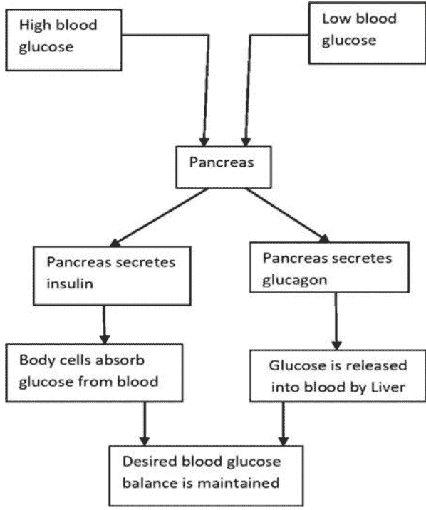

### 表1 1型和2型糖尿病的重要区别特征

| 不同的特征 | 类型1 | 类型2 |
|---|---|---|
| 疾病开始的年龄 | <40岁 | >50岁 |
| 症状持续时间 | 周 | 几个月到几年 |
| 体重 | 正常或偏低 | 高于正常 |
| 酮尿症 | 存在 | 不存在 |
| 如果不接受胰岛素治疗 | 可能导致迅速死亡 | 不对生命构成直接威胁 |
| 诊断时的并发症 | 没有 | 约25% |
| 家族糖尿病史 | 不一定存在 | 更有可能存在 |

2型糖尿病是对胰岛素作用敏感性降低的状态。糖尿病患者需要外部胰岛素支持来维持血糖的平衡。如果不正确治疗，糖尿病可能会进展。这是最常见的糖尿病类型（表1）。

妊娠期发生妊娠糖尿病。在怀孕前血糖水平正常，但在怀孕期间超出允许范围。如果不正确管理，会影响妊娠和婴儿的健康。

还有一个与糖尿病相关的术语被称为糖尿病前期。这是一种情况，在这种情况下，身体产生了足够的胰岛素，但身体没有正确利用它。在糖尿病前期的情况下，血糖水平较高，但不像2型糖尿病那样高。糖尿病前期是未来发展2型糖尿病高风险的指标。

如果糖尿病没有得到适当治疗，会导致血糖过高（高血糖），从而引发并发症。如果糖尿病患者注射过多胰岛素或者在没有足够食物的情况下进行运动，会导致低血糖症，这是一种非常危险的生命威胁。

### 2.3 糖尿病的并发症

长期不受控制的糖尿病会导致许多并发症。2型糖尿病在初始阶段没有明显的症状。因此，在诊断时，大约有25%的人显示出糖尿病并发症的证据。

70%的糖尿病死亡是由心血管疾病引起的。美国的统计数据显示，糖尿病患者心血管死亡率比非糖尿病患者高1.7倍，年龄在20岁及以上的人群中。与非糖尿病患者相比，糖尿病患者患心肌梗死和中风的几率分别高1.8倍和1.5倍。糖尿病存在时，吸烟和高血压等心血管风险因素的影响会被放大。

由于糖尿病引起的大血管病变会导致严重的并发症，如心绞痛、中风、心肌梗死、心力衰竭、间歇性跛行（腿部疼痛）等。糖尿病患者比非糖尿病患者更早更严重地患动脉粥样硬化（动脉内壁脂肪物质沉积）。糖尿病还会影响身体的小血管。这种情况也被称为微血管病变（也称为糖尿病微血管病变），它导致毛细血管基底膜增厚，并进一步增加全身血管通透性。

由糖尿病引起的视网膜病变是成年人中最常见的与视力相关的损伤形式。由于高血糖导致的毛细血管阻塞，增加了视网膜局部血管内皮生长因子（VEGF）的含量。大量毛细血管的阻塞导致视网膜新血管的生长。视网膜毛细血管中将会出现称为微动脉瘤的肿胀，导致液体和血液泄漏，从而引起视网膜出血。糖尿病性增殖性视网膜病变是最严重的一种形式，如果不治疗会导致视网膜脱离和频繁出血，造成广泛的视觉损伤。

糖尿病肾病是指对肾脏造成的损害，最终可能导致肾衰竭。肾脏由称为肾单位的微观结构组成，它们从血液中过滤出杂质。糖尿病引起的高血糖影响了肾单位的正常过滤功能。糖尿病肾病是长期肾脏疾病和终末期肾脏疾病（ESRD）的主要原因，肾脏无法正常工作。ESRD是糖尿病肾病的最后阶段，患者无法在没有透析的情况下生存。

研究发现糖尿病性神经病变是糖尿病的重要致残和死亡原因。在周围神经病变中，周围神经受到影响，导致运动和感觉功能的缺陷。近端肌肉（靠近身体中线的肌肉）的减弱，步态异常，肢体和脚的疼痛可能会发生。在自主神经病变中，副交感神经或交感神经可能会影响多个内脏系统。自主神经病变有无数临床特征，影响身体的不同系统，如心血管系统（例如静息心动过速），消化系统（例如便秘，腹部饱胀，夜间腹泻），瞳孔系统（例如对光反射减弱，瞳孔缩小）等。所有上述并发症在图2中都有展示。

### 2.4 糖尿病的原因（风险因素）

在流行病学研究中发现，过度进食、缺乏运动和肥胖可能导致中年人患糖尿病。体重指数（BMI）大于30 kg/m²的人患2型糖尿病的风险是正常人的10倍。中年和老年人患糖尿病的风险也更高。

种族起源是糖尿病的另一个主要风险因素。在美国，只有5.5%的阿拉斯加人患有糖尿病，而非西班牙裔白人的患病率为7.1%，非西班牙裔黑人的患病率为13%。美国土著人的患病率最高，达到33%。这些种族差异可能是由于生活方式、与BMI相关等各种未知和已知因素引起的。

### 2.5 糖尿病的治疗和管理

适当的治疗、有效的血糖监测和控制对于预防糖尿病引起的并发症非常重要。常用的治疗方法是口服有效药物，以维持糖尿病患者的血糖水平。另一种治疗方法是通过皮下注射胰岛素，常用于上臂、大腿和臀部，使用一次性塑料注射器和锋利的针头。通常每天多次给予多剂量。在急性病例中，特别是对于1型糖尿病患者，会采用持续皮下胰岛素治疗（或胰岛素泵）。进一步改进# 使用心电图信号进行糖尿病检测：概述

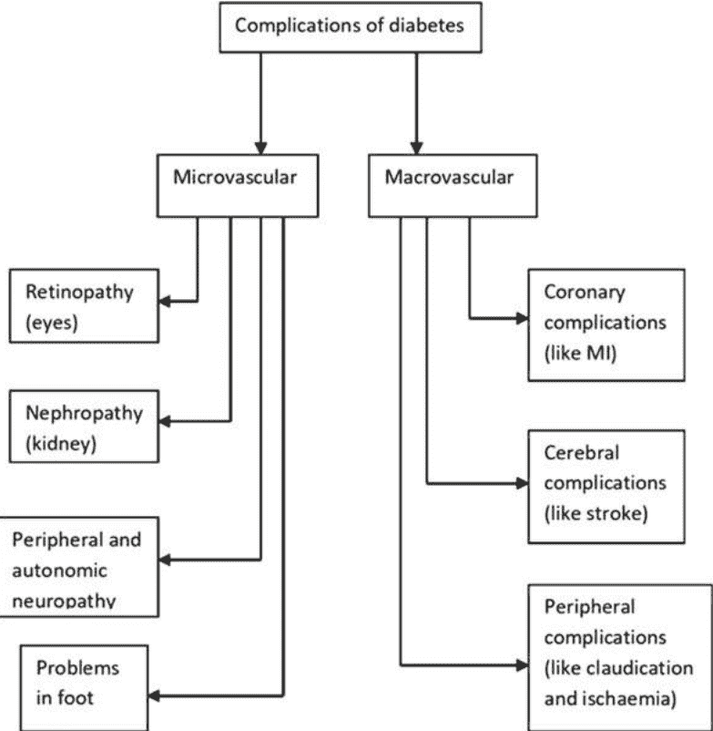

图 2 糖尿病的并发症

将闭环系统纳入胰岛素泵中被称为人工胰腺。人工胰腺是一个闭环工作的综合系统，由胰岛素泵和连续葡萄糖监测系统（CGMS）组成。CGMS系统可以被认为是包括每5-15分钟进行的间质葡萄糖测量、使用葡萄糖信息计算胰岛素泵向体内输送的胰岛素量的个人葡萄糖监测仪，以及输送胰岛素的胰岛素泵。

通过定期进行体育锻炼和保持适当的BMI来采用健康的生活方式非常重要。健康饮食也非常重要。应避免饮酒、吸烟和压力。本文讨论的许多重要医学方面取自《Davidson's Principles and Practice of Medicine》[1]。

## 3 种糖尿病检测的常见方法

### 3.1 侵入性糖尿病检测方法（血液测试）

正如最初所说，血糖水平必须在空腹状态下保持在70到110毫克/分升之间。如果低于70，则为低血糖症。如果在两到三个小时内进食，血糖水平可能超过110。无论摄入了多少食物，正常情况下血糖不应超过180。如果超过180，则为高血糖症，表明可能患有糖尿病。

所有常用的糖尿病检测方法都是侵入性的。通常需要从患者身上提取血样并进行可能的异常检测。下面解释了糖尿病检测及其严重程度的常用侵入性测试。表2还强调了这些测试在糖尿病检测中的重要性。

#### 3.1.1 口服葡萄糖耐量试验（OGTT）

OGTT主要用于检测孕妇的妊娠糖尿病。被测试者饮用一定量的含糖饮料。在规定的时间间隔内测试血样。血糖测量值大于200表示存在糖尿病。如果未检测出孕妇的糖尿病，可能会导致并发症。

#### 3.1.2 血红蛋白A1c（HbA1c）

HbA1c血液检测可以得到过去三个月的平均血糖值。HbA1c代表糖化血红蛋白。血红蛋白是一种存在于红细胞中的蛋白质，其任务是在全身运输氧气。当血红蛋白与血糖结合时，血红蛋白就会糖化。HbA1c大于6.5%表示患有糖尿病。

表 2 糖尿病和糖尿病前期的指标
| 糖尿病的指标 | 糖尿病前期的指标 |
| --- | --- |
| 空腹血糖 ≥ 126 mg/dl | 空腹血糖 ≥ 110 mg/dl 和 ≤ 126 mg/dl |
| 口服75克葡萄糖后两小时的血糖 ≥ 200 mg/dl | 口服75克葡萄糖后两小时的血糖在 140-200 mg/dl 范围内 |
| HbA1c ≥ 6.5% | HbA1c在 5.7-6.4% 的范围内 |

#### 3.1.3 间质葡萄糖监测

这是一种最近开发的通过间质连续葡萄糖监测（CGM）来检测糖尿病的测试。这个测试涉及在皮肤下插入一个微小的传感器，以测量间质液中的葡萄糖水平。一个传感器可以在那个位置停留两周，之后必须更换为一个新的传感器。

传感器实时测量葡萄糖水平，每一分钟或五分钟一次。在两周的时间内，传感器收集了大量的数据，可以分析得到各种信息，如每日葡萄糖曲线、夜间葡萄糖曲线等。可以将警报集成到传感器中，以便在低血糖发生时向佩戴者发出警告。

### 3.2 非侵入性糖尿病检测方法（使用心电图分析）

#### 3.2.1 糖尿病及其相关心脏变化

糖尿病可以导致严重的自主神经功能障碍。糖尿病引起的高血糖/血糖（高血糖）会导致心血管功能障碍和毛细血管损伤。这种损伤会影响内皮细胞的正常工作，并阻塞一氧化氮（NO）的正常通路 [2]。NO 对于血管扩张至关重要。

糖尿病引起的高血糖导致磷酸化级联激活减少，从而导致较少的内皮一氧化氮合酶，该酶用于合成NO。因此，糖尿病导致NO的可用性减少。由于糖尿病引起的内皮细胞损伤，血管会发生血管收缩，并影响正常的血液循环。

高血糖导致自由氧自由基的产生，激活内皮源性一氧化氮（NO）和蛋白激酶C，促进血管收缩性前列腺素的产生 [3]。高血糖导致内皮损伤，增加血小板的活性和聚集性 [3,4]。最终，单核细胞、白细胞和血小板会强烈附着在内皮上。血液凝固能力增加，纤溶活性降低。

因此，由于高血糖情况，脂肪物质越来越多地沉积在血管内侧的壁上。这种沉积物导致血管产生堵塞和硬化（动脉粥样硬化），阻碍了血液在血管中的流动。心血管疾病有两种主要类型，冠状动脉疾病和脑血管疾病。冠状动脉疾病（缺血性心脏病）是由于血管壁上的脂肪物质沉积导致心脏供血减少或阻塞，从而引发心脏病发作。血糖水平的增加不仅会损害血管，还会改变血脂水平。糖尿病患者发生这种情况的可能性至少是正常人的两倍。糖尿病患者比非糖尿病患者更容易患心脏疾病或中风。糖尿病患者发生心脏病发作更为严重（更有可能导致死亡）。

60-70%的糖尿病患者由于糖尿病引起了某种形式的神经病变。

糖尿病性神经病变可以进一步分为自主神经、局灶性、周围性和近端性神经病变。我们的重点是糖尿病性神经病变对与心脏功能相关的神经的影响（也称为心血管自主神经病变（CAN））。CAN会影响心率和血压。与糖尿病相关的高血糖水平会导致身体的不同器官出现严重问题。所有自主神经微血管损伤还会导致局部反射减少。CAN导致HRV减少，表明糖尿病性神经病变[5]。糖尿病引起的CAN可能导致心电图改变，如ST-T改变、窦性心动过速、心率变异性改变、长QTc等。还证实了QT、QTc和ST离散度是糖尿病患者死亡的预测因子[6, 7]。在这些心电图改变中，我们专注于可以用于糖尿病诊断的HRV信号，因为HRV可以指示由于糖尿病引起的心脏疾病。

#### 3.2.2 糖尿病引起的心电图变化

心电图代表自主神经系统（ANS）在调节心脏自然节律中的作用。心电图信号的生成方法如下。心跳的起源是从窦房结发出的电冲动形式。这会使两个心房收缩，然后激活房室结并传播到两个心室。完整的活动在心电图波形中表示（图3）。

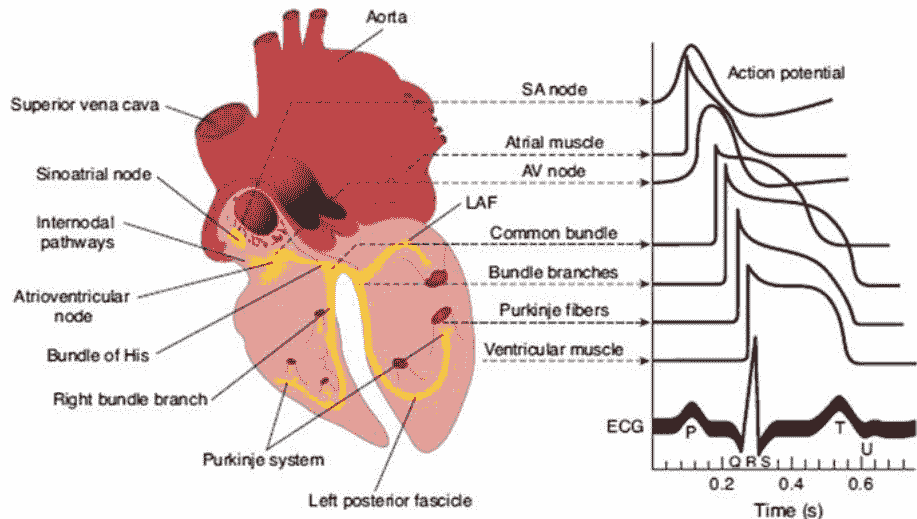

图 3 心脏的传导系统[8]

P、QRS、T和U是心电图信号中突出的电图偏移。心房的激活或去极化由P波表示。心室的去极化由QRS波表示。心室的复极化由T波表示。U波表示乳头肌的复极化。P波的正常持续时间为0.11秒，QRS波群的正常持续时间为0.10秒。QT间期的正常范围为0.35-0.43秒，PR间期的正常范围为0.12-0.20秒。常用的心电图测量配置包括5个电极。

一个电极分别放置在左臂（LA）、右臂（RA）、左腿（LL）、右腿（RL）和胸部的右侧参考电极上。另一个广泛使用的心电图捕获系统由10个电极（12导联）组成。

Stern等人从心电图中发现，一个没有显示出CAN迹象的糖尿病患者会发展为左室肥厚[9]。这表明糖尿病患者未来发展心血管疾病的高风险。Stern等人的工作并未止步于此。饮食严格监控，并采取适当措施确保患者的心脏健康。在这些条件下，进行了为期六年的随访。他们的观察是，这个人的糖尿病仍然得到很好的控制，他的心电图没有进一步变化，也没有进一步显示任何神经病变的临床或心电图迹象。

心电图的形状反映了人的心脏健康状况[10]。使用心电图进行分析的困难在于，人类感知极其难以区分心电图波形中的微妙变化。

因此，常规生物信号分析方法的性能在心电图信号上不尽如人意。

#### 3.2.3 心率变异性

窦房结作为心脏的起搏器。在这里产生的心脏冲动受副交感神经和交感神经系统的影响。心脏加速是由交感神经系统活动增强或副交感神经系统活动减弱引起的。心脏减速是由交感神经系统活动减弱或副交感神经系统活动增强引起的。因此，通过HRV信号可以清楚地了解ANS的状态。交感神经系统和副交感神经系统是控制心率的两个支路。因此，HRV可以清晰地反映交感神经系统和副交感神经系统的平衡。瞬时心率由交感神经系统和副交感神经系统共同决定，受到不同类型的神经、心肌和激素因素的强烈影响[11]。

无创HRV数据的分析在心脏病学、生理学和药理学的临床领域中有无数的应用。与HRV相关的心脏病学损伤分析具有真正的重要性。它们简单且无创，可以检测尚未出现明显症状的损伤。如果检测到，患者可以进一步进行详细的临床测试。研究表明，在标准条件下进行的无创HRV测量也是可重复的[12,13]。

心率信号包含按时间顺序排列的RR间隔信息。由于高血糖引起的自主神经系统变异可以很好地通过HRV信号表示。形状对于离散的HRV信号来说是一个无关紧要的特征。可用的HRV数据（即心率随时间轴的变化）可以通过不同的方法进行分析。它可以作为一种优秀且准确的非侵入性技术，用于了解调节心脏活动和心率的自主神经系统的状态。

## 4 用于糖尿病检测的机器学习

在深度学习技术出现之前，生物信号主要通过机器学习（ML）技术进行分析。ML将人工智能（AI）应用于系统中，使其能够在没有显式基于规则的编程和人工辅助的情况下进行自动学习。在异常检测的情况下，ML算法自行找到一个数学函数，从输入的训练数据（来自诊断测试如心电图、心率变异性的数据）中产生正确的结果（异常存在或不存在），理解输入数据中的隐藏模式。通过这个学习到的数学函数，它应该能够以高精度预测新的输入数据的输出状态。

对人体系统及其复杂机制的广泛领域知识，以及对异常期间生物信号变化的深入理解，对于决定从生物信号中提取和分析哪种类型的特征至关重要。因此，所需的初始步骤是选择可用于异常检测目的的理想特征。然后，这些特征被提取出来并输入到分类器中以检测异常的存在。在使用HRV进行糖尿病检测的情况下，最初的研究使用了不同的方法，如时间、频率、非线性方法等。所有这些方法都为正常和异常信号的参数给出了不同的范围。这些独特的范围使得分类器能够以85%以上的准确率进行分类。非线性方法特别适用于本质上是非线性和非平稳的生物信号，如心电图。使用ML技术进行糖尿病检测的HRV分析的重要方法将在下面简要讨论。属于下述领域的特征然后通过适当的分类器进行传递。

### 4.1 时间域方法

时间域测量涉及统计操作，包括计算 HRV 数据的 RR 间期的均值和方差。重要的时间域参数是心率的平均值、RMSSD 和 SDNN。像 RMSSD 这样的参数是影响心率的高频变化的指标，因此反映了副交感神经活动的状态。时间域测量的缺点是它们很容易受到异常值和伪迹的影响。

因此，必须对这些伪迹进行必要的数据分析与消除。

### 4.2 频域方法

频域测量分析 HRV 中存在的所有可用频率成分。功率谱密度（PSD）可以提供有关神经心律的宝贵信息[14]。高频区域 (0.15-0.5 Hz) 是副交感神经活动的指标，低频区域 (0.04-0.15 Hz) 表示完全的交感神经和副交感神经活动。快速傅里叶变换（FFT）通常用于估计 PSD。自回归（AR）模型是另一种非常适合分析生物信号（如心电图和脑电图）的频域表示。频域基于方法的可靠性随信噪比的降低而降低。

### 4.3 小波变换

传统的频域技术无法在典型的非平稳生物信号中提供准确的时间定位。为了克服这些问题，发展了更好的技术。小波分析表现出很好的性能，它涉及将信号与选定的有限持续时间的小波进行比较并找到参数。通过小波变换可以 有效地进行HRV分析，并且还可以用于获取各种频率带的时间相关信息[15]。

### 4.4 非线性方法

非线性方法非常适用于分析非线性和非平稳的生物信号，如心电图。用于HRV分析的一些重要非线性参数包括近似熵（ApEn）、高阶谱（HOS）、去趋势波动分析（DFA）、相关维数（CD）、重现量化分析（RQA）特征和经验模态分解（EMD）特征。

#### 4.4.1 去趋势波动分析（DFA）

DFA（彭等人）对于评估HRV数据的分形缩放特性非常有用[16]。数据中固有的波动由参数 \(\alpha\) 表示（表示输入数据的不规则性）。通常，对于正常（年轻和健康）的人来说， $\alpha$ 越接近1。$\alpha$ 根据不同的心脏疾病而变化。

#### 4.4.2 相关维度（CD）

CD是一种非线性特征，可以有效用于检测异常。CD是一种分形维度的类型。找出CD的流行技术（由Grassberger等人提出）通过找出所有数据点之间的距离并将它们分组来构建函数 $\mathrm{C}(\mathrm{r})[17]$。

CD由以下表达式给出

```
$$ C D = \lim _ { r \rightarrow 0 } \frac { \log [ C ( r ) ] } { \log ( r ) } $$
```

与糖尿病患者相比，正常人产生的CD值较高，因为正常的RR信号具有较高的RR变异性。

#### 4.4.3 近似熵（ApEn）

ApEn是HR信号中无序性的度量[18]。ApEn的值对于更复杂或不规则的数据（正常情况）较大，而对于心脏损伤（糖尿病）的情况则相反。

#### 4.4.4 再现量化分析（RQA）

再现图（由Eckmann等人提出）是识别时间域信号中可能不明显的隐藏再现的图形辅助工具[19]。它测量了时间序列的非平稳性。可以从再现图中计算出几个重要参数。这些参数的例子包括层状度（LAM），平均对角线长度，再现率（RR），确定性（DET），熵和捕获时间（TT）。

#### 4.4.5 高阶谱（HOS）

高阶统计（HOS）在非线性、非平稳和非高斯生物信号的动态分析中非常有用。高阶统计（也称为多谱）表示三阶及以上的累积量和矩。高阶统计可以有效地用于HRV信号的分析。可以从HRV数据中提取出多个有用的高阶统计特征，并将其输入到不同的分类器中，以实现糖尿病检测的目的。

#### 4.4.6 经验模态分解（EMD）

EMD将输入信号分解为本征模态函数（IMFs）。本征模态函数生成的特征非常适合有效地捕捉HRV等生物信号的非线性和非平稳特性。

## 5 深度学习技术的方法论

在以前的研究中，使用了各种基于时间、频率、小波和非线性的特征以及分类器来检测糖尿病。本章我们主要关注深度学习。深度学习是机器学习的一种改进，特别适用于高维数据和复杂的人工智能问题。机器学习的缺点促使了深度学习的发展[20]。

传统机器学习网络中的所有显式特征相关过程在深度学习网络中都是隐式执行的。深度网络从数据中自学习，其效率比传统的特征提取网络要好得多。

深度学习网络使用级联的非线性处理单元。这些单元完成特征提取和转换的任务。一个单元的输出作为下一个单元的输入。学习可以以有监督或无监督的方式进行。它们通常使用某种梯度下降方法进行训练，使用反向传播方法。下面简要介绍了一些流行的深度学习网络。

### 5.1 自编码器（AE）

AE是一种使用无监督学习技术和反向传播方法的神经网络。它的目标值被设置为等于输入值[21]。AE由两个对称的深度网络组成（通常是四层或五层深），一个用于编码，另一个用于解码。因此，AE的实现与传统神经网络非常相似，唯一的新颖之处在于其目标是通过学习输入数据来重新创建输入[22,23]。

### 5.2 卷积神经网络（CNN）

CNN是改进的多层感知器（MLP），其中卷积操作是其层之一。CNN基本上由三层构成；卷积层，紧接着是池化层和全连接层。CNN在许多方面类似于神经网络。

它的特点与传统神经网络相似。在传统的神经网络中，它是 $y=f(x \cdot w)$，其中 $x$ 和 $y$ 分别表示输入向量和输出向量，$w$ 表示权重集。但是在CNN的卷积层中，它是 $y=f(s(x \cdot w))$，其中 $s$ 表示输入和权重之间的卷积操作。CNN可以应用于时间序列输入数据（1D）或图像（2D）。

### 5.3 循环结构（RNN、LSTM和GRU）

#### 5.3.1 循环神经网络（RNN）

RNN是前馈网络的改进。RNN包含反馈循环（图4），它们作为短期记忆，用于存储和检索过去的信息（按时间尺度）。这种现代化可以熟练地执行时间任务。与MLP不同，RNN中对时间序列的长度没有限制。参数也可以在时间步长上共享。简而言之，RNN的存储被另一个模型取代，该模型包含反馈循环，并且这些受控状态被称为门控内存。RNN广泛应用于语音识别、语言建模和机器翻译领域。

循环神经网络（RNN）架构中的循环连接使得理解RNN的工作方式变得困难。为了更好地理解和分析，可以将RNN的复杂网络结构智能地转换为FFNs形式，通过时间尺度的展开（图4）。

#### 5.3.2 长短期记忆（LSTM）

LSTM（Hochreiter等人）是RNN的增强模型，旨在比传统的RNN更准确地建模时间序列的长程依赖关系[24]。LSTM使用内存块代替RNN的简单内存单元

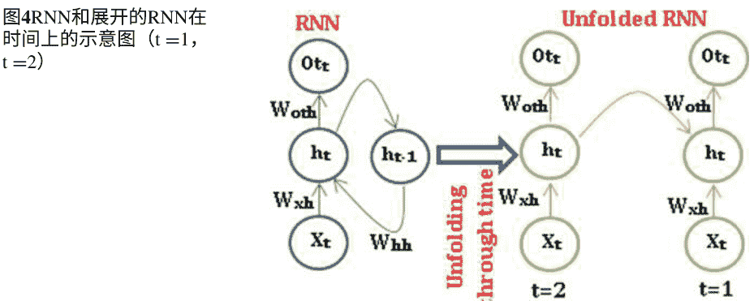

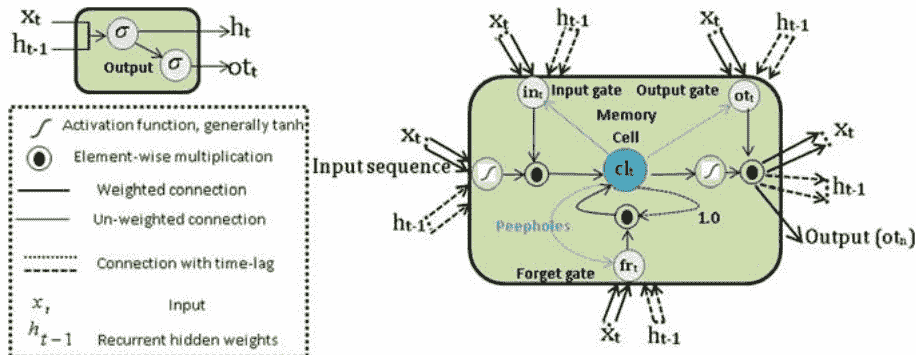

图 5 RNN（左）和LSTM（右）中的内存块

（图5）。LSTM的这种特性使其在语言建模等复杂任务中被广泛使用。通常，在进行长时间序列数据分析的领域中被广泛使用。

LSTM中的内存块可以被看作是由内存单元构建的复杂处理中心。输入门和输出门是乘法门，可以允许或阻止细胞激活通过内存单元流向进一步的节点。一组可修改的乘法门管理内存块中发生的所有过程。随着研究的进展，窥视孔连接和遗忘门成为LSTM架构的新添加部分。遗忘门可以用于替代CEC（恒定误差旋转木马）。这三个门还帮助内存单元存储跨多个时间步长的信息。

#### 5.3.3 门控循环单元（GRU）

GRU是一种改进的LSTM变体，参数数量较少。GRU使每个循环单元能够以自适应的方式捕捉对应于不同时间尺度的依赖关系。GRU具有调节其内存中信息流动的门控单元，但与LSTM不同，它没有单独的内存单元。GRU的内存消耗和计算成本比LSTM小得多。

### 5.4 CNN-RNN、CNN-LSTM、CNN-GRU的混合模型

混合深度神经网络通常是生成式和判别式神经网络的融合，以便有效地结合两者的优势。混合的深度学习网络可以由级联的异构网络（如CNN-LSTM）构建。CNN提取空间特征，LSTM提取时序信息。这意味着CNN-LSTM有助于提取时空信息。

例如，ECG信号的实验分析和拓扑结构细节使用CNN和CNN-LSTM在第7节中进行了解释。

对于CNN-LSTM等混合架构，CNN仅由一维卷积和最大池化层组成。最大池化层的输出作为后续网络的输入。

$y_i = CNN(x_i)$ (2)

CNN的输入和输出分别为$x_i$和$y_i$。每个$x_i$的数据类型都有一个关联的类标签。$y_i$是CNN中最大池化层的输出向量。$y_i$被馈送到CNN之后的下一个深度学习网络中，可以是RNN、LSTM和GRU。

## 6 文献调查

### 6.1 早期的HRV信号分析方法

HRV信号是使用上述描述的时间、频率和非线性参数进行早期分析的。证据表明，在正常情况下，心脏不会周期性振荡[25]。因此，非线性技术能够从HRV信号中提取和分析非线性特征，因此被广泛使用。可以从HRV信号中提取非线性特征，如Lyapunov指数（Rosenstien等人）、1/f斜率（Kobayashi等人）、近似熵（ApEn）（Pincus）、去趋势波动分析（DFA）（Peng等人），以进行进一步的分析[16,18,26,27]。特征值的范围可以指示可能的异常情况。HRV信号也可以通过非线性技术进行分类[28,29]。非线性技术被用于心脏信号分析，以开发心律失常检测算法[30,31]。

### 6.2 糖尿病检测的先前研究（包括基于机器学习的方法）

Wheeler等人首次报道了糖尿病患者在深呼吸时心跳间隔的减少是由糖尿病性神经病变引起的[32]。Pfeifer、Singh、Villareal的研究已经证实，糖尿病患者的副交感神经活动在神经病变症状临床可见之前就已经减少了[5,33,34]。

研究人员发现，糖尿病患者在接受传统心脏功能测试后产生了负面结果，显示出HRV降低。许多研究已经明确建立了空腹血糖与心血管并发症之间的相关性[35,36]。大约四分之一的严重病患者被发现也是糖尿病患者[37, 38]。这是因为糖尿病导致冠心病和动脉粥样硬化的早期发展。所有这些结果证明HRV分析可用于识别糖尿病。

糖尿病引起的心脏自主神经功能障碍（CAN）可能非常严重。因此，早期发现由于糖尿病引起的CAN非常重要。Ahsan等人表明，使用样本熵（SampEn）和Poincare图等特征进行HRV分析对于检测糖尿病患者中的CAN非常有用[39]。

Kirvela等人对HRV进行了频域和时域分析（从24小时持续的心电图中提取）[40]。与正常人相比，糖尿病HRV样本的所有分析参数（包括时间和频率）都显著降低。Mackay测量了正常人和糖尿病患者在不同呼吸模式下的心率变异。观察到糖尿病患者的心率变异明显较低[41]。

Jelinek等人研究了QT离散对正常人和糖尿病患者的影响，并确保两类人群都没有心脏疾病的先前病史[42]。通过一个名为tone-entropy（T-E）的参数来测量心率变异，其中tone（T）表示交感神经和副交感神经的平衡，entropy（E）表示自主神经的规律性。观察到糖尿病患者的T-E值降低。在类似的人群和条件下，Awdah等人观察到糖尿病病例中的时间域参数（如St. George指数，RMSSD，SDRR等）与正常病例相比降低[43]。Chemla等人使用自回归频率建模方法研究了HRV信号对糖尿病患者的影响[44]。

Schroeder等发现糖尿病患者的时间域参数RMSSD、SDNN和RR间期较低。他们还观察到随着糖尿病的进展，身体的自主神经功能会受到严重影响[45]。Seyd等进行了HRV的时间和频率分析[46]。与正常人相比，糖尿病患者的平均RR间期、TINN、RMSSD、SDNN、NN50计数和HRV三角指数等时间域参数减少。在进行频域分析时，糖尿病患者和正常人之间在不同频率范围内的功率存在显著差异。

Trunkvalterova等证明了多尺度熵（MSE）能够检测到1型糖尿病患者心血管系统中非常小的异常。在他们的研究中，他们使用了SampEn估计器参数和RMSSD等线性测量指标[47]。Faust等分析了从HRV信号中提取的时间、频率和非线性特征，并显示非线性方法在糖尿病诊断中比时间域和频率域方法更好[48]。Jian等将主成分分析（PCA）应用于从HRV信号中获得的HOS双谱幅度图。这些被输入到SVM分类器中，得到了79.93%的糖尿病检测准确率[49]。

Acharya等人提出了一种创新的糖尿病综合指数（DII），利用从HRV信号中提取的非线性特征[50]。他们使用adaboost分类器获得了86%的糖尿病检测准确率。Swapna等人使用基于HOS的特征进行糖尿病检测，准确率为90.5%[51]。Acharya等人使用adaboost分类器提取了四个非线性特征，准确率为90%[52]。Acharya等人使用熵、能量偏度和峰度来实现糖尿病检测的准确率为92.02%，采用决策树（DT）分类器[53]。Pachori等人使用EMD和Morlet小波核函数对HRV信号进行分析，实现了非常高的准确率95.63%[54]。表3总结了以上所有工作。

表3 用于检测糖尿病患者（DM =糖尿病）中明显不同的HRV参数的机器学习方法总结

| 作者 | 方法/特征 | 提取特征后的DM观察活动 |
|---|---|---|
| Pfeifer等人[5] | 时域 |  |
| Kirvela等人[40] | 频域, 时域 | HRV降低 |
| Singh等人[33] | 频域, 时域 | 降低的LF功率 |
| Awdah等人[43] | 时域 | 减少 |
| Flynn等人[55] | DFA | 降低的短期相关性在DM中 |
| Chemla等人[44] | FFT, 自回归谱分析 | 减少 |
| Schroeder等人[45] | 时域 | 减少 |
| Seyd等人[46] | 时间, 频域 | 减少 |
| Trunkvalterova等人[47] | 非线性方法（多尺度熵 (MSE)） | 减少的MSE |
| Faust等人[48] | 时间, 频率, 非线性 | 减少 |
| Acharya等人[50] | 非线性 (RQA, CD) | 准确率为86% |
| Swapna等人[51] | HOS | 准确率为90.5% |
| Jian等人[49] | HOS | 准确率为79.93% |
| Acharya等人[52] | 非线性特征 | 准确率为90.0% |
| Acharya等人[53] | DWT | 准确率为92.02% |
| Pachori等人[54] | 与EMD相关的特征 | 准确率为95.63% |

关于使用心电图信号进行糖尿病检测，Swapna等人采用了混合的深度学习CNN-LSTM网络，并以HRV作为输入，实现了非常高的准确性值95.1%，这与迄今为止达到的最高准确性相当[60]。Swapna等人通过在CNN-LSTM网络后添加SVM分类器，将上述糖尿病检测准确性提高到95.7%[61]。准确性详细信息请参见表4。

### 6.3 基于深度学习的HRV糖尿病检测工作

这些是一些将深度学习分析方法与心电图相连接的工作。基于CNN的深度学习方法被用于分析心电图以检测冠状动脉疾病（Acharya等人）、心肌梗塞（Acharya等人）、心跳分类（Acharya等人）[56-58]。Sujadevi等人分析心电图以检测心房颤动[59]。

| 作者 | 方法/特征 | 准确性 |
| --- | --- | --- |
| Swapna等人[60] | 深度学习 (CNN-LSTM) | 准确性为95.1% |
| Swapna等人[61] | 深度学习 (CNN-LSTM) 后跟SVM | 准确性为95.7% |

## 7 深度学习架构和实现

### 架构与样本研究

关于糖尿病检测的混合架构在[60,61]中详细讨论。混合架构的工作流程如图6所示。在这种情况下，深度学习架构使用强大的TensorFlow [62]软件框架实现。


[60,61]。 TensorFlow是谷歌的开源软件库。 TensorFlow允许将数值系统建模为统一的数据流图,然后可以使用张量、节点和边来建模数学相关的操作。 可以使用CPU、GPU和移动设备等异构平台进行计算。

关于Swapna等人的工作[60],实现了以下网络结构。输入层由1000个神经元组成(输入数据集的样本数为1000)。输入数据的值被归一化到0到1之间。隐藏层包括一个CNN层(池大小为2,步幅为1,滤波器数量为64,内核大小为3),然后是最大池化、展平和0.5的dropout,最后是具有sigmoid激活函数的全连接层。输入层、隐藏层和输出层之间存在完全连接。进行了三次试验,每次运行300个时期(学习率为0.001,批量大小为16)。在尝试不同的值并根据深度学习网络的性能找到最佳值后,所有上述超参数的最终值都被固定下来。这些超参数对应于我们尝试的第一个网络架构CNN1(拓扑中的CNN网络数量为1)。CNN层数逐一增加到五层,然后我们转向将LSTM连接到每个上述五个配置的混合架构。对于CNN5-LSTM,糖尿病检测的准确率达到了95.1%(最大值)。

关于Swapna等人的第二项工作[61],使用了与上述工作相同的配置,但从CNN/CNN-LSTM架构中提取的特征被传递给SVM分类器进行修改。这提高了糖尿病检测的准确性。图6显示了作品[60,61]的网络拓扑比较。

## 大数据分析中的深度学习:限制和挑战

今天处理的数据量以及维度正在以难以想象的规模增加,以推特和Facebook等应用为例。与生物医学领域相关,如果实时连续地从患者那里获取数据,那么收集到的数据可以被视为大数据,使得大数据分析能够发挥重要作用。对于大数据分析,传统的基于机器学习的分析技术是不足够的。

在大数据中,处理的数据量非常大。在垂直维度上,它是数据集中存在的记录或样本数量,在水平维度上,它是数据集中处理的特征或参数数量。这种数据量的爆炸给数据分析带来了巨大的挑战。计算所需的时间和内存将随着数据集大小的增加而呈指数增长。

处理这个挑战的解决方案是开发能够并行处理数据的架构。另一个问题是，由于数据量非常大，可能无法将整个数据存储在内存或磁盘中。许多训练/测试算法假设数据完整地存储在内存中。因此，这样的算法无法成功运行。这被称为模块化的诅咒。分布式计算和并行化可以用来解决这个挑战。此外，数据的高维度、数据的高度多样性以及类别出现概率的高变异性等挑战性问题，如果不加以处理，将会降低机器学习网络的性能。在机器学习中，使用领域知识进行特征的正确选择至关重要。随着数据集在维度和样本大小上的增长，创建相关特征变得非常困难。在高维数据中，特征选择也非常困难。处理和分析大数据方面的这些问题导致了深度学习网络取代传统机器学习网络的情况。

专注于将深度学习技术应用于基于心电图衍生的心率变异数据，以便进行糖尿病检测，最佳模型[60,61]将其应用于实时数据，这些工作可以被视为未来工作的基石。通过将比上述工作中给定的数据更大的输入数据提供给开发的架构，可以尝试进一步提高准确性。

目前的先进心电图测量设备只需很短的时间（不到5分钟）即可提取心电图信号进行分析。另一方面，Holter监护仪可以对一个人的心电图信号进行连续监测（至少24-48小时），以检查可能的异常情况，这是短期心电图监测无法得知的。机器学习技术足以处理短期心电图数据。考虑到分析结果可以实时获得，深度学习网络和算法也适用于相对短期的数据。第二种情况是对大量数据进行分析（持续超过24小时的连续心电图信号），例如来自Holter监护仪，这也需要大数据分析和深度学习算法。如果研究人员可以获得长时间的心电图数据，像LSTM这样的深度学习架构和CNN-LSTM这样的混合系统可以分析非侵入性数据，以预测未来是否可能患糖尿病。因此，如果将实时大数据提供给深度学习网络，情况将迅速从疾病检测转变为疾病预测。

## 9 结论

糖尿病患者的身体要么无法产生足够的胰岛素，要么对产生的胰岛素产生抵抗，导致血糖不平衡。自主神经功能障碍虽然没有症状，但只有在糖尿病发病后多年才能在临床上检测到。

因此，心率变异性可以作为糖尿病神经病变即将发生的早期迹象，并且可以用于高准确性的糖尿病检测。心率变异性分析因此是一种简单、非侵入性和可重复的糖尿病检测方法。深度学习方法可以用于非常高准确性的糖尿病检测。分布式深度学习系统可以快速给出结果，使得生物信号的实时分析成为可能。因此可以确定的是，生物医学工程的未来属于无特征、基于深度学习的系统，可以在不需要领域知识的情况下进行大数据分析。

### 参考文献

- 1. Ralston, S.H., Penman, I.D., Strachan, M.W., Hobson, R.P.: Davidson's Principles and Practice of Medicine, 23rd edn. Elsevier
- 2. Viktor, S., Steven, I., Marina, D.I., Aleksander, N., Vojislava, M.: 糖尿病对心率变异性和心室功能在心肌梗死后患者中的影响。Facta Univ.Ser.: Med. Biol. 12(3), 130-134 (2005)
- 3. Di Carli, M.F., Janisse, J., Grunberger, G., Ager, J.: 慢性高血糖在糖尿病冠状动脉微血管功能障碍的发病机制中的作用。J. Am. Coll. Cardiol. 41, 1387-1393(2003)
- 4. Gresele, P., Guglielmini, G., Deangelis, M., et al.: 急性短期高血糖增强2型糖尿病患者心脏应激诱导的血小板活化。J. Am. Coll.Cardiol. 41, 1013-1020 (2003)
- 5. Pfeifer, M.A., Cook, D., Brodsky, J., Tice, D., Reenan, A., Swedine, S., 等：对正常人和糖尿病患者的心脏副交感神经活动进行定量评估。糖尿病339-345(1982)
- 6. Sawicki, P.T., Dahne, R., Bender, R., Berger, M.: 糖尿病肾病患者的QT间期延长作为死亡预测因子。Diabetologia 39(1), 77-81 (1996)
- 7. Okin, P.M., Devereaux, R.B., Howard, B.V., Welty, T.K.: 评估QT间期和QT离散度以预测美国印第安人的全因死亡率和心血管死亡率：强心研究。循环 101, 61-66 (2000)
- 8. Barrett, K.E., Barman, M.S., Boitano, S., Brooks, H.: Ganong医学生理学评论。麦格劳希尔公司
- 9. Stern, S., Sclarowsky, S.: 糖尿病心电图.美国心脏协会(AHA)杂志.(2009)
- 10. Sokolow, M., Mcllroy, M.B., Chiethin, M.D.: 临床心脏病学. VLANGE医学书籍 (1990)
- 11. Constant, I., Laude, D., Murat, I., Elghozi, J.L.: 脉率变异性不能代替心率变异性. 临床科学 97, 391-397 (1999)
- 12. Kleiger, R.E., Bigger, J.T., Bosner, M.S., Chung, M.K., Cook, J.R., Rolnitzky, L.M., et al.: 正常人心率变异性测量变量的稳定性随时间变化. 美国心脏杂志 Cardiol. 68, 626-630 (1991)
- 13. Ge, D., Srinivasan, N., Krishnan, S.M.: 使用自回归模型进行心律失常分类。生物医学工程在线 1(1), 5 (2002)
- 14. Akselrod, S., Gordon, D., Madwed, J.B., Snidman, N.C., Shannon, D.C., Cohen, R.J.: 血液动力学调节：频谱分析研究。美国生理学杂志 249(4 Pt 2), H867-H875(1985)
- 15. Gamero, L.G., Vila, J., Palacios, F.: 心率变异性在心肌缺血期间的小波变换分析。医学生物工程计算 40, 72-78 (2002)
- 16. Peng, C.K., Havlin, S., Hausdorf, J.M., Mietus, J.E., Stanley, H.E., Goldberger, A.L.: 分形机制和心率动力学。心电图杂志 28(Suppl), 59-64 (1996) 17. Grassberger, P., Procassia , I.: 测量奇异吸引子的奇异性。物理学报 9,189-208 (1983)
- 18. Pincus, S.M.: 近似熵作为系统复杂性的度量。国家科学院 美国 88, 2297-2301 (1991)
- 19. Eckmann, J.P., Kamphorst, S.O., Ruelle, D.: 动力系统的再现图。欧洲物理学快报 4, 973-977 (1987)
- 20. Goodfellow, I., Bengio, Y., Courville, A.: 深度学习。麻省理工学院出版社。http://www.deeplearningbook.org (2016)
- 21. Poultney, C., Chopra, S., Cun, Y.L., 等：基于能量的模型的稀疏表示的高效学习。在：神经信息处理系统的进展，第1137-1144页(2006)
- 22. Hinton, G.E., Salakhutdinov, R.R.: 用神经网络降低数据的维度。科学 313(5786), 504-507 (2006)
- 23. Vincent, P., Larochelle, H., Bengio, Y., Manzagol, P.A.: 用去噪自编码器提取和组合稳健特征。在：第25届国际机器学习大会论文集，第1096-1103页。ACM (2008年)
- 24. Hochreiter, S., Schmidhuber, J.: 长短期记忆。神经计算。 9(8), 1735-1780 (1997)
- 25. Goldberger, A.L., West, B.J.: 非线性动力学在临床心脏病学中的应用。纽约科学院学报 。504, 195-213 (1987)
- 26. Rosenstien, M., Collins, J.J., De Luca, C.J.: 从小数据集计算最大Lyapunov指数的实用方法 。物理学D 65, 117-134 (1993)
- 27. Kobayashi, M., Musha, T.: 1/f 心跳周期的波动。IEEE Trans. Biomed. Eng. 29, 456-457 (1982)
- 28. Acharya, U.R., Kannathal, N., Krishan, S.M.: 利用心率信号对心脏健康进行全面分析。Physiol. Meas. J. 25, 1130-1151 (2004)
- 29. Acharya, U.R., Paul Joseph, K., Kannathal, N., Lim, C.M., Suri, J.S.: 心率变异性：一项综述 。Med. Biol. Eng. Comput. 44(12), 1031-1051 (2006)
- 30. Chua, K.C., Chandran, V., Acharya, U.R., Lim, C.M.: 基于熵、重现图和Poincare几何的心脏状态的计算机分析。J. Med. Eng. Technol. 2(4), 263-272(2008)
- 31. Acharya, U.R., Suri, J.S., Spaan, J.A.E., Krisnan, S.M.: Advances in Cardiac Signal Processing. Springer Verlag GmbH Berlin Heidelberg (2007)
- 32. Wheeler, T., Watkins, P.J.: Cardiac denervation in diabetes. Br. Med. J. 4, 584-586 (1973)
- 33. Singh, J.P., Larson, M.G., O'Donnell, C.J., Wilson, P.F., Tsuji, H., Lloyd-Jones, D.M., Levy, D.: Association of hyperglycemia with reduced heart rate variability: the Framingham heart study. Am. J. Cardiol. 86, 309-312 (2000)
- 34. Villareal, R.P., Liu, B.C., Massumi, A.: Heart rate variability and cardiovascular mortality. Curr. Atheroscler. Rep. 4(2), 120-127 (2002)
- 35. Stamler, J., Vaccaro, D., Neaton, J.D., Wentworth, D.: 多因素干预试验中筛选的男性糖尿病、其他风险因素和12年心血管死亡率。糖尿病护理 16, 434-444 (1993)
- 36. Coutinho, M., Gerstein, H.C., Wang, Y., Yusuf, S.: 葡萄糖与心血管事件发生率的关系：对95783名个体进行的20项研究的元回归分析。 Diabetes Care 22, 233-240 (1999) 37. Melchior, T., Kober, L., Madsen, C.R., et al.: 急性心肌梗死后几年糖尿病对死亡率的加速影响。欧洲心脏杂志 20, 973-978(1999)
- 38. Braunwald, E., Antman, E., Beasley, J.W., et al.: ACC/AHA不稳定型心绞痛和非ST段抬高型心肌梗死患者管理指南。美国心脏学会杂志 36, 970-1062 (2000)
- 39. Khandoker, A.H., Jelinek, H.F., Palaniswami, M.: 通过心率复杂性分析识别患有心脏自主神经病变的糖尿病患者。生物医学工程在线 8, 1-12 (2009) 40. Kirvela, M., Salmela, K., et al.: 糖尿病和非糖尿病肾移植患者的心率变异性。斯堪的纳维亚麻醉学杂志 40(7), 804-808 (1996)+   41. Mackay, J.D.: 糖尿病神经病变中的呼吸窦律不齐。 糖尿病学 24(4), 253-256 (1983). https://doi.org/10.1007/BF00282709
+   42. Jelinek, H.F., Flynn, A., Warner, P.: 自动评估与糖尿病相关的心血管疾病在农村和偏远地区的健康实践中。 在: The National SARRAH Conference, pp. 1-7 (2004)
+   43. Awdah, A., Nabil, A., Ahmad, S., Reem, Q., Khidir, A.: 糖尿病患者中心率变异性的时域分析, 有无自主神经病变。 Ann. Saudi Med. 22, 5-6 (2002)
+   44. Chemla, D., Young, J., Badilini, F., Maison, B.P., Affres, H., Lecarpentier, Y., Chanson, P.: 快速傅里叶变换和自回归谱分析在糖尿病患者心率变异性研究中的比较。 Int. J. Cardiol. 104(3), 307-313 (2005)
+   45. Schroeder, E.B., Chambless, L.E., Liao, D., Prineas, R.J., Evans, G.W., Rosamond, W.D., et al.: 糖尿病、葡萄糖、胰岛素和心率变异性：动脉粥样硬化风险在社区中的研究(ARIC)。 Diabetes Care 28(3), 668-674 (2005)
+   46. Seyd, P.T.A., Ahamed, V.T., Jacob, J., Joseph, P.: 时间和频域分析糖尿病患者心率变异性及其相关性。 世界学术科学工程技术 2(3) (2008)
+   47. Trunkvalterova, Z., Javorka, M., Tonhajzerova, I., Javorkova, J., Lazarova, Z., Javorka, K., Baumert, M.: 糖尿病患者心率和血压动力学的短期复杂性降低：多尺度熵分析。 生理测量学杂志 29(7) (2008)
+   48. Faust, O., Acharya, U.R., Molinari, F., Chattopadhyay, S., Tamura, T.: 糖尿病患者心脏健康的线性和非线性分析。 生物医学信号处理与控制 7(3), 295-302 (2012)
+   49. Jian, L.W., Lim, T.C.: 通过心率信号获取的高阶谱特征自动检测糖尿病。 J. Med. Imaging Health Inform. 3, 440-447 (2013)
+   50. Acharya, U.R., Faust, O., Vinitha Sree, S., Ghista, D.N., Dua, S., Joseph, P., Thajudin, A.V.I., Janarathanan, N., Tamura, T.: 使用心率变异信号特征的综合糖尿病指数进行糖尿病诊断。 Comput. Methods Biomech. Biomed. Eng. 16, 222-234 (2013)
+   51. Swapna, G., Acharya, U.R., Vinitha Sree, S., Suri, J.S.: 使用从心率信号中提取的高阶谱特征自动检测糖尿病。 Intell. Data Anal. 17(2), 309-326 (2013)
+   52. Acharya, U.R., Faust, O., Kadri, N.A., Suri, J.S., Yu, W.: 使用非线性测量自动识别正常和糖尿病心率信号。 计算机生物医学医学 43(10), 1523-1529 (2013)
+   53. Acharya, U.R., Vidya, S., Ghista, D.N., Lim, W.J.E., Molinari, F., Sankaranarayanan, M.: 使用离散小波变换方法对糖尿病患者的HRV信号进行计算机辅助诊断。 基于知识的系统 42, 4567-4581 (2015)
+   54. Pachori, R.B., Kumar, M., Avinash, P., Shashank, K., Acharya, U.R.: 使用RR间期信号进行糖尿病患者筛查的改进在线范式。 机械医学生物学杂志 16, 1640003 (2016)
+   55. 弗林, A.C., 杰林克, A.F., 史密斯, M.: 心率变异性分析：一种用于农村和偏远地区糖尿病相关心脏功能障碍的有用评估工具。 澳大利亚农村健康杂志 13(2), 77-82 (2005)
+   56. 阿查亚, U.R., 藤田, H., 欧, S.L., 亚当, M., 谭, J.H., 蔡, C.K.: 使用不同持续时间的心电片段和卷积神经网络自动检测冠状动脉疾病。 基于知识的系统 132, 62-71 (2017)
+   57. 阿查亚, U.R., 藤田, H., 欧, S.L., 萩原, Y., 谭, J.H., 亚当, M.: 应用深度卷积神经网络自动检测心肌梗死使用心电图信号。 信息科学 415, 190-198 (2017)
+   58. Acharya, U.R., Oh, S.L., Hagiwara, Y., Tan, J.H., Adam, M., Gertych, A., Tan, R.S.: 一个深度卷积神经网络模型用于分类心跳。 计算生物学与医学 89, 389-396 (2017)
+   59. Sujadevi, V.G., Soman, K.P., Vinayakumar, R.: 使用递归神经网络从短时间单导联心电图中实时检测房颤。 在: 智能系统技术与应用国际研讨会, pp. 212-221, 2017年9月. Springer
+   60. Swapna, G., Soman, K.P., Vinayakumar, R.: 使用CNN和CNN-LSTM网络和心率信号自动检测糖尿病。 计算机科学会议论文集 132, 1253-1262 (2018)
+   61. Swapna, G, Vinayakumar, R., Soman, K.P.: 使用深度学习算法进行糖尿病检测。 ICT Express 4, 243-246 (2018)
+   62. Abadi, M., Barham, P., Chen, J., Chen, Z., Davis, A., Dean, J., Devin, M., Ghemawat, S., Irving, G., Isard, M., et al.: Tensorflow: 用于大规模机器学习的系统. OSDI 16, 265-283 (2016)

**G. Swapna**是印度Amrita Vishwa Vidyapeetham的计算工程与网络学博士生，于2015年7月入学。她还是印度Kerala州Kozhikode市政工程学院的教员。

**K. P. Soman**在印度Amrita School of Engineering, Coimbatore拥有25年的研究和教学经验。他在国内外期刊和会议论文中发表了约150篇文章。他组织了一系列关于高级信号处理、核方法模式分类、深度学习和大数据分析的工作坊和暑期学校，面向工业界和学术界。他撰写了《洞察小波》、《洞察数据挖掘》、《支持向量机和其他核方法》和《信号和图像处理-稀疏方式》等书籍, 由Prentice Hall、新德里和Elsevier出版。

**R. Vinayakumar**是印度Amrita Vishwa Vidyapeetham的计算工程与网络学博士生, 自2015年7月起在Amrita School of Engineering, Coimbatore进行研究。他在机器学习应用于网络安全方面发表了多篇论文。他的博士研究主要集中在应用机器学习(有时是深度学习)于网络安全, 并讨论了自然语言处理、图像处理和大数据分析在网络安全中的重要性。他参与了多个国际共享任务, 并在SSCC'18和ICACCI'18上组织了一个关于检测恶意域名(DMD2018)的共享任务。更多详情请访问https://vinayakumarr.github.io/。

## 使用心电图信号进行糖尿病检测：概述

# 深度学习与生物医学图像分析的未来

Monika Jyotiyana 和 Nishtha Kesswani

摘要 深度学习（DL）在工程和医学科学领域特别是可靠性和准确性方面受到研究人员和学者的青睐。 在医学影像诊断领域，DL技术对早期检测非常有帮助。 DL技术最重要的特点是它们简单易懂、复杂度较低，从而节省时间和金钱，并能同时处理许多困难的任务。 人工智能（AI）和深度学习（DL）技术近年来得到了快速发展。 这些技术在各个应用领域中发挥了重要作用，特别是在医学领域，如图像处理、图像融合、图像分割、图像检索、图像分析、计算机辅助诊断（CAD）、图像配准和图像引导治疗等方面。 撰写本章的目的是详细描述DL方法和生物医学图像使用DL的未来，并讨论相关问题和挑战。

关键词 机器学习 ·深度学习 ·卷积神经网络 ·循环神经网络 ·计算机辅助诊断

## 1 引言

目前，深度学习技术是获取数据方面比起机器学习（ML）的最先进方法更好、可扩展和准确的算法之一。 深度学习也被应用于生物医学图像中，以精确制定治疗计划来检测（诊断）疾病，改善患者的健康。 脑电图（EEG）、心电图（ECG）、脑磁图（MEG）、磁共振成像（MRI）等是用于诊断患者的热门生物医学图像，以减少人为干预。 这些医学图像可能还包含噪音，这使得准确分析它们变得困难。 深度学习具有可靠和精确的潜力，能够提供更高的结果和准确性。 每项技术都有一些优点和缺点，同样，深度学习也有一些缺点，例如当数据规模很大时，它可以给出有希望的结果，但需要GPU来处理医学图像，并需要更高的系统配置。 尽管深度学习有一些缺点，但由于其处理大量数据的能力，在当前情况下仍然很流行。 本章讨论了深度学习在生物医学图像中的最新方法。 我们还将讨论深度学习在生物医学图像分类、注册、分割方面的应用，深度学习方法的问题和挑战以及深度学习在生物医学成像中的未来。

M. Jyotiyana (✉) · N. Kesswani 拉贾斯坦中央大学，班达尔辛德里，阿杰梅尔，印度 电子邮件：monikajyotiyana@gmail.com
N. Kesswani e-mail: nishtha@curaj.ac.in

© Springer Nature Switzerland AG 2020
S. Dash等人（编辑），深度学习技术在生物医学和健康信息学中的应用，大数据研究68，https://doi.org/10.1007/978-3-030-33966-1_15

### 1.1 深度学习

在各种不同的机器学习（ML）方法中，深度学习以其出色的性能，特别是在医学图像处理领域中，真正展现了其存在感。

深度学习（DL）属于机器学习（ML）领域，而机器学习又是人工智能（AI）的一个分支。它处理的算法受到大脑结构和功能的启发。 它允许计算模型通过众多隐藏处理层的表示来学习数据集的特征[1]。 这些层涉及特征提取和转换的概念。 最后一层的输出被馈送到下一层。这是一种自动化预测分析的方法。 此外，它在监督和无监督方法中都可以表现出色（图1）。

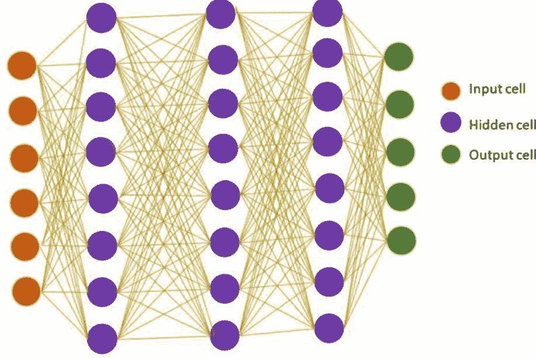

图1 深度神经网络(DNN)架构

深度学习方法的工作原理如图2所示。 在这种方法中，首先选择数据集和特定的深度学习算法来设计模型，然后进行全面的实验，最后生成和分析结果。

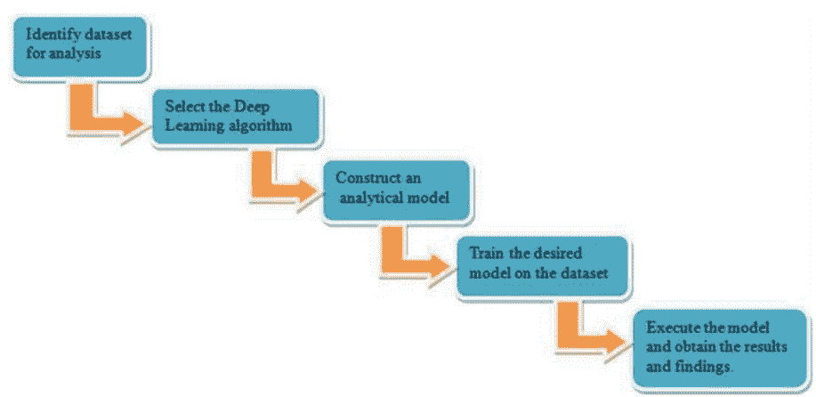

图2 深度学习模型的工作原理

已经开发了许多深度学习模型，例如卷积神经网络（CNN）、深度置信网络（DBN）、循环神经网络（RNN）等，这些模型将在下面的小节中讨论：

#### 卷积神经网络（CNN）

作为一种深度学习技术，CNN可以将图像作为输入，为多个图像对象分配权重和偏差，并能够区分它们。 与其他分类技术相比，CNN对预处理的要求较低。

视觉皮层的结构鼓励了CNN的架构。在这种架构中，对刺激的响应由受限区域内的单个神经元完成（视野）。 这样的区域群体与覆盖整个视觉表面。它具有多个卷积层。 第一层捕捉低级特征，而附加层则适应渲染对图像的整体理解，这在数据集中使用（图3）。

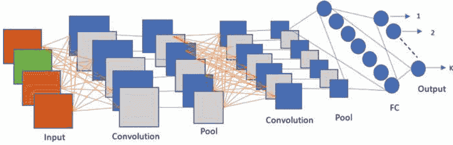

图3 卷积神经网络的工作模型

#### 循环神经网络(RNN)

RNN已成功应用于Google Voice Search和Apple Siri的顺序数据中。它具有内部记忆的独特功能,可以记住输入。在卷积神经网络作为前馈神经网络(FNN)只关注当前输入的同时,RNN将当前输入和先前接收到的输入视为反馈。它用于时间序列、文本分类等。

音频、视频在开发中对序列和上下文有更深的理解。在RNN中，信息通过一个循环传递。决策是基于先前学习的参数和当前参数进行的（图4）。

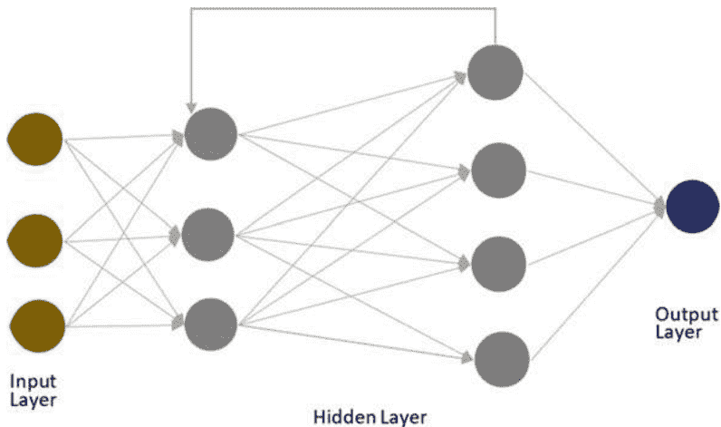

图4 表示RNN架构

#### 长短期记忆（LSTM）

一种能够通过门操作处理长输入序列的RNN版本。它具有以下门：输入门、遗忘门、输出门。这三个门可以添加新的输入，或者忘记最不重要的信息，或者显示当前时间戳的参数对输出的影响。它具有一个内存，可以执行读取、写入和删除操作。它通过相对较高的训练准确性解决了梯度消失问题。

#### 编码器-解码器（ED）

编码器-解码器架构超越了传统的机器学习方法。它已经转变为神经网络和序列到序列技术中的核心技术。它能够处理可变长度的输入和输出。

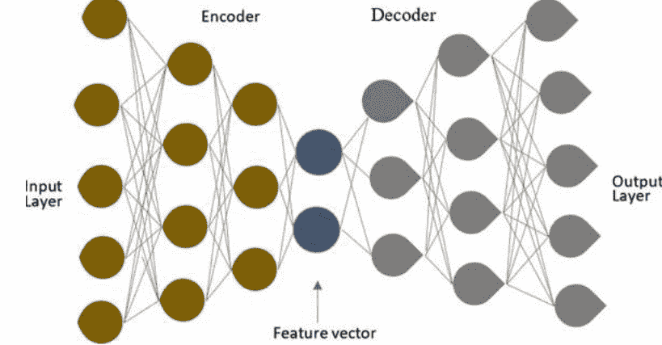

图5 编码器和解码器的基本架构

编码器保存输入序列并将其映射到编码序列。解码器利用编码版本将其实现为输出（图5）。

### 1.2 生物医学成像

深度学习是医学研究中日益增长和流行的研究领域，用于疾病的诊断。在当今的情况下，人们主要患有像2型糖尿病、肥胖症、心脏病和神经退行性疾病这样的生活方式疾病，这是由于药物、酒精、吸烟和不健康的饮食引起的。

深度学习在预测这些疾病方面发挥着重要作用。在我们的日常生活中，计算机辅助诊断（CAD）是通过计算机断层扫描（CT）、单光子发射计算机断层扫描（SPECT）、正电子发射计算机断层扫描（PET）、磁共振成像（MRI）等进行测试和诊断任何疾病的首选方法。深度学习加快了诊断的处理速度，同时可以扩展2D和3D参数以获取更多细节。它还可以在一定程度上解决数据标记和过拟合的问题。

### 1.3 深度学习在从各种医学图像中进行诊断中的作用

有许多疾病可以使用深度神经网络（DNN）进行分类或诊断，如乳腺癌、失语症、注意力缺陷多动障碍（ADHD）等等。深度学习是一个非常受欢迎的研究领域，借助它我们可以诊断任何类型的疾病。例如，ADHD是一种非常常见的精神障碍，在儿童中。患有ADHD的孩子可能会面临一些问题，如注意力不集中、易分心、虚弱和过度活动。同样，深度学习也用于癌症、阿尔茨海默病、帕金森病、脑肿瘤等的检测。

### 1.4 应用

深度学习不仅在健康信息学领域中普遍存在，而且在日常生活中也很常见。许多预测和分类任务都通过深度学习来管理，因为它具有有希望的结果、准确性和更快的处理速度以及较低的复杂性。

深度学习有许多应用，但一些典型的热门健康信息学应用包括：

- 1. 基于内容的图像检索
- 2. 目标检测
  - 人脸检测
  - 疾病诊断
  - 病变检测
- 3. 机器视觉和医学成像
  - 肿瘤检测
  - 肿瘤分期
  - 手术规划
  - 远程手术
  - 术中导航
  - 虚拟手术模拟
- 4. 识别任务
  - 虹膜识别
  - 模式识别

## 2 医学影像中的深度学习

机器比人类更快更准确，所以人类更喜欢机器/计算机工作。在医学科学中，计算机辅助诊断（CAD）和自动医学图像分析是首选，或者我们可以说是至关重要的选择。CAD在建模疾病进展方面也起着重要作用[2,3]，例如在许多神经退行性疾病（NDD）中，如中风、帕金森病（PD）、阿尔茨海默病（AD）和其他类型的痴呆症中。

脑部扫描是至关重要的，详细的脑部区域图可用于分析和预测疾病。我们可以将医学影像中最流行的CAD任务添加为癌症诊断和病变强度测量。近年来，由于其出色的性能和可靠性，CNN变得更加流行。CNN的效率和性能在CNN方法/算法调查中得到了体现，其中脑病理分割[4]和深度学习方法在CAD、形状预测和分割[2]中被使用。

CAD中的巨大挑战在于区分肿瘤的强度和形状，以及同一神经影像模态下成像协议的变化。在各种情况下，已经注意到病理组织的强度可能与健康组织重叠，并且MRI中的Rician噪声、基于强度的噪声和非各向异性分辨率效应等不同类型的噪声不能轻易处理或使用基本的机器学习方法处理。为了处理这种类型的数据复杂性，使用手工特征和成熟的机器学习方法将它们分类为完全不同的步骤。

深度学习方法可以自动化并结合分类方法[5,6]。卷积神经网络能够学习更复杂的特征；因此，卷积神经网络能够处理以不健康组织为中心的图像块。医学影像中的卷积神经网络能够根据X射线图像对结核病表现进行分类[7]，并根据CT图像对肺部疾病进行分类[8]。除了在彩色眼底图像中检测出血[9]，卷积神经网络还可以在预训练阶段提取最不具有区分性的图像块和最具有区分性的图像块。卷积神经网络提出了一些等强度阶段脑细胞分割方法[10]，并从多模态磁共振图像中提取不同的脑区域[11]。有许多混合方法被提出，其中卷积神经网络与其他架构相结合，例如，在[12]中提出了DL方法，用于对心脏左心室进行分割的参数进行编码，而深度自动编码器（DAE）用于推断其形状。

### 2.1 分类

分类根据我们的需求将数据分成不同的类别。有很多前沿的分类技术，例如支持向量机（SVM）、K最近邻（KNN）、随机森林（RF）、神经网络（NN），最近的技术是深度学习（DL），我们使用不同的DL方法进行分类。CNN是生物医学影像和健康信息学中一种流行的分类方法。图像分类的详细信息将在下一节中讨论。

#### 2.1.1 图像分类

图像分类是深度学习在其中有巨大贡献的广泛领域。在分类中，多个图像被用作输入，一个变量作为输出，并将该输出与期望输出进行比较，以检查是否诊断出疾病。我们可以使用不同的分类器，如支持向量机(SVM)、随机森林(RF)、人工神经网络(ANN)等等。

医学图像分类在图像识别中至关重要；其主要目标是将医学图像分类为不同的类别，以诊断疾病或帮助研究人员进行进一步研究。通过从图像中提取有用的特征，并使用这些特征构建分类模型来对医学图像进行分类。

在CAD还*不*像今天这样流行的时代，医生通常根据他们的经验从医学图像中提取特征，然后将图像分类为不同的类别。这是一项通常复杂、繁琐且耗时的工作。深度学习解决了准确预测的问题，意味着DL提供比人类更精确的结果，并且预测速度更快。它还可以处理许多不同患者的数据集。近年来，医学影像应用不仅在解决医生问题的情况下具有巨大优势，而且在研究中也如此。然而，我们研究人员仍然无法有效地完成这一任务。

如果研究能够高效且出色地进行分类，那么对医生诊断疾病将会有很大帮助。

#### 2.1.2 对象或病变分类

在医学图像分析和诊断中，计算机辅助诊断（CAD）作为助手提供意见（第二目标或附加目标）。近年来，许多类型的研究证明，CAD系统的整合可以加快诊断过程，并通过减少观察者间的差异性来提高图像诊断的准确性[13, 14]。CAD增强了对临床建议的定量支持，如活检[15]。为了识别肿瘤，CAD通常通过遵循重要步骤（如特征选择、特征提取和分类）来构建[16–19]。已经提出了各种机器学习和深度学习分类技术[20]，用于对癌细胞和健康细胞进行分类[21]。主要挑战是在不丢失重要信息的情况下减少特征的维度。在深度学习中，数据集是一个主要问题，如果数据集的大小较小，那么在最小风险的情况下预测某些实例将变得更加困难[21]。研究人员已经提出了许多病变分类的解决方案，但大多数解决方案通过选择特征、构建新特征或以监督方式减少特征空间[21]。

### 2.2 检测

在任何器官或组织的检测中，图像预处理、分割后跟分类，以检测任何疾病或对受试者进行分类。使用深度学习检测癌症细胞包括几个步骤：无监督或有监督特征学习，使用CNN进行图像表示，自动检测BCC，然后最后一步是视觉解释[4, 5, 22]。

#### 2.2.1 器官、区域、标志识别

在医学成像中，器官和区域的检测是一项重要任务，特别是在癌症和神经退行性疾病中，当器官变形活动在MRI或其他模态下记录时，就容易诊断患者所患疾病的类型和疾病的阶段[23]。在癌症诊断中，对肿瘤/脑肿瘤的诊断对于治疗计划起着至关重要的作用。显微镜图像分析中的一个主要挑战是对所有独立细胞进行精确或准确的检测，尽管大多数疾病级别的区分取决于细胞级别的信息[24]。为了完成这个挑战，学者和研究人员使用CNN对组织病理学图像中的细胞进行无误的检测和分割[24, 25]，在癌症诊断中得到了杰出的应用。

#### 2.2.2 对象和病变检测

如第2.1.2节所讨论的，对象和病变检测与其分类类似。唯一的区别是，对于病变的检测，我们首先必须执行分割任务，然后进行分类或预测以进行疾病的诊断[23, 26]。在当前情况下，深度学习提供了有希望的结果，以便及时为患者提供早期阶段和治疗。例如，在2018年，Abraham等人提出了一种使用U-Net深度学习架构来提高分割准确性和疾病诊断或预测的新方法[27]。

### 2.3 分割

分割在通过将图像分成多个部分并将这些部分与测试数据进行比较来预测疾病/障碍方面起着重要作用[3]。在医学图像分析中，主要采用CNN架构，最常用的是U-Net用于3D图像分割。在医学图像分析中，分割起着重要的作用；我们根据颜色、对比度、亮度和灰度等相似属性将图像分割成不同的部分。

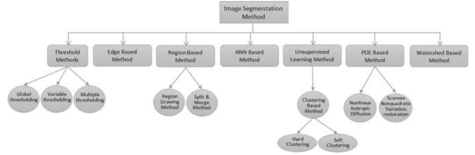

图6 显示了图像分割方法。

一些图像分割方法包括阈值、基于边缘、基于区域的方法、基于人工神经网络的方法、无监督学习方法等等。为了简洁起见，这里没有给出详细信息（图6）。

#### 2.3.1 器官和亚结构分割

研究人员和医疗从业者进行分割任务以诊断疾病阶段和其强度。它广泛应用于癌症诊断，癌症现在非常普遍，例如，仅在美国，2015年报告了23000例脑肿瘤病例，而且这个统计数据还在不断增加。尽管脑肿瘤的常规治疗是脑手术，但其他治疗方法包括化疗和放疗可以减缓肿瘤生长的速度。MRI可以提供脑部的完整结构和功能细节。然而，从MR图像、CT图像或其他医学成像模态中分割肿瘤可以提高诊断的准确性，了解肿瘤的生长速率、大小以及治疗的计划[28]。像脑膜瘤这样的肿瘤可以轻松分割，而由于对比度差和延伸的触角状结构，胶质瘤的分割则更加复杂[28]。肿瘤分割的主要目标是标记肿瘤的位置，检测扩展区域（癌细胞存在的区域）并将受影响的组织与健康组织进行比较以进行诊断[28]。

#### 2.3.2 病变分割

在病变分割方面有许多领先的方法，但是卷积神经网络在2D和3D生物数据中给出了最有希望的结果[29]。Yuan提出了一种病变分割方法[30]，用于通过卷积和反卷积方法[30]自动检测黑色素瘤周围的皮肤细胞。对于各种类型的癌细胞诊断，卷积神经网络和其他深度学习方法被使用，因为它们在较短的时间内提供更高的准确性和有希望的结果。

### 2.4 配准

配准是图像分析的一个任务；在这个过程中，通过一个图像计算出另一个图像的坐标变换。尽管配准是在一个迭代框架中完成的[31]，但它假设了一个非参数化的变换，因此预定的矩阵被优化[31]。MRI分析是多参数组织信息在更少的采集时间、更大的队列、更高的空间和时间分辨率以及解剖图中收集的。我们还可以得出结论，从数学上讲，图像配准是一个具有挑战性的几何分析、优化策略和数值方案[32-34]。

### 2.5 医学成像中的其他任务

医学成像中还有许多其他任务，用于提高图像质量和疾病诊断。我们将在下面的小节中对它们进行描述：

#### 2.5.1 基于内容的图像检索

基于内容的图像检索 (CBIR) 的主要目标是在决策过程中通过提供给定图像的类似医学案例来帮助医生。它需要大规模的数据集用于深度学习，清晰的图像表示和可靠地检索最相似的图像及其解释的算法。DL与CBIR的第一个应用出现在2015年[35]。2019年，Pizarro等人[36]设计了用于自动推断MRI扫描对比度的CNN架构，基于多个切片的MR图像的像素幅度或强度[37]。

#### 2.5.2 图像生成和增强

医学成像中的深度学习通常集中在重建图像的分类、预测和分割上。深度学习最近开始渗透到MR测量技术或从MR图像获取到去噪和超分辨率等低层次的方法[32]。

#### 2.5.3 将图像数据与报告相结合

由于深度学习对大规模数据进行预处理，因此可以得到更好的结果，这有助于放射科医生进行疾病诊断和进一步研究。报告中包含了疾病症状的相邻实例和不同发生概率，这有助于做出明智的决策。

## 3 深度学习在生物医学成像中的未来

在医疗领域将迎来一个新时代，医学成像和数据将发挥重要作用。随着人口的日益增长，病例/受试者的数量也将增加，我们知道深度学习应用于大规模数据集，如果记录的病例数量增加，大数据集的问题将自动解决。任何受试者的基本要求是在有限的时间内给予正确的治疗。在这个背景下，我们可以说大规模数据集的可用性带来了巨大的机遇和挑战。

在许多研究中，据报道CAD在疾病诊断方面比人类更准确，并且可以同时处理许多病例。因此，在这个技术世界中，CAD的可用性和可靠性已经不再是一个问题。在当前几年中，深度学习取代了机器学习和模式识别，因为医学影像领域存在大量的数据驱动解决方案，可以自动创建特征并减少人为干预[20]。它在许多健康信息学问题中都是有利的，并且最终，深度学习在生物医学影像学、生物信息学和医学信息学中迅速发展。大多数设计的DL应用于医学影像处理的健康数据是一种非结构化的来源[20]。

然而，大量的信息被编码在结构化数据中[20]。这提供了关于主题的历史、治疗、诊断和病理的完整信息。在医学影像中，在肿瘤检测的情况下，细胞学记录包含有关肿瘤阶段和扩散的信息[20]。这种信息非常重要；它对判断患者的状况或疾病是必需的。深度学习通过人工智能（AI）提高了临床决策支持系统的可靠性。

### 3.1 最近的方法和预测模型

随着深度学习的流行，由于其可靠性和灵活性，在生物医学成像领域有许多方法和框架，这些方法和框架随着时间的推移变得流行。最近，卷积神经网络（CNN）与其他深度学习架构的结合变得流行，例如将CNN与自动编码器、CNN与支持向量机用于分类、CNN与K-Means算法用于图像分割；类似地，解决现实生活问题和其他研究问题的方法和架构也有很多可用的。

有一些具有不同层和结构的CNN模型，例如VGG[38]，AlexNet[39]，GoogleNet[40]，ResNet[41]，Highway nets[42]，DenseNet[43]，ResNext[44]，SENet[45]，NASNet[46]，YOLO[47]，GANs[48]，Siamese nets[49]，U-net[50]，V-net[51]等等。

## 4 挑战和问题

与各种应用领域相关的各种问题和挑战，特别是需要解决的医疗应用问题：

- 数据量：深度学习具有高度计算能力，试图处理大量数据。没有一个具体的训练文档数量的普遍规则，但网络中至少应该有10个样本参数作为一个普遍的经验法则。我们可以在计算机视觉、语音、自然语言等各种应用领域找到大量的数据。正如我们所知，地球的人口正在日益增加，因此疾病的发病例数也在增加，因此数据的收集更加容易。
- 数据质量：数据质量在深度学习领域又是一个相关问题，因为在某些应用领域中，数据是异构的、原始的、嘈杂的和不完整的，可能会导致错误的解释结果；因此，在训练一个良好的深度学习模型时，要维护这样一个庞大和异构的原始数据库的数据质量存在一些问题，如数据稀缺性、数据重复性和缺失值等需要考虑。
- 可解释性：尽管深度学习模型在一些应用领域取得了成功的实现，但由于对于各种应用领域的可解释性对于预测系统至关重要，深度学习模型仍然被视为黑盒子。
- 领域复杂性：领域复杂性是另一个问题；当我们谈论医学领域时，数据集具有高度异质性，对其原因和进展的了解不完整。因此，在处理领域复杂性时设计和开发深度学习模型是非常重要的方面。
- 时间性：在各种应用领域（如医学领域）中，数据集以不确定的方式随时间变化，因为疾病在进展，而深度学习模型是使用静态向量输入进行训练的，没有经过训练来处理时间因素。因此，在考虑时间数据的情况下设计或开发深度学习模型是深度学习的另一个方面。这些与深度学习相关的挑战和问题为未来的研究方向打开了大门。
- 特征丰富：由于每种疾病的患者数量较少，世界上可用的数据有限。生成特征所需的数据集不仅限于特定的数据源，如社交媒体等，数据源可以通过各种可穿戴设备、调查、社交社区等进行收集。将数据源与深度学习模型集成是研究界面临的另一个挑战。
- 时间建模：在健康领域和现实生活问题中，时间至关重要。如果涉及到类似CAD系统和EHR以及其他监测设备的机器参与，那么时间就非常敏感，使用深度学习进行训练应该更快、更准确、更可靠，以便理解受试者的状况并进行检测疾病的阶段。为了解决这个问题，我们可以依靠RNN和与内存耦合的架构。
- 可解释的建模：在深度学习中，模型的性能很重要，但模型的可靠性或可解释性也非常重要。深度学习因其有希望的结果和出色的性能而变得越来越流行，然而，如何使结果更具解释性也是一项任务。研究人员应该关注模型的性能以及算法，以开发更好的系统预测能力。

### 参考文献

1. LeCun, Y., Bengio, Y., Hinton, G.: 深度学习. 自然 521(7553), 436 (2015)
2. Greenspan, H., Van Ginneken, B., Summers, R.M.: 深度学习在医学影像中的应用综述和未来前景. IEEE Trans. Med. Imaging 35(5), 1153-1159 (2016)
3. Stoyanov, D., Taylor, Z., Sarikaya, D., McLeod, J., Ballester, M.A.G., Codella, N.C., De Ribauierre, S. (eds.): OR 2.0 上下文感知手术室，计算机辅助机器人内窥镜，临床基于图像的手术和皮肤图像分析：第一届国际研讨会，OR 2.0 2018，第五届国际研讨会，CARE 2018，第七届国际研讨会，CLIP 2018，第三届国际研讨会，ISIC 2018，与MICC AI2018在一起举办，西班牙格拉纳达，2018年9月16日和20日，论文集，卷11041. Springer (2018)
4. Havaei, M., Guizard, N., Larochelle, H., Jodoin, P.M.: MRI中用于局部脑病理分割的深度学习趋势. In: 机器学习在健康信息学中的应用, pp. 125-148. Springer, Cham (2016)
5. Nie, D., Zhang, H., Adeli, E., Liu, L., Shen, D.: 3D深度学习用于多模态成像引导的脑肿瘤患者生存时间预测。在：国际医学图像计算与计算机辅助干预会议，第212-220页，2016年10月。Springer，Cham
6. Xu, T., Zhang, H., Huang, X., Zhang, S., Metaxas, D.N.: 用于宫颈异型增生诊断的多模态深度学习。在：国际医学图像计算与计算机辅助干预会议，第115-123页，2016年10月。Springer，Cham
7. Cao, Y., Liu, C., Liu, B., Brunette, M.J., Zhang, N., Sun, T., Curioso, W.H.: 利用深度学习和移动健康技术改善贫困和边缘化社区的结核病诊断。在：2016年IEEE第一届国际连接健康应用、系统和工程技术会议（CHASE），第274-281页，2016年6月。IEEE
8. Anthimopoulos, M., Christodoulidis, S., Ebner, L., Christe, A., Mougiakakou, S.: 使用深度卷积神经网络进行间质性肺疾病的肺部模式分类。 IEEE Trans. Med. Imaging 35(5), 1207-1216 (2016)
9. van Grinsven, M.J., van Ginneken, B., Hoyng, C.B., Theelen, T., Sánchez, C.I.: 使用选择性数据采样进行快速卷积神经网络训练：在彩色底片图像中应用于出血检测。 IEEE Trans. Med. Imaging 35(5), 1273-1284 (2016)
10. Zhang, W., Li, R., Deng, H., Wang, L., Lin, W., Ji, S., Shen, D.: 用于多模态等强度婴儿脑图像分割的深度卷积神经网络。 NeuroImage 108, 214-224 (2015)
11. Kleesiek, J., Urban, G., Hubert, A., Schwarz, D., Maier-Hein, K., Bendszus, M., Biller, A.: 深度MRI脑部提取：用于去除颅骨的3D卷积神经网络。 神经影像学 129, 460-469 (2016年)
12. Avendi, M.R., Kheradvar, A., Jafarkhani, H.: 一种结合深度学习和可变形模型的全自动心脏MRI左心室分割方法。医学图像分析30, 108-119 (2016年)
13. Singh, S., Maxwell, J., Baker, J.A., Nicholas, J.L., Lo, J.Y.: 乳腺肿块的计算机辅助分类：专家放射科医生与住院医师的性能和观察者间变异性。 放射学 258（1），73-80 (2011年)
14. Sahiner, B., Chan, H.P., Roubidoux, M.A., Hadjiiski, L.M., Helvie, M.A., Paramagul, C., Blane, C.: 三维超声成像中的恶性和良性乳腺肿块：计算机辅助诊断对放射科医生准确性的影响。 放射学 242(3), 716–724 (2007)
15. Joo, S., Yang, Y.S., Moon, W.K., Kim, H.C.: 基于多个超声特征的人工神经网络对实体乳腺结节的计算机辅助诊断。
16. Chen, C.M., Chou, Y.H., Han, K.C., Hung, G.S., Tiu, C.M., Chiou, H.J., Chiou, S.Y.: 乳腺超声图像上的病变：基于几乎与设置无关的特征和人工神经网络的计算机辅助诊断。 放射学 226(2), 504–514 (2003)
17. Sun, T., Zhang, R., Wang, J., Li, X., Guo, X.: 基于纵向和平衡数据的早期肺癌计算机辅助诊断。 PLoS ONE 8(5), e63559 (2013)
18. Newell, D., Nie, K., Chen, J.H., Hsu, C.C., Hon, J.Y., Nalcioğlu, O., Su, M.Y.: 乳腺MRI诊断特征的选择，用于区分恶性和良性病变的计算机辅助诊断：以肿块和非肿块样增强为例。 欧洲放射学杂志。 20(4), 771–781 (2010)
19. Tourassi, G.D., Frederick, E.D., Markey, M.K., Floyd, C.E.: 应用互信息准则进行计算机辅助诊断特征选择。医学物理学。 28(12), 2394–2402 (2001)
20. Rav, D., Wong, C., Deligianni, F., Berthelot, M., Andreu-Perez, J., Lo, B., Yang, G.Z.: 深度学习在健康信息学中的应用. IEEE J. Biomed. Health Inform. 21(1), 4–21 (2017)
21. Lu, J., Getz, G., Miska, E.A., Alvarez-Saavedra, E., Lamb, J., Peck, D., Downing, J.R.: 微小RNA表达谱分类人类癌症. Nature 435(7043), 834 (2005)
22. Cruz-Roa, A.A., Ovalle, J.E.A., Madabhushi, A., Osorio, F.A.G.: 一种用于图像表示、视觉可解释性和自动基底细胞癌癌症检测的深度学习架构. In: 国际医学图像计算与计算机辅助干预会议, pp. 403–410, 2013年9月. Springer, Berlin, Heidelberg
23. Bowles, C., Qin, C., Guerrero, R., Gunn, R., Hammers, A., Dickie, D.A., Rueckert, D.: 通过图像合成和异常检测进行脑损伤分割。神经影像临床 16, 643–658 (2017)
24. Shen, D., Wu, G., Suk, H.I.: 医学图像分析中的深度学习。年度回顾生物医学工程 19, 221–248 (2017)
25. Chen, H., Dou, Q., Wang, X., Qin, J., Heng, P.A.: 通过深度级联网络在乳腺癌组织学图像中检测有丝分裂。 在：第三十届AAAI人工智能大会，2016年2月
26. Van Leemput, K., Maes, F., Vandermeulen, D., Colchester, A., Suetens, P.: 通过模型异常检测自动分割多发性硬化症病变。IEEE医学成像交易20(8), 677–688 (2001)
27. Abraham, N., Khan, N.M.: 一种改进的注意力U-Net的新型焦点Tversky损失函数用于病变分割。 arXiv预印本 arXiv:1810.07842 (2018)
28. Havaei, M., Davy, A., Warde-Farley, D., Biard, A., Courville, A., Bengio, Y., Larochelle, H.: 深度神经网络在脑肿瘤分割中的应用。医学图像分析。 35, 18–31 (2017)
29. Sudre, C.H., Li, W., Vercauteren, T., Ourselin, S., Cardoso, M.J.: 广义Dice重叠作为高度不平衡分割的深度学习损失函数。 在：深度学习中医学图像分析和多模态学习用于临床决策支持，第240-248页。 Springer, Cham (2017)
30. Yuan, Y.: 使用完全卷积-解卷积网络的自动皮肤病变分割。 arXiv预印本 arXiv:1703.05165 (2017)

31. Litjens, G., Kooi, T., Bejnordi, B.E., Setio, A.A.A., Ciompi, F., Ghafoorian, M., Sánchez, C.I.: 关于深度学习在医学图像分析中的调查。医学图像分析 42, 60-88 (2017)

32. Lundervold, A.S., Lundervold, A.: 关于深度学习在医学影像中的概述：重点关注MRI。医学物理学杂志 (2018)

33. Maclaren, J., Herbst, M., Speck, O., Zaitsev, M.: 关于脑成像中的前瞻性运动校正的综述。磁共振成像 69(3), 621-636 (2013)

34. Zaitsev, M., Akin, B., LeVan, P., Knowles, B.R.: 关于功能性磁共振成像中的前瞻性运动校正。神经影像 154, 33-42 (2017)

35. Juneja, K., Verma, A., Goel, S., Goel, S.: 对最近在低级特征提取中用于图像索引和检索技术的调查。在: 2015年IEEE国际计算智能与通信技术会议上, 第67-72页, 2015年2月. IEEE

36. Pizarro, R., Asselman, H.E., De Nigris, D., Elliott, C., Antel, S., Arnold, D., Shmuel, A.: 使用深度学习算法自动识别脑MRI对比度: 对管理大型数据库的影响. 神经信息学 17(1), 115-130 (2019)

37. Sklan, J.E., Plassard, A.J., Fabbri, D., Landman, B.A.: 基于内容的图像检索与深度卷积神经网络。在: 2015年医学成像: 分子、结构和功能成像中的生物医学应用, 第9417卷, 第94172C页, 2015年3月. 国际光学和光子学学会

38. Simonyan, K., Zisserman, A.: 面向大规模图像识别的深度卷积网络. arXiv预印本 arXiv:1409.1556 (2014)

39. Krizhevsky, A., Sutskever, I., Hinton, G.E.: 使用深度卷积神经网络进行ImageNet分类。在: Advances in Neural Information Processing Systems, pp. 1097-1105 (2012)

40. Szegedy, C., Liu, W., Jia, Y., Sermanet, P., Reed, S., Anguelov, D., Rabinovich, A.: 使用卷积进行更深层次的研究。在: Proceedings of the IEEE Conference on Computer Vision and Pattern Recognition, pp. 1-9 (2015)

41. He, K., Zhang, X., Ren, S., Sun, J.: 深度残差学习用于图像识别。在: Proceedings of the IEEE Conference on Computer Vision and Pattern Recognition, pp. 770-778 (2016)

42. Srivastava, R.K., Greff, K., Schmidhuber, J.: 训练非常深的网络。在: 神经信息处理系统进展, 第2377-2385页 (2015)

43. Huang, G., Liu, Z., Van Der Maaten, L., Weinberger, K.Q.: 密集连接的卷积网络。在: IEEE计算机视觉和模式识别会议论文集, 第4700-4708页 (2017)

44. Xie, S., Girshick, R., Dollár, P., Tu, Z., He, K.: 聚合残差变换用于深度神经网络。在: IEEE计算机视觉和模式识别会议论文集, 第1492-1500页 (2017)

45. Hu, J., Shen, L., Sun, G.: 挤压激励网络。在: IEEE计算机视觉和模式识别会议论文集, 第7132-7141页 (2018)

46. Zoph, B., Vasudevan, V., Shlens, J., Le, Q.V.: 学习可扩展图像识别的可迁移架构。在: IEEE计算机视觉和模式识别会议论文集, 第8697-8710页 (2018)

47. Redmon, J., Divvala, S., Girshick, R., Farhadi, A.: You only look once: 统一的、实时的目标检测。在: IEEE计算机视觉和模式识别会议论文集, 第779-788页 (2016)

48. Goodfellow, I., Pouget-Abadie, J., Mirza, M., Xu, B., Warde-Farley, D., Ozair, S., Bengio, Y.: 生成对抗网络。在: 神经信息处理系统进展, 第2672-2680页 (2014)

49. Koch, G., Zemel, R., Salakhutdinov, R.: Siamese神经网络用于一次性图像识别。在: ICML深度学习研讨会, 第2卷, 2015年7月

50. Ronneberger, O., Fischer, P., Brox, T.: U-net: 用于生物医学图像分割的卷积网络。在: 国际医学图像计算与计算机辅助干预会议, 第234-241页, 2015年10月。Springer, Cham

51. Milletari, F., Navab, N., Ahmadi, S.A.: V-net: 全卷积神经网络用于体积医学图像分割。在：2016年第四届三维视觉国际会议(3DV)，第565-571页，2016年10月。IEEE

Monika Jyotiyana目前是印度拉贾斯坦中央大学计算机科学系的博士生。她于2012年获得硕士学位，并于2010年从阿里安国际学院获得本科学位，该学院隶属于拉贾斯坦邦阿杰梅尔大学。她的研究兴趣包括医学图像处理、机器学习、深度学习和神经网络。她在各种会议和书籍章节上发表了优质论文。

Nishtha Kesswani目前是印度拉贾斯坦中央大学计算机科学系的助理教授。她在美国加利福尼亚州立大学圣贝纳迪诺分校进行了博士后研究，并在印度拉贾斯坦大学获得了博士学位。她在印度拉贾斯坦邦马拉维亚国立理工学院获得了硕士学位。她的研究兴趣包括算法、人机交互和无线网络。她在各种国际期刊、会议、书籍和书籍章节中发表了论文。

# 使用深度学习的MRI图像中的自动化脑肿瘤分割：概述、挑战和未来
Minakshi Sharma和Neha Miglani

## 摘要
MRI图像的脑肿瘤分割是医学图像处理中的关键任务。能够在初期诊断出脑肿瘤非常重要，这将最终改善患者的治疗和生存机会。

手动分割高度依赖于医生，可能因专家而异，而且非常耗时。另一方面，自动分割有助于医生快速决策，结果可以复制，并且可以以电子方式进行记录，从而改善诊断和治疗计划。

有许多自动化方法用于脑肿瘤检测，这些方法在过去几十年中非常流行，包括神经网络（NN）和支持向量机（SVM）。但是，最近深度学习在自动化脑肿瘤分割方面取得了重要进展，因为深度架构能够表示复杂结构，自学习并高效处理大量基于MRI的图像数据。首先，本章介绍了脑肿瘤的概念和各种类型。在下一节中，讨论了各种预处理技术。预处理是自动化系统正确性的关键步骤。在图像预处理后，讨论了各种特征提取和特征降维技术。在下一节中，介绍了图像分割的传统方法，然后讨论了在该领域中相关的不同深度学习算法。然后，在下一节中，讨论了由于深度学习而在医学图像分割中面临的各种挑战。在最后一节中，对大约200个脑部图像进行了准确性、特异性和敏感性等方面的各种现有算法的比较研究。本章的动机是在现有工作、各种挑战以及未来的发展方向方面概述基于深度学习的分割算法。本章介绍了涉及脑肿瘤分类过程中不同算法的核心，并进行了比较分析，以确定哪种算法最好。

## 关键词
卷积神经网络 · 脑肿瘤分割 · 深度学习 · 磁共振图像 · 支持向量机 · 医学图像处理

## 1 引言
在早期,人们无法想象能够获得大量的医疗保健数据;然而,如今可获得大量的数据 (准确地说,大数据) ;原因是图像获取设备和工具的改进,这进一步引发了领域内的各种挑战。医学数据的放大和扩展程度,如图像和技术,需要医疗专业人员进行详尽和枯燥的尝试,这不仅容易出错,而且在不同专业人员之间可能会发生变化。因此,自动化诊断过程是一个绝对关注的问题。尽管机器语言可以帮助实现这种自动化,但传统方法在处理复杂问题时效率不高。

因此,在这些领域中可以考虑一些混合方法来提高准确性和精确性水平。因此,机器学习与高性能计算结合起来,可能有助于处理复杂的医学图像,以获得真实和充分的诊断结果。同样,如果借助深度学习进行特征提取,可能会更加强大,因为它可以帮助构建新的图像。深度学习得出的结论将涉及许多领域,包括疾病诊断、准确测量目标以及提供预测模型的解决方案,建议可以采取哪些行动,最终指导领域专家。

在过去的几年中,许多领域都显示出了快速发展,如人工智能、深度学习和机器学习。这些模式在医学领域发挥了关键作用,如图像分割、图像注册和解释、自动诊断、图像处理、图像数据的分析和检索。机器学习有助于图像数据和特征提取,并以有组织的方式呈现这些信息。这些人工智能和机器学习技术可以帮助医学专家以更详细和精确的方式预测疾病的可能性,并最终有助于预防疾病。医学领域的专家和研究人员可以更清晰地分析导致疾病发生的常见变异。许多传统算法构成了这些技术的核心,如K最近邻算法、神经网络等[1]。尽管这些方法效率高,但在处理能力和时间消耗方面仍存在缺点。它们有潜力以原始形式处理图像,但需要更多时间进行特征提取,并需要专家的理解能力。

除了这些传统方法之外，还有许多其他方法开始在该领域中发挥作用，包括长短期记忆、极限学习模型、循环神经网络、卷积神经网络等等。这些技术克服了传统方法的局限性，自动化了特征提取并加快了学习速度。它们倾向于自动化信息的描述，并从广泛的图像集中训练多个层次的思考[2]。尽管传统方法在医学领域已经证明了显著精确的结果，但新兴技术和进步有助于找到复杂问题的准确解决方案。许多深度学习算法在药物发现、文本和语音识别、人脸识别等重要领域取得了显著的性能和速度改进。本章对深度学习算法在医学领域，特别是医学图像分析方面进行了广泛而详尽的回顾，同时考虑了过去的工作。本章倾向于提供关于深度学习方法在医学领域中的基本信息、现代性和最高发展水平的内容。

## 2 什么是脑肿瘤?
脑控制人体的所有重要和基本功能。它是人体最重要和最复杂的器官之一，是中枢神经系统的主要组成部分。头骨遮盖着人脑，进一步由“灰质（GM）、白质（WM）和脑脊液（CSF）”组成。

脑脊液（CSF）是一种透明的液体，包裹着人脑和脊髓。它为中枢神经系统提供不同的功能，并作为包含离子、氧气和葡萄糖的冲击吸收剂，在神经组织中分布。CSF还有助于清除神经组织中的垃圾[3-5]。

### 2.1 脑肿瘤的类型
根据世界卫生组织（WHO）的数据，迄今为止已经检测到大约120种不同类型的脑肿瘤。WHO的分类标准是细胞的起源。广义上，脑肿瘤可以进一步分为两类（如图1所示）：

- 原发性脑肿瘤：这些肿瘤起源于脑部。肿瘤的名称可以根据其起源确定。肿瘤可以分为良性和恶性两种方式。良性肿瘤也被称为非癌性肿瘤，不会影响其他部位。而恶性脑肿瘤

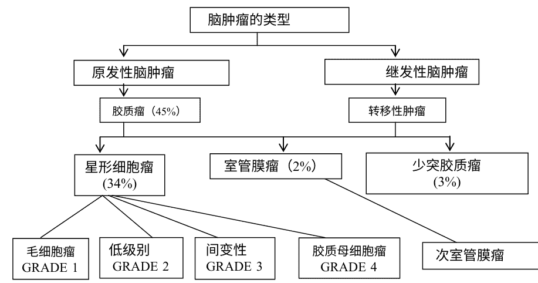

肿瘤起源于脑部本身，并影响身体的其他部位，如脊柱。恶性肿瘤的生长速度快。良性脑肿瘤比恶性肿瘤更容易治疗，因为它们没有深入脑部并有明确的边界。此外，如果成功切除良性肿瘤，它们很少会复发。但是对于恶性肿瘤来说并非如此，即使它们被切除，仍然有复发的可能性。

- 继发性脑肿瘤：这些肿瘤来自其他身体部位（转移）。这种类型的肿瘤根据它们最初扩散的身体部位而命名。如果脑肿瘤来自肺部，那么它被称为转移性肺肿瘤；原因是这种肿瘤是由于肺细胞异常生长而发展的[10]。

### 按等级划分
在医学术语中，脑肿瘤可以分为四个等级。1级肿瘤是处于初始阶段且生长速度缓慢的肿瘤。2级被称为良性肿瘤。1级和2级属于低级别肿瘤类别。3级和4级可以被归类为高级别肿瘤（恶性）并需要紧急治疗（参见图2）。

## 3 什么是深度学习？
深度学习也被称为结构化学习或分层学习。它是一种模仿人脑的机器学习子类型。在简单的神经元结构中，只有三种类型的层（输入层、隐藏层、输出层）。相反，深度神经网络包含许多隐藏层进行多处理。

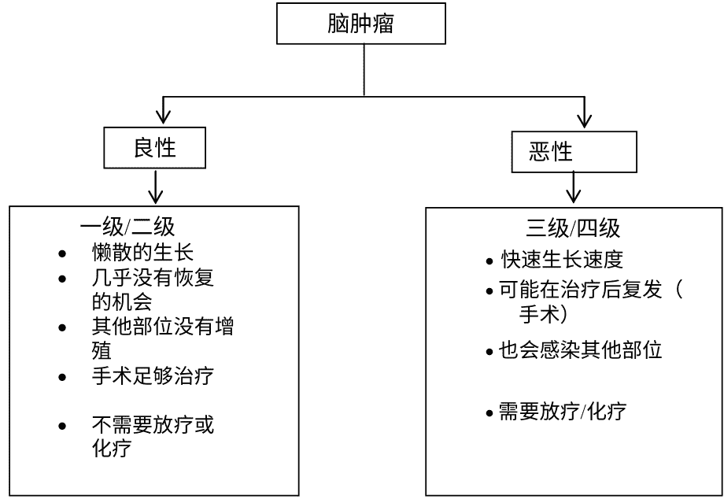

图2 根据等级进行脑肿瘤分类

### 3.1 深度学习架构和神经网络
人工神经网络是生成人脑计算机模型的一种方法，旨在构建一个比传统方法更快速进行计算工作的系统。 ANN接收基本单元，这些单元以某种方式相互连接，以提供这些单元之间的通信[11]。 最早的已知神经网络是基于生物神经网络的类比构建的感知器。 感知器的简单概念是输入层的节点直接连接到输出层的节点，并且足够高效地解决模式的线性可分性问题。 但是这种简单的网络不足以解决复杂的问题，因此提出了一种分层结构，用于处理复杂的模式，包括输入层和输出层；除了这些层之外，还包括n个隐藏层。 在基本的神经网络方法中，以相互连接的形式接收输入的神经元对接收到的数据进行操作和处理，最终将其转发到下一层，该层可以是输出层或隐藏层，具体取决于所创建的结构，如图3所示。

激活函数的概念用于检查下一层将给出的值。 根据所选的阈值，神经元会被激活或抑制。 通过增加隐藏层的数量，可以解决复杂的问题，因为隐藏层可以理解非线性关系。 尽管隐藏层专注于复杂问题，但使用最少的隐藏层数量很重要。层数增加会使结构变得复杂。 这种类型的神经网络被称为深度神经网络。在这种网络中,数据的训练和学习是具有成本效益的。 这些额外的层,特别是隐藏层,通过提供设计复杂架构的能力,促进了从较低层到较高层的特征构建。 对于设计和开发自动化应用程序,深度学习已经成为一种有前途的方法，并且已经树立了一个基准。 通过自动化获得的结果优于手动观察，即在医学领域应用时，基于深度学习的计算机视觉应用在捕捉肿瘤和MRI中的癌症识别指标方面提供了准确和精确的结果。可以将其视为人工神经网络的增强，其中包含许多隐藏层，允许抽象视图和精细图像分析。 这种方法因其无与伦比的结论和在不同应用中获得的结果而引起了许多不同领域的研究人员的关注，例如面部识别、物体检测以及医学领域。 深度神经网络组装了许多层的节点/神经元，生成了一个分层结构。 在单个网络中,层数甚至超过了一千层。 凭借如此庞大的建模维度,网络可以通过收集大量数据库进行回归训练过程，绝对地记住每个可行的映射，并能够进行适当的预测，如对未知情况的估计。 因此,可以得出结论,这种方法在医学图像和计算机视觉领域确实具有强大的影响力。 然而,它的巨大影响也可以在语音和文本领域中看到。 研究人员正在利用深度神经网络的不同领域和扩展;其中一个例子是卷积神经网络,这是一种绝对的趋势。 除此之外,该领域的许多其他领域也成为研究人员的兴趣,例如深度玻尔兹曼机(DBM)、深度神经网络(DNN)

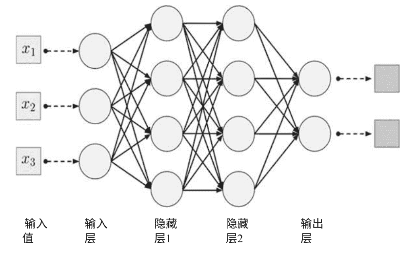

图3 神经网络结构[70]

在表1中，深度自编码器（dA）、深度置信网络（DBN）、循环神经网络（RNN）及其变种，如MDLATM或BLSTM等，以及它们的优缺点都有所描述。卷积神经网络（CNN）模型在数字图像处理和视觉领域引起了关注。

### 基本工作原理
深度神经网络的工作可以分为图4所示的五个步骤。

第一步是识别问题和可行性研究，这是非常关键的一步，要知道深度学习是否能够解决给定的问题。第二步需要收集相关数据。有各种各样的深度学习算法可供选择，因此在第三步中进行适当算法的选择。最后，第四步和第五步涉及数据的训练和测试。

### 深度学习相对于机器学习的4个优势
图像解释和获取是进行正确疾病诊断的两种方式。在过去的几年里，用于获取图像的工具和设备已经大大升级，现在可以检索到高分辨率的放射学图像，用于进一步分析，例如CT扫描、X射线、MRI。然而，这只是实现自动解释图像过程的开始。机器学习的许多应用，如计算机视觉，已经存在，但用于图像解释的传统机器学习方法在特征提取方面对专家有很强的依赖性，例如检测脑肿瘤需要进行结构特征提取。传统方法虽然高效，但结果不准确且不可靠，原因是患者数据之间存在巨大差异。

因此，机器学习算法在处理混乱和复杂数据方面起着关键作用[12]。

此外，深度学习作为一种更为特殊和精确的方法，在各个领域引起了很大的兴趣，尤其是在医学领域中，用于分析图像和预测。预计到2021年，深度学习将占据约3亿美元的医学成像市场。它将单独获得医疗领域的巨额投资，以更准确的结果和复杂数据的更好准确性。

深度学习的增长在多年间显示了巨大的增长（如图5所示）。这种方法属于监督式机器学习方法的一类。深度学习已经在许多不同的领域中取得了成功，其中之一就是计算机视觉。然而,其主要成功在于减少人为参与进行疾病诊断，并依赖自动化结果以获得高度的准确性，特别是在脑肿瘤领域，分析中的微小错误可能导致严重后果。在这种情况下，深度学习方法通过使用领先的方法和技术，更好地近似和模拟人脑，提供了显著的结果，相比基本的神经网络方法。深度学习探索了其在

### 表1 深度学习架构的比较分析
| 网络类型 | 描述 | 优点 | 缺点 |
|---|---|---|---|
| 深度神经网络 [1, 72] | 它包含超过两个隐藏层，可以应用于更复杂的关系。它主要用于分类和回归领域 | 非常容易适应新问题，不需要特征工程，节省了大量时间和精力。 | 它需要大量的数据需要更多的计算时间来训练它不能总结分类过程 |
| 卷积神经网络 [62] | 卷积神经网络由n个基本构建块组成，即池化层、卷积层和全连接层，并且通过反向传播方法开发出自动训练特征空间层次结构 | 卷积神经网络对图像的预处理较少CNN对2D数据显示出良好的结果 | 需要大量标记数据进行分类 |
| 循环神经网络(RNN) [73] | 在RNN中，权重在序列之间共享 | RNN架构有助于处理时间相关事件。 它还在语音识别、自然语言处理中起着重要作用 | RNN的缺点是需要大量的数据集 |
| 深度玻尔兹曼机(DBM) [74] | 它只维护隐藏层之间的单向连接 | 对于模糊的数据集有帮助 | 对于如此大的数据集，优化非常困难 |
| 深度自编码器(DA) [47] | 无监督学习使用深度自编码器，有助于特征或维度的降低 | DA不需要标记数据 | DA受到消失梯度问题的困扰，处理时间更长，因为需要预训练步骤 |
| 深度信念网络(DBN) [75, 76] | 该模型包括了连接，这是单向的。 它利用了监督和无监督的机器学习方法。每个子网络都由隐藏层组成，对其下一层可见 | 贪婪的方法在每个相应的层以及推理兼容性方面增强了可信度 | 初始化阶段使学习过程变得计算密集和昂贵 |

图4 深度神经网络的基本工作原理
图5 深度神经网络的增长[12]

深度和洞察力的神经网络模型。当现有知识有限且手头问题复杂而现实时，这种技术证明了其价值。神经网络的关键是其基本单元——神经元，灵感来自人脑的工作原理，其中多个信号作为输入单元，信号从一层传递到另一层，层之间通过相互连接的权重链接在一起。最终，组合的信号经过不同的非线性操作，产生一个输出信号。

## 4.1 不同深度学习模型架构的比较

不同深度学习模型架构的比较（见表1）。

![img/ef0d094a1d03d7ea56d71f0cde432d0b_366_0.png]
![img/ef0d094a1d03d7ea56d71f0cde432d0b_366_1.png]

## 5 脑肿瘤分类步骤

脑肿瘤分类包括从数据收集到肿瘤检测的七个阶段，如图6所示：

### 5.1 MR图像采集

第一步是建立MR图像数据库。图像是从1.5T MRI机器收集的，通常使用的图像尺寸为256×256。灰度图像的强度范围为[0, 255]，其中0代表黑色，255代表白色。该数据库可以分为两种类型：训练数据库和测试数据库。这些图像以JPEG格式存储。脑部图像示例如图7所示。

### 5.2 图像预处理

图像预处理是准确获得后续步骤结果的关键步骤。它可以去除图像噪声，检测边缘或增强对比度，并用于将输入图像加载到MATLAB环境中[13-17]。提出的系统在预处理中使用了一些技术：

![img/ef0d094a1d03d7ea56d71f0cde432d0b_367_0.png]

图6 脑部分类的七个步骤

![bbox=[123, 83, 869, 255]]

图7 具有肿瘤的脑部图像[4]
- (a) 直方图均衡化
- (b) 将彩色图像（RGB）转换为灰度图像
- (c) 形态学操作
- (d) 边缘检测

- (a) 直方图均衡化：为了增强图像对比度，对图像应用了直方图均衡化。它改善了图像的对比度，这对后续步骤是有益的。图像直方图使用图形表示图像的灰度级变化。为了产生均匀的直方图，所有不同的强度值分布在整个尺度上。通常，CLAHE（对比度有限自适应直方图均衡化）由于其高准确性而更受欢迎[10,17-21]（图8）。
- (b) 彩色图像（RGB）转灰度图像：这种技术用于将彩色图像转换为灰度图像，以便在后续步骤中减少复杂性（如图9所示）。灰度图像只包含一个图像平面，而不是RGB图像的三个平面。这种转换将数据减少了1/3。这种数据减少导致算法的处理速度更快。因此，在任何进一步处理之前，这是非常关键的一步[22,23]。

![bbox=[174, 659, 819, 830]]

图8显示了直方图均衡化之前和应用之后的脑部图像。从两个图中可以看出，图像的对比度得到了增强，这对后续步骤是有益的[71]。a 原始MRI[5]。b 直方图均衡化MRI

![img/ef0d094a1d03d7ea56d71f0cde432d0b_369_0.png]

图9 a 彩色MRI [4]。 b 灰度MRI

可以使用MATLAB中提供的函数来实现这一点：
```matlab
I = rgb2gray(RGB);
```
其中RGB是要转换为灰度图像的图像，I是结果图像。

- (c) 形态学操作：形态学操作可用于锐化图像区域和填充图像间隙。基本上有四种基本操作：膨胀、腐蚀、开运算和闭运算。图10显示形态学操作前后的结果[24, 25]。
```matlab
image = imerode(Image1, SE0);
```
其中`SE0 = strel('disk', 8);`。`se`是一个结构元素，`strel`用于创建结构元素，其形状为半径为8的圆盘。

![img/ef0d094a1d03d7ea56d71f0cde432d0b_369_1.png]

图10 a 原始图像。b 形态学操作后

图11 用于模糊边缘检测的掩模
| p1 | p2 | p3 |
| :---: | :---: | :---: |
| p4 | p5 | p6 |
| p7 | p8 | p9 |

- (d) 边缘检测[26-48]

边缘检测算法在发现图像强度突变方面非常有帮助，因此可以过滤掉无用信息。这些算法在计算机视觉、图像增强、多媒体通信中的安全性、医学诊断、图像加密、图像压缩和图像分割等许多领域都有应用。有各种边缘检测算法，如Sobel边缘检测、Robert边缘检测、Prewitt边缘检测器、高斯拉普拉斯（LoG）检测器、Canny边缘检测器和基于模糊的边缘检测器。通常使用基于模糊的边缘检测器。由于医学图像包含更多的模糊和不确定性，其他标准的边缘检测算法无法正确确定真实的边缘。基于模糊的边缘检测算法还具有一些优点，如不需要参数设置，在所有条件下都能很好地工作，即使噪声也不会影响边缘检测过程，不需要像其他边缘检测算法那样进行噪声过滤。基于模糊的边缘算法的工作过程如下所述：
- (1) 第一步是将彩色图像转换为灰度图像。
- (2) 第二步是使用3×3掩模（图11）扫描整个图像。扫描过程会重复进行，直到整个图像以3×3的块为单位被扫描完毕。
- (3) 然后，p1到p9的清晰输入是基于定义的隶属函数的模糊输入值：对于黑色[0, 0, 255]和隶属函数-三角形，对于白色[0, 255, 255]和隶属函数-三角形。
- (4) 相应的输出将根据模糊输出值分类为白色、黑色或边缘：对于黑色[0, 2, 4]和隶属函数-三角形，对于边缘[133, 131, 122]和隶属函数-三角形，对于白色[209, 232, 235]和隶属函数-三角形（如图12所示）。
- (5) 总共制定了81条规则。表2显示了一些模糊规则的示例。

![img/ef0d094a1d03d7ea56d71f0cde432d0b_371_0.png]

图12 输出成员函数

### 5.3 特征提取

特征是图像相关的重要属性。图像的一个重要特征是图像的纹理。从任何预处理图像中过滤不同的特征被称为特征提取。这些特征被用于图像分类[49-51]。有两种不同的方法来分割图像：结构化方法和统计方法。本研究采用了统计方法。用于纹理测量的众多技术包括Gabor滤波器、共生矩阵、小波变换、分形。本研究采用了灰度共生矩阵（GLCM）技术。这种技术依赖于通过利用相邻像素特征之间的空间关系来数值化地理解特征值。它们还可以进一步帮助分类和比较数值化得到的不同特征值。用于计算任何给定图像的这些特征的函数在MATLAB中可用：
```matlab
GLCM2 = graycomatrix(image, 'Offset');
```

| p1 | p2 | p3 | p4 | p5 | p6 | p7 | p8 | p9 | 输出 |
| :---: | :---: | :---: | :---: | :---: | :---: | :---: | :---: | :---: | :---: |
| BK | BK | BK | BK | BK | BK | BK | BK | WT | EDGE |
| BK | BK | BK | BK | BK | BK | BK | BK | BK | BK |
| WT | WT | WT | WT | WT | WT | WT | WT | WT | WT |
| BK | WT | WT | WT | WT | WT | WT | WT | WT | WT |
| WT | WT | WT | WT | WT | WT | WT | WT | BK | EDGE |

其中，`image`是用于输入图像的变量，`offset`用于测量来自四个不同方向（0°, 45°, 90°, 135°）的特征，并具有偏移值（[0,1], [-1,1], [-1,0], [-1,-1]）。

![img/ef0d094a1d03d7ea56d71f0cde432d0b_373_0.png]

这些特征用于图像分割。图像分割可以通过两种方式进行：统计方法和结构化方法。大多数研究人员使用统计方法。有几种用于测量纹理的统计技术，例如共生矩阵、分形、Gabor滤波器、小波变换。提出的研究工作使用了灰度共生矩阵（GLCM）。GLCM利用邻域像素之间的空间关系来捕捉数值特征值。这些数值特征值用于进一步比较和分类特征。GLCM提取了20个纹理特征：“自相关、对比度、相关性、簇突出度、簇阴影、不相似度、能量、熵、均匀性、最大概率、平方和、方差、平均和、平均方差、平均熵、差异方差、差异熵、相关性信息度量、相关性信息度量2、逆差异（INV）、归一化逆差异（INN）、逆差异矩（INM）”（如图13所示）[52, 53]。

GLCM特征是从三个不同的脑图像中提取的，即脑图像1、脑图像2和脑图像3，如图14和表3所示，给出了从这些图像中获得的结果。
- 1. 对比度（Contrast）：它衡量像素与其相邻像素之间的灰度变化。可以使用下面的公式计算对比度：
  $$Contrast = \sum_{a,b} |a-b|^2 P_i(a, b)$$
  其中 $P_i(a, b)$ 表示位置 $(a, b)$ 处的像素。
- 2. 能量（Energy）：它计算图像的均匀程度。
  $$Energy = \sum_{i,j} P_i^2(i, j)$$

### 特征类型

- **基于形状的特征**
  1. 面积
  2. 周长
  3. 圆度
  4. 不规则度
  5. 形状指数
- **基于强度的特征**
  1. 平均值
  2. 方差
  3. 标准差
  4. 中位数
  5. 偏度
  6. 峰度
  7. 范围
  8. 像素
  9. 方向
- **基于纹理的特征**
  1. 自相关 (autoc)
  2. 对比度 (contrd)
  3. 相关性1 (corrd)
  4. 相关性2 (cpromd)
  5. 簇阴影 (cshad1)
  6. 能量 (engerd)
  7. 不相似度 (Dissid)
  8. 熵 (entrod)
  9. 同质性 (homopd)
  10. 最大概率 (maxprd)
  11. 平方和 (sosvhd)
  12. 平均和 (savghd)
  13. 方差和 (svarhd)
  14. 熵和 (senthD)
  15. 差异方差 (dvhd)
  16. 差异熵 (denthhd)
  17. 相关性1的信息度量 (inf1hd)
  18. 相关性2的信息度量 (inf2h)
  19. 逆差异 (indncd)
  20. 归一化的逆差异矩 (idmn cd)

![img/ef0d094a1d03d7ea56d71f0cde432d0b_374_0.png]

图14 a 脑图像1. b 脑图像2. c 脑图像3

### 表3 脑图像1、脑图像2、脑图像3的GLCM特征

| 特征编号 | 特征名称 | 图像1的特征值 | 图像2的特征值 | 图像3的特征值 |
| :--- | :--- | :--- | :--- | :--- |
| 1 | 自相关 (autoc) | 0.07978 | 0.152848 | 43.1530 |
| 2 | 对比度 (contrd) | 0.95866 | 0.919698 | 1.8692 |
| 3 | 相关性1 (corrd) | 295.685 | 294.6303 | 0.1392 |
| 4 | 相关性2 (cpromd) | 30.1227 | 30.70965 | 34.6933 |
| 5 | 聚类阴影 (cshad1) | 0.06146 | 0.093196 | 5.2662 |
| 6 | 能量 (engerd) | 0.83309 | 0.787922 | 0.1233 |
| 7 | 不相似度 (Dissid) | 0.5369 | 0.672409 | 0.6877 |
| 8 | 熵 (entrod) | 0.97182 | 0.960849 | 2.6980 |
| 9 | 同质性 (homopd) | 0.97524 | 0.959027 | 0.65645 |
| 10 | 最大概率 (maxprd) | 0.91314 | 0.886946 | 0.6411 |
| 11 | 平方和 (sosvhd) | 2.31867 | 2.48507 | 0.1973 |
| 12 | 平均和 (savghd) | 2.31703 | 2.447587 | 44.9329 |
| 13 | 方差和 (svarhd) | 0.16651 | 0.622724 | 13.2626 |
| 14 | 熵和 (senthD) | 0.53192 | 0.96682 | 133.5676 |
| 15 | 差异方差 (dvhd) | 10.9731 | 0.965064 | 1.8188 |
| 16 | 差异熵 (denthD) | 1.85308 | 0.895411 | 1.8927 |
| 17 | 相关性信息测量1 (inf1hd) | 0.15269 | 2.227421 | 1.2145 |
| 18 | 相关性信息测量2 (inf2h) | 0.65648 | 0.886946 | -0.0322 |
| 19 | 逆差异 (indncd) | 0.96834 | 2.48507 | 0.2863 |
| 20 | 逆差异矩 (idmn cd) | 0.62785 | 2.447587 | 0.9107 |

- 3. 同质性 (HOM)：测量灰度值的变化。如果灰度值变化较大，则同质性也会较大，反之亦然。
  $$HOM = \sum_{i, j} \frac{P_i(a, b)}{1 + |a - b|}$$
- 4. 能量 (E)：它表示GLCM中平方误差的总和。如果图像是恒定的，则能量的值为一。
  $$E = \sum_{a, b} P_i(a, b)^2$$
- 5. 熵（Entrod）：它衡量图像中的无序程度。
  $$Entrod = \sum_{a, b} P_i(a, b) \log_2 \{ P_i(a, b) \}$$
- 6. 方差（VAR）：它预测灰度级与均值之间的差异值。
  $$VAR = \sum_a \sum_b P_i(a, b) \cdot (a - b - \mu)^2$$
- 7. 最大概率（MAX）：最大值表示矩阵中的最大 $P_i$ 值。
- 8. 聚类阴影：它计算矩阵的偏斜度。
- 9. 相关性信息度量 1
  $$IMC1 = \frac{H_{xy} - H_{xy1}}{\max(H_x, H_y)}$$
  其中 $H_{xy}$ 代表同质性。

![bbox=[210, 92, 790, 393]]

图15 遗传算法的一般步骤

更相关的特征。最流行的特征降维算法有：“顺序前向选择、顺序后向选择、遗传算法和粒子群优化、主成分分析[54,55]”。遗传算法是由Jon Holland于1975年开发的，它依赖于生物概念，即只有适者才能生存[56,57]。这意味着只有最好的父代才能产生后代。同样，只有最好的解决方案才能导致另一个最好的解决方案。遗传算法在优化问题、机器学习和模式识别等许多领域中有应用。

一般来说，遗传算法有以下步骤（如图15和16所示）：
- (1) 初始化和表示：在第一阶段，生成初始种群。这个初始种群是从可用的搜索空间中随机生成的。遗传算法使用二进制编码方案进行表示，其中1表示基因存在，0表示基因不存在。
- (2) 选择：选择也被称为“测试算子的生存”。在这个阶段，将从种群中删除最差的解决方案，同时复制最好的项目。使用适应度函数来决定一个项目是最好的还是最差的。
- (3) 交叉和突变：在突变中，随机选择字符串中的一个位置，并翻转该位的值，即1→0或0→1。而在交叉中，两个最好的染色体在某一点上连接，生成新的种群。
- (4) 停止准则：特征选择过程必须有一些停止准则，否则该过程将持续进行而不中断。有多种方法可以停止特征选择过程：(1) 可以选择预定义数量的特征作为停止准则，这取决于用户的要求；

特征以二进制字符串的形式显示，例如：
```
1234567891011121314151617181920
101100000000000001111
```
| 特征 | f1 | f2 | f20 |
| :--- | :---: | :---: | :---: |
|      |      |      |      |

![img/ef0d094a1d03d7ea56d71f0cde432d0b_378_0.png]

图16 特征降维过程中的不同步骤

- (2) 可以使用迭代次数作为停止准则；
- (3) 适应度函数的值不能再改变，那么算法必须停止。
- 1. 最初，灰度共生矩阵（GLCM）从所有相应的图像中提取了二十个纹理特征。每个特征都被分配了从1到20的编号，例如 f1, f2 ... f20。
- 2. 这些20个特征已经被传递给遗传算法，以将它们减少到 Y 个特征。为了启动遗传算法，应设置以下参数：种群大小：20；最大染色体长度：Y。
- 3. 在特征减少阶段之后，只有 Y 个最有希望的特征将从20个特征中选择出来。
- 4. 对于初始化，最初选择 Y 个特征并分配给临时特征集。每次执行算法时，选择不同的特征集。特征以二进制字符串的形式显示：“10010110101010000000”，其中1表示相应的特征集可用，0表示相应的特征不可用或不存在。
  例如：
  在这个例子中，选择的停止准则是最大迭代次数。当达到最大迭代次数时，算法将停止。
- 5. 适应度函数：为了遗传算法的成功，必须定义适应度函数，用于确定特定特征子集是否有前途。在提出的研究工作中，使用ANFIS来计算适应度值，使用公式 (1)。
  $$Fitness(fi) = \sum_{i=1}^{20} \left( \frac{TrP}{TrP + FaN} + \frac{TrN}{TrN + FaP} + \frac{TrP + TrN}{TrP + FaN} \right) \quad (9)$$
  其中，Fitness(fi) 表示与特定特征子集相对应的适应度值。在方程 (1) 中，“真正阳性 (TrP) 表示训练算法和测试算法的结果都是阳性，真正阴性 (TrN) 表示训练算法和测试算法的结果都是阴性，假阳性 (FaP) 表示训练算法的结果是阳性而测试算法的结果是阴性，假阴性 (FaN) 表示训练算法的结果是阴性而测试算法的结果是阳性。”因此，形成了两种类型的集合，即 A 和 B。A 表示选择的特征，B 表示未选择的特征。
  
  总特征 = A ∪ B
  适应度(A) = F(i) - 惩罚(A)
  
  其中A是所选特征的子集，惩罚(A) = w * (|A| - d)，其中w是惩罚系数。基于适应度函数，选择下一代特征（如表4所示）。适应度值有助于决定所选特征是否好。

| 序号 | 所选特征编号 | 分类准确率 |
|---|---|---|
| 1 | 14,16,6,12,9,7,20 | 74.0331 |
| 2 | 13,19,20,4,6,20,7 | 74.0222 |
| 3 | 15,19,17,12,14,7,20 | 73.3425 |
| 4 | 20,17,9,18,3,15,19 | 73.2432 |
| 5 | 9,20,15,5,19,18,3 | 73.2044 |
| 6 | 1,2,16,17,16,1,11 | 73.0 |
| 7 | 3,7,16,20,19,6,15 | 75 |
| 8 | 9,16,3,13,14,6,3 | 72.0994 |
| 9 | 9,20,15,5,19,18,3 | 74.7238 |
| 10 | 18,20,19,6,10,5,13 | 71.2707 |

表4 最佳染色体通过遗传算法选择其分类准确率

## 5.5 神经模糊建模

神经模糊概念由J.S.R Jang于1995年开发。神经模糊的混合是软计算技术中最有成效的整合。神经模糊系统结合了模糊系统和神经网络的优点。模糊逻辑能够建模模糊性，处理不确定性并支持人类类型的推理。

自适应网络模糊推理系统（ANFIS）使用了TakagiSugeno模糊推理系统，它有五层，如图17所示。第一个隐藏层用于将输入变量映射到它们对应的隶属函数。在第二个隐藏层中，使用T范数计算规则的前提。第二层还调整了隶属函数的最终形状。第三个隐藏层用于规则强度的归一化。

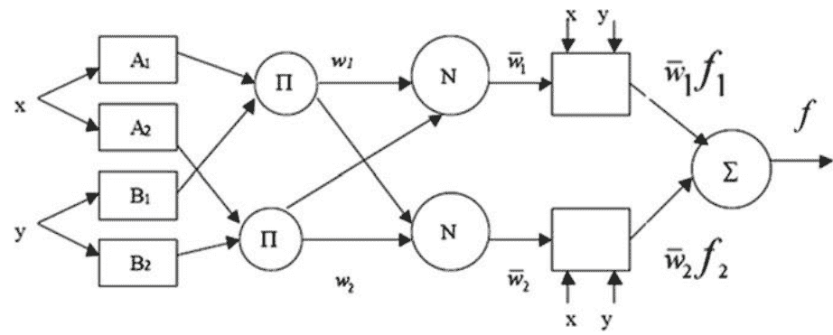

图17 ANFIS的分层架构

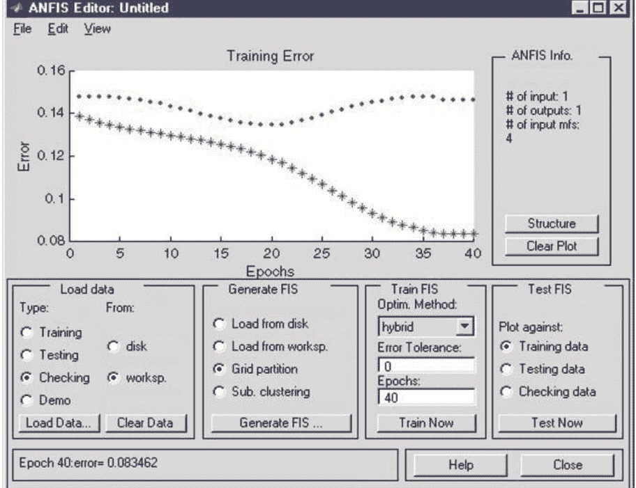

图18 ANFIS编辑器的图形用户界面

## 5.6 ANFIS编辑器

ANFIS编辑器GUI可用于初始化FIS属性。在MATLAB中启动ANFIS编辑器，请键入：

```
anfisedit
```

图18显示了ANFIS编辑器的GUI，其中输入数量为7，对应于7个输入有1个输出。每个输入都有两个自定义类型的隶属函数。GUI中有不同的面板，如加载数据、生成FIS、训练FIS和测试FIS，其中加载数据是第一步。数据应以矩阵形式存在，可以从文件或工作空间中获取。

## 5.7 训练和测试阶段

提出的系统包括两个步骤：第一步是训练，第二步是测试，如图19所示。

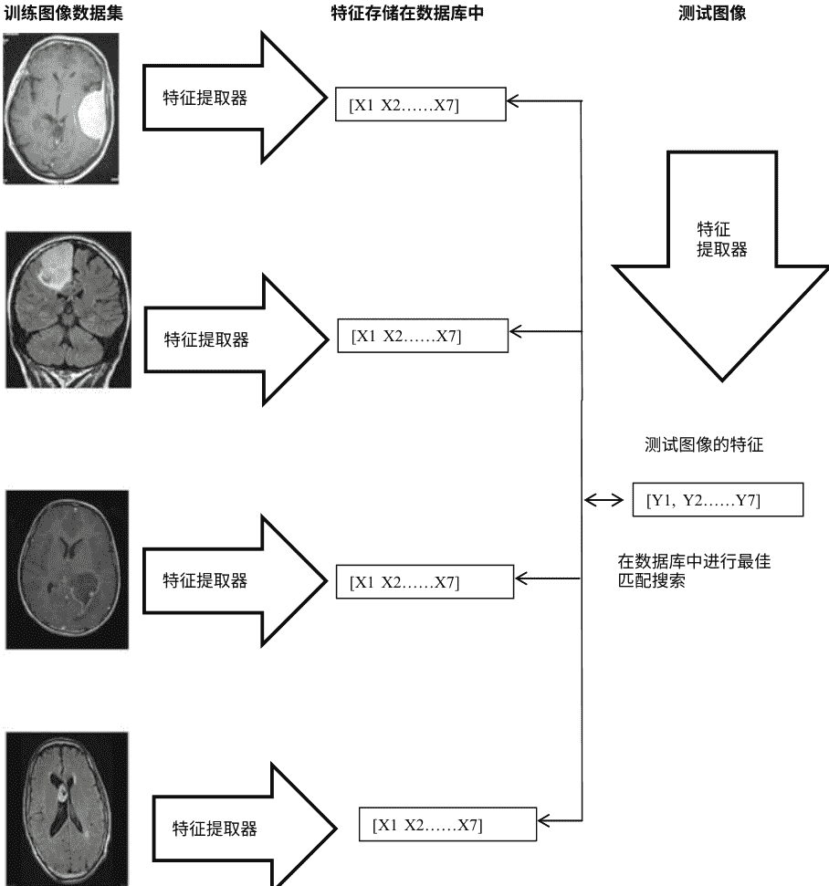

图19 MRI训练和测试的示意图

在训练阶段，使用GLCM从不同的图像中提取特征，并使用遗传算法将其减少为7个特征子集，然后将它们与相应的输出一起存储在数据库中。总共使用57张图像来训练提出的系统。当查询图像用于肿瘤识别时，首先提取其GLCM图像特征，最后将其发送到提出的工作的识别器中，以找到最佳匹配。找到合适的匹配后，将生成相应的输出。输出意味着存在何种类型的肿瘤以及肿瘤的级别[58]。


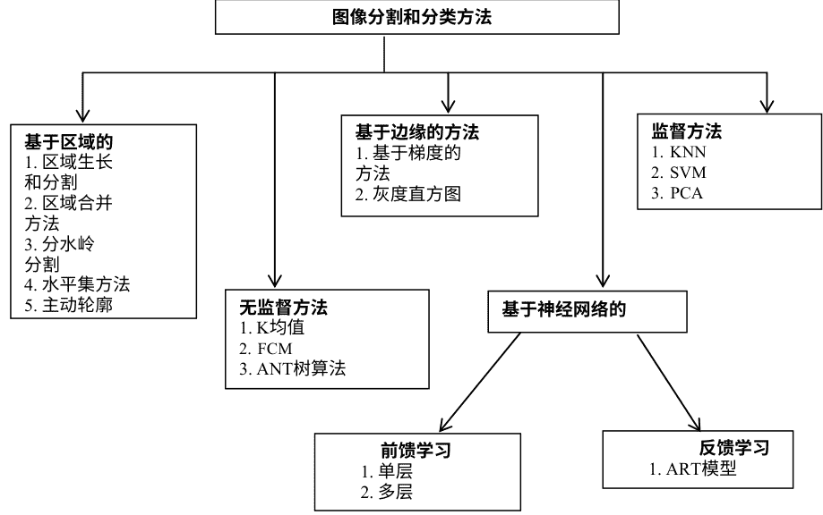

图20 MRI脑图像分割方法的分类

## 5.8 图像分割方法 [59-61]

如图20所示，有各种图像分割方法。

## 5.9 模糊 C 均值分割

模糊 C 均值分割 (FCM) 是一种著名的聚类算法，用于模式识别[62-68]。FCM 的优点是不需要一个数据只属于一个簇，而是一个数据可以共享多个簇。基本的 FCM 特征如图21所示。

FCM 算法将有限集合 n 个元素 X = {x1, ..., xn} 根据某个给定的准则划分为 c 个模糊聚类。

步骤1：初始化

为每个元素分配一个聚类，初始化隶属函数的均值。例如-用于检测四种类型的脑肿瘤的四个聚类 (C1、C2、C3、C4) 已被使用。

$$ \sum_{j=1}^{C} \mu_j(x_i) = 1 \quad(10) $$

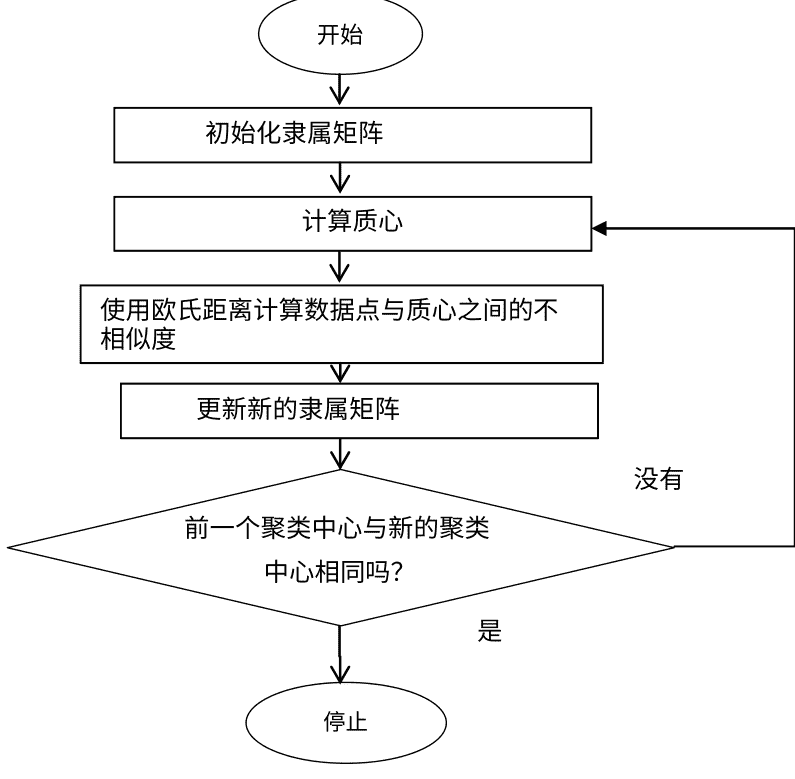

其中：
- i = 1, 2, 3, … n
- n 表示要划分为聚类的元素数量。
- j = 1, 2, 3 … C
- C 表示元素要分区的簇数
- $\mu_j(x_i)$ 表示元素 $x_i$ 属于簇 $C_j$ 的程度

步骤2：计算质心

$$c_j = \frac{\sum_i [\mu_j(x_i)]^m x_i}{\sum_i [\mu_j(x_i)]^m} \quad (11)$$

其中，m是模糊化参数，其值介于1.25和2之间（通常）

步骤3：使用欧几里得距离计算数据点和质心之间的差异

$D_i = \sqrt{(x_2 - x_1)^2 + (y_2 - y_1)^2}$

(12)

步骤4：使用等式更新新的成员矩阵

$$\mu_j(x_i) = \frac{\left[\frac{1}{d_{ji}}\right]^{\frac{1}{m-1}}}{\sum_{j=1}^c \left[\frac{1}{d_{ji}}\right]^{\frac{1}{m-1}}}$$

(13)

步骤5：除非质心不再改变，否则返回步骤2

在图22中，四个簇由四种颜色表示-红色、蓝色、紫色和绿色，簇中心由“X”表示。

- 形状特征也可以用来提高分类准确性。从患者那里获取额外的信息，如病史、年龄，以提高分类准确性。
- 修改后的Sugeno类型ANFIS可以使用。

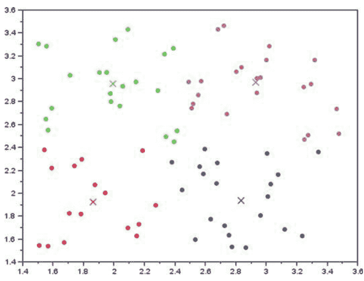

图22 FCM分割后的输出

## 深度学习面临的各种挑战

尽管深度学习本身是一个具有众多好处并且具有大量实际应用的领域，但要实现这些好处，人们可能会遇到以下一些挑战：

### 6.1 海量数据

人脑需要大量的信息和经验才能达到任何结果。按照类似的模式，人工神经网络需要大量的数据进行训练和学习。大规模数据集有助于获得准确和精确的结果。

深度学习分类器在很大程度上依赖于可用数据集的规模和质量。如果只有有限的数据或信息可用，这可能直接影响深度学习的成功率，特别是在医学领域[69]。尽管大规模数据集是一个关键问题，但在生成医学影像数据方面还存在另一个挑战，因为它取决于该领域的专家提供的观察和解释。为了减少不准确性和人为错误，考虑多个专家的意见是很重要的。如果领域专家不可用，这将变得困难。此外，在罕见疾病的极端情况下，可能无法获得足够的病例。另一个问题可能是数据不平衡，如果是罕见疾病的情况，数据集可能是前所未有的，这种情况下可能会出现不平衡。

### 6.2 领域特定和多任务

在深度学习中，训练数据可以产生有益且精确的结果，但仅适用于特定问题。在当前情况下，深度学习方法在特定领域非常具体，如果需要解决类似的问题或模式，就必须重新评估和重新训练数据。尽管这种方法足够高效地解决一些特定问题，但却无法适应多任务。正在进行研究，以实现多任务而无需修改完整的架构。正在探索多任务学习 (MTL) 和渐进神经网络，以在这方面取得一些改善。

### 6.3 深度学习本质上是一个黑盒子

深度学习算法为医学成像领域带来了新的希望和机遇。它为以前存在的问题提供了解决方案，以前被传统方法认为是无法解决的问题。然而，它有自己的缺点。其中之一是黑盒问题。虽然对于输入已经有了清晰的视觉，以及它们如何被组合在一起的理解，但是输出的生成非常复杂，没有清晰的理解关于输出是如何生成的。识别输入，应用模型参数和构建模型是可行的，但是模型的实际工作方式是一个难以理解的问题。因此，当验证是最重要的要求时，该领域在隐藏用户的内部操作时变得脆弱。

### 6.4 优化超参数

当学习过程开始之前，参数的值被设置，这些被称为超参数。如果这些值发生了小的变化，可能会大大影响模型的性能。当考虑到实际问题时，默认参数值无法帮助构建准确的结果。它可能严重影响系统的性能。如果只考虑少量的超参数，并且手动调整而不是使用标准方法进行优化，也可能引发性能问题。

### 6.5 需要高性能硬件

深度学习需要昂贵且需求巨大的高容量硬件，同时也需要大量的电力消耗。

### 6.6 灵活性较差

深度神经网络只能训练一个领域。它无法适应另一个领域。对于不同的问题，它又需要对神经元进行训练。

## 7 研究问题和未来展望

处理能力、大数据和基于人脑的深度学习算法是推动深度学习革命的三个关键特征。毫无疑问，深度学习所取得的好处是显著的，但为了实现这些好处，人力和成本也是很高的。大型公司和不同的研究实验室与知名医院也在参与和运作。共同努力，以达到医学领域最有利的突破。许多公司，如日立、西门子等，已经迈出了在该领域投入高额费用的步伐。为了检测儿科脑部疾病，GE医疗与波士顿儿童医院正在开发智能成像技术。甚至研究实验室也在投入资金，以提供强大的基于图像的应用程序。

### 7.1 深度学习方法的增强

深度学习技术依赖于监督学习方法。然而，医学数据的插图，特别是医学图像并不经常出现。这些情况通常是疾病发生罕见或领域专家不可用的情况。为了克服数据不可用性的问题，关键是从监督学习方法转向无监督或半监督学习方法。如果训练方法转向无监督或半监督方法，特别是在医学领域，最终结果的准确性和精确性可能会受到影响。尽管在这方面已经付出了努力，但尚未找到刚性的解决方案来解决不准确性的问题。在改进和修改的范围内存在无限的机会。

### 7.2 大型图像数据的开发利用

应用深度学习方法需要大量的数据集，而获得这样的大量数据本身就是一项关键和困难的任务。与医学图像数据相比，现实世界数据的插图更容易。例如，在现实世界中，插图对象，男性或女性的区分是一项微不足道的任务，而解释医学图像则需要领域专业知识，而且是一项昂贵的事务，需要大量时间进行处理。事实上，不仅需要单个专家的意见，还需要多个专家对同一数据进行准确性和特殊性的处理。在罕见疾病的情况下，另一个问题可能是数据是否可用。在这种情况下，获取大量数据集变得更加困难。解决上述问题的方法可能是不同医疗服务提供商之间的数据共享，尽可能地共享数据。

通过这种方式，可以最大程度地减少数据访问问题。

### 7.3 普遍的组织间勾结

尽管利益相关者对深度学习在医学图像领域的益处和增长做出了许多预测，但用机器或工具取代人类始终是一个有争议的问题。在分析和预测疾病诊断方面的准确性方面取得了显著改进。深度学习方法在疾病诊断中的分析和预测准确性是不可忽视的。然而，一些问题仍然存在，需要研究人员立即关注。为了提高健康质量，供应商、领域专家和医院之间的勾结是不可避免的。这将解决领域专家和研究人员获取数据的问题。另一个问题是需要先进的工具和设备来处理大量的医疗数据。这在传感器网络增加数据量的指数方式下将更加有帮助。

### 7.4 隐私和司法关注

无论是技术问题还是社会问题都可能影响数据的保密性，因此需要从技术和社会两个角度来处理。为了解决隐私问题，HIPAA（美国医疗保险可携带性和责任法案）成为医疗领域的首选。

HIPAA代表1996年的《医疗保险可携带性和责任法案》，是美国的一项立法。它赋予患者关于个人信息的法律权利，并提供一些标准和协议来保护他们的个人信息及其在任何形式下的使用。在当前情况下，隐私问题是绝对必要的，但在如何保护和隐藏患者个人信息以防止滥用方面存在挑战。如果对数据施加某种限制，那么内容的可用性将受到限制，这将进一步引发有限数据集的问题，从而导致不准确的结果。

虽然遵守HIPAA并不是强制性的，但可以将健康的健康信息存储和维护为HIPAA覆盖实体。只有在通过电子方式传输受保护的健康信息时，HIPAA的适用性才存在。

为了在数据保护领域保持领先地位，还为印度的组织和公司提供HIPAA合规性的帮助。此外，医疗保健数据具有动态性质，因此现有的方法不足以解决这个问题。

## 8 性能比较

可以通过以下参数分析不同图像分割算法的诊断准确性（如图23和表5所示）：

- 敏感度 = 真阳性/（真阳性 + 假阴性）* 100%
- 特异性 = 真阴性/（真阴性 + 假阳性）* 100%
- 准确度 = （真阳性 + 真阴性）/（真阳性 + 真阴性 + 假阳性 + 假阴性）* 100

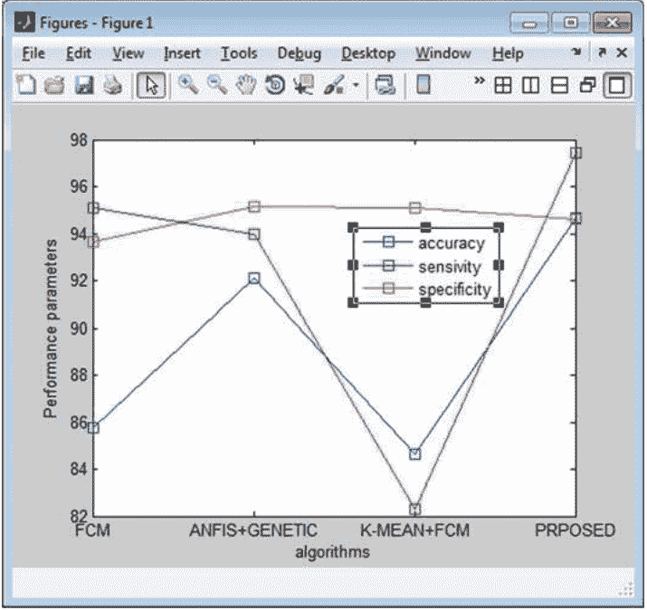

图23 深度学习与其他分割方法的比较分析

表5 深度学习与其他分割方法的比较分析（另外，请参考图23）

| 算法 | 敏感性 (%) | 特异性 (%) | 准确性 (%) |
| :--- | :--- | :--- | :--- |
| 模糊C均值分割 | 96.1 | 93.4 | 86.16 |
| ANFIS + 遗传算法 | 95.1 | 93.1 | 90.1 |
| K 均值 + FCM | 80.1 | 93.32 | 83.4 |
| 深度学习(C NN) | 97.01 | 96.1 | 97.17 |

## 9 结论

为了自动化日常生活任务，深度学习在近年来变得非常流行。在未来的几年里，大部分例行工作将由自动设备而不是人工完成。本章概述了图像分割的不同方法。与其他算法相比，深度学习方法更高效，可以更好地解决问题。与传统的机器学习方法相比，深度学习提供了改进的结果。在本章中，我们讨论了脑肿瘤分割的各个阶段。每个阶段都有简要介绍。将各种深度学习算法与其相关的优缺点进行了比较。本章还讨论了深度学习在医学领域增长缓慢的原因。不同的研究人员提出了各种解决方案。在最后一节中，我们讨论了各种研究开放问题和未来方向。

## 10 未来的范围

- (1) 可以嵌入更多特征以提高分类精度。形状特征是其中之一，可以帮助提高分类的准确性。从患者那里获取额外的信息，如病史、年龄以提高分类的准确性。
- (2) 更高效的深度学习模型。自动脑肿瘤分割中的一个主要问题是背景和肿瘤像素之间的相似性。一些背景像素被错误地分类为脑肿瘤像素。因此，在未来可以开发出更高效的深度学习模型以更准确地区分肿瘤和背景像素。
- (3) 为训练深度卷积神经网络选择更高效的损失函数。更有效的损失函数有助于在背景和肿瘤像素之间进行区分并提高准确性。
- (4) 也可以考虑彩色图像。本研究仅针对灰度图像。此外，可以加强对彩色图像的增强。

### 参考文献

- 1. Zikic, D., Ioannou, Y., Brown, M., Criminisi, A.: 使用卷积神经网络进行脑肿瘤组织分割。在：MICCAI多模态脑肿瘤分割挑战（BRATS）研讨会论文集，第36-39页（2014年）
- 2. Pereira, S., Pinto, A., Alves, V., Silva, C.A.: 使用卷积神经网络在MRI图像中进行脑肿瘤分割。IEEE Trans. Med. Imaging 35(5), 1240-1251 (2016)
- 3. 美国中央脑肿瘤登记处（CBTRUS），Fact Sheet可在（2011年） http://www.cbtrus.org/factsheet.html
- 4. Christ, J.M., Parvathi, R.M.S.: 脑肿瘤：工程视角。IJCSI 9(4), 392-396 (2012)
- 5. Schmidt, F.E.W.: 新生儿脑成像的时间分辨光学断层扫描系统的开发。博士论文，第2章，第25-34页（1999年）
- 6. Thurnher, M.M., Thurnher, S.A., Fleischmann, D., Steuer, A., Rieger, A., Helbich, T., Trattnig, S., Schindler, E., Hittmair, K.: T2加权和液体衰减逆转恢复的比较。美国神经放射学学会。1601-1609页（1997年）
- 7. Doolittle, N.D.: 脑肿瘤分类的科学现状。肿瘤学半月刊。20，224-230页（2004年）
- 8. Wen, P.Y., Teoh, S.K., Black, P.M.: 脑肿瘤: 百科全书式的方法。癌症神经学临床实践。 217-248页 (2001年)
- 9. Chandrasoma, P.C.P.: 立体定向脑活检。 W. J. Med. 1-5 (1991)
- 10. Kong, N.S.P., Ibrahim, H., Hoo, S.C.: 关于直方图均衡化及其变体的文献综述，用于数字图像增强。 Int. J. Softw. Eng. Res. Pract. 1(2), 386-389 (2013)
- 11. Singaravel, S., Suykens, J., Geyer, P.: 深度学习神经网络架构和方法: 在建筑设计能源预测中使用基于组件的模型。 Adv. Eng. Inform. 38, 81-90 (2018)
- 12. Du, X., Cai, Y., Wang, S., Zhang, L.: 深度学习概述。 在中国自动化学会第31届青年学术年会, 中国武汉, 2016年11月11日至13日, 第159-164页
- 13. Ishak, N.F., Logeswaran, R., Tan, W.H.: 低场脑MRI上的伪影和噪声去除。 国际生物医学工程学杂志 2(2), 59-68
- 14. Nobi, M.N., Yousuf, M.A.: 一种去除磁共振和超声图像中噪声的新方法。 科学研究杂志 3 (1), 81-89 (2011)
- 15. Devasena, C.L., Hemalatha, M.: 使用混合KSL滤波技术去除磁共振图像中的噪声。 国际计算机应用杂志 27(8), 1-4 (2011)
- 16. Kumar, S., Kumar, P., Gupta, M., Nagawat, A.K.: 中值滤波器和维纳滤波器在图像去噪中的性能比较。 国际计算机应用杂志 12(4), 27-31 (2010)
- 17. Bhatia, A., Kulkarni, R. K.: 通过改进的自适应中值滤波器去除高密度椒盐噪声。 国际计算机科学与信息技术会议 (CSIT-2012) 。 197-200 (2012)
- 18. Bagade, S.S., Shandilya, V.K.: 在图像处理中使用直方图均衡化进行图像增强。 软件工程研究与实践国际杂志。 6-10 (2011)
- 19. 陈, S.D.: 使用保持亮度的双直方图均衡化进行对比度增强。 IEEE Trans. Consum. Electron. 1, 1-8 (1997)
- 20. 王, C., 中福, Y.: 最大熵亮度保持直方图均衡化: 一种变分视角。 IEEE Trans. Consum. Electron. 51(4), 1326-1334 (2005)
- 21. 宁, C.Y., 刘, S.F., 曲, M.: 基于中值滤波方法的医学图像去噪研究。 IEEE Explore. 384-388 (2009)
- 22. Sawant, H.K., Deore, M.: 图像增强技术的综述。 Int. J. Comput. Technol. Electron. Eng. 1(2), 34-38 (2012)
- 23. Gonzalez, R.C., Woods, R.E.: 数字图像处理, 第二版。 Prentice Hall (2002)
- 24. Chen, S.D., Ramli, R.: 使用递归均分直方图均衡化进行对比度增强, 以实现可扩展的亮度保持。 IEEE Xplore, 1301-1309 (2001)
- 25. Dykstra, C., Das, M.: 使用图像变形改善发射成像中肿瘤的检测。 Nucl. Sci. Symp. 3, 1781-1785 (1998)
- 26. Marr, D., Hildreth, E.: 边缘检测理论。 Proc. Roy. Soc. Lond. B. 187-217 (1980)
- 27. Canny, J.: 边缘检测的计算方法。 IEEE Trans. Pattern Anal. Mach. Intell. 6, 679-698 (1986)
- 28. Schunck, B.G.: 使用高斯滤波器进行多尺度边缘检测。 IEEE Comput. Soc. Work. Comp. Vis.208-210 (1987)
- 29. Bergholm, F.: 边缘聚焦。 IEEE Trans. Pattern Anal. Mach. Intell. PAMI-09, 726-741 (1987)
- 30. Lacroix, V.: 主要光栅: 多分辨率图像描述。 在: 第10届国际模式识别大会, 第903-907页 (1990年)
- 31. Williams, D.J., Shah, M.: 使用多尺度的边缘轮廓。 计算机视觉图形图像处理。 51, 256-274 (1990)
- 32. Goshtasby, A., Marr, D.: 关于边缘聚焦。 图像可视化。 计算机。 12, 247-256
- 33. Deng, G., Cahill, L.W.: 一种自适应高斯滤波器用于降噪和边缘检测。 在: IEEE核科学研讨会论文集, 第1615-1619页 (1994年)
- 34. Bennamoun, M., Boashash, B., Koo, J.: 边缘检测的最佳参数。 IEEE Int. Conf. SMC. 2, 1482-1488 (1995)
- 35. Heric, D., Zazula, D.: 使用小波变换和信号配准的综合边缘检测。 Elsevier J. Image Vis. Comput. 25, 652-662 (2007)

- 36. Shih, M.Y., Tseng, D.C.: 基于小波的多分辨率边缘检测和跟踪。Elsevier J. Image Vis. Comput. 23, 441-451 (2005)
- 37. Bezdek, J.C., Chandrasekhar, R., Attikiousel, Y.: 边缘检测的几何方法。IEEE Trans. Fuzzy Syst. 6(1), 52-75 (1998)
- 38. Wu, J., Yin, Z., Xiong, Y.: 模糊图像快速多层边缘检测。IEEE Signal Process. Lett. 14(5), 344-347 (2007)
- 39. Lu, S., Wang, Z., Shen, J.: 边缘检测和增强的智能系统的神经模糊协同作用。Elsevier J. Pattern Recogn. 36, 2395-2409 (2003)
- 40. Shrivakshan, G.T., Chandrasekar, C., Bhandarkar, S.M.: 一种基于遗传算法优化的边缘检测技术。Pattern Recogn. 27(9), 1159-1180 (1994)
- 41. Zhang, Y., Potter, W.D.: 在图像处理中使用的各种边缘检测技术的比较。IJCSI Int. J. Comput. Sci. Issues 9(5), 269-276 (2012)
- 42. Becerikli, Y., Karan, T.M., Cabestany, J., Prieto, A., Sandoval, D.F.: 一种新的模糊边缘检测方法。IWANN 2005, 943-951 (2005)
- 43. Anver, M.M., Stonie, R.J.: 基于多个掩模的模糊边缘检测算法的进化学习。Springer, vol. 12, pp. 1-13 (2005)
- 44. Suliman, C., Boldisor, C., Bazavan, R., Moldoveanu, F.: 基于模糊逻辑的边缘检测方法。Eng. Sci. 4, 159-164 (2011)
- 45. Sharifi, M., Fathy, M., Mahmoudi, M.T.: 边缘检测算法的分类和比较研究。在：信息技术国际会议论文集：编码和计算（ITCC'02）IEEE，第1-4页（2002年）
- 46. Yu-Qian, Z., Wei-Hua, G., Zhen-Cheng, C., Jing-Tian, T., Ling-Yun, L.: 基于数学形态学的医学图像边缘检测。在：2005年IEEE工程在医学和生物学第27届年会上，中国上海，第6492-6495页（2005年）
- 47. Saxena, S., Kumar, S., Sharma, V.K.: 各种边缘检测技术的比较分析。Int. J. Adv. Res. Comput. Sci. Softw. Eng. 3(6), 758-761 (2013)
- 48. Haralick, R.M., Shanmugam, K., Dinstein, I.H.: 用于图像分类的纹理特征。IEEE Trans. Syst. Man Cybern. 610-621 (1973)
- 49. Prasetyo, Khalid, M., Yusof, R., Meriaudean, F.: 用于木材纹理分类的特征提取方法的比较研究。SITIS, IEEE Conf., 23-29 (2010)
- 50. Nithya, R., Santhi, B.: 用于乳腺癌分类的特征提取方法的比较研究。J. Theor. Appl. Inf. Technol. 33(2), 220-226 (2011)
- 51. Chadha, A., Mallik, S., Johar, R.: 基于内容的图像检索的特征提取技术的比较研究和优化。Int. J. Comput. Appl. 52(20), 35-42 (2012)
- 52. Ramamurthy, B., Chandran, K.R., Aishwarya, S., Janaranjani, P.: CBMIR: 基于不变矩、灰度共生矩阵和灰度分辨率的基于内容的图像检索。Eur. J. Sci. Res., 460-471 (2010)
- 53. Hamza, R.M., Al-Assadi, T.A.: 遗传算法寻找最优的GLCM特征。信息技术。巴比伦伊拉克大学，第1-16页（2012年）
- 54. Jolliffe, I.T., Potter, W.D.: 主成分分析，第2版，第1-5页。Springer，纽约（2002年）
- 55. Scholkopf, B., Smola, A., Muller, K.R.: 核主成分分析，第327-352页。MIT Press，剑桥，马萨诸塞州（1999年）
- 56. Shapiro, V.A., Veleva, P.K., Sgurev, V.S.: 一种自适应的图像阈值方法。在：第11届IAPR国际图像、语音和信号分析会议，第696-699页（1992年）
- 57. Sezgin, Mehmet, Sankur, Bulent: 图像阈值技术和定量性能评估的调查。电子成像杂志 13, 146-165 页（2004年）
- 58. Elaiza, N., Khalid, A., Ibrahim, S., Manaf, M.: 自适应基于网络的模糊推理系统（ANFIS），k最近邻（k-NN）和模糊c均值（FCM）在脑异常分割中的比较研究。国际计算机学报 5(4), 513-524（2011年）
- 59. Zhang, J., Morgan, N.: 基于随机马尔可夫场和多层感知器的随机模型图像分割。IEEE 信号处理，1-8（1990年）
- 60. Azmi, R., Norozi, N.: 一种新的马尔可夫随机场分割方法用于MR图像中的乳腺病变分割。医学信号感知杂志 1(3), 156-164（2011年）
- 61. Prastawa, M., Bullitt, E., Gerig, G.: 基于异常检测的脑肿瘤分割框架。医学图像分析 18, 217-231 (2004年)
- 62. Dipali, B.B., Patil, S.N.: 使用FCM和SVM技术进行脑肿瘤MRI图像分割。Int. J. Eng. Sci. Comput., 3939-3942 (2016)
- 63. Kannan, S.R., Ramathilagam, S., Devia, R., Hines, E.: 在医学图像数据分析中使用强模糊C均值。
- 64. Zhang, J.G., Ma, K.K., Chong, V.: 通过单类支持向量机学习从磁共振成像中进行肿瘤分割。
- 65. Garcia, C., Moreno, J.: 基于核的方法用于磁共振图像的分割和建模。
- 66. Lee, C.H., Schmidt, M., Murtha, A., Bistritz, A., Sander, J., Greiner, R.: 使用条件随机场和支持向量机进行脑肿瘤分割。LNCS 3765, 469-478 (2005)
- 67. Gibbs, P., Buckley, D.L., Blackband, S.J., Horsman, A.: 通过形态分割从MR图像中确定肿瘤体积。Phys. Med. Biol., 2437-2446 (1996)
- 68. Letteboer, M., Olsen, O., Dam, E., Willems, P., Viergever, M., Niessen, W.: 使用交互式多尺度分水岭算法在磁共振脑图像中分割肿瘤。Acad. Radiol. 11, 1125-1138 (2011)
- 69. Havaei, M., Davy, A., Warde-Farley, D., Biard, A., Courville, A., Bengio, Y., Pal, C., Jodoin, P.-M., Larochelle, H.: 使用深度神经网络进行脑肿瘤分割。Med. Image Anal. 35 (2017), 18-31 (2017)
- 70. 网络来源: https://www.oreilly.com/library/view/deep-learning/9781491924570/ch04.html
- 71. Magudeeswaran, V., Ravichandran, C.G.: 基于模糊逻辑的直方图均衡化用于图像对比度增强。数学工程学，1-10 (2013)
- 72. Vorontsov, A.O., Averkin, A.N.: 比较不同的卷积神经网络架构用于面部表情的情绪识别问题。在：第八届国际会议“分布式计算与网格技术在科学和教育中的应用”(GRID 2018)，俄罗斯杜布纳，莫斯科地区，2018年9月10日至14日，第35-40页
- 73. Agarwal, V.: 图像预处理中直方图均衡化的分析。BIOINFO Hum. Comput. Interact. 1(1), 04-07
- 74. Yang, Y., Huang, S.: 一种改进的期望最大化算法在脑磁共振成像分割中的新统计方法。Opt. Appl. 36(1), 125-136 (2006)
- 75. Vinitski, S., Iwanaga, T., Gonzalez, C.F., Andrews, D., Knobler, R., Curtis, M.: 基于4D特征图的快速组织分割。第9届国际会议（ICIAP 97），第2卷，pp. 445-452 (1997)
- 76. Revathy, M., Hemalataha, M.: 视频处理中的特征提取的高效方法。在：2012年CCSEIT ACM国际会议，pp. 539-543 (2012)

Minakshi Sharma 于2015年从印度拉贾斯坦邦的 Banasthali University 获得计算机科学博士学位。2017年，她加入了 NIT Kurukshetra 作为计算机工程系助理教授。她在国内外会议和期刊上发表了10多篇论文。她的研究兴趣包括深度学习、人工智能、神经网络、基于模糊逻辑的系统。

Neha Miglani 于2012年从库鲁克什特拉大学获得计算机科学硕士学位。目前，她在印度库鲁克什特拉国立工程学院担任助理教授。她的研究兴趣包括云计算、神经网络、软件可靠性等方面的成本模型、软件可靠性增长模型和可靠性指标等。