# 面向生物医学数据分析的深度学习

# 编辑

Mourad Elloumi

计算与信息技术

比沙大学

沙特阿拉伯比沙

ISBN 978-3-030-71675-2
ISBN 978-3-030-71676-9 (电子书)

https://doi.org/10.1007/978-3-030-71676-9

© Springer Nature Switzerland AG 2021
本作品受版权保护。出版商保留所有权利，包括整体或部分材料的权利，特别是翻译、再版、插图的再利用、朗读、广播、微缩胶片复制或以任何其他实体方式的复制，以及信息的传输或存储和检索、电子适应、计算机软件，或通过类似或不同的已知或今后开发的方法。
在本出版物中使用一般描述性名称、注册名称、商标、服务标志等，并不意味着即使在没有明确声明的情况下，这些名称也不受相关保护法律和法规的约束，因此可以自由使用。
出版商、作者和编辑可以安全地假设本书中的建议和信息在出版日期时被认为是真实和准确的。出版商、作者或编辑对本文中包含的材料不提供明示或暗示的保证，也不对可能存在的任何错误或遗漏负责。出版商在已发表的地图和机构隶属方面保持中立。

这个Springer印记是由注册公司Springer Nature Switzerland AG出版的
注册地址是：瑞士Cham市Gewerbestrasse 11号，邮编6330

# 目录

# 第一部分 深度学习在生物医学数据分析中的应用

一维卷积神经网络分类基因表达数据的技术......................................................... 3
Samson Anosh Babu Parisapogu, Chandra Sekhara Rao Annavarapu, 和Mourad Elloumi

使用深度人工神经网络对序列进行分类：表示和架构问题..................................... 27
Domenico Amato, Mattia Antonino Di Gangi, Antonino Fiannaca, Laura La Paglia, Massimo La Rosa, Giosu Lo Bosco, Riccardo Rizzo, 和Alfonso Urso

一种用于微小RNA-靶结合的深度学习模型......................................................... 61
Ahmet Paker和Hasan O^gul

用于意外跌倒检测的递归神经网络架构在可穿戴嵌入式设备上的意外跌倒检测....... 81
Mirto Musci和Marco Piastra

# 第二部分：生物医学图像分析的深度学习

使用深度学习技术的医学图像检索系统......................................................... 101
Jitesh Pradhan，Arup Kumar Pal和Haider Banka

使用深度学习的医学图像融合..................................................................... 129
Ashif Sheikh, Jitesh Pradhan, Arpit Dhuri ya和Arup Kumar Pal

深度学习在组织病理学图像分析中的应用......................................................... 153
C dric Wemmert, Jonathan Weber, Friedrich Feuerha ke和Germain Forestier

# 创新的深度学习方法用于生物医学数据

实例化和可视化 . . . . . . . . . . . . . . . . . . . . . . . . . . . . . . . . . . . . . 171

Ryad Zemouri和Daniel Racocceanu

# 卷积神经网络在高级生物医学图像应用中的应用

图像应用 . . . . . . . . . . . . . . . . . . . . . . . . . . . . . . . . . . . . . . . . . 197

Daniel A. Greenfield, Germ n Gonz lez和Conor L. Evans

# 第三部分：深度学习用于医学诊断

# 深度学习在胸部X光图像中肺疾病检测中的应用 . . . 239

Ebenezer Jangam, Chandra Sekhara Rao Annavarapu,

和Mourad Elloumi

# 深度学习在癌症诊断中的多组学数据整合中的应用 . . . 255

Abedalrhman Alkhateeb, Ashraf Abou Tabl和Luis Rueda

# 使用深度学习与加拿大初级保健数据进行

# 疾病诊断 . . . . . . . . . . . . . . . . . . . . . . . . . . . . . . . . . . . . . . . 273

Hasan Zafari, Leanne Kosowan, Jason T. Lam, William Peeler,

Mohammad Gasmallah, Farhana Zulkernine和Alexander Singer

# 使用深度人工智能进行脑肿瘤分割和监测

# 神经网络 . . . . . . . . . . . . . . . . . . . . . . . . . . . . . . . . . . . . . . 311

Asim Waqas, Dimah Dera, Ghulam Rasool, Nidhal Carla Bouaynay

a和Hassan M. Fathallah-Shaykh

索引 . . . . . . . . . . . . . . . . . . . . . . . . . . . . . . . . . . . . . . . . . . 351

# 第一部分

# 生物医学深度学习

# 数据分析

# 一维卷积神经网络分类技术用于基因表达数据

Samson Anosh Babu Parisapogu, Chandra Sekhara Rao Annavarapu, 和Mourad Elloumi

摘要在生物信息学领域,计算方法的发展引起了对生物数据临床结果预测的广泛关注,这些数据具有大量特征。DNA微阵列技术是一种同时监测大量基因表达水平的方法。微阵列基因表达数据对于预测和理解各种疾病(如癌症)更有用。大部分微阵列数据被认为是高维、冗余和噪声的。近年来,深度学习已成为机器学习领域的研究课题,在相同样本中学习高级潜在特征取得了显著结果。本章讨论了各种滤波技术,以减少微阵列数据的高维度,并介绍了不同的深度学习分类技术,如2维卷积神经网络(2D-CNN)和1维卷积神经网络(1D-CNN)。所提出的方法使用Fisher准则和1D-CNN技术进行微阵列癌症样本预测。

关键词 基因表达数据·深度学习·卷积神经网络·机器学习·分类

计算分子生物学是一个跨学科的学科,包括生物科学、统计学、数学、信息技术、物理学、化学和计算机科学等不同领域。生物数据分析涉及对生物学中生成的各种数据的研究。这些生物数据是由不同的实验和观测方法产生的。

S. A. B. Parisapogu · C. S. R. Annavarapu ( ) 印度理工学院丹巴德分校计算机科学与工程系,印度贾坎德邦
电子邮件: samson.enosh.17dr000327@cse.ism.ac.in; acsrao@iitism.ac.in

M. Elloumi 比沙大学计算与信息技术学院,比沙,沙特阿拉伯

# 1 引言

|  | 样本1 | ... | 样本j | ... | 样本M |
|---|---|---|---|---|---|
| 基因1 | $a_{11}$ | ... | $a_{1j}$ | ... | $a_{1M}$ |
| ... | ... | ... | ... | ... | ... |
| 基因i | $a_{i1}$ | ... | $a_{ij}$ | ... | $a_{iM}$ |
| ... | ... | ... | ... | ... | ... |
| 基因N | $a_{N1}$ | ... | $a_{Nj}$ | ... | $a_{NM}$ |

表1 基因表达数据格式

来自不同来源的生物医学数据包括实验室实验、医疗记录等。不同类型的生物数据包括核苷酸序列、基因表达数据、大分子三维结构、代谢途径、蛋白质序列、蛋白质模式或基序和医学图像[1]。与基因组只提供静态序列信息不同，微阵列实验产生的基因表达模式提供了细胞功能的动态信息。了解许多疾病背后的细胞间和细胞内过程对于改善样本分类以进行诊断和预后以及患者治疗至关重要。

生物医学专家试图找到基因与疾病或形成阶段之间的关系，以及基因之间的关系。例如，微阵列的应用是发现癌症的新生物标志物，可以提供更准确的早期诊断和监测工具，用于特定亚型疾病的早期识别或特定治疗方案的有效性评估。不同的技术用于解释这些生物数据。例如，微阵列技术可用于测量不同环境条件下大量基因的表达水平，而下一代测序(NGS)技术可用于大规模并行DNA测序。对大量生物数据进行这种实验需要绝对的数据收集、存储和计算分析[2]。

在过去的十年中，生物数据分析随着相关技术的发展（如机器学习（ML）、进化算法（EA）和深度学习（DL））得到了改善。这些技术能够处理生物数据中更复杂的关系。例如，可以使用不同的机器学习算法（分类和聚类）来预测微阵列数据中的癌症疾病。处理微阵列数据集时，高维度、复杂和嘈杂的特点使得分类任务不方便[3,4]。表1展示了基因表达数据的格式。

由于高维度和冗余性，通常的分类方法在基因表达数据上的应用变得具有挑战性。为了减少高维度问题，提高学习准确性并从基因表达数据中去除无关数据，许多过滤器[48]和包装器[49]方法被应用。过滤器方法独立于任何学习算法选择特征子集，并依赖于训练数据的各种一般特征度量。包装器方法使用预测准确性来选择特征子集，它依赖于特定学习算法的性能。

预先确定的学习算法用于确定所选子集的好坏并且计算成本高昂。 一些滤波方法如下所示: Z-Score, 最小冗余和最大相关性 (mRMR) [5], T-Test [6], 信息增益 [7], Fisher准则 [8]和K-Means-Signal-to-Noise Ratio (KM-SNR)排名[9]等。有效的基因选择旨在选择少量具有高预测性的基因, 以最大程度地提高分类器对样本的分类能力。 寻找简化集的任务被报道为NP难问题[10, 11]。

人工智能(AI)是机器和计算机系统对人类智能的再现。 这种通过学习进行的繁殖演化——使用信息的规则, 推理——达到适当执行的规则和自我纠正——根据学习和推理过程采取适当的行动。 机器学习利用计算方法来通过检测有影响的模式和不一致的信息来提高机器性能。 机器学习根据它们从数据中记忆或学习的内容做出决策。

深度学习解决了以前机器学习难以解决的问题。深度学习使用人工神经网络(ANNs) [33]。 人工神经网络的工作原理非常类似于人脑, 可以增加计算工作并提供准确的结果。 目前, 人工智能正在通过改变其分支方式, 即机器学习和深度学习, 以获得巨大的计算能力。卷积神经网络(CNN) 模仿大脑在信息处理方面的功能 [19]。

本章提出了一种名为1D-CNN的多层深度学习算法, 用于对微阵列癌症数据进行分类, 以识别疾病的类型。 CNN具有处理不充足数据和提高分类性能的能力。

此外, CNN在检测相似类型的癌症中的潜在特征方面也具有影响力。 本章的组织结构如下。 第2节描述了基因表达数据分类的相关工作。 第3节介绍了各种滤波器和深度学习分类技术的基础知识。 第4节提供了所选数据集的详细信息。 第5节描述了提出的方法, 第6节呈现了实验结果。最后, 第7节总结了本章。

# 2 相关工作

对于人工智能研究来说, 开放的适用于生物医学信息学领域的数据存储库的可访问性非常重要。 加利福尼亚大学欧文分校 (UCI) 机器学习存储库 (https://archive.ics.uci.edu/ ml/index.php) 包含了一系列数据库和数据生成器, 被机器学习社区用于对机器学习算法进行实证分析。 它使许多分析师能够展示新统计和机器学习算法的性能。 机器学习在有预处理数据时具有出色的准确性结果, 但在实时应用中, 获取预处理数据并不容易。

过去的研究中使用了微阵列信息来进行恶性生长的研究，例如利用机器学习方法进行癌症分类。决策树 (DT) 是最早用于比较人类蛋白质与含有疾病的信息基因的机器学习方法[29]。在分析微阵列数据时，已经使用了两种常规技术，即分类和聚类。此外，在分类微阵列数据之前，已经执行了各种方法，包括 k 近邻 (KNN) [30]、支持向量机 (SVM) [31]、多层感知器 (MLP) [32] 和人工神经网络的变体 [33]。

乳腺癌和白血病数据集在从微阵列数据中选择信息基因方面，KNN 分类器的表现优于随机森林，能够准确分类 [34]。通过使用粒子群优化 (PSO) 和自适应 KNN 的混合分类器，在选择有用基因时识别出符合分类标准的一组基因 [35]。

深度神经网络 (DNN) 具有多个神经层，每一层描述了来自现实世界原始数据的隐藏信息 [12-14]。深度学习已经在计算生物学的许多领域中应用。在 [15] 中，作者设计了一个基于深度学习的药物靶标相互作用预测框架。在 [16, 17] 中，深度学习被应用于真核蛋白质亚细胞定位的预测。在 [18] 中，基于 2D-CNN 的深度学习算法被应用于微阵列基因表达数据的分类。

# 3 预备知识

在本节中，我们介绍了三种不同的过滤器方法的细节，这些方法可以应用于微阵列基因表达数据、深度学习和卷积神经网络。

# 3.1 正向选择和最小冗余：最大相关准则过滤器方法

最小冗余 - 最大相关 (MRMR) 准则过滤器方法可以根据基因的相关性和冗余值对其进行排序。这个准则已经在 [20-22] 中用正向选择搜索策略进行了解释。给定一组选择的变量 X_S，该方法使用变量 X_i ∈ X_R 来更新 X_S，其中 v_i - z_i 最大化。其中 v_i 表示相关性项，z_i 表示冗余项。具体来说，v_i 是 X_i 对 Y 输出的相关性，z_i 是 X_i 对每个选择的变量 X_j ∈ X_S 的平均冗余度：

v_i = I (X_i; Y)

$$z_i = \frac{1}{|X_S|} \sum_{X_j \in X_S} I(X_i; X_j)$$

$$X_i^{MRMR} = \arg \max_{X_i \in X_R} \{v_i - z_i\}$$

在每一步中，该方法选择在相关性和冗余性之间具有最佳权衡的变量。这种选择方法快速且高效。 在前向搜索的第$d$步中，算法计算$n-d$个评估，其中每个评估需要估计$d+1$个双变量密度（已选择的每个变量和输出变量各一个）。 因此，MRMR通过使用多个双变量密度来避免估计多变量密度。

在[20]中，作者对MRMR的证明如下：

$$I(X; Y) = H(X) + H(Y) - H(X, Y)$$

使用

$$R(X_1; X_2; \dots; X_n) = \sum_{i=1}^n H(X_i) - H(X)$$

和

$$R(X_1; X_2; \dots; X_n; Y) = \sum_{i=1}^n H(X_i) + H(Y) - H(X, Y)$$

因此

$$I(X; Y) = R(X_1; X_2; \dots; X_n; Y) - R(X_1; X_2; \dots; X_n)$$

其中:

+   • 第二项的最小值 $R(X_1; X_2; \dots; X_n)$在独立变量的情况下达到最小值，因为在这种情况下$H(X) = \sum_i H(X_i)$且 $R(X_1; X_2; \dots; X_n) = \sum_i H(X_i) - H(X) =0$. 因此，如果 $X_S$已经被选择，变量 $X_i$应该具有最小的冗余度$I(X_i; X_S)$与子集。 然而，根据作者的说法，$I(X_i; X_S)$的近似值为$\frac{1}{|S|} \sum_{j \in S} I(X_i; X_j)$。

+   • 第一项 $R(X_1; X_2; \dots; X_n; Y)$是在最大相关变量的情况下达到的。

从定性上讲，在给定一个选择的子集 $X_S$ 的顺序设置中，通过最小化 $X$ 中的变量之间的独立性来实现变量之间的独立性$\frac{1}{|X_S|} \sum_{X_j \in X_S} I(X_i; X_j) \simeq I(X_i; X_S)$并且通过最大化 $X$ 和 $Y$ 之间的相关性来最大化变量之间的依赖性，即通过最大化$I(X_i; Y)$。

## 算法 1: k-均值聚类算法
输入: k=要生成的聚类数和 S=特征集或数据集 输出: k个聚类
//初始化:
1:设置聚类值k 2:从数据集中随机选择k个特征作为初始中心
//循环过程
3:当不收敛时执行 4:根据平方欧几里得距离将每个数据点分配给其最近的质心 5:更新每个聚类的均值 6:结束循环

# 3.3.2信噪比排名方法

信噪比(SNR)是特征表达模式信号强度和噪声之间的测量。它也被称为信号与噪声功率的比例。这里,信号强度指的是两个类别之间平均表达的最大差异,噪声指的是每个类别内表达的最小标准差[27,28]。通过使用这种方法,我们根据SNR得分值对特征进行排名。SNR得分值可以使用以下公式9进行数学计算。

$S_{v}=(\mu_{1}-\mu_{2})/\left(\sigma_{1}+\sigma_{2}\right)$

在这里,$S_{v}$ 代表信噪比值,$\mu_{1}$ 和 $\mu_{2}$ 分别是类别$_{1}$和类别$_{2}$的均值。而 $\sigma_{1}$ 和 $\sigma_{2}$ 分别是类别$_{1}$和类别$_{2}$的标准差。

# 3.4 深度学习

深度学习开始在我们的日常生活中发挥作用,展示出以前只存在于科幻电影中的解决方案。事实上,AlexNet的引入可以追溯到2006年Hinton 和 Salakhutdinov 在《Science》杂志上发表的重要文章[36],该文章描述了神经网络中“深度”的重要性。它强调了具有少数隐藏层的神经网络具有惊人的学习能力,并且随着深度(或者等价地说,隐藏层数量)的增加而进一步提高。因此,出现了“深度”学习这个特定的机器学习分支,它可以处理庞大的数据集中的复杂模式和对象。

深度学习是一种处理机器学习的方法,它在过去几十年中逐渐借鉴了我们对人类思维、统计学和应用数学的认识。

## 深度学习取得的增长

几十年来，由于强大的计算机、更大规模的数据集和训练更深层次的人工神经网络的技术，深度学习在其受欢迎程度和实用性方面取得了巨大的增长。深度学习随着时间的推移，解决了越来越复杂的应用，并且准确度也在不断提高。

## 深度学习的应用

由于其学习多层次表示的能力，深度学习在从复杂问题中得出结果方面非常普遍。从这个意义上讲，深度学习是收集和处理抽象信息的最先进的方法之一。这些特性使得深度学习成为解析和思考基因表达信息的合适方法。学习多层次表示的能力使得深度学习在更短的时间内创建出越来越准确的结果成为可能。多层次表示是深度学习整体架构的一个组成部分[37]。

## 深度学习的性能问题

在性能方面，机器学习和深度学习依赖于数据量的不同。对于低维度数据集，深度学习效率低下，因为它需要高维度的数据来理解学习过程[38]。

# 3.5 卷积神经网络

在最近的十年中，卷积神经网络(CNNs) [51]已成为不同计算机视觉和机器学习任务的事实标准。

CNNs是前馈人工神经网络(ANNs) [52]，具有交替的卷积和子采样层。深度的2D-CNNs在训练时可以学习复杂的模式，前提是它们在具有地面真实标签的巨大视觉数据库上进行训练。图1展示了典型的CNN架构的流程。1

1D-CNNs已经在一些应用中提出，例如定制的生物医学数据分类和早期检测，结构健康监测。

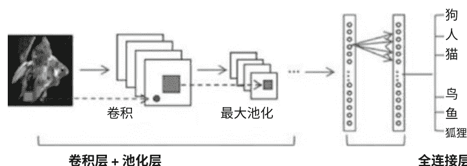

图1 常规CNN架构的流程[39]

1图片来源于https://www.sciencedirect.com/science/article/pii/S0925231215017634#f0010.

## CNN的主要组件

CN N具有三个主要组件，包括输入层、隐藏层和潜在层。 这些潜在（隐藏）层可以归类为全连接层、池化层或卷积层。 定义和详细信息如下[39,41]：

> 卷积层是CNN架构中的第一层。 卷积的过程涉及对不同函数的输出进行迭代执行。 该层由多个神经元映射组成，被描述为特征或滤波器的映射。 它在大小上与输入的维度相对应。 神经反应通过量化受体的离散卷积来解读。 量化过程用于计算输入的绝对神经权重并分配激活函数。

> 最大池化层从分割的卷积层输出中提取一些网格。 在矩阵中，大多数网格值是按顺序排列的。 运算符用于对每个矩阵进行计算，以量化平均值或最大化值。

> 全连接层是一个几乎完整的CNN，涵盖了CNN的90%架构参数。该层使输入能够以预设的向量长度传输到ANN中。 在分类之前，该层对维度数据进行了变换。 卷积层也经历了一次转换，以保持数据的完整性。

## 3.5.1 二维卷积神经网络

虽然距离第一个CNN提出已经过去了大约30年，但现代的CNN结构仍然与最初的结构具有相同的基本特性，例如卷积和池化层。 首先，深度CNN的普及和广泛应用领域可以归因于以下优势：

[PAGE 16]

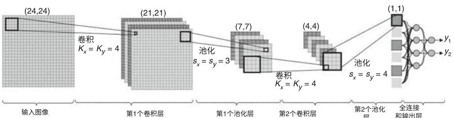

图2 具有两个卷积层和一个全连接层的CNN示例说明[40]

+   1. CNN将特征提取和分类过程融合到一个单一的学习体中。它们可以在训练阶段直接从原始输入中学习优化特征。
+   2. 由于CNN神经元之间以稀疏连接和共享权重的方式连接，相比于常规的全连接多层感知器（MLP）网络，CNN可以以非凡的计算效率处理更多的输入。
+   3. CNN对输入信息的微小变化具有抗性，包括平移、缩放、倾斜和畸变。
+   4. CNN可以适应各种大小的输入。

在传统的MLP中，每个隐藏神经元包含标量权重、输入和输出。然而，由于图像的二维特性，CNN中的每个神经元包含用于权重的二维平面，称为卷积核，以及称为特征图的输入和输出。传统CNN对一个24×24像素的灰度图像进行两个类别的分类示例如2所示[40]。这个示例CNN包含两个卷积层和两个池化层。第二个池化层的输出经过一个全连接层处理，然后是输出层产生分类结果。

## CNN的权重和参数

分配给加权滤波器（w）和内核大小为（Kx，Ky）的互连关系，将其馈送到卷积层。由于卷积发生在图像的边界限制内，特征图的尺寸从宽度和高度分别减少到（Kx-1，Ky-1）像素。池化层中的值（Sx，Sy）作为子采样因子进行初始化。在示例图2中，两个卷积层的内核大小分别设置为Kx=Ky=4，而第一个池化层的子采样元素设置为Sx=Sy=3，后续池化层的子采样元素设置为Sx=Sy=4。请注意，这些值是有意选择的，以使最后一个池化层（即全连接层的输入）的输出为标量（1×1）。输出层包含与图像所属类别数量相对应的两个全连接神经元。以下步骤展示了给定示例CNN的完整前向传播过程：

+   1. 对于CNN，一个灰度的24×24像素的图像作为输入层进行输入。
+   2. 第一个卷积层的每个神经元在图像和相关滤波器之间执行线性卷积，以创建神经元的输入特征图。
+   3. 然后, 每个神经元的输入特征图通过激活函数传递, 产生卷积神经元的输出特征图。
4. 在池化层中, 每个神经元的特征图是通过粉碎上一层卷积层的输出特征图生成的。在给定的示例图像中, 第一个池化层生成了7×7的特征图。
+   5. 步骤3和4重复, 并且第二个池化层的输出成为全连接层的输入, 这与传统MLP的层无法区分。
+   6. 标量输出通过相应的全连接层和输出层进行前向传播, 生成最终的输出结果, 从而对输入图像进行分类。

## CNN的训练方法

卷积神经网络通常通过随机梯度下降技术或反向传播方法进行有监督的训练。在反向传播的迭代过程中, 计算每个人工神经网络参数 (如卷积层和全连接层的权重) 的梯度大小 (或敏感度)。然后利用参数的敏感度来迭代更新卷积神经网络的参数, 直到达到特定的准则。关于二维卷积神经网络中反向传播的详细解释可参见[42]。

## 3.5.2 一维卷积神经网络

近年来, 出现了一种名为-维卷积神经网络 (1D-CNNs) 的二维卷积神经网络的替代版本[42]。根据研究, 1D-CNNs在处理一维信号时具有特定的应用优势, 因此比其二维伙伴更受欢迎, 原因如下:

+   • 除了矩阵运算外, 1D-CNN中的前向传播 (FP) 和反向传播 (BP) 需要基本的数组操作。这意味着1D-CNN的计算复杂性本质上比2D-CNN低得多。
+   • 具有适度浅层结构的1D-CNN (例如, 较少的隐藏层和神经元) 能够学习包括1D信号在内的具有挑战性的任务。然而, 2D-CNN通常需要更深的结构来处理这种类型的任务。具有浅层结构的ANN更容易训练和实现。
+   • 通常, 训练深度2D-CNN需要特殊的硬件配置 (例如, 云计算或GPU)。然而, 对于训练具有少量隐藏层 (即2个或更少) 和神经元 (例如少于50个) 的紧凑型1D-CNN, 任何标准计算机上的CPU执行都是可行的, 并且通常速度较快。
+   • 由于1D-CNN的低计算要求, 它们非常适合实时和低成本的应用, 尤其是在移动设备或手持设备上。

图3显示了一个包含3个CNN和2个MLP层的样本1D-CNN配置。这里提出了两个不同的层: (1)“CNN层”, 其中进行了1D卷积和子采样(池化), 以及(2)全连接层, 与多层感知器(MLP)的层无法区分, 也被称为“MLP层”。

图3显示了一个包含3个CNN和2个MLP层的样本1D-CNN配置[40]。

## 1D-CNN的超参数

卷积和子采样(池化)发生在“CNN层”,而与多层感知器(MLP)的层无法区分的全连接层也被称为“MLP层”。以下超参数塑造了1D-CNN的设计:

+   1. 隐藏的CNN和MLP层/神经元的数量(图3中包含3个隐藏的CNN和2个MLP层)。
+   2. 卷积神经网络层的过滤器(内核)大小(图3中所有隐藏的卷积神经网络层的过滤器大小为41)。
+   3. 每个卷积神经网络层的下采样因子(在图3中,下采样因子被分配为4)。
+   4. 激活和池化函数的决策。

## 1D-CNN和2D-CNN的区别

根据传统的2D-CNN,输入层是一个被动层,接收原始的1D信号,输出层是一个具有与类别数量相等的神经元的MLP层。图4展示了一个1D-CNN的三个连续卷积神经网络层。如图所示,1D滤波器内核的大小为3,下采样因子为2,在隐藏的卷积神经网络层中,第k个神经元首先执行卷积的分组,然后通过激活函数f进行求和,最后进行下采样。

实际上,1D和2D-CNN之间的主要区别在于,1D数组替代了2D矩阵,用于卷积核和特征图。在随后的步骤中,CNN层处理原始的1D数据,并“学习提取”这些特征,然后在MLP层的分类任务中使用。因此,特征提取和分类这两个操作交织在一起,可以进行优化以实现性能最大化的分类。1D-CNN的一个重要优势是带来了较低的计算复杂度。由于CNN拓扑结构的允许

## 自适应实现

输入层维度的变化使得输出CNN层的子采样因子能够自适应调整，这被称为自适应实现。更多细节以及CNN层的FP和BP在[40]中展示。

## # 4 数据集详情

实验中使用的微阵列基因表达数据集从https://www.gems-system.org下载。在这个实验中使用了五个基准微阵列数据集，包括ALL-AML白血病、前列腺肿瘤、DLBCL、MLL白血病和SRBCT。

ALL-AML白血病[9]数据集包含两个类别ALL（急性淋巴细胞白血病）和AML（急性髓系白血病）。在这个数据集中，每个样本有7129个基因。这个数据集包含47个ALL样本和25个AML类别样本。前列腺肿瘤[44]是一个包含12600个基因的两类数据集。这个数据集包含77个前列腺样本和59个正常样本。DLBCL[45]包含两个类别，分别是DLBCL（弥漫性大B细胞淋巴瘤）和FL。（滤泡性淋巴瘤）包含5469个基因。在这个数据集中，存在58个DLBCL和19个FL样本。

MLL白血病[46]有三个类别，分别是ALL、AML和MLL。（髓系/淋巴系白血病或混合系白血病）。每个样本包含12582个基因。ALL包含24个样本，MLL包含20个样本，AML有28个样本。SRBCT（小圆蓝细胞肿瘤）[47]是一个四类别的数据集。

## 表格样式的数据集详情

表2 基因表达数据集详情
| 数据集 | 基因数 | 样本数 | 类别数 |
| --- | --- | --- | --- |
| 前列腺肿瘤 | 12,600 | 136 | 2 |
| ALL-AML | 7,129 | 72 | 2 |
| DLBCL | 5,469 | 77 | 2 |
| MLL | 12,582 | 72 | 3 |
| SRBCT | 2,308 | 83 | 4 |

数据集包含2,308个基因。 该数据集总共包含29个EWS（尤因肉瘤）样本，25个RMS（横纹肌肉瘤）样本，11个BL（伯基特淋巴瘤）样本和18个NB（神经母细胞瘤）样本。 这三个基准微阵列数据集的描述，包括数据集名称、基因数、样本大小和每个数据集构建的总类别数，详见表2。

## # 5 提出的方法

在本节中，我们介绍了应用于基因表达数据集的提出的DL 1D-CNN分类技术。 图5显示了提出工作的总结流程图。 提出的工作流程包括以下四个步骤。

+   1. 使用Fisher排名的预处理步骤
+   2. 模型创建
+   3. 模型训练
+   4. 模型测试

## 5.1 使用Fisher排名方法的预处理

在这个阶段，我们使用在第3.2节中解释的Fisher排名方法作为一个过滤器方法来降低输入微阵列数据的高维度。
如第3.2节所述，每个聚类中的基因都使用Fisher排名方法进行排名，然后从结果中选择排名靠前的基因，以生成一个最小化的微阵列数据集。 我们认为具有最高排名的减少的微阵列数据集是最不冗余的，并将其发送到下一步。

## 5.2 模型创建

对于模型的创建，总共使用了八层1D-CNN，包括一个输入层，两个1D卷积层后跟一个dropout层和一个最大池化层，一个扁平化维度层位于其后。在这一层之后，是一个全连接层。

## 图5

图5总结了在微阵列基因表达数据上应用的深度学习1D-CNN方法的工作流程


## 图6

图6显示了一个用于具有100个特征作为输入数据的二进制类数据集的1D-CNN结构示例。

用于二进制类数据集。 图6可视化了一个用于具有100个特征作为输入数据的二进制类数据集的1D-CNN结构示例。

## 5.3 模型训练

在随机洗牌后，数据被分为两组，其中80%的数据属于训练集，20%的数据属于测试集。每个样本的标签被转换为一种独热编码格式，用于多类数据集。 用于训练模型的优化器是Adam（自适应矩估计）。训练过程使用小批量技术进行，批量大小为20，训练1000个周期。

## 5.4 模型测试

测试是必要的，以评估模型的泛化能力。 使用测试集对模型进行测试，该测试集包含对模型来说是陌生的示例。 对于训练集和测试集，对分类任务的结果进行了整理，以便进行进一步的分析，如F1分数计算和混淆矩阵。 这些不同的参数帮助我们对模型在数据集上的性能和对未知数据的可靠性做出结论 。

## # 6 实验结果

我们使用在第5.2节中创建的模型,对包含五个不同癌症数据集的微阵列基因表达数据进行了所提出的1D-CNN深度学习分类技术的实现。所提出的模型是使用Python中的Keras包和TensorFlow后端以及Scikit-Learn进行实现的。实验是在具有以下规格的系统上进行的:

+   - 处理器: Intel Core i5-8300H CPU @ 2.30GHZ
- 存储: SSD- 128 GB 和 RAM- 8.00 GB
- 操作系统和系统类型: Windows 10 64位操作系统,基于x64的处理器
- 软件和工具: Anaconda with jupyter notebook 5.7.8 和 python 3.7.3

在实验中,首先采用了所有五个微阵列数据集的完整数据集,并使用在第4节中解释的Fisher准则排序方法对它们进行了排序,该方法在第3.2节中进行了解释。排序后,分别取了前100、150、200和250个基因,并应用了在第3.5.2节中解释的提出的1D-CNN深度学习分类技术,使用80:20的训练和测试分割,然后分别使用70:30的训练和测试分割。

实验重复进行以计算模型在测试时的平均性能。因为收敛性也取决于模型权重在每次运行时如何随机初始化。模型的训练时间取决于它们训练的时期数。例如,一个简单的1D-CNN模型(2×1D卷积层,最大池化层,密集层和输出层)在100个时期的训练中完成了208秒的训练。其他模型的训练时间各不相同,并且大约需要不到一小时的时间进行训练。内存使用量与模型中调整的权重(参数)数量直接相关。与多层人工神经网络(ANN)等模型相比,简单模型具有较多的需要调整的参数。例如,我们实验中使用的CNN之一是一个具有两个1D卷积层、一个最大池化层(最大池化不涉及任何权重)以及一个密集层和输出层的模型。该模型有358,058个参数。与需要数小时进行训练并具有大内存需求的流行深度神经网络(DNN)相比,所使用的模型的内存需求并不大。

在获取真正阳性(TP)、假阳性(FP)、真正阴性(TN)和假阴性(FN)值后,对分类器模型的性能进行评估。

## 性能指标的公式

计算性能指标的公式如下:

阳性预测值(PPV)(或)精确度=T P / T P+F P
召回率(或)敏感度(或)真正阳性率(TPR)= T P / T P+F N
假阳性率(FPR)= F P / T N+F P

## 准确率=$rac{TP+TN}{FI分数=2 * 精确度 * 召回率 / (精确度 + 召回率)}$

在表3和表4中,展示了1D-CNN在完整数据集上的分类结果,其中包括70:30和80:20的训练和测试分割。在表3和表4中,展示了包含数据集名称、基因数量、训练准确率、测试准确率、精确度、召回率、F1分数、假阳性率(FPR)、曲线下面积(AUC)和训练时间的分类结果。

类似地,在表5和表6中,对所有数据集的前100个Fisher排名基因进行了1D-CNN的分类结果可视化。在表5中,显示了包含数据集名称、训练准确率、测试准确率、精确度、召回率、F1-分数、FPR、AUC和训练时间执行的70:30训练和测试分割的分类结果。然后在表6中,显示了包含数据集名称、训练准确率、测试准确率、精确度、召回率、F1-分数、FPR、AUC的80:20训练和测试分割的分类结果。

表3使用1D-CNN对完整数据集进行基因表达数据的分类,使用70:30的训练-测试比例

| 数据集 | 基因数 | 训练准确率 | 测试准确率 | 精确度 | 召回率 | F1-分数 | FPR | AUC | 训练时间 |
|---|---|---|---|---|---|---|---|---|---|
| 前列腺 | 12,600 | 60 | 48.78 | 0.24 | 0.49 | 0.32 | 0.51 | 0.49 | 6099.07 |
| DLBCL | 5469 | 100 | 95.83 | 0.96 | 0.96 | 0.96 | 0.04 | 0.96 | 1347.19 |
| ALL-AML | 7129 | 100 | 100 | 1 | 1 | 1 | 0 | 1 | 3636.95 |
| MLL | 12,582 | 100 | 100 | 1 | 1 | 1 | 0 | 1 | 5900.05 |
| SRBCT | 2308 | 100 | 95.99 | 0.96 | 0.96 | 0.96 | 0.01 | 0.97 | 1302.51 |

表4使用完整数据集进行基因表达数据的1D-CNN分类,训练测试比例为80:20

| 数据集 | 基因数 | 训练准确率 | 测试准确率 | 精确度 | 召回率 | F1-分数 | FPR | AUC | 训练时间 |
|---|---|---|---|---|---|---|---|---|---|
| 前列腺 | 12,600 | 60.19 | 42.86 | 0.18 | 0.43 | 0.26 | 0.57 | 0.43 | 5870.41 |
| DLBCL | 5469 | 75.41 | 75 | 0.56 | 0.75 | 0.64 | 0.25 | 0.75 | 1683.89 |
| ALL-AML | 7129 | 100 | 95.83 | 0.96 | 0.96 | 0.96 | 0.04 | 0.96 | 245.11 |
| MLL | 12,582 | 100 | 86.67 | 0.87 | 0.87 | 0.87 | 0.06 | 0.9 | 6236.03 |
| SRBCT | 2308 | 100 | 100 | 1 | 1 | 1 | 0 | 1 | 1482.82 |

表5使用前100个Fisher排名的基因进行基因表达数据的1D-CNN分类,训练测试比例为70:30

| 数据集 | 训练准确率 | 测试准确率 | 精确度 | 召回率 | F1-分数 | FPR | AUC | 训练时间 |
|---|---|---|---|---|---|---|---|---|
| 前列腺 | 98.95 | 95.12 | 0.95 | 0.95 | 0.95 | 0.05 | 0.95 | 138.35 |
| DLBCL | 100 | 91.67 | 0.92 | 0.92 | 0.92 | 0.08 | 0.92 | 62.48 |
| ALL-AML | 100 | 100 | 1 | 1 | 1 | 0 | 1 | 61.05 |
| MLL | 100 | 90.91 | 0.92 | 0.91 | 0.91 | 0.05 | 0.93 | 62.47 |
| SRBCT | 100 | 87.99 | 0.90 | 0.88 | 0.88 | 0.04 | 0.92 | 65.46 |

## 表6 使用前100个Fisher排名的基因进行基因表达数据的1D-CNN分类，训练测试比例为80:20

| 数据集 | 训练准确率 | 测试准确率 | 精确度 | 召回率 | F1-分数 | FPR | AUC |
|---|---|---|---|---|---|---|---|
| 前列腺 | 100 | 89.28 | 0.91 | 0.89 | 0.89 | 0.11 | 0.89 |
| DLBCL | 100 | 87.50 | 0.89 | 0.88 | 0.86 | 0.12 | 0.87 |
| ALL-AML | 100 | 100 | 1 | 1 | 1 | 0 | 1 |
| MLL | 100 | 86.66 | 0.89 | 0.87 | 0.86 | 0.06 | 0.90 |
| SRBCT | 100 | 82.35 | 0.86 | 0.82 | 0.83 | 0.05 | 0.88 |

## 表7 使用前150个Fisher排名的基因进行基因表达数据的1D-CNN分类，训练测试比例为70:30

| 数据集 | 训练准确率 | 测试准确率 | 精确度 | 召回率 | F1-分数 | FPR | AUC | 训练时间 |
|---|---|---|---|---|---|---|---|---|
| 前列腺 | 98.95 | 90.24 | 0.91 | 0.90 | 0.90 | 0.09 | 0.91 | 183.56 |
| DLBCL | 100 | 87.50 | 0.87 | 0.88 | 0.87 | 0.12 | 0.87 | 79.18 |
| ALL-AML | 100 | 100 | 1 | 1 | 1 | 0 | 1 | 76.24 |
| MLL | 100 | 90.91 | 0.92 | 0.91 | 0.91 | 0.05 | 0.93 | 79.63 |
| SRBCT | 100 | 80.00 | 0.88 | 0.80 | 0.81 | 0.07 | 0.87 | 85.87 |

## 表8 使用前150个Fisher排名的基因进行基因表达数据的1D-CNN分类，训练测试比例为80:20

| 数据集 | 训练准确率 | 测试准确率 | 精确度 | 召回率 | F1-分数 | FPR | AUC |
|---|---|---|---|---|---|---|---|
| 前列腺 | 99.07 | 96.42 | 0.97 | 0.96 | 0.96 | 0.03 | 0.96 |
| DLBCL | 98.36 | 93.75 | 0.94 | 0.94 | 0.93 | 0.06 | 0.93 |
| ALL-AML | 100 | 100 | 1 | 1 | 1 | 0 | 1 |
| MLL | 100 | 86.66 | 0.89 | 0.87 | 0.86 | 0.06 | 0.90 |
| SRBCT | 100 | 70.58 | 0.46 | 0.53 | 0.48 | 0.09 | 0.81 |

从表7和表8中，我们展示了所有数据集的前150个Fisher排名基因的1D-CNN分类结果。在表7中,展示了包含数据集名称、训练准确率、测试准确率、精确度、召回率、F1分数、FPR、AUC和训练时间执行的70:30训练测试分割的分类结果。然后在表8中,展示了包含数据集名称、训练准确率、测试准确率、精确度、召回率、F1分数、FPR、AUC和80:20训练测试分割的分类结果。

在表9、10、11和12中,我们展示了1D-CNN对所有数据集的前200个和前250个Fisher排名基因的分类结果。在表9和11中,显示了包含数据集名称、训练准确率、测试准确率、精确度、召回率、F1分数、FPR、AUC和训练时间执行的分类结果,使用70:30的训练和测试分割。然后在表10和12中,显示了包含数据集名称、训练准确率、测试准确率、精确度、召回率、F1分数、FPR、AUC的分类结果,使用80:20的训练和测试分割。

| 数据集 | 训练准确率 | 测试准确率 | 精确度 | 召回率 | F1-分数 | FPR | AUC | 训练时间 |
|---|---|---|---|---|---|---|---|---|
| 前列腺 | 98.95 | 92.68 | 0.94 | 0.93 | 0.93 | 0.07 | 0.93 | 235.23 |
| DLBCL | 100 | 95.83 | 0.96 | 0.96 | 0.96 | 0.04 | 0.96 | 145.82 |
| ALL-AML | 100 | 100 | 1 | 1 | 1 | 0 | 1 | 92.54 |
| MLL | 100 | 90.91 | 0.92 | 0.91 | 0.91 | 0.05 | 0.93 | 96.18 |
| SRBCT | 100 | 80.00 | 0.77 | 0.80 | 0.77 | 0.07 | 0.87 | 153.78 |

| 数据集 | 训练准确率 | 测试准确率 | 精确度 | 召回率 | F1-分数 | FPR | AUC |
|---|---|---|---|---|---|---|---|
| 前列腺 | 99.07 | 89.28 | 0.91 | 0.89 | 0.89 | 0.11 | 0.89 |
| DLBCL | 100 | 100 | 1 | 1 | 1 |

# 一维卷积神经网络分类技术用于基因数据分析
27. Sahu, B., Dehuri, S., & Jagadev, A. K. (2017). 基于聚类和排名的微阵列数据处理中的特征选择模型. Informatics in Medicine Unlocked, 9, 107-122.
28. Cuperlovic-Culf, M., Belacel, N., & Ouellette, R. J. (2005). 从基因表达数据中确定肿瘤标记基因. Drug discovery today, 10(6), 429-437.
29. Liao, Q., Jiang, L., Wang, X., Zhang, C., & Ding, Y. (2017, December). 基于多任务深度学习的癌症分类. In 2017 International Conference on Security, Pattern Analysis,and Cybernetics (SPAC) (pp. 76-81). IEEE.
30. Li, C., Zhang, S., Zhang, H., Pang, L., Lam, K., Hui, C., & Zhang, S. (2012). 使用K-最近邻算法对胃癌淋巴结转移进行分类. 计算和数学方法在医学中的应用, 2012年.
31. Furey, T. S., Cristianini, N., Duffy, N., Bednarski, D. W., Schummer, M., & Haussler, D. (2000). 使用微阵列表达数据对癌症组织样本进行支持向量机分类和验证. 生物信息学, 16(10), 906-914.
32. Wang, Z., Wang, Y., Xuan, J., Dong, Y., Bakay, M., Feng, Y., ... & Hoffman, E. P. (2006). 使用基因组数据进行分子分类和诊断的优化多层感知器. 生物信息学, 22(6), 755-761.
33. Asyali, M. H., Colak, D., Demirkaya, O., & Inan, M. S. (2006). 基因表达谱分类：一项综述. 当前生物信息学, 1(1), 55-73.
34. Kumar, C. A., Sooraj, M. P., & Ramakrishnan, S. (2017). 对微阵列数据集上的监督特征选择算法进行比较性能评估. Procedia计算机科学, 115, 209-217.
35. Kar, S., Sharma, K. D., & Maitra, M. (2015). 利用PSO和自适应K最近邻技术从微阵列基因表达数据中选择基因, 用于癌症亚组的分类. Expert Systems with Applications, 42(1), 612-627.
36. Hinton, G. E., & Salakhutdinov, R. R. (2006). 用神经网络降低数据的维度. 科学, 313(5786), 504-507.
37. Bianchini, M., & Scarselli, F. (2014). 神经网络分类器的复杂性：浅层和深层架构的比较. IEEE交易 on neural networksand learning Systems, 25(8), 1553-1565.
38. Wang, H., Meghawat, A., Morency, L. P., & Xing, E. P. (2017年7月). 选择性增加学习：改善多模态情感分析的泛化能力. 在2017年IEEE国际多媒体与博览会 (ICME) 上 (第49-954页)。IEEE.
39. Guo, Y., Liu, Y., Oerlemans, A., Lao, S., Wu, S., & Lew, M. S. (2016年). 深度学习用于视觉理解：一篇综述. 神经计算, 187, 27-48.
40. Kiranyaz, S., Avci, O., Abdeljaber, O., Ince, T., Gabbouj, M., & Inman, D. J. (2019年). 1D卷积神经网络及其应用：一篇综述. arXiv预印本arXiv:1905.03554.
41. Zeebaree, D. Q., Haron, H., & Abdulazez, A. M. (2018年10月). 基因选择和使用卷积神经网络对微阵列数据进行分类. 在2018年国际高级科学与工程会议 (ICOASE) 上 (第145-150页). IEEE.
42. Kiranyaz, S., Ince, T., & Gabbouj, M. (2015年). 1-D卷积神经网络实时个体化心电图分类. IEEE生物医学工程学报, 63 (3), 664-675.
43. Kiranyaz, S., Gastli, A., Ben-Brahim, L., Alemadi, N., & Gabbouj, M. (2018). 基于一维卷积神经网络的MMC实时故障检测和识别. IEEE工业电子学会期刊.
44. Singh, D., Febbo, P. G., Ross, K., Jackson, D. G., Manola, J., Ladd, C., ... & Lander, E. S. (2002). 基因表达与临床前列腺癌行为的相关性. 癌细胞, 1(2), 203-209.
45. Alizadeh, A. A., Eisen, M. B., Davis, R. E., Ma, C., Lossos, I. S., Rosenwald, A., ... & Powell, J. I. (2000). 基因表达谱鉴定的不同类型弥漫性大B细胞淋巴瘤. 自然, 403(6769), 503.
46. Armstrong, S. A., Staunton, J. E., Silverman, L. B., Pieters, R., den Boer, M. L., Minden, M. D., ... & Korsmeyer, S. J. (2002). MLL易位决定了独特的基因表达谱区分了一种独特的白血病. 自然遗传学, 30(1), 41-47.
47. Pati, S. K., Das, A. K., & Ghosh, A. (2013, December). 利用多目标遗传算法结合细胞自动机和粗糙集理论进行基因选择。 在国际会议上群体、进化和模因计算 (pp. 144-155). Sp ringer, Cham.
48. Lazar, C., Taminau, J., Meganck, S., Steenhoff, D., Coletta, A., Molter, C,. .& Nowe,A. (2012). 基因表达微阵列分析中的特征选择滤波器技术综述。 IEEE/ACM计算生物学和生物信息学交易 (TCBB),9(4), 1106-1119.
49. Hira, Z. M., & Gillies, D. F. (2015). 对微阵列数据应用的特征选择和特征提取方法的综述 。 生物信息学的进展，2015年。
50. Kotu, V., & Deshpande, B. (2014). 预测分析和数据挖掘：概念与实践，使用RapidMiner 。 Morgan Kaufmann。
51. Saha, S. (2018). 卷积神经网络的全面指南？ ELI5方式。
52. Hopfield, J. J. (1988). 人工神经网络。 IEEE电路和设备杂志，4(5)， 3-10。

# 使用深度人工神经网络对序列进行分类：表示和架构问题
Domenico Amato, Mattia Antonino Di Gangi, Antonino Fiannaca,
Laura La Paglia, Massimo La Rosa, Giosuè Lo Bosco, Riccardo Rizzo,
和 Alfonso Urso

摘要DNA序列是进行生物数据分析的基本数据类型。生物分析的一个关键组成部分是序列分类，这是一种广泛用于分析不同性质的序列数据的方法。然而，将其应用于DNA序列需要对这些序列进行适当的表示，这仍然是一个未解决的研究问题。机器学习(ML)方法在解决这个问题上做出了基本贡献。其中，最近也深度神经网络(DNN)模型展示了非常鼓舞人心的结果。在本章节中，我们讨论了与两个生物学场景相关的特定分类问题：(A)宏基因组学和(B)染色质组织。通过将DNA序列作为分类问题的输入数据，进行了调查方法。具体而言，我们研究和测试了(1)不同的DNA序列表示和(2)几种深度学习(DL)架构，用于处理序列以解决相关的有监督分类问题。

尽管为特定的分类任务而开发，但我们认为这样的架构
可以作为开发处理相同类型输入的其他DNN模型的建议。

关键词深度神经网络·序列分类·细菌分类·核小体识别·宏基因组学

# ## 2 序列表示
机器学习（ML）算法需要将数值型输入变量作为输入，不能直接处理标签数据。 因此，DNA序列需要转换为数值表示。 形式上，DNA序列 s的长度 l(s)是一个由有限字母表中的符号组成的字符串，这个字母表通常是 Σ= {A, T, C, G}，但也可以包含其他表示碱基组合“模糊性”的符号（例如，在IUPAC符号中，W代表A或T，S代表C或G，等等）。 序列的数值表示可以看作是将序列 s映射为一个固定大小的数值多维特征向量 ϕ(x)的过程。

# ### 2.1 固定长度序列的表示
设 m为字母表 Σ中标签的数量，可以设置一个整数编码，即 Σ和标签集合 {1, .., m}之间的双射。 采用整数编码作为数值序列表示会生成具有数字的自然顺序属性的数值数据。 这可能代表了一个无用的属性，无论要解决的问题如何，都可以通过监督学习算法进行学习。 为了避免这种问题，解决方案是使用所谓的独热编码。 它是通过二进制向量对标签进行二进制表示，其位长度等于不同标签的数量。 对于长度为 l(s)的DNA序列S，它被转换为大小为4 × l(s)的多维向量XS。 矩阵的每一列 j都有除了位置 i处的单个元素外，所有元素都为零。 该位置对应于选择表示标签的整数。 通过独热编码表示的结果导致输入的稀疏表示，这可能是关于表示的信息内容的一个问题。 相反，一个优点是所需的空间复杂度是固定的，并且不依赖于除 l(s)之外的任何参数。 这种表示的另一个优点是它自然地保持了DNA字符串中符号的序列顺序。 当需要考虑序列的序数特征，如其周期性时，这是一个重要的特性。一个用独热编码表示的DNA序列的示例如图1（顶部）所示。

# ### 2.2 光谱表示
可以通过一组有限的预选词P={p1,...,pm}，将序列s映射为一个实值数组，然后枚举序列s中词的出现次数，从而得到一个简单的映射。 集合P通常由k-mer组成，即包含长度为k的任意字符串的集合，其符号为
在字母表中取 Σ 的位置。 在这种情况下，序列 s 被映射到一个向量 x_s∈ℜ^{4^k} 并且分量 x_s^i 计算字符串 s 中 i -th k-tuple的出现次数。计数过程使用长度为 k 的窗口，通过序列 s 运行，从位置1到 l(s)-k+1。 图1（中间）报告了这种编码的一个示例，其中 k=2。 这种表示的主要优点是向量长度仅取决于 k-mers的数量，而不取决于序列长度l(s)。

通过改变 k 的值，可以改变空间维度。 这意味着如果 k 很小，则表示向量可以是密集的，而对于 k 的较大值，则非常稀疏。 较大的 k 值也会影响ML分类器的复杂性和处理时间。 光谱表示已经在多个序列分类应用中显示出有效性 [37]，甚至对于条形码序列[13, 14, 53]也是如此。 需要注意的是，这种表示与 k 的值呈指数空间复杂度相关。 为此，已经提出了几种选择相关 k-mers的解决方案[10, 40, 45, 46]。 此外，采用光谱表示法后，每个核苷酸符号在DNA序列中的位置信息丢失了。

还需要记住的是，光谱表示允许计算无需对齐的方式计算序列相似性。通过将序列表示为数值向量，可以使用标准向量之间的距离（如欧几里得距离）计算序列相似性。

## 2.3 频率混沌游戏表示
频率混沌游戏表示 (FCGR) [67]是将k-mer频率计数的值重新排列在矩阵中，然后转换为灰度图像。

矩阵中元素的排列遵循图1左下方的模式 (标签A)。对于每个序列s，得到一个维度为2^k×2^k的矩阵A，并进行归一化处理：

$$ \overline{A}=\frac{4^{k} * A_{s}}{\sum_{i, j} a_{i, j}^{s}} $$

其中aijs是矩阵As的元素，表示i,j元素的计数频率，k是k-mer的长度。图1右下方报告了矩阵As的一个示例。然后将矩阵As转换为灰度图像，作为序列s的“指纹”；图1中心下方的示例是使用k=6获得的，其中一些像素是黑色的，因为序列中不存在相应的k-mer。

考虑到FCGR与谱表示相同，第2.2节中描述的主要特征得以保留。唯一的额外特征是值被打包在矩阵或图像中，因此单个值有8个邻域，而不是向量中的2个。这在使用2D卷积层进行分类器时是有意义的。

# 用于序列分类的3种深度学习架构
深度神经网络(DNNs)是复杂的神经结构，输入层和输出层之间有许多层。它们可以通过组合具有不同特征和功能的多种层来实现。一个众所周知的是卷积神经网络(CNN)，其卷积层可以训练以从输入向量中提取特征[31]。其他类型的是循环神经网络(RNN)[24]，可以处理特征序列。当序列表示包含特征序列信息时，循环层可以很有用，比如一位热编码。在这些循环层中，最有效的之一是长短期记忆(LSTM)层[22]。

深度置信网络(DBN) 是由多个具有有向和无向链接的图模型层组成的DNN类别 [21]。

## 3.1 人工神经网络中的受限玻尔兹曼机层

受限玻尔兹曼机(RBM) [19] 是具有两个层的人工神经网络(ANNs)，通常称为可见层和隐藏层。两组层中的每个节点对之间可能存在对称连接，而组内节点之间没有连接。由于所有可见节点的输入都连接到所有隐藏节点，因此可以将RBM视为对称的二分图。对称意味着每个可见节点都与每个隐藏节点相连。二分图指的是这两个层。

与这个结构相关的一个特性是，根据公式（2）和（3），隐藏单元 h = {h₁, h₂, ..., hi} 和可见单元 v = {v₁, v₂, ..., vj} 是有条件独立的：

$$ p(h|v) = \sum_{i} p(h_i|v) \quad (2) $$

$$ p(v|h) = \sum_{j} p(v_j|h) \quad (3) $$

通常，对于二进制单元（即，RBM 中的 hi 和 vj ∈ {0, 1}），可以考虑激活函数的概率版本如下：

$$ P(h_i = 1|v) = sigm(c_i + W_i \cdot v) \quad (4) $$

$$ P(v_i = 1|h) = sigm(b_j + W_j \cdot h) \quad (5) $$

其中b和c表示可见层和隐藏层的偏移量，W是连接h和v单元的权重矩阵。

受限玻尔兹曼机非常适合降维、分类、回归、协同过滤、特征学习和主题建模[43]。RBM的主要目的是在较低维空间中表示输入数据。如果将降维后的表示视为RBM的输入，则可以估计原始信号的概率分布。通过考虑它们的Kullback-Leibler散度来最小化估计和实际输入数据之间的误差[29]。

## 3.2 人工神经网络中的卷积层

卷积层在深度神经网络中被使用,因为它们可以从复杂的输入数据中提取特征[32]。

在卷积层中,每个神经元不与整个输入信号集 (输入向量中的特征) 连接,而是具有其感受野,该感受野扫描整个输入向量。例如,一个神经元从一个包含10,000个神经元的层接收输入,它不需要10,000个连接和权重,而是一个小的子集 (例如25个）,这些连接在构建神经元输出时进行移动以覆盖整个输入。这个操作被称为卷积,与神经元相关联的一组权重被称为卷积核。

核心在输入向量上的移动可以一次移动1步或更多,称为步幅。步幅用于减小输出维度,大于3步的步幅很少被采用。有时需要将输入矩阵扩展到卷积层以获得所需的输入大小。

这个操作被称为填充。在这项工作中,我们只考虑1D或2D输入矩阵。

为了简要解释卷积层的机制,假设神经元 $i$ 具有非线性 $\phi$,并且与输入向量 $x$ 有 $2 * n+1$ 个连接 (其权重为 $W i^{i} \in \mathbb{R}^{2 * n+1}$ ) ; 它的输出可以通过两个步骤计算得出; 第一步是与输入进行卷积:

$q_k^i = \sum_{u=-n}^{n} w_u^i * x_{k-u}$

在方程 (6) 中, $q_k^i$ 是第 $i$ 个输出向量的组成部分, $w_u^i$ 是第 $i$ 个核向量的组成部分。为了获得神经元的输出信号,添加了一个偏置项 $b^i$, 并且应该对 $q_k^i$ 的值应用一个非线性函数:

$h_k^i = \phi(q_k^i + b^i)$

向量 $h_k^i$, 其中 $K=1,2, \ldots D^1$ 是第1层中的神经元数量, 是卷积层的输出。非线性函数 $\phi$ 可以是sigmoid函数或tanh函数; 通常考虑使用ReLU (修正线性单元) 函数, 这样计算更简单[44]。除第一层外, 其他层的计算方式类似。

## 3.3 用于序列分类的循环层

DNA序列是由有限字母表中的符号组成的字符串, 符号的顺序很重要。考虑到这一点,采用能够捕捉符号之间序列依赖关系的计算方法可能会很有用。当序列的表示采用独热表示法时,如第2.1节所述,核苷酸序列被表示出来,这些信息可以被递归层捕捉到

RNN层是一个处理数据序列的处理单元。

在每个时间步计算之后,它的隐藏状态会被更新。时间步 $t$ 时的新隐藏状态是旧隐藏状态和输入的函数。

时间 $t$ 时的隐藏状态是旧隐藏状态和输入的函数:

```
$h(t)=g(W(h) x(t)+U(h) h(t-1)+b(h))$
```

其中 $W(h)$ 和 $U(h)$ 分别是输入和隐藏状态的权重矩阵, $b(h)$ 是偏置向量, $g$ 是非线性激活函数。隐藏状态 $h_{(T)}$ 是直到时间步 $t$ 看到的向量的总结,因此最后的隐藏状态 $h_{(T)}$ 应该包含整个序列的总结。RNN的主要缺点是采用了一种称为时间反向传播的学习算法,这导致了序列中组成向量之间的长期依赖关系的丢失。

LSTM层[22]是循环层的一种变体,专门设计用于减轻其主要问题,通过选择与更新隐藏状态相关的输入来实现。这是通过使用门来实现的。门允许LSTM调节信息的删除或添加到细胞状态中,建立一种有效的机制来传递信息。LSTM门操作由以下方程定义:

```
$$\begin{aligned}& f_{t}=\sigma\left(W^{f} x_{t}+U^{f} h_{t-1}+b^{f}\right) \& i_{t}=\sigma\left(W^{i} x_{t}+U^{i} h_{t-1}+b^{i}\right) \& o_{t}=\sigma\left(W^{o} x_{t}+U^{o} h_{t-1}+b^{o}\right) \& c_{t}=\tanh \left(W^{c} x_{t}+U^{c} h_{t-1}+b^{c}\right) \& s_{t}=f_{t} \odot s_{t-1}+i_{t} \odot c_{t} \& h_{t}=\tanh \left(s_{t}\right) \odot o_{t}\end{aligned}$$
```

其中, $i_{t} 、 f_{t}$ 和 $o_{t}$ 分别表示输入门、遗忘门和输出门, $\odot$ 表示逐元素相乘, $\sigma$ 是 sigmoid函数。我们可以将这些门看作向量,假设它们的值在范围 $[0,1]$ 内,逐个组件地决定前一个隐藏状态和候选输出的哪一部分应该通过ANN传递 。

## 3.4 神经网络中的其他有用层

DNN架构还可以方便地由一些额外的层组成，除了之前描述的层之外，这些层可以提高性能。

例如，所谓的嵌入层，它是一个权重的查找表，有时被用作输入符号的学习表示。它是通用DNN的可训练权重集合的一部分。设V为训练集中出现的符号集合，则$E \in R^{d \times|V|}$是包含$|V|$个符号的输入表示的嵌入层，大小为$d$。查找矩阵由输入符号索引，每个符号最初表示为一个one-hot向量，并将其值作为输入馈送到ANN中。

此外，还可以考虑一些不包含神经元的其他类型的层，因此它们不需要训练，但对于正则化或添加非线性很有用。其中一些层包括最大池化、dropout和softmax。

最大池化[71]是一种非线性下采样层。在这些处理层中，输入向量被分割成一组不重叠的区域（例如$2 \times 2$元素的2D架构），对于每个子区域，最大值被视为输出。这个处理层降低了更高层的复杂性，并实现了一种平移不变性。

卷积和最大池化通常一起考虑。

Dropout层[62]用于避免ANN在训练过程中过拟合。使用dropout，忽略了一层中的随机部分单元，并且它们的权重不会改变。使用dropout，考虑了不同的神经单元子集进行训练，使训练过程更加“嘈杂”。通过添加这种噪声，强制ANN使用更少的神经元来产生正确的输出。dropout层中使用的参数表示层中一个单元被“使用”的概率（或者不被“丢弃”的概率）。在测试阶段，ANN的所有单元都在工作。Softmax层用作DNN中的输出层。softmax输出层可以将ANN的输出解释为概率；如果输出神经元的数量为N，对于softmax之前的每个神经元i，softmax的输出将为：N是softmax层之前一层中每个神经元的输出值，softmax的输出为：

$s_{i}=\frac{e^{x_{i}}}{\sum_{k=1}^{N} e^{x_{k}}}$ (8)

## 深度神经网络中的3.5层组装

许多深度神经网络由两部分组成：第一部分旨在进行预处理，例如从输入向量中提取特征，第二部分由全连接层组成，旨在进行分类任务。该结构如图2所示。

[PAGE 41]

图2所讨论的人工神经网络的架构。第一部分可以是一组卷积层或任何其他能够从输入数据中提取特征的层。

人工神经网络的第二部分中用于分类的特征是通过第一部分中的计算层从原始数据中提取的，输入的原始数据可以是例如图像[33]，在这种情况下很难事先确定正确的特征用于分类任务。假设卷积层可以用于特征提取，如果特征序列不具有意义，则可以用一组卷积层替换图2中人工神经网络的第一部分。

这种考虑是在[54]中指导工作的那种从序列中计算k-mer特征，并且CNN的任务是检测k-mer共现和频率。假设k-mer频率表示适用于CNN，就需要设计它。ANN设计有两个方面：ANN架构与ANN的第一部分中的层数和类型相关，以及所涉及的非线性类型等，以及ANN参数的数量（例如神经元数量），这些参数在ANN的训练阶段进行调整。这两个方面是相互关联的，改变层数可以产生类似于改变ANN参数数量的效果。

Zeng等人在[73]中报告了对CNN进行序列分类的分析。在本章中，通过改变卷积核的数量和层数来研究CNN。作者发现增加卷积层的数量只会对ANN性能产生很小的改进，而更复杂的架构需要更多的训练时间和更多的训练数据才能获得分类结果的微小增益。基于这些观察结果，作者得出结论，CNN的性能不容易随着ANN的复杂性而提高。根据这一考虑，在图2中使用了只有两个卷积层的CNN架构来对以k-mer频率向量表示的序列进行分类。得到的ANN如图3所示。

相同的方法在[55]中用于对用FCGR表示的序列进行分类。

当序列用独热编码表示时，其他架构可能会有用。在这种情况下，LSTM层可以找到第一个卷积层提取的特征的位置关系。LSTM层中的神经元数量与其识别序列片段的能力相关。

[PAGE 42]

图3讨论的CNN架构

图4具有LSTM层的DNN架构

图4显示了通过在第二个卷积层的位置添加LSTM层而获得的ANN;结果ANN由一个卷积层、一个最大池化层、一个dropout层、一个LSTM层和两个全连接层组成。卷积层的主要作用是从输入数据xof 4 ×l(s)binary值中提取特征,其中l(s)是序列的长度。

卷积层从序列中提取一组简单特征,并通过最大池化层处理这个表示向量,从而减小表示向量的大小。LSTM之前的丢弃层可以防止训练阶段的过拟合。

LSTM层扫描前一层的顺序特征输出,并在每个时间步输出其隐藏状态。其目的是在整个序列中找到时间步之间的长程关系。所有LSTM时间步的输出然后被连接成一个单一的向量。

ANN的第二部分对于这两种架构是相同的,由两个全连接层组成,第一个层使用ReLU非线性激活函数,第二个层使用sigmoid激活函数,并包含一个丢弃层。这些层中的单元数量会根据分类任务的类型而变化。

另一种可以利用的架构是DBNs。如前所述,DBNs是由多层随机和潜在变量组成的生成概率模型[20,21]。潜在变量也称为隐藏单元或特征提取器,通常假设为二进制值。如图5所示,它可以被定义为堆叠的RBM(见第3.1节),学习过程由两个步骤组成。在第一步中,也称为预训练,进行RBM层的训练。

[PAGE 43]

图5深度置信网络结构

以无监督的方式将原始输入表示为一个具有较低维度的新空间。第二步，也被称为微调，可以通过添加表示所需输出的变量层来应用通过反向传播算法进行监督学习。

深度置信网络是学习提取数据的深层次表示的图形模型。深度置信网络模拟了观察向量x和隐藏层h之间的联合分布，其中h是第k层的隐藏单元。

$P\left(x, h_{1}, \ldots, h_{1}\right)=\prod_{k=0}^{\text {m }} P\left(h_{k} \mid h(k+1)\right) P(h(l-1), h_{1})$

其中$x=h_{0}, P(h(k-1) \mid h_{k})$是在第级RBM的隐藏单元条件下可见单元的条件分布，$P(h(l-1) \mid h_{1})$是最后一级RBM中可见-隐藏分布的联合分布。

+   无监督训练可以应用于DBN，按照以下五个步骤进行：
1. 使用RBM构建第一层，将输入数据建模为可见层，其中输入数据为$x$，隐藏层为$h_{0}$。
2. 使用第一层得到的表示作为第二层的输入数据。这个表示可以被视为隐藏层$h_{1}$在给定$h_{0}$的条件下的平均激活$P\left(h_{1=1} \mid h_{0}\right)$或者$P\left(h_{1} \mid h_{0}\right)$的样本。
3. 使用转换后的数据(样本或平均激活)作为可见层RBM层的训练样本，构建第二层RBM。重复步骤2和步骤3，直到达到所需的层数，每次通过自下而上的样本传播或平均值传播。
5. 通过监督训练算法(如反向传播)调整和优化所有参数（即微调步骤）。微调是通过负对数似然代价函数的控制梯度下降来实现的。

到目前为止，所描述的架构需要一个适当的学习算法来找到执行监督或无监督分类所需的ANN参数，以进行真实测试案例。文献中存在许多算法，它们的采用也取决于所使用的神经架构。对于这类算法的深入调查，感兴趣的读者可以参考Goodfellow等人的书[17]。

## 4实验和结果

最常见的分类DNN适用于固定长度的输入向量 (例如图像)。 这解释了为什么k-mer表示在可变或固定长度序列中非常常见, 而独热表示在数据集中的所有序列具有相同长度时非常有用。

在下面的小节中, 讨论了两个分类问题: 核小体定位的预测和使用16S序列的细菌分类。

这两个分类问题分别属于本章所涉及的两个生物场景, 即染色质组织和宏基因组学。

核小体定位问题中处理的序列是固定长度的, 因此可以使用独热编码或k-me r表示来表示它们。

## 4.1 核小体的预测

对于核小体预测的具体问题, 我们在三个数据集上进行了实验, 每个数据集分别收集了来自特定生物体的DNA序列, 其中包括核小体和非核小体 (称为连接区) 类别。

考虑了三种生物体, 即人类 (hsa)、秀丽线虫 (cel) 和果蝇 (Dmel)。 有关这些数据的提取和过滤阶段的详细信息, 请参阅Guo等人的原始论文[18]。 每个数据集的序列长度为147个碱基对 (bp)。 核小体和连接区两个类别的元素分布是平衡的, 对于每个数据集都是如此。

总序列数为4573个hsa, 5750个Dmel和5175个cel。我们在下面研究的分类问题是仅基于DNA序列信息的两类序列的分类, 由不同的编码表示。

使用k-mer表示进行核小体-连接器分类。我们首先研究了使用上述数据集[39]的k-mer表示和CNN的采用。这些实验中使用的架构如图3所示。研究的重点是对不同k值的表示效果进行评估。我们发现k-mer的长度对分类准确性有影响, 并且我们注意到结果在k从4到5时基本相同。

k的取值范围为4到5。这可能是由于所得到的表示的稀疏性, 考虑到特征数量从256 (4x4) 增加到1024 (4x5) 。k > 5的表示显著影响训练时间, 从约30分钟增加到2小时以上。有趣的是, 卷积核大小对分类准确性的影响。

在这些新的实验中, 我们发现使用更大的卷积核可以提高准确性。 图6显示了在卷积层中改变卷积核大小并使用不同数量的训练周期所得到的结果。新的

## 图像分类与序列分析中的深度学习模型应用

图6显示了三个数据集（Elegans、Melanogaster和Sapiens）的准确率结果。在x轴上报告了第一层的核心维度D，这与第二层的核心维度相同。架构如图8所示

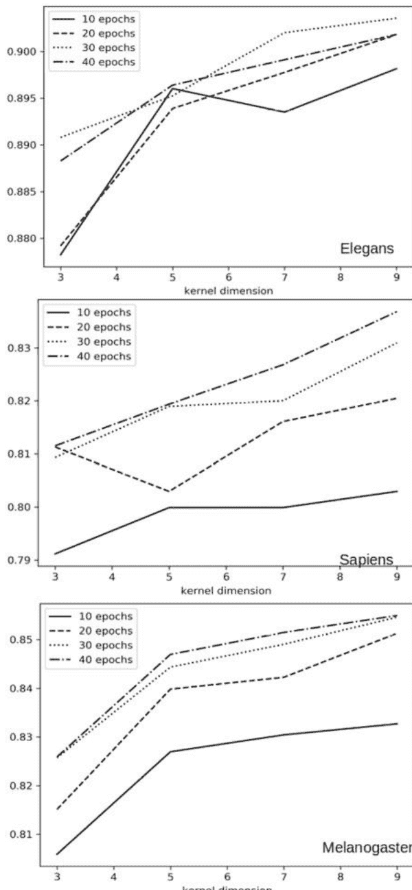

经过两个后续的全连接层，首先将其长度缩减到150，然后缩减到1。 第一个全连接层采用ReLU激活函数，而第二个全连接层采用sigmoid函数，使得ANN的输出属于区间[0,1]。 表2总结了架构的详细信息，而表3报告了

图7显示了三个数据集（Elegans、Melanogaster和Sapiens）的准确率结果。在x轴上报告了第一层的核心维度D，第二层的核心维度为2*D。架构如图9所示

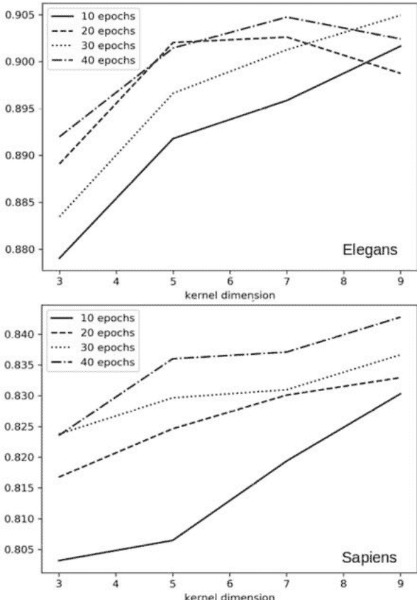

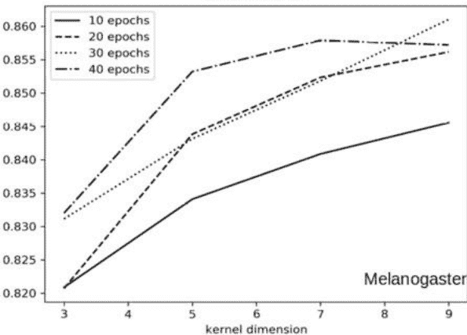

通过名为CLSTM的架构获得的结果。我们报告了由CLSTM-3和CLSTM-5两个不同版本计算的三个数据集的准确性、敏感性和特异性的平均值。它们的区别在于卷积核的大小，即第一个版本为3，第二个版本为5。

图8对应于图6的ANN架构

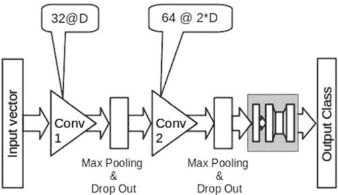

图9对应于图7的ANN架构

实验采用了10折交叉验证模式进行在训练集中选择10%的数据作为早停的验证步骤预测标签通过对DLNN的输出值进行阈值处理获得,输出值范围在[0,1]之间,阈值为0.5。小于0.5的输出值被分类为连接物,否则为核小体。关于提出的神经模型的其他细节以及与其他方法的进一步比较可以在其他最近的研究中找到[5,6]。

## 使用16S基因序列进行细菌分类

在本节中,我们展示了使用深度学习模型对细菌进行分类的应用,仅考虑16S基因序列。问题是一个多类别分类问题,输出类别的数量取决于门纲的数量。

# 4.2 使用16S基因序列进行细菌分类

表2 使用一位热编码进行核小体-连接区分类的CLSTM架构的详细信息

| 参数 | 卷积层1 | LSTM | 完全连接部分 |
|---|---|---|---|
| 核维度（1-D） | 3, 5 | - | - |
| 卷积核数量(N) | 50 | - | - |
| 最大池化 | 2 | - | - |
| Drop out | 0.5 | - | 0.5 |
| 第一层单元数量 | - | 50 | 150 |
| 第二层单元数量 | - | - | 1 |

表3 核小体数据集的10折交叉验证性能。 cel, Dmel, hsa代表物种；CLSTM代表本章提出的深度学习神经网络；-3或-5代表网络中第一个卷积层的核维度。

| 方法（物种） | $\mu$ | $\sigma$ | $\mu$ | $\sigma$ | $\mu$ | $\sigma$ |
|---|---|---|---|---|---|---|
| CLSTM-3(cel) | 89.60 | 0.8 | 93.36 | 1.27 | 85.93 | 2.13 |
| CLSTM-3(Dmel) | 85.54 | 1.13 | 87.60 | 2.55 | 83.42 | 2.65 |
| CLSTM-3(hsa) | 84.65 | 2.16 | 89.67 | 2.83 | 79.64 | 4.29 |
| CLSTM-5(cel) | 89.62 | 2.45 | 93.04 | 3.68 | 86.34 | 5.54 |
| CLSTM-5(Dmel) | 85.60 | 0.75 | 87.81 | 2.79 | 83.33 | 2.74 |
| CLSTM-5(hsa) | 85.37 | 1.91 | 88.34 | 1.82 | 82.29 | 4.86 |

和分类级别。在第一和第二种情况下，考虑完整的序列（约1400个bp）进行分类；在这种情况下，使用的数据集包含从核糖体数据库项目II（RDP）[4]下载的3000个16S核糖体RNA序列。这些序列是高质量的，长度为1200-1400个核苷酸，来自未培养和分离的来源，并经过RDP质量系统的检查。从最流行的细菌门（放线菌门、厚壁菌门和变形菌门）中随机选择了1000个序列。表7显示了分类类别的结构。在第三种情况下，分类是基于模拟NGS机器输出的短读取，以尽可能接近真实的宏基因组问题。

根据[50,72]生成了短读序列，更多细节请参考原始工作[11]。在这种情况下，只考虑了变形菌门，并为了获得平衡的数据集，我们选择了100个属，每个属有10个物种。根据模拟测序技术，获得了两个数据集：shotgun（SG）和amplicon（AMP）。

使用全长16S序列和One Hot表示进行细菌分类。细菌分类是分层的，由许多级别（分类级别）组成。在下面描述的实验中，我们使用了从门到属的5个分类级别。分类器结构如图10所示：每个分类级别都有一个人工神经网络，以保证每个人工神经网络具有相同数量的训练序列。

根据[50,72]生成了短读序列，更多细节请参考原始工作[11]。在这种情况下，只考虑了变形菌门，并为了获得平衡的数据集，我们选择了100个属，每个属有10个物种。根据模拟测序技术，获得了两个数据集：shotgun（SG）和amplicon（AMP）。

使用全长16S序列和One Hot表示进行细菌分类。细菌分类是分层的，由许多级别（分类级别）组成。在下面描述的实验中，我们使用了从门到属的5个分类级别。分类器结构如图10所示：每个分类级别都有一个人工神经网络，以保证每个人工神经网络具有相同数量的训练序列。

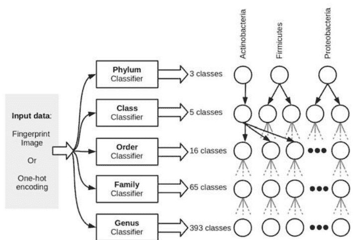

图1016S序列分类器的结构（左）和所考虑的三个门类的分层分类表示（右）。输入数据是16S全长序列的表示，每个分类器都是经过训练的人工神经网络：在全长16S的情况下，使用了一个卷积神经网络（CNN）和一个循环神经网络（RNN）进行比较；在FCGR的情况下，使用了一个CNN。

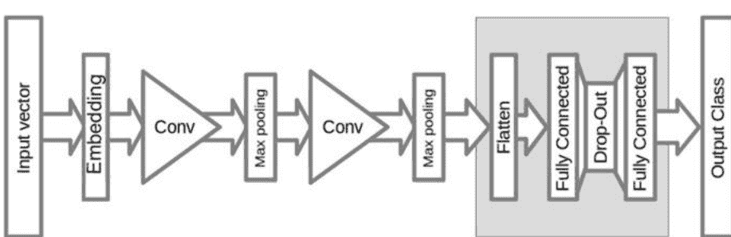

图11基于卷积层的人工神经网络架构

在细菌分类中，我们的目标是寻找更合适的神经网络架构。为此，我们在这里提供了CNN和RNN深度学习架构的比较。CNN的架构是LeNet网络[31]的一个变种，RNN是一个LSTM网络。

人工神经网络的结构如图11和图12所示。

CNN的第一层作为嵌入层，以16维的序列字符的独热编码作为输入，并输出一个10维的连续向量。请注意，由于输入数据集的特性是根据IUPAC字母表定义的，因此独热表示的大小与4不同。

最后，嵌入层的输出是一个10×1400的实值矩阵，其中l=1400是16S序列的长度。在输入层之上，我们有两个2D卷积层，每个卷积层后面跟着一个最大池化层。这两个卷积层

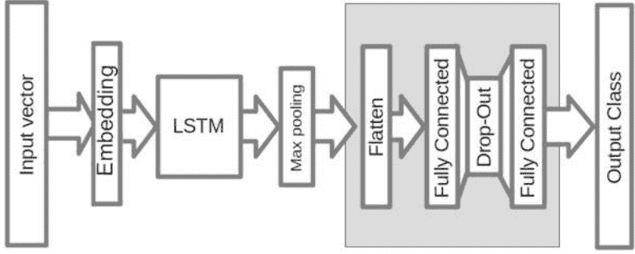

图12基于LSTM循环层的ANN架构

| | 门 | | 纲 | | 目 | | 科 | | 属 | |
| :--- | :--- | :--- | :--- | :--- | :--- | :--- | :--- | :--- | :--- | :--- |
| | μ | σ | μ | σ | μ | σ | μ | σ | μ | σ |
| CNN | 0.995 | 0.003 | 0.993 | 0.006 | 0.937 | 0.012 | 0.893 | 0.019 | 0.676 | 0.065 |
| LSTM | 0.982 | 0.028 | 0.977 | 0.022 | 0.902 | 0.028 | 0.857 | 0.034 | 0.728 | 0.030 |

这两个卷积层分别使用10个和20个大小为5的滤波器。池化层的宽度和步长都等于5。

然后将两个卷积层与两个全连接层堆叠在一起。第一个由500个单元组成，并使用tanh激活函数。第二个是分类层，并使用softmax激活函数(表4)。

这个人工神经网络与[54]中提出的类似，除了增加了一个嵌入层和没有对序列进行预处理，而是使用了one-hot编码。卷积神经网络架构的详细信息总结在表5中。循环神经网络是一个6层的人工神经网络。第一层是嵌入层，然后是宽度和步幅都为2的最大池化层。最大池化减少了下一层的计算量，并且同时给人工神经网络一定的平移不变性能力。随后的LSTM层从左到右处理数据，并在每个时间步产生一个大小为20的输出向量。然后，输出通过另一个最大池化层进行子采样，并在顶部堆叠两个与CNN版本相似的全连接层。提出的LSTM架构的基本细节总结在表6中。相同的结果也在图13中报告。对于每个分类级别，进行了10折交叉验证。我们选择了每个折叠15个epochs，没有使用早停验证。这个选择是基于我们的实验观察。在表4中，我们报告了均值(μ)和标准差的结果。

两个ANN在10个测试折叠上计算的准确率(σ)，对于两个ANN都是如此(CNN和LSTM)。关于这个实验的其他细节可以在论文[38]中找到。

## 使用深度人工神经网络对序列进行分类:. . .

图13显示了使用16S全长进行三个细菌门分类的准确性结果，分别使用独热编码和FCGR表示。使用k=5的FCGR得到的结果在ANN中的核维度为3×3或5×5时相同。使用k=6或7的表示法时，结果稍微好一些，无论ANN中使用的核维度如何。独热编码的结果较差。

表7 16S细菌数据集结构。 前三行报告了每个分类级别的分类数目。 最后一行报告了每个分类器中的类别数目。

| | 门 | 纲 | 目 | 科 | 属 |
|---|---|---|---|---|---|
| 放线菌门 | 1 | 1 | 3 | 12 | 79 |
| 厚壁菌门 | 1 | 2 | 3 | 19 | 110 |
| 变形菌门 | 1 | 2 | 13 | 34 | 204 |

# 使用短读取16S序列和光谱表示的细菌分类数据集分析需要考虑多个特征。

模拟器生成的短读取的表示使用长度从3到7的k-mer提供了设计分类器的线索。 每个表示向量被建模为一个按照k-mer的自然顺序排序的频率值列表。

图3显示了人工神经网络的架构。

对于CNN，我们从初始配置开始，然后进行网格搜索以找到结果和处理时间之间的平衡。 初始配置包括10个卷积核和大小为5的卷积层；第二层具有相同维度的20个卷积核；非线性函数为ReLU；

# 表8 FCGR实验的网络结构。输出数量根据分类器的分类级别而变化。

| 参数 | 卷积层1 | 卷积层1 | 完全连接部分 |
| --- | --- | --- | --- |
| 卷积核尺寸 | 3×3, 5×5 | 3×3, 5×5 | – |
| 卷积核数量 | 10 | 20 | – |
| 最大池化 | 2 | 2 | – |
| Drop out | – | – | – |
| 第一层单元数量 | – | – | 500 |
| 第二层单元数量 | – | – | 3–100 |

# 表9 短读谱表示的网络结构。输出数量根据分类器的分类级别而变化。

| 参数 | 卷积层1 | 卷积层2 | 完全连接部分 |
| --- | --- | --- | --- |
| 卷积核尺寸 | 5 | 5 | – |
| 卷积核数量 | 5 | 10 | – |
| 最大池化 | 2 | 2 | – |
| Drop out | – | – | 0.5 |
| 单元数量 | – | – | 500 |
| 第二层单元数量 | – | – | 3–100 |

固定的池化大小为2，最后一个隐藏层有500个单元。CNN的学习算法是Adam优化算法[27]。分类结果略微依赖于卷积核大小和卷积核数量（小于1%）。因此，表9中的ANN配置被认为是有效的。

至于DBN参数，在两个RBM层中，选择相同数量的单元。输入特征数量与k-mer大小密切相关，定义了隐藏单元的数量。用k表示k-mer大小，输入特征数量等于4k。因此，隐藏单元的数量等于4(k-1)（对于k=3, 4, 5）和44（对于k=6, 7），以加快处理速度。图5显示了DBN模型。在这种情况下，DBN学习的优化算法是对比散度（CD）方法[19]。

卷积神经网络（CNN）和深度信念网络（DBN）都经过了10折交叉验证的测试，并且结果进行了平均。测试是在多个不同的k-mer长度（从3到7）下进行的，以找到提供分类所需信息最少的最小k-mer长度。分类性能以准确率、精确率、召回率和F1得分进行评估。图14和图15分别显示了使用CNN和AMP以及SG数据集进行分类时在不同分类级别上的准确率得分与k-mer大小的关系。使用DBN的趋势非常相似，但没有显示出来。无论是哪种ANN类型和分类级别，最高的准确率都是在7个k-mer大小下达到的，对应于其最大值。准确率得分在SG数据集的Class分类级别上达到99%，在Genus级别上达到80%。在图16和图17中，我们对比了CNN和DBN之间的分类得分，考虑了AMP和SG数据集。

图14 准确率结果，使用CNN和AMP数据集，从类到属级别，对于不断增加的k-mer大小

图15 准确率结果，使用CNN和SG数据集，从类到属级别，对于不断增加的k-mer大小

[PAGE 55]

图16 准确率、精确率、召回率 和F1分数，使用CNN和DBN，在AMP数据集上，对于属级别和k-mer，其中k=7

分别，在属级别上，k=7。两个ANN模型之间的结果非常相似，最佳分数是使用AMP数据集（约90%）。使用SG数据集，最佳分数约为85.5%。

## 使用深度人工神经网络对序列进行分类:. . .

图17精确度、准确度、召回率和F1分数,在SG数据集上使用CNN和DBN,在属级别和k-mer为k=7时

## 使用深度人工神经网络对序列进行分类:. . .

## 4.3 讨论

本研究考虑的序列表示方法是一热编码和k-mer编码。第二种方法取决于参数k，并且受到指数级空间复杂度的影响。此外，k-mer计数是一个线性时间任务。当需要使用此表示时，这是一个需要考虑的问题。通过采用特征选择策略，可以缩小空间复杂度问题，并且对于这里处理的特定分类问题，已经提出了几种解决方案[10,40,45]。相反，一热编码表示不需要任何特征提取或选择过程。对于核小体和连接器序列的分类，使用了特定的架构（参见图3和图4）。在这两种情况下，第一个卷积层用于从输入数据中提取简单特征，这些特征应该由第二个卷积层收集。第一组实验旨在了解第二层中更大的卷积核是否更有效，并能够从输出中组合更复杂的特征

第一层。图6和7显示,使用不同的k学习周期并不会显著提高准确度。CNN架构的最佳准确度值,如图6和7所示,分别为0.9、0.85、0.84,对应于Elegans、Melanogaster、Sapiens。另一种架构采用了one-hot表示,并在第二个卷积层的位置使用了LSTM层,对于Sapiens来说似乎更有效(见表3)。这种架构可以利用序列中的顺序信息,这是在核小体分类中很有用的特征。事实上,序列中包含的有用信息在k-mer表示中自然被丢弃。确实,要使CNN与LSTM相媲美,需要非常大的k。这需要一个非常庞大的预处理阶段,占用了大量的空间,这并不能激励采用这种架构。关于LSTM架构的更深入研究,涉及到庞大的序列数据集,并与核小体识别的最新方法进行比较,详见[5]。

相反,对于16s分类的情况,采用独热编码的结果既不适用于卷积层,也不适用于循环层。所使用的架构如图11和图12所示。毫无疑问,关于细菌分类的几项研究已经证明了使用k-mer表示法对16s序列的有效性。另一种成功的16s细菌分类表示法是混沌游戏表示法。我们提醒您,CNN最初是用于图像分类的,而FCGR表示法生成图像数据。

生成图像数据。在报告的实验中，获得的指纹图像的维度与 $k$-mer 的维度变化相关，这意味着较大的图像更稀疏。可能这就是为什么当 $k$-mer 的维度范围从 6 到 7 时，分类结果没有改善的原因。此外，对于使用的两个核维度，结果是相同的，可能是因为特征很小，较大的核没有用处。对于 16S 序列的短读分类，关键性能参数是 $k$-mer 的大小。输入表示的大小强烈依赖于 $k$-mer 的大小 $k$，等于 4 $k$。如图 14 所示，对于 CNN，准确性随着 $k$-mer 的增加而提高。在属级分类水平上，随着 $k$-mer 的增加，准确性的提高更加明显，因为有 100 个类别需要分类。如图 15 所示，CNN 方法的性能在 $k=5$ 到 $k=6$ 时得到提升，而 DBN 方法显示出稳定的增长趋势。然而，对于 DBN 方法，隐藏单元的数量取决于 $k$-mer 的大小。对于较大的 $k$-mer 大小 $(6,7)$，CNN 和 DBN 显示出非常相似的趋势。由于 $k=6$ 和 $k$-mer 大小 $(6,7)$ 时性能几乎稳定，不考虑更大的 $k$-mer 大小。使用 65,536 和 262,144 个输入向量大小需要大量的处理时间。

## 4.4 执行时间

所有实验都在一个拥有 24 个节点和以下配置的集群上进行：

+   - 操作系统：CentOS 6.3
- CPU：1个 Intel®Xeon®CPU E5-2670 @ 2.6 GHz
- 硬盘：1 TB SATA
- 内存：128 GB DDR3 @ 1.6 GHz
- GPU: 48 x GPU NVIDIA KEPLER K20

训练阶段的执行时间（秒）总结在表 10 和表 11 中。
我们考虑了 $k$-mer 的大小、ANN 架构，以及核小体案例研究中的物种。

表 10 核小体预测案例研究的训练时间（秒），考虑了 $k$-mer 的大小、ANN 架构和物种

| ANN | Cel | | Dmel | | Hsa | |
| --- | --- | --- | --- | --- | --- | --- |
| $k$-mer | CNN（图 8） | CNN（图 9） | CNN（图 8） | CNN（图 9） | CNN（图 8） | CNN（图 9） |
| 3 | 300 | 304 | 325 | 335 | 261 | 268 |
| 5 | 380 | 347 | 360 | 379 | 290 | 312 |
| 7 | 420 | 441 | 456 | 495 | 367 | 360 |
| 9 | 440 | 490 | 510 | 536 | 413 | 436 |

## 11 细菌分类案例研究的训练时间（以秒为单位），考虑 $k$-mer大小、ANN架构和序列长度

| ANN | $k$-mer | 完整序列 | CNN (图11) | LSTM (图12) | 短读取 | DBN (图5) | CNN (图3) |
|---|---|---|---|---|---|---|---|
| 3 | 732 | 878 | 7288 | 686 |
| 4 | 825 | 990 | 8170 | 1256 |
| 5 | 1171 | 1422 | 11875 | 3091 |
| 6 | 2044 | 2452 | 20346 | 8021 |
| 7 | 37054 | 44553 | 37161 | 24204 |

## 5 结论

本章的目标是介绍对于与宏基因组学和染色质组织相关的DNA序列分类问题有用的序列表示和DL架构。

我们展示了在不同序列长度的几个任务中，使用独热编码和 $k$-mer表示之间的性能差异。 这两种不同的序列编码需要不同的基于DL的特征提取器。 首先，谱表示产生一个固定长度的表示，这就证明了使用卷积层的合理性。 在这种情况下，并不需要大量的层，正如 [73] 中所报道的那样。 混沌游戏表示并没有显著提高性能，并且可能需要很长的训练时间。

独热编码保留了数据的顺序性，但在训练非常长的序列时可能不可行。 如果分类问题涉及到较小的序列，使得独热编码成为可能，那么LSTM层可以很有用，因为它利用了序列结构，并且可以发现比$k$-mer更复杂的模式。 对于复杂的分类问题，如16S细菌分类等长序列的分类可能很困难，尤其是在元基因组方法中，但对于这个实验，具有一维卷积核的CNN可以有良好的性能。

我们的实验结果和对不同DNA序列分类任务的分析可以作为一个起点和强有力的基准，来开发新的深度学习技术，以提升这个领域的最新技术水平。

致谢Giosu Lo Bosco和Domenico Amato获得了INDAM - GNCS“数字健康的计算智能方法”项目的额外支持。

## 参考文献

1.  Amato, D., Di Gangi, M.A., Lo Bosco, G., Rizzo, R.: 用于核小体分类的循环深度神经网络。 在: Raposo, M., Ribeiro, P., Srio, S., Staiano, A., Ciaramella, A.(eds.) 计算智能方法在生物信息学和生物统计学中的应用。页码: 118-127。 Springer International Publishing, Cham (2020)

2.  Cairns, B.R.: 染色质重塑复合物：多样性中的力量，专业化中的精确性。 遗传学与发育的当前观点 15(2)，185-190 (2005)

3.  Chaput, N., Lepage, P., Coutzac, C., Soularse, E., Le Roux, K., Monot, C., Boselli, L., Routier, E., Cassard, L., Collins, M., et al.: 基线肠道菌群预测接受ipilimumab治疗的转移性黑色素瘤患者的临床反应和结肠炎。 Annals of Oncology 28(6)，1368-1379 (2017)

4.  Cole, J.R., Wang, Q., Cardenas, E., Fish, J., Chai, B., Farris, R.J., Kulam-Syed-Mohideen, A., McGarrell, D.M., Marsh, T., Garrity, G.M., et al.: 核糖体数据库项目：改进的对齐和新的rrna分析工具。 核酸研究 37(suppl_1), D141–D145 (2008)

5.  Di Gangi, M., Lo Bosco, G., Rizzo, R.: 从序列数据中预测核小体定位的深度学习架构。 BMC生物信息学 19(14), 418 (2018年11月)

6.  Di Gangi, M.A., Gaglio, S., La Bua, C., Lo Bosco, G., Rizzo, R.: 一种利用核小体相关序列中的位置信息的深度学习网络。 在：Rojas, I., Ortu o, F. (eds.) 生物信息学和生物医学工程：第5届国际工作会议，IWBBIO 2017，西班牙格拉纳达，2017年4月26日至28日，论文集，第二部分，pp. 524–533。 Springer International Publishing

7.  Durbin, R., Eddy, S.R., Krogh, A., Mitchison, G.: 生物序列分析：蛋白质和核酸的概率模型. 剑桥大学出版社 (1998)

8.  Escobar-Zepeda, A., Vera-Ponce de Le n, A., Sanchez-Flores, A.: 从微生物学到DNA测序技术和生物信息学的宏基因组学之路. 遗传学前沿 6, 348 (2015)

9.  Escobar-Zepeda, A., Vera-Ponce de Le n, A., Sanchez-Flores, A.: 从微生物学到DNA测序技术和生物信息学的宏基因组学之路. 遗传学前沿 6(348) (2015)

10. Ferraro Petrillo, U., Sorella, M., Cattaneo, G., Giancarlo, R., Rombo, S.E.: 分析基因组序列的大数据集：快速可扩展的k-mer统计收集. BMC生物信息学 20(4), 138 (2019年4月)

11. Fiannaca, A., La Paglia, L., La Rosa, M., Renda, G., Rizzo, R., Gaglio, S., Urso, A., et al.: 深度学习模型用于元基因组数据的细菌分类。 BMC生物信息学 19(7), 198 (2018)

12. Fiannaca, A., La Rosa, M., La Paglia, L., Rizzo, R., Urso, A.: 基于结构特征的非编码RNA分类器。 BioData mining 10(1), 27 (2017)

13. Fiannaca, A., La Rosa, M., Rizzo, R., Urso, A.: 使用神经气体和光谱表示分析DNA条形码序列。 在：Iliadis, L., Papadopoulos, H., Jayne, C. (eds.) 神经网络的工程应用，计算机与信息科学通信，vol. 384, pp. 212–221 (2013)

14. Fiannaca, A., La Rosa, M., Rizzo, R., Urso, A.: 基于光谱表示和神经气体网络的基于k-mer的条形码DNA分类方法。 医学中的人工智能 64(3), 173–184 (2015)。 https://doi.org/10.1016/j.artmed.2015.06.002

15. Frankel, A.E., Coughlin, L.A., Kim, J., Froehlich, T.W., Xie, Y., Frenkel, E.P., Koh, A.Y.: 通过代谢组学测序和无偏代谢物分析确定与黑色素瘤患者免疫检查点治疗效果相关的特定人类肠道菌群和代谢物。 肿瘤 19(10), 848–855 (2017)

16. giancarlo, R., Lo Bosco, G., Pinello, L., Utro, F.: 后基因组时代聚类的三个步骤：综述。 在：Rizzo, R., Lisboa, P.J.G. (eds.) 生物信息学和生物统计学的计算智能方法。 pp. 13–30 . Springer Berlin Heidelberg, Berlin, Heidelberg (2011)

17. Goodfellow, I.J., Bengio, Y., Courville, A.: 深度学习. MIT出版社, 剑桥, 马萨诸塞州, 美国 (2016), http://www.deeplearningbook.org

18. Guo, S.H., Deng, E.Z., Xu, L.Q., Ding, H., Lin, H., Chen, W., Chou, K.C.: inuc-pseknc: 一种基于序列的伪k-核苷酸组成预测基因组中核小体定位的方法. 生物信息学 30(11), 1522–1529 (2014)

19. Hinton, G.E.: 通过最小化对比散度训练专家产品. 神经计算 14(8), 1771-1800 (2002)

20. Hinton, G.E.: 用神经网络降低数据的维度. 科学 313(5786), 504-507 (2006)

21. Hinton, G.E., Osindero, S., Teh, Y.W.: 一种用于深度信念网络的快速学习算法. 神经计算 18(7), 1527-1554 (2006)

22. Hochreiter, S., Schmidhuber, J.: 长短期记忆. 神经计算 9(8), 1735-1780 (1997)

23. Jones, P.A., Baylin, S.B.: 癌症的表观基因组学. 细胞 128(4), 683-692 (2007)

24. Jordan, M.I.: 吸引子动力学和连接主义顺序机. 在: 人工神经网络: 概念学习, pp. 112-127 (1990)

25. Kaplan, N., K Moore, I., Mittendorf, Y., J Gossett, A., Tillo, D., Field, Y., M LeProust, E., R Hughes, T., Lieb, J., Widom, J., Segal, E.: 一个真核基因组的DNA编码核小体组织. 自然 458 , 362-6 (2009)

26. Kho, Z.Y., Lal, S.K.: 人类肠道微生物组-健康和疾病的潜在控制者. 微生物学前沿 9 (2018)

27. Kingma, D., Ba, J.: Adam: 一种随机优化方法. 在: 第三届国际学习表示会议(ICLR)论文集 (2014)

28. Krebs, C.J.: 物种多样性测量. 生态学方法论 (1999)

29. Kullback, S., Leibler, R.A.: 关于信息和充分性. 数学统计学年鉴 22(1), 79-86 (1951)

30. LeCun, Y., Bengio, Y., Hinton, G.: 深度学习. 自然 521, 436-444 (2015)

31. Lecun, Y., on Bottou, L., Bengio, Y., Haffner, P.: 基于梯度的文档识别应用于学习. 在: IEEE会议论文集. pp. 2278-2324 (1998)

32. LeCun, Y., Bottou, L., Bengio, Y., Haffner, P.: 基于梯度的学习应用于文档识别. IEEE会议论文 86(11), 2278-2324 (1998)

33. LeCun, Y., Bottou, L., Bengio, Y., Haffner, P.: 基于梯度的学习应用于文档识别. IEEE会议论文 86(11), 2278-2324 (1998)

34. Li, Y., Huang, C., Ding, L., Li, Z., Pan, Y., Gao, X.: 生物信息学中的深度学习：大数据时代的介绍、应用和展望。方法 (2019)

35. Liu, H., Lin, S., Cai, Z., Sun, X.: 真核DNA序列中10-11bp周期性在核小体定位中的作用。生物系统 105, 295-9 (2011)

36. Liu, M.J., Seddon, A.E., Tsai, Z.T.Y., Major, I.T., Floer, M., Howe, G.A., Shiu, S.H.: 核小体定位的决定因素及其对植物基因表达的影响。基因组研究 25(8), 1182-1195 (2015)

37. Lo Bosco, G.: 无需对齐的核小体差异性用于分类。在: 生物信息学和生物统计学的计算智能方法，计算机科学讲座笔记，vol. 9874, pp. 114-128 (2016)

38. Lo Bosco, G., Di Gangi, M.A.: 用于DNA序列分类的深度学习架构。在: Petrosino, A., Loia, V., Pedrycz, W. (eds.) 模糊逻辑和软计算应用。pp. 162-171. Springer国际出版社, Cham (2017)

39. Lo Bosco, G., Rizzo, R., Fiannaca, A., La Rosa, M., Urso, A.: 一种用于表观基因组研究的深度学习模型。在：第12届信号图像技术互联网系统国际会议（SITIS）。第688-692页。IEEE (2016)

40. Lo Bosco, G., Rizzo, R., Fiannaca, A., La Rosa, M., Urso, A.: 变量排序特征选择用于核小体相关序列的识别。在：Bencz r, A., Thalheim, B., Horv th, T., Chiusano, S., Cerquitelli, T., Sidl, C., Revesz, P.Z. (编辑) 数据库和信息系统的新趋势。第314-324页。Springer国际出版社（2018）

41. Lu, Q., Wallrath, L.L., Elgin, S.C.: 核小体定位和基因调控。细胞生物化学杂志 55 (1) , 83-92 (1994)

42. Min, S., Lee, B., Yoon, S.: 生物信息学中的深度学习。生物信息学简报第1-19页 (2016)

43. Mont far, G.: 限制玻尔兹曼机:介绍和综述。 在: Ay, N., Gibilisco, P., Mat, F. (eds.) 信息几何及其应用。第75-115页。Springer International Publishing, Cham (2018)

44. Nair, V., Hinton, G.E.: 矫正线性单元改进了限制玻尔兹曼机。 在: 第27届国际机器学习大会(ICML-10)论文集。第807-814页 (2010)

45. Pinello, L., Lo Bosco, G.: 一种新的k-mer序列特征选择方法。 在: 生物信息学和生物统计的计算智能方法,计算机科学讲座笔记,第8623卷,第99-108页(2015)

46. Pinello, L., Lo Bosco, G., Hanlon, B., Yuan, G.C.: 一种独立于模式的DNA序列特异性度量方法。 BMC生物信息学 12 (2011)

47. Pinello, L., Lo Bosco, G., Yuan, G.C.: 无需比对的表观基因组学方法的应用。 生物信息学简报 15(3), 419-430 (2014)

48. Pulivarthy, S.R., Lion, M., Kuzu, G., Matthews, A.G., Borowsky, M.L., Morris, J., Kingston, R.E., Dennis, J.H., Tolstorukov, M.Y., Oettinger, M.A.: 调控的大规模核小体密度模式和精确的核小体定位与V(D)J重组相关。 美国国家科学院院刊 113(42), E6427-E6436 (2016)

49. Qin, J., Li, Y., Cai, Z., Li, S., Zhu, J., Zhang, F., Liang, S., Zhang, W., Guan, Y., Shen, D., et al.: 一项关于2型糖尿病肠道菌群的宏基因组关联研究。 自然 490(7418), 55 (2012)

50. Ramazzotti, M., Bern, L., Donati, C., Cavalieri, D.: riboframe: 一种改进的方法,用于从非靶向宏基因组学中进行微生物分类学分析。 遗传学前沿 6, 329(2015)

51. Ridgway, P., Almouzni, G.: 染色质组装和组织。 细胞科学杂志 114(15), 2711-2712 (2001)

52. Rinke, C., Schwientek, P., Sczyrba, A., Ivanova, N.N., Anderson, I.J., Cheng, J.F., Darling, A., Malfatti, S., Swan, B.K., Gies, E.A., Dodsworth, J.A., Hedlund, B.P., Tsiamis, G., Sievert, S. M., Liu, W.T., Eisen, J.A., Hallam, S.J., Kyrpides, N.C., Stepanauskas, R., Rubin, E.M, Huge nholtz, P., Woyke, T.: 对微生物暗物质的系统发育和编码潜力的洞察。 自然 499(7459), 431-437 (2013)

53. Rizzo, R., Fiannaca, A., La Rosa, M., Urso, A.: 用于分类条形码和迷你条形码DNA的通用回归神经网络。 在: 计算智能方法用于生物信息学和生物统计学,计算机科学讲座笔记,卷8623,第142-155页(2015)

54. Rizzo, R., Fiannaca, A., La Rosa, M., Urso, A.: 一种用于DNA序列分类的深度学习方法。 在: 国际计算智能方法会议用于生物信息学和生物统计学。第129-140页。Springer (2015)

55. Rizzo, R., Fiannaca, A., La Rosa, M., Urso, A.: 使用深度神经网络和混沌游戏表示对DNA序列进行分类实验。 在: 第17届计算机系统和技术国际会议论文集2016年。第222-228页。ACM (2016)

56. Sala, A., Toto, M., Pinello, L., Gabriele, A., Di Benedetto, V., Ingrassia, A.M., Lo Bosco, G., Di Ges, V., Giancarlo, R., Corona, D.F.V.: 对核小体重塑酶ISWI的染色质结合和核小体间距活性的全基因组特征分析。 《EMBO Journal》 30期(9), 1766-1777 (2011)

57. Schnitzler, G.R.: DNA序列和重塑机器对核小体位置的控制。 《细胞生物化学与生物物理学》 51期(2-3), 67-80 (2008)

58. Shahbazian, M.D., Grunstein, M.: 特异位点组蛋白乙酰化和脱乙酰化的功能。 《生物化学年度评论》 76期, 75-100 (2007)

59. Shawe-Taylor, J., Cristianini, N.: 支持向量机.支持向量机和其他基于核的学习方法简介 p pp. 93-112 (2000)

60. Simpson, E.H.: 多样性的测量. 自然 163(4148), 688-688 (1949)

61. Song, Y.J., Cho, D.H.: 基于重复k-word分布的各种基因组序列分类. 在: 2017年IEEE工程与医学生物学学会(EMBC)第39届年会. pp. 3894-3897. IEEE (2017)

# 一种用于微小RNA-靶向结合的深度学习模型

Ahmet Paker和Hasan Ogul

摘要 微小RNA (miRNA) 是长度约为21-23个碱基的非编码RNA, 在基因表达中起着关键作用。 它们在转录后水平上与靶向mRNA结合, 导致翻译抑制或mRNA裂解。快速有效地检测miRNA结合位点是生物信息学中的一个重要问题。 本章介绍了一种使用循环神经网络 (RNN) 对miRNA-靶向双链序列进行建模的新技术。

关键词 深度学习·循环神经网络·长短期记忆·序列比对·miRNA·靶点预测·miRNA靶点位点

# 1 引言

MicroRNas (miRNAs) 是一类长度约为21-23个碱基的小型非编码RNA分子, 在基因表达中起着重要作用。 转录后, 它们会结合到目标mRNA上, 导致mRNA的切割或翻译抑制, 在许多生物体中发挥作用。 它们与其部分互补的靶位点结合, 导致切割或转录后抑制。 它们阻止肽的生成并输出蛋白质[1, 2]。 最近的研究表明, 由于某些miRNAs的存在, 精神疾病和神经发育障碍的基因调控是可观察的[3]。

由于它们的功能通常通过其靶mRNA分子的活动来阐明和解释, 因此迅速而高效地确定其结合位点是非常重要的。

A. Paker土耳其安卡拉巴什肯特大学计算机工程系

H. Ogul (X)计算机科学学院, Östfold大学学院, 挪威哈尔登电子邮件: hasan.ogul@hiof.no

© Springer Nature Switzerland AG 2021M. Elloumi (ed.), 深度学习在生物医学数据分析中,https://doi.org/10.1007/978-3-030-71676-9_3

61


miRNAs是分子生物学中的一个主要问题。由于实验验证通常耗时且繁琐，需要计算技术来建模目标结合。主要问题是解析miRNAs与其靶位点之间的相互作用。已知这种相互作用是通过miRNA和mRNA结合位点的序列介导的，尽管目前尚未完全理解这种结合的机制。因此，计算预测miRNA靶点是一项具有挑战性的任务，以支持全球努力理解基因调控[12,13]。

在这项研究中，我们引入了一种新的深度学习(DL)框架，用于预测成熟miRNA序列和潜在靶向mRNA的结合位点。该框架基本上采用了一个由两个序列的互补对齐得到的双链序列来供应一个长短期记忆(LSTM)网络[18]。新的框架在两个不同的基准数据集上进行了测试，并与现有方法进行了比较。最后，引入了一个网络服务器。该网络应用程序从用户那里获取一个mRNA序列作为文本输入，并显示相关mRNA序列上的所有潜在结合位点。

该网络服务器可在 https://mirna.atwebpages.com 上访问。
本章的其余部分安排如下：第2节介绍了使用浅层和深度学习模型的最新计算方法的综述。第3节介绍了所使用的深度神经网络(DNN)[19]架构的组件和超参数。第4节介绍了不同实验设置下的实证结果。最后，我们讨论了未来的挑战和展望。

# 2 相关工作

存在各种算法和工具用于miRNA靶点预测。这些方法根据对靶点选择机制的不同假设而有所不同，例如miRNA-mRNA种子匹配的完全配对、种子匹配在不同物种中的保守性、同一miRNA在特定3'UTR上的预测位点数目、种子外的miRNA靶点自由能、靶点位点可及性和miRNA靶点二级结构。

RNAHybrid是最早用于模拟miRNA-mRNA结合的方法之一，其基于形成双链的热力学性质进行建模[14]。它通过预测的结构信息计算形成双链的最小自由能。
一些靶点预测工具在其算法中使用了RNAHybrid方法，以及其他因素[15]。miRTif是一种先进的基于序列的miRNA靶点结合模型[16]。该算法计算了在双链中的互补/非互补对上的一些预定义模体在几个长度上的频率。这些频率用于输入一个强大的机器学习(ML)方法，称为支持向量机(SVM)，该方法能够基于这些特征学习一个最优的超平面来分离正负样本。

# 3 材料和方法

序列的分类是一个建模问题，你有一个特定的输入序列并预测目标序列。这个问题的困难之处在于序列的长度可能不同，由大量的输入字符组成并且模型应该考虑输入序列中字符之间的长期上下文或依赖关系。循环神经网络(RNN) [20] 通过添加反馈机制来解决这个问题，该机制充当内存。因此，模型中的先前输入被保存在一种记忆中。LSTM通过创建短期和长期记忆组件来扩展这个思想。因此，LSTM模型可以在由重复模式组成的生物序列中取得成功的结果。在这里，我们介绍了一个DL架构，通过使用LSTM来建模miRNA-靶向结合，如图1所示。以下部分详细介绍了架构中的层。

# 3.1 对齐和表示层

输入包括两个序列，这两个序列被询问是否能够进行结合。由于LSTM可以处理单一的一维序列输入，我们需要一种新的表示方法来将两个输入馈送给LSTM。为此，我们使用

# 由[4]提供的双链序列模型。 miRNA-mRNA双链是通过成熟miRNA序列与mRNA结合位点的互补对齐构建的。

对齐是使用动态规划算法执行的，对于不匹配和间隙都有1的惩罚[6]。

得到的对齐结果被转换为一个新的序列，该序列定义在表示不同核苷酸对类型的符号字母表上，包括不匹配和其他位置的空格 (图2)。

# 3.2 嵌入层

嵌入词的主要思想是，语言中使用的每个单词都可以用一组数值（向量）来表示。 嵌入词是N维向量，试图在其值中捕捉单词的含义和范围。

首先，将双链序列中的每个字母转换为索引。 字符“a”转换为索引0，字符“b”转换为索引1，字符“c”转换为索引2，字符“d”转换为索引3，字符“q”转换为索引4。 嵌入词方法使用欧氏距离来找到相似序列之间的关系。 一旦找到字符之间的依赖关系，就可以获得一个嵌入向量（图3）。

在数据被构建的深度神经网络（DNN）[19]学习和测试之前，每个双链序列的维度、字母到索引的转换和嵌入向量权重以长度为32的向量的形式固定。

# 3.3 丢弃层

丢弃的目的是为了删除或移除输入到人工神经网络(ANN) 的变量。 它的效果是使人工神经网络(ANN) 中的节点对输入更加稳健，并模拟具有不同结构的多个人工神经网络(ANN)。 在每个训练步骤中，根据概率 (1-p)，个别节点从人工神经网络(ANN) 中被移除，从而得到一个减少的人工神经网络(ANN)。使用丢弃层的原因是为了在训练过程中减少过拟合的可能性。 全连接层使用大部分参数是低效的，因此神经元之间产生了相互依赖，这会降低每个神经元的个体强度，并导致训练数据的过拟合。

此外，丢弃是深度神经网络(DNNs) 中依赖于相互学习的智能神经元之间的一种方法。丢弃方法是深度学习中最常用的正则化方法之一。

# 3.4 LSTM层

循环神经网络(RNNs)[20]是一类用于建模序列数据的人工神经网络。RNN是一种具有循环连接的深度神经网络(DNN)。

由于输入是按顺序处理的，所以重复计算是在具有循环连接的隐藏单元中执行的。这就是为什么记忆以间接方式存储在称为状态向量的隐藏单元中，并且通过考虑所有先前的输入使用这些状态向量来计算当前输入的输出。

长短期记忆(LSTM)[18]是一种可以在任意时间间隔记住值的RNN。当学习进度保存时，存储的值不会改变。

RNN允许神经元之间的前后连接。

RNN的结构比LSTM简单，缺乏门控过程。所有的RNN在重复层都有反馈循环。因此，随着时间的推移，它们被提供来保持信息“在内存中”。然而，训练标准的RNN来解决需要学习的长期依赖关系是困难的。这是因为损失函数的梯度随时间逐渐减小。LSTM单元包含一个“记忆单元”，可以长时间地保存信息。一系列的门用于控制信息何时进入内存、何时退出以及何时被遗忘。这种架构使它们能够学习长期依赖关系。此外，RNN只有一个层(tanh)，而LSTM有四个交互层。

图4给出了LSTM架构的概述。首先，在左边，有一个新的序列值Xt，它与上一个单元的输出ht-1相结合。这个组合输入的第一步是通过一个tanh层进行压缩。第二步是将这个输入通过一个输入门。输入门是一个sigmoid激活层。

## 图3 提出的嵌入向量表示的示例

图4 LSTM架构

# 3.5 密集层

密集层是ANN中的神经元层之一。每个神经元从前一层的所有神经元接收输入，因此它们之间密集地连接在一起。该层具有权重矩阵W、偏置向量b和前一层的激活值a。密集层是一个全连接的ANN层。密集层用于修改相关向量的维度。从数学上讲，它对应的向量应用了缩放、旋转、平移、变换。

# 3.6 优化和其他参数

通常，人工神经网络的性能取决于几个因素。另一个被忽视但对性能算法有贡献的因素是用于拟合模型的优化方法。在本节中，讨论了一个激活函数、一个损失函数和三种优化方法。

## Sigmoid激活函数

Sigmoid函数是最常用的激活函数之一。与线性函数相比，在Sigmoid函数中，激活函数的输出始终在(0,1)范围内。因此，它可以用于二分类问题。

## 二元交叉熵损失函数

二元交叉熵损失函数用于衡量二分类模型的性能，其输出的概率值介于0和1之间。当预测的概率与实际标签不同时，交叉熵损失增加。因此，例如，当实际观察标签为1时，它会预测概率为0.006，并导致较高的损失值。一个优秀的模型的0对数损失。

## 随机梯度下降优化器

梯度下降是机器学习和深度学习中广泛使用的优化技术。它可以与大多数学习算法一起使用。梯度是函数的斜率；在数学上，它们可以根据输入的一系列参数的偏导数来定义。梯度下降可以被定义为一种迭代方法，试图最小化成本函数，并用于找到函数的参数值。

“随机”意味着与随机概率相关的系统或过程。因此，在随机梯度下降（SGD）中，每次迭代选择几个随机样本而不是整个数据集。在SGD中，每次迭代只使用一个样本进行计算。样本被随机混合并选择进行迭代。

## Adam优化器

可以使用Adam优化器[17]来根据训练数据更新递归神经网络的权重。Adam是基于自适应矩估计的。Adam算法由Diederik Kingma和Jimmy Ba于2015年提出。Adam是通过结合AdaGrad和RMSProp算法的最佳特性而创建的，以提供一种可以处理噪声问题中的稀疏转换的优化算法。Adam易于使用，其中大多数默认配置参数对于问题来说都很好。 相对较低的内存需求是Adam算法的优点之一。

## Adadelta 优化器

Adadelta 优化器[21] 源自 Adagrad并试图减少 Adagrad的侵略性，从而降低学习率的单调性。 这是通过将过去累积梯度的窗口限制在一些固定大小 w来实现的。 在运行时T，平均值取决于先前的平均值和当前的梯度。

# 3.7 实现细节

实验是在Google Colab环境中进行的。Google Colab工具是一个基于Google Drive的 Jupyter 笔记本系统。 所使用的机器的特点：GPU：1xTesla K80，计算时间为17.7分钟，具有2496个CUDA核心，12GB GDDR5 VRAM，33GB内存空间。

每个嵌入层中使用32个向量长度来表示每个单词。 此外，参数“500”用于指定定义要嵌入的单词范围的向量大小。 每个单词的输出层的大小在此层中定义（表1）。

第二层是一个Dropout层。使用这个层的主要目的是消除无用和垃圾数据，并防止过拟合。 Dropout的百分比选择为20%。. 第三层是具有1000个记忆单元（智能神经元）的LSTM层。 第四层是一个Dropout层。最后，由于这是一个分类问题，使用了一个具有单个神经元和sigmoid激活函数的密集输出层来预测问题中的两个类别的0或1。

## 表1 提出的LSTM网络的层

| 层类型 | 输出形状 |
|---|---|
| 嵌入 | (500,32) |
| Dropout_1 | (500,32) |
| LSTM | 1000 |
| Dropout_2 | 1000 |
| Dense | 1 |由于这是一个二元分类问题,使用对数损失作为损失函数(二元交叉熵)。此外,选择了Adam算法作为优化器。Adam是一种优化算法,用于在训练数据中递归更新ANN权重。此外,每5个epoch测量一次验证损失,以避免过拟合。如果验证损失增加了,就会激活提前停止函数。结果,学习被中断。

输入(对齐的双链序列)是用Python3提取的。在此过程之后,学习步骤是在Google Colaboratory环境中使用Python软件语言的Keras库开发的。在Web应用程序中,使用了HTML5和CSS3来进行前端开发。为了保留由DL模型生成的数据,首选使用MySQL数据库。此外,PHP用于在MySQL和前端之间操作数据。Web服务器位于https://mirna.atwebpages.com。

# 4 结果

在本节中,通过对不同数据集进行各种经验分析,基于各种评估指标比较了设计的ANN的性能。

### 4.1 数据集

本研究使用了两个不同的数据集。DSet1来自[9]。该数据集包含283个阳性和115个阴性的miRNA-mRNA双链序列。总共有398个数据。DSet2来自DeepMirTar仓库[5]。在第一个数据集中,收集了3915个阳性数据,其中473个来自mirMark数据[10],3442个来自CLASH数据[11]。使用模拟miRNA生成了3905个阴性数据。总共有7820个数据。由于有许多实验证实的阳性数据,因此首选此数据集。

### 4.2 实证结果

为了评估预测性能,我们使用了准确率、敏感性、特异性和曲线下面积(AUC)。给定真阳性(TP)、假阳性(FP)、真阴性(TN)和假阴性(FN)的数量,评估指标的计算如下:

TP+TN
准确率=       TP+TN+FP+FN
TP
敏感性（召回率）=   TP+FN
TN
特异性=         TN+FP
TP
精确度=         TP+FP
F得分=       精确度*召回率     *2
             精确度+召回率

# DSet1的预测结果

使用了34种不同的方法来测试DSet1。从DS1_M1到DS1_M30方法,根据不同的系统超参数来衡量DL系统的性能。此外,还尝试使用一些传统的浅层机器学习方法对DSet1进行分类。在DS1_31、DS1_32、DS1_33和DS1_M34中分别使用了SVM、DT、kNN和Random Forest。

首先,从DS1_M1到DS1_M30的数据集是随机混合的。之后,通过将测试集大小确定为0.1来评估LSTM模型。因此,收集了40个随机选择的测试数据。考虑了5个指标来评估成功标准：准确率（ACC），敏感性，特异性，AUC和F1得分。

在表2中,根据方法名称、批次大小、神经元大小、输入长度、损失函数和优化器系统参数给出了构建的LSTM模型的性能指标。结果显示,DS1_M1以4个批次大小、100个神经元大小、32个输入长度、二元交叉熵损失函数和Adam优化器获得了最佳结果。输入长度和损失函数系统超参数没有进行不同值的测试。因为在预处理的数据集中,最长的输入样本长度为32。

此外,由于所讨论的问题是一个二分类问题,优先选择二元交叉熵损失。根据表2,由于DS1_M1方法给出了最佳结果,使用较小规模的数据集中神经元数量的增加会降低系统的成功率。换句话说,系统复杂性的增加会对性能产生负面影响。总的来说,最好的结果是使用Adam优化器获得的。此外,批量大小为4的结果比8更好（表2）。

在表3中,基于LSTM的模型与常用的传统机器学习模型进行了比较。如图所示,当使用小型数据集时,深度学习方法无法获得更好的性能。

表2 基于不同系统超参数配置在DSet1上应用的方法

| 方法名称 | 批量大小 | 神经元大小 | 输入长度 | 损失函数 | 优化器 | 准确率 | 敏感度 | 特异度 | AUC |
|---|---|---|---|---|---|---|---|---|---|
| DS1_M1 | 4 | 100 | 32 | 二元交叉熵 | Adam | 82.50 | 100 | 30.00 | 77.00 |
| DS1_M2 | 4 | 250 | 32 | 二元交叉熵 | Adam | 77.31 | 93.76 | 76.78 | 74.28 |
| DS1_M3 | 4 | 500 | 32 | 二元交叉熵 | Adam | 77.61 | 83.14 | 77.12 | 74.79 |
| DS1_M4 | 4 | 1000 | 32 | 二元交叉熵 | Adam | 55.44 | 86.61 | 61.26 | 71.77 |
| DS1_M5 | 4 | 1500 | 32 | 二元交叉熵 | Adam | 51.72 | 85.88 | 60.60 | 59.53 |
| DS1_M6 | 4 | 100 | 32 | 二元交叉熵 | Adadelta | 71.62 | 74.56 | 64.70 | 78.82 |
| DS1_M7 | 4 | 250 | 32 | 二元交叉熵 | Adadelta | 74.99 | 71.14 | 71.23 | 76.70 |
| DS1_M8 | 4 | 500 | 32 | 二元交叉熵 | Adadelta | 62.41 | 74.12 | 70.41 | 77.47 |
| DS1_M9 | 4 | 1000 | 32 | 二元交叉熵 | Adadelta | 64.18 | 70.46 | 66.67 | 72.33 |
| DS1_M10 | 4 | 1500 | 32 | 二元交叉熵 | Adadelta | 54.66 | 81.98 | 31.15 | 63.21 |
| DS1_M11 | 4 | 100 | 32 | 二元交叉熵 | SGD | 64.77 | 55.12 | 51.16 | 64.88 |
| DS1_M12 | 4 | 250 | 32 | 二元交叉熵 | SGD | 59.46 | 59.31 | 57.28 | 71.71 |
| DS1_M13 | 4 | 500 | 32 | 二元交叉熵 | SGD | 57.86 | 68.82 | 53.33 | 66.53 |
| DS1_M14 | 4 | 1000 | 32 | 二元交叉熵 | SGD | 54.44 | 69.08 | 33.76 | 61.38 |
| DS1_M15 | 4 | 1500 | 32 | 二元交叉熵 | SGD | 53.99 | 77.71 | 35.62 | 66.22 |
| DS1_M16 | 8 | 100 | 32 | 二元交叉熵 | Adam | 81.44 | 96.94 | 27.79 | 78.87 |
| DS1_M17 | 8 | 250 | 32 | 二元交叉熵 | Adam | 77.46 | 81.61 | 80.92 | 78.15 |
| DS1_M18 | 8 | 500 | 32 | 二元交叉熵 | Adam | 75.82 | 81.61 | 73.74 | 76.68 |
| DS1_M19 | 8 | 1000 | 32 | 二元交叉熵 | Adam | 72.31 | 75.75 | 85.58 | 78.95 |
| DS1_M20 | 8 | 1500 | 32 | 二元交叉熵 | Adam | 52.51 | 71.24 | 20.01 | 61.89 |
| DS1_M21 | 8 | 100 | 32 | 二元交叉熵 | Adadelta | 72.25 | 84.85 | 71.81 | 81.66 |
| DS1_M22 | 8 | 250 | 32 | 二元交叉熵 | Adadelta | 71.27 | 85.17 | 67.58 | 79.63 |
| DS1_M23 | 8 | 500 | 32 | 二元交叉熵 | Adadelta | 63.76 | 85.17 | 61.26 | 75.55 |
| DS1_M24 | 8 | 1000 | 32 | 二元交叉熵 | Adadelta | 64.85 | 81.81 | 66.80 | 71.52 |

| DS1_M25 | 8 | 1500 | 32 | 二元交叉熵 | Adadelta | 67.67 | 86.09 | 45.16 | 74.32 |
| DS1_M26 | 8 | 100 | 32 | 二元交叉熵 | SGD | 64.76 | 76.75 | 71.81 | 73.37 |
| DS1_M27 | 8 | 250 | 32 | 二元交叉熵 | SGD | 64.76 | 76.75 | 71.81 | 73.37 |
| DS1_M28 | 8 | 500 | 32 | 二元交叉熵 | SGD | 62.46 | 73.48 | 69.94 | 70.04 |
| DS1_M29 | 8 | 1000 | 32 | 二元交叉熵 | SGD | 63.48 | 78.62 | 73.56 | 76.62 |
| DS1_M30 | 8 | 1500 | 32 | 二元交叉熵 | SGD | 54.93 | 74.33 | 44.36 | 64.48 |

表3 最佳mirLSTM模型和其他基本机器学习方法在DSet1上的分类结果

| 方法 | 准确率(%) | 敏感性(%) | 特异性(%) | 曲线下面积(%) |
|---|---|---|---|---|
| mirLSTM [22] | 82.50 | 100 | 30.00 | 77.00 |
| SVM [23] | 76.75 | 84.02 | 37.09 | 60.60 |
| DT [24] | 70.00 | 84.80 | 15.00 | 44.60 |
| kNN [25] | 85.50 | 89.30 | 64.51 | 77.80 |
| RF [26] | 85.00 | 100 | 0.005 | 81.10 |

表4比较了mirLSTM方法与现有方法最佳mirLSTM (DS1_M1) 的比较

表4在DSet2中与先前方法最佳mirLSTM (DS1_M1) 的比较

# DSet2的预测结果

在第一个名为DS2_M1的方法中,没有进行任何特征表示方法,直接将[5]中的原始数据输入到我们的深度学习模型中以预测miRNA靶位点。从DS2_M2到DS2_M31,使用了DSet2。此外,在每种方法中,根据不同的系统超参数评估了开发的深度学习模型的性能。此外,还使用了数据预处理,并意图建立一个执行miRNA靶位点预测的分类模型。

在表5中,根据方法名称、批次大小、神经元大小、输入长度、损失函数和优化器参数给出了构建的LSTM模型的性能指标。根据结果显示,DS2_M5在64批次大小、1000神经元大小、32输入长度、二元交叉熵损失函数和Adam优化器下获得了最佳结果。输入长度和损失函数的超参数没有进行不同值的测试。因为在预处理的数据集中,最长的输入样本长度为32。

此外,由于讨论的问题是一个二分类问题,所以优先选择二元交叉熵损失函数。根据表1,由于DS2_M5方法获得了最佳结果,使用更多神经元在大型数据集中可以提高系统的成功率。然而,当神经元数量为1500时,模型的性能下降,因为模型变得更加复杂。总的来说,最佳结果是使用Adam优化器获得的。此外,Adadelta优化器至少与Adam优化器一样成功。此外,64批次大小比128批次大小获得了更好的结果。

在表6中,LSTM模型与常用的传统机器学习模型在DSet2中进行了比较。在这里,我们观察到LSTM在准确性和AUC方面可以胜过其他方法。

# 一种用于微RNA-靶结合的深度学习模型

| 方法名称 | 批量大小 | 神经元大小 | 输入长度 | 损失函数 | 优化器 | 准确率 | 敏感度 | 特异度 | AUC |
|---|---|---|---|---|---|---|---|---|---|
| DS2_M2 | 64 | 100 | 32 | 二元交叉熵 | Adam | 84.02 | 82.38 | 85.60 | 91.00 |
| DS2_M3 | 64 | 250 | 32 | 二元交叉熵 | Adam | 85.81 | 86.26 | 85.35 | 92.18 |
| DS2_M4 | 64 | 500 | 32 | 二元交叉熵 | Adam | 60.61 | 33.41 | 87.12 | 80.73 |
| DS2_M5 | 64 | 1000 | 32 | 二元交叉熵 | Adam | 87.34 | 91.45 | 83.33 | 92.59 |
| DS2_M6 | 64 | 1500 | 32 | 二元交叉熵 | Adam | 55.12 | 93.78 | 17.42 | 58.65 |
| DS2_M7 | 64 | 100 | 32 | 二元交叉熵 | Adadelta | 78.26 | 71.50 | 84.84 | 84.78 |
| DS2_M8 | 64 | 250 | 32 | 二元交叉熵 | Adadelta | 85.29 | 83.41 | 87.12 | 89.96 |
| DS2_M9 | 64 | 500 | 32 | 二元交叉熵 | Adadelta | 84.14 | 79.01 | 89.14 | 89.74 |
| DS2_M10 | 64 | 1000 | 32 | 二元交叉熵 | Adadelta | 86.31 | 88.64 | 82.54 | 89.13 |
| DS2_M11 | 64 | 1500 | 32 | 二元交叉熵 | Adadelta | 60.19 | 93.56 | 0.22 | 54.61 |
| DS2_M12 | 64 | 100 | 32 | 二元交叉熵 | SGD | 60.87 | 60.88 | 61.61 | 77.12 |
| DS2_M13 | 64 | 250 | 32 | 二元交叉熵 | SGD | 60.10 | 68.13 | 52.52 | 78.67 |
| DS2_M14 | 64 | 500 | 32 | 二元交叉熵 | SGD | 66.98 | 72.22 | 52.65 | 81.10 |
| DS2_M15 | 64 | 1000 | 32 | 二元交叉熵 | SGD | 50.38 | 88.60 | 18.43 | 74.75 |
| DS2_M16 | 64 | 1500 | 32 | 二元交叉熵 | SGD | 59.69 | 88.55 | 31.50 | 64.86 |
| DS2_M17 | 128 | 100 | 32 | 二元交叉熵 | Adam | 82.23 | 83.93 | 80.55 | 90.15 |
| DS2_M18 | 128 | 250 | 32 | 二元交叉熵 | Adam | 82.64 | 83.33 | 82.29 | 90.55 |
| DS2_M19 | 128 | 500 | 32 | 二元交叉熵 | Adam | 70.08 | 44.00 | 88.47 | 78.75 |

| DS2_M20 | 128 | 1000 | 32 | 二元交叉熵 | Adam | 61.13 | 38.60 | 83.08 | 55.69 |
| DS2_M21 | 128 | 1500 | 32 | 二元交叉熵 | Adam | 57.05 | 91.44 | 10.80 | 63.66 |
| DS2_M22 | 128 | 100 | 32 | 二元交叉熵 | Adadelta | 78.52 | 81.08 | 78.78 | 83.99 |
| DS2_M23 | 128 | 250 | 32 | 二元交叉熵 | Adadelta | 86.11 | 87.81 | 80.94 | 90.68 |
| DS2_M24 | 128 | 500 | 32 | 二元交叉熵 | Adadelta | 79.67 | 82.80 | 89.33 | 90.95 |

| DS2_M25 | 128 | 1000 | 32 | 二元交叉熵 | Adadelta | 83.58 | 88.77 | 81.08 | 90.95 |
| DS2_M26 | 128 | 1500 | 32 | 二元交叉熵 | Adadelta | 56.76 | 91.90 | 26.61 | 62.44 |
| DS2_M27 | 128 | 100 | 32 | 二元交叉熵 | SGD | 66.34 | 57.57 | 66.66 | 71.58 |
| DS2_M28 | 128 | 250 | 32 | 二元交叉熵 | SGD | 64.22 | 73.56 | 59.17 | 86.90 |
| DS2_M29 | 128 | 500 | 32 | 二元交叉熵 | SGD | 62.94 | 77.46 | 58.87 | 83.80 |
| DS2_M30 | 128 | 1000 | 32 | 二元交叉熵 | SGD | 51.56 | 84.57 | 22.11 | 72.21 |

| DS2_M31 | 128 | 1500 | 32 | 二元交叉熵 | SGD | 64.69 | 88.76 | 35.53 | 60.41 |

表6 最佳LSTM模型(DS2_M5)和其他基本机器学习方法在DSet2上的分类结果

| 方法 | 准确率(%) | 敏感性(%) | 特异性(%) | 曲线下面积(%) |
|---|---|---|---|---|
| mirLSTM [22] | 87.34 | 91.45 | 83.33 | 92.59 |
| SVM [23] | 81.62 | 78.

预测。在本章中，我们介绍了一种基于LSTMs的新的DL架构，用于建模miR NA与mRNA的潜在靶序列之间的结合。结果表明，当有更大的数据集可用时，该方法可以胜过传统的浅层ML技术。未来的工作可能包括设计新的序列表示方案来供给DL方法使用，自动优化超参数以及将注意力层添加到LST M流水线中。

## 参考文献
+   1. Bartel, D. (2009). MicroRNAs: 靶向识别和调控功能. Cell. 136(2), PP.215-233.
+   2. Bartel, D. (2004). MicroRNAs: 基因组学、生物发生、机制和功能. Cell. 116, PP.281-297
+   3. Xu, B., Hsu, P., Karayiorgou, M. and Gogos, J. (2012). 神经精神障碍和认知功能的微小RNA失调。神经疾病的神经生物学，46(2)，pp.291-301。
+   4. O’gul, H., Umu, S., Tuncel, Y. and Akkaya, M. (2011). 一种概率方法用于微小RNA-靶向结合。生化和生物物理研究通讯，413(1)，pp.111-115。
+   5. Wen, M., Cong, P., Zhang, Z., Lu, H. and Li, T. (2018). DeepMirTar: 一种用于预测人类miRNA靶向的深度学习方法。生物信息学，34(22)，pp.3781-3787。
+   6. Needleman, S.B. and Wunsch, C.D. (1970). 一种适用于搜索两个蛋白质氨基酸序列相似性的通用方法。J. Mol. Biol.，48，443-453。
+   7. Ding, J., Li, X., Hu, H.: TarPmiR: 一种新的microRNA靶位点预测方法。Bioinformatics. 32, 2768-2775 (2016).
+   8. Agarwal, V., Bell, G., Nam, J., Bartel, D.: 预测哺乳动物mRNA中有效的microRNA靶位点。eLife. 4, (2015).
+   9. D. Ron, Y.Singer, N. Tishby, 遗忘的力量：学习具有可变记忆长度的概率自动机，机器学习25 (1996) 117-149
+   10. Menor, M., et al. (2014) mirMark: 一种基于位点和UTR的miRNA靶位点分类器。Genome biology,15,500
+   11. Helwak, A., et al. (2013) 通过CLASH揭示人类miRNA相互作用组，频繁出现非规范结合。Cell, 153, 654-665
+   12. D Dede, H O’gul, TriClust: 一种用于基因调控的跨物种分析工具, Molecular Informatics 33 (5), 382-387
+   13. H.O’gul, M.S.Akkaya, (2011), 数据整合在microRNAs功能分析中的应用, Current Bioinformatics 6, 462-472.
+   14. M. Rehmsmeier, P. Steffen, M. Hochmann, 等, 快速有效地预测microRNA/-靶基因双联物, RNA 10 (2004) 1507–1517.
+   15. M. Hammell, 用于识别miRNA靶基因的计算方法, Semin. Cell Dev. Biol. 21 (2010) 738–744.
+   16. Y. Yang, Y.P. Wang, K.B. Li, miRTif: 一种基于支持向量机的microRNA靶基因交互过滤器, BMC Bioinf. 9 (2008) S4.
+   17. Kingma, D.P., & Ba, J. (2014). Adam: 一种用于随机优化的方法。CoRR, abs/1412.6980.
+   18. Hochreiter S, Schmidhuber J. 长短期记忆。神经计算。1997;9(8):1735–80
+   19. Hinton, G.E.; Salakhutdinov, R.R. 用神经网络降低数据的维度。Science 2006, 7, 504–507.
+   20. Rumelhart, D. E., Hinton, G. E., and Williams, R. J. (1986). 通过反向传播错误来学习表示。自然, 323, 533–536.
+   21. M. D. Zeiler, Adadelta: 一种自适应学习率方法。arXiv预印本 (2012). arXiv:1212.5701

# 一种用于微RNA-靶结合的深度学习模型
+   22. Paker, Ahmet和Ogul, Hasan（2019年）。 mirLSTM：一种用于微小RNA目标结合位点预测的深度顺序方法。计算机与信息科学通信1062年，第38-44页
+   23. C. Cortes和V. Vapnik。支持向量网络。 机器学习，20：1-25，1995年。
+   24. Breiman, L., Friedman, J., Stone, C.J., Olshen, R.A.: 分类和回归树。加利福尼亚州贝尔蒙特：Wadsworth（1984年）
+   25. Devroye, L和Wagner, T.J. (1982年)“最近邻方法在判别中的应用，分类，模式识别和降维”，统计手册，2：193-197。北荷兰，阿姆斯特丹
+   26. Breiman, L.随机森林。 机器学习，45 (1) ： 5-32，2001年。
+   27. 道格拉斯·蒙哥马利，佩克，E.，和温宁，G. (2012年)。 线性回归分析导论 (第5版)。Wiley出版社。

# # 用于可穿戴嵌入式设备的意外跌倒检测的循环神经网络架构
Mirto Musci和Marco Piastra

摘要非故意跌倒可能会导致严重的伤害甚至死亡，特别是如果没有及时的帮助。跌倒检测系统（FDSs）的目标是实时检测发生的跌倒，从而发出远程通知。

准确的FDS可以极大地改善老年人或其他有风险的人的生活质量。在本章中，我们重点讨论在智能可穿戴设备上进行的实时自动跌倒检测（AFD）。特别是，在本章中，我们讨论了基于深度学习（DL）技术的AFDs方法的可行性，这些方法可以适应较小的低功耗微控制器单元（MCUs）的有限计算能力和内存。本章证明了一个相对简单的循环神经网络（RNN）架构，基于两个长短期记忆（LSTM）单元，可以成为嵌入式AFD的可行候选方案。测试使用了SisFall数据集，该数据集包括志愿者模拟跌倒时的三轴加速度计和陀螺仪读数序列。

该数据集进一步进行了注释，用于训练RNN架构。文献报道显示，基于统计指标，所得到的AFD方法优于其他方法。通过STMicroelectronics硬件架构上的SensorTile®的实现，验证了这种方法的嵌入可行性。

关键词跌倒检测·循环神经网络·嵌入式可穿戴设备

# 1 引言
非故意跌倒是导致老年人致命伤害和非致命创伤相关住院的最常见原因。如[23]所述，每年超过25%的65岁以上的人会摔倒。对于70岁以上的人来说，这个百分比上升到32-42%。此外，长期护理机构中30-50%的人每年都会摔倒，其中近一半人会反复摔倒。跌倒导致20-30%的轻度到严重的伤害和40%的所有与伤害相关的死亡。2004年，65岁以上人群因跌倒受伤的单次住院平均费用在美国达到17,483美元，预计到2040年总费用将达到2400亿美元。

老年人并不是唯一一个受到意外跌倒严重影响的群体: 任何有一定脆弱性的人都属于类似的统计数据。例子包括任何轻度残疾和术后患者。当人们独居时，情况会变得更糟，因此他们可能在发生事故时无法立即得到帮助[7]。

跌倒检测系统（FDSs）的主要目标是自动实时检测发生的跌倒，并发出远程通知，以便及时提供援助。显然，从实际和心理角度来看，FDSs可以极大地改善高风险人群的生活质量。

尽管在文献中，FDS的方法基于环境传感器或带有内置传感器的可穿戴设备[18]，但在这项工作中，我们专注于后者的方法。我们相信，通过适当的超低功耗智能可穿戴设备，跌倒检测任务可以变得更加普遍、不那么侵入性和更加经济实惠。

采用有效的智能可穿戴设备需要严格的限制。特别是由于无线通信的功耗，一般情况下无法完全传输传感器信号的输入流进行远程分析[24]。相反，原则上，所有信号处理应该在智能可穿戴设备上进行，而无线通信接口仅用于警报通知和设备控制。这种要求反过来要求将任何检测方法适应于较小的微控制器单元 (MCU) 的狭窄限制，即

## 用于可穿戴嵌入式设备上的跌倒检测的循环神经网络

图2显示了一个由教练执行的SisFall视频剪辑的示例。传感器读数的序列也可见于叠加显示中。

SisFall数据集中的每个志愿者执行的每个活动都由一个视频描述，其中教练展示了要执行的操纵类型。每个视频还报告了三轴加速度计的实时读数，如图2所示。在这项工作中，使用SisFall视频剪辑集来学习如何通过比较分析所执行的活动和相关传感器读数的形状来分配时间间隔。作者使用这种技巧手动注释了数据集中的每个序列。

实际的注释是使用专门开发的软件工具进行的，该工具使用了Python TkInter库，允许对所选序列进行可视化分析，并标记对应于FALL和ALERT的时间间隔。注释工具的可视化界面示例如图3所示。在图中，上方窗格显示了三轴加速度计的读数序列，在该窗格中，可以使用鼠标指针标记时间间隔。中间窗格显示了结果序列的注释，而下方窗格显示了由C9统计指标生成的输出。图4显示了使用该工具进行的一个时间注释示例。

对SisFall数据集的扩展注释可在网上公开获取。

## 4.2软件实现和训练

在第3节中提出的RNN架构使用TensorFlow 1.6[1]和Python编程语言实现。训练和测试在Dell®5820工作站上进行，配备运行在3.6GHz的Xeon W-2133CPU，16GB RAM，并运行最新版本的Ubuntu操作系统。该工作站配备了NvidiaⓇQuadroⓇK5000GPU(1536个核心，4GBGDDR5RAM，173GB/s内存带宽)。平均而言，单个实验完成需要大约2小时，具体取决于特定运行的细节。

对于训练，我们采用了80%/20%的训练/测试分割：鉴于SisFall的志愿者池包括38名受试者，其中15名老年人和23名年轻人，我们决定按人员进行分割，以避免所谓的身份偏见。因此，在得到的分割中，训练数据集包括30个受试者（其中12个是老年人），而测试数据集包括8个受试者（其中3个是老年人）。

在预处理步骤中，标注的SisFall序列被转化为具有宽度为w的窗口，并以固定间隔即长度为s的stride进行采样。

 一般来说，每个窗口可以跨越不同的时间间隔，即可能包含属于不同类别的读数。

为了为每个窗口分配一个唯一的类别，我们采用了以下标准：

- 如果一个窗口中至少有10%的读数属于FALL时间间隔，则将其标记为FALL；
- 否则，如果一个窗口中大部分读数属于ALERT时间间隔，则将其标记为ALERT；
- 任何其他窗口都被标记为BKG。

预处理步骤产生的标记窗口集合明显不平衡。换句话说，被标记为BKG的窗口数量要比被标记为FALL或ALERT的窗口数量要大得多。实际上，对于SisFall序列，BKG时间间隔可能长达几秒，而单个FALL时间间隔的最长持续时间为2秒，但在许多情况下，它只有500毫秒。因此，根据窗口大小w，产生的BKG窗口数量可能是被标记为FALL的窗口数量的50倍。图6a显示了在使用非加权交叉熵损失函数和w=128进行训练后，在测试集上计算的混淆矩阵。如预期，BKG活动被准确分类，而FALL几乎无法被检测到，ALERT几乎没有被检测到。

为了纠正这个问题，我们采用了加权交叉熵损失函数，其中每个窗口对梯度的贡献具有与训练数据集中相应类别大小成反比的权重。

 更正式地说，每个窗口i被赋予的权重mi定义为：

$m_i = \begin{cases} 1 & \text{如果} i \in \text{BKG} \ |\text{BKG}| / |\text{ALERT}|, & \text{如果} i \in \text{ALERT}, \ |\text{BKG}| / |\text{FALL}| & \text{如果} i \in \text{FALL}。 \end{cases}$ (1)

图6b显示了在加权损失函数训练后的混淆矩阵，准确率显著提高，尤其是对于ALERT类别。

 正如预期的那样，窗口宽度w是一个关键的超参数，而步幅s的选择更多地受到实际考虑的影响：s的值过低会导致计算负担的大幅增加。超参数w和s的值选择是通过敏感性分析进行的，在该分析中

## 4.3 与统计指标的比较

在介绍SisFall数据集的原始论文[19]中,提出了几个用于AFD的统计指标。正如我们之前提到的,原始的SisFall分类将跌倒或ADL与整个序列相关联。在同一篇论文中,如果在任何时刻计算出的同一指标值大于预定义的阈值,则将每个序列分类为代表跌倒的序列。

该论文报告了以下指标是最有效的分类器:

```
$C_{8}:=\sqrt{\sigma^{2}\left(a_{x}\right)+\sigma^{2}\left(a_{z}\right)}$
```

图6混淆矩阵
使用w = 128 和
使用非加权 (a)
和加权 ( b)
交叉熵损失函数获得。
混淆矩阵(c)是在最优窗口宽度w =256 和训练参数
优化后获得的。

$C_{9}:=\sqrt{\sigma^{2}\left(a_{x}\right)+\sigma^{2}\left(a_{y}\right)+\sigma^{2}\left(a_{z}\right)} \quad (3)$

其中 $\sigma^{2}$ 是方差, $a_{x}, a_{y}$ 和 $a_{z}$ 分别表示沿着 $x, y$ 和 $z$ 轴的加速度读数的变量 。

C8和 C9之间的区别在于前者依赖于 SisFall中使用的采集设备的标准方向, 该设备固定在志愿者的腰带上, y轴位于矢状面上, 向下指向, z轴位于轴向面上, 向前指向。在这项工作中, 选择了 C9指标进行比较, 因为据报道它的准确性略低于 C8, 但适用性更广。

我们将 $C_{9}$ 指标应用于从上述预处理步骤中获得的每个窗口, 首先计算每个轴上的方差 $\sigma^{2}$, 然后将其与两个阈值进行比较, 一个用于警报(ALERT), 一个用于跌倒(FALL)。如果在任何时刻, 方程(3)的值大于两个阈值中的较高者, 则将该窗口分类为相应的类别。通过进行网格搜索并选择在训练集上产生最佳整体分类准确率的阈值, 选择了上述两个阈值。

表2、表3和表4分别显示了RNN分类器和 $C_{9}$ 分类器在相同测试集(w=256, s=0.5w)上对所有志愿者以及仅对老年人或年轻人的比较结果。敏感性(SE)、特异性(SP)和准确性(AC)的值是根据以下定义计算的:

$\begin{aligned}& \mathrm{SE}=\frac{\mathrm{TP}}{\mathrm{TP}+\mathrm{FN}} \& \mathrm{SP}=\frac{\mathrm{TN}}{\mathrm{TN}+\mathrm{FP}} \& \mathrm{AC}=\frac{\mathrm{SE}+\mathrm{SP}}{2}\end{aligned} \quad (4) \quad (5) \quad (6)$

从这些表格可以看出, RNN分类器在所有三个指标上以及测试集的每个划分上都明显优于 $C_{9}$ 分类器。此外, 结果表明RNN分类器在年轻和老年受试者身上表现同样出色。

为了完整起见, 图7展示了一项具有挑战性的活动, 志愿者在其中模拟了一次前倾摔倒, 这是在慢跑时发生的绊倒。在这种活动中, 两个分类器都表现出次优的行为。

该图比较了 $C_{9}$ 分类器 (图7a) 和RNN分类器 (图7b) 在特定传感器读数序列上产生的持续分类结果与时间注释的真实情况 (图7c)。 $C_{9}$ 分类器无法区分实际摔倒和日常生活活动。

## 4.4嵌入式

通过高度优化的ARM Cortex M4 MCU运行时检测模块的嵌入式实现，评估了RNN架构在目标SensorTile®迷你化板上的实际可行性

## Fall forward while jogging caused by a trip

在这种实现中，保留了TensorFlow中采用的原始浮点32位格式的数值表示。

嵌入式实现通过将输出产生的数值与TensorFlow和结果的均方误差进行比较来验证测试集上的嵌入式实现，并且均方误差的结果约为10^-7。

在内存占用方面，嵌入式实现占用了128 KB中的82 KB。测得的处理时间比率约为0.3，这意味着MCU处理每秒传感器读数所需的时间为0.3秒，包括窗口提取和缓存。这个指标显示了所提出的RNN架构在嵌入式实时处理中的完全适用性。此外，通过使用STM32CubeMX功耗计算器，我们能够估计一个佩戴式设备运行这种嵌入式实现可以在100 mAh的电池充电情况下工作约20小时。

## 5 结论和未来工作

在这项工作中，我们提出了一个可行性评估，表明基于LSTM单元的相对简单的RNN架构可以同时对AFD有效，并适用于在智能可穿戴设备上使用低功耗MCU进行嵌入式实现。

通过考虑公开可用的SisFall数据集，评估了所提出的RNN架构的有效性与其他方法的比较。通过为三类相关事件添加时间注释，扩展了数据集。

从SisFall中精心选择的测试集上获得的特异性、敏感性和准确性结果表明，在准确调整其超参数后，所提出的RNN架构在统计指标上可以显著优于其他基于统计指标的方法。

另一方面，通过在SensorTile®微型化板上实际实现RNN的运行时检测模块，评估了MCU嵌入的可行性。所获得的结果表明，所提出的方法在实时处理方面是可行的，并且可以以非常有限的功耗实现。

总体而言，在我们的观点中，所呈现的结果表明，为进一步的发展，D L方法在AFD的设计策略将是找到能够完成所需任务的最简单的网络架构，同时在计算能力和内存需求方面保持有限的占用。反过来，这种设计策略强调了获取完整和广泛的数据集以及适当的注释的必要性。

事实上，未来工作的主要方向之一将是收集一个由基于SensorTile®的多个可穿戴传感器组成的新数据集，并通过蓝牙连接到网关。理想情况下，为了简化注释的任务，在这样的数据集中，志愿者执行的每个活动都应与视频录制相关联，这样可以通过观察志愿者的身体姿势而不是信号本身来确定时间间隔。

根据我们的意图，这样一个扩展的数据集可以允许对网络架构的设计进行仔细调整，以实现更好的嵌入式实现，适用于可穿戴设备。

致谢作者感谢Regione Lombardia的财务支持，该项目由POR FESR 2014-2020共同资助，项目名称为“物联网之家”（ID：139625）。作者要感谢Nicola Blago、Daniele De Martini和Tullio Facchinetti对本文的贡献。

## 参考文献

+   1. Mart n Abadi, Paul Barham, Jianmin Chen, Zhifeng Chen, Andy Davis, Jeffrey Dean, Matthieu Devin, Sanjay Ghemawat, Geoffrey Irving, Michael Isard, et al. Tensorflow: 一个系统用于
大规模机器学习。在第12届USENIX操作系统设计和实现研讨会(OSDI16),页码265-283,2016年。

+   2. Stefano Abbate, Marco Avvenuti, Francesco Bonatesta, Guglielmo Cola, Paolo Corsini, and Alessio Vecchio.一个基于智能手机的跌倒检测系统。普适与移动计算,8(6):883-899,2012年。

+   3. G. Baldewijns, G. Debard, G. Mertes, T. Croonenborghs, and B. Vanrumste.通过后期融合提高现有基于摄像头的跌倒检测算法的准确性。在2017年IEEE工程医学与生物学学会年度国际会议(EMBC)上,第39届,页码2667-2671,2017年7月。

+   4. A. Bourke和G. Lyons.一种基于阈值的双轴陀螺仪传感器的跌倒检测算法。Medical Engineering & Physics,30(1):84-90,2008年。

+   5. Eduardo Casilari, Jose A. Santoyo-Ramn和Jose M. Cano-Garca.Umafall:用于自动跌倒检测研究的多传感器数据集。Procedia Computer Science,110:32-39,2017年。

+   6. P. Feng, M. Yu, S. M. Naqvi, and J. A. Chambers.深度学习在跌倒检测中的姿势分析。在2014年第19届国际数字信号处理会议上,页码为12-17,2014年8月。

+   7. Jane Fleming和Carol Brayne。摔倒后无法站起来,接下来在地板上的时间以及寻求帮助:针对90岁以上人群的前瞻性队列研究。BMJ,337,2008年。

+   8. Korbinian Frank, Maria Josefa Vera Nades, Patrick Robertson和Tom Pfeifer.基于惯性传感器的运动相关活动的贝叶斯识别。在第12届ACM国际会议-广泛计算的附属论文中,UbiComp '10 Adjunct,页码为445-446,2010年。

+   9. Ryan M. Gibson, Abbes Amira, Naeem Ramzan, Pablo Casaseca de-la Higuera和Zeeshan Pervez。基于加速度计的跌倒检测和诊断的多比较器分类器框架。应用软计算,39:94-103,2016年。

+   10. Geoffrey E. Hinton, Nitish Srivastava, Alex Krizhevsky, Ilya Sutskever, and Ruslan Salakhutdinov.通过防止特征检测器的共适应来改进神经网络。CoRR,abs/1207.0580,2012.

+   11. S. Hochreiter and J. Schmidhuber.长短期记忆。神经计算,9(8):1735-1780,1997年11月。

+   12. Sergey Ioffe和Christian Szegedy.批归一化:通过减少内部协变量转移来加速深度网络训练。CoRR,abs/1502.03167,2015.

+   13. M. Kepski和B. Kwolek.使用天花板安装的3D深度摄像头进行跌倒检测。在2014年计算机视觉理论和应用国际会议(VISAPP)中,卷-页2,第640-647页,2014年1月。

+   14. Q. Li, J. Stankovic, M. Hanson, A. Barth, J. Lach,和 G. Zhou.使用陀螺仪和加速度计导出的姿势信息进行准确快速的跌倒检测。在2009年的可穿戴和植入式身体传感器网络中,第138-143页。

+   15. Carlos Medrano, Raul Igual, Inmaculada Plaza,和 Manuel Castro.使用智能手机采集的加速度模式检测跌倒事件作为新奇事件。PLOS ONE,9(4):1-9,2014年4月。

+   16. O. Mohamed, H. J. Choi,和 Y. Iraqi.老年护理中的跌倒检测系统:一项调查。在2014年第六届新技术、移动性和安全性国际会议(NTMS)中,第1-4页,2014年3月。

+   17. Francisco Javier Ordez和Daniel Roggen.用于多模态可穿戴活动识别的深度卷积和LSTM循环神经网络。传感器,16(1):115,2016年。

+   18. Natthapon Pannurat, Surapa Thiemjarus,和 Ekawit Nantajeewarawat.自动跌倒监测:一项综述。传感器,14(7):12900-12936,2014年7月。

+   19. Angela Sucerquia, Jos López,和 Jes s Vargas-Bonilla. Sisfall:一个跌倒和运动数据集。传感器,17(1):198,2017年。

+   20. P. Tsinganos 和 A. Skodras.一种基于智能手机的老年人跌倒检测系统。在第10届国际图像与信号处理与分析研讨会论文集,页码53-58,2017年9月。

## 第二部分深度学习在生物医学图像分析中的应用

# 使用深度学习技术的医学图像检索系统

Jitesh Pradhan, Arup Kumar Pal和 Haider Banka

摘要 基于内容的图像检索（CBIR）系统利用图像中存在的视觉信息和特征，根据用户的需求有效且高效地从庞大的数字图像数据集中找到最相似的图像。如今，数字成像领域的巨大进展极大地增加了CBIR技术的实时应用。全球各地的研究人员在教育、国防、农业、遥感、卫星成像、生物医学研究、临床护理和医学成像领域使用不同的CBIR技术。 本章的主要目标是简要介绍不同的CBIR技术及其在医学图像检索中的应用。本章主要关注当前的机器学习（ML）和深度学习（DL）技术，以解决传统检索系统的不同问题和限制。 首先，我们讨论了基于手工制作的图像特征的检索系统，以了解这个研究领域的观点。 在这里，我们旨在通过先进的DL算法来汇集传统检索系统的弱点和限制以及相应的解决方案。 研究人员提出了几种CBIR技术来提高医学图像的检索效率。 本章对一些最新的检索技术和相应的未来研究方向进行了回顾。

关键词 基于内容的图像检索·深度学习·特征提取·机器学习·基于语义特征的图像检索·相似性匹配·基于文本的图像检索

© Springer Nature Switzerland AG 2021
M. Elloumi (ed.), 深度学习在生物医学数据分析中的应用,
https://doi.org/10.1007/978-3-030-71676-9_5

101

# 1 引言

从发明以来,图像一直是社会研究和娱乐的重要组成部分。在过去的几十年中,无论在医学成像、天气预报等相关领域中,图像都是使用打印版本的方式进行的。这些打印图像的存储和保护是一个重要问题。这些打印图像可能会在事故中损坏,或者在日常使用中因正常磨损而损坏。因此,处理打印图像是一项非常具有挑战性的任务。现在,随着数字技术的进步,多年来使用打印版本的图像已经减少。人们拥有极具便携性的设备,能够捕捉和存储高质量的图像。与此同时,随着互联网的快速发展,共享数字数据(包括图像)已经成为一种常见的做法。医院和医学研究中心配备了各种类型的图像捕捉和扫描设备。这些设备能够检测人体任何部位的微小异常。另一方面,闭路电视 (CCTV) 摄像头非常便携且价格实惠,甚至可以用于私人使用。因此,这些CCTV摄像头在安全方面非常受欢迎,尤其是在城市中。由于有这么多设备和使用方式,数字图像可以在互联网上找到,数字存储库的规模也呈指数增长。处理这些庞大的数字存储库本身就是一项非常具有挑战性的任务。因此,在这些存储库中浏览和搜索图像成为一项艰巨的任务。然而,在这些庞大的数字存储库中手动搜索图像是一项不切实际的任务。因此,研究人员引入了自动图像检索系统[1-5]来解决上述问题。

图1显示了自动图像检索系统的基本块图。在这个图1中,我们可以看到用户提供输入查询,搜索算法从注释图像数据集中找到最相关的图像。用户可以以文本形式或图像形式提供输入查询。在这个自动图像检索系统中,搜索算法访问注释数据集的元数据,并使用文本/图像匹配方法来比较查询信息和数据集信息。此外,根据比较得分,它将对匹配度最高的图像进行排序。最后,从排序后的图像中检索出最相似的图像作为最终输出。

在对图像检索系统进行简要介绍之后,本章的其余部分组织如下:第2节详细介绍了不同类型的图像检索系统。接下来,在第3节中,我们讨论了图像检索系统的不同应用。此外,在第4节中,我们介绍了基于深度学习的医学图像检索系统。最后,在第5节中,我们得出了本书章节的结论。

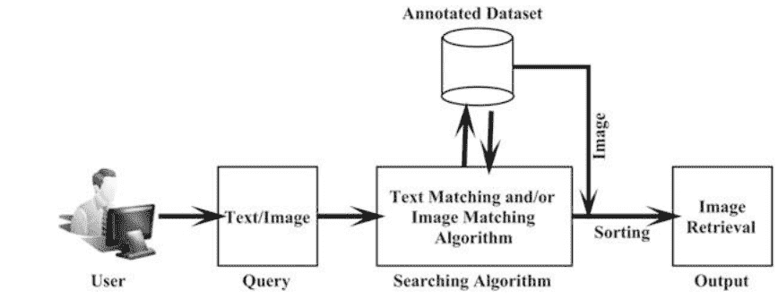

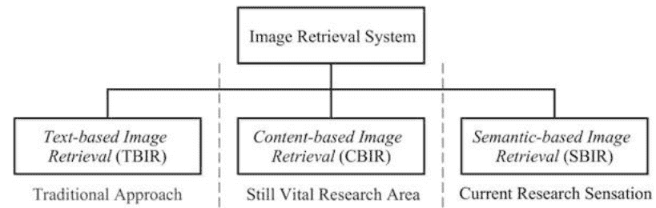

# 2 图像检索系统

全球各地的研究人员引入了不同类型的自动图像检索系统，这些系统以文本、元数据和/或图像作为查询输入，并从图像数据集中检索出最相似的图像。图2显示了图像检索系统的分类。

# 2.1 基于文本的图像检索

传统上，基于文本的图像检索（TBIR）系统[5-8]被用作自动图像检索系统。文本基本上是与图像相关联的单个/多个关键字。这些关键字可以是图像名称、图像位置、文件名、类别、索引号、任何注释和直接或间接与图像相关的标题。图3显示了TBIR系统的基本块图。

在这个图3中，用户以元数据的形式提供查询输入。这些元数据可以是图像名称、图像路径、文件名称、关键词、链接等。结果上，TBIR算法会在图像数据库中搜索匹配的元数据描述。

图3TBIR系统的基本块图

算法1：TBIR系统

- 输入:输入元数据/关键词 M_k。
- 输出:从图像数据集 D中选择前L个相似图像_1。
- 参数: L << n且n是数据集图像的数量。
- 选择输入的元数据M_4
- 将适当的元数据/关键词M,分配给相应的数据库图像Ii, 其中 ie{1,2,3,...,n}
- 对于∀,∈D,执行以下操作
    - 选择相应的元数据信息M_o
    - 对 Mx和M,进行字符串比较。
    - 将相似度距离值存储为d_i.
- 结束
- 将所有di值按非递减顺序排序.
- 提取前L个最小的d,值的图像索引号
- 最后从数据库 D_n中检索出前L个最相似的图像.

并提取具有相似元数据信息的图像。随后，算法1给出了基本TBIR系统的示意步骤。

TBIR系统有两个关键缺陷。首先,在标签分配过程中需要人工参与,需要为所有数据库图像单独分配标签。这是一项非常单调和繁琐的工作,由于人类感知错误,错误的标签分配的可能性很高。 单个关键字无法传达整个图像信息,这是基于标签的图像检索系统的主要缺陷。 在表1中,我们介绍了一些最新的TBIR技术。这些技术使用元数据/关键字或关键字与用户的视觉感知信息的组合。

表1 一些最先进的TBIR技术

| 作者 | 年份 | 方法 |
| :--- | :--- | :--- |
| Swain等人[9] | 1993 | 提出了一个名为FINDIT的工具，用户可以定位对象并指定转换和约束条件 |
| Zhou等人[6] | 2002 | 使用相关反馈和无缝查询连接方案，将关键词和视觉内容结合起来进行图像检索 |
| Ahmad等人[5] | 2003 | 提出了一种基于形式概念分析（FCA）的方法来进行基于文本的图像检索 |
| Zeng等人[7] | 2005 | 提出了一种基于相关反馈的用户交互式基于文本的图像检索系统 |
| Chen等人[4] | 2012 | 提出了一种自适应分类器，该分类器在修改后的支持向量机（SVM）中使用增强特征（AFSM）来提高TBIR系统的效率 |

Color Feature Shape Feature Texture Feature

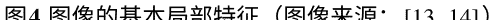

# 2.2 基于内容的图像检索

传统的TBIR系统存在一些主要的缺点和限制。因此，研究人员通过引入基于内容的图像检索（CBIR）系统[1-3，10-12]来解决上述问题。CBIR是一种基于实际图像内容的自动图像搜索和图像检索系统。在CBIR系统中，实际图像信息被用于图像搜索和检索过程。这些实际图像内容可以是图像中存在的不同的规则和不规则表面模式、形状和结构、颜色分布和/或像素之间的空间关系。表面模式提供了关于图像的纹理信息，而图像中的不同形状和结构提供了关于图像的形状信息。图像中的规则和不规则颜色分布提供了关于图像的颜色信息。所有这些图像信息被视为局部图像特征，并且这些局部图像特征在CBIR过程中被使用。图像中存在的主要局部特征有（1）颜色特征，（2）形状特征和（3）纹理特征。图4显示了图像的三个主要局部特征的视觉示例。

在CBIR系统中,这些局部图像信息是使用不同的特征提取技术提取出来的,并以特征向量的形式存储。它将实际图像信息存储为一维向量,但特征向量的大小远小于实际图像的大小。优质的特征向量必须使用更少的数据传达正确的图像语义。

因此,任何CBIR系统的性能基本上取决于两个因素:特征提取技术和形成更好的用于CBIR应用的特征向量。

通常,CBIR系统分为以下四个步骤:

- 特征提取:在这一步中,研究人员使用颜色、纹理、形状、结构、相关特征提取方案或这些方案的组合来提取查询图像的视觉特征。这些提取出的视觉特征通过一个低维特征向量来表示。
- 特征空间生成:在这一步中,研究人员为所有数据库图像构建特征向量。接下来,他们构建一个数据库图像的特征空间,在其中存储了图像的特征向量,并与其数据库索引值相对应。
- 相似度匹配:在这一步骤中,使用不同的距离测量方案来找到查询图像特征向量与特征空间中特征向量之间的相似度。
- 图像检索:这是最后一步,根据它们的相似度得分对图像进行排序。排序后,从数据库中提取具有最高相似度得分的所需数量的顶部图像作为最终输出。

接下来,图5显示了CBIR系统的基本块图。在图5中,我们可以看到用户以图像的形式提供查询输入。CBIR算法分析输入图像的视觉和独特内容,并从图像数据库中提取最相似的图像。此外,算法2展示了CBIR系统的算法步骤。

图5CBIR系统的基本块图

算法2: CBIR系统

- 输入:输入一个查询图像$I_k$。
- 输出:从图像数据集$D_n$中选择前$L$个相似的图像。
- 参数:$L<<_n, _n$是数据集图像的数量。
- 选择输入的查询图像$I_k$。
- 提取图像$I_k$的唯一视觉特征,构建特征向量$f v_k$。对于数据集中的每个图像$I_i$ ,执行以下操作:
    - 提取图像$I_i$的唯一视觉特征。构建特征向量$f v_i$。将$f v_i$存储在特征空间$FS_n$的第$i$个索引位置。
- 结束。对于数据集中的
- 的每个图像$I_i$,执行以下操作:
    - 选择数据库图像$I_i$对应的特征向量$f v_i$。对$f v_k$和$f v_i$进行相似性匹配。存储相似性得分值$d_i$。
- 结束
- 将所有$d_i$值按非递减顺序排序.
- 提取前$L$个最小的$d_i$值的图像索引号.
- 最后从数据库$D_n$中检索出前$L$个最相似的图像.

任何CBIR系统的性能主要取决于两个因素,即合适的特征提取和适当的特征向量构建。 在大多数情况下,CBIR系统比TBIR系统效果更好。与此同时,CBIR系统不需要任何数据库注释过程,从而大大减少了人力工作。随后,每个CBIR系统都会提取出大量相关的图像作为最终结果。文献中存在各种各样的CBIR系统。我们可以将这些CBIR技术广泛地分为三个主要类别,如图6所示。

# 2.2.1基于单一特征的CBIR系统

这些是最常用的CBIR系统。这种类型的系统仅从整个输入和数据库图像中提取一种类型的视觉特征。这些视觉特征可以是颜色、形状、纹理、相关性、结构等。

| 作者 | 年份 | 特征 | 方法 |
|---|---|---|---|
| Jhanwar等人[15] | 2004 | 结构 | 引入了一种Motif Co-occurrence Matrix (MCM)
，其中他们发现了2x2像素网格中存在的
所有结构模式。 |
| Yahiaoui等人[16] | 2006 | 形状 | 提出了一种新的基于轮廓的形状描述符，
提高了实时图像搜索的准确性。 |
| Kokare等人[17] | 2007 | 纹理 | 使用2D旋转小波滤波器在离散小波变
换(DWT)中进行纹理特征提取。 |
| Hu等人[18] | 2013 | 形状 | 使用方向梯度直方图 (HOG) 来进行基于草
图的图像检索。 |
| Varish等人[19] | 2015 | 颜色 | 提出了一种非均匀分解方案，从直方图中提取
统计颜色特征，用于CBIR应用。 |

# 2.2.2 组合特征的CBIR系统

为了解决基于单一特征的CBIR系统的性能问题，研究人员将多个特征组合在最终特征向量中。 结果，最终的特征向量提供了关于输入/数据库图像更好的语义信息。 这也提高了CBIR系统的检索效率。 通常，这种方案中最终特征向量的长度包含更多的特征元素，这也增加了图像提取时间。

此外,表3展示了一些标准最先进的基于组合特征的CBIR系统的简要描述。

表3 一些最先进的基于组合特征的CBIR系统

| 作者 | 年份 | 特征 | 方法 |
|---|---|---|---|
| Wang等人[20] | 2010 | 颜色+形状+纹理 | 使用颜色量化、伪泽尼克矩和可操纵滤波器分解进行颜色、形状和纹理特征提取。 |
| Bama等人[21] | 2011 | 形状 + 纹理 + 颜色 | 在HSV领域中使用尺度不变特征变换 (SIFT)和Log-Gabor小波进行局部特征提取。 |
| Subramanian等人[22] | 2011 | 纹理 + 颜色 | 结合Gabor小波的相关图与旋转和非旋转的Gabor小波系数进行颜色和纹理特征提取。 |
| Sajjad等人[23] | 2018 | 颜色 + 纹理 | 使用HSV颜色量化以及旋转的均匀模式局部二值模式(RLBP)进行颜色和纹理特征提取。 |
| Pradhan等人[1] | 2019 | 形状 + 颜色 + 纹理 | 提出了颜色边缘图进行形状和颜色特征提取，并使用主纹理方向进行纹理特征提取。 |

# 2.2.3 基于层次特征的CBIR系统

这些都是所有不同基于实例的CBIR系统中最高效的CBIR系统。 这些类型的CBIR系统的主要原则是过滤掉不相关的图像，以减少最终的搜索空间。 因此，这些系统也被称为

## 算法3:SBIR系统

输入:输入一个查询图像Ik。
输出:从图像数据集Dn中选择前L个相似的图像。
参数: $L<<n,n$ 是数据集图像的数量。
选择输入的查询图像 $I_{k}$ 。
提取图像 $I_{k}$ 的唯一视觉特征,构建特征向量 $f v_{k}$ 。对于数据集中的每个图像 $I_{i}$
,执行以下操作:
提取图像 $I_{i}$ 的唯一视觉特征。构建特征向量 $f v_{i}$ 。将 $f v_{i}$ 存储在特征空间 $F S_{n}$
的第 $i$ 个索引位置。
结束
选择合适的分类器 $C L$ 。
从 $F S_{n}$ 中创建训练特征集 $T f s_{m}$, 其中 $m<n_{0}$
使用 $T f s_{m}$ 训练分类器 $C L$ 。
使用训练好的分类器 $C L$ 识别输入图像 $I_{k}$ 的类别 $C_{k o}$
对于 $\forall I_{i} \in C_{k}$, 其中 $C_{k} \subset D_{n}$ do
选择被识别类别图像 $I_{i}$ 的相应特征向量 $f v i o$
对 $f v_{k}$ 和 $f v_{i}$ 进行相似度匹配。
存储相似度得分值 $d_{i o}$
结束
将所有 $d_{i}$ 值按非递减顺序排序.
提取前 $L$ 个最小的 $d_{i}$ 值的图像索引号。
最后从数据库 $D_{n}$ 中检索出前 $L$ 个最相似的图像

提取, (2) 分类和 (3) 检索。在这些系统中, 分类准确性被视为最终的检索准确性。基于机器学习的CBIR系统已经在医学、植物叶片、水果、自然、物体、水下和卫星图像检索应用中非常有用。下表5显示了最先进的基于机器学习的CBIR系统。

在表5中, SVM代表支持向量机[35]。MLP和MCH分别代表多层感知器[37]和移动中心超球[32]。最后, KNN代表K最近邻[33]分类器。

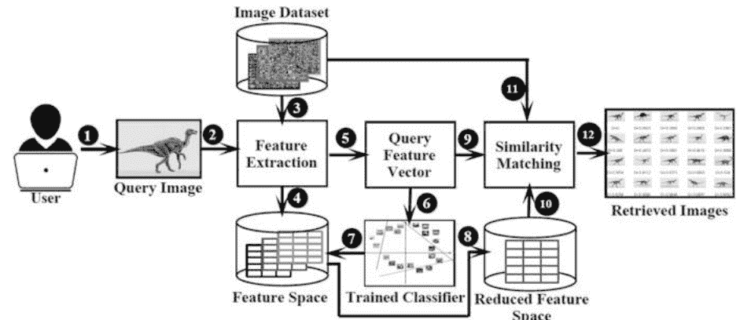

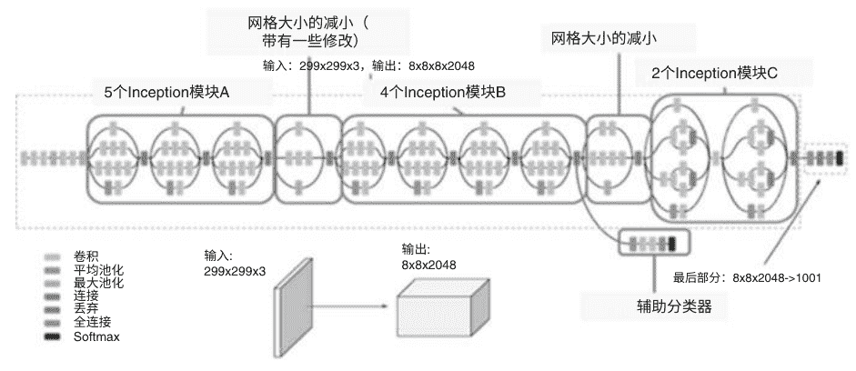

## 表5 一些最先进的基于机器学习的CBIR系统

| 作者                | 年份  | 分类器    | 图像类型   | 方法                                      |
|---------------------|-------|-----------|------------|------------------------------------------|
| Li等人[29]          | 2006  | 支持向量机 | 自然       | 使用边缘直方图,金字塔小波变换(PWT)和颜色直方图特征与SVM分类器一起使用。 |
| Pourghassem等人[31] | 2008  | 多层感知器 | X射线     | 使用形状和纹理特征进行分层医学图像分类/检索。 |
| Wang等人[32]        | 2008  | MCH       | 植物叶片   | 使用16个泽尼克矩和7个HU矩进行植物叶片图像分类/检索。 |
| Haung等人[33]       | 2016  | SVM + KNN | 高光谱     | 在高光谱图像分类/检索中使用SVM和KNN的概率图。 |
| Guo等人[30]         | 2018  | 支持向量机 | 遥感       | 使用基于SVM的顺序分类器训练方案进行遥感图像分类/检索。 |

## 2.3.2基于深度学习的CBIR

与基于机器学习的CBIR系统不同,基于深度学习的CBIR系统不需要手动特征提取。基于深度学习的CBIR系统使用VGG-16[38],inceptions V3 [39],AlexNet [40],ResNet [41]等进行直接图像分类。

这些卷积神经网络(CNN)模型在学习过程中能够自动提取不同类型的特征。对于人工神经网络(ANN),我们只需要有注释的图像集合,CNN模型将自动提取重要的代表性特征来学习图像的语义含义。

基于CNN的CBIR系统在医学、高光谱和遥感图像检索应用中非常有用。接下来,表6展示了一些最先进的基于深度学习的CBIR系统。

## 表6 一些最先进的基于深度学习的CBIR系统

| 作者                | 年份  | 图像类型   | 方法                                          |
|---------------------|-------|------------|-----------------------------------------------|
| Spanhol等人[42]      | 2016  | 乳腺癌     | 使用LeNet和AlexNet卷积神经网络模型进行乳腺癌图像分类/检索。 |
| Maggiori等人[43]    | 2016  | 遥感       | 使用前馈型卷积神经网络模型进行遥感图像分类/检索。 |
| Madani等人[44]      | 2017  | 医学       | 提出了一种生成对抗网络（GAN）用于医学图像分类/检索。 |
| Paoletti等人[45]    | 2018  | 高光谱     | 使用3D卷积神经网络模型进行高光谱图像分类/检索。 |
| Zeng等人[46]        | 2019  | 医学       | 使用Synergic Deep Learning（S DL）模型进行医学图像分类/检索。 |

CBIR/SBIR的三个应用

CBIR/SBIR技术已经在医学成像、农业、教育、历史研究、遥感、犯罪预防、高光谱成像、生物多样性信息系统、指纹识别等各个领域得到应用[43,45,46]。CBIR系统对于学生在教育项目中搜索图像特别有用。CBIR系统也对医学图像检索非常有用。医生和从业人员可以使用医学图像从医学数据库中找到相似的图像。通过分析不同的检索到的医学图像，帮助他们了解患者的医疗状况。

接下来，图9展示了CBIR/SBIR系统的基本和常见应用。稍后，在第4节中，我们详细解释了基于DL的CBIR/SBIR在医学图像检索中的应用。

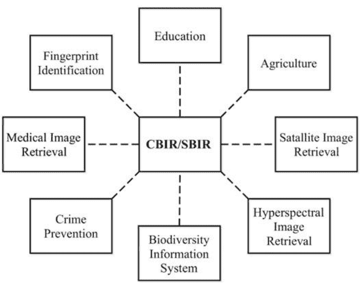

![图10 Inception V3模型的架构[49]](img/4ae75bdae07b986792aed1950eaff442_116_1.png)

![图11 Inception ResNetV2模型的架构[49]](img/4ae75bdae07b986792aed1950eaff442_116_0.png)

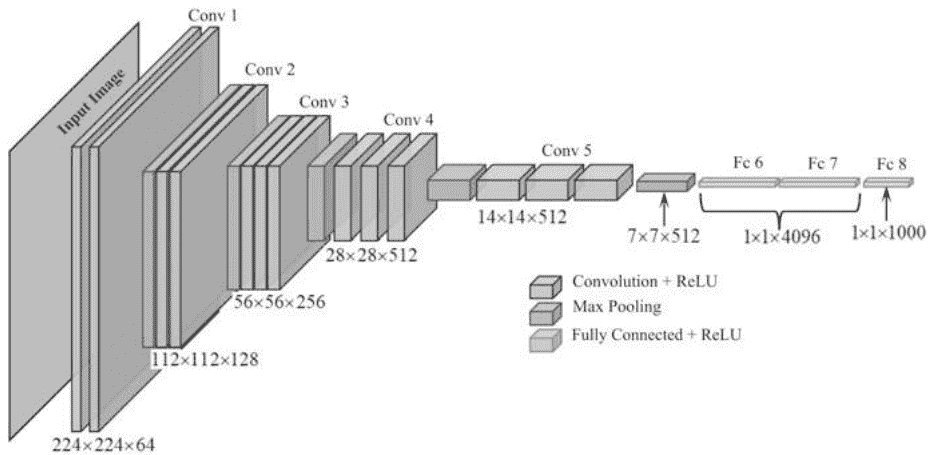

## 4.1 深度学习模型

在医学图像检索中，最常用的CNN模型是Inception V3 [39]、ResNet V2 [47]和VGG-16 [38]。

- Inception V3: Inception V3是Google的Inception CNN架构的第三个版本。它是使用包含1000个通用类别和100万张图像的ImageNet数据集[48]进行训练的。 Inception V3的架构如图10所示。
- ResNet V2: ResNet V2 模型是 Inception V3 模型的另一种变体。 该模型也是在 ImageNet 图像 [48] 上进行训练的，就像 Inception V3 一样，其中包含了100万张代表1000个类别的图像。 Inception ResNet V2 的架构如图11所示。
- VGG-16: 正如其名称所示，VGG-16 包含16个权重层。 这个人工神经网络以其简单性而闻名，但在 ImageNet [48] 上仍然能够获得良好的准确性。它仅使用了3×3的卷积层，这些层按照逐渐增加的深度顺序堆叠在一起。ANN 中的体积大小的减小是由其处理的

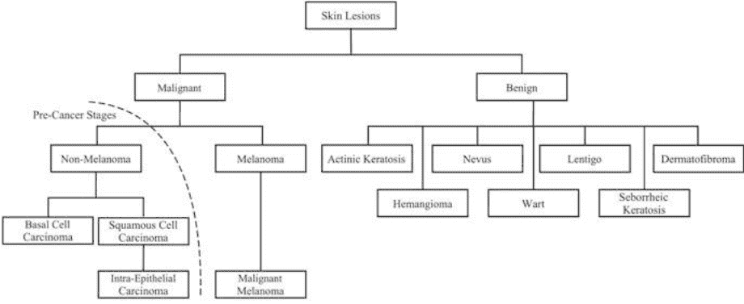

## 表7 训练和检索图像的分布

| 图像用于 | 总图像数 | 黑素瘤   | 脂溢性角化病 | 痘   |
| :------ | :------- | -------- | ------------ | :--- |
| 训练    | 2236     | 391      | 274          | 1571 |
| 验证    | 150      | 30       | 42           | 78   |
| 测试    | 364      | 100      | 70           | 194  |

## 图14 不同级别的皮肤癌样本图像

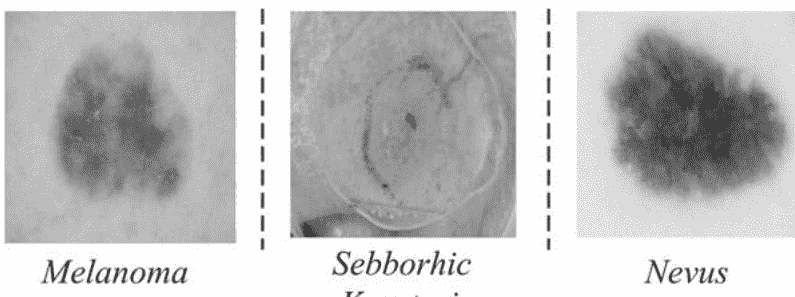

## 表8 用于数据增强的不同转换

| 转换技术       | 概率 |
|----------------|------|
| 旋转           | 0.5  |
| 随机噪声       | 0.5  |
| 水平翻转       | 0.7  |
| 垂直翻转       | 0.5  |
| 随机模糊       | 0.8  |
| 光照变化       | 0.5  |

## 表9 inception V3模型在多次训练中的测试准确率

| 训练实例 | 按类别的测试准确率 |
| :------- | :---------------- |
|          | 黑素瘤   | 脂溢性角化病 | 痘   |
| 1        | 41%      | 31%          | 89%  |
| 2        | 42%      | 30%          | 88%  |
| 3        | 40%      | 33%          | 88%  |
| 4        | 42%      | 30%          | 89%  |
| 5        | 43%      | 33%          | 90%  |
| 平均     | 42%      | 31%          | 89%  |

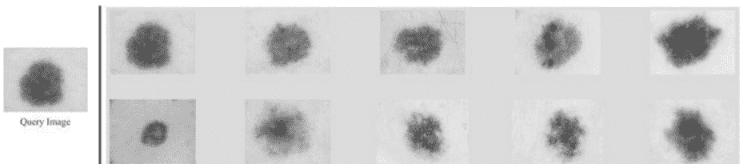

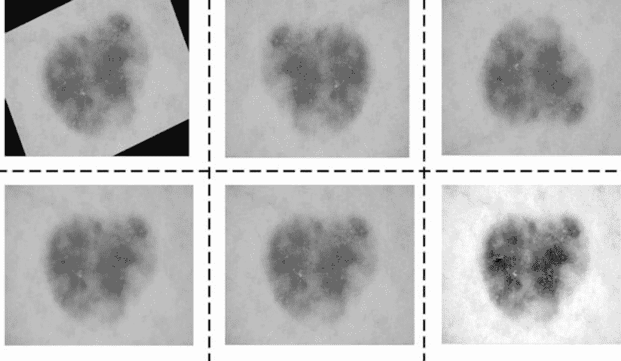

## 表10 inception ResNet V2模型在多次训练中的测试准确率

| 训练实例 | 按类别的测试准确率 |
| :------- | :---------------- |
|          | 黑素瘤   | 脂溢性角化病 | 痘   |
| 1        | 13%      | 61%          | 84%  |
| 2        | 15%      | 64%          | 85%  |
| 3        | 14%      | 64%          | 84%  |
| 4        | 15%      | 64%          | 84%  |
| 5        | 13%      | 61%          | 85%  |
| 平均     | 14%      | 63%          | 84%  |

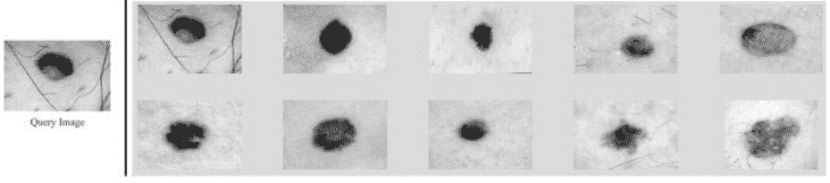

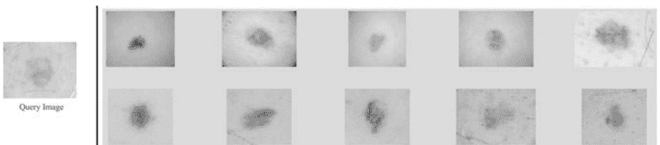

## 表11 VGG-16模型在多次训练中的测试准确率

| 训练实例 | 黑素瘤   | 脂溢性角化病 | 痘   |
| :------- | -------- | ------------ | :--- |
| 1        | 70%      | 69%          | 27%  |
| 2        | 71%      | 70%          | 29%  |
| 3        | 70%      | 69%          | 27%  |
| 4        | 71%      | 69%          | 28%  |
| 5        | 71%      | 67%          | 27%  |
| 平均     | 70.6%    | 68.8%        | 27.6% |

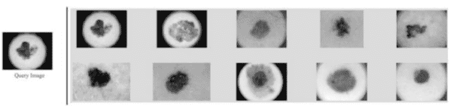


## 图23 三个模型的训练和验证准确率图表

## 图24 三个模型的训练和验证损失图表

## 图像检索系统概述

图23（a）Inception ResNet V2模型的训练和验证准确率图表和（b）训练和验证损失图表  
图24（a）VGG-16模型的训练和验证准确率图表和（b）训练和验证损失图表  

准确率正在提高，训练损失正在减少。与此同时，这两个模型在验证损失和准确率上没有显示出任何改进。  
验证损失和准确率的值在整个训练过程中不断波动，不稳定。另一方面，VGG-16模型在验证损失和验证准确率的改进上表现更加稳定。  

训练数据集的较小规模是Inception V3和Resnet V2模型不稳定行为的主要原因。Inception V3和Inception ResNet V2都是非常复杂的模型，已经证明高度复杂的模型相比较简单的模型更容易过拟合数据集。这两个模型的复杂结构对性能产生了不利影响。  

### 按类别的测试准确率  

| 卷积神经网络模型 | 黑素瘤 | 脂溢性角化病 | 痣 | 平均测试准确率 |  
|---|---|---|---|---|  
| 修改后的VGG-16 | 83% | 87% | 86% | 85% |  

在所有讨论的三个模型中，VGG-16模型表现最好。 因此，在本小节中，我们在训练过程中利用了两个损失函数进一步提高了VGG-16模型的性能。 在这个实验中，VGG-16模型的训练分为两个不同的阶段，具体如下：  

第一阶段：在这个阶段，我们加载了ImageNet权重到VGG-16 ANN的初始层（即迁移学习）。接下来，我们使用RMSPProp优化器[53]对模型进行了100个epochs的训练。 训练过程结束后，我们保存了模型的权重。 这些权重将在训练的第二阶段中使用。  

第二阶段：在这个阶段，我们加载了从第一阶段获得的保存的权重，而不是 ImageNet权重，加载到VGG-16模型的初始层中。 接下来，我们对VGG-16模型的最后一个卷积块和分类器进行了训练。 在这里，我们使用了 $SGDoptimizer [54]$，学习率为0.0001。这个训练过程进行了200个epochs。训练过程结束后，保存了权重，这些权重代表了用于皮肤病变预测的最终权重。  

通过这种方法得到的检索结果是所有讨论过的CNN模型中最好的结果。与上述三个基于CNN的模型相比，该模型显示出了显著的改进。 该方法的测试准确率在表12中显示。随后，图25和26展示了（1）第一阶段和第二阶段训练过程的训练和验证准确率图表，以及（2）训练和验证损失图表。 在这些图表中，我们可以观察到验证损失和准确率的持续改善。  

## 5 结论  

在本章中，讨论了不同自动图像检索系统的基本概念。 在文献中，存在三种类型的自动检索系统。 这些系统是基于文本的图像检索（TBIR）、基于内容的图像检索（CBIR）和基于语义的图像检索（SBIR）系统。 本章详细阐述了这些系统的算法步骤、优点和缺点。 这些图像检索系统已被广泛应用于使用深度学习技术的医学图像检索系统  

研究人员将这些图像检索系统应用于不同领域，如医学影像、农业、教育、历史研究、遥感、犯罪预防、高光谱成像、生物多样性信息系统、指纹识别等。此外，还详细讨论了不同的深度学习模型及其在医学图像检索中的应用。在本章中，详细解释了基于inception V3、inception ResNet V2和VGG-16的皮肤病变检索系统。基于VGG-16的医学图像检索系统表现出比其他两个基于CNN的系统更好的性能。也解释了VGG-16模型具有更好检索性能的原因。本章还介绍了一种改进的基于修改后的VGG-16的皮肤病变检索系统。与其他基于CNN的系统相比，这种修改后的VGG-16模型显示出显著的改进。  

如今，医学影像在多种疾病的诊断和治疗中起着关键作用。因此，大量的数字图像已被捕获在治疗过程中。手动搜索和管理所有这些大量的医学图像是不切实际的任务。因此，迫切需要开发一种基于CNN的模型，可以对各种医学图像进行分类和检索。  

迄今为止，文献中还没有一种有效和高效的医学图像检索系统，可以处理各种医学图像。因此，开发这样一个医学检索系统仍然是研究界的一个活跃问题。  

## 参考文献  

1. Jitesh Pradhan, Arup Kumar Pal和 Haider Banka。基于主纹理方向的块级图像重新排序和使用颜色边缘特征应用于基于对象的图像检索。多媒体工具和应用,78(2):1685-1717,2019年。  
2. Nishant Shrivastava和 Vipin Tyagi。基于相对位置的基于内容的图像检索，使用选择性区域匹配的多个感兴趣区域。信息科学，259:212-224,2014年。  
3. Jitesh Pradhan, Sumit Kumar, Arup Kumar Pal和 Haider Banka。基于纹理和颜色的基于视觉特征的CBIR,使用2D DT-CWT和直方图。在国际数学与计算会议，页码84-96. Springer,2018年。  
4. Lin Chen, Dong Xu, Ivor W Tsang和 Jiebo Luo。通过增强特征和基于组的细化改进的基于标签的图像检索。IEEE多媒体交易,14(4):1057-1067,2012年。  
5. I Ahamd和 Taek-Sueng Jang。使用FCA的旧时尚基于文本的图像检索。在2003年国际图像处理会议论文集 (Cat. No.03CH37429),卷3,页码III-33。IEEE,2003年。  
6. Xiang Sean Zhou和 Thomas S Huang。在图像检索中统一关键词和视觉内容。Ieee Multimedia,9(2):23-33,2002年。  
7. Chen Zhang, Joyce Y Chai和 Rong Jin。交互式基于文本的图像检索中的用户术语反馈。在Proceedings of the 28th annual international ACM SIGIR conference on Researchand development in information retrieval,页码51-58。ACM,2005年。  
8. Wen Li, Lixin Duan, Dong Xu和 Ivor Wai-Hung Tsang。使用渐进多实例学习的基于文本的图像检索。在2011 International Conference on Computer Vision,页码2049-2055。IEEE,2011年。  
9. Michael J Swain。图像数据库的交互式索引。在Storage and Retrieval forImage and Video Databases,卷1908,页码95-103。国际光学和光子学学会，1993年。  
10. Jun Yue, Zhenbo Li, Lu Liu和 Zetian Fu。使用颜色和纹理融合特征的基于内容的图像检索。数学和计算机建模，54(3-4):1121-1127，2011年。  
11. Jitesh Pradhan, Arup Kumar Pal和 Haider Banka。基于突出对象区域检测的CBIR应用方法。在2016年第四届国际并行、分布和网格计算会议(PDGC)上，页447-452。IEEE，2016年。  
12. Jitesh Pradhan, Ashok Ajad, Arup Kumar Pal和 Haider Banka。用于基于内容的图像检索的多级彩色方向模式直方图。视觉计算机，页1-22,2019年。  
13. Safia Abdelmounaime和 He Dong-Chen。用于灰度、彩色和多波段纹理分析的新Brodatz图像数据库。ISRN机器视觉，2013年，2013年。  
14. 贾丽和詹姆斯・Z・王。图片的实时计算机化注释。IEEE模式分析与机器智能交易,30(6):985-1002,2008年。  
15. N Jhanwar, Subhasis Chaudhuri, Guna Seetharaman和Bertrand Zavidovique。使用模式共现矩阵的基于内容的图像检索。图像与视觉计算, 22(14)：1211-1220, 2004年。  
16. Itheri Yahiaoui, Nicolas Herv 和Nozha Boujemaa。植物收藏中基于形状的图像检索。在太平洋多媒体会议上, 页码357-364。Springer, 2006年。  
17. Manesh Kokare, Prabir K Biswas和Biswanath N Chatterji。使用旋转小波滤波器的纹理图像检索。模式识别信 letter, 28(10)：1240-1249, 2007年。  
18. Rui Hu和John Collomosse。梯度场HOG描述符在基于草图的图像检索中的性能评估。计算机视觉和图像理解, 117 (7) ：790-806, 2013年。  
19. Naushad Varish和Arup Kumar Pal。使用颜色直方图的统计特征进行基于内容的图像检索。在2015年第三届国际信号处理、通信和网络会议 (ICSCN), 页1-6。IEEE, 2015年。  
20. Xiang-Yang Wang, Yong-Jian Yu和Hong-Ying Yang。一种使用颜色、纹理和形状特征的有效图像检索方案。计算机标准与接口, 33 (1) ：59-68, 2011年。  
21. B Sathya Bama, S Mohana Valli, S Raju和V Abhai Kumar。使用形状、颜色和纹理特征的基于内容的叶片图像检索 (CBLIR)。印度计算机科学与工程杂志, 2 (2) ：202-211, 2011年。  
22. Murala Subrahmanyam, RP Maheshwari和R Balasubramanian。一种使用小波和旋转小波滤波器的相关图算法用于图像索引和检索。国际信号与成像系统工程杂志, 4(1)：27-34, 2011年。  
23. Muhammad Sajjad, Amin Ullah, Jamil Ahmad, Naveed Abbas, Seungmin Rho和Sung Wook Baik。将显著颜色与旋转不变纹理特征集成到图像检索系统中的表示。多媒体工具与应用, 77(4): 4769-4789, 2018年。  
24. Tomasz Andrysiak和Michal Chora's。基于分层Gabor滤波器的图像检索。应用数学与计算机科学国际期刊, 15：471-480, 2005年。  
25. Nishant Shrivastava和Vipin Tyagi。一种在大型数据库中检索彩色图像的高效技术。计算机与电气工程, 46：314-327, 2015年。  
26. Naushad Varish, Jitesh Pradhan, and Arup Kumar Pal. 基于非均匀颜色直方图和双树复小波变换的图像检索。多媒体工具和应用, 76(14): 15885-15921, 2017年。  
27. Muwei Jian, Yilong Yin, Junyu Dong, and Kin-Man Lam. 基于内容的图像检索通过分层局部特征提取方案。多媒体工具和应用, 77(21): 29099-29117, 2018年。  
28. Jitesh Pradhan, Sumit Kumar, Arup Kumar Pal, and Haider Banka. 使用自适应tetrole变换和来自颜色和形状特征的新型直方图的分层cbir框架。数字信号处理, 82：258-281, 2018年。  
29. Jing Li, Nigel Allinson, Dacheng Tao, and Xuelong Li. 用于图像检索的多训练支持向量机。IEEE图像处理期刊, 15(11): 3597-3601, 2006年。  
30. Yiqing Guo, Xiuping Jia, and David Paull. 基于svm的有效顺序分类器训练用于多时相遥感图像分类。IEEE图像处理交易,27(6):3036-3048, 2018.  
31. Hossein Pourghassem和Hassan Ghassemian. 使用新的分层合并方案的基于内容的医学图像分类。计算机医学成像与图形,32(8):651-661, 2008.  
32. Xiao-Feng Wang, De-Shuang Huang, Ji-Xiang Du, Huan Xu, and Laurent Heutte. 具有复杂背景的植物叶片图像分类。应用数学与计算,205(2):916-926, 2008.  
33. Kunshan Huang, Shutao Li, Xudong Kang, and Leyuan Fang. 基于knn的光谱-空间高光谱图像分类。感知与成像, 17(1):1, 2016.  
34. Andy Liaw, Matthew Wiener等人。随机森林的分类和回归。R新闻, 2(3):18-22, 2002年。  
35. Johan AK Suykens和Joos Vandewalle。最小二乘支持向量机分类器。神经处理信 letter, 9(3):293-300, 1999年。  
36. S Rasoul Safavian和David Landgrebe。决策树分类器方法的调查。IEEE系统、人类和控制论交易, 21(3):660-674, 1991年。  
37. Sankar K Pal和Sushmita Mitra。多层感知机、模糊集和分类。IEEE神经网络交易, 3(5):683-697, 1992年。  
38. Karen Simonyan和Andrew Zisserman。用于大规模图像识别的非常深的卷积网络。arXiv预印本arXiv:1409.1556, 2014年。  
39. Christian Szegedy, Vincent Vanhoucke, Sergey Ioffe, Jon Shlens, and Zbigniew Wojna.重新思考计算机视觉中的Inception架构。在 IEEE计算机视觉和模式识别会议的论文中,页码为2818-2826, 2016年。  
40. Alex Krizhevsky, Ilya Sutskever, and Geoffrey E Hinton. 使用深度卷积神经网络进行ImageNet分类。在神经信息处理系统进展的论文中, 页码为1097-1105, 2012年。  
41. Kaiming He, Xiangyu Zhang, Shaoqing Ren, and Jian Sun. 深度残差学习用于图像识别。在 IEEE计算机视觉和模式识别会议的论文中, 页码为770-778, 2016年。  
42. Fabio Alexandre Spanhol, Luiz S Oliveira, Caroline Petitjean, and Laurent Heutte. 使用卷积神经网络进行乳腺癌组织病理图像分类。在2016年国际联合神经网络会议(IJCNN)的论文中, 页码为2560-2567. IEEE, 2016年。  
43. Emmanuel Maggiori, Yuliya Tarabalka, Guillaume Charpiat, and Pierre Alliez. 大规模遥感图像分类的卷积神经网络。 IEEE Transactions on Geoscience and Remote Sensing, 55(2):645-657, 2016.  
44. Ali Madani, Mehdi Moradi, and Tanveer F Syeda-Mahmood. 基于生成对抗网络训练鉴别器的医学图像分类, 2019年6月27日。美国专利申请。15/850,116.  
45. ME Paoletti, JM Haut, J Plaza, and A Plaza. 一种新的用于快速高光谱图像分类的深度卷积神经网络。ISPRS journal of photogrammetry and remote sensing,145:120-147, 2018.  
46. Jianpeng Zhang, Yutong Xie, Qi Wu, and Yong Xia. 利用协同深度学习的医学图像分类。医学图像分析, 54:10-19, 2019.  
47. Christian Szegedy, Sergey Ioffe, Vincent Vanhoucke, and Alexander A Alemi. Inception-v4, inception-resnet和残差连接对学习的影响。在第31届AAAI人工智能大会上, 2017年。  
48. Jia Deng, Wei Dong, Richard Socher, Li-Jia Li, Kai Li, and Li Fei-Fei. Imagenet: 一个大规模的分层图像数据库。在2009年IEEE计算机视觉和模式识别会议上, 第248-255页。IEEE, 2009年。  
49. Alex Alemi. 在TensorFlow中改进Inception和图像分类。Google Research Blog, 2016年。  
50. Noel Codella, Veronica Rotemberg, Philipp Tschandl, M Emre Celebi, Stephen Dusza, David Gutman, Brian Helba, Aadi Kalloo, Konstantinos Liopyris, Michael Marchetti等。皮肤病变分析对黑色素瘤检测2018年: 由国际皮肤成像合作举办的挑战。arXiv预印本arXiv:1902.03368, 2019年。  
51. Philipp Tschandl, Cliff Rosendahl和Harald Kittler. ham10000数据集, 一个包含常见色素性皮肤病变多源皮肤镜图像的大型集合。科学数据, 5:180161, 2018年。  
52. Diederik P Kingma和Jimmy Ba。Adam: 一种随机优化方法。arXiv预印本arXiv:1412.6980, 2014年。  
53. Christian Igel和Michael H. 改进rprop学习算法。在第二届国际ICSC神经计算研讨会(NC 2000) 论文集中, 卷2000, 页115-121。Citeseer, 2000年。  
54. L on Bottou。使用随机梯度下降的大规模机器学习。在COMPSTAT'2010论文集中, 页177-186。Springer, 2010年。

# 使用深度学习进行医学图像融合

Ashif Sheikh, Jitesh Pradhan, Arpit Dhuriya和 Arup Kumar Pal

摘要通常，数字设备和相机受限于有限的焦深问题，因此无法对参考帧中的每个显著对象进行聚焦。因此，在拍摄的照片中，大多数对象成为背景信息，只有少数对象获得最大的关注。为了解决这个问题，研究人员将同一参考帧的部分聚焦图像合并为一张完全聚焦的图像。

这种方法被称为图像融合方法，其中最终融合的图像使所有显著对象获得相等的关注。如今，随着数字技术领域的快速发展，图像融合技术在各种实际应用中得到了广泛应用，例如高级摄影，医学诊断，监视，目标检测，遥感等。最近，在医学成像领域，图像融合已经成为医学诊断和分析的重要成功因素。因此，医学图像融合已成为医学专家的合适辅助工具。本章旨在重点介绍图像融合技术在医学成像领域的不同方面及其应用。

本章还明确解释了不同的深度学习（DL）技术，以解决与医学图像融合领域相关的各种问题。具体来说，我们首先总结了传统图像融合技术的缺点，并回顾了深度学习技术的优势。此外，本章还介绍了重要的医学图像融合技术，以及各种相关的成像模态和应用领域。

关键词：深度学习·密集块·图像融合·局部二值模式·医学成像模态

## # 1 引言

在过去的几十年里,图像融合已经发展成为一个重要的研究领域。图像融合是一种将来自不同时间和不同位置拍摄的相同场景的各种源图像中的显著信息结合起来的方法。融合图像通过提供场景的适当表示,包含了所有相关、互补和显著的源图像信息。图像融合的先决条件是避免所有输入图像的错位和噪声。要合并的输入图像被称为源图像,最终的结果图像被称为融合图像。一般来说,图像融合技术可以分为两个主要领域,即空间域和变换域。空间域技术采用线性或非线性方法来组合输入图像的像素。而在变换域中,首先使用适当的变换工具将源图像转换为频域。然后,通过在转换后的图像上采用适当的融合方法来实现最终的融合图像。一般图像融合技术的数学表达式[1]表示为 $I_{F}=\phi\left(I_{1}, I_{2}, \ldots, I_{M}\right)=\gamma_{1} I_{1}+\gamma_{2} I_{2}+\ldots+\gamma_{M} I_{M}$ ，其中图像融合函数 $\phi$ 接受不同的源图像,即 $I_{1}, I_{2}, \ldots$ ,并使用不同的 $\gamma$ 值 ($\gamma_{i}$ ) 进行融合。图像融合的好处是移动信息的表示,减少不确定性,消除伪影并提高最终融合图像的可靠性。因此,全球范围内的研究人员在不同方面使用图像融合技术,如医学图像融合在医学图像诊断和分析方面取得了巨大成功。医学专家在治疗不同疾病过程中使用医学图像作为合适和有帮助的助手。此外,医学图像融合涉及到不同类型的成像模态,如计算机断层扫描 (CT) 、磁共振成像 (MRI) 、单光子发射计算机断层扫描 (SPECT) 、正电子发射断层扫描 (PET) 、可见光和红外图像等。其中,可见光和红外图像使用生成对抗性人工神经网络 (ANN) 进行融合,称为fusionGAN[2]。红外图像中的辐射差异有助于区分目标和背景,可见光图像提供高空间分辨率的纹理细节。通过一种新颖的空间-光谱稀疏表示 (SSSR) ,将高空间分辨率的多光谱图像与低空间分辨率的高光谱图像融合[3],可以获得高空间分辨率的高光谱图像。

在引言部分明确介绍之后,本章按照以下方式组织: 第2节介绍了图像融合技术的不同应用。随后,在第3节中,给出了基本的图像融合方法。

常规医学图像融合过程的逐步步骤显示在第4节。接下来,在第5节中,简要介绍了各种相关方法。基于深度学习的医学图像融合

在第6节中给出了实验结果和相关讨论。最后，第8节总结了本章并提出了一些未来的研究方向。

## # 图像融合技术的应用

图像融合以最终融合图像的形式提供了更多信息和更好的描述不同输入图像的能力。 正如前面讨论的, 图像融合在不同的实际应用中非常有效且被广泛采用, 例如医学成像[4-6]、目标检测[7-10]、识别[11-16]、跟踪[17-19]、色彩视觉[20-22]、遥感[23, 24]、监控[25-29]等。图1展示了图像融合技术的不同应用。 此外, 在下面的子章节中还对图像融合的各种应用进行了简要讨论。

## # 2.1 医学成像中的融合

使用医学图像进行医学诊断面临着严峻的科学挑战, 如脑癌检测、组织分类、恶性肿瘤检测等。通常, 医生和医学专家无法从单一成像模态获得足够的关于任何疾病的信息。 因此, 不同类型的图像被组合在一起以获取有关患者医疗健康状况的更多信息。 几种融合算法被广泛应用并嵌入到医学诊断过程中, 以对医学问题进行适当评估。 例如, Guan等人[4]基于多分辨率分析设计了一种近似稀疏表示, 用于医学图像融合。 近似稀疏表示系数有助于表达图像的高频和低频信息。

[以图像融合技术的不同应用]
[图1 图像融合应用]
以表达图像的高频和低频信息。 该算法具有更好的视觉效果，并成功突出了目标信息。Jiang等人[6]提出了类似的稀疏表示方法，该方法利用多尺度分解中的边缘保持来保持源图像的结构信息。 最近，基于小波变换的分析已经通过分数小波变换扩展到在时频域中分析不同的融合图像。 类似地，离散分数小波有助于使用多模态医学图像融合方法更准确地分析多模态图像。 在乳腺癌检测、图像分割、多模态图像融合等领域中可以找到各种广泛应用的医学图像融合应用。例如，多种医学成像模态被融合以获得人体的重要信息。 各种医学成像模态的主要应用领域有：

+   - 肺部：肺是人的体的重要器官，负责呼吸系统，通常会受到空气污染的损害。 很难区分肺部健康组织和感染组织。 在这种情况下，多模态医学图像融合方法被认为是检查肺部状况的理想选择。 因此，CT、PET-CT和SPECT等成像模态被结合起来识别感染和健康组织。

+   - 大脑：大脑是人的体的重要器官，被称为人的体的中央处理器。 常用的医学成像模态，如SPECT、PET、CT、内窥镜和脑电图，用于诊断人脑的状况。 模态融合已经应用于许多领域，如脑组织分割、异常脑组织分类、脑肿瘤检测和监测。

+   - 心脏：心脏也是人的体的重要器官。 为了保持人类心脏的健康状态，使用了多种医学成像技术。

这些技术的例子包括MRI、CT和心电图。在大多数情况下，这些技术的融合有助于心脏变形的恢复。

+   - 前列腺：前列腺受益于多模态医学图像融合，与前列腺相关的医学成像技术包括MRI、CT、PET、SPECT和尿道镜。 不同技术的融合用于前列腺癌检测、前列腺定位、前列腺腺体运动评估等应用。

+   - 乳腺：在过去几十年中，乳腺癌患者，特别是女性患者的数量迅速增加。 用于分析乳腺状况的单一技术包括乳腺X线摄影、CT、MRI、SPECT和P ET。此外，最常用于多模态图像融合的医学成像技术包括乳腺X线摄影-MRI、乳腺X线摄影-CT和乳腺X线摄影-MRI-CT。 这些技术已经应用于乳腺癌检测和恶性乳腺肿瘤预测等多个应用领域。

## # 2.2检测和跟踪中的融合

全球的研究人员在实际应用中使用了不同的图像融合技术，如道路、物体、故障、行人、区域和火灾检测。

目标检测旨在追踪图像中最重要的感兴趣区域。

而跟踪则在实时场景中共享对象的准确位置。

目标跟踪算法应该更加高效，因为跟踪是在实时视频或图像中进行的。高等[8]提出了一种基于低秩和稀疏分解的移动物体检测方法。此外，罗等[31]引入了一种混合跟踪框架，通过自适应加权方案实现融合跟踪。通过热红外和可见光图像序列，这种鲁棒的融合跟踪方法获取了互补信息。后来，Leang等[18]设计了一个框架，用于组合一组单目标跟踪器，对于在线融合跟踪表现出良好的性能。

## # 2.3识别中的融合

识别旨在确定给定场景中单个或多个不同对象的目标对象的类别。人脸识别一直被认为是最流行的识别应用之一。Hariharan等人[13]在可见光和红外图像上使用经验模态分解(EMD)进行图像融合，从而最终提高了人脸识别的准确性。EMD将输入图像分解为内在模态函数(IMF)以进行图像融合。因此，EMD融合的图像与原始可见光和红外融合图像相比，提供了显著更高的人脸识别率。近年来，人脸识别面临着诸多困难，如光照变化、表情和佩戴物品(包括帽子、太阳镜和围巾)。最近，Umer等人[16]展示了一种融合不同特征学习技术的人脸识别方法。

标准的人脸识别系统包括三个组件：(a)预处理，(b)特征提取和(c)分类。在预处理阶段，对输入图像进行人脸区域的识别。然后，从识别出的区域提取特征以区分显著特征。然后对提取的特征进行分类任务，以识别不同人脸的实际类别。

动作识别也是现实场景中的一个具有挑战性的问题。然而，一种有效的多阶段局部融合的带有残差连接的人工神经网络可以提高视频动作识别的性能。例如，He等人[15]设计了一个局部融合块，可以利用残差连接进行视频动作识别。

## # 2.4 色彩视觉中的融合

色彩在人类视觉系统中起着区分不同物体的重要作用。 人眼只能感知到可见光。 因此，需要将目标场景的信息转换为伪彩色图像。 色彩化方法分为两类，第一类处理色彩传播，第二类处理色彩转移。 色彩传播过程通过将色彩数据放大到灰度图像中来完成，其中色彩数据是手动初始化的。 主要用于扩散和其他技术。 色彩转移方法将源彩色图像的颜色转移到目标灰度图像中。 色彩转移方法的主要缺点是空间色彩一致性。 为了解决这个问题，Jin等人[32]提出了一种融合色彩转移方法，利用离散傅里叶变换(DFT)和方差特征进行图像着色。 在大多数情况下，色彩对比度在彩色图像融合中起着重要作用 。 通常，色彩对比度增强了人类视觉能力，可以区分出最终融合红外和可见光图像中的显著特征。因此，Yin等人[21]提出了一种增强色彩对比度的方案，可以增加最终融合红外和可见光图像中目标的色彩对比度。

## # 2.5 遥感中的融合

遥感是图像融合技术的一种常见应用，通过遥感系统捕捉场景的详细信息。 遥感的应用包括监视、海洋学、军事服务、农业、地表和大气监测等。 遥感系统提供了对土壤、水域和森林的重要覆盖和制图。 通常，遥感应用中的融合是通过红外和可见光图像的辐射差异来实现的。 例如，Li等人[23]设计了一种中空域无人机遥感系统。 该系统安装在无人机上的集成相机上。 这些中空域无人机是重要的信息获取平台。 基于多轮廓变换[24]的红外和可见光遥感图像融合方案优于小波变换和轮廓变换的图像融合方案。

## # 2.6 监控中的融合

如今，犯罪活动、事故和破坏行为在各个地方都在大幅增加。因此，我们迫切需要智能监控系统来应对这些问题。

[日常生活活动]。智能视频监控系统通过不断监测公共和私人环境来确保市民的福祉。为此,监控系统需要清晰、生动、稳健和明确的图像或视频。最近,数据来自多种类型和复杂性的监控应用。因此,高度需要分析和标准化视觉数据,以提高其稳健性、可靠性和准确性。红外图像主要捕捉物体的热辐射。因此,这些图像不会受到波动的天气和亮度条件的不利影响。通常,可见光图像具有高空间分辨率和多样的颜色,有助于轻松识别物体。因此,红外和可见光图像的融合可以提高最终融合图像的质量。有时,基于离散余弦变换的群体智能的红外和可见光图像融合[19]可以生成一张信息丰富的融合图像。类似地,从可见光谱视频中收集的信息与热红外视频融合,以增强监控系统的效果。在这个过程中,Kumar等人[28]引入了一种使用模糊逻辑和卡尔曼滤波技术进行目标跟踪的智能融合方法。

## # 3种图像融合方法

图像融合方法的算法在不同阶段进行：（1）像素级别，（2）特征级别和（3）决策级别[1]，如图2所示。在像素级别方法中，通过逐像素地组合或聚合每个输入图像来进行融合。在特征级别方法中，图像融合是在源图像的提取特征上实现的。特征级别图像融合处理基于区域的融合技术。决策级别图像融合方法是基于从提取的特征中得出的概率决策信息进行的。通常，决策级别的输入是从图像融合的特征级别方法中得出的初始决策。

[以图像融合方法的算法在不同阶段进行]
[图2所示]
[图像融合方法的算法在不同阶段进行]

如图2所示,图像融合方法通常总结为三个主要阶段。实际上,与其他级别的方法相比,像素级别的图像融合方法在融合方面更受青睐,因为其实现最简单。在像素级别融合方法中,个别像素被融合成单一的灰度或彩色图像。融合图像需要满足一些要求:(a)融合过程应保留输入图像的互补和显著信息;(b)必须避免产生伪影和退化状态;(c)融合图像应对人类视觉有效。一般的像素级别图像融合系统包括几个阶段:图像获取、图像配准、像素/块级别统计参数计算、融合策略和最终融合图像,如图3所示。

在像素级方法中经常使用的融合方法如下:(1)基于稀疏表示的方法,如组稀疏表示、梯度约束稀疏表示、联合稀疏模型;(2)基于多尺度分解的方法,如金字塔、小波、复杂小波、对数-Gabor变换;(3)其他不同的方法,如主成分分析、独立成分分析、模糊理论、强度-色调-饱和度(HIS)变换;(4)不同变换的组合,如混合小波-轮廓小波、多尺度变换-稀疏表示、IHS-小波。基于稀疏表示的方法使用不同的融合策略,如选择最大值、系数组合、加权平均。在基于多尺度分解的方法中,使用优化、选择最大值、加权平均和基于系数的测量等融合策略。此外,在像素级方法中还使用了不同的机器学习(ML)融合策略。在过去几年中,像素级图像融合方法已经在不同的应用中使用,如数字摄影、监控和导航、医学诊断和遥感。

[以像素级方法中经常使用的融合方法]
[图3所示]
[以像素级方法中经常使用的融合方法]

## # ### 3.2 特征级别

由于基于像素级的方法存在一些限制，如错配、对伪影或噪声的高敏感性和模糊效果，因此使用特征级别图像融合方法。特征级别图像融合技术比像素级图像融合技术更复杂。因此，它在融合图像中表示更多的细节。一般的特征级别图像融合系统包括几个阶段：图像获取、图像配准、图像变换、特征提取、特征组合、逆变换和最终融合图像，如图4所示。

特征级别图像融合方法可以广泛分为三个主要类别：基于区域的、基于机器学习的和基于相似性匹配的，如图5所示。在基于区域的图像融合方法中，首先使用几种合适的分割技术将输入图像划分为不同的区域。然后，从不同区域提取的特征上采用一些有效的融合策略来计算最终的融合图像。在机器学习方法中，使用从提取的特征上的适当分类器进行融合。基于内容的

[以特征级别图像融合系统包括几个阶段]
[图4通用特征级图像融合方法的阶段]
[图5所示]
[以特征级别图像融合方法可以广泛分为三个主要类别]
[图6通用决策级图像融合方法的阶段]

## # 3.3 决策级

决策级融合被认为是信息处理的最高级别。

在决策级融合中，来自多个个体数据源的信息被组合在一起。因此，不同分类器的结果被融合以得出最终决策。通常，信息是从输入图像中单独提取出来，然后使用不同的决策策略来融合信息，以获得更好质量的最终融合图像。作为输入的决策总是基于某些考虑的标准进行标记。一般的特征级图像融合系统包括几个阶段：图像获取、图像配准、图像转换、特征提取、分类、决策融合策略和最终融合图像，如图6所示。

最常用的决策方法包括贝叶斯推理、模糊决策规则、投票、基于排名的方法、基于共识的混合方法、联合测量方法、Dempster-Shafer方法和自适应决策融合。尽管决策级融合在低质量图像的情况下非常具有挑战性，但在近年来，决策级图像融合的应用已经增加。

[以决策级融合被认为是信息处理的最高级别]
[图6通用决策级图像融合方法的阶段]

## # 4 通用医学图像融合过程

通常，在医学图像融合过程中，从单个或多个成像模态收集的多个医学图像被组合在一起，以减少冗余并提高成像质量，以便正确验证医学问题。通用医学图像融合过程包括如图7所示的几个阶段。

[以通用医学图像融合过程包括几个阶段]
[图7一般医学图像融合过程]
[以通用医学图像融合过程包括几个阶段]

+   - 图像配准：医学图像融合的逐步过程始于图像配准。图像配准根据坐标系将同一场景的图像相互对齐。在此过程中，原始图像（也称为参考图像或固定图像）被视为源图像。其余的源图像（通常称为感知图像）使用几何变换与参考图像对齐。因此，图像配准的过程是通过使用参考图像对输入（目标）图像进行映射来启动的。因此，映射使用明确的特征提供了相似图像的正确匹配。

+   - 特征提取：特征提取步骤从注册的输入图像中提取出几个代表性和显著的特征。因此，每个输入图像会生成多个特征图。

+   - 决策标签：在这个阶段，根据某些条件，对注册的输入图像的特征图进行标记。因此，依赖于标记的各种决策图作为输出被执行。

+   - 语义等价：有时，从输入图像中获得的特征图或决策图可能不表示相同的对象或现象。因此，

[以通用医学图像融合过程包括几个阶段]
[图7一般医学图像融合过程]
[以通用医学图像融合过程包括几个阶段]

[图7一般医学图像融合过程]
[石化图像融合过程]

+   []) 图像融合：在最终阶段，将生成的图像合并成一个完整的融合图像，其中包含了场景的更有用和优秀的表示。最后，融合图像比任何单独的输入图像更紧凑地表达。

## # 5种主要的医学图像融合方法

引入了各种医学图像融合方法以实现医学图像融合目标。

主要的医学图像融合方法包括：

+   - 金字塔方法：金字塔方法的概念是在1980年代引入的，使用低通Laplacian金字塔进行双目融合[33]。

金字塔方法的目标是使用分解方法生成具有不同尺度的空间频率带的子图像。

因此，分解方法提供了金字塔数据结构。金字塔分解适用于图像处理的多种应用，例如使用更快的方法进行多尺度数据表示。高斯金字塔是最常用的金字塔方法之一，它是通过高斯核和2D下采样器来形成的。高斯金字塔在相邻层之间会丢失高频信息。

拉普拉斯金字塔有助于纠正信息丢失并表示高频信息。金字塔分解的其他方法包括梯度、可操纵和低通金字塔比率。

+   - 形态学方法：图像处理涉及到多种形态学运算符，并使用形态学运算符识别医学图像中的相关信息。一般来说，形态学使用不同的形态学操作来表示图像的结构组成部分。在医学图像融合中，形态学方法的几种滤波技术被广泛应用。在某些情况下，基于形态学技术的融合是针对多种模态，如CT、PET、MRI、乳腺X线和超声图像。形态学方法的应用包括脑诊断、组织分类、分割和医学图像检索。

+   - 小波方法：Grossman和Morlet [34]在1980年代初提出了小波变换的概念。在基于小波的融合中，使用小波变换方法提取的图像的显式信息被组合起来。显式信息以低频的形式表达。存在多种基于小波变换的方法，包括离散小波变换(DWT)、平稳小波变换、提升小波变换、双树小波变换和多小波变换耦合。离散小波变换面临一些基本问题，如位移不变性、缺乏方向性和混叠。双树小波变换纠正了位移不变性和缺乏方向性的复杂性。有时，小波与其他方法结合使用以获得改进的融合图像质量。

一些这样的组合示例包括小波支持向量机、ICA小波、小波多分辨率分析和小波纹理测量。小波在图像融合中具有重要应用，包括医学诊断、分割、伪彩色、3D适形放射治疗和超分辨率治疗计划。

-   基于稀疏表示的方法：稀疏表示被广泛应用于表征人类视觉系统的理想方法。稀疏表示有多个应用，如图像处理、模式识别、自动化和计算机视觉。在稀疏表示技术的最初阶段，从每个单独的图像生成单独的像素向量，然后通过应用稀疏编码技术和过完备字典生成稀疏系数向量。然后，使用融合规则来融合稀疏系数向量，生成源图像的有意义表示。最后，使用学习到的字典对融合图像进行重建。这里，稀疏表示表示源图像的少数非零元素或系数，显示了源图像的显著信息。结果，该过程增加了所表示源图像的适用性。

-   基于子空间的方法：基于子空间的方法关注维度。高维度的源图像被投影到低维度空间的子空间中。高维度的正常自然图像包含冗余信息。因此，一些降维方法如主成分分析（PCA）、独立成分分析（ICA）被用于通过保留原始数据来消除冗余。此外，低维度空间易于处理，因为它利用较小的内存，从而节省时间。PCA通过将相关变量转化为不相关变量来推导出相关变量的相似性和差异性。再次，鲁棒主成分分析（RPCA）有助于解决PCA面临的严重错误问题。RPCA在图像融合中起到重要作用，通过去除稀疏噪声来保留重要信息。使用基于区域的ICA的图像融合方法将输入图像划分为多个区域，从而获得ICA系数。有时，使用ICA和其他方法的组合来执行图像融合，以获得更好的融合图像表示。

-   基于神经网络的方法：ANN的思想受到了人脑神经系统的启发，该系统由数百万个神经元组成。一层神经元与下一层神经元通过权重向量强连接，它们相互传递处理后的信息。ANN模型接收输入数据并从数据中学习，以预测和分析信息，无需进行复杂的数学运算。因此，ANN模型被称为决策工具。ANN在医学图像融合中的应用包括癌症检测、特征生成、分类和医学诊断。有时，ANN模型会与其他技术顺序处理，以提高提取特征的质量。

存在一些混合模型的人工神经网络，如SVM-ANN、小波-ANN、模糊-ANN和SVM-ANN-GMM。最近，深度学习已经成为人工神经网络模型的热门替代工具。深度学习的应用已经扩展到包括图像处理、模式识别、遥感、图像融合和计算机视觉在内的广泛领域。

## 知识驱动方法: 考虑到与医学图像相关的任何决策, 如分割设计、标记和图像配准, 医疗从业者的知识被高度认可。 在某种程度上, 需要的知识是领域特定的。 知识驱动方法在图像融合中的应用包括脑诊断、组织分类、分割、乳腺癌肿瘤检测和颜色可视化。 将知识驱动方法与其他方法的混合组合改善了特征级数据的重要性。 这种其他混合组合的例子包括小波-SVM、小波-MRA、神经模糊小波和ICA小波。

# 基于深度学习的医学图像融合

本章明确展示了一种基于深度学习的医学图像融合方法。 在过去的几年中, 卷积神经网络架构在图像处理领域取得了巨大成功。 在我们的实验中, 灰度医学图像被考虑在融合过程中以获得所需的结果, 这些结果将在 “实验结果和讨论” 部分中展示。

在实验中, 我, ... , 我表示灰度输入图像且 \geq 2。 值得注意的是, 所有输入图像的预注册都是相应完成的。 用于完成融合任务的ANN架构由三个部分组成: 编码器, 融合层和解码器。 融合过程的详细ANN架构如图8所示。

在编码器阶段提取输入图像的深层特征, 它本身包含两个子阶段 (C1和DenseBlock)。 在初始子阶段中, 通过C1层 (即第一层) 提取粗糙特征, 该层使用 $3 \times 3$ 滤波器。 编码器部分将DenseBlock作为下一个子阶段, 这是Dense Fuse一词的起源。 该方法有助于ANN在中间层保留有用的信息。 包含 $3 \times 3$ 滤波器的DenseBlock在下一个子阶段中包含三个卷积层, 每个层的输出级联作为下一层的输入。 通常, 在ANN中, 输入图像以反射模式进行填充。

![图8 DenseFuse方法的架构[35]]

## 6.1训练

在训练阶段，通过排除融合层，只考虑编码器和解码器ANN进行训练来重建输入图像。然后，通过编码器生成的深度特征进行自适应融合策略。请注意，这是在编码器和解码器的权重固定后进行的。图9显示了ANN训练阶段的明确框架，并在表1中描述了详细的架构。

![图9 训练过程的块图]

| | 层 | 大小 | 步幅 | 通道（输入） | 通道（输出） | 激活函数 |
|---|---|---|---|---|---|---|
| 编码器 | Conv(C1)<br>DenseBlock | 3 | 1 | 1 | 16 | ReLu |
| 解码器 | Conv(C2) | 3 | 1 | 64 | 64 | ReLu |
| | Conv(C3) | 3 | 1 | 64 | 32 | ReLu |
| | Conv(C4) | 3 | 1 | 32 | 16 | ReLu |
| | Conv(C5) | 3 | 1 | 16 | 1 | ReLu |
| DenseBlock | Conv(DC1) | 3 | 1 | 16 | 16 | ReLu |
| | Conv(DC2) | 3 | 1 | 32 | 16 | ReLu |
| | Conv(DC3) | 3 | 1 | 48 | 16 | ReLu |

其中输入和输出图像分别表示为 $I$ 和 $O$。从上述公式 (2) 中计算输入 ($I$) 和输出 ($O$) 之间的欧氏距离。再次，通过公式 (3) 计算 $L_{ssim}$ (SSIM损失)。

$L_{ssim} = 1 - SSIM(O, I)$
(3)

其中SSIM()表示两个图像之间的结构相似性，$\lambda$ 的值设置为10。脑部、乳房和前列腺的灰度输入图像是从TCIA公共访问[36]中收集的，用于完成融合任务。由于TCIA公共访问中灰度图像数据不足，因此使用MS-COCO [37]作为训练ANN的输入图像，并将每个图像调整为224×224。

## 6.2 融合策略

均值策略 在训练阶段之后，两个或更多输入图像通过编码器传递，如图8所示。 均值融合策略结合了编码器生成的显著特征图。 均值融合策略的过程如图10所示。 在ANN中，特征图的数量用M表示，其中M = 64, k ∈ {1, 2, . . , M}。 从输入图像中获取的特征图索引由n ≥ 2表示。 均值策略方程表示为 Eq.(4)，

$f^k (x, y) = \sum_{i=1}^{n} \phi_i^k (x, y) / 2 (4)

其中$f^k$表示融合后的特征图，$\phi_i^k (i=1, ..., n)$表示编码器获取的特征图，(x, y)表示相应的特征图位置。 解码器以$f^k$作为输入来重建最终融合图像。

![图10均值策略的过程]

# 7 实验结果和讨论

训练阶段分析输入图像来自 MS-COCO [37]，用于 DL 架构的训练。我们使用了 79000 张图像作为输入图像，并使用 1000 张图像验证每次迭代中图像的重建能力。

![图12 人脑的四个源图像和相应的融合图像 (均值)]

![图13 人脑的四个源图像和相应的融合图像 (平均LBP)]

融合方法的结果该实验旨在验证灰度医学图像的融合技术。 融合方法的结果分别针对（1）脑部、（2）乳房和（3）前列腺图像，如图12、13、14、15、16和17所示。

![图14 人类乳房的五个源图像和相应的融合图像 (平均值)]

![图15 人类乳房的五个源图像和相应的融合图像 (平均LBP)]

结果评估 所有源输入图像及其相应的融合图像的熵在表2、表3和表4中显示。 融合图像通过质量度量 (例如熵) 进行统计评估，例如平均值和平均LBP。 通过平均LBP融合策略获得的融合图像的熵小于平均融合策略对于所有人体器官 (例如大脑、乳房和前列腺) 的融合图像。 所得到的融合图像无噪声且比每个单独图像更清晰，如图12、图13、图14、图15、图16和图17所示。

![图16 前列腺的两个源图像和相应的融合图像（平均值）]

![图17 前列腺的两个源图像和相应的融合图像（平均局部二值模式）]

| 策略 | 脑 | | | |
|---|---|---|---|---|
| | 图像 1 | 图像 2 | 图像 3 | 图像 4 |
| 策略 | 3.64074 | 3.78477 | 3.67800 | 3.90555 |
| 平均值 | 3.90515 | | | |
| 平均局部二值模式 | 3.55992 | | | |

| 策略 | 乳房 | | | | |
|---|---|---|---|---|---|
| | 图像 1 | 图像 2 | 图像 3 | 图像 4 | 图像 5 |
| 策略 | 3.98946 | 4.00226 | 4.00487 | 4.01268 | 4.00116 |
| 平均值 | 3.99156 | | | | |
| 平均局部二值模式 | 3.97891 | | | | |

| 策略 | 前列腺 |
|---|---|
| | 图像1 | 图像2 |
| 策略 | 3.12712 | 3.10732 |
| 平均值 | 3.13902 | |
| 平均局部二值模式 | 3.05960 | |

## 8 结论

医学图像分析和问题诊断领域面临着各种科学和技术挑战，如模糊效果、伪影或噪声等。随着技术的进步，医学成像的图像表示质量和成像准确性得到了显著提高。此外，医学成像领域的新技术已经探索并展示了其优势

多模态医学图像。 尽管对于特定的医学问题，选择合适的医学成像模式的组合非常困难和具有挑战性。

像小波变换和形态学方法这样经常使用的方法对于医学图像的分析非常成功。此外，一些新技术，如模糊逻辑、机器学习和人工神经网络，已经显示出改进的图像表示能力。 本章详细描述了图像融合过程和医学图像融合的方法。此外，深度学习技术为医学图像融合问题的研究人员提供了全球机会。由于医学图像诊断仍然存在不同的挑战，并且医学图像融合技术已经显示出成功，因此非常希望在未来几天出现更多临床问题诊断的进展。

## 参考文献

1. Bikash Meher, Sanjay Agrawal, Rutuparna Panda, and Ajith Abraham. 基于区域的图像融合方法综述。信息融合, 48:119-132, 2019.
2. 马佳怡，于伟，梁鹏伟，李畅，江俊俊。Fusiongan：一种用于红外和可见光图像融合的生成对抗网络。信息融合, 48:11-26，2019年。
3. 田仁伟，李书涛，方乐元，魏琦。多光谱和高光谱图像的空间-光谱稀疏表示融合。信息融合, 49:262-270，2019年。
4. 关建生，康少波，孙元。基于多分辨率分析耦合近似稀疏表示的医学图像融合算法。未来计算机系统, 98:201-207，2019年。
5. 李华峰，何晓戈，陶大鹏，唐元燕，王如新。通过判别性低秩稀疏字典学习进行联合医学图像融合、去噪和增强。
模式识别, 79:130-146，2018年。
6. 魏江，夏敏杨，魏武，刘凯，Awais Ahmad，Arun Kumar Sangaiah和 Gwanggil Jeon。通过使用加权最小二乘滤波器和稀疏表示进行医学图像融合。计算机与电气工程, 67:252-266，2018年。
7. 张平平，刘伟，雷银杰和陆虎川。超融合网络：用于显著目标检测的超密集反射特征融合。模式识别, 93:521-533，2019年。
8. 高世波，程永梅和赵永强。用于移动物体检测的可见光和红外融合方法。光学快报, 38(11):1981-1983，2013年。
9. Ju Han和 Bir Bhanu。彩色和红外视频融合用于移动人体检测。模式识别, 40(6):1771-1784，2007年。
10. I Ulusoy 和 H Yuruk. 一种用于融合红外和可见光图像的互补信息的新方法，用于目标检测。IET 图像处理, 5(1)：36-48，2011年。
11. Ning Sun，Qi Li，Ruizhi Huan，Jixin Liu和 Guang Han。用于静态图像中面部表情识别的深度时空特征融合。Pattern Recognition Letters，2017年。
12. Jingu Heo,Seong G Kong,Besma R Abidi和Mongi A Abido。融合视觉和热签名,并去除眼镜以实现鲁棒的人脸识别。在2004年计算机视觉和模式识别研讨会,页码122-122。IEEE,2004年。
13. Harishwaran Hariharan, Andreas Koschan, Besma Abidi, Andrei Gribok和Mongi Abido。使用经验模态分解融合可见光和红外图像以改善人脸识别。在2006年国际图像处理会议,页码2049-2052。IEEE,2006年。
14. Seong G Kong, Jingu Heo,Besma R Abidi,Joonki Paik,and Mongi A Abido.近期在视觉和红外人脸识别方面的进展—一项综述。计算机视觉和图像理解,97(1):103-135,2005.
15. Feixiang He,Fayao Liu,Rui Yao,and Guosheng Lin.具有链式残差池化的局部融合网络用于视频动作识别。图像与视觉计算,81:34-41,2019.
16. Saiyed Umer,Bibhas Chandra Dhara,and Bhabatosh Chanda.使用特征学习技术融合的人脸识别。测量,2019.
17. Hao Zhu,Henry Leung,and Ka-Veng Yuen.一种联合数据关联、注册和融合方法用于分布式跟踪。信息科学,324:186-196,2015.
18. Isabelle Leang,St phane Herbin,Beno t Girard,和 Jacques Droulez.单目标跟踪的在线融合追踪器。Pattern Recognition,74:459-473,2018.
19. Mengjie Hu,Zhen Liu,Jingyu Zhang,和 Guangjun Zhang.多特征融合的鲁棒目标跟踪。Signal Processing,139:86-95,2017.
20. Marko Barjaktarović,Milica M Janković,Marija Jeremić,和 Milovan Matović.全身闪烁显像的混合视觉融合系统。Computers in biology and medicine,96:69-78,2018.
21. Songfeng Yin,Liangcai Cao,Yongshun Ling,和 Guofan Jin.一种颜色对比增强的红外和可见光图像融合方法。Infrared Physics & Technology,53(2):146-150,2010.
22. Daniela Oppermann,Juergen Schramme,and Christa Neumeyer.基于杆-锥的海豹色觉在光视条件下的研究。视觉研究,125:30-40,2016年。
23. Hongguang Li,Wenrui Ding,Xianbin Cao,and Chunlei Liu.可见光和红外集成相机的中高空无人机遥感图像配准与融合。遥感,9(5):441,2017年。
24. Xia Chang,Licheng Jiao,Fang Liu,and Fangfang Xin.基于多轮廓适应融合的红外和可见光遥感图像。IEEE地球科学和遥感通信,7(3):549-553,2010年。
25. Juan G mez-Romero,Miguel A Serrano,Jes s Garca,Jos M Molina,and Galina Rogova.港口监控的基于上下文的多级信息融合。信息融合,21:173-186,2015年。
26. Kejiang Xiao,Rui Wang,Hua Deng,Lei Zhang,and Chunhua Yang.无线传感器网络监视中的能量感知调度。信息融合,48:95-106,2019年。
27. Ciar n O'Conaire,Noel E O'Connor,Eddie Cooke和Alan F Smeaton。热视觉监视跟踪的融合方法比较。在2006年第9届国际信息融合会议,第1-7页。IEEE,2006年。
28. Praveen Kumar,Ankush Mittal和Padam Kumar。融合热红外和可见光谱视频以实现稳健监视。在计算机视觉、图形和图像处理,第528-539页。Springer,2006年。
29. Giovanni Simone,Alfonso Farina,Francesco Carlo Morabito,Sebastiano B Serpico和Lorenzo Bruzzone。遥感应用的图像融合技术。信息融合,3(1):3-15,2002年。
30. Xiaojun Xu,Youren Wang,和 Shuai Chen.使用离散分数小波变换的医学图像融合。生物医学信号处理和控制,27:103-111,2016.
31. Chengwei Luo,Bin Sun,Ke Yang,Taoran Lu,和 Wei-Chang Yeh.基于自适应加权方案的热红外和可见光序列融合跟踪。红外物理与技术,99:265-276,2019.

+   32. Zhengmeng Jin, Lihua Min, Michael K Ng 和 Minling Zheng. 基于DFT和方差特征的图像上色通过颜色转移的融合. 计算与数学应用, 77(9):2553-2567, 2019.
33. Peter Burt 和 Edward Adelson. 拉普拉斯金字塔作为紧凑图像编码. IEEE 通信交易, 31(4):532-540, 1983.
34. Jetal Morlet, G Arens, E Fourgeau, 和 D Giard. 波传播和采样理论—第二部分：采样理论和复杂波. 地球物理学, 47(2):222-236, 1982.
35. Hui Li 和 Xiao-Jun Wu. Densefuse: 一种红外和可见光图像融合方法. IEEE 图像处理交易, 28(5):2614-2623, 2018.
36. Kenneth Clark, Bruce Vendt, Kirk Smith, John Freymann, Justin Kirby, Paul Koppel, Stephen Moore, Stanley Phillips, David Maffitt, Michael Pringle, 等. 癌症影像存档(tcia): 维护和运营一个公共信息库. 数字成像杂志, 26(6):1045-1057, 2013.
37. Tsung-Yi Lin, Michael Maire, Serge Belongie, James Hays, Pietro Perona, Deva Ramanan, Piotr Doll r, 和 C Lawrence Zitnick. Microsoft coco: 上下文中的常见对象. 在欧洲计算机视觉会议, 页码 740-755. Springer, 2014.

# 深度学习在组织病理学图像分析中的应用

C édric Wemmert, Jonathan Weber, Friedrich Feuerhake和Germain Forestier

摘要 解剖病理学可以追溯到19世纪,当时鲁道夫·弗尔考引入了细胞病理学的概念,并且随着光学显微镜技术的改进,结构标准的广泛应用被实现。从那时起,光学仪器的质量一直在不断发展。然而,诊断过程的核心仍然是病理学家根据国际公认的指南(例如世界卫生组织(WHO)分类)对观察结果进行目视分类的知识和经验,并且标本制备的许多前分析步骤(例如固定、嵌入、切片、染色)仅部分自动化,仍然需要许多手动步骤。由于最近数字扫描仪的出现和成本效益,组织病理学切片现在可以完全数字化并存储为全切片图像(WSI)。借助更多变量的可用性和分析,结合先进的成像和分析技术,基于目视描述显微镜学的传统病理学范式可以通过数字病理学得到补充和大幅改进,利用基于屏幕的数字组织切片可视化和新颖的分析工具,潜在地将病理学家的传统评估与基于计算机的诊断辅助系统相结合。这种不断发展的医疗实用工具和决策支持系统的核心要素将是图像分析,这是一个深度学习(DL)在其中取得了巨大进展的领域,特别是非常大的人工神经网络(ANNs)的发展正在革新该领域。事实上,在大多数领域(分割、目标检测、分类等)中,它们已经超越了所有现有的图像处理方法。所有当前的方法

C. Wemmert (✉)
ICube, 斯特拉斯堡大学, 斯特拉斯堡, 法国
e-mail: wemmert@unistra.fr

J. Weber · G. Forestier
IRIMAS, 上阿尔萨斯大学, 穆尔豪斯, 法国

F. Feuerhake
汉诺威医学院, 汉诺威, 德国
弗莱堡大学医学院, 弗莱堡, 德国

© Springer Nature Switzerland AG 2021
M. Elloumi (ed.), 深度学习在生物医学数据分析中,
https://doi.org/10.1007/978-3-030-71676-9_7

153

关键词 机器学习·数字病理学·全幻灯片图像·深度学习

# 1 引言

病理学是诊断评估和理解许多潜在生物学和病理生理学机制的黄金标准。 这通常涉及病理学家在显微镜下对细胞样本进行视觉评估,以识别组织结构特性。 目前,显微镜标本的视觉评估主要是一个无辅助的过程,病理学家的准确性通过长期培训、标准化和基准测试、同行评审和个人经验来确定。 但是,近年来,随着虚拟显微镜技术的出现（将玻璃切片转换为高分辨率图像,即数字切片），这个领域经历了几次技术革命,通常被称为数字病理学（DP）。 在这个领域,已经做出了重要努力来设计图像分析工具,例如识别基本生物结构（例如基质、免疫细胞），以便为（半）自动化的数字切片解释任务提供帮助。 数字病理学目前被认为是诊断医学中最有前景的途径之一,以实现更好和更快的疾病诊断、预后和预测。

随着最近全幻灯片成像（WSI）的出现,即整个幻灯片的扫描,数字病理学领域每天产生大量的图像和相关元数据（例如患者信息、诊断、治疗）。

与此同时,自动图像分析算法最近取得了非凡的进展,特别是深度学习方法的出现,由Lecun等人引入[32]。 事实上,这些方法的性能近年来取得了爆炸性的增长,特别是在图像中对感兴趣的对象的检测、分类和分割方面,精度非常高[21]。

尽管技术进步在数字化和标准化以及提高效率方面具有巨大的潜力,但大多数病理学研究所仍然更喜欢传统的显微镜方法,只有少数医院正在向完全数字化的病理学服务转变[59]。 除了医院的巨额投资成本和改变整个部门的日常实践的困难外,还有许多挑战需要克服,以便将WSI整合到常规诊断工作流程中。 事实上,这些图像包含数十亿个像素,并且在信号（采集设备、中心间变异性[49]）和语义（例如多种类型的细胞）方面高度异质,给传统算法的处理/可视化带来了实际困难。 正如[28]所指出的,分析组织病理学图像的主要困难在于它们的巨大尺寸、缺乏足够的标记数据、不同的层次

放大导致不同级别的细节,WSI本身的性质（更像纹理图像），颜色变化和伪影的存在。本章的其余部分按照以下方式组织：在第2节中,我们首先介绍了目前存在的用于WSI分析的DL模型,并解释了它们的优势和局限性。在第3节中,讨论了这一新兴领域带来的所有挑战和机遇。最后,在最后一节中,我们得出结论,即使DL在组织学图像分析领域证明了其效率,其在临床常规中的广泛使用和接受仍然具有挑战性。

# 数字病理学中的两种当前深度学习模型

在过去的几年中,已经提出了许多深度学习方法[23,36]。在本节中,我们介绍最流行的方法,并分析它们的优点和缺点,在介绍了什么是深度学习以及如何应用于组织病理学图像分析的两个主要任务之后。

# 2.1 什么是深度学习?

深度学习方法是一类基于所谓的深度人工神经网络的模型表示的机器学习方法。从人工神经网络中学习的概念并不新,可以追溯到上世纪60年代罗森布拉特对感知器的定义[48]（图2）。

学习得到的模型具有以下形式：$y = f (\sum_{i=1}^n \Phi_i x_i)$。

随后,在1980年代,多层人工神经网络（ANNs）开始出现[38]。每个神经元都是一个基本的处理单元,整个人工神经网络允许对非线性模型进行表示。学习基于梯度反向传播方法[50],这在计算上非常密集（图3）。

在2010年代,随着图形处理单元（GPU）卡的普及,使得具有很强计算能力的人工神经网络变得流行起来,在许多问题上表现出色。特别是在图像分析领域（目标检测、分类、分割等）,所谓的卷积神经网络（CNN）能够实现前所未有的高效率水平。

图4给出了这种类型的架构的一个示例。

# 2.2 用于分类的深度学习

分类任务是ANN的经典任务,在数字病理学应用中,它旨在为从WSIs中提取的补丁标记标签。为此,CNN是目前最有效和最广泛使用的ANN。它们与传统的监督式图像分类方法有类似的方法论：它们接收输入图像,提取每个图像的特征,然后在这些特征上训练一个分类器（如图3中的全连接多层感知器）。然而,特征是由ANN自动学习的。实际上,在训练阶段,通过最小化分类误差来优化分类器参数和从图像中提取的特征（以不同层次的卷积形式应用于图像分辨率的不同级别）。最早开发的架构是LeNet ANN（图4）[33]。很快,更多的卷积层被添加以实现更深的架构,从而获得更好的结果,如[55]中提出的VGG16（图5）。

这种类型的架构已经广泛应用于组织病理图像分析中的不同任务,主要包括癌症的特定细胞或感兴趣区域的检测、组织分类和评分。

# 2.2.1 检测

有丝分裂检测是癌症诊断中的一个重要主题,在[52]中,作者提出了一种有趣的方法,该方法同时使用了深度学习和手工特征。

这个想法是训练一个由五个卷积层和两个全连接层组成的卷积神经网络,用于分类有丝分裂图像块和非有丝分裂图像块,并将其与55个手工特征连接到第一个全连接层。添加手工特征极大地提高了深度学习方法的结果。

在[12]中,作者比较了经典预定义特征和从深度学习架构中学习到的特征的效率,更具体地说是自动编码器卷积神经网络[6]在基底细胞癌癌症检测中的应用。学习到的表示比预定义特征表现更好,并且能够更好地预测癌症。

# 2.2.2 评分

肿瘤比例评分(TPS) 在非小细胞肺癌的识别中起着重要作用,因为它代表了 P rogrammed Death-Ligand 1(PD-L1) 的表达水平[67]。 在[26]中,作者提出使用一个辅助分类器-生成对抗网络(AC-GAN) [42],它的工作原理类似于传统的生成对抗网络(GAN) [19],但是除了使用噪声作为生成器的输入之外,还使用了热编码的期望类别信息。为了能够生成TPS评分,鉴别器不仅指示输入块是假的还是真的,还预测它的类别（阳性肿瘤细胞区域或阴性肿瘤细胞区域）,这进一步用于计算TPS评分。 该网络的性能很好,可以在几秒钟内快速获得TPS评分。

在[53]中使用了深度学习分类来估计肿瘤微环境中免疫细胞的空间组织。为此,他们使用卷积神经网络生成肿瘤浸润淋巴细胞（TILs）的地图,从而评估预后因素,如免疫评分[17],以不同肿瘤区域中的TILs密度进行量化。

## ## 2.2.3 组织分类

Gecer等人[18]提出了一个级联架构,首先使用四个完全卷积神经网络来检测感兴趣的显著区域,然后由一个卷积神经网络将其分类为五种不同类型的诊断。

另外,在[11]中,作者旨在使用inception-v3[62]人工神经网络对腺癌、鳞状细胞癌和正常组织进行分类。此外,他们的人工神经网络能够预测腺癌中十个最常见的突变基因中的六个,这可能对治疗产生重大影响。

在[70]中,作者们处理了特定组织类型缺乏足够注释组织学数据的问题。为了解决这个问题,他们提出了在不同的带有其他组织类型注释数据集上训练GoogLeNet架构[63],然后在他们的少量注释数据集上进行微调。深度多实例学习[45]是生物医学机器学习中的一个新兴主题。基本思想是使用多个标签对一个区域进行注释,通过多个示例,网络将学习哪个结构属于哪个标签。它对WSI分类非常有用。它已经被用于乳腺组织病理学的分类[13]和食管腺癌前病变的分类[66]。

# 2.3 深度学习用于分割

虽然CNN在分类任务中已经证明了它们的效率,通过将图像分割成小块进行分类,但是为了获得更准确的感兴趣对象的检测和轮廓,特定的架构迅速出现[4,47]。

这些架构由两部分组成(图6),一部分用于对输入层中的图像中包含的信息进行编码(由一系列编码器层组成),另一部分用于解码(由一系列解码器层组成)。每个编码器层应用卷积、批量归一化和非线性操作,然后对结果应用最大池化。解码器与编码器类似,但它们

通过使用从编码步骤中存储的索引对其输入进行过采样。在最后一个解码器之后,输出被发送到一个分类器,该分类器给出了与作为输入的图像的分割相对应的最终预测(预测的每个通道对应于要分割的对象的类别)。

最近,He等人提出了一种新的方法(Mask-R-CNN)[21],用于检测图像中的对象,同时为每个实例生成高质量的分割掩模。该人工神经网络的架构如图7所示。它基于[46]中提出的Faster-R-CNN网络。Mask-R-CNN网络由经典的R-CNN进行分类和边界框回归的部分以及用于预测提取的每个实例的分割掩模的分支组成。

所有这些方法主要应用于组织病理学数据的两种类型的应用:通过图像的色度分解来超越对细胞密度的估计,以及对更大或复合感兴趣的对象（肿瘤、肾小球、小叶等）的分割。

# 2.3.1 细胞分割

组织病理学图像的分析和由此得出的诊断主要通过量化活体检查中存在的免疫或癌细胞或观察细胞形态来完成。为了超越仅仅估计细胞密度或分析细胞核的形态,精确而独立地分割每个细胞是很重要的。这就是为什么在任何类型的WSI(亮场或免疫荧光)中都进行了大量的细胞分割工作。

Naylor等人[39]在同一数据集上研究了多种DL分割方法(公开可用1)。比较了三种不同的方法:FCN[35],PangNet[43]和DeconvNet[41]。作者提出了一种后处理的方法

概率图导致了个体细胞分割的F分数约为0.8。

许多最近的工作都是基于新的架构,专门针对这个特定问题[40,51,57]，使用对抗性ANN[3]或Mask-R-CNN[71]。

# 2.3.2 大区域感兴趣或复合对象分割

前一节介绍的ANN也被应用于更大的对象分割。事实上,它们非常有效地捕捉到复合或复杂对象的纹理和形状,因为它们基于多个分辨率的卷积层（ANN的编码器部分）。

例如,它们在乳腺癌的感兴趣区域分割（基质、肿瘤区域等）[29,60,72]或分割像小叶[2]或腺体[10]这样的对象方面已经成功应用了许多次。还研究了其他器官或病理,例如结肠癌[9,24,56,64,68],脑癌[61,73]或肾脏病理中的肾小球分割[14,25,65]。

# 3 个挑战和机遇

正如之前所见,人工学习方法,尤其是人工神经网络,在计算机视觉领域,特别是组织病理学图像分析方面,已经展示出了他们的兴趣。然而,在临床常规工具出现之前,仍然存在许多需要克服的挑战,这些工具需要足够可靠、通用,并且其诊断建议是可以解释的。主要的挑战,远远重要于定义新的学习或图像分析算法,涉及到数据本身。事实上,大部分新的计算机视觉方法,可以应用于医学图像,但在大多数项目中,都面临着数据获取的问题,即创建足够大的学习集（注释）和/或数据质量（数据的异质性等）。

# 3.1 注释

在所有机器学习项目中,获取带有注释的数据都是困难且耗时的。虽然通过公共数据集如ImageNet[15]或COCO[34]，现在可以获得大量带有注释的简单对象（例如汽车、狗、桥梁等）的数据库,但带有注释的生物医学图像的大型存储库仍然很少见。这可能是因为与在图像中注释狗或猫相比,区分病理学图像中的病变需要高度的专业知识。

这个问题在深度学习中尤为突出,因为人工神经网络模型通常需要大量图像进行高效训练。此外,医学图像是敏感数据,需要谨慎的数据隐私政策才能共享和分发这些图像。此外,与使用智能手机获取的日常物体相比,捕捉图像通常需要昂贵的硬件。然而,尽管存在这些限制,一些当前的项目现在包含医学图像,例如癌症基因组图谱计划（TCGA）[69]。

## 3.3 生成对抗网络

生成对抗网络（GAN）是由Ian Goodfellow [19]发明的一类机器学习系统。这些模型由一个生成型神经网络和一个判别型网络组成，生成型神经网络生成候选样本，判别型网络评估这些样本。生成型神经网络学习将潜在空间映射到数据分布，而判别型神经网络区分生成器产生的候选样本和真实数据。GAN在计算机视觉中被广泛使用，现在也开始在DP中使用。例如，Neslihan等人[5]提出了一种使用降维和条件对抗生成型神经网络将未染色的高光谱组织图像转换为其血红蛋白和嗜酸性染色（H&E）等效的方法。目标是创建一个虚拟的数字H&E染色，可以自动化诊断病理学工作流程中的一些任务。

Zanjani等人[74]还探索了如何使用GAN来规范染色。通过在训练模型中用从模板图像中提取的潜在表示替换源图像的潜在表示，所提出的模型可以生成源图像的新的彩色副本，同时保留重要的组织结构。

另外，Burlingame等人[7]提出了使用GAN将组织病理学图像转化为免疫荧光图像的SHIFT方法。这种方法有潜力改善我们对组织学和形态学特征与蛋白质表达特征之间映射的理解和决策。

GAN也可以用来解决缺乏注释数据的问题（见第3.1节）。例如，Hou等人[22]使用GAN合成组织病理学图像，以便用生成的数据训练监督CNN。合成图像是根据预期分割对应的掩膜生成并适应的。 这样可以通过使用即时生成的对抗样本来提高训练的CNN性能。

# 4 结论

由于数字扫描仪的最新出现和成本效益的提高，组织组织学切片现在可以完全数字化并存储为数字图像。 随着更多变量的可用性和分析，结合先进的成像和分析技术，传统的病理学和显微镜学范式可能很快得到补充，并有可能部分地被基于屏幕可视化数字组织切片和结合病理学家和基于计算机的诊断辅助系统的数字病理学所取代。 在本章中，我们介绍了使用DL技术处理这些数据的挑战和机会。 我们讨论了当前数字病理学DL模型，并讨论了与获取注释和数据异质性相关的问题（例如来自多个中心的切片，不同类型的染色等）。随着对最先进DL模型的广泛访问和高效计算系统的可用性，数字病理学的DL将在未来几年继续取得进展。

致谢本工作是在SYSIMIT (FKZ:01ZX1308A) 框架下完成的，由德国教育和研究部 (BM BF) 和ERACoSysMed项目SysMIFTA (合同编号： 031L0085， 德国J lisch项目负责人) 以及ANR-15-CMED-0004-03 (法国ANR) 资助。本工作还得到了IdEx Unistra框架的支持，并受到法国国家研究机构管理的国家资助，作为未来计划的一部分。

## 参考文献

1.  Shadi Albarqouni, Christoph Baur, Felix Achilles, Vasileios Belagiannis, Stefanie Demirci和Nassir Navab. AggNet：从众包中进行深度学习，用于乳腺癌组织学图像中的有丝分裂检测。IEEE医学成像交易，35（5）：1313-1321，2016年。
2.  Gr gory Apou, Nadine S Schaadt, Beno t Naegel, Germain Forestier, Ralf Sch nmeyer , Friedrich Feuerhake, C dric Wemmert和Anne Grote。在正常乳腺组织中检测小叶结构。计算机在生物学和医学中的应用，74:91-102，2016年。
3.  Assaf Arbelle和Tammy Riklin Raviv。通过对抗神经网络进行显微镜细胞分割。在2018年IEEE第15届国际生物医学成像研讨会(ISBI 2018)上，第645-648页。IEEE，2018年。
4.  Vijay Badrinarayanan, Alex Kendall和Roberto Cipolla. Segnet：一种用于图像分割的深度卷积编码器-解码器架构。IEEE模式分析和机器智能交易，39(12):2481-2495，2017年。
5.  Neslihan Bayramoglu, Mika Kaakinen, Lauri Eklund, and Janne Heikkila. 使用条件生成对抗网络实现高光谱肺组织学图像的虚拟H&E染色。在 IEEE国际计算机视觉会议的论文中，第64-71页，2017年。

6.  Y. Bengio, A. Courville, and P. Vincent. 表示学习:综述与新视角。 IEEE模式分析与机器智能交易, 35(8):1798-1828,2013年8月。
7.  Erik A Burlingame, Adam A Margolin, Joe W Gray, and Young Hwan Chang. Shift:使用条件生成对抗网络实现全幻灯片图像的组织病理学到免疫荧光的快速转换。 在医学成像2018:数字病理学,卷10581,页1058105。国际光学与光子学学会,2018年。
8.  Jongwon Chang, Jisang Yu, Taehwa Han, Hyuk-jae Chang, and Eunjeong Park.一种使用迁移学习对乳腺癌组织病理学图像进行分类的方法:一个初步研究。 在2017年IEEE第19届电子健康网络、应用和服务国际会议(Healthcom)上,第1-4页。IEEE,2017年。

# 创新的深度学习方法用于生物医学数据实例化和可视化

Ryad Zemouri和Daniel Racoceanu

摘要 大多数生物医学应用面临的主要问题之一是大重未标记数据。通过人工专家手动分析和分类大规数据库在大多数情况下是不可行的,只有在某些有限条件下(仍然非常耗时)才能部分完成,而且只适用于专家能够轻松识别的简单特征。关于这一方面,医学专家面临两个具有挑战性的问题:如何选择最重要的数据进行标记,以及进行类器训练所需的数据集的最小大小是多少,但足以定义每种病理学。

在本章中,我们提出了一种基于视觉数据分析的新方法,用于构建一个具有最少标记数据的高效分类器。编码器是这个方法的一部分。一个卷积变分自编码器(CVAE)被用作数据投影的工具,用于进行二维可视化。输入向量被编码成一个二维潜在空间,这有助于专家对训练数据集的空间分布进行可视化分析。

关键词 数据可视化·深度学习·变分自编码器·乳腺癌诊断

# 1 引言

人工神经网络(ANNS) 和深度学习(DL)实际上是生物医学领域中的主要机器学习(M) 工具,根据最近的调查出版物报道[2,7,22,29,30,34,46,48]。随着技术和科学的进步,医疗从业者使用的生物医学数据非常多样化-
包括各种临床分析、生物参数和医学成像模式。由于这些数据的多样性以及某些非典型疾病的完整性,生物医学数据通常是不平衡的[20,42]和非平稳的[11],具有高复杂性[20]。在这种情况下,机器学习代表了一个巨大的机会 : (1)支持医生、生物学家和医疗机构利用和显著改进大型医疗数据分析; (2)减少医疗错误的风险; (3)生成更好的诊断和预后协议的协调。

深度学习在生物医学领域的应用涵盖了所有医疗层次,从基因组应用到公共医疗卫生管理,并根据三个主要方向进行结构化[48]:

- 计算机辅助诊断:帮助医生进行高效和早期诊断,实现更好的协调和减少矛盾的诊断;
- 患者医疗护理:通过提供更好的个性化治疗来提高患者的医疗护理;
- 人类福祉:通过分析疾病传播和社会行为与环境因素的关系,或者实现脑机接口来控制轮椅等方式来改善人类福祉[1]。

大多数生物医学应用面临的主要问题之一是大鼠未标记数据。通过人工专家手动分析和分类大规模数据库在大多数情况下是不可行的,只有在某些有限条件下(尽管非常耗时),才能部分地完成对于专家来说容易识别的简单签名。关于这个方面,医学专家面临两个具有挑战性的问题:如何选择最重要的数据进行标记,以及用于训练分类器的数据集的最小大小是多少,但足以定义每种病理学。

在本章中,我们提出了一种基于视觉数据分析的新方法,用于构建一个具有最少标记数据的高效分类器。编码器是这个方法的一部分。
一个卷积变分自编码器(CVAE) [25,49,50],被用作数据投影的2D可视化。输入向量被编码成2D潜在空间,这有助于专家对训练数据集的空间分布进行视觉分析。

本章的其余部分组织如下:第2节简要介绍了人工神经网络(ANNs),重点关注一些通常遇到的弱点。然后,第3节介绍了一些在生物医学应用中取得巨大成功的新兴架构。第4节专门介绍了变分自编码器(VAE) [23,24,49]在数据可视化和数据分析中的应用。然后介绍了一种创新的深度学习方法用于生物医学数据实例化和可视化。第5节介绍了一个实际案例研究的一些结果,该案例研究是乳腺癌威斯康星数据集,可以通过匿名ftp从ice.uci.edu [12]获取。最后,在第6节中给出了关键讨论和开放性挑战。

# 2个深度神经网络：简介

在本节中，我们首先介绍了人工神经网络的简要历史，并介绍了深度神经网络（DNNs）的主要概念。然后，我们讨论了人工神经网络的两个主要弱点。第一个是在寻找最佳神经结构时的困难，第二个是所得结果的可解释性不足。

# 2.1 从浅层到深层神经网络

人工神经网络（ANNs）的灵感来自于大脑中的生物神经网络，产生于20世纪60年代。前馈人工神经网络由相互连接的单元（神经元）层组成。从数学的角度来看，人工神经网络是输入 x 的非线性变换 y = F(x) (图1a)。与浅层结构相比，具有更多隐藏层的人工神经网络，即深度神经网络（DNNs）[37]，具有更高的学习适应能力和特征提取能力 (图1b)。深度学习的起点可以追溯到2006年，当时使用贪婪逐层无监督学习算法来训练深度置信网络（DBNs）[5, 21]。

两个单元或神经元之间的互连具有相关的连接权重 w_ji，在学习阶段进行拟合。输入数据从输入层逐个神经元传播，直到输出层。这种传播将通过层中的神经元以非线性方式将这些数据从一个给定空间转换到另一个空间。每个神经元计算其输入的加权和，并应用非线性激活函数来计算其输出 f(x) (图1c)。最常用的激活函数是sigmoid函数 [37]及其变体双曲正切函数，用于浅层架构，修正线性单元函数（ReLU）及其变体softplus函数，用于深层架构，以及softmax函数，常用于分类任务的最后一层。

人工神经网络的两个主要应用是分类和回归。

分类的目标是通过监督或无监督学习技术将输入数据空间组织成几个类别。在回归应用或函数逼近中，目标是通过监督学习来预测一个未知的输出参数。

在监督学习中，将预测的标签与真实标签进行比较，用于计算当前模型权重 θw的输出误差（也称为损失函数 L(θw)）（图2a）。损失函数是高维且非凸的，存在许多局部最优解。学习阶段包括在每个学习步骤中调整连接权重，以通过网络反向传播损失函数的梯度来最小化 L(θw)。这种反向传播梯度是80年代中期人工神经网络的重要进展，当时使用反向传播（BP）算法进行分类[36]。在学习过程中，通常使用两组数据：训练集和测试集。

# 2.2 一些弱点

使用ANN时需要遵循的不同步骤包括：（1）模型选择，（2）模型构建，（3）模型学习，（4）模型检查。在第一步中，我们必须选择一种神经架构（CNN，AE，DBN，...）。在第二步中，我们需要定义ANN的大小：有多少层，每层有多少个单元，有多少个卷积滤波器以及它们的大小。在第三步中，ANN将通过无监督或监督技术进行训练，同时避免过拟合和欠拟合。在最后一步中，我们需要检查ANN的质量。

## ### 2.2.1 寻找最佳神经结构

ANN的主要困难在于模型构建。什么是定义隐藏层和每层神经元数量的标准？用户通常通过尝试多种ANN拓扑结构来找到最佳结构，并尽量避免过大或过小的结构。

> 对于给定问题找到最佳的ANN架构仍然具有挑战性，特别是对于DNN学习，这仍然是一个活跃的研究领域。

这是一个真实且计算成本高昂的缺点，特别是在使用深度架构时。无法保证选择的隐藏层/单元数量是最优的。为了防止网络过度训练（通常是由于设计过大造成的），使用一些正则化技术，如dropout [39]、Maxout [17]或权重衰减 [32]，它是添加到误差函数的惩罚项。

进化学习过程也提供了一些有趣的解决方案，其中ANN在训练过程中逐渐演化，直到满足某些进化准则的最佳结构。这些自适应ANN分为三类：构建算法 [47]、修剪算法 [14]和混合方法 [18]。解决这个缺点的一个好的替代方法是将神经网络架构视为在学习过程中演化的超参数。

在学习过程中，逐步构建ANN，直到收敛。为了避免过大的架构，可以删除一些参数，如非显著单元或神经元之间的连接。最近，有几项有前途的研究发表了关于构建和修剪算法的文章（参见[33,47]进行全面调查）。

## ## 2.2.2 获得结果的可解释性

另一个困难是获得结果的可解释性。很难理解隐藏层中发生了什么,以及为什么经过训练的ANN对某种病理给出了阳性诊断。

> ANN学习根据给定的输入关联输出,但它们不会学习给出与此响应相关的任何原因或解释。

这种黑盒子的特性在医学领域尤其具有限制性,决策的可解释性非常重要,可能会产生严重的法律后果[27]。当卷积网络用于图像处理时,已经开发出了几种方法来可视化中间层中发生的情况。其中一些算法是,例如,通过基于梯度的定位来可视化CNN网络的视觉解释[38];一种在CNN模型中激发个别特征映射的输入刺激的可视化技术[44];或者通过将网络分类决策分解为其输入元素的贡献的深度Taylor分解方法[31]来解释通用的多层ANN[31]。当输入数据不是图像时,隐藏层活动的可解释性就不那么明显了。一些可视化技术,如t-SNE(t分布随机邻居嵌入)[28],将高维数据集转换为一对相似性的2D矩阵。然后获得模型的特征映射;所有的困难在于根据这些映射解释分类决策。

## ## 3个新兴架构:生成网络

在生物医学应用中,最常见的新兴架构之一是生成网络(GNs)。GNs提供了一种数据增强的方式,可以扩大深度表示,而无需大量注释的训练数据[9]。

- 生成对抗网络(GANs)[16,45]
- 变分自动编码器(VAEs)[23,24,49]。

有两种类型的GNs:

## ### 3.1 生成对抗网络

GAN是由Goodfellow于2014年提出的[16],包括两个深度神经网络:一个生成器和一个判别器。第一个网络类似于一个艺术赝品制造者
它的目标是创建逼真的图像。判别器代表“艺术专家”，应该能够区分合成图像和真实图像。GAN的训练需要同时找到判别器和生成器的参数，判别器需要最大化其分类准确性，生成器需要尽可能地迷惑判别器[9, 45]。在训练过程中，只有其中一个网络的参数会被更新。另一个网络保持其参数不变。

GANs最近被应用于生物医学领域的所有领域，例如在Omics中用于蛋白质建模[26]，其中循环建模被视为图像修复问题，生成网络必须捕捉循环区域的上下文并预测缺失区域。

在脑体机器接口（BBMI）应用[48]中，例如心脏电图（ECG）[41]，一种将生成VAE嵌入贝叶斯优化目标函数的新概念被应用于通过[10]估计心脏电生理模型中的组织兴奋性。在[15]中，训练了一个深度生成模型来生成跨膜电位（TMP）的时空动态。

在生物成像组织学应用中，为了将新给定的前列腺数据集分类为低和高Gleason分级，使用对抗训练来最小化特征空间中的分布差异，损失函数采用自GAN[35]。在[19]中，提出了一种级联的GANs用于相位对比显微镜图像超分辨率。

大部分使用GAN的出版物都涉及医学影像应用，包括图像质量增强、图像重建、生成特定图像或图像配准和分割（参见[48]进行广泛调查）。

## ### 3.2 变分自编码器

自编码器是一种无监督的人工神经网络，用于重新创建或复制输入向量[4, 13, 43]。自编码器由两个主要结构组成：编码器和解码器（图3），分别由参数化的多层人工神经网络$\phi$和$\theta$组成。第一个结构将输入数据x通过编码器函数$z=f \phi(x)$编码为潜在表示$z$，而第二个结构将这个潜在表示解码为近似或重建的原始数据$\hat{x}=h \theta(z)$。在自编码器中，输入/输出层使用相同数量的单元，而潜在层使用较少的单元（图3）。自编码器通常用于数据压缩（即特征提取/降维）、去噪和复杂网络的预训练参数。

VAE具有与AE相同的功能；从编码器和解码器组成（图3）。VAE通过将贝叶斯推断[23,24]和ANN的效率结合起来，获得了一个非线性低维潜在空间，因此成为了一种流行的生成模型。贝叶斯推断通过使用额外的层对潜在向量$z$进行采样，并指定先验分布。

图3标准深度自编码器和变分深度自编码器的示意结构。这两种结构都由编码器与解码器两部分组成。

分布 $p(\mathbf{z})$ 通常假设为标准高斯分布 $\mathscr{N}(0, \mathbf{I})[23,24]$，其中 $\mathbf{I}$ 是单位矩阵。潜在层的每个元素 $z_i$ 的计算如下：

$$z_i = \mu_i + \sigma_i \circ \quad (1)$$

其中 $\mu_i$ 和 $\sigma_i$ 是均值和标准差向量的第 $i$ 个分量，是一个符合标准正态分布 [23,24] 的随机变量 ($\sim \mathscr{N}(0,1)$)。与自编码器 (AE) 生成潜在向量 $\mathbf{z}$ 不同，变分自编码器 (VAE) 生成了均值向量 $\mu_i$ 和标准差 $\sigma_i$ 的向量。这使得潜在空间比原始自编码器更连续。VAE 的损失函数由公式2给出，包含两个项。第一个项 $\mathscr{L}_{rec}$ 是重构损失函数 (公式3)。通常使用负的期望对数似然 (例如交叉熵函数)，也可以使用均方误差。第二个项 $\mathscr{L}_{KL}$ (公式4) 对应于 $KL$ 散度 (Kullback-Leibler) [23,24] 散度损失项，强制生成符合指定正态分布 [23,24] 的潜在向量。$KL$ 散度是两个密度函数 $q(\mathbf{x})$ 和 $p(\mathbf{x})$ 之间的信息论距离度量。

它是不对称的 ($KL(q \| p) = KL(p \| q)$) 且非负。当 $q(\mathbf{x}) = p(\mathbf{x})$ 时，它被最小化[6]。因此，$KL$ 散度项衡量了编码后的潜在向量的条件分布密度 $q\phi(\mathbf{z}|\mathbf{x})$ 与期望的正态分布 $p(\mathbf{z})$ 之间的接近程度。当两个概率分布相同时，$KL$ 的值为零，这迫使 VAE 的编码器 $q\phi(\mathbf{z}|\mathbf{x})$ 学习在 $k$ 维潜在空间中遵循多元正态分布的潜在变量。

$$\mathscr{L} = \mathscr{L}_{rec} + \mathscr{L}_{KL} \quad (2)$$

$$\mathscr{L}_{rec} = -E q \phi(\mathbf{z}|\mathbf{x})(log(p \theta(\mathbf{x}|\mathbf{z}))) \quad (3)$$

$$\mathscr{L}_{KL} = KL(q \phi(\mathbf{z}|\mathbf{x}) \| p(\mathbf{z})) \quad (4)$$

当VAE训练完成后，编码器/解码器两个函数可以分别使用，可以通过编码输入数据来减少空间维度，也可以通过解码潜在空间中的新变量来生成合成样本。

# 用于数据可视化和分析的变分自编码器

在本节中，我们提出了一种创新的深度学习方法，用于生物医学数据的实例化和可视化。这种方法基于使用VAE来解决生物医学应用中通常遇到的大规模高维数据问题。本节是我们之前研究的延伸[49]。

我们首先简要介绍了训练数据的空间分布的重要性。接下来，我们提出了视觉分类方法的框架作为数据标记的支持。

## 4.1 大量未标记数据

大多数生物医学应用面临的主要问题之一是大 量未标记数据。 通过人工专家手动分析和分类庞大的数据库通常是不可行的, 只有对于简单的签名, 专家才能轻松识别。 关于这个问题, 医学专家面临两个具有挑战性的问题: 如何选择最重要的数据进行标记, 以及数据集的最小大小是多少-足以定义每个病理学, 以便对分类器进行适当的训练。

> 通常, 人们认为随着标记数据的数量增加, 分类效果会提高, 但通常这还不够。 实际上, 分类的质量取决于训练数据集的空间分布, 这是在处理训练之前需要考虑的一个非常重要的参数。

图5给出了两个不同训练数据集的基本示意图。 第一个数据集比第二个数据集有更多的样本, 但第二个数据集的空间分布

图5两个具有不同空间分布的训练数据集的任意2D表示的基本示意图。 数据集#1比数据集#2有更多的样本, 但是数据集#2的分类准确率更高。 数据的空间分布比数据集的大小更重要[49]

为了减少这个“死区”，专家必须选择一些属于或接近这个冲突区域的新点进行标记。

最近许多研究都集中在改善从不平衡数据中学习的方法，但这些方法中没有一个依赖于对学习数据的视觉分析——这是最直观的方法之一。我们认为，可视化学习数据以了解其特性并从二维空间分布中提取更多信息，在诊断模型设计过程中是一个必要的步骤。

人工神经网络的一个主要局限性是其结果的可解释性不足。很难理解隐藏层中发生了什么，以及为什么经过训练的人工神经网络对给定的输入样本给出了阳性诊断。这种“黑盒子”特性在许多医疗应用领域非常限制，因为决策的可解释性可能会导致严重的法律后果[27]。

当卷积神经网络用于医学图像处理时，已经开发出多种方法来可视化中间层中发生的情况。其中一些算法例如基于梯度的局部化方法通过CNN的可视化解释[38]；一种在CNN模型的任何层中激活单个特征图的输入刺激的可视化技术[44]；或者一种通过将网络分类决策分解为其输入元素的贡献来解释通用多层人工神经网络的深度泰勒分解方法[31]。

当输入数据不是图像时，例如工业测量数据，隐藏层的活动的可解释性就不那么明显了。

## 4.2 数据标注的视觉支持

图6展示了作为数据标注支持的视觉分类方法的框架。编码器是VAE的一部分，用作数据投影的2D可视化。输入特征向量被编码成2D潜在空间，这有助于专家对训练数据集的空间分布进行视觉分析。这些点由专家标记并用于训练神经分类器。然后，得到的分类器在所有未标记的数据集上进行测试。

> 为了识别冲突区域，即图5中所示的灰色区域，需要在相同的初始标记数据集上训练多个分类器，并在所有未标记的数据集上进行测试。通过分析所有训练过的分类器的冲突结果，可以在2D空间中确定冲突区域。

图6使用VAE的编码器函数作为数据投影进行2D可视化的视觉分类方法的框架。输入特征向量被编码为2D潜在空间。如果在2D空间上识别出的冲突区域太大，则选择这些冲突区域附近的新点，并由专家进行标记。然后将这些新标记的点添加到初始训练集中，用于新的训练/测试迭代[49]。

如图5所示，如果冲突区域太大，分类器确定的类别边界将变得不确定。通常，大多数错误预测发生在这个冲突区域附近。为了减少这些错误预测的比例，然后选择靠近或属于这些冲突区域的新点，并由专家进行标记。然后将这些新标记的样本添加到初始训练集中进行新的训练迭代。因此，诊断专家和深度学习专家之间需要进行多次交互，以精细和减少边界区域。

## 4.3 冲突区域的识别和减少

如前一节所述，冲突区域是数据空间中发生大多数错误预测的区域。这是由于在设计分类器时仅选择清晰示例导致学习数据空间覆盖不足。由于人脑只能感知二维或三维空间，人类无法处理用于定义生物医学数据输入向量的n特征维空间。当尝试比较数据时，情况变得更糟。因此，将数据投影到二维潜在空间中将有助于专家轻松识别相似数据的聚类并定位边界或冲突区域，以便进行处理。当冲突区域过大时，由分类器确定的类别边界会留下大量具有不确定分类的数据。这意味着对于相同的输入数据k，两个不同的分类器$C_i$和$C_j$（其中$i=j$）将绝对对于该数据产生两种相反的响应：

```
$\Psi_i(k) = \Psi_j(k)$ (5)
```

其中 $\psi_i(k)$ 和 $\psi_j(k)$ 分别是通过分类器 $C_i$ 和 $C_j$ 得到的输出类别，对于输入样本 $k$。为了识别这些冲突区域，使用了多个分类器使用相同的 $2^D$ 训练数据集 $\Omega_{train}^D$ 对 $C_i$ 进行了训练。随后，所有训练过的分类器都在整个数据集上进行了测试。对于数据集中的每个输入样本 $k$，如果两个分类器的响应相反，则将输入样本 $k$ 视为冲突样本。

> 为了减少错误预测的比例，必须减小冲突区域的大小。

因此，专家将在这些覆盖不足的区域选择新的学习点，以调整分类器的学习。然后，专家对这些新样本进行标记，并将其添加到先前的训练集中。然后，整个过程将重复，直到医学专家认为冲突区域是可接受的，而不必考虑所有数据，只需在冲突区域中找到几个额外的点。

## 5个案例研究：威斯康星州乳腺癌数据集

在本节中，我们提供了一个逐步实践的案例研究，涉及乳腺癌的诊断[3]。我们展示了如何实际使用VAE来解决标记最小数据以快速改进学习过程的问题。所提出的深度学习方法是使用Keras¹DL框架在一台配备4.0 GHz英特尔至强CPU和32 GB内存的个人电脑上开发的。

## 5.1 数据集描述

作为案例研究使用的威斯康星州乳腺癌数据集可通过ice.uci.edu[12]的匿名ftp获取。该数据集包含569个来自威斯康星大学的乳腺癌模式。每个模式有30个属性，数据集分为两类，212个是恶性的，357个是良性的。原始数据集由 Nick Street、Wolberg和Mangasarian[40]提出。

## 5.2 评估指标

为了能够评估各种分类方法的性能，需要引入定量标准。混淆矩阵通常用于计算这些性能参数（图7）。该矩阵包含有关实际和预测分类的信息：

+   真阳性（TP）值是正确分类为阳性的阳性分类的数量，
真阴性（TN）值表示正确分类为阴性的阴性分类的数量，
假阳性（FP）值是错误分类为阳性的阴性分类的数量，
假阴性（FN）值表示错误分类为阴性的阳性分类的数量，
未分类（NC）值表示属于冲突区域的样本数量。

基于这些值，因此计算以下指标：

+   准确率（Acc）= \frac{TP + TN}{TP + TN + FP + FN + NC}
负预测值（NPV）= \frac{TN}{FN + TN}
正预测值（PPV）= \frac{TP}{FP + TP}
真阴性率（TNR）= \frac{TN}{FP + TN}
真阳性率（TPR）= \frac{TP}{TP + FN}

## 5.3作为视觉支持使用的变分自编码器

图8展示了使用的VAE架构。该架构包括两个部分，一个编码器和一个解码器，它们是两个对称且相反的结构。每个部分由三个全连接层组成。编码器使用两个层来表示潜在的二维空间:均值层和标准差层 (即 $\mu$ 和 $\sigma$ ) , 解码器使用一个采样层 ( $\mathbf{Z}$ ) 。

> 训练VAE不需要输入数据的标签信息。然而, 为了有效地对数据进行编码, 我们使用了间接标记, 因为所有的训练样本都属于上述类别之一。

第一步是训练整个VAE架构来重构特征向量 ($\hat{\mathrm{S}}=\mathcal{F}(\mathrm{S})$)。当VAE的训练过程完成后，编码器部分与神经分类器一起使用，如图8所示。

变分编码器的均值层 $\mu$ 被视为分类器的二维向量输入。然后，第二步是为诊断训练分类器。在分类器训练步骤中，使用前一步得到的编码器参数进行冻结。

表1中给出了使用的深度神经网络架构的所有细节，即变分自编码器和分类器。

## 表1提出的深度神经网络架构

| # | 层类型 | 神经元 | # | 层类型 | 神经元 |
|---|---|---|---|---|---|
| 编码器 | | | 分类器 | | |
| 0 | 输入特征向量 | 30 | 0 | 输入 (均值层) | 2 |
| 1 | 全连接 | 200 | 1 | 全连接 | 50 |
| 2 | 全连接 | 100 | 2 | 全连接 | 100 |
| 3 | 全连接 | 50 | 3 | 全连接 | 50 |
| 4 | 均值层 | 2 | 4 | SoftMax输出层 | 2 |
| 4 | 标准差层 | 2 | | | |
| 解码器 | | | | | |
| 0 | 采样层 | 2 | | | |
| 1 | 全连接 | 50 | | | |
| 2 | 全连接 | 100 | | | |
| 3 | 全连接 | 200 | | | |
| 4 | 输出重构向量 | 30 | | | |

## 5.4 潜空间的可视化

考虑到潜向量是输入特征向量的编码表示，有趣的是可视化原始特征的二维表示，并评估每个类别内的相似性。图9展示了变分自编码器训练过程中不同迭代次数的2D潜空间表示。

> 2D潜在表示是编码器中采样层的输出 Zof the encoder illustrated in the Fig. 8.

在训练过程开始时（即迭代1），2D表示看起来像一个紧凑的簇。随着学习的进行，簇会扩展到2D潜在空间，直到覆盖整个空间（迭代1000），几乎呈均匀的正态分布，这是由Kullback-Liebler散度损失项强制实现的（见第3.2节）。然后形成了两个簇，绿色代表良性类别，红色代表恶性类别。

## 5.5从2D潜在空间中选择训练样本

考虑到所有使用的数据集都没有标签，我们将看到2D-潜在空间作为可视化支持如何帮助专家选择最合适的样本

图10a 显示了通过变分编码器获得的整个数据集的 2D 投影。 由于整个数据集都没有标签，所有样本都属于同一个聚类。

## 5.5.1 步骤 1：选择第一个训练集

在开始时，专家必须选择一些样本进行训练过程的标记。 我们可以使用 2D 投影作为可视化支持，根据特定的空间分布选择样本，而不是随机选择样本。 例如，如图 10a 所示，从 2D 潜在空间中选择了第一组六个样本 (Set #1) ： 3 个良性样本和 3 个恶性样本。这些样本用于分类器的训练过程。

## 5.5.2 步骤 2：识别冲突区域

如第 4.3 节所述，为了识别两个类别之间的冲突区域（即良性和恶性），我们使用相同的训练样本训练不同的分类器

图11（a）从2D投影中选择附近或属于冲突区域的新训练样本，（b）减少新的冲突区域

## 5.5.3 步骤3：减少冲突区域

为了减少冲突区域，选择附近或属于冲突区域的新样本。如图11a所示，从2D潜空间中选择第二组六个新样本（Set＃2），并添加到初始训练集中。在分类器的新训练过程之后，新获得的冲突区域得到了减少，如图11b所示。

## 表2 对于训练集#1和#2，得到的整个数据集的分类性能结果。恶性集是阳性类别，良性集是阴性类别

| 训练集 | TP | TN | FP | FN | 未分类 |
|---|---|---|---|---|---|
| 组 #1 | 116 (20.39%) | 325 (57.12%) | 0 (0%) | 16 (2.81%) | 112 (19.68%) |
| 组 #2 | 148 (26.01%) | 354 (62.21%) | 1 (0.18%) | 45 (7.91%) | 21 (3.69%) |
| | 准确率 | NPV | PPV | 真阴性率 | 真阳性率 |
| 组 #1 | 77.50% | 95.31% | 100% | 100% | 87.88% |
| 组 #2 | 88.22% | 88.72% | 99.33% | 99.72% | 76.68% |

## 5.5.4 结果分析

表2显示了整个数据集上得到的分类性能结果，分别针对训练集#1和#2。用于分析得到的结果的指标是第5.2节中介绍的指标。我们假设恶性集是阳性类别，良性集是阴性类别。我们可以观察到冲突区域（即未分类的模式）在训练集#1和#2之间有所缩小。事实上，这个不一致区域从112个样本减少到21个样本，分别相对于整个数据集的比例分别为19.68%和3.69%。

通过减少不确定区域的比例，真实和错误预测的大小增加。事实上，真正阳性和真正阴性样本的数量已经增加，这为训练集提供了更好的准确性#2（相对于集合# 1的77.50%，提高到88.22%）。另一方面，通过减少冲突区域，错误预测的比例也增加，这证明大多数错误预测接近或在冲突区域内。因此，NPV，PPV，TNR和TPR值对于训练集 # 1更好。

## 5.6随机选择训练样本

本节提供了所提出的2D可视化选择方法与随机选择训练样本的比较结果。图12显示了从整个数据集中随机选择的四个训练集（集合# 3、4、5和6）的2D-表示。这些集合分别在图a、c、e和g中显示。对于每个示例，通过分类器的对抗测试获得的冲突区域在图b、d、f和h中说明。

表3总结了使用先前部分列出的性能指标对整个数据集上的每个训练组获得的分类性能结果。对这些比较结果的分析揭示了几个重要的观点。首先，很明显，对于随机选择，性能差异非常大，就像我们可以看到的TP值（对于集合# 3有47个实例，对于集合# 6有120个实例）。对于每个随机选择，通过2D表示，我们可以直观地评估所选训练实例的空间分布（图12）。## 表3比较了提出的2D可视化选择方法（集合 # 1和2）与随机选择的训练样本（集合 # 3, 4, 5和6）之间的结果。 对于每个集合，我们在括号中给出每个类别的实例数量（良性数量，恶性数量）。

| 训练集 | TP | TN | FP | FN | 未分类 |
|---|---|---|---|---|---|
| 集合 # 1 (3, 3) | 116 (20.39%) | 325 (57.12%) | 0 (0%) | 16 (2.81%) | 112 (19.68%) |
| 第二组 (6, 6) | 148 (26.01%) | 354 (62.21%) | 1 (0.18%) | 45 (7.91%) | 21 (3.69%) |
| 第三组 (5, 1) | 47 (8.26%) | 344 (60.46%) | 0 (0%) | 37 (6.50%) | 141 (24.78%) |
| 第四组 (3, 3) | 63 (11.07%) | 317 (55.71%) | 0 (0%) | 11 (1.93%) | 178 (31.28%) |
| 第五组 (2, 4) | 114 (20.04%) | 253 (44.46%) | 50 (8.79%) | 16 (2.81%) | 136 (23.90%) |
| 第六组 (3, 3) | 120 (21.09%) | 274 (48.15%) | 1 (0.18%) | 9 (1.58%) | 165 (29%) |
| | 准确率 | NPV | PPV | 真阴性率 | 真阳性率 |
| 集合 # 1 (3, 3) | 77.50% | 95.31% | 100% | 100% | 87.88% |
| 第二组 (6, 6) | 88.22% | 88.72% | 99.33% | 99.72% | 76.68% |
| 第三组 (5, 1) | 68.71% | 90.29% | 100% | 100% | 55.95% |
| 第四组 (3, 3) | 66.78% | 96.64% | 100% | 100% | 85.13% |
| 第五组 (2, 4) | 64.49% | 94.05% | 69.51% | 83.49% | 87.69% |
| 第六组 (3, 3) | 69.24% | 96.81% | 99.17% | 99.63% | 93.02% |

从定性上看，第一组和第二组的分布（由图10和11显示）要比第三、四、五和六组的分布更好。 事实上，学习集合#1和#2更好地覆盖了数据空间。 这种对数据空间的更好覆盖必然导致更好的分类结果。 显然可以观察到，这两组的性能远远超过其他组，准确率最高。 我们的2D可视化选择方法与传统 的随机选择方法之间的比较结果表明，我们的框架在数据可视性和结果解释 方面具有更好的优势。

## # 6 结论

在本章中，我们研究了使用VAE作为数据可视化和诊断解释的支持。 然而，在训练VAE之后，编码器部分被用作从输入特征映射到潜在的2D映射的数据投影。 VAE在训练时不使用类别标签来学习数据的属性。 VAE的优势在于从多维输入空间中捕捉复杂的数据特征，并将其压缩成更容易由人类专家进行可视化的较小的2D潜在空间。 当与分类器一起使用时，VAE可以产生高维数据的2维嵌入，以简化聚类的识别。

正如在结果部分所阐述的那样，通过对分类样本的空间分布进行视觉分析 ，可以很容易地理解神经分类器所给出的诊断。 因此，专家能够感知人工神经网络的知识领域和类别之间的边界。 冲突区域是

## # 图12随机选择的四个示例。

图中的数字 (a), (c), (e) 和 (g) 分别给出了四个训练集的四个示例 (第3、4、5和6个集合) ，这些示例是从整个数据集中随机选择的。 对于每个训练集，所得到的分类器在整个数据集上进行测试，从而得到不同的冲突区域，如图所示 (b), (d), (f) 和 (h)

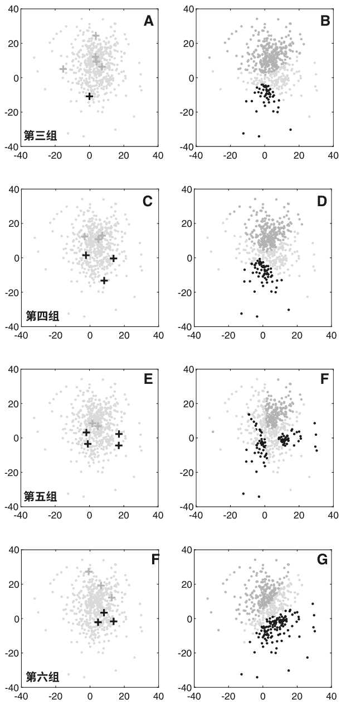

然后很容易识别出训练样本覆盖不好的区域。 然后，人工神经网络在某种程度上不再被视为一个“黑盒子”，因为它的知识领域是可见的，对错误预测的解释和理解变得可行。

所提出算法的结束条件是通过性能准则对诊断模型进行评估。 所使用的准则是冲突区域的减少

# 在算法的每一轮中，专家可以直观地感知到冲突区域的减少。为了提高所提出方法的性能，必须定义和使用除冲突区域减少之外的其他指标来评估模型在构建过程中的性能。这些指标应该对以下非穷尽的问题提供一些答案：

+   - 如何评估这样一个输入训练数据集的空间分布质量？

+   - 如何评估与输入向量质量密切相关的特征？

+   - 如何评估VAE的性能，特别是编码器函数？

+   - 一个更基本的问题是医学专家所容忍的冲突区域的最小尺寸-这对生物医学应用来说是一个真正的困境。

对于一些边界情况，人工神经网络的模糊响应可能比错误预测更可接受。对于这些关键情况，更好的选择是让医学专家决定，而不是提供灾难性的错误预测。

## # 参考文献

1. Alvarado-D az W, Lima P, Meneses-Claudio B, Roman-Gonzalez A (2017)实施一个用于控制轮椅的脑机接口。在：2017年智利电气、电子工程、信息和通信技术会议(CHILE-CON),第1-6页,DOI 10.1109/CHILECON.2017.8229668

2. Angermueller C, P rnamaa T, Parts L, Stegle O (2016)深度学习在计算生物学中的应用。分子系统生物学 12(7),DOI 10.15252/msb.20156651,URL https://msb.embopress.org/content/12/7/878,https://msb.embopress.org/content/12/7/878.full.pdf

3. Baltres A, Zeina AM, et al RZ (2020)使用深度多层感知器预测激素受体阳性、HER2阴性乳腺癌的 oncotypedx 复发风险评分。乳腺癌27(5):1007–1016,DOI https://doi.org/10.1007/s12282-020-01100-4.Bengio Y (2014)自编码器如何通过目标传播在深度网络中提供信用分配。CoRR URL https://arxiv.org/abs/1407.7906

5. Bengio Y, Lamblin P, Popovici D, Larochelle H (2007) 深度网络的贪婪逐层训练。在: Sch Ikopf B, Platt J, Hoffman T (eds) 神经信息处理系统进展 (NIPS 06),MIT Press,pp 153–160,DOI https://www.iro.umontreal.ca/~lisa/pointeurs/BengioNips2006All.pdf

6. Blei DM, Kucukelbir A, McAuliffe JD (2016)变分推断:统计学家的综述。arXiv e-prints arXiv:1601.00670,https://arxiv.org/abs/1601.00670

7. Cao C, Liu F, Tan H, Song D, Shu W, Li W, Zhou Y, Bo X, Xie Z (2018)深度学习及其在生物医学中的应用。基因组学,蛋白质组学和生物信息学16(1):17–32,DOI https://doi.org/10.1016/j.gpb.2017.07.003,URL https://www.sciencedirect.com/science/article/pii/S1672022918300020

8. Chandra B, Sharma RK (2016)使用拉普拉斯分数的自适应学习率深度学习.Expert Systems with Applications 63:1–7,DOI https://doi.org/10.1016/j.eswa.2016.05.022

9. Creswell A, White T, Dumoulin V, Arulkumaran K, Sengupta B, Bharath AA (2018)生成对抗网络:概述.IIEEE Signal Processing Magazine 35(1):53–65,DOI 10.1109/MSP.2017.2765202

10. Dhamala J, Ghimire S, Sapp JL, Hor ˜cek BM, Wang L (2018) 通过嵌入式生成模型对个性化心脏模型参数进行高维贝叶斯优化. In: Frangi AF, Schnabel JA, Davatzikos C, Alberola-L pez C, Fichtinger G (eds) Medical Image Computing and Computer Assisted Intervention – MICCAI 2018, Springer International Publishing, Cham, pp 499–507

11. Ditzler G, Roveri M, Alippi C, Polikar R (2015) 非平稳环境中的学习: 一项调查。 IEEE计算智能杂志10(4):12–25，DOI 10.1109/MCI.2015.2471196

12. Dua D, Graff C (2017) UCI机器学习仓库。 URL https://archive.ics.uci.edu/ml

13. Fan YJ (2019) 自编码器节点显著性: 选择相关的潜在表示。 模式识别88:643–653，DOI https://doi.org/10.1016/j.patcog.2018.12.015，URL https://www.sciencedirect.com/science/article/pii/S0031320318304369

14. Fnaiech N, Fnaiech F, Jervis BW (2011) 前馈神经网络剪枝算法，工业电子手册，第5卷，j.d. irwin，第2版，第15章，第15–1至15–15页

15. Ghimire S, Dhamala J, Gyawali PK, Sapp JL, Horacek M, Wang L (2018) 心脏跨膜电位的生成建模和逆成像。 在: Frangi AF, Schnabel JA, Davatzikos C, Alberola-L pez C, Fichtinger G (eds) 医学图像计算与计算机辅助干预-MICCAI 2018, Springer International Publishing, Cham, pp 508–516

16. Goodfellow I, Pouget-Abadie J, Mirza M, Xu B, Warde-Farley D, Ozair S, Courville A, Bengio Y (2014) 生成对抗网络。 在: Ghahramani Z, Welling M, Cortes C, Lawrence ND, Weinberger KQ (eds) 神经信息处理系统的进展 27, Curran Associates, Inc., pp 2672–2680, URL https://papers.nips.cc/paper/5423-generative-adversarial-nets.pdf

17. Goodfellow IJ, Warde-farley D, Mirza M, Courville A, Bengio Y (2013) Maxout网络。 在: ICML

18. Han HG, Qiao JF (2013) 一种用于前馈神经网络构建的结构优化算法。 Neurocomputing 99: 347–357, DOI https://dx.doi.org/10.1016/j.neucom.2012.07.023

19. Han L, Yin Z (2018) 一种用于相位对比显微镜图像超分辨率的级联精化GAN。 在: Frangi AF, Schnabel JA, Davatzikos C, Alberola-L pez C, Fichtinger G (eds) Medical Image Computing and Computer Assisted Intervention – MICCAI 2018, SpringerInternational Publishing, Cham, pp 347–355

20. He H, Garcia EA (2009) 从不平衡数据中学习。 IEEE Transactions on Knowledge and Data Engineering 21(9):1263–1284, DOI 10.1109/TKDE.2008.239

21. Hinton GE, Osindero S, Teh YW (2006) 深度置信网络的快速学习算法. Neural Comput 18(7):1527–1554, DOI 10.1162/neco.2006.18.7.1527

22. Jones W, Alasoo K, Fishman D, Parts L (2017) 计算生物学: 深度学习. 生命科学中的新兴话题 1(3):257–274, DOI 10.1042/ETLS20160025, URL https://www.emergtolifesci.org/content/1/3/257, https://www.emergtolifesci.org/content/1/3/257.full.pdf

23. Kingma D (2017) 变分推断和深度学习: 一种新的综合方法. 博士论文, 科学学院 (FNWI), 信息学研究所 (IVI), 阿姆斯特丹大学, URL https://handledge.net/11245.1/8e55e07f-e4be-458f-a929-2f9bc2d169e8

24. Kingma DP, Welling M (2013) 自动编码变分贝叶斯。 arXiv e-prints arXiv:1312.6114, https://arxiv.org/abs/1312.6114

25. Lee S, Kwak M, Tsui KL, Kim SB (2019) 使用变分自动编码器进行高维非线性过程的过程监控。 人工智能工程应用 83:13–27, DOI https://doi.org/10.1016/j.engappai.2019.04.013, URL https://www.sciencedirect.com/science/article/pii/S0952197619300983

26. Li Z, Nguyen SP, Xu D, Shang Y (2017) 使用深度生成对抗网络进行蛋白质环建模。 在：2017年IEEE第29届人工智能工具国际会议（ICTAI），第1085-1091页，DOI 10.1109/ICTAI.2017.00166

27. Litjens G, Kooi T, Bejnordi BE, Setio AAA, Ciompi F, Ghafoorian M, van der Laak JA, van Ginneken B, S nchez CI (2017) 关于深度学习在医学图像分析中的调查。医学图像分析 42:60–88, DOI https://doi.org/10.1016/j.media.2017.07.005, URL https://www.sciencedirect.com/science/article/pii/S1361841517301135

28. van der Maaten L, Hinton G (2008) 使用t-sne可视化数据。 机器学习研究杂志 9(11):2579–2605

29. Mahmud M, Kaiser M, Hussain A, Vassanelli S (2018) 深度学习和强化学习在生物数据中的应用。 IEEE Trans Neural Netw Learn SystDOI 10.1109/TNNLS.2018.2790388.

30. Min S, Lee B, Yoon S (2016) 生物信息学中的深度学习。 CoRR abs/1603.06430, URL https://arxiv.org/abs/1603.06430

31. Montavon G, Lapuschkin S, Binder A, Samek W, M Iler KR (2017) 用深度泰勒分解解释非线性分类决策。 Pattern Recognition 65:211–222, DOI https://doi.org/10.1016/j.patcog.2016.11.008, URL https://www.sciencedirect.com/science/article/pii/S0031320316303582

32. Nakamura K, Hong B (2019) 用于深度神经网络的自适应权重衰减。 CoRR abs/1907.08931, URL https://arxiv.org/abs/1907.08931

33. P rez-S nchez B, Fontenla-Romero O, Guijarro-Berdi as B (2016) 用于人工神经网络的自适应在线学习综述。 Artificial Intelligence Review DOI 10.1007/s10462-016-9526-2

34. Rav  D, Wong C, Deligianni F, Berthelot M, Andreu-Perez J, Lo B, Yang GZ (2017) 深度学习在健康信息学中的应用。 IEEE生物医学与健康信息学杂志21(1):4–21, DOI 10.1109/JBHI.2016.2636665

35. Ren J, Hacihaliloglu I, Singer EA, Foran DJ, Qi X (2018) 对抗领域适应在前列腺组织病理全切片图像分类中的应用。 在: Frangi AF, Schnabel JA,Davatzikos C, Alberola-L pez C, Fichtinger G (eds) 医学图像计算与计算机辅助干预-MICCAI 2018, Springer International Publishing, Cham, pp 201–209

36. Rumelhart DE, Hinton GE, Williams RJ (1986) 通过反向传播错误来学习表示。 自然323:533 EP –, URL https://dx.doi.org/10.1038/323533a0

37. Schmidhuber J (2015) 神经网络中的深度学习: 一个概述. 神经网络 61:85–117, DOI https://doi.org/10.1016/j.neunet.2014.09.003

38. Selvaraju RR, Das A, Vedantam R, Cogswell M, Parikh D, Batra D (2016) Grad-cam: 为什么你这么说? 通过基于梯度的定位从深度网络中获得视觉解释. CoRR abs/1610.02391, URL https://arxiv.org/abs/1610.02391

39. Srivastava N, Hinton G, Krizhevsky A, Sutskever I, Salakhutdinov R (2014) Dropout: 一种防止神经网络过拟合的简单方法. 机器学习研究杂志 15:1929–1958, DOI https://jmlr.org/papers/v15/srivastava14a.html

40. Street WN, Wolberg WH, Mangasarian OL (1993) 用于乳腺肿瘤诊断的核特征提取。 国际电子成像科学与技术研讨会1905年, DOI 10.1117/12.148698, URL https://doi.org/10.117/12.148698

41. Tan JH, Hagiwara Y, Pang W, Lim I, Oh SL, Adam M, Tan RS, Chen M, Acharya UR (2018) 应用堆叠卷积和长短期记忆网络准确识别CAD心电图信号。 计算机在生物学和医学的应用94:19–26, DOI https://doi.org/10.1016/j.compbiomed.2017.12.023, URL https://www.sciencedirect.com/science/article/pii/S0010482517304201

42. Yu H, Yang X, Zheng S, Sun C (2018) 从不平衡数据中进行主动学习：一种在线加权极限学习机的解决方案。 IEEE神经网络和学习系统交易pp 1–16, DOI 10.1109/TNNLS.2018.2855446

43. Yu S, Pr ncipe JC (2019) 通过信息论概念理解自编码器。 神经网络 117:104–123, DOI https://doi.org/10.1016/j.neunet.2019.05.003,URL https://www.sciencedirect.com/science/article/pii/S089360801930135244

44. Zeiler MD, Fergus R (2014) 可视化和理解卷积网络。 在: Fleet D, Pajdla T, Schiele B, Tuytelaars T (eds) 计算机视觉 - ECCV 2014, SpringerInternational Publishing, Cham, pp 818–833

45. Zemouri R (2020) 半监督对抗变分自编码器。 机器学习和知识提取 (MAKE) 2(3):361–378, DOI https://doi.org/10.3390/make203002046. Zemouri R, Devalland C, Valmary-Degano S, Zerhouni N (2019) 智能解剖学的未来？ 病理学杂志 39(2):119–129, DOI https://doi.org/10.1016/j.annpat.2019.01.004, URL https://www.sciencedirect.com/science/article/pii/S0242649819300203, 增强的病理学

47. Zemouri R, Omri N, Fnaiech F, Zerhouni N, Fnaiech N (2019) 一种新的生长修剪深度学习神经网络算法（gp-dlnn）。 神经计算与应用DOI 10.1007/s00521-019-04196-8, URL https://doi.org/10.1007/s00521-019-04196-8

48. Zemouri R, Zerhouni N, Racoceanu D (2019) 生物医学应用中的深度学习：最近和未来的状态。 应用科学 9(8), DOI 10.3390/app9081526, URL https://www.mdpi.com/2076-3417/9/8/1526

50. Zhang Z, Jiang T, Zhan C, Yang Y (2019) 基于变分自动编码器的高斯特征学习用于改进非线性过程监测。 过程控制杂志 75:136–155, DOI https://doi.org/10.1016/j.jprocont.2019.01.008, URL https://www.sciencedirect.com/science/article/pii/S095915241930037X

# 卷积神经网络在高级生物医学成像应用中的应用

Daniel A. Greenfield, Germ n Gonz lez和Conor L. Evans

摘要 深度学习 (DL)，特别是卷积神经网络 (CNNs)，可以用于构建强大的定量图像分析工具。 为了充分利用这些能力并建立可行的目标和问题解决方法 ，了解图像和计算工具的发展和共同使用是至关重要的。 不同的先进光学成像方法，无论是侵入性还是非侵入性，都适用于各种生物医学研究，并且C NN算法可以根据需要提取图像数据的有意义结果。

关键词 生物医学光学 · 卷积神经网络 · 模型可解释性 · 光学相干断层扫描 · 多光子荧光显微镜 · 二次谐波产生 · 相干拉曼成像 · 边缘计算

# 1 引言

本章旨在介绍卷积神经网络 (CNNs) 的知识，并展示它们在生物医学成像中解决复杂问题的应用。 它为读者提供了人工智能 (AI) 方法、光学显微镜学的基础知识以及两个领域交叉研究的示例。 本章介绍的工作绝不是详尽无遗的清单。

D. A. Greenfield
哈夫大学生物物理学项目，波士顿，马萨诸塞州，美国
e-mail: dgreenfield@g.harvard.edu

G. Gonz lez
西埃拉研究有限责任公司，阿利坎特，西班牙
e-mail: ggonzale@sierra-research.com

C. L. Evans (☒)
韦尔曼光医学中心，波士顿，马萨诸塞州，美国
e-mail: Evans.Conor@mgh.harvard.edu

生物医学光学中的复杂问题可以通过机器学习（ML）来探索，从而揭示了如何构建研究问题，以便计算解决方案具有价值。随着技术进步提高了计算和成像的能力，可以通过更复杂的算法来解决新颖的问题，将复杂数据转化为有用信息。

本章的其余部分按照以下方式组织：在第2节中，我们讨论了使用先进光学和卷积神经网络（CNNs）进行研究的时间线，以及计算和显微镜技术的交叉发展。在第3节中，我们分析了深度学习在先进成像中的应用。第4节描述了在成像应用中使用CNNs的数据管理策略。最后，在最后一节中，我们提出了结论以及潜在的未来研究方向。

# 2 科学基础

光学显微镜工具能够为生物学、医学、化学和物理学等领域的问题提供许多见解。已经开发出许多成像工具，可以通过光散射和吸收、荧光和磷光以及与振动共振的相互作用等物理现象产生对比度。先进的光学成像平台可以同时利用多种对比度来源，提供大量的多处理、高光谱、时序、体积数据集。收集这些大量数据的能力有望为生物医学问题提供巨大的洞察力。然而，一个主要的挑战是如何解析和处理这些海量数据，以获得可解释和可操作的信息。

机器学习方法，尤其是深度学习方法，在解决这一核心挑战方面具有重要的潜力。训练和利用人工神经网络（ANNs）对复杂数据集进行分析的能力已经被证明可以捕捉到从细胞过程到癌症诊断等问题的新见解。将深度学习方法应用于先进的光学成像工具仍处于早期阶段，这使得探索和发现成为一个令人兴奋的时刻。要了解这两个领域如何相互合作，首先需要提供背景知识。机器学习和显微镜技术领域都有着丰富的背景，经过几十年的发展，即使是一本书也无法涵盖所有内容，更不用说一章了。因此，本文的目标是提供一个针对光学成像分析中深度学习方法应用的专题综述。为了实现这一目标，我们首先将简要回顾与ANNs相关的重要背景信息，然后再回顾常见的先进光学成像工具。

# ## 2.1人工神经网络

本小节介绍了人工神经网络及其架构的基本原理。 从高层次上来看, 人工神经网络的强大之处可以从通用逼近定理[57, 58]中理解。

...在隐藏单元激活函数具备足够通用条件的情况下, 多层前馈网络是通用逼近器,前提是有足够多的隐藏单元可用。 然而, 需要强调的是, 我们的结果并不意味着所有的激活函数 $\psi$ 在特定的学习问题中表现都很好。[58]

人工神经网络在非线性问题求解方面的能力已经被理解了近三十年。 然而, 通过学习率、激活函数和其他超参数来优化人工神经网络仍然是一个活跃的研究领域。

此外, 为解决特定问题定义适当的模型架构可能同样重要。 上述通用逼近定理对于普遍逼近解所需的时间没有限制, 然而网络准确性和训练要求之间的权衡是至关重要的。

## 2.1.1 人工神经网络基础知识

人工神经网络由称为神经元的个体单元组成, 通过操作相互连接。 作为起始示例, 介绍了两种基本的人工神经网络：感知器和多层感知器。 这些人工神经网络由不同的层组成, 每个层都由个体神经元组成（参见图1a中的基本神经元结构）。 这些神经元, 也称为节点, 是任何人工神经网络的主要操作单元。节点可以具有任意多个通过输入函数组合的输入。 输入函数的结果值通过激活函数确定节点输出 (图1a)。 感知器的第一层被称为输入层, 读取数据, 对其输入进行线性组合, 并应用非线性激活函数（常见激活函数参见图1b）[98]。 在多层感知器中, 输入神经元中的信息被发送到下一层, 即隐藏层, 该过程重复并存储输出。 最后, 在这两种人工神经网络结构中, 输出层报告一个值或概率, 具体取决于人工神经网络是应用于分类问题还是回归问题。 传统感知器更适用于二元分类问题, 而多层感知器通常用于受益于随机解决复杂优化问题的非线性问题, 这些问题实际上是多个基本感知器堆叠在一起。

人工神经网络能够通过更新节点 (神经元) 之间的权重来学习, 这些节点分布在不同的层之间。 对于两种人工神经网络结构, 目标是最小化输入数据关联标签与输出层估计标签之间的误差。 这种误差通过损失函数来量化。选择损失函数取决于给定问题和结构。

## 2.1.2 从前馈人工神经网络到卷积神经网络

第一个卷积神经网络由Yann LeCun于1989年发表，是为了优化训练神经网络所需的时间和神经网络在各种输入上的泛化能力之间的平衡[71]。 为了实现这一点，LeCun着手构建一个具有较少自由 (可训练) 参数的神经网络，以减少神经网络能够生成并测试的函数样本空间。这是通过权重空间变换实现的，它允许一个权重控制神经网络中多个节点之间的多个连接。此外，该权重仅在解决问题所需的参数空间中进行更新，而不是在每个可能的权重集合上进行更新，通过卷积操作实现。 LeCun比较了感知器、多层感知器、基本图像特征提取器神经网络 (带有下采样)、带有权重 (或参数) 共享的图像特征提取器以及层次特征提取器 (即今天的卷积神经网络) 的性能。随着下采样 (信息压缩)、权重共享和特征提取的增加，神经网络的准确性和速度都得到了提高。

人工神经网络 (MLPs) [49]为现代神经网络奠定了基础。 传统上，$MLPs$ 通过矩阵乘法来计算节点输出，并通过$ANN$ 向前和向后传播错误。然而，$CNNs$ 通过卷积运算来操作。 从数学上讲，这个操作被定义为输入和核函数的乘积的积分，其中一个被反转和移位。 如下所示，其中$e(t)$ 是我们图像区域的估计值，$i(p)$ 是在点$p$ 处测量的输入，$\mathrm{w}(p)$ 是权重函数 (核函数) [49]。

$$e(t) = \int i(p) w(t - p) d p$$

## 事后分析：通过更易于解释的算法来近似黑盒子[83]。

## 平移不变性：ANN的特性，使其能够以相同的方式预测略有扰动但通常相似的数据[50]。

## 2.2 高级光学成像工具

光学成像方法为成像和量化复杂系统提供了强大的工具，范围从生物系统中的亚细胞级动态到潜在癌症病变的全身成像。生物医学中的光学方法利用光与组织之间的各种相互作用产生成像对比。大多数光学成像方法利用三种主要的光-物质相互作用：吸收、散射和发射[27]。例如，简单的光学显微镜主要提供吸收对比度，通过适当的薄样品中的颜色和相对亮度（或暗度）来可视化特征。重要的是，这些光-组织相互作用可以是线性和非线性的，非线性相互作用能够产生新的独特见解。

虽然存在许多光学成像模式，但本节将重点介绍一些使用深度学习工具的成像方法。

## 2.2.1 光学相干断层扫描

光学相干断层扫描（OCT）是在20世纪90年代初期开发的一种干涉光学技术，基于光散射对比。OCT是超声成像的光学类似物，通过有效测量光线到达组织不同层的往返时间来构建横截面和断层图像。由于光速远远快于声速，OCT利用光学干涉和信号处理来提取体积成像数据。OCT在生物学和医学领域得到广泛应用，在眼科[41]、皮肤[116]、心血管系统[9]和胃肠道[38]等方面进行了临床应用。

所有的OCT系统都采用干涉配置。在最常见的方案中，宽带光源被分成两个路径：一个“参考路径”和一个“样本”路径，这两个路径的长度大致相等。从这些路径返回的光线进行干涉，干涉信号在一个探测器上进行测量[5,101]。
现代OCT系统在所谓的光谱域中运行，使用固定的宽带光源，如二极管，或者扫描源光源[33]。干涉图通常通过傅里叶变换来处理以恢复深度信息；扫描样品上的光源允许构建横切面和3D断层图像。OCT数据集可能相当大,特别是从光频域成像(OFDI)系统中收集的OCT图像数据,其中干涉图被过采样以提高图像质量。

OCT图像中的对比度来自组织折射率的变化,在组织层、纤维和细胞之间的边界处发生。这使得OCT图像能够捕捉结构信息,例如视网膜的各个层次[85]、食道的结构[39]或动脉支架的放置细节[13]。由于OCT是一种通过干涉测距的光学技术,它具有在超过几毫米深度的组织内深入观察的能力。使用更专业的OCT工具包可以评估血液流速和神经束参数等其他信息。相干噪声,也称为散斑,在OCT图像中很常见,产生“颗粒状”的外观[5]。这种颗粒状可以通过对局部邻域的像素值进行平均来去除,但可能会去除重要的组织特征。考虑到散射和去噪OCT图像一直是一个活跃的研究领域。

计算分析光学相干断层扫描(OCT)在处理干涉图像、图像分割和特征识别方面至关重要。OCT数据通常被处理成生成组织的定量结构图,这在诊断环境中非常重要,因此准确的图像处理至关重要。这在功能性OCT成像中尤为重要,其中组织动态是从4D数据集(x、y、z和时间)中得出的,例如OCT弹性成像和多普勒OCT方法。

## 2.2.2 多光子荧光显微镜

荧光对比广泛应用于生物医学研究和医学领域,因为荧光染料可以用于靶向特定分子和结构。例如,可以合成抗体-荧光染料共轭物来特异性地成像细胞中的特定蛋白质所在位置。荧光显微镜通常使用传统的广域和共焦荧光显微镜进行,可以在同一样本中可视化多种荧光物种进行多重成像获取。标准荧光工具的一个挑战是荧光激发所使用的波长主要位于可见光的紫外到绿色范围。这些波长在组织中的穿透深度有限,只能对样本进行浅层成像。

多光子荧光显微镜技术利用较长波长的近红外光在浑浊的组织环境中实现更深层次的成像。在多光子荧光显微技术中,超短脉冲近红外激光被聚焦到一个小的焦点体积中。在这个小的体积内,光子通量瞬间非常高,有时比太阳表面还要亮。在这种光子密度下,色素分子可以非线性地同时吸收多个光子,将分子激发到一个更高的能级,从而发出荧光。多光子显微镜的最常见形式是双光子激发荧光显微镜(TPEF)技术。例如,荧光素分子通常通过单光子激发在488纳米处激发,但也可以通过750-800纳米的近红外光进行双光子激发。

TPEF技术已经得到了快速的技术发展，商业系统已经广泛应用。 TPEF技术已经得到了快速的技术发展，商业系统已经广泛应用。

TPEF和三光子激发荧光在体内成像应用中得到了应用，尤其是那些专注于皮肤[79]和大脑[59]的应用。 虽然多光子荧光成像应用主要用于研究，但这些工具也有一些临床应用。

染料的使用限制了临床实时应用，但是这两种模式已经被用于成像活检组织，尤其是肿瘤样本[89]。

例如，多光子激发内源性荧光物质可以用于可视化结构元素和代谢率[92]。

多光子图像可以生成丰富的体积数据集，包括多个同时荧光标记的时间序列。 多光子成像可以具有数百纳米的分辨率，并且可以通过镶嵌方法扩展到厘米空间尺度，使得这些5D数据集在定量处理方面具有挑战性。图像分割、图像特征识别、特定标记元素的计数以及时间序列数据中物体的跟踪是一些最常见的计算问题。

## 2.2.3 二次谐波发生

二次谐波发生(SHG) [43] 是一种非线性过程，其中两个相同波长的光子与材料相互作用，转化为原波长的一半的单个光子。二次谐波发生过程仅发生在所谓的非中心对称材料中。许多胶原蛋白以及肌球蛋白具有这种独特的特性，使它们成为基于SHG的成像的有吸引力的目标[20]。

与多光子荧光成像一样，SHG使用近红外波长的激光（700-1300 nm），可以在高分辨率下深入成像数百微米[21]。 SHG和TPEF通常一起进行，SHG提供组织结构细节，而TPEF提供特定目标标记。SHG和TPEF在皮肤成像中得到广泛应用，其中胶原蛋白的分布和模式可用于了解皮肤结构和疾病状态[23]。与TPEF一样，SHG数据集在定量分析方面可能具有挑战性，并且通常需要大量的手动或半自动化程序。

## 2.2.4 相干拉曼成像

拉曼现象[8] 是一种非弹性散射机制，光与分子的振动模式相互作用。在自发拉曼散射中，光散射到分子上可以带走或留下一个振动能量量子。

通过获取散射光的光谱来测量这些相互作用，以测量给定分子的振动光谱“指纹”。

由于无需标记，拉曼工具能够检测特定的分子特征，因此在生物医学研究和诊断医学中具有极大的潜力。然而，一个挑战是拉曼过程相当弱，因此自发拉曼图像需要花费几个小时甚至几天来获取[8]。

相干拉曼成像包括一组非线性拉曼过程，提供相同程度的化学特异性，但信号强度明显更大。最常用的两种相干拉曼成像方法是相干反斯托克斯拉曼散射 (CARS) [36]和受激拉曼散射（SRS）[44]，两者都可以以视频速率进行[35,100]。这两种成像方法都能产生具有振动对比度的图像，其中CARS最适用于化学结构成像，而SRS最适用于化学定量分析。CARS和SRS过程本身几十年前就被发现，并在1999年开始作为高效成像技术实施。这两种方法都是非线性成像方法，利用两种调谐到感兴趣振动模式的脉冲激光的差频。通过这种方式，相干拉曼成像工具可以专门调谐并可视化样品中的振动模式和化学物种的分布。

相干拉曼成像在研究领域中已经找到了许多应用，主要集中在皮肤[36,44,100,115]和大脑[37,45,46,63]上的重要研究。这些工具正在逐渐转化为临床应用：最近商业化了一种便携式CARS成像系统[16]，以及一种专门用于检测脑癌中具有挑战性肿瘤边缘的SRS成像工具[45]。

基于与TPEF相同的成像硬件，相干拉曼成像可以生成大量的5D数据集。在TPEF中，维度是X、Y、Z、时间和荧光通道，而在相干拉曼中，最后一个维度现在变成了振动能量，大大扩展了实验数据集的大小。随着相干拉曼成像中新型快速可调谐激光系统的出现，这现在成为一个特殊的挑战[17]。

## 2.2.5 高级成像分析的挑战和机遇

这些成像工具虽然具有不同的对比度来源和不同的基本机制，但都面临着类似的图像分析挑战。

- 1.这些工具有良好的能力生成非常大的数据集。例如，一个连贯的拉曼成像系统在皮肤中捕获药物摄取数据时，可以轻松的生成30 GB的数据。在采集期间，心脏光学相干断层扫描系统可以在几秒钟内生成数十GB的干涉数据。对这些数据的即时分析对于诊断复杂的问题，如支架放置，是必需的。

- 2.高级图像工具生成的数据非常复杂和异质化，特别是当图像来自组织和活体系统时。空间信息可以从纳米级到厘米级，数据不能轻易简化或分解为简化形式。

3.数据可以随时间采集，这意味着分析工具不仅需要捕捉或量化结构和/或化学元素，还需要捕捉时间上的变化。 这可能在识别和跟踪重要对象或量化动态图像变化中带来重大挑战。

传统上，对高级显微镜和图像系统数据进行图像分析通常使用计算机视觉库，如Open CV [14]和MATLAB。这些方法在边缘情况下经常失败，因为确定性算法受到许多图像中包含的异质性的影响。 许多分析程序最终会包含手动或半自动组件，这需要时间，降低吞吐量，包含操作员偏见，并且不适合临床转化。 通过机器学习的进展，新的方法很好地解决了这些挑战，并填补了处理和量化高级成像数据的迫切需求。

## 涉及高级成像和深度学习的跨学科研究应用

深度学习方法能够在图像解释和图像分析方面取得突破。 在这里，我们讨论了一些选择的例子，其中深度学习和卷积神经网络特别适用于高级成像工具。 由于这些成像方法主要应用于生物医学和临床环境，重点将放在生物医学研究应用上。

## 3.1 应用光学相干断层扫描与深度学习分析

OCT图像分析的一个共同目标是提取与样本的散射和吸收特性相对应的参数，即散射系数和吸收系数。 这通常被视为一个反问题，研究人员必须从成像系统获取的数据中恢复系数。 解决这个反问题可以实现高分辨率的图像重建，但是计算量很大。

#### 3.1.1 疾病状态下视网膜退化的分析

尽管自上世纪90年代以来，光学相干断层扫描已经应用于医学成像，但早期研究中对散射和吸收系数的量化程度主要是通过复杂的数学模型和对组织成分的实验测量的近似。

2018年中期, Camino等人报道了涉及OCT和CNN的跨学科方法, 目标是通过一系列深度分辨的视网膜组织图像来量化人类遗传性视网膜退化疾病中的光感受器丧失, 包括脉络膜萎缩和视网膜色素变性。视网膜图像是从70kHz、840nm波长的光谱域OCT系统中获取的。本系统的输出是一个一维深度剖面(A扫描),沿一条线采样300个A扫描以生成一个二维xz剖面(B扫描)。在视网膜的每个横向位置处获取了两个B扫描,使用运动校正技术合并数据并从收集的B扫描图像中去除噪声。

团队将他们的努力集中在确定椭球区(EZ)在健康和患病视网膜的光感受器之间的差异上。EZ是一个眼部区域,临床上用于估计光感受器的损伤;视网膜退化疾病可能导致EZ内部形成病变和其他异常。每个收集和分析的视网膜图像都显示了EZ与另一个邻近区域(称为Bruch膜)之间的厚度图。然后将厚度图交给人类专家,以确定是否存在EZ损失,并对患病患者的EZ损失程度进行评分。人类分析结果被保存并用作CNN训练的基准,旨在分割每个B扫描图像以确定EZ边界,并进而确定EZ厚度。

Camino等人实现的CNN将33×33像素的B扫描图像块作为输入,预期输出是一组2个概率,对应于该图像块是否遭受EZ损失或EZ保留。CNN架构由3个交替的卷积和最大池化层(总共6层)组成,用于对图像进行下采样,并迫使CNN识别与EZ边界对应的重要方面。

在经过6个特征提取层之后,这些特征被压平并通过一个具有64个节点的全连接(稠密)层,然后传递到最后一个具有2个节点的稠密层。这两个最终节点对应于包含补偿区域二进制分类的输出向量,具体来说是EZ损失或保留的概率。这个二维概率向量被用来生成EZ损失和保留的面部概率图。为了定量分析CNN的准确性,使用Jaccard相似性指数[53]来比较经过后处理(分割)的分类图像与其真实对应图像之间的重叠。后处理将分类算法生成的概率图转化为与疾病状态中EZ缺陷相对应的图像区域分割。与人工分级者相比,CNN对EZ区域的分割准确率为0.894±0.0102(视网膜色素变性)和0.912±0.055(脉络膜萎缩)。从定性上讲,Camino等人报告了由算法分类为疾病的受损视网膜生成的分割图与人工分级者生成的分割图之间的相当高的一致性(见图3)。

在图3中。绿色区域是手动分割中未包含在CNN分割中的区域(假阴性),粉色区域是假阳性区域。输入图像的尺寸从33×33像素开始,提取的最终特征是一个8×8像素的区域。网络图生成完成。

通过修改PlotNeuralNet实现[61]。所有深度学习计算都在一台配备Intel CPU、16 GB RAM和1GB VRAM的NVIDIA GeForce Quadro K420 GPU的台式计算机上进行。

总体而言，这次对OCT图像的深度学习探索为未来的研究奠定了重要基础。虽然作为一种监督学习算法，CNN在分割方面取得了一定的成功，但是通过更大的健康和疾病图像训练集，CNN的鲁棒性可以进一步提高。仅使用10个病眼扫描图像无法提供足够的EZ厚度变化，以得到临床上有用的结果。具体而言，CNN缺乏定量区分健康和疾病视网膜图像的能力。此外，CNN无法检测到脉络膜萎缩图像中的管状结构，这在未来可能对诊断或量化疾病的程度有用。然而，随着计算能力的提升，以更大的图像作为输入的CNN可能更擅长提取高浓度的管状结构和其他图像的细节，这些细节可能对临床相关信息有所对应。

#### 3.1.2 在OCT图像中分割临床相关的视网膜层

视网膜成像是OCT的首个重要临床应用之一，经过几十年的研究和发展。OCT提供的体积成像数据可以非侵入性地生成视网膜结构的三维渲染图，对于多种疾病的诊断和监测具有重要的临床价值。虽然OCT数据可以用于可视化视网膜的各个层次，但自动化的对这些结构的识别和分割一直是一个长期存在的挑战[42]。由于图像噪声、可检测的形态特征、图像对比度和捕获的视网膜层，视网膜层分割仍然是一个挑战[81]。

Shah等人[102]旨在分析健康眼睛和年龄相关性黄斑变性(AMD)眼睛的视网膜B扫描，类似于Camino等人[3]，Shah等人[102]使用了380个带有伴随手工示踪的OCT体积数据集[40]。Shah等人专注于分割三个表面：内界膜(ILM)、视网膜膜色素上皮内侧(IRPE)脉络膜病变复合物和布鲁赫膜外侧(OBM)。与Camino等人的方法相比，Shah等人在他们的训练和分析中包括了IRPE，这是一个挑战，因为它具有很高的反射性。该团队采用算法方法确定了最适合他们分割需求的人工神经网络(ANN)。在精心策划的数据集上测试了三种不同的基于CNN的结构：CNN-S，由Shah等人从Alex-Net派生的CNN，以及两个只在最终输出卷积层上有所不同 的U-Net结构[69,95]。使用U-Net的好处包括强大的分割能力、快速运行时间和鲁棒性(不需要很多训练图像来进行准确的分割)。CNN-S具有上采样和下采样层，每层的节点密度从16个增加到32个，然后是64个，最后再减少到16个。在特征提取后，使用两个全连接层，分别具有2500个和1200个节点，进行分割。

分割方法试图为OCT图像中显示的不同视网膜层体积（对应于ILM、IRPE和OBM）分配不同的值。为了考虑误差并允许准确的权重更新，在U-Net中使用了一个规范的像素均方误差函数，而在CNN-S的训练过程中应用了一个二次惩罚损失函数来处理表面位置误差。CNN是通过CAFFE[64]实现的，并使用NVIDIA Titan X GPU进行训练和测试。使用Linux桌面（3.4 GHz，16 GB内存）生成手动分割结果。

在训练之前，Shah等人使用数据增强来增加训练数据图像的变化，同时仍然提供生物可行的图像给测试的CNN。他们的增强技术涉及对每个图像进行多次平移和旋转，并通过保存中间图像，使训练集大小扩展了4倍，达到了超过75,000张图像。为了评估分割误差，使用了无符号平均表面定位误差[72]和无符号平均对称表面距离误差（UASSD）[102]，但只有UASSD适用于U-Net。一般来说，这些指标量化了预测图像与真实分割图像之间的差异。

定量上，CNN-S在测试中表现优于 U-Nets和另一种非深度学习方法。然而，需要注意的是，每个测试图像都与手动描绘的5毫米直径区域进行比较，作为卷积神经网络旨在实现的基准分割。因此，没有测试较大区域，并且考虑到 U-Net在细胞和组织级分割任务上的性能，CNN-S和较大图像的U-Nets之间的性能可能是可比较的。

#### 3.1.3 非视网膜OCT体积的卷积神经网络分析

临床相关的研究和医学成像远远超出了眼科学应用的范围,包括那些活检风险较高的组织,如心血管组织[47]。Mojahed等人[82]报道了一种基于卷积神经网络的临床相关OCT数据分析,与眼科学无关。迄今为止,这似乎是首次将OCT应用于眼外部分,并使用深度学习来量化和分析图像。这项工作侧重于对乳腺组织OCT图像的分析,包括癌变和非癌变区域,并使用训练有素的卷积神经网络来区分健康和疾病样本,提取临床上有用的结果。此外,CNN模型还被测试其对不同组织类别进行分类的能力。

Mojahed等人利用OCT成像的光学穿透深度, 可视化了人体样本中的4种不同乳腺组织类型——基质、脂肪、原位导管癌 (DCIS) 和浸润性导管癌 (IDC), 平均大小为 $1.2 \mathrm{~cm}^{2}$ 。他们使用自定义的OCT装置, 轴向分辨率为 $2.7$ $\mu \mathrm{m}$, 横向分辨率为 $5.5 \mu \mathrm{m}$, 中心波长为 $840 \mathrm{~nm}$ 的低噪声超连续激光器。该团队选择使用这个自定义装置, 因为它生成的图像质量更好 (从人类可解释性和分类能力方面来看), 相比商用OCT系统。

使用的架构和计算硬件的许多方面没有被披露, 但显然CNN通过不同的步幅大小操作, 并在层之间传递归一化信息。他们的CNN结构包括5个迭代的3个直接连接的卷积层, 具有非线性激活函数进行特征提取。在15个卷积层之后是一个dropout层, 以避免过拟合, 最后是包含4个节点的输出层, 用于4种组织类型的分类概率。模型的输出通过测量Dice系数[122]进行测试, 该系数用于衡量数据集之间的相似性/重叠。该分数适用于健康/患病图像的二分割以及测试四种组织类型的分类能力。

该模型在组织分类任务中对识别IDC具有最高的Dice系数[122], 并且对于二分类中带有癌症样本的图像也具有最高的Dice系数。通过在眼外展示自动化分析的OCT, 它作为一个示例, 可以用来构建改进的分析方法来处理临床应用的数据。

## 3.2.1 CARS和CNN用于自动肺癌诊断

显微镜技术与深度学习分析相结合，能够与病理学家的诊断准确性相媲美。

### # 3.2.1 CARS和CNN用于自动肺癌诊断

早期的一篇关于显微镜和CNN相结合的文章是关于肺癌诊断的。Weng等人[117]利用CARS显微镜技术实时识别与病理相关的肺组织特征。CARS是一种相干拉曼成像方法，通过调谐到分子的特定振动模式实现化学特异性成像。

在这项工作进行时，从计算机断层扫描（CT）图像中进行联合活检和组织病理学分析是肺癌的诊断标准。然而，这种活检方法的缺点是由于患者呼吸运动的限制，肺部病变活检和潜在癌变部位的成像非常困难，图像质量有限。Weng等人[117]使用2D和3D CARS图像以及CNN分类器系统，可以区分健康和疾病的肺组织，并将三种肺癌亚型（小细胞癌、鳞状细胞癌和腺癌）与正常组织分开分类。为了保证高准确性，算法需要关联不同癌症图像中纤维弹性蛋白和胶原结构的差异。这对于病理学家在诊断过程中是一个关键观察，因为健康的肺部组织中高达50%的弹性蛋白可以使肺部在呼吸过程中伸展。胶原蛋白结构可以维持肺部的拉伸强度。癌变的肺部组织中纤维结构较少，对应于CARS图像中观察到的细胞密度较高[19,34]。

将密集堆积的细胞与松散堆积的细胞进行分割对于卷积神经网络来说是一个相对容易的任务，许多研究组已经证明了这一点[6,62,113]。然而，要复制病理学家的培训和表现，算法需要能够识别与不同癌症亚型相关的更复杂的细胞特征。例如，在腺癌中，细胞通常呈圆形，含有囊状核，而周围的弹性蛋白和胶原纤维没有被降解[18]。

鳞状细胞癌细胞具有细胞间桥和密集的细胞层和细胞质。最后，小细胞癌呈现为具有密集核和相对较少可见细胞质的圆形细胞。准确区分这些差异对于准确诊断肺癌至关重要。

充足的卷积神经网络性能往往取决于用于训练的图像数量以及卷积神经网络 的特征提取能力。翁等人通过迁移学习将在图像识别中获得冠军的GoogleNetInceptionv3算法重新应用于CARS图像的分析。类似的迁移学习方法在医学数据上显示出了有希望的结果，并且实施简单。为了将GoogleNet应用于这个任务，翁等人进行了微小的修改，使得至少有一个特征提取层在CARS图像上进行了训练，并且分类层有4个输出，对应于可能的4个类别。

图像（健康或三种癌症）。在通过旋转和镜像他们的图像数据集来增强图像数据集之后，Weng等人使用九折交叉验证来训练他们的卷积神经网络（CNN），以最小化分类交叉熵。使用Tensorflow[4]实现了迁移学习，训练在亚马逊网络服务（AWS）云上执行，使用包含4个vCPU、61 GiB内存和1个12 GiB内存的GPU的实例。

CNN报告的分类准确率包括对健康肺图像和疾病图像的完美分类，这是一个合理的里程碑，考虑到健康组织和疾病组织CARS图像之间的明显差异。然而，值得注意的是CNN不仅能够区分癌症类型，还能够区分两种最常见的非小细胞肺癌（NSCLC）中的细胞鳞状细胞癌和腺癌。虽然该算法在分类鳞状细胞癌和腺癌方面的平均准确率约为88%，但鳞状细胞癌更容易被错误分类为腺癌，这是可以预料的，因为它们的形态相似。考虑到该算法在腺癌检测方面的准确率为92%，可能是该算法在该疾病状态的图像中检测到了一些次要的独特特征。然而，这些特征可能不足够稳健，不能成为区分非小细胞肺癌类型的主要决定因素。

该算法能够以95%的准确率确定小细胞癌图像与其他3种图像类型的区别，这表明了区分正常组织、小细胞癌和非小细胞肺癌的独特特征。除了对2D图像进行分析外，Weng等人还使用3D CARS图像对组织类型进行标记，其整体准确率高于对2D图像进行分类的四图像分类系统（92.3%准确率）。但是，这种3D方法的准确性可能会因为仅在39张图像上测试其方法，而对于2D CNN方法的测试则超过700张图像，而被夸大。

这篇具有里程碑意义的论文为未来的自动诊断工作奠定了坚实的基础。Weng等人不仅拥有一个表现良好的算法，还可视化了CNN的隐藏层，展示了一种更具可解释性的黑盒（基于CNN的）图像分类方法。这非常重要，因为设置可解释性阈值，如CNN的隐藏层表示或量化不同图像类型的隐藏层之间的差异，对于在临床中部署受患者、医生和管理机构信任的算法至关重要。开发一个便携式CARS系统，这是Weng等人提到的目标，结合DL分析和病理学家对图像中疾病结果的校对，可以极大地改变临床实践。总的来说，这项工作提供的结果和解释为CARS和其他非毒性显微镜应用在临床中铺平了道路。

## 3.2.2 卷积神经网络和多光子显微镜用于自动卵巢组织分析

与Weng等人在肺组织CARS图像上的工作[117]类似,Huttunen等人[60]应用T L方法分析了感染小鼠卵巢组织。Huttunen等人[60]使用了两种类型的双光子显微镜,即二次谐波生成(SHG)和双光子激发荧光(TPEF),来成像胶原纤维和弹性蛋白,这些也是Weng等人[117]可视化的癌组织的标志。在卵巢组织的情况下,胶原蛋白和弹性蛋白通过它们在细胞外基质中的存在或缺失来指示疾病[68,84]。SHG专门针对这两个成分,而TPEF则可可视化组织荧光,从而揭示细胞形态和结构。这两种成像模式已被同时使用来研究各种癌症进展中的细胞外基质重构,但在Huttunen等人的方法[12,25,68,84,91,118]出现之前,没有一种稳健或自动化的方法来量化这些图像和结构变化。

Huttunen等人[60]在他们的分析中使用了四个高性能的预训练CNN,包括AlexNet、VGG-16、VGG-19和GoogLeNet[69,107,110]。这四个CNN都连续赢得了ImageNet大规模视觉识别挑战赛[99]。与Weng等人[117]的方法类似,预训练CNN中的许多层被保留为‘冻结’状态,并且不通过在卵巢组织图像集上进行训练来更新。唯一可训练的层对应于CNN的分类部分,在这部分中,Huttunen等人[60]将卷积层提取的特征输入支持向量机或全连接的密集ANNx层。这些分类层学习与卵巢组织图像相关的权重,以确定图像是否对应于健康或患病的组织样本。

为了使用SHG和TPEF创建样本图像,我们对5只健康小鼠和5只卵巢癌模型小鼠进行了成像。生成的组织图像最初为800×800像素,这对于通过CNN来说非常大。相反,我们使用了227×227或224×224的裁剪图像块对四个CNN进行了训练,这也起到了数据增强的作用。尽管通过提取图像块可以为CNN提供更多多样化的训练和测试图像,但是图像块之间的间隙可能导致缺失信息,从而影响CNN的学习速度或整体准确性。模型的训练和测试分别在单个图像类型和包含两种多光子显微镜图像的组合数据集上进行。

无论是基于密集连接层的分类还是基于SVM的分类,四个CNN的整体分类准确率都很高。一致地,相比于常见的SVM方法,密集层分类方法表现更好[60],但是SVM在算法的优劣方面更加透明。SVM允许通过使用模型拟合的参数生成最大化可能分类之间距离的决策边界,从而可视化模型的决策过程。通过基于密集层的分类方法和增加准确性之间的权衡,与增加
对算法决策的理解仍有待优化。
通常,研究人员需要决定性能提升是否值得透明度的降低。然而,卷积神经网络方法平均准确率提高了3\%,同时使用TPEF和SHG数据提高了5\%的准确率,似乎值得优先考虑密集层方法以实现更稳定的性能。

有趣的是,为什么在这种情况下,同时使用TPEF和SHG图像会导致最佳的算法性能。似乎卷积神经网络依赖于同时看到细胞外基质和基质形态以准确诊断卵巢组织。通常,病理学家根据细胞外基质中的胶原蛋白和弹性蛋白存在来做出诊断决策,这提出了一个有趣的观点,即额外的组织形态图像数据可能进一步提高临床医生的诊断准确性。这里测试的所有卷积神经网络都具有高灵敏度和高特异性(低假阳性和假阴性率),总体准确率约为95\%。Huttunen等人的工作展示了另一种有价值的无标记成像方法,能够产生极高分辨率的图像,并有潜在的临床应用。尽管Weng等人和Huttunen等人使用的卷积神经网络非常庞大,但开发针对特定任务的较小卷积神经网络而不是通用的良好图像识别,将允许更好的实时成像分析与标准病理学分析相结合

## 3.2.3 总结

所讨论的研究并不是先进显微镜与CNNs相结合所获得的独特和富有成效结果的详尽列表。然而,它们展示了两种高质量的迁移学习方法应用于临床和生物相关数据,这些数据是通过无标记非线性成像方法创建的,可以直接应用于临床。无标记方法不需要使用有毒元素来生成可接受的图像,使得这些任务应用于人类的组织批准更加简便,非侵入性方法对患者来说更安全、更简单。这些迁移学习的例子表明它是一个强大且具有普适性的数据分析工具

## 3.3 U-Net和先进显微镜应用

本节介绍了一种特定类型的CNN,称为一个U-Net,应用于多种先进成像模式[95]。首次引入于2015年的U-Net是一种强大且高效的CNN,用于分割等生物相关任务。它具有强大的特征提取能力,可以在不同场景中部署。如最初发表的那样,U-Net的训练需要原始图像以及描述准确分割应该如何看起来的“图像掩膜”。然后,U-Net学习了两者之间的关系 使用这些掩码和原始图像进行分割。虽然它是一种有监督的学习方法，在创建严格注释的数据集之后，CNN的实现是直接的，输出的质量通常很高。本节涵盖的作品并不是对 U-Net的应用或潜在用途的详尽列表，而是旨在展示这种广泛适用的CNN在许多不同任务上以有限的训练数据高水平执行的多功能性。

图5展示了 U-Net如何独特地结合了从传统卷积层生成的特征和从下采样和上采样的卷积层生成的特征。保留瓶颈（连续的1024×32块）两侧的这些特征可能是 U-Net在图像分割和去噪方面表现出色的原因。通过迭代地进行下采样，只有重要的图像特征保留在瓶颈中，然后在瓶颈右侧的上采样区域将这些特征放大。CNN图表是通过修改PlotNeuralNet实现[61]生成的。

## 3.3.1 U-Net-Inspired算法用于图像分割

U-Net最初是用于细胞分割任务的。U-Net的一个优点是它能够处理增强图像，即对原始图像应用镜像和旋转，以学习平移不变性和准确的分割。这样可以节省在可能费时的成像上的时间，并将更多时间用于让CNN在真实数据和增强数据上学习。最初，U-Net应用于3种不同的细胞图像数据集，一个细胞类型通过电子显微镜（EM）成像，另外两个通过光学显微镜成像。在所有情况下，并根据所有报告的指标，U-Net在图像分割中优于先前用于图像分割的最先进算法。

仅在2019年，已经发表了数百篇使用U-Net的研究文章。 在这里，我们介绍了一些独特的出版物[31, 66, 76]，详细介绍了用于不同分割任务的U-Net启发式算法。 这些任务旨在检测与微小动脉瘤相对应的视网膜图像中的小色素变化，分割组织病理学图像，并从OCT图像中分割小鼠皮肤层[31, 66, 76]。 这三种方法都使用了定制的U-Net，具有相同的一般编码/解码方法，使原始的U-Net能够学习高级和低级图像特征，但对算法的改进提高了性能。

在这一部分涵盖的三个应用中，Mahmood等人[76]最独特的应用是生成对抗U-Net，用于合成组织病理学图像和分割它们。 这个实现基于循环生成对抗网络（GANs）和条件GANs[80]，其细节超出了本章的范围。 简而言之，GAN由生成器G创建合成数据和判别器D组成，判别器确定通过ANN的数据是真实的还是伪造的。 他们的CNN使用来自不同器官的组织病理学图像来创建合成的血红蛋白和嗜酸性染色图像[76]。 此外，对抗U-Net从训练中学习最优损失函数，并能够以超过94%的准确率分割测试集的幻灯片，包括真实幻灯片和合成幻灯片。

这个生成对抗网络（GAN）可以真正地分解为子卷积神经网络（CNN） ，一个用于创建合成图像，另一个用于分割图像。 简而言之，为了保持用于数据生成的循环GAN部分的合成数据的真实性，创建了多个损失项来惩罚GAN生成不真实组织病理图像的行为，包括GAN损失（L_GAN）和循环一致性损失（L_CyC）。 这些损失项在GAN的判别器部分上最大化，在生成器部分上最小化，从而最大化GAN检测合成图像的能力，并最小化生成的组织病理图像不可行的可能性。 条件GAN部分用于对通过循环GAN生成器和判别器的质量阈值的图像进行分割。 在这里，GAN旨在最小化GAN损失（L_GAN）和每像素损失项（L_L1）以及最小质量分割器（S）上的最大判别器（D），以有效地惩罚判别器允许的不良像素配置和GAN的不良分割输出。 该模型在不同的器官核测试中进行了定性分析，包括结肠、前列腺、膀胱、胃、肾脏和乳房，并且整体上显示出地面真实分割和GAN预测分割之间的显著重叠。定量上，这种对抗性U-Net方法在四个指标上优于Kumar等人[70]报告的先前最先进方法，尤其是Dice系数[122]，用于衡量地面真实分割和预测分割输出之间的重叠。

两篇有趣的论文相隔两周发表，都应用了密集循环残差块在 U-Net中进行分割：扩张残差U-Net(DRU-Net) [31] 和密集连接U-Net(DCU-Net) [66]。 DCU-Net是由Kepp等人[66]创建的，用于分割小鼠皮肤的OCT图像。 Kepp等人[66]对小鼠皮肤进行了20个OCT体积的成像。

中心波长为1310纳米，轴向分辨率为3.4 μm，横向分辨率为6.5 μm。视野总面积为3.5 × 8.5 × 8.5毫米，图像体积大小为1024 × 1307 ×1307体素[66]。为了通过稳定小鼠来提高图像质量，在图像获取之前，将一个间隔器附加到小鼠上，以减弱小鼠的呼吸运动。

Kepp等人[66]实现的受U-Net启发的算法使用相同的上采样和下采样数据的一般原则，同时通过网络连接，但也通过'U'连接来保留高级特征和低级特征（见图5）。然而，与最初的U-Net不同，该组替换了卷积和最大池化层一个密集连接（DC）块。每个DC块保存输入的原始数据，但在连接原始输入数据与从下采样中提取的新特征之前，还执行下采样。每个DC块有效地保留和重用特征，从而实现准确的学习，并减少训练。CNN是使用PyTorch[88]实现的，并使用CUDA v8.0和cuDNN v5在NVidia GeForce 1080 TI上进行训练。

为了衡量预测分割结果与真实结果的质量，使用了平均对称表面距离（ASSD）[102]、Dice系数[122]以及离群点检测的Hausdorff距离[54]。总体而言，DCU-Net在所有四个成像区域的各项指标中表现优于基准算法，如随机森林[15]和原始的U-Net。然而，还有一些情况下，之前的算法更好。首先，对于成像最深的区域进行分割时，原始的U-Net得到了最好的Dice系数[122]，此外，随机森林在两个最浅的组织区域中得到了最好的Hausdorff距离。唯一一个DCU-Net在所有指标上都胜出的是ASSD。

2019年中期发布的第二个修改版U-Net[31]使用了循环块来分割公开可用数据库中的小区域视网膜图像，以找到与微血管瘤相对应的小视网膜区域。微血管瘤是糖尿病视网膜病变的常见并发症，如果不及早诊断可能导致失明。

这里使用的卷积神经网络（CNN）是一种名为DRU-Net的网络，它替代了典型的卷积层一个 U-Net被一个带有循环卷积层的递归残差CNN（RRCNN）块所取代，该块不仅可以向前传播信息，还可以将该信息堆叠在同一节点中。每个RRCNN块都有3个顺序操作的循环卷积，并与原始数据输入连接在一起。

与上述类似，这样可以保留传递给CNN的信息，增加了相同特征在学习中的使用次数，从而加快了整个训练过程的速度。该CNN使用了Keras Tensorflow [24]进行创建，并使用NVIDIA GeForce GTX 1080Ti进行训练。通过计算敏感性、特异性、总体准确率和接收器操作特征下的面积（AUROC）来衡量CNN的性能。这个CNN在两个公开可用的数据集上进行了测试，分别是 E-Opatha [28]和IDRiD [90]。与完全连接的CNN、原始的 U-Net和使用残差学习的修改版 U-Net（称为 ResU-Net）相比，DRU-Net表现最好，除了
在 E-O patha 数据集上, 与ResU-Net相比, U-Net的第二最佳特异性为 .963 , 而 ResU-Net 为 .967 。最初创建的 U-Net 是一个强大的分割器。然而, 稍微修改以允许重复使用特征似乎增强了 CNN 的分割能力。无论是通过循环节点还是密集块, 将传递给层的信息与通过下采样/上采样创建的新特征连接在一起, 可以得到更稳健的性能, 这是根据各种指标得出的结论。

在GAN中使用 U-Net 不会影响CNN的分割能力, 但对该工作进行更多的定量分析将极大地增强对这种方法的信心, 特别是考虑到它是在来自六个不同器官的图像上进行测试的。

总的来说, U-Net在图像分割方面的能力使其在生物学和临床目标中非常有用, 但正如下一节所示, 它也可以以高准确度执行其他任务。

## 3.3.2 U-Net用于图像去噪

Lin等人[74]和Manifold等人[77]独立地探索了最早应用深度学习(DL)去噪刺激拉曼散射(SRS)图像的一些方法。 SRS 能够在理想条件下可视化单个细胞,但在高速数据采集或深层组织成像等具有挑战性的环境下, 信噪比会迅速下降。这使得去噪SRS图像对于清理下游定量分析的低质量图像非常有价值。

这种方法在临床上具有特别强大的安全性, 可以减少激光曝光时间。快速去噪算法将使SRS能够用于近实时医学成像分析, 并可视化生物相关样本。

首次报道使用 U-Net 进行图像去噪的研究来自Lin等人[74]。他们的团队的目标是首先创建一个快速扫描的SRS成像系统, 能够以每个光谱20微秒的速度成像。这种成像加速是以减少信号积分时间为代价的, 从而降低了图像质量。为了克服这个问题, Lin等人[74]使用DL从快速获取的图像数据中去除图像噪声, 生成了质量与较慢成像速度下获取的SRS图像相媲美的PaCa-2癌细胞的改进图像。

在这种情况下, U-Net的目标是将高速低信噪比图像映射到低速高信噪比图像。训练数据集包括在相同视野 (FOV) 下生成的高速和低速图像。这使得卷积神经网络能够知道经过改进后的低质量高速图像应该是什么样子。通过同时输入两种图像质量类型, 模型可以通过保持FOV恒定来学习两个图像之间存在的空间和光谱相关性。低速图像是通过对同一视野拍摄的100张图像进行平均来创建的, 以确保图像质量的一致性。高速图像是通过使用这 100 张细胞图像中的 1 张提取的。Lin等人通过声称图像平均 $(N)$ 增加了信噪比来合理化。

$\sqrt{N}$ 次。尽管如此, 使用Keras Tensorflow
[24]实现的U-Net, 并在Nvidia GTX 1070 GPU上进行训练, 能够改进低-

高保真（高速）图像几乎与地面真实图像（平均低速图像）相同。没有计算任何定量指标，如 Dice 系数 [122]或 Pearson 相关系数 [67]，因此在这项工作中没有报告错误，但通过图像和定性分析可以清楚地看出 U-Net 非常适合去噪 SRS 图像。

在林等人 [74] 发表论文大约六个月后, Manifold 等人 [77] 声称他们是首次将 DL 应用于 SRS 图像的人。Manifold 等人 [77] 对去噪 SRS 图像的 U-Net 性能进行了更严格的分析方法。与林等人 [74] 相比, Manifold 等人 [77] 的论文对两种可能的 SRS 图像几何结构进行了采样，即表面和透射。由于反向采集几何结构, 表面 SRS 图像通常质量较低。

Manifold 等人 [77] 将 SRS 应用于两个不同的样本, HeLa 细胞和小鼠脑细胞。HeLa 细胞使用泵脉冲 $800 \mathrm{~nm}$ 和以 $1^{40} \mathrm{~nm}$ 为中心的斯托克斯脉冲进行成像, 图像采集在 $2913 \mathrm{~cm}^{-1}$ 处, 光谱分辨率为 $15 \mathrm{~cm}^{-1}$ 。小鼠脑图像以两种颜色进行采集, 在 $2913 \mathrm{~cm}^{-1}$ 和 $2994 \mathrm{~cm}^{-1}$ 处, 光谱分辨率为 $45 \mathrm{~cm}^{-1}$ 。这两种图像类型看起来截然不同, 是 U-Net 去噪的良好测试数据。

与 Lin 等人 [74] 的方法类似, 图像在 FOV 保持恒定的情况下以高质量和低质量进行采集。这为 U-Net 提供了足够的信息来理解如何改进低质量图像。图像质量由 SRS 成像中使用的斯托克斯功率控制。例如, 以 $20 \mathrm{~mW}$ 采集的图像比以 $1 \mathrm{~mW}$ 采集的图像具有 20 倍更高的信噪比, 但 $1 \mathrm{~mW}$ 的图像生成速度更快 [12 1]。以高和低斯托克斯 $\mathrm{mW}$ 值采集的图像通过泊松方法和 PURE-LET [73] 进行去噪, 作为 U-Net 方法的基准。

为了确定去噪质量, Manifold 等人 [77] 构建了在视野中绘制的线上测量像素值的图。除了这些图之外, 还计算了三个指标——峰值信噪比 (PSNR)、均方根误差 (RMSE) 和皮尔逊相关系数 (CC)。PSNR 是一种对比图像质量与真实图像（在本例中是与高斯图像）的对数度量。 RMSE 量化了去噪算法相对于真实图像噪声的准确性。最后, CC 测量了低质量图像和高质量图像中显著图像特征的共定位。在 HeLa 成像案例中, DL 方法对图像去噪的结果显示出与高斯图像相比, 像素值变化更加平滑。此外, 在所有三个指标上, U-Net 优于其他去噪方法。在双色小鼠脑成像案例中, U-Net 优于其他算法, 但与细胞成像案例相比, 提升并不明显。这可能是因为图像中的两种颜色为去噪算法提供了更好的参考, 而不是单色细胞成像案例。尽管如此, 这种 DL 方法在 SRS 图像去噪方面在定性和定量上优于其他去噪方法。

这两个例子表明了 U-Net 去噪的能力。无论应用于细胞还是组织， U-Net 都能有效改善图像质量。相比之下
用于分割方法的自定义 U-Net启发算法与这些典型 U-Net应用相比，只是表面上的性能能力。
更加定制化的ANNS针对特定问题集成了循环层或密集层，如分割示例所述，很可能会导致更好的去噪能力。

## 用于图像应用中的CNN数据管理

模型架构的选择，迁移学习的使用，适当的损失函数和优化算法对CNN的性能至关重要。然而，一个大型且正确标注的训练数据集的可用性可能对CNN的性能产生更大的影响，超过了上述参数。

当一个算法在一个数据集上训练以最佳解决特定问题的方式，然后在另一个数据集上评估准确性时会发生什么?如果数据集的获取方式不同，例如在不同成像站点使用不同协议获取的图像，或者来自患有相同疾病但症状不同的患者?在这些ANN泛化性测试中，性能通常会下降。

然而，对于DL算法在实践中的有用性，它应该能够在不同的图像采集条件下，不同的仪器上进行运行，并且更重要的是，能够考虑到将要测试系统的受试者的变异性而不会降低其性能。

理想情况下，可以使用一个包含所有可能图像变异的大型注释数据集来测试算法性能的极限。不幸的是，在大多数临床和研究应用中很少出现这种情况。在自然图像处理中，人们已经付出了很大努力通过众包机制生成这样的注释数据集。在自然图像中，这是可能的，因为不需要专家培训就能够对图像进行标注。不幸的是，这种范式不适用于生物医学图像，因为通常需要多年的专业知识来正确分析图像。使用标准光学成像技术的系统已经广泛应用，并且电子健康记录和图片存档和通信系统在医疗机构中很常见。这两个系统的结合已经使得在多机构数据集中训练和测试ML系统成为可能，并且已经为CNN应用中的数据管理设定了标准。

## 4.1 案例研究

为了探索这些应用，本节将重点介绍四个基于临床数据集训练的深度学习系统：从视网膜底片中诊断糖尿病视网膜病变，从皮肤图片中诊断黑色素瘤，从OCT图像中诊断黄斑病变，以及从CARS中诊断宫颈癌。

## 4.1.1 检测视网膜底片中的糖尿病视网膜病变

2016年，Gulshan等人[51]发表了一篇关于使用深度学习自动诊断糖尿病视网膜病变和糖尿病黄斑水肿的杰出工作。这项工作最令人印象深刻的部分是他们如何使用和管理训练和验证数据。作者使用了一个非常庞大的训练数据库，其中包括在美国的几个地点和印度的三家不同医院获取的128,175张视网膜图像。算法的评估是在同一美国医院（EyePacs-1[26）和法国的三家医院（Messidor[29]）获取的数据集上进行的。训练数据集和EyePacs-1数据集的采集相机是相同的；Messidor数据集的图像是使用用于采集训练数据集的相机拍摄的。在EyePacs-1或Messidor数据集上，系统的性能存在一些小的变异。随着用于训练系统的样本数量的增加，性能有所提高，在达到60,000个案例后趋于稳定。

这个训练数据集的几个重要方面需要指出：它是多中心的，它是多仪器的，并且包括来自白种人、亚洲人、非洲人和西班牙裔的受试者。通过这样的设计，作者们在成像协议、成像设备和受试者的变异性方面保护了自己。

有人可能批评在EyePacs-1数据库上的高性能与其在相同条件下获取的事实有关。值得注意的是，与开发数据库无关的复制数据库表明这并非如此。因此，在这里包含一个复制数据库是至关重要的，并且突出了在光学应用中开发CNN的需求。

需要注意的是，该系统的一个变体随后在另外两个数据集上进行了前瞻性评估[52]，并取得了与其他两个数据库相似的性能指标。

## 4.1.2 皮肤照片中的黑色素瘤诊断

黑色素瘤从痣的照片中检测是另一个适合深度学习技术的问题。商业系统Moleanalyzer-Pro[104]通过训练超过120,000张皮肤镜图像来检测黑色素瘤。Winkler等人的工作[119]对该系统进行了测试：手术标记对病变是否为黑色素瘤的概率有影响吗？为了回答这个问题，他们创建了一个包含130个病变（103个良性和23个黑色素瘤）的数据库，这些病变在有和没有皮肤标记的情况下进行了成像并进行了裁剪。对于没有标记的痣，有标记的病变具有更高的概率得分，这导致了更高的敏感性，以及特异性和曲线下面积的降低。

裁剪后的图像具有更高的敏感性和特异性。这项工作表明，不相关的图像伪影或修改可能对AI系统的解释产生强烈影响。

## 4.1.3 光学相干断层扫描中的黄斑疾病检测

Pegasus-OCT [11] 是一种用于检测黄斑区异常特征的临床决策支持系统。该系统由Visulytic Ltd.[94]开发，使用基于VGG16卷积神经模型的CNN。 训练数据库包括来自不同制造商的OCT数据。 Bhatia等人的工作[10]侧重于对这些商业系统在不同国家（美国、中国、伊朗、希腊和英国）获得的五个不同数据集上进行评估，使用四种不同设备，实现了大于0.98的设备特定曲线下面积。这项外部验证研究展示了在不同成像条件下的高性能。

## 4.1.4 相干反斯托克斯拉曼散射用于宫颈癌诊断

在Aljakouch等人的研究中[7]，作者们研究了CARS和DL在宫颈癌诊断中的应用。 宫颈涂片经过标准方法染色和分析，然后使用CARS成像。通过训练DL网络来区分正常细胞和癌细胞。 这种CNN可以以100%的准确率对癌性宫颈涂片进行分类。 然而，实验所使用的数据集包括30个受试者，其中10个是健康妇女，10个是低级别病变患者，10个是高级别病变患者。 作者没有明确说明数据在训练、验证和测试中是如何处理的。 此外，作者没有使用复制队列，即与算法开发无关的另一个数据集，用于测试性能。 因此，本文中呈现的结果令人心动，但需要进行更大规模的临床试验来验证。

## 4.2 使用小训练数据集构建系统

为非临床实践中的DL算法开发训练数据集的成本令人望而却步。 正如我们在案例研究中所看到的，通常需要成千上万的受试者才能达到良好的方法性能。

生物医学图像分析专家已经采用迁移学习和数据增强策略来应对这种情况。 正如前几节讨论的，CNN的初始层充当特征提取器。 自然图像的低层特征类似于生物医学图像的特征，通常包括边缘、脊线和纹理，因此可以用于生物医学图像分析任务。 高层特征以及CNN的全连接部分可以基于这些低层特征构建。

数据增强涉及生成人工的、具有生物学和临床合理性的样本，并通过修改原始标记的训练集来创建相应的标签。一个简单的数据增强策略的例子是
在训练卷积神经网络进行分割时，线性变换被应用于图像和分割掩模的处理。非线性图像变形也被应用于显微镜图像，作为数据增强的策略，提高了卷积神经网络的性能。

拥有大规模的训练数据集和大规模的验证和测试数据集同样重要。验证数据集用于训练人工神经网络的元参数，并估计在未见过的图像上的性能，用于判断人工神经网络是否过拟合训练数据。需要注意的是，如果验证数据集被用于训练，那么在验证上的性能可能会高于真正未见数据上的性能。

理想情况下，测试数据集应该是大规模的，并且代表了所有图像和患者的变异性，应该尽量少地使用：在算法开发阶段不使用，在报告人工神经网络性能时只使用一次。这个数据库对于评估算法在图像特性、患者变异性和病理学方面的稳健性和可重复性至关重要。

## 4.3 数据管理总结

通过光学成像工具收集的成像数据与深度学习方法在大多数应用中是兼容的，可以实现自动图像分析和推断。基于深度学习的图像分析的最终目标是实现或超越经过训练的人工操作员的性能，这需要对图像数据库进行广泛的临床验证。在临床实践中部署的系统可以访问这些数据库，这得益于电子健康记录和图片存档和通信系统。然而，本章中强调的许多方法在临床上并不普遍，因此只能收集较小的数据库。这些较小的数据集可以使验证测试更加简单，但同时需要谨慎实施域转移和数据增强等技术。随着这些光学工具的使用不断增长和扩展，建立协调的努力来创建包含成像设备、种族、性别和病理学组合的多中心测试数据库非常重要。建立这种跨站点、共享的强大数据库将促进改进和验证的卷积神经网络的发展，从而支持未来的临床应用。

## 5 结论

先进的成像工具在生物医学研究中具有巨大的实用性，并在临床护理和临床诊断领域有着不断增长的潜力。它们面临的核心挑战仍然是大量收集的数据流和对可操作信息的例行、自动提取的需求。正如我们所讨论的，CNNs是
非常适合应对这些要求严格的应用。 从图像分割到特征识别, 卷积神经网络能够在各种情境下识别图像元素, 这在传统图像分析工具中是具有挑战性或者不可能的。 将卷积神经网络的特征提取层与全连接神经网络层结合起来, 使其在分类设置中得以应用, 这使它们成为解释研究和临床图像的重要工具。

这些全连接神经网络的一个被低估的特点是它们的易用性。 卷积神经网络和全连接神经网络使用的是常见的、开源的和免费的库。 有很多指南可用于设置和使用这些资源, 无论是使用迁移学习方法还是从头开始训练一个 U-Net。 像 GitHub 这样的在线存储库使得在公司和学术机构之间轻松共享这些工具成为可能。 虽然高效的训练需要 GPU 卡, 但这些设备的成本已经大大降低: 具有超过 4000 个核心和 24 GB 内存的高性能板卡价格低于 3000 美元, 而较小尺寸的卡片则可用数百美元购得。 廉价的在线 GPU 计算资源也在不断扩大: 亚马逊、谷歌和微软都提供相对廉价的按需实例, 而像 Paperspace[2]这样的公司则专门为学术研究提供服务。 几年前曾经是一项成本高昂且复杂的事业, 现在比以往任何时候都更加开放和易于获取。

卷积神经网络及其类似方法可以独立使用, 也可以结合数据分析流程进行稳健、可重复的研究。 人工神经网络可以轻松地作为数据分析路径中的模块之一[48], 并可以与虚拟环境和容器等工具一起使用。 将人工神经网络与传统编码工具和容器化相结合, 可以提供相当大的能力, 能够打包和传输容器化的分析程序, 无论计算机品牌或操作系统如何, 都能在任何地方为任何人工作。

然而, 尽管这些工具本身可能更易于使用, 但人工神经网络的性质却引起了越来越多的关注。 与传统的确定性代码不同, 可以通过审查来理解其行为、边界情况和潜在故障, 人工神经网络的训练主要创建了无法轻易检查或理解的黑盒子, 其层和节点。 虽然这在越来越大的人工神经网络的演化过程中是一种自然结果, 但当这些工具应用于关键的生物医学和临床情况时, 可能会产生潜在的问题。 IBM 的沃森计划[1]中可以看到其中一些挑战, 开发的工具包被发现会建议可能对患者有致命影响的治疗或行动[96]。 这里讨论的人工神经网络虽然没有 IBM 的那么大和全面, 但仍然容易受到许多其他挑战的影响。 在这些工具应用于临床护理时, 探索其内部机制并对训练后的人工神经网络进行映射的倡议正在增加, 这将是至关重要的。

另一个需要大量工作的领域是边缘计算 [103]。
本章中的示例几乎都是在后续数据分析中使用卷积神经网络, 在数据采集后的几个小时和几天内进行。 为了发挥这些工具的许多令人兴奋的功能, 需要计算平台来实时分析捕获的图像。 边缘计算模块, 例如谷歌和其他公司正在开发的模块, 提供了这样一种方法, 可以在床边一天应用卷积神经网络。

# # 参考文献

+   1. IBM Watson的倡议。https://www.ibm.com/academic/home。访问日期:2020-07-07。

+   2. Paperspace。为开发人员构建的GPU云工具。为下一代工作流程和智能应用的未来提供动力。https://www.paperspace.com/。访问日期:2020-07-07。

+   3. C. A, W. Z, W. J, and et al. 深度学习用于两种遗传性视网膜疾病的面对面光学相干断层扫描中保存的光感受器的分割。Biomed Opt Express, 9(7):3092-3105, 2018.

+   4. M. Abadi, A. Agarwal, P. Barham, E. Brevdo, Z. Chen, C. Citro, G. S. Corrado, A. Davis, J. Dean, M. Devin, S. Ghemawat, I. Goodfellow, A. Harp, G. Irving, M. Isard, Y. Jia, R. Jozefowicz, L. Kaiser, M. Kudlur, J. Levenberg, D. Man , R. Monga, S. Moore, D. Murray, C. Olah, M. Schuster, J. Shlens, B. Steiner, I. Sutskever, K. Talwar, P. Tucker, V. Vanhoucke, V. Vasudevan, F. Vi gases, O. Vinyals, P. Warden, M. Wattenberg, M. Wicke, Y. Yu和 X. Zheng. TensorFlow: 大规模异构系统上的机器学习, 2015年。软件可从tensorflow.org获取。

+   5. M. Adhi和J. S. Duker。光学相干断层扫描-当前和未来的应用。眼科学的当前观点, 24(3): 213, 2013年。

+   6. S. U. Akram, J. Kannala, L. Eklund和J. Heikkil。用于显微镜图像分析的细胞分割提案网络。在深度学习和医学应用的数据标注中, 第21-29页。Springer, 2016年。

+   7. K. Aljakouch, Z. Hilal, I. Daho, M. Schuler, S. D. Krauß, H. K. Yosef, J. Dierks, A. Mosig, K. Gerwert和S. F. El-Mashtoly。通过相干反斯托克斯拉曼散射快速无创诊断宫颈癌。分析化学, 2019年。

+   8. L. A. Austin, S. Osseiran, and C. L. Evans. Raman技术在癌症诊断中的应用。分析师, 141(2):476-503, 2016年。

+   9. H. G. Bezerra, M. A. Costa, G. Guagliumi, A. M. Rollins, and D. I. Simon。冠状动脉内光学相干断层扫描: 临床和研究应用的综述。JACC: 心血管介入, 2(11):1035-1046, 2009年。

+   10. K. Bhatia, M. Graham, L. Terry, A. Wood, P. Tranos, S. Trikha, and N. Jaccard。使用深度学习软件对独立、多中心数据进行验证的黄斑光学相干断层扫描疾病分类。视网膜, 第1页, 2019年。

+   11. K. K. Bhatia, M. S. Graham, L. Terry, A. Wood, P. Tranos, S. Trikha和N. Jaccard。使用深度学习软件对黄斑光学相干断层扫描进行疾病分类: 在独立的多中心数据上进行验证。arXiv预印本arXiv:1907.05164, 2019年。

+   12. C. Bonnans, J. Chou和Z. Werb。在发育和疾病中重塑细胞外基质。Nature reviews Molecular cell biology, 15(12):786, 2014年。

+   13. B. Bouma, G. Tearney, H. Yabushita, M. Shishkov, C. Kauffman, D. D. Gauthier, B. MacNeill, S. Houser, H. Aretz, E. F. Halpern等。通过血管内光学相干断层扫描评估冠状动脉支架植入。Heart, 89(3):317-320, 2003年。

+   14. G. Bradski. The OpenCV Library.Dr. Dobb's Journal of Software Tools, 2000.

+   15. L. Breiman. 随机森林。机器学习, 45(1):5-32, 2001年10月.

+   16. H. G. Breunig, M. Weinigel, R. B ckle, M. Kellner-H fer, J. Lademann, M. E. Darvin, W. Sterry, 和 K. K nig。临床相干反斯托克斯拉曼散射和多光子tomography在人皮肤中的应用, 使用飞秒激光和光子晶体光纤。激光物理快报, 10(2):025604, 2013年.

+   17. M. Brinkmann, A. Fast, T. Hellwig, I. Pence, C. L. Evans, 和 C. Fallnich。便携式全光纤双输出广泛调谐光源用于相干拉曼成像。生物医学光学快报, 10(9):4437-4449, 2019年.

+   18. P. T. Cagle, R. Barrios, and T. C. Allen. 肺部病理学的彩色图谱和文本.Lippincott Williams & Wilkins, 2008.

+   19. R. Cairns, R. Khokha, and R. Hill。肿瘤侵袭和转移的分子机制: 一个综合视角。Current molecular medicine, 3(7):659-671, 2003.

## 参考文献

20. P. Campagnola. 第二次谐波生成成像显微镜: 疾病诊断应用, 2011.

21. R. Carriles, D. N. Schafer, K. E. Sheetz, J. J. Field, R. Cisek, V. Barzda, A. W. Sylvester, and J. A. Squier. 邀请评论文章: 谐波和多光子成吸收荧光显微镜的成像技术. Review of scientific instruments, 80(8):081101, 2009.

22. D. Castelvechi. 我们能打开人工智能的黑盒子吗? 自然新闻, 538(7623):20, 2016年.

23. J. Chen, S. Zhuo, X. Jiang, X. Zhu, L. Zheng, S. Xie, B. Lin, 和 H. Zeng. 多光子显微镜研究瘢痕疾病中胶原和弹性纤维成分的形态和数量变化。生物医学光学杂志, 16(5):051305, 2011年.

24. F. Chollet. keras. https://github.com/fchollet/keras, 2015年.

25. T. R. Cox 和 J. T. Erler. 细胞外基质的重塑和稳态: 对纤维化疾病和癌症的影响。疾病模型与机制, 4(2):165-178, 2011年.

26. J. Cuadros和G. Bresnick. Eyepacs: 一种适应性糖尿病视网膜病变筛查的远程医疗系统。《糖尿病科学与技术杂志》, 3(3):509-516, 2009年.

27. M. W. Davidson和M. Abramowitz。光学显微镜。《成像科学与技术百科全书》, 2002年.

28. E. Decenci, G. Cazuguel, X. Zhang, G. Thibault, J.-C. Klein, F. Meyer, B. Marcotegui, G. Queléc, M. Lamard, R. Danno等。Teleophta: 用于远程眼科的机器学习和图像处理方法。《Irbm》, 34(2):196-203, 2013年.

29. E. Decenci, X. Zhang, G. Cazuguel, B. Lay, B. Cochener, C. Trone, P. Gain, R. Ordonez, P. Massin, A. Erginay等。关于一个公开分发的图像数据库的反馈: messidordatabase。《图像分析与立体学》, 33(3):231-234, 2014年.

30. W. Denk, J. H. Strickler, 和 W. W. Webb. 两光子激光扫描荧光显微镜。科学, 248(4951):73-76, 1990年.

31. S. K. Devalla, P. K. Renukanand, B. K. Sreedhar, G. Subramanian, L. Zhang, S. Perera, J.-M. Mari, K. S. Chin, T. A. Tun, N. G. Strouthidis, T. Aung, A. H. Thiry, 和 M. J. A. Girard. Drunet: 一种扩张残差U-Net深度学习网络, 用于分割光学相干断层扫描图像中的视神经头组织。Biomed. Opt. Express, 9(7):3244-3265, 2018年7月.

32. J. Donahue, Y. Jia, O. Vinyals, J. Hoffman, N. Zhang, E. Tzeng, 和 T. Darrell. Decaf: 一种用于通用视觉识别的深度卷积激活特征。在国际机器学习会议上, 页码647-655, 2014年.

33. W. Drexler和J. G. Fujimoto。光学相干断层扫描: 技术和应用。Springer Science & Business Media, 2008年.

34. T. Eto, H. Suzuki, A. Honda和Y. Nagashima。周围肺腺癌生长中基质弹性框架的变化。癌症: 美国癌症学会的跨学科国际期刊, 77(4): 646-656, 1996年.

35. C. L. Evans, E. O. Potma, M. Puoris'haag, D. C., C. P. Lin和X. S. Xie。化学成像技术在体内实时相干反斯托克斯拉曼散射显微镜中的应用。国家科学院会议, 102(46): 16807-16812, 2005年.

36. C. L. Evans 和 X. S. Xie. 相干反斯托克斯拉曼散射显微镜: 生物学和医学的化学成像。年度分析化学评论, 1:883-909, 2008年.

37. C. L. Evans, X. Xu, S. Kesari, X. S. Xie, S. T. Wong 和 G. S. Young. 化学选择性的脑结构成像: CARS显微镜。Optics express, 15(19):12076-12087, 2007年.

38. J. A. Evans, B. E. Bouma, J. Bressner, M. Shishkov, G. Y. Lauwers, M. Mino-Kenudson, N. S. Nishioka 和 G. J. Tearney. 使用光学相干断层扫描技术识别鳞状柱状上皮结合部的肠化生。胃肠内窥镜, 65(1):50-56, 2007年.

39. J. A. Evans, J. M. Poneros, B. E. Bouma, J. Bressner, E. F. Halpern, M. Shishkov, G. Y. Lauwers, M. Mino-Kenudson, N. S. Nishioka, and G. J. Tearney. 光学相干断层扫描用于鉴定巴雷特食管粘膜内癌和高级别异型增生。临床胃肠病学与肝病学, 4(1):38-43, 2006.

40. S. Farsiu, S. J. Chiu, R. V. O’Connell, F. A. Folgar, E. Yuan, J. A. Izatt, C. A. Toth, A.-R.E. D. S. . A. S. D. O. C. T. S. Group, et al. 使用光学相干断层扫描定量分类具有和不具有中度老年性黄斑变性的眼睛。眼科学，121(1):162–172，2014年。

41. A. F. Fercher, W. Drexler, C. K. Hitzenberger, and T. Lasser. 光学相干断层扫描-原理和应用。物理进展报告，66(2):239，2003年。

42. D. C. Fernandez, H. M. Salinas, and C. A. Puliafito. 自动检测光学相干断层扫描图像上的视网膜层结构。Opt. Express, 13(25):10200–10216，2005年12月。

43. e. P. Franken, A. E. Hill, C. e. Peters, and G. Weinreich. 光学谐波的产生。Physical Review Letters, 7(4):118，1961年。

44. C. W. Freudiger, W. Min, B. G. Saar, S. Lu, G. R. Holtom, C. He, J. C. Tsai, J. X. Kang, 和 X. S. Xie. 利用受激拉曼散射显微镜进行无标记生物医学成像，具有高灵敏度。Science, 322(5909):1857–1861，2008年。

45. C. W. Freudiger, R. Pfannl, D. A. Orringer, B. G. Saar, M. Ji, Q. Zeng, L. Ottoboni, W. Ying, C. Waebcr, J. R. Sims, 等。多彩无染色组织病理学与相干拉曼成像。实验室研究，92(10):1492，2012年。

46. Y. Fu, T. B. Huff, H.-W. Wang, H. Wang, 和 J.-X. Cheng. 通过相干反斯托克斯拉曼散射显微镜在小鼠脑中外部和内部成像髓纤维。光学表达，16(24):19396–19409，2008年。

47. J. G. Fujimoto, C. Pitris, S. A. Boppart, 和 M. E. Brezinski. 光学相干断层扫描：生物医学成像和光学活检的新兴技术。肿瘤（纽约，纽约），2(1–2):9，2000年。

48. G. Gonzalez和C. L. Evans。使用容器和深度学习的生物医学图像处理：自动化分析流程：数据架构，人工智能，自动处理，容器化和集群编排使得从数据采集到中大型数据集的洞察更加容易。BioEssays，第1900004页，2019年。

49. I. Goodfellow, Y. Bengio, and A. Courville. 深度学习 . The MIT Press, 2016.

50. A. Gulli and S. Pal. 使用Keras进行深度学习. Packt Publishing Ltd, 2017.

51. V. Gulshan, L. Peng, M. Coram, M. C. Stumpe, D. Wu, A. Narayanaswamy, S. Venugopalan, K. Widner, T. Madams, J. Cuadros, R. Kim, R. Raman, P. C. Nelson, J. L. Mega, 和 D. R. Webster. 开发和验证一种用于检测糖尿病视网膜病变的深度学习算法，用于视网膜底照片。JAMA - Journal of the American MedicalAssociation, 316(22):2402–2410, 2016.

52. V. Gulshan, R. P. Rajan, K. Widner, D. Wu, P. Wubbels, T. Rhodes, K. Whitehouse, M. Cora, G. Corrado, K. Ramasamy, R. Raman, L. Peng, 和 D. R. Webster. 2019年，印度的一个深度学习算法在检测糖尿病视网膜病变方面的表现与手动分级相比的结果发表在JAMA Ophthalmology杂志上，137(9):987–993。

53. L. Hamers等人。科学计量学研究中的相似性度量：Jaccard指数与Salton余弦公式的比较。Information Processing and Management杂志，25(3):315–18，1989年。

54. F. Hausdorff。维度和外测度。Mathemarische Annalen杂志，79(1–2):157–179，1918年。

55. K. He, X. Zhang, S. Ren, 和 J. Sun. 深度残差学习用于图像识别。 CoRR, abs/1512.03385, 2015.

56. J. I. Hoffman. 用于医学和生物医学从业者的生物统计学。 Academic press, 2015.

57. K. Hornik. 多层前馈网络的逼近能力。神经网络, 4(2):251–257, 1991.

58. K. Hornik, M. Stinchcombe, 和 H. White. 多层前馈网络是通用逼近器。神经网络, 2(5):359–366, 1989.

59. N. G. Horton, K. Wang, D. Kobat, C. G. Clark, F. W. Wise, C. B. Schaffer, 和 C. Xu. 在完整的小鼠大脑内进行三光子显微镜成像的体内实验。Naturephotonics, 7(3):205, 2013.

60. M. Huttunen, A. Hassan, C. McCloskey, S. Fasih, J. Upham, B. Venderhyden, R. Boyd, 和 S. Murugkar. 使用深度学习自动分类卵巢组织的多光子显微镜图像。生物医学光学杂志, 23(6), 2018年。

61. H. Iqbal. 绘制神经网络，2018年。 用于报告和演示的绘制神经网络的LaTeX代码。

62. A. I. sin, C. Direko glu, and M. Sah. 使用深度学习方法进行基于MRI的脑肿瘤图像分割综述。 计算机科学会议录，102:317-324，2016年。

63. M. Ji, D. A. Orringer, C. W. Freudiger, S. Ramkissoon, X. Liu, D. Lau, A. J. Golby, I. Norton, M. Hayashi, N. Y. Agar等。利用激发拉曼散射显微镜快速、无标记地检测脑肿瘤。 科学转化医学，5(201):201ra119-201ra119，2013年。

64. Y. Jia, E. Shelhamer, J. Donahue, S. Karayev, J. Long, R. Girshick, S. Guadarrama, 和 T. Darrell. Caffe: 用于快速特征嵌入的卷积架构，2014年。

65. K. Kawaguchi, L. P. Kaelbling, 和 Y. Bengio. 深度学习中的泛化。 arXiv预印本 arXiv:1710.05468，2017年。

66. T. Kepp, C. Droigk, M. Casper, M. Evers, G. H tt mann, N. Salma, D. Manstein, M. P. Heinrich, 和 H. Handels. 使用深度卷积神经网络在光学相干断层扫描图像数据中分割小鼠皮肤层。 生物医学光学表达，10(7):3484-3496，2019年7月。

67. W. Kirch. Pearson相关系数。 公共卫生百科全书; Springer: 多德雷赫特，荷兰，页1090-2013，2008年。

68. N. D. Kirkpatrick, M. A. Brewer和U. Utzinger。多光子显微镜评估卵巢癌的内源性光学生物标志物。癌症流行病学和预防生物标志物，16(10):2048-2057，2007年。

69. A. Krizhevsky, I. Sutskever和G. E. Hinton。使用深度卷积神经网络进行Imagenet分类。 在第25届国际神经信息处理系统会议论文集 - 第1卷，NIPS'12，页1097-1105，美国，2012年。

70. N. Kumar, R. Verma, S. Sharma, S. Bhargava, A. Vahadane, 和 A. Sethi. 用于计算病理学的广义核分割的数据集和技术。 IEEE医学成像交易，36(7):1550-1560，2017.

71. Y. LeCun, P. Haffner, L. Bottou, 和 Y. Bengio. 基于梯度的物体识别。特征分组，1999.

72. K. Lee, M. Garvin, S. Russell, M. Sonka, 和 M. Abrhoff. 使用多尺度图搜索的三维黄斑OCT扫描的自动视网膜内层分割。 Investigative Ophthalmology & Visual Science, 51(13):1767-1767，2010.

73. J. Li, F. Luisier, 和 T. Blu. 纯LET图像去卷积。 IEEE图像处理交易，27(1):92-105，2017.

74. H. Lin, F. Deng, K. Huang, H. J. Lee, 和 J. Cheng. 通过超快延迟线调谐和深度学习实现高速、高灵敏度的光谱激发拉曼散射显微镜。 在2019年激光与光电子学会议（CLEO）上，第1-2页，2019年5月。

75. S. Lundberg和S. Lee. 解释模型预测的统一方法。 CoRR, abs/1705.07874，2017年。

76. F. Mahmood, D. Borders, R. J. Chen, G. N. McKay, K. J. Salimian, A. S. Baras和N. J. Durr. 深度对抗训练用于组织病理学图像中的多器官细胞核分割。 CoRR, abs/1810.00236，2018年。

77. B. Manifold, E. Thomas, A. T. Francis, A. H. Hill和D. Fu. 通过深度学习对激发拉曼散射显微镜图像进行去噪。 Biomed. Opt. Express, 10(8): 3860-3874，2019年8月。

78. S. Mannor, D. Peleg, 和 R. Rubinstein. 用于分类的交叉熵方法。 在第22届国际机器学习大会上的论文中，页码为561-568，2005年。

79. B. Masters, P. So, 和 E. Gratton. 体内人体皮肤的光学活检：多光子激发显微镜。《医学科学激光》杂志，第13卷，第3期，页码为196-203，1998年。

80. M. Mirza和S. Osindero. 条件生成对抗网络。 CoRR, abs/1411.1784，2014年。

81. A. Mishra, A. Wong, K. Bizheva, 和 D. A. Clausi. 光学相干断层扫描图像中的视网膜内层分割。 Opt. Express, 第17卷，第26期，页码为23719-23728，2009年12月。

82. D. Mojahed, P. Chang, Y. Gan, X. Yao, B. Angelini, H. Hibshoosh, R. Ha, 和 C. P. Hendon. 卷积神经网络 (CNN) 在光学相干断层扫描 (OCT) 图像中对乳腺癌的分类。 在生物医学中的光学相干断层扫描和相干域光学方法中，卷积神经网络 (CNN) 在光学相干断层扫描 (OCT) 图像中对乳腺癌的分类。 国际光学与光子学学会，2019年。

83. W. J. Murdoch, C. Singh, K. Kumbier, R. Abbasi-Asl, 和 B. Yu. 可解释机器学习中的定义、方法和应用。国家科学院会议，116(44):22071–22080，2019年。

84. O. Nadiarnykh, R. B. LaComb, M. A. Brewer, 和 P. J. Campagnola. 第二次谐波生成成像研究卵巢癌中的细胞外基质变化。BMC癌症，10(1):94，2010年。

85. N. Nassif, B. Cense, B. Park, M. Pierce, S. Yun, B. Bouma, G. Tearney, T. Chen, 和 J. De Boer. 人体视网膜和视神经的体内高分辨率视频速率光谱域光学相干断层扫描光学表达式，12(3):367–376，2004年。

86. A. Y. Ng. 特征选择，11与12 正则化，以及旋转不变性。 在第二十一届国际机器学习大会上，第78页，2004年。

87. S. J. Pan 和 Q. Yang. 迁移学习综述。IEEE知识与数据工程交易，22(10):1345–1359，2009年。

88. A. Paszke, S. Gross, S. Chintala, G. Chanan, E. Yang, Z. DeVito, Z. Lin, A. Desmaison, L. Antiga 和 A. Lerer. PyTorch中的自动微分。在NIPS Autodiff Workshop中，2017年。

89. S. W. Perry, R. M. Burke, 和 E. B. Brown. 两光子和二次谐波显微镜在临床和转化癌症研究中的应用。生物医学工程学年鉴，40(2):277–291，2012年。

90. P. Porwal, S. Pachade, R. Kamble, M. Kokare, G. Deshmukh, V. Sahasrabuddhe, 和 F. Meriaudeau. 印度糖尿病视网膜病变图像数据库 (IDRID)：用于糖尿病视网膜病变筛查研究的数据库。数据，3(3):25，2018年。

91. P. P. Provenzano, D. R. Inman, K. W. Eliceiri, J. G. Knittel, L. Yan, C. T. Rueden, J. G. White, 和 P. J. Keely. 胶原密度促进乳腺肿瘤的发生和发展。BMC医学，6(1):11，2008年。

92. K. P. Quinn, G. V. Sridharan, R. S. Hayden, D. L. Kaplan, K. Lee, 和 I. Georgakoudi. 使用内源性荧光定量代谢成像来检测干细胞分化。科学报告，3:3432，2013年。

93. M. T. Ribeiro, S. Singh, 和 C. Guestrin. “为什么我应该相信你?”：解释任何分类器的预测。CoRR, abs/1602.04938，2016年。

94. T. W. Rogers, N. Jaccard, F. Carbonaro, H. G. Lemij, K. A. Vermeer, N. J. Reus, 和 S. Trikha. 评估一个AI系统用于自动检测青光眼的立体视盘照片：欧洲视盘评估研究。眼睛，33(11):1791–1797，2019年。

95. O. Ronneberger, P. Fischer, 和 T. Brox. U-net: 用于生物医学图像分割的卷积神经网络。CoRR, abs/1505.04597，2015年。

96. C. Ross 和 I. Swetlitz. IBM的沃森超级计算机推荐了“不安全和不正确”的癌症治疗方法，内部文件显示，2018年。

97. C. Rudin. 停止解释高风险决策中的黑盒机器学习模型，改用可解释的模型。Nature Machine Intelligence，1(5):206–215，2019年。

98. D. Rumelhart 和 J. McClelland. 并行分布式处理：认知微结构的探索，第1卷：基础。剑桥，马萨诸塞州：布拉德福德图书馆/麻省理工学院出版社，1985年。

99. O. Russakovsky, J. Deng, H. Su, J. Krause, S. Satheesh, S. Ma, Z. Huang, A. Karpathy, A. Khosla, M. Bernstein等。ImageNet大规模视觉识别挑战。 国际计算机视觉杂志，115(3):211–252，2015年。

100. B. G. Saar, C. W. Freudiger, J. Reichman, C. M. Stanley, G. R. Holtom, 和 X. S. Xie. 刺激拉曼散射下的体内视频级分子成像。科学, 330(6009):1368–1370，2010.

+   101. J. M. Schmitt. 光学相干断层扫描 (OCT)：一项综述。 IEEE Journal of Selected Topics in Quantum Electronics, 5(4):1205-1215, 1999.

+   102. A. Shah, L. Zhou, M. D. Abràmoff, and X. Wu. 使用卷积神经网络进行多表面分割：应用于OCT图像中的视网膜层分割。 Biomed. Opt. Express, 9(9):4509-4526, Sep 2018.

+   103. W. Shi and S. Dustdar. 边缘计算的承诺。计算机, 49(5):78-81, 2016.

+   104. K. Sies, J. K. Winkler, C. Fink, F. Bardehle, F. Toberer, T. Buhl, A. Enk, A. Blum, A. Rosenberger, 和 H. A. Haenssle. 计算机辅助皮肤镜诊断的过去和现在：在一个包含1,981个皮肤病变的前瞻性数据集中，传统图像分析器与卷积神经网络的性能对比。《欧洲癌症杂志》, 135:39-46, 2020.

+   105. K. Simonyan, A. Vedaldi, 和 A. Zisserman. 卷积神经网络的深入研究：可视化图像分类模型和显著性图。 CoRR, abs/1312.6034, 2013.

+   106. K. Simonyan 和 A. Zisserman. 非常深的卷积神经网络用于大规模图像识别。 arXiv预印本 arXiv:1409.1556, 2014.

+   107. K. Simonyan和A. Zisserman。非常深的卷积网络用于大规模图像识别。 arXiv预印本arX iv:1409.1556, 2014年。

+   108. S. W. Smith等人。科学家和工程师的数字信号处理指南。 加利福尼亚技术出版。圣地亚哥, 1997年。

+   109. C. Szegedy, V. Vanhoucke, S. Ioffe, J. Shlens和Z. Wojna。重新思考计算机视觉中的初始架构。 在IEEE计算机视觉和模式识别会议论文集, 2016年。

+   110. C. Szegedy, Wei Liu, Yangqing Jia, P. Sermanet, S. Reed, D. Anguelov, D. Erhan, V. Van-houcke和A. Rabinovich。用卷积更深入。 在2015年IEEE计算机视觉和模式识别会议 (CVPR) , 第1-9页, 2015年6月。

+   111. L. Torrey和J. Shavlik. 迁移学习。 在研究机器学习应用和趋势的手册中, 算法、方法和技术, 第242-264页。IGI Global, 2010年。

+   112. B. van Ginneken, S. Kerkstra和J. Meakin. 生物医学图像分析中的重大挑战, 2015年。

+   113. D. A. Van Valen, T. Kudo, K. M. Lane, D. N. Macklin, N. T. Quach, M. M. DeFelice, I. Maayan, Y. Tanouchi, E. A. Ashley和M. W. Covert. 深度学习自动化定量分析活细胞成像实验中的单个细胞。 PLOS计算生物学, 12:1-24, 2016年11月。

+   114. D. Wang, A. Khosla, R. Gargeya, H. Irshad和A. H. Beck. 用于识别转移性乳腺癌的深度学习。 arXiv预印本arXiv:1606.05718, 2016年。

+   115. H. Wang, S. Osseiran, V. Igras, A. J. Nichols, E. M. Roider, J. Pruessner, H. Tsao, D. E.Fisher, and C. L. Evans. 在体相干拉曼成像中对黑色素瘤相关色素苯黑素的研究。科学报告 , 6:37986, 2016年。

+   116. J. Welzel. 皮肤科中的光学相干断层扫描：一项综述。 皮肤研究与技术：综述文章, 7(1):1-9, 2001年。

+   117. S. Weng, X. Xu, J. Li, and S. T. C. Wong. 结合深度学习和相干反斯托克斯拉曼散射成像进行肺癌自动化差异诊断。 生物医学光学杂志, 22(10):1-10, 2017年。

+   118. R. M. Williams, A. Flesken-Nikitin, L. H. Ellenson, D. C. Connolly, T. C. Hamilton, A. Y.Nikitin, and W. R. Zipfel. 通过腹腔镜非线性显微镜成像技术进行上皮性卵巢癌高分辨率成像的策略。《转化肿瘤学》, 3(3):181, 2010年.

+   119. J. K. Winkler, C. Fink, F. Toberer, A. Enk, T. Deinlein, R. Hofmann-Wellenhof, L. Thomas, A. Lallas, A. Blum, W. Stolz, 和 H. A. Haenssle. 外科皮肤标记在皮肤镜图像中与深度学习卷积神经网络对黑色素瘤识别的诊断性能之间的关联。《JAMA皮肤科学》, 155(10):1135-1141, 2019年.

+   120. R. Yamashita, M. Nishio, R. K. G. Do, 和 K. Togashi. 卷积神经网络：概述和在放射学中的应用。 Insights into imaging, 9(4):611-629, 2018.

121. C. Zhang, D. Zhang, 和 J.-X. Cheng. 生物医学中的相干拉曼散射显微镜。 Annual review of biomedical engineering, 17:415-445, 2015.

122. A. P. Zijdenbos, B. M. Dawant, R. A. Margolin, 和 A. C. Palmer. MR图像中白质病变的形态学分析方法和验证。 IEEE transactions on medical imaging, 13(4):716-724, 1994.

# 第三部分深度学习在医学诊断中的应用

# 从胸部X射线图像中检测肺部疾病的深度学习方法

Ebenezer Jangam, Chandra Sekhara Rao Annavarapu 和 Mourad Elloumi

摘要 胸部X射线图像是检测结核病和其他胸部疾病的主要来源。肺结节也可以从胸部X射线图像中识别出来。在过去的十年中，从胸部X射线图像数据集中自动检测疾病的概念变得越来越重要，研究人员提出了各种技术用于结核病筛查、胸部疾病检测和肺结节检测。随着大量公共胸部X射线图像数据集的可用性，深度学习（DL）技术在肺部疾病检测中发挥了关键作用。本 书章节试图介绍用于从胸部X射线数据集中检测肺部疾病的DL技术。它包含了用于胸部疾病检测、结核病筛查和肺结节检测的公共胸部X射线图像数据集的描述。它还列出了用于评估疾病检测技术的最常用性能指标。

关键词 深度学习·疾病检测·结核病检测·肺结节检测·胸部X射线数据集·性能指标

# 1 引言

1895年，威廉·康拉德·伦琴发现了X射线，这一发现彻底改变了诊断医学领域[46]。随着现代数字计算机在20世纪40年代末的发明，人们开始尝试让计算机执行智能任务。

E. Jangam
印度安得拉邦维拉加普迪·拉马克里希纳·西达塔工程学院信息技术系

C. S. R. Annavarapu
印度达尔巴德印度理工学院计算机科学工程系e-mail: acsrao@iitism.ac.in

M. Elloumi
沙特阿拉伯比沙大学计算与信息技术学院

© Springer Nature Switzerland AG 2021
M. Elloumi (ed.), 深度学习在生物医学数据分析中的应用 ,
https://doi.org/10.1007/978-3-030-71676-9_10

在1960年代,研究人员发表了关于使用计算机进行胸部X射线图像分析的文章[17]。在1970年代,重点是使用计算机检测胸部X射线图像中的异常。在1980年代,胸部X射线图像成为诊断肺部疾病(如肺炎、结核病、肺气肿和肺癌)的主要来源[64]。研究的重点是开发算法,以自动从胸部X射线图像中筛查特定疾病。在过去的十年中,自动结核病筛查技术和胸部疾病检测技术受到了更多关注。

研究人员面临的一个主要问题是缺乏公共的胸部X射线图像数据集,这可以作为对不同技术性能进行比较的基准。如果有公共数据集可用,它们可以用于评估任何提出的技术。使用公共数据集有两个优点。第一个优点是可以节省时间和资源,因为不需要获取新的胸部X射线图像集,研究人员可以将精力投入到算法和实现的开发上。第二个优点是使用公共数据集可以比较针对给定任务提出的不同方法的性能[7,51]。

从1970年代到1990年代末,没有公开的数据集可用。所有针对胸部X射线处理提出的技术都是在惯常数据集上进行评估的。2000年,日本放射技术学会(JSRT) [59]提供了一个公开的数据集给研究人员使用。

JSRT数据库主要用于肺结节检测。一些使用完整JSRT数据集评估的技术包括深度特征融合[68]、寿命方法[63]、虚拟双能量方法[8]、使用支持向量机(SVM)的两阶段结节增强方法[9]、多尺度结节检测[52]、人工神经网络(ANN)[12]。一些研究人员[5,43]从部分公开的胸部X射线图像数据集中进行了肋骨分割的研究。

2006年,分割的胸部X射线图像(SCR)数据集[65]被提供用于评估解剖结构分割技术。它是JSRT数据集[59]的修改版本,手动分割的解剖结构可用于比较。大部分研究都集中在肺部分割上,SCR数据集是最常用的用于评估的数据集。一些使用SCR数据集获得高准确度的技术在[6,11,13,25,31,36,54,55,65,69,72,73,75]中有描述。SCR数据集也可用于心脏和锁骨分割[6,48,69]。蒙哥马利(MC)数据集[27]和胸部X射线解剖结构分割(CRASS)数据集[22]最近公开用于解剖结构分割。

在过去的十年中,人们对结核病筛查和胸部疾病检测给予了很多关注。研究人员专门提供了一些公共数据集[14,22,27,70],其中包含胸部X射线图像。一些数据集专门用于结核病筛查[27,47]。还有一些大型数据集专门用于胸部疾病检测[14,70]。深度学习技术[1,2]被用于93张图像和433张图像的肺部疾病检测。

由于存在大量的公共数据集[14,22,27,70],研究人员更加关注使用深度学习技术[10,30,34,41,45,71]处理大规模的胸部X射线图像数据集。

本书章节详细介绍了用于胸部疾病检测、结核病筛查和肺结节检测的深度学习技术、性能指标和公共数据集。第2节介绍了深度学习技术的分类。第3节详细介绍了用于胸部疾病检测的数据集、性能指标和深度学习技术。第4节介绍了用于结核病筛查的数据集、性能指标和深度学习技术。第5节包含了有关肺结节检测的数据集、性能指标和深度学习技术的信息。最后,第6节通过提出未来的发展方向总结了本章。

# 2 深度学习技术在胸部X射线图像中肺部疾病检测中的分类

深度学习(DL)技术在胸部X射线图像中肺部疾病检测中可以分为三类,根据疾病类型进行分类。

-   用于胸部疾病检测的DL [10,34,41,70,71]
-   用于结核病筛查的DL [38,44,61]
-   用于肺结节检测的DL [18,68]

# 3 深度学习用于胸部疾病检测

使用胸部X射线图像可以检测出多种胸部疾病[70]。其中一些疾病包括肺不张、心脏肥大、积液、浸润、肿块、结节、肺炎、气胸、实变、水肿、肺气肿、纤维化、胸膜增厚和疝气[70]。本节包含有关公共数据集、性能指标和DL技术的详细信息,用于从胸部X射线图像中检测胸部疾病。

## 3.1 用于胸部疾病检测的数据集

有两个大规模的数据集可供公众使用,用于胸部疾病检测,分别是ChestX-ray8数据集[70]和Indiana数据集[14]。

## 3.1.1 ChestX-ray8数据集

ChestX-ray8数据集[70]是一个于2017年公开发布的大规模数据集，用于检测多种疾病。 最初，这个数据集是由胸部X射线图像组成的，具有八个不同的疾病标签和没有发现标签。 后来，该数据集更新为包含112,120张正面视图X射线图像，涵盖30,805个独特患者和十四个疾病标签。 每个图像可以有多个标签，这些标签是通过自然语言处理从相关的放射学报告中提取的。 其中有880个带有边界框的唯一图像，可用于训练定位模型。

除了图像和标签，还有关于患者就诊、性别等其他信息。

## 3.1.2 印第安纳数据集

印第安纳数据集[14]包括3996份放射学报告和相应的8300张后前位（PA）和侧面胸部X射线图像。美国国家医学图书馆（USNLM）维护该数据集，图像来自印第安纳大学医学院及其附属医院。 图像的大小在每个维度上从1024到4248像素不等，并以数字医学图像和通信（DICOM）格式提供。 数据集中的图像具有广泛的异常情况。 USNLM的研究人员使用该数据集进行胸部X射线图像视图分类，检测胸部X射线图像的旋转和异物检测[45]。

在国家卫生研究院（NIH）发布ChestX-ray14数据集之前，这是最全面的可用数据集，包括7470张正面视图和侧面视图的X射线图像（每个图像可以有多个标签）。 由于标签没有定义一组疾病类别，并且偶尔还包含更多信息，例如钙化肉芽肿/肺部/上叶/左侧，最初使用该数据集执行图像的二元分类。 图像被分为两类：正常（包括所有标记为正常的图像，共2706张）和异常（其余图像，共4764张）。

# 3.2 性能指标

在ChestX-ray8数据集上执行了两种任务。 它们是多标签分类和病理定位。

对于多标签分类，使用 ROC 曲线下的面积 (AUC) [70] 作为性能指标。 针对每个疾病标签计算 AUC。 AUC 越高，方法的性能越好。 使用平均 AUC 评估每个模型的性能。

对于病理定位，性能指标是准确率和平均假阳性数 [70]。

在 Indiana数据集上使用的性能指标有双语评估指标 (BLEU) [49]、具有显式排序的翻译评估度量 (METEOR) [39]、面向回顾评估的召回导向评估度量 (ROUGE) [42] 和基于共识的图像描述评估 (CIDER) [66]。

所有这四个指标通过考虑不同的公式来定义参考和候选描述的单词或 $n$-gram 之间的相似性。 BLEU、METEOR和ROGUE用于衡量两个句子之间的相似性。 BLEU是一种机器翻译度量，用于衡量两个句子之间的相似性。

METEOR衡量两个句子之间的相似性，但它还使用了同义词和释义匹配。 ROGUE是用于文档摘要的。 CIDER衡量候选图像描述 $C_i$ 和参考句子之间的一致性，参考句子是由人工标注者提供的一组 $S_i = \{s_{i1}, \ldots, s_{im}\}$。

| 表2 总结了在Indiana数据集上评估的不同技术[16, 32, 57,67,74]之间的比较 | 模型 | BLEU-1/-2/-3/-4 | METEOR | ROUGE | CIDER |
|---|---|---|---|---|
| CNN-RNN [67] | 0.316/0.211/0.140/0.095 | 0.159 | 0.267 | 1.111 |
| LRCN [16] | 0.369/0.229/0.149/0.099 | 0.155 | 0.278 | 0.190 |
| Soft ATT [74] | 0.399/0.251/0.168/0.118 | 0.167 | 0.323 | 0.302 |
| ATT-RK [77] | 0.369/0.226/0.151/0.108 | 0.171 | 0.323 | 0.155 |
| Coattention [32] | 0.577/0.386/0.306/0.247 | 0.217 | 0.447 | 0.327 |
| 循环神经级联模型 [57] | 0.785/0.144/0.047/0.0 | - | - | - |

# 3.3 用于胸部疾病检测的深度学习技术

基于使用的数据集，胸部疾病检测的DL技术可以分为两类。

第一类包括在ChestX-ray8数据集[70]上评估的DL技术，列在表1中。

第二类包括在Indiana数据集[14]上评估的DL技术，列在表2中。

在第一类DL技术中，Attention Guided CNN (AG-CNN) [19] 取得了较高的 AUC。AG-CNN是一种从疾病特定区域学习以避免噪声并改善对齐的DL技术。 它还整合了一个全局分支来补偿局部分支失去的区分性线索。 全面的实验在ChestX-ray14数据集[70]上进行。 当使用ResNet50作为骨干网络时，记录了一个强大的全局基准，平均AUC为0.841。 在将局部线索与全局信息相结合之后，

| 表1 对ChestX-ray14数据集[70]上胸部疾病分类性能的比较 | 模型 | CNN | 平均AUC |
| :--- | :--- | :--- | :--- |
| | AG-CNN [19] | D-121 | 87.1 |
| | AG-CNN [19] | R-50 | 86.8 |
| | ResNet-50 [56] | 微调 | 84.32 |
| | ChexNet [50] | D-121 | 84.2 |
| | TieNet DenseNet LSTM [76] | D-121 | 80.3 |
| | Boosted Cascaded Convnets [37] | D-161 | 79.5 |
| | DCNN [70] | R-50 | 73.8 |

在ChestX-ray14数据集[70]上测试的另一个模型是ChexNet[50]。它是一个121层的深度卷积神经网络(DCNN)，用于检测胸部X射线图像中的肺炎。ChexNet以胸部X射线图像作为输入，并输出肺炎的概率和热图。对于肺炎检测任务，ChestX-ray8[70]数据集被分为训练集（28,744个患者，98,637张图像）、验证集（1672个患者，6351张图像）和测试集（389个患者，420张图像）。ChexNet的性能令人满意，AUC为0.842 [50]。

一种使用LSTMs的替代DL技术[76]是利用预测胸部X射线图像中的14种不同模式的目标标签之间的相互依赖关系，而无需预训练。提出了一种两阶段的ANN模型[76]，它将密集连接的图像编码器与递归神经网络（RNN）解码器[76]相结合。

还使用了专门用于弱监督目标定位的DCNN架构构建了另一个模型。在胸部X射线图像数据集上应用了统一的弱监督多标签图像分类和病理定位框架，以识别多个病理并在相应的病理周围生成边界框[70]。使用从DCNN中提取的激活和权重来定位病理。DCNN框架使用了四种不同的训练模型：Alex Net[35]、GoogleNet[62]、VGG[60]和ResNet-50[21]。基于ResNet-50[70]的模型给出了最佳结果。

另一个深度学习模型[37]是从头开始训练的，用于对ChestX-ray14数据集[70]进行多标签分类，相比于使用迁移学习[58]的基准线，取得了更好的结果。有两种方法来计算多标签分类的损失：二元相关（Binary Relevance，BR）和成对错误（PairWise Error，PWE）损失[37]。设计了一个针对ChestX-ray14数据集[70]的多标签分类任务专门定制的增强级联架构[37]。使用增强方法对类标签之间的复杂依赖关系进行建模，并且相比于使用交叉熵和PWE损失[37]训练的单一分类器，提高了性能。

总结一下，深度学习技术在大规模胸部X射线图像数据集[70]中的肺部疾病检测中起着关键作用。

## 用于结核病检测的深度学习

正如我们之前提到的，可以通过深度学习（DL）从胸部X光图像中进行结核病检测。本节概述了可用的数据集和用于结核病检测的技术。

### 4.1 结核病检测的数据集

有三个胸部X光图像数据集，Montgomery County、深圳和 Беларуси 数据集。在表3和表4中列出了用于结核病检测的技术。其中一些是深度学习技术。

### 4.1.1 Montgomery County 数据集

美国国家医学图书馆 (USNLM) 与美国卫生与公众服务部、Montgomery County、MD 美国合作, 收集了 Montgomery County 数据集。该数据集包含138张胸部X光图像, 是在结核病控制计划下收集的。其中80张被认为是正常的, 58张显示出结核病的病变。

患者年龄: 0-31岁 右上肺区空洞性结节浸润: 活动性结核病。

在放射科医生的监督下, 对 Montgomery County 数据集中的图像进行了手动分割, 并生成了二值肺掩膜。 左右肺的掩膜图像分别以“.png”扩展名存储, 并包含在数据集的不同文件夹中。

### 4.1.2 深圳数据集

美国国家医学图书馆和深圳第三人民医院、广东医学院、中国深圳合作创建了深圳数据集。 胸部X射线图像是从门诊医院在一个月的时间范围内收集的。 该数据集包含662张胸部X射线图像, 其中326张正常, 336张显示结核病病变。 该数据集的独特之处在于还包括一些儿科前后位胸部X射线图像。 然而, 研究人员已经使用定制的数据集对儿科胸部X射线图像进行肺部分割。

由于数据集包含不同尺寸的图像, 图像的宽度从1130到3001像素不等, 图像的高度从948到3001像素不等。 然而, 大多数图像的尺寸为3000×3000像素。 这些图像以“.png”格式提供, 并且像素大小为0.353毫米。所有图像文件的命名都遵循标准模板“CHNCXR_####_X.png”, 其中X的值为0表示正常X光图像, 为1表示异常X光图像。

对于深圳数据集中的每个胸部X光图像, 临床阅读结果以“.txt”扩展名的文本文件形式提供。 临床阅读结果包括患者年龄、性别和肺部异常情况等信息。 与 Montgomery County 数据集不同, 深圳数据集不适用于解剖结构的分割, 因为该数据集中没有提供分割后的解剖结构。

### 4.1.3 白俄罗斯数据集

白俄罗斯卫生部创建了 白俄罗斯数据集, 通过收集各个监管机构下的胸部X射线图像和计算机断层扫描 (CT) 图像。 最初的目的是研究耐药结核病。 数据集中有420组胸部X射线图像。 数据集中的每个胸部X射线图像的分辨率为2248x2248像素。临床数据例如患者的性别、年龄、身高、体重和社会信息与医学图像一起存在于数据集中。该数据集可供研究人员在门户网站上使用。

# 4.2 结核病检测的性能指标

对于多标签分类，使用接收器操作特征（ROC）曲线的AUC作为性能指标。为每个疾病标签计算AUC。AUC越高，方法的性能越好。不同方法的平均AUC列在表1中。对于病理定位，性能指标是准确率和平均假阳性数(FPs)。

# 4.3 用于结核病检测的深度学习技术

结核病检测技术列在表3和表4中。表3比较了在 Montgomery County 数据集上评估的技术。表4比较了在深圳数据集上评估的技术。

在 Montgomery County 数据集上评估的技术中，预训练的CNN对于结核病检测具有较高的准确率。预训练的CNN使用三种不同的CNN架构从调整大小的胸部X射线图像或胸部X射线图像的子区域中提取特征。使用CNN进行结核病检测

| 模型                                     | AUC    | 准确率 |
|------------------------------------------|--------|--------|
| 使用预训练的CNN进行特征提取                | 92.6   | 82.6   |
| 自动结核病检测                          | 87.0   | 78.3   |
| 使用深度卷积神经网络进行结核病检测        | 86.9   | 78.3   |
| 结合肺部掩膜                            | 83.12  | 75.0   |

| 模型                                         | AUC   | 准确率 |
|---------------------------------------------|-------|-------|
| 使用深度卷积神经网络进行异常检测            | 94.0  | 90.0  |
| 使用预训练的CNN进行特征提取                  | 92.6  | 84.7  |
| 自动结核病检测                              | 90.0  | 84.0  |
| 使用纹理和形状特征进行空腔分割              | 91.0  | 93.4  |
| 使用纹理和形状特征进行肺部分割              | 90.7  | 90.8  |

与其他机器学习技术 相比，使用 Montgomery County 数据集 时，深度学习技术表现出较高的AUC和准确性。使用深圳数据集 时，与其他机器学习技术相比，深度卷积神经网络 和预训练卷积神经网络 在准确性和AUC值上表现出较高水平。由于用于结核病检测的胸部X射线图像数据集规模适中，与其他技术 相比，深度学习技术 具有更优越的性能。

## 5 深度学习用于肺结节检测

使用机器学习和深度学习技术可以从胸部X射线图像中检测到肺结节。 本节包含有关公共数据集、用于肺结节检测的机器学习和深度学习技术的概述。

### 5.1 用于肺结节检测的数据集

JSRT 和日本放射学会(JRS) 开发了一个包含247张带有和不带有结节的胸部X射线图像数据库。 这些图像是在1988年从日本的十三个不同机构和美国的一个机构收集的，并被制作成了一个公共数据集。 在247张图像中，有154张胸部X射线图像带有肺结节，而93张是正常的没有结节的。 研究人员已经将JSRT数据集用于各种应用，如图像处理、图像压缩、图像显示评估、计算机辅助诊断(CAD)、影像存档和通信系统(PACS)，以及训练和测试。

使用深度学习技术可以提高肺结节检测的准确性。

胸部X射线图像具有2048×2048的高分辨率矩阵大小和0.175mm的像素大小。 胸部X射线图像以“.img”扩展名的通用图像格式存储。 JSRT数据集中提供了患者年龄、性别、肺结节的X和Y坐标以及结节区域的基本图示等信息。 JSRT在许多研究中被用于从胸部X射线图像中检测肺结节，如表5所示 。

三名放射科医生根据细微程度将胸部X射线图像手动分为五个级别。 极难检测的图像被标记为级别1。 由于对比度低、尺寸小或与正常结构重叠，这些图像的检测非常棘手。 非常难以检测的图像被标记为级别2。 难以检测的图像被标记为级别3。 相对容易检测到结节的图像被指定为第4级。最后,易于检测到结节的图像被指定为第5级。第1级中的图像数量为25,第2级中包含29个,第3级中包含50个,第4级中包含38个,第5级中包含12个图像。

### 5.2 肺结节检测的性能指标

JSRT数据集的主要目的是肺结节检测。敏感性(敏感性)、特异性(特异性)和每张图像的平均假阳性数(FP平均)是衡量提出的肺结节检测方法性能的三个常用指标。

$$ \text { 敏感性 }=\frac{\mathrm{TP}}{\mathrm{TP}+\mathrm{FN}} \text { 特异性 }=\frac{\mathrm{TN}}{\mathrm{TN}+\mathrm{FP}} \text { FP平均 }=\frac{\mathrm{FP}}{N}$$

其中TP是真阳性的数量,FN是假阴性的数量,TN是真阴性的数量,FP是假阳性的数量。FP平均是每张图像的平均假阳性数,$N$是总图像数。

JSRT是肺结节检测技术性能评估中最常用的数据集。如表5所示,深度学习技术[68]在肺结节检测中具有很高的敏感性。

| 模型                                         | 敏感性 | 每张图像的FP |
|---------------------------------------------|--------|-------------|
| 深度特征融合 [68]                            | 69.27  | 1.19        |
| 用于肺结节检测的CAD [53]                    | 67.0   | 4.0         |
| 寿命方法                                     | 82.0   | 7           |
| 虚拟双能量方法 [8]                          | 85.0   | 5           |
| 使用SVM的两阶段结节增强 [9]                 | 79.0   | 5           |
| 多尺度结节检测 [52]                         | 67.0   | 4           |
| CAD系统                                      | 80.0   | 5           |
| DL [68]                                     | 65.92  | 1.3         |
| 手工制作 [68]                                | 62.01  | 1.43        |
| 完全自动化 [3]                               | 78.0   | 2.5         |
| ANN [12]                                     | 70.0   | 7.6         |

### 5.3 肺结节检测的深度学习技术

如表5所示,胸部X射线图像上应用了机器学习(ML)和深度学习(DL技术)进行肺结节检测。

在深度学习技术中,深度特征融合 提供了较高的敏感性值。这是因为深度特征融合使用了从非医学训练中获得的深度模型和手工特征来减少FP结果。

与ML技术相比,ML技术取得了更好的灵敏度与DL技术相比 在ML技术中,SVM取得了较高的灵敏度

我们不能得出结论,ML技术比DL技术在胸部X射线图像中的肺结节检测方面更好,因为大量的胸部X射线图像数据集不可用

## 6 结论和未来展望

在本章中，我们探讨了针对胸部X射线图像处理的深度学习技术，包括胸部疾病检测、结核病和肺结节检测。

还讨论了胸部X射线图像的公共数据集和性能指标的详细信息，针对每个类别。

尽管研究人员已经提出了大量的数据集来检测胸部X射线图像中的胸部疾病，但深度学习技术的准确性仍需提高。 现有的深度学习模型仅考虑图像的标题来进行多标签分类。 相反，深度学习模型应该同时考虑胸部X射线图像的标签和内容，以进行多标签分类。

需要大量的数据集来进行胸部X射线图像中的结核病和肺结节检测任务。此外，需要能够在胸部X射线图像中实现高准确性的深度学习技术来进行肺结节检测。

## 参考文献

+   1. Bar, Y., Diamant, I., Wolf, L., Greenspan, H.: 使用非医学训练进行胸部病理识别的深度学习。 在：医学成像2015年：计算机辅助诊断。卷9414，第94140V页。 国际光学与光子学学会 （2015年）
+   2. Bar, Y., Diamant, I., Wolf, L., Lieberman, S., Konen, E., Greenspan, H.: 使用非医学训练进行胸部病理检测的深度学习。在：ISBI。第294-297页。
+   3. Campadelli, P., Casiraghi, E., Artioli, D.: 一种完全自动化的从胸部前后位X射线照片中检测肺结节的方法。 IEEE医学成像交易 25 （12），1588-1603（2006年）
+   4. Candemir, S., Antani, S., Jaeger, S., Browning, R., Thoma, G.R.: 儿科胸部X光片中的肺边界检测。 在：2015年医学成像：PACS和成像信息学：下一代和创新。卷9418，页94180Q。 国际光学和光子学学会（2015年）
+   5. Candemir, S., Jaeger, S., Antani, S., Bagci, U., Folio, L.R., Xu, Z., Thoma, G.: 基于图谱的胸部X光片肋骨检测。计算机医学成像与图形学 51, 32-39 (2016年)
+   6. Candemir, S., Jaeger, S., Palaniappan, K., Musco, J.P., Singh, R.K., Xue, Z., Karargyris,A., Antani, S., Thoma, G., McDonald, C.J.: 使用非刚性配准的解剖图谱在胸部X光片中进行肺分割。IEEE医学成像交易 33 (2) ， 577-590 (2014年)
+   7. Chaquet, J.M., Carmona, E.J., Fern ndez-Caballero, A.: 人类行为和活动识别的视频数据集调查。计算机视觉和图像理解 117(6), 633-659(2013)
+   8. Chen, S., Suzuki, K.: 通过虚拟双能量成像实现肺结节的计算机检测。 IEEE Transactions on Biomedical Engineering 60(2), 369-378 (2013)
+   9. Chen, S., Suzuki, K., MacMahon, H.: 通过支持向量分类的两阶段结节增强方法在胸部X射线片中开发和评估计算机辅助诊断方案。 Medical physics 38(4), 1844-1858 (2011)
+   10. Ching, T., Himmelstein, D.S., Beaulieu-Jones, B.K., Kalinin, A.A., Do, B.T., Way, G.P., Ferrero, E, Agapow, P.M., Zietz, M., Hoffman, M.M, et al.: 深度学习在生物学和医学中的机遇和障碍。 Journal of The Royal Society Interface 15(141), 20170387 (2018)

# 深度学习在癌症诊断中的多组学数据整合中的应用

Abedalrhman Alkhateeb，Ashraf Abou Tabl和Luis Rueda

摘要 人类细胞是由相互作用的小分子组成的复杂体系，它们共同完成细胞的日常任务。对这些不同分子的读数和测量被称为组学，其中这些组学之间的任何功能障碍都可能引起不同的疾病，癌症也不例外。生物医学技术和软件开发的进步有助于加快读取这些组学的速度，并降低成本。然而，挑战在于如何整合来自这些组学的大量数据，以帮助癌症预测系统，其中包括癌症的诊断、发展和治疗。

由于肿瘤组织的异质性特性，不同类型的癌症，如乳腺癌、肝癌、前列腺癌和其他癌症被认为是不同的疾病。然而，某种癌症的亚型，如乳腺癌，被认为是一种不同的疾病。这意味着基因组活动在这些不同疾病和正常组织中有所不同。由于计算的强大能力，深度学习（DL）技术已经成为将细胞/组织产生的多组学数据整合起来研究癌症结果的可行方法，正如本章所讨论的。

关键词多组学数据整合·深度学习·癌症诊断·下一代测序

A. Alkhateeb (☒) · L. Rueda
温莎大学计算机科学学院，加拿大温莎，安大略省
e-mail: alkate@uwindsor.ca; lrueda@uwindsor.ca

A. Abou Tabl
Zekelman商学与信息技术学院，圣克莱尔学院，加拿大温莎，安大略省
e-mail: aaboutabl@stclaircollege.ca

© Springer Nature Switzerland AG 2021
M. Elloumi (ed.),深度学习在生物医学数据分析中,
https://doi.org/10.1007/978-3-030-71676-9_11

## # 1 引言

组学包括整合对细胞和分子的分析，其中包含了数量、事件、变化、图像、文本和其他与基因组相关的数据，旨在理解细胞和分子之间以及与周围环境之间的相互通信。组学是包括但不限于基因组学、表观基因组学、蛋白质组学、食物组学、转录组学和代谢组学等多种学科。[1] 当旧细胞死亡或损坏时，人体细胞会分裂生成新的细胞。如果旧细胞存活并停留在组织中，或者在不需要时形成新的细胞，它们会形成肿瘤。如果肿瘤细胞侵入附近的组织或者到达远处的位置，它们就是恶性的（癌细胞）。

与恶性肿瘤不同，良性肿瘤细胞不会扩散，通常通过手术切除并且不会再生。良性肿瘤在不生长于大脑时不会威胁生命[2]。

当控制细胞存活、细胞命运或基因组维持的通路被关键驱动基因的体细胞突变破坏时，癌症就会发展。研究癌症驱动基因及其基因组学、表观遗传学和转录组学对于准确描述癌症生物学和识别治疗靶点至关重要[3]。生物学的中心法则将RNA视为DNA和蛋白质之间的中间分子。

转录组学研究分析RNA的定量方面，例如基因转录到蛋白质的数量，以及定性方面，例如RNA编辑位点、事件和新的剪接位点。许多研究集中在DNA的非编码（未知蛋白质编码）部分，这些鉴定出的元素可能与与人类疾病相关的序列变异相对应[4]。在哺乳动物细胞中转录的成千上万个长非编码RNA在癌症的许多生理过程中起着重要作用[5]。另一方面，小非编码RNA（miRNA）据报道可以调控各种癌基因或肿瘤抑制基因的表达[6]。

转录组学从基因组范围内定性地（哪些转录本存在，识别新的剪接位点，RNA编辑位点）和定量地（每个转录本的表达量）检查RNA水平。生物学的中心法则将RNA视为DNA和蛋白质之间的分子中间体。

测序RNA需要进行大量预处理 [7]。蛋白质组学用于定量肽段的丰度、修饰和相互作用。质谱法（MS）基于方法彻底改变了蛋白质的分析和定量，最近，这些方法已经被应用于对细胞或体液中数千种蛋白质进行高通量分析 [1]。染色质免疫沉淀与测序（Chip-Seq）被用于研究蛋白质和核酸之间的全局相互作用 [8]。

代谢组学同时定量多种小分子类型，如氨基酸、脂肪酸、碳水化合物或其他细胞代谢功能产物 [1]。DNA甲基化是一种被怀疑在广泛的生物过程和疾病中具有调控作用的表观遗传标记 [9]。几个

现在有工具可用于处理使用所有常见的基因组范围DNA甲基化测序方法获得的数据，例如MeDIP-Seq [10]和meDIP-Chip[11]。

微生物组学是分析给定群落中的所有微生物的方法。 人体皮肤、黏膜表面和肠道都有微生物群落，包括细菌、病毒和真菌，统称为微生物群落（以及它们的基因构成的微生物组）。 人体微生物组非常复杂；例如，肠道中大约有来自1000个不同物种的约100万亿个细菌。 已经开发了几种分析工具，用于分析来自定向16S或宏基因组分析的下一代测序（NGS）数据，例如Quantitative Insights Into Microbial Ecology （QIIME）[12]。 这些工具可以准确定量确定与疾病或其他感兴趣表型相关的分类群。 相关技术包括用于16S核糖体丰度和宏基因组定量的NGS应用[14]。

临床数据可以与多组学数据整合作为数据的另一个维度。 诸如疾病家族史、年龄、种族、性别、过敏等特征可能为学习系统提供有趣的先验知识。 例如，关于肿瘤组织的病理学信息可以帮助确定疾病的预后和治疗，例如，格里森分级评分是一种基于前列腺肿瘤组织的视觉属性的病理分级评分，在不同分数（模式）之间发现具有不同的基因组活动[15]。

每种组学类型都会提供癌症的独特特征，收集所有这些细节将揭示整体疾病的发展。通过在学习和预测阶段整合不同的组学，计算机辅助诊断（CADs）系统[16]可以概括全局特征，并根据其组学个性化不同病例。 个性化患者的治疗和药物将更加精确。

整合多组学数据的主要目标可以总结如下:

-   了解细胞的结构：多组学方法共同工作，学习细胞的日常功能如何运作。主要问题是多组学如何相互通信以执行特定功能，哪些组学参与特定任务，以及组学在特定任务中的影响程度，例如特定突变如何改变来自某个基因的产生的蛋白质[17]。
-   构建特定器官中的较小网络，以了解该器官中不同细胞之间的关系，以及可能不同器官之间的关系[18]。
-   了解特定疾病的发展：当前研究考虑了疾病细胞和相关分子之间的信息流动，并与相邻的正常细胞进行比较。 主要思想是分离出一组可能作为该疾病的潜在生物标志物的分子[1]。
-   理解应用不同药物和治疗后细胞分子的反应 这类研究可以将一组组学与特定药物或临床试验相关联，有助于找到精确的治疗方法并避免
-   了解细胞分子对不同类型食物的反应, 找到与食物反应相关的组学作为生物标志物, 可以帮助个性化营养计划, 减少肥胖并改善患者的生活质量[20]。
-   研究环境（如污染和辐射）对不同细胞组学的影响[21]。
-   分析不同生活选择 (包括吸烟和饮酒) 对不同细胞组学[22]的影响。

由于计算能力和大数据分析技术的发展, 再加上NGS等技术的进步, 现如今的研究人员倾向于采用更全面和综合的方法进行分析, 针对多组学数据。目前的方法还旨在将他们的发现与公开可用的数据集相链接, 以验证结果并获得有关研究结果的更多信息。多组学数据是一种异质的多源数据, 其中包含来自不同组学的数据视图, 这些数据视图在容量、价值和结构上各不相同。

本章的其余部分组织如下：在第2节中, 我们回顾了基于数据集成的深度学习 (DL) 方法的类别, 这些方法是基于人工神经网络 (ANN) 的哪个层次，其中来自多个来源的数据进行整合。在第3节、第4节和第5节中，我们讨论了这些DL方法在乳腺癌、结直肠癌和膀胱癌中的应用顺序。最后，在最后一节（第6节）中，我们总结了本章的贡献以及应用DL方法整合多组学数据以更好地诊断和治疗疾病的重要性。

## # 2 多组学数据整合方法的深度学习

由于计算能力和并行计算技术的不断发展, 机器学习 (ML) 被应用于大数据分析和多源数据。
文献显示，针对多组学数据整合的机器学习方法有许多类别。李等人[23]根据机器学习方法的类型将多视图数据分析的实现分为六个类别, 包括特征拼接、贝叶斯模型或网络、集成学习、多核学习、基于网络的学习、多视图矩阵或张量分解[23]。林等人[24]根据数据的整合方式将机器学习实现分为三个类别，包括基于模型的整合（MBI）、基于拼接的整合（CBI）和基于转换的整合。

对于深度学习方法，基于数据集成发生的层次，实现被分为早期层次集成、中期层次集成和晚期层次集成[25]。在本章中，我们根据这些层次的分类对模型进行分类，如下所示：

## ## 2.1 早期层次集成

多个数据视图被连接/合并成一个数据矩阵，合并后的数据矩阵被送入深度学习方法的输入层，如图1所示。在学习过程的输入层之前进行组学的集成。

不同的组学数据需要不同的预处理，其中一些预处理可能使用学习系统，包括深度学习方法[26]。我们在这个类别中所指的学习是主要的学习系统，换句话说，如果

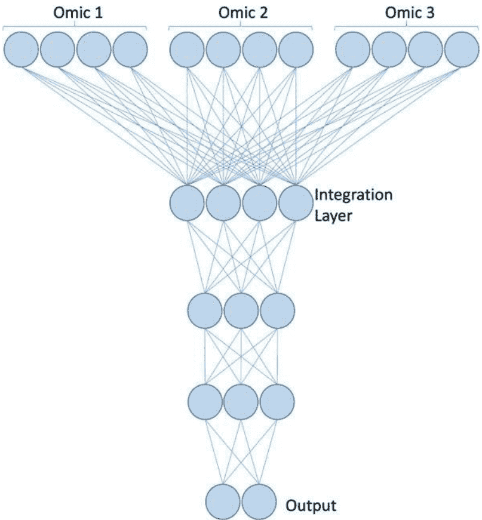

图1ELI模型

## 2.3 后期层集成

多个预测模型在不同的组学上工作。每个模型都是独立于其他模型构建在特定的数据源（组学）上，来自独立模型的结果被集成以对每个患者样本做出最终决策，如图3所示。在这个类别中，集成发生在输出层之前，使用融合层[30]，或者通过多数投票准则来集成模型以选择类别[31]。

Khoshghhalbvasb等人[30]提出了一种多模态深度人工神经网络（ANN），用于利用三种不同模态之间的相互信息来预测乳腺癌的生存率。每个模型都是一个基于特定组学的深度人工神经网络，每一层的值都根据公式（1）计算：

h^{(i)} = \sigma (W_{mj}^{(i)} \times h_{mj}^{(i-1)} + b_{mj}^{(i)})

图3 LLI模型

其中:

+   •σ是一个修正线性单元（ReLu）激活函数[32]

+   •Wm(i)是第i-1到第i个隐藏层之间的权重矩阵

+   •bm(i)j是第i个隐藏层对于模态mi的偏置，融合层将不同的模态m集成为公式 (2) 所示：

h^{(f)} = \sigma (W_{m1}^{(f)} \times h_{m1}^{(f-1)} + W_{m2}^{(f)} \times h_{m2}^{(f-1)} + W_{m3}^{(f)} \times h_{m3}^{(f-1)} + b^{(f)}) (2)

m1 是基于拷贝数改变 (CNA) [33]数据构建的模态，m2 是基于基因表达，而m3 是基于临床数据。 输出层通过连接到融合层来预测结果，即生存率，如下所示：

predicted = \sigma'(W^{(o)} \times h^{(f)} + b^{(o)}) (3)

其中：

W^{(o)}是融合层和输出层之间的权重矩阵

σ'是sigmoid[34]激活函数

b^{(o)}是输出层的偏置

Poirion等人[31]提出了一种混合模型的集成方法（结合了深度学习和机器学习模型），并按照集成学习的范式整合它们的输出。 该模型称为DeepProg [31]，基于来自The Cancer Genome Atlas (TCGA) [35]中32种癌症的多组学数据，包括RNASeq、甲基化和miRNA数据，总共约有10,000个样本。

## 3 乳腺癌

乳腺癌是女性最常见的癌症，也是第二常见的癌症。 2018年新增病例超过200万例[36]。

Sun等人[37]提出了一种多模态深度神经网络，通过整合多维数据 (MDNNMD) 来预测乳腺癌的预后。 该方法的架构属于LLI类别，独立模型的输出通过融合来进行集成，方法的流程图如图4所示。 结果表明，MDNNMD相比于单维数据的预测方法和其他现有方法[37]具有更好的性能。

多维数据来自于异质的臭名昭著的乳腺癌数据集METABRIC [38]。

基于表达谱的多级特征选择(MLFS) [29]方法被提出用于选择基因/ miRNA。 该方法基于深度学习和主动学习(AL)。 该方法使用深度置信网络(DBN) [39]减少了与特定癌症相关的鉴别基因的数量。该模型通过使用众所周知的miRanda数据库[40]提取目标基因的miRNAs, 并最终在选定的miRNAs上应用DBN来检测癌症结果。 MLFS被应用于乳腺癌数据集以预测亚型。

中间集成深度神经网络(MI-DNN) [25]是LLI类别的一个例子。该模型基于多组学TCGA-BRCA数据集[35]预测乳腺癌亚型, 其中基因表达数据和miRNA数据使用TCGA-Assembler工具[41]和lncRNA数据使用TANRIC [42]下载。

尽管作者将该模型称为中间集成(Middle Integration), MI-DNN在集成之前构建了隐藏层, 这恰好是在输出层之前。隐藏层的编号k具有模态m, 其中m的计算方式类似于公式 (1)。

Xu等人提出了分层集成深度灵活神经森林(HI-DFNForest)框架。该框架用于集成乳腺癌亚型预测的多组学数据。对于每个组学数据, 都构建了一个堆叠自编码器(SAE), 将组学矩阵转换为高复杂度的表示。然后, 将所有组学的表示连接起来形成一个输入矩阵, 用于最终的

如图5所示，分类器是深度灵活神经森林（DFNForest）模型。该框架应用于TCGA-BRCA数据集。表1显示了应用的深度学习方法在不同的乳腺癌上。

## 4 结直肠癌

结直肠癌(CRC) 是美国男性和女性每年诊断的第三种最常见的癌症，不包括皮肤癌[43]。2004年，ANN被引入到CRC的肿瘤检测中[44]。182个样本通过使用表面增强激光解吸/电离子谱(SELDI-MS)进行检测[45]。这些样本包括55个CRC患者的样本，35个结直肠腺瘤(CRA) 患者的样本，以及92个健康人的样本。

蛋白质组学方法在癌症诊断中实现了高灵敏度和特异性，并且能够找到CRC的潜在生物标志物。

已经提出了许多用于CRC分析的DL方法[46,47]。胡等人[46]提出了一种机器学习方法，用于区分左侧CRC和右侧CRC，因为它们是不同的疾病。多组学数据集，称为COlOn ADenocarcinoma(COAD) [48]，从TCGA门户网站[35]下载。它包含体细胞突变、DNA甲基化、基因表达和miRNA。Bychkov等人[47]使用结构化卷积和循环架构训练了一个深度人工神经网络，以基于肿瘤组织样本的图像预测结直肠癌五年生存率。

这些图像是被染色的组织病理学图像，使用的染色剂是血红素和伊红染色剂(H&E)。这些图像是肿瘤组织微阵列(TMAs)的一部分，该技术被病理学家用于识别组织实体，如有丝分裂、核形态学多样性、浸润的免疫细胞和肿瘤萌芽。该模型仅

癌症诊断中多组学数据整合的深度学习

265

表1乳腺癌多组学数据集中的深度学习模型

| 类型 | 方法 | 类别 | 数据集 | 准确率 | 预测 | 敏感度 | ROC | 平台 | 硬件 |
|---|---|---|---|---|---|---|---|---|---|
| LLI | MDNNMD | 二分类-肿瘤vs正常 | METABRIC | 82.6 | 0.749 | 0.45 | 0.846 | Tensorflow1.0 | 2个Nvidia GTX Titan Z 图形卡 |
| LLI | MI-DNN | 多分类:正常、一期、二期乳腺癌 | TCGA-BRCA | 83 | 0.83 | 0.83 | 0.97 | Sklearn | - |
| MLF | MLFS | 乳腺癌亚型 |  |  | 0.7815 | 0.6047 | - | Theano |  |
| ELI | HI-DFNForest | 乳腺癌亚型 | TCGA-BRCA | 84.6 | 80.9 | 84 | - |  |  |

该模型可以在没有关于组织实体的先验知识的情况下对TMAs图像进行处理，从而简化了疾病的诊断。然而，TMAs图像的视觉属性无法揭示肿瘤组织中的内在功能分子特征。

缺乏对多组学数据的深度学习应用，以预测CRC的结果使其成为一个有趣的研究领域。

## 5 膀胱癌

患有膀胱癌的人的一般5年生存率为77%。然而，如果膀胱癌是浸润性的，也就是说它已经扩散到身体的远处部位，5年生存率为5%[49]。Poirion等人提出了一个DL自编码器算法，用于预测膀胱癌的生存亚型。ELI模型是基于一个具有mRNA、miRNA和甲基化的多组学TCGA数据集构建的[50]。

样本是使用TCGA-Assembler下载和组装的。该模型是作者之前提出的预测模型的扩展。该模型是一个自编码器，它将多组学特征转换后，再整合生存信息以识别与生存相关的亚型[27]。对于每个样本的组学向量$x=(x_1, x_2, \ldots x_n)$，通过连续的隐藏层进行处理。

对于给定的层$i$，在输入层$x$和输出层$y$之间使用tanh作为激活函数，表示为：

$$y = f(x) = tanh(Wi^* x + bi) \quad (4)$$

考虑有$k$层，该模型具有$k$个函数，形成自编码器，将向量$x$转换为降维向量$x'$，如下所示：

$$x' = f_{1 
ightarrow k}(x) = F_1 \circ \dots Fk_{-1} \circ Fk(x) \quad (5)$$

其中$Fk_{-1} \circ Fk(x)$是两个函数之间的组合函数，表示为$Fk_{-1}(Fk(x))$。该模型通过最小化输入$x$和输出$x'$之间的目标损失函数来获得权重矩阵Wi:

$$logloss(x, x') = \sum_{k}^{n} (x_k log(x'_k) + (1 - x_k)log(1 - x'_k)) \quad (6)$$

该模型使用$L_1$正则化惩罚项$\alpha_w$对权重向量$W_i$进行过拟合控制，并使用$L_2$正则化惩罚项$\alpha$对节点活动进行控制：$F_{1 
ightarrow k}(x)$。因此，上述目标函数变为:

$$L(x, x') = logloss(x, x') + \sum_{i=1}^{k} (\alpha_w ||W_i||_1 + \alpha_a ||F_{1 
ightarrow i}(x)||_2^2) \quad (7)$$

参数 $\alpha_a$ 和 $\alpha_u$ 分别设置为 0.0001 和 0.001，模型选择每个组学中的 100 个降维特征 $x'$，然后应用 Cox 比例风险（Cox-PH）模型 [51] 选择增加膀胱癌患者生存能力的特征。在应用 $K$-means 聚类 [52] 对所有组学的组合特征进行聚类之前，将每个组学的选定特征进行连接。该原始模型旨在识别肝细胞癌（HCC）的稳健生存亚群，以改善患者护理。作者提出了一个基于深度学习的 HCC 模型，能够稳健地区分患者的生存亚群在六个队列中。

最近的一个模型用于分析多组学 TCGA 数据集中的膀胱癌生存率，被称为癌症预后的组套稀疏正则化深度学习（GDP）。GDP 中使用的组学数据首先进行了预处理；基因表达数据使用 RNA-Seq by Expectation-Maximization（RSEM）[53]，拷贝数变异（CNV）数据使用 Genomic Identification of Significant Targets in Cancer（GISTIC 2.0）[54]，标准化的 RPPA 蛋白质表达数据，变异呼叫格式（VCF）[55] 癌症 DNA 体细胞突变数据，以及部分来自 Broad GDAC Firehose[56] 的临床数据。该方法将 DL 框架和 Cox-ph 相结合，并应用组套稀疏正则化 [57] 将基因水平的组先验知识纳入模型训练过程中。组套稀疏正则化和 DL 方法的整体优化过程是为了降低成本，定义如下：

$$C = -l(\beta) + scale \times (\alpha \times \sum_{l=1}^{L} \sqrt{p 1 || W_{1l} ||_2 + (1-\alpha) \times || W_o ||_1)}$$ (8)

## 6 结论

CADs 在癌症患者的诊断和治疗中得到了发展。革命性的 NGS 技术使我们能够从肿瘤细胞中读取不同的组学测量数据。在本章中，我们介绍了深度学习算法来整合这些多源数据。研究人员使用了众所周知的生物数据库来处理和验证其模型的结果。

多组学整合方法的未来方向是使用转移学习（TL）[58] 系统来利用提出的 CADs 在医疗保健系统中。TL 是一种机器学习方法，其中为一个任务开发的模型被重复使用作为第二个任务模型的起点。可重复使用的 TL 系统可以与 NGS 系统中的组学读数集成，以预测癌症的结果。这种基因组学分析系统可以个性化患者的治疗，并将其与适当剂量的药物相结合，以减少这些化学分子的副作用。这可以提高医疗保健系统的效率，并降低冗余不必要的健康实践的高成本。

在这个领域中，另一个方向是根据深度学习方法的结果创建基因面板。许多当前的癌症基因面板是为癌症诊断和治疗而设计的，例如 AmpliSeq for Illumina Focus Panel [59]。

基于最近的计算机方法的基因面板可以用于改善生活质量和提高整体生存率。基于最近的计算机方法的更多基因面板可以用于解决特定癌症问题，以改善生活质量和提高整体生存率。

## 参考文献

+   1. Yehudit Hasin, Marcus Seldin和Aldons Lusis。多组学方法用于疾病。Genome Biology, 18(1): 83, 2017年。

+   2. H Lodish, A Berk, SL Zipursky, P Matsudaira, D Baltimore, and J Darnell. 肿瘤细胞和癌症的发生。分子细胞生物学, 2000.

+   3. H Robert Frost and Christopher I Amos. 一种用于识别人类癌症中重要通路和基因的多组学方法。BMC生物信息学, 19(1):479, 2018.

+   4. ENCODE项目联合会等。人类基因组中的DNA元素综合百科全书。自然, 489(7414):57, 2012年。

+   5. Rajnish A Gupta, Nilay Shah, Kevin C Wang, Jeewon Kim, Hugo M Horlings, David J Wong, Miao-Chih Tsai, Tiffany Hung, Pedram Argani, John L Rinn等。长链非编码RNA hotair重编程染色质状态以促进癌症转移。自然, 464(7291):1071, 2010年。

+   6. Kaladhar B Reddy。癌症中的微小RNA (miRNA)。癌细胞国际, 15(1):38, 2015年。

+   7. Abedalrhman Alkhateeb和Luis Rueda。Zseq:一种预处理下一代测序数据的方法。计算生物学杂志, 24(8):746-755, 2017年。

+   8. Yong Zhang, Tao Liu, Clifford A Meyer, Jerome Eeckhoute, David S Johnson, Bradley E Bernstein, Chad Nusbaum, Richard M Myers, Myles Brown, Wei Li, et al. 基于模型的chip-seq (macs) 分析。Genome biology, 9(9):R137, 2008.

+   9. Christoph Bock. 分析和解释DNA 甲基化数据。Nature Reviews Genetics, 13(10):705, 2012.

+   10. Oluwatosin Taiwo, Gareth A Wilson, Tiffany Morris, Stefanie Seisenberger, Wolf Reik, Daniel Pearce, Stephan Beck, 和 Lee M Butcher. 使用低DNA 浓度的medip-seq 进行甲基组分析。Nature protocols, 7(4):617, 2012.

+   11. Nina P Imke, Diana Santacruz, 和 Jörn Walter. 使用 medip-chip 对哺乳动物组织中的DNA 甲基化进行全面分析。Methods, 53(2):175-184, 2011.

+   12. J Gregory Caporaso, Justin Kuczynski, Jesse Stombaugh, Kyle Bittinger, Frederic D Bushman, Elizabeth K Costello, Noah Fierer, Antonio Gonzalez Pena, Julia K Goodrich, Jeffrey I Gordon, et al. Qiime允许对高通量社区测序数据进行分析。Nature methods, 7(5):335, 2010.

+   13. Elin Org, Margarete Mehrabian, and Aldons J Lusis. 揭示动脉粥样硬化中环境和遗传相互作用的关键作用：肠道微生物群的中心作用。动脉粥样硬化,241(2):387-399, 2015.

+   14. Anna Klindworth, Elmar Pruesse, Timmy Schweer, Jörg Peplies, Christian Quast, Matthias Horn, and Frank Oliver Glöckner. 评估用于经典和下一代测序的通用16s核糖体RNA基因PCR引物的多样性研究。Nucleic Acids Research,41(1):e1-e1, 2013.

+   15. Osama Hamzeh, Abedalrhman Alkhateeb, Julia Zhuoran Zheng, Srinath Kandalam, Crystal Leung, Govindaraja Atikukke, Dora Cavallo-Medved, Nallasivam Palanisamy和Luis Rueda。一种用于发现前列腺癌格里森分级特异性生物标志物的分层机器学习模型。诊断, 9(4): 219, 2019年。

+   16. 计算机辅助诊断：数字病理学的转折点，2020年。 https://digitalpathologyassociation.org/blog/computer-aided-diagnosis-the-tipping-point-for-digital-pathology/ [在线；最后访问时间为2020年6月]。## 使用深度学习与加拿大初级保健数据进行疾病诊断

Hasan Zafari, Leanne Kosowan, Jason T. Lam, William Peeler, Mohammad Gasmallah, Farhana Zulkernine和Alexander Singer

### 摘要
加拿大大多数初级保健系统以电子病历的形式记录患者数据。电子病历包含有关患者的结构化、半结构化和非结构化的人口统计和医疗数据。电子病历数据在研究、健康监测和质量改进方面的价值仍在探索中。数据分析技术,如机器学习和统计建模技术,已应用于去标识化的电子病历数据存储库,以推进我们对不同健康状况和患者护理的理解。最近,深度学习方法在结构化、半结构化和非结构化的电子病历数据中的应用正在被研究,以改进对健康状况的识别。监督式机器学习方法在更常见的疾病分类中占主导地位。使用监督学习方法训练机器学习模型需要大量标记数据。对于较不常见的疾病,可用的标记数据往往不足,因此正在探索各种策略来处理不充分、嘈杂和缺失的数据。本章描述了使用电子病历数据进行研究以改善初级保健设置中的医疗供应的深度学习模型的好处。讨论了几个著名的深度学习模型,如多层感知器(MLP)、卷积神经网络(CNN)和循环神经网络(RNN),并提供了一些示例场景,展示了这些预测分析模型在结构化和非结构化电子病历数据上的应用,使用常规和弱监督方法诊断常见和非常见疾病。

### 关键词
深度学习 · 机器学习 · 医学数据分析 · 电子病历 · 疾病诊断 · 自然语言处理

### 作者信息
H. Zafari · J. T. Lam · M. Gasmallah · F. Zulkernine (☑)
计算机学院,女王大学,加拿大金斯顿
电子邮件: farhana.zulkernine@queensu.ca

L. Kosowan · W. Peeler · A. Singer
家庭医学系,Max Rady医学学院,Rady卫生学院
马尼托巴大学,加拿大温尼伯

© Springer Nature Switzerland AG 2021
M. Elloumi (ed.), 深度学习在生物医学数据分析中的应用, 
https://doi.org/10.1007/978-3-030-71676-9_12

# 1 引言
加拿大的医疗保健是省级/地区级的责任。符合加拿大医疗法规定的省份和地区可以获得联邦资金用于医疗保健。行政医疗健康记录包括用于计费和登记目的的信息。这些记录由省级/地区级管理机构存储和维护，并提供一个可用于研究和疾病监测的大规模人口数据存储库。然而，这些记录在临床细节方面不如初级医疗保健的电子病历 (EMR) 详细。

初级卫生保健通常是个人与卫生系统的首次接触。初级保健提供者包括家庭医生、护士执业者和社区儿科医生，他们在社区内提供卫生服务，包括初级预防、次级预防和疾病管理。在加拿大，过去20年中，电子病历的使用已经变得很普遍。

在初级保健中，从传统的纸质记录转向电子病历产生了各种改进，包括易读性、可访问性和结构性，同时引入了旨在降低总体成本的效率。电子病历旨在改善医疗保健的提供[1]。现在，电子病历在疾病监测、疾病症状的高级分析、质量改进、实用临床试验以及通过与行政卫生记录和初级保健电子病历的链接来研究医疗保健连续性[2-6]方面得到应用。现代电子病历通常包含的信息类型包括人口统计信息、生物测量信息 (如身高、体重和血压)、问题列表、健康/生活方式行为、个人和家族病史、计费信息、处方药物、实验室检测结果以及转诊至跨专业医疗保健服务。初级保健电子病历提供了患者健康的纵向数据，包括疾病进展的详细信息。

在加拿大，加拿大初级保健哨兵监测网络 (CPC-SSN) [8]提供了一个全国性的初级保健EMR数据存储库[6,8]。CPCSSN拥有来自1800多名初级保健提供者在近500个诊所中为超过200万名加拿大人提供护理的去标识化EMR数据[8]。

因此，它提供了一个可以通过研究进行分析和探索的大量数据来源[9]。在获得研究机构和CPCSSN的道德批准后，加拿大的研究人员可以访问选定的患者匿名化数据进行研究[10,11]。CPCSSN数据集包含在表格中可用的数据，例如接触表、药物表、实验室和检查结果表。已经发表了验证研究，概述了一些慢性疾病的病例定义算法，包括高血压[5]、2型糖尿病[4,5]、抑郁症[5]、帕金森病[5]、骨关节炎[5]、慢性阻塞性肺疾病 (COPD) [5]、癫痫[5]、痴呆
[5], 儿童哮喘[3], 多发性硬化[2], 血脂异常[12], 慢性肾病
[13]，带状疱疹[14]。电子病历中还提供了其他急性和慢性疾病的文档，这些病例定义尚未经过验证。

最近,人们开始努力了解医疗保健提供者的电子病历会诊记录对健康研究的价值。我们正在进行的一个研究项目专注于使用经过过去识别的初级保健提供者的自由文本会诊记录来研究一般人群和军人/退伍军人群体中患有创伤后应激障碍(PTSD)的症状、发展和医疗保健提供情况[15]。有些疾病,如创伤后应激障碍(PTSD)，仅基于结构化的电子病历数据很难诊断和预测。提供者的笔记中的自由文本数据可以提供有关创伤后应激障碍(PTSD)的诊断和进展的有价值信息。

尽管来自电子病历的初级护理数据在许多研究中被证明是无价的,但在整理这些数据时存在一些挑战。加拿大的初级护理诊所使用不同的电子病历系统(例如TELUS [16]，QHR[17],Oscar[18])。每个电子病历以不同的方式存储医疗信息,并由不同的信息技术(IT)公司支持。数据提取系统必须经过精心设计和定制,以适应每个电子病历和诊所,并在IT支持公司的帮助下,对预定义的一组选定的数据字段进行过滤、提取和转换,然后将其加载和追加到现有的CPCSSN数据中。此外,输入到电子病历中的信息容易受到人为错误和医生的偏见的影响。尽管如此,CPCSSN和加拿大的初级护理电子病历数据对于研究具有重要价值,特别是在机器学习技术的进步方面[19]。

深度学习的历史可以追溯到1943年,当时沃尔特·皮茨和沃伦·麦卡洛克基于神经网络创建了一个计算认知模型[20]。机器学习的应用在2010年真正蓬勃发展,得益于快速计算平台的并行进步、数字信息的可获得性以及最先进的机器学习算法的进展[21-23]。传统的数据探索算法依赖于历史数据和人类领域专家精心设计的技术,这些专家了解数据,并能够选择数据的重要方面并设计算法来转换数据和提取知识[25-27]。

相比之下，现代机器学习算法旨在自动学习数据的重要方面或特征,并根据共同特征对数据进行分类[28,29]。因此,随着数据的变化,模型可以重新训练或设计,以自动适应影响结果的新特征。深度学习模型被设计为在多个层次组织的层中执行学习。在每个层次上,信息被精炼和过滤,以从信息中提取关键方面,从而创建最终的分类。深度学习方法已经应用于复杂数据,如非结构化文本、语音、信号和图像数据,用于对文本进行分类、生成回复、识别图像中的对象、将语音转换为文本和文本转换为语音,并从复杂的混合数据中转换和提取重要特征[30]。

本章的其余部分按照以下方式组织。在第2节中,我们将提供有关电子病历数据的提取和处理的进一步信息。在第3节中,回顾了不同类型的机器学习模型,重点关注深度学习模型。第4节## 2 CPCSSN的电子病历数据提取和处理
用于研究

机器学习方法的设计在很大程度上取决于：（1）布局，（2）数据类型和（3）研究目标。在本节中，我们描述了电子病历数据的提取工作流程，并解释了CPCSSN数据库的结构和内容，我们将用它来开发、训练和验证深度学习模型。

### 2.1 电子病历数据类型

所有电子病历中存储的健康数据有三种基本类型：结构化数据、半结构化数据和非结构化数据。电子病历中的结构化数据可以被描述为具有预定义的数据结构或参考集，这些结构或参考集可能由外部医疗或政府组织开发和维护。数据的示例包括患者的个人资料，如姓名、出生日期和健康卡号；健康数据，如身高、体重、血压（BP）和体重指数（BMI）；以及标准化的计费或服务代码（由省级规定）、诊断代码（即ICD9/10或SNOMED）、药物代码（即DIN或ATC）和实验室测试（即HL-7）。电子病历中的半结构化数据项包含了混合数据类型，如数字和文本，但遵循某种结构，如风险因素行为。非结构化数据项通常包含混合数据类型，并且在表示上没有结构或格式，例如医生的病历笔记中的叙述文本，记录了医生在患者就诊期间的观察。通常这些记录遵循问题导向的记录模型。

例如，一个SOAP笔记包括以下标题来组织笔记，即主观、客观、评估和计划。自由形式的输入也可以在EMR的其他部分中找到，其中允许输入而没有任何内容限制。

### 2.2 挑战

从许多不同的EMR系统中提取信息进行研究的一个关键挑战是数据的表示和存储结构缺乏标准。虽然已经在一些地方采用了详细的数据传输标准，如Fast Healthcare Interoperability Resources (FHIR) [33]，但这些标准尚未成为加拿大初级医疗保健EMR系统的常规标准。然而,EMR数据库在存储的数据类型方面具有共同的特点。值得注意的是,大多数半结构化数据元素通常与具有定义参数的数据元素相关联,可以进行映射[33]。

在加拿大,访问和使用患者的医疗信息受省级法规和地区政策的管制,这些法规和政策定义了保护个人隐私和禁止不当披露数据的具体要求。此外,所有地区的机构使用这些数据都需要获得相应的研究伦理委员会(如大学、研究中心)的批准,这些委员会遵循三方委员会的政策[10,11]。

### 2.3数据提取、匿名化、传输和加载

2008年,由加拿大公共卫生局资助的CPCSSN在全国范围内建立了一个收集患者健康信息的网络。自成立以来,CPCSSN已经发展和完善了其收集和存储初级保健电子病历数据的流程。CPCSSN由区域网络组成;每个区域CPCSSN网络都雇有一名数据管理员,负责从参与医生的电子病历中进行半年度数据提取。

区域电子病历数据经历了一系列的提取、传输和加载(ETL)过程,以适应一个共同的数据库结构。在进行任何二次用途之前,数据经过去识别化处理,患者标识符被删除,数据被匿名化。

从区域网络中派生的匿名化数据集在合并为一个国家集中的CPCSSN研究数据库之前,通过一套全国标准化的流程。CPCSSN的一些区域网络,如马尼托巴初级保健研究网络(MaPCReN)[34],已经开始从初级保健提供者的叙述性笔记中提取、去识别化和处理非结构化数据的工作。我们目前的研究借助于来自超过56,000名患者的笔记,这代表了近一百万次患者-医生的接触。叙述性医生笔记包含了许多领域的健康研究中可能有用的宝贵信息。然而,仍然需要进行大量的工作来解决个别派生叙述的困难,例如拼写错误的单词、非典型或不规则的句子结构、大量使用括号表达式、句子或短语的不可预测重复、术语的戏剧性地方变化以及特定术语/缩写/首字母缩写的使用。图1显示了在收集和构建CPCSSN数据存储库中数据流的过程。

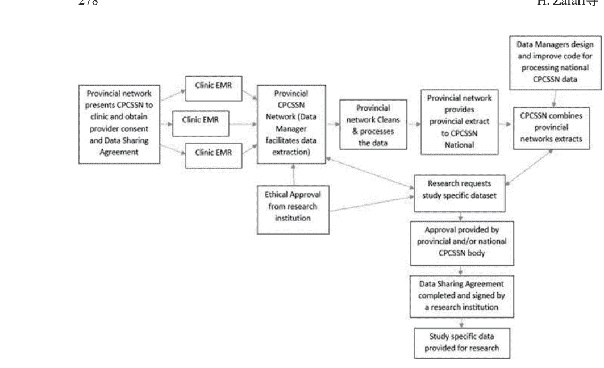

图 1 CPCSSN 数据流程图

## 3 医疗决策支持系统中的人工智能

通常认为,四个实验系统是在医学中应用人工智能算法的研究开始的 [35]。这些系统包括: MYCIN,一个为患有菌血症或脑膜炎的患者提供抗菌药物选择建议的程序 [38]; Present IIIness Program (PIP),一个收集数据并生成关于肾脏疾病患者疾病过程的假设的系统 [37]; INTERNIST-I, 一个用于诊断复杂内科问题的大型系统 [36]; 以及 CASNET, 一个眼科顾问,用于评估疾病状态并为青光眼患者提供管理建议 [39]。这四个系统都利用了人工智能技术,强调了从临床文献和领域专家获得的大量专业医学知识的有用性。然而,基于规则的专家系统在提取显性和隐性专家知识以及不断更新算法以包含新知识和信息方面面临挑战。

因此,正在探索其他人工智能技术。

经典的统计技术已经应用于医学数据,例如,学习关键疾病爆发的患者人口统计分布 [40-42]。随着大量电子和数字医疗信息的可用性,数据驱动的机器学习算法逐渐发展。这些算法是基于患者数据库构建和训练的。人工智能模型会自动从数据中学习最优参数值和决策规则。因此,当数据发生变化时,模型可以适应这些变化以继续提供所需的结果。

提供所需的结果。风险在于模型被输入错误的数据，这可能会降低模型的准确性和性能。

深度学习模型的最近成功以及数字电子病历的日益可用，激发了研究人员将深度学习应用于医学数据分析，包括分析医学文本报告[29,43]、放射学图像[44]以及监测患者生命体征的仪器信号[45]。深度学习模型被结构化为多个层次，每个后续层次从各种数据项中提取、过滤、精炼、转换和选择重要特征，帮助对数据进行分类或学习特征的映射，以获得最终的决策结果，如诊断。

监督学习方法可以使用标记数据（例如患者的健康数据）来训练机器学习模型。训练过程是迭代进行的，直到模型能够产生令人满意的结果。如果没有给定标签（例如诊断结果），则可以应用无监督学习方法来训练模型，从数据中提取和分组类似特征，例如疾病症状。在特定的医疗决策支持系统（MDSS）使用案例场景中，将讨论一些常用的深度学习模型。

MDSS从多年的数据中提取患者记录的重要方面，减少诊断时间和人为错误，并探索有关疾病、疾病症状、药物和治疗方法的新知识。MDSS可以检测到旧症状的重新出现或多个微小症状的共同出现，并指示严重的健康问题。通过与初级保健、医院和长期护理机构等多个数据源链接的诊断信息，可以改善结果。然而，在加拿大，由于严格的隐私和保密政策，患者记录被匿名化并保存在医疗保健机构之外供研究人员访问。这个过程可以防止研究人员或研究结果中的重新识别患者的情况。

### 3.1 机器学习模型的类型

传统上，在文献中存在两种主要的机器学习模型：传统机器学习模型和基于深度学习的模型。这些传统模型应用统计算法来从数据中提取知识、发现模式，并学习参数以优化模型的目标，随着新数据的到来。另一方面，深度学习模型基于人工神经网络（ANNs），这些网络最初是受生物神经网络的启发而定义的，用于模拟人脑的生物神经结构和功能。ANNS被设计为由连接的人工神经元组成的网络，如图2中的圆形节点所示，这些神经元是简单的并行处理数据的计算单元。数据从输入层流向输出层，通过一个或多个隐藏层。

人工神经元之间的连接具有关联的权重，这些权重随着ANN从数据中提取和组合特征，或者根据数据中特定特征的存在对数据进行分类而改变。例如，模型可以学习到根据症状的相似性,将所有类型的精神疾病聚类到一组中。或者,可以训练一个模型来对特定类型的背痛进行分类或预测,在学习将症状和药物映射到特定诊断之后。

在特征集中学习相似性时,不需要标签(例如诊断)。在给定大量样本数据的情况下,模型可以学习从数据中提取相似模式并将其分组在一起。然而,要训练模型将类标签与提取的特征集(如流感或肺炎)关联起来,必须在训练数据中提供标签。标签的存在使得模型能够迭代地调整权重,直到能够以令人满意的准确度预测类标签。在机器学习范式中,回归、分类和聚类是最常见的应用[46]。其他应用包括特征提取和降维、数据转换、数据分布生成和模式识别[47]。

### 3.2 机器学习算法

传统基于规则的模型和机器学习模型之间的关键区别在于模型参数的定义方式。与在模型预设时通过计算确定的静态参数集不同，机器学习模型可以具有可变数量的参数，其值通过迭代地优化基于大量训练数据的准则来学习。数据集通常被分为三个不同的集合，分别是训练集、验证集和测试集。

重叠即训练、验证和测试数据。一旦使用训练数据学习到参数值,可以根据预定义的准则（如预测准确性)对模型进行验证。通常使用验证集选择表现最佳的训练模型。训练过程通常会重复多个周期 (一个周期是对训练数据集的完整遍历)。

最后, 模型在一个从未见过的测试数据集上进行测试, 以评估其性能和泛化能力。如果没有足够大的数据集可用, 验证步骤通常会被跳过。

机器学习算法主要有三种类型。错误修正学习定义了一种计算模型性能误差并逐渐减小误差的方法, 通过对参数值进行一些策略性调整来实现 [60]。

强化学习算法旨在最大化预定义的目标或结果, 并逐渐调整参数值以制定此目标的策略 [61]。相关学习算法允许模型学习训练数据中不断共现以生成相似结果的不同特征之间的强相关性 [62]。

错误修正学习需要有标签的数据, 其中标签表示预期结果, 以对模型参数进行必要的修正。这也被称为监督学习方法, 其中标记的数据通常被称为地面真实数据 [63]。反向传播是一种流行的算法, 它通过计算输出层的误差,将误差的梯度向后传播到输入层,并对不同层的相关权重值进行比例调整,从而实现学习 [64]。监督学习常用于训练机器学习模型将数据分类为预定义的类别。训练好的模型可以应用于预测新数据中的未知类别标签。监督方法已经应用于使用社交媒体数据进行情感分析 [67]、犯罪指控预测 [68-70] 和基于症状的疾病预测 [71]。应用监督学习的一个重要困难是需要大量标记数据 [71], 这在特别是需要由医生等领域专家进行标记时可能很难获得。为了解决这个问题, 已经应用了多种增强和上采样训练数据的策略。

以及其他半监督学习算法[65], 例如稍后解释的弱监督学习算法[66]。

在没有标记的训练数据的情况下,可以应用强化学习[61]和相关学习[62]算法的变体。 例如,为了学习有效地对相似数据样本进行分组的参数值,我们可以最小化同一聚类中数据样本之间的距离。 类似地,相关学习模型会给网络中产生相似结果的链接赋予更大的权重值。 这种模型可以根据样本数据集中其他数据项的值来填充缺失的数据值,并且通常用于建模人类记忆。 由于这些算法不需要标记的数据,它们被称为无监督学习算法。 由于大多数现实世界的数据都没有标记,研究人员目前正在开发用于静态和流式数据的无监督学习算法[72]。

在接下来的章节中,我们首先描述了MDSS范式中DL模型应用的最新研究。接下来,我们讨论了DL模型在医疗数据中的几个应用示例。 由于隐私、安全和可靠性的考虑,MDSS中真实生活中的ML应用很少,本章中给出的所有示例都来自使用结构化、半结构化和非结构化EMR数据的研究研究。

## 4. 医疗保健中的最新DL研究

最近在MDSS领域的研究集中在使用通过定制患者问卷、与领域专家的访谈、通过指定机构收集的电子健康记录(EHR)、医院和临床数据或其他可访问的数据和知识源(如在线信息、期刊和医学本体)获得的医疗数据来开发和验证ML模型。 问题以及数据的类型和结构(如数字、信号、文本、图像和混合结构化、半结构化或非结构化数据)影响ML模型和算法的选择。 表1总结了最近在MDSS中开发和应用DL模型的一些研究,随后对这些研究工作 进行了简要讨论。

随着电子病历的广泛应用和深度学习在许多领域的成功,研究人员已经开始使用深度学习来处理电子病历数据,用于各种临床信息学应用。 这些应用包括疾病预测、分类和推理[28,29,55,74,75,77,78,80,84,86],患者数据的总结和表示[43],医学概念的可解释表示[73],出院再入院可能性的估计[74],医学概念之间的关系提取[76],最佳药物剂量的确定[79],疾病爆发的识别[87],患者轨迹建模[74,89]以及临床决策支持系统的设计[82,83]。

| 参考文献 | 姓名 | 数据来源 | 目标 | 深度学习模型 | 学习 |
| :--- | :--- | :--- | :--- | :--- | :--- |
| Choi等人[73] | Med2Vec | 结构化和自由文本的电子病历数据 | 学习可解释的医学概念表示，无需依赖专家知识 | 多层感知机 | 有监督的 |
| Pham等人[74] | Deepcare | 结构化和自由文本的电子病历数据 | 疾病预测，推荐干预措施，估计非计划再入院 | LSTM | 有监督的 |
| Choi等人[28] | 医生AI | 结构化的电子病历数据 | 预测随后就诊的所有诊断和药物类别 | GRU | 有监督的 |
| Wickramasinghe等人[75] | Deeppr | 结构化和自由文本的电子病历数据 | 医疗服务中的预测分析 | CNN | 有监督的 |
| Liu等人[29] | 深度电子病历 | 自由文本笔记+结构化电子病历数据 | 疾病发病预测 | CNN, LSTM | 有监督的 |
| Lv等人[76] | 不适用 | 临床电子病历数据的文本 | 医学概念之间的关系提取 | 自编码器，CRF | 有监督的 |
| Mallya等人[77] | 不适用 | 结构化和文本的电子病历数据 | 预测充血性心力衰竭的发病 | LSTM | 有监督的 |
| Nie等人[78] | 不适用 | 来自HealthTap的问题和答案 | 一种用于根据健康求助者的问题推断可能疾病的深度学习方案 | 多层感知机 | 有监督的 |
| Nemati等人[79] | 不适用 | 结构化的电子病历数据 | 找到最佳药物剂量 | 深度强化学习 | 有监督的 |
| Choi等人[80] | RETAIN | 结构化的电子病历数据 | 疾病预测模型 | 注意力，循环神经网络 | 有监督的 |
| Ong等人[81] | 不适用 | 从传感器获取的数据 | 预测细颗粒物浓度，时间序列预测 | 深度循环神经网络，自编码器 | 有监督的 |
| Choi等人[55] | 不适用 | 结构化和文本的电子病历数据 | 预测心力衰竭的初步诊断 | GRU | 有监督的 |
| | | | | | (续) |
| Che等人[82] | 可解释的模仿学习 | 结构化的电子病历数据 | 学习可解释的表型特征，临床决策支持系统 | 堆叠去噪自编码器，长短期记忆网 | 有监督的 |
| Jagannatha等人[83] | 不适用 | 非结构化的电子病历笔记文本 | 检测药物、诊断和不良药物事件 | LSTM, GRU | 有监督的 |
| Bhatt等人[84] | 不适用 | 结构化的电子病历数据 | 预测败血症的发作 | 前馈模型 | 有监督的 |
| Kinjo等人[85] | 不适用 | R-R间隔传感器数据 | 患者的压力估计 | 深度神经网络 | 有监督的 |
| Hu等人[86] | 不适用 | 非结构化的EMR数据 | 使用EHR数据进行罕见疾病分类 | CNN | 有监督的 |
| Zhao等人[87] | Simmest | 社交媒体数据 | 疾病爆发识别 | 多层感知机 | 半监督 |
| Banerjee等人[88] | 不适用 | 非结构化的EMR数据 | 评估患者中心结果的存在、缺失或风险讨论 | 神经词嵌入，多项式逻辑模型 | 弱监督 |
| Beaulieu-Jones等人[89] | 无 | 结构化和文本数据的EMR | 建模纵向临床数据，预测患者生存 | 自编码器，LSTM | 无监督，监督 |
| Miotto等人[43] | 深度患者 | 结构化和文本临床记录 | 从电子健康记录数据中获取患者表示，以促进临床预测建模 | 自编码器 | 无监督 |

## DL在EMR中的应用示例场景

本节描述了我们在DL模型应用于EMR方面的一些研究。DL模型可用于开发MDSS以及从大量医学文本数据中提取知识。使用结构化和半结构化EMR数据开发了简单的MLP模型以及其他统计模型，用于预测疾病诊断，如高血压[19]、COPD[7]和PTSD[32]。DL模型在处理复杂文本数据方面特别有用。我们已经实施了不同的DL模型，使用非结构化的自由文本笔记数据和结构化的EMR数据来预测PTSD[32]和背痛[31]。

图5 从原始数据到机器学习的数据流程 [93]

## 5.1 数据预处理

将数据准备成可用于构建和训练机器学习模型的格式是人工智能的关键部分。使用可能包含错误、噪声或缺失值的坏数据可能导致不正确或无效的模型。数据预处理的挑战因不同类型的结构化、半结构化和非结构化数据以及数据建模的目标而异。我们在本节中描述了一些常用于处理电子病历数据以开发医疗决策支持系统的数据预处理技术，其中一些技术已在我们的研究中应用，如下一节所示。

将数据预处理为机器学习所涉及的是数据工程和特征工程，如图5 [93]所示。数据工程是将原始数据转换为准备好的数据的过程。原始数据是指没有经过任何预处理的数据。准备好的数据是指已经解析、连接并以表格形式呈现的数据集[93]。这些数据已经按正确的粒度进行了聚合和总结。例如，数据集中的每一行代表一个独特的患者，无关的列被删除，无效的记录被过滤掉。然后，特征工程进一步处理准备好的数据，以创建用作机器学习模型输入的特征。深度学习模型可以通过多个层次进行特征工程和提取。工程化特征是指经过调整的特征，作为机器学习模型的输入，或者由机器学习模型提取和转换以生成最终结果的数据集。特征工程操作可以包括对准备好的数据集执行某些机器学习特定的操作，包括将数值列缩放到0到1之间的值，剪切值，将多个值合并为一个值，以及对分类特征进行独热编码。

## 5.1.1 处理结构化和半结构化EMR

在CPCSSN和MaPCReN EMR中，原始数据以多个表格的形式组织在数据库中。不同的表格包含了患者就诊数据、患者人口统计学数据、疾病代码、处方药信息、风险因素、健康状况和账单数据。

在这些原始数据中,患者记录的数量和数据的大小差异很大。有些患者更频繁地就诊于医生,并且有大量的数据、多个风险因素、药物治疗和复杂的健康状况,而其他患者在EMR中可能只有很少的记录。在应用机器学习算法之前,需要对数据进行数据和特征工程处理。

## 5.1.2 处理分类数据

分类变量是那些值为字符串或标签的变量。这种类型的变量在医学数据中非常常见。例如, MaPCReN数据中的疾病变量是一个表示不同健康状况的分类变量。作为特征工程的一部分,分类变量被转换为数值变量。这个目的上最著名的方法是独热编码。它将每个类别值转换为二进制值,并将1或0的值分配给它,以指示该特征是否存在。例如,独热编码会将疾病变量转换为二进制值,其中不同的数字通过1或0的值表示是否存在疾病状况。

虽然一位热编码是一种有用的编码方法,但由于可能存在的唯一值较多,将其应用于MaPCReN数据中的某些变量将是不切实际的。例如,药物是一个具有超过1300个名称的分类变量。如果我们使用一位热编码表示它,得到的特征集将有超过1300列。幸运的是, MaPCReN数据中的一些变量与标准代码相关联,便于编码过程。例如,每个药物名称都与一个解剖治疗化学(A7C)分类系统代码[97]相关联。使用A7C代码的前三位数字使研究人员能够对药物进行分类,这不仅减少了类别数量,还考虑到了类似药物组的使用变化。

## 常规数据清洗和平衡技术: 归一化和平衡数据

通常还有其他步骤来帮助机器学习算法构建更好的预测模型。对于结构化数据,特征工程操作包括特征调整,通过缩放和归一化数值、填充缺失值、剪切异常值和调整具有偏斜分布的值来改善特征的质量[93]。

在创建机器学习模型时,尤其是在医疗领域,常见的问题是数据不平衡,即只有少部分患者患有感兴趣的疾病,而大多数标准机器学习算法期望平衡的类别分布。解决这个问题的一种方法是对数据集进行重新采样,使得正负实例的数量相同。这个过程包括重复随机抽样、少数类过采样和分层划分等技术。

## 5.1.2 处理非结构化文本数据

自然语言处理（NLP）是人工智能的一个子领域，致力于理解和从自然语言文本数据中提取含义。 在处理医疗数据时，处理医疗笔记的挑战包括频繁使用医学术语、频繁使用缩写、解释否定或不确定表达以及对健康状况的主观评估。 解释医学术语并为诊断健康状况赋予一个重要性值需要使用字典或医学本体论。 对于一些结构化和半结构化的医疗数据，如血压、体重、身高和药物，除了非结构化的电子病历就诊记录外，还可以提供重要的信息用于检测医疗状况、评估严重程度或预测进展。

由于不同医生的主观写作风格，来自医疗保健提供者的文本数据在处理上存在几个挑战。 一些诊所可能有助手将医生的手写笔记转换为电子数据，而其他提供者可能使用语音转文本生成器等工具。 所有这些都会引入数据中的噪音和错误；此外，就诊记录通常包含不完整的句子、领域特定的医学术语和缩写。 下面描述了一些常用的文本处理方法。

在处理非结构化数据时，深度学习通过将领域知识集成到模型架构中，实现了基于领域知识的特征工程。 与其他深度学习模型一样，卷积层是一种自动特征提取器[94]。 以下三种方法通常用于将文本记录转换为数值向量：

- 1.词袋模型：包括已知单词的词汇表和衡量单词在文档或文本语料库中出现的程度[95]。 它可以有两种形式创建：

- (a) 词袋模型（一元模型）

- (b) 词袋模型(n-gram模型)

- 2.信息提取工具：自动从文本中提取结构化信息，以概念或命名实体的形式[96]：

- (a) 命名实体链接将不同的名称关联到同一实体

- (b) 关系抽取识别概念之间的关系

- (c) 本体映射通过将生物医学文本映射到UMLS元词表来添加注释

- 3. 词嵌入：两种著名的词嵌入方法是：

- (a) Glove [105]

- (b) Word2Vec [112]

词袋模型涉及已知词汇和文档或文本语料库中已知词汇存在程度的度量，通常计算为词频-逆文档频率 (TF-IDF) 分数 [95]。

词汇可以使用文本中的所有单词或单词子集 (一元模型或1个单词) 或n-gram (例如, bigram 表示2个连续单词) 来创建。 然后，通过计算语料库中每个文档的单词或n-gram 的分数，可以计算出向量表示 [98]。 通常，在创建词汇表和计算分数之前，对文本标记进行词干提取和词形还原处理 [99]。

信息提取 (IE) 是自动从文本数据中提取和编码临床信息的任务[100]。 IE使用以下方法对提取的概念进行注释： (i) 命名实体链接，将指代同一实体的名称关联起来； (ii) 关系提取，识别概念之间的关系； (iii) 通过将生物医学文本映射到统一医学语言系统 (UMLS) 元词库[106]来提供注释。 在临床领域中，最常用的IE工具是cTAKES[101]和MetaMap[102]。 cTAKES是由Mayo Clinic开发并后来转移到Apache项目的最常用工具。 它基于多个Apache开源项目构建，包括Apache Unstructured Information Management Architecture (UIMA) 框架[103]和Apache OpenNLP工具包[104]。 它包含多个用于不同语言学临床任务的分析引擎，例如句子检测、分词、词性标注、概念检测和规范化。 它使用UMLS元词库[106]对医学概念进行注释。 图6显示了一个由cTAKES处理的示例句子。

图6Apache cTAKES 输出示例[31]

词嵌入是一种表示方法, 允许具有相似含义的单词具有相似的向量表示。为了做到这一点, 文本通常被分割成标记, 其中一个标记可以是一个单词、标点符号或特殊字符。然后, 可以使用预训练的词嵌入来转换标记。两种广泛使用的嵌入是全局向量 (GloVe) 用于单词表示[105]和Word2Vec [112]。尽管这两种嵌入方法相似, 但存在一些关键差异。GloVe试图利用全局上下文, 它创建一个包含经常出现在目标词周围的单词的大型共现矩阵, 并通过矩阵缩减计算最终的嵌入。而Word2Vec是一个简单的人工神经网络, 它试图通过使用定义窗口中的上下文词来预测目标词, 这两种技术都有在线预训练向量可用。由于好的嵌入是基于大型文本语料库定义的, 训练机器学习模型来创建词嵌入需要大量的计算能力。在实践中, 这两种技术产生类似的结果, 更多的研究人员倾向于使用GloVe嵌入, 因为它更能捕捉全局上下文[105]。在嵌入之后, 文本段被编码为向量表示。

深度循环神经网络在文本编码方面取得了巨大成功[109]。文本中的每个标记都被视为模型在每个时间步的输入, 隐藏状态学习单词标记的上下文, 输出层生成序列中预测的下一个单词。因此, 每个时间步的隐藏状态被认为代表了每个单词标记的编码。在深度循环神经网络中, 最终的隐藏层表示了所有先前状态的综合, 因此也表示了当前单词标记的上下文向量。这种编码方法被认为是一种单向嵌入的方法, 表示只在一个方向上向前传播。

不幸的是, 单向编码经常无法捕捉到长期依赖关系。人工神经网络通过乘法生成隐藏表示, 随着序列变得越来越长, 来自序列早期标记的信息开始减弱。这自然导致上下文向量只能表示序列的后部分。为了解决这个问题, Schuster等人提出了一种双向方法, 以便从两个方向上学习上下文, 使模型能够学习长期依赖关系。2005年, Graves等人将双向方法扩展到包括LSTM。双向LSTM将文本序列分别输入到第一个LSTM中的正向方向和第二个LSTM中的反向方向, 并将它们的表示连接起来。使用双向方法, 每个时间步现在都可以从过去（即从序列开始到当前标记）和未来（即从当前标记到序列末尾）的信息中获得信息。

## 5.2 模型验证方法

常用的性能指标用于评估分类模型的效率是准确率、敏感性、特异性、精确率、召回率和曲线下面积 (AUC) 。计算这些指标的公式如下。这里TP表示真正例，即模型正确将数据分类为正类，TN表示真负例，即模型正确将数据分类为负类。FP表示假正例，即模型错误将数据分类为正类，而实际上它是负类。类似地，FN表示假负例，即模型将正类标记为负类。虽然准确率、精确率和召回率在机器学习研究中常用，但敏感性和特异性在医学研究中更常用。

准确率= (TP + TN) / (TP + FP + FN + TN)

精确率 = TP / (TP + FP)

召回率 =敏感性 = TP / (TP + FN)

特异性 = TN / (TN + FP)

接收者操作特征曲线 (ROC) 图是一种可视化分类器性能的技术[110]。该曲线通过在不同的阈值设置下绘制敏感性与 (1-特异性) 之间的关系来创建。曲线下面积 (AUC) [92]是ROC曲线下单位正方形面积的一部分，其值始终在0和1之间。最佳的预测方法将在ROC空间的左上角或坐标 (0,1) 处得到一个点，代表100%的敏感性 (无FN) 和100%的特异性 (无FP)。

## 5.3 研究研究

在本节中，我们展示了一些研究研究，展示了各种深度学习模型在分析EMR数据进行疾病诊断作为MDSS的应用。我们还包括其他研究人员的一些研究，以提供医学领域其他深度学习模型的示例。

## 5.3.1 使用结构化EMR数据预测高血压

LaFreniere等人[19]利用了CPCSSN数据集中包含185,371名初级保健患者被诊断为高血压和193,656名对照组即没有任何慢性病的个体的非常大的样本量。

目标是开发一个用于CPCSSN数据中最常见的慢性疾病高血压的预测模型。EMR数据包括有关患者当前健康状况、病历和人口统计学信息的信息。 感兴趣的因素从CPCSSN数据库的多个表中提取。 数据被聚合到一个主表中进 行清理和预处理，例如分配类别值（将数值转换为分类特征）。 最终的特征集包括年龄、性别、BMI、收缩压和舒张压、高密度和低密度脂蛋白、甘油三酯、胆固醇、微量白蛋白和尿白蛋白肌酐比。 由于人工神经网络在许多数据领域已被证明具有潜力，并且作为增量学习器和预测器取得了很大成功，因此在本研究中使用了该方法来预测高血压。 由于高血压是最常见的慢性疾病，因此有足够数量的数据样本可用于应用监督学习来训练多层感知器人工神经网络。 该方法实现了82.5%的准确率。

## 5.3.2 使用结构化EMR数据诊断创伤后应激障碍

Kaczmarek等人[32]研究了来自MaPCReN的一小部分结构化EMR数据，以诊断创伤后应激障碍。这些结构化数据来自CPCSSN数据存储库中的几个表，包括患者人口统计学、医学检查、疾病、药物和风险因素。 在应用数据和特征工程并将这些表转换为适当的表示后，为每个患者创建了62个特征，这些特征来自多年的医生就诊或遭遇数据。 该数据集高度不平衡，没有创伤后应激障碍的患者数量明显大于被诊断为创伤后应激障碍的患者数量。根据ICD-9-CM代码，只有445名患者被诊断为创伤后应激障碍阳性。 为了解决不平衡数据问题，对数据集应用了随机欠采样技术，创建了一组平衡的890个结构化数据样本。 为了识别创伤后应激障碍患者，开发了三个监督式机器学习模型，分别是多层感知器神经网络模型、支持向量机 (SVM) 和随机森林 (RF) 分类器模型。 这些方法分别获得了0.79、0.78和0.83的AUC值。 通过多次试验，确定了最佳的ANN结构、参数和训练算法。 类似地，对于反向传播训练，测试了五种优化算法，并选择了贝叶斯正则化（BR）函数，因为它产生了最好的结果。 然而，RF的结果比MLP更好。原因可能与临床和医学数据中的固有噪声以及小样本数据不足以训练ANN模型有关。

## 5.3.3 使用EMR图表笔记数据对腰痛进行分类

Judd等人[31]开发了一个通用的文本挖掘和决策支持框架,用于基于EMR数据中的非结构化图表笔记对慢性腰痛进行诊断。 该研究使用了一个非常小的样本数据,其中只包含来自OSCAR EMR [24]的非结构化文本图表笔记数据。该框架利用自然语言处理(NLP) 和机器学习将腰痛分为四个组。作者应用了开源的去识别工具De-id [111]对EMR图表笔记数据进行匿名化处理,该数据通常包含患者的姓名和其他敏感信息。该系统设计为一个流水线,包括句子边界检测器、分词器、规范化器、词性标注器、浅层解析器和命名实体识别器等不同模块。在NLP步骤中使用了ApachecTAKES [101]来从自由文本中提取相关的医学术语和否定词,如图6所示。该流水线使用统一医学语言系统 (UMLS) [106]对医学概念进行注释,包括解剖部位、体征/症状、程序、疾病/障碍和药物。对于cTAKES识别出的每个医学实体,都会返回一个包含规范化的UMLS唯一概念标识符、类型唯一标识符(包括否定值)和主题的数据结构。实现了四个机器学习模型:伯努利朴素贝叶斯、多项式朴素贝叶斯、线性支持向量分类器和使用随机梯度下降优化的MLP,用于对腰痛进行分类。结果显示,在这个初步研究中,被医学生标记为基准真实数据的有限的34个患者数据具有很高的准确性。

然而,由于这项研究中使用的样本量较小,感知器并没有获得与其他机器学习模型相媲美的结果。

## 5.3.4 从EMR数据预测COPD

Zafari等人[7]使用MapReCN患者的EMR数据进行了一项研究,以预测慢性阻塞性肺疾病 (COPD)。 他们从MaPCReN中探索了七个表格,即患者人口统计学、健康状况、计费、疾病病例、检查、药物和风险因素。他们应用了三种监督式机器学习模型,即多层感知器模型 (MLP)、支持向量机 (SVM) 和极限梯度提升 (XGB) ,其中XGB模型的准确率达到了82%,而SVM的准确率为81%,MLP的准确率为80%。利用特征重要性,他们确定了一组用于诊断COPD的关键症状,这些症状主要来自药物、健康状况和风险因素表格。

## 5.3.5 用于诊断创伤后应激障碍的文本嵌入弱监督模型

获取标记数据是一项耗时且昂贵的任务,通常是开发深度学习解决方案的问题和限制。对于这项研究,我们使用了医学数据学生手动审查了完整的病人病历笔记，大约花了一个小时来注释每个病人的数据。

为了解决缺乏真实标签的问题，Ratner等人[113]提出了一种称为数据编程的方法。这是一种最近提出的编程范式，通过定义称为学习函数（LFs）的规则来开发弱监督的机器学习模型。每个学习函数输出一个正面的投票‘1’，一个负面的投票‘-1’，或者一个弃权的投票‘0’。这种弱监督的方法在用户推荐和趋势识别[116]、吸烟状态和近端股骨（髋部）骨折分类[114]等各个领域都取得了成功。实现弱监督的一种方法是通过Snorkel平台[117]，这是一个专门用于利用数据编程进行各种分析任务的系统。Ratner等人[117]进一步证明，Snorkel模型在没有使用标记数据的情况下，平均预测性能达到了使用大型手工注释数据集的模型的3.6%。为了创建明确定义的LFs，可以使用各种标注器和处理器来增强现有数据。例如，cTAKES [101] 是一个开箱即用的工具，可以执行命名实体识别（NER），识别词性，句子分割，分词等等。cTAKES NER 标签是由统一医学语言系统（UMLS）元词库定义的概念唯一标识符（CUIs）。cTAKES 生成的标签示例如图6所示。CUI 标签、词元、句子边界和原始文本被对齐以创建用于训练ML模型的候选项，其中候选项指的是感兴趣的实体。目前，cTAKES似乎是生物医学自然语言处理中最全面的解决方案。虽然针对特定领域的最先进系统存在，例如用于化学品和疾病的TaggerOne [119]，但cTAKES在许多领域（如药物名称、疾病、症状、解剖学和检测程序）上支持良好的功能。

从上述预处理阶段生成的候选项被嵌入并用作输入，通过Snorkel的[117]噪声感知生成模型生成概率标签，如图7所示。使用LFs训练了一个生成模型，LFs作为弱监督的来源。为了简化起见，规则集可以包括一个术语的所有相似CUIs，从而避免了词义消歧的需要。为了构建用于弱监督的LFs，用户需要从小部分手工注释的真正正样本数据集中定义语义规则。例如，在评估患有创伤后应激障碍的患者时，一个常见的规则可能是在与 “阿富汗” 或 “伊拉克” 相距五个词的距离内出现 “served” 一词（例如，最近在伊拉克服役）。由LFs投票产生的概率标签被用来替代传统的真实标签来训练有监督的判别模型。

## 5.3.6 使用接诊笔记和深度CNN进行PTSD诊断

在一项正在进行的研究中，我们使用CNN来识别PTSD，使用EMR的自由文本接诊笔记。我们使用NLP和DL算法处理非结构化的接诊笔记，具体来说是CNN。

如图8所示，该DL模型的架构由三个部分组成：词嵌入、卷积模型和全连接模型。

词嵌入是单词的分布式表示，具有相似含义的不同单词（基于它们的用法）也具有相似的表示。

CNN模型学习从使用词嵌入方法编码的文档中提取显著特征。 模型的全连接部分将提取的特征映射到预测输出。

首先，对叙述性注释进行预处理，包括对所有输入文本进行分词，去除单词中的所有标点符号，并去除停用词。 接下来，使用在数据集中出现频率超过预定阈值的单词创建一个词汇表。然后，使用Word2Vec算法将句子映射到嵌入向量，以创建一个矩阵。 我们还将所有注释填充到最长注释的长度，以确保所有文档具有相同的长度。 通过使用不同大小的卷积核，包括每次1、2和3个单词，对输入单词进行卷积操作。 然后，使用最大池化层处理生成的特征图，以压缩或总结提取的特征，如图8所示。

最后，这些提取的特征由后端的全连接模型进行解释。 它使用sigmoid激活函数将每个注释转换为0到1之间的实数值。 我们使用二元交叉熵损失函数在训练数据上拟合网络。 使用高效的Adam随机梯度下降算法实现。 此外，我们在训练过程中跟踪准确率和损失。 使用5折交叉验证得到的准确率为0.87。

## 5.3.7 用于诊断创伤后应激障碍的混合模型

我们开发了一种结合了CNN模型和MLP模型的混合模型，使用结构化的电子病历和非结构化的图表记录数据来诊断创伤后应激障碍。我们开发了两个版本的混合模型：并行版本中，两个组件模型并行工作，并使用第三个模型将两个模型的输出进行组合；串行版本中，一个组件模型的输出被发送到另一个组件模型以生成最终输出。 在并行版本中，使用了一个CNN模型来处理非结构化的图表记录数据，如第5.3.6节所述。 一个MLP模型被用来并行处理结构化数据。 从这两个模型中提取的特征集被输入到一个稠密层中，如图9所示，将数据分类为创伤后应激障碍或非创伤后应激障碍的诊断。 该模型达到了0.88的准确率。

混合模型的第二个连续版本实现了一个卷积神经网络模型，该模型处理了非结构化的图表笔记数据，并生成了一个在[0,1]范围内的概率值，表示PTSD的可能诊断。第二个组件模型是随机森林（RF）分类器，它接受了第一个组件的输出以及结构化的EMR数据，以生成PTSD的诊断结果。通过堆叠这两个处理不同类型数据的模型，我们的混合模型能够以创新的方式处理结构化的EMR和非结构化的图表笔记数据，从而预测PTSD。在这项研究中，数据集是从MaPCReN数据集的六个表中编制的，包括患者人口统计学数据、就诊记录、疾病病例、检查、药物和风险因素，使用表连接和合并操作。 使用各种特征工程技术来创建数据的适当表示。数值化的检查数值，如血压和BMI，通过计算每个检查的范围和平均值作为单独的特征来进行描述统计。类别特征如疾病和风险因素被表示为二分化变量。通过药物的ATC代码[97]识别处方药物，并通过药物ATC代码的第一个字母进行表示和概括。最后，使用RF分类器进行最终分类，准确率为0.89。

## 5.3.8 MDSS领域最新研究中的其他DL模型

近年来，注意力是深度学习领域最有影响力的贡献之一。Bahdanau等人在2014年提出了注意力的概念，用于语言翻译模型。最初的灵感来自于能够将翻译后的文本与原始序列对齐。语言翻译很少是线性的；语言A中的词序往往与语言B中的词序不同。由于人工神经网络逐个词标记地翻译句子，注意力机制允许网络能够回顾所有隐藏层。

为了表示当前正在翻译的单词与原始序列中的每个单词的对应关系，计算注意力分数。 注意力的使用已经变得非常普遍，它的一个变体已经被应用到几乎所有最先进的自然语言处理应用中。

分层注意力网络英语本身具有分层结构，其中单词块形成句子，若干句子形成段落，一组段落形成论文。 分层注意力网络(HAN)由Yang等人[120]引入，对较小的文本块进行编码，然后用于通知未来的编码。 图11显示了HAN的架构，其中单词被嵌入（例如GloVe， Word2Vec），并使用双向门控循环单元（GRU）类型的RNN进行编码，如单词编码器层所示。 双向LSTM类型的RNN可以用于代替双向GRU，因为两种架构相似且通常产生类似的结果。 编码的单词级表示然后通过注意力层传递，以生成单词级注意力权重。 单词级注意力权重的加权平均和隐藏单词表示生成句子向量。 与单词级类似，文档的句子级表示经过不同的双向GRU传递，生成隐藏表示和句子级注意力层。 最终的文档表示是句子级注意力和句子编码的加权和。

在最近的应用中，HAN在分析医疗疾病诊断的电子病历中显示出了很大的潜力。2017年，高等人[121]证明了HAN在分类自由文本病理记录方面远远优于传统的深度学习架构。Mullenbach等人[122]利用HAN启发的架构与CNN结合，预测医生笔记中的疾病代码。Baumel等人[123]利用HAN与GRU结合，预测患者笔记中的ICD-9代码。

除了上述作者报告的最先进结果外，分层方法还具有提供透明性的额外优势。 由于医生的笔记通常由个别观察组成，HAN的注意力权重可以确定对分类起最大贡献的具体句子（或观察）和单词。 在自定义数据集上实施需要更深入的预处理步骤。 为了使用医生的笔记诊断患者，每个患者对象将是电子病历中笔记的综合。SpaCy[124]是一个轻量级工具，可用于将患者的笔记分割成单独的句子和标记。 虽然这需要通过RNN进行两次传递，但这种实现可以在用于深度学习的GPU设置上高效运行。

自注意力多种注意力模型的变体已经发展出来多年了。自注意力ANN模型通过关注来获得注意力权重，生成的文本嵌入并执行额外的优化以调整注意力权重，以学习对正确分类有更大贡献的重要向量。自注意力证明易于实现，并在下游分类任务中显示出显著的好处。通用的自注意力机制迫使多个注意力层关注文本的不同区域，用于文档分类任务，并通过使用原始文本上的注意力权重创建热图来提供透明度。Zhang等人[125]在生成患者病历注释的嵌入时使用了注意力惩罚函数，Sousa等人[126]利用自注意力诊断糖尿病患者的医疗记录。

变压器Vaswani等人[127]提出了一种轻量级的非递归变压器ANN模型，用于使用两阶段编码器转换数据。

## 图12Transformer网络[127]

解码器函数导致了目前在NLP基准测试中占据主导地位的几乎所有架构。使用单个矩阵乘法计算注意力权重时，训练速度明显更快，并且利用了计算中的并行化。首先使用编码层学习固定大小序列中令牌的位置信息（通常包含最多512个令牌），然后将其与嵌入输入相加并进行编码。编码器通常由一堆相同的层组成，每个层包含一个多头注意力机制和一个前馈层。然后将编码传递给解码器，解码器也由一堆相同的层组成，包括对来自编码器的编码进行额外的多头注意力。解码器中使用掩码来防止自注意力权重关注相同的位置。编码器的图示见图12。

来自变压器的双向编码表示来自变压器的双向编码表示(BERT) [128] 和受BERT启发的架构目前在NLP基准测试中占主导地位（例如，GLUE [129]）。尽管这种架构并不新颖，但它结合了Transformer、迁移学习和领域自适应，对NLP做出了重要贡献。Devlin等人[128]使用Book Corpus和包含33亿个单词的英文维基百科预训练了一个Transformer网络，以创建一个对英语具有广义理解的模型。这背后的直觉是在从事自然语言问题之前，让模型了解语言的细微差别。为了实现这种广义理解，BERT在无监督的情况下使用了两个语言建模目标：下一句预测（NSP）和掩码语言模型（MLM）。由于句子之间的关系对于上下文理解是至关重要的，BERT通过确定句子B是否经常跟在句子A之后，利用了二进制句子预测目标。为了在词级别上开发上下文理解，一部分词被掩码为[128]标记，目标是使用周围的上下文预测掩码标记。由于无监督学习被用于预训练模型，它创建了一种有效的方法来理解底层语料库中的语言。一旦预训练完成，模型可以进一步在下游任务中进行微调。虽然可以在特定语言领域上训练BERT，但预训练类似BERT的模型需要大量资源（BERTLARGE使用16个Cloud TPUs花费了4天）。像Facebook和Google这样的公司发布了在大型数据语料库上训练的公共模型。

由于其成功，BERT模型的许多变体已经发展出来（BERT GLUE基准[129]）。已经有许多版本的BERT进行了预训练，用于医学领域，例如SciBERT（在科学文本上进行训练）[130]，BioBERT（在PubMed上的生物医学和生命科学文章上进行训练）[131]，以及ClinicalBERT（在重症监护病人的病历记录上进行训练）[132]。

## # 6 结论

本章描述了使用DL模型与EMR数据的好处。EMR数据提供了关于患者健康状况的详细信息，因为它记录了患者在多年内与医生的每次接触。我们在加拿大审查了EMR，并具体解释了构建CPCSSN数据库所需的EMR数据的提取和处理步骤[8]。解释了EMR数据在研究、健康监测和质量改进方面的价值，以及现有的挑战。考虑到处理EMR数据的挑战性质，特别是非结构化数据，DL在组织这些数据和辅助决策方面非常有效。我们解释了不同的EMR数据类型，总结了将AI和ML算法应用于EMR数据的应用，并描述了各种可以用于处理不同类型的EMR和医学数据的DL模型。监督、半监督和无监督ML方法的定义已提供。 我们还强调了需要大量标记数据来开发和训练深度学习模型的需求，在识别罕见疾病时可能会面临挑战。介绍了使用医学数据的深度学习模型的最新研究成果。最后，我们讨论了一些研究重点是开发用于诊断各种疾病的深度学习模型的研究。医疗记录的数字化为将人工智能模型应用于健康数据以了解疾病症状、进展、共病、患者护理、诊断和有效治疗提供了许多机会。然而，健康数据的复杂性（文本、结构化数据、代码、图像、信号）、根据数据类型（例如行政、电子病历、临床）和省级法规对所有权、存储和访问的司法差异、标记数据的可用性以及不同人群中疾病进展的变化等因素提供了有趣的挑战。未来在医学数据领域使用人工智能的工作应该旨在提供诊断信息、总结和描述数据可用性、评估处方治疗并创新可靠的模型，以推动改善患者护理和卫生系统结果的倡议。

## # 参考文献

+   1. Chang, F., & Gupta, N. (2015). 加拿大电子医疗记录采用的进展。加拿大家庭医生，61（12），1076-1084。
2. Marrie, R. A., Kosowan, L., Taylor, C., & Singer, A. (2019). 在加拿大初级保健哨兵监测网络中识别患有多发性硬化症的人。多发性硬化症杂志-实验、转化和临床
3. Cave, A. J., Davey, C., Ahmadi, E., Drummond, N., Fuentes, S., Kazemi-Bajestani, S. M. R., ... & Taylor, M. (2016). 开发一种经过验证的用于儿科哮喘诊断的算法在电子医疗记录中。 NPJ初级保健呼吸医学，26（1），1-4。
4. Kosowan, L., Wicklow, B., Queenan, J., Yeung, R., Amed, S., & Singer, A. (2019). 增强健康监测：验证一种新颖的基于电子医疗记录的儿童1型和2型糖尿病病例定义。加拿大糖尿病杂志，43（6），392-398。
5. Williamson, T., Green, M. E., Birtwhistle, R., Khan, S., Garies, S., Wong, S. T., ... &Drummond, N. (2014). 验证慢性疾病的8个CPCSSN病例定义在初级保健数据库的电子健康记录中的监测。 《家庭医学年鉴》，12(4)，367-372。
6. Singer, A., Kosowan, L., Katz, A., Ronksley, P., McBrien, K., Halas, G., & Williamson, T.(2020). 对初级和三级保健系统高使用率患者的特征化：一项回顾性队列研究。 《健康政策》，124(3)，291-297。
7. Zafari, H.,Langlois, S.,Zulkernine, F., Kosowan, L., & Singer, A. (2020). 从EMR数据预测慢性阻塞性肺疾病。 计算智能在生物信息学和计算生物学中的国际会议。
8. Birtwhistle, R. V. (2011). 加拿大初级保健哨兵监测网络：家庭医学和公共卫生的发展资源。 加拿大家庭医生，57(10)，1219-1220。
9. Queenan, J. A., Williamson, T., Khan, S., Drummond, N., Garies, S., Morkem, R., &Birtwhistle, R. (2016). 加拿大初级保健哨兵监测网络中患者和提供者的代表性：横断面研究。 CMAJ open，4(1)，E28。

10. TCPS-2. (2014). 加拿大卫生研究院，加拿大自然科学科学与工程研究理事会，加拿大社会科学与人文研究理事会。三方政策声明：涉及人类研究的道德行为。 基于实践的监测系统的伦理和隐私问题：需要一个国家级机构研究伦理委员会和同意标准。 加拿大家庭医生，57(10)，1165-1173。

12. Oake, J., Aref-Eshghi, E., Godwin, M., Collins, K., Aubrey-Bassler, K., Duke, P., ... &Asghari, S. (2017). 利用电子病历在初级保健设置中识别患有血脂异常的患者：从一个地区到国家数据库的国际疾病分类代码的重要性。 生物医学信息学洞察力，9，1178222616685880。

13. Bello, A. K., Ronksley, P. E., Tangri, N., Kurzawa, J., Osman, M. A., Singer, A., ... &Lindeman, C. (2019). 加拿大初级保健实践中CKD的患病率和人口统计学特征：横断面研究。 肾脏国际报告，4(4)，561-570。

14. Queenan, J. A., Farahani, P., Ehsani-Moghadam, B., & Birtwhistle, R. V. (2018). 加拿大初级保健哨兵监测网络中糖尿病成人患者带状疱疹感染的患病率和风险。加拿大糖尿病杂志，42(5)，465-469。

15. Zafari, H., Zulkernine Singer, A., & Kosowan, L. (2019). 弱监督文本分类用于辅助患者数据处理，在加拿大军事和退伍军人健康研究所（CIMVHR）主办的第10届年会上。

16. Telus: https://www.telus.com，最后访问时间2020/8/28

17. QHR Technologies: https://qhrtechnologies.com/，最后访问时间2020/8/28

18. OSCAR EMR: https://oscar-emr.com/oscar/，最后访问时间2020/8/28

19. LaFreniere, D., Zulkernine, F., Barber, D., & Martin, K. (2016年12月). 使用机器学习从临床数据集预测高血压。 在2016年IEEE计算智能研讨会系列（SSCI）上（第1-7页）。 IEEE。

20. McCulloch, W. S., & Pitts, W. (1943). 一个关于神经活动中内在思想的逻辑演算。 数学生物物理学通报，5(4)，115-133。

21. Schmidhuber, J. (2015). 神经网络中的深度学习概述。 神经网络，61，85-117。

22. Oh, K. S., & Jung, K. (2004). 神经网络的GPU实现。 模式识别，37(6)，1311-1314。

23. Chellapilla, K., Puri, S., & Simard, P. (2006, October). 用于文档处理的高性能卷积神经网络。

24. OSCAR Canada: 关于OSCAR，http://oscarcanada.org/about-oscar/brief-overview，最后访问2020/8/28。

# 利用深度学习与加拿大初级保健数据进行疾病诊断

31. Judd, M., Zulkernine, F., Wolfrom, B., Barber, D., & Rajaram, A. (2018, September). 使用机器学习方法从临床叙述中检测腰痛。 在数据库和专家系统应用国际会议上 (第126-137页)。 Springer, Cham.

32. Kaczmarek, E., Salgo, A., Zafari, H., Kosowan, L., Singer, A., & Zulkernine, F. (2019, December). 使用加拿大初级保健数据中的电子病历诊断创伤后应激障碍。 在第6届网络、系统和安全国际会议论文集中 (第23-29页)。

33. Braunstein, M. L. (2015年6月). 患者-医生在FHIR (快速医疗互操作性资源) 上的合作. 在2015年国际协作技术与系统会议 (CTS) (第501-503页). IEEE.

34. Coleman, N., Halas, G., Peeler, W., Casaclang, N., Williamson, T., & Katz, A. (2015年). 从患者护理到研究: 一项验证研究，研究了影响初级护理电子病历数据库数据质量的因素. BMC家庭医学, 16(1), 11.

35. Shortliffe, E. H. (1986年). 医学专家系统-医生的知识工具. Western医学杂志, 145(6), 830.

36. Miller, R. A., McNeil, M. A., Challinor, S. M., Masarite Jr, F. E., & Myers, J. D. (1986年). INTERNIST-1/quick医学参考项目-状态报告。 《西部医学杂志》，145 (6) ，816。

37. Pauker, S. G., Gorry, G. A., Kassirer, J. P., & Schwartz, W. B. (1976). 朝向临床认知的模拟 ：通过计算机进行现病史。 《美国医学杂志》，60 (7) ，981-996。

38. MYCIN: https://web.archive.org/web/20120212093503/http://raa.ruby-lang.org/project/mycin/, 最后访问时间2020/8/28

39. Kulikowski, C. A., & Weiss, S. M. (1982). 专家知识的咨询表示：CASNET和EXPERT项目。 《医学人工智能》，51，21-55。

40. Kumar, A., Zarychanski, R., Pinto, R., Cook, D. J., Marshall, J., Lacroix, J., ... & Turgeon, A. F. (2009). 加拿大2009年感染甲型流感 (H1N1) 的重症患者。 Jama, 302 (17) ，187 2-1879。

41. Lewis, M. D., Pavlin, J. A., Mansfield, J. L., O'Brien, S., Boomsma, L. G., Elbert, Y., & Kelly, P. W. (2002). 利用综合数据在华盛顿特区地区检测疾病爆发系统。 预防医学美国杂志, 23(3), 180-186.

42. Guthmann, J. P., Klovstad, H., Boccia, D., Hamid, N., Pinoges, L., Nizou, J. Y., ... &Ciglenecki, I. (2006). 2004年苏丹达尔富尔流离失所人口中发生的一次大规模戊型肝炎爆发: 水处理方法的作用。 临床传染病, 42(12), 1685-1691。

43. Miotto, R., Li, L., Kidd, B. A., & Dudley, J. T. (2016). 深度患者：一种无监督的表示方法 ，用于从电子健康记录中预测患者的未来。 科学报告, 6(1), 1-10。

44. Lakhani, P., & Sundaram, B. (2017). 深度学习在胸部放射学中的应用：使用卷积神经网络自动分类肺结核。 放射学, 284(2), 574-582。

45. Wang, N., Cui, L., Huang, X., Xiang, Y., & Xiao, J. (2018). EasiCSDeep：使用表面肌电信号进行颈椎病识别的深度学习模型。 arXiv预印本 arXiv:1812.04912。

46. Tomar, D., & Agarwal, S. (2013). 医疗保健数据挖掘方法综述。 国际生物科学与生物技术杂志, 5(5), 241-266。

47. Ding, S., Zhu, H., Jia, W., & Su, C. (2012). 模式识别特征提取综述。 人工智能评论, 37(3), 169-180。

48. Reed, R., & MarksII, R. J. (1999). 神经网络：前馈人工神经网络中的监督学习。 麻省理工学院出版社。

49. K. Patel, “使用卷积神经网络对MNIST手写数字进行分类”，2020年。 [在线]. 可访问： https://towardsdatascience.com/mnist-handwritten-digits-classification-using-a-convolutional-neural-network-cnn-af5fafbc35e9。

50. Simard, P. Y., Steinkraus, D., & Platt, J. C. (2003, 八月). 卷积神经网络在视觉文档分析中的最佳实践。 在Icdar (Vol. 3, No. 2003)中。

51. Kim, Y. (2014). 用于句子分类的卷积神经网络。 arXiv预印本 arXiv:1408.5882.

52. Pham, T., Tran, T., Phung, D., & Venkatesh, S. (2017). 从医疗记录中预测健康轨迹：一种深度学习方法。 生物医学信息学杂志, 69, 218-229。

53. Sutskever, I., Vinyals, O., & Le, Q. V. (2014). 序列到序列的神经网络学习。 在神经信息处理系统的进展中 (pp. 3104-3112).

54. Chen, K., Zhou, Y., & Dai, F. (2015, 十月). 一种基于LSTM的股票回报预测方法：以中国股市为例。 在2015年IEEE国际大数据会议上 (pp. 2823-2824). IEEE.

55. Choi, E., Schuetz, A., Stewart, W. F., & Sun, J. (2017). 使用循环神经网络模型进行心力衰竭早期检测。 美国医学信息学协会杂志, 24(2), 361-370.

56. Wang, Y., Neves, L., & Metze, F. (2016年3月). 基于深度递归神经网络的音频多媒体事件检测 在2016年IEEE国际声学、语音和信号处理会议(ICASSP)上 (pp. 2742-2746). IEEE.

57. Chung, J., Gulcehre, C., Cho, K., & Bengio, Y. (2014年). 基于序列建模的门控循环神经网络的实证评估. arXiv预印本 arXiv:1412.3555.

58. Schuster, M., & Paliwal, K. K. (1997年). 双向递归神经网络. IEEE信号处理期刊, 45(11), 2673-2681.

59. Kramer, M. A. (1991年). 使用自联想神经网络的非线性主成分分析. AIChE期刊, 37(2), 233-243.

60. Belciug, S., & Gorunescu, F. (2014). 使用贝叶斯范式的人工神经网络误差校正学习在自动化医学诊断中的应用. 应用于自动化医学诊断. 生物医学信息学杂志, 52, 329-337.

61. Sutton, R. S., & Barto, A. G. (2018). 强化学习: 一种介绍. MIT出版社.

62. Fahlman, S. E., & Lebiere, C. (1990). 级联相关学习架构. 在神经信息处理系统中的进展 (pp. 524-532).

63. Russell, S. J., & Norvig, P. (2010). 人工智能-现代方法, 第三版 国际版.

64. Goodfellow, I., Bengio, Y., & Courville, A. (2016). 6.5 反向传播和其他微分算法. 深度学习, 200-220.

65. 朱, X. J. (2005). 半监督学习文献综述. 威斯康星大学-麦迪逊计算机科学系.

66. Ratner, A. J., De Sa, C. M., Wu, S., Selsam, D., & R , C. (2016). 数据编程: 快速创建大型训练集. 在神经信息处理系统进展中 (第3567-3575页).

67. Rosenthal, S., Farra, N., & Nakov, P. (2017, 八月). SemEval-2017任务4: Twitter中的情感分析. 在第11届语义评估国际研讨会 (SemEval-2017)论文集中 (第502-518页).

68. 胡, Z., 李, X., 涂, C., 刘, Z., & 孙, M. (2018年8月)。具有区分性法律属性的少样本电荷预测。 在第27届国际计算语言学会议论文集中 (第487-498页)。

69. Zhong, H., Guo, Z., Tu, C., Xiao, C., Liu, Z., & Sun, M. (2018). 通过拓扑学习进行法律判决预测。 在2018年经验方法会议论文集中自然语言处理方面的研究 (第3540-3549页)。

70. Luo, B., Feng, Y., Xu, J., Zhang, X., & Zhao, D. (2017). 通过法律依据学习预测刑事案件的指控。 arXiv预印本arXiv:1707.09168.

71. He, H., Ganjam, K., Jain, N., Lundin, J., White, R., & Lin, J. (2017, September). 通过深度神经网络在生物医学文献中提取见解的系统。 在2017年经验方法会议论文集中自然语言处理方面的研究 (第2691-2701页).

72. Fahad, A., Alshatri, N., Tari, Z., Alamri, A., Khalil, I., Zomaya, A. Y., ... & Bouras, A. (2014). 大数据聚类算法的调查：分类和实证分析。IEEE计算领域新兴主题交易，2(3)，267-279。

73. Choi, E., Bahadori, M. T., Searles, E., Coffey, C., Thompson, M., Bost, J., ... & Sun, J. (2016年8月). 用于医学概念的多层表示学习。在第22届ACM SIGKDD国际知识发现与数据挖掘会议论文集中 (pp. 1495-1504)。

74. Pham, T., Tran, T., Phung, D., & Venkatesh, S. (2016年4月). Deepcare: 用于预测医学的深度动态记忆模型。在Pacific-Asia知识发现与数据挖掘会议论文集中 (pp. 30-41)。Springer, Cham。

75. Wickramasinghe, N. (2017年). Deepr: 一种用于医疗记录的卷积神经网络。 IEEE J Biomed Health Inform.

76. Lv, X., Guan, Y., Yang, J., & Wu, J. (2016). 基于深度学习的临床关系提取。国际混合信息技术杂志，9(7)，237-248。

77. Mallya, S., Overhage, M., Srivastava, N., Arai, T., & Erdman, C. (2019). LSTMs在预测充血性心力衰竭发作中的有效性。arXiv预印本arXiv:1902.02443。

78. Nie, L., Wang, M., Zhang, L., Yan, S., Zhang, B., & Chua, T. S. (2015). 通过稀疏深度学习从健康相关问题推断疾病。IEEE知识和数据工程交易，27(8)，2107-2119。

79. Nemati, S., Ghassemi, M. M., & Clifford, G. D. (2016, August). 从次优临床示例中进行最佳药物剂量控制：一种深度强化学习方法。在2016年第38届IEEE工程医学与生物学学会国际会议 (EMBC) 中 (第2978-2981页)。IEEE。

80. Choi, E., Bahadori, M. T., Sun, J., Kulas, J., Schuetz, A., & Stewart, W. (2016). 保留：一种可解释的基于逆时间注意机制的医疗预测模型。在神经信息处理系统进展中 (第3504-3512页)。

81. Ong, B. T., Sugiura, K., & Zettsu, K. (2016). 使用环境监测数据动态预训练的深度递归神经网络用于预测PM 2.5。神经计算与应用，27 (6) ，1553-1566。

82. Che, Z., Purushotham, S., Khemani, R., & Liu, Y. (2015). 从深度网络中提取知识，并应用于医疗领域。arXiv预印本arXiv:1512.03542。

83. Jagannatha, A. N., & Yu, H. (2016, June)。用于电子健康记录中医疗事件检测的双向RNN。在会议论文集中。计算语言学协会北美分会会议 (第2016卷，第473页) 。NIH公共访问。

84. Bhatt, U., Davis, B., & Moura, J. M. (2019)。诊断模型解释：一种医学叙述。在AAAI春季研讨会上：可解释的人工智能与幸福。

85. 金城, Y., 佐久间, Y., 小林, T., 杉本, C., & 神野, R. (2019年5月) 。使用WB AN感测到的RRl数据进行深度学习的患者压力估计。在2019年第13届国际医学信息与通信技术研讨会 (ISMICT) 中 (第1-4页) 。IEEE。

86. 胡, Y., 陈, F., 蔡, Y., 袁, Y. 一种具有医疗事件嵌入的随机欠采样深度架构：基于EHR数据的高度不平衡罕见疾病分类。网络，20 (21) ，22。

87. 赵, L., 陈, J., 陈, F., 王, W., 卢, C. T., & Ramakrishnan, N. (2015年11月) 。Simnestr: 通过在线半监督深度学习进行社交媒体嵌套流行病模拟。在2015年IEEE国际数据挖掘会议上 (第639-648页) 。IEEE.

88. Banerjee, I., Li, K., Se nevratne, M., Ferrari, M., Seto, T., Brooks, J. D， ... & Hernandez-Boussard, T. (2019)。弱监督的自然语言处理用于评估前列腺癌治疗后的患者中心结果.JAMIA open, 2(1), 150-159。

89. Beaulieu-Jones, B. K., Orzechowski, P., & Moore, J. H. (2018年1月)。在MIMIC-III重症监护数据库中使用纵向提取和深度学习来绘制患者轨迹。在PSB会议上 (第123-132页)。

90. 世界卫生组织. (2000年)。世界卫生组织药物统计方法学合作中心: ATC分类和DDD分配指南. 挪威奥斯陆: WHO。

91. Fu, R., Zhang, Z., & Li, L. (2016年11月). 使用LSTM和GRU神经网络方法进行交通流预测. 在2016年中国自动化学会青年学术年会上 (第324-328页). IEEE.

92. Bradley, A. P. (1997年). 在评估机器学习算法时使用ROC曲线下面积. 模式识别, 30(7), 1 145-1159.

93. 谷歌, “机器学习的数据预处理。” [在线]. 可用: https://cloud.google.com/solutions/machinelearning/data-preprocessing-for-ml-with-tf-transform-ptl. [访问日期：2020年2月22日]

94. Brownlee, J. (2017). 自然语言处理的深度学习：为您的自然语言问题开发深度学习模型。机器学习大师。

95. Manning, C., & Schutze, H. (1999). 统计自然语言处理的基础。麻省理工学院出版社。

96. Wang, Y., Wang, L., Rastegar-Mojarad, M., Moon, S., Shen, F., Afzal, N., ... & Liu, H. (2018). 临床信息提取应用：文献综述。生物医学信息学杂志，77，34-49。

97. ATC编码, “世界卫生组织药物统计方法学合作中心。” [在线]. 可用: https://www.who-cc.no/atcddd_index/。

98. Sethy, A， & Ramabhadran, B. (2008). 基于词袋模型的标准化n-gram模型. 在国际语音通信协会第九届年会上 [内容未完整]

99. Di Nunzio, G. M., & Vezzani, F. (2018). 医学出版物分类的语言学失败分析：词干提取与词形还原的研究。在CLiC-it上 [内容未完整]

100. Wang, Y., Wang, L., Rastegar-Mojarad, M， Moon, S., Shen, F， Afzal, N， ... & Liu, H. (2018). 临床信息提取应用：文献综述。生物医学信息学杂志, 77, 34-49。

101. Savova, G. K., Masanz, J. J， Ogren, P. V， Zheng, J， Sohn, S， Kipper-Schuler, K. C， & Chute, C. G. (2010). Mayo临床文本分析和知识提取系统 (cTAKES): 架构、组件评估和应用。美国医学信息学协会杂志, 17(5), 507-513。

102. Aronson, A. R， & Lang, F. M. (2010). MetaMap概述：历史视角和最新进展。美国医学信息学协会杂志，17(3)，229-236。

103. Ferrucci, D， & Lally, A. (2004). UIMA：企业研究环境中的非结构化信息处理的架构方法。自然语言工程，1-26。

104. Baldridge, J. (2005). The opennlp project. URL: http://opennlp.apache.org/index.html, (访问日期：2012年2月2日), 1。

105. Pennington, J， Socher, R. and Manning, C.D， (2014). Glove：用于单词表示的全局向量。在2014年经验方法自然语言处理会议论文集中的论文中 (EMNLP) (pp. 1532-1543)。

113. Ratner, A. J., De Sa, C. M., Wu, S., Selsam, D., & R.C. (2016). 数据编程: 快速创建大型训练集 在神经信息处理系统中的进展 (pp. 3567-3575).

114. Wang, Y., Sohn, S., Liu, S., Shen, F., Wang, L., Atkinson, E. J., ... & Liu, H. (2019). 一种使用弱监督和深度表示的临床文本分类范式 BMC医学信息学与决策制定，19(1)，1.

115. Fries, J., Wu, S., Ratner, A., & R.C. (2017). Swellshark: 一种无标签数据的生物医学命名实体识别生成模型 arXiv预印本 arXiv:1704.06360.

116. Hammar, K., Jaradat, S., Dokooehaki, N., & Matskin, M. (2018, December). 无强监督下的Instagram数据深度文本挖掘在2018年IEEE/WIC/ACM国际网络智能会议上 (WI) (pp. 158-165). IEEE.

117. Ratner, A., Bach, S. H., Ehrenberg, H., Fries, J, Wu, S., & R.C. (2017年11月). Snorkel: 使用弱监督进行快速训练数据创建。 在VLDB Endowment会议论文集中。非常大型数据库国际会议（第11卷，第3期，第269页）。 NIH公共访问。

118. Bahdanau, D., Cho, K. and Bengio, Y., (2014年). 通过联合学习对齐和翻译进行神经机器翻译。 arXiv预印本 arXiv:1409.0473.

119. Leaman, R., & Lu, Z. (2016年). TaggerOne: 使用半马尔可夫模型进行命名实体识别和规范化的联合方法。生物信息学，32（18），2839-2846。

120. Yang, Z., Yang, D., Dyer, C., He, X., Smola, A., & Hovye, E. (2016年6月). 分层注意力网络用于文档分类。 在2016年北美计算语言学协会会议论文集中（第1480-1489页）。

121. 高, S.，杨, M. T.，邱, J. X.，尹, H. J.，基督教, J. B.，费恩, P. A.，...和拉曼坦, A. (2018年) 。 用于从癌症病理学报告中提取信息的分层注意力网络。 美国医学信息学协会杂志，25（3），321-330。

122. Mullenbach, J., Wiegreffe, S., Duke, J., Sun, J. 和 Eisenstein, J. (2018年)。 可解释的从临床文本中预测医学代码。 arXiv预印本 arXiv:1802.05695。

123. Baumel, T., Nassour-Kassis, J., Cohen, R., Elhadad, M.，和Elhadad, N. (2017)。 多标签分类的病人笔记案例研究ICD代码分配。 arXiv预印本 arXiv:1709.09587。

124. Honnibal, M.，& Montani, I. (2017). spacy 2: 利用bloom嵌入、卷积神经网络和增量解析进行自然语言理解。 即将出版，7(1)。

125. Zhang, J., Kowsari, K., Harrison, J. H., Lobo, J. M.，& Barnes, L. E. (2018). Patient2vec: 长期电子健康记录的个性化可解释深度表示。 IEEE Access, 6, 65333-65346。

126. Sousa, R. T., Pereira, L. A., Galvao Filho, A. R., & Soares, A. D. S. (2018). MedAttention: 一种用于预测糖尿病并发症的自我注意力RNN与财务数据。

127. Vaswani, A., S hazeeer, N., Parmar, N., Uszkoreit, J., Jones, L., Gomez, A. N., ... & Polosukhin.I. (2017). Attention is all you need. 在神经信息处理系统的进展中 (pp.5998-6008)。

128. Devlin, J., Chang, M. W., Lee, K., & Toutanova, K. (2018). Bert: 预训练的深度双向转换器用于语言理解。 arXiv预印本 arXiv:1810.04805。

129. Wang, A., Singh, A., Michael, J., Hill, F., Levy, O., & Bowman, S. R. (2018). Glue: 用于自然语言理解的多任务基准和分析平台。 arXiv预印本 arXiv:1804.07461。

130. Beltagy, I., Cohan, A., & Lo, K. (2019). Scibert: 预训练的上下文嵌入用于科学文本。 arXiv预印本 arXiv:1903.10676。

131. Lee, J., Yoon, W., Kim, S., Kim, D., Kim, S., So, C. H., & Kang, J. (2020). BioBERT: 用于生物医学文本挖掘的预训练生物医学语言表示模型. Bioinformatics, 36(4), 1234-1240。

132. Huang, K., Altosaar, J., & Ranganath, R. (2019). Clinicalbert: 对临床笔记进行建模和预测住院再入院。 arXiv预印本 arXiv:1904.05342.

# 使用深度人工神经网络进行脑肿瘤分割和监测

Asim Waqas, Dimah Dera, Ghulam Rasool, Nidhal Carla Bouaynaya和Hassan M. Fathallah-Shaykh

摘要 脑肿瘤分割是指对医学图像中的脑肿瘤结构进行像素级的划分，例如磁共振成像（MRI）。脑肿瘤分割对于放射治疗计划和通过监测进行诊断是必需的。由于解剖结构的复杂拓扑、图像采集噪声、信号的异质性和肿瘤的空间/结构变异，自动分割脑肿瘤是一个具有挑战性的问题。包括深度人工神经网络（DNNs）在内的机器学习（ML）技术在分类和分割任务中取得了显著的改进。本章对图像分割的监督学习模型和架构进行了全面的回顾。特别强调了 U-Net和带有 Inception和扩张Inception模块的 U-Net用于脑肿瘤分割。所提出模型的性能使用多模态BRAin Tumor Segmentation（BRATS）基准d ataset进行评估。此外，我们提出了一种新的贝叶斯深度学习框架，称为扩展变分密度传播（exVDP），用于量化DNNs的决策中的不确定性。特别是，exVDP提供了与网络分割输出相关的像素级不确定性图。最后，我们展示了使用来自胶质瘤患者的MRI数据进行临床回顾性研究，并展示了这些方法带来的优势。

关键词：肿瘤分割·肿瘤监测·计算机视觉·深度监督学习·U-Net·Inception·不确定性传播

A. Waqas (□) . D. Dera . G. Rasool . N. C. Bouaynaya罗文大学，罗文工程学院，Glassboro，NJ，美国电子邮件： waqasa8@students.rowan.edu; derad6@rowan.edu; rasool@rowan.edu; bouaynaya@rowan.edu

H. M. Fathallah-Shaykh阿拉巴马大学伯明翰分校，医学院，伯明翰，AL，美国电子邮件：hfshaykh@uabmc.edu

© Springer Nature Switzerland AG 2021M. Elloumi (ed.)，深度学习在生物医学数据分析中，https://doi.org/10.1007/978-3-030-71676-9_13


# 1 引言

本章介绍的脑肿瘤分割任务是多个技术的结合，通常应用于数字图像处理（DIP）、计算机视觉（CV）和机器学习（ML）等不同科学领域。机器学习算法，特别是深度人工神经网络（DNNs），在计算机视觉相关任务中，包括图像分割方面取得了最先进的准确性。DNNs是由大量的人工神经元堆叠而成，每个神经元执行乘法、求和和非线性操作的数学运算。

DNNs成功的一个关键原因是它们能够自动从数据中学习有用的特征，而不需要由专家手动选择。本文讨论了用于脑肿瘤分割的各种DNNs架构，并详细介绍了其中一种架构的案例研究。

我们讨论了一种新的技术，用于量化深度神经网络输出决策的不确定性。我们还介绍了不同的肿瘤监测技术。 本章的其余部分组织如下：第2节介绍了解决肿瘤分割问题所涉及的相关理论背景。我们讨论了图像分割的一般概念，特别是医学图像分割，以及医学领域中的监测概念。第3节通过深度神经网络展示了脑肿瘤分割。第4节介绍了在脑肿瘤分割中特别适用的Inception模块。第5节解释了深度神经网络决策中的不确定性估计概念。最后，在第6节中，我们通过案例研究讨论了支持肿瘤监测的技术，然后在第7节中进行了总结。

# 2问题的理论背景

使用深度神经网络进行脑肿瘤分割的任务本质上涉及各种任务。 因此，了解这些概念的一些基本理论背景对于当前的任务至关重要。

# 2.1 图像分割

一图胜过千言万语。 这是因为一张图片中包含的信息远远超人脑能够同时处理的众多单词所能表达的相同信息量。因此，在数字图像处理和计算机视觉领域，理解图像并从中提取有用信息起着核心作用。特别是分类任务。

为输入图像分配一个标签或类别。然而，图像分类并不能提供像素级的信息，比如图像中物体的位置、物体的形状和边界，以及哪个像素属于哪个物体等。为了达到这个目的，通过为图像中具有相似特征的像素分配特定的标签来对图像进行分割。分割是数字图像处理和计算机视觉领域经常使用的一种技术，用于从图像中提取有用信息。它是将图像分割成表示图像中各种物体的片段（像素集合）的过程。其目的是将图像的表示修改为更详细的格式，易于解部学理解，并有助于提取有意义的分析信息。通常情况下，这个过程用于定位感兴趣的物体，并在图像中绘制符合这些物体的边界/形状。图像分割对人类生活的许多领域做出了贡献，从电影制作行业到医学领域。

例如，漫威电影中使用的绿幕采用分割技术将前景对象提取出来，并将它们放置在不同的背景中，描绘出危险的现实场景，如图1a所示。医学图像分割的一个例子包括在腹部和胸部识别多个器官，如图1b、c所示。经典图像分割使用了各种技术，例如基于区域的（阈值分割、区域生长分割）、边缘检测（Sobel算子、Laplacian算子）、基于聚类的（K-means）以及半监督学习方法（CNN）。关于经典图像分割技术的详细信息超出了本章的范围，因此我们将限制讨论在医学图像分割方面，特别关注脑肿瘤分割。

# 2.2 脑肿瘤分割

脑肿瘤[8]是大脑中异常细胞的肿块或生长物，分为原发性和继发性或转移性类型。原发性脑肿瘤起源于脑细胞，而继发性肿瘤则从其他器官转移到大脑中 [11]。最常见的原发性脑肿瘤类型是胶质瘤[12]，它们起源于脑胶质细胞，可以是低级别(LGG)或高级别(HGG)亚型。HGG是具有侵袭性和浸润性的恶性脑肿瘤，通常需要手术或放疗，并且具有最高的死亡率和患病率[13]。磁共振成像(MRI)是脑肿瘤分析、监测和手术规划的重要诊断工具。为了强调不同组织特性和肿瘤扩散区域，通常会获取多种互补的三维MRI模态，如T1、T1增强对比剂(T1C)、T2加权(T2)和液体衰减反转恢复(FLAIR)。例如，在T1C MRI模态中，对比剂(如钆)强调高活跃的肿瘤亚区。

脑肿瘤分割[14] 是通过标记MRI 图像中的肿瘤像素，以区分其与正常脑组织和伪影。这些MRI扫描是大脑解剖区域内部结构或功能的表示，以像素或体素的形式呈现。它是通过采样/重建过程得到的离散表示，将数值映射到空间位置。用于描述采集模态的视野的像素数量是解剖学或功能可以被描绘的细节的表达。像素的数值表示取决于成像模式、采集协议、重建和后处理。MRI扫描有各种文件格式和标准，但常用的有：Analyze[15]、神经影像信息技术倡议(NIfTI)[16]、Minc[17]、Philips MRI 扫描仪使用的PAR/REC格式[18]、Nearly Raw Raster Data (NRRD) [19]和医学数字成像与通信(Dicom)[20]。这些格式的特点比较如图2所示。在临床实践中，将肿瘤像素与正常脑组织分离的过程提供了关于存在、生长、诊断、监测和治疗计划的有用信息。手动制定的过程需要经过专门培训的人员具备解剖学知识，而这种手动实践昂贵、耗时且容易出现人为错误。

自动分割三维图像中的脑肿瘤的过程有助于克服这些缺点[21]。

# 2.3 肿瘤监测

美国国家卫生研究院（NIH）下属的美国国家癌症研究所（NCI）将肿瘤监测定义为密切关注患者的状况，但不进行治疗，除非检测结果发生变化。

除非检测结果发生变化，否则不进行治疗。监测也用于发现疾病复发的早期迹象。它可以用于具有疾病风险增加的人，例如癌症[22]。监测的过程通常涉及（定期）医学测试和检查，以跟踪肿瘤的增长。这个术语也被用于公共卫生领域，在这个领域中，将某种疾病（如癌症）的集体信息记录在属于特定类别（种族、年龄、性别、地区等）的人群中。积极监测对于低风险癌症诊断的患者非常有益。除了常规活检外，积极监测几乎没有侵入性手术。它有助于推迟更侵入性的治疗，如肿瘤的手术切除，尽可能减轻患者的负担和潜在并发症。此外，通过将侵入性治疗推迟到疾病恶化的时候，积极监测使癌症患者能够保持生活质量。一个例子是对男性低风险前列腺癌的非常有益的监测。成功的原因是近50%的前列腺癌诊断被归类为低风险，几乎不会扩散，少数病例可能永远不需要高级治疗方法。

在没有恶化 disease 的情况下，这些病例不需要立即进行激进治疗，而专家们会记录肿瘤的生长情况。监测使专家能够从疾病的早期开始监测疾病，从而使他们能够分析疾病的影响和进展，并确定下一步的行动方案[23]。哈佛研究人员的一项研究发现，大多数男性在诊断时前列腺癌的侵袭性似乎在时间上保持稳定。如果患者选择了积极监测，那么这可能会
这使他们...慎重...

# 2.4 深度学习分割任务

计算机视觉(CV)...分割。

即在图3中显示的每个像素的类别识别

常用的经典图像分割技术...一部分

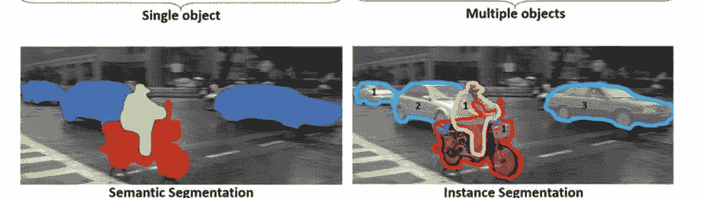

图3 重要的计算机视觉任务

# 2.5 动机

大量人群死于癌症，而脑肿瘤是癌症患者死亡的主要原因之一，尤其是儿童和青少年。脑肿瘤占美国每年诊断的100例癌症中的一例。2019年，美国癌症协会报告称，在美国发现了23,820例新的脑癌病例。最常见的原发性脑肿瘤之一是胶质瘤，它影响脑的胶质细胞和周围组织。高级胶质瘤或脑胶质母细胞瘤（GBM）是最常见和最具侵袭性的类型，中位生存率为一到两年。虽然神经外科手术可能是许多脑肿瘤的唯一治疗方法，但也使用其他治疗方法，如放疗和化疗，来摧毁无法物理切除的肿瘤细胞或减缓其生长。在通过化疗、放疗或脑手术进行治疗之前，医务人员需要确认脑肿瘤的边界和区域，确定其准确位置和受影响的区域。此外，由于脑的结构和性质，所有这些侵入性治疗都面临着具有挑战性的实践条件。这些条件使得仅凭视觉检查就很难将肿瘤组织与正常脑实质区分开来，对神经外科医生来说。

此外，这种手动视觉实践通常需要一组临床专家准确地定义肿瘤的位置和类型。这种病变定位过程是繁琐的，其质量取决于医生的经验、技能、逐层决策，并且结果可能在临床医生中仍然不被普遍接受。高级别儿童脑肿瘤和一般低级别肿瘤的治疗方案建议进行长期的随访影像，长达10年。对于这些纵向研究，将当前MRI与所有先前的影像进行比较需要很长时间，实际上是不可行的。

自动化的基于计算机的分割方法通过节省医生的时间、提供可靠准确的结果以及减少外科医生在单个患者上的诊断工作量来解决上述挑战[34]。脑肿瘤分割的动机是评估肿瘤的生长、治疗反应、基于计算机的手术、放射治疗治疗以及发展肿瘤生长模型。因此，计算机辅助诊断系统在医疗治疗中具有意义，可以减轻医生的工作负担并获得准确的结果。

## 2.6 挑战

在术前MRI扫描中分割胶质瘤通常由专业认证的神经放射学家和其他医生完成，提供胶质瘤亚区的定量形态特征和测量。由于外观和形状的高变异性、模糊的边界和成像伪影，定量分析任务具有挑战性。尽管计算机辅助技术具有快速速度、准确性的一致性和免疫疲劳的优势[35]，但在多模态MRI扫描中自动分割脑肿瘤仍然是医学图像分析和应用中最困难的任务之一。

自动分割涉及处理复杂和大量的数据、由于患者运动引起的伪影、有限的采集时间以及通常不明确的软组织边界。此外，许多类别的肿瘤具有各种不规则的形状、大小和图像强度，尤其是肿瘤周围的结构。已经进行了许多尝试，使用MRI图像对正常和异常脑组织进行分割的机器学习算法将在第3节中详细介绍。然而，为了实现自动化，特征选择具有挑战性，需要计算机工程和医学专业知识的结合。因此，开发完全自动化的脑肿瘤分割仍然是一项具有挑战性的任务，研究界的大部分人员目前正在努力克服这一挑战，将这个领域的最新理念变为现实。

## 3 使用深度人工神经网络进行脑肿瘤分割

在MRI图像中分割脑肿瘤的任务已经被引入到DNNs中，从CV中的图像分割任务中。本节重点介绍了从CV中引入DL的这些技术，并概述了应用于脑MRI数据集的各种DL架构。

## 3.1 计算机视觉领域的图像分割

图像分割是找到属于同一类别的像素组/簇的任务。它将输入图像分割成段，以简化图像分析。这些段代表对象或对象的部分，并包含属于每个部分的像素集。实际上，分割将像素排序为较大的组件，消除了将单个像素视为观察单位的需要。在统计学中，这个问题被称为聚类分析，并且是一个广泛研究的领域，有许多不同的算法[36-39]。在CV中，图像分割是最古老且广泛使用的问题之一，可以追溯到1970年代[40-45]。一些最广泛知名的图像分割技术包括：(a) 主动轮廓[46]；(b) 水平集[47]；(c) 区域分割和基于图的合并[48]；(d) 均值漂移 (模式发现)[49]；(e) 归一化割 (基于像素相似度度量)，如图4所示。分割过程本身有两种形式，即：语义分割和实例分割。前者将图像的所有像素分类为有意义或可解释的对象类别，通常被称为密集预测。后者在图像中识别每个对象的每个实例，并与语义分割不同，它不对每个像素进行分类。例如，在图3中，语义分割对所有汽车进行了分类，而实例分割则单独识别每辆车。用于评估图像分割性能的各种指标包括像素准确率 P_acc、平均准确率 M_acc、交并比 (IoU) M_IU、频权交并比 F_IU 和Dice系数[50]。让我们n_ij表示类别 i预测为类别 j的像素数量，其中有 n_cl个不同的类别，并且令 t_i = Σ j n_ij表示类别 i的像素数量，则上述性能评估术语的定义如下：

P_acc = Σ_i n_ii / Σ_i t_i, (1)

M_acc = 1 / n_cl Σ_i n_ii / t_i, (2)

M_U = 1 / n_cl Σ_i (n_ii / (t_i + Σ_j n_ji - n_ii)), (3)

F_U = 1 / Σ_k tk Σ_i (t_i n_ii / (t_i + Σ_j n_ji - n_ii)), (4)

Dice相似系数（DSC）也被广泛用于评估医学图像分割算法 [51] 。对于大小为 N x M的预测二值图像 P 和真实二值图像 G，DSC定义如下：

DSC(P , G) = 2 (Σ_i=0到N-1 Σ_j=0到M-1 P_ij G_ij) / (Σ_i=0到N-1 Σ_j=0到M-1 P_ij + Σ_i=0到N-1 Σ_j=0到M-1 G_ij) , (5)

其中i和 j表示高度 N和宽度 M的像素索引。DSC的范围是[0, 1]，DSC值越高，预测图像 P和真实图像 G之间的匹配越好。

在医学影像领域中，图像分割技术的应用开辟了新的知识前沿，涉及糖尿病视网膜病变检测、皮肤癌分类、脑肿瘤分割等多个领域的进展。在本章中，我们将仅限于脑肿瘤分割，并研究人工神经网络（ANNs）在脑肿瘤分割中采用的各种技术。

## 3.2 深度人工神经网络和图像分割

DNN在计算视觉领域取得了重要的里程碑。DNN在输入层和输出层之间有多个层。ANN的基本元素，即人工神经元，具有多个加权和求和的输入，然后是传递函数或激活函数。然后神经元输出一个标量值。图5 [53] 展示了ANN的一个例子。受生物过程的启发，ANN使用共享权重架构，其中神经元之间的连接模式模仿大脑视觉皮层的组织[54, 55]。人工神经网络（ANN）或深度神经网络（DNN）模仿感受野的概念，其中个体皮层神经元仅对有限的视野中的刺激做出反应。由于它们具有共享权重结构和平移不变性特征，人工神经网络（ANNs）具有平移或空间不变性。由于线性操作后的非线性激活，人工神经网络（ANNs）能够提取更高级别的代表性特征[56]，并且可以计算任何函数[57]。

## 3.3 基于深度学习的图像分割架构

计算机视觉领域最常用的深度学习架构包括卷积神经网络（CNNs）、循环神经网络（RNNs）、长短期记忆（LSTM）、编码器-解码器和生成对抗网络（GANs）[58-61]。在我们关注卷积神经网络的情况下，让我们讨论三种重要的基于深度学习的图像分割架构。

## 3.3.1 卷积神经网络

Waibel等人引入了具有时间感受野共享权重的卷积神经网络（CNN），并且对音素识别进行了反向传播训练[62]。LeCun等人开发了一种用于文档识别的CNN架构，如图6a所示[58]。卷积神经网络的三个基本组件/层包括：（1）卷积层，具有与输入图像卷积的权重核（或滤波器）以提取特征；（2）非线性层，对特征图应用逐元素激活函数；（3）池化层，是一种降采样操作，可以减小空间分辨率，并用一些统计信息（均值、最大值等）替换特征图的适当邻域[63]。深度卷积神经网络在各种医学图像任务中表现出色，包括糖尿病视网膜病变检测[64]、皮肤癌分类[65]和脑肿瘤分割[66-70]。一些最著名的卷积神经网络架构包括AlexNet[71]、VGGNet[72]、ResNet[73]、GoogLeNet[74]（使用了详细解释的Inception模块架构，见第4节）、MobileNet[75]和DenseNet[76]。

## 3.3.2 全卷积网络

全卷积网络（FCNs）是由Long等人提出的，使用卷积层来处理不同大小的输入 [50]。它是最早用于语义分割的深度学习模型之一。如图6b所示，FCN的最终输出层具有较大的感受野，对应于图像的高度和宽度，而通道的数量对应于类别的数量。卷积层对每个像素进行分类，确定图像的上下文，包括物体的位置。FCNs已经应用于各种分割问题，例如脑肿瘤分割 [68]，实例感知语义分割 [77]，皮肤病变分割 [78]和虹膜分割 [79]。

## 3.3.3 基于编码器-解码器的模型

编码器-解码器模型受到FCN的启发，这些模型的最著名的架构是U-Net和V-Net [80, 81]。U-Net被提出用于分割生物显微镜图像，并使用数据增强技术更有效地学习可用的注释图像。U-Net架构由两部分组成；一个收缩或下采样路径用于捕获上下文，以及一个对称的扩展或上采样路径用于定位捕获的上下文。收缩路径具有类似FCN的架构，通过3×3卷积提取特征，同时增加特征图的数量并减小它们的维度。相反，扩展路径通过减少特征图的数量并增加它们的维度进行反卷积操作。收缩路径的特征图与扩展路径连接，以保持模式信息的完整性。最后，生成分割图。

## 3.3.4 图像分割中使用的其他深度学习模型

除了前面描述的模型之外，还有许多深度学习架构家族在医学图像分割中非常流行。例如，卷积图形模型（结合了条件随机场（CRFs）和马尔可夫随机场（MRFs）的概念），多尺度金字塔网络模型（Feature Pyramid Network (FPN) ）[82]，金字塔场景解析网络（PSPN）[83]，区域CNN（如Fast R-CNN，Faster R-CNN和Mask-RCNN），扩张或空洞卷积（DeepLab Family[84]），基于RNN的模型（ReNet [85]，ReSeg [86]），数据关联RNN（DA-RNNs）[87]，以及基于注意力的模型（OCNet [88]，Expectation-Maximization Attention Network (EMANet) [89]，Criss-Cross attention Network (CCNet) [90]）。Minaee等人对所有这些模型进行了详细的综述参考[63].

## 3.4 脑肿瘤分割任务挑战

在本节中，我们讨论了在深度学习领域中的脑肿瘤分割任务。国际上举办的医学影像分析挑战已成为验证提出方法的标准。脑肿瘤分割挑战（BraTS）[91]是与医学影像计算和计算机辅助干预（MICCAI）会议[92]同时举办的挑战之一。. 第一次挑战研讨会于2012年举行，之后每年都与MICCAI会议一起举办基准测试。BraTS挑战评估了MRI扫描中脑肿瘤的最先进分割方法。它有一个公开可用的数据集（附带专家标注），用于对提交的分割方法进行基准测试，该数据集包含具有内在异质性（外观、形状和组织学）的多机构术前MRI (mpMRI) 扫描的脑肿瘤，即胶质瘤。此外，该挑战还涵盖了患者的生存预测，并评估了肿瘤分割算法的不确定性。该挑战评估了肿瘤的分割。

## BraTS Annotations & Structures

如图7所示，增强肿瘤（ET）、肿瘤核心（TC）和整个肿瘤（WT）的亚区。ET是与T1相比T1C中超强信号的区域，TC是肿瘤的主体，通常会被切除。TC包括ET、坏死（充满液体）和非增强（实质）肿瘤的部分。WT是疾病的完整范围，由TC和周围的水肿（ED）组成，FLAIR显示。2018年挑战赛的数据集共有542名患者，其中285名用于训练，66名用于验证，191名用于测试，其中210名为高级别胶质瘤（HGG）患者，75名为低级别胶质瘤（LGG）患者，经验丰富的神经放射科医生通过层次多数投票进行了批准的注释。数据包括来自约19个机构的临床获取的3T多对比度MR扫描，由专家认证的神经放射科医生在NIIfTI文件（.nii.gz）中提供了地面真实标签。Dice系数和Hausdorff距离（95%）被用作评估方案。除此之外，敏感性和特异性也被用作指标。Bakas等人[93]编制了关于2012年至2018期间在BraTS挑战赛中用于脑肿瘤分割的最先进机器学习方法的评估。

## 脑肿瘤分割中的4个Inception模块

在使用深度神经网络解决脑肿瘤分割问题后，让我们看一下其中一个具有可观准确度的架构。这个架构基于U-Net和Inception模块。

## 4.1 使用Inception和扩张Inception模块进行脑肿瘤分割

Cahall等人提出了一种图像分割框架，用于肿瘤划定，该框架受益于计算机视觉中两种最先进的机器学习架构：Inception模块和U-Net。这个新框架包括两种学习模式，即学习分割肿瘤内部结构（坏死和非增强肿瘤核心，周围水肿和增强肿瘤），或学习分割胶质瘤亚区（WT，TC，ET）。这两种学习模式在第3.4节中有描述。这些学习模式被纳入了基于DSC的修改损失函数中，该函数在第3.1节中的方程式5中有描述。

U-Net最初是用于细胞追踪的。然而，最近它已经被应用于其他医学分割任务，例如脑血管分割[95]、脑肿瘤分割[96]和视网膜分割[97]。为了解决不同的医学图像分割问题，还提出了U-Net的变体和扩展，例如3D U-Net[98, 99]、H-DenseUNet[100]、RIC-UNet[101]和Bayesian U-Net[102]。Cahall等人采用级联学习方法，首先使用三个不同的模型学习WT，然后学习TC，最后学习ET，从而提出了一个针对所有肿瘤亚型的端到端实现[70].

## 4.2 BraTS数据集和预处理

BraTS 2018数据集，在第3.4节中描述，已经被最频繁地使用，如在这些实验中[51, 93, 94, 103]。该数据集包含每个患者的MRI图像的四个序列（T1、T1 c、T2和FLAIR）。它还包含以像素级手动分割标记的形式的地面真值，用于三个肿瘤内部结构：坏死和非增强肿瘤核心（标记为1）、周围肿瘤水肿（标记为2）和增强肿瘤（标记为4）。胶质瘤亚区被定义为具有所有三个肿瘤内部结构的WT（标记为(1∪2∪4)）、除了周围肿瘤水肿的TC（标记为(1∪4)）和ET（标记为4）。不同的序列提供了识别肿瘤内部结构的互补信息：

*   FLAIR突出了肿瘤周围水肿。
*   T1c可以区分ET。
*   T2突出了坏死和非增强的肿瘤核心。

BraTS图像已经进行了颅骨剥离预处理，重新采样到各个患者的各种模态的各向异性1 mm³分辨率，并进行了共注册。

Cahall等人[70]按照以下顺序进行了额外的预处理：

+   1. 通过获取大脑的边界框并提取所选部分，从图像中丢弃多余的背景像素，有效地对大脑进行放大。

+   2. 将裁剪后的图像调整为128 × 128像素。

+   3. 丢弃在地面真值分割中没有肿瘤区域的图像。

+   4. 对每个图像应用强度窗口函数，使最低的1%和最高的99%像素分别映射为0和255。

+   5. 通过减去数据集的均值并除以标准差来对图像进行归一化。

## 4.3 深度人工神经网络架构

在医学影像中，语义分割的准确性取决于在训练模型时从MRI扫描中提取局部结构和全局上下文信息的能力。因此，在医学影像领域中提出了许多多路径架构，它们都可以在多个尺度上从输入数据中提取结构和上下文信息[98, 104, 105]。这种在不同尺度上提取和聚合特征的概念也在Inception模块中得到了应用[74]。然而，Inception模块中的特征提取机制与多路径架构不同。Inception模块在每一层应用不同尺寸的滤波器，并将得到的特征图串联起来[74]。Cahall等人[70]基于U - Net和分解卷积Inception模块[74, 80]提出了改进版的Dilated Residual Inception(DRI)[106]。DRI的特殊块受到了Inception模块[107]和扩张卷积[108]的启发。

DRI比原始的Inception模块参数更少，并采用残差连接以更快的收敛速度缓解消失梯度问题[73]。MultiResUNet将U - Net与残差Inception模块相结合，用于多尺度特征提取，并将该架构应用于多种多模态医学图像数据集[109]。将Inception模块与U - Net相结合，已用于左心房分割[110]、肝脏和肿瘤分割[111]以及脑肿瘤分割[112]的评估。

## 4.3.1 Inception 模块

在原始U - Net中，建议的Inception模块[70]中的卷积层被替换为具有多组3 × 3卷积的Inception模块，1 × 1卷积，3 × 3最大池化和级联3 × 3卷积，如图8b所示。在收缩路径的每一层，特征图的高度和宽度减半，深度加倍，直到达到瓶颈，即U的中心。在相应的扩展路径上的每一层，特征图的高度和宽度加倍，深度减半，直到得到分割掩模作为输出。与U - Net一样，收缩路径上生成的特征图与相应的扩展路径进行拼接。作者在每个Inception模块中使用了修正线性单元（ReLU）作为激活函数，并进行了批归一化[113]。架构设置接收大小为N × M × D的输入图像，并输出一个N × M × K的张量，其中N = M =128像素，D =4代表四种MRI模态（T1，T1c，T2，FLAIR），而K =3代表分割类别（肿瘤内部结构或脑胶质瘤亚区）。第K张输出图像是一个二值图像，表示第i类的预测分割结果（0 ≤ i ≤ K – 1）。像素级激活函数（对于脑胶质瘤使用sigmoid函数，对于肿瘤内部结构使用softmax函数[114]）用于生成输出的二值图像。

## 4.3.2 膨胀Inception U-Net

另一个有用的架构称为膨胀Inception U-Net（DIU-Net），将膨胀卷积（或称为空窍卷积）[84]和Inception模块集成到U-Net架构[115]中，如图8a所示。在这里，每个膨胀Inception模块由三个1×1卷积操作组成，然后是一个l-膨胀卷积滤波器（其中l=1，2，3），如图8c所示。1×1卷积滤波器执行降维操作，而三个尺寸为3 ×3的l-膨胀卷积滤波器实现了空洞卷积。在膨胀卷积中，图像I的尺寸为m×n，离散卷积滤波器w的尺寸为k×k，卷积操作为：

(I * w)(p) = ∑ I [p + s] w [s]. (6)

简单卷积操作可以推广到l-扩张卷积(*l) [108]:

(I * l w)(p) = ∑ I[p + l*s]w[s]. (7)

当l =1时，我们得到了等式6的简单卷积操作。当l > 1时，在每个滤波器元素之间插入l-1个零，创建了一个缩放和稀疏的大小为k*s×k*s的滤波器，其中k*s由以下公式定义:

k*s = k + (k - 1)(l - 1), (8)

) = l(k - 1) + 1. (9)

通过因子k_s^k，缩放增加了滤波器的感受野。

k_s = \frac{k + (k - 1)(l - 1)}{k}, (10)

= l + \left(\frac{-l + 1}{k}\right). (11)

滤波器的感受野与l线性增加，而元素的数量(k × k)保持不变。

## 皮肤病的临床观察

该病皮肤受损区域具有一定的形态学特征

## 深度人工神经网络在脑肿瘤分割和监测中的应用

$\mathcal{L}_{DSC(P, G)} = -\log \left[ \frac{1}{K} \sum_{i=0}^{K-1} DSC(P_i, G_i) \right].$

## 4.4 实验设置和结果

Cahall等人[70]训练了四个不同的模型，其中两个是用于U-Net架构（肿瘤内部结构和胶质瘤亚区域），另外两个是用于带有Inception模块的U-Net（肿瘤内部结构和胶质瘤亚区域）。所有四个模型都使用k折交叉验证在数据集上进行训练，该数据集被随机分成k个互斥的大小相等或接近相等的子集。每个算法连续运行k次，每次将其中一个分割作为验证子集，其余作为训练子集。使用自适应矩估计（Adam[116]）的随机梯度下降[116]用于训练所有模型及其变体[117]。批量大小为64，训练100个epochs，学习率初始设置为10^-4，每10个epochs指数衰减。所有可学习参数（权重和偏置）都基于He初始化方法[118]进行初始化。使用Keras[119]应用程序编程接口（API）和Tensor Flow[120]后端进行实现，所有模型都在一台配备4个NVIDIA TESLA P100图形处理单元（GPU）的Google Cloud Compute[121]实例上进行训练。

## 4.4.1 Inception模块的结果

对于肿瘤内部结构，将Inception模块添加到U-Net中，结果显示在WT方面有显著改善（DSC从0.903提高到0.925，p <0.001），在TC方面有显著改善（从0.938提高到0.952，p <0.001），在ET方面有显著改善（从0.937提高到0.948，p <0.001）。对于胶质瘤亚区域，也观察到了显著改善，在WT方面有显著改善（从0.898提高到0.918，p <0.001），在TC方面有显著改善（从0.942提高到0.951，p =0.001），在ET方面有显著改善（从0.942提高到0.948，p =0.002）。将目标从肿瘤内部结构改变为胶质瘤亚区域的学习，在WT方面的性能没有差异（从0.903到0.898，p =0.307），在TC方面的性能没有差异（从0.938到0.942，p =0.284），在ET方面的性能没有差异（从0.937到0.942，p =0.098）。然而，使用Inception模块的U-Net在学习肿瘤内部结构方面优于学习胶质瘤亚区域的模型（WT从0.918提高到0.925，p =0.007），但在TC方面的性能没有差异（从0.952提高到0.951，p =0.597）和ET（从0.948提高到0.948，p =0.402）。这意味着将Inception模块集成到U-Net架构中可以显著提高肿瘤分割性能，这是通过使用k折交叉验证进行量化的（三个胶质瘤亚区域的p <0.05）。验证准确性的提高可以归因于每个Inception模块中使用多个不同尺寸的卷积滤波器。这些滤波器能够在学习过程中捕捉和保留多个尺度的上下文信息。

## DIU-Net的结果

DIU-Net在WT子区域中的Dice分数从0.925提高到0.931， p <0.05。对于TC子区域，Dice分数从0.952提高到0.957，p <0.05。然而，对于ET，变化没有统计学上的显著性， p =0.114。有趣的是，DIU-Net在计算上更高效。DIU-Net比U-Net with Inceptionmodules少了250万个参数。相比之下，DIU-Net在更少的计算成本下（减少15%的参数）取得了显著更好的结果。每个胶质瘤亚区的Dice分数可与其他最近发表的架构的结果相媲美或超过，包括No New-Net、SDResU-Net和[122-124]中提出的集成方法。

## 5 脑肿瘤分割中的不确定性估计

如前所述，准确的脑肿瘤分割对于治疗规划和随访评估至关重要。此外，医学影像学和临床诊断和预后对分割结果的鲁棒性和可信度特别感兴趣，因为它们与人类健康有关。在本节中，我们讨论了一种名为变分密度传播（exV DP）的新的深度学习框架，它可以量化输出决策的不确定性[125]。

### exVDP

在exVDP中，Dera等人采用了变分推断（VI）[126]框架，并通过所有DNN的层（卷积、最大池化和全连接）和非线性传播变分分布变分分布的前两个矩。Dera等人使用了一阶泰勒级数线性化[127]来传播变分分布的均值和协方差到DNN中的非线性激活函数。

exVDP考虑了一个总共有C个卷积层和L个全连接层的CNN，其中卷积核和全连接层的权重是随机张量。每个卷积层和全连接层之后都有一个非线性激活函数。此外，ANN还包含最大池化层。ANN的权重（和偏置）由𝐖(𝑘𝑐)组成，其中𝐖(𝑘𝑐)是第𝑘个卷积层中的𝑘𝑘个卷积核的集合。

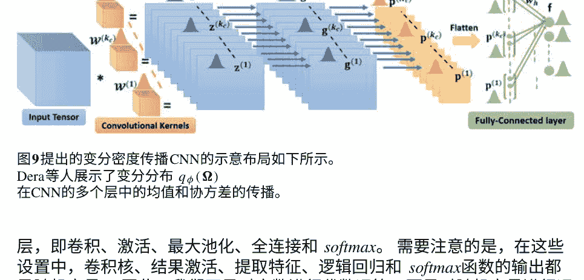

图9提出的变分密度传播CNN的示意布局如下所示。

Dera等人展示了变分分布 𝓧φ(Ω)在CNN的多个层中的均值和协方差的传播。

层，即卷积、激活、最大池化、全连接和 softmax。 需要注意的是，在这些设置中，卷积核、结果激活、提取特征、逻辑回归和 softmax函数的输出都是随机变量。 因此，我们不是对实数进行代数运算，而是对随机变量进行运算，包括（1）随机变量与常数的乘法，（2）两个随机变量的乘法，以及（3）作用于随机变量的非线性变换[125]。由于两个高斯随机变量的乘法[127]或非线性变换，得到的随机变量可能不服从高斯分布[127]。 目标是传播变分分布的均值和协方差，然后获得预测分布的均值和协方差， p(y|𝒙, 𝒹)。 p(y|𝒙, 𝒹)的均值表示ANN的预测，而协方差矩阵反映了输出决策的不确定性。 图9显示了提出的变分密度传播CNN的示例，其中包括一个卷积层、一个最大池化层和一个全连接层。

### 5.3 扩展变分密度传播

我们从数学结果开始，通过卷积层、激活函数、最大池化、全连接层和softmax函数，推导出变分分布的均值和协方差的传播方式。我们使用一阶泰勒级数来近似非线性激活函数后的前两个矩（均值和协方差），并将此方法称为exVDP [125]。

#### 5.3.1 第一卷积层

一组卷积核与输入张量之间的卷积操作被表示为矩阵-向量乘法。我们首先形成子张量𝒳ᵢ：i+r 从输入张量𝒳中提取与卷积核𝔼^(kc)∈ℝ^r₁×r₂×K大小相同的子张量。这些子张量随后被向量化并排列成矩阵𝒳˜的行。因此，将𝒳与第k个卷积核𝔼(kc)进行卷积等价于将𝒳˜与ve_c(𝔼(kc))相乘。

```
z(kc)=𝒳*𝔼(kc)=𝒳˜×ve^(𝔼(kc))， (17)
```

其中*表示卷积操作，×表示常规的矩阵-向量乘法。

多元高斯分布已经定义在向量化的卷积核上，即ve_c(𝔼(kc))~ℤ(𝒫(kc), Σ(kc))。由此可得：

```
z^(ks) ~ ℤ(μ_z(kc)=𝒳𝒫(kc), Σ_z(kc)=𝒳Σ(kc)𝒳^T ) (18)
```

#### 5.3.2 非线性激活函数

在非线性激活函数ψ之后，使用一阶泰勒级数逼近来近似计算均值和协方差[127]。设g_i(kc)=ψ[z_i(kc)]为ψ的逐元素输出。我们有μg^(kc)和Σg^(kc)：

```
μ_g^(kc) ≈ ψ(μ_z(kc))
```

```
Σ_g^(kc) ≈ \{ \begin{cases} σ²_Σ(z^(kc)等于μ_z(kc)时) / (dψ(μ_z(kc)等于)/dz^(kc)等于) )², 如果i=j, \ σ²_Σ(z^(kc)等于μ_z(kc)时) / (dψ(μ_z(kc)等于)/dz^(kc)等于) ) (dψ(μ_z(kc)等于)/dz^(kc)等于) ), 如果i=j, \ \end{cases} \ } (19)
```

#### 5.3.3 最大池化层

对于最大池化，μ_p(kc)=pool(μg(kc))和Σ_p(kc)=co-pool(Σ_g(kc))，其中pool表示对均值进行最大池化操作，co-pool表示对协方差进行下采样，即只保留与池化后的均值元素对应的行和列。

#### 5.3.4 扁平化操作

最大池化层的输出张量 𝒑 被向量化以形成完全连接层的输入向量 b，使得 b = [p^(1)T, …, p^(Kc)T]ᵗ。b 的均值和协方差矩阵分别为：

$\mu_b = \begin{bmatrix} \mu_{p^{(1)}} \ \vdots \ \mu_{p^{(K_c)}} \end{bmatrix}, \Sigma_b = \begin{bmatrix} \Sigma_{p^{(1)}} & \cdots & 0 \ \vdots & \ddots & \vdots \ 0 & \cdots & \Sigma_{p^{(K_c)}} \end{bmatrix} (20)$

#### 5.3.5 完全连接层

设 **wₕ ~ 𝒩(mₕ, Σℓₕ)** 为完全连接层的第 h 个权重向量，其中 **h = 1, …, H**，**H** 是输出神经元的数量。我们注意到 fₕ 是两个独立随机向量 **b** 和 **wₕ** 的乘积。设 f 为完全连接层的输出向量，则 **μf** 和 **Σf** 的元素由以下命题推导得出：

**命题1**

μfₕ = mₕᵀμᵦ,\ Σf = \begin{cases} \mathrm{tr}(Σℓ Σᵦ) + mₕᵀ Σᵦ mₕ + μᵦᵀ Σℓ μᵦ, & h₁ = h₂, \ \(m_{h₁}^T Σᵦ m_{h₂}, & \mathrm{otherwise}.)\end{cases} (21)

其中，**h₁**，**h₂**表示全连接层中的任意两个权重向量。

#### 5.3.6 Softmax 函数

假设 **ANN**的输出为 **y = φ(f)**，其中 **φ** 是 **softmax** 函数。利用一阶泰勒级数近似，可以得到输出向量的均值和协方差，即 **μᵧ** 和 **Σᵧ**，如下所示[129]：

$\mu_y \approx \varphi(\mu_f); \Sigma_y \approx J_\varphi \Sigma_f J_\varphi^T, (22)$

其中，**J**是φ对f的雅可比矩阵，在μf[129]处求得。

#### 5.3.7 目标函数

假设变分后验分布的协方差矩阵为对角矩阵，独立同分布的数据点为N个，并使用M个蒙特卡洛样本来近似期望值的求和，ELBO目标函数中的期望对数似然如下所示：

```
E_{q_φ-φ-(Ω)-\log_p_Ω-P_Ω-|X-q_φ(Ω)-}]≈ \(- \frac{NH}{2} \log(2π) - \frac{1}{M} \sum_{m=1}^M [ \frac{N}{2}\log(|y-||) + \frac{1}{2} \sum_{i=1}^N (y^(i)-μ^{(m)}T(- (m y ) )^{-1}(y^(i)-μ^{(m)})] \) (23)
```

(16) 中的正则化项是两个多元高斯分布之间的 KL 散度[127]。如果我们有一个卷积神经网络，其中包括一个卷积层，接着是激活函数，一个最大池化层和一个全连接层，那么 ELBO 目标函数中的正则化项可以推导如下：

```
KL(qφ(Ω)||p(Ω)) = \( \frac{1}{2} \sum_{k=1}^K (r_1 r_2 K σ²_{r1,k} σ²_{r2,k} σ²_{K,k} + \|𝒎^(k)\|_F² - r_1 r_2 K - r_1 r_2 K (\log(σ²_{r1,k} σ²_{r2,k} σ²_{K,k})) ) + \frac{1}{2} \sum_{h=1}^H (n_f σ²_h + \|m_h\|_F² - n_f - n_f \log σ²_h) \), (24)
```

其中（r₁×r₂×K）是卷积层中卷积核的大小，K₁是卷积层中的卷积核数量，H是输出神经元的数量，n_f是全连接层中权重向量w_h的长度。

#### 5.3.8 反向传播

在反向传播过程中，我们计算目标函数的梯度∇_φ L(φ; D)相对于变分参数的梯度：

```
φ = \{ \{ {𝒎^(k_c), σ²_1,₁c, σ²_2,₁k, σ²_{Kc−1,kc}}^{Kc} }_{k_c=1}^C, {m_h, σ²_h}^H \}_{h=1}^1, (25)
```

其中（r₁×r₂×Kc−1）是k_cth卷积层的大小，K_C是卷积层中的卷积核数量，H是输出神经元的数量。Dera等人使用∇_φ L(φ; D)来更新参数φ，使用梯度下降更新规则。

## 5.4 应用于MRI图像中的脑肿瘤分割

已经评估了提出的exVDP模型在使用BraTS 2015数据集进行HGG脑肿瘤分割任务时的性能。数据集包括5个类别，即类别0-正常组织，类别1-坏死组织，类别2-水肿，类别3-非增强，类别4-增强肿瘤[94]。分割的评估基于三个区域，(1)完整肿瘤(1,2,3和4)，(2)肿瘤核心(1,3和4)，以及(3)增强肿瘤(类别4)[94]。

通过从四种MRI模态(FLAIR、T1、T2和T1c)中随机采样补丁，将脑肿瘤分割问题建模为多类分类问题[130]。每个补丁的标签都手动设置为中心像素的标签。采样的补丁在所有类别上平衡，并从20名患者的BraTS数据中提取了总共100,000个大小为33×33的补丁。

这些补丁被分为训练和验证集（95%用于训练，5%用于验证）。测试集包括随机抽样的372张图像，即每种模态下的43,264个补丁。提出的exVDP模型与[130]中提出的确定性CNN进行了比较。以下CNN架构已被使用：六个卷积层（所有卷积核均为3×3，第一到第六层分别有32、32、64、64、128、128个卷积核，后跟ReLU激活函数），两个最大池化层和一个全连接层。该架构如表1所示。  

**表1 两个模型的架构，即exVDP和确定性CNN**

|层|类型|滤波器尺寸|HGG步长|卷积核数量|全连接单元|输入|
|---|---|---|---|---|---|---|
|1|卷积|3×3|1×1|32|–|33×33×4|
|2|卷积|3×3|1×1|32|–|33×33×32|
|3|卷积|3×3|1×1|64|–|33×33×32|
|4|最大池化|3×3|2×2|–|–|33×33×64|
|5|卷积|3×3|1×1|64|–|16×16×64|
|6|卷积|3×3|1×1|128|–|16×16×64|
|7|卷积|3×3|1×1|128|–|16×16×128|
|8|最大池化|3×3|2×2|–|–|16×16×128|
|9|全连接|–|–|–|5|6272|

**表2 使用DSC测量的BraTS测试数据集的分割结果**

| 方法 | 肿瘤区域 | 无噪声 | 对抗性噪声 | 高斯噪声 |
|------|----------|--------|------------|----------|
| exVDP | 完整的 | 80.8% | 77.4% | 80.6% |
|      | 核心 | 74.6% | 72.6% | 74.5% |
|      | 增强 | 74.0% | 69.8% | 73.9% |
| 确定性卷积神经网络 | 完整的 | 78.0% | 43.4% | 66.9% |
|      | 核心 | 65.0% | 47.1% | 51.9% |
|      | 增强 | 75.0% | 43.9% | 55.7% |

HGG图像（带有和不带有对抗性噪声）。 还介绍了与每个分割相关的不确定性图。不确定性图允许医生快速查看分割结果，并在不确定性较高的区域进行肿瘤边界的修正，如果需要的话。

## 6肿瘤监测

如第2.3节所定义，肿瘤监测是在纵向研究中监测患者肿瘤的过程，以确定疾病的严重程度并相应地制定治疗计划。它有助于及早发现肿瘤的早期迹象，这在癌症肿瘤的情况下尤为重要。

### 6.1肿瘤监测的理论基础

时间医学影像数据在肿瘤学和放射学中被广泛用于对疾病进行长时间的视觉比较。医生通常通过检查2D医学图像（CT或MRI扫描）来诊断疾病在时间上的变化，通常称为体积随时间的变化。

## FLAIR

## T1C

## 真实情况

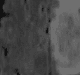

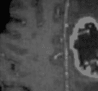

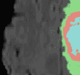

## 卷积神经网络（无噪声）

## exVDP（无噪声）

## exVDP（无噪声）

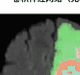

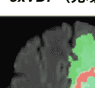

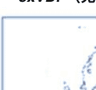

## 卷积神经网络（5%）

## exVDP (5%)

## exVDP (5%)

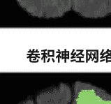

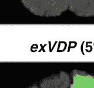

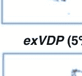
图10示例1：在BraTS 2015数据集上，使用提出的exVDP和确定性CNN进行分割的结果，有无添加对抗性噪声。每个分割的不确定性图也显示了两个模型的情况。黄色表示攻击目标的非增强肿瘤在真实图像中的类别标签。

绿色表示水肿类，红色表示增强肿瘤，蓝色表示坏死。

前列腺特异性抗原（PSA）[131]测试作为主动监测前列腺癌的一部分，有助于了解肿瘤的进展和预后，使诊断为低级别疾病的患者感到更舒适[24]。

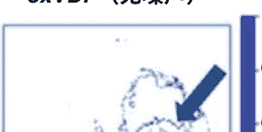

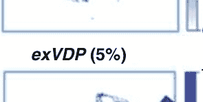

## 6.2 监控技术

变点检测是一种检测顺序数据中突变的经典技术，主要关注具有单个可观测变量的数据集。

这是统计学中一个长期存在的研究领域[132, 133]，在经济学[134]、生物信息学[135, 136]和气候学[137]等领域都有应用，其中被视为检测时间序列中突变的问题。 其目标是确定观察到的时间序列是否在统计上是均匀的，或者找到发生变化的时间点。 变点检测技术有两种变体：后验和顺序。 后验测试在收集到全部数据后进行，根据对所有收集到的数据的分析，做出均匀性或变点的决策。

而顺序测试是在数据逐个呈现时进行的，在线进行决策。格里森分级是另一种用于病理评分前列腺癌分化的技术，它是目前最广泛使用的前列腺肿瘤分化和预后指标[138]。

## 6.3 社区级主动监测

除了个体肿瘤监测外，"主动监测"这个术语也经常用于美国的集体癌症监测数据和计划，通过癌症登记处。 癌症登记处是一个设计用于收集、存储和管理癌症患者数据的信息系统[139]。

美国的癌症数据是通过两种类型的登记处收集的：医院登记处，它们是医疗机构癌症计划的一部分；以及基于人口的登记处，通常与州卫生部门相关联。 医院登记处提供有关医院内护理的患者数据以供评估。 基于人口的登记处在州卫生部门下，收集来自多个报告设施（包括医院、医生办公室、养老院、病理实验室、放射治疗和化疗中心等）的特定地理区域内所有被诊断出的病例信息。收集的数据用于建立统计数据，如新癌症病例（发病率）、死亡率（死亡率）、与工作类型相关的癌症类型、随时间变化的癌症趋势，以及关注受不同类型癌症影响最严重的年龄和种族群体。 登记处的工作人员是经过认证的肿瘤登记员（CTR），他们有预先定义的培训、测试和继续教育标准，并编制及时、准确、完整的癌症信息报告给登记处。 美国主要的癌症监测计划包括国家癌症数据库（NCDB）[140]、国家癌症研究所（NCI）的监测、流行病学和结果调查（SEER）计划[139]，以及疾病控制和预防中心（CDC）的国家癌症登记计划（NPCR）[141]。美国中央脑肿瘤登记处

(CBTRUS) 是一个致力于收集和传播有关所有原发性良性和恶性脑肿瘤的统计数据的注册表[142]。最近的一项研究[143]试图通过对监测数据DATA-CAN（英国国家健康数据研究中心）进行分析，估计癌症和多重合并症患者的过度死亡率，该研究还涉及新冠疫情对癌症患者的影响[144。

## 6.4 脑肿瘤的监测

中枢神经系统（CNS）肿瘤是儿童白血病之后儿童最常见的肿瘤[145]。高级别儿童脑肿瘤的治疗方案建议进行长达10年的定期随访影像检查[145]。根据高级别儿童脑肿瘤患者的监测数据，对最大复发时间和最小放射学可检测到的长期后遗症（如继发恶性肿瘤、血管并发症和白质疾病）进行了回顾性研究，发现在治疗结束后10年或更长时间内，复发的原发性脑肿瘤（无论是局部还是远处）没有发生[145]，因此结果不支持在治疗结束后10年以上进行常规筛查以检测肿瘤复发[145]。

肿瘤监测被用于构建广泛的统计图表，包括美国成年人脑胶质瘤的发病率和存活率按种族或民族划分[146]，县级脑胶质瘤的发病率和存活率变化[147]，以及关于脑部和其他中枢神经系统肿瘤的准确的基于人口的统计数据[148]。根据CBTRUS统计报告，2011年至2015年期间在美国诊断的原发性脑部和其他中枢神经系统肿瘤数据显示，脑部和中和神经系统肿瘤（恶性和非恶性）是0 - 14岁人群中男性和女性最常见的癌症类型。对于15 - 39岁的人群，这些肿瘤是男性中第二常见的癌症，女性中第三常见的癌症。对于40岁以上的人群，这是第八常见的癌症类型，男性中第八常见，女性中第五常见的脑癌。这些结果基于NPCR的388,786例脑部和中枢神经系统肿瘤数据，以及来自SEER的16,633例肿瘤病例[149]。

对患者进行肿瘤监测还使当局能够提前预测癌症病例和死亡，并及时采取措施来抵消预测得分。美国癌症协会最近发布的一份关于2020年癌症统计数据的报告预测了美国将发生的新癌症病例和死亡人数。收集了2002年至2017年的发病数据，并估计2020年美国将发生23,890例与脑部和ONS肿瘤相关的新病例和18,020例死亡病例[150]。同样，肿瘤监测对于避免侵袭性治疗的副作用同样重要。接受胶质瘤、脑膜瘤和脑转移瘤治疗的患者可能会出现治疗的副作用，包括神经病变（视力丧失）、白内障、下垂体功能减退、认知能力下降、中风风险增加以及发生二次肿瘤的风险。

## 6.4.1 监测研究的一个例子

甚至几个月或几年来。 手术治疗会导致即时的副作用，化疗引起的副作用会在治疗后的早期出现（但不孕可能要到后期才会显现），放疗的副作用可能会在治疗后几个月甚至几年后出现。 风险因所使用的技术和治疗的大脑部区域而异。 监测使医生能够更早地识别这些潜在的晚期副作用，从而增加患者的生命长度和生活质量[151]。

在本节中，我们将研究一个关于肿瘤监测的例子，具体是关于低级别胶质瘤的患者[152]。 低级别胶质瘤占所有成人脑肿瘤的约15%，通过对脑侵袭显著影响神经系统的发病率。 通常，在临床环境中没有普遍接受的技术可用于检测低级别胶质瘤的生长。 临床医生通常通过主观评估比较两个或多个纵向放射学扫描图像来检测低级别胶质瘤的生长。

论文[152]提出了一种计算机辅助诊断（CAD）方法，以帮助医生更早地检测低级别胶质瘤的生长。 该方法包括肿瘤分割、计算体积，并通过在线突变点方法指示生长，仅考虑过去的测量结果。 该研究表明，早期发现肿瘤的生长为未来的临床研究奠定了基础，以决定采取何种治疗路径以及早期治疗干预是否延长生存并改善生活质量。 对63名患者进行了纵向（时间）放射学研究，随访期中位数为33.6个月。 这些患者通过专家医生的手动（视觉）程序以及与CAD方法相结合的生长检测进行了2级胶质瘤的诊断，并且对比了7位专家医生的检测方法[152]。 每个患者至少有4个MRI扫描可供审查，可以是初步诊断后或化疗完成后进行的。 研究人员通过对这些患者的627个MRI扫描的放射学报告印象进行计算，得出了生长检测的时间。 令人意外的是，该研究发现通过视觉比较和通过CAD方法辅助的医生之间在生长检测方面存在很大差异。 视觉检查未能发现生长的原因可能归因于以下一个或多个原因：（1）医生需要花费很长时间来解释大量的先前研究，（2）目前流行的做法是将当前的MRI与前几次MRI扫描进行比较，（3）未确定基线MRI，（4）从一次扫描到下一次扫描的变化很小，（5）仅比较单个2D图像忽略了第三维度的生长。

研究[152]表明，计算机辅助诊断方法帮助医生在比标准方法更早的时间内检测到肿瘤的生长，并且肿瘤体积显著较小。 此外，通过计算机辅助诊断方法，医生在22例被标准方法标记为临床稳定的胶质瘤患者中，诊断出13例肿瘤生长.

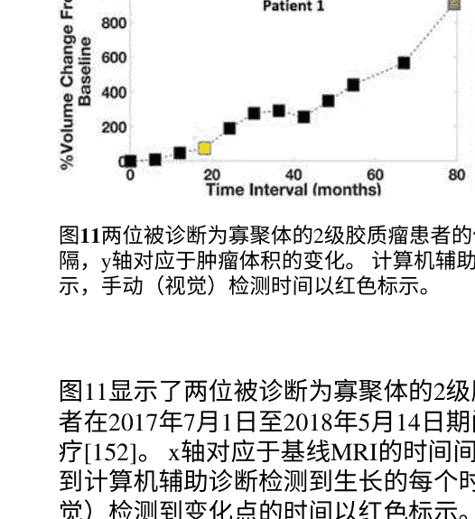

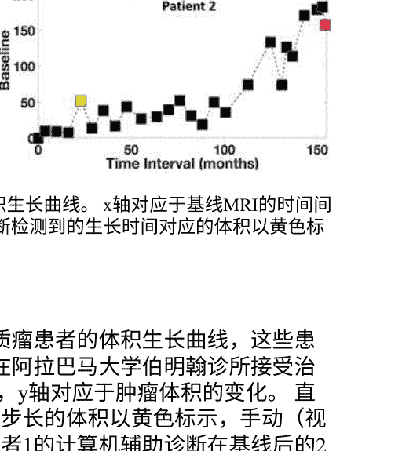
图11两位被诊断为寡聚体的2级胶质瘤患者的体积生长曲线。x轴对应于基线MRI的时间间隔，y轴对应于肿瘤体积的变化。计算机辅助诊断检测到的生长时间对应的体积以黄色标示，手动（视觉）检测以红色标示。

图11显示了两位被诊断为寡聚体的2级胶质瘤患者的体积生长曲线，这些患者在2017年7月1日至2018年5月14日期间在阿拉巴马大学伯明翰诊所接受治疗[152]。x轴对应于基线MRI的时间间隔，y轴对应于肿瘤体积的变化。直到计算机辅助诊断检测到生长的每个时间步长的体积以黄色标示，手动（视觉）检测到变化点的时间以红色标示。患者1的计算机辅助诊断在基线后的20个月检测到变化点，而医生的视觉检测在基线后的80个月进行。

同样，患者2的CAD检测时间也约为20个月，而视觉检测时间为150个月，主要是因为这种肿瘤生长速度不快。通过时间检测肿瘤体积的增长，研究人员能够识别出非线性和非均匀生长的肿瘤。早期生长检测有可能降低级别胶质瘤患者的发病率，甚至可能降低死亡率。一旦测量完成，治疗患者的决策将由生长速度和与脑部关键区域的接近程度决定。该研究还建议在以下情况下进行早期干预：（1）新生长靠近非手术结构，如胼胝体；（2）生长速度加快；（3）肿瘤对化疗敏感。

## 7 结论

在本章中，我们对经典计算机视觉领域中的图像分割任务进行了全面的回顾，并研究了在深度学习框架中用于脑肿瘤分割的各种计算机视觉技术。我们还评估了多种具有不同特性的深度学习架构，使它们适用于特定任务。我们还对U-Net与Inception和扩张Inception模块在脑肿瘤分割方面进行了深入分析的案例研究。exVDP是一种新的深度学习框架，可以量化输出决策的不确定性。

## 深度人工神经网络在脑肿瘤分割和监测中的应用

深度神经网络（DNN）也已经被讨论过。在最后一节中，我们讨论了肿瘤监测的概念、原理、技术以及低级别胶质瘤监测的一个实例研究。

由于深度学习的进展，脑肿瘤分割领域在过去十年取得了重大进展。尽管已经努力将这项技术商业化，但要使脑肿瘤分割成为一种可靠且常规的工具，广泛应用于实际临床决策并减少人为干预，仍然有很长的路要走。这是因为在面对对抗性示例时缺乏现有方法和不适合生产环境的研究导向框架。随着机器学习社区出现有效且可扩展的平台，以及研究方向向对抗性学习的发展，突破很可能会到来。

## 致谢本工作得到了国家科学基金会(NSF)的支持，项目编号为NSF ECCS-1903466和NSF D UE-1610911。

## 参考文献

+   1. Y. LeCun, Y. Bengio, and G. Hinton, “深度学习”，《自然》, vol. 521, no. 7553, p. 436, 20 15.
2. A. A. Aly, S. B. Deris, and N. Zaki, “数字图像分割技术的研究综述”，《计算机科学与信息技术国际期刊》，第3卷，第5期，第99页，2011年。
3. 斯坦福大学, “教程3：图像分割”， https://ai.stanford.edu/~syyeung/cvweb/tutorial3.html
4. 漫威, “漫威电影”， https://www.marvel.com/movies。
5. S. Gould, T. Gao, and D. Koller, “基于区域的分割和目标检测”，《神经信息处理系统进展》，2009年，第655-663页。
6. S. Yuheng and Y. Hao, “图像分割算法概述”，《arXiv预印本arXiv:1707.02051》，2017年。
7. X. Xu, G. Li, G. Xie, J. Ren, and X. Xie, “基于CNN和ELM的弱监督深度语义分割使用语义候选区域”，《复杂性》，2019年，2019年。
8. mayoclinic, “脑肿瘤”， https://www.mayoclinic.org/diseases-conditions/brain-tumor/symptoms-causes/syc-20350084.
9. movies.effects, Instagram, 2019年（访问日期：2020年8月27日）。[在线]. 可访问：https://www.instagram.com/p/BuOlFbHhjr7/
10. P. Medicine, “Mipg”， https://www.pennmedicine.org/departments-and-centers/department-of-radiology/radiology-research/labs-and-centers/biomedical-imaging-informatics/medical-image-processing-group.
11. A. A. of Neurological Surgeons, “脑肿瘤类型”， https://www.aans.org/en/Patients/Neurosurgical-Conditions-and-Treatments/Brain-Tumors.
12. PennMedicine, “常见的脑肿瘤类型”， https://www.pennmedicine.org/updates/blogs/neuroscience-blog/2018/november/what-are-the-most-common-types-of-brain-tumors.
13. S. Bauer, R. Wiest, L.-P. Nolte, and M. Reyes, “MRI基于医学图像分析的脑肿瘤研究综述”，《物理医学与生物学》, vol. 58, no. 13, pp. R97–R129, 2013.

14. A. Bousselham, O. Bouattane, M. Youssfi, and A. Raihani, “基于病理区域温度变化的MRI 图像强化脑肿瘤分割”，《国际生物医学成像杂志》, vol. 2019, 2019.

15. MayoFoundation, “生物医学成像资源”， https://analyzedirect.com/.

16. NIH, “神经影像信息技术计划”， https://nifti.nimh.nih.gov/和https://brainder.org/2012/09/23/the-nifti-file-format/.

17. R. D. Vincent, P. Neelin, N. Khalili-Mahani, A. L. Janke, V. S. Fonov, S. M. Robbins, L. Baghdaadi, J. Lerch, J. G. Sled, R. Adalat, D. MacDonald, A. P. Zijdenbos, D. L. Collins, and A. C. Evans, “Minc 2.0: A灵活格式格式用于多模态图像,” Frontiers in Neuroinformatics, vol. 10, p. 35, 2016. [Online]. 可获取：https://www.frontiersin.org/article/10.3389/fninf.2016.00035

18. P. Scanners, “parrec,” https://nipy.org/nibabel/reference/nibabel.parrec.html.

19. NRRI, “Nearly raw raster data,” http://team.sourceforge.net/nrrd/.

20. DICOM, “医学数字成像和通信”, https://www.dicomstandard.org/about-home./

21. M. Larobina和L. Murino, “医学图像文件格式”, Journal of digital imaging, vol. 27, no. 2, pp. 200-206, 2014.

22. N. C. Institute, “监测”, https://www.cancer.gov/publications/dictionaries/cancer-terms/def/surveillance.

23. RCCA, “积极监测：在低风险癌症中的作用”, https://www.regionalcancercare.org/services/active-surveillance/.

24. K. L. Penney, M. J. Stampfer, J. L. Jahn, J. A. Sinnott, R. Flavin, J. R. Rider, S. Finn, E. Giovannucci, H. D. Sesso, M. Lodaet al. , “格里森分级进展不常见”, Cancer research, vol. 73, no. 16, pp. 5163–5168, 2013.

25. R. Szeliski, 计算机视觉：算法与应用. Springer Science & Business Media, 2010.

26. V. Dumoulin 和 F. Visin, “深度学习中的卷积算术指南,” arXiv 预印本 arXiv:1603.07285, 2016.

27. ——, “卷积算术," https://www.github.com/vdumoulin/conv_arithmetic.

28. C. Sinai, “脑肿瘤和脑癌," https://www.cedars-sinai.org/health-library/diseases-and-conditions/b/brain-tumors-and-brain-cancer.html.

29. R. L. Siegel, K. D. Miller, 和 A. Jemal, “癌症统计数据, 2019,"CA: a cancer journal for clinicians, vol. 69, no. 1, pp. 7–34, 2019.

30. E. C. Holland, “祖细胞和胶质瘤形成", 《神经学当前观点'], 卷14, 第6期, 页683-688, 2001年.

31. J. C. Buckner, “影响高级别胶质瘤生存的因素,” 《肿瘤学半月刊'], 卷30, 爱思唯尔, 2003年, 页10-14.

32. J. Lemke, J. Scheele, T. Kapapa, S. Von Karstedt, C. R. Wirtz, D. Henne-Bruns和M. Kornmann, “胃肠癌的脑转移：手术是否有作用?"《国际分子科学杂志》, 卷15, 第9期, 页16816-16830, 2014年.

33. R. C. Miner, “图像引导神经外科”, 《医学成像与放射科学杂志》, 卷48, 第4期, 页328-335, 2017年.

34. M. E. Karar, D. R. Merk, V. Falk, 和 O. Burgert, “一种简单而准确的方法用于计算机辅助的经导管主动脉瓣置换”, 计算机医学成像与图形学, 卷50, 页31-41, 2016年.

35. N. Sharma 和 L. M. Aggarwal, “自动化医学图像分割技术”, 医学物理学杂志/印度医学物理学协会, 卷35, 号1, 页3, 2010年.

36. L. Kaufman 和 P. J. Rousseeuw, 数据中的群组发现：聚类分析导论。 John Wiley & Sons, 2009年, 卷344.

37. A. K. Jain, A. Topchy, M. H. Law, 和 J. M. Buemann, “聚类算法的景观”, 第17届国际模式识别大会论文集, 2004年。ICPR 2004., 卷1, IEEE, 2004年, 页260-263.

## 深度人工神经网络在脑肿瘤分割和监测中的应用

38. A. K. Jain, R. P. Duin, and J. Mao, “统计模式识别：一项综述”, IEEE Transactions on Pattern Analysis and Machine Intelligence, vol. 22, no. 1, pp. 1-37, 2000.

39. A. K. Jain and R. C. Dubes, "数据聚类算法", Prentice-Hall, Inc., 1988.

40. C. R. Brice and C. L. Fennema, “使用区域的场景分析”, Artificial Intelligence, vol. 1, no. 3-4, pp. 205-226, 1970.

41. E. M. Riseman and M. A. Arbib, “静态场景的计算技术分割”, Computer Graphics and Image Processing, vol. 6, no. 3, pp. 221-276, 1977.

42. T. Pavlidis, "结构模式识别", Springer, 1977.

43. R. Ohlander, K. Price, 和 D. R. Reddy, “使用递归区域分割方法的图片分割”, Computer Graphics and Image Processing, vol. 8, no. 3, pp. 313-333, 1978.

44. A. Rosenfeld 和 L. S. Davis, “图像分割和图像模型”, IEEE Transactions on Pattern Analysis and Machine Intelligence, vol. 67, no. 5, pp. 64-772, 1979.

45. R. M. Haralick 和 L. G. Shapiro, “图像分割技术”, Computer Vision, Graphics and Image Processing, vol. 29, no. 1, pp. 100-132, 1985.

46. A. Blake 和 M. Isard, "主动轮廓: 图形、视觉、控制理论和统计学在形状运动视觉跟踪中的应用", Springer Science & Business Media, 2012.

47. D. Cremers, M. Rousson, 和 R. Derciche, “对水平集分割的统计方法综述：整合颜色、纹理、运动和形状”, International Journal of Computer Vision, vol. 72, no. 2, pp. 195-215, 2007.

48. P. F. Felzenszwalb 和 D. P. Huttenlocher, “高效基于图像的分割”, International Journal of Computer Vision, vol. 59, no. 2, pp. 167-181, 2004.

49. D. Comaniciu 和 P. Meer, “均值漂移：一种鲁棒的特征空间分析方法”, IEEE Pattern Analysis and Machine Intelligence, vol. 24, no. 5, pp. 603-619, 2002.

50. J. Long, E. Shelhamer, 和 T. Darrell, “用于语义分割的全卷积网络”, 在计算机视觉和模式识别/IEEE Conference on Computer Vision and Pattern Recognition, 2015, pp. 3431-3440.

51. S. Bakas, H. Akbari, A. Sotiras, M. Bilello, M. Rozycki, J. S. Kirby, J. B. Freymann, K. Farahani, 和 C. Davatzikos, “通过专家分割标签和放射学特征推进癌症基因组图谱胶质瘤MRI数据集”, Scientific Data, vol. 4, no. 1, pp. 1-10, 2017.

52. J. Malik, S. Belongie, T. Leung, 和 J. Shi, “用于图像分割的轮廓和纹理分析”, International Journal of Computer Vision, vol. 43, no. 1, pp. 7-27, 2001.

53. X. Liu, Z. Deng, 和 Y. Yang, “语义图像分割的最新进展”, Artificial Intelligence Review, vol. 52, no. 2, pp. 1089-1106, 2019.

54. K. Fukushima和S. Miyake, “Neocognitron: 一种自组织神经网络模型，用于视觉模式识别机制”, 在神经网络中的竞争与合作中, Springer, 1982, pp. 267-285.

55. Y. LeCun, Y. Bengio等, “卷积网络用于图像、语音和时间序列”, 在脑理论与神经网络手册中, vol. 3361, no. 10, pp. 1995, 1995.

56. J. Gu, Z. Wang, J. Kuen, L. Ma, A. Shahroudy, B. Shuai, T. Liu, X. Wang, G. Wang, J. Cai等, “卷积神经网络的最新进展”, Pattern Recognition, vol. 77, pp. 354-377, 2018.

57. M. Nielsen, “Ch-4: 神经网络可以计算任何函数的可视化证明”, http://neuralnetworksanddeeplearning.com/chap4.html.

58. Y. LeCun, L. Bottou, Y. Bengio, 和 P. Haffner, “基于梯度的学习应用于文档识别”, IEEE Transactions on Pattern Analysis and Machine Intelligence, vol. 86, no. 11, pp. 2278-2324, 1998.

59. S. Hochreiter 和 J. Schmidhuber, “长短期记忆”, Neural Computation, vol. 9, no. 8, pp. 1735-1780, 1997.

60. I. Goodfellow, Y. Bengio, 和 A. Courville, “深度学习书籍”, MIT出版社, 2016.

61. I. Goodfellow, J. Pouget-Abadie, M. Mirza, B. Xu, D. Warde-Farley, S. Ozair, A. Courville, 和 Y. Bengio, “生成对抗网络”, Neural Information Processing Systems, vol. 27, pp. 2672-2680, 2014.

62. A. Waibel, T. Hanazawa, G. Hinton, K. Shikano, 和 K. J. Lang, “使用时间延迟神经网络的音素识别”, IEEE Transactions on Speech and Language Processing, vol. 37, no. 3, pp. 328–339, 1989.

63. S. Minaee, Y. Boykov, F. Porikli, A. Plaza, N. Kehtarnavaz, 和 D. Terzopoulos, “使用深度学习的图像分割: 一项调查”, arXiv preprint arXiv:2001.05566, 2020.

64. V. Gulshan, L. Peng, M. Coram, M. C. Stumpfe, D. Wu, A. Narayanaswamy, S. Venugopalan ,K. Widner, T. Madams, J. Cuadros 等, “发展和验证一种用于检测糖尿病视网膜病变的深度学习算法”, JAMA, vol. 316, no. 22, pp. 2402–2410, 2016.

65. A. Esteva, B. Kuprel, R. A. Novoa, J. Ko, S. M. Swetter, H. M. Blau, 和 S. Thrun, “用深度神经网络对皮肤癌进行皮肤科医生级别的分类”, Nature, vol. 542, no. 7639, pp. 115–118, 2017.

66. A. Abdulkadir, S. S. Lienkamp, T. Brox, 和 O. Ronneberger, “3D U-Net: 从稀疏注释中学习密集体积分割”, 在 International Medical Image Computing and Computer-Assisted Intervention, Springer, 2016, pp. 424–432.

67. F. Isensee, P. Kickingereder, W. Wick, M. Bendszus, 和 K. H. Maier-Hein, “脑肿瘤分割和放射学生存预测: 对BRATS 2017挑战的贡献”, 在 International MICCAI Brain Lesions Workshop, Springer, 2017, pp. 287–297.

68. G. Wang, W. Li, S. Ourselin, 和 T. Vercauteren, “使用级联各向异性卷积神经网络的自动脑肿瘤分割”, 在 International MICCAI Brain Lesions Workshop, Springer, 2017, pp. 178–190.

69. L. Sun, S. Zhang, 和 L. Luo, “使用深度学习进行脑胶质瘤分割和生存预测”, 在 International MICCAI Brain Lesions Workshop, Springer, 2018, pp. 83–93.

70. D. E. Cahall, G. Rasool, N. C. Bouaynaya, 和 H. M. Fathallah-Shaykh, “Inception模块增强脑肿瘤分割”, Frontiers in Computational Neuroscience, vol. 13, p. 44, 2019.

71. A. Krizhevsky, I. Sutskever, 和 G. E. Hinton, “使用深度卷积神经网络进行Imagenet分类”, 在 Advances in Neural Information Processing Systems, 2012, pp. 1097–1105.

72. K. Simonyan 和 A. Zisserman, “用于大规模图像识别的非常深的卷积网络”, arXiv preprint arXiv:1409.1556, 2014.

73. K. He, X. Zhang, S. Ren, 和 J. Sun, “深度残差学习用于图像识别”, 在 IEEE Conference on Computer Vision and Pattern Recognition, 2016, pp. 770–778.

74. C. Szegedy, W. Liu, Y. Jia, P. Sermanet, S. Reed, D. Anguelov, D. Erhan, V. Vanhoucke, 和 A. Rabinovich, “卷积神经网络的深入研究”, 在 IEEE Conference on Computer Vision and Pattern Recognition, 2015, pp. 1–9.

75. A. G. Howard, M. Zhu, B. Chen, D. Kalenichenko, W. Wang, T. Weyand, M. Andreetto, 和 H. Adam, “移动视觉应用的高效卷积神经网络, ” arXiv preprint arXiv:1704.04861, 2017.

76. G. 黄, Z. 刘, L. Van Der Maaten, 和 K. Q. Weinberger, “密集连接卷积网络”, 在 IEEE Conference on Computer Vision and Pattern Recognition, 2017, pp. 4700-4708.

77. Y. 李, H. 祁, J. 戴, X. 吉, 和 Y. 魏, “全卷积实例感知语义分割”, 在 IEEE Conference on Computer Vision and Pattern Recognition, 2017, pp. 2359-2367.

78. Y. 袁, M. 超, 和 Y.-C. 罗, “使用Jaccard距离的深度全卷积网络自动皮肤病变分割”, IEEE Transactions on Medical Imaging, vol. 36, no. 9, pp. 1876-1886, 2017.

79. 刘N, 李H, 张M, 刘J, 孙Z和谭T, “使用完全卷积网络在非合作环境中进行准确的虹膜分割”, 在 2016 International Conference on Biometrics (ICB), IEEE, 2016, 第1-8页.

80. Ronneberger O，Fischer P和Brox T，“U-net：用于生物医学图像分割的卷积网络”, 在 International Medical Image Computing and Computer-Assisted Intervention, Springer, 2015, pp. 234-241.

81. Milletari F，Navab N和Ahmadi S-A，“V-net：用于体积医学图像分割的完全卷积神经网络”, 在 2016 Fourth International 3D Vision Conference (3DV), IEEE, 2016, pp. 565-571.

82. T.-Y. Lin, P. Doll r, R. Girshick, K. He, B. Hariharan, 和 S. Belongie, “特征金字塔网络用于目标检测,” 在 IEEE Conference on Computer Vision and Pattern Recognition, 2017, pp. 2117–2125.

83. H. Zhao, J. Shi, X. Qi, X. Wang, 和 J. Jia, “金字塔场景解析网络,” 在 IEEE Conference on Computer Vision and Pattern Recognition, 2017, pp. 2881–2890.

84. L.-C. Chen, G. Papandreou, I. Kokkinos, K. Murphy, 和 A. L. Yuille, “DeepLab: 基于深度卷积神经网络、空洞卷积和全连接条件随机机场的语义图像分割", IEEE Pattern Analysis and Machine Intelligence, vol. 40, no. 4, pp. 834–848, 2017.

85. F. Visin, K. Kastner, K. Cho, M. Matteucci, A. Courville, 和 Y. Bengio, “Renet: A recurrent neural network based alternative to convolutional networks”, arXiv preprint arXiv:1505.00393, 2015.

86. F. Visin, M. Ciccone, A. Romero, K. Kastner, K. Cho, Y. Bengio, M. Matteucci, 和 A. Courville, “Reseg: A recurrent neural network-based model for semantic segmentation”, 在 IEEE Conference on Computer Vision and Pattern Recognition Workshops, 2016, pp. 41–48.

87. Y. Xiang and D. Fox, “Da-rnn: Semantic mapping with data associated recurrent neural networks”, arXiv preprint arXiv:1703.03098, 2017.

88. Y. Yuan 和 J. Wang，“Octnet: 场景解析的对象上下文网络”，arXiv preprint arXiv:1809.00916, 2018年。

89. X. Li, Z. Zhong, J. Wu, Y. Yang, Z. Lin 和 H. Liu, “期望最大化注意力网络用于语义分割”, 在 IEEE International Conference on Computer Vision, 2019, pp. 9167-9176.

90. Z. Huang, X. Wang, L. Huang, C. Huang, Y. Wei 和 W. Liu, “Ccnet: 交叉注意力用于语义分割”, 在 IEEE International Conference on Computer Vision, 2019, pp. 603-612.

91. 宾夕法尼亚大学医学院，“脑肿瘤分割”, http://braintumorsegmentation.org/.

92. D. Group，“医学成像计算与计算机辅助干预”, https://miccal2020.org/en/.

93. S. Bakas等，“在BRATS挑战中识别用于脑肿瘤分割、进展评估和总体生存预测的最佳机器学习算法”, arXiv [预印本], 2018年.

94. J. Menze, Bjoern H等，“多模态脑肿瘤图像分割基准(brats)”, IEEE Transactions on Medical Imaging, vol. 34, no. 10, pp. 1993-2024, 2014年.

95. M. Livne, J. Riegler, O. U. Aydin, A. A. Taha, E. M. Akay, T. Kossey, J. Sobesky, J. D. Kelleher, K. Hildebrand, D. Frey等，“用于脑血管病患者高性能血管分割的U-Net深度学习框架”, Frontiers in Neuroscience, vol. 13, no. 97, pp. 1-13, 2019年.

96. H. Dong, G. Yang, F. Liu, Y. Mo, 和 Y. Guo, “基于U-Net的全卷积网络自动脑肿瘤检测和分割,” 在 Medical Imaging Annual Meeting, Springer, 2017, pp. 506–517.

97. F. Girard, C. Kavalec, 和 F. Cheriet, “基于眼底图像的视网膜动脉/静脉联合分割和分类, ” Medical Image Analysis, vol. 94, pp. 96–109,2019.

98. K. Kamnitsas, C. Ledig, V. F. Newcombe, J. P. Simpson, A. D. Kane, D. K. Menon, D. Rueckert, 和 B. Glocker, “高效的 多尺度3D CNN与全连接CRF用于准确的脑损伤分割”, Medical Image Analysis, vol. 36, pp. 61–78, 2017.

99. P. Sandur, C. Naveena, V. M. Aradhya, 和 K. Nagasundara, “使用3D U-Net卷积神经网络在HGG和LGG MR图像中分割脑肿瘤组织”， The International Journal of Natural Computing Research (IJNCR), vol. 7, no. 2, pp. 18-30, 2018年.

100. X. Li, H. Chen, X. Qi, Q. Dou, C.-W. Fu, 和 P.-A. Heng, “H-DenseUNet: 混合密集连接的U Net用于CT体积中的肝脏和肿瘤分割”, IEEE Transactions on Medical Imaging, vol. 37, no. 12, pp. 2663-2674，2018年.

101. Z. Zeng, W. Xie, Y. Zhang, 和 Y. Lu, “RJC-UNet: 基于UNet的改进神经网络用于组织学图像中的细胞核分割”, IEEE Access, vol. 7, pp. 21 420-21 428，2019年.

102. J. I. Orlando, P. Seeb ck, H. Bogunovivec, S. Klimscha, C. Grechenig, S. Waldstein, B. S. Gerendadas, 和 U. Schmidt-Erfurth, “U2-net: A bayesian u-net model with epistemic uncertainty feedback for photoreceptor layer segmentation in pathological oct scans”, 在 2019 IEEE 16th International Symposium on Biomedical Imaging (ISBI 2019). IEEE, 2019, pp. 1441–1445.

103. S. Bakas, H. Akbari, A. Sotiras, M. Billelo, M. Rozycki, J. Kirby, J. Freymann, K. Farahani, 和 C. Davatzikos, “Segmentation labels and radiomic features for the pre-operative scans of the tcga-igg collection”, The Cancer Imaging Archive, vol. 286, pp. 1-12, 2017.

104. M. Havaei等人, “使用深度神经网络进行脑肿瘤分割”, Medical Image Analysis, vol. 35, pp. 18-31, 2017年.

105. S. S. M. Salehi, D. Erdogmus和A. Gholipour, “用于磁共振成像中脑提取的自动上下文卷积神经网络 (Auto-Net) ”, IEEE Transactions on Medical Imaging, vol. 36, no. 11, pp. 2319-23 30, 2017年.

106. S. M. Shankaranarayana, K. Ram, K. Mitra和M. Sivaprakasam, “用于单眼视网膜深度估计和视盘杯分割的全卷积网络”， IEEE Transactions on Biomedical circuits and Systems, 2019年.

107. C. Szegedy, S. Ioffe, V. Vanhoucke, 和 A. Alemi, “Inception-v4, inception-resnet and the impact of residual connections on learning”, arXiv preprint arXiv:1602.07261 , 2016.

108. F. Yu和V. Koltun, “通过扩张卷积进行多尺度上下文聚合,” arXiv preprint arXiv:1511.07122, 2015.

109. N. Ibtihaz和M. S. Rahman, “MultiResUNet: 重新思考U-Net架构用于多模态生物医学图像分割,” arXiv [预印本], 2019.

110. C. Wang, M. Rajchl, A. Chan, 和 E. Ukwatta, “一组U-Net架构的集成变体用于左心房分割”, Medical Imaging 2019: Computer-Assisted Diagnosis, vol. 109950. International Society for Optics and Photonics, 2019, 第109950M页, (美国加利福尼亚州圣地亚哥).

111. S. Li 和 G. K. F. Tso, “基于瓶颈监督的 U-Net 用于像素级肝脏和肿瘤分割”, arXiv preprint arXiv:1810.10331, 2018年。

112. H. Li, A. Li 和 M. Wang, “一种改进的全卷积网络的全新端到端脑肿瘤分割方法”, Computer and Biomedical Engineering, vol. 108, pp. 150–160, 2019年。

113. S. Ioffe 和 C. Szegedy, “批量归一化: 通过减少内部协变量偏移来加速深度网络训练”, arXiv pre印本 arXiv:1502.03167, 2015年。

114. C. Nwankpa, W. Ijomah, A. Gachagan 和 S. Marshall, “激活函数: 深度学习实践和研究趋势的比较,” arXiv pre印本 arXiv:1811.03378, 2018年。

115. W. Shi, F. Jiang, 和 D. Zhao, “基于扩张卷积的多尺度信息学习引入模块的单图像超分辨率”，2017年IEEE国际图像处理会议(ICIP). IEEE, 2017, pp. 977–981.

116. S. Ruder, “梯度下降优化算法概述”, arXiv pre印本 arXiv:1609.04747, 2016.

117. D. P. Kingma 和 J. Ba, “Adam: 一种随机优化方法”, arXiv预印本 arXiv:1412.6980, 2014.

118. K. He, X. Zhang, S. Ren, 和 J. Sun, “深入研究整流器：在ImageNet分类上超越人类水平性能”, 2015年IEEE国际计算机视觉会议(ICCV), 2015, (智利, 圣地亚哥).## 深度人工神经网络在脑肿瘤分割和监测中的应用

120. M. Abadi等人, “TensorFlow: 一种用于大规模机器学习的系统”, 收录于第12届USENIX IX操作系统设计与实现研讨会（OSDI 16），2016年，页码265-283，（美国佐治亚州萨凡纳纳市）。[在线]. 可获取：https://www.usenix.org/system/files/conference/osdi16/osdi16-abadi.pdf

121. Google, “计算引擎上的GPU”, https://cloud.google.com/compute/docs/gpus。

122. F. Isensee, P. Kickingereder, W. Wick, M. Bendszus, 和 K. H. Maier-Hein, “No New-Net”，收录于国际MICCAI脑损伤研讨会。Springer, 2018年，页码234-244，（西班牙格拉纳达市）。

123. P.-Y. Kao, T. Ngo, A. Zhang, J. W. Chen, 和 B. Manjunath, “从结构性MR图像中进行脑肿瘤分割和轨迹特征提取，用于总体生存预测”，收录于国际MICCAI脑损伤研讨会。Springer, 2018年，页码128-141，（西班牙格拉纳达市）。

124. J. Zhang, X. Lv, Q. Sun, Q. Zhang, X. Wei, 和 B. Liu, “Sdresu-net: 可分离和扩张的残差 U-Net 用于 MRI 脑肿瘤分割,” 当前医学成像前身为当前医学成像评论, vol. 15, 08 2019。

125. D. Dera, G. Rasool, 和 N. Bouaynaya, “扩展变分推断用于传播卷积神经网络中的不确定性,” 在 IEEE 第 29届国际机器学习信号处理研讨会 (MLSP), Oct 2019, pp. 1–6。

126. D. M. Blei, A. Kucukelbir, 和 J. D. McAuliffe, “变分推断: 统计学家的综述,” 美国统计协会杂志, vol. 112, no. 518, pp. 859–877, 2017。

127. A. Papoulis 和 S. U. Pillai, 概率、随机变量和随机过程, 第四版. McGraw-Hill Higher Education, 2002。

128. M. Bishop, 模式识别与机器学习. 纽约: Springer, 2006年8月。

129. D. Simon, 最优状态估计: 卡尔曼、H 无穷和非线性方法. Wiley-Interscience, 2006年。

130. S. Pereira, A. Pinto, V. Alves 和 C. A. Silva, “使用卷积神经网络在MRI图像中进行脑肿瘤分割,” IEEE Transactions on Medical Imaging, 第35卷, 第5期, 页码1240–1251, 2016年。

131. N. C. Institute, “前列腺特异性抗原”, https://www.cancer.gov/types/prostate/psa-fact-sheet。

132. M. Basseville, I. V. Nikiforov等, 突变检测：理论与应用. 普林斯顿大学出版社，恩格尔伍德富利夫斯，1993年，第104卷。

133. E. Brodsky和B. S. Darkhovsky，非线性方法在变点问题中的应用. 斯普林格科学与商业媒体，2013年，第243卷。

134. C.-J. Kim, J. C. Morley和C. R. Nelson, “股票溢价的结构性突变”，商业与经济统计学杂志，第23卷，第2期，第181-191页，2005年。

135. A. B. Olsken, E. Venkatraman, R. Lucito和M. Wigler, “用于分析基于阵列的DNA拷贝数数据的循环二进制分割”，生物统计学，第5卷，第4期，第557-572页，2004年。

136. A. Futschik, T. Hotz, A. Munk, 和 H. Sieling, “多尺度DNA分割: 统计证据支持片段,” 生物信息学, vol. 30, no. 16, pp. 2255–2262, 2014。

137. J. Reeves, J. Chen, X. L. Wang, R. Lund, 和 Q. Q. Lu, “气候数据的变点检测技术的回顾和比较,” 应用气象学和气候学杂志, vol. 46, no. 6, pp. 900–915, 2007。

138. O. Andrén, K. Fall, L. Franzén, S.-O. Andersson, J.-E. Johansson, 和 M. A. Rubin, “Gleason评分对前列腺癌死亡的预测能力如何? 瑞典基于人群的队列的20年随访结果,” 泌尿学杂志, vol. 175, no. 4, pp. 1337–1340, 2006。

139. N. C. 研究所, “Seer程序”, https://seer.cancer.gov/registries/cancer_registry/index.html, 2020年。

140. K. Y. Bilimoria, A. K. Stewart, D. P. Winchester, 和 C. Y. Ko, “国家癌症数据库：改善美国癌症护理的强大举措, ”手术肿瘤学, 卷15, 号3, 页683-690，2008年。

141. CDC, “Ncpr”, https://www.cdc.gov/cancer/ncpr/index.htm, 2020年。

142. CBTR-US, “美国中央脑肿瘤登记处”, https://cbtrus.org/, 2020年。

143. A. G. Lai, L. Pasea, A. Banerjee, S. Denaxas, M. Katsoulis, W. H. Chang, B. Williams,D. Pillay, M. Noursadeghi, D. Linch等, “在covid-19紧急情况下估计癌症患者和多重疾病患者的过度死亡率，” medRxiv, 2020年。

144. HDR-UK, “癌症健康数据研究中心”, https://www.hdrok.ac.uk/help-with-your-data/our-hubs-across-the-uk/data-can/, 2020年。

145. M. Otth和K. Scheinermann, “高级儿童脑肿瘤的监测成像：在治疗完成后10年该怎么办？”儿科血液与癌症，第65卷，第11期，第e27311页，2018年。

146. Q. T. Ostrom, D. J. Cote, M. Ascha, C. Kruchko和J. S. Barnholtz-Sloan, “2000年至2014年美国成人脑胶质瘤的发病率和生存率按种族或族裔分”， JAMA oncology，第4卷，第9期，第1254-1262页，2018年。

147. D. J. Cote, Q. T. Ostrom, H. Gittleman, K. R. Duncan, T. S. CreveCoeur, C. Kruchko, T. R.Smith, M. J. Stampfer, 和 J. S. Barnholtz-Sloan, “根据县级社会经济指标的胶质瘤发病率和生存率变化,”癌症, vol. 125, no. 19, pp. 3390-3400, 2019。

148. C. Kruchko, Q. T. Ostrom, H. Gittleman, 和 J. S. Barnholtz-Sloan, “cbtrus的故事:为每个人提供关于脑部和其他中枢神经系统肿瘤的准确的基于人口统计的数据,” 2018。

149. Q. T. Ostrom, H. Gittleman等, “CBTRUS统计报告: 2011-2015年在美国诊断的原发性脑部和其他中枢神经系统肿瘤,”神经-肿瘤, vol. 20, 10 2018. [在线]. 可获取: https://doi.org/10.1093/neuonc/noy131150. R. L. Siegel, K. D. Miller, 和 A. Jemal, “癌症统计, 2020,” CA: 一个癌症期刊, vol. 70, no. 1, pp. 7-30, 2020。

151. 英国国家卫生与护理卓越研究所（National Institute for Health and Care Excellence）, 20 18年, 对成年人的原发性脑肿瘤和脑转移进行了研究。

152. H. M. Fathallah-Shaykh, A. DeAtkine, E. Coffee, E. Khayat, A. K. Bag, X. Han, P. P. Warren,M. Bredel, J. Fiveash, J. Markert, N. Bouaynaya, 和 L. B. Nabors, “通过纵向体积测量诊断低级别胶质瘤的生长: 一项回顾性观察研究”， PLOS Medicine, vol. 16, no. 5, pp. 1 -16, 05 2019. [在线]. 可用:https://doi.org/10.1371/journal.pmed.1002810

## 索引

### A

主动学习（AL），263 日常生活活动（ADL），84 急性淋巴细胞性白血病（ALL）-急性髓系白血病（AML），15 Adadelta优化器，69 Adam（自适应矩估计），18 Adam优化器，69,71,74 AlexNet,9 氨基酸，28,256 扩增子（AMP）数据集，45,50-52 人工智能（AI） DL模型 自编码器，282 卷积神经网络，281 多层感知机，281 循环神经网络，281-282 ML算法，282-284 人工神经网络（ANNs），65,84,112,258 黑盒算法，205 CNN,201-203 构建/增长算法，176 交叉熵分割，200 深度学习，156 Dice系数，200 隐藏层，199 LIME,204 逻辑回归，205 多层感知器，199,200-201 事后分析，204 修剪算法，176 浅层架构 反向传播（BP）算法，173 分类和回归，173

### B

反向传播（BP）方法，13 细菌分类 全长16S序列 频率混沌游戏表示法，48-49 独热表示，44-48 短读取16S序列，谱表示，49-52 基底癌，116 损失函数，173，175学习算法 的非收敛，174ReLU，173，175受限玻尔兹曼机，175Sigmoid函数，173Softplus激活，175训练集，174SHAP，204迁移学习，204通用逼近定理，199 弱点最佳神经结构，176 获得结果的可解释性，177 基于注意力的模型，323 自动计算机分割方法，317 自动跌倒检测（AFD），83-84 自动图像检索系统，102，103 自动分割，318 自动结核病筛查技术，240

### 来自双向编码器的表示（BERT），302-303

二进制交叉熵损失函数，68、71、74二进制相关性（BR），244

### 生物序列分类，见序列分类

生物医学数据实例化和可视化 冲突区域，183-184 大量未标记数据，181-182 视觉分类方法，182-183

膀胱癌，266-267 血压（BP），276 体重指数（BMI），276

脑肿瘤分割挑战，318 深度学习分割任务，316-317 图像分割，312-313 在计算机视觉领域，318-320 卷积神经网络，321-322 深度人工神经网络和，320-321 编码器-解码器模型，322-323

完全卷积网络，322 BraTS数据集和预处理中的Inception模块，325-326 深度人工神经网络架构，326-329 实验设置和结果，329-330 肿瘤描绘，325 在MRI图像中，336-337 任务挑战，323-324 肿瘤监测，314-316 社区级主动监测，339-340 监测脑肿瘤，340-342 技术，339 扩展变分密度传播中的不确定性估计，332-335 变分密度传播，331-332 变分学习，331

乳腺癌，262-264

Burkitt淋巴瘤（BL），16

秀丽线虫（cel），40，42，43 加拿大卫生法，274 加拿大初级护理EMR系统，277

加拿大初级护理哨兵监测网络（CPC-SSN），274 美国中央脑肿瘤登记系统（CBTRUS），339 变点检测，339 胸部X射线解剖结构分割（CRASS）数据集，240 胸部X射线图像分析，240 染色质，29，40，55，256 临床数据，257 闭路电视（CCTV）摄像头，102 聚类，6 相干反斯托克斯拉曼散射(CARS),227 肺癌诊断，216-217 结肠腺癌（COAD），264 结肠腺瘤（CRA），264 结直肠癌，264，266 基于组合特征的CBIR系统，108 计算机辅助诊断（CADs）系统，257,341 计算机视觉（CV），316 串联集成（CBI），258 条件随机场（CRFs），323 基于内容的图像检索（CBIR），105-107 应用领域，113 基于组合特征的CBIR系统，108 特征提取，106 特征空间生成，106 基于层次特征的CBIR系统，108-109 图像检索，106 相似性匹配，106 基于单一特征的CBIR系统，107-108 对比散度（CD）方法，50 卷积核，34 卷积神经网络（CNNs） 卷积层，11 1D-CNNs（见ID卷积神经网络（1D-CNNs））2D-CNNs（见2D卷积神经网络（2D-CNNs））全连接层，11 成像应用 生物医学图像分析，227 CARS，227 数据增强，227 数据管理，225,228 糖尿病视网膜病变，226 黄斑病变检测，227## 索引

TPS分数，158

VGG16架构，157,158

DP, 154

GPU卡，156

梯度反向传播方法，156

分割

细胞分割，160-161

Mask-R-CNN架构，160

感兴趣区域分割，161

UNet架构，159

WSI, 154, 155

Homo sapiens (hsa), 40, 42, 43

人类微生物群落，28

I

图像融合技术颜色视觉，134

决策级别，138-139

深度学习平均LBF策略，146

DenseBlock方法，142

DenseFuse方法，142，143

平均融合策略，143

训练阶段，143-145

检测和跟踪，133

评估结果，148-149

特征级别，137-138

灰度医学成像，147-148

成像模式，130

在医学成像中脑部，132，147

乳房，132，148

心脏，132

决策标签，139

特征提取，139

融合图像，140

图像配准，139

基于知识的方法，142

肺部，132

形态学方法，140

基于神经网络的方法，141-142

前列腺，132，149

基于金字塔的方法，140

语义等价性，139-140

稀疏表示，141

基于子空间的方法，141

小波基方法，140-141

像素级别，136

识别，133

遥感，134

空域，130

监控系统，134-135

训练阶段分析，146-147

变换域，1

30图像检索系统基于内容的图像检索，105-107

基于组合特征的CBIR系统，108

基于层次特征的CBIR系统，1

08-109

基于单一特征的CBI R系统，107-108

基于语义的图像检索，110

分类，1

10

基于深度学习的CBIR，112-113

基于机器学习的CBIR，110-1

12

训练，110

分类法，102，103

基于文本的图像检索，103-105

图

像分割，312-313

在计算机视觉领域，318-320

卷积神经网络，321-32

2

深度人工神经网络和，320-321

编码器-解码器模型，322-323

完全卷积网络，322

Inception模块

BraTS数据集和预处理，325-326

深度人工神经网络架构扩张Inception模块U-Ne

t，327-328

扩张的Inception U-net (DIU-Net) ，326–327

修改的DSC，328–329

实验设置和结果，329–330

肿瘤约定，325

Inception ResNet V2模型，使用检索，120–121

Inception V3模型，使用检索，118–120

信息提取（IE），291

信息增益，5

整数编码，30

国际皮肤成像合作 (ISIC)，115

国际生物医学成像研讨会（ISBI），323

J

日本放射技术学会 (JSRT)，240

K

Keras，19

k－means和信噪比（KM-SNR）

滤波方法，5, 8

k-mers表示，37,40–41,48,50–55

k-最近邻(KNN)，6

Kullback–Leibler散度，33

L

后期层集成，261–262

121层深度卷积神经网络(DCCN),244

学习函数(LFs)，296

连接器DNA，29

连接器，40、41、44、45、52

长短期记忆(LSTM)，32、35、

37、38、41、46–48、53、55、62、63、

66–67、83

肺癌，240

肺疾病检测

JSRT 数据集，240

肺结节检测，248–250

肺分割和 SCR 数据集，240

性能指标，242–243

胸部疾病检测，241–244、

245

结核病检测，245–248

肺结节检测

用于的数据集，248–249

深度特征融合，249

JSRT 数据集，250

性能指标，249–250

M

基于机器学习的CBIR，110–112

马尼托巴初级保健研究网络(MaPCRen),277

马尔可夫随机场（MRFs），323

掩蔽语言模型（MLM），303

掩蔽-RCNN，323

矩阵-向量乘法，333

最大池化层，11，36

均方误差(MSE)，17，95

医学图像检索系统

基于深度学习的皮肤癌图像检索，115

数据增强，117–118

数据集，117

inception ResNet V2模型，检索使用，120–121

inception V3模型，检索使用，118–120

修改的VGG-16模型，检索使用，124

性能分析，VGG-16模型，122–124

皮肤病变，调查，116–117

VGG-16模型，检索使用，121–122

深度学习技术，103

CBIR/SBIR，应用，113

图像检索系统（见图像检索系统）

医学成像与计算机辅助干预(MICCAI)会议，323

医学成像，融合技术

脑部，132，147

乳房，132，148

心脏，132

决策标签，139

N

命名实体识别（NER），296

国家癌症数据库（NCDB），339

国家医学图书馆（NLM），292

自然语言处理（NLP），290

下一代测序（NGS），4、26、28、

45、257、258

下一代测序（NGS）数据，257

下一句预测（NSP），303

非线性转换，332

核小体识别，29

核苷酸，28、35、45

O

八聚体，29

组学

定义，256

多组学数据整合（见多组学数

据整合）1D卷积神经网络

(1D-CNNs) 具有3个CNN和2个

MLP层，14

P

填充，34，PairWise错误（PWE）

，244，粒子群优化（PSO），6，患

者的医疗信息，277，门纲，45、4

7-54，肺炎，240

创伤后应激障碍（PTSD），275

预训练，DBNs，38

前列腺特异性抗原（PSA），338

前列腺肿瘤，15

变形菌门，45

公共数据集，240

金字塔场景解析网络（PSPN），323

Python，19

Q

定量分析任务，318

微生物生态学

定量洞察（QIIME），257

R

随机森林（RF）分类器，298

随机变量，332

修正线性单元（ReLU），17，34，38，42，49

循环神经网络（RNN），32，34–35，46,47

架构，82

解码器，244

跌倒检测技术，83–84，86–87

RNA-Seq通过期望最大化（RSEM），267

基于RNN的模型，323

朗根，威廉·康拉德，239

旋转传感器，83–84

S

Scikit Learn, 19

二次谐波产生（SHG），208，218

分割，313。另见脑肿瘤分割

分割的胸部X射线（SCR）数据集，240

自注意力人工神经网络模型，300-301

基于语义的图像检索（SBIR），110

应用，113

分类，110

基于深度学习的CBIR，112-113

基于机器学习的CBIR，110-112

训练，110

半结构化数据，276

半监督方法，287

SensorTile™，82, 83, 94, 96

序列分类

使用完整的16S序列进行细菌分类

频率混沌游戏表示，48-49

独热表示，44-48

使用短读取1

6S序列和光谱表示进行细菌分类，4

9-52

深度神经网络ANN架构，37，44，46

CNN架构，3

8

卷积层，34

DBN架构，38，39

dropout层，36

嵌入层，36

LSTM架构，38

最大池化层，36

循环层，34-35

受限玻尔兹曼机，33

softmax层，36

无监督训练，39

执行时间，54，55

重要性，28

核小体连接器分类

k- mers表示，40-41

one-hot表示，41-44

核小体定位，29

序列表示

固定长度序列，30，31

频率混沌游戏表示，32

光谱表示，30-32

Shotgun (SG) 数据集，45，50-53

Sigmoid 激活函数，68

信噪比 (SNR)，9

基于单个特征的CBIR系统，107-108

SisFall 数据集，84-85，87，90

16S核糖体RNA (rRNA)，29

小圆蓝细胞肿瘤 (SRBCT)，15

Softmax 层，36

光谱表示，30-32，49-52

堆叠自编码器 (SAE)，263

堆叠去噪自编码器 (SdA)，63

最先进的生物信息学，28

STM32CubeMX功耗计算器，95

随机梯度下降（SGD）优化器，68

步幅，34

监督方法，287

支持向量机（SVM），48，62，66

表面增强激光解吸/电离质谱（SELDI-MS），264

具有两个卷积层和一个全连接层，12

双光子激发荧光（TP EF），218

T

双曲正切激活函数，47

TargetScan v7.0, 63

TarPmiR, 63

TensorFlow, 19, 95

TensorFlow 1.6, 89

词频-逆文档频率（TF-IDF）分数，291

基于文本的图像检索（TBIR），103-105

威斯康星州乳腺癌数据集混淆矩阵，185

描述，184

2D潜空间可视化，187-190

2D可视选择方法，190-192

评估指标，185-186

VAE架构，186-187

胸部疾病检测

注意力引导的CNN（AG-CNN），243

ChestX-ray8数据集，242，243

印第安纳数据集，242，244，245

长期循环卷积网络（LRCN), 245

LSTMs, 244

性能指标，242-243

组织微阵列（TMAs），264

迁移学习（TL），267

基于转换的整合，258

变压器

BERT, 302-303

网络，302

T-Term, 5

结核病检测

白俄罗斯数据集，246

蒙哥马利县数据集，246，247

性能指标，247

深圳数据集，246-247

肿瘤监测

脑肿瘤，340-342

社区级主动监测

339-340

理由

337-338

技术

2D卷积神经网络（2D-CNNs）

优势，12

完整的前向传播过程，12-13

U

受U-Net算法启发的架构，220

图像去噪，223-225

图像分割，220-223

PlotNeuralNet实现，220

统一医学语言系统（UMLS）元词库，291

非故意跌倒，82

加州大学欧文分校（UCI）机器学习仓库，5

非结构化数据，276

非结构化信息管理架构（UIMA）框架，291

无监督学习方法，287

V

可变长度马尔可夫链（VLMC），63

变异呼叫格式（VCF），267

变分自编码器（VAE），172，178-180，186-187

变分推断（VI）框架，330

VGG-16模型

修改后的VGG-16模型，使用检索124

性能分析，122-124

使用检索，121-122

视觉分类方法，182-183

W

可穿戴设备，83

跌倒检测技术，83-84

注释过程，87-89

数据集和标记，85-86

数据集，84-85

嵌入式，94-95

RNN架构，86-87

软件实现和训练，89-91

统计指标，91-94

训练和推断，87

全基因组测序（WGS），292

全幻灯片成像（WSI），154，155

词嵌入，292

Word2Vec算法，298