# 面向生物识别的深度学习


## 计算机视觉与模式识别的进展


Bir Bhanu 与 Ajay Kumar 编辑


Springer

## 计算机视觉与模式识别的进展

创始编辑

Sameer Singh, Rail Vision, Castle Donington, 英国

系列编辑

Sing Bing Kang, 微软研究, Redmond, WA, 美国

咨询委员会

- Horst Bischof, 奥地利格拉茨理工大学
- Richard Bowden, 英国吉尔福德萨里大学
- Sven Dickinson, 加拿大多伦多大学
- Jiaya Jia, 香港中文大学, 香港
- Kyoung Mu Lee, 韩国首尔国立大学
- Yoichi Sato, 日本东京大学
- Bernt Schiele, 德国萨尔布吕肯马克斯普朗克计算机科学研究所
- Stan Sclaroff, 美国波士顿大学

有关该系列的更多信息，请访问 http://www.springer.com/series/4205

编辑

Bir Bhanu
加利福尼亚大学
河滨，加利福尼亚
美国

Ajay Kumar
香港理工大学
香港
中国

ISSN 2191-6586
计算机视觉与模式识别的进展
ISBN 978-3-319-61656-8
DOI 10.1007/978-3-319-61657-5

ISSN 2191-6594 (电子版)
ISBN 978-3-319-61657-5 (电子书)

国会图书馆控制号：2017943828

© Springer International Publishing AG 2017

本作品受版权保护。出版商保留所有权利，无论是整体还是部分材料，特别是翻译、重印、插图的再利用、朗读、广播、微缩胶片复制或以任何其他物理方式复制，以及传输或信息存储和检索、电子适应、计算机软件，或通过类似或不同的已知或今后开发的方法。

在本出版物中使用一般描述性名称、注册名称、商标、服务标志等，并不意味着即使在没有具体声明的情况下，这些名称也不受相关保护法律和法规的限制，因此可以自由使用。

出版商、作者和编辑可以安全地假设本书中的建议和信息在出版日期时被认为是真实和准确的。出版商、作者或编辑对本文中包含的材料不提供任何明示或暗示的保证，也不对可能存在的任何错误或遗漏负责。出版商在发表的地图和机构 affiliations 方面保持中立。

采用无酸纸印刷

这个 Springer 品牌由 Springer Nature 出版

注册公司是 Springer International Publishing AG

注册地址是：瑞士 Cham 市 Gewerbestrasse 11 号

# 前言

在一个非常注重安全的社会中，基于生物特征的身份验证和识别已成为许多重要应用的焦点，因为人们普遍认为生物特征可以提供准确可靠的识别。生物特征研究和技术正在迅速成熟，受到紧迫的工业和政府需求的推动，并得到工业和政府的资助。随着生物特征架构、传感器和技术的数量和类型的增加，传播研究结果的需求也在增加。

先进的深度学习能力，特别是深度卷积神经网络（CNN），显著推动了计算机视觉和模式识别领域的技术进步。深度CNN是多层感知器的一种生物启发变体，代表了典型的深度学习架构。

自2006年以来，我们在IEEE计算机学会计算机视觉和模式识别（CVPR）会议的支持下，组织了一系列高质量的年度生物特征学研讨会。这个系列已经成为展示学术界、工业界和政府实验室最前沿研究的首要论坛。在过去几年中，基于CNN的技术，通过CVPR和生物特征学研讨会上论文数量的增加，已经显示出从输入数据中学习有效特征表示的强大能力，特别是在感知和生物特征相关任务中。

这本书基于2016年生物特征学研讨会的一些主题和作者以及对计算机视觉、模式识别和生物特征学界的普遍章节征集的呼吁。本书的章节选择经过了两轮严格的审查过程。

## 本书的大纲和章节概要

许多生物特征学应用需要先进的深度学习能力提供的最高准确性。本书涉及与不同生物特征学模态相关的生物特征学研究问题的许多方面。其唯一目标是提高生物特征学识别的性能。下面简要有序地介绍了各章节。

本书的章节按照四个主要部分进行组织，主题是深度学习用于生物特征学。第一部分涉及面部生物特征学的深度学习，本书中有三章关于这个主题的章节。

Grill-Spector、Kay和Weiner在第1章中介绍了面部处理的功能性神经解剖学：从神经影像学中获得的见解和对深度学习的影响，提供了关于目前流行的深度神经网络架构与人脑神经结构之间联系的深入细节。

本章的作者详细介绍了神经影像技术对人脑面部网络的解剖特征和面部选择性区域的计算过程的一系列 findings。 这些实证 findings可以带来更准确的深度神经网络用于人脸识别。

基于深度学习的生物特征识别解决方案的一个挑战是所选网络的计算复杂性。 许多人脸识别应用需要从大型数据库中高效搜索，并且在需要较小的模板大小和更快的模板匹配能力的数据库中。

Vizilter、Gorbatsevich、Vorotnikov和Kostromov在第2章中通过多卷积神经网络和提升哈希森林实现了实时人脸识别系统的开发，描述了基于提升哈希的实时人脸识别系统的开发。 本章介绍了一种新的面向生物特征的二进制哈希目标函数，可以实现人脸验证和识别的联合优化。

尽管过去十年中人脸检测算法的准确性取得了显著改进，但它们的准确性仍远远不及人类，尤其是在具有挑战性的成像环境下，如大面积遮挡或非标准姿势。因此，朱、郑、刘和Savvides在第3章中介绍了一种新的架构，即基于上下文多尺度区域卷积神经网络（CMS-RCNN），用于准确地从复杂背景和具有挑战性的成像条件下检测人脸。

本书的第二部分涉及深度学习在指纹、指静脉和虹膜识别中的应用。 本部分包括以下三章。

指纹识别中一些具有挑战性的开放问题与准确分割潜在指纹图像有关。 Ezeobiejesi和Bhanu在第4章中介绍了使用深度神经网络准确分割潜在指纹图像的方法。

从复杂图像背景中提取指纹区域。 作者提出了一种基于分类策略的潜在指纹图像块和噪声图像块分割方法。

血管生物特征识别已经吸引了多个应用，并且被认为可以显著提高生物特征系统的完整性，同时在认证过程中保护个人的隐私。谢和库马在第5章中使用卷积神经网络和监督离散哈希对指静脉识别进行了详细的基于深度学习的研究。基于深度学习的竞争解决方案的发展，可以使用有限的训练数据进行操作，是生物特征识别中的一个开放性挑战之一。像指静脉这样的生物特征模态在公共领域中的数据集非常有限，主要是由于增强的隐私关注或合作成像要求。本章节中的实验结果使用公开可得但有限的两个会话数据集，表明监督离散哈希在指静脉识别方面具有潜力，并提供了与最先进方法的比较性能的见解。

几乎所有今天部署的虹膜识别系统都使用停止和凝视模式运行。这些系统在受限制的成像环境中运行，并提供卓越的准确性。将虹膜识别技术应用于监视和远距离应用需要从可见光和近红外照明下获取的图像中准确地进行分割。Jalilian和Uhl在第6章中详细介绍了使用完全卷积编码器-解码器网络对具有挑战性的虹膜图像进行分割的方法。

本书的第三部分涉及软生物特征的深度学习，包括这个主题的四个有趣章节。准确识别软生物特征对于提高基于生物特征的监视系统的准确性至关重要。Wu、Chen、Ishwar和Konrad在第7章中介绍了基于两流CNN的手势验证和识别：学习用户风格，详细介绍了一种同时利用视频序列中的空间和时间信息的深度学习框架。作者对两个生物特征导向的手势数据集进行的识别和验证的实验结果表明，超越了文献中现有方法的结果。

开发准确的能力来自动检测软生物特征，如性别，从低分辨率、偏角和遮挡的面部图像对于一系列生物特征应用非常有价值。第8章由Juefei-Xu、Verma和Savvides介绍了DeepGender2：一种通过逐步训练的注意力转移卷积神经网络（PTAS-CNN）和深度卷积生成对抗网络（DCGAN）实现遮挡和低分辨率鲁棒面部性别分类的生成方法。它描述了基于深度学习的性别分类方法的发展。作者描述了一种渐进训练策略和深度生成方法来恢复缺失像素，从而在使用遮挡的面部图像进行性别分类时取得了出色的结果。

第9章由Tapia和Aravena介绍了使用深度学习从近红外（NIR）虹膜图像进行性别分类。与前一章类似，它也致力于解决性别分类问题，使用近红外虹膜图像。这些图像通常在虹膜采集过程中可用，并且作者使用预训练的深度学习网络从这些图像中识别性别。

许多执法部门使用纹身来识别个人信仰和特征，类似于许多流行的软生物特征。Di和 Patel 在第10章中描述了如何使用传统的三元组函数和连体网络来识别公开可用数据库中的纹身，并取得非常好的结果。

本书的第四部分涉及生物特征安全和模板保护的深度学习，并包括两章。

确保生物特征模板和系统的安全是生物特征基础设施的重要组成部分。Pandey、Zhou、Kota 和 Govindaraju 在第11章中介绍了保护生物特征模板的挑战和技术。本章的作者介绍了通过卷积神经网络学习的模板表示，用于对面部图像模板进行基于密码哈希的保护。

本书的最后一章，即第12章，由 Pala 和 Bhanu 撰写，介绍了用于活体检测的深度三元组嵌入表示，涉及到保护生物特征系统免受伪造生物特征样本的广泛讨论的问题。作者介绍了一种度量学习策略，该策略使用三元组损失函数的变体来识别图像块中的伪造指纹。在公开可用的数据库上呈现的实验结果表明，这种基于深度学习的策略优于最先进的结果。

## 未来的挑战

上述段落中对本书章节的简要总结表明，利用深度学习架构推进生物特征技术已经引起了显著的兴趣。该工作强调了深度学习在特定生物特征模态的训练样本数量非常有限时面临的挑战。几位作者强调，最影响深度神经网络准确性的因素是网络的深度、预训练以及随机裁剪和旋转等数据增强技术。

在相对受限制的环境下获取图像时，一些经典的生物特征提取和匹配算法表现非常好，例如指纹和虹膜，对于巨大的训练样本没有限制。目前还不清楚学习的深度神经网络如何帮助、改进或替代那些在过去三十年中已经成熟的流行的经典方法，比如基于流行的虹膜码的虹膜识别或基于细节点匹配的指纹识别。在这种情况下，新兴的基于深度学习的生物特征算法也应该提供仔细的性能比较，使用适当的协议，在公共数据集上进行比较，并在开放集环境或跨数据集评估中为学术界、工业界和政府提供有说服力的好处。

美国加利福尼亚州河滨
2017年4月

Bir Bhanu
Ajay Kumar

# 致谢

编辑们要感谢章节作者们及时提交高质量的研究工作，并感谢审稿人们提出的重要建议。所有章节都经历了几轮的审查过程，这有助于选择 final 章节。审稿人们提供了宝贵的建议和反馈。这些反馈的融入有助于提高本书中 final 修订章节的质量。

编辑们要感谢Springer的Wayne Wheeler多年来的鼓励，以及Simon Rees（Springer）在跟进书籍开发过程中的耐心。第一位编辑（BB）要感谢最近来自国家科学基金会和海军研究办公室的支持，与学习和表示相关的DGE 0903667视频生物信息学；IIS 0905671视频数据挖掘；CNS 1330110分布式感知、学习和控制；IIS 1552454概念学习和ONR N00014-12-1-1026持续学习。第二位编辑（AK）要感谢香港研究资助局的普通研究基金的支持，项目编号PolyU 5169/13E和PolyU 152068/14E。

美国加利福尼亚州河滨
2017年4月

Bir Bhanu
Ajay Kumar

# 目录

### 第一部分：面部生物特征的深度学习

- 1 面部处理的功能性神经解剖学：来自神经影像学的见解
神经影像学及其对深度学习的影响．．．．．．．．．．．．．．．．．．．．． 3
Kalanit Grill-Speaker, Kendrick Kay和Kevin S. Weiner

- 2 基于多卷积神经网络的实时人脸识别
基于提升哈希森林的实时人脸识别．．．．．．．．．．．．．．．．． 33
Yury Vizilter, Vladimir Gorbatsevich, Andrey Vorotnikov和Nikita Kostromov

- 3 CMS-RCNN：基于上下文多尺度区域卷积神经网络的无约束人脸检测 . . . . . . . . . . . . . . . . . . . . . . . . . . . . . . . . 57
朱晨晨, 郑宇通, Khoa Luu和Marios Savvides

### 第二部分：指纹、指静脉和虹膜识别的深度学习

- 4 深度神经网络用于潜在指纹图像分割
网络．．．．．．．．．．．．．．．．．．．．．．．．．．．．．．．．．．．．．．．．． 83
Jude Ezeobiejesi和Bir Bhanu

- 5 使用卷积神经网络进行指静脉识别
和监督离散哈希 . . . . . . . . . . . . . . . . . . . . . . . . . . . . . . . . . . 109
谢慈辉和Ajay Kumar

- 6 使用完全卷积编码器-解码器的虹膜分割
网络．．．．．．．．．．．．．．．．．．．．．．．．．．．．．．．．．．．．．．．．．．． 133
Ehsaneddin Jalilian和Andreas Uhl

### 第三部分：深度学习用于软生物特征

- 7 基于手势的验证的双流CNN识别和
Identification: 学习用户风格 ............................ 159
Jonathan Wu, Jiawei Chen, Prakash Ishwar和Janusz Konrad

- 8 DeepGender2：一种面向遮挡和低分辨率鲁棒性面部性别分类的生成方法
通过逐步训练的注意力转移卷积神经网络 (PTAS-CNN) 和深度卷积生成对抗网络 ( DCGAN) .......................................... 183
Felix Juefei-Xu, Eshan Verma和Marios Savvides

- 9 使用NIR虹膜图像的性别分类
深度学习 ................................................ 219
胡安・塔皮亚和卡洛斯・阿拉维纳

- 10 深度学习用于纹身识别 ................................. 241
邢迪和维沙尔・M・帕特尔

### 第四部分：生物特征安全与保护的深度学习

- 11 基于密码哈希的人脸学习表示
模板保护 ................................................ 259
罗希特・库马尔・潘迪、周英博、巴尔加瓦・乌拉拉・科塔和维努・戈文达拉朱

- 12 深度三元嵌入表示
用于活体检测 ......................................... 287
费德里科・帕拉和比尔・巴努

索引 .................................................. 309

# 图表列表

图1.1 人类颞下叶脑区中的面选择性区域。a基于对面部相对于其他刺激的更高反应（面部>身体、物体、地点和字符，t>3，体素水平），确定面选择性区域。图中显示了一个个体的膨胀皮层表面，描绘了颞下叶脑区中三个典型的面选择性区域簇。一个簇位于下枕回的下部，被称为IOG-faces（也称为枕面区，OFA）；第二个簇位于颞上沟的后部，延伸到颞下沟，被称为pFus-faces（也称为fusiform face area one，FFA-1）；第三个簇位于颞上沟的侧面前部约1-1.5厘米处，与中枕沟的前端重叠，被称为mFus-faces（也称为FFA-2）。白线表示视网膜区域的边界。b对mFus-faces的反应幅度进行独立分析，显示对面部刺激的典型更高反应。摘自Stigliani等人的2015年。c对pFus-faces和mFus-faces的单个图像的反应。每个单元格显示了在5次呈现和100-350毫秒时间窗口内对单个图像的归一化电子脑皮层反应的平均值。第一列显示了在颞上沟/FFA-1上植入的颅内电极的反应，第二列显示了在mFus-faces/FFA-2上的电极的反应。

对面部图像的反应始终高于对任何非面部图像的反应。改编自[66]。

d对面部轮廓的腹侧面选择性区域的反应明显高于双色形状和混乱图像。改编自[24]。e腹侧面选择性区域的反应在面部被识别时最高，在检测到但未被识别时中等，在当它们被错过时最低。改编自[50]................................ 6

图1.2 颞叶腹侧颞叶皮层的功能和解剖分区的规则空间结构。a多个表示与中颞沟对齐。数据显示在一个充气的皮层表面上，放大了右半球腹侧颞叶皮层（VTC）的部分。中颞沟由白色轮廓标示。左侧面选择性区域（面部>其他类别;t>3,体素级别,红色）由MFS的前端和后端预测,分别是mFus-face/FFA-2和pFus-faces/FFA-1。中央MFS作为动物和无生命物体分布表示之间的边界。右侧MFS作为边界,将侧面细胞构架区域FG4和FG2与中央细胞构架区域FG3和FG1分隔开。细胞构架区域用不同颜色表示(见图例)。FG:颞叶回。b组织学切片显示细胞体染色和FG4(左侧)和FG2(右侧)通过大脑皮层层间的灰度指数(GLI,线)的代表性20微米切片。存在不同的细胞分布和细胞大小。在两个示例切片之间的大脑皮层层间................................ 9

图1.3 脑白质束的示意图网络。黑色椭圆表示核心面部选择性区域,灰色椭圆表示被认为是核心面部网络外部的区域。示意图从左到右排列,表示层次轴。缩写词:面部选择性区域:IOG:枕下沟回;pFus:后部颞叶;mFus:中部颞叶;AT:前颞叶;IPS0:位于顶顶沟的一个区域,是注意力的一部分。网络................................ 12

图1.4 pRF揭示了脑白质束的分层组织a每个区域的中位数pRF大小,从V1到mFus-faces(误差线表示68%的置信区间,CI)。pRF大小定义为2D高斯函数的标准差,该函数描述了pRF对点刺激的响应。b每个区域pRF中心的中位数偏心率。cpRF大小与偏心率之间的关系(阴影区域表示拟合数据的68%置信区间)。d面部特征在层次结构中的处理。圆圈表示1°eccentricity处的pRF(根据面板c计算得出)。

# 图表列表

- 图 1.5 绘制在 ±2 个 pRF 尺寸上。所示的脸的大小是为了模拟 1 米（大约 6.5°，基于平均男性头部大小）的对话距离。在层次结构中，空间信息在越来越大的脸部区域中被整合，直到最新的阶段，整个脸部被体素内的神经群体处理。改编自图 1.5，来自 [77,167]。 15

- 图 1.6 注意力调节腹侧脸部网络中的 pRF 属性，增强空间表示。使用相同的刺激在不同任务下测量了 pRF。对于本面板中的数据，被试者在中央呈现的数字（数字任务）或呈现的脸（脸任务）上执行了一个回退任务，同时固定视线在中央。任务引起的 pRF 属性变化（柱状图表示沿体素的中位数；误差线表示 68% 的置信区间）。在面部任务（灰色）中，IOG、pFus、mFus-faces 和 hV4 的 pRF 较大（左侧），更偏心（中间）并且增益增加（右侧），与数字任务（黑色）相比。b 从左侧的 pFus-faces 中随机选择的 100 个 pRF 的视觉视野平铺（点表示 pRF 中心；圆圈表示绘制在 ±2 个 pRF 尺寸上的 pRF）。示例脸部显示在 5 度偏心位置。c 刺激位置判别的空间不确定性。柱状图表示 5 度偏心位置参考位置的不确定性（沿角度位置的中位数 ±68% 的置信区间）。在数字任务中，IOG、pFus 和 mFus-faces 的不确定性较大。然而，在面部任务中，不确定性显著降低，并且与 V1 中的空间不确定性相当。改编自 [77,167]。 16

- 图 2.1 CNHF 的架构：基于 CNN + hashing 变换的基于哈希森林的 36

- 图 2.2 源 MFM 深度网络的架构 37

- 图 2.3 网络拓扑变换的提议方案和重新学习 38

- 图 2.4 基于 MFM 网络的 CNHF 架构，具有多个卷积 39

- 图 2.5 RANSAC Learn1ProjectionHash：第 1 步，第 2 步 b，第 c 步，算法 2 的 3 个 43

- 图 2.6 最优阈值选择（算法 3）：通过从左到右累积步值恢复步骤目标函数到右 44

- 图 2.7 通过二叉树的递归编码方案 46

- 图 2.8 通过连接哈希森林树形成的二进制代码输出（算法 4） 46

- 图 2.9 搜索索引距离作为代码之间的测地线距离对应编码树上的叶子 47

- 图 2.10 BHF 参数选择的示例 50

- 图 2.11 a ROC 曲线，b CMC 曲线，c 相对于生物特征模板大小（以比特为单位）的识别性能（排名 1）在 LFW 上的性能，对于提出的 BHF（CNN+BHF）和原始的 Boosted SSC（CNN+BoostSSC）以及最佳基本 CNN 解决方案而言，没有哈希-CNN+最后一个隐藏层+余弦相似度（CNN+CS），d ROC 曲线，e CMC 曲线用于 CNN+CS，CNHF-2000 x1，CNHF-2000 x7，f ROC CNHF-1000 x位树的曲线 52

- 图 3.1 使用我们提出的 CMS-RCNN 方法的人脸检测结果示例。所提出的方法可以在遮挡、面部表情、姿势、光照、尺度和低分辨率条件下稳健地检测人脸。WIDER FACE 数据集 59

- 图 3.2 我们提出的基于上下文多尺度区域卷积神经网络的模型。它基于 VGG-16 模型，在中间有五组卷积层。上部分是多尺度区域提议网络（MS-RPN），下部分是上下文多尺度卷积神经网络（CMS-CNN）。在 CMS-CNN 中，蓝色块表示人脸特征，红色块表示身体上下文特征，两者并行处理并在最后合并以得到最终输出，用于最终输出的置信度分数和边界框 60

- 图 3.3 身体背景对于面部识别的帮助示例。前两个图表显示，存在身体可以增加找到面部的信心。最后两个图表显示，看起来像面部的东西实际上是岩石上的山。当我们看到更多的上下文信息时，表面的上下文信息可以增加。 67

- 图 3.4 维特鲁威人：面部（蓝色框）与身体（红色框）之间的空间关系。 68

- 图 3.5 在 WIDER FACE 验证集上的精确度-召回率曲线。基线（绿色曲线）是在 WIDER FACE 训练集上训练的 Faster R-CNN 模型生成的。我们展示了我们的模型在没有上下文的情况下（红色曲线）比基线表现出更大的差距。通过后期融合上下文，性能进一步提升（蓝色曲线）。图例中的数字是平均精度值 71

- 图 3.6 在 WIDER FACE 验证集的一些示例中，早期融合的上下文和晚期融合的上下文进行比较。很明显，早期融合的上下文更容易被检测到，导致一些误报，造成较低的 AP 得分 72

- 图 3.7 我们提出的 CMS-RCNN（红色）和其他基线方法（即两阶段 CNN、多尺度级联 CNN、Faceness 和聚合通道特征 (ACF)）所得到的精确-召回曲线。所有方法都在 WIDER FACE 数据集的相同训练和测试集上进行训练和测试。a 简单级别，b 中等级别，c 困难级别。我们的方法在该数据库上取得了最高的 AP 值，分别为 0.902（简单）、0.874（中等）和 0.643（困难），达到了最先进的结果。它还比第二个最佳基线方法提高了 26.0%（简单）、37.4%（中等）和 60.8%（困难）。 73

- 图 3.8 使用我们提出的 CMS-RCNN 方法进行人脸检测的一些示例在 WIDER FACE 数据库上 75

- 图 3.9 我们的 CMS-RCNN 模型在 WIDER FACE 验证集上测试的前 20 个误报示例。实际上，这些误报包括许多不在数据集集中的人脸，这是由于错误标记造成的，这意味着我们的方法对数据中的噪声具有鲁棒性。 77

- 图 3.10 在 FDDB 数据库上，我们提出的 CMS-RCNN 方法和其他已发表的方法的 ROC 曲线。我们的方法在该数据库上实现了最佳的召回率。图例中的数字显示了平均精确度分数。 79

- 图 3.11 使用我们提出的 CMS-RCNN 方法在 FDDB 数据库上进行人脸检测的一些示例 80

- 图 3.12 在具有挑战性的条件下，使用我们提出的 CMS-RCNN 进行无约束人脸检测的更多结果 81

- 图 4.1 来自 NIST SD27 的样本潜在指纹，显示三个不同质量水平的好、坏和丑 83

- 图 4.2 提出的方法 84

- 图 4.3 使用多层神经网络进行特征学习、提取和分类。预训练阶段使用输入层（可见单元）和三个 RBM 的隐藏层 ($L_1, L_2, L_3$)。微调阶段使用一个 RBM 层 ($L_4$) 和一个单层感知器 ($L_5$)。输出层有两个输出神经元（指纹和非指纹）。所有单元都是二进制的。$h_{i,j}$ 是第 $L_i$ 层中的第 $j$ 个节点，$w_{i,j}$ 是连接第 $L_{i-1}$ 层中的第 $i$ 个节点和第 $j$ 个节点的权重。我们设置 $n=81$（来自 $8 \times 8$ 的 64 个和扩散的 17 个），$k=800, d=1000, e=1200, g=1200, t=1200$，其中 n、k、d、e、g、t 是输入层中的节点数。$L_1, L_2, L_3, L_4, L_5$ 分别是 86

- 图 4.4 具有二进制可见和隐藏单元的 RBM 的图形表示。$x_i, i=1,...,4$ 是可见单元，而 $h_k, k=1,...,3$ 是隐藏单元。$b_x$ 是可见单元的偏置，$c_h, k=1,\cdots,3$ 是隐藏单元的偏置 89

- 图 4.5 网络稳定性：a 显示平均平方重构误差（MSRE）在五次不同运行中遵循相同的轨迹，收敛到接近 0.02% 的 MSRE。同样，b 表明在微调阶段，错误成本的变化轨迹与五次运行的情况相同，收敛到约 5.5E-04 的错误成本。结果表明了网络的稳定性 96

- 图 4.6 数据扩散对模型性能的影响。a 表明在预训练阶段，当数据集扩散使用分形维度特征时，网络实现了更低的均方重构误差（MSRE）。此外，从 b 中可以看出，扩散数据集可以加快收敛速度并降低错误成本，微调阶段的错误成本更低 100

- 图 4.7 NIST 良好类别的潜在指纹图像和没有后处理的分割结果。a 和 d 原始图像，b 和 e 指纹，c 和 f 非指纹 102

- 图 4.8 NIST 坏类别潜在指纹图像和没有后处理分类处理的分割结果。g 和 j 原始图像；h 和 k 指纹；i 和 l 非指纹 103

- 图 4.9 NIST 丑类别潜在指纹图像和没有后处理分类处理的分割结果。m 和 p 原始图像；n 和 q 指纹；o 和 r 非指纹 104

- 图 4.10 不同数据库中好质量图像的分割可靠性。这显示了我们的模型在 NIST SD27 上进行训练，并在 NIST SD27、WVU 和 IIIT D 潜在数据库上进行测试的结果。在训练过程中选择的潜在指纹数据库对我们网络的性能影响较小。这个断言也得到了以下结果的支持（表 4.5） 104

- 图 5.1 预处理前的指静脉图像样本（第一行）和预处理期间生成的二进制图像（第二行） 112

- 图 5.2 旋转后的增强 ROI 静脉图像 113

- 图 5.3 经过 Gabor 滤波的指静脉图像样本 113

- 图 5.4 生成增强指静脉图像的关键步骤 CNNs 113

- 图 5.5 计算 LCNN 中的最大特征图的示意图 114

- 图 5.6 我们实验中研究的 LCNN 的架构 115

- 图 5.7 具有三元相似性的 LCNN 的架构与损失函数 116

- 图 5.8 用于指静脉图像的 Modified VGG-16 架构用于匹配 119

- 图 5.9 使用 LCNN 的比较 ROC（左）和 CMC（右）性能 124

- 图 5.10 比较 ROC（左）和 CMC（右）性能，使用 LCNN 与三元相似性损失 125

- 图 5.11 比较 ROC（左）和 CMC（右）性能，使用 LCNN 与联合贝叶斯 126

- 图 5.12 比较 ROC（左）和 CMC（右）性能，使用 LCNN 与 SDH 126

- 图 5.13 比较 ROC（左）和 CMC（右）性能，使用 SDH 与三元相似性损失函数 127

- 图 5.14 使用 SDH 与 MVGG 的比较性能 128

- 图 5.15 比较 ROC（左）和 CMC（右）性能，使用 SDH 与三元相似性损失在实验中单个手指 129

- 图 5.16 在独立测试对象中的性能为匹配手指静脉图像 129

- 图 6.7 带眼镜的样本虹膜图像（a）与 UBIRIS 数据集的输出分割掩模：贝叶斯基本（b）、基本（c）、原始（d）、CAT（e）、Wahet（f）、IFPP（g）和奥西里斯（h） 152

- 图 7.1 使用各种深度传感器捕捉的归一化深度图像和相应的彩色光学 flow，展示了身体和手势的示例。色调表示光学 flow 方向，饱和度表示大小 161

- 图 7.2 我们如何使用深度网络进行用户身份识别和验证的可视化。在身份识别（顶部）中，我们完全微调网络，使用手势深度图帧和光流。在验证（底部）中，我们从身份识别网络中借用权重，并使用最后一个完全连接层的输出作为验证特征 163

- 图 7.3 HandLogin 相机设置的可视化。Kinect v2 相机指向天花板 166

- 图 7.4 HandLogin 用于用户身份识别的 4 个手势。为了可视化，图像已被裁剪，并且只显示 16 位深度图像的低 4 位 167

- 图 7.5 BodyLogin 相机设置有四个 Kinect。三个 Kinect（左、中、右）放在用户面前，一个放在用户后面（背部） 167

- 图 7.6 BodyLogin 中使用的 5 个手势用于用户识别 168

- 图 7.7 HandLogin 中表示 4 个手势长度的堆叠直方图。颜色表示来自特定用户的样本频率计数。手势以每秒 30 帧的速度收集 169

- 图 7.8 BodyLogin 中表示 5 个手势长度的堆叠直方图。颜色表示来自特定用户的样本频率计数。手势以每秒 30 帧的速度收集 170

- 图 7.9 HandLogin 数据集特征的 2D t-SNE 嵌入。左列图表按用户进行颜色编码，而右列图表按手势类型进行颜色编码。一个标记代表一个手势序列。这些图显示了我们卷积网络最后一个全连接层输出的 t-SNE 嵌入（微调前后），以及我们基准模型轮廓特征的嵌入协方差 176

- 图 7.10 显示了 BodyLogin 数据集特征的 2D t-SNE 嵌入。如需更多信息，请参见图 7.9。青色标记表示用户定义的手势，其中任何动作都是允许的；不需要紧密聚类 177

- 图 7.11 显示了 MSRAction3D 数据集特征的 2D t-SNE 嵌入。如需更多信息，请参见图 7.9 178

- 图 8.1（顶部）人脸的眼周区域显示出最高的显著性。（底部）焦点中的前景对象显示出最高的显著性。背景模糊且不明显，高频细节保留 185

- 图 8.2 具有注意力的渐进式 CNN 训练 190

- 图 8.3 标准 DCGAN 的流程，生成器 $g$ 将一个随机向量 z 映射到图像，鉴别器 $D$ 将图像（来自真实分布或生成的）映射到一个概率值 193

- 图 8.4 整体分类准确率在 PCSO（400 K）上。图像没有损坏 195

- 图 8.5 对测试图像应用的各种退化情况。实验 I 和 II 的第 1 行随机丢失像素遮挡；第 2 行随机添加高斯噪声遮挡；第 3 行随机连续遮挡。退化百分比为第 1-3 行 10、25、35、50、65 和 75%。第 4 行各种缩放因子（2x、4x、8x、16x）用于低分辨率退化 196

- 图 8.6 整体分类准确率在 PCSO（400 K）上的分类准确率。图像受到随机丢失像素的干扰，在不同百分比下 198

- 图 8.7 整体分类准确率在 PCSO（400 K）上的分类准确率。图像受到不同添加高斯随机噪声的干扰，在不同百分比下 199

- 图 8.8 整体分类准确率在 PCSO（400 K）上的分类准确率。图像受到不同随机连续遮挡的干扰，在不同百分比下 200

- 图 8.9 性别分类准确率在 AR 人脸数据库上的分类准确率 201

- 图 8.10 总体分类准确率在 PCSO（400 K）上的分类准确率。图像被降低分辨率并进行不同缩放因子处理 202

- 图 8.11 使用 DCGAN 进行遮挡去除的定性结果：来自 LFW 数据集的图像 208

- 图 8.12 在 PCSO 子集上遮挡去除的质量度量 209

- 图 8.13 总体分类准确率在实验 III 中 PCSO 子集上的分类准确率。图像没有损坏 211

- 图 8.14 总体分类准确率在 PCSO 子集上的分类准确率。图像被中心连续遮挡损坏，在不同百分比下 212

- 图 8.15（顶部）在各种模型上进行加性高斯噪声遮挡实验的测试时间。（底部）可视化模型 $M_0$、$M_3$ 和 $M_6$ 的 64 个第一层滤波器 (filters)。分别为 $M_0$、$M_3$ 和 $M_6$ 214## 图表列表

- 图9.1 RBM的块图。X代表输入层, h1-h3隐藏层 ... 223
- 图9.2 具有半监督虹膜性别分类的主要阶段的块图。预训练 (无监督阶段) 使用DBN进行, 并使用深度MLP进行微调 (有监督阶段) ... 224
- 图9.3 稀疏连接的表示 ... 226
- 图9.4 卷积神经网络上的共享权重表示 ... 227
- 图9.5 使用Lenet-5卷积神经网络的主要阶段表示鸢尾花性别分类。输入是经过归一化的近红外鸢尾花图像，带有黄色遮罩 ... 228
- 图9.6 将笛卡尔坐标(x, y)转换为极坐标，以生成归一化图像 ... 230
- 图9.7 使用LG 4000传感器捕获的鸢尾花图像示例 ... 231
- 图10.1 在嫌疑人逮捕中使用纹身的实际应用 ... 242
- 图10.2 来自Tatt-C数据库的样本图像。第一行图像对应于纹身检测用例。第二行图像对应于纹身相似性用例。第三行图像对应于混合媒体使用案例 ... 243
- 图10.3 AlexNet架构 ... 245
- 图10.4 Conv1、Conv2和Conv3层的一些特征图。上层特征图对光照变化更具鲁棒性 ... 246
- 图10.5 Siamese网络架构 ... 247
- 图10.6 错误分类的图像。深度CNN方法只有2349张图像中的4张被错误分类 (CVPRW 2016) ... 250
- 图10.7 对应于不同方法的CMC曲线 (混合媒体使用案例) ... 251
- 图10.8 混合媒体使用案例CVPRW 2016的样本结果。第一行正确匹配。第二行匹配失败 ... 252
- 图10.9 对应于不同方法的CMC曲线 (纹身相似性使用案例) ... 253
- 图10.10 混合媒体使用案例的样本结果。第一行629张正确匹配。第二行匹配失败 ... 254
- 图11.1 生物特征模板保护算法 ... 262
- 图11.2 本地区域哈希的概述 ... 264
- 图11.3 显示了HoG (顶部), LBP (中部) 和自编码器 (底部) 的特征ROC曲线 ... 270
- 图11.4 显示了深度安全编码的概述 ... 272
- 图11.5 显示了学习映射的过程 ... 275
- 图11.6 显示了在 K=256 时的GAR和FAR与匹配分数的关系 (PIE (顶部), Yale (中部) 和 Multi-PIE (底部) 数据库) ... 279
- 图11.7 PIE（顶部），Yale（中部）和 Multi-PIE（底部）数据库的真实和冒名顶替分布 ... 281
- 图11.8 字典攻击下的真实和冒名顶替分布 (在输入空间中) ... 282
- 图12.1 使用不同的硅橡胶材料制作的人工指纹复制品示例：a. GLS, b. Ecoflex, c. Liquid Ecoflex 和 d. Modasil 模具 ... 290
- 图12.2 来自 LivDet 2011 竞赛的伪造采集示例（合作）：来自 Biometrika 的 a. 乳胶, b. 硅胶, 来自 Digital 的 c. 乳胶, d. 明胶, 来自 Sagem 的 e. 硅胶, f. 玩具黏土 ... 291
- 图12.3 来自 LivDet 2013 竞赛的伪造采集示例：非合作：来自 Biometrika 的 a. 明胶, b. 木胶, 来自 Italdata 的 c. Ecoflex, d. Modasil。合作：来自 Swipe 的 e. 乳胶, f. 木胶 ... 291
- 图12.4 所提出的指纹活体检测系统的整体架构。来自训练集的真实和伪造指纹采集，我们使用三元组网络进行训练，其中使用两个属于同一类别的补丁和一个属于另一类别的补丁。每个输入补丁的输出用于计算类间和类内距离，以计算目标函数，该函数用于训练网络的参数。训练后，从训练集中提取一组真实的和一组伪造的参考补丁（每个指纹一个），并通过训练好的网络将其转发以计算相应的表示。在测试时，从指纹图像中提取一组补丁，以将其映射到与参考库相同的表示空间，并进行匹配以获得关于其真实性的预测结果 ... 294
- 图12.5 训练过程使用三元组示例，由两个真实指纹（绿色）和一个冒充者（黄色）组成 a，以及两个冒充者和一个真实指纹组成 b。使用三元组损失的训练过程将导致对真实指纹和同一类别（真实或伪造）的指纹产生吸引，使它们之间的距离尽可能接近。同时，真实和伪造的指纹将被推开，彼此之间 (c) ... 296
- 图12.6 显示了从 Biometrika 2013 的测试集中生成的嵌入的 T-SNE 可视化（每个采集的一个补丁）。高维表示被映射到一个二维散点图以保留点的邻近性 ... 303

# 表格列表

- 表1.1 通过深度卷积神经网络 (CNNs) 和神经结构之间的比较产生的计算假设 ... 20
- 表1.1 神经结构 ... 20
- 表2.1 迭代 1 ... 39
- 表2.2 迭代 2 ... 39
- 表2.3 迭代 3 ... 40
- 表2.4 LFW的验证准确率、代码大小和匹配速度：卷积神经网络和卷积神经网络层 ... 51
- 表2.5 LFW数据集上的验证准确率 ... 53
- 表4.1 使用常规成本函数 (交叉熵) 和提出的成本函数的模型性能比较。提出的成本函数的平均、最大和最小误差成本更好 (较小的更好)。使用提出的成本函数，调整模型以实现低误检率。检测率 ... 93
- 表4.2 参数和值 ... 93
- 表4.3 网络稳定性: 五次不同运行的 msre、误差成本、MDR、FDR和训练准确率接近。平均值和标准差表明稳定性 (五次运行) ... 95
- 表4.4 数据扩散和网络性能 ... 100
- 表4.5 在不同的潜在指纹数据库上训练和测试的模型性能。冒号分隔的括号中的数字分别表示训练、验证和测试数据集。这三个数据集是独立的。最后一行第1列显示的训练和验证数据集仅来自NIST SD27数据库。测试集与训练集独立，并从第5列的目标测试数据库中获取。MDR(\gamma)和 FDR(\gamma)分别表示验证的MDR和FDR。同样地，MDR、\(\gamma\)和FDR、\(\gamma\)分别是测试MDR和FDR。如最后一行所示，当使用更多的训练数据时，模型性能有显著提高。当我们尝试使用超过132,000个补丁进行训练时，尽管没有明显的性能提升，但是需要更多的训练时间来实现收敛 ... 101
- 表4.6 NIST SD27与训练、验证和混淆矩阵测试 ... 101
- 表4.7 NIST SD27与训练、验证和测试准确性：训练：132,000 8×8个补丁；验证：48,000 8×8个补丁；测试：53,200 8×8个补丁。MDR=FN/(TP+FN)；FDR=FP/(TN+FP) ... 102
- 表4.8 与其他算法在各种数据集上的比较 ... 105
- 表5.1 手工制作的指纹静脉特征与本研究的比较总结文献中的 ... 111
- 表5.2 LCNN的层信息细节 ... 116
- 表5.3 带有三元组的LCNN的层信息细节相似性损失 ... 118
- 表5.4 Modified VGG-16的层信息细节 ... 119
- 表6.1 原始编码器的架构和规格（左）与解码器（右）网络 ... 143
- 表6.2 基本编码器的架构和规格（左）与解码器（右）网络 ... 144
- 表6.3 贝叶斯-基本编码器的架构和规格（左）与解码器（右）网络 ... 144
- 表6.4 网络的求解器参数 ... 145
- 表6.5 每个数据集的平均FCEDNs分割得分 ... 146
- 表6.6 每个网络的平均FCEDNs分割得分 ... 146
- 表6.7 所有数据集的平均交叉验证结果 ... 148
- 表6.8 每个FCEDNs分割的运行时间 ... 149
- 表6.9 每个数据集的平均卷积分割得分 ... 150
- 表6.10 每个算法的平均卷积分割得分 ... 150
- 表6.11 卷积分割的运行时间 ... 151
- 表6.12 所有方法的平均分割得分 Ubiris 数据集 ... 152
- 表7.1 使用深度或 Mocap (动作捕捉) 传感器进行大部分身体手势识别数据集的比较。我们已经用粗体突出显示了以用户为中心的数据集 (非常适合识别和认证)。°在CMU Mocap中，不是所有用户都执行所有手势 (某些手势类型只有一个用户执行)。‡在MSRC-12中，手势连续执行在一个长序列中，一个接一个地引起固有偏见 ... 166
- 表7.2 HandLogin和BodyLogin的用户识别结果 ... 172
- 表7.3 基于MSRAAction3D的用户识别。人根据骨骼姿势估计进行用户识别 (深度图) ... 173
- 表7.4 用户识别中动态抑制的结果：仅使用每个深度图序列的前3帧进行训练和测试，并禁用时间流 (ws = 1, wt = 0) ... 174
- 表7.5 HandLogin和BodyLogin的用户验证结果 ... 174
- 表7.6 手势识别结果。对于每个数据集，我们进行留-(N/2)-人交叉验证，其中N等于数据集中用户总数的贡献 ... 174
- 表8.1 模糊图像的模糊程度逐渐增加 ... 186
- 表8.2 用于渐进CNN训练的数据集 ... 195
- 表8.3 整体分类在PCSO（400 K）上的分类准确率。图像受到随机丢失像素的影响以不同百分比 ... 197
- 表8.4 整体分类在PCSO（400 K）上的分类准确率。图像受到不同添加高斯随机噪声的干扰在不同百分比下 ... 198
- 表8.5 整体分类在PCSO（400 K）上的分类准确率。图像受到不同随机连续遮挡的干扰在不同百分比下 ... 199
- 表8.6 性别分类在AR人脸数据库上的分类准确率 ... 201
- 表8.7 整体分类在PCSO（400 K）上的分类准确率。图像被降低分辨率并进行不同缩放因子 ... 202
- 表8.8 关于性别分类的许多相关工作的总结。所提出的方法显示在顶部行 ... 205
- 表8.9 在掩蔽和遮挡图像上的图像质量测量（以dB为单位）去除的图像 ... 209
- 表8.10 总体分类在PCSO子集上进行的实验III的分类准确率。图像受到中心连续丢失像素的影响以不同百分比 ... 210
- 表9.1 性别分类先前发表论文的总结。N代表: 归一化图像, E代表: 编码图像, P代表眼周图像 ... 222
- 表9.2 性别分类使用 DBN + Deep MLP 的分类率。隐藏层的数量用括号表示。我们使用批量大小为 100 获得了最佳结果。‘preT-LR’代表预训练学习率阶段, 值为 1e-2, 而 ‘FineT’代表微调学习率, 值为 1e-1 ... 233

## 面部生物特征的深度学习

## 第1章

### 面部处理的功能性神经解剖学：来自神经影像学的见解和深度学习的启示

Kalanit Grill-Spector, Kendrick Kay 和 Kevin S. Weiner

**摘要** 面部感知对于正常的社交功能至关重要，并由脑中腹侧视觉通路的一组区域介导。比较分析现有生物特征深度神经网络架构和人脑神经架构对于开发具有人类能力的人工系统是必要的。神经影像学研究推进了我们对人类腹侧面部网络的功能性架构的理解。在这里，我们描述了最近在三个领域的神经影像学发现：(1) 人脑中腹侧面部网络的宏观和微观解剖特征，(2) 白质连接的特征，以及 (3) 构成该网络的面部选择性区域中人口感受野的基本计算。然后，我们考虑经验发现如何为面部识别的准确计算深度神经网络提供信息，并阐明特定神经实现特征的计算优势。

**介绍** 面部感知对于正常的社交功能至关重要。例如，面部提供了我们每天用来区分一个人与另一个人的关键视觉信息。由于面部感知在物种间具有生态学和进化学的相关性[39,52,152,167]，一个基本问题是：人脑的神经解剖和功能特征对于面部的视觉感知和识别有何贡献？

K. Grill-Spector (✉) · K.S. Weiner 斯坦福大学心理学系, 斯坦福, 加利福尼亚州, 美国 电子邮件: kalanit@stanford.edu
K. Grill-Spector 斯坦福大学神经科学研究所, 斯坦福, 加利福尼亚州, 美国
K. Kay 明尼苏达大学放射学系, 明尼阿波利斯, 明尼苏达州, 美国

© Springer International Publishing AG 2017 B. Bhanu and A. Kumar (eds.), Deep Learning for Biometrics, Advances in Computer Vision and Pattern Recognition, DOI 10.1007/978-3-319-61657-5_1

为了解决这个问题，许多关于面孔感知的认知神经科学的有影响力的理论[12, 29, 39, 58, 67, 71, 123]研究了大脑中的区域如何填充认知心理学中经典面孔感知理论[14, 82, 154]提出的表示。这种方法在识别人类枕顶颞叶皮层中的功能区网络方面取得了成功，该网络专门用于处理面孔。事实上，许多有影响力的研究已经在功能上区分了这个网络的腹侧和背侧组分[39]，以及这些背侧和腹侧组分内部的功能区域[77, 110, 112, 125, 129, 165, 169]。本章重点介绍了这个网络的腹侧组分，并与之前的论文和书籍章节有两个主要区别。首先，之前的文章关注面部网络作为一个独立系统，而本章始终强调腹侧面部网络嵌入在更广泛的视觉系统中。因此，我们讨论并提出视觉处理在面部网络之外的区域以及它们与面部网络的相互作用——例如，通过白质连接——是有意义的，并且有助于面部处理的效率。其次，除了了解腹侧面部网络中每个区域的功能特征外，本章还深入探讨了组成每个区域的神经组织的细胞结构。这两个主题都是重要且必要的基石，以建立一个机械模型，从而了解面部网络的解剖结构如何支持快速高效的面部识别计算。

从神经科学和计算角度来看，一个完整的机制模型可以解释面部感知的功能神经解剖学，它将：(1) 定义腹侧面网络的每个组成部分，(2) 确定每个组成部分的解剖特征及其连接，(3) 理解每个组成部分中包含的功能特征（例如表示和信息），(4) 推导出组成部分内部和跨组成部分的计算，以至于可以对其进行建模和交叉验证，以及 (5) 提供有关底层神经回路及其连接的解剖特征如何实现与面部感知和识别相关的计算的理解。

本章综合了最近的研究结果，并显示该领域在生成这个模型方面取得了重要进展。首先，我们从已经建立的研究结果中描述了人类腹侧面网络的功能特征。其次，我们总结了腹侧面网络的新型宏观和微观解剖特征，以及白质连接的特征。第三，我们讨论了腹侧面网络通过种群感受野 (pRFs) 执行的基本计算。在第四部分，我们考虑了关于人类腹侧面网络的最新实证研究结果如何在包括深度卷积神经网络 (CNNs) 的计算模型中实现和测试，这些网络包含了受腹侧流程分层结构启发的架构特征[41, 121, 136]。虽然深度 CNN 架构在很大程度上受到腹侧视觉流程的神经启发，但它们与人脑中的神经结构在几个基本方面存在差异 (Table 1.1)。因此，在本第四部分中，我们重点介绍了一些尚未在深度神经网络架构中实现的架构和功能特征，并考虑神经生物学实现的特定功能和解剖学特征的潜在计算优势。

## 1.1 人脑中腹侧面网络的功能特征和组织

### 1.1.1 腹侧面网络的功能特征

面部选择性区域对面部的响应较其他刺激更高，首先通过正电子发射断层扫描[134,135]，然后通过颅内脑电图[1-3,95,116]，以及功能性磁共振成像 (fMRI) [72,94,108,114,150,165]进行了识别。基于这种功能特征，科学家使用 fMRI [58] 识别了一组面部选择性区域。在枕叶和颞叶中，科学家在腹侧枕颞皮质 (Fig. 1.1a) 以及上颞皮质中识别出面部选择性区域[39,167]。前者与面部感知和识别[35,50,97,150]（图1.1b）有关，而后者与面部感知的动态方面[4,17,18,110,115,175]有关。由于本章的重点是理解面部识别的神经基础，我们将重点关注腹侧面网络的三个区域：IOG-faces、pFus-faces和mFus-faces（图1.1a）。前者区域与枕部面区域（OFA，[42,109]）同义。后两个区域在解剖和功能上是不同的脑区组成部分，即颞回面区（FFA，[72, 165, 166]）：pFus-faces与FFA-1[108]同义，而mFus-faces与FFA-2[108]同义。在前颞叶中还发现了其他面部选择性区域[10,70,118,153]，但这些区域不被视为核心面部网络的一部分（但参见[21]），因为它们不仅受到视觉刺激的驱动，而且由于 fMRI 中的信号较低和易受干扰的因素，更难以捕捉。

脸部网络内功能区域的基本功能特征是对面部的视觉呈现比其他各种刺激（如四肢、身体和动物）、熟悉和陌生的物体、场景、字符和纹理（图1.1b）具有更高的神经反应。在每个区域内，对面部范例的功能反应高于其他类别的范例[26,66,98,113]（图1.1c）。

这种特征反应在会话[13,106,165]、任务[15,165]和刺激格式（图1.1d）中保持一致，包括照片[65,72]、线条绘画[65,72]、两色刺激[24,151]、纹理[36]和空间频率[160]。

虽然对面部的偏好反应在图像变换中保持不变，并且可以从分布式响应模式[5,9,19,79,102,132]中读取面部信息，但颅内面部网络的功能响应受到刺激位置[89,183]、大小[183]、照明[49]、对比度[126,183]和视角[49,79,102,159]的调节。例如，颅内面部选择性区域对正立面孔的响应高于倒立面孔[24,73,182]，对中央呈现的面孔的响应高于周边面孔[57,89]。此外，面部选择性区域的响应受到自上而下的影响，包括注意力[23,25,104]、期望[32,143]和熟悉度[6,34,56,101,164]。

关键是，fMRI 适应[47,49,51]实验在显示腹侧面选择性区域对面部身份敏感方面起到了关键作用。例如，重复相同的面孔会由于神经适应[47,49,51,124]而产生降低的反应，而在面部身份之间逐渐增加差异会由于解除适应[24,43,67,90,100]而系统性地增加面部选择性区域的反应。此外，与面部知觉的行为方面一致，(a) 对于正立的面孔，面部身份的神经敏感性高于倒立的面孔[44]，(b) 面部特征的变化和特征之间的度量关系的变化[129,181]都会导致适应的恢复，这与感知到的身份变化相关[26,126,129,130]。最后，腹侧面选择性区域对面孔的神经反应与个体参与者的感知相关[35,50,97,150]，并且在面孔的感知中也起到因果作用[68,69,95,105,111,112,119,123]。例如，当面孔存在但未被检测到时，mFus-和pFus-faces的神经反应较低，当面孔被检测到但未被识别时，神经反应处于中间水平，当面孔被识别时，神经反应最高（[50]；参见图1.1e）。

总的来说，这些基础研究揭示了颞叶面部网络中神经响应的振幅在不同格式的面孔和非面孔之间都更高，并且与面孔的感知相关。

1 请参阅附录以获取缩写和定义。

**图1.1** 人类腹侧枕叶-颞叶皮层中的面选择性区域。a 基于对面部相对于其他各种刺激（面部 > 身体、物体、地点和字符，t > 3，体素水平）的更高反应，识别出面选择性区域。该图显示了一个个体的膨胀皮层表面，描绘了腹侧枕叶-颞叶皮层中三个典型的面选择性区域簇。一个簇位于下枕回上，称为IOG-面（也称为枕面区，OFA）；第二个簇位于颞叶后侧的沟回，延伸到颞-枕沟，称为pFus-面（也称为沟回面区一，FFA-1）；第三个簇位于侧枕回的外侧，比前枕沟的前端约1-1.5厘米，称为mFus-面（也称为FFA-2）。白线是视网膜区域的边界。b 对mFus-面的反应幅度进行独立分析，显示了相对于其他刺激的典型更高反应。改编自主 Stigliani 等人的2015年研究。c pFus-面和mFus-面对单个图像的反应。每个单元格显示了在5个演示和100-350毫秒时间窗口内对单个图像的归一化电子皮层图响应。第一列显示了在pFus-faces/FFA-1上植入的颅内电极对面部的响应，第二列显示了在mFus-faces/FFA-2上的电极对面部的响应。对面部图像的响应始终高于对任何非面部图像的响应。改编自[66]。d 颅内面部选择性区域对面部轮廓的响应明显高于两种色调形状和乱序图像。改编自[24]。e 颅内面部选择性区域的响应在面部被识别时最高，在检测到但未被识别时居中，在被忽略时最低。改编自[50]。

## 1.2 颞叶面部网络的神经结构和连接

### 1.2.1 面部网络的功能组织在参与者之间是一致的

颞叶面部网络的功能结构的一个显著特征是功能区域的大脑皮层位置在不同人之间高度一致。在厘米尺度上，面部选择性区域可以在特定的回脑回上识别出来：枕叶面部选择性区域位于枕下沟（IOG，图1.1a），而颞叶脑的面部选择性区域位于颞叶外侧沟（FG）的侧面。

需要强调的是，沟回并不小——它们通常有几厘米长和宽，因此具有相当大的表面积。因此，将功能区域限制在这些宏观解剖结构的任何位置都会导致限制。仅通过皮层折叠本身的低可预测性，存在广泛的跨受试者变异性，用于识别这些区域[40]。然而，在过去的5年中，我们对毫米尺度上面部选择性区域的结构-功能耦合有了新的认识。这些进展得益于对 FG 皮层折叠模式的变异性的严格测量[168,170]，以及对功能区域和宏观解剖标志物之间关系的精确测量[99,165,170]。

需要注意的一个宏观解剖标志物是中部颞沟（MFS），它是一个浅的纵向沟，将颞回（FG）分为外侧和内侧部分（图1.2a）。尽管在 MFS 的长度和分割方面存在个体间的解剖变异性[170]，但它作为一个一致的标志物来识别功能表示。例如，无论 MFS 形态的个体间变异性如何，MFS 的前端都可以预测中部颞面选择性区域的位置，识别mFus-faces/FFA-2中约80%的体素（图1.2a-left [165,170]）。相比之下，MFS 的后端可以预测pFus-faces/FFA-1中约50%的体素（图1.2a-left）。这种较低的结构-功能耦合是由于 MFS 后端的解剖变异性较高。有趣的是，结构-功能耦合还延伸到涵盖 VTC 数厘米的大尺度映射。例如，MFS 还可以在涵盖 VTC 的大尺度生物性图中识别出一个转换[48]，其中更喜欢有机刺激的体素位于 MFS 的外侧，更喜欢无机刺激的体素位于 MFS 的内侧（图1.2a-center）。因此，这种一致的结构-功能耦合在 VTC 中生成了多个表示之间的一致空间关系。也就是说，面部选择性区域始终嵌入在更大尺度的生物性刺激表示中[22,48,93]。

考虑到大脑花费能量生成有序表示相对于无序表示更具神经生物学成本（并且并不是所有视觉表示都与上述描述的皮层表面的解剖轴对齐），这些发现引发了以下问题：(1) 是否存在解剖学约束对这种功能结构的一致性有贡献？(2) 在 VTC 中，规则的空间拓扑结构对功能表示是否有计算上的好处？

### 1.2.2 面部选择性区域的细胞构架

什么可能解释了细小尺度聚类和大尺度功能表示相对于宏解剖标志物的可预测空间排列？最近的证据表明解剖学约束可能是 VTC 中可预测拓扑结构的基础。

**表号** | **说明** | **页码**
---|---|---
表9.3 | 使用CNN-1进行性别分类的准确率，批量大小为 64。LR代表学习率 | 234
表9.4 | 使用CNN-2进行性别分类的准确率，批量大小为 64。LR代表学习率 | 235
表9.5 | 我们提出的模型(*)和最先进方法的准确率 | 236
表9.6 | 最佳性别分类准确率总结。第二列显示没有数据增强的结果，第三列显示使用数据增强（DA）的结果。与表 9.3和9.4的关系 | 236
表10.1 | CVPRW2016中使用的AlexNet架构 | 245
表10.2 | CVPRW2016中使用的Siamese网络的详细信息：纹身识别 | 247
表10.3 | 不同方法在性能比较上的表现：检测用例 | 250
表10.4 | 不同方法在混合媒体用例上的性能比较。探针数量：181，平均图库大小：55。提交栏指示了这些准确性的位置来自于他们在tott-c中的位置 | 251
表10.5 | 不同方法在纹身相似性媒体使用案例CVPRW2016上的性能比较。探测数量：851，平均图库大小：272。提交栏显示了这些准确性来自于哪里我们在 tott-c中 | 253
表11.1 | 特征安全 | 271
表11.2 | 从各种数据集中获得的验证结果 | 278
表11.3 | 与其他算法的性能比较：在PIE数据集上 | 280
表12.1 | 提出的嵌入网络的架构 | 295
表12.2 | LivDet 2009和2013竞赛的细节。最后一行表示欺骗材料：S =硅胶，G =明胶，P =玩具粘土，E =环保纤维，L =乳胶，M = Modasil, B = Body Double, W = 木胶 | 299
表12.3 | LivDet 2011竞赛的细节。最后一行表示欺骗材料：Sg =Silgum，其他的是与表 12.2中相同 | 300
表12.4 | LivDet测试数据集的平均分类错误率。第2列是我们基于TripletNet的方法，第3列是在Imagenet数据集上预训练的VGG深度网络，通过指纹微调，第4列是基于局部对比相位描述符的本地方法，第5列是基于密集尺度不变描述符的调查方法，第6列是基于二值化统计图像特征的方法（基于指纹的方法） | 301
表12.5 | 跨数据集场景的平均分类错误率。第一列是用于训练的数据集，第二列是用于测试的数据集。第三列是我们的TripletNet方法，第四列和第五列是基于深度学习和局部二值模式（LBP）的方法。提出的方法（指纹） | 304
表12.6 | 跨材料场景的平均分类错误率。第2列是用于训练的材料，第3列是用于测试的材料。缩写与表12.2和12.3中的相同。在表 12.2和12.3中 | 304

**图1.2** VTC的功能和解剖分区的规则空间结构。a 多个表示与中部枕沟（MFS）对齐。数据显示在一个代表性大脑的右半球VTC的膨胀皮层表面上进行放大。MFS由白色轮廓表示。左面部选择性区域（面孔 > 其他类别；t > 3，体素水平，红色）mFus-face/FFA-2和pFus-faces/FFA-1分别由MFS的前端和后端预测。中间MFS作为边界将分布式的有生命和无生命表示分开。右MFS作为边界将侧面细胞构架区域FG4和FG2与中央细胞构架区域FG3和FG1分开。细胞构架区域用不同的颜色表示（见图例）。FG：颞叶回。b 组织切片显示细胞体染色和灰度水平指数（GLI，线）在FG4的代表性20微米切片（左）和FG2（右）之间的皮层层面上。两个示例切片之间的皮层层面上的细胞分布和细胞大小不同。

#### 1.2.2.1 FG的细胞构筑

在六层皮层带（细胞构筑的组合被称为细胞构筑）中，细胞的大小、形状和组织结构是将大脑分割成区域的一个成熟的标准，因为皮层层间的细胞构筑差异被认为是特定脑功能所使用的专门神经硬件的指示。

在过去的4年中，使用数据驱动的、观察者无关的技术，在VTC中发现了四个细胞构筑区域，这些技术对皮层折叠是盲目的。在颞下沟（FG）和相邻沟中，有两个被称为FG1和FG2的细胞构筑区域。FG1位于FG的内侧，具有柱状结构，而FG2位于FG的外侧，细胞密度比FG1高。在前方，还有两个被称为FG3和FG4的细胞构筑区域。FG3与FG4在许多建筑特征上有所区别。例如，FG3具有紧凑而密集的II层，而FG4的II层相对于FG3来说不太密集，同时具有较大的III层和V层。有趣的是，MFS不仅作为识别面选择性区域和大规模地图中功能转换的标志，还作为识别内侧颞下沟细胞构筑区域（FG1/FG3）与外侧颞下沟细胞构筑区域（FG2/FG4）之间微观结构边界的标志（图1.2a-右）。具体而言，从后方MFS到FG1内侧和FG2外侧的细胞构筑转换距离为5.41±1.6毫米，而从前方MFS到FG3内侧和FG4外侧的细胞构筑转换距离为1.42±0.54毫米（图1.2a-右）。由于MFS预测了人脑中的功能和解剖转换，自然而然地会问：颞下沟的功能区域和细胞构筑区域之间是否存在关系？

#### 1.2.2.2 FG细胞构筑区域与腹侧面网络之间的关系

由于细胞构筑区域是在尸体大脑中划定的，而面部选择性区域是在活体大脑中定义的，因此量化细胞构筑区域与面部选择性区域之间的关系具有挑战性。目前，无法在同一个体内相关这些皮层分区。然而，通过将它们与一个共同的皮层参考框架对齐，可以定量地相关这些结构。这是通过基于皮层折叠模式的对齐来实现的，它可以将一个大脑与另一个大脑对齐，无论这些大脑是来自活体还是尸体个体[38,122]。实施这种新方法揭示了FG内功能定义的面部选择性区域在细胞构筑上是可分离的。也就是说，不同的面部选择性区域位于不同的细胞构筑区域内：mFus-faces/FFA2主要位于FG4（81%±24%，平均±标准差），而pFus-faces/FFA1主要位于FG2（49.5%±24%），而不位于FG的其他细胞构筑区域[173]。这些结果表明，微观解剖特性对mFus-faces/FFA-2和pFus-faces/FFA-1的宏观解剖位置有贡献（尽管它们都位于颞叶沟回上）。 例如，pFus-faces/FFA-1显示了FG2的特征（图1.2b），其具有比mFus-faces/FFA-2更大的金字塔形细胞的明显第三层，以及与mFus-faces/FFA-2相比，明显而密集的第四层。这些结果有三个重要的理论影响。 首先，不同的细胞构筑是为了专门的计算而优化的神经硬件的证据。 因此，mFus-faces/FFA-2和pFus-faces/FFA-1之间的细胞构筑差异很可能反映了这些区域所实施的不同计算。 其次，由于细胞构筑差异被用于划分脑区，我们的数据表明，与pFus-和mFus-faces相对应的不同功能区域具有不同的细胞构筑。

第三，由于IOG-faces位于FG之外，它不会与任何FG细胞构筑区域重叠。 这表明IOG-faces/OFA在细胞构筑上也与pFus-faces/FFA-1和mFus-faces/FFA-2有所不同。

总的来说，这些发现表明大脑可能在腹侧面网络的三个面部选择性区域中实现特定计算的神经硬件不同。 然而，未来的研究有必要阐明这种复杂微电路产生的计算，以及该电路的详细属性，包括精确的细胞类型、它们的连接和它们的3D结构。

### 1.2.3 腹侧面网络的白质连接

除了局部细胞构筑，有共识认为白质连接也限制了大脑的功能[147, 158, 184]。 最近的证据已经开始阐明腹面网络的白质连接的性质，主要有四个主要发现。 首先，腹侧面选择性区域IOG-、pFus-和mFus-faces与直接的白质连接高度相互连接[54, 117, 171]。 其次，纵向白质束连接位于腹面网络之外的早期视觉视网膜区域与腹侧面选择性区域[54, 80, 171]。 第三，垂直白质束连接位于腹面网络之外的背侧流视觉区域与腹侧面选择性区域。 例如，垂直枕叶束 (VOF; [146, 172, 179]) 的部分连接位于后侧顶间沟 (IPS-0) 和pFus-faces的视网膜区域[171]。 第四，与处理其他领域的网络相比，腹侧面网络有着独特的白质束。 例如，pFus-和mFus-faces的长程白质连接与侧支沟 (CoS-places/PPA; [45, 117, 128, 149]) 中的选择性区域的白质连接不同。

图1.3显示了这些白质连接的示意图。我们注意到这个图表是不完整的，因为它没有提供关于(1)腹侧面网络的完整连接性，(2)方向的信息（尽管动物研究表明它们是双向的[37]），或者(3)这些白质束的功能。

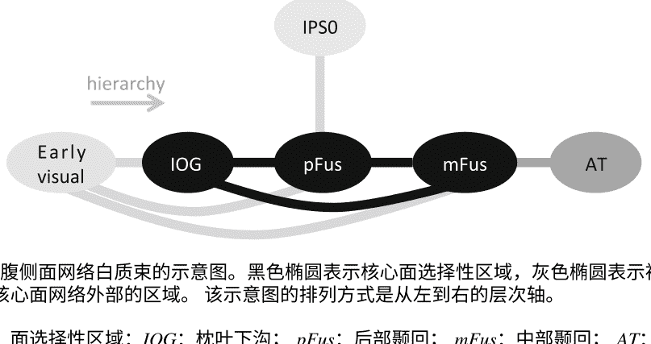

图1.3 腹侧面网络白质束的示意图。黑色椭圆表示核心面部选择性区域，灰色椭圆表示被认为是核心腹面网络外部的区域。该示意图的排列方式是从左到右的层次轴。

缩写：面部选择性区域：IOG：枕叶下沟；pFus：后部颞回；mFus：中部颞回；AT：前额叶；IPS0：位于顶内沟的一个区域，是注意力网络的一部分。

然而，这个示意图提供了关于腹侧面网络连接特征的四个重要见解。首先，这些发现说明了从IOG到pFus-faces以及从pFus到mFus-faces的分层连接，这可能为下一节中描述的腹侧面网络的分层特征提供了连接支架。其次，该网络包含冗余连接：每个区域都有多个白质束到达。

第三，存在不遵循严格分层组织的旁路连接。例如，被认为是处理层次结构后期阶段的mFus-faces不仅与前一阶段（pFus-faces）相连，还与IOG-faces和早期视觉皮层相连。最后，存在连接IPS-0（被认为是注意力网络的一部分）与pFus-faces的垂直白质束。这些垂直束可能促进自上而下的处理。

冗余和旁路连接的一个重要功能特点是，在受伤或患病的情况下，它们可以提供网络的弹性。例如，最近我们有一个独特的机会，在一位患有难治性癫痫的患者(SP)接受手术治疗前（1个月零4天）和手术治疗后（1个月零8天）测量面部网络[171]。令人惊讶的是，尽管切除了IOG，下游区域仍然功能完整，这在严格的分层组织中是无法预测的[58]。有趣的是，FG面部选择性区域的这种弹性也在患有长期(>10年)损伤下丘脑皮层的患者中报道[129,140,142]。通过测量SP的白质连接，我们确定了上述纵向和垂直束，这表明这些束可能通过从早期视觉皮层和/或顶叶皮层使用备用路径使信号到达这些下游区域，从而有助于切除后面部网络的弹性[171]。

尽管识别腹面网络的白质束是一个重要的里程碑，但我们认识到未来的工作需要揭示关于腹面网络连接性的许多未知问题，包括：(1)白质连接在腹面网络内部以及外部的功能效用是什么？(2)白质连接对腹面网络中面部选择性区域的空间分离有何贡献？(3)白质连接对行为有何贡献？

## 1.3 腹面网络中的群体感受野计算

如上所述，该领域已经积累了大量关于腹面选择性区域的功能特征、腹面网络内部区域的解剖组成和连接性以及它们在知觉中的作用的知识。然而，底层特征如何对每个区域和整个网络的计算做出贡献仍然是一个难题。在本节中，我们描述了通过群体感受野（pRFs）在腹流中进行的基本计算的进展。

发展计算模型的逻辑起点是确定颞叶腹面网络中神经元的感受野属性（视野中刺激引发神经元响应的区域）。这一点有三个原因。首先，感受野是视觉系统中神经元处理的基本方面[53,63]。由于具有相似感受野的神经元在空间上聚集，并且fMRI测量了每个脑体素（体积像素）内所有神经元的总体反应，我们可以测量总体感受野（pRF）-驱动体素内神经元总体的视野区域[31,76,77,162]。其次，人脸识别被认为需要对面部特征进行空间整合，而不是处理孤立的面部特征[148,155,156]。因此，确定颞叶腹面网络中pRF的位置和大小可能有助于我们了解面部网络不同阶段处理哪些面部部位。第三，了解pRF可能揭示注视/观看行为的一些信息。例如，当被要求识别一个面孔时，参与者通常会注视面孔的中心和眼睛，但当被要求判断面孔的情绪时，人们还会注视嘴巴[107]。这些注视行为表明面部处理的空间能力不仅受限，而且可能还与任务有关。

### 1.3.1 pRF测量揭示了面部网络的分层组织

最近，我们进行了一系列实验，构建了编码模型（明确识别一组特征和计算的计算模型，用于预测诱发的脑响应），以表征颞叶面部网络中的pRF。在扫描受试者观看不同位置和大小面孔时，系统地平铺了中央视野（12.5°）。通过这些数据，我们获得了每个体素的fMRI响应幅度作为面部位置和大小。

然后，对于每个体素，我们拟合一个模型，通过计算刺激与2D高斯的重叠来预测响应，然后进行压缩非线性处理[76,77]。这种基于模型的分析（1）提供了pRF属性的估计，如大小和离心率（距离注视点的距离），（2）允许比较颞叶流层次中的pRF属性，以及（3）揭示了颞叶面部网络中空间如何表示。

pRF映射显示，腹侧面网络中的体素受到视野中面部的位置和空间范围的显著调节，我们的简单pRF模型能很好地解释这些调节。腹侧面网络中的pRF展示了几个特点。首先，pRF中心位于对侧视野[60,77]，这一发现与视觉皮层的视网膜图组织一致[62]。也就是说，右半球体素的pRF中心位于左视野，反之亦然。其次，腹侧面网络中的pRF倾向于位于注视中心[77,176]，而不像早期和中间视网膜区域（V1-hV4，图1.4b）那样分布在整个视野中。第三，平均pRF大小从V1到后续视网膜区域（V2-hV4）以及面部网络（IOG-、pFus-和mFus-faces；[77,176]，图1.4a）逐渐增大。这种平均pRF大小的逐渐增加与分层组织一致[157]。第四，面部网络中的pRF大小与离心率呈线性增加关系（图1.4c；[77,176]，与早期区域[162]一样）。此外，这种关系的斜率在视觉层次结构中逐渐增加。因此，腹侧面网络中的pRF大小大于它们的离心率。因此，腹侧面网络中的pRF始终覆盖注视中心（中央凹）并延伸到同侧视野，处理来自右侧和左侧视野的信息。

图1.4d展示了pRFs在腹侧处理流中处理的视觉信息的直观说明。在这里，我们展示了几个区域中的示例pRFs。
- 1°偏心率处的pRFs跨越了腹侧流的几个区域；这些pRFs叠加在一个大小适合典型对话距离的脸上[91,96]。

该图说明了V1 pRF处理局部信息，如眼角，而hV4中的pRF可能处理整个面部特征，如眼睛。然而，面部网络中的大型和中央凹pRF处理来自面部两侧的多个面部特征的信息。这些数据表明了对注视行为的一个潜在解释：当人们注视面部时，他们试图在面部选择性区域中定位pRFs，以便最佳地整合面部特征信息。

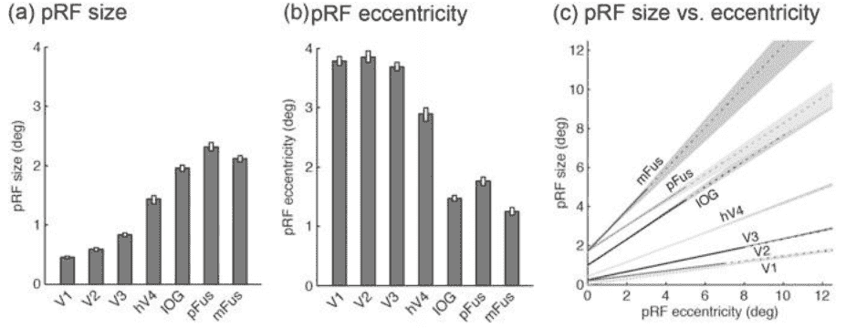

(d) Example face features processed by pRFs across ventral stream hierarchy
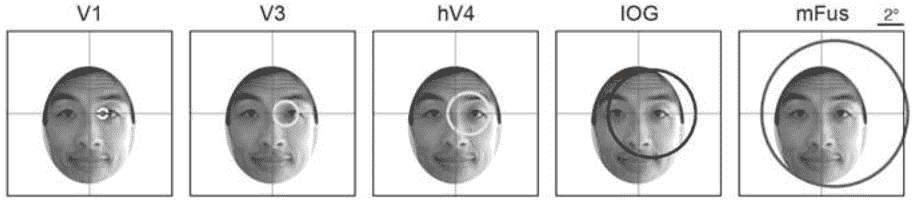

图1.4显示了腹侧面部网络的分层组织。a从V1到mFus-faces每个区域的中位数pRF大小（误差线表示68%置信区间，CIs）。pRF大小定义为表征pRF对点刺激响应的二维高斯的标准差。b每个区域pRF中心的中位数偏心率。cpRF大小和偏心率之间的关系（阴影区域表示拟合数据的68%置信区间）。d在层次结构中处理的面部特征。圆圈表示1°偏心率处的pRFs（根据面板c推导得出）。每个圆圈都是以 +/- 2个pRF尺寸绘制的。所描绘的脸的大小是为了模拟与人对话时的距离为1米（大约6.5°根据平均男性头部尺寸[91,96]）。 在层次结构中，空间信息在越来越大的面部区域中被整合，直到最新的阶段，整个面部被神经群体在一个体素内处理。改编自[77,167]。

在发育性面部失认症患者（DPs）和典型参与者之间比较群体感受野（pRFs）的数据支持这样一个观点，即通过大型和中央凹的pRFs获得的面部特征的空间整合对于面部感知是必要的[176]。 DPs是没有脑损伤的个体，但在面部识别方面受损，而不显示其他视觉或认知缺陷[8,11,28,30,88]。 pRF测量结果显示，与典型对照组相比，DPs的面部网络（和hV4）中的pRFs更小，很少延伸到外周或同侧的视野[176]。 值得注意的是，在典型和DPs中，面部识别能力与腹侧面网络中的pRF尺寸呈正相关：pRF尺寸较大的参与者表现比尺寸较小的参与者更好（r(15) = 0.63, p<0.007）。相反，面部识别能力与早期视网膜区域的pRF尺寸无关。 这些数据提供了实证证据，表明较小的DPs中的pRF大小可能反映了空间整合的缺陷，从而影响了人脸识别。

### 1.3.2 注意力调节pRF属性，增强了视觉敏锐度最差的外围表示

颞叶面部网络的反应不仅受到刺激的驱动，还受到内部自上而下的目标的调节[7,104,143,180]。我们通过测量不同注意状态下的pRF来表征自上而下因素如何调节pRF属性和空间信息[77]。使用相同的视觉刺激分别估计了不同任务下的pRF，包括一个数字任务，在该任务中注意力集中在中央呈现的数字上，注意力集中在固定点上，并且在面部任务期间，注意力集中在出现在视觉场中不同位置的面部上（在固定点上，被试分别对数字和面部进行了1-back判断）。

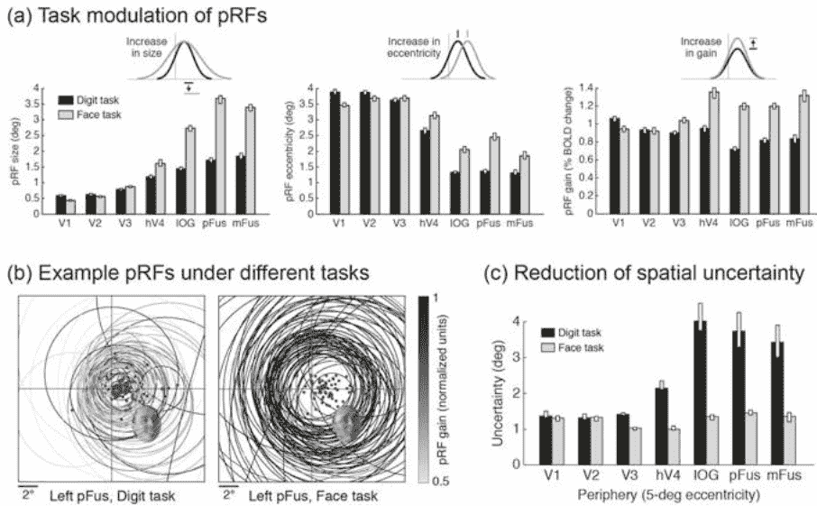

图1.5 注意力调节颞叶面部网络中的pRF属性，增强了空间表示。使用相同的刺激在不同任务下测量了pRF。对于本面板中的数据，被试者在中央呈现的数字上执行了一个1-back任务（数字任务）或者在呈现的面孔上执行了一个1-back任务（面孔任务），同时固定视线在中央。a任务引起的pRF属性变化（条表示各体素的中位数；误差条表示68%的置信区间）。在面孔任务（灰色）中，IOG-、pFus-、mFus-faces和hV4的pRF更大（左），更偏心（中）并且增益增加（右）与数字任务（黑色）相比。b 100个随机选择的pRF从左侧pFus-faces中的视觉场瓦片（点表示pRF中心；圆圈表示在+/-2个pRF大小处绘制的pRF）。示例面孔显示在5度偏心处。c刺激位置辨别的空间不确定性。条形表示5度偏心处参考位置的不确定性（角度位置的中位数+/-68%的置信区间）。在数字任务中，IOG-、pFus-和mFus-faces的不确定性较大。然而，在面孔任务中，不确定性显著减少，并且与V1中的空间不确定性相当。改编自[77,167]。

将pRF模型分别拟合到在不同任务下观察到的脑响应中，我们发现颞叶面部网络和hV4中的pRF依赖于任务。在这些区域中，当参与者注意面部时，pRF较大（图1.5a-左），位置更外围（图1.5a-中），增益更高（图1.5a-右），与参与者注意呈现在固定点上的数字时相比。相比之下，早期视觉区域V1-V3中的pRF相对稳定，并且在任务之间没有显著变化（图1.5a）。

为了直观地理解注意调节对颞叶面部网络中pRFs的影响，我们可视化了在数字任务中测量的左侧pFus-faces的pRFs集合（图1.5b-左）和在面部任务中测量的pRFs集合（图1.5b-右）。由于面部任务中的pRFs较大且更偏心，与数字任务相比，在面部任务中对外周视野的覆盖范围更广。

例如，当面部距离固定点5°偏心度时，在数字任务中只有少数pRFs处理，而在面部任务中则由许多pRFs处理。

为了解释任务间空间表示的变化，我们采用了一种基于模型的解码方法（从分布式脑活动模式中推断信息），并量化了在在每个视觉区域跨越一组pRFs的响应中，面部在5°偏心度处呈现的位置的空间不确定性。结果显示，在面部网络中，从数字任务到面部任务解码面部位置的空间不确定性显著减小（图1.5c）。令人惊讶的是，在面部任务中，面部网络的空间不确定性与V1 pRFs获得的空间不确定性相似，而V1 pRFs的尺寸要小得多。这些结果揭示了空间编码的另一个方面：决定一组pRFs处理的空间分辨率的因素不仅仅是它们的大小，还包括它们的分散程度。换句话说，大型且部分重叠的pRFs可能提供与小型且不重叠的pRFs相似的空间精度，与粗编码的概念一致[139,174]。

我们对pRF属性的研究只是构建准确的面部网络编码模型的第一步，因为我们实现了一个基本的空间滤波器，仅执行空间求和，并且在整个腹侧通路中使用相同类型的空间滤波。因此，pRF模型的重要未来发展包括(1)在模型中包括解释与刺激的其他方面（例如形状和/或特征）相关的计算的附加维度，以及(2)确定和如何在每个大脑皮层区域内和区间变化的附加pRF属性。例如，为每个V1体素实现一组方向选择性滤波器，而不仅仅是高斯滤波器，可以更好地预测自然图像对V1响应的解释能力[75]。在面部处理领域，详细说明pRF是必要的，以解释当前pRF模型无法解释的面部选择性区域的基本响应特性，例如对个体面部[46,84,103]和面部部分[27,61]的优先响应和调谐。

## 1.4 面向未来的眼睛：从面部网络的解剖和功能特征中获得的计算洞见

### 1.4.1 有组织的大脑皮层面部网络的计算效用是什么？

这里回顾的经验发现揭示了人脑中用于面部感知的神经处理系统的有组织且可复制的实现。由于生成有组织的结构比无组织的结构更费力，因此可能会从这种功能架构中产生反映优化的计算策略的某些原则，这些原则可能是通过进化或发展过程中产生的。因此，可以从大脑中腹侧面网络的具体特征中获得计算洞见。在这里，我们强调一些尚未在计算模型中实现的架构和功能特征，并考虑这些特征的假设计算方面，这些方面可以在未来的研究中进行测试。

例如，可以进一步开发的计算模型的一个重要方面是明确地建模解剖特征如何对动态、任务相关的pRFs的形成产生影响。目前的pRF方法简单地将每个任务视为一个独立的实体，并分别估计刺激表示的模型。这提供了有用的见解，但需要进一步研究来确定其他脑区源自任务调节的神经机制。为了更好地理解注意力如何调节pRFs，可以考虑面部网络的白质连接特性。例如，来自面部网络外皮层区域的自上而下连接（如IPS-0到pFus-faces的连接）可能为自上而下信息从参与注意力门控的顶叶区域流向面部选择性区域提供了一条路径。因此，动态pRFs可能是由自下而上连接产生的静态pRF与由IPS-0的自上而下连接介导的注意力场之间相互作用的结果。开发新的编码模型，将这些解剖特征纳入考虑，可能揭示面部网络中自上而下和自下而上处理之间的相互作用，这是一个迄今为止难以捉摸的话题。

除了宏观解剖特征，如白质连接性，我们认为将微观解剖特征纳入计算模型中也是有用的。例如，pFus-和mFus-faces之间的细胞构筑差异表明这些区域具有不同的神经硬件，可能优化以执行不同类型的计算。因此，这些数据表明计算模型不一定要实现一个单一的通用神经计算或滤波器类型，该类型在处理阶段中被复制。相反，在处理的不同阶段可能会发生不同的专门计算。此外，未来工作的一个雄心勃勃且有趣的方向是建立起解剖学特性（如细胞构架、受体构架、髓鞘构架、细胞类型和微电路连接）与脑中腹侧面网络神经元的计算特性之间的明确联系。

### 1.4.2 深度卷积网络能为大脑的计算策略提供什么信息？

未来研究的另一个有前途的方向将是将最新的神经科学发现纳入实施深度卷积神经网络（CNNs; [41, 67, 85, 121, 136]）的计算模型中，这些网络已经取得了显著的进展。简而言之，深度CNN是由一系列堆叠的层组成的神经网络，其中第一层对输入图像进行操作，后续层对前一层的输出进行操作。因此，CNN具有前馈架构。此外，CNN中的层通常在执行线性操作的层（例如卷积）、执行非线性操作的层（例如ReLU）和池化层之间交替。在这种排序的多个堆叠层之后，通常会有一个或多个全连接层。执行线性操作的层通常包含多个滤波器数组，每个滤波器对视觉输入中的局部区域执行操作（类似于人类视觉系统中的RF计算），并且相同的滤波器在整个视觉场中重复出现。此外，后续层中的滤波器从前一层的局部邻域中汇集信息，这导致CNN层次结构向上移动时池化的整体增加。构建深度CNN的架构后，网络被训练以执行任务（例如人脸识别）。在训练过程中，通常使用反向传播算法[87, 127]来改变层之间的连接权重，该算法的功能是减少网络输出与期望答案之间的误差。训练后，权重不再改变，深度CNN的处理过程严格按照前馈方式进行。

深度卷积神经网络的架构很吸引人，因为（1）它们受到腹侧视觉通路的结构特征的启发[41, 121, 136]，（2）它们在复杂物体识别任务中达到了类似人类的性能[83, 177]，包括人脸识别[145]，（3）它们可以以显著的准确性预测灵长类动物和人类腹侧视觉通路的实验测量响应[16, 33, 55, 67, 78, 86, 178]。我们建议可以将卷积神经网络作为一种工具（例如，通过模拟和分析）来理解在人脸网络中进行的计算。然而，作为第一步，重要的是要考虑深度卷积神经网络的人工架构与人类腹侧视觉通路的神经生物学架构在哪些方面相似或不同。

深度卷积神经网络的几个方面与人类腹侧视觉通路的架构相似（表1.1）。例如，两个系统都实现了：（1）通过局部滤波器进行计算，（2）在一系列阶段中进行分层处理，（3）前馈计算，（4）线性-非线性操作，（5）冗余连接和（6）训练过程中的权重修改。

| Functional/architectural property | Deep CNN | Human Brain | Hypothesized Computational Value |
|---|---|---|---|
| pRFs/filters: Local computations | ✔ | ✔ | Parallel processing<br>Distributed information |
| pRF/filter size increases along hierarchy | ✔ | ✔ | Useful features<br>Invariance |
| pRF/filter size increases with eccentricity | ✖ | ✔ | Solution to<br>limited brain size |
| Dynamic pRFs | ✖ | ✔ | Task-optimized<br>processing |
| Representations: Spatial topography | ✖ | ✔ | Efficiency and speed |
| Clustering of neurons with similar features | ✖ | ✔ | Reduce wiring length |
| Neural Hardware: Differential neural across regions | ✖? | ✔? | Computation-optimized<br>hardware |
| Connections: Hierarchical connections | ✔ | ✔ | Hierarchical processing |
| Redundant connections | ✔ | ✔ | Resiliency to loss/damage |
| Bypass connections | ✖ | ✔ | Resiliency/speed |
| Top-down connections | during learning | ✔ | Learning/attentional gating |

尽管深度CNN架构在很大程度上受到腹侧视觉通路的神经生物学结构特征的启发，但它们与人脑神经结构在几个基本方面存在差异（表1.1）。例如，我们注意到当前的深度CNN（如AlexNet [85]）或FaceNet [131]与腹侧视觉通路的已知情况之间存在四个差异。首先，在训练阶段之后，CNN中的滤波器是固定的，而不是动态的，但在大脑中，pRFs是动态的，并且可以通过自上而下的注意力进行修改。其次，CNN中的滤波器在视野中的大小是相同的，但在大脑中，pRFs在视野的中心比周边更大。第三，在CNN的给定层中，滤波器的空间排列没有意义，但在视觉系统在大脑皮层的空间尺度上，展示了一种可复制的个体间表示的空间拓扑。第四，在标准的卷积神经网络中，在训练阶段之后，通常没有自上而下的连接或绕行路线的影响，但是大脑中存在并且使用了这两种类型的连接。通过修改卷积神经网络的架构，以实现更准确反映神经生物学合理的大脑架构的特征，可能可以探索和更好地理解特定神经生物学特征的计算优势（表1.1 - 右列）。下面，我们给出三个这样的测试示例。

首先，大多数当前的深度卷积神经网络的计算架构，如AlexNet [85]或FaceNet [131]，是严格串行的，这不符合脑中腹侧面网络包含绕行路线跳过处理层级的生物现实。因此，将最近的绕行路线的实证发现纳入卷积神经网络的架构中，可能会（1）使卷积神经网络更准确地模拟人类视觉系统，并且（2）推进我们对绕行路线等特定架构特征假设的理解。例如，可以通过比较严格串行神经网络中一个中间层的虚拟损伤和包含绕行连接的非串行神经网络中的虚拟损伤，来测试绕行连接是否提供对大脑皮层损伤的弹性。

其次，深度卷积神经网络在训练阶段之后包含固定的滤波器，并且不包含来自其他处理阶段的自上而下的连接。因此，深度卷积神经网络中的处理完全是刺激驱动的，因此不考虑任务和注意力对腹侧面网络响应的已知经验效应，例如注意力调节的感兴趣区域。因此，可以改进现有的深度卷积神经网络，如FaceNet [131]，以包含自上而下的连接，以测试这种添加是否能解释任务和注意力对感兴趣区域属性的影响，如果可以，是否能提高网络的效率和/或性能。

第三，如第1.2.1节所述，人脑中存在着功能表示的规则空间拓扑。这种拓扑在视觉处理层次的所有阶段中都是明显的——从早期和中间视觉区域中生成视觉场的空间映射的有序pRF排列结构[133, 161, 163]，到物体形态拓扑[22, 59]和相对于宏解剖标志物的腹侧颞叶皮层中面选择性区域的规则性[165, 170]。与大脑中细粒度功能区域和大尺度表示的空间规则性相比，CNN中特定层的节点没有空间组织（1），而且CNN没有明确考虑神经生物学成本（如布线长度），而生物系统受到这些成本的影响（2）。因此，未来的研究可以探讨（1）为了使深度卷积神经网络发展出空间结构，需要添加哪些建筑约束（可能受到第1.2节中总结的面选择性区域的细胞构建和连接结构的指导），以及（2）大脑皮层组织提供了什么计算优势？例如，空间拓扑是否增强了CNN的速度或效率？

## 1.5 结论

如本章所述, 神经影像研究推动了对我们对人类颞叶面网络的功能结构的理解。例如, 我们对颞叶面网络中区域的空间排列的理解从厘米级提高到毫米级。最近的研究将颞叶面网络的一致空间排列与细胞构架等微观解剖特征以及白质连接性联系起来。从机制上讲, 新方法推导群体感受野开始阐明颞叶面网络的计算原理。

虽然还有一些关键问题尚未解答, 但这些新的研究方向为我们理解面部网络的功能神经解剖特征对人类面部感知的计算作出了令人兴奋的新机会。重要的是, 将这些最新发现纳入最新的计算模型中, 通过将这些特征整合到最先进的深度卷积神经网络结构中, 将进一步推动该领域的发展, 提供对人脑特定实现特征的计算优势的增强理解。

> 致谢：我们感谢Jesse Gomez对早期草稿的评论和编辑。这项研究得到以下拨款的资助: NSF GRFP DGE-114747, 1R01EY02231801-A1, 和1R01EY02391501-A1。本章的部分内容曾在2017年《年度视觉科学评论》中发表的一篇论文中提及 (http://www.annualreviews.org/doi/10.1146/annurev-vision-102016-061214)。

## 附录：缩写和定义

- 背侧沟 (CoS)：人类颞叶腹侧颞叶皮层的一个主要沟回; 颞叶回的内侧边界
- 细胞构架：六层皮质带上的细胞组织结构; 用于将脑区从其他脑区分割开的一种特性
- 发展性面孔失认症 (DP)：一种在正常视力、智力和社交认知能力下无法识别面孔的障碍, 且没有脑损伤史
- 颞下回面积 (FFA)：曾认为是一个同质的面部选择性区域, 它包含（至少）两个细胞构造和功能上不同的组成部分
- 颞下回 (FG)：位于颞叶顶部的类人猿特有的宏解剖结构, 包含（至少）四个细胞构造区域和多个功能区域
- FG1-4：颞下回和相邻沟回的四个细胞构造区域的标签
- 枕下回（IOG）：位于颞下回后外侧的回，被认为是颞下面网络的第一个处理阶段
- 中颞下沟（MFS）：一条浅而纵向的沟回，将颞下回一分为二；是识别细胞构造和功能边界的标志
- mFus-faces/FFA-2：一个选择脸部的区域，与枕中回后外侧的枕中沟重叠，在细胞构造区域FG4内，距离pFus-faces/FFA-1前1-1.5厘米
- 枕-颞沟（OTS）：人类颞叶腹侧颞叶皮层的一个主要沟；颞叶回的外侧边界
- 海马旁区（PPA）：侧支沟和海马旁皮层中的一个选择地点的区域
- pFus-faces/FFA-1：一个通常与枕中回后外侧的枕中沟重叠的选择脸部的区域，在细胞构造区域FG2内，距离mFus-faces/FFA-2后1-1.5厘米
- 群体感受野（pRF）：在fMRI中，刺激视觉空间的区域，刺激一个体素
- 感受野（RF）：在视觉场中引发神经元响应的区域
- 腹侧颞叶皮层（VTC）：横跨颞叶下部的皮层区域，包含参与“what”感知和识别的高级视觉区域

# 参考文献

- 1. T. Allison, H. Ginter, G. McCarthy, A.C. Nobre, A. Puce等，人类额外条带皮层中的人脸识别。神经生理学杂志 71, 821-825 (1994年)
- 2. T. Allison, G. McCarthy, A. Nobre, A. Puce, A. Belger, 人类额外条带视觉皮层与面孔、单词、数字和颜色的感知。大脑皮层 4, 544-554 (1994年)
- 3. T. Allison, A. Puce, D.D. Spencer, G. McCarthy, 人类面孔感知的电生理研究。 I: 面孔和非面刺激在枕颞皮层产生的电位。 Cereb. Cortex 9, 415-430 (1999)
- 4. T.J. Andrews, M.P. Ewbank, 人类颞叶对面部身份和可变方面的不同表示。 Neuroimage 23, 905-913 (2004)
- 5. S. Anzellotti, S.L. Fairhall, A. Caramazza, 解码对旋转具有容忍性的面部身份表示。 Cereb. Cortex 24, 1988-1995 (2014)
- 6. G. Avidan, M. Behrmann, 功能性磁共振成像揭示了先天性面部失认症中面部处理网络的神经完整性受损。 Curr. Biol. 19, 1146-1150 (2009)
- 7. G. Avidan, I. Levy, T. Hendler, E. Zohary, R. Malach, 高阶视觉区域中的空间与对象特定注意力。 Neuroimage 19, 308-318 (2003)
- 8. G. Avidan, U. Hasson, R. Malach, M. Behrmann, 对先天性面孔失认症中与面孔相关的处理进行详细探索：2. 功能性神经影像学发现。 J. Cogn. Neurosci. 17,1150-1167 (2005)
- 9. V. Axelrod, G. Yovel, 人类视觉皮层中面孔视角的分层处理。J. Neurosci. 32, 2442-2452 (2012)
- 10. V. Axelrod, G. Yovel, 定位前颞面区域的挑战: 一个可能的解决方案。 Neuroimage 2013(81), 371-380 (2013)
- 11. M. Behrmann, G. Avidan, 先天性面孔失认症: 从出生开始就无法识别面孔。Trends Cogn. Sci. 9, 180-187 (2005)
- 12. M. Behrmann, D.C. Plaut, 分布式电路, 而不是局限的中心, 介导视觉识别。认知科学趋势 17, 210-219 (2013)
- 13. M.G. Berman, J. Park, R. Gonzalez, T.A. Polk, A. Gehrke等, 评估功能定位器: 以FFA为例。神经影像 50, 56-71 (2010)
- 14. V. Bruce, A. Young, 理解面部识别。英国心理学杂志 77(Pt 3), 305-327 (1986)
- 15. L. Bugatus, K.S. Weiner, K. Grill-Spector, 任务差异调节了类别选择性区域在解剖位置上的空间范围。神经影像（2017）(即将出版)
- 16. C.F. Cadieu, H. Hong, D.L. Yamins, N. Pinto, D. Ardila等, 深度神经网络在核心视觉对象识别方面与灵长类IT皮层的表征相媲美。PLoS计算生物学10, e1003963 (2014)
- 17. A.J. Calder, A.W. Young, 理解面部身份和面部表情的识别。Nat. Rev. Neurosci. 6, 641-651 (2005)
- 18. A.J. Calder, J.D. Beaver, J.S. Winston, R.J. Dolan, R. Jenkins等, 超时程沟和下顶叶中不同注视方向的分离编码。Curr.Biol. 17, 20-25 (2007)
- 19. T. Carlson, H. Hogendoorn, H. Fontijn, F.A. Verstraten, 对象选择性皮层中的空间编码和不变性。Cortex 47, 14-22 (2011)
- 20. J. Caspers, K. Zilles, S.B. Eickhoff, A. Schleicher, H. Mohlberg, K. Amunts, 人类后部颞回两个额外皮层区域的细胞构造分析和概率映射。Brain Struct. Funct. 218, 511-526 (2013)
- 21. J.A. Collins, I.R. Olson, 超越FFA: 颞叶前腹侧颞叶在面部处理中的作用。Neuropsychologia 61, 65-79 (2014)
- 22. A.C. Connolly, J.S. Guntupalli, J. Gors, M. Hanke, Y.O. Halchenko等, 人脑中生物类别的表示。J. Neurosci. 32, 2608-2618 (2012)
- 23. T. Cukur, A.G. Huth, S. Nishimoto, J.L. Gallant, 人类FFA内的功能亚区。J. Neurosci. 33, 16748-16766 (2013)
- 24. N. Davidenko, D.A. Remus, K. Grill-Spector, 面部相似性和图像变异性驱动人类面部选择性腹侧区域的响应。Hum. Brain Mapp. 33, 2234-2249 (2012)
- 25. I. Davidesco, M. Harel, M. Ramot, U. Kramer, S. Kipervasser等, 空间和基于对象的注意力调节人类视觉皮层层结构中的宽频高频响应。J. Neurosci. 33, 1228-1240 (2013)
- 26. I. Davidesco, E. Zion-Golumbic, S. Bickel, M. Harel, D.M. Groppe等人, 示例选择反映了人类颞叶皮层中的感知相似性。大脑皮层 24, 1879-1893 (2014)
- 27. B. de Haas, D.S. Schwarzkopf, I. Alvarez, R.P. Lawson, L. Henriksson等人, 人脑对面孔的感知和处理调整到典型的特征位置。神经科学杂志 36, 9289-9302 (2016)
- 28. B. Duchaine, K. Nakayama, 剑桥面孔记忆测试: 对神经系统完好的个体的结果以及使用倒置面孔刺激和面部失认症患者的有效性的研究。神经心理学 44, 576-585 (2006)
- 29. B. Duchaine, G. Yovel, 一种修订的面部处理神经框架。Annu. Rev. Vis. Sci 1, 393-416 (2015)
- 30. B.C. Duchaine, K. Nakayama, 发展性面部失认症: 内容特定面部处理的窗口。Curr. Opin. Neurobiol. 16, 166-173 (2006)
- 31. S.O. Dumoulin, B.A. Wandell, 人类视觉皮层中的人口感受野估计. Neuroimage 39, 647-660 (2008)
- 32. T. Egner, J.M. Monti, C. Summerfield, 期望和惊讶决定腹侧视觉通路中的神经群体反应. J. Neurosci. 30, 16601-16608 (2010)
- 33. M. Eickenberg, A. Gramfort, G. Varoquaux, B. Thirion, 看到全部: 卷积网络层映射人类视觉系统的功能. Neuroimage (2016)
- 34. M.P. Ewbank, T.J. Andrews, 熟悉和不熟悉面孔之间的视角差异敏感性在人类视觉皮层中. Neuroimage 40, 1857-1870 (2008)
- 35. F. Fang, S. He, 人类背侧和腹侧通路对不可见物体的皮层反应. Nat. Neurosci. 8, 1380-1385 (2005)
- 36. R. Farivar, O. Blanke, A. Chaudhuri, 背侧-腹侧在识别运动定义的陌生面孔中的整合. J. Neurosci. 29, 5336-5342 (2009)
- 37. D.J. Felleman, D.C. Van Essen, 灵长类大脑皮层中的分布式分层处理. Cereb. Cortex 1, 1-47 (1991)
- 38. B. Fischl, M.I. Sereno, R.B. Tootell, A.M. Dale, 高分辨率个体间平均和大脑皮层的坐标系. Hum. Brain Mapp. 8, 272-284 (1999)
- 39. W. Freiwald, B. Duchaine, G. Yovel, 面部处理系统: 从神经元到现实世界的社会感知. Annu. Rev. Neurosci. 39, 325-346 (2016)
- 40. M.A. Frost, R. Goebel, 测量结构-功能对应性: 宏解剖对齐后专门脑区的空间变异性. 神经影像 59, 1369-1381(2012)
- 41. K. Fukushima, Neocognitron: 一种能够进行视觉模式识别的分层神经网络. 神经网络 1 , 119-130 (1982)
- 42. I. Gauthier, P. Skudlarski, J.C. Gore, A.W. Anderson, 对汽车和鸟类的专业知识招募了参与面部识别的脑区。自然神经科学 3, 191-197 (2000)
- 43. S. Gilaie-Dotan, R. Malach, 人类面部相关区域的子示例形状调谐。大脑皮层 17, 325-338 (2007)
- 44. S. Gilaie-Dotan, H. Gelbard-Sagiv, R. Malach, 对正立和倒立面孔的感知形状敏感性在神经适应中得到反映。神经影像 50, 383-395 (2010)
- 45. J. Gomez, F. Pestilli, N. Witthoft, G. Golarai, A. Liberman等, 功能定义的白质揭示了人类颞叶皮层中与类别特定处理相关的分离通路。神经元 85, 216-227 (2015)
- 46. C. Gratton, K.K. Sreenivasan, M.A. Silver, M. D'Esposito, 注意力有选择性地修改了人脑中个体面孔的表示。神经科学杂志 33, 6979-6989 (2013)
- 47. K. Grill-Sporter, R. Malach, fMR适应性: 研究人类皮层神经元功能特性的工具。心理学报告 (阿姆斯特丹) 107, 293-321 (2001)
- 48. K. Grill-Sporter, K.S. Weiner, 腹侧颞叶皮层的功能结构及其在分类中的作用。自然神经科学评论 15, 536-548 (2014)
- 49. K. Grill-Sporter, T. Kushnir, S. Edelman, G. Avidan, Y. Itzhak, R. Malach, 人类侧枕复合体在不同视觉条件下对物体的差异处理。神经元 24, 187-203 (1999)
- 50. K. Grill-Sporter, N. Knouf, N. Kanwisher, 颞下颞区支持面孔感知, 而不是通用的同类别识别。Nat. Neurosci. 7, 555-562 (2004)
- 51. K. Grill-Sporter, R. Henson, A. Martin, 重复和大脑: 刺激特异性效应的神经模型。Trends Cogn. Sci. 10, 14-23 (2006)
- 52. C.G. Gross, J. Sergent, 面孔识别。Curr. Opin. Neurobiol. 2, 156-161 (1992)
- 53. C.G. Gross, D.B. Bender, C.E. Rocha-Miranda, 猴子颞下颞皮层神经元的视觉感受野。科学 166, 1303-1306 (1969)
- 54. M. Gschwind, G. Pourtois, S. Schwartz, D. Van De Ville, P. Vuilleumier, 白质连接在人脑中的面部响应区域之间。大脑皮层 22, 1564-1576(2012)
- 55. U. Guclu, M.A. van Gerven, 深度神经网络揭示了腹侧通道中神经表示复杂性的梯度。神经科学杂志 35, 10005-10014 (2015)
- 56. R.J. Harris, G.E. Rice, A.W. Young, T.J. Andrews, 在颞叶回中对单词和面孔的响应具有不同但重叠的模式。大脑皮层 26, 3161-3168 (2016)
- 57. U. Hasson, I. Levy, M. Behrmann, T. Hendler, R. Malach, 偏心度偏见作为人类高阶物体区域的组织原则。神经元 34, 479-490 (2002)

- 58. J.V. Haxby, E.A. Hoffman, M.I. Gobbini, 用于面部感知的分布式人类神经系统。Cogn. Neurosci. Trends 4, 223-233 (2000)

- 59. J.V. Haxby, M.I. Gobbini, M.L. Furey, A. Ishai, J.L. Schouten, P. Pietrini, 脑颞叶皮层中面部和物体的分布和重叠表示。Science 293, 2425-2430 (2001)

- 60. C.C. Hemond, N.G. Kanwisher, H.P. Op de Beeck, 人类物体和面部选择性皮层对对侧刺激的偏好。PLoS One 2, e574 (2007)

- 61. L. Henriksson, M. Mur, N. Kriegeskorte, 人类枕叶面区中具有类似面部拓扑的面部特征图。Cortex 72, 156-167 (2015)

- 62. G. Holmes, 大脑病变引起的视觉障碍。Br. J. Ophthalmol. 2, 353-384 (1918)

- 63. D.H. Hubel, T.N. Wiesel, 猫的视觉皮层中的感受野、双眼互动和功能结构。J. Physiol. 160, 106-154 (1962)

- 64. J.B. Hutchinson, M.R. Uncapher, K.S. Weiner, D.W. Bressler, M.A. Silver等, 注意力和情节记忆检索中后顶叶皮层的功能异质性。Cereb. Cortex 24, 49-66 (2012)

- 65. A. Ishai, L.G. Ungerleider, A. Martin, J.V. Haxby, 人类枕叶和颞叶皮层中物体的表示。J. Cogn. Neurosci. 12 (第2卷), 35-51 (2000)

- 66. C. Jacques, N. Witthoft, K.S. Weiner, B.L. Foster, V. Rangarajan等, 人类颞叶底部皮层中相应的ECoG和fMRI类别选择性信号。Neuropsychologia 83, 14-28 (2016)

- 67. X. Jiang, E. Rosen, T. Zeffiro, J. Vanmeter, V. Blanz, M. Riesenhuber, 使用fMRI和行为技术评估基于形状的人脸辨别模型。Neuron 50, 159-172 (2006)

- 68. J. Jonas, S. Frismand, J.P. Vignal, S. Colnat-Coulbois, L. Koessler等, 人类视觉皮层脑内刺激引发的视觉现象右半球优势。Brain Imaging Behav. 8, 35, 3360-3371 (2014)

- 69. J. Jonas, B. Rossion, J. Krieg, L. Koessler, S. Colnat-Coulbois等, 在右侧枕叶皮层的面选择性区域进行脑内电刺激会影响个体面孔辨别。NeuroImage 99, 487-497 (2014)

- 70. J. Jonas, C. Jacques, J. Liu-Shuang, H. Brissart, S. Colnat-Coulbois等, 人脑中具有面部选择性的腹侧枕叶-颞叶地图, 通过颅内电位研究。PNAS 113, E4088-E4097 (2016)

- 71. N. Kanwisher, 面孔感知中的领域特异性。Nat. Neurosci. 3, 759-763 (2000)

- 72. N. Kanwisher, J. McDermott, M.M. Chun, 颞上皮质中的颞后额叶面区: 人类面孔感知的模块。J. Neurosci. 17, 4302-4311 (1997)

- 73. N. Kanwisher, F. Tong, K. Nakayama, 面孔倒置对人类颞后额叶面区的影响。Cognition 68, B1-B11 (1998)

- 74. K.N. Kay, J.D. Yeatman, 高级视觉皮层中的自下而上和自上而下计算。eLife. 2017年2月22日;6. pii: e22341 (2017)

- 75. K.N. Kay, T. Naselaris, R.J. Prenger, J.L. Gallant, 通过人脑活动识别自然图像。Nature 452, 352-355 (2008)

- 76. K.N. Kay, J. Winawer, A. Mezer, B.A. Wandell, 人类视觉皮层中的压缩空间求和。

- 77. K.N. Kay, K.S. Weiner, K. Grill-Spector, 注意力减少了人类腹侧颞叶皮层的空间不确定性。

- 78. S.M. Khaligh-Razavi, N. Kriegeskorte, 深度监督模型可以解释IT皮层的表征。

- 79. T.C. Kietzmann, J.D. Swisher, P. Konig, F. Tong, 腹侧和背侧视觉通路中对面部镜像对称视图的选择性普遍存在。

- 80. M. Kim, M. Ducros, T. Carlson, I. Ronen, S. He等人, 人类枕顶颞叶皮层功能组织的解剖学相关性。Magn. Reson. Imaging 24, 583-590 (2006)

## 1 面部处理的功能性神经解剖学

- 81. B.P. Klein, B.M. Harvey, S.O. Dumoulin, 空间注意力在人类视觉皮层中引起位置偏好的吸引力。Neuron 84, 227-237 (2014)

- 82. J. Konorski, 大脑的综合活动。一种跨学科的方法（芝加哥大学出版社，芝加哥，1967年）

- 83. N. Kriegeskorte, 深度神经网络：建模生物视觉和脑信息处理的新框架。Annu. Rev. Vis. Sci. 1, 417-446 (2015)

- 84. N. Kriegeskorte, E. Formisano, B. Sorger, R. Goebel, 个体面孔在人类前颞叶皮层中引发不同的响应模式。PNAS 104, 20600-20605 (2007)

- 85. A. Krizhevsky, I. Sutskever, G. Hinton, 使用深度卷积神经网络进行图像分类。发表于神经信息处理系统 (NIPS) （2012）

- 86. J. Kubilius, S. Bracci, H.P. Op de Beeck, 深度神经网络作为人类形状敏感性的计算模型。PLoS Comput. Biol. 12, e1004896 (2016)

- 87. Y. LeCun, B. Boser, J.S. Denker, D. Henderson, R.E. Howard等，神经信息处理（1989）

- 88. Y. Lee, B. Duchaine, H.R. Wilson, K. Nakayama, 一个家庭中的三个发展性面孔失认症病例：面孔处理的详细神经心理学和心理物理学研究。Cortex 46, 949–964 (2010)

- 89. I. Levy, U. Hasson, G. Avidan, T. Hendler, R. Malach, 人类目标区域的中心-外围组织。Nat. Neurosci. 4, 533–539 (2001)

- 90. G. Loffler, G. Yourganov, F. Wilkinson, H.R. Wilson, fMRI证据支持面孔的神经表征。Nat. Neurosci. 8, 1386–1390 (2005)

- 91. G.R. Loftus, E.M. Harley, 为什么辨认近距离的人比辨认远距离的人更容易？Psychon. Bull. Rev. 12, 43–65 (2005)

- 92. S. Lorenz, K.S. Weiner, J. Caspers, H. Mohlberg, A. Schleicher等人, 在人类中部沟回上的两个新的细胞构架区域。Cereb. Cortex (2015)

- 93. A. Martin, C.L. Wiggs, L.G. Ungerleider, J.V. Haxby, 类别特定知识的神经相关性。Nature 379, 649–652 (1996)

- 94. G. McCarthy, A. Puce, J.C. Gore, T. Allison, 人类颞叶中的面部特定处理。

- 95. G. McCarthy, A. Puce, A. Belger, T. Allison, 人类面部知觉的电生理研究。II: 在枕颞叶皮层产生的面部特定电位的响应特性。

- 96. E. McKone, 面部的整体处理在各种尺寸上都存在，但在识别而不是对话距离上最强。

- 97. K. Moutoussis, S. Zeki, 用不可见刺激研究皮层激活与知觉之间的关系。

- 98. M. Mur, D.A. Ruff, J. Bodurka, P. De Weerd, P.A. Bandettini, N. Kriegeskorte, 人类类别选择性皮层区域的分类、分级单图像激活特征。

- 99. S. Nasr, N. Liu, K.J. Devaney, X. Yue, R. Rajimehr等人, 人类和非人类灵长类动物的场景选择性皮层区域。J. Neurosci. 31, 13771–13785 (2011)

- 100. V. Natu, M.A. Barnett, T. Hartley, J. Gomez, A. Stigliani, K. Grill-Spector, 神经对面部身份的分敏感性的发展与感知可辨别性相关。J. Neurosci. 36, 10893–10907 (2016)

- 101. V.S. Natu, A.J. O’Toole, 对视觉熟悉度不同的面孔的神经反应模式的时空变化。NeuroImage 108, 151–159 (2015)

- 102. V.S. Natu, F. Jiang, A. Narvekar, S. Keshvari, V. Blanz, A.J. O’Toole, 面部身份在视角变化中的可分离神经模式。J. Cogn. Neurosci. 22, 1570–1582 (2010)

- 103. A. Nestor, D.C. Plaut, M. Behrmann, 通过时空模式分析揭示面部身份的分布式神经编码。PNAS 108, 9998-10003 (2011)

- 104. K.M. O’Craven, P.E. Downing, N. Kanwisher, fMRI证据表明对象是注意选择的单位。Nature 401, 584-587 (1999)

- 105. J. Parvizi, C. Jacques, B.L. Foster, N. Witthoft, V. Rangarajan等, 电刺激人类颞下面部选择性区域扭曲面部感知。J. Neurosci. 32, 14915-14920 (2012)

- 106. M.V. Peelen, P.E. Downing, 功能性磁共振成像的类别特异性视觉活动的被试内可重复性。Brain Mapping 25, 402-408 (2005)

- 107. K.A. Pelphrey, N.J. Sasson, J.S. Reznick, G. Paul, B.D. Goldman, J. Piven, 自闭症中的面孔扫描。J. Autism Dev. Disord. 32, 249–261 (2002)

- 108. M.A. Pinsk, M. Arcaro, K.S. Weiner, J.F. Kalkus, S.J. Inati等, 猕猴和人类皮层中面部和身体部位的神经表示:一项比较fMRI研究。J. Neurophysiol. 101, 2581–2600 (2009)

- 109. D. Pitcher, V. Walsh, G. Yovel, B. Duchaine, TMS证据表明右侧枕叶面区参与早期面部处理。Curr. Biol. 17, 1568–1573 (2007)

- 110. D. Pitcher, D.D. Dilks, R.R. Saxe, C. Triantafyllou, N. Kanwisher, 面部选择性皮层区域对动态信息与静态信息的差异选择性。NeuroImage 56, 2356–2363 (2011)

- 111. D. Pitcher, V. Walsh, B. Duchaine, 枕叶面区在皮层面部感知网络中的作用。Exp. Brain Res. 209, 481–493 (2011)

- 112. D. Pitcher, T. Goldhaber, B. Duchaine, V. Walsh, N. Kanwisher, 面部和身体感知的两个关键和功能上不同的阶段。J. Neurosci. 32, 15877–15885 (2012)

- 113. E. Privman, Y. Nir, U. Kramer, S. Kipervasser, F. Andelman等, 通过高阶人类视觉区域的颅内脑电图揭示的增强类别调谐。J. Neurosci. 27, 6234–6242 (2007)

- 114. A. Puce, T. Allison, J.C. Gore, G. McCarthy, 通过功能性磁共振成像研究人类额外皮质中的面部敏感区域。J. Neurophysiol. 74, 1192–1199 (1995)

- 115. A. Puce, T. Allison, S. Bentin, J.C. Gore, G. McCarthy, 人类观看眼睛和嘴巴运动时的颞叶皮质激活。J. Neurosci. 18, 2188–2199 (1998)

- 116. A. Puce, T. Allison, G. McCarthy, 人脸感知的电生理研究。III:自上而下处理对面部特异电位的影响。Cereb. Cortex 9, 445–458 (1999)

- 117. J.A. Pyles, T.D. Verstynen, W. Schneider, M.J. Tarr, 通过白质连接揭示面部感知网络。PLoS One 8, e61611 (2013)

- 118. R. Rajimehr, J.C. Young, R.B. Tootell, 人类皮层中的前颜面区, 由猕猴地图预测。Proc. Natl. Acad. Sci. USA 106, 1995–2000 (2009)

- 119. V. Rangarajan, D. Hermes, B.L. Foster, K.S. Weiner, C. Jacques et al., 电刺激左右人类颞回产生不同的面部感知效果。J. Neurosci. 34, 12828–12836 (2014)

- 120. J.H. Reynolds, D.J. Heeger, 注意力的归一化模型。Neuron 61, 168–185 (2009)

- 121. M. Riesenhuber, T. Poggio, 皮层中的层次模型。

- 122. M. Rosenkate, K.S. Weiner, M.A. Barnett, K. Zilles, K. Amunts, R. Goebel, K. Grill-Spector, 人类腹侧视觉通路的交叉验证细胞构建图。NeuroImage pii:S1053–8119(17), 30151–30159 (2017)

- 123. B. Rossion, 通过脑成像研究限制皮层面部网络。NeuroImage 40, 423–426 (2008)

- 124. B. Rossion, A. Boremanse, 稳态视觉诱发电位揭示了人类右侧枕-颞皮质对面部身份的强韧敏感性。J. Vis. 11, 1–18 (2011)

- 125. B. Rossion, R. Caldara, M. Seghier, A.M. Schuller, F. Lazeyras, E. Mayer, 除了右侧中部枕回外, 还需要一组枕-颞面敏感区域来进行正常的面部处理。Brain 126, 2381–2395 (2003)

- 126. P. Rotshtein, R.N. Henson, A. Treves, J. Driver, R.J. Dolan, 将玛丽莲变成玛吉将大脑中的物理和身份面部表示分离。Nat. Neurosci. 8, 107–113 (2005)

- 127. D.E. Rumelhart, G.E. Hinton, R.J. Williams, 通过反向传播学习表示, 认知建模 (1988)

## 1 面部处理的功能性神经解剖学

- 128. Z.M. Saygin, D.E. Osher, K. Koldewyn, G. Reynolds, J.D. Gabrieli, R.R. Saxe, 解剖连接模式预测颞叶后沟中的面部选择性。Nat. Neurosci. 15, 321-327 (2012)

- 129. C. Schiltz, B. Sorger, R. Caldara, F. Ahmed, E. Mayer等, 获得性面部失认症中的面部辨别受到右侧颞叶中沟对个体面部的异常反应的影响。Cereb. Cortex 16, 574-586 (2006)

- 130. C. Schiltz, L. Dricot, R. Goebel, B. Rossion, 通过复合面幻觉证明右侧颞叶中沟对个体面部的整体感知。J. Vis. 10(25), 1-16 (2010)

- 131. F. Schroff, D. Kalenichenko, J. Philbin, FaceNet: 用于人脸识别和聚类的统一嵌入 在IEEE计算机视觉和模式识别会议 (CVPR, 2015) (2015年), 第815-823页

- 132. R.F. Schwarzlose, J.D. Swisher, S. Dang, N. Kanwisher, 人类视觉皮层中目标选择性区域的类别和位置信息分布。PNAS

- 133. M.I. Sereno, A.M. Dale, J.B. Reppas, K.K. Kwong, J.W. Belliveau等人, 功能性磁共振成像揭示了人类多个视觉区域的边界。Science 268, 889-893 (1995)

- 134. J. Sergent, J.L. Signoret, 面部处理的功能和解剖分解: 来自面部失认症和正常受试者PET研究的证据。Phil. Trans. R. Soc. Lond. B

- 135. J. Sergent, S. Ohta, B. MacDonald, 脸部和物体处理的功能性神经解剖学。正电子发射断层扫描研究。Brain 115(Pt 1), 15-36 (1992)

- 136. T. Serre, A. Oliva, T. Poggio, 一种前馈架构解释了快速分类。Proc. Natl. Acad. Sci. USA 104, 6424-6429 (2007)

- 137. M.A. Silver, S. Kastner, 人类额叶和顶叶皮层中的拓扑图。Trends Cogn. Sci. 13, 488-495 (2009)

- 138. M.A. Silver, D. Ress, D.J. Heeger, 人类顶叶皮层中视觉空间注意力的拓扑图。J. Neurophysiol. 94, 1358-1371 (2005)

- 139. H.P. Snippe, J.J. Koenderink, 信道编码系统中的信息: 相关接收器。Biol. Cybern. 67, 183-190 (1992)

- 140. B. Sorger, R. Goebel, C. Schiltz, B. Rossion, 理解后天面部失认的功能神经解剖学。NeuroImage 35, 836-852 (2007)

- 141. T.C. Sprague, J.T. Serences, 注意力调节人类枕叶、顶叶和额叶的空间优先级图。Nat. Neurosci. 16, 1879-1887 (2013)

- 142. J.K. Steeves, J.C. Culham, B.C. Duchaine, C.C. Pratesi, K.F. Valyear等, 颞上沟面区对于面部识别不足够: 来自一位患有严重面部失认症且没有枕叶面部区域的患者的证据。Neuropsychologia 44, 594-609 (2006)

- 143. C. Summerfield, E.H. Trittschuh, J.M. Monti, M.M. Mesulam, T. Egner, 神经重复抑制反映了满足的感知期望。Nat. Neurosci. (2008)

- 144. J.D. Swisher, M.A. Halko, L.B. Merabet, S.A. McMains, D.C. Somers, 人类顶顶叶视觉拓扑。J. Neurosci. 27, 5326-5337 (2007)

- 145. Y. Taigman, M. Yang, M. Ranzato, L. Wolf, 在计算机视觉和模式识别的IEEE会议(CVPR, 2014)中, 第1701-1708页

- 146. H. Takemura, A. Rokem, J. Winawer, J.D. Yeatman, B.A. Wandell, F. Pestilli, 一个重要的人类白质通路连接背侧和腹侧视觉皮层。Cereb. Cortex 26, 2205-2214 (2016)

- 147. T. Tallinen, J.Y. Chung, J.S. Biggins, L. Mahadevan, 通过受限的皮层扩张进行脑回纹理形成。PNAS 111, 12667-12672 (2014)

- 148. J.W. Tanaka, M.J. Farah, 面孔识别中的部分和整体。Q. J. Exp. Psychol. A Hum. Exp. Psychol. 46, 225-245 (1993)

- 149. I. Tavor, M. Yablonski, A. Mezer, S. Rom, Y. Assaf, G. Yovel, 枕-颞白质纤维的不同部分与面孔和地点的识别相关。NeuroImage (2013)

150. F. Tong, K. Nakayama, J.T. Vaughan, N. Kanwisher, 双眼竞争和人类外极皮质的视觉意识。神经元 21, 753-759 (1998)
151. F. Tong, K. Nakayama, M. Moscovitch, O. Weinrib, N. Kanwisher, 人类颞下沟面部区域的响应特性。认知神经心理学。17, 257-280 (2000)
152. D. Tsao, M. Livingstone, 面部感知机制。年度复习神经科学。31, 411-437 (2008)
153. D.Y. Tsao, S. Moeller, W.A. Freiwald, 比较猕猴和人类的面部区域系统。美国国家科学院院刊。105, 19514-19519 (2008)
154. T. Valentine, 面部识别的面部空间模型，在计算、几何和过程视角上的面部认知：背景和挑战的环境，编辑：M.J. Wenger, J.T. Townsend (Lawrence Erlbaum Associates Inc, Hillsdale, 2001)
155. G. Van Belle, P. De Graef, K. Verfaillie, T. Busigny, B. Rossion, 整体而非局部：专家面孔识别需要整体感知。Neuropsychologia 48, 2620-2629 (2010)
156. G. Van Belle, T. Busigny, P. Lefevre, S. Joubert, O. Felician等，右侧枕顶叶颞叶损伤导致整体面孔感知受损：来自凝视依赖性的收敛证据。Neuropsychologia 49, 3145-3150 (2011)
157. D.C. Van Essen, J.L. Gallant, 灵长类动物视觉系统中形状和运动处理的神经机制。Neuron 13, 1-10 (1994)
158. D.C. Van Essen, C.H. Anderson, D.J. Felleman, 灵长类动物视觉系统中的信息处理：一个综合系统的视角。Science 255, 419-423 (1992)
159. P. Vuilleumier, R.N. Henson, J. Driver, R.J. Dolan, 事件相关fMRI重复启动揭示的多个层次的视觉对象恒定性。Nat. Neurosci. 5, 491-499 (2002)
160. P. Vuilleumier, J.L. Armony, J. Driver, R.J. Dolan, 处理面孔和情绪表情的不同空间频率敏感性。Nat. Neurosci. 6, 624-631 (2003)
161. B.A. Wandell, J. Winawer, 在人脑中成像视网膜图。Vis. Res. 51, 718-737 (2011)
162. B.A. Wandell, J. Winawer, 计算神经影像学和人口感受野。Trends Cogn. Sci. 19, 349-357 (2015)
163. B.A. Wandell, S.O. Dumoulin, A.A. Brewer, 人类皮层中的视野图。Neuron 56, 366-383 (2007)
164. K. Weber, T.J. Andrews, 右侧颞下沟面积的活动预测了熟悉面孔的感知优势。Neuropsychologia 75, 588-596 (2015)
165. K.S. Weiner, K. Grill-Spector, 人类颞下皮层中面孔和肢体激活的稀疏分布组织。Neuroimage 52, 1559-1573 (2010)
166. K.S. Weiner, K. Grill-Spector, 颞下沟面积的不可思议的简单性。Trends Cogn. Sci. 16(5), 251-4 (2012)
167. K.S. Weiner, K. Grill-Spector, 面部处理网络的演化。认知科学趋势19, 240-241 (2015)
168. K.S. Weiner, K. Zilles, 枕回的解剖和功能专门化。Neuropsychologia 83, 48-62 (2016)
169. K.S. Weiner, R. Sayres, J. Vinberg, K. Grill-Spector, 人类颞叶腹侧区域的fMRI适应和类别选择性：时间尺度上的区域差异。神经生理学杂志103, 3349-3365 (2010)
170. K.S. Weiner, G. Golarai, J. Caspers, M.R. Chuapoco, H. Mohlberg等，中枕沟：识别人类颞叶腹侧区域的细胞构造和功能分区的标志。神经影像84, 453-465 (2014)
171. K.S. Weiner, J. Jonas, J. Gomez, L. Maillard, H. Brissart等人，人类视觉皮层局部切除对面部处理网络的影响不大。神经科学杂志36, 8425-8440 (2016)
172. K.S. Weiner, J.D. Yeatman, B.A. Wandell, 后弧束纤维束和垂直枕叶纤维束。皮质。2016年3月31日。pii: (16) 30050-8 (2016)。doi: 10.1016/S0010-9452(16)30050-8
173. K.S. Weiner, B.A. Barnett, S. Lorenz, J. Caspers, A. Stigliani等人，人类高级视觉皮层特定领域的细胞结构。大脑皮层 (2017)
174. Y. Weiss, S. Edelman, M. Fahle, Vernier超敏视觉学习模型。神经计算。5, 695-718 (1993)
175. J.S. Winston, R.N. Henson, M.R. Fine-Goulden, R.J. Dolan, fMRI适应揭示了面部感知中身份和表情的可分离神经表示。J. 神经生理学。92, 1830-1839 (2004)
176. N. Witthoft, S. Poltoratski, M. Nguyen, G. Golarai, A. Liberman等, 发育性面部失认症与腹侧视觉皮层中空间整合的减少有关, 在bioRxiv (2016)
177. D.L. Yamins, J.J. DiCarlo, 使用目标驱动的深度学习模型来理解感觉皮层。Nat. 神经科学。19, 356-365 (2016)
178. D.L. Yamins, H. Hong, C.F. Cadieu, E.A. Solomon, D. Seibert, J.J. DiCarlo, 性能优化的分层模型预测了更高级视觉皮层中的神经反应。Proc. Natl. Acad. Sci. USA 111, 8619-8624 (2014)
179. J.D. Yeatman, K.S. Weiner, F. Pestilli, A. Rokem, A. Mezer, B.A. Wandell, 垂直枕叶束：通过体内测量解决一个世纪的争议。美国国家科学院院刊 111, E5214-E5223 (2014)
180. D.J. Yi, T.A. Kelley, R. Marois, M.M. Chun, 注意力对重复衰减的调节在场景和面孔上解剖上是可分离的。脑研究 1080, 53–62 (2006)
181. G. Yovel, N. Kanwisher, 面孔感知：领域特定, 而不是过程特定。神经元 44, 889-898 (2004)
182. G. Yovel, N. Kanwisher, 行为面倒置效应的神经基础。当前生物学15, 2256–2262 (2005)
183. X. Yue, B.S. Cassidy, K.J. Devaney, D.J. Holt, R.B. Tootell, 下位刺激特征强烈影响颞下回脸区的反应。大脑皮层 21, 35–47 (2011)
184. S. Zeki, S. Shipp, 大脑皮层连接的功能逻辑。自然 335, 311–317 (1988)

## 第二章
基于多卷积神经网络和增强哈希森林的实时人脸识别

Yury Vizilter, Vladimir Gorbatsevich, Andrey Vorotnikov 和 Nikita Kostromov

Y. Vizilter · V. Gorbatsevich · A. Vorotnikov · N. Kostromov
俄罗斯莫斯科航空系统国家研究所 (GosNIIAS)
电子邮件: viz@gosnias.ru

V. Gorbatsevich
电子邮件: gvs@gosnias.ru

A. Vorotnikov
电子邮件: vorotnikov@gosnias.ru

N. Kostromov
电子邮件: nikita-kostromov@yandex.ru

© Springer International Publishing AG 2017
B. Bhanu 和 A. Kumar（编辑），《深度学习用于生物特征识别》，计算机视觉与模式识别的进展，DOI 10.1007/978-3-319-61657-5_2
33

摘要 通过卷积神经网络与哈希森林（CNHF）获得了实时人脸表示的系列。我们学习CNN，然后将CNN转换为多卷积架构，最后通过新的增强哈希森林（BHF）技术学习输出哈希变换。这个BHF推广了增强相似性敏感编码（SSC）方法，用于哈希学习，同时优化人脸验证和识别。CNHF在CASIA-Web Face数据集上进行训练，并在LFW数据集上进行评估。我们对单个CNN的输出进行编码，在LFW上达到97%。对于汉明嵌入，我们在LFW上获得CNHF-200位（25字节）编码，准确率为96.3%，以及2,000位编码，在LFW上准确率为98.14%。CNHF与2,000×7位哈希树相比基本CNN在LFW上的排名为93% rank-1，而基本CNN为89.9% rank-1。CNHF使用CPU Core i7以40+fps的速率生成模板，使用GPU GeForce GTX 650以120+fps的速率生成模板。

## 2.1 引言

不同的人脸识别应用程序假设不同的模板大小优先级，模板生成速度，模板匹配速度和识别率。我们知道在数据库中最快的搜索是由具有汉明距离的二进制模板提供的[1, 7-10, 12, 14, 18, 20, 21, 30, 34]。另一方面，最佳的人脸识别率是通过具有非二进制人脸表示的深度卷积神经网络（CNN）实现的[3, 5, 23-25, 27, 29, 31, 35]。这些方法可以在具有二进制输出层的特殊CNN架构中融合，我们称之为卷积网络哈希层（CNHL）。最有前途的CNHL在[6]中有描述，其中CNN和哈希层通过反向传播技术一起学习。但现在我们需要一系列的人脸表示，从小的汉明码到具有更大尺寸、更好指标和更高识别率的编码特征。因此，在本章中，我们提出将CNN和基于哈希森林（HF）的附加哈希变换相结合。我们的HF由二进制树编码的特征向量组成。具有不同树深度和不同编码目标的HF允许基于相同的CNN获得人脸表示的系列。我们将这样的CNN+HF架构称为卷积网络哈希森林（CNHF）。在1位编码树的情况下，CNHF退化为CNHL并提供汉明嵌入。

我们的CNHF架构基于Xiang Wu[31]提出的最大特征图（MFM）CNN架构。为了实时实现，我们通过转换为多卷积架构来加速我们的CNN。

我们提出了新的增强哈希森林（BHF）技术，它推广了增强相似性敏感编码（Boosted SSC）[20, 21]，通过森林哈希对目标函数和编码特征空间的属性进行直接优化来进行判别性数据编码。我们还引入并实现了新的生物特定目标函数，用于联合优化人脸验证和识别。

提出的CNHF人脸表示是在CASIA-WebFace数据集上进行训练并在LFW数据集上进行评估的。我们的实验证明了紧凑的二进制人脸表示以及人脸验证和识别率的提高。在汉明嵌入任务中，BHF在很大程度上优于原始的增强SSC。我们的CNHF 200位（25字节）哈希在LFW上达到96.3%，匹配速度提高了70倍。CNHF 2,000位哈希在LFW上达到了98.14%。CNHF与2,000×7位哈希树相比，相对于基本CNN的89.9%排名-1，达到了93%的排名-1。

本章的其余部分按照以下方式组织。第2.2节简要描述了相关工作。第2.3节描述了我们的CNHF的架构和学习，其中包含多个卷积层。第2.4节包含了提出的BHF技术的概述以及其在人脸哈希中的实现。实验结果在第2.5节中呈现。结论和讨论在第2.6节中呈现。

## 2.2 相关工作

许多人脸表示技术已经被提出[4, 16, 26]，但是现在通过深度CNN获得了所有最先进的结果。人们可以通过训练与人对应的多类别人脸识别CNN [27, 35]，或者通过训练两个相同的CNN来学习相似度度量（Siamese Architecture [5, 29]），或者结合这些方法[23, 25, 32]。在LFW上取得的现代最佳结果是通过在人脸的不同部分（补丁）上学习的深度网络集合[13, 23, 25]。

然而，一些单一的网络可能足够高效，而且计算成本较低[3, 31]。最常见的基于CNN的人脸表示形式是作为顶层隐藏层的输出[5, 23, 27, 29, 31, 35]。有时候会应用PCA进行尺寸缩减[23, 24]。L2距离[4, 29]或余弦相似度[23, 27, 31]用于匹配人脸表示。

二进制哈希意味着为每个输入特征向量分配二进制代码。经典哈希技术的综述见[9]。最简单的二进制哈希思想是使用一些降维变换，然后应用一些量化技术。基于优化的哈希方法假设将数据嵌入到汉明空间中的相似性驱动。[7]中提出了基于线性二进制编码器和通过随机旋转获得的权重向量的相似性搜索。迭代量化（ITQ）技术[8]将哈希问题视为最小化量化误差的旋转搜索。基于核的监督哈希（KSH）[14]利用核函数来生成目标哈希函数。保持亲和性的算法[10]执行k-means聚类，并学习量化单元的二进制索引。流形哈希技术遵循流形学习的思想。谱哈希[30]以Laplacian Eigenmaps[1]的方式放松哈希问题。保持拓扑结构的哈希（TPH）[34]通过额外保持邻居排名来执行汉明嵌入。局部线性哈希（LLH）[12]既保持距离又重建局部线性结构。语义哈希（SH）[18]使用受限玻尔兹曼机（RBM）解决哈希问题。由Shkanovich、Voila和Darrell提出的增强相似性敏感编码（Boosted SSC）[20, 21]通过逐位增长哈希码并在AdaBoost的方式下重新加权样本来形成加权汉明空间。

基于深度学习的二进制人脸编码的思想在[6]中得到了很好的实现。通过反向传播技术，CNN和哈希层一起进行学习，生成了91%在LFW上验证的32位二进制人脸表示。不幸的是，在这个一步CNHL学习框架中，无法直接优化更复杂的人脸编码准则。特别是，它无法提供累积匹配曲线（CMC）的即时优化。因此，我们实现了两步CNHF学习过程：首先学习基本的CNN，然后学习哈希变换。

我们的哈希变换基于哈希森林。看一些以前的哈希技术。Qiu，Sapiro和Bronstein[17]提出了用于大规模数据检索的信息论码聚合的随机森林语义哈希方案。Vens和Costa[28]提出了基于随机森林的特征归纳用于学习回归和多标签分类。Yu和Yuan[33]实现了一种具有特殊顺序敏感汉明距离的森林哈希。Springer等人[22]提出的最佳哈希将kd树与哈希技术相结合。Mishina, Tsuchiya和Fujiyoshi[15]提出的增强随机森林算法不属于二进制哈希主题。我们的方法通过增强的森林哈希在特征空间中进行编码，类似于优化的Boosted SSC。

## 2.3 具有多个卷积CNN的CNHF

### 任务特定目标函数的优化
因此，我们主要将我们的BHF技术视为Boosted SSC的一种泛化。

我们的CNHF包含基本的深度CNN和基于哈希森林（HF）的附加哈希变换。这个哈希森林形成了输出的CNHF二进制人脸表示，这个表示在语义上对应于由这些二进制树编码的一些目标特征向量（图2.1）。为了获得基于相同CNN的优化人脸表示的系列，我们使用两步CNHF学习过程。

在第一步中，形成并训练CNN以进行多类人脸识别。在第二步中，训练哈希变换以进行组合人脸验证和识别。我们从学习具有softmax输出层的源CNN开始进行人脸识别。然后，我们将其卷积层转换为多个卷积形式。最后，我们剪切输出的softmax层，并使用顶层隐藏层的激活作为基本的人脸表示进行进一步的哈希。在本章中，我们使用了Xiang Wu[31]提出的Max-Feature-Map（MFM）CNN架构。它基于Max-Feature-Map激活函数而不是ReLU。参考文献[31]证明了Max-Feature-Map可以获得紧凑且具有区分性的特征向量。源网络架构包含四个卷积层，四个池化层+MFM池化层，一个全连接层和softmax层。

![图2.1 CNHF的架构:基于哈希森林的卷积神经网络+哈希变换]

![图2.2 源MFM深度网络的架构[25]]

层（图2.2）。按照Xiang Wu [31]的方法，我们从学习这个源MFM深度网络开始，用于多类人脸识别，类别对应于[24,31]中的人物，使用反向传播技术。

不幸的是，我们无法直接使用CPU实现架构（图2.2）进行实时人脸识别。我们需要优化这个架构，以获得更高的计算速度。因此，我们提出并应用了一种基于深度网络拓扑顺序变换的新方法，基于以下技巧：
- 1. 我们在卷积层中使用小尺寸的滤波器而不是大尺寸的滤波器。例如，我们用两个3×3的滤波器层替换一个5×5的滤波器层，在CPU上的速度快1.38倍。
- 2. 我们减少了每层中的滤波器数量。例如，源网络（图2.2）的第一层包含96个滤波器，但我们转换后的网络的第一层只包含20个滤波器，CPU上的速度快4倍以上。
- 3. 每层都经过独立的转换和重新学习。为此，我们需要为源层和相应的转换网络部分提供相同的输入和输出维度用于替换。我们通过向转换网络添加1×1×n的层来实现，其中n是替换的源层中的滤波器数量。例如，我们用两个9×9×20和1×1×96的层替换源网络（图2.2）中的一个9×9×96层，这仍然比CPU快4倍以上。

因此，我们按层次顺序简化网络拓扑，无需重新学习整个CNN。在这个过程中，我们将每个卷积表示为卷积的组合，因此，我们将转换后的网络的结果架构称为“多卷积”或简称为“多卷积”。在每一层替换的每一步中，我们使用欧几里得损失来最小化源层的输出响应与转换网络的相应部分之间的差异，用于其替换，对于相同的输入值。图2.3说明了拓扑变换和重新学习的提议方案。在这个阶段的训练集中，包含了没有指向人的人脸图像。我们使用开源## Transformation

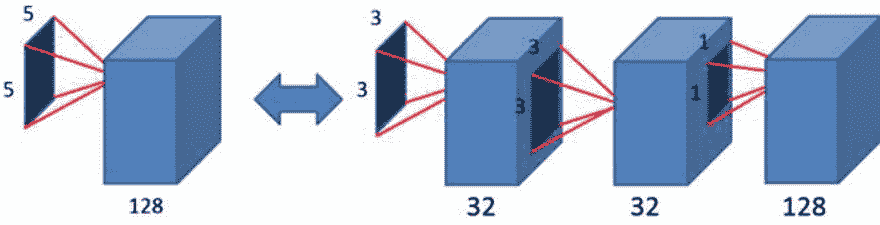

or

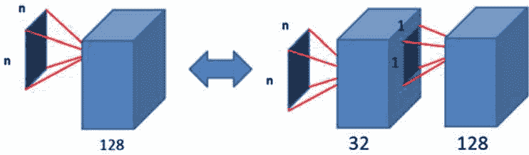

#### Learning

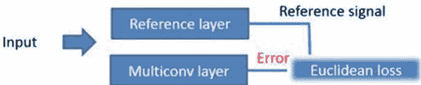

图2.3 网络拓扑变换和重新学习的提议方案

Caffe框架用于通过标准反向传播技术学习转换层以及整个网络的训练（见第2.5.1节）。最后，我们可以将深度网络架构的顺序转换过程表示为以下非正式算法。

```
Algorithm 0: CNN transform to multiconv net
Input data: conv net.
Output data: multiconv net.
Initialization:
    multiconv net := conv net.
Repeat iterations:
    Step 1. Find the slowest conv layer L in multiconv net;
    Step 2. Replace L by sequence of layers S with less summarized number of convolutions;
    Step 3. Learn S using the Euclidean loss for imitating the output of substituted layer L;
while speed grows and accuracy is still high enough
```

表2.1 迭代1

| 层 | 卷积层2 (图2.2) | 卷积层3 (图2.4) | 卷积层4 (图2.4) | 卷积层5 (图2.4) | 卷积层6 (图2.4) |
|---|---|---|---|---|---|
| 过滤器尺寸 | 5 × 5 × 48 | 3 × 3 × 48 | 1 × 1 × 24 | 3 × 3 × 32 | 1 × 1 × 32 |
| 过滤器数量 | 192 | 24 | 32 | 32 | 192 |
| 操作数量 (乘法) | 722,534,400 | 34,877,952 | 2,583,552 | 28,901,376 | 19,267,584 |

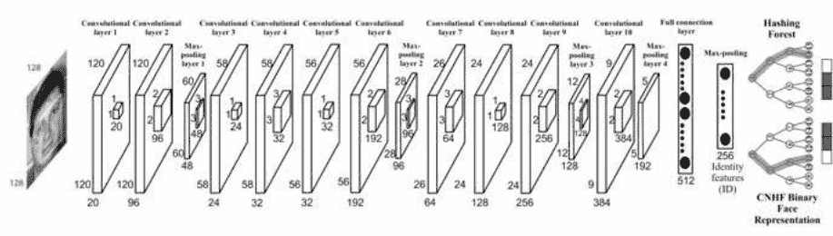

图2.4 基于MFM网络的CNHF架构与多个卷积

表2.2 迭代2

| 层 | 卷积层3 (图2.2) | 卷积层7 (图2.4) | 卷积层8 (图2.4) | 卷积层9 (图2.4) |
|---|---|---|---|---|
| 过滤器尺寸 | 5 × 5 × 96 | 3 × 3 × 96 | 3 × 3 × 64 | 1 × 1 × 128 |
| 滤波器的数量 | 256 | 64 | 128 | 256 |
| 操作的数量 (乘法) | 353,894,400 | 37,380,096 | 42,467,328 | 18,874,368 |

实际上，只使用了算法0的三次迭代。

#### 迭代1：卷积层2（图2.2）被层3、4、5、6替换（见表2.1）：

原始层（图2.2中的层2）需要超过7亿次乘法运算，并产生尺寸为56 × 56 × 192的输出，层序列（图2.4中的层3、4、5、6）需要约9000万次乘法运算（比原始层少约7倍），输出尺寸相同。

#### 迭代2：卷积层3（图2.2）被层7、8、9替换（表2.2）：

原始层（图2.2中的层3）需要超过3.5亿次乘法运算，并产生尺寸为24 × 24 × 256的输出，层序列（图2.4中的层7、8、9）需要约1亿次乘法运算（比原始层少约3倍），输出尺寸相同。

表2.3 迭代3

| 层 | 卷积层1(图2.2) | 卷积层1(图2.4) | 卷积层2(图2.4) |
|---|---|---|---|
| 过滤器尺寸 | 9 × 9 × 1 | 9 × 9 × 1 | 1 × 1 × 20 |
| 滤波器的数量 | 96 | 20 | 96 |
| 操作数量 (乘法) | 111,974,400 | 23,328,000 | 27,648,000 |

#### 迭代3：卷积层1(图2.2) 被层1、2 (表2.3) 替换:

原始层 (图2.2中的层1)需要超过1.1亿次乘法运算,并产生尺寸为120 × 120 × 96的输出,层序列(图2.4中的层1、2) 需要约5000万次乘法运算 (比原始层少约2倍), 输出尺寸相同。

不幸的是,我们所有替换原始网络中的层4的尝试都导致了显著的准确性损失 (大于10%) , 但是这一层所需的计算相对较少,约9000万次乘法运算。

这种方法的主要优点是学习速度相对较快,在层替换的步骤中。我们使用GTX 1080显卡进行学习,并在大约10-15分钟内训练了一个多卷积替换。这样可以非常方便地对任何源CNN架构进行多卷积转换,并部分自动化地完成。

在所有简化替换之后,转换后的CNN再次进行多类人脸识别的训练,类别对应于[24,31]中的人员,使用反向传播技术。最后,转换后的MFM网络的输出softmax层被哈希森林替换,我们得到基于MFM的CNHF (图2.4)。结果我们的CNHF包含10个卷积层,四个MFM+池化层,全连接层和哈希森林。这个CNHF使用CPU Core i7可以以40+fps的速度生成人脸模板,使用GPU GeForce GTX 650可以以120+fps的速度生成。因此,我们可以得出结论,所提出的多卷积方法使我们的CNHF在CPU上比源CNN快5倍。这足以进行实时操作。

## 2.4 通过增强哈希森林学习人脸表示

### 2.4.1 增强SSC,哈希森林和增强哈希森林

我们通过新的增强哈希森林 (BHF) 技术学习我们的哈希变换,它结合了增强SSC [20,21]的算法结构和哈希森林 [15,17,22,28,33]的二进制编码结构。

增强SSC算法通过L1距离在嵌入空间中优化性能，作为成对相似性函数的代理，该函数由一组正（相似）和负（不相似）对的示例传达。SSC算法通过相似性标记的对生成二进制嵌入空间。嵌入是通过独立收集输入数据的阈值投影来学习的。阈值是通过最佳分割负对的投影和不分割正对的投影来选择的。增强SSC算法以AdaBoost的方式贪婪地收集嵌入维度和样本的自适应加权。BoostPro算法使用梯度学习投影的软阈值。

提出的BHF与Boosted SSC的差异如下：

- 1. BHF对输出特征空间进行二进制编码，一般情况下不是二进制的，但如果需要可以是二进制的汉明码。
- 2. BHF对输出特征的任何给定目标函数进行直接优化。
- 3. BHF通过RANSAC算法学习目标驱动的数据投影，而不是基于梯度的优化。
- 4. BHF通过二叉树进行递归编码，形成哈希森林，而Boosted SSC通过迭代特征编码形成哈希向量。
- 5. BHF根据训练对的贡献度自适应重新加权，而不像Boosted SSC那样使用AdaBoost风格的重新加权。
- 6. Boosted SSC形成加权汉明空间。我们的BHF形成任何给定的度量空间，包括非加权的汉明空间，以实现最快的数据搜索。

```
Algorithm 1: Greedy ORC
Input data: X, J, nORC.
Output data: h(x): x ∈ R^m → y ∈ {0,1}^nORC, h(x) ∈ H.
Initialization:
    Step 0. k:=0; h^(k) := ().
Repeat iterations:
    k:= k+1;
    Learn k-th elementary coder:
        h^(k)(x, h^(k-1)) := Learn1BitHash(J, X, h^(k-1));
    Add k-th elementary coder to the hashing function:
        h^(k)(x) := (h^(k-1)(x), h^(k)(x, h^(k-1)));
while k < nORC. // stop if the given size of coder is got
```

提出的BHF与其他哈希森林技术的主要差异：我们通过RANSAC投影和Boosted SSC的增强过程获得哈希森林；我们在编码特征空间中优化任务特定的目标函数，而不是在二进制编码空间中优化相似性。

面部识别的BHF实现具有一些额外的原始特征：具有联合优化面部验证和识别的新的生物特征特定目标函数；选择和处理输入特征向量的子向量；创建独立哈希码的集合, 以克服贪婪学习的限制。 在接下来的子节中, 我们详细描述了我们的BHF算法。

### 2.4.2 BHF: 目标驱动的循环编码

训练集 $X=\left\{\mathbf{x}_{\mathrm{i}} \in R^{m}\right\}_{i=1, \ldots, N}$ 包含 $N$ 个由 $m$ 维特征向量描述的对象。 将 $X$ 映射到 $n$ 维二进制空间: $X=\left\{\mathbf{x}_{i} \in R^{m}\right\}_{i=1, \ldots, N}$ 这个映射是一个 $n$ 位编码器:

$\mathbf{h}(\mathbf{x}): \mathbf{x} \in R^{m} \rightarrow \mathbf{b} \in\{0,1\}^{n}$ (2.1)

基本编码器被称为 1 - 比特哈希函数

$h(\mathbf{x}): \mathbf{x} \in R^{m} \rightarrow b \in\{0,1\}$ (2.2)

假设给定了某个目标函数(编码准则), 并要求将其最小化

$\mathcal{J}(X, \mathbf{h}) \rightarrow \min (\mathbf{h})$. (2.3)

| 步骤/内容 | 描述 |
|---|---|
| **Algorithm 2: RANSAC Learn1ProjectionHash** | |
| Input data: | $\mathscr{J}, X, \mathbf{h}^{(k-1)}, k_{RANSAC}$ |
| Output data: | $h(\mathbf{w}, t, \mathbf{x})$ |
| Initialization: | |
| Step 0. | $k:=0 ; \mathscr{J}_{min}:=+\infty$. |
| Repeat iterations: | |
| | $k:=k+1$; |
| Step 1. | Take the random dissimilar pair $\left(\mathbf{x}_{i}, \mathbf{x}_{j}\right)$ in $X$. |
| Step 2. | Get vector $\overline{\left(\mathbf{x}_{i}, \mathbf{x}_{j}\right)}$ as a vector of hyperplane direction: $\mathbf{w}_{k}:=\mathbf{x}_{j}-\mathbf{x}_{i}$ |
| Step 3. | Calculate the threshold $t_{k}$ minimizing $\mathscr{J}$ by $t$ with $\mathbf{w}=\mathbf{w}_{k}: t_{k}:=\arg \min _{t} \mathscr{J}(X, \mathbf{h}^{(k-1)}, \mathbf{w}_{k}, t)$. |
| Step 4. | If $\mathscr{J}(X, \mathbf{h}^{(k-1)}, \mathbf{w}_{k}, t_{k})<\mathscr{J}_{min}$, then $\mathscr{J}_{min}:=\mathscr{J}\left(X, \mathbf{h}^{(k-1)}, \mathbf{w}_{k}, t_{k}\right) ; \mathbf{w}:=\mathbf{w}_{k} ; t:=t_{k}$. |
| while | $k<k_{RANSAC}$. // stop if the given number of RANSAC iterations is achieved |

编码器连接的操作是 $\mathbf{h}^{(k)}(\mathbf{x}):=\left(h^{(k-1)}(\mathbf{x}), h^{(k)}(\mathbf{x})\right)$. 贪婪目标驱动的递归编码 (Greedy ORC)算法（算法 1）以递归方式顺序形成我们编码器的位： $\mathbf{h}^{(k)}(\mathbf{x})=\mathbf{h}^{(k)}\left(\mathbf{x}, h^{(k-1)}\right)$. 学习每个 $k$ 位的正确过程将在下一小节中描述。

### 2.4.3 BHF: 通过RANSAC算法学习基本投影

在编码器增长的第k步

$$J\left(\boldsymbol{X}, \boldsymbol{h}^{(k)}\right)=J\left(\boldsymbol{X}, \boldsymbol{h}^{(k-1)}, h^{(k)}\right) \rightarrow \min \left\{h^{(k)} \in \boldsymbol{H}\right\},$$

| 步骤/内容 | 描述 |
|---|---|
| **Algorithm 3: Optimal threshold selection** | |
| Input data: | $\mathscr{J}, X, h^{(k-1)}, w, N$. |
| Output data: | $t$. |
| Operations: | |
| Step 1. | For all $x_i \in X$ calculate projections $t_i=(x_i,w)$; |
| Step 2. | Arrange samples $x_i$ and projections $t_i$ by increasing of $t_i$. For all arranged indices $i=1..N$ do: $\Delta_{ji} := 0$; |
| Step 3. | For all pairs $(x_i,x_j)$ with $t_i < t_j$ do:<br>`// increment the step values at projection points`<br>`Δ_{ji} := Δ_{ji} + J_{ji}^{(out);}`<br>`Δ_{ji} := Δ_{ji} + J_{ji}^{(in)} - J_{ji}^{(out);}`<br>`Δ_{jj} := Δ_{jj} + J_{ji}^{(out)} - J_{ji}^{(in);}` |
| Step 4. | Recover the stepwise objective function and find the optimal threshold<br>`J(X, h^(k-1), w, t1) := 0; // recover the first value`<br>`i := 0; Jmin := +∞.`<br>`Repeat iterations:`<br>`    i := i + 1;`<br>`    J(X, h^(k-1), w, ti) := J(X, h^(k-1), w, ti-1) + Δ_{ji}; // accumulate step values from left to right`<br>`    If J(X, h^(k-1), w, ti) < Jmin, then`<br>`        Jmin := J(X, h^(k-1), w, ti); t := (ti + ti+1)/2;` |
| while | $i < N-1$. // stop if all step points are tested |

其中H是编码器的类别。考虑基于阈值线性投影的基本编码器类别

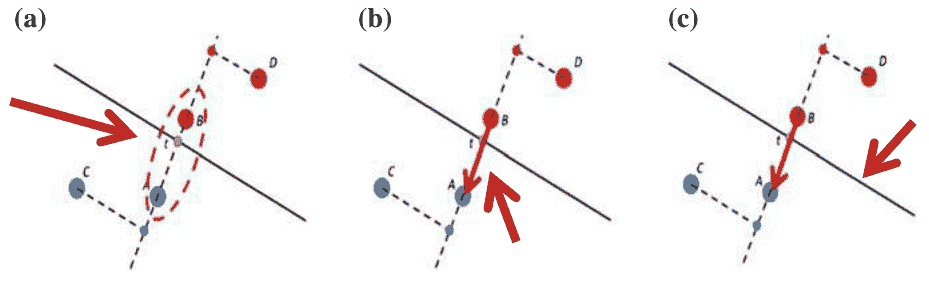

图2.5 RANSAC Learn1ProjectionHash: 算法2的第1步,第2步,第3步

$h(\mathbf{w}, t, \mathbf{x}) = sgn(\sum_{k=1, \ldots, m} w_k x_k + t),$ (2.5)

其中 $\mathbf{w}$ 是权重向量, $t$ 是哈希函数的阈值, $sgn(u) = \{1$, 如果 $u > 0$; $0$ - 否则}. 在 (2.5) 的情况下，函数 (2.4) 的形式为

$\mathcal{J}(X, \mathbf{h}^{(k-1)}, \mathbf{h}^{(k)}) = \mathcal{J}(X, \mathbf{h}^{(k-1)}, \mathbf{w}, t) \rightarrow \min \{\mathbf{w} \in R^m, t \in R\}.$ (2.6)

我们使用RANSAC算法来近似解决(2.6)。RANSAC根据训练集中不相似对的随机选择生成关于 $\mathbf{w}$ 参数的假设 (算法2, 图2.5)。

在一般情况下, 算法2的第3步中确定最优阈值可能需要很长时间。但在重要的特殊情况下, 目标函数可以表示为对训练集中所有样本对应的一些值的求和。如果每对样本的这些值仅取决于阈值是否分离这些样本的投影, 则目标函数将是一个阶梯函数。

$\mathcal{J}(X, \mathbf{h}^{(k-1)}, \mathbf{w}, t) = \sum_{i=1, \ldots, N} \sum_{j=1, \ldots, N} \mathcal{J}_{ij}(\mathbf{h}^{(k-1)}, \mathbf{w}, t),$ (2.7)

$\mathcal{J}_{ij}(\mathbf{h}^{(k-1)}, \mathbf{w}, t) = \begin{cases} \mathcal{J}_{ij}^{(in)}, \text{if } t \in [(\mathbf{x}_i, \mathbf{w}), (\mathbf{x}_j, \mathbf{w})]; \\ \mathcal{J}_{ij}^{(out)}, \text{otherwise;} \end{cases}$

并且最优阈值搜索的过程可以更高效地实现。 对于这种情况 (2.7) , 我们提出了特殊算法 (算法3, 图2.6) , 它需要 $O(N^2)$ 次计算, 而每对训练集中的计算次数足够低。 对于固定的假设 $\mathbf{w} = \mathbf{w}_k$, 我们安排


### 2.4.4 BHF：增强哈希森林

通过增加并测试它们作为可能的阈值值，通过计算 $\mathcal{J}(X, \mathbf{h}^{(k-1)}, \mathbf{w}_k, t^{(k)}_i)$ 来投影 $t^{(k)}_i = (\mathbf{x}_i, \mathbf{w}^k)$。该算法的思想是计算每个投影点的步骤值，然后通过从左到右累积步骤值来恢复阶梯目标函数。

我们的Learn1BitHash过程（参见算法1）包含Learn1ProjectionHash过程（算法2）的递归调用。考虑通过 $\mathbf{X}$ 的网格划分 $n$ 位编码器：$\mathbf{X}_B = \{\mathbf{X}_b, \mathbf{b} \in \{0,1\}^n\}$，$X_b = \{\mathbf{x} \in X: \mathbf{h}(\mathbf{x}) = \mathbf{b}\}$，$X = \cup_{\mathbf{b} \in \{0,1\}^n} X_b$。递归编码的过程是训练集的二分划分，在每个层级的网格划分中找到优化的基本编码器。因此，第 $k$ 位的递归编码器

$$
h^{(k)}(\mathbf{x}, \mathbf{h}^{(k-1)}) = h(\mathbf{w}(\mathbf{h}^{(k-1)}(\mathbf{x})), t(\mathbf{h}^{(k-1)}(\mathbf{x})), \mathbf{x}),
$$

- **算法 4: 增强哈希森林 (Boosted Hashing Forest)**
- **输入数据**: $X, \mathcal{J}, n_{\text{ORC}}, n_{\text{BHF}}$。
- **输出数据**: $\mathbf{h}(\mathbf{x}): \mathbf{x} \in \mathbb{R}^m \rightarrow \mathbf{y} \in \{0,1\}^n$。
- **初始化**: $l := 0; \mathbf{h}^{[1,0]} := ()$。
- **重复迭代**:
  - $l := l + 1$；
  - 将目标构造成 $l$ 步编码树的函数：$\mathcal{J}^{[l]}(X, \mathbf{h}^{[l,l]}) = \mathcal{J}(X, \mathbf{h}^{[1,l-1]}, \mathbf{h}^{[l,l]})$；
  - 学习 $l$ 步编码树：$\mathbf{h}^{[l,l]} := \text{GreedyORC}(\mathcal{J}^{[l]}, X, n_{\text{ORC}})$；
  - 将 $l$ 步编码树添加到哈希森林：$\mathbf{h}^{[1,l]}(\mathbf{x}) := (\mathbf{h}^{[1,l-1]}(\mathbf{x}), \mathbf{h}^{[l,l]}(\mathbf{x}))$；
- **循环条件**: 当 $l < n_{\text{ORC}}$ 时。 // 如果得到给定大小的编码器则停止

是 $2^{(k-1)}$ 个阈值投影的组合

$$
h^{(k)}(\mathbf{x}, \mathbf{h}^{(k-1)}) = \text{Learn1BitHash}(\mathcal{J}, X, \mathbf{h}^{(k-1)}) = \{\text{Learn1ProjectionHash}(\mathcal{J}, X(\mathbf{h}^{(k-1)}, \mathbf{b}), \mathbf{h}^{(k-1)}), \mathbf{b} \in \{0,1\}^{(k-1)}\}.
$$

这样的递归 $n$ 位编码器 $h(\mathbf{x})$ 是一个阈值投影的树（图2.7），相对于 $n$ 位阈值投影序列，具有更强的识别能力。

我们知道一个编码树无法提供精细的识别率。此外，树中的投影数量随着树的深度呈指数增长。因此，某个固定大小的训练集只能学习具有有限深度的树。由于这个原因，我们通过优化哈希树的提升来形成哈希森林。


**图2.8 通过哈希森林中的树形成的二进制码的输出（算法4）**

所有树的联合目标函数。我们将这种方法称为增强哈希森林（BHF）（算法4，图2.8）。

在这里，我们使用以下符号：
- $n_{\text{ORC}} = p$ 是编码树的深度；
- $n_{\text{BHF}} = n / p$ 是树的数量；
- $\mathbf{h}^{[1, l]} = (h^{(1)}(\mathbf{x}), \ldots, h^{(p)}(\mathbf{x}))$；
- $\mathbf{h}^{[1, l-1]} = (h^{(1)}(\mathbf{x}), \ldots, h^{(lp-p)}(\mathbf{x}))$；
- $\mathbf{h}^{[l, l]} = (h^{(lp-p+1)}(\mathbf{x}), \ldots, h^{(lp)}(\mathbf{x}))$。

### 2.4.5 BHF: 哈希森林作为度量空间

我们将度量空间 $(Y, d_Y)$ 与 $d_Y: Y \times Y \rightarrow \mathbb{R}^+$ 称为“位二进制编码的”，如果每个 $y \in Y$ 对应唯一的 $b \in \{0,1\}^n$，并且给出了两个解码函数：特征解码器 $f_y(b): \{0,1\}^n \rightarrow Y$ 和距离解码器 $f_d(b_1, b_2): \{0,1\}^n \times \{0,1\}^n \rightarrow \mathbb{R}^+$，$f_d(b_1, b_2) = d_Y(f_y(b_1), f_y(b_2))$。这允许定义基于距离的目标函数（DBOF）用于编码器 $h(\mathbf{x})$ 的形式

$$
\begin{gathered}
(X, \mathbf{h}) \rightarrow \min (\mathbf{h}) \Leftrightarrow \mathcal{J}(D_Y) \rightarrow \min (D_Y), \\
D_Y=\left\{d_{i j}=f_d\left(\mathbf{h}\left(\mathbf{x}_i\right), \mathbf{h}\left(\mathbf{x}_j\right)\right), \mathbf{x}_i, \mathbf{x}_j \in X, \mathbf{h}(\mathbf{x}) \in \mathbf{H}\right\}_{i, j=1, \ldots, N}.
\end{gathered}
\quad (2.10)
$$

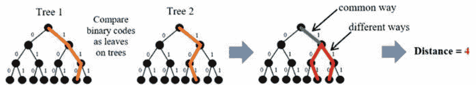

这样的目标函数仅依赖于编码距离集合 $d_{ij}$。在我们当前的BHF实现中，我们通过搜索索引距离（图2.9）来匹配 $p$ 位二叉树。它是对应编码树上的叶子节点之间的测地线距离：

$$
d_T(y_1, y_2) = f_{dT}(b_1, b_2) = 2 \sum_{k=1,\ldots,p} \left(1 - \prod_{l=1,\ldots,k} (1 - |b_1^{(l)} - b_2^{(l)}|)\right).
$$

最后，我们形成一个匹配距离，用于包含总共 $n$ 维度的森林（$q = n / p$ 棵树），作为个别 $p$ 位树之间距离的总和：

$$
d_{i j} = \sum_{l=1,\ldots,q} f_{dT}(h^{[l,l]}(\mathbf{x}_i), h^{[l,l]}(\mathbf{x}_j)).
$$

### 2.4.6 BHF: 人脸验证和识别的目标函数

假设相似性函数 $s$ 描述正（真实）和负（冒名）对：

$$
s_{i j} = \begin{cases} 1, & \text{if class}(x_i) = \operatorname{class}(x_j), \\ 0, & \text{否则} \end{cases}
$$

对于 $k$ 位二进制码来说，“理想”距离是

$$
g_{i j}^{(k)} = \begin{cases} 0, & \text{如果 } s_{i j}=1, \\ d_{\max}(k), & \text{否则} \end{cases}
$$

其中 $d_{\max}(k)$ 是最大可能的距离。因此，距离监督目标函数可以表示为

$$
\mathcal{J}_{\text{Dist}}(D_Y)=\sum_{i=1,\ldots,N} \sum_{j=1,\ldots,N} v_{i j}\left(d_{i j}-g_{i j}\right)^2 \rightarrow \min \left(D_Y=\left\{d_{i j}\right\}_{i, j=1,\ldots,N}\right),
$$

其中 $v_{i j}$ 是真实和冒名顶替对的不同权重。这个目标函数 (2.15) 控制着验证性能（FAR 和 FRR）。在面向识别的生物特征应用中，我们需要控制距离和距离的顺序。令 $d^1_k=\max_l\left\{d_{k l}: s_{k l}=1\right\}$ 是到最远的真实样本的距离，$d^0_k=\min_l\left\{d_{k l}: s_{k l}=0\right\}$ 是到最近的冒名顶替样本的距离，对于查询 $\mathbf{h}\left(\mathbf{x}_k\right)$。那么对于一对 $\left(\mathbf{x}_i, \mathbf{x}_j\right)$ 来说，排序错误 $e_{i j}$ 可以表示为

$$
e_{i j}=\begin{cases} 1, & \text{if } \left(s_{i j}=0 \text{ and } d_{i j}<\max \left(d_i^1, d_j^1\right)\right) \text{ or } \left(s_{i j}=1 \text{ and } d_{i j}>\min \left(d_i^0, d_j^0\right)\right) \\ 0, & \text{otherwise} \end{cases}
\quad (2.16)
$$

如果冒名顶替者比真实身份更接近或真实身份比冒名顶替者更远，则会发生排序错误。因此，距离排序监督目标函数可以形成为

$$
\mathcal{J}_{\text{Ord}}(D_Y)=\sum_{i=1, \ldots, N} \sum_{j=1, \ldots, N} v_{i j}\left(d_{i j}-g_{i j}\right)^2 e_{i j} \rightarrow \min \left(D_Y=\left\{d_{i j}\right\}_{i, j=1, \ldots, N}\right).
\quad (2.17)
$$

在这里，我们惩罚 $d_{i j}$ 和目标距离 $g_{i j}$ 之间的差异，就像在 (2.15) 中一样，但只有在该对出现排序错误(2.16)的情况下才会惩罚。因此，准则 (2.17) 直接控制面部识别特性（CMC）。

最后，为了同时获得验证和识别性能，我们结合式(2.15)和(2.17)，结果为

$$
\begin{gathered}
\mathcal{J}(D_Y)=\alpha \mathcal{J}_{\text{Dist}}(D_Y)+(1-\alpha) \mathcal{J}_{\text{Ord}}(D_Y) \\
=\sum_{i=1, \ldots, N} \sum_{j=1, \ldots, N} v_{i j}\left(d_{i j}-g_{i j}\right)^2\left(e_{i j}+\alpha\left(1-e_{i j}\right)\right) \\
\rightarrow \min \left(D_Y=\left\{d_{i j}\right\}_{i, j=1, \ldots, N}\right),
\end{gathered}
\quad (2.18)
$$

其中 $\alpha \in[0,1]$ 是一个调节参数。

### 2.4.7 BHF实现用于学习人脸表示

为了增强我们的人脸表示学习，我们对描述的方案进行了一些额外的半启发式修改。目标距离(2.14)被修改为

$$
g^{(k)}_{i j}=\begin{cases} 0, & \text{if } s_{i j}=1, \\ m^{(k-1)}_1+3 \sigma^{(k-1)}_1, & \text{otherwise, } \end{cases}
\quad (2.19)
$$

其中 $m^{(k-1)}_1$ 和 $\sigma^{(k-1)}_1$ 是真实编码距离的均值和标准差。这样的目标距离 (2.19) 排除了对冒名顶替者对的惩罚，因为它们不能被视为真实的。在式(2.18)中，我们在每个提升步骤的第 $k$ 步使用自适应加权的对：

$$
v^{(k)}_{i j}=\begin{cases} \gamma / a^{(k)}, & \text{if } s_{i j}=1, \\ 1 / b^{(k)}, & \text{otherwise, } \end{cases}
\quad (2.20)
$$

$$
\begin{aligned}
& a^{(k)}=\sum_{i=1, \ldots, N} \sum_{j=1, \ldots, N} s_{i j}\left(d_{i j}-g_{i j}\right)^{2}\left(e_{i j}+\alpha\left(1-e_{i j}\right)\right), \\
& b^{(k)}=\sum_{i=1, \ldots, N} \sum_{j=1, \ldots, N}\left(1-s_{i j}\right)\left(d_{i j}-g_{i j}\right)^{2}\left(e_{i j}+\alpha\left(1-e_{i j}\right)\right),
\end{aligned}
\quad (2.21)
$$

其中 $a^{(k)}$ 和 $b^{(k)}$ 为所有真实和冒名顶替对提供基本等权重，而调节参数 $\gamma>1$ 则给予真实对稍微更大的权重。

我们将输入的 $m$ 维特征向量分割成一组独立编码的子向量，子向量的大小从集合 $\mathbf{m}=\left\{m_{\min }, \ldots, m_{\max }\right\}$ 中固定选择。在增强的每个步骤中，我们选择具有最佳贡献的子向量和相应的BHF基本编码器来提供目标函数的最佳贡献。大小为 $n$ 的输出二进制向量由一些独立生成的大小为 $n_{\text{BHF}}<n$ 的二进制码组成。这种学习策略可以防止目标函数过早饱和。

因此，我们的二进制人脸哈希是通过以下一组自由参数实现的：$\mathbf{m}, n_{\text{ORC}}, n_{\text{BHF}}, k_{\text{RANSAC}}, \alpha$ 和 $\gamma$。编码度量的类型也是我们方法的一个自由参数。

## 2.5 实验

在本节中，我们描述了学习和测试CNHF的方法，报告了在汉明嵌入任务中的结果，将提出的BHF与原始的Boosted SSC进行比较，探索了CNHF在编码树深度方面的性能，并将CNHL和CNHF与LFW上最佳方法进行比较。我们通过标准的LFW无限制外部标记数据协议来测试验证准确性。我们的CMC和排名-1测试遵循[2]中描述的方法。

### 2.5.1 方法：学习和测试CNHF

基本的CNN是在CASIA-WebFace数据集上训练的。人脸图像通过将眼睛点旋转到水平位置并裁剪到128×128的尺寸进行对齐。我们使用开源的深度学习框架Caffe（http://caffe.berkeleyvision.org/）来训练基本的CNN进行多类人脸识别，方法如[24,31]所述。哈希森林是在包含1,000个真实对和相应的99,000个伪造对的Wild图像数据集上进行训练的（不包括测试LFW集）。最后，CNHF编码器族由提出的BHF组成：汉明嵌入编码器2,000×1位（250字节），200×1位（25字节）和32×1位（4字节）大小；哈希森林编码器包含2,000棵树，深度为2-7位（大小为0.5-1.75 Kbyte）。

**图2.10 BHF 参数选择示例**

我们使用了常见的BHF参数设置：$\mathbf{m}=\{8, 16, 32\}$，$k_{\text{RANSAC}}=50$，$\alpha=0.25$，$\gamma=1.1$。但是我们设置了 $n_{\text{BHF}}=200$ 用于 CNN+BHF-200×1，$n_{\text{BHF}}=500$ 用于 CNN+BHF-2,000×1，以及 $n_{\text{BHF}}=100$ 用于 CNHF-2,000×7。这些BHF参数值是根据哈希过程中识别率随哈希码位数增长速度的分析实验确定的。我们确定在哈希过程中生成的最小码位数，以获得训练数据库上最佳的识别率。图2.10展示了BHF参数选择的示例。图中显示了识别分数与编码树数量的关系图，分别针对训练集和测试集。可以看到在训练集上，识别率在大约150棵编码树的水平上稳定。相应地，在测试中，$n_{\text{BHF}}=150$（600棵编码树被分成四个独立的编码森林）的识别率优于 $n_{\text{BHF}}=\infty$（600棵编码树未分成独立部分）的识别率约2%。评估是在Labeled Faces in the Wild (LFW)数据集上进行的。LFW数据集中的所有图像都经过与[11]相同的流水线处理，并被归一化为128×128。

### 2.5.2 海明嵌入：CNHL对比CNN，BHF对比增强SSC

在这个小节中，我们在海明嵌入任务中测试了我们的方法，所以CNHF退化为CNHL。我们通过验证准确性和ROC曲线（表2.4和图2.11a）将CNHL与基本CNN在LFW上进行比较。CNN人脸表示形式类似于[34]中的形式，作为256个顶层隐藏层神经元激活的向量。余弦相似度（CNN+CS）和L2距离（CNN+L2）用于匹配。通过BHF训练的CNHL编码器大小为2,000和200位，并进行匹配。

| 解决方案 | 准确性 | 模板大小 | 匹配时间（秒） |
|---|---|---|---|
| 卷积神经网络+L2 | 0.947 | 8,192位 | 2,713,222 |
| 卷积神经网络+BHF-200×1 | 0.963 | 200位 | 194,986,071 |
| 卷积神经网络+CS | 0.975 | 8,192位 | 2,787,632 |
| 卷积神经网络+BHF-2,000×1 | 0.9814 | 2,000位 | 27,855,153 |

汉明距离（对应于卷积神经网络+BHF-2,000×1和卷积神经网络+BHF-200×1）。我们的解决方案卷积神经网络+BHF-2,000×1在LFW上实现了98.14%的验证准确率，超过了所有其他基于卷积神经网络的解决方案。此外，我们的25字节长度的解决方案卷积神经网络+BHF-200×1优于卷积神经网络+L2。表2.4还展示了模板大小和匹配速度的增益。

我们将由BHF训练的CNHL与由原始Boosted SSC训练的CNHL进行比较。图2.11c表明，提出的BHF在LFW上的识别（排名1）方面优于Boosted SSC的所有二进制模板大小。BHF-2,000×1的最大排名1为0.91，BoostSSC-2,000×1为0.865（相对于CNN+CS的0.899）。CNN+BHF的ROC曲线比具有相同模板大小的CNN+BoostSSC单调更好（图2.11a）。图2.11b包含了CMC曲线（排名1-10），表明BHF在具有相同模板大小的情况下优于Boosted SSC（此外还要注意CNN+BHF-2,000×1优于CNN+CS）。

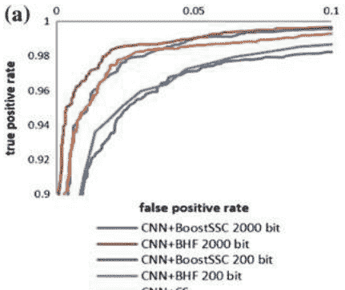
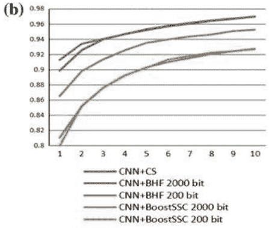
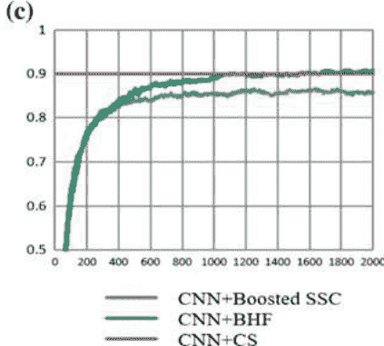
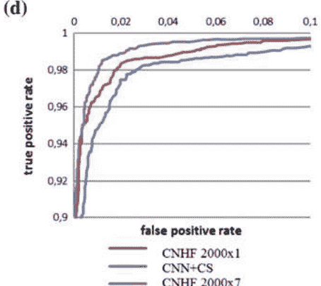
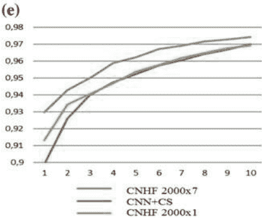
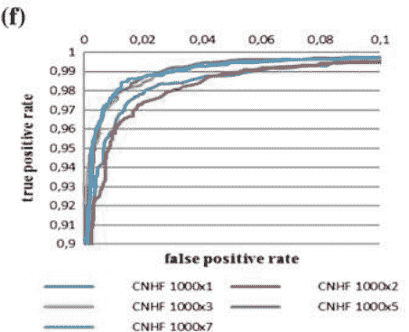

图2.11 (a) ROC曲线, (b) CMC曲线, (c) 在LFW上的识别性能（排名1）相对于生物特征模板大小（以比特为单位）的提出的BHF（CNN+BHF）和原始的BoostedSSC（CNN+BoostSSC）以及没有哈希的最佳基本CNN解决方案-CNN+最后一层+余弦相似度（CNN+CS）, (d) CNN+CS的ROC曲线, (e) CNN+CS的CMC曲线, CNHF-2000×1, CNHF-2000×7, (f) CNHF-1000×p位树的ROC曲线

| 方法 | 准确性 |
|---|---|
| WebFace [24] | 0.9613 |
| CNHL-200×1 | 0.963 ± 0.00494 |
| DeepFace-ensemble [21] | 0.9730 ± 0.0025 |
| DeepID [19] | 0.9745 ± 0.0026 |
| MFM Net [25] | 0.9777 |
| CNHL-2000×1 | 0.9814 |
| CNHF-2000×7 | 0.9859 |
| DeepID2 [17] | 0.9915 ± 0.0013 |
| DeepID3 [18] | 0.9953 ± 0.0010 |
| 百度 [11] | 0.9977 ± 0.0006 |

### 2.5.3 CNHF: 与树深度相关的性能

由7位编码树形成的2,000个输出特征的CNHF（CNHF-2,000×7）在LFW上达到了98.59%的准确率。相对于CNN+CS的89.9%的排名-1，CNHF-2,000×7的识别结果在LFW上达到了93%的排名-1。图2.11f展示了具有不同深度编码树的CNHF的ROC曲线。具有7位编码树的森林在ROC方面表现最佳，但是6位和5位深度的解决方案非常接近。我们推测这个结果的原因是哈希森林训练集的数量有限。图2.11d、e展示了CNHF-2,000×7在验证（ROC）和识别（CMC）方面优于基本CNN+CS和CNHF-2,000×1。因此，我们可以得出结论：将哈希森林添加到CNN之上既可以生成紧凑的二进制人脸表示，又可以提高人脸验证，尤其是识别率。

### 2.5.4 CNHL和CNHF与LFW上最佳方法的比较

我们通过验证准确性（表2.5）将我们的CNHF解决方案与最先进的方法（在LFW上表现最佳）进行比较。CNHF-2,000×1优于DeepFace-ensemble [30]、DeepID [27]、WebFace [35]和MFM Net [34]。DeepID2 [24]、DeepID3 [26]和百度 [14]的多补丁CNN相对于我们基于单个网络的CNHF-2,000×1表现更好。

请注意，我们的CNHF-200×1（25字节）哈希在LFW上达到96.3%。将此结果与先前最佳的CNHL结果[6]进行比较。一方面，极短的32位二进制人脸表示[6]在LFW上实现了91%的验证。我们的CNHF 32×1只提供90%。另一方面，面部表示[6]需要1000位才能在LFW上达到96%的验证。因此，我们的CNHF-200×1解决方案将这种面部打包结果提高了5倍。

我们实时编码器CNHF-2,000×7的识别结果（排名1）在LFW上为0.93。这已经足够接近基本上更深更慢的多补丁DeepID3 CNN [25]的最佳报告识别结果（LFW上的0.96排名1）。百度[13]宣称有更好的结果（LFW上的0.98排名1），但他们使用了训练集120万张图像，而我们的情况下只有40万张图像。

## 2.6 结论与讨论

我们为实时人脸识别开发了一系列基于CNN的二进制人脸表示。我们的卷积网络与哈希森林（CNHF）以40+帧每秒的速度生成二进制人脸模板，使用CPU Core i7时为120+帧每秒，使用GPU GeForce GTX 650时。我们的2,000×1位人脸编码器提供了紧凑的人脸编码（250字节），同时提高了验证（98.14%）和识别率（91%在LFW上排名第一）。我们的200×1位人脸编码器提供了40倍的增益。模板大小减小了1/10，与基本CNN相比，匹配速度提高了70倍，验证准确率降低了1%（在LFW上为96.3%）。我们的CNHF使用2000个输出7位编码树（CNHF-2,000×7），实现了98.59%的验证准确率和93%的排名第一（相对于基本CNN的排名第一增加了3%）。

我们使用多卷积深度网络架构来加速源Max-Feature-Map (MFM) CNN架构[31]。我们提出并实现了新的二进制哈希技术，通过联合优化人脸验证和识别，形成具有给定度量属性的输出特征空间。

这种增强的哈希森林（BHF）技术结合了增强的SSC方法的算法结构和森林哈希的二进制代码结构。我们的实验表明，BHF在人脸识别测试中明显优于原始的增强SSC。

在未来，我们将尝试通过基于多补丁卷积神经网络的CNHF来实现更好的识别率，这可以用于非实时应用。我们将发展并应用所提出的BHF技术来解决不同的数据编码和维度降低问题（有监督、半监督和无监督）。此外，我们将研究输出度量空间属性对哈希森林学习过程的影响。

致谢：本工作得到俄罗斯科学基金会的资助（项目编号16-11-00082）。

# 参考文献

- 1. M. Belkin, P. Niyogi, Laplacian eigenmaps and spectral techniques for embedding and clustering, in Proceedings of the NIPS, vol. 14 (2001), pp. 585–591
- 2. L. Best-Rowden, H. Han, C. Otto, B. Klare, A.K. Jain, Unconstrained face recognition: identifying a person of interest from a media collection. IEEE Trans. Inf. Forensic Secur. 9(12), 2144–2157 (2014)
- 3. 曹忠伟, 尹秋阳, 唐小平, 孙剑, 基于学习的描述符的人脸识别, 在CVPR会议论文集(2010), 第2707-2714页
- 4. 陈东, 曹晓, 温凡, 孙剑, 维度的祝福: 高维特征及其对人脸验证的高效压缩, 在CVPR会议论文集(2013), 第3025-3032页
- 5. 范华, 曹忠伟, 江宇, 尹秋阳, 豆豆, 学习深度人脸表示(2014), arXiv:1403.2802
- 6. 范华, 杨明, 曹忠伟, 江宇, 尹秋阳, 学习紧凑的人脸表示: 将一个人脸装入int32, 在ACM多媒体国际会议论文集(2014), 第933-936页
- 7. A. Gionis, P. Indyk, R. Motwani, 通过哈希在高维空间中进行相似性搜索, 在VLDB会议论文集中(1999), 第518-529页
- 8. Y. Gong, S. Lazebnik, A. Gordo, F. Perronnin, 迭代量化: 一种用于大规模图像检索的拟合方法. IEEE Trans. Pattern Anal. Mach. Intell.35(12), 2916-2929 (2012)
- 9. K. Grauman, R. Fergus, 学习用于大规模图像搜索的二进制哈希码,计算机视觉的机器学习(Springer, Berlin, 2013), 第49-87页
- 10. K. He, F. Wen, J. Sun, K-means哈希: 一种保持亲和性的量化方法用于学习二进制紧凑码, 在CVPR会议论文集中(2013), 第2938-2945页
- 11. G.-B. Huang, M. Mattar, H. Lee, E. Learned-Miller, 从头开始学习对齐, 在NIPS的论文集中, 第25卷 (2012)
- 12. G. Irie, L. Zheng, W. Xiao-Ming, C. Shih-Fu, 用于提取非线性流形的局部线性哈希, 在CVPR的论文集中 (2014), 第2115-2122页
- 13. J. Liu, Y. Deng, T. Bai, Z. Wei, C. Huang, 通过深度嵌入进行人脸识别 (2015), arXiv:1506.07310
- 14. W. Liu, J. Wang, R. Ji, Y.-G. Jiang, S.-F. Chang, 带有核函数的监督哈希, 在CVPR的论文集中 (2012), 第2074-2081页
- 15. Y. Mishina, M. Tsuchiya, H. Fujiyoshi, 提升的随机森林. IEICE Trans. E98D(9), 1630-1636 (2015)
- 16. H.-V. Nguyen, L. Bai, 余弦相似度度量学习用于人脸验证, in ACCV会议 (2010), pp. 709-720
- 17. Q. Qiu, G. Sapiro, A. Bronstein, 随机森林可以进行哈希 (2014), arXiv:1412.5083
- 18. R. Salakhutdinov, G. Hinton, 语义哈希. Int. J. Approx. Reason. 50(7), 969-978 (2009)
- 19. F. Schroff, D. Kalenichenko, J. Philbin, FaceNet: 用于人脸识别和聚类的统一嵌入, in CVPR会议(2015), pp. 815-823
- 20. G. Shakhnarovich, 学习任务特定相似性, 博士论文, 电气工程和计算机科学系, 麻省理工学院, 剑桥 (2005)
- 21. G. Shakhnarovich, P. Viola, T. Darrell, 使用参数敏感哈希的快速姿势估计。计算机视觉 2, 750-757 (2003)
- 22. J. Springer, X. Xin, Z. Li, J. Watt, A. Katsaggelos, 森林哈希: 加速大规模图像检索, 在ICASSP会议论文集中 (2013), 第1681-1684页
- 23. Y. Sun, X. Wang, X. Tang, 通过联合识别-验证进行深度学习人脸表示, 在NIPS会议论文集中, 第27卷 (2014)
- 24. Y. Sun, X. Wang, X. Tang, 通过预测10,000个类别进行深度学习人脸表示, 在CVPR会议论文集中 (2014), 第1891-1898页
- 25. Y. Sun, X. Wang, X. Tang, DeepID3: 具有非常深的神经网络的人脸识别 (2015), arXiv:1502.00873
- 26. Y. Taigman, L. Wolf, T. Hassner, 利用类别标签信息的多个一次性方法, 在BMVC会议论文集中 (2009)
- 27. Y. Taigman, M. Yang, M. Ranzato, L. Wolf, DeepFace: 在人脸验证中接近人类水平的性能, 在CVPR会议论文集中 (2014), 第1701-1708页
- 28. C. Vens, F. Costa, 基于随机森林的特征引入, 在ICDM会议论文集中 (2011), 第744-753页
- 29. W. Wang, J. Yang, J. Xiao, S. Li, D. Zhou, 基于深度学习的人脸识别, 在HCC会议论文集中, 第8944卷 (2015), 第812-820页
- 30. Y. Weiss, A. Torralba, R. Fergus, 光谱哈希, 在NIPS会议论文集, 第21卷 (2008)
- 31. X. Wu, 学习鲁棒的深度人脸表示 (2015), arXiv:1507.04844
- 32. D. Yi, Z. Lei, S. Liao, S.Z. Li, 从零开始学习人脸表示 (2014), arXiv:1411.7923
- 33. G. Yu, J. Yuan, 可扩展的森林哈希用于快速相似性搜索, 在ICME会议论文集 (2014), 第1-6页
- 34. L. Zhang, Y. Zhang, X. Gu, J. Tang, Q. Tian, 保持拓扑的哈希用于相似性搜索, 在ACM国际多媒体会议论文集(2013), 第123-132页
- 35. E. Zhou, Z. Cao, Q. Yin, Naive-deep人脸识别: 接触LFW基准的极限还是不接触? (2015), arXiv:1501.04690

## 第三章
### CMS-RCNN: 用于无约束人脸检测的上下文多尺度基于区域的卷积神经网络
## 作者：朱晨晨, 郑宇通, Khoa Luu 和 Marios Savvides

**摘要** 在野外进行鲁棒的人脸检测是支持各种面部相关问题的最终组成部分之一，例如无约束人脸识别、面部眼周识别、面部标记和姿态估计、面部表情识别、3D面部模型构建等。尽管人脸检测问题已经在几十年来得到了深入研究，并且有各种商业应用，但在一些现实场景中仍然存在问题，例如大量的面部遮挡、极低的分辨率、强烈的光照、异常的姿态变化、图像或视频压缩伪影等。在本文中，我们提出了一种名为上下文多尺度区域卷积神经网络（CMS-RCNN）的人脸检测方法，以鲁棒地解决上述问题。与基于区域的CNN类似，我们提出的网络由区域建议组件和感兴趣区域（RoI）检测组件组成。然而，与该网络相距甚远，我们提出的网络中有两个主要贡献在人脸检测中起到了重要作用，实现了最先进的性能。首先，在区域建议和RoI检测中都对多尺度信息进行了分组，以处理微小的人脸区域。其次，我们提出的网络允许在网络中进行明确的身体上下文推理，受到人类视觉系统直觉的启发。所提出的方法在两个最近的具有挑战性的人脸检测数据库上进行了基准测试，即包含高度变异性的WIDER FACE数据集以及人脸检测数据集和基准（FDDB）。实验结果表明，我们提出的方法在WIDER FACE上训练的效果良好。

C. Zhu (✉) · Y. Zheng (✉) · K. Luu · M. Savvides
*CyLab 生物特征中心和电气与计算机工程系, 卡内基梅隆大学,匹兹堡,宾夕法尼亚州,美国*
e-mail: chenchez@andrew.cmu.edu

Y. Zheng
e-mail: yutongzh@andrew.cmu.edu

K. Luu
e-mail: kluu@andrew.cmu.edu

M. Savvides
e-mail: msavvid@ri.cmu.edu

该数据集在WIDER FACE数据集上大幅超越了强基准，并在FDDB上与最新的最先进人脸检测方法保持竞争力。

## 3.1 引言

使用基于面部特征的生物识别技术对人体进行检测和分析，用于访问控制、监控系统和其他安全应用，在过去几年中越来越受欢迎。全球范围内已经部署了多个这样的生物识别系统，并且每天都在部署更多。特别是，人脸识别一直是最受安全部门青睐的生物识别模式之一。事实上，与其他生物识别技术相比，面部特征的独特性更容易捕捉。然而，为了考虑到人脸识别算法，通常需要先进行人脸检测。

人脸检测问题已经被密集研究了几十年，目的是确保鲁棒算法对未见过的人脸图像具有泛化能力[2-13]。尽管由于深度卷积神经网络（CNN）的进步，最近的人脸检测算法[14-19]的检测准确率已经大大提高，但在实践中它们仍然远远不能达到与人类相同的检测能力，这是由于一些挑战的存在。例如，非正面的人脸、大面积遮挡、低分辨率和强光条件，如图3.1所示，始终是需要考虑的重要因素。

本文提出了一种名为上下文多尺度基于区域的卷积神经网络（CMS-RCNN）的先进方法，用于处理数字人脸图像中面部检测的问题，这些图像在许多具有挑战性的条件下收集，例如面部遮挡、光照、极端角度、低分辨率、尺度差异等。我们设计的基于区域的CNN架构允许网络同时查看多尺度特征，以及明确地查看面部区域外的潜在身体区域。换句话说，这个过程试图模仿人类对面部的检测方式，即当人类对一个面部不确定时，看到身体会增加我们的信心。此外，该架构还有助于在高层次的全局语义特征和低层次的定位特征之间进行同步，用于面部表示。因此，它能够稳健地处理无约束面部检测问题中的挑战。

我们的CMS-RCNN方法引入了多尺度区域建议网络（MS-RPN）来生成一组区域候选，并引入上下文多尺度卷积神经网络（CMS-CNN）对面部区域的候选进行推理。对于每个候选，计算置信度分数和边界框回归。最后，面部检测系统能够通过对给定面部图像中生成的这些置信度分数进行阈值处理来决定检测结果的质量。我们提出的CMS-RCNN网络用于无约束面部检测的架构如图3.2所示。

## 3 CMS-RCNN：上下文多尺度基于区域的卷积神经网络

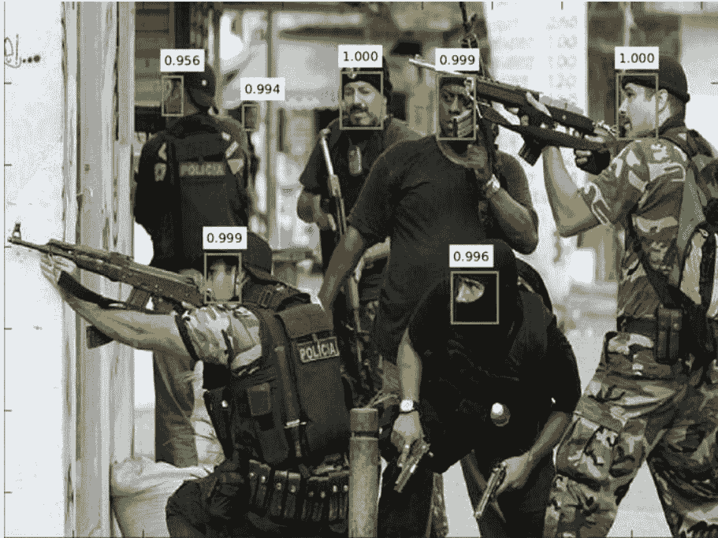

图3.1 使用我们提出的CMS-RCNN方法进行人脸检测的示例结果。所提出的方法可以在WIDER FACE数据集[1]中跨越遮挡、面部表情、姿势、光照、尺度和低分辨率条件下鲁棒地检测人脸。

我们的方法在两个具有挑战性的人脸检测数据库上进行评估，并与许多最新的人脸检测方法进行比较。首先，将提出的CMS-RCNN方法与WIDER FACE数据集[1]上的四个强基准方法[1, 11, 16]进行比较，该数据集是一个大规模的人脸检测基准数据库。该实验显示了该方法在野外环境中检测人脸图像的能力，例如在遮挡、光照、面部姿势、低分辨率等条件下。我们的方法在所有易、中、难三个分区中都大幅优于基准方法。它还在用于研究无约束人脸检测问题的人脸检测数据集和基准（FDDB）[20]上进行了基准测试，该数据集包含人脸区域。实验结果表明，所提出的CMS-RCNN方法始终在其他最先进的人脸检测方法中取得高竞争力的结果。

本文的其余部分按照以下方式组织。在第3.2节中，我们总结了人脸检测的先前工作。第3.3节回顾了一般的深度学习框架，以及Faster R-CNN在人脸检测问题上的背景和局限性。在第3.4节中，我们介绍了我们提出的CMS-RCNN方法来解决无约束人脸检测问题。第3.5节介绍了使用我们提出的方法在两个具有挑战性的人脸检测数据库（即WIDER FACE数据集和FDDB数据库）上获得的实验人脸检测结果和比较。最后，在第3.6节中，我们提出了本研究的结论。

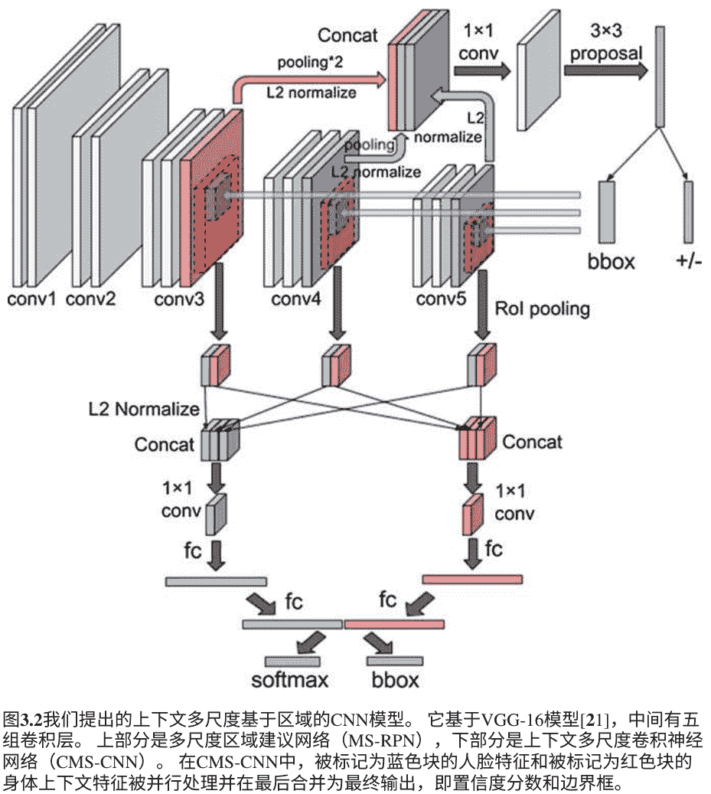

## 3.2 相关工作

人脸检测是计算机视觉领域中一个经过深入研究的领域。对于这个问题，Viola-Jones人脸检测器[2]是最早表现良好的方法之一。它能够使用级联的增强简单的Haar分类器实现实时人脸检测。自从Viola-Jones人脸检测器出现以来，增强和使用简单特征的概念已经成为许多不同方法[3]的基础。这些早期的检测器在正面人脸图像上效果良好，但在不同姿势的人脸上效果不佳。随着时间的推移，许多这些方法已经能够通过利用多个模型来处理不同姿势的人脸检测。这增加了模型的大小，但确实提供了更多实际的方法使用。一些方法已经摒弃了简单特征的想法，但仍然使用了增强学习框架。李和张[5]使用SURF级联进行一般对象检测，但在人脸检测方面也取得了良好的结果。

最近关于人脸检测的工作趋向于使用不同的模型，如可变形部件模型（DPM）[4,22]。朱和拉马南的工作是对人脸检测问题的一种有趣的方法，他们将人脸检测、姿态估计和面部标记结合到一个框架中。通过在一个框架中利用这三个方面，他们能够在真实世界的图像上超越当时的最新技术。余等人[23]在这项工作中引入了组稀疏性学习，确定哪些标记对于人脸检测最为显著，并结合标记的3D模型来处理姿态。陈等人[10]结合了这两种方法的思想，同时利用级联检测框架来定位人脸上的特征以对齐检测器。同样，Ghiasi和Fowlkes[12]能够使用分层DPM不仅实现良好的人脸检测，还能进行标记定位，即使在存在遮挡的情况下。然而，Mathias等人[9]表明，DPM模型和类似于Viola-Jones检测器的刚性模板检测器都有很大的潜力，但尚未充分探索。通过使用适当控制的训练数据重新训练这些模型，他们能够创建与其他更复杂的最新人脸检测器性能相似的人脸检测器。

所有这些面部检测方法都是基于事先选择特征提取器的。然而，已经有人使用ConvNet来学习用于检测面部的特征。神经网络已经存在很长时间，但由于硬件改进和新技术的出现，它们正在经历复兴，从而能够在大量训练数据上训练这些网络。Li等人[14]利用级联CNN来执行面部检测。级联网络允许他们在级联的不同层次上处理不同尺度的面部，同时还允许在后续层次中删除来自先前网络的误报，这与其他级联检测器的方法类似。Yang等人[16]从不同的角度来解决这个问题，更类似于DPM方法。在他们的中，面部被分成几个部分，如头发、眼睛、鼻子、嘴巴和胡须。通过对每个部分训练一个检测器，并智能地组合评分图，他们能够实现即使在遮挡下也能准确检测面部。这两种方法都需要训练多个网络才能达到高精度。另一方面，我们的方法可以作为一个单一的网络进行端到端的训练，从而减少了对训练数据的注释需求，同时保持高度准确的面部检测。

在目标检测中使用上下文信息的想法已经在一些最近的工作中进行了研究，并且具有非常高的检测准确性。Divvala等人[24]在他们的实证评估分析中回顾了上下文在当代具有挑战性的目标检测中的作用。在他们的结论中，上下文信息不仅减少了整体的检测错误，而且检测器产生的剩余错误更加合理。Bell等人[25]介绍了一种名为内外网络 (ION) 的先进目标检测方法。在他们的方法中，利用空间循环神经网络将感兴趣区域外的上下文信息纳入其中。在网络内部，使用跳跃池化来提取多个尺度和抽象级别的信息。

最近，Zagoruyko等人[26]提出了MultiPath网络，对标准的Fast R-CNN目标检测器进行了三个修改，即跳跃连接使检测器可以访问多个网络层的特征，一个中央凹结构以利用多个目标分辨率的对象上下文，以及一个积分损失函数和相应的网络调整来改善定位。他们提出的网络中的信息可以沿多个路径流动。他们的MultiPath网络与DeepMask对象提议相结合，解决了目标检测问题。

与之前的所有方法不同，我们的方法在深度学习框架下解决了问题，其中全局和局部上下文特征（即多尺度）与更快的基于区域的卷积神经网络同步，以实现鲁棒的语义检测。

## 3.3 深度卷积网络的背景

最近对深度卷积网络的研究在目标检测、分类和建模方面取得了显著的结果[27]。在本节中，我们回顾了各种著名的深度卷积网络。然后，我们展示了更快的R-CNN在面部检测的定义上的当前限制，这是目标检测中最先进的深度卷积网络方法之一。

### 3.3.1 基于区域的卷积神经网络

目标检测任务中最重要的方法之一是基于区域的卷积神经网络（R-CNN）系列。

R-CNN [28]，这个家族的第一代，应用了高容量的深度ConvNet来给定的自下而上的区域提案进行分类。由于缺乏标记的训练数据，它采用了一种监督预训练的策略，用于辅助任务的预训练，然后进行特定领域的微调。然后，ConvNet被用作特征提取器，并且系统进一步通过支持向量机（SVM）进行目标检测的训练。最后，它执行边界框回归。该方法实现了高准确性，但非常耗时。该系统需要很长时间来生成区域提案，从每个图像中提取特征，并将这些特征存储在硬盘中，这也占用了大量的空间。在测试时，由于特征提取的缓慢，使用GPU实现的VGG-16网络[21]，每张图像的检测过程需要47秒。换句话说，R-CNN很慢，因为它独立地处理每个对象提案，而不共享计算。

Fast R-CNN [29]通过在提案之间共享特征来解决这个问题。该网络设计为在完全卷积的方式下仅对每个图像计算一次特征图，并使用ROI池化从特征图中动态采样每个物体提案的特征。该网络还采用了多任务损失，即分类损失和边界框回归损失。 基于这两个改进，该框架可以端到端地进行训练。每个图像的处理时间显著减少到0.3秒。Fast R-CNN通过ROI池化层加速检测网络。然而，区域提案步骤是在网络之外设计的，因此仍然存在瓶颈，这导致次优解并依赖于外部的区域提案方法。

更快的 R-CNN [30] 通过引入区域建议网络 (RPN) 来解决快速 R-CNN 的问题。 RPN 以完全卷积的方式实现，用于预测目标边界框和目标性分数。 此外，锚点使用不同的尺度和比例来实现平移不变性。 RPN 与检测网络共享完整图像的卷积特征。 因此，整个系统能够在使用非常深的 VGG-16 模型[21] 的情况下，在 0.2 秒内完成提案生成和检测计算。 使用较小的 ZF 模型 [31]，可以达到实时处理的水平。

### 3.3.2 Faster R-CNN的限制

基于区域的CNN系列，例如Faster R-CNN及其变种[29]，在PASCAL VOC数据集上实现了目标检测的最新性能结果。

这些方法可以非常准确地检测出车辆、动物、人、椅子等物体。 通常情况下，定义的物体占据了给定图像的大部分。 然而，当这些方法在具有挑战性的Microsoft COCO数据集[32]上进行测试时，性能大幅下降，因为图像中包含更多的小物体、遮挡物和不完整物体。 在人脸检测问题中也会出现类似的情况。 我们专注于仅检测有时很小、严重遮挡和低分辨率的面部区域(如图3.1所示)。

设计的Faster R-CNN中的检测网络无法稳定地检测出这样的小脸。直觉点在于感兴趣区域池化层，即ROI池化层，仅从最后一个高级特征图构建特征。例如，VGG-16模型中的‘conv5’层的全局步长为16。 因此，对于图像中尺寸小于16×16像素的面部区域，即使提议的区域是正确的，在‘conv5’层中投影的ROI池化区域也将小于1像素。因此，仅基于一个像素的信息，检测器将很难预测出对象的类别和边界框位置。

### 3.3.3 其他人脸检测方法的限制

在野外物体检测中的其他挑战包括遮挡和低分辨率。
对于人脸检测来说，人们经常戴着太阳镜、围巾和帽子等物品，这些会遮挡住脸部。在这种情况下，仅从脸部提取特征的方法效果不好。例如，Faceness [16] 通过评分脸部部位的空间结构和排列来寻找脸部，这在清晰的脸上效果很好。但是当脸部由于遮挡而缺失或者脸部本身太小时，脸部部位的检测变得更加困难。因此，身体上下文信息发挥了作用。作为上下文相关对象的一个例子，人脸经常与人体一起出现。即使脸部被遮挡了，我们仍然可以通过看整个人体来定位它。对于低分辨率的脸部也有类似的优势，即微小的脸部。由于深度特征的感受野太小，无法提供关于微小脸部的很多信息。引入上下文信息可以扩大特征提取的范围并使其有意义。另一方面，上下文信息还有助于减少误检，如前面讨论的，因为上下文信息可以区分具有身体的真实脸部和没有身体的类似脸部模式。

## 3.4 上下文多尺度 R-CNN

我们的目标是在各种具有挑战性的条件下检测人脸，例如强照明、严重遮挡、极端角度和低分辨率。
在这些条件下，当前基于CNN的检测系统存在两个主要问题，即(1)很难识别小脸; (2) 只考虑脸部区域进行分类。在本节中，我们展示了为什么这些问题阻碍了人脸检测系统的能力。然后，我们提出的网络通过使用多尺度区域建议网络(MS-RPN)和上下文多尺度卷积神经网络(CMS-CNN)来解决这些问题，如图3.2所示。类似于Faster R-CNN, MS-RPN输出多个区域候选框，而CMS-CNN为每个候选框计算置信度分数和边界框。

### 3.4.1 识别微小的面部

为什么之前基于区域的卷积神经网络难以稳定地检测到微小的面部?
原因是在这些网络中,提议的区域和分类得分都是从一个单一的高级卷积特征图中产生的。这种表示不具备足够的信息来进行多个任务,即区域提议和RoI检测。 例如, Faster R-CNN生成区域候选框，并从VGG-16模型的‘conv5’层进行RoI池化,该层的总步长为16。一个问题 是该层的感受野非常大。当面部尺寸小于16x16像素时,‘conv5’层的相应输出小于1像素,这不足以编码有信息的特征。另一个问题是随着卷积层的加深,特征图中的每个像素都会收集原始输入区域外的越来越多的信息,因此 它包含的感兴趣区域信息比例较低。这两个问题共同使得最后一个卷积层对 微小的面部不够具有代表性。

#### 3.4.1.1 多尺度 Faster-RCNN

我们对这个问题的解决方案是全局特征和局部特征的组合,即多尺度。在这个架构中,特征图从较低级别的卷积层与最后一个卷积层一起被合并,用于 MS-RPN和CMS-CNN。来自较低卷积层的特征有助于获取更多微小人脸的信息,因为较低卷积层的步幅不会太小。另一个好处是将具有定位能力的低级特征和具有语义信息的高级特征融合在一起[33],因为人脸检测需要定位人脸并识别人脸。在MS-RPN中,整个较低级别的特征图被下采样到高级特征图的大小,然后与其连接在一起形成一个统一的特征图。然后我们减小统一 特征图的维度,并使用它生成区域候选框。在CMS-CNN中,区域提议被投影到多个卷积层的特征图中。并且在每一层中进行RoI池化,得到一个固定大小的特征张量。所有特征张量都被归一化、连接并降维到一个单一的特征 块,然后被传递到两个全连接层来计算区域候选框的表示。

#### 3.4.1.2 L2归一化

在 MS-RPN 和 CMS-CNN 中,特征图的串联是通过 L2 归一化层 [34] 完成的 ,如图3.2所示,因为来自不同层的特征图通常具有不同的通道数、值的尺度和特征图像素的范数。通常情况下,与浅层的值相比,深层的值通常太小 ,这导致浅层的占主导地位。实际上,系统不可能重新调整和调节每层的值 以获得最佳性能。因此,在串联之前进行L2 归一化层对系统的鲁棒性至关重要,因为它使得每层的值大致保持在相同的尺度上。

归一化是在每个像素内进行的, 并且所有的特征图都是独立处理的。

$$\hat{\mathbf{x}}=\frac{\mathbf{x}}{\|\mathbf{x}\|_{2}}, \quad \|\mathbf{x}\|_{2}=\left(\sum_{i=1}^{d}\left|x_{i}\right|\right)^{\frac{1}{2}}$$ (3.1)

其中, $\mathbf{x}$和 $\hat{\mathbf{x}}$分别代表原始像素向量和归一化像素向量。$d$代表每个特征图张量中的通道数。

在训练过程中, 缩放因子 $\gamma_{i}$将被更新以重新调整归一化特征的尺度。对于每个通道 $i$, 缩放因子的计算如下:

$$y_{i}=\gamma_{i} \hat{x}_{i}$$ (3.2)

其中 $y_{i}$代表重新缩放后的特征值。

根据反向传播和链式法则, 缩放因子 $\gamma$的更新公式为:

$$\frac{\partial l}{\partial \hat{\mathbf{x}}}=\frac{\partial l}{\partial \mathbf{y}} \gamma, \quad \frac{\partial l}{\partial \mathbf{x}}=\frac{\partial l}{\partial \hat{\mathbf{x}}}\left(\frac{\mathbf{I}}{\|\mathbf{x}\|_{2}}-\frac{\mathbf{x} \mathbf{x}^{T}}{\|\mathbf{x}\|_{2}^{3}}\right), \quad \frac{\partial l}{\partial \gamma_{i}}=\sum_{y_{i}} \frac{\partial l}{\partial y_{i}} \hat{x}_{i}$$ (3.3)

其中 $\mathbf{y}=\left[y_{1}, y_{2}, \cdots, y_{d}\right]^{T}$。

#### 3.4.1.3 深度学习Caffe框架中的新层

该系统从较低层的特征图中整合信息, 即第三和第四个卷积层, 以提取微小人脸的决定性特征。对于我们系统的两个部分, 即MS-RPN和CMS-CNN, 在三个层的特征图连接之前插入了L2归一化层。特征被重新缩放到适当的值, 并连接到一个单一的特征图中。我们以特殊的方式设置初始缩放因子, 遵循两个规则。首先, 每个特征图的平均尺度大致相同; 其次, 在接下来的1×1卷积之后, 结果张量的平均尺度应与Faster R-CNN中的conv5层相同。正如所暗示的那样, 在接下来的1×1卷积之后, 张量应与Faster R-CNN中的原始架构相同, 包括其大小、值的尺度和下游处理的功能。

图 3.3 身体背景帮助面部识别的示例。前两个图示表明, 身体的存在可以增加找到面部的信心。后两个图示表明, 当我们看到更多的上下文信息时, 看起来像面部的东西实际上是行星表面上的山。

### 3.4.2 整合身体背景

当人类在寻找面部时, 他们试图寻找不仅仅是面部模式, 例如眼睛、鼻子、嘴巴, 还有人体。有时候一个人的身体会让我们更加确信有一个面部存在。此外, 有时候人体有助于拒绝错误的正例。如果我们只看脸部区域, 可能会在识别它们时犯错误。例如, 图3.3显示了两种情况, 其中身体区域在正确检测中起到了重要作用。这种直觉不仅对人类有效, 对计算机视觉也是有效的。先前的研究表明, 上下文推理是对象识别难题的关键部分, 上下文不仅减少了整体检测错误, 更重要的是, 检测器产生的剩余错误更加合理 [24]。基于这种直觉, 我们的网络被设计成在RoI检测中明确引用人体背景信息。

在我们提出的网络中, 上下文身体推理是通过明确地将卷积特征图中的身体信息分组来实现的, 如图3.2中的红色块所示。具体而言, 对于卷积特征图中的每个区域提议, 都会执行额外的RoI池化操作, 以表示身体上下文特征。然后, 与面部特征张量相同, 这些身体特征张量也被归一化、连接和降维为一个单一的特征块。经过两个全连接层后, 最终的身体表示与面部表示连接在一起。它们共同贡献于置信度得分和边界框回归的计算。

以投影的区域提议作为面部区域, 额外的RoI池化区域表示身体区域, 并满足与面部区域的预定义空间关系。为了建模这种空间关系, 我们做出一个简单的假设, 即如果存在一个面部, 就必然存在一个身体, 并且每个面部与身体之间的空间关系是固定的。尽管这个假设并不总是正确的, 但它应该涵盖大多数情况, 因为我们在现实世界中看到的大多数人要么站着要么坐着。因此, 面部和垂直身体之间的空间关系大致是固定的。

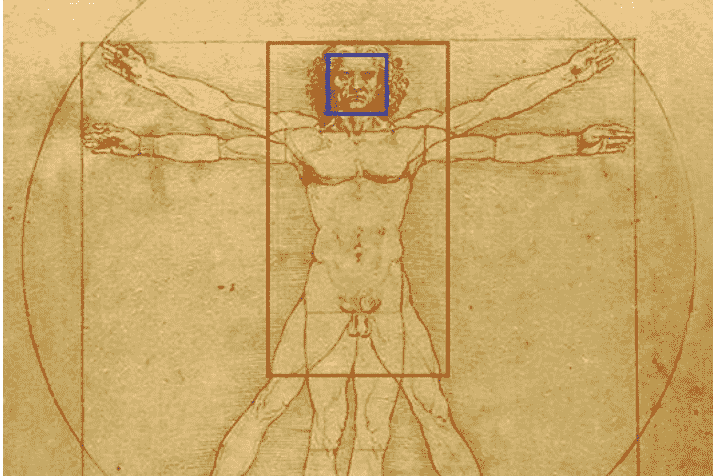

图3.4 维特鲁威人:脸部(蓝色框)和身体(红色框)之间的空间关系

从数学上讲,这种空间关系可以用方程式3.4中的四个参数来表示。

$$t_x = \frac{x_b - x_f}{w_f}, \quad t_y = \frac{y_b - y_f}{h_f}, \quad t_w = \log\left(\frac{w_b}{w_f}\right), \quad t_h = \log\left(\frac{h_b}{h_f}\right)$$ (3.4)

其中, $x_{(*)}, y_{(*)}, w_{(*)}$和 $h_{(*)}$分别表示框的中心坐标、宽度和高度。而 $b$和 $f$分别代表身体和脸部。$t_x, t_y, t_w$和 $t_h$是参数。在本文中,我们固定了这四个参数,使得脸部和身体的两个投影RoI区域满足图3.4中所示的某种空间比例。

### 3.4.3 信息融合

值得注意的是,在我们的深度网络架构中,对于每个提议的区域,我们有多个人脸特征图和身体上下文特征图。一个关键问题是如何有效地融合这些信息,即应用什么计算和在哪个阶段进行。

在我们的网络中,从不同的卷积层提取的特征需要被融合在一起以获得统一的表示。它们不能简单地进行拼接,因为这些层之间的通道数量、值的尺度和特征图像素的规范之间存在整体差异。详细的研究表明,深层往往包含比浅层更小的值。因此,较大的值将主导较小的值,使系统过于依赖浅层特征而不是多尺度特征的组合,导致系统无法不再具有鲁棒性。我们采用了来自[34]的归一化层来解决这个问题。该系统采用多尺度特征，并对每个特征图沿通道轴进行L2归一化。然后，由于不同层之间的通道大小不同，需要对每个层的归一化特征图进行重新加权，以使它们的值处于相同的尺度。之后，将特征图连接成一个单一的特征图张量。这种修改有助于稳定系统并提高准确性。最后，将连接的特征图的通道大小缩小以适应下游的全连接层的原始架构。

另一个关键问题是在网络的早期阶段还是在最后阶段融合面部信息和身体信息。在这里，我们选择了后期融合策略，其中面部特征和身体上下文特征在两个并行管道中提取。在网络的最后阶段，将面部和身体上下文的两个表示连接在一起形成一个长特征向量。然后，将该特征向量转发到计算置信度分数和边界框回归。另一种策略是早期融合，其中面部特征图和身体上下文特征图在RoI池化和归一化之后立即进行连接。

这两种策略都将面部和身体上下文的信息结合起来，但我们更喜欢后期融合。原因是我们希望网络在更语义的空间中做出决策。我们更关心面部和身体的存在，定位信息已经编码在第3.4.2节中提到的预定义空间关系中。此外，经验实验证明后期融合策略效果更好。

### 3.4.4 实现细节

我们的CMS-RCNN是在Caffe深度学习框架[35]中实现的。第一组五个卷积层的架构与深度VGG-16模型相同，在训练过程中，它们的参数从预训练的VGG-16模型中初始化。为了简化，我们将第3、4和5组卷积层分别称为'conv3'、'conv4'和'conv5'。所有后续的层都只与这三个层相连。在MS-RPN中，我们希望'conv3'、'conv4'和'conv5'的大小保持同步，以便可以进行连接操作。因此，'conv3'后面跟着池化层进行下采样。然后，'conv3'、'conv4'和'conv5'沿通道轴进行归一化，得到可学习的重新加权比例，并将它们连接在一起。为了确保训练的收敛性，需要仔细设置初始的重新加权比例。在这里，我们将'conv3'、'conv4'和'conv5'的初始比例分别设置为66.84、94.52和94.52。在CMS-CNN中，RoI池化层已经确保了池化后的特征图具有相同的大小。同样，我们对池化后的特征进行归一化，以确保训练初始化时下游的值处于合理的范围。具体而言，从'conv3'、'conv4'和'conv5'池化得到的特征分别初始化为57.75、81.67和81.67的比例，适用于人脸和身体管道。MS-RPN和CMS-CNN共享相同的参数。对于所有的卷积层，计算只需进行一次，从而提高效率。此外，为了缩小连接特征图的通道大小，还使用了一个 $1 \times 1$ 的卷积层。因此，最终特征图的通道大小与Faster R-CNN中的原始第五个卷积层大小相同。

## 3.5 实验

本节介绍了我们提出的CMS-RCNN方法在WIDER FACE数据集[1]和Face Detection Data Set and Benchmark (FDDB) [20]数据库上的人脸检测基准测试。WIDER FACE数据集具有高度的变异性。使用这个数据库，我们提出的方法在鲁棒性上明显优于强基准方法，包括Two-stage CNN [1]、Multi-scale Cascade CNN [1]、Faceness [16]和Aggregate Channel Features (ACF) [11]。我们还展示了我们在WIDER FACE数据集上训练的模型在FDDB数据库上具有良好的泛化能力。在这个数据库上，我们训练的模型与最近的最先进的人脸检测方法，包括HyperFace [19]、DP2MFD [17]、CCF [18]、Faceness [16]、NPDFace [13]、MultiresHPM [12]、DDFD [15]、CascadeCNN [14]、ACF-multiscale [11]、Pico [7]、HeadHunter [9]、Joint Cascade [10]、Boosted Exemplar [8]和PEP-Adapt [6]，始终取得竞争性的结果。

### 3.5.1 WIDER FACE数据集上的实验

#### 数据描述

WIDER FACE是一个公开的人脸检测基准数据集。它包含来自32,203张图像的393,703个标记的人脸，这些图像是基于61个事件类别从互联网上收集的。该数据库中的人脸具有很高的姿势变化、大面积遮挡、低分辨率和强烈的光照条件。该数据库中的图像被组织并分为三个子集，即训练集、验证集和测试集。它们分别包含原始数据库的 $40 \%$、$10 \%$ 和 $50 \%$。训练集和验证集的图像及其真实标签可在线获取用于实验。然而，在测试集中，只有测试图像（而不是真实标签）可在线获取。所有检测结果都将发送到数据库服务器以进行评估并接收精确度-召回率曲线。

在我们的实验中，所提出的CMS-RCNN模型是在WIDER FACE数据集的训练集上进行训练的，该数据集包含从12,880张图像中收集的159,424个标记的人脸。在所有数据库的测试中，均使用了在该数据库上训练的模型。

#### 有上下文与无上下文的对比

正如我们在第3.4.2节中所展示的，人类视觉可以从额外的上下文信息中获益，以获得更好的检测和识别结果。本节中我们展示了网络中的显式上下文推理如何帮助改善模型性能。

为了证明这一点，我们在WIDER FACE数据集的验证集上测试了带有和不带有身体上下文信息的模型。没有身体上下文的模型通过移除上下文流水线，仅使用来自人脸流水线的表示来计算置信度分数和边界框回归。我们将它们的性能与图3.5进行了比较。Faster R-CNN方法被设置为基准。我们还将我们的模型与第3.4.3节中讨论的不同信息融合策略进行了比较，分别称为早期融合上下文和晚期融合上下文。

实验结果表明，晚期融合上下文的模型相比没有上下文的模型有显著改进，这意味着它们可以更好地处理具有挑战性的条件。此外，我们观察到早期融合上下文确实有助于检测更多的人脸，因为它的曲线比没有上下文的曲线更长。

然而，早期融合的上下文会在太多的误报中触发，导致平均精度得分低，并且曲线开始时下降。图3.6说明了与后期融合的上下文相比的误报情况。这可能是因为早期融合的上下文在非常早期的阶段就将所有特征图连接起来，导致高维特征图。这可能会导致由于维度灾难而过拟合。

因此，我们将我们的模型固定为后期融合的上下文进行其他实验。

为了找出我们提出的网络可以检测到人脸的最低分辨率，我们设置阈值，使得我们的检测器在图3.5中可以达到90%的精度。然后我们收集由我们的方法在WIDER FACE验证集中正确检测到的所有人脸。结果显示我们可以检测到的最小人脸尺寸约为10×10像素。

图3.5在WIDER FACE验证集上的精确度-召回曲线。基准线（绿色曲线）是由Faster R-CNN [30]模型在WIDER FACE训练集上训练生成的。我们展示了我们的模型在没有上下文的情况下（红色曲线）优于基准线，而后期融合的上下文可以进一步提升性能（蓝色曲线）。图例中的数字是平均精确度值。

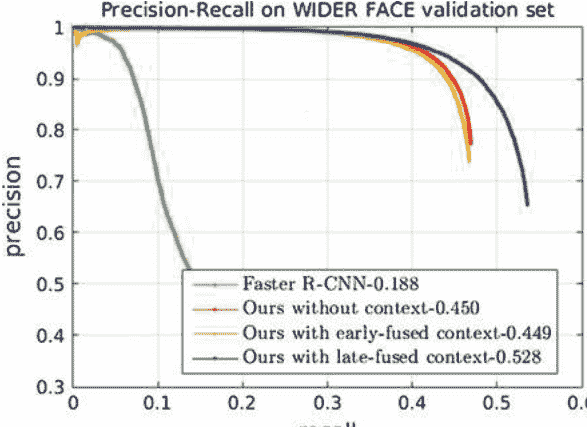

Early-fused context

Late-fused context

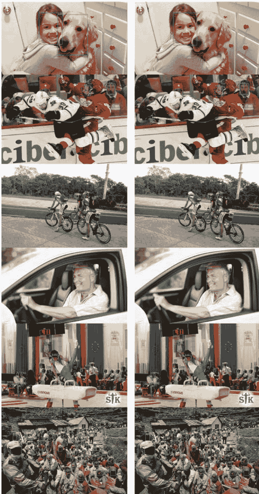

图3.6 在WIDER FACE验证集上对一些示例进行早期融合上下文和晚期融合上下文的比较。很明显，早期融合上下文在一些误报上更容易被触发，导致AP得分较低。

#### 测试和比较

在测试阶段，测试集中的人脸图像根据它们在EdgeBox [36]上的检测率被分为三个部分。换句话说，根据检测的难度，即简单、中等和困难，将人脸图像分为三个级别[1]。将提出的CMS-RCNN模型与最近的强人脸检测方法进行比较，即两阶段CNN [1]、多尺度级联CNN [1]、Faceness [16]和聚合通道特征(ACF) [11]。所有这些方法都是在相同的训练集上进行训练，并在相同的测试集上进行测试。Precision-Recall曲线和AP值如图3.7所示。我们的方法在所有级别的人脸中都表现出色。它在所有级别的人脸中都取得了最佳的平均精度，即AP=0.902 (简单)、0.874 (中等) 和0.643 (困难)。

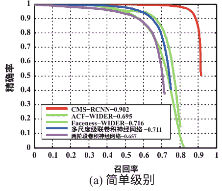

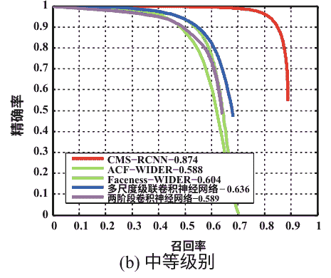

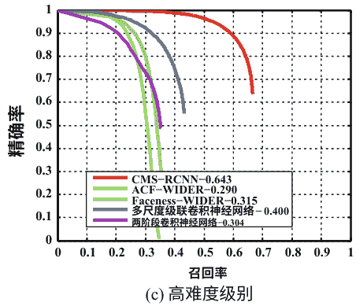

图3.7 我们提出的CMS-RCNN (红色) 和其他基线方法 (即两阶段CNN [1]、多尺度级联CNN [1]、Faceness [16]和聚合通道特征 (ACF) [11]) 所得到的精确率-召回率曲线。所有方法都在WIDER FACE数据集的相同训练和测试集上进行训练和测试。a) 简单级别，b) 中等级别和 c) 高难度级别。我们的方法在该数据库上取得了最先进的结果，最高的AP值分别为0.902 (简单)、0.874 (中等) 和0.643 (高难度)。它还比第二好的基准线提高了26.0% (简单)、37.4% (中等) 和60.8% (高难度)。

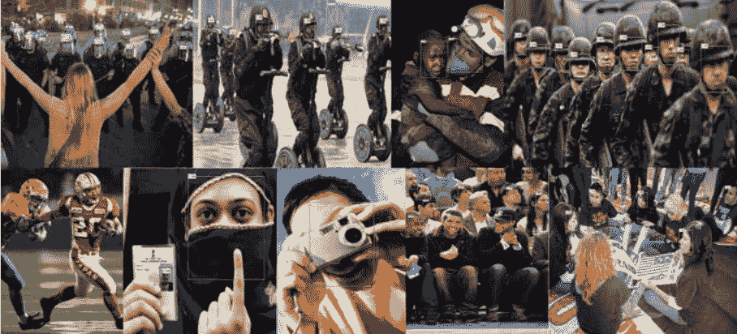

图3.8 使用我们提出的CMS-RCNN方法在WIDER FACE数据库[1]上进行人脸检测的一些示例结果。

并且比第二好的基准线提高了26.0% (简单)、37.4% (中等) 和60.8% (困难)。这些结果表明，随着难度水平的提高，CMS-RCNN可以更好地检测具有挑战性的人脸。因此，它具有处理困难条件的能力，因此更接近于人类的检测水平。图3.8显示了使用提出的CMS-RCNN在该数据库上进行人脸检测的一些示例结果。

#### 虚假阳性的可视化

众所周知，由于虚假阳性，精确度-召回曲线会下降，我们对我们的CMS-RCNN模型产生的虚假阳性很感兴趣。我们很好奇什么样的物体会欺骗我们的模型将其视为人脸。这是由于过拟合、数据偏差还是错误标记引起的？

为了可视化虚假阳性，我们在WIDER FACE验证集上测试CMS-RCNN模型，并根据真实标注选择所有虚假阳性。然后，这些阳性按照置信度得分降序排序。

我们选择了前20个假阳性，如图3.9所示。因为它们的置信度得分很高，它们是最有可能导致我们的模型出错的对象。

事实证明，大部分的假阳性实际上是由于错误标记导致的人脸，这是数据集本身的问题。对于其他的假阳性，我们发现我们的模型所犯的错误是相当合理的。它们都具有人脸的模式以及人体的形状。

### 3.5.2 FDDB人脸数据库上的实验

为了证明我们的方法在其他数据库上具有良好的泛化能力，提出的CMS-RCNN也在FDDB数据库[20]上进行了基准测试。这是一个用于测试和评估人脸检测算法的标准数据库。它包含了来自Faces in the Wild数据集的2,845张图像中5,171张人脸的注释。FDDB数据库中的大多数图像包含少于三个清晰或轻微遮挡的人脸。与WIDER FACE相比，这些人脸通常具有较大的尺寸和较高的分辨率。我们使用在WIDER FACE训练集上训练的相同模型来对FDDB数据库进行评估。

评估是基于离散准则进行的，遵循PASCAL VOC Challenge[37]中的相同规则，即如果检测到的区域与注释的人脸区域的交集比例大于0.5，则被视为真正的检测结果。评估按照FDDB评估协议进行，并与协议中提供的已发表方法进行比较，即HyperFace [19]、DP2MFD [17]、CCF [18]、Faceness [16]、NPDFace [13]、MultiresHPM [12]、DDFD [15]、CascadeCNN [14]、ACF-multiscale [11]、Pico [7]、HeadHunter [9]、联合级联[10]、Boosted Exemplar [8]和PEP-Adapt [6]。所提出的CMS-RCNN方法优于大多数已发表的人脸检测方法，并且与所有其他方法相比实现了非常高的召回率 (如图3.10所示)。这是证明CMS-RCNN能够稳健地检测非约束性人脸的确凿证据。图3.11显示了使用提出的CMS-RCNN在FDDB数据集上进行人脸检测的一些示例。

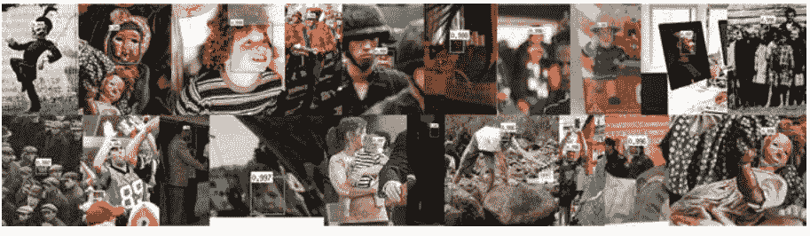

图3.9 我们的CMS-RCNN模型在WIDER FACE验证集上的前20个假阳性的示例。实际上，这些假阳性中包含了许多不在数据集中的人脸，这意味着我们的方法对数据中的噪声具有鲁棒性。

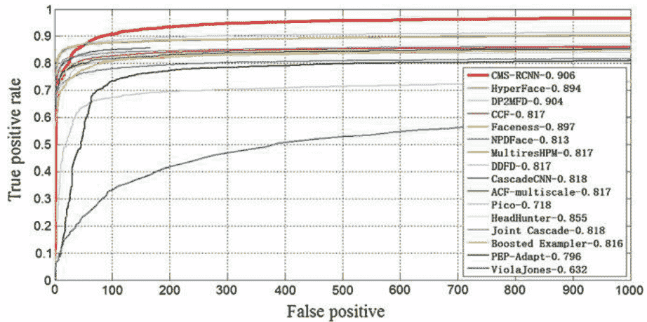

图3.10 我们提出的CMS-RCNN和其他已发表的方法在FDDB数据库[20]上的ROC曲线。我们的方法在这个数据库上实现了最佳的召回率。图例中的数字显示了平均精确度分数。

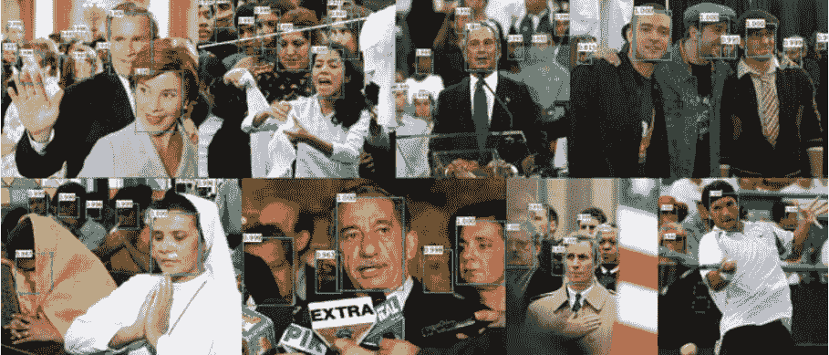

图3.11 使用我们提出的CMS-RCNN方法在FDDB数据库[20]上的一些人脸检测结果示例。

## 3.6 结论和未来工作

本文提出了我们提出的CMS-RCNN方法，用于在各种具有挑战性的条件下收集的图像中鲁棒地检测人脸区域，例如高度遮挡、低分辨率、面部表情、光照变化等。该方法在两个具有挑战性的人脸检测数据库（即WIDER FACE数据集和FDDB）上进行了基准测试，并与最近的其他人脸检测方法进行了比较。实验结果表明，我们提出的方法在WIDER FACE上优于强基线，并在FDDB上与最先进的保持了非常有竞争力的结果。在我们的实现中，提出的CMS-RCNN由MS-RPN和CMS-CNN组成。在训练过程中，它们以近似的联合训练方式合并在一起，每个SGD迭代中忽略了对提议框坐标的导数。将来，我们希望进行完全联合训练，以便网络可以以端到端的方式进行训练 (图3.12)。

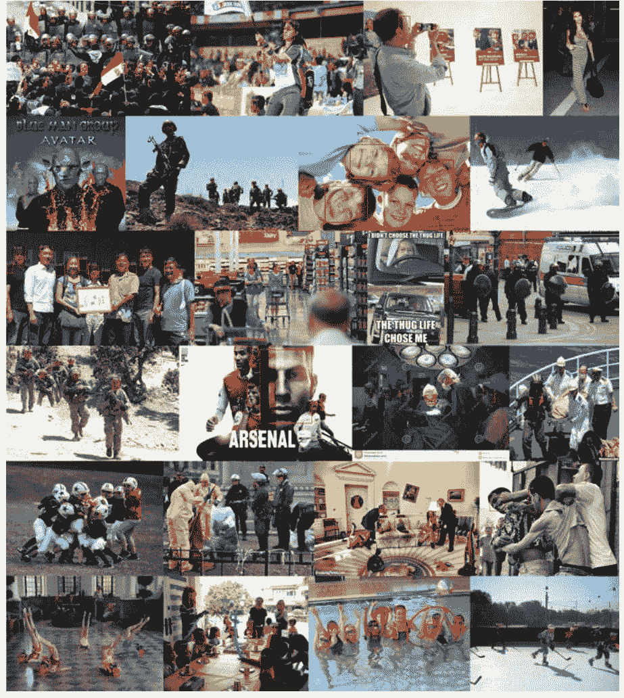

图3.12 在具有挑战性条件下使用我们提出的CMS-RCNN进行无约束人脸检测的更多结果

# 参考文献

1. S. Yang, P. Luo, C.C. Loy, X. Tang, Wider face: 一个人脸检测基准, 在计算机视觉和模式识别的IEEE会议 (CVPR) (IEEE, 2016), pp. 5525-5533
2. P. Viola, M. Jones, 使用简单特征的增强级联快速目标检测, 在2001年IEEE计算机学会计算机视觉和模式识别会议论文集, 2001. CVPR 2001, vol. 1 (IEEE, 2001), pp. I-511
3. C. Zhang, Z. Zhang, 近期人脸检测进展的综述。技术报告MSR-TR-2010-66 (2010), http://research.microsoft.com/apps/pubs/default.aspx?id=132077
4. X. Zhu, D. Ramanan, 在野外的人脸检测、姿态估计和地标定位, 2012年IEEE计算机视觉与模式识别会议 (CVPR) (IEEE, 2012), pp. 2879-2886
5. J. Li, Y. Zhang, 学习SURF级联以实现快速准确的目标检测，在IEEE计算机视觉与模式识别会议论文集 (2013)，pp. 3468-3475
6. H. Li, G. Hua, Z. Lin, J. Brandt, J. Yang, 用于无监督人脸检测器自适应的概率弹性部件模型，在IEEE国际计算机视觉会议论文集 (2013) ，pp. 793-800
7. N. Marku, M. Frljak, I.S. Pandić, J. Ahlberg, R. Forchheimer, 基于像素强度比较组织的决策树的目标检测方法 (2013)。arXiv:1305.4537
8. H. Li, Z. Lin, J. Brandt, X. Shen, G. Hua, 高效的增强样本人脸检测，在IEEE计算机视觉与模式识别会议论文集 (2014)，pp. 1843-1850
9. M. Mathias, R. Benenson, M. Pedersoli, L. Van Gool, 无需花哨的人脸检测, 在计算机视觉-ECCV 2014 (Springer, Berlin, 2014), 第720-735页
10. D. Chen, S. Ren, Y. Wei, X. Cao, J. Sun, 联合级联人脸检测和对齐, 在计算机视觉-ECCV 2014 (Springer, Berlin, 2014), 第109-122页
11. B. Yang, J. Yan, Z. Lei, S.Z. Li, 多视角人脸检测的聚合通道特征, 在2014年IEEE国际联合生物特征学术会议(JCB) (IEEE, 2014), 第1-8页
12. G. Ghiasi, C.C. Fowlkes, 遮挡一致性: 检测和定位遮挡的人脸 (2015). arXiv:1506.08347
13. S. Liao, A. Jain, S. Li, 一种快速准确的非约束人脸检测器 (2014)
14. H. Li, Z. Lin, X. Shen, J. Brandt, G. Hua, 一种用于人脸检测的卷积神经网络级联，在IEEE计算机视觉与模式识别会议论文集 (2015), pp. 5325-5334
15. S.S. Farfade, M.J. Saberian, L.-J. Li, 使用深度卷积神经网络的多视角人脸检测，在第5届ACM多媒体检索国际会议论文集 (ACM, 2015), pp. 643-650
16. S. Yang, P. Luo, C.-C. Loy, X. Tang, 从面部部位响应到人脸检测: 一种深度学习方法，在IEEE国际计算机视觉会议论文集 (2015), pp. 3676-3684
17. R. Ranjan, V.M. Patel, R. Chellappa, 用于人脸检测的深度金字塔可变部件模型，2015年IEEE第七届生物识别理论、应用和系统国际会议(BTAS) (IEEE, 2015), pp. 1-8
18. B. Yang, J. Yan, Z. Lei, S.Z. Li, 卷积通道特征，IEEE国际计算机视觉会议论文集 (2015), pp. 82-90
19. R. Ranjan, V.M. Patel, R. Chellappa, Hyperface: 用于人脸检测、关键点定位、姿态估计和性别识别的深度多任务学习框架 (2016). arXiv:1603.01249
20. V. Jain, E. Learned-Miller, FDDB: 用于非受限环境中人脸检测的基准测试. 马萨诸塞大学阿默斯特分校，技术报告UM-CS-2010-009 (2010)
21. K. Simonyan, A. Zisserman, 用于大规模图像识别的非常深的卷积网络 (2014). arXiv:1409.1556
22. P. Felzenszwalb, R. Girshick, D. McAllester, D. Ramanan, 使用具有判别训练的基于部件的模型进行目标检测. IEEE Trans. PAMI 32(9), 1627-1645 (2010)
23. X. Yu, J. Huang, S. Zhang, W. Yan, D. Metaxas, 通过优化的部件混合和级联可变形状模型进行无姿态人脸特征拟合, 在IEEE国际计算机视觉会议 (2013), pp. 1944-1951
24. S.K. Divvala, D. Hoiem, J.H. Hays, A.A. Efros, M. Hebert, 对目标检测中的上下文进行实证研究, 在IEEE计算机视觉与模式识别会议, CVPR2009 (IEEE, 2009), pp. 1271-1278
25. S. Bell, C.L. Zitnick, K. Bala, R. Girshick, 内外网络：通过跳过池化和循环神经网络在上文中检测对象 (2015). arXiv:1512.04143

- 26. S. Zagoruyko, A. Lerer, T.-Y. Lin, P.O. Pinheiro, S. Gross, S. Chintala, P. Dollár, 用于对象检测的多路径网络 (2016). arXiv:1604.02135
- 27. A. Krizhevsky, I. Sutskever, G.E. Hinton, 使用深度卷积神经网络进行 Imagenet 分类, 在 Advances in Neural Information Processing Systems (2012), pp. 1097-1105
- 28. R. Girshick, J. Donahue, T. Darrell, J. Malik, 基于区域的卷积网络用于准确的对象检测和分割。IEEE Trans. Pattern Anal. Mach. Intell. 38(1), 142-158 (2016)
- 29. R. Girshick, Fast R-CNN, 在计算机视觉国际会议论文集 (2015), 第1440-1448页
- 30. S. Ren, K. He, R. Girshick, J. Sun, Faster R-CNN: 实时目标检测与区域建议网络, 在神经信息处理系统进展 (2015), 第91-99页
- 31. M.D. Zeiler, R. Fergus, 可视化和理解卷积网络, 在计算机视觉-ECCV 2014 (Springer, Berlin, 2014), 第818-833页
- 32. T.-Y. Lin, M. Maire, S. Belongie, J. Hays, P. Perona, D. Ramanan, P. Dollár, C.L. Zitnick, Microsoft coco: 上下文中的常见物体, 在 ECCV (2014), 第740-755页
- 33. B. Hariharan, P. Arbeláez, R. Girshick, J. Malik, 超列用于对象分割和细粒度定位, 在计算机视觉和模式识别国际会议论文集 (2015), 第447-456页
- 34. W. Liu, A. Rabinovich, A.C. Berg, Parsenet: 更广泛地看待以获得更好的视野 (2015). arXiv:1506.04579
- 35. Y. Jia, E. Shelhamer, J. Donahue, S. Karayev, J. Long, R. Girshick, S. Guadarrama, T. Darrell, Caffe: 用于快速特征嵌入的卷积架构, 出现在 ACM 国际多媒体会议论文集 (ACM, 2014), pp. 675-678
- 36. C.L. Zitnick, P. Dollár, 边缘框: 从边缘定位物体提议, 出现在 ECCV (Springer, Berlin, 2014), pp. 391-405
- 37. M. Everingham, L. Van Gool, C.K. Williams, J. Winn, A. Zisserman, Pascal 视觉对象类别 (VOC) 挑战. 计算机视觉国际期刊 88(2), 303-338 (2010)

# 第二部分 指纹、指静脉和虹膜识别的深度学习

## 第四章 使用深度神经网络进行潜在指纹图像分割

Jude Ezeobiejesi 和 Bir Bhanu

**摘要** 我们提出了一个深度人工神经网络（DANN）模型，通过一系列限制玻尔兹曼机（RBMs）学习潜在指纹图像块，并使用它来执行潜在指纹图像的分割。人工神经网络（ANN）是受生物启发的架构，通过学习的权重或滤波器产生地图的层次结构。潜在指纹是在犯罪现场无意留下的指纹印记。为了对嫌疑人进行识别或排除，潜在指纹鉴定人员分析和比较潜在指纹与已知个体的指纹。由于潜在指纹图像的质量差且常常具有复杂的图像背景和重叠的模式，将感兴趣的指纹区域与复杂的图像背景和重叠的模式分离是非常具有挑战性的。我们提出的基于RBMs的DANN模型通过两个阶段学习指纹图像块。第一阶段（无监督预训练）涉及学习输入图像块的身份映射。在第二阶段，进行微调和梯度更新以最小化训练数据集上的成本函数。所得到的训练模型用于将图像块分类为指纹和非指纹类别。我们使用指纹块重构潜在指纹图像，并丢弃包含原始潜在指纹中结构噪声的非指纹块。通过与最先进的潜在指纹分割模型的结果进行比较，评估了我们提出的模型。我们评估的结果显示了所提方法的卓越性能。

J. Ezeobiejesi ( ) · B. Bhanu  
加州大学河滨分校智能系统研究中心，河滨，加利福尼亚州92521，美国  
e-mail: jezeobie@cs.ucr.edu

B. Bhanu  
e-mail: bhanu@cris.ucr.edu

## 4.1 引言

深度学习是一种使用神经网络的分层学习特征的技术。深度学习通常有两个阶段。第一阶段通常被称为预训练，涉及无监督的逐层训练。第二阶段（微调）涉及利用第一阶段的结果进行监督训练。在深度学习中，使用了层次化的学习抽象来完成高级任务[3]。近年来，深度学习技术已被应用于不同领域的各种问题[3]。一些值得注意的领域受益于深度学习，包括模式识别[21]，计算机视觉[16]，自然语言处理和医学图像分割[17]。在许多这些领域中，深度学习算法优于先前的最先进算法。

潜在指纹是在犯罪现场无意留下的指纹印记。潜在检验员分析和比较潜在指纹与已知个体的指纹，以进行嫌疑人的识别或排除。可靠的潜在指纹分割是潜在指纹处理自动化的重要步骤。通过具有高度准确性的自动潜在指纹分割，可以获得更好的潜在指纹匹配结果。近年来，潜在指纹鉴定的准确性在法律系统和法医科学文献中受到了增加的研究、审查和评论的关注。潜在指纹匹配中的错误可能会导致错过抓捕罪犯的机会或错误定罪无辜人员。美国和其他国家的几起知名案件表明，法医检验员有时会在手动分析或比较指纹时犯错误。与滚动和平面指纹相比，潜在指纹具有明显较差的质量脊结构和大的非线性失真。如图4.1所示，潜在指纹图像包含背景结构噪声，如污渍、线条、弧线，有时还有文字。潜在指纹图像的质量差和常见的复杂图像背景以及重叠的模式特征使得从复杂图像背景和重叠的模式中分离出感兴趣的指纹区域非常具有挑战性。

为了处理潜在指纹，潜在专家会手动标记潜在指纹中感兴趣的区域（ROIs），并使用这些 ROIs在参考完整指纹的大型数据库中搜索少量可能的匹配项以供手动检查。考虑到执法数据库中包含的滚动和平面指纹的庞大规模，完全自动化地进行潜在指纹处理非常有必要。作为这个方向的一步，本章提出了一种使用深度学习从复杂图像背景中分离潜在指纹的高效技术。我们使用一系列受限玻尔兹曼机（RBM）的层次结构学习一组特征。然后，将这些特征传递给监督学习算法，以学习用于补丁分类的分类器。我们使用分类结果进行潜在指纹图像分割。据我们所知，以前的工作没有使用这种策略来分割潜在指纹。

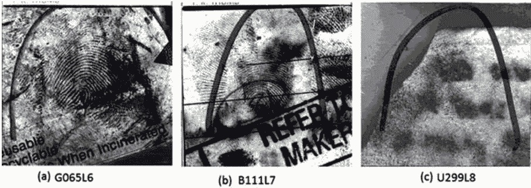

图4.1 来自NIST SD27的样本潜在指纹，显示三个不同的质量水平：a. 好的，b. 差的，和 c. 丑陋的。

本章的其余部分组织如下：第4.2.1节回顾了潜在指纹分割的最新工作，而第4.2.1.1节描述了本章的贡献。第4.3节重点介绍了我们的技术方法，并概述了使用RBM进行学习的讨论。我们提出的方法的实验结果和性能评估在第4.4节中呈现。第4.4.5节重点介绍了将训练数据集与分形维度和孔隙度特征扩散对网络性能的影响，而第4.5节包含了结论和未来工作。

## 4.2 相关工作和贡献

### 4.2.1 相关工作

最近对潜在指纹分割进行的研究可以分为三类：

- 基于图像块分类的技术
- 基于聚类的技术
- 依赖于脊线频率和方向特性的技术

在[9]中提出的研究属于第一类。作者通过从潜在指纹图像中提取8x8个非重叠块，并使用计算每个图像块的分形维度特征将它们分类为指纹和非指纹块来进行图像分割。他们将指纹块组装起来构建原始图像的指纹部分（感兴趣的分割区域）。

在第二类方法中，Arshad等人[4]使用K均值聚类将潜在指纹图像划分为非重叠块，并计算每个块的标准差。如果块的标准差被认为是前景，则将其视为前景。他们使用形态学运算来分割潜在指纹。属于第三类的方法依赖于对脊线频率和方向特性的分析，以确定潜在指纹图像中包含指纹的区域[4，7，13，27，29]。

Choi等人[7]使用方向张量方法提取指纹的对称模式，并去除背景中的结构噪声。他们使用局部傅里叶分析方法估计潜在指纹图像中的局部频率，并通过考虑有效频率范围来定位指纹区域。他们通过每个特征（方向和频率）获取候选指纹（前景）区域，然后使用这些候选区域的交集来定位潜在指纹区域。Karimi等人[13]基于脊线投影和不同方向估计脊线/谷线模式的局部频率。他们将脊线信号的频率和振幅的方差作为分割算法的特征。他们仅报告了两个潜在指纹图像的分割结果，并未提供性能评估。Short等人[27]提出了脊线模板相关方法用于潜在指纹分割。他们生成了一个理想的脊线模板，并计算交叉相关值来定义局部指纹质量。他们手动选择了六个不同的阈值，为每个指纹块分配质量值。他们既未提供理想脊线模板的大小和数量，也未报告分割结果的评估标准。Zhang等人[29]提出了一种自适应总变差（TV）模型用于潜在指纹分割。他们根据背景噪声水平自适应确定模型中赋予保真度项的权重。他们用它来去除潜在指纹图像中的背景噪声。

我们的方法使用深度架构，在两个阶段中进行学习和分类。第一阶段（无监督预训练）涉及学习输入图像块的身份映射。在第二阶段（微调）中，模型通过梯度更新来最小化数据集上的成本函数。训练好的模型用于对图像块进行分类，分类结果用于潜在指纹图像分割。

#### 4.2.1.1 贡献

- 本章做出了以下贡献：
- 修改标准RBM学习算法的执行方式，以引入一种加权方案，使得第一层的RBM能够以接近零的重构误差对输入数据进行建模。这使得更高层次的权重能够高效地对更高层次的数据进行建模。
- 引入基于加权调和平均值的成本函数来使网络更好地学习少数类，并提高每个类别的准确性。通过严厉惩罚少数（指纹）类别的错误分类，学习的模型被调整为在少数类别上接近零的漏检率。
- 所提出的生成特征学习模型和相关分类器在潜在指纹图像分割方面具有最先进的性能，且在许多潜在指纹图像数据库上保持一致。

## 4.3 技术方法

我们的方法涉及将潜在指纹图像分割为8×8个不重叠的块，并使用生成式多层特征提取器学习一组模拟图像块分布的随机特征。我们使用这些特征来训练一个单层感知器分类器，将图像块分类为指纹和非指纹类别。我们使用指纹块重构潜在指纹图像，并丢弃包含原始潜在指纹中结构化噪声的非指纹块。我们提出的方法的框图如图4.2所示，特征学习、提取和分类模型的架构如图4.3所示。

### 4.3.1 限制玻尔兹曼机

限制玻尔兹曼机是一种随机神经网络，由可见层、隐藏层和偏置单元组成[11]。图4.4显示了一个具有二进制可见单元和隐藏单元的样本RBM。RBM的能量函数 $E_f(\hat{x}, h)$ 是其自由参数的线性函数，定义如下[11]：

$$ E_f(\hat{x}, h) = - \sum_i b_i \hat{x}_i - \sum_j c_j h_j - \sum_i \sum_j \hat{x}_i w_{i,j} h_j, \quad (4.1) $$

其中 $\hat{x}$ 和 $h$ 分别表示可见单元和隐藏单元，$W$ 表示连接 $\hat{x}$ 和 $h$ 的权重，$b$ 和 $c$ 分别是可见单元和隐藏单元的偏置。可见或隐藏向量上的概率分布是根据能量函数定义的[11]：

$$ P(\hat{x}, h) = \frac{1}{\omega} e^{-E_f(\hat{x},h)}, \quad (4.2) $$

其中 $\omega$ 是一个分区函数，确保隐藏或可见向量的概率分布总和为1。可见向量的边际概率 $P(\hat{x})$ 是所有可能的隐藏层配置的总和[11]，定义如下：

$$ P(\hat{x}) = - \sum_h e^{-E_f(\hat{x},h)} \quad (4.3) $$

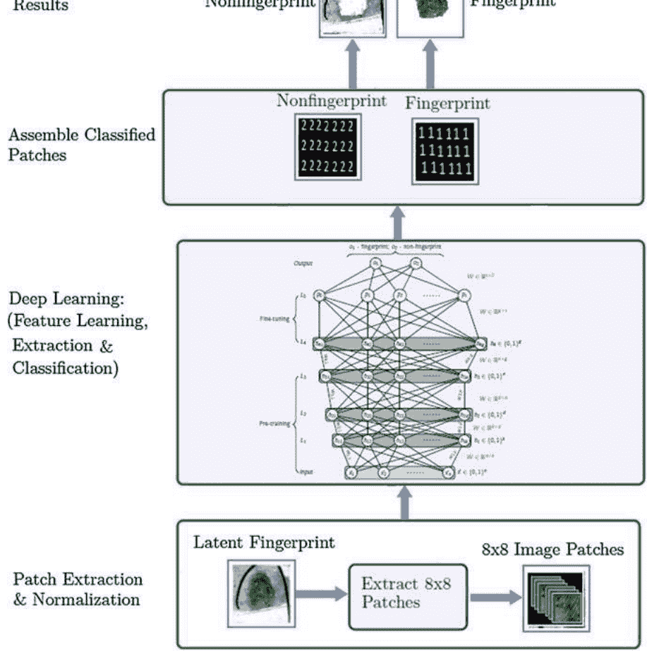

图4.2 提出的方法

RBM没有层内连接，给定可见单元激活，隐藏单元激活是相互独立的。同时，给定隐藏单元激活，可见单元激活也是相互独立的[6]。给定可见单元的配置的条件概率为：

$$ P(\hat{x}|h) = \prod_{i=1}^{n} P(\hat{x}_i|h), \quad (4.4) $$

其中 $n$ 是可见单元的数量。给定可见单元的条件概率是：

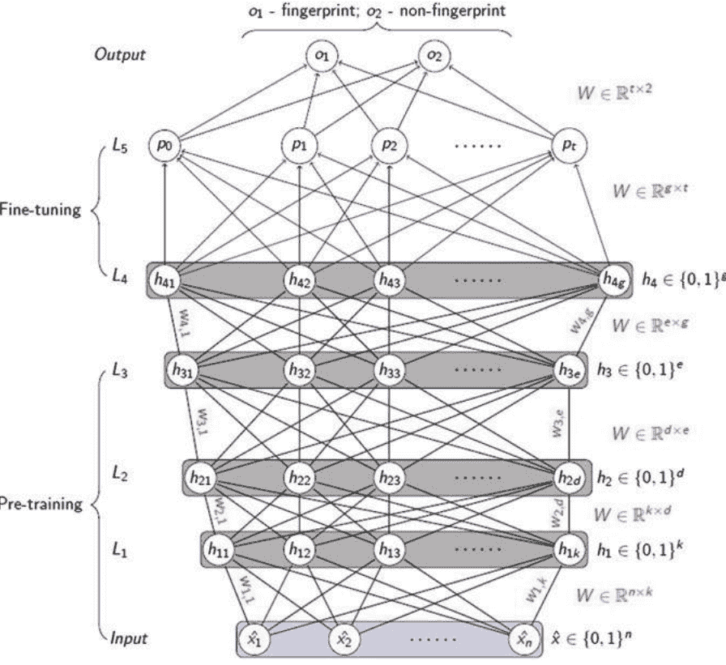

图4.3 使用多层神经网络进行特征学习、提取和分类。预训练阶段使用输入层（可见单元）和三个RBM隐藏层 $L_1, L_2, L_3$。微调阶段使用一个RBM层 $L_4$ 和一个单层感知器 $L_5$。输出层有两个输出神经元（指纹和非指纹）。所有单元都是二进制的。$h_{i,j}$ 是 $L_i$ 中的第 $j$ 个节点，$w_{i,j}$ 是连接 $L_i$ 中的第 $j$ 个节点和 $L_{i-1}$ 中的第 $j$ 个节点的权重。我们设置 $n=81$（来自 $8 \times 8$ 的64个和扩散的17个），$k=800, d=1000, e=1200, g=1200, t=1200$，其中 $n, k, d, e, g, t$ 分别是输入层、$L_1, L_2, L_3, L_4, L_5$ 的节点数。

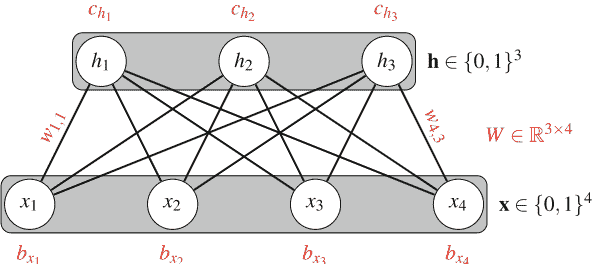

图4.4 显示具有二进制可见和隐藏单元的RBM的图形描述。$x_i, i=1, \ldots, 4$ 是可见单元，而 $h_k, k=1, \ldots, 3$ 是隐藏单元。$b_{x_i}, i=1, \ldots, 4$ 是可见单元的偏置，而 $c_{h_k}, k=1, \ldots, 3$ 是隐藏单元的偏置。

$$ P(h|\hat{x}) = \prod_{j=1}^{m} P(h_j|\hat{x}), \quad (4.5) $$

其中 $m$ 是隐藏单元的数量。每个单元的激活概率由以下给出：

$$ P(h_j=1|\hat{x}) = \sigma \left( b_j + \sum_{i=1}^{n} w_{i,j}\hat{x}_i \right), \quad (4.6) $$

和

$$ P(\hat{x}_i=1|h) = \sigma \left( c_i + \sum_{j=1}^{m} w_{i,j}h_j \right), \quad (4.7) $$

其中 $c_i$ 是第 $i$ 个隐藏单元的偏置，$b_j$ 是第 $j$ 个可见单元的偏置，$w_{i,j}$ 是连接第 $i$ 个可见单元和第 $j$ 个隐藏单元的权重，而 $\sigma$ 是逻辑 sigmoid 函数。

### 4.3.2 使用RBM进行学习

使用RBM进行学习涉及多个步骤，包括给定可见变量时对隐藏变量进行采样，给定隐藏变量时对可见变量进行采样，以及通过调整隐藏单元和可见层之间的权重来最小化重构误差。使用RBM进行学习的目标是通过类似于身份映射的过程来确定隐藏变量和可见变量之间的关系。我们使用改进的对比散度技术对Gibbs采样步骤进行了采样。

#### 4.3.2.1 Gibbs采样

一种基于马尔可夫链蒙特卡洛（MCMC）技术的采样算法，用于估计学习模型中的期望值。它允许从该分布中模拟的样本计算出所需期望的统计量[28]。对于 $R$ 的Gibbs采样，$R = (R_1, R_2, \dots, R_n)$，它包括一系列的 $R_i \sim p(R_i | R_{-i})$ 的采样子步骤，其中 $R_i$ 包含 $R$ 中的其他 $n-1$ 个随机变量，不包括 $R_i$。对于RBM，$R = Q_1 \cup Q_2$，其中 $Q_1 = \{\hat{x}_i\}$ 和 $Q_2 = \{h_i\}$。鉴于集合 $Q_1$ 和 $Q_2$ 是条件独立的，可以使用块Gibbs采样同时对给定的隐藏单元进行采样。同样，可以在给定可见单元的情况下同时对隐藏单元进行采样。以下是马尔可夫链中的一步：

$$ h^{(k+1)} \sim \sigma(W^T v^{(k)} + c), \quad \hat{x}^{(k+1)} \sim \sigma(W h^{(k+1)} + b), $$

其中 $h^{(k)}$ 指的是马尔可夫链在第 $k$ 步的所有隐藏单元的集合，$\sigma$ 表示逻辑 sigmoid 函数，定义为：

$$ \sigma(x) = \frac{1}{1+e^{-x}} $$

其中 $W_h$ 和 $c$ 是隐藏层的权重矩阵和偏置，不包括第一层，$z(x)$ 是网络中隐藏层的激活值。$W_v$ 是连接可见层和第一隐藏层的权重矩阵，$b$ 是可见层的偏置。

#### 4.3.2.2 对比散度 (CD-k)

该算法用于梯度下降过程中，以加速Gibbs采样。它有助于优化权重 W during RBM训练。CD-k通过在仅经过 $k$ 步Gibbs采样后进行采样，而不等待马尔可夫链的收敛来加速Gibbs采样。在我们的实验中，我们设置 $k=1$。

#### 4.3.2.3 随机梯度下降

对于大型数据集，计算整个训练集的成本和梯度通常非常缓慢，可能难以处理 [24]。随机梯度下降 (SGD) 通过观察几个训练示例后，沿着目标函数的负梯度来解决这个问题。SGD在神经网络中被用来减轻在整个训练集上运行反向传播的高成本 [24]。

给定一个目标函数 $J(\phi)$，标准梯度下降算法更新参数 $\phi$ 如下：

$$ \phi = \phi - \alpha \nabla_{\phi} E[J(\phi)], $$

其中期望 $E[J(\phi)]$ 是通过评估整个训练集的成本和梯度的昂贵过程获得的。使用SGD，参数的梯度是使用几个训练示例计算的，不需要担心期望。参数的更新如下：

$$ \phi = \phi - \alpha \nabla_{\phi} J(\phi ; x^{(i)}, y^{(i)}) $$

其中，$(x^{(i)}, y^{(i)})$ 来自训练集。每次参数更新都是使用一些训练样本计算的。这样可以减少参数更新中的方差，有可能导致更稳定的收敛。在每个训练周期之前，我们随机洗牌训练数据，以避免梯度偏差。以非随机顺序将训练数据呈现给网络可能会导致梯度偏差，并导致收敛不良。

使用随机梯度下降进行学习的一个问题是梯度在通过多层非线性传播时的梯度衰减倾向。我们通过提出的网络中为每一层使用不同的学习率来解决这个问题。

#### 4.3.2.4 成本函数

我们的目标是正确分类所有指纹补丁（少数类）以满足我们提取感兴趣区域（指纹部分）的分割目标。我们引入了一种基于漏检率和误检率加权调和平均的成本函数。我们采用了一种偏向于少数类的权重分配方案，以使神经网络更好地学习少数类。给定一组权重 $w_{1}, w_{2}, \ldots, x_{1}, x_{2}, \ldots, x_{n}$，加权调和平均 $\mathbb{H}$ 被定义为

$$\mathbb{H}=\frac{\sum_{i=1}^{n} w_{i}}{\sum_{i=1}^{n} \frac{w_{i}}{x_{i}}}=\left(\frac{\sum_{i=1}^{n} w_{i} x_{i}^{-1}}{\sum_{i=1}^{n} w_{i}}\right)^{-1} 。$$ (4.12)

通过更多地惩罚少数类别的错误分类，模型学会了以高准确度检测少数类别。成本函数定义如下：

$$\mathbb{C}=\frac{2}{\frac{1}{\tau_{MDR}}+\frac{1}{\tau_{FDR}}},$$ (4.13)

其中 $\tau_{MDR}$ 和 $\tau_{FDR}$ 分别是加权的漏检率和误检率。它们的计算方式为：$\tau_{MDR}=\tau_{1} \times MDR$ 和 $\tau_{FDR}=\tau_{2} \times FDR$，其中 $\tau_{1}=\frac{P_{s}+N_{s}}{P_{s}}$ 和 $\tau_{2}=\frac{P_{s}+N_{s}}{N_{s}}$ 分别是正类样本 $P_{s}$ 和负类样本 $N_{s}$ 的权重。

表4.1显示了我们模型在微调阶段使用交叉熵成本函数和提出的成本函数时的错误成本比较。

### 4.3.3 超参数的选择

我们根据网络在验证集上的性能选择了超参数的值。参数及其值如表4.2所示。

表4.1 比较使用常规代价函数(交叉熵)和提出的代价函数的模型性能。 提出的代价函数的平均、最大和最小误差代价更好(较小为好)。 通过提出的代价函数,模型被调整以实现低的漏检率。

| 代价函数 | 最小误差代价 | 最大误差代价 | 平均误差代价 |
|---|---|---|---|
| 交叉熵 | 3.53E-03 | 1.041E+00 | 6.29E-02 |
| 提出的 | 6.00E-04 | 1.10E-02 | 2.03E-03 |

表4.2 参数和值

| 参数 | L₀ | L₁ | L₂ | L₃ | L₄ | L₅ | L₆ |
|---|---|---|---|---|---|---|---|
| 神经元数量 | 81 | 800 | 1000 | 1200 | 1200 | 1200 | 2 |
| 批量大小 | – | 100 | 100 | 100 | 100 | 100 | – |
| 迭代次数 | – | 50 | 50 | 50 | 50 | – | – |
| 学习率 | – | 1e-3 | 5e-4 | 5e-4 | 5e-4 | – | – |
| 动量 | – | 0.70 | 0.70 | 0.70 | 0.70 | – | – |
| 迭代次数 | – | – | – | – | – | 50 | – |

#### 4.3.3.1 无监督预训练

我们采用无监督逐层预训练,因为它能够捕捉数据集中的主要和统计可靠的特征。 每一层的输出都是包含这些特征的输入数据的表示。 根据[8]的研究,贪婪逐层无监督预训练通过在监督微调训练过程中引入有用的先验来克服深度学习的挑战。 在预训练一层之后,会对共输入样本进行重构,并计算均方重构误差。 重构步骤涉及对原始输入样本的概率分布进行猜测,这个过程被称为生成学习。 无监督预训练促进了捕捉数据集分布中主要变化的输入转换[8]。 由于只有这些变化的一个小子集可能与预测样本的类标签相关,所以在隐藏层中使用少量节点将减少无监督预训练学习到的转换中包含用于预测类标签所需的转换的可能性。 这个想法体现在我们选择的预训练层中节点数量上。 我们进行了几个实验来确定三个预训练层中的最佳节点数。 如表4.2所示,预训练层L1,L2和L3的节点数分别为800、1000和1200。

#### 4.3.3.2 监督微调

监督微调是通过特征提取层反向传播分类器成本的梯度的过程。监督微调提高了使用无监督预训练的神经网络的性能[19]。在我们的模型中, 监督微调使用一层RBM和一个单层感知器进行, 分别在图4.3中表示为$L_4$和$L_5$。在微调阶段, 我们使用$L_3$的预训练层的预训练权重来初始化$L_4$。

## 4.4 实验和结果

我们在运行Intel Core i7 CPU、8GB RAM和750GB硬盘的MATLAB R2014a上实现了我们的算法。我们的实现依赖于NNBox, 这是一个用于神经网络的MATLAB工具箱。该实现使用反向传播、对比散度、吉布斯采样和基于隐藏单元稀疏性的优化技术。

### 4.4.1 潜在指纹数据库

我们在以下数据库上测试了我们的模型:

- NIST SD27：该数据库是从美国国家标准与技术研究所获取的。它包含了 258 个潜在犯罪现场指纹图像及其匹配的滚动指纹。该数据库中的图像根据图像质量被分类为好、坏或丑。潜在指纹和滚动指纹的分辨率为 500 ppi。

- WVU数据库：该数据库由西弗吉尼亚大学和联邦调查局共同拥有。它包含了 449 个潜在指纹图像和匹配的 449 个滚动指纹。该数据库中的所有图像分辨率为 1000 ppi。

- IIITD数据库：IIITD数据库来自印度德里Indraprastha信息技术研究所的图像分析与生物特征实验室[25]。该数据库包含 150 个潜在指纹和 1,046 个样本指纹。其中一些指纹图像的分辨率为 500 ppi, 而其他一些图像的分辨率为 1000 ppi。

### 4.4.2 性能评估和指标

我们使用以下指标来评估我们网络的性能。

- 漏检率 (MDR): 这是将指纹补丁分类为非指纹补丁的百分比, 定义为

$$M D R=\frac{F N}{T P+F N}$$

其中 FN 是假阴性的数量, TP 是真阳性的数量。

- 误检率 (FDR): 这是将非指纹补丁分类为指纹补丁的百分比。定义为

$$F D R=\frac{F P}{T N+F P}$$

其中 FP 是假阳性的数量, TN 是真阴性的数量。

- 分割准确率 (SA): 它很好地指示了模型的分割可靠性。

$$S A=\frac{\text { 真正 }+\text { 真负 }}{\text { 真正 }+\text { 假负 }+\text { 真负 }+\text { 假正 }}$$

### 4.4.3 架构的稳定性

为了研究所提出的架构的稳定性, 我们进行了五次运行, 使用了50,000个训练样本来训练网络。所有模型参数（训练轮数、迭代次数等）在表 4.2 中显示的情况下保持不变。五次运行的均方重构误差 (msre)、均值误差成本和标准差在表 4.3 中显示。重构误差与训练轮数的关系以及误差成本与迭代次数的关系的图表在图 4.5 中显示。这些结果表明我们的模型是稳定的。

表4.3 网络稳定性：五次不同运行的msre、误差成本、MDR、FDR和训练准确率接近。均值和标准差表明五次运行的稳定性。

| 运行 # | MSRE | 错误成本 | MDR | FDR | 训练准确率 |
|---|---|---|---|---|---|
| 1 | 0.0179 | 5.469e-04 | 2.010e-04 | 0.00 | 4.00e-05 |
| 2 | 0.0183 | 5.406e-04 | 3.020e-04 | 0.00 | 6.00e-05 |
| 3 | 0.0178 | 5.560e-04 | 1.010e-04 | 0.00 | 2.00e-05 |
| 4 | 0.0179 | 5.438e-04 | 2.020e-04 | 0.00 | 5.00e-05 |
| 5 | 0.0178 | 6.045e-04 | 1.010e-04 | 0.00 | 2.00e-05 |
| 平均值 | 0.0179 | 5.584e-04 | 1.814e-04 | 0.00 | 3.800e-05 |
| 标准偏差 | 0.0002 | 2.643e-05 | 8.409e-05 | 0.00 | 1.789e-05 |

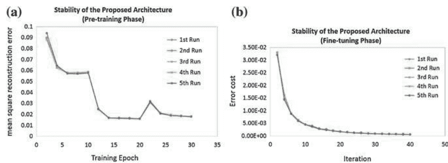

图4.5 网络稳定性: a显示在五次不同的运行中, 均方重建误差(msre)的轨迹相似, 收敛到接近0.02%的msre。同样地, b显示在五次运行中, 微调阶段的错误成本的轨迹相似, 收敛到约5.5E-04的错误成本。这些结果表明网络的稳定性。

### 4.4.4 使用训练好的网络进行分割

使用训练好的网络对潜在指纹图像进行分割的步骤如下:

- 将图像分割成 $8 \times 8$ 个不重叠的块, 并使用其分形维度和孔洞特征增强每个块的数据, 以创建一个分割数据集。
- 将分割数据集归一化为0均值和单位标准差。
- 加载训练好的网络, 并计算每个神经元的激活值:
$$a=\sum W x$$
- 将激活值输入激活函数进行归一化。
- 应用以下阈值函数以获得分类结果:

$$\theta(x)=\left\{\begin{array}{ll} 1: z>T \\ 0: z \leq T \end{array}\right.$$(4.17)

其中 $z$ 是决策值, $x$ 是分割数据集中的一个示例, $T$ 是通过算法1中描述的五折交叉验证获得的在验证集上获得最佳分割准确性的阈值。

#### 4.4.4.1 寻找阈值 T

我们在输出神经元的逻辑中实现了一个钩子, 以访问激活函数的实值输出。为了获得给定神经元的激活函数输出的百分比, 我们将其激活函数值除以所有激活函数值的总和。 对于每个标签 $y \in 1,2$, 我们根据它们的决策值 (百分比) 对验证样本进行排序, 并对每对相邻的决策值使用它们的平均值作为 $T$ 来检查分割准确性。所使用的算法受到[10]的启发, 并且如算法1所示。

##### 算法1 寻找阈值 $T$

```
1: 过程 THRESHOLD($X, Y$) $\triangleright X$是补丁数据集， $Y$是相应标签的集合
2: $num\_class \leftarrow Unique(Y)$ $\triangleright$ 从 $Y$中获取唯一标签
3: 对于 $cs = 1, \ldots, num\_class$ do $\triangleright$ 迭代类别的数量
4: (a) $folds \leftarrow 拆分(X, 5)$ $\triangleright$ 将验证集拆分为五个部分
5: 对于 $f = 1, \ldots, folds$ do $\triangleright$ 迭代拆分
6: (i) 在四个验证集部分上运行Compute(.) $\triangleright$ 将四个部分输入训练好的网络
7: (ii) $T_c^f \leftarrow 最佳()$ $\triangleright$ 将 $T_c^f$ 设置为达到最佳 $MDR$ 的决策值
8: (b) 在 $X$上运行Compute(.) $\triangleright$ 将验证集输入训练好的网络
9: $T_c \leftarrow \frac{1}{5} \sum_{k=1}^{folds} T_c^k$ $\triangleright$ 将阈值设置为交叉验证中五个阈值的平均值
10: 返回 $T$ $\triangleright$ 返回阈值
```

### 4.4.5 数据集扩散及对模型性能的影响

给定一个数据集 $X=\left\{x_1, x_2, \ldots, x_k\right\}$，我们将 $X$ 的扩散定义为 $\hat{X}=\left\{x_1, x_2, \ldots, x_m\right\}$，其中 $m > k$，每个 $x_i, k < i < m$ 是来自 $R^n$ 的元素。换句话说，$\hat{X}$ 是通过从 $R^n$ 中添加新元素来扩展 $X$ 获得的。在其他情况下，尽管调整了权重和阈值[12,22]，神经网络仍无法收敛，研究人员使用了基于信息扩散原理的类似思想。我们使用基于分形维度和空隙度的特征来扩散 $X$。这些特征有助于表征潜在指纹图像中的复杂纹理[9]。

#### 4.4.5.1 分形维度

分形维度是一种用于量化纹理模式复杂性的指标，通过将细节变化与使用的尺度变化的比率来表征。

它由Mandelbrot [23]定义，并首次由Keller等人 [15]在纹理分析中使用。分形维度提供了一种定量描述和表征图像纹理组成复杂性的方法。

我们使用一种改进的差分盒计数（DBC）算法 [2,26] 计算图像块 $P$ 的分形维度。我们将 $P$ 视为一个 3-$D$ 空间表面，其中 $(x, y)$ 轴为空间坐标， $z$ 轴为像素的灰度级。

使用与 $DBC$ 相同的策略，我们将表示 $P$ 的 $N \times N$ 矩阵分割为非重叠的 $d \times d$ 块，其中 $d \in[1, N]$。每个块都有一个大小为 $d \times d \times h$ 的盒子列，其中 $h$ 是由关系式 $h = \mathcal{T}'$ 定义的高度。

其中 $\mathcal{T}$ 是 $P$ 中的总灰度级数， $d$ 是一个整数。设 $\mathcal{T}_{min}$ 和 $\mathcal{T}_{max}$ 分别为网格 $(i, j)$ 中的最小和最大灰度级别。覆盖块 $(i, j)$ 的方框数为：

$$n_d(i, j)=floor\left[\frac{\mathcal{I}_{\max }-\mathcal{I}_{\min }}{r}\right]+1$$
(4.18)

其中 $r=2, \ldots, N-1$, 是缩放因子, 对于每个块 $r=d$ 。覆盖所有 $d \times d$ 块的方框数为:

$$N_d=\sum_{i, j} n_d(i, j)$$
(4.19)

我们计算所有 $d \in[1, N]$ 的值 $N d$ 。作为最小方框数的对数关于方框大小的对数的斜率给出了 $P$ 中每个像素的分形维度。我们获得了一个由 $M \times N$ 矩阵表示的分形维度图像块 $P^\prime$, 其中条目 $(i, j)$ 是 $P$ 中像素 $(i, j)$ 的分形维度 $F D_{i j}$ 。

$$F D_P=\sum_{i=1, j=1}^{M N} F D_{i j}$$
(4.20)

分形维度特征: 我们实现了 DBC 算法的一个变体 [2, 26], 用于计算分形维度图像 $P^\prime$ 中的以下统计特征。

平均分形维度:

$$F D_{\text {avg }}=\frac{1}{M N} \sum_{i=1, j=1}^{M N} F D_{i j}$$
(4.21)

分形维度的标准差: 图像灰度的标准差提供了图像分散程度的度量, 并提供了图像平面强度变化的定量描述。因此

$$F D_{s t d}=\frac{1}{M N} \sum_{i=1, j=1}^{M N}\left(F D_{i j}-F D_{\text {avg }}\right)^2,$$
(4.22)

分形维度空间频率: 这指的是分形维度 (FD) 处理图像上单位距离内的变化频率。我们使用（空间域）空间频率 [20] 的公式来计算它。给定一个 $N \times N$ 的 FD 处理图像块 $P^\prime$, 设 $G(x, y)$ 为位于位置 $(x, y)$ 处的像素的 FD 值。行频率 $R_f$ 和列频率 $C_f$ 分别为

$$R_f=\sqrt{\frac{1}{M N} \sum_{x=0}^{M-1} \sum_{y=1}^{N-1}[G(x, y)-G(x, y-1)]^2}$$
(4.23)

$$C_{f}=\sqrt{\frac{1}{M N} \sum_{y=0}^{M-1} \sum_{x=1}^{N-1}[G(x, y)-G(x-1, y)]^{2}}$$
(4.24)

FD空间频率 $F D_{s f}$ of $P$ 被定义为

$F D_{s f}=\sqrt{R_{f}^{2}+C_{f}^{2}}$

从信号处理的角度来看，方程 (4.23) 和 (4.24) 偏爱高频率，并产生指示具有指纹的补丁的值。

#### 4.4.5.2 空隙度

空隙度是一个二阶统计量，提供了一种衡量模式如何填充空间的方法。具有更多或更大间隙的模式具有更高的空隙度。它还量化了旋转不变性和异质性。具有高空隙度的空间模式在模式中具有间隙的高变异性，并且表示了更多的异质纹理[5]。空隙度 ($F D_{lac}$)是用方差除以均值来定义的[2]。

$F D_{lac}=\frac{\frac{1}{M N}\left(\sum_{i=1}^{M-1} \sum_{j=1}^{N-1} P(i, j)^{2}\right)}{\left\{\frac{1}{M N} \sum_{i=1}^{M-1} \sum_{j=1}^{N-1} P(i, j)\right\}^{2}}-1,$

其中 $M$ 和 $N$ 是分形维度图像块 $P$ 的尺寸。

#### 4.4.5.3 扩散数据集

我们遵循标准工程实践来选择我们模型的架构。

为了提高模型的性能，我们尝试了各种数据增强技术，如保留标签的转换和增加/减少少数/多数样本以平衡数据集。我们还尝试了其他学习技术，如单类学习。这些技术都没有产生期望的分割结果。

由于分形维度和孔隙度特征具有判别能力，我们使用它们来扩散块数据集。从实验中，我们观察到在对数据进行归一化之前，通过使用这些特征扩散数据集可以得到一个在未见示例上具有更好泛化能力的训练模型。图4.6显示了使用和不使用数据集扩散所得到的结果的比较。从表4.4可以看出，当训练数据集使用FD特征进行增强时，精细调整期间的错误成本和分类错误都大幅下降。

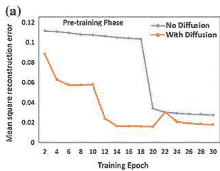

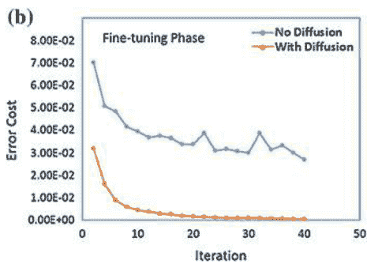

图4.6 数据扩散对模型性能的影响。a表明在预训练阶段，当数据集与分形维度特征扩散时，网络的均方重构误差（MSE）较低。此外，从b可以看出，扩散数据集会导致在微调阶段更快的收敛和更低的错误成本。

表4.4 数据扩散和网络性能
| | MSRE | 错误成本 | 分类错误（训练）（%） |
|---|---|---|---|
| 无扩散 | 0.0179 | 7.97e-01 | 18.51 |
| 有扩散 | 0.0178 | 6.0456e-04 | 0.006 |

训练。有趣的是，两种情况下重构误差几乎保持不变。

### 4.4.6 分类和分割结果

#### 4.4.6.1 训练、验证和测试

我们研究了在一个潜在指纹数据库上训练并在另一个数据库上进行测试时，我们的模型的性能，使用了3组20,000个补丁，其中40%来自NIST、WVU和IIITD数据库的好图像，30%来自坏图像，30%来自丑陋图像。在每个实验中，使用一个集合中的10,000个补丁进行训练，4,000个补丁进行验证，6,000个补丁进行测试。结果如表4.5所示。

模型的最终训练、验证和测试是使用来自NIST SD27数据库的233,200个补丁完成的，其中40%来自好的图像类别，30%来自坏的图像类别，30%来自丑陋的图像类别。其中132,000个样本用于训练，48,000个用于验证，53,200个用于测试。表4.6显示了NIST SD27的混淆矩阵，表4.7显示了训练、验证和测试数据集上的TP、TN、FP和FN、MDR、FDR和分类准确率。没有

**表4.5 模型在不同的潜在指纹数据库上进行训练和测试时的性能。**括号中以冒号分隔的数字分别表示训练、验证和测试数据集。这三个数据集是独立的。最后一行第1列显示的训练和验证数据集仅来自NIST SD27数据库。测试集与训练集相互独立，并且来自第5列的目标测试数据库。$MDR_V$ 和 $FDR_V$ 分别表示验证的$MDR$和$FDR$。类似地，$MDR_T$ 和$FDR_T$ 分别表示测试的$MDR$和$FDR$。如最后一行所示，使用更多的训练数据时，模型的性能有显著提高。当我们尝试使用超过132,000个补丁进行训练时，尽管需要更长的训练时间来达到收敛，但性能的提升并不明显。

| 训练于 | 验证于 | $MDR_V$ (%) | $FDR_V$ (%) | 测试于 | $MDR_T$ (%) | $FDR_T$ (%) |
|---|---|---|---|---|---|---|
| NIST SD27 (10,000 : 4,000 : 6,000) | NIST SD27 | 2.95 | 1.92 | NIST SD27 | 3.04 | 1.98 |
| | | | | WVU | 3.75 | 2.25 |
| | | | | IIITD | 3.63 | 2.19 |
| WVU (10,000 : 4,000 : 6,000) | WVU | 3.12 | 2.54 | NIST SD27 | 3.61 | 3.01 |
| | | | | WVU | 3.22 | 2.87 |
| | | | | IIITD | 3.90 | 3.05 |
| IIITD (10,000 : 4,000 : 6,000) | IIITD | 3.32 | 2.66 | NIST SD27 | 3.49 | 3.19 |
| | | | | WVU | 3.86 | 3.16 |
| | | | | IIITD | 3.28 | 2.80 |
| NIST SD27 (132,000 : 48,000 : 53,200) | NIST SD27 | 1.25 | 0 | NIST SD27 | 1.25 | 0 |
| | | | | WVU | 1.64 | 0.60 |
| | | | | IIITD | 1.35 | 0.54 |

##### 表4.6 训练数据集混淆矩阵
| 实际类别 | 预测为指纹 | 预测为非指纹 |
|---|---|---|
| 指纹 | 23,667 | 9 |
| 非指纹 | 0 | 108,324 |

##### 表4.6 验证数据集混淆矩阵
| 实际类别 | 预测为指纹 | 预测为非指纹 |
|---|---|---|
| 指纹 | 12,946 | 154 |
| 非指纹 | 0 | 34,900 |

##### 表4.6 测试数据集混淆矩阵
| 实际类别 | 预测为指纹 | 预测为非指纹 |
|---|---|---|
| 指纹 | 15,291 | 193 |
| 非指纹 | 0 | 37,716 |

表4.7 NIST SD27—训练、验证和测试的准确性：训练：132,000 8×8 补丁；验证：48,000 8×8 补丁；测试：53,200 8×8 补丁。MDR = 假阳性率 = FP / (TN + FP)
| | 真阳性 | 真阴性 | FP | FN | 漏检率 (%) | 误检率 (%) | 分类准确率 (%) |
|---|---|---|---|---|---|---|---|
| 训练 | 23,667 | 108,324 | 0 | 9 | 0.04 | 0 | 99.96 |
| 验证 | 12,946 | 34,900 | 0 | 154 | 1.17 | 0 | 98.83 |
| 测试 | 15,291 | 37,716 | 0 | 193 | 1.25 | 0 | 98.75 |

当模型使用超过132,000个补丁进行训练时，性能明显提升。

#### 4.4.6.2 分割结果

图4.7、4.8和4.9展示了我们提出的方法在NIST SD27数据库中的样本好、坏和丑质量图像上的分割结果。这些图像显示了原始潜在指纹图像以及使用被分类为指纹和非指纹的补丁构建的分割指纹和非指纹。

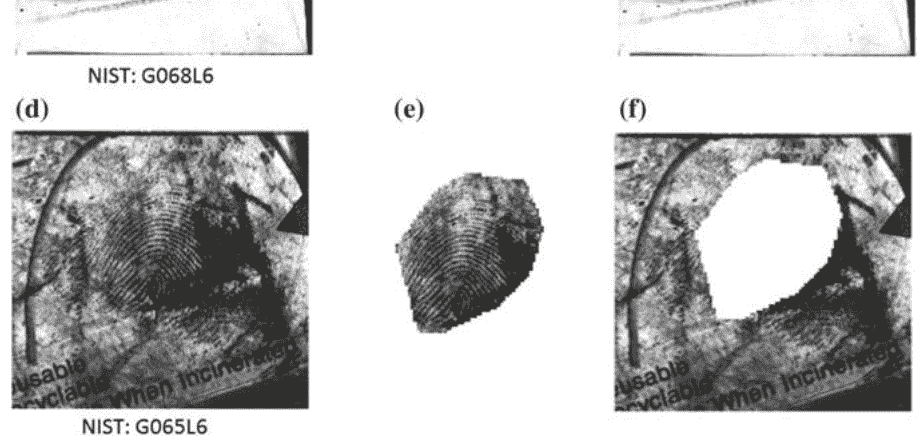

图4.7 NIST好类别潜在指纹图像和无后处理分类结果的分割。a和d原始图像；b和e指纹；c和f非指纹

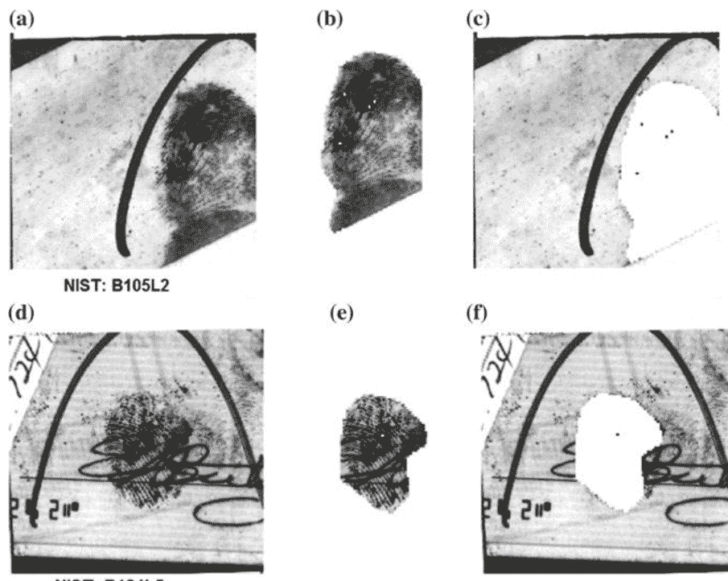

图4.8 NIST坏类别[1]潜在指纹图像和分割结果，未经过后处理的分类处理。g和j原始图像；h和k指纹；i和l非指纹

由于数据库发布协议的限制，WVU和IIITD的分割结果未显示（图4.10）。

### 4.4.7 与当前算法的比较

表4.8显示了我们的分割方法在NIST SD27的好、坏和丑质量潜在指纹上的卓越性能，与同一数据库上现有算法的结果相比。它还显示了我们的模型在WVU和IIITD上与其他报告结果的算法的性能比较。


表4.8 现有算法与本研究方法的性能比较
| 作者 | 方法 | 数据库 | MDR (%) | FDR (%) | 平均 (%) |
|---|---|---|---|---|---|
| Choi等人[7] | 脊线方向和频率计算 | NIST SD27 | 14.78 | 47.99 | 31.38 |
| Zhang等人[29] | 自适应总变差模型 | WVU LDB | 40.88 | 5.63 | 23.26 |
| | | NIST SD27 | 14.10 | 26.13 | 20.12 |
| Arshad等人[4] | K-means 聚类 | NIST SD27 | 4.77 | 26.06 | 15.42 |
| Jude和Bhanu[9] | 分形维度和加权ELM | NIST SD27 (好的, 坏的, 丑的) | 9.22 | 18.7 | 13.96 |
| | | WVU LDB (好的, 坏的, 丑的) | 15.54 | 9.65 | 12.60 |
| | | IIITD LDB (好的) | 6.38 | 10.07 | 8.23 |
| 本章 | 深度学习 | NIST SD27 (好的, 坏的, 丑的) | 1.25 | 0.04 | 0.65 |
| | | WVU LDB (好的, 坏的, 丑的) | 1.64 | 0.60 | 1.12 |
| | | IIITD (好的) | 1.35 | 0.54 | 0.95 |

## 4.5 结论和未来工作

我们提出了一种基于受限玻尔兹曼机的深度架构，用于使用图像块进行潜在指纹分割，并展示了其在潜在指纹图像分割上的性能。该模型学习了一组随机特征，用于对图像块进行建模。使用从图像块中提取的特征，模型将这些块分类为指纹和非指纹类别。我们使用指纹块重建潜在指纹图像，并丢弃包含原始潜在指纹中结构化噪声的非指纹块。我们展示了我们的模型在从NIST SD27、WVU和IIITD潜在指纹数据库中分割好的、坏的和丑的潜在指纹方面的性能。我们表明，我们的深度模型的整体性能优于现有的潜在指纹图像分割算法。我们的未来工作包括开发用于分割潜在指纹的特征提取和匹配算法。

致谢：这项研究部分得到了加利福尼亚大学河滨分校普雷斯利犯罪与司法研究中心的支持。

# 参考文献

- 1. NIST特殊数据库27.潜在指纹细节和匹配十指图像, http://www.nist.gov/srd/nistsd27.htm
- 2. O. Al-Kadi, D. Watson, 对侵略性和非侵略性肺肿瘤CE CT图像的纹理分析。IEEE Trans. Biomed. Eng. 55(7), 1822-1830 (2008)
- 3. I. Arel, D.C. Rose, T.P. Karnowski, 深度机器学习-人工智能研究的新前沿[研究前沿]。IEEE Comput. Intell. Mag. 5(4), 13-18 (2010)
- 4. I. Arshad, G. Raja, A. Khan, 潜在指纹分割: 使用基于聚类的自动化方法的可行性。阿拉伯科学与工程杂志。39(11), 7933-7944 (2014)
- 5. M. Barros Filho, F. Sobreira, 空间分辨率高的城市区域纹理分类中的空洞算法的准确性, 国际摄影测量与遥感学会第21届大会 (2008)
- 6. M.A. Carreira-Perpinan, G. Hinton, 对比散度学习, 在 AISTATS, vol. 10 (Citeseer, 2005), pp. 33-40
- 7. H. Choi, A.I.B.M. Boaventura, A. Jain, 隐式指纹的自动分割, 在 2012 IEEE第五届国际生物特征学: 理论, 应用和系统会议 (BTAS) (2012), pp. 303-310
- 8. D. Erhan, Y. Bengio, A. Courville, P.-A. Manzagol, P. Vincent, S. Bengio, 为什么无监督预训练有助于深度学习? 机器学习研究杂志 11, 625-660 (2010)
- 9. J. Ezeobiejesi, B. Bhanu, 使用分形维度特征和加权极限学习机集成的隐式指纹图像分割, 在IEEE计算机视觉和模式识别会议 (CVPR) 工作坊 (2016)
- 10. R.-E. Fan, C.-J. Lin, 多标签分类的阈值选择研究. 计算机科学系 (国立台湾大学, 2007年) , 第1-23页
- 11. G. Hinton. 训练受限玻尔兹曼机的实用指南, 版本1 (2010年)
- 12. C. Huang, C. Moraga, 一种用于小样本学习的扩散神经网络。国际近似推理杂志 35 (2) , 137-161 (2004年)
- 13. S. Karimi-Ashtiani, C.-C. Kuo, 一种用于潜在指纹图像分割和增强的鲁棒技术, 在2008年第15届IEEE国际图像处理会议上, ICIP2008 (2008年) , 第1492-1495页
- 14. D. Kaye, T. Busey, M. Gische, G. LaPorte, C. Aitken, S. Ballou, L.B. ..., K. Wertheim, 潜在指纹检查和人因素: 通过系统方法改进实践, 在NIST机构/内部报告 (NISTIR) - 7842 (2012年)
- 15. J. Keller, S. Chen, R. Crownover, 通过分形几何进行纹理描述和分割。计算机视觉和图形图像处理。45(2), 150-166 (1989)
- 16. A. Krizhevsky, I. Sutskever, G.E. Hinton, 使用深度卷积神经网络进行Imagenet分类, 出版于神经信息处理系统进展(2012), 页码1097-1105
- 17. M. Lai, 用于医学图像分割的深度学习 (2015), arXiv:1505.02000
- 18. A.D.K.T. Lam, Q. Li, 图像的分形分析和多重分形谱, 在2010年国际计算机通信控制和自动化研讨会 (3CA), vol. 2 (2010), 页码530-533
- 19. P. Lamblin, Y. Bengio, 在大型标记集上对深度架构进行监督微调的重要收益, NIPS* 2010深度学习和无监督特征学习研讨会(2010)
- 20. S. Li, J.T. Kwok, Y. Wang, 使用空间频率组合具有不同焦点的图像。Inf. Fus. 2(3), 169-176 (2001)
- 21. Y. Liu, E. Racah, P.J. Correa, A. Khosrowshahi, D. Lavers, K. Kunkel, M. Wehner, W.D.Collins, 应用深度卷积神经网络检测气候数据集中的极端天气 (2016), CoRR abs/1605.01156
- 22. Z. Mak, 使用扩散神经网络进行近似, 在第六届匈牙利研究者计算智能国际研讨会(2005), 第18-19页
- 23. B.曼德博，自然的分形几何.Einaudi 平装书 (Henry Holt and Company, New York, 1983)
- 24. A. Ng, J. Ngiam, C.Y. Foo, http://ufldl.stanford.edu/tutorial/supervised/optimizationstochastic gradientdescent/, UFLDL 教程
- 25. A. Sankaran, M. Vatsa, R. Singh, 用于匹配同时潜在指纹的分层融合, 2012 年 IEEE 第五届国际生物特征学术会议: 理论、应用和系统 (BTAS) (2012), pp. 377-382
- 26. N. Sarkar, B.B. Chaudhuri, 一种高效的差分盒计数方法来计算图像的分形维度. IEEE Trans. Syst. Man Cybern. 24(1), 115-120 (1994)
- 27. N. Short, M. Hsiao, A. Abbott, E. Fox, 使用脊线模板相关性进行潜在指纹分割, 第四届国际犯罪检测和预防图像会议 2011 (ICDP 2011)(2011), pp. 1-6
- 28. I. Yildirim, 贝叶斯推理: 吉布斯采样。技术说明, 罗切斯特大学 (2012 年)
- 29. J. Zhang, R. Lai, C.-C. Kuo, 自适应总变差模型的潜在指纹分割，在 2012 年第五届国际模式识别协会生物特征学术会议 (ICB) (2012 年)，第 189-195 页

# 第5章 使用卷积神经网络和监督离散哈希的指静脉识别

### 谢慈辉和 Ajay Kumar

摘要 使用血管生物特征 (例如指静脉图像) 进行自动个人识别非常有必要，因为它有助于在识别过程中保护个人隐私和匿名性。卷积神经网络 (CNN) 已经显示出学习生物特征的显著能力，可以提供强大而准确的匹配。我们引入了一种使用CNN和监督离散哈希的新方法进行指静脉认证。我们还系统地研究了在其他领域中几种流行的CNN架构的比较性能，即Light CNN, VGG-16, Siamese和基于贝叶斯推理的CNN匹配。实验结果使用公开可用的两个会话的指静脉图像数据库进行展示。通过将监督离散哈希与使用三元组损失函数训练的CNN相结合，实现了最准确的性能。所提出的方法不仅在文献中提供了超越其他考虑的CNN架构的结果，而且与迄今为止文献中其他指静脉图像匹配方法相比，还大大减小了模板大小。

## 5.1 引言

自动化个人身份识别使用人类独特的生理特征，如面部、指纹或虹膜，在各种应用中广泛用于电子安全。在过去的十年中，检测到外科改变的指纹、伪造的虹膜印章或使用复杂的面具的情况显著增加，以破坏已部署的生物特征系统的完整性。血管生物特征识别，如使用位于皮肤表面下约三毫米处的指静脉图案，可以帮助保护生物特征系统的完整性，因为外科改变血管生物特征极其困难。另一个优点是

C. 谢 ·A. 库马尔 (☎)
计算机系, 香港理工大学, 九龙红磡, 香港电子邮件: ajay.kumar@polyu.edu.hk

使用指静脉生物特征与个人隐私的高度相关，因为指静脉模式隐藏在皮肤表面下，极其难以获取和隐蔽。

1992年指出了使用透过手部传输的光线成像的血管模式进行个人识别的可能性[6]，但直到2000年[7]才被证明。最早的工作证明了使用归一化交叉相关进行指静脉识别的可行性。Miura等人[12]后来引入了重复线追踪方法来提高指静脉识别的性能，并通过最大曲率进一步提高了性能[13]。 Kumar和Zhou [8]在公共领域引入了第一个公开可访问的指静脉数据库，并对一系列手工特征进行了比较评估，用于指静脉识别问题。[8]中引入的方法使用基于Gabor滤波器的增强和形态学操作仍被认为是匹配指静脉图像的最佳方法。文献中引入了一系列手工特征[2,3,8-13,21]，主要是从注册图像的仔细评估中获得的，用于研究指静脉识别性能。从两个摄像头[10]获取的多个特征或使用多个特征提取器[22]可以组合起来显著提高血管匹配的性能。文献中引入的指静脉识别方法的一个局限性与其较大的模板大小有关。较小的模板大小有助于减少存储空间和/或提高移动和在线应用的匹配速度。还有成功的尝试来减小指静脉模板的大小，例如[3,9]或最近在[2]中使用Gabor滤波器对增强的指静脉图像进行稀疏表示。

迄今为止，文献中可用的指静脉匹配方法已经巧妙地引入了手工特征，并展示了有希望的性能。然而，深度学习算法在自动学习最相关的血管特征方面的显著能力尚未被研究或建立。本研究的目标是公正地研究使用流行的卷积神经网络(CNN)架构自学习特征的有效性，并开发更高效和有效的替代方法来进行自动指静脉识别。

本章详细介绍了使用轻量级CNN [20]，改进的VGG-16 [16]，具有贝叶斯推断的CNN和具有三元损失函数的Siamese网络进行的实验结果和比较。我们使用公开可用的数据库进行可复现的实验结果[5]表明，监督离散哈希与CNN结合不仅可以取得优异的结果，而且还可以显著减小指静脉模板的大小，从而提高匹配速度。下表5.1总结了文献中引入的有希望的指静脉匹配方法。该表还提供了各个参考文献中的模板大小估计值，性能以EER为指标，并提供了用于性能评估的数据库。参考文献[4]对文献中公开可用的指静脉图像数据库进行了很好的总结。对于较少约束或非接触成像设置(如[8])，使用两个会话数据库会产生高度的类内变化，这对于生成匹配算法的公平评估非常有希望。

| 参考文献 | 特征 | 数据库 | 两个会话 | 模板大小(字节) | 等误识率 | 受试者数量 | 真实分数数量 | 冒名分数数量 |
|---|---|---|---|---|---|---|---|---|
| [8] | 手工制作(甚至Gabor) | 公开的 | 是 | 106384 | 4.61% | 105 | 1260 | 263,340 |
| [8] | 手工制作(形态学) | 公开的 | 是 | 6710 | 4.99% | 105 | 1260 | 263,340 |
| [12] | 手工制作(重复线跟踪) | 专有的 | 否 | 43200* | 0.145% | 678 | 678* | 458,328* |
| [13] | 手工制作(最大曲率) | 专有的 | 否 | 43200* | 0.0009% | 678 | 678* | 458,328* |
| [3] | 手工制作(局部二进制模式) | 公开的 | 否 | ≤260* | 3.53% | 156 | 624 | 194,064 |
| [2] | 手工制作(使用11范数的稀疏表示) | 专有的 | 否 | 630* | 未知的 | 17 | 未知的 | 未知的 |
| [9] | 手工制作(扩展局部二进制模式) | 公开的 | 是 | 131328* | 7.22% | 105 | 1260 | 263,340 |
| [21] | 手工制作(未知算法) | 专有的 | 是 | 20480* | 0.77% | 未知的 | 10,000 | 499,500 |
| [11] | 手工制作(显著边缘方向图的直方图) | 公开的 | 否 | ≤3496* | 0.9% | 100 | 3000 | 1,797,000 |
| 我们的 | 使用三元相似性损失的CNN | 公开的 | 是 | 1024 | 13.16% | 105 | 1260 | 263,340 |
| 我们的 | 带有CNN的监督离散哈希 | 公开的 | 是 | 250 | 9.77% | 105 | 1260 | 263,340 |

*根据各个参考文献中的详细信息计算得出

在更现实的使用环境下，同样，使用公开可用的数据库可以确保结果的可重复性。因此，本章中的所有实验都包括来自[8]的两个会话和公开可用的数据库。表中的最后两行总结了我们在本研究中详细调查的最佳结果[19]。

本章的其余部分组织如下：第5.2节简要描述了指静脉图像的预处理，并包括图像归一化、分割和增强的相关步骤。本文研究了CNN架构、LCNN、VGG、带有三元相似性损失函数的LCNN和带有联合贝叶斯公式的LCNN。

## 5.2 指静脉图像的图像归一化

### 5.2.1 预处理

从同一个手指或主体获取的指静脉图像可能会引入平移和旋转变化的不良影响。因此，自动提取能够最小化这种类内变化的固定感兴趣区域 (ROI) 是非常理想的。本文考虑的ROI定位方法与[8]中详细描述的方法相同，因为在大多数情况下效果良好。图5.1展示了使用近红外相机获取的图像样本。

一旦定位到感兴趣区域，我们可以恢复与ROI对应的二进制掩码，用于对指静脉样本进行对齐，以最小化手指旋转变化的不良影响。旋转估计的方法与[8]中描述的方法相同。在分割之前，使用估计的角度将ROI对齐到首选方向。

### 5.2.2 图像增强

从归一化图像中提取的指静脉细节经过对比度增强以增强血管模式的清晰度，这可以更可靠地进行训练。

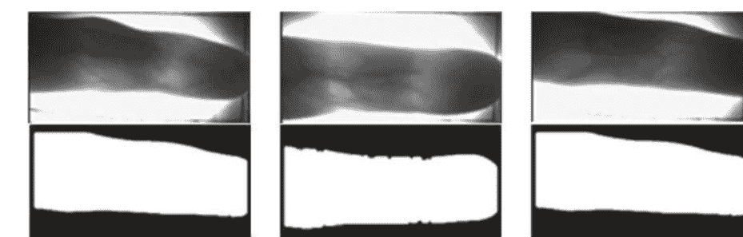

图5.1 指静脉图像预处理前的样本（第一行）和预处理期间生成的二值图像（第二行）

训练。由于血管模式通常是连续的，如果一个像素属于血管模式，则其周围像素也很可能是相同血管模式的一部分，并具有相似的灰度级别。对于非血管部分也是如此。因此，通过计算像素周围的平均灰度级别来增强可以帮助放大血管部分和非血管部分之间的差异，从而使指静脉细节更加明显。经过这样的增强，血管模式变得更清晰，如图5.2中的样本图像所示。

通过空间选择性带通滤波器进一步增强规范化图像样本中的血管模式，类似于指纹图像增强中使用的方法。我们还尝试使用Gabor滤波器来确定这种增强的指静脉图像的有用性。选择这十二个不同方向的滤波器来生成增强的指静脉图像，如图5.4所示。使用Gabor滤波器生成的这些增强图像[8]能够有效突出血管特征，因此在自动提取血管特征方面也进行了实验研究。

指静脉图像处理操作主要生成两种增强图像，ROI-A和ROI-B，如图5.4所示，这两种图像被用于使用CNN进行性能评估。

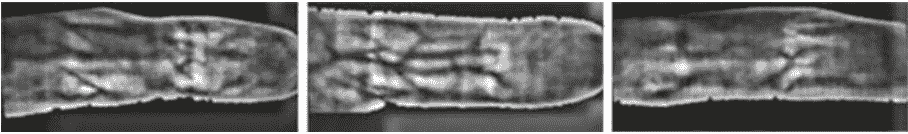

图5.2 旋转后的增强ROI静脉图像

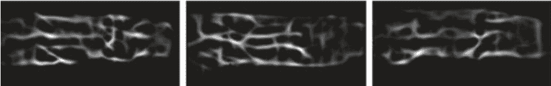

图5.3 来自偶数Gabor滤波的指静脉图像样本

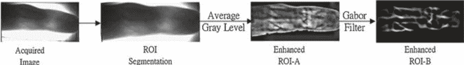

图5.4 用于CNN生成增强指静脉图像的关键步骤

## 5.3 卷积神经网络架构

已经开发了多种用于深度学习的模型，用于学习有用的特征表示，但主要用于面部生物特征图案。文献中引入了多种使用CNN的模型，并对指静脉图像匹配的性能进行了研究。本文介绍了在这项工作中考虑的各种CNN架构。

### 5.3.1 轻量级CNN

轻量级CNN (LCNN) 框架在卷积层之间引入了最大特征图 (MFM) 操作[20]，建立了竞争关系，以获得更好的泛化能力并减少参数空间（紧凑的特征表示）。这种maxout激活函数（图5.5）显著降低了复杂性，使CNN更轻巧，其中conv代表卷积层。

对于没有MFM的卷积层，假设输入大小为 $N_1 \times W_1 \times H_1$，输出大小为 $N_2 \times W_2 \times H_2$，则使用大O符号表示的所需复杂度如下所示：

$$O(N_1 N_2 \Omega) \quad \text{where} \quad \Omega = W_1 \times H_1 \times W_2 \times H_2$$

图5.5 LCNN中计算最大特征图的示意图

对于具有MFM的卷积层，我们可以将输入分成两个大小相等的部分，每个部分都有 $N_1/2$ 个元素。对于两个切片部分中的每个对应元素，我们使用maxout激活函数生成一个大小为 $N_1/2$ 的输出。通过使用更小或更轻的数据作为输入，卷积层的复杂性减少到：

$$O\left(\frac{N_1 N_2 \Omega}{2}\right) \quad \text{其中} \quad \Omega = W_1 \times H_1 \times W_2 \times H_2 \quad (5.2)$$

通过比较 (5.1) 和 (5.2)，我们可以推断出使用MFM可以帮助显著减少复杂性或使CNN更轻。

在这个结构中，我们使用的损失函数是softmax损失函数。基本思想是将softmax函数与负对数似然相结合，最后一层的信息用于估计类别的身份。

我们实验中使用的LCNN的架构如图5.6所示（为了保持清晰度，MFM部分被排除在外）。该网络包含9个卷积层(conv)，4个池化层(pooling)和2个全连接层(fc)，以及一些辅助层，这些层在表5.2中总结。

| 索引 | 类型 | 滤波器尺寸 | 数量 | 步长 | 填充 |
|---|---|---|---|---|---|
| 1 | conv1 | 5 | 96 | 1 | 2 |
| 2 | MFM1 | - | 48 | - | - |
| 3 | 池化1 | 2 | - | 2 | 0 |
| 4 | 卷积2a | 1 | 96 | 1 | 0 |
| 5 | MFM2a | - | 48 | - | - |
| 6 | 卷积2 | 3 | 192 | 1 | 1 |
| 7 | MFM2 | - | 96 | - | - |
| 8 | 池化2 | 2 | - | 2 | 0 |
| 9 | 卷积3a | 1 | 192 | 1 | 1 |
| 10 | MFM3a | - | 96 | - | - |
| 11 | 卷积3 | 3 | 384 | 1 | 1 |
| 12 | MFM3 | - | 192 | - | - |
| 13 | 池化3 | 2 | - | 2 | 0 |
| 14 | 卷积4a | 1 | 384 | 1 | 1 |
| 15 | MFM4a | - | 192 | - | - |
| 16 | 卷积4 | 3 | 256 | 1 | 1 |
| 17 | MFM4 | - | 128 | - | - |
| 18 | 卷积5a | 1 | 256 | 1 | 1 |
| 19 | MFM5a | - | 128 | - | - |
| 20 | 卷积5 | 3 | 256 | 1 | 1 |
| 21 | MFM5 | - | 128 | - | - |
| 22 | 池化4 | 2 | - | 2 | 0 |
| 23 | 全连接层1 | - | 512 | - | - |
| 24 | MFM全连接层 | - | 256 | - | - |
| 25 | 全连接层2 | - | 500 | - | - |

图5.6 LCNN架构

### 5.3.2 使用三元相似性损失函数的LCNN

深度孪生网络已成功应用于学习一对图像之间的相似度度量。我们在LCNN中引入了类似的三元相似性损失函数，详见[14]，以学习相似度度量。

我们随机选择一个训练集中的图像 $x_r$ 作为随机样本（见图5.7）。然后，我们选择来自同一类别的图像 $x_p$ 作为正样本，并选择来自不同类别的图像 $x_n$ 作为负样本。在LCNN之后，我们得到特征 $f(x_r)$、$f(x_n)$ 和 $f(x_p)$。我们的目标是减小随机特征和正样本特征之间的相似距离，以及增大随机特征和负样本特征之间的相似距离，这解释了为什么它被称为三元相似性损失。同时，我们还需要确保它们之间有足够大的间隔。

假设我们有一个随机集合 $\mathbf{X}^{r}=\left\{x_{i}^{r}\right\}_{i=1}^{N}$ 及其对应的正样本集合 $\mathbf{X}^{p}=\left\{x_{i}^{p}\right\}_{i=1}^{N}$ 和负样本集合 $\mathbf{X}^{n}=\left\{x_{i}^{n}\right\}_{i=1}^{N}$。考虑到这些符号，我们可以将损失函数写成如下形式：

$$\sum_{i=1}^{N}\left[\left\|f\left(x_{i}^{r}\right)-f\left(x_{i}^{p}\right)\right\|^{2}-\left\|f\left(x_{i}^{r}\right)-f\left(x_{i}^{n}\right)\right\|^{2}+\operatorname{margin}\right]_{+} \quad (5.3)$$

其中 $[\cdot]_{+}$ 表示我们保持正值并将其他值改为零。具有这种三元组相似性损失函数的 LCNN 的架构如图 5.7 所示，并在表 5.3 中详细说明。当输入集包含 $n$ 个随机样本、 $n$ 个正样本和 $n$ 个负样本时，我们生成 $3 n \times 500$ 个特征。这些配对被分成三部分，每部分大小为 $n \times 500$，并用作计算三元组相似性损失的输入，以在网络训练期间更新神经元权重。

### 5.3.3 修改后的VGG-16

视觉几何组(VGG)16层架构[VGG-16]被修改为CNN，直接恢复匹配分数，而不是特征向量，在我们的实验中。我们的修改是为了适应矩形指静脉ROI图像，而不引入畸变。与传统的VGG-16不同，我们使用成对的图像而不是单个图像作为输入，因为我们想比较两个指静脉图像之间的相似性。输入图像的大小也与传统的 $\mathrm{VGG}-16$ 不同，传统的 $\mathrm{VGG}-16$ 的大小为 $224 \times 224$，而我们的指静脉ROI图像的大小为 $128 \times 488$ 像素。训练阶段使用的交叉熵损失函数可以写成如下形式：

$$-\frac{1}{n} \sum_{i=1}^{n}\left[y_{i} \log \left(\hat{y}_{i}\right)+\left(1-y_{i}\right) \log \left(1-\hat{y}_{i}\right)\right] \quad (5.4)$$

其中 $y_{i}=\Gamma\left(\mathbf{B}^{T} x_{i}\right)$ 是逻辑函数，$x_{i}$ 是提取的特征，$B$ 是在训练过程中需要优化的权重。修改后的VGG-16 (MVGG) 的架构如图5.8和表5.4所示。

### 5.3.4 具有联合贝叶斯公式的LCNN

主成分分析 (PCA) 是一种提取最重要特征的经典方法，广泛用于特征的降维。在另一组实验中，我们将PCA用于从LCNN提取的特征的降维，然后采用联合贝叶斯[1]方法作为匹配指标来匹配指静脉图像。

对于从LCNN提取的任何特征 $f$，我们将其视为两个部分的组合 $\mu$ 和 $\varepsilon$，其中 $\mu$ 是 $f$ 所属类别的平均特征，$\varepsilon$ 是

表5.3 具有三元相似性损失的LCNN层信息细节
| 索引 | 类型 | 输入索引 | 输出索引 | 过滤器尺寸 | 输出大小 | 步长 | 填充 |
|---|---|---|---|---|---|---|---|
| 1 | 数据R | - | 4 | - | N*W*H | - | - |
| 2 | 数据P | - | 4 | - | N*W*H | - | - |
| 3 | 数据N | - | 4 | - | N*W*H | - | - |
| 4 | 数据 | 1,2,3 | 5 | - | 3N*W*H | - | - |
| 5 | conv1 | 4 | 6 | 5 | 3N*96 | 1 | 2 |
| 6 | MFM1 | 5 | 7 | - | 3N*48 | - | - |
| 7 | 池化1 | 6 | 8 | 2 | - | 2 | 0 |
| 8 | 卷积2a | 7 | 9 | 1 | 3N*96 | 1 | 0 |
| 9 | MFM2a | 8 | 10 | - | 3N*48 | - | - |
| 10 | 卷积2 | 9 | 11 | 3 | 3N*192 | 1 | 1 |
| 11 | MFM2 | 10 | 12 | - | 3N*96 | - | - |
| 12 | 池化2 | 11 | 13 | 2 | - | 2 | 0 |
| 13 | 卷积3a | 12 | 14 | 1 | 3N*192 | 1 | 1 |
| 14 | MFM3a | 13 | 15 | - | 3N*96 | - | - |
| 15 | 卷积3 | 14 | 16 | 3 | 3N*384 | 1 | 1 |
| 16 | MFM3 | 15 | 17 | - | 3N*192 | - | - |
| 17 | 池化3 | 16 | 18 | 2 | - | 2 | 0 |
| 18 | 卷积4a | 17 | 19 | 1 | 3N*384 | 1 | 1 |
| 19 | MFM4a | 18 | 20 | - | 3N*192 | - | - |
| 20 | 卷积4 | 19 | 21 | 3 | 3N*256 | 1 | 1 |
| 21 | MFM4 | 20 | 22 | - | 3N*128 | - | - |
| 22 | 卷积5a | 21 | 23 | 1 | 3N*256 | 1 | 1 |
| 23 | MFM5a | 22 | 24 | - | 3N*128 | - | - |
| 24 | 卷积5 | 23 | 25 | 3 | 3N*256 | 1 | 1 |
| 25 | MFM5 | 24 | 26 | - | 3N*128 | - | - |
| 26 | 池化4 | 25 | 27 | 2 | - | 2 | 0 |
| 27 | 全连接层1 | 26 | 28 | - | 3N*512 | - | - |
| 28 | MFM全连接层 | 27 | 29 | - | 3N*256 | - | - |
| 29 | 全连接层2 | 28 | 30,31,32 | - | 3N*500 | - | - |
| 30 | 切片R | 29 | 33 | - | N*500 | - | - |
| 31 | 切片P | 29 | 33 | - | N*500 | - | - |
| 32 | 切片N | 29 | 33 | - | N*500 | - | - |
| 33 | 损失 | 30,31,32 | - | - | - | - | - |


图5.8 用于指静脉图像匹配的改进VGG-16架构

表5.4 改进VGG-16层信息细节
| 索引 | 类型 | 滤波器尺寸 | 数量 | 步长 | 填充 |
|---|---|---|---|---|---|
| 1 | 卷积1a | 3 | 64 | 1 | 1 |
| 2 | ReLU1a | - | - | - | - |
| 3 | conv1b | 3 | 64 | 1 | 1 |
| 4 | ReLU1b | - | - | - | - |
| 5 | conv1c | 3 | 64 | 1 | 1 |
| 6 | ReLU1c | - | - | - | - |
| 7 | 池化1 | 2 | - | 2 | 0 |
| 8 | 卷积2a | 3 | 128 | 1 | 1 |
| 9 | ReLU2a | - | - | - | - |
| 10 | conv2b | 3 | 128 | 1 | 1 |
| 11 | ReLU2b | - | - | - | - |
| 12 | conv2c | 3 | 128 | 1 | 1 |
| 13 | ReLU2c | - | - | - | - |
| 14 | 池化2 | 2 | - | 2 | 0 |
| 15 | 卷积3a | 3 | 256 | 1 | 1 |
| 16 | ReLU3a | - | - | - | - |
| 17 | conv3b | 3 | 256 | 1 | 1 |
| 18 | ReLU3b | - | - | - | - |
| 19 | conv3c | 3 | 256 | 1 | 1 |
| 20 | ReLU3c | - | - | - | - |
| 21 | 池化3 | 2 | - | 2 | 0 |
| 22 | 全连接层1 | - | 512 | - | - |
| 23 | Dropout | - | - | - | - |
| 24 | 全连接层2 | - | 1 | - | - |

类内变异性，我们假设 $\mu$ 和 $\varepsilon$ 是两个独立的变量，它们服从高斯分布 $N\left(0, \sigma_{\mu}\right)$ 和 $N\left(0, \sigma_{\varepsilon}\right)$。

假设 $I$ 是 $f_{1}$ 和 $f_{2}$ 来自同一类的假设，$E$ 表示它们来自不同的类。因此，我们可以将目标写成最大化 $P\left(f_{1} f_{2} \mid I\right)$

$$P\left(f_{1} f_{2} \mid E\right)$$

其中 $P(\cdot)$ 是分布。为了简化，我们使用对数形式 $r\left(f_{1}, f_{2}\right)=\log \frac{P\left(f_{1} f_{2} \mid I\right)}{P\left(f_{1} f_{2} \mid E\right)}$，计算过程如[1]所述。

我们的目标是最大化 $r\left(f_{1}, f_{2}\right)$，因此我们计算结果的最大值而不是最小值，同时使用L2范数。CNN训练部分与LCNN相同。特征提取后，我们保留80个维度，而不是原始的500个维度，以加快计算速度，并使用这些特征来计算基于联合贝叶斯公式的分类矩阵。

## 5.4 监督离散哈希

生物识别技术成功应用的关键挑战之一是高效的搜索速度（快速检索）和模板存储/大小。哈希是解决这些挑战中最有效的方法之一，可以使用二进制数（在我们的实验中为2000）对生物识别模板进行编码，这些二进制数与输入数据/模板的相似性密切相关。通过这种策略，我们只能存储相应的短/紧凑二进制码，而不是原始的特征模板，并通过使用汉明距离进行高效的成对比较，显著提高搜索或匹配速度。

这个有效的监督哈希方案的框架是在[15]中引入的，在学习阶段的目标是生成用于线性分类的二进制编码。我们首先定义问题，并假设我们有 $n$ 样本/特征 $\mathbf{X}=\left[\mathbf{x}_{1} \mathbf{x}_{2} \ldots \mathbf{x}_{n}\right]$，我们的目标是恢复相应的二进制编码 $\mathbf{B}=\left[\mathbf{b}_{1} \mathbf{b}_{2} \ldots \mathbf{b}_{n}\right]$，其中 $\mathbf{b}_{i} \in\{-1,1\}, i=1,2, \ldots, n$。由于我们有标签，为了充分利用这些信息，我们定义了一个多类分类函数：

$$\hat{\mathbf{y}}=\mathbf{W}^{\mathrm{T}} \mathbf{b} \text { 其中 } \mathbf{W}=\left[\mathbf{w}_{1} \mathbf{w}_{2} \ldots \mathbf{w}_{\mathrm{C}}\right],$$

其中 $C$ 是类别总数，$\hat{\mathbf{y}} \in \mathbb{R}^{C \times 1}$ 是标签向量，其中最大值表示输入 $\mathbf{x}$ 的类别。现在我们可以将哈希问题表述如下：

$$\min _{\boldsymbol{B}, \boldsymbol{W}, F} \sum_{i=1}^{n} L\left(y_{i}, \mathbf{W}^{\mathrm{T}} \mathbf{b}_{i}\right)+\lambda\|\mathbf{W}\|^{2}, \text { s.t. } \mathbf{b}_{i}=\operatorname{sgn}\left(F\left(\mathbf{x}_{i}\right)\right)$$

其中 $L(\cdot)$ 表示我们使用的损失函数，即我们实验中的L2范数，$\lambda$ 是正则化参数，同时，$\mathbf{b}_{i}$ 由哈希函数生成，即 $\operatorname{sgn}\left(F\left(\mathbf{x}_{i}\right)\right)$，其中 $\operatorname{sgn}(\cdot)$ 是符号函数。借助拉格朗日乘子，我们可以将(5.6)重写为：

$$\min _{\boldsymbol{B}, \boldsymbol{W}, \boldsymbol{F}} \sum_{i=1}^{n} L\left(\boldsymbol{y}_{i}, \boldsymbol{W}^{\mathrm{T}} \boldsymbol{b}_{i}\right)+\lambda\|\boldsymbol{W}\|^{2}+\mu \sum_{i=1}^{n}\left\|\boldsymbol{b}_{i}-\boldsymbol{F}\left(\boldsymbol{x}_{i}\right) \right\|^{2}$$

其中 $\mu$ 是拉格朗日乘子。我们进一步选择一个非线性的函数形式用于 $F(\mathbf{x})$：

$$F(\mathbf{x}) = \mathbf{U}^{\mathrm{T}} \phi(\mathbf{x})$$

其中 $\mathbf{U}$ 是参数矩阵，$\phi(\mathbf{x})$ 是一个 $\mathrm{k}$ 维的核函数：

$$\phi(\mathbf{x})=\left[\begin{array}{c}\exp \left(\|\frac{\mathbf{x}-\boldsymbol{a}_{1}\|^{2}}{\sigma}\right) \ \cdots \ \exp \left(\|\frac{\mathbf{x}-\boldsymbol{a}_{k}\|^{2}}{\sigma}\right)\end{array}\right]$$

其中 $k$ 是从输入中随机选择的锚向量。为了计算函数中的 $\mathbf{U}$，我们可以将(5.6)重写为以下形式：

$$\underset{\mathbf{U}}{\min } \sum_{i=1}^{n}\left\|\boldsymbol{b}_{i}-F\left(\mathbf{x}_{i}\right) \right\|^{2}=\min _{\mathbf{U}}\left\|\mathbf{U}^{\mathrm{T}} \Phi(\mathbf{X})-\mathbf{B}\right\|^{2}$$

其中 $\Phi(\mathbf{X})=\left\{\phi\left(\mathbf{x}_{i}\right)\right\}_{i=1}^{n}$。我们的目的是将梯度设置为零，即

$$\nabla_{\mathbf{U}}\left(\left\|\mathbf{U}^{\mathrm{T}} \Phi(\mathbf{X})-\mathbf{B}\right\|^{2}\right)=2\left(\mathbf{U}^{\mathrm{T}} \Phi(\mathbf{X})-\mathbf{B}\right) \Phi(\mathbf{X})^{\mathrm{T}}=0$$

对于 $\mathbf{U}$ 的最终计算可以简化为以下形式：

$$\mathbf{U}=\left(\Phi(\mathbf{X}) \Phi(\mathbf{X})^{\mathrm{T}}\right)^{-1} \Phi(\mathbf{X}) \mathbf{B}^{\mathrm{T}}$$

为了求解 $\mathbf{W}$，我们使用相同的方法，首先将(5.6)简化为

$$\min _{\mathbf{W}} \sum_{i=1}^{n} L\left(\mathbf{y}_{i}, \mathbf{W}^{\mathrm{T}} \mathbf{b}_{i}\right)+\lambda\|\mathbf{W}\|^{2}=\min _{\mathbf{W}}\left\|\mathbf{Y}-\mathbf{W}^{\mathrm{T}} \mathbf{B}\right\|^{2}+\lambda\|\mathbf{W}\|^{2}$$

然后基于 $\mathbf{W}$ 计算其梯度

$$\nabla_{\mathbf{W}}\left(\left\|\mathbf{Y}-\mathbf{W}^{\mathrm{T}} \mathbf{B}\right\|^{2}+\lambda\|\mathbf{W}\|^{2}\right)=2 \mathbf{B}\left(\mathbf{B}^{\mathrm{T}} \mathbf{W}-\mathbf{Y}^{\mathrm{T}}\right)+2 \lambda \mathbf{W}$$

可以将其设为零，我们得到

$$\mathbf{W}=\left(\mathbf{B B}^{\mathrm{T}}+\lambda \mathbf{I}\right)^{-1} \mathbf{B Y}^{\mathrm{T}}$$

最后，我们可以求解 $\mathbf{B}$ 并排除那些与 $\mathbf{B}$ 无关的变量，然后将(5.6)重写为以下形式：

$$\begin{aligned} \min_{\mathbf{B}} \|\mathbf{Y}-\mathbf{W}^{\mathrm{T}} \mathbf{B}\|^{2}+\mu\|\mathbf{B}-F(\mathbf{X})\|^{2} & = \|\mathbf{Y}\|^{2}-2 \operatorname{tr}\left(\mathbf{Y}^{\mathrm{T}} \mathbf{W}^{\mathrm{T}} \mathbf{B}\right) +\|\mathbf{W}^{\mathrm{T}} \mathbf{B}\|^{2} \\ & +\mu\left(\|\mathbf{B}\|^{2}+2 \operatorname{tr}\left(\mathbf{B}^{\mathrm{T}} F(\mathbf{X})\right)+\|F(\mathbf{X})\|^{2}\right) \end{aligned}$$

或者我们可以进一步简化上述公式如下：

$$\min _{\mathbf{B}}\left\|\mathbf{W}^{\mathrm{T}} \mathbf{B}\right\|^{2}-2 \operatorname{tr}\left(\mathbf{B}^{\mathrm{T}}(F(\mathbf{X})+\mathbf{W} \mathbf{Y})\right)$$

$\|\mathbf{B}\|^{2}$ 在这里被排除，因为 $\mathbf{b}_{i} \in\{-1,1\}, i=1,2,\ldots,n$，表示 $\|\mathbf{B}\|^{2}$ 是某个常数。

我们现在可以逐位解决这个问题。让 $\mathbf{p}^{\mathrm{T}}$ 表示 $\mathbf{B}$ 的第 $i$ 行，$\mathbf{B}'$ 是没有 $\mathbf{p}^{\mathrm{T}}$ 的矩阵。同样，让 $\mathbf{v}^{\mathrm{T}}$ 表示 $\mathbf{W}$ 的第 $i$ 行，$\mathbf{q}^{\mathrm{T}}$ 表示 $\mathbf{Q}$ 的第 $i$ 行，其中 $\mathbf{Q}=F(\mathbf{X})+\mathbf{W} \mathbf{Y}$，然后我们可以忽略 $\mathbf{W}'$ 和 $\mathbf{Q}'$，将一行移动到末尾对所有矩阵都不会引起问题，反而有助于更好地理解问题。为了增强问题的清晰度，我们可以将所有的第 $i$ 行移动到末尾并重写 $\mathbf{B}=\left[\begin{array}{c} \mathbf{B}^{\prime} \\ \mathbf{p}^{\mathrm{T}} \end{array}\right]$，对于 $\mathbf{W}$ 和 $\mathbf{Q}$ 也是一样，我们可以将(5.17)中的第一项重写为如下形式。

$$\begin{aligned} \left\|\mathbf{W}^{\mathrm{T}} \mathbf{B}\right\|^{2} & =\left\|\left[\begin{array}{ll} \mathbf{W}^{\mathrm{T}} & \mathbf{v} \end{array}\right]\left[\begin{array}{c} \mathbf{B}^{\prime} \\ \mathbf{p}^{\mathrm{T}} \end{array}\right]\right\|^{2}=\left\|\mathbf{W}^{\mathrm{T}} \mathbf{B}^{\prime}\right\|^{2}+\left\|\mathbf{v} \mathbf{p}^{\mathrm{T}}\right\|^{2}+2 \operatorname{tr}\left(\mathbf{B}^{\prime \mathrm{T}} \mathbf{W}^{\prime} \mathbf{v} \mathbf{p}^{\mathrm{T}}\right) \\ & =\left\|\mathbf{W}^{\mathrm{T}} \mathbf{B}^{\prime}\right\|^{2}+\operatorname{tr}\left(\mathbf{v} \mathbf{p}^{\mathrm{T}} \mathbf{p} \mathbf{v}^{\mathrm{T}}\right)+2\left(\mathbf{W}^{\prime} \mathbf{v}\right)^{\mathrm{T}} \mathbf{B}^{\prime} \mathbf{p} \end{aligned}$$

当 $\left\|\mathbf{W}^{\mathrm{T}} \mathbf{B}^{\prime}\right\|^{2}+\operatorname{tr}\left(\mathbf{v p}^{\mathrm{T}} \mathbf{p v}^{\mathrm{T}}\right)$ 等于某个常数时，因为我们的目标是解决 $\mathbf{p}$，所以我们可以将其他部分视为常数。在这里，忽略了 $\left\|\mathbf{v p}^{\mathrm{T}}\right\|^{2}$，因为 $\left\|\mathbf{v p}^{\mathrm{T}}\right\|^{2}=\left\|\mathbf{p v}^{\mathrm{T}}\right\|^{2}=\operatorname{tr}\left(\mathbf{v p}^{\mathrm{T}} \mathbf{p v}^{\mathrm{T}}\right)=n \operatorname{tr}\left(\mathbf{v v}^{\mathrm{T}}\right)$。另一部分可以简化如下：

$$\operatorname{tr}\left(\mathbf{B}^{\mathrm{T}} \mathbf{Q}\right)=\operatorname{tr}\left(\mathbf{B}^{\mathrm{T}} \mathbf{Q}^{\prime}+\mathbf{p q}^{\mathrm{T}}\right)=\operatorname{tr}\left(\mathbf{B}^{\mathrm{T}} \mathbf{Q}^{\prime}\right)+\operatorname{tr}\left(\mathbf{p q}^{\mathrm{T}}\right)=\operatorname{tr}\left(\mathbf{B}^{\mathrm{T}} \mathbf{Q}^{\prime}\right)+\mathbf{q}^{\mathrm{T}} \mathbf{p}$$

结合这些项，我们可以将(5.17)重写如下。

$$\min _{\mathbf{B}} \mathbf{v}^{\mathrm{T}} \mathbf{W}^{\mathrm{T}} \mathbf{B}^{\prime} \mathbf{p}-\mathbf{q}^{\mathrm{T}} \mathbf{p}=\min _{\mathbf{B}}\left(\mathbf{v}^{\mathrm{T}} \mathbf{W}^{\mathrm{T}} \mathbf{B}^{\prime}-\mathbf{q}^{\mathrm{T}}\right) \mathbf{p}$$

这是一个优化问题，且 $\mathbf{p} \in\{-1,1\}^{n}$，因此我们只需要为其第一个参数加上相反的符号。

$$\begin{aligned} \mathbf{p}=-\operatorname{sgn}\left(\mathbf{v}^{\mathrm{T}} \mathbf{W}^{\mathrm{T}} \mathbf{B}^{\prime}-\mathbf{q}^{\mathrm{T}}\right)=\operatorname{sgn}\left(\mathbf{q}^{\mathrm{T}}-\mathbf{v}^{\mathrm{T}} \mathbf{W}^{\mathrm{T}} \mathbf{B}^{\prime}\right) \end{aligned}$$ (5.21)

我们现在可以明确地概述以下计算部分。

$$\begin{gathered} \mathbf{W}=\left(\mathbf{B B}^{\mathrm{T}}+\lambda \mathbf{I}\right)^{-1} \mathbf{B Y}^{\mathrm{T}} \\ \mathbf{U}=(\Phi(\mathbf{X}) \Phi(\mathbf{X})^{\mathrm{T}})^{-1} \Phi(\mathbf{X}) \mathbf{B}^{\mathrm{T}} \\ \mathbf{p}=\operatorname{sgn}\left(\mathbf{q}^{\mathrm{T}}-\mathbf{v}^{\mathrm{T}} \mathbf{W}^{\mathrm{T}} \mathbf{B}^{\prime}\right) \end{gathered}$$
(5.15) (5.12) (5.21)

Shen等人[15]提供了另一种基于Hinge损失的计算方法。为了简单起见，我们在实验中引入了L2范数，因此在这里排除了这部分内容。我们现在在这里有了所需的方程，并且可以将该算法总结如下。

- **算法：监督离散哈希**
- **输入：** 训练数据 $\{\mathbf{X}, \mathbf{Y}\}$
- **输出：** 二进制码 $\mathbf{B}$
- 1. 随机选择 $\mathrm{k}$ 个锚点 $\boldsymbol{a}_{j}, j=1,2,\ldots,\mathrm{k}$，从 $\mathbf{X}$ 中计算 $\Phi(\mathbf{X})$
- 2. 随机初始化 $\mathbf{B}$
- 3. 循环直到收敛或达到最大迭代次数：
  - 4. 计算 $\mathbf{W}$ 和 $\mathbf{U}$，如(5.15)和(5.12)所述
  - 5. 借助(5.21)逐位学习 $\mathbf{B}$

## 5.5 实验和结果

本节详细介绍了使用前面讨论的各种CNN架构进行的实验的细节。

### 5.5.1 数据库和评估协议

为了确保实验结果的可重复性，我们使用了来自[17]的公开可用的两个会话的指静脉图像数据库。该数据库包含6264张图像，来自156个不同的主题，并包括指静脉图像。

### 5.5.3 使用带有三元相似性损失函数的LCNN的结果

使用带有Siamese三元相似性损失函数训练的LCNN的实验结果显示在图5.10中。这些结果一致地表明，该架构比LCNN具有更好的性能。使用Gabor滤波器增强ROI的ROC性能明显优越，这一观察结果与图5.9中使用LCNN的结果趋势一致（图5.10中的虚线是为了方便比较而使用的先前的LCNN结果）。然而，这种方法对CMC几乎没有影响。

没有三元相似性损失的LCNN试图将样本与其标签匹配，而具有相似性损失的LCNN则关注图像之间的相似性，这可能有助于更好的ROC性能。然而，与三元相似性损失相比，标签信息并没有得到充分利用，因此CMC性能没有显著改变。

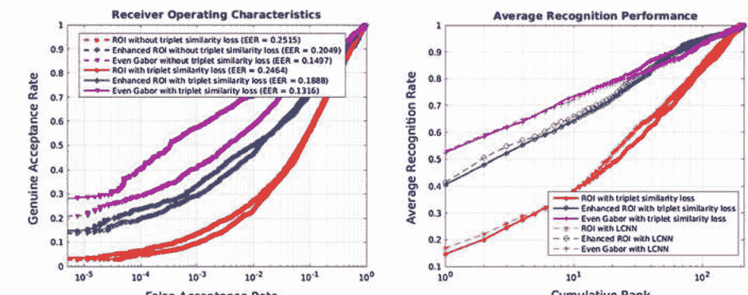

图5.10 使用LCNN进行比较ROC（左）和CMC（右）性能，带有三元相似性损失

### 5.5.4 使用CNN和联合贝叶斯公式的结果

在[23]中，另一种方案在眼部分类中表现出优越的性能，使用联合贝叶斯[1]而不是L2范数作为相似性度量。还尝试了具有联合贝叶斯分类方案的LCNN以确定性能。使用这种方法的ROC在图5.11中说明，虚线表示使用LCNN的先前结果，并且表明相对于LCNN的性能改进。

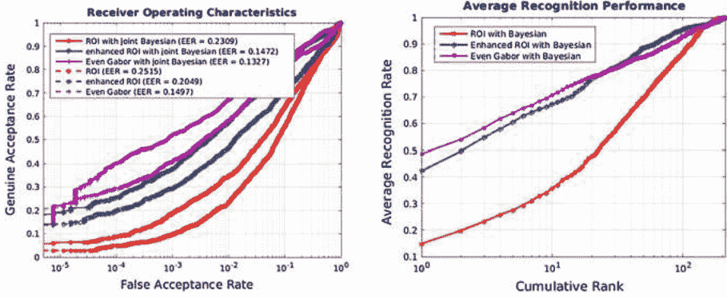

图5.11 使用LCNN和联合贝叶斯的比较ROC（左）和CMC（右）性能

### 5.5.5 使用监督离散哈希进行比较的结果

在第5.4节中详细介绍了监督离散哈希（SDH）方案，也进行了性能改进的研究。只使用第一个会话数据进行训练，并用于生成用于匹配的二进制位，使用汉明距离进行匹配。图5.12中的ROC和CMC结果说明了使用SDH的一致性性能改进，并且增强的ROI图像使用趋势也与我们之前的观察结果一致。

LCNN使用三元相似性损失函数进行训练，并与SDH一起评估性能。我们尝试确定不同位数的性能。通常可以期望SDH的更高位数提供更好的结果，但需要更长的训练时间。值得注意的是，这种方法实际上是第二步训练，试图将特征从欧几里得空间到二进制空间。训练阶段和汉明距离度量可以提高其性能。将CNN与哈希结合起来，以减少用于更快和实时识别的时间也已经尝试过[18]，但是针对的是人脸识别问题。[18]中的作者引入了增强哈希森林（BHF）用于哈希，因此我们也尝试将BHF方案纳入其中，以比较评估性能。然而，我们的结果表明SDH优于BHF，并且使用BHF的模板大小也固定为2000位。尽管我们的结果在使用BHF时没有显著改善性能，但是它的使用可以显著减小模板大小。为了确定使用手工特征匹配指静脉图像的比较性能，我们还进行了额外的实验。图5.13显示了使用相同的测试图像和匹配协议，但使用重复线跟踪[1]（也用作[21]中的基准）和曲率[13]方法的ROC。我们可以观察到，使用SDH和LCNN的实验结果提供了更好的性能和显著减小的模板大小。我们的结果与使用[8]的方法可以被视为竞争而不是优越，但是相对于[8]中最好的方法，我们的方法显著减小了模板大小（~小26倍），这仍然是迄今为止的最先进方法。

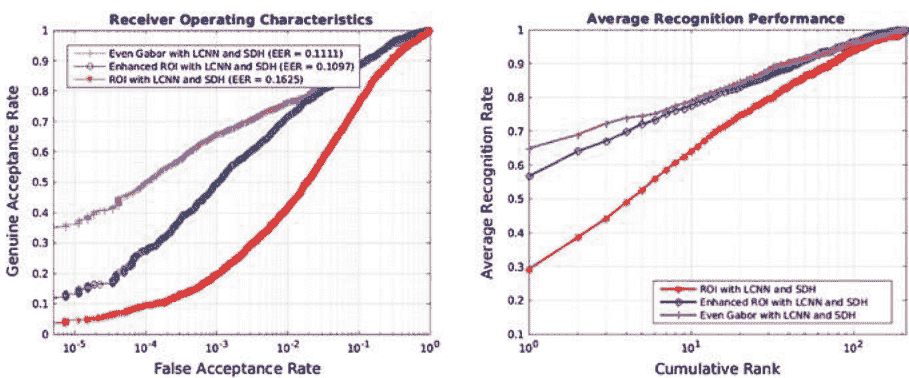

图5.12 使用LCNN和SDH进行比较的ROC（左）和CMC（右）性能

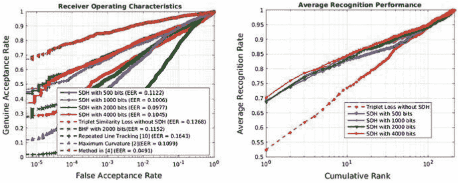

图5.13 使用SDH和三元相似性损失函数进行比较的ROC（左）和CMC（右）性能

### 5.5.6 使用改进的VGG-16的结果

实验结果使用改进的VGG-16，详见第5.3.3节，图5.14中呈现。需要注意的是，这个卷积神经网络结构生成单一匹配分数，因此我们不能使用SDH方案来推断特征。从图5.14中的ROC曲线可以推断出，与使用LCNN训练的网络相比，改进的VGG-16结构在匹配指静脉图像方面具有更好的性能。该结构直接生成匹配分数，并且因此，它可以最小化由于距离度量的不当选择（或特征加权）而引起的问题，这可能是其优越性能/结果的一个令人信服的原因。然而，需要注意的是，网络的不同训练可能导致结果的变化。

图5.14 使用MVGG的比较性能

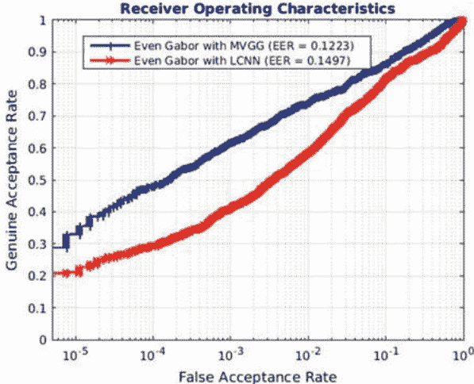

### 5.5.7 使用单个手指和未注册手指的结果

由于我们使用了两个手指的指静脉图像来形成更大的数据集（如[8]中所示），因此在上述实验中，判断只使用一个手指（即食指或中指）的指静脉图像在训练和测试阶段的性能是明智的。使用来自105个不同受试者的相应指静脉图像的结果在图5.15中使用ROC进行比较。使用来自两个手指的图像（使用由食指和中指组合形成的210类，针对105个不同受试者）的性能优于单个手指，而食指的性能优于中指。在[8]中也观察到类似的趋势，这可以归因于数据集的性质。

在早期的实验中，第一次会话的数据是从同一受试者获取的，这些受试者在第二次会话期间提供了他们的图像，并且被用作性能的测试集。为了确定迄今为止最佳方案的自学习特征的稳健性，我们还评估了该数据集中的51个受试者的性能，这些受试者没有任何两次会话的指静脉图像。因此，在任何早期实验中，都没有使用这些受试者的图像进行CNN的训练。这51个受试者的六张图像被用来确定使用具有挑战性的协议的性能，即全对全，以便我们生成了总共1530个真实分数和185436个冒名分数来确定这样的性能。对应于这个独立测试受试者的指静脉图像的ROC曲线如图5.15所示。

图5.15 使用SDH进行三元相似性损失的比较ROC（左）和CMC（右）性能在单指上的实验

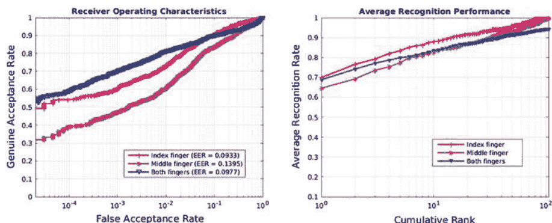

图5.16 使用独立测试主题在[17]中匹配指静脉图像的性能

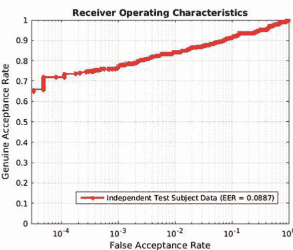

图5.16显示了静脉数据，并且结果表明使用在第5.3.2节和SDH中训练的模型的自学习特征在匹配未知主题的指静脉图像方面具有良好的性能。

## 5.6 讨论

本章研究了使用各种卷积神经网络架构进行指静脉匹配性能。与早期主要使用手工特征的指静脉图像匹配研究不同，我们的重点是使用深度学习的能力来研究自动学习的特征。我们系统地研究了仅使用ROI图像的性能改进以及主要强调亚表面血管网络的系统增强图像。我们的结果一致表明，使用具有这种增强血管特征的图像训练的CNN具有优越的性能。

根据我们在第5.5.6节的实验结果，改进的VGG-16（MVGG）比LCNN表现更好。然而，MVGG的训练时间（包括测试阶段）显著较长。这主要归因于它直接生成匹配分数，因此损失函数输出会通过整个网络迭代传播，以确定一对指静脉图像的相似性。同时，由于中间特征不可用，我们无法将SDH（哈希方案）与MVGG结合使用，而SDH的使用已经显示出在性能上有显著改进。

值得注意的是，三元相似性损失函数有助于显著提高使用LCNN的实验性能。然而，这种方法无法充分利用标签信息，因为它试图减小同一主体的成对图像之间的特征相似性，但无法准确地定位标签，即与其相关联的主体的身份。

监督离散哈希方法显著提高了性能和检索速度，并减少了存储需求，仅需要250字节（2000位）的一个模板（特征向量）。然而，值得注意的是，当位数或特征数量增加时，该方法需要单独的训练阶段和训练时间迅速增加。

本章详细介绍的工作也有一些限制，因此只能被视为初步研究。虽然数据库是公共领域中最大的两个会话指静脉数据库之一，但对于基于深度学习的算法来说，仍然是较小的规模。文献中有几个参考文献表明有很好的性能，但尚未通过公平比较或相同匹配协议展示出优越的匹配性能，与[8]中的方法相比。因此，我们有理由将[8]中的性能作为这个公开可用数据集的参考。

## 5.7 结论和进一步工作

本章系统地研究了使用各种CNN架构进行指静脉识别。与之前使用手工特征的指静脉匹配工作不同，我们的重点是通过深度学习的能力来研究自动学习特征的性能。我们系统地研究了使用ROI指静脉图像、增强图像以及减弱背景噪声的性能改进，并且一致观察到使用ROI图像以及增强的血管特征和背景衰减可以显著提高性能。影响指静脉图像匹配准确性的因素主要有网络深度、预训练和数据增强，包括随机裁剪和旋转。

在第5.3.2节详细介绍的LCNN架构使用三元相似性损失函数，其性能优于原始的softmax损失函数。我们使用SDH进行的实验结果表明，这种哈希方法显著提高了匹配性能，并且比BHF更好地解决了指静脉识别问题。除了对同一主体进行两次识别之外，我们还对从未用于训练CNN的主体的数据集进行了实验，这种显著的性能表现表明了指静脉识别问题的高泛化能力。我们在本章详细介绍的指静脉识别方案比迄今为止的任何其他方法都具有更小的模板大小。然而，这项工作存在一些限制，因此只能被视为初步研究。所使用的数据库虽然是公共领域中最大的两次指静脉图像数据库，但对于深度学习算法来说仍然规模较小。尽管从公开可用的（有限的）训练数据中取得了令人期待的准确性改进，但仍需要更多的工作来实现比[8]中最佳方法更显著的优异结果。进一步的工作应该使用更大的训练数据集，并使用独立的测试数据或公开可用的数据集[17]来实现更准确的自动指静脉识别替代方案。

# 参考文献

- 1. D. Chen, X. Cao, L. Wang, F. Wen, J. Sun, 贝叶斯人脸再探讨：一个统一方法，发表于ECCV 2012会议 (2012)
- 2. L. Chen, J. Wang, S. Yang, H. He, 基于指静脉图像的个人识别系统，具有自适应照明控制。 IEEE Trans. Instrum. Meas. 66(2), 294-304 (2017)
- 3. L. Dong, G. Yang, Y. Yin, F. Liu, X. Xi, 基于个性化最佳补丁图的指静脉验证，发表于第二届IJCB 2014会议, Tampa, Sep.-Oct. 2014
- 4. F. Hillerstrom, A. Kumar, R. Veldhuis, 生成和分析合成指静脉图像，发表于BIOSIG 2014会议, 德国达姆施塔特，2014年9月
- 5. https://polyuit-my.sharepoint.com/personal/csajaykr_polyu_edu_hk/_layouts/15/guestaccess.aspx?docid=11d706337994749759a2cc64cb70b604a&authkey=AcDq15geZ7942-7owNQfmYQ
- 6. M. Kono, H. Ueki, S. Umemura, 一种利用指静脉图案匹配进行个体识别的新方法，在第5届模式测量研讨会上，第9-12页（日本语），日本山口，2000年
- 7. M. Kono, H. Ueki, S. Umemura, 近红外指静脉图案用于个人识别。 Appl. Opt. 41(35), 7429-7436 (2002年)
- 8. A. Kumar, Y. Zhou, 利用指纹图像进行人体识别。 IEEE图像处理交易 21, 2228-2244 (2012年)
- 9. C. Liu, Y.H. Kim, 一种基于随机森林回归和高效局部二值模式的有效指静脉提取算法，在2016年IEEE ICIP会议上（2016年）
- 10. Y. Lu, S. Yoon, D.S. Park, 使用两个摄像头的指静脉识别系统。 电子信件。 50(22), 1591-1593 (2014)
- 11. Y. Lu, S. Yoon, S.J. Xie, J. Yang, Z. Wang, D.S. Park, 用于指静脉识别的显著边缘方向图的高效描述符。 美国光学学会。 53(20), 4585-4593(2014)
- 12. N. Miura, A. Nagasaka, T. Miyatake, 基于重复线追踪的指静脉图案特征提取及其在个人识别中的应用，机器视觉与应用, pp. 194-203, Jul, 2004
- 13. N. Miura, A. Nagasaka, T. Miyatake, 利用图像轮廓中的最大曲率点提取指静脉图案，国际模式识别协会会议论文集, pp. 347-350, 筑波科学城, May 2005
- 14. F. Schroff, D. Kalenichenko, J. Philbin, Facenet: 面部识别和聚类的统一嵌入 (2015), arXiv:1503.03832
- 15. F. Shen, C. Shen, W. Liu, H.T. Shen, 监督离散哈希，在CVPR 2015年会议论文集中，第37-45页，波士顿，2015年6月
- 16. K. Simonyan, A. Zisserman, 非常深的卷积网络用于大规模图像识别（2014）, arXiv:1409.1556
- 17. 香港理工大学指纹图像数据库（版本1.0）（2012），http://www.comp.polyu.edu.hk/~csajaykr/fvdatabase.htm
- 18. Y. Vizilter, V. Gorbatsevich, A. Vorotnikov, N. Kostromov, 实时面部识别通过CNN和提升哈希森林，在CVPR 2016生物特征研讨会论文集中，CVPR'W2016，拉斯维加斯，2016年6月
- 19. C. Xie和A. Kumar, '使用卷积神经网络进行指静脉识别', 香港理工大学, 技术报告编号COMP K-25, 2017年1月
- 20. X. Wu, R.He, Z. Sun, T. Tan, 一种用于带有噪声标签的深度人脸表示的轻量级CNN (2016), arXiv:1151.02683v2
- 21. Y. Ye, L. Ni, H. Zheng, S. Liu, Y. Zhu, D. Zhang, W. Xiang, FVRC2016: 第二届指静脉识别竞赛，在2016年ICB (2016)
- 22. Y. Zhou, A. Kumar, 使用多重表示的非接触式掌静脉识别，在BTAS 2010会议记录中，华盛顿特区，美国，2010年9月
- 23. Z. Zhao, A. Kumar, 在较不受限制的环境下使用语义辅助卷积神经网络进行准确的眼周识别. IEEE Trans. Info. Forensics Secur. 12(5), 1017-1030 (2017)

# 第6章 使用完全卷积编码器-解码器网络进行虹膜分割

Ehsaneddin Jalilian和Andreas Uhl

摘要 作为人工智能领域的一项重大突破，深度学习在解决关键的计算机视觉挑战方面取得了巨大成功。在眼睛图像中准确地分割虹膜区域对于虹膜识别系统的高性能至关重要，因为虹膜识别系统是最可靠的生物识别系统之一。在本章中，作为第一项贡献，我们考虑了完全卷积编码器-解码器网络（FCEDNs）在虹膜分割中的应用。

为此，我们利用三种不同类型的FCEDN架构对来自五个不同数据集的图像进行虹膜分割，这些图像是在不同场景下获取的。随后，我们对这三个网络进行性能分析、评估和比较，用于虹膜分割。此外，作为第二项贡献，为了对所提出的网络进行真实评估，我们在相同的数据集上应用了一些传统（非CNN）的虹膜分割算法，并对它们的性能进行了类似的评估。然后将这些结果与FCEDNs的结果进行比较。根据结果，所提出的网络在所有数据集上都实现了优越的性能，超过了所有其他算法。

## 6.1 引言

深度学习技术和卷积神经网络（CNNs）特别是在人工智能方面取得了重大进展，作为强大的视觉识别、分类和分割工具。虹膜识别是最可靠和准确的生物特征技术之一，用于人类身份识别和认证。虹膜具有许多独特的特征，使其成为区分一个人与另一个人的良好选择。首先，虹膜组织的小梁网是不受外部环境影响，在其发展过程中受到遗传影响,具有超过“266个自由度”,[6]并且受到眼睑、角膜和房水的保护。与任何其他生物特征系统一样,虹膜识别系统的性能高度依赖于准确分割目标区域(虹膜)与图像其他部分的能力[31,51]。而且,整个虹膜识别系统的成功或失败在很大程度上被认为直接取决于该阶段的精度[5,17]。

### 6.1.1 传统(非CNN)虹膜分割方法

在过去几十年中,提出了许多传统(非CNN)虹膜分割方法。对相关文献的快速回顾揭示了大量这些方法,这些方法在虹膜分割方面具有多种能力[1,7,26,36,44,47,50]。一般来说,分割方法可以大致分为两大类:基于轮廓的方法和基于纹理的方法。最著名的基于轮廓的方法是基于积分微分算子[8]和霍夫变换[49]。积分微分算法的原理是在参数空间中搜索找到最大的强度差异,通常对应于瞳孔和虹膜边界。然而,霍夫变换方法尝试通过探索二值边缘图来找到最佳的圆参数。

这些方法的性能高度依赖于图像的清晰轮廓和边界对比度。通常,在正常条件下,图像中的边界或瞳孔边界的对比度较低,或者可能呈非圆形。此外,遮挡和镜面反射可能会给图像引入进一步的对比度缺陷。虽然已经引入了许多改进方法,如遮挡检测[18,21]、圆模型改进[29,45]、形变校正[10]、噪声降低[23]、边界拟合[47]等,以弥补这些缺陷,但由于它们在分割中采用了全局方法,这些方法的性能可能会受到这些缺陷的影响,甚至在某些情况下可能导致系统完全失效。

另一方面,基于纹理的方法利用单个像素的视觉特征信息,如强度、颜色等,将虹膜像素与图像的其他部分进行分类。在这个类别中,最有希望的方法使用一些常见的像素级图像分类器,如支持向量机(SVMs)[39]、神经网络[4]和Gabor滤波器[34],将虹膜像素与图像的其他部分进行分类。尽管已经努力改进这些算法组的性能[26,43],但这些方法同样受到扩散、反射和遮挡等一组缺陷的影响。

### 6.1.2 卷积神经网络（CNN）用于分割

卷积神经网络（CNN）在许多图像解释和分析任务中取得了显著的改进，例如图像分割和分类，自从它们早期引入以来$[24,25]$。卷积神经网络的原理基于分层的解释因素，其中更高级别、更抽象的概念是从较低级别的概念中学习的，借助卷积操作符的帮助。假设$A_{i,j}$是特定层中位置$(i,j)$处的数据向量，$B_{i,j}$是下一层的数据向量，则输出$B_{ij}$计算如下：

$$B_{ij}=f_{\alpha\beta}\left(\left\{A_{\beta_i+\delta_i, \beta_j+\delta_j}\right\} \mid 0 \leq i, j \leq \alpha\right)$$

其中$\alpha$是卷积核大小，$\beta$是步幅或子采样因子，而$f_{\alpha\beta}$指定了层类型。正如已经提到的，CNN的核心构建模块是卷积层（Conv）。卷积层的参数由一组可学习的滤波器组成。每个滤波器对输入体积进行卷积运算，并计算滤波器和输入在任何位置的条目之间的点积，并产生一个激活图，该激活图给出了该滤波器在每个空间位置的响应。

然后，该层的输出可以进一步由其他层进行处理，例如：非线性下采样层（Pool）、非饱和激活函数层（ReLU），以及根据网络架构的进一步层。所有这些层共同构成了网络的编码器部分。除了编码器部分，每个网络还包括一个解码机制，在该机制中执行主要的标记任务，并将网络的输出作为分类得分输出。

卷积神经网络的初始版本是为分类任务开发的，其中网络的输出是一个单一的类别标签$[22,41]$。在这种类型的网络中，通常使用全连接层（FC）作为内积函数来生成分类分数。然而，在许多图像处理任务中，如虹膜分割，需要对感兴趣区域进行像素级标记。

以前用于像素级分割的方法使用了卷积神经网络$[14,15]$。在更近期的CNN架构中，包括全卷积神经网络（FCNNs），通常使用可学习的上采样层（Upsample）来检索特征图，然后使用softmax层（Softmax）来生成分类分数，该层通常计算其输入的softmax的多项式逻辑损失。

存在各种方法来实现这种上采样机制$[30,46]$。

在卷积编码器-解码器网络（CEDNs）中，编码机制已经解释过，以相反的方式重复使用，将编码器网络的低分辨率输出图映射上采样到输入分辨率特征的完整输入体积。同样，针对这种类型的网络，提出了各种上采样机制的方法。虽然一些人使用切换代码重新映射特征$[32]$，但其他人，如Ronneberger等人$[40]$，只是使用裁剪的特征串联来生成上采样的图。除了使用原始的上采样方法之外，Ronneberger等人提出的网络并不是完全卷积的，因为输入和输出的体积不匹配。提出的检索完整输入体积的机制（重叠-平铺）无论如何都会影响训练过程，并引入了更多的前处理和后处理工作负载。最近，Badrinarayanan等人在一项工作中提出了一种使用相应的编码器特征图的最大池化索引来生成解码器网络中的上采样特征图的方法，“无需学习”，然后与可训练的滤波器进行卷积。应用这种技术的关键优势是改善边界划分并更精确地保留边缘。

## 6.2 虹膜识别中的卷积神经网络

然而，就深度学习技术在虹膜分割中的应用而言，据我们所知，只有一个关于虹膜分割应用卷积神经网络的提案工作。在$[27]$中，作者提出了两种基于卷积神经网络的虹膜分割模型，分别是：分层卷积神经网络（HCNN）和多尺度全卷积网络（MFCN）。

前者是一个简单的卷积神经网络，由三个交替的卷积和池化层组成，其输出直接输入到一个全连接层中。后者网络包括六个相互连接的交替卷积和池化层块，其输出通过一个乘法层简单地融合，然后输入到一个Softmax层中。所提出的网络用于分割从Ubiris.v2和CASIA-IRIS-Distance-V4数据库中获取的噪声距离虹膜图像。在评估中，作者引用了其他工作的平均错误率，没有在相同的数据库上进行直接的实验分析。因此，在对分割准确性进行公正评估时，必须谨慎考虑他们的结果。第二个数据库的真实掩码由作者手动标记。

在$[13]$中，作者介绍了两个用于虹膜识别的卷积神经网络。但是，这些是针对“虹膜表示”而不是分割提出的。这些网络被命名为“DeepIrisNet-A”，它基于标准的卷积层，以及使用了一系列所谓的“Inception层”的“DeepIrisNet-B”。根据结果，这些网络能够很好地建模虹膜的微结构，并且在描述符基线的基础上表现出色，并且能够很好地适应新的数据集。

在$[35]$中，作者使用了深度稀疏滤波技术来进行基于智能手机的可见光虹膜识别系统中的虹膜特征提取。在这项工作中，使用了两层稀疏滤波器，共训练了256个滤波器，每个滤波器使用16×16的卷积核来生成特征。最终特征向量是通过连接这些特征地图的直方图形成的。他们在许多智能手机上测试了他们的系统，并且根据智能手机类型，实现了不同水平的准确性。在$[28]$中，作者提出了一种名为“DeepIris”的卷积神经网络，用于异构虹膜验证，它学习了用于测量一对虹膜图像之间相似度的关系特征。网络的架构包括一对滤波器层，以及一组备选的池化、卷积和归一化（NR）层，用于生成两个输入图像之间的相似度图。相似度度量是通过最后的全连接层计算得到的分数。他们的结果表明，所提出的方法在跨分辨率和跨传感器虹膜验证方面取得了有希望的性能。

## 6.3 一个完全卷积的编码器-解码器网络

我们使用的FCEDN网络的架构与Badrinarayanan等人的工作$[2]$类似。然而，在这里我们重新设计了Softmax层，将输出仅分类为两类（虹膜和非虹膜）。基本上，这种架构提出了一个完全卷积的编码器-解码器网络，代表了像素级语义分割的核心分割引擎$[2]$。

核心分割引擎包括一个44层的编码器网络和相应的解码器网络。编码器网络的架构分为五个部分。每个部分由一组块组成，其架构由一个卷积层形成，该层用核与输入图像进行卷积以生成输入的特征图，然后是一个批量归一化层（BN），用于归一化层输入并避免“内部协变量偏移”$[19]$，以及一个逐元素修正线性非线性层（ReLU），作为激活函数。然后，这些块最终进入一个池化层（窗口大小为2×2，步长为2），该层对输入进行非线性下采样，并实现对小空间位移的平移不变性。

尽管应用多个池化层可以帮助获得稳健的平移不变性，但是应用每一层会导致空间分辨率的损失，特别是在边界区域。通过存储最大池化索引来解决这个问题，这些索引在解码网络中后续用于上采样。

相应的解码器网络也具有44层的结构，包括五个块。同样，每个块由一组块组成，其架构由上采样层和可训练的解码器滤波器（包括Conv、BN和ReLU层）生成密集特征图。如前所述，上采样层使用对应的编码器特征图的最大池化索引生成上采样特征图，而不需要学习，然后滤波器组对特征图进行卷积。最后，结果被馈送到可训练的Softmax层（SoftmaxWithLoss）。Softmax层独立地对每个像素进行分类，因此该层的输出是一个N通道的概率图像，其中N是类别的数量。输出分割对应于每个像素的最高概率类别。直接应用这种技术会带来改进边界划分和边缘保护的问题。同时，这种技术减少了参数的数量，实现了端到端的训练。

### 6.3.1 基本变体

正如我们在前一节中所指定的，网络的整体结构被组织为一组块，实际上代表了网络的学习单元。这种独特的统一结构加快了原始网络架构的修改，以最好地适应所需的分割任务。为了达到这个目的，并且以促进网络分析为主要目标，引入了原始网络的一个抽象变体称为“基本”$[2]$。使用这样一个抽象的架构使我们能够评估在分割过程中使用更少的学习和卷积和下采样单元的效果。同时，这样的架构还可以提供更快速和更少计算开销的分割能力。整体网络架构同样由编码器和相应的解码器网络组成。编码器包括四个块，其结构类似于原始网络的块，包括Conv、BN、ReLU和Pool层。解码器网络的块也包括Upsample、Conv和BN层。解码器网络最终以一个SoftmaxWithLoss层结束。

### 6.3.2 贝叶斯变体

作为对原始网络的另一种扩展，并尝试基于深度学习技术提出一种概率像素级分割模型，开发了原始网络的另一种变体称为“贝叶斯”$[20]$。该网络利用蒙特卡洛采样和dropout技术实现了概率像素级分割$[12,42]$。这里的目标是找到卷积权重$\boldsymbol{w}$的后验分布，给定观测到的训练数据$x$和标签$z_o$。

$$p(w \mid x, z)$$

在实践中，这样的后验分布只能近似计算，例如，通过变分推断技术，通过最小化期望近似分布与完整后验分布之间的Kullback-Leibler散度$[9]$。

$$kl(q(w) \| p(w \mid x, z))$$

Gal等人$[11]$已经表明，最小化交叉熵损失目标函数假装最小化Kullback-Leibler散度项。因此，他们证明了用随机梯度下降训练神经网络将促使模型学习权重的分布，同时避免过拟合。使用相同的技术，“贝叶斯基本”网络的整体架构与基本网络相同，只是在该网络中添加了额外的dropout层，这些层被添加到编码器的最后两个块和解码器的前两个块中，如图6.1所示。使用这种架构，在测试时会对权重的后验分布进行采样，以生成softmax类概率的分布。对这些样本取平均值用于分割预测，并使用方差输出每个类别的模型不确定性。蒙特卡洛采样用于此目的，因为它能够定性理解模型的不确定性。

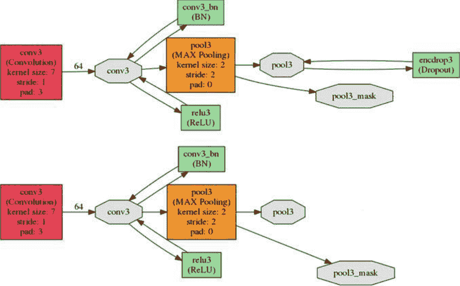

图6.1 贝叶斯基本网络（向上）和基本网络（向下）中第三个块的架构差异（使用Caffe框架生成图像）

## 6.4 实验框架

本研究的主要目标是应用FCEDNs进行虹膜分割，并对这些网络在不同场景下的性能进行评估和分析。为了达到这个目的，在设计和实现网络之后，每个网络在五个不同的虹膜数据集上运行，这些数据集包含在不同场景下获取的图像。这些数据集的详细规格在第4.1节中讨论。然后，使用三个不同的分割评分来评估和分析每个网络的分割能力，这些评分的详细信息在第4.2节中指定。接下来，为了便于对虹膜分割网络的性能进行真实评估，一组传统的虹膜分割算法在相同数据集的测试子集上运行，并对它们的性能进行分析和评估，并与FCEDNs的性能进行比较。这些FCEDNs的详细信息在第6.6节中指定，它们在相同数据集的测试子集上运行，并对其性能进行分析和评估，并与传统虹膜分割算法进行比较。

### 6.4.1 数据集

在这项工作中，我们选择了五个著名的虹膜数据集。选择了多样化的虹膜图像获取场景的数据集。Notredame数据集（ND-Iris-0405数据库的子集）包括30个不同主题的835个虹膜图像。图像采集是在近红外光谱下，在室内环境中，使用LG 2200虹膜生物识别系统完成的。对于我们的实验，我们使用了670张图像（24个主题）进行训练，以及165张图像（六个主题）进行网络测试。CASIA-IRIS-Interval-V4数据集共包含249个主题的2640张虹膜图像。图像是在近红外照明下，使用近距离虹膜相机获取的。对于我们的实验，使用了1307个右眼图像实例，其中1045张图像（192个主题）用于训练，262张图像（57个主题）用于网络测试。

IITD数据库包含1120个与224个主题对应的虹膜图像。所有这些图像都是在室内环境中获取的，使用Jiris、Jpc1000数字CMOS相机在近红外光谱下。对于我们的实验，使用了900张图像（180个主题）进行训练，使用了220张图像（44个主题）用于网络测试。Ubiris数据集（Ubiris.v2数据库的子集）包含来自100个不同主题的2250个虹膜图像。这些图像是用尼康E5700相机获取的，并分为两部分。第一部分包括在受控条件下拍摄的虹膜图像，模拟注册阶段。第二部分包括在真实环境中拍摄的虹膜图像，具有自然光亮度对应的反射、对比度和焦点的异质性。该数据集还包含从不同距离和遮挡条件下拍摄的偏角虹膜图像。在我们的实验中，我们使用了2055张图像进行训练，并使用225张图像进行网络测试。

最后，CASIA-IRIS-Ageing-V5数据集包含每只眼睛和用户的120张2009年视频序列捕获的图像，以及每只眼睛和用户的20张2013年视频序列捕获的图像。在我们的实验中，我们总共使用了1880张图像，包括来自两个会话的94个用户的双眼图像。其中，1500张来自75个用户的图像用于训练，380张来自19个用户的图像用于网络的测试。特别需要注意的是，数据集的选择受到所需的地面真值掩模的可用性的限制，这些掩模是训练过程所必需的。对于这项工作，地面真值掩模是从萨尔茨堡大学WaveLab提供的Irisseg-ep数据库中获取的$[16]$。训练和测试子集的选择遵循帕累托原则，其中约80%的数据用于训练，20%用于测试，主题不重叠，并且没有实例包含在其他人的集合中。为了保持对网络的公平空间输入，所有数据集中的图像都被调整为480×360。

### 6.4.2 度量和测量

为了便于对FCEDNs和其他传统算法在虹膜分割上进行整体统计分析和适当评估，我们考虑了一组评估指标，涵盖了关键的分割度量，如：真正例（$tp$），假负例（$fn$）和假正例（$fp$）。为此，主要采用了广泛接受的NICE.I协议来评估虹膜分割准确性。分割误差得分nice1计算了所有图像中相应不一致像素（通过逻辑异或运算符）的比例，计算公式如下：

$$\text{nice1} = \frac{1}{C \times R} \sum_{c'} \sum_{r'} O(c', r') \otimes C(c', r')$$

其中$C$和$R$分别是分割掩模的列和行，$O(c', r')$和$C(c', r')$分别是输出和基准掩模的像素。第二个分割误差得分旨在补偿图像中虹膜像素和非虹膜像素的先验概率不平衡。类型-I和类型-II错误得分nice2通过以下方式对（$fp$）和（$fn$）的比率进行平均。

$$\text{nice2} = \frac{1}{2}(fp + fn)$$

nice1和nice2的值在$[0,1]$区间内，而在这个上下文中，1和0分别是最差和最优的值。此外，为了提供网络性能的全面概述，还考虑了三个标准的分割准确度度量，即：精确度、召回率和F1度量，这些度量在信息检索领域中是众所周知的度量$[38]$。

精确度给出了正确分割的虹膜像素的百分比，计算如下：

$$p = \frac{tp}{tp + fp}$$

另外，召回率使用假阴性来提供相同的度量，计算如下：

$$r = \frac{tp}{tp + fn} \quad (6.4)$$

最后，F1度量是p和r的调和平均值，计算如下：

$$F1 = \frac{2rp}{r + p} \quad (6.5)$$

这三个度量的值在$[0,1]$区间内，而在这个上下文中，0和1分别是最差和最优的值。

### 6.4.3 网络实现

在第一步中，我们在“Caffe”深度学习框架上实现了FCEDNs。Caffe是最受欢迎的深度学习框架之一，其核心是用C++编写的。模型和优化通过配置而不是硬编码来定义，从而加速训练和测试过程。通过设置一个标志，可以在CPU和GPU之间切换，并且接口可扩展到Python（Pycaffe）和Matlab（Matcaffe）。网络架构在单独的“prototxt”文件中定义，训练和测试参数在另一个类似的文件中定义，称为“solver”。在训练和测试过程中，使用caffe命令加载prototxt文件。

原始网络、基本网络和贝叶斯基本网络的架构实现和技术规范分别在表6.1、6.2和6.3中呈现。原始网络的卷积核大小设置为3×3，为了提供宽广的上下文进行平滑标记，基本网络的这个值设置为7×7。

我们通过随机梯度下降（SGD）反向传播算法训练了我们的网络：

$$U_{t+1} = \mu U_t - \alpha \nabla L(W) \quad (6.6)$$

$$W_{t+1} = W_t + U_{t+1} \quad (6.7)$$

形式上，在每次迭代$t+1$中，SGD算法计算更新值$U_{t+1}$和更新的权重$W_{t+1}$，给定先前的权重更新$U_t$和当前的权重$W_t$。该算法通过负梯度$\nabla L(W)$和先前的权重更新$U_t$的线性组合来更新权重$W$。学习率$\alpha$是负梯度的权重，动量$\mu$是先前更新的权重。

对于我们的实验，SGD算法的动量值设置为0.9。为了研究网络的训练过程，我们考虑了两个

**表6.1 原始编码器（左）-解码器（右）网络的架构和规格**

| 编码器层 | 信息 | 解码器层 | 信息 |
|---|---|---|---|
| 卷积1-1 | 64 | 卷积5-3-D | 512 |
| 卷积1-2 | 64 | 卷积5-2-D | 512 |
| 卷积2-1 | 128 | 卷积5-1-D | 512 |
| 卷积2-2 | 128 | 卷积4-3-D | 512 |
| 卷积3-1 | 256 | Conv4-2-D | 512 |
| Conv3-2 | 256 | Conv4-1-D | 256 |
| Conv3-3 | 256 | Conv3-3-D | 256 |
| Conv4-1 | 512 | Conv3-2-D | 256 |
| Conv4-2 | 512 | Conv3-1-D | 128 |
| Conv4-3 | 512 | 卷积2-2-深度 | 128 |
| 卷积5-1 | 512 | Conv2-1-D | 64 |
| Conv5-2 | 512 | Conv1-2-D | 64 |
| Conv5-3 | 512 | Conv1-1-D | 2 |
| 池化1 | 步长 2, 核 2 | 上采样5 | 高度 30, 宽度 23, 缩放 2 |
| 池化2 | 步长 2, 核 2 | 上采样4 | 高度 60, 宽度 45, 缩放 2 |
| 池化3 | 步长 2, 核 2 | 上采样3 | - |
| 池化4 | 步长 2, 核 2 | 上采样2 | - |
| 池化5 | 步长 2, 核 2 | 上采样1 | - |

---
**脚注说明**
1. 软计算与图像分析实验室，贝拉内拉大学，UBIRIS.v2数据集，请参见http://iris.di.ubi.pt/ubiris1.html。
2. 生物特征与安全研究中心，中国科学院自动化研究所虹膜图像数据库，请参见http://biometrics.idealtest.org。
3. 圣母大学计算机视觉研究实验室，虹膜数据集0405，请参阅https://sites.google.com/a/nd.edu/public-cvrl/data-sets。
4. 中国科学院生物识别与安全研究中心，CASIA虹膜图像数据库，请参阅http://biometrics.idealtest.org。
5. 印度理工学院德里分校，IIT德里虹膜数据库，请参阅http://www4.comp.polyu.edu.hk/~csajaykr/database.php。
6. 请参阅http://www.biometrics.idealtest.org。

表6.2 基本编码器（左）-解码器（右）网络的架构和规格

| 编码器层 | 卷积输出 | 批量归一化 | ReLU | 解码器层 | 卷积输出 | 批量归一化 |
|---|---|---|---|---|---|---|
| 卷积1 | 64 | 卷积1-b | ReLU1 | 卷积4-D | 64 | 卷积4-D-b |
| 卷积2 | 64 | 卷积2-b | ReLU2 | Conv3-D | 64 | Conv3-D-b |
| Conv3 | 64 | Conv3-b | ReLU3 | Conv2-D | 64 | Conv2-D-b |
| Conv4 | 64 | Conv4-b | ReLU4 | Conv1-D | 64 | Conv1-D-b |
| - | - | - | - | ConvC-D | 2 | - |
| 池化 | 步长 | 卷积核大小 | 上采样 | 缩放 | - | - |
| 池化1 | 2 | 2 | 上采样4 | 2 | - | - |
| 池化2 | 2 | 2 | 上采样3 | 2 | - | - |
| 池化3 | 2 | 2 | 上采样2 | 2 | - | - |
| 池化4 | 2 | 2 | 上采样1 | 2 | - | - |

表6.3 贝叶斯基本编码器（左）-解码器（右）的架构和规格

| 编码器层 | 卷积输出 | 批量归一化 | ReLU | 解码器层 | 卷积输出 | 批量归一化 |
|---|---|---|---|---|---|---|
| 卷积1 | 64 | 卷积1-b | ReLU1 | 卷积4-D | 64 | 卷积4-D-b |
| 卷积2 | 64 | 卷积2-b | ReLU2 | Conv3-D | 64 | Conv3-D-b |
| Conv3 | 64 | Conv3-b | ReLU3 | Conv2-D | 64 | Conv2-D-b |
| Conv4 | 64 | Conv4-b | ReLU4 | Conv1-D | 64 | Conv1-D-b |
| - | - | - | - | ConvC-D | 2 | - |
| 池化 | 步长 | 卷积核大小 | 上采样 | 缩放 | - | - |
| 池化1 | 2 | 2 | 上采样4 | 2 | - | - |
| 池化2 | 2 | 2 | 上采样3 | 2 | - | - |
| 池化3 | 2 | 2 | 上采样2 | 2 | - | - |
| 池化4 | 2 | 2 | 上采样1 | 2 | - | - |
| Dropout | - | 比率 | - | Dropout | - | 比率 |
| encdrop3 | - | 0.5 | - | D-drop4 | - | 0.5 |
| encdrop4 | - | 0.5 | - | D-drop3 | - | 0.5 |

不同网络变体的学习率。对于原始网络，学习率设置为0.001，对于基本网络，该值设置为0.1。学习率根据Badrinarayanan等人的工作进行了最优设置[2]。

这样一个较小的学习率的直接效果是网络的收敛速度较慢但更稳定。

图6.2清楚地说明了在训练过程中对这两个网络架构的影响。表6.4总结了设置的训练参数。

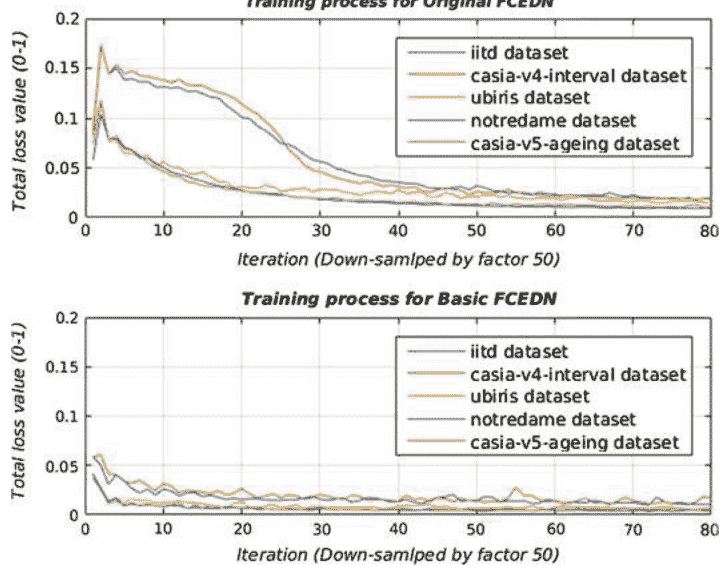

图6.2 在不同数据集上，原始架构（向上）和基本架构（向下）在前4000次迭代的训练过程中的总损失值

表6.4 网络的求解器参数

| 参数 | 原始 | 贝叶斯-基本 | 基本 |
|---|---|---|---|
| 迭代次数 | 10,000 | 10,000 | 10,000 |
| 动量 | 0.9 | 0.9 | 0.9 |
| 学习率 | 0.001 | 0.1 | 0.1 |

在求解器文件中。这些参数的设置标准在Leon Bottou的工作中进行了研究[3]。

在我们的实验中，网络被训练到每个单独图像的收敛点，其中两个分割类别的总损失减少到小于4%。

## 6.5 第一个分割实验结果

我们在表6.5和表6.6中呈现了FCEDNs的分割结果，分别作为每个虹膜数据集和每个网络的平均分割得分。正如表6.5所示，Notredame和Casia5a数据集获得了最好的结果，Ubiris数据集获得了最差的结果。这仅仅是由于这些数据集的难度水平。另一方面，如表6.6所示，贝叶斯-基本网络优于其他两个网络，具有较低的（平均）$\mu D_1$、$\mu D_2$和较高的$\mu F_1$得分（分别为0.0316、0.0571和0.8985）。

表6.5 每个数据集的平均FCEDN分割得分

| FCEDN | 数据集 | D1 | D2 | f1 |
|---|---|---|---|---|
| 原始 | iitd | 0.0591 | 0.0659 | 0.8661 |
| 原始 | notredame | 0.0213 | 0.0424 | 0.8617 |
| 原始 | casia4i | 0.0561 | 0.0588 | 0.8826 |
| 原始 | ubiris | 0.0342 | 0.1249 | 0.7691 |
| 原始 | casia5a | 0.0160 | 0.0420 | 0.8951 |
| 基本 | iitd | 0.0539 | 0.0594 | 0.8892 |
| 基本 | notredame | 0.0107 | 0.0269 | 0.9351 |
| 基本 | casia4i | 0.0448 | 0.0438 | 0.9072 |
| 基本 | ubiris | 0.0423 | 0.1517 | 0.7700 |
| 基本 | casia5a | 0.0086 | 0.0261 | 0.9510 |
| 贝叶斯-基本 | iitd | 0.0682 | 0.0701 | 0.8489 |
| 贝叶斯-基本 | notredame | 0.0095 | 0.0282 | 0.9426 |
| 贝叶斯-基本 | casia4i | 0.0391 | 0.0407 | 0.9192 |
| 贝叶斯-基本 | ubiris | 0.0306 | 0.1116 | 0.8407 |
| 贝叶斯-基本 | casia5a | 0.0105 | 0.0351 | 0.9413 |

表6.6 每个网络的平均FCEDN分割得分

| FCEDN | $\mu D_1$ | $\mu D_2$ | $\mu F_1$ |
|---|---|---|---|
| 贝叶斯-基本 | 0.0316 | 0.0571 | 0.8985 |
| 基本 | 0.0321 | 0.0616 | 0.8905 |
| 原始 | 0.0373 | 0.0668 | 0.8549 |

在整体数据集上的结果。这主要是由于该网络使用的概率技术，结果明确支持在应用该技术后基本网络的增强分割能力。基本网络在虹膜数据集上的平均得分相对较低，分别为0.0321、0.0616和0.8905，对应 $\mu D_1$、$\mu D_2$ 和 $\mu F_1$。这主要是由于该网络的简单结构，它依赖于浅层、细节层的外观信息来产生分割。

原始网络位于最后，平均得分分别为0.0373、0.0668和0.8549，对于 $\mu D_1$、$\mu D_2$ 和 $\mu F_1$。这主要是由于该网络的相对深层结构，它将来自深层粗糙层的语义信息与来自浅层细粒度层的外观信息相结合，以产生分割结果。

图6.3展示了不同数据集上网络的最佳和最差性能样本。图6.4对虹膜分割网络进行了更详细的性能分析，提供了最小值、最大值、中位数、分位数和异常值的箱线图形式的统计信息。异常值根据以下机制进行分类，其中 $q_3$ 和 $q_1$ 分别表示分数的第25和第75百分位数，并且 $w$ 大约对应于 $\pm2.7$ 标准差($\sigma$)：如果分数大于 $Z_1$ 或小于 $Z_2$，则将其分类为异常值。

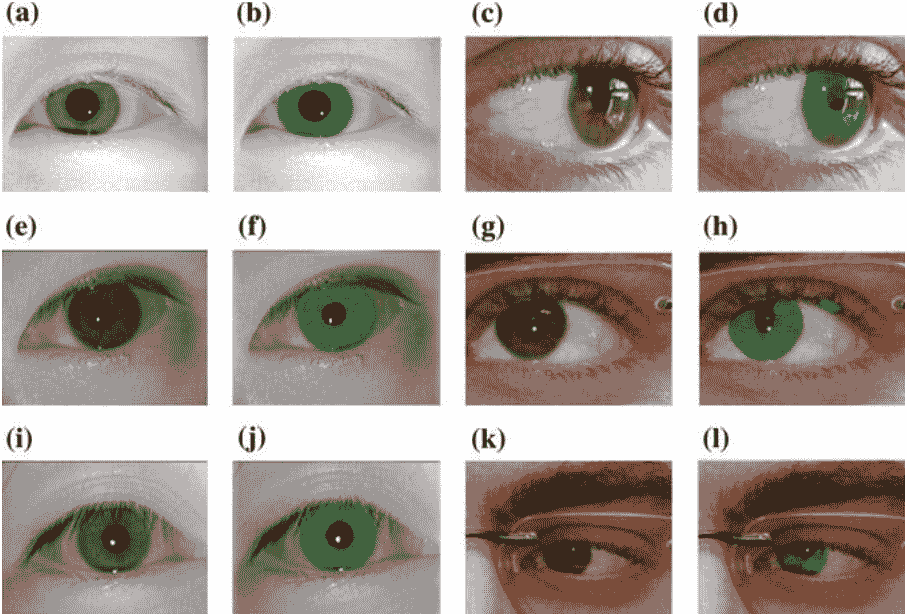

图6.3 Bayesian-Basic网络在notredame (a)和ubiris (c)数据集样本上的最佳(b)和最差(d)性能样本。Basic网络在casia5a (e)和ubiris (g)数据集样本上的最佳(f)和最差(h)性能样本。Original网络在casia5a (i)和ubiris (k)数据集样本上的最佳(g)和最差(1)性能样本。

$$Z_1 = q_3 + w \times (q_3 - q_1) \quad (6.8)$$

$$Z_2 = q_3 - w \times (q_3 - q_1) \quad (6.9)$$

此外，为了评估分割结果对整个数据集的泛化能力，我们对每个数据集进行了训练和测试，应用了K折交叉验证技术。为此，我们将每个数据集分成五个互补的子集，并在四个子集上进行训练，并在剩下的子集上验证结果。同样，对每个数据集分别进行了五轮交叉验证，没有重叠。

图6.5展示了Notredame数据集上交叉验证的分割得分结果。表6.7展示了所有不同数据集的平均交叉验证结果。如结果所示，平均分数与单折实验的分数非常相似，大多数分数之间的差异约为2%，而分数之间的最大差异不超过4%。

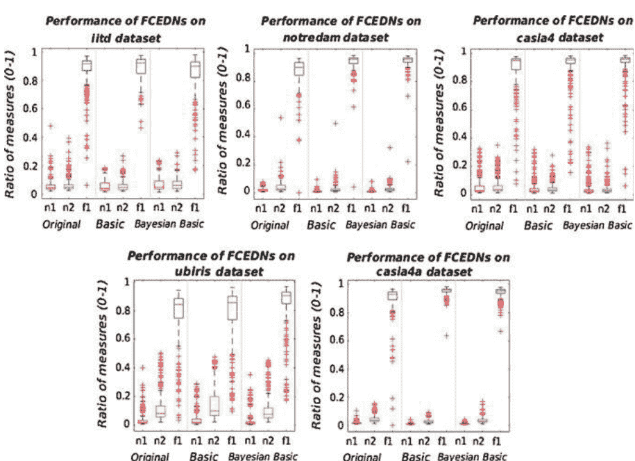

图6.4展示了使用分割错误的FCEDNs在每个数据集上的性能：$D_1$ (n1), $D_2$ (n2)和f1 (f1)。

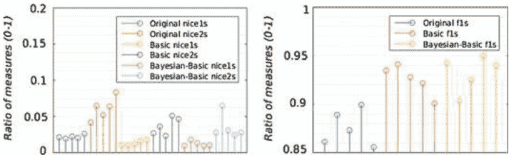

图6.5展示了Notredame数据集上的五折交叉验证结果，展示了每轮的分割得分 $D_1$, $D_2$ (左) 和f1 (右)。

表6.7展示了所有数据集的平均交叉验证结果。

| 网络 | 原始 |  |  | 基本 |  |  | 贝叶斯-基本 |  |  |
|---|---|---|---|---|---|---|---|---|---|
| 数据集 | D1 | D2 | f1 | D1 | D2 | f1 | D1 | D2 | f1 |
| Casia5a | 0.0135 | 0.0392 | 0.9000 | 0.0197 | 0.0385 | 0.9250 | 0.0112 | 0.0332 | 0.9400 |
| Casia4i | 0.0415 | 0.0492 | 0.9175 | 0.0330 | 0.0382 | 0.9375 | 0.0412 | 0.0362 | 0.9250 |
| Iitd | 0.0365 | 0.0353 | 0.9400 | 0.0277 | 0.0322 | 0.9510 | 0.0292 | 0.0337 | 0.9500 |
| Notredame | 0.0220 | 0.0655 | 0.8775 | 0.0135 | 0.0387 | 0.9225 | 0.0132 | 0.0367 | 0.9300 |
| Ubiris | 0.0305 | 0.0898 | 0.7200 | 0.0262 | 0.0687 | 0.7900 | 0.0187 | 0.0675 | 0.8625 |

表6.8 运行时间，每个分割的FCEDNs

| FCEDN | 原始 | 贝叶斯-基本 | 基本 |
|---|---|---|---|
| 运行时间 (秒) | 18.075 | 58.661 | 10.162 |

此外，我们测量了不同网络在具有Intel-Xeon E5-1620 3.50 GHz CPU和32GB内存的系统中，每个分割的平均运行时间。结果分别在表6.8中呈现。基本上，Caffe没有针对GPU进行优化。然而，根据开发者的说法，使用合适的GPU和cuDNN，Caffe被认为是最快的常规实现之一。

> 7 Caffe深度学习框架，请参见http://caffe.berkeleyvision.org/。

## 6.6 第二次分割实验结果

接下来，为了简化对FCEDNs在虹膜分割能力的适当评估，并实现对这些网络性能的比较分析，考虑了一组传统的虹膜分割方法（Convs），并在相同数据集的测试子集上运行。

Osiris是一个开源的虹膜识别软件，其中包括一个虹膜分割算法，该算法使用梯度图上的Viterbi算法进行虹膜分割[33]。Caht（对比度调整的Hough变换）[36]、Wahet（加权自适应Hough和椭圆极坐标变换）[47]和Ifpp（迭代傅里叶级数推拉）[48]是本实验中使用的进一步开源虹膜分割算法，这些算法是从萨尔茨堡大学Wavelab提供的Iris-Toolkit软件包中获取的[37]。这些算法的性能使用第一次实验中使用的相同分割评分进行评估。传统算法的性能结果分别在表6.9和6.10中表示，分别表示每个虹膜数据集和每个算法的平均分类得分。

通常，Osiris倾向于低估虹膜边界，因为它试图屏蔽障碍物，导致高精度但召回率较低。然而，Wahet和Caht倾向于高估虹膜边界，导致召回率高于精度。这是因为这两个算法不使用眼睑滤波器。同样地，在Ifpp算法中，不太明显的边界很大程度上受到噪声或眼睑的影响。因此，不太明显的边界是从更稳定的边界重建的。

如表6.9所示，这些算法在较简单的数据集（如Notredame和Casia5a）上表现更好，而在Ubiris数据集上获得的结果最差。在这两种情况下，算法的性能结果与FCEDNs的结果一致，这证实了实验方案的公平性。

表6.9 每个数据集的平均卷积分割得分

| 算法 | 数据集 | D1 | D2 | f1 |
|---|---|---|---|---|
| Wahet | iitd | 0.1377 | 0.1762 | 0.7337 |
| Wahet | notredame | 0.0248 | 0.0875 | 0.8619 |
| Wahet | casia4i | 0.0608 | 0.0842 | 0.8949 |
| Wahet | ubiris | 0.2743 | 0.4498 | 0.1977 |
| Wahet | casia5a | 0.0248 | 0.0836 | 0.8648 |
| Caht | iitd | 0.1138 | 0.1560 | 0.7767 |
| Caht | notredame | 0.0361 | 0.1408 | 0.7941 |
| Caht | casia4i | 0.1161 | 0.1470 | 0.7651 |
| Caht | ubiris | 0.1226 | 0.4809 | 0.1048 |
| Caht | casia5a | 0.0369 | 0.1514 | 0.7753 |
| Ifpp | iitd | 0.1142 | 0.1508 | 0.7965 |
| Ifpp | notredame | 0.0294 | 0.1113 | 0.8359 |
| Ifpp | casia4i | 0.1532 | 0.2372 | 0.6278 |
| Ifpp | ubiris | 0.2379 | 0.3970 | 0.2899 |
| Ifpp | casia5a | 0.0288 | 0.1123 | 0.8504 |
| Osiris | iitd | 0.0555 | 0.0757 | 0.8817 |
| Osiris | notredame | 0.0131 | 0.0231 | 0.9194 |
| Osiris | casia4i | 0.0565 | 0.0673 | 0.8862 |
| Osiris | ubiris | 0.1827 | 0.4095 | 0.2328 |
| Osiris | casia5a | 0.0181 | 0.0331 | 0.8917 |

表6.10 每个算法的平均卷积分割得分

| 算法 | $\mu D_1$ | $\mu D_2$ | $\mu F_1$ |
|---|---|---|---|
| Osiris | 0.0652 | 0.1217 | 0.7624 |
| Caht | 0.0851 | 0.2152 | 0.6432 |
| Wahet | 0.1045 | 0.1763 | 0.7106 |
| Ifpp | 0.1127 | 0.2017 | 0.6801 |

如表6.10所示，Osiris算法在($\mu D_1$)、($\mu D_2$)和 $\mu F_1$ 得分方面表现优异，分别为0.0652、0.1217和0.7624。图6.6提供了关于这些算法在每个数据集上的分割性能的统计信息，如最小值、最大值、中位数、分位数和异常值，以箱线图的形式呈现。此外，我们还测量了先前指定系统的传统算法的平均运行时间。结果分别在表6.11中呈现。

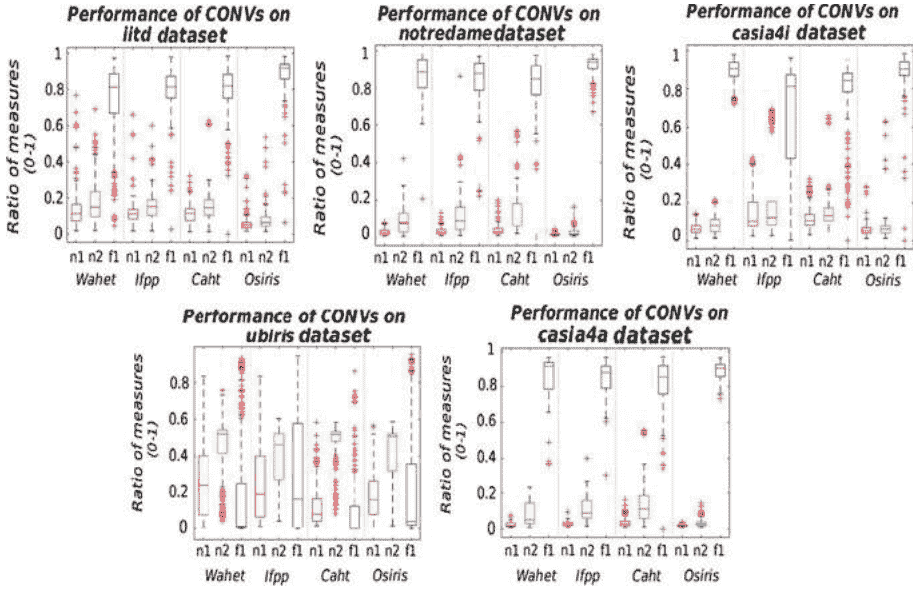

图6.6 使用分割错误的传统算法在每个数据集上的性能：$D_1$ (n1)、$D_2$ (n2)和f1 (f1)

表6.11 卷积分割的运行时间

| 算法 | Osiris | Wahet | Caht | Ifpp |
|---|---|---|---|---|
| 运行时间(秒) | 0.583 | 0.602 | 6.730 | 0.470 |

## 6.7 分析与讨论

对于虹膜分割，简单的统计比较了FCEDNs的分割结果与传统算法的结果，证明了FCEDNs的优越性。从表6.6和6.10可以看出，即使是FCEDNs的最差性能结果，即Original网络，得分分别为0.0373、0.0668和0.8549（$D_1$、$D_2$和f1），也优于最好的传统算法结果，即Osiris算法得分分别为0.0652、0.1217和0.7624（$D_1$、$D_2$和f1）。

然而，如果考虑到最好的FCEDNs结果，即贝叶斯-基本网络得分分别为0.0316、0.0571和0.8985（$D_1$、$D_2$和f1），则FCEDNs相对于传统算法的优势将进一步巩固。

所提出的FCEDNs的最大优势在于对表6.5和6.9中每个数据集的分割结果进行分析时显现出来。从表中可以看出，几乎所有传统算法和FCEDNs在Ubiris数据集上都获得了最差的分割得分，该数据集故意包含了从不同角度、不同距离和不同类型的遮挡物（包括眼镜）记录的图像。尽管大多数传统算法如Wahet、Caht和Ifpp甚至无法满足最低分割得分，但所有FCEDNs都展示了对这种困难和多样化的虹膜数据集的强大分割能力。

这可以从表6.12中轻松解释，该表总结了传统算法和FCEDNs在Ubiris数据集上的分割结果。Ubiris数据集的盒图在图6.4和6.6中进行了简单的视觉比较，清楚地证明了这一事实。图6.7显示了Ubiris数据集中带眼镜的样本虹膜图像，以及所有分割方法（FCEDNs和Convs）的相应输出掩码。

表6.12 Ubiris数据集上的分割结果对比

| 方法 | D1 | D2 | f1 |
|---|---|---|---|
| 贝叶斯-基本 | 0.0306 | 0.1116 | 0.8407 |
| 原始 | 0.0342 | 0.1249 | 0.7691 |
| 基本 | 0.0423 | 0.1517 | 0.7700 |
| Osiris | 0.1827 | 0.4095 | 0.2328 |
| Caht | 0.1226 | 0.4809 | 0.1048 |
| Wahet | 0.2743 | 0.4498 | 0.1977 |
| Ifpp | 0.2379 | 0.3970 | 0.2899 |

## 6.8 结论

准确地分割虹膜区域与图像的其余部分在虹膜识别系统的高效性能中起着至关重要的作用，整个系统的成功被认为与该阶段的精度直接相关。在这项工作中，我们介绍了深度学习技术和FCEDNs在虹膜分割中的应用。为此，我们应用了三种类型的网络进行虹膜分割。网络的性能经过了在五个不同数据集上的测试和评估。评估使用了三种常见的分割错误评分进行。此外，为了对网络的性能进行适当的评估，我们还对同一数据集上的四种知名传统虹膜分割算法进行了统计分析和性能评估，并将结果与网络的结果进行了比较。结果表明，网络在虹膜分割方面优于所有其他算法。然而，所提出的网络在处理困难的虹膜图像时，如从不同距离记录的离轴图像以及包括眼镜在内的不同类型的遮挡物时，表现出最大的优势。在未来的工作中，我们计划对这些类型的网络进行更多的应用特定分析，同时进行进一步的研究以优化它们的设计和架构，并提高它们在不同分割任务中的性能。

# 致谢
该项目已获得欧盟地平线2020年研究和创新计划的资助，协议编号为700259。

# 参考文献
1. U. Andreas, W. Peter, 多阶段可见光和近红外虹膜分割框架，在国际图像分析与识别会议(ICIAR'12)中，LNCS(葡萄牙阿维罗，2012年)，第1-10页
2. V. Badrinarayanan, A. Kendall, R. Cipolla, Segnet:一种用于图像分割的深度卷积编码器-解码器架构(2015年)，arXiv:1511.00561
3. L. Bottou, 随机梯度下降技巧，在《神经网络：行业内的技巧》(Springer, 2012年)，第421-436页
4. R.P. Broussard, L.R. Kennell, D.L. Soldan, R.W. Ives, 使用人工神经网络和特征显著性技术改进虹膜分割，在国际联合神经网络会议上,2007年。IJCNN 2007 (IEEE,2007年)，第1283-1288页
5. Y. Chen, M. Adjouadi, A. Barreto, N. Rishe, J. Andrian, 一种在无约束环境中的计算高效的虹膜提取方法，在IEEE第三届生物识别理论、应用和系统国际会议上，2009年。BTAS'09(IEEE,2009),第1-7页
6. J. Daugman, 通过虹膜模式识别人们。信息安全技术报告。3(1),33-39页(1998年)
7. J. Daugman, 虹膜识别的工作原理。国际图像处理会议。1,I-33-I-36页(2002年)
8. J.G. Daugman, 通过统计独立性测试对人员进行高置信度的视觉识别。IEEE模式分析与机器智能交互。15(11),1148-1161页(1993年)
9. J. Denker, Y. Lecun,将神经网络输出级别转换为概率分布，在第三届国际神经信息处理系统会议论文集(Morgan Kaufmann Publishers Inc,1990),第853-859页
10. V. Dorairaj, N.A. Schmid, G. Fahmy, 实施全局ICA编码的非理想虹膜识别系统的性能评估,in2005年IEEE国际图像处理会议,第3卷(IEEE,2005),第III-285页
11. Y. Gal, Z. Ghahramani,具有伯努利近似变分推断的贝叶斯卷积神经网络(2015),arXiv:1506.02158
12. Y. Gal, Z. Ghahramani, Dropout作为贝叶斯近似:在深度学习中表示模型不确定性(2015),arXiv:1506.02142
13. A. Gangwar, A. Joshi, Deepirisnet: 深度虹膜表示及其在虹膜识别和跨传感器虹膜识别中的应用, in2016年IEEE国际图像处理会议(ICIP)(IEEE, 2016), 第2301-2305页
14. S. Gupta, R. Girshick, P. Arbeláez, J. Malik, 从RGB-D图像中学习丰富特征进行目标检测和分割, 在欧洲计算机视觉会议上 (Springer, 2014年), 第345-360页
15. B. Hariharan, P. Arbeláez, R. Girshick, J. Malik, 同时进行检测和分割。 在欧洲计算机视觉会议上 (Springer, 2014年), 第297-312页
16. H. Hofbauer, F. Alonso-Fernandez, P. Wild, J. Bigun, A. Uhl, 虹膜分割的真实数据, 在第22届国际模式识别会议上 (ICPR'14) (瑞典斯德哥尔摩, 2014年), 6页
17. H. Hofbauer, F. Alonso-Fernandez, J. Bigun, A. Uhl, 关于虹膜分割对识别率影响的实验分析。IET生物学 5(3), 200-211 (2016年)
18. J. Huang, Y. Wang, T. Tan, J. Cui, 一种新的虹膜分割方法用于识别，在 (ICPR2004) 中。 第17届国际模式识别会议论文集，2004年，卷3 (IEEE, 2004年), 第554-557页
19. S. Ioffe, C. Szegedy, 批归一化：通过减少内部协变量偏移加速深度网络训练 (2015), arXiv:1502.03167
20. A. Kendall, V. Badrinarayanan, R. Cipolla, 贝叶斯SegNet：深度卷积编码器-解码器架构中的模型不确定性用于场景理解 (2015), arXiv:1511.02680
21. W. Kong, D. Zhang, 基于新颖反射和睫毛检测模型的准确虹膜分割，2001年智能多媒体、视频和语音处理国际研讨会论文集，2001年 (IEEE, 2001), pp. 263-266
22. A. Krizhevsky, I. Sutskever, G.E. Hinton, 使用深度卷积神经网络进行ImageNet分类，神经信息处理系统进展 (2012), pp. 1097-1105
23. R.D. Labati, F. Scotti, 有边界正则化和反射去除的噪声虹膜分割。图像视觉计算 28(2), 270-277 (2010)
24. Y. Le Cun, D. Touresky, G. Hinton, T. Sejnowski, 一种用于反向传播的理论框架，出现在连接主义模型暑期学校, vol. 1 (1988), pp. 21-28
25. Y. Le Cun, L. Bottou, Y. Bengio, P. Haffner, 基于梯度的学习应用于文档识别。IEEE会议记录 86(11), 2278-2324 (1998)
26. Y.-H. Li, M. Savvides, 一种基于高维密度估计的自动虹膜遮挡估计方法。IEEE模式分析与机器智能 35(4), 784-796 (2013)
27. N. Liu, H. Li, M. Zhang, J. Liu, Z. Sun, T. Tan, 在非合作环境中使用完全卷积网络进行准确的虹膜分割，在2016年国际生物识别会议(ICB)(IEEE, 2016), pp. 1-8
28. 刘N, 张M, 李H, 孙Z, 谭T, Deepiris：学习异构虹膜验证的成对滤波器组。模式识别 Letters 82, 154-161 (2016年)
29. 刘X, 鲍尔K.W., 弗林P.J., 改进虹膜分割算法的实验, 第四届IEEE自动识别高级技术研讨会 (AutoID'05) (IEEE, 2005年), pp. 118-123
30. 龙J, 谢尔哈默E, 达雷尔T, 用于语义分割的全卷积网络，在IEEE计算机视觉与模式识别会议论文集 (2015年), pp. 3431-3440
31. 马L, 谭T, 王Y, 张D, 基于虹膜纹理分析的个人识别。IEEE Trans.模式分析。机器智能。 25 (12), 1519-1533 (2003年)
32. H. Noh, S. Hong, B. Han, 学习反卷积网络进行语义分割，在IEEE国际计算机视觉会议论文集(2015), 第1520-1528页
33. D. Petrovska, A. Mayoue, 生物安全软件库的描述和文档, 项目编号IST-2002-507634-BioSecure, 交付 (2007)
34. A. Radman, K. Jumari, N. Zainal, 使用圆形Gabor滤波器和优化在可见光波长图像中进行虹膜分割。阿拉伯科学与工程杂志 39(4), 3039-3049页(2014)
35. K.B. Raja, R. Raghavendra, V.K. Vemuri, C. Busch, 基于智能手机的可见光虹膜识别, 使用深度稀疏滤波。模式识别快报 57, 33-42页(2015)
36. C. Rathgeb, A. Uhl, P. Wild, 虹膜识别: 从分割到模板安全, vol. 59,信息安全进展(Springer, Berlin, 2013)
37. C. Rathgeb, A. Uhl, P. Wild, H. Hofbauer, 设计决策用于虹膜识别sdk, 在虹膜识别手册.第二版,计算机视觉与模式识别进展,编者 K. Bowyer,M.J. Burge (Springer, Berlin, 2016)
38. C.J.V. Rijsbergen,信息检索,第二版(Butterworth-Heinemann, Newton, 1979)
39. T. Rongnian, W. Shaojie, 通过边界识别提高虹膜分割性能,在2011年智能计算技术与自动化国际会议(ICICTA), vol. 2 (IEEE, 2011), pp. 580-583
40. O. Ronneberger, P. Fischer, T. Brox, U-net:用于生物医学图像分割的卷积网络,在国际医学图像计算与计算机辅助干预会议上(Springer,2015),第234-241页
41. K. Simonyan, A. Zisserman,非常深的卷积网络用于大规模图像识别(2014),arXiv:1409.1556
42. N. Srivastava, G.E. Hinton, A. Krizhevsky, I. Sutskever, R. Salakhutdinov, Dropout:一种简单的防止神经网络过拟合的方法.机器学习研究杂志15(1),1929-1958页(2014)
43. C.W. Tan, A. Kumar,统一的框架用于使用远程获取的人脸图像进行自动虹膜分割. IEEE图像处理交易21(9),4068-4079页(2012)
44. C.-W. Tan, A. Kumar,在放松成像约束条件下实现在线虹膜和眼周识别. IEEE图像处理交易22(10),3751-3765页(2013)
45. C.-L. Tisse, L. Martin, L. Torres, M. Robert等人,使用人类虹膜识别的个人身份识别技术,在视觉界面会议论文集(2002),页码294-299
46. P.V. Tran,用于短轴MRI心脏分割的全卷积神经网络,在CoRR(2016),arXiv:1604.00494
47. A. Uhl, P. Wild,用于实时虹膜分割的加权自适应Hough和椭圆极坐标变换,在第5届IAPR/IEEE国际生物识别会议(ICB'12) (印度新德里, 2012), 页码1-8
48. P. Wild, H. Hofbauer, J. Ferryman, A. Uhl, 用于虹膜识别的分割级融合,在生物识别特别兴趣小组国际会议论文集(BIOSIG'15)(德国达姆施塔特,2015),页码12
49. R.P. Wildes,虹膜识别:一种新兴的生物特征技术。 IEEE会议论文集85(9),1348-1363(1997)
50. Z. Zhao, K. Ajay,一种在放松成像约束条件下的准确虹膜分割框架,使用总变差模型,在IEEE国际计算机视觉会议论文集(2015),页码:3828-3836
51. J. Zuo, N. D. Kalka, N.A. Schmid,一种用于无约束主体呈现的稳健虹膜分割过程,在2006生物特征学研讨会:生物特征学研讨会上的研究特别会议(IEEE,2006),页码:1-6

## 深度学习用于软生物特征
### 第三部分
## 第7章
### 基于手势的双流卷积神经网络用于验证和识别：学习用户风格

Jonathan Wu, Jiawei Chen, Prakash Ishwar和Janusz Konrad

© Springer International Publishing AG 2017
B. Bhanu 和 A. Kumar (eds.), 深度学习用于生物特征识别,
计算机视觉与模式识别的进展,
DOI 10.1007/978-3-319-61657-5_7

159

### 摘要
手势是一种包含静态（不可再生）解剖信息和动态（可再生）行为信息的短期身体动作。与面部、指纹和虹膜等传统生物特征不同，手势如果被破坏可以进行修改。我们考虑两种类型的手势：全身手势，如挥动手臂，和手势，如手指和手掌的微妙弯曲，由深度传感器（在我们的案例中为Kinect v1和v2）捕捉。

在这个领域的大部分先前工作都是在“密码”上评估手势，每个用户都有一个单独选择的手势动作。与此相反，我们的目标是从一组训练手势中学习用户的手势“风格”。这样可以方便用户，因为不需要精确的用户动作来进行用户识别。为了实现学习手势风格的目标，我们使用了两流卷积神经网络，这是一个深度学习框架，利用了视频序列的空间（深度）和时间（光流）信息。首先，我们评估了我们的方法在测试过程中对未在训练中出现的用户手势的泛化性能。然后，我们通过抑制训练和测试中的动态信息的使用来研究动态的重要性。最后，我们通过可视化二维t分布随机邻居嵌入（t-SNE）来评估上述技术学习手势的表示是否对用户不变（手势识别），或者学习用户的表示是否对手势不变（验证和识别中的用户风格）的能力。我们发现我们的方法在两个面向生物特征手势数据集的识别和验证方面优于最先进的方法。

J. 吴 ·J. 陈 ·P. Ishwar ·J. 康拉德 ( )
波士顿大学电气与计算机工程系，圣玛丽街8号，波士顿，MA 022 15，美国
电子邮件: jkonrad@bu.edu

J. 吴
电子邮件: jonwu@bu.edu

J. 陈
电子邮件: garychen@bu.edu

P. Ishwar
电子邮件: pi@bu.edu

## 7.1 引言
生物特征识别是传统的访问控制形式 (如密码和通行证) 的便捷替代方式，因为它们仅依赖于用户特定的特征。与字母数字密码不同，生物特征识别无法被传递或告知给其他人，而且与通行证不同，它们始终“随身携带”。具有这些特性的最著名的生物特征包括：指纹、面部、语音、虹膜和步态。

手势是一种短暂的、几秒钟长的身体动作，包含静态解剖信息和动态行为信息。我们考虑全身手势，如挥动手臂，以及手势，如手指和手掌的微妙弯曲。对于识别和验证，用户可以选择一个特定的手势作为“密码”。

在这项工作中，我们不是专注于识别用户执行特定的“密码”，而是旨在识别用户在一组手势中，实际上是学习用户的手势风格。我们关注基于身体和手的手势，通过 Kinect 传感器 (v1 和 v2) 获取深度图（图 7.1）。本章提供以下关键贡献：

- 基于身体和手势的用户识别和验证的双流卷积神经网络的开发;
- 评估网络在训练集中未见过的手势或用户的泛化性能;
- 评估动态特征对用户识别和验证的价值;
- 基于 t-SNE 的评估方法学习手势的不变表示 (手势识别) 或学习用户的不变表示 (验证和识别中的用户风格) 的能力。

我们在两个面向生物特征的数据集 (BodyLogin 和 HandLogin) 以及一个以手势为中心的数据集 (MSRAction3D) 上验证了我们的方法。

## 7.2 文献综述
关于基于深度的身体 [9,21,35,43] 和手 [15,26,32] 手势识别的广泛文献存在。然而，基于手势的用户识别和验证的研究较少。身体和手势生物特征分别使用主要是深度轮廓进行了独立研究。

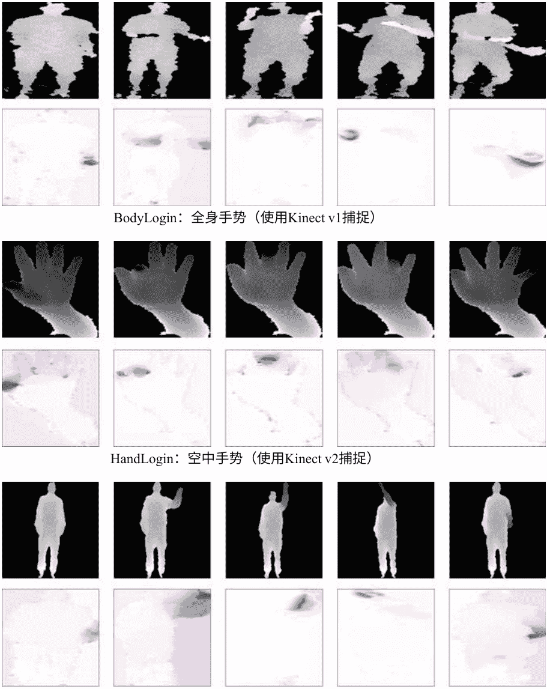
图7.1 归一化深度图像和相应的彩色光流示例[20]，用于使用不同深度传感器捕捉的全身和手势。色调表示光流方向，饱和度表示幅度

形状[39,42]和骨骼特征（从深度图中估计的姿势估计）[1,16,17,38,41]。在[42]中，使用基于深度的手势轮廓协方差的时间层次结构来验证用户的身份，而在[1]中，则使用动态时间规整 (DTW) 算法应用于指尖和手掌坐标（手势姿势估计）中，这些坐标是从深度图像中估计得到的。也许与本章目标最接近的工作是[16]，其中使用从身体的归一化关节位置进行动作特定度量学习，以预测来自己知动作池的身份。我们与那项工作不同，我们直接从深度图像中学习用户身份，而不需要姿势估计身体关节位置。我们使用深度图和相关的光流，这在骨骼姿势估计不可靠或不完全可用的情况下非常 useful（例如手势）。

在方法论方面，我们利用深度卷积神经网络（CNN）在各种视觉任务中的成功。 CNN的目标是学习一组大量的核权重，以优化与任务相匹配的特定损失函数。

在这个领域中，已经提出了几种静态图像网络架构，例如：AlexNet [14], GoogleNet [33]和VGGNet [31]。 这些网络通常在层数、核的数量和大小上有所不同。 我们将AlexNet调整为根据手势验证或识别用户的任务。

## 7.3 提出的方法
在本章中，我们使用AlexNet分析手势的生物特征性能。 AlexNet [14]是一个由五个卷积层和两个全连接层组成的八层深的CNN，后面跟着一个软最大化层。 我们通过使用[30]中提出的两流卷积网络架构的变体，将这个网络适应于手势序列。 两流卷积网络，顾名思义，训练两个独立的网络：一个用于空间信息，一个用于时间信息。

尽管这些网络最初是为RGB图像设计的，但我们已经调整了它们以处理深度图（图7.2）。

第一个网络是一个“空间流”卷积网络，其中通过抽样从输入视频中提取的一系列T输入深度图帧被映射到一系列T输出特征向量 $o_s$，通过逐帧通过网络传递（图7.2）。

第二个网络是一个“时间流”卷积网络，它以一系列T彩色光流帧（对应于T空间流输入帧）作为输入。 光流是从当前和下一个深度图像（深度图值被视为亮度值）[20]计算得出的。 计算得到的光流向量被映射到极坐标，然后根据角度转换为色调，根据大小转换为饱和度（图7.1）[20]。 与第一个网络类似，这一系列T输入光流帧通过逐帧通过时间流网络传递，被映射到一系列T输出特征向量 $o_t$。

使用两个网络输出的简单凸组合来产生一个单一的输出 $o_c$，用于性能评估：

$$o_c = w_s o_s + w_t o_t,$$图7.2展示了我们如何使用深度网络进行用户识别和验证。在识别（顶部）中，我们完全微调一个网络，使用手势深度图帧和光流。在验证（底部）中，我们从一个识别网络中借用权重，并使用最后一个全连接层的输出作为验证特征。

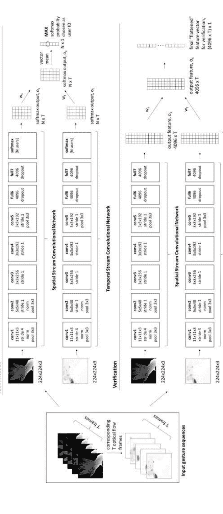

其中 $w_s \ge 0$ 是空间流网络权重，$w_t \ge 0$ 是时间流网络权重，$w_s + w_t = 1$，$o_s$ 和 $o_t$ 是相应的网络输出。当 $w_s = 1$，$w_t = 0$ 时，只使用空间流网络的信息；当 $w_s = 0$，$w_t = 1$ 时，只使用时间流网络的信息。我们将报告各种 $(w_s, w_t)$ 权重的结果。

### 7.3.1 用于识别和验证的CNNs

#### 识别：
使用该网络进行封闭集识别，即给定一个手势，从已知用户集合中识别用户是直接的。在训练过程中（参见第7.3.2节），手势序列被分解为单个帧以独立使用。在测试过程中，我们对 $T$ 帧的软最大概率输出 $o_c$ 进行平均（图7.2）。请记住，$o_c$ 是输入通过两个网络的软最大概率的加权组合。这产生了一个长度为 $N$ 的单个软最大概率向量（给定 $N$ 个要识别的用户），具有最大概率的分量标识用户。虽然不是本章的主要焦点，但手势识别使用相同的结构，其中 $N$ 是手势的数量，而不是要识别的用户数量。

#### 验证：
在验证$^1$中（给定一个手势，用户是否是他/她声称的？），我们建议使用从经过训练的网络的 `fc7` 层的输出特征（图7.2）来避免为每个用户训练一个单独的验证网络，这在计算上非常昂贵。此外，每个正样本类别（由真实用户表示）的训练样本数量根本不足以完全训练一个网络。在这种方法中，从手势序列中均匀采样的 $T$ 帧，提取出两个维度为 $4096 \times T$（最后一个全连接层的长度）的特征，得到 $o_s$ 和 $o_t$，它们的线性组合得到 $o_c$。由于这种方法中没有内置的分类，我们将这些特征作为两类分类算法（我们使用 $1$-最近邻分类器）的输入进行验证。这个想法的直觉是，如果有足够多的用户进行识别，网络将自然地学习一个能够用于验证的用户分离特征空间。

我们在下一节讨论网络的所有元素的参数和训练。

[^1]: 验证也被称为认证。

### 7.3.2 网络实现细节

通常，手势数据集中的训练样本不足以从头开始训练深度卷积网络的所有权重。因此，我们遵循常见的做法，使用来自另一个网络的权重 [5,12] 进行“预训练”。使用足够的数据训练网络，然后对新数据进行权重微调。在我们的情况下，我们使用来自ImageNet [27]的数据集训练一个具有软最大损失函数的网络，将RGB图像分类为1000个类别，以初始化我们的5个卷积层（conv1到conv5）的权重。尽管我们的模态不同，因为我们使用深度图像和彩色光流（而不是RGB），但使用ImageNet的权重进行初始化仍然有效。我们的全连接层从零开始训练，权重初始化为均值为0的高斯分布，标准差为0.001。在所有的网络中，我们使用批量大小为256张图像。对于空间流网络，我们从学习率0.003开始，每3000次迭代降低一次学习率，直到完成12000次迭代。对于时间流网络，我们从学习率0.001开始，每1000次迭代降低一次学习率，直到完成6000次迭代。在两个网络的全连接层中，dropout值设置为0.5。

我们完全使用Caffe [11, 37]在一台Titan Z GPU上实现了所有的网络。

## 7.4 手势数据集

我们在3个公开可用的数据集上评估了我们的方法。其中两个数据集是为用户验证和识别而设计的（收集时意图最大化用户数量）。第三个数据集是为手势识别而设计的（收集时意图最大化手势/动作类型的数量）。

值得注意的是，手势识别的数据集通常是以手势为中心的，这意味着每个用户有很多手势（需要分类的手势很多，执行这些手势的用户很少），而研究认证则需要相反的情况，即以用户为中心的数据集，其中每个手势有很多用户。这个问题在表7.1中得到了突出，我们比较了几个手势识别数据集。

显然，这些数据集中很多都少于20个用户。在有超过20个用户的情况下，数据的收集方式要么是每个手势的执行者不够（CMU Mocap），要么是数据中存在数据集偏差，因为手势是连续站立不动执行的（MSRC-12）。

通过站立不动，每个用户的下半身姿势没有显著变化，这可能导致数据集偏差。在手势识别中，这通常不是一个问题，因为同一个用户几乎不会同时出现在训练和测试中。然而，对于用户识别的情况，这会造成一个重大问题，因为同一个用户几乎总是同时出现在训练和测试中。

### 基于手势的用户识别数据集

HandLogin[8, 42]是一个包含21个用户的空中手势序列的数据集，每个用户执行4个不同的手势，由Kinect v2传感器记录。所有4个手势都是用右手从“休息”位置开始执行的：手向下伸展放在面向天花板的Kinect传感器上，手指舒展开。传感器的放置避免了臭名昭著的“大猩猩”问题和“手臂”问题。用户需要将手保持在垂直的前后平行位置，而不是使用更舒适的水平下到平行位置（见图7.3）。我们传感器的方向设计成模仿身份验证终端，通常只有一个用户可见。以下手势被执行（图7.4）：指南针（用手在多个方向移动）、钢琴（像弹钢琴一样移动手指）、推（用手向传感器推和拉）、翻拳（扭曲和卷曲手成拳头）。每个用户执行了每个手势的10个样本。

表7.1 使用深度或 Mocap (动作捕捉) 传感器的大多数身体手势识别数据集的比较。我们用粗体标出了以用户为中心的数据集 (用于识别和认证)。°在CMU Mocap中, 所有用户不执行所有手势(某些手势类型只有一个用户执行)。在MSRC-12中,手势连续执行在一个长序列中,一个接一个地执行,导致固有的偏差。

| 数据集 | 用户数量 | 手势数量 | 数据类型 |
| :--- | :--- | :--- | :--- |
| CMU Mocap [3] | >100 | 109° | Mocap |
| HDM05 [22] | 5 | >70 | Mocap |
| MSRAction3D [18] | 10 | 20 | Kinect v1 深度 |
| HumanEva I/II [29] | 4/2 | 6/1 | RGB + Mocap |
| MSRC-12 [7] | 30 | 12‡ | Kinect v1 (仅骨架) |
| MSRGesture3D [36] | 10 | 12 | Kinect v1 深度 |
| MSRDailyActivity3D [35] | 10 | 16 | Kinect v1 深度 |
| Berkeley MHAD [23] | 12 | 11 | 多模态(深度+Mocap) |
| BodyLogin [4] | 40 | 5 | Kinect v1 深度 |
| Handlogin [8] | 21 | 4 | Kinect v2 深度 |

图7.3 HandLogin相机设置的可视化。Kinect v2相机指向天花板
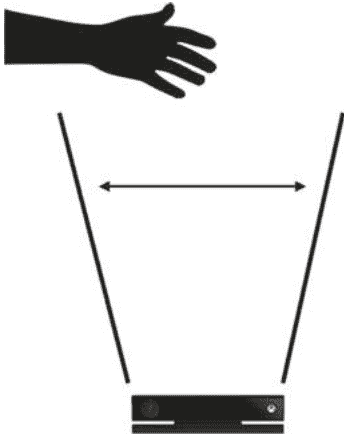

BodyLogin [2,39-41]是一个包含40个用户执行5种不同手势的全身多视角数据集，由Kinect v1记录传感器（见图7.5）。

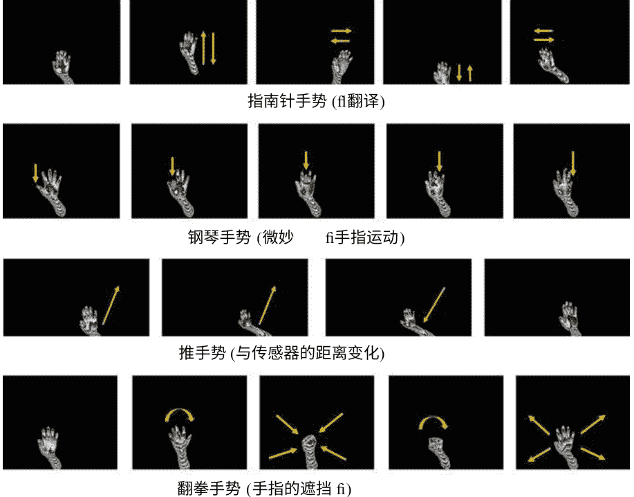


图7.6 BodyLogin用于用户识别的5个手势

其中四个手势是预定义的：S形手势（用户用双臂画出“S”形）、左右手（用户用左手触摸右肩，然后用右手触摸左肩）、双手弧线（用户双臂向上画弧线）和平衡（用户进行复杂的平衡手势，涉及到手臂和腿部）。第五个手势由用户创建（用户定义）。这些手势在图7.6中可视化。每个用户对每个手势进行了约20次的执行，包括在不同的退化情况下，如携带包、穿着外套、时间流逝以及欺骗攻击。在这项研究中，我们使用所有退化情况下的样本进行训练和测试，仅从中心摄像机视角进行。有关HandLogin和BodyLogin数据集的下载详细信息，请参阅第7.6节。

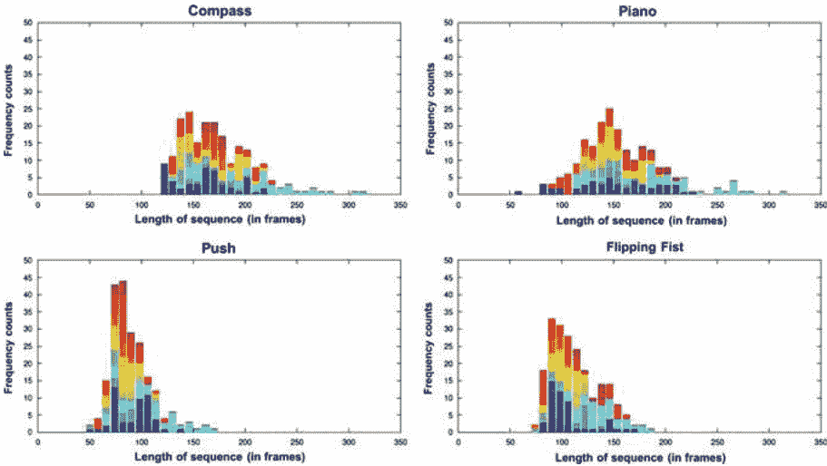

图7.7 堆叠直方图表示HandLogin中4个手势的长度。颜色表示来自特定用户的样本频率计数。手势以每秒30帧的速度采集

在这两个以识别为重点的数据集中，单个手势样本的持续时间只有几秒钟。图7.7和7.8显示了固定手势类型的用户特定持续时间，以堆叠直方图的形式呈现，其中颜色表示样本频率计数来自特定用户。在大多数情况下，这些数据集考虑的手势意图是短暂的。这对于记住和重复一个过长的手势来说是有用的。此外，必须执行一个长时间的手势可能会变得过于限制和不方便，相对于其他替代的访问控制方式。重要的是要注意，持续时间较长的手势不一定会产生更好的性能。在某些情况下，一个手势可能太难记住，或者太难保持一致性，这可能导致与较短和更简单的手势相比，生物特征性能较差。

### 手势识别数据集

MSRAction3D [18, 35]是一个全身单视角的数据集，包含了10个用户在Kinect v1传感器前执行20种不同动作的运动序列。每个主体执行每个动作2或3次，总共有567个深度图序列。该数据集中的动作非常多样化，例如：挥手、锤击动作、接球、拳击、符号绘制、踢球、网球挥拍、高尔夫挥杆和慢跑。尽管在[18]中，动作被分为3个不重叠的子集（每个子集包含1/3的动作）进行评估，但我们在所有实验中同时评估所有动作，这是一个更困难的情况。

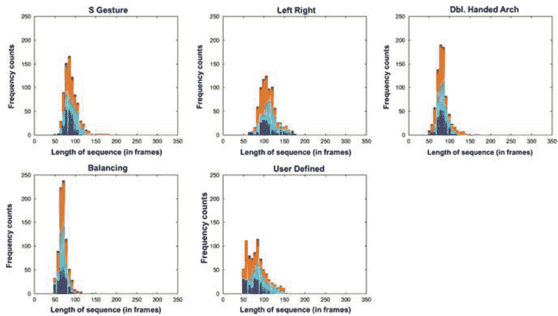

图7.8 堆叠的直方图表示BodyLogin中5个手势的长度。颜色表示来自特定用户的样本频率计数。手势采集速度为每秒30帧

### 数据集预处理

首先，对所有数据集中的所有深度帧应用背景减法（给定背景帧）。然后，对减去背景的帧进行0-1范围的缩放，并使用双三次插值将其调整为 $224 \times 224$ 像素，如图7.1所示。

## 7.5 性能评估

我们对两种访问控制场景[10]进行性能评估：封闭集识别和验证。

在封闭集识别中，给定一个查询手势序列，从已知用户池中预测身份。我们用正确分类错误 (CCE) 作为识别的性能度量，即用户被错误识别的比率。

在验证中，给定一个查询手势序列和声明的身份，要么验证要么拒绝该声明。如果查询与声明身份的已知注册手势序列足够接近，它将被接受为该用户；否则，它将被拒绝。验证中的错误结果可能是虚假接受或虚假拒绝。虚假接受率 (FAR) 是未经授权的用户被接受的比率，是安全性的度量。虚假拒绝率 (FRR) 是已授权的用户被拒绝访问的比率，是便利性的度量。FAR和FRR之间存在一个权衡，由接受距离的阈值控制（查询和最接近的注册手势之间的距离）。

一个常用的度量指标，用一个单一的标量来捕捉这种权衡是等错误率(EER)，即当FAR和FRR相等时的FAR(或FRR)的阈值。

在我们的验证实验中，我们使用手势序列之间的距离（长度为 $4096 \times T, T=50$）作为特征。如果查询样本 $\mathbf{Q}$ 与其最近邻的注册样本的距离 $d_{NN}$ 低于阈值，则接受；否则，拒绝。在本章中，我们报告了我们验证实验的EER。

具体来说，让 $\mathscr{A}_i$ 表示来自单个授权用户的手势样本集合，让 $\mathscr{U}_i$ 表示不来自授权用户的手势样本集合。然后，对于给定的阈值 $\theta$，通过以下方式计算FAR和FRR：

```
FRR(\mathscr{A}_i, \theta) = \frac{\sum_{\mathbf{Q} \in \mathscr{A}_i} \mathbf{1}(d_{NN}(\mathbf{Q}, \mathscr{A}_i \setminus \mathbf{Q}) \ge \theta)}{|\mathscr{A}_i|}
FAR(\mathscr{A}_i, \mathscr{U}_i, \theta) = \frac{\sum_{\mathbf{Q} \in \mathscr{U}_i} \mathbf{1}(d_{NN}(\mathbf{Q}, \mathscr{A}_i) < \theta)}{|\mathscr{U}_i|}
```

其中指示函数 $\mathbf{1}(\text{条件})$ 在条件为真时等于1，在条件为假时等于0。

对于配对 $(\mathscr{A}_i, \mathscr{U}_i)$ 的EER是通过首先计算不同阈值 $\theta$ 的FAR-FRR配对来找到了。然后，EER被确定为FAR等于FRR的FAR-FRR配对的凸包边界上的位置。实际上，这个EER可能不直接位于与任何决策阈值对应的FAR-FRR配对。一般来说，EER点表示一个随机决策规则的FAR-FRR性能，该规则在两个具有不同阈值的决策规则之间以某种概率进行选择。可以对具有固定阈值 $\theta$ 的这个计算进行重复，并对每个授权用户的唯一集合 $(\mathscr{A}_i, \mathscr{U}_i)$ 进行平均。

## 7.6 实验结果

在我们的所有实验中，我们与[42]中提出的重新实现的深度轮廓协方差特征进行基准测试。这种方法不是基于卷积神经网络。为了方便起见，我们将HandLogin和BodyLogin数据集合并为一个可在我们的网站[4]上下载的单个文件。

### 用户识别

我们尝试在可能的手势池中识别用户。我们测试系统在已经见过手势和未见过手势的情况下的性能。后者评估了我们学习模型对未出现在训练集中的手势的泛化能力。如果表现良好，我们的模型将不仅学习用户执行手势的具体动作，还会学习用户执行手势的特定“风格”。

表7.2 HandLogin和BodyLogin的用户识别结果

| 数据集 | 场景 (训练/测试手势) | 用户识别CCE (%) - 加权卷积神经网络 ($w_s, w_t$) | | | | 基准 (吴[42]) |
| :--- | :--- | :--- | :--- | :--- | :--- | :--- |
| | | $(1,0)$ | $(\frac{2}{3}, \frac{1}{3})$ | $(\frac{1}{2}, \frac{1}{2})$ | $(\frac{1}{3}, \frac{2}{3})$ | $(0,1)$ | |
| HandLogin (21个用户, 4个手势) | 1.全部/全部 | 0.24 | 0.24 | 0.24 | 0.71 | 4.05 | 6.43 |
| | 2.除了指南针/指南针 | **2.38** | 2.86 | 4.76 | 8.57 | 36.19 | 82.38 |
| | 3.除了钢琴/钢琴 | 1.91 | **0.48** | 1.43 | 1.91 | 12.86 | 68.10 |
| | 4.除了推/推 | **44.29** | 49.05 | 54.29 | 67.62 | 77.14 | 79.52 |
| | 5.除了拳头/拳头 | 16.67 | **15.71** | 17.14 | 20.00 | 31.43 | 72.38 |
| BodyLogin (40个用户, 5个手势) | 1.全部/全部 | 0.05 | 0.05 | **0.05** | **0.05** | 5.01 | 1.15 |
| | 2.除了S/S | **0.75** | 1.00 | 1.25 | 1.75 | 16.75 | 75.75 |
| | 3.除了左右/左右 | **0.88** | 1.25 | 1.50 | 1.88 | 11.50 | 80.88 |
| | 4.除了双手弓形/双手弓形 | 0.13 | 0.13 | **0.13** | 0.38 | 6.25 | 74.50 |
| | 5.除了平衡/平衡 | **9.26** | 10.01 | 13.27 | 19.52 | 45.06 | 77.97 |
| | 6.除了用户定义/用户定义 | **5.28** | 5.53 | 6.16 | 8.54 | 22.49 | 71.61 |

#### 表7.3 在MSRAction3D上的用户识别。[16]基于从深度图中导出的骨骼姿势估计进行用户识别

| 数据集 | 加权卷积神经网络 ($w_s, w_t$) | | | 基准 | |
| :--- | :--- | :--- | :--- | :--- | :--- |
| | (1,0) | ($\frac{1}{2}, \frac{1}{2}$) | (0,1) | 吴[42] | [16] |
| 微软研究院 | 0.0 | **0.0** | 0.53 | 13.6 | 7.0 |

表7.2显示了BodyLogin和HandLogin数据集的结果。该表的第一行（“全部/全部”）是指网络使用所有手势样本进行训练的情况。在这一行中，我们将数据集分为一半用于训练，另一半用于测试，每一半都包含所有手势的样本。表中的其余行是网络在训练了一些手势后，在不同的未见手势上进行测试的情况。例如，“除了拳头/拳头”表示网络在“指南针”、“钢琴”和“推”上进行了训练，但在“拳头”上进行了测试。在表7.3中，我们报告了在MSRAction3D数据集上进行用户识别的结果。在这里，我们只使用每个动作的一个样本进行训练，并在剩下的1-2个样本上进行测试。这与表7.2中的行（“全部/全部”）相同，我们在这里使用所有手势的样本进行训练。除了我们在[42]中提到的轮廓协方差基准之外，我们还与[16]中报告的使用骨骼关节估计和基于骨骼坐标的距离度量确定用户身份的结果进行了比较。

### 用户识别中动态抑制

为了理解动态对我们深度网络表示的影响，我们研究了“去除”它的效果。尽管[40]中进行了类似的研究，但那是基于骨骼姿势估计的。我们的研究基于深度图。我们考虑将时序流网络的输入和空间流网络的输入都包含完整的动态信息。为了抑制动态的影响，我们完全移除了时序网络，只使用前3个深度图帧（通常有数百个帧，因此时间跨度不到十分之一秒）作为空间流网络的输入。在表7.4中，我们展示了我们两流方法以及我们为这个实验重新实现的[42]方法的实证性能。

### 用户验证

在这里，我们尝试将用户的查询手势和声称的身份与已知手势池进行验证（声称身份的所有手势）。由于为每个用户训练深度网络是不切实际的，我们首先训练一个识别网络，并将其用作验证的特征提取器（见第7.3节）。在我们的实验中，我们将用户池的四分之一留出来进行测试，并在剩下的四分之三上训练一个识别网络（用于特征提取）。对于BodyLogin，这是## 手势识别

在验证中，我们采用了留10人出和留5人出的交叉验证。在基准验证方法中，我们使用测试样本的协方差特征。在表7.5中，我们报告了在BodyLogin和HandLogin数据集上进行验证的4个“留一”折叠的平均结果。

| 数据集 | 场景 | 使用的数据 | 用户识别CCE (%) 空间 | 用户识别CCE (%) Wu[42] |
|---|---|---|---|---|
| 手势登录 |  | 所有帧 | 0.24 | 6.43 |
|  |  | 无动态 | 1.90 | 9.29 |
| BodyLogin |  | 所有帧 | 0.05 | 1.15 |
|  |  | 无动态 | 1.00 | 32.60 |

表7.4 用户识别中动态抑制的结果：仅使用每个深度图序列的前3帧进行训练和测试，并且禁用时间流(w_s=1, w_t=0)

表7.5 手势登录和BodyLogin的用户验证结果

| 数据集 | 场景 | 加权卷积神经网络 (ws, wt) 空间 (1,0) | 加权卷积神经网络 (ws, wt) 空间 (2/3, 1/3) | 加权卷积神经网络 (ws, wt) 空间 (1/2, 1/2) | 加权卷积神经网络 (ws, wt) 时间 (1/3, 2/3) | 加权卷积神经网络 (ws, wt) 时间 (0,1) | 基准 Wu[42] |
|---|---|---|---|---|---|---|---|
| 手势登录 | 留5人外 | 2.52 | 2.20 | 2.71 | 4.09 | 6.50 | 11.45 |
| BodyLogin | 留10人外 | 2.76 | 2.45 | 1.99 | 3.07 | 8.29 | 3.46 |

5个手势类别中的2个在BodyLogin中是共享的，而1个是用户定义的。这意味着在留人出手势识别中，第五个手势类别在训练中将没有其手势类型的样本。因此，第五个手势类别预计将作为“拒绝”/“非手势1-4”类别进行手势识别。

| 数据集 | 加权卷积神经网络 (ws, wt) 空间 (1,0) | 加权卷积神经网络 (ws, wt) 空间/时间 (1/2,1/2) | 加权卷积神经网络 (ws, wt) 时间 (0,1) | 基准 Wu[42] |
|---|---|---|---|---|
| 手势登录 | 15.00 | 6.82 | 10.91 | 0.91 |
| BodyLogin | 21.10 | 15.09 | 20.35 | 15.44 |
| MSRAction3D | 44.36 | 36.00 | 40.36 | 25.45 |

表7.6 手势识别结果。对于每个数据集，我们进行留一法交叉验证，其中N等于数据集中用户的总数。

## 7.7 讨论

上述结果表明，与基准方法相比，在用户识别（所有3个数据集）和验证（HandLogin和BodyLogin）中使用深度网络时，错误率显著降低。3 在识别方面，这种降低最为明显，当我们测试在网络训练中未使用的手势时。与我们的工作中提出的CNN特征形成鲜明对比的是，[42]中提出的协方差特征在手势之间的泛化能力较差，即在测试集中出现不属于训练集的手势时。通过查看表7.2中“指南针”手势的CCE值，可以清楚地看到协方差特征的CCE高达82.38%，而我们的CNN特征仅为2.38%。

在HandLogin（图7.9）、BodyLogin（图7.10）和MSRAction3D（图7.11）数据集的“full7”层输出的t-SNE嵌入中也观察到了CNN的交叉手势泛化能力[34]。每个图的(a)部分显示了我们基线的特征嵌入，它偏向于按手势类型进行聚类。图的(b)、(c)和(d)部分显示了我们卷积网络的特征嵌入。在(b)部分，来自ImageNet的预训练嵌入倾向于按手势类型进行聚类。在(c)部分进行身份识别的微调后，我们可以看到按用户身份进行聚类。

这表明从预训练权重中微调我们的网络以按用户进行聚类非常有益。在(d)部分进行手势识别的微调比(b)部分导致更紧密的按手势类型进行聚类。请注意，在进行身份识别的微调后的“full7”层输出的t-SNE图中（部分(c)），用户倾向于聚集在一起，而手势类型在每个聚类中混合。然而，在协方差特征的相应t-SNE图中（部分(a)），手势类型倾向于与用户混合在一起。我们的网络在某些情况下无法很好地泛化手势，例如“推”手势（表7.2）。我们认为这种较低的性能是因为训练的手势在形式和动态上与其他手势明显不同。“推”手势在尺度上存在变化，而其他手势则没有。

3 由于MSRAction3D中缺乏每个用户样本（因为它是一个以手势为中心的数据集），我们不报告验证结果，并且对于识别实验，我们留出手势。

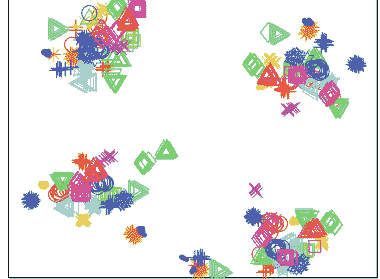
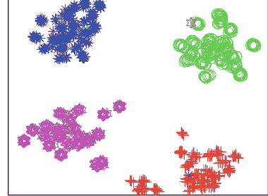
(a) HandLogin 轮廓协方差特征[42]

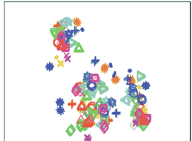
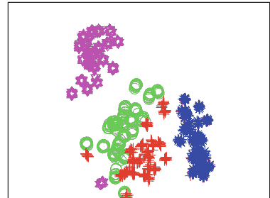
(b) HandLogin 预训练的“full7”特征(无微调)

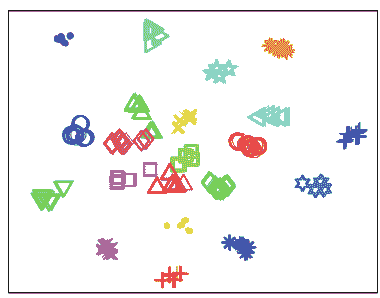
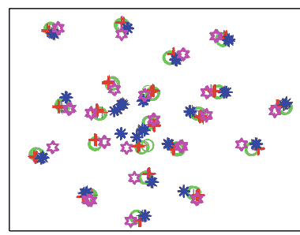
(c) HandLogin 用户身份验证的微调“full7”特征

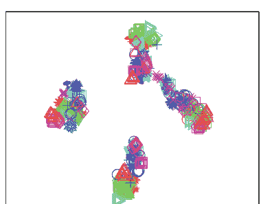
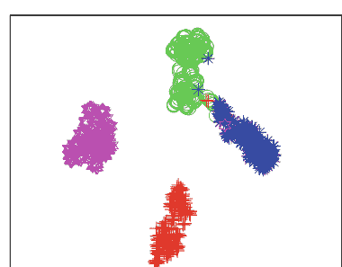
(d) HandLogin 手势识别的微调“full7”特征

图7.9 HandLogin数据集特征的2D t-SNE嵌入。左列图根据用户进行颜色编码，而右列图根据手势类型进行颜色编码。一个标记代表一个手势序列。这些图显示了我们卷积网络最后一个全连接层输出的t-SNE嵌入(微调前后)，以及我们基线的轮廓协方差特征的嵌入。

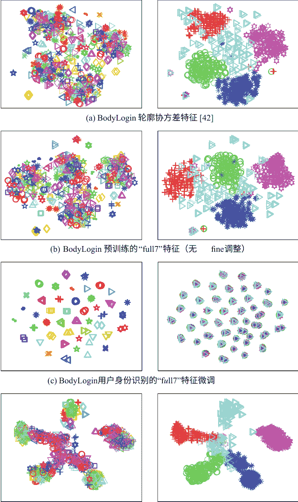
(a) BodyLogin 轮廓协方差特征 [42]
(b) BodyLogin 预训练的“full7”特征(无微调)
(c) BodyLogin 用户身份识别的“full7”特征微调
(d) BodyLogin 姿势识别的“full7”特征微调

图7.10 BodyLogin数据集特征的2D t-SNE嵌入。有关详细信息，请参见图7.9。青色标记表示用户定义的手势，允许任何动作；不需要紧密聚类。

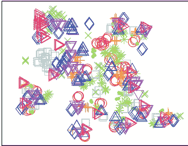
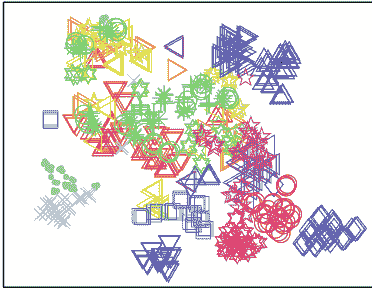
(a) MSRAction3D 轮廓协方差特征[42]

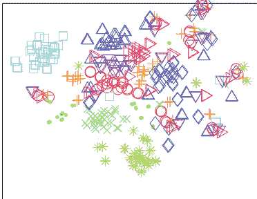
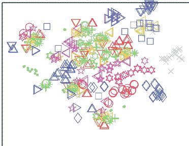
(b) MSRAction3D 预训练的“full7”特征(无微调)

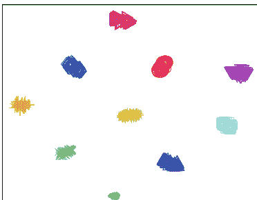
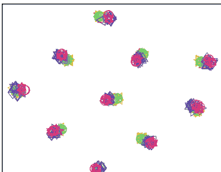
(c) MSRAction3D 用户身份识别的“full7”特征微调

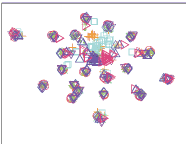
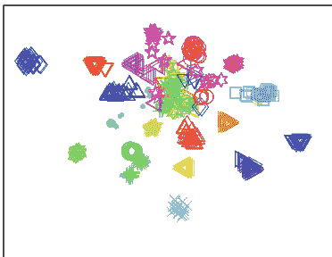
(d) MSRAction3D 手势识别微调的“full7”特征

图7.11 MSRAction3D数据集的2D t-SNE特征嵌入。如需更多信息，请参见图7.9。

然而，这种手势在其他手势中不存在。“平衡”手势包括腿部动作，而其他手势则不包括。在很大程度上，这种结果是可以预料的。对于完全未知且与训练手势几乎没有共同组成部分的手势，总是很难进行泛化。

在MSRAction3D上进行识别，我们得到了0%的分类错误。尽管看起来令人惊讶，但这个结果可能归因于数据集的收集过程。在MSRAction3D中，从一个用户的手势样本是通过将一个长连续的视频分割成多个样本部分来提取的。虽然对于手势识别来说不是问题（因为由于“leave-persons-out”测试，同一个用户永远不会同时出现在训练集和测试集中），但这可能导致用户识别的偏差。这种偏差源于几乎相同且部分共享的身体姿势，深度网络能够很好地学习这些姿势。在BodyLogin和HandLogin中避免了上述问题，因为在样本之间有一个“重置”过程——样本不是在一个长连续的序列中记录的（用户在样本之间离开和重新进入房间）。

对于验证来说，差异并不那么显著，但是卷积神经网络特征仍然能够显著降低EER（表7.5）。在两种情况下，数值越小，性能越好（我们希望EER和CCE越小）。

在我们所有的结果中，时间流对于用户识别、验证甚至手势识别都是互补的。也就是说，当时间流权重 $w_t=0$ 时，性能不会下降。唯一的例外是在训练阶段没有看到信息的情况，例如表7.2中用户识别的留出手势结果。由于包含时间流，性能有所降低并不完全令人惊讶，因为测试中存在未在训练中见过的身体/手部动作（未见过的光流向量）。

因此，这最终导致了泛化能力较差，而空间网络中的静态姿势仍然表现出色。在所有实验结果中，简单的加权平均(1/2, 1/2)可能是最佳选择。

我们在用户识别中抑制动态的实验（表7.4）证实了运动起着关键作用；它可以将误识率从100次尝试中的1次减少到2000次尝试中的1次（对于BodyLogin）。这个结论在我们提出的方法和我们评估的基准测试中是一致的。

在手势识别中，我们的深度学习方法在BodyLogin上略优于非CNN方法，但在其他数据集上表现不佳。我们推测这可能是由于数据集的大小所致。值得注意的是，BodyLogin是我们最大的数据集，拥有最多的样本（约4000个手势序列，每个序列约150帧），并且可以击败我们的基准。这比HandLogin（约840个手势序列，每个序列约150帧）和MSRAction3D（约600个手势序列，每个序列约35帧）的总和都要大，这两个数据集在手势识别中表现不佳。由于CNN方法在所有其他实验中都优于基准，这可能表明在样本较少的情况下，区分用户比区分手势更容易。总的来说，我们相信在像BodyLogin这样的大型数据集上，深度学习很可能优于基准。

## 7.8 结论

这是第一项研究使用双流卷积网络来学习用户特定手势“风格”的工作。大多数之前的研究假设每个用户只有一个手势密码，并且在测试过程中遇到未在训练集中出现的手势类型时表现不佳。所提出的基于CNN的特征能够有效地泛化到同一用户执行的多种手势类型，通过隐式学习仅依赖于每个用户的内在“风格”而不是具体手势的表示，我们在多个数据集上进行了验证。

这种方法的一个关键实际结果是，在验证和识别中，只要用户没有使用截然不同的手势，就不需要重新训练CNN。在性能上有一些降低的情况下，仍然可以使用类似的新手势以方便使用。

未来的工作方向可以探索最近在融合空间和时间流的双流卷积网络方面取得的进展[6, 19, 25]。一种实现这一目标的方法是通过将空间和时间流的卷积层的输出进行融合，使用简单的操作，如求和、乘法或最大值。这种方法在动作识别文献中显示出了有希望的改进，并可能在使用手势作为生物特征的用户识别/验证中带来改进。这种方法的一个关键优势是不再需要显式地对时间和空间流网络进行加权；相反，每个网络的贡献将在一个完整的端到端架构中自动学习。

有关这项工作的更多信息和资源可在我们的网站[4]上找到。

# 参考文献

- 1. M. Aumi, S. Kratz, Airauth: 评估空中手势进行身份验证, 在第16届人机交互与移动设备及服务国际会议上(ACM, 2014), pp. 309-318
- 2. BodyLogin, http://vip.bu.edu/projects/hcis/body-login
- 3. CMU动作捕捉数据库, http://mocap.cs.cmu.edu
- 4. DeepLogin, http://vip.bu.edu/projects/hcis/deep-login
- 5. J. Donahue, Y. Jia, O. Vinyals, J. Hoffman, N. Zhang, E. Tzeng, T. Darrell, Decaf: 用于通用视觉识别的深度卷积激活特征, 在第31届国际机器学习大会论文集(2014), pp. 647-655
- 6. C. Feichtenhofer, A. Pinz, A. Zisserman, 用于视频动作识别的卷积双流网络融合, 在IEEE计算机视觉与模式识别大会论文集(2016), pp. 1933-1941
- 7. S. Fothergill, H. Mentis, P. Kohli, S. Nowozin, 用于训练手势交互系统的指导人员, 在CHI(ACM, 2012), pp. 1737-1746
- 8. HandLogin, http://vip.bu.edu/projects/hcis/hand-login
- 9. M. Hussein, M. Torki, M. Gowayyed, M. El-Saban, 使用3D关节位置上的协方差描述符的时间层次的人体动作识别,在第23届国际人工智能联合会议(AAAI Press, 2013), pp. 2466-2472
- 10. A. Jain, A. Ross, K. Nandakumar, 生物特征学导论(Springer, Berlin, 2011)
- 11. Y. Jia, E. Shelhamer, J. Donahue, S. Karayev, J. Long, R. Girshick, S. Guadarrama, T. Darrell, Caffe: 用于快速特征嵌入的卷积架构, 在ACM国际多媒体会议(ACM, 2014), pp. 675-678
- 12. S. Karayev, M. Trentacoste, H. Han, A. Agarwala, T. Darrell, A. Hertzmann, H. Winnemoeller, 识别图像风格, 在英国机器视觉会议(BMVA Press, 2014)
- 13. Kinect for Windows, http://www.microsoft.com/en-us/kinectforwindows
- 14. A. Krizhevsky, I. Sutskever, G.E. Hinton, 使用深度卷积神经网络进行Imagenet分类, 收录于《神经信息处理系统进展》(2012), 第1097-1105页
- 15. A. Kurakin, Z. Zhang, Z. Liu, 一种基于深度传感器的动态手势识别实时系统, 收录于《信号处理会议(EUSIPCO)2012第20届欧洲会议论文集》(IEEE, 2012), 第1975-1979页
- 16. I. Kviatkovsky, I. Shimshoni, E. Rivlin, 从动作风格进行个人识别, 收录于《IEEE计算机视觉与模式识别会议论文集(CVPRW)》(2015), 第84-92页
- 17. K. Lai, J. Konrad, P. Ishwar, 面向基于手势的用户认证, 2012年IEEE第九届国际高级视频和信号监控会议(AVSS, 2012), 第282-287页。doi:10.1109/AVSS.2012.77
- 18. W. Li, Z. Zhang, Z. Liu, 基于一组3D点的动作识别, 2010年IEEE计算机学会计算机视觉和模式识别研讨会(CVPRW, 2010), 第9-14页。doi:10.1109/CVPRW.2010.5543273
- 19. T.Y. Lin, A. RoyChowdhury, S. Maji, 双线性CNN模型用于细粒度视觉识别, IEEE国际计算机视觉会议论文集(2015), 第1449-1457页
- 20. C. 刘, 超越像素: 探索运动分析的新表示和应用. 博士论文, Citeseer (2009)
- 21. L. 米兰达, T. 维埃拉, D. 马丁内斯, T. Lewiner, A. 维埃拉, M. 坎普斯, 实时手势识别从深度数据中通过关键姿势学习和决策森林, 在第25届SIBGRAPI图形、模式和图像会议上(IEEE, 2012), pp. 268-275
- 22. M. 穆勒, T. Räder, M. 克劳森, B. 埃伯哈特, B. 克吕格, A. 韦伯, 文档化mocap数据库hdm05. 技术报告CG-2007-2, 波恩大学(2007)
- 23. F. Ofli, R. Chaudhry, G. Kurillo, R. Vidal, R. Bajcsy, 伯克利mhad: 一份全面的多模态人体动作数据库. IEEE Workshop Appl. Comput. Vis. 0, 53-60(2013). doi:10.1109/WACV.2013.6474999
- 24. O. Oreifej, Z. Liu, Hon4D: 基于深度序列的定向4D法线直方图用于活动识别, 在IEEE计算机视觉与模式识别会议论文集(2013), 第716-723页
- 25. E. Park, X. Han, T.L. Berg, A.C. Berg, 在深度卷积神经网络中结合多种知识源进行动作识别, 在2016年IEEE冬季计算机视觉应用会议论文集(IEEE, 2016), 第1-8页
- 26. Z. Ren, J. Yuan, Z. Zhang, 基于商品深度相机的鲁棒手势识别, 基于指纹-地球移动距离, 在第19届ACM国际多媒体会议论文集(ACM, 2011), 第1093-1096页
- 27. O. Russakovsky, J. Deng, H. Su, J. Krause, S. Satheesh, S. Ma, Z. Huang, A. Karpathy, A. Khosla, M. Bernstein等人, Imagenet大规模视觉识别挑战. Int. J. Comput. Vis. 115(3), 211-252(2015年)
- 28. M.J. Scott, M. Niranjan, R.W. Prager, 可实现分类器: 改善变动成本问题的操作性能, 在BMVC(Citeseer, 1998年), 第1-10页

29. L. Sigal, A.O. Balan, M.J. Black, Humaneva: 同步视频和动作捕捉数据集和用于评估关节人体运动的基准算法. Int. J. Comput. Vision 87(1-2), 4-27 (2010年). doi:10.1007/s11263-009-0273-6

30. K. Simonyan, A. Zisserman, 用于动作识别的双流卷积网络, 在《神经信息处理系统进展》(2014年), 第568-576页。31. K. Simonyan, A. Zisserman, 用于大规模图像识别的非常深的卷积网络 (2014年), arXiv:1409.1556

32. J. Suarez, R. Murphy, 使用深度图像的手势识别综述, 在《RO-MAN, 2012》(IEEE, 2012年), 第411-417页

33. C. Szegedy, W. Liu, Y. Jia, P. Sermanet, S. Reed, D. Anguelov, D. Erhan, V. Vanhoucke, A. Rabinovich, 使用卷积进行更深入的研究, 在《IEEE计算机视觉与模式识别会议论文集》(2015年), 第1-9页

34. L. Van der Maaten, G. Hinton, 使用t-SNE可视化数据. 机器学习研究杂志 9(2579-2605), 85 (2008)

35. J. Wang, J., Liu, Z., Wu, Y., Yuan, J.: 使用深度相机挖掘动作集合进行动作识别, 在IEEE计算机视觉与模式识别会议论文集(CVPR)(2012), pp. 1290-1297. doi:10.1109/CVPR.2012.6247813

36. J. Wang, Z. Liu, J. Chorowski, Z. Chen, Y. Wu, 使用随机占用模式进行鲁棒的3D动作识别, 在计算机视觉-ECCV 2012(Springer, 2012), pp. 872-885

37. L. Wang, Y. Xiong, Z. Wang, Y. Qiao, 面向非常深的双流卷积神经网络的良好实践 (2015), arXiv:1507.02159

38. J. Wu, J. Konrad, P. Ishwar, 动态时间扭曲用于基于Kinect的手势用户识别和认证, 在2013年IEEE国际声学、语音和信号处理会议(ICASSP, 2013), pp. 2371-2375. doi:10.1109/ICASSP.2013.6638079

39. J. Wu, P. Ishwar, J. Konrad, 轮廓与骨架在基于Kinect的手势认证中的比较, 在IEEE高级视频和信号监控会议(AVSS)(2014)的论文集

40. J. Wu, P. Ishwar, J. Konrad, 姿势、体型和动态在基于手势的用户认证中的价值, 在2014年IEEE国际联合生物特征学会议(IJCB)(IEEE, 2014), pp. 1-8

41. J. Wu, J. Konrad, P. Ishwar, 手势用户认证中多视角的价值, 在IEEE计算机视觉与模式识别会议研讨会(CVPRW, 2014), pp. 90-97

42. J. Wu, J. Christianson, J. Konrad, P. Ishwar, 利用形状和深度进行用户认证通过手势, 2015年IEEE国际图像处理会议(ICIP) (IEEE, 2015), pp. 3195-3199

43. L. Xia, C. Chen, J. Aggarwal, 使用3D直方图进行视角不变的人体动作识别, 在IEEE计算机视觉与模式识别会议研讨会(CVPRW, 2012), pp. 20-27

# 第8章 DeepGender2：一种生成式方法用于遮挡和低分辨率鲁棒的面部性别分类
通过逐步训练的注意力转移卷积神经网络(PTAS-CNN)和深度卷积生成对抗网络(DCGAN)
Felix Juefei-Xu，Eshan Verma和Marios Savvides

**摘要** 在这项工作中，我们承担了遮挡和低分辨率鲁棒性面部性别分类的任务。受可训练的深度架构注意模型的启发，以及眼周区域被证明是最显著的性别分类目的地，我们能够设计一种渐进的卷积神经网络训练范式，在学习过程中强制实施注意力转移。希望能够使网络关注特定的高突出区域（例如眼周区域），而无需改变网络架构本身。网络从这种注意力转移中受益，并变得更加鲁棒，对遮挡和低分辨率退化更加抵抗。通过渐进训练的注意力转移卷积神经网络（PTAS-CNN）模型，在遮挡和低分辨率设置下，我们在大规模PCSO照片数据库中的性别分类结果更好，该数据库包含400K张图像，相比于传统训练经历的模型。此外，我们的渐进训练网络足够通用，可以对任意类型和任意位置的遮挡以及低分辨率具有鲁棒性。进一步提高所提出的性别分类算法的鲁棒性的一种方法是使用生成方法进行遮挡图像恢复，例如使用深度卷积生成对抗网络 (DCGAN)。本研究中的面部遮挡退化是一个缺失数据的挑战。对于遮挡问题，缺失数据的位置是已知的，无论它们是随机分布还是连续分布。我们在PCSO照片数据库上展示了一个深度生成模型可以非常有效地恢复上述退化，恢复后的图像在性别分类任务上显示出显著的性能提升。

F. Juefei-Xu (✉) · E. Verma · M. Savvides
卡内基梅隆大学，5000 Forbes Avenue，匹兹堡，PA 15213，美国
e-mail: felixu@cmu.edu
E. Verma
e-mail: everma@cmu.edu
M. Savvides
e-mail: msavvid@ri.cmu.edu

© Springer International Publishing AG 2017
B. Bhanu and A. Kumar (eds.), Deep Learning for Biometrics,
Advances in Computer Vision and Pattern Recognition,
DOI 10.1007/978-3-319-61657-5_8

## 8.1 引言
面部性别分类一直是最研究的软生物特征之一。在过去的十年中，对受限制面部的性别分类几乎已经完善。然而，在面部受限制的情况下仍然存在挑战，例如有遮挡物、低分辨率和偏角姿势的面部。传统方法，如支持向量机 (SVM) 及其核扩展，在这个经典的二分类问题上表现得相当好，如表8.8所列。在这项工作中，我们从一个非常不同的角度来解决这个问题。我们受到蓬勃发展的深度卷积神经网络 (CNN) 和注意力模型的启发，通过逐步训练带有注意力转移的CNN来实现遮挡和低分辨率鲁棒的面部性别分类。从正交方向来看，当图像遭受严重退化，如连续遮挡时，我们利用深度生成方法来恢复丢失的像素，从而进一步提高遮挡面部图像的面部性别分类性能。一方面，我们的目标是构建一个对图像退化（如遮挡和低分辨率）具有容忍性的鲁棒性别分类器，另一方面，我们的目标是通过生成方法来减轻和消除退化。总之，我们致力于推动无约束面部性别分类的边界。

### 8.1.1 动机
Xu等人[70]提出了一种基于注意力的模型，可以自动学习描述图像内容的能力，这受到了最近在机器翻译[3]和目标检测[2,57]方面的研究的启发。在他们的工作中，引入了两种基于注意力的图像标题生成器，它们共享一个通用框架：（1）一种可以通过标准反向传播方法进行训练的“软”确定性注意力机制，和（2）一种可以通过最大化近似变分下界进行训练的“硬”随机注意力机制。模型的编码器使用卷积神经网络作为特征提取器，解码器由一个带有长短期记忆 (LSTM) 结构的循环神经网络 (RNN) 组成，其中学习了注意力机制。作者可以可视化网络在生成图像标题的同时，自动将视线集中在图像中的显著对象（区域）上。

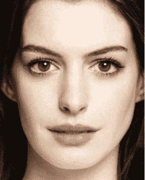
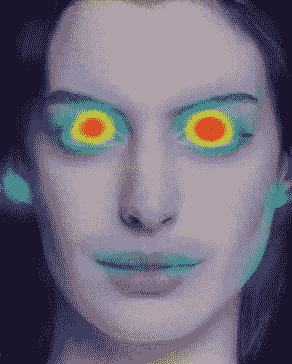
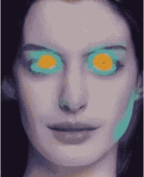
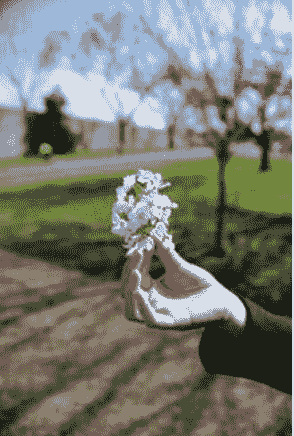
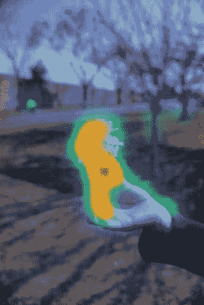
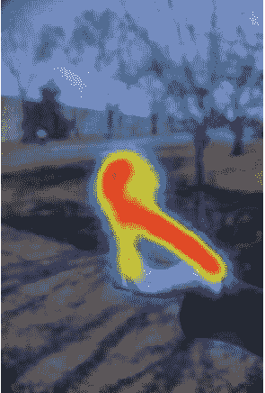

图8.1 (顶部) 人脸的眼周区域显示出最高的显著性。(底部) 焦点前景对象显示出最高的显著性。 背景模糊，保留较少的高频细节

对于面部性别分类，我们从之前的工作[16,56]中了解到，眼周区域提供了确定性别信息最重要的线索。眼周区域也是人脸上最显著的区域，如图8.1的顶部所示，使用通用的显著性检测算法[14]。也可以使用其他显著性检测算法获得类似的结果，例如[15,17]。从显著性热图中我们可以观察到，与脸部其他部分相比，眼周区域的激活最强烈。

现在我们来思考以下问题：
> 问题：我们如何让卷积神经网络将注意力转向眼周区域，在这个区域中性别分类已被证明最有效？

答案来自我们日常摄影的经验。如果你使用的是具有大光圈镜头的单反相机，并将焦点固定在前景物体上，所有超出焦点物体的背景都会变得模糊。这在图8.1的底部部分有所说明，可以看到，锐利的前景物体（手中的樱花）在显著性热图中吸引了最多的注意力。

因此，我们可以通过指定图像的模糊或保持清晰来控制注意区域。在性别分类的背景下，我们知道将注意力集中在眼周区域是有益的。因此，我们通过逐步训练卷积神经网络，使用模糊程度逐渐增加、缩放到眼周区域的图像，来‘强制’网络对图像的哪个部分给予最大权重，如表8.1所示。由于我们仍然希望使用全脸模型，我们希望通过采用上述策略，学习到的深度模型至少能与其他全脸深度模型不相上下，同时利用眼周区域的性别线索。

> 问：为什么不只使用眼周区域裁剪？

**表8.1 模糊图像与不断增加的模糊程度**
| 图像示例 | 模糊程度 |
| :--- | :--- |
| 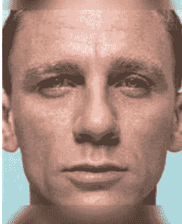 | 13.33% |
| 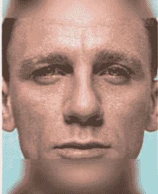 | 27.62% |
| 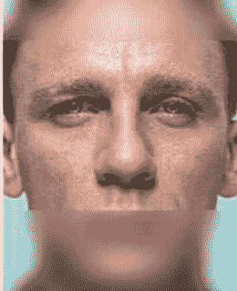 | 41.90% |
| 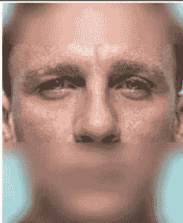 | 56.19% |
| 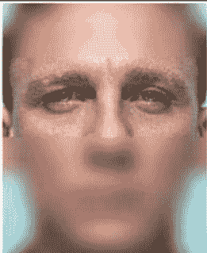 | 68.57% |
| 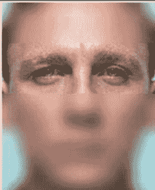 | 73.33% |

尽管在实验中，眼周区域是性别分类的最佳面部区域，但我们仍希望利用其他面部部位（胡须/胡子）提供有价值的性别线索。当眼周区域不理想时，这一点尤为重要。例如，一些遮挡物（如太阳镜）可能会遮挡眼部区域，我们希望我们的网络仍能够很好地泛化并具有鲁棒性，即使眼周区域受损。

为了在全脸模型和仅眼周区域模型之间取得良好的平衡，我们采用了一种渐进式训练范式，通过将其他面部区域模糊，从全脸逐渐放大到眼周区域。此外，我们希望经过渐进训练的网络具有足够的泛化能力，能够对任意类型和任意位置的遮挡具有鲁棒性。

> 问：为什么选择模糊而不是涂黑？
我们只是想引导焦点，而不是完全消除背景，如图8.1底部显示的DSLR照片示例。涂黑会在训练过程中使滤波器产生混淆的突然边缘。当模糊时，低频信息仍然得到很好的保留。人们仍然可以从模糊的图像中识别出内容，例如狗、人脸、物体等。

在眼周区域之外进行模糊处理，并在眼周区域保留高频细节，这将有助于提供图像的全局和结构上下文，并在感兴趣区域保持微小细节的完整性，这将有助于性别分类和细粒度分类等任务。

> 问：为什么不让卷积神经网络直接学习模糊步骤？
我们知道卷积神经网络的滤波器对整个图像进行操作，而只对图像的一部分进行模糊处理是一个像素位置相关的操作，因此在卷积神经网络框架中很难模拟。因此，我们采用了提出的渐进训练范式，以强制网络关注的位置。

## 8.2 相关工作
在本节中，我们提供了关于面部性别分类和注意力模型的相关背景。

研究表明，眼周区域是用于识别目的的最佳面部区域[20-22, 24, 27, 31-36, 38, 39, 39, 40, 59,62,63]，尤其适用于性别分类任务[16,56]。一些最近的工作也应用了卷积神经网络进行性别分类[4,50]。更多关于性别分类的相关工作已整理在表8.8中。

像图像字幕生成中使用的注意力模型[70]最近才变得非常流行。与将整个图像压缩为静态表示不同，注意力允许显著特征根据需要动态地凸显出来。当图像中存在大量杂乱时，这一点尤为重要。它还通过可视化模型在某些任务中关注的位置来帮助获得洞察力和解释结果。这种机制可以被视为可学习的显著性检测器，可以根据不同任务进行定制，而不是传统的检测器，如[8, 14, 15, 17]。

值得一提的是软注意力和硬注意力之间的关键区别。软注意力非常容易实现。它在输入位置上产生分布，重新加权特征，并将其作为输入。它可以使用空间变换网络[19]在任意输入位置上进行关注。另一方面，硬注意力只能关注单个输入位置，并且优化不能利用梯度下降。常见的做法是使用强化学习。

涉及注意力模型的其他应用可能包括机器翻译[54]，对输入声音应用注意力的语音识别[6, 9]，对输入帧应用注意力的视频字幕[72]，对图像本身应用注意力的图像问题回答[69, 75]，以及更多[67, 68]。

## 8.3 提出的方法
我们提出的方法包括两个主要组成部分：逐步训练的注意力转移卷积神经网络（PTAS-CNN）框架用于训练无约束性别分类器，以及用于面部图像缺失像素恢复的深度卷积生成对抗网络（DCGAN），以进一步提高在有遮挡的图像上的性别识别性能。

### 8.3.1 渐进式训练的注意力转移卷积神经网络（PTAS-CNN）
在本节中，我们详细介绍了我们提出的逐步训练CNN与注意力转移的方法。整个训练过程涉及（k+1）个时期组，从时期组0到k，其中每个时期组对应于一个特定的模糊级别。

#### 8.3.1.1 在训练图像中强制注意力
在我们的实验中，我们启发性地选择了7个模糊级别，包括没有任何模糊的级别。逐渐增加模糊级别的示例图像在表8.1中说明。我们使用σ=7的高斯模糊核对相应的图像区域进行模糊处理。

#### 8.3.1.2 具有注意力的渐进式CNN训练
这样做的概念是在训练图像中强制网络注意力，而无需改变网络架构。

我们采用AlexNet [46]架构进行我们的渐进式CNN训练。AlexNet具有6000万个参数和650,000个神经元，包括5个卷积层和3个全连接层，最后是一个1000路的softmax。为了减少全连接层的过拟合，AlexNet采用了“dropout”和数据增强，这两者在我们的训练中都得到了保留。主要的区别在于，由于性别分类问题的性质，我们只需要一个2路的softmax。

如图8.2所示，渐进的CNN训练从第一个时期组（Epoch Group 0，没有模糊的图像）开始，并在收敛后获得并冻结第一个CNN模型 $\mathcal{M}_0$。然后，我们输入下一个时期组进行调整 $\mathcal{M}_0$，并最终生成第二个模型 $\mathcal{M}_1$，通过训练图像强制执行注意力。该过程按顺序进行，直到获得最终模型 $\mathcal{M}_k$。每个 $\mathcal{M}_j (j=0, \ldots, k)$ 使用1000个时期进行训练，并使用批量大小为128。在第 $j$ 步的训练结束时，选择与最佳验证准确性相对应的模型继续下一次迭代 $(j+1)$。


图8.2具有注意力机制的渐进式CNN训练

#### 8.3.1.3 CNN中的隐式低秩正则化
在我们的范例中，对训练图像进行模糊处理可能具有更多的含义。在这里，我们想展示低通傅里叶分析和奇异值分解中的低秩逼近之间的相似性。通过分析，我们希望与CNN中的低秩正则化过程建立联系。我们从最近的一项工作中了解到，强制进行低秩正则化并消除卷积核中的冗余是重要的，可以帮助提高分类准确性和计算速度。傅里叶分析涉及将原始数据 $x_{ij}$ (取自数据矩阵 $\mathbf{X} \in \mathbb{R}^{m \times n}$) 在正交基中展开，即傅里叶逆变换：
$$x_{ij} = \frac{1}{m} \sum_{k=0}^{m-1} c_k e^{\mathbf{i} 2 \pi j k / m}. \tag{8.1}$$
通过对向量进行归一化并将其命名为 $\mathbf{v}_k'$，可以明确地说明与SVD的联系：
$$x_{ij} = \sum_{k=0}^{m-1} b_{ik} v_{jk}' = \sum_{k=0}^{m-1} u_{ik}' s_k' v_{jk}', \tag{8.2}$$
它生成了矩阵方程 $X = U'\Sigma'V'^T$。然而，与SVD不同的是，即使 $\{v'_k\}$ 是正交基，$\{u'_k\}$ 通常不是正交的。尽管如此，这说明了SVD与傅里叶变换的相似之处。接下来，我们将展示傅里叶分析中的低通滤波与SVD中的低秩逼近密切相关。

假设我们有N维度为d的图像数据样本，原始二维形式为 $\{x_1, x_2, \ldots, x_N\}$。令矩阵 $\hat{X}$ 包含所有经过二维傅里叶变换 $F(\cdot)$ 的数据样本，以向量化形式表示：
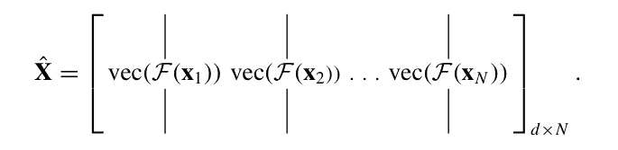
矩阵 $\hat{X}$ 可以使用奇异值分解进行分解：$\hat{X} = \hat{U}\hat{\Sigma}\hat{V}^T$。为了简洁起见，不失一般性，假设 $N = d$。令 $g$ 和 $\hat{g}$ 分别为空间域和频率域中的高斯滤波器，即 $\hat{g} = F(g)$。令 $\hat{G}$ 为一个对角线矩阵，其对角线上为 $\hat{g}$。卷积操作在频率域中变为点乘，因此模糊操作变为
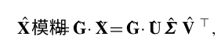
其中 $\hat{\Sigma} = \text{diag}(\sigma_1, \sigma_2, \ldots, \sigma_d)$ 包含了 $\hat{X}$ 模糊的奇异值，已按降序排序：$\sigma_1 \ge \sigma_2 \ge \ldots \ge \sigma_d$。假设我们可以找到一个置换矩阵 $P$ 使得当应用于对角矩阵 $\hat{G}$ 时，对角元素按照大小按降序排序：$\hat{G}' = P\hat{G} = \text{diag}(\hat{g}'_1, \hat{g}'_2, \ldots, \hat{g}'_d)$。

现在，让我们对 $\hat{X}$ 模糊应用相同的置换操作，我们可以得到以下关系：
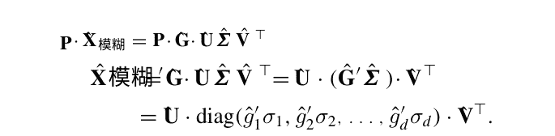
由于高斯分布不是重尾分布，高斯权重会将已经较小的奇异值降为0。

因此，经过高斯低通滤波后，$\hat{X}$ 模糊实际上变成了低秩矩阵。为了达到这个目的，我们可以说傅里叶分析中的低通滤波等价于奇异值分解中的低秩逼近，只差一个排列。

这种现象可以通过训练过的滤波器的可视化来松散观察，如图8.15所示，这将在未来的工作中进一步分析和研究。

### 8.3.2 通过深度卷积生成对抗网络（DCGAN）进行遮挡去除

在本节中,我们首先回顾DCGAN的基础知识,然后展示DCGAN如何用于人脸图像的遮挡去除或缺失像素恢复。

#### 8.3.2.1 深度卷积生成对抗网络

生成对抗网络 (GAN) [12]能够生成高质量的图像。 该框架训练两个网络,一个是生成器 $\mathcal{G}_{\theta}(\mathbf{z}): \mathbf{z} \rightarrow \mathbf{x}$, 另一个是判别器 $\mathcal{D}_{\omega}(\mathbf{x}): \mathbf{x} \rightarrow[0,1]$ 。 $\mathcal{G}$ 将从先验分布 $p_{\mathbf{z}}(\mathbf{z})$ 中采样得到的随机向量 $\mathbf{z}$ 映射到图像空间。 $\mathcal{D}$ 将输入图像映射到似然度。 $\mathcal{G}$ 的目的是生成逼真的图像, 而 $\mathcal{D}$ 则扮演对抗的角色, 区分由 $\mathcal{G}$ 生成的图像和从数据分布 $p_{\text{data}}$ 中采样得到的图像。通过优化以下极小极大损失函数来训练网络:

$$\min _{\mathcal{G}} \max _{\mathcal{D}} V(\mathcal{G}, \mathcal{D})=\mathbb{E}_{\mathbf{x} \sim p_{\text {data }}(\mathbf{x})}[\log (\mathcal{D}(\mathbf{x}))]+\mathbb{E}_{\mathbf{z} \sim p_{\mathbf{z}}(\mathbf{z})}[\log (1-\mathcal{D}(\mathcal{G}(\mathbf{z})))],$$

其中 $\mathbf{x}$ 是来自 $p_{\text{data}}$ 分布的样本; $\mathbf{z}$ 是随机生成的, 并位于某个潜在空间中。有许多方法可以构建 $\mathcal{G}(\mathbf{z})$。 深度卷积生成对抗网络 (DCGAN) [60]使用分数步卷积来上采样图像, 而不是完全连接的神经元, 如图8.3所示。生成器 $\mathcal{G}$ 被更新以欺骗判别器 $\mathcal{D}$ 错误地对生成的样本 $\mathcal{G}(\mathbf{z})$ 进行分类, 而判别器 $\mathcal{D}$ 则试图不被欺骗。 在这项工作中, $\mathcal{G}$ 和 $\mathcal{D}$ 都是深度卷积神经网络, 并使用交替梯度下降算法进行训练。收敛后, $\mathcal{D}$ 能够拒绝过于虚假的图像, $\mathcal{G}$ 能够生成与训练分布 (真实分布 $p_{\text{data}}$) 相符的高质量图像。

#### 8.3.2.2 通过DCGAN去除遮挡

为了应对缺失数据的挑战, 我们需要同时利用DCGAN中的 $\mathcal{G}$ 和 $\mathcal{D}$ 网络, 这些网络是用未损坏的数据进行预训练的。 训练完成后, $\mathcal{G}$ 能够将来自 $p_{\text{data}}$ 的图像嵌入到某个非线性流形中的 $\mathbf{z}$ 上。不属于 $p_{\text{data}}$ 的图像 (例如, 带有缺失像素的损坏人脸图像) 不应该位于学习到的流形上。 因此, 我们希望将损坏的图像在流形上找到“最接近”的图像作为正确的重建图像。

让我们将损坏的图像表示为 $\mathbf{y}$。 为了量化从 $\mathbf{y}$ 到重建图像的“最接近”映射, 我们定义了一个由上下文损失和感知损失组成的函数, 这是根据Yeh等人的工作[73]定义的。
为了融合给定图像的未损坏部分的信息, 上下文损失用于衡量重建图像部分与未损坏图像部分之间的保真度, 其定义如下:

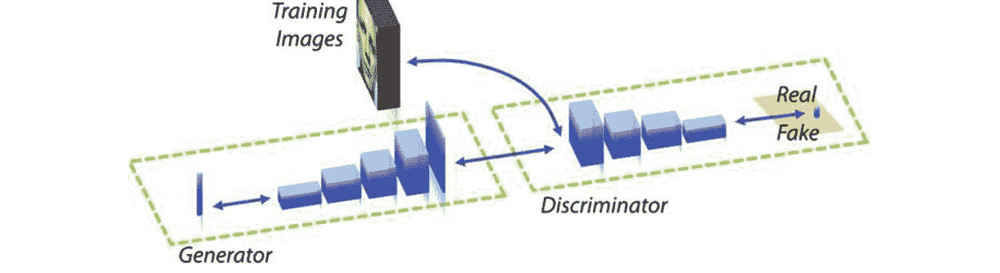

图8.3 标准DCGAN的流程,生成器将随机向量映射到图像,判别器将图像(来自真实分布或生成的)映射到概率值

$$ L_{\text {上下文 }}(\mathbf{z})=\|\mathbf{M} \odot \mathcal{G}(\mathbf{z})-\mathbf{M} \odot \mathbf{y}\|_1, $$
(8.7)

其中 $\mathbf{M}$ 表示未损坏区域的二进制掩码, $\odot$ 表示逐元素的哈达玛积操作。损坏部分, 即 $(1 - \mathbf{M}) \odot \mathbf{y}$, 不参与损失计算。选择 $\ell_1$ 范数是经验性的。根据 [73] 中进行的实验, 使用 $\ell_1$ 范数损失恢复的图像往往更清晰、质量更高, 而使用 $\ell_2$ 范数重建的图像质量较低。

感知损失鼓励重建图像与训练集 (真实分布 $p_{\text{data}}$) 中的样本相似。这通过更新 $\mathbf{z}$ 来欺骗 $\mathcal{D}$ 实现, 或者等效地使 $\mathcal{D}(\mathcal{G}(\mathbf{z}))$ 的值较高。因此, $\mathcal{D}$ 会以很高的概率预测 $\mathcal{G}(\mathbf{z})$ 来自数据。与 DCGAN中欺骗 $\mathcal{D}$ 的相同损失被使用:

$$ L_{\text {感知 }}(\mathbf{z})=\log (1-\mathcal{D}(\mathcal{G}(\mathbf{z}))). $$
(8.8)

带有缺失像素的损坏图像现在可以通过定义的感知和上下文损失映射到潜在表示空间中最接近的 $\mathbf{z}$。

我们遵循[60]中的训练过程, 并使用Adam [45]进行优化。使用总损失进行反向传播更新 $\mathbf{z}$:

$$ \hat{\mathbf{z}}=\arg \min _{\mathbf{z}}\left(\mathcal{L}_{\text {上下文 }}(\mathbf{z})+\lambda \mathcal{L}_{\text {感知 }}(\mathbf{z})\right) $$
(8.9)

其中 $\lambda$ 是一个加权参数. 在找到最优解 $\hat{\mathbf{z}}$ 之后, 可以通过以下方式获得重建的完整人脸图像:

$$ \mathbf{x}_{\text {重建 }}=\mathbf{M} \odot \mathbf{y}+(1-\mathbf{M}) \odot \mathcal{G}(\hat{\mathbf{z}}). $$
(8.10)

图8.11展示了从连续遮挡中恢复人脸的示例,使用DCGAN。预计将这种深度生成方法应用于遮挡图像恢复将改善无约束性别分类的性能.

## 8.4 实验: 第一部分

在本节中,我们详细介绍了所采用的训练和测试协议,以及在测试集中建模的各种遮挡和低分辨率。每个子节的附图和表格涵盖了结果和观察,并在每个部分中进行了详细说明。

（注1：关于图例的说明：（1）符号 $\mathcal{M}$ 对应于每个训练的模型，其中 $\mathcal{M}_F$ 对应于在全脸上训练的模型（相当于 $\mathcal{M}_0$），$\mathcal{M}_P$ 对应于仅使用眼周图像的模型，$\mathcal{M}_k, k \subseteq (1, \ldots, 6)$ 对应于增量训练的模型。（2）表格结果显示了模型在原始图像上的性能（第一列）和损坏图像上的性能（其他列）。）

| 数据库 | 男性 | 女性 |
| :--- | :--- | :--- |
| J-Mugshot | 1900 | 1371 |
| M-Mugshot | 1772 | 805 |
| Pinellas子集 | 13215 | 3394 |
| P-Mugshot | 46346 | 12402 |
| O-Mugshot | 4164 | 3634 |
| 小计 | 67397 | 21606 |
| 总计 | 67397 | 89003 |

### 8.4.2 实验一：遮挡鲁棒性

在实验一中，我们在AR人脸数据库和PCSO照片数据库上进行遮挡鲁棒性的性别分类。我们手动添加人工遮挡来测试我们的方法在PCSO数据库上的有效性，并在AR人脸数据集的各个图像集上进行测试。

图8.4 PCSO（400 K）上的整体分类准确率。图像未损坏
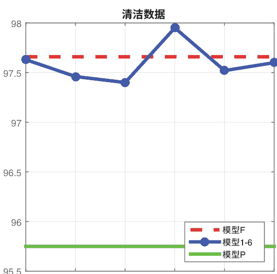

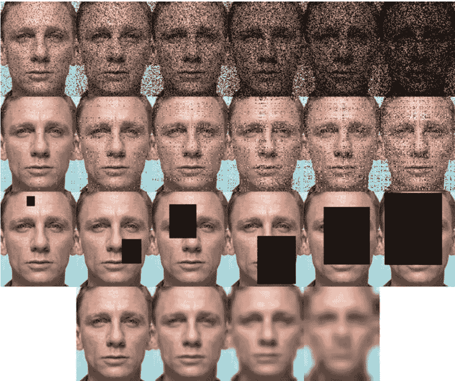

图8.5 在实验I和II中对测试图像应用的各种退化。第1行随机丢失像素遮挡；第2行随机加性高斯噪声遮挡；第3行随机连续遮挡。 第1-3行退化程度的百分比为10、25、35、50、65和75%。 第4行低分辨率退化的各种缩放因子（2倍、4倍、8倍、16倍）

#### 8.4.2.1 PCSO人像数据库上的实验

首先，图8.4展示了各种模型在干净的PCSO数据上的性能。如预期的那样，如果测试图像是干净的，最好使用 $\mathcal{M}_F$ 而不是 $\mathcal{M}_P$。我们可以看到，逐渐训练的模型 $\mathcal{M}_1 - \mathcal{M}_6$ 与 $\mathcal{M}_F$ 相当。

我们用三种类型的面部遮挡来破坏测试图像（400 K）。 这些在图8.5中可视化，每一行对应于一些建模的遮挡。

- （1）随机丢失像素遮挡

**表8.3** 在PCSO (400 K) 上的整体分类准确率。图像被随机丢失像素以不同的百分比损坏。

| 模型 | 0% | 10% | 25% | 35% | 50% | 65% | 75% |
|---|---|---|---|---|---|---|---|
| $\mathcal{M}_F$ | 97.66 | 97.06 | 93.61 | 89.15 | 82.39 | 79.46 | 77.40 |
| $\mathcal{M}_1$ | 97.63 | 96.93 | 92.68 | 87.99 | 81.57 | 78.97 | 77.20 |
| $\mathcal{M}_2$ | 97.46 | 96.83 | 93.19 | 89.17 | 83.03 | 80.06 | 77.68 |
| $\mathcal{M}_3$ | 97.40 | 96.98 | 94.06 | 90.65 | 84.79 | 81.59 | 78.56 |
| $\mathcal{M}_4$ | 97.95 | 97.63 | 95.63 | 93.10 | 87.96 | 84.41 | 80.22 |
| $\mathcal{M}_5$ | 97.52 | 97.26 | 95.80 | 94.07 | 90.40 | 87.39 | 83.04 |
| $\mathcal{M}_6$ | 97.60 | 97.29 | 95.50 | 93.27 | 88.80 | 85.57 | 81.42 |
| $\mathcal{M}_P$ | 95.75 | 95.45 | 93.84 | 92.02 | 88.87 | 86.59 | 83.18 |

图像像素的变化因素 (10、25、35、50、65和75%) 被丢弃，以模拟丢失信息和粗糙图像。这对应于图8.5中的第一行。从表8.3和图8.6可以看出， $\mathcal{M}_5$ 表现最好， $\mathcal{M}_6$ 的准确率下降，表明较紧密的眼周区域不适合此类应用，即在模糊集中需要保持对眼周区域的限制。从原始图像到25%时，模型 $\mathcal{M}_P$ 和 $\mathcal{M}_F$ 的性能发生了变化， $\mathcal{M}_P$ 在更高的损坏情况下具有更好的泛化能力。

随着缺失像素的百分比增加， $\mathcal{M}_P$ 和 $\mathcal{M}_F$ 之间的性能差距增大。正如假设的那样，逐渐训练的模型之间的性能改善趋势在各个因素中得到保持，表明对噪声的学习模型更好。

- （2）随机加性高斯噪声遮挡

高斯白噪声 ($\sigma = 6$) 被添加到图像像素中，以不同的因素 (10、25、35、50、65和75%) 进行变化。 这对应于图8.5中的第二行，并用于建模高噪声数据和糟糕的压缩。从表8.4和图8.7中可以看出，对于中等噪声， $\mathcal{M}_4 - \mathcal{M}_6$ 表现最好。 对于高噪声， $\mathcal{M}_5$ 是最稳健的。就像以前一样，随着噪声的增加，性能的趋势也是如此 $\mathcal{M}_P$ 与 $\mathcal{M}_F$ 和 $\mathcal{M}_5$ 与 $\mathcal{M}_6$ 的性能趋势保持不变，逐渐训练的模型也是如此。

- （3）随机连续遮挡

（注2：这也可以模拟传感器的坏点/暗电流噪声，这些结果可以用于通过使用部分去马赛克的图像加速内联性别检测。）

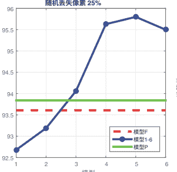
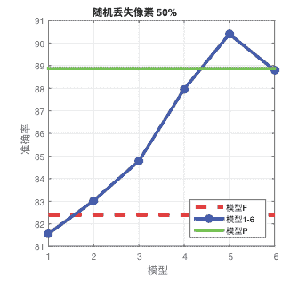
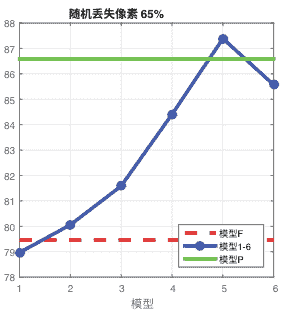
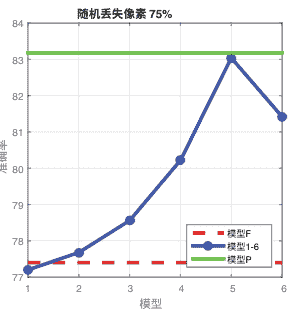

图8.6在PCSO (400 K) 上的整体分类准确率。图像受到不同百分比的随机丢失像素的破坏。

**表8.4** 在PCSO (400 K) 上的整体分类准确率。图像受到不同百分比的加性高斯随机噪声的破坏。
| 模型 | 0% | 10% | 25% | 35% | 50% | 65% | 75% |
|---|---|---|---|---|---|---|---|
| $\mathcal{M}_F$ | 97.66 | 97.00 | 94.03 | 91.19 | 86.47 | 83.43 | 79.94 |
| $\mathcal{M}_1$ | 97.63 | 96.93 | 94.00 | 91.26 | 87.00 | 84.27 | 81.15 |
| $\mathcal{M}_2$ | 97.46 | 96.87 | 94.43 | 92.19 | 88.75 | 86.44 | 83.33 |
| $\mathcal{M}_3$ | 97.40 | 97.00 | 95.18 | 93.27 | 89.93 | 87.55 | 84.16 |
| $\mathcal{M}_4$ | 97.95 | 97.67 | 96.45 | 95.11 | 92.43 | 90.28 | 87.06 |
| $\mathcal{M}_5$ | 97.52 | 97.29 | 96.25 | 95.21 | 93.21 | 91.65 | 89.12 |
| $\mathcal{M}_6$ | 97.60 | 97.32 | 96.04 | 94.77 | 92.46 | 90.80 | 88.08 |
| $\mathcal{M}_P$ | 95.75 | 95.59 | 94.85 | 94.00 | 92.43 | 91.15 | 88.74 |

为了模拟太阳镜或其他连续元素等大面积遮挡，图像中连续的像素块（10%，25%，35%，50%，65%和75%）被删除，如图8.5的第三行所示。最真实的遮挡对应于前几个像素块，其他像素块是极端情况。对于前面的情况，$\mathcal{M}_1 - \mathcal{M}_3$ 能够以最高准确率预测类别。从表8.5和图8.8可以看出，在存在大量遮挡和缺失数据的情况下，需要更多的上下文信息才能正确分类，因为 $\mathcal{M}_1 - \mathcal{M}_3$ 比其他模型表现更好。

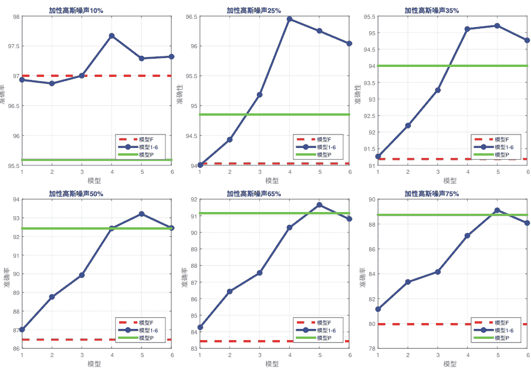

图 8.7 在 PCSO (400 K) 上的整体分类准确率。图像受到各种百分比的加性高斯随机噪声的影响

**表 8.5** 在 PCSO (400 K) 上的整体分类准确率。图像受到各种百分比的随机连续遮挡的影响

| 模型 | 0% | 10% | 25% | 35% | 50% | 65% | 75% |
|---|---|---|---|---|---|---|---|
| $\mathcal{M}_F$ | 97.66 | 96.69 | 93.93 | 88.63 | 76.54 | 73.75 | 64.82 |
| $\mathcal{M}_1$ | 97.63 | 96.95 | 94.64 | 90.20 | 77.47 | 75.20 | 53.04 |
| $\mathcal{M}_2$ | 97.46 | 96.76 | 94.56 | 90.04 | 75.99 | 70.83 | 56.25 |
| $\mathcal{M}_3$ | 97.40 | 96.63 | 94.65 | 90.08 | 77.13 | 71.77 | 68.52 |
| $\mathcal{M}_4$ | 97.95 | 96.82 | 92.70 | 86.64 | 75.25 | 70.37 | 61.63 |
| $\mathcal{M}_5$ | 97.52 | 96.56 | 92.03 | 83.95 | 70.36 | 69.94 | 66.52 |
| $\mathcal{M}_6$ | 97.60 | 96.61 | 93.08 | 86.34 | 71.91 | 71.40 | 69.50 |
| $\mathcal{M}_P$ | 95.75 | 95.00 | 93.01 | 88.34 | 76.82 | 67.81 | 49.73 |

然而，由于它们的表现优于 $\mathcal{M}_F$，我们的专注显著性方案有助于在遮挡情况下进行泛化。

#### 8.4.2.2 在 AR 人脸数据库上的实验

我们将原始数据集分成较小的子集，以更好地了解我们的方法在不同条件下的性能。第一组由中性表情组成，

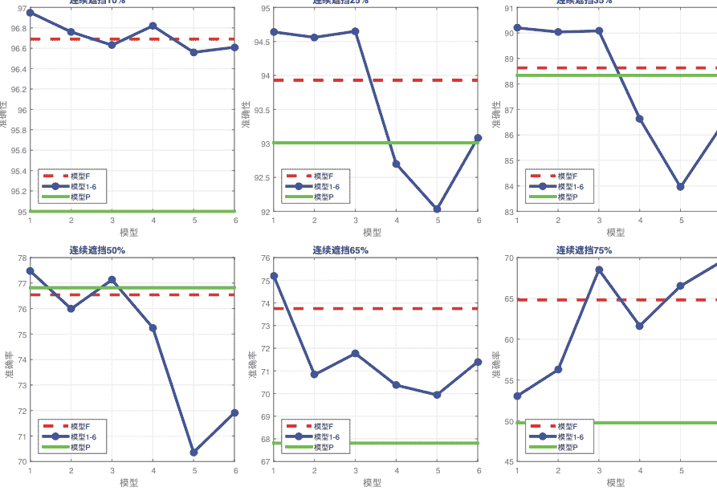

图8.8在PCSO（400 K）上的整体分类准确率。图像受到各种百分比的随机连续遮挡的影响。

全脸主题。 第二组具有完整的面部但表情各异。 第三组包括眼周遮挡，如太阳镜，第四组包括这些和其他遮挡，如衣物等。第五组是包括光照变化在内的整个数据集。

参考表8.6和图8.9，对于第一组，全脸模型表现最好，这是预期的，因为该模型是在与此非常相似的图像上进行训练的。第2组结果表明，当引入表情时，模型需要更多的上下文信息。 因此，$\mathcal{M}_4$，它专注于眼周区域但也包含面部信息，表现最好。 对于第3组，我们可以看到两件事：一是，$\mathcal{M}_P$ 的表现比 $\mathcal{M}_F$ 表明它对眼周遮挡具有鲁棒性。 其次，$\mathcal{M}_5$ 是最好的，因为它结合了从增量训练中获得的眼周区域焦点和上下文信息。

第4组的表现说明了为什么眼周区域更适合遮挡的面部。 我们确定一些纹理和面部轮廓的丢失会影响模型 $\mathcal{M}_1 - \mathcal{M}_6$ 的性能。 模型在第5组上的表现重申了先前提到的关于面部轮廓的上下文信息和眼周区域重要性的观察。 这就是为什么 $\mathcal{M}_3$ 报告的最佳准确率的原因。

## 8 DeepGender2: 一种面向遮挡的生成方法……

| 集合 | 集合1 | 集合2 | 集合3 | 集合4 | 集合5 (完整集合) |
| :--- | :--- | :--- | :--- | :--- | :--- |
| 男性女性 | 98.44 | 93.23 | 89.06 | 83.04 | 81.65 |
| 男性 1 | 97.66 | 92.71 | 86.72 | 81.70 | 82.82 |
| 男性 2 | 97.66 | 92.71 | 90.62 | 82.14 | 85.10 |
| 男性 3 | 97.66 | 93.23 | 91.41 | 80.80 | 85.62 |
| 男性 4 | 98.44 | 95.31 | 92.97 | 77.23 | 84.61 |
| 男性 5 | 96.88 | 93.49 | 94.53 | 80.36 | 84.67 |
| 男性 6 | 96.09 | 92.71 | 92.97 | 79.02 | 83.90 |
| 男性个人 | 96.09 | 90.62 | 91.41 | 86.61 | 83.44 |

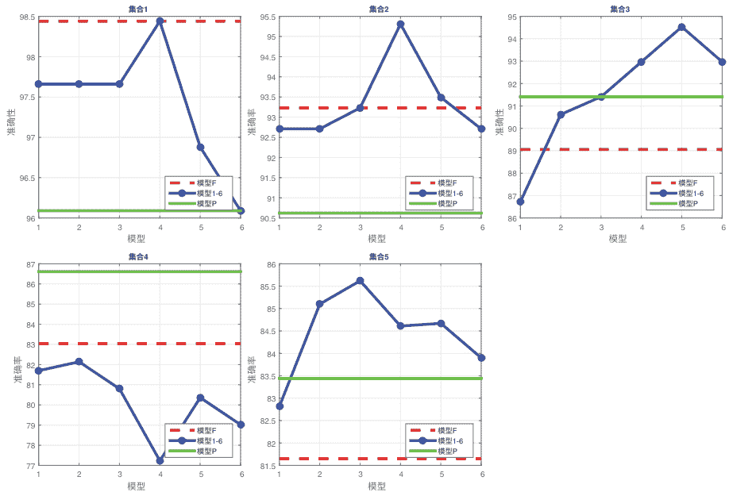

图8.9 在AR人脸数据库上的性别分类准确率

### 8.4.3 实验二: 低分辨率鲁棒性

我们的高斯模糊图像训练方案应该很好地适用于低分辨率图像。为了测试这个假设，我们首先对来自PCSO照片数据库的图像进行降采样，然后再放大（例如：2倍、4倍、8倍、16倍）。这会导致边缘信息和其他高阶信息的丢失，并且这一点在

| 缩放因子 | 1倍 | 2倍 | 4倍 | 8倍 | 16倍 |
| :--- | :--- | :--- | :--- | :--- | :--- |
| 男性女性 | 97.66 | 97.55 | 96.99 | 94.19 | 87.45 |
| 男性₁ | 97.63 | 97.48 | 96.91 | 94.76 | 87.41 |
| 男性₂ | 97.46 | 97.31 | 96.73 | 94.77 | 88.82 |
| 男性₃ | 97.40 | 97.20 | 96.37 | 93.50 | 87.57 |
| 男性₄ | 97.95 | 97.89 | 97.56 | 95.67 | 90.17 |
| 男性₅ | 97.52 | 97.40 | 96.79 | 95.26 | 89.66 |
| 男性₆ | 97.60 | 97.51 | 97.05 | 95.42 | 90.79 |
| 男性个人 | 95.75 | 95.65 | 95.27 | 94.12 | 91.59 |


图8.10 在PCSO（400K）上的整体分类准确率。图像被缩小到较低分辨率，并使用不同的缩放因子进行降采样

如表8.7和图8.10中的最后一行所示，对于2倍、4倍和8倍的情况，$\mathcal{M}_{1}-\mathcal{M}_{6}$ 与 $\mathcal{M}_{F}$ 之间的趋势保持不变。如前所述，由于在对眼周区域进行关注和保存面部的上下文信息之间取得了平衡，$\mathcal{M}_{4}$ 表现良好。

### 8.4.4 讨论

我们提出了一种建立鲁棒性遮挡下性别识别系统的方法。该方法涉及使用渐进模糊预处理的输入数据的多个批次进行深度模型的增量训练。这种方法的直觉和意图是双重的，一方面是使网络专注于面部的眼周区域进行性别识别。另一方面是保留面部轮廓的上下文信息，以更好地应对遮挡。

通过各种实验，我们观察到我们的假设确实成立，并且对于给定的遮挡集合，可以从同时具备上述两个属性的模型中获得高准确性。无论我们是否在任何遮挡数据上进行训练，或者针对特定的遮挡集合进行优化，我们的模型都能够很好地推广到合成数据和现实生活中的面部遮挡图像。

我们总结了整体实验，并将结果汇总在表8.8中。对于PCSO大规模实验，我们认为35%的遮挡是正确的退化程度，应该报告准确性。因此，我们从三种类型的遮挡（丢失像素、加性高斯噪声和连续遮挡）中的最佳模型平均准确性，在表8.8中得到93.12%。对于低分辨率实验，我们认为8倍缩放因子是正确的退化程度，因此在表8.8中报告准确性为95.67%。还列出了许多其他与性别分类相关的工作，供快速比较。该表基于[16]。

### 8.5 实验：第B部分

为了提高分类准确性并支持在前一节中训练的模型，我们训练了一个GAN来在输入图像中产生遮挡和缺失信息。接下来的两节详细介绍了我们对输入数据的筛选和测试集的选择。性别模型（$\mathcal{M}_{k}$）的定义与前一节中相同。我们使用 $\mathcal{G}_{z}$ 和 $\mathcal{D}_{x}$ 来表示GAN中的生成器和判别器模型。

| 作者 | 方法 | 数据集 | 变化 | 唯一主题 | 分辨率 | 受试者数量(男性/女性) | 准确性 |
| :--- | :--- | :--- | :--- | :--- | :--- | :--- | :--- |
| 提出的 | 带注意力的渐进CNN训练 | 逮捕照片 | 仅正面照片, 逮捕照片遮挡 | 是 | 168×210 | 总共89k个训练样本, 总共400k个测试样本 | 97.95% 测试集 |
| | | | | | | 总共89k个训练样本, 总共400k个测试样本 | 93.12% 测试集 |
| | | | 低分辨率 | 是 | | 总共89k个训练样本, 总共400k个测试样本 | 95.67% 测试集 |
| 胡等人[16] | 基于区域的MR-8滤波器组合线性SVM | AR人脸 | 表情x4, 遮挡x2 | 否 | | 总共89k训练, 测试765 | 85.62% 测试集 |
| | | Flickr | 李, 表情, 位置, 背景, 遮挡 | 是 | 128×170 | 总共10037训练, 测试3346/3346 | 90.1% 测试集 |
| 陈和林[7] | 颜色和边缘特征与AdaBoost+弱分类器 | FERET | 仅正面, 工作室 | 是 | | 320/320训练, 80/80测试 | 92.8% 测试集 |
| | | 网络图像 | 光照, 表情, 背景 | 是 | 不适用 | 总共1948训练, 测试210/25 | 87.6% 测试集 |

表8.8 性别分类的相关工作总结。提出的方法显示在顶部行中。

(继续)

表8.8（继续）
| 作者 | 方法 | 数据集 | 变化 | 唯一主题 | 分辨率 | 受试者数量 (男性/女性) | 准确性 |
| :--- | :--- | :--- | :--- | :--- | :--- | :--- | :--- |
| Wang等人[10] | Gabor滤波器与多项式-SVM | BiolD | 光照和表情 | 是 | 286×384 | 976/544 训练集，120个总测试集 | 92.5% 测试集 |
| Golomb等人[11] | 原始像素与神经网络 | SexNet | 仅正面，工作室 | 是 | 30×30 | 40/40 训练集，5/5 测试集 | 91.9% 训练集 |
| Gutta等人[13] | 原始像素与混合神经网络RBF-SVM和决策树 | FERET | 仅正面，工作室 | 否 | 64×72 | 1906/1100 训练集，47/30 测试集 | 96.0% 测试集 |
| Jabid等人[18] | 局部方向模式与SVM | FERET | 仅正面，工作室 | 否 | 100×100 | 1100/900 训练集，未知测试集 | 95.1% 测试集 |
| Lee等人[48] | 基于区域的线性回归融合SVM | FERET | 仅正面，工作室 | 不适用 | 不适用 | 1158/615 训练集，未知测试集 | 98.8% 测试集 |
| | | 网络图像 | 未知的 | | | 1500/1500 训练集，1500/1500 测试集 | 88.1% 的准确率 |

| 作者 | 方法 | 数据集 | 变化 | 唯一主题 | 分辨率 | 受试者数量 (男性/女性) | 准确性 |
| :--- | :--- | :--- | :--- | :--- | :--- | :--- | :--- |
| Leng 和 Wang [49] | 具有模糊-SVM的 Gabor 滤波器 | FERET | 仅正面，工作室 | 是 | 256 × 384 | 总共160/140个样本，80% 用于训练，20% 用于测试 | 98.1% 的准确率 |
|  |  | CAS-PEAL | 工作室 | 不适用 | 140 × 120 | 总共400/400个样本，80% 用于训练，20% 用于测试 | 93.0% 的准确率 |
|  |  | BUAA-IRIP | 仅正面，工作室 | 否 | 56 × 46 | 总共150/150个样本，80% 用于训练，20% 用于测试 | 89.0% 的准确率 |
| Lin 等人 [51] | 具有线性 SVM 的 Gabor 滤波器 | FERET | 仅正面，工作室 | 不适用 | 48 × 48 | 未知的 | 92.8% 测试集 |
| Lu 和 Lin [52] | 具有 Adaboost + 线性 SVM 的 Gabor 滤波器 | FERET | 仅正面，工作室 | 不适用 | 48 × 48 | 150/50个样本用于训练，518个样本用于测试 | 90.0% 的准确率 |
| Lu 等人 [53] | 基于区域的 RBF-SVM 融合并使用多数投票 | CAS-PEAL | 工作室 | 是 | 90 × 72 | 320/320训练，80/80测试 | 92.6% 的准确率 |
| Moghaddam 和 Yang [58] | 使用原始像素和 RBF-SVM | FERET | 仅正面，工作室 | 不适用 | 80 × 40 | 793/715 训练集, 133/126 测试集 | 96.6% 测试集 |
| Yang等人 [71] | 纹理归一化 w/ RBF-SVM | 快照 | 未知的 | 不适用 | 不适用 | 5600/3600 训练集, 未知测试集 | 97.2% 测试集 |
|  |  | FERET | 仅正面，工作室 | | | 1400/900 训练集, 3529 总测试集 | 92.2% 测试集 |

### 8.5.1 网络架构

我们使用的网络架构和方法与[60]的工作类似。

图像的输入尺寸为64×64。在训练过程中，我们使用了Adam[45]优化方法，因为它不需要手动调整学习率、动量和其他超参数。

对于学习z，我们使用了与之前模型中学到的相同的超参数。在我们的实验中，运行2000个epochs有助于收敛到较低的损失。

### 8.5.2 数据库和预处理

为了训练$\mathcal{G}_{z}$和$\mathcal{D}_{x}$，我们最初使用了与训练$\mathcal{M}_{k}$相同的输入图像。然而，这导致网络无法收敛到较低的损失。换句话说，我们无法学习到生成分布，生成器无法从中采样。我们的分析和直觉表明，为了使对抗损失起作用，任务对$\mathcal{G}_{z}$和$\mathcal{D}_{x}$都必须是一个挑战。我们的全正面姿势图像对于这个模型来说是不适合的。

因此，为了训练GAN，我们使用了Labeled Faces in the Wild (LFW) 数据库[47]，并使用OpenFace[1]提供的dlib对人脸进行了对齐。我们在包含大约13,000张图像的整个数据集上进行了训练，其中有128张图像被保留下来，以定性地展示图像恢复结果，如图8.11所示。在这种情况下，通过视觉分析和分析分析，$\mathcal{G}_{z}$能够更好地学习$z, p_g$的分布，这是数据的一个强大表示，$p_{data}$。

这在符号上表示为，$p_g=p_{data}$。模型的结果和详细评估将在第8.5.3节中进行。在实验的这一部分中，我们使用了包含10,000张图像（5,000张男性和5,000张女性）的PCSO数据库的子集来测试性别分类准确性。我们之所以没有在整个400K PCSO上进行测试，是因为去除遮挡的步骤涉及一个耗时的迭代求解器。

### 8.5.3 实验三：通过深度生成方法进一步提高遮挡鲁棒性

如图8.11所示，我们选择基于图像中心缺失像素的百分比来建模遮挡。这些图像来自LFW数据集的保留部分。如图8.11所示，我们展示了恢复的图像，作为DCGAN能够以高保真度恢复未见图像的视觉确认，即使在面部中心遮挡高达75%的情况下。在进行性别分类测试的PCSO数据集上的恢复结果与LFW相当，但我们不被允许在任何发表的作品中展示照片。

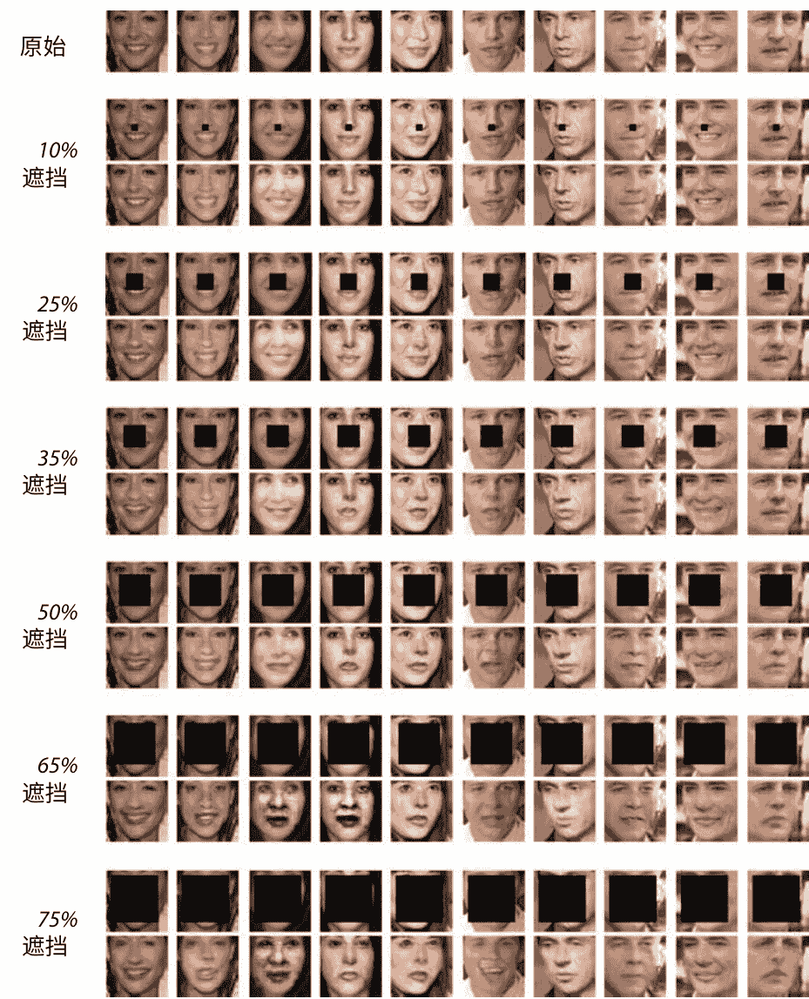

图8.11 使用DCGAN对LFW数据集中的图像进行遮挡去除的定性结果

为了训练$\mathcal{G}_{z}$和$\mathcal{D}_{x}$，我们使用了捕捉了姿势、光照和人脸高变异性的LFW数据。我们发现这对于帮助$\mathcal{G}_{z}$收敛到稳定的权重是至关重要的。该模型能够更好地泛化到各种人脸和姿势。如图8.11所示，该模型能够有效地生成缺失的信息。

图8.12 遮挡去除的质量测量在PCSO子集上
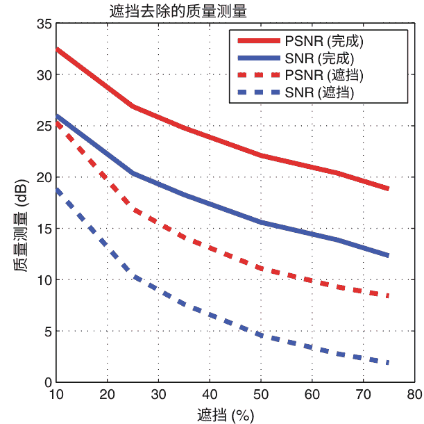

| 遮挡 (%) | PSNR | PSNR | SNR | SNR |
| :--- | :--- | :--- | :--- | :--- |
| 10 | 25.3607 | 32.5194 | 18.8488 | 26.0101 |
| 25 | 16.8941 | 26.8720 | 10.3822 | 20.3627 |
| 35 | 14.112 | 24.7825 | 7.6001 | 18.2732 |
| 50 | 11.0937 | 22.1043 | 4.5819 | 15.5950 |
| 65 | 9.2849 | 20.3719 | 2.773 | 13.8627 |
| 75 | 8.4169 | 18.8392 | 1.905 | 12.3299 |

我们没有依赖视觉检查，而是在图8.12中绘制了从10K PCSO子集中恢复（去除遮挡）的人脸的PSNR和SNR。这是我们使用GAN进行遮挡去除的质量测量。如表8.9所示，完成的图像的PSNR/SNR更好，而且预期较少遮挡的图像的PSNR/SNR更高。

训练生成对抗网络的主要动机是改善模型的能力。这在表8.10中有所涉及。表格的第一列是我们的基准情况。这是使用从分辨率为$G_z$和$D_x$所需的分辨率进行上采样的图像构建的，这与$\mathcal{M}_{k}$所期望的分辨率相符。所有其他准确率都应与此情况进行评估。（图8.13）

表8.10 在PCSO子集上进行实验III的整体分类准确率。图像受到各种百分比的中心连续缺失像素的破坏。

| 破坏率 | 10% | 10% | 25% | 25% | 35% | 35% | 50% | 50% | 65% | 65% | 75% | 75% |
| :--- | :--- | :--- | :--- | :--- | :--- | :--- | :--- | :--- | :--- | :--- | :--- | :--- |
| 男性女性 | 96.64 | 85.39 | 71.12 | 95.29 | 56.08 | 93.60 | 54.05 | 87.88 | 57.82 | 78.42 | 50.19 | 75% |
| $M_1$ | 96.13 | 87.09 | 62.25 | 94.39 | 53.77 | 93.18 | 54.17 | 87.92 | 59.85 | 79.69 | 51.20 | 78.56 |
| $M_2$ | 95.74 | 85.73 | 68.30 | 93.46 | 53.59 | 92.47 | 55.03 | 86.45 | 51.26 | 78.19 | 50.13 | 78.81 |
| $M_3$ | 95.44 | 85.43 | 73.14 | 93.36 | 51.65 | 92.18 | 53.19 | 86.82 | 50.81 | 78.97 | 50.09 | 79.43 |
| $M_4$ | 97.52 | 83.35 | 56.34 | 94.78 | 50.24 | 92.82 | 53.58 | 86.93 | 52.72 | 78.96 | 50.12 | 79.70 |
| $M_5$ | 95.78 | 86.19 | 53.98 | 92.47 | 50.33 | 91.05 | 52.44 | 86.62 | 52.20 | 78.24 | 50.23 | 79.03 |
| $M_6$ | 96.21 | 86.41 | 58.47 | 92.84 | 50.42 | 91.30 | 52.02 | 87.15 | 51.02 | 78.74 | 50.40 | 79.77 |
| 男性个人 | 93.46 | 87.55 | 77.56 | 93.21 | 76.44 | 91.73 | 69.28 | 88.39 | 76.33 | 79.42 | 54.39 | 80.96 |

图8.14对应于表8.10的其他列。使用$G_z$生成的完整图像的准确率明显优于使用掩码图像的准确率。这表明幻觉能够保持原始图像的性别敏感性。

通过对图8.11进行视觉检查，也可以验证上述陈述。即使对于高百分比的遮挡（50%-75%），原始脸部的轮廓和特征也被$G_z$相当准确地再现。

### 8.5.4 讨论

在当前的图像遮挡去除生成模型中，我们假设算法已知遮挡掩码，即方程式8.7中的M。虽然本研究不涉及算法如何自动确定遮挡区域，但这将是一个有趣的研究方向。例如，[61]能够自动判断哪部分是脸部或非脸部区域。

DCGAN或GAN的一个重要优势是它完全无监督。损失函数基本上是基于测量两个分布的相似性（真实图像分布和生成图像分布），而不是基于图像的比较，这可能需要提供标记的真实图像。GAN的无监督性质使得训练过程更加容易，无需仔细筛选标记数据。

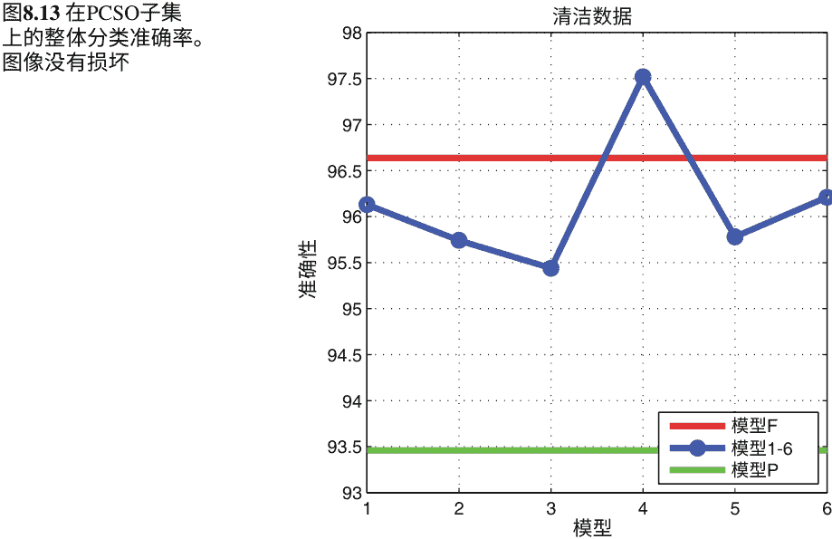

图8.14 在PCSO子集上的整体分类准确率。图像受到不同百分比的中心连续遮挡的损坏
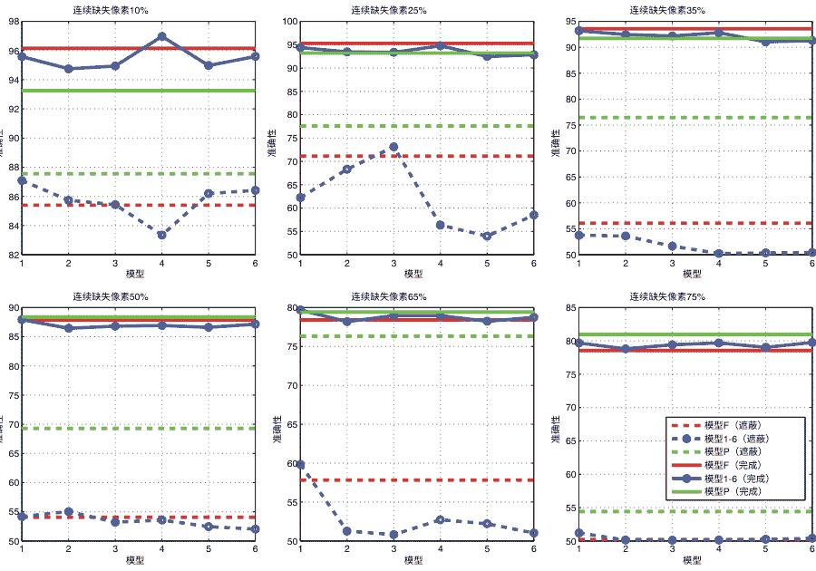

DCGAN的有效性也非常明显。它不仅可以高度准确地恢复高百分比的缺失数据，从而在性别分类任务上取得显著改进，还可以用于未来的数据增强，完全无监督。我们基本上可以生成所需的任意数量的性别特定数据，这将成为训练更大模型的资产。

在我们的实验中，我们发现使用更受限制的人脸（较少的姿势变化，较少的光照变化，较少的表情变化等）来训练DCGAN实际上会降低恢复性能。原因可能如下。当训练数据较少多样化时，让我们使用一个极端情况，即仅包含一个主题的数千张图像的训练数据集。在这种情况下，“真实分布”变成了一个非常密集的集群，这意味着无论生成器G尝试生成什么图像，鉴别器D几乎总是会说生成的图像不是来自真实分布，因为生成的图像分布几乎无法命中那个密集的集群。这样，我们实际上为鉴别器提供了一个太容易解决的任务，这阻止了鉴别器成为一个强大的鉴别器。在这种对抗性设置中，这也导致了生成器的性能较差。简而言之，在DCGAN训练过程中，我们绝对需要更多的训练语料库变化。

## 8.6 结论和未来工作

在这项工作中，我们承担了遮挡和低分辨率下的人脸性别分类任务。受可训练的深度架构注意力模型的启发，以及眼周区域被证明是性别分类最显著的区域，我们能够设计一种渐进的卷积神经网络训练范式，在学习过程中强制进行注意力转移。

我们旨在使网络关注特定的显著区域（例如眼周区域），而无需改变网络架构本身。网络从这种注意力转移中受益，并在遮挡和低分辨率退化方面变得更加稳健。通过渐进训练的卷积神经网络模型，我们在400K图像的大规模PCSO照片数据库中，在遮挡和低分辨率设置下，相比传统训练，取得了更好的性别分类结果。此外，我们的渐进训练网络足够通用，可以对任意类型和任意位置的遮挡以及低分辨率具有鲁棒性。

为了进一步提高对遮挡面部图像的性别分类性能，我们通过深度卷积生成对抗网络（DCGAN）采用深度生成方法来填充遮挡面部区域的缺失像素。恢复的图像不仅与原始未遮挡图像相比显示出高保真度，而且显著提高了性别分类性能。

总之，一方面，我们旨在构建一个对图像遮挡和低分辨率等图像退化具有容忍性的强大性别分类器；另一方面，我们旨在通过生成方法减轻和消除这些退化。通过这些工作，我们能够推动无约束面部性别分类的边界。

### 未来的工作

我们在实验部分展示了对PCSO照片数据库进行的一系列大规模测试实验，其中包括了40万张图像。我们注意到，在相同的测试环境下，对于不同的逐步训练模型（M0-M6），测试整个40万张图像所需的时间差异巨大。如图8.15所示，在进行添加高斯噪声遮挡鲁棒性实验时，我们可以观察到从M0到M6的测试时间逐渐减少的趋势。在PCSO的所有大规模实验中，都观察到了相同的趋势。时间差异令人惊讶。例如，如果我们看绿色曲线，M0需要超过5000秒，而M6只需要约500秒。未来的研究方向之一是研究这种现象的原因。一种可能的方向是研究学习滤波器的稀疏性或平滑性。

如图8.15所示，我们在AlexNet的64个第一层滤波器的可视化中，分别对应模型M0、M3和M6，可以观察到逐渐训练的滤波器似乎更加平滑，这可能是由于在第8.3.1.3节中讨论的隐式低秩正则化现象。其他未来的工作可能包括研究如何通过模型的集成[43,44]来进一步提高性能，以及如何处理各种情况。

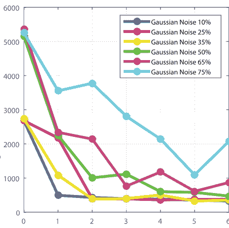

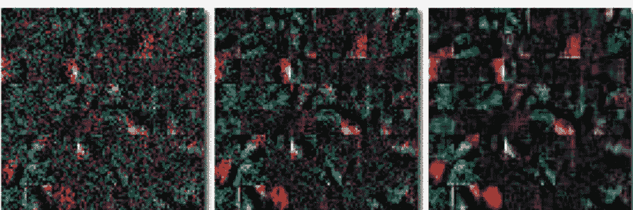

图8.15（顶部）在不同模型上进行加性高斯噪声遮挡实验的测试时间。（底部）分别对应模型$\mathcal{M}_0$，$\mathcal{M}_3$和$\mathcal{M}_6$的64个第一层滤波器的可视化。

多模态软生物特征[5, 23, 25, 26, 28–30, 37, 41, 42, 64, 66, 74]可以融合以改善性别分类，特别是在更不受限制的情况下。

# 参考文献

- 1. B. Amos, B. Ludwiczuk, M. Satyanarayanan, Openface：一个通用的人脸识别库，具有移动应用程序。技术报告，CMU-CS-16-118，CMU计算机科学学院（2016年）
- 2. J. Ba, V. Mnih, K. Kavukcuoglu, 多目标识别与视觉注意力（2014年），arXiv:1412.7755
- 3. D. Bahdanau, K. Cho, Y. Bengio, 神经机器翻译：联合学习对齐和翻译（2014年），arXiv:1409.0473
- 4. A. Bartle, J. Zheng, 深度学习的性别分类。斯坦福大学cs224d课程项目报告（2015年）
- 5. P. Buchana, I. Cazan, M. Diaz-Granados, F. Juefei-Xu, M. Savvides, 使用先进的相关滤波器在绘画中同时进行伪造识别和定位, 在IEEE国际图像处理会议 (ICIP) (2016年), 第1-5页。
- 6. W. Chan, N. Jaitly, Q.V. Le, O. Vinyals, Listen, attend and spell (2015), arXiv:1508.01211
- 7. D.Y. Chen, K.Y. Lin, 针对真实生活中不受控制的环境的鲁棒性性别识别图像. IEEE Trans. Consum. Electron. 56(3), 1586-1592 (2010)
- 8. M.M. Cheng, Z. Zhang, W.Y. Lin, P. Torr, BING: 二值化归一化梯度用于目标性估计在300fps，在 IEEE CVPR (2014), pp. 3286-3293
- 9. J.K. Chorowski, D. Bahdanau, D. Serdyuk, K. Cho, Y. Bengio, 基于注意力的语音识别模型在Advances in Neural Information Processing Systems(2015), pp. 577-585
- 10. W. Chuan-xu, L. Yun, L. Zuo-yong, 基于2-D Gabor小波变换和SVM的人脸图像性别分类算法研究, in SCSCT'08. 国际计算机科学与计算技术研讨会, 2008, vol. 1 (IEEE, 2008), pp. 312-315
- 11. B.A. Golomb, D.T. Lawrence, T.J. Sejnowski, Sexnet: 一个神经网络从人脸中识别性别, in NIPS, vol. 1 (1990), p. 2
- 12. I. Goodfellow, J. Pouget-Abadie, M. Mirza, B. Xu, D. Warde-Farley, S. Ozair, A. Courville, Y. Bengio, 生成对抗网络, in神经信息处理系统进展 (2014), pp. 2672-2680
- 13. S. Gutta, J.R. Huang, P. Jonathon, H. Wechsler, 专家混合用于人脸性别、种族和姿势分类的研究. IEEE Trans. Neural Netw. 11(4), 948-960 (2000)
- 14. J. Harel, C. Koch, P. Perona, 基于图的视觉显著性, in NIPS(2006), pp. 545-552
- 15. X. Hou, J. Harel, C. Koch, 图像签名: 强调稀疏显著区域. IEEE TPAMI 34(1), 194-201 (2012)
- 16. S.Y.D. Hu, B. Jou, A. Jaeckh, M. Savvides, 基于区域表示的性别识别融合, in IEEE/IAPR IJCB(2011), pp. 1-7
- 17. L. Itti, C. Koch, E. Niebur, 基于显著性的快速场景分析的视觉注意模型。 IEEE Trans. Pattern Anal. Mach. Intell. 20(11), 1254-1259 (1998)
- 18. T. Jabid, M.H. Kabir, O. Chae, 使用局部方向模式 (LDP) 进行性别分类, 在IEEE ICPR (IEEE, 2010) , pp. 2162-2165
- 19. M. Jaderberg, K. Simonyan, A. Zisserman, 空间变换网络, 在 NIPS (2015) , pp. 2008-2016
- 20. F. Juefei-Xu, M. Savvides, 你的眉毛能告诉我你是谁吗？在2011年第五届国际信号处理和通信系统会议 (ICSPCS) (2011) , pp. 1-8
- 21. F. Juefei-Xu, M. Savvides, 使用COTS PTZ相机进行非合作主体的无约束眼周生物识别采集和识别, 在2012 IEEE计算机视觉应用研讨会 (WACV) (2012) , pp. 201-208
- 22. F. Juefei-Xu, M. Savvides, 一种增强的线性判别分析方法用于通过面部不对称特征识别同卵双胞胎, 在2013年IEEE计算机视觉与模式识别 (CVPR) 研讨会上 (2013) , 第56-63页
- 23. F. Juefei-Xu, M. Savvides, 一种基于图像统计的方法，用于面部边界上的关键点的高效和稳健的细化，在2013年IEEE第六届国际生物识别学术会议 (BTAS) 上 (2013) ，第1-8页
- 24. F. Juefei-Xu, M. Savvides, 基于子空间的离散变换编码的局部二值模式表示，用于NIST 人脸识别大挑战中的鲁棒眼周匹配。 IEEE图像处理期刊 23(8), 3490-3505 (2014)
- 25. F. Juefei-Xu, M. Savvides, 对严酷的面部照明进行局部二进制模式的编码和解码, IEEE 国际图像处理会议(ICIP) (2015), pp. 3220-3224
- 26. F. Juefei-Xu, M. Savvides, 面部种族外貌合成, 计算机视觉 - ECCV 2014研讨会。 计算机科学讲义, 第8926卷(Springer国际出版社, 柏林, 2015), pp. 825-840
- 27. F. Juefei-Xu, M. Savvides, 帕累托最优判别分析, IEEE国际图像处理会议(ICIP) (2015), pp. 611-615
- 28. F. Juefei-Xu, M. Savvides, Pokerface: 部分顺序保持和能量抑制方法用于极端面部照明归一化, 2015年IEEE第七届国际生物识别学术会议(BTAS)(2015), pp. 1-8
- 29. F. Juefei-Xu, M. Savvides, 通过单独字典学习进行单张人脸图像超分辨率, IEEE国际图像处理会议(ICIP)(2015), 第2239-2243页
- 30. F. Juefei-Xu, M. Savvides, 权重最优的局部二值模式, 计算机视觉 - ECCV2014研讨会。计算机科学讲义, 第8926卷 (Springer国际出版社, 柏林, 2015), 第148-159页
- 31. F. Juefei-Xu, M. Savvides, 基于眼周的全脸生成的字典学习, 2016年IEEE第七届国际生物特征学会议: 理论、应用和系统(BTAS)(2016), 第1-8页
- 32. F. Juefei-Xu, M. Savvides, 学习反转局部二值模式, 第27届英国机器视觉会议(BMVC) (2016)
- 33. F. Juefei-Xu, M. Savvides, 多类别福冈-昆茨判别分析用于增强人脸识别。模式识别。 52, 186-205 (2016)
- 34. F. Juefei-Xu, M. Cha, J.L. Heyman, S. Venugopalan, R. Abiantun, M. Savvides, 鲁棒的局部二进制模式特征集用于眼周生物识别, 第四届IEEE国际生物识别理论应用和系统会议(BTAS)(2010), 第1-8页
- 35. F. Juefei-Xu, M. Cha, M. Savvides, S. Bedros, J. Trojanova, 鲁棒的眼周生物识别通过多级融合各种局部特征提取技术, 第IEEE第17届数字信号处理国际会议(DSP)(2011), 第1-7页
- 36. F. Juefei-Xu, K. Luu, M. Savvides, T. Bui, C. Suen, 研究年龄不变的人脸识别基于眼周生物特征, 第2011年国际联合生物识别会议(IJCB) (2011), 第1-7页
- 37. F. Juefei-Xu, C. Bhagavatula, A. Jaeckh, U. Prasad, M. Savvides, Gait-ID在移动中: 使用手机加速度计动态进行独立于步伐的人体识别, 在2012年IEEE第五届国际生物特征学理论、应用和系统会议 (BTAS) (2012年), 第8-15页
- 38. F. Juefei-Xu, D.K. Pal, M. Savvides, 通过维度加权K-SVD从眼周区域生成整个面部, 在2014年IEEE计算机视觉和模式识别 (CVPR) 研讨会 (2014年), 第1-8页
- 39. F. Juefei-Xu, D.K. Pal, M. Savvides, 通过优先重建错误的方法和软件生成面部特征 (2014年)。美国临时专利申请序列号61/998,043, 2014年6月17日
- 40. F. Juefei-Xu, K. Luu, M. Savvides, Spartans: 基于单样本眼周围的鲁棒性识别技术应用于非正面场景. IEEE图像处理 24(12), 4780-4795 (2015)
- 41. F. Juefei-Xu, D.K. Pal, M. Savvides, NIR-VIS异构人脸识别通过交叉光谱联合字典学习和重构, 在2015 IEEE计算机视觉和模式识别大会(CVPR)研讨会(2015), pp. 141-150
- 42. F. Juefei-Xu, D.K. Pal, K. Singh, M. Savvides, 对COTS人脸识别系统对法医分析师风格的人脸处理的敏感性的初步调查,在2015 IEEE计算机视觉和模式识别大会(CVPR)研讨会(2015), pp. 25-33
- 43. F. Juefei-Xu, V.N. Boddeti, M. Savvides, 本地二进制卷积神经网络 (2016), arXiv:1608.06049
- 44. F. Juefei-Xu, V.N. Boddeti, M. Savvides, 本地二进制卷积神经网络, 在2017年IEEE计算机视觉与模式识别会议 (CVPR) (2017)
- 45. D. Kingma, J. Ba, Adam: 一种随机优化方法 (2014), arXiv:1412.6980
- 46. A. Krizhevsky, I. Sutskever, G.E. Hinton, 使用深度卷积神经网络进行图像分类, 在 NIPS(2012), pp. 1097-1105
- 47. G.B.H.E. Learned-Miller, 野外标记人脸: 更新和新的报告程序. 技术报告UM-CS-2014-003, 马萨诸塞大学阿默斯特分校 (2014年)
- 48. P.H. Lee, J.Y. Hung, Y.P. Hung, 使用融合面部条带的自动性别识别, 在IEEE ICPR (IEEE, 2010年), 第1140-1143页
- 49. X. Leng, Y. Wang, 改进性别分类的泛化能力, 在IEEE ICIP (IEEE, 2008年), 第1656-1659页
- 50. G. Levi, T. Hassner, 使用卷积神经网络进行年龄和性别分类, 在IEEE CVPRW (2015年)
- 51. H. Lin, H. Lu, L. Zhang, 一种新的性别、年龄和种族自动识别系统, 在WCICA 2006 , 第六届世界智能控制与自动化大会, 2006年, 第2卷 (IEEE, 2006年), 第9988-9991页
- 52. H. Lu, H. Lin, 使用adaboost特征进行性别识别, 在ICNC 2007, 第三届国际自然计算会议上, 2007年, 卷2 (IEEE, 2007), pp. 646-650
- 53. L. Lu, Z. Xu, P. Shi, 基于多个面部区域的面部图像性别分类, 在2009年WRI世界计算机科学与信息工程大会上, 卷6 (IEEE, 2009), pp. 48-52
- 54. M.T. Luong, H. Pham, C.D. Manning, 基于注意力的神经机器翻译的有效方法, 在Empirical Methods in Natural Language Processing (EMNLP)会议上(2015)
- 55. A. Martinez, R. Benavente, AR人脸数据库。CVC技术报告第24号 (1998)
- 56. J. Merkow, B. Jou, M. Savvides, 仅使用眼周区域进行性别识别的探索, 在IEEE BTAS会议上(2010), pp. 1-5
- 57. V. Mnih, N. Heess, A. Graves, 等, 视觉注意力的循环模型, 出自 NIPS(2014), 第2204-2212页
- 58. B. Moghaddam, M.H. Yang, 使用支持向量机进行性别分类, 出自IEEE FG (IEEE, 2000), 第306-311页
- 59. D.K. Pal, F. Juefei-Xu, M. Savvides, 判别不变核特征：一种无需花哨的无监督人脸识别和姿态估计方法, 出自2016 IEEEConference on Computer Vision and Pattern Recognition (CVPR) (2016)
- 60. A. Radford, L. Metz, S. Chintala, 使用深度卷积生成对抗网络进行无监督表示学习 (2015) , arXiv:1511.06434
- 61. S. Saito, T. Li, H. Li, 实时人脸分割和性能捕捉, 基于RGB输入 (2016), arXiv:1604.02647
- 62. M. Savvides, F. Juefei-Xu, 使用基于子空间的离散变换编码局部二进制模式进行图像匹配 (2013). 美国专利 US 2014/0212044 A1
- 63. M. Savvides, F. Juefei-Xu, U. Prasad, C. Bhagavatula, 在真实环境中的无约束生物特征识别, 出版于人机交互的进展.智能系统与计算的进展, 卷497 (2016), 页231-244
- 64. K. Seshadri, F. Juefei-Xu, D.K. Pal, M. Savvides, 在战略公路研究计划 (SHRP2) 面部视图视频上进行驾驶员手机使用检测, 出版于2015年IEEE计算机视觉与模式识别 (CVPR) 研讨会(2015), 页35-43
- 65. C. Tai, T. Xiao, X. Wang, W. E, 具有低秩正则化的卷积神经网络。 ICLR (2016), http://arxiv.org/abs/1511.06067
- 66. S. Venugopalan, F. Juefei-Xu, B. Cowley, M. Savvides, 用于抗欺骗生物识别认证的肌电图和按键动力学, 在2015年IEEE计算机视觉与模式识别 (CVPR) 研讨会上 (2015) , 第109-118页
- 67. O. Vinyals, A. Toshev, S. Bengio, D. Erhan, 展示和描述：一个神经图像标题生成器, 在 IEEE CVPR (2015) , 第3156-3164页
- 68. T. Xiao, Y. Xu, K. Yang, J. Zhang, Y. Peng, Z. Zhang, 两级注意力模型在深度卷积神经网络中的应用于细粒度图像分类, 在IEEE CVPR (2015) , 第842-850页
- 69. H. Xu, K. Saenko, 询问、关注和回答：探索问题引导的空间注意力在视觉问答中的应用 (2015), arXiv:1511.05234
- 70. K. Xu, J. Ba, R. Kiros, K. Cho, A. Courville, R. Salakhudinov, R. Zemel, Y. Bengio, 展示、关注和描述：具有视觉注意力的神经图像字幕生成, 在 ICML(2015), pp.2048-2057

- 71. Z. Yang, M. Li, H. Ai, 关于自动人脸性别分类的实验研究, 在 IEEE ICPR, vol. 3 (IEEE, 2006), pp. 1099-1102
- 72. L. Yao, A. Torabi, K. Cho, N. Ballas, C. Pal, H. Larochelle, A. Courville, 利用时间结构描述视频, 在 IEEE ICCV (2015), pp. 4507-4515
- 73. R. Yeh, C. Chen, T. Y. Lim, M. Hasegawa-Johnson, M. N. Do, 语义图像修复与感知和上下文损失 (2016), arXiv:1607.07539
- 74. N. Zehngut, F. Juefei-Xu, R. Bardia, D. K. Pal, C. Bhagavatula, M. Savvides, 探索基于图像的鼻生物特征的可行性, 在 IEEE 国际图像处理会议 (ICIP) (2015), pp. 522-526
- 75. Y. Zhu, O. Groth, M. Bernstein, L. Fei-Fei, Visual7W: 图像中的基于问题的问答 (2015), arXiv:1511.03416

## 第9章

## 使用深度学习从近红外虹膜图像进行性别分类

胡安·塔皮亚和卡洛斯·阿拉维纳

摘要 从近红外虹膜图像中进行性别分类是一个新的课题，只有少数几篇论文发表。以前关于虹膜性别的研究都试图找到最佳的特征提取技术，以表示虹膜纹理的信息，用于性别分类，使用归一化、编码或眼周图像。然而，这是一个在深度学习应用中的新课题，涉及软生物特征。在本章中，我们展示了通过使用深度神经网络学习性别虹膜表示可以提高这些任务的性能。为此，我们提出了将深度学习方法应用于分离性别虹膜图像，即使学习数据量有限，也可以使用无监督阶段的受限玻尔兹曼机（RBM）和使用卷积神经网络（CNN）的有监督阶段。

## 9.1 引言

在“软生物特征”研究中，一个活跃的领域涉及从生物特征样本中对个人的性别进行分类。大部分性别分类的工作都涉及对面部或眼周图像的分析。在特征提取和选择之后，已经使用了各种类型的分类器进行性别分类。在从面部进行性别分类的研究中，产生最高分类准确率的分类器是 Adaboost、RBF 网络和支持向量机（SVM）[1, 20, 22, 24, 25, 31]。最近，Levi 等人提出了一种使用简单卷积网络架构的自动面部年龄和性别分类方法，该方法可以在学习数据量有限时使用。

J. Tapia (✉)
智利圣地亚哥安东尼奥瓦拉斯大道 880 号安德烈斯贝洛大学
e-mail: juan.tapia@unab.cl

C. Aravena
智利圣地亚哥图珀大道 2007 号智利大学
e-mail: cararave@ing.uchile.cl

© Springer International Publishing AG 2017
B. Bhanu and A. Kumar (eds.), 深度学习用于生物特征识别, 计算机视觉与模式识别的进展,
DOI 10.1007/978-3-319-61657-5_9

受限。同时，Juefei-Xu 等人 [15] 使用具有遮挡和低分辨率的人脸图像进行性别分类，使用渐进训练的卷积神经网络并引入注意力机制。

使用虹膜信息进行性别分类是一个相对较新的课题，只有少数几篇论文发表 [2, 17, 26, 28]。文献中报道的大多数性别分类方法都使用全部虹膜纹理特征进行分类。因此，可能会将与性别无关的信息输入到分类器中，这可能导致泛化能力差，特别是当训练集很小的时候。理论上和实证上都表明，减少不相关或冗余特征的数量可以提高分类器的学习效率 [21]。

在比较虹膜编码进行身份识别方面，不同个体的虹膜编码，甚至同一人的左右眼的虹膜编码都被证明是独立的。同时，一些作者报告称，使用与身份识别不同的虹膜纹理分析方法，可以以比随机猜测更高的准确率对个人的性别进行分类。

虹膜性别识别是一个有趣且有潜力的问题的原因有几个 [27]。一个可能的应用是在已注册数据库中搜索匹配项。如果可以确定样本的性别，则可以用于排序搜索并减少平均搜索时间。另一个可能的应用是在社交场合中，基于性别进行某个区域的筛选，但不记录身份。性别分类对于人口统计信息收集、市场研究和实时电子营销也非常重要。另一个可能的应用是在高安全场景中，了解试图进入但未被识别为任何已注册人员的人的性别可能具有价值。而且，在基础科学层面上，从分析虹膜纹理中可以提取出一个人的哪些信息是有价值的。

Thomas 等人 [28] 是第一个探索通过虹膜进行性别识别的人，使用了 LG 2200 传感器获取的图像。他们对虹膜区域进行了分割，并采用机器学习技术开发了基于虹膜纹理特征预测性别的模型。他们对虹膜区域进行了分割，创建了一个归一化的虹膜图像，然后对归一化图像应用了对数 Gabor 滤波器。他们进行了严格的质量检查，排除了质量较差的图像，如运动模糊或失焦的图像。除了对数 Gabor 纹理特征外，他们还使用了瞳孔和虹膜的七个几何特征，并且能够达到接近 80% 的准确率。

Lagree 等人 [17] 使用 LG 4000 传感器获取了虹膜图像进行了实验。他们分别为从瞳孔-虹膜边界到虹膜巩膜边界的八个五像素水平带和从 40 x 240 图像中的 24 像素垂直带计算纹理特征。归一化图像没有经过 IrisBEE 软件 [23] 使用的对数 Gabor 滤波器处理，也没有使用任何几何特征来开发基于虹膜纹理特征预测性别和种族的模型。

这些是与 Thomas 在 [28] 中计算的特征的差异。这种方法达到了接近 62% 的性别准确率和接近 80% 的种族准确率。

Bansal 等人 [2] 使用 Cross MatchSCAN-2 双虹膜相机获取虹膜图像进行了实验。基于相邻像素之间的相关性的统计特征提取技术与基于 2D 小波树的特征提取技术相结合，从虹膜图像中提取了显著特征。这种方法对性别分类的准确率达到了 83.06%。然而，与文献中其他研究相比，本实验中使用的数据库非常小 (300 张图像)。

Tapia 等人 [26] 使用 LG 4000 传感器获取的虹膜图像进行了性别分类实验，基于虹膜纹理特征的分析。他们使用了不同的局部二值模式实现，使用了掩码信息从虹膜图像中提取特征。使用统一的 LBP 和连接的直方图相对于使用整个虹膜图像，显著提高了性别预测的准确性。使用非主体不相交的测试集，他们能够通过左眼虹膜的纹理实现超过 91% 的正确性别预测。

Costa-Abreu 等人 [8] 通过使用仅几何特征、仅纹理特征以及从虹膜图像中提取的几何和纹理特征，探索了与性别预测任务相关的三种方法。本研究使用了 BioSecure Multimodal DataBase (BMDB)，这些图像是使用 LG Iris Access EOU-3000 拍摄的。他们能够通过虹膜的纹理实现超过 89.74% 的正确性别预测。然而，数据集不可用，作者选择了图像，被试者不允许佩戴眼镜，但允许佩戴隐形眼镜。我们的数据库更真实地代表了实际情况。

Bobeldik 等人 [4] 探索了与近红外虹膜图像的四个不同区域相关的性别预测准确性：扩展眼部区域、排除虹膜的眼部区域、仅虹膜区域和归一化的仅虹膜区域。他们使用了二值化统计图像特征 (BSIF) 纹理算子 [16] 从先前定义的区域提取特征。眼部区域达到了最佳性能，为 85.7%，而归一化图像的性能最差，与眼部区域相比性能差异近 20%（65%）。因此，我们可以理解归一化过程可能会滤除有用的信息。

最近，Tapia 等人 [27] 直接从相同的二进制虹膜代码中预测性别，该代码可用于识别。他们发现性别预测的信息分布在虹膜上，而不是局限在特定的同心圆带中。他们还发现，使用代表虹膜子区域子集的选定特征比使用代表整个虹膜区域的特征能够获得更高的准确性，通过左眼和右眼的最佳虹膜代码特征的融合，达到 89% 的正确性别预测。

这些方法的实验设置总结在表 9.1 中。

### 表 9.1 先前发表论文的性别分类总结。N 代表：归一化图像，E 代表：编码图像，P 代表：眼周图像

| 论文 | 传感器 | 图像的尺寸 | 图像的数量 | 主体的数量 | TI | E |
|---|---|---|---|---|---|---|
| Thomas 等人 [28] | LG 2200 | 20 x 240 | 16,469 | 不适用 | N | - |
| Lagree 等人 [17] | LG 4000 | 40 x 240 | 600 | 300 | N | - |
| Bansal 等人 [2] | Cross Match 扫描-2 | 10 x 500 | 300 | 200 | N | - |
| Tapia 等人 [26] | LG 4000 | 20 x 240 | 1,500 | 1,500 | N | - |
| Costa-Abreu 等人 [8] | LG EOU-3000 | 20 x 240 | 1,600 | 200 | N | - |
| Bobeldyk 等人 [4] | 近红外传感器 | 20 x 240 | 3,314 | 1,083 | N/P | - |
| Tapia 等人 [27] | LG 4000 | 20 x 240 | 3,000 | 1,500 | - | E |

## 9.2 深度学习模型

在本章中，我们首先提出了一种无监督的方法，利用大量未标记的虹膜图像对深度置信网络 [13] 进行预训练，然后利用它对深度多层网络 (MLP) 进行快速微调，用于性别分类。

提出了第二种方法，使用 Lenet-5 [18] 卷积神经网络（CNN）模型来改进从归一化近红外（NIR）虹膜图像中的性别分类。然后，我们比较并讨论了两种方法得到的结果。

### 9.2.1 半监督方法

在虹膜生物特征场景中，我们通常有很多没有标签的信息（年龄、性别、种族），因为虹膜数据库是专注于虹膜识别与编码或眼周图像，而不是解决软生物特征问题，如从虹膜中分类性别。因此，我们通常有多个会话中为同一主体拍摄的虹膜图像数据库，其中许多图像没有性别信息可用。因此，创建一个大型的人员不重叠数据集以正确训练和评估软生物特征虹膜算法可能是一项艰巨的任务。

DBN 无监督算法可以帮助分类未标记的虹膜图像。

#### 9.2.1.1 深度置信网络

深度置信网络（DBN）由多层随机潜变量组成，使用无监督学习算法进行训练，然后使用前馈反向传播多层神经网络（MLP）进行监督学习阶段 [13]。在无监督预训练阶段，每一层都使用受限玻尔兹曼机（RBM）进行训练。无监督预训练是解决具有大量数据和高变异性的无标签分类问题的重要步骤，这是本提案的主要关注点。DBN 是一个图形模型，其中隐藏层的神经元在可见层的特定配置下是条件独立的，反之亦然。DBN 可以逐层训练通过迭代地最大化输入向量或可见向量在给定隐藏向量和一组特定层权重的条件概率。这种逐层训练可以帮助改善对输入训练数据的变分下界，从而提高整体生成模型的性能。DBN 是学习提取训练数据的深层分层表示的图形模型。它们对观察向量 x 和隐藏层 h 之间的联合分布进行建模，如下所示：

$$P\left(x, h^{k}, \ldots, h^{l}\right)=\left(\prod_{k=0}^{l-2} P\left(h^{k} \mid h^{k+1}\right)\right) P\left(h^{l-1}-1, h^{l}\right)$$ (9.1)

其中 $x=h^{0}$, $P\left(h^{k-1} \mid, h^{k}\right)$ 是在第 k 层 RBM 的隐藏单元条件下对可见单元的条件分布，$P\left(h^{l-1}, h^{l}\right)$ 是顶层 RBM 中的可见-隐藏联合分布。这在图 9.1 中有所说明。根据 Hinton 等人的研究 [13]，贪婪逐层无监督训练的原则可以应用于以 RBM 为构建块的 DBN 的每一层 [3]。该过程如下：

- 1. 将第一层训练为一个模拟原始输入的 RBM，其可见层表示为 $x=h(0)$。
- 2. 使用第一层来获得输入的表示，该表示将作为第二层的数据。存在两种常见的解决方案。可以选择将该表示选择为平均激活值 $p(h(1)=1 \mid h(0))$ 或者 $p(h(1) \mid h(0))$ 的样本。
- 3. 将第二层训练为一个 RBM，以转换后的数据（样本或平均激活值）作为训练样本（用于该 RBM 的可见层）。按照所需的层数进行迭代（步骤 2 和 3），每次向上传播样本或平均值。
- 4. 针对 DBN 对数似然的代理或针对监督训练准则（在将学习到的表示转换为监督预测之前添加额外的学习机制）对该深度架构的所有参数进行微调。

RBM 可以用能量函数 E 表示

图 9.1 RBM 的块图
X 代表输入层
h1-h3 代表隐藏层

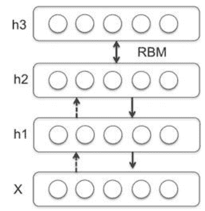

E(v, h) = - \sum_i a_i v_i - \sum_j b_j h_j - \sum_i \sum_j h_j w_{i,j} v_i \quad (9.2)

其中，RBM 由隐藏单元 $v_j$ 和可见单元 $v_j$ 之间的权重矩阵 $W=(w_{i,j})$ 组成。可见单元的偏置权重为 $a_i$，隐藏单元的偏置权重为 $b_j$。RBM 采用二分图的结构，因此只有隐藏层或可见层神经元之间存在层间连接，而隐藏层或可见层内部没有层内连接。因此，对于给定的隐藏单元激活集合，可见单元神经元的激活是相互独立的，反之亦然。因此，通过将 $v$ 或 $h$ 设置为常数，我们可以计算另一个的条件分布，如下所示 [13]：

P(h_j = 1 \mid v) = \sigma \left(b_j + \sum_{i=1}^m w_{i,j}v_i\right) \quad (9.3)
P(v_i = 1 \mid h) = \sigma \left(a_i + \sum_{j=1}^n w_{i,j}h_j\right) \quad (9.4)

其中 $\sigma$ 表示对数 sigmoid 函数。训练算法最大化分配给训练数据集 V 的期望对数概率。因此，如果训练数据集 V 由可见向量 v 组成，则目标函数如下所示：

\operatorname*{argmax} E \left[ \sum_{v \in V} \log P(v) \right] \quad (9.5)

使用对比散度算法 [7] 训练 RBM。训练完成后，DBN 可以用于初始化 MLP 的权重，用于监督学习阶段。

在这项工作中，我们还专注于通过监督梯度下降进行微调（图 9.2）。具体来说，我们使用逻辑回归分类器根据 DBN 的最后一个隐藏层 $h(l)$ 的输出对输入 $x$ 进行分类。然后，通过负对数似然代价函数进行监督梯度下降进行微调。由于每个层的权重和隐藏层偏差的监督梯度只对应非零值（即每个 RBM 的可见偏差为零），因此该过程等同于使用无监督训练策略获得的权重和隐藏层偏差初始化深度 MLP 的参数。可以观察到 DBN 与 Stack denoising Autoencoder [30] 非常相似，因为两者都涉及无监督逐层预训练，然后通过监督微调作为深度 MLP。在本章中，我们使用 RBM 类而不是 denoising autoencoder 类。现在主要问题是选择最佳的深度 MLP 超参数。

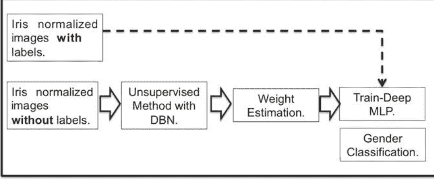

图 9.2 带有半监督虹膜性别分类主要阶段的块图。预训练（无监督阶段）使用 DBN 进行，并通过深度 MLP 进行微调（有监督阶段）。

一旦所有层都经过预训练，网络将经历第二阶段的训练，称为微调。在这里，我们考虑有监督的微调，我们希望在有监督的任务上最小化预测误差。为此，我们首先在网络的顶部（更准确地说是在输出层的输出代码上）添加一个逻辑回归层。

然后像训练深度 MLP 一样训练整个网络。这个阶段是有监督的，因为现在我们在训练过程中使用目标类别。

### 9.2.2 有监督方法

提出了第二种方法，使用 Lenet-5 [20] 卷积神经网络（CNN）模型来改进从归一化近红外（NIR）虹膜图像的性别分类。

#### 9.2.2.1 卷积神经网络

卷积神经网络（CNN）是多层感知器的生物启发变体 [12]。从 Hubel 和 Wiesel 对猫的视觉皮层的早期研究 [14]，我们知道视觉皮层包含一种复杂的细胞排列。这些细胞对视觉场的小子区域敏感，称为感受野。这些子区域被平铺以覆盖整个视觉场。这些细胞在输入空间上充当局部过滤器并且非常适合利用自然图像中存在的强空间局部相关性。此外，已经确定了两种基本细胞类型：简单细胞对其感受野内的特定边缘模式作出最大响应。复杂细胞具有较大的感受野，并且对模式的确切位置具有局部不变性。

图 9.3 稀疏连接的表示


#### 9.2.2.2 稀疏连接

CNN 通过强制实施相邻层神经元之间的局部连接模式来利用空间局部相关性。换句话说，第 m 层隐藏单元的输入来自第 m-1 层的单元子集，这些单元具有空间上连续的感受野。我们可以用图形来说明这一点：想象一下，第 m-1 层是输入视网膜。在图 9.3 中，第 m 层的单元在输入视网膜上具有宽度为 3 的感受野，因此只与视网膜层中的三个相邻神经元连接。第 m+1 层的单元与下面的层具有类似的连接性。

我们说，它们相对于下面的层的感受野也是 3，但相对于输入的感受野更大（5）。每个单元对于视网膜的感受野之外的变化不响应。因此，该架构确保学习到的‘滤波器’对于空间局部输入模式产生最强的响应。

然而，如图 9.3 所示，堆叠许多这样的层会导致（非线性的）‘滤波器’变得越来越‘全局’（即对更大的像素区域有响应）。例如，隐藏层中的单元 m+1 可以编码一个宽度为 5 的非线性特征（以像素空间为单位）。卷积神经网络（CNN）的最早应用之一可能是由 [18] 描述的用于光学字符识别的 LeNet-5 网络。与现代深度 CNN 相比，他们的网络相对较为简单，这是由于当时的计算资源有限以及训练更大网络的算法挑战。尽管更深的 CNN 架构（具有更多神经元层的网络）具有很大的潜力，但直到最近才变得普遍，这是由于计算能力的大幅增加，由于图形处理单元（GPU）的可用性；互联网上可用的训练数据量的增加；以及训练此类复杂模型的更有效方法的发展。最近一个显著的例子是在具有挑战性的 ImageNet 基准测试上使用深度 CNN 进行图像分类 [11]。深度 CNN 还成功应用于人体姿势估计、面部关键点检测、语音识别和动作分类等应用。

据我们所知，这是首次报道将其应用于虹膜图像的性别分类任务。

图 9.4 共享权重的表示

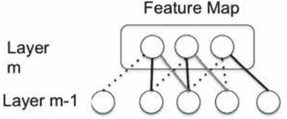

#### 9.2.2.3 共享权重

此外，在 CNN 中，每个滤波器 $h_i$ 在整个视觉领域中都会复制。这些复制的单元共享相同的参数化（权重向量和偏置），并形成一个特征图。在图 9.4 中，我们展示了属于同一特征图的三个隐藏单元。相同颜色的权重是共享的，并且被限制为相同。梯度下降仍然可以用于学习这些共享参数，只需对原始算法进行小的改变。共享权重的梯度简单地是被共享的参数的梯度之和。以这种方式复制单元允许在视觉领域中检测到特征，而不考虑它们的位置。此外，权重共享通过大大减少正在学习的自由参数数量来提高学习效率。模型上的约束使得 CNN 在视觉问题上能够实现更好的泛化。

#### 9.2.2.4 池化

卷积神经网络的另一个重要概念是池化技术。如今，最常用的池化算法之一是最大池化，但也可以使用其他算法，如：平均池化、求和池化和均值池化。池化层主要用于在空间上对体积进行下采样，并减少前一层的特征图。本章采用了最大池化方法。

最大池化将输入图像分割成一组不重叠的矩形（子区域），并对每个子区域输出最大值。最大池化有两个主要用途：（a）通过消除非最大值，减少了上层的计算量；（b）提供了一种平移不变性的形式。

想象一下将最大池化层与卷积层级联。可以将输入图像沿着八个方向平移一个像素。如果在一个 2×2 的区域上进行最大池化，这八种可能的配置中有三种会在卷积层产生完全相同的输出。当在一个 3×3 的窗口上应用最大池化时，这个比例增加到 5/8。由于它提供了额外的位置鲁棒性，最大池化是在卷积神经网络中降低中间表示维度的一种“智能”方式。

图9.5 Lenet-5卷积神经网络用于虹膜性别分类的主要阶段表示。输入是带有黄色遮罩的归一化近红外虹膜图像

#### 9.2.2.5 网络架构

在这项工作中，我们训练了两个Lenet-5网络，分别命名为CNN-1和CNN-2。我们的提出的网络架构在性别分类实验中被广泛使用。该网络仅包含三个卷积层和两个全连接层，神经元数量较少。我们选择较小的网络设计，既是为了减少过拟合的风险，也是因为我们尝试解决的问题的性质（性别分类只有两个类别）。

只有一个通道（灰度图像与遮挡掩码）直接被网络处理。尺寸为20×240的归一化虹膜图像被输入到网络中。

稀疏的卷积层和最大池化是LeNet系列模型的核心部分。图9.5显示了LeNet模型的图形表示。接下来的三个卷积层对于CNN-1的定义如下：

1. 在第一个卷积层中，应用了20个尺寸为1×5×5像素的滤波器，然后是一个修正线性运算符（ReLU），一个最大池化层，以2×2区域和两个像素步长取最大值，并且还有一个局部响应归一化层。
2. 在第二个卷积层中，应用了50个尺寸为1×10×10像素的滤波器，然后是一个修正线性运算符（ReLU），一个最大池化层，以2×2区域和两个像素步长取最大值，并且还有一个局部响应归一化层。
3. 第三个卷积层应用了100个大小为1×20×20像素的滤波器，然后是一个修正线性算子（ReLU），一个最大池化层，取2×2区域中的最大值，步长为两个像素，并且还有一个局部响应归一化层。

接下来定义了以下全连接层：

4. 第一个全连接层接收第三个卷积层的输出，包含4,800个神经元，然后是一个ReLU和一个dropout层（0.2）。
5. 第二个全连接层接收第一个全连接层的3,840维输出，再次包含500个神经元，然后是一个ReLU和一个dropout层（0.2）。
6. 最后, 最后一个全连接层的输出被送入一个softmax层, 为每个类别分配一个概率。预测本身是通过选择给定测试图像的最大概率的类别来进行的。

第一个CNN被修改以使用更合适的滤波器尺寸，考虑到我们的图像宽度大于高度。接下来的三个卷积层对于CNN-2的定义如下:

1. 在第一个卷积层中，应用128个尺寸为 $1 \times 5 \times 21$ 像素的滤波器到输入上，然后使用修正线性运算符 (ReLU)，最大池化层以 $2 \times 2$ 区域的最大值和两个像素的步长，并且还有一个局部响应归一化层。
2. 在第二个卷积层中，应用256个尺寸为 $1 \times 5 \times 21$ 像素的滤波器到输入上，然后使用修正线性运算符 (ReLU)，最大池化层以 $2 \times 2$ 区域的最大值和两个像素的步长，并且还有一个局部响应归一化层。
3. 在第三个卷积层中，应用了512个大小为 $1 \times 2 \times 45$ 像素的滤波器，然后是一个修正线性算子 (ReLU)，一个最大池化层，以 $2 \times 2$ 的步幅取 $2 \times 2$ 区域的最大值，并且还有一个局部响应归一化层。

然后定义了以下全连接层：

4. 第一个全连接层接收第三个卷积层的输出，包含4,800个神经元，然后是一个ReLU和一个dropout层（0.5）。
5. 第二个全连接层接收第一个全连接层的2,400维输出，再次包含4,800个神经元，然后是一个ReLU和一个dropout层（0.5）。
6. 最后，将最后一个全连接层的输出输入到softmax层，为每个类别分配概率。通过选择给定测试图像的具有最大概率的类别来进行预测。

## 9.3 虹膜归一化图像

在这项工作中，我们使用了归一化的虹膜图像，因为主要思想是从用于虹膜识别的相同过程中提取信息，以便性别分类可以作为信息的次要阶段使用。

虹膜特征提取过程包括以下步骤：首先，相机获取眼睛的图像。所有商用虹膜识别系统都使用近红外照明，以能够成像‘黑暗’和‘亮’眼睛的虹膜纹理[26]。接下来，在图像中定位虹膜区域。虹膜的环状区域从原始图像坐标转换为归一化的极坐标。这导致了所谓的‘展开’或‘矩形’虹膜图像。参见图9.6。在这个展开的虹膜图像上的一组位置上应用纹理滤波器，并将滤波器响应量化以产生二进制虹膜码[5]。基于这些原理的虹膜识别系统在世界各地的各种应用中被广泛使用[6, 10, 29]。

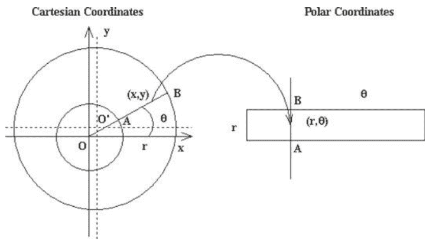

图9.6 笛卡尔坐标 $(x, y)$ 转换为极坐标以生成归一化图像

径向分辨率 $(r)$ 和角度分辨率 $(\theta)$ 在归一化或展开步骤中的使用决定了归一化虹膜图像的大小，并且可以显著影响虹膜识别率。这种展开被称为使用Daugman的橡皮薄片模型[9]。在这项工作中，我们使用Daugman的方法和Osiris实现创建的一个归一化图像，大小为 $20(r) \times 240(\theta)$。这两种实现还创建了一个与归一化图像大小相同的分割掩模。分割掩模指示由眼睑、睫毛或镜面反射遮挡的归一化虹膜图像的无效部分。

## 9.4 数据集

本文使用的图像是使用LG 4000传感器 (标记图像) 和IrisGuard AD-100 (未标记图像) 拍摄的。LG 4000和AD-100使用近红外照明并获取 $480 \times 640$ 、8位/像素的图像。虹膜图像的示例出现在图9.7中。我们使用了两个子集，一个用于无监督阶段，另一个用于有监督阶段。有监督阶段的图像数据集是人员不重叠的。

整个数据库由两个数据集组成：第一个数据集有10,000个未标记的图像，5,000个左眼虹膜图像和5,000个右眼虹膜图像。我们不知道男性和女性虹膜图像的数量。我们在预训练 (无监督) 阶段使用了10,000个 (左右眼结合) 的融合图像。目前这个数据集不对公众开放。

| | 右眼 | 左眼 |
| :--- | :--- | :--- |
| 原始 | 示例 | 示例 |
| 分割 | 示例 | 示例 |
| 归一化 | 示例 | 示例 |

图9.7 使用LG 4000传感器捕获的虹膜图像示例

第二个数据集中，每个750个男性和750个女性分别有一个左眼图像和一个右眼图像，总共有3,000张图像。在数据集中的1,500个不同人中，通过对图像的目视检查发现大约四分之一的人戴着透明隐形眼镜。为了改善结果，我们使用了左右归一化虹膜图像的融合，总共有3,000个归一化图像，使用Osiris实现计算的相应分割掩模。

1. 这个数据集可供其他研究人员在GFI虹膜性别数据集中使用。
2. 这个3,000人数数据集的训练部分是通过随机选择60%的男性和60%的女性创建的。剩下的40%用作测试集。一旦参数选择完成，将使用[27]中使用的相同验证集进行最终评估。这个验证数据集包含1,944张图像：175个男性和149个女性分别有三张左眼图像和三张右眼图像。已知一些被试者戴着透明隐形眼镜，在一些图像中可以看到这一点。此外，少数被试者戴着化妆隐形眼镜。

1. 生物安全项目。 http://biosecure.it-sudparis.eu/AB/。
2. https://sites.google.com/a/nd.edu/public-cvrl/data-sets。

一些图像。为了复制真实生活条件，我们没有删除任何包含任何类型缺陷（模糊或噪声）的图像。

重要的是要注意，不同人的虹膜图像，甚至是同一个人的左右虹膜图像，可能不具备完全相同的成像条件。

LED的照明可能来自传感器的任一侧，图像中可能存在镜面高光，头部的倾斜可能不同，眼睑遮挡可能不同，等等。此外，在这项工作中，训练、测试和验证子集都是独立的且不重叠的人。

## 9.5 实验

我们的方法使用Theano3和Keras4开源框架实现。

训练是在一个EC2亚马逊GPU机器上进行的，使用GRID K-520和g2.2x大型实例，具有8GB的视频内存。对于DBN，我们需要训练两个不同的阶段，预训练阶段使用RBM，微调阶段使用深度MLP。第一个阶段训练需要207分钟，第二个阶段需要150分钟。

每个卷积网络（CNN-1和CNN-2）的训练需要大约四个小时，CNN-1每个epoch需要238秒，CNN-2需要10小时。使用我们的网络在单个归一化图像上预测性别大约需要100毫秒（对于CNN-1）和178毫秒（对于CNN-2）。通过批量处理图像进行训练可以显著提高训练时间。

## 9.6 超参数选择

在这项工作中，我们使用网格搜索来找到DBN+深度MLP和Lenet-5 CNN的最佳超参数。我们关注调整网络拟合时使用的批量大小和迭代次数。在迭代梯度下降中，批量大小是在更新权重之前向网络展示的模式数量。它也是网络训练中的一种优化，定义了一次读取和在内存中保留多少模式。

迭代次数是整个训练数据集在训练过程中显示给网络的次数。一些网络对于批量大小很敏感，例如多层感知器网络和卷积神经网络。在这项工作中，我们研究了在拟合网络时调整批量大小和迭代次数的方法。我们评估了一系列不同的小批量大小，从n=8到n=500，步长为2n，对于CNN-1-2，以及从m=10到m=100，步长为10，对于其他网络。

Keras和Theano提供了一套不同的最先进的优化算法,例如: 'SGD', 'RMSprop', 'Adagrad', 'Adadelta', 'Adam'等。我们调整了用于训练网络的优化算法, 每个算法都使用默认参数。最佳结果是使用 'SGD' 算法达到的。

学习率参数控制每个批次结束时更新权重的程度, 而动量参数控制先前更新对当前权重更新的影响。我们尝试了一小组标准学习率和动量值, 范围从 0.1到0.9, 步长为0.1, 用于CNN-1和CNN-2。对于DBN, 需要一个用于预训练阶段的学习率参数和另一个用于微调阶段的学习率参数。两者都设置在1e-1到1e-5的范围内。

激活函数控制单个神经元的非线性和触发时间。通常, 修正线性单元 (rectifier) 激活函数是最受欢迎的, 但是sigmoid和tanh函数也被广泛使用, 对于不同的问题, 这些函数可能仍然更合适。在这项工作中, 我们评估了不同的激活函数套件。我们只在隐藏层中使用这些函数, 因为在二元分类问题中, 我们需要在输出层中使用sigmoid激活函数才能达到深度多层感知器的最佳结果。对于CNNs, 使用ReLU和Softmax激活函数可以获得最佳结果。

我们还研究了调整正则化参数中的丢弃率, 以限制过拟合并改善模型的泛化能力。为了获得良好的结果, 丢弃法最好与权重约束 (如最大范数约束) 相结合。这涉及到调整丢弃百分比和权重约束。我们尝试了丢弃百分比在0.0到0.9之间以及最大范数权重约束值在0到5之间。最佳结果是在0.5时达到的。

层中的神经元数量也是一个重要的参数需要调整。通常来说, 层中的神经元数量控制着网络的表示能力, 至少在拓扑结构的那一点上是如此。最佳的神经元数量在表9.2和9.3中显示。

表9.2显示了使用DBN+深度MLP进行性别分类的准确率。括号中表示隐藏层的数量。我们在批量大小为100时获得了最佳结果。'preT-LR'表示预训练学习率阶段, 值为1*e-2,'FineT'表示微调学习率阶段, 值为1*e-1。

| 隐藏层的数量和大小 | 准确率 (%) |
| :--- | :--- |
| (2) 5-5K | 50.67 |
| (2) 5-10K | 55.67 |
| (2) 10-5K | 59.67 |
| (2) 10-10K | 61.00 |
| (3) 5-5-5K | 62.67 |
| (3) 10-10-10K | 66.79 |
| (5) 10-5-10-5-10K | 77.79 |

表9.3 性别分类准确率使用批量大小为64的CNN-1。LR代表学习率

| LR | 迭代次数 | 准确率 (%) |
| :--- | :--- | :--- |
| 1*e-1 | 50 | 50.08 |
| 1*e-2 | 50 | 49.92 |
| 1*e-3 | 50 | 62.77 |
| 1*e-4 | 50 | 62.94 |
| 1*e-5 | 50 | 64.94 |
| 1*e-1 | 100 | 51.10 |
| 1*e-2 | 100 | 50.42 |
| 1*e-3 | 100 | 63.94 |
| 1*e-4 | 100 | 69.11 |
| 1*e-5 | 100 | 69.27 |
| 1*e-1 | 200 | 53.08 |
| 1*e-2 | 200 | 56.08 |
| 1*e-3 | 200 | 63.27 |
| 1*e-4 | 200 | 67.77 |
| 1*e-5 | 200 | 70.62 |
| 1*e-1 | 500 | 53.08 |
| 1*e-2 | 500 | 57.00 |
| 1*e-3 | 500 | 65.27 |
| 1*e-4 | 500 | 69.22 |
| **1*e-5** | **500** | **77.91** |
| 1*e-1 | 750 | 63.43 |
| 1*e-2 | 750 | 65.25 |
| 1*e-3 | 750 | 68.28 |
| 1*e-4 | 750 | 67.37 |
| 1*e-5 | 750 | 77.00 |
| 1*e-1 | 1000 | 54.14 |
| 1*e-2 | 1000 | 66.87 |
| 1*e-3 | 1000 | 71.11 |
| 1*e-4 | 1000 | 64.55 |
| 1*e-5 | 1000 | 68.98 |

## 9.7 结果

### 9.7.1 半监督方法

RBM预训练阶段对批量大小和学习率非常敏感，因此我们使用了从1到200的批量大小和从1e-1到1e-5的学习率。使用10K张图像进行预训练，并使用近4900张图像进行微调阶段。平均而言，预训练阶段需要307分钟，而微调只需要150分钟。表9.2总结了结果。

### 9.7.2 监督方法

为了与半监督方法进行比较，我们训练了两个‘小型’Lenet-5卷积神经网络。我们将这些网络称为‘小型’，因为我们没有像Deepface、Imagenet或VGG(16-19)等数据库中那样大量的虹膜图像可用。这是我们应用深度学习技术解决任何基于虹膜的软生物特征问题时的主要关注点之一。这个领域的研究人员面临的未来挑战是增加使用不同传感器捕获的软生物特征图像的数量，以训练更复杂的模型。

表9.2、9.3和9.4显示了使用不同参数数量的结果总结。表9.5显示了与我们的两个提议相比的最先进算法的结果。

表9.4 性别分类准确率使用批量大小为64的CNN-2。LR代表学习率

| LR | 迭代次数 | 准确率 (%) |
| :--- | :--- | :--- |
| 1*e-1 | 50 | 61.03 |
| 1*e-2 | 50 | 61.33 |
| 1*e-3 | 50 | 63.33 |
| 1*e-4 | 50 | 65.33 |
| 1*e-5 | 50 | 64.26 |
| 1*e-1 | 100 | 62.33 |
| 1*e-1 | 100 | 63.03 |
| 1*e-3 | 100 | 65.33 |
| 1*e-4 | 100 | 66.33 |
| 1*e-5 | 100 | 68.00 |
| 1*e-1 | 200 | 65.33 |
| 1*e-2 | 200 | 66.00 |
| 1*e-3 | 200 | 66.33 |
| 1*e-4 | 200 | 70.00 |
| 1*e-5 | 200 | 73.00 |
| 1*e-1 | 500 | 65.33 |
| 1*e-2 | 500 | 66.08 |
| 1*e-3 | 500 | 79.00 |
| 1*e-4 | 500 | 81.00 |
| **1*e-5** | **500** | **83.00** |
| 1*e-1 | 750 | 67.33 |
| 1*e-2 | 750 | 67.00 |
| 1*e-3 | 750 | 79.66 |
| 1*e-4 | 750 | 80.33 |
| 1*e-5 | 750 | 81.00 |

为了创建一个更大的数据集来训练有监督阶段，我们使用数据增强技术，通过垂直和水平翻转原始虹膜图像，将每个虹膜的图像数量增加三倍。我们仅对表9.3和9.4的最佳结果应用了这种技术。作为未来的工作，我们建议研究其他技术来分析数据增强对结果的影响。使用数据增强的结果总结在表9.6中呈现。

| 论文 | 准确率 (%) | 观察 |
| :--- | :--- | :--- |
| Thomas等人[28] | 80.00 | 丢弃质量差的 |
| Lagree等人[17] | 62.00 | |
| Bansal等人[2] | 83.06 | 仅300张图像 |
| Tapia等人[26] | 91.00 | 非人不相交 |
| Costa-Abreu等人[8] | 89.74 | |
| Bobeldyk等人[4] | 65.00 | 归一化图像 |
| Tapia等人[27] | 89.00 | 二值图像 |
| CNN-1(*) | 77.91 | 有监督的 |
| CNN-2(*) | 83.00 | 有监督的 |
| DBM+深度MLP(*) | 77.79 | 半监督的 |

表9.5 我们提出的模型(*)和最先进的方法的准确率

| | 准确率 (%) | 准确率 - DA (%) |
| :--- | :--- | :--- |
| (5)10-5-10-5-10K | 77.79 | 78.79 |
| CNN-1 | 77.91 | 79.03 |
| CNN-2 | 83.00 | 84.66 |

表9.6 最佳性别分类率总结。第二列显示没有数据增强的结果。第三列显示与表9.3和9.4的数据增强 (DA) 相关的结果。

## 9.8 结论

我们最好的方法是使用经过标记的卷积神经网络训练的虹膜数据，达到了83.00%的准确率，使用数据增强达到了84.66%的准确率，是与其他最先进方法相比表现最好的之一，如表9.5所示。我们没有超过以前在[27]中的工作，但我们在这里提出的深度学习方法没有使用任何预处理阶段或特征选择方法。此外，这个提案使用了归一化的图像而不是编码信息。根据Bobeldik等人[4]报告的结果，归一化过程可能会过滤掉有用的信息。

考虑到用于训练我们的方法的图像数量，我们认为这些是很好的结果。深度学习技术通常需要更大的数据库才能发挥其全部潜力。我们认为这项工作进一步验证了虹膜中包含有关个人性别的信息的假设。

此外，值得强调的是半监督方法取得的结果，即使它没有达到测试的最佳结果。考虑到这些结果是通过未标记的虹膜图像达到的，准确性非常令人鼓舞。

这项工作的主要贡献之一是，据我们了解，这是第一项使用深度学习技术（半监督和监督）来尝试解决虹膜性别问题的工作。我们的提议通过训练一个常见的深度学习架构来达到良好的性能，该架构旨在避免由于可用标记虹膜图像的限制而过拟合。我们的网络与一些最近的网络架构相当，从而减少了其参数数量和过拟合的机会。

此外，我们通过数据增强增加了训练集中的图像数量，以初步测试其在改善性别识别过程中的有用性。所得技术使用未经过滤的虹膜图像进行测试，并与大多数最新的算法相当。

另一个贡献是提出使用大量未标记的虹膜图像来帮助初始化深度神经网络的权重。更多的未标记图像可能有助于提高性别分类率。如果我们有更多来自不同传感器的图像，我们可以创建一个通用的性别分类方法，并了解虹膜上的信息是否依赖于所使用的传感器。据我们了解，使性别分类成为可能的虹膜特征与捕捉图像的传感器无关。作为所有虹膜研究人员的未来挑战，我们建议努力捕捉更多带有软生物特征标记数据的图像。

从我们的结果中可以得出两个重要的结论。首先，卷积神经网络可以用来提供有竞争力的虹膜性别分类结果，即使考虑到当代无约束图像集的尺寸要小得多，并且这些图像集是用于性别标记的。其次，我们模型的简单性意味着使用更多的训练数据的更复杂的系统可能能够在报告的结果之上实质性地改进结果。

致谢：感谢Vince Thomas、Mike Batanian、Steve Lagree、Yingjie Bansal和Costa Abreu在这个研究课题上之前所做的工作，还要感谢圣母大学的Kevin Bowyer教授提供数据库。这项工作得到了安德烈斯贝洛大学工程学院工程科学系（DCI）的支持。

# 参考文献
- 1. L.A. Alexandre, 性别识别：一种多尺度决策融合方法。模式识别。 Lett. 31(11), 1422-1427 (2010)
- 2. A. Bansal, R. Agarwal, R.K. Sharma, 使用虹膜图像的基于支持向量机的性别分类, 在第四届国际计算智能与通信网络会议 (CICN, 2012), 第425-429页
- 3. Y. Bengio, P. Lamblin, D. Popovici, H. Larochelle, 深度网络的贪婪逐层训练 (2007), 第153-160页
- 4. D. Bobeldyk, A. Ross, 虹膜还是眼周区域? 从近红外眼部图像中探索性别预测, 在信息学讲义 (LNI), Gesellschaft fur Informatik, Bonn (2016)
- 5. K.W. Bowyer, K. Hollingsworth, P.J. Flynn, 虹膜生物特征的图像理解: 一项调查. 计算机视觉与图像理解 110(2), 281-307 (2008)
- 6. CANPASS, 加拿大边境服务机构, CANPASS (1996)
- 7. M.A. Carreira-Perpinan, G.E. Hinton, 对比散度学习 (2005)
- 8. M.D. Costa-Abreu, M. Fairhurst, M. Erbilek, 从虹膜生物特征预测性别. Int. Conf. Biom. Spec. Interest Group (BIOSIG) 2015, 1-11 (2015)
- 9. J. Daugman, 虹膜识别的工作原理 . IEEE Trans. Circuits Syst. Video Technol. 14(1), 21-30 (2004)
- 10. J. Daugman, 机场和边境的虹膜识别, in生物特征学百科全书 (2009), pp. 819-825
- 11. J. Deng, W. Dong, R. Socher, L.-J. Li, K. Li, L. Fei-Fei, ImageNet: 一个大规模的分层图像数据库, in CVPR09 (2009)
- 12. K. Fukushima, Neocognitron: 一种自组织神经网络模型，用于不受位置偏移影响的模式识别。 Biol. Cybern. 36, 193-202 (1980)
- 13. G.E. Hinton, R.R. Salakhutdinov, 用神经网络降低数据的维度. 科学 313(5786), 504-507 (2006). doi:10.1126/science.1127647, http://www.ncbi.nlm.nih.gov/sites/entrez?db=pubmed&uid=16873662&cmd=showdetailview&indexed=google
- 14. M. Hubel, T.N. Wiesel, Brain and Visual Perception (Oxford University Press, Oxford, 2005)
- 15. F. Juefei-Xu, E. Verma, P. Goel, A. Cherodian, M. Savvides, DeepGender: 遮挡和低分辨率下鲁棒的面部性别分类，通过逐步训练的卷积神经网络和注意力，在计算机视觉与模式识别(CVPR) Workshops (2016)
- 16. J. Kannala, E. Rahtu, BSIF: 二值化统计图像特征, 在 ICPR(IEEE计算学会, 2012), pp. 1363-1366
- 17. S. Lagree, K. Bowyer, 从虹膜纹理预测种族和性别, 在2011年IEEE国际国土安全技术会议(2011), 第440-445页
- 18. Y. LeCun, B. Boser, J.S. Denker, D. Henderson, R.E. Howard, W. Hubbard, L.D. Jackel, 反向传播应用于手写邮政编码识别。神经计算。 1(4), 541-551 (1989). doi:10.1162/neco.1989.1.4.541
- 19. G. Levi, T. Hassner, 使用卷积神经网络进行年龄和性别分类, 在 2015年IEEE计算机视觉和模式识别研讨会 (CVPRW, 2015), 第34-42页. doi:10.1109/CVPRW.2015.7301352
- 20. E. Makinen, R. Raisamo, 评估具有自动检测和对齐人脸的性别分类方法。 IEEE Trans. Pattern Anal. Mach. Intell. 30(3), 541-547 (2008a)
- 21. H. Peng, F. Long, C. Ding, 基于最大依赖性、最大相关性和最小冗余性的特征选择。 IEEE Trans. Pattern Anal. Mach. Intell. 27(8), 1226-1238 (2005)
- 22. C. Perez, J. Tapia, P. Estevez, C. Held, 使用互信息和特征融合的面部图像性别分类。 Int. J. Optomech. 6(1), 92-119 (2012)
- 23. P.J. Phillips, W.T. Scruggs, A.J. OToole, P.J. Flynn, K.W. Bowyer, C.L. Schott, M. Sharpe, FRVT 2006和ICE 2006大规模结果。 IEEE Trans. Pattern Anal. Mach. Intell. 32, 831-846 (2010)
- 24. J. Tapia, C. Perez, 基于互信息从直方图的LBP、强度和形状中选择的不同空间尺度特征的性别分类。IEEE Trans. Inf.Forensics Secur. 8(3), 488-499 (2013)
- 25. J.E. Tapia, C.A. Perez, 使用一半脸和基于互信息的特征选择的性别分类，在2013 IEEE国际系统、人类和控制论大会(2013), pp. 3282-3287. doi:10.1109/SMC.2013.559
- 26. J.E. Tapia, C.A. Perez, K.W. Bowyer, 使用统一的局部二值模式融合从虹膜图像中进行性别分类，在欧洲计算机视觉大会-ECCV, 软生物特征研讨会 (2014)
- 27. J. Tapia, C. Perez, K. Bowyer, 从用于识别的相同虹膜代码中进行性别分类。IEEE Trans. Inf. Forensics Secur. 11(8), 1 (2016)
- 28. V. Thomas, N. Chawla, K. Bowyer, P. Flynn, 从虹膜图像中学习预测性别。第一届IEEE国际生物识别会议：理论应用系统BTAS 2007, 1-5 (2007)
- 29. UIDAI, 印度唯一身份认证机构 (2014)
- 30. P. Vincent, H. Larochelle, Y. Bengio, P.A. Manzagol, 使用去噪自编码器提取和组合稳健特征，在第25届国际机器学习大会ICML '08(ACM, 纽约, 2008), pp. 1096-1103. doi:10.1145/1390156.1390294
- 31. M.H. Yang, B. Moghaddam, 使用支持向量机进行性别分类。国际图像处理会议 2, 471-474 (2000)

## 第十章

### 深度学习用于纹身识别

邢迪和维沙尔·M·帕特尔

摘要 软生物特征是一些关于个体的识别信息的生理和行为特征。眼睛的颜色、性别、种族、肤色、身高、体重、头发颜色、疤痕、胎记和纹身都是软生物特征的例子。在文献中提出了几种基于软生物特征识别或验证个体的技术。特别是基于纹身的人员识别和检索系统近年来引起了很大的兴趣。

纹身在某种程度上表明个人的信仰和特征。因此，对纹身的分析可以更好地了解个人的背景和对帮派和仇恨团体的归属。它们已被用于协助执法部门调查并确定罪犯的身份。在本章中，我们将概述基于深度学习的纹身识别和检测的最新进展。特别是，我们将介绍基于 AlexNet 和 Siamese 网络的深度卷积神经网络方法，用于自动匹配纹身图像。此外，我们将展示相对于使用简单的对比损失函数，三元组损失函数可以显著提高纹身匹配系统的性能。我们将展示在最近引入的 Tatt-C 数据集上的各种实验结果。

## 10.1 引言

软生物特征是提供有关个体的一些识别信息的生理和行为特征[6]。眼睛颜色、性别、种族、肤色、身高、体重、头发颜色、疤痕、胎记和纹身是软生物特征的例子。已经提出了几种技术来识别或验证个体。

文献中基于软生物特征的个体识别[6, 14, 29, 33]研究较多。特别是基于纹身的个人识别和检索系统在近年来引起了很大的兴趣[12, 15, 23, 26]。纹身在一定程度上表明一个人的个人信仰和特征。因此, 对纹身的分析可以更好地了解一个人的背景和对帮派和仇恨团体的归属[23]。它们已经被用于协助执法部门调查并确定罪犯的身份[27]。例如, 图10.1显示了三个不同的案例, 其中纹身被用于识别和逮捕嫌疑人。

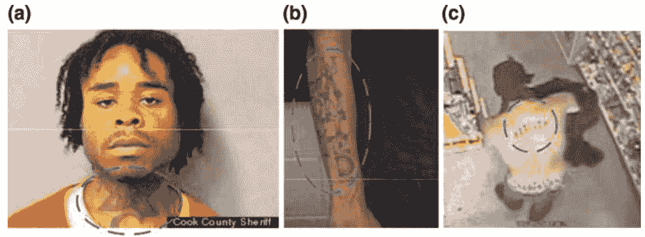

图10.1 在嫌疑人逮捕中使用纹身的实际应用[11]

文献中提出了许多不同的方法用于纹身的检测、识别、聚类和检索[1, 2, 8, 11-13, 15, 16, 18, 19, 22-25, 36]。以前的方法主要通过首先从给定的图像中提取某种生成或判别特征, 然后训练判别分类器进行匹配来解决这些问题。这些方法的性能受到所使用特征的强度的限制。在以前的方法中, 所使用的特征通常是手工设计的, 如Gabor、LBP或SIFT[23, 27]。近年来, 使用深度卷积神经网络 (CNNs) 获得的特征在各种计算机视觉应用中取得了令人印象深刻的结果, 如目标检测[10, 28, 31]和识别[4, 20]。最近的研究表明, 在缺乏大规模数据集的情况下, 迁移学习可以是有效的, 因为它允许引入深度网络而无需从头开始训练它们[38]。例如, 可以使用深度CNNs, 如AlexNet[20]或Siamese网络[3, 5], 预训练一个大型通用数据集, 如ImageNet[30], 作为有意义的特征提取器。在本章中, 我们回顾了一些基于深度CNN方法的纹身检测和识别的最新方法[9, 37]。

本章的组织如下。第10.2节概述了最近引入的NIST Tatt-C纹身数据集。第10.3节介绍了用于纹身检测和识别的各种CNN网络的详细信息。第10.4节比较了不同方法在Tatt-C数据集上的性能。最后，第10.5节对本章进行了简要总结和讨论。

## 10.2 NIST Tatt-C数据集

为了促进基于纹身的识别应用的研究和开发, NIST最近开发了一个名为Tattoo Recognition Technology - Challenge (Tatt-C)的纹身数据集[26, 27]。该数据集总共包含16,716张由执法部门在实际操作中收集的纹身图像, 并根据操作场景分为五个用例。这些用例如下

- 纹身识别：从同一主体的不同纹身图像中匹配相同纹身的不同实例。
- 感兴趣区域：匹配包含在较大纹身图像中的感兴趣子区域。
- 混合媒体：使用不同类型的图像（如素描、扫描打印品、计算机图形和涂鸦）匹配视觉上相似或相关的纹身。
- 纹身相似性：匹配不同主题的视觉上相似或相关的纹身。
- 纹身检测：检测图像是否包含纹身。

在本章中, 我们主要关注以下三个应用场景：纹身检测、纹身相似性和混合媒体。图10.2显示了与这些应用场景对应的Tatt-C数据集的样本图像。纹身检测在数据库维护和构建中具有几个含义, 特别是当数据集包含弱标记或部分含糊标记的数据时。


图10.2 Tatt-C数据库的样本图像。第一行对应纹身检测应用场景的图像。第二行对应纹身相似性应用场景的图像。第三行对应混合媒体应用场景的图像

部分或含糊标记的数据常常使得不同类型图像的自动解释和提取变得具有挑战性。正如在[27]中所指出的，在ANSI/NIST Type 10记录中，面部照片和疤痕、标记、纹身图像存储在同一记录类型中。如果一些数据被错误标记或未标记，则基于图像内容的数据自动提取成为一个重要问题。

纹身相似性是另一个应用场景，它在群体或帮派关系中有应用。由于一个群体或帮派的成员往往有相似的纹身，可以通过寻找具有相似纹身的人来尝试识别属于同一帮派的个体。在这个应用场景中，目标是将探测图像与一个或多个图库图像进行匹配。

混合媒体是在调查情报收集中应用的场景，其中纹身不一定是由相机捕捉到的，而是以草图的形式描述。在这个测试案例中，数据包括混合媒体和纹身图像，并给定一个混合媒体的探测图像，需要在数据集中匹配一个或多个纹身[27]。

从上述使用案例中，我们可以看到纹身检测是一个二分类问题，而混合媒体和纹身相似性则是一对多验证问题。因此，可以使用深度卷积神经网络来解决这些问题。特别是，[7]研究了深度卷积神经网络特征在纹身识别问题上的性能。对于分类问题，如纹身检测，基于AlexNet网络使用Tatt-C数据集中的纹身图像提取了微调的深度特征，并训练了一个线性SVM进行分类。对于验证问题，使用Siamese网络提取了深度特征，并使用欧氏距离以及基于三元损失函数的度量进行数据匹配。在[37]中，类似于AlexNet的网络被用于纹身检测。

## 10.3 纹身检测和识别的卷积神经网络

在本节中，我们描述了基于AlexNet [21]和Siamese [5]网络的纹身识别方法[7]的细节。

### 10.3.1 深度纹身检测

[7]中提出的纹身检测框架包括两个主要阶段。在第一阶段，他们基于AlexNet框架提取了深度特征。图10.3显示了AlexNet的架构。然后，在第二阶段，他们使用线性SVM训练来确定给定图像是否包含纹身。深度CNN模型使用caffe [17]实现。由于AlexNet已经在ImageNet LSVRC-2010数据库[30]上进行了训练，他们在Tatt-C纹身检测数据集[26]上对网络进行了微调。

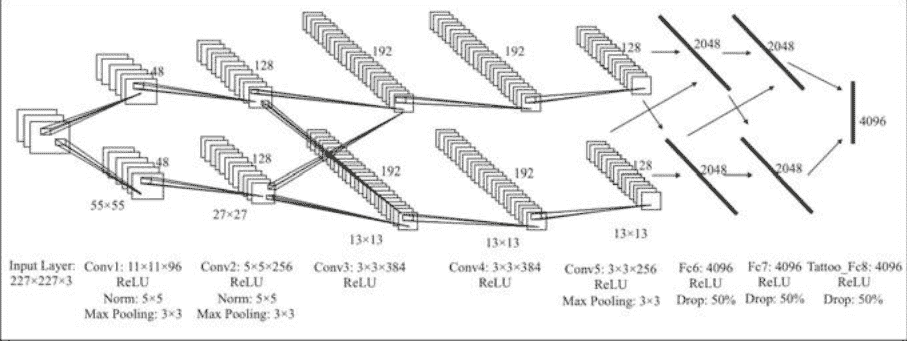

图10.3 AlexNet的架构

#### 表10.1 [7]中使用的AlexNet架构

| 名称 | 类型 | 滤波器大小/步长 | 输出大小 |
|---|---|---|---|
| 卷积1 | 卷积 | 11 × 11/4 | 55 × 55 × 96 |
| ReLU1 | ReLU |  | 55 × 55 × 96 |
| Norm1 | LRN | 5 × 5 | 55 × 55 × 96 |
| 池化1 | 最大池化 | 3 × 3/2 | 27 × 27 × 96 |
| 卷积2 | 卷积 | 5 × 5(填充2)/1 | 27 × 27 × 256 |
| Relu2 | ReLU |  | 27 × 27 × 256 |
| Norm2 | LRN | 5 × 5 | 27 × 27 × 256 |
| 池化2 | 最大池化 | 3 × 3/2 | 13 × 13 × 256 |
| Conv3 | 卷积 | 3 × 3(填充1)/1 | 13 × 13 × 384 |
| Relu3 | ReLU |  | 13 × 13 × 384 |
| Conv4 | 卷积 | 3 × 3(填充1)/1 | 13 × 13 × 384 |
| Relu4 | ReLU |  | 13 × 13 × 384 |
| Conv5 | 卷积 | 3 × 3(填充1)/1 | 13 × 13 × 256 |
| Relu5 | ReLU |  | 13 × 13 × 256 |
| 池5 | 最大池化 | 3 × 3/2 | 6 × 6 × 256 |
| Fc6 | 全连接 |  | 4096 × 1 |
| Relu6 | ReLU |  | 4096 × 1 |
| Drop6 | Dropout | 50% | 4096 × 1 |
| Fc7 | 全连接 |  | 4096 × 1 |
| Relu7 | ReLU |  | 4096 × 1 |
| Fc8_tattoo | 全连接 |  | 2 × 1 |

表10.1给出了用于纹身检测的深度CNN架构的详细信息。

在训练过程中，所有图像都被缩放到 [0, 1]并从它们的平均值中减去。在将这些训练图像输入网络之前，它们还会在水平和垂直轴上翻转，以增加用于学习网络参数的训练数据量。在训练和验证阶段，他们将图像裁剪成标准的227 × 227大小。纹身检测的基本学习率设置为10^-4。衰减率gamma被选择为每3500次迭代的0.1。卷积层的乘法运算权重为1，偏置为2。滤波器的权重值和偏置值根据0.01标准差的高斯分布随机设置，偏置的权重设置为1。ReLU层中的负斜率设置为0。softmax损失层计算其输入的softmax的多项式逻辑损失。它在概念上与softmax层后面的多项式逻辑损失层相同，但提供了更稳定的数值梯度[17]。动量和总迭代次数分别设置为0.9和10500。

在对纹身数据库上进行微调AlexNet之后，深度特征被提取为 fc7层的输出，该输出是一个4096维向量。然后，使用vlfeat [34]实现了一个两类线性SVM，根据深度特征对探测图像进行分类。参数lambda被设置为0.01，最大迭代次数被设置为10^4。

纹身检测数据集包含2349张图像，其中包括纹身和非纹身图像。此外，还有一个ground_truth.txt文件，为每个图像提供“纹身”或“非纹身”的标签。在这个用例中，他们使用标签1表示纹身图像，使用标签-1表示非纹身图像。按照[27]中定义的标准协议，使用五个探测图像中的四个进行训练，剩余的图像用于测试。例如，在测试第一个探测图像列表时，他们使用第二、第三、第四和第五个探测图像列表中的图像进行训练。这个过程对所有的探测图像列表都重复进行。图10.4显示了对应于三个样本的前三个卷积层的输出。

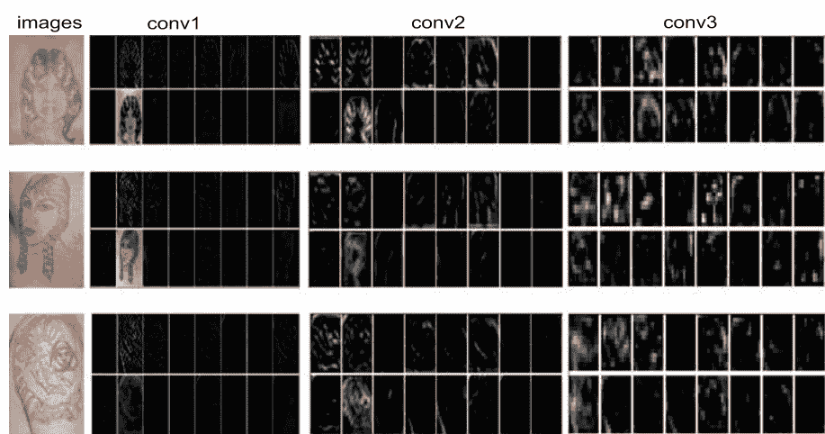

图10.4 来自Conv1、Conv2和Conv3层的一些特征图。上面的特征图对光照变化更具鲁棒性Tatto-C数据集中的图像。可以看到这些特征确实捕捉到了关于纹身的有意义的信息，如边缘、线条和角点。请注意，最近在[37]中提出了一个类似于AlexNet的深度CNN模型，用于在NIST Tatto-C数据集上进行纹身检测。所提出的模型使用了一个私有数据库，其中包含从Flickr收集的1万张图像来训练网络。

### 10.3.2 深度纹身识别

对于纹身验证案例，如纹身相似性和纹身混合媒体使用案例，Siamese网络直接在Tatto-C数据集上进行了训练。在[7]中使用的Siamese网络如图10.5所示，详细信息请参见表10.2。与之前一样，通过水平和垂直翻转混合媒体和纹身相似性图像，并将它们缩放到[0, 1]范围内进行了数据增强。

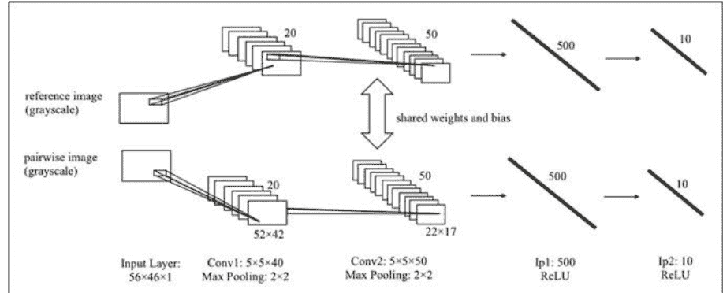

图10.5 孪生网络架构

表10.2 [7]中用于纹身识别的孪生网络细节

| 姓名 | 类型 | 滤波器大小/步长 | 输出大小 |
|---|---|---|---|
| Conv1 | 卷积 | 5 x 5/1 | 52 x 42 x 20 |
| 池化1 | 池化 | 2 x 2/2 | 26 x 21 x 20 |
| Conv2 | 卷积 | 5 x 5/1 | 22 x 17 x 50 |
| 池化2 | 池化 | 2 x 2/2 | 11 x 9 x 50 |
| ip1 | InnerProduct |  | 500 x 1 |
| relu1 | ReLU |  |  |
| ip2 | InnerProduct |  | 10 x 1 |
| feat | InnerProduct |  | 2 x 1 |

对于混合媒体用例，使用了对比损失函数[5]，其定义为

$$L(W)=\sum_{i=1}^{P} L\left(W,\left(Y, X_{1}, X_{2}\right)^{i}\right),$$
$$\begin{aligned} L\left(W,\left(Y, X_{1}, X_{2}\right)^{i}\right) & =(1-Y) L_{G}\left(E_{W}\left(X_{1}, X_{2}\right)^{i}\right) \ & +Y L_{I}\left(E_{W}\left(X_{1}, X_{2}\right)^{i}\right), \end{aligned}$$

其中 $\left(Y, X_{1}, X_{2}\right)^{i}$ 是由一对图像 $\left(X_{1}, X_{2}\right)$ 和标签 $Y$ 组成的第 $i$ 个样本，$L_{G}$ 是真实对的部分损失函数，$L_{I}$ 是冒充对的部分损失函数，$P$ 是训练样本的数量。在 caffe 中，他们使用欧氏距离来计算 $E_{W}\left(X_{1}, X_{2}\right)$ 。他们在训练中设置的间隔是 1。

总的训练迭代次数设置为 $7 \times 10^{4}$ 。初始学习率设置为 $10^{-4}$ ，每 $2 \times 10^{4}$ 次迭代减少 $10 \%$ 。神经元的乘法学习率设置为 1 和 2 ，偏置为 2 。

混合媒体数据集中共有 453 张图像 (181 张探测图像和 272 张图库图像)。制作了“真实成对”图像，包括探测图像和验证过的图库图像，以及“冒充成对”图像，包括探测图像和未验证的图像。“冒充成对”图像的数量远大于“真实成对”图像。因此，他们随机选择了相等数量的“冒充成对”图像和“真实成对”图像作为训练子集。图像被裁剪为 $56 \times 46$ 。训练网络后，使用“ip2”层的输出作为特征。最后，根据欧氏距离验证图像。

对于纹身相似性的使用案例，他们使用三元组损失函数 [32,35] 替代了对比损失函数，因为似乎产生了更好的结果。三元组损失函数的定义为

$$\begin{gathered} L=\sum_{i=1}^{N} \max \left(0,\left\|f\left(x_{i}^{a}\right)-f\left(x_{i}^{p}\right)\right\|_{2}^{2}\right. \ \left.-\left\|f\left(x_{i}^{a}\right)-f\left(x_{i}^{n}\right)\right\|_{2}^{2}+\alpha\right), \end{gathered}$$

其中 $x_{i}^{a}$ 是参考图像，$x_{i}^{p}$ 是“真实成对”图像（正对），而 $x_{i}^{n}$ 是“冒名顶替成对”图像（负对）。阈值 $\alpha$ 被称为“边界”。在纹身相似性案例中，我们用三元组损失函数替代了对比损失函数。我们将边界设置为 0.005 ，总迭代次数设置为 $4 \times 10^{4}$ 。除了“ip2”的维度为 256 而不是 10 之外，所有参数与原始的 Siamese 网络配置（表 10.2）相同。初始学习率设置为 0.0002 ，并在每 $1 \times 10^{4}$ 次迭代后降低 $10 \%$ 。与以前一样，神经元的乘法学习率设置为 1 ，偏置的乘法学习率设置为 2 。纹身相似性数据集有 2212 张图像，其中包括 851 张探测图像和 1361 张图库图像。在训练之前，所有混合媒体和纹身相似性的图像都被转换为灰度图像。从“ip2”层输出的特征被用作特征。

## 10.4 实验结果

在本节中,我们展示了基于深度卷积神经网络的方法在Tatto-C数据集上进行纹身识别的结果[7]。将基于卷积神经网络的方法的性能与[27]中报告的方法进行了比较。使用准确率和累积匹配特征曲线(CMC曲线)比较了不同方法的性能。纹身准确率定义为正确分类的纹身图像数TT除以总纹身图像数Ntattoo。

纹身准确率 = \frac{TT}{N_{tattoo}}. (10.3)

非纹身准确率定义为正确分类的非纹身图像数NT除以总非纹身图像数Nnon-tattoo。

非纹身准确率 = \frac{NT}{N_{non-tattoo}}. (10.4)

总体准确率定义为正确分类的纹身和非纹身图像数之和除以总图像数。

Overall 准确率 = \frac{TT+NT}{N_{纹身}+N_{非纹身}}. (10.5)

CMC 被定义为返回相关图像的搜索结果在候选列表长度的函数中的分数。候选列表越长,相关图像在列表中的概率就越大。对于在图库中有多个相关匹配的搜索,任意排名处的累积准确率或命中率是通过最佳排名匹配计算的,代表了最佳情况。

### 10.4.1 纹身检测

图10.2的第一行显示了Tatto-C数据集中与检测用例对应的一些样本图像。该子集中总共有2349张图像,其中包括1349张纹身图像和1000张非纹身图像。非纹身图像实质上是从多次遭遇数据库2(MEDS-II) [27]中提取的人脸图像。表10.3显示了不同方法在纹身检测实验中的性能。从该表中可以看出,[7]提出的基于CNN的方法优于[27]中报告的之前最好的非CNN方法,并且达到了99.83%的整体准确率。有趣的是,尽管[7]和[37]都使用了类似AlexNet类型的网络进行纹身检测,但[7]的性能略优于[37]。这可能是因为[37]使用了来自Flickr的10,000张图像,该数据集中存在的变化有些不同。

| 算法 | 非纹身准确性 | 纹身准确性 | 总体准确性 |
|---|---|---|---|
| CEA_1 | 0.988 | 0.932 | 0.956 |
| 指南针 | 0.386 | 0.798 | 0.622 |
| MITRE_1 | 0.750 | 0.734 | 0.741 |
| MITRE_2 | 0.948 | 0.924 | 0.934 |
| MorphoTrak | 0.950 | 0.972 | 0.963 |
| 深度纹身[7] | 0.9980 | 0.9985 | 0.9983 |
| CNN [37] | 0.989 | 0.987 | 0.988 |

表10.3 不同方法在检测用例上的性能比较

与Tatto-C数据集中的图像不同。 相比之下，除了Tatto-C和imagenet（预训练网络）之外，[7]没有使用其他外部数据集来训练网络。

在图10.6中，我们展示了我们的深度CNN算法无法正确检测纹身图像的图像。 特别是，仅有2349张图像中的4张被CNN算法错误分类。 两张纹身图像被分类为非纹身图像，两张非纹身图像被分类为纹身图像。在第一行。


图10.6 错误分类的图像。 深度基于CNN的方法错误分类了2349张图像中的4张[7]

在这个图中,一张纹身图像被识别为人脸图像,在第二行中,两张人脸图像被识别为纹身图像。从这个图中可以看出,[7]中基于CNN的方法失败的原因是错误分类的纹身图像是一张“类似人脸”的图像,算法将其分类为人脸图像。此外,这也发生在人脸图像上,算法错误地将其识别为纹身图像。

### 10.4.2 混合媒体

混合媒体使用情况下不同方法的结果显示在表10.4和图10.7中。从这个表中可以看出,基于CNN的方法明显优于之前的方法,在排名28处实现了100%的准确率。MITRE使用的描述符是基于形状上下文的,Compass使用一些低级特征，如颜色、亮度、对比度等。相比之下，[7]中提出的方法直接使用在纹身图像上学习的深度特征。 因此，它能够更好地捕捉纹身图像中存在的显著信息，而其他方法则不能。 这个实验清楚地显示了与手工特征相比，深度特征对于纹身识别的重要性。

表10.4 不同方法在混合媒体使用案例上的性能比较。 探针数量:181,平均图库大小:55。 提交栏显示了这些准确性来自于Tatto-C [27]

| 算法 | 提交 | 排名1<br>准确率 | 排名10<br>准确率 | 排名20<br>准确率 | 排名30<br>准确率 |
|---|---|---|---|---|---|
| 指南针 | 第二阶段 | 0.055 | 0.271 | 0.525 | 0.713 |
| MITRE | 第二阶段 | 0.077 | 0.365 | 0.613 | 0.746 |
| 深度纹身 | ----- | 0.122 | 0.569 | 0.873 | 1 |

图10.7 对应于混合媒体使用案例的不同方法的CMC曲线[7]

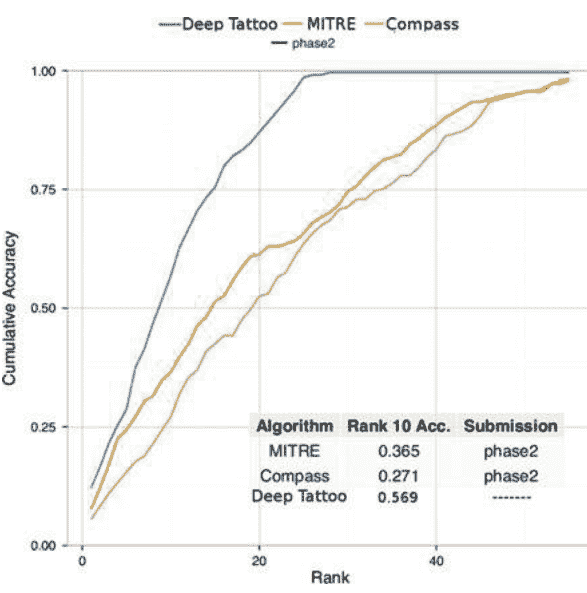

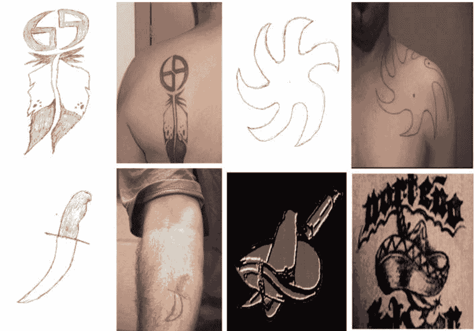

图10.8 混合媒体使用案例的样本结果[7]。第一行正确匹配。第二行匹配失败

为了进一步了解这种方法，在图10.8中我们展示了一些正确匹配和错误匹配的样本。 第一行显示的是被正确分类的图像，第二行显示的是我们的方法无法正确分类的混合媒体图像。 再次，卷积神经网络方法能够正确将混合媒体图像分类为纹身图像的原因是因为它们与纹身图像非常相似。 通过比较图10.8中第二行显示的图像，可以清楚地看到这一点。

### 10.4.3 纹身相似性

表10.5和图10.9展示了不同方法在纹身相似性应用中的结果。 从这些结果可以看出，基于卷积神经网络的方法在三元损失函数融合框架中表现优于之前的方法。 例如，在排名10时，我们的方法使用三元损失函数得到了与MITRE、Compass和非三元组方法相比，准确率为16.40%，而它们的准确率分别为14.9%、7.4%和11.1%。再次，这个实验清楚地表明，通过使用深度特征，可以显著提高纹身识别算法的性能。

表10.5 不同方法在纹身相似性媒体应用上的性能比较[7]。 探针数量：851，平均库大小：272。 提交列指示了这些准确率来自于Tatto-C [27]。

| 算法 | 提交 | 排名1 准确率 | 排名10 准确率 | 排名20 准确率 | 排名30 准确率 |
|---|---|---|---|---|---|
| 指南针 | 第二阶段 | 0.005 | 0.074 | 0.147 | 0.199 |
| MITRE | 第二阶段 | 0.035 | 0.149 | 0.239 | 0.309 |
| 深度纹身 | 三元组 | 0.055 | 0.164 | 0.249 | 0.316 |
| 深度纹身 | 非三元组 | 0.017 | 0.111 | 0.155 | 0.210 |

图10.9 对应于不同方法的CMC曲线在纹身相似性应用案例中

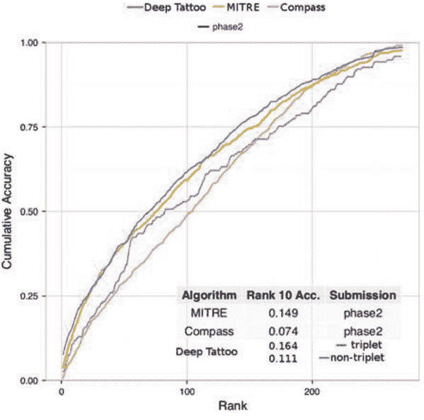

在图10.10中，我们展示了一些正确匹配和错误匹配的图像，用于纹身相似性应用案例。这个图的第一行显示了正确匹配的图像，第二行显示了错误匹配的图像。从这个图中可以看出，这些图像非常难以匹配，因为它们包含各种光照、姿态和分辨率的变化。深度特征方法在这个特定的应用案例中效果不好的原因之一，主要是因为缺乏足够数量的具有不同变化的纹身图像来训练深度模型。

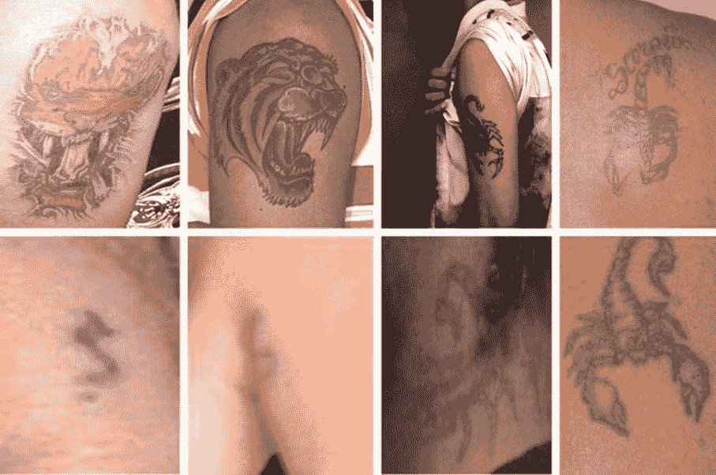

图10.10 混合媒体使用案例的示例结果。第一行629个正确匹配。第二行匹配失败

## 10.5 结论和未来方向

在本章中, 我们介绍了基于深度特征的纹身检测和识别方法, 使用了最近引入的AlexNet和Siamese网络。此外, 我们还展示了使用三元损失函数而不是简单的对比损失函数可以显著提高基于深度特征的纹身匹配系统的性能。 对 Tatto-C数据集进行了大量实验, 证明了不同基于CNN的方法的有效性, 例如一些比Siamese网络更好的网络架构。

由于深度学习最近变得越来越重要, 基于纹身的人员识别的未来方向之一将是将经典方法与基于深度学习的方法相结合。深度特征的特殊统计和几何属性将导致纹身识别的新建模技术。

此外, 由于深度学习为基础的检测和标记提取技术的快速发展, 纹身检测和对齐可以使用这些方法更加精确。因此, 它们可以为基于几何模型的方法提供改进的性能。另一个可能的方向是构建多任务CNN方法, 用于进行联合检测、识别和检索。深度多任务学习方法近年来引起了很大的兴趣, 并已应用于各种应用。

致谢本工作得到了ARO资助的W911NF-16-1-0126号授予的支持。

# 参考文献

- 1. S. Acton, A. Rossi, 纹身图像的匹配和检索: 主动轮廓CBIR和全局图像特征(2008), 第2 1-24页
- 2. J.D. Allen, N. Zhao, J. Yuan, X. Liu, 无监督纹身分割结合自下而上和自上而下的线索。S PIE会议 8063, 80,630L-80,630L-9 (2011)
- 3. J. Bromley, I. Guyon, Y. LeCun, E. Säckinger, R. Shah, 使用“连体”时延神经网络进行签名验证, 在神经信息处理系统进展, 第6卷, 编辑 J.D. Cowan, G. Tesauro, J. Alspector (Morgan-Kaufmann, 1994)
- 4. J.C. Chen, V.M. Patel, R. Chellappa, 使用深度卷积神经网络特征进行无约束人脸验证, 在IEEE冬季计算机视觉应用会议 (2016)
- 5. S. Chopra, R. Hadsell, Y. LeCun, 以面部验证为应用的判别相似度量学习, 在IEEE计算机学会计算机视觉与模式识别会议, CVPR-2005, 第1卷 (IEEE, 2005), 页码539-546
- 6. A. Dantcheva, P. Elia, A. Ross, 你的生物特征数据还能透露什么? 关于软生物特征的调查。IEEE信息学、取证与安全 11(3), 441-467 (2016年)
- 7. X. Di, V.M. Patel, 深度纹身识别, 在IEEE计算机学会与CVPR 2016联合举办的生物特征研讨会 (2016年)
- 8. P. Duangphasuk, W. Kurutach, 使用图像负片法进行纹身皮肤检测和分割, 在国际通信与信息技术研讨会(2013年), pp. 354-359
- 9. P. Duangphasuk, W. Kurutach, 纹身皮肤互相关神经网络, 在国际通信与信息技术研讨会(2014年), pp. 489-493
- 10. R. Girshick, J. Donahue, T. Darrell, J. Malik, 用于准确目标检测和语义分割的丰富特征层次结构, 在计算机视觉与模式识别(2014)
- 11. H. Han, A. K. Jain, 基于纹身的身份识别: 素描到图像匹配, 在国际生物特征会议(2013年), p p. 1-8
- 12. B. Heflin, W. Scheirer, T. Boult, 检测和分类野外发现的疤痕、痕迹和纹身, 在生物识别理论、应用和系统国际会议上 (2012),pp. 31-38
- 13. L. Huffman, J. McDonald, 使用转换边缘对齐的混合媒体纹身图像匹配, 在IEEE国际国家安全技术研讨会上(2016), pp. 1-6
- 14. A.K. Jain, U. Park, 面部痕迹: 用于人脸识别的软生物特征, 在IEEE国际图像处理会议上(2009), pp. 37-40
- 15. A. Jain, J.E. Lee, R. Jin, Tattoo-id: 自动纹身图像检索用于嫌疑犯和受害者身份识别, 在多媒体信息处理的进展, vol. 4810, 计算机科学讲义, 编辑 H.S. Ip, O. Au, H. Leung, M.T. Su n, W.Y. Ma, S.M. Hu (Springer,Berlin, 2007), pp. 256-265
- 16. A.K. Jain, J.E. Lee, R. Jin, N. Gregg, 基于内容的图像检索: 纹身图像应用, 在IEEE国际图像处理会议(2009), pp. 2745-2748
- 17. Y. Jia, E. Shelhamer, J. Donahue, S. Karayev, J. Long, R. Girshick, S. Guadarrama, T. Darrell,Caffe: 快速特征嵌入的卷积架构 (2014), arXiv:1408.5093
- 18. J. Kim, H. Li, J. Yue, E.J. Delp, 纹身图像的感兴趣区域检索, 在IEEE国土安全技术研讨会(2016), pp. 1-6
- 19. J. Kim, A. Parra, J. Yue, H. Li, E.J. Delp, 纹身图像匹配的稳健局部和全局形状上下文, 在IEEE国际图像处理会议(2015), pp. 2194-2198
- 20. A. Krizhevsky, I. Sutskever, G.E. Hinton, 使用深度卷积神经网络的Imagenet分类 (2012), pp. 1097-1105
- 21. A. Krizhevsky, I. Sutskever, G.E. Hinton, 使用深度卷积神经网络进行Imagenet分类, 在《神经信息处理系统25进展》 (Curran Associates, Inc. 2012) , 第1097-1105页, http://papers.nips.cc/paper/4824-imagenet-classification-with-deep-convolutional-neural-networks.pdf
- 22. J.E. Lee, A.K. Jain, R. Jin, 疤痕、痕迹和纹身 (SMT) : 嫌疑人和受害者识别的软生物特征, 在《生物特征学研讨会论文集》 (2008), 第1-8页

23. J.E. Lee, R. Jin, A. Jain, W. Tong, 鉴定学中的图像检索：纹身图像数据库应用。IEEE多媒体 19(1), 40-49 (2012)
24. J.E. Lee, R. Jin, A.K. Jain, 基于排名的距离度量学习：图像检索应用，在IEEE计算机视觉与模式识别会议(2008), 第1-8页
25. D. Manger, 大规模纹身图像检索，在2012年第九届计算机与机器视觉会议(CRV)(2012), 第454-459页
26. M. Yan, P. Grosster, 纹身识别技术 - 挑战(Tatt-C)：用于开展纹身识别研究的开放纹身数据库，在IEEE身份、安全与行为分析国际会议(2015), 第1-6页
27. M. Yan, G.W. Quinn, P. Grosster, 纹身识别技术-挑战(tatt-c)的结果和建议。技术报告NISTIR 8078, 国家标准与技术研究所(2015)
28. R. Ranjan, V.M. Patel, R. Chellappa, 用于人脸检测的深度金字塔可变部件模型，在IEEE国际生物特征理论、应用和系统会议上(2015), pp. 1-8
29. D. Reid, S. Samangoeei, C. Chen, M. Nixon, A. Ross, 用于监控的软生物特征：一个概述. 统计手册. 31, 327-352 (2013)
30. O. Russakovsky, J. Deng, H. Su, J. Krause, S. Satheesh, S. Ma, Z. Huang, A. Karpathy, A. Khosla, M. Bernstein, A.C. Berg, L. Fei-Fei, ImageNet大规模视觉识别挑战. 国际计算机视觉杂志 (IJCV) 115(3), 211-252 (2015). doi:10.1007/s11263-015-0816-y
31. S. Sarkar, V.M. Patel, R. Chellappa, 基于深度特征的移动设备人脸检测, 在IEEE身份、安全和行为分析国际会议上 (2016)
32. F. Schroff, D. Kalenichenko, J. Philbin, Facenet: 用于人脸识别和聚类的统一嵌入. CoRR (2015), arXiv:1503.03832
33. P. Tome, J. Fierrez, R. Vera-Rodriguez, M. Nixon, 软生物特征及其在远程人员识别中的应用. IEEE Trans. Inf. Forensics Secur. 9(3), 464-475 (2014)
34. A. Vedaldi, B. Fulkerson, VLFeat: 一个开放且可移植的计算机视觉算法库(2008), http://www.vlfeat.org/
35. J. Wang, Y. Song, T. Leung, C. Rosenberg, J. Wang, J. Philbin, B. Chen, Y. Wu, 使用深度排序学习细粒度图像相似度, in IEEE计算机视觉与模式识别会议(2014), pp. 1386-1393
36. M.J. Wilber, E. Rudd, B. Heflin, Y.M. Lui, T.E. Boult, 面部属性和纹身识别的示例代码, in IEEE冬季计算机视觉应用会议(2014), pp. 205-212
37. Q. Xu, S. Ghosh, X. Xu, Y. Huang, A.W.K. Kong, 基于cnn和nist数据库的纹身检测, 国际生物特征会议(2016), 第1-7页
38. J. Yosinski, J. Clune, Y. Bengio, H. Lipson, 深度神经网络中的特征可迁移性有多高? CoRR (2014), arXiv:1411.1792

# 第四部分 生物特征安全的深度学习
# 第11章 学习密码哈希的表征：基于面部模板保护

**作者**：罗希特・库马尔・潘迪、周英博、巴尔加瓦・乌拉拉・科塔和维努・戈文达拉朱

**摘要**
在本章中，我们讨论了深度学习在生物特征模板保护领域的最新进展的影响。神经网络的表征学习能力使其在包括人脸识别在内的多个领域取得了最先进的结果。因此，使用面部图像进行生物特征认证也从中受益，深度卷积神经网络将匹配性能提升到了历史最高水平。本章研究了神经网络学习表征的能力，这对于模板安全性和匹配准确性都有好处。加密哈希通常被认为是生物特征数据的最安全保护形式，但需要在注册和验证模板之间进行精确匹配，代价较高。这个要求通常会导致系统的匹配性能（FAR 和 FRR）严重下降。我们关注两种相对较新的面部模板保护算法，研究神经网络学习到的表示对基于密码哈希的模板保护的适用性。局部区域哈希通过尝试从面部的局部区域提取的特征进行精确匹配，从而解决了基于哈希的模板安全性问题，而不是整个面部。对于这个任务，我们比较了不同特征提取器的适用性，并发现自动编码器学习到的表示是最有前途的。深度安全编码通过学习将面部类别映射到安全代码来解决问题，然后将其哈希并存储为安全模板。这种方法克服了局部区域哈希和其他面部模板算法的几个缺点。它还以高标准的模板安全性实现了最先进的匹配性能。

**作者信息**
R.K. Pandey, Y. Zhou, B.U. Kota, V. Govindaraju
布法罗纽约州立大学布法罗分校, 纽约州布法罗市 14260, 美国
e-mail: rpandey@buffalo.edu
Y. Zhou
e-mail: yingbozh@buffalo.edu
B.U. Kota
e-mail: buralako@buffalo.edu
V. Govindaraju
e-mail: govind@buffalo.edu

© Springer International Publishing AG 2017
B. Bhanu 和 A. Kumar (eds.), 深度学习用于生物特征识别, 计算机视觉与模式识别的进展, DOI 10.1007/978-3-319-61657-5_11

## 11.1 引言
隐私在当今世界中是一个日益关注的问题，因为我们每天都留下了大量的数字足迹。这可能是通过网络浏览历史、通过社交媒体分享的照片，或者在应用程序和网站上注册的密码的形式。

鉴于大多数这些数据的敏感性质，人们担心它会落入错误的手中。现代密码学为保护密码和其他文本数据等敏感信息提供了良好的解决方案，但仍然存在一些难以保护的敏感数据形式。本章重点介绍了一种关键的敏感数据类型的保护，即面部生物特征模板。

生物特征认证通过面部和指纹识别系统越来越多地进入我们的日常生活，包括手机和计算机。基于“我们是谁”而不是“我们记住的东西”或“我们拥有的东西”的认证提供了便利，通常也提供了更强的系统安全性。通常，在注册阶段，生物特征认证系统会从用户的生物特征数据中提取并存储一个模板。在验证过程中，用户提供生物特征，并提取一个模板与存储的模板进行匹配。根据匹配分数，决定是否允许访问。这种认证的一个关键且经常被忽视的方面是保护存储的模板。如果攻击者获得存储的模板，不仅可以获得系统访问权限，还可能从中恢复用户的原始生物特征数据。鉴于面部、指纹或虹膜等物理生物特征是不可替代的，损害它们将阻止用户将来使用它们进行任何生物特征认证。

## 11.2 密码保护
在进入生物特征模板保护之前，让我们简要地考虑一下目前最常见的身份验证方式：字符串密码。在注册期间，从提供的文本中提取一个模板并存储在数据库中。对于文本密码身份验证，模板是一种单向不可逆转的转换，通常使用加密哈希函数（如SHA）计算出的哈希摘要。在验证期间，再次提供密码，计算其哈希摘要并与存储的哈希摘要进行比较。如果两个密码完全匹配，它们的哈希摘要也将匹配，然后允许访问。如果攻击者获取了模板，哈希函数（如SHA）的特性确保不会泄露有关原始密码的任何信息。实际上，攻击者必须通过每个可能的文本密码进行穷举攻击，以找到与模板相对应的密码。此外，如果检测到数据库遭到破坏，要求用户更改密码是很直接的。这种基于哈希的模板保护可能看起来很理想，但代价很高，需要在注册和验证文本之间进行精确匹配。

## 11.3 密码哈希函数
哈希函数是将任意大小的数据（通常称为消息）映射到一个固定长度的位串，称为哈希摘要。密码哈希函数是哈希函数的一种特殊情况，具有适用于密码学的特定属性。理想的密码哈希函数具有以下属性：

- 1. 对于任何类型的数据，计算哈希摘要应该很快。
- 2. 根据哈希摘要无法获取原始数据。
- 3. 找到两个具有相同哈希摘要的消息应该是不可行的。
- 4. 消息中的微小变化应该导致其哈希摘要的大变化，而修改后的消息对应的哈希摘要与原始摘要不相关。

因此，密码哈希函数与其他加密方法的关键区别在于无法从加密形式中恢复原始数据。结合上述其他属性，对哈希摘要的唯一可能攻击是暴力攻击，即攻击者必须遍历消息的所有可能值，对每个值进行哈希运算，并将哈希值与存储的摘要进行比较。实际上，通过添加盐和多次哈希迭代，这个任务变得更加困难。在应用哈希函数之前，将用户特定的盐添加到消息中可以显著增加攻击者的搜索空间。而将哈希函数应用于消息的多次迭代会增加摘要的正向计算时间，从而显著增加暴力攻击的时间复杂度。

## 11.4 生物特征模板保护
生物特征模板保护的目标是以类似于文本密码保护的方式保护生物特征数据。由于原始生物特征数据不像文本密码那样可更改，其安全性更为重要。理想的生物特征模板保护算法应具备以下特性：

- 1. 安全性—在保护的模板中提取原始生物特征数据应是不可行的。
- 2. 可取消性—如果旧模板已被破坏，应能够从原始生物特征生成新的受保护模板。
- 3. 性能—模板保护算法不应导致生物特征系统的匹配性能（FAR和FRR）下降。

从安全性的角度来看，密码哈希函数也是生物特征模板的理想选择，但生物特征数据的某些特性使得基于哈希的安全性非常具有挑战性。基于哈希的安全性需要精确的匹配，即从不同的生物特征数据读数中提取的模板之间的匹配。由于生物特征数据在读数之间显示出显著的固有变化，因此很难提取完全匹配的模板。即使模板之间只有一个位变化，也会导致非常不同的哈希摘要值。

此外，由于生物特征数据在哈希摘要被泄露后无法更改，因此还需要以某种方式解决可取消性问题。尽管在实现基于哈希的生物特征数据模板安全性方面存在困难，但已经提出了几种方法。如图11.1所示，生物特征模板保护算法可以广泛分为两类[12]：生物特征加密系统和特征变换。

生物特征加密系统方法依赖于从原始生物特征中派生出的一些公开可用的数据（称为辅助数据）。当然，辅助数据不应透露有关原始生物特征数据的重要信息。根据辅助数据的派生方式，生物特征加密系统分为两种类型：密钥绑定和密钥生成方案。密钥绑定方案通过将外部密钥与生物特征数据绑定来派生辅助数据。例如，模糊承诺将纠错输出码 C 作为密钥与生物特征数据 X 绑定，并生成辅助数据 X-C 和哈希值(C)。当需要验证新样本 X' 时，它与辅助数据组合，得到 C' = X' - (X - C)。如果 X' 接近 X，C' 将接近 C，因此纠错解码器将能够将 C' 纠正为 C。这使我们能够将纠正后的代码的哈希与存储的哈希值进行匹配。另一方面，密钥生成方案试图从生物特征数据本身中提取稳定的密钥。例如，[6]中提出的模糊提取器和安全草图。模糊提取器的背后思想是以容忍噪声的方式从生物特征数据中提取均匀随机字符串。因此，即使生物特征数据略有变化，也可以精确地再现并用作密钥。安全草图 S 是从生物特征 X 中提取的一些公开可见数据，但不透露有关 X 的重要信息。给定 X'（接近 X 的某个值）和 S，可以恢复该值 X。因此，安全草图能够精确恢复已注册的生物特征，但不能解决模糊提取器等均匀性问题。

基于特征变换的方法只是试图将生物特征数据转换为可以进行匹配的编码空间。它们分为两种类型：不可逆变换和生物特征加盐。不可逆变换将一个不可逆函数应用于生物特征数据，生成一个模板，从中无法提取出原始生物特征。在验证过程中，将同样的函数应用于新样本，并在转换后的空间中进行匹配。基于生物特征加盐的方法使用一个秘密密钥以可逆的方式转换生物特征数据。如果密钥被泄露，就有可能获取到原始数据，因此加盐方法的安全性完全依赖于密钥的安全性。

让我们简要介绍一些已应用于人脸的算法。使用密码系统的方法包括 Ao 和 Li [1]、Lu 等人 [16]、Van Der Veen 等人 [30] 的模糊承诺方案，以及 Wu 和 Qiu [32] 的模糊保险库。总的来说，模糊承诺方案的纠错能力有限或密钥长度较短。在模糊保险库方案中，数据存储在杂点之间，这也会导致存储空间的开销。Sutcu 等人 [23, 24] 使用了一些量化方案来生成相对稳定的密钥。还有一些将人脸数据与用户特定密钥结合的工作。这些包括 Chen 和 Chandran [4] 的密码组合，Ngo 等人 [17, 28, 29] 的用户特定令牌绑定，Savvides 等人 [20] 的生物特征加盐，以及 Teoh 和 Yuang [27] 和 Kim 和 Toh [13] 的用户特定随机投影方案。尽管使用用户特定令牌可以提高匹配性能并实现高模板安全性，但仍然有关令牌本身保护和生物特征数据对性能的贡献的问题。混合方法将基于变换的可取消性与基于密码系统的安全性结合起来，如[8]所提出的方法，但会泄露用户特定信息以生成模板，从而为伪装攻击留下漏洞。

## 11.5 面部模板保护的深度学习
在过去几年中，基于深度卷积神经网络（CNN）的算法，如 Facenet [21] 和 Deepface [25]，展示了出色的性能，并且在人脸识别方面保持了最新的研究成果。深度神经网络成功的关键原因是它们能够学习适合任务的表示，而不是使用手工设计的特征。面部标记数据的大量可用性，加上深度 CNN 架构和训练算法的最新进展，使得学习到的表示远远超过传统面部识别特征的性能。因此，使用面部进行生物特征认证也从中受益，并且匹配准确率达到了历史最高水平。

## 11.6 本地区域哈希
据我们所知，本地区域哈希[19]是第一个研究学习表示适用于基于密码哈希的人脸模板安全性的方法之一。该算法旨在实现对脸部局部区域提取的特征进行精确匹配，而不是整个脸部。由于这些区域较小，从中提取的特征与从整个脸部提取的特征相比，变化可能较小。让我们进一步详细讨论算法和相关实验。

### 11.6.1 算法
模板生成的这种方法包括以下步骤。首先，将人脸图像分成一组选定的局部区域。然后，从每个区域提取特征，并对特征向量进行量化以消除细微变化。最后，对量化的特征向量进行哈希处理并存储。因此，受保护的人脸模板由一组哈希特征组成。算法概述如图11.2所示。

图11.2 局部区域哈希的概述

#### 11.6.1.1 面部区域选择
从固定的面部局部区域提取特征的目的是双重的。首先，这增加了在特征之间获得精确匹配的机会。尽管从属于不同会话的面部样本中提取的整体特征存在固有的变化，但仍然存在面部的局部区域保持相对不变，因此产生的特征变化较小。

其次，选择固定区域，并对框架的设计进行微调，确保来自特定区域的特征仅与相同区域的特征匹配。这对特征施加了空间约束，并减少了来自其他区域的特征匹配到该区域的假阳性的机会。因此，感兴趣的总区域由较小的局部区域的并集 Vr 给出，如下所示：

感兴趣区域 = ⋃(i=0 to V-1) r_i  (11.1)

所选局部区域的理想特征包括：（i）它们应该产生有区分度的特征。（ii）它们应该产生具有更高准确匹配机会的特征。在像素级别上，可以通过改变区域的大小和位置来控制这一点。感兴趣的区域应该涵盖整个脸部或至少是具有较高统计显著性的区域，以获得区分能力。另一方面，每个区域的大小会影响产生完全匹配特征的能力。如果大小太大，从中提取的特征可能会显示出很大的变化；如果大小太小，则提取的特征可能不具有足够的区分度。因此，这可以看作是一个两阶段过程的第一级控制，旨在产生适合我们任务的特征。

为了实验目的，感兴趣的区域被选择为整个脸部，而非重叠的块被选择为局部区域。因此，对于一个大小为 (d×d) 的人脸图像，将其分成 b 个非重叠的块将产生大小为 (d/b×d/b) 的局部区域。

#### 11.6.1.2 特征提取
对模板表示的第二级控制以高级特征提取器应用于低级像素区域的形式出现。所使用的更高级别特征应具备以下特点：(i) 它们应对微小变化具有稳定性，因此适用于精确匹配。(ii) 它们应具有足够的区分度，以区分用户，从而具有低的 FAR/FRR。(iii) 它们的长度应足够长，以使其哈希版本对抗暴力攻击，并具有足够的熵以对抗更智能的攻击。目前，讨论了稳定性和长度这两个较简单的要求，将更复杂的与熵相关的方面留给安全分析部分。第一种特征提取策略使用标准特征提取器已经证明在人脸识别中非常有用。第二种探索了使用去噪自编码器来学习特征表示。

##### 标准特征提取器
探索了两种标准特征提取器的适用性，即梯度直方图（HoG）[5]和局部二值模式（LBP）直方图[18]。选择这两种最基本的基于梯度和纹理的特征提取器，是因为研究它们在当前任务中的性能将为我们提供有价值的见解，以确定适用于安全性和准确性的表示类型。HoG特征的可控参数包括每个块的单元格数、每个单元格的像素数和方向数。每个单元格的像素数和方向数会影响特征长度。假设选择了每个单元格包含 (p × p) 像素的大小为 (m × m) 的区域，则用 m 表示方向数，用 c = m/p 表示单元格数。最终的 feature 长度由 l_feat = m × c 给出。对于LBP直方图，可变参数是半径和邻居数。半径影响计算LBP码的分辨率，而邻居数确定特征长度。因此，对于每个像素的 t 邻居计算的LBP直方图，特征长度由以下公式给出：$2^n$。

特征向量的长度不仅影响特征的区分能力，还影响它们的哈希版本对暴力攻击的韧性。特征长度对区分能力和模板安全性的影响将在实验部分进一步讨论。

##### 学习到的表示
将标准特征提取器与从数据本身学习到的表示进行比较。这不仅生成适合于局部区域选择的特征，还能更好地控制特征的理想属性。

使用堆叠去噪自编码器（SdA）[31]来学习这种表示。自编码器是一种通过隐藏状态将输入映射回自身的神经网络。通过最小化重构输入与原始输入之间的损失来学习与隐藏状态数量相同的表示。为了学习稳健的表示并防止自编码器学习恒等函数，去噪自编码器（dA）尝试从损坏的输入的版本中重构输入。因此，神经网络的输入层是我们希望学习其表示的数据 x。隐藏层由 h 个节点组成，通过一组权重 W 和一些偏置 b 与输入层完全连接。隐藏层的输出是由 z = s(Wx + b) 给出的潜在表示，其中 z 是一个非线性函数，如 sigmoid 函数。潜在表示被映射回重构 $\hat{z} = s(W' \hat{y} + b')$。优化该模型的参数 W, W', b 和 b' 以最小化 z 和 x 之间的重构误差。在我们的情况下，这由平方误差给出，$L(x, \hat{z}) = || x - \hat{z} ||^2$。多个 dA 可以堆叠在一起形成一个 SdA，其中每一层的输出被视为下一层的输入，并映射回相应的层，最后重构输入。

在训练过程中，对输入应用高斯噪声以扰动数据。训练是逐层进行的，以无监督的方式，对每一层独立地最小化重构误差。使用来自所有块的像素级数据对 SdA 进行训练，然后将训练好的网络用作特征提取器。

该特征对应于最终层的隐藏表示 $y$，其长度由 $l_{\text{feat}} = h$ 给出。通过改变网络中隐藏节点的数量，可以控制特征向量的长度。

#### 11.6.1.3 量化和组合

在提取和归一化每个 $d$ 维特征向量 $f$（使得 $f \in [0, 1]^d$）之后，它们通过将每个维度分成 $q$ 个箱子进行量化，箱的宽度为 $1/q$，得到 $f_q \in$

$$
\left\{b_0, b_1, \ldots, b_{q-1}\right\}^d \tag{11.2}
$$

这样做是为了消除向量之间的微小变化并增加精确匹配的机会。在这一步骤中，特征的区分能力和熵也会减小，并且这种影响在实验和安全分析部分进行了分析。除了分箱之外，还会附加一个区域标识符到特征向量中，以标记它是从哪个区域提取的。因此，如果特征向量 $f_q \in \left\{b_1, b_2, \ldots, b_q\right\}^d$，区域编号 $i$ 将被附加到 $f_q$，从而得到从本地区域 $r_i$ 中提取的特征向量：

$$
f_{qr} \in \left\{b_0, b_1, \ldots, b_{q-1}\right\}^d \parallel i \tag{11.3}
$$

这确保了特征只能与同一区域中的其他特征匹配，并对局部匹配施加了空间约束。

增加特征向量长度的另一种方法是使用来自不同区域的向量的组合。这在低长度特征足够具有较好匹配准确性但不足以抵御对其哈希版本进行暴力攻击的情况下非常有用。给定一组特征 $F = \left\{f_{qr,0}, f_{qr,1}, \ldots, f_{qr,v-1}\right\}$，维度为 $d$，并且平均而言，至少有 $k$ 个来自不同区域的特征匹配，可以对大小为 $k$ 的所有可能组合进行索引。现在，每个新特征 $f_{qr}'$ 将由 $\big\|_{j=0}^{k-1} f_{qr,j}$ 给出，其维度为 $k \times d$。样本的特征集合将变为 $F = \left\{f_{qr,0}', f_{qr,1}', \ldots, f_{qr,v-1}'\right\}$。这样会增加特征长度，并直观地减少误报的机会。

#### 11.6.1.4 模板保护和索引

给定一组特征，每个样本的下一个目标是将它们哈希并以生物特征模板的形式存储起来。使用标准的密码哈希函数 $h(x)$（在这种情况下为 SHA-256）对 $F$ 中的每个特征进行哈希。这将产生一个新的集合 $T$，对应于一个样本的受保护模板，由以下公式给出：

$$
T=\left\{h\left(f_{qr,0}\right), h\left(f_{qr,1}\right), \ldots, h\left(f_{qr,V-1}\right)\right\} \tag{11.4}
$$

因此，最终受保护的模板是从脸部提取的一组哈希局部特征。如果有多个图像被注册，模板将是一个由所有非重复的量化特征向量的哈希摘要组成的集合。

在认证过程中，从人脸图像中提取相似的局部特征，进行量化和哈希处理，得到一组 $V$ 局部特征 $T_{\text{测试}}$。在验证模式下，检索与用户相对应的模板 $T_{\text{注册}}$，并通过两个模板之间的集合交集给出匹配分数：

$$
\text{分数} = T_{\text{测试}} \cap T_{\text{注册}} \tag{11.5}
$$

该索引也可以用于识别，其中给定的样本不声称来自任何类别。在这种情况下，将遍历所有用户的模板，并将样本识别为显示最大匹配的用户模板。

### 11.6.2 实验

该框架在 Multi-PIE [10] 数据库上使用 ROC 曲线和 EER 作为评估指标进行测试。使用在第 1 和第 2 会话之间共同的 167 个人脸类别的正面姿势和中性表情进行评估。

从第 1 个会话中随机选择每个用户的十张图像用于注册，并使用第 2 个会话中的所有图像进行验证。因此，测试平台包含了来自不同会话的光照变化和样本固有变化。这些变化可以说足够用于算法在用户合规性场景中的部署。由于精确匹配的严格要求，图像的正确对齐对于处理图像的每个眼睛中心至关重要。下面描述了实验中使用的参数和实现库等其他细节。

每个人脸图像都被对齐，使得它们的眼睛大致位于相同的位置，并裁剪掉大部分背景，得到最终的人脸图像大小为 $200 \times 200$。然后，将人脸图像划分为 $V=100$ 个局部区域，每个区域为非重叠的 $20 \times 20$ 大小的块，其中 $R$ 从方程 11.1 中的整个图像中提取感兴趣的区域。接下来，从每个块中提取特征 $f$，并将每个维度分成 $q=4$ 个箱子，并附加区域标识符 $i \in\{1,2, \ldots, 100\}$。从方程 11.3 中得到 $f_{qi}$。对于 HoG 特征，单元格的数量固定为 4 个，而方向的数量则变化。对于 LBP 特征，邻居的数量变化。对于 SdA，使用两个层，将第一层的隐藏状态数量固定为 576 个，并且将第二隐藏层的隐藏层数量变化为所需的表示维度。使用方差为 0.5 的零均值高斯噪声作为噪声，并且每个层的训练进行 20 个周期，学习率为 0.3。请注意，从注册集中提取的块用于简化自动编码器的训练，但由于我们仅想要学习人脸的特征表示，训练也可以在完全不同的数据库上进行。使用 Scikit-image 计算 HoG 和 LBP 特征。

自动编码器使用 Theano [2, 3] 实现。实验使用不同的特征长度进行，HoG 特征范围为 8-32，LBP 特征范围为 16-256，自动编码器特征范围为 16-256。接下来，每个 $f_{qi}$ 都使用 SHA-256 作为哈希函数进行哈希运算 $h$，得到方程 11.4 中的集合 $T$。在注册过程中，为每个用户构建一个非重复特征的集合。对于验证，通过计算测试样本生成的集合与声明用户注册的集合之间的交集，得到 $T_{\text{test}}$。然后计算与声明用户注册的集合之间的交集，得到 $T_{\text{user}, i}$。这样就得到了方程 11.5 中的得分。在这种情况下，得分的范围是 0-100。真实得分是通过将测试样本与其真实类别进行比较来计算的，而冒名顶替得分是与其他注册类别进行比较的。

图 11.3 分别显示了 HoG、LBP 和自动编码器特征的 ROC 曲线（注意，由于得分的离散性和在不同阈值处的重叠，某些曲线不平滑）。可以看出，HoG 特征表现非常差，仅在 8 位安全性下具有 15.3% 的合理等误差率，因此不适用于安全性。LBP 特征在六个邻居或 128 位安全性下具有 21.3% 的等误差率，表现更好。SdA 学习到的特征表示在 128 位安全性下表现最好，等误差率为 16.6%。有趣的是，即使在 256 位安全性下，等误差率也不会相差太远。值得注意的是，在所有情况下，匹配得分从未超过总区域数的 60-70%，这证实了如果使用整个脸部的整体特征，这种基于哈希的安全方案将是不可行的。

### 11.6.3 安全分析

在一个被盗模板的情况下研究算法的安全性，如果攻击者获得了安全模板的访问权限，从中提取原始生物特征数据应该是不可行的。假设哈希函数 SHA-256 是抗碰撞的，并且遵循随机预言模型，在这个模型中，哈希摘要之间没有任何依赖关系。在这种情况下，攻击系统的唯一方法是猜测特征域中的值，对它们进行哈希处理，并将它们与数据库中存储的哈希值进行比较。一个天真的攻击者会假设特征空间是均匀的，并搜索每个可能的值。因此，在这种情况下，系统提供的安全位数与其大小成比例。

图 11.3 HoG（顶部）、LBP（中间）、自编码器（底部）特征的 ROC 曲线

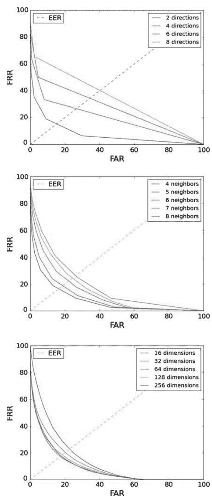

#### 表 11.1 特征安全性

| 特征提取器 | $q^{\text{eff}}$ | $MI(D_{en}, D_{at})$ |
|---|---|---|
| HoG | $2^{64}$ | 0.1610 |
| LBP | $2^{64}$ | 0.1068 |
| | $2^{128}$ | 0.0962 |
| | $2^{256}$ | 0.1029 |
| SdA | $2^{64}$ | 0.0739 |
| | $2^{128}$ | 0.0870 |
| | $2^{256}$ | 0.1020 |

搜索空间由 $T \times q^{\text{eff}}$ 给出，其中 $T$ 是选择的得分阈值。实际上，特征空间远非均匀，而在缺乏足够数据的情况下近似其真实分布是一项艰巨的任务。相反，从 $q^{\text{eff}}$ 中减少搜索空间的数量要稍微容易一些。假设攻击者了解算法、使用的特征提取器，并且可以访问未在系统中注册的人脸数据 $D_{en}$。攻击者使用信息泄露可以减少搜索空间的数量，这通过从 $D_{en}$ 提取的特征和已注册数据库 $D_{at}$ 之间的互信息（MI）来量化。由于不同区域和人脸类别的数据具有高度多模态性，因此智能攻击将需要按区域进行，并且信息泄露以两个数据库之间的平均互信息（MI）报告。

$$
MI(D_{en}, D_{at})=\frac{\left(\sum_{i=1}^{V} MI\left(F_{qr_i}^{en}, F_{qr_i}^{at}\right)\right)}{V}
$$

其中 $F_{qr_i}$ 是从区域 $i$ 提取的量化特征集合。为了这个实验的目的，$D_{en}$ 是一个随机选择的 20 个人脸类的集合，而 $D_{at}$ 是另一个不在 $D_{en}$ 中的 147 个类的集合。MI 是使用非参数熵估计工具包（NPEET）计算的，该工具包实现了 Kraskov 等人提出的 MI 估计器 [14]。由于非参数估计是特定于数据分布的，MI 值最好视为特征提取器之间的比较度量，而不是通用尺度上的值。不同特征提取器在不同特征长度下的 MI 值如表 11.1 所示，关于这些值的更多细节可以在 [14] 中找到。

## 11.7 深度安全编码

现在让我们讨论一种解决局部哈希在模板安全性和匹配准确性方面不足的替代方法。该算法使用深度卷积神经网络（CNN）学习将人脸类别映射到称为最大熵二进制（MEB）码的稳健映射。

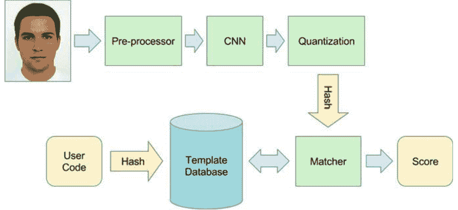

图 11.4 深度安全编码概述

该映射足够稳健，可以解决精确匹配问题，在训练期间为用户的新样本分配的代码与训练期间分配的代码相同。这种精确匹配使得将代码的加密哈希作为用户的模板成为可能。一旦哈希，模板与分配给用户的代码没有相关性。此外，分配给用户的代码是按位随机生成的，因此具有最大熵，并且与原始生物特征模态（用户的面部）没有相关性。这些特性使得对模板的攻击非常困难，只有在代码域中进行暴力攻击和在输入域中进行复杂字典攻击是可行的选择。通过更改分配给用户的代码并重新学习映射，也可以轻松实现可取消性。

### 11.7.1 算法

我们现在更详细地描述我们架构的各个组件。图 11.4 显示了算法的概述。

#### 11.7.1.1 卷积神经网络

卷积神经网络（CNN）[15] 是受生物启发的模型，包含三个基本组件：卷积、池化和全连接层。

在卷积层中，我们尝试学习给定输入特征图的滤波器组。卷积层的输入是一个 3D 张量，具有 $d$ 个 2D 特征图，大小为 $n_1 \times n_2$。让 $x_{ijk}$ 表示第 $i$ 个特征图中第 $j$ 行第 $k$ 列的组成部分，$x_i^{(l)}$ 表示第 $l$ 层的完整第 $i$ 个特征图。如果想要学习一个大小为 $f_1 \times f_2$ 的 $f$ 个滤波器，下一层的输出 $x^{(l+1)}$ 仍然是一个 3D 张量，具有 $h_f$ 个 2D 特征图，数量为 $(n_1 - f_1 + 1) \times (n_2 - f_2 + 1)$。

更正式地说，卷积层计算如下：

$$
x_j^{(l+1)} = s \left( \sum_i F_{ij}^{(l)} * x_i^{(l)} + b_j^{(l)} \right) \tag{11.7}
$$

其中 $F_{ij}^{(l)}$ 表示连接特征图 $x_i$ 到输出图 $x_j^{(l)}$ 在层 $l$ 的滤波器，$b_j^{(l)}$ 是第 $j$ 个输出特征图的偏置项，$s(\cdot)$ 是一些逐元素非线性函数，$*$ 表示离散的 2D 卷积。

池化（或子采样）层接收一个 3D 特征图，并尝试将内容降采样/汇总到较低的空间分辨率。池化通常独立地对每个特征图进行，并使用非重叠的窗口。这种操作的直觉是具有一定的不变性，可以抵抗小的平移。此外，这减少了空间分辨率，从而为上层节省了计算量。对于平均池化，输出将是池化窗口内的平均值，对于最大池化，输出将是池化窗口内的最大值。

全连接层将较低层的所有输入单元连接到下一层的所有输出单元。更详细地说，下一层的输出通过以下方式计算：

$$
x^{(l+1)} = s(W^{(l)} x^{(l)} + b^{(l)}) \tag{11.8}
$$

其中，$x^{(l)}$ 是来自第 $l$ 层的向量化输入，$W^{(l)}$ 和 $b^{(l)}$ 是第 $l$ 层全连接层的参数。

CNN 通常由多个卷积和池化层堆叠而成，后面跟着几个全连接层。最后一层通常与某种损失函数相关联，以提供训练信号，CNN 的训练可以通过对参数相对于损失函数进行梯度下降来完成。例如，在分类任务中，最后一层通常是一个 softmax 层，并且使用交叉熵损失函数计算与类别标签的 1-of-K 表示之间的差异。更详细地说，设 $x^{(L)} = W x^{(L-1)} + b$ 为最后一层的预激活值，$t$ 表示最终输出，$t_k$ 表示 $t$ 的第 $k$ 个分量，$y$ 表示目标的 1-of-K 向量，$y_k$ 表示该向量的第 $k$ 个维度，则有：

$$
t_k = \frac{\exp\{x_k^{(L)}\}}{\sum_j \exp\{x_j^{(L)}\}} \tag{11.9}
$$

$$
L(\mathbf{t}, \mathbf{y}) = \sum_j y_j \log t_j \tag{11.10}
$$

其中 $L$ 是损失函数。

#### 11.7.1.2 最大熵二进制码

训练的第一步是为每个要注册的用户分配唯一的码。请注意，这些码在注册期间用于训练，不会提供给用户，并且在训练后不以未受保护的形式保留。从模板安全性的角度来看，这些码理想情况下应具备两个特性。首先，它们应具有高熵。由于这些码的哈希是最终受保护的模板，码的熵越高，暴力攻击的搜索空间就越大。为了使代码域内的暴力攻击变得不可行，我们使用具有最小维度 $K=256$ 的二进制码，并尝试不同的值，最高可达 $K=1024$。码的第二个理想特性是它们不应与原始生物特征有相关性。生物特征样本与安全码之间的任何相关性都可以被攻击者利用来减少暴力攻击的搜索空间。一个例子是从人脸中提取的二进制特征。尽管特征向量的维度可能很高，但考虑到特征提取算法和数据类型，向量可以取的可能值数量严重减少。为了防止熵的减少，使用的码是按位随机生成的，并且与原始生物特征样本没有相关性。这使得哈希空间均匀分布。更准确地说，设 $c_i \sim \mathbf{B}(1,0.5)$ 为码的每个位的二进制变量，其中 $\mathbf{B}(1,0.5)$ 是最大熵伯努利分布，结果的 MEB 码具有 $K$ 个独立位，即 $\mathbf{C} = [c_1, c_2, \dots, c_K]$。用户 $u$ 的码表示为 $\mathbf{C}_u$。

#### 11.7.1.3 学习映射

为了学习用户面部样本到代码的稳健映射，对标准 CNN 训练过程进行了一些修改。如图 11.5 所示，类标签的 1-of-K 编码被替换为分配给每个用户的 MEB 代码 $\mathbf{C}_u$。由于网络输出的多个位将变为 1 而不是单个位，所以使用 sigmoid 激活函数代替 softmax。更详细地说：

$$
t_k = \frac{1}{1 + \exp\{-x_k^{(L)}\}} \tag{11.11}
$$

$$
L(\mathbf{t}, \mathbf{C}) = \sum_j \{c_j \log t_j + (1-c_j) \log(1-t_j)\} \tag{11.12}
$$

其中 $t_k$ 是最后一层的第 $k$ 个输出，$L$ 是二元交叉熵损失。

##### 数据增强

深度学习算法通常需要大量的训练样本，而生物特征数据的训练样本通常有限。为了扩大每个用户的训练样本数量，采用以下数据增强技术。对于每个大小为 $m \times m$ 的训练样本，提取所有可能的大小为 $m \times n$ 的裁剪。每个裁剪还沿着垂直轴翻转，总共得到 $2 \times (m-n+1) \times (m-n+1)$ 个裁剪。然后将裁剪调整回 $m \times m$ 的大小，并用于训练 CNN。

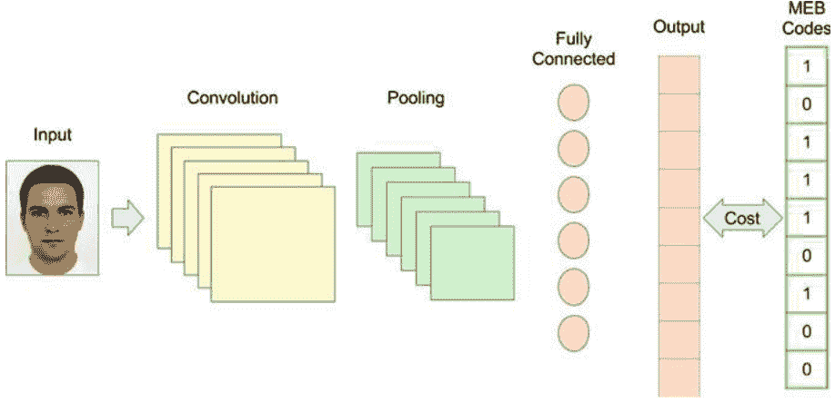

图 11.5 学习映射

##### 正则化

深度神经网络的大学习能力伴随着过拟合的固有风险。网络中的参数数量通常足以记住整个训练集，这样的网络性能不能推广到新数据。除了一般的担忧外，映射到 MEB 代码等同于学习一个高度复杂的函数，函数输出的每个维度可以被视为类的任意二进制分区。这进一步增加了过拟合的风险，需要使用强大的正则化技术来实现良好的匹配性能。

Dropout [11] 应用于所有全连接层，丢弃隐藏激活的概率为 0.5。Dropout 是一种非常有效的正则化方法，也可以看作是训练了指数数量的共享相同参数的神经网络集合，从而降低了结果模型的方差。

#### 11.7.1.4 受保护的模板

尽管为每个用户分配的 MEB 代码与原始样本没有相关性，但需要对代码进行哈希处理以生成受保护的模板。给定网络的参数，无法完全从代码中恢复原始样本（由于网络前向传播中的最大池化操作），但是会泄漏一些信息。使用代码的哈希摘要作为最终的受保护模板可以防止任何信息泄漏。所使用的哈希函数可以是符合随机预言机模型的任何函数。在实验中，使用 SHA-512，得到最终的受保护模板 $\mathbf{T}_{u}=\text{SHA512}\left(\mathbf{C}_{u}\right)$。在验证过程中，将已注册用户的新样本输入网络以获得网络输出 $\mathbf{y}_{\text{out}}=\mathbf{t}$。然后通过简单的阈值操作对该输出进行二值化，得到样本的代码 $\mathbf{s}_{\text{out}}=\left[s_{1}, s_{2}, \ldots, s_{K}\right]$，其中 $s_{i}=\mathbf{1}\left(t_{i}>0.5\right)$，$\mathbf{1}(\cdot)$ 是指示函数。此时，可以对代码进行 SHA-512 哈希处理，得到 $\mathbf{H}_{\text{out}}=\operatorname{SHA512}\left(s_{\text{out}}\right)$，并将其与存储的哈希 $\mathbf{T}_{u}$ 进行比较。由于框架的精确匹配性质，这将产生一个真/假匹配分数。对于基于生物特征的身份验证系统来说，这并不理想，因为希望获得一个可调节的分数以调整误接受率（FAR）和误拒绝率（FRR）。为了获得可调节的分数，对新样本采取几个裁剪区域及其翻转对应物（如第 11.7.1.3 节所述的方式），并对每个裁剪区域计算 $\mathbf{H}_{\text{out}}$，得到一组哈希 $\mathbb{H}$。最终的匹配分数定义为与存储的模板匹配的 $\mathbf{H}_{\text{out}}$ 的数量，除以 $\mathbb{H}$ 的基数进行缩放。因此，与用户 $u$ 的匹配分数为：

$$
\text{分数}=\frac{\sum_{\mathbf{H}_{i} \in \mathbb{H}} \mathbf{1}\left(\mathbf{H}_{i}=\mathbf{T}_{u}\right)}{|\mathbb{H}|}
$$

现在分数可以设置为达到所需的 FAR/FRR 值。请注意，该框架提供了在验证和识别模式下工作的灵活性。对于识别，$\mathbb{H}$ 可以与存储在数据库中的所有用户的模板进行匹配。

### 11.7.2 实验

现在我们讨论用于实验评估的数据库、评估协议和参数的具体细节。

#### 11.7.2.1 数据库

本研究解决了使用人脸作为密码的问题，因此利用了在受控环境中收集的人脸数据库进行实验。评估协议包括光照、会话和姿势的变化，这些变化对于像人脸解锁这样的应用是典型的，因为可以预期用户会有一定程度的配合。

CMU PIE [22] 数据库由 41,368 张 68 个人在 13 个不同姿势下、43 种不同照明条件下以及四种不同表情下的图像组成。五个姿势（c27、c05、c29、c09 和 c07）以及所有照明变化都用于实验。随机选择 10 张图像进行训练，其余的用于测试。

扩展的Yale人脸数据库 B [9]包含2432张38个主题的图像，正面姿势下有不同的照明变化。

裁剪版本的数据库用于实验。 同样，随机选择10张图像用于训练，其余的用于测试。 再次，随机选择10张图像用于训练，其余的用于测试。

CMU Multi-PIE [10] 人脸数据库包含超过750,000张图像，记录了337个人在四个不同的会话、15个视角和19个光照条件下的情况。 该数据库用于突出算法对会话和光照条件变化的鲁棒性。 选择了具有最多共同用户（198人）的两个会话（3和4）。 从第3个会话中随机选择了十张正面人脸用于注册，而从第4个会话中选择了所有正面人脸用于测试。

#### 11.7.2.2 评估指标

真实接受率（GAR）@0FAR下用作评估指标。 等错误率（EER）也作为系统的替代操作点报告。 由于使用的训练-测试分割是随机生成的，因此报告了10个不同随机分割的结果的均值和标准差。

#### 11.7.2.3 实验参数

对所有数据库使用相同的训练过程。 所使用的CNN架构如下：两个卷积层，分别有32个大小为7×7的滤波器和64个大小为7×7的滤波器，每个卷积层后面跟着2×2的最大池化层。 卷积和池化层后面跟着两个大小为2000的全连接层，最后是输出层。 对于所有层，都使用修正线性单元激活函数 s(x) = max(x, 0)，并且在两个全连接层中都应用了0.5的丢弃概率来丢弃激活值。

每个用户被分配维度为 K = 256, 1024的MEB代码。 所有训练图像都被调整为 m×m = 64×64，并使用眼睛中心位置进行粗略对齐。 进行增强时使用了 57×57的裁剪，每个图像产生64个裁剪。 每个裁剪还使用[26]中的算法进行了光照归一化处理。 网络通过最小化交叉熵损失对用户代码进行20个时期的训练，使用批量大小为200的小批量随机梯度下降。 最初使用五个训练样本进行验证，以确定上述训练参数。 一旦网络训练完成，代码的SHA-512哈希将作为受保护的模板存储，原始代码将被清除。 在验证过程中，从新样本中提取裁剪，进行预处理，并通过训练好的网络进行输入。 最后，计算每个裁剪的SHA-512哈希并与存储的模板进行匹配，得到Eq. 11.3中的匹配分数。

#### 11.7.2.4 结果

我们实验的结果如表11.2所示。对于10个不同的训练-测试分割，报告了在代码维度为 $K=256, 1024$ 时的零FAR下的GAR的平均值和标准差，以及EER。在严格的零FAR操作点上，PIE上的GAR可达到约90%，Yale上可达到约96%，Multi-PIE上可达到约97%，并且在 $K=1024$ 时实现。在实验过程中观察到，结果对于 $K$ 是稳定的，因此可以根据所需的模板安全性选择参数。 为了了解系统在不同操作点上的性能，以 $K=256$ 为例，显示了系统的GAR和FAR与匹配分数的关系图。值得注意的是，由于严格的精确匹配要求，即使在低匹配分数下，系统的FAR值也很低。

**表11.2 从各种数据集中获得的验证结果**

| 数据库   | K     | GAR@0FAR (%)     | EER (%)      |
|----------|-------|------------------|--------------|
| PIE      | 256   | $93.22 \pm 2.61$ | $1.39 \pm 0.20$ |
|          | 1024  | $90.13 \pm 4.30$ | $1.14 \pm 0.14$ |
| Yale     | 256   | $96.74 \pm 1.35$ | $0.93 \pm 0.18$ |
|          | 1024  | $96.49 \pm 2.30$ | $0.71 \pm 0.17$ |
| Multi-PIE| 256   | $95.93 \pm 0.55$ | $1.92 \pm 0.27$ |
|          | 1024  | $97.12 \pm 0.45$ | $0.90 \pm 0.13$ |

在PIE数据库上，将结果与其他面部模板保护算法进行比较，结果显示在表11.3中。在1%的FAR下比较GAR，这是[7]中报告的操作点。 对于安全级别，将代码维度参数（$K$）与所示方法中的等效参数进行比较。 在没有算法参数的情况下，这是对抗蛮力攻击的安全级别的一个很好的衡量标准。

**表11.3 PIE数据集上与其他算法的性能比较**

| 方法             | K    | GAR@1FAR (%) | EER (%) |
|------------------|------|--------------|---------|
| 混合方法[8]      | 210  | 90.61        | 6.81    |
| BDA [7]          | 76   | 96.38        | —       |
| MEB编码          | 1024 | 97.59        | 1.14    |

### 11.7.3 安全分析

再次分析系统在模板被盗的情况下的安全性。 假设攻击者拥有模板，并且了解模板生成算法。 给定模板，攻击者的目标是提取用户原始生物特征的信息。 由于用于生成模板的哈希函数是单向转换函数，无法从受保护的模板中提取MEB代码的任何信息。 因此，攻击者获取代码的唯一方法是通过对代码可能取的所有可能值进行蛮力攻击，对每个值进行哈希，并将其与模板进行比较。 现在分析此类蛮力攻击的搜索空间。

图11.6 GAR和FAR与K=256的匹配分数相关的PIE（顶部）、Yale（中间）和Multi-PIE（底部）数据库

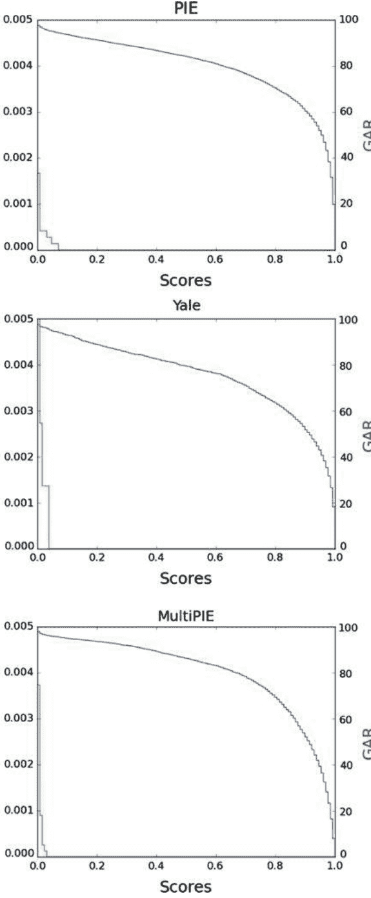

在没有CNN参数的情况下，暴力攻击的搜索空间将是 $2^K$，其中 $K$ 是MEB代码的维数。 这是因为MEB代码是按位随机生成的，与原始的生物特征数据不相关。 由于使用了最小值 $K=256$，搜索空间将是 $2^{256}$ 或更大，使得暴力攻击在计算上不可行。

现在分析给定CNN参数的攻击。 使用CNN参数，在网络的输入域中生成攻击并尝试利用系统的FAR。 通过在输入域中尝试所有可能的值进行暴力搜索将得到一个比 $2^K$ 大得多的搜索空间。 因此，在实际场景中，攻击者很可能使用一个大型人脸数据集进行字典攻击。 尽管分析攻击者由于系统参数的知识而减少的搜索空间并不直接，但系统在上述攻击场景下的FAR可以说是模板安全性的一个很好指标。 当将除真实用户以外的所有用户都视为冒名顶替者时，真实和冒名顶替者的分数分布如图11.7所示。可以看到冒名顶替者的分数大部分为零，表明在这种情况下几乎没有错误接受。 在使用由Multi-PIE数据库的所有正面图像和由较小的Yale数据库组成的真实数据库的字典攻击下，真实和冒名顶替者的分布如图11.8所示。同样，可以看到几乎没有错误接受，表明即使在与注册人脸相同的方式进行预处理时，模型也不容易接受外部人脸。 此外，还使用大量的随机噪声样本进行攻击，以验证CNN是否轻松学习将输入空间的大部分映射到学习到的代码。 在这种情况下，没有错误接受，表明该模型确实没有简单地学习将所有输入映射到分配的代码。 因此，尽管很难量化由于CNN参数的知识而导致的代码搜索空间的减少，但经验证表明由于系统的严格精确匹配要求，错误接受是困难的。

值得注意的是，即使攻击者获得了一个MEB代码，由于CNN中的汇聚和丢弃操作，无法以精确的方式重建原始生物特征。此外，一个代码的知识不会透露关于其他代码的任何信息，因为它们是不相关的。 因此，如果检测到安全漏洞，可以安全地使用一组新的MEB代码生成另一组模板。

图11.7 PIE（顶部）、Yale（中间）和Multi-PIE（底部）数据库中的真实和冒名分布

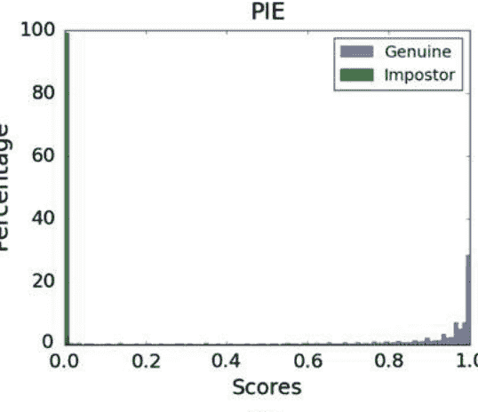
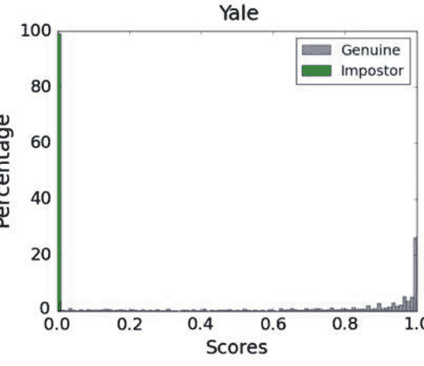
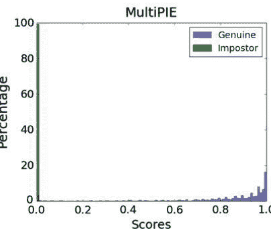

图11.8 输入空间中字典攻击下的真实和冒名分布

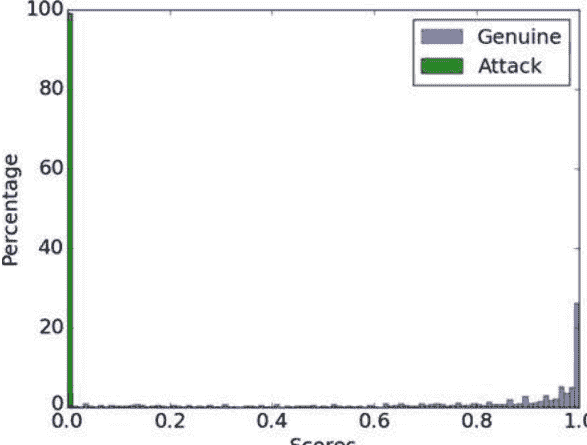

## 11.8 未来方向

我们已经讨论了两种完全不同的方法，以实现对面部模板保护的加密哈希函数的使用。局部区域哈希突出了基于加密哈希的面部生物特征模板安全性所面临的挑战，并确认了除了匹配之外，还需要学习适合安全性的表示的直觉。尽管该算法提供了更高标准的模板安全性，但在匹配准确性和哈希空间的均匀性方面存在问题。另一方面，深度安全编码采用了一种不同的方法，首先设计了理想的模板安全性表示，然后学习映射到该表示。在这个过程中，该算法还消除了局部区域哈希以及大多数先前的面部模板保护方法的所有缺点。尽管深度安全编码实现了最先进的模板安全性和匹配准确性，但它并非没有自身的缺点。

深度安全编码的一个缺点是在考虑到注册新用户时变得明显。由于所有注册用户的MEB代码映射是联合学习的，网络需要重新训练以注册新用户。深度神经网络的重新训练可能是一项耗时的任务，使得新注册过程低效。话虽如此，神经网络通常通过对已经在相关数据上进行预训练的模型进行微调来进行训练，从而大大减少训练时间。在深度安全编码的背景下，可以使用已经在一般情况下训练过的基础网络进行初始化。

因此，对要注册的类进行微调将大大减少时间消耗。然而，需要重新训练的需求存在一个更大的问题。由于系统不保留原始人脸数据，它将不得不从所有先前的用户那里请求样本以重新训练网络。这可能并不总是可行的。

人们可以考虑一些解决办法，比如为不同的网络维护不同的网络。当需要注册新的用户集时，可以通过添加新的网络来扩展用户集，但在实际部署中可能仍然会很复杂。

解决上述问题的一个可能方案是使用深度神经网络学习用于人脸的通用局部敏感哈希函数。与学习映射到固定编码（如深度安全编码）不同，可以使用最小化相同用户代码之间距离和最大化不同用户代码之间距离的损失函数来学习二进制代码。在实施这种方法时需要注意的一个重要细节是，二进制表示空间的平滑性可以被利用来对学习的代码进行爬山攻击。不用说，这种方法还需要更大的训练数据集。这是否在实践中有效尚有待观察。对深度安全编码的其他改进包括在注册之前进行预训练，并可能与局部区域哈希相结合以学习较小的面部区域的映射。

总之，基于深度学习的算法显示出学习适合生物特征模板保护的表示的显著潜力。虽然不完美，像深度安全编码这样的算法取得了令人印象深刻的结果，并在匹配准确性方面几乎没有损失的情况下为模板安全性的高标准铺平了道路。此外，所提出的算法的通用性使其适用于任何需要神经网络的任务，可能激发其他领域的以隐私为中心的研究。

# 参考文献

- 1. M. Ao, S.Z. Li, 基于近红外人脸的生物特征密钥绑定, 在生物特征学进展(Springer, Berlin, 2009), pp.376-385
- 2. F. Bastien, P. Lamblin, R. Pascanu, J. Bergstra, I.J. Goodfellow, A. Bergeron, N. Bouchard, Y. Bengio, Theano: 新功能和速度改进, 在深度学习和无监督特征学习NIPS 2012 Workshop (2012)
- 3. J. Bergstra, O. Breuleux, F. Bastien, P. Lamblin, R. Pascanu, G. Desjardins, J. Turian, D. Warde-Farley, Y. Bengio, Theano: 一个CPU和GPU数学表达式编译器, 在Python科学计算会议(SciPy) (2010)(口头报告)
- 4. B. Chen, V. Chandran, 基于生物特征的密码密钥生成, 在第9届澳大利亚模式识别学会双年会上的数字图像计算技术和应用(IEEE, 2007), pp.394-401
- 5. N. Dalal, B. Triggs, 用于人体检测的梯度直方图, 在IEEE计算机学会计算机视觉和模式识别会议, 2005.CVPR 2005, vol. 1 (IEEE, 2005), pp.886-893
- 6. Y. Dodis, L. Reyzin, A. Smith, 模糊提取器: 如何从生物特征和其他噪声数据生成强密钥, 在密码学技术的理论和应用国际会议(Springer, 2004), pp.523-540
- 7. Y.C. Feng, P.C. Yuen, 用于生成二进制人脸模板的二进制判别分析. IEEE Trans. Inf. Forensics Secur. 7(2), 613-624 (2012)
- 8. Y.C. Feng, P.C. Yuen, A.K. Jain, 用于生成安全和可辨别人脸模板的混合方法. IEEE Trans. Inf. Forensics Secur. 5(1), 103-117 (2010)
- 9. A.S. Georgiades, P.N. Belhumeur, D.J. Kriegman, 从少到多: 光照和姿态变化下的人脸识别的光锥模型. IEEE Trans. Pattern Anal. Mach. Intell. 23(6), 643-660 (2001)
- 10. R. Gross, I. Matthews, J. Cohn, T. Kanade, S. Baker, Multi-pie. Image Vis. Comput. 28(5), 807-813 (2010)
- 11. G.E. Hinton, N. Srivastava, A. Krizhevsky, I. Sutskever, R.R. Salakhutdinov, 通过防止特征检测器的共适应性来改进神经网络(2012). arXiv:1207.05801
- 12. A.K. Jain, K. Nandakumar, A. Nagar, 生物特征模板安全性. EURASIP J. Adv. Signal Process. 2008, 113 (2008)
- 13. Y. Kim, K.-A. Toh, 一种增强面部生物特征安全性的方法, 在第一届IEEE国际生物特征学会议上, 2007年.BTAS 2007(IEEE, 2007), pp.1-6
- 14. A. Kraskov, H. Stögbauer, P. Grassberger, 估计互信息。Phys. Rev. E 69(6), 066138 (2004)
- 15. Y. Lecun, L. Bottou, Y. Bengio, P. Haffner, 基于梯度的学习应用于文档识别, 在 IEEE会议论文集 (1998), pp. 2278-2324
- 16. H. Lu, K. Martin, F. Bui, K.N. Plataniotis, D. Hatzinakos, 基于生物特征的人脸识别加密以增强隐私自我排除, 在2009年第16届国际数字信号处理会议(IEEE, 2009), pp.1-8
- 17. D.C.L. Ngo, A.B.J. Teoh, A. Goh, 生物特征哈希: 高置信度人脸识别。IEEE Trans. Circuits Syst. Video Technol. 16(6), 771-775 (2006)
- 18. T. Ojala, M. Pietikainen, T. Maenpaa, 多分辨率灰度和旋转不变纹理分类与局部二进制模式. IEEE Trans. Pattern Anal. Mach. Intell. 24(7), 971-987 (2002)
- 19. R.K. Pandey, V. Govindaraju, 通过局部区域哈希生成安全人脸模板, in 2015 国际生物特征学会议(ICB)(IEEE, 2015), pp.1-6
- 20. M. Savvides, B.V.K. Vijaya Kumar, P.K. Khosla, 用于人脸识别的可取消生物特征滤波器, in ICPR 2004, vol. 3 (IEEE, 2004), pp. 922-925
- 21. F. Schroff, D. Kalenichenko, J. Philbin, Facenet: 用于人脸识别和聚类的统一嵌入, in IEEE 计算机视觉和模式识别会议论文集 (2015), pp. 815-823
- 22. T. Sim, S. Baker, M. Bsat, CMU姿势、照明和表情(PIE)数据库, 在会议录。第五届IEEE国际自动人脸和手势识别会议, 2002年(IEEE, 2002年), 第6-51页
- 23. Y. Sutcu, H.T. Sencar, N. Memon, 基于强鲁棒性哈希的安全生物特征认证方案, 在第7届多媒体和安全研讨会会议录(ACM, 2005年), 第111-116页
- 24. Y. Sutcu, Q. Li, N. Memon, 用草图保护生物特征模板: 理论与实践。 IEEE Trans. Inf. Forensics Secur. 2(3), 503-512 (2007年)
- 25. Y. Taigman, M. Yang, M. Ranzato, L. Wolf, Deepface: 在人脸验证中缩小与人类性能的差距, 在2014年IEEE计算机视觉和模式识别会议(CVPR)会议录(IEEE, 2014年), 第1701-1708页
- 26. X. Tan, B. Triggs, 增强的局部纹理特征集用于在困难光照条件下的人脸识别。 IEEE图像处理交易。 19(6), 1635-1650 (2010)
- 27. A. Teoh, C.T. Yuang, 可取消的生物特征实现与多空间随机投影。 IEEE系统。人机。部分B: 人机。 37(5), 1096-1106 (2007)
- 28. A.B.J. Teoh, D.C.L. Ngo, A. Goh, 基于面部哈希的个性化加密密钥生成。计算机安全。 23(7), 606-614 (2004)
- 29. A.B.J. Teoh, A. Goh, D.C.L. Ngo, 随机多空间量化作为生物哈希的分析机制用于生物特征和随机身份输入。 IEEE模式分析交易。机器智能。 28(12), 1892-1901 (2006)
- 30. M. Van Der Veen, T. Kevenaar, G.-J. Schrijen, T.H. Akkermans, F. Zuo, 等, 面部生物特征与可更新模板, SPIE会议论文集, vol.6072 (2006), pp.60720J
- 31. P. Vincent, H. Larochelle, I. Lajoie, Y. Bengio, P.-A. Manzagol, 堆叠去噪自编码器：在深度网络中学习有用的表示，带有局部去噪准则的 J.Mach. Learn. Res. 11, 3371-3408 (2010)
- 32. Y. Wu, B. Qiu, 将模式识别器转化为生物特征密钥生成器, ICME 2010 (IEEE, 2010), pp. 78-82

# 第12章

# 深度三元嵌入表示用于活体检测

费德里科·帕拉和比尔·巴努

摘要：活体检测是所有生物特征系统中的基本要素，必须在传感器级别上抵御欺骗攻击。特别是对于攻击者来说，相对容易制作出合法指纹的伪造副本，并直接应用于传感器，从而通过声称其相应的身份来愚弄系统。为了确保声明的身份是真实的，并且与捕获时的个体相对应，该任务通常被定义为二元分类问题，其中训练一个分类器来检测手头的指纹是真实的还是人工复制品。在本章中，提出了一种基于三元卷积网络的度量学习方法，与二元分类模型不同。生成了指纹图像的表示，其中特征点之间的距离反映了真实指纹与人工生成指纹之间的不相似程度。采用了三元目标函数的变体，该函数考虑了来自两个真实指纹和一个复制品（或两个复制品和一个真实指纹）的补丁，并且如果匹配对之间的距离大于不匹配对的距离，则给出高惩罚。通过将测试指纹图像的补丁与训练集中的一组参考真实和伪造补丁进行匹配，可以确定其活体性。小型网络与基于补丁的表示结合使用，使系统能够实时执行采集并提供最先进的性能。在包括不同传感器和伪造指纹材料的活体检测基准数据集上进行了实验。该方法在跨传感器和跨材料场景上进行了验证，以了解其在新的采集设备上的泛化能力和对新的展示攻击的鲁棒性。

F. Pala (✉) · B. Bhanu
智能系统研究中心 - 加利福尼亚大学, 河滨
温斯顿·钟楼216套房, 900大学大道, 河滨, CA 92521-0425, 美国
e-mail: fedpala@ucr.edu

B. Bhanu
e-mail: bhanu@cs.ucr.edu

◎ Springer International Publishing AG 2017
B. Bhanu and A. Kumar (eds.), 深度学习用于生物特征识别, 计算机视觉与模式识别的进展, DOI 10.1007/978-3-319-61657-5_12

## 12.1 引言

生物特征认证系统已成为全球数百万人日常生活的一部分。大量的人们每天使用他们的指纹通过机场的安全检查点，访问他们的个人移动设备[1]和进入受限区域。与其他生物特征识别技术相比，指纹识别的流行之处在于其可靠性，在过去几十年中得到了证明，以及其以可负担的成本实施，并且尤其在于通过触摸表面即可立即进行身份验证的简单性。

不幸的是，所有这些优势都伴随着各种安全和隐私问题。

不同的攻击可以对认证系统进行操作，以便授予访问某些独占区域或窃取机密数据的权限。例如，软件和网络配置可能存在安全漏洞或错误，并且如果攻击者了解软件实现细节[2]，匹配算法可能会被欺骗。此外，物理钥匙或徽章可以被替换，而指纹是永久性的，其表面的模式可以轻松捕捉和复制。可以从高分辨率照片或留在表面上的印刷品上获取（例如杯子甚至一张纸）。可以简单地将模式的高质量复制品应用于扫描仪[3]，以便攻击者通过声称其相应的身份来欺骗认证系统。由于传感器设备不可避免地与被捕捉的用户直接接触，它被认为是整个生物特征识别系统中最薄弱的环节。因此，越来越多的人对自动分析获取的指纹图像以捕捉潜在的恶意用户感兴趣[4]。这种攻击被称为展示攻击[5]，活体检测技术旨在通过制定一个二元分类问题来检测是否给定的生物特征来自于捕捉时的主体[6]。

通过设计一个软件系统来分析与识别算法使用的相同图像，或者通过为扫描仪配备额外的硬件，可以确定指纹的活体性。这些最后的预防措施被称为基于硬件的系统[7]，通常更准确，因为它们利用了额外的线索。无论如何，指纹扫描仪的软件可以免费更新，如果软件技术对各种攻击具有鲁棒性，并且不会给用户带来太多的误报，那么它可以作为获取新的传感设备的替代方案。

最近的研究[8-10]表明，深度学习算法在指纹活体检测任务中的有效性。深度学习已经在许多领域，如语音识别、自然语言处理和物体识别[11-13]方面取得了重大进展。生成分层表示并发现原始图像中的复杂结构的能力，使得与基于手工特征的传统方法相比，可以获得更好的表示。基于软件的指纹活体检测系统可以利用已经解决类似任务的广泛文献。在最近的研究中，我们注意到尚未直接建模相似性的概念。

能够捕捉区分真实和伪造指纹的因素以及它们的类内和类间变化。我们通过提出基于三元组网络[14]的深度度量学习方法，朝着这个方向迈出了一步。具体来说，这些网络将指纹图像映射到一个表示空间，在这个空间中，学习到的距离捕捉到来自同一类别的示例的相似性，并将真实样本与伪造样本分开。与其他度量学习方法（如涉及Siamese网络[15]的方法）不同，三元组目标函数直接比较了类别之间的关系，给出了一种不需要阈值选择就能进行预测的上下文概念[14]。

我们提出了一个从指纹补丁中学习表示的框架，从一个给定的真实和伪造样本训练集开始。由于在测试时只提供一个指纹图像，我们根据与参考的真实和伪造补丁集的匹配得分来做出决策。

相似度度量是使用改进版本[16,17]的原始三元目标公式[14]学习的，该公式添加了一对项，更加强制两个相同类别的示例之间的接近程度。我们使用从指纹活体检测竞赛LivDet¹中获取的十个数据集进行了广泛的实验，该竞赛由卡利亚里大学电气与电子工程系与克拉克森大学电气与计算机工程系合作举办，分别在2009年[7]、2011年[18]和2013年[19]举行。我们将我们的方法与现有技术进行了比较，在所有检查的数据集上获得了竞争性能。我们还进行了跨数据集和跨材料的实验，以评估所获得的指纹表示是否可以在不同的环境中重复使用，或者用于发现在训练过程中未见过的材料。

本章的结构如下。在第12.2节中，我们介绍了一些当前的指纹活体检测系统设计方法和最新技术。在第12.3节中，我们解释了提出的框架的细节，在第12.4节中提供了实验结果。最后的第12.5节致力于总结和结论。

¹ http://livdet.org/。

## 12.2 背景和之前的工作

在本节中，我们描述了各种指纹活体检测技术，特别是与我们的方法相关的技术，可以被视为一种静态的基于软件的技术[6]。随后，我们详细介绍了一些最近提出的基于软件的方法，以便将我们的方法置于背景中并突出我们的贡献。

### 12.2.1 背景

首先，可以通过区分硬件和软件系统来对活体检测系统进行分类。正如前面提到的，基于硬件的系统，也称为传感器系统[6]，使用额外的信息来识别活体指纹的特征。有用的线索可以通过检测指纹表面下的静脉模式[20]、测量脉搏[21]、进行气味分析[22]和使用近红外传感器[23]等方式找到。

软件，也称为基于特征的系统，是可以引入传感器软件中以添加活体检测功能的算法。我们的方法属于这个类别，也可以被认为是静态的，以区别于在采集过程中使用多张图像的方法。例如，动态方法可以利用指尖皮肤的扭曲，因为相对于黏性材料，它在柔韧性方面有所不同。在[24]提出的方法中，用户被要求在触摸传感器时旋转手指。不同区域在与传感器直接接触时的扭曲以光流的形式进行表征，并且活体预测是基于匹配编码扭曲序列随时间变化的结果。

为了设计基于机器学习算法的软件系统，需要一个真实和伪造指纹的数据库。使用更多的欺骗技术，算法将能够更好地推广到新的攻击类型。在活体检测系统的第二个分类中，我们考虑了从受害者处获取指尖模式的方式。在合作方法中，受害者自愿将手指放在可用材料上，用于创建模具。通过这个模具，可以使用明胶、硅胶和木胶等材料生成高质量的复制品。图12.1显示了一些人造手指的照片。非合作方法则捕捉了从潜在指纹中获取模式的场景。在拍摄高分辨率照片后，通过生成三维表面来复制它。

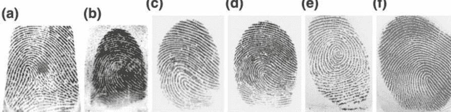

图12.1 使用不同的硅橡胶材料制作的人造指纹复制品示例：a GLS，b Ecoflex，c Liquid Ecoflex和d Modasil模具

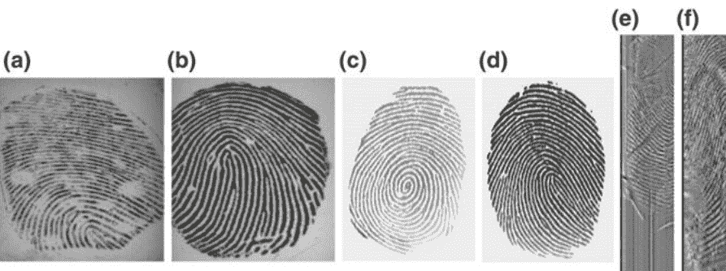

图12.2 来自LivDet 2011竞赛的伪造采集示例（合作）：来自Biometrika的乳胶、硅胶，来自Digital的乳胶、明胶，来自Sagem的硅胶、橡皮泥


图12.3 来自LivDet 2013竞赛的伪造采集示例。非合作：来自Biometrika的明胶、木胶，来自Italdata的Ecoflex、Modasil。合作：来自Swipe的乳胶、木胶

例如，可以将其打印到电路板上。此时，可以生成一个模具并用上述材料填充。与合作方法相比，图像质量较差，通常基于软件的系统在拒绝这些复制品方面具有更好的性能。图12.2和12.3显示了几个采集示例，其中指尖模式是使用合作和非合作方法捕获的。

### 12.2.2 之前的工作

在这一小节中，我们讨论了一些关于静态软件基础上的指纹活体检测系统的先前工作。我们首先介绍了一些手工制作的基于特征的方法，然后总结了最近提出的深度学习技术。

指纹活体检测的一种最早的方法是由[25]提出的。它基于皮肤的汗水模式，这种模式在皮肤的介电镶嵌结构上表现为静态和动态模式。分类是基于从数据中提取的一组度量，并使用神经网络进行分类。在[26]中，同样的现象被应用于沿着脊线掩模提取的脊线信号的小波变换中。在从多个尺度提取一组度量之后，决策规则基于分类树。

其他方法从不同类型的特征构建一些描述符，这些特征专门用于指纹图像。在[27]中，提出了局部二值模式（LBP）直方图以及小波能量特征。分类是通过一个混合分类器进行的，该分类器由神经网络、支持向量机（SVM）和k最近邻分类器组成。与LBP类似，二进制统计图像特征（BSIF）[28]将局部纹理特征编码为特征向量，并使用SVM进行分类。在[29]中，通过在空间域和频率域中进行图像分析，提取了局部对比相位描述符（LCPD）。同样的作者提出了Shift-Invariant描述符（SID）[30]的使用，该描述符最初由[31]引入，具有旋转和尺度不变性属性。SID和LCPD在多个数据集上表现出竞争力和稳健性能。

最近，深度学习算法已经被应用于指纹活体检测，旨在从训练数据中自动找到指纹的分层表示。在[9]中，卷积网络的使用已经被提出。特别是，最好的结果[9]是通过对之前在Imagenet数据集上进行训练的AlexNet和VGG架构进行微调得到的。从他们的实验结果来看，影响分类准确性的因素主要是网络的深度、预训练和数据增强，特别是随机裁剪。由于我们使用基于补丁的表示，我们采用了一个较小但相对深度的架构。使用补丁不需要将所有图像调整为固定尺寸，同时增加了示例的数量，从而避免了预训练。

在[8]中，深度表示是从指纹、人脸和虹膜图像中学习得到的。它们被用作传统特征，并输入到支持向量机分类器中以获得活体得分。作者关注卷积神经网络参数和架构的选择。

在[34]中，深度连体网络与经典的预训练卷积网络一起被考虑。这可以被认为是与本章最相似的工作，因为它们也学习了一对指纹之间的相似度度量。然而，他们的度量学习方法不同，因为他们假设每个测试图像都有一个注册指纹可用。也就是说，决策是通过比较同一人的指纹来做出的。相比之下，我们的方法更加灵活，即使注册指纹图像不可用也可以应用。

与上述研究不同，[10, 35]并没有将整个图像提供给深度学习算法，而是从指纹采集中提取去除背景后的补丁。[35]使用经典的卷积神经网络和二元交叉熵损失，以及多数投票方案来进行最终预测。[10]提出了深度置信网络，并使用对比散度[36]进行预训练，并在真实和伪造的指纹图像上进行微调。决策基于对网络输出应用简单阈值。我们的工作与之前的研究有很大不同，因为它提出了一个框架，在其中使用三元组架构以及三元组和成对的目标函数。

总结一下，本章的贡献有：（i）一种新颖的基于深度度量学习的指纹活体检测框架，能够在实时环境中具有最先进的性能；（ii）一种基于补丁和细粒度表示的指纹图像，使得即使只有几百个样本，也能够从头开始训练一个相当深的架构，并且在与训练不同的环境中表现出卓越的性能。

## 12.3 指纹活体检测的深度三元组嵌入

在本节中，我们描述了基于三元组损失嵌入的指纹活体检测的方法。我们首先描述整体框架；随后，介绍网络架构和训练算法。最后，我们描述了导致对给定指纹图像的活体性最终决策的匹配过程。

### 12.3.1 框架

如图12.4所示，所提出的框架需要从传感器中获取的一组真实和伪造指纹图像作为训练集。从每个图像中，我们随机提取一个固定大小的补丁，并将它们排列在一定数量的三元组 $\{x_i, x_j^+, x_k^-\}$ 中，其中 $x_i$（锚点）和 $x_j^+$ 是同一类别的两个示例，而 $x_k^-$ 来自另一类别。我们交替地将锚点设置为真实或伪造的指纹补丁。

该架构由三个共享权重的卷积网络组成，以便同时处理三个补丁并映射到一个公共特征空间。我们用 $r(\cdot)$ 表示从三个网络之一的输出中获得的给定补丁的表示。为了提取类内距离 $d(r(x), r(x^+))$ 和类间距离 $d(r(x), r(x^-))$，我们比较从真实和伪造指纹中提取的深度特征。目标是学习 $d$，使得同一类别的两个示例比来自不同类别的两个示例更接近，并且同一类别的两个示例之间的距离尽可能短。在使用一定数量的三元组对网络进行训练后，我们从每个训练样本中提取一个新的补丁，并生成一组新的三元组。重复此过程直到收敛，更多细节请参见第12.4.2节。

训练过程完成后，学习到的度量被用作匹配距离，以确定新的指纹图像的真实性。给定一个查询指纹，我们可以提取 $p$（可能重叠的）补丁，并将它们输入网络以获得表示 $Q = \{\mathbf{r}(Q_1), \mathbf{r}(Q_2), \ldots, \mathbf{r}(Q_p)\}$。由于我们不是直接将每个补丁映射到二进制的活体标签，而是生成了一个更细粒度的表示，因此可以通过基于学习度量 $d$ 的决策规则进行预测，该度量是相对于一组真实和伪造参考指纹 $R_L$ 和 $R_F$ 计算的：

\begin{aligned} R_L &= \{\mathbf{r}(x_{L_1}), \mathbf{r}(x_{L_2}), \ldots, \mathbf{r}(x_{L_n})\} \\ R_F &= \{\mathbf{r}(x_{F_1}), \mathbf{r}(x_{F_2}), \ldots, \mathbf{r}(x_{F_n})\} \end{aligned} \quad (12.1a, 12.1b)

其中补丁 $x_{L_i}$ 和 $x_{F_i}$ 可以来自训练集或特制的设计集。

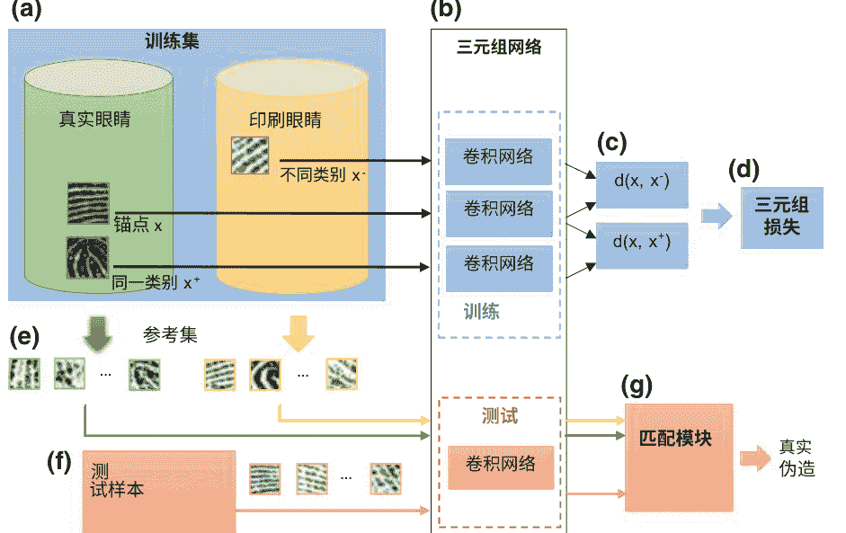

图12.4 所提出的指纹活体检测系统的整体架构。从真实和伪造指纹采集的训练集中，我们使用两个类别的两个补丁和一个补丁交替训练三元组网络（b）。每个输入补丁的输出用于计算类间和类内距离（c），以计算目标函数（d），该函数用于训练网络的参数。训练后，从训练集中提取一组真实和一组伪造的参考补丁（e，每个指纹一个）并通过训练过的网络计算相应的表示。在测试时，从指纹图像（f）中提取一组补丁，以将其映射到与参考库相同的表示空间，并进行匹配（g）以获取关于其真实性的预测。

#### 表 12.1 所提出的嵌入网络的架构

| 层名称 | 层描述 | 输出 |
|---|---|---|
| 输入 | 32×32 灰度图像 | - |
| conv1 | 5×5 卷积层滤波器, 步长 1, 1→64 特征图 | 64×28×28 |
| 批量归一化 1 | 批量归一化 | 64×28×28 |
| relu1 | 修正线性单元 | 64×28×28 |
| 卷积 2 | 3×3 卷积层滤波器, 步长 2, 填充 1, 64→64 特征图 | 64×14×14 |
| 卷积 3 | 3×3 卷积层滤波器, 步长 1, 64→128 特征图 | 64×12×12 |
| 批量归一化 2 | 批量归一化 | 64×12×12 |
| relu2 | 修正线性单元 | 64×12×12 |
| 卷积 4 | 3×3 卷积层滤波器, 步长 2, 填充 1, 128→128 特征图 | 128×6×6 |
| 卷积 5 | 3×3 卷积层滤波器, 步长 1, 128→256 特征图 | 256×4×4 |
| 批量归一化 3 | 批量归一化 | 256×4×4 |
| relu3 | 修正线性单元 | 256×4×4 |
| 卷积层 6 | 3×3 卷积层滤波器, 步长 2, 填充 1, 256→256 特征图 | 256×2×2 |
| 全连接层 1 | 全连接层 4×256→256 | 256 |
| 丢弃 | 丢弃 p=0.4 | 256 |
| relu5 | 修正线性单元 | 256 |
| 全连接层 2 | 全连接层 256→256 | 256 |
| 输出 | Softmax | 256 |

### 12.3.2 网络架构

我们采用了一个受[37]启发的网络架构，其中用于下采样的最大池化单元被具有增加步幅的简单卷积层所替代。表 12.1 列出了嵌入网络的每一层执行的操作列表。

该架构由一个接受 32×32 灰度指纹补丁的第一卷积层组成，通过使用大小为 5×5 的滤波器输出 64 个特征图。然后，应用批归一化[38]以获得更快的训练收敛，并使用修正线性单元（ReLU）作为非线性函数。另一个步幅为 2、填充为 1 且大小为 3×3 的卷积层在两个方向上进行二倍下采样操作。

相同的结构被复制两次，将过滤器大小减小到 3×3，并增加特征图的数量从 64 增加到 128 和从 128 增加到 256。此时，特征图的大小为 256×2×2，并通过两个具有 256 个输出的全连接层和一个 softmax 层进一步处理。这种非线性有助于获得更好的训练算法收敛性，并确保两个输出之间的距离不超过一个。为了正则化目的，在第一个全连接层应用了 Dropout [39]，概率为 0.4。

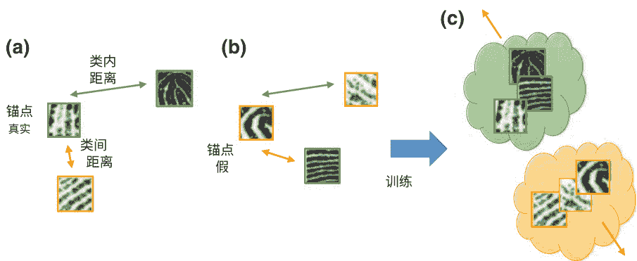

图12.5 训练过程使用由两个真实指纹（绿色）和一个冒名顶替者（黄色）组成的三元组示例（a），以及两个冒名顶替者和一个真实指纹（b）。使用三元组损失的训练过程将导致对同一类别（真实或假）指纹的吸引，使它们的距离尽可能接近。同时，真实和假指纹将被推开（c）

完整的网络由这个架构的三个实例组成：从三批指纹图像中获取匹配和不匹配图像之间的 L2 距离。在测试时，我们从三个网络中选择一个输出，以获得给定补丁的表示。如果存在内存限制，另一种选择是只使用一个网络，将三批折叠成一个单一批次，并计算与训练三元组对应的示例之间的距离。

### 12.3.3 训练

如图12.5所示，三元组架构以及三元组损失函数旨在学习一种度量，使得同一类别的两个补丁与来自不同类别的两个补丁相比更接近。目标是捕捉使两个指纹都是真实或伪造的线索。真实的指纹来自不同的人和手指，它们的比较是为了找到一些使它们真实的特征。同时，伪造的指纹来自不同的人，可以使用多种材料制作。目标是检测出来自伪造复制品的指纹的异常特征，而不考虑它们所制造的材料。

给定一组三元组 $\{x_i, x_j^+, x_k^-\}$，其中 $x_i$ 是锚点，$x_j^+$ 和 $x_k^-$ 分别是同一类和其他类的两个示例，原始三元组损失函数的目标[14]是在以下条件被违反时给予惩罚：$$ d(\mathbf{r}(x_i), \mathbf{r}(x_j^+)) - d(\mathbf{r}(x_i), \mathbf{r}(x_k^-)) + 1 \le 0 $$

同时，我们希望同一类的示例尽可能接近，这样当将新的指纹与同一类的参考图像进行匹配时，距离 $d(\mathbf{r}(x_i), \mathbf{r}(x_j^+))$ 尽可能低。如果我们用 $y(x_i)$ 表示通用图像 $x_i$ 的类别，我们可以通过制定以下损失函数来实现所需的行为：

$$ L = \sum_{i,j,k} \left\{ c(x_i, x_j^+, x_k^-) + \beta c(x_i, x_j^+) \right\} + \lambda \|\theta\|_2 $$

其中 $\theta$ 是一个包含网络中所有可训练参数的一维向量， $y(x_i) = y(x_j), y(x_k^-) = y(x_i)$ 并且

$$ c(x_i, x_j^+, x_k^-) = \max \{0, d(\mathbf{r}(x_i), \mathbf{r}(x_j^+)) - d(\mathbf{r}(x_i), \mathbf{r}(x_k^-)) + 1\} $$

$$ c(x_i, x_j^+) = d(\mathbf{r}(x_i), \mathbf{r}(x_j^+)) $$

在训练过程中，我们计算子梯度并通过网络进行反向传播，以获得所需的表示。根据图12.5所示的情况， $c(x_i, x_j^+, x_k^-)$ 是类间距离项， $c(x_i, x_j^+)$ 是类内距离项。 $\lambda \|\theta\|_2$ 是为了正则化而添加到损失函数的额外权重衰减项。

在经过一定数量的迭代 $k$ 之后，我们周期性地从每个训练指纹中提取不同的补丁来生成一组新的三元组。不要在太多迭代后更新三元组，因为这可能导致过拟合。同时，频繁生成新的三元组或挖掘困难样本可能会导致收敛问题。

### 12.3.4 匹配

原则上，可以使用任何特征包之间的距离来匹配查询指纹 $Q=\{\mathbf{r}(Q_1), \mathbf{r}(Q_2), \dots, \mathbf{r}(Q_p)\}$ 与参考集 $R_L$ 和 $R_F$。由于训练目标极大地推动距离接近零或接近一，可以通过设置一个简单的阈值 $\tau=0.5$ 来做出活体检测的决策。另一种方法是测量包之间的Hausdorff距离，但它对异常值过于敏感，因为它涉及计算测试补丁与每个参考集的每个补丁之间的最小距离。即使使用第k个Hausdorff距离[40]，它考虑第k个值而不是最小值，我们通过遵循简单的多数投票策略获得了更好的性能。它也更快，因为它不涉及距离的排序。

给定一个指纹 $Q$，对于每个补丁 $Q_j$，我们计算每个参考集中距离低于给定阈值的数量：

$$ D\left(R_L, Q_j\right)=\left|\left\{i \in\{1, \ldots, n\}: d\left(R_{L_i}, Q_j\right)<\tau\right\}\right| \tag{12.5a} $$
$$ D\left(R_F, Q_j\right)=\left|\left\{i \in\{1, \ldots, n\}: d\left(R_{F_i}, Q_j\right)<\tau\right\}\right| \tag{12.5b} $$

然后我们根据有多少补丁属于真实类别或伪造类别来做出决策：

$$ y(Q)=\begin{cases} \text{真} & \text{如果 } \sum_{j=1}^{p} D\left(R_L, Q_j\right) \geq \sum_{j=1}^{p} D\left(R_F, Q_j\right) \\ \text{假} & \text{否则} \end{cases} \tag{12.6} $$

上述方法也可以应用于从同一人获取多个指纹的情况，就像在机场的护照检查中通常发生的那样。例如，来自不同手指的补丁可以累积起来，以应用相同的多数规则（Eq. 12.6），或者可以根据最可疑的指纹做出决策。

## 12.4 实验

我们使用LivDet竞赛2009年[7]、2011年[18]和2013年[19]的十个最受欢迎的指纹活体检测基准对提出的方法进行了评估。我们将我们的方法与最先进的方法进行了比较，具体来说是[9]的VGG预训练网络，[29]的局部对比相位描述符LCPD，[30]的密集尺度不变描述符SID和[28]的二值化统计图像特征。对于主要实验，我们严格遵循组织者提供的训练/测试划分的竞赛规则，而对于跨数据集和跨材料的情况，我们遵循[9]的设置。

网络架构和整体框架已经使用Torch7计算框架[41]在一台带有四个TITAN X GPU的NVIDIA® DIGITS™ DevBox上实现，具有7 TFlops的单精度计算能力，336.5 GB/s的内存带宽和每个板卡12 GB的内存。MATLAB®用于图像分割。

### 12.4.1 数据集

LivDet 2009数据集[7]是第一个国际指纹活体检测竞赛发布的，旨在成为一个参考，并允许研究人员比较他们的算法或系统的性能。指纹采用合作方法获取（见第12.2.1节），复制品使用凝胶、硅胶和橡皮泥材料制作。组织者发布了三个数据集，使用三种不同的传感器获取：Biometrika (FX2000)、Crossmatch (Verifier 300 LC)和Identix (DFR2100)。

表12.2 LivDet 2009 和 2013 比赛的详细信息。最后一行表示欺骗材料：S =硅胶, G =明胶, P =玩具黏土, E =Ecoflex, L =乳胶, M =Modasil, B =Body Double, W =木胶

| 竞赛 | LivDet2009 | | | LivDet2013 | | |
| :--- | :--- | :--- | :--- | :--- | :--- | :--- |
| 数据集 | Biometrika | CrossMatch | Identix | Biometrika | Italdata | Swipe |
| 尺寸 | 312 x 372 | 480 x 640 | 720 x 720 | 312 x 372 | 480 x 640 | 1500 x 2080 |
| DPI | 569 | 500 | 686 | 569 | 500 | 96 |
| 被试 | 50 | 254 | 160 | 50 | 50 | 100 |
| 真实样本 | 2000 | 2000 | 1500 | 2000 | 2000 | 2500 |
| 欺骗样本 | 2000 | 2000 | 1500 | 2000 | 2000 | 2000 |
| 材料 | S | GPS | GPS | EGLMW | EGLMW | BLPW |

LivDet 2011比赛[18]使用Biometrika (FX2000)、Digital Persona (4000B)、ItalData (ETT10)和Sagem (MSO300)四个扫描仪获取了四个数据集。用于伪造指纹的材料包括明胶、乳胶、Ecoflex（铂催化硅胶）、硅胶和木胶。欺骗指纹的获取方式与LivDet 2009中的合作方法相同。

LivDet 2013竞赛[19]包括使用扫描仪Biometrika (FX2000)、ItalData (ETT10)、Crossmatch (L SCAN GUARDIAN)和Swipe获取的四个数据集。与LivDet 2011不同，两个数据集Biometrika和Italdata是使用非合作方法获取的。也就是说，潜在指纹是从表面获取的，然后打印在电路板（PCB）上，以生成可以用于构建模具的指纹的三维结构。为了复制指纹，他们在Crossmatch和Swipe数据集中使用了Body Double、乳胶、PlayDoh和木胶，而在Biometrika和Italdata数据集中使用了明胶、乳胶、Ecoflex、Modasil和木胶。

图像的大小、扫描仪的分辨率、获取的主题数量以及真实和伪造样本的数量在表12.2和12.3中详细说明。训练和测试示例的划分由竞赛组织者提供。

### 12.4.2 实验设置

对于所有的实验，我们以平均分类错误率来评估性能。这是LivDet竞赛中评估条目的度量标准，是欺骗假阳性率 (SFPR) 和欺骗假阴性率 (SFNR) 的平均值。对于LivDet测试集上的所有实验，我们遵循标准协议，并且由于没有提供验证集，我们保留了固定数量的120个指纹。对于跨数据集的实验，我们使用Biometrika 2009和Crossmatch 2013数据集进行验证。

表12.3 LivDet 2011竞赛的详细信息。最后一行表示欺骗材料：$Sg=$ Silgum，其他与表12.2中相同

| 竞赛 | LivDet2011 | | | |
| :--- | :--- | :--- | :--- | :--- |
| 数据集 | Biometrika | Digital Persona | Italdata | Sagem |
| 尺寸 | $312 \times 372$ | $355 \times 391$ | $640 \times 480$ | $352 \times 384$ |
| DPI | 500 | 500 | 500 | 500 |
| 被试 | 200 | 82 | 92 | 200 |
| 真实样本 | 2000 | 2000 | 2000 | 2000 |
| 欺骗样本 | 2000 | 2000 | 2000 | 2000 |
| 材料 | EGLSgW | GLPSW | EGLSgW | GLPSW |

训练的三元组集合是通过从每个指纹中取一个补丁并将它们交替排列在两个属于同一类别的示例和一个属于另一类别的示例中生成的。该集合每 $k=100,000$ 个三元组更新一次，并以100个一批的方式输入到网络中。在本章的剩余部分，我们将每次更新称为新迭代的开始。我们使用随机梯度下降来最小化三元组损失函数，设置学习率为0.5，动量为0.9。学习率 $\eta_0$ 通过以下形式进行退火：

$$ \eta=\frac{\eta_0}{1+10^{-4} \cdot b} \tag{12.7} $$

其中 $b$ 是正在处理的批次的递增编号。也就是说，经过十次迭代后，学习率减半。Eq. 12.3的权重衰减项设置为 $\lambda=10^{-4}$ 和 $\beta=0.002$，与[17]中相同。

在每次迭代之后，我们检查验证错误。我们不再使用在测试中测量的相同准确性（平均分类错误），而是使用验证集补丁构建100,000个三元组，但将参考补丁作为锚点，参考补丁来自训练集并用于匹配测试样本。错误包括违反三元组的数量，并反映了参考补丁在无法分类之前的失败程度。我们不再固定迭代次数，而是根据耐心的概念进行早停止[42]。每当验证错误减少时，我们保存网络参数的快照，如果在连续20次迭代中验证错误不再减少，我们停止训练并使用最后保存的快照在测试集上评估准确性。

### 12.4.3 预处理

由于来自扫描仪的图像包含广泛的背景区域围绕指纹，我们对图像进行分割，以避免提取背景补丁。性能受背景质量的影响很大。

因此，我们采用了一种算法[43]，将指纹图像分成16×16个块，并且只有当块的标准差大于给定阈值时，才将其分类为前景。其理论基础是较高的标准差对应于指纹的脊线区域。为了排除可能干扰分割的背景噪声，我们计算前景掩码的连通分量，并将面积最大的区域作为指纹区域。为了得到平滑的分割结果，我们使用形态学运算从二值掩码生成凸包图像。

我们还尝试了数据增强技术，包括随机旋转、翻转和一般仿射变换。然而，它们显著减慢了训练过程，并且在主要和跨数据集实验中都没有获得性能改进。

### 12.4.4 实验结果

在本节中，我们介绍了在不同场景下所提出的指纹活体检测系统的性能。在表12.4中，我们列出了在LivDet竞赛测试集上的平均分类错误性能。与目前表现最佳的方法[9,29,30]相比，我们在所有数据集上都取得了有竞争力的性能，尤其是在Italdata 2011和Swipe 2013上。这意味着该方法在来自滑动扫描仪的图像上也能正常工作，其中指纹是通过在传感器表面上滑动手指来获取的（参见图12.3e,f）。总体而言，我们的方法在比较中平均误差为1.75%。

表12.4 LivDet测试数据集的平均分类错误。第2列是我们基于TripletNet的方法，第3列是在ImageNet数据集上预训练并由[9]进行微调的VGG深度网络，第4列是基于局部对比相位描述符[29]的方法，第5列是基于密集尺度不变描述符[30]的方法，第6列是基于二值化统计图像特征[28]的方法。

| 数据集 | 三元组网络 | VGG[9] | LCPD[29] | SID[30] | BSIF[28] |
|---|---|---|---|---|---|
| Biometrika 2009 | 0.71 | 4.1 | 1 | 3.8 | 9 |
| CrossMatch 2009 | 1.57 | 0.6 | 3.4 | 3.3 | 5.8 |
| Identix 2009 | 0.044 | 0.2 | 1.3 | 0.7 | 0.7 |
| Biometrika 2011 | 5.15 | 5.2 | 4.9 | 5.8 | 6.8 |
| Digital 2011 | 1.85 | 3.2 | 4.7 | 2.0 | 4.1 |
| Italdata 2011 | 5.1 | 8 | 12.3 | 11.2 | 13.9 |
| Sagem 2011 | 1.23 | 1.7 | 3.2 | 4.2 | 5.6 |
| Biometrika 2013 | 0.65 | 1.8 | 1.2 | 2.5 | 1.1 |
| Italdata 2013 | 0.5 | 0.4 | 1.3 | 2.7 | 3 |
| Swipe 2013 | 0.66 | 3.7 | 4.7 | 9.3 | 5.2 |
| 平均 | 1.75% | 2.89% | 3.8% | 4.5% | 5.5% |

对于[9]的2.89%结果，性能提高了65%。我们指出，我们没有使用CrossMatch 2013数据集进行评估，因为比赛的组织者发现数据中存在异常，并且不鼓励将其用于比较评估[4]。在图12.6中，我们展示了Biometrika 2013测试集的二维表示，具体来说，是通过对生成的嵌入应用t-SNE [44]计算得到的每个指纹图像的一个补丁。这种降维技术特别有洞察力，因为它将高维表示映射到保留点邻近性的空间中。我们可以看到真实和伪造指纹被很好地分开，只有少数样本位于错误的位置，主要是木胶和Modasil。Ecoflex和明胶复制品似乎更容易被拒绝。通过检查补丁图像，我们可以看到从上到下，指纹图案的质量下降。这可能是由于指尖的汗水使得脊线不如伪造品均匀。

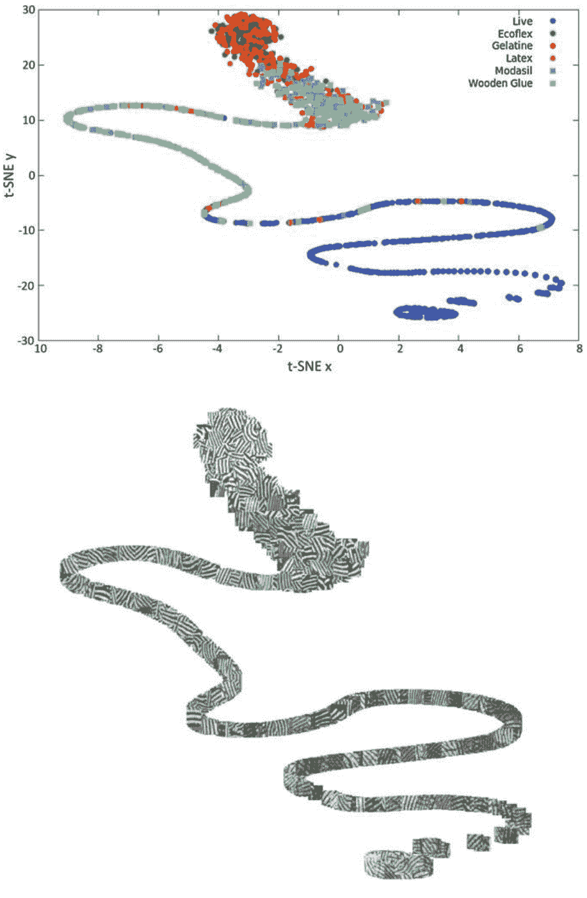
图12.6 Biometrika 2013测试集中由真实和伪造指纹生成的嵌入的T-SNE可视化（每个采集一个补丁）。高维表示被映射到一个二维散点图中，保留了点的邻近性

#### 12.4.4.1 跨数据集评估

正如[9]中所述，我们进行了一些跨数据集评估，并直接将我们的性能与他们的深度学习和局部二值模式方法进行比较。结果显示在表12.5中，并反映了与先前实验相比性能的显著下降。与[9]相比，平均分类错误略有改善，但仍然过高，无法在野外进行活体检测。类似的结果也由[34]得出。我们指出，不同的传感器、设置和气候条件可能会极大地改变指纹图像，如果训练集不代表特定条件，任何机器学习方法，不仅仅是深度学习算法，都无法有效地进行泛化。

表12.5 跨数据集场景的平均分类错误。第一列是用于训练的数据集，第二列是用于测试的数据集。第三列是我们的TripletNet方法，第四列和第五列是[9]提出的基于深度学习和局部二值模式(LBP)的方法。

| 训练集 | 测试集 | 三元组网络 | VGG | LBP |
|---|---|---|---|---|
| Biometrika 2011 | Biometrika 2013 | 14 | 15.5 | 16.5 |
| Biometrika 2013 | Biometrika 2011 | 34.05 | 46.8 | 47.9 |
| Italdata 2011 | Italdata 2013 | 8.3 | 14.6 | 10.6 |
| Italdata 2013 | Italdata 2011 | 44.65 | 46.0 | 50.0 |
| Biometrika 2011 | Italdata 2011 | 29.35 | 37.2 | 47.1 |
| Italdata 2011 | Biometrika 2011 | 27.65 | 31.0 | 49.4 |
| Biometrika 2013 | Italdata 2013 | 1.55 | 8.8 | 43.7 |
| Italdata 2013 | Biometrika 2013 | 3.8 | 2.3 | 48.4 |

#### 12.4.4.2 跨材料评估

我们还评估了我们系统对新的欺骗材料的鲁棒性。我们按照[9]的协议，使用一部分材料对网络进行训练，并在剩余的材料上进行测试。结果显示在表12.6中。与跨数据集实验相比，该方法对新材料的鲁棒性似乎更强，而不是对传感器的改变。在这种情况下，如果我们排除Biometrika 2011数据集，我们的方法与[9]相比有显著的改进。

表12.6 交叉材料场景的平均分类错误。第2列是用于训练的材料，第3列是用于测试的材料。缩写与表12.2和12.3中的相同数据集

| | 训练材料 | 测试材料 | 三元组网络 | VGG | LBP |
|---|---|---|---|---|---|
| Biometrika 2011 | EGL | SgW | 13.1 | 10.1 | 17.7 |
| Biometrika 2013 | MW | EGL | 2.1 | 4.9 | 8.5 |
| Italdata 2011 | EGL | SgW | 7 | 22.1 | 30.9 |
| Italdata 2013 | MW | EGL | 1.25 | 6.3 | 10.7 |

#### 12.4.4.3 计算效率

我们方法的主要优点之一是计算时间，因为我们采用的架构比其他深度学习方法（例如 $[9,34]$）更小。此外，补丁表示允许进行匹配的缩放在不同的计算单元上执行，以便在高密度环境中使用。在我们的实验中，我们从每个测试指纹中提取100个补丁，并且使用单个GPU花费约0.6 ms的时间来获取它们的相应表示，使用Core i7-5930K 6 Core 3.5 GHz桌面处理器（单线程）需要0.3秒。考虑到最常见的数据集配置，即880个真实和880个伪造的参考补丁，匹配过程在单个GPU上需要5.2毫秒，在CPU上需要14毫秒。最后，训练时间因特定数据集而异，平均而言，该过程在135次迭代中收敛。单次迭代需要84秒，需要20秒来检查验证错误。

## 12.5 结论

在本章中，我们介绍了一种新颖的指纹活体检测框架，该框架嵌入了深度度量学习的最新进展。我们在一个使用相同传感设备进行训练的场景中验证了我们方法的有效性。我们还提出了对所提方法在新的采集设备和未见过的欺骗材料上的泛化能力进行量化的结果。

该方法能够实时工作，并在几个基准数据集上超越了现有技术水平。

总之，我们指出基于活体检测系统的软件使用不应给用户一种虚假的安全感。就像在其他领域（如网络安全）一样，攻击者每天都变得更加足智多谋，会发现欺骗生物特征识别系统的新方法。因此，这种系统应该不断更新和监控，特别是在关键应用领域，如机场安检。希望能够拥有包含不同年龄、性别、种族和皮肤状况的人的大型数据集，并在不同时间段、环境和使用各种传感器以及多种欺骗材料的情况下获取指纹图像。

致谢：这项工作部分得到了 N00014-12-1-1026 号资助。

# 参考文献
- 1. A. K. Jain, A. Ross, S. Pankanti, 生物特征识别：信息安全工具。IEEE Trans. Inf. Forensics Secur. 1(2), 125-143 (2006)
- 2. M. Martinez-Diaz, J. Fierrez, J. Galbally, J. Ortega-Garcia, 指纹验证系统中间接攻击和对策的评估。Pattern Recogn. Lett. 32(12), 1643-1651 (2011)
- 3. T. Matsumoto, H. Matsumoto, K. Yamada, S. Hoshino, 人造“软糖”手指对指纹系统的影响。Proc. Conf. Opt. Secur. Counterfeit Deterrence Tech. 4677, 275-289 (2002)
- 4. L. Ghiani, D. A. Yambay, V. Mura, G. L. Marcialis, F. Roli, S. A. Schuckers, 对指纹活体检测（LivDet）竞赛系列的回顾：2009年至2015年。图像与视觉计算 (2016)（即将出版）
- 5. C. Sousedik, C. Busch, 针对指纹识别系统的演示攻击检测方法：一项调查。IET生物识别 3(4), 219-233 (2014)
- 6. J. Galbally, S. Marcel, J. Fierrez, 生物特征反欺骗方法：面部识别的一项调查。IEEE Access 2, 1530-1552 (2014)
- 7. G. L. Marcialis, A. Lewicke, B. Tan, P. Coli, D. Grimberg, A. Congiu, A. Tidu, F. Roli, S. Schuckers, 第一届国际指纹活体检测竞赛-LivDet 2009，在图像分析与处理国际会议（ICIP, 2009）的论文集中（Springer, Berlin, 2009），第12-23页
- 8. D. Menotti, G. Chiachia, A. Pinto, W. R. Schwartz, H. Pedrini, A. X. Falcao, A. Rocha, 深度表示用于虹膜、人脸和指纹欺骗检测。IEEE Trans. Inf. Forensics Secur. 10(4), 864-879 (2015)
- 9. R. F. Nogueira, R. de Alencar Lotufo, R. C. Machado, 使用卷积神经网络进行指纹活体检测。IEEE Trans. Inf. Forensics Secur. 11(6), 1206-1213 (2016)
- 10. S. Kim, B. Park, B. S. Song, S. Yang, 基于深度置信网络的统计特征学习用于指纹活体检测。Pattern Recogn. Lett. 77, 58-65 (2016)
- 11. A. Krizhevsky, I. Sutskever, G. E. Hinton, 使用深度卷积神经网络进行ImageNet分类，在神经信息处理系统（NIPS, 2012）会议上（2012），第1097-1105页
- 12. Y. LeCun, Y. Bengio, G. Hinton, 深度学习。Nature 521(7553), 436-444 (2015)
- 13. I. Goodfellow, Y. Bengio, A. Courville, 深度学习（MIT出版社, 剑桥, 2016）, http://www.deeplearningbook.org
- 14. E. Hoffer, N. Ailon, 使用三元组网络进行深度度量学习，在相似性模式识别国际研讨会（SIMBAD, 2015）上（Springer, 柏林, 2015），第84-92页
- 15. J. Bromley, J. W. Bentz, L. Bottou, I. Guyon, Y. LeCun, C. Moore, E. Sckinger, R. Shah, 使用“连体”时延神经网络进行签名验证。Int. J. Pattern Recognit. Artif. Intell. 7(04), 669-688 (1993)
- 16. P. Wohlhart, V. Lepetit, 学习用于物体识别和3D姿态估计的描述符，在IEEE计算机视觉和模式识别会议（CVPR, 2015）上（2015）, pp. 3109-3118
- 17. D. Cheng, Y. Gong, S. Zhou, J. Wang, N. Zheng, 通过改进的三元组损失函数的多通道基于部件的CNN进行人员再识别，在IEEE计算机视觉和模式识别会议（CVPR, 2016）上（2016）
- 18. D. Yambay, L. Ghiani, P. Denti, G. L. Marcialis, F. Roli, S. Schuckers, LivDet 2011-指纹活体检测竞赛2011年，在生物识别国际会议论文集（ICB, 2011）上（2012），第208-215页
- 19. L. Ghiani, D. Yambay, V. Mura, S. Tocco, G. L. Marcialis, F. Roli, S. Schuckers, LivDet 2013 指纹活体检测竞赛2013年，在生物识别国际会议论文集（ICB, 2013）上（2013），第1-6页
- 20. A. Kumar, Y. Zhou, 使用指纹图像进行人体识别。IEEE Trans. Image Process. 21(4), 2228-2244 (2012)
- 21. K. Seifried, 生物特征识别-你需要知道的。Security Portal 10 (2001)
- 22. D. Baldisserra, A. Franco, D. Maio, D. Maltoni, 通过气味分析检测假指纹，国际生物特征会议论文集（ICB, 2006）（Springer, Berlin, 2006）, pp. 265-272
- 23. P. V. Reddy, A. Kumar, S. M. K. Rahman, T. S. Mundra, 一种新的生物特征设备反欺骗方法。IEEE Trans. Biomed. Circuits Syst. 2(4), 328-337 (2008)
- 24. A. Antonelli, R. Cappelli, D. Maio, D. Maltoni, 通过皮肤变形分析检测假指纹。IEEE Trans. Inf. Forensics Secur. 1(3), 360-373 (2006)
- 25. R. Derakhshani, S. A. C. Schuckers, L. A. Hornak, L. O'Gorman, 从非侵入式生物医学测量中确定指纹扫描仪的活力。Pattern Recognit. 36(2), 383-396 (2003)
- 26. B. Tan, S. Schuckers, 基于小波信号处理统计的指纹扫描仪活体检测，在计算机视觉和模式识别研讨会（CVPRW, 2006）的会议记录中（IEEE, 2006）, p. 26
- 27. S. B. Nikam, S. Agarwal, 基于纹理和小波的假指纹检测用于指纹生物识别系统，在新兴趋势工程与技术国际会议（ICETET, 2008）的会议记录中（IEEE, 2008）, pp. 675-680
- 28. L. Ghiani, A. Hadid, G. L. Marcialis, F. Roli, 使用二值化的统计图像特征进行指纹活体检测，在国际生物特征学理论、应用和系统会议（BTAS, 2013）上（IEEE, 2013）, 第1-6页
- 29. D. Gragnaniello, G. Poggi, C. Sansone, L. Verdoliva, 用于指纹活体检测的局部对比相位描述符。Pattern Recognit. 48(4), 1050-1058 (2015)
- 30. D. Gragnaniello, G. Poggi, C. Sansone, L. Verdoliva, 对生物特征欺骗检测的局部描述符进行研究。IEEE Trans. Inf. Forensics Secur. 10(4), 849-863 (2015)
- 31. I. Kokkino, M. Bronstein, A. Yuille, 用于图像和曲面的密集尺度不变描述符。研究报告 RR-7914, INRIA (2012)
- 32. K. Simonyan, A. Zisserman, 非常深的卷积神经网络用于大规模图像识别 (2014), arXiv.org/abs/1409.1556
- 33. O. Russakovsky, J. Deng, H. Su, J. Krause, S. Satheesh, S. Ma, Z. Huang, A. Karpathy, A. Khosla, M. Bernstein, A. C. Berg, L. Fei-Fei, ImageNet大规模视觉识别挑战。Int. J. Comput. Vision 115(3), 211-252 (2015)
- 34. E. Marasco, P. Wild, B. Cukic, 鲁棒且互操作的指纹欺骗检测通过卷积神经网络，在IEEE国土安全技术研究会议（HST, 2016）会议记录中（2016）, pp. 1-6
- 35. C. Wang, K. Li, Z. Wu, Q. Zhao, 基于DCNN的指纹活体检测算法与投票策略（Springer International Publishing, Cham, 2015）, pp. 241-249
- 36. G. E. Hinton, 通过最小化对比散度训练专家产品。Neural Comput. 14(8), 1771-1800 (2002)
- 37. J. T. Springenberg, A. Dosovitskiy, T. Brox, M. Riedmiller, 追求简单：全卷积网络 (2014), arXiv.org/abs/1412.6806
- 38. S. Ioffe, C. Szegedy, 批量归一化：通过减少内部协变量偏移加速深度网络训练，在国际机器学习会议（ICML, 2015）上（2015）, p. 37
- 39. N. Srivastava, G. E. Hinton, A. Krizhevsky, I. Sutskever, R. Salakhutdinov, Dropout: a simple way to prevent neural networks from overfitting. J. Mach. Learn. Res. 15(1), 1929-1958 (2014)
- 40. J. Wang, J. Zucker, 解决多实例问题：一种懒惰学习方法 (2000), pp. 1119-1126
- 41. R. Collobert, K. Kavukcuoglu, C. Farabet, Torch7: 一个类似于Matlab的机器学习环境，in BigLearn, NIPS Workshop (2011)
- 42. Y. Bengio, 基于梯度的深度架构训练的实用建议, in 神经网络: 技巧（Springer, Berlin, 2012）, pp. 437-478
- 43. P. D. Kovesi, 用于计算机视觉和图像处理的MATLAB和Octave函数 (2005), http://www.peterkovesi.com/matlabfns
- 44. L. van der Maaten, G. Hinton, 使用t-SNE可视化数据. J. Mach. Learn. Res. 9, 2579-2605 (2008)

# 索引

## A
- 激活函数, 135
- 自适应加权, 41
- 仿射变换, 301
- AlexNet, 21, 162, 241, 242, 244, 292
- 神经响应的振幅, 7
- 解剖特征, 4, 18
- 建筑约束, 21
- 人类腹侧视觉通路的结构, 19
- AR人脸数据库, 194
- 人工手指, 290
- 人工神经网络, 83
- 真实, 48
- 自编码器, 266

## B
- CMS-RCNN, 57, 59
- CMU Multi-PIE人脸数据库, 277
- CNHF, 33, 36
- CNN架构, 34
- 基于CNN的特征, 180
- 代码位, 50
- 背侧沟, 22
- 复杂性, 115
- 计算优势, 21
- 计算模型, 13, 18
- 计算时间, 302
- 上下文多尺度区域, 57
- 对比损失函数, 254
- 收敛, 297
- 卷积, 273
- 卷积层, 295
- 卷积网络, 33
- 卷积神经网络 (CNN), 58, 109, 135, 162
- 合作, 291
- 合作方法, 291
- 皮质面部网络, 18
- 皮质区域, 18
- 跨数据集实验, 301
- 交叉熵损失函数, 117
- 加密哈希函数, 261, 268
- 加密系统, 263
- 累积匹配特征, 249
- 累积匹配曲线, 35
- 细胞构架区域, 10
- 细胞构架, 11, 22
- 反向传播, 297
- 反向传播算法, 19
- 二进制人脸编码, 35
- 二进制人脸表示, 53
- 二进制哈希, 35
- 生物特征密码系统, 262
- 生物特征模板, 268
- 生物特征模板保护, 261
- Bodylogin, 168
- 增强哈希森林 (BHF), 33, 34, 54, 127
- 增强相似性敏感编码, 33
- 边界框回归, 58
- 脑反应, 17
- 旁路连接, 12

## C
- Caffe, 38, 69
- Casia-iris-ageing-v5数据集, 140
- CASIA-WebFace, 34
- 封闭集识别, 164

## D
- 数据增强, 274, 301
- 解码器网络, 138
- 深度人工神经网络, 83
- 深度置信网络, 222
- 深度卷积神经网络, 19
- 深度卷积网络, 62
- 深度卷积生成对抗网络 (DCGAN), 188, 192, 207
- 深度学习, 35
- 深度网络表示, 173
- 深度神经网络, 3
- 深度 Siamese 网络, 115
- 深度三元嵌入, 293
- 深度虹膜, 137
- 去噪自编码器, 266
- 发展性面孔失认症, 22

## E
- 编码器, 138
- 熵, 272, 274
- 欧几里德损失, 37
- 诱发脑反应, 14
- 扩展的耶鲁人脸数据库 B, 277

## F
- 面部生物特征识别, 282
- 面部检测, 57, 76
- 面部检测数据集和基准, 59
- 面部网络, 17
- 人脑中的面部感知, 18
- 面部识别, 41
- 面部选择性区域, 5, 6, 8, 11, 13
- FaceNet, 21
- 面部性别分类, 184, 185
- 面部标记, 57
- 面部区域选择, 265
- 伪造, 294
- 伪造指纹, 293
- 误检率, 95
- FAR, 48
- FG1-4, 22
- 滤波器, 19, 37
- 滤波器类型, 18
- 指纹, 83, 287, 292, 294
- 指静脉, 109, 123, 131
- 翻转, 301
- fMRI响应, 14
- 森林哈希, 35
- 分形维度, 97
- FRR, 48
- 全身手势, 160
- 完全卷积编码器-解码器网络, 133
- 颞叶面积, 22
- 颞叶回旋, 22

## G
- 性别分类, 219
- 虹膜性别识别, 219, 237
- 泛化能力, 114
- 生成对抗网络, 192
- 生成特征学习, 87
- 手势识别, 174
- 手势, 162

## H
- 汉明距离, 120
- 汉明嵌入, 34, 35
- 手势, 160
- 哈希码, 42
- 哈希摘要, 262
- 哈希函数, 276
- 哈希森林, 35
- 哈希函数, 283
- 哈希转换, 34
- 人脸, 64
- 人类颞叶面网络, 4

## I
- IIITD数据库, 94
- IITD数据库, 140
- ImageNet, 165, 244
- 空中手势, 160
- 下枕叶回旋, 23
- 虹膜识别, 133
- 虹膜分割, 134, 149

## J
- 联合贝叶斯公式, 112

## K
- Kinect传感器, 160

## L
- L2距离, 296
- L2归一化, 69
- Lacunarity, 99
- 潜在指纹, 83, 102
- 层, 19
- 学习率, 300
- LFW, 53
- 轻量级CNN (LCNN), 109, 115, 125
- LivDet, 289
- LivDet竞赛, 299
- 活体检测, 288
- 活体检测, 287, 290, 302, 304
- 活体检测竞赛, 298
- 局部对比相位描述符, 298
- 局部区域哈希, 264
- 损失函数, 109, 112

## M
- 最大特征图, 34, 36, 114
- 最大熵二进制 (MEB) 码, 271, 274, 278, 280
- 最大池化, 227, 295
- 方法, 291
- MFus-faces, 23
- 中间颞回沟, 23
- 漏检率, 94
- 修改的VGG-16, 130
- 模具, 299
- MSRAction3D, 179
- 照片数据库, 194
- 多类分类, 120
- 多类人脸识别, 36
- Multi-PIE数据库, 268
- 多层神经网络, 222

## N
- ND-Iris-0405数据库, 140
- 人脑中的神经结构, 4
- 神经回路, 4
- 神经硬件, 11
- 神经反应, 5
- 神经影像研究, 3
- NIST SD27, 85, 94
- NIST Tott-C纹身数据集, 242

## O
- 枕顶颞沟, 23
- 光流, 162

## P
- 海马旁区, 23
- 补丁图像, 302
- PCS 107 嫌疑犯数据库, 183, 195
- 惩罚, 4
- 眼周区, 187
- PFus-faces/FFA-1, 23
- Pinellas县警长办公室, 194
- 池化, 273
- 池化层, 273
- 人口感受野, 23
- 姿势变化, 70
- 预训练, 164
- 精确-召回曲线, 73
- 演示攻击, 287
- 深度 CNN 的处理, 21
- 渐进式 CNN 训练, 189
- 渐进式训练的注意力转移卷积神经网络, 183, 188

## R
- 受保护的模板, 275
- 随机旋转, 301
- 实时人脸识别, 37
- 人脸识别, 3
- 整流器激活函数, 277
- 循环神经网络, 184
- 参考补丁, 300
- 基于区域的卷积神经网络 (R-CNN), 59, 62
- 正则化, 275, 297
- 受限玻尔兹曼机 (RBM), 83, 86, 219, 223
- ROC曲线, 51
- 鲁棒性面部性别分类, 213

## S
- 安全分析, 278
- 分割准确度, 95
- 语义哈希, 35
- SHA-512, 277
- 孪生网络, 241, 242
- Sigmoid激活, 274
- 相似性图, 137
- 软生物特征, 184, 241
- Softmax层, 273
- Softmax输出层, 36
- 稀疏连接, 226
- 空间比率, 68
- 空间流, 164
- 欺骗虚假阴性率, 299
- 欺骗虚假阳性率, 299
- 欺骗材料, 302, 305
- 随机梯度下降, 300
- 随机邻居嵌入, 159
- 监督离散哈希, 120
- 监督哈希, 120

## T
- 纹身数据库, 246
- 纹身检测, 242, 244, 254
- 纹身识别技术, 243
- 纹身相似度, 253
- 纹身, 241
- 模板安全性, 282
- 时间流, 164
- CMU-PIE数据库, 276
- 三元卷积网络, 287
- 三元损失, 293
- 三元相似度损失函数, 125
- 三元组, 297
- 三元组集合, 300

# 索引

312

- 双流卷积神经网络, 160
- 腹侧视觉流, 19, 20
- 验证, 164
- 验证准确率, 49
- VGG, 298
- VGG架构, 292
- VGG-16, 109
- 视觉皮层, 12

## U

- 非约束人脸识别, 57
- 非约束人脸性别分类, 184

## V

- 验证错误, 300
- 血管生物特征, 109
- 血管模式, 113
- 腹侧面网络, 3
- 腹侧颞叶皮层, 23

## W

- 权重, 19
- 白质连接, 13
- WIDER FACE数据集, 59
- Winder面孔, 70
- WVU数据库, 94