# 面向电力系统的机器学习和深度学习应用

编辑
Morteza Nazari-Heris
Somayeh Asadi
Behnam Mohammadi-Ivatloo
Moloud Abdar
Houtan Jebelli
Milad Sadat-Mohammadi

## 丛书介绍

多年来，电力一直是工业社会的技术基础。尽管提供和应用电能的系统已经达到了很高的成熟度，但仍然不断遇到意想不到的问题，这需要基于新技术设计更高效、可靠的系统。《电力系统》系列图书旨在提供关于电力工程中这些新发展的详细、准确和可靠的技术信息。它涵盖了发电、储能和输电以及电机等主题。该系列的专著和高级教材面向电气工程的研究人员、讲师、工业工程师和高年级学生。

**电力系统已被 Scopus 索引**

更多关于该系列的信息，请访问 http://www.springer.com/series/4622

## 编辑信息

**Morteza Nazari-Heris**
建筑工程系
宾夕法尼亚州立大学
宾夕法尼亚州大学公园分校，美国

**Somayeh Asadi**
建筑工程系
宾夕法尼亚州立大学
宾夕法尼亚州大学公园分校，美国

**Behnam Mohammadi-Ivatloo**
能源技术系
奥尔堡大学
奥尔堡，丹麦

**Moloud Abdar**
电气与计算机工程学院
大不里士大学
大不里士，维多利亚州，澳大利亚
迪肯大学
吉朗，维多利亚州，澳大利亚

**Houtan Jebelli**
建筑工程系
宾夕法尼亚州立大学
宾夕法尼亚州大学公园分校，美国

**Milad Sadat-Mohammadi**
建筑工程系
宾夕法尼亚州立大学
宾夕法尼亚州大学公园校区，美国

ISSN 1612-1287
电力系统
ISBN 978-3-030-77695-4
https://doi.org/10.1007/978-3-030-77696-1

ISSN 1860-4676 (电子版)
ISBN 978-3-030-77696-1 (电子书)

© 编辑 (如适用) 和作者，独家许可给 Springer Nature Switzerland AG 2022

本作品受版权保护。出版商独家授权，无论是全部还是部分内容，特别是翻译、重印、插图重用、朗读、广播、微缩胶片复制、或以任何其他实体方式复制、传输或存储和检索信息、电子适应、计算机软件，或通过已知或今后开发的类似或不同的方法。

在本出版物中使用一般描述性名称、注册名称、商标、服务标志等，并不意味着即使在没有具体声明的情况下，这些名称也不受相关保护法律和法规的限制，因此可以自由使用。

出版商、作者和编辑可以安全地假设书中的建议和信息在出版日期时被认为是真实和准确的。出版商、作者或编辑对本文所包含的材料不提供任何明示或暗示的保证，也不对可能存在的任何错误或遗漏承担责任。出版商在已发布的地图和机构关系中保持中立。

这个 Springer 印记由注册公司 Springer Nature Switzerland AG 出版，注册地址为：Gewerbestrasse 11, 6330 Cham, Switzerland

## 前言

考虑到现代电力系统及其在智能运行、可再生能源源高度集成和电力系统中新兴技术方面的发展，电力系统的效率和质量指标的重要性、数据预测和能源自由化，应该进行电力网络的运行、计划和控制的研究。此外，考虑到负荷需求的增长速度和该行业中竞争的增加，电力行业出现了新的问题。因此，应用各种机器学习和深度学习方法，如人工神经网络 (ANNs)、专家系统、模糊系统、基于进化的方法、深度神经网络 (DNN)、卷积神经网络 (CNN) 和长短期记忆 (LSTM) 已被引入为处理建模电力系统的决策过程的有效方法。机器学习和深度学习的使用这些是用于构建各种分析模型的数据分析技术主题 (例如能源、医疗保健、生物信息学、交通)，是克服电力系统当前挑战的有希望的解决方案。机器学习和深度学习作为人工智能家族的一部分，是非常有效的方法，通过学习原始数据、识别模式和做出决策，最大程度地减少人为干预，促进电力系统运行、规划和控制的决策过程。

电力系统的进步和发展，以及可再生能源 (如风力涡轮机和光伏电池的功率输出)、负荷需求和电能市场等方面的不确定性带来了相当大的挑战，需要一种高性能的方法来进行适当的决策，以管理、规划和控制这些系统。与此同时，数据聚类和电力系统安全的重要性凸显了需要一种高性能的方法来处理这些系统的运行、规划和控制。

因此，本书讨论了在电力系统管理和运行方法以及系统参数预测方面，使用不同的机器学习和深度学习方法作为有效技术的可行性，以及其在处理当前电力系统问题方面的可靠性和准确性。

本书《机器学习和深度学习方法在电力系统问题中的应用》旨在评估机器学习/深度学习在电力系统问题和挑战上的应用，考虑到规划、运行和控制这些系统方面的最新发展和进展，既基于文献进行全面综述，又应用机器学习技术进行电力系统规划、运行和控制。本书涵盖的主题如下：

- 电力系统挑战和问题
- 能源工程中的机器学习方法
- 机器学习/深度学习在控制和规划电力系统中的应用概述
- 机器学习/深度学习方法在电力系统聚类中的应用
- 机器学习/深度学习方法在预测电力系统参数中的应用

| 地址 | 姓名 |
| :--- | :--- |
| 美国宾夕法尼亚州大学公园 | Morteza Nazari-Heris |
| 美国宾夕法尼亚州大学公园 | Somayeh Asadi |
| 丹麦奥尔堡 | Behnam Mohammadi-Ivatloo |
| 澳大利亚维多利亚州吉朗 | Moloud Abdar |
| 美国宾夕法尼亚州大学公园 | Houtan Jebelli |
| 美国宾夕法尼亚州大学公园 | Milad Sadat-Mohammadi |

## 目录

- 1 电力系统挑战和问题
  - Ali Sharifzadeh, Mohammad Taghi Ameli, 和 Sasan Azad (页 1)
- 2 电力系统的介绍和文献综述：挑战和问题
  - Ali Ardeshiri, Amir Lotfi, Reza Behkam, Arash Moradzadeh, 和 Ashkan Barzkar (页 19)
- 3 机器学习和电力系统规划：机遇和挑战
  - Mohammad Hosein Asgharinejad Keisami, Sasan Azad, Reza Mohammadi Chabanloo, Morteza Nazari-Heris, 和 Somayeh Asadi (页 45)
- 4 能源中的机器学习方法简介
  - Arash Moradzadeh, Behnam Mohammadi-Ivatloo, Kazem Pourhossein, Morteza Nazari-Heris, 和 Somayeh Asadi (页 61)
- 5 机器学习/深度学习在控制问题中的应用简介和文献综述
  - Samira Sadeghi, Ali Hesami Naghshbandy, Parham Moradi, 和 Navid Rezaei (页 83)
- 6 机器学习/深度学习在负荷预测中的应用简介和文献综述
  - Arash Moradzadeh, Amin Mansour-Saatloo, Morteza Nazari-Heris, Behnam Mohammadi-Ivatloo, 和 Somayeh Asadi (页 119)
- 7 最近基于粒子群优化 (PSO) 的聚类方法在能源效率方面的调查：在无线传感器网络中
  - Emrah Hancer (页 137)
- 8 使用创新机器进行电力系统聚类：学习/深度学习方法
  - Mohammad Hossein Rezaeian Koochi, Mohammad Hasan Hemmatpour, 和 Payman Dehghanian (页 151)
- 9 使用电力网格进行电压稳定性评估：基于新颖的机器学习方法
  - Ali Mollaiee, Sasan Azad, Mohammad Taghi Ameli, 和 Morteza Nazari-Heris (页 177)
- 10 级联故障发生的评估和分类：由于线路故障引起的潜在问题
  - Morteza Abedi, Mohammad Reza Aghamohammadi, 和 Mohammad Taghi Ameli (页 211)
- 11 LSTM 辅助的供暖能源需求管理：在住宅建筑中
  - Amin Mansour-Saatloo, Arash Moradzadeh, Sahar Zakeri, 和 Behnam Mohammadi-Ivatloo (页 237)
- 12 使用创新回归进行风速预测：机器学习技术的应用
  - Arash Moradzadeh, Amin Mansour-Saatloo, Morteza Nazari-Heris, Behnam Mohammadi-Ivatloo, 和 Somayeh Asadi (页 249)
- 13 通过基于事件驱动处理的智能电表数据处理实现有效负荷模式分类和机器学习
  - Saeed Mian Qaisar 和 Futoon Alsharif (页 265)
- 14 基于动态决策树的同步发电机失步条件预测：通过 WAMS/PMU 数据
  - Morteza Abedi, Mohammad Reza Aghamohammadi, Sasan Azad, Morteza Nazari-Heris 和 Somayeh Asadi (页 289)
- 15 自适应神经模糊推理系统模型用于短期负荷、价格和拓扑预测配电系统
  - Mehrdad Setayesh Nazar 和 Ashkan Eslami Fard (页 321)
- 16 应用机器学习预测用户的智能家电最佳调度中的用户偏好
  - Milad Sadat-Mohammadi, Morteza Nazari-Heris, Alireza Ameli, Somayeh Asadi, Behnam Mohammadi-Ivatloo 和 Houtan Jebelli (页 345)
- 17 在实际电力系统中的机器学习方法和电力市场
  - Peyman Razmi 和 Mahdi Ghaemi Asl (页 357)
- 索引 (页 379)

# 第 1 章 电力系统挑战和问题

Ali Sharifzadeh, Mohammad Taghi Ameli, 和 Sasan Azad

## 1.1 引言

在传统电力系统中，大型发电厂提供了网络参数和能量交换的平衡。在基本功率和能量平衡之后，不同的系统要求之一是确保正常情况下和事件 (故障) 之后的功率流和动态在范围内并保持稳定 (对于角度、电压和频率)。然而，传统的规划和控制模型，虽然已经被广泛应用和标准化，但将面临所有新概念和未来结构的挑战。因此，与新概念相关的电力系统分析建模和计算的角色仍然至关重要 [1]。

另一方面，尽管罕见，但大规模停电对社会造成了巨大的直接成本，估计高达数十亿美元 [2,3]。一些其他间接成本，如通信故障 [4]、天然气网络 [5,6]、供水、交通等，也带来了挑战。对于现有和未来的具有广泛能量和货币交换的网络，停电已经不再可接受 [2]。因此，有必要快速准确地调查与稳定性相关的电力系统安全和所有网络参数，以实现在线和实时。此外，温室气体排放、智能合约、能源管理和能源储存等其他问题也对电网提出了新的要求。

在这种情况下，对新概念和问题的适当考虑不足以及正确的预测不足，使得网络管理变得困难。

所有先前的提示和细节将在后面提到，例如可再生能源、大规模负荷变化、负荷预测、弹性、能源交易等等

A. Sharifzadeh · M. T. Ameli(✉) · S. Azad
伊朗德黑兰贝赫斯蒂大学电气工程系
电子邮件：m_ameli@sbu.ac.ir; sa_azad@sbu.ac.ir

© 作者 (在 Springer Nature Switzerland AG 2022 独家许可下) M. Nazari-Heris 等人 (编), 机器学习和深度学习在电力系统问题中的应用，电力系统，https://doi.org/10.1007/978-3-030-77696-1_1

## 1.2 现在和未来的挑战

不确定性可能会对当前和未来的电力系统构成挑战 [7]。此外，庞大的数据和信息技术与能源管理的日益相互依赖使得当前关于未来电力系统的解决方案变得更加重要。

因此，新的挑战需要新的智能解决方案。旧的方法无法正确处理新概念，而新的方法则需要它。电力系统分析中最有吸引力的艺术是机器学习及其各种先进方法，消除了复杂计算和模型的需求。这些智能方法快速、稳健且适应性强，可以克服传统解决方案在多个电力系统问题上的缺点 [8]。它消除了系统时间分配来执行连续计算的需求。

本章的其余部分组织如下：第 1.1 节介绍，简要介绍了工作内容，第 1.2 节介绍了现有和未来的系统挑战，并根据类型进行了分类。第 1.3 节提供了机器学习挑战和问题的概述。最后，第 1.4 节对本章进行了总结。

电力网络的建设和运营管理始终存在各种挑战，包括内在的和外在的政策。解决问题导致规划以减轻后果。这些挑战可能是内生的或外生的。

主要问题是如何建立不同本地网络之间的连接并提高设备效率。近年来，许多可能降低网络安全性或可靠性的问题会带来挑战。例如，增加分布式发电和可再生能源的渗透率以及需求端的不确定性，如电动汽车数量的增加，导致了新的问题。此外，环境限制或重组以增加所有参与者的盈利能力可能会导致一些新问题。未来，诸如网络在线监测减少传输和配电的技术或 financial 成本，以及在线。然而，增加使用具有不确定输出的分布式发电机 (DG) 仍然是主要问题。

在未来几年中，本地能源交易将受到高度重视。例如，电动汽车可以用来供应建筑物的一部分能源消耗或由本地发电机充电。由于本地交流的重要性，这个问题将受到很多关注。由于这些交流的分散化，将会开发新的平台 [9]。这个问题可能不是一个挑战，但是这些交易的多样性可能会导致诸如法律纠纷、本地技术或仿真问题、管理和决策干扰在配电网络或微电网 [10]。图 1.1 以一瞥的方式展示了未来网络的一般挑战。接下来将讨论主要挑战和问题。

### 1 电力系统的挑战和问题


图 1.1 电力系统的未来挑战

### 1.2.1 温室气体排放

能源管理中最重要的问题之一是减少温室气体及其后果。温室气体排放的一个来源是化石能源发电厂和工业消费者，它们排放大量二氧化碳和气体。从 1990 年到 2013 年，全球能源需求增长了 55%。

欧盟在中国 (3036 Mtoe)、美国 (2188 Mtoe) 和亚洲 (不包括中国) (1655 Mtoe) 之后，估计国内生产总值 (GDP) 为 1626 Mtoe，是世界上第四大能源消费地区 [11]。在能源生产领域，尽管努力进行脱碳，但化石燃料在世界能源中的份额在多年来略有变化 [12]。

2009 年通过的里斯本条约 [13] 在能源和欧盟成员国的欧洲网络领域带来了根本性的变化。换句话说，该条约规定了欧盟能源政策的四个主要目标。

- 实现能源市场的适当性能。
- 确保联盟能源生产的安全性。
- 提供改善能源效率和节能以及创造新的可再生能源形式的解决方案。
- 实现不同网络之间更好的连接。

总的来说，欧盟的解决方案不影响成员国决定其能源资源使用条件、选择不同能源来源和能源结构的权利。然而，里斯本条约提到了针对经济情况和技术问题的措施。特别是如果不同领域存在严重问题，尤其是能源方面 [13]，欧洲委员会已开始制定与气候政策措施相关的灵活能源结构战略。对于家庭、企业和消费者来说，既要提供安全、可持续、有竞争力又具有成本效益的能源。实现这一目标需要对计划中的欧洲能源系统进行重大改变。这些问题可能会导致生产和消费两方面出现问题。因此，提供了相关解决方案来克服这些挑战 [14]。

特别是近年来的政治挑战引起了对能源来源、供应商以及公民和企业的安全和可持续能源供应路线的多样性的关注，并对可负担能源获取的期望进行了关注。

欧盟的能源政策以三个主要目标为指导，并反映了里斯本条约中设定的目标。成本效益确保了能源供应商在竞争环境中的活动，为家庭、企业和工业提供合理和有竞争力的价格。

- 安全性：提高可靠性和持续的能源供应
- 可持续性：可持续能源消耗，减少温室气体排放、污染和对化石燃料的依赖

为了追求能源和气候变化目标的长期战略，欧盟已经就 2020 年至 2030 年制定了具体目标，并制定了 2050 年的路线图。温室气体排放目标似乎成为塑造欧盟国内/外能源政策和气候变化的主要因素。

预计欧洲的温室气体排放将如下减少 [15, 16]:

- 到 2020 年：比 1990 年水平低 20%
- 到 2030 年：减少 40%
- 到 2050 年：至少减少 80%

追求温室气体减排计划需要在电网的管理和结构中使用新的技术和概念。根据上述内容，并考虑欧洲的未来计划，到 2040 年能源将在很大程度上依赖于可再生资源和新技术。其中一些新概念可能会在网络中产生不确定性。

### 1.2.2 分布式发电和可再生能源

随着工业的发展和国内外消费的增加，分布式发电和可再生能源的渗透率将增加。因此，大型发电厂和化石燃料的使用将减少。

这可能会减少网络中的旋转惯量，并导致不稳定性。为此，网络的管理和运行将发生变化。这种旋转惯性，网络需求，将通过电力能力的部分补偿，并且网络稳定性将得到改善 [17, 18]（图 1.2）。


图 1.2 可再生能源的挑战

### 1.2.3 能量储存的完整性

广泛使用的设备之一是能量储存设备。通过储存设备的完整性，运营商可以更好地进行峰值削减和瞬态阻尼，具有更大的灵活性 [20, 21]。网络中使用这些设备可能会导致电力流计算中的问题，因此需要考虑这方面的因素。电池、超导体、压缩空气储能（CAES）、功率电子等方面的发展推动了储能设备的发展，并有望在未来广泛应用于输电和配电网络（图 1.3）。

中大容量的存储解决方案和技术为电力网络的整体利用创造了新的概念。同样地，随着网络中存储设备的扩展，有必要研究相互作用和影响 [22]。

能量存储在配电系统中的配置被广泛考虑全球范围内。这个问题提出了两个主要挑战：存储位置和其容量。如果在这两种情况下做出错误决策，或者其中之一，配电系统的性能可能会受到损害。存储容量的放置和选择是根据网络要求或深度进行优化的。

传统和智能方法也在这个领域中使用 [23, 24]。这也将广泛应用于智能家居能源管理系统 [25]。

存储可能会增加能量耗散水平，降低电压水平状态，并对网络的技术运行条件产生负面影响。

确定这个设备的容量也应该以优化经济问题的方式进行。换句话说，当能源价格低时，它可以储存适量的能量，当能源价格高或紧急情况时，它可以将储存的能量注入电网。


图 1.3 能源储存技术

# 1 电力系统的挑战和问题

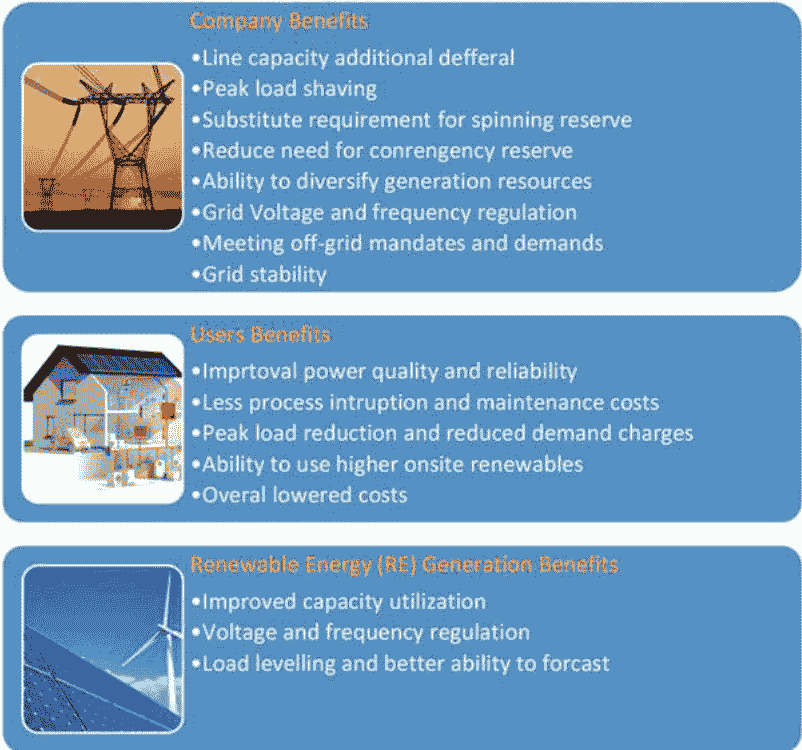

图 1.4 电力储存的好处

多能源系统提供了更多的系统运行灵活性。这个概念将提高可靠性和效率。能量储存可以整合各种能源，如太阳能、风能、天然气、热能以及不同级别的联合供热和电力装置 [26]。此外，灵活负载和能量存储系统的协调调度在微电网的最优调度和降低成本方面起着重要作用 [19, 27]。

储能设备的发展及其与电网的整合将增加维护成本，因为这些设备主要由昂贵的部件组成，并且会产生额外的费用。为此，需要基于这些活动（图 1.4）开发维护程序和网络运行计划。

### 1.2.4 电动汽车

电动汽车的普及，就像一把双刃剑，可以用来改善网络状况，但如果管理不当也可能引发问题。频繁使用电动汽车并接入网络会造成不可预测的情况。然而，管理这些车辆的充电或放电，并在智能电网中应用新的控制方法可以改善情况。

在未来的网络中，可能会出现导致该领域发生重大变化的发展。新的研究涵盖了无线充电 [28, 29]、车辆对网格 (V2G) 区块链管理 [30]、隐私和安全以及智能充电优化等主题。未来，随着电动汽车和充电站的发展，将需要改变配电和电力网络的管理方式。

如上所述，电动汽车应用的优势在于如果能够正确管理其充电和放电。因此，网络参数如电压和频率可以被控制。因此，充电站的位置和容量尤为重要。在这些设备的布置和与网络的交互中，提供了各种优化或智能方法。新研究中讨论的最重要的问题之一是汽车充电站的分配 [31]。充电站点的布置基于优化方法，但也涉及到其他因素，如安装的可行性、经济问题等。然而，目前网络中的所有组件都被用于改善其状况。

### 1.2.5 分散化和智能合约

在消费者和网络拥有者的双向互动中，形成了新的金融结构和不同的结算方法。因此，通过提高所有组件的盈利能力，消费者可以充分利用各种能力。金融交易的规模及其在不同条件下的优化将推动区块链技术、数字货币和智能合约结构的使用 [32, 33]。这需要制定各种法律法规以及新的金融结构。虽然专注于金融结构可能会对电力网络安全带来一些挑战，但还需要创建通信平台和安全的数据库。但是，创建灵活的规则可以推动交互以改善网络参数和条件。智能合约将为电力市场带来新的视角。通过观察各方对这些合约的选择，将应用约定的输出，而偏离约定则会激活一些假设或处罚。通过适当设计这种类型合约的各个方面，可以适当控制和优化与市场相关的网络情况。网络组件之间的发展和增加的互动可能会影响网络安全和稳定性。

负载值的快速变化以及增加组件的盈利能力规划可能会降低运行安全裕度。因此，需要开发与控制、监测和预测未来状态相关的软件，以满足运营商的新要求。为此，将开发和使用新的安全功能和无需建模的新方法。系统可靠性也将得到提高。


图 1.5 智能合约配置

受影响，并且需要纠正计划。目前，可以使用计算和模拟来提取网络状态。必须对不同的网络模式和紧急情况进行建模，以预测或评估情况（图 1.5）。

### 1.2.6 可靠性和安全性问题

电力网络的所有组件的可用性和可靠性增加是多能源系统中的主要概念之一。在未来的消费者和工业中，不同形式的能源贡献起着主要作用。多能源网络可以为参与者提供更多机会来增加他们的利润 [34]。随着网络中设备、市场参与者和能源形式的增加，网络的可靠性和安全性将受到影响。这些影响可能是由于电压或频率的变化或其他网络参数的变化。电力网络之外的参与者也会对其性能产生重大影响。因此，网络运营商认为增加网络参数的稳定性是可取的（图 1.6）。

电力系统瞬态稳定性评估对于确定其可靠性和连续性非常重要。为此，相量测量装置 (PMU) 和远程终端单元 (RTU) 可能在网络中被广泛使用。从这些装置收集的数据，在分析后，用于特定目的，例如确定网络的稳定性或其方向。这是监控

### 图 1.6 电力系统稳定性分类

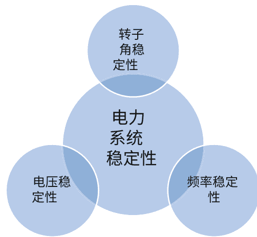

控制和数据采集（SCADA）系统的责任。网络状态评估的处理时间和计算的准确性可能会导致一些问题。增加处理时间或降低结果的准确性可能会导致错误的控制决策或电网停电。此外，通过 PMU 和高速通信媒体进行的网络数据收集对于网络的正常运行非常重要。在各个电压级别上使用可靠的电信基础设施并捕获网络参数，大量的数据传输对网络设计师和运营商提出了巨大的挑战。

因此，各种电力网络问题的运行和优化导致了新的快速和智能解决方案。新的方法被用于评估网络的稳定性和安全性，无论是在研究中还是在实践中。这些方法最近使用图像处理和深度学习过程 [35]，可以以适当的准确性提供所需的输出。提供了网络状态的模式，可以识别和分类不安全或安全的点。这些模式可以随时根据从 PMU 接收到的信息进行更新。问题在于输出的准确性，如果网络被误诊断为不安全或相反，将导致错误的决策并导致无法挽回的事故。因此，有必要检查结果的准确性，以免对网络构成挑战。近期的研究中已经提出了几种评估智能方法准确性的方法。然而，在评估网络安全性时，提高准确性和减少计算时间非常重要。另一方面，为神经网络生成训练和测试数据是新方法的挑战之一。近年来，在这个领域提出了各种数据生成方法，这些方法在研究中被考虑 [37]。

电压调节是可靠性的重要方面。电网运行规定要求所有设备在适当和稳定的范围内维持电压。传统上，这是通过使用电容器、分接器和分布式发电机来实现的。所有这些方法可能相对较慢。但是，具有新技术的现代逆变器可以在网络中实现快速电压调节。

### 1.2.7 负荷预测问题

在电力网中广泛使用可再生能源和各种具有高度不确定性的负荷，以及利润能力的重要性，扰乱了短期和长期负荷预测。换句话说，未来网络中的主要挑战之一是基于高度不确定的负荷预测和随机能源生成进行负荷管理和发电规划。因此，神经网络和深度学习方法在这一领域中的应用被认为是近期研究中的重要问题 [38-40]（图 1.7）。

### 1.2.8 大数据

作为能源的一个重要应用，未来的网络是一个复杂的互联电力网络，涉及高渗透分布式发电、高度可变负载、智能电表、实时控制器和数据处理器。它不断产生大量、高速和多样化的数据。

我们需要大量的数据和信息来监控和控制电力网络 [41]。

为此，大数据和神经网络的应用越来越广泛。自由模型方法被引入和用于研究。这些


这些方法促进了控制中心应用的发展，并改善了系统。依赖电信和大量的数据可能会危及系统的通信网络安全。创建和增强电信网络安全是一个重要的问题。这个问题可能会引起局部或重大的问题（图 1.8）。

## 1.3 机器学习（ML）的应用和挑战

电力网络管理和解决各种问题需要使用复杂建模和计算的不同方法。有时，这些计算的量可能足够大以至于会中断决策。为了解决问题，提出了无模型方法 [42]。此外，人工神经网络和机器学习方法被用于减少计算量。

然而，这些方法并没有消除模拟的需求，因为不同的学习方法或结果测试需要真实数据，这些数据必须存在于控制中心的数据库中或通过模拟生成。因此，大数据应用和数据挖掘也被考虑在内。近年来，专注于提高准确性和减少处理时间，提出了基于机器学习模型的可靠方法。随着所提出模型的发展，研究人员和工程师可以使用新的处理能力和工具。这些能力用于数据生成，状态评估或状态预测。

# 1 电力系统的挑战和问题

图 1.9 机器学习应用


如图 1.9 所示，机器学习在电力网络中有多个应用。换句话说，电力网络中的所有挑战都可以使用不同的机器学习方法来解决。近年来，人们对这些方法的问题解决能力进行了大量关注和改进。例如，在短期负荷消耗和存在大量不确定性（如可再生发电和电动车辆）的情况下，智能方法可以在这一领域提供良好的结果。此外，在停电后寻找恢复网络的合适路线时，智能方法可以根据不同的电网情况提供合适的模式。

在电力交易和电力市场中，机器学习方法可以在寻找最优价格和增加网络能力方面发挥有效作用。当这些交易的速率大大增加并考虑与运行条件的相互作用时，这一作用将得到突出。然而，鉴于新的电力网络问题的广泛性和新的复杂性，使用这些智能方法已经被考虑。然而，这个问题在行业中需要更多关注。问题在于，许多运营商仍然对使用传统方法感兴趣，他们可能会阻止智能方法在电力网络运营中的使用。

另一方面，机器学习和数据挖掘方法在电力系统处理方面带来了新的挑战。其中一些挑战可能涉及运营成本，而另一些可能与数据使用和应用相关。

### 图 1.10 机器学习挑战

> 图 1.10 展示了其中一些挑战。这些挑战并没有阻止智能方法在研究中的使用。这些挑战可能是由于对新概念的需求而产生的。这些新概念，包括数据科学、大数据、人工智能和图像处理，被用于模拟过程。

因此，对于年长的操作员来说可能并不容易理解。有时，操作员可能会反对使用这些方法。它还需要一些结构，如历史数据库或结果评估。评估结果很重要，因为输出的准确性必须在适当的范围内。

否则，决策可能会有很大的偏差。此外，如果结果有偏差，系统的实际状态可能会被错误地呈现。因此，评估结果及其不同的方法非常重要。

需要与这些结构一起工作的工程师和经理需要数据科学和计算机科学培训。他们应该在这个领域拥有丰富的专业人才。另一方面，创建和使用任何新的结构都需要时间和金钱。解决可能的结构问题和改进方法取决于在工业中应用研究成果。

机器学习和模型的发展以及对数据库和软件方法的依赖增加了黑客和网络攻击。相关的保护结构和防火墙可以控制这些攻击。

机器学习的不同方法正在迅速渗透到电力网运营中。这种快速发展将引领各个行业和问题解决策略的新革命。

## 1.4 结论

正如本章所讨论的，未来的电力网络将面临各种挑战和问题。其中一些挑战与新设备有关，一些与新概念有关，一些与新的模拟和计算方法有关。

此外，大量的大数据和广泛的计算将对运营和决策产生巨大影响。研究使用新设备（如储能、可再生能源）的影响，以及利用许多电力电子学预测未来网络状态，有助于更好地理解电力网络的未来问题。

这些挑战将导致以下主要问题：

- 可再生能源和储能的渗透
- 消费者对网络管理的影响
- 大数据和大量数据交换
- 新概念、技术和方法

这些结构和概念的变化也可能对使用新方法产生阻力。高层管理层的决策在这方面可能会有所帮助。使用一些智能方法也可以帮助提供新的解决方案。在这个阶段，新方法存在一些问题，需要更多的发展。然而，专注于新概念并开发智能算法（如机器学习）可以有效减少电力网络的挑战。在本章中，通过研究未来网络，评估了一些概念和方法，并得出了一般性的先见之明挑战。

# 参考文献

1. J.P. Lopes, N. Hatziargyriou, J. Mutale, P. Djapic, N. Jenkins, 将分布式发电集成到电力系统中：驱动因素、挑战和机遇综述。电力系统研究 77(9), 1189–1203 (2007)
2. H. Haes Alhelou, M.E. Hamedani-Golshan, T.C. Njenda, P. Siano, 电力系统停电和级联事件的研究动机和挑战综述。能源 12(4), 682 (2019)
3. B.A. Carreras, D.E. Newman, I. Dobson, 北美停电时间序列统计及其对停电风险的影响。IEEE 电力系统交易 31(6), 4406–4414 (2016)
4. P.-Y. Kong, 通信网络和电力网相互依赖的最优配置。IEEE 工业信息 15(7), 4054–4065 (2019)
5. H. Ameli, M. Qadrdan, G. Strbac, 在天然气和电力系统中协调操作策略的应用存在天然气相关的 flexibilities. Energy Syst. Integration 1(1), 3–13 (2019)
6. V. Shabazbegian, H. Ameli, M.T. Ameli, G. Strbac, 用于天然气和电力网络协调操作的随机优化模型. Comput. Chem. Eng. 142, 107060(2020)
7. C. Syranidou, J. Linssen, D. Stolten, M. Robinius, 将大规模可变可再生能源整合到未来欧洲电力系统中：关于限制挑战的问题。能源 13(20), 5490 (2020)
8. S.M. Miraftabzadeh, F. Foiadelli, M. Longo, M. Pasetti, 电力系统分析中机器学习应用的调查，在 2019 IEEE 国际环境会议中以及电气工程和 2019 年 IEEE 工业和商业电力系统欧洲会议 (EEEIC/I&CPS Europe), (IEEE, 2019), 第 1-5 页
9. D. Vangulick, B. Cornélusse, D. Ernst, 区块链用于点对点能源交易：设计和建议，在 2018 年电力系统计算会议 (PSCC), (IEEE, 2018), 第 1-7 页
10. W. Tushar, C. Yuen, H. Mohsenian-Rad, T. Saha, H.V. Poor, K.L. Wood, 通过点对点能源交易改变能源网络：博弈论方法的潜力。IEEE 信号处理杂志 35(4), 第 90-111 页 (2018)
11. F. Profumo, E. Bompard, Fulli, G, 电力安全：支持欧盟政策决策的模型和方法 (2016)
12. R.G. Newell, Y. Qian, D. Raimi, 全球能源展望 2015, 国家经济研究局，0898-2937 (2016)
13. E. Union, 里斯本条约：修正《欧洲联盟条约》和《欧洲共同体条约》(欧洲官方出版社，2007 年)
14. E.U. Package, 具有前瞻性气候变化政策的弹性能源联盟框架战略，在欧洲议会、理事会、欧洲经济社会委员会、地方和地区委员会以及欧洲投资银行的委员会，COM, 卷 80 (2015)
15. A. Froggatt, A. Hadfield, 解构欧洲能源联盟：治理和 2030 年目标，EPG 工作论文：EPG 15 07 (2015)
16. P. Capros 等人，EU 能源、交通和温室气体排放趋势至 2050 年 - 参考情景 2013 (欧洲委员会，2013 年)
17. K.S. Ratnam, K. Palanisamy, G. Yang, 未来低惯性电力系统：要求、问题和解决方案 - 综述。Renew. Sustain. Energy Rev. 124, 109773 (2020 年)
18. L. Mehigan, D. Al Kez, S. Collins, A. Foley, B. Ó'Gallachóir, P. Deane, 欧洲电力系统中的可再生能源和对系统旋转惯量的影响。Energy 203, 117776 (2020 年)
19. M.A. Mirzaei 等人，一种新型的混合两阶段框架，用于柔性竞标策略的可重构微电网在日前和实时市场中。Int. J. Electr. Power Energy Syst. 123, 106293 (2020 年)
20. H.E. Murdock 等人，2019 年可再生能源全球状况报告。2019 年。
21. K.M. Muttaqi, M.R. Islam, D. Sutanto, 未来电力分配网格：可再生能源、能量存储、电动车、超导体和磁性公交的集成。IEEE Trans. Appl. Superconductivity 29(2), 1-5 (2019 年)
22. J.E. Bistline, D.T. Young, 未来电池储能部署对区域电力系统的排放影响。Appl. Energy 264, 114678 (2020)
23. M. Baza, M. Nabil, M. Ismail, M. Mahmoud, E. Serpedin, M.A. Rahman, 基于区块链的智能电网能量存储单元充电协调机制，2019 年 IEEE 区块链国际会议 (Blockchain) (IEEE, 2019 年), pp. 504-509
24. T. Fu, C. Wang, N. Cheng, 基于深度学习的车辆能源网络中可再生能源存储和路由的联合优化。IEEE Internet Things J. (2020 年)
25. H. Jang, T. Lee, S.M. Kim, J. Lee, S. Park, 基于深度学习的能量存储系统管理方法，用于能源高效智能家居，在 2020 年 IEEE 国际消费电子会议 (ICCE) 上，(IEEE, 2020), 第 1-2 页
26. N. Nasiri 等，能量存储技术存在下的协调区域 - 本地多载波系统的双层市场清算。可持续城市社会 63, 102439 (2020)
27. M.-N. Heris 等，考虑电力、天然气和供暖网络约束的风险受限随机多载波能源系统中氢储存技术的评估。国际氢能 45(55), 30129-30141 (2020)
28. J. Chen, C.W. Yu, W. Ouyang, 无线可充电传感器网络中高效的无线充电垫部署。IEEE Access 8, 39056-39077 (2020)
29. O. Nezamuddin, E.C. dos Santos, 车间路线无线充电系统，在 2020 年 IEEE 交通电气化会议和博览会 (ITEC) 中，(IEEE, 2020), 第 371-376 页

30. V. Hassija, V. Chamola, S. Garg, N.G.K. Dara, G. Kaddoum, D.N.K. Jayakody, 基于区块链的轻量级数据共享和能源交易框架在V2G网络中的应用。IEEE Trans. Vehicular Technol. (2020)

31. Y. Motoaki, 电动汽车快速充电站的位置分配—研究与实践。World Electr. Vehicle J. 10(1), 12 (2019)

32. D. Han, C. Zhang, J. Ping, Z. Yan, 基于区块链的去中心化能源交易和管理的智能合约架构。能源，117417 (2020)

33. S. Yu, S. Yang, Y. Li, J. Geng, 基于智能合约的分布式能源交易机制设计，在2018年中国国际电力分配会议(CICED)中，(IEEE, 2018), pp. 2790-2793

34. M.Z. Oskouei, M.A. Mirzaei, B. Mohammadi-Ivatloo, M. Shafiee, M. Marzband, 一种用于评估三层能源市场中多能源零售商利润的混合鲁棒-随机方法。能源 214, 118948 (2020)

35. J.-M.H. Arteaga, F. Hancharou, F. Thams, S. Chatzivasileiadis, 用于电力系统安全评估的深度学习，在2019年IEEE Milan PowerTech中，(IEEE, 2019), pp. 1-6

36. P.K. Jaiswal, S. Das, B.K. Panigrahi, 基于PMU的数据驱动方法用于在线动态安全评估在电力系统中，在2019年第20届国际智能系统应用于电力系统(ISAP)中，(IEEE, 2019), pp. 1-7

37. F. Thams, A. Venzke, R. Eriksson, S. Chatzivasileiadis, 用于电力系统数据驱动安全评估的高效数据库生成。IEEE Trans. Power Syst. 35(1), 30-41 (2019)

38. A. Al Mamun, M. Sohel, N. Mohammad, M.S.H. Sunny, D.R. Dipta, 使用单一和混合预测模型的负荷预测技术的综合评述。IEEE Access 8, 134911-134939 (2020)

39. M.A. Hammad, B. Jereb, B. Rosi, D. Dragan, 电力负荷预测的方法和模型：综合评述。Logist. Sustain. Transp. 11(1), 51-76 (2020)

40. N.M.M. Bendaoud, N. Farah, 使用深度学习进行短期负荷预测。神经计算应用 32(18), 15029-15041 (2020)

41. M. Ghorbanian, S.H. Dolatabadi, P. Siano, 智能电网中的大数据问题：一项调查。IEEE 系统杂志 13(4), 4158-4168 (2019)

42. X. Li, J. Wen, 建筑能源建模的综述与控制。可再生与可持续能源评论 37, 517-537 (2014)

43. M. Shafique 等，机器学习的自适应和能源高效架构：挑战、机遇和研究路线图，在2017年IEEE计算机学会年度VLSI研讨会 (ISVLSI), (IEEE, 2017), pp. 627-632

## 第二章 电力系统挑战和问题的介绍和文献综述

Ali Ardeshiri, Amir Lotfi, Reza Behkam, Arash Moradzadeh, 和 Ashkan Barzkar

A. Ardeshiri (✉) · A. Lotfi · A. Barzkar
伊朗德黑兰，沙里夫科技大学，电气工程系
电子邮件：ali.ardeshiri.lajimi@mail.concordia.ca; ashkan.barzkar@ee.sharif.edu

R. Behkam
伊朗德黑兰，阿米尔卡比尔科技大学，电气工程系
电子邮件：reza.behkam@aut.ac.ir

A. Moradzadeh
伊朗大不里士，电气与计算机工程学院，大不里士大学
电子邮件：arash.moradzadeh@tabrizu.ac.ir

©作者（们），在Springer Nature Switzerland AG 2022 的独家许可下
M. Nazari-Heris 等人（编辑），机器学习和深度学习方法在电力系统问题中的应用，电力系统，
https://doi.org/10.1007/978-3-030-77696-1_2

## 2.1 引言

自从1880年代电力系统的诞生以来，当时灯泡被用于灯塔和街道照明，商业用电开始[1]，它已经发展成为一个伟大的产业和经济。在现代生活方式中起着基础性的作用，电力消耗在二十一世纪急剧增长，为了满足需求增长，电力发电也相应增加[2]。全球电力需求每年增长2.1%，而总能源需求增长只有电力的一半。这一问题使得电力在总能源需求中的占比从2018年的19%增加到2040年的24%。由于交通和供暖的电气化、家庭收入增加以及空调、数字和电子设备需求的增加，电力消耗将继续增长[3, 4]。

如今，不断增长的能源需求，智能电网的发展以及不同类型能源系统的结合导致了电力系统的复杂性。另一方面，不断扩大的能源消耗，工业和技术系统的发展，太阳能和风能的高渗透率使得电力网络在更复杂和不确定的条件下运行。

因此，传统电力系统的分析需要物理建模和大量的数值计算。为了分析这些系统的行为，使用先进的计量和监控系统生成大量的数据。机器学习、深度学习和各种回归、分类和聚类算法是解决这些问题的强大工具。这些方法可以用于解决电力系统问题和挑战，如规划、运行、故障检测和保护、电力系统分析和控制以及网络安全。

全球范围内，数百万人无法获得或只能有限地获得电力。这个问题不仅限于发展中国家。即使是发达国家也需要向远离电网的偏远地区提供电力，如岛屿、沙漠和被山脉包围的地方。可用能源对于实现发展目标至关重要[5, 6]。此外，电力在食物、能源和水的互联中起着重要作用，这被称为FEW Nexus。因此，电力的可用性和韧性至关重要[7, 8]。

电力系统的主要目标是尽可能地满足需求。然而，这个问题并不像看起来那么简单。为了解决电力系统的挑战，在本章中考虑了三类挑战，包括电力系统规划、运行和控制方面的问题。规划是与电力系统元素的建设、设计和扩展相关的活动和决策，通过预测未来的情况并做出一些假设，以满足未来的电力需求，考虑当前的情况[9]。电力系统规划主要可以减少投资成本、污染和停电，或者增加可靠性、弹性和安全性[11]。规划阶段的时间范围从1到20年不等。一旦电力系统元素建成，这些元素需要在满足技术约束条件的同时，按照环境和经济目标进行运行，以满足需求。最后，在电力系统控制中，在将电力输送到负载之前的短时间内，考虑到发电、输电或配电中发生的所有事件，例如事故和停电，主要关注的是保持电网的稳健性和安全性，而经济和环境可能不像规划和运行阶段那样重要[12]。

在下面的小节中，详细解释了规划、运行和控制方面的挑战和问题。

## 2.2 电力系统规划

在另一部分中，也被称为规划研究，由于电力系统的某些部分失去了足够性并且无法提供所需负载，因此未能正确提供消费者所需的能源供应。这些研究的目的是确定新的类型、安装位置、数量和安装时间。

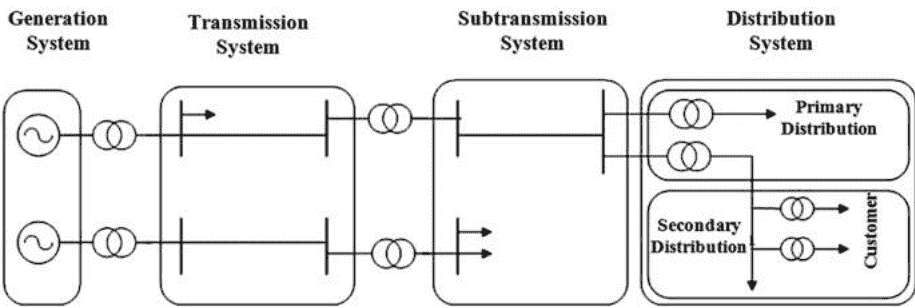

图 2.1 电力系统的基本结构

设备使得所需的网络适应性以最低成本恢复[13, 14]。

如上所述，电力系统规划研究的目的是以最优方式恢复设备的适应性，以满足消费者所需的负载。发电厂无法产生所需的电力，线路容量不足以传输所需的电力，以及网络变电站的容量或数量不足，都是电力系统的不足之处。因此，可以得出结论，确定扩展发电、输电和配电所需的时间和容量，以最低成本为消费者提供所需的电力供应，是规划问题的目标[15]。

由于问题的复杂性和规模，扩展规划研究通常被分为三个独立的部分[16]：

- 1. 发电扩展规划（GEP）。
- 2. 网络扩展规划（NEP）。
- 3. 变电站扩展规划（SEP）。

在发电扩展规划中，目标是以最低成本确定发电资源的容量、安装位置和安装时间。在此目的下，还考虑了约束条件，以便通过考虑网络中的故障和离网单元，系统中的总产能能够提供最大数量的消费负荷，并且它们的非供应不超过一定数量[13, 17]。

线路扩展规划也可以分为三个部分：输电线路、次输电和配电。假设线路扩展规划中的变电站和发电中心的负荷是清楚的，并且发电部门和变电站具备必要的适应性，考虑了线路的类型、容量、位置和需求时间[16, 18]。

在电力系统中，如图2.1所示，电力是在能源发电源中产生的，并通过输电线路传输到输电变电站。每个输电变电站通过输电线路供电给一定数量的次级输电变电站。最后，20千伏馈线从次级输电变电站向配电变电站输送电力，并通过这种方式，将电力供给消费者。

为了在正常情况下或事故发生时充分供应消费者，必须计算变电站的总负荷，考虑到变电站安装设备的允许容量。随着负荷的增长，现有变电站设备的容量可能无法满足负荷消耗。为了解决这个问题，必须扩建现有变电站或在网络上安装新的变电站来解决。

一般来说，下游网络负载的数量和网络的位置会影响每个变电站的容量。随着在网络中实施SEP，确定了在何时以及何种程度上增加所提到的变电站的设备容量，或者在何时何地以及以何种容量建造多少个新的岗位，以使网络恢复其失去的充足性[16, 18]。

正如前面提到的，实施SEP的目的是确定扩建现有变电站或建造新变电站的组合，以以最低成本为负载提供安全和理想的供应。

在给定的地理区域内，消费者分散在整个研究区域。使用输电线路、次级输电和配电，必须将电能传送到所需地理区域的所有消费者。在发电厂发电后，通过输电线路、输电变电站和次级输电线路将电能传输到次级输电变电站。

次级变电站靠近消费者，通过20千伏馈线将电力降压后传输到几个配电变电站。具有数百兆伏安容量的输电变电站，具有数十兆伏安容量的次级变电站，以及具有约兆伏安到几兆伏安容量的配电变电站被建造。消费者的地理分布和负荷量决定了所需变电站的数量和密度。次级变电站的建立方式对输电变电站的建设现场有效，配电变电站的建立方式对次级变电站的建设现场也有效。鉴于这种依赖关系，配电、次级传输和输电变电站的配电规划应同时进行。

但是，由于存在许多变量和约束条件，这些岗位的同时发展规划问题非常复杂，为了在一定时间内获得实际答案，电力系统设计师将岗位发展规划问题分为三个独立的部分来解决。这些部分分别是配电变电站的扩建、次级变电站的扩建和输电变电站的扩建[16]。

因此，根据低压负荷的位置、低压线路的布置以及配电变电站的容量和位置来确定。然后，这些变电站被视为负荷点，并且它们的容量也被视为这些负荷点的值，根据这一点，中压线路的布置以及次级变电站的位置和容量被最优地确定。为了简化任务，在这个阶段不考虑下游 (配电) 和上游 (输电) 网络的布置。

阶段。在获得次级变电站的两个容量的位置之后，这些变电站被视为具有负荷量的负荷点，并根据此确定上述配电线路的布置、传输变电站的位置和容量。

如前所述，为了减少各个阶段单独扩展问题的复杂性和维度，不考虑下游或上游网络的布置。然而，这可能使得整个系统发展问题的答案远离最优值。例如，假设在规划包括输电变电站、输电线路和输电变电站的次级传输网络的扩展时，将同时扩展问题划分为次级传输变电站的扩展和输电变电站的发展两个子主题。在这种情况下，在规划次级传输变电站时，设计师试图减少馈线的长度和降低成本，变电站应尽可能靠近负荷中心，这将导致这些变电站与输电变电站的距离更远，除了增加与输电系统连接的成本外，还会导致其他技术问题。这在图2.2中以示意图显示。

网络扩展规划是基于预测负荷，而预测负荷不仅仅基于未来的网络性能，还会受到过去的网络性能和未来的影响因素的影响。在这方面，研究不确定性对有效参数的影响将对规划响应产生重要影响[19]。

负荷不确定性研究是估计设备添加时间以保持网络充足性的重要输入之一。如前所述，不确定性的主要原因是新负荷的出现，价格上涨，法律变化和天气条件（温度和风等）[20]。此外，近年来电力网络发生了一系列变化，导致了不确定性的出现。

其中包括配电网络的重组，私有化，自由市场或竞争市场，替代能源，分布式发电以及能源领域的新保护和通信技术[21]。

在大多数提出的网络发展规划模型中，对问题参数的不确定性影响被忽略了[22]。对于大型网络的扩展规划，如果不考虑这些因素，将无法得到真实的答案，因为随着网络的增长，不确定性的概率和问题参数的不确定性都会增加。

由于电力系统运行逻辑领域的最新发展，在系统容量增加的情况下，提出了创新的选择。近年来，分布式发电（DG）是许多研究人员考虑的选项[23]。

DG 代表连接到低负载容量附近的电网的生产单元。使用DG可以改善电压配置，并减少损耗，从而降低网络运行成本。此外，通过安装DG在网络中，可以降低投资成本，因为安装DG可以延迟新设备的建造或加强现有设备[24]。

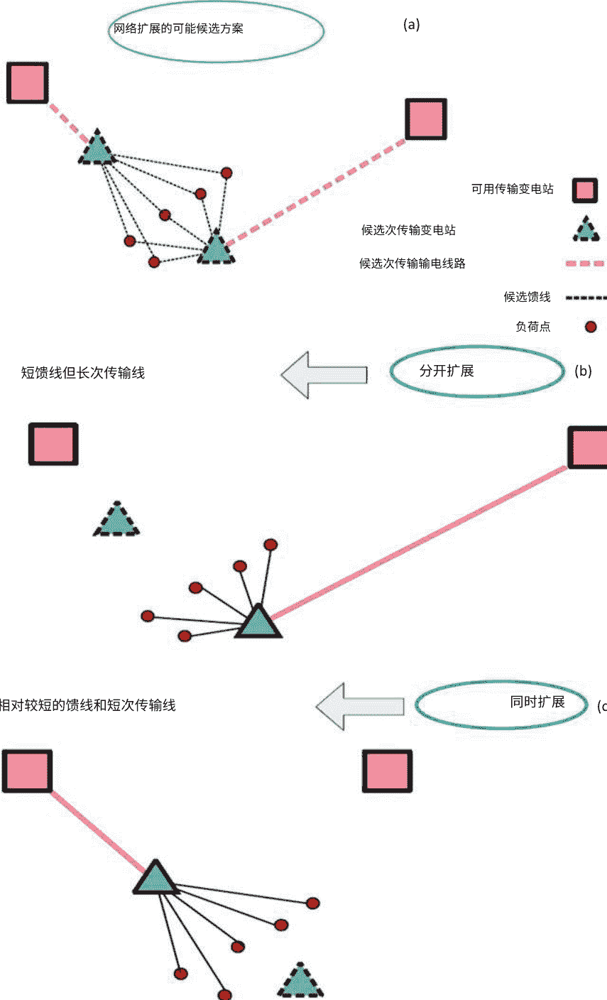

图 2.2 分开和同时扩展的比较示意图

此外，分布式发电将在提高客户服务质量和可靠性方面发挥重要作用。考虑到分布式发电的潜在好处和资源价格的下降，预计这些资源将在未来的电力系统中发挥重要作用[25]。

## 2.3 电力系统运行挑战

电力系统运行始终面临着多个挑战。其中一些挑战，如干扰/意外事件和网络攻击，可能随时发生，但气候变化这一挑战会逐渐对电力系统运行产生影响，并且其结果将在几十年后才会显现。以下总结了这些挑战及其对电力系统运行的影响。

### 2.3.1 气候变化对电力系统运行的影响

能源部门的许多不同方面（尤其是发电方面）容易受到气候变化和环境条件的影响。其中一些相互作用如下所述。

- 太阳能。云量将在低纬度至中纬度地区减少[26]。由于气温升高，效率下降将抵消太阳能资源的增加。根据区域研究的预测，太阳能发电的变化将在本世纪末小于10% [27-29]。

- 风能。根据几项不同的研究，预测欧洲和北美的平均风速将保持在当前值的3个不同百分比内，分别为15% [30]、20% [31, 32]和30% [33]。

此外，评估认为中国[34]或南非[35]的风能资源不会有明显变化。

- 波浪。由于风模式和海平面上升的变化，波浪资源可能会受到影响。研究表明，波浪发电在波斯湾[36]和梅诺卡[37]没有变化。此外，英国的波浪发电变化将不超过3%[38]。

- 水力发电。全球范围内进行了大量研究，根据结果，他们对于气温上升和降水模式变化的影响得出的结论不同。一些研究得出结论，气候变化对全球资源潜力的影响很小[39, 40]，而其他研究表明，由于气候变化，全球水力发电量在2080年代将下降6.1%[41]。

- 生物能源。升高的温度和变化的降水模式影响了适宜生物能源种植和平均产量的地区。产量将随着高纬度地区，太阳辐射量可能增加高达+28%,而在低纬度地区可能下降高达-16% [42]。此外，预测还表明，适宜的土地将向北方移动，适合种植一些作物 [43],例如美国的高粱 [44] 和全球的芒草 [45]。

- 热电站。由于温度升高导致热效率降低，发电厂的输出将每度降低约0.4-0.7% [46-48]。水资源减少对发电厂的冷却造成负面影响，可能导致负荷减少，甚至造成发电厂停机。

- 输电线路。温度升高将降低架空线路的输电能力。以美国为例，在夏季需求高峰时，架空线路的输电能力预计将减少约5.8% [49]。

### 2.3.2 干扰/意外事件对电力系统运行的影响

意外事件对电力运行有很大影响。由于人为错误、极端天气事件的影响 [50],以及由于生产/安装错误或设备老化导致的电力设备故障，会发生大小不一的干扰。由于采用超导技术改善了电力设备的寿命，可以提高电力系统运行的可靠性，并减少因老化因素导致的电力应用故障的可能性 [52,53]。此外，深度学习和机器学习技术已经在电力系统中的输电线路和配电网络的保护和故障检测问题上进行了大量研究。

电力系统主要由于各种环境、机械和电气因素而遭受两类 (11种类型) 短路故障，分别称为不对称故障 (AG、BG、CG、ABG、BCG、ACG、AB、BC 和 AC) 和对称故障 (ABC 和 ABCG)。在 [55] 中，基于形态学中值滤波器 (MMF) 和决策树 (DT) 的混合机器学习应用被用于识别和分类传输线上的对称和不对称故障类型。在其他类似的研究中 [56,57],DT 方法已被用于识别与传输线相关的对称和不对称故障的类型和位置。在一项有价值的研究中 [58],使用卷积神经网络 (CNN) 和深度强化学习来识别传输线上的单相对地短路故障的位置。在本文中，通过比较和评估结果，介绍了深度强化学习过程作为优越的方法。

使用名为图形卷积神经网络的深度学习应用来识别和分类IEEE 123总线基准配电系统中的故障

表 2.1 干扰和意外事件及其特征

| 干扰类型 | 描述 | 可能的原因 | 症状/影响 | 潜在解决方案 |
| :--- | :--- | :--- | :--- | :--- |
| 停电 | 电力供应的完全中断:<br>–瞬时中断持续0.3–3.5个周期, 3秒<br>–临时中断持续3秒到1分钟<br>–长期中断持续时间超过1分钟 | –事故、自然灾害等需要公用事业设备 (熔断器、重合闸等) 正常运行的情况<br>–需要客户断路器和熔断器正常运行的内部短路 | –系统关闭<br>–计算机/控制器内存丢失<br>–硬件损坏<br>–产品损失或损坏 | 不间断电源 (UPS) |
| 瞬态 (浪涌) | 交流波形中的亚周期干扰, 通过波形的急剧、短暂的不连续性来证明 | 浪涌是由风暴 (闪电)、公用事业熔丝、重合闸和大型设备和电容器开关 (客户和公用事业) 的操作引起的 | –计算机死机、处理错误和数据丢失<br>–烧毁的电路板、电气绝缘损坏和设备损坏 | –浪涌保护器<br>–不间断<br>–内置浪涌抑制的电源供应器<br>–隔离变压器<br>–恒压变压器<br>–线圈反应器 |
| 电压下降/上升 | 电压的短期 (0.5个周期, 1分钟) 下降 (下降) 或上升 (上升) 下降占所有电力干扰的87%(根据贝尔实验室的研究) | –主要设备关闭和/或重新启动<br>–短路<br>–公用事业设备故障或公用事业切换 | –内存丢失和数据错误<br>–设备关闭<br>–闪烁的灯光<br>–电机停顿或停止-并减少电机寿命 | –不间断电源<br>–恒定电压变压器<br>–电压调节器<br>–功率电子电压下降校正器 |
| 噪音 | 一种不需要的高频电信号, 改变了正常的电压模式 (正弦波) | –来自广播或电视传输的干扰<br>–电子设备的运行 | –敏感设备的死机<br>–数据丢失和处理错误<br>–扭曲的音频和视频接收 | –不间断电源<br>–隔离变压器<br>–电力线滤波器 |
| 谐波失真 | 由于改变了正常的电压模式 (正弦波) 而引起 | 电子镇流器和其他非线性负载, 如开关 - | –电气设备的过热 | –谐波滤波器<br>–隔离 |

(续)| 干扰类型 | 描述 | 可能的原因 | 症状/影响 | 潜在解决方案 |
|---|---|---|---|---|
| 谐波干扰 | 与标准的 60 赫兹频率不同的设备发生频率 | 变频电源和可变频驱动器 | 布线<br>-电动机性能下降<br>-断路器、继电器或保险丝的不正确操作 | 变压器<br>-改善的布线和接地<br>-孤立负载<br>-线圈电抗器 |
| 欠压/过压 | 任何持续时间超过一分钟的长期电压变化，低于或高于正常电压 | 过载的布线或设备。<br>大负荷摆动或不正确的变压器设置。<br>电线过小和故障或差劲的电气连接 | -灯光暗或亮<br>-设备关闭<br>-电机或灯光过热<br>-电气设备的效率或寿命降低 | -不间断电源<br>-恒定电压变压器<br>-验证电气连接和电线<br>-重新安置设备<br>-降低电压的电动机起动器和低电压穿越设备 |

[59] 本文提出的方法将系统接收到的信号转换为二维图像，然后将其视为 CNN 的输入。在 [60] 中，使用支持向量机 (SVM) 和长短期记忆 (LSTM) 技术在中国南方电网中识别了跳闸故障。本文中提出的模型的性能评估将 LSTM 方法引入作为优越的解决方案。在 [61] 中，通过一种名为堆叠自编码器的深度学习应用程序，实现了配电网络中单相对地短路故障的定位。在另一项有价值的研究 [62] 中，使用 LSTM 方法对 IEEE 39 节点配电系统中的对称和非对称故障进行了识别。本文将提出的方法的性能与其他机器学习技术 (如 SVM、DT、随机森林 (RF) 和 k 最近邻 (k-NN)) 进行了比较。

除了与输电线路和配电网络相关的损坏之外，安装在电力系统中的设备，如电力变压器、电机和电力电子设备，也会受到各种因素的损坏。及时检测和排除这些设备的异常可以防止对电力系统造成严重损害。在这方面，主要利用了机器学习和深度学习的应用。

在 [63] 中，使用 SVM 技术进行了与电力变压器绕组相关的机械故障的检测。在 [64] 中，CNN 程序被选为定位变压器绕组高阻抗和低阻抗短路故障的深度学习应用之一。在 [65] 中，使用 SVM 的回归版本进行了变压器绕组中的小型短路故障定位。在这项研究中，对故障位置的早期检测可以防止对变压器绕组和电力系统安全造成严重损害。

在 [66] 中，考虑到双端不同步，采用 Hilbert-Huang (HH) 变换和一维 CNN 技术进行了高电压直流 (HVDC) 输电线路中高电阻接地故障的检测。在 [67] 中引入了优化的自适应神经模糊推理系统 (ANFIS) 神经网络和 HH 变换，用于定位电压源换流器-HVDC(VSC-HVDC) 中的内部和外部故障。

在 [68] 中，采用一种称为深度置信网络的深度学习应用，对 VSC-HVDC 输电线路上的三种常见瞬变进行了诊断，包括 GF、雷电故障和雷电干扰。

### 2.3.3 网络攻击对电力系统运行的影响

如今，在我们现代数字化社会中，拥有复杂和现代化基础设施，电力系统是最关键的组成部分之一，起到经济活动和安全的支撑作用。现代电力系统在其运行中相当依赖通信系统，因此容易受到网络攻击的影响。因此，每个国家都有兴趣加强其电力系统运行的安全性，以防范网络风险和威胁，这可能导致级联效应、停电和个人数据泄露 [69-71]。

这些网络攻击挑战影响着输电和配电系统运营商（TSOs 和 DSOs）确保灵活性和韧性、可靠性、稳定性、供应安全性和电力质量。

电力系统对抗网络攻击的功能包括几个方面，即发电、输电和配电的稳定性和可靠性，系统和设备之间的通信，发电、输电、配电设备的运行情况信息，黑启动能力以及应用性能和恢复能力 [72]。

到目前为止，许多研究已经调查和检测了电力系统中的网络攻击类型。在一些有价值的综述文章中，介绍和评估了关于网络物理系统，特别是这些系统的安全问题的挑战 [73-78]。网络物理系统的一般性在 [73] 中已经详细描述。在 [74] 中，评估了网络物理层对电力系统的可靠性影响。在 [75] 中，在评估了网络物理系统的安全性之后，回顾了这方面的现有挑战，并介绍了适当的解决方案。在 [76] 中，研究了智能电网中网络物理攻击的影响。在一篇有价值的综述中

在论文 [77] 中，对于物理系统安全的限制、问题和未来趋势进行了调查。在 [78] 中介绍和评估了对电力系统中各种类型的网络攻击的投影、预测和预测。通过对近年来进行的文献综述和研究评估，可以看出在电力系统的网络攻击检测方面引入了许多解决方案，其中机器学习和深度学习方法在这一领域中占据了特殊的位置 [79-83]。

接下来，总结了与三个重要的电力系统应用（状态估计、自动发电控制和电压控制）相关的易受攻击性。

- 1. 对状态估计的攻击。

状态估计在能源管理应用（控制中心）和许多运营决策 [84, 85] 中起着重要作用。控制中心运行一个复杂的算法来处理来自不同位置的测量数据，例如功率注入、线路功率流、电压测量和断路器和开关的状态信息。根据处理结果，估计了系统的状态，即电压幅值和角度。根据上述估计结果，可以做出诸如发电机调整、线路开关的打开或关闭以及变压器绕组的更改等决策。对状态估计的攻击可以通过多种方式进行，例如在计量器级别修改传感器数据，通过通信层进行网络干扰，以及通过错误的拓扑配置欺骗操作员。如果攻击没有安排好，操作员可以发现存在不合理的数据并将其排除在估计目标之外。

尽管估计是不可想象的，在系统的情况下，由于丢弃了太多的测量值 [86]，它变得不可观测。总的来说，对电力系统状态估计进行攻击的目的可能导致大规模停电，例如 2015 年乌克兰攻击的情况。

表 2.1 显示了这些干扰的类型、描述、可能的原因、症状、影响和潜在解决方案。

- 2. 对自动发电控制的攻击。

在互联电力系统中，由于自动发电控制 (AGC)，功率输出是调节的，电力系统频率在规定的范围内变化，相邻区域之间的功率交换保持在可接受的计划值范围内 [85, 87]。AGC 的操作类似于闭环反馈控制系统，并且能够最小化人为干预。

AGC 的控制信号应在几秒钟的范围内。

因此，不可能使用数据验证算法，因此攻击者可以在没有详细数学的情况下操纵测量值 [88]。由于对 AGC 的攻击，会发生大量的发电不匹配，导致发电频率的惯性运动。如果频率下降到足够低的程度，欠频继电器将会触发并将大区域与主电网隔离。如果在隔离区域中无法保持负荷发电平衡，隔离区域将会累积并导致大规模的负荷削减或停电 [86]。

### 3. 电压控制的攻击

在长距离配电网络中，电压的稳定性是至关重要的组成部分。

负荷增加和线路电压降会导致级联效应，并最终导致系统崩溃。负载分接开关（LTC）变压器被用于提高配电系统的电压稳定性。根据 LTC 变压器感知到的电压值，分接头的位置会发生变化。

线路末端的电压值通过通信信道发送到控制中心，控制中心中放置了 LTC 变压器。因此，系统容易受到攻击。传感器数据可以通过以下两种方式进行篡改 [86]：

- (a) 在正常运行情况下，传感器被设置为报告比实际值低的数值。因此，执行器被激活以增加分接头设置，系统以更高的电压效率运行。
- (b) 实际上发生了电压降，但数据被篡改以读取基准情况的数值。根据读取的数据，可以得出一切都很好的结论，但电压降可能会增加，甚至导致电压崩溃。

## 2.4 电力系统控制

电力的主要功能之一是将其他能源转换为电力，然后将能量传递给近距离或远距离的消费者。

通常，电力用于其他转换类型的能源，例如机械能、光能和热能。电力的主要优势之一是相对于其他形式的能源，它可以相对容易地进行控制，并具有高可靠性和高效性。专业控制的电力系统必须具备以下条件 [1, 89]：

- 1. 电力系统必须考虑到波动的需求，包括有功和无功功率。与其他形式的能源不同，电力不能轻易且高效地储存足够的数量。因此，必须考虑和控制足够的备用电力，包括旋转备用和非旋转备用。
- 2. 必须始终保持预定的电力系统标准，即“电力系统质量”，包括频率一致性、电压一致性和高可靠性 [1]。

为了满足上述需求，需要集成几个复杂设备，如图 2.3 所示。

在发电机中，控制系统包括主动机（调速器）和励磁控制器。主动机控制器处理速度标准，并控制诸如锅炉温度、流量和压力等输入能量变量。


图 2.3 电力系统控制

励磁控制调节并维持发电机的电压，并注入无功功率 [1]。

系统发电控制通过计算网络损耗和负载，然后平衡发电机输出功率与它们来设置发电机的输出功率。这有助于系统与邻近网络实现所需的功率交换 (联络流) [1]。

输电控制包括电压和功率控制元件，如开关反应器和电容器、同步电容器、相移变压器、静止无功补偿器 (SVC)、分接变压器和 HVDC 输电控制器 [1, 89]。

上述系统关注的是电网的频率和电压的控制，同时保持其他变量在一定范围内，以确保电力系统的完美性能。此外，这些控制器对电网的动态性能有很大影响，这表明电网对干扰和故障的容忍度 [1, 90]。

电力系统控制的目标可能因系统运行状况而异。在正常情况下，控制系统的目标是保持电压和频率在预定范围内，并以高效运行电网。然而，在异常情况下，如事故或停电，控制系统的主要目标是恢复电网，并尽力恢复到正常状态。在这种情况下，效率和成本是次要考虑因素。这些异常情况是由单一干扰引起的，导致电网崩溃，而之前被认为是安全的系统。人为错误、设备和元件故障、极端气候事件 (如大雪或大雨、雷电) 或龙卷风），以及糟糕和不安全的电力网络设计可能导致级联故障和停电 [1, 90]。

在本章中，引入了五种系统条件，分别是正常、警报、紧急、极端和恢复。这些条件在图 2.4 中描述 [1, 90]。

## 2 电力系统挑战和问题的介绍和文献综述

图 2.4 电力系统条件


系统参数在正常范围内，并且没有元素超载。电网以安全高效的方式运行，并且能够处理单一事故而不违反约束条件 [1, 90]。

在警报状态下，尽管系统参数仍在标准范围内，但电网的安全性降低。然而，由于可能出现雷电或暴风等条件，参数有可能超出正常范围。设备超载会导致电网进入紧急状态；然而，如果干扰严重，电网将直接进入极端状态。为了将电网恢复到正常状态，可以考虑采取预防措施，如增加发电量或进行发电转移 [1]。

如果在警报模式下发生足够严重的干扰，系统将从警报状态转变为紧急状态。在紧急状态下，设备超载，母线电压超出规定范围；然而，通过启动紧急控制，包括负荷削减、励磁控制、故障清除、发电机减载和跳闸、高压直流调制和快速调节阀等措施，系统可以恢复到警报状态 [1]。

如果上述措施没有及时或有效地执行，电网将进入极端状态，出现级联停电和部分电网停运。在这种情况下，系统分离和负荷削减是防止整个电网停电的解决方案 [1]。

在极端状态之后，采取一系列措施将所有设备和负载重新连接到电网并恢复系统。根据采取的措施和电网状况，系统可能进入正常或警报状态 [1]。

为了快速高效地处理电力系统的每个条件，需要获得控制策略和操作员手册的框架。电力系统控制将帮助操作员将电网恢复到正常状态。如果干扰不大，电力系统控制可以处理。

然而，如果干扰很大，操作员需要采取措施，如设备切换或发电机调度，将电网恢复到正常状态 [1]。

### 2.4.1 控制和稳定性的电网准则

可靠的电网必须完整坚固，能够抵御各种干扰。因此，决策者设计和运营电网时，必须确保系统能够容忍干扰，并在预定的边界内运行，以最小的负荷损失满足需求，尤其是避免级联故障 [1, 91]。

确定设计、运行和控制准则对于避免严重事故后系统干扰至关重要。准则的实施将确保在最坏情况下，对于所有常规发生的事故，系统将从正常状态进入警报状态，而不是进入其他紧急和极端条件。

在电网进入警报状态后，操作员将采取措施将电网恢复到正常状态 [1]。

### 2.4.2 常规事故

这些类型的事故常见且发生的概率很高。

这些事故包括：

- 1. 任何输电线路、发电机、变压器或母线的三相故障，包括故障清除和重合闸。
- 2. 由于断路器故障、信号通道或继电器引起的任何输电线路、发电机、变压器、断路器或母线的相对地故障。
- 3. 任何塔上的任何相位对地故障，快速清除且在正常时间内。
- 4. 任何设备损失但没有故障。
- 5. 直流双极发电机极同时失效。

在上述故障发生后，标准要求电网保持稳定，设备的负载和电压保持在标准范围内。

这些标准适用于以下情况 [1]。

- 1. 所有活动设备。
- 2. 设备停机，包括输电线路、发电机或变压器。

### 2.4.3 极端事故情况

这些事故情况增加了设备电压或负载超过标准的风险。然而，这些事故情况发生的概率很低。极端事故情况如下：

- 1. 整个发电站容量损失。
- 2. 所有连接发电站、变电站和开关站的输电线路全部损失。
- 3. 任何输电线路、发电机、变压器或母线上的三相故障，由于重合闸设备故障而无法快速清除，导致发电机角摆动。
- 4. 意外添加或移除大负载，或特殊保护系统的故障，例如发电或负载拒绝等 [1]。

### 2.4.4 频率控制

电网中的频率是一个波动的变量，它展示了负载和发电之间的平衡 [92]。实际上，频率偏差是由负载和发电的不平衡引起的，这将导致设备损坏、保护装置触发、输电线路过载以及电力系统运行、可靠性和安全性的不足 [90]。系统操作员通过控制频率将其控制在预定的标准范围内。在英国，引入了两个频率范围，即操作范围 (49.8-50.2 Hz) 和法定范围 (49.5-50.5 Hz) 。表 2.2 显示了英国频率偏差的案例描述 [92, 93]。由于可再生能源发电机的整合，通过控制传统发电厂进行频率控制变得更加困难。

电网频率与发电机转子速度成正比，因此可以通过控制发电机涡轮的速度来进行频率控制。这可以通过实施监控转子速度并跟踪负载变化并将频率重新调整到标准值 [90, 94] 的控制系统来实现。

根据频率偏差的范围，需要不同的控制回路来恢复电网频率稳定，如图 2.5 所示。

表 2.2 频率范围和恢复频率所需的操作描述
| 频率范围 (Hz) | 描述 |
| :--- | :--- |
| 49.8–50.2 | 正常范围内的频率，最大频率偏差发生在发电或负载损失高达 ±300 MW 时 |
| 49.5–50.5 | 发电或负载损失超过 300 MW 且低于 1320 MW 时的最大频率偏差 |
| 小于 49.2 | 发电损失超过 1320 MW 且低于 1800 MW 时的最大频率偏差。频率必须在 1 分钟内恢复到 49.5 Hz |

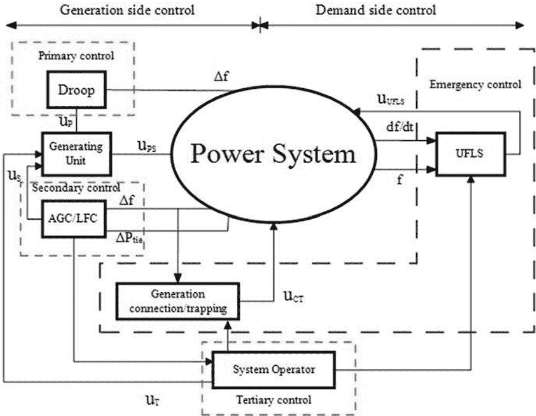

当负载和发电不平衡时，在非常小的频率偏差的第一步，惯性响应被激活，其中动能储存在发电机转子中，并持续几秒钟 [95]。如果频率偏差超过一定限制，主控制会对正常情况下的小频率偏差做出响应。次级控制，即负荷频率控制（LFC），在非正常情况下发生较大频率偏差时，考虑可用的备用功率来采取行动 [90, 94]。如果次级控制环路不足够，将手动实施三级控制，并通过机组调度和发电调度将频率恢复到标准值 [95]。

LFC 的两个主要目标之一是维持电网频率和控制与邻近地区的功率交换 [90]。

如今，由于电力网的结构、复杂性和规模的变化，频率控制变得更加重要。此外，LFC 通过控制电网频率和接线流接近预定值，减轻了电力系统经济和可靠性的压力。这有助于电力网进行能源交流和电力交易。

### 2.4.5 电压和角度控制

电网的三个积分参数是节点电压幅值、节点电压角度和电网频率。此外，这些参数定义了电网在特定时间内的状态。电压和角度稳定性可以分为小干扰稳定性和大干扰稳定性。该稳定性指的是电网任何部分的功率摆动的阻尼以及电压偏离超过一定预定值。通过使用实施在电网中并获取电网动态响应的特定控制设备，可以有效地维持电压和角度稳定性。这些设备包括 FACTS、AVR 和 PSS [90]。

发电机通过实施 AVR 来以固定电压运行。AVR 控制发电机的励磁电流。发电机的直流产生转子的磁通。PSS 是位于汽轮机调速系统内的控制器，在发电机中与 AVR 系统形成互补的控制回路。图 2.6 展示了 PSS 和 AVR 的一般实现方式 [90]。

$\Delta V_{PSS}$在稳态下为零，因此不会对电压调节过程造成任何扭曲。然而，在暂态状态下，发电机转速不是恒定的，因为转子摆动导致 $\Delta V$ 发生变化。当 PSS 生成与发电机转速变化 $\Delta w$ [90] 相位一致的阻尼信号 $\Delta V_{PSS}$ 时，电压变化减小。

电压控制包括多个系统层次上的多个控制环路。AVR 环路在低系统层次上维持发电机端电压，并在不到一秒钟的时间内做出反应。同时，次级电压控制在几十秒或几分钟内激活，设置电压参考值。次级电压控制用于协调发电机自动电压调节器和电网中的多个无功功率源的设定点，以保持稳定性。此外，通过实施几分钟内响应的更高控制层次，可以增加电压稳定性，这被称为三级电压控制。三级电压控制主要考虑电网经济优化，并试图最小化发电成本 [90, 95]。

电网中存在许多电压和频率控制方面的挑战。其中一些挑战的解释如下 [95, 96]:


- 1. 计算和指定 AVR 设定点和输入信号：对于电压控制，AVR 设定点不是全局确定的，以获得电网的最佳性能。此外，还需要对本地考虑进行补充信号，以实现更好的稳定性。需要创建一个全面的、全局的电压稳定性和控制策略，以适应动态和静态条件。
- 2. FACTS 的布置和控制：电力系统电压控制的最大关注点之一是确定对电网在正常条件和事故情况下提供支持的无功功率控制系统的最佳位置和站点。
- 3. 设定电网参数的标准限值：电网的不同组件和设备必须保持在一定的标准限值内。考虑到已经引入了不同的标准限值，必须通过分析工具确定这些标准限值，以实现最佳运行状态。
- 4. 新的安全理念：必须确定可以失去的最少设备和系统组件数量，而不会导致级联故障。这与 N-1 安全方法是分开的。这个新的安全理念引入了导致停电所需的故障和事故的数量。
- 5. 事故情况下的快速无功功率计算：传统的线性事故分析忽视了无功功率和电压挑战。快速计算事故对电压的影响是一个问题。
- 6. 新的控制需求：由于可再生能源和非同步发电机的高渗透率，这些发电机基于变流器以便能够连接到电网，因此在频率偏差期间不提供高惯性。因此，需要新的控制系统以更快速、更精确地应对干扰。

电力系统是一个非线性系统，其性能受到各种设备和设备的影响，这些设备和设备具有不同的响应时间和特性。电网的每个主要设备和设备的特征和特性都对系统稳定性产生影响。因此，为了研究和了解电力系统的稳定性和控制，对这些特性的充分掌握至关重要。电力系统控制的另一个挑战是不同类别电力系统的物理方面的复杂性，它们的评估方法以及提高电力系统稳定性性能的行动 [1]。

# 参考文献

- 1. P. Kundur, 电力系统稳定性与控制 (McGraw-Hill, 纽约，1993)

- 2. M. Fotuhi-Firuzabad, A. Safdarian, M. Moeini-Aghtaie, R. Ghorani, M. Rastegar, H. Farzin, 未来电力系统的挑战：可持续性和弹性。Sci. Iranica 23, 1565 (2016)

- 3. IEA, 世界能源展望 (2019)

- 4. A. Moradzadeh, O. Sadeghian, K. Pourhossein, B. Mohammadi-Ivatloo, A. Anvari-Moghaddam, 通过主成分分析改善可持续发展能源的住宅负荷分解。可持续性 (瑞士) 12(8), 3158 (2020). https://doi.org/10.3390/SU12083158

- 5. C. Canizares, J. Nathwani, D. Kammen, 为所有人提供电力：能源弱势社区的问题、挑战和解决方案，IEEE 会议论文集，第 107 卷（2019 年）

- 6. A. Moradzadeh, A. Mansour-Saatloo, B. Mohammadi-Ivatloo, A. Anvari-Moghaddam, 两种机器学习技术在住宅建筑的供暖和制冷负荷预测中的性能评估，应用科学（瑞士）第 10 卷（11），3829 页（2020 年）。https://doi.org/10.3390/app10113829

- 7. A. Lotfi, B. Mohammadi-Ivatloo, S. Asadi, FEW Nexus 简介，食物 - 能源 - 水资源 Nexus 韧性和可持续发展，S. Asadi, B. Mohammadi-Ivatloo 编辑，（瑞士，2020 年）

- 8. O. Sadeghian, A. Moradzadeh, B. Mohammadi-Ivatloo, M. Abapour, F.P.G. Marquez, 使用混合整数二次规划方法进行联合热电系统中的发电机组维护。能源 13(11), 2840 (2020)。https://doi.org/10.3390/en13112840

- 9. A. Demir, N. Hadžijahić, 电力系统规划：第一部分 — 基本原理，出自 Advanced Technologies, Systems, and Applications II，编者：M. Hadžikadić, S. Avdaković, vol. 28, (Springer, New York, 2018)

- 10. A.M. Al-Shaalan, 发展中国家电力系统规划的基本方面。J. King Saud Univ. Eng. Sci. 23, 27–32 (2011)

- 11. A. Lotfi, S.H. Hosseini, 综合分布式发电和输电扩展规划 考虑安全性。世界科学工程技术国际能源电力工程杂志。11 (2017)

- 12. A.J. Conejo, L. Baringo, 电力系统。在电力系统运行中，第 1–15 页，(Springer, Cham, 2018)

- 13. X. Wang, J.R. McDonald, 现代电力系统规划 (McGraw-Hill, 纽约，1994)

- 14. A. Moradzadeh, K. Khaffafi, 比较和评估各种类型的性能神经网络用于智能电网中充电和放电的最优管理相关的规划问题。新兴科学杂志。1(4), 201–207 (2017). https://doi.org/10.2891/ijse-01123

- 15. A. Moradzadeh, B. Mohammadi-Ivatloo, M. Abapour, A. Anvari-Moghaddam, S. GholamiFarkoush, S.B. Rhee, 基于卷积神经网络的非侵入式负荷监测的实用解决方案。J. Ambient Intell. Humaniz. Comput. (2021). https://doi.org/10.1007/s12652-020-02720-6

- 16. H. Seifi, M.S. Sepasian, 电力系统规划：问题、算法和解决方案 (Springer, 纽约，2011)

- 17. R. Hemmati, R.A. Hooshmand, A. Khodabakhshian, 发电和输电扩展规划的综合评估。IET Gener. Transm. Distrib. 7(9), 955–964 (2013)

- 18. G. Latorre, R.D. Crus, J.M. Areiza, A. Villegas, 传输扩展规划的出版物和模型分类。IEEE Trans. Power Syst. 18(2), 938–946 (2003)

- 19. R.S. Najafi, H. Khatami, 优化和鲁棒的配电系统规划以应对预测不确定性。Tabriz J. Electr. Eng. 46(2), 323–332 (2016)

- 20. A. Moradzadeh, K. Pourhossein, 电力变压器匝间短路的早期检测：一项实验研究，在 2019 年国际爱琴海电机和电力电子会议，ACEMP 2019 和 2019 年国际会议中关于电气和电子设备的优化，OPTIM 2019(2019), pp. 199–204, https://doi.org/10.1109/ACEMP-OPTIM44294.2019.9007169

- 21. A. Mansour-Saatloo, A. Moradzadeh, B. Mohammadi-Ivatloo, A. Ahmadian, A. Elkamel, 基于机器学习的 PEV 负荷提取和分析。电子学 (瑞士) 9(7), 1–15 (2020). https://doi.org/10.3390/electronics9071150

- 22. S.N. Ravandanegh, N. Jahanyari, A. Amini, N. Taghizadeghan, 在负荷预测不确定性下的智能配电网多阶段扩展规划。IET Gener. Transm. Distrib. 10(5), 1136–1144 (2016)

- 23. P. Prakash, D.K. Khatod, 分布式发电在配电系统中的最佳尺寸和位置技术：一项综述。Renew. Sust. Energy Rev. 57, 111–130 (2016)

- 24. A.R. Jordehi, 分布式发电单元在电力系统中的分配：一项综述。Renew. Sust. Energy Rev. 56, 893–905 (2016)

- 25. J.P. Lopes, N. Hatziargyriou, J. Mutale, P. Djapic, N. Jenkins, 将分布式发电集成到电力系统中：驱动因素、挑战和机遇的综述。Electr. Power Syst. Res. 77(9), 1189–1203 (2007)

- 26. A. Patt, S. Pfenninger, J. Lilliestam, 太阳能能源基础设施和产出对气候变化的脆弱性。气候变化 121, 93–102 (2013). https://doi.org/10.1007/s10584-013-0887-0

- 27. J.A. Crook, L.A. Jones, M. Forster, R. Crook, 气候变化对未来光伏和集中式太阳能发电能源产出的影响。能源与环境科学 4, 3101–3109 (2011). https://doi.org/10.1039/c1ee01495a

- 28. M. Gaetani, T. Huld, E. Vignati, F. Monforti-Ferrario, A. Dosio, F. Raes, 气候 - 气溶胶模拟实验中欧洲和非洲光伏能源的近期可用性。可再生与可持续能源评论 38, 706–716 (2014). https://doi.org/10.1016/j.rser.2014.07.041

- 29. I.S. Panagea, I.K. Tsanis, A.G. Koutroulis, M.G. Grillakis, 气候变化对光伏能源输出的影响：以希腊为例。Adv. Meteorol. 2014, 63–86 (2014)

- 30. S.C. Pryor, R.J. Barthelmie, 气候变化对风能的影响：一项综述。可再生和可持续能源评论 14, 430–437 (2010). https://doi.org/10.1016/j.rser.2009.07.028

- 31. I. Tobin 等，从 ENSEMBLES 高分辨率气候预测评估气候变化对欧洲风能的影响。Clim. Change 128, 99–112 (2015). https://doi.org/10.1007/s10584-014-1291-0

- 32. R. Davy, N. Gnatiuk, L. Pettersson, L. Bobylev, 气候变化对欧洲地区风能潜力的影响，以黑海为重点。Renew. Sustain. Energy Rev. 2016, 1–8 (2017). https://doi.org/10.1016/j.rser.2017.05.253

- 33. C.S. Santos, D. Carvalho, A. Rocha, M. Gómez-Gesteira, 在 CMIP5 未来气候预测下，气候变化对欧洲风能资源的潜在影响。Renew. Energy 101(2017), 29–40 (2020). https://doi.org/10.1016/j.renene.2016.08.036

- 34. L. Chen, S.C. Pryor, D. Li, 评估政府间气候变化专门委员会 AR5 气候模型在中国模拟和预测风速方面的性能。Journal of Geophysical Research: Atmospheres 117, 1–15 (2012). https://doi.org/10.1029/2012JD017533

- 35. C. Fant, C.A. Schlosser, K. Strzepek, 气候变化对南非南部风能和太阳能资源的影响。Appl. Energy (2015). https://doi.org/10.1016/j.apenergy.2015.03.042

- 36. B. Kamranzad, A. Etemad-shahidi, V. Chegini, 气候变化对波斯湾波浪能的影响。(2015). https://doi.org/10.1007/s10236-015-0833-y

- 37. J.P. Sierra, M. Casas-prat, E. Campins, 气候变化对波能资源的影响：以门卡岛（西班牙）为例。可再生能源 101, 275–285 (2017 年). https://doi.org/10.1016/j.renene.2016.08.060

- 38. D.E. Reeve, Y. Chen, S. Pan, V. Magar, D.J. Simmonds, A. Zacharioudaki, 对气候变化对波能发电的影响进行研究：英国康沃尔的 Wave Hub 为例。可再生能源 36 (9), 2404–2413 (2011 年). https://doi.org/10.1016/j.renene.2011.02.020

- 39. B. Hamududu, A. Killingtveit, E. Engineering, 评估气候变化对全球水电的影响。能源 5 (2), 305–322 (2012 年). https://doi.org/10.3390/en5020305

- 40. S.W.D. Turner, J. Yi, S. Galelli, Science of the total environment examining global electricity supply vulnerability to climate change using a high-fidelity hydropower dam model. Sci. Total Environ. (2017). https://doi.org/10.1016/j.scitotenv.2017.03.022

## 2 电力系统挑战和问题的介绍和文献综述

- 41. M.T.H. Van Vliet, D. Wiberg, S. Leduc, K. Riahi, Power-generation system vulnerability and adaptation to changes in climate and water resources. Nature Climate Change 6(4), 375–380 (2016). https://doi.org/10.1038/NCLIMATE2903

- 42. H. Haberl et al., Global bioenergy potentials from agricultural land in 2050: sensitivity to climate change, diets and yields. Biomass and Bioenergy 35(12), 4753–4769 (2011). https://doi.org/10.1016/j.biombioe.2011.04.035

- 43. G. Tuck, M.J. Glendining, P. Smith, J.I. House, M. Wattenbach, 在现有和未来气候下，生物能作物在欧洲的潜在分布。生物质能源 30, 183–197(2006). https://doi.org/10.1016/j.biombioe.2005.11.019

- 44. J.N. Barney, J.M. Ditomaso, 生物燃料甜茅在当前和未来气候情景下在北美的栖息地适宜性的生物气候预测。生物质能源 34(1), 124–133 (2010). https://doi.org/10.1016/j.biombioe.2009.10.009

- 45. H.A. Hager, S.E. Sinasac, Z. Gedalof, J.A. Newman, 预测两种芒草的全球潜在分布：对园艺、生物燃料生产和生物入侵的影响。PLoS One 9(6), e100032 (2014). https://doi.org/10.1371/journal.pone.0100032

- 46. C. Chuang, D. Sue, 变压器压力和负载对联合循环发电厂性能的影响。能源 30, 1793–1801 (2005). https://doi.org/10.1016/j.energy.2004.10.003

- 47. A. Durmayaz, O.S. Sogut, 冷却水温度对压水堆核电厂效率的影响。国际能源研究杂志，2005 年，799-810 (2006 年). https://doi.org/10.1002/er.1186

- 48. K. Linnerud, T.K. Mideksa, G.S. Eskeland, 气候变化对核能供应的影响。能源杂志 32, 149–168 (2011 年)

- 49. M. Bartos 等，环境研究快报 11 (2016 年)

- 50. R. Contreras-Lisperguer, K. De-Cuba, 气候变化对加勒比地区能源部门的潜在影响。Organization of American States, 华盛顿特区 (2008 年)

- 51. W. Li, E. Vaahedi, P. Choudhury, 电力系统设备老化。IEEE Power Energy Mag 4(3), 52-58 (2006 年). https://doi.org/10.1109/MPAE.2006.1632454

- 52. A. Moradnouri, A. Ardeshiri, M. Vakilian, A. Hekmati, M. Fardmanesh, 高温超导变压器绕组设计调查。J. Superconductivity Novel Magnet. 33, 2581–2599 (2020). https://doi.org/10.1007/s10948-020-05539-6

- 53. S.S. Kalsi, 高温超导体在电力设备中的应用 (IEEE Press, Wiley, 2011)

- 54. We Energies, 干扰类型和解决方案 [在线], https://www.we-energies.com/safety/power-quality/disturbance-types

- 55. R. Godse, S. Bhat, 基于数学形态学的故障检测和分类特征提取技术。IEEE Access 8, 38459–38471 (2020). https://doi.org/10.1109/ACCESS.2020.2975431

- 56. M.M. Taheri, H. Seyedi, B. Mohammadi-Ivatloo, 使用 MODP 的传输线故障分类的基于 DT 的继电方案。IET Generation Transm. Distrib. 11(11), 2796–2804(2017). https://doi.org/10.1049/iet-gtd.2016.1821

- 57. M. Mohammad Taheri, H. Seyedi, M. Nojavan, M. Khoshbouy, B. Mohammadi Ivatloo, 基于高速决策树的串补传输线保护，使用叠加电流的差分相角。IEEE Trans. Power Deliv. 33 (6), 3130–3138 (2018). https://doi.org/10.1109/TPWRD.2018.2861841

- 58. H. Teimourzadeh, A. Moradzadeh, M. Shoaran, B. Mohammadi-Ivatloo, R. Razzaghi, 通过深度强化学习的传输线高阻抗单相故障诊断的传递函数。IEEE Access (2021). https://doi.org/10.1109/ACCESS.2021.3051411

- 59. K. Chen, J. Hu, Y. Zhang, Z. Yu, J. He, 通过深度图卷积网络在电力分配系统中进行故障定位。IEEE J. Sel. Areas Commun. 38(1), 119–131 (2020). https://doi.org/10.1109/JSAC.2019.2951964

- 60. S. Zhang, Y. Wang, M. Liu, Z. Bao, 使用 LSTM 网络和 SVM 在电力系统中基于数据的线路跳闸故障预测。IEEE Access 6, 7675–7686 (2018). https://doi.org/10.1109/ACCESS.2017.2785763

- 61. G. Luo, Y. Tan, M. Li, M. Cheng, Y. Liu, J. He, 基于堆叠自编码器的配电网故障定位。IEEE Access 8, 28043–28053 (2020). https://doi.org/10.1109/ACCESS.2020.2971582

- 62. B. Li, J. Wu, L. Hao, M. Shao, R. Zhang, W. Zhao, 基于长短期记忆网络的抗抖动和精细化电力系统暂态稳定性评估。IEEE Access 8, 35231–35244 (2020). https://doi.org/10.1109/ACCESS.2020.2974915

- 63. J. Liu, Z. Zhao, C. Tang, C. Yao, C. Li, S. Islam, 使用基于支持向量机的 FRA 分类变压器绕组变形故障类型和程度。IEEE Access 7, 112494–112504 (2019). https://doi.org/10.1109/access.2019.2932497

- 64. A. Moradzadeh, K. Pourhossein, 使用深度学习对变压器绕组的频率响应进行短路位置定位，在 2019 年国际爱琴海电机和电力电子会议 (ACEMP 2019) 和 2019 年电气和电子设备优化国际会议 (OPTIM 2019) 中，(2019), pp. 268–273, https://doi.org/10.1109/ACEMP-OPTIM44294.2019.9007176

- 65. A. Moradzadeh, K. Pourhossein, 支持向量机在变压器绕组中定位小型短路的应用，在 2019 年第 54 届国际大学电力工程会议 (UPEC) 中，(2019), pp. 1–6

- 66. S. Lan, M.-J. Chen, D.-Y. Chen, 一种基于卷积神经网络的新型 HVDC 双端非同步故障定位方法。IEEE Trans. Power Deliv. 34(3), 848–857 (2019). https://doi.org/10.1109/TPWRD.2019.2901594

- 67. R. Rohani, A. Koochaki, 基于优化的神经模糊系统和有效特征的 VSC-HVDC 系统故障定位的混合方法。IEEE Access 8, 70861–70869(2020). https://doi.org/10.1109/ACCESS.2020.2986919

- 68. G. Luo, J. He, C. Yao, J. He, M. Li, 一种基于深度置信网络的 VSC-HVDC 端到端瞬态识别方法。J. Mod. Power Syst. Clean Energy 8(6), 1070–1079 (2020). https://doi.org/10.35833/MPCE.2020.000190

- 69. SGTF_EG2，欧洲委员会关于网络安全性网络代码实施的第二份临时报告建议 (2018)

- 70. 欧洲经济社会委员会和地方委员会欧盟欧洲委员会的网络安全战略。对欧洲议会、理事会的联合通信，一个开放、安全、可靠的网络空间 (2013)

- 71. ANL_GSS_15/4，关键基础设施依赖和相互依赖性分析，Argonne 风险和基础设施科学中心 (2015)

- 72. A. Dagoumas, 评估网络安全攻击对电力系统的影响。能源 (2019). https://doi.org/10.3390/en12040725

- 73. A. Humayed, J. Lin, F. Li, B. Luo, 网络物理系统安全 - 一项调查。IEEE 互联网事物 J. 4 (6), 1802–1831 (2017). https://doi.org/10.1109/JIOT.2017.270317274

- 74. B. Jimada-Ojuolape, J. Teh, 关于电力系统网络 - 物理层可靠性影响的调查。可持续城市社会 62, 102384 (2020). https://doi.org/10.1016/j.scs.2020.102384

- 75. Y. Ashibani, Q.H. Mahmoud, 网络物理系统安全：分析、挑战和解决方案。计算机安全 68, 81–97 (2017). https://doi.org/10.1016/j.cose.2017.04.005

- 76. H. He, J. Yan, 智能电网中的网络物理攻击和防御：一项调查。IET 网络物理系统理论应用 1(1), 13–27 (2016). https://doi.org/10.1049/iet-cps.2016.00197

- 77. J.P.A. Yaacoub, O. Salman, H.N. Noura, N. Kaaniche, A. Chehab, M. Malli, 网络物理系统安全：限制、问题和未来趋势。微处理器和微系统 77, 103201(2020). https://doi.org/10.1016/j.micpro.2020.103201

+   78. M. Husak, J. Komarkova, E. Bou-Harb, P. Celeda, 在网络安全中攻击预测与防御的调查。IEEE 通信、调查与教程 21(1), 640-660 (2019). https://doi.org/10.1109/COMST.2018.2871866
79. Y. Wang, M.M. Amin, J. Fu, H.B. Moussa, 一种用于智能电网中虚假数据注入网络物理攻击缓解的新型数据分析方法。IEEE Access 5, 26022-26033 (2017). https://doi.org/10.1109/ACCESS.2017.2769099
80. H. Karimipour, A. Dehghantanha, R.M. Parizi, K.-K.R. Choo, H. Leung, 一种用于大规模智能电网中的网络攻击检测的深度和可扩展的无监督机器学习系统。IEEE Access 7, 80778-80788 (2019). https://doi.org/10.1109/ACCESS.2019.2920326
81. J.J.Q. Yu, Y. Hou, V.O.K. Li, 基于小波变换和深度神经网络的在线虚假数据注入攻击检测。IEEE Trans. Ind. Informat. 14(7), 3271-3280 (2018). https://doi.org/10.1109/TII.2018.2825243
82. A. Al-Abassi, H. Karimipour, A. Dehghantanha, R.M. Parizi, 工业控制系统中的集成深度学习基于网络攻击检测。IEEE Access 8, 83965-83973 (2020). https://doi.org/10.1109/ACCESS.2020.2992249
83. S. Soltan, P. Mittal, H.V. Poor, 使用贝叶斯回归在网络遭受网络攻击后进行线路故障检测。IEEE Trans. Power Syst. 34(5), 3758-3768 (2019). https://doi.org/10.1109/TPWRS.2019.2910396
84. F.C. Schwepp, J. Wildes, 电力系统静态状态估计，第一部分：精确模型。IEEE Trans. Power Apparatus Syst. 59(1), 120-125 (1970)
85. A.J. Wood, B.F. Wollenberg, 电力发电运行与控制 (Wiley, 纽约，2003)
86. K. Chatterjee, V. Padmini, S.A. Khapar de, 对电力系统运行进行网络攻击的综述，在 IEEE Region 10 Symposium, Conference Paper, (2017)
87. D. P. Kothari 和 I. J. Padmini, 电力系统工程，新德里：Tata McGraw Hill Education, 2008
88. P.M. Esfahani, M. Vrakopoulou, K. Margellos, J. Lygeros, G. Andersson, 两区域电力系统中的网络攻击：使用可达性进行影响识别，2010 年美国控制会议论文集，pp. 962-967. IEEE (2010)
89. B.F. Wollenberg, 电力系统运行与控制，在电力系统稳定性和控制，第三版，(CRC Press, 2017). https://doi.org/10.4324/b12113
90. H. Bevrani, 强大的电力系统频率控制 (电力电子与电力系统), (斯普林格，纽约，2009)
91. A. Moradzadeh, K. Pourhossein, B. Mohammadi-Ivatloo, F. Mohammadi, 使用频率响应曲线的等距特征映射定位变压器绕组的匝间故障。IEEE Trans. Ind. Informat., 17, 1-11 (2020). https://doi.org/10.1109/tii.2020.301696
92. Z.A. Obaid, L.M. Cipcigan, L. Ibrahim, M.T. Muhssin, 未来电力系统的频率控制：挑战和新的控制方法的回顾和评估。J. Mod. Power Syst. Clean Energy, 7 (1), 9-25 (2019). https://doi.org/10.1007/s40565-018-0441-1
93. F. Teng, Y. Mu, H. Jia, J. Wu, P. Zeng, G. Strbac, 主频控制的挑战和来自电动汽车的主频响应支持的好处。Energy Procedia, 88, 985-990 (2016). https://doi.org/10.1016/j.egypro.2016.06.123
94. M.J. Bryant, R. Ghanbari, M. Jalili, P. Sokolowski, L. Meegahapola, 高可再生能源发电的电力系统中的频率控制挑战：澳大利亚视角，RMIT 大学 (2019)
95. H.T. Nguyen, G. Yang, A.H. Nielsen, P.H. Jensen, 低惯性系统中频率控制的挑战和研究机会，在 E3S Web of Conferences, vol. 115, (2019). https://doi.org/10.1051/e3sconf/201911502001
96. P.W. Sauer, 电力系统中的无功功率和电压控制问题，在应用数学中的重组电力系统。电力电子和电力系统，编者：J. H. Chow, F. F. Wu, J. Momoh, (Springer, Boston, 2005)

## 第三章
机器学习和电力系统规划：机遇与挑战


Mohammad Hosein Asgharinejad Keisami, Sasan Azad, Reza Mohammadi Chabanloo, Morteza Nazari-Heris 和 Somayeh Asadi

## 命名法

- $b, b_i, b_C, b_f, b_o$ 相应的偏差
- $C_t$ 时间为 t 时的细胞状态
- $\tilde{c}$ 新候选值的向量
- $f(x)$ 与数据最接近的平面
- $H_t$ 时间戳为 $t$
- $n$ 输出的特征总数
- $s_t$ 时间戳为 $t$
- $W_i, W_f$ 的状态与输入门和遗忘门对应的权重矩阵
- $W^T$ 权重
- $x_i$ 时间戳的输入标签 $i$
- $x_t$ 时间戳 $t$ 的输入
- $y_i$ 时间戳的输出标签 $i$
- $y_{j, t}^{-}$ 特征 $j$ 在时间 $t$ 的预测值
- $y_{j, t}$ 特征 $j$ 在时间 $t$ 的实际值
- $\rho$ 相关系数
- $\sigma$ 标准差

M. H. Asgharinejad Keisami · S. Azad (✉) · R. Mohammadi Chabanloo
伊朗德黑兰贝赫什蒂大学电气工程系
e-mail: m_asgharinejad@sbu.ac.ir; sa_azad@sbu.ac.ir; re_mohammadi@sbu.ac.ir

M. Nazari-Heris · S. Asadi
美国宾夕法尼亚州立大学建筑工程系，
宾夕法尼亚州公园校区
e-mail: mun369@psu.edu; m.nazaritheris.2015@ieee.org; sxa51@psu.edu; asadi@engr.psu.edu

©作者 (在 Springer Nature Switzerland AG 2022 独家许可下)
M. Nazari-Heris et al. (eds.), 机器学习和深度学习方法在电力系统问题中的应用，电力系统，
https://doi.org/10.1007/978-3-030-77696-1_3

45

### 3.1 引言

机器学习（ML）作为一种解决工程问题的现代方法，在大多数研究课题中，尤其是电力系统中，备受关注。使用这种方法的根本需求可以追溯到电力系统中间歇性和不确定性的增加。当然，这种功耗的增加不可预测性可以归因于各种不同的因素。

这些因素包括但不限于消费者行为的不可预测性，国家经济发展和国内生产总值（GDP）的增加，现代技术在发展中社会中的普及程度的增加，如互联网，以及随之而来的需求增加。可再生能源作为清洁、免费替代化石燃料资源的指数增长，气候变化和气候变化的转变也是一个重要的影响因素。

这些重大变化对电力工程界提出了巨大的挑战，如何规划和运营具有可接受可靠性的电力系统，以及如何预测和做好未来的准备。在这方面，特别是机器学习方法表现出色。机器学习允许我们从数据中推断知识，并通过实施不同的算法，如人工神经网络，可以以可接受的程度预测不可预测的事件 [1]。这是机器学习在科学、工程和人文学科中的一个重要特征。

近年来，ML 方法在电力工程中被广泛应用，因为其有效性和各种 ML 方法的巨大多样性，每种方法都有其优点和成本。

值得注意的是，机器学习、人工智能和深度学习等术语有时在文献中被错误地互换使用。图 3.1

图 3.1 人工智能、机器学习和深度学习的范畴图

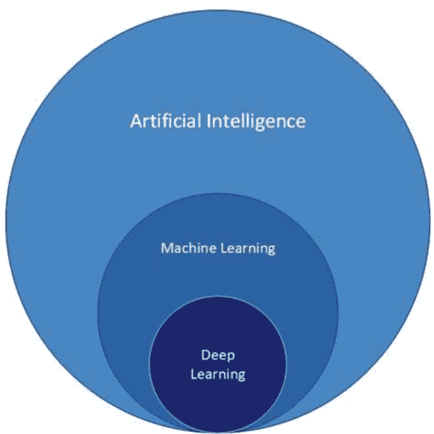

通过清楚地阐明人工智能、机器学习和深度学习之间的关系，消除这种误解。

在本章中，作者将特别检查 ML 在电力系统规划中的应用。首先，将简要介绍最常用的 ML 和深度学习方法。然后，作者将展示和研究在解决电力规划问题中应用这些网络和技术的论文和研究。将研究 ML 在负荷预测和优化问题中的应用示例，并在最后一节中提供结论性的评论。

### 3.1.1 机器学习方法

机器学习方法在体系结构和方法上有所不同，但通常可以分为以下三个主要类别 [2]：

- 1. 监督式机器学习。
- 2. 无监督式机器学习。
- 3. 强化学习。

简而言之，监督学习方法需要一个带有标签的数据集进行训练，以建立输入和预期输出之间的联系。这些方法的示例包括神经网络、决策树网络、支持向量机学习、线性回归、逻辑回归和最近邻算法。

另一方面，无监督学习方法不需要一个带有标签的数据集来进行训练，并试图识别现有的模式。这种方法的示例包括自组织映射（SOM）、自适应共振理论（ART）、K 均值、主成分分析（PCA）和支持向量机（SVM）[3]。

在强化学习方法中，人工智能代理与系统进行交互并观察结果。动态系统和代理之间的交互提供的反馈指导它们达到期望的输出。这种机制通常被模拟为累积奖励的概念。

这些方法的例子包括 Q 学习、蒙特卡洛、状态 - 动作 - 奖励 - 状态 - 动作（SARSA）、深度 Q 学习和深度置信网络。

当然，其他方法也可以实现两种或更多的上述方法，以提高性能或结果的准确性。这些方法被称为集成方法，也可以在文献中找到，并值得一提。

图 3.2 显示了机器学习方法及其分类的基本概述 [4]。

在机器学习领域中使用不同的算法，例如人工神经网络 [4]、广义神经网络 [5] 和模糊逻辑模型 [6]。这些算法不一定是机器学习的子集，而是在机器学习方法中流行和使用的计算机系统。

在电力系统中，监督方法是最流行的机器学习方法之一。这些方法通常实现了不同的人工神经网络架构。人工神经网络是受自然神经网络（如人脑）启发的计算机模型，可以根据先前的知识进行识别和训练网络。这些模型是有用的和适应性的数学解决方案，可以估计数据之间的关系。ANN 的底层架构由数学神经元层通过连接构成。这些连接具有属性权重，决定了神经元之间的连接强度。随着网络的训练，这些连接的权重被调整和削弱或加强。使用多个隐藏层神经元的 ANN 的模型通常被称为深度网络。这些模型通常在连续层之间有连接，但在同一层内没有连接 [7]。

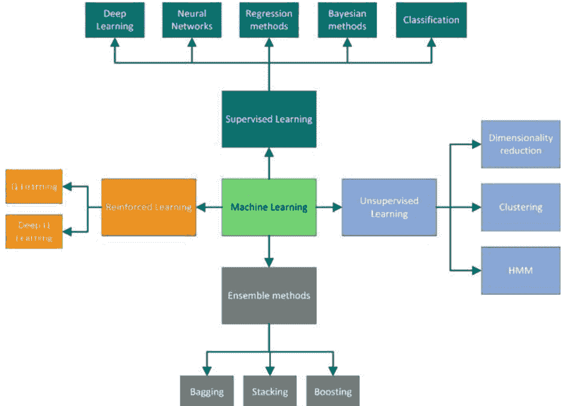

图 3.2 不同机器学习方法的分类

在电力系统规划中使用了各种模型。这些机器学习模型包括支持向量机（SVM）、长短期记忆（LSTM）和其他回归模型。这些模型在电力系统规划问题中得到了研究人员的青睐。

### 3.2 文献综述

机器学习方法在各种应用中被用于与电力系统规划问题直接或间接相关的领域。例如，在可再生能源规划中，机器学习方法在风力发电预测应用和风力发电估计中被广泛使用 [8-10]。

它们还被用于光伏（PV）电力预测，在预测和应对间歇性方面，机器学习方法非常有益。这些应用的例子在 [11-14] 中介绍。

在 [4] 中，作者对智能电网应用中使用机器学习模型的最新出版物进行了调查。这些论文涵盖了各种使用的方法和模型。它们分为四个主要类别：电力负荷和价格预测，故障和故障分析中的机器学习应用，需求侧管理中的机器学习应用，网络安全中的机器学习应用以及其他杂项应用。

例如，[15] 中的作者提出了一个分散优化功率 flow 和学习控制策略的分布式能源资源规划和运行框架。

在 [16] 中，基于深度神经网络，提出了一个高渗透可再生能源系统的情景生成模型。作者们使用数据驱动方法来捕捉可再生能源产生模式。

在聚类消费者负载数据的主题中，[17] 的作者使用了一种基于深度学习的年度负载特征提取方法，从消费者负载数据中提取出年度负载概况（YLP）。特征提取方法可以用于聚类消费者和压缩计量数据，是电力系统规划的有用工具。

[18] 的作者提出了一种将 EMD 方法与长短期记忆网络相结合的深度学习方法。他们将其用于日前市场的电力需求估计。

为了在存在光伏和储能系统（ESS）的情况下，对系统中多个电动车充电站的调度解决方案，作者在 [19] 中实施了一种深度强化方法。

在处理负载规划问题时，必须考虑不同类型的负载。此外，不同的消费者具有不同的消费模式。因此，[20] 的作者引入了一种基于深度回归和树桩集成模型（DRTSEM），用于负载规划。该模型考虑了诸如权重衰减和学习率以及隐藏层总数等各种参数，以实现准确的预测。

与工程问题中的其他机器学习应用相比，负荷预测是一个成熟的领域。机器学习工具在解决负荷预测问题和利用天气数据以及各个区域的层次预测方面发挥了关键作用，实现了更准确的预测。基于机器学习的短期预测模型在预测需求和应对高渗透可再生能源网络中的间歇性和不确定性方面表现出色。在负荷预测领域中常用的机器学习模型包括长短期记忆（LSTM）、循环神经网络（RNN）和随机森林模型 [4]。然而，能源系统规划框架是一个具有巨大机器学习潜力的领域之一。在 [4] 中作者认为，智能电网规划和运营问题可以从使用机器学习方法中获得巨大的好处。

这些研究进一步强调了机器学习方法在各种规划问题上提供了出色的解决方案，并鼓励研究人员在更多问题上实施机器学习工具。机器学习方法一直是关注的焦点，它们在能源管理和智能城市 [21] 以及通过实施人工智能来管理发电的智能 dispatch 系统 [22] 的应用。一些机器学习方法，如强化学习，也受到研究人员在建筑能源控制和电力系统规划方面的青睐。作者使用基于博弈论的多智能体方法，提出了一种需求侧管理方案，旨在控制、运营和规划供暖、通风和空调系统（HVAC），并在 [23] 中最小化社会成本。

在在线状态下使用机器学习方法是各种研究的主题，例如电压稳定观测方法 [24]；然而，大多数机器学习应用是在规划框架的离线状态下进行的。这些应用包括短期 [25]、中期和长期负荷预测。负荷预测面临的主要挑战是在面对来自多个来源或涉及天气预报和可再生能源的间歇性不确定性的大数据时提高预测准确性 [26]。

在 [27] 中，作者研究了一个多期时间尺度下的发电扩展计划，目标函数是最小化扩展成本和污染。

在 [28] 中考虑了环境政策和罚款存在的情况下，这种计划的竞争性方面。与 ML 方法的主题相一致，作者考虑了电价和风速的不确定性，其中使用 ML 方法使用粗糙神经网络来预测负荷。环境限制的存在使得在竞争环境中找到最优发电扩展计划变得具有挑战性。

在 [29] 中，作者认为通过遵守污染控制政策，总排放量可以减少到原始量的 45%，并为参与附近电力市场的发电公司提供足够的收入。该研究使用了一个名为多层感知器的 ANN 架构。感知器由两层组成，一个具有十个粗糙神经元和一个 sigmoid 激活函数的隐藏层，以及一个具有线性激活函数和一个粗糙神经元的输出层。本文假设的神经元基于粗糙结构或 RNN [27]。RNN 的基本原理是将粗糙集理论应用于神经网络的一个或多个链接，例如设计、训练或学习链接。这些网络的总体目的是提高传统神经网络的性能。基于粗糙集理论的神经元模型被称为粗糙神经元，由粗糙神经元构成的神经网络被称为粗糙神经网络。

粗糙的神经网络加速了模型的训练速度，并增加了神经网络的性能，但在过程中对神经网络的结构没有太多改变 [28]。

### 3.3 负荷预测

负荷预测是电力系统规划中最重要的研究之一，通常是未来扩展计划的第一阶段 [29]。显然，要提出进一步发展给定网络的计划，规划者必须了解行为和未来的用电趋势。没有这种理解，提出的扩展计划要么低估所需的能量，无法满足需求，要么高估，导致不必要的投资成本。

负荷预测通常分为四个不同的类别：长期预测（年）、中期预测（一个月到一年）、短期预测（一天到一周）和非常短期预测（分钟到小时）[30]。

负荷预测可用于系统运行和电力系统规划。在电力系统运行问题的情况下，系统操作员通常需要进行短期到非常短期的研究。在电力系统规划中，如发电扩展规划，需要进行长期负荷预测研究。各种因素影响着未来的负荷需求。这些因素从技术的发展趋势到社会福利和经济问题和政策都有涉及。这种不确定性使得负荷预测成为适合专门预测未来和处理不确定性的机器学习方法的研究课题。

在 [31] 中，作者提出了一种混合人工智能和深度学习方法用于负荷预测。负荷预测问题的结果被用于制定维护计划。

在 [32] 中，作者使用深度学习框架和卷积神经网络（CNN）以及长短期记忆（LSTM）进行短期电力负荷预测和个体住宅客户，并将所提出方法与文献中使用的其他传统方法进行了比较。

在 [33] 中，使用了两种方法，即输入注意机制（IAM）和隐藏连接机制（HCM），来提高基于循环神经网络（RNN）的短期负荷预测模型的准确性和效率。

在 [34] 中，为了客户的短期负荷预测，实现了一种 LSTM 框架，根据作者的说法，该方法在速度和准确性方面优于类似的最新方法。

日负荷是非线性和动态的，因此很难预测。因此，在 [35] 中，作者使用了一种名为 bespoke-gated 的深度学习方法进行每日峰值负荷预测。

下一节将介绍一种在 [36] 中引入的用于长期负荷预测的监督机器学习方法。负荷预测中使用了多个回归模型，每个模型都有其优点和缺点。[36] 中的作者使用了四种不同的机器学习模型进行负荷预测，并展示了结果。下一节将介绍两种不同模型的基础知识：监督机器学习的子集。

#### 3.3.1 支持向量机（SVM）

支持向量机（SVM）是用于分类和回归问题的流行算法之一。Vapnik 和 AT&T 贝尔实验室开发了 SVM 作为最强大和广泛使用的算法之一。SVM 通常具有两个独特的特性。它可以最大化两个类别之间的分离间隔，并通过使用不同的核函数支持非线性函数 [37]。SVM 和 ANN 之间存在相似之处。同时，ANN 旨在最小化训练数据的估计误差；而 SVM 则试图遵循结构风险最小化原则来改善泛化误差 [37]。SVM 创建了一个最优的超平面分类器。通过最大化分离间隔，分类器旨在在最小化经验风险的情况下对数据进行分类，以减少误差。经验风险被定义为有限数据集上估计器的平均损失。它还最小化了期望风险，即损失函数的假设值。然后使用经验风险最小化器来定义 SVM 的性能的理论边界，通过最小化训练数据的误差。使用风险最小化来衡量估计器的性能，并找到在分布上最小化风险的估计器 [37]。

首先，假设我们有一个训练集 {(x₁, y₁), (x₁, y₂)...(xᵢ, yᵢ)}，xᵢ ∈ Rⁿ。依赖变量被表示为 yᵢ ∈ R，它们与每个输入相关联，n 是特征的数量。SVM 的主要目标是映射一个平面 f(x): Rⁿ → R，f(x) 使其最接近数据，并且可以通过以下方式表示：

f(x) = Wᵀ · X + b

在这里，b 被定义为偏差。f(x) 是与目标 yᵢ 最有偏差的函数。需要注意的是，小于σ的结果超平面的偏差不被考虑。要求将变换函数φ: Rⁿ → Rˢ (s>n) 应用于输入空间中的所有点。这样做是为了捕捉数据的非线性特性。

f(s) = Wᵀ · φ(X) + b

因此，输入空间通过变换映射到线性特征空间，并具有更高的维度。我们可以将 SVR 解决问题写成一个凸优化问题。计算后，每个训练点都与一对拉格朗日乘子相关联。在训练 SVM 并找到最优超平面之后，支持向量被定义为位于σ带之外且至少有一个零拉格朗日乘子的点 [38]。

#### 3.3.2 长短期记忆网络 (LSTM)

循环神经网络的主要思想源于传统人工神经网络无法直接连接前一数据和后续信息并纠正错误的事实。反向传播的思想可以解决传统人工神经网络的这个缺点。这些网络通常被称为

图 3.3 RNN 单元的架构 [36]

循环神经网络 (RNN) 使用反向传播来比较网络输入和输出之间的误差，直到误差低于某个阈值 [38]。使用这种网络的一个例子是文本预测软件，其中网络根据已输入的单词来预测接下来的单词。反向传播是通过网络循环进行的。前一个时间戳的输出被用作当前时间戳的输入。RNN 的简单结构如图 3.3 所示。在图 3.3 中，$x_t$ 表示时间戳 t 的输入，$s_t$ 表示时间戳 t 的状态，$h_t$ 表示时间戳 t 的输出。$s_t$ 是基于当前状态 $x_t$ 和前一个隐藏状态 $s_{t-1}$ [36,38] 计算得出的。

RNN 在数据依赖关系较短的情况下表现非常好。然而，随着依赖关系的增加，RNN 网络的性能急剧下降。这个问题通过引入 LSTM 网络来解决，由 Hochreiter 和 Schmidhuber(1997) 提出；这些网络包括存储单元和门，负责调节信息在网络中的流动。

每个 LSTM 单元由一个记忆部分和三种不同类型的门组成，负责处理信息流。LSTM 单元的机制可以通过以下步骤描述。首先，LSTM 决定应该忘记哪些信息，从而从细胞状态中删除。这个操作通过一个称为“遗忘门”的 sigmoid 层来执行。它根据细胞状态 C 中的 $h_{t-1}$ 和 $x_t$ 的值产生一个介于 0 和 1 之间的输出数字。数字 1 表示保留信息，数字 0 表示忘记该信息，而介于两者之间的任何数字表示应该忽略的信息的百分比 [39]。请注意，C 是时间 t 时的细胞状态，$W_i$ 和 $W_f$ 是对应于输入门和遗忘门的权重矩阵。$b_i$, $b_C$, $b_f$ 和 $b_o$ 是方程中对应的偏置项。

下一步是决定哪些新信息将被存储在细胞状态中。首先，一个名为“输入门”的 sigmoid 层生成一个确定更新数值的数字。然后，一个 tanh 层创建新的候选数值 $\tilde{C}_t$，以向状态中添加。

$$ i_t = \sigma(W_i \cdot [h_{t-1}, x_t] + b_i) \quad (3.3) $$

$$ \tilde{C}_{t}=\tanh \left(\mathrm{W}_{\mathrm{C}} \cdot\left[h_{t-1}, x_{t}\right]+b_{\mathrm{C}}\right) $$

旧的细胞 $C_{t-1}$ 然后更新为新的细胞状态 $C_{t}$ [38]。

下一步是忘记被确定为不必要的信息。这是通过将旧状态乘以 $f_{t}$ 来完成的。接下来，添加 $C_{t}$，并生成新的候选数值，并根据每个状态值的更新程度进行缩放。

$$ f_{t}=\sigma\left(W_{\mathrm{f}} \cdot\left[x_{t}, h_{t-1}\right]+b_{\mathrm{f}}\right) $$

$$ C_{t}=f_{t} \odot C_{t-1} \oplus i_{t} \odot \tilde{C}_{t} $$

最后一步是基于细胞状态的输出步骤。出门是一个 sigmoid 层，决定了将包含在输出中的细胞的部分。然后，tanh 运算符作用于细胞状态，生成介于 -1 和 1 之间的值。然后，这些结果与 sigmoid 门的输出相乘，从而生成所需的输出 [38]。

$$ o_{t}=\sigma\left(W_{o}\left[h_{t-1}, x_{t}\right]+b_{o}\right) $$

$$ h_{t}=o_{t} \odot \tanh \left(C_{t}\right) $$

图 3.4 描述了具有不同门和输入输出的典型 LSTM 单元的一般结构。

然后，[36] 中的作者收集了电力消耗数据，并使用聚类技术对其进行分类。具体来说，参考文献中使用的聚类方法是 K 均值聚类。聚类的主要目标是根据对象的一个或多个属性的相似性对数据进行分类和归类。

通过使用数据聚类方法，系统规划者可以找到消费者和数据组之间的趋势和模式。可以实现这种趋势特征化，以了解电力消耗和负载需求的行为。通过识别相似的群体，机器学习解决方案可以更好地理解能源规划问题。如前所述，作者使用机器学习算法分析负载特性并预测未来。机器学习算法的主要基础，主要是支持向量机和 LSTM 算法，在前一节中已经讨论过。

图 3.4 LSTM 单元的结构 [36]

在 [36] 中，作者实施了四个回归模型，LSTM、支持向量机、人工神经网络和循环神经网络，对印度昌迪加尔邦的负载需求进行估计。

为了比较不同的机器学习方法，[36] 中的作者使用了三种不同的评估指标。第一个均方根误差（RMSE）是最常用的评估指标之一，它被定义为实际值与预测值之间的差异的标准差。

这个指标可以表示为：

RMSE = \sqrt{\frac{1}{2n} \sum_{t=1}^{2} \sum_{j=1}^{n} \left(y_{j,t} - y_{j,t}^-\right)^2}

$y_{j,t}^-$ 被定义为预测值，而 $y_{j,t}$ 是时间 t 的实际值。第二个相关系数近似表示实时观测值和预测值之间的关系强度，定义如下：

\rho = \text{Correl}(y, y^-) \approx \frac{\text{Covariance}(y, y^-)}{\sigma_y \cdot \sigma_{y^-}}

最后，预测值与实际值之间的偏差量可以表示为平均绝对百分比误差（%误差），数学上可以描述为：

\%\text{误差} = \frac{1}{2n} \sum_{t=1}^{2} \sum_{j=1}^{n} \frac{\left(y_{j,t}^- - y_{j,t}\right)}{y_{j,t}}

#### 3.3.3 使用机器学习进行负荷预测的结果

根据 [36] 的研究，在对给定数据集的 ML 方法和实际数据进行比较后，LSTM 网络模型似乎比 SVM、ANN 和 RNN 模型做出了更准确的预测。例如，使用 LSTM 模型，平均误差在 7% 到 10% 之间，被认为是可接受的。

LSTM 网络相对于 SVM 的优势可以总结如下：LSTM 可以访问当前的输入时间步。而 SVM 需要训练多个从适当选择的时间窗口中需要连续的输入。通过包含实时需求观察，LSTM 方法可以支持主动学习；然而，SVM 回归模型只支持静态学习。

### 3.4 电力系统优化问题中的机器学习

机器学习方法在电力系统规划中的应用不仅限于负荷预测。长期规划问题通常需要一种优化方法来最小化投资和运营成本，或者在规划方案中找到最合适的位置容量或其他变量。通过延长规划问题的年限，技术进步的固有特性给问题引入了不确定性。在不确定性下进行规划问题的两种最常见的优化方法包括随机规划（SP）和鲁棒优化（RO）。随机规划旨在优化期望值的目标函数，其中期望是根据随机变量的概率分布计算得出的。这些变量代表了问题中的不确定性。另一方面，鲁棒优化方法对不确定性采用最小最大化的方法，与随机规划相比，它们不需要定义具体的概率分布函数。

在 [40] 中，作者旨在使用优化方法和机器学习工具解决长期电力峰值负荷和需求预测问题。这些研究是发电扩容规划研究的重要组成部分，对年峰值负荷有更好的理解直接影响规划解决方案的质量。因此，作者首先采用支持向量机方法进行长期负荷预测问题，并使用粒子群优化（PSO）方法作为启发式优化算法。

此外，作者在 [40] 中尝试使用混合预测方法来最小化预测误差，该方法使用了三种不同的机器学习模型。这些模型作为混合模型使用，包括自回归综合移动平均（ARIMA）、人工神经网络（ANN）和提出的支持向量回归技术。引入的方法根据现有数据的结果对每种预测方法进行优先级排序。伊朗国家电力能源系统的年峰值负荷和总能源需求是目标结果。

因此，RO 建立了一组可能的实现，如基于已知不确定参数的信息的变化范围，然后针对不确定集合中的所有不确定参数进行优化以获得可行解决方案 [40]。这些不确定性为 ML 模型介入规划问题提供了机会。[40] 中的作者提出了一种长期能源规划问题的方法。为了显示与文献中发布的相关随机解决方案和其他鲁棒解决方案之间的差异，他们首先设计了一种考虑不同不确定性来源和多个不同概率密度函数的 SP 方法，以强调和展示其在能源规划问题的长期投资模型中的潜力和弱点。

然后，作者提出了一种结合 ML 的分布鲁棒优化方法，使其能够“数值可行、基于回溯的鲁棒能源模型的优化”，对所选择的概率密度函数类型的敏感性较小。[40] 的作者提出，DRO 解决方案在底层分布方面变化较小，并声称它产生了更鲁棒的决策。与其他 DRO 用途相比，他们的工作中实施了大量的底层不确定性，这带来了重大的计算挑战。因此，ML 工具被用于排名和决定哪个不确定参数最重要，并应包含在模糊集定义中。

将机器学习算法和 DRO 方法结合起来，使作者能够更系统地选择关键变量。所使用的机器学习算法是极限梯度提升（XGBoost）方法，它是基于回归树模型的模型之一，因此被认为是一种监督式机器学习方法。简而言之，XGBoost 算法根据前一棵树的预测变量的误差边界顺序生成决策树。这个过程重复进行，直到所有树的组合性能达到最大调整阈值，并且算法稳定下来 [39]。因此，他们能够使用他们的 DRO 方法，并且同时减少了考虑大量不确定性所带来的计算负担，借助机器学习的帮助。在电力系统规划中，使用机器学习算法对问题中的变量进行排序，减少计算功率和时间需求，并考虑到多个不确定性来源，是机器学习在电力系统规划问题中的应用之一。

### 3.5 结论

在本章中，作者通过关注不同类型的机器学习和四种不同的机器学习方法，讨论了现代工程问题中使用机器学习的必要性。在下一节中，作者研究了机器学习在电力系统工程专业中的整体应用，重点关注电力系统规划。似乎负荷预测问题是介绍机器学习在电力系统规划中应用的一个很好的话题。在展示了两种监督机器学习方法（即 SVM 和 LSTM）的结构之后，作者根据参考文献回顾了负荷预测问题的不同机器学习方法的结果。最后，作者简要提到了机器学习工具在电力规划问题中的其他应用，例如长期优化问题。

总之，机器学习方法是电力系统工程师解决各种问题的优秀工具。在这方面，通过正确使用和实施机器学习，研究人员可以利用人工智能的巨大潜力解决充满不确定性的问题。正如该领域的一些研究人员指出的那样，电力工程、分配和规划中的人工智能系统具有巨大的潜力，需要更多的研究和资源 [20]。该领域人工智能的艺术，因此，机器学习在过去几十年中呈指数级增长。这些成就往往会带来意想不到的研究结果；因此，这个领域的唯一预期轨迹似乎是向上的。

# 参考文献

1. Y. Chen. 将机器学习与电力系统运行和控制相结合 (2020). https://doi.org/10.13140/RG.2.2.25463.98720. https://www.researchgate.net/publication/339988648_将机器学习与电力系统运行和控制相结合
2. C.M. Bishop, 模式识别和机器学习 (Springer, New York, 2006)
3. X. Kong, X. Liu, R. Shi, K.Y. Lee, 使用特征选择的支持向量机进行风速预测。神经计算 169, 449–456 (2015)
4. M.S. Ibrahim, W. Dong, Q. Yang, 机器学习驱动的智能电力系统：当前趋势和新视角。应用能源 272, 115237 (2020)
5. A. Mansour-Saatloo, A. Moradzadeh, B. Mohammadi-Ivatloo, A. Ahmadian, A. Elkamel, 基于机器学习的 PEVs 负载提取和分析。电子 9(7), 1150 (2020)
6. H. Yang, Z. Jiang, L. Haiyan, 基于'分解和集成'策略和模糊时间序列的混合风速预测系统。能源 10(9), 1422 (2017)
7. E. Mocanu, P.H. Nguyen, M. Gibescu, 用于电力系统数据分析的深度学习，在大数据应用于电力系统，(Elsevier, 阿姆斯特丹，2018), pp. 125–158.
8. X. He 等，基于深度学习和群体智能优化算法的风速预测的新型组合系统的研究。IEEE Access 8, 51482–51499 (2020)
9. J. Yan 等人，使用多对多映射预测风电高渗透的多尺度。IEEE Trans. Power Syst. 33(3), 3276–3284 (2017)
10. T. Hu 等人，通过深度神经网络进行无分布概率密度预测。IEEE Trans. Neural Netw. Learn. Syst. 31(2), 612–625 (2019)
11. H. Zhou 等人，基于长短期记忆神经网络和注意机制的短期光伏功率预测。IEEE Access 7, 78063–78074 (2019)
12. Ray, Biplob 等人。光伏电站的新型数据驱动长期太阳能产量分析模型。IEEE Access 8 (2020): 136223–136233。https://ieeexplore.ieee.org/document/9149581
13. Z. Zhen 等人，基于深度学习的太阳能光伏功率预测的表面辐照度映射模型。IEEE Trans. Ind. Appl. (2020)
14. G.W. Chang, L. Heng-Jiu, 集成灰色数据预处理器和深度置信网络进行日前光伏功率输出预测。IEEE Trans. Sustain. Energy 11(1), 185–194 (2018)
15. R. Dobbe 等人，朝着分布式能源服务：用机器学习分散最优功率流。IEEE Trans. on Smart Grid 11(2), 1296–1306 (2019)
16. Y. Chen 等人，使用生成对抗网络进行无模型可再生能源场景生成。IEEE Trans. Power Syst. 33(3), 3265–3275 (2018)
17. S. Ryu 等人，基于卷积自编码器的特征提取和聚类用于客户负荷分析。IEEE Trans. Power Syst. 35(2), 1048–1060 (2019)
18. J. Bedi, D. Toshniwal, 基于经验模态分解的深度学习用于电力需求预测。IEEE Access 6, 49144–49156 (2018)
19. M.J. Shin, D.-H. Choi, J. Kim, 光伏/储能系统启用的电动车充电站的合作管理：一种多智能体深度强化学习方法。IEEE Trans. Ind. Inform. 16(5), 3493–3503 (2019)
20. T. Ahmad, D. Zhang, 用于实时负荷需求规划和管理的新型深度回归和树模型集成模型。IEEE Access 8, 48030–48048 (2020)

# 机器学习和电力系统规划：机遇和挑战

21. M. Zekić-Sušac, S. Mitrović, A. Has, 基于机器学习的公共部门能源管理系统，作为智能城市的一种方法。Int. J. Inf. Manag. 50, 102074 (2020)
22. L. Yin 等人，机器学习在电力系统中新一代智能调度中的应用综述。Eng. Appl. Artif. Intell. 88, 103372 (2020)
23. J. Hao, 多智能体强化学习嵌入式游戏用于建筑能源控制和电力系统规划的优化。arXiv 预印本 arXiv:1901.07333 (2019)。https://arxiv.org/abs/1901.07333
24. V. Malbasa 等人，使用主动机器学习进行电压稳定性预测。IEEE Trans. Smart Grid 8(6), 3117–3124 (2017)
25. U. Munawar, Z. Wang, 使用机器学习方法进行短期太阳能发电预测的框架。J. Electr. Eng. Technol. 15(2), 561–569 (2020)
26. D. Zhang, X. Han, C. Deng, 智能电网中深度学习和强化学习的研究与实践综述。CSEE J. Power Energy Syst. 4(3), 362–370 (2018)
27. R.A. Mehrabadi, M.P. Moghaddam, M.K. Sheikh-El-Eslami, 考虑环境影响的多电力市场发电扩展规划。J. Clean. Prod. 243, 118611 (2020)
28. H. Liao 等人，粗糙神经网络概述。神经计算与应用 27(7), 1805–1816 (2016)
29. S. Madadi, M. Nazari-Heris, B. Mohammadi-Ivatloo, S. Tohidi, 基于遗传算法的电力系统问题预测模型的实现，在科学与工程中预测建模和优化方法研究手册，(IGI Global, 费城，2018), pp. 140–155
30. I. Koprinska, M. Rana, V.G. Agelidis, 用于电力负荷预测的相关性和基于实例的特征选择。基于知识的系统 82, 29–40 (2015)
31. S. Motepe, A.N. Hasan, R. Stopforth, 使用混合人工智能和深度学习算法改进电力配电网的负荷预测过程。IEEE Access 7, 82584–82598 (2019)
32. M. Alhussein, K. Aurangzeb, S.I. Haider, 用于短期个体家庭负荷预测的混合 CNN-LSTM 模型。IEEE Access 8, 180544–180557 (2020)
33. M. Zhang, Z. Yu, X. Zhenghua, 使用具有输入注意机制和隐藏连接机制的递归神经网络进行短期负荷预测。IEEE Access 8, 186514–186529 (2020)
34. W. Kong 等，基于 LSTM 递归神经网络的短期住宅负荷预测。IEEE Trans. Smart Grid 10(1), 841–851 (2017)
35. Z. Yu 等，用于每日峰值负荷预测的深度学习——一种结合动态时间扭曲的新型门控递归神经网络。IEEE Access 7, 17184–17194 (2019)
36. J. Bedi, D. Toshniwal, 用于预测电力需求的深度学习框架。Appl. Energy 238, 1312–1326 (2019)
37. Rastgoufard, Samin. 人工智能在电力系统中的应用。(2018). https://scholarworks.uno.edu/td/2487/
38. C. Olah, 理解 lstm 网络 (2015), https://colah.github.io/posts/2015-08-Understanding-LSTMs/
39. E. Guevara 等人，用于不确定情况下的战略能源规划的机器学习和分布鲁棒优化框架。Appl. Energy 271, 115005 (2020)
40. M.-R. Kazemzadeh, A. Amjadian, T. Amraee, 用于长期电力峰值负荷和能源需求预测的混合数据挖掘驱动算法。Energy 204, 117948 (2020)

## 第 4 章
能源工程中的机器学习方法简介

| 作者 | 机构 | 邮箱 |
| :--- | :--- | :--- |
| Arash Moradzadeh | 塔布里兹大学电气与计算机工程学院，伊朗塔布里兹 | arash.moradzadeh@tabrizu.ac.ir |
| Behnam Mohammadi-Ivatloo (✉) | 塔布里兹大学电气与计算机工程学院，伊朗塔布里兹；阿尔堡大学能源技术系，丹麦阿尔堡 | bmohammadi@tabrizu.ac.ir; bmo@et.aau.dk |
| Kazem Pourhossein | 伊朗伊斯兰阿扎德大学塔布里兹分校电气工程系 | k.pourhossein@iaut.ac.ir |
| Morteza Nazari-Heris | 塔布里兹大学电气与计算机工程学院，伊朗塔布里兹；宾夕法尼亚州立大学建筑工程系，美国 | mun369@psu.edu; m.nazariheris.2015@ieee.org |
| Somayeh Asadi | 宾夕法尼亚州立大学建筑工程系，美国 | sxa51@psu.edu; asadi@engr.psu.edu |

## 4.1 引言

能源消耗的增加和可再生能源在传统电力系统中的渗透使电力系统变得复杂。因此，传统电力系统已经朝着智能化的方向发展，以增加可持续性并满足能源需求 [1,2]。这些智能化是通过诸如互联网等信息基础设施来实现的，但有时也容易受到网络攻击的威胁。另一方面，智能电力系统和使用先进的监控系统使电力系统的用户面临着大数据问题 [3, 4]。处理电力系统的大数据以进行适当的运行和规划方法的一种有益方式是应用机器学习和深度学习方法。数据挖掘已被引入为分析大量数据的强大工具。这个数据科学分支是基于在大型数据库中搜索有价值的信息和特征，并识别其模式。数据挖掘已经轻松回答了科学和技术上不可能或耗时的问题。使用统计技术进行数据评估、特征提取、模式识别和数据之间关系的发现是数据挖掘的主要思想 [5, 6]。数据挖掘可以应用于科学和技术中的所有基于数据的问题。如今，这门科学在许多研究和工业领域中得到了广泛应用，如医学、工程以及与人脸识别和指纹识别相关的安全问题。因此，在本章中，将讨论数据挖掘在能源工程相关问题中的应用 [7]。机器学习方法的基础是从过去的经验和示例中自动学习，而无需显式编程。已经引入了各种机器学习方法来应用于工程问题，如监督学习和无监督学习方法、强化学习等。机器学习方法在数据处理、分类和预测方面的高性能使得这些方法在多个工程领域中广受欢迎。这些方法已广泛应用于计算机视觉、语音识别、物体识别和多媒体内容检索 [6, 8]。在能源行业，机器学习方法已广泛应用于油气勘探和加工、太阳辐射预测、反应堆的最优运行、风力发电输出的预测、电力系统故障预测和能源需求预测 [7]。

本章的其余部分如下：第 4.2 节重点介绍了数据挖掘及其在能源工程中的应用。然后在第 4.3 节中研究了能源工程中的机器学习方法，第 4.4 节中研究了能源工程中的深度学习方法。在第 4.5 节中分析了回归和分类应用的评估指标，并在第 4.6 节中总结了本章。

## 4.2 数据挖掘及其在能源工程中的应用

与能源和电力系统相关的各种问题，尤其是与这些系统的每个功能相关的大量数据，导致了在电力和能源系统中具有高应用价值的数据挖掘。数据挖掘具有各种技术和算法，每种技术和算法都以某种方式用于解决与能源工程相关的问题 [3, 9]。

如今，从可再生能源源产生能量，输送并注入电网及其分配中存在许多问题，这带来了许多挑战。另一方面，为传统和可再生能源电厂提供长期和短期规划，以满足负荷需求并提供所需的可持续能源，是另一个备受关注的挑战性问题 [10, 11]。文献主要涉及电力系统中的能源生产问题。如今，能源工程中最广泛涉及的问题是消费者端的能源管理和节约。因此，每年都进行大量的研究和项目，以管理和提高住宅和工业应用中的能源效率 [12-14]。

近几十年来，解决与电力系统相关的这类问题已经以各种方式进行。近年来对文献的回顾显示了数据挖掘应用的显著使用，例如人工神经网络（ANN）算法、机器学习和深度学习。由于它们在数据处理方面的高能力，这些算法都能够解决与电力和能源系统相关的问题。能源和电力系统中的数据挖掘应用可以分为各种预测、检测和分析。预测程序包括负荷预测 [15-17]、负荷分解 [18-20]、风能和太阳能等可再生能源的预测 [21-24]、插电式电动汽车负荷预测 [25-28]、各种电力市场的价格预测 [29-31]，以及测量不同地区建设各种风能和太阳能电厂的潜力。通过数据挖掘应用进行的诊断操作可以被视为检测与能源和电力系统设备相关的各种故障和损坏 [32-36]，以及其各个部分，如输电线路和配电网络 [37, 38]。此外，如今，数据挖掘应用极大地完成了对电力和能源系统的网络物理系统安全和网络攻击的检测 [39, 40]。

这些程序中的每一个都是通过特定的算法执行的。所有的数据挖掘技术都能够解决上述问题，但选择正确的算法取决于数据和问题的类型。例如，负荷预测问题主要通过回归算法来解决，因为它们基于连续型数据。分类算法主要用于故障和损坏的检测和定位。回归和分类应用中的每个都有适合的算法，可以根据问题的数据类型来使用。

如上文所述，机器学习和深度学习算法在电力和能源系统问题中被广泛使用。电力和能源系统用户主要面临的最重要问题是对机器学习和深度学习算法的类型和应用缺乏全面的了解。因此，在本章的后续部分，将介绍机器学习和深度学习的各种技术，以便详细描述每种技术的结构、公式和应用，作为电力和能源系统用户在数据挖掘应用中的指南。

## 4.3 能源工程中的机器学习方案

机器学习是一种基于过去事件学习的工具，用于展示未来的模型或估计。在机器学习应用中，计算机算法根据过去的经验预测未来的行为 [41]。基于已进行的训练，机器学习算法创建一个数学模型来进行预测。机器学习工具在新兴领域（如智能建筑）中的应用是近年来研究界关注的一个趋势，涉及的学科包括计算机科学和电气工程、土木工程和建筑学。

机器学习有许多训练算法，每个算法都用于特定的数据挖掘科学应用 [42]。

本节介绍了在能源工程应用中使用的各种机器学习算法。

### 4.3.1 机器学习方法：应用、公式和结构

机器学习技术分为回归和分类应用两类。在本节的延续中，我们将了解能源工程中各种机器学习算法的类型和应用。

#### 4.3.1.1 支持向量机（SVM）

SVM 是由 Cortes 和 Vapnik 于 1995 年引入的非参数统计学习方法 [43]。SVM 是最常用的监督式机器学习算法之一，用于解决分类、模式识别和预测问题。SVM 的主要目的是创建一个线性映射，将非线性输入区域转换为高维空间，以找到一个超平面。通过最大化分离数据之间的间隔，可以实现这个超平面 [44]。因此，通过实现这个目标，数据集被分解成多个预定义的类，并以与训练样本一致的方式进行分离。

图 4.1 展示了一个支持向量机在二维输入空间中进行分类的示例结构 [45]。


对于训练数据集的支持向量机中的线性映射可以通过以下方式得到 [44]:

$$
\gamma = \omega^T\theta(x) + b \quad (4.1)
$$

其中，w 表示权重向量，b 表示偏差，$\theta(X)$ 表示非线性映射函数的代理。与每个类相关的支持向量的计算如下所述:

$$
\left\{
\begin{aligned}
b+W^{T} \xi_{-i} &= +1, \text { for } d_{-i}=+1 \\
b+W^{T} \xi_{-i} &= -1, \text { for } d_{-i}=-1
\end{aligned}
\right.
$$

其中，$d_{-i}$ 表示相关类别，即 $d_{-i}=+1$ 对应类别 A，$d_{-i}=-1$ 对应类别 B。

解决以下不等式确定了 A 类和 B 类的训练数据，最后的目标函数由方程 (4.4) [45] 实现:

$$
d_{i}\left(b+w^{t} x_{i}\right) \ge 1
$$

$$
f(x)=\operatorname{sign} \sum_{i=1}^{N} a_{0, i}\left(x^{T} x_{i}\right)+b
$$

其中 X 和 N 分别表示输入向量和训练阶段获得的支持向量数。正参数 $a_{0, i}$ 用于表示输入向量之间的支持向量。

使用向量映射函数 $\varphi(x)$ 将不可分数据转换到高维线性空间并分离它们。这种转换允许使用绘制的线性超平面对数据进行分类。最后，决策函数如下所示 [45]:

$$
f(x)=\operatorname{sign}\left(\sum_{i=1}^{N} a_{0, i}(\varphi(x) \varphi\left(x_{i}\right))+b\right)
$$

#### 4.3.1.2 组方法数据处理（GMDH）

GMDH 是一种机器学习应用，是 1968 年由 Ivakhnenko [46] 引入的非线性回归建模算法之一。建模复杂系统，性能近似，特征提取以及发现它们中输入和输出数据之间的关系是 GMDH 的最重要应用 [47]。基于二次传递函数通过监督学习构建前向神经网络是 GMDH 的主要目标。图 4.2 显示了 GMDH 网络的结构。在这个结构中，输入和输出变量之间的映射是通过 Volterra 级数的非线性函数来执行的，根据公式 (4.6)。根据公式 (4.7) 进行 Volterra 级数分析 [48]。

$$
\begin{gathered}
\widehat{Y}=a_{0}+\sum_{i=1}^{m} a_{i} X_{i}+\sum_{i=1}^{m} \sum_{j=1}^{m} a_{i j} X_{i} X_{j}+\sum_{i=1}^{m} \sum_{j=1}^{m} \sum_{k=1}^{m} X_{j} a_{i j k} X_{i} X_{j} X_{k}+\cdots \\
G\left(X_{i}, X_{j}\right)=a_{0}+a_{1} X_{i}+a_{2} X_{j}+a_{3} X_{i}^{2}+a_{1} X_{j}^{2}+a_{5} X_{i} X_{j}
\end{gathered}
$$

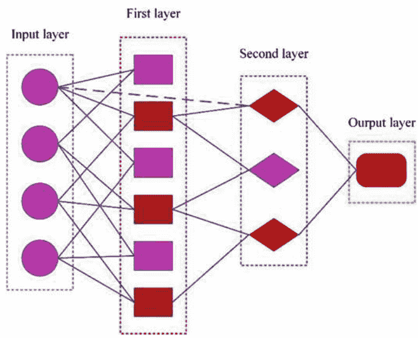

其中，$\hat{Y}$ 表示输出的模型预测，$X$ 表示输入，$m$ 是输入的数量，$a$ 表示权重。最后，通过考虑最小二乘误差原理 [49]，$G$ 函数被定义为以下估计输出参数 $y$ 的函数：

$$
E = \frac{\sum_{i=1}^{M}(Y_i - G_i)^2}{M}
$$

$$
y_{i, t} = fX_i (\dots), i = 1, 2, 3, \dots, m
$$

#### 4.3.1.3 支持向量回归 (SVR)

SVR 是 SVM 的回归版本，由 Vapnik 于 1995 年提出 [50]。作为一种支持回归的 SVR 建议使用 $\epsilon$-不敏感损失函数（$\epsilon$-SVR）进行性能评估。输入和输出变量之间的精确线性映射，训练阶段中无过拟合问题的非线性数据建模，以及高处理速度是 SVR 的最重要优势 [15, 51]。基于数学关系，线性回归的一般模型如下：

$$
f(x) = \langle w, x \rangle + b
$$

传统回归模型的基本原则是基于减少二次误差来计算权重向量，而 $\epsilon$-SVR 则是基于绝对误差优化。$\epsilon$-SVR 的主要目标是开发一个函数，使得所有误差都在某个值 $\epsilon$ 下，同时具有最佳的泛化能力，并基于以下关系应用 [15]：

$$
\text{最小化 } \frac{1}{2}\|w\|^2
$$

受限于

$$
\left\{
\begin{aligned}
y_i - (\langle W, X_i \rangle + b) & \le \varepsilon \\
(\langle W, X_i \rangle + b) - y_i & \le \varepsilon
\end{aligned}
\right.
$$

$$
\xi_i = \left\{
\begin{aligned}
0 & \quad \text{如果 } y_i - \hat{y}_i < \varepsilon \\
|y_i - \hat{y}_i| - \varepsilon & \quad \text{否则}
\end{aligned}
\right.
$$

其中 $\xi_i$ 和 $\xi_i^*$ 表示松弛变量，$y_i$ 表示测量输出，$\hat{y}_i$ 是预测输出，而 $\varepsilon$ 是用户定义的参数。在 $\epsilon$-密集区域内和外的点包含了方程 (4.13) 和 (4.14) 的值，分别为 [15, 52]：

$\xi_i = 0$ 和 $\xi_i^* = 0$

$$
(\xi_i > 0 \text{ 和 } \quad \xi_i^* = 0) \quad \text{或者} \quad \xi_i = 0 \text{ 和 } \quad \xi_i^* > 0
$$

方程（4.11）通过拉格朗日系数进行双重标准优化。最后，在计算拉格朗日系数之后，得到以下优化表达式：

$$
f(X) = \sum_{i=1}^{n} (\alpha_i - \alpha_i^*) \langle X_i, X \rangle + b
$$

其中 $\alpha_i$ 和 $\alpha_i^*$ 表示拉格朗日系数。

#### 4.3.1.4 广义回归神经网络（GRNN）

GRNN 是 Specht 于 1999 年提出的径向基函数（RBF）网络之一，用于建立输入和输出变量之间的非线性关系 [53, 54]。这个网络是反馈误差传播训练算法在前馈神经网络中的一个合适的替代品，对于回归应用具有非常强的效率。GRNN 最重要的优点之一是它能够在非常小的数据集上表现出良好的性能。尽管只有一个输入参数，它仍然可以进行良好的预测，而操作系统的可用测量数据通常不足以支持反向传播神经网络（BPNN）[25, 55]。此外，GRNN 是一种基于时间序列的回归算法，可以提取和建模输入和输出变量之间的连续时间序列关系。图 4.3 显示了 GRNN 的互连结构。


一般来说，通过 GRNN 对独立变量的回归类型表面进行估计，可以用数学公式描述如下 [55]:

$$
\widehat{Y} = E\left(\frac{y}{X}\right) = \frac{\int_{-\infty}^{\infty} y f(X, y) \mathrm{d} y}{\int_{-\infty}^{\infty} f(X, y) \mathrm{d} y}
$$

其中，X 表示输入向量，Y 是 GRNN 预测的输出值。密度函数应该通过使用样本数据集的 Parzen 非参数估计来进行估计。这种预测基于高斯核估计器，可以写成 [56]:

$$
\begin{aligned}
\widehat{f}(X, y) &= \frac{1}{n(2 \pi)^{\frac{p+1}{2}} \sigma^{p+1}} \\
&\quad \times \sum_{i=1}^{n} \exp \left[-\frac{\left(X-X_{i}\right)^{2}\left(X-X_{i}\right)}{2 \sigma^{2}}\right] \exp \left[-\frac{\left(X-X_{i}\right)^{2}}{2 \sigma^{2}}\right]
\end{aligned}
$$

其中 $\sigma$ 表示平滑参数，$X_{i}$ 和 $Y_{i}$ 表示随机变量 $x$ 和 $y$ 的数据点。其中 $n$ 是样本大小，$p$ 是随机变量 $x$ 的维数。

最后，选择的输入样本与训练数据集之间的欧氏距离，用于估计最终输出的模式，如下所示 [25]:

$$
D_{i} = \left(X-X_{i}\right)^{T}\left(X-X_{i}\right)
$$

#### 4.3.1.5 决策树

决策树是最常见的数据挖掘技术之一，通过学习和分类的两个步骤生成。决策树使用树结构来描述、分类和概括数据集 [57]。该方法的学习过程是通过将输入数据集划分为训练集和测试集来完成的。在提取特征并完成训练过程后，决策树生成算法将训练数据作为输入生成决策树 [58]。到目前为止，已经引入和使用了各种算法来生成决策树。C4.5[59]、分类和回归树 [60] 和 ID3[61] 是这些算法的广泛应用示例。

#### 4.3.1.6 k-Means

k-均值是机器学习中最快的无监督学习算法之一，用于聚类问题。该算法将输入数据分成若干集群，通过其特征向量将集群分开。数据聚类的基本原理是数据的特征值。因此，具有相同特征值的数据被放置在一个集群中 [62]。整数 k 在开始聚类操作之前必须确定集群的数量。确定集群数量后，k-means 的主要目标是最小化集群内的平方和（每个点到中心 k 的距离函数的和）[63, 64]。为了实现这一目标，对输入数据集 $X_1, X_2, \dots, X_n$，其中每个 X 对应一个属性向量，将 $k$ ($\le n$) 个对象划分为 $S = \{S_1, S_2, \dots, S_k\}$。方程 (4.19) 描述了这种行为的数学模型 [63]：

$$
\arg \min_{S} \sum_{i=1}^{k} \sum_{x \in S_i} \|X - U_i\|^2 \quad (4.19)
$$

其中 $U_i$ 显示了 $S_i$ 的典型特征向量，并且是 $S_i$ 的质心。在下一步中，通过距离函数计算两个数据或两个对象之间的距离。到目前为止，已经使用了各种距离函数，如欧氏距离和余弦距离来进行计算。每个距离函数都有其独特的功能，选择哪个取决于问题的类型 [62, 63]。

## 4.4 能源工程中的深度学习方案

在过去的十年中，深度学习被认为是计算机科学领域最重要的进展之一，以至于今天其影响和重要作用在所有科学领域和工业应用中都能感受到。深度学习可以被视为基于深度和持续学习的人工智能的演进 [65, 66]。如今，深度学习应用在与能源和电力系统相关的问题中具有特殊地位。此外，深度学习已经能够在一定程度上弥补一些机器学习的不足之处。各种深度学习算法以卷积神经网络（CNN）、稀疏自编码器、受限玻尔兹曼机（RBM）和长短期记忆（LSTM）为代表，实现了四种流行的方式 [66, 67]。本节介绍了这些算法在能源工程中的结构、公式和应用。

### 4.4.1 深度学习方法：应用、公式和结构

深度学习算法分为回归和分类应用两类。在本节的继续中，我们将熟悉## 4 能源工程中的机器学习方法介绍

### 四种类型和每种深度学习算法在能源工程中的应用。

### 4.4.1.1 卷积神经网络 (CNN)

CNN 是由 LeCun 于 1990 年首次引入和用于手写数字识别。此后，随着研究人员的努力，这个算法日益改进，并被用于其他应用，如计算机视觉、图像处理、语音识别和一些预测应用 [66,68]。CNN 具有类似于图 4.4 的默认结构。可以看到，该结构由卷积层、池化层、全连接层和最后的分类层组成。

CNN 结构中的基本原理是通过卷积层中使用的滤波器，连续提取输入数据结构中的隐藏特征 [69]。

这些层中的每一层在 CNN 结构中都有独特的应用。卷积层使用多个卷积核作为滤波器来提取输入数据的特征。池化层用于聚合卷积层中提取的特征，以防止过拟合。在 CNN 结构中，每个池化层汇集的特征被用作下一个卷积层的输入。最后一个池化层收集最终提取的特征，并将其转换为特征空间，作为完全连接层的输入。完全连接层的结构类似于前馈神经网络，负责确定与数据连接相关的权重和偏差。在这一层中进行加权和传递训练步骤后，最后，在 CNN 结构的最后一层中，使用 Softmax 函数对数据进行分类，并呈现最终输出 [70,71]。


**图 4.4 卷积神经网络的层与层结构 [69]**

### 4.4.1.2 自编码器

自编码器是一种用于无监督训练数据的深度学习应用之一。这些网络的结构类似于前馈神经网络，包括编码器和解码器两个组件。如图 4.5 所示，输入层、多个隐藏层和与输入层大小相同的输出层构成了这些网络的结构 [72]。在自编码器的训练中，最小化重构损失是需要考虑的最重要问题之一。在这些网络的训练阶段，通过对输入数据进行适当的重构，隐藏层的神经元存储了关于原始输入数据的最大信息。为了在这个网络的层中激活，使用了非线性激活函数，如 ReLU、tanh 和 sigmoid。这些函数使网络架构更加抽象，以学习理想和分层特征，并使网络能够识别复杂而有用的模式 [66, 68]。自编码器分为三类，包括稀疏自编码器 (SAE) [73]、去噪自编码器 (DAE) [74] 和收缩自编码器 (CAE) [75]。


**图 4.5 自编码器的基本结构**

### 4.4.1.3 循环神经网络 (RNN)

RNN 是深度学习算法之一，也是最有趣的应用之一反向传播网络。基于它们的结构，这些网络用于具有连续和相互连接输入的问题。RNN 是非常强大的动态系统，在序列和顺序数据方面表现优于其他深度学习算法 [66]。在训练阶段，每个输入序列都会被单独处理，并作为状态向量保存在其隐藏单元中。在训练阶段结束时，可以获得所有过去元素历史的强大数据库。当将隐藏层的输出视为随时间离散的时候，它们就好像是来自深层多层网络的不同神经元的输出 [65]。


**图 4.6 LSTM 单元的结构**

RNN 的主要目的是学习数据的长期依赖关系并对其进行建模以进行未来预测。但理论和实证证据表明，长时间学习和建模信息存在一些问题。

尽管这些网络具有许多优点，但已经证明它们的训练在每个时间步长中的反向传播梯度的增长或缩小是有问题的。因此，在不同阶段，它们通常会出现爆炸或过拟合等问题 [76,77]。为了解决这个问题并处理长期数据，采用了网络强化的思想。第一个提出这样做的建议是长短期记忆 (LSTM) 网络，由 Hochreiter 等人于 1997 年提出 [78]。LSTM 具有训练需要多个先前模式知识的任务的能力，通过保留有关先前状态的信息。该网络极大地减少了 RNN 的限制，并消除了梯度损失和爆炸问题。图 4.6 显示了 LSTM 单元的结构。观察到在这个结构中，信号 flow 是通过内存单元状态的块来完成的，而这个结构的调整是使用输入、遗忘和输出门来完成的。存储、读取和写入在这个单元中的所有内容都受到这些门的控制 [15,79]。LSTM 的数学公式在 [15] 中详细描述。

### 4.4.1.4 受限玻尔兹曼机 (RBM)

RBM 是一种先进的神经网络，也是深度学习应用之一。RBM 可以利用无监督学习算法来解决回归问题，对未标记数据进行分类、预测和构建非线性模型 [65]。如图 4.7 所示，RBM 由一个可见输入层和一个单隐藏层组成，两者完全相互连接，但在这个图中没有层间通信。可见层接收输入数据，并在隐藏层中提取与输入相关的特征 [65,72]。通过增加可见单元中向量概率的性能，训练网络以执行可能的输入重构。在训练阶段，通过反复更新权重和网络偏置连接，使用一种称为对比散度的算法，可以最大化根据网络参数进入特定数据集的概率。这有助于从隐藏层中提取有用和新的特征。RBM 分为两种类型：深度置信网络 (DBN) 和深度玻尔兹曼机 (DBM) [68]。每种类型的结构和功能都不同，每种类型在 [80,81] 中都有详细描述。


**图 4.7 RBM 的互连结构**

## 4.5 评估回归和分类结果的应用

基于本章介绍的各种算法，使用机器学习和深度学习技术来解决电力系统问题。这些算法分别处理分类和回归问题。对于相同的数据，机器学习和深度学习算法的结果不会相等。通过评估结果 [15,82]，可以实现它们的有效性和性能。在比较和评估结果时，应注意进行相同数据的比较。到目前为止，已经引入和利用了许多统计评估指标来进行评估 [83]。应注意，每个分类和回归函数都有其独特的性能评估指标。评估回归应用结果的指标包括系数变异系数 (CV)、平均绝对误差 (MAE)、平均绝对百分比误差 (MAPE)、平均偏差误差 (MBE)、均方误差 (MSE)、均方根误差 (RMSE)、R-平方 (R²)、误差率 (δᵢ)、相对绝对误差 (RAE)、均方根误差变异系数 (CVRMSE)、加权平均绝对百分比误差 (WMAPE) 和平均偏差误差 (MBR) [83-86]。这些指标都有独特的定义和功能。CV 被定义为相对标准差，是概率分布离散程度的标准化度量。MAE 是衡量配对观测值之间误差的指标。MBE 用作估计模型中的平均偏差，并决定纠正模型偏差的措施。MSE 用于衡量预测值与实际值的均方差之间的差异。R²是回归应用中最重要的统计指标之一。该指标用于衡量模型中一个自变量描述的因变量的方差比率。RAE 用于评估回归模型的性能，并通过将平均误差与每个预测值的误差进行比较来表示。这些指标都是基于以下方程计算的：

CV = $\frac{\sqrt{\sum_{i=1}^{n}(y_i-x_i)^2}}{\bar{x}}$ (4.20)

MAE = $\frac{1}{n} \sum_{i=1}^{n} |y_i - x_i|$ (4.21)

MAPE = $\frac{1}{n} \sum_{i=1}^{n} \frac{y_i - x_i}{x_i} \times 100$ (4.22)

MBE = $\frac{\sum_{i=1}^{n}(y_i-x_i)}{\bar{x}}$ (4.23)

MSE = $\frac{1}{n} \sum_{i=1}^{n} (y_i - x_i)^2$ (4.24)

RMSE = $\sqrt{\frac{\sum_{i=1}^{n}(y_i - x_i)^2}{n}}$ (4.25)

R² = 1 - $\frac{\sum_{i=1}^{n}(y_i - x_i)^2}{\sum_{i=1}^{n}(x_i - \bar{x})^2}$ (4.26)

δᵢ = xᵢ(1 - xᵢ)(yᵢ - xᵢ) (4.27)

RAE = $\frac{\sum_{i=1}^{n}|y_i - x_i|}{\sum_{i=1}^{n}|x_i - \bar{x}|}$ (4.28)

CVRMSE = \frac{\sqrt{\sum_{i=1}^n (x_i - y_i)^2}}{(\sum_{i=1}^n x_i)/n} (4.29)

WMAPE = \frac{\sum_{i=1}^n \frac{x_i - y_i}{x_i} \times x_i}{\sum_{i=1}^n x_i} (4.30)

MBR = \frac{1}{n} \sum_{i=1}^n (y_i - x_i) (4.31)

其中，y_i 和 x_i 分别表示第 i 个时间点的预测值和目标值，x 表示目标值的平均值，n 表示总数据样本数。

统计评估指标，如准确率 (Acc)、错误率 (err)、精确率 (p)、召回率 (r) 和 F1-Score，用于评估从分类算法 [87, 88] 获得的结果的性能。每个性能评估指标的计算公式如下：

准确率 = \frac{真正例 + 真负例}{真正例 + 假正例 + 真负例 + 假负例} (4.32)

错误率 = \frac{假正例 + 假负例}{真正例 + 假正例 + 真负例 + 假负例} (4.33)

精确率 = \frac{真正例}{真正例 + 假正例} (4.34)

召回率 = \frac{真正例}{真正例 + 假负例} (4.35)

F1-Score = \frac{2 \times p \times r}{\text{精确率} + \text{召回率}} (4.36)

其中，真正例和真负例分别表示真正例和真负例。假正例和假负例分别表示假正例和假负例。

正如文献中所提到的，数据挖掘应用在各个科学和工业领域都有特殊的地位。因此，利用机器学习应用来预测能源价格以参与电力市场对消费者和能源生产者都有很大的好处。此外，将这些智能算法用作估计电动汽车对减少都市区环境污染和改善电力系统各个组件监测的工具，可以被视为未来研究的一个方向。

## 4.6 结论

本章研究了机器学习和深度学习方法在能源系统问题中的应用，重点关注了这些方法的文献综述和研究应用、形式和结构。因此，介绍了机器学习和深度学习方法引入和主要研究领域。然后讨论了各种机器学习和深度学习方法的基础知识。介绍和分析了关于机器学习和深度学习方法、训练过程以及每种方法的应用的文献。为了介绍和突出这些方法在能源系统问题中的作用，选择了一些方法，并讨论了它们的学习、结构、形式、操作模式和应用。通过重点关注基础知识，详细介绍了机器学习和深度学习的建模和形式化。本章对于研究人员在应用机器学习和深度学习方法解决能源系统问题方面将会有益。

# 参考文献

- 1. O. Sadeghian, A. Moradzadeh, B. Mohammadi-Ivatloo, M. Abapour, F. P.G. Marquez, 使用混合整数二次规划方法进行联合热电系统中的发电机组维护。能源 **13**(11), 2840 (2020). https://doi.org/10.3390/en13112840
- 2. S. Abapour, M. Nazari-Heris, B. Mohammadi-Ivatloo, M. Tarafdar Hagh, 博弈论方法解决电力系统问题：综述。Arch. Comput. Methods Eng. **27**(1), 81-103 (2020). https://doi.org/10.1007/s11831-018-9299-7
- 3. S. Pan, T. Morris, U. Adhikari, 使用数据挖掘开发混合入侵检测系统用于电力系统。IEEE Trans. Smart Grid **6**(6), 3104-3113 (2015). https://doi.org/10.1109/TSG.2015.2409775
- 4. E. Hossain, I. Khan, F. Un-Noor, S.S. Sikander, M.S.H. Sunny, 大数据和机器学习在智能电网中的应用及相关安全问题：综述。IEEE Access **7**, 13960-13988 (2019). https://doi.org/10.1109/ACCESS.2019.2894819
- 5. I.H. Witten, E. Frank, M.A. Hall, C.J. Pal, 数据挖掘：实用机器学习工具和技术 (Elsevier, 纽约，2016)
- 6. Z. Feng, Y. Zhu, 关于轨迹数据挖掘的调查：技术和应用。IEEE Access **4**, 2056-2067 (2016). https://doi.org/10.1109/ACCESS.2016.2553681
- 7. Y. Zheng, 轨迹数据挖掘：概述。ACM Trans. Intell. Syst. Technol. **6**(3), 1-41 (2015). https://doi.org/10.1145/2743025
- 8. A. Moradzadeh, K. Pourhossein, PCA 辅助下变压器绕组中小短路的定位，在 2020 年第 28 届伊朗电气工程会议 (ICEE), (2020), pp. 1-6. https://doi.org/10.1109/icee50131.2020.9260815
- 9. M. Bagheri, R. Esfilar, M.S. Golchi, C.A. Kennedy, 一种比较数据挖掘方法，用于预测不同城市固体废物的能量回收潜力。Renew. Sust. Energ. Rev. **116**, 109423 (2019). https://doi.org/10.1016/j.rser.2019.109423
- 10. Y. Noorollahi, A. Golshanfard, A. Aligholian, B. Mohammadi-ivatloo, S. Nielsen, A. Hajinezhad, 通过将电动汽车作为能量存储来实现工业区可持续能源系统规划。J. Energy Storage **30**, 101553 (2020). https://doi.org/10.1016/j.est.2020.101553
- 11. M. Ghahramani, M. Nazari-Heris, K. Zare, B. Mohammadi-Ivatloo, 电力能源系统的鲁棒最优规划和运行 (Springer, Cham, 2019)
- 12. D.A.C. Narciso, F.G. Martins, 应用机器学习工具提高工业能源效率的综述。能源报告。 **6**, 1181-1199 (2020). https://doi.org/10.1016/j.egyr.2020.04.035
- 13. A. Moradzadeh, A. Mansour-Saatloo, B. Mohammadi-Ivatloo, A. Anvari-Moghaddam, 两种机器学习技术在住宅建筑的供暖和制冷负荷预测中的性能评估。Appl Sci (Switzerland) **10** (11), 3829 (2020). https://doi.org/10.3390/app10113829
- 14. S. Fathi, R. Srinivasan, A. Fenner, S. Fathi, 机器学习在城市建筑能源性能预测中的应用：一项系统性综述。可再生能源与可持续发展评论 **133**, 110287 (2020). https://doi.org/10.1016/j.rser.2020.110287
- 15. A. Moradzadeh, S. Zakeri, M. Shoaran, B. Mohammadi-Ivatloo, F. Mohamandi, 微电网的短期负荷预测：混合支持向量回归和长短期记忆算法。可持续性 (瑞士) **12**(17), 7076 (2020). https://doi.org/10.3390/su12177076
- 16. S.S. Roy, P. Samui, I. Nagtode, H. Jain, V. Shivaramakrishnan, B. Mohammadi-ivatloo, 建筑物供暖和制冷负荷预测：一项比较性能分析。环境智能与人性化计算杂志 **11**(3), 1253-1264 (2020). https://doi.org/10.1007/s12652-019-01317-y
- 17. G. Chitalia, M. Pipattanasomporn, V. Garg, S. Rahman, 针对商业建筑使用深度递归神经网络的稳健短期电力负荷预测框架。Appl. Energy **278**, 115410 (2020). https://doi.org/10.1016/j.apenergy.2020.115410
- 18. A. Moradzadeh, O. Sadeghian, K. Pourhossein, B. Mohammadi-Ivatloo, A. Anvari-Moghaddam, 通过主成分分析改进可持续能源发展的住宅负荷分解。Sustainability (Switzerland) **12**(8), 3158 (2020). https://doi.org/10.3390/SU12083158
- 19. Y.T. Quek, W.L. Woo, T. Logenthiran, 使用单向卷积堆叠长短期记忆递归神经网络进行负荷分解。IEEE Syst. J. **14**(1), 1395-1404 (2020). https://doi.org/10.1109/JSYST.2019.2919668
- 20. M. Kaselimi, E. Protopapadakis, A. Voulodimos, N. Doulamis, A. Doulamis, 多通道递归卷积神经网络用于能源分解。IEEE Access **7**, 81047-81056 (2019). https://doi.org/10.1109/ACCESS.2019.2923742
- 21. A. Ahmadi, M. Nabipour, B. Mohammadi-Ivatloo, A.M. Amani, S. Rho, M.J. Piran, 长期风力发电预测使用基于树的学习算法。IEEE Access **8**, 151511-151522 (2020). https://doi.org/10.1109/ACCESS.2020.3017442
- 22. M. AlKandari, I. Ahmad, 太阳能发电预测使用基于深度学习和统计方法的集成方法。Appl. Comput. Inform. (2019). https://doi.org/10.1016/j.aci.2019.11.002
- 23. H. Demolli, A.S. Dokuz, A. Ecemis, M. Gokcek, 基于每日风速数据的机器学习算法风力发电预测。能源转换管理。**198**, 111823 (2019). https://doi.org/10.1016/j.enconman.2019.111823
- 24. C. Voyant 等，太阳辐射预测的机器学习方法：一项综述。Renew. Energy **105**, 569-582 (2017). https://doi.org/10.1016/j.renene.2016.12.095
- 25. A. Mansour-Saatloo, A. Moradzadeh, B. Mohammadi-Ivatloo, A. Ahmadian, A. Elkhamel, 基于机器学习的 PEVs 负荷提取和分析。电子学 (瑞士) **9** (7), 1-15 (2020). https://doi.org/10.3390/electronics9071150
- 26. A. Ahmadian, M. Sedghi, H. Fgaier, B. Mohammadi-ivatloo, M.A. Golkar, A. Elkhamel, 基于因子分析方法的数据挖掘用于能量存储和分布式发电规划中的主动配电网络：引入 S2S 效应。能量 **175**, 265-277 (2019). https://doi.org/10.1016/j.energy.2019.03.097

## 4 能源工程中的机器学习方法介绍

- 27. H. Jahangir 等人，插电式电动汽车的充电需求：基于一种新颖的粗糙人工神经网络方法的出行行为预测。J. Clean. Prod. 229, 1029-1044 (2019). https://doi.org/10.1016/j.jclepro.2019.04.345
- 28. A. Moradzadeh, K. Khaffafi，比较和评估各种类型的神经网络在智能电网中充电和放电电动汽车的优化管理规划问题中的性能。Emerg. Sci. J. 1 (4), 201-207 (2017). https://doi.org/10.28991/ijse-01123
- 29. J. Nowotarski, R. Weron, 电力价格预测的最新进展：概率预测综述。可再生与可持续能源评论 81, 1548-1568 (2018). https://doi.org/10.1016/j.rser.2017.05.234
- 30. R. Weron, 电力价格预测：现状综述及未来展望。国际预测杂志 30(4), 1030-1081 (2014). https://doi.org/10.1016/j.ijforecast.2014.08.008
- 31. K. Wang, C. Xu, Y. Zhang, S. Guo, A.Y. Zomaya, 面向智能电网的强大大数据分析方法在电力价格预测中的应用。IEEE 大数据交易 5(1), 34-45 (2017). https://doi.org/10.1109/tbdata.2017.2723563
- 32. A. Moradzadeh, K. Pourhossein, B. Mohammadi-Ivatloo, F. Mohammadi, 使用频率响应曲线的等距特征映射定位变压器绕组的匝间故障。IEEE Trans. Ind. Inform. (2020). https://doi.org/10.1109/tii.2020.3016966
- 33. A. Moradzadeh, K. Pourhossein, 支持向量机在定位变压器绕组中的小型短路中的应用，在 2019 年第 54 届国际大学电力工程会议（UPEC）中，(2019), 第 1-6 页
- 34. H. Momeni, N. Sadoogi, M. Farrokhhifar, H.F. Gharibeh, 使用 GBSSL 方法进行光伏阵列故障诊断并提出故障修复系统。IEEE Trans. Ind. Inform. 16(8), 5300-5308 (2020). https://doi.org/10.1109/TII.2019.2908992
- 35. D.N. Coelho, G.A. Barreto, C.M.S. Medeiros, J.D.A. Santos, 在三相感应电动机中检测短路潜在故障的分类器性能比较，2014 年 IEEE 计算智能工程解决方案研讨会 (CIES), (2014), 第 42-48 页。https://doi.org/10.1109/CIES.2014.7011829
- 36. A. Moradzadeh, K. Pourhossein, 电力变压器绕组中转向故障的早期检测：一项实验研究，2019 年国际爱琴海电机与电力电子会议 (ACEMP 2019) 和 2019 年电气电子设备优化国际会议 (OPTIM 2019), (2019), 第 199-204 页。https://doi.org/10.1109/ACEMP-OPTIM44294.2019.9007169
- 37. 张三，王五，刘六，包子，基于 LSTM 网络和 SVM 的电力系统线路跳闸故障预测。IEEE Access 6, 7675-7686 (2018). https://doi.org/10.1109/ACCESS.2017.2785763
- 38. M. Mohammad Taheri, H. Seyedi, M. Nojavan, M. Khoshbouy, B. Mohammadi Ivatloo, 基于差分相角的高速决策树串补传输线保护。IEEE Trans. Power Deliv. 33(6), 3130-3138 (2018). https://doi.org/10.1109/TPWRD.2018.2861841
- 39. J.J.Q. Yu, Y. Hou, V.O.K. Li, 基于小波变换和深度神经网络的在线虚假数据注入攻击检测。IEEE Trans. Ind. Inform. 14(7), 3271-3280 (2018). https://doi.org/10.1109/TII.2018.2825243
- 40. A. Al-Abassi, H. Karimipour, A. Dehghantanha, R.M. Parizi, 基于集成深度学习的工业控制系统的网络攻击检测。IEEE Access 8, 83965-83973 (2020). https://doi.org/10.1109/ACCESS.2020.2992249
- 41. D. Djenouri, R. Laidi, Y. Djenouri, I. Balasingham, 智能建筑的机器学习应用。ACM Comput. Surv. 52(2), 1-36 (2019). https://doi.org/10.1145/3311950
- 42. I.H. Witten, E. Frank, M.A. Hall, 数据挖掘：实用机器学习 (Elsevier, 纽约，2011)
- 43. C. Cortes, V. Vapnik, 支持向量网络。Mach. Learn. 20(3), 273-297 (1995). https://doi.org/10.1023/A:1022627411411
- 44. A. Zendehboudi, M.A. Baseer, R. Saidur, 支持向量机模型在太阳能和风能资源预测中的应用：一项综述。J. Clean. Prod. 199, 272-285 (2018). https://doi.org/10.1016/j.jclepro.2018.07.164
- 45. A. Moradzadeh, S. Zeinal-Kheiri, B. Mohammadi-Ivatloo, M. Abapour, A. Anvari-Moghaddam, 支持向量机辅助改进住宅负荷分解，in 2020 年第 28 届伊朗电气工程会议 (ICEE), (2020), pp. 1-6. https://doi.org/10.1109/icee50131.2020.9260869
- 46. A.G. Ivakhnenko, 复杂系统的多项式理论。IEEE Trans. Syst. Man Cybern. 1(4), 364-378 (1971). https://doi.org/10.1109/TSMC.1971.4308320
- 47. I. Ebtehaj, H. Bonakdari, A.H. Zaji, H. Azimi, F. Khoshbin, GMDH 类型神经网络方法用于矩形尖顶侧溢洪道放水系数的建模。Eng. Sci. Technol. 18(4), 746-757 (2015). https://doi.org/10.1016/j.jestch.2015.04.012
- 48. H. Jafarian, H. Sayyaadi, F. Torabi, 基于改进的 GMDH 类型神经网络的露点蒸发冷却器建模和优化。Energy Convers. Manag. 143, 49-65 (2017). https://doi.org/10.1016/j.enconman.2017.03.015
- 49. N. Nariman-Zadeh, A. Darviz, A. Jamali, A. Moeini, 广义多项式神经网络的进化设计用于爆炸成形过程的建模和预测。J. Mater. Process. Technol. 164-165, 1561-1571 (2005). https://doi.org/10.1016/j.jmatprotec.2005.02.020
- 50. V.N. Vapnik, 统计学习理论的本质 (Springer, 纽约，1995)
- 51. J. Antonanzas, R. Urraca, F.J. Martinez-De-Pison, F. Antonanzas-Torres, 太阳辐射映射与支持向量回归机器外生数据估计。能源转换管理。100, 380-390 (2015). https://doi.org/10.1016/j.enconman.2015.05.028
- 52. F. Antonanzas-Torres, R. Urraca, J. Antonanzas, J. Fernandez-Ceniceros, F.J. Martinez-de-Pison, 用于回归的支持向量机生成每日全球太阳辐射。能源转换管理。96, 277-286 (2015). https://doi.org/10.1016/j.enconman.2015.02.086
- 53. Specht, 用于分类、映射或联想记忆的概率神经网络，在 IEEE 国际神经网络会议，(1988), pp. 525-532. https://doi.org/10.1109/ICNN.1988.23887
- 54. C.M. Hong, F.S. Cheng, C.H. Chen, 使用广义回归神经网络的变速风电系统的最优控制。Int. J. Electr. Power Energy Syst. 60, 14-23(2014). https://doi.org/10.1016/j.ijepes.2014.02.015
- 55. Y.W. Huang, M.Q. Chen, Y. Li, J. Guo, 使用改进的广义回归神经网络对农业生物质的化学分析进行建模。Energy 114, 1164-1175 (2016). https://doi.org/10.1016/j.energy.2016.08.090
- 56. J. Nirmal, M. Zaveri, S. Patnaik, P. Kachare, 使用广义回归神经网络进行语音转换。Appl. Soft Comput. 24, 1-12 (2014). https://doi.org/10.1016/j.asoc.2014.06.040
- 57. Z. Yu, F. Haghghat, B.C.M. Fung, H. Yoshino, 用于建筑能源需求建模的决策树方法。Energ. Buildings 42 (10), 1637-1646 (2010). https://doi.org/10.1016/j.enbuild.2010.04.006
- 58. P. Moutis, S. Skarvelis-Kazakos, M. Brucoli, 决策树辅助规划和能量平衡的计划社区微电网。应用能源 161, 197-205 (2016). https://doi.org/10.1016/j.apenergy.2015.10.002
- 59. S. Salzberg, 图书评论-C4. 5: 机器学习程序 (Morgan Kaufmann, Burlington, 1993)
- 60. R. Yan, Z. Ma, Y. Zhao, G. Kokogiannakis, 基于决策树的数据驱动诊断策略用于空气处理单元。能源建筑 133, 37-45 (2016). https://doi.org/10.1016/j.enbuild.2016.09.039
- 61. J.R. Quinlan, 决策树的归纳。机器学习。1(1), 81-106 (1986). https://doi.org/10.1023/A:1022643204877
- 62. K. Benmouiza, A. Cheknane, 使用混合 k-means 和非线性自回归神经网络模型预测每小时全球太阳辐射。能源转换与管理 75, 561-569(2013). https://doi.org/10.1016/j.enconman.2013.07.003
- 63. S. Li, H. Ma, W. Li, 使用 k-means 聚类和离散时间马尔可夫链构建典型太阳辐射年。应用能源 205, 720–731 (2017). https://doi.org/10.1016/j.apenergy.2017.08.067
- 64. K. Wang, X. Qi, H. Liu, J. Song, 基于深度置信网络的 k-means 聚类方法用于短期风力发电预测。能源 165, 840–852 (2018). https://doi.org/10.1016/j.energy.2018.09.118
- 65. A. Shrestha, A. Mahmood, 深度学习算法和架构综述。IEEE Access 7, 53040–53065 (2019). https://doi.org/10.1109/ACCESS.2019.2912200
- 66. Y. Lecun, Y. Bengio, G. Hinton, 深度学习。Nature 521(7553), 436–444 (2015). https://doi.org/10.1038/nature14539
- 67. D. Zhang, X. Han, C. Deng, 智能电网中深度学习和强化学习的研究与实践综述。CSEE J. Power Energy Syst. 4(3), 362–370 (2018). https://doi.org/10.17775/CSEEJPES.2018.00520
- 68. L. Zhang, J. Lin, B. Liu, Z. Zhang, X. Yan, M. Wei, 深度学习在预测与健康管理中的应用综述。IEEE Access 7, 162415–162438 (2019). https://doi.org/10.1109/ACCESS.2019.2950985
- 69. A. Moradzadeh, K. Pourhossein, 使用卷积神经网络定位变压器绕组中的磁盘空间变化，在 2019 年第 54 届国际大学电力工程会议 (UPEC 2019) 论文集中，(2019), pp. 1-5. https://doi.org/10.1109/UPEC.2019.8893596
- 70. A. Moradzadeh, K. Pourhossein, 使用变压器频率响应的深度学习定位短路位置，在 2019 年国际爱琴海电机与电力电子会议 (ACEMP 2019) 和 2019 年电气和电子设备优化会议 (OPTIM 2019) 论文集中，(2019), pp. 268-273. https://doi.org/10.1109/ACEMP-OPTIM44294.2019.9007176
- 71. P. Li, Z. Chen, L.T. Yang, Q. Zhang, M.J. Deen, 物联网中用于大数据特征学习的深度卷积计算模型。IEEE 工业信息学报，14(2), 790-798 (2018). https://doi.org/10.1109/TII.2017.2739340
- 72. N. Koroniotis, N. Moustafa, E. Sitnikova, 对物联网中的僵尸网络进行取证和深度学习机制的调查：挑战和解决方案综述。IEEE Access 7, 61764–61785(2019). https://doi.org/10.1109/ACCESS.2019.2916717
- 73. J. Han, S. Miao, Y. Li, W. Yang, H. Yin, 基于多视图转移聚类和堆叠稀疏自编码器的风电场等效方法。IEEE Access 8, 92827–92841 (2020). https://doi.org/10.1109/ACCESS.2020.2993808
- 74. Z.A. Khan, S. Zubair, K. Imran, R. Ahmad, S.A. Butt, N.I. Chaudhary, 基于新用户评分趋势的协同去噪自编码器用于前 N 推荐系统。IEEE Access 7, 141287–141310 (2019). https://doi.org/10.1109/ACCESS.2019.2940603
- 75. W. Wang, X. Du, D. Shan, R. Qin, N. Wang, 基于堆叠收缩自编码器和支持向量机的云入侵检测方法。IEEE Trans. Cloud Comput.(2020). https://doi.org/10.1109/TCC.2020.3001017
- 76. D.A. Clevert, T. Unterthiner, S. Hochreiter, 快速准确的深度网络学习通过指数线性单元（ELUs）, in 第四届国际学习表示会议，ICLR 2016 - 会议论文集，(2016)
- 77. Y. Bengio, P. Simard, P. Frasconi, 用梯度下降学习长期依赖性是困难的。IEEE Trans. Neural Netw. 5(2), 157–166 (1994). https://doi.org/10.1109/72.2791817
- 78. S. Hochreiter, J. Schmidhuber, 长短期记忆。Neural Comput. 9(8), 1735–1780(1997). https://doi.org/10.1162/neco.1997.9.8.1735
- 79. 王凯，齐欣，刘辉，基于 LSTM-卷积网络的光伏功率预测。能源 189, 116225 (2019). https://doi.org/10.1016/j.energy.2019.116225
- 80. A. Mohamed, G.E. Dahl, G. Hinton, 使用深度置信网络进行声学建模。IEEE Trans. Audio Speech Lang. Process. 20 (1), 14–22 (2012). https://doi.org/10.1109/TASL.2011.2109382

- 81. 张春阳，陈春龙，甘敏，陈亮，用于多时段风速预测的预测性深度玻尔兹曼机。IEEE Trans. Sustain. Energy 6(4), 1416–1425 (2015). https://doi.org/10.1109/TSTE.2015.2434387
- 82. B. Choubin, S. Khalighi-Sigaroodi, A. Malekian, Ö. Kişi，多元线性回归，多层感知器网络和自适应神经模糊推理系统用于基于大规模气候信号的降水预测。水文科学杂志 61(6), 1001–1009 (2016). https://doi.org/10.1080/02626667.2014.966721
- 83. R. Wang, S. Lu, W. Feng，一种改进的建筑能耗预测模型基于模型集成。应用能源 262, 114561 (2020). https://doi.org/10.1016/j.apenergy.2020.114561
- 84. K. Amasyali, N.M. El-Gohary，数据驱动的建筑能耗预测综述研究。可再生与可持续能源评论 81, 1192–1205 (2018). https://doi.org/10.1016/j.rser.2017.04.095
- 85. Z. Xuan, Z. Xuehui, L. Liequan, F. Zubing, Y. Junwei, P. Dongmei，预测性能比较两种混合机器学习模型用于大型商业建筑的冷却负荷。J. Build. Eng. 21, 64–73 (2019). https://doi.org/10.1016/j.jobe.2018.10.006
- 86. S. Sekhar Roy, R. Roy, V.E. Balas，用多元自适应回归样条、极限学习机、MARS 和 ELM 的混合模型估计建筑物的供暖负荷。Renew. Sustain. Energy Rev. 82, 4256–4268 (2018). https://doi.org/10.1016/j.rser.2017.05.249
- 87. M. Hossain, M.N. Sulaiman，用于数据分类评估的评估指标综述。Int. J. Data Min. Knowl. Manage. Process 5(2), 01–11 (Mar. 2015). https://doi.org/10.5121/ijdkp.2015.5201
- 88. W. Kong, Z.Y. Dong, B. Wang, J. Zhao, J. Huang，基于深度学习和后处理的非侵入式二型负荷监测的实用解决方案。IEEE Trans. Smart Grid 11(1), 148–160 (2020). https://doi.org/10.1109/TSG.2019.2918330

# 第 5 章 机器学习/深度学习在电力系统控制问题中的应用的介绍和文献综述

Samira Sadeghi, Ali Hesami Naghshbandy, Parham Moradi, 和 Navid Rezaei

## 5.1 引言

由于电力系统结构的显著变化及其转变为预计在未来更加明显的现代电力系统，寻找解决电力系统复杂问题的先进技术的需求变得非常突出 [1]。电力系统的演变可以总结如下：

电力电源的变化已经将发电从大型热电厂转移到了更小规模和分布式的发电方式，例如风力发电 [2] 和太阳能发电 [3]，在输电和配电的各个层级都有。小型分布式发电和可再生能源以及各个层级上的电力电子变换器的存在，导致了电力系统的不确定性，并降低了系统的惯性，从而导致更快的动态响应，因为可再生能源的存在对频率调节和控制提出了挑战 [4]。

新型储能技术的存在，包括连接到输电网络的大型储能设备和连接到配电网络和微电网的小型储能设备，是识别现代电力系统的主要因素 [5]。这些新技术使得可能在电力系统性能的敏感和不确定条件下平衡发电和消费，并且可以作为不同操作模式中的重要控制设备 [1]。

电力系统的负荷也被视为一种生产者，导致负荷配置发生变化。这些负荷包括所有家庭和工业建筑中可用的电子设备，用于满足负荷需求响应并参与电力市场和控制电力系统。新型电负荷包括安装在电力系统中任何地方的充电站的电动汽车，通过负荷侧充电改变了负荷配置 [6]。

增加使用柔性交流输电系统 (FACTS) 和各种类型的静态和动态补偿器来更有效地控制电力系统 [7]，并增加建立高压直流 (HVDC) 线路以便于电压传输是电力系统中重要且必要的变化 [8]，这使得评估电力系统并检查其控制变得必要。

作为电力系统的一部分，微能源网络的创建是评估电力系统控制的不可否认的因素之一。这些可控的微电网被视为一个独立且单一的地理区域，具有一起产生和消耗的能力，其中包括各种小型、可再生和分布式的能源来源 [9]。具有与电网连接和分离运行能力的微电网在系统控制和故障发生后以及网络恢复期间具有重要作用 [4]，可以创造出系统控制的灵活性。

最终，电力网络的所有变化都导致了电力系统的现代化和智能电网的创建。智能电网的杰出技术包括先进的通信和测量基础设施，传输和配电系统中的相量测量单元 (PMU) [10]，以及配电网络中的智能电表。因此，具有产生和消耗能力的负荷的出现，各种基于物联网 (IOT) 的设备，先进的电信设备等，使智能电网面临着各种数据和复杂性 [11]。因此，在任何时间和任何工作模式下控制现代电力网需要进行复杂的计算和引入新的方法变得重要 [12]。

在电力系统控制问题中，由于大量数据 (大数据)，基于数据分析的算法是必不可少的。这些基于数据测量的算法被称为机器学习算法。换句话说，机器学习方法被应用于复杂问题中的大数据的分析、处理、预测和分类 [13]。使用这些算法的目的是提取数据中的模式和顺序。实际上，学习意味着根据过去的经验改进行为。因此，在电力系统领域转向机器学习的原因包括以下几点 [14]：

- 加强信息数据。计算环境和生产足够的电力系统安全问题的复杂性和非线性。
- 生成具有可接受响应的丰富安全信息数据库。
- 电力公司的竞争，以应用其提出的电力系统方法，并满足和响应实际需求。
- 电力系统组织的快速和动态变化将需要使用常规方法来评估动态安全性以保持可靠性。
- 世界各地最近发生的事件和停电突出了使用机器学习技术来预测各种干扰。
- 通过向智能电力网络发展并迅速发展，在电力系统的各个领域产生大量多样化的数据。
- 最近，机器学习方法在许多应用中得到了展示，例如电力系统控制和稳定性研究以及动态安全评估。

在过去的几十年中，随着先进基础设施的发展和现代应用在电力系统中的广泛互联，包括监控控制与数据采集 (SCADA)、相量测量单元 (PMU) 以及现代电信和通信技术，电力网络越来越容易受到外部损害和威胁 [15]。对电力系统的状态进行监测，特别是在发生故障和负荷变化后，一直是最重要的问题和关注点之一。此外，连接可再生能源并开发具备在一个地方产生和消耗能源的网络，增加消费者数量以及输电线路的增加，都给安全评估和稳定性带来了许多挑战 [13]。

### 5.1.1 可靠性和安全性

在长时间内，有利于电力系统性能且中断最少的概率被称为可靠性。电力系统在不中断向电力消费者提供服务的情况下应对突发干扰的能力被称为安全性，这取决于系统的运行条件和干扰类型 [16]。对系统在故障后所做的变化以及新的平衡条件进行数学分析，被称为系统安全性分析。如果分析仅评估紊流后的平衡条件（稳态工作点），则称为静态安全评估 (SSA)。如果系统在故障后评估系统的瞬态性能，则称为动态安全评估 (DSA) [17]。

在离线分析中，准确的时域稳定性分析针对所有有效的干扰和操作条件进行，计算时间没有严格限制，并对各种条件进行详细分析和概率 [14]。在线离线分析用于完成和更新离线分析，以考虑当前操作条件。在线离线分析中，进行快速筛选过程以限制事件数量，通过预测稳定性或计算不稳定性边界来快速评估稳定性，并评估湍流的严重程度。传统的时域模拟还涉及大量的数值积分来检测振荡路径和电压变化。在线离线分析中，计算时间尤为重要 [18]。

### 5.1.2 稳定性

在发生扰动的情况下，电力系统的持续平稳运行称为稳定性，这取决于操作条件和物理干扰的性质。电力系统稳定性分为三个类别：稳态稳定性、动态稳定性和暂态稳定性 [19]。稳态稳定性是指电力系统中不同机器在经历小幅和平静的干扰后恢复和同步的能力，就像负载的逐渐变化一样。暂态稳定性是指在发生突然的大干扰（如故障、发电机故障、开关操作和大负载变化）后的稳定性。动态稳定性是稳态稳定性和暂态稳定性之间的状态，通过电压调节器、控制器和调速器来克服。在这种稳定性中，期望小干扰持续 10-30 秒 [16]。稳定性的类型包括转子角度和电压的暂态和小信号稳定性，以及频率稳定性 [19]。稳定性评估方法包括功率流分析、特征值分析、时域模拟、数值积分方法、直接法或 Lyapunov 方法、概率方法、专家系统和元启发式方法，以及数据库分析和机器学习方法 [18]。

因此，已经提出了电力系统安全和稳定性研究中的模型和各种方法。尽管传统方法的性能几乎令人满意，但这些技术在计算上复杂、经济昂贵、不准确且耗时。在这方面，最近，机器学习和深度学习技术在监测复杂应用及其建模方面备受推崇 [20]。与传统方法不同，机器学习方法在分类研究中具有计算强大、原则性和明确可靠的特点。机器学习方法具有学习和理解正常、紧急和故障后条件下不同负载、电网数据等特征的能力。因此，这些方法特别适用于动态智能电网系统 [21]。

## 5.2 机器学习和深度学习概述

机器学习 (ML) 和深度学习 (DL) 是当今计算机科学和其他工程学科广泛使用的两个主题。

机器学习用于计算问题，其中使用适当性能的显式算法进行设计和编程是困难或不可能的。ML 算法的基本目标是将学习推广到训练示例之外，即成功解释数据。在 ML 中，系统通过接收各种输入并执行统计分析来生成特定的输出范围。因此，ML 允许计算机在接收样本数据并对其进行建模后，自动执行对新输入数据的决策过程 [22]。深度学习是机器学习的一个子集，能够通过人工智能和模仿人脑的功能来预测输出和进行决策模式。DL 是由几层学习组成的人工神经网络。这种方法使机器能够解决复杂问题，即使使用非常多样化、非结构化和相互关联的数据。当 DL 算法学习得更深入时，其性能会更好 [23]。每个机器学习算法都是人工智能领域的一个子集。深度学习也是机器学习的一个子集，试图基于多层次学习提取信息。事实上，图 5.1 显示了人工智能、机器学习和深度学习的位置。值得注意的是，人工智能是使机器像人类一样行为的任何代码、技术或算法。现在，这段代码可能包含程序员编写的一些条件，也可能包含产生固定值的数学关系对于特定的输入 [24]。


### 5.2.1 机器学习技术

在过去的四十年中，机器学习在理论理解和实际应用方面取得了巨大的进展，在许多不同的领域中取得了重要的成功，其主要原因是计算能力的显著增强。

机器学习是一种应用于大数据处理的技术类别，通过算法的发展和一系列原则的提供来提供用户所需的结果。这种方法主要用于通过实施算法和一系列预定义原则来开发自动机器 [22]。在机器学习中，使用数据，并通过所提到的算法执行一组规则。因此，机器学习技术被分类为自动指令，以产生所需的结果。然而，这个操作可以在没有人的角色的情况下完成，并自动将数据转换为模板，并自动检测生产问题。机器学习是一种更加动态和强大的方法。此外，机器学习算法试图通过定义误差函数来最小化误差。

在学习开始之前，参数会随机初始化，然后逐渐调整 [23]。机器学习包括几个部分：首先，将数据输入系统，然后对数据进行预处理，如果有噪声或扰动，则首先删除，然后从原始数据中提取一系列特征。这些特征将代表原始数据。然后将这些数据传递给分类或聚类算法，起到决策者的作用。机器学习方法的特点取决于以下几点 [14]：

- 特征选择：该项的目的是减少输入空间的数据和维度，通过减少没有任何有益信息来预测所需输出信息的属性，从而减少维度。
- 模型选择：通常选择在预定义类别中具有最佳学习效果的模型。这需要有组织地选择参数，并使用临时搜索技术或适合所需模型类型的优化方法构建模型。
- 解释和验证：这个项目是为了理解模型的系统含义而综合的，确定其有效性非常重要。可以通过与先前分配的模型进行比较并在一组不可见的实验样本上进行测试来获得其信息的比较。
- 使用模型：模型的应用是使用输入参数的假设值来预测输出。有时，对模型进行反演以准备改变输入参数的信息，以达到特定的输出。

机器学习方法在实际问题中用于诊断或预测的目的。在诊断中，属性假设的概率值是分类成员关系的结果，但在预测中，概率值与系统的未来状态一致。

数据选择是机器学习方法中的另一个重要问题，需要考虑以下几点：

- 数据必须是问题的良好表示，因为它将被算法建模。
- 质量差的数据（例如，嘈杂的数据，过时的数据或可用数据较少的数据）无法得到合适的模型。解决方法是在学习之前去除数据噪声、过时数据和未指定的数据。
- 数据中存在许多无关和冗余的特征（一些特征相似且不必要）。

实施机器学习方法的实际限制包括收集数据库的高成本、根据计算需求进行学习的复杂性 (涉及时间和 CPU 内存) 以及由于使用算法的复杂性而产生的执行成本。然而，机器学习算法在不同问题上的挑战包括选择错误的学习算法、对训练过程中数据的选择不足和不正确，以及算法的过度学习。

### 5.2.2 深度学习技术

深度学习是一种神经网络类型，通过一些非线性转换层吸引、处理和计算元数据作为输入，并将其作为输出数据返回。该算法具有自动提取特征的独特功能。这意味着算法理解解决问题所需的相关属性。此外，深度学习算法减少了程序员明确选择特征的任务。该算法甚至用于解决有监督或无监督的挑战 [23]。在深度学习中，每个隐藏层教授一组特殊且独特的属性，每个层的性能都基于前一层的输出。这种层次化学习还将低级特征转化为高级特征。通过这样做，深度学习被应用于解决涉及多个非线性层的复杂问题 [22]。大型神经网络被称为深度学习。深度学习的核心是拥有快速计算机和足够的数据来训练大型神经网络。在深度学习中，模型的准确性可能超过人类的准确性 [23]。神经网络可以有两层或三层，但如今，深度神经网络可以有多达 150 层。每个神经元都试图存储最低层的信息并将其传递给下一层的神经元。这样做的方式是提取神经元内部的信息以及隐藏层的神经信息。根据这个观点，可以得出结论，数据从最低层到最高层传递并收集信息 [25]。

深度学习模型需要大量标记数据和神经网络架构。这些模型可以自动提取特征，不需要手动进行特征提取。深度神经网络中最常见的模型之一是卷积神经网络，简称 CNN 或 Conv Net。在深度学习中，特征提取和分类部分不存在分开，数据直接应用于算法，并在数据标签的输出处获得。实际上，分类部分和特征提取部分是合并在一起的 [22]。

### 5.2.3 机器学习和深度学习的分类

深度学习是机器学习的一种特殊模式。在机器学习中，工作开始于手动提取特征，然后使用特征构建模型进行分类，但在深度学习中，特征提取过程不是手动的，而是自动进行的。另一个区别是，在深度学习中，随着数据量的增加，模型会扩展，但在机器学习中，模型会在一定程度上扩展，然后随着数据的增加而不再改变。深度学习的一个关键特点是随着数据量的增加而改进 [22]。机器学习和深度学习算法的最常见分类包括监督学习、无监督学习和强化学习 [23]。机器学习算法的另一种分类包括半监督学习、离线学习、在线学习、基于样本的学习和基于模型的学习 [25]。

监督学习：模型使用特定的输入和输出进行训练，并且包括两个一般类别 [23]：

- 可计数（离散）输出：使用分类算法。
- 不可计数（连续）输出：使用回归算法。

一些最重要的监督分类方法如下：线性回归、逻辑回归、支持向量机 (SVM)、k 最近邻 (k-NN)、决策树 (DT)、随机森林 (RF)、朴素贝叶斯、概念学习、神经网络和梯度提升。

无监督学习：该模型是使用一系列输出未知的数据进行训练的，并包括以下两个一般类别 [25]：聚类：仅使用相似性进行聚类。关联规则（降维算法）：该类别包括对输入数据进行分析和提取特征和属性之间关系的方法。

一些最重要的无监督聚类方法包括：层次凝聚聚类 (HAC)、k 均值、C 均值、基于密度的高斯 (DBSCAN)、社区检测、均值漂移聚类和混合模型 (GMM)。

强化学习：这是受行为心理学启发的机器学习趋势之一。这种方法关注的是机器必须执行的行为，以最大化其奖励。在这里，算法根据从环境中接收到的反馈（奖励或惩罚）来学习最优行为。强化学习与监督学习有两个主要区别：第一，它没有正确的输入和输出对，不会从外部纠正错误行为；第二，在现场表现中，有一个强调需要在发现新事物和利用存储的知识之间找到适当的平衡 [26]。

此外，应注意解决问题时选择机器学习方法取决于问题的性质和复杂性、所需数据的类型和性质、学习的限制和范围，以及问题的预期结果和成果。在这方面，机器学习技术的任务包括预测、建模、分类和分类。

此外，大多数研究都包含基于方法的机器学习算法，用于选择、提取、减少和优化问题数据的特征。

一些重要的选择、提取和减少方法包括主成分分析 (PCA)、前向特征选择 (FFS)、后向特征选择 (BFS)、小波变换 (WT)、偏最小二乘回归 (PLSR) 和因子分析 (FA)。此外，大多数情况下的数据预处理和优化方法包括元启发式算法，如遗传算法 (GA)、人工蜂群算法 (ABC)、粒子群优化 (PSO) 和蚁群优化 (ACO)。

根据上述分类，许多机器学习方法被归类于图 5.2。此外，大多数学者的研究致力于混合机器学习方法或多种策略。

## 5.3 电力系统控制问题概述

电力系统是现代世界中最重要的基础设施。因此，这个系统在适当的设计和运行下必须满足以下基本要求：

- 它必须能够满足对有功和无功功率的不断增长的需求，并且应该维持和控制旋转备用要求。
- 所提供的电力质量必须满足频率稳定、电压稳定和可靠性水平的最低要求。
- 该系统必须以最低成本提供能源 [16]。

此外，防止电力系统中各种干扰引起的部分和全面停电是控制系统对抗各种故障的重要目标。在评估电力系统的安全性时，会研究不同的运行模式 [13]。为了满足上述需求，使用不同级别的控制，包括一套复杂的设备。图 5.3 显示了电力系统的不同部分及其相应的控制。控制器通过维持系统的电压、频率和其他变量在允许范围内，实现系统的正常运行。这些控制器对电力系统的动态性能有重要影响。控制电力系统的目标取决于其运行条件。通常，目标是使系统以最佳方式运行。

# 5 机器学习应用的介绍和文献综述

### 贝叶斯
- 朴素贝叶斯 (NB)
- 平均—依赖估计器 (AODE)
- 贝叶斯信念网络 (BBN)
- 高斯朴素贝叶斯 (GNB)
- 多项式朴素贝叶斯 (MNB)
- 贝叶斯网络 (BN)

### 决策树
- C4.5
- C5.0
- 分类和回归树 (CART)
- 卡方自动交互检测 (CHAID)
- 决策桩 (DS)
- 条件决策树 (CDT)
- MS

### 降维
- 主成分分析 (PCA)
- 前向特征选择 (FFS)
- 后向特征选择 (BFS)
- 偏最小二乘回归 (PLSR)
- 因子分析 (FA)
- 多维缩放 (MDS)
- 投影追踪 (PP)
- 主成分回归 (PCR)
- 偏最小二乘判别 (PLSD)
- 混合判别分析 (MDA)
- 二次判别分析 (QDA)
- 正则化判别分析 (RDA)
- 灵活判别分析 (FDA)
- 线性判别分析 (LDA)

### 基于实例
- k 最近邻算法 (k-NN)
- 学习向量量化 (LVQ)
- 自组织映射 (SOM)
- 局部加权学习 (LWL)

### 聚类
- k 均值
- C 均值
- X 均值
- G 均值 (PG-Means)
- k 中值
- 期望最大化
- 层次聚类 (HC)
- 均值漂移 (Mean Shift)
- 谱聚类

### 深度学习
- 深度玻尔兹曼机 (DBM)
- 深度置信网络 (DBN)
- 卷积神经网络 (CNN)
- 堆叠自编码器

### 集成
- 随机森林 (RF)
- 梯度提升机 (GBM)
- 提升
- AdaBoost
- 自助聚合 (Bagging)
- 堆叠泛化 (Blending)
- 梯度提升回归树 (GBRT)

### 神经网络
- 径向基函数网络 (RBFN)
- 感知器
- 反向传播
- 霍普菲尔德网络 (HN)

### 正则化
- 岭回归
- 最小绝对收缩和选择算子 (LASSO)
- 弹性网络
- 最小角度回归 (LARS)

### 规则系统
- Cubist
- 一条规则 (OneR)
- 零规则 (ZeroR)
- 重复增量剪枝以产生误差减少 (RIPPER)

### 回归
- 线性回归
- 普通最小二乘回归 (OLS)
- 逐步回归 (SR)
- 多元自适应回归样条 (MARS)
- 局部估计散点平滑 (LOESS)
- 逻辑回归

图 5.2 机器学习方法分类 [14, 22, 23, 25]

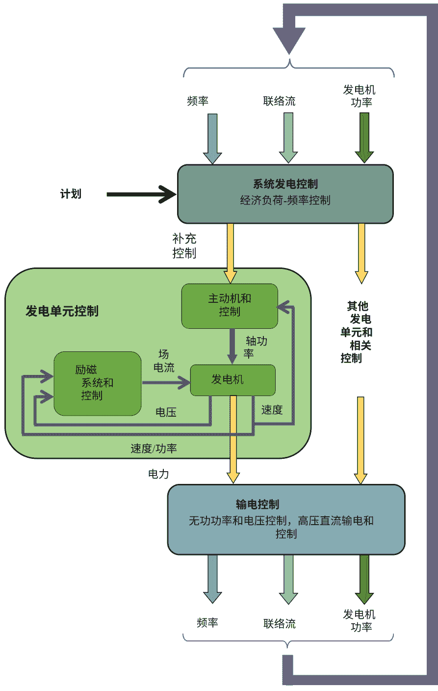

图 5.3 电力系统的子系统及其控制 [16]

电力系统以最佳效率运行，同时电压和频率接近额定值 [18]。

当发生异常情况时，需要重新定义目标，使系统恢复正常状态。在电力系统中，单个干扰很少导致重大故障和看似安全的系统崩溃。这种中断通常是通过一系列事件的组合来施加压力，超出系统的能力范围。在正常情况下，所有电力系统变量都在允许范围内。电力系统的控制器的目标是将受中断的系统恢复到正常状态。因此，应注意到大型互联电力系统的动态性能受到各种设备故障和停电的影响 [16]。关于控制各种问题，应注意大多数控制功能（如自动发电控制）是在电厂的控制中心执行的。变电站还允许引入一些本地控制功能，如分布式电源和负荷管理的控制。控制过程通常是分层的，并通过信息交换、决策和控制信号进行。

控制过程必须即时、准确并协调地设置，在控制命令之间 [14]。

## 5.4 使用机器学习方法评估电力系统运行模式

不可否认的事实是，电力系统不能总是在其持续状态下运行，因为在电力系统中，总是存在各种类型的故障，如三相接地、单相接地等。因此，在确定这些故障发生时系统的行为后，应建立适当的控制策略 [18]。

电力系统的控制和稳定性评估面临各种干扰，并在任何时候提出适当的处理措施来解决其主要弱点。扰动和故障可能是由外部或内部事件引起的。

例如，这些故障是由雷击（外部）和开关（内部）引起的 [14]。

在发生干扰之前，必须采取必要的预防措施来处理任何类型的干扰，以便系统可以继续运行。此外，能量的产生和需求应该平衡，并且电力系统的所有变量应该在其操作范围内。当发生干扰并处于紧急状态时，必须采取必要的措施来保持同步性和保护电力系统。在发生干扰后，当网络的一部分或整个网络被移除时，必须执行必要的操作来快速恢复电力系统 [20]。因此，控制系统在预防、正常、紧急和恢复操作模式下进行检查，大多数控制电力系统的研究都是在两种控制模式下进行的：预防和紧急情况。图 5.4 显示了 Dy-Liacco 提供的方案的详细说明，该方案定义了电力系统的运行模式 [14]。


在现代电力系统中使用 PMU 已经在基于可测量数据的研究中取得了显著进展。然而，与 PMU 相关的大数据、测量故障相关的不确定性以及当前和未来电力系统中负载的非线性以及计算复杂性等主要问题，暴露了传统控制方法的限制。因此，在现代电力系统的控制中，需要快速、可靠、先进、适应、校准和动态方法，以应对持续的停电和其他对电力系统的威胁 [10, 27]。

一些快速的系统控制包括保护继电器、汽轮机调速器和发电机上的自动电压调节器，它们在几分之一秒内运行，而子系统级别的控制，如二次电压控制和自动发电控制，则需要几秒钟的时间。通过检测系统限制和干扰来激活其他类型的控制 (预防和紧急情况) [26]。

### 5.4.1 预防模式

在这种情况下，问题是系统是否能够承受正常运行中的任何可能干扰。如果没有控制，预防将系统状态转移到安全操作区域。由于瞬时干扰难以预测，预防性安全评估主要旨在平衡和降低停电和低运营成本的不一致性的可能性 [20]。

在预防运行模式下，使用机器学习方法进行电力系统控制相关研究的一些例子包括设备级别的线路跳闸故障预测 [28]、保持频率稳定性 [29]、电压不稳定性预测 [30]、预测故障后的瞬态不稳定性 [31]，以及基于对突发功率波动的预测的主动频率控制 [32]。在子系统级别和智能电网和广域级别中预测瞬态稳定性 [33, 34]，这些预防措施可以避免潜在的未来危险。为了达到这个目的，在电力系统的预防控制状态下，考虑了几个层次 (设备、子系统、微电网、智能电网、广域)，在每个层次上，一些论文研究了各种控制问题，研究人员使用机器学习方法来解决这些问题。

| 控制级别 | 控制问题 | 学习算法 | 参考文献 |
| :--- | :--- | :--- | :--- |
| 设备 | 定义故障电流方向 | 决策树 (DT) 和支持向量机 (SVM) | [35] |
|  | 线路跳闸故障预测 | 长短期记忆网络 (LSTM) 和支持向量机 (SVM) | [28] |
| 子系统 | 保持频率稳定 | 极限学习机 (ELM) | [29] |
|  | 电压不稳定性预测 | 深度递归神经网络 (DRNN) | [30] |
|  | 暂态稳定性 | 分类和回归树 (CART) 和多层感知器 (MLP) | [36] |
|  | 预测故障后的瞬态不稳定性并开发紧急发电机脱负荷控制 | 集成在线顺序学习机 (E-OS-ELM) | [31] |
|  | 基于对突发功率波动的预期的主动频率控制 | 极限学习机 (ELM) | [32] |
| 智能电网 | 预测暂态稳定性 | 极限学习机 (ELM) | [33] |
| 广域 | 确定暂态稳定性方面 | 径向基函数神经网络 (RBFNN) | [34] |
|  | 实时暂态稳定性评估 | 最小二乘支持向量机 (LS-SVM) | [37] |

### 5.4.2 正常模式

由于电力系统中发电机和负载的功率发生微小而连续的变化，需要在正常运行状态下对系统进行控制。在正常运行模式下，所有系统负载的行为和发电机在所有控制层面上产生一定的频率和电压，没有中断，并且系统不会出现任何物理或安全故障。此外，每个电力设备的所有名义限制都得到满足 [20]。

在正常条件下，一些重要的不同层次的控制问题被研究，包括在设备和本地层面上改善继电器性能指标 [38] 和控制光伏系统的最大功率点跟踪 (MPPT) [3]；在子系统层面上进行电压稳定裕度监测 [39]、自动发电控制 (AGC) [40]、通过电力系统稳定器 (PSS) 抑制低频振荡 [41]、控制电能质量干扰 [42] 和在线转子角稳定性预测 [43]；在微电网和智能电网层面上进行负荷响应 [44]、动态能量管理 [9] 和滞后控制、自动发电控制和经济调度 [45]；以及在广域层面上进行暂态稳定性评估 [46]。

表 5.2 总结了一些研究，研究了正常电力系统控制的各种问题。在这个表中，使用了不同的机器学习方法已经被用于研究设备、子系统、微电网、智能电网和广域控制层面的各种问题。

| 控制级别 | 控制问题 | 学习算法 | 参考文献 |
|---|---|---|---|
| 设备 | 提高保护继电器的性能指标 | 极限学习机 (ELM) | [38] |
| | 最大功率点跟踪 (MPPT) | 马尔可夫决策过程 (MDP) | [3] |
| 子系统 | 电压稳定裕度 (VSM) 监测 | 局部回归 | [39] |
| | 自动发电控制 (AGC) | 长短期记忆递归神经网络 | [40] |
| | 抑制低频振荡 | 人工神经网络 (ANN) | [41] |
| | 电能质量干扰控制 | 深度神经网络 (DNN) | [42] |
| | 在线转子角稳定性预测 | 集成决策树 | [43] |
| 微电网/智能电网 | 需求响应 | 深度神经网络 (DNN) | [44] |
| | 动态能量管理 | 决策树 (DT) | [9] |
| | 滞后控制、自动发电控制和经济调度 | 极限学习机 (ELM) | [45] |
| 广域 | 暂态稳定性评估 | 核支持向量机 (CVM) | [46] |

### 5.4.3 紧急模式

确定紧急状态的目的是判断系统在实际故障开始后是否会失去完整性。这里存在一个重要的交互作用，响应时间更为重要，而经济考虑则是暂时次要的 [20]。紧急控制旨在采取紧急措施，防止部分或完全中断服务。在紧急控制模式下，系统的一些正常运行限制被违反。例如，线路超负荷，频率低于允许值。此外，由于负载的大部分离开，或者由于各种故障或对无功功率的精确控制不足，频率可能超过允许值，电压可能超出允许范围 [14]。

一些研究中总结了紧急运行控制模式的一些重要问题，这些问题也在各个层面上使用机器学习方法进行了研究。这些问题包括在设备层面上开关 PWM 故障区分 [47] 和继电器故障检测 [48]；在子系统层面上瞬态稳定性 [49]、在线电压稳定监测 [50]、故障检测 [51]、增强机电振荡阻尼 [52]、紧急负荷削减控制 [53] 和频率控制以防止系统崩溃 [54]；在智能电网和微电网层面上短期电压不稳定 [55]、故障检测 [56]、孤岛检测方法 [57] 以及通过频率控制减轻级联故障、防止停电和发电机自适应输出功率调节 [58]；在广域层面上增强瞬态稳定性和阻尼区域间振荡 [2]、振荡角稳定性 [59]、阻尼低频振荡 [60] 和短期电压稳定性 [61]。

### 5.4.4 恢复模式

当预防控制和紧急控制都无法将系统参数恢复到允许限制时，本地保护装置将操作以保护电气系统的组件免受不可修复的损坏。这可能会导致进一步的干扰、系统故障，甚至部分或完全停电。

在恢复模式下，一些系统负荷可能无法供应，从而导致部分或完全停电，在这种模式下，系统的运行部分将恢复正常。每个控制级别和每种负荷类型的恢复速度和准确性都不同。此外，智能电网中的恢复方法与当前电网不同。在这种模式下，操作员的任务是尽量在最短的可行时间内重新协调失去的发电量的价值，并按优先顺序添加中断的负荷。

### 表 5.3 机器学习方法在紧急控制模式中的应用总结

| 控制级别 | 控制问题 | 学习算法 | 参考文献 |
|---|---|---|---|
| 设备 | 开关故障诊断 PWM 在电压源整流器中 | 最小二乘支持向量机 (LSSVM) | [47] |
| | 通过继电器检测故障 | 支持向量机 (SVM) | [48] |
| 子系统 | 暂态稳定性 | 高性能反向传播神经网络 (HB PNN) | [49] |
| | 在线电压稳定性监测 | 集成 Ada Boost 分类器 | [50] |
| | 故障检测 | 最近邻 (KNN)、决策树和支持向量机 (SVM) | [51] |
| | 增强电机振荡阻尼 | 基于树的批处理模式强化学习 (RL) | [52] |
| | 紧急负荷削减控制 | 人工神经网络和层次分析过程算法 | [53] |
| | 频率控制以防止系统崩溃 | 多 Q 学习—强化学习 | [54] |
| 微电网/智能电网 | 短期电压不稳定 | 随机权重神经网络 | [55] |
| | 模式检测和故障检测 | 人工神经网络 (ANN)、支持向量机 (SVM) 和决策树 | [56] |
| | 孤岛检测方法 | 支持向量机 (SVM) | [57] |
| | 通过频率控制减轻级联故障、防止停电、自适应调整发电机输出功率 | 人工神经网络 (ANN) | [58] |
| 广域 | 增强暂态稳定性和抑制区域间振荡 | 强化学习 (RL)、神经网络 (NN) | [2] |
| | 振荡角稳定性 | 演员 - 评论家神经网络 | [59] |
| | 抑制低频振荡 | 人工神经网络 (ANN) | [60] |
| | 短期电压稳定性 | 随机森林 | [61] |

在表 5.4 中，对于电力系统中的恢复控制模式，使用机器学习方法进行了少量的研究。在这种状态下，考虑了几个层次的子系统、微电网和广域，并且在每个层次上，一些论文已经研究了各种控制问题。在这种模式下研究的控制问题包括发电重调度和负荷削减 [62]，故障引起的延迟电压恢复 [63]，子系统级别的电力网恢复 [64]，微电网级别的事故后恢复 [65]，以及广域级别的实时短期电压稳定性评估 [66]。

| 控制级别 | 控制问题 | 学习算法 | 参考文献 |
| :--- | :--- | :--- | :--- |
| 子系统 | 发电重调度和负荷削减 | 决策树 (DT) | [62] |
| | 故障引起的延迟电压恢复 (FIDVR) | 加权核极限学习机 (WKELM) | [63] |
| | 电网系统的恢复 | Q 学习 | [64] |
| 微电网 | 故障后的恢复 | 特征选择 | [65] |
| 广域 | 实时短期电压稳定性 (STVS) 评估 | 极限学习机 (ELM) | [66] |

系统。因此，故障定位检测是在紧急状态下进行的，然后进行隔离和恢复。

根据表格可以看出，在大多数研究中，机器学习方法可能对恢复状态有帮助，但主要集中在预防、正常和紧急情况。事实上，机器学习和深度学习方法主要集中在预测模式上，这些方法对于预防和紧急模式比其他模式更有效。

## 5.5 机器学习方法在评估电力系统的安全性和稳定性中的应用

由于各种社会、经济和政治活动与国家电力系统相关联，电力系统的安全和可持续运行也由政府和公共行业利益相关者决定，并具有最高优先级。有时，敌人或竞争对手可以访问网络信息并更改控制命令，从而破坏网络性能，导致停电和财务损失，国家安全可能受到威胁 [15]。此外，能源需求的增长、恼人负载的存在、网络拓扑和架构的重新排列和变化、输电线路的过载等导致电力系统偏离其安全范围，从而引起不稳定和电力质量的中断 [68]。

由于控制电力系统的目的是在所有控制模式下创建一个稳定和安全的系统，因此本节详细讨论了电力系统的稳定性和安全性。电力系统安全和稳定的主要领域包括暂态稳定性、电压稳定性、频率稳定性和电力质量扰动，其中机器学习得到了广泛发展 [16]。在电力系统可持续性的各个领域中评估机器学习方法集中于突出方法、成就和限制，包括分类器方案、数据集生成和测试系统的使用。此外，机器学习方法广泛应用于电力系统的监测、入侵检测、预测和分类各种威胁。

确保电网的安全和稳定是当今一个重大挑战，特别是在经历各种压力和干扰之后。因此，评估电力系统的稳定和安全运行的重要问题如下：

- 暂态稳定性评估。
- 电压稳定性评估。
- 电力质量干扰。
- 频率稳定性评估。

暂态稳定性、频率稳定性和电压稳定性是动态安全评估中被认为是重要问题的三个主要类别 [69]。

### 5.5.1 暂态稳定性评估

电力系统发电机在遭受严重的外部故障、突然和立即的负荷损失或发电机损坏之后保持协调的能力被称为暂态稳定性。暂态不稳定性是电力不稳定的主要原因之一，会导致岛屿构建和大范围停电 [70]。传统的评估电力系统暂态稳定性的方法，包括时域仿真、等面积准则、暂态能量函数和李雅普诺夫方法，无法满足其新的和现代的要求，因为评估发电机、不同负荷、故障和故障清除时间的摆动曲线需要大量的计算工作 [71]。

监测和评估电力系统的稳定性对于其在稳定边界上的高效运行非常重要。如果通过 PMU 收集到大量高速数据，仅使用传统的暂态稳定性评估方法可能无法满足实时暂态稳定性的需求，并且计算时间会很长。因此，机器学习技术最近在电力系统控制问题中得到了广泛应用，包括暂态稳定性研究。这些方法处理 PMU 数据的大量值，然后分析数据，并最终对电力系统的稳定状态进行分类和检测。在机器学习方法中，由于其泛化能力，经过明确训练的数据驱动模型可以准确预测稳定性 [46]。暂态稳定性评估使用机器学习方法分为三个阶段：特征生成、特征预处理和优化，以及分类/预测。

特征生成：可靠暂态稳定性评估模型分析的第一步也是最重要的一步是生成输入数据集向量。基于广域测量系统（WAMS）采样的电力系统同步变量在清除故障之前或之后收集，为在广域范围内进行先进的保护操作和决策提供了可能性 [10]。

选择适当的特征是瞬态稳定性评估的重要标准。因此，通过时域仿真过程生成/提取特征数据是一个重要问题 [72]。瞬态稳定性评估中的主要关注点是选择适当的轨迹特征 [73]。为了预测系统的稳定性或不稳定性，可以应用转子角度、转子速度和电压幅值等各种过程作为预测器 [74]。

特征预处理和优化：针对每个数据集和每个分类算法的属性类型，提出了各种减少、选择和优化属性的技术，以消除冗余，改善分类，并研究瞬态不稳定性 [75]。

分类/预测：通常，基于机器学习方法的许多瞬态稳定性评估研究中使用“离线训练，在线应用”方法。这种方法首先对模型进行离线训练，然后进行在线瞬态稳定性测试 [72]。在离线训练的稳定性研究中，例如，通常使用不同的发电机和负载变化模型，包括对地三相短路等不同的可能干扰，以及不同的故障清除时间。尽管“离线训练，在线应用”模型在使用中取得了无数的成功，但该模型在现实世界中不适用，因为离线方法生成的训练数据集无法展示现代电力系统的所有特征和特性 [10]。

在暂态稳定性研究中，神经网络分类器的结果可以是连续的，从而使得暂态稳定性边界变得更加柔软 [36]；决策树具有很好的可解释性 [76]；支持向量机可以计算一个时刻与稳定边界之间的距离，因此主要用于细化确定性指标 [68]；随机森林算法可以定期评估特征权重并根据排序率排列特征 [77]；而极限学习机具有快速学习速度 [78]。

表 5.5 总结了一些最近研究暂态稳定性领域中每种学习方法采用的机器学习算法和预处理/优化方法。不同类型的电力系统已经在各种研究中用于研究暂态稳定性。根据表 5.5，大多数文章中使用的是 39 节点系统。

表中对机器学习方法的比较是基于获得的准确性标准进行的，根据参考文献，这个值通常在 85% 到 100% 之间，准确性标准越高，方法越优越。

### 5.5.2 电压稳定性评估

暂态稳定性与发电机同步有关，而电压稳定性与负荷动态和无功功率管理有关。电压稳定性指示了电力系统在特定运行条件下扰动后保持母线电压在可接受值的能力 [79]。无功功率

## 5 机器学习应用的介绍和文献综述

### 表 5.5 对一些提供的机器学习方法进行瞬态稳定性评估分类的总结

| 参考文献 | 机器学习算法 | 预处理/优化技术 |
|---|---|---|
| [10] | 在线顺序极限学习机集成（EOS-ELM） | 二进制 Jaya（Bin Jaya） |
| [36] | 分类和回归树（CART）和人工神经网络（ANN） | – |
| [46] | 核心向量机（CVM） | – |
| [68] | 支持向量机集成 | 最小 - 最大归一化 |
| [72] | 贝叶斯多核学习（BMKL） | – |
| [73] | 双卷积支持向量机（TWCSVM） | – |
| [74] | 积极支持向量机（ASVM）和保守支持向量机（CSVM） | – |
| [75] | 极限学习机（ELM） | PSO |
| [76] | 决策树（DT） | – |
| [77] | 随机森林 | 递归特征消除策略 |
| [78] | ELM | 核化模糊粗糙集（KFRS）和模因算法 |

管理以及因此监测和评估电压稳定性情况是防止各种停电和维持现代电力系统整体稳定性的重要问题。当电力系统发生重大故障时，电压曲线失去稳定性，感应电动机的速度迅速下降，它们接收到高无功电流，最终导致无法控制的电压下降和停电。电压不稳定性分为短期和长期 [80]。

大多数传统方法虽然需要相对复杂的计算，但它们并不提供关于稳定性问题的准确有用信息，而忽略了现代电力系统的动态特性。此外，在传统的电压稳定性分析模型中，计算大量负荷母线电流存在许多限制，无法准确评估 P-V 和 Q-V 曲线。因此，机器学习方法最近被用于克服传统电压稳定性评估方法的缺点和局限性 [81]。机器学习方法在评估电压稳定性方面的研究分为两个阶段，包括特征的生成和选择阶段以及电压稳定性边际指数的分类。

特征的生成和选择：如果电力系统能够在正常运行和故障发生后的操作条件下保持可接受的稳定电压，则将其分类为电压稳定区。在这方面，为了使用机器学习方法评估电压稳定性，使用了相量测量单元的数据，普通输入向量被视为电压相量。在这里，与暂态稳定性的情况类似，用于分类算法的输入向量通常通过离线训练进行教育，生成的输出向量被视为电压稳定裕度的指标向量 [82]。

### 表 5.6 电压稳定性评估的机器学习方法总结

| 参考文献 | 机器学习算法 | 预处理/优化技术 |
|---|---|---|
| [27] | 决策树 (DT) | 主成分分析 (PCA) 和相关技术 |
| [55] | 具有随机权重的神经网络 (NNRW) | Relief 算法 |
| [80] | 前馈反向传播 (FFBP) | – |
| [81] | SVM | k 均值 |
| [82] | 人工神经网络 (ANN) | 帝国竞争算法 (ICA) |
| [83] | SVM | 遗传算法 (GA) |
| [84] | ANN | Gram-Schmidt 正交化 (GSO) |
| [85] | 概率模糊决策树 (PFDT) | 基于案例的推理 (CBR) |
| [86] | SVM | 多目标生物地理优化 (MOBO) |
| [87] | 前馈反向传播网络 (FFBPN) | 线性优化 |

电压稳定性评估模型非常复杂和非线性，并涉及大量数据集，因此在这些模型中选择和减少特征是一个非常重要的问题。在这种情况下，许多电力系统的特征不适合，最好不要直接将它们用作分类器的输入。因此，在大多数模型中，使用特征提取和减少方法 [27]。此外，不同的优化方法已被用于提高准确性，改善机器学习算法的参数调整，并减少数据训练时间 [83]。

电压稳定裕度指标的分类：使用机器学习算法，可以提取和调整输入向量与输出向量之间的非线性关系，其中输入向量是与电力系统相关的操作参数，输出向量是电压稳定裕度。在电压稳定评估问题中，机器学习算法的一些特点如下：

人工神经网络算法的计算时间非常短，能够非常准确地预测稳定裕度指标，但该算法容易过拟合，设置参数可能成为一个问题 [84]。决策树由于数据样本较少，具有简单的划分规则，在在线电压等级分类中表现出色 [27]。

表 5.6 总结了用于预测、监测和分析电压稳定评估的机器学习方法，其中采用了一些机器学习算法和数据预处理/优化技术。此外，在这种情况下，根据获得的准确性标准进行了机器学习方法的比较，具有较高百分比的准确性标准显示了该方法的优越性。

### 5.5.3 电能质量干扰评估

电压幅值、频率和相角突然偏离规定标准率被称为电能质量干扰。这些干扰通常是由于开关设备、非线性负载、逆变器和整流器在电力系统中的增加引起的。电能质量干扰的类型包括谐波失真、电压下降、闪烁、中断、电压暂升、瞬变等 [88]。在每个电力系统中，电能质量干扰的类型各不相同，因此在与电能质量干扰相关的事件研究中，需要进行特征提取/选择、特征优化和事件分类的准确诊断 [89]。

特征选择：在特征选择的第一步中，必须考虑数据的数量，因为具有大维度的生成特征数据不适合作为分类器的输入。具有无关特征的重复数据显著增加了计算时间并降低了分类的准确性。因此，通常需要在机器学习的主题中提取主要特征以进行分类 [90]。在使用机器学习方法研究电力质量扰动时，频域技术如傅里叶变换 (FT) [91] 和各种时域信号处理方法如经验模态分解 (EMD) [92] 已成功地用于选择波形的特征。在许多研究中，使用小波变换 (WT) 方法 [88]，因为它们具有良好的时频特性，并且具有非常好的分析信号局部不连续性的能力。

特征优化：采用各种特征优化技术来改善电力质量干扰事件分类的性能。使用这些方法的主要目的是去除特征中的噪声等附加属性，并优化分类器的准确性。大多数事件的属性选择方法可以基于包装器或基于过滤器 [89]。基于过滤器的特征选择速度快，因为它根据属性的固有属性对其进行排序，而基于包装器的特征选择需要更多时间，但它是一种更高效的选择。如果不使用特征优化方法，分类可能需要复杂且耗时的模拟、大量的计算资源和更多的时间 [89]。

事件的分类：无数的机器学习和深度学习算法已经被用于电力质量干扰的分类。在各种类型的分类器中，由于一些显著特点，SVM [89] 和 PNN [88] 是最广泛使用的。PNN 技术在分类中具有良好的性能，并在信号距离研究中具有高准确性。此外，PNN 技术不需要初始权重调整。SVM 技术也被评为强大的分类器。

表 5.7 显示了一些机器学习技术以及在电力质量干扰领域的一些文章中提取和优化特征的方法。如表所示，在电力质量干扰评估和分类中，最常用的机器学习工具是 SVM 技术，因为它确保高准确性和效率。在这里，准确率的百分比被视为评估一种方法优越性的标准。因此，准确率越接近 100%，方法的优越性就越高。

### 表 5.7 电力质量干扰评估的机器学习方法总结

| 参考文献 | 机器学习算法 | 特征提取技术 | 特征优化/降维技术 |
|---|---|---|---|
| [42] | 深度神经网络 (DNN) | 奇异谱分析 (SSA) 和小波变换 (WT) | 压缩感知 (CS) |
| [88] | 概率神经网络 (PNN) | 小波变换 (WT) | 人工蜂群算法 (ABC) |
| [89] | 支持向量机 (SVM) | 变分模态分解 (VMD) 和 S-变换 (ST) | 顺序前向选择 (SFS)，顺序后向选择 (SBS)，和格拉姆 - 施密特正交化 (GSO) |
| [90] | SVM | 小波包变换 (WPT) | 遗传算法 (GA) |
| [93] | SVM | WT | 粒子群优化 (PSO) |
| [94] | k 均值，决策树 (DT) 和支持向量机 (SVM) | ST | 蚁群优化 (ACO) |
| [95] | SVM | WT | – |
| [96] | 径向基函数神经网络 (RBFNN) | 经验模态分解 (EMD) 和希尔伯特变换 (HT) | PSO |
| [97] | SVM | 小波多分辨率分析 (WMRA) | – |
| [98] | 卷积神经网络 (CNN) | 曲波变换 (CT) | 静态单赋值 |

### 5.5.4 频率稳定性评估

电力系统最重要的任务是在保持电力质量标准的同时，生成和传输电力给消费者。其中最重要的一个标准是始终保持网络频率接近名义值，为了保持频率，必须始终建立生产和消费之间的平衡。否则，网络频率将会变化，可能变得不稳定，并对涡轮机、电动机、变压器等网络设备造成严重损坏。因此，需要使用特殊的控制和保护操作来保持生产和消费之间的平衡，并将网络频率保持接近名义值。

主频控制是首先用于此目的的控制操作，而次级和三级控制是备用控制。包括动态行为和需求的主要和次要频率控制特性取决于各种参数（惯性常数，负荷对频率的依赖程度，参与频率控制的单元的速度和数量以及它们的可用容量），这些参数基本上是系统的固有参数，并且对于各种网络是不同的。这些参数对于各种网络是不同的，并在网络频率的运行和控制以及主要和次要频率控制的分配中起着非常重要的作用。此外，通过使用旋转备用电力与主频控制的帮助，可以防止频率下降到频率负载阈值，以保护免受频率不稳定性的影响 [99]。如果由于重大干扰，例如电厂停机，功率不平衡持续存在并且系统频率明显偏离名义值，并开始进行欠频负荷削减步骤，则在这方面，为了提高处于干扰下的系统的频率安全评估的准确性，需要新的方法 [53]。

频率稳定性评估是基于频率偏差程度和频率变化速率与名义值的关系。然后根据变化的程度，采取必要的措施来保持稳定性，甚至在不稳定后可能采取纠正措施。在使用机器学习方法进行频率安全评估时，模型是离线训练的，并用于在线应用 [100]。

在自动发电控制（AGC）的三个问题中进行频率评估 [32, 40, 101]，频率负荷控制（LFC）[99, 102, 103] 和欠频负荷削减（UFLS）[29, 53, 54, 100] 通过使用机器学习方法基于频率偏差进行特征生成和优化以及分类。

特征的生成和优化：确定频率稳定性边界的初始数据集包括频率值和频率变化率。使用各种优化方法来减少冗余特征和初始数据。数据的初始训练是通过测量样本之间的距离来识别特征并将样本分组到不同的类别中 [100]。

基于频率稳定裕度的分类：与传统和常见的技术相比，机器学习方法具有快速选择策略类型、减少决策和恢复时间、提高频率稳定性的能力。利用频率偏差与其他属性之间的关系来确定稳定性 [100]。一些方法，如人工神经网络和极限学习机，在教学和学习过程中具有较高的速度，但极限学习机算法更快 [53]。极限学习机还具有较少的学习限制，并且不会陷入局部优化 [29]。多区域和广域系统中的频率评估是确定系统稳定性的重要标准 [102]。

表 5.8 列举了一些机器学习方法以及在频率稳定性领域的一些文章中的预处理和优化特征技术。如图所示，在频率中最常用的机器学习工具稳定性评估和分类是强化学习技术的一种方法。由于强化学习方法可以从环境中获得反馈，因此它们在在线训练中具有特殊的应用。

### 表 5.8 频率评估的机器学习方法总结

| 参考文献 | 机器学习算法 | 预处理/优化技术 |
|---|---|---|
| [29] | 极限学习机 (ELM) | – |
| [32] | ELM | – |
| [40] | 长短期记忆递归神经网络 | 反向传播与梯度优化器 |
| [53] | 人工神经网络 (ANN) 和层次分析过程 (AHP) | k 均值 |
| [54] | 深度 Q 网络 (多 Q 学习) 和深度强化学习 (DRL) | 深度确定性策略梯度 (DDPG) |
| [99] | 多智能体强化学习 (MARL) | 遗传算法 (GA) |
| [100] | 支持向量回归 (SVR) 和核向量回归 (CVR) | 小批量梯度下降 (MBGD) 和模糊 k 均值 |
| [101] | 情感强化学习 (ERL) | – |
| [102] | 积分强化学习 | – |
| [103] | 多智能体深度强化学习 (MA-DRL) | 深度确定性策略梯度 (DDPG) |
| [104] | ELM | – |
| [105] | 主成分分析 (PCA)、回归树和支持向量机 (SVM) | – |

## 5.6 挑战、比较讨论和未来展望

如今，电力系统中的实际复杂性增加，因此控制和稳定性评估已成为电力系统中最主要的关注点。

在这方面，基于数据的方法应该取代基于模型的方法，因为基于数据的方法具有在线决策能力，而基于模型的方法在效率和准确性之间存在矛盾。

在与电力系统控制和稳定性研究相关的机器学习和深度学习方法方面取得了很大进展，但仍存在一些挑战尚未解决。每项研究中使用的输入数据集和实验系统的数量和质量将影响机器学习方法的预测和准确性。

研究人员从开放源数据和模拟数据集中获取他们研究所需的数据，因为真实的电力系统数据可能因安全问题、攻击、过度拥挤和违规等原因不可用，或者可用数据的数量非常有限。因此，可用数据之间的不一致性和电力系统的数据和实际数据会导致预测和分类的不一致性。此外，微调每个控制问题的参数和测量是机器学习算法应用中的一个重要问题，可能会耗费大量时间。此外，“离线训练，在线应用”方法的使用由于数据、测量和电力系统变量状态的不一致性和可能的不平衡危机而变得有些具有挑战性。然而，电力系统的稳健状态是机器学习方法在预防控制措施、紧急情况下的电力系统保护以及故障和停电后的恢复中的一个希望点。值得注意的是，“离线训练，在线应用”方法在检查暂态稳定性状态方面比其他领域更具挑战性，因为其评估仅与故障后的静态数据相关，并且离线模式产生的模拟训练样本可能无法正确显示电力系统的当前或未来状态。

为了控制电力系统和相关问题，我们观察到以下问题：大多数控制考虑与正常和紧急情况下的控制问题有关，而与预防和恢复控制相关的考虑相对较少。然而，关于预防运行模式中的控制问题的研究使用机器学习技术已经出乎意料地丰富。这是因为预测可能的安全和稳定性干扰，并尽可能预防和计划，在发生干扰时采取最佳行动。

不同层次的广域、智能电网、微电网、子系统设备都讨论了不同的控制问题。值得注意的是，智能电网的发展凸显了机器学习方法的效率。

可以通过最多的研究和调查来研究的最重要的安全和稳定性问题包括扰动后的暂态稳定性评估、电压稳定性评估和电能质量干扰评估。值得一提的是，电能质量评估包括频率、电压和角度稳定性。

在本章中，用于解决控制问题的主要机器学习方法包括支持向量机（SVM）、k 最近邻算法（k-NN）、决策树（DT）、随机森林（RF）、神经网络和 k 均值算法，有时还采用相同的重要特征选择技术，如因子分析、前向特征选择（FFS）、后向特征选择（BFS）和主成分分析（PCA）。

在过去的十年中，一个受到广泛关注的非常重要的领域是关于安全和稳定性的控制问题，其中讨论了对 SCADA 电力网络基础设施的各种类型的攻击和损害的研究和预测。SCADA 系统能够自动协调控制功能，例如监控系统的安全性、负荷分配的经济运营、短期预测、自动生产控制、紧急控制等等，跨越整个电力系统进行协调。控制系统包括各种电子设备和处理设备中，最重要的是执行器、传感器、可编程逻辑控制器（PLC）和远程终端单元（RTU）。通过访问此设备的软件或硬件代码，攻击者可以轻易渗透控制系统并控制过程。此外，先进通信工具和物联网在 SCADA 网络中的广泛存在使电力系统容易受到攻击和安全威胁。因此，诸如防病毒程序、防火墙、加密算法、身份验证、传统入侵检测系统等安全解决方案和措施无法应对网络攻击 [11]。

最近，SCADA 网络上的网络攻击有所增加。因此，安装入侵检测系统以早期发现攻击。在这方面，机器学习算法具有自主学习、适应变化和无需事先规划即可实现高性能的能力，因此被用作智能高效的入侵检测系统的有效方法 [15]。机器学习算法用于研究 SCADA 中电网攻击的技术包括数据集生成、数据处理和分类/检测三个主要步骤。使用机器学习方法记录和分析 SCADA 网络数据，以创建训练数据集以减少攻击。出于实时安全原因，SCADA 数据不可用。因此，预测不稳定事件的发生是控制电力系统中的重要问题之一。为了防止 SCADA 上的网络攻击和损害，使用机器学习方法来识别攻击类型。

## 5.7 结论

为了为消费者提供高可靠性的电能并在电力系统发生故障时创造安全稳定的情况，控制系统在不同运行模式下的控制一直是所有能源利益相关者，特别是运营商所考虑的。然而，智能电力系统的发展和分布式发电（DG）以及可再生能源和基于变流器的资源的增加，尽管带来了许多好处，却增加了电力系统层面的不稳定性，尤其对频率和变化产生了最大的影响。

大型互联电力系统的复杂性增加了对有效控制技术的需求。此外，硬件无法实时评估大型网络，使用数值方法和对电力系统进行建模是复杂且耗时的。因此，研究人员开始使用机器学习方法。在机器学习中，首先训练一个模型，然后用于预测新到达数据的类别。迄今为止，已经使用了多种机器学习技术来评估电力系统控制。将机器学习方法嵌入到电力系统控制方案中是创建具有学习和更新决策功能的控制器的重要且有效的方法。

机器学习和深度学习方法为电力系统的运行模式的每个控制层面提供了适当的解决方案。控制层面的考虑因地区而异，并且使用本章中的机器学习方法解决每个问题可以得到结果，即没有一种方法可以保证适用于所有或大多数控制问题。然而，有足够的方法来评估一个具有挑战性的问题，并且取得了相当成功的结果。还使用了比较方法来选择最佳的学习方法，因此使用多种机器学习方法来解决问题，并最终选择能够提供最准确、最佳分类、具有足够特征数量、最简单的复杂度和最短仿真时间的方法作为解决所需问题的性能最佳的方法。此外，在机器学习和深度学习算法中，选择提取、减少和优化特征的最佳方法也是一个考虑因素。

# 参考文献

1.  DOE-USA，第 5 章：提高建筑系统和技术的效率，在《四年一度的技术评估：能源技术和研究机会评估》(2015) 中
2.  R. Yousefian, R. Bhattarai, S. Kamalasadan，具有综合广域控制的风电场和同步发电机的暂态稳定性增强。IEEE Trans. Power Syst. (2017)。https://doi.org/10.1109/TPWRS.2017.2676138
3.  P. Kofinas, S. Doltsinis, A.I. Dounis, G.A. Vouros，一种用于光伏源 MPPT 控制方法的强化学习方法。Renew. Energy 108, 461-473 (2017)。https://doi.org/10.1016/j.renene.2017.03.008
4.  A. Rosato, M. Panella, R. Araneo, A. Andreotti，基于神经网络的分布式发电预测系统用于微电网管理。IEEE 工业应用杂志 55, 922 (2019). https://doi.org/10.1109/TIA.2019.2916758
5.  X. Xu, Y. Xu, M.-H. Wang, J. Li, Z. Xu, S. Chai, Y. He，数据驱动的基于游戏的屋顶光伏发电和能量存储定价在住宅建筑群中的共享。IEEE 工业信息杂志 (2020). https://doi.org/10.1109/tii.2020.3016336
6.  H. Jahangir, S.S. Gougheri, B. Vatandoust, M.A. Golkar, A. Ahmadian, A. Hajizadeh，插电电动汽车行为建模在能源市场中：一种新颖的基于深度学习的方法与聚类技术。IEEE 智能电网杂志 (2020). https://doi.org/10.1109/tsg.2020.2998072
7.  R. Badar, M.Z. Khan, M.A. Javed, MIMO 自适应基于 B 样条的小波神经模糊控制多类型事实。IEEE Access 8 (2020). https://doi.org/10.1109/ACCESS.2020.2969387
8.  S. Lan, M.J. Chen, D.Y. Chen，一种基于卷积神经网络的新型 HVDC 双端非同步故障定位方法。IEEE Trans. Power Deliv. 34 (2019). https://doi.org/10.1109/TPWRD.2019.2901594
9.  G.K. Venayagamoorthy, R.K. Sharma, P.K. Gautam, A. Ahmadi，动态能源管理系统智能微电网。IEEE Trans. Neural Netw. Learn. Syst. (2016). https://doi.org/10.1109/TNNLS.2016.2514358
10. Y. Li, Z. Yang，EOS-ELM 与基于二进制 Jaya 的特征选择在实时暂态稳定性评估中的应用，使用 PMU 数据。IEEE Access 5(2017)。https://doi.org/10.1109/ACCESS.2017.2765626

## 5 机器学习应用的介绍和文献综述

- 11. J. Gao, L. Gan, F. Buschendorf, L. Zhang, H. Liu, P. Li, X. Dong, T. Lu, 使用深度学习算法的全能 SCADA 入侵检测。IEEE Internet Things J. (2020)。https://doi.org/10.1109/jiot.2020.3009180

- 12. E. Hossain, I. Khan, F. Un-Noor, S.S. Sikander, M.S.H. Sunny, 大数据和机器学习在智能电网及相关安全问题中的应用：一项综述。IEEE Access 7 (2019)。

- 13. O.A. Alimi, K. Ouahada, A.M. Abu-Mahfouz, 机器学习方法在电力系统安全和稳定性方面的综述。IEEE Access 8 (2020)。

- 14. L.A. Wehenkel, 电力系统中的自动学习技术 (1998)。

- 15. M. Kalech, 使用时间模式识别技术进行 SCADA 系统的网络攻击检测。计算机安全 84 (2019)。https://doi.org/10.1016/j.cose.2019.03.007

- 16. P. Kundur, 电力系统稳定性和控制 (McGraw-Hill, 纽约, 1993)。

- 17. A. Dissanayaka, U.D. Annakkage, B. Jayasekara, B. Bagen, 基于风险的动态安全评估。IEEE Trans. Power Syst. 26 (2011)。https://doi.org/10.1109/TPWRS.2010.2089809

- 18. L. Wang, P. Pourbeik, 评估电力系统稳定性和动态安全性能，在电力系统稳定性和控制，第三版 (CRC 出版社，2017 年)。

- 19. P. Kundur, J. Paserba, V. Ajjarapu, G. Andersson, A. Bose, C. Canizares, N. Hatziargyriou, D. Hill, A. Stankovic, C. Taylor, T. Van Cursem, V. Vittal, 电力系统稳定性的定义和分类。IEEE Trans. Power Syst. 19 (2004)。https://doi.org/10.1109/TPWRS.2004.825981

- 20. M. Glavic, (深度) 强化学习用于电力系统控制和相关问题：简要回顾和展望。Annu. Rev. Control 48, 22-35 (2019)。

- 21. X. Wang, X. Luo, M. Zhang, X. Guan, 通过非线性未知输入观测器在智能电网中分布式检测和隔离虚假数据注入攻击。Int. J. Electr. Power Energy Syst. 110 (2019)。https://doi.org/10.1016/j.ijepes.2019.03.008

- 22. C.C. Aggarwal, 神经网络和深度学习 (2018)。

- 23. E. Alpaydin, 机器学习导论，第三版 (2014)。

- 24. Miraftabzadeh SM, Foiadelli F, Longo M, Pasetti M (2019) 机器学习在电力系统分析中的应用调查。在：2019 年 IEEE 国际会议论文集环境和电气工程以及 2019 年 IEEE 工业和商业电力系统欧洲会议，EEEIC/I and CPS Europe 2019。

- 25. P. Mehta, M. Bukov, C.-H. Wang, A.G.R. Day, C. Richardson, C.K. Fisher, D.J. Schwab 综述机器学习。arXiv:1803.08823 [cond-mat, physics:Physics, stat]. (2018)。https://doi.org/arXiv:1803.08823v1

- 26. M. Glavic, R. Fonteneau, D. Ernst 强化学习用于电力系统决策和控制：过去的考虑和展望。IFAC-Papers OnLine (2017)。https://doi.org/10.1016/j.ifacol.2017.08.1217

- 27. H. Mohammadi, M. Dehghani, 基于 PMU 的电力系统电压安全评估，利用主成分分析和决策树。国际电力与能源系统杂志 64 (2015)。https://doi.org/10.1016/j.ijepes.2014.07.077

- 28. Zhang San, Wang Wu, Liu Mei, Bao Zi, 基于 LSTM 网络和 SVM 的电力系统线路故障预测。IEEE Access 6 (2017)。https://doi.org/10.1109/ACCESS.2017.2785763

- 29. Dai Yi, Xu Er, Dong San, Huang Si, Zhuang Wu, 用于提高电力系统频率稳定性的事件驱动负荷脱落的实时预测。IET Gener. Transm. Distrib. 6 (2012)。https://doi.org/10.1049/iet-gtd.2011.0810

- 30. H. Hagmar, L. Tong, R. Eriksson, L.A. Tuan, 使用深度递归神经网络进行电压不稳定性预测。 (2019)。https://doi.org/10.1109/TPWRS.2020.3008801

- 31. H. Yang, W. Zhang, F. Shi, J. Xie, W. Ju, 基于 PMU 的无模型方法用于瞬态不稳定性预测和紧急发电机脱负荷控制。Int. J. Electr. Power Energy Syst. 105 (2019)。https://doi.org/10.1016/j.ijepes.2018.08.031

## 5 机器学习应用的介绍和文献综述

- 32. S. Wen, Y. Wang, Y. Tang, Y. Xu, P. Li, 基于超短期功率波动预测的主动频率控制，用于高可再生能源渗透的电力系统。IET Renew. Power Gener. 13 (2019)。https://doi.org/10.1049/iet-rpg.2019.0234

- 33. Y. Xu, Z.Y. Dong, K. Meng, R. Zhang, K.P. Wong, 使用极限学习机的实时暂态稳定性评估模型。IET Gener. Transm. Distrib. 5 (2011)。https://doi.org/10.1049/iet-gtd.2010.0355

- 34. B.P. Soni, A. Saxena, V. Gupta, S.L. Surana, 通过监督实时转子角度轨迹识别发电机关键性和瞬态不稳定性。ISA Trans. (2018)。https://doi.org/10.1016/j.isatra.2018.08.008

- 35. J. Morales, E. Orduña, H. Villarroel, J.C. Quispe, 基于信号相关性和机器学习的分布式发电集成配电馈线无电压传感器高速方向保护。Electr. Power Syst. Res. 184 (2020)。https://doi.org/10.1016/j.epsr.2020.106295

- 36. Y.J. Lin, CART 和 MLP 基于电力系统暂态稳定性预防控制的比较。国际电力能源系统杂志 45 (2013)。https://doi.org/10.1016/j.ijepes.2012.08.066

- 37. B.P. Soni, A. Saxena, V. Gupta, S.L. Surana, 面向暂态稳定性的评估和预防控制行动在电力系统中的应用。工程杂志 2019 (2019)。https://doi.org/10.1049/joe.2018.9353

- 38. R. Dubey, S.R. Samanta, B.K. Panigrahi, 一种基于极限学习机的快速准确自适应距离继电保护方案。国际电力能源系统杂志 (2015)。https://doi.org/10.1016/j.ijepes.2015.06.024

- 39. S. Li, V. Ajjarapu, M. Djukanovic, 通过本地回归自适应在线监测电压稳定裕度。IEEE Trans. Power Syst. 33 (2017)。https://doi.org/10.1109/tpwrs.2017.2698065

- 40. S. Wen, T. Zhao, Y. Wang, Y. Tang, Y. Xu, P. Li, 一种用于从频率 fluctuations 识别功率波动的深度学习方法，出自 IEEE Power and Energy Society General Meeting (2019)。

- 41. D.K. Chaturvedi, O.P. Malik, 用于多机环境的广义神经元自适应 PSS。IEEE Trans. Power Syst. 20 (2005)。https://doi.org/10.1109/TPWRS.2004.840410

- 42. H. Liu, F. Hussain, Y. Shen, R. Morales-Menendez, M. Abubakar, S. Junaid Yawar, H.J. Arai, 信号处理和深度学习技术用于电能质量事件的监测和分类。Power Components Syst. (2019)。https://doi.org/10.1080/15325008.2019.1666178

- 43. Y. Chen, M. Mazhari, C.Y. Chung, S.O. Faried, B.C. Pal, 利用稳定性指数向量预测高风电渗透的电力系统的转子角稳定性。IEEE Trans. Power Syst. (2020)。https://doi.org/10.1109/tpwrs.2020.2989725

- 44. R. Lu, S.H. Hong, 基于激励的强化学习和深度神经网络的智能电网需求响应。Applied Energy (2019)。https://doi.org/10.1016/j.apenergy.2018.12.061

- 45. 基于极端动态规划的统一时间尺度智能控制算法在微电网中的应用。电力系统学报。(2019)。https://doi.org/10.17775/cseejpes.2019.00100

- 46. B. Wang, B. Fang, Y. Wang, H. Liu, Y. Liu, 基于大数据和核心向量机的电力系统暂态稳定性评估。IEEE Smart Grid 7 (2016)。https://doi.org/10.1109/TSG.2016.2549063

- 47. T. Shi, Y. He, T. Wang, B. Li, 基于深度学习方法的 PWM 电压源整流器开关故障诊断方法。IEEE Access (2019)。https://doi.org/10.1109/ACCESS.2019.2917311

- 48. M. Tasdighi, M. Kezunovic, 使用基于 SVM 的方法防止意外大规模分布式发电机跳闸引起的传输距离继电器误动作。Power Syst. Res. 142 (2017)。https://doi.org/10.1016/j.epsr.2016.09.024

- 49. Yu Liu, Yu Liu, Liu Jie, Li Min, Liu Tao, Taylor, Zuo Kai, 基于 MapReduce 的高性能神经网络在快速稳定性评估电力系统中的应用。Math. Probl. Eng. (2017)。https://doi.org/10.1155/2017/4030146

- 50. S.S. Maaji, G. Cosma, A. Taherkhani, A.A. Alani, T.M. McGinnity, 使用集成 AdaBoost 分类器进行在线电压稳定性监测，在 2018 年第四届国际信息管理会议上，ICIM (2018)。

- 51. R.A. Sowah, N.A. Dzabeng, A.R. Ofoli, A. Acakpovi, K.M. Koumadi, J. Ocrah, D. Martin, 用于故障检测、定位和分类的电力配电网络故障数据收集器的设计，使用机器学习，在 IEEE 自适应科学和技术国际会议上，ICAST (2018)。

- 52. D. Wang, M. Glavic, L. Wehenkel, 基于轨迹的电力系统机电振荡的补充阻尼控制。IEEE Trans. Power Syst. 29 (2014)。https://doi.org/10.1109/TPWRS.2014.2314359

- 53. T.N. Le, N.A. Nguyen, H.A. Quyen, 基于人工神经网络和层次分析过程算法的负荷调度应急控制，in Proceedings -2017 International Conference on System Science and Engineering, ICSSE 2017 (2017)。

- 54. C. Chen, M. Cui, F.F. Li, S. Yin, X. Wang, 基于强化学习的无模型紧急频率控制。IEEE Trans. Ind. Informat. (2020)。https://doi.org/10.1109/tii.2020.3001095

- 55. Y. Xu, R. Zhang, J. Zhao, Z.Y. Dong, D. Wang, H. Yang, K.P. Wong, 通过分层智能系统评估电力系统的短期电压稳定性。IEEE Trans. Neural Netw. Learn. Syst. (2016)。https://doi.org/10.1109/TNNLS.2015.2441706

- 56. M. Manohar, E. Koley, S. Ghosh, 通过使用稀疏自编码器区分阵列故障和对称线路故障，提高光伏集成微电网保护方案的可靠性。IET Renew. Power Gener. 13 (2019)。https://doi.org/10.1049/iet-rpg.2018.5627

- 57. M.R. Alam, K.M. Muttaqi, A. Bouzerdoum, 评估基于响应时间和可靠性的分布式发电岛屿检测的机器学习方法的有效性。IET Renew. Power Gener. 11 (2017)。https://doi.org/10.1049/iet-rpg.2016.09875

- 58. S. Zarrabian, R. Belkacemi, A.A. Babalola, 使用神经网络的实时智能电网控制，预防级联故障和停电：N-1-1 事故的实验方法。Int. J. Emerg. Electr. Power Syst. (2016)。https://doi.org/10.1515/ijeeps-2016-0039

- 59. R. Yousefian, S. Kamalasadan, 基于能量函数启发的全球范围宽域电力网控制的价值优先级。IEEE Trans. Smart Grid (2018)。https://doi.org/10.1109/TSG.2016.2555909

- 60. S.S. Jhang, H.J. Lee, C.N. Kim, C.H. Song, W.K. Yu, 使用深度学习的人工神经网络控制低频振荡的阻尼，出版于澳大利亚大学电力工程师 - 学术会议，AUPEC 2018 (2018)。

- 61. J.D. Pinzón, D.G. Colomé, 基于多变量时间序列机器学习的短期电压稳定性实时多状态分类。Int. J. Electr. Power Energy Syst. (2019)。https://doi.org/10.1016/j.ijepes.2019.01.022

- 62. I. Genc, R. Diao, V. Vittal, S. Kolluri, S. Mandal, 基于决策树的动态安全增强的预防和纠正控制应用于电力系统。IEEE Trans. Power Syst. (2010)。https://doi.org/10.1109/TPWRS.2009.2037006

- 63. Q. Li, Y. Xu, C. Ren, 一种基于层次化数据驱动的事件驱动负荷削减方法，用于电力系统中的故障引起的延迟电压恢复。IEEE Trans. Ind. Informat. (2020)。https://doi.org/10.1109/tii.2020.2993807

- 64. D. Ye, M. Zhang, D. Sutanto, 一种基于 Q 学习的混合多智能体框架，用于电网系统的恢复。IEEE Trans. Power Syst. (2011)。https://doi.org/10.1109/TPWRS.2011.2157180

## 5 机器学习应用的介绍和文献综述

- 65. M. Al Karim, J. Currie, T.T. Lie, 基于特征的分布式机器学习用于不同随机场景下的微电网故障后恢复，在 2017 年 IEEE 创新智能电网技术 - 亚洲：智能社区的智能电网，ISGT-Asia 2017 (2018)。

- 66. Y. Zhang, Y. Xu, Z.Y. Dong, R. Zhang, 一种分层自适应数据分析方法用于实时电力系统短期电压稳定性评估。IEEE Trans. Ind. Informat. 15 (2019)。https://doi.org/10.1109/TII.2018.2829818

- 67. M.J. Ghorbani, M.A. Choudhry, 用于电力配电系统自动化的多智能体设计。IEEE Trans. Smart Grid 7 (2016)。https://doi.org/10.1109/TSG.2015.2453884

- 68. Y. Zhou, J. Wu, Z. Yu, L. Ji, L. Hao, 一种基于 SVM 集成分类器置信度的电力系统暂态稳定性预测的分层方法。Energies (2016)。https://doi.org/10.3390/en9100778

- 69. A. Sharifian, S. Sharifian, 一种基于 Type-2 模糊神经网络估计的电力系统暂态稳定性评估方法。Int. J. Electr. Power Energy Syst. 64 (2015)。https://doi.org/10.1016/j.ijepes.2014.07.007

- 70. J.J.Q. Yu, D.J. Hill, A.Y.S. Lam, J. Gu, V.O.K. Li, 智能时变暂态稳定性评估系统。IEEE Trans. Power Syst. 33 (2018)。https://doi.org/10.1109/TPWRS.2017.2707501

- 71. J.J.Q. Yu, A.Y.S. Lam, D.J. Hill, V.O.K. Li, 延迟感知的智能暂态稳定性评估系统。IEEE Access 5 (2017)。https://doi.org/10.1109/ACCESS.2017.2746093

- 72. X. Gu, Y. Li, 基于贝叶斯多核学习的同步测量下电力系统暂态稳定性评估，in IEEE Power and Energy Society General Meeting (2013)。

- 73. A.B. Mosavi, A. Amiri, H. Hosseini, 一种用于电力系统大小和类型无关的暂态稳定性预测的学习框架，使用双卷积支持向量机。IEEE Access 6 (2018)。https://doi.org/10.1109/ACCESS.2018.2880273

- 74. W. Hu, Z. Lu, S. Wu, W. Zhang, Y. Dong, R. Yu, B. Liu, 基于改进的支持向量机的电力系统实时暂态稳定性评估。J. Mod. Power Syst. Clean Energy 7 (2019)。https://doi.org/10.1007/s40565-018-0453-x

- 75. Y. Zhang, T. Li, G. Na, G. Li, Y. Li, 使用同步相量优化的极限学习机进行电力系统瞬态稳定性预测。Math. Probl. Eng. (2015)。https://doi.org/10.1155/2015/529724

- 76. M. He, J. Zhang, V. Vittal, 使用自适应集成决策树学习进行鲁棒的在线动态安全评估。IEEE Trans. Power Syst. 28 (2013)。https://doi.org/10.1109/TPWRS.2013.2266617

- 77. C. Zhang, Y. Li, Z. Yu, F. Tian, 基于随机森林和递归特征消除的电力系统瞬态稳定性评估特征选择，亚太电力与能源工程会议，APPEEC (2016)。

- 78. Y. Li, G. Li, Z. Wang, 基于极限学习机和改进的蚁矿工算法的瞬态稳定性评估规则提取。PLoS One 10 (2015)。https://doi.org/10.1371/journal.pone.0130814

- 79. R. Zhang, Y. Xu, Z.Y. Dong, P. Zhang, K.P. Wong, 通过集成基于极限学习机的电压稳定裕度预测，在 IEEE 电力与能源学会年会 (2013)。

- 80. H.H. Goh, Q.S. Chua, S.W. Lee, B.C. Kok, K.C. Goh, K.T.K. Teo, 使用人工神经网络评估电力系统中的电压稳定指标，在 Procedia Engineering (2015)。

- 81. S.M. Pérez-Londoño, G. Olivar-Tost, J.J. Mora-Florez, 在线确定电压稳定薄弱区域以提高态势感知能力。Power Syst. Res. 145 (2017)。https://doi.org/10.1016/j.epsr.2016.12.026

- 82. K.S. Sajan, V. Kumar, B. Tyagi, 基于 ICA 的人工神经网络模型用于电压稳定监测，在 IEEE Region 10 Annual International Conference, Conference Proceedings/TENCON (2016)。

## 5 机器学习应用的介绍和文献综述

- 83. K.S. Sajan, V. Kumar, B. Tyagi, 基于遗传算法的支持向量机用于在线电压稳定性监测。Int. J. Electr. Power Energy Syst. 73(2015). https://doi.org/10.1016/j.ijepes.2015.05.002

- 84. A.R. Bahmanyar, A. Karami, 使用简化输入的人工神经网络进行电力系统电压稳定性监测。Int. J. Electr. Power Energy Syst. 58(2014). https://doi.org/10.1016/j.ijepes.2014.01.019

- 85. S.R. Nandanwar, M.L. Kolhe, S.B. Warkad, N.P. Patidar, V.K. Singh, 在新兴电力系统中使用 PFDT 和 CBR 方法进行电压安全评估。Energy Procedia, (2018).

- 86. H. Mohammadi, G. Khademi, M. Dehghani, D. Simon, 使用多目标生物地理学基于子集选择的电压稳定性评估。Int. J. Electr. Power Energy Syst. 103(2018). https://doi.org/10.1016/j.ijepes.2018.06.017

- 87. V. Jayasankar, N. Kamaraj, N. Vanaja, 使用人工神经网络技术和 TCSC 放置估计电力系统的电压稳定性指数。Neurocomputing 73(2010). https://doi.org/10.1016/j.neucom.2010.07.006

- 88. S. Khokhar, A.A. Mohd Zin, A.P. Memon, A.S. Mokhtar, 使用离散小波变换和概率神经网络的电能质量干扰分类的新优化特征选择算法。J. Int. Meas. Confed. 95(2017). https://doi.org/10.1016/j.measurement.2016.10.013

- 89. A.A. Abdoos, P. Khorshidian Mianaei, M. Rayatpanah Ghadikolaei, 基于 VMD-SVM 的特征选择方法用于电能质量事件的分类 classification。应用软件计算机杂志 38(2016). https://doi.org/10.1016/j.asoc.2015.10.038

- 90. K. Manimala, K. Selvi, R. Ahila, 基于小波包支持向量机的优化技术用于改善电能质量数据挖掘。神经计算 77(2012). https://doi.org/10.1016/j.neucom.2011.08.010

- 91. U. Singh, S.N. Singh, 分数傅里叶变换在电能质量干扰分类中的应用。IET 科学测量技术 11(2017). https://doi.org/10.1049/iet-smt.2016.0194

- 92. Z. 刘，Y. 崔，W. 李，一种用于复杂电能质量扰动的分类方法，使用 EEMD 和秩小波 SVM。IEEE Trans. Smart Grid 6(2015). https://doi.org/10.1109/TSG.2015.2397431

- 93. Z. 立权，G. 美娇，W. 林，基于改进的 SVM 的多个电能质量扰动分类，在 2017 年国际无线通信会议、信号处理和网络会议 WiSPNET 2017 中，(2018).

- 94. U. 辛格，S.N. 辛格，一种基于蚁群框架的电能质量扰动分类的新的最优特征选择方案。Appl. Soft Comput. J. 74(2019). https://doi.org/10.1016/j.asoc.2018.10.017

- 95. D. De Yong, S. Bhowmik, F. Magnago, 使用小波变换和支持向量机的有效电能质量分类器。专家系统应用。42(2015). https://doi.org/10.1016/j.eswa.2015.04.002

- 96. S. Shukla, S. Mishra, B. Singh, 用希尔伯特变换的经验模态分解进行电能质量评估。IEEE Trans. Power Deliv. 24(2009). https://doi.org/10.1109/TPWRD.2009.2028792

- 97. H. Erişti, Y. Demir, 基于小波变换和支持向量机的自动电能质量事件分类的新算法。专家系统应用。37(2010). https://doi.org/10.1016/j.eswa.2009.11.015

- 98. H. Liu, F. Hussain, Y. Shen, S. Arif, A. Nazir, M. Abubakar, 通过曲波变换和深度学习进行复杂电能质量干扰分类。电力系统研究。163(2018). https://doi.org/10.1016/j.epsr.2018.05.018

- 99. F. Daneshfar, H. Bevrani, 负荷频率控制：基于遗传算法的多智能体强化学习。IET Gener. Transm. Distrib. (2010). https://doi.org/10.1049/iet-gtd.2009.0168

- 100. H. Li, C. Li, Y. Liu, 基于度量学习的聚类最大频率偏差评估。国际电力与能源系统杂志。120(2020). https://doi.org/10.1016/j.ijepes.2020.105980

- 101. L. Yin, T. Yu, L. Zhou, L. Huang, X. Zhang, B. Zheng, 人工智能情感强化学习用于大规模互联电力网的自动发电控制。IET Gener. Transm. Distrib. 11, 2305-2313 (2017). https://doi.org/10.1049/iet-gtd.2016.1734

- 102. M. Abouhea, W. Gueaieb, A. Sharaf, 使用积分强化学习的多区域电力系统负荷频率调节。IET Gener. Transm. Distrib. 13(2019). https://doi.org/10.1049/iet-gtd.2019.0218

- 103. Z. Yan, Y. Xu, 一种用于多区域电力系统合作负荷频率控制的多智能体深度学习方法。IEEE Trans. Power Syst. (2020). https://doi.org/10.1109/tpwrs.2020.2999890

- 104. Q. Wang, F. Li, Y. Tang, Y. Xu, 将模型驱动和数据驱动方法整合到电力系统频率稳定性评估和控制中。IEEE Trans. Power Syst. 34(2019). https://doi.org/10.1109/TPWRS.2019.2919522

- 105. Z. Hou, J. Folium, P. Etingov, F. Tuffner, D. Kosterev, G. Matthews, 机器学习对 WECC 互连中主要区域模态阻尼和频率影响因素的学习，in 2018 International Conference on Probabilistic Methods Applied to PowerSystems, PMAPS 2018 - Proceedings, (2018).

## 第 6 章
机器学习/深度学习在电力系统负荷预测中的介绍和文献综述

Arash Moradzadeh, Amin Mansour-Saatloo, Morteza Nazari-Heris, Behnam Mohammadi-Ivatloo, 和 Somayeh Asadi

## 缩写

| 缩写 | 定义 |
| :--- | :--- |
| ACE | 平均覆盖误差 |
| ANN | 人工神经网络 |
| APE | 绝对百分比误差 |
| AR | 自回归 |
| ARIMA | 自回归积分移动平均 |
| ARMA | 自回归移动平均 |
| BGA | 二进制遗传算法 |
| BPNN | 反向传播神经网络 |
| CNN | 卷积神经网络 |
| CV | 变异系数 |
| CWC | 基于覆盖宽度的准则 |
| DA | 方向准确性 |
| DAME | 每日绝对最大误差 |
| DBN | 深度信念网络 |
| DBN | 深度神经网络 |
| DC | 方向变化 |
| DMD | 动态模态分解 |
| EMAE | 包络加权平均绝对误差 |
| EMD | 经验模态分解 |
| ENN | Elman 神经网络 |
| ESN | 回声状态网络 |
| FCRBM | 条件受限玻尔兹曼机 |
| FFN | 前馈神经网络 |
| GB | 梯度提升 |
| GBA | 梯度提升机 |
| GELM | 广义极限学习机 |
| GRU | 门控循环单元 |
| GWO | 灰狼优化算法 |
| HR | 热耗率 |
| IA | 一致性指数 |
| IWNN | 改进小波神经网络 |
| LSTM | 长短期记忆 |
| MAAPE | 均值反正切绝对百分比误差 |
| MAE | 平均绝对误差 |
| MAPE | 平均绝对百分比误差 |
| MedAE | 中位数绝对误差 |
| MFFNN | 多层前馈神经网络 |
| MLP | 多层感知器 |
| MLR | 多元线性回归 |
| MOD | 平均外部距离 |
| MWPI | 预测区间平均宽度 |
| nMAE | 归一化平均绝对误差 |
| NRMSE | 归一化均方根误差 |
| NYISO | 纽约独立系统运营商 |
| PCR | 主成分回归 |
| PICP | 预测区间覆盖概率 |
| PJM | 宾夕法尼亚新泽西马里兰 |
| PMSE | 预测均方误差 |
| QRF | 分位数回归森林 |
| RBFNN | 径向基函数神经网络 |
| RF | 随机森林 |
| RMSE | 均方根误差 |
| RMSLE | 均方根对数误差 |
| RNN | 循环神经网络 |
| RVM | 相关向量机 |
| VMD | 变分模态分解 |
| WMAE | 加权平均绝对误差 |
| WNN | 小波神经网络 |
| WOA | 鲸鱼优化算法 |
| WT | 小波变换 |

A. Moradzadeh · A. Mansour-Saatloo · B. Mohammadi-Ivatloo (✉)
电气与计算机工程学院，塔布里兹大学，塔布里兹，伊朗
e-mail: arash.moradzadeh@tabrizu.ac.ir; amin_mnsr97@ms.tabrizu.ac.ir; bmohammadi@tabrizu.ac.ir

M. Nazari-Heris · S. Asadi
宾夕法尼亚州立大学建筑工程系，
州立学院，宾夕法尼亚州，美国
e-mail: nazari@psu.edu; sxsa51@psu.edu

©作者，独家许可给 Springer Nature Switzerland AG 2022
M. Nazari-Heris 等人 (编者), 机器学习和深度学习方法在电力系统问题中的应用，电力系统，
https://doi.org/10.1007/978-3-030-77696-1_6

## 6.1 引言

到目前为止，许多学者提出了各种方法来提高负荷预测的准确性。电力负荷预测方法可以分为三类：统计方法、人工智能方法和混合方法。

统计方法包括时间序列模型，如自回归（AR）[1]、自回归移动平均（ARMA）[2]、自回归积分移动平均（ARIMA）[3]、季节性 ARIMA（SARIMA）[4]、线性回归方法 [5]、多元线性回归方法 [6] 和指数平滑方法 [7]。基于 ARIMA 的方法的准确性取决于一些外部变量，并且可以通过引入外生变量来进一步提高准确性 [8]。然而，所有这些方法在线性系统中表现良好，在非线性系统中不足。由于现实世界的电力负荷具有非线性固有特性，一些研究人员尝试通过扩展卡尔曼滤波器方法引入一些模型来处理这个问题 [9]，但扩展模型无法显示高准确性。为了克服上述挑战，人工智能方法已经被开发用于电力负荷预测。

近年来，由于人工智能在预测和处理非线性数据方面的能力，它变得非常重要。最流行的技术是人工神经网络（ANN）方法，如广义回归神经网络（GRNN）[10]，多层感知器（MLP）[11]，径向基函数（RBF）递归神经网络 [12]，反向传播神经网络（BPNN）[13]，支持向量机（SVM）[14]，支持向量回归（SVR）方法 [15]，模糊逻辑方法 [16] 和数据聚类方法 [17]。这些方法被用于电力负荷预测，因为它们具有学习和处理复杂系统的能力。然而，人工智能方法仍然存在一些缺点，包括权重参数的随机选择，执行时间长，过拟合等。为此，开发了混合模型来提高人工智能的性能。例如，在 [18] 中，线性外推结合模糊 SVR，而在 [19] 中，季节特定相似性概念与 SVM 和火灾算法相结合，用于预测季节性电力负荷。此外，许多人工智能方法与优化方法相结合，例如，在 [20] 中，SVM 方法与灰狼优化器（GWO）混合，或者在 [21] 中提出了遗传算法，粒子群优化和反向传播神经网络（GA-PSO-BPNN）的混合模型。

本章对电力负荷预测中的人工智能方法进行了回顾。为此，现有的学者从两个不同的角度进行了审查。第一个角度从预测时间范围的角度对论文进行分类，即短期预测和长期预测。第二个角度是对所使用技术及其性能分析的审查目标。

## 6.2 电力系统短期、中期和长期负荷预测中最重要的挑战

### 6.2.1 短期负荷预测

短期负荷预测（STLF）包括提前 1 小时到提前 1 周的预测，对电力系统的调度非常重要，因为它对电力资源的生成、限制、使用约束、旋转备用、安全性和可靠性都有相当大的影响。负荷低估会导致电力短缺，而负荷高估会造成电力浪费和不足的发电厂数量。

在 [22] 中，二进制遗传算法（BGA）和高斯过程回归被用于特征选择过程和特征的适应度评分测量。在 [23] 中提出了多核算法和 SVR 方法用于负荷预测应用，其中 SVR 机器的核函数通过所使用的算法进行优化。在 [24] 中，遗传算法被引入到配电系统重构中，其中基于小波变换的 ARIMA 被用于风力、太阳能和负荷预测。在 [25] 中，深度置信网络被用于小时负荷预测，其中数据的预处理使用了 Box-Cox 变换。在 [26] 中，考虑数据噪声不确定性的概率负荷预测研究使用了由广义极限学习机改进的小波神经网络。在 [27] 中，基于 LSTM 和门控循环单元（GRU）的 RNN 被提出用于短期负荷预测，其中 RNN 由两个不同的层组成，与 LSTM 和 GRU 相结合。在 [28] 中，引入了考虑光伏、风力和负荷不确定性的短期负荷预测，其中使用了深度小波变换进行特征选择，并且使用了由级联层的自编码神经网络组成的深度神经网络作为预测工具。在 [29] 中，小波分解被用于将数据分解成不同的分辨率。然后，灰色和立方指数平滑模型被应用于负荷预测。在 [30] 中，使用小波变换进行特征选择，并提出了相关向量机来预测负荷。

在 [15] 中分析了三种不同的聚合策略，即信息聚合、分层聚合和模型聚合，用于四种机器学习算法。在 [31] 中提出了一种基于全小波变换而不是传统小波变换的方法，结合多层神经网络用于 STLF。在 [11] 中，采用了一种特征选择方法，即 RReliefF，来选择特征，然后应用 MLP 来预测负荷。在 [32] 中开发了基于堆叠集成方法的不同 DNN 技术。在这个参考文献中，各种 STLF 方法的组合优于单一的 DNN 方法。在 [33] 中，开发了一种监督模糊 ARTMAP 神经网络来预测各个节点的负荷，引入了一种逆向训练技术来进行预测。在 [34] 中使用动态模式分解引入了一种基于误差校正的 STLF 方法。引入的算法包括三个阶段，即数据选择阶段、误差预测阶段和误差校正阶段，在第一阶段中从灰色关联分析方法中获益。为了考虑电网中成本和负载之间的关系，[14] 提出了一种基于双边小波变换和支持向量机的混合方法，以及修订的基于互信息的特征选择方法，用于短期负荷预测 (STLF)。[35] 提出了一种基于 WaveNet 学习器的集成框架，其中使用了多种技术，如自助法和堆叠泛化算法，用于集成聚合 WaveNet 学习器。[36] 将引力搜索算法 (GSA) 和粒子群优化算法 (PSO) 与单一预测方法（如支持向量回归）相结合，用于短期负荷预测 (STLF)。[37] 对个体家庭的短期负荷预测 (STLF) 进行了研究，其中贝叶斯网络被用作预测工具。[38] 比较了基于人工神经网络 (ANN) 的两种算法，即前馈神经网络 (FFNN) 和回声状态网络 (echo state network)，以研究它们在商业建筑短期负荷预测 (STLF) 中的性能。在同样的背景下，[39] 介绍了九种不同的 RNN 与聚类相结合的方法，用于商业建筑短期负荷预测 (STLF)。[10] 将广义回归神经网络 (GRNN) 和引力搜索算法 (GSA) 应用于短期负荷和价格预测，其中使用了变分模态分解来提高预测精度。在 [40] 中，提出了一种用于数据挖掘的跨行业标准流程与 ARIMA 相结合的方法，其中自相关函数被用来计算一系列及其时间偏移的相关性。在 [20] 中，为了克服现有方法在特殊日负荷预测中的缺点，提出了一种 SVM 和 GWO 的混合方法。在 [41] 中，为了进行概率负荷预测，将负荷的概率分布划分为多个范围，并应用卷积神经网络（CNN）进行短期负荷预测。在 [42] 中，提出了一种深度学习框架，即由四个模块组成的混合深度元集成网络，其中第一个模块是每个系列的本地预测器，第二个模块是全局预测器，第三个模块是监督特征学习器，最后一个模块是基于获得的特征的本地和全局预测的组合器。在 [43] 中引入了一种混合的因子化条件受限玻尔兹曼机（FCRBM）和遗传风驱动优化算法，其中使用了一种修改的互信息方法进行特征选择。在 [44] 中引入了一种基于 LASSO 分位数预测组合方法的深度集成 STLF 方法，该模型是一种概率负荷预测模型，在该模型中不需要进行特征选择。在 [45] 中进行了三种不同 STLF 模型的比较研究，即随机森林、多元线性回归和梯度提升。根据所得结果，梯度提升模型优于其他两个模型，并且在低负荷和高负荷时段都表现出良好的性能。在 [46] 中，应用了高木 - 川口 - 康神经模糊预测技术进行 STLF，通过使用局部线性模型树方法对该技术进行训练，调整了所有参数，如神经元数量和函数。在 [47] 中，为了进行 STLF，使用了变分模态分解来预处理数据。然后，将分位数回归森林与贝叶斯优化算法相结合，分别应用于预测分解后的数据，并利用核密度估计来重构预测结果。在 [48] 中，提出了一种基于经验模态分解的多目标深度置信网络。在混合模型中，使用变分模态分解和自编码器方法来提取足够的子信号。

在 [49] 中，提出了一种由变分模态分解和 LSTM 网络组成的 STLF 混合模型。在 [50] 中，决策树和加权平均方法被用来根据小时和日属性对数据进行分解。然后，基于时间序列方法和 SVM 方法应用于 STLF 的回归模型。在 [51] 中，使用鲸鱼优化方法来优化 CNN 的参数，其中 CNN 通过 MLP 方法重构以提取高效的 STLF 算法。在 [52] 中，提出了一种混合的 Elman 神经网络和 PSO 方法用于 STLF，其中 PSO 用于搜索网络的最佳速率。为了克服 ANN 的过拟合问题，在 [53] 中提出了一种由进化算法搜索最佳权重和 ANN 组成的混合算法，并将进化算法与控制高斯突变技术相结合以增强收敛解。在 [54] 中，介绍了一种用于时间序列分析的方法，扩展了 SVR 特征选择的思想，并通过核惩罚迭代方法进行优化。

在 [55] 中，模糊聚类方法被用于最初对原始数据进行聚类。然后，径向基函数神经网络和卷积神经网络被应用于进行负荷预测，其中两者都通过 Adam 优化方法进行优化。在 [56] 中，一维卷积神经网络与循环神经网络混合，以克服隐藏状态向量的错误生成，并校准预测时间。为了消除训练数据中的异常数据影响，[57] 提出了差分进化粒子群优化算法，其中应用了人工神经网络进行短期负荷预测。在 [58] 中，为了提高预测精度和时间效率，提出了一种多目标模型与人工神经网络相结合的方法。在 [59] 中，介绍了一种由支持向量回归和长短期记忆网络组成的混合短期负荷预测方法，该混合方法优于单一的支持向量回归和长短期记忆网络。在 [60] 中，利用基于循环神经网络的 Levenberg-Marquardt 算法对海上微电网进行预测。表 6.1 提供了短期负荷预测文献的概述。

### 6.2.2 中期负荷预测

中期负荷预测（MTLF）包括提前 1 周到 12 个月的预测。这种类型的负荷预测对电力系统的维护和运营非常重要。在 [61] 中，提出了三种不同模型的组合，即随机森林回归（RFR）、梯度提升决策树（GBDT）和 SVR，用于概率 MTLF，其中应用了核密度函数来实现负荷的概率密度分布。在 [62] 中提出了一种计划生产和购买混合 ST-MTLF 模型的方法，该模型采用多层前馈神经网络（MFFNN）和草蜢优化算法（GOA）来预测负荷。在 [63] 中引入了迁移学习方法和皮尔逊相关系数来提高预测性能，该算法的目标是对一个城市进行月度 MTLF。在 [64] 中，使用 LSTM 网络和经验模态分解来预测一个城市的季节性和日常负荷需求。PSO 和混合方法

| 参考 | 年份 | 数据 | 时间范围 |
|---|---|---|---|
| [22] | 2019 | 占用、天气特征和电价 | 30 分钟 |
| [23] | 2017 | 最高温度、最低温度和风速 | 每日 |
| [24] | 2019 | IEEE 34 节点和 IEEE 123 节点 | 每小时 |
| [25] | 2019 | 温度、电价、湿度、气压和风速 | 日前和周前 |
| [26] | 2018 | 安大略和澳大利亚电力市场数据 | 每小时 |
| [27] | 2019 | 每日天气数据 | 每日 |
| [28] | 2020 | 太阳能和风能发电 | 每小时 |
| [29] | 2019 | | 每日 |
| [30] | 2020 | 最高和最低温度 | 每小时 |
| [31] | 2020 | 温度、湿度、小时、天数和日期类型 | 每小时 |
| [15] | 2020 | 天气特征 | 每日 |
| [32] | 2020 | 天气特征 | 每日 |
| [11] | 2020 | 新英格兰独立系统运营商数据 | 每小时 |
| [33] | 2020 | 新西兰用电数据 | 30 分钟 |
| [14] | 2020 | 纽约独立系统运营商、澳大利亚 NSW 地区市场和 PJM 数据 | 每小时 |
| [34] | 2020 | 天气特征、可再生能源发电和需求响应数据 | 每小时 |
| [35] | 2019 | 意大利每小时负荷数据 | 每小时 |
| [36] | 2019 | 澳大利亚昆士兰州数据 | 每小时 |
| [37] | 2020 | 能源监管委员会 (CER) 智能电表项目数据 | 每小时 |
| [38] | 2020 | 意大利米兰大学校园 | 每小时 |
| [39] | 2020 | 天气数据 | 15 分钟 |
| [10] | 2020 | PJM 和西班牙市场数据 | 每小时 |
| [40] | 2020 | 控制信号、运行模式和干扰信号、辅助单元的状态和物理特性 | 10 秒 |
| [20] | 2020 | 区域特殊事件日和温度 | 每日 |
| [41] | 2020 | 新英格兰独立系统运营商数据 | 每小时 |
| [42] | 2020 | 美国公用事业数据 | 每小时 |
| [43] | 2020 | PJM 数据 | 每小时 |
| [44] | 2019 | CER 数据 | 每小时 |
| [45] | 2019 | 温度、气象变量、假日和太阳能容量 | 每小时 |
| [46] | 2020 | 气候数据和假日 | 每小时 |
| [47] | 2020 | 加权温度和湿度指数 (WTHI) 和日类型 | 每日 |
| [48] | 2020 | 功率负载数据和算法参数 | 每周 |
| [49] | 2020 | 分层数据 | 每日 |
| [50] | 2020 | 干球温度、露点温度、相对湿度、湿度、风速和空气焓 | 每小时 |
| [51] | 2020 | 电气负载时间序列 | 30 分钟 |
| [52] | 2019 | 特定功耗 | 30 分钟 |
| [53] | 2019 | 电气负载数据、温度、降雨量、风速和假期 | 每小时 |
| [54] | 2019 | 方法论数据 | 每日 |
| [55] | 2020 | 温度数据 | 每周 |
| [56] | 2019 | 日类型、温度、湿度、风速、电负载、低峰、中峰和高峰 | 30 分钟 |
| [57] | 2019 | 天气数据、日类型和 flag | 每日 |
| [58] | 2019 | 干球温度、露点温度、小时、星期几、假期/周末指示器（0 或 1）、168 小时（上周）滞后负载、24 小时滞后负载、前 24 小时平均负载 | 每小时 |
| [59] | 2020 | 家庭和商业负载消耗 | 每小时 |
| [60] | 2020 | 下三个最新的 72 小时需求和环境扭曲 | 每小时 |
| [61] | 2019 | 电负载、天然气负载和价格、电力平均零售价格、电力部门消耗的天然气和能源电力部门 CO₂排放 | 每月 |
| [62] | 2020 | 每小时、每天和每月的次数以及温度 | 每小时和每月 |
| [63] | 2020 | 日历数据、人口数据和天气数据 | 每月 |
| [64] | 2018 | 印度昌迪加尔的数据 | 季节、日期和一天的时间间隔 |
| [16] | 2013 | 时间和每小时负载 | 每小时、每天和每月 |
| [65] | 2020 | 负载数据 | 每年 |
| [66] | 2020 | 加拿大的城市配电系统 | 每年 |
| [12] | 2020 | 温度序列和假期 | 每年 |
| [67] | 2020 | 伊朗国家电网数据 | 每年 |
| [68] | 2020 | 巴西能源公用事业 (Cemig 配电) | 每年 |

模糊神经网络在 [16] 中用于进行每小时、每日和每月负荷预测。表 6.2 提供了中期文献的概述。

### 6.2.3 长期负荷预测

长期负荷预测 (LTFL) 包括从 1 年到未来 50 年的预测。LTFL 对电力系统规划和扩展决策有重要影响。由于负荷和能源资源价格等经济因素的高度不确定性，LTFL 比 STLF 和 MTLF 更复杂。在 [65] 中，使用 Prophet 和 Holt-Winters 方法对科威特的 LTFL 进行了未来十年的预测。在 [66] 中，采用了三种不同的配置方法，以实现从多年 LTFL 到多时间步长的预测问题。此外，还使用了无监督学习技术对馈线进行分组。在 [12] 中，使用了模糊神经网络和鲁棒性模糊规则，为了 LTFL 开发了一个神经网络和鲁棒型模糊规则，提出了一种天气条件选择方法来提高预测的准确性。在 [67] 中引入了一个由 ARIMA、ANN 和 SVR 组成的混合模型，其中使用 PSO 算法来寻找参数的最优值。在 [68] 中，使用空间卷积算子进行空间负载预测，其中所使用的卷积方法在频域中充当低通滤波器，在空间中定义了节点之间的关系。表 6.3 提供了长期文献的概述。

## 6.3 机器学习和深度学习在电力系统负荷预测中的应用

如今，机器学习和深度学习方法在与能源和电力系统相关的应用中占据了特殊的地位。特别是在与数据处理相关的电力系统问题中，机器学习和深度学习方法的效果倍增。与此同时，正如前面所提到的，在负荷预测中主要涉及到大量的历史和时间序列数据。到目前为止，负荷预测在电力网络中有许多方法，每种方法根据其能力提供了不同的预测。

电力网络中使用的负荷遵循各种参数，如温度、风力和太阳能信息、一周的日期和时间数据等，这些参数之间高度相关。然而，那些能够准确估计和建模输入变量与负荷数据之间关系的方法可能非常有效。大多数机器学习和深度学习方法具备这种能力，并且它们已经在各种项目中进行了高性能的负荷预测。值得注意的是，由于与负荷相关的数据属于连续型数据，回归应用非常适合进行这个过程。在本节的继续中，将介绍用于负荷预测的不同机器学习和深度学习方法。

### 6.3.1 用于负载预测的机器学习和深度学习算法

到目前为止，许多机器学习和深度学习方法已经被开发出来作为处理和预测负载数据的工具。在机器学习算法中，可以提到 SVR、GRNN、ELM、随机森林和决策树在负载预测中的应用。这些方法中的每一种都使用了特定的模式进行数据处理。SVR 可以被看作是支持向量机 (SVM) 的回归版本 [59]。ELM 也是从前馈神经网络中派生出来的，它具有与 MLP 神经网络类似的高收敛性能。除了回归应用外，这种方法还用于离散数据和分类。ELM 可以用于评估大数据，这是这种方法的优点之一 [69]。与此同时，GRNN 方法也被视为解决回归问题中最广泛使用的算法之一。

GRNN 是基于非参数回归的神经网络中的一种改进技术。特别是这种方法可以作为解决与在线动态系统相关问题的强大工具。高训练速度和对大数据的快速收敛是这种技术的显著特点 [70]。正如提到的，大多数机器学习算法都具有基于神经网络的结构，并且通常专注于改进训练过程，以便能够估计输入和输出参数之间的密切关系。

随着深度学习技术的引入，机器学习算法的使用有所减少，以便深度学习方法能够改进与机器学习算法相关的大多数问题。通过关注文献综述，可以提到一些方法，如 LSTM、深度置信网络 (DBN)、Bi-LSTM、自编码器和 CNN，这些方法已被用于负荷预测。这些方法中的每一种都具有独特的结构，根据其原始结构可以具有不同的功能。LSTM 方法已被引入为改进 RNN 结构的算法。该算法能够消除 RNN 结构中的梯度消失问题 [71]。LSTM 是一种用于时间序列数据的深度学习技术，被用作强大的工具。该方法的适当性能和对大规模、高维度和时间序列数据的高分析能力，使其成为最适合的负荷预测方法之一 [59]。DBN 是深度学习网络之一，其结构中包含一个深度神经网络，由多个可变层组成，并且层之间有连接，可以深入训练数据结构。该网络也可以在无监督的情况下使用，这种情况下它可能能够重构其输入。高处理速度、更好的输出数据重构以及对不同数据量的可接受性能是这个网络的明显优势 [72]。自编码器是用于无监督训练数据的深度学习应用之一。这些网络具有类似于 FNN 的结构，包括编码器和解码器两个组件。

最小化均方重构损失是训练自编码器中最重要的问题之一。这些网络主要用于应用领域，包括人脸识别、指纹识别和图像处理。这些网络在处理大规模数据方面具有很高的性能优势。自编码器在负荷预测应用中已经取得了显著的结果 [73, 74]。除了介绍的大部分深度学习算法和它们的性能之外，卷积神经网络是深度学习中最强大和广泛使用的方法之一，主要用于分类应用。卷积神经网络的逐层结构和从输入数据中提取特征的多个阶段是其突出特点 [41, 75]。由于其高度提取数据特征和检测行为模式的能力，这种技术主要用于许多工业应用和科学项目中。

通过回顾大多数机器学习和深度学习技术，并观察每个技术的结构，可以推断出大多数这些方法的第一个基础是人工神经网络（ANNs）。在介绍每个机器学习和深度学习技术时，我们尝试改进其中一种 ANN 算法并提出一种新的结构。因此，文献综述显示了各种 ANN 方法在负荷预测程序中的重要应用。在 ANN 算法中，主要用于负荷预测的网络包括 MLP、BPNN、RBF、WNN 和模糊网络。

表 6.4 根据每篇论文提出的方法对负荷预测研究进行了分类，这些方法基于人工神经网络（ANNs）、机器学习和深度学习算法。

| 方法 | 算法 | 参考文献 |
|---|---|---|
| ANN | MLP | [11–13, 15, 16, 38, 40, 42, 51, 53, 58, 62, 67] |
| | RBF | [10, 12, 55] |
| | BPNN | [12, 16, 21, 36, 52] |
| | 模糊 | [16, 18, 33, 46, 55, 76] |
| | WNN | [31, 35, 36, 42] |
| 机器学习 | SVR | [12, 14, 15, 18, 50, 51, 59, 61, 67]–[20, 23, 30, 36, 49] |
| | GRNN | [10, 51, 52] |
| | ELM | [26] |
| | 随机森林 | [15, 45, 47, 61, 77] |
| | 决策树 | [61] |
| 深度学习 | LSTM | [12, 27, 39, 42, 49, 59, 64, 66, 78]–[80] |
| | RNN | [49, 56] |
| | DBN | [25, 48, 49] |
| | DNN | [28, 32] |
| | 自编码器 | [39, 49] |
| | CNN | [39, 41, 55, 56, 68] |

### 6.3.2 算法性能评估

可以通过不同类型的学习方法来进行数据处理和估计输入变量与目标之间的关系。每种方法都根据其结构和公式提供性能。使用机器学习和深度学习应用于预测问题，得到了各种结果，而每种方法的优越性和有效性在评估和比较结果之后得以实现。与学习方法相关的结果比较是通过各种统计评估指标来完成的。均方误差 (MSE)、均方根误差 (RMSE)、平均绝对误差 (MAE)、平均绝对百分比误差 (MAPE)、均方根误差的变异系数 (CVRMSE) 和相关系数 (R) 是用于评估深度学习和机器学习方法进行负荷预测结果的最常用统计指标 [58, 78, 81]。这些指标每个都涉及到一个特定的概念。

因此，误差值越低，相关性值越高，预测结果与实际值越准确和接近。近年来，研究人员大大发展了各种机器学习和深度学习方法的组合，主要目标是提高预测准确性并减少与结果相关的错误。因此，观察结果并使用统计性能评估指标非常重要。表 6.5 根据每篇论文中使用的评估指标对负荷预测研究进行分类。

表 6.5 基于各种评估指标的负荷预测类别

| 统计评估指标 | 参考文献 |
|---|---|
|MSE|[59, 61, 79, 82]|
|RMSE|[10, 14, 40, 47]–[24, 25, 27, 52, 58, 59, 62, 64, 66, 67, 78, 80]–[29, 36, 38, 39]|
|MAE|[10–13, 15, 22, 27, 28, 30, 36, 46, 47, 50, 53, 58, 59, 62, 67, 78, 80]|
|MAPE|[10, 11, 25, 27, 28, 30, 31, 33, 36, 38]–[12, 40, 46]–[14–16, 19, 20, 22, 24, 53, 58, 59, 62, 66, 67, 78, 80]|
|CVRMSE|[78]|
|R|[10, 15, 21, 35, 36, 39, 40, 45, 50, 58, 59, 66, 78, 80]|

## 6.4 结论

本章旨在提供关于机器/深度学习方法和人工智能方法在电力负荷预测中的应用的最新综述。

因此，本研究从时间视角和使用的技术及其性能分析两个角度着重探讨了机器学习/深度学习在电力系统负荷预测中的应用。在第一方面，从观点上讲，短期、中期和长期预测策略基本上被定义和研究，以了解机器学习/深度学习方法的优缺点。文献中选定的论文中使用的各种负荷预测方法、数据和确切的时间范围显示了这些方法的成功应用和高性能。在第二部分内容中，进行了应用技术及其性能分析，证明了大多数机器学习算法在改进训练过程方面的关注点。

此外，还讨论了用于评估预测方法性能的各种统计评估指标，并分析了每个评估指标在文献中的流行程度。本章对于专注于负荷预测和机器/深度学习研究领域的能源系统研究人员非常有用。

# 参考文献

1. A. H. Vahabie, M. M. R. Yousefi, B. N. Araabi, C. Lucas, 和 S. Barghinia, 组合奇异谱分析和自回归模型用于短期负荷预测。2007 IEEE Lausanne Power Tech, (2007), pp. 1090–1093
2. S.-J. Huang, K.-R. Shih, 通过 ARMA 模型识别进行短期负荷预测，包括非高斯过程考虑。IEEE Trans. Power Syst. 18(2), 673–679 (2003)
3. X. Wang 和 Y. Liu, ARIMA 时间序列应用于就业预测。在 2009 年第四届国际计算机科学与教育会议，(2009), pp. 1124–1127
4. V. Debusschere, S. Bacha, 使用神经模糊和季节性 ARIMA 模型进行一周小时电力负荷预测。IFAC Proceedings Volumes 45(21), 97–102 (2012)
5. K.-B. Song, Y.-S. Baek, D.H. Hong, G. Jang, 使用模糊线性回归方法进行假日短期负荷预测。IEEE Trans. Power Syst. 20(1), 96–101 (2005)
6. N. Amral, C. S. Ozveren, 和 D. King, 使用多元线性回归进行短期负荷预测。在 2007 年第 42 届国际大学电力工程会议，(2007), pp. 1192–1198
7. J.W. Taylor, 使用指数加权方法进行短期负荷预测。IEEE Trans.Power Syst. 27(1), 458–464 (2012 年 2 月）。https://doi.org/10.1109/TPWRS.2011.2161780
8. N. Elamin, M. Fukushige, 使用 SARIMAX 模型和交互作用进行每小时电力需求建模和预测。能源 165, 257–268 (2018 年)
9. H. Takeda, Y. Tamura, S. Sato，使用集合卡尔曼 filter 进行电力负荷预测和分析。能源 104, 184–198 (2016 年)
10. A. Heydari, M.M. Nezhad, E. Pirshayan, D.A. Garcia, F. Keynia, L. De Santoli, 基于复合神经网络和引力搜索优化算法的孤立电力网短期电价和负荷预测。Appl. Energy 277, 115503 (2020 年)
11. A. Rafati, M. Joorabian 和 E. Mashhour, 一种基于创新特征的高效一小时电力负荷预测方法。能源，p. 117511, 2020 年
12. Z. 温，L. 谢，Q. 范，H. 冯，基于 TS 型循环模糊神经网络模型的长期电力负荷预测。电力系统研究。179, 106106 (2020 年)
13. A. Ganguly, K. Goswami, A. Mukherjee 和 A. K. Sil, 利用人工神经网络技术进行短期负荷预测以减少峰值负荷。在计算机、通信和控制方面的进展，Springer，2019 年，第 551–559 页
14. E. 赵，Z. 张和 N. Bohlooli, 智能电力供应网络中的成本和负荷预测。可持续城市与社会，第 102243 页，2020 年
15. C. 冯，J. 张，基于机器学习的短期负荷预测的聚合策略评估。电力系统研究。184, 106304 (2020 年)
16. R.-J. Wai, Y.-C. Huang, Y.-C. Chen, Y.-W. Lin, 智能负荷预测结构的性能比较及其在节能负荷调节中的应用。软计算。17(10), 1797–1815 (2013)
17. Z. Deng, B. Wang, Y. Xu, T. Xu, C. Liu, Z. Zhu, 具有时间认知的多尺度卷积神经网络用于多步短期负荷预测。IEEE Access 7, 88058–88071 (2019)
18. C. Sun, J. Song, L. Li, P. Ju, 具有温度敏感性分析的混合短期负荷预测系统的实施。软计算。12(7), 633–638 (2008)
19. M. Barman, N.B. Dev Choudhury, 基于混合 FA-SVM 和相似性概念的短期负荷预测的季节特定方法。能源 174, 886–896 (2019)。https://doi.org/10.1016/j.energy.2019.03.010
20. M. Barman 和 N. B. D. Choudhury, 一种基于相似性的混合 GWO-SVM 方法用于阿萨姆邦特殊事件日的电力系统负荷预测，在异常负荷情况下，可持续城市和社会，第 102311 页，2020 年
21. Y. Hu 等人，基于混合 GA-PSO-BPNN 算法的过程工业企业短期电力负荷预测模型及其验证，造纸过程案例研究。能源 170, 1215–1227 (2019 年)
22. A.T. Eseye, M. Lehtonen, T. Tukia, S. Uimonen, R.J. Millar, 基于机器学习的集成特征选择方法，用于分散能源系统中改进的电力需求预测。IEEE Access 7, 91463–91475 (2019 年)
23. L. Limei 和 H. Xuan, 基于多核学习和加权支持向量回归机的电力负荷预测研究。在 2017 年第 29 届中国控制与决策会议 (CCDC) 中，(2017), 第 1421–1424 页
24. P. Gangwar, A. Mallick, S. Chakrabarti, S.N. Singh, 基于短期预测的非平衡配电系统网络重构与分布式发电机。IEEE Trans. Indust. Inform 16(7), 4378–4389 (2019)
25. T. Ouyang, Y. He, H. Li, Z. Sun, S. Baek, 用 copula 模型和深度置信网络建模和预测短期功率负荷。IEEE Trans. Emerging Top. Comput. Intelligence 3(2), 127–136 (2019)
26. M. Rafiei, T. Niknam, J. Aghaei, M. Shafie-Khah, J.P.S. Catalão, 使用改进的小波神经网络通过广义极限学习机进行概率负荷预测。IEEE 智能电网 9(6), 6961–6971 (2018 年)
27. X. Tang, Y. Dai, T. Wang, Y. Chen, 基于多层双向递归神经网络的短期功率负荷预测。IET 发电、传输和配电 13(17), 3847–3854 (2019 年)
28. M. Alipour, J. Aghaei, M. Norouzi, T. Niknam, S. Hashemi 和 M. Lehtonen, 基于深度神经网络和小波变换集成的新型电网负荷预测模型。能源，第 118106 页，2020 年
29. H.-A. Li 等人，用于能源 - 高效物联网系统的云计算资源负载组合预测模型。IEEE Access 7, 149542–149553 (2019)
30. J. Ding, M. Wang, Z. Ping, D. Fu 和 V. S. Vassiliadis, 基于相关向量机的短期负荷预测的集成方法。Eur. J. Oper. Res. (2020)
31. M. El-Hendawi, Z. Wang, 一种基于全小波包变换和神经网络的短期电力负荷预测的集成方法。Electr. Pow. Syst. Res. 182, 106265 (2020)
32. J. Moon, S. Jung, J. Rew, S. Rho 和 E. Hwang, 基于堆叠集成方法的短期负荷预测模型的组合。Energy and Buildings, p. 109921, 2020
33. A.J. Amorim, T.A. Abreu, M.S. Tonelli-Neto, C.R. Minussi, 基于自适应共振理论的多节点短期负荷预测的新形式与逆向训练。Electr.Pow. Syst. Res. 179, 106096 (2020)
34. X. Kong, C. Li, C. Wang, Y. Zhang, J. Zhang, 基于动态模态分解的误差修正的短期电力负荷预测。Appl. Energy 261, 114368 (2020)

## 6 机器学习与深度学习方法在应用中的介绍和文献综述

- 35. G.T. Ribeiro, V.C. Mariani, L. dos Santos Coelho, 基于小波神经网络的增强集成结构应用于短期负荷预测。Eng. Appl. Artif. Intell. 82, 272–281 (2019)
- 36. R. Wang, J. Wang, Y. Xu, 基于混合优化算法的电力负荷预测的新型组合模型。Appl. Soft Comput. 82, 105548 (2019)
- 37. M. Bessani, J.A.D. Massignan, T.M.O. Santos, J.B.A. London Jr., C.D. Maciel, 使用贝叶斯网络进行多个家庭的非常短期负荷预测。Electr. Pow. Syst. Res. 189, 106733 (2020)
- 38. M. Mansoor, F. Grimaccia, S. Leva, and M. Mussetta, 在需求响应计划中比较回声状态网络和前馈神经网络在电力负荷预测方面的应用。数学和计算机模拟，(2020)
- 39. G. Chitalia, M. Pipattanasomporn, V. Garg, S. Rahman, 使用深度递归神经网络的商业建筑稳健的短期电力负荷预测框架。应用能源 278, 115410 (2020). https://doi.org/10.1016/j.apenergy.2020.115410
- 40. B. Dietrich, J. Walther, M. Weigold, E. Abele, 基于机器学习的机床非常短期负荷预测。应用能源 276, 115440 (2020)
- 41. Q. Huang, J. Li, and M. Zhu, 一种改进的卷积神经网络与负荷范围离散化的概率负荷预测方法。能源，p. 117902, 2020
- 42. S. Ma, 一种应用于电力行业负荷预测的混合深度元集成网络。Inform. Sci. 544, 183–196
- 43. G. Hafeez, K.S. Alimgeer, I. Khan, 基于深度学习的电力负荷预测，并通过启发式算法进行优化在智能电网中。Appl. Energy 269, 114915 (2020)
- 44. Y. Yang, W. Hong, S. Li, 基于深度集成学习的智能电网概率负荷预测。Energy 189, 116324 (2019)
- 45. N. Zhang, Z. Li, X. Zou, S.M. Quiring, 三种短期负荷预测模型在南加州的比较。Energy 189, 116358 (2019)
- 46. M. Malekizadeh, H. Karami, M. Karimi, A. Moshari, M.J. Sanjari, 使用集成神经模糊模型进行短期负荷预测。Energy 196, 117127 (2020)
- 47. F. He, J. Zhou, L. Mo, K. Feng, G. Liu, Z. He, 一种基于分解的分位数回归森林的日前短期负荷概率密度预测方法。应用能源 262, 114396 (2020)
- 48. C. Fan, C. Ding, J. Zheng, L. Xiao, Z. Ai, 基于经验模态分解的多目标深度置信网络用于短期功率负荷预测。Neurocomputing 388, 110–123 (2020)
- 49. J. Bedi, D. Toshniwal, 使用分解和自编码器集成记忆网络的能源负荷时间序列预测。应用软计算。 93, 106390 (2020). https://doi.org/10.1016/j.asoc.2020.106390
- 50. Y. Chu 等，基于负荷分解和集成算法的短期都市尺度电负荷预测。能源建筑物 225, 110343 (2020)
- 51. X. Ma 和 Y. Dong, 一种用于电力负荷时间序列的区间预测组合方法。应用专家系统，第 113498 页，2020 年
- 52. K. Xie, H. Yi, G. Hu, L. Li 和 Z. Fan, 基于粒子群优化的 Elman 神经网络的短期功率负荷预测。神经计算，(2019)
- 53. P. Singh, P. Dwivedi, V. Kant, 一种基于神经网络和改进的环境适应方法的混合方法，使用控制的高斯变异和实参数进行短期负荷预测。能源 174, 460–477 (2019)
- 54. S. Maldonado, A. González, S. Crone, 通过支持向量回归进行电力负荷预测的自动时间序列分析。应用软计算。 83, 105616 (2019)
- 55. G. Sideratos, A. Ikonomopoulou, N.D. Hatziargyriou, 一种基于模糊深度神经网络的集成模型，用于负荷预测。电力系统研究。 178, 106025 (2020)
- 56. J. Kim, J. Moon, E. Hwang, P. Kang, 用于多个短期负荷预测的循环入侵卷积神经网络。能源建筑。 194, 328–341 (2019)
- 57. D. Sakurai, Y. Fukuyama, T. Iizaka, T. Matsui, 使用差分进化粒子群优化考虑异常值的人工神经网络进行日峰值负荷预测。IFAC-PapersOnLine 52(4), 389–394 (2019)
- 58. P. Singh, P. Dwivedi, 一种基于神经网络和多目标优化的新型混合模型，用于有效的负荷预测。能源 182, 606–622 (2019)
- 59. A. Moradzadeh, S. Zakeri, M. Shoaran, B. Mohammadi-Ivatloo, F. Mohamamdli, 通过混合支持向量回归和长短期记忆算法对微电网进行短期负荷预测。可持续性 (瑞士) 12(17), 7076 (2020 年 8 月)。https://doi.org/10.3390/su12177076
- 60. M. Mehrzadi 等人，一种用于海上微电网短期动态定位负荷预测的深度学习方法。应用科学 10(14), 4889 (2020)
- 61. S. Wang, S. Wang, D. Wang, 基于分位数回归和核密度估计的中期负荷预测的组合概率密度模型。能源会议 158, 6446–6451 (2019)
- 62. M. Talaat, M.A. Farahat, N. Mansour, A.Y. Hatata, 基于蝗虫优化和多层前馈神经网络的负荷预测，使用回归方法。能源 196, 117087 (2020)
- 63. S.-M. Jung, S. Park, S.-W. Jung, E. Hwang, 使用迁移学习进行月度电力负荷预测，用于智能城市。可持续性 12(16), 6364 (2020)
- 64. J. Bedi, D. Toshniwal, 基于经验模态分解的深度学习用于电力需求预测。IEEE Access 6, 49144–49156 (2018)
- 65. A.I. Almazrouee, A.M. Almeshal, A.S. Almutairi, M.R. Alenezi, S.N. Alhajerri, 使用 Prophet 和 Holt–Winters 模型对科威特电力负荷进行长期预测。应用科学 10(16), 5627 (2020)
- 66. M. Dong, J. Shi, Q. Shi, 基于选择性序列学习的区域配电馈线多年长期负荷预测。Energy 206, 118209 (2020)
- 67. M.-R. Kazemzadeh, A. Amjadian, 和 T. Amraee, 用于长期电峰值负荷和能量需求预测的混合数据挖掘驱动算法。Energy, p. 117948, 2020
- 68. D.A.G. Vieira, B.E. Silva, T.V. Menezes, A.C. Lisboa, 基于空间卷积的大规模空间电力负荷预测框架。International Journal of Electrical Power & Energy Systems 117, 105582 (2020)
- 69. S. Kumar, S.K. Pal, R.P. Singh, 一种基于极限学习机的新方法，通过设计和结构属性预测供暖和制冷负荷。Energ. Buildings 176, 275–286 (2018). https://doi.org/10.1016/j.enbuild.2018.06.056
- 70. A. Mansour-Saatloo, A. Moradzadeh, B. Mohammadi-Ivatloo, A. Ahmadian, A. Elkamel, 基于机器学习的 PEVs 负载提取和分析。电子学 (瑞士) 9(7), 1–15 (Jul. 2020). https://doi.org/10.3390/electronics9071150
- 71. W. Kong, Z. Y. Dong, Y. Jia, D. J. Hill, Y. Xu, 和 Y. Zhang, 基于 LSTM 循环神经网络的短期住宅负荷预测。IEEE Transactions on Smart Grid, (2019), doi: https://doi.org/10.1109/TSG.2017.2753802
- 72. A. Yu 等人，使用深度置信网络进行光前传网络中的精确故障定位，适用于 5G 及更高版本。IEEE Access 7, 77932–77943 (2019). https://doi.org/10.1109/ACCESS.2019.2921329
- 73. Z.A. Khan, S. Zubair, K. Imran, R. Ahmad, S.A. Butt, N.I. Chaudhary, 一种基于新用户评分趋势的协同去噪自编码器用于前 N 推荐系统。IEEE Access 7, 141287–141310 (2019). https://doi.org/10.1109/ACCESS.2019.2940603
- 74. J. Han, S. Miao, Y. Li, W. Yang, H. Yin, 基于多视图转移聚类和堆叠稀疏自编码器的风电场等效方法。IEEE Access 8, 92827–92841 (2020). https://doi.org/10.1109/ACCESS.2020.2993808
- 75. A. Moradzadeh 和 K. Pourhossein, 使用卷积神经网络定位变压器绕组中的磁盘空间变化。2019 年第 54 届国际大学电力工程师会议 (UPEC 2019) 论文集，(2019 年)，第 1–5 页，doi: https://doi.org/10.1109/UPEC.2019.8893596
- 76. R.D. Rathor, A. Bharagava, 使用 ANFIS 技术进行区域电力负荷日前预测。J. Inst. Eng. (India): Ser. B 101(5), 475-495 (2020 年)。https://doi.org/10.1007/s40031-020-00477-2
- 77. G. Dudek, 使用随机森林进行短期负荷预测。智能系统和计算进展 323, 821-828 (2015)
- 78. N. Son, S. Yang, J. Na, 用于电力负荷预测的深度神经网络和长短期记忆。Appl Sci (Switzerland) 10(18), 6489 (2020 年 9 月)。https://doi.org/10.3390/APP10186489
- 79. M. Tan, S. Yuan, S. Li, Y. Su, H. Li, F.H. He, 使用基于 LSTM 的混合集成学习进行超短期工业电力需求预测。IEEE Trans. Power Syst. 35(4), 2937-2948 (2020 年 7 月)。https://doi.org/10.1109/TPWRS.2019.2963109
- 80. S. Pei, H. Qin, L. Yao, Y. Liu, C. Wang, J. Zhou, 使用混合特征选择和改进的长短期记忆网络进行多步短期负荷预测。Energies 13(6), 4121 (2020 年 8 月)。https://doi.org/10.3390/en13164121
- 81. A. Moradzadeh, A. Mansour-Saatloo, B. Mohammadi-Ivatloo, A. Anvari-Moghaddam, 两种机器学习技术在住宅建筑的供暖和制冷负荷预测中的性能评估。Applied Sciences (Switzerland) 10(11), 3829 (2020 年)。https://doi.org/10.3390/app10113829
- 82. S. Tzafestas, E. Tzafestas, 用于短期电力负荷预测的计算智能技术。《智能与机器人系统：理论与应用》31(1-3), 7-68 (2001)。https://doi.org/10.1023/A:1012402930055

# 第 7 章

最近基于粒子群优化（PSO）的聚类方法在无线传感器网络中的能源效率调查

Emrah Hancer

## 7.1 引言

由于无线通信和微电子机械系统（MEMS）的先进发展，无线传感器网络（WSNs）在灾害管理、工业自动化、军事侦察、智能建筑等领域得到了广泛应用 [1]。因此，WSNs 能够在环境、计算世界和人类社会之间建立连接。通常，WSNs 由低成本和低能耗的传感器节点构建。节点的位置不需要特别确定，即它们的位置可以随机指定。在网络中，所有传感器节点都能够感知、处理和通信。通过这些特性，数据采集和分发过程得以进行。网络由一个靠近网络框架的基站或汇聚节点操作。

所有传感器节点的总体目标是将数据传输到基站或汇聚节点，这是获取数据的最终目的地。数据传输过程之后，汇聚节点执行一些必要的处理（例如，将数据传输到互联网或卫星网络上的任务管理器）。标准节点和汇聚节点之间的主要区别在于能量使用。汇聚节点拥有无限电池电量，而标准传感器节点则拥有不可充电的有限电池电量。

因此，传感器节点应尽早考虑能量消耗问题。在无线传感器网络中需要考虑的最具挑战性的问题是能量消耗，因为它影响传感器节点的寿命以及整个网络寿命。能源消耗和传感器节点数量之间存在权衡。当网络中的传感器数量超过容量时，通常的直接路由过程需要更高的能量消耗，从而反过来影响网络寿命。增强网络寿命的基本技术如下 [2]：
- 1. 能量效率调度
- 2. 能量效率节点传输功率调节
- 3. 能量效率路由
- 4. 能量效率聚类

在这些技术中，聚类和路由已经被广泛应用于无线传感器网络，因为它们带来了一些优势，如可扩展性、高效的通信和容错性 [3]。在本章中，重点将放在聚类技术上。

聚类帮助无线传感器网络通过减少远离汇聚节点的传感器节点数量和均匀分配当前消耗来管理能源的高效使用。每个分离的传感器节点组由一个聚类头节点表示，该节点在组内收集数据，然后将其传输到汇聚节点。通过这个过程，可以减少数据传输流量，增强资源分配，并提高带宽的可重用性。解决无线传感器网络中能量效率的最知名的聚类方法包括 LEACH [4]、LEACH-C [5]、SEP [6]、EECS [7] 和 PEGASIS [8]。尽管这些聚类方法取得了有希望的结果，但能量效率仍然是一个悬而未决的问题。

在文献中已经发表了各种调查，以概述为无线传感器网络（WSNs）提出的聚类方法的特点。Abbasi 和 Younis [9] 描述了一些重要的传统聚类方法，然后根据收敛时间对它们进行了分类。Mamalis 等人 [10] 考虑了概率情况下的聚类方法。虽然 LEACH、HEED 和 EEHC 等最流行的聚类方法被归类为概率方法，但其他方法被归类为基于权重、基于图形和生物启发式方法。Liu [11] 回顾了 16 种知名的聚类方法，并根据聚类特性介绍了相应方法的分类。Jiang 等人 [12] 从选择性、计数变异性和存在性等方面回顾了一些流行的聚类方法，然后介绍了对这些方法的比较研究。Kumarawadu 等人 [13] 将聚类方法分为四组：概率、生物启发式、基于邻域和基于身份。本研究分析和比较方法的标准包括能量效率、时钟同步和负载平衡。Deosarkar 等人 [14] 对簇头选择进行了调查，将所有相关工作分为四类：确定性、组合、自适应和混合。Aslam 等人 [15] 考虑了 LEACH 及其变种，并介绍了相关方法的比较研究。Afsar 和 Tayarani-N [3] 从负载平衡、容错性、可扩展性和连接性等不同角度考虑了大量的聚类方法。Sambo 等人 [16] 从可扩展性、无线电模型、数据聚合、能量效率和性质等 10 个标准来研究基于计算的聚类方法。其他相关调查可参见 [17-19]。

在考虑上述工作时，除了 [16] 专门关注基于粒子群优化（PSO）的工作外，不可能找到其他工作聚类方法。虽然 [16] 考虑了基于 PSO 的方法，但大部分工作都缺失了。这个问题激发了我们进行这个全面的调查基于 PSO 的聚类方法。

本章的其余部分如下：我们首先提供一个关于 WSNs 框架、PSO 算法和传统聚类方法的概述。然后，我们从不同的角度回顾相关工作并进行讨论。最后，我们总结本章的当前缺点和未来趋势。

## 7.2 背景

在本节中，我们将首先解释 WSNs 的整体结构和粒子群优化。然后我们定义问题。

### 7.2.1 WSNs 的结构

传感器节点中的敏感单元可以将测量的物理值转化为电信号，用于许多应用，如温度、噪声水平和压力。如图 7.1 所示，一个典型的传感器节点包括以下组件：

- 1. 电源，也称为电池单元，由一个微型电池和交直流转换器组成，为传感器节点的电子电路提供适当的电压。
- 2. 物理感测设备用于测量或观察环境中的物理事件（例如声音、温度、地震）。
- 3. 模数转换器将传感器设备获取的模拟信号转换为数字信号。
- 4. 射频通信单元通过无线通信将数据传输到另一个传感器节点。
- 5. 处理器单元是一个微处理器系统，用于控制和监控传感器节点的所有活动。

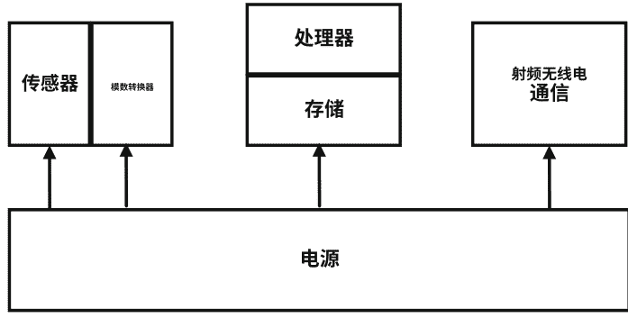

图 7.1 传感器节点的整体结构 [1]

传感器节点位于目标区域，收集与相关物理事件相关的数据，并将这些数据传到汇聚节点。因此，它们需要能量来正确执行 WSN 的任务。通信任务被视为能量消耗的主要来源。

除了通信任务外，还存在由于以下原因而导致的非活动状态的能量损失 [1]：

- 1. 空闲监听：由于可能从其邻居接收到传感器的数据，因此它必须监听介质上的消息。
- 2. 窃听：当数据从传感器节点发送时，所有邻居节点都会接收到该数据，即使它只发送给其中一个节点。
- 3. 干扰：传感器节点在发送和干扰范围之间接收到一个数据包，但无法解码该数据包。
- 4. 碰撞：在传输过程中存在碰撞时，为此任务分配的能量将丢失。
- 5. 控制包开销：应使用少量控制包来支持传输任务。

总之，由于它们的小型电池，传感器节点需要解决有限的能量消耗问题。这种情况变得更加有害，特别是当无法手动充电时，传感器节点通常位于无法到达的区域。因此，在 WSN 设计中，能量效率被视为一个重要的参数，以延长网络的寿命。

### 7.2.2 粒子群优化

群体智能是人工智能中的进化计算学科，研究分散和自组织系统的集体行为。特别是，群体行为的源头是群体内个体之间以及与环境之间的相互作用。蚂蚁和白蚁、鱼群、鸟群和蜜蜂是群体智能的典型例子。在群体智能中，不可能考虑所有种类的个体。要被视为群体智能，一个个体群必须具备以下特性：

- 1. 自组织：这是自然系统的一个重要特征，意味着可以在没有任何集中控制的情况下进行所需的过程。通过自组织，群体代理可以相互建立最佳的工作协调，从而以高速度和容错性追求任务。自组织的主要特征包括：
  - a) 正反馈：更多的代理参与相同的工作以促进智能解决方案。
  - b) 负反馈：代理避免参与相同的状态以抵消正反馈的影响。
  - c) 波动：随机性允许代理在系统中发生随机变化。
  - d) 多重互动：代理倾向于相互作用并从中学习，以在群体内创造智能行为。
- 2. 分工：由于专门代理的合作，可以同时在群体中执行各种任务，而不是顺序执行任务。因此，毫无疑问存在一种更有效和高效的任务管理系统。

自 1995 年首次引入以来，群体智能算法引起了研究人员的极大兴趣，并被应用于各个领域，从数值优化到机器学习再到电力系统 [20]。最早的群体智能算法——粒子群优化（PSO）[21] 引起了研究人员的越来越多的兴趣，并在各个领域得到了各种应用。PSO 模仿了社会群体（如鱼和鸟）的行为。该算法通过称为粒子的代理在可能的解空间中表示其位置来寻找最优解。该算法通过 Eqs. 7.1 和 7.2 以随机加权的方式迭代更新粒子的位置，利用其局部最佳和群体最佳位置的信息。在更新粒子位置的过程之后，群体最佳位置被重新定义为下一代。与遗传算法（GA）和进化策略等进化算法相比，PSO 的一个优点是用户需要调整的参数较少。此外，该算法不像 GA 那样经常面临停滞问题。除了在各个领域从数值问题到能源系统 [22, 23] 的各种成功应用之外，PSO 还经常用于无线传感器网络（WSNs）中。

$$v_{i}(t+1)=w v_{i}(t)+c_{1} r_{1}\left(\widehat{x}_{i}(t)-x_{i}(t)\right)+c_{2} r_{2}(g b e s t(t)-x_{i}(t))$$

$$x_{i}(t+1)=x_{i}(t)+v_{i}(t+1)$$

其中，$x_{i}(t)=\left\{x_{i, 1}, x_{i, 2}, \cdot \cdot ., x_{i, D}\right\}$ 表示第 i 个粒子在时间 $t$ 时的位置，$\widehat{x}_{i}(t)$ 表示其在时间时的最佳解，$g b e s t(t)$ 表示群体中的最佳位置，$w$ 是惯性权重，保持粒子沿着原来的方向移动，通常选择在 0.8 到 1.2 之间，$c_{1}$ 和 $c_{2}$ 是认知和社会系数，通常设置为 2，$r_{1}$ 和 $r_{2}$ 是在 0 到 1 之间随机生成的数。

### 7.2.3 问题定义

高效能源消耗是无线传感器网络中的一个关键问题，可以增强网络的寿命。能源使用中最密集的任务是从传感器节点传输数据到汇聚节点。传输过程所需的能量根据汇聚节点和传感器节点之间的距离而变化。具体来说，能源消耗与传输距离成指数比例增加，因此无线传感器网络的寿命在很大程度上取决于传输过程的高效能源管理。聚类是一种广泛应用的技术之一，用于高效管理从传感器节点到汇聚节点的传输过程。通过聚类，无线传感器网络中的一组传感器节点根据预定义的相似度度量（例如距离）分组成簇。每个簇由其簇头表示，负责从其内部的传感器节点获取数据。

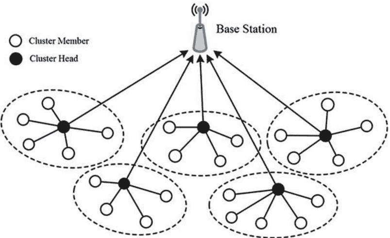

图 7.2 无线传感器网络中的传输过程

如图 7.2 所示，将集群中的数据转发给汇聚节点。长时间分配给一个集群头节点会过早耗尽其电源供应。因此，选择一个集群头节点在网络的性能和寿命中起着至关重要的作用。以下是众所周知的传统聚类方法：

- 1. LEACH [4]: 在 LEACH 中，选择一个集群头节点非常关键。如果能够优化选择集群头节点，可以提高能源效率并解决数据传输问题。在初始阶段，集群中的所有传感器都可以被选为集群头节点，但 LEACH 引入了一些额外的定义来选择集群头节点。协议的操作被分为多个轮次。每个轮次中都按照一定的计划进行所有传感器的检测、集群头节点的选择和数据传输等过程。由于使用了统计公式，每个传感器节点至少被选择一次，用于簇头选择。这是因为作为簇头的传感器消耗更多能量，所以每个传感器节点必须至少被选择一次作为簇头，以平均分配能量消耗。

- 2. LEACH-C [5]: 由于簇头数量不确定，并且低能量传感器节点有可能被选择为簇头，在 LEACH 中，研究人员开发了 LEACH-C，它进行了两层簇头选择。具体来说，所有传感器节点向汇聚节点报告它们的位置和能量水平。利用这些信息，确定一个阈值，并且小于确定的阈值的传感器节点不被选择为簇头。LEACH-C 在簇质量方面优于 LEACH。

- 3. EECS [7]: 该算法与 LEACH 具有类似的特点。所有的簇被合并为一个簇头，而这个簇头直接与汇聚节点建立连接。为了检测传感器节点的位置，汇聚节点发送一个“你好”数据包，响应时间确定传感器节点的大致位置。对于每个簇，选择簇首节点是以概率方式进行的。使用 COMPETE-HEAD-MSG 消息评估传感器节点的能量水平，然后选择能量水平最高的节点作为簇首节点。

- 4. PEGASIS [8]: 该算法是一种基于贪婪算法和基于链式方法的分层协议。传感器节点聚集在一起构建一个链。如果链中有任何传感器节点死亡，则通过跳过死亡节点重新构建链。从其他节点传输到领导节点的请求然后转发到汇聚节点。在具有许多传感器节点的网络中使用 PEGASIS 协议可能会导致数据传输延迟。为了减轻这个缺点，一种方法是在网络中使用多个领导节点。与 LEACH 相比，PEGASIS 被证明更加高效。

- 5. H-PEGASIS [24]: 该算法已经被开发出来解决 PEGASIS 中由于数据碰撞而导致的时间延迟问题。在 H-PEGASIS 中，引入了同时数据传输的方法，使用 CDMA 编码和空间分离的传感器来防止数据碰撞。基于 CDMA 的链式传感器，类似于树状结构，将数据从子层传输到汇聚节点。因此，在数据同时传输的同时减少了延迟。

其他常见的用于解决无线传感器网络中能量效率问题的传统聚类方法包括 SEP [6], DEEC [25], HEED [26] 和 EEHC [27]。有关为无线传感器网络提出的传统聚类方法的更多信息，请参阅 [28]。

## 7.3 基于 PSO 的方法

由于在 n 个传感器节点中选择 m 个最佳簇头节点导致了 m ×n 种可能性，因此在无线传感器网络中进行聚类是一个 NP 难问题。由于其有效的搜索特性，群体智能算法被广泛视为解决 NP 难问题的良好工具。由于其历史悠久且成功的背景，PSO 可能是无线传感器网络中应用最广泛的群体智能算法。本文考虑的基于 PSO 的聚类方法如下：

- **PSO-C [29]:** 该方法拥有一个在汇聚节点或基站上运行的集中式机制。在初始阶段，基站接收来自传感器节点的关于其能量水平和位置的信息。然后，基站使用接收到的信息计算所有节点的平均能量水平。具有足够能量水平的节点被确定为候选簇头节点。在第二阶段，应用 PSO 来确定候选簇头节点中的 K 个最佳簇头节点，通过优化目标函数，该目标函数是簇内距离和能量效率的加权组合。确定了簇头节点和簇成员之后，每个簇头节点构建一个 TDMA 调度来防止碰撞。在这个方案中，传感器节点只在传输时间内激活，以提高网络的能量效率。簇头从其分配的传感器节点收集数据，然后将收集到的数据转发给基站。根据结果，PSO-C 远优于 LEACH 和 LEACH-C。

- **PSO-HC [30]:** 该方法是另一种集中式协议，旨在通过最小化平均能量消耗和在簇内建立两跳通信来增强网络寿命和网络可扩展性。在第一阶段，每个传感器节点发送带有其 ID 的 hello 数据包。当一个传感器节点接收到该数据包时，它会使用数据包中包含的 RSSI 值更新其邻居表。在所有传感器确定其邻居之后，每个传感器节点使用泛洪方法将包括 ID、剩余能量和邻居表的数据传输到基站。然后，基站根据接收到的数据计算所有传感器节点的平均能量水平。如果网络中的任何传感器拥有比平均能量更高的能量水平，则确定为候选簇头。在第二阶段，应用 PSO 来从候选簇头中选择 K 个最优簇头。每个粒子表示为一系列簇头 ID。在从粒子中获取簇头集合之后，基站构建两层簇以提高网络的可扩展性和寿命。第一层簇是根据 RSSI 值将每个传感器节点分配给一个簇节点来构建的。第二层簇是使用所有来自第一层的非簇化传感器节点来构建的。根据结果，PSO-HC 比 LEACH、LEACH-C 和 PSO-C 更高效。

- **PSO-SD [31]:** 该方法不基于集中式机制，因此是一种半分布式方法。该方法试图通过加权优化以下目标来找到簇头的位置：簇内距离、剩余能量、节点度和簇头数量。每个粒子代表簇头的位置。该方法还考虑了数据包在估计路径上的重传大小对簇头的影响。根据结果，它的性能优于 PSO-C 和 LEACH-C。

- **PECC [32]:** 该方法使用集中式机制来形成簇。汇聚节点向传感器节点发送信息收集消息。接收到消息后，传感器节点将有关位置、ID、能量水平和能量损耗的信息传输给汇聚节点。然后，汇聚节点通过使用 PSO 以加权方式优化平均距离和平均能量水平来形成簇。对于每个簇，通过使用 PSO 以加权方式优化簇内距离和传感器节点数量来选择簇头。最后，采用多跳通信协议将数据传输过程从传感器节点传输到簇头，再从簇头传输到汇聚节点。每个簇中的簇头收集数据以保存剩余能量。如果从簇头到汇聚节点的距离不超过预定义的阈值，则簇头通过单跳传输将数据传输给汇聚节点。否则，簇头根据剩余能量和距离寻找新的跳数。

- **EMPS [33]:** 像 PSO-C、PSO-HC 和 PECC 一样，该方法基于集中式机制。在这种方法中，传感器节点与汇聚节点共享有关其位置和能量水平的信息。然后，PSO 首先将网络分割成子区域。每个粒子都被表示为一个区域边界，包括点线的（x，y）坐标以及点线与 X 轴和 Y 轴的角度。在子区域的分割过程之后，根据传感器节点到重心的距离和剩余能量确定每个区域的簇头。EMPS 由三个特征消息组成，用于执行传输过程：a）hello 数据包检测将数据传输到汇聚节点的簇区域。b）message-s 数据包将数据传输到汇聚节点。c）message-h 数据包将数据传输到簇头。从结果可以看出，与传统的聚类方法相比，它有效地管理能量使用。

- **PSO-ECHS [34]:** 该方法旨在通过使用 PSO 选择网络上的最佳簇头来提高网络效率。每个粒子表示网络空间中簇头的可能位置。目标函数以加权方式处理以下目标：平均簇内距离和平均汇聚点距离。与基于距离将传感器节点分配给簇头的方法不同，该方法根据加权函数将传感器节点分配给簇头，该加权函数包括剩余能量、簇头到汇聚点的距离、传感器节点到簇头的距离和簇头的度。根据对各种场景进行的各种实验，该方法优于 LEACH、LEACH-C 和 PSO-C 等多种知名方法。

- **PSO-HSA [35]:** 该方法采用双向混合方法来管理网络中的能量使用。在第一阶段中，使用 PSO 进行聚类，并选择 10% 的可用传感器节点作为簇头。在第二阶段中，应用和声搜索 [36] 来进行传输过程。

网关节点位于汇聚节点和簇首节点之间。网关节点负责在数据传输过程中提高能源效率到汇聚节点。簇首节点首先根据与汇聚节点之间的距离将获取的数据传输给网关节点。网关节点是根据与簇首节点之间的距离使用和谐搜索算法选择的。

- **SCE-PSO [37]:** 该方法假设簇首节点（称为网关）和传感器节点在给定区域内随机分布。如果传感器节点在通信范围内，则任何传感器节点都可以连接到任何簇首节点。如果一个簇中的传感器节点数量超过了簇的容量，其负载将被分配给其他簇。每个粒子的位置表示相应传感器节点的分配簇。因此，每个粒子的维度等于网络中传感器节点的数量。目标函数由三个基本组成部分组成：簇首节点的负载、簇内距离和负载较重的簇首节点的数量。从目标函数中可以提取出传感器节点的分配过程。节点取决于簇头负载。这增强了簇头的寿命，从而最大化了整个网络的寿命。一旦粒子使用目标函数进行评估，它们根据目标值进行排序并分成群组，称为复合体。然后，使用 PSO 对每个复合体进行单独评估，并使用新生成的粒子进行更新。

- **PUDCRP [38]:** 靠近汇聚节点的簇头更有可能参与多跳路由中的数据传输过程。这导致了靠近汇聚节点区域的节点数量减少，即热点问题。与前面的方法不同，该方法同时考虑了热点问题和传感器节点分组。为了缓解热点问题，该方法根据传感器节点的分布将网络划分为不同大小的圆圈。然后，簇头的确定被视为一个多目标问题。需要注意的是，簇头的最优数量是动态确定的，不需要任何用户指定的参数。从结果中可以看出，PUDCRP 的性能优于包括 PSO-SD 和 PSO-ECHS 在内的各种最近引入的方法。

- **GA-PSO [39]:** 该方法包括两个基本阶段。在第一阶段中，使用基于加权目标函数的 GA 确定簇首，该函数考虑了节点到簇首的距离、簇首到基站的距离、非簇首到簇首的距离以及总系统能量。确定了簇首之后，进行第二阶段。在这个阶段中，应用 PSO 来管理路由过程。中继节点被放入传输流量中，以提高簇首的效率。特别是，簇首首先搜索最近的中继节点或基站来传输聚合数据。该方法的性能优于 LEACH 变体，但与最近基于 PSO 的簇内通信方法没有进行比较。

- **PSO-UFC [40]:** 该方法首先通过加权优化以下目标来确定簇首：(1) 簇内平均距离，(2) 簇间平均距离和 (3) 剩余能量。选择了簇首之后，以使靠近基站的簇具有较小的大小以保留它们的能量用于簇间中继传输过程。然后，在选定的簇首之间构建多跳路由树。为了处理容错任务，为每个簇首确定了一个替代簇首。根据实验结果，PSO-UFC 优于 LEACH、PSO-C 和 EBUC 等各种方法。

- **PSO-ECSM [41]:** 接收节点放置在无线传感器网络的中间，用于收集节点的数据。换句话说，该方法是建立在异构模型上的。该方法通过考虑以下因素来选择簇头节点：剩余能量、节点度数、能量距离、平均能量和能量消耗。该方法还通过应用接收节点的移动性来解决多跳网络中的数据流量问题。根据多次实验，该方法在稳定性、鲁棒性和网络寿命等方面表现优于多种聚类方法。

### 7.3 最近粒子群优化（PSO）聚类的调查

表 7.1 PSO-based 方法的比较

| 方法 | 数据聚合 | 效率 | 可扩展性 | 机制 | 网络 | 多跳 | 多路径 |
| :--- | :--- | :--- | :--- | :--- | :--- | :--- | :--- |
| PSO-C [29] | 是 | 平均 | 低 | 集中式 | 同质的 | 否 | 否 |
| PSO-HC [30] | – | 平均 | 高 | 集中式 | 同质的 | 是 | – |
| PSO-SD [31] | 是 | 高 | 高 | 分布式 | 同质的 | – | 是 |
| PECC [32] | 是 | 平均 | 中等 | 分布式 | 同质的 | 是 | – |
| EMPS [33] | 是 | 高 | 高 | 集中式 | 同质的 | – | 是 |
| PSO-ECHS [34] | 否 | 高 | 高 | 集中式 | 同质的 | – | – |
| PSO-HSA [35] | – | 平均 | 中等 | 集中式 | 同质的 | 否 | – |
| SCE-PSO [37] | – | 平均 | 高 | 集中式 | 同质的 | 否 | – |
| PUDCRP [38] | – | 高 | 高 | 集中式 | 同质的 | 是 | 是 |
| GA-PSO [39] | – | 平均 | 中等 | 集中式 | 同质的 | – | – |
| PSO-UFC [40] | – | 平均 | 中等 | 集中式 | 同质的 | 是 | 是 |
| PSO-ECSM [41] | 是 | 高 | 高 | 集中式 | 异构 | 是 | – |

表 7.1 总结了从不同角度介绍的基于 PSO 的聚类方法。根据表 7.1，PSO-based 方法更倾向于使用集中式机制而不是分布式机制。从表 7.1 中还可以得出结论，所有基于 PSO 的方法都能通过高效的能量管理来提高网络寿命。在比较的方法中，PSO-SD、EMPS、PSO-ECHS、PUDCRP 和 PSO-ECSM 是高级节能方法。此外，除了 PSO-C 之外，所有方法的可扩展性都可以被视为足够。

## 7.4 结论

在本章中，我们介绍了最近提出的基于 PSO 的聚类方法的调查，以解决 WSN 中的能源效率问题。在这个领域的各种工作中，没有一篇文献试图反映最近提出的基于 PSO 的方法来处理 WSN 中的能源消耗。根据结果，基于 PSO 的方法可以更好地进行能源管理。

整个网络的管理比传统的聚类协议更好。在我们的观点中，未来的研究人员可以考虑以下工作。首先，混合框架可能是改进基于 PSO 的方法效率的选择。其次，从不同的角度来看，文献中没有找到关于基于 PSO 的方法的全面比较分析。第三，大多数基于 PSO 的方法都是基于集中式机制的，即未来可以深入研究分布式机制对能源效率的影响。

# 参考文献

- 1. M. A. H. Hussein, 无线传感器网络的能源效率。硕士论文，(Cankaya 大学自然与应用科学研究生院，2015 年)
- 2. S. Mahfoudh, 无线自组织和传感器网络的能源效率：路由，节点活动调度和跨层。博士论文，(Universite Pierre et Marie Curie - Paris VI, 2010 年)
- 3. M. Mehdi Afsar, T.-N. Mohammad-H, 传感器网络中的聚类：文献调研。J. Netw. Comput. Appl. 46, 198-226 (2014)
- 4. W.B. Heinzelman, A.P. Chandrakasan, H. Balakrishnan, 无线微传感器网络的应用特定协议架构。IEEE Trans. Wirel. Commun. 1(4), 660-670(2012)
- 5. M. Tripathi, M. S. Gaur, V. Laxmi, R. B. Battula, 节能的 LEACH-C 协议用于无线传感器网络。In Proc. Third International Conference on Computational Intelligence and Information Technology (CIIT), 2013
- 6. G. Smaragdakis, I. Matta, S.E.P. Bestavros, 用于集群异构无线传感器网络的稳定选举协议。In Proc. Second International Workshop on Sensor and Actor Network Protocols and Applications (SANPA), 2004
- 7. V. Saranya, S. Shankar, G.R. Kanagachidambaresan, 能源高效的无线传感器网络聚类方案 (EECS) 与移动汇聚。无线个人通信：国际杂志 100(4), 1553-1567 (2018)
- 8. S. Lindsey, C.S. Raghavendra, PEGASIS: 传感器信息中的功率高效聚集。在 IEEE 航空航天会议，(2002)
- 9. A. Abbasi, M. Younis, 无线传感器网络聚类算法综述。计算机通信 30(14), 2826-2841 (2007)
- 10. B. Mamalis, D. Gavalas, C. Konstantopoulos, G. Pantziou,无线传感器网络中的聚类。RFID 和传感器网络：架构，协议，安全和集成 (2009), 第 323-354 页
- 11. X. 刘，无线传感器网络中聚类路由协议的调查。传感器 12(8), 11113-11153 (2012)
- 12. C. 江，D. 元，Y. 赵，无线传感器网络中的聚类算法调查。在 IEEE 无线通信和网络会议中，(2009)
- 13. P. Kumarawadu, D.J. Dechene, M. Luccini, A. Sauer, 无线传感器网络中节点聚类的算法调查。在第 4 届可持续性信息与自动化国际会议中，(2008)
- 14. B.P. Deosarkar, N.S. Yadav, R.P. Yadav, 无线传感器网络中聚类算法中的簇头选择调查。在计算、通信和网络国际会议中，(2008)
- 15. M. Aslam, N. Javaid, A. Rahim, U. Nazir, A. Bibi, Z. Khan, 对无线传感器网络的扩展 LEACH-based 聚类路由协议的调查。在第 9 届 IEEE 国际嵌入式软件和系统会议，(2012)

## 7 最近粒子群优化（PSO）聚类的调查

- 16. D. Wohwe Sambo, B.O. Yenke, A. Forster, P. Dayang, 用于大型无线传感器网络的优化聚类算法：一项综述。传感器 19, 1–27 (2019)
- 17. R.V. Kulkarni, A. Förster, G.K. Venayagamoorthy, 无线传感器网络中的计算智能：一项调查。IEEE 通信调查教程 13(1), 68–96 (2011)
- 18. P. Kumari, M.P. Singh, P. Kumar, 使用模糊逻辑在无线传感器网络中的聚类算法调查。在能源高效可持续性国际会议，(2013)
- 19. S. Sirsikar, K. Wankhede, 比较聚类算法以设计新的聚类方法。在第四届国际计算、通信和控制会议中，(2015)
- 20. E. Hancer, D. Karaboga, 传统、合并分裂和进化方法的综合调查，用于确定聚类数。群体和进化计算 32, 49–67 (2017)
- 21. J. Kennedy, R. Eberhart, 粒子群优化。在国际神经网络会议中，(1995)
- 22. P.H. Mahmoud, N.-H. Morteza, M.-I. Behnam, S. Heresh, 用于分布式发电分配的混合遗传粒子群优化在电力配电网络中。能源 209, 118218 (2020)
- 23. N.-H. Morteza, S. Madadi, P.H. Mahmoud, M.-I. Behnam, 使用量子启发粒子群优化的最优分布式发电分配，在量子计算：智能大规模实际应用环境中，(Springer, Cham, 2018), pp. 419–432
- 24. S. Lindsey, C. Raghavendra, K.M. Sivalingam, 数据收集算法在传感器网络中使用能量度量。IEEE Trans. Parallel Distributed Syst. 13(9), 924–935 (2002)
- 25. L. Qing, Q. Zhu, M. Wang, 一种用于异构无线传感器网络的分布式能量高效聚类算法的设计。Comput. Commun. 29(12), 2230–2237 (2006)
- 26. O. Younis, S. Fahmy, HEED: 一种混合的、能量高效的、分布式聚类方法，用于自组织传感器网络。IEEE Trans. Mob. Comput. 3(4), 366–379 (2004)
- 27. D. Kumar, T.C. Aseri, R.B. Patel, EEHC: 一种能量高效的异构聚类方案，用于无线传感器网络。Comput. Commun. 32(4), 662–667 (2009)
- 28. B. Jan, H. Farman, H. Javed, B. Montrucchio, M. Khan, S. Ali, 能源高效的分层聚类方法在无线传感器网络中的应用：一项调查。无线通信和移动计算。6457942 (2017)
- 29. N.M.A. Latiff, T.C. Simonides, B.S. Sharif, 使用粒子群优化的能源感知聚类算法在无线传感器网络中的应用。在第 18 届 IEEE 国际个人、室内和移动无线电通信研讨会，(2007)
- 30. R.S. Elhabyan, M.C.E. Yagoub, PSO-HC: 粒子群优化协议在无线传感器网络中的分层聚类。在第 10 届 IEEE 国际协作计算：网络、应用和工作共享会议，(2014)
- 31. B. Singh, D.K. Lobiyal, 基于粒子群优化的新型能源感知簇头选择算法在无线传感器网络中的应用。HCIS 2(1), 2–13 (2012)
- 32. C. Vimalarani, R. Subramanian, S.N. Sivanandam, 一种增强的基于 PSO 的聚类能量优化算法，用于无线传感器网络。Scientific World J. (2016)
- 33. J. Wang, Y. Cao, B. Li, H. Kim, S. Lee, 基于粒子群优化的移动汇聚聚类算法，用于 WSNs。Futur. Gener. Comput. Syst. 76, 452–457 (2017)
- 34. P.C.S. Rao, P.K. Jana, H. Banka, 一种基于粒子群优化的能量高效的簇头选择算法，用于无线传感器网络。Wirel. Netw. 23(7), 2005–2020 (2017)
- 35. V. Anand, S. Pandey, 基于粒子群优化和和谐搜索的无线传感器网络聚类和路由。Int. J. Comput. Intelligence Syst. 10(1), 1252–1262 (2017)
- 36. Z. Woo, J. Hoon, G.V. Loganathan, 一种新的启发式优化算法：和谐搜索。仿真 76(2), 60–68 (2001)
- 37. D.R. Edla, M.C. Kongara, R. Cheruku, SCE-PSO 基于聚类的负载均衡方法在无线传感器网络中的应用。无线网络 25(3), 1067–1081 (2019)
- 38. D. Ruan, J. Huang, 一种基于 PSO 的不均匀动态聚类多跳路由协议用于无线传感器网络。传感器网络 19, 1835 (2019)
- 39. D. Anand, S. Pandey, 一种基于 GA-PSO 的聚类和路由新方法在无线传感器网络中的应用。通信系统国际期刊 33, e4571 (2020)
- 40. T. Kaur, D. Kumar, 基于粒子群优化的不均匀和容错聚类协议用于无线传感器网络。IEEE 传感器期刊 18, 4614–4622 (2018)
- 41. B.M. Sahoo, T. Amgoth, H.M. Pandey, 基于粒子群优化的能量高效聚类和汇聚移动在异构无线传感器网络中的应用。自组网 106, 102237 (2020)

## 第 8 章
## 使用创新的机器学习/深度学习方法进行电力系统聚类
Mohammad Hossein Rezaeian Koochi, Mohammad Hasan Hemmatpour 和 Payman Dehghanian

## 8.1 引言

聚类是将数据集划分为具有相似特征的组的任务。这些数据集可以由不同类型的数据组成，例如一组变量的时间序列变化或一组放置在二维或多维空间中的单个数据点。评估这种相似性的机制的选择取决于数据的类型。对于放置在 p 维空间中的单个数据点的情况，欧氏距离可能是一种有希望的方法。例如，图 8.1 显示了在二维平面上的典型数据点集可以根据数据点之间的欧氏距离进行聚类。然而，为了评估时间序列变化的相似性，可能需要使用其他准则和预处理任务，而不仅仅是欧氏距离，例如计算相关系数，应用动态时间规整（DTW）或使用特征提取技术，如主成分分析（PCA）或独立成分分析（ICA）。图 8.2 说明了在聚类之前如何对原始时间序列数据应用这些预处理步骤。


图 8.1 根据欧氏距离在 2D 空间中对数据点进行聚类


图 8.2 对时间序列变化数据集进行聚类的步骤

部署智能电表和相量测量单元（PMUs）等先进计量设备在配电和输电系统中，扩大了电力系统监测、运行和控制的视野。在现代电力系统中，先进的监测系统提供了大量的原始数据，包括各种信号的时间序列变化。这些时间序列变化的规模可以从不到一分钟（与事后扰动变化相关）到一天的时间范围（与消费者每日出价相关），甚至是终端用户的月度负荷变化模式。在这种情况下，评估变化之间的相似性并对相似信号进行聚类可以有助于更好地运行和规划电力系统。然而，由于这些信号的数量很大且其变化模式很复杂，使用先进的特征提取和聚类技术是不可避免的。因此，在文献中，已经提出了在电力系统研究中使用聚类技术，包括输电和配电网络。

在相关文献中的作品中，有几项研究致力于使用聚类技术对消费者进行分组。在 [1] 中，提出了使用聚类技术根据智能电网中用户的 24 小时出价来将其分为不同类别的方法。这项任务对于在电力分配系统中制定灵活的激励费率策略的需求响应计划非常有帮助。在这个领域的另一类研究与使用聚类技术将负载分割在智能电网或微电网中有关。例如，在 [2,3] 中，通过对家庭的电力消费模式进行聚类，选择最合适的家庭参与基于激励的家庭需求响应计划。通过这样做，数千个根据能量消耗行为的相似性将家庭分组聚类。在 [4] 中还提出了使用聚类来减少分布式能源资源（DERs）的本地控制。为此，基于电压变化，使用聚类技术对相似的 DER 特征曲线进行聚类。此外，聚类技术的使用还被提出用于分布系统中智能电表的相位识别 [5] 和能量需求的预测 [6] 等其他应用。

除了上述关于聚类技术在电力系统研究中的应用示例外，大部分工作都致力于将大型电力系统划分为区域，以使每个区域中元素的动态响应相似。这种电力系统划分基于一种称为相干性的概念，即系统元素的事后扰动动态响应的相似性 [7]。在这方面，那些对扰动具有类似响应的元素被放置在同一簇中，并被称为相干元素。与电力系统研究中的其他聚类应用类似，这里的聚类是基于时间序列信号之间的相似性进行的，这些信号是网络中所有母线上发电机速度、转子角度或电压相角的事后扰动观测值。

一般来说，基于相干性的电力系统划分方法可以分为两组，即基于模型和基于测量的方法 [8]。基于模型的方法主要依赖于缓慢相干性概念，并使用系统的线性化模型来区分相干发电机。这种方法主要适用于动态等效或控制措施以减轻系统中的低频振荡等应用。图 8.3 显示了电力系统如何被划分为用于动态等效的区域。基于测量的方法，也称为数据驱动方法，使用来自系统各处的 PMU 测量数据来找到相干发电机。这种方法也可以扩展到母线上以确定簇的边界。

在这些方法中，假设相干组的数量和它们的边界可能因不同特征的不同干扰而变化。因此，基于测量的方法适用于在线应用，如受控孤岛和特殊保护系统。由于规模庞大，在互联电力系统中，很难在干扰后快速找到系统中的区域。此外，系统中的每个母线或发电机都可以视为一个数据点。因此，机器学习在电力系统聚类中的应用已在文献中广泛讨论。在这方面，特征提取和有监督和无监督学习技术已被用于将电力系统划分为不同的区域。

从基于测量的角度来看，区域的数量和边界并不固定，并且在不同的干扰情况下可能会发生变化。事实上，干扰的类型和位置，以及干扰发生时的电力系统状态（例如系统负载水平）可能会影响系统对干扰的动态响应，并导致不同的电力系统分区方案。因此，用于电力系统分区的聚类算法应具备以下特点：

- 它不应依赖于对聚类数量的先验假设。
- 它应能够在不平衡的数据集上表现良好。不平衡的数据集是指存在非常小和大的聚类的数据集。在电力系统研究中，可能会出现一些情况，系统中形成了一个小区域和大区域。此外，在不稳定的情况下，通常会有一个发电机失去同步，从而与一个成员组成一个小组。聚类算法应该能够区分这样的小簇。
- 它不应该依赖于其过程中的随机选择（这些随机选择将在第 8.4 节中讨论无监督学习技术时进行描述）。这是为了确保确定性解决方案。
- 聚类算法最好具有少量需要调整的参数。虽然这不是必需的，但参数越少，算法实现就越简单。

值得注意的是，相似性是一个相对的概念，意味着从一个人的角度来看，两个看起来非常相似的对象可能在另一个人的视角中并不被视为相似的对象。在这方面，相似度是一个更好的术语，特别是在处理聚类问题时。因此，用户根据其聚类问题的要求来确定所需的相似度程度，以设置所选择的聚类技术的参数。另一方面，文献中提供了各种用于时间序列信号的相似性评估准则。这些准则的示例是两个信号样本之间的欧氏距离，皮尔逊系数和相似度系数，分别在 (8.1) - (8.3) 中定义。

$$ c_{x,y} = \sqrt{ \frac{1}{N} \sum_{k=1}^{N} (x(k) - y(k))^2 } \tag{8.1} $$

$$ c_{x,y} = \frac{\sum_{k=1}^{N} x(k) y(k)}{\sqrt{\sum_{k=1}^{N} x^2(k) \sum_{k=1}^{N} y^2(k)}} \tag{8.2} $$

$$ c_{x,y} = \frac{\sum_{k=1}^{N} (x(k) + y(k))^2}{2 \sum_{k=1}^{N} (x^2(k) + y^2(k))} \tag{8.3} $$

其中，x 和 y 是要评估相似性的两个信号，N 是样本数量。

除了文献中提出的用于电力系统聚类的技术，本章的其余部分还将使用一个测试案例进行数值评估这些技术的有效性。

本章使用的测试系统是 16 机器、68 母线的测试系统，该系统已被引入用于动态研究，并广泛用于相干性评估及其应用。该系统包括两个名为新英格兰测试系统 (NETS) 和纽约电力系统 (NYPS) 的大区域，以及由 G14、G15 和 G16 表示的三个简化区域。该系统的单线图如图 8.4 所示，详细信息可参考 [9]。本章使用的测试案例，采用自 [10] 采用的一个特点是在连接 1 号和 2 号母线的线路上施加了单相接地故障，并且靠近 1 号母线，在 0.06 秒后清除，没有任何线路跳闸。请注意，在施加此故障之前，连接线路为了增加 NETS 和系统其余部分之间的电气距离，移除了 8 号和 9 号母线。

在相关文献中，提出了不同的数据挖掘和模式识别技术用于电力系统分区。尽管大部分工作集中在使用无监督学习方法上，但文献中也提出了特征提取技术和监督学习方法。因此，在本章的其余部分，首先讨论了特征提取技术的应用。在描述了监督学习方法的应用之后，将进一步讨论无监督学习方法的应用。此外，还将探讨这些技术在电力系统聚类中的优缺点，帮助系统规划者和运营商在实际环境中做出决策。

## 8.2 使用特征提取方法进行电力系统聚类方法

除了研究人员对于寻找一致发电机或母线组的各种监督和无监督学习方法之外，还有一些特征提取方法被提出用于电力系统的一致性评估。特征提取方法主要作为其他数据挖掘技术的预处理任务引入。具体来说，这些方法主要用于将大量原始数据转换为更合适的低维数据集。其中包括主成分分析 (PCA) [11, 12] 和独立成分分析 (ICA) [13]，它们已被应用于发电机速度变化，将这些数据转换为三维空间进行分组。

### 8.2.1 主成分分析

PCA 是一种多变量分析技术，能够从输入信号中提取不相关的成分。PCA 主要用于降低问题的维度。假设有 N 个观测值和 M 个变量，其中 M≤N。通过应用 PCA，这些实际上是相关变量的 N 个变量将被转换为一组不相关的变量。这些不相关的变量 (主成分) 是将原始矩阵的 p 个最大特征向量应用于原始矩阵的结果，然后映射到一个 p-维空间。PCA 的思想是探究前几个成分是否能解释原始变量的变化。从数学角度来看，考虑一个维度为 M×N 的矩阵 X，其中行是变量，列是观测值。通过应用 PCA，X 将被重构为正交函数的和，如下所示 [14]：

$$ X = \left( \begin{array}{c} d_{1,1} \\ \vdots \\ d_{m,1} \end{array} \right) \omega_1' + \left( \begin{array}{c} d_{1,2} \\ \vdots \\ d_{m,2} \end{array} \right) \omega_2' + \cdots + \left( \begin{array}{c} d_{1,m} \\ \vdots \\ d_{m,m} \end{array} \right) \omega_m' \quad (8.4) $$

其中 $\omega_i'$ 是矩阵 $X^T X$ 的第 $i$ 个归一化右特征向量。在一个 $p$ 维空间 ($p \le M$) 中，第 $i$ 个分量被映射到具有坐标 $d_{i,1}, d_{i,2}, \ldots, d_{i,p}$ 的点。在这方面，由于相似的分量在新空间中具有相似的坐标，与原始变量对应的具有相似变化的数据点将在新空间中形成一个聚类。

在电力系统研究中，已经提出了使用主成分分析 (PCA) 进行电力系统划分的方法。在 [11] 中，通过研究发电机在发电机速度信号的后扰动变化中使用 PCA 进行聚类的效率进行了检验。此外，在 [11] 中还应用 PCA 进行电力系统划分，通过研究所有母线电压的后扰动相角变化之间的相似性。然而，并不是所有情况下都可以直观地将映射到降维的 $p$ 维空间中的数据点进行聚类，这意味着需要进一步分析来找到聚类。例如，在 [15] 中，应用 PCA 后，提出了在三维空间中对组件进行分组的分层聚类方法。PCA 的一个优点是，如果它工作良好，就不需要对聚类的数量进行先验假设。这是因为，如介绍中所述，从基于测量的观点来看，电力系统可以根据系统中发生的不同干扰以不同的边界划分为不同数量的区域。

图 8.5 显示了测试案例中每个母线的前三个分量的系数位置在三维空间中的位置。从图 8.5 可以看出，区域 1 (聚类 1) 与其他区域相距较远，因此可以很容易地区分开来。然而，尽管其他聚类在视觉上可以区分开来，但在某些情况下，在三维空间中找到这些聚类将会很困难，因此使用聚类技术是必不可少的。


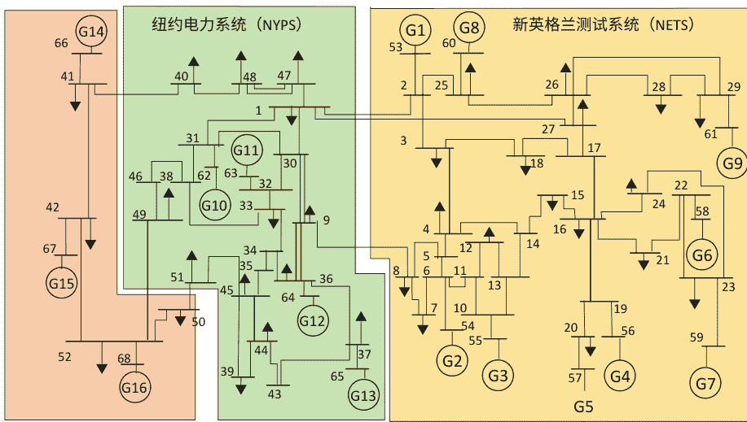
图 8.6 测试系统获得的聚类（区域）

在某些情况下，虽然两个聚类在视觉上可以区分开来，但在三维空间中找到这些聚类将会很困难，因此使用聚类技术是必不可少的。请注意，本图中的聚类方案与 [10] 中的减法聚类得到的聚类方案相同。图 8.6 显示了这些区域的图形说明。

### 8.2.2 独立成分分析

ICA 是另一种多变量技术，旨在从原始数据中提取隐藏特征 [16]。与 PCA 不同，PCA 从原始数据中提取一组不相关的成分，而 ICA 试图将数据转换为一组独立的成分。更具体地说，ICA 试图找到相互独立且非高斯的成分。根据 [13]，独立性可能意味着不相关，但不相关并不保证独立性。

考虑一个存储在矩阵 X 中的 M 个变量的 N 个观测值集合，ICA 将分解 X 为独立的成分，如 (5) 所示 [16]。

```
$$ X=\left(\begin{array}{c} d_{1,1} \\ \vdots \\ d_{m,1} \end{array}\right) c_{1}^{\prime}+\left(\begin{array}{c} d_{1,2} \\ \vdots \\ d_{m,2} \end{array}\right) c_{2}^{\prime}+\cdots+\left(\begin{array}{c} d_{1, m} \\ \vdots \\ d_{m, m} \end{array}\right) c_{m}^{\prime} $$
```

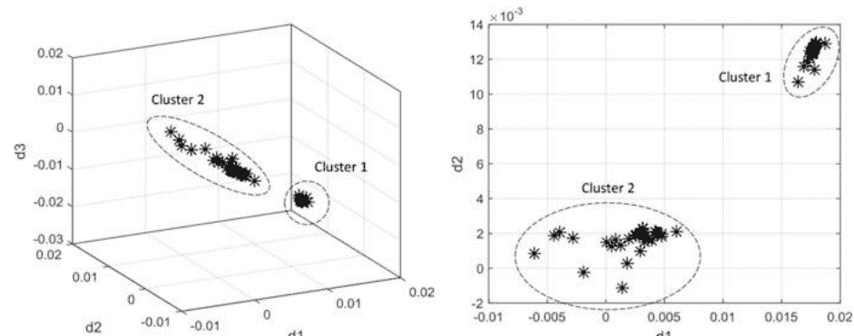

图 8.7 使用 ICA 获得的聚类结果：(a) 3D 空间和 (b) 2D 空间

与 PCA 类似，独立成分必须按照其主导性进行排序。然后，主导成分将用于聚类，对于 2D 可视化来说可能是前两个成分，对于 3D 可视化来说可能是前三个成分。

例如，考虑前三个主要独立分量，并绘制行向量的前三个元素，即 $d_{i1}, d_{i2}$ 和 $d_{i3}$，可以看到相干信号对应的数据点在三维空间中靠近一起。然而，正如 PCA 所描述的那样，ICA 并不总能以视觉或图形方式聚类数据点。因此，虽然 ICA 可以从原始数据中提取有用信息，但最后可能需要使用聚类技术来找到最终的聚类。图 8.7 显示了将 ICA（这里是快速 ICA）应用于本章中使用的测试案例的结果。如图 8.5 所示，可以看出，ICA 将系统分为两个聚类，其中第二个聚类由聚类 2 和聚类 3 组成。

## 8.3 使用监督学习方法进行电力系统聚类

监督学习方法，通常被称为分类器，是另一种类型的学习方法，广泛应用于工程、医学和经济等各个科学领域。在这些方法中，使用一组已知分组标签的数据来训练分类器。事实上，监督方法试图找到确定已观察数据与其相关已知标签之间关系的规则，然后使用这些规则来预测下一个观察值的标签。因此，训练和测试分类器需要一个包含多个属性和一个目标的数据集，其中这些属性和目标可以是任何类型的数值、名义或布尔变量。

在文献中，已经开发了诸如决策树 (DTs) 和人工神经网络 (ANNs) 等监督学习方法来构建分类器。

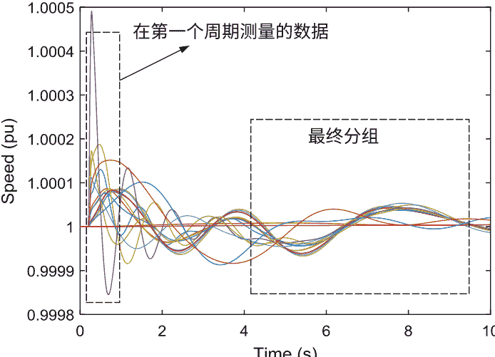

图 8.8 发电机分组预测使用发电机速度变化的数据窗口

通过首次故障后的循环来预测发电机的稳定或不稳定群组。在一致性分析中，这些方法旨在用多类分类器替代及时的一致性识别方法，以预测发电机的一致性群组。在分类方法中，建议使用神经网络和决策树进行一致性预测。图 8.8 展示了发电机速度振荡的典型表示。根据这个图，一个分类器旨在使用在首次故障后测量的数据中隐藏的信息和模式来预测最终形成的分组。

### 8.3.1 人工神经网络

在人工神经网络中，多个层次的神经元被组合在一起构建分类器。人工神经网络在不同领域中被广泛用于预测和回归应用。在与电力系统相干性分析相关的文献中，人工神经网络的使用在少数研究中得到了讨论。主要的工作已经发表在 [17] 中，作者建议使用人工神经网络来使用三个发电机速度信号样本进行聚类。人工神经网络还被提出作为发电机聚类的预处理任务。在最近的一项研究中，Siddiqui 等人使用神经网络结构来预测时间序列信号，即后扰动转子角度轨迹。在他们的工作中，他们使用扰动后的前六个周期的变化来预测未来的转子摆动轨迹，然后通过评估这些预测轨迹的相似性来对发电机进行聚类。

### 8.3.2 决策树

决策树是一种分类器，具有树状形状，由从训练数据集中提取的一组决策规则组成。为了提取规则，数据中的每个观测值必须附带一个已知的目标内容。决策树由两种类型的节点组成，即决策节点和终端节点。决策树的输入包括几个属性，在其相关的决策节点中进行测试。例如，在根节点中，即决策树的第一个决策节点，对相关属性进行测试，并根据第一个测试的输出值确定下一个决策节点。这个过程将继续，直到达到决策树的一个终端节点或叶子节点。与人工神经网络类似，训练数据集和测试数据集用于训练和评估决策树的准确性。

在文献中，有几项研究使用了不同类型的 DTs 来预测发电机的相干性。例如，[19, 20] 的作者已经证明，使用适当的 DT 训练技术，可以在干扰后的很短时间内利用 PMUs 测量的数据建立一个电力系统模型来预测相干发电机的群集。在另一项研究中 [21]，提出使用一组简单的 DTs 来在干扰后找到最相干的发电机。分位数回归森林是另一种 DTs 的类型，在 [22] 中提出用于预测不稳定的相干发电机群组，这对于在紧急情况下及时识别必要的补救措施非常有帮助。

在这些研究中，假设对电力系统中的不确定性有很好的了解，就可以找到几乎所有可能发生在系统中的聚类方案。然后生成一个训练数据集，其中目标是这些可能的聚类方案之一，而属性是从同步相量测量中适当提取的特征。

最后，进行训练和测试过程，以发现属性值和目标之间的隐藏模式和规则。然而，这些研究中出现的一个显著问题是，即使在这些方法中，如果数据点（发电机或母线）的数量很多，也可能需要使用聚类技术来确定目标输入。

## 8.4 使用无监督学习方法进行电力系统聚类

在电力系统聚类领域的绝大多数工作都是使用无监督学习方法完成的，这些方法被称为聚类类型的数据挖掘技术。已经提出了各种用于电力系统聚类的聚类方法。然而，这些方法都有各自的优点和缺点，在用于电力系统聚类之前应该进行检查和解决。

根据其过程的性质，无监督聚类技术可以分为两类。在第一类中，包括 k-means (KM) [23] 和模糊 c-means (FCM) [24] 等算法，已知所需的聚类数（$N_c$），因此任务是根据数据点之间的相似度将数据集分成 $N_c$ 组。然而，在第二类算法中，例如减法聚类（SC）[25–27] 和基于密度的具有噪声的空间聚类 (DBSCAN) [28]，其中不需要对期望的聚类数量进行先验假设，而是由用户确定一个表示聚类中每对数据点之间所期望的最高不相似度的半径，因此，算法的唯一任务就是找到聚类。换句话说，在第二类方法中，确定聚类数量的是算法本身。图 8.9 展示了这两类聚类方法的工作原理。

第 8.4.1–8.4.7 小节将描述这些方法以及它们的优缺点。

此外，将在各自的小节中介绍与每种聚类方法在电力系统聚类领域中的应用相关的文献。

### 8.4.1 K-Means 聚类算法

K-means 聚类是一种常用的聚类算法，它使用迭代过程将数据点聚类成预定义数量的聚类。事实上，K-means 是一种硬聚类算法，意味着在最终解中，每个数据点对一个聚类的成员值为 1，而对其他聚类的成员值为 0。该算法在数据集中搜索聚类，以使成本函数最小化。

成本函数被定义为成员之间的差异之和，如下所示：

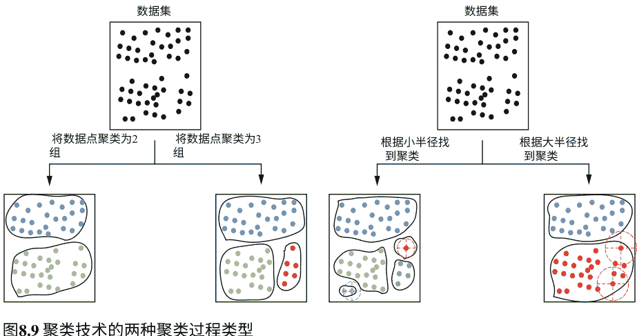

$$
J=\sum_{j=1}^{c} \sum_{i \in G_j} d_{(i, j)}
$$

对于数据集中的任何数据点 $i$，其隶属函数定义如下:

$$
u_{(i, j)}=\left\{\begin{array}{ll} 1 & \text { 如果第 i 个数据点属于第 j 个聚类 } \\ 0 & \text { 否则 } \end{array}\right.
$$

请注意，如果在所有中心中，第 $j$ 个中心与数据点具有最低的差异性，则认为数据点 $i$ 属于第 $j$ 个聚类。在每次迭代中，根据 (8.8) 更新聚类中心。

$$
z_j=\frac{1}{G_j} \sum_{x_i \in G_j} x_i
$$

在 (8.8) 中，$z_j$ 是第 $j$ 个簇的中心，$G_j$ 是簇中的数据点集合，$|G_j|$ 表示其大小，而 $x_i$ 是 $G_j$ 中的第 $i$ 个数据点。需要注意的是，正如 (8.8) 所示，在 KM 算法中，最终解中的簇中心不一定是数据点。考虑到 (8.6)-(8.8)，对数据集进行聚类的迭代过程如下所示:

- 步骤 1: 从数据集中选择 $N_C$ 个簇中心进行初始化。
- 步骤 2: 使用 (8.7) 计算所有数据点的成员关系值。
- 步骤 3: 计算在 (8.6) 中定义的代价函数。
- 步骤 4: 使用 (8.8) 更新聚类中心，并返回步骤 2。

这里可以使用两个停止准则。在第一个准则中，如果两次迭代中得到的代价函数值之间的差异小于阈值，则算法将停止；而在第二个准则中，如果算法运行的次数足够多，则算法将停止。然而，K 均值算法的缺点有两个。首先，K 均值算法需要预先定义聚类的数量。其次，它的性能高度依赖于初始聚类中心的随机选择。

因此，K 均值算法可能会找到错误的解，特别是对于存在非常小和非常大聚类的数据集。为了克服这个挑战，一种方法是多次运行 K 均值算法以找到更好的解决方案，或者使用减法方法来适当选择初始聚类中心。

在相关文献中，有几项研究使用 KM 方法来寻找一致的发电机和一致的区域。例如，[29, 30] 中的作者使用 KM 方法将发电机聚类成预定义数量的组。为此，他们为每个发电机定义了一个表示发电机模态响应的行向量，然后使用两个发电机向量之间的角度作为获取不相似性的标准。在 [31] 中提出的另一项工作中，将奇异值分解 (SVD) 应用于发电机转子角度变化信号，构建了一个称为特征系数矩阵的矩阵。

特征系数矩阵的维度为 $k \times N_G$，其中 $N_G$ 是发电机数量，$k$ 是在 SVD 过程中保留最大 $k$ 个奇异值的选择。接下来，对该矩阵应用 KM 方法来聚类 $N_G$ 个发电机。值得注意的是，特征系数矩阵比原始样本矩阵要小得多，这使得 KM 方法在计算上更具吸引力。

然而，还有其他类型的研究，其中提出了一种将 KM 和进化算法结合起来以更好地划分电力系统的方法 [32, 33]。例如，在 [33] 中，KM 被应用于发电机的转子样本上，与 PSO 结合使用以设计出一种更好的聚类方法 PSO-KM。

在本小节中，KM 算法被应用于对测试案例中的母线进行聚类。为了做到这一点，首先使用 Pearson 相关系数来评估母线电压相位角变化的相似性。然后，考虑两个母线之间的 Pearson 相关系数值与单位值之间的距离作为两个母线之间的不相似度。最后，KM 算法使用这些不相似度值来对母线进行聚类。请注意，聚类的数量已设置为 3。然而，正如上面所述，KM 得到的解取决于初始迭代中选择的中心点。因此，KM 算法被应用于数据集 1000 次，以查看在多少次算法运行中能够得到图 8.6 中显示的正确解。结果显示，KM 算法在 95 次算法运行中成功找到了聚类。

### 8.4.2 基于中心点的分区算法

PAM 聚类算法，也被称为 k-medoids 聚类算法，基本上与 KM 相似。然而，与 KM 不同的是，PAM 算法中的聚类中心（中心点）实际上是从数据集中的数据点中在每次迭代中选择的。

事实上，中心点是一个数据点，其与聚类中其他数据点的平均不相似度是最小的。PAM 算法需要初始选择中心点。为了做到这一点，添加了一个基于迭代过程的建立阶段，用于明智地选择初始中心点 [34]。然而，在 PAM 中，预先定义所需的聚类数是必要的。简而言之，PAM 算法的实现步骤如下（更多细节可参见 [35, 36]）：

- 步骤 1: 从数据集中选择初始化的中心点（聚类中心）$N_C$ 个。
- 步骤 2: 为所有数据点找到成员值。
- 步骤 3: 根据数据点与先前选择的中心点之间的差异更新中心点。
- 步骤 4: 如果停止准则成立，则停止更新中心点。否则，返回到步骤 2。
- 步骤 5: 将每个数据点分配给最近中心点所在的聚类。

在一致性评估领域中，[34, 37] 的作者提出了使用 PAM 算法。在他们的工作中，他们应用了 PAM 算法来处理差异。

将发电机转子角度变化聚类以进行动态等效化。为了检验 PAM 算法的有效性，它已经应用于第 8.1 节中定义的测试案例中。在进行这个检验时，没有考虑构建阶段，目的是检验算法在寻找聚类方面的能力。此外，聚类数被设置为三个，并且算法在数据集上应用了 1000 次。发现在 274 次运行中，PAM 算法成功找到了正确的聚类。

### 8.4.3 模糊 C 均值聚类算法

与 KM 和 PAM 算法不同，在 FCM 算法中，一个对象可以属于多个具有不同成员度的簇。FCM 是一种基于迭代的聚类算法，其解决方案取决于初始成员值的选择。这是因为每次迭代中的簇中心是根据成员值确定的。此外，算法的最终解取决于初始成员的随机选择和簇的数量。FCM 算法使用的成本函数比 (8.6) 更通用，其中包括成员值。在这个成本函数中，使用一个权重指数 ($m \ge 1$) 来控制聚类过程的模糊程度 [24]，该函数应该被最小化。

$$
J = \sum_{j=1}^{c} \sum_{i \in G_j} u_{ij}^m d_{ij}^2 \quad (8.9)
$$

此外，尽管数据点属于具有不同成员资格程度的所有聚类，但成员资格度的总和必须等于 1，或者：

$$
\sum_{j=1}^{c} u_{ij} = 1 \quad \forall i = 1, \dots, n \quad (8.10)
$$

与 (8.8) 类似，除了在 FCM 中，成员资格值的模糊度控制更新过程之外，一组聚类中心将在每次迭代中更新。除了更新中心之外，成员资格值也应在每次迭代中更新。为此，分别使用 (8.11) 和 (8.12)。

$$
z_j = \frac{\sum_{i=1}^n u_{ij}^m x_i}{\sum_{i=1}^n u_{ij}^m} \quad (8.11)
$$

$$
u_{(i, j)}=\frac{1}{\sum_{k=1}^{N_{C}}\left(\frac{d_{i, j}}{d_{i, k}}\right)^{2 /(m-1)}} \quad (8.12)
$$

正如所述，FCM 算法是一种基于迭代的算法，其中在每次迭代中更新中心和成员资格值，以使成本函数最小化。此算法的实施步骤如下:

- 步骤 1: 通过随机选择成员值来初始化算法。
- 步骤 2: 使用 (8.11) 找到聚类中心。
- 步骤 3: 计算 (8.9) 中定义的成本函数。
- 步骤 4: 使用 (8.12) 更新成员值并返回到步骤 2。

在使用 FCM 的重要工作中，我们可以参考 [38]，其中 FCM 被提出用于将电力系统发电机分组为一致区域。为了做到这一点，首先定义了一种相干度度量来评估发电机转子角变化的相似性。然后，基于这样的相似性，应用 FCM 算法对发电机进行聚类。在本小节中，FCM 算法应用于本章定义的测试案例。与 8.4.1 和 8.4.2 小节类似，聚类数目设置为 3，并且算法运行 1000 次。此外，在 FCM 算法中，迭代次数设置为 1000。发现在 1000 次运行中，FCM 能够正确得到 995 个结果。

### 8.4.4 模糊 C-Medoids 聚类算法

FCMd 是另一种软聚类算法，类似于 FCM，同时将数据点分配给不同的簇，并具有不同的成员值。
FCMd 是一种基于迭代的聚类算法，与 FCM 的区别在于 FCM 专注于更新成员值，而 FCMd 专注于适当地升级中心点 (簇中心) [39]。因此，FCMd 不像随机选择成员值那样初始化算法，而是从随机选择中心点开始。在其算法中，FCMd 使用类似于 (9) 的成本函数，只是 $i$ 和 $j$ 之间的不相似度将是 $j$ 簇中的 $i$ 数据点与其中心点之间的不相似度。然而，这里的成员值将按以下方式获得:

$$
u_{(i, j)}=\frac{\left(\frac{1}{d_{i, j}}\right)^{1 /(m-1)}}{\sum_{k=1}^{N_{C}}\left(\frac{1}{d_{i, k}}\right)^{1 /(m-1)}} \quad (8.13)
$$

此外，根据数据点与上一次迭代中选择的中心点的不相似度，每次迭代都会更新中心点。从数学角度来说，中心点是通过成员值来获得的，具体如下 [40]:

$$
q = \arg \min_{1 \le k \le n} \sum_{i=1}^{n} u_{i,j}^m d_{k,i} \quad (8.14)
$$

$$
z_j = x_q \quad (8.15)
$$

因此，FCMd 算法的实现步骤如下:

- 步骤 1: 从数据集中选择初始化的中心点 (聚类中心) $N_C$ 个。
- 步骤 2: 使用 (8.13) 计算所有数据点的成员值。
- 步骤 3: 根据 (8.14) 和 (8.15) 更新中心点。
- 步骤 4: 如果停止准则成立，则停止更新中心点。否则，返回到步骤 2。
- 步骤 5: 将每个数据点分配给最近中心点所在的聚类。

停止准则是检查所有聚类中心点是否与上一次迭代中的中心点相等：如果是，则算法停止。值得注意的是，FCMd 算法存在与 KM 和 FCM 相关的缺点，但如果初始中心点选择得当，其性能可能优于 FCM。在文献中，FCMd 算法由作者在 [40,41] 中提出，用于解决大型电力系统划分问题。原因是在数据点数量较多的情况下，使用 FCM 聚类算法可能耗时较长。为了评估 FCMd 算法的性能，它已经在本章中使用的测试案例上运行了 1000 次，并且发现 FCMd 算法在 94 次运行中找到了图 8.6 中显示的聚类方案。

### 8.4.5 减法聚类算法

SC 是另一种聚类算法，主要作为其他聚类算法 (如 KM 和 FCMd) 的预处理工具引入。SC 主要旨在使用迭代过程找到聚类中心。然而，它本身也可以用于聚类。在该算法中，使用密度测量 (8.16) 中定义的密度值 $D_i$ 首先分配给数据点 $x_i$。

$$
D_i = \sum_{j=1}^{N_B} e^{\left[-\frac{(d_{ij})^2}{(r_a/2)^2}\right]} \quad (8.16)
$$

其中 $d_{i,j}$ 是数据点 $i$ 和 $j$ 之间的不相似度，$r_a$ 是用于表示邻域半径的正常数。根据 (8.16)，$d_{i,j}$ 的值越低 (数据点 $j$ 越类似于数据点 $i$)，$D_i$ 的值越高。换句话说，由于 (8.16) 中的密度测量是基于所有数据点之间的相似度之和定义的，具有最大密度值的数据点将被选择为第一个聚类中心，因为它与最多数据点具有最高的相似度。算法的下一步是根据前一步确定的聚类中心的密度值来修订所有密度值。这种减法修订是通过使用以下方程进行的:

$$
D_i^p = D_i^{p-1} - D_c^{p-1} e^{\left[-\frac{(d_{i, c_{p-1}})^2}{(r_b/2)^2}\right]} \quad i=1,2, \ldots, N_B
$$

其中

$$
D_c^{p-1} = \max_i \left\{ D_i^{p-1} \right\}
$$

在公式 (8.17) 中，$r_b$ 是一个正常数，旨在定义一个以前一个中心为中心的邻域，其成员的密度值会有可测量的减少。此外，$D_c^{p-1}$ 是在迭代 $p-1$ 时选择的聚类中心的密度值，$d_{i,c_{p-1}}$ 是数据点 $i$ 与在迭代 $p-1$ 时确定的中心之间的不相似度。现在，在公式 (8.17) 得到的修正值中，迭代 $p$ 时的聚类中心将被选择为具有最高密度值的中心。直到拒绝准则拒绝候选中心为止，将重复寻找聚类中心的过程。请注意，可以定义各种拒绝准则，从简单的准则 [10] 到更复杂的准则。确定了聚类中心后，应评估每个数据点与每个聚类中心的相似度。因此，将形成一个维度为 $N_C \times N_B$ 的矩阵，如下所示 [10]:

$$
R = \left[\begin{array}{ccc} r_{1,1} & \cdots & r_{1, N_B} \\ \vdots & \ddots & \vdots \\ r_{N_C, 1} & \cdots & r_{N_C, N_B} \end{array}\right]
$$

其中

$$
r_{ij} = D_j^1 - D_{c_i}^1 e^{\left[-\frac{(d_{j, c_i})^2}{(r_b/2)^2}\right]}
$$

最后，假设 $R$ 的第 $i$ 行第 $j$ 列的元素在该列中具有最低值，则可以说该数据点应该分配给由算法确定的聚类中心为第 $i$ 个聚类的聚类。SC 的性能在文献 [10] 中展示了 SC 算法在电力系统分区及其对 FCMd 和 KM 算法的有效性。特别是，在本章中使用的测试案例中，SC 算法在寻找区域方面的有效性已经得到了证明 [10]。请注意，SC 主要特点是没有随机选择操作，因此只需运行一次，其结果是确定性的。根据 SC 算法，必须预先定义两个参数，即邻域半径（$r_d$）和挤压因子，挤压因子定义为 $r_b$ 与 $r_d$ 的比值。此外，根据用户选择的拒绝标准，还必须预先定义一个或多个参数。

### 8.4.6 基于密度的带噪声空间聚类应用

DBSCAN 是另一种基于密度的聚类技术，已经在不同的科学领域中使用。与减法聚类类似，DBSCAN 的基本原理是依赖于 n 维空间中的密度概念。考虑图 8.10 中的 2D 空间，以下定义成立 [28]:

- 如果至少有 Pmin 个数据点，包括数据点 p 和 r，在距离 ε 内，则数据点 p 和 r 是核心数据点。
- 如果数据点 q 在距离 ε 内，则称数据点 q 是从数据点 p 直接可达的。
- 如果数据点 p 不是从任何核心数据点直接可达，则数据点 p 是噪声。
- 如果数据点 q 是从数据点 p 可达的，则存在路径 p1，...，pn，其中每个 $p_{(i+1)}$ 是从 $p_{r_i}$ 直接可达的。

根据上述定义，一个簇是至少 Pmin 个数据点的集合，使得它们之间直接可达。例如，考虑图 8.9 中所示的数据点，如果 Pmin 设为 3，则会形成一个包含八个成员的簇（绿色表示），而其他三个数据点被认为是噪声（黄色表示）。

图 8.10 在二维空间中
对数据点进行聚类的示例
(Pmin = 3)

图 8.11 使用 DBSCAN 对测试系统获得的聚类（区域）

在第 8.4.5 小节中，讨论了减法聚类及其在基于电力系统相干性的聚类中的优势。然而，DBSCAN 是一种比 SC 算法更简单的聚类算法，更适用于电力系统分区，原因如下 [42]。

- 它不需要对簇的数量进行先验假设。这是一个非常重要的特性，因为从测量的角度来看，一组相干发电机在不同的干扰下是不固定的。
- 它需要设置较少的参数。
- 它不使用任何随机选择操作，因此其解决方案是确定性的。
- 它在不平衡的数据集上表现良好。它可以轻松地找到小的聚类和噪声，这对于基于在线测量的电力系统分区是必要的。

在 [42] 中，提出并研究了在电力系统中使用 DBSCAN 对总线进行聚类的方法。在这里，该算法应用于本章中定义的测试用例，并且其聚类结果显示在图 8.11 中。请注意，为了获得聚类方案，ε 被设置为 0.1。从这个图可以看出，DBSCAN 将总线聚类成了两个区域，而不是图 8.6 中显示的三个区域。这个原因可以追溯到在第 8.4 节开始时定义的两类聚类技术的性质。

### 8.4.7 支持向量聚类算法

支持向量聚类（SVC）是基于支持向量机的原始数据集映射到新空间后，发现新空间中包围一组相似数据点的最小球体，并在转换回原始空间后，将其视为聚类边界的事实。SVC 不需要对聚类数量进行预设，因为它解决的是一个优化问题，以找到最佳聚类。

图 8.12 将数据点从原始空间转换到特征空间中的 SVC 算法

在更高维度中，找到新空间中包围一组相似数据点的最小球体，并在转换回原始空间后，将其视为聚类边界（参见图 8.12）。SVC 不需要对聚类数量进行预设，因为它解决的是一个优化问题，以找到最佳聚类。换句话说，SVC 可以对具有任意形状的数据集进行聚类，并能够估计最佳聚类数量。

然而，SVC 需要将输入数据点以 p 维空间的形式呈现，因为它使用数据点之间的欧氏距离将它们转换为特征空间。因此，使用 PCA 或其他嵌入技术将时间序列数据的相似性转换为欧氏距离是必要的。

SVC 过程的简要数学表达如下。为了准备在该算法中使用的数据，SVC 采用非线性核变换将数据点映射到更高维的特征空间。为了找到最小的球体，拉格朗日形式的优化问题首先定义如式（8.21）所示。

```
L = R^2 - \sum_j \left( R^2 + \xi_j - \phi x_j - a^2 \right) \beta_j - \sum_j \xi_j \mu_j + C \sum_j \xi_j (8.21)
```

$X$ 是一个包含 N 个数据点的数据集，$\phi$ 是一个非线性变换函数，R 是最小的包围球。$\beta_j$ 和 $\mu_j$ 是拉格朗日乘子。C 是用户定义的常数，$C \sum \xi_j$ 表示惩罚项。

此外，$R^2$ 是每个数据点 $x$ 到形状中心的距离，由 (8.22) 计算得出。

```
R^2(x) = K(x,x) - 2\sum_j K(x_j, x) \beta_j + \sum_{i,j} \beta_i \beta_j K(x_i, x_j) (8.22)
```

在 (8.22) 中，$K(x_i, x_j) = \phi(x_i) \cdot \phi(x_j) = e^{-\| \phi(x_i) - \phi(x_j) \|^2}$ 是高斯核转换，$\gamma$ 是控制聚类边界的宽度参数。优化问题在 (8.21) 中定义，然后转换为二次对偶形式以获得 (8.23)。现在，目标是获得 Lagrangian 乘子 $\beta_j$。

$$ W = \sum_{j} K(x_{j}, x_{j}) \beta_{j} - \sum_{i, j} \beta_{i} \beta_{j} K(x_{i}, x_{j}) $$

受限于

$$ 0 \le \beta_{j} \le C, \sum_{j} \beta_{j} = 1 $$

在文献中，使用 SVC 来寻找一致发电机组的方法在 [43, 44] 中被提出，以展示其在 KM 和 FCM 技术上的有效性。

## 8.5 关于机器学习在电力系统聚类和可能的未来工作的讨论

如第 8.3 节所讨论的，已经提出了几种用于电力系统聚类和预测的分类器。然而，对相关文献的调查显示，这个领域的研究数量有限。除了需要一个聚类技术来形成数据集中目标变量的方案之外，还应该考虑到的另一个重要问题是训练数据集的充分性。这必须得到解决，因为它会影响到训练数据集范围之外的观测的的分类器的效率。

另一方面，在为电力系统中的发电机或母线提出的聚类方法中，可以说每个方法都存在以下一个或多个缺点，特别是在考虑在线应用时；其中一些算法有多个需要设置的参数，因此，它们的最终结果取决于这些参数的设置。此外，一些算法如 SVC 需要更多的计算和耗时。此外，包括 KM、FCM 和 FCMd 在内的算法在初始迭代中使用随机选择过程，这意味着它们的结果可能会随着初始选择的变化而变化。此外，对于几乎所有这些算法，聚类的数量需要预先定义。

为了更好地了解第 8.4 节中描述的无监督学习聚类技术的优缺点，这里将提供更多的评估和模拟。首先，KM、PAM、FCM 和 FCMd 算法再次应用于更多运行次数的测试用例，本节中为 10,000 次运行。表 8.1 显示了每个算法在 1000 次和 10,000 次运行中找到正确聚类方案的次数。可以看出，FCM 聚类算法获得了最佳性能。

如第 8.1 节所述，聚类技术已被提出用于电力系统研究的各个领域。聚类技术对于特定应用的适用性取决于该应用的要求。例如，在需要给定或至少可以轻松确定聚类数的应用中，使用 KM 或 FCM 算法可能是明智的。

表 8.1 不同聚类算法在不同模拟运行次数下的性能

| 总运行次数 | KM | PAM | FCM | FCMd |
|---|---|---|---|---|
| 10,000 | 1001 | 2647 | 9998 | 873 |
| 1000 | 95 | 274 | 995 | 94 |

在电力系统聚类的应用中，用于在线分组相干发电机或母线的理想算法应具备以下特点：

- 它需要设置的参数较少，即最多一个参数。这非常重要特别是在需要基于测量的在线聚类时。
- 它不使用随机操作，以确保结果确定性。运行算法一次并获得正确的解决方案是至关重要的。这个特性与在算法的第一次迭代中正确选择初始值有关，例如 KM 或 FCM。在文献中，已经提出了一些技术作为准备初始值的预处理。然而，这些预处理可能增加在线应用的负担。
- 算法本身确定聚类的数量。从基于测量的角度来看，在电力系统后扰动聚类中，区域的数量和边界不是固定的，可能因不同的扰动而改变。因此，很难对区域 (聚类) 的数量进行先验假设。
- 它适用于稳定和不稳定的情况，因为在后者中，一个发电机开始失去同步，因此算法必须将其检测为一个独立的聚类。

根据用于电力系统聚类的理想算法所需的上述特征，并考虑文献中提出的大多数知名聚类技术的特征，可以得出结论，SC 和 DBSCAN 算法可能是最合适的。原因是它们不使用随机操作；因此，它们的解决方案是确定性的，它们需要设置的参数数量较少，它们可以在数据集中找到非常小的聚类，并且它们可以自行确定聚类的数量。

## 8.6 结论

本章讨论了数据挖掘和机器学习方法在电力系统聚类应用中的使用。特别讨论了特征提取方法以及有监督和无监督学习方法在电力系统聚类中的应用。为了更好地理解针对无监督方法，这些方法被应用于一个测试案例，并对其解决方案进行了检查。这些模拟还使得对不同聚类方法的优缺点有了更清晰的认识。

然而，由于人工智能和深度学习方法在电力系统应用中的不断发展的兴趣，未来的研究需要扩大先进聚类技术的应用。

# 参考文献

1. Z. Luo, S. Hong, Y. Ding, 基于数据挖掘的激励型需求响应方案对虚拟电厂的应用。应用能源 239, 549–559 (2019)
2. T. Teeraratkul, D. O’Neill, S. Lall, 基于形状的家庭电力负荷曲线聚类和预测方法。IEEE Trans. Smart Grid. 9(5), 5196–5206 (2017)
3. S. Dasgupta, A. Srivastava, J. Cordova, R. Arghandeh, 使用弹性形状分析对家庭电力负荷进行聚类。In 2019 IEEE Milan PowerTech. (2019), pp. 1-6.
4. S. Karagiannopoulos, G. Valverde, P. Aristidou, G. Hug, 在主动配电网中对数据驱动的本地控制方案进行聚类。IEEE Syst. J., 1–10 (2020). https://doi.org/10.1109/JSYST.2020.3004277
5. F. Olivier, A. Sutera, P. Geurts, R. Fonteneau, D. Ernst, 通过聚类电压测量识别智能电表的相位标识。2018 年电力系统计算会议（PCC）。(2018 年), 第 1-8 页
6. C. Bock, 通过聚类智能电表时间序列预测能源需求。基于知识的不确定性信息处理和管理国际会议。（Springer，2018 年）。第 431-442 页
7. M.H.R. Koochi, S. Esmaeili, P. Dehghanian, 受宽域测量系统支持的相干性检测和网络分区。在 2018 年 IEEE 德克萨斯电力与能源会议（TPEC）。（2018 年）, 第 1-6 页
8. M.H.R. Koochi, S. Esmaeili, G. Ledwich, 发电机分组和电力系统分区的相干性检测和基于相干性的方法的分类。IET 发电，输电和配电。13 (12) , 2597–2610 (2019 年)
9. G. Rogers, 电力系统振荡。(Springer Science & Business Media, 2012)
10. M.H. Rezaeian, S. Esmaeili, R. Fadaeinedjad, 使用减法聚类算法进行发电机相干性和网络分区的动态等值化。IEEE Syst. J. 12(4), 3085–3095(2017)
11. K.K. Anaparthi, B. Chaudhuri, N.F. Thornhill, B.C. Pal, 通过主成分分析在电力系统中进行相干性识别。IEEE Trans. Power Syst. 20(3), 1658–1660(2005)
12. K. Mandadi, B.K. Kumar, 使用 Zolotarev 多项式基于滤波器组和主成分分析进行发电机相干性。Int. J. Emerging Electric Power Syst. 19(2), 1–10 (2018)
13. M. Ariff, B.C. Pal, 相互连接的电力系统中的相干性识别——一种独立成分分析方法。IEEE Trans. Power Syst. 28(2), 1747–1755 (2012)
14. C. Chat field, A. Collins, 多元分析导论 (CRC Press, Thousand Oaks, 1981)
15. A.M. Almutairi, S.K. Yee, J. Milanovic, 使用 PCA 和聚类分析识别相干发电机。在电力系统计算会议中的论文集，1–10 (2008)
16. A. Hyvärinen, J. Karhunen, E. Oja, 独立成分分析，自适应和学习信号处理、通信和控制系统。John Wiley & Sons, Inc. 1, 11–14(2001)
17. M.-H. Wang, H.-C. Chang, 一种新的聚类方法用于使用人工神经网络进行相干性识别。IEEE Trans. Power Syst. 9(4), 2056–2062 (1994)
18. S.A. Siddiqui, K. Verma, K. Niazi, M. Fozdar, 通过 ANN 实时监测故障后的情景，确定发电机的相干性和暂态稳定性。IEEE Trans. Ind. Appl. 54(1), 685–692 (2017)
19. M.H.R. Koochi, S. Esmaeili, R. Fadaeinedjad, 使用决策树进行在线和快速发电机分组的新基于相量的方法。IET 发电、传输和分配。11(6), 1566–1574 (2017)
20. T. Guo, J.V. Milanović, 使用 PMU 测量和数据挖掘进行电力系统动态特征识别的在线方法。IEEE Trans. Power Syst. 31(3), 1760–1768 (2015)
21. M.H.R. Koochi, P. Dehghanian, S. Esmaeili, P. Dehghanian, S. Wang, 一种基于同步相量的决策树方法，用于识别最一致的发电机组。在：IECON 2018-IEEE 工业电子学会第 44 届年会，(2018), pp. 71–82
22. S.M. Mazhari, N. Safari, C. Chung, I. Kamwa, 一种基于分位数回归的在线概率预测不稳定发电机组的方法。IEEE Trans. Power Syst. 34(3), 2240–2250 (2018)
23. J.A. Hartigan, M.A. Wong, 算法 AS 136: 一种 k-means 聚类算法。J Royal Statistical Society Series C (应用统计学) 28(1), 100–108 (1979)
24. J.C. Bezdek, 带有模糊目标函数算法的模式识别。(Springer Science & Business Media, 2013)
25. S. Chiu, 通过减法聚类提取模糊分类规则的方法和软件。在：北美模糊信息处理会议论文集。(IEEE, 1996), pp. 461-526.
26. S.L. Chin, 从高维数据中提取模糊分类规则的有效方法。JACIII. 1(1), 31–36 (1997)
27. S.L. Chiu, 基于聚类估计的模糊模型识别。智能与模糊系统杂志。2(3), 267–278 (1994)
28. M. Ester, H.P. Kriegel, J. Sander, X. Xu, 一种基于密度的算法用于发现带有噪声的大型空间数据库中的聚类。在：KDD 会议。(1996 年), 第 226–31 页
29. S.K. Joo, C.C. Liu, J.W. Choe, 2001 年电力工程学会夏季会议。会议论文集（目录号 01CH37262）。(2001 年), 第 1811-6 页
30. S.-K. Joo, C.-C. Liu, L.E. Jones, J.-W. Choe, 融合转子和电压动态的相干性和聚合技术。IEEE Trans. Power Syst. 19 (2) , 1068–1075 页 (2004 年)
31. Q. Zhu, J. Chen, X. Du, X. Sun, Y. Li, D. Shi, 一种基于奇异值分解的相干性识别方法。在：2016 年 IEEE 电力与能源学会年会（PESGM）。(2016 年), 第 1-5 页
32. E. Cotilla-Sanchez, P.D. Hines, C. Barrows, S. Blumsack, M. Patel, 基于电气距离的电力网络多属性分区。IEEE Trans. Power Syst. 28(4), 4979–4987(2013)
33. M. Davodi, H. Modares, E. Reihani, M. Davodi, A. Sarikhani, 混合 PSO、K-means 聚类方法在电力系统中的相干性方法。在 2008 年 IEEE 第二届国际电力与能源会议。(2008), pp. 1203-7
34. G.-C. Pyo, J.-W. Park, S.-I. Moon, 使用 PAM 算法对发电机进行相干性识别，以实现电力系统的动态简化。Energies 5(11), 4417–4429 (2012)
35. L. Kaufman, P. Rousseeuw, 基于 L1–norm 和相关方法的中心点聚类在统数据分析中的应用。(Y. Dodge, Dü.) 数学与信息学院报告。(Delft University of Technology, 1987)
36. H. Spath, 用于数据降维和对象分类的聚类分析算法。(Ellis Horwood Chichester, 1980)
37. G. Pyo, J. Park, S. Moon, 一种使用 PAM 算法进行动态降低电力系统的新方法。IEEE PES General Meeting. (2012), pp. 1–7
38. S.C. Wang, P.H. Huang, 用于电力系统相干性的模糊 c 均值聚类。2005 IEEE International Conference On Systems, Man and Cybernetics. (2005), pp. 2850-2853
39. R. Krishnapura, A. Joshi, O. Nasraoui, L. Yi, 用于 Web 挖掘的低复杂度模糊关系聚类算法。IEEE Trans. Fuzzy Syst. 9(4), 595–607 (2001)

+ 40. I. Kamwa, A.K. Pradhan, G. Joós, 对大型电力系统进行模糊相干区域自动分割以进行动态脆弱性评估。IEEE Trans. Power Syst. 22(4), 1974–1985 (2007)
+ 41. I. Kamwa, A.K. Pradhan, G. Joós, S. Samantaray, 对实际电力系统进行模糊分区以进行动态脆弱性评估。IEEE Trans. Power Syst. 24(3), 1356–1365 (2009)
+ 42. F. Znidi, H. Davari, M. Arani, M. Barati, 基于分层 DBSCAN 的相干性检测和网络分区。2020 IEEE Texas Power and Energy Conference (TPEC). (2020), pp. 1-5
+ 43. R. Agrawal, D. Thukaram, 基于支持向量聚类的多机电力系统中发电机的直接相干性识别。 IET Generation, Transmission & Distribution. 7(12), 1357–1366 (2013)
+ 44. R. Agrawal, D. Thukaram, 使用支持向量聚类在多机电力系统中识别一致同步发电机。2011 年国际电力与能源系统会议。(2011), pp. 1-6

# 第 9 章
使用新型基于机器学习的方法进行电力网电压稳定性评估


**Ali Mollaiee, Sasan Azad, Mohammad Taghi Ameli, 和 Morteza Nazari-Heris**

## 9.1 引言

电压不稳定是一个关键问题，挑战着电力系统工程师已经有二十年了 [1,2]。这个问题通常发生在电力系统中，其负载需求不断增加，输电系统的发展滞后。因此，电力接近电力系统极限，不稳定性的潜力显著增加。电压崩溃可能导致电网停电，这会造成重大经济损失，并对居民生活和工业生产产生不可预测的影响 [3-5]。为了减轻电压崩溃的风险，在电力系统的规划和在线运行过程中都应考虑稳定性分析。与规划相比，在线分析需要进行在线电压稳定性评估，以采取补救措施，防止可能的电压崩溃。

A. Mollaiee · S. Azad · M. T. Ameli (✉)
伊朗德黑兰沙希德·贝赫什蒂大学电气工程系
e-mail: a.mollaiee@Mail.sbu.ac.ir; sa_azad@sbu.ac.ir; m_ameli@sbu.ac.ir

M. Nazari-Heris
美国宾夕法尼亚州立大学建筑工程系，
州立学院，PA, USA
e-mail: mun369@psu.edu

©作者，独家许可给 Springer Nature Switzerland AG 2022M. Nazari-Heris 等人 (编者), 机器学习和深度学习在电力系统问题中的应用，电力系统，https://doi.org/10.1007/978-3-030-77696-1_9

### 9.1.1 文献综述

经典的电压稳定性评估方法利用基于功率 Flow 方法的静态分析，如高斯 - 塞德尔或牛顿 - 拉夫逊方法。在参考文献 [6-10] 中，提出了使用传统功率 Flow 的各种电压稳定性指标。这些技术的主要缺点是在最大负载点处的雅可比矩阵的奇异性。为了解决这个问题，采用连续功率 Flow (CPF) 方法来获得电压稳定裕度 (VSM) [11]。李等人 [12] 提出了一种基于 P-Q-V 曲线的 VSM 技术评估方法，该方法指示了功率需求的最大限制。由于现代电力系统的规模和复杂性不断增加，经典电力系统稳定性分析变得计算量大且耗时长。因此，上述技术对于在线应用来说并不有效。

在过去的几年中，基于机器学习（ML）的技术，如人工神经网络（ANNs），决策树（DTs），支持向量机（SVMs）和集成方法，由于其能够独立于系统建模解决非线性和复杂问题的能力，以及所需的速度和准确性，已被考虑在各种研究中 [13, 14]。多层感知器（MLP）神经网络使用反向传播算法进行训练，首次在 [15, 16] 中被用于获取利用能量方法的 VSM。Arya 等人 [17] 提出了将径向基函数（RBF）网络应用于近似多种操作条件下电压不稳定性的概率风险。在提出的工作中，数据库是使用蒙特卡洛模拟生成的。[18] 中，基于神经网络的输入特征选择使用互信息来估计多种负载条件和事故情况下的电压稳定水平。Debbie 等人 [19] 提出了一种基于 ANN 的方法，用于估计正常和 N-1 事故情况下电力系统的 VSM。Devaraj 等人 [20] 提出了一种基于 ANN 的新型在线监测技术，用于根据同步相量测量估计正常和 N-1 事故情况下电力系统的 VSM。在 [21] 中，应用了各种输入特征降维技术来估计具有增强预测准确性的电压稳定水平的 RBF 网络。Hashemi 等人 [22] 使用多分辨率小波变换和主成分分析进行电压概况特征提取，结合 RBF 网络来近似 VSM。在 [23] 中，多层前馈人工神经网络（MLFFN）和径向基函数网络（RBFN）被用于评估电力系统的静态安全性评估。本文使用复合安全指数进行事故排序和安全分类。Bahmanyar 等人 [24] 提出了一种获取用于估计 VSM 的最佳输入变量的新方法。在 [25] 中，使用基于 Z 分数的坏数据处理算法来提高前馈 ANN 的估计准确性。Walter M 等人 [26] 提出了一种将核极限学习机（KELM）与均值方差映射优化（MVMO）算法相结合的新方法来估计 VSM。[27] 中使用关联规则（AR）技术选择自适应神经模糊推理系统（ANFIS）的主要输入的最有效的负载参数。

通常，人工神经网络 (ANNs) 被认为是进行非线性回归的一种强大而灵活的方法；然而，它们在训练时间和过拟合方面存在一些问题。支持向量机 (SVM) 是另一种强大的机器学习技术，它使用各种核函数来进行分类和回归问题。在 [28] 中，应用了一种多类支持向量机方法来对电力系统的安全级别进行分类，包括正常、警报、紧急 1 或紧急 2。此外，使用模式识别方法进行安全评估时，采用了改进的多类支持向量机 [29,30]。Suganyadevi 等人 [31] 提出了一种支持向量回归 (SVR) 模型，用于评估电力系统的电压稳定性，结合了柔性交流输电系统 (FACTS) 设备。在 [32] 中，应用了具有 RBF 和多项式核函数的 v-SVR 和 ε-SVR 模型来估计 VSM。Sajan 等人 [33] 提出了一种基于遗传算法的支持向量机 (GA-SVM) 方法，用于估计电压稳定裕度指数 (VSMI)。在这项工作中，使用遗传算法获得了支持向量机参数的最优值。在 [34] 中，使用同步相量测量的新的最小二乘支持向量机用于基于在线学习的电压稳定性估计。

决策树被认为是一种快速准确的机器学习技术，用于开发分类和回归模型。此外，决策树训练结果的可解释性是与其他机器学习技术 (如支持向量机和人工神经网络) 相比的一个重要优势。首先，在电力系统领域，Wehenkel 使用决策树评估了电力系统的暂态稳定性 [35]。此外，决策树已经应用于安全评估应用程序 [36,37]。在 [38] 中，决策树已被用于基于广域测量的在线电压稳定性评估。郑等人 [39] 使用回归树来预测基于 VSM 和振荡稳定性边界 (OSM) 的电力系统稳定性边界。决策树可以与其他算法 (如主成分分析 (PCA) 或模糊逻辑 (FL)) 结合，以提高训练性能。Mohammadi 等人 [40] 提出了一种混合模型，用于使用 PCA 提取的缩减预测器集进行在线电压安全评估。在 [41] 中，开发了一种用于推导决策树以评估考虑多个事故情况的电力系统安全性的事故分组方法。Meng 等人 [42,43] 使用参与因子分析和救济算法来选择决策树的属性。最近，集成方法已被引入以提高决策树的准确性，它们将多个基本模型组合成一个最优的预测模型。Beiraghi 等人 [44] 提出了一种基于决策树的方法，使用广域测量进行在线电压安全评估。在提出的工作中，采用了集成方法，如装袋和自适应增强 (AdaBoost)，以提高电力系统性能的电压安全评估。Su 和 Liu [45] 提出了一种新颖的在线学习框架，用于使用广域测量监测电压稳定性。在提出的研究中，基于漂移检测和在线装袋技术的新型增强在线随机森林 (EORF) 模型被实现，使得训练模型的在线更新而不是重建整个模型成为可能。在 [46] 中，提出了一种用于实时评估的新方法，基于多变量时间序列的短期电压稳定性 (STVS)。在这项研究中，采用随机森林 (RF) 和符号表示技术来对多类别中的电力系统稳定性状态进行分类，使用最大李雅普诺夫指数和各种动态电压指标。Dharmapala 等人 [47] 提出了一种基于负载能力边界 (LM) 预测长期 VSM 的机器学习方法。在提出的研究中，采用随机森林回归 (RFS) 来使用不同的电压稳定性指标 (VSI) 估计 LM。

### 9.1.2 贡献和创新

在本章中，使用机器学习技术进行电压稳定性评估。如上所述，经典方法利用 CPF 计算 VSM 并确定相应操作点 (OP) 是否稳定。使用分析方法得到的结果是确定性的，CPF 计算量大，不能用于在线评估。另一方面，机器学习技术广泛应用于电压稳定性评估，因为它们具有训练复杂系统模型的潜力。机器学习技术的一个主要缺点是预测准确性与输入数据相关，这可能会影响实际应用的性能。此外，各种机器学习技术和性能增强的几种方法使得最优模型的实施变得复杂。为了克服这些问题，提出了一种使用机器学习技术的在线电压稳定性评估框架，根据相量测量单元 (PMU) 数据开发最合适的机器学习模型进行在线电压稳定性评估。

### 9.1.3 章节结构

提出的章节的其余部分如下所示：静态电压稳定性问题的的问题陈述和一些数学准备在第 9.2 节中介绍。第 9.3 节解释了用于电压稳定性评估的提出框架的细节。第 9.4 节介绍了案例研究的数值结果。最后，在第 9.5 节中出现了结论。

## 9.2 电压稳定性问题陈述

稳态电力系统模型可以用 (9.1) 表示。其中 x 是系统状态变量，由电网电压幅值和相角的向量组成。而λ是与负载和发电机功率相关的负载因子，如下所示 [11]:

图 9.1 P-V 曲线表示一个操作状态

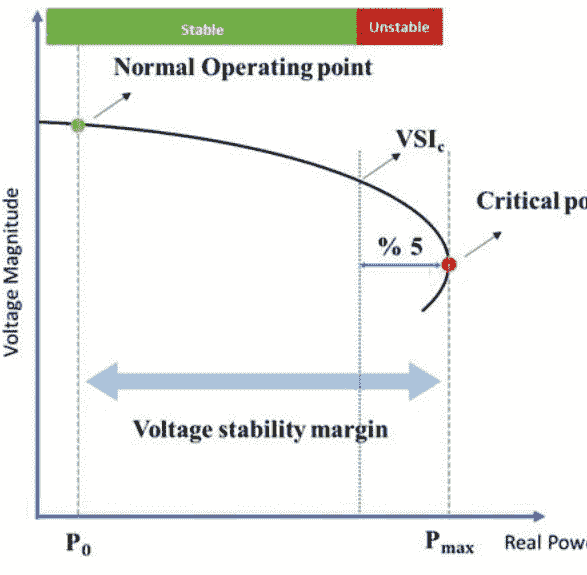

$$
\begin{aligned}
& F(x, \lambda)=0 \quad (9.1) \\
& P_{L}=P_{L}^{0}+\lambda P_{L}^{d} \quad (9.2) \\
& Q_{L}=Q_{L}^{0}+\lambda Q_{L}^{d} \quad (9.3) \\
& P_{G}=P_{G}^{0}+\lambda P_{G}^{d} \quad (9.4)
\end{aligned}
$$

在上述方程中， $P_{L}^{0}, Q_{L}^{0}$和 $P_{G}^{0}$分别表示基本负荷和发电机功率，而 $P_{L}^{d}$， $Q_{L}^{d}$和 $P_{G}^{d}$表示负荷和发电机功率的增加方向。在实践中， $P_{L}^{d}, Q_{L}^{d}$和$P_{G}^{d}$可以分别从负荷预测和发电调度中获得 [44]。

图 9.1 表示特定操作条件下的 P-V 曲线。P-V 曲线用于直观地说明 VSM，它对应于当前操作点到临界点的距离。对于每个 OC，可以使用 CPF 获得一条 P-V 曲线。CPF 程序从指定的初始操作点开始计算最大负载水平。通过 (9.5) 计算 VSM，因此电压稳定指数 (VSI) 可以定义为临界点处最大负载水平的百分比。

$$
\begin{gathered}
VSM = P_{max} - P_0 \quad (9.5) \\
VSI = \frac{VSM}{P_{max}} \quad (9.6)
\end{gathered}
$$

在提出的研究中，电力系统的长期电压稳定裕度是根据电压稳定准则 [48] 定义的。根据 WECC 标准，正常运行时电压稳定指数标准设定为 7%。

条件下，s 设定为 5% 以适应单一事故情况。随后，每个操作点根据 VSI < VSI_c 标记为“稳定”(S)，否则标记为“不稳定”(U)。

## 9.3 提出的框架

本章提出了一种基于数据挖掘和机器学习方法的在线电压稳定评估的新方法。所提出的方法论展示了机器学习技术在在线电压稳定评估中的性能和有效性。如图 9.2 所示，该框架包括 4 个阶段：(1) 数据库生成，(2) 机器学习技术训练，(3) 性能评估，和 (4) 在线应用。OCs 使用指定的拓扑场景和负荷变化模式（例如住宅、工业或农业负荷）来覆盖事故情况和各种负荷类型。通过基于电力系统变量的特征选择和特征提取方法获得预测器集合。此外，采用重要性抽样方法来提高训练的速度和准确性。利用基于网格搜索的超参数调优来优化所使用的机器学习技术。

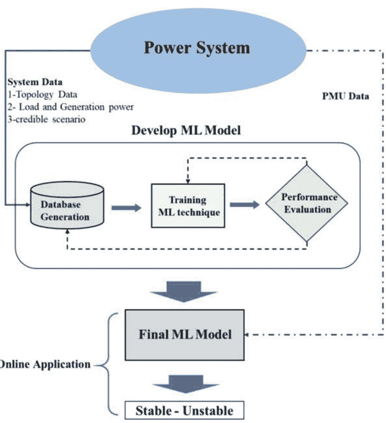

图 9.2 所提出框架的流程图

进行多种指标来评估实施模型的性能。除了数值指标外，还使用混淆矩阵来直观描述分类模型的性能。此外，利用受噪声和缺失数据影响的 PMU 测量来评估框架在存在 PMU 不确定性的情况下的鲁棒性。值得注意的是，所有实施的机器学习模型都使用 K 折交叉验证进行验证。这些阶段在下面的章节中详细解释。

### 9.3.1 数据库生成

机器学习技术使用数据集来构建模型并预测结果。因此，获得一个全面的数据库对于获得高效准确的模型至关重要。可以使用历史数据或合成数据来构建电力系统 OP 的数据库以供机器学习应用。尽管历史数据包含电力系统的实际信息，但可能缺乏准确表示系统状态的细节。因此，可以利用基于先前知识的合成数据来获得一个足够的数据库。在提出的框架中，采用了各种拓扑场景、负荷变化模式和随机抽样方法来生成一个合格的数据库，涵盖了所有可能的运行点。考虑到电力系统的主要变量 (V, δ, P, Q) 的各种组合作为预测因子，以指示每个 OP 中的电力系统状态。最后，采用重要性抽样方法来删除无用样本并提高训练性能。

#### 9.3.1.1 采样

如图 9.3 所示，数据库生成方法包括三个循环，以获取训练所需的样本:

- 1. 负载变化模式：现实电力系统中存在各种负载类型，每种类型都具有特定的增长特征。因此，整个系统的负载不能以相同的速率增加。为了解决这个问题，系统被划分为一些区域，以定义负载变化模式 [44]。在每个负载变化模式中，不同区域的负载以不同的速率增加，所有发电机平衡增量负载。划分方法可以基于负载类型的相似性（例如，住宅和工业）或相同的地理区域。

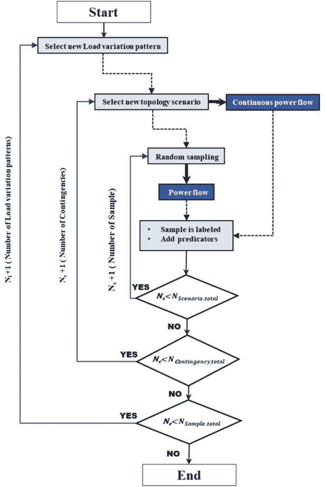

图 9.3 生成样本的提出方法

- 2. 拓扑场景：为了考虑正常和事故情况，单个输电线路中断被视为一种事故情况。在导致功率流不收敛的事故情况下被忽略。因此，可以计算出总拓扑场景数和总 OC 数为:

$$
N_{\text{场景，总数}} = (N_{\text{线路 - 输出，总数}} - N_{\text{线路 - 输出，发散}}) + 1
$$

$$
N_{OC, 总数} = N_{\text{场景}, 总数} \times N_{\text{负荷模式}}
$$

- 3. 随机抽样：对于上一步中确定的 OC，进行 CPF 计算以得到 VSM。此外，为了获得更广泛的数据库，对每个 OC 都采用了随机抽样方法。最终的负荷和发电变化可以表示为：

$$
P_{L,i}^j = (1 + \lambda K_{L,i}(1 + k_j)) P_{L0,i} \quad 1 < i < N_{\text{区域}}, 1 < j < N_{\text{随机}}
$$

$$
Q_{L,i}^j = (1 + \lambda K_{L,i}(1 + k_j)) Q_{L0,i} \quad 1 < i < N_{\text{区域}}, 1 < j < N_{\text{随机}}
$$

$$
P_{G, i}^j = (1 + \lambda) P_{G0, i} \quad 1 < i < N_{\text{随机}}
$$

$$
K = \frac{\sum_{i \in Area} K_{L,i} (1+k_j) P_{L0,i}}{\sum_{n \in PV} P_{G0,n}}
$$

其中 $P_{L}^{j}_i$和 $Q_{L}^{j}_i$是每个 OP 中的负荷有功功率和无功功率。此外， $P_{G}^{j}_i$ 分别是发电有功功率。 $K_{L,i}$表示负荷变化系数，$k_j$是一个随机数。$K_{G,j}$是决定发电机生产增长速率的因子。最后，对于每个生成的样本，输入变量 X 是通过组合从功率流计算中获得的各种电力系统变量（如线注入功率或母线电压）构建的。此外，根据 WECC 标准中第 9.2 节提到的相应 OC，目标变量被标记为“稳定”或“不稳定”。

#### 9.3.1.2 重要性抽样

重要性抽样（IM）是一种有用的技术，可以在不丢失信息的情况下缩小数据库 [44, 49]。此外，这种技术可以减少训练时间并提高准确性。在提出的框架中，使用 IM 来删除极重或极轻的操作点，并保持样本在 VSM 的附近。为了更全面地区分样本，为每个拓扑场景计算了不同的边界，如下所示：

$$
P_{L, min}^i < P_{L, total}^i < P_{L, max}^i \quad 1 < i < N_{scenario, total}
$$

$$
P_{L, max}^{i}=(1+L_{max}) VSM_{i, max} \quad 1<i<N_{scenario, total}
$$

$$
P_{L, min}^{i}=(1+L_{min}) VSM_{i, min} \quad 1<i<N_{scenario, total}
$$

其中 $L_{min}$ 和 $L_{max}$ 是边界的最小和最大限制标准。此外， $VSM_{i, max}$ 是最高的，而 $VSM_{i, min}$ 是最低的稳定性边界，用于确定拓扑场景。

### 9.3.2 训练机器学习技术

为了构建一个最优模型，必须仔细选择 ML 技术，考虑到问题的状态。在线电压稳定性评估是一个使用监督学习的分类问题，用于确定系统状态是稳定还是不稳定。正如之前讨论的，SVM、DT 和集成方法是在线电压稳定性评估中可以应用的有效技术。尽管提出的框架被采用来利用各种技术来训练数据，特别是集成方法被用于在电压稳定性评估中实现 ML 模型，以获得令人印象深刻的性能 [44-46]。此外，还增加了降维方法，如特征选择 [50, 51] 和特征提取 [22, 27, 52, 53]，以增强模型的训练效率。最终，通过超参数调整来优化实施的模型，以获得在线电压稳定性评估的最佳性能。

#### 9.3.2.1 集成方法

集成方法旨在将多个分类模型与给定的学习算法相结合，以提高单个分类器的性能。可以利用各种分类模型来组成集成模型。但是决策树通常是组合和构建一组分类器的基本模型。学习算法应用于集成方法，分为两大类，第一类称为平均方法，例如装袋树和随机森林。在这些方法中，多个分类器独立组合，最终结果通过对单个分类器的预测进行平均得到。第二类称为提升方法。提升方法按顺序组合分类器，将弱学习器的输出结合起来，创建一个强大的集成学习器，最终提升基学习器的性能。袋装树和 AdaBoost 被认为是所提出框架中的主要技术。详细信息将在下面的小节中给出。

# 使用新颖的机器学习方法对电网中的电压稳定性进行评估

##### 袋装树

引导聚合，通常缩写为"bagging"是一种集成学习算法，用于减少数据集中由小波动引起的误差，并被定义为方差。为了在数据集上对弱学习器（如决策树）进行聚合，会生成多个自助采样的子样本。每个自助采样的子样本上都会训练一个决策树。在使用决策树训练子样本之后，会应用投票算法来聚合决策树，形成最高效的分类器。此外，可以使用并行处理来训练独立的决策树，从而显著提高速度。如图 9.4 所示，引导聚合使用带替换的随机选择，这意味着每个子集中的样本可能会出现多次。因此，一些观测值可能会被排除在称为“袋外样本”的子集之外。通常，投票方法使用相等的权重，尽管在在线应用中，权重可以更新而不是训练一个新模型。随机森林（RF）是一种将随机决策树与袋装算法相结合的聚合技术，以实现高分分类准确性。

如前所述，装袋技术可以降低方差并避免过拟合问题。因此，这种技术是应用于高维数据的合适选择。此外，它可以处理缺失数据的性能。

##### AdaBoost

提升方法的工作方式与装袋方法相同：将一组聚合模型组合成一个具有更好性能的集成模型。然而，与旨在降低方差和避免过拟合的装袋不同，提升算法的目的是降低偏差。提升和装袋一样，可以用于回归和分类应用。自适应提升（AdaBoost）和梯度提升是众所周知的提升算法。AdaBoost 涉及在重复修改版本的弱学习器上进行训练。


数据。此外，所有决策树的预测结果都使用加权投票方法进行组合，以产生最终的预测结果。最终，得到了一个具有较低偏差和更好方差的集成学习器。AdaBoost 算法的主要步骤，以决策树作为基分类器，可以表示为以下几个主要步骤 [44]：

- 步骤 1) 输入数据：
    1. 加载包含 N 个样本的训练集。
    2. 确定增强迭代次数 T 和基决策树的规格。
    3. 将训练样本的权重设置为相等，即
       $$w_n = \frac{1}{N}$$
- 步骤 2) 增强方法：
    1. 开始第一次迭代：t=1。
    2. 使用初始训练集拟合决策树。
    3. 计算学习误差，即
       $$\epsilon^t = \sum_{n=1}^{N} w_n^t I(DT^t(X_n) \neq y_n)$$
       其中，\epsilon^t 表示加权分类错误，I 是一个逻辑函数，当相应条件满足时返回 1，否则返回 0。
    4. 计算训练好的决策树的权重
       $$\alpha^t = \frac{1}{2} \log\left(\frac{1 + \epsilon^t}{1 - \epsilon^t}\right)$$
    5. 检查迭代次数 t < T.
    6. 更新样本的权重
       $$w_n^{t+1} = \frac{w_n^t}{Z_t} \exp(\theta_n \alpha^t)$$
       其中，\theta_n 是一个指示函数，当 DT^t(X_n) = y_n 时取 \theta_n=0 以减小正确分类的样本权重，当 DT^t(X_n) \neq y_n 时取 \theta_n=1 以增加错误分类的样本权重。
    7. 进行下一次迭代 t = t + 1.
- 步骤 3) 构建最终模型：

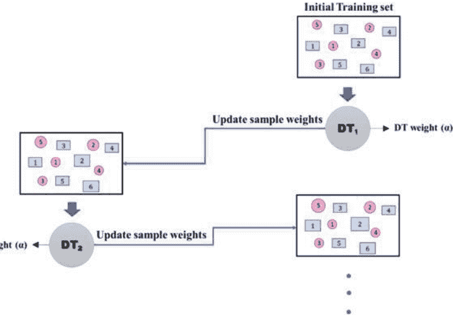

图 9.5 引导算法用于更新权重

在完成增强迭代后，根据计算得到的权重，得到一个集成模型。最后，AdaBoost 模型使用以下方式对新数据进行预测：

$$DT^{集成}(X_{新}) = \frac{1}{T} \sum_{t=1}^{T} \alpha^t DT^t (X_{新}) \quad (9.20)$$

如图 9.5 所示，当 DT 在序列中误分类一个样本时，相应的权重增加，以便下一个 DT 更加努力地正确预测困难的样本。通常使用仅比随机猜测稍好的弱模型进行增强以减少偏差误差，例如小决策树。使用低方差的弱分类器进行增强的另一个重要动机是，拟合这些模型需要较少的计算工作。

事实上，由于增强算法不能并行执行（不像装袋算法），使用复杂的学习器获取最终模型可能会耗时。使用 AdaBoost 的另一个缺点是存在过拟合的风险，从而增加了方差。

#### 9.3.2.2 降维

将预测模型拟合到具有大量特征的数据集中在计算上是昂贵的。此外，不注意的超参数调整会增加过拟合的风险。降维是一种有用的技术，可以在机器学习模型中使用，将训练数据从高维空间转换为低维空间，以保留重要的低维表示。原始数据的重要信息。根据电力系统，它是一个大规模且复杂的系统，电力系统的状态可以用各种特征和测量来表示，因此电压稳定性评估被认为是一个高维空间问题。此外，在电压稳定性评估中利用 PMU 广域测量需要具有理想速度和准确性的在线框架。因此，将降维技术应用于基于机器学习的框架中对于减小训练数据大小、加快计算速度、提高准确性和避免过拟合至关重要。降维方法还可以分为特征选择和特征提取。

##### 特征选择

特征选择是识别和选择与目标变量相关的特征的过程。通常，特征选择使用评估过程对特征进行评分。此外，应用过滤准则来选择与机器学习技术输入预测变量最相关的特征。有各种评分特征的方法，这些方法分为三种主要方法：基于知识的方法、基于机器学习的方法和基于统计的方法。在基于知识的方法中，利用实际经验和技术知识来指示与目标相关的最重要的特征。在基于机器学习的方法中，模型训练后，利用模型表示的相对排名来排列与目标值的预测能力相关的特征。此外，基于统计的方法选择变量时不考虑模型和先前知识。这些方法使用统计测试（如相关性）来确定最有趣的特征。单变量特征选择是一种基于统计的方法，它对每个特征进行单独评分以评估其与响应变量的相关性。在提出的框架中，这三种方法都被应用为预处理模块来选择最佳特征集。

##### 特征提取

与特征选择不同，特征提取重新构建了全新的特征，旨在保持原始特征的信息性。全新的特征降低了输入数据的维度，并且去除了冗余特征。因此，使用提取的特征训练机器学习技术可以提高分类性能。

提取的特征可能不像原始特征那样可解释，因此不能应用于相应的预防控制。此外，使用特征提取训练机器学习技术会降低模型对噪声或缺失数据的鲁棒性。有各种特征提取算法，例如主成分分析（PCA）、线性判别分析（LDA）和自编码器。所提出的框架使用 PCA 作为特征提取方法来重构新的和增强的预测变量。

主成分分析被定义为一种线性变换，将数据映射到一个低维空间，以最大化数据的方差。低维空间是一个新的坐标系，其中每个轴代表一个主成分。计算数据的协方差矩阵来执行 PCA，然后获得该协方差矩阵的特征值和对应的特征向量。与最大特征值对应的特征向量可以解释为主成分。最后，这些特征向量被应用于获得具有大部分方差的新特征集。将原始数据转换到低维空间的转换如下所示 [54, 55]

$$t_{i}^{k}=X_{i} W^{k} \quad k=1,2, \ldots L, \quad i=1,2, \ldots N$$

其中 L 是提取的空间维度的数量，N 是输入数据维度的数量。X 是输入特征数据，减去了每个特征的均值。W 是用于映射数据的系数向量，t 是表示提取特征的主成分得分。

#### 9.3.2.3 超参数调整

超参数是机器学习模型的参数，其值用于控制学习过程，例如袋装树技术中的树的数量。

超参数调整是一种根据输入数据和问题状态寻找最优机器学习模型的方法。在提出的框架中，使用超参数调整来优化机器学习模型的性能，采用网格搜索的方法。网格搜索是一种简单的方法，用于寻找超参数的最佳值。

它通过在确定的边界范围内进行详尽搜索来工作，以寻找超参数。

### 9.3.3 性能评估

实施的机器学习模型的性能评估对于使用广域测量进行在线电压稳定性评估至关重要。然而，在性能评估中，准确性和 CPU 时间被用作主要指标。它们不能全面地表示训练性能的细节。当训练数据分布不平衡时，准确性无法展示分类性能。电压稳定性评估的训练集可能根据电力系统中稳定操作点的数量而不平衡，这个数量远远大于不稳定点的数量。因此，在机器学习模型评估中需要采用一种新的评估方法。

混淆矩阵是一个有用的工具，用于展示分类的性能。

图 9.6 电压稳定性评估问题的混淆矩阵


如图 9.6 所示，电压稳定性评估的混淆矩阵是一个 2*2 的表格，其中表格的行表示真实标签，列表示预测标签。表格的每个单元格表示基于相应标签的一部分数据。混淆矩阵以可视化的方式描述了分类的性能。此外，它可以用于计算几个指标，如 [44, 56] 所示。

$$\text{准确性 (Acc)} = \frac{N_{\text{真稳定}} + N_{\text{真不稳定}}}{N_{\text{稳定}} + N_{\text{不稳定}}}$$

$$\text{误检测 (Mis)} = \frac{N_{\text{假稳定}}}{N_{\text{稳定}} + N_{\text{不稳定}}}$$

$$\text{误报 (Fal)} = \frac{N_{\text{假不稳定}}}{N_{\text{稳定}} + N_{\text{不稳定}}}$$

$$\text{可靠性 (Rel)} = \frac{N_{\text{真不稳定}}}{N_{\text{真不稳定}} + N_{\text{假稳定}}}$$

$$\text{安全性 (Sec)} = \frac{N_{\text{真稳定}}}{N_{\text{真稳定}} + N_{\text{假不稳定}}}$$

$$\text{G 均值} = \sqrt{\frac{N_{\text{真稳定}}}{N_{\text{真稳定}} + N_{\text{假不稳定}}} \cdot \frac{N_{\text{真不稳定}}}{N_{\text{真不稳定}} + N_{\text{假稳定}}}}$$

误检测（Mis）表示误将不稳定情况分类的比例，而误报（Fal）表示将稳定样本错误预测为不稳定的比例。此外，安全性和可靠性表示正确识别安全情况的比例和正确识别不安全情况的比例。G-均值（G）作为安全性和可靠性的几何平均值，评估了学习的整体性能。随后，K 折交叉验证应用于性能评估过程，以评估模型对匿名数据集的有效性。K 折交叉验证是一种验证过程，利用随机分割数据来确保原始数据集的每个样本都有机会参与训练和测试集。

#### 9.3.3.1 PMU 不确定性

由于 PMU 测量可能受到噪声甚至缺失的影响，ML 模型的性能应在噪声和缺失数据条件下进行评估，以确定其鲁棒性和效率。因此，对于噪声数据，考虑了两种情况，第一种情况是对所有输入数据添加噪声，第二种情况是仅对测试数据添加噪声。此外，为了生成合成噪声数据，采用了总向量误差（TVE）准则。根据 IEEE 标准 [57], PMU 数据不确定性的 TVE 准则应该在 1% 以下。电压测量的 TVE 表示为 (9.28)。对于缺失数据的情况，随机选择一些 PMUs，然后将所选 PMU 在测试样本中的相应测量设置为 NaN。

$$TVE=\sqrt{\frac{\left|V_{\text {实际，测量 }}-V_{\text {实际，理想 }}\right|^{2}+\left|V_{\text {虚部，测量 }}-V_{\text {虚部，理想 }}\right|}{V_{\text {实际，理想 }}^{2}+V_{\text {虚部，理想 }}^{2}}} \quad (9.28)$$

### 9.3.4 在线应用

在最后阶段，经过性能评估过程对开发的模型进行准确性、速度和鲁棒性的验证后，最终模型可以基于广域 PMU 测量用于在线电压稳定性评估。

## 9.4 模拟和结果

所提出的框架已在两个不同规模的案例研究上进行了测试。第一个案例是新英格兰 39 节点测试系统 [58], 第二个案例是一个更大的电网，即 IEEE 118 节点测试系统 [59]。在案例研究中，模拟程序包括数据库生成、模型训练和测试都在 MATLAB®环境中进行。此外，所有实验都在一台配有 Intel® Core™ i7 2.6 GHz 处理器和 16 GB 内存的系统上执行。

### 9.4.1 IEEE 39-Bus 测试系统

#### 9.4.1.1 数据库生成

该系统涉及 46 条线路和 10 台发电机。为了生成数据库，根据每个母线的地形位置，将电网分为三个区域。此外，对于每个区域，选择不同的置信度来构建 20 个负荷变化模式。每个区域包括的母线以及一些负荷变化模式的实例在表 9.1 中呈现。此外，在拓扑场景定义中，根据电力流无法在此场景中收敛，排除了线路 13 的故障情况，并考虑了 45 + 1 个拓扑场景。

最终使用提出的采样方法生成数据库，其中包括 8155 个稳定样本和 7492 个不稳定样本。图 9.7 根据电压幅值展示了样本的分布。

表 9.1 每个区域中的现有母线每个样本的系数

| 区域 1 的母线 | 区域 2 的母线 | 区域 3 的母线 |
| :--- | :--- | :--- |
| 1-13 | 14-26 | 27-39 |
| **K 区域 1** | **K 区域 2** | **K 区域 3** |
| 0 | 0 | 0 |
| 0 | 0 | 0.2 |
| 0 | 0.2 | 0 |
| 0.2 | 0 | 0 |


图 9.7 基于电压幅值的数据集样本分布

#### 9.4.1.2 简单机器学习模型训练

为了说明所提出框架的有效性，实质上采用了一个简单的机器学习模型。该模型采用了袋装树技术进行训练，并以母线的电压幅值作为预测因子。袋装树模型包括 30 个深度为 15、646 的决策树。数据集被随机分成两个子集，其中训练集包含 80% 的数据，剩余的 20% 分配给测试集。在使用训练集训练机器学习模型后，评估测试集的分类准确率为 80.70%。测试集样本的预测标签分布如图 9.8 所示。

#### 9.4.1.3 训练的最佳数据集

为了表示每个样本的状态，根据电力系统的主要变量选择了四种预测变量的组合，如下所示：

- V_m：表示母线的电压幅值
- V_{m-\delta}：表示母线的电压幅值和相位角
- P_{active-reactive}：表示线路注入的有功和无功功率
- V_{m-\delta-P_{active-reactive}}：表示母线的电压幅值和相位角以及线路注入的有功和无功功率

通过去除无关样本，应用重要性采样方法来提高分类性能。数据集的大小减少了 41%，新数据集包含 4252 个稳定样本和 5260 个不稳定样本。此外，还进行了随机选择，构建了与减少的数据集大小相同的数据集，并进行了比较。利用三种类型的样本集合形成了 12 个不同的训练集，如下所示：

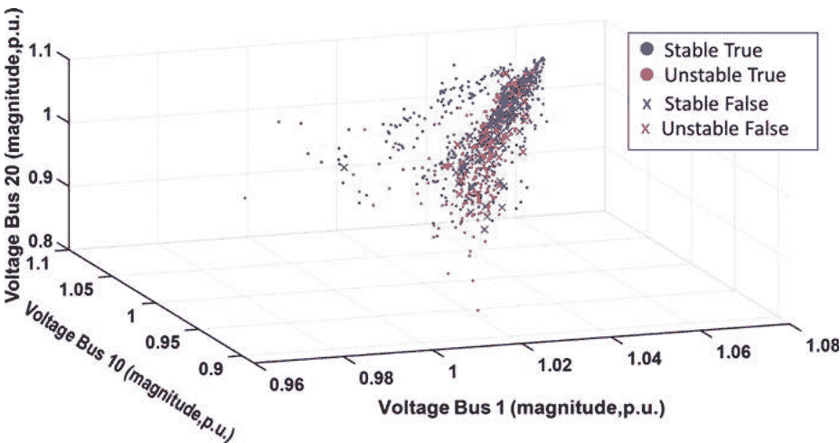

图 9.8 预测标签的分布

| 数据集 | $V_m$ | | $V_{m-\delta}$ | | $P_{\text{有功，无功}}$ | | $P_{\text{有功，无功}}$ | |
| :--- | :---: | :---: | :---: | :---: | :---: | :---: | :---: | :---: |
| | 预测器 | 样本 | 预测器 | 样本 | 预测器 | 样本 | 预测器 | 样本 |
| 原始数据集 | 39 | 15,647 | 78 | 15,647 | 92 | 15,647 | 178 | 15,647 |
| 重要性抽样 | 39 | 9123 | 78 | 9123 | 92 | 9123 | 178 | 9123 |
| 随机选择 | 39 | 9123 | 78 | 9123 | 92 | 9123 | 178 | 9123 |

表 9.2. 在前一节中，通过袋装树对各种数据集进行训练的性能在表 9.3 中展示。表 9.3 表明，更大的预测器集合可能会提供更好的性能。此外，使用重要性抽样方法减少数据集将减少计算时间，而不会显著提高准确性。

#### 9.4.1.4 机器学习技术性能

如前所述，决策树和支持向量机是经常用于电压稳定性评估的强大机器学习技术。此外，袋装树和 AdaBoost 被提出作为集成方法，将多个单一模型组合起来以提高分类性能。为了比较这些技术并选择最好的机器学习技术，使用了四种不同的模型。这些机器学习模型的规格总结在表 9.4 中。表 9.5 展示了使用原始数据集训练模型的性能。从准确性和计算时间的角度来看，袋装树技术的优势是显而易见的。决策树是一种快速的技术，但在分类准确性方面存在问题。此外，支持向量机具有所需的准确性，但计算量大，可能不适用于在线电压稳定性评估。由于 AdaBoost 在过拟合方面具有较高的方差，分类性能受到破坏。

#### 9.4.1.5 维度缩减

在提出的框架中，采用了三种不同的特征选择技术，具体如下：

- 知识库：在这种方法中，选择电力系统中电压偏差最大的母线和负载最大的线路作为关键元素。此外，根据关键元素变量选择最重要的输入特征。
- 基于机器学习：利用前一节中训练的袋装树模型来评估与预测器重要性相关的特征得分。
- 基于统计：利用卡方检验评估特征与目标变量的相关性。

图 9.9 表示使用基于机器学习和基于统计的方法评估的特征得分。此外，还使用主成分分析重建具有更高方差的新输入特征。如图 9.10 所示，使用主成分的样本分布比基于选择变量的分布具有更大的差异。为了更好地比较不同方法，将新的特征集大小考虑为原始特征数量的 2/3。因此，分别选择了 25、50、60 和 110 个特征作为 V、Vm-δ、P 和 Vm-δ,-P 的预测器集。各种维度缩减的性能

表 9.3 分类准确率和训练 CPU 时间

| 数据集 | $V_m$ | | $V_{m-\delta}$ | | $P_{\text{有功，无功}}$ | | $P_{\text{有功，无功}}$ | |
| :--- | :---: | :---: | :---: | :---: | :---: | :---: | :---: | :---: |
| | 准确率 (%) | 时间 (秒) | 准确率 (%) | 时间 (秒) | 准确率 (%) | 时间 (秒) | 准确率 (%) | 时间 (秒) |
| 原始数据集 | 80.70 | 65 | 85.36 | 59.75 | 95.16 | 64.53 | 94.87 | 80.84 |
| 重要性抽样 | 80 | 31.35 | 85 | 40.03 | 95.5 | 30.79 | 95 | 49 |
| 随机选择 | 78 | 39.46 | 82 | 38.79 | 92 | 43.28 | 91 | 52.85 |

使用新颖的机器学习方法对电网中的电压稳定性进行评估...

表 9.4 机器学习技术规格

| 机器学习技术 | 规格 |
| :--- | :--- |
| **决策树** | 算法：分类回归树，最大分割数：100，分割准则：Gdi |
| **SVM** | 核函数：径向基函数，求解器：迭代单数据算法 |
| **AdaBoost** | 学习率：0.1，树的数量：30，最大分割数：30 |
| **袋装树** | 学习率：0.1，树的数量：30，最大分割数：15,646 |

表 9.6 展示了这些方法的训练速度得到了改善，这是通过减少输入预测因子实现的。此外，基于知识和统计的方法在分类准确率上有轻微下降。结果表明，主成分分析（PCA）提出了最佳的降维方法，可以同时提高速度和准确率。

#### 9.4.1.6 超参数调整

前一节中的所有训练模型都经过了超参数调整的优化。调整方法采用了网格搜索来找到最佳参数。图 9.11 展示了使用网格搜索进行超参数搜索的过程，其中包括三个主要参数：决策树数量、每个决策树的最大深度和主成分的数量作为输入特征。此外，需要在速度和准确率之间进行权衡，以选择最优值。在图 9.11 中，袋装树的三个参数的选择最优值用星号表示。

#### 9.4.1.7 性能评估

如第 9.3.3 节所述，混淆矩阵是展示分类性能的有效工具。使用 Vm predictors 集训练的 DT 和 bagged tree 的混淆矩阵显示在图 9.11 中。此外，根据表 9.7 中呈现的混淆矩阵计算出的度量指标清楚地显示，bagged tree 在分类可靠性方面比 DT 表现更好，这意味着 bagged tree 能够更准确地将稳定样本与不稳定样本分开（图 9.12）。除了基于混淆矩阵的度量指标外，还评估了所提出方法的鲁棒性。对于考虑的仿真，假设电网的所有母线都配备有 PMU。因此，将 $V_m$-$\delta$ predictors 集视为输入特征。设 p 为带有噪声的 PMU 的百分比

表 9.5 每种技术的分类准确率和训练 CPU 时间

| 机器学习技术 | $V_m$ | | $V_{m-\delta}$ | | $P_{有功，无功}$ | | $P_{有功，无功}$ | |
| :--- | :--- | :--- | :--- | :--- | :--- | :--- | :--- | :--- |
| | 准确率 (%) | 时间 (秒) | 准确率 (%) | 时间 (秒) | 准确率 (%) | 时间 (秒) | 准确率 (%) | 时间 (秒) |
| 决策树 | 69 | 5.26 | 78.06 | 9.28 | 83.40 | 11 | 83.33 | 21.31 |
| SVM | 80.53 | 368.6 | 83.91 | 404.85 | 89.39 | 331.34 | 89.88 | 494.56 |
| AdaBoost | 69.27 | 105.57 | 77.08 | 219.53 | 84.37 | 230.70 | 87.63 | 497.82 |
| 装袋树 | 80.70 | 65.10 | 85.35 | 59.75 | 95.16 | 64.53 | 96.02 | 80.84 |

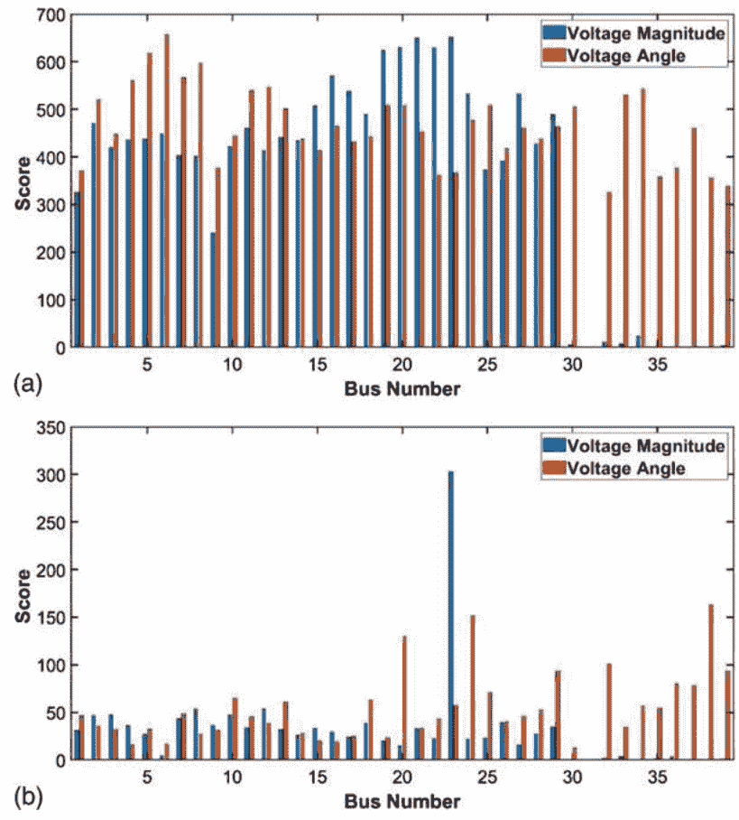

图 9.9 电压相关特征的得分。(a) 单变量特征选择。(b) 基于装袋树的预测器重要性。

数据。因此，可以根据 PMU TVE 准则和受噪声影响的 PMU 数量生成合成噪声数据。在第一个场景中，使用装袋树的分类准确率在整个数据集中包含噪声的情况下显示在表 9.8 中。此外，在第二个场景中，涉及测试集的噪声数据，表 9.8 和表 9.9 中的结果表明，将噪声添加到整个数据集可以提高训练 ML 模型的鲁棒性。此外，由于新提取空间的高方差，PCA 对噪声非常敏感。值得注意的是，决策树根据其简单的学习方法显示出对噪声数据最强的鲁棒性。

给定缺失 PMU 比例的情况下，训练性能在存在 PMU 缺失数据时显示在表 9.10 中。从表中可以看出，高比例的缺失数据会破坏分类性能。

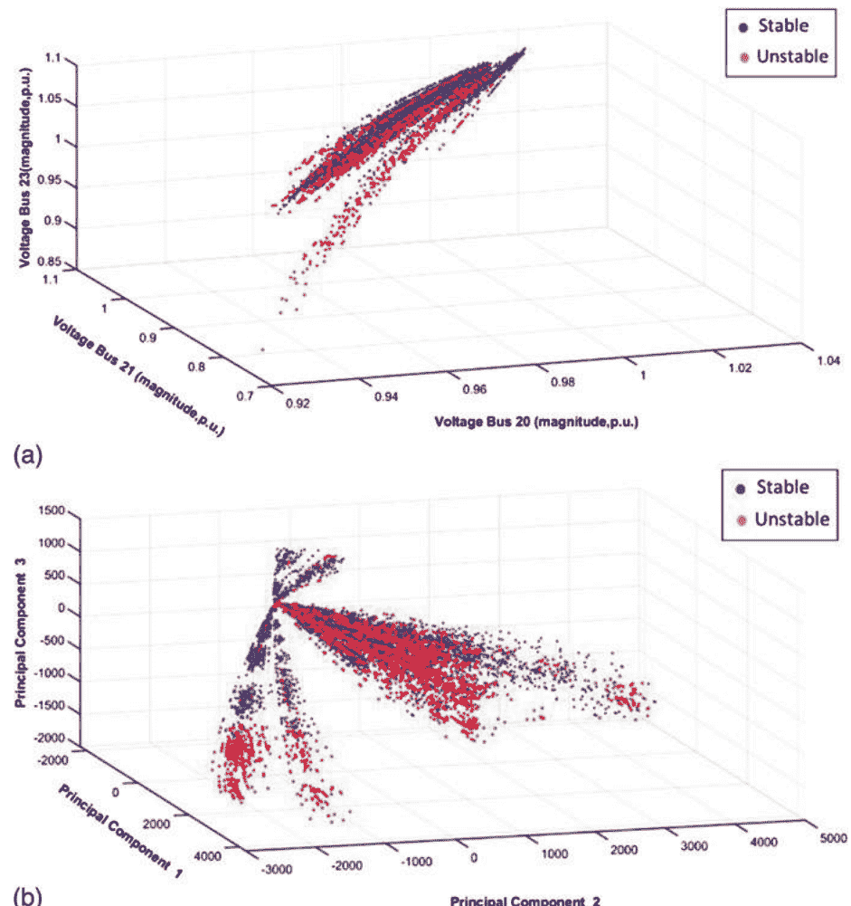

图 9.10 基于 (a) 选定的电压幅值和 (b) 主成分的数据集样本分布。

#### 9.4.1.8 在线应用

为了展示所提出方法在在线应用中的有效性，考虑了一个合成的 24 小时负荷曲线。负荷曲线涉及 100 个区域点，代表了一天中各种电能需求。在前面的章节中训练的模型基于每日负荷曲线进行在线电压稳定性评估。如图 9.13 所示，在高峰时段，训练的模型能够准确地检测到不稳定性。

| 机器学习技术 | $V_m$ | | $V_{m-\delta}$ | | $P_{有功，无功}$ | | $P_{有功，无功}$ | |
| :--- | :--- | :--- | :--- | :--- | :--- | :--- | :--- | :--- |
| | 准确率 (%) | 时间 (秒) | 准确率 (%) | 时间 (秒) | 准确率 (%) | 时间 (秒) | 准确率 (%) | 时间 (秒) |
| 无 | 80.70 | 65.1 | 85.35 | 59.75 | 95.15 | 64.53 | 94.87 | 80.84 |
| 知识库 | 79.03 | 48.43 | 84.69 | 53.81 | 94.74 | 45.37 | 94.31 | 60.21 |
| 统计库 | 79.65 | 52.54 | 83.83 | 56.1 | 93.72 | 49.62 | 92.30 | 64.54 |
| 装袋树 | 80.95 | 50.18 | 86.54 | 55.79 | 95.29 | 46.28 | 95.52 | 62.46 |
| 主成分分析 | 93.12 | 31.14 | 94.82 | 38.84 | 96.12 | 36.19 | 96.02 | 47.88 |

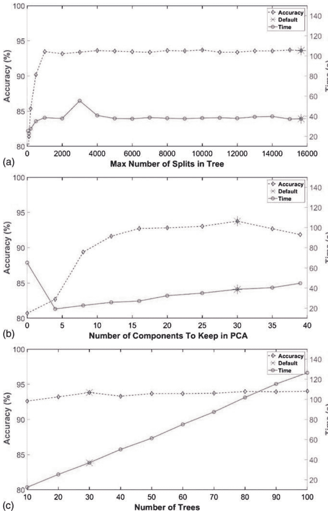

图 9.11 相应参数值的时间和准确性 (a) 最大分割数 (b) 主成分分析组件数。(c) 树的数量

| 机器学习技术 | $V_m$ | | $V_{m-\delta}$ | | $P_{有功-无功}$ | | $P_{有功-无功}$ | |
| :--- | :---: | :---: | :---: | :---: | :---: | :---: | :---: | :---: |
| | 决策树 | 装袋树 | 决策树 | 装袋树 | 决策树 | 装袋树 | 决策树 | 装袋树 |
| 准确率 (%) | 68.99 | 80.70 | 78.06 | 85.36 | 83.40 | 95.16 | 83.33 | 94.87 |
| 可靠性 (%) | 57.92 | 80.31 | 74.53 | 84.82 | 81.57 | 94.00 | 82.12 | 94.03 |
| 安全性 (%) | 81.06 | 81.11 | 81.90 | 85.93 | 85.40 | 96.38 | 85.80 | 95.82 |
| G-均值 (%) | 68.52 | 80.71 | 78.13 | 85.37 | 83.46 | 95.20 | 83.94 | 94.91 |

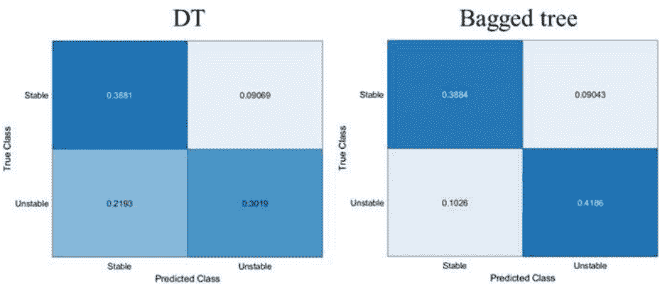

图 9.12 混淆矩阵。（左）决策树。（右）装袋树

| 机器学习技术 | 准确率 (%) |
| :--- | :--- |
| | 基准 | 使用 PCA | 基准 | 使用 PCA | 基准 | 使用 PCA | 基准 | 使用 PCA |
| | p=0% | | p=10% | | p=50% | | p=90% | |
| 树 | 78.06 | 77.40 | 78.01 | 77.78 | 77.70 | 76.38 | 76.65 | 76.46 |
| SVM | 83.91 | 88.24 | 81.47 | 86.48 | 78.80 | 85.91 | 76.40 | 85.06 |
| AdaBoost | 77.08 | 80.76 | 77.31 | 77.45 | 76.68 | 76.79 | 76.35 | 77.30 |
| 装袋树 | 85.35 | 94.82 | 85 | 91.77 | 83.70 | 88.28 | 81.84 | 86.59 |

### 9.4.2 IEEE 118 节点测试系统

IEEE 118 节点测试案例被用来展示更大电力系统的提出框架的有效性。该案例的仿真细节总结在表 9.12 中。如图 9.14 所示，稳定和不稳定样本的分布不平衡，这意味着稳定 OP 的数量明显大于不稳定的情况。

| 机器学习技术 | 准确率 (%) |
| :--- | :--- |
| | p=0% | p=10% | p=50% | p=90% |
| | 基准 | 使用 PCA | 基准 | 使用 PCA | 基准 | 使用 PCA | 基准 | 使用 PCA |
| 树 | 78.06 | 77.40 | 72.66 | 65.87 | 73.69 | 59.77 | 72.95 | 56.95 |
| SVM | 83.91 | 88.24 | 62.36 | 79.13 | 47.82 | 47.89 | 47.88 | 47.74 |
| AdaBoost | 77.08 | 80.76 | 76.95 | 76.67 | 75.59 | 69.53 | 74.23 | 67.72 |
| 装袋树 | 85.35 | 94.82 | 84.46 | 75.64 | 82.31 | 64.69 | 79.12 | 59.03 |

表 9.10 给定缺失 PMU 比率 (p) 的准确率

| 机器学习技术 | 准确率 (%) |
| :--- | :--- | :--- | :--- | :--- |
| | p=0% | p=10% | p=25% | p=50% |
| 树 | 78.06 | 74.33 | 74.33 | 66.03 |
| SVM | 83.91 | 52.12 | 52.12 | 52.12 |
| AdaBoost | 77.08 | 72.40 | 72.40 | 59.76 |
| 装袋树 | 85.35 | 72.29 | 72.29 | 58.76 |

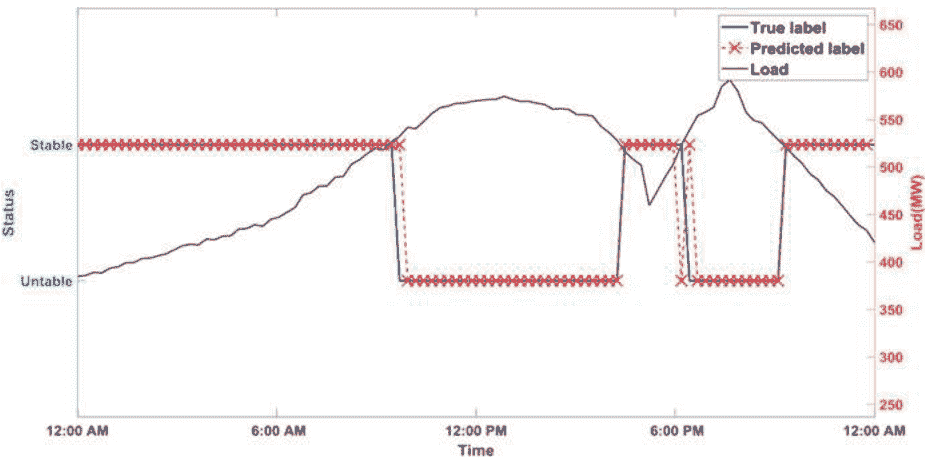

图 9.13 基于每日负荷曲线的在线电压稳定性评估

使用装袋树进行 $V_m$ 预测器集的分类在表 9.12 中展示。从表 9.11 中可以观察到，尽管比前一种情况具有更高的准确率，但由于样本分布不平衡，它具有较低的 G-均值。

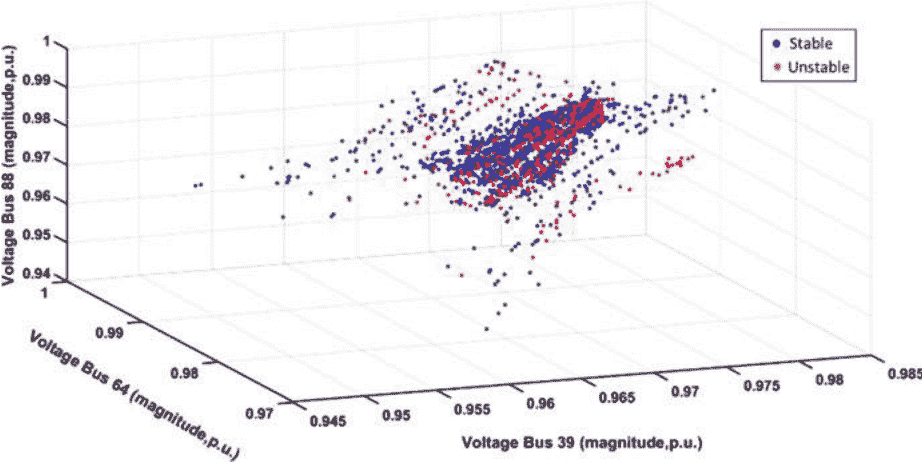

图 9.14 基于电压幅值的数据集样本分布

表 9.11 给定细节生成 118 节点系统数据库

| 规格 |
| :--- |
| 电力系统 | 母线 | 线路 | 发电机 |
| IEEE 118 | 118 | 186 | 54 |
| 负荷变化 | 区域 | 负荷变化模式 |
| 3 | 12 |
| 拓扑场景 | 事故 | 分歧事故 |
| 186 线路故障 +1 正常状态 | 7-9-113-116-133-134-176-177-183-184 |
| 数据集 | 总样本数 | 稳定样本数 | 不稳定样本数 |
| 62,135 | 45,978 | 16,157 |

表 9.12 给定预测变量集的评估指标

| 机器学习技术 | $V_m$ | | $V_m-\delta$ | | $P_{有功-无功}$ | | $P_{有功-无功}$ | |
| --- | --- | --- | --- | --- | --- | --- | --- | --- |
| | 基准 | 使用 PCA | 基准 | 使用 PCA | 基准 | 使用 PCA | 基准 | 使用 PCA |
| 准确性 | 82.74 | 91.30 | 84.81 | 95.36 | 93.78 | 96.50 | 93.31 | 96.90 |
| 可靠性 | 60.14 | 78.91 | 64.25 | 89.04 | 85.89 | 91.66 | 86.64 | 92.63 |
| 安全性 | 91.76 | 96.26 | 92.48 | 97.89 | 97.04 | 98.44 | 96.76 | 98.62 |
| G-mean | 74.30 | 87.15 | 77.08 | 93.36 | 91.30 | 94.99 | 90.50 | 95.56 |

## 9.5 结论

提出了一种在线电压稳定性评估中机器学习应用的框架。该框架提供了几种在最优模型中实现的选项。这些选项可以在数据库生成中利用，如重要性抽样或训练阶段，即特征选择、特征提取和超参数调整。该提议的框架在 IEEE 39 节点和 IEEE 118 节点测试系统上进行了测试。案例研究的结果表明，带装袋树模型和 PCA 在准确性和速度方面呈现出最佳的分类性能，评估了框架在 PMU 不确定性存在的情况下的鲁棒性。因此，这表明高比例的噪声或缺失数据可能会破坏使用机器学习模型进行电压稳定性评估。

相关的未来工作致力于增强装袋树技术中的在线加权多数投票。加权投票使得在线模型更新成为可能。因此，装袋树可以适应系统条件的不可预见变化。

此外，可以采用鲁棒的特征提取方法来确保在存在噪声和缺失数据的情况下具有良好的分类性能。

# 参考文献

- 1. Begovic, M., Voltage崩溃缓解。IEEE 电力系统继电委员会，工作组 K12，1997 年。IEEE 出版物编号 93，TH0596-7PWR
- 2. V. Ajjarapu, B. Lee, 电压稳定性文献目录。IEEE Trans. Power Syst. 13(1), 115-125 (1998)
- 3. Z. Bo 等，对世界上以前的停电进行分析：对中国电力行业的启示。Renew. Sust. Energ. Rev. 42, 1151-1163 (2015)
- 4. M.Z. El-Sadek，埃及电力系统中电压崩溃和电压故障的预防措施。电力系统研究。44 (3), 203-211 (1998 年)
- 5. O.P. Veloza, F. Santamaria, 2003 年至 2015 年的主要停电分析：事件分类和主要原因回顾。电子杂志。29 (7), 42-49 (2016 年)
- 6. P. Kessel, H. Glavitsch, 估计电力系统的电压稳定性。IEEE Transactions on Power Delivery 1 (3), 346-354 (1986 年)
- 7. A. Tiranuchit, R.J. Thomas，电力系统中抗电压不稳定的姿势策略。IEEE Trans. Power Syst. 3 (1), 87-93 (1988 年)
- 8. C.W. Taylor, Power System Voltage Stability. (麦格劳希尔，1994 年)
- 9. J. Hongjie, Y. Xiaodan, Y. Yixin, 一种改进的电压稳定性指标及其应用。Int. J. Electr. Power Energy Syst. 27(8), 567-574 (2005)
- 10. R. Tiwari, K.R. Niazi, V. Gupta, 用于预测电力系统电压崩溃的线路崩溃邻近指数。Int. J. Electr. Power Energy Syst. 41, 105-111 (2012)
- 11. V. Ajjarapu, C. Christy, 连续功率流：一种稳态电压稳定性分析工具。IEEE Trans. Power Syst. 7(1), 416-423 (1992)
- 12. C.-Y. Lee, S.-H. Tsai, Y.-K. Wu, 一种使用 P- Q-V 曲线评估稳态电压稳定裕度的新方法。Int J Elec Power Energ Syst 32, 1091-1098 (2010)
- 13. O.A. Alimi, K. Ouahada, A.M. Abu-Mafouz，用于电力系统安全性和稳定性的机器学习方法综述。IEEE Access 8, 113512-113531 (2020)
- 14. M. Amroune, 应用于在线电压稳定性评估的机器学习技术：一篇综述。Archives of Computational Methods in Engineering (2019)
- 15. B. Jeyasurya, Artificial neural networks for power system steady-state voltage instability evaluation. Electr. Power Syst. Res. 29(2), 85–90 (1994)
- 16. A.A. El-Keib, X. Ma, 应用人工神经网络进行电压稳定性评估。IEEE Trans. Power Syst. 10(4), 1890–1896 (1995)
- 17. L.D. Arya, L.S. Titare, D.P. Kothari, 使用径向基函数（RBF）网络确定电压崩溃的概率风险。Electr. Power Syst. Res. 76, 426–434 (2006)
- 18. D. Devaraj, J.P. Roselyn, R.U. Rani, 基于电压安全的人工神经网络模型进行事故排序。Appl. Soft Comput. 7(3), 722–727 (2007)
- 19. D.Q. Zhou, U.D. Annakkage, A.D. Rajapakse, 使用人工神经网络进行电压稳定裕度的在线监测。IEEE Trans. Power Syst. 25(3), 1566–1574 (2010)
- 20. D. Devaraj, J. Preetha Roselyn, 使用具有减少输入特征的径向基函数网络模型进行在线电压稳定性评估。Int. J. Electr. Power Energy Syst. 33(9), 1550–1555 (2011)
- 21. M. Moghavvemi, S. Yang, 用于电力系统稳定性估计的人工神经网络应用技术。Electric Power Components and Systems 28, 167–177 (2000)
- 22. S. Hashemi, M.R. Aghamohammadi, 基于小波的电压轮廓特征提取，用于在线电压稳定性评估的 RBF 神经网络。Int. J. Electr. Power Energy Syst. 49, 86–94 (2013)
- 23. S. Rajan, S. Kumar, D. Mathew, 使用人工神经网络的在线静态安全评估模块。电力系统，IEEE 交易，28, 4328-4335 (2013)
- 24. A. Bahmanyar, F. Karami, 使用减少的输入集的人工神经网络进行电力系统电压稳定性监测。国际电力能源系统杂志，58, 246-256 (2014)
- 25. S. Ashraf 等人，使用减少的网络和人工神经网络进行电力系统电压稳定性监测。国际电力能源系统杂志，87, 43-51 (2017)
- 26. W.M.L.-L., J.M. Villa-Acevedo, D.G. Colomé, 使用混合核极限学习机方法估计电压稳定性边际指数。能源，2020 年，13 (857)
- 27. A. Ghaghishpour, A. Koochaki, 使用优化的 ANFIS 和相关规则技术进行在线电压稳定性边际评估的智能方法。ISA 交易，102, 91-104 (2020)
- 28. B. Gharehpetian, 使用多类支持向量机进行电力系统在线静态安全评估。J. Appl. Sci. 12, 8 (2008)
- 29. H. Mohammadi 等人，使用多目标生物地理学基于子集选择进行电压稳定性评估。Int. J. Electr. Power Energy Syst. 103, 525–536 (2018)
- 30. K. Sundaram, S. Swarup, 使用多类支持向量机进行静态安全状态分类。Journal of Engineering Research 9, 21–30 (2012)
- 31. M.V., S., B.C.K., 电力系统电压稳定裕度的快速评估。Journal of Electrical Systems, 2014. 10: p. 305–316
- 32. M.V. Suganyadevi, C.K. Babulal, 用于预测电力系统负载能力边界的支持向量回归模型。Appl. Soft Comput. 24, 304–315 (2014)
- 33. K.S. Sajan, V. Kumar, B. Tyagi, 基于遗传算法的在线电压稳定性监测支持向量机。Int. J. Electr. Power Energy Syst. 73, 200–208 (2015)
- 34. H. Yang 等人，基于 PMU 的电压稳定性预测，使用最小二乘支持向量机进行在线学习。Electr. Power Syst. Res. 160, 234–242 (2018)
- 35. L. Wehenkel, M. Pavella, 决策树方法用于电力系统安全评估。Int. J. Electr. Power Energy Syst. 15(1), 13–36 (1993)
- 36. R. Diao 等人，基于决策树的在线电压安全评估使用 PMU 测量。IEEE Trans. Power Syst. 24(2), 832–839 (2009)
- 37. R.F. Nuqui 等人，使用同步相量测量和决策树的快速在线电压安全监测。在 2001 年 IEEE 电力工程学会冬季会议。会议论文集 (Cat. No.01CH37194)。(2001)
- 38. Z. Li, W. Wu, 基于相量测量的决策树用于电力系统安全评估。在 2009 年第二届国际信息与计算科学会议。(2009)

# 参考文献

- 39. C. Zheng, V. Malbasa, M. Kezunovic, 使用同步相量测量的回归树进行稳定裕度预测。IEEE Trans. Power Syst. 28(2), 1978–1987 (2013)
- 40. H. Mohammadi, M. Dehghani, 基于 PMU 的电力系统电压安全评估，利用主成分分析和决策树。Int. J. Electr. Power Energy Syst. 64, 655–663 (2015)
- 41. V. Krishnan, J.D. McCalley, 基于渐进熵的多重事故分组用于推导决策树。Int. J. Electr. Power Energy Syst. 45 (1), 35–41 (2013)
- 42. X. Meng 等人，基于 C4.5 算法的在线电压稳定性评估决策树构建。Int. J. Electr. Power Energy Syst. 118, 105793 (2020)
- 43. X.Z. Meng, P. Zhang, 基于 C4.5 和 relief-F 算法的在线电压稳定性边际评估决策树。能源 13, 3824 (2020)
- 44. M. Beiraghi, A.M. Ranjbar, 基于广域测量的在线电压安全评估。IEEE Transactions on Power Delivery 28 (2), 989–997 (2013)
- 45. H. Su, T. Liu, 基于广域测量的增强在线随机森林模型用于静态电压稳定性评估。IEEE Trans. Power Syst. 33 (6), 6696–6704 (2018)
- 46. J.D. Pinzón, D.G. Colomé, 基于多变量时间序列机器学习的实时多状态短期电压稳定性分类。Int. J. Electr. Power Energy Syst. 108, 402–414 (2019)
- 47. K.D. Dharmapala 等人，基于机器学习的长期电压稳定性实时监测，使用电压稳定性指标。IEEE Access 8, 222544–222555 (2020)
- 48. A. Abed, WECC 电压稳定性准则，负荷削减策略和无功功率储备监测方法。IEEE Power Eng. Soc. 1, 191–197 (1999)
- 49. V. Krishnan 等人，基于决策树的电力系统安全评估的高效数据库生成。IEEE Trans. Power Syst. 26(4), 2319–2327 (2011)
- 50. C.A. Jensen, M.A. El-Sharkawi, R.J. Marks, 使用神经网络的电力系统安全评估：使用 Fisher 判别进行特征选择。IEEE Trans. Power Syst. 16(4),757–763 (2001)
- 51. K. Verma, K.R. Niazi, 监督学习方法用于电力系统在线事故筛选和排名。Int. J. Electr. Power Energy Syst. 38, 97–104 (2012)
- 52. M. Sun, I. Konstantelos, G. Strbac, 基于深度学习的系统安全评估特征提取框架。IEEE Transactions on Smart Grid 10(5), 5007–5020 (2019)
- 53. S. Varshney, L. Srivastava, M. Pandit, 基于人工神经网络的并行计算电力系统综合安全评估。Int. J. Electr. Power Energy Syst. 42(1), 49–59 (2012)
- 54. W.J. Ridgman, 多元分析原理。By W. J. Krzanowski. 563 页。(Clarendon Press, Oxford, 1988). (价格 £65.00 (硬封面). ISBN 0 19 852211 8. 农业科学杂志，1989. 112(1): p. 141–142)
- 55. J.E. Jackson, 主成分分析用户指南。(Wiley, 2003)
- 56. L. Zhu 等人，基于不平衡学习机的电力系统短期电压稳定性评估。IEEE 工业信息学交易 13(5), 2533–2543 (2017)
- 57. IEEE 电力系统同步相量标准。IEEE Std C37.118–2005 (IEEE Std 1344–1995 的修订), 2006: p. 1–65
- 58. A. Pai, 电力系统稳定性的能量函数分析。(Springer, 纽约，1989)
- 59. Gan, R.Z.a.D., MATPOWER: 一个 MATLAB 电力系统仿真软件包。[在线]. www.pserc.cornell.edu/matpower/

## 第十章 由于线路故障引起的级联故障发生潜在性的评估和分类

Morteza Abedi, Mohammad Reza Aghamohammadi, 和 Mohammad Taghi Ameli

M. Abedi · M. R. Aghamohammadi (✉) · M. T. Ameli
伊朗德黑兰贝赫什蒂大学电气工程学院
e-mail: mor_abedi@sbu.ac.ir; M_Aghamohammadi@sbu.ac.ir; m_ameli@sbu.ac.ir

©作者（们），在 Springer Nature Switzerland AG 2022 独家许可下
M. Nazari-Heris 等人（编者），应用机器学习和深度学习方法解决电力系统问题，电力系统，
https://doi.org/10.1007/978-3-030-77696-1_10

## 10.1 引言

现代电力系统已经发展出连续的拓扑结构，以提高可靠性和经济性能。电力系统的维度增加一方面，对网络进行持续监测以确保安全运行的需求另一方面，使得评估电力系统安全性面临挑战。在这种情况下，考虑到经济因素和电力系统中消费者的快速增长，电力系统必须接近其允许的运行限制 [1]。由于电力系统由大量输电线路组成，线路在电力系统中的位置以及与变压器和发电机等其他设备相比的多样性使得线路更加脆弱。因此，一个或多个输电线路的突然损失可能导致网络运行限制的违规，并危及电力系统的稳定裕度，影响其他设备和整个电力系统的性能 [2]。

级联故障通常是由于初始故障（如输电线路的停电）导致的重载引起的短路故障。在这种情况下，电力系统中的级联故障可能导致无控制的分离和孤岛，并最终导致每个孤岛的崩溃和停电 [3]。在 2003 年 8 月 14 日的停电事件中，级联故障起到了重要的作用。由于级联故障，电力系统被分割成独立的孤岛，并最终导致每个孤岛的崩溃和停电 [4]。因此，如果能够预测级联故障的潜在风险以及由于线路停电而导致的停电，评估和预测后，可以采取一系列预防措施减少电力系统的脆弱性，并防止由于电力系统中的线路故障而引起的级联故障。

电力系统的发展增加了电力系统的操作变量数量。提取操作变量的信息为 PSCC 提供了知识，在威胁情况下，可以做出快速有效的决策并防止故障 [5]。当特定的线路断开时，电力系统的操作变量数量会受到限制。此外，使用电力系统的所有操作变量信息来评估由于线路故障而导致级联故障的潜力是不划算的，因为 PSCC 接收所有操作变量的信息需要大量的测量和通信设备，并且存储这个大量的信息会增加计算成本和设备提供成本。

因此，要评估由线路故障引起的级联故障潜力，需要降低操作变量的维度，并确定一些具有丰富信息的主要变量，这些变量与操作条件有关。

在最近的科学研究中，已经研究了在各种电力系统环境中识别和提取 DOV 的方法，包括通过电压稳定性评估电力系统的安全性 [6]，通过转子故障检测 [7]，有效的故障定位 [8]，短期价格和负荷预测 [9] 以及暂态稳定性分析 [10]。然而，在电力系统中，从变量中提取信息并识别 DOV 以评估由线路故障引起的级联故障潜力尚未研究。[11] 中，提出了两种基于元模型的方差缩减方法，用于快速近似级联故障概率。[12] 中，研究了影响电力系统设备故障概率的因素，并在一个简单模型中使用这些因素来评估级联故障的潜在风险。[13] 中，考虑了隐藏故障对保护系统的影响，评估了级联故障的概率。[14] 中，提出了一个改进的 OPA 模型，用于研究线路故障、级联故障模拟和故障严重程度的概率分布。[15] 中，通过使用 Galton-Watson 分支过程预测了级联故障中的总线路故障数量。[16] 中，使用图论分析了正在发生故障的设备之间的相互作用，以确定级联故障的一般传播模式。[17] 中，使用随机化学搜索算法提出了一个模型，用于估计由多个故障引起的大规模级联故障的风险。[18] 中，使用 OPA 和 TRELSS 模拟了级联停电中负荷削减的概率分布，并使用了两种不同的分支过程模型。[19] 中，提出了一个工具，用于评估衡量电力系统可靠性的级联故障风险。该方法寻找对级联故障产生最大影响的初始 N-x 事件。[20] 中，提出了一个新的级联故障随机模型。在该模型中，使用交流功率流和分散转换来分析电力系统的脆弱性，并使用随机概率分布已被用于建模负荷削减继电器。此外，已研究了风力涡轮机渗透对级联故障的影响。在 [21] 中，提出了一种基于样本诱导的半解析方法，用于确定级联故障期间电力系统设备故障对停电风险的影响，并确定设备故障与停电风险之间的关系。马尔可夫序列模型已被用于建立设备故障与停电风险之间的准确关系。在 [22] 中，提出了一种基于数据挖掘的方法，用于实时预测级联故障后电力系统的脆弱性。在这种方法中，使用奇异值分解和后续事件数据来确定脆弱区域。在 [23] 中采用的方法可以通过分析输电线路事件以及使用 SVM 作为学习工具的概率框架来在线预测停电概率。在 [24] 中，估计了输电线路故障的传播和发展，并获得了级联故障导致的概率分支过程模型的参数。

然后，分支过程模型被用来预测一个初始故障的总故障数。在 [25] 中，提出了一种基于支持向量机 (SVM)、SCADA 和保护继电器之间通信的新智能机器方法，通常被称为智能保护继电器。通过智能地决策故障和其时间，并利用 SCADA 信息，智能继电器可以在很大程度上减少级联故障和全球停电。在 [26] 中，利用决策树并计算每个时刻的脆弱性指数，预测了级联故障期间电力系统的停电情况。

许多被审查的研究是基于从系统模型获得的离线数据进行评估的。采用在线模型的研究无法用于在线评估级联故障的潜在性和故障发生前的停电严重程度的预测。审查的研究旨在寻找级联故障的传播模式，其中没有一个在初始故障发生前评估级联故障的潜在性。此外，引入的指标表示电力系统对级联故障的脆弱性，并且不能在级联故障发生前使用信息来估计停电严重程度。为此，应提出适当的智能方案（如决策树），以利用级联故障的潜在性和故障发生前的信息来预测停电严重程度。

在这项研究中，提出了一种新的方法，利用 DT 技术和系统每条线路的 DOV 来提前预测 CFOP 和导致的停电严重程度。为了达到这个目的，提出了一种三步智能方法，使用三个 DT 来预测 CSPDT 和 DOV。在提出的方法中，使用基于熵的方法识别 DOV，并使用 WAMS/PMU 作为输入向量，即时将操作变量和其信息给予 CSPDT。在每个特定的操作点和实时情况下，利用线路故障前的 DOV 信息和 CSPDT 性能的结果，估计由线路故障导致的 CFOP 和停电严重程度。该提议方案通过三个级别的 CSPDT 确定 CFOP，并预测和分类由级联故障导致的停电严重程度。

因此，在提出的方案中，线路断开之前的电力系统中的 CFOP 被即时和在线评估。此外，如果存在 CFOP，则还会预测由每条线路断开引起的停电严重程度。因此，PSCC 可以采取预防措施来降低潜在风险。为了构建 CSPDT，使用了 C4.5 算法，该算法对噪声数据 [27,28] 更准确和稳健。

本文的其余部分组织如下。第 10.2 节介绍了所提出方案的总体框架。第 10.3 节介绍了所使用的决策树。第 10.4 节描述了对特定线路#L 的 DOV 的识别。第 10.5 节完整地介绍了三步方案。第 10.6 节将所提出的方案应用于样本网络，并分析和验证了结果。最后，在第 10.7 节中对本文进行了总结。

## 10.2 提出方法的概述

级联故障的发生是一个复杂的过程，级联故障削弱了电力系统并增加了小型或大型停电的可能性。评估级联故障的潜力有助于操作员决定采取何种预防措施。

在提出的方案中，使用线路故障前的电力系统运行信息来评估和预测级联故障和停电的潜力。此外，由于线路故障导致级联故障的发生，在线路#L 的故障点 (i) 之后至少有两条线路的故障，并且负荷削减超过 5%，才能检测到级联故障的发生。

在提出的方案中，导致电力系统发生级联故障和停电的线路被称为关键线路。换句话说，关键线路的故障会改变一些运行变量，导致其他设备的级联故障和级联停电。因此，由于故障发生导致#L 线路与电力系统断开并引起级联故障的运行点被称为关键场景。

图 10.1 显示了所提出的三步预测方案的概念结构。首先，设计了所提出的方案，然后在 PSCC 中实施。所提出的方案的设计包括识别电力系统中所有可监测操作变量中的 DOV，并通过训练 CSPDTs 评估级联故障的潜力和预测导致停电的严重程度。在#L 线路故障之前，连续且即时地使用 WAMS/PMU 收集 DOV 的信息，并提供给 CSPDTs。为了使级联故障的潜力和停电严重程度与 DOV 的相关性发挥作用，采用了智能决策树方法。

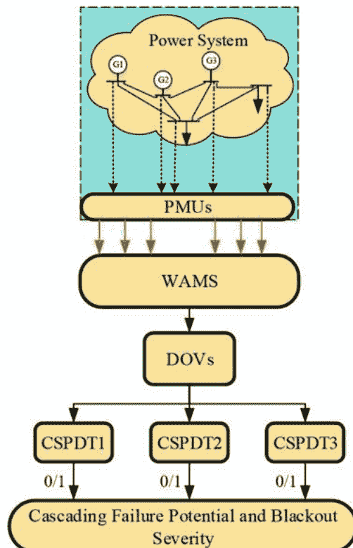

图 10.1 所提出方案的概念结构

| 系统脆弱性 | CSPDT1 | CSPDT2 | CSPDT3 | 预测停电的严重程度 |
| :--- | :--- | :--- | :--- | :--- |
| 非关键的 | 0 | 0 | 0 | B.S < 5% |
| 关键的 | 1 | 0 | 0 | 5% ≤ B.S < 20% |
| 严重关键的 | 1 | 1 | 0 | 20% ≤ B.S < 40% |
| 极度关键的 | 1 | 1 | 1 | 40% ≤ B.S ≤ 100% |

B.S=停电严重程度

为了预测停电的具体规模，使用了三个决策树 CSPDT1、CSPDT2 和 CSPDT3 来预测停电。

考虑到级联故障和停电严重程度的潜在影响，系统的脆弱性被分为非关键、关键、严重关键和极度关键四个状态，这是根据 CSPDT 的输出合理组合得出的。

表 10.1 表示由级联故障导致的停电严重程度的合理组合，这是根据 CSPDT 的输出决定的。对于电力系统的每个脆弱性状态，CSPDT 输出的组合应如表 10.1 所示。根据表 10.1，CSPDT1 负责评估级联故障的潜在影响，因此其零输出表示由于特定的 L #线路故障而不存在级联故障的潜在影响。相反，输出 1 表示由于特定 L #线路的故障和停电的特定程度，级联故障可能发生的潜力。

CSPDT2 和 CSPDT3 负责预测由于#L 线路的故障而导致的级联故障的停电严重程度。在本研究中，停电严重程度的概念与电力系统中的负荷减少百分比相同。为了实施所提出的方案，将确定的 DOV 和每条线路的训练过的 CSPDT 提供给 PSCC。因此，PSCC 可以评估级联故障的潜力，并预测每条线路和电力系统每个操作点的停电严重程度。

三步 DT 负责评估停电的潜力和预测停电的大小和严重程度；停电大小被定义为总负荷削减与电力系统总初始负荷的百分比。为了根据严重程度区分系统的级联故障，以停电的大小为准。

## 10.3 级联故障严重性预测器 DT

在这项研究中，使用 DT 评估级联故障的潜力，并使用电力系统的 DOV 预测停电的严重程度。为了训练和构建 DT，使用了各种算法，如 CHAID [29]，CART [30] 和 C4.5。在本文中，采用 C4.5 算法来实现提出的 CSPDT。

### 10.3.1 C4.5 算法 [31]

在 C4.5 DT 中，使用称为熵和信息增益的统计值来确定特征在基于其分类的训练样本中可以分割多少。

#### 10.3.1.1 熵

熵确定一组示例的纯度。如果集合 Z 包含一个概念或目标的正面和负面示例，则关于这个布尔类的熵 Z 定义如下：

熵 $Z(\cdot) = -p_{\oplus} \log_2 p_{\oplus} - p_{\Theta} \log_2 p_{\Theta}$ (10.1)

其中 $p_{\oplus}$ 是正例与总例子的比例， $p_{\Theta}$ 是负例与总例子的比例。

#### 10.3.1.2 信息增益

一个特征的信息增益是使用该特征分割例子后熵的减少。换句话说，特征 Z 和 A 的信息增益对于特征 A 和例子集合 Z，其增益（Z，A）定义如下：

增益(Z, A) = 熵 Z() - \sum_{v \in A 的值()} \frac{|Z_v|}{|Z|} 熵 Z(v). (10.2)

### 10.3.2 考虑连续属性

C5 算法还包括具有连续值的特征。对于连续特征 A，定义一个布尔类 Ac，如果 A < C，则 Ac 为真，否则为假。

#### 10.3.2.1 增益比

增益比展示了由一个特征分割的数据的均匀性和广泛性。它的定义如公式（10.3）所示：

增益比 Z( ,A) = \frac{增益 Z, A)}{分割信息 Z( ,A)} (10.3)

Z 和 A 的分割信息被称为 SI，并由公式（10.4）定义：

分割信息 Z( ,A) = - \sum_{i=1}^{c} \frac{|Z_i|}{|Z|} \log_2 \frac{|Z_i|}{|Z|} (10.4)

在公式（10.4）中，C 是 Z 的子集数量。

## 10.4 主要操作变量

一条线路的故障潜在引发级联故障取决于电力系统的运行条件。电力系统的运行条件可以通过线路故障前的运行信息来描述，如母线电压、线路功率流、负荷和发电机的发电量。

在实际电力系统中，每个运行点都有大量的运行信息。然而，考虑到特定线路#L 的重要性，所有运行信息并不完全依赖于线路的状态。换句话说，在所有运行变量中，只有有限数量的变量被称为 DOV 与线路的重要性密切相关，并且在很大程度上依赖于它。事实上，与每条线路的故障相关的 DOV 是可以用来评估特定线路 #L 的重要性的最小数量的运行变量。

因此，降维方法被用来识别大量运行变量中的 DOV。这些方法通常用于处理数据并选择主要特征。降低数据维度和特征数量的主要目的是提高数据分类准确性 [32]。特征选择和识别方法通过选择最小化特定成本函数的特征子集来降低维度。特征识别在专家和智能系统的许多应用中被使用，如数据挖掘、学习机器、图像处理、异常检测和生物信息学 [33]。此外，特征识别过程也被称为变量识别、特征降维或变量子集的检测。

MIM 方法是 DOV 变量维度缩减和 DOV 识别方法之一，它基于互信息理论定义。在这种方法中，研究了所有变量之间的关系和依赖性 [34]。然后，识别出具有丰富信息的操作变量，忽略具有低或相同信息的操作变量。

如前所述，用于评估线路重要性的是识别出的 DOVs。为此，在电力系统的操作空间中应开发具有最大覆盖范围的各种操作点，使得某些操作点的线路状态被评估为关键，而其他操作点则为非关键。

### 10.4.1 DOVs 的识别算法

在电力系统中，特定操作点的系统状态由一组操作变量{VAR}定义，例如母线电压、功率流、负荷和发电机的发电量。在每个操作点上，可以使用操作变量和行为特征之间的因果关系将各种行为特征归因于电力系统。然而，考虑到行为特征 B，不是所有操作变量集合对行为特征的形成具有相等的贡献。有些变量与行为特征强相关，而其他变量与行为特征相关性较弱。例如，#L 线路故障后的过载被视为与线路故障前的一些操作变量相关的行为特征。因此，对于电力系统的一组操作变量{VAR}，考虑到电力系统的特定行为特征 B，与 B 强相关的变量子集{VAR_D}被称为与 B 相关的 DOVs。值得注意的是，对于每组操作变量{VAR}，存在各种考虑不同行为特征的 DOVs。

在这项研究中，考虑了线路故障前的全部操作变量集合，表示为{VAR}。线路（#L）的故障潜在引发级联故障的可能性被称为电力系统的行为特征 B。

考虑到行为特征 B，目标是识别与 B 相关的操作变量 {VAR} 的子集。为了在集合{VAR}的所有操作变量中识别与{VAR_D}兼容且与行为特征 B 相关的 DOV，可以使用互信息理论和熵如下所示。

如果将 N 个操作点中的一个操作变量视为集合 $X = \{x_1, x_2, \dots, x_N\}$，其中 $x_i$ 表示操作变量在不同操作点可以采用的值，则对于每个操作变量，都定义了一个具有概率 $p(x_i)$ 的随机变量 $x_i$。对于数据集 X，使用公式（10.5）得到了一个熵函数 H(x)，它可以用于获取关于操作变量 X 的有用信息：

$$H(x) = -\sum_{x \in X} p(x) \cdot \log_2 p(x) \quad (10.5)$$

其中 H(X) 是熵函数，也被称为正向香农函数 [35]。考虑两个独立的随机变量 (X, Y)，双变量熵函数表示为方程 (10.6):

$$H(X, Y) = -\sum_{x, y} p(x, y) \cdot \log_2 p(x, y) \quad (10.6)$$

其中 $p(x,y)$ 是双变量概率函数，H(X,Y) 的值表示变量 X 中隐藏的信息，用于描述变量 Y 的状态 [35]。如果计算 $Y = y_0$ 时的 H(X,Y) 的值，则双变量熵被称为变量 X 对于 $Y = y_0$ 的条件熵，可以用方程 (10.7) 描述。这个条件熵表示变量 X 对于特定值 Y 的信息：

$$H(X|y_0) = -\sum_{x} P(x|y_0) \cdot \log_2 P(x|y_0) = H(X, Y) - H(Y) \quad (10.7)$$

其中 $P(x|y_0)$ 是随机双变量条件概率函数，H(X|y₀) 是变量 X 在给定 $Y = y_0$ [35] 的条件熵。使用方程式 (10.6) 和 (10.7)，得到方程式 (10.8) 作为变量 X 和 Y 之间的互信息。两个变量之间的互信息显示了两个变量之间的共同信息量：

$$I(X; Y) = H(X) - H(X|Y) = \sum_{x}\sum_{y} P(x, y) \cdot \log \frac{P(x, y)}{p(x) \cdot p(y)} \quad (10.8)$$

换句话说，互信息表示一个变量关于另一个变量的信息 [35]。在这项研究中，变量 X 被视为集合{VAR} 的变量，变量 Y 被视为电力系统的行为特性 B。

图 10.2 互信息的维恩图

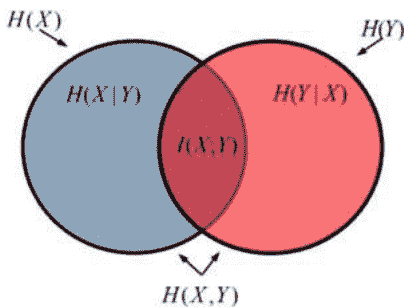

图 10.2 显示了方程 (10.8) 的维恩图。为了在电力系统使用互信息理论方法来识别与每条线路的临界条件相关的 DOV，应该在电力系统的操作空间中选择几个操作点。在每个操作点 i，集合{VAR} 的操作变量的信息是唯一的。

因此，在每个操作点，考虑到#L 线的临界条件，对于操作变量集合{VAR'}，存在一个描述#L 线是临界还是非临界的行为特性 B'。因此，对于 N 个操作点，存在 N 个操作变量集合{VAR}，它们与包含 N 个行为特性的矩阵一起构成一个数据矩阵。操作变量集合包括一个 N*m 的数据矩阵，其中 m 是电力系统的操作变量总数。N 个行为特性构成一个 N*1 的向量。

为了识别每条线路停电的相关变量，基于信息论的 MIM [36] 方法被提出。MIM 的数学表达式由方程（10.9）描述。在方程（10.9）中，X 和 Y 分别是{VAR} 的操作变量和潜在级联故障的行为特征 B。

在这种方法中，计算了{VAR}的所有操作变量和行为特征 B 之间的互信息。然后，将互信息计算的结果按从大到小排序。在方程（10.9）中，Xk 是一个操作变量，k 是操作变量的数量，VARk(Xk) 是识别具有最高互信息的 k 个变量的集合。I(Xk; Y) 是 Xk 和 Y 之间的互信息，H(Xk) 和 H(Y) 是单变量熵函数，H(Xk; Y) 是双变量熵函数：

$$VAR_k(X_k) = \arg \max I(X_k; Y) = H(X_k) + H(Y) - H(X_k, Y) \quad (10.9)$$

考虑到方程（10.9），操作变量 k 的数量可以改变。换句话说，方程（10.9）可以在考虑 k 的各种值时识别出一组 k 个主导变量。图 10.3 显示了在 N 个不同操作点上，操作变量集合与相应行为特性之间的结构关系。

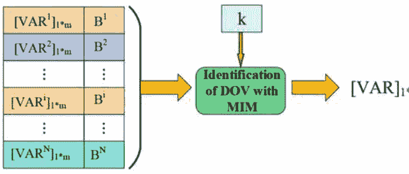

图 10.3 操作变量与相应行为特征之间的关系

引入了预测级联故障潜力和停电严重程度的主导操作变量集合，称为 DOVs。与 DOVs 相关联的 k 参数是主导操作变量的数量，并由 D 表示。因此，使用所提出的 MIM 方法，通过 VAR_D 的主导操作变量集合 DOVs 和维度 D << m 进行识别。

## 10.5 提出的方法

使用提出的 MIM 方法和各种干扰和扰动场景，为系统的每条线路检测到一组独特的 DOV。此外，使用提出的 CSPDT 和检测到的 DOV，建立了系统运行状态与 CFOP 评估和停电严重性预测之间的关系。因此，CSPDT 的主要优势在于评估 CFOP 和对未观测到的干扰进行停电预测。CSPDT 的这种能力基于插值能力，考虑了各种干扰和扰动场景，并覆盖了电力系统的整个干扰空间。图 10.4 显示了使用 DOV、CSPDT1、CSPDT2 和 CSPDT3 评估 CFOP 和停电严重性预测的提出方法的一般结构。

由于提出方案的目标是在首次故障之前评估电力系统中的 CFOP，所以 WAMS 在每个时刻将识别到的 DOV 的测量信息提供给 CSPDT。根据公式 (10.10)，将由线路#L 的故障导致的 DOV 的瞬时信息作为向量 $VAR^L_D(t)$ 的 D 个成员，作为输入传递给 CSPDT。

```
VAR_D(t) = [var_1(t), var_2(t), ..., var_D(t)] (10.10)
```

WAMS 的异步数据和部分 WAMS 数据的临时丢失可能会影响 CFOP 评估。在这项研究中，VAR^L_D(t) 的异步或丢失数据可以用前一个样本的测量 DOV (t-Δt) 替换。Δt 是 PMU 和 WAMS 传输数据到 CSPDTs 的时间步长。

图 10.4 所提出方案的一般结构

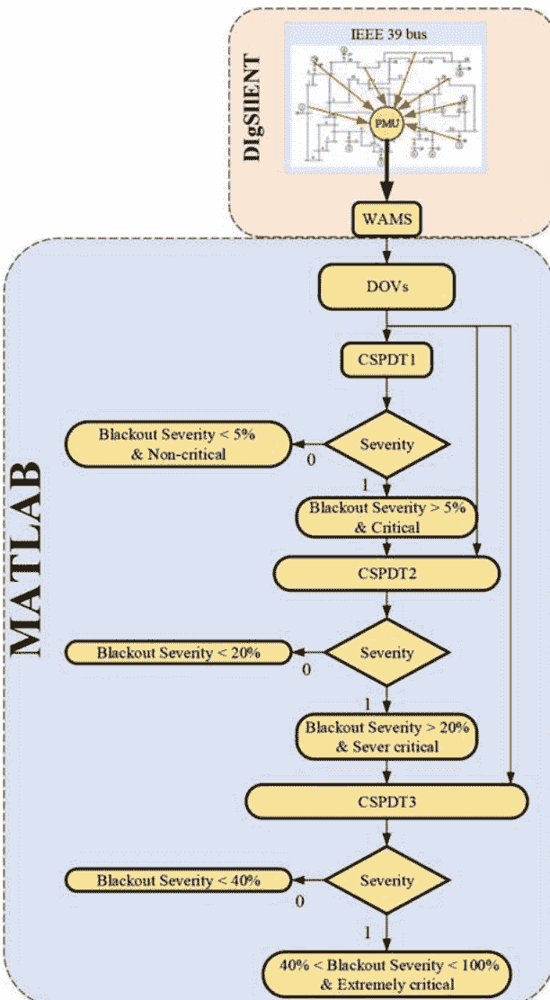

根据图 10.4，停电严重程度程序分为三个级别，并且每个级别与唯一的 CSPDT 相关联。在每个时间 t，通过同时向每个 CSPDT 呈现向量 $VAR^L_D(t)$，每个 CSPDT 在输出上返回 0 或 1；通过组合所有 CSPDT 的输出，预测由线路#L 的故障引起的 CFOP 和停电严重程度。

CSPDT1 的零输出表示，如果电力系统中的线路#L 由于故障而发生中断，预测的停电严重程度将小于电力系统负载水平的 5%。此外，级联故障不是由于线路#L 的中断而引起的；换句话说，在操作点上不存在级联故障。这种电力系统的状态被称为非关键状态，其中 CSPDT2 和 CSPDT3 的输出为零。CSPDT1 的输出 1 表示，如果线路#L 由于故障而中断，预测的停电严重程度将超过电力系统负载水平的 5%。此外，级联故障是由于线路#L 的中断而引起的；换句话说，在操作点上存在级联故障的潜力。

CSPDT2 的零输出表示，如果线路#L 发生故障导致停电，预测的停电严重程度将为电力系统负载水平的 5% 至 20%。此外，级联故障是由线路#L 的停电引起的；换句话说，在操作点上存在级联故障的潜力。

这种状态被称为临界状态，其中 CSPDT1 和 CSPDT3 的输出分别为 1 和 0。CSPDT2 的输出为 1 表示，如果电力系统的线路#L 由于故障而发生停电，预测的停电严重程度将超过电力系统负载的 20%。此外，级联故障是线路#L 的停电结果，表明在操作点上存在级联故障的潜力。

CSPDT3 的零输出表示，在线路#L 发生故障导致停电的情况下，预测的停电严重程度将为电力系统负载水平的 20% 至 40%。此外，级联故障是线路#L 的停电结果，表明在操作点上存在级联故障的潜力。这种状态被称为严重临界状态，其中 CSPDT1 和 CSPDT2 的输出均为 1。CSPDT3 的输出为 1 表示，如果线路#L 由于故障而发生停电，预测的停电严重程度将为电力系统负载水平的 40% 至 100%。此外，级联故障是线路#L 的停电结果，表明在操作点上存在级联故障的潜力。这种状态被称为极度临界状态，其中 CSPDT1 和 CSPDT2 的输出均为 1。

在考虑设计的 CSPDTs 输出的基础上，评估电力系统中潜在的停电严重程度预测，为了减轻系统压力和 CFOP，根据系统的脆弱性和影响优先级，可以采取预防措施。在这些措施中，可以提到断开负荷/发电 [37]，紧急线路断开 [38] 和岛控制 [39]。

此外，为了防止和停止线路的过载，这是电力系统故障最有效的机制，可以采取适当的负荷卸载作为预防措施 [40]。此外，为了防止由于电力波动引起的距离继电器的不良性能，可以屏蔽距离继电器的第 3 区 [41]。

## 10.6 模拟研究

在本节中，将所提出的方案应用于 IEEE39 总线系统的 17-18 和 21-22 线路，并进行研究。图 10.5 显示了 IEEE39 总线电力系统。该网络有 10 个发电机，34 条输电线路和 19 个负荷 [42]。

表 10.2 显示了 IEEE39 总线电力系统的各种可监测操作变量，考虑到 IEEE39 总线电力系统的特性，操作变量的总数为 405。在表 10.2 的第一列和第三列中，给出了操作变量的类型和单位。在第二列和第四列中，给出了操作变量的完整名称。在这些变量中，像发电机的电压幅值、发电机的转速和主发电机的转子相位角等一些变量在电力系统的所有运行点上都保持不变。因此，考虑到电力系统的特性，有 383 个操作变量是不恒定的，它们描述了电力系统的运行点。


图 10.5 IEEE39 总线电力系统

**表 10.2 IEEE39 总线系统操作变量**

| 变量 | 变量名称 | 变量 | 变量名称 |
| :--- | :--- | :--- | :--- |
| P 线 (标幺) | 线路有功功率 | V 相位 (度) | 母线电压角度 |
| Q 线 (标幺) | 线路无功功率 | δ 相位 (度) | 转子角度 (估计) |
| 线路百分比 | 线路负载 | PG (标幺) | 发电机有功功率 |
| P 负载 (标幺) | 负载有功功率 | QG (标幺) | 发电机无功功率 |
| Q 负载 (标幺) | 负载无功功率 | 发电机百分比 | 发电机负载 |
| V (标幺) | 母线电压 | 变压器百分比 | 变压器负载 |

考虑到电力系统的特性，有 383 个操作变量是不恒定的，它们描述了电力系统的运行点。

### 10.6.1 准备场景

用于实现级联故障和提出的方案的建模和仿真基于时域计算。使用时域方法确定设备违规超出运行限制需要对电力系统设备进行精确的动态建模。此外，电力系统设备的动态模型对级联故障的形成起到了有效的作用。因此，电力系统的动态建模对于模拟级联故障是必不可少的。在研究的电力系统中，发电机的六阶、过速保护、发电机主执行器、发电机电压控制系统、低频发电机保护、线路距离保护、负荷在频率/电压保护下的负荷放电和与负荷连接的变压器的分接头、频率和电压负荷去除继电器以及过流继电器都被建模。

在本研究中，使用 DIgSILENT Power Factory 15.1 对 IEEE39 节点电力系统进行建模。通过使用该软件进行离线仿真，提供了由线路#L 故障引起的训练场景。此外，还使用 MATLAB 来识别 DOV 并训练 CSPDTs；提出的三步方案也在 MATLAB 中实施。所有三个 CSPDTs 都是使用 MATLAB 进行离线训练的。因此，由 DIgSILENT 离线准备的所有场景都会提供给 MATLAB 软件以训练 CSPDTs。

当 CSPDTs 的训练完成后，将识别出的 DOVs 和训练好的 CSPDTs 提供给 PSCC 进行在线评估由#L 线路故障引起的级联故障潜在性和预测停电严重程度。

考虑到上述模型，研究了 770 个操作点以开发各种训练场景。所有场景都考虑了基本负荷为 6000 MW 的 11 个负载水平（0.7-0.75-0.8-0.85-0.9-0.95-1-1.05-1.1-1.15-1.2）。每个负载水平考虑了 70 个操作点，并且操作点的创建使得发电机、线路和变压器在不同的负载和发电水平下处于最大负荷状态，尤其是高负荷水平。因此，电力系统始终处于压力之下。此外，在准备的训练场景中，为了预测停电的严重程度，每个场景发生后确定负荷减少。

### 10.6.2 评估线路的重要性

所提出的方案用于评估级联故障的潜力和预测线路 17–18 和 21–22 因三相短路而导致的停电严重程度，并确定每条线路的 DOV。

#### 10.6.2.1 评估 17–18 线路的重要性

对于 17–18 线路的故障，创建了 748 个操作点，并且在每个操作点上采样了 383 个操作变量，根据表 10.2。操作点的具体规格见表 10.3，用于识别 DOV 并提供测试和训练场景。

在所有 748 个操作点上，对 17–18 线路施加了三相短路故障。因此，获得了 266 个关键场景和 482 个非关键场景。在 748 个场景中，随机选择了 523 个场景（所有场景的 80%）作为训练场景，并提供给 MIM 方法。

在选择的 523 个场景中，导致级联故障的场景与不导致级联故障的场景的比例为 30% 到 70%。

MIM 方法根据互信息理论和熵的数学关系以及 K 值确定一组操作变量。然后，使用确定的操作变量和训练场景来训练评估级联故障潜力和预测停电的三步树。

训练完 CSPDTs 后，使用测试场景对每个 CSPDT 进行验证，以确定其准确性和性能。

**表 10.3 线路 17–18 故障导致的不同场景数量**

| 线路 | 故障类型 | 操作点 | 工作点关键场景 | 非关键场景 | 工作点训练场景 | 测试场景 |
| :--- | :--- | :--- | :--- | :--- | :--- | :--- |
| 17–18 | 3φ | 748 | 266 | 482 | 523 | 225 |

#### 10.6.2.2 确定线路 17–18 的 DOVs 并训练 CSPDTs

MIM 方法根据互信息理论和考虑 K 值确定了一组包含 K 个成员的操作变量。在本研究中，K 值的取值为表 10.4 由于线路 17–18 的故障，CSPDTs 的最佳准确性

| CSPDT1 | | CSPDT2 | | CSPDT3 | | DOVs 的数量 |
| :--- | :--- | :--- | :--- | :--- | :--- | :--- |
| 准确性% | 测试场景的数量 | 准确% | 测试场景的数量 | 准确% | 测试场景的数量 | 数量 |
| 97.9 | 225 | 94.285 | 225 | 86.142 | 225 | 50 |

K 从集合{2, 5, 10, 20, 25, 30, 35, 40, 45, 50, 55, 60, 65, 70, 75, 80, 85, 90, 95, 100}中选择。图 10.6 显示了不同 K 值下 CSPDT 的准确性，因此也显示了不同数量的识别操作变量来评估级联故障的潜力和预测停电的潜力。因此，使用 MIM 识别出具有不同成员数量的操作变量集合。使用识别出的操作变量和提供的训练场景来训练 CSPDT。

最后，使用测试场景评估它们的准确性和性能。使用 MIM 识别出一组操作变量，这些操作变量使得 CSPDT 在评估级联故障的潜力和预测停电严重程度方面具有最大的准确性。图 10.6 表示了每个 CSPDT 的评估准确性。根据图 10.6，可以识别出具有最少操作变量的 CSPDT 的最大准确性。表 10.4 显示了 CSPDT 在评估级联故障的潜力和预测停电严重程度方面的最佳准确性，这是由于 17-18 线路故障引起的测试场景。

图 10.6 由于线路 17-18 的故障，CSPDTs 的准确性因不同的 K 而异

考虑表 10.4 的结果，可以看出在评估级联故障潜在性和预测停电严重程度方面，最大准确度是在 50 个操作变量中获得的。这些操作变量的组合根据表 10.5 由 MIM 方法确定。操作变量名称后面的数字是母线编号。

根据图 10.6 和表 10.5，使用 MIM 确定的 50 个操作变量组合在评估级联故障潜在性和预测停电严重程度方面具有最大准确度，适用于线路 17-18 的故障。因此，这些确定的操作变量被称为线路 17-18 的 DOV。对于在线评估关于线路 17-18 的电力系统脆弱性，它足够提供表 10.5 中的 DOVs 以及训练过的 CSPDTs 给 PSCC。在 PSCC 中，每个时刻和每个操作点的 DOVs 信息由 WAMS 接收，并将其作为输入提供给训练过的 CSPDTs。然后，考虑每个 CSPDT 的输出，可以高精度地确定线路 17-18 的级联故障潜力和停电严重程度。

**表 10.5 线路 17-18 的 DOVs**

| 编号 | 操作变量 | 编号 | 操作变量 |
| :--- | :--- | :--- | :--- |
| 1 | Qline_19-16 | 26 | Qline_27-17 |
| 2 | Qline_13-10 | 27 | Qline_6-5 |
| 3 | Qline_26-25 | 28 | Pline_15-14 |
| 4 | Qline_24-23 | 29 | Qline_2-1 |
| 5 | Qline_3-2 | 30 | Qline_39-1 |
| 6 | QG_38 | 31 | Qline_18-17 |
| 7 | Qline_5-4 | 32 | Pline_18-17 |
| 8 | Qline_14-13 | 33 | Qline_22-21 |
| 9 | QG_37 | 34 | Line_27-26 (%) |
| 10 | QG_33 | 35 | QG_39 |
| 11 | Qline_11-10 | 36 | V_phase_28 |
| 12 | QG_32 | 37 | Line_7-6 (%) |
| 13 | Pline_23-22 | 38 | PG_36 (%) |
| 14 | Qline_29-28 | 39 | Qline_27-26 |
| 15 | Qline_8-7 | 40 | Pline_3-2 |
| 16 | Pline_27-17 | 41 | Qline_16-15 |
| 17 | Qline_23-22 | 42 | Tr_25-37 (%) |
| 18 | QG_31 | 43 | Tr_22-35 (%) |
| 19 | Line_3-2 (%) | 44 | Line_25-2 (%) |
| 20 | Pline_24-16 | 45 | Qline_15-14 |
| 21 | Pline_9-8 | 46 | Tr_23-36 (%) |
| 22 | V_phase_29 | 47 | PG_38 (%) |
| 23 | Pline_39-9 | 48 | Tr_6-31 (%) |
| 24 | Qline_8-5 | 49 | Tr_2-30 (%) |
| 25 | Qline_14-4 | 50 | V_phase_23 |

#### 10.6.2.3 评估线路 21-22 的重要性

所提出的方案应用于线路 21-22，类似于线路 17-18。操作点的规格在表 10.6 中给出，用于识别 DOV 并提供测试和训练场景。

根据表 10.6，在所有 751 个操作点上对线路 21-22 施加三相短路故障。因此，获得 580 个关键场景和 171 个非关键场景。在 751 个场景中，随机选择 526 个场景（所有场景的 80%）作为训练场景，并提供给 MIM 方法。

#### 10.6.2.4 识别 DOV 并训练线路的 CSPDTs 21-22

| 线路 | 故障类型 | 操作点总数 | 非关键场景 | 关键场景 | 测试场景 | 训练场景 |
| :--- | :--- | :--- | :--- | :--- | :--- | :--- |
| 21-22 | 3φ | 751 | 171 | 580 | 225 | 526 |

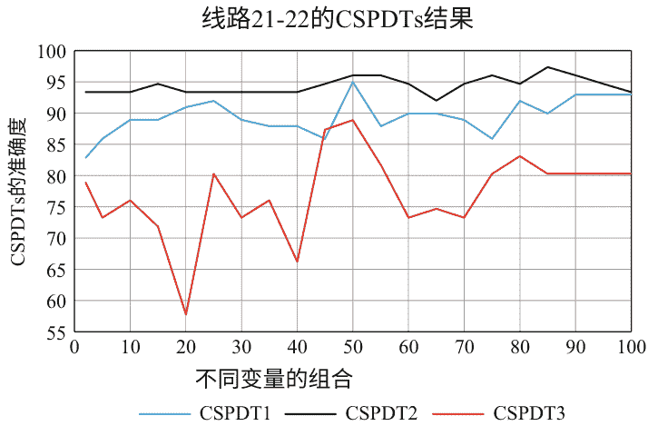

| 指标 | CSPDT1 | CSPDT2 | CSPDT3 | DOVs 总数 |
| :--- | :--- | :--- | :--- | :--- |
| 准确性 (%) | 94.949 | 96.334 | 88.872 | - |
| 测试场景数量 | 225 | 225 | 225 | 50 |

图 10.7 显示了不同 K 值下 CSPDTs 的准确性，因此也显示了不同数量的识别操作变量来评估级联故障的潜力和预测停电。类似于 17-18 线路，对于 21-22 线路，使用不同成员数量的操作变量集合通过 MIM 进行识别。使用识别的操作变量和提供的训练场景来训练 CSPDTs。最后，使用测试场景评估它们的准确性和性能。识别出一组操作变量，使得 CSPDTs 在评估级联故障潜力和预测由 21-22 线路故障引起的停电严重程度时具有最大准确性。根据图 10.7，可以通过考虑最少数量的操作变量来确定 CSPDTs 的最大准确性。表 10.7 表示操作变量。

表 10.7 | 操作变量编号 | 操作变量
| :--- | :--- | :--- |
| 1 | QG_30 | 26 | P 线_23 -22 |
| 2 | QG_32 | 27 | Qline_15-14 |
| 3 | QG_31 | 28 | Q 线_8 -5 |
| 4 | Q 线_6 -5 | 29 | Q 线_14 -4 |
| 5 | QG_33 | 30 | Qline_27-26 |
| 6 | Q 线_14 -13 | 31 | V_{phase} -29 |
| 7 | Q 线_13 -10 | 32 | Qline_7-6 |
| 8 | Q 线_22 -21 | 33 | P 线_15 -14 |
| 9 | Qline_19-16 | 34 | Pline_9-8 |
| 10 | Q 线_24 -23 | 35 | Q 线_16 -15 |
| 11 | Q 线_26 -25 | 36 | Pline_39-9 |
| 12 | Q 线_5 -4 | 37 | Tr_12-13(%) |
| 13 | Q 线_11 -10 | 38 | V_{相位} -22 |
| 14 | Q 线_18 -3 | 39 | P 线_18 -3 |
| 15 | QG_37 | 40 | Pline_26-25 |
| 16 | P 线_27 -17 | 41 | 负载_24 |
| 17 | P 线_18 -17 | 42 | 线路_22-21(%) |
| 18 | QG_36 | 43 | Qline_27-17 |
| 19 | QG_35 | 44 | Tr_2-30 (%) |
| 20 | Q 线_8 -7 | 45 | 线路_27-26 (%) |
| 21 | Q 线_3 -2 | 46 | Tr_23-36 (%) |
| 22 | QG_39 | 47 | Q 线_18 -17 |
| 23 | Pline_24-16 | 48 | Tr_6-31 (%) |
| 24 | Pline_22-21 | 49 | Tr_20-34 (%) |
| 25 | QG_38 | 50 | Tr_25-37 (%) |

由于线路 21-22 的故障，CSPDTs 在评估级联故障潜力和预测停电严重程度方面具有最佳性能准确性。

根据表 10.7 和图 10.7 的结果，可以看出在评估级联故障潜力和预测停电严重程度方面，最大准确性是在 50 个操作变量下获得的。根据 MIM 方法确定的这些操作变量的组合如表 10.8 所示。根据 MIM 确定的 50 个操作变量的组合如表 10.8 所示，在评估级联故障潜力和预测停电严重程度方面提供了最大准确性。因此，根据表 10.8 确定的操作变量被称为线路 21-22 的 DOVs。

### 10.6.3 性能验证

所提出方案的性能经过四种不同情景的验证。四种情景的具体规格见表 10.9。以上情景均未用于识别操作变量和训练 CSPDTs。在表 10.9 中，确定了四种情景的负荷减少量和百分比。基于所提出的方案，在故障发生前从电力系统的 WAMS 接收到每条线路的 DOV 信息，并提供给每条线路的训练过的 CSPDTs。根据 CSPDTs 的输出，预测并表示每种情景的级联故障潜力和停电严重程度，见表 10.10。为了验证所提出的方案，应考虑每个 CSPDT 的输出，并考虑负荷减少百分比作为停电严重程度。根据表 10.10 中的结果，所提出的三步方案在评估级联故障潜力和预测四种不同情景的停电严重程度方面表现良好。根据表 10.9 中表示的情景 1-4 的负荷减少百分比，预计系统的脆弱性应为非关键、关键、极其关键和严重关键。根据表 10.10，可以看到预期结果被正确实现。操作变量后面的数字是母线编号。

| 故障场景 | 负荷水平 (兆瓦) | 级联故障状态 | 故障类型 | 故障位置 (线路) | 故障位置 (线路%) | 负荷削减 (兆瓦) | 负荷削减/负荷水平 (%) |
| :--- | :--- | :--- | :--- | :--- | :--- | :--- | :--- |
| 1 | 6214 | 非关键 | 三相 | 17-18 | 20 | 205 | 3.29 |
| 2 | 5557 | 关键 | 三相 | 21-22 | 50 | 598 | 10.76 |
| 3 | 7089 | 极其关键 | 单相 | 17-18 | 70 | 5500 | 77.58 |
| 4 | 7124 | 严重关键 | 电阻性故障 10Ω | 21-22 | 50 | 2841 | 39.87 |

| 故障场景 | 实际系统脆弱性 | CSPDT1 输出 | CSPDT2 输出 | CSPDT3 输出 | 系统脆弱性的预测 |
| :--- | :--- | :--- | :--- | :--- | :--- |
| 1 | 非关键 | 0 | 0 | 0 | 非关键 |
| 2 | 关键 | 1 | 0 | 0 | 关键 |
| 3 | 极其关键 | 1 | 1 | 1 | 极其关键 |
| 4 | 严重关键 | 1 | 1 | 0 | 严重关键 |

### 10.6.4 全局性能

在提出的方案中，三个 CSPDT 应该基于逻辑和同步的过程来评估级联故障的潜在性并预测导致的停电严重程度。因此，三个 CSPDT 之间的不合理性能可能被认为是不正确的性能。

表 10.11 表示了 CSPDTs 输出的八种可能组合，它们的逻辑性能可以解释如下：

1. 组合 1-4 是逻辑的，CSPDTs 作为初始决策的决策与逻辑决策进行验证。
2. 组合 5-6 是不合理的，CSPDTs 作为初始决策的决策与逻辑决策进行验证。
3. 组合 7-8 是不合理的，CSPDTs 作为初始决策的决策没有进行验证，而是通过逻辑决策进行修改和验证。

| 状态编号 | CSPDT1 | CSPDT2 | CSPDT3 | 逻辑/非逻辑 | 故障 | 初始决策 | 逻辑决策 |
| :--- | :--- | :--- | :--- | :--- | :--- | :--- | :--- |
| 1 | 0 | 0 | 0 | 逻辑 | – | 非关键 | 非关键 |
| 2 | 1 | 0 | 0 | 逻辑 | – | 关键 | 关键 |
| 3 | 1 | 1 | 0 | 逻辑 | – | 严重关键 | 严重关键 |
| 4 | 1 | 1 | 1 | 逻辑 | – | 极其关键 | 极其关键 |
| 5 | 1 | 0 | 1 | 非逻辑 | CSPDT2 或 CSPDT3 | 极其关键或关键 | 极其关键或关键 |
| 6 | 0 | 1 | 1 | 非逻辑 | CSPDT1 | 极其关键 | 极其关键 |
| 7 | 0 | 1 | 0 | 非逻辑 | CSPDT1 或 CSPDT2 | 关键或严重关键 | 非关键或严重关键 |
| 8 | 0 | 0 | 1 | 非逻辑 | CSPDT3 | 极其关键 | 非关键 |

## 10.7 结论

在这项研究中，DOVs 和 DT 技术被用来提供一个三步预测方案，用于评估级联故障的潜在风险，并预测电力系统中每条线路的停电严重程度。这个智能方案包括三个 CSPDTs，它们的输出的逻辑组合决定了所提出的方案能够评估级联故障的潜在性并预测不同规模的停电严重程度。

在所提出的方案中，使用基于互信息理论和熵的 MIM 方法识别 DOV，以评估级联故障的潜在性并预测停电严重程度。 然后，使用 DOV 和各种干扰场景对 CSPDT 进行训练。 根据结果，CSPDT 能够高精度地评估级联故障的潜在性并预测导致的停电严重程度。 每条线路的 DOV 和训练后的 CSPDT 提供给 PSCC 来评估级联故障的潜在性。 在 PSCC 中，DOV 信息由 WAMS 在线准备，并提供给每条线路的训练后的 CSPDT。 系统每个操作点上所有 CSPDT 的零输出描述了系统的安全运行，没有级联故障发生。

所提出的方案可以作为一个警告系统，用于启动紧急行动和预防控制，以预测严重停电的发生。 在这种情况下，PSCC 可以确定每个操作点的级联故障潜力和导致的停电严重程度，了解每条线路的 DOVs 和相应的 CSPDTs。 然后，如果需要，PSCC 可以将电力系统的操作点从关键点转移到非关键点，以确保电力系统始终在安全区域内运行，避免级联故障的发生。

## 10.8 未来研究建议

在本研究中，通过预测停电严重程度来评估级联故障后的电力系统脆弱性。 停电严重程度指数被用作电力系统的静态脆弱性度量。 在未来的研究中，除了作为电力系统脆弱性度量的停电严重程度预测外，还可以使用其他指标如频率和转子角来预测电力系统的动态稳定性。

# 参考文献

1. S. Henry 等人，不确定性下电力系统安全评估的新趋势。 IEEE 电力系统会议和展览 3, 1380–1385 (2004)
2. D. Ajendra 等人，使用复杂网络理论进行电力系统的脆弱性分析和故障定位。 博士论文，(RMIT 大学科学、工程和健康学院，2011)
3. L. Zhou 等人，基于多智能体系统的电力系统特殊保护和应急控制方案。 博士论文，(奥尔堡大学工程、科学和医学学院，2013)
4. NERC.电力摆动对保护系统的响应。 http://www.nerc.com (2013)
5. A. Abedi 等人，分析电力系统脆弱性的主要方法综述-可靠性工程与系统安全。可靠性工程与系统安全 183, 153–172 (2019)
6. D. Seyed Javan 等人，考虑负荷之间的相关性，从有效描述变量中提取信息，重建电力系统安全区域的信息提取。国际电能系统交易 13, 145-181 (2017)
7. R. Casimir, E. Boutilieux, G. Clerc, A. Yahoui，使用特征选择和最近邻规则进行感应电动机故障诊断。Eng. Appl. Artif. Intell. 19(2),169-177 (2006)
8. Chang H 和 Viet L.N (2017) 非侵入式低压配电系统故障检测中的故障位置的统计特征提取。Energies 10(5):611
9. H. Muhammad Faisal 等人，使用增强卷积神经网络预测建筑能耗。Web, Artificial Intelligence and Network Applications 927,1157-1168 (2019)
10. Saunders C.S 等人 (2019) 基于特征提取的实时暂态稳定性分析。Techno Econ Smart Grids Sustain Energy 4(15)
11. F. Cadini 等人，对受到级联故障影响的电力传输网络中罕见事件概率的估计。可靠性工程与系统安全 158, 9-20 (2017)
12. P. Henneaux，级联故障中超负荷线路失效概率。国际电力能源系统杂志 73, 141-148 (2015)
13. S.N. Ashida 等人，用于确定敏感传输线路和总负载条件严重性的动态系统级联崩溃风险评估。可靠性工程与系统安全 157, 113-128 (2017)
14. M. Shengwei 等人，改进的 OPA 模型和停电风险评估。IEEE 电力系统交易 24(2), 814-823 (2009)
15. H. Ren 等人，使用输电线路故障数据估计电力系统中的级联故障传播。IEEE 电路与系统交易 55(9), 927-931 (2008)
16. J. Qi 等人，级联故障的仿真和缓解的交互模型。IEEE Trans. Power Systems 30(2), 804-819 (2015)
17. P. Rezaei 等人，使用随机化学方法估计级联故障风险。IEEE Trans. Power Syst. 30(5), 2726-2735 (2015)
18. J. Kim 等人，在级联停电模拟中估计负荷削减的传播和分布。IEEE Syst. J. 6(3), 548-557 (2012)
19. L. Che 等人，通过隐藏的多支路连续性故障识别引发的级联故障。IEEE Trans. Reliab. 68 (1), 149-160 (2019)
20. M.H. Athari, Z. Wang，使用非线性变换的不确定发电的随机级联故障模型。IEEE 可持续能源交易 11(2), 1067-1077 (2019)
21. J. Guo 等，量化组件故障概率对级联停电风险的影响。IEEE Trans. Power Syst. 33(5), 5671-5681 (2018)
22. J. Cepeda 等，基于数据挖掘的预测电力系统事故后动态脆弱性状态的方法。国际电气能源系统交易 25(10),2515-2546 (2015)
23. S. Gupta 等，基于支持向量机的智能电网中的主动级联预测方法。IEEE Trans. Ind. Electron. 62(4), 2478-2486 (2015)
24. I. Dobson，从实用数据中估计级联线路故障的传播和范围，使用分支过程。IEEE Trans. Power Syst. 27(4), 2146-2155 (2012)
25. Y. Zhang 等，通过智能继电器缓解停电：一种机器学习方法。IEEE99(1), 94-118 (2011)
26. M.R. Salimian, M.R. Aghamohammadi，一种基于脆性指数的三阶段决策树智能停电预测器，用于电力系统。IEEE 智能电网交易 9(5), 5123-5131 (2018)
27. M. Abedi, M.R. Aghamohammadi，基于 PMU 数据的发电机失步条件的 DT 智能预测器。电力能源系统。99, 95-106 (2018)
28. N. Senroy 等人，决策树辅助的受控孤岛。IEEE 交易电力系统 21, 1790-1797 (2006)
29. G.V. Kass，一种用于研究大量分类数据的探索性技术。应用统计 29(2), 119–127 (1980)
30. L. Breiman 等人，分类和回归树 (Wadsworth International Group，Belmont, CA, 1984)
31. K. Max, K. Johnson，应用预测建模（施普林格，纽约，2013 年）
32. H. Liu 等，具有动态互信息的特征选择。爱思唯尔，模式识别 42（7），1330–1339（2009 年）
33. B. Remeseiro, V. Bolon-Canedo，医学应用中特征选择方法综述。计算机生物学与医学 112, 1–9（2019 年）
34. T. Cover, Thomas，信息论要素（约翰威利，纽约，2006 年）
35. M. Bennasar 等，使用联合互信息最大化的特征选择。专家系统应用 42, 8520–8532（2015 年）
36. B. Zhang 等，基于互信息最大化的带有校准约束的协同数据收集。IEEE Access 7, 21188–21200（2019 年）
37. M. Khaji, M.R. Aghamohammadi，使用负荷 - 发电机组跳闸的在线紧急阻尼控制器来抑制电力系统区间振荡。电力系统研究 140, 806–820 (2016)
38. Khaji M 和 Aghamohammadi M.R（2017）紧急输电线路切换以抑制电力系统区间振荡。国际电力能源系统杂志。87:52–64
39. M.R. Salimian, M.R. Aghamohammadi，使用速度 - 加速度准则作为时间匹配的智能失步预测器来控制孤岛。IEEE 智能电网交易 9(4), 2488–2497 (2016)
40. M. Majidi, M.R. Aghamohammadi，基于关键线路过载的智能负荷削减算法的新设计，以减少网络级联故障风险。土耳其电气工程与计算机科学杂志 22(6), 1395–1409 (2014)
41. M.R. Aghamohammadi 等人，通过阻塞最小临界距离继电器来减轻停电风险的新方法。国际电力能源系统杂志 75, 162–172 (2016)
42. Z. Shuangxi 等人，电力系统电压稳定性及其控制 (中国电力出版社，北京，2003)

# 第 11 章
LSTM 辅助住宅建筑物供暖能源需求管理

# Amin Mansour-Saatloo, Arash Moradzadeh, Sahar Zakeri, 和 Behnam Mohammadi-Ivatloo

## 11.1 引言

近年来城市化的蔓延需要大量的多种能源来供应市民。然而，能源来源的缺乏和基于化石燃料的能源使用的限制，由于气候变化和全球变暖的原因，推动研究人员寻找最佳能源管理方法来解决这个问题 [1,2]。负荷预测是一种有前途的解决方案，可以帮助建筑物的能源系统以最优和合理的方式运行。对于住宅建筑物来说，热能是最主要的能源。供暖负荷预测是供暖操作和调度的前提 [3]。

根据研究，商业和住宅建筑物在今天人们的日常能源消耗中占据最高比例。因此，智能控制建筑能源消耗可以被视为能源节约和管理中最重要的工具。许多解决方案已经在各种研究中介绍用于建筑物的能源管理，每个解决方案都有其优点和缺点。同时，预测建筑物的供暖负荷可以被视为建筑物能源管理中最基本的解决方案之一，它可以比其他方法具有更好的优势 [3,4]。

A. Mansour-Saatloo · A. Moradzadeh · S. Zakeri
塔布里兹大学电气与计算机工程学院，伊朗塔布里兹
电子邮件: amin_mnsr97@ms.tabrizu.ac.ir; arash.moradzadeh@tabrizu.ac.ir; s_zakeri@tabrizu.ac.ir

B. Mohammadi-Ivatloo (✉)
电气与计算机工程学院，塔布里兹大学，伊朗塔布里兹
能源技术系，奥尔堡大学，丹麦奥尔堡
e-mail: bmohammadi@tabrizu.ac.ir

©作者，独家许可给 Springer Nature Switzerland AG 2022
M. Nazari-Heris 等人（编），机器学习和深度学习方法在电力系统问题中的应用，电力系统，
https://doi.org/10.1007/978-3-030-77696-1_11

## 11 个 LSTM 辅助住宅建筑供热能源需求管理

热负荷预测需要处理一个复杂的过程，涉及到非线性优化问题。到目前为止，许多学者研究了热负荷预测，并采用了各种方法。一些文献采用了回归分析算法，例如，在 [5] 中使用了非线性自回归外部输入模型（NARX）对商业建筑的热负荷进行预测。

在 [6] 中，基于非线性预测控制和先进的机器学习方法，开发了实时预测来进行供暖和制冷负荷预测。在 [7] 中讨论了线性和非线性自回归模型与外部输入的性能，用于不同负荷预测。此外，在 [8,9] 中采用自回归移动平均（ARMA）方法，在 [10,11] 中采用自回归积分移动平均（ARIMA）方法进行负荷预测。在 [12] 中，采用季节性自回归积分移动平均（SARIMA）方法进行供暖负荷预测。然而，由于供暖负荷特性具有多个维度，基于回归的方法无法进一步发展。此外，回归方法需要时间序列，无法利用长期历史数据。

通过神经网络和机器学习的数据驱动建模和预测实现，解决了上述问题。在 [13] 中开发了一种在线顺序极限学习机（OSELM）方法，用于供暖和制冷负荷预测。在 [14] 中分析了多层感知器（MLP）和支持向量机（SVM）在供暖负荷预测中的性能。在 [15] 中开发了九种不同的极限机器学习方法，用于供暖负荷预测。在 [16] 中采用动态神经网络对公寓楼的供暖负荷进行预测。在 [17] 中应用了各种机器学习技术，包括支持向量机、回归树等，用于住宅和商业建筑的负荷预测。在 [18] 中采用了一种称为深度神经网络（DNN）的深度学习应用，用于预测住宅建筑的供暖和制冷负荷。本研究提出的方案基于建筑物的结构特征作为网络输入，预测供暖和制冷负荷作为网络输出。在 [19] 中，采用了基于支持向量机算法的火焰搜索算法来优化支持向量机参数，用于供暖负荷预测。在类似的背景下，采用了最小二乘支持向量机（LSSVM）方法，用于多负荷预测。在 [21] 中，采用支持向量回归（SVR）、深度神经网络（DNN）和极限梯度提升方法，用于供暖负荷预测。在 [22] 中，采用了一种称为时序传统神经网络（CNN）的方法，用于供暖负荷预测。在 [23] 中，采用了基于链式的长短期记忆（LSTM）方法，用于供暖负荷预测。对供暖负荷预测相关的一些有价值的文献进行了综述。表 11.1 列出了所讨论的文献，包括所使用的方法、评估指标、数据类型和目的。

上述研究中的一些存在的问题是所提出的方法无法分析连续数据，而其他一些问题则是输入数据之间缺乏相关性。本文使用 LSTM 方法对建筑物的供暖负荷进行预测，作为一种适用于时间序列数据分析的方法。LSTM 通过应用于建筑物结构中的基本因素相关的数据来预测供暖负荷。

### 表 11.1 与建筑物供暖负荷预测相关的研究综述

| 参考文献 | 年份 | 数据类型 | 方法 | 评估指标 | 提出 |
| :--- | :--- | :--- | :--- | :--- | :--- |
| [5] | 2017 | 真实的 | NARX | 均方归一化误差 | 估计商业建筑的热需求 |
| [6] | 2014 | 真实的 | 自适应高斯过程、隐马尔可夫模型、情节发现和半马尔可夫模型 | 均方根误差 (RMSE) | 估计本地天气条件以减少供暖和制冷能耗 |
| [7] | 2014 | 真实的 | 线性 ARX、NARX | 平均绝对百分比误差 (MAPE) | 估计供暖、制冷和负荷预测 |
| [8] | 2003 | 真实的 | ARMA | 相对误差 | 估计电负荷 |
| [9] | 2013 | | ARMA, ARIMA, 自回归人工神经网络 | 均方根误差 (RMSE), 平均偏差误差 (MBE) | 不同方法在 Dez 水坝水库流量预测中的比较 |
| [11] | 2018 | 真实的 | ARIMA | 平均绝对百分比误差 (MAPE) | 估计住宅和工业建筑的电负荷 |
| [12] | 2016 | 真实的 | SARIMA | 适应的平均绝对百分比误差 (AMAPE) | 估计热需求 |
| [13] | 2018 | 模拟 | OSELM | 平均绝对误差 (MAE) | 估计能源消耗和能源高效建筑设计 |
| [14] | 2018 | 真实的 | 多层感知器 (MLP), 支持向量机 (SVM) | 均方根误差 (RMSE) | 估计热需求 |
| [15] | 2016 | 真实的 | 基于极限学习机的多步预测模型 | 均方根误差 (RMSE) | 估计热需求 |
| [16] | 2016 | 真实的 | 动态神经网络 (DNN) | 均方根误差 (RMSE)、平均绝对百分比误差 (MAPE) 和变异的绝对分数 (R2) | 估计公寓建筑的供暖和制冷需求 |
| [17] | 2016 | 真实的 | 支持向量机 (SVM)、回归树、前馈神经网络、多元线性回归 | 均方根误差 (RMSE) | 估计住宅和商业建筑的供热需求 |
| [18] | 2020 | 模拟 | DNN | 方差解释率 (VAF) | 估计能源消耗和能源高效建筑设计 |

LSTM 属于循环神经网络 (RNN),在不同应用中表现出色。事实上,LSTM 是 RNN 的改进版本，弥补了其缺点。在 [24] 中，LSTM 被用于风能预测。在建筑短期 (即提前 1 小时) 负荷预测领域，[25] 比较了极限梯度提升 (XGBoost) 和 LSTM 作为浅层学习和深度学习工具。在 [26] 中，使用 LSTM 预测了长期能源消耗。在 [27,28] 中，使用 LSTM 预测光伏能源产量。在 [29] 中，使用 LSTM 网络进行个体消费者负荷预测时，使用了分位数损失而不是均方误差 (MSE)。除了电力系统应用外，LSTM 还用于医学诊断 [30,31]、空气污染预测 [32]、人体动作识别 [33] 等领域。

根据已经审查的文献和作者的最佳知识，尚未在住宅建筑的供暖负荷预测中应用 LSTM。为了填补这一研究空白，本章重点研究使用 LSTM 作为深度学习技术的住宅建筑供暖负荷预测。众所周知，建筑物的供暖消耗主要取决于天气和环境条件。因此，本章旨在基于天气和环境条件进行预测。环境和天气特征以及建筑物结构特征是 LSTM 的输入，供暖值是目标。

本章的其余部分组织如下：第 11.2 节描述了使用的数据集的详细信息。第 11.3 节提供了 LSTM 的数学模型。

## 11.2 数据集

本研究中使用的数据集包含 768 个样本，每个样本有 8 个属性和 1 个决策变量。$z_1, z_2, \dots, z_8$ 是指 8 个不同的方面，即相对紧凑度、表面积、墙面积、屋顶面积、总高度、朝向、玻璃面积和玻璃面积分布，旨在预测热值$w$ 作为决策变量。所有的模拟都是在 Tsanas 和 Xifara[34] 的 Ecotect 软件中进行的，涉及 12 栋住宅建筑。每栋建筑由 18 个相同材料的基本立方体 ($3.5 \times 3.5 \times 3.5$) 组成。假设建筑物位于希腊雅典，考虑了 60% 的湿度、0.6 的穿衣指数、0.3 m/s 的风速和 300 lx 的光照水平作为环境因素。此外，在模拟过程中应用了 0.5 的空气更换率和 0.25 小时的敏感性进行空气渗透。表 11.1 回顾了使用的数据集的特征和响应。

## 11.3 LSTM 数学模型

如今，深度学习在人们的日常生活的大部分领域中扮演着越来越重要的角色。它已经在科学和工业应用中取得了显著进展，例如在医学中诊断各种疾病、安全问题中的人脸识别和指纹识别、电力系统中的故障检测以及全球范围内的能源预测问题。深度学习有多种技术，每种技术在不同的应用中都能发挥作用 [35, 36]。在各种深度学习技术中，LSTM 被用作一种强大的工具，具有非常高的处理时间序列数据的能力。LSTM 是 RNN 过程的改进算法，可以克服 RNN 的缺点，如梯度消失问题，并保持其通道中的记忆 [37]。通过使用细胞状态，LSTM 神经网络可以添加和删除信息，这使得 LSTM 比 RNN 更优越 [23]。LSTM 的数学结构如下所示 [23, 37]:

$$ i_t = \sigma(W_{ii}z_t + b_{ii} + W_{hi}h_{t-1} + b_{hi}) $$
$$ f_t = \sigma(W_{if}z_t + b_{if} + W_{hf}h_{t-1} + b_{hf}) $$
$$ g_t = \tanh(W_{ig}z_t + b_{ig} + W_{hg}h_{t-1} + b_{hg}) $$

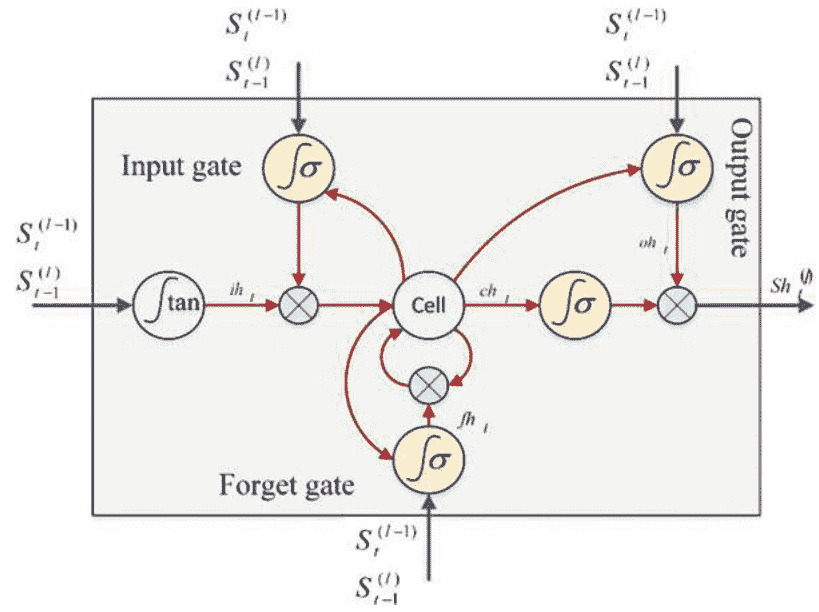

图 11.1 对应于 LSTM 的一个单元的主要块图

$$ \begin{aligned} o_{t} & =\sigma\left(W_{i o} z_{t}+b_{i o}+W_{h o} h_{t-1}+b_{h o}\right) \\ c_{t} & =f_{t} * c_{t-1}+i_{t} * g_{t} \\ h_{t} & =o_{t} * \operatorname{tanh}\left(c_{t}\right) \\ \sigma(z) & =\frac{1}{1+e^{-z}} \end{aligned} $$

其中， $i_{t}, f_{t}, g_{t}, o_{t} \in \mathbb{R}^{h}$ 是输入门、遗忘门、细胞门和输出门; $c_{t}, h_{t} \in \mathbb{R}^{h}$ 是细胞状态和隐藏状态; $z_{t} \in \mathbb{R}^{d}$ 是输入向量; $\sigma$ 是由公式 (11.7) 给出的 sigmoid 函数; $W_{i i}, W_{i f}, W_{i g}, W_{i o} \in \mathbb{R}^{h \times d}$ 是输入门、遗忘门、细胞门和输出门的可训练参数，以及 $W_{h i}, W_{h f}, W_{h g}, W_{h o} \in \mathbb{R}^{h \times h}$ 是输出向量的可训练参数; $b_{i i}, b_{h i}, b_{i f}, b_{h f}, b_{i g}, b_{h g}, b_{i o}, b_{h o} \in \mathbb{R}^{h}$ 是可训练的偏置项; *是标量积，tanh 是激活函数。图 11.1 显示了基于方程的 LSTM 块图。

## 11.4 模拟和数值结果

在本章中，通过 LSTM 预测建筑物的供暖负荷，考虑建筑物结构中的影响因素作为输入数据，以及与每个条件相关的供暖负荷量作为目标。当网络在训练阶段学习与数据相关的行为模式，以便能够预测未来的系统行为。因此，当基于影响建筑结构和与之相关的供暖负荷的一些基本参数对 LSTM 进行训练时，就可以基于结构参数预测其他建筑物的供暖负荷。因此，向消费者提出了一种管理建筑物供暖能源消耗的理想方法。设计完成后，使用 70% 的数据对 LSTM 进行训练，剩余的 30% 的数据用于网络测试。

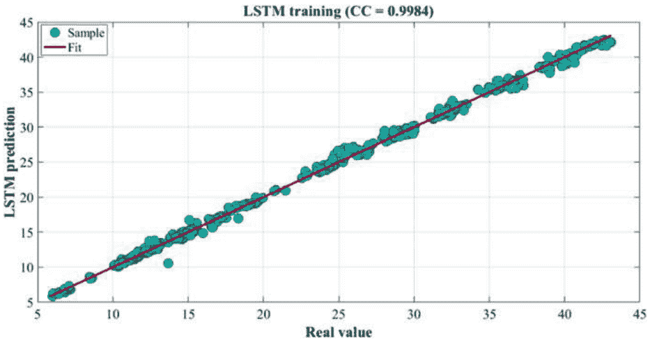

图 11.2 显示了 LSTM 在训练阶段对供暖负荷预测的回归结果。图 11.2 显示了训练数据的供热负荷预测结果。这个图提供了 LSTM 在预测供热负荷时的相关系数 (CC)。可以看出，预测结果具有很高的准确性 (CC =0.9984)，网络能够很好地训练建筑供热负荷在不同条件下的行为模式。图 11.3 评估了训练阶段的预测结果的误差值，以均方误差 (MSE) 和平均绝对误差 (MAE) 的形式。

网络在训练阶段学习与数据相关的行为模式，并在完成该阶段后保存为一个黑盒子，用于未来的预测。图 11.4 展示了测试数据的供热负荷预测结果。可以看出，当网络训练得到很高的准确性时，它能够为测试数据提供良好的预测。图 11.5 显示了通过 MSE 和 RMSE 指标评估网络对测试数据的误差值。在训练和测试网络并根据获得的准确性和误差值后，可以得到一个直方图形式的预测误差。

图 11.6 以直方图的形式显示了测试误差。

从图 11.4 中呈现的结果可以清楚地看出，LSTM 能够以高精度（0.9980）预测建筑物的测试数据的供暖负荷。


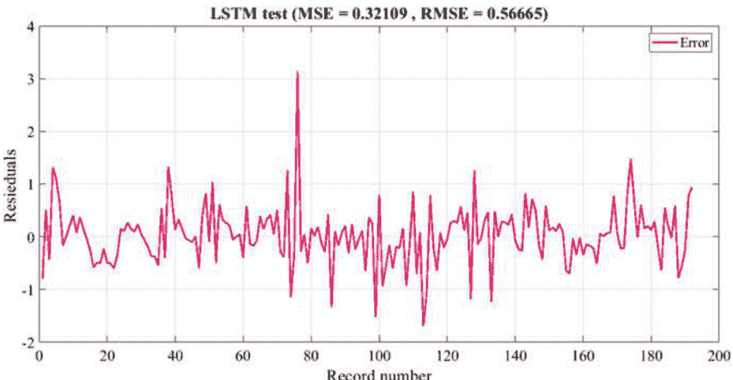

图 11.5 LSTM 对测试数据的供热负荷预测误差值，以 MSE 和 RMSE 的形式表示

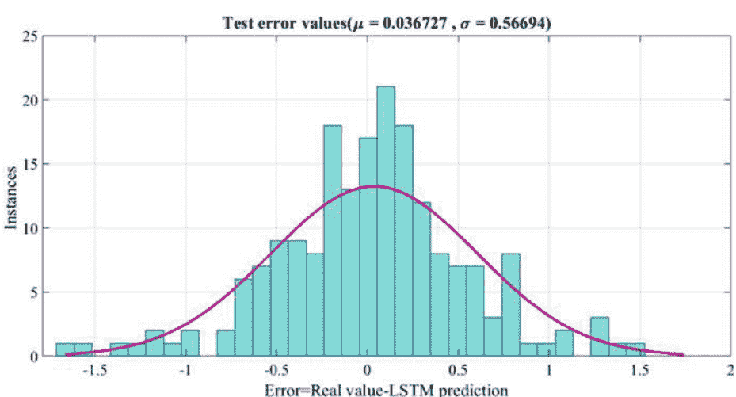

图 11.6 LSTM 对测试数据的供热负荷预测误差值的直方图

以前适当的训练。此外，图 11.5 和 11.6 中呈现的误差值表明 LSTM 网络在测试阶段的良好性能。根据对建筑物供暖负荷预测的 LSTM 网络的训练和测试结果，现在可以通过考虑新的输入数据来预测供暖负荷的数量。因此，可以将深度学习技术视为建筑物或能源网络的能源管理中的强大工具，除了在其他科学和工业应用中的能力。值得注意的是提出的方法可以为实际数据，特别是时间序列数据提供可接受的性能。

## 11.5 结论

由于商业和住宅建筑的能源消耗量大，这些建筑的能源管理面临许多挑战。本文通过预测建筑的供热负荷来进行住宅建筑的能源管理。为了进行准确的预测，引入并采用了一种称为 LSTM 的深度学习技术。为了使用提出的技术，利用 Ecotect 软件中的模拟建筑相关数据。建筑结构中的基本参数被视为 LSTM 的输入变量，用于预测建筑的供热负荷作为输出变量。在训练和测试网络之后，使用统计评估指标对结果进行分析。结果显示，LSTM 方法在住宅建筑的供热负荷预测的训练和测试阶段分别具有 99.84% 和 99.80% 的准确性。

# 参考文献

- 1. A. Mansour-Saatloo, A. Moradzadeh, B. Mohammadi-Ivatloo, A. Ahmadian, A. Elkamiel, 基于机器学习的 PEV 负荷提取和分析。电子学 (瑞士) 9(7), 1-15(2020 年)。https://doi.org/10.3390/electronics9071150
- 2. M.Z. Oskouei, B. Mohammadi-Ivatloo, M. Abapour, A. Ahmadian, M.J. Piran, 一种新的经济结构，用于改善能源标签在能源高效性计划下的智能住宅建筑中。J. Clean. Prod. 260, 121059(2020 年)。https://doi.org/10.1016/j.jclepro.2020.121059
- 3. A. Moradzadeh, A. Mansour-Saatloo, B. Mohammadi-Ivatloo, A. Anvari-Moghaddam, 两种机器学习技术在住宅建筑的供暖和制冷负荷预测中的性能评估。Appl. Sci.(瑞士) 10(11), 3829(2020 年)。https://doi.org/10.3390/app10113829
- 4. A. Moradzadeh, O. Sadeghian, K. Pourhossein, B. Mohammadi-Ivatloo, A. Anvari-Moghaddam, 通过主成分分析改善可持续发展能源的住宅负荷分解。可持续性 (瑞士) 12(8), 3158(2020). https://doi.org/10.3390/SU12083158
- 5. A. Sandberg, F. Wallin, H. Li, M. Azaza, 使用神经网络对商业建筑的长期每小时区域供热需求进行分析预测。Energy Procedia 105, 3784-3790(2017). https://doi.org/10.1016/j.egypro.2017.03.884
- 6. B. Dong, K.P. Lam, 基于占用行为模式检测和本地天气预测的建筑供暖和制冷系统的实时模型预测控制。Building Simulation 7(1), 89-106(2014). https://doi.org/10.1007/s12273-013-0142-77.
- 7. K.M. Powell, A. Sripriasad, W.J. Cole, T.F. Edgar, 用于大规模区域能源系统的供暖、制冷和电负荷预测。Energy 74, 877-885(2014)
- 8. S.-J. Huang, K.-R. Shih, 包括非高斯过程考虑在内的 ARMA 模型识别的短期负荷预测。IEEE Trans. Power Syst. 18(2), 673-679(2003)
- 9. M. Valipour, M.E. Banihabib, S.M.R. Behbahani, 在预测 Dez 水库月度入流中比较 ARMA、ARIMA 和自回归人工神经网络模型。J. Hydrol. 476, 433-441(2013)
- 10. J. Contreras, R. Espinola, F.J. Nogales, A.J. Conejo, ARIMA 模型用于预测第二天的电力价格。IEEE Power Engg. Rev. 22(9), 57(2002)
- 11. D. Alberg, M. Last, 基于滑动窗口的 ARIMA 算法在智能电表中的短期负荷预测。Vietnam J. Comput. Sci. 5(3-4), 241-249 (2018)
- 12. T. Fang, R. Lahdelma, 在预测区域供热系统的热需求中，多元线性回归模型和 SARIMA 模型的评估。Appl. Energy 179, 544-552 (2016)
- 13. S. Kumar, S.K. Pal, R.P. Singh, 基于极限学习机的一种新方法，用于通过设计和结构属性预测供暖和制冷负荷。Energ. Buildings 176,275-286 (2018). https://doi.org/10.1016/j.enbuild.2018.06.056
- 14. M. Dahl, A. Brun, O.S. Kirsebom, G.B. Andresen, 使用日历和假日数据改进短期热负荷预测。能源 11(7), 1678 (2018)。https://doi.org/10.3390/en11071678
- 15. S. Sajjadi 等，极限学习机用于预测区域供热系统的热负荷。能源。建筑 122, 222-227 (2016)
- 16. S. Sholahudin, H. Han, 使用 Taguchi 方法预测建筑物的供暖负荷的简化动态神经网络模型。能源 115, 1672-1678 (2016)
- 17. S. Idowu, S. Saguna, C. Åhlund, O. Schelén, 应用机器学习：预测区域供热系统的热负荷。能源建筑 133, 478-488 (2016)。https://doi.org/10.1016/j.enbuild.2016.09.068
- 18. S.S. Roy, P. Samui, I. Nagtode, H. Jain, V. Shivaramakrishnan, B. Mohammadi-ivatloo, 建筑物供暖和制冷负荷预测：性能比较分析。J. Ambient. Intell. Humaniz. Comput. 11(3), 1253-1264 (2020). https://doi.org/10.1007/s12652-019-01317-y
- 19. E.T. Al-Shammari 等，支持向量机结合 firefly 搜索算法预测区域供热系统的热负荷。能源 95, 266-273 (2016). https://doi.org/10.1016/j.energy.2015.11.079
- 20. Z. Tan 等，基于多任务学习和最小二乘支持向量机的综合能源系统的综合电力 - 热量 - 制冷 - 燃气负荷预测模型。J. Clean. Prod. 248, 119252 (2020)
- 21. 薛鹏，姜洋，周志，陈旭，方旭，刘军，使用机器学习算法进行区域供热系统热负荷多步预测。能源 188, 116085 (2019)。https://doi.org/10.1016/j.energy.2019.116085
- 22. 宋杰，薛刚，潘欣，马勇，李华，基于时间卷积神经网络的小时热负荷预测模型。IEEE Access 8, 16726-16741 (2020)。https://doi.org/10.1109/ACCESS.2020.2968536
- 23. 刘军，王晓，赵阳，董斌，陆凯，王瑞，基于链式 LSTM 的热电联供厂热负荷预测。IEEE Access 8, 33360-33369 (2020)。https://doi.org/10.1109/ACCESS.2020.2972303
- 24. F. Shahid, A. Zameer, A. Mehmood, M.A.Z. Raja, 一种新的 WaveNets 长短期记忆模型用于风力发电预测。Appl. Energy 269, 115098 (2020)
- 25. Z. Wang, T. Hong, M.A. Piette, 通过浅层机器学习和深度学习进行建筑热负荷预测。Appl. Energy 263, 114683 (2020)
- 26. J.Q. Wang, Y. Du, J. Wang, 使用 LSTM 进行基于周期性的长期能源消耗预测。能源 197, 117197 (2020)
- 27. K. Wang, X. Qi, H. Liu, 基于 LSTM-卷积网络的光伏功率预测。能源 189(2019)。https://doi.org/10.1016/j.energy.2019.116225
- 28. M. Gao, J. Li, F. Hong, D. Long, 基于天气分类和 LSTM 的大规模光伏电站日前功率预测。能源 187, 115838 (2019)
- 29. Y. Wang, D. Gan, M. Sun, N. Zhang, Z. Lu, C. Kang, 使用损失引导的 LSTM 进行概率个体负荷预测。应用能源 235, 10-20 (2019)。https://doi.org/10.1016/j.apenergy.2018.10.078
- 30. M. Rahman, I. Saha, D. Islam, R.J. Mukti, 基于卷积 LSTM 的深度学习方法用于糖尿病检测。计算生物学和化学，107329 (2020)

- 31. İ. Kirbaş, A. Sözen, A.D. Tuncer, F.Ş. Kazancıoğlu，使用 ARIMA、NARNN 和 LSTM 方法对各个欧洲国家的 COVID-19 病例进行比较分析和预测。Chaos, Solitons & Fractals, 110015 (2020)
- 32. Y.-S. Chang, H.-T. Chiao, S. Abimannan, Y.-P. Huang, Y.-T. Tsai, K.-M. Lin, 基于 LSTM 的聚合模型用于空气污染预测 (大气污染研究，纽约，2020)
- 33. Z. Zhang, Z. Lv, C. Gan, and Q. Zhu, 使用卷积 LSTM 和全连接 LSTM 进行人体动作识别. Neurocomputing (2020)
- 34. A. Tsanas, A. Xifara, 使用统计机器学习工具准确估计住宅能源性能。Energ. Buildings 49, 560-567 (2012). https://doi.org/10.1016/j.enbuild.2012.03.003
- 35. A. Moradzadeh and K. Pourhossein, 使用深度学习对变压器绕组的频率响应进行短路位置定位. 在 2019 年国际爱琴海电机和电力电子会议 (ACEMP 2019) 和 2019 年电气和电子设备优化会议 (OPTIM 2019) 论文集中，(2019), pp. 268-273, doi: https://doi.org/10.1109/ACEMP-OPTIM44294.2019.9007176
- 36. A. Shrestha, A. Mahmood, 深度学习算法和架构综述。IEEE Access 7, 53040-53065 (2019)。https://doi.org/10.1109/ACCESS.2019.2912200
- 37. A. Moradzadeh, S. Zakeri, M. Shoaran, B. Mohammadi-Ivatloo, F. Mohammadi, 利用混合支持向量回归和长短期记忆算法进行微电网的短期负荷预测。Sustainability 12(17), 7076 (2020)

## 第 12 章
使用创新的回归机器学习技术进行风速预测


Arash Moradzadeh, Amin Mansour-Saatloo, Morteza Nazari-Heris, Behnam Mohammadi-Ivatloo, 和 Somayeh Asadi

## 12.1 引言

A. Moradzadeh · A. Mansour-Saatloo
伊朗大学 Tabriz 的电气与计算机工程学院，Tabriz，伊朗
e-mail: arash.moradzadeh@tabrizu.ac.ir; amin_mnsr97@ms.tabrizu.ac.ir

M. Nazari-Heris
伊朗大学 Tabriz 的电气与计算机工程学院，Tabriz，伊朗
宾夕法尼亚州立大学建筑工程系，State College，PA，美国
e-mail: mun369@psu.edu

B. Mohammadi-Ivatloo (✉)
伊朗大学 Tabriz 的电气与计算机工程学院，Tabriz，伊朗
丹麦奥尔堡大学能源技术系，Aalborg，丹麦
e-mail: bmohammadi@tabrizu.ac.ir

S. Asadi
宾夕法尼亚州立大学建筑工程系，State College，PA，美国

©作者（们），在 Springer Nature Switzerland AG 2022 独家许可下
M. Nazari-Heris 等（编），机器学习和深度学习方法在电力系统问题中的应用，电力系统，
https://doi.org/10.1007/978-3-030-77696-1_12

不断增长的能源用户和可再生能源（RESs）的广泛扩展显著扩大了世界的配电系统。消费者，尤其是对敏感负载有需求的用户，倾向于获得可靠和可持续的电力供应 [1]。因此，电力生产商需要进行短期规划，以实现可持续的投资、生产和运营。另一方面，过度使用化石燃料，包括石油、天然气和煤炭，通过释放大量温室气体，特别是二氧化碳，为气候变化和全球变暖铺平了道路 [2, 3]。为了更好的未来，有必要限制化石燃料的使用。利用可再生能源是一个有前景的解决方案。

在能源领域，可再生能源 (RES) 取代了基于化石燃料的发电厂。风能、太阳能、水能、生物质能、潮汐能和地热能是全球主要的可再生能源 [4]。然而，由于其在实施和运营方面的潜力，风能在这些替代能源中占据了重要地位。因此，可行且安全的预测机制可以更稳定可靠地辅助电力系统的运行 [5, 6]。风能主要依赖于风速，因此具有随机性和波动性，这对电力系统造成了不利影响 [7]。风速是一种具有随机性的天气变量，难以预测。从预测时间间隔的角度来看，一般可以将三种不同的预测方法定义为短期预测（小于 6 小时间隔）、中期预测（6 小时到 1 天间隔）和长期预测（超过 1 天）[8, 9]。由于短期预测是调度和运行电力系统的合适方法，本研究重点关注该方法。

到目前为止，许多学者尝试引入模型来预测风能 [10]。其中一些利用物理方法，包括大气物理条件，如质量、动量等，通过应用物理定律，例如在 [11] 中，卡尔曼滤波器，在 [12] 中，花传粉法被用于风速和风力预测。其他一些研究应用了统计方法，例如基于重复自回归积分移动平均（ARIMA）的混合小波变换（WT）在 [13] 中被用于风速预测，为了提高准确性，引入了一种新模型，即 RWT-ARIMA。在类似的背景下，嵌套 ARIMA 在 [14] 中被用于风速预测。在 [15] 中，自回归移动平均（ARMA）被应用于风速和风向预测。基于 ARMA 的风速预测算法在 [16] 中被引入，其中应用变分模式分解对风速进行分解，得到线性、非线性和噪声部分。在 [17] 中，通过简单平均策略、传统组合预测方法（TCFM）与多目标蝗虫优化算法（MOGOA）以及优化的极限学习机（ELM）等多种解决方案对风速进行了预测。在这项研究中，比较结果强调了优化的 ELM 比其他方法表现更好。在 [18] 中，针对风速预测，开发了通用回归神经网络来处理系统的非线性和 ARIMA 模型。在 [19] 中，应用统计方法来预测风功率损失由于冰的增长。然而，统计模型提供了线性相关性，不适用于非线性关系。

近年来，人工智能和机器学习技术，如人工神经网络（ANN）[20, 21]，广义神经网络（GRNN）[22]，模糊逻辑模型 [23]，支持向量机（SVM）[24]，多层感知器（MLP）[25]，数据处理的群组方法（GMDH）[26] 等，得到了快速发展，其中非线性结构可以被有效捕捉。在这样做的过程中，许多文献已经使用机器学习技术来预测风速。例如，在 [27] 中，支持向量回归（SVR）和在 [28] 中，SVM 被应用于风速预测。在 [29] 中引入了一种概率极限学习机模型用于风力发电预测，其中使用了自举方法来考虑预测模型的不确定性。

在 [29] 中使用了三种不同的机器学习方法，即 SVR，ANN 和高斯过程，来捕捉数值天气预报和风力输出之间的相关性。在 [30] 中应用了极限机器学习和深度学习方法。为了得到一个更准确的模型，使用了广义相关熵来代替均方误差的欧氏范数。在 [31] 中利用 LSTM 网络从附近的风形风速和风向中提取了不同节点的时间特征，用于深度学习。在 [32] 中提出了一种基于树的机器学习方法用于短期风速预测。在 [33] 中，提出了一种使用混合模型、分解和极限学习机的短期风功率预测方法。在 [34] 中，作者基于监控控制和数据采集（SCADA）数据库提出了一种基于深度学习神经网络的风功率预测方法，具有高频率。在这个参考文献中，提出的模型的主要目标是减少预测过程中的计算工作量和成本，并为预测功率获得高精度的结果。在 [35] 中，提出了一种基于门控循环单元神经网络的风速误差修正的数值天气预报模型，用于获得短期风功率预测。在 [36] 中提出了一种用于风功率预测的数学建模方法，其中应用了遗传算法作为启发式优化方法来处理预测时间延迟。在 [37] 中，作者提出了一种组合模型，用于预测不同时间段和不同地点的风速，其中包括 ANN，ARIMA 和这些方法的集成，用于评估预测过程的结果。在这个参考文献中，使用数值误差评估技术来预测模型的准确性。

根据已经审查的学者，目前还没有关注在风力发电的预测中应用机器学习的 MLP 和 GMDH 方法。本研究旨在研究这些方法，即 MLP 和 GMDH，在短期风力发电预测中的性能。MLP 是一个具有反向传播学习算法的多输入多输出（MIMO）系统。非线性多层结构和快速收敛的特点使 MLP 在回归问题中具有优势 [38, 39]。GMDH 是另一种数据驱动方法，它通过减法聚类进行数据选择，并且在建模复杂系统方面易于实现 [26]。

本章的其余部分安排如下：第 12.2 节描述了使用的数据集。第 12.3 节介绍了方法和数学理论。下一节讨论了模拟结果，最后一节总结了本章。

## 12.2 数据集

本研究选择的风电场位于哈夫地区，纬度为 34.567°N，经度为 60.148°E。所使用的数据包括空气温度、相对湿度、太阳辐射和 30 米高度处的风速，采用 10 分钟的分辨率，从 2007 年 7 月到 2008 年 9 月的 15 个月内进行测量。目标是预测风速，因此部署的机器学习技术识别空气温度、湿度、太阳辐射和风向之间的相关性作为输入，风速作为输出。

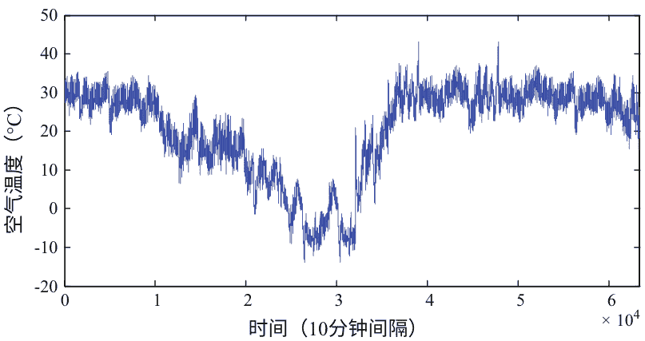
图 12.1 空气温度

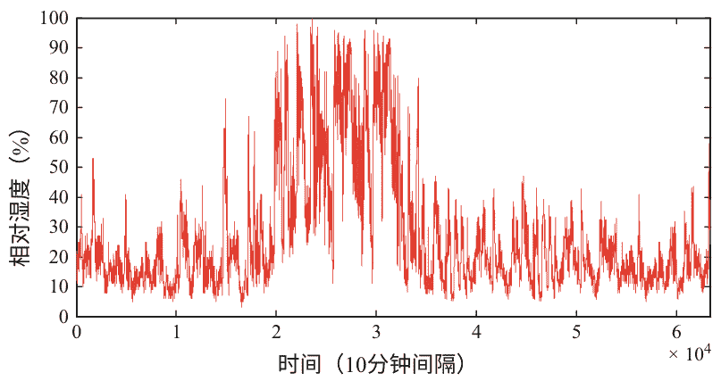
图 12.2 相对湿度

所研究位置的空气温度显示在图 12.1 中，基于 10 分钟的分辨率。图 12.2 显示了湿度网络的所使用的数据集。所选位置的太阳辐射显示在图 12.3 中，该图显示相对于地球，太阳在第二个和第三个月的位置具有较低的辐射值。最后，用于定义风力发电机功率输出的风向和风速分别显示在图 12.4 和 12.5 中。

由于风速基于许多变量，包括温度和气候参数，如空气温度和湿度、太阳辐射和风向，需要进行预测过程。

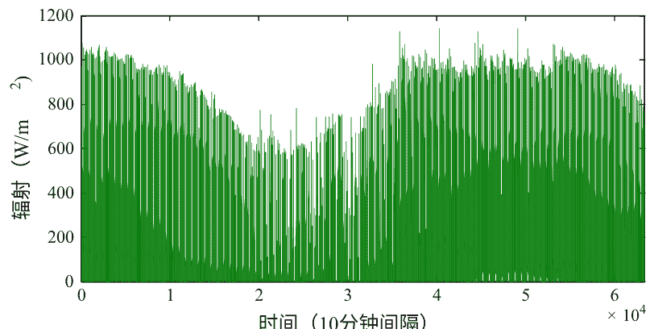
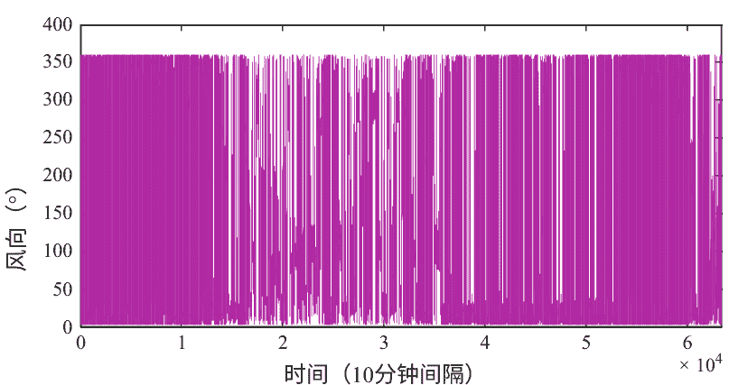

## 12.3 方法

数据挖掘被引入为一种新兴和不断发展的技术 [36]。数据挖掘有许多技术，每种技术都以某种方式用于处理数据和发现大型复杂数据的隐藏知识的工具。数据中的隐藏知识可以被视为内在模式、特征、相关性和关系 - 数据之间的关系。最常用的数据挖掘技术是人工神经网络和机器学习 [37]。人工神经网络（ANN）技术，源自人类智能，长期以来一直被用作模式识别、分类、特征提取和预测应用的工具。这些技术可以通过学习和监督过去的行为来预测未来事件 [38]。在训练过程中，ANN 技术建模输入变量之间的相关性，然后基于此进行预测操作。

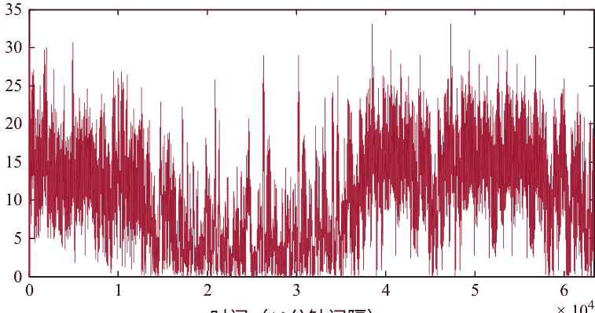
图 12.5 风速

估计模型 [39]。人工神经网络有多种算法，其中最常用的是多层感知器（MLP），本文用于风速预测。机器学习是数据挖掘的应用之一，旨在开发计算机程序和人工智能。机器学习算法能够识别数据模式，开发预测模型，并在回归和分类模式下进行估计。机器学习算法中的学习技术分为三种模式：监督学习、半监督学习和无监督学习。高维数据处理是机器学习技术中最重要的特征之一 [37]。在所有机器学习算法中，群组数据处理方法（GMDH）被选为本文风速预测中的强大工具。

### 12.3.1 多层感知器 (MLP)

作为一种具有层与层和前馈结构的神经网络，MLP 在解决回归问题和预测连续数据方面具有特殊地位。MLP 由一个输入层、一个输出层和一个或多个隐藏层组成，使用一种监督学习算法，即反向传播。每一层的神经元通过加权元素与前一层和后一层的神经元完全连接。与 MLP 结构相关的层数和参数数量直接与所考虑的问题相关。而隐藏层神经元的数量主要通过试错方法进行调整和选择。

MLP 方法中的训练过程基于选择的成本函数的最小化，权重函数在此过程中被定义 [25]。每个感知器使用非线性激活函数将输入映射到输出，并通过非线性传递函数生成输出信号。MLP 网络的典型架构如图 12.6 所示 [40]。

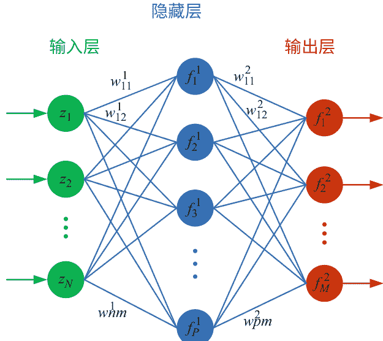
图 12.6 多层感知器 (MLP) 网络的典型结构

输入层由 N 维度组成，隐藏层包括 P 个神经元，每个神经元有 n 个权重元素。矩阵 $I_{N\times P}$ 表示输入权重，如公式 (12.1) 所示，矩阵 $J_{P\times M}$ 表示输出权重，其中 M 是输出信号的数量。 $\mathbf{f}^{1}=f \left[\cdot_{1}, f_{2}^{1}, \cdots, f_{p}^{1}\right]^{\mathrm{T}}$ 和 $\mathbf{f}^{2}=\left[f_{1}^{2}, f_{2}^{2}, \cdots, f_{p}^{2}\right]^{\mathrm{T}}$ 分别是隐藏层和输出层的传递函数向量，如公式 (12.3) - (12.4) 所示; $\mathbf{z}=$ $\left[z_{1}, z_{2}, \cdots, z_{N}\right]^{\mathrm{T}}$ 是输入向量; $\mathbf{b}^{1}=\left[b_{1}^{1}, b_{2}^{1}, \cdots, b_{N}^{1}\right]^{\mathrm{T}}$ 和 $\mathbf{b}^{2}=\left[b_{1}^{2}, b_{2}^{2}, \cdots, b_{N}^{2}\right]^{\mathrm{T}}$ 是隐藏层和输出层的偏置向量，分别为 $\mathbf{y}^{1}=\left[y_{1}^{1}, y_{2}^{1}, \cdots\right]^{\mathrm{T}}$ 和 $\mathbf{y}^{2}=\left[y_{1}^{2}, y_{2}^{2}, \cdots\right]^{\mathrm{T}}$ 是输出向量。

$$\mathrm{I}_{N \times P}=\left[\begin{array}{ccc} w_{11}^{1} & \cdots & w_{1 p}^{1} \\ \vdots & \ddots & \vdots \\ w_{N 1}^{1} & \cdots & w_{N P}^{1} \end{array}\right] \quad(12.1)$$

$$\mathrm{J}_{P \times M}=\left[\begin{array}{ccc} w_{11}^{2} & \cdots & w_{1 M}^{2} \\ \vdots & \ddots & \vdots \\ w_{P 1}^{2} & \cdots & w_{P M}^{2} \end{array}\right] \quad(12.2)$$

$$\mathrm{y}^{1}=\mathrm{f}^{1}\left(\mathrm{~b}^{1}+\mathrm{I} \cdot \mathrm{z}\right)$$

$$\mathrm{y}^{2}=\mathrm{f}^{2}\left(\mathrm{~b}^{2}+\mathrm{J} \cdot \mathrm{y}^{1}\right)$$

### 12.3.2 数据处理的群组方法 (GMDH)

GMDH 是由 Alexey Grigorevich Ivakhnenko [41] 引入的机器学习方法。GMDH 也被称为多项式神经网络，是一种非线性回归算法。GMDH 旨在根据自然选择处理系统的复杂性，尽可能地找到一个准确的函数，预测给定输入向量 $\mathbf{x} = [x_1, x_2, \dots, x_N]$ 的输出。GMDH 方法使用 Kolmogorov-Gabor 多项式函数如下 [42]：

$$\hat{y} = c_0 + \sum_{i=1}^{m} c_i x_i + \sum_{i=1}^{m} \sum_{j=1}^{m} c_{ij} x_i x_j + \sum_{i=1}^{m} \sum_{j=1}^{m} \sum_{g=1}^{m} c_{ijg} x_i x_j x_g + \dots \quad (12.5)$$

其中，$\mathbf{c} = [c_0, c_i, c_{ij}, \dots]$ 是权重向量。为了确定模型的结构并找到生成输出的最优模型，GMDH 算法使用了 Kolmogorov-Gabor 多项式函数的低阶。多项式的第一阶在方程 (12.6) 中给出，每一代都使用该多项式，如图 12.7 所示。模型的生成将持续进行，直到过拟合的过程出现。

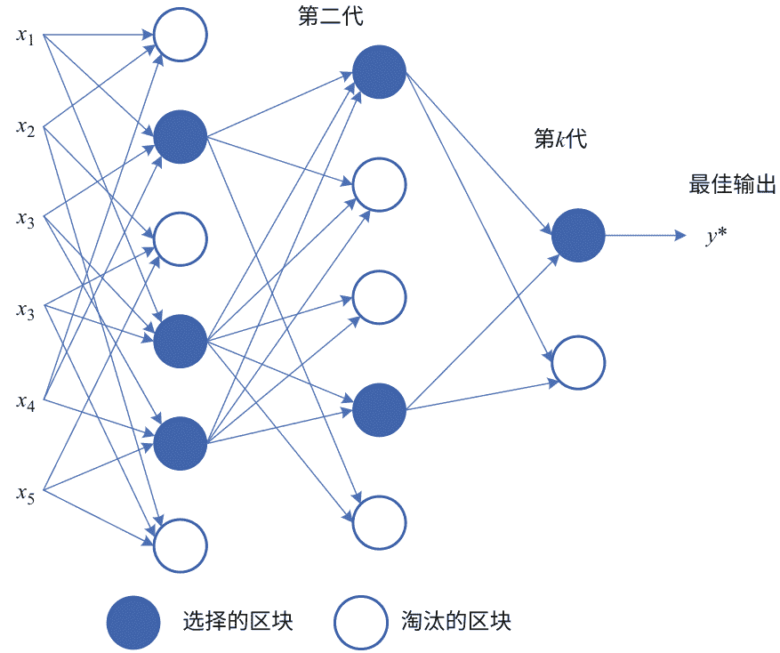
输入变量第一代

$$\hat{y} = c_0 + c_1 x_1 + c_2 x_2 + \dots c_N x_N \quad (12.6)$$

## 12.4 模拟和数值结果

基于所需数据作为输入变量和影响风速曲线形成的预测风速需要大数据处理工具和方法。在本章中，选择了称为 GMDH 和 MLP 的机器学习应用来预测风速。使用这些方法需要一个数据库作为输入和网络形成。鉴于风速是一个依赖于温度和气候条件的参数，因此在本章中，空气温度、相对湿度、太阳辐射和风向等参数被视为形成输入数据集的输入变量。在形成输入数据集和网络设计之后，使用数据的 70% 来训练每个网络。剩余的数据用作测试数据来预测风速。在训练阶段，每个网络分析输入数据，并通过确定权重和应用偏差到输入数据来预测输出值。在每个训练和测试阶段之后，应使用可接受的评估指标对每个阶段的结果进行评估。值得注意的是，结果的评估可以被认为是研究工作中最重要的部分。在本章中，使用相关系数 (R)、均方误差 (MSE)、均方根误差 (RMSE) 和平均绝对误差 (MAE) 等统计性能指标来评估训练和测试阶段的风速预测结果。这些指标的详细信息在 [8, 43] 中提供。图 12.8 显示了训练阶段中每个网络对于预测和识别与输入数据相关的模式的结果。

可以看出，在训练阶段中，GMDH 模型的 R 值为 99.91%，比 MLP 方法具有更好的效率。基于此，预计该网络在测试阶段和风能预测方面将比 MLP 方法提供更好的结果。训练后，测试数据被用作网络输入来预测风速。每个网络根据已完成的训练提供风速预测。图 12.9 显示了通过测试数据对风速进行预测的结果。图 12.10 展示了使用 MSE 和 RMSE 指标评估 GMDH 和 MLP 网络的风速预测结果。

可以看出，图 12.10 显示了每个测试样本（每个 10 分钟的输入数据）的预测误差值，并最终给出了整个测试步骤的平均误差值。值得注意的是，图 12.10 中每个模型的误差值都以 m/s 为单位。评估结果比较了使用的每种方法的准确性和效率。可以看出，在训练阶段中，GMDH 方法能够以较低的误差值提供更好的预测结果。然而，在本章中，提出了一种比较方法，以强调 GMDH 方法在大数据处理方面的有效性，并提供适当的风速预测。在这种方法中，将 MLP 和 GMDH 方法的结果与其他类似研究的结果进行了比较。值得注意的是，比较方法的性能应该是使用相同数据对所有方法进行的。

这种比较是为了确保在每个研究中，每种方法选择的输入变量是相同的。比较的方法使用了相同的

## 12 风速预测使用创新的回归机器学习应用

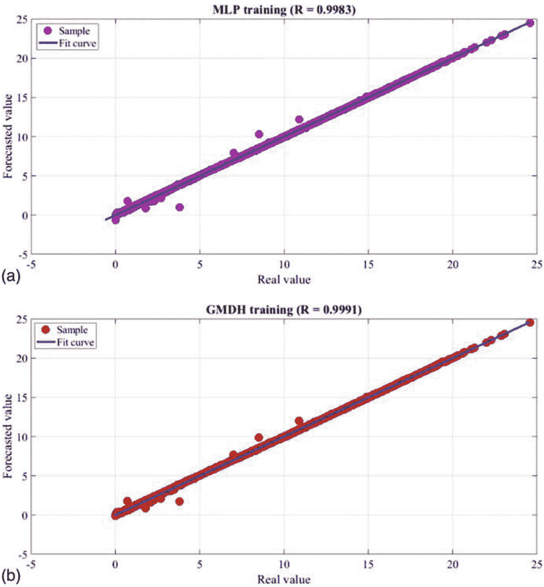

图 12.8 训练阶段每个网络的 R 值结果; (a) MLP (b) GMDH

气象数据，并以相同的时间间隔进行采样以预测风速。表 12.1 进行了这种比较。

在比较结果并评估每种方法的性能之后，观察到 GMDH 方法可以作为处理大数据的理想方法，因为它具有逐层结构。观察到本章使用的方法能够预测任意时间点的风速，以及不同的天气条件。准确的风速预测可以为风力发电厂提供适当的规划，以通过风能发电获得良好的性能。此外，其他机器学习技术可以作为在电力系统问题中进行所需预测的准确工具。

图 12.9 测试阶段的风速预测结果;(a)MLP (b) GMDH

## 12.5 结论

如今，风力发电厂被视为全球重要的可再生能源之一。风速是风力涡轮机发电中最有效的因素之一，准确预测风速可以作为提高风力发电厂性能的一种有效方法。本章中，采用了两种机器学习应用，即 MLP 和 GMDH，来预测风速。为了表达所提出方法的有效性，使用了伊朗哈夫地区的相关数据。MLP 和 GMDH 技术分别通过训练使用输入变量如空气温度、湿度、太阳辐射和风向来预测风速。使用不同的性能评估指标对预测结果进行评估，得出以下结论:

图 12.10 MSE 和 RMSE 误差率对风速预测的影响；(a) MLP (b) GMDH

表 12.1 各种方法的性能评估用于风速预测

| 方法 | R | MSE | RMSE | MAE |
| :--- | :--- | :--- | :--- | :--- |
| 本章中的 MLP | 0.9969 | 0.0061 | 0.0782 | 0.0445 |
| 本章中的 GMDH | 0.9982 | 0.0046 | 0.0684 | 0.0439 |
| WT-ARIMA [13] | – | – | 0.4328 | 0.3369 |
| RWT-ARIMA [13] | – | – | 0.3204 | 0.2269 |
| Nested ARIMA [14] | – | – | – | 0.0446 |
| TCFM-MOGOA [17] | – | – | 0.4026 | 0.2046 |
| Optimized ELM [17] | – | – | 0.2531 | 0.1845 |

观察到 GMDH 方法具有较高的准确性 (R=99.82%)，优于 MLP(R=99.69%)，表现更好。最后，与其他用于预测风速的方法进行比较，证明了 GMDH 方法的高能力。

强调了该技术。值得注意的是，GMDH 方法可以作为解决依赖于大数据的其他电力系统问题的强大工具。

基于风速预测和改进的机器学习算法进行风力发电预测可以作为未来的工作。此外，使用统计回归评估和分析预测模型中每个输入变量的敏感性可以显著提高未来工作中的预测结果。

# 参考文献

- 1. O. Sadeghian, A. Moradzadeh, B. Mohammadi-Ivatloo, B. Mohammadi-Ivatloo, M. Abapour, F. P. G. Marquez, 使用混合整数二次规划方法进行联合热电系统中的发电机组维护。能源 13(11), 2840 (2020). https://doi.org/10.3390/en13112840
- 2. R. K. Pachauri 等，气候变化 2014 年综合报告。工作组 I、II 和 III 对气候变化政府间专门委员会第五次评估报告的贡献。
- 3. A. Moradzadeh, O. Sadeghian, K. Pourhossein, B. Mohammadi-Ivatloo, A. Anvari-Moghaddam, 通过主成分分析改进可持续发展能源的住宅负荷分解。可持续性（瑞士）12(8), 3158 (2020). https://doi.org/10.3390/SU12083158
- 4. Ren21。2019 年。可再生能源 2019 全球状况报告。巴黎：Ren21 秘书处。访问日期 2019 年 11 月 16 日
- 5. S. Madadi, B. Mohammadi-Ivatloo, S. Tohidi, 基于综合分解奥恩斯坦–乌伦贝克过程的动态线路额定值预测。IEEE Trans Power Deliv 35(2), 851-860 (2019)
- 6. S. Madadi, B. Mohammadi-Ivatloo, and S. Tohidi, 基于动态随机一般均衡和随机波动性的概率实时动态线路额定功率预测 (IEEE Transactions on Power Delivery, 2020)
- 7. Y. Hao, C. Tian, 基于误差因子和集成方法的新型两阶段风电功率预测模型。Appl. Energy 238, 368-383 (2019)
- 8. D. B. Alencar, C. M. Affonso, R. C. L. Oliveira, C. R. Jose Filho, 结合 SARIMA 和神经网络的巴西多步风速预测的混合方法。IEEE Access 6, 55986-55994 (2018)
- 9. A. Moradzadeh, S. Zakeri, M. Shoaran, B. Mohammadi-Ivatloo, F. Mohammadi, 通过混合支持向量回归和长短期记忆算法进行微电网短期负荷预测。Sustainability (Switzerland) 12(17), 7076 (2020). https://doi.org/10.3390/su12177076
- 10. M. Lei, L. Shiyan, J. Chuanwen, L. Hongling, Z. Yan, 对风速和发电功率预测的综述。Renew. Sust. Energ. Rev. 13(4), 915-920 (2009)
- 11. F. Cassola, M. Burlando, 通过卡尔曼滤波对数值天气预报模型输出进行风速和风能预测。Appl. Energy 99, 154-166 (2012)
- 12. W. Zhang, Z. Qu, K. Zhang, W. Mao, Y. Ma, X. Fan, 基于 CEEMDAN 和改进的蜂群算法的风速预测组合模型。Energy Convers. Manag. 136, 439-451 (2017)
- 13. S. N. Singh, A. Mohapatra, 基于重复小波变换的 ARIMA 模型用于非常短期风速预测。Renew. Energy 136, 758-768 (2019)
- 14. S.-K. Sim, P. Maass, P. G. Lind, 风速建模通过嵌套 ARIMA 过程。能源 12(1), 69 (2019)
- 15. E. Erdem, J. Shi, 基于 ARMA 的方法用于风速和方向的预测。Appl. Energy 88(4), 1405–1414 (2011)
- 16. S. Smyl, 指数平滑和递归神经网络的混合方法用于时间序列预测。Int. J. Forecast. 36(1), 75–85 (2020)
- 17. P. Jiang, Z. Liu, 基于多目标优化的可变权重组合模型用于短期风速预测。Appl. Soft Comput. 82, 105587 (2019)
- 18. W. Zhao, Y.-M. Wei, Z. Su, 提前一天的风速预测：基于重采样的方法。Appl. Energy 178, 886–901 (2016)
- 19. S. Scher, J. Molinder, 基于机器学习的预测结冰相关风力发电损失。IEEE Access 7, 129421–129429 (2019)
- 20. H. Li, J. Wang, R. Li, H. Lu, 基于多目标优化的新型分析–预测系统用于空气质量指数。J. Clean. Prod. 208, 1365–1383 (2019)
- 21. P. Du, J. Wang, W. Yang, T. Niu, 使用新型混合学习方法和错误校正策略进行集装箱吞吐量预测。知识 - 基于系统 182, 104853 (2019)
- 22. A. Mansour-Saatloo, A. Moradzadeh, B. Mohammadi-Ivatloo, A. Ahmadian, A. Elkamel, 基于机器学习的 PEVs 负载提取和分析。电子学（瑞士）9(7), 1–15 (2020). https://doi.org/10.3390/electronics9071150
- 23. H. 杨，Z. 江，H. 卢，基于‘分解和集成’策略和模糊时间序列的混合风速预测系统。能源 10(9), 1422 (2017)
- 24. X. 孔，X. 刘，R. 施，K. Y. 李，使用特征选择的简化支持向量机进行风速预测。神经计算 169, 449–456 (2015)
- 25. A. 莫拉德扎德，A. 曼苏尔 - 萨特卢，B. 莫哈迈迪 - 伊瓦特卢，A. 安瓦里 - 莫加达姆，两种机器学习技术在住宅建筑物供暖和制冷负荷预测中的性能评估。应用科学（瑞士）10(11), 3829 (2020). https://doi.org/10.3390/app10113829
- 26. D. H. 林，S. H. 李，M. G. 纳，使用 GMDH 算法对 PWRs 中的给水 flowrate 进行智能软测量。IEEE 核科学交易 57(1), 340–347 (2010)
- 27. G.-R. Ji, P. Han, and Y.-J. Zhai, 基于支持向量机的风速预测与预测误差估计。在 2007 年国际机器学习和控制论会议上，(2007), 第 5 卷，第 2735–2739 页
- 28. N. Shabbir, R. AhmadiAhangar, L. Kütt, M. N. Iqbal, and A. Rosin, 使用机器学习预测短期风能发电。在 2019 年第 60 届 IEEE 国际科学电力和电气工程会议上，里加技术大学 (RTUCON), 2019 年，第 1–4 页
- 29. C. Wan, Z. Xu, P. Pinson, Z. Y. Dong, K. P. Wong, 使用极限学习机对风电发电进行概率预测。IEEE Trans. Power Syst. 29(3), 1033–1044 页 (2013)
- 30. X. Luo 等，使用堆叠极限学习机和广义相关熵进行短期风速预测。IEEE Trans. Indust. Inform. 14(11), 4963–4971 页 (2018)
- 31. M. Khodayar, J. Wang, 用于短期风速预测的时空图深度神经网络。IEEE Trans. Sustain. Energy 10(2), 670–681 页 (2018)
- 32. A. Ahmadi, M. Nabipour, B. Mohammadi-Ivatloo, A. M. Amani, S. Rho, M. J. Piran, 使用基于树的学习算法进行长期风力发电预测。IEEE Access 8, 151511–151522(2020). https://doi.org/10.1109/ACCESS.2020.3017442
- 33. D. Zhang, X. Peng, K. Pan, Y. Liu, 基于混合分解和在线顺序异常值鲁棒极限学习机的新型风速预测。能源转换。管理。180, 338–357 (2019)
- 34. L. Zhang, F. Tian, 多层感知器在低成本电子鼻中的性能研究。IEEE Trans. Instrum. Meas. 63(7), 1670–1679 (2014)
- 35. A. Moradzadeh, K. Khaffafi, 比较和评估各种类型的神经网络在智能电力网中与充电和放电电动汽车的优化管理相关的规划问题中的性能。Emerging Sci. J. 1(4), 201–207 (2017). https://doi.org/10.28991/ijse-01123
- 36. A. Moradzadeh, K. Pourhossein, B. Mohammadi-Ivatloo, F. Mohammadi, 使用频率响应曲线的等距特征映射定位变压器绕组中的匝间故障。IEEE Trans. Indust. Inform, 1-1 (2020). https://doi.org/10.1109/tii.2020.3016966
- 37. I. H. Witten, E. Frank, 和 Mark A. Hall. 数据挖掘：实用机器学习 (2011)
- 38. A. Moradzadeh 和 K. Pourhossein, 电力变压器绕组中匝间故障的早期检测：一项实验研究。在 Proceedings 2019 International Aegean Conference on Electrical Machines and Power Electronics, ACEMP 2019 and 2019 International Conferenceon Optimization of Electrical and Electronic Equipment, OPTIM 2019(2019), pp. 199-204, doi: https://doi.org/10.1109/ACEMP-OPTIM44294.2019.9007169
- 39. S. Souahlia, K. Bacha, A. Chaari, MLP 神经网络基于改进的 Rogers 和 Doernenburg 比率 DGA 的电力变压器故障诊断决策。Int. J. Electr. Power Energy Syst. 43(1), 1346-1353 (2012). https://doi.org/10.1016/j.ijepes.2012.05.067
- 40. A. Moradzadeh 和 K. Pourhossein, 电力变压器绕组中匝间故障的早期检测：一项实验研究。在 2019 年国际爱琴海电机与电力电子会议 (ACEMP 2019) 和 2019 年电气和电子设备优化会议 (OPTIM 2019) 中的论文集中，(2019), pp. 199-204, doi: https://doi.org/10.1109/ACEMP-OPTIM44294.2019.9007169
- 41. A. G. Ivakhnenko, 控制系统研究的新方法。控制 3(30), 96-99 (1960)
- 42. A. G. Ivakhnenko, 复杂系统的多项式理论：IEEE 系统交易，人与控制论。(ISYMAW, 1971)
- 43. A. Moradzadeh 和 K. Pourhossein, 支持向量机在变压器绕组中定位小短路的应用。在 2019 年第 54 届国际大学电力工程会议 (UPEC) 中，(2019), 第 1-6 页

## 第 13 章
通过基于事件驱动处理和机器学习处理智能电表数据的有效负载模式分类

Saeed Mian Qaisar 和 Futoon Alsharif

S. Mian Qaisar (✉)
电气与计算机工程系，Effat 大学工程学院，沙特阿拉伯吉达
通信与信号处理实验室，能源与技术中心，Effat 大学，沙特阿拉伯吉达
e-mail: sqaisar@effatuniversity.edu.sa

F. Alsharif
电气与计算机工程系，Effat 大学工程学院，沙特阿拉伯吉达

## 13.1 引言

目前，对智能能源管理的需求正在增加。这是由于世界人口增长、石油储量减少和能源消耗增加所导致的，这是由于现代设备的使用增加。在这个框架中，智能电网的想法是为了使电网更加高效、更加清洁、更加环保、更加功能齐全，通过创造技术可能性，涵盖从电力发电到输送和使用的所有过程 [1]。智能电网分析和监控从发电单元到客户的电力传输。由于当前的电力网络和先进的计量网络，这种情况对于未来技术部署更加现实 [2]。智能电网包括先进的计量基础设施（AMI）。智能电表是现代电网基础设施中最重要的方面。

随着互联网和技术世界的重大进展，一切都变得数字化。互联网已经成为我们生活中的重要组成部分。在这张图片中，一种新颖的技术，即物联网（IoT），得到了发展。这是一个包含多个电子设备和传感器的网络，它们通过有线连接在一起共享信息。

通过互联网传输信息。基于物联网的应用程序倾向于相互对话和交换数据。作为复杂的基础设施，它们连接了各种可以相互通信的电气设备。物联网有效地被应用于 AMI 的开发中。设备之间的通信通过各种技术实现。家庭区域网络用于将智能电表连接到智能设备。它监控和管理微型发电网络。它提供统一的控制、资源和设施维护。智能电表与家电之间的连接可以通过有线或无线协议（如 Wi-Fi）实现。AMI 区分了自动智能读数（AMR）方案。AMR 与较不发达的技术一起工作，如手动关闭设备、离线数据收集等。然而，AMI 包括实时流程、客户/定价/使用选项、远程控制和自动化维护系统等。随着最近的发展，AMI 的整合在智能电网中至关重要。邻域区域网络用于智能电表之间的数据共享。这支持诊断、系统更新和实时通知。Zig Bee 协议在邻域区域网络中常用，因为它具有快速的数据传输速率和低成本。许多智能电表通过广域网连接到中央服务器。网络系统 GSM、GPRS、3G 和 WiMAX 将用于将这些电表与服务器连接起来。

智能家庭电表实时测量更精细的能源使用情况，并被视为未来智能电网的基础。技术发展已经增加了智能电表的使用，作为传统电表的替代品 [3, 4]。这些电表是智能电网的关键组成部分，为各方利益相关者提供了重要的公民、环境和经济利益 [5]。大规模的智能电表安装需要大量的数据收集，以达到所需的精细度 [6]。自动化数据采集、存储、处理和解释是智能电表性能的主要因素。该过程在图 13.1 的块图中有所示。

为了在性能和对多个智能电网利益相关者的韧性方面获得实际的利益，需要细粒度的计量数据 [5, 6]。每个利益相关者都有不同的目标：供应商是从批发市场购买电力并在零售市场向消费者销售的公司，希望降低与手动抄表相关的运营开销，并潜在地提高客户忠诚度。输电系统和配电网络运营商希望从更灵活的需求侧获益，以促进更多低碳技术的普及。政府希望通过智能电表提供的终端能源效率的提高，实现约束性碳减排目标。最终用户希望从更低的账单中获益

通过处理智能电表数据进行 13 种有效负载模式分类...

随着人们对能源的认识越来越深入，他们对电力的需求也在增加。出于这样的期望，智能电表正经历着快速增长的时期。

在高峰时段，当地的用电量约占住宅部门总用电量的 40%，占总电力需求的三分之一以上 [7]。消费者的意识将有助于预测需求并调整未来的投资。定期反馈电力使用情况对终端用户了解他们的电力消耗更详细，从而支持有效利用能源的措施 [5,7,8]。

在这个框架中，已经报道了几种自动化电器分类技术 [9–11]。在 [9] 中，作者使用了零归一化的消费时间序列，以及作为所需电器属性的增量和增量系数。

使用高斯混合模型（GMM）进行分类。在 [10] 中，作者使用消耗时间序列的熵与 delta 和 delta-delta 系数作为所需电器的属性。使用隐马尔可夫模型（HMM）进行分类。在 [11] 中，作者使用实功、无功功率和均方根（RMS）电流时间序列的零归一化与 delta 和 delta-delta 系数作为所需电器的属性。

使用隐马尔可夫模型（HMM）进行分类。

传统上，智能电表数据以固定速率进行收集，导致收集、存储、处理和分类了大量不必要的数据 [12]。在建议的计量框架中：

- 事件驱动感知被应用于实现实时数据的显著压缩。
- 提出了一种新颖的自适应速率概念，用于数据收集、处理和分类。
- 与传统的固定速率方法相比，它提高了设计解决方案的压缩和处理效果。

## 13.2 背景和文献综述

### 13.2.1 智能计量

如今，世界各地的传统电网正在被智能电网所取代 [13]。智能电网包括太阳能和风能等可再生能源 [13]。智能电网允许电力供应商和终端用户之间的双向通信和数据交换 [13]。智能电网允许电力供应商和终端用户之间的双向通信和数据交换。智能电表是用于监测能源使用情况以实现减少能耗的设备 [14]。在住宅区域，这些电表实时确定了电力消耗的细粒度，并因其对电力供应行业和客户的显著优势而在全球范围内广泛部署 [5,7,8]。智能计量有多种应用。应用包括电力质量和可靠性监测、分析、建模和负载预测、消费者能源管理等方面 [6]。下面是 [15] 的作者提供的一个框图，展示了智能电表的一些应用和优势的例子：

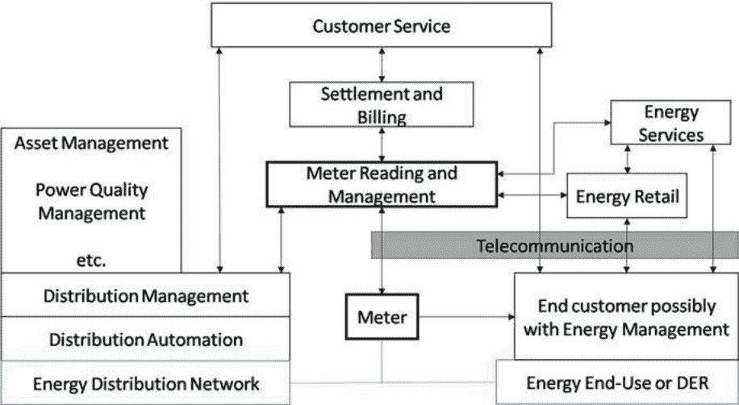

图 13.2 智能电表的应用和优势

图 13.2[15] 中提到的智能计量的特点和优势：

- 自动收集、处理、传输、监测和使用计量数据。
- 自动计量控制。
- 双向通信。
- 向相关人员提供准确和实时的消费数据。
- 为消费和计费的高效性提供帮助。

智能电表数据库表示智能电表提供的典型家庭电器的消费数据。许多研究使用智能电表数据进行了，例如 [16, 17]。[16] 的作者提出了基于子计量的聚合需求分解方法，该方法利用智能电表测量和人工神经网络。一般而言，该方法估计了各种负载类别和可控和不可控负载在整体预期负载中的份额，并在不同需求响应系统中实现预测 [16]。图 13.3 显示了其负载分解流程图。它表示了智能电表系统中的需求分解技术，只有少数消费者可以监测每个他们拥有的电器，这是潜在智能配电网的相对实际情况。[16] 的作者在这方面做出了两个假设。

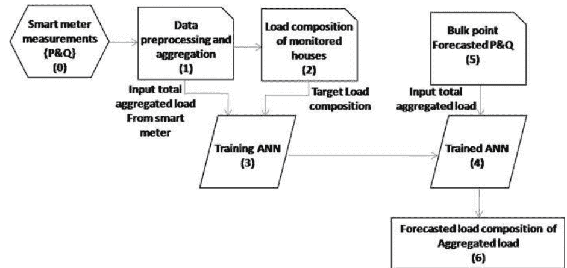

每个电器的实际功率可以记录在智能电表中，而根据概率提取无功功率 [16]。总消耗（实际和无功功率）已经在变电站中估计，该变电站位于第 5 个区块 [16]。在第 1 个区块中，智能电表数据正在预处理和收集到一个集中器阶段 [16]。在第 2 个区块中，可以将分表计量的部分消耗分解为组或可管理和不可管理的负载，方法是直接将属于同一组的设备的消耗相加 [16]。在接下来的阶段，这个子度量数据训练了人工神经网络 (ANN) 分类器，使其能够使用受控消费者的有功和无功负载图来识别负载分类 [16]。当 ANN 被训练后，在第 4 个区块中，ANN 利用第 5 个区块集中器阶段的总有功和无功负载的预测作为输入，然后在第 6 个区块中提供相关的负载分类，即每个负载组的加权因子作为输出 [16]。

### 13.2.2 智能电表数据采集

在 [17] 中，研究人员提出了一个三相模型，对电力供应商来说，这个模型有利于需求管理的灵活性和能源控制的有效性。解决方案是无监督聚类和有监督分类的集成 [17]。它可以对电力消费者进行分类，识别他们的消费特征，并识别最近的客户 [17]。在提出的模型中，为了进行负荷模式聚类和特征识别，使用了从负荷模式提取得到的所有负荷模式进行客户分类 [17]。

为了提取相关特征，计量数据被处理和分析。作者在 [6, 16] 中报告了特征提取的方法。

### 13.2.3 特征提取

原则是构建一组特征，可以以最实用的方式反映出解释和分类所必需的信息。有几种用于电器负荷曲线特征提取的策略。一些例子包括短时傅里叶变换 (STFT)、小波变换和 K 均值算法 [18-20]。派生特征包括峰值、平均值、消耗的均方根（RMS）值及其谐波。

特征选择技术可以分为两类：经典技术和生物导向技术，正如 [21] 的作者所分的那样。经典技术代表了统计学或句法性质，而生物导向技术可以用神经或基于遗传的算法来表示 [21]。特征是具有降维表示的模式 [21]。为了降低模式表示的维度，在模式识别中的特征选择和提取依赖于获得数学技术 [21]。为了实现维度的降低，可以进行特征选择或特征提取 [21]。一些因素可能会受到特征、属性或测量选择的影响 [21]。其中一个是类满意度准确性，第二个是需要将它们联系起来的分类要求，第三个是学习所需的示例数量，最后一个是分类执行价格 [21]。对于一个好的特征，它需要满足两个条件，并且如果在一个类中发生任何差异，它不应该改变 [21]。第二个条件是，在区分不同类别的模式时，它应该显示出显著的差异 [21]。有许多特征提取方法，例如非转换信号特征、转换信号特征、结构描述符等，图 13.4 显示了 [21] 中提到的主要特征提取方法。


图 13.4 特征提取的不同方法

### 13.2.4 模式识别

高分辨率智能电表数据提供了关于客户用电习惯和偏好的各种信息。除此之外，世界各国的电力市场，特别是供应方面的解除管制，仍在不断推进。利用大规模智能电表数据可以促进和推动全球需求端的效率和盈利能力。从这个意义上说，近年来，电力行业在机器学习方面取得了重大突破 [6]。

通过使用从其用电时间序列中挖掘出的特征，可以实现对相关设备模式的识别。在 [22] 中，作者将模式的分类描述为机器如何检测、学习和判断模式的研究。在 [18] 中，作者使用了负荷分解模式识别。这个想法是在没有干扰的情况下单独收集每个相关设备的用电信息。准备的数据库由可以探索和处理以对相关设备进行分类的属性组成 [18]。在 [19] 中，作者采用了自动模式检测，利用从智能电表收集的数据对整体能源使用进行分解。模式识别的准确性取决于数据收集、特征提取和分类的性能。用于将类别描述应用于函数空间中的某些给定实例的工具称为分类器 [22]。

在 [23] 中，作者提出了一种快速的电器识别方法，该方法基于对智能家居负载的特征分析。这些特征由有功功率、无功功率和电流信号的快速傅里叶变换定义 [23]。他们使用的识别算法是 C4.5 决策树算法 [23]。他们方法的一个优点是自动决策树生成，可以快速部署检测算法，而不受智能家居的影响 [23]。他们测试了 13 种电器，包括烤面包机、电热水壶、两种不同的炉灶炉头、微波炉、吸尘器、烤箱、咖啡机、搅拌机、两种不同模式的干衣机、抽油烟机和搅拌器。他们的分类准确率达到了 93.4397% 的真阳性 [23]。

[19] 的作者提出了一种根据分布式电力测量和执行单元自动识别设备的方法。他们的论文有两个贡献。一个是介绍了他们基于实际功耗数据的追踪库，另一个是评估了基于收集的追踪数据的电器自动识别 [19]。他们从收集的追踪数据中提取了 517 个特征，用于分类器的训练 [19]。他们使用了不同的分类算法，如 bagging、贝叶斯网络、朴素贝叶斯、随机委员会等。他们使用随机委员会分类方法时，最高的分类准确率达到了 95.5% [19]。

不良电力质量检测可能导致数据丢失或不规则趋势。这些趋势可能是由于计划外事件或数据采集、通信或输入故障引起的。不良电力质量的检测可以分为预测、机器学习和概率方法 [6]。这些方法和工具可以被使用直接在收集的智能电表数据上进行。这些研究可以总结为基于时间序列的方法、低秩矩阵技术和基于时间窗口的方法，作为建模技术的函数。智能电表的数据只是简单的时间序列。提出了一种最优加权平均方法用于数据去噪和分类。它可以用于离线或在线电力问题检测 [6]。自回归外生输入（ARX）和人工神经网络（ANN）的集成也用于电力供应问题的识别 [6]。能源的使用与空间和时间相关。

探索时空连接可能有助于识别和恢复异常值。基于低秩矩阵拟合的方法用于数据清洗和填补，[6] 中提出。由于智能电表数据是实时或接近实时获取的，[6] 中开发了一种使用 Lambda 架构进行异常识别的在线机制。建议的在线识别方法可以并行执行，处理大数据集时性能高。

在其他技术下，能量盗窃将改变智能电表信息。使用智能电表数据和电网状态信息（如节点电压）可以实现能量盗窃的检测。监督分类器是高效的能量盗窃检测技术。它们通常包括两个阶段，即特征提取和分类。[6] 中报道了一种方法，首先测量非技术故障以训练盗窃识别分类器，然后使用 K 均值聚类对负荷曲线进行聚类。使用各种潜在破坏性样本来训练分类器。在一系列可疑检测之后，发出能量盗窃警报。所提出的方法还可以对能量盗窃的类别进行分类。除了基于聚类的特征提取外，[24] 中还对负荷数据进行编码，作为 SVM 和基于规则引擎的算法等分类器的输入，用于检测能量盗窃。[25] 中引入了一个独立变量，实现了自顶向下的结构。它基于决策树和 SVM 算法的原理。决策树根据电器数量、个体和环境温度估计预期能量消耗。然后，决策树的结果输入 SVM，决定用户是普通用户还是滥用用户。

负载特征化对应于将电器的能耗方式进行特征化。具体的基于聚类的方法，如 K-means、层次聚类算法和自组织映射（SOM），在这个框架中被使用。它们直接应用于从智能电表收集到的能耗行为的时间序列上 [6]。在 [26] 中，作者研究了通过使用智能电表收集的能耗时间序列的分辨率如何影响聚类结果。这些著名的聚类技术被应用于智能电表数据集上。在这种情况下，数据集由不同采样率下收集的时间序列组成，采样率范围从 1 分钟到 2 小时。在 [27] 中，基于深度学习的堆叠稀疏自编码器被用于压缩负载特征并提取特征。进一步建议使用局部敏感哈希方法来识别负载特征。

### 基于降低和编码的负荷描述性负荷特征提取

需要对通过智能电表收集的消费模式的时间序列进行深入分析，以提取相关的本地和全局分类特征。它提高了负荷特征分类的准确性。在这个框架中，提出了三种新的本地和全局特征类别。这些特征是通过对能源消耗的时间序列应用有效的条件过滤器产生的。此外，还利用校准和归一化、负荷特征误差和形状特征来实现有效的负荷特征分析 [28]。

电力公用事业通常使用现有的统计信息进行负荷预测方法，用于电网规划、发电能力、需求控制、财务建模和潜在能源利用。精确的电费预测对于电力供应商来说是重要的，可以减少财务风险，设计电力网格并最大化运行性能。负荷预测的过程可以分为短期、中期和长期预测。这里的短期指的是 1 天到 1 周的时间段。中期指的是 1 周到 1 个月的时间段，长期指的是几个月到几年的时间段 [6]。在这种情况下，使用神经网络的时间序列模型已经被用于短期预测。人工神经网络也被用于短期预测 [6]。聚类方法与支持向量机在中期预测中被使用 [6]。

## 13.3 材料和方法

图 13.5 展示了所提出系统的原理。不同的系统模块在下面的小节中进行了描述。

### 13.3.1 智能电表数据库

在本章中，通过研究其在数据集 ACS-F2 [9] 上的性能，准备了建议解决方案的评估结果。该数据集包含了 15 个主要家用电器的能耗参数的时间序列 [9]。总共考虑了来自 15 个类别的 225 个不同电器。每个目标电器进行了两次 1 小时的数据采集和记录 [9]。对于每个记录会话和每个考虑的电器，记录了六个不同的时间序列。

它们分别是实功率、无功功率、RMS 电流、RMS 电压、频率和功率因数。每个时间序列都以分解的方式记录。


图 13.5 系统框图

以 0.1 Hz 的采集速率进行记录，记录以分解的方式进行 [29]。本研究仅考虑了六类电器。包括水壶、冰箱、冰柜、微波炉、风扇、显示器和电视。对于每个目标设备，考虑了实际和无功功率消耗。

### 13.3.2 信号重建

重建过程是产生与离散时间信号点相对应的连续时间信号的过程（即，它只是将一组样本转换回连续函数）[30, 31]。了解重建过程的第一步是从采样信号生成一串连续时间脉冲，数学表示如下：

$$ x_{imp}(t) = \sum_{n=-\infty}^{\infty} x_{s}(n) \delta(t-n T_{s}). $$

其中，$x_s(n)$ 是采样信号，$T_s$ 是采样周期。然后，应用具有特定条件的低通滤波器生成输出信号 $\widetilde{x}(t)$。重建过程的结果如下：

$$ \widetilde{x}(t)=\sum_{n=-\infty}^{\infty} x_{s}(n) g\left(t-n T_{s}\right) . $$

考虑的消耗参数波形被上采样了 10,000 倍。这是为了评估事件驱动感知模块。采用四级级联的三次样条插值器和抗混叠滤波器来进行上采样。通过这种方式，得到了传入信号的准模拟版本 $y(t_n)$，它被命名为 $\widetilde{x}(t)$。获取 $y(t_n)$ 的 $\widetilde{x}(t)$ 上采样的过程由公式 (13.3) 给出，其中 U 是上采样因子。

$$ \widetilde{x}(t)=y\left(t \frac{n}{U}\right) \vec{x}(\mathrm{t})=y\left(\mathrm{t} \frac{n}{U}\right) . $$

### 13.3.3 事件驱动感知 (EDS)

在提出的案例中，事件驱动的 ADC（EDADC）被用于获取预期电器的能量消耗模式 [20, 32]。这些数据转换器是通过使用事件驱动感知（EDS）原理实现的。它们可以根据输入信号的变化率改变采样速率。

时间变化 [33, 34]。在这种情况下，只有当预期的模拟信号穿过预定义的阈值水平时，才记录时间序列样本，该阈值水平位于信号的幅度上。因此，样本在时间上以非均匀的方式分割。采样的样本大小取决于信号的变化 [33, 34]。该过程可以用公式 (13.4) 数学表示，其中 t 表示当前采样实例，t-1 表示上一个采样实例，dt 表示这两个实例之间的时间距离：

```
t_n = t_{n-1} + dt_n.  (13.4)
```

EDADC 仅获取传入模拟信号的相关或活动部分。另一方面，信号的剩余部分（如基线）被忽略。因此，与传统对应物相比，获得的样本数量大大减少。这导致收集信息的数量显著减少，并且可能产生显著的实时压缩。它有助于减少后处理操作，并改善系统在执行时间和开销功率和能量方面的性能 [33-36]。

### 13.3.4 事件驱动分割

分割操作将信号分成几个固定长度的部分 [37]。它可以有效地识别和挖掘传入信号的相关参数。EDS 输出放置在非均匀的时间 - 幅度平面上。

因此，在这种情况下无法使用传统的分割机制 [35-37]。在这种情况下，采用了一种原始的事件驱动分割机制。它被称为活动选择算法（ASA）[35, 36]。这将 EDADC 的输出分成不同长度的部分。ASA 通过利用事件驱动获取的信号的不均匀性来进行。它保留了宝贵的细节，如连续采样时刻之间的重新分配、样本数量等 [34]。EDADC 将非均匀数据提供给 ASA，然后选择适当的部分。在信号的整个长度范围内，将定义一系列选择的窗口 [36]。活动选择对于最小化处理操作和功耗非常重要。它以自适应速率的方式实现了后自适应速率特征提取。通过这种方式，有用的特征仅在时间域中被挖掘，并且后续由分类器用于自动化负载配置。

### 13.3.5 特征提取

从每个部分中挖掘相关特征。由于事件驱动的采集，我们可以从时间域中提取有关信号频率内容的有趣和相关信息 [38]。通过特征提取的使用技术，可以从电力消耗时间序列中提取重要信息，而无需进行复杂的频域变换 [37]。另一方面，传统的对应物基于固定速率的采集和处理方法，因此在执行特征提取时必须使用时频分析。与对应物相比，所提出的解决方案具有显著的处理负载效果 [37]。因此，只使用时间域中非均匀记录的电力消耗时间序列来挖掘必要的可分类特征。

考虑每个指定设备的瞬时实际功率消耗和瞬时有效值电流。使用建议的技术重建每个考虑的时间序列。然后，使用 EDADC 记录准模拟波形，并使用 ASA 进行分段。然后，提取每个段的四个不同参数。设 i 是索引第 i 个选择的段。然后，$C'$, $\Delta A'$, $A'_{max}$, 和 $\overline{dt'}$ 分别是提取的阈值交叉数，峰峰值幅度，最大幅度和平均采样步长。还考虑了 EDS 提供的实际和无功功率时间序列。对于每个实例，使用收集到的实例特征来增强和改善系统精度。

### 13.3.6 分类技术

派生特征用于区分目标设备。在这个背景下，我们利用了诸如 k 最近邻 (KNN)、人工神经网络 (ANN) 和朴素贝叶斯等已知的分类算法。

#### 13.3.6.1 K 最近邻 (KNN)

KNN 被认为是一种简单但强大的分类器，它能够在已知复杂应用中提供高质量的结果 [39]。它依赖于最近的特征空间训练样本 [22]。它根据邻居的多数投票将相关对象进行分类 [22]。在数据集中，KNN 使用特征之间的距离来决定哪个数据属于哪个类别。

当数据中的距离接近时，形成一个群体，当数据中的距离远时，形成其他群体。类别成员资格可能是 KNN 分类器的输出。通过邻居的多数投票对对象进行分类，对象被分配给最常见的分类中的类别。

它的 k 最近邻居 (k 通常是一个小的正整数)。如果 k 等于一，那么对象只被分配给最近邻居的单一分类 [39]。

#### 13.3.6.2 人工神经网络 (ANN)

处理充满特征的数据是 ANN 分类方法所擅长的 [39]。ANN 是神经网络模型的一部分，它是人工智能的一部分。

这种分类方法不是编程系统执行一定数量的任务，而是教会系统执行任务 [18]。人工智能系统 (AI) 被开发出来执行这些任务。它是一个有用的模型，可以快速准确地理解数据中隐藏的有用信息的模式。神经网络是这些人工智能模型的一种情况。AI 系统应该不断从知识中发现。最常用的方法是与不同信息相关的评估领域中的人工智能技术。人造神经网络由几个人工神经元组成，根据需求彼此相关。神经网络的目标是将输入转化为关键输出 [6]。教学模式可以是监控的或非控制的。在噪声存在的情况下，神经网络进行学习。

#### 13.3.6.3 朴素贝叶斯

使用朴素贝叶斯分类方法。朴素贝叶斯可以被描述为贝叶斯定理的简化版本 [5]。它的工作方式是一个属性的概率不受另一个属性的影响。它对 Q 个属性的独立假设进行了 2Q 的发展。[6] 的作者研究了朴素贝叶斯分类方法的一些关键性能指标。他们得出结论，分类器的准确性取决于训练数据的噪声、偏差和变异性。只有选择好的训练数据，才能减少噪声。偏差是由训练数据中非常大的分组引起的错误。方差是由于这些分组太小而引起的错误。

## 13.4 结果

电器的类别包括水壶、冰箱和冷冻柜、微波炉、风扇、显示器和电视。考虑了每个类别的不同品牌的十五种电器。因此总共考虑了 90 种电器。对于每个电器，进行了两个 2 小时的检索会话。这导致了 180 个与所考虑电器的功耗相关特征的多维时间序列。在这种情况下使用的分类技术包括 KNN、SVM、ANN 和朴素贝叶斯。实际功率的示例图 13.6 用于水壶、冰箱和冰柜、微波炉和风扇的 4 位分辨率 EDADC 数字化的实际功率实例

图 13.7 用于监视器和电视机的 4 位分辨率 EDADC 数字化的实际功率实例

通过 EDS 机制获得的功耗和 RMS 电流分别显示在图 13.6、13.7、13.8 和 13.9 中。

在实际应用中，电流无法直接测量，需要进行电流到电压的转换。这是因为大多数现实生活中的数据转换器是基于获取电压波形的原理构建的。可以通过使用电荷电阻或传输阻抗安装来实现。然而，在基于模拟的研究中，不考虑该模块的实现和设计。

## 13 通过处理智能电表数据进行 13 种有效负载模式分类

图 13.8 用 4 位分辨率 EDADC 对水壶、冰箱和冷冻柜、微波炉和风扇进行数字化的 RMS 电流实例

图 13.9 使用 4 位分辨率 EDADC 对 RMS 电流进行数字化处理，用于监视器和电视

所得的压缩增益在表 13.1 中总结。这些增益是通过传统方法和建议方法之间收集的样本数量的比率计算得出的。它表明建议的方法分别在水壶、冰箱和冷冻柜、微波炉、风扇、显示器和电视机的情况下实现了完全的 3.1 倍、6.6 倍、1.6 倍、3.4 倍、2.2 倍和 6.0 倍的压缩增益。压缩增益显示了我们在减少收集信息量、处理和传输信息量方面将获得多少收益。它显著降低了算术复杂度和

| 电器 | 压缩增益 | 平均压缩增益 |
|---|---|---|
| 水壶 | 3.1 | 3.8 |
| 冰箱和冰柜 | 6.6 | |
| 微波炉 | 1.6 | |
| 风扇 | 3.4 | |
| 显示器 | 2.2 | |
| 电视 | 6.0 | |

| 电器 | 分类准确率 (%) | 平均分类准确率 (%) |
|---|---|---|
| 水壶 | 91.5 | 90.9 |
| 冰箱和冰柜 | 91.4 | |
| 微波炉 | 90.6 | |
| 风扇 | 91.8 | |
| 显示器 | 89.9 | |
| 电视 | 90.3 | |

| 电器 | 分类准确率 (%) | 平均分类准确率 (%) |
|---|---|---|
| 水壶 | 94.6 | 94.4 |
| 冰箱和冰柜 | 95.5 | |
| 微波炉 | 93.3 | |
| 风扇 | 95.2 | |
| 显示器 | 94.2 | |
| 电视 | 93.8 | |

所提出解决方案的功耗与传统方法相比较低。此外，将 EDS 嵌入智能电表中，与标准方法相比，显著降低了数据存储和收集的活动。它还提高了设计策略相对于竞争对手的效果。

该案例的总体压缩比为 3.8 倍。与传统方法相比，所提出的策略大大降低了算术复杂度和功耗。此外，将 EDS 嵌入智能电表中，大大降低了数据收集和传输操作，相对于传统方法。

这进一步提高了所设计方法的效力，相对于传统方法。

考虑了 6 个类别的 180 个实例。为了平等表示，每个类别取 30 个实例。有限的数据集可能导致有偏的分类评估。为了防止性能上的任何偏差，采用十折交叉验证方法 [22]。以正确识别的百分比形式列出了 KNN、ANN 和朴素贝叶斯分类器的准确性，分别在表 13.2、表 13.3 和表 13.4 中。

| 电器 | 分类准确率 (%) | 平均分类准确率 (%) |
|---|---|---|
| 水壶 | 87.6 | 86.9 |
| 冰箱和冰柜 | 88.2 | |
| 微波炉 | 85.9 | |
| 风扇 | 88.4 | |
| 显示器 | 84.8 | |
| 电视 | 86.3 | |

| 电器 | KNN 分类器 | ANN 分类器 | 朴素贝叶斯分类器 |
|---|---|---|---|
| 水壶 | 90.9 | 94.4 | 86.9 |
| 冰箱和冰柜 | | | |
| 微波炉 | | | |
| 风扇 | | | |
| 显示器 | | | |
| 电视 | | | |

| 电器 | KNN 分类器 | ANN 分类器 | 朴素贝叶斯分类器 |
|---|---|---|---|
| 水壶 | 0.907 | 0.937 | 0.865 |
| 冰箱和冰柜 | | | |
| 微波炉 | | | |
| 风扇 | | | |
| 显示器 | | | |
| 电视 | | | |

对于不同分类器的结果总结如表 13.5 和表 13.6 所示，分别为准确率和 F-度量值。

从上表可以清楚地看出，ANN 分类器取得了最佳性能。通过采用 EDADC、ASA、事件驱动特征提取和 ANN 分类方法的组合，实现了最佳的电器耗电模式识别。

因此，建议的解决方案大大降低了复杂性和功耗，与传统方法相比降低了数据传输操作，并提高了系统效率。

## 13.5 讨论

家庭智能电表实时用于计算最细粒度的功耗，并被视为未来智能电网技术发展的基础，已经改变了传统电表的使用方式。

这些电表是智能电网的重要组成部分，为各方面的利益相关者提供了重要优势。这些优势可以分为社会、环境和经济三类。大规模安装智能电表正在产生大量的数据收集，具有所需的细粒度。

自动化信息收集、存储、处理和分类是智能电表性能的主要因素。

细粒度计量数据的收集对于智能电网的多个利益相关者来说非常重要，可以在性能和可持续性方面提供实际优势。不同利益相关者有不同的目标：例如，供应商希望减少传统抄表所涉及的运营费用，并显著提高消费者的忠诚度。输电系统和配电网络的运营商希望利用更强大的需求侧来推动低碳技术的普及。政府旨在通过提高消费者端的能源效率（由智能电表提供）来实现减少碳排放的目标。消费者对能源有更好的意识。因此，他们期望从降低的电费中受益。有了这些目标，智能电表的增长速度加快并不令人意外。

从一个广义的观点来看，识别设备的类型是一项困难的任务因为有几个原因。首先，各种类型之间可能存在重叠，例如笔记本电脑和平板电脑。其次，由于设备之间的不同操作机制和技术变化，有很多设备属于同一组。通常，设备识别必须保证在简化的同时不超过一定数量的设备。

在许多应用中，通过智能电表收集的数据被分析。智能电表的性能取决于能够运行和执行实时智能操作的算法。智能电表芯片组件可以通过在硬件限制内进行编程来执行适当的功能。智能电表处理器通常执行多个任务，如测量电力、显示电气参数、读取智能卡、处理数据和电力、检测故障，并与其他设备进行交互。

对消费者来说，智能电表的一个关键好处是帮助他们节省更多的钱。对用电情况的全面了解将使消费者能够更好地决定他们的能源使用计划。尽管最近电力价格上涨，消费者应该将高负荷家用电器转移到非高峰时段以减少能源成本和账单。直接帮助消费者的一个功能是能够提供间歇性细节的应用程序，电力和总能源消耗。在这种情况下，数据可以按小时、按天或按周收集。能源分解的另一个有用用途是将家庭的总功耗分解为各个电器的功耗。通过这种方式，消费者将了解每个电器使用的能量量，以帮助他们更好地控制能源消耗。

智能计量服务将使配电系统运营商（DSOs）能够正确控制和维持其网络，并更有效地提供电力，同时降低运行成本。自动计费系统将减少与计费相关的问题和现场访问。它帮助经销商远程读取消费者的电表，并提交正确、及时的账单，无需每天现场读表。这还提供了一个双向链接，可以实现远程问题的检测和管理。能源盗窃是 DSOs 最严重的问题之一，导致了重大的利润亏损。已经提出了多种防止能源盗窃的方法，其中包括将 AMI 纳入电力系统 [40]。

智能电表的安装常常面临许多障碍，但对社区有重要的好处。部署现代计量技术的一个挑战是从经济角度来看。AMI 的建设、实施和维护涉及多个问题，并且需要数十亿美元的预算用于部署和维护。因此，成本效益研究将是潜在智能电表基础设施发展的公平起点。

优势可以区分为主要和次要的。主要好处是明确影响消费者账单的好处，而间接好处则是指效率和环境标准的变化，并可能产生经济影响。在 [41] 中，分析了在假设项目寿命为 13 年（包括 3 年执行和 10 年服务）的情况下，与成本相关的潜在利润的当前价值。据报道，考虑到主要和次要经济优势，智能电网在获得成本效益比在 1.5 到 2.6 之间的情况下提供了有利的经济利益。还存在保护和隐私问题。客户通过安装智能电表和双向通信能力与公用事业公司合作，以控制用电量。他们交换的详细信息显示了消费者的偏好和行为，他们如何使用电力，家中的人数以及使用的设备，这使他们容易受到隐私侵犯。在智能电网环境中，需要一个稳定且可扩展的分布式计算网络。从这个观点来看，一个重大挑战是使实时数据从智能电表对所有使用这些详细信息的利益相关者可访问，以满足这些要求。

数据获取的经典方式是时间不变的。数据以奈奎斯特速率收集，不考虑信息速率，这导致收集、传输、处理和分析了大量不需要的数据。经典的模拟数字转换器根据奈奎斯特原理对数据进行采样和处理。因此，这些经典模拟数字转换器的设计参数是为最不利的情况选择的。

这意味着这些模拟数字转换器对于像电器使用参数这样的任意信号不高效。

## 表格 13.7 与最先进的方法比较

| 研究 | 特征提取 | 分类 | 准确率 (%) |
|---|---|---|---|
| [9] | 功耗时间序列及其导数的系数 | GMM | 89.8 |
| [10] | 功耗时间序列及其导数系数的熵 | HMM | 93.6 |
| [11] | 多个功耗参数的时间序列及其导数系数 | HMM | 93.9 |
| 这项研究 | EDS 提供的实际和无功功率时间序列 + $C^i, \Delta A^i, A_{max}^i$, 和 $dt_{mean}^i$ | ANN | 94.4 |

在数据获取阶段，该框架采用事件驱动的感知机制来实现实时数据压缩。在下一步中，建议使用必要的自适应数据处理、分割和提取技术。与经典对应物相比，该方法具有显著的压缩和计算效率。在本研究中，使用了事件驱动的模拟数字转换器。它们基于事件驱动的采样工作，并且可以根据输入信号的变化调整采样频率。根据结果，在结果部分中已经描述，不同的压缩增益对于各种研究案例保证了显著降低计算复杂性和功耗的建议解决方案与传统固定速率方法相比。此外，将事件驱动采样嵌入到智能电表中，相对于传统方法大大减少了数据收集和传输操作。它还增强了设计策略相对于其他并发方法的有效性。总之，所提出的解决方案显著降低了功耗和复杂性，与经典方法相比降低了数据传输操作，并提高了系统性能，同时确保了高自动化电器识别精度。

在智能电表中实施事件驱动的信号采集和处理技术仍然是一个相当新的想法。由于基于经典采样和处理，很难对所建议的技术和最先进的技术进行比较。然而，已经对使用相同的家电数据库 [9–11] 进行了主要先前研究的比较。下表表示了所有研究的分类准确性的比较。

表 13.7 显示了与以前的技术 [6, 9, 11] 相比，所提出的技术确保了更高的准确性。与传统的设备相比，所提出的系统的主要优势是显著的压缩增益。此外，它在处理和功耗方面具有显著的效率，与其他解决方案相比。同时，确保了数据存储和传输活动的显著减少。另一方面，这种方法的缺点是它仍然是一种新方法;它没有在各种电器或扩展数据库上进行测试。

## 13.6 结论

提出了一种自动对主要家用电器的功耗时间序列进行特征化的新方法。它基于事件驱动处理、特征提取和分类。与传统方法相比，所提出的解决方案不需要复杂的频域特征提取计算。最终结果表明，实施 EDADC 和 ASA 显著减少了需要处理的样本数量。研究了六类电器的案例。针对这六种电器进行了不同的分类技术。发现与传统方法相比，采集样本数量减少了 3.8 倍。

与传统技术相比，建议的方法在系统复杂性方面有显著减少。建议的方法已经获得了平均 94.4% 的电器耗电模式识别精度，使用了 ANN 分类器。它确保了在当前动态负荷管理和详细电费中使用该方法的愿望。

这项工作的潜在扩展是在考虑更广泛的电器类别时进行探索。所设计策略的性能取决于所选的系统参数，如分辨率、参考段长度、量化方案、特征提取和分类算法。为目标应用选择最佳系统参数的自动机制的开发是另一个未来的任务。其他研究角度包括使用更高分辨率的转换器、自适应量化和其他强大的分类器，如旋转森林和随机森林。

## 致谢

该项目由吉达埃法特大学资助，授予号码 UC#9/29 April.2020/7.1-22(2)2.

# 参考文献

- 1. R. Ullah, Y. Faheem, B.-S. Kim, 智能电网 AMI 网络中的能源和拥塞感知路由度量方法在智能城市中的应用。IEEE Access 5, 13799–13810 (2017)
- 2. H. Mohammed, S. Tonyali, K. Rabieh, M. Mahmoud, 和 K. Akkaya, 高效的隐私保护数据收集方案在智能电网 AMI 网络中的应用，(2016), 页码 1–63. S. Darby, 智能计量：对居民参与的潜力有多大？建筑研究与信息 38(5), 442–457 (2010)
- 4. Q. Sun 等，智能能源计量器在智能能源网络中的全面评估。IEEE 物联网杂志 3(4), 464–479 (2015)
- 5. D. Alahakoon, X. Yu, 未来能源系统的智能电表数据智能化：一项调查。IEEE 工业信息学报 12(1), 425–436 (2015)
- 6. Y. Wang, Q. Chen, T. Hong, C. Kang, 智能电表数据分析综述：应用，方法和挑战。IEEE 智能电网学报 10(3), 3125–3148 (2018)
- 7. G. Barnicoat, M. Danson, 老龄化人口和智能电表：一项 field 研究 苏格兰居民对能源使用的态度和行为。能源研究与社会科学。9, 107–115 (2015)
- 8. N. Uribe-Pérez, L. Hernández, D. De la Vega, I. Angulo, 电力网智能电表的现状和趋势综述。应用科学。6(3), 68 (2016)
- 9. A. Ridi, C. Gisler, 和 J. Hennebert, ACS-F2—一个新的家电消耗数据库。在 2014 年第六届国际软计算和模式识别会议（SoCPaR）中，2014 年，页码 145–150。
- 10. A. Ridi, C. Gisler, 和 J. Hennebert, 使用隐马尔可夫模型进行家电和状态识别。在 2014 年数据科学和高级分析国际会议（DSAA）中，2014 年，页码 270–276，doi: https://doi.org/10.1109/DSAA.2014.7058084。
- 11. “使用机器学习处理智能插头信号 - IEEE 会议出版物。” https://ieeexplore.ieee.org/document/7122532。于 2020 年 6 月 2 日访问。
- 12. M. Verhelst, A. Bahai, 在模拟与数字相遇：模拟？到？信息转换及更多。IEEE 固态电路杂志 7(3), 67–80（2015 年）
- 13. X. 刘，L. Golab, W. Golab, I.F. Ilyas, S. Jin, 智能电表数据分析：系统、算法和基准。ACM Trans. Database Syst. TODS 42(1), 1–39 (2016)
- 14. N. Mogles 等，智能电表需要多聪明？Build. Environ. 125, 439–450 (2017)。https://doi.org/10.1016/j.buildenv.2017.09.008
- 15. P. Koponen 等，智能计量的定义和应用以及好处的识别。(2008)
- 16. J. Ponočko, J.V. Milanović，使用智能电表数据预测聚合住宅负荷的需求 flexibility。IEEE Trans. Power Syst. 33(5), 5446–5455 (2018)。https://doi.org/10.1109/TPWRS.2018.2799903
- 17. Z. Jiang, R. Lin, F. Yang, 一种基于智能电表数据的混合机器学习模型用于电力消费者分类。Energ. Basel 11(9), 2235 (2018). http://dx.doi.org.effatuniversity.idm.oclc.org/10.3390/en11092235
- 18. S. Biansoongnern, B. Plungklang, 低采样率家庭中的非侵入式电器负载监测（nilm）用于节能。Procedia Comput. Sci. 86, 172–175 (2016)
- 19. A. Reinhardt 等，基于分布式负载计量数据的电器识别准确性。在 2012 年可持续互联网和可持续 ICT（SustainIT）中，（2012 年），pp. 1–9
- 20. M. Weiss, A. Helfenstein, F. Mattern. 和 T. Staake, 利用智能电表数据识别家用电器。在 2012 年 IEEE 国际普适计算和通信会议中，（2012 年），pp. 190–197
- 21. 医学影像中的模式识别和信号分析。(Elsevier, 2014)
- 22. K.-S. Fu, 模式识别的应用(CRC, 纽约，2019)
- 23. C. Belley, S. Gaboury, B. Bouchard, A. Bouzouane, 基于电器负载特征的智能家居活动识别的高效低成本方法。PervasiveMob. Comput. 12, 58–78 (2014)
- 24. S.S.S.R. Depuru, L. Wang, V. Devabhaktuni, R.C. Green, 用于检测电力盗窃的高性能计算。Int. J. Electr. Power Energy Syst. 47, 21–30 (2013)
- 25. A. Jindal, A. Dua, K. Kaur, M. Singh, N. Kumar, S. Mishra, 基于决策树和 SVM 的智能电网盗窃检测数据分析。IEEE Trans. Ind. Inform. 12(3), 1005–1016 (2016)
- 26. R. Granell, C.J. Axon, D.C. Wallom, 选定聚类方法对住宅电力负荷曲线的原始数据时间分辨率的影响。IEEE Trans. Power Syst. 30(6),3217–3224 (2014)

通过处理智能电表数据进行 13 种有效负载模式分类。

27. E.D. Varga, S.F. Beretka, C. Noce, G. Sapienza, 面向高效电力系统运行的鲁棒实时负荷特征编码和分类框架。IEEE Trans. Power Syst. 30(4), 1897-1904 (2014)

28. R. Al-Otaibi, N. Jin, T. Wilcox, P. Flach, 基于智能电表数据的每日负荷曲线聚类特征构建和校准。IEEE Trans. Ind. Inform. 12(2), 645-654 (2016)

29. S. Kiran, H. A. Khattak, H. I. Butt, and A. Ahmed, 利用物联网实现高效能源监测。In 2018 IEEE 21st International Multi-Topic Conference (INMIC), (2018), pp. 1-4

30. 信号重构。http://pilot.cnxproject.org/content/collection/col10064/latest/module/m10788/latest. 访问日期：2019 年 12 月 5 日

31. 基于物理的渲染 - 第三版。https://www.elsevier.com/books/physically-based-rendering/pharr/978-0-12-800645-0。访问日期：2019 年 12 月 5 日

32. Y. Hou 等人，一种适用于生物医学应用的自适应采样的 6 位纳瓦特级交叉 ADC. IEEE Trans. Circuits Syst. II Express Briefs 66(1), 56-60 (2018)

33. S. M. Qaisar, D. Dallet, S. Benjamin, P. Desprez 和 R. Yahiaoui, 用于锂离子电池电压监测和测量的功率效率模拟到数字转换。在 2013 年 IEEE 国际仪器仪表技术会议 (I2MTC), (2013), pp. 1522-1525

34. S. M. Qaisar, R. Yahiaoui 和 D. Dominique, 基于信号驱动数据采集的智能电力管理系统监测和测量方法。在 2015 年沙特阿拉伯智能电网 (SASG), (2015), pp. 1-4

35. S. M. Qaisar, 基于自适应速率采集和处理的计算效率高的脑电信号分割和去噪方法。在 2018 年 IEEE 第三届国际信号与图像处理会议 (ICSIP) 中，(2018 年), 第 182-186 页

36. S.M. Qaisar, L. Fesquet, M. Renaudin, 自适应速率滤波的计算效率高的信号处理方法。信号处理。94, 620-630 (2014 年)

37. V.K. Ingle, J.G. Proakis, 使用 Matlab 的数字信号处理：问题解决伴侣 (Cengage Learning, 波士顿，2016 年)

38. B.A. Moser, 在一般条件下从基于阈值的采样中恢复相似性。IEEE 信号处理。65(17), 4645-4654 (2017 年)

39. M. Paluszek, S. Thomas, MATLAB 机器学习 (Apress, 纽约，2016)

40. S.K. Singh, R. Bose, A. Joshi, 基于主成分分析重构数据的 AMI 能量盗窃检测。IET Cyber-Phys. Syst. Theory Appl. 4(2), 179-185 (2019)

41. S. Pawar and B. Momin, 智能电表数据分析：简要综述。 (2017), pp. 1-5

# 第 14 章 基于 WAMS/PMU 动态数据的同步发电机失步条件预测：基于决策树的预测


Morteza Abedi, Mohammad Reza Aghamohammadi, Sasan Azad, Morteza Nazari-Heris 和 Somayeh Asadi

## 命名法

- **ANN**: 人工神经网络
- **AR**: 自回归
- **CCT**: 临界清除时间
- **CDDT**: 清除检测器决策树
- **DT**: 决策树
- **FDDT**: 故障检测器决策树
- **FDT**: 故障持续时间
- **IPDT**: 不稳定性预测决策树
- **HV**: 高电压
- **L-G**: 线对地
- **LLG**: 线对线对地
- **LLL**: 3 线
- **MLPANN**: 多层感知器人工神经网络
- **NW**: 移动时间窗口数量
- **O.S**: 失步
- **PMU**: 相量测量装置
- **R5-LLL**: 3 线路有阻性故障 5 欧姆
- **R15-LLL**: 3 线路有电阻性故障 15 欧姆
- **信噪比 (SNR)**: 信噪比
- **奇异值分解 (SVD)**: 采样向量数据
- **支持向量机 (SVM)**: 支持向量机
- **时序支持向量机 (TSVM)**: 暂态稳定时间裕度
- **广域测控系统 (WAMS)**: 广域测控系统

M. Abedi (✉) · M. R. Aghamohammadi · S. Azad
伊朗德黑兰沙希德·贝赫什蒂大学电气工程系
电子邮件：sa_azad@sbu.ac.ir

M. Nazari-Heris · S. Asadi
美国宾夕法尼亚州立大学建筑工程系，
宾夕法尼亚州立大学公园校区
e-mail: mun369@psu.edu; m.nazariheris.2015@ieee.org; sxia51@psu.edu; asadi@engr.psu.edu

©作者 (们),独家授权给 Springer Nature Switzerland AG 2022
M. Nazari-Heris 等 (编),机器学习和深度学习方法在电力系统问题中的应用，电力系统，
https://doi.org/10.1007/978-3-030-77696-1_14

## 14.1 引言

电力系统的设计要与各种干扰兼容，如故障、负载的显著和突然变化以及发电机的失效。它们应该保持系统的电压和频率等关键参数在允许范围内。然而，系统并不总是对所有后果都安全，可能会发生一些意外事件，导致转子角度、频率和电压的不稳定，从而可能导致整个系统的不稳定 [1]。从历史的角度来看电力系统，可以看出研究人员一直在解决转子角度的问题，并试图解决这个问题。此外，近年来随着消费者数量的增加，线路中的输电功率增加；然而，由于经济和环境的原因，输电线路的数量保持不变。

因此，很明显，低压线路输电功率的增加会威胁到电力系统的安全性。整个系统的不稳定可能是由于微小的干扰引起的 [2, 3]。

转子角稳定性是电力系统稳定性问题中的一个重要问题，在电力系统的规划和运行中起着重要作用。转子角的瞬态稳定性是系统在出现严重干扰（如输电线路短路）的情况下保持同步的能力。系统对这种干扰的响应会导致转子角、输电功率和其他变量发生重大变化。如果系统中的机器之间的角度距离保持在一定范围内，系统将保持同步。然而，如果由于瞬态不稳定性而失去同步，系统的机器之间的角度偏差将在初始干扰发生后的 2-3 秒内出现。瞬态稳定性基于系统的初始状态和干扰的严重程度。稳定性研究中通常研究的最关键的干扰形式是一次性给系统带来严重动能的故障，从而影响系统 [4]。电力系统是一个庞大的互联非线性系统，系统的故障或不稳定是由于系统对严重应力的容忍。因此，及早检测不稳定性，采取预防措施和及时控制是电力系统运营商的目标。除非对系统中发生的重大干扰做出适当的响应，否则发电机的意外停机可能发生，随后是系统元件的停机，最终导致完全停电。

为了保持系统的同步和稳定，需要处理诸如发电机受控停运、负荷减少和网络部分隔离等程序。因此，需要一种快速准确的方法来识别从不稳定到瞬态稳定的过渡状态 [5]。在严重干扰事件中，同步发电机的转子角度不稳定被认为是对系统安全和可靠性的一种重要威胁。在转子角度瞬态不稳定的情况下，发电机将脱离同步，导致发电机的热损坏和机械损坏。为了防止对发电机造成任何损害，必须在检测到过电压过频条件后立即将发电机与电网断开连接。因此，快速检测和识别不稳定发电机的过电压过频条件对于维护发电机的安全至关重要。为了实现这一目标，在监测整个系统并接收操作变量时，使用 WAMS 和 PMU 等设备非常必要，以预测瞬态不稳定性 [6]。使用 PMU 并在控制中心接收数据进行通信和处理是可以提高数据传输和处理速度的任务之一，从而提高决策速度。

因此，与传统的分析方法相比，使用智能机器学习方法如 SVM、ANN 和 DT 可以提高预测能力。

发电机在不稳定条件下的保护问题可以分为两部分进行研究：发电机的过电压保护和过电流保护。近年来，在研究和工业领域中，转子角度的评估、识别和预测被视为电力系统中的一个重要问题。在 [9] 中，基于能量函数的方法被用来确定同步发电机在电力系统故障后的稳定运行区域。在 [10] 中，利用转子角度的测量和 Prony 分析-Hilbert 变换方法，提出了一种用于在线监测和预测电力系统发电机过电压保护状态的方案。在 [11] 中，利用模糊逻辑理论创建了一个保护框架，用于检测发电机的过电压保护状态。在 [12] 中，提出了一种基于 SVM 学习的非线性分类器，用于检测高维电力系统中的瞬态不稳定性。在 [13] 中，提出了一种改进传统 SVM 结果可解释性的新策略，避免了误报和漏报问题，并解决了 SVM 的缺陷。在这种策略中，使用了两个改进的连续 SVM，可以在大多数情况下确保电力系统的稳定或不稳定。在 [14] 中，提出了一种基于测量线路中的电压和电流以及能量函数的在线检测发电机过电压保护状态的方法。在 [15] 中，通过使用 PMU 的在线数据和离线模拟得到的相对角度和预定义阈值，监测和预测瞬态稳定性；在 [16] 中，为了实现快速瞬态稳定性评估，使用了模糊逻辑分类器。

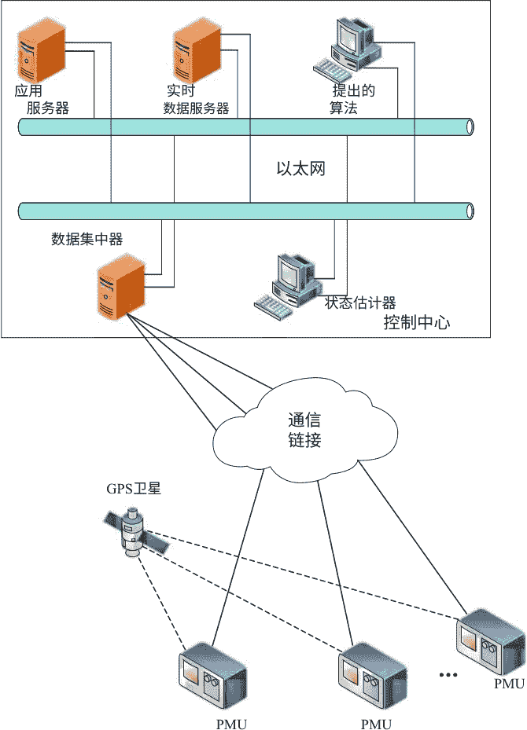

图 14.1 采用 WAMS/PMU 进行暂态稳定监测 [7]

在实时条件下，根据 WAMS 信息获取战略性母线信息，并将其传递给 DT。DT 可以在清除时间后的 1-2 秒内决定 O.S 状态。在 [17] 中，提出了一种基于 WAMS/PMU 数据的 DT 方法来检测区间不稳定性。使用包括 PMU 测量的电压和电压相角在内的 WAMS 数据来检测区间不稳定性。在 [18] 中，提出了一种快速实时检测方法，利用 WAMS 来检测瞬态不稳定性，其中轨迹特征和瞬态能量结合起来提高了瞬态不稳定性检测的速度和准确性。在 [19] 中，CCT 和 TSTM 被用作瞬态稳定性识别的标准。使用两个多层感知器人工神经网络来估计 CCT 和 TSTM，并提出了发电机稳定性状态评估的方法。在 [20] 中，提出了一种基于径向基函数和 MLPANN 的模型，用于检测瞬态不稳定性，其中瞬态稳定性是通过对发电机转子角度和角速度的预测进行评估的。

在 [21] 中，为了估计发电机的暂态稳定状态，提出了一种通过多层感知器神经网络来表示的归一化暂态稳定裕度。所提出的神经网络使用故障前的运行信息来预测发电机的稳定状态。在 [22] 中，提出了一种基于 PMU 和 DT 的实时动态安全评估方案。DT 根据实时测量数据进行在线安全评估操作。在 [7] 中，提出了一种用于实时监测转子角度稳定性的方法，利用 WAMS/PMU 数据并基于 Lyapunov 指数来确定导致电力系统不稳定的功率 fluctuations。在 [23] 中，提出了一种不依赖于网络模型的实时集群预测和识别算法。所提出的方法通过将发电机行为分为协调组来对发电机进行不稳定性分类。在 [24] 中，作者提出了一种基于 SVM 分类器的发电机稳定性预测方法，该方法基于发电机的动态轨迹，如电压、转子角度、电磁功率、速度和其他电气参数。在 [25] 中，提出了基于 AR 模型的 O.S 预测逻辑。所提出的方法基于时域，使用 m 阶 AR 模型和母线之间的电压相位差作为自回归模型的输入变量。在所提出的方法中，通过建模清除严重故障后的功率 fluctuations 来预测失步情况。

在 [5] 中，提出了一种混合分类器，用于预测电力系统在干扰后的瞬态不稳定性。通过发电机转子相对角度的中心惯性方案，将一个指标作为分类的输入数据。在 [2] 中，作者提出了一种方法，利用多机电力网络中发电机母线的故障后电压测量和 SVM 分类器来预测故障发生后的瞬态稳定性。所提出的方法总是在电压下降后引发导致瞬态稳定性状态评估过程的故障事件。在 [3] 中，基于严重干扰发生后的母线电压测量轨迹，提出了一种角度不稳定性预测器。在 [26] 中，引入了一种基于人工神经网络的智能广域同步相量系统，用于实时预测瞬态不稳定性。在 [27] 中，提出了一种基于决策树的方法来预测同步发电机的过同步不稳定性。所提出的方法可以根据失步时刻之前测量到的输入特征来区分稳定状态和过同步。在 [28] 中，利用自适应人工神经网络，提出了一种不稳定性转子角度预测器。在 [29] 中，提出了一种利用 PMU 测量的转子加速度和速度信息，基于速度和加速度的变化率来预测发电机的过同步状态的新算法。

在所有提出的方法中，假设故障发生和故障清除的时刻已经被检测到，它们主要依赖于故障清除后的信息。一些方法只针对一组发电机而不是单个发电机进行不稳定性预测。由于噪声、坏数据或缺失数据、电网配置变化和非对称故障，所提出方法的性能尚未进行调查，问题仍未解决。

在本章中，提出了一种智能 O.S 预测方法，用于快速预测不稳定发电机的 O.S 状态，该方法包括 FDDT、CDDT 和 IPDT。在这个三步方案中，使用通过 PMU 安装在发电机端子上的本地在线运行数据。在第一步中，FDDT 检测故障发生；在第二步中，CDDT 检测故障清除；最后，在第三步中，IPDT 预测 O.S。所有 DT 的输入向量数据是一个移动时间窗口，包含在连续时间步骤中测量的几个采样向量数据。

每个 SVD 可能包含诸如电压幅值和相位角、有功和无功功率、电流幅值和相位角、发电机转子速度、角度和加速度等操作变量。在这种方法中，首先基于发电机电气运行的变量检测故障发生和清除的时间，然后使用 IPDT 和故障清除后的电机运行变量预测发电机的稳定性。

## 14.2 提出方法的框架

在本节中，介绍了用于预测瞬态稳定性的算法的初始框架。所提出的方案的主要结构由三个学习机组成，用于对数据进行分类。这些机器将测量数据作为 FDDT、CDDT 和 IPDT 输入，以精确预测系统的瞬态稳定性。所提出方案的主要观点是，发电机的不稳定性可以从故障清除后的瞬态行为中区分出来。值得注意的是，基于发电机的动态特性，其稳定状态在故障清除后的性能中大部分可见。因此，故障清除后的发电机行为被分类为稳定和不稳定状态之间。换句话说，发电机在故障清除后的动态行为包含了有关其稳定性特性的宝贵信息，可以用于预测不稳定状态。

确实，值得注意的是，使用学习机器可以减少确定系统状态的时间，系统操作员有更多机会实现控制职责。用于确定电力系统暂态稳定性的研究基于故障 CCT 的基本概念，即在系统中故障持续时间超过 CCT 时，生成的情景会导致不稳定。此外，生成的情景不集中在确切的故障上，它们包含不同位置和不同负载水平的故障。对于同步发电机来说，确定电力系统不稳定状态的显著和明显的指标是转子角度和转速的变量。

发电机转子角度在不同条件下的行为如图 14.2 所示。根据图 14.2，根据故障 CCT=317ms，显示了发电机转子角度的典型轨迹，对应于四个不同的情景进行了转子角度变化的研究，包括两个不稳定情景（tclear3=320 ms > CCT，tclear4=325 ms > CCT）和两个稳定情景（tclear1=310 ms < CCT，tclear2=315 ms < CCT）。可观察到，在故障清除之前，发电机转子角度的变化在稳定和不稳定情景下相对相似且略有不同。然而，在故障清除后，在故障清除后，发电机的转子角开始增加与稳定情况的距离并产生更多的差异。在清除故障后，稳定和不稳定情况之间的差异可以适当地区分稳定和不稳定的情况。


图 14.2 发电机转子角度波动对于四种不同的情况

值得注意的是，早期的研究假设发生故障和故障清除是由发电机和故障清除后使用发电机信息的不稳定性预测器所知的。然而，在实际操作状态下，故障发生和清除对发电机的稳定性的影响无法被发电机的本地保护所检测到。

发生在发电机保护区域之外的故障发生和清除无法激活根据故障后信息操作的智能 O.S 继电器。

因此，对于基于数据运行的智能 O.S 预测继电器，需要使用本地发电机信息来检测故障发生和清除。为此，提出了一个智能三步方案，由三个 DT 组成，以解决故障发生和清除检测以及不稳定性预测的所有问题，作为一种 O.S 保护策略的形式。

智能 O.S 继电器的概念结构如图 14.2 所示。在提出的结构中，三个 DT 根据从发电机端安装的 PMU 获得的实际本地信息进行操作。

在第一步中，使用 FDDT 来检测发电机中的故障发生。假设 FDDT 检测到与可能对发电机稳定性不利的故障类似的任何故障或异常情况。在这种情况下，它发送输出信号 1 到 CDDT 以激活它以验证故障是否已清除或仍然存在。当保护继电器清除故障时，CDDT 检测到这种情况并发送输出信号 1 到 IPDT 以激活它。

如图 14.3 所示，在实际操作中，通过 PMU 对发电机的波动行为提供给 FDDT 在任何给定时间的 n 个数据组成的时间窗口。如果 FDDT 检测到任何故障或异常，它发送输出信号 1 以激活 CDDT。采样数据的下一个时间窗口进入 CDDT；否则，包含采样数据的时间窗口将继续提供给 FDDT，直到它检测到故障或异常情况。


在检测到任何故障后，采样窗口信息立即传输到 CDDT。如果 CDDT 检测到故障清除，则将采样数据的下一个时间窗口传输到 IPDT；否则，时间窗口信息将提供给 CDDT，直到 CDDT 检测到故障清除。

上述介绍的所有三个 DT 都在称为智能 O.S 预测继电器方案的设计中工作，该方案适用于发电机。

## 14.3 提出的方法

所提出算法的基础是发电机在故障清除后的电机行为中反映出的不稳定性，包括发电机转子角度、速度和加速度。在故障发生后，通过方程 (14.1) 对发电机的转子角度和速度进行建模，该方程称为振荡方程：

```
$$
\begin{aligned}
\frac{d \omega}{d t} &=\frac{\omega_{0}}{2 H}\left(P_{\mathrm{m}}-P_{\mathrm{e}}\right) \\
\frac{d \delta}{d t} &=\omega-\omega_{0}
\end{aligned}
$$
```

## 14 预测同步发电机失步条件的方法

其中 $\omega, \delta$ 和 $H$ 是故障发生前发电机的转速、转子角度和恒定惯性，$P$ 是加速功率。通过合并故障期间和故障清除后的摆动方程，可以通过公式 (14.2) 估计故障清除后发电机的转子角度和转速：


在故障前，转子角度和速度分别为 $\delta$ 和 $\omega$。在故障清除后，转子角度和速度分别为 $\delta$ 和 $\omega$。$P_{acc}$ 故障期间的平均加速功率和故障清除后的平均加速功率分别为 $P_{acc}$ 和 $P_{dec}$。$t$ 故障持续时间和故障清除后的时刻分别表示干扰的严重程度。在公式 (14.2) 中，故障持续时间 $t$ 和平均加速功率 $P$ 表示干扰的严重程度，这会影响发电机的稳定性。公式 (14.2) 显示，故障的严重程度直接受到故障清除后发电机转子角度和速度的变化的影响。事实上，在电力系统稳定性研究中，故障清除后转子角度的轨迹趋势被用作评估发电机稳定性的标准。因此，故障清除后发电机的行为信息对于区分发电机的稳定状态和不稳定状态是有帮助的。换句话说，发电机行为中的故障清除后的信息具有可以用来预测发电机不稳定性的特性。因此，智能方法在提取这种宝贵信息的特征方面起着重要作用。决策树是一种智能、强大的工具，可以从复杂数据中提取特征，用于预测电力系统中同步发电机的不稳定性。

### 14.3.1 决策树

在这项研究中，决策树被用来评估系统的瞬态稳定性。使用决策树学习机器简单、快速，并且适用于分类复杂问题。这些智能机器适用于输出较低的问题。与其他学习机器相比，决策树最突出的特点之一是其决策过程算法，该算法定义明确且透明。另一方面，其他学习方法中的决策过程不透明，就像一个黑盒子。

决策树相对于其他学习机器（如神经网络）的优势包括：

- 决策树以一组规则的形式解释其预测，而在神经网络中，只有预测被表达，并且隐藏在网络中。
- 此外，在决策树中，与神经网络不同，数据不需要是数值型的。它可以支持数值变量，并且可以处理类别变量，如类型和性别。
- 此外，决策树可以确定与输出相关的优秀操作变量。换句话说，通过将重要变量放置在中心节点，可以估计该变量在分类中的重要性。

在本章中，为了预测基于故障清除数据的发电机转子角不稳定性，使用决策树学习机作为 O.S 预测器。

引入的智能预测方案包括三个连续的决策树，利用由 PMU 产生的发电机振荡的本地在线数据。所提出的预测方案是决策树学习机作为智能预测器和 PMU 作为本地动态数据生成器的组合程序。在这种方法中，故障发生和清除检测以及不稳定性预测的任务由三个连续的决策树执行。IPDT 被用于执行预测 O.S 的主要任务，其输入数据由 PMU 和故障清除后提供。因此，故障数据和故障清除后的数据之间需要有所区别。为此，在前两个步骤中，使用两个决策树作为故障发生检测器和故障清除检测器，以区分故障清除后的数据和故障期间的数据。

### 14.3.2 故障检测通过 FDDT

FDDT 是预测所呈现的 O.S 方法的第一步。FDDT 的主要任务是从发电机的角度检测故障或任何异常情况。FDDT 使用 PMU 在线提供的电气运行变量作为输入数据。FDDT 的输入数据是一个移动时间窗口，包括发电机的六个样本的电气运行变量，如电流和电压幅值，以及它们的相位角，有功和无功功率。FDDT 检测故障的能力主要是由于故障发生前和故障期间电气运行变量值之间的突变（例如，$I, V, \theta_I, \theta_V, P, Q$）。时间 $t$ 的奇异值分解（SVD）包括一些采样的运行变量（例如，$I, V, \theta_I, \theta_V, P, Q$）。在公式（14.3）中，时间 $t$ 的采样电气运行变量被显示为：

$$ \text{SVD}(t) = [I(t), V(t), \theta_I(t), \theta_V(t), P(t), Q(t)] \quad (14.3) $$

图 14.4a 表示一个时间窗口结构，包括六个连续的 SVDs，采样间隔为 $\Delta T$。时间窗口被定义为一个宝贵的时间窗口，用于检测故障的发生，当它包含了一组故障前和故障期间采样的操作数据。每当一个时间窗口的所有采样操作数据完全是在故障之前或完全是在故障期间时，该时间窗口被定义为一个没有关于故障的信息的弱时间窗口。因此，FDDT 无法检测故障的发生。

| 时间窗口 | 样本 1 | 样本 2 | 样本 3 | 样本 4 | 样本 5 | 样本 6 |
| :--- | :--- | :--- | :--- | :--- | :--- | :--- |
| TWf 1 | SVD ($T_f - 5\Delta t$) | SVD ($T_f - 4\Delta t$) | SVD ($T_f - 3\Delta t$) | SVD ($T_f - 2\Delta t$) | SVD ($T_f - \Delta t$) | SVD ($T_f$) (故障) |
| TWf 2 | SVD ($T_f - 4\Delta t$) | SVD ($T_f - 3\Delta t$) | SVD ($T_f - 2\Delta t$) | SVD ($T_f - \Delta t$) | SVD ($T_f$) (故障) | SVD ($T_f + \Delta t$) |
| TWf 3 | SVD ($T_f - 3\Delta t$) | SVD ($T_f - 2\Delta t$) | SVD ($T_f - \Delta t$) | SVD ($T_f$) (故障) | SVD ($T_f + \Delta t$) | SVD ($T_f + 2\Delta t$) |
| TWf 4 | SVD ($T_f - 2\Delta t$) | SVD ($T_f - \Delta t$) | SVD ($T_f$) (故障) | SVD ($T_f + \Delta t$) | SVD ($T_f + 2\Delta t$) | SVD ($T_f + 3\Delta t$) |
| TWf 5 | SVD ($T_f - \Delta t$) | SVD ($T_f$) (故障) | SVD ($T_f + \Delta t$) | SVD ($T_f + 2\Delta t$) | SVD ($T_f + 3\Delta t$) | SVD ($T_f + 4\Delta t$) |
| TWf 6 | SVD ($T_f$) (故障) | SVD ($T_f + \Delta t$) | SVD ($T_f + 2\Delta t$) | SVD ($T_f + 3\Delta t$) | SVD ($T_f + 4\Delta t$) | SVD ($T_f + 5\Delta t$) |

a. 六个宝贵的时间窗口，包括故障前和故障期间的数据用于故障检测和诊断

| 时间窗口 | 样本 1 | 样本 2 | 样本 3 | 样本 4 | 样本 5 | 样本 6 |
| :--- | :--- | :--- | :--- | :--- | :--- | :--- |
| TWC1 | SVD ($T_c - 5\Delta t$) | SVD ($T_c - 4\Delta t$) | SVD ($T_c - 3\Delta t$) | SVD ($T_c - 2\Delta t$) | SVD ($T_c - \Delta t$) | SVD ($T_c$) (清除) |
| TWC2 | SVD ($T_c - 4\Delta t$) | SVD ($T_c - 3\Delta t$) | SVD ($T_c - 2\Delta t$) | SVD ($T_c - \Delta t$) | SVD ($T_c$) (清除) | SVD ($T_c + \Delta t$) |
| TWC3 | SVD ($T_c - 3\Delta t$) | SVD ($T_c - 2\Delta t$) | SVD ($T_c - \Delta t$) | SVD ($T_c$) (清除) | SVD ($T_c + \Delta t$) | SVD ($T_c + 2\Delta t$) |
| TWC4 | SVD ($T_c - 2\Delta t$) | SVD ($T_c - \Delta t$) | SVD ($T_c$) (清除) | SVD ($T_c + \Delta t$) | SVD ($T_c + 2\Delta t$) | SVD ($T_c + 3\Delta t$) |
| TWC5 | SVD ($T_c - \Delta t$) | SVD ($T_c$) (清除) | SVD ($T_c + \Delta t$) | SVD ($T_c + 2\Delta t$) | SVD ($T_c + 3\Delta t$) | SVD ($T_c + 4\Delta t$) |
| TWC6 | SVD ($T_c$) (清除) | SVD ($T_c + \Delta t$) | SVD ($T_c + 2\Delta t$) | SVD ($T_c + 3\Delta t$) | SVD ($T_c + 4\Delta t$) | SVD ($T_c + 5\Delta t$) |

b. 六个宝贵的时间窗口，包括故障期间和故障后的数据用于故障清除和诊断

| 时间 | 样本 1 | 样本 2 | 样本 3 | 样本 4 | 样本 5 | 样本 6 |
| :--- | :--- | :--- | :--- | :--- | :--- | :--- |
| SVD ($T_c$) (清除) | SVD ($T_c + \Delta t$) | SVD ($T_c + 2\Delta t$) | SVD ($T_c + 3\Delta t$) | SVD ($T_c + 4\Delta t$) | SVD ($T_c + 5\Delta t$) | SVD ($T_c + 6\Delta t$) |

c. 包括故障后的数据的时间窗口用于故障识别和诊断

图 14.4 DTs 的移动时间窗口结构。(a) FDDT 的包括故障前和故障期间数据的六个宝贵时间窗口。(b) CDDT 的包括故障期间和故障后清除数据的六个宝贵时间窗口。(c) IPDT 的包括故障后清除数据的时间窗口

在发电机运行过程中，移动时间窗口会不断更新，包括新采样的操作变量。因此，由于故障的发生，连续的六个时间窗口中包含了关于故障发生时刻和故障发生前时刻的宝贵信息。

图 14.4a 显示了连续的六个宝贵时间窗口的结构，每个窗口包括六个采样的操作数据，其中黄色样本属于故障期间的数据，蓝色样本属于故障前的数据。根据图 14.4a，SVD($T_f$) (红色) 表示在故障发生时刻采样的操作数据，SVD($T_f - k\Delta T$) 表示故障发生前 $k$ 个样本数据，而 SVD($T_f + k\Delta T$) 表示故障发生后 $k$ 个样本数据。

可以看到，在故障发生后，时间窗口内包含故障数据的 SVD 数量增加。每个时间窗口采用六个 SVD，使得 FDDT 能够查看六个连续时间窗口中的宝贵信息，提高了 FDDT 的检测可靠性。方程 (14.4) 显示了 FDDT 在宝贵和脆弱时间窗口中的概念性性能：

$$ \text{FDDT} : \begin{cases} 0 = f(\text{SVD}_{\text{pre}}) & \text{: 脆弱数据} \\ 1 = f(\text{SVD}_{\text{pre}}, \text{SVD}_{\text{f}}) & \text{: 宝贵数据} \\ 0 = f(\text{SVD}_{\text{f}}) & \text{: 脆弱数据} \end{cases} \quad (14.4) $$

FDDT 检测到故障发生后，向 CDDT 发送输出信号 1 以激活它。

### 14.3.3 CDDT 的故障清除检测

在 FDDT 检测到故障后，CDDT 被激活以进行故障清除检测。CDDT 使用 PMU 在线提供的电气运行变量。CDDT 的输入信息是一个移动时间窗口，包括发电机电气运行变量的六个样本，如电流和电压幅值，以及它们的相位角，有功和无功功率。CDDT 检测故障清除的能力主要是由于故障期间和故障清除后电气运行变量值之间的突变（例如，$I, V, \theta_I, \theta_V, P, Q$）。

图 14.4b 展示了一个时间窗口的结构，其中包括六个连续的 SVD，这些 SVD 是以相同的时间步长 $\Delta T$ 生成的。当时间窗口包含了在故障期间和故障后清除的组合采样操作数据时，时间窗口是一个宝贵的时间窗口，用于检测故障的清除。

当所有采样操作数据完全在故障期间或故障后清除期间收集时，窗口是一个弱时间窗口。这个时间窗口没有任何清除信息，CDDT 无法检测清除。在发电机运行期间，移动时间窗口会不断更新，以新采样的数据为基础。操作数据。因此，由于故障清除，六个连续的时间窗口具有宝贵的信息。

图 14.4b 展示了六个连续宝贵时间窗口的结构，每个窗口包括六个采样的操作数据。在这些时间窗口中，黄色样本属于故障期间的数据，而蓝色样本属于故障清除后采样的数据。

根据图 14.4b，SVD($T_C$)(绿色) 显示了故障清除时的采样数据，SVD($T_C - k\Delta T$) 属于故障清除前的 $k$ 个采样数据，而 SVD($T_C + k\Delta T$) 指的是故障清除后的 $k$ 个采样数据。根据时间窗口，观察到在故障清除时间后，采样于故障清除后的 SVD 数量增加。

每个时间窗口采用六个 SVD 使得 CDDT 能够通过六个连续时间窗口查看宝贵的数据。这种设计提高了 CDDT 检测性能的可靠性。方程 (14.5) 显示了 CDDT 在宝贵和脆弱时间窗口方面的概念性能：

$$ \text{CDDT} : \begin{cases} 0 = f(\text{SVD}_{\text{f}}) & \text{: 脆弱数据} \\ 1 = f(\text{SVD}_{\text{f}}, \text{SVD}_{\text{pos}}) & \text{: 宝贵的数据} \\ 0 = f(\text{SVD}_{\text{pos}}) & \text{: 脆弱数据} \end{cases} $$

在通过 CDDT 检测到故障清除后，它向 IPDT 发送输出信号 1 以激活它。

### 14.3.4 通过 IPDT 预测不稳定性

所提出的智能继电器的最后一步是通过 IPDT 预测发电机的 O.S 状态，这是所提出方案的主要目标。IPDT 基于发电机的在线数据工作。IPDT 输入向量数据是一个移动时间窗口，包含六个采样操作数据，包括发电机振荡和电机数据，如转子角度、速度和加速度。

图 14.4c 展示了一个时间窗口的结构，包括使用相同时间步长 $\Delta T$ 生成的六个连续的 SVD。时间窗口是连续创建并提交给 IPDT 的。然而，只有在故障清除时，CDDT 才会激活 IPDT。

如果 IPDT 预测发电机的潜在过载状态，它会发送一个“1”信号作为发电机不稳定状态的警告。需要提到的是，如果 IPDT 在第一个时间窗口内无法预测发电机的稳定性，下一个时间窗口将继续进入 IPDT，直到发电机的稳定状态预测完成，即使有延迟。

提出的智能预测继电器被视为主要过载保护继电器的备用。方程 (14.6) 显示了 IPDT 在故障清除后采样的数据方面的概念性能：

$$ \text{IPDT} : \begin{cases} 0 = f(\text{SVD}_{\text{pos}}) & \text{: 稳定} \\ 1 = f(\text{SVD}_{\text{pos}}) & \text{: 不稳定} \end{cases} \quad (14.6) $$

DT 的输入数据由六个连续时间窗口组成，对于可能发生的任何干扰（如缺失数据或错误数据），DT 都具有强大的性能。

### 14.3.5 DT 使用的操作变量的性质

通常，为了训练 DT，可以使用发电机的各种操作变量，如有功和无功输出功率、电压幅值和相位角、转子角度和转速。在故障发生和故障清除的瞬间，与速度和转子角度等机械操作变量相比，有功功率、电压和电流等操作变量的变化更加精确。

因此，在故障发生和清除的瞬间突然变化的电气操作变量是 FDDT 和 CDDT 输入数据中最合适和宝贵的变量。表示发电机转子角度稳定性的电机机械变量，如转子角度、转速和加速度，是用作 IPDT 输入数据最合适和宝贵的变量。由于在时间步长 $\Delta T$ 中电气操作变量的变化幅度优于变量的变化幅度，所以在指定时间步长的电气变量被用作 DT 的输入向量。

## 14.4 模拟

为了评估所提出模型的有效性，以预测故障发生后同步发电机的过电压保护方案已在 IEEE 39 节点电力系统上实施。将对连接到 36 号母线的发电机 #7 的模型进行研究。

为了选择适当的电力系统操作变量，用于训练 FDDT、CDDT 和 IPDT，所有电气和电机操作变量，如有功功率、无功功率、电压矢量、电流矢量、发电机转子角度、速度和加速度都被考虑并进行了彻底审查。最后，根据 DT 的性能和检测/预测，选择了适当数量的操作变量。在这项研究中，为每个 DT 引入了一组特定的操作变量。

### 14.4.1 生成 DT 的训练场景

在本小节中，从位于 IEEE 新英格兰 39 节点电力系统中 36 号母线的发电机 G7 产生了训练场景。由于所提出的过电压保护方案是用于预测特定发电机的稳定状态，发电机经历不稳定条件的事件多样性不是很广泛。也就是说，发电机可能在许多场景中变得不稳定。然而，对于所有不稳定的场景，发电机的振荡行为模式相对有限。这意味着通过充分选择不同的故障场景，可以获得导致不稳定的发电机振荡行为的主要特征。因此，为了准备适当的训练场景，选择了六个不同的负荷水平（4000MW、5000MW、6000MW、7500MW、9000MW、10500MW）。

关于暂态稳定性，应使用该准则来确定稳定性，以便根据暂态稳定性和不稳定性来识别电力系统的状态。所提出的方法准则基于 CCT 来确定稳定和不稳定的情况。假设网络中发生故障，并在一定时间后（继电器动作时间）被清除。这个故障有自己的 CCT 属性，表示网络清除故障的时间。CCT 确定了故障的重要性。CCT 与故障相关的越小，故障的重要性越大，网络清除故障的时间越少。因此，由于这个故障，网络不稳定的可能性更大。因此，为了在故障清除后网络保持稳定，清除时间（继电器动作时间）必须小于 CCT。

为了在每个运行负载水平上训练三个 DTs 产生各种稳定/不稳定的情况，根据发电机 G7 的 CCT（即 $0.1 \times \text{CCT}$, $0.5 \times \text{CCT}$, $0.8 \times \text{CCT}$, $0.95 \times \text{CCT}$, $1.2 \times \text{CCT}$, $1.4 \times \text{CCT}$），将具有不同故障清除时间的对称 LLL 故障应用于所研究的电力系统。故障清除时间小于 CCT 的情况被定义为稳定的情况，而故障清除时间大于 CCT 的情况被定义为不稳定的情况。这些故障应用于 21 号、22 号、23 号和 24 号母线以及 16-24、21-22、22-23、21-16、16-24 和 23-24 线路周围的发电机 G7。这种方法共创建了 324 个干扰情景。

瞬态稳定性仿真使用 DIgSILENT Power Factory® 软件进行，其中发电机被详细建模。获取所有场景下发电机 G7 的稳定状态。在设计的 220 个场景中，有 70 个稳定场景和 150 个不稳定场景是可接受的。

发电机操作变量传输速率由 PMU 提供，为 10 毫秒。因此，采样数据的采样步长在移动时间窗口中更新，被认为等于 10 毫秒 ($\Delta t = 10 \text{毫秒}$)。对于每种稳定/不稳定场景，根据 FDT、NW 由样本的移动速度确定，基于公式 (14.7)：

$$ \text{NW} = \underbrace{\frac{\text{FDT}}{0.01}}_{I} + \underbrace{10}_{II} \tag{14.7} $$

公式（14.7）的第一部分由（I）定义，是属于故障持续时间的时间窗口数，用于 FDDT 和 CDDT 的训练/测试过程。公式（14.7）的第二部分由（II）定义，“10”是故障清除后用于 IPDT 的训练/测试过程的时间窗口数。

表 14.1 生成用于 DTs 训练/测试的时间窗口数量

| 时间窗口 | FDDT 和 CDDT 训练 | FDDT 和 CDDT 测试 | IPDT 训练 | IPDT 测试 |
| :--- | :--- | :--- | :--- | :--- |
| 稳定状态 | 2510 | 1124 | 503 | 209 |
| 不稳定状态 | 5211 | 2108 | 1034 | 421 |
| 总计 | 7721 | 3232 | 1537 | 630 |

根据表 14.1，通过将方程式 (14.7) 应用于 220 个场景，总共生成了 13,390 个稳定/不稳定的训练和测试时间窗口，其中训练和测试 DT 的时间窗口分别使用 70% 和 30%。

### 14.4.2 时间窗口数据

在准备训练场景时，应该在故障清除后收集的样本数量作为 IPDT 输入时间窗口来预测 O.S 是非常重要的。
故障清除和 O.S 之间的持续时间取决于发电机、控制器和电力系统中的位置。在最严重的不稳定条件下，这段持续时间很短。每个发电机都有一个最小持续时间，这与发电机的最严重不稳定条件有关。IPDT 采样时间窗口不应超过这个最小持续时间，因为时间窗口可能包含 O.S 之后的数据，这些数据实际上是没有价值的数据。因此，对于每个发电机，必须首先指定这个最小持续时间。然后，根据它来确定采样时间窗口。

### 14.4.3 FDDT 训练

表 14.2 展示了关于不同输入操作变量的 FDDT 训练性能，这些变量提供了检测故障发生的最大准确性。

如表 14.2 所示，选择具有最高准确性的集合作为 FDDT 的输入变量，其中包括 $\Delta\theta_{\mathrm{v}}, \Delta P$ 和 $\Delta Q$ 三个变量。

### 14.4.4 CDDT 训练

**表 14.2 不同输入变量的 FDDT 性能结果**

| 变量 | 训练集 (7721) | | | 测试集 (3232) | | |
| :--- | :--- | :--- | :--- | :--- | :--- | :--- |
| | 准确率 (%) | 错误检测率 (%) | 错误分类数量 | 准确率 (%) | 错误检测率 (%) | 错误分类数量 |
| ΔP, Δθv, ΔQ | 99.71 | 0.29 | 19 | 99.75 | 0.25 | 8 |

由三个选定变量和在指定时间步骤上取样的样本组成的输入向量如公式 (14.8) 所示：

```
\begin{aligned}
&\text { 采样向量数据 } &: \operatorname{SVD}(t)=[\Delta \theta_{\mathrm{V}}(t), \Delta P(t), \Delta Q(t)] \\
& \Delta \theta_{\mathrm{V}}(t)=\left[\Delta \theta_{\mathrm{V}}(t-k \Delta t)\right], \quad k=1, \ldots, 5 \\
& \Delta P(t)=[\Delta P(t-k \Delta t)], \quad k=1, \ldots, 5 \\
& \Delta Q(t)=[\Delta Q(t-k \Delta t)], \quad k=1, \ldots, 5
\end{aligned}
```
(14.8)

训练的 FDDT 结构如图 14.5a 所示。括号中的数字是指图 14.4a 的样本编号。

### 14.4.5 IPDT 训练

这是所提出方法的最后一步，负责预测不稳定性。基于事故清除后采样的数据来预测发电机的稳定状态。为此，输入变量使用转子角度、速度和加速度的变化。发电机终端电压的相位角被估计为发电机转子角度 [30]。因此，通过发电机转子角度计算发电机转子速度和转子加速度，使用公式 (14.10) 和 (14.11)：

```
$$\omega(t+1) = \frac{\delta(t+1) - \delta(t)}{\Delta t} \quad (14.10)$$
$$\alpha(t+1) = \frac{\omega(t+2) - \omega(t+1)}{\Delta t} \quad (14.11)$$
```

由于转子的角度、速度和加速度变化作为输入变量，不同组合的这些变量被用作 IPDT 采样数据向量。关于不同变量组合的 IPDT 训练性能，Δα, Δw, 和 Δδ 被检查。如表 14.4 所示，该集合被选为具有最高准确性的 IPDT 输入变量，包括 Δα, Δw, 和 Δδ 的所有三个变量。IPDT 输入向量由三个选定的变量以及在指定时间步骤上取样的样本组成，如式 (14.12) 所示。

**表 14.3 不同输入变量的 CDDT 性能结果**

| 变量 | 训练 (7828) | | | 测试 (3995) | | |
| :--- | :--- | :--- | :--- | :--- | :--- | :--- |
| | 准确率 (%) | 错误检测率 (%) | 错误分类数量 | 准确率 (%) | 错误检测率 (%) | 错误分类数量 |
| ΔP, Δθ₁, ΔQ | 99.71 | 0.29 | 22 | 98.95 | 1.05 | 34 |

**表 14.4 不同输入变量的 IPDT 性能结果**

| 变量 | 训练 (1537) | | | 测试 (630) | | |
| :--- | :--- | :--- | :--- | :--- | :--- | :--- |
| | 准确率 (%) | 错误检测率 (%) | 错误分类数量 | 准确率 (%) | 错误检测率 (%) | 错误分类数量 |
| Δα, Δw, Δδ | 98.73 | 1.27 | 20 | 89.96 | 10.03 | 63 |

训练的 CDDT 结构如图 14.5b 所示。括号中的数字是图 14.4b 的样本编号。

#### a. FDDT 结构
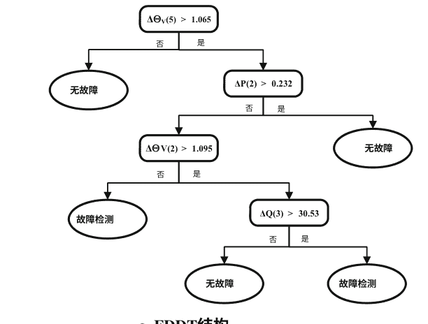
#### b. CDDT 结构
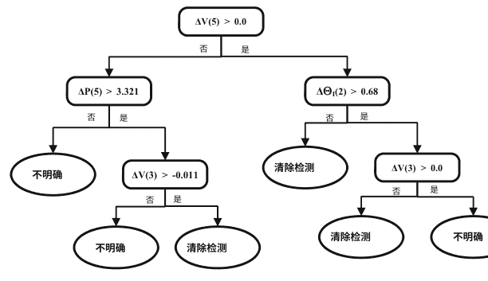
#### c. IPDT 结构
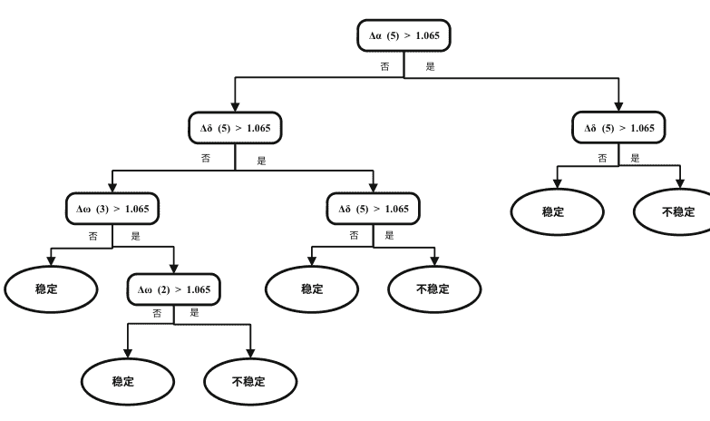

图 14.5 DTs 结构 ( a) FDDT 结构，( b) CDDT 结构，( c) IPDT 结构


图 14.6 FDDT 的操作变量。(a) FDDT of Δθv, (b) FDDT of ΔP, (c) FDDT of ΔQ

训练后的 IPDT 结构如图 14.5c 所示。括号中的数字是指图 14.4c 的样本编号。根据图 14.5，在训练过程中确定了每个 DT 的阈值值。

在图 14.6a-c 中，对研究对象的发电机的高压母线施加了一个持续时间为 t=1 秒的三相短路故障。可以看出，在故障发生时，FDDT 中使用的操作变量发生了显著变化。

在图 14.7a-c 中，对研究对象的发电机的高压母线施加了一个持续时间为 t=1 秒的三相短路故障，并在 t=1.27 秒时清除。可以看出，在清除时，CDDT 中使用的操作变量发生了显著变化。

### 14.4.6 IPDT 的过拟合/欠拟合评估

由于决策树在训练过程中容易出现过拟合或欠拟合的问题，训练场景的数量逐渐减少/增加。IPDT 的训练/测试性能也得到评估。根据表 14.5，本研究中使用的训练/测试场景数量是最佳的，可以提供最佳的训练/测试成果。根据最佳场景数量，增加/减少场景数量会导致训练过程中的过拟合/欠拟合问题，从而降低训练的准确性。

需要注意的是，由于智能 O.S 预测继电器是针对每个发电机的行为单独设计的，所以训练过程包括训练场景的数量和训练时间与电力系统的规模无关。

**表 14.5 训练场景数量对性能的影响**

| 训练案例 | 训练次数情况 | 训练结果 | | 测试结果 | |
|---|---|---|---|---|---|
| | | 准确率 (%) | 错误分类数 | 准确率 (%) | 错误分类数 |
| 1 | 4985 | 96.3 | 184 | 87.9 | 110 |
| 2 | 7846 | 95.8 | 329 | 88.7 | 93 |
| 3 | 10320 | 97.35 | 273 | 88.81 | 96 |
| 4 | 13390 | 98.73 | 170 | 89.96 | 63 |
| 5 | 14890 | 97.21 | 564 | 81.02 | 162 |
| 6 | 16281 | 94.05 | 968 | 85.73 | 138 |

**表 14.6 DT 与 SVM/ANN 性能比较**

| | | DT 性能 | | SVM 性能 | | MLPANN 性能 | |
|---|---|---|---|---|---|---|---|
| 准确率 (%) | | 训练 | 测试 | 训练 | 测试 | 训练 | 测试 |
| 故障发生检测 | | 99.71 | 99.75 | 99.34 | 98.96 | 99.08 | 99.54 |
| 故障清除检测 | | 99.71 | 99.75 | 99.34 | 98.83 | 99.19 | 99.1 |
| 不稳定性发生预测 | | 98.73 | 89.96 | 94.93 | 85.72 | 96.65 | 85.9 |

### 14.4.7 DT 性能与 SVM 和 ANN 的比较

提出的智能继电器性能与其他学习机器进行了比较。两个学习机器包括使用相同数据训练的 MLPANN 和 SVM，然后与基于 DT 的算法的结果进行比较。在这个比较中，隐藏层有十个神经元的 ANN 和 Levenberg-Marquardt 算法被使用。另一种智能方法是具有标准差为 0.1 和调节参数为 10 的 SVM。与其他智能方案相比，所提出的方案的训练和测试准确性在表 14.6 中显示。根据表 14.6，ANN 和 SVM 的性能几乎相同，而基于 DT 的智能预测继电器的性能更好。

## 14.5 提出方案性能的验证

为了验证提出的智能继电器方案，对其性能进行了对七种稳定/不稳定情况的检查，这些情况在训练中没有使用。七种情况的特征如表 14.7 所示。除了开发的 8 种情况外，还开发了 57 种其他稳定和不稳定的情况来评估 IPDT。

**表 14.7 验证场景特征**

| 场景 | 负荷水平 (MW) | 稳定状态 | 故障类型 | 故障位置 | | CCT (ms) | FDT (ms) |
| :--- | :--- | :--- | :--- | :--- | :--- | :--- | :--- |
| | | | | 母线/线路 | 线路 % | | |
| 1 | 6832 | 不稳定 | LLL | 线路 23-24 | 50 | 352 | 400 |
| 2 | 5040 | 稳定 | LLL | 24 号母线 | - | 495 | 300 |
| 3 | 6350 | 不稳定 | L-G | 线路 22-23 | 40 | 428 | 550 |
| 4 | 6350 | 不稳定 | LLG | 线路 22-23 | 60 | 318 | 450 |
| 5 | 6350 | 不稳定 | R5-LLL | 24 号母线 | - | 363 | 450 |
| 6 | 6350 | 稳定 | R15-LLL | 24 号母线 | - | 624 | 550 |
| 7 | 6350 | 不稳定 (更改配置) | LLL | 线路 23-24 | 40 | 276 | 350 |

**表 14.8 验证结果时间性能**

| 场景 (状态) | 实际时间 | | | FDDT | CDDT | IPDT |
| :--- | :--- | :--- | :--- | :--- | :--- | :--- |
| | 故障发生 (秒) | 故障清除 (秒) | 操作系统 (秒) | 故障检测 (秒) | 清除检测 (秒) | 操作系统 (秒) |
| 1 (U) | 1.00 | 1.4 | 1.49 | 1.0 | 1.4 | 1.45 |
| 2 (S) | 1.00 | 1.3 | - | 1.0 | 1.3 | - |
| 3 (U) | 1.00 | 1.55 | 1.81 | 1.0 | 1.55 | 1.6 |
| 4 (U) | 1.00 | 1.45 | 1.71 | 1.0 | 1.45 | 1.5 |
| 5 (U) | 1.00 | 1.45 | 1.68 | 1.0 | 1.45 | 1.5 |
| 6 (S) | 1.00 | 1.55 | - | 1.0 | 1.55 | - |
| 7 (U) | 1.00 | 1.35 | 1.49 | 1.0 | 1.35 | 1.4 |

性能根据每种情况，使用时域模拟计算相关的 CCT，以显示情况的稳定性并将其与故障清除时间进行比较。与实时故障发生/清除和通过时域模拟研究获得的 O.S 相比，对于七种情况，FDDT、CDDT 和 IPDT 的验证结果如表 14.8 所示。根据表 14.8，在所有不稳定情况下，IPDT 在实际 O.S 时间之前预测到不稳定性。

图 14.8 显示了 57 个场景中 44 个不稳定场景的 IPDT 性能的分析结果。图 14.8 显示了条形图，其中水平轴是 IPDT 预测 O.S 提前于实时的时间长度。例如，在 13 个不稳定场景中，O.S 的持续时间比实时提前 150-200 毫秒。

场景 1：在这个场景中，发电机不稳定，IPDT 预测出了不稳定状态。图 14.9a 显示了发电机在故障发生前到事故清除后的有功功率变化。之前故障发生时间到故障清除后的时间，连续采样数据的时间窗口进入 FDDT、CDDT 和 IPDT。根据图 14.9b，在 FDDT 中，采样数据在故障发生时的突变被称为故障发生，并生成一个“1”激活信号来激活 CDDT 的输出。只要这种突变


图 14.8 IPDT 在不同场景下的统计性能


图 14.9 场景 1—时间窗口和 DT 的输出。(a) 在不稳定场景中，发生故障和清除后发电机电有功功率的波动，(b) FDDT 和 CDDT 的时间窗口和不稳定场景的输出，(c) 转子角度的波动和 IPDT 的输出在不稳定场景中

在采样时间窗口中，只要数据中存在采样的时间窗口，FDDT 的输出就保持为“1”六个连续的时间窗口。在故障清除的那一刻，采样窗口中的数据也发生了类似的突然变化（蓝色）。CDDT 将这种突然的数据变化视为故障清除，并在其输出上生成一个“1”信号以激活 IPDT。只要数据的突然变化在采样时间窗口内，CDDT 的输出就保持为“1”六个连续的窗口。

该场景的 IPDT 性能结果显示在图 14.9c 中。IPDT 性能在 CDDT 性能完成后开始。换句话说，当所有时间窗口样本包含后清除数据时，IPDT 性能开始，取决于时间窗口的长度，需要 50 毫秒的时间。表 14.7 展示了 DT 与实际时间的时间性能对比。在这个场景中，IPDT 比发电机实际时间提前 50 毫秒预测不稳定性。

场景 2：根据表 14.7，研究的场景是一个稳定的情况，IPDT 预测发电机处于稳定状态。在这个场景中，IPDT 持续将“0”信号反映为输出没有不稳定性。FDDT 和 CDDT 清楚地显示了故障发生和故障清除时刻为 t=1.0 和 t=1.3 秒，与实际时间的值相同。图 14.10a 显示了故障发生前和故障清除后发电机的有功功率变化。在这段时间内，连续的时间窗口连续采样数据进入 FDDT、CDDT 和 IPDT。

如图 14.10b 所示，在故障发生的瞬间，由于电力突然变化，故障数据的样本（黄色）进入采样窗口。在 FDDT 中，这种采样数据的变化被称为故障发生，并生成一个“1”激活信号来启动 CDDT 的输出。只要这种突然的数据变化存在于采样时间窗口中，FDDT 的输出将连续六个时间窗口保持为“1”。在故障清除的瞬间，采样时间窗口中发生类似的突然数据变化（蓝色）。CDDT 将这种数据的突然变化视为故障清除，从而在其输出处生成一个“1”信号来激活 IPDT。只要突然的数据变化存在于采样时间窗口中，CDDT 的输出将连续六个窗口保持为“1”。


图 14.10 场景 2—时间窗口和 DTs 的输出。(a) 故障发生和稳定场景中发电机电力波动。(b) FDDT 和 CDDT 的时间窗口及其在稳定场景中的输出。(c) 转子角度波动和 IPDT 的输出

在图 14.10c 中，展示了预测发电机稳定状态的 IPDT 性能结果。

场景 3：该场景展示了一个不稳定的情况，并评估了 DT 在 L-G 线路 22-23 上的性能，故障特性列在表 14.7 中。如表 14.8 所示，所有 DT 都能准确地检测和预测故障发生/故障清除以及发电机的不稳定性。

场景 4：该场景展示了一个不稳定的情况，并评估了 DT 在 LLG 线路 22-23 上的性能，故障特性列在表 14.7 中。所有 DT 都能准确地检测和预测故障发生/故障清除以及发电机的过载保护。根据表 14.8 中场景 3 和场景 4 的结果，DT 可以对不对称 LG 和 LLG 故障进行正确的任务处理，尽管 DT 是通过三相短路故障场景进行训练的。

场景 5/6：这些场景展示了不稳定/稳定的情况，并评估了发生故障时 DTs 的性能，故障电阻为 RF=5 Ω/RF=15 Ω。FDDT 和 CDDT 分别检测到了稳定和不稳定状态下的故障发生和故障清除。IPDT 预测了场景 5 (RF=15 Ω) 的稳定情况，并在输出中显示了一个“0”信号，并且正确预测了场景 6 (RF=5 Ω) 的不稳定情况，在 t=1.5 秒时。

场景 7：针对网络配置的变化，评估了 DTs 在 23-24 线路发生不稳定故障时的性能。所有的 DTs 都能检测到故障的发生/清除，并正确预测 O.S。

### 14.5.1 带有噪声数据的验证

在本节中，对无噪声数据进行了 FDDT、CDDT 和 IPDT 的训练/测试评估。因此，在以下条件下考察了四个噪声水平（SNR=20、30、40、50 dB）：

- 1. 使用无噪声数据进行训练，与噪声组合进行测试
- 2. 测试和训练数据与噪声组合

根据表 14.9，在 DTs 被噪声数据测试的情况下，IPDT 的预测误差相对较高。在表 14.10 中，DTs 被噪声组合的测试和训练数据。在这种情况下，IPDT 的预测误差较低，表明测试和训练数据中的噪声存在可以改善和使 IPDT 的性能更加稳健。此外，通过检查 FDDT 和 CDDT 的性能，确定误差率可以忽略不计，因为噪声无法阻止数据在故障发生或故障清除的时间窗口内发生剧烈变化。

**表 14.9 不同信噪比下训练/测试性能**

| 信噪比 (dB) | 无噪声 = 0 | 20 | 30 | 40 | 50 |
|---|---|---|---|---|---|
| FDDT 准确率 (%) | 99.75 | 99.45 | 99.47 | 99.47 | 99.52 |
| CDDT 准确率 (%) | 99.75 | 99.45 | 99.47 | 99.47 | 99.52 |
| IPDT 准确率 (%) | 89.96 | 73.78 | 79.46 | 85.78 | 88.9 |

**表 14.10 噪声组合下的训练/测试性能**

| 信噪比 (dB) | 无噪声 = 0 | 20 | 30 | 40 | 50 |
|---|---|---|---|---|---|
| FDDT 准确率 (%) | 99.75 | 99.79 | 99.8 | 99.79 | 99.81 |
| CDDT 准确率 (%) | 99.75 | 77.79 | 99.8 | 99.79 | 99.81 |
| IPDT 准确率 (%) | 70 | 76.52 | 76.52 | 81.37 | 89.85 |

## 14.6 结论

在这项研究中，为了预测同步发电机的瞬态不稳定性，提出了一种基于 DT 的智能继电器方案。在提出的方案中，故障发生、故障清除和发电机过载状态通过 FDDT、CDDT 和 IPDT 进行检测和预测。根据结果，IPDT 依赖于由 FDDT 和 CDDT 在前几个步骤中生成的故障清除后的数据来预测不稳定性和过载状态。研究发现，电气操作变量是故障发生/清除检测的最合适变量。相反，机电操作变量是预测过载状态的最相关变量。每个时间窗口采用六个数据样本，包括故障发生和故障清除的输入向量数据，可以提高可靠性，并为 DT 检测六个连续时间窗口中的故障条件和清除提供机会。此类时间窗口还可以确保 DT 对采样时间窗口中可能存在的缺失数据和错误数据的正确性能。根据结果，可以得出结论，FDDT、CDDT 和 IPDT 的性能准确度分别为 99.71%、99.71% 和 98.73%。通过对 DT 学习过程中未观察到的各种场景进行评估，评估了所提出框架的性能。需要提到的是，所提出的智能继电器可以用作主要过载保护继电器的辅助继电器。换句话说，所提出的智能过载保护继电器可以单独运行或与常见继电器联合运行。在合作状态下，它的功能可以用作常见继电器的支持，因此在关于发电机稳定性状态的最终决策中，如果所提出的继电器预测到不稳定性，它将相应地采取行动，或者如果输出阻抗继电器也检测到不稳定性并根据其检测采取行动。

# 参考文献

- 1. F.R. Gomez Lezama, 使用广域相量测量预测和控制瞬态不稳定性，博士学位论文，曼尼托巴大学电气与计算机工程系 (2011)
- 2. A.D. Rajapakse, F. Gomez, 使用事后扰动电压轨迹预测转子角不稳定性。IEEE Trans. Power Syst. 25(2), 947–956 (2009)
- 3. F.R. Gomez, A.D. Rajapakse, U.D. Annakkage, I.T. Fernando, 基于同步测量的支持向量机故障后瞬态稳定预测算法。IEEE Trans. Power Syst. 26(3), 1474–1483 (2010)
- 4. N. Amjady, S.A. Banihashemi, 通过新的同步状态指数和混合分类器预测电力系统的暂态稳定性。IET Gener. Transm. Distrib. 4(4), 509–518 (2010)
- 5. A.G. Bahbah, 电力系统暂态稳定性评估用于实时应用，论文，博士学位，电气与计算机工程系，克莱姆森大学 (2000)
- 6. W. Xiao Chen, et al., 基于实时广域相量测量的暂态稳定性预测方法综述，in 2011 第四届电力公用事业解除和重组与电力技术国际会议 (DRPT) (2011)
- 7. Y. Jie et al., 基于 PMU 的转子角度动态监测。IEEE Trans. Power Syst. 26(4), 2125–2133 (2011)
- 8. C.-X. Dou, J. Yang, X. Li, T. Gui, Y. Bi, 基于暂态稳定性评估的大型电力系统分散协调控制。国际电力能源系统杂志 46（3 月）, 153–162（2013 年）
- 9. D.P. Wadduwage, C.Q. Wu, U.D. Annakkage, 通过 Lyapunov 指数的概念进行电力系统暂态稳定性分析。电力系统研究 104（11 月）, 183–192（2013 年）
- 10. F. Shi, H. Zhang, G. Xue, 基于转子角度测量的互联电力网不稳定性预测。国际电力能源系统杂志 88, 21–32（2017 年）
- 11. H. Talaat, 使用模糊规则的预测性操作系统继电保护分类。电力系统研究 48, 143–149（1999 年）
- 12. L.S. Moulin, A.P.A. da Silva, M.A. El-Sharkawi, R.J. Marks II, 支持向量机用于大规模电力系统瞬态稳定性分析。IEEE Trans. Power Syst. 19(2), 818–825 (2004)
- 13. W. Hu, Z. Lu, S. Wu, 等，基于改进的支持向量机的电力系统实时瞬态稳定性评估。J. Mod. Power Syst. Clean Energy 7, 26–37 (2019)
- 14. K.R. Padiyar, S. Krishna, 使用能量函数准则在线检测失去同步。IEEE Trans. Power Deliv. 21(1), 46–55 (2006)
- 15. A.F. Diaz-Alzate, J.E. Candelo-Becerra, J.F. Villa Sierra, 通过监测相对角度与预定阈值进行实时操作的瞬态稳定性预测。Energies MDPI 开放获取期刊 12(5), 1–17 (2019)
- 16. I. Kamwa, S.R. Samantaray, G. Joos, 基于规则的分类器开发用于宽域后扰动记录的快速稳定性评估。IEEE Trans. Power Syst. 24(1), 258–270(2009)
- 17. Q. Gao, S. Rovnyak, 使用同步相量测量的决策树进行基于宽域响应的控制。IEEE Trans. Power Syst. 26(2), 855–861 (2011)
- 18. J.Z. Hui Deng, X. Wu, K. Men, 基于轨迹特征和瞬态能量的实时瞬态不稳定性检测，出版于 Power and Energy Society General Meeting, (2012), pp. 1–7
- 19. A. Karimi, S.Z. Esmaili, 使用神经网络对描述详细模型的电力系统进行瞬态稳定性评估。Int. J. Electr. Power Energy Syst. 45(1), 279–292 (2013)
- 20. Bahbah, A.A. Girgis, 使用循环人工神经网络对多机电力系统进行瞬态稳定性评估的新方法预测发电机的角度和角速度。IEEE Trans. Power Syst. 19(2), 1015–1022 (2004)
- 21. A. Karimi，使用神经网络进行电力系统暂态稳定裕度估计。Int. J. Electr. Power Energy Syst. **33**(4), 983–991 (2011)
- 22. S. Kai, S. Likhate, V. Vittal, V.S. Kolluri, S. Mandal, 使用相量测量和决策树的在线动态安全评估方案。IEEE Trans. Power Syst. **22**(4), 1935–1943 (2007)
- 23. Y. Wang, J. Yu，基于广域测量的多机系统实时暂态稳定性预测，在 *Power and Energy Society General Meeting*, (2009), pp. 1–4
- 24. D. You, K. Wang, L. Ye, J. Wu, R. Huang，使用发电机组合轨迹输入的支持向量机进行电力系统暂态稳定性评估。Int. J. Electr. Power Energy Syst. **44**(1), 318–325 (2013)
- 25. K. Yamashita, H. Kameda, O.S. 基于自回归模型的宽区域保护预测逻辑，在 *IEEE PES* 电力系统会议展览会中，纽约，2004 年 10 月 10–13 日
- 26. F. Hashiesh, H.E. Mostafa, A.-R. Khatib, M. Ibrahim Helal, M.M. Mansour, 基于智能宽区域同步相量的系统预测和减轻瞬态不稳定性。IEEE 智能电网 **3**(2), 645–652 (2012)
- 27. T. Amraee, S. Ranjbar, 使用决策树技术进行瞬态不稳定性预测。IEEE 电力系统 **28**(3), 3028–3037 (2013)
- 28. A.N. Al-Masri 等，使用自适应人工神经网络应用进行发电机转子角稳定性预测的新实现，用于动态安全评估。IEEE 电力系统 **23**(3), 2516–2525 (2013 年 3 月)
- 29. A.R. Sobbouhi, M.R. Aghamohammadi, 一种利用转子速度–加速度预测大规模电力系统中操作系统状态的新算法。Int. Trans. Electr. Energy Syst. **26**, 486–508 (2016)
- 30. A.R. Sobbouhi, M.R. Aghamohammadi, 一种基于相量测量单元（PMU）数据的利用转子速度 - 加速度预测操作系统的新算法。Electr. Power Components Syst. **43**(13), 1478–1486 (2015)

# 第 15 章
# 自适应神经模糊推理系统模型用于
# 配电系统短期负荷、价格和拓扑预测

Mehrdad Setayesh Nazar 和 Ashkan Eslami Fard

## 命名法

## 缩写

| 缩写 | 全称 |
| :--- | :--- |
| ANFIS | 自适应神经模糊推理系统 |
| ANN | 人工神经网络 |
| ARIMA | 自回归积分移动平均 |
| ARMA | 自回归移动平均 |
| CANFIS | 协同神经模糊推理系统 |
| CSI | 事故严重指数 |
| DG | 分布式发电 |
| GA | 遗传算法 |
| GO | 引力搜索优化 |
| LMP | 节点边际价格 |
| LPF | 负荷和价格预测 |
| MAPE | 平均绝对百分比误差 |
| MLP | 多层感知器 |
| SVM | 支持向量机 |
| SVR | 支持向量回归 |
| WT | 小波变换 |

## 指标

| 符号 | 说明 |
| :--- | :--- |
| l | 小波分解的分解指数 |
| k | 小波分解的缩放指数 |

M. Setayesh Nazar (✉) · A. Eslami Fard  
伊朗德黑兰沙希德贝赫什蒂大学电气工程学院  
电子邮件：m_setayesh@sbu.ac.ir; a_eslamifard@sbu.ac.ir

©作者 (在 Springer Nature Switzerland AG 2022 独家许可下) M. Nazari-Heris 等人，机器学习和深度学习方法在电力系统问题中的应用，电力系统，https://doi.org/10.1007/978-3-030-77696-1_15

## 参数

| 符号 | 说明 |
| :--- | :--- |
| NB | 母线数量 |
| NCC | 关键事故数量 |
| NL | 线路数量 |
| P_max | 线路的最大有功功率潮流 |
| V_min | 母线的最小电压 |
| α, β, χ | 小波分解机的粗细系数 |
| W | 加权因子 |

## 变量

| 符号 | 说明 |
| :--- | :--- |
| P | 线路的有功功率潮流 |
| V | 母线的电压 |

## 15.1 引言

负荷和价格预测（LPF）过程是配电系统运行过程中最重要的工具之一。利用化石燃料分布式发电（DG）装置可以大幅改变系统负荷和价格的模式，与未启用 DG 的情况相比。分布式能源发电可以改变节点能源的产生/消耗值。

此外，DG 与上级系统的电力交易可以改变配电系统母线的小时负荷和价格。

近年来，许多研究已经进行了优化 LPF 过程，可以分为不同的组。LPF 过程的第一组采用统计算法，如自回归综合移动平均 (ARIMA) 方法 [1]。第二组利用特征选择算法和聚类机器，如卡尔曼滤波 [2]，Box-Jenkins 模型 [3]，支持向量回归 (SVR) [4]，支持向量机 (SVM) [5]，模糊模型 [6]，人工神经网络 (ANN) [7] 和专家系统 [8]。第三组结合了第一组和第二组的预测机器，以提高预测过程的速度和准确性。小波变换 (WT)，协同神经模糊推理系统 (CANFIS) 和自适应神经模糊推理系统 (ANFIS) 是用于价格和负荷预测的方法的示例 [9, 10]。参考文献 [11] 提出了一种混合 LPF 过程，该过程利用了特征选择方法和重力搜索优化 (GSO) 算法。基于 ANN 的 LPF 方法最大平均绝对百分比误差 (MAPE) 为 PJM 市场的最坏情况约为 1.1849%。参考文献 [12] 提出了一种多阶段基于 ANFIS 的 LPF 过程，该过程使用特征选择，小波变换机器和卡尔曼滤波。LPF 的第一阶段使用小波变换和卡尔曼机器将输入数据分解为三个频率分量并预测分解信号。

然后，基于 Kohonen 的网络找到了相似的天数，ANFIS 和多层感知器（MLP）神经网络进行了第二阶段的 LPF 过程。

最后，在第三阶段，ANFIS 和 MLP 神经网络被用于预测价格和负荷曲线。所提出的方法在西班牙电力市场的平均 MAPE 值约为 3.88%。参考文献 [13] 介绍了一个 LPF 模型，使用 SVM 和 WT 机器进行预测过程，并通过 GSO 方法进行学习参数的优化。算法的模拟结果表明，所提出的方法使 PJM 市场的预测准确性提高了约 15.21%。参考文献 [14] 介绍了一种时间序列分解和正弦余弦优化过程，用于预测市场的次日价格。该方法使用确定性和概率预测算法来提高过程的准确性。所介绍的方法的 MAPE 值为 21.471%，适用于澳大利亚电力市场价格。参考文献 [15] 评估了一个由预处理、优化、预测和评估机器组成的四阶段价格预测机器。第一阶段使用信号处理机器检测和去除白噪声。第二阶段优化采用灰狼元启发式方法来优化预测参数。第三阶段采用 Elman 神经网络模型进行价格预测，第四阶段机器评估了预测机器的有效性。所提出的预测方法对于澳大利亚新南威尔士市场的数据，MAPE 约为 3.331%。参考文献 [16] 提出了一个将风力发电与市场价格相关联的两阶段价格预测机器。直接方法和重定向方法评估实时价格和风电发电相关性。重定向方法利用 SVM、ANN 和回归机器，ERCOT 市场的均方误差值约为 22.25%。参考文献 [17] 介绍了一种使用相关向量机预测电力市场负荷的负荷预测算法。特征选择和 WT 作为预处理过程进行，该方法在纽约和新英格兰电力市场进行了评估。小时前和次日价格预测的 MAPE 值分别约为 0.86% 和 1.58%。参考文献 [18] 提出了一种用于澳大利亚电力市场的随机自回归移动平均 (ARMA) 模型进行价格预测。

结果显示，开发的模型预测了价格的尖峰值，并考虑了区域市场的非线性。参考文献 [19] 提出了一种基于 SVM 的负荷预测算法，该算法使用灰狼优化过程来优化预测机的参数。所提出的 MAPE 算法用于新南威尔士州电力负荷预测的误差约为 0.5204%。参考文献 [20] 评估了一种梯度提升机用于中国电力系统负荷预测的方法。预测机的输入参数包括每日、平均、最大和最小温度参数，以及星期几和 MAPE 的计算值约为 0.032%。参考文献 [21] 介绍了一种用于负荷预测的动态分解过程，该过程将预测误差进行分解。计算了误差快照矩阵并生成了一系列误差。然后，根据估计的误差值制定了负荷序列。所提出方法在中国电力系统中的 MAPE 约为 4.452%。参考文献 [22] 提出了一种基于特征选择的价格预测算法，该算法使用非合作博弈模型对价格数据进行聚类。博弈论被用来确定获胜神经元，并使用贝叶斯递归 ANN 进行预测。纽约电力系统的预测 MAPE 约为 4.14%。参考文献 [23] 介绍了一种采用 Boltzmann 和互信息机器的负荷预测算法。使用遗传算法进行预测参数优化。该案例研究是针对 PJM 电力市场进行的，并且所提方法的 MAPE 值约为 0.492%。参考文献 [24] 提出了一种使用 WT、互信息机器、ARIMA 机器和 SVM 过程的三部分算法。使用元启发式优化程序确定 SVM 机器参数选择。新南威尔士电力市场的负荷和价格预测的 MAPE 值分别约为 2.11% 和 7.86%。

所描述的参考文献没有考虑到日前时段配电系统的最优拓扑预测。本书章节介绍了一种考虑负荷、节点边际价格（LMPs）和配电系统日前调度时段的拓扑预测的预测算法。

## 15.2 问题建模和制定

配电系统运营商（DSO）预测配电系统聚合节点负荷和母线 LMPs 的日前值。如图 15.1 所示，DSO 与非公用能源发电（DG）单元进行能量交易。

LMPs 的平均值和方差不是恒定的，并且取决于电力发电/负荷减少的边际成本、拥塞和线路损耗。然而，母线负荷可能具有相似的模式。LMPs 依赖于负荷，反之亦然，这是基于负荷较高的值可能会增加系统的拥塞、损耗和能源采购成本的事实。此外，LMPs 较高的值可能会根据其价格弹性降低响应负荷的量 [25]。

引入了一种迭代多级 LPF 过程，其块图如图 15.2 所示。

首先，使用负载、LMP 和拓扑历史数据库进行主要 LPF。然后，使用 Kohonen 机器进行负载预测的相似日聚类。第二阶段负载预测使用 ANN 机器和每日温度数据库进行处理。特征选择过程处理价格数据以找到其相关性，并使用 ANFIS 过程进行第二阶段价格预测。

拓扑预测过程使用事故分析数据库，并确定每小时可用的决策控制变量。然后，使用遗传算法（GA）优化过程确定系统的最优拓扑。

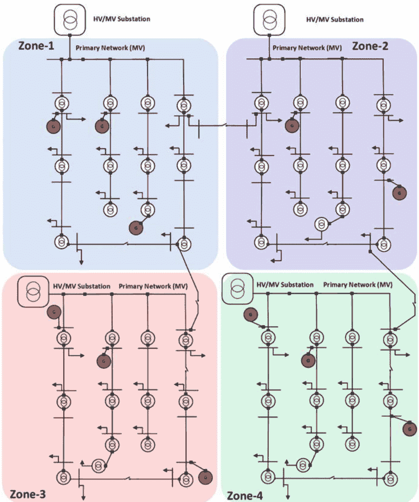
**图 15.1 配电系统的示意图**

第一阶段进行 WT 过程，将数据分解为不同的频率。分解频率的预测过程比未分解的数据更容易。WT 分解过程分为两个级别，如图 15.3 所示。从原始数据中分解出高频组件（D₂和 D₁）和低频组件（A₁）。

WT 公式可以表示为方程（15.1）：

$$
X = \sum_{l} \sum_{k} W(l, k) \cdot \psi_{l,k} \quad (15.1)
$$

其中，l、k 分别是分解和缩放指数。此外，α、β和χ分别是粗粒度和细粒度系数。

因此，原始负荷和价格数据的六个分量可用。然后，使用卡尔曼预测机进行第一阶段 LPF，可以表示为方程 (15.2):

$$
\hat{y}(n) = \sum_{i=1}^{N} \phi_i y(n-i) + \sum_{j=1}^{M} \psi_j x(n-j) + \theta \quad (15.2)
$$

其中，价格($\nu-\theta_i$)和负载($\nu-\nu_i$)是过去的价格和负载参数，分别。此外，$\phi$和$\psi$是从转移矩阵计算得到的，$\theta_i$和$\nu_i$分别是先前价格和负载的指数。

类似的一天聚类过程是由 Kohonen 机器和基于 ANN 的负载预测过程完成的。原始负载信号的分解频率分量由 ANN 机器在预测过程的第二阶段进行预测。此外，互信息模块找到 LMP 的依赖性。第二阶段 LMP 预测使用 ANFIS 机器。互信息和 ANFIS 机器的详细公式见 [12]。预测的 A₁、A₂和 D₂信号的值如图 15.4 所示重构。

最优拓扑预测过程利用离线计算引擎并包括以下阶段:

- 1. 针对不同负荷模式进行离线事故分析和排序。
- 2. 使用遗传算法进行配电系统的最优切换。遗传算法优化过程的目标函数定义如下（式 15.3）:

$$
\min Z = W_1 \cdot \sum_{\text{NB}} \left( \frac{V - V_{\min}}{V_{\min}} \right)^2 + W_2 \cdot \sum_{\text{NL}} \left( \frac{P - P_{\max}}{P_{\max}} \right)^2 \quad (15.3)
$$

其中，$W$是权重因子。式（15.3）受到交流负荷潮流和配电系统设备负载约束的限制。有关遗传算法的详细信息，请参见 [26]。
- 3. 针对不同事故和负荷条件确定同质拓扑。
- 4. 进行 CANFIS 机器的学习。CANFIS 机器的详细构造在 [27] 中介绍。

在线最优拓扑预测过程包括以下步骤:

- 1. 容灾严重指数（CSI）使用公式（15.4）计算

$$
\text{CSI} = \sum_{\text{NCC}} \left[ \sum_{\text{NB}} \left( \frac{V - V_{\text{normal}}}{V_{\text{normal}}} \right)^2 + \sum_{\text{NL}} \left( \frac{P - P_{\max}}{P_{\max}} \right)^2 \right] \quad (15.4)
$$

- 2. CANFIS 机器基于 CSI、LMP 和系统负荷预测配电系统的最优拓扑

CANFIS 机器是 ANFIS 机器的扩展，包括多个输出，如图 15.5 所示

CANFIS 机器的输出数量等于离线研究确定的配电拓扑数量

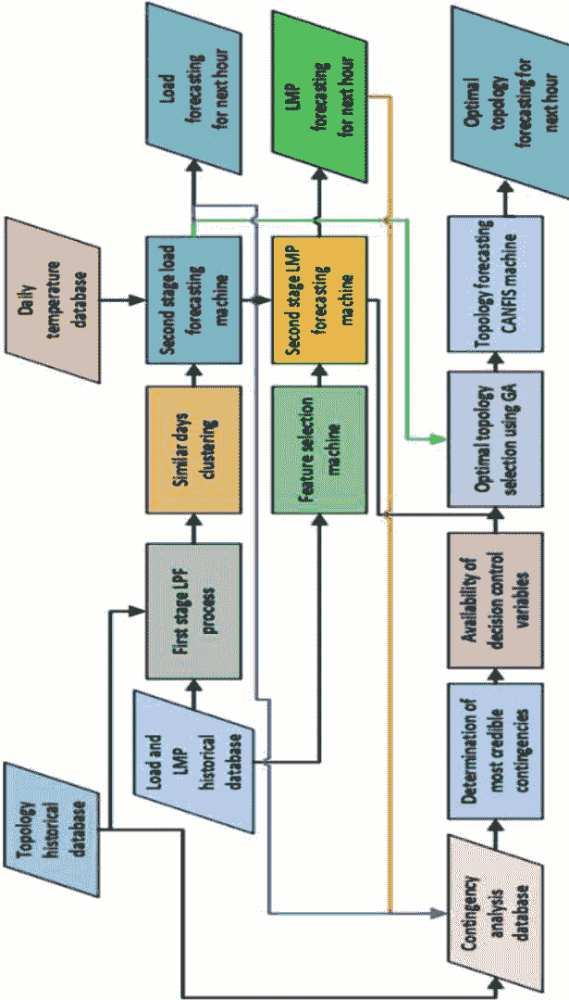
**图 15.2 提出的迭代多级 LPF 过程**

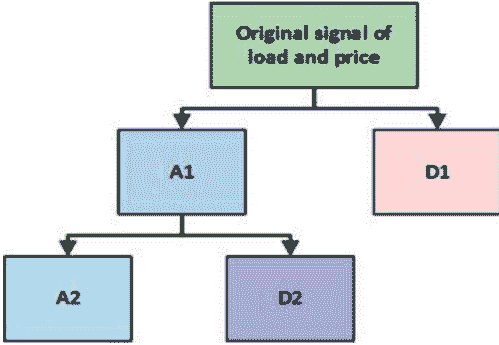
**图 15.3 通过小波变换对原始信号进行分解**

## 15.3 模拟结果

采用 33 节点 IEEE 测试系统对所提出的方法进行模拟

图 15.6 展示了 33 节点 IEEE 测试系统的拓扑结构，其数据可在 [28] 中获取

生成了大量的用电情景，并使用 [29] 提出的方法计算了 LMP 考虑了 Nord Pool 每单位负荷模式，为不同的日期和季节生成了 33 节点 IEEE 系统的小时负荷模式 然后，将系统负荷和 LMP 数据传输给所提出的 LPF 机器

图 15.7 描述了 WT 分解的层级。信号 $A_2$具有最高的贡献值。然而，信号 $D_2$和 $D_1$的值低于 0.045，相对于信号 $A_2$的值来说非常低。

**图 15.6 33 节点 IEEE 测试系统拓扑结构**

**图 15.7 WT 分解层级描述**

图 15.5 CANFIS 机器的示意图

图 15.6 33 节点 IEEE 测试系统的单线图

图 15.8a、b 展示了负荷与历史负荷数据库之间的相关性。负荷预测日的负荷与前一天的负荷之间存在线性相关性。此外，负荷预测日与之前 7 天的负荷之间也存在线性相关性。

首阶段负荷预测的输入数据选择如下集合：

图 15.7 原始信号的小波变换分解级别

$$ \{ L ( d , t - 1 ) , L ( d , t - 2 ) , L ( d , t - 3 ) , L ( d , t - 4 ) , L ( d , t - 5 ) , L ( d - 1 , t - 1 ) , L ( d - 1 , t ) , L ( d - 1 , t + 1 ) , L ( d - 7 , t - 1 ) , L ( d - 7 , t ) , L ( d - 7 , t + 1 ) \} $$

此外，第一阶段的价格预测输入数据选择如下集合：

$$ \begin{array} { l } { { \{ P ( d , t ) , P ( d , t - 1 ) , P ( d , t - 2 ) , P ( d , t - 3 ) , P ( d , t - 4 ) , P ( d , t - 5 ) , P ( d - 1 , t - 1 ) , } } } \ { { P ( d - 1 , t ) , P ( d - 1 , t + 1 ) , P ( d - 7 , t - 1 ) , P ( d - 7 , t ) , P ( d - 7 , t + 1 ) \} } } \end{array} $$

所描述的数据被视为卡尔曼滤波器的输入，并且卡尔曼滤波器预测了$A_2$、$D_2$和$D_1$信号，如图 15.9 所示。平均 LMP（ALMP）被定义为特定日前视野的每小时 LMP 的平均值。

图 15.10 展示了 ALMP $A_2$， $D_2$和 $D_1$信号以及日前视角下的最终 ALMP 值。

然后，卡尔曼预测的 LMP 和负荷被输入到 Kohonen 机器中，用于对输入数据进行聚类。图 15.11 展示了由 Kohonen 机器确定的 $A_2$信号的聚类负荷数据。更多参数选择的细节请参考 [12]。

Kohonen 过程找到了以下 $A_2$， $D_2$和 $D_1$信号的模式：

- 相似的天 $D_2$ 负荷数据组成：
$\{ 109 \cdot 122 \cdot 125 \cdot 230 \cdot 235 \cdot 236 \cdot 237 \cdot 244 \cdot 411 \cdot 594 \cdot 599 \}$。
- 相似的天 $A_2$ 负荷数据组成：
$\{ 116 \cdot 117 \cdot 125 \cdot 228 \cdot 229 \cdot 234 \cdot 238 \cdot 475 \cdot 481 \cdot 287 \cdot 501 \cdot 591 \cdot 592 \cdot 593 \cdot 594 \cdot 598 \}$
- 类似的天 $D_1$ 用于负荷数据的组件：
$\{ 131 \cdot 159 \cdot 178 \cdot 250 \cdot 279 \cdot 496 \cdot 549 \cdot 556 \}$。

图 15.8 (a) 负荷和历史负荷数据库的相关性，用于 d-1 和预测的天数，(b) 负荷和历史负荷数据库的相关性，用于 d-7 和预测的天数

图 15.9 (a) 卡尔曼滤波器预测负荷 $D_1$信号，(b) 卡尔曼滤波器预测负荷 $A_2$信号，(c) 卡尔曼滤波器预测负荷 $D_2$信号

负荷预测的第二阶段由多层感知器神经网络完成。图 15.12 展示了神经网络对 A2 信号进行的第二阶段负荷预测。图 15.13 描述了神经网络负荷预测过程中的 MAPE 的最大和最小值。如图 15.13 所示，MAPE 的最大值和最小值分别为 3.88% 和 1.31%。

ANFIS 预测引擎在负荷预测的第二阶段预测了 LMP。图 15.14 展示了预测的 ALMP。

图 15.10 (a) 卡尔曼滤波器预测了 ALMP D1 信号，(b) 卡尔曼滤波器预测了 ALMP A2 信号，(c) 卡尔曼滤波器预测了 ALMP D2 信号，(d) 卡尔曼滤波器预测了 ALMP 信号。

图 15.10(续)

图 15.15 描述了通过公式 (15.3) 计算得出的遗传算法目标函数值。遗传算法目标函数的最大值分别为 0.6、0.8 和 1 的负荷因素下分别为 1242.432、1358.784 和 1426.458。

表 15.1 和 15.2 描述了不同负荷因素 (LF) 和 ALMP 值的 CANFIS 模式识别和遗传算法优化输出。CANFIS 模式识别的总数为 444 个案例，识别错误的数量为 6 个案例，占总数的 1.35%。提出的预测机器成功确定了日前负荷、价格和拓扑。更多的验证过程细节请参见 [12]。

## 15.4 结论

本章回顾了一种日前负荷、价格和拓扑预测过程。引入的框架采用了特征选择和 Kohonen 聚类机器。进行了两级负荷和位置边际价格预测过程。小波机器将原始信号分解成不同的频率，卡尔曼滤波器预测了日前时段的分解信号。然后，Kohonen 过程对第一级预测信号进行聚类，多层感知器神经网络机器预测了负荷的分解频率。采用自适应神经模糊推理系统预测了位置边际价格的分解信号。

最后，负荷和价格信号被重组。

拓扑预测机器以系统的事故严重指数、边际定价和负荷作为输入，并且遗传算法优化了考虑系统约束的系统拓扑。然后，使用共同的神经模糊推理系统来预测系统的最佳拓扑。该方法已成功应用于 33 节点 IEEE 测试系统的评估。

作者正在研究提出的算法的新结构，该算法利用元启发式优化算法来加快处理速度。

图 15.12 (a) MLP 预测了负荷 D₁信号，(b) MLP 预测了负荷 A₂信号，(c) MLP 预测了负荷 D₂信号

图 15.13 神经网络 MAPE 用于预测负荷数据

图 15.14 ANFIS 机器预测了 ALMP

图 15.15 不同负荷水平的 GA 目标函数

### 表 15.1 GA 输出和 CANFIS 机器在最优拓扑识别和不同 ALMP 和 LF 值下的比较（续）

| 事故 | GA (ALMP = 1) LF = 0.95 | CANFIS (ALMP = 1) LF = 0.95 | GA (ALMP = 0.7) LF = 0.9 | CANFIS (ALMP = 0.7) LF = 0.9 | GA (ALMP = 0.5) LF = 0.85 | CANFIS (ALMP = 0.5) LF = 0.85 |
|---|---|---|---|---|---|---|
| 1 | 1 | 1 | 1 | 1 | 6 | 6 |
| 2 | 2 | 2 | 2 | 2 | 5 | 5 |
| 3 | 4 | 4 | 4 | 4 | 3 | 3 |
| 4 | 3 | 3 | 3 | 3 | 4 | 4 |
| 5 | 1 | 1 | 1 | 1 | 1 | 1 |
| 6 | 1 | 1 | 1 | 1 | 1 | 1 |
| 7 | 4 | 4 | 1 | 1 | 1 | 1 |
| 8 | 1 | 1 | 1 | 3 | 1 | 1 |
| 9 | 4 | 4 | 4 | 4 | 4 | 4 |
| 10 | 1 | 3 | 1 | 1 | 1 | 1 |
| 11 | 1 | 1 | 1 | 1 | 1 | 1 |
| 12 | 1 | 1 | 1 | 1 | 1 | 1 |
| 13 | 6 | 6 | 6 | 1 | 1 | 1 |
| 14 | 4 | 4 | 4 | 4 | 1 | 1 |
| 15 | 1 | 1 | 1 | 3 | 1 | 1 |
| 16 | 1 | 1 | 3 | 1 | 3 | 3 |
| 17 | 6 | 6 | 1 | 1 | 1 | 1 |
| 18 | 2 | 2 | 1 | 1 | 1 | 1 |
| 19 | 1 | 1 | 1 | 1 | 1 | 1 |
| 20 | 1 | 1 | 1 | 2 | 1 | 1 |
| 21 | 1 | 1 | 1 | 1 | 1 | 1 |
| 22 | 1 | 1 | 1 | 1 | 1 | 1 |
| 23 | 1 | 1 | 1 | 1 | 1 | 1 |
| 24 | 1 | 1 | 1 | 1 | 1 | 1 |
| 25 | 1 | 1 | 1 | 1 | 1 | 1 |
| 26 | 1 | 1 | 1 | 1 | 1 | 1 |
| 27 | 1 | 1 | 1 | 1 | 1 | 1 |
| 28 | 2 | 2 | 2 | 1 | 1 | 1 |
| 29 | 1 | 1 | 1 | 1 | 1 | 1 |
| 30 | 2 | 2 | 1 | 1 | 1 | 1 |
| 31 | 1 | 1 | 1 | 1 | 1 | 1 |
| 32 | 1 | 1 | 1 | 1 | 1 | 1 |
| 33 | 1 | 1 | 1 | 1 | 1 | 1 |
| 34 | 1 | 1 | 1 | 1 | 1 | 1 |
| 35 | 1 | 1 | 1 | 1 | 1 | 1 |
| 36 | 1 | 1 | 1 | 1 | 1 | 1 |
| 37 | 1 | 1 | 1 | 1 | 1 | 1 |

### 表 15.2 GA 输出和 CANFIS 机器在最优拓扑识别和不同 ALMP 和 LF 值下的比较

| 事故 | GA (ALMP = 1) LF = 0.8 | CANFIS (ALMP = 1) LF = 0.8 | GA (ALMP = 0.7) LF = 0.75 | CANFIS (ALMP = 0.7) LF = 0.75 | GA (ALMP = 0.7) LF = 0.7 | CANFIS (ALMP = 0.5) LF = 0.7 | GA (ALMP = 0.5) LF = 0.7 | CANFIS (ALMP = 0.5) LF = 0.7 |
|---|---|---|---|---|---|---|---|---|
| 1 | 7 | 7 | 1 | 1 | 1 | 1 | 1 | 7 |
| 2 | 5 | 5 | 1 | 1 | 1 | 1 | 1 | 1 |
| 3 | 1 | 1 | 1 | 1 | 1 | 1 | 1 | 1 |
| 4 | 1 | 1 | 1 | 1 | 1 | 1 | 1 | 1 |
| 5 | 2 | 2 | 2 | 2 | 2 | 2 | 2 | 2 |
| 6 | 1 | 1 | 1 | 1 | 1 | 1 | 1 | 1 |
| 7 | 3 | 3 | 1 | 1 | 3 | 3 | 3 | 3 |
| 8 | 1 | 1 | 1 | 1 | 1 | 1 | 1 | 1 |
| 9 | 1 | 1 | 1 | 1 | 1 | 1 | 1 | 1 |
| 10 | 4 | 4 | 4 | 4 | 3 | 3 | 3 | 3 |
| 11 | 4 | 4 | 1 | 1 | 4 | 4 | 4 | 4 |
| 12 | 1 | 1 | 1 | 1 | 1 | 1 | 1 | 1 |
| 13 | 3 | 3 | 3 | 3 | 3 | 3 | 3 | 3 |
| 14 | 1 | 1 | 1 | 1 | 1 | 1 | 1 | 1 |
| 15 | 3 | 3 | 1 | 1 | 3 | 3 | 3 | 3 |
| 16 | 7 | 7 | 7 | 7 | 7 | 7 | 7 | 7 |
| 17 | 2 | 2 | 2 | 2 | 1 | 1 | 1 | 1 |
| 18 | 6 | 6 | 2 | 2 | 2 | 2 | 2 | 2 |
| 19 | 1 | 1 | 1 | 1 | 1 | 1 | 1 | 1 |
| 20 | 1 | 1 | 1 | 1 | 1 | 1 | 1 | 1 |
| 21 | 1 | 1 | 1 | 1 | 1 | 1 | 1 | 1 |
| 22 | 6 | 6 | 1 | 1 | 6 | 6 | 6 | 6 |
| 23 | 1 | 1 | 1 | 1 | 1 | 1 | 1 | 1 |
| 24 | 1 | 1 | 1 | 1 | 1 | 1 | 1 | 1 |
| 25 | 1 | 1 | 1 | 1 | 1 | 1 | 1 | 1 |
| 26 | 1 | 1 | 1 | 1 | 1 | 1 | 1 | 1 |
| 27 | 1 | 1 | 1 | 1 | 1 | 1 | 1 | 1 |
| 28 | 2 | 1 | 2 | 1 | 1 | 1 | 1 | 1 |
| 29 | 1 | 1 | 1 | 1 | 1 | 1 | 1 | 1 |
| 30 | 1 | 1 | 1 | 1 | 1 | 1 | 1 | 1 |
| 31 | 1 | 1 | 1 | 1 | 1 | 1 | 1 | 1 |
| 32 | 1 | 1 | 1 | 1 | 1 | 1 | 1 | 1 |
| 33 | 1 | 1 | 1 | 1 | 1 | 1 | 1 | 1 |
| 34 | 3 | 3 | 3 | 3 | 3 | 3 | 3 | 3 |
| 35 | 3 | 3 | 3 | 3 | 3 | 3 | 3 | 3 |
| 36 | 1 | 1 | 1 | 1 | 1 | 1 | 1 | 1 |
| 37 | 1 | 1 | 1 | 1 | 1 | 1 | 1 | 1 |

# 参考文献

1. M.H. Amini, A. Kargarian, O. Karabasoglu, 基于 ARIMA 的电动汽车充电需求随机电力系统运行的解耦时间序列预测。电力系统研究。140, 378–390 (2016)
2. P. Gupta, K. Yamada, 利用天气信息进行适应性短期负荷预测的小时负荷预测。IEEE Trans. Power Syst. 91, 2085–2094 (2007)
3. A.J. Amorim, T.A. Abreu, M.S. Tonelli-Neto, C.R. Minussi, 基于自适应共振理论和反向训练的多节点短期负荷预测的新形式。电力系统研究。179, 106096 (2020)
4. J.X. Che, J. Zhou Wang, Y. Juan Tang, 支持向量回归电力负荷预测模型中的最优训练子集。Appl. Soft Comput. 12, 1523–1531 (2012)
5. P.F. Pai, W. Chiang Hong, 电力负荷预测中具有模拟退火算法的支持向量机。Energy Convers. Manage. 46, 2669–2688 (2005)
6. R. Mamlook, O. Badran, E. Abdulhadi, 短期负荷预测的模糊推理模型。Energy Policy 37(4), 1239–1248 (2009)
7. S. Kouhi, F. Keynia, 在电力市场中短期负荷预测的新级联神经网络方法。Energy Convers. Manage. 71, 76–83 (2013)
8. A. Ghanbari, S.M.R. Kazemi, F. Mehmanpazir, M.M. Nakhostin, 用于构建能源需求预测基于知识的专家系统的合作蚁群优化 - 遗传算法方法。Knowl. Based Syst. 39, 194–206 (2013)
9. J.P.S. Catalão, H.M.I. Pousinho, V.M.F. Mendes, 通过混合智能方法在竞争市场中进行短期电力价格预测。Energy Convers. Manage. 52, 1061–1065 (2011)
10. A.S. Pandey, D. Singh, S.K. Sinha, 用于短期负荷预测的智能混合模型。IEEE Trans. Power Syst. 25, 1266–1273 (2010)
11. A. Heydari, M. Majidi Nezhad, E. Pirshayan, D. Astiaso Garcia, F. Keynia, L.D. Santoli, 基于复合神经网络和引力搜索优化算法的孤立电力网的短期电价和负荷预测。Appl. Energy 277, 115503 (2020)
12. M.S. Nazar, A.E. Fard, A. Heidari, M. Shafie-khah, J.P.S. Catalão, 使用三阶段算法的混合模型，用于同时预测负荷和价格。Electr. Power Syst. Res. 165, 214–228 (2018)
13. 张宇，邓超，赵瑞，莱托，一种基于多层结构的智能电网环境下的综合价格和负荷预测方法。工程应用人工智能 95, 103852 (2020)
14. 杨伟，王军，牛涛，杜鹏，一种用于电力市场管理的多步电价预测新系统。应用软计算杂志 88, 106029 (2020)
15. 杨伟，王军，牛涛，杜鹏，一种基于双重分解策略和多目标优化的混合预测系统用于电力价格预测。应用能源 235, 1205–1225 (2019)
16. 罗斯，翁阳，一种利用不同数据源进行电力价格预测的两阶段监督学习方法。应用能源 242, 1497–1512 (2019)
17. J. Ding, M. Wang, Z. Ping, D. Fu, V.S. Vassiliadis, 基于相关向量机的短期负荷预测的综合方法。欧洲运营研究杂志 287, 497–510 (2020)
18. H. Manner, F. Alavi Fard, A. Pourkhanali, L. Tafakori, 使用动态藤蔓 Copula 预测澳大利亚电力价格的联合分布。能源经济学 78, 143–164 (2019)
19. A. Yang, W. Li, X. Yang, 基于特征选择和最小二乘支持向量机的短期电力负荷预测。基于知识的系统 163, 159–173 (2019)
20. Z. Guo, K. Zhou, X. Zhang, S. Yang, 用于短期功率负荷和概率密度预测的深度学习模型。能源 160, 1186–1200 (2018)
21. 孔晓，李超，王超，张勇，张军，基于动态模态分解的误差修正的短期电力负荷预测。应用能源 261, 114368 (2020)

22. M. Ghayekhloo, R. Azimi, R. Ghofrani, M.B. Menhaj, E. Shekari，基于一种新的数据聚类方法和贝叶斯递归神经网络的组合方法用于电力市场的日前价格预测。电力系统研究 168, 184–199 (2019 年)

23. G. Hafeez, K. Saleem Alimgeer, I. Khan，基于深度学习和启发式算法在智能电网中的电力负荷预测。应用能源 269, 114915 (2020 年)

24. A. Ghasemi, H. Shayeghi, M. Moradzadeh, M. Nooshyar，一种新型的混合算法用于智能电网中的电力价格和负荷预测与需求侧管理。应用能源 177, 40–59 (2016 年)

25. S. Salarkheili, M. Setayesh Nazar，在受限输电电力市场中的容量保留分析。IET Gener. Transm. Distrib. 10, 487–495 (2016)

26. S. Madadi, M. Nazari-Heris, B. Mohammadi-Ivatloo, S. Tohidi，基于遗传算法的预测模型在电力系统问题中的实施，in 科学和工程中的预测建模和优化方法手册，(IGI Global, Hershey, 2018), pp. 140–155

27. H. Singh, Y.A. Lone，Python 中的深度神经模糊系统：附带案例研究和应用 (Apress Book, Berkeley, 2020)

28. A. Bostan, M. Setayesh Nazar, M. Shafie-khah, J.P.S. Catalão，考虑多个向下能源中心和需求响应计划的配电系统的最优调度。能源 190, 116349 (2020)

29. S. Salarkheili, M. Setayesh Nazar，电力市场中容量保留的新指标。国际电力能源系统传输 25, 180–196 (2015)

# 第 16 章 机器学习在智能家电最佳调度中预测用户偏好的应用

Milad Sadat-Mohammadi, Morteza Nazari-Heris, Alireza Ameli, Somayeh Asadi, Behnam Mohammadi-Ivatloo 和 Houtan Jebelli

M. Sadat-Mohammadi
宾夕法尼亚州立大学电气工程与计算机科学系，宾夕法尼亚州立大学公园分校，美国
电子邮件：miladsm@psu.edu

M. Nazari-Heris, S. Asadi (✉), H. Jebelli
宾夕法尼亚州立大学建筑工程系，宾夕法尼亚州立大学公园分校，美国
电子邮件：mun369@psu.edu; m.nazariheris.2015@ieee.org; sxa51@psu.edu; asadi@engr.psu.edu; hkj5117@psu.edu; hjebelli@psu.edu

A. Ameli
伊斯兰阿扎德大学马拉德分校土木工程系，德黑兰，伊朗
电子邮件：ameli@iaumalard.ac.ir

B. Mohammadi-Ivatloo
奥尔堡大学能源技术系，奥尔堡，丹麦
塔布里兹大学电气与计算机工程学院，塔布里兹，伊朗
电子邮件：mohammadi@ieee.org; bmo@et.aau.dk

© 作者（们），独家许可给 Springer Nature Switzerland AG 2022
M. Nazari-Heris 等 (编)，机器学习和深度学习方法在电力系统问题中的应用，电力系统，
https://doi.org/10.1007/978-3-030-77696-1_16

## 16.1 引言

住宅部门创新定价策略的存在证明了家庭能源管理系统的必要性 [1]。家庭能源管理系统根据居民预先定义的约束条件，对可调节的电器进行最优操作，以降低总体电费 [2, 3]。这些系统由硬件和软件层组成 [4, 5]。硬件层包括智能电表和执行器，用于连接和建立电器与中央家庭能源管理单元之间的通信。设计执行器和电表模块是一个具有挑战性的问题，因为每个电器都有自己的控制电路，需要修改以接收来自家庭的控制命令，由能源管理单元实施控制命令。最近，引入了具有嵌入式通信能力的智能家电。智能家电可以接收来自用户、公用事业或中央家庭能源管理单元的外部信号，以控制其操作，而无需修改其控制电路。因此，中央控制单元可以发送开/关命令给家电，或接收有关家电状态的信息。控制命令是通过在家庭能源管理单元中嵌入的运行和优化算法来确定的。

文献中提出了几种启发式算法，如粒子群优化、遗传算法等，用于优化住宅负荷调度模型 [6, 7]。这些模型包括优化参数、约束条件、决策变量和目标函数。约束条件被定义为满足家电运行的技术要求。目标函数旨在通过考虑约束条件和每小时电力费率来降低每月电费。此外，一些研究还考虑用户的舒适度水平在目标函数中 [8]。用户的舒适度水平是通过运行调度单元后完成任务的总等待时间来衡量的。调度模型中存在两种类型的参数：固定参数和动态参数。固定参数是每个家电完成任务所需的总能量、周期时间等，在中央家庭能源管理单元中定义一次，不需要定期更新。然而，动态参数，如开始时间和每个家电所需调度窗口的长度，应在调度过程开始时更新。更新动态参数是一个具有挑战性的任务，被认为是使家庭能源管理系统在住宅客户中不太具有吸引力的因素之一。很明显，用户的生活方式和活动模式显著影响动态参数。因此，分析居民的活动模式可以提供有用的信息，以解决在实施家庭能源管理系统中提到的挑战。

在文献中已经研究了基于传感器网络数据的智能家居居民活动预测。例如，安装在门和橱柜上的数据运动传感器和门传感器可以被分析和用于预测活动的顺序、开始时间以及持续时间 [9]。研究已经调查了从家电使用模式中发现居民日常作息规律的可能性。连接到家电的智能电表记录它们的能量消耗情况；然后，通过记录的能量消耗情况确定家电的开关状态。结果证明，使用贝叶斯网络可以以可接受的准确性预测人类活动 [10]。不仅可以使用传感器数据预测人类活动，还有几项研究报告了人类偏好检测的可能性。例如，使用环境信息和家电运行历史数据来预测居民在操作空调和热水器时的舒适偏好 [11]。此外，智能手机和社交应用数据的 GPS 数据，以及天气数据，可以用于预测居民的到达和居住时间，并控制恒温负载，以减少电力消耗和账单，同时为居民提供所需的热舒适度 [12]。受到文献中提出的用于预测住户对恒温负荷操作的方法的启发，本研究旨在研究基于智能应用记录的能量消耗模式，预测用户在调度灵活负荷（如洗衣机和洗碗机）方面的偏好的可能性。我们的假设是，用户在操作智能电器方面的偏好可以通过智能应用收集的历史数据进行学习；然后，可以预测未来观察到的用户偏好。智能电器可以提供全面的数据库，无需安装额外的硬件，如智能电表 [13]。

本研究的其余部分安排如下：第 16.2 节介绍影响住宅负荷调度问题的动态参数。第 16.3 节详细阐述了监督学习和数据标记。第 16.4 节研究了使用机器学习算法预测动态参数的准确性。最后，在第 16.5 节中提供了总结性的评论和一些未来研究的方向。

## 16.2 影响动态参数的关键因素

调度问题中的动态参数受到多个因素的影响，例如任务的开始时间、环境因素、居民的每周日程等 [14]。然而，值得一提的是，动态参数中存在一定程度的随机性，超出了本研究的范围。一些提到的因素可以通过电器的能耗曲线来检测，而其他因素可以从开发的在线数据库中获取，包括温度等环境因素。研究因素与动态参数之间的关系可以为预测动态参数的可行性提供见解。

### 16.2.1 任务的开始时间

任务的开始时间被定义为电器准备开始运行周期的时刻。这个时间可以通过智能电器记录的数据来检测。通过分析电器的能量消耗曲线，可以在能量消耗超过待机能量消耗限制时检测到其运行周期的开始。一个为期 2 年的案例研究中记录的电器数据显示，任务的开始时间会影响所需的调度间隔长度。例如，洗碗机的调度间隔结束时间通常是用餐时间，而开始时间是可变的，取决于用户准备洗碗机的时间。因此，每当用户接近用餐时间时，就会填满洗碗机。

### 16.2.2 星期几

分析 60 个低能耗住宅的每小时用电模式，发现周末用电高峰出现在 19:00，而在工作日除了主要高峰之外，早上 8:00 还有一个小高峰。工作日和周末的能源消耗模式之间的差异是合理的，因为人们通常在工作日早上离开家，这导致 8:00 之后的用电量减少。可以得出结论，工作日和周末显著影响居民的活动。因此，周末活动的变化可能导致电器所需调度窗口的长度发生变化。

此外，每个用户都有特定的工作时间和任务，这些任务应该每天完成。由于星期几对电器设备所需调度窗口的长度可能具有重要性，因此将此因素作为训练机器学习算法的输入进行考虑。

### 16.2.3 温度

室外温度也是居民日常活动的重要因素。当温度宜人时，人们更喜欢在户外活动，而在外面下雪或下雨时，他们更愿意待在家里。在室内时间较少会限制完成日常任务的可用时间；因此，调度电器设备的期望调度窗口可能更短。然而，需要注意的是，根据居民的生活方式，温度对期望调度窗口的影响可能明显不同。因此，如果将室外温度作为训练机器学习算法的特征来考虑，就可以检测出室外温度与每个电器设备的期望调度窗口之间的关系。

## 16.3 监督学习

监督学习是指通过标记的示例来学习输入和输出之间的关系。标记的示例被分为训练集和测试集两部分。训练集用于训练机器学习算法；训练过程涉及调整模型参数。权重、支持向量和系数是人工神经网络、支持向量机和线性回归机器学习算法的模型参数，分别是 [16]。模型参数通常使用优化算法来确定，其目标函数是训练准确性。尽管优化算法提高了训练的准确性，但训练得到的模型可能在未知数据集上泛化能力不强，这个问题被称为过拟合。过拟合发生在模型学习了训练数据集中的隐藏模式，而不能完全代表整体模式的情况下。测试数据集用于对模型的性能和泛化能力进行无偏评估。通过将训练和测试误差作为优化算法的目标函数，可以避免过拟合；这样做可以在机器学习算法从可用数据中学习和预测未来观测之间取得平衡。通过将预测标签与测试集的预期标签进行比较，研究训练模型在预测未来示例方面的准确性。避免过拟合的一个实际方法是将训练和测试误差都视为优化算法的目标函数；通过这样做，机器学习算法在从可用数据中学习和预测未来观测之间能够取得平衡。

在文献中，监督式机器学习算法如支持向量机（SVM）、人工神经网络（ANN）和随机森林（RF）已经被用于各种预测问题。每个算法都有特定的基本原理，使其适用于特定的问题。支持向量机算法寻求在高维空间中确定一组可以将最近的训练类别分开的超平面。更高的间隔可以提高模型对未来观测的泛化准确性。支持向量机在人脸检测、手写识别、广义预测控制等方面具有广泛应用。人工神经网络算法是一种著名的机器学习算法，受到人脑神经元简化的启发。该模型由相互连接的人工神经元组成。每个人工神经元都有加权输入、偏置、传递函数和一个输出 [17]。模型参数、权重和偏置在学习过程中通过训练算法进行调整，以找到导致更高预测准确性的最优值。梯度下降算法、反向传播算法以及启发式算法如粒子群优化（PSO）或遗传算法是一些训练算法的示例。人工神经网络有几种架构，如前馈神经网络、多层感知器（MLP）和卷积神经网络。随机森林由几个决策树组成，这些树是在自助样本上进行训练的 [18]。每个决策树都是以减少树之间的相关性并实现比每个单独树更高的预测准确性的方式构建的。随机森林由于对高维特征不敏感、快速进行样本外预测、需要较少的参数调整以及具有特征排序能力而在文献中被广泛使用 [19]。每个机器学习算法都是特定问题的最佳选择；然而，没有任何规则可以确定哪个算法是特定问题的最佳选择，而不进行实施和分析结果的准确性。在本研究中，我们实施了人工神经网络、支持向量机和随机森林算法；然后，分析结果以确定具有最高准确性的算法。

### 16.3.1 数据标记

通过智能电器从记录的数据中提取所需的调度窗口是标记机器学习算法输入数据的主要步骤。可以通过数据集中记录的进行中的活动来检测电器的所需调度窗口。例如，可以使用烘干机记录的数据确定洗衣机的首选调度窗口的结束时间。烘干机的操作开始时间表示洗衣机调度窗口的结束时间。此外，洗碗机调度窗口的结束时间通常是最接近用餐时间。不再考虑所需调度窗口的连续值，而是将每个提取的值分配给具有特定长度的簇。例如，如果洗衣机的一个操作周期的所需调度窗口为 2 小时 15 分钟，则将其四舍五入到最近的小时，即 2 小时。然后，使用每个操作周期的标记数据和前面提到的因素的相应值来训练和测试机器学习算法。

## 16.4 模拟结果

本节详细阐述了使用机器学习算法基于引入的因素来预测所需调度窗口的可能性。使用包括与洗碗机、烘干机、洗衣机等多个灵活设备连接的仪表的 1 分钟读数的数据集。该数据集在 2012 年至 2014 年的 2 年间隔内收集，并包括天气数据 [20]。文献中没有收集到智能设备的数据集；因此，我们使用这个数据集来研究所提出方法的可行性。然而，本研究的结果可以推广到任何具有智能家电的房屋。在本研究中，我们只通过收集的数据来研究洗衣机所需调度间隔的准确性。因此，收集的数据被分为两组：训练集和测试集，以学习输入和标签之间的关系；然后分析预测的准确性。提取了十二个标签，每个标签表示洗衣机所需调度窗口的长度。


图 16.1 洗衣机调度窗口的提取长度

这些情况不属于日常生活的一部分，如特殊聚会、活动、派对等；因此，这些标签的模式无法被学习和预测，因为它们与居民的日常生活没有相关性。

分析了使用 ANN、SVM 和 RF 预测三个标签的结果，以确定哪种算法最适合这个问题。结果表明，KNN 算法在预测标签时具有更高的准确率，同时不容易过拟合。测试集的预测准确率为 77.6%。为了可视化预测结果，使用主成分分析（PCA）来降低输入数据的维度 [21]。PCA 将输入数据的维度降低为两个无单位的维度，如图 16.2 所示。标签 1、2 和 3 分别表示长度为 1、2 和 3 小时的期望调度窗口。

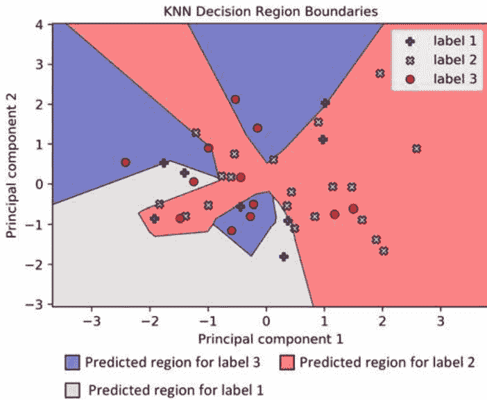
图 16.2 所提方法的性能

图 16.2 中的背景区域展示了 KNN 算法在训练过程中确定的决策边界，数据点表示测试集数据。可以注意到，与标签 1 和 3 相比，KNN 算法在预测标签 2 方面具有更好的效率；这种结果可能的一个原因是标签 2 的出现频率较高。标签 2 的出现频率最高，这意味着使用洗衣机的理想调度窗口长度为 2 小时是主导趋势；因此，算法可以以更高的准确性学习和预测这种趋势。

考虑到结果，可以得出结论，所提出的方法可用于预测住宅负荷调度问题的理想调度窗口长度。该方法的主要贡献在于利用机器学习算法学习任务开始时间、星期几和室外温度等因素与理想调度窗口长度之间的隐藏关系。尽管本研究仅报告了将所提出的方法应用于洗衣机作为高度使用的灵活家用电器的结果，但所提出的概念可以用于其他灵活电器，如烘干机、洗碗机等。所提出的方法可用于智能设备实时应用，智能设备可以向中央报告用户的启动命令。家庭能源管理系统。然后，使用历史数据训练的模型可以预测所需的调度窗口长度。预测的参数可以输入到最优负荷调度模型中，以确定考虑电力价格和运行约束条件下的最优操作间隔。最后，可以向智能家电发送开/关命令，在定义的时间间隔内完成其操作周期。因此，所提出的方法可以通过减少在调度过程开始时需要提供给该系统的数据量，使家庭能源管理系统的实施和运行在住宅领域中更加简化和非侵入性。

尽管所提出的方法在预测调度窗口长度方面具有有效性，但仍需妥善解决一些挑战，以使该方法适用于实际系统。在每次家电操作后，应动态更新训练集，记录居民生活方式的任何变化。可以在特定时间间隔内重新训练模型，并使用更新的训练集使训练模型保持更新。然而，将新观测结果包含在训练集中可能会引发另一个问题，例如预测准确性的降低。如果居民的生活方式发生变化，训练集的一些数据将与居民先前的偏好相关，而更新的数据将代表当前的生活方式。因此，如果将整个训练集输入模型，输入和输出之间的关系将变得薄弱，从而降低了预测的准确性。因此，在向训练集添加新观测结果时，可能需要删除一些历史数据以提高预测的准确性。

此外，未来的研究可能会确定影响其他灵活家电（如洗碗机、烘干机等）调度窗口长度的重要因素。此外，还可以研究提取所需调度窗口的可能方法，以标记输入数据。未来可以研究可穿戴设备在提供全面数据集以实施该方法方面的应用。如今，可穿戴设备（如智能手表）被人们广泛使用。除了这些设备的健康应用外，它们还可以提供有关居民生活方式和位置的数据，这些数据可以用于识别居民的偏好，除了智能家电和安装在房屋中用于监测温度、湿度等的固定传感器提供的数据。如果选择相关特征并用于训练机器学习算法，考虑更多特征并增加输入数据集的维度可以提高准确性。

## 16.5 结论

本研究提出了一种预测所需调度窗口长度的方法，用于灵活智能家电。智能家电可以收集能耗数据，并从外部来源（如家庭能源管理系统）接收开/关命令。该方法在数据集上进行了实验，以预测住宅楼中洗衣机的所需调度窗口。任务的开始时间、星期几和温度被引入到学习和预测所需调度窗口长度的特征中。在标记数据上实施了三种机器学习算法，ANN、RF 和 SVM，以分析预测的准确性。

结果表明，KNN 在预测长度为 1、2 和 3 小时的所需调度窗口时表现优于其他算法，准确率达到 77.6%。虽然存在长度超过 3 小时的调度窗口，但其发生频率较低。因此，它们不能代表使用洗衣机的常见趋势，也无法预测。结果表明，可以预测灵活家电的所需调度窗口，从而减少住宅部门使用家庭能源管理系统的难度。将该方法纳入家庭能源管理系统中，将消除用户在调度过程开始时更新每个灵活家电调度窗口的需求。未来的研究可以从三个方向进行：(1) 引入和包括除本研究中提到的重要因素以外的其他因素，提高预测的准确性；(2) 在完整的灵活负载和插电式混合动力车充电器上实施该方法，并分析所有家电的预测结果；(3) 将该方法集成到住宅负荷调度算法中，使调度过程对用户的需求更少。

# 参考文献

1. S. Althaher, P. Mancarella, J. Mutale, 在动态定价和功率和舒适性约束下的家庭能源管理系统的自动需求响应。IEEE Trans. Smart Grid 6(4), 1874–1883 (2015)
2. B. Zhou et al., 智能家居能源管理系统：概念、配置和调度策略。Renew. Sust. Energ. Rev. 61, 30–40 (2016)
3. A. Anvari-Moghaddam, H. Monsef, A. Rahimi-Kian, 考虑节能和舒适生活方式的最佳智能家居能源管理。IEEE Trans. Smart Grid 6(1), 324–332 (2014)
4. F. Baig, A. Mahmood, N. Javaid, S. Razzaq, N. Khan, Z. Saleem, 用于监控和调度家用电器的智能家居能源管理系统使用 ZigBee。J. Basic Appl. Sci. Res 3(5), 880–891 (2013)
5. J. Han, C.-S. Choi, W.-K. Park, I. Lee, S.-H. Kim, 基于 ZigBee 和 PLC 的智能家居能源管理系统，包括可再生能源。IEEE Trans. Consum. Electron. 60(2), 198–202 (2014)
6. M. Daneshvar, M. Pesaran, B. Mohammadi-Ivatloo, 未来智能家居中的交易能源，在 The Energy Internet 中，由 W. Su, A. Q. Huang 编辑，(Woodhead Publishing, Sawston, 2019)，pp. 153–179
7. M.S. Ahmed, A. Mohamed, T. Khatib, H. Shareef, R.Z. Homod, J. Abd Ali, 实时最优调度控制器用于家庭能源管理系统，使用新的二进制回溯搜索算法。Energ. Buildings 138, 215–227 (2017)
8. A.-H.H. Mohsenian-Rad, A. Leon-Garcia, 在实时电力定价环境中具有价格预测的最佳住宅负荷控制。IEEE Trans. Smart Grid 1(2), 120–133 (2010)
9. E. Nazerfard, P. Rashidi, D.J. Cook, 发现活动模式的时间特征和关系，in Proceedings - IEEE International Conference on Data Mining, ICDM, (2010), pp. 1069–1075
10. A. Yassine, S. Singh, A. Alamri, 从智能家居大数据中挖掘人类活动模式，用于医疗保健应用。IEEE Access 99, 1 (2017)
11. S. Chen, F. Gao, X. Guan, T. Liu, Y. Che, Y. Liu, 基于负荷行为分析的住宅负荷调度方法，in 2014 IEEE International Conference on Automation Science and Engineering (CASE), (2014), pp. 954–959
12. S. Chen 等人，基于社交和运动行为认知的智能家居能源管理系统，2015 年 IEEE 智能电网通信国际会议 (SmartGridComm)，(2015)，页码 859–864
13. A. Moradzadeh, O. Sadeghian, K. Pourhossein, B. Mohammadi-Ivatloo, A. Anvari-Moghaddam, 通过主成分分析改进可持续能源发展的住宅负荷分解。可持续性 12(8), 3158 (2020)
14. M. Sadat-Mohammadi, M. Nazari-Heris, E. Nazerfard, M. Abedi, S. Asadi, H. Jebelli, 住宅负荷调度的智能方法。IET Gener. Transm. Distrib. 14(21), 4738 (2020)
15. S. Lee, D. Whaley, W. Saman, 澳大利亚低能耗房屋的电力需求概况。Energy Procedia 62(4), 91–100 (2014)
16. M.A. Nielsen, 神经网络和深度学习，vol 2018 (Determination Press, San Francisco, 2015)
17. S. Agatonovic-Kustrin, R. Beresford, 人工神经网络（ANN）建模的基本概念及其在制药研究中的应用。J. Pharm. Biomed. Anal. 22(5), 717–727 (2000)
18. G. Biau, E. Scornet, 一次随机森林导览。测试 25(2), 197–227 (2016)
19. J. Xia, P. Ghamisi, N. Yokoya, A. Iwasaki, 随机森林集成和扩展的多波段光谱图像分类。IEEE Trans. Geosci. Remote Sens. 56(1), 202–216 (2018)
20. S. Makonin, B. Ellert, I.V. Bajić, F. Popowich, 2012 年至 2014 年加拿大住宅的电力、水和天然气消耗。科学数据 3(1), 1–12 (2016)
21. S. Karamizadeh, S.M. Abdullah, A.A. Manaf, M. Zamani, A. Hooman, 主成分分析概述。信号与信息处理杂志 4(3B), 173 (2013)

# 第 17 章

Peyman Razmi 和 Mahdi Ghaemi Asl

## 17.1 引言

电力网是一个由电气元件组成的网络，用于供应、传输和利用电力，通常被称为世界上最大、最复杂的行业。电力系统的模型是一个为区域提供电力的网络，如住宅和工业区域。电力系统广泛分为发电机（供电）、输电系统（将电力从发电站传输到负载中心）和配电系统（向住宅和工业区域供电）。因此，这些部分的混合以系统和无缝地协同工作被称为电力网。工业、商业建筑、医院和住宅中也存在小型电力网。电能无法大量储存，因此应在发电时利用，因此发电机和负载之间应始终保持电气连接。这意味着电力系统的发电、输电和配电部分应以完全一致和安全的方式进行工作。为了维护系统的安全性和连续性，这些部分需要以最佳方式进行利用和操作。在这里，操作意味着监控、控制和协调电力系统的所有组件，这是一个严重受人力资源（操作员）和设备质量影响的任务。

但是对电力的需求不断增长和微电网等概念的出现增加了电力系统的复杂性和非线性，这反过来导致了传统的和不灵活的系统安全方法在许多执行点上变得无效。电力系统是一个动态系统，具有各种不同的工作条件和不确定性，这使得它容易出现各种问题。稳定性的质量是电力系统的主要问题之一。每个电力系统在中断后无法恢复到故障前的运行状态（或接近该状态）的系统被称为不稳定的电力系统。在这种情况下，互联的电力系统要么失去了集成并开始作为分段系统运行，要么无法将电能从发电机供应到消费点。显然，运行这样一个复杂的系统需要先进的研究和广泛开发的计算机程序和算法，用于规划、控制和保护周期，以技术上调查安全性以及电力发电和供应机制的经济可行性。除了稳定性，电力系统还存在许多其他不确定性，包括：

- 1. 系统中的变化：系统功能条件的变化：负载大小或电力系统输出的变化。
- 2. 电力系统中的故障：故障的类型、位置和时间无法预测。
- 3. 源于电力系统现今问题的不确定性，例如电力市场和解除管制问题。
- 4. 操作员对电力系统的控制、功能、管理和规划的不准确信息。

许多文章研究了机器学习在电力系统中的应用，并取得了非常理想的结果。本文的目的是回顾在电力系统框架内完成的机器学习工作，并表达机器学习在电力网络中的重要性和可能的作用。

## 17.2 控制主题研究

大多数致力于控制主题应用机器学习在电力系统中的研究侧重于电力系统稳定器（PSSs）模型、同步机（SM）控制、电力系统频率和柔性交流输电系统（FACTS）组件的控制。在此基础上，机器学习在处理电力系统不确定性方面的概念和应用可以分为四个主要类别，如表 17.1 所示。

表 17.1 电力系统中机器学习应用的四个主要类别

| 控制 | 检测 | 功能 | 优化 |
| :--- | :--- | :--- | :--- |
| PSS 设计 | 故障检测的确切位置 | 评估和稳定性 | 配电系统 |
| 同步机控制 AGC<br>控制 FACTS<br>元件控制 | 电力系统中故障检测类型<br>系统监控输电线路保护 | 负荷预测<br>状态估计<br>负荷分布 | 生产规划<br>可靠性<br>系统保护 |

随着自动电压调节器（AVRs）在 20 世纪 50 年代末的出现，将 AVRS 安装在发电机组上成为一种常规程序 [1]。遗憾的是，AVRs 的高性能导致了电力系统的不稳定性。大多数挑战与互联电力系统中的低频 fluctuation 有关，特别是在解除管制的模型中。小幅度和低频 fluctuation 通常会持续很长时间。通过在发电机组的励磁系统或/和调速系统中提供快速阻尼、额外的控制信号，可以增强系统的动态性能。作为最经济的阻尼控制器，PSS 已被广泛用于抑制低频 fluctuation 并改善系统的动态稳定性。PSS 通过向励磁系统添加补充信号来提供可靠的性能，以保持电力系统的稳定性 [1]。

近年来，人工神经网络控制器 (ANNCs) [2] 和模糊逻辑控制器 (FLCs) [3] 已被应用和研究作为 PSS。与其他传统控制方法相比，ANNCs 和 FLCs 是无模型控制器，即它们不需要对受控系统进行精确的数学设计。此外，与其他传统方法相比，它们的速度和强度是最重要的特点。由于这些控制器应用于模糊 PSS 的设计，控制器的规律和参与函数是独立调整的，导致设计过程繁琐且耗时。关于 ANNCs，它们具有学习和适应的能力，但它们的性能类似于一个“黑盒子”，很难理解网络的作用。研究表明，在系统扰动期间的适当运行与传统电力系统稳定器 (CPSS) 参数的正确选择有关。PSS 参数调整的困难是电力系统稳定性优化的挑战之一。当 ANN 经过充分训练后，可以将其用作 CPSS 的控制器。

电力系统中大多数人工神经网络 (ANN) 函数采用多层前馈神经网络。ANN 是实用工具，多年来用于复杂系统的识别和控制，因为它们具有非线性映射特性。为了实现最佳运行，ANN 应该适应各种工作环境来调整 CPSS 参数 [1]。学习策略导致在不同情况下典型的反向传播网络干扰。为了解决这个问题，引入了模块化 ANN 代替反向传播网络 [4]。该设计包括三个本地专家网络和一个独立门网络，每个网络都有三层。ANN 直接通过 CPSS 的输出和输入进行训练。模型结果验证了模块化 PSS 在抑制振荡和实现良好性能方面更加有效。为了改进神经自适应 PSS，研究了具有单个隐藏层的前馈神经网络 [5-7]。推荐的神经自适应 PSS 包括两个子网络：自适应神经识别器和自适应神经控制器，追踪了发电厂的动态特性，并抑制了低频振荡。这两个子网络通过反向传播方法在线模式下工作。

Abido 和 Abdel-Magid [8] 引用了一种创新的在线自适应调节 PSS 参数的方法，该方法采用径向基函数神经网络（RBFNN）。建议的 RBFN 在广泛的情况下运行，并根据实时机器负载情况进行在线调整 PSS 参数的校准。所提到的基于 RBFN 的 PSS 在不同的运行情况和系统参数变化下进行了研究。为了提高电力系统的暂态稳定性，[9] 提出了一种循环神经网络（RNN）稳定控制器。该建议的技术同时用于 AVR 和调速器。引入控制器的权重在线进行修改。对于励磁控制，第一个 RNN 的信号输出被添加到 PSS 的信号输出中。此外，为了获得调速器单元的稳定化信号，利用了第二个 RNN 的信号输出。为了提高阻尼性能，Ping 等人提出了一种概率 PSS，采用了单神经元模型 [10]。通过向 PSS 添加辅助自适应增益，可以记录系统运行条件的变化。在一篇类似的论文中，提出了自适应评论家和人工神经网络，用于规划实时数字信号处理器（DSP），以实现电力系统的最优宽域控制系统（WACS）[11]。

1964 年，模糊逻辑（FL）由洛特扎德开发，以关注工程问题中经常出现的不准确性和不确定性 [12]。在提到的方法中，FL 可以作为一种通用技术来整合知识、启发式或理论到控制器和决策者中 [1]。优点如下：（1）精确描述电力系统的功能限制；（2）模糊化的限制比传统限制更柔软 [13]。1979 年，FL 首次被提出来解决电力系统难题。

要制作经典控制器，必须线性化非线性系统。因此，控制规则是基于新设计确定的。这些类型的控制器用于监控系统。模糊逻辑控制器（FLCs）是非线性的，不需要受控设备模型，并且对设备参数的变化不敏感。参考文献 [14] 提出了一种基于自构建模糊神经网络（SCFNN）的静态同步串联控制（SSSC），用于减轻由在线配备的模糊神经网络（FNN）控制器和自适应学习率（ALR）以及自构建结构组成的互联电力网格中的区间 fluctuations。利用 Lyapunov 标准来获得自适应学习率。参考文献 [15] 提供了模糊粒子群优化的 PID 控制器（PSO-FPIDC），用作 CPSS，以提高低频 fluctuations 下发电机组的动态稳定性。参考文献 [16] 提出了一种自适应模糊滑模控制器（AFSMC），其中包含一个 PI 切换面，用于抑制电力系统 fluctuations。可以使用小波神经网络（WNN）和滑模作为监视单元来克服设计滑模控制器的复杂性，这些复杂性包括已知不确定性限制的猜测和控制努力中的抖动现象。在 [17] 中，作者提出了自适应模糊逻辑 PSS（AFLPSS）模型用于抑制电机电磁振荡并改善首摇同步稳定裕度。计划是安排一个多区 PID 形成和模糊逻辑可变增益，使抑制操作更加优化。Ramirez 和 Malik 引入了一个自调节的 FLPSS 来改善电网的阻尼波动 [18]。自调节 FLPSS 模型由一个简单的 FL 控制器组成，具有相当简单的结构和少量的调节参数，通过基本的控制算法实现。模糊调谐器用于非线性和在线调整简单 FL 控制器对其输入变量的反应性，从而间接改变相关输入隶属函数的相对敏感性。

在 [19] 中介绍了传统电力系统稳定器在单机无限母线电力系统中的调谐。作者利用蝙蝠算法（BA）和基于特征值的目标函数，优化了 CPSS 的时间和增益常数（极点和零点）。[20] 中介绍了单机无限母线系统（SMIB）中发电机的速度反馈，不包括 PSS。通过 PSO-CPSS 和采用基于 BA 的先进 CPSS，在各种运行环境下研究了电网方案。研究表明，PSO-CPSS 的反馈能够在不需要的情况下稳定电网。但是通过使用持续稳定时间而不是减少稳定时间，并应用 BA-CPSS 可以稳定整个电厂情况下的系统。通过使用性能指标来证明 BA-CPSS 的出色工作，与采用 PSO-CPSS 和包括 PSS 的电网相比，其值最小。应用 BA-CPSS 可以确保小信号稳定性，因为所有电机电磁模态特征值（对于 133 个电厂）都向左手边（LHS）的 s 平面下移动到 D 形区域。另一方面，通过使用 PSO-CPSS，只有九种电厂情况被确认为稳定。

在 [21] 中，提出了一种基于新的系统中心控制设备的智能电力系统稳定器。所提出的方法利用了两种算法的混合结构：第一种是基于神经网络（NN）的控制设备，具有特定的神经识别器；第二种是自适应控制设备，作为模型参考自适应控制器（MRAC）。利用识别器估计电网的非线性功能动态。当电网（装置）参数集发生变化时，MRAC 控制设备进行修改。所提出模型的显著独特性和优势在于控制器在功能和参数不确定性时相互补充，并在系统动态不稳定的情况下发展。工作 [22] 展示了基于控制设备改善智能邻里标志，以抑制电网中的低频 fluctuations。该控制设备是离线开发的，能够在广泛的电网运行场地中正常运行，使其能够管理电网的复杂、随机和时变特性。基于 NN 的统一识别消除了通过主要控制模型的精确设计的需求，从而实现了一种完全由数据驱动的方法。

一个统一的控制设备被传统的 PSS 和 AVR 所取代，用于调节发电机的终端电压并减少电力系统波动在 [23] 中被提出。这个出色的控制设备被称为在线训练的自回归小波神经网络控制器 (OTSRWNNC)。为了实现前述目的，同时减少了两个控制故障，并修改了 OTSRWNNC 的特性。由于所提到的控制设备具有很强的学习能力，它不需要一个用于估计监控电网动态的识别器。在 [24] 中，对具有实时闭环广域分散电力系统稳定器 (WD-PSSs) 的电网模型进行了研究。为了实现这个目的，实时广域测量信息被精炼和用于基于强化学习方法的稳定性因子的规划。当前广域测量系统的技术发展广域测量系统（WAMS）使得在构建电网控制设备时能够使用系统范围的信号。这些控制设备的主要目的是在严重干扰后维持电网的运行，并在之后减轻 fluctuations。

基于人工神经网络（ANN）的自适应神经模糊推理系统（ANFIS）方法在 [25] 中展示了基于 SSSC 的控制设备的瞬态稳定性增强的规划。提供的 ANFIS 控制设备将模糊控制设备的优点与快速反馈和 flexibility 特性的人工神经网络相结合。ANFIS 设计通过利用 SSSC 中模糊控制设备创建的数据库进行训练。实验证明，引入的 SSSC 控制设备在严重干扰期间显著提高了系统的电压质量。

最近，机器学习算法被认为是监控 SMs 的一种方法。[26] 中的作者引入了模糊逻辑函数来控制 SM 的速度。根据 SM 瞬态反馈和模糊逻辑的检查结果，模糊控制装置得到了改进。模糊控制装置根据速度误差及其变化产生了 SM 速度控制的参考电流矢量的变化。文献 [27] 中的作者对同步发电机 (SG) 的广泛实际范围、其复杂动力学、瞬态运行、非线性和变换单元形成进行了研究。因此，这种发电机不能精确地设计为线性设备；该研究提供了一种替代传统控制器 (CONVC) 的新型最优神经控制器。可以使用 AVR 和涡轮调速器的组合，通过利用多层感知器神经网络 (MLPN) 和径向基函数神经网络 (RBFNN) 来控制电网中的 SG。在过去几年中，磁性材料、半导体功率器件和控制理论的发展使得永磁同步电动机 (PMSM) 在运动控制应用中发挥了重要作用 [28]。它们具有卓越的特性，包括体积小、扭矩重量比大以及无转子损耗。此外，开发出的磁性材料的更高功率使得 PMSM 的应用范围更广 [29-32]。在参考文献 [28] 中，提出了一种采用自适应神经网络模型跟随速度控制器 (ANNMFC) 的 PMSM 驱动强速度控制方法。鲁棒速度控制装置是由反馈神经网络控制器 (NNC) 和在线训练的 NN 模型跟随控制器 (NNMFC) 组成，以提高驱动装置的动态运行。NNMFC 的输出被添加到 NN 速度控制装置的输出中，以抵消参考设计与 PMSM 驱动装置在负载中断和参数方面的输出差异。

## 17.3 检测和保护主题研究

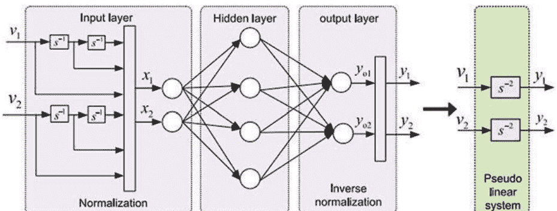

图 17.1 RBFNN 的拓扑结构

关于不确定性。在 [33] 中解释了一种用于 PMSM 在场向控制 (FOC) 方法中的速度控制装置。讨论了一种新的自适应神经控制设计，单个人工神经元目标表示启发式动态规划 (SANGRHDP)，用于 PMSM 的速度调整。在 [34] 中提出了一种智能速度控制装置，用于内部 PMSM，符合单个人工神经元。

参考文献 [35] 提出了一种新的解耦范式，用于无轴承 PMSM (BPMSM) 以获得快速响应和高精度性能。所提到的控制设计包括 NN 逆 (NNI) 技术和双自由度 (DOF) 内部设计控制装置。通过将 NNI 方案引入原始 BPMSM 结构，可以形成解耦的伪线性排列。

在 [36] 中，提出了一种基于反向传播神经网络逆 (BPNNI) 控制方案的新的内部模型控制 (IMC) 方法，以有效解耦 PMIWM。在 [37] 中，提出了一种新的非线性解耦监控方案，用于永磁轮毂电机 (PMIWM)，其中使用了径向基函数神经网络逆 (RBFNNI) 和状态反馈鲁棒极点配置 (RPP)。所提供的 NNI 配置在图 17.1 所示的 PMIWM 的左侧，从而产生了系统解耦的伪线性方案。NNI 控制方法能够增强鲁棒性并抵制干扰。

## 17.3 检测和保护主题研究

为了维持电力系统的效率和可靠性，无疑需要可靠和精确地识别和解决 TL 故障 [38]。此外，随着智能电网的显著增长，设计智能故障控制和诊断单元以分类和定位各种故障的重要性是不可争议的 [39]。在最近几年中，对 TL 和 DS 中的错误检测、分类和定位的方法进行了广泛研究。基于广义神经网络 (GNN) 的一种新方法提出了一种基于小波变换（WT）的故障定位评估方法 [38]。获得的特性被用作 GNN 设计的输入，以近似给定 TL 中的故障区域。将 GNN 方案得到的结果与 ANN 进行比较，从而建立更准确的数学模型 [40]。

先进的 TL 故障定位方法包括静态 WT（SWT），行列式函数特征（DFF），支持向量机（SVM）和支持向量回归（SVR），这些方法在 [41] 中进行了讨论。在一条 400 kV，361.297 km 的 TL 上，研究了不同区域的各种故障，如故障阻抗和故障起始角度 [41]。该系统仅使用单端测量。DFF 被用于从故障后 1/4 个周期的信号中分离特定故障特征，通过 SWT 基础上的滤波方法消除了逐渐减小的直流偏移。随后，利用从 DFF 获得的特征，准备了一个分类器（SVM）和一个回归（SVR）方法，用于 TL 上的故障区域。讨论的论文结果表明，无论故障阻抗如何，TL 上的故障区域都能够快速准确地被检测出来。参考文献 [42] 提出了一种基于 k 最近邻（k-NN）的方法，用于利用单端测量估计并行线路中各种故障的故障区域。

离散傅里叶变换（DFT）在所提到的工作中用于预分析信号。之后，将故障前一个周期和故障后一个周期的标准变化作为 k-NN 算法的输入。参考文献 [43] 提到了故障位置在智能电网和微电网背景下的重要性，可以通过这种新范式的所有能力进行研究。

该参考文献提出了一种多阶段技术，包括决策树（DT）和人工神经网络（ANNs）用于故障定位目的。文献 [44] 中的作者讨论了人工神经网络在故障定位中的重要性，并将其与其他软计算方法（如模糊逻辑技术、小波方法、支持向量机和其他传统方法）进行了比较。

在 [45] 中，通过采用一种新的机器学习算法：求和波极限学习机（SW-ELM），提出了一种统一的框架，结合了错误分类和定位，并在学习过程中引入了质量推导。另一个重要的主题需要进一步分析，即在传输和配电系统中对故障进行分类和检测。故障识别对于可靠和快速响应的保护继电器以及数字距离保护非常重要。电力系统故障的分类是提高电力质量和确保系统安全的初始步骤。因此，需要装备一种独特的方法来识别故障的类别。参考文献 [46] 提供了一种基于连续小波变换（CWT）和卷积神经网络（CNN）的故障馈线检测的独特简单高效的方法。同时，通过指导 CNN 对故障信号进行特征提取和故障馈线检测。在 [47] 中，讨论了利用经验模态分解（EMD）和支持向量机（SVM）对电网故障进行分类。EMD 被用于将传输线电压分解为固有模态函数（IMFs）。提出了一种多个 SVM 设计，用于对十种电力系统故障的状态进行分类。参考文献 [48] 介绍了一种利用离散小波变换（DWT）和支持向量机（SVM）进行识别的方法。

通过 TL 对故障进行分类。在故障信号范围内应用 DWT 来寻找高频分量。在本文中，模拟并形成了不同位置的传输线上的各种故障 (短路)。在 [49] 中，提出了一种在传输线中进行故障分类的优秀方法。在模拟的传输线系统上研究了十种不同类型的故障 (LAG、LBG、LCG、LABG、LBCG、LCAG、LAB、LBC、LCA 和 LABC) 作为正常状态。后故障电流信号被用于特征推导以进行进一步的研究。采用 EMD 方法将后故障电流信号分解为 IMFs。这些 IMFs 被用作基于智能故障分类方法的 ANN 的输入变量。参考文献 [50] 提出了一种基于 ANN 和模糊逻辑系统接口的光伏系统故障识别算法。考虑到在光伏系统故障检测算法中使用 ML 方法的示例数量较少，所述论文的主要重点是设计一个能够利用径向基函数 (RBF)、ANN 和 Mamdani 和 Sugeno 模糊逻辑系统接口来检测光伏系统可能故障的系统。

一种新的高压直流输电线路故障检测和分类方法，采用 K 最近邻算法，已在 [51] 中提出。在 [52] 中，通过一种新的方法利用非监督学习解决了监测学习的问题，即需要历史信息和无法准确分类进一步故障的问题，以便快速执行预测性维护活动。该方法通过使用高斯方法的密度逼近，对熟悉和陌生故障进行错误类型和预测。采用设计聚类和 K 均值算法的组合，并将其结果与实际情况的振动信息进行比较。在 [53] 中，提出了一种利用 WT 和 ANFIS 追踪短暂故障并对故障类型进行分类的新方法。它根据 WT 中的信号处理方法实现，利用从主馈线电流采样的数据收集故障信号的主要特征和动态特性。在 [40] 中，针对六相 TL，引入了一种基于 Haar-WT (HWT) 和 ANN 的故障分类方法，与相间故障相对立。参考文献 [54] 试图描述四种多小波包熵，以获取各种 TL 故障的特性，并采用 RBFNN 来检测和分类十种故障类型的输电线路。在 [55] 中，利用 DWT 从测量电压中提取瞬态数据。然后使用 SVM 分类器来检测故障部分和故障一半。此外，[56,57] 中的作者利用 DWT 提取的特征作为 SVM 的输入。[58,59] 中的作者应用主成分分析 (PCA) 来降低小波系数的维度，在将系数发送到 SVM 进行故障类型分类之前。

在 [60] 中，提出了一种基于 NN 的新型分类方法，以减少训练时间和 ANN 的维度。利用这种技术，可以获得高精度的故障分类。在提到的参考文献中，已将故障前和故障后的主要元素以及三相电流和电压的正序元素应用为 ANN 的输入。ANN 的输出是近似的故障区域。参考文献 [61] 提出了一种用于高速继电保护的新型故障分类方法最小 RBFNN。这种新颖的方法明显减少了训练时间，并提供了选择隐藏层神经元数量的系统框架。此外，最小径向基函数网络即使在故障线路中存在高故障阻抗的情况下，也能提供准确的故障类型分类。在 [62] 中提出的方法是 DWT 和概率神经网络 (PNN) 的预处理块的组合。DWT 作为输入电流信号中不同特征的提取器，这些特征在源端累积。然后将数据输入 PNN 进行故障分类。分析电力变压器中可能和隐蔽的故障是确保稳定供电给客户的手段 [63]。

支持向量机 (SVM) 是一种基于统计学习理论的现代机器学习方法，它是克服非线性、样本量小和高维度挑战的强大机制。选择 SVM 的特征对 SVM 的分类准确性有显著影响。在 [63] 中，采用遗传算法 (GA) 选择 SVM 的适当自由特征，应用于电力变压器的故障分析。实证结果表明，SVMG 方法能够比国际电工委员会 (IEC) 的三个比率、普通 SVM 排列器和人工神经网络 (ANN) 获得更高的诊断精度。[64] 提出了一种优秀的故障分类方法，用于电力变压器溶解气体分析 (DGA)，处理高度适应性或受噪声干扰的信息。引导重采样和遗传编程 (GP) 被应用于提高电力变压器 DGA 的解释精度。引导重采样预处理用于粗略调整各种故障类别的样本数量，以提高后续使用 GP 进行故障分类的准确性。GP 被用于根据收集到的气体信息为每个类别建立分类特征。从 GP 中提取的特征然后被应用于 ANN、SVM 和 K 最近邻 (KNN) 排列器的输入，用于故障分类。将混合 GP-ANN、GP-SVM 和 GP-KNN 排列器的分类准确性与 ANN、SVM 和 KNN 排列器的分类准确性进行顺序比较 [65]。提出了一种基于 SVM 的新型差动保护设计，能够有效区分电力变压器内部故障和其他干扰，如不同类型的过励磁和开机潮流状态。特征提取采用小波变换 (WT) 完成，将其作为 SVM 分类器的输入。

在 [66] 中提出了一种基于相关向量机 (RVM) 的变压器故障诊断新方法。在独特的算法中，实现了贝叶斯估计器对 SVM 的应用，使得故障分析系统的性能更加高效。在论文 [66] 中，提出了一种诊断范式，其中 RVM 的解具有稀疏性特征，并且在有限样本下能够实现全局解。结果表明，与反向传播 (BP) 神经网络和常规 SVM 模型相比，这种方法在诊断时间和精度方面具有明显的优势。参考文献 [67] 提出了一种利用人工神经网络 (ANN) 保护输电线路的故障方向分离器。该分离器利用不同的特征进行决策，并倾向于模仿传统的模式分类挑战。在参考文献 [67] 中给出了一个边界方程。

通过训练和使用适当的学习算法，将分类解释嵌入到多层前馈神经网络 (MFNN) 中。分离器利用线电压和线电流的即时值进行决策。基于人工神经网络 (ANN) 的分离器操作的结果在 [67] 中说明，它快速、强大且精确。参考文献 [68] 提供了一种利用人工神经网络 (ANNs) 和 WT 进行风力涡轮机状态监测的异常检测方法。在这种方法中，应用非线性自回归神经网络来评估齿轮箱的温度信号。

作者在 [69] 中提出了一种基于人工神经网络的方法，用于在线控制电网中的电压稳定裕度 (VSM)。在参考文献 [70] 中，基于人工神经网络的方法被修改以快速近似长期 VSM。该工作中的实验表明，相角和节点电压幅值是最优的 VSM 预测系统。此外，该文章还说明了所提出的基于人工神经网络的方法能够有效评估正常情况下和 N-1 事故情况下的 VSM。用于保护输电线路的距离继电器通常基于设定值进行规划 [71]。这些继电器的操作将受到网络情况的任何变化的影响。将模式判别器应用于电力系统诊断能够在保护领域取得重大改进。文献 [71] 说明了将人工神经网络用作距离继电器操作的模型判别器的应用。该方法使用三相电压和电流矢量的幅值作为输入。在参考文献 [72] 中，作者讨论了改进数字电力变压器保护的潜在方法。电力变压器中的开机潮流正在成为现有数字保护中的不可靠因素。已经实施了一种人工神经网络来检测开机潮流。除非进行适当的尺寸设计，保护电流互感器 (CT) 的饱和无法完全消除。已经利用人工神经网络重构了由于饱和而变形的二次 CT 电流。

在每种情况下，一个人工神经网络已经被提供在保护方案中作为现有设计的发展，从而增强了保护系统的可靠性。

## 17.4 功能和保护主题研究

电力对于国家经济的增长具有重要价值。因此，电力服务试图在发电和消费之间保持平衡，以提供满意的服务并以合理的价格提供。因此，这些服务需要最精确的电力负荷预测水平。由于电力负荷受到诸多因素的影响 (如星期几、年份等)，负荷预测变得非常复杂，需要超过统计方法的东西。在 [72] 中，作者提供了一个基于人工神经网络的负荷预测结构范例，用于短期负荷预测 (STLF)。参考文献 [72] 展示了重要的结果以及一个简单而高效的设计。在 [73] 中，作者提供了一个由 SVR、RBFNN 组成的混合方案和双重扩展卡尔曼滤波器 (DEKF) 用于创建一种短期负荷预测方法 (SVR-DEKF-RBFNN)。在所提出的设计中，首先应用 SVR 方法来确定 RBFNN 的形式和主要特征。初始化后，使用 DEKF 作为学习方法来提升 RBFNN 的特征。最后，应用优化后的 RBFNN 方法来预测短期负荷。在 [74] 中，作者通过使用自适应人工神经网络来解决预测每小时负荷需求的问题。在 ANN 的训练阶段使用 PSO 算法来调整网络的权重。

在参考文献 [75] 中，提出了使用遗传算法的循环支持向量机 (RSVMG) 来预测电力负荷。此外，遗传算法被应用于识别 SVM 的自由特性。参考文献 [75] 中的实验结果表明，RSVMG 范式为电力系统中的负荷预测提供了一个有前途的选择。图 17.2 展示了所提出的 SVMG 设计的结构。应用遗传算法来寻找 SVM 中三个参数的更好组合，以提供较小的平均绝对百分比误差 (MAPE)。参考文献 [76] 中提出了一种将 WT、自适应遗传算法和模糊系统与 GNN 相结合的模型，用于预测短期工作日电力负荷。在 [77] 中，提出了一种新的混合发展模糊设计与特征进展。考虑到确定模糊规则和权重的最优值是一项非常复杂的工作，优化过程由一种名为群体进化策略 (GES) 的生物启发式优化器进行，该优化器是进化策略和贪婪随机自适应搜索过程 (GRASP) 两种启发式方法的混合体。利用从文献中获得的电力服务的有效信息来证明所提出的方法。在参考文献 [78] 中，V. L. Paucar 利用经过第二阶 Levenberg/Marquardt 设计训练的多层感知器神经网络来计算功率潮流 (PF) 问题的电压幅值和相角，因为其速度优异。

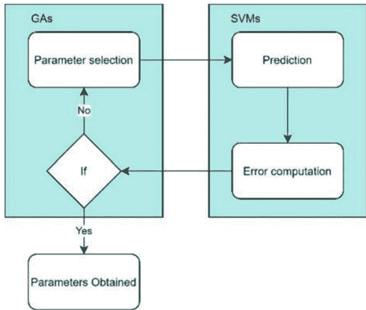

图 17.2 SVMG 模型的架构

人工神经网络相对于传统的功率因数方法，通过应用 IEEE-30 母线系统，已经成功地测试了讨论的人工神经网络过程。

Arnagiriet 在 [79] 中提出了一种应用人工神经网络来识别径向配电系统中的母线电压的方法，而无需执行负荷 - 流算法。

参考文献 [80, 81] 提出了一种令人满意的新方法，通过使用标准反向传播方法来训练神经网络，以进行随机负荷 - 流分析。在 [82] 中，Karami 和 Mohammadi 提出了一种处理电力系统负荷 - 流问题的方法，该方法利用了具有快速混合训练设计的径向基函数神经网络。因此，他们使用径向基函数神经网络来解决负荷 - 流问题中的函数逼近问题。状态估计 (SE) 是整个输电网络的监测和控制的必要部分。它主要用于可靠地近似系统电压。状态估计器的数据流向网络中的控制中心和数据库服务器 [83]。[84] 中的作者提出了一种基于人工神经网络的电力系统网络拓扑识别和静态状态估计的新方法。在所提到的参考文献中，状态估计器设计利用了网络拓扑的动态变化和错误数据处理。[85] 中通过分析径向基函数神经网络在 IEEE 14 母线系统上的适用性来检验状态估计器的性能，并将所提出的估计器与传统的加权最小二乘 (WLS) 状态估计器进行了时间、准确性和鲁棒性方面的比较。参考文献 [86] 提出了一种用于确定拓扑结构、识别错误数据和进行状态估计的模糊聚类和模式匹配方法。在这种方法中，根据获得的模拟测量向量 (遥测数据) 生成模糊模式向量 (FPV)。通过比较模拟测量数据和 FPV 之间的差异，确定拓扑结构和粗大误差。利用 FPV 可以直接作为状态估计的有效数据测量来确定和修正测量数据中的粗大误差和拓扑错误。

电压稳定性是规划和控制电力系统时应考虑的关键因素，以避免电压崩溃和部分或全系统停电。研究电压崩溃事件可以找到避免其发生的方法 [87]。[88] 中的作者提出了一种用混合人工神经网络 (由多层感知器和 Kohonen 神经网络组成) 监测电力系统电压不确定性的方法。在这种方法中，Kohonen 网络用于对系统运行状态进行分类;Kohonen 产生的模式被用作训练多层感知器以确定对系统安全构成威胁的警报状态 [88]。[69] 中的作者研究了实时系统监测模型的性能，可以在电网电压崩溃发生之前及时发出警报。在这篇论文中，区分了各种线路电压稳定性指标 (LVSI)，以确定它们在电网中找到最薄弱线路的能力。建议的实时电压稳定性监测是通过应用人工神经网络 (ANN) 实现的。[89] 中的作者修改了基于 ANN 的方法，以快速评估长期 VSM。[89] 中的讨论表明，相角和节点电压幅值是确定 VSM 的最有效估计量。此外，该论文指出提出的基于人工神经网络的方法能够在正常运行和 N-1 事故情况下令 VSM 得到满意的评估。在 [90] 中，作者提供了一种支持向量机回归网络，用于评估正常情况和事故情况下的电压稳定性。支持向量机从系统中的所有母线接收实功和无功功率，并提供负载裕度。最终，将所提方法的结果与神经网络、ELM、在线顺序 ELM 和极限支持向量机回归模型进行比较。

## 17.5 优化和保护主题研究

随着计算和优化理论的进步，电力系统优化得到了发展 [91]。最优潮流（OPF）是一种用于监控发电 - 消费的优化方法，旨在优化确定性目标，即降低发电成本或系统功率损耗。许多研究通过应用人工智能和机器学习算法来解决 OPF 问题 [92]。在 [93] 中，利用两种神经元传递函数来考察所提方法在考虑 OPF 时的鲁棒性和准确性。Nguyen 在 [93] 中修改了执行基于牛顿 - 拉夫逊的 OPF 计算的神经网络，以减少实功损耗。Hartati 和 El-Hawary 提出了一种应用改进的 Hopfield 神经网络来解决 OPF 问题，目标是增加燃料成本 [94]。参考文献 [95] 提出了一种基于拉格朗日乘子的人工神经网络方法，用于处理经济负荷 - 潮流问题，并通过应用动量技术提高收敛速度。

在 [96] 中，提出了一种解决经济功率分配问题（EPDP）的新方法，该方法使用了 Hopfield 神经网络和分段二次成本函数。在 [97] 中，作者提出了一种改进的 Hopfield 神经网络（IHNN）来解决经济分派问题（EDP）。所提出的 IHNN 方法具有快速收敛性，并有效地移动到可能的平衡点。在 [98] 中，提出了一种基于二次规划（QP）和增广拉格朗日 Hopfield 网络（ALHN）的方法，用于通过分段二次成本函数和禁止位置解决 EDP。在提到的方法中，首先使用 QP 模型来识别每个单元的燃料成本曲线并设置 ALHN 模型的初始参数；然后，应用启发式搜索修复禁止位置违规，并最终使用 ALHN 方法解决问题，如果有任何违规被识别。

在 [99] 中提出了一种用于控制电网动态安全的自动学习结构。所提出的方法使用 RBFNN 来确定电网的动态安全条件，并评估在发生故障时采取的纠正控制措施的影响。PSO 用于检测最佳控制措施，其中 RBFNN 提供优化的目标函数。在 [100] 中，提出了一种新颖的动态安全评估和发电重调度方法，应用了将 GAs 与 PNNs 和 ANFISs 结合起来，用于在发生瞬时故障时对大型电网进行预防性控制。在提到的方法中，PNNs 以实际方式应用于在评估和控制过程中精确测量安全区域。在预防性控制过程中，使用 GA 进行安全限制的发电重调度，以改善发电转移或燃料成本的数量。

参考文献 [100] 中的作者提出了基于决策树的预防/纠正控制（PCC）方法，以提高电网对可能和意外情况导致的瞬时中断的动态安全性。PCCs，即基于安全区域和边界的发电重调度和负荷减少模型，得到了改进。这两种 PCC 可以在适当的决策变量空间中计算。安全区域和边界是根据决策树的规律来确定的，这些规律受到生成的知识原则的修正。参考文献 [101] 提出了一种利用 Hopfield 神经网络进行安全约束的实功率纠正重调度的新方法。最小化实功率发电和电力系统母线负荷的差异，形成了优化的目标函数。

为了减少分布式电源系统中的能量损耗，参考文献 [102] 演示了一种方法。这与启发式方法（即分支交换方法和模糊逻辑方法）相一致。该算法将负荷视为模糊数，并更好地处理分布式电源系统中电力需求的不稳定性。参考文献 [103] 提出了一种用于调整分布式电源系统（DGS）供电的配电系统电压的计算框架。其目的是通过将传统的非线性规划算法与自适应局部学习算法（LLA）相结合，确定最优调节问题的有效解决方案。

该方法的解释是，LLA 能够根据有限数量的历史观察快速学习。

参考文献 [104] 提出了一种将前馈神经网络和模拟退火方法相结合解决电力系统中单位组合优化问题的方法。ANN 被应用于根据每个单元的状态在其时间间隔内识别离散变量。模拟退火方法根据每个单元的输出功率和生产成本生成连续变量。

[104] 的结果证明，所提出的方法能够在较短的计算时间内处理单位组合问题，并得到最优的发电计划。H. Sasaki[105] 研究了在电力系统中使用 Hopfield 神经网络解决组合优化问题，特别是单位组合问题的可行性。专用神经网络可以处理单位组合中的许多不等式约束。

监测精度和速度是固定步长扰动观察（P&O）最大功率点跟踪（MPPT）方法的主要参数。论文 [106] 提出了一种基于光伏系统的运行和成本之间平衡的新方法。干扰步长根据局部辐照度信息在离线状态下被识别出来。利用历史辐照度信息，SVM 被用于自动分类沙漠或沿海地区。信息。为了实现更好的系统运行而修改干扰步长，而不增加控制复杂性。评估太阳能和热传输机制的效率需要大量的时间、财务成本和人力资源。同时，直接预测这些机制的效率是一项艰巨的任务，因为它们涉及复杂的内部设计。幸运的是，基于知识的机器学习方法能够为能源网络的效率提供一个有希望的预测和改进过程。在参考文献 [107] 中，作者们说明了他们如何应用机器学习方法来训练一个庞大的实验数据库，以实现对太阳能热水器（SWH）模型的精确预测。

在 [107] 中提出了一种基于高通量筛选（HTS）程序的新型能源系统改进方法。所提到的论文的结构是由以下几部分组成：（1）对各种机器学习方法（ANN、SVM 和 ELM）进行比较研究，以预测太阳能热水器的效率；（2）开发基于 ANN 的程序，支持快速预测；（3）解释计算 HTS 方法以规划高效太阳能热水器模型。在 [108] 中，作者研究了在智能电网背景下应用深度强化学习（DRL）的优势，这是一种将强化学习（RL）与深度学习（DL）结合起来的混合方法，用于执行建筑能源管理系统的在线优化。通过应用深度 Q 学习和深度策略梯度两种方法，对学习过程进行了研究；这两种方法都被扩展以同时完成多个动作。在参考文献 [109] 中，提出了改进的鸡群优化算法支持向量机（ICSO-SVM）设计，用于风力发电预测。就传统的鸡群优化方法（CSO）而言，它在处理高维问题时通常会陷入局部最优。因此，对 CSO 方法进行了修改，并提出了 ICSO 技术。论文 [110] 提出了一种改进的非支配排序遗传算法 II（NSGA-II）方法，包括一种无参数自适应调节强化学习方法（NSGA-RL），以处理具有多个目标的环境和 EDP。

## 17.6 结论

在本章中，讨论了解决最近电力网络的发电、输电和配电等领域的及时问题的广泛机器学习方法。安全评估、控制、EDP、PF 计算、预测、恢复、厂站监控、变压器建设、故障传输线问题和归纳推理问题等方面介绍了人工神经网络、核回归、决策树、模糊网络和遗传算法的范围。在每个实例中，机器学习方法的应用都展示了它们在处理复杂的电力网络运营、设计和建设问题方面的有效性。所讨论的应用展示了电力网络应用研究的蓬勃活动，如相关出版物的数量之多所示。总之，机器学习方法在电力系统问题的解决中发挥了重要作用。

# 17 种机器学习方法在实际电力系统和电力市场中的应用

# 参考文献

- 1. M.S. Eslami，人工智能技术在 PSS 设计中的应用：现有方法的综述。Przegld Elektrotechniczny(电气评论) 87(4)，188-197 (2011)
- 2. R.S. Segal，基于人工神经网络的自适应调节电力系统稳定器。Int. J. Electr. Power Energy Syst. 26(6), 423-430 (2004)
- 3. S. Pillutla，基于模块化神经网络架构的电力系统稳定化。Int. J. Electr. Power Energy Syst. 19(6), 411-418 (1997)
- 4. N. Hosseinzadeh, A. Kalam，一种分层神经网络自适应电力系统稳定器。Int. J. Electr. Power Energy Syst. 19, 28-33 (1999)
- 5. P. Shamsollahi，使用动态反向传播方法设计神经自适应电力系统稳定器。Int. J. Electr. Power Energy Syst 22, 29-34 (2000)
- 6. P. Shamsollahi，使用在线训练的神经网络的自适应电力系统稳定器。IEEE Trans Energy Convers. 12, 382-387 (1997)
- 7. M.A.-M. Abido，使用径向基函数网络自适应调节电力系统稳定器。电力系统研究。49, 21-29 (1999)
- 8. T. Senjyu，用于自动电压调节器和调速器的循环神经网络辅助稳定控制器。电力组件系统。31, 693-707 (2003)
- 9. H.K. Ping，使用单神经元模型改进概率 PSS 的研究。Int. J. Electr. Power Energy Syst. 29 (3)，217-221 (2007)
- 10. S. Ray，基于广域测量的神经控制发电励磁系统。工程应用人工智能。22(3)，473-481 (2009)
- 11. L.A. Zadeh，模糊集。信息与控制。8(3)，338-353 (1956)
- 12. S. Pal, D. Mandal，模糊逻辑和近似推理：一个概述。IETE J. Res. 37, 548-559 (1991)
- 13. A.R. Tavakoli, A.R. Seifi, M.M. Arefi，设计自构建模糊神经网络控制器以抑制电力系统振荡。Fuzzy Sets Syst. 356, 63-76 (2019)
- 14. K. Eltag, M.S. Aslamx, R. Ullah，使用模糊 PID 控制 Technology 增强动态稳定性。Int. J. Control. Autom. Syst. 17(1), 234-242 (2019)
- 15. M. Farahani, S. Ganjefar，使用自适应模糊滑模控制器设计智能电力系统稳定器。神经计算 226, 135-144 (2017)
- 16. T.T. Lie，自适应模糊逻辑电力系统稳定器。电力系统研究。38(1), 75-81 (1996)
- 17. M. Ramirez-Gonzalez，基于简单模糊逻辑的自适应电力系统稳定器。电力组件系统。38(4), 407-423 (2010)
- 18. D.K. Sambariya, R. Prasad，基于元启发式蝙蝠算法的电力系统稳定器鲁棒调谐，用于小信号稳定性增强。国际电力与能源系统杂志。61, 229-238 (2014)
- 19. H.M. Soliman, E.H.E. Bayoumi, M.F. Hassan，用于最小超调和控制约束的电力系统稳定器设计，使用群体优化。电力组件系统。37(1), 111-126 (2008)
- 20. S. Kamalasadan, G.D. Swann, R. Yousefian，基于自适应神经网络的新型系统中心智能自适应功率系统稳定器控制架构。IEEE Syst. J. 8(4), 1074-1085 (2014)
- 21. D. Molina, G.K. Venayagamoorthy, J. Liang, R.G. Harley，基于虚拟发电机和近似动态规划的智能局部区域信号阻尼功率系统振荡。IEEE Trans. Smart Grid 4(1), 498-508 (2013)
- 22. M. Farahani，一种多目标功率系统稳定器。IEEE Trans. Power Syst. 28(3), 2700–2707 (2013)
- 23. R. Hadidi, B. Jeyasurya，基于强化学习的实时广域稳定控制智能代理以增强电力系统稳定性。IEEE Trans. Smart Grid 4(1), 489–497 (2013)
- 24. S.R. Khuntia, S. Panda，ANFIS 方法用于改善暂态稳定性性能的 SSSC 控制器设计。Math. Comput. Model. 57(1), 289–300 (2013)
- 25. A.G. Aissaoui, M. Abid, H. Abid, A. Tahour, A.K. Zeblah，一种模糊逻辑控制器用于同步机。J. Electr. Eng. Bratislava 58(5), 285 (2007)
- 26. J.W. Park, R.G. Harley, G.K. Venayagamoorthy，基于 MLP/RBF 神经网络的同步发电机电力系统自适应神经控制。IEEE Trans. Ind. Appl. 39(5), 1529–1540 (2003)
- 27. F.M.E.S. Fayez，面向基于 DSP 的 PMSM 驱动系统的鲁棒自适应小波神经网络滑模速度控制。J Power Electr (JPE) 10(5), 505-517 (2010)
- 28. K.C. Yu, S.P. Hsu, Y.H. Hung，永磁同步电机模糊控制器的优化。J. Appl. Sci. 7(19), 2725-2735 (2007)
- 29. E. Cetin, U. Oguz, H.S. Hasan，用于永磁同步电机驱动的神经模糊控制器。Expert Syst. Appl. 34(1), 657-664 (2008)
- 30. J. Faiz, A. Azami, A. Keyhani, A. Proca，永磁同步电机闭环控制稳定性。Int. J. Electr. Power Energy Syst. 19(5), 331-337 (1997)
- 31. K. Murat, I.E. Hasan，永磁同步电机速度和电流调节的非线性和自适应反步控制。Math. Comput. Model. 53(9-10), 2015-2030 (2011)
- 32. Q. Wang, H. Yu, M. Wang, X. Qi，一种新的自适应神经控制方法用于永磁同步电机速度控制。能源 11(9), 2355 (2018)
- 33. C.B. Butt, M.A. Rahman，未经训练的人工神经元速度控制方法用于内置永磁电机驱动在扩展操作速度范围内。IEEE Trans. Ind. Appl. 49(3), 1146–1153 (2013)
- 34. X. Sun, L. Chen, H. Jiang, Z. Yang, J. Chen, W. Zhang，使用神经网络逆向方案加内模控制器的无轴承永磁同步电机高性能控制。IEEE Trans. Ind. Electron. 63(6), 3479–3488 (2016)
- 35. Y. Li, B. Zhang, X. Xu，基于反向传播神经网络逆系统的内模控制的永磁轮毂电机解耦控制。Bull. Pol. Acad. Sci. Tech. Sci. 66(6), 961 (2018)
- 36. Y. Li, B. Li, X. Xu, X. Sun，一种基于 RBFNNI 的非线性解耦控制方法，用于永磁轮毂电机的鲁棒极点配置。IEEE Access 6, 1844–1854 (2018)
- 37. Z. Frijet, A. Zribi, M. Chtourou，自适应神经网络内模控制用于 PMSM 速度调节。J. Electr. Syst. 14(2), 118–126 (2018)
- 38. K. Chen, C. Huang, J. He，输电线路和配电系统的故障检测、分类和定位方法综述。High Volt. 1(1), 25–33 (2016)
- 39. A.A. Yusuff, A.A. Jimoh, J.L. Munda，基于稳态小波变换、行列式函数特征和支持向量回归的输电线路故障定位。Electr. Power Syst. Res. 110, 73–83 (2014)
- 40. Z. Liu, Z. Han, Y. Zhang, Q. Zhang，多小波包熵及其在传输线故障识别和分类中的应用。IEEE Trans. Neural Netw. Learn. Syst. 25(11), 2043–2052 (2014)
- 41. A. Swetapadma, A. Yadav，一种新颖的基于 k 最近邻算法的并联输电线路单端故障定位方案。Comput. Electr. Eng. 69, 41–53 (2018)
- 42. A.L. da Silva Pessoa, M. Oleskovicz, P.E.T. Martins，一种用于径向配电系统故障定位的多阶段方法，in 2018 18th International Conference on Harmonics and Quality of Power (ICHQP) (IEEE, 2018), pp. 1–6
- 43. A. Prasad, J.B. Edward，人工神经网络在输电系统故障定位中的重要性调查，2017 年第 11 届智能系统与控制国际会议 (ISCO) (IEEE, 2017), pp. 357-362
- 44. Y.Q. Chen, O. Fink, G. Sansavini，综合故障定位和分类的电力传输线路故障诊断与集成特征提取。IEEE 工业电子学报。65(1), 561-569 (2018)
- 45. M.F. Guo, X.D. Zeng, D.Y. Chen, N.C. Yang，基于连续小波变换和卷积神经网络的谐振接地配电系统中基于深度学习的接地故障检测。IEEE 传感器学报。18(3), 1291-1300 (2018)
- 46. N.R. Babu, B.J. Mohan，使用 EMD 和 SVM 进行电力系统故障分类。Ain Shams Eng. J. 8(2), 103-111 (2017)
- 47. F.I. Lozada, F.L. Quilumba, F.E. Prez，使用小波变换和支持向量机进行输电线路故障检测和分类。Revista Tecnica Energia 14 (2018)
- 48. H. Malik, R. Sharma，基于 EMD 和 ANN 的智能故障诊断模型用于输电线路。J. Intell. Fuzzy Syst. 32(4), 3043-3050 (2017)
- 49. M. Dhimish, V. Holmes, B. Mehrdadi, M. Dales，比较 Mamdani Sugeno 模糊逻辑和 RBF ANN 网络用于光伏故障检测。Renew. Energy 117, 257-274 (2018)
- 50. J.M. Johnson, A. Yadav，使用 KNN 进行 HVDC 输电线路故障检测和分类技术，见 Information and Communication Technology for Sustainable Development, (Springer, Singapore, 2018), pp. 245-253
- 51. N. Amruthnath, T. Gupta，使用基于模型的聚类方法进行无监督学习中的故障分类预测，在 2018 年国际信息与计算技术会议 (ICICT) (IEEE, 2018), pp. 5-12
- 52. A. Khaleghi, M.O. Sadegh, M. Ghazizadeh-Ahsae, A.M. Rabori，基于小波变换和自适应神经模糊推理系统 (ANFIS) 的配电系统瞬态故障区域定位和故障分类。电气电子工程进展 16(2), 155-166 (2018)
- 53. R. Kumar, E. Koley, A. Yadav, A.S. Thoke，使用 Haar 小波和人工神经网络 (ANN) 对六相输电线路中的相对相故障进行故障分类，在 2014 年国际信号处理与集成网络会议 (SPIN) (IEEE, 2014), pp. 5-8
- 54. H. Livani, C.Y. Evrenosoglu，一种基于机器学习和小波的混合输电线路故障定位方法。IEEE Smart Grid 5(1), 51-59 (2014)
- 55. V. Malathi, N.S. Marimuthu, S. Baskar，使用支持向量机和极限学习机的智能方法用于输电线路保护。神经计算 73(10), 2160-2167 (2010)
- 56. S.R. Samantaray, P.K. Dash, G. Panda，使用支持向量机和径向基函数神经网络的输电线路距离继电。
- 57. J.A. Jiang, C.L. Chuang, Y.C. Wang, C.H. Hung, J.Y. Wang, C.H. Lee, Y.T. Hsiao，一种故障检测、分类和定位的混合框架。第一部分：概念、结构和方法论。IEEE Trans. Power Deliv. 26(3), 1988-1998 (2011)
- 58. J.-A. Jiang, C.-L. Chuang, Y.-C. Wang, C.-H. Hung, J.-Y. Wang, C.-H. Lee, Y.-T. Hsiao，一种用于故障检测、分类和定位的混合框架第二部分：实施和测试结果。IEEE Trans. Power Deliv. 26(3), 1999-2008 (2011)
- 59. M.T. Hagh, K. Razi, H. Taghizadeh，使用人工神经网络对电力传输线路进行故障分类和定位，在 IPEC 2007。国际电力工程会议 (IEEE, 2007), pp. 1109-1114
- 60. P.K. Dash, S.R. Samantaray，使用最小径向基函数神经网络的准确故障分类算法。Eng. Intell. Syst. 4, 205-210 (2004)
- 61. J. Upendar, C.P. Gupta, G.K. Singh，基于离散小波变换和概率神经网络的输电系统故障分类算法，INDICON 2008 年。IEEE 印度年会，第 1 卷 (IEEE, 2008), pp. 206-211
- 62. S.W. Fei, X.B. Zhang，基于遗传算法的支持向量机对电力变压器的故障诊断。Expert Syst. Appl. 36 (8), 1135-1142 (2009)
- 63. A. Shintemirov, W. Tang, Q.H. Wu，基于溶解气体分析的电力变压器故障分类，采用自助法和遗传编程。IEEE Trans. Syst. Man Cybernet. C Appl. Rev. **39** (1), 69–79 (2009)
- 64. A.M. Shah, B.R. Bhalja，使用基于支持向量机的保护方案区分变压器内部故障和其他干扰。IEEE Trans. Power Deliv. **28**(3), 1508–1515 (2013)
- 65. L. Liu, Z. Ding，基于改进相关向量机的电力变压器故障诊断建模分析。Math. Prob. Eng. **2013**, 636374 (2013)
- 66. T.S. Sidhu, H. Singh, M.S. Sachdev，基于人工神经网络的输电线路故障方向判别器的设计、实施和测试。IEEE Trans. Power Deliv. **10**(2), 697–706 (1995)
- 67. Y. Cui, P. Bangalore, L.B. Tjernberg，使用小波变换和人工神经网络的异常检测方法进行风力涡轮机'齿轮箱的状态监测，2018 Power Systems Computation Conference (PSCC) (IEEE, 2018), pp. 1–7
- 68. A.R. Bahmanyar, A. Karami，使用人工神经网络对电力系统电压稳定性进行监测，采用了一组减少的输入。国际电力能源系统杂志，58, 246-256 (2014)
- 69. D.Q. Zhou, U. D. Annakkage, A.D. Rajapakse，使用人工神经网络在线监测电压稳定裕度。IEEE 电力系统交易，**25** (3), 1566-1574 (2010)
- 70. D.V. Coury, D.C. Jorge，人工神经网络方法用于输电线路的距离保护。IEEE 电力传输，13 (1), 102-108 (1998)
- 71. J. Pihler, B. Grar, D. Dolinar，使用人工神经网络改进电力变压器保护的操作。IEEE Trans. Power Deliv. **12**(3), 1128–1136 (1997)
- 72. L. Hernandez, C. Baladrn, J.M. Aguiar, B. Carro, A.J. SanchezEsguevillas, J. Lloret，基于人工神经网络的微电网短期负荷预测。Energies **6**(3), 1385–1408 (2013)
- 73. C.N. Ko, C.M. Lee，使用基于 SVR(支持向量回归) 的径向基函数神经网络和双扩展卡尔曼 filter 进行短期负荷预测。能源 **49**, 413–422 (2013)
- 74. Z.A. Bashir, M.E. El-Hawary，应用小波到短期负荷预测中，使用基于 PSO 的神经网络。IEEE Trans. Power Syst. **24** (1), 20–27 (2009)
- 75. P.F. Pai, W.C. Hong，基于递归支持向量机和遗传算法的区域电力负荷预测。Electr. Power Syst. Res. **74** (3), 417–425 (2005)
- 76. D.K. Chaturvedi, A.P. Sinha, O.P. Malik，使用模糊逻辑和小波变换集成广义神经网络进行短期负荷预测。Int. J. Electr. Power Energy Syst. **67**, 230–237 (2015)
- 77. V.N. Coelho, I.M. Coelho, B.N. Coelho, A.J. Reis, R. Enayatifar, M.J. Souza, F.G. Guimaraes，一个自适应进化模糊模型用于智能电网环境下的负荷预测问题。Appl. Energy **169**, 567–584 (2016)
- 78. V.L. Paucar, M.J. Rider，人工神经网络用于解决电力系统功率流问题。Electr. Power Syst. Res. **62**(2), 139–144 (2002)
- 79. A. Arunagiri, B. Venkatesh, K. Ramasamy，人工神经网络方法 - 径向负荷流算法的应用。IEICE Electron. Express **3**(14), 353–360 (2006)
- 80. A. Jain, S.C. Tripathy, R. Balasubramanian, K. Grag, Y. Kawazoe，基于神经网络的随机负荷流分析，在 PowerCon 2004. 2004 International Conference on Power System Technology, 2004, vol. 2 (IEEE, 2004), pp. 1845–1850
- 81. A. Karami, M.S. Mohammadi，径向基函数神经网络用于电力系统负荷-flow。国际电力能源系统杂志 **30**(1), 60–66 (2008)
- 82. Y.F. Huang, S. Werner, J. Huang, N. Kashyap, V. Gupta，电力网中的状态估计：应对未来电网要求所带来的新挑战。IEEE Signal Process. Mag. **29**(5), 33–43 (2012)
- 83. D.V. Kumar, S.C. Srivastava, S. Shah, S. Mathur，利用人工神经网络进行拓扑处理和静态状态估计，在 IEE Proceedings-Generation, Transmission and Distribution, vol. 143, no. 1 (IET, 1996), pp. 99–105

## 17 种机器学习方法在实际电力系统和电力市场中的应用

84. D. Singh, J.P. Pandey, D.S. Chauhan, 径向基神经网络对电力网络的状态估计，在 2004 年 IEEE 国际电力公用事业解除管制、重组和电力技术会议 (DRPT 2004) 的论文集中，第 1 卷 (IEEE, 2004)，第 90–95 页

85. D. Singh, J.P. Pandey, D.S. Chauhan, 使用模糊模式匹配进行拓扑识别、坏数据处理和状态估计。IEEE Trans. Power Syst. 20(3), 1570–1579 (2005)

86. F. Larki, M. Joorabian, H.M. Kelk, M. Pishvaei, 使用 CPF 方法和模态分析评估伊朗 Khouzestan 电力系统的电压稳定性，在 2010 年亚洲 - 太平洋电力与能源工程会议 (APPEEC) 中 (IEEE, 2010)，第 1–5 页

87. A. Zhukov, N. Tomin, D. Sidorov, D. Panasetsky, V. Spirayev, 用于电力系统电压安全评估的混合人工神经网络，在 2015 年第 5 届国际青年能源会议 (IYCE) 中 (IEEE, 2015)，第 1–8 页

88. H.H. Goh, Q.S. Chua, S.W. Lee, B.C. Kok, K.C. Goh, K.T.K. Teo, 使用人工神经网络评估电力系统中的电压稳定性指标。工程学报 118, 1127–1136 (2015)

89. M.V. Suganyadevi, C.K. Babulal, S. Kalyani, 通过比较各种支持向量回归模型评估电压稳定裕度。软计算 20(2), 807–818 (2016)

90. M.B. Cain, R.P. Oneill, A. Castillo, 最优潮流和公式的历史 (美国联邦能源监管委员会，华盛顿特区，2012)

91. L. Gan, N. Li, U. Topcu, S.H. Low, 配电网络中的最优潮流，在第 52 届 IEEE 决策与控制会议上，2013 年 12 月

92. T.T. Nguyen, 神经网络最优潮流，在第四届国际电力系统控制、运行和管理会议上，1997 年，pp. 266–271

93. R.S. Hartati, M.E. El-Hawary, 使用改进的 Hopfield 神经网络的最优有功潮流解，在 2001 年加拿大电气和计算机工程会议上，vol. 1 (IEEE, 2001)，pp. 189–194

94. M. Mohatram, P. Tewari, N. Latanath, 2011 年 4 月，使用拉格朗日神经网络进行经济负荷调度，2011 年沙特国际电子、通信和光子学会议 (SIECPC) (IEEE, 2011)，第 1–7 页

95. J.H. Park, Y.S. Kim, I.K. Eom, K.Y. Lee, 使用 Hopfield 神经网络进行分段二次成本经济负荷分配。IEEE Trans. Power Syst. 8(3), 1030–1038 (1993)

96. S.S. Reddy, J.A. Momoh, 使用改进的 Hopfield 神经网络进行经济调度，2015 年北美电力研讨会 (NAPS) (IEEE, 芝加哥，2015)，第 1–5 页

97. V.N. Dieu, P. Schegner, 使用二次规划初始化的增广拉格朗日 Hopfield 网络进行具有分段二次成本函数和禁区的经济调度。Appl. Soft Comput. 13(1), 292–301 (2013)

98. E.M. Voumvoulakis, N.D. Hatziargyriou, 用于电力系统动态安全控制的粒子群优化方法。IEEE Trans. Power Syst. 25(2), 1032–1041 (2010)

99. C.F. Kucuktezcan, V.I. Genc, 一种基于神经网络工具的遗传算法集成的新型动态安全增强方法。Electr. Power Syst. Res. 83(1), 1–8 (2012)

100. I. Genc, R. Diao, V. Vittal, S. Kolluri, S. Mandal, 基于决策树的动态安全增强的预防和纠正控制应用。IEEE Trans. Power Syst. 25(3), 1611–1619 (2010)

101. S. Ghosh, B.H. Chowdhury, 使用 Hopfield 神经网络进行安全约束的实功率最优重调度。IEEE Trans. Power Syst. 11(4), 1743–1748 (1996)

102. G. Crtina, C. Bonciu, M. Musat, Z. Zisman, 模糊逻辑在配电网络中减少能量损耗的应用，在第 9 届地中海电气技术会议中，1998 年 (MELECON 98)，第 2 卷 (IEEE, 1998)，第 974–977 页

103. D. Villacci, G. Bontempi, A. Vaccaro, 一种用于分布式发电网络电压调节的自适应局部学习方法。IEEE Trans. Power Syst. 21(3), 1131–1140 (2006)

104. R. Nayak, J.D. Sharma, 一种用于机组组合问题的混合神经网络和模拟退火方法。Comput. Electr. Eng. 26(6), 461–477 (2000)

105. H. Sasaki, M. Watanabe, D. Kubokawa, N. Yorino, R. Yokoyama, 一种基于人工神经网络的机组组合解决方法。IEEE Trans. Power Syst. 7(3), 974–981 (1992)

106. K. Yan, Y. Du, Z. Ren, 基于太阳辐照数据分类的光伏电力系统 MPPT 扰动优化。IEEE Trans. Sustain. Energy 10, 514–521 (2018)

107. H. Li, Z. Liu, 一种基于知识的机器学习方法对太阳能热水器性能进行预测和优化，在 Power and Energy System Optimization 研究手册 (IGI Global, Hershey, 2018)，第 55–74 页

108. E. Mocanu, D.C. Mocanu, P.H. Nguyen, A. Liotta, M.E. Webber, M. Gibescu, J.G. Slootweg, 使用深度强化学习进行在线建筑能源优化。IEEE Trans. Smart Grid 10(4), 3698–3708 (2018)

109. C. Fu, G.Q. Li, K.P. Lin, H.J. Zhang, 基于改进的鸡算法优化支持向量机的短期风电功率预测。Sustainability 11(2), 512 (2019)

110. T.C. Bora, V.C. Mariani, L. dos Santos Coelho, 基于非支配排序遗传算法的环境经济调度的多目标优化与强化学习。Appl. Therm. Eng. 146, 688–700 (2019)

# 索引

## A

- 活动选择算法 (ASA), 275, 276, 281, 285
- 自适应模糊逻辑 PSS (AFLPSS), 361
- 自适应模糊滑模控制器 (AFSMC), 360
- 自适应学习率 (ALRs), 360
- 自适应神经网络模型跟随速度控制器 (ANNMFC), 362
- 自适应神经模糊推理系统 (ANFIS), 29, 362
- CSI, 328–338, 340
- DSO, 324, 325
- 卡尔曼预测机，327
- LMPs (见定位边际价格 (LMPs))
- LPF (见负荷和价格预测 (LPF))
- MAPE, 322–324
- 和 MLP, 322
- 在线最优拓扑预测过程，328
- 最优拓扑，324, 327
- 分解信号的重构，327
- 拓扑预测过程，324
- WT, 325, 326
- 先进的计量基础设施 (AMIs), 265, 266, 283
- 空调，346
- 空气温度，251, 252, 257, 259
- 基于人工神经网络的方法，367
- 算术复杂度，279, 280
- 人工智能 (AI), 250, 254, 370
- 人工神经网络 (ANN), 121, 250, 251, 253, 268, 269, 272, 273, 277, 280, 281, 285, 322–324, 327, 349–351, 353, 359, 360, 362, 364–369, 372
- 人工神经网络控制器 (ANNCs), 359
- 增强拉格朗日 Hopfield 网络 (ALHN), 370
- 自编码器，72
- 自动计费系统，283
- 自动发电控制 (AGC), 30
- 自动智能抄表 (AMR) 方案，266
- 自动电压调节器 (AVRs), 358
- 自回归积分移动平均 (ARIMA), 238, 250, 251, 322
- 自回归移动平均 (ARMA), 238, 250, 323
- 自回归外生输入 (ARX), 272
- 平均分类技术准确率，281
- 平均 F-测量值，281
- 平均 LMP (ALMP), 330, 333, 334, 337, 338, 340

©作者 (S)，在 Springer Nature Switzerland AG 2022 的独家许可下

M. Nazari-Heris 等（编），机器学习和深度学习的应用

电力系统问题，电力系统，https://doi.org/10.1007/978-3-030-77696-1

## B

- 蝙蝠算法 (BA), 361
- 贝叶斯网络，346
- 贝叶斯递归 ANN, 324
- 无轴承 PMSM (BPMSM), 363
- 二进制遗传算法 (BGA), 122
- 碳减排绑定，266
- 生物导向技术，270
- 停电分类
    - CSPDTs, 222, 223
- 布尔类，216, 217
- 自举聚合算法，187
- Box-Cox 变换，122
- Box-Jenkins 模型，322
- 分支过程模型，212, 213
- 脆性指数，213
- 建筑能源管理系统 (BEMS), 237

## C

- 级联故障，211
    - CFOP（见级联故障发生潜力 (CFOP)）
    - CSPDTs（见级联故障严重性预测器 DTs (CSPDTs)）
- 数据
    - 挖掘，213
    - 概率，212
    - 风力涡轮机，213
- 级联故障严重性预测器 DTs (CSPDTs)
    - 优势，221
    - 停电分类，222, 223
    - 停电严重性，215, 216
- C4.5 算法，216, 217
- 能力，221
- 连续属性，217
- 全局性能，232
- 第 17 行–18 行，226–228
- 第 21 行–22 行，229, 230
- MATLAB, 225
- 性能验证，231
- 训练，214, 225
- WAMS, 221
- WAMS/PMU, 213
- 级联故障发生潜力 (CFOP)
    - 异步/丢失数据，221
    - 和停电预测，221
    - 和停电严重程度，222
- 概念结构，214, 215
- 关键线路，214
- 关键场景，214
- 和 DOVs（见主导操作变量 (DOVs)）
- DT (见决策树 (DT))
    - 一般结构，221, 222
    - IEEE39 总线系统（见 IEEE39 总线电力系统）
    - 预测和分类，213
    - 传播模式，213
    - 奇异值分解和后 - 事件数据，213
    - WAMS/PMU, 214
- CDDT, 294, 317
- 故障清除检测，300, 301
- 训练，305
- 充电电阻，278
- 分类算法，285
- 分类器，271
- 基于聚类的方法，272
- 聚类技术，151, 272
    - 68 总线测试系统，155
    - 118 总线测试系统，205, 206
    - 相干性基电力系统，153
    - DER 特性，153
    - 动态等值，153
    - 欧几里得距离，152
    - 特征提取方法，156
        - ICA, 158
        - PCA, 156
- 理想算法，173
- 性能，173
- 监督学习方法，159
    - 在人工神经网络中，160
    - 决策树，161
    - 时间序列变化，152
- 无监督学习方法，161
- DBSCAN, 169
- FCM 算法，165
- K 均值聚类算法，162
- PAM 聚类算法，164
- 减法聚类算法，167
- 支持向量聚类，170
- 共同神经模糊推理系统 (CANFIS), 322, 328, 329, 334, 338, 340
- 压缩空气储能 (CAES), 6
- 压缩设计解决方案，267
- 折叠比，280
- 实时，275
- 实时数据，267, 284
- 条件熵，219
- 消费者意识，267
- 消费模式，273, 274, 280, 281, 285
- 事故严重指数 (CSI), 328–338, 340

### 控制主题的机器学习在电力系统中的应用

- AFLPSS, 361
- AFSMC, 360
- ALRs, 360
- ANFIS, 362
- ANNCs, 359
- AVRs, 358
- BA-CPSS, 361
- 类别，358, 359
- CPSS, 359
- FACTS, 358
- FL, 360
- FLCs, 359, 360
- MRAC, 361
- 神经网络 (NN) 控制设备，361
- PMIWM, 363
- PMSM, 362, 363
- 电力系统频率，358
- PSO-CPSS, 361
- PSO-FPIDC, 360
- PSS, 358, 359
- RBFNN, 360
- RL 方法，362
- RNN, 360
- 自构建结构，360
- 自调节 FLPSS, 361
- SG, 362
- 单机在 finite 总线电力系统，361
- SM, 358
- 不包括 PSS 的 SMIB, 361
- WAMS, 362
- WD-PSSs, 362
- 传统神经网络 (CNN), 238
- 传统电力系统稳定器 (CPSS), 359
- 卷积神经网络 (CNN), 26, 71
- 卷积神经网络，349, 364
- 相关系数 (CC), 243, 257
- 网络攻击，110
- AGC, 30
- LTC 变压器，31
- 状态估计，30

## D

- 数据标记，350
- 数据挖掘，62, 213, 218
    - 人工神经网络，253
    - 隐藏知识，253
    - 多层感知器，254
- 数据运动传感器，346
- 数据库生成方法
    - 重要性采样，185
    - 采样，183
    - 负载变化模式，183
    - 提出的方法，184
    - 随机采样，185
    - 拓扑场景，184
- 数据驱动建模，238
- 决策树 (DTs), 69, 297, 298, 364
    - 停电幅度，214, 215
    - 和脆性指数，213
    - CSPDTs (见级联故障严重程度预测器 DTs (CSPDTs))
    - 操作变量的性质，302
    - 生成训练场景，303, 304
- 深度学习，251
    - 应用，241
    - DNN (见深度神经网络 (DNN))
    - 在能源工程中应用
        - 公式和结构，70
        - 自动编码器，72
        - 卷积神经网络，71
        - 循环神经网络，72, 73
        - 受限玻尔兹曼机，73, 74
    - LSTM (见长短期记忆 (LSTM))
    - 功率控制系统，89, 90
    - 分类，90, 91
    - 回归和分类应用，74–76
    - 和浅层学习，240
    - 类型，241
    - 深度神经网络，89
    - 深度 Q 学习，372
    - 深度回归和基于树的集成模型 (DRTSEM), 49
    - 深度强化学习 (DRL), 372
- 部署的回归分析算法，238
- 电力系统中 ML 的检测和保护应用
    - 基于 ANN 的方法，367
    - DSs, 363
    - DWT, 364–366
    - EMD, 364
    - 错误检测，363
    - GP, 366
    - PCA, 365
    - RVM, 366
    - SVM, 366
    - 机器学习在电力系统中的检测和保护应用 (续)
        - SW-ELM, 364
        - TL, 363–367
        - 故障类型，365
        - 行列式函数特征 (DFF), 364
        - DIgSILENT, 225

## E

- 任务的开始时间，347, 348
- 温度，348
- 动态安全评估 (DSA), 85
- 动态稳定性，86
- DIgSILENT Power Factory® 软件，303
- 降维方法，218
- 降维特征提取，190
- 特征选择，190
- 超参数调整，191
- 离散傅里叶变换 (DFT), 364
- 离散小波变换 (DWT), 364–366
- 分散式发电系统 (DGS), 371
- 溶解气体分析 (DGA), 366
- 分布式能源资源 (DERs), 153
- 分布式发电 (DG), 322, 324
- 配电系统，357
- 配电系统运营商 (DSOs), 283, 324, 325
- 主要运行变量 (DOVs)
    - 关键性，217
    - 降维方法，218
    - 和 DT, 213, 232
    - 熵，213
    - 特征降维，218
    - 识别算法，218
    - 和提取，212
    - 瞬时信息，221
    - 第 17 行–18 行，226–228
    - 第 21 行–22 行，229–231
    - MIM, 218, 220, 221
    - 互信息理论，213
    - 操作信息，217
    - 电力系统，216
    - 操作变量与相应行为特征之间的关系，220, 221
    - 和经过训练的 CSPDTs, 225
    - 变量识别，218
    - 门传感器，346
- 基于 DT 的预防/纠正控制 (PCC), 371
- 双扩展卡尔曼滤波器 (DEKF), 368
- 动态神经网络 (DNN), 238
- 动态参数
- 星期几，348
- 开发的在线数据库，347
- 在调度问题中，347
- 经济调度问题 (EDP), 370
- 经济功率调度问题 (EPDP), 370
- 电力系统，369
- 电器识别，271
- 电能，345
- 电力行业，271
- 用电量，267
- Elman 神经网络模型，323
- 经验模态分解 (EMD), 364
- 能源消耗，265
- 能源工程
    - 深度学习在应用、制定和结构中的应用，70
        - 自动编码器，72
        - 卷积神经网络，71
        - 循环神经网络，72, 73
        - 受限玻尔兹曼机，73, 74
    - 机器学习方法在应用、制定和结构中的应用，64
        - 数据挖掘和应用，62, 63
        - 决策树，69
        - 广义回归神经网络，68, 69
        - 组方法数据处理，66, 67
        - k-均值，69, 70
        - 支持向量机，64, 65
        - 支持向量回归，67, 68
- 能源管理，237, 244, 246, 265
- 能源系统问题，77
- 集成方法，186
    - AdaBoost, 187, 189
    - 袋装树，187
    - 熵，213, 216, 219, 226, 233
- ERCOT 市场，323
- 误差值，243–245
- 事件驱动采集，276
- 事件驱动 ADC (EDADC), 274–276, 278, 279, 281, 284, 285
- 事件驱动特征提取，281
- 事件驱动处理，267, 274, 285
- 事件驱动分割，275

# 索引

## F

- 快速傅里叶变换，271
### 故障清除检测
- 通过 CDDT, 300, 301
- 故障检测，63
- 通过 FDDT, 298, 300
- FDDT, 294, 295, 317
- 故障检测通过，298, 300
- 训练，304, 305
- 特征提取，270, 275, 276, 285
- 特征降维，218
- 特征选择技术，270
- 前馈神经网络，349, 359
- 细粒度计量数据，266, 282
- 柔性交流输电系统 (FACTS), 84, 358
- 花粉传粉方法，250
- 化石燃料发电厂，250
- 化石燃料来源，237
- 化石燃料，249
### 频率稳定性评估
- 功率控制系统，机器学习方法，106-108
- 模糊逻辑 (FL), 360
- 模糊逻辑控制器 (FLCs), 359, 360
- 模糊逻辑模型，250
- 模糊模型，322
- 模糊神经网络 (FNN), 360
- 模糊粒子群优化 PID 控制器 (PSO-FPIDC), 360
- 模糊模式向量 (FPV), 369
- 模糊-ARTMAP 神经网络，122

## G

- 增益比，217
- 高尔顿 - 沃特森分支过程，212
- 高斯方法，365
- 高斯混合模型 (GMM), 267
- 广义回归神经网络 (GRNN), 68, 69
- 广义神经网络 (GNN), 250, 363, 368
- 发电机转子角度波动，295
- 遗传算法 (GA), 324, 328, 334, 335, 337, 338, 340, 346, 349, 366
- 遗传编程 (GP), 366
- 梯度提升 (XGBoost) 方法，57
- 图论，212
- 重力搜索优化 (GSO), 322, 323
- 灰狼优化器 (GWO), 121
- 贪婪随机自适应搜索过程 (GRASP), 368
- 温室气体排放，4
- 电网规划，273
- 群体进化策略 (GES), 368
- 群组方法数据处理 (GMDH), 66, 67, 250, 251, 254–260

## H

- Haar-WT (HWT), 365
### 供暖负荷预测
- ARMA, 238
- ARIMA, 238
- CNN, 238
- 商业和住宅建筑，237
- 制冷和冷却，238
- 数据驱动建模，238
- DNN, 238
- 预测，237
- 供暖运行和调度，237
- LSTM (长短期记忆网络), 238
- MLP, 238
- 非线性优化问题，238
- OSELM, 238
- SARIMA, 238
- SVM, 238
- SVM 算法，238
- 测试数据，243, 244
- 训练数据，243
- 训练阶段，244
- 使用的方法，评估指标，数据类型和目的，238-240
- 隐马尔可夫模型 (HMM), 267
- 分层聚类算法，272
- 高压直流 (HVDC), 84
- 高维数据处理，254
- 高通量筛选 (HTS) 过程，372
- 家庭能源管理系统，345, 346, 352, 353
- 家庭能源管理单元，346

## K

## L

- 本地学习算法 (LLA), 371
- 局部敏感哈希方法，272
### 定位边际价格 (LMPs)
- ANFIS 机器，327
- 平均值，330, 333, 334, 337, 338, 340
- 总线，324
- 依赖性，327
- 非恒定平均值和方差，324
- 和系统负载，328
- 和拓扑历史数据库，324
### 长短记忆 (LSTM)
- 应用，240, 241
- 块图，242
- CC, 243
- 数据集，241
- 误差值，243-245
- 化石燃料源，237
- 建筑物供暖消耗，240
- 供暖负荷预测结果，训练
    - 数据，243
- 供暖负荷预测，测试数据，243, 244
- 数学结构，241
- MSE, 243, 245
- 参数，243
- 光伏能源产量，240
- 弹球损失，240
- RMSE, 243, 245
- RNN, 240, 241
- 时间序列数据，241
- 训练阶段，243
- 风能预测，240
- 长期负荷预测 (LTLF), 126
- 低秩矩阵拟合方法，272
- 低秩矩阵技术，272
- Lyapunov 方法，86
- Lyapunov 范式，360

## M

### 机器学习 (ML)
- 人工神经网络，251
- 应用，13
- 和人工智能，250
- 挑战，14
- 数据模式，254
- 和深度学习，251
- 高斯过程，251
- GMDH (参见数据处理方法组 (GMDH))
- 高维数据处理，254
- 负荷预测，50
    - 隐藏连接机制，51
    - 输入注意机制，51
- LSTM, 52-55
    - 结果，55
- SVM, 51
- MLP (参见多层感知器 (MLP))
- NN (参见神经网络 (NN))
- 电力系统 (参见电力系统)
- 电力系统规划，56
    - ARIMA, 56
    - EnergyScope 模型，57
    - PSO 方法，56
    - 鲁棒优化方法，56
    - 随机规划方法，56
    - XGBoost 方法，57
- 回归和分类应用，74-76
- 强化学习，47
- 监督学习，47
- 监督，半监督和
    - 无监督，254
- 支持向量机，48
- SVR, 251
- 基于树的，251
- 无监督学习，47
### 机器学习算法
- 人工神经网络，350, 351
- 星期几，351
- 动态参数 (参见动态参数)
- 室外温度，351
- RF, 350, 351
- 调度窗口，350
- 任务开始时间，351
- 监督学习 (参见监督学习)
- SVM, 350, 351
- 用户偏好 (请参阅用户偏好)
- 机器学习和深度学习方法，127
- 负荷预测类别，129
- LSTM 方法，128
- 统计评估指标，130
- 能源工程中的机器学习方法应用、制定和结构，64
### 数据挖掘和应用
- 决策树，69
- 广义回归神经网络，68, 69
- 群组方法数据处理，66, 67
- k 均值，69, 70
- 支持向量机，64, 65
- 支持向量回归，67, 68

### 机器学习方法（续）

### 电力控制系统
- 应用，100, 101
- 应急模式，98, 99
- 频率稳定性评估，106–108
- 正常模式，97, 98
- 运行模式评估，94, 95
- 电能质量干扰评估，105, 106
- 预防模式，96
- 恢复模式，98-100
- 暂态稳定性评估，101, 102
- 电压稳定性评估，102–104
### 机器学习/深度学习
- 电力控制系统
- 储能技术，83
- 柔性交流传输系统，84
- 负载，84
- 微能源网络，84
- 现代化，84
- 可靠性和安全性，85, 86
- 稳定性，86
### 机器学习技术
- 电力控制系统
- 分类，90, 91
- 解释和验证，88
- 特征选择，88
- 模型选择，88
- 模型使用，88
- 实际限制，89
- 马尔可夫序列模型，213
- 最大功率点跟踪（MPPT）, 97
- 平均绝对误差（MAE）, 243, 244, 257
- 平均绝对百分比误差（MAPE）, 368
- 基于 ANN 的低通滤波器（LPF）, 322
- 澳大利亚电力市场，323
- 中国电力系统，323
- 提前一小时和提前一天的价格预测，323
- 负荷和价格预测，324
- 最大和最小值，333
- 神经网络，337
- 新南威尔士电力负荷预测，323
- 新南威尔士市场，323
- 纽约电力系统，324
- PJM 市场，322
- 西班牙电力市场，323
- 平均偏差误差（MBE）, 75
- 均方误差（MSE）, 75, 240, 243–245, 251, 257, 260, 323
- 电力测量，282
- 计量数据，269
- 微能源网络，84
- 微发电网络，266
- 微电网，84, 357
- 中期负荷预测（MTLF）, 124
- MIM
    - definition, 218
- 学习机，220
- 数学形式化，220
- 互信息理论，233
- 操作变量，226, 227, 230
- 模型参考自适应控制器 (MRAC), 361
- 形态学中值 filter（MMF）, 26
- 多输入多输出（MIMO）系统，251
- 多层前馈神经网络 (MFFNN), 124, 367
- 多层感知器（MLP）, 238, 250, 251, 254, 255, 257–260, 349
    - 和 ANFIS, 323
    - 预测负荷，336
    - 神经网络，322, 333, 335
- 多层感知器神经网络（MLPN）, 362
- 多目标蝗虫优化算法（MOGOA）, 250
- 互信息理论，213, 218–220, 226, 233

## N

- 朴素贝叶斯，271, 276, 277, 280, 281
- 邻域区域网络，266
- 网络系统，266
### 神经网络（NN）
- ANN, 359, 360, 362, 364–369, 372
- ANNCs, 359
- ANNMFC, 362
- BP, 366
- BPNNI, 363
- 前馈，359
- FNN, 360
- GNN, 363, 368
- IHNN, 370
- MFNN, 367
- MLPN, 362
- NNC, 362
- OTSRWNNC, 362
- PNN, 366, 371
- RBFNN, 360, 362, 363, 365–367, 369, 370
- RBFNNI, 363
- RNN, 360
- 基于 SCFNN 的静态同步串联控制 (SSSC), 360, 362
- 基于 WNN 的控制，360
- 神经网络控制器 (NNC), 362
- 神经/遗传算法，270
- 新英格兰测试系统 (NETS), 155
- 纽约电力系统 (NYPS), 155
- 基于牛顿 - 拉夫逊的 OPF, 370
- 神经网络逆 (NNI) 技术，363
- 非关键的，218, 220, 223, 226, 228, 231, 233
- 非线性自回归外部模型 (NARX), 238
- 非线性回归算法，255

## O

### O.S 方法
- O.S 预测，291, 293, 295, 296, 304
- 石油储备，265
- 在线最优拓扑预测过程，328
- 在线顺序极限学习机 (OSELM), 238
- 在线训练的自回归小波神经网络控制器 (OTSRWNNC), 362
- 最优功率流 (OPF), 370
- 最优调度
    - 智能家电 (参见智能家电)
- 最佳拓扑，324, 327, 328, 335, 338, 340
- 优化 ELM, 250
- 振荡稳定裕度 (OSM), 179

## P

- 粒子群优化 (PSO), 56, 346, 349
- 模式识别，271-273
- 性能验证，231
- 永磁轮毂电机 (PMIWM), 363
- 永磁同步电机 (PMSM), 362, 363
- 摄动 - 观察 (P&O) 最大功率点跟踪 (MPPT) 方法，371
- 相量测量单元 (PMU), 9, 84, 95, 152, 292, 293
- 光伏 (PV) 系统，365
- 光伏能量产生，240
- 弹球损耗，240
- PJM 市场，322–324
- 多项式神经网络，255
- 正向香农函数，219
- 功耗，279–281
- 与功耗相关的特性，277
### 电力控制系统
- 挑战和比较分析，108–110
- 深度学习，89–91
- 机器学习方法
    - 应用，100, 101
    - 应急模式，98, 99
    - 频率稳定性评估，106–108
    - 正常模式，97, 98
    - 运行模式评估，94, 95
- 电力质量干扰评估，105, 106
- 预防模式，96
- 恢复模式，98–100
- 瞬态稳定性评估，101, 102
- 电压稳定性评估，102–104
- 机器学习技术
    - 解释和验证，88
    - 特征选择，88
    - 模型选择，88
    - 使用模型，88
    - 实际限制，89
- 机器学习/深度学习
    - 储能技术，83
    - 柔性交流传输系统，84
    - 负载，84
    - 微能源网络，84
    - 现代化，84
    - 可靠性和安全性，85, 86
    - 稳定性，86
- 问题，91, 93, 94
- 电力网，357
- 电力系统问题的电能质量干扰评估
- 电力控制系统
- 机器学习方法，105, 106
- 电力系统，290
    - 控制，31, 34
    - 控制主题应用，358–363
    - 检测和保护，363–367
- 配电系统，357
- 电力发电，358
- 功能和保护，367–370
- 未来挑战
    - 大数据，11
    - 电动汽车，7
    - 能源存储技术，6
    - 温室气体排放，3, 4
    - 负荷预测技术，11

### 电力系统（续）

- 可再生能源，5
- 智能合约结构，8
- 储能效益，7
- 暂态稳定性评估，9
- 发电机，357
- 目标，20
- 住宅和工业，357
- 微电网，357
- 运行挑战
    - 气候变化，25
    - 网络攻击，29, 31
    - 意外事件，26
- 优化，370-372
- 规划
    - 分布式发电，23
    - 发电扩展规划，21
    - 线路扩展规划，21
    - 网络扩展规划，23
    - 变电站扩展规划，22
- 电网
    - 极端情况，35
    - 频率控制，35
    - 常规情况，34
    - 电压和角度控制，37, 38
- 保护，370-372
- 安全和连续性，357
- 供电机制，358
- 输电系统，357
- 不稳定，358
- 工作条件和不确定性，358
- 电力系统频率，358
- 电力系统稳定器（PSSs）, 358
- 电力系统，1, 219, 290
    - 发展，212
    - 尺寸，211
    - 操作变量，212
    - 输电线路，211
- 主成分分析（PCA）, 351, 365
- 概率神经网络（PNN）, 366, 371
- Prony 分析-Hilbert 变换方法，291
- PSCC, 212, 214, 216, 225, 228, 230, 233

## Q

- 二次规划（QP）, 370
- 量化方案，285

## R

- 径向基函数（RBF）网络，68, 365
- 径向基函数神经网络（RBFNN）, 360, 362, 363, 365–367, 369, 370
- 径向基函数神经网络逆 (RBFNN), 363
- 随机化学搜索算法，212
- 随机森林（RF）, 349–351, 353
- 实际数据转换器，278
- 实时应用，351
- 实时闭环广域分布式电力系统稳定器 (WD-PSSs), 362
- 实时系统监测模型，369
- 递归神经网络（RNN）, 72, 73, 240, 241, 360
- 具有遗传算法的递归支持向量机 (RSVMG), 368
- 回归机，323
- 强化学习，90
- 强化学习（RL）方法，362
- 相对绝对误差（RAE）, 75
- 相对湿度，251, 252, 257
- 相关向量机（RVM）, 366
- 远程终端单元（RTU）, 9
### 可再生能源（RESs）
- 分布系统，249
- 能源部门，250
- 风能，250
- 风速，250
- 住宅负荷调度问题，351
- 受限玻尔兹曼机（RBM）, 73, 74
- 鲁棒极点配置（RPP）, 363
- 均方根误差（RMSE）, 243–245, 257, 260
- 转子角稳定性，290

## S

- 季节性自回归移动平均（SARIMA）, 238
- 基于自构建模糊神经网络 (SCFNN) 的静态同步串联控制（SSSC）, 360, 362
- 自组织映射（SOM）, 272
- 自调节 FLPSS, 361
- 浅层学习，240
- 短期预测，250
- 短期预测文献，125
- 短期负荷预测（STLF）, 122, 367
- 短期风电功率预测，251
- 短期风速预测，251
- 短时傅里叶变换（STFT）, 270
- 信号重构，274
- 模拟
- 同步发电机，失步条件，302
### 失步条件
- CDDT, 305
- SVM 和 ANN 的 DT 性能，310
- DT, 生成训练场景，303, 304
- FDDT 训练，304, 305
- IPDT 训练，307, 308
- IPDT, 过度/不足 fitting 评估，309, 310
- 时间窗口数据，304
- 正弦余弦优化，323
- 单机器在 finite 总线电力系统，361
- 单机器在 finite 总线系统 (SMIB), 不包括 PSS, 361
- 单变量熵函数，220
### 智能家电
- 居民活动预测，346
- 中央控制单元，346
- 舒适水平，346
- 通信能力，346
- 约束条件，346
- 数据运动传感器，346
- 数据集，350
- 决策边界，351
- 门传感器，346
- 动态参数，346
- 能耗曲线，353
- 固定参数，346
- 硬件层，345
- 启发式算法，346
- 家庭能源管理系统，345
- 开/关命令，352, 353
- PCA, 351
- 调度窗口，350, 351
- 智能电表，346
- 恒温负载，347
- 训练和测试集，350
- 训练集，352
- 用户偏好，347
- 智能电网，265, 266
### 智能电表数据
- 优势，267, 268, 282
- ANN, 268, 269
- 应用，267, 268
- 好处，282, 283
- 特点，268
- 组件，266
- 能耗，269
- 数据采集，269, 270
- 数据收集，266, 282
- 数据库，273, 274
- DSOs, 283
- 元素，282
- 能源分解，283
- 事件驱动感知机制，284
- 事件驱动信号采集和处理技术，284
- 框架，267
- 粒度能源使用，266
- 家用电器，268
- 安装，282, 283
- 负荷分解流程图，268, 269
- 测量，268
- 测量电力，282
- 原理，273
- 处理和功耗，284
- 住宅区，267
- 太阳能和风能，267
- 利益相关者，282
- 最先进的方法，284
- 技术发展，266
- 时不变，283
- 时不变固定速率方式，267
- 广域网，266
- 智能电表，346, 347
- 太阳辐射，251-253, 257, 259
- 太阳热水器 (SWH) 模型，372
- 分割信息 (SI), 217
### 稳定性
- 电力控制系统，86
- 任务的开始时间，347, 348, 353
- 静态安全评估 (SSA), 85
- 静态风力涡轮机 (SWT), 364
- 统计评估，76
- 累加小波极限学习机 (SW-ELM), 364
- 监督学习，90, 348-350
- 监控与数据采集 (SCADA), 9, 251
- 支持向量机 (SVM), 64, 65, 213, 238, 250, 272, 277, 291, 293, 310, 322-324, 349-351, 353, 364, 366, 370, 372
- 支持向量回归 (SVR), 67, 68, 238, 250, 251, 322, 364, 367, 368
- 遗传算法支持向量机 (SVMG), 366
- 同步发电机 (SG), 362
- CDDT 的预测，305
- CDDT, 故障清除检测由，300, 301
- 决策树，297, 298
- 使用 SVM 和 ANN 的 DT 性能，310
- DT, 使用的操作变量的性质由，302

## 同步发电机 (SG) (续)
- DT，生成训练场景，303, 304
- FDDT 训练，304, 305
- FDDT，故障检测与，298, 300
- 框架，294–296
- IPDT 训练，307, 308
- IPDT，过度/不足拟合评估，309, 310
- IPDT，通过预测不稳定性，299, 301, 302
- 提出的方法，296, 297
- 方案性能验证，310–312, 314, 316
- 模拟，302
- 时间窗口数据，304
- 噪声数据验证，316, 317
- 同步机 (SM)，358

## T
- 测试集，349
- 恒温负载，347
- 三步 DT，293
- 时间序列数据分析，238
- 时间序列分解，323
- 时间序列模型，273
- 能源消耗的时间序列，273
- 时域计算，225
- 时不变，283
- 基于时间窗口的方法，272
- 拓扑预测过程，324
- 基于跟踪的存储库，271
- 传统组合预测方法 (TCFM), 250
- 训练过程，348
- 训练集，348
- 暂态稳定性，86, 290–294, 303
- 暂态稳定性评估 电力控制系统，机器学习方法，101, 102
- 传输阻抗，278
- 传输系统，357
- 基于树的机器学习方法，251

## U
- 不稳定的电力系统，358
- 无监督学习，90
- 用户偏好及灵活负载，347
- 在最优调度中，用户偏好 (参见最优调度)

## V
- 变量识别，218
- Venn 图，220
- 电压和角度控制 AVR 控制，37
- FACTS, 38
- 网格参数，38
- 新的控制系统，38
- 新颖的安全理念，38
- PSS 控制，37
- 设定点和输入信号，38
- 传统线性控制，38
- 电压稳定性，369
- 电压稳定性评估
  - 分析方法，180
  - 决策树，179
  - FACTS 设备，179
  - 机器学习技术
  - 数据库生成（见 数据库生成方法）
  - 降维，189–191
  - 集成方法（见 集成方法）
  - PMU 测量，183
  - 提出的框架，182
- 在线应用，193
- 性能评估
  - 混淆矩阵，192
  - 误检，192
  - PMU 测量，193
  - PMU 数据，180
- P-Q-V 曲线基本技术，178
- 提出的框架，180
- P-V 曲线操作状态，181
- 稳态电力系统模型，180
- 支持向量机，179
- 电压稳定性评估模型，104
- 电压稳定裕度（VSM），104, 178, 367
- Volterra 级数，66

## W
- 小波神经网络（WNN），360
- 小波变换（WT），250, 322–325, 328, 363
- 小波变换，270
- 天气预测模型，251
- 加权最小二乘法（WLS），369
- 广域测量系统（WAMS），101
- 广域控制系统（WACS），360
- 广域测量系统（WAMS），221, 222, 228, 231, 233, 292, 362
- 风向，251–253, 257, 259

# 索引
- 风能，250, 257, 258
- 风能预测，240
- 风速，250, 254
- 风速预测
- 空气温度，251, 252
- 人工神经网络 (ANN)，251
- ARIMA，250, 251
- ARMA，250
- 数据挖掘 (见 数据挖掘) 定义，250
- Khar 地区，251
- 数学建模，251
- 多层感知机 (MLP)，254, 255
- MOGOA，250
- 优化 ELM，250
- 参数，257
- 性能评估，258, 260
- 物理方法，250
- 电力生产者，249
- 相对湿度，251, 252
- 可再生能源 (RESs)
- RWT-ARIMA, 250
- SCADA, 251
- 短期，251

- 聚类方法，138
### 聚类方法
- EECS 算法，142
- H-PEGASIS 算法，143
- LEACH, 142
- LEACH-C, 142
- PEGASIS 算法，143
- 碰撞，140
- 控制数据包，140
- 干扰，140
- 物理感应设备，139
- 处理器单元，139

### 基于 PSO 的方法
- EMPS 方法，145
- GA-PSO 方法，146
- PECC 方法，144
- PSO-C 方法，143
- PSO-ECHS 方法，145
- PSO-ECSM 方法，146
- PSO-HC 方法，144
- PSO-HSA 方法，145
- PSO-SD 方法，144
- PSO-UFC 方法，146
- PUDCRP, 146
- SCE-PSO 方法，145
- 传感器节点，139

### 群体智能
- 劳动分工，140
- 自组织，140
- 传输过程，142

- 短期风电预测，251
- 简单平均策略，250
- 太阳辐射，251–253
- 系统的非线性，250
- TCFM, 250
- 训练和测试阶段，257
- 训练阶段，257
- 天气预测模型，251
- 风向，252, 253
- 风力发电机，213
- 无线传感器网络 (WSNs)，137
- 具有挑战性的问题，137

## Z
- 零归一化时间序列，267
- ZigBee 协议，266