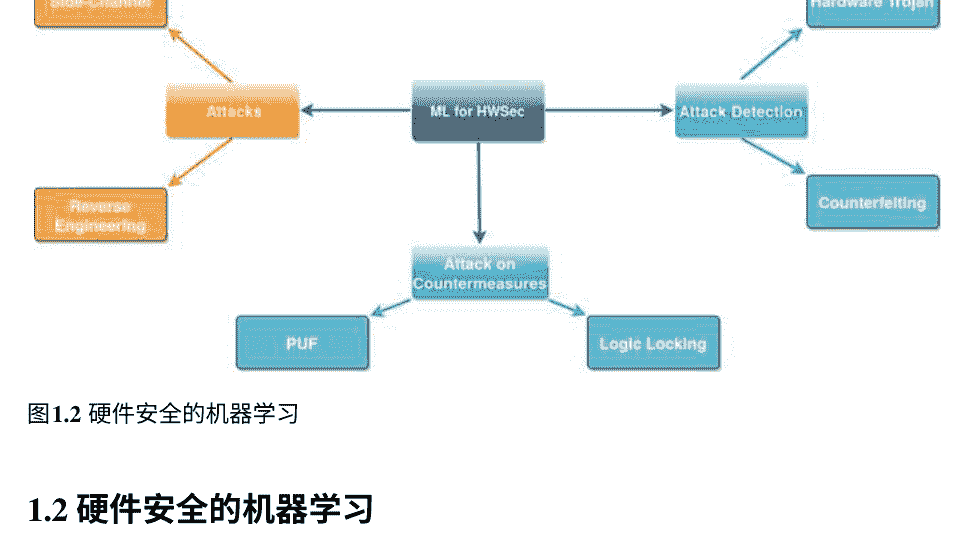
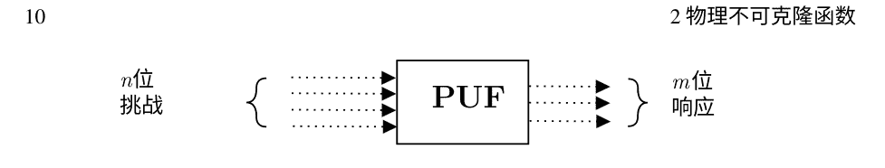
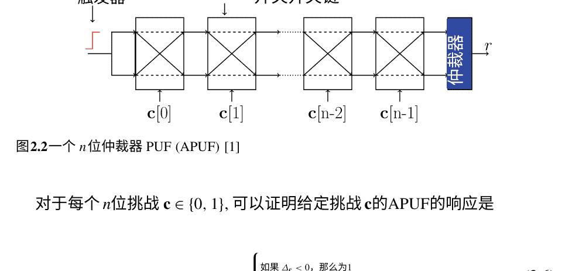
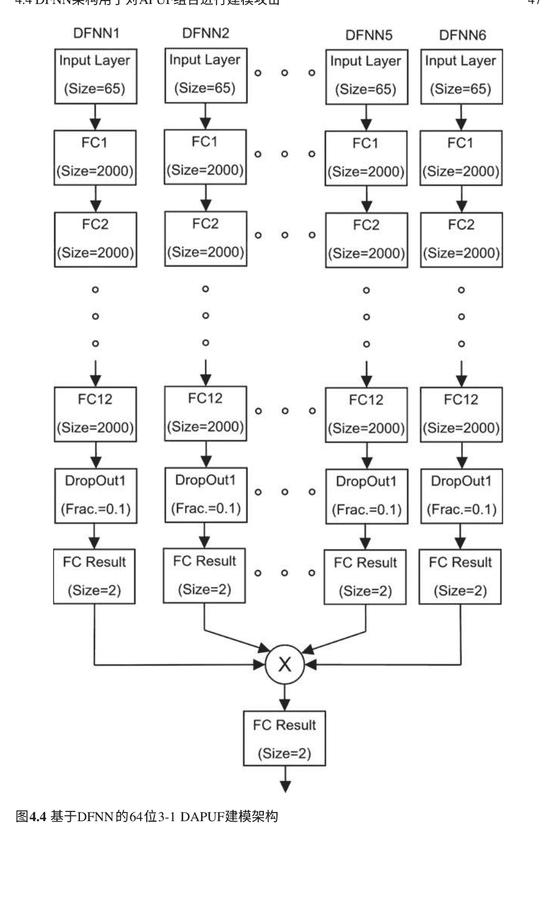
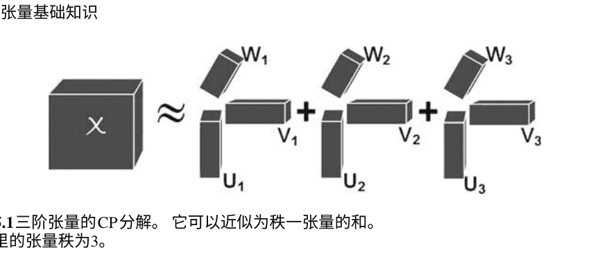
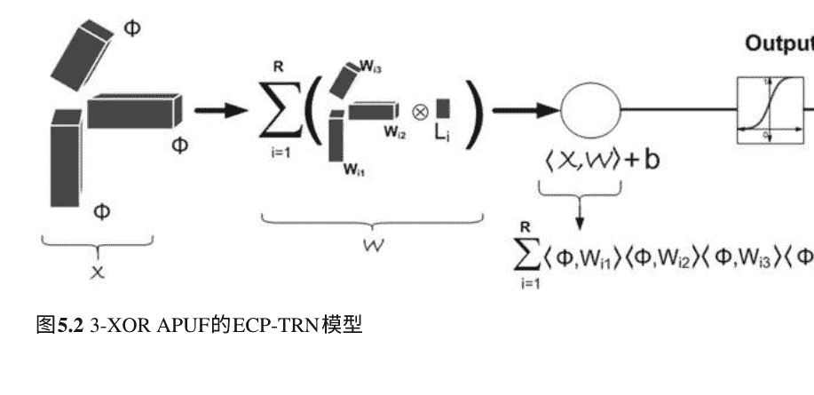
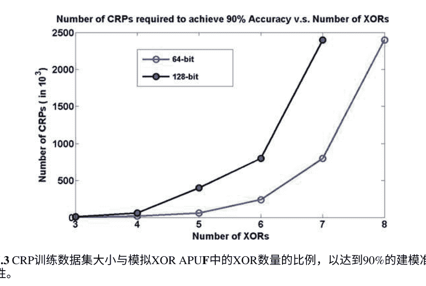
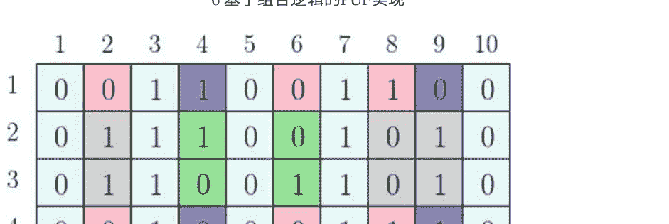
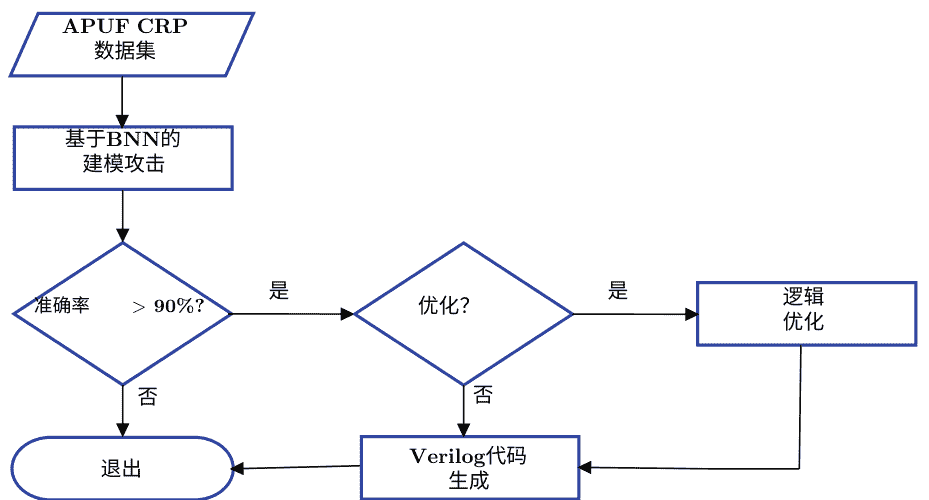
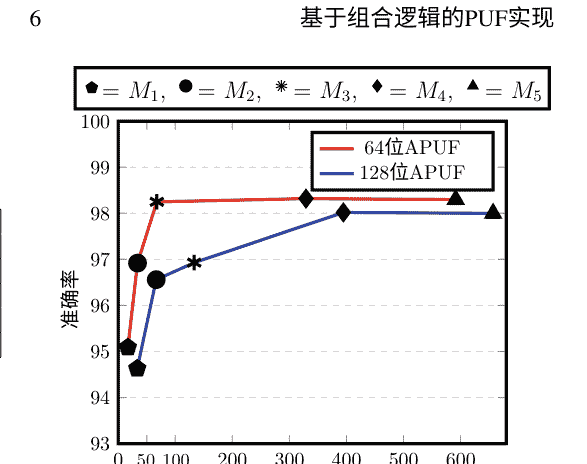

# 面向硬件安全中计算问题的深度学习

# 前言

近年来，硬件安全研究受到了越来越多的关注。在过去的十年里，硬件安全取得了重大进展。最近发现的芯片漏洞，如Spectre和Meltdown，表明硬件的信任基础也可能不安全。此外，机器学习的巨大增长对硬件安全既可能是福音，也可能是灾难。在硬件安全领域，物理不可克隆函数（PUFs）被认为是解决硬件安全问题的潜在根源。然而，基于机器学习的建模攻击一直是对PUF的最大威胁。本书描述了硬件安全中的机器学习应用，重点是针对PUF的建模攻击。本书的内容是我们在过去几年对上述主题进行的深入研究的结果。本书为在PUF上进行建模攻击的机器学习的使用提供了实用指南。

我们撰写本书是为了以系统和全面的方式分享我们在PUF上进行建模攻击研究的经验，涵盖了该主题的深度和广度。由于迄今为止还没有一本单独涵盖这个主题的专著，我们认为这对任何感兴趣的读者都具有很大的价值。这些主题已经被充分深入地讨论，以使读者能够进一步发展对它的理解和技能。我们已经将与PUF模型和建模攻击相对应的源代码发布到公共领域，以进一步帮助对这个迷人的主题感兴趣并通过未来的研究提高艺术水平的读者们。

无论你是一个完全的初学者还是一个有经验的研究人员，这本书将在一个封面下汇集大量的理论和实践知识，帮助你全面地回顾和获得建模攻击的知识。

> > 印度卡拉格普尔
> 2021年9月
> Pranesh Santikellur
> Dr. Rajat Subhra Chakraborty
> 致谢 Pranesh Santikellur 感谢 Intel 提供给他的财务支持。


# 关于作者

**Pranesh Santikellur**是印度理工学院卡拉格普尔分校计算机科学与工程系的博士研究生和高级研究员。他于2010年从维斯韦萨拉亚工业大学获得电子与通信工程学士学位。他在Horner Engineering India Pvt. Ltd.和Processor Systems有6年的工业经验。他的主要研究兴趣包括硬件安全、深度学习和可编程逻辑控制器安全。他是IEEE学生会员。

**Rajat Subhra Chakraborty**是印度理工学院卡拉格普尔分校计算机科学与工程系的副教授。他在国家半导体和先进微器件（AMD）有专业经验。

他的研究兴趣包括硬件安全、VLSI设计、数字水印和数字图像取证等领域，在这些领域他已经出版了4本书和100多篇国际期刊和会议论文。他拥有2项美国授予的专利。他的出版物至今已经获得了3600多次引用。

Chakraborty博士拥有美国Case Western Reserve University的计算机工程博士学位，并且是IEEE和ACM的高级会员。

## 第1章 机器学习在硬件安全中的应用介绍

计算设备已经成为我们现代生活的基础，而硬件长期以来一直被视为所有计算系统的信任支柱。各种基于加密措施的软件攻击和防御机制已经被广泛分析并应用于各种应用中。与软件安全相比，硬件安全作为一个主题相对较新，在最近几年由于对被认为免受攻击的硬件的多次攻击，其重要性大大增加。硬件安全与其他任何安全领域没有什么不同，它专注于发动攻击以窃取资产和设计用于保护它们的策略。特别是硬件安全的主题集中在那些包含电子组件秘密的硬件组件作为资产的情况下，例如加密密钥和其他敏感信息[1]。

早期的硬件安全工作主要是为了探索和防御泄露敏感信息的攻击，通过发现基于实现的密码硬件的漏洞。然而，由于基于IP的SoC（基于知识产权的芯片系统）设计越来越普遍，电子元件的设计和制造上的控制越来越少，因此它最近已成为一个更重要的安全问题。这种对设计和制造的控制减少可以归因于电子元件供应链的全球化特性，这使得在不受信任的设计公司或晶圆厂中有恶意修改IC的可能性更大；这种恶意设计被称为硬件木马[1]。硬件木马可以通过改变其集成电路的功能来构成最大的威胁，并造成重大损害。

侧信道攻击是另一个重要的硬件安全问题，它允许通过分析物理信号（如传播延迟、功率水平和电磁辐射）来提取存储在芯片上的秘密信息[1]。已经证明侧信道技术能够检测秘密密钥并破解强大的密码算法，因此构成了严重的威胁。

其他重要的硬件安全威胁包括知识产权盗窃、逆向工程和

| Attacks | Countermeasures |
| :--- | :--- |
| Hardware Trojans | Hardware Obfuscation |
| Side-Channel Attacks | Masking and Hiding |
| Counterfeiting | Hardware Primitives |
| Reverse Engineering | PUF, TRNG |
| Hardware IP Piracy | |

集成电路的伪造是一种常见的 PCB攻击，因为它们可以通过逆向工程轻松伪造。当考虑到逆向工程的可能性时，逆向工程变得更加严重的威胁在集成电路制造和制造的每个阶段。

为了对抗这些新兴的硬件攻击，已经提出了许多对策。硬件混淆是一种重要的对策，不仅可以对抗知识产权盗窃，还可以对抗逆向工程和木马插入。逻辑锁定是一种深入研究的硬件混淆方法它不仅隐藏了真实功能，还隐藏了硬件电路的结构。

为了防止基于侧信道的攻击，提出了“掩码和隐藏”技术作为一种旨在减少泄漏的对策。

除了对新攻击和对策进行硬件安全研究外，最近的研究还非常注重开发可信赖的硬件来建立信任的根基。硬件作为安全的根基的概念通常通过硬件构建模块来实现，通常被称为硬件安全原语[1]。新的发展将解决设备的信任、完整性和认证问题，不仅可以解决硬件安全方面的许多安全问题，还可以将其应用于软件安全。在硬件安全原语的开发中，一个想法是利用硬件的固有特性，如基于半导体的工艺变异。这些固有特性通常通过电路实现，即使在相同材料上使用相同的工艺，也会因为设备不同而有所变化。由于即使是同一制造商也无法生产或克隆具有相同固有特性的两个或多个设备，因此将其称为物理不可克隆函数(PUF)。由于其特性，PUF主要用于密钥生成和设备认证。另一种常见的硬件安全原语是真随机数生成器(TRNG)，它能够生成具有高度不确定性的数字比特流。换句话说，它们生成的1和0的序列不受先前值的影响。TRNG可用于生成随机种子、会话密钥、一次性密码本、随机数和PUF的挑战，这对于安全和加密至关重要。

应用。 图1.1显示了不同的硬件平台特定攻击，以及它们的对策，用箭头指向每个攻击。 在过去的十年中，机器学习在计算机视觉、生物信息学和机器翻译等各个领域取得了显著进展。 事实上，最近的进展使得机器学习算法在语言理解[6 ]和战略游戏[5]等各种任务上超越了人类的表现。

这些突破的出现主要归功于深度学习和强化学习的使用。 机器学习在硬件安全领域越来越受到关注，并且硬件安全的最新进展表明它在这个领域也非常适用和有影响力。 一些机器学习应用改进了现有的攻击和对策，而另一些应用则提出了新的攻击和对策。 令人兴奋的是，机器学习改进了硬件安全中攻击和对策策略之间的战斗。 在下一节中，我们简要介绍机器学习，以便了解它与硬件安全的相关性。

### 1.1 机器学习：与传统算法有何不同？

计算机算法通常用于解决诸如排序数字之类的现实世界问题。 然而，对于某些任务，我们没有一个算法，比如检测垃圾邮件，因为垃圾邮件的定义因人而异，也会随着时间而变化。 对于如何检测电子邮件文档是否为垃圾邮件，我们没有确切的知识。 然而，我们可以通过大量的数据集来弥补缺乏精确知识的不足，例如一些我们知道是垃圾邮件的几千封示例邮件，我们希望从中“学习”出什么样的数据构成垃圾邮件。 具体而言，我们希望计算机能够识别垃圾邮件检测背后的逻辑（“算法”）。

在许多情况下，我们有大量的任务，并且我们确信存在一个可以解释我们观察到的数据的过程，尽管我们不知道该过程的细节。 如果我们能够构建一个近似值，不需要解释过程的每个方面，但可以识别出某些模式或规律，那么它可以用于进行预测。 从数据中构建这样的近似值是机器学习的本质。 形式上，1959年Arthur Samuel创造了“机器学习”（ML）这个术语，并将其定义为“使计算机具备学习能力而无需明确编程的研究领域”。 机器学习使用统计学理论基于示例数据构建近似数学模型，称为“训练数据”，学习过程称为训练。 然后使用构建的模型从数据中进行推理，无论是对未知数据的输出预测还是对数据的洞察。 在下一节中，我们将讨论机器学习在硬件安全领域的潜在应用。



## 图1.2 硬件安全的机器学习

### 1.2 硬件安全的机器学习

我们将硬件安全中的机器学习应用分类为三类：机器学习辅助硬件攻击、基于机器学习的攻击检测和基于机器学习的对策攻击。图1.2展示了硬件安全的不同机器学习应用。在第1.1节中，我们讨论了与硬件安全相关的攻击和对策。在这里，我们将“攻击检测”视为一个不同的类别，因为它不属于对策。接下来，我们将讨论每个类别和机器学习试图解决的问题。

#### 1.2.1 用于硬件攻击的机器学习

我们将讨论机器学习在侧信道攻击和逆向工程中的应用。在侧信道分析中，攻击者分析信号，如辐射和功耗，以获取加密算法的秘密密钥。侧信道分析主要分为两种类型[8]：基于特征分析和非基于特征分析。在基于特征分析中，攻击者可能事先使用目标设备的可用副本来精确调整攻击的所有参数。因此，在训练阶段，攻击者可以从不同的可用侧信道迹线中应用机器学习算法构建近似的数学模型，从而提取秘密密钥。在推理或攻击阶段，攻击者可以对训练过的算法进行预测，以获取秘密密钥。在非基于特征分析中，攻击者无法访问目标设备的开放副本，只能访问目标设备的泄漏信息。因此，他们可以使用直接从收集到的信息的隐藏属性中提取的机器学习算法。还有基于机器学习的应用

#### 1.2.2 用于硬件攻击检测的机器学习

机器学习技术在检测常见硬件安全漏洞方面也取得了很大进展，即硬件木马和集成电路的伪造[2]。硬件木马（HT）攻击涉及对电路设计的有意恶意修改，以在部署后显示不希望的电路功能。硬件木马检测通常在两种情况下进行，根据是否有黄金芯片（无木马芯片）。当存在黄金芯片时，机器学习系统可以在不同的抽象级别上检测木马，例如门级网表、RTL级别和芯片级别。

这些基于机器学习的方法的一个已建立的过程是利用黄金芯片抽象级别来提取它们的特征，然后从这些特征中学习，以检测设计中是否包含硬件木马。对于基于芯片的木马检测，逆向工程是第一步，然后应用机器学习来检测从布局图像中提取的特征。在没有黄金芯片的情况下，机器学习算法必须从现有设计中学习。在这种情况下，一种常用的方法是将门级网表转换为基于图的表示。然后，应用机器学习技术来发现异常值。为了实现这一点，使用了图神经网络。

当没有黄金芯片可用时，由于没有木马免费的示例设计，机器学习算法必须从现有设计中学习。在这种情况下，一种方法是将门级网表转换为基于图的表示，其思想是应用机器学习技术来找到表示中的异常值。

为了完成这个任务，使用了图专用的机器学习算法，如图神经网络或基于树状图的聚类算法。

伪造是一种新的、重大的威胁，伪造或回收的集成电路被销售为原装货物或新货物。伪造的集成电路引起了高度关注，因为它们对系统可靠性的降低构成了威胁。美国空军报告称，仅在2012年就有大约100万个伪造品[1]。检测伪造集成电路最简单的方法之一是通过视觉检查磨损模式，但这种方法耗时且存在较大的错误概率。因此，结合机器学习技术的多种图像处理技术可以帮助揭示伪造集成电路的隐藏共同特征，有助于自动检测过程[10]。

#### 1.2.3 用于对抗措施攻击的机器学习

对反制措施方法的攻击与对硬件的直接攻击一样糟糕。它们削弱了提出的反制措施的有效性，并表明需要重新设计。基于机器学习的对抗反制措施方法的最常见和最重要的攻击是逻辑锁定和物理不可克隆函数（PUF）。在这个新兴领域中已经取得了重要的研究进展。逻辑锁定是一种众所周知的硬件混淆方法，其中一组逻辑门被添加到现有的知识产权（IP）中，充当“关键门”，以保护硬件IP的功能和结构。添加的逻辑门可以是组合的或时序的，而大多数现有的基于机器学习的攻击针对的是组合逻辑门。基于机器学习的对组合逻辑锁定的攻击可以分为两类[2,9]：有导向的攻击和无导向的攻击。在这里，无导向的攻击意味着激活的设计不可用，而有导向的攻击则假设有一个激活的集成电路可用。由于无导向模型中缺乏激活的集成电路，结构泄漏被利用，而有导向的攻击则侧重于功能方面。有导向的攻击涉及对从激活的集成电路收集的输入/输出观察序列进行机器学习算法的训练，使其能够学习电路的布尔函数。然后使用学习到的布尔函数派生密钥。

相比之下，无Oracle的基于机器学习的攻击利用与方案相关的结构残留来识别锁定电路或正确的密钥位值。在这些类型的攻击中，机器学习算法用于识别后综合目标网表中与锁定电路相对应的逻辑结构。

物理不可克隆函数（PUFs）是有前途的硬件安全原语，可以重新定义实现安全相关应用的方式。它们相对简单的架构使它们成为资源受限设备的首选。对PUF的机器学习攻击通常被称为“模型构建攻击”，因为它们构建了理论上不可能的PUF模型。

本书主要讨论对PUF的模型构建攻击，目前构成对PUF最大威胁 [7]。接下来，我们描述本书的组织结构。

### 1.3 本书的组织结构

本书分为七章。第2-7章的内容如下：

1.  第一章讨论了PUF的基础知识，并介绍了各种仲裁器PUF组合。
2.  本章介绍了机器学习的基础知识，并讨论了用于对PUF进行建模攻击的几种常用算法。
3.  本章讨论了对PUF的建模攻击。该章节讨论了最先进的建模攻击方法及其优缺点。
4.  本章介绍了一种使用张量回归改进的PUF建模攻击方法。本章讨论了针对一类名为XOR APUF变体的PUF的新型定制机器学习模型的设计，并将该模型称为“基于高效CP分解的张量回归网络”（ECP-TRN）。
5.  本章讨论了建模攻击的构造性方面，即基于组合逻辑的PUF实现。本章介绍了一个端到端的框架，APUF-BNN，用于将给定的PUF实例表示为可综合的门级Verilog描述。
6.  本章总结了本书的内容。

我们希望您对本书感到有趣和愉快。敬请期待更多内容！

## 参考文献

1.  Bhunia, S., & Tehranipoor, M. (2018).硬件安全：一种实践学习方法. 摩根·考夫曼出版社.
2.  Elnaggar, R., & Chakrabarty, K. (2018). 硬件安全的机器学习：机遇和风险。电子测试杂志，34(2), 183–201.
3.  Regazzoni, F. (2020). 机器学习和硬件安全：挑战和机遇-邀请演讲。在IEEE/ACM国际计算机辅助设计会议（ICCAD）中。IEEE (pp. 1–6).
4.  Botero, U. J., et al. (2021). 通过逆向工程实现硬件信任和保证：从图像分析和机器学习的视角进行教程和展望。ACM计算系统新兴技术杂志（JETC），17(4), 1–53.
5.  Vinyals, O., 等 (2019). 使用多智能体强化学习在星际争霸II中达到大师级水平。自然,575(7782), 350–354.
6.  Wang, A., Pruksachatkun, Y., Nangia, N., Singh, A., Michael, J., Hill, F., Levy, O., & Bowman, S. R. (2019).Superglue：一个更具粘性的通用语言理解系统基准, arXiv:1905.00537.
7.  Santikellur, P., Bhattacharyay, A., & Chakraborty, R. S. (2019). 基于深度学习的模型构建攻击对仲裁PUF组合的影响。在Cryptology ePrint Archive报告 2019/566, https://eprint.iacr.org/2019/566.
8.  Benadjila, R., Prouff, E., Strullu, R., Cagli, E., 和 Dumas, C. (2018). 研究深度学习技术用于侧信道分析并介绍ASCAD数据库。在ANSSI, 法国 & CEA, LETI, MINATEC Campus, 法国。在线链接https://eprint.iacr.org/2018/053.pdf, 最后检查于 (Vol. 22).
9.  Sisejkovic, D., Reimann, L. M., Moussavi, E., Merchant, F., & Leupers, R. (2021). 机器学习前沿的逻辑锁定：发展和机遇综述。arXiv:2107.01915.
10. Asadizanjani, N., Tehranipoor, M., & Forte, D. (2017). 使用图像处理和机器学习进行伪造电子检测。物理学杂志：会议系列，787(1), 012023. IOP出版社.

## 第2章 物理不可克隆函数

### 2.1 引言

物理不可克隆函数（PUFs）是有前途的硬件安全基元，可以在实现轻量级身份验证协议时无需显式密钥存储。 PUFs是电子电路，体现了现代半导体制造技术引起的纳米尺度过程变异诱导的随机性的影响[1, 2]。 每个单独的PUF实例应具有独特的特征，应清楚地将其与同一PUF族的其他实例区分开来。 通常，这种独特的特征以给定PUF实例的真值表的形式存在，而且一个 n 位输入， m位输出的PUF实例可以在数学上表示为布尔函数 f: {0, 1}^n → {0, 1}^m。

在PUF术语中，输入刺激和相应的输出分别被称为“挑战”和“响应”。 图2.1显示了PUF作为一个将挑战映射到响应的黑盒布尔映射。 一个PUF实例的n位输入和相应的m位输出一起构成一个“挑战-响应对”（CRP）。 一组CRP形成一个布尔函数真值表，唯一地标识相应的PUF实例。 请注意，在硅中制造和表征PUF电路实例之后，才能推断出该真值表的条目。 鉴于PUF输入的数量相对较大（通常≥64），无法完全表征一个PUF实例是不可行的。 因此，通常真值表（以及相应的PUF布尔函数）是不完全指定的。 接下来，我们讨论PUF的几个重要属性。



#### 2.1.1 PUF的特性

PUF 的属性主要是根据其挑战-响应行为来定义的。让我们将 PUF 实例 i，PUF_i的挑战和响应表示为 C和响应表示为 R。

1.  可评估性：为了实际可用，PUF 实例应该是可评估的，即，对于 PUF 实例应用一个挑战 c ∈ C 应该相对容易，并且能够生成相应的响应 r ∈ R。
2.  可复现性：当相同的挑战反复应用于PUF实例时，如果它们生成相同或相似的响应且误差较小，则称其为可复现的。通常使用汉明距离（HD）来比较给定挑战的响应集的相似性。可复现性的度量也被称为PUF的内部距离，因为只对给定的PUF实例进行相似性度量，而不是跨PUF实例。这个属性也用于定义质量度量可靠性，详见第2.1.2节。
3.  唯一性：对于PUF实例，唯一性属性通常是相对于相同PUF设计的其他实例而言的。广义上，唯一性度量可以针对给定的PUF变体进行定义，有关此方面的更多讨论请参见质量度量第2.1.2节。
4.  不可克隆性：如果给定的PUF实例无法被对手或甚至制造商进行物理克隆，则被描述为不可克隆。由于这一重要特性，PUF原语在安全应用中具有优势，因为制造商无法进行物理复制，因此无需对制造商进行信任。
5.  不可预测性：对于一小组CRP，对手不可能构建一个准确的数学模型或硬件仿真器，对应于PUF实例，让对手能够以高概率成功地预测与任意挑战相对应的响应。不幸的是，正如我们将在后面的章节中看到的那样，给定PUF实例的这种不可预测性在实践中并不成立。
6.  单向性：给定的PUF实例i被称为满足单向性质，如果从其响应中很难找到相应的挑战，例如，对于给定的响应r，很难找到c使得r = PUF_i(c)。
7.  防篡改性：给定的PUF实例被称为防篡改性，当物理上试图改变PUF实例时，会导致CRP行为的实质性和永久性变化。防篡改性质确保PUF实例在受到攻击时，硬件安全不会透露其固有行为，而是转变为一个与受攻击的硬件安全实例显著不同的PUF实例。

#### 2.1.2 PUF的质量度量

PUF具有四个重要的质量指标。这些指标是唯一性、可靠性、均匀性和位别名。我们详细讨论每个参数。

a) 可靠性：PUF的可靠性指标与单个PUF实例的挑战-响应行为的可重现性有关。这捕捉了特定挑战c的响应值的可靠性，通常通过重复收集相同挑战的响应来完成。

实际上，这个指标可以用来确定响应对各种环境波动（如温度或电压）的可靠性。为了计算PUF实例的可靠性，使用汉明距离。假设当相同的挑战应用两次时，m位响应为r和r'，其中r=(r1,r2,r3,...,rm)和r'=(r1',r2',r3',...,rm')，则可以使用以下方程计算汉明距离（HD）：

$$ H D(r, r') = \sum_{i}^{m} (r_i \oplus r_i') $$ (2.1)

如果r是参考响应，s是在不同环境/电气条件下收集的r'响应的次数，则PUF实例的可靠性(REL)通过对测量的HD值(m表示PUF变体的响应位数)进行平均计算。其计算公式为

$$ \text{REL} = 1 - \frac{1}{s} \sum_{i=1}^{s} \frac{H D(r, r_i')}{m} \times 100\% $$ (2.2)

理想情况下，PUF的可靠性应为1，即在不同测量中具有相同的响应值。

b) 唯一性：PUF的唯一性指示了属于同一PUF变体的PUF实例之间的差异程度。为了确定一对PUF的唯一性，测量它们之间的汉明距离(HD)。对于k个响应宽度为m的PUF实例，唯一性(UNQ)计算如下

$$ \text{UNQ} = \frac{2}{k(k-1)} \sum_{i=1}^{k-1} \sum_{j=i+1}^{k} \frac{H D(r_i, r_j)}{m} \times 100\% $$ (2.3)

其中 $r_i, r_j$ 分别表示给定 PUF 实例 i 和 j 的挑战 c 的响应，其中 $1 \le i, j \le k$。PUF 独特性的理想值为 50%。

c) 均匀性：均匀性是对随机挑战的响应位中“0”和“1”的分布进行测量的指标。理想情况下，均匀性值应为 50%，即“0”和“1”的等分布。汉明重量 (HW) 用于测量均匀性。设 $r = (r_1, r_2, r_3, \dots, r_m)$ 为给定 PUF 实例对于挑战 c 的 m 位响应，则均匀性 (UNF) 由以下公式给出

$$ \text{UNF} = \frac{1}{m} \sum_{i=1}^{m} r_i \times 100\% \quad (2.4) $$

d) 位别名：位别名是对多个实例中特定输出位的“0”和“1”的分布进行测量的一种方法。对于给定的 k 个 PUF 实例和输出宽度 m，可以计算第 l 个二进制位别名 (BIA)

$$ \text{BIA} = \frac{1}{k} \sum_{i=1}^{k} r_{i,l} \times 100\% \quad (2.5) $$

其中 $r_{i,l}$ 是由 PUF 实例 i 生成的响应的第 l 个二进制位。
这四个质量指标是分析 PUF 质量最常用的方法。然而，还有其他一些指标是由不同的作者提出的。读者可以参考文献 [19, 20] 了解更多细节。接下来，我们将讨论 PUF 的不同分类。

#### 2.1.3 PUF分类

根据其挑战-响应空间的大小，PUF 通常被分为以下几类 [14]：

*   强 PUF。这些 PUF 的 CRP 空间足够大，可以避免对 PUF 电路进行详尽的表征。如果在协议执行期间不重复应用相同的挑战，这种类型的 PUF 对挑战-复制攻击是安全的。仲裁者 PUF (APUF) [1] 是一种广泛研究的强 PUF。
*   弱 PUF。这种类型的 PUF 具有相对较少的 CRP 数量，并且容易受到复制攻击。拥有所有挑战的攻击者将能够模拟这个 PUF。因此，这些 PUF 的响应不会暴露在硬件设备之外。弱 PUF 的例子包括 SRAM PUF 和环振荡器 PUF (ROPUF)，因为实现具有大量挑战位的 ROPUF 是不可行的。因此，这些类别的 PUF 的响应不允许离开设备。在极端情况下，弱 PUF 可能没有任何挑战并生成一个恒定的实例特定响应，例如，MECCA PUF [10]，可用于密钥生成和身份验证。

请注意，上述PUF的“强度”概念不是基于PUF的安全级别。在当前技术水平下，大多数强PUF都容易受到建模攻击，尽管它们对仿真攻击是安全的。

根据PUF响应生成的方式，可以将PUF分为以下几类：

*   延迟PUF：延迟PUF主要基于从芯片到芯片不同的物理元件的固有延迟特性。由于相同布局的一对电路路径引起的延迟差异，生成响应。基于其架构，延迟PUF可以是强PUF或弱PUF。延迟PUF的广泛研究示例是APUF和ROPUF。
*   内存PUF：这是基于双稳态内存元件的不可预测上电状态值，这是由于晶体管参数的随机变化而发生的。内存PUF的著名例子是SRAM PUF [21]。
*   延迟+内存PUF：这里的响应基于两种可能的稳态，就像内存PUF一样，而延迟PUF的概念被用来构建双稳态延迟元件。双稳态环PUF (BRPUF) [11]是这样一个PUF的例子，其中双稳态环包含偶数个反相级。

尽管大多数内存PUF不需要挑战来生成响应并被认为是弱PUF，但一些内存PUF的组合被用作强PUF [12]。例如，考虑将SRAM单元组织成 l × k 网格以形成 l × k SRAM PUF。为了将其用作强PUF，地址可以被视为SRAM的挑战位。本章的其余部分将重点介绍对于理解建模攻击至关重要的强PUF。接下来，我们将讨论一个被广泛研究的流行硅PUF，称为仲裁器PUF。

### 2.2 仲裁器PUF (APUF)

APUF由几个结构相同的两端口延迟级联组成，在级联的末端有一个仲裁器（通常是锁存器或触发器）。对于每个延迟级（例如，第i个级），这些是路径交换开关，从输入到输出端口的连接由控制位（第i个挑战位c[i]）控制。第一个级的两个输入端口短接，允许输入脉冲沿着两个延迟路径传播。两个信号沿着两个路径所经过的确切路径取决于所施加的挑战。由于工艺变异效应，尽管（理想情况下）布局相同，但两个路径上的信号经过稍微不同的延迟后到达仲裁器，导致仲裁器输出为逻辑0或逻辑1。图2.2显示了一个n位APUF电路。



对于每个 n位挑战 c ∈ {0, 1}^n, 可以证明给定挑战 c 的APUF的响应是

$$r = \begin{cases} 1 & \text{如果 } \Delta_c < 0 \\ 0 & \text{否则} \end{cases}$$

#### 2.2.1 仲裁器PUF的延迟模型

可以证明 [1] 在级联开关阶段结束时的延迟差， Δ_c = w^T Φ。 这里， w被称为权重向量，是一个 (n + 1)-维实数向量，其分量取决于路径延迟，而 Φ是从给定挑战 c 导出的奇偶向量，其分量如下所示

$$\Phi[n] = 1 \quad \text{和} \quad \Phi[i] = \prod_{j=i}^{n-1} (1 - 2c[j]), i = 0, 1, \ldots n - 1$$

这个方程式是在第4.3节中推导出来的。有兴趣的读者可以直接参考推导过程。

### 2.3 PUF组合类型

虽然APUF的硬件开销低且结构相对简单，但由于其易受建模攻击的漏洞，几乎无法在实践中使用，这违反了PUF的“不可预测性”属性[3]。然而，APUF被用作构建复合PUF的流行构件。PUF组合是一种PUF设计范式，它使用较小的PUF作为构建块进行构建。较小的PUF被称为组成PUF或组件PUF，而生成的PUF则为一个复合PUF。有多种方法可以实现PUF组合。目前，复合PUF可以从三种类型的组合中派生出来：(a)基于组合函数的；(b)基于选择的；(c)基于插入的。下面将介绍这些组合类型，以及每个类别的常见示例。

1.  基于组合函数的组合：设 f_i: {0, 1}^n → {0, 1} 是一个第 i 个 n 位组成PUF的实例，x是输入挑战。那么，基于组合函数的复合PUF可以表示为

    $$F (x, k) := C (f_1 (x), ..., f_k (x)) \quad (2.8)$$

    其中 C 是一个组合布尔函数。一个著名的基于组合函数的复合PUF是XOR APUF [18] 和 Tribes APUF [13]。

2.  基于选择的组合：基于选择的组合PUF通常由 2^k 个单独的PUF实例组成，其中输出PUF输出取决于应用的挑战，作为组合PUF的整体输出。基于选择的组合PUF可以类似于基于组合的组合PUF表示，但选择函数通常涉及其他PUF实例。这样的PUF组合的输出可以表示为

    $$F (x, k) := MUX (f_{1,s}(x)||...||f_{k,s}(x); f_1 (x), ..., f_{2^k} (x)) \quad (2.9)$$

    其中 MUX() 表示一个 2^k:1 多路复用器，其 k 位选择输入由 f_{1,s}(x)||...||f_{k,s}(x) 给出，并且其 2^k 个数据输入由 f_1(x) 到 f_{2^k}(x) 给出。请注意，每个 f () 映射表示一个单独的PUF实例。基于选择的组合PUF的一个示例是多路复用器PUF(MPUF) [7]。还提出了两种MPUF的变体，分别称为鲁棒MPUF (rMPUF) 和密码分析鲁棒MPUF (cMPUF)。

3.  基于插入的组合：在基于插入的组合中，一个或多个PUF实例的响应位被用来推导出另一组一个或多个PUF实例的挑战位，从而产生整体响应。为了简单起见，让我们只考虑这个类别中最简单的复合PUF——插入PUF (iPUF) [3, 4, 8]。数学上，设 f_up: {0, 1}^p → {0, 1} 为一个 p 位APUF，输入挑战为x，而 f_down : {0, 1}^q → {0, 1} 为一个 q (≥ p + 1) 位APUF，则一个 (p, q)-iPUF组合的输出响应可以表示为

    $$F (f_up, f_down ) := f_down (x_1, ..., x_{i-1}, f_up (x) , x_{i+1}, ..., x_q) \quad (2.10)$$

    其中 i 是插入位的位置。异构插入PUF组合由多种类型的PUF实例组成，在 [9] 中已经描述过。

#### 2.3.1 异或PUF组合

根据姚氏异或引理[13]，应用异或函数作为组合函数可以获得最佳的非线性。因此，在XOR APUF组合中，异或被用作组合函数，仲裁器PUF作为组成PUF。数学上，$k$-XOR APUF可以表示为
$$ F_{xor} (\mathbf{x}, k) := \bigoplus_{i=1}^{k} f_{i} (\mathbf{x}) \qquad (2.11) $$
其中$f_i$是组成PUF的第$i$个实例。在这里，对所有组成PUF的输入挑战是相同的。在生成每个组成APUF的响应后，将这些响应进行异或运算，得到单比特的最终输出响应$F_{xor}$。在XOR仲裁PUF (XOR APUF) 的情况下，所采用的组成PUF是仲裁PUF。图2.3显示了$k$-XOR APUF的结构。通过控制每个组成PUF的输入而不是为XOR PUF组合中的所有组成PUF提供相同的输入挑战，可以得到稍微复杂一些的PUF。

有两种不同的方法可以实现这一点：(1) 从单个$n$位挑战中为每个组成PUF派生不同的输入$n$位挑战。这种方法被称为输入挑战转换。(2) 对每个组成PUF应用完全不同的$n$位挑战。上述类型的流行PUF示例包括轻量级安全PUF (LSPUF) 和伪随机挑战驱动XOR PUF (PC-XOR PUF)。

##### 2.3.1.1 轻量级安全PUF (LSPUF)

LSPUF旨在提高XOR APUF [6] 的安全性。架构增强涉及从主挑战C派生子挑战$c$，对于每个组成的APUF。考虑$Q$个组成的APUF，从顶部开始向下编号，这个派生可以通过两个步骤实现：旋转和应用转换规则。最初，对于第$k$个APUF实例，将$k$位主挑战C旋转k个位置来派生：

$$ \mathbf{d} = \text{rotate}(\mathbf{C}, \mathbf{k}) $$
然后应用以下转换：

$$c_{\frac{N+i+1}{2}} = d_i \quad \text{对于i=1}$$
$$c_{\frac{i+1}{2}} = d_i \oplus d_{i+1} \quad \text{对于} i = 1, 3, 5, \ldots N-1$$
$$c_{\frac{N+i+2}{2}} = d_i \oplus d_{i+1} \quad \text{对于} i = 2, 4, 6, \ldots N-2$$

与XOR APUFs不同，LSPUF是一个多比特输出的PUF（例如，$m$输出比特），其中每个输出比特是通过对一组APUFs（总共$Q$个APUFs）的输出进行XOR运算生成的，根据以下公式：

$$\mathbf{o}[i\ ]=\bigoplus_{j=0}^{x-1} r_{((i+s+j)\ \text{mod}\ Q)}\qquad\qquad(2.12)$$

图 2.4显示了一个具有$m$输出位和$Q$个组成APUF的示例。

### 2.3.1.2 伪随机挑战驱动输入异或APUF (PCXOR APUF)

Yu等人[16]提出了PCXOR APUF，其中每个组成的APUF都被完全不同的挑战所驱动。这些挑战是使用伪随机数生成器(PRNGs)生成的。图2.5显示了64位4-PCXOR APUF。使用PRNG生成了一个256-位挑战向量，并将其切分为四个64位挑战。每个挑战都被分配给组成的APUF。

图2.5 一个64位4-PCXOR APUF [16]

### 2.3.1.3 双仲裁器 PUF (DAPUF)

DAPUF是为了解决FPGA [15]中仲裁器PUF的唯一性问题而设计的，其中k表示仲裁器链的数量，l表示输出响应的数量。尽管DAPUF使用XOR函数进行组合，但其构建块PUF与经典APUF稍有不同。在这里，来自k仲裁器PUF的所有顶部路径信号与所有底部路径信号竞争。例如，与一个2-XOR APUF不同，仲裁器从同一个APUF链的顶部到底部信号接收输入，2-1 DAPUF包括将第一个和第二个APUF延迟链的顶部路径连接到仲裁器-1，将第一个和第二个APUF延迟链的底部路径连接到仲裁器-2。此外，来自仲裁器-1和仲裁器-2的响应进行XOR运算，得到单一响应。图2.6描述了2-1 DAPUF的结构。

## 2.3.2 部落PUF组合

最近提出了联合部落仲裁PUF (Tribes APUF) [13]，其组合布尔函数是Tribes函数。Tribes函数具有两个参数k和b，并且由以下方式给出

$$ T(x_1, \ldots, x_k) := (x_1 \land \cdots \land x_b) \lor \cdots \lor (x_{k-b+1} \land \cdots \land x_k) \quad (2.13) $$

其中k表示变量的数量，参数b设置为略小于log₂ k [17]的某个数量。在Tribes函数中，k个输入被分成b k个大小为b的块，当且仅当至少有一个块完全由1-组成时，其输出被设置为1。为了使Tribes函数平衡，应该以这样的方式定义k和b，使得(1-2^{-b}) k/b ≈ 2 1[17]。此外，请注意，只有在少数输入长度的情况下才能定义平衡的Tribes函数，因为在这种情况下，k需要是b的倍数。Tribes APUF将上述表达式中的各个布尔变量替换为各个APUF的输出。例如，具有k=4，b=2的Tribes APUF可以表示为

$$ F_{Tribes}(\mathbf{x}, 4) := (f_1(\mathbf{x}) \land f_2(\mathbf{x})) \lor (f_3(\mathbf{x}) \land f_4(\mathbf{x})) \quad (2.14) $$

#### 2.3.3 多路复用器PUF (MPUF)及其变种

多路复用器 PUF (MPUF) 采用基于选择的 PUF 组合。MPUF及其变种的主要目标是达到与XOR PUF相当的抗密码分析和建模攻击的鲁棒性，同时比XOR APUF更可靠。一个(n, k)-MPUF使用一个2^k:1多路复用器，其中多路复用器的k选择线连接到k个APUF的输出，多路复用器的数据线连接到2^k个APUF，所有APUF都输入相同的n-位挑战。图2.7显示了一个(n, k)-MPUF的架构。还提出了另外两种变体，即cMPUF(抗密码分析)和rMPUF(抗可靠性建模攻击)。rMPUF使用2^{k-1}个APUF进行数据选择，使用多路复用器树，而cMPUF仅使用2^{k-1}个数据APUF，其余2^{k-1}个数据输入是它们的补码。

#### 2.3.4 插入式PUF (IPUF)

Interpose PUF (IPUF) 采用Interpose-based PUF组合技术，是强大的PUF技术中的最新成员。其思想是在应用的挑战中，将一个x-XOR APUF（具有n个挑战位）的响应插入到两个挑战位之间的一个y-XOR APUF（具有 (n + 1)个挑战位，其余挑战位与x-XOR PUF相同）中，从而得到一个 (x, y)-IPUF。图2.8显示了一个 (x, y)-IPUF的结构，具有 n位挑战。

1.  Lim, D. (2004). 从集成电路中提取秘密密钥。硕士论文，美国麻省理工学院。
2.  Gassend, B., Clarke, D., van Dijk, M., & Devadas, S. (2002). 硅物理随机函数。在第9届ACM计算机与通信安全会议论文集中，Ser, CCS'02 (pp. 148–160)。
3.  Santikellur, P., Bhattacharyay, A., & Chakraborty, R. S. (2019). 基于深度学习的模型构建对仲裁PUF组合的攻击。IACR密码学电子打印存档期刊, 2019, 566。
4.  Wisiol, N., M ühl, C., Pirnay, N., Nguyen, P. H., Margraf, M., Seifert, J.-P., van Dijk, M., & Röhrmair, U. (2019). 分割中间PUF：一种新的建模攻击策略。密码学电子打印存档，报告2019/1473，https://eprint.iacr.org/2019/1473。
5.  Röhrmair, U., Sehnke, F., Schütt, J., Dror, G., Devadas, S., & Schmidhuber, J. (2010). 对物理不可克隆函数的建模攻击。计算机和通信安全ACM会议论文集，Ser. CCS'10, 237–249。
6.  Majzoobi, M., Koushanfar, F., & Potkonjak, M. (2008). 轻量级安全PUFs。计算机辅助设计国际会议论文集，Ser. ICCAD'08, 670–673。
7.  Sahoo, D. P., Mukhopadhyay, D., Chakraborty, R. S., & Nguyen, P. H. (2018). 基于多路复用器的仲裁PUF组合与增强的可靠性和安全性。IEEE计算机学报, 67(3), 403–417。
8.  Nguyen, P. H., Sahoo, D. P., Jin, C., Mahmood, K., Röhrmair, U., & van Dijk, M. (2018). 对抗最先进的机器学习攻击的安全PUF设计。访问于2018年5月，来自https://eprint.iacr.org/2018/350。
9.  Sahoo, D. P., Saha, S., Mukhopadhyay, D., Chakraborty, R. S., & Kapoor, H. (2014). 复合PUF: FPGA上物理不可克隆函数的新设计范式。在IEEE国际硬件安全与信任研讨会论文集中，Ser. HOST'14 (pp. 50–55)。
10. Krishna, A. R., Narasimhan, S., Wang, X., & Bhunia, S. (2011). MECCA：一种稳健的低开销PUF，使用嵌入式存储器阵列。在B. Preneel和T. Takagi (Eds.) 的密码硬件和嵌入式系统(pp. 407–420). 日本奈良: CHES 2011: 第13届国际研讨会。
11. Chen, Q., Csaba, G., Lugli, P., Schlichtmann, U., & Röhrmair, U. (2011). 双稳环PUF: 强物理不可克隆函数的新架构。在IEEE国际硬件安全与信任研讨会论文集中 (HOST) (pp. 134–141)。
12. Holcomb, D. E., & Fu, K. (2014). Bitline PUF: 将本地挑战-响应 PUF 功能集成到任何 SRAM 中。在密码硬件和嵌入式系统会议论文集中(pp. 510–526)。
13. Ganji, F., Tajik, S., Stauss, P., Seifert, J.-P., Forte, D., & Tehranipoor, M. (2019). 摇滚 PUF: 从不太安全的 PUF 中构建可证明安全的 PUF。在第8届嵌入式系统安全证明研讨会论文集中, 11, 33–48。
14. Maes, R. (2013). 物理不可克隆函数 - 构建. 性质和应用: Springer。
15. Machida, T., Yamamoto, D., Iwamoto, M., & Sakiyama, K. (2015). 一种用于增强 FPGA 上不可预测性的新仲裁 PUF。《科学世界杂志》, 2015。
16. 余, M.-D., 希勒, M., 德尔沃, J., 索维尔, R., 德瓦达斯, S., 和韦尔包维德, I. (2016年)。一种用于轻量级身份验证的防止基于PUFs的机器学习的封锁技术。IEEE多尺度计算系统交易, 2 (3) , 146-159。
17. 奥唐奈, R. (2004年)。NP中的难度放大。计算机与系统科学杂志, 69 (1) , 68-94。
18. Suh, G. E., & Devadas, S. (2007). 用于设备认证和秘密密钥生成的物理不可克隆函数。在设计自动化会议论文集中，Ser. DAC'07 (pp. 9–14)
19. Pehl, M., Punnakkal, A. R., Hiller, M., & Graeb, H. (2014). 用于物理不可克隆函数的高级性能指标。 在集成电路国际研讨会(ISIC)(pp. 136–139).
20. Wilde, F., Gammel, B. M., & Pehl, M. (2018). 对物理不可克隆函数的空间相关性分析。*IEEE信息取证与安全交易*, 13(6), 1468–1480.
21. Guajardo, J., Kumar, S. S., Schrijen, G. -J., & Tuyls, P. (2007). FPGA内在PUF及其用于IP保护。 在密码硬件和嵌入式系统国际研讨会上(pp. 63–80). Springer.

# 第三章 机器学习基础

### 3.1 引言

在第1章中，我们讨论了机器学习算法与传统算法的不同之处。本章将介绍一些机器学习术语以及机器学习算法的工作原理的一些细节。

考虑基于机器学习的垃圾邮件检测系统，该系统可以检测邮件是否为垃圾邮件。在使其正常工作之前，系统必须通过大量的示例数据进行训练。一组示例数据称为数据集。系统从数据集中学习构建近似原型的方式由机器学习算法确定。在我们的示例中，使用可用数据集推导出垃圾邮件检测逻辑的方法由机器学习算法确定。

有几种机器学习算法被提出来从数据中学习。机器学习算法的输出被称为模型。机器学习模型代表了学习到的系统。

在我们的垃圾邮件检测系统中，数据集由多个样本组成，每个样本都有一个电子邮件文本和是否为垃圾邮件的标签。在这种情况下，训练集中每封电子邮件的文本可以被视为“特征”，而相应的是否为垃圾邮件的“是”或“否”答案可以被视为训练样本的“标签”。数据集通常被分为三个部分：训练数据集、验证数据集和测试数据集。这与机器学习模型的构建方式相对应：训练阶段、验证/测试阶段和应用阶段。作为训练阶段的一部分，训练数据集被用于学习模型。验证阶段使用验证数据集评估模型的学习性能，应用阶段使用测试数据集从新开发的模型中推导出推理。测试数据集只应在应用阶段暴露，而不是前两个阶段。

包含特征和相应标签（对于一个样本）的数据集被称为“标记数据集”。然而，并不总是数据集包含特征和标签。在现实世界中，数据并不总是有标签的。因此，有时候数据集中只有特征。这样的数据集被称为“无标签数据集”。

### 3.2 机器学习分类

根据数据集和问题的类型，机器学习可以分为三类：监督学习、无监督学习和强化学习。

- (1) 监督学习：在监督学习中，机器学习模型在训练过程中受到监督，即实际输出指导模型在每个训练步骤中的预期输出。例如，垃圾邮件检测使用监督学习进行训练，因为学习算法使用标签（“是”或“否”）来确定电子邮件内容是否为垃圾邮件。正如你现在可能已经猜到的那样，监督学习与有标签的数据集相关联。

让我们将输入特征视为 x，输出标签视为 y。从数学上讲，输入特征和标签之间的映射可以表示为

$$y = f(\mathbf{x}) \quad \quad (3.1)$$

监督学习旨在使用 $\mathbf{x}$ 和 $y$ 来学习函数 $f$。我们可以将监督学习用于两种类型的问题：分类和回归。对于分类问题，y是离散的（分类的），而对于回归问题，y是连续的。在垃圾邮件检测中，y的值是分类的（例如，“是”或“否”）。因此，这是一个分类问题。回归问题的例子包括预测房价、工资等。

- (2) 无监督学习：无监督学习的目标是发现无标签数据集中的潜在模式。与旨在为新数据做出正确预测的监督学习相反，无监督学习旨在从无标签数据中获取洞察力。异常检测和推荐系统是无监督学习的流行应用。使用无监督学习可以解决的两个最重要的问题是聚类和降维。

(a) 聚类：本质上，聚类是对无标签数据集进行分类任务。顾名思义，聚类的目标是在数据中找到自然的分组。具有相似特征的数据点将属于同一簇。已经设计了几种算法来根据它们的相似性定义对数据进行聚类。K-means是最流行的聚类算法之一，其中总数据点被分组为k个簇，每个簇中的点的相似性由欧氏距离确定。

(b) 降维：它是机器学习中最强大的技术之一，用于降低数据集的维度。数据集通常包含稀疏或相关数据，因此大维度数据集对计算有严重影响。这些技术减少了数据集中的特征数量，而不损害数据的完整性。这些技术通常应用于建模之前的数据预处理阶段。主要

组件分析(PCA) [11] 和自编码器 [10] 是流行的降维算法。

- (3) 强化学习：强化学习 (RL) 是一种与监督和无监督算法完全不同的范式。 RL 基于通过与环境交互来学习的思想。 RL 问题的目标是将情境映射到行动，以最大化数值奖励。 RL 也与自然学习方法同义。 例如，孩子通过观察环境并尝试不同的动作来学会走路，保持平衡时得到奖励，摔倒时受到惩罚。 此外，还有许多其他例子，比如学会骑自行车，或者参与对话时我们非常清楚我们的环境将根据我们的行为做出何种反应，我们试图通过我们的行为来影响发生的事情。 RL 是一种比其他两种方法更加专注、目标导向的方法。

在硬件安全中使用的大多数机器学习算法属于无监督或有监督类别。 在下一节中，我们将讨论硬件安全中最常用的有监督和无监督机器学习算法。

### 3.3 监督式机器学习算法

#### 3.3.1 支持向量机

支持向量机（SVM）是基于统计学习理论由Boser、Guyen和Vapnik [12]提出的，用于对二进制数据进行分类。 由于几个突出的优点，SVM是一种优秀的计算学习方法。 它可以应用于分类和回归问题，并适用于线性和非线性数据处理。 此外，它具有特殊的泛化能力，特别适用于较小的数据集，并且不会受到局部最小值问题的影响（图3.1）。 在理解SVM之前，我们向您介绍一些概念。 考虑一组属于两个类别的二维数据点，如图3.2a所示。 如果可以通过一条直线将两个类别分开，使得一个类别在一侧，另一个类别在另一侧，则数据被称为线性可分。 图3.2a，b显示了线性可分和线性不可分的数据点集。 将两个类别分开的线称为分离超平面。 在二维空间中，分离超平面是一条直线，在三维空间中，它是一个平面。 超平面被认为是三维空间中平面的高维等价物。 因此，在n维线性可分数据的情况下，超平面是一个决策边界，将两个类别分开。

由此可见，可以有许多超平面对数据进行分类，但哪一个是最好的呢？最好的超平面是保持最大距离的那个## 3.3 监督式机器学习算法

距离其两个类别的最近数据点。 这个距离被称为间隔，而离超平面最近的数据点被称为支持向量。 为了确定最佳超平面，SVM将这个问题建模为一个优化问题，目标是确定具有最大间隔的超平面和支持向量之间的距离。

图3.3显示了考虑的数据点的支持向量和间隔。考虑图 3.3中的数据点 $x_{1}$， $x_{1}$与超平面之间的距离是常见的将标签从0,1转换为-1, +1（双极编码）有助于简化数学步骤。寻找与超平面最大间隔的支持向量的目标可以表示为

```
$$\mathop{\text{argmax}}_{\mathbf{w}, b} \left\{ \min_{n} (\text{标签}^{(n)} \cdot (\mathbf{w}^{T} \cdot \mathbf{x}^{(n)} + b)) \frac{1}{\|\mathbf{w}\|} \right\}$$ (3.2)
```

这可以转化为带有约束的优化问题，设置（标签 \(^{(n)} \cdot (\mathbf{w}^{T} \cdot \mathbf{x}^{(n)} + b)\)）为1.0或更大。这种约束问题可以使用拉格朗日乘子解决。使用拉格朗日乘子（\(\alpha\)），优化函数可以表示为

```
$$\max_{\alpha} \left[ \sum_{i=1}^{n} \alpha_i - \frac{1}{2} \sum_{i,j=1}^{n} \text{标签}^{(i)} \cdot \text{标签}^{(j)} \cdot \alpha_i \cdot \alpha_j \cdot (\mathbf{x}^{(i)} \cdot \mathbf{x}^{(j)}) \right]$$ (3.3)
```

受以下约束条件的限制：

```
$$c \geq \alpha_i \geq 0$$ 和 $$\sum_{i=1}^{n} \alpha_i \cdot \text{label}^{(i)} = 0$$
```

变量 \(c\) 被称为松弛变量，因为它衡量了在使边界最大化和正确分类数据点之间的权衡。

##### 3.3.1.1 用于非线性分类的核函数

对于线性可分的数据，方程（3.3）是准确的。然而，核函数[12]对于需要非线性分离面的复杂数据模式非常有效。SVM的非线性分类依赖于以下思想：如果将输入特征映射到高维特征空间中，任何任意的数据集都可以线性可分。这种转换是通过核函数来实现的。基于高维特征映射的分类可以通过用核函数替换方程（3.3）中特征的点积计算（即⟨x^{(i)}, x^{(j)}⟩）来实现。这种替换方法被称为核技巧。常用的核函数是径向基函数，其表达式为

```
K(x, y) = \exp \left\{ \frac{-\|x - y\|^2}{2\sigma^2} \right\} \quad (3.4)
```

支持向量机不是唯一一个使用核函数的机器学习算法。其他机器学习算法也会使用它们。多项式核函数和Sigmoid核函数是一些更受欢迎的核函数。

#### 3.3.2 逻辑回归

一般来说，线性回归是一种找到最佳拟合数据点的直线的方法。它使用类似梯度下降的优化方法来找到最佳拟合参数。然而，线性回归不适用于分类，因为它不输出可能属于的类别的概率。通过定义逻辑函数或Sigmoid函数，逻辑回归使用与线性回归相同的优化方法进行分类。

逻辑函数或Sigmoid函数(σ)的定义为

```
\sigma(z) = \frac{1}{1 + e^{-z}} \quad (3.5)
```

Sigmoid函数将预测值（数量）映射到概率。对于任何实数输入值z，Sigmoid函数的输出介于0和1之间。因此，它也被称为压缩函数。图3.4显示了Sigmoid函数的图形。

S形Sigmoid曲线在纵坐标y的中间与z=0相交（即y=0.5）。此外，

```
\text{如果 } z < 0, \text{ 则 } y \leq 0.5, \quad \text{如果 } z > 0, \text{ 则 } y > 0.5 \quad (3.6)
```

除了这些有趣的特性外，Sigmoid函数还是可微分的，具有简单的导数形式，最重要的是可以用来建模条件概率分布。

线性回归是建模因变量和自变量之间关系的线性方法。

```
$$\hat{z} = w_0x_0 + w_1x_1 + \cdots + w_nx_n$$
```

其中 $x_i$ 是输入，$w_i$ 是模型的参数。通过将线性建模方程的输出作为输入馈送到Sigmoid函数中，将预测转换为介于0和1之间的概率。

```
$$P(z=1) = \frac{1}{1 + \exp \{-(w_0x_0 + w_1x_1 + \cdots + w_nx_n)\}} \qquad (3.7)$$
```

为了实现成功的分类，使用梯度下降等优化算法来调整参数值 $w_i$。

线性逻辑回归在流行的机器学习框架如scikit learn中更为常见和可用，但基于逻辑回归的建模可以用于具有不同复杂性的各种问题。一些强大的基于逻辑回归的建模技术[9]包括多元逻辑回归、多项式逻辑回归和多项逻辑回归。对于这些技术的详细见解，请参考[9]。

#### 3.3.3 人工神经网络

许多认知科学家研究大脑以了解其工作原理，因此他们模拟自然神经网络。神经网络的工程发展基于这样的信念：构建一个受大脑启发的计算模型可能比当前的计算机更好，因为大脑具有令人难以置信的信息处理能力。在许多情况下，传统系统无法执行物体识别和语音识别等任务，但如果建立在机器上，这些解决方案具有巨大的经济价值。因此，了解大脑的功能可能有助于设计可以解决这些任务的方法。

人脑由一组相互连接的处理单元组成，称为神经元，它们使用生化反应来发送、接收和处理信息。成年人的大脑中有1000亿个神经元，每个神经元通过10000个连接（称为突触）相连。这使得大脑成为最复杂的系统，与当前通常只有一个到八个处理器的计算系统非常不同。此外，大脑中的记忆与两个神经元之间的突触相关，并且分布在整个网络中，而在传统系统中，内存是与处理器分离的单元。然而，人们认为大脑处理单元比传统处理器更简单、更慢。

文献中有许多基于神经元的学习模型。接下来，我们将研究一种被称为感知器的流行模型。

##### 3.3.3.1 感知器

感知器模型模拟了神经元的简单计算模型。与自然神经元类似，感知器也有多个输入（树突）和一个输出（轴突）。树突和轴突之间的突触由不同强度的调制电信号组成。

只有当输入的总强度超过阈值时，神经元才会发放。因此，感知器将输入信号强度表示为权重值的向量加上一个特殊值b，称为偏置。感知器的输出是输入加上偏置的加权和，通过一个阶跃函数处理。

举个例子，假设x1和x2是感知器的输入，w = [w, w2]和b分别是权重和偏置。那么感知器的输出（y）将由以下公式给出

```
y = \begin{cases}
1 & \text{如果 } w_1x_1 + w_2x_2 + b > 0, \\
0 & \text{否则}
\end{cases}
\quad (3.8)
```

图3.5显示了神经元的感知器模型。w和b被称为感知器的参数。 阶跃函数是一组被称为激活函数的函数中最简单的函数之一。方程式 (3.8) 可以表示为点积如下：

```
$$y = \begin{cases} 1 & \text{如果 } \mathbf{w} \cdot \mathbf{x} + b > 0 \\ 0 & \text{否则} \end{cases}$$
```

感知器学习规则是为了监督二元分类而开发的。它调整权重和偏置以提高分类性能。然而，感知器算法是线性分类器，只能在数据点线性可分的情况下进行判别。接下来，我们将探讨一种广义且更复杂的基于感知器的模型，可以处理非线性和多类问题。

##### 3.3.3.2 前馈神经网络

根据我们之前的讨论，基于感知器的神经元模型是聚合和激活的组合。正如我们所讨论的，基于感知器的神经元模型被表示为聚合和激活函数的组合。前馈神经网络也可以称为多层感知器，其中神经元按层次组织并以前馈方式相互连接。

前馈神经网络有三种类型的层次：输入层，隐藏层和输出层。输入层接收输入，输出层产生期望的输出。位于输入层和输出层之间的层次称为隐藏层。图3.6显示了具有三个隐藏层的前馈神经网络。

网络中用于神经元的流行激活函数[4]包括Sigmoid、Tanh、ReLu和SELU。通常，ReLu应用于隐藏层神经元，而Sigmoid或Softmax根据二进制或多类分类应用于输出神经元。它们各自的定义如下。

典型的前馈神经网络以以下方式进行预测：输入数据在输入层接收，通过隐藏层以前向方向传播。对于每个隐藏神经元，通过聚合和激活来计算中间输出值，然后将这些值传递给下一层的神经元，直到确定最终输出。

神经网络中的学习意味着以一种能够提高分类性能的方式调整它们的参数。这是通过使用优化算法（如随机梯度下降（SGD）[8]和Adam优化器[2]）来实现的。在训练之前，首先初始化神经网络的参数。

可以随机选择或使用几种不同的初始化方法，例如 Xavier [1]和 He [7]。在神经网络中计算梯度的高效方法是通过反向传播方法实现的。它由两个阶段组成：

-   前向传递：在此阶段，输入从输入层向前传播到输出层，并且在前向阶段中存储了所有中间计算。使用损失函数计算实际输出和计算输出之间的误差。
-   反向传递：在此阶段，网络的参数按相反的顺序进行调整，从输出层开始，逐层向下工作，直到输入层。通过使用链式法则，计算损失项对每个参数的梯度。此外，优化算法使用这些梯度来更新权重。

**已经证明，具有仅一个隐藏层的前馈网络确实能够以非常精确和令人满意的方式进行通用逼近 [6]。然而，随着单个隐藏层中神经元数量的增加，参数数量和所需数据集大小呈指数增长。**

单隐藏层训练还存在梯度消失和梯度爆炸以及局部最小值等问题。后来发现，使用更多层次和有效的优化技术可以更好地推广解决复杂问题。在深度学习的发展过程中，具有多个隐藏单元层的前馈神经网络被称为深度神经网络（DNN）[4, 5]。“深度”与“表示学习”相关联，这使得DNN架构能够自动发现分类所需的分层表示[3]。

### 3.4 无监督式机器学习算法

#### 3.4.1 K均值聚类

K-means聚类是一种将具有相似特征的数据点分组成k个簇的技术。每个簇的中心是其数据点的平均值。由于K-means聚类使用无目标标签对数据点进行分组，因此可以看作是一种k类无监督分类。图3.7显示了K-means算法的一个示例输出。

K-means算法通过迭代实现簇的形成。在初始步骤中，从组成k个簇的数据点集合中随机选择数据点，并将其用作簇的中心（质心）。然后，将数据点分配给与数据点最接近的质心所在的簇，并通过计算簇中所有数据点的平均值来更新质心。结果是，簇内的数据点更加接近，同时保持簇之间的最大距离。

K-means算法的伪代码如算法1所示。

```
算法 1: K-means 算法
输入：一组数据点 {x1, x2, x3 . . . , xk}
     K-期望的簇数
输出：K 个簇
随机初始化簇质心 μ1, μ2, μ3 . . . μk
重复
    1. 将每个数据点 xi分配给最近的质心 μj(最近的簇)
    2. 重新计算每个簇的质心
直到质心位置不再改变;
```

## 参考文献

-   1.  Glorot, X., & Bengio, Y. (2010). 理解训练深度前馈神经网络的困难。 在国际人工智能和统计学会议论文集中，系列 *AISTATS’10*(pp. 249–256)。
-   2.  Kingma, D. P., & Ba, J. (2015). Adam: 一种用于随机优化的方法。 在国际学习表示会议论文集中，*Ser. ICLR’15*。
-   3. LeCun, Y., Bengio, Y., & Hinton, G. (2015). 深度学习 。 自然, 521, 436–444。
-   4.  Goodfellow, I., Bengio, Y., & Courville, A. (2016).深度学习. MIT出版社, http://www.deeplearningbook.org.
-   5.  Hinton, G., et al. (2012). 用于语音识别中声学建模的深度神经网络。 *IEEE*信号处理杂志, 29.
-   6.  Hornik, K. (1991). 多层前馈网络的逼近能力。 神经网络, *4*(2), 251–257.
-   7.  He, K., Zhang, X., Ren, S., & Sun, J. (2015). 深入研究整流器：超越人类级性能的图像分类。 在IEEE国际计算机视觉会议(pp. 1026–1034)的论文集中。
-   8.  Robbins, H., & Monro, S. (1951). 一种随机逼近方法。 数理统计学年鉴, 400–407。
-   9.  Hosmer Jr, D. W., Lemeshow, S., & Sturdivant, R. X. (2013).应用逻辑回归 (Vol. 398) Wiley。
-   10. Hinton, G. E., & Salakhutdinov, R. R. (2006). 用神经网络降低数据维度。 科学, 313(5786), 504–507。
-   11. Jolliffe, I. T. (1986). 主成分在回归分析中。 主成分分析(pp. 129–155). Springer.
-   12. Boser, B. E., Guyon, I. M., & Vapnik, V. N. (1992). 一种用于最优边界分类器的训练算法 。 在计算学习理论的第五届年度研讨会上的论文(pp. 144–152).

## 第四章 对PUF的攻击建模

### 4.1 引言

攻击建模被认为是对强PUF实现的最大威胁，目前正在进行广泛而深入的研究以开发新的攻击方法。 在这些攻击中，通常将特定PUF实例的CRP数据集的一小部分提供给对手，她基于此试图构建准确的PUF实例的计算模型，能够以很高的成功概率预测任意挑战的响应。 一次成功的尝试将危及PUF和建立在其上的协议。为了清楚地说明这一点，让我们看一个具有”位输入挑战和”位输出响应的强PUF实例，遵循布尔映射f: {0, 1} n → {0, 1} m。 这个PUF实例的挑战空间是2^n。 为了构建计算模型，使用了t个CRP，其中t << 2^n。 基于有效的模型构建，可以推导出剩余CRP空间中相应挑战的任何响应，即(2^n - t)。 成功对PUF进行建模攻击所需的CRP数量因PUF对建模攻击的鲁棒性而异。 通常，机器学习（ML）技术被认为是建模攻击的自然选择。

使用机器学习进行建模攻击可以通过监督学习方法实现。CRP数据集被分为训练集和测试集。 监督学习算法的训练数据由挑战-响应对组成。 在训练过程中，监督机器学习算法试图识别挑战和响应之间的关系。学习到的模型可以用于预测未知挑战的响应。 图4.1展示了基于机器学习的建模攻击过程。

CRP数据收集过程通常涉及向PUF实例提供随机生成的挑战，并收集响应。 尽管对于一些PUF，例如基于忆阻器的PUF，可以直接使用挑战和响应发起建模攻击。 然而，对于大多数其他PUF变体（例如仲裁器PUF），直接使用基于机器学习的建模攻击会失败。

挑战作为输入 [3]。 在这种情况下，重要的是确定有效捕捉挑战和响应之间关系的特征。 接下来，我们将讨论仲裁器 PUF 的数学模型，这将帮助我们理解启动攻击的特征。

### 4.2 仲裁器PUF（APUF）的数学模型

它被广泛称为线性可加延迟模型of APUF，由D. Lim [1] 开发。 让 pi, qi, ri和 si成为APUF中第 i个延迟阶段的四个延迟组成部分，如图4.2所示。 让 α_t(i) 和 α_b(i)分别表示从起始点到顶部路径和底部路径的顶部信号的传播延迟和末端的传播延迟。

对于给定的挑战 c ∈ {+1, -1}，输出触发信号的传播延迟的递归关系如下

α_t(i + 1) = \frac{1 + \mathbf{c}[i + 1]}{2}(\alpha_t(i) + p_{i+1}) + \frac{1 - \mathbf{c}[i + 1]}{2}(\alpha_b(i) + s_{i+1}) \tag{4.1}

α_b(i + 1) = (1 + c[i + 1]) / 2 * (α_b(i) + q_{i+1}) + (1 - c[i + 1]) / 2 * (α_t(i) + r_{i+1}) (4.2)

现在，我们可以通过减去方程（4.1）和方程（4.2）来估计顶部和底部路径之间的延迟差异（σ(i + 1)），即

σ( i + 1) = α_t(i + 1) - α_b(i + 1)
= (1 + c[i + 1])/2 * (σ( i) + p_{i+1} - q_{i+1}) + (1 - c[i + 1])/2 * (σ( i) + r_{i+1} - s_{i+1})
= σ( i)c[i + 1] + α_{i+1}c[i + 1] + β_{i+1} (4.3)
where
α_{i+1} = (p_{i+1} + r_{i+1} - q_{i+1} - s_{i+1}) / 2
β_{i+1} = (p_{i+1} + s_{i+1} - q_{i+1} - r_{i+1}) / 2

简化方程（4.3），我们有
σ(-1) = 0
σ(0) = α0c[0] + β
σ(1) = σ(0)c[1] + α1c[1] + β
= (α0c[0] + β)c[1] + α1c[1] + β
= α0c[0]c[1] + α1c[1] + βc[1] + β
σ(2) = σ(1)c[2] + α2c[2] + β
= (α0c[0]c[1] + α1c[1] + βc[1] + β)c[2] + α2c[2] + β
= α0c[0]c[1]c[2] + α1c[1]c[2] + α2c[2] + βc[1]c[2] + βc[2] + β
...
σ( n - 1) = σ( n - 2)c[n - 1] + α_{n-1}c[n - 1] + β_{n-1}
= α0c[0]c[1]c[2]...c[n - 1] + α1c[1]c[2]...c[n - 1]
+ α2c[2]...c[n - 1]
+ ...
+ α_{n-1}c[n - 1] + β0c[1]c[2]...c[n - 1] + β1c[2]...c[n - 1]
+ ...
+ β_{n-1} (4.4)

令奇偶向量（Φ）定义为$\Phi[n] = 1 \quad \text{且} \quad \Phi[i] = \prod_{j=i}^{n-1} c[j] \tag{4.5}$

将方程(4.5)代入方程(4.4)，我们得到

$\sigma(n-1) = \alpha_0\Phi[0] + (\alpha + \beta_0)\Phi[1] + (\alpha + \beta_1)\Phi[2] + \cdots + (\alpha_{n-1} + \beta_{n-2})\Phi[n-1] + \beta_{n-1}\Phi[n] = \{\Phi, w\}. \tag{4.6}$

其中 $w = (\alpha_0, \alpha_1 + \beta_0, \alpha_2 + \beta_1, \cdots , \alpha_{n-1} + \beta_{n-2}, \beta_{n-1})$. 因此，最后一阶段的延迟差异 ($\sigma(n-1)$) 可以表示为应用挑战对应的奇偶向量与常向量 $w$ 的内积。相应的响应如下

$r = \begin{cases} 1 & \text{if } \sigma(n-1) < 0, \\ 0 & \text{otherwise.} \end{cases} = \operatorname{sign}(\sigma(n-1)) = \operatorname{sign}(\{\Phi, w\}) \tag{4.7}$

如果每个挑战对应的奇偶向量可以被视为数据点在 $n+1$ 维空间中，那么 $w$ 是分类响应的 $n+1$ 维超平面。由于超平面可以对APUF实例的响应进行分类，所以说这些响应是线性可分的（具有线性决策边界）。因此，成功建模APUF归结为准确预测超平面，即权重向量 $w$。这可以通过机器学习算法（如线性支持向量机（线性SVM）[1,3]和逻辑回归（LR）[3]）来成功实现。请注意，用于建模攻击的特征向量是奇偶向量而不是挑战向量。

### 4.3 异或APUF的数学模型

当输入使用双极编码时，XOR运算可以表示为乘积。表4.1显示了双极乘法和XOR运算之间的关系。对于给定的挑战 $c \in \{+1, -1\}$, 一个 $k$-XOR APUF的响应可以使用公式(4.7) 来表示。

$F_{xor}(\mathbf{x}, k) = \operatorname{sign}\left( \prod_{i=1}^{k} \mathbf{w}_x^T \cdot \Phi \right) \tag{4.8}$

表4.1 双极乘法与异或之间的关系

| 布尔输入 |  | 异或 | 双极编码输入 |  | 乘法 |
| :--- | :--- | :--- | :--- | :--- | :--- |
| a | b | a ⊕ b | a_e | b_e | a_e × b_e |
| 0 | 0 | 0 | 1 | 1 | 1 |
| 0 | 1 | 1 | 1 | -1 | -1 |
| 1 | 0 | 1 | -1 | 1 | -1 |
| 1 | 1 | 0 | -1 | -1 | 1 |

因此，对 F_xor 的建模涉及在一个[(n + 1)x]-维特征空间中计算一个非线性决策边界[3]。增加 k 会增加非线性，使得学习对于 k-XOR APUFs [3] 变得困难。

基于公式(4.9)，构建了一个机器学习模型[3]，使用sigmoid激活函数，并使用梯度下降算法进行训练。它通常被称为基于逻辑回归的XOR APUF建模攻击。然而，这个模型与线性逻辑回归有着非常不同的结构。

最初，据报道，在 x-XOR APUF上进行建模攻击在实际中是不可行的，如果 k ≥ 6[3]。然而，通过使用大量的计算资源，工作[9]能够攻击 k ≤ 9。实验证实了这一点[9]，增加 k的值会导致训练数据和训练时间需求呈指数增长。例如，对于一个9-XOR的成功攻击所需的CRP数量为3.5亿，执行在具有1TB主内存的集群上。

#### 4.3.1 应用深度学习于PUF建模攻击的动机

逻辑回归(LR)也被应用于对XOR APUF进行建模，使用与独立APUF相同的数学XOR APUF模型。当ML模型与PUF的数学模型一起定义时，对于训练后的ML的参数值映射到PUF的参数是有优势的。例如，使用LR攻击模型对XOR APUF进行建模，很容易确定涉及XOR APUF的组成PUF的延迟参数。然而，对于诸如混沌PUF之类的PUF，构建一个闭合的数学模型并不总是可能的。此外，随着PUF变体的底层数学结构变得更加复杂，ML建模变得越来越困难。为了克服这个问题，深度前馈神经网络(DFNN)由于以下特点而成为更好的选择：

- 1. DFNN学习输入输出映射而不需要数学模型。
- 2. DFNN能够映射高度非线性复杂的输入输出关系，并且可以通过添加额外的神经元和层来轻松扩展。

接下来，我们将讨论基于DFNN的建模攻击。

## 4.4 DFNN架构用于对APUF组合进行建模攻击

Santikellur等人[3]首次使用DFNN对APUF组合进行建模攻击。多路复用器PUF (MPUF) 和干扰PUF (iPUF)，这两者以前被证明是强大的，也被DFNN攻破。随后针对每个APUF变体提出了几个改进，改进了现有的DFNN攻击。[3]中提出的技术的一个关键方面是它不使用特定的特征工程来处理每个APUF变体，而是使用“奇偶向量”作为输入特征，然后利用DFNN的分层表示能力来开发建模攻击的自动特征。最重要的是，作者已经在线上提供了数据集和机器学习软件代码。[1]接下来，我们将讨论通用的DFNN架构，然后是最近提出的基于DFNN的建模攻击对几个APUF变体的结果。

图4.3描述了深度前馈神经网络的通用架构，由作者[3]用于发动对APUF组合的建模攻击。为了对n位APUF变体进行建模，(n + 1)位奇偶校验向量被作为输入馈送到DFNN中。这个DFNN架构包括m个隐藏层和一个输出位，用于预测一个1位响应。表4.2显示了[3]中用于建模攻击的超参数。

尽管DFNN主要用于对鲁棒非线性PUF发动攻击，但它们也可以用于线性可分离PUF模型，如仲裁器PUF。DFNN的一个关键特点是它能够对不同鲁棒性的PUF变体进行建模，这使得它成为进行建模攻击的方便而全面的工具。

与传统的机器学习技术相比，DFNN通常需要更多的训练CRP来进行建模。接下来，我们来看一下建模攻击的结果。

在第4.3节中，我们确定了如果使用从挑战中提取的“奇偶向量”作为特征，仲裁器PUF CRP可以被线性分离。使用奇偶向量作为输入特征，仲裁器PUF实例可以使用单个输出神经元进行建模，而无需任何隐藏层。实际上，具有sigmoid激活函数的单个输出神经元对应于线性逻辑回归[8]。表4.3显示了对64位APUF和128位APUF进行建模攻击的结果。

表4.3显示了DFNN和LR模型的建模准确度和训练所需的时间。还提供了训练CRP的数量。要使用DFNN对64位APUF进行建模，需要7000个训练CRP，同时训练128位APUF模型需要8000个CRPs。在64位和128位模型中，达到了99.5%的准确率。对于低于DFNN使用的CRPs，LR也可以达到99%的准确率。就决策边界而言，64位和128位都是线性可分的，因此，在训练64位和128位APUFs的CRPs之间没有显著差异。接下来，我们将讨论对复合PUFs的建模攻击结果。

#### 4.4.1 对异或APUF的建模攻击

在第2章中，我们解释了在多个组合函数中，当PUFs是无偏的时，XOR提供了最好的非线性。已经有几种建模攻击使用LR和DFNN对模拟的XOR APUFs进行攻击。该工作的作者[3]对XOR APUF进行了最早的攻击之一，使用了LR。在[3]中，Rprop或RMSprop被用作优化器，并且据报道，如果 $x \geq 6$，则对 $x$-XOR APUF的建模攻击是不可行的，尽管后来对LR进行了仔细的实现，可以在 $x \leq 9$ [9]的情况下破解 $x$-XOR APUF，但需要大量的计算资源（例如，具有1 TB主存储器的集群）和大量的CRP数据（例如，9-XOR APUF的3.5亿CRP）。最近，在 Keras中实现了一个LR攻击，使用 Adam优化和tanh激活函数在中间和最终节点。修改后的LR被称为 LR-Adam，而[3]和[9]实现的LR攻击被称为 LR-Rprop。与方程（4.9）相比，修改后的LR可以表示为

$F_{xor} (\mathbf{x}, k) = \tanh \left( \prod_{i=1}^{k} \tanh(\mathbf{w}_{\mathbf{x}}^T \cdot \Phi) \right)$

三个作品[3, 10, 11]提出了基于DFNN的XOR APUF攻击。相比之下，[3]的方法没有遵循特定的DFNN结构作为模板，并且对于攻击每个XOR APUF变体使用了可变数量的神经元和层。然而，[10]和[11]分别使用大小为 $(2^k, 2^k, 2^k)$ 和 $(2^{k-1}, 2^k, 2^{k-1})$ 的三个隐藏层来攻击 $k$-XOR PUF。表4.4提供了不同作者用于建模XOR APUF的超参数设置。

[3]的作者使用Python 2.7和Keras 2.1.5 [19]框架实现了攻击，TensorFlow [18]作为后端，在一台Linux工作站上执行，主内存为32 GB，处理器为3.3 GHz，4核的Intel Xeon。所有实验都是在没有显式地将代码并行化到核心上进行的，而作者[12]使用不同的设置使用CPU/GPU和不同数量的线程来实现基于DFNN的攻击[10, 11]。

表4.5展示了64位和128位异或APUF建模攻击结果。值得注意的是，作品[10, 11]的结果来自[12]，因为它们的实现存在缺陷[12]。

|  | Santikellur等人 DFNN [3] | Aseeri等人 DFNN [10] | Mursi等人 DFNN [11] | R hrmair等人 [3] Tobisch等人[9] LR-Rprop | Wisiol等人 LR-Adam [12] |
| :--- | :--- | :--- | :--- | :--- | :--- |
| **架构** | 变化的架构 | $(2^k, 2^k, 2^k)$ | $(2^{k-1}, 2^k, 2^{k-1})$ | XOR APUF 数学模型 | XOR APUF 数学模型 |
| **隐藏层激活函数** | ReLU | ReLU | Tanh | – | Tanh |
| **输出层激活函数** | Sigmoid | Sigmoid | Sigmoid | Sigmoid | tanh |
| **优化器** | Adam | Adam | Adam | RProp | Adam |
| **损失函数** | BCE | BCE | BCE | BCE | BCE |
| **学习率** | $10^{-3}$ | $10^{-3}$ | 自适应 | RProp 默认 | – |
| **初始化器** | Glorot 正态分布 | Glorot 均匀分布 | 高斯 | 高斯 | – |

从表4.5中，需要注意以下重要方面：1. 随着 k值 的增加，所需的训练CRP数量大幅增加。 LR攻击在训练CRP数量上呈指数依赖关系[9， 12]。

- 2. 尽管DFNN对于较低的 k值 需要更多的训练CRP，但对于较高的 k值，DFNN需要相对较少的训练CRP。

表4.5可用于比较不同攻击和不同 k值 的准确性和训练CRP动态。 然而，由于以下原因，比较不同攻击的确切CRP计数可能会产生误导： 1. 不同攻击报告的准确性具有不同的值。 这很重要， 因为准确性大于95%被视为成功的攻击，为了实现98%至99%的建模准确性，CRP需求有时会大幅增加[14]。

- 2. 不同实现之间的训练时间比较可能无效因为这些实现使用不同的资源，但是可以通过相同的工作对几个 k-XOR APUF 进行比较。 特别是对于LR-Rprop，训练时间也会显著增加 k。
- 3. 大多数模拟的 APUF 都配置了不同的加性随机噪声值。 这些噪声变化会影响学习准确性，例如学习时间与噪声的倒数成多项式关系[17]。

上述要点不仅适用于 XOR APUF，也适用于其他 PUF 建模攻击的比较。 除了这些要点，重要的是要指出，模拟 PUF 主要用于建模攻击，主要是因为在 FPGA/ASIC 上实现具有良好性能特征的 PUF 是相当困难的。 任何有缺陷的实现都容易导致简单的建模攻击。

建议读者参考详细解释延迟 PUF 的不一致性[16]和架构偏差[15]的作品。

表4.5 XOR APUF的建模准确性结果

| 挑战大小（位） | 数量异或门 | 攻击方法 | 训练CRP计数 | 预测准确率（%） | 训练时间 |
| :--- | :--- | :--- | :--- | :--- | :--- |
| 64 | 2 | DFNN* [3] | 32 ×10³ | 99.30 | 56.36秒 |
| 64 | 3 | DFNN* [3] | 36.8 ×10³ | 99.22 | 1分钟12秒 |
| 64 | 4 | DFNN* [3] | 41.2 ×10³ | 98.60 | 2分钟10秒 |
| 64 | 4 | DFNN [10] | 400 ×10³ | > 95 | < 1 min |
| 64 | 4 | DFNN [11] | 150 ×10³ | > 95 | < 1 min |
| 64 | 4 | LR-Rprop [3] | 12 ×10³ | 99.00 | 3.42分钟 |
| 64 | 4 | LR-Rprop* [9] | 10 ×10³ | > 98 | 16秒 |
| 64 | 4 | LR-Adam [12] | 30 ×10³ | > 95 | < 1 min |
| 64 | 5 | DFNN* [3] | 145 ×10³ | 98.20 | 10分钟12秒 |
| 64 | 5 | DFNN [10] | 400 ×10³ | > 95 | < 1 min |
| 64 | 5 | DFNN [11] | 200 ×10³ | > 95 | < 1 min |
| 64 | 5 | LR-Rprop [3] | 80 ×10³ | 99.00 | 2.08小时 |
| 64 | 5 | LR-Rprop* [9] | 45 ×10³ | > 98 | 2.46分钟 |
| 64 | 5 | LR-Adam [12] | 260 ×10³ | > 95 | 4分钟 |
| 64 | 6 | DFNN* [3] | 680 ×10³ | 97.68 | 20分钟52秒 |
| 64 | 6 | DFNN [10] | 2 ×10⁶ | > 95 | < 1 min |
| 64 | 6 | DFNN [11] | 2 ×10⁶ | > 95 | < 1 min |
| 64 | 6 | LR-Rprop [3] | 200 ×10³ | 99.00 | 31.01小时 |
| 64 | 6 | LR-Rprop* [9] | 210 ×10³ | > 98 | 30.34分钟 |
| 64 | 6 | LR-Adam [12] | 2 ×10⁶ | > 95 | < 1 min |
| 64 | 7 | DFNN [10] | 5 ×10⁶ | > 95 | < 1 min |
| 64 | 7 | DFNN [11] | 4 ×10⁶ | > 95 | < 1 min |
| 64 | 7 | LR-Rprop* [9] | 3 ×10⁶ | > 98 | 2.43小时 |
| 64 | 7 | LR-Adam | 20 ×10⁶ | > 95 | 3分钟 |
| 64 | 8 | DFNN [10] | 30 ×10⁶ | > 95 | 3分钟 |
| 64 | 8 | DFNN [11] | 6 ×10⁶ | > 95 | 13分钟 |
| 64 | 8 | LR-Rprop* [9] | 40 ×10⁶ | > 98 | 6.31小时 |
| 64 | 8 | LR-Adam [12] | 150×10⁶ | > 95 | 28分钟 |
| 64 | 9 | DFNN [10] | 80 ×10⁶ | > 95 | 86分钟 |
| 64 | 9 | DFNN [11] | 45 ×10⁶ | > 95 | 16分钟 |
| 64 | 9 | LR-Rprop* [9] | 350 ×10⁶ | > 98 | 37.36 小时 |
| 64 | 9 | LR-Adam [12] | 500 ×10⁶ | > 95 | 14分钟 |
| 64 | 10 | DFNN [11] | 119 ×10⁶ | > 95 | 291 分钟 |
| 64 | 10 | LR-Adam [12] | 1000 ×10⁶ | > 95 | 41 分钟 |
| 64 | 11 | DFNN [11] | 325 ×10⁶ | > 95 | 1898 分钟 |
| 128 | 2 | DFNN* [3] | 32 ×10³ | 99.10 | 1 分钟 10 秒 |
| 128 | 3 | DFNN* [3] | 37.6 ×10³ | 98.90 | 2 分钟 5 秒 |

#### 4.4.2 对双仲裁器PUF（DAPUF）的建模攻击

DAPUF最初是为了改善仲裁器PUF [5] 的唯一性和鲁棒性而提出的。DAPUF的作者已经证明了对抗SVM的鲁棒性，使用了较少的训练CRP。然而，Yashiro等人 [13] 和Khalafalla等人 [14] 提出了两种不同的基于DL的攻击 [13, 14]，用于对DAPUF进行建模。在 [13] 中，去噪自编码器被用作DFNN中的中间层，以评估64位2-1、3-1和4-1 DAPUF的安全性。DFNN架构由四层组成，并在两个阶段进行训练：预训练阶段和微调阶段。前三层使用去噪自编码器在预训练阶段使用无监督学习提取特征信息，而第四层使用逻辑回归进行精细调整以进行准确的分类。这个攻击是使用PyLearn2框架 [21] 实现的，并在一台具有64 GB主内存和2.67 GHz、8核Intel Xeon处理器的Linux工作站上执行。另一方面，工作 [14] 提出了一个基于DFNN的DL架构来模拟DAPUF结构。例如，3-1 DAPUF有六个仲裁器，其输出进行XOR运算以产生最终的单比特响应。类似地，作者[14]提出了一个六层前馈神经网络，其输出连接到乘法节点。每个前馈神经网络由12个完全连接的层组成，每个层有2000个神经元。在每个前馈网络的末尾添加了Dropout避免过拟合。图4.4显示了用于建模3-1DAPUF的DFNN架构。对于4-1 DAPUF，使用了12个前馈网络，其中每个网络对应于4-1 DAPUF的仲裁器输出。然而，作者为每个前馈网络使用了18个完全连接的层，每个层有2000个神经元。该攻击在NvidiaGeForce GTX 1080 Ti GPU和11GB RAM上执行。作者[14]还实现了基于LR的攻击，对于2-1 DAPUF使用线性LR模型，对于3-1 DAPUF使用XOR数学模型，并在Intel 8th Gen I7-8250 CPU和16GB RAM内存上执行。

表4.6显示了对各种64位DAPUF进行建模攻击的结果。从表中可以看出，即使使用了1700万个CRP，3-1DAPUF和4-1 DAPUF的准确率分别为86%和81.5%。

## 4.4.3 对多路复用器 PUF 及其变种的攻击建模

MPUF及其变种被提出作为 XOR APUF 的替代方案，具有更高的可靠性和更强的鲁棒性。MPUF 的作者通过广泛的理论和实验分析得出结论，(64, 3)-rMPUF 与具有 64 位挑战的 10-XOR APUF 相比具有可比的鲁棒性，并且其可靠性与 4-XOR APUF 的可靠性一样高。作者证明了MPUF 变种也可以实现与 LSPUF 类似的统计特性，而无需使用任何额外的输入网络。Santikellur 等人提出了对 MPUF 及其变种（即 cMPUF 和 rMPUF，对于设计参数 k = 3, 4, 5）的新型攻击建模。发现这些变种可以用比基于 XOR 的 APUF 组合更少的 CRP 进行建模。表 4.7 显示了所使用的 DFNN 架构，表 4.8 显示了 MPUF 及其变种在 64 位和 128 位挑战大小下的攻击建模结果。从表中可以看出，随着 k值的增加，攻击建模的复杂性也增加。

与[6]中得出的结论相反，rMPUFs对建模攻击的鲁棒性似乎不如XOR APU Fs。

#### 4.4.4 对插入式PUF（iPUF）的建模攻击

如2.3.4节中所述，最近提出了Interpose PUF作为稳健的PUF，它使用XOR APUF作为组成PUF。作者[7]通过理论分析和实验结果声称，一个 (x, y)-iPUF设计在具有相同硬件开销和可比可靠性的同时，提供了更高的鲁棒性来对抗建模攻击。早些时候，作者声称使用第二个APUF的中间位作为插入位置，IPUF对抗基于经典机器学习的建模攻击具有鲁棒性，基于可靠性建模攻击和密码分析攻击。特别地，作者证明了 (3, 3)-iPUF 对所有已知攻击具有满意的抵抗力。

Santikellur 等人 [3] 是第一个提出基于 DFNN 的攻击对抗 Interpose PUF 的，他们展示了各种 iPUF 直到 (4, 4)-iPUF 都容易受到 DFNN 攻击。后来，各种工作将这些攻击扩展到更高的 iPUF 值。后来，iPUF 的原始提出者在 [7] 中声称 (k_up, k_down)-iPUFs 与 (k_{down} + k_{up}) 相比，iPUF的安全性相对较高 主要是基于LR和DFNN攻击对iPUF进行攻击。

由于训练CRP数据集中缺少中间位信息，因此无法进行直接基于XOR的LR建模攻击。 最近，提出了一种基于LR的新型模型攻击策略，称为分割攻击 [2]，可以分别对上层XOR APUF和下层XOR APUF进行攻击。 攻击策略可以分为三个步骤：

- 1. 使用线性化攻击对底层XOR APUF进行线性化攻击模型：首先，通过将插入位替换为随机位，创建一个新的CRP数据集。这种绕过插入位的技术称为线性化攻击。此外，使用新数据集采用基于LR的建模方法，以达到最高75.0%的准确率。
- 2. 对上层XOR APUF进行建模：可以根据完整iPUF的CRP数据集和第一步生成的数据集（在第一步中达到了相当准确率）启发式地构建一个新的数据集。 同样，对这个新生成的数据集应用LR进行上层XOR APUF的建模。
- 3. 通过利用上层和底层XOR APUF的独立ML模型，提高了PUF的准确性，即使用构建的上层XOR APUF模型（步骤2），生成了改进的底层数据集。 基于此数据集，可以进一步提高准确性。

```
算法 1: 对iPUF的广义分裂攻击的伪代码

**输入**: iPUF参数 $(n, k_{up}, k_{down}, i)$ 和CRP数据集 $(C, r)$
其中 $C = (c_1, ..., c_i, c_{i+1}, ..., c_n)$
**输出**: iPUF模型

**过程**
$SplittingAttack(n, k_{up}, k_{down}, i, C, r)$
1. 通过将插入位替换为随机选择的位 $c_i \leftarrow \{0, 1\}$, 生成用于下层XOR APUF $k_{down}$ 的训练数据集 $(C_{down}, r)$。
   $C_{down} = \{c_1, ..., c_i, \mathbf{c}, c_{i+1}, ..., c_n\}$
2. 使用数据集 $(C_{down}, r)$ 训练ML模型 $f_{down}$ 以降低层XOR APUF。
   当测试准确率 < 95% 时
3. 生成上层训练数据集 $(C, r_{up})$ 其中 $r_{up}$ 是根据启发式选择的
   使用 $f_{down}$ 和 $(C_{down}, r)$。
4. 使用数据集 $(C, r_{up})$ 训练ML模型 $f_{up}$ 以实现上层XOR APUF。
5. 使用上层XOR APUF模型 $f_{up}$ 生成下层XOR APUF的训练数据集 $(C_{down}, r)$。
6. 使用数据集 $(C_{down}, r)$ 训练ML模型 $f_{down}$ 以降低层XOR APUF。

**结束**
返回iPUF模型 $f_{down}(c_1, ..., c_i, f_{up}(C), c_{i+1}, ..., c_n)$
```

通过改进的下层数据集，构建了更准确的下层XOR APUF模型从而有助于生成更好的上层数据集。只有当达到预期的测试准确率时，该过程才会停止。

作者经验性地表明，使用分裂攻击，iPUF是 $(k_{up}, k_{down})$-iPUF与 $\max\{k_{down}, k_{up}\}$-XOR APUF相比具有相对安全性。虽然分裂攻击最初是使用LR进行的，但后来发现使用DFNN作为LR的替代品可以提高攻击的效率[12, 16]。 Algorithm1显示了对iPUF进行广义分裂攻击的伪代码。

表4.9显示了对iPUF的建模攻击结果。它包括对真实数据集和模拟数据集进行的建模攻击结果。DFNN-Splitting和LR-Splitting攻击方法分别指的是使用DFNN和LR实施的分裂攻击，DFNN表示对iPUF进行建模攻击而不利用其结构知识的传统建模攻击（一种黑盒建模）。使用黑盒DFNN，可以通过320K CRPs破解高达64位 (4, 4)-iPUF。使用DFNN-Splitting方法可以成功攻击更大的iPUF，如 (1, 11) 和 (11, 11)-iPUF，分别使用350M和650M CRPs。尽管LR-Splitting能够使用750个CRPs破解 (1, 9)-iPUF，但作者[16]报告称LR-Splitting在真实数据集上表现不佳，尤其是当PUF存在偏差时。可以看出，黑盒DFNN在 (1, 5)-iPUF真实数据集上的表现优于LR-Splitting，而DFNN-Splitting攻击则通过提高准确性和减少训练时间来增强攻击效果，与其他两种方法相比。显然，DFNN-Splitting攻击对于模拟iPUF更加有效，其中LR-Splitting对 (1, 5)-iPUF进行建模攻击需要2000万个CRPs，而DFNN-Splitting成功破解 (1, 5)-iPUF只需600万个CRPs。DFNN在模拟数据集[3]上使用了三个隐藏层，每层分别有50和60个神经元，用于对 (3, 3)-iPUF和 (4, 4)-iPUF进行建模。

## 4.4 DFNN架构用于对APUF组合进行建模攻击



图4.4 基于DFNN的64位3-1 DAPUF建模架构

表格 4.5（继续）

| 挑战大小（位） | 数量异或门 | 攻击方法 | 训练CRP计数 | 预测准确率（%） | 训练时间 |
| :--- | :--- | :--- | :--- | :--- | :--- |
| 128 | 4 | DFNN* [3] | 255 × 10³ | 97.80 | 8 分钟 30 秒 |
| 128 | 4 | DFNN [10] | 400 × 10³ | > 95 | < 1 min |
| 128 | 4 | DFNN [11] | 1000 × 10³ | > 95 | < 1 min |
| 128 | 4 | LR-Rprop [3] | 24 × 10³ | 99.00 | 2.53 小时 |
| 128 | 4 | LR-Rprop* [9] | 22 × 10³ | > 98 | 2.24 分钟 |
| 128 | 5 | DFNN [3] | 655 × 10³ | 97.87 | 29 分钟 21 秒 |
| 128 | 5 | DFNN [10] | 3000 × 10³ | > 95 | < 1 min |
| 128 | 5 | DFNN [11] | 1000 × 10³ | > 95 | < 1 min |
| 128 | 5 | LR-Rprop [3] | 500 × 10³ | 99.00 | 16.36 小时 |
| 128 | 5 | LR-Rprop* [9] | 325 × 10³ | > 98 | 12.11 分钟 |
| 128 | 6 | DFNN [10] | 20 × 10⁶ | > 95 | < 1 min |
| 128 | 6 | DFNN [11] | 10 × 10⁶ | > 95 | < 1 min |
| 128 | 6 | LR-Rprop* [9] | 15 × 10⁶ | > 98 | 4.45 小时 |
| 128 | 7 | DFNN [10] | 40×10⁶ | > 95 | 5 分钟 |
| 128 | 7 | DFNN [11] | 30×10⁶ | > 95 | 2 分钟 |
| 128 | 7 | LR-Rprop* [9] | 400×10⁶ | > 98 | 66.53 小时 |
| 128 | 8 | DFNN [10] | 100 × 10⁶ | > 95 | 45 分钟 |
*报告了实现相应准确性所需的最小训练CRP数量

表4.6 64位DAPUF建模准确性结果

| DAPUF | 攻击方法 | 训练CRP计数在 10³ | 预测准确率 (%) | 训练时间 |
| :--- | :--- | :--- | :--- | :--- |
| 2-1 | LR [14] | 100 × 10³ | 93.4 | — |
| 2-1 | DFNN [13] | 40 × 10³ | 90 | — |
| 3-1 | DFNN [14] | 4 × 10⁶ | 76.2 | — |
| 3-1 | DFNN [13] | 50 × 10³ | 68 | 2 小时 25 分钟 |
| 3-1 | DFNN [14] | 17 × 10⁶ | 86 | 大约 5 小时 |
| 4-1 | DFNN [13] | 50 × 10³ | 63 | 2 小时 25 分钟 |
| 4-1 | DFNN [14] | 17 × 10⁶ | 81.5 | — |

表 4.7 MPUF 和不同 k 值的变体的 DFNN 架构

| k 值 | PUF 类型 | 挑战大小 (位) | 数量隐藏层 | 平均数量每个隐藏层的节点数 |
| :--- | :--- | :--- | :--- | :--- |
| 3 | MPUF | 64 | 2 | 30 |
| 3 | MPUF | 128 | 4 | 27 |
| 3 | cMPUF | 64 | 4 | 27 |
| 3 | cMPUF | 128 | 4 | 27 |
| 3 | rMPUF | 64 | 3 | 30 |
| 3 | rMPUF | 128 | 4 | 30 |
| 4 | MPUF | 64 | 3 | 50 |
| 4 | MPUF | 128 | 3 | 50 |
| 4 | cMPUF | 64 | 4 | 27 |
| 4 | cMPUF | 128 | 4 | 40 |
| 4 | rMPUF | 64 | 3 | 50 |
| 4 | rMPUF | 128 | 4 | 50 |
| 5 | MPUF | 64 | 3 | 55 |
| 5 | MPUF | 128 | 4 | 65 |
| 5 | cMPUF | 64 | 4 | 31 |
| 5 | cMPUF | 128 | 3 | 60 |
| 5 | rMPUF | 64 | 3 | 70 |
| 5 | rMPUF | 128 | 4 | 65 |

表4.8 MPUF和不同 k 值的变体的建模准确性结果

| k值 | PUF类型 | 挑战大小（位） | 训练CRP计数在10^3 | 预测准确率（%） | 训练时间（秒） |
|-----|---------|----------------|-------------------|-----------------|----------------|
| 3 | MPUF | 64 | 111 | 98.10 | 2分钟5 |
| 3 | MPUF | 128 | 112 | 97.50 | 3分钟23 |
| 3 | cMPUF | 64 | 112 | 98.30 | 5分钟37 |
| 3 | cMPUF | 128 | 112 | 97.50 | 4分钟5 |
| 3 | rMPUF | 64 | 80 | 98.20 | 5分钟3 |
| 3 | rMPUF | 128 | 80 | 97.40 | 5分钟40 |
| 4 | MPUF | 64 | 176 | 97.44 | 4分钟31 |
| 4 | MPUF | 128 | 184 | 96.49 | 16分钟10 |
| 4 | cMPUF | 64 | 112 | 97.36 | 5分钟07 |
| 4 | cMPUF | 128 | 160 | 97.14 | 8分钟25 |
| 4 | rMPUF | 64 | 184 | 97.12 | 9分钟31 |
| 4 | rMPUF | 128 | 264 | 96.23 | 20分钟16 |
| 5 | MPUF | 64 | 256 | 97.02 | 14分钟13 |
| 5 | MPUF | 128 | 312 | 96.40 | 22分钟43 |
| 5 | cMPUF | 64 | 152 | 97.24 | 10分钟21 |
| 5 | cMPUF | 128 | 215 | 96.36 | 10分钟13 |
| 5 | rMPUF | 64 | 320 | 96.54 | 15分钟23 |
| 5 | rMPUF | 128 | 400 | 95.45 | 32分钟27 |

表4.9 iPUF建模准确性结果

| CRP数据集来源 | 攻击方法 | 挑战大小(位) | IPUF类型(x,y) | 训练CRP计数 | 预测准确率(%) | 训练时间 |
|---|---|---|---|---|---|---|
| 模拟[3] | DFNN | 64 | (3,3) | 240×10³ | 98.30 | 6分钟29秒 |
| 模拟[3] | DFNN | 128 | (4,4) | 319×10³ | 97.44 | 5分钟23秒 |
| 模拟[3] | DFNN | 64 | (3,3) | 288×10³ | 97.47 | 10分钟21秒 |
| 模拟[3] | DFNN | 128 | (4,4) | 647×10³ | 97.68 | 32分钟17秒 |
| 模拟[2] | LR-Splitting | 64 | (1,5) | 0.5×10⁶ | > 95 | 10分钟22秒 |
| 模拟[2] | LR-Splitting | 64 | (1,6) | 2×10⁶ | > 95 | 1小时29分钟 |
| 模拟[2] | LR-Splitting | 64 | (1,7) | 20×10⁶ | > 95 | 20小时5分钟 |
| 模拟[2] | LR-Splitting | 64 | (1,9) | 750×10⁶ | > 95 | 约8周 |
| 模拟[2] | LR-Splitting | 64 | (5,5) | 1×10⁶ | > 95 | 14分钟36秒 |
| 模拟[2] | LR-Splitting | 64 | (6,6) | 5×10⁶ | > 95 | 2小时13分钟 |
| 模拟[2] | LR-Splitting | 64 | (7,7) | 40×10⁶ | > 95 | 17小时31分钟 |
| 模拟[2] | LR-Splitting | 64 | (8,8) | 150×10⁶ | > 95 | 11天 |
| 模拟[12] | DFNN-分割 | 64 | (1,7) | 6×10⁶ | > 95 | < 1小时 |
| 模拟[12] | DFNN-分割 | 64 | (1,11) | 350×10⁶ | > 95 | — |
| 模拟[12] | DFNN-分割 | 64 | (11,11) | 650×10⁶ | > 95 | — |
| FPGA [16] | LR-Splitting | 64 | (1,5) | 1×10⁶ | 71.07 | 11分钟 |
| FPGA [16] | DFNN | 64 | (1,5) | 1×10⁶ | 87.54 | 42分钟 |
| FPGA [16] | DFNN-分割 | 64 | (1,5) | 1×10⁶ | 93.06 | 15分钟 |真实数据集[16]用于对(1,5)-iPUF建模，每个隐藏层有64个神经元。在对模拟数据集进行DFNN-分割攻击时，每个 k-XOR APUF都使用了三个隐藏层进行建模(2^{k-1}, 2^k, 2^k神经元)。请注意，对iPUF的硅数据集进行建模攻击是在拥有96个CPU核心、最大时钟频率为2.3 GHz和256 GB内存的机器上进行的。

## 第5章 基于张量回归网络的PUF的改进建模攻击

### 5.1 引言

在前一章中，我们讨论了基于DFNN的建模攻击对各种APUF组合的攻击。本章的目的是了解设计和开发一种改进的机器学习模型，用于发起建模攻击。

虽然基于DFNN的攻击提供了一种有效的攻击方法，但由于难以解释，它们通常被视为“黑盒”模型。

相反，构建考虑数据集结构的机器学习模型是一个不错的选择。事实上，正如[8]中所说：“不是数据应该适应模型，而是模型应该适应数据”。在本章中，我们研究了一种定制的机器学习模型设计，用于对传统上对此类攻击具有鲁棒性的PUF变体进行建模攻击。我们基于XOR APUF的数学理论开发了攻击，并将其扩展到攻击其他相关的PUF变体，例如LSPUF。

XOR APUF已被证明对基于机器学习的建模具有鲁棒性并且随着XOR APUF数量的增加，鲁棒性显著增加。基于逻辑回归的XOR APUF建模存在严重限制，因为它对所需的训练CRP数量和CRP数量的指数依赖性很高[16]。在本章中，我们讨论了一种新颖的定制模型，旨在以计算高效的方式对XOR APUF进行建模。它从张量计算的角度解释了XOR APUF建模问题。在第3章中，我们讨论了XOR APUF的数学模型（参考方程（4.9））。它也可以用张量积的形式重新表述，如[2]所述:

$$ f_{xor} = \text{sign} \left( \bigotimes_{i=1}^{x} \mathbf{w}_{\mathbf{x}} \ldots \bigotimes_{i=1}^{x} \Phi \right) = \text{符号} (w_{xor} \ldots \Phi_{xor}) \quad (5.1) $$

其中 $\Phi_{\text{xor}} = \bigotimes \Phi$ 和 $w_{\text{xor}} = \bigotimes w_{\text{x}}$，而“$\bigotimes$”表示张量积操作符。这在 $(n+1)^x$ 维特征空间中使用一个分离的超平面对 XOR APUF 响应进行线性分类。

我们改进的模型基于张量积解释，如 Eq. (5.1) 所示，被称为“基于高效 CP 分解的张量回归网络 (ECP-TRN)”。它结合了两个重要的张量概念：张量回归网络 (TRN) 和 CANDECOMP/PARAFAC 张量分解 (CP-分解)。作为理解这些概念的先决条件，我们将在下一节中重新讨论张量和相关主题的基础知识。

### 5.2 张量基础知识

下面是与张量、TRN以及CP-分解相关的几个重要概念。它们大部分是从[11]中改编而来的。

- 张量：当我们将张量看作标量、向量和矩阵的推广时，它们很容易理解。举个例子，标量表示零阶张量，向量表示一阶张量，矩阵表示二阶张量，以此类推。从这个意义上说，一个 $N$ 阶张量是一个可以用多维数组表示的数学结构。一个 $N$ 阶张量 $\mathcal{X} \in \mathbb{R}^{I_1 \times I_2 \times \cdots \times I_N}$ 由每个元素 $x_{i_1,i_2,\ldots,i_N}$ 和对于 $n = 1,2,\ldots,N$，张量 $\mathcal{X}$ 沿着第 $n$ 个维度的维数是 $I_n$。
- 张量积：两个张量 $\mathcal{X} \in \mathbb{R}^{I_1 \times I_2 \times \cdots \times I_N}$ 和 $\mathcal{Y} \in \mathbb{R}^{I'_1 \times I'_2 \times \cdots \times I'_M}$ 被定义为另一个张量 $(\mathcal{X} \otimes \mathcal{Y})_{i_1,i_2,\ldots,i_N,i'_1,i'_2,\ldots,i'_M} = x_{i_1,i_2,\ldots,i_N} y_{i'_1,i'_2,\ldots,i'_M}$，对于所有的索引值。
- 张量的内积：两个相同大小的张量的内积是向量的推广，其中 $\mathcal{X}, \mathcal{Y} \in \mathbb{R}^{I_1 \times I_2 \times \cdots \times I_N}$，用 $\langle \mathcal{X}, \mathcal{Y} \rangle$ 表示，是对应元素的乘积之和：$$\langle \mathcal{X}, \mathcal{Y} \rangle = \sum_{i_1=1}^{I_1} \sum_{i_2=1}^{I_2} \cdots \sum_{i_N=1}^{I_N} x_{i_1,i_2,\ldots,i_N} y_{i_1,i_2,\ldots,i_N} \quad (5.2)$$
- 张量秩：张量秩的概念类似于线性代数中矩阵的秩。因此，“秩一张量”可以被认为是可以表示为相同大小向量的外积的张量，并且张量 $\mathcal{X}$ 的秩可以被定义为适合张量 $\mathcal{X}$ 的秩一张量的最小数量。

#### 5.2.1 CP分解

使用低秩张量来表示张量自从揭示了张量中的潜在结构以来一直是一个巨大的兴趣。张量分解技术被用来使用低秩张量表示张量X。当将张量分解视为矩阵分解的推广时，它们更容易理解。你可能会想知道是否可以将被称为奇异值分解（SVD）的流行矩阵分解算法应用于张量。在文献中，有两种重要的张量分解类型，它们是从矩阵SVD的广义性质中推导出来的：Tucker分解和CANDECOMP/PARAFAC分解（通常称为CP分解）。我们将讨论后者，因为它更相关并为理解ECP-TRN提供了基础。

- CP-分解是矩阵SVD的高阶推广。CP-分解算法将张量X分解为一系列秩为一的张量之和。例如，如果X是一个三阶张量，R是张量的秩，则

$$\mathcal{X} \approx \sum_{r=1}^{R} \mathbf{U}_r \otimes \mathbf{V}_r \otimes \mathbf{W}_r \quad (5.3)$$

图5.1展示了三阶张量的CP分解。CP-分解表示需要比完整张量更少的存储空间。举例来说，一个三阶张量X的维度为I×I×I需要I³的存储空间，而CP分解表示只需要I…3…R的存储空间。

- CP张量秩的上界：工作[12]给出了张量X∈R^{I_1×I_2×…×I_N}的CP张量秩R的上界，表示为

$$R \leq \left( \prod_{\ell=1}^{N} I_\ell \right) / \max_\ell I_\ell$$



#### 5.2.2 张量回归网络

张量回归网络（TRN）是一种专门使用张量作为可训练组件的神经网络架构。它们是通过[18]的工作引入来解决图像分类问题的。[18]的工作提出了两个可训练组件：张量收缩层（TCL）和张量回归层（TRL）。该架构由两种类型的层组成：张量收缩层（TCL）和张量回归层（TRL）。本工作的主要目标是在不牺牲神经网络效率的情况下利用CNN中的多线性结构来处理图像数据集。在本工作中，CNN中的全连接层被TCL和TRL取代，以保留数据的多模态结构。此外，它试图通过强制低张量秩结构来减少参数数量，而不会牺牲太多准确性。各种工作使用不同的张量分解方法来强制权重张量处于低秩空间。具体而言，在[18]的工作中，TRN中应用了Tucker分解，而[14]的工作分析了各种分解方法（如CP、Tucker和Tensor Train（TT）分解方法）的有效性。根据他们的分析，[14]的工作报告称，CP分解在获取图像数据集更大压缩率的同时，会稍微降低一些准确性。

现在可以更详细地描述ECP-TRN方法。

### 5.3 ECP-TRN：基于CP分解的高效张量回归网络

与涉及计算权重向量以确定最佳超平面的线性回归一样，张量回归计算权重张量 \(\mathcal{W}\) 和标量 \(b \in \mathbb{R}\) 以确定最佳分离超平面。通常表示为

$$f(\mathcal{X}) = \langle \mathcal{W}, \mathcal{X} \rangle + b \quad (5.4)$$

很容易看出这是确定 \(w_{xor}\) 张量的推广形式，用于解决XOR APUF建模问题（其中隐含 \(b=0\)）。处理高维张量时，不仅计算变得更加困难，而且空间消耗也成为一个问题。我们注意到以下因素有助于根据Eq. (5.1)实现计算效率高的XOR APUF建模：

- 使用张量分解技术，如CP分解，我们可以将张量 \(\mathcal{W}\) 近似为一阶张量的和，其中每个一阶张量是向量的外积。这个近似版本的 \(\mathcal{W}\) 的秩通常远小于 \(\mathcal{W}\) 的理论上限，这得到了我们实验结果的支持（见第5.4节）。
- 输入 $\mathcal{X} = \Phi_{xor}$ 根据定义是一阶张量，因为它可以用向量的外积表示。

这些替代表示导致涉及 $\mathcal{W}$ 和 $\mathcal{X}$ 的计算具有较低的空间复杂度。在 $\mathcal{W}$ 被表示为一阶张量的和的情况下，我们可以简化内积 $\langle \mathcal{X}, \mathcal{W} \rangle$ 的计算，甚至无需从分解的一阶张量中重构它们。通过这两种技术的协同作用，实现了计算的效率，并被称为“基于CP分解的高效张量回归网络”(ECP-TRN)。以下是对上述论述的更详细解释。

具有 $n$ 位挑战和 $m$ 位输出的 n-XOR APUF 具有以下奇偶性张量 ($\mathcal{X}$):

$$\mathcal{X} = \Phi_{xor} \in \mathbb{R}^{\underline{(n+1) \times (n+1) \times \cdots \times (n+1)}}_{\text{x乘以}} \quad (5.5)$$

和回归权重张量 ($\mathcal{W}$):

$$\mathcal{W} = w_{xor} \in \mathbb{R}^{\underline{(n+1) \times (n+1) \times \cdots \times (n+1)} \times 1}_{\text{x乘以}} \quad (5.6)$$

其中最后一个维度 $m=1$ 被认为表示 XOR APUF 具有一个响应位，最后一个维度表示 XOR APUF 具有 $m=1$ 个响应位的事实。

当 $\mathcal{W}$ 被表示为秩一张量的近似和，形式为 $\mathbf{w}_{r1} \otimes \mathbf{w}_{r2} \otimes \cdots \otimes \mathbf{w}_{rx} \otimes \mathbf{O}_r$ 时，它被表示为

$$\mathcal{W} \approx \sum_{r=1}^{R} \mathbf{w}_{r1} \otimes \mathbf{w}_{r2} \otimes \cdots \otimes \mathbf{w}_{rx} \otimes \mathbf{O}_r \quad (5.7)$$

和 $\mathcal{X}$ 作为

$$\mathcal{X} = \Phi_{xor} = \bigotimes_{i=1}^{x} \Phi \quad (5.8)$$

在这个模型中，$R$ 是一个必须调整的超参数，因为计算精确的张量秩被认为是一个NP完全问题问题[15]。一个调整良好的秩 $R$ 然而，会有一个低的近似误差 ($\epsilon$) 由于在等式(5.7)中的分解促进模型的收敛。

- 将内积的计算 $\langle \mathcal{W}, \mathcal{X} \rangle$ 用秩一张量来表示会更简单，而不是重构(近似的) $\mathcal{X}$ 和$\mathcal{W}$ 张量。在[16]中解决了同样的问题，并提供了一个解决方案如下。让张量 $A$ 和 $B$ 基于CP分解形式进行分解，并表示为

## 参考文献

- 1. Lim, D. (2004).从集成电路中提取秘密密钥。硕士论文，美国麻省理工学院。
- 2. Wisiol, N., Mühl, C., Pirnay, N., Nguyen, P. H., Margraf, M., Seifert, J. -P., van Dijk, M., & Rührmair, U. (2019). 拆分互连 PUF: 一种新的建模攻击策略。密码学 ePrint 存档，报告 2019/1473，https://eprint.iacr.org/2019/1473。
- 3. Rührmair, U., Sehnke, F., Sölter, J., Dror, G., Devadas, S., & Schmidhuber, J. (2010). 对物理不可克隆函数的建模攻击。在 ACM 计算机和通信安全会议论文集中，Ser. CCS’10，237–249。
- 4. Majzoobi, M., Koushanfar, F., & Potkonjak, M. (2008). 轻量级安全 PUFs。在 IEEE/ACM 国际计算机辅助设计会议论文集中，Ser. ICCAD’08，670–673。
- 5. Machida, T., Yamamoto, D., Iwamoto, M., & Sakiyama, K. (2015). 一种新的FPGA上提高不可预测性的仲裁PUF。科学世界杂志, 2015。
- 6. Sahoo, D. P., Mukhopadhyay, D., Chakraborty, R. S., & Nguyen, P. H. (2018). 一种基于多路复用器的仲裁PUF组合，具有增强的可靠性和安全性。IEEE计算机学报，67(3)，403–417。
- 7. Nguyen, P. H., Sahoo, D. P., Jin, C., Mahmood, K., Rührmair, U., & van Dijk, M. (2018). 对抗最先进的机器学习攻击的安全PUF设计。于2018年5月访问，来自https://eprint.iacr.org/2018/350。
- 8. Friedman, J., Hastie, T., Tibshirani, R., 等 (2001年)。统计学习的要素。Springer统计学系列纽约, I (10)。
- 9. Tobisch, J., & Becker, G. T. (2015年)。关于机器学习攻击物理不可克隆函数的缩放问题并应用于噪声分叉。在S. Mangard和P. Schaumont (Eds.) 的国际无线射频识别研讨会：安全与隐私问题, Ser. RFIDSec’15 (pp. 17–31)。
- 10. Aseeri, A. O., Zhuang, Y., & Alkatheiri, M. S. (2018年)。基于机器学习的资源受限物联网XOR PUF安全漏洞研究。在2018年IEEE国际物联网大会上，49–56。
- 11. Mursi, K. T., Thapaliya, B., Zhuang, Y., Aseeri, A. O., & Alkatheiri, M. S. (2020). 一种用于XOR PUF安全漏洞研究的快速深度学习方法。电子学, 9(10), 1715。
- 12. Wisiol, N., Mursi, K. T., Seifert, J.-P., & Zhuang, Y. (2021). 基于神经网络的XOR仲裁PUF攻击建模再探。IACR密码学Eprint存档, 2021, 555。
- 13. Yashiro, R., Machida, T., Iwamoto, M., & Sakiyama, K. (2016). 基于深度学习的仲裁PUF及其变种的安全评估。在K. Ogawa和K. Yoshioka (Eds.) 的《信息与计算机安全进展》(第267-285页)。Springer国际出版。
- 14. Khalafalla, M., & Gebotys, C. (2019). PUFs深度攻击：使用深度学习技术增强建模攻击，以破解双仲裁PUFs的安全性。在欧洲设计、自动化和测试会议与展览 (DATE) 中 (第204-209页)。
- 15. Sahoo, D. P., Nguyen, P. H., Chakraborty, R. S., & Mukhopadhyay, D. (2016). 关于仲裁延迟PUF变体的架构分析。Cryptology ePrint Archive，报告2016/057，https://eprint.iacr.org/2016/057。
- 16. Aghaie, A., & Moradi, A. (2021). 延迟型强PUFs的模拟与实践不一致性。IACR Cryptology ePrint Archive, 2021, 482。
- 17. Yu, M.-D., M’Raïhi, D., Verbauwhede, I., & Devadas, S. (2014). 一种用于线性可加物理函数的噪声分叉架构。在2014年IEEE硬件导向安全与信任国际研讨会(HOST)上, 124-129。
- 18. Abadi, M., et al. (2016). TensorFlow: 一个用于大规模机器学习的系统。在操作系统设计和实现的USENIX会议论文集中, Ser. OSDI’16 (pp. 265–283)。
- 19. Chollet, F., et al. (2015). Keras: Python深度学习库, https://keras.io。
- 20. Nair, V., & Hinton, G. E. (2010). 修正线性单元改进了受限玻尔兹曼机。在国际机器学习会议(ICML)论文集中, Ser. ICML’10(pp. 807–814)。
- 21. Goodfellow, I. J., Warde-Farley, D., Lamblin, P., Dumoulin, V., Mirza, M., Pascanu, R., Bergstra, J., Bastien, F., & Bengio, Y. (2013). Pylearn2: 一个机器学习研究库。 http://arxiv.org/abs/1308.4214。

$$ \mathcal{A} = \sum_{r=1}^{R_1} \mathbf{a}_{r1} \otimes \mathbf{a}_{r2} \otimes \cdots \otimes \mathbf{a}_{rN} $$ (5.9)

$$ \mathcal{B} = \sum_{r=1}^{R_2} \mathbf{b}_{r1} \otimes \mathbf{b}_{r2} \otimes \cdots \otimes \mathbf{b}_{rN} $$ (5.10)

分别，其中 $\mathcal{A}$的秩为 $R_1$，$\mathcal{B}$的秩为 $R_2$，那么：

$$ \langle \mathcal{A}, \mathcal{B} \rangle = \sum_{p=1}^{R_1} \sum_{q=1}^{R_2} \langle \mathbf{a}_{p1}, \mathbf{b}_{q1} \rangle \langle \mathbf{a}_{p2}, \mathbf{b}_{q2} \rangle \cdots \langle \mathbf{a}_{pN}, \mathbf{b}_{qN} \rangle $$ (5.11)

将式(5.11)代入(5.4)，我们得到

$$ f(\mathcal{X}) = \sum_{r=1}^{R} \langle \Phi, \mathbf{w}_{r1} \rangle \langle \Phi, \mathbf{w}_{r2} \rangle \cdots \langle \Phi, \mathbf{w}_{rx} \rangle \langle \Phi, \mathbf{O}_r \rangle + b $$ (5.12)

将(5.12)与式(5.1)相连，对于给定的奇偶向量 $\Phi$的组成部分，通过ECP-TRN学习向量 $\mathbf{w}_{r1}, \mathbf{w}_{r2}, \ldots, \mathbf{w}_{rx}, \mathbf{O}_r$，以便使用以下方程进行预测x-XOR PUF响应：

$$ f_{xor} = f(\Phi_{xor}) = \text{sign} \left( \sum_{r=1}^{R} \langle \Phi, \mathbf{w}_{r1} \rangle \langle \Phi, \mathbf{w}_{r2} \rangle \cdots \langle \Phi, \mathbf{w}_{rx} \rangle \langle \Phi, \mathbf{O}_r \rangle \right) $$ (5.13)

图5.2显示了使用ECP-TRN模拟3-XOR APUF的比喻性插图。



表5.1 ECP-TRN模型特征

| 特征 | 数值 |
|---|---|
| 损失函数 | 二进制交叉熵 |
| 权重初始化器 | Xavier正态分布 [1] |
| 正则化 | L2 |
| 偏置初始化器 | 零 |
| 优化器 | Adam [2] |
| 输出层激活函数 | Sigmoid |

### 5.4 实验结果

#### 5.4.1 模拟和建模设置

实验结果报告了从MATLAB模拟模型收集的CRPs。与论文[2, 5]一致，所有延迟参数都是正的，独立的，并且具有相同的分布，它们遵循正态分布，均值 μ = 0.1，标准差 σ =1。此外，与[5]一样，我们的模拟还包括了添加的随机噪声，该噪声遵循 N(0,0.01)，以模拟实际PUF电路中的不完全可靠性。

在128位和64位PUF变体上研究了ECP-TRN模型。随机挑战（每组100万个）生成并应用于PUF模拟模型作为输入。

使用表5.1中的一般ECP-TRN模型特征对64位和128位PUF变体进行了建模实验。生成了一组100万个随机的128位和64位挑战，并作为输入给出。

表5.2 所选PUF的均匀性和唯一性的实验测量

| PUF | 挑战大小 (位) | 均匀性 (%) | 唯一性 (%) |
|---|---|---|---|
| APUF | 64 | 51.04 | 50.19 |
| APUF | 128 | 50.34 | 50.35 |
| 4-XOR APUF | 64 | 50.81 | 50.68 |
| 4-XOR APUF | 128 | 51.12 | 49.71 |
| 5-XOR APUF | 64 | 50.00 | 49.98 |
| 5-XOR APUF | 128 | 50.03 | 50.32 |
| 6-XOR APUF | 64 | 52.31 | 50.48 |
| 6-XOR APUF | 128 | 51.84 | 51.64 |
| 7-XOR APUF | 64 | 49.23 | 53.21 |
| 7-XOR APUF | 128 | 49.51 | 52.75 |

## 5 基于张量回归网络的PUF的改进建模攻击

表5.3 使用的重要超参数值

| 挑战大小（位） | 数量异或门 | 权重张量排名 | 训练批次大小（×10³） | 学习速率（×10⁻⁴） |
| :---: | :---: | :---: | :---: | :---: |
| 64 | 4 | 5 | 10 | 8 |
| | 5 | 10 | 10 | 1 |
| | 6 | 10 | 80 | 80 |
| | 7 | 400 | 4.8 | 100 |
| | 8 | 1000 | 300 | 100 |
| 128 | 4 | 11 | 10 | 50 |
| | 5 | 250 | 300 | 50 |
| | 6 | 500 | 100 | 500 |
| | 7 | 1500 | 50 | 100 |

PUF的仿真模型。表5.2显示了所选PUF变体的均匀性和唯一性指标；我们对其他PUF变体也获得了类似的均匀性和唯一性指标。值得注意的是，虽然6-XOR APUF的均匀性比我们考虑的其他PUF变体稍差，但仍然是可接受的(52%)，并且不影响建模准确性结果。对于每个挑战，计算出奇偶向量，然后将其与相应的响应一起作为输入用于ECP-TRN的训练和测试。为每个PUF生成的CRP总集被分为两部分：80%的CRP用作训练集，20%用作验证集。使用Python 2.7和TensorFlow [6]框架实现了ECP-TRN建模设置。所有实验在一台运行在3.3 GHz的Ubuntu工作站上运行，具有64 GB的主内存和单核处理器。该模型使用反向传播算法进行训练，使用的超参数列在表5.3中。为了读者的方便，作者已经将源代码在网上提供¹。

#### 5.4.2 建模准确性结果

ECP-TRN结果报告了成功建模PUF变体所需的最小CRP数量。学习了CP分解的权重向量，并使用估计的秩参数给出了权重张量的低秩近似。在前一节中，已经指出张量秩的精确定义是困难的，因为张量秩已被证明是一个NP完全问题。张量秩的理论上界在第5.2.1节中介绍。

工作[19]的作者报告称，训练TRN模型对超参数值非常敏感。这可以归因于无约束的CP分解与反向传播是超参数敏感性的原因之一[10]。因此，超参数需要通过微调来优化。

¹https://github.com/Praneshss/Tensor-Regression-based-Modeling-Attack-on-PUFs。



每个案例中的多次试验。表5.3列出了建模64位和128位XOR PUFs的超参数。批量大小，学习率和张量秩被确定为需要仔细调整的参数。适当设置的λ正则化参数值将防止ECP-TRN过拟合。ECP-TRN的收敛性在很大程度上取决于张量秩。尽管张量秩与张量维度之间存在指数关系，但表格显示其不超过1500，为128位7-XOR APUF设置，并且远低于实际上限。

通过使用ECP-TRN技术和其他两个先前的工作[2, 9]，对建模64位和128位XORAPUFs的结果进行比较，结果呈现在表5.4中。表格包括了64位和128位XOR PUFs所需的CRP数量和预测准确率。成功的建模一直持续到64位的8-XOR和128位的7-XOR。借助更强大的计算基础设施和更多的训练数据，ECP-TRN攻击也可以在更高的x值上发动在x-XOR APUF上。然而，也要考虑到具有更高XOR数量的电路非常不可靠且严重不实用[4]。从表格中可以明显看出，ECP-TRN在训练时间和数据需求方面优于先前使用的LR技术，并且始终具有更好或可比较的结果。图5.3显示了CRP训练数据集大小与建模XOR APUF中XOR数量以实现90%建模准确率之间的关系。通过向训练数据集引入噪声来测试ECP-TRN模型对噪声（错误）训练数据的鲁棒性。噪声是通过随机翻转响应数据中的一些位来施加的。表5.5报告了带有1%、2%和5%错误率的噪声训练数据的准确性结果。根据表格的结果，很明显准确性随着噪声训练数据中错误率的增加而逐渐降低。

表5.4 ECP-TRN和LR之间XOR APUF模型准确性结果的比较

| 挑战大小（位） | 数量异或门 | 攻击方法 | 训练CRP计数（×10³） | 训练时间 | 最佳预测准确率（%） |
|----------------|----------------|----------|----------------------|----------|----------------------|
| 64 | 4 | ECP-TRN | 40 | 2分钟 | 98.27 |
| | | [9] | 42 | 16秒 | 98.00 |
| | | [2] | 12 | 3.42分钟 | 99.00 |
| | 5 | ECP-TRN | 80 | 18分钟 | 98.09 |
| | | [9] | 260 | 2.46分钟 | 98.00 |
| | | [2] | 80 | 2.08小时 | 99.00 |
| | 6 | ECP-TRN | 320 | 40.20分钟 | 97.39 |
| | | [9] | 1400 | 30.34分钟 | 98.00 |
| | | [2] | 200 | 31.01小时 | 99.00 |
| | 7 | ECP-TRN | 560 | 6.2小时 | 97.78 |
| | | [9] | 20000 | 2.43小时 | 98.00 |
| | | [2] | 无 | 无 | 无 |
| | 8 | ECP-TRN | 2700 | 15.5小时 | 97.42 |
| | | [9] | 150000 | 6.31小时 | 98.00 |
| | | [2] | 无 | 无 | 无 |
| 128 | 4 | ECP-TRN | 60 | 5分钟 | 98.15 |
| | | [9] | 200 | 2.24分钟 | 98.00 |
| | | [2] | 24 | 2.53小时 | 99.00 |
| | 5 | ECP-TRN | 400 | 1.5小时 | 97.18 |
| | | [9] | 2200 | 12.11分钟 | 98.00 |
| | | [2] | 500 | 16.36小时 | 99.00 |
| | 6 | ECP-TRN | 1200 | 6.1小时 | 97.76 |
| | | [9] | 15000 | 4.45小时 | 98.00 |
| | | [2] | 无 | 无 | 无 |
| | 7 | ECP-TRN | 2800 | 18.2小时 | 96.65 |
| | | [9] | 40000 | 66.53小时 | 98.00 |
| | | [2] | 无 | 无 | 无 |

在实验中，所有仲裁器链的延迟值都从相同的统计分布中选择，用于XOR APUF实例。ECP-TRN建模攻击在64位5-XOR和6-XOR APUF上重复进行，为每个组成仲裁器链选择了来自不同均值（μ）和标准差（σ）的正态分布的随机延迟值，以确保相关效应不是一个因素。表5.6列出了使用的不同μ和σ值。对于64位5-XOR和6-XOR APUF，使用了表5.3中提到的相同超参数，以大致相同的计算工作量实现了高达97%的建模准确性。因此，可以得出结论，ECP-TRN建模攻击实验在仲裁器链之间没有延迟相关效应。

表5.5 在噪声训练数据上建模准确性结果

| 挑战大小（位） | 数量异或门 | (1%错误) | (2%错误) | (5%错误) |
|----------------|------------|----------|----------|----------|
| 64 | 4 | 96.30 | 93.7 | 91.40 |
| | 5 | 94.70 | 92.2 | 89.60 |
| | 6 | 94.30 | 91.60 | 82.50 |
| | 7 | 95.40 | 92.40 | 86.70 |
| | 8 | 85.00 | 79.00 | 71.00 |
| 128 | 4 | 96.60 | 92.50 | 88.10 |
| | 5 | 93.50 | 88.40 | 80.00 |
| | 6 | 96.30 | 94.50 | 89.80 |
| | 7 | 91.10 | 88.40 | 82.70 |

表5.6 组成APUF的延迟参数（正态分布的均值和标准差）

| 分布编号 | 均值（μ） | 标准差（σ） |
|----------|-----------|-------------|
| 1 | 1.76 | 1.09 |
| 2 | 3.75 | 0.79 |
| 3 | 2.38 | 0.86 |
| 4 | 4.72 | 1.02 |
| 5 | 2.61 | 0.90 |
| 6 | 1.10 | 1.20 |

## 5.5基于ECP-TRN的建模攻击XOR APUF变体

为了增加它们对基于机器学习的建模攻击的抵抗力，对第一个提出的“经典”XOR APUF [3] 进行了许多修改。我们已经看到了使用XOR作为组合函数的不同PUF构造，在第2.3节中介绍。在各种XOR APUF变体中，我们将研究如何将ECP-TRN应用于LSPUF、PC-XOR APUF和一种特殊的APUF变体，称为混合挑战XOR APUF。

所有三种方法都基于每个组成部分的输入挑战的变化 APUF。在LSPUF [4]中，应用的挑战向量被转化为多个，非相同的挑战向量，而在PC-XOR APUF [7]中，挑战是使用独立的伪随机数生成器生成的，没有任何输入应用的挑战向量。混合挑战XOR APUF [9]使用了主挑战和从PRNG派生的挑战的混合物作为组成APUF的挑战。接下来，我们将讨论对这三个变体的ECP-TRN基于建模攻击。

## 5.5.1 基于轻量级安全PUF (LSPUF) 的ECP-TRN建模攻击

很容易将经典的ECP-TRN模型调整为对LSPUF进行建模攻击。在计算与 $\mathbf{w}_{r,x}$ 在等式 (5.12) 中的内积时，使用相同的奇偶向量 $\Phi$。然而，在计算与LSPUF的内积时，必须从转换后的挑战为每个APUF链生成自定义奇偶向量。修改后的ECP-TRN方程可以表示为

$$ f(\mathcal{X}) = \sum_{r=1}^{R} \langle \Phi_1, \mathbf{w}_{r1} \rangle \cdots \langle \Phi_k, \mathbf{w}_{rk} \rangle \cdots \langle \Phi_x, \mathbf{w}_{rx} \rangle \cdot O_r + b \quad (5.14) $$

其中 $\Phi_k$ 表示与第 $k$ 个APUF链相关的转换奇偶向量。为了模拟具有 $Q$ 个组成APUF的64位LSPUF，使用了公式 (5.14)。$Q$ 的值在4到6之间变化，实验设置与第5.4节中提到的相同。表5.7中呈现的建模攻击结果与[2,9]中的先前报告结果进行了比较。从表5.7可以看出，改进的ECP-TRN在比先前报告的工作中使用更少的CRPs时实现了类似的准确性。实验在一台基本工作站上运行，最多能运行300万个CRPs。尝试对更高阶的LSPUF ($x > 6$) 进行建模未成功，受基本工作站的限制。根据先前报告的LSPUF建模尝试[2]，LSPUF的结果表明它比经典的XOR APUF更具抵抗建模攻击的能力。

**表5.7 ECP-TRN和LR之间64位LSPUF建模准确性结果的比较**

| 数量异或门 | 张量排名 | 批次大小 | 攻击方法 | 训练CRP计数(×10^3) | 训练时间 | 最佳预测准确性(%) |
|------------|----------|----------|----------|---------------------|----------|---------------------|
| 4          | 3        | 1200     | ECP-TRN  | 32                  | 3.35分钟 | 97.67               |
|            |          |          | [9]      | 30                  | 3.57分钟 | 98.00               |
|            |          |          | [2]      | 12                  | 1.28小时 | 99.00               |
| 5          | 6        | 3500     | ECP-TRN  | 160                 | 10.30分钟 | 97.21               |
|            |          |          | [9]      | 300                 | 3.03小时 | 98.00               |
|            |          |          | [2]      | 300                 | 13.06小时 | 99.00               |
| 6          | 15       | 10000    | ECP-TRN  | 480                 | 25.12分钟 | 96.73               |
|            |          |          | [9]      | 1000                | 42.30分钟 | 98.00               |
|            |          |          | [2]      | -                   | -        | -                   |
| 数量 | 张量 | 批次 | 训练CRP | 训练 | 最佳预测准确率 (%) |
|------|------|------|---------|------|-------------------|
| 异或门 | 排名 | 大小 | 计数 (×10^3) | 时间 | 准确率 (%) |
| 4 | 1 | 2500 | 25 | 2.30分钟 | 98.27 |
| 5 | 10 | 5000 | 480 | 48.20分钟 | 98.09 |
| 6 | – | – | 3000 | – | – |

#### 5.5.2 基于ECP-TRN的PC-XOR APUF建模攻击

对于PC-XOR PUF，可以使用修改后的ECP-TRN建模，为每个APUF使用单独的奇偶向量，就像LSPUF建模一样。因此，可以使用基于方程（5.14）的修改后的ECP-TRN对该PUF进行攻击，其中的子挑战来自软件实现的线性反馈移位寄存器（LFSRs），就像[7]中使用的那样。

在[7]的作者之前，他们曾经提出了对PC-XOR APUF的建模攻击结果，并提到了使具有弹性反向传播（LR-RPROP）训练算法收敛所需的最小CRP数量，但没有提供任何关于准确性的细节。据报道，为了使LR-RPROP收敛，作者报告称4-PC-XOR需要至少8,500个CRP，5-PC-XOR需要100,000个CRP，6-PC-XOR需要16百万个CRP。对于单个攻击所需的计算时间没有报告，但提到了攻击需要100天的计算时间的总和。

表5.8列出了基于ECP-TRN的对PC-XOR APUF的建模攻击结果。根据作者[7]提到的最小CRP数量，结果看起来是一致的。我们可以看到，尝试使用300万个CRP对6-PC-XOR进行建模失败了，结果还表明，与经典的XOR APUF（参见表5.4）相比，建模方法对涉及伪随机输入的挑战更具鲁棒性。

#### 5.5.3 基于ECP-TRN的混合挑战XOR APUF建模攻击

混合挑战XOR APUF将应用主挑战和PRNG输出的混合物应用于构成APUF，并对构成APUF的输出响应进行XOR运算。基于等式（5.14），可以将ECP-TRN应用于这种混合挑战XOR APUF（MCXOR APUF），以检验对基于机器学习的建模攻击的鲁棒性。已经对5-MCXOR APUF进行了基于ECP-TRN的建模攻击研究，而[9]的作者则展示了4-MCXOR APUF的结果。该建模攻击实验使用了固定的批量大小为10,000和张量秩为10。在表5.9中，我们报告了结果

表5.9，包含4列和4行：伪随机的分数挑战、训练CRP计数（×10³）、训练时间、最佳预测准确率（%）

我们的建模攻击可以达到约97%的准确率。这个表格显示了64位5-MCXOR APUF的结果，其中伪随机输入的分数不同（例如，2/5的分数表示应用了伪随机挑战到5个组成APUF中的两个，依此类推）。从表格中呈现的结果中，我们观察到尽管输入挑战转换总体上改善了机器学习攻击，但与输入转换网络和伪随机数生成器相关的硬件开销抵消了低硬件占用的优势。

总之，我们讨论了设计和实现计算和内存高效的建模攻击方法的概念。然而，你是否曾经想过拥有一个高效的PUF（例如仲裁PUF）的机器学习模型可以用于构造性应用，比如身份验证。在我们的下一章中，我们将探讨建模攻击的构造性方面。继续阅读吧！

## 参考文献

+   1. 未提供详细信息。
+   2. 未提供详细信息。
+   3. 未提供详细信息。
+   4. 未提供详细信息。
+   5. 未提供详细信息。
+   6. 未提供详细信息。
+   7. 未提供详细信息。
+   8. Brandi, G. (2018). Decompose et impera：高维数据中的张量方法。博士学位论文，LUIS S Guido Carli。
+   9. Wisiol, N., Becker, G. T., Margraf, M., Soroceanu, T. A., Tobisch, J., & Zengin, B. (2020). 破解轻量级安全PUF：理解输入转换和机器学习抵抗的关系。智能卡研究与高级应用（第40-54页）。Cham：斯普林格国际出版。
+   10. 周, G., Cichocki, A., & 谢, S. (2014). 具有低多线性秩的大张量分解。http://arxiv.org/abs/1412.1885。
+   11. 何, L., 孔, X., 于, P. S., 杨, X., 拉金, A. B., & 郝, Z. (2014). DuSK：一种双结构-保持核函数，用于监督张量学习及其在神经影像学中的应用。在 M. J. Zaki, Z. Obradovic, P.-N. Tan, A. Banerjee, C. Kamath 和 S. Parthasarathy (Eds.) 中，SIAM国际数据挖掘会议（第127-135页）。
+   12. Khoromskij, B. N. (2018). 张量数值方法在科学计算中(第19卷)。Walter de Gruyter GmbH & Co KG。
+   13. Kolda, T. G., & Bader, B. W. (2009). 张量分解和应用。SIAM评论, 51(3), 455–500。
+   14. Cao, X., Rabusseau, G., & Pineau, J. (2017). 具有各种低秩张量近似的张量回归网络。CoRR, abs/1712.09520。
+   15. Håstad, J. (1989). 张量秩是NP完全的。在国际自动机、语言和编程学术会议(pp. 451–460). Springer。
+   16. Hao, Z., He, L., Chen, B., & Yang, X. (2013). 用于分类的线性支持高阶张量机器。IEEE图像处理交易, 22(7), 2911–2920。
+   17. Kossaifi, J., Khanna, A., Lipton, Z., Furlanello, T., & Anandkumar, A. (2017). 张量收缩层用于简约深度网络。在IEEE计算机视觉和模式识别会议工作坊 (CVPRW)（第1940-1946页）。
+   18. Kossaifi, J., Lipton, Z. C., Khanna, A., Furlanello, T., & Anandkumar, A. (2017). 张量回归网络。CoRR, abs/1707.08308。
+   19. Santikellur, P., & Chakraborty, R. S. (2021). 基于计算效率的张量回归网络模型攻击XOR Arbiter PUF及其变体。IEEE集成电路和系统计算机辅助设计交易, 40 (6), 1197-1206。

## 第6章 基于组合逻辑的PUF实现

### 6.1 引言

在之前的章节中，我们已经注意到独立仲裁PUF容易受到机器学习（ML）攻击的影响；然而，多个仲裁PUF实例可以组合在一起创建更强大的PUF变体。这些强大的复合PUF的安全性通常取决于基本构建模块，因此分析和开发对这些构建模块的安全性的新见解非常重要。

在这方面，近年来已经探索了PUF的布尔属性，包括相关谱、juntas和基于二值神经网络（BNN）的布尔PUF表示。虽然前两种方法将PUF视为黑盒布尔映射，但后一种方法通过Binarized Neural Networks（BNNs）[3]推导出PUF的布尔函数表示。在本章中，我们将探讨使用Binarized Neural Networks（BNNs）[3]来表示PUFs的可能性。

BNN是量化神经网络（QNN）的简化形式，其权重和激活函数以1位表示。由于轻量级逻辑门取代了传统神经网络中笨重的浮点或定点算术电路，BNN的硬件开销要低得多。此外，它们的计算延迟要低得多。因此，BNN是在设计上具有有限存储和计算能力的设备上实现神经网络的有希望的候选者，例如物联网（IoT）。BNN已经以多种方式进行了研究，包括布尔分析和模型验证[1, 8, 10, 11]，改进学习复杂数据集和高效硬件实现的训练方法[5, 6]。

尚未研究过基于直接组合门的PUF电路实现。BNN可以用来实现这一目标。本章重点是使用BNN实现仲裁器PUF（APUF）的布尔函数表示。这种表示具有几个优点：

+   1. APUF的实现和设计需要仔细放置组件开关和布线互连。相比之下，如果APUF的组合逻辑门表示可用，它可以在任何平台上轻松实现。在PUF基于认证协议的验证端，可以在任何平台上实现（FPGA、ASIC、微控制器等），而无需显式存储CRP数据库或在验证端需要新的设计技术。特别是在验证端上实现BNNs比APUF实例的机器学习模型要简单得多，特别是考虑到PUF模型的硬件实现。

这种对APUF的表示可以被视为一个闭合形式（尽管是近似的）的布尔函数表示，有助于它们的分析并导致对实例安全性的新见解的潜在揭示。该框架完全自动化，并且对于BNN模型可以达到98%的建模准确性，逻辑优化过程可以节省超过25%的硬件开销。

如果可以将PUF的直接组合门电路实现封装在一个框架中，其中输入是仲裁PUF CRPs，输出是对应于APUF实例的可综合Verilog描述的组合电路，那将是有益的。本章提供了关于这样一个框架的信息，称为“APUF-BNN”。该框架由两个重要阶段组成：首先，对APUF实例发起建模攻击以生成BNN模型，然后通过矩阵覆盖算法[13]对BNN模型进行优化，使电路实现更加高效。该框架具有完全自动化的优势，可以实现更高的准确性，并通过逻辑优化节省硬件开销。

由于BNN模型和APUF实例无法达到100%的准确性，它们的行为是不同的。请注意，这与APUF电路的不完全可靠性问题类似，因为没有实际的PUF电路是100%可靠的。然而，现在可靠性问题出现在验证者端点。在某些身份验证协议中，PUF模型的小不准确性不会影响身份验证过程，因为它们在本质上是强大的。然而，有些协议需要更准确的PUF模型。这些情况通常需要PUF可靠性增强，通常通过错误校正码（ECC）等方法实现，这是目前商业上可用的解决方案的主要组成部分[14，15]。同样，使用这些解决方案也可以有效地克服建模准确性方面的错误。下一节将讨论如何使用APUF的ML模型来实现与XOR APUF或其他APUF组合的强大身份验证。

### 6.1.1 基于机器学习的PUF模型在基于PUF的认证协议中的应用

一些基于PUF的认证协议以一种构造性的方式利用基于机器学习的模型，尽管基于机器学习的建模攻击被视为潜在威胁。尽管被视为潜在威胁，但有几个PUF协议的提议[2, 4, 7]以一种构造性的方式利用了PUF实例的模型。

对于PUF协议来说，提议使用紧凑的PUF的机器学习模型进行认证是典型的。这乍一看似乎与PUF安全的概念相矛盾，特别是当使用的PUF变种本身对建模攻击具有鲁棒性时。为了更好地理解这一点，考虑一个实际上具有鲁棒性的XOR APUF，其中最终输出是不同组成部分APUF的输出的异或。它部署在必须进行认证的设备上。XOR APUF具有异或作为组合函数，这使得对它的机器学习攻击变得困难。为了对XOR APUF进行建模，每个XOR APUF在部署之前都被单独建模，因此间接地可以从组成部分APUF模型构建最终的XOR APUF模型。然而，一旦XOR APUF在现场部署，单个APUF输出端口将变得无法访问，这使得对于具有物理访问权限的对手来构建模型变得困难。基于类似的假设，APUF-BNN认为基于PUF的认证协议是适用和有用的，特别是当使用鲁棒的APUF组合时。

在讨论APUF-BNN框架之前，我们简要讨论一下BNNs，以及用于优化BNN实现的矩阵覆盖算法。

### 6.2 二值化神经网络

神经网络参数通常使用浮点数表示。量化神经网络(QNNs)是具有低精度权重和激活的神经网络。QNNs具有内存效率高的特点，并且对推断准确性几乎没有影响。二值化神经网络(BNN)[3]是量化神经网络的一种极端情况，其权重和激活使用二进制值表示，而不是完全精确的值。这样可以实现快速计算，因为完全精确的操作被转换为位操作。

BNN将网络参数限制为 {−1, +1}。在使用硬件实现进行推断时，网络参数使用 {0, 1}表示。图6.1展示了一个二值神经网络的示例。据报道，通过二值化可以进一步帮助使用卷积神经网络（CNN）[16]解决实时图像分类问题。在本章中，我们讨论前馈全连接的二值神经网络，除非另有明确说明。

与训练后量化方法相比，二值神经网络是从头开始训练的。一个著名的基于梯度下降的反向传播算法被用来训练二值神经网络。反向传播算法通过神经网络进行两次传播：一次是从前向后传播（前向传递），另一次是从后向前传播（反向传递），前向传递和反向传递。在前向传递中，通过给定的输入进行正向传播计算输出。计算得到的输出值与实际目标值进行比较，并得到一个损失值。在反向传递中，根据损失值调整神经网络的权重，以达到期望的输出。执行这个任务相对容易前向传播并计算具有二值权重的网络上的损失值；然而，使用二值权重无法进行梯度下降。因此，梯度下降优化仍然使用实值权重。然而，在前向传递中对权重进行二值化，并从二值化的权重计算损失值。这样可以确保在推理过程中不需要实值权重，从而使神经网络权重完全二值化。使用 Sign() 函数，我们可以将具有以下对应关系的实值权重 $x_R$ 二值化：

$$ \text{Sign}(x_R) = \begin{cases} 1 & \text{如果 } x_R \geq 0 \\ -1 & \text{否则} \end{cases} \qquad (6.1) $$

然而，Sign()函数的梯度可能为零或未定义，这可以通过启发式方法Straight-Through Estimator(STE) [3]来克服。这是一种替代的梯度传播方法，在反向传播过程中忽略了 Sign() 函数的梯度计算，并通过将内部梯度赋值给外部梯度来解决它。它可以被视为一个恒等函数，只是传递梯度。尽管STE似乎有些随意，但在多篇论文中提供了理论上的原因，例如在[7]中。 如果读者想要了解BNN训练算法的更多信息，我们建议参考[3]。

可以用另一种 {0, +1}来替代 {-1, +1} 的权重表示。在我们的术语中，双极权重用它们的 {-1, +1}表示法表示，而编码权重用它们的 {0, 1}表示法表示。为了说明，推断过程中的关键操作是计算两个向量的点积。使用编码表示，点积等效于XNOR操作输出的求和。它们的对应关系如表6.1所示。我们现在讨论与BNN推理相关的数学运算。

设 $x$ 为第 $l$层的输出，并设BNN中两个连续全连接层 $l$ 和 $l + 1$ 之间的编码权重矩阵为 $W^l$。那么，第 $l$层的输出表示为表6.1 双极乘法和二进制XNOR之间的关系

| 二进制权重 | 编码权重 | 乘法数值 | 按位XNOR |
|------------|----------|----------|----------|
| -1         | -1       | 0        | 1        |
| -1         | 1        | 0        | 0        |
| 1          | -1       | 1        | 0        |
| 1          | 1        | 1        | 1        |

$ y = g^{[l+1]}(W^l \odot x) \quad (6.2) $

其中 $ W^l \odot x $ 表示XNOR矩阵乘法，$ g^{[l+1]} $ 是第 $ l + 1 $ 层的激活函数。请注意，XNOR矩阵乘法定义为

$ \begin{pmatrix} y_1 \\ y_2 \\ \vdots \\ y_m \end{pmatrix} = \begin{pmatrix} w_{11} & w_{12} & \cdots & w_{1n} \\ w_{21} & w_{22} & \cdots & w_{2n} \\ \vdots & \vdots & \ddots & \vdots \\ w_{m1} & w_{m2} & \cdots & w_{mn} \end{pmatrix} \odot \begin{pmatrix} x_1 \\ x_2 \\ \vdots \\ x_n \end{pmatrix} = \begin{pmatrix} (w_{11} \odot x_1) + \cdots + (w_{1n} \odot x_n) \\ (w_{21} \odot x_1) + \cdots + (w_{2n} \odot x_n) \\ \vdots \\ (w_{m1} \odot x_1) + \cdots + (w_{mn} \odot x_n) \end{pmatrix} \quad (6.3) $

其中 $ m $ 对应于输出神经元的数量 $ \{v_1, v_2, \ldots, v_m\} $，而 $ n $ 对应于输入的数量 $ \{x_1, x_2, \ldots, x_n\} $。对于方程式 (6.3)，可以有两种不同的BNN硬件实现方法：参数化实现和直接逻辑实现。在参数化实现中，激活输出和权重存储在内存中以加快计算速度。

为了使计算更容易，参数化实现通常将激活输出和权重存储在内存中。与此相反，直接逻辑实现是一个纯组合电路，其中参数被视为常数。

另一方面，直接逻辑实现是一个纯组合电路实现，其中参数被硬编码为常数，通过逻辑优化实现了大量硬件节省。这些实现还具有更高的性能结果和更低的电路功耗。为了在APUF中实现BNN算法，APUF-BNN采用了第二种方法。接下来，我们详细讨论实现方法。



图6.2 编码权重矩阵 $W^l$

在隐藏层的所有神经元中，这提供了一个强有力的论据，以便基于逻辑共享进行优化。

基于BNN参数是二进制常数的事实，我们可以使用以下算法优化网络。在等式（6.3）中，位XNOR运算 $t_{ijk} = (w_{ij} \odot x_k)$，其中 $i \in \{1, \dots, m\}$ 和 $j, k \in \{1, \dots, n\}$，可以简化为

```
$$ t_{ijk} = \begin{cases} \neg x_k & \text{if } W_{ij}^l = 0, \ x_k & \text{否则} \end{cases} \qquad (6.4) $$
```

逻辑优化是在权重矩阵 $W^l$ 的行之间找到最大共享逻辑的过程。在[13]中提出了一种矩阵覆盖方法来解决这个问题。[13]中提出的算法遵循行配对原则，在BNN的全连接层中成功实现了神经元之间的有效逻辑共享，从而实现了高度优化的硬连线BNN电路。正如[13]的实验结果所示，使用这种逻辑优化方法可以大大减少基于FPGA的全连接层实现中的查找表（LUT）和互连（“net”）成本。一般来说，对于给定的维度为 $m \times n$ 的权重矩阵 $W^l$，基本原则是两行 $i_1$ 和 $i_2$ 之间在列 $C \subseteq \{1, 2, \dots, n\}$ of $W^l$ 的共同子模式，对应于两个神经元 $v_i$ 和 $v_j$ 之间的部分位计数电路。

让我们了解这种方法的基本工作原理。考虑维度为 $m \times n$ 的权重矩阵 $W^l$。现在，两行 $i_1$ 和 $i_2$ 之间的常见子模式出现在列 $C \subseteq \{1, 2, \dots, n\}$ of $W^l$ 中，表示两个相应神经元 $v_i$ 和 $v_j$ 之间可共享的部分比特计数电路。为了更好地理解这一点，考虑图6.2中所示的权重矩阵。这里，列代表输入神经元 $\{x_1, x_2, \dots x_{10}\}$，行代表输出神经元 $\{v_1, v_2, v_3, v_4\}$，部分求和通过应用公式(6.3)和(6.4)来计算，并包括以下步骤：

- 神经元 $v_1$, $v_2$, $v_3$, $v_4$共享位模式 $\{\neg x_1$, $x_3$, $\neg x_5$, $x_7$, $\neg x_{10}\}$，这相当于部分求和 ($\neg x_1 + x_3 + \neg x_5 + x_7 + \neg x_{10}$)。
- 神经元 $v_2$, $v_3$共享位模式 $\{\neg x_2$, $\neg x_8$, $x_9\}$，这相当于部分求和 ($\neg x_2 + \neg x_8 + $x_9$)。此外，神经元 $v_2$的部分求和 ($x_4 + \neg x_6$)可以被神经元 $v_3$共享，因为这些位模式互补。因此，$v_3$的位计数可以用 $2 - v_2$来替代。
- 神经元 $v_1$, $v_4$共享位模式 $\{\neg x_2$, $\neg x_6$, $x_8\}$，这相当于部分求和 ($\neg x_2 + \neg x_6 + x_8$)。此外，神经元 $v_4$可以共享神经元 $v_1$的部分求和 ($x_4 + \neg x_9$)，即 $2 - (x_4 + \neg x_9$)。

基于矩阵覆盖的优化启发式通过重复执行逻辑共享步骤，并识别完全连接层中多个神经元共享的公共子电路来实现其目标。在下一节中，我们将介绍APUF-BNN CAD框架。

### 6.4 APUF-BNN CAD框架



APUF-BNN框架遵循的完整自动化设计流程如图6.3所示。主要有三个步骤。作为第一步，CRP数据集被用作对给定APUF实例进行基于BNN的建模攻击的输入。如果基于BNN的建模的准确率大于90%，则将相应的模型参数提供给下一步，即逻辑优化，否则中止尝试。在中止尝试的情况下，可能需要一个不同的CRP数据集，可能涉及更多的CRP。成功完成准确的BNN模型的步骤后，进行逻辑优化步骤。

#### 6.4.1 基于二值化神经网络的对APUF的建模攻击

框架的第一步是进行建模攻击并创建与给定PUF实例对应的BNN模型。线性加性延迟模型[1，2]，已在第4.2节中讨论过，可以用来建模APUF实例的响应。APUF实例的响应与奇偶向量之间的关系由公式（4.5）描述。使用监督学习开发BNN模型，其中奇偶向量用作输入，响应用作目标标签。
作为BNN的训练过程的一部分，应用二值化函数和直通估计器（STE）算法 来限制权重为-1，+1。在达到高准确度（例如90%准确度）之后，可以说APUF实例的二值化是成功的。请注意，使用双极编码来表示奇偶向量，这有 利于APUF实例的完全二值化表示。成功构建BNN模型后，提取权重矩阵并 提供给框架的下一步进行逻辑优化。

### 6.4.2 矩阵覆盖逻辑优化和组合式Verilog代码生成

框架的第二步和第三步是逻辑优化和 Verilog 代码生成。通过第一步训练的 二值神经网络（BNNs） ，对应给定的 APUF 实例，提取神经元权重。实际 上，可以直接跳过第二步，直接进行第三步，生成电路的 Verilog 代码而不 进行优化。Verilog 代码可以通过为每个神经元分配一个线路，并将其值分 配为所有输入的总和，带或不带反转来生成。然而，为了对电路进行优化表 示，将矩阵覆盖启发式应用于 APUF 模型的每个全连接 BNN 层的训练权重 ，输出具有相同输入逻辑的神经元行的列表。行对被分配给中间线路，然后 按顺序添加它们的值以恢复其原始神经元输出。由于电路实现在功能上与数 学 BNN 模型完全相同，因此 Verilog 实现不会失去准确性。

### 6.5 实验结果

#### 6.5.1 设置

我们按照第5.4.1节中描述的相同设置进行了实验。该研究总共收集了来自十个APUF实例的100,000个CRPs，每个APUF的均匀性和唯一性均值分别为50.03和49.86。因此，所有结果（例如，建模准确性、硬件占用等）都是在这十个APUF实例上进行平均的。

APUF-BNN框架主要使用Python 2.7和Tensorflow、Keras（版本2.1.5）等机器学习框架实现。APUF CRP数据集分别被划分为80:20的训练集和测试集。基于矩阵覆盖的逻辑优化的实现使用了numpy和networkx Python库，Bash shell脚本用于自动化设计流程。使用Glorot初始化[3]来初始化BNN权重。使用Adam优化器更新权重，初始学习率设置为0.0001。BNN模型在每10个epoch中以0.95的衰减率进行100个epoch的训练，如[3]中所述。采用早停法来控制过拟合和过训练问题。

一个基本的工作站，配备8GB的主存储器和一个8核英特尔i7处理器被用来评估这个框架。使用来自赛灵思的Vivado FPGA软件实现了Verilog代码，并将其安装在一个Digilent Nexys-4 FPGA板上。通过串行通信链路，在FPGA和工作站之间传输APUF输入挑战和相应的输出响应。

#### 6.5.2 实验结果

使用五个不同的BNN对64位和128位APUF进行建模，这些BNN在隐藏层的数量和隐藏层中的神经元数量上有所不同。这些BNN被命名为$(M_1, M_2, M_3, M_4, M_5)$。这五个BNN对于建模64位和128位APUF的准确性如图6.4所示。它还显示了用于建模n位APUF的BNN架构，每个层中使用的神经元数量用“-”表示。例如，BNN $M_1$有三层，输入层有$(n + 1)$个神经元，隐藏层有256个神经元，输出层有1个神经元。在输入层，$(n + 1)$个神经元对应于奇偶向量的位长度。图6.1还显示，随着参数数量的增加，建模准确性起初会有一定程度的提高，但随着参数数量的增加，变化变得边际。当参数数量增加时，相应的电路实现需要更大的硬件占用空间。因此，找到一个在参数数量和测试准确性之间提供适当平衡的架构是很重要的。

为了避免过度参数化的模型，我们选择了三个BNN，每个BNN只有一个隐藏层。

| BNN模型 | BNN架构 |
| --- | --- |
| M1 | (n+1)-256-1 |
| M2 | (n+1)-512-1 |
| M3 | (n+1)-1024-1 |
| M4 | (n+1)-1024-256-1 |
| M5 | (n+1)-1024-512-1 |



图6.4 准确率与参数数量的关系，对应64位和128位APUF的 M1到 M5，其架构细节在附表中给出

| PUF大小 | BNN模型 | 建模准确性(%) | LUT数量(未优化) | LUT数量(优化) | 查找表节省(%) | 执行时间(分钟) |
| --- | --- | --- | --- | --- | --- | --- |
| 64位 | M1 | 95.39 | 11553 | 8748 | 24.27 | 9.06 |
| 64位 | M2 | 95.72 | 26262 | 19251 | 26.69 | 11.64 |
| 64位 | M3 | 98.25 | 52803 | 39445 | 25.29 | 18.82 |
| 128位 | M1 | 95.13 | 25483 | 16935 | 33.54 | 7.58 |
| 128位 | M2 | 96.56 | 50130 | 34981 | 30.21 | 9.67 |
| 128位 | M3 | 96.93 | 109666 | 70211 | 35.97 | 17.97 |

对于三个BNN模型的硬件实现（M1，M2和M3），表6.2显示了模型的准确性和占用空间的结果。如表中所示，BNN建模测试准确性随着隐藏层神经元的增加而增加，对于64位和128位APUFs，64位APUFs的准确性可以达到98.25%。

未优化和优化的BNN的硬件占用空间也在表6.2中报告。传统的未优化BNN实现的硬件占用空间被提出作为展示这种逻辑优化的有效性的一种方式。如表中所示，逻辑优化启发式算法可以显著减少硬件开销，范围从24.27%到35.97%不等。一个关键的标准是APUF-BNN框架启用设计流程的执行时间。它由两个主要组成部分组成，包括基于BNN的APUF建模的训练时间，以及逻辑优化和Verilog代码的时间。

生成。从表中可以看出，对于64位和128位APUF，随着隐藏层神经元的增加，执行时间增加。需要注意的是，使用64位APUF实现的FPGA仅使用了大约128个LUT [4]。从表6.2可以明显看出，从该框架派生的电路所需的硬件比映射到FPGA上的普通APUF实例所需的硬件更多。尽管与我们开发的APUF-BNN框架相比，这种替代硬件表示具有更高的硬件占用，但这种替代硬件表示的价值应该在第6.1节中明显。

总之，可以使用BNN后跟逻辑优化方法实现仲裁器PUF的替代高效硬件表示。使用这种表示，可以进行进一步的研究来评估基于APUF的组合的安全性。

## 参考文献

1. Choi, A., Shi, W., Shih, A., & Darwiche, A. (2019). 将神经网络编译成可处理的布尔电路。在AAAI春季研讨会上验证神经网络（VNN）中。
2. Gao, Y., Ma, H., Al-Sarawi, S. F., Abbott, D., & Ranasinghe, D. C. (2018). PUF-FSM: 一种可控的强PUF。IEEE计算机辅助集成电路设计与系统交易，37（5），1104-1108。
3. Hubara, I., Courbariaux, et al. (2016). 二值化神经网络。在神经信息处理系统中取得进展（第4107-4115页）。
4. Majzoobi, M. (2012). 细长PUF协议：一种轻量级、强大且安全的子字符串匹配身份验证。在IEEE安全与隐私研讨会上（第33-44页）。
5. Darabi, S., Belbahri, M., Courbariaux, M., & Nia, V. P. (2018). Bnn+: 改进的二进制网络训练。 http://arxiv.org/abs/1812.11800。
6. Ghasemzadeh, M., Samragh, M., & Koushanfar, F. (2018). ReBNet: 剩余二值化神经网络。在IEEE第26届国际现场可编程定制计算机研讨会(FCCM)(pp. 57–64)。
7. Yin, P., Lyu, J., Zhang, S., Osher, S., Qi, Y., & Xin, J. (2019). 理解直通估计在训练激活量化神经网络中的作用。http://arxiv.org/abs/1903.05662。
8. Riazi, M. S., Samragh, M., Chen, H., Laine, K., Lauter, K., & Koushanfar, F. (2019). XONN: 基于XNOR的混淆深度神经网络推理。在第28届USENIX安全研讨会(pp. 1501–1518)。
9. Yu, M.-D., Hiller, M., Delvaux, J., Sowell, R., Devadas, S., & Verbauwhede, I. (2016). 一种防止轻量级身份验证中的PUF机器学习的封锁技术。IEEE Transactions on Multi-Scale Computing Systems, 2(3), 146–159。
10. Shih, A., Darwiche, A., & Choi, A. (2019). 通过Angluin-style学习验证二值化神经网络。在可满足性测试的理论和应用国际会议上(pp. 354–370). Springer。
11. Shih, A., Darwiche, A., & Choi, A. (2019). 通过本地自动机学习验证二值化神经网络。在AAAI春季研讨会上验证神经网络(VNN)。
12. Chatterjee, U., Chakraborty, R. S., & Mukhopadhyay, D. (2017). 一种基于PUF的物联网安全全通信协议。ACM Transactions on Embedded Computing Systems, 16(3), 1–25。
13. Chi, C.-C., & Jiang, J.-H. R. (2018). 用于硬件安全的深度学习计算问题的逻辑综合。在IEEE/ACM国际计算机辅助设计会议(ICCAD)(pp. 1–7)。
14. INTRINSIC, ID. (2019). QuiddiKey: 用于物联网的不可克隆身份。2020年10月访问自https://www.intrinsic-id.com/products/quiddikey/。
15. Delvaux, J., et al. (2015), 基于PUF的密钥生成的辅助数据算法：概述和分析。集成电路和系统计算机辅助设计的IEEE交易, 34(6), 889–902。
16. Rastegari, M., Ordonez, V., Redmon, J., & Farhadi, A. (2016). XNOR-Net: 使用二值卷积神经网络的ImageNet分类。 在欧洲计算机会议上视觉(pp. 525–542). Springer.

## 第7章
### 结论

我们在本书中专注于机器学习在硬件安全领域的应用，特别关注对PUF的攻击建模。
在第一章中，我们简要介绍了流行的基于硬件的攻击和对策。此外，我们还阐述了机器学习与传统算法的不同之处。在本章的后面部分，我们讨论了机器学习在硬件安全方面的各种应用，包括攻击和对策。

第二章深入讨论了PUF。我们在本章的前半部分讨论了与PUF相关的不同属性和质量指标。在本章的后半部分，我们更详细地讨论了仲裁器PUF及其组合的工作原理。第二章不仅探讨了PUF的基本思想和组合方式，还介绍了最先进的PUF技术，如插入式PUF和部落PUF。

第三章讨论了机器学习的基础知识，这对于理解对PUF进行建模攻击是至关重要的。在第一章介绍了机器学习的基础之后，我们介绍了不同形式的机器学习。章节的后面部分涵盖了不同的知名无监督和监督机器学习算法。

在第1至4章对先决条件和基本概念进行概述之后，我们对建模攻击进行了详细全面的讨论。首先，我们展示了特征对于建模攻击的重要性，并展示了对建模仲裁PUF的特征导出。接下来，我们介绍了不同类型的建模攻击，例如使用精确的数学模型或使用黑盒建模，并讨论了它们的优缺点。最后，我们广泛研究了基于深度前馈神经网络（DFNN）和逻辑回归（LR）的建模攻击在不同APUF组合上的应用。

在第五章中，我们讨论了一种改进的建模攻击，称为基于张量回归的XOR仲裁PUF建模。本章首先回顾了不同的张量概念及其分解技术。在此之后，本章解释了如何将CP分解和张量回归概念应用于XOR APUF。此外，还讨论了将张量回归模型应用于XOR APUF变体的扩展。在本章末尾，我们讨论了结果并将其与先前已知的技术进行了比较。

在第六章中，我们关注了建模攻击的有趣和建设性的一面。我们展示了如何使用ML模型实现组合表示，其中模型基于仲裁器PUF的CRP，并返回组合表示。该章节涵盖了BNN的基础知识，矩阵覆盖优化以及APUF-BNN框架。

从PUF的基础知识到领域中最新的建模攻击，本书对学生、学术研究人员和行业从业者都是宝贵的参考资料。我们相信它将为读者提供关于PUF建模攻击的全面信息。我们也希望本书的内容能为这个主题的未来进展铺平道路。