# 面向社交媒体数据分析的深度学习


洪宗培

莱蒂西亚·塞拉诺-埃斯特拉达

阿克拉蒂·萨克塞纳

阿努帕姆·比斯瓦斯 编辑


## 大数据研究
第113卷

系列编辑
Janusz Kacprzyk, 波兰科学院, 华沙, 波兰

《大数据研究》系列（SBD）快速出版并以高质量出版新的大数据领域的发展和进展。其目的是涵盖工程学、计算机科学、物理学、经济学和生命科学领域中嵌入的大数据的理论、研究、开发和应用。

该系列的图书涉及对最近的数字来源生成的大型、复杂和/或分布式数据集的分析和理解，这些数字来源来自传感器或其他物理仪器，以及模拟、众包、社交网络或其他互联网交易，如电子邮件或视频点击流等。该系列包含大数据领域的专著、讲义和编辑的卷，涵盖计算智能领域，包括神经网络、进化计算、软计算、模糊系统，以及人工智能、数据挖掘、现代统计学和运筹学，以及自组织系统。对于投稿者和读者来说，短时间出版和全球分发都具有特殊价值，这使得研究成果能够广泛而迅速地传播。

这个系列的书籍经过单盲同行评审过程进行了评审。
被SCOPUS、EI Compendex、SCIMAGO和zbMATH索引。
该系列中的所有书籍都提交给Web of Science进行考虑。

Tzung-Pei Hong · Leticia Serrano-Estrada · Akrati Saxena · Anupam Biswas 编辑

# 深度学习在社交媒体数据分析中的应用


## 编辑
**Tzung-Pei Hong**
高雄国立大学计算机科学与信息工程系
高雄，台湾

**Leticia Serrano-Estrada**
城市设计与区域规划单位
阿利坎特大学
阿利坎特，西班牙

**Akrati Saxena**
数学与计算机科学系
荷兰埃因霍温科技大学
埃因霍温，荷兰

**Anupam Biswas**
计算机科学与工程系
印度阿萨姆邦卡齐尔国立技术学院
卡齐尔，阿萨姆，印度

ISSN 2197-6503
ISSN 2197-6511（电子版）
## 大数据研究
ISBN 978-3-031-10868-6
ISBN 978-3-031-10869-3（电子书）
https://doi.org/10.1007/978-3-031-10869-3

© 版权所有编辑（如适用）和作者，独家许可给 Springer Nature Switzerland AG 2022

本作品受版权保护。所有权利仅由出版商独家许可，无论是整体还是部分材料，特别是翻译、重印、重用插图、朗诵、广播、微缩胶片复制或以任何其他实体方式复制，以及传输或信息存储和检索、电子适应、计算机软件或类似或不同的已知或今后开发的方法。

在本出版物中使用的一般描述性名称、注册名称、商标、服务标志等，并不意味着即使在没有明确声明的情况下，这些名称也不受相关保护法律和法规的约束，因此可以自由使用。

出版商、作者和编辑可以安全地假设书中的建议和信息在出版日期时被认为是真实和准确的。出版商、作者或编辑对本文所包含的材料不提供任何明示或暗示的保证，也不对可能存在的错误或遗漏承担责任。出版商在已发表的地图和机构隶属方面保持中立。

这个Springer印记由注册公司Springer Nature Switzerland AG出版，注册地址是：瑞士Cham市Gewerbestrasse 11号。

## 前言
本卷的内容主要关注深度学习在社交媒体数据分析中的理论和实际应用。如今，社交媒体平台上不断产生着数十亿用户生成的内容。这些庞大的数据量大多是非结构化的，因此虽然在影响业务、政治、安全和其他社会方面具有巨大潜力，但仍然存在着需要研究充分解决的技术挑战。社交媒体帖子以文本形式分享，通常伴随着图像或视频，由于嵌入式表达和特征的广泛范围，其性质和结构复杂多样，因此深度学习和模型训练在处理、分类、分析、管理和存储大量数据方面非常有用。

这些信息随后成为许多日常应用的有用资源。例如，对社交媒体中共享的文本进行自然语言处理，常常需要得出结论，以进行情感分析或观点挖掘，而图像识别模型有助于理解不带标题的帖子中的照片。同样，获取用户的个人兴趣并识别社交媒体影响者对于定向广告至关重要，而以群体为中心的研究、信息流动和链接预测对于推荐至关重要。基于聊天机器人的有效客户服务使企业能够自动化客户服务。例如，交互式问答系统通常使用深度学习技术。

鉴于其巨大潜力，本书中提出的研究源于这样一种信念：在社交媒体数据分析的背景下，利用深度学习仍有很大的进展空间，并且在从健康到智慧城市等各个领域造福社会的应用中。不同领域专家之间的合作努力使得将各种深度学习理论、技术和方法应用于社交媒体数据成为可能。它包括对该领域一些最重要研究领域的详细研究。

这本书分为四个部分，包括15章，报告了网络结构分析、社交媒体文本分析、用户行为分析和社交媒体安全分析方面的原创研究。在本书的第一部分，第一章“在社交网络中使用深度学习进行节点分类”提供了深度学习研究方法的综述，为节点分类提供了未来的研究议程，而“基于中心性特征的神经网络链接预测模型”提出了一种基于神经网络的链接预测模型，该模型使用基于中心性特征和全局拓扑特征来预测缺失的链接。实际网络用于进行实验，并与最先进的方法进行比较。

第二部分深入探讨了文本分析技术和应用。具体而言，“社交媒体中的混合代码文本挖掘的深度学习”提供了深度学习技术在混合代码文本分析中的全面回顾，介绍了使用深度学习建模不同解决方案的文本挖掘任务的范围。概述了相关挑战和用于克服这些挑战的深度学习技术。“卷积和循环神经网络在药物评论中的情感分析”专注于情感分析和意见挖掘，使用深度卷积和循环神经网络以及混合模型来预测健康论坛数据上的类别。在类似的方向上，“基于深度学习技术的基于文本的情感分析”提出了对选定的深度学习模型进行比较实验分析的提案，具体应用于IMDB电影评论数据集的文本情感分析。“基于特征的智能学习技术的社交情感分析”通过采用各种机器学习算法，对来自Twitter、亚马逊移动评论和IMDB电影评论的文本进行分析和分类，将其分为两类，即正面和负面情感。

第三部分关注深度学习技术应用于推荐系统和用户行为分析的理论背景和实验示例。在本节中，第“修改后的DNN架构下的PIP：一个用于捕捉用户行为的一致推荐框架”的章节旨在使用MovieLens-100K数据集开发一个高性能的深度学习模型，用于计算电影推荐系统中的相似行为。第“基于图神经网络的视频推荐系统综述”的章节强调了基于深度学习的推荐系统相对于传统系统的关键优势和便利性。解释了与数据隐私相关的相关应用和问题，并概述了该领域的未来发展方向。在另一种方法中，第“使用深度学习技术对社交媒体中的心理健康状况进行表征”的研究涵盖了与社交媒体用户心理健康状况表征相关的先前工作的综合回顾，以及该领域的未来发展方向。与此主题一致，第“使用深度学习从社交媒体资料中预测心理健康和营养状况”的章节专注于通过设计和应用深度学习模型，预测Facebook用户的心理健康和营养状况，使用Facebook的自白数据集（心理健康数据集类别）。在对用户行为的不同方法中，第“基于人工智能聊天机器人的影响：关于客户参与度和业务增长的研究”的章节深入探讨了客户支持、服务和业务增长，这些与客户对信任的感知密切相关的因素，是如何受到基于人工智能的聊天机器人引入的影响。分析了几家案例研究的公司和品牌，并讨论了他们努力自动化与客户的沟通如何导致业务增长。

本书的最后一部分介绍了最新开发的用于解决社交媒体平台中多种安全挑战的先进技术和深度学习技术。具体而言，第一章“不要‘假装’直到你成功！使用深度学习的热门假新闻检测方法综述”重点研究了通过开展比较研究，探讨领域内的最新发现、架构、当前见解和讨论，来检测社交媒体中的虚假内容。它还对未来更高效的假新闻检测器的发展趋势和未来方向进行了一些阐述。第二章“向社交媒体中的虚假垃圾邮件群体检测迈进：一种无监督的深度学习方法”全面回顾了应用多种基于深度学习和机器学习的无监督算法来检测带有虚假评论的情况。讨论了一些最流行算法的优缺点，并将这些算法应用于Google Play Store应用数据集作为实时案例研究。第三章“一种用于社交媒体网络系统中异常用户入侵检测的深度学习方法”深入研究了社交媒体网络入侵检测系统，并提出了一种新颖的深度学习方法来检测和分类攻击类型。第四章“在金融网络中挖掘异常交易的深度学习方法”解决了检测异常或欺诈用户和交易所面临的挑战。具体而言，该研究涵盖了在金融网络领域中检测欺诈交易的深度学习方法。

总的来说，编辑们要对那些为本卷研究提供了数据的贡献者表示深深的感激和感谢，并对那些匿名审稿人在参考这些章节方面提供了宝贵的服务表示感谢。我们真诚地希望这项工作能够成为研究人员的参考，同时也是对深度学习在社交媒体数据分析方面的创新理念和解决方案的汇编。

高雄，台湾
阿利坎特，西班牙
埃因霍温，荷兰
卡齐尔，印度
2022年4月

此致敬礼，
洪宗培博士
莱蒂西亚·塞拉诺-埃斯特拉达博士
阿克拉蒂·萨克塞纳博士
阿努帕姆·比斯瓦斯博士

## 目录
## 网络结构分析
- 在社交网络中使用深度学习进行节点分类
  Aikta Arya, Pradumn Kumar Pandey 和 Akrati Saxena
  3
- NN-LP-CF：基于神经网络的社交网络链接预测使用基于中心性的特征
  Shashank Sheshar Singh, Divya Srivastava, Ajay Kumar 和 Vishal Srivastava
  27

## 社交媒体文本分析
- 深度学习用于社交媒体中的混合代码文本挖掘：简要回顾
  Rrubaa Panchendrarajan 和 Akrati Saxena
  45
- 卷积和循环神经网络用于观点挖掘在药物评论中的挖掘
  Nesma Settouti 和 Fatiha Youbi
  65
- 使用深度学习技术的基于文本的情感分析
  Siddhi Kadu 和 Bharti Joshi
  81
- 基于智能特征的社交情感分析学习技术
  Prasannavenkatesan Theerthagiri
  101

### 用户行为分析
- 具有深度神经网络（DNN）架构的改进型PIP：捕捉用户行为的一致推荐框架
  Bam Bahadur Sinha, Gurvinder Singh Yadav 和 Sagar Badrish Kudkelwar
  121
- 基于图神经网络的视频推荐系统综述
  Toshi Rawka 和 Mahipal Jadeja
  141
- 社交媒体中心理健康状况的表征：使用深度学习技术
  Toshita Sharma, Rrubaa Panchendrarajan 和 Akrati Saxena
  157
- 利用深度学习从社交媒体资料中预测心理健康和营养状况
  Zakir Hussain 和 Malaya Dutta Borah
  177
- 基于人工智能聊天机器人对客户的影响：参与度和业务增长
  Chitra Krishnan, Aditya Gupta, Astha Gupta 和 Gurinder Singh
  195

## 社交媒体安全分析
- 不要“假装”直到你成功！使用深度学习的热门假新闻检测方法综述
  Rishabh Misra 和 Jigyasa Grover
  213
- 向社交媒体中的虚假垃圾邮件群体检测迈进：一种无监督的深度学习方法
  Jayesh Soni, Nagarajan Prabakar 和 Himanshu Upadhyay
  237
- 一种用于社交媒体网络系统中异常用户入侵检测的深度学习方法
  Nidhi Lal, Shishupal Kumar 和 Garima Kaidan
  255
- 在金融网络中深入挖掘异常交易：在不平衡数据中
  Vaishali Kansal 和 Pradumn Pandey
  277

## 网络结构分析
### 在社交网络中使用深度学习进行节点分类
Aikta Arya, Pradumn Kumar Pandey 和 Akrati Saxena

**摘要**：最近，在线社交网络的需求和效用已被广泛接受，用于分享信息和连接来自不同领域的人们。在线社交网络为频繁的人际互动提供了一个共同平台，导致个体用户、他们的互动和关系的信息显著增加。这些用户可以根据其特征的相似性和差异以及其在网络中的局部和全局位置进行分类。由于其在推荐系统、流行病扩散、社会学社区动力学和异常检测中的实时应用，节点分类问题已被认可。已经进行了各种尝试来执行信息丰富的节点分类。此外，在在线社交网络中基于深度学习的节点分类方法提供了最先进的结果，具有更好的洞察力和高准确性。在本章中，我们对基于深度学习的用于节点分类的方法进行了严格的文献综述，并以有趣和未来导向的开放研究方向总结了本章，以填补当前工作和下一代在线社交系统需求之间的差距。

**关键词**：深度学习、节点分类、社区检测、角色识别、图分割、在线社交网络

A. Arya (✉)·P. K. Pandey
印度理工学院鲁尔基，印度
e-mail: a_arya@cs.iitr.ac.in

P. K. Pandey
电子邮件：pradumn.pandey@cs.iitr.ac.in

A. Saxena
数学与计算机科学系，埃因霍温科技大学，荷兰埃因霍温
e-mail: a.saxena@tue.nl

© 作者，独家许可给 Springer Nature Switzerland AG 2022
T.-P. Hong 等人，深度学习用于社交媒体数据分析，大数据研究113，https://doi.org/10.1007/978-3-031-10869-3_1

#### 1 引言
各种真实世界的复杂交互系统被视为网络，例如社会系统、生物系统、交通系统和生态系统[64]。在社交网络的情况下，网络是人们作为节点和他们之间复杂互动的抽象表示[87]。在线社交网络（OSNs）是用户频繁互动并产生大量数据的常见平台，这些数据可以用于研究他们的行为。由于技术进步，我们现在能够存储这么大量的数据，并且有能力处理它以检索有价值的信息。为了理解这样复杂而广阔的系统，需要严格的网络分析方法，可以帮助分析结构架构，探索内部组织，预测缺失的链接，并理解复杂系统的动态[60]。

在几乎所有网络分析（也称为图挖掘）的核心应用和挑战中，节点分类引起了研究人员的极大关注，他们致力于复杂网络和深度学习。

理想情况下，每个社交网络用户都与一个标签相关联，该标签与用户有某种相关性。然而，社交网络并没有提供一个功能，让用户可以选择与他们相关的标签。用户的标签是通过用户个人资料上可用的信息或通过进行调查来确定的。然而，由于隐私问题，许多用户不经常更新或分享他们的信息；例如，用户不会公开在线上分享他们对不同主题（如政治或宗教）的观点。因此，由于其多样化的应用（在第1.1节中详细介绍），社交网络中的大量可用数据没有标签。为了对节点进行分类（或为每个节点分配一个有意义的标签），我们进行节点分类或节点聚类，根据节点与网络中其他节点的相似性为每个节点分配标签。这些标签基于节点的各种不同特征，例如宗教或政治观点、人口统计数据（例如性别、年龄或地区）、关联以及用户的兴趣，这些标签捕捉了个人偏好和行为的各个方面。

节点分类的过程根据节点与网络中其他节点的相似性为节点分配标签。此外，定义节点之间的相似性是一项基本任务，可以基于节点之间的同质性、影响扩散/最大化和其他节点属性来完成。一般来说，同质性这个模糊的概念指的是人们倾向于与在多个方面与自己相似的其他人建立联系的趋势[85]。此外，节点之间的同质性促使网络中形成社区，具有相似特征的节点在同一个社区中聚集在一起。因此，在这种情况下，我们进行基于社区的节点分类。然而，影响扩散任务可以被视为寻找最佳的$k$个人/节点，以便最大化最终受影响的人数[83]。在这种情况下，网络中的链接与0到1范围内的权重相关，表示概率。

节点激活后能够影响其他节点的能力[16,49]。因此，在这种情况下，基于影响力的节点分类更为合适。

已经进行了多种尝试，以提供具有高准确性的信息丰富且有意义的节点分类。如今，基于深度学习（DL）的方法已成为机器学习和人工智能领域的“王冠”，在自然语言处理[5]、图像分析[55]、声学[34]、图数据挖掘等方面展现出显著的性能。深度学习实践和方法从底层数据中提取复杂特征和模式的能力被广泛认可。然而，将这些传统深度学习框架和架构应用于图数据的严格分析中存在许多挑战，如不规则结构、异质性和复杂性[111]，使其成为一个非平凡的问题。

在解决应用深度学习（DL）方法处理图数据的各种挑战之后，采用深度学习方法来解决各种问题[10]，与传统方法相比，准确性有了显著提高[54]。特别是基于DL的节点分类方法可以广泛分为两类：基于（I）社区成员的节点分类[26,78]和（II）节点角色的分类[75]。在基于社区成员的方法中，网络中的节点被划分为几个组，同一组中的各个节点之间的关联比其他组中的节点更密切[20]。然而，在基于角色检测的方法中，节点根据其在给定网络中的角色的相似性被划分为不同的组，角色可以基于结构相似性或节点的影响传播行为来定义。捕捉节点的实际角色是一项复杂的任务，因为在网络中扮演相似角色的两个不同节点可能相距较远，不在紧密接触[25]。大多数基于角色的研究都集中在节点的结构相似性上，如桥接节点、关节节点或中心节点。

为了更好地说明基于社区和基于角色的节点分类，我们采用了最常用的数据集，Karate俱乐部社交网络[107]，并在图1中进行节点分类。在这个网络中，每个节点都有一个表示其所属俱乐部的标签。在图1a中，使用node2vec[28]方法进行基于社区的节点分类，在图1b中，使用RolX[32]方法进行基于角色的节点分类。基于社区的节点分类将这个网络分成一些紧密耦合的群体，而基于角色的节点分类则显示出具有相似角色类型的节点基于网络结构被聚集在一起，如图中使用相同颜色表示。由于社区（聚类）和基于角色的分类的定义不同，几乎是正交的。在社区和角色识别的两个领域都进行了重要的努力，并引入了不同的机制来识别节点对不同社区的成员资格和角色。

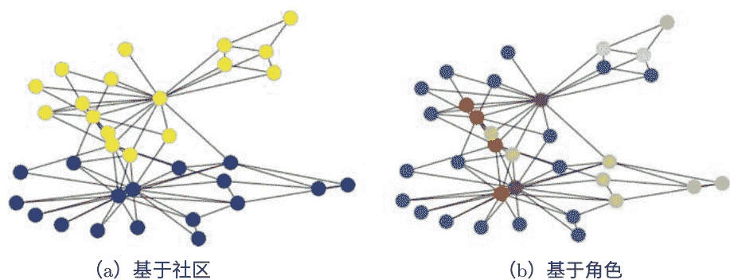

(a) 基于社区
(b) 基于角色
图1 卡特拉特俱乐部社交网络[107]，用于分析基于社区和基于角色的节点分类。相同颜色的节点属于同一类别；a 使用node2vec [28]方法进行基于社区的节点分类（节点的颜色表示其所属社区），b 使用RolX [32]方法进行基于角色的节点分类（最佳颜色显示）。

根据所考虑的分类，节点具有不同的角色。最近，观察到在数据和网络分析中深度学习实践的普及。已经提出了几种基于深度学习的机制来识别网络中的社区和节点的角色。在本章中，我们对每个类别的分类方法进行简要回顾。

#### 1.1 应用

节点分类已经在我们接下来讨论的各种应用中使用。

- **链接预测：**在网络/图中，链接/边可以分为两种类型：（i）社区内链接，当链接的两个端节点属于同一个社区时；（ii）社区间链接，当链接的两个端节点属于不同的社区时。观察发现，社区内和社区间链接具有不同的结构特性，而相似度评分，如Jaccard系数、Adamic-Adar指数和RA指数，社区内连接的评分要比社区间连接的评分高得多[80]。
- **推荐：**除了朋友推荐外，用户分类对基于用户个人偏好的内容或帖子推荐也很有帮助[7, 59]。用户分类还有助于根据不同类型用户的兴趣水平推荐广告、音乐、视频和电影[53, 63, 104]。
- **异常检测：**数据挖掘的子领域，与发现数据集中的罕见事件相关，被称为异常检测。在异常检测中，节点分类可以用于基于网络中存在的异常结构属性对节点进行分类[3,21,73]。
- **识别社交影响力：**严格的基于社区和角色的节点分类分析可以帮助我们识别节点的局部和全局影响力，其中局部影响力指的是节点在其社区中的影响力，全局影响力是节点在整个网络中的影响力[24,72,82]。社区信息还被用于计算节点的更好中心性值，以识别网络中的有影响力的节点[1]。
- **网络可视化：**节点分类在网络可视化中也非常有益，特别是当整个网络非常庞大且复杂无法一次性可视化时[39, 84]。使用低维表示的网络可视化有助于获取关于网络的有用见解[68, 81]。
- **网络重构：**网络嵌入方法旨在保留网络的结构特性，如角色、社区或接近度。因此，生成的嵌入可以进一步用于网络的重构。从这样的嵌入中进行网络重构可以用于验证和评估底层网络嵌入的有效性[38]。此外，网络重构误差可以帮助识别网络中的异常节点[18]。

#### 2 预备知识

在本节中，我们简要讨论了本章中使用的术语。

**定义（网络）** 网络表示为 $G=(V,E)$，其中包括顶点集 $V=\{v_1, v_2, \dots, v_n\}$ 和边集 $E=\{e_{j,k}\}$，其中 $j,k=1,2,\dots$。如果节点 $v_i \in V$ 具有属性 $a_i \in A \subseteq \mathbb{R}^{n \times d}$，则网络 $G=(V, E, A)$ 是一个属性网络。

**定义2（社区）** 给定一个包含 $m$ 个社区 $C=\{C_1, C_2, \dots, C_m\}$ 的网络 $G$，其中每个社区 $C_i$ 是 $G$ 的子图，使得不同社区 $C_j$ 和 $C_k$ 之间的节点稀疏连接，而单个社区内的节点密集连接。

**定义3（网络嵌入）** 给定一个网络 $G=(V,E)$，网络嵌入过程将给定网络中的每个节点 $v \in V$ 映射到低维度嵌入 $X \in \mathbb{R}^{n \times r}$，其中 $r < n$。

**定义4（角色）** 角色由具有与集合内不同节点相比其他节点更高的“相似性”的节点集合描述。节点的相似性可以基于节点和网络的结构、影响力或其他特征来定义。在文献中，大多数研究都集中在“结构相似性”上。短语“结构相似”指的是具有相似结构特性的节点集合[75]。

在下一节中，我们将讨论网络中用于社区检测的最先进的深度学习方法。

#### 3 基于社区的节点分类

基于社区的节点分类因其显著的实际意义而引起了许多研究人员的关注。事实上，我们的世界构成了一个庞大而复杂的网络，其中包含各种串联的社区。例如，在社交网络中，各种在线购物平台的赞助商向已检测到的社区用户推荐产品[95, 100]。将社区检测方法和实践应用于引用网络[13]有助于识别最新的研究趋势，并确定研究主题的演变、重要性以及相互关联性。此外，将社区检测方法和框架应用于蛋白质-蛋白质相互作用（PPI）[12]网络和代谢网络[29, 74]中，可以发现具有相关生物功能和代谢复杂性的蛋白质。类似地，使用社区检测方法在脑网络[86]中揭示了不同区域的解剖和功能分区。

大多数传统的（浅层）节点分类技术，如统计推断[2,36,48]和谱聚类[4,56]，适用于小网络或非常幼稚的情况。然而，现实世界的网络要复杂得多，具有丰富的非线性信息，这使得传统模型在这些情况下最不适用，因为它们计算成本高昂。而较便宜的深度学习方法更适用于这些情况，因为它们提供了灵活的社区检测方法，可以表示较低维度的网络嵌入并学习非线性网络特征。

此外，在本节的后续部分中，我们研究了基于不同社区的节点分类方法，如生成对抗网络方法、自编码器方法、图卷积网络方法、结合无向图模型和图卷积网络方法的方法以及基于随机游走的方法。

##### 3.1 自编码器方法

自动编码器提供了一个基本的神经网络框架，将高维数据（图形数据）重构为低维网络表示的形式。自动编码器使用解码器和编码器组件以无监督的方式学习新的网络表示。它们具有对称的结构，具有多个隐藏层，以使得一个层的输出作为输入传递给后续的层。它们的主要目标是减少重构/重组网络数据与原始输入之间的误差，以便最优地学习隐藏表示，表示为：

$$ \text{损失}(\theta_1, \theta_2) = \sum_{i=1}^{n} l(x_i, g(f(x_i; \theta_1); \theta_2)) $$

这里 $l(\cdot)$ 是损失函数，$g(\cdot; \theta_2)$ 和 $f(\cdot; \theta_1)$ 分别是解码器和编码器。由于大多数基于自动编码器的方法和实践都以网络嵌入 $[11,101]$ 的形式呈现，因此使用各种聚类方法，如谱聚类和 $\kappa$ 均值聚类，作为提取社区的替代方法。这些替代方法直接将聚类方法集成到现有的提取社区框架中 $[8,9]$。

基于自动编码器的方法可以进一步分为四种类型：去噪、堆叠、稀疏和变分自动编码器。最基本的自动编码器类型是堆叠自动编码器，它包含连续的一系列自动编码器，这在其他编码器中经常使用。特别是当堆叠框架针对其他属性，如去噪或稀疏性时，我们将它们归类为去噪和稀疏自动编码器。

**堆叠自编码器。** 半DNR [101] 序列自动编码器堆叠用于生成DNR网络的非线性重构。这种做法要求每个编码器层的神经元数量比前一层少，以提取输入数据的重要特征并减少其维度。半DNR框架完全利用两个节点属于相同社区的先验知识，以在网络中引入节点之间的成对约束。半DNR框架使用以下损失函数：

$$ \text{损失} = l(M, Z) + \lambda \text{Tr}(H^T L H) $$

其他一些堆叠自编码器可以列为DeCom [9], CDDTA [96], AAGR [11], DIR [43] 和 NEC [88]。

**稀疏自编码器。** 具体来说，大规模网络非常复杂，难以处理和存储；因此，拥有稀疏表示是很重要的。此外，通过将稀疏约束引入自编码器来找到最优网络表示具有激发新的研究方向的潜力。图编码器 [91]通过将正则化与隐藏层结合来显式控制隐藏表示的大小。在引入稀疏约束后，重构误差或损失函数可以写为：

$$ \text{损失} = \sum_{j=1}^{n} \|z_j - x_j\|_2 + \beta \text{KL}(\rho \parallel \hat{\rho}) $$

其中 $\hat{\rho}$ 和 $\rho$ 是参数，KL 是稀疏性的惩罚项。其他基于堆叠自编码器的框架可以在DFuzzy [8]和CDMEC [98]中找到。

**去噪自编码器。** 如果我们的输入具有显著的噪声，那么可以利用去噪自编码器提供网络表示，可以抵御噪声。在[93]中，提出的MAGE框架利用卷积网络将结构和内容信息结合起来，并在整个自编码器设置中迭代地引入随机噪声。因此，通过这个过程，可以将内容和结构信息合并到一个统一的过程中，并进行综合分析。此外，在[99]中，GRACE模型通过结合网络动态和假设网络中的聚类形成过程需要动态嵌入来达到稳定状态。

**变分自编码器。** 我们可以很容易地找到各种现有的方法，可以归类为变分自编码器[51]。这些方法将隐藏层表示视为与其前面的分布相关的固有变量（潜在变量）。在[66]中，ARVGA将重构误差计算为：

$$ \text{损失} = \mathcal{E}_{q(G|X,A)}[\log p(A|G)] - \text{KL}(q(G|X,A) \parallel p(G)) $$

其他基于变分自编码器的框架可以在以下地方找到：VGAECD [14], 改进的VGAECD [15], gamma阶梯VAE [79], NetVAE [45]。

##### 3.2 生成对抗网络(GAN)方法

受到极小极大两人博弈生成对抗网络[27]的启发，包括一个生成器 ($\mathcal{G}$) 和一个判别器 ($\mathcal{D}$) 模块。生成器 ($\mathcal{G}$) 模块提取数据分布，而判别器 ($\mathcal{D}$) 模块估计一个样本数据是属于用于训练的原始数据还是使用 $\mathcal{G}$ 模块生成的数据。生成对抗网络(GANs)的完整训练过程可以表示为：

$$ \min_{\mathcal{G}} \max_{\mathcal{D}} \mathcal{V}(\mathcal{G}, \mathcal{D}) = \min_{\mathcal{G}} \max_{\mathcal{D}} (\mathbb{E}_{x \sim P_{\text{数据}(x)}}[\log \mathcal{D}(x)] + \mathbb{E}_{z \sim P_z(z)}[\log (1-\mathcal{D}(\mathcal{G}(z)))]) $$

GANs是无监督的（在大多数情况下），这促使使用GANs进行社区检测。GANs还具有一个重要的能力，即使用 $\mathcal{G}$ 生成的合成数据遵循与原始数据相同的分布。在[42]中提出了一个名为CommunityGAN的框架，受到Affiliation Graph Model (AGM)的启发，通过在网络鉴别器和基于模式的网络生成器之间启动极小极大博弈来提高性能。CommunityGAN框架可以发现重叠的社区，同时也可以学习不同的图表示。

另一个框架SEAL在[110]中提出，包括一个鉴别器模块，用于估计一个社区（作为输入）是否真实，以及一个生成器模块用于生成各种社区。在[90]中，作者提出了一个称为AGAE的框架，将聚类集成到（深度）图嵌入过程中，以自我监督网络训练过程，并借助对抗正则化器的帮助。在[23,31,37,89]中讨论了各种其他方法。

##### 3.3 图卷积网络方法

图卷积网络 (GCNs) [52]，广泛使用的图神经网络方法流派，对于无监督和有监督的节点分类方法具有影响力的结果，激发了许多研究人员的兴趣。为了有效地提取复杂网络的高维数据进行社区检测，已经提出了各种方法。

[44]中的作者指出，GCNs的节点表示输出在任何情况下都不是面向社区的，检测社区是一项固有的无监督任务。为了解决这个特定问题，他们提出了一个称为JGECD的模型，用于使用联合GCN嵌入进行社区检测。JGECD框架包括三个基本模块：拓扑重构模块、社区检测模块和双编码器模块。作者正式定义了第 $p$ 个节点与第 $q$ 个社区相关联的概率为：

$$ \mathcal{U}_{pq} = \frac{\exp(\theta_q^T h_p)}{\sum_{q=1}^k \exp(\theta_q^T h_p)} $$

此外，JGECD的扩展版本[108]采用MRFas-GCN [46]作为编码器，以实现无监督的社区检测。作者采用了一个具有社区中心属性的双编码器来重新建模网络属性和网络拓扑。用于重新建模网络拓扑的解码器可以表示如下：

$$ \hat{A} = \text{sigmoid}(\mathcal{D} W U^T \mathcal{D}^T) $$

这里，$W$ 表示权重矩阵，$D$ 表示度矩阵，$U$ 是来自编码器的输出，表示与不同社区相关的节点的可能性矩阵。在[112]中提出了一种基于GCN的时空异构模型，称为HTGCN。该提出的框架从异构时空图或网络中提取社区。简而言之，该框架首先使用异构GCN提取异构网络特征表示，然后应用压缩聚合过程来展现结果社区的动态和静态属性。

##### 3.4 整合无向图模型和图卷积网络

近年来，已经引入了大量的工作，以便将无向图模型与GCN相结合，以便检测社区（重叠/非重叠）。GCN的基本缺点是它采用局部平滑特征（忽略社区属性）来获取节点嵌入，这不是面向社区的。然而，无向图模型具有各种全局目标来定义社区。因此，可以使用无向图模型来解决GCN的缺点。因此，这两种方法可以结合起来进行社区检测。

在这一领域中，主要的工作是在[46]中提出的，被称为MRFasGCN。该提出的框架将MRF和GCN合并起来，以便以半监督的方式进行社区检测。在MRFasGCN之后，还提出了其他几种将CRF与GCN相结合的方法。在[71]中提出了另一种方法，称为GMNN，它将统计有理学习与图神经网络相结合。GMNN框架学习节点表示，以建模节点之间的标签依赖关系，以实现半监督的基于社区的节点分类的唯一目的。此外，在[22]中，作者指出已经存在的GCN在网络中不保留相似性（节点之间）。为了解决这个问题，他们提出在GCN中添加一个CRF层，以强制相似节点具有相似特征的特性。

##### 3.5 基于随机游走的方法

任何基于网络嵌入的方法的基本要求是保留和保持底层网络结构。此外，保留邻域的结构信息，构成节点的局部特征，也是网络嵌入的另一个重要特征。尽管节点的邻接向量保留了高维的一阶邻域信息，但由于大图/网络的稀疏性，它是离散、稀疏和高维的，因此不足够。这样的网络表示对于后续应用来说是不够的，例如自然语言处理中的词表示也面临这些问题。Word2Vector [62]的引入有效地将词表示为连续、稠密和低维向量。Word2vector的基本思想是根据邻域词的共现率重构邻域词向量。Word2vector的类比进一步被用于几种基于随机游走的嵌入机制，其中网络上的随机路径是通过将网络的每个节点视为一个词，相应的指定随机路径视为一个句子来生成的。邻域向量的定义类似于使用共现率在Word2Vector中的邻居词向量。Word2Vector的类比进一步被不同的网络嵌入机制所采用，例如DeepWalk [68]，Node2Vec [28]，metapath2vec [17]，TriDNR [67]等等。

DeepWalk[68]采用一种名为SkipGram的有效神经语言模型进行网络嵌入。SkipGram专注于最大化窗口 $w$ 中存在的单词之间的共现概率。DeepWalk使用截断随机游走对给定网络进行多路径采样进行初始化。从给定网络中采样的每条路径与语料库中的相应句子相关联，其中每个节点对应于个别单词。随后，在路径上应用SkipGram，最大化节点邻域的包含概率，条件是网络嵌入。因此，具有相似邻域向量的节点共享相似的嵌入。DeepWalk使用以下目标函数：

$$ \min_x -\log P(\{v_{j-w}, \ldots, v_{j-1}, v_{j+1}, \ldots, v_{j+w}\} \mid x_j) $$

其中，$w$ 是给定窗口大小，间接地决定了随机游走的大小。SkipGram的引入进一步消除了公式1中的排序约束，如下所示：

$$ \min_x -\log \sum_{-w \leq k \leq w} P(v_{j+k} \mid x_j) $$

其中，$P(v_{j+k} \mid x_j)$ 是通过softmax函数定义的：

$$ P(v_{j+k} \mid x_j) = \frac{\exp(x_{j+k}^T x_j)}{\sum_{l=1}^{|V|} \exp(y_l^T x_j)} $$

然而，由于归一化因子，计算公式3中的计算非常昂贵。因此，解决这个问题的方法是以廉价的方式近似计算完整softmax中涉及的计算，使用（a）负采样函数[62]（b）分层softmax函数[62]。

负采样函数[62]通过利用逻辑回归来区分节点和噪声，从而减少了计算方程3中的时间复杂度。方程2中每个 $\log P(v_{j+k} \mid x_j)$ 的计算如下：

$$ \log \sigma(x_j^T x_{j+k}) + \sum_{t=1}^{K} \mathbb{E}_{v^t \sim P_n} [\log \sigma(-x_{v_t}^T x_j)] $$

其中 $P_n(v_j)$ 是负样本中节点 $v_j$ 的噪声分布，$K$ 是实际采样的节点总数。

层次化softmax函数[62]通过生成一个二叉树来解决方程3中计算 $\log P(v_{j+k} \mid x_j)$ 的问题，其中节点被设计为叶节点。现在，我们只需要计算从根节点到指定叶节点的路径，而不是计算所有节点的路径。因此，优化问题转化为：给定一个特定的路径，最大化其概率。此外，方程3转化为：

$$ P(v_{j+k}|x_j) = \prod_{t=1}^{\log(|V|)} P(a_t|x_j) \quad (5) $$

其中，到指定叶节点 $v_j$ 的路径是一个节点序列 $(a_0, a_1, a_2, \dots, a_{\log(|V|)})$ 以 $v_j$ 为根节点，$a_{\log(|V|)} = v_j$。

DeepWalk的广泛应用[68]激发了许多人提出了基于不同深度学习模型的多样化图嵌入方法，如SkipGram[61]和长短期记忆 (LSTM)[35]。后来的大部分相关工作都在DeepWalk的基础上进行了一些微小的改变，要么保持了接近性[17, 19, 67]，要么采用了随机游走的采样方法[28, 103]。

node2vec[28]提供了一个框架，用于表示网络中各个节点的连续（非离散）特征，以网络嵌入的形式呈现。这项新颖的工作学习了节点的映射，并将它们转换和映射到低维空间中，同时保留了网络中节点的邻域信息，以最大似然的方式。node2vec利用了一种灵活的方法来定义节点的邻域网络，并提出了一种有偏随机游走的过程，以有效地探索不同的邻域网络。

提出的node2vec算法涉及扩展SkipGram架构[61, 68]的概念。此外，目标函数转换为：

$$ \max_f \sum_{u \in V} \log Pr(N_S(u)|f(u)) \quad (6) $$

其中 $N_S(u)$ 表示节点 $u \in V$ 的邻域网络，使用给定的采样策略 $S$ 是 $|V| \times d$ 参数的特征矩阵。此外，他们采用了各种假设，以进一步简化等式6中给出的目标函数。

$$ \max_f \sum_{u \in V} \left[ -\log Z_u + \sum_{n_j \in N_S(u)} f(n_j) \cdot f(u) \right] \quad (7) $$

在这里，$Z_u$ 是相对昂贵的函数（在计算方面），因此需要进一步近似（具体使用负采样函数[62]）。此外，根据公式7给出的目标函数进一步使用随机梯度上升优化模型参数。

metapath2vec[17]在异构网络环境中形式化了生成网络嵌入的框架。所提出的模型利用基于元路径的随机游走来生成给定节点的异构邻域网络。

此外，metapath2vec使用异构SkipGram模型构建节点嵌入。

metapath2vec模型描述了以局部结构为目标函数的概率最大化问题 (类似于[28, 62, 68]的目标函数):

$$\operatorname{arg} \max _{\theta} \prod_{v \in V} \prod_{c \in N(v)} P(c \mid v ; \theta)$$

为了在网络嵌入metapath2vec中融入异构邻域信息，使用了基于元路径的随机游走的异构SkipGram模型。因此，在异构环境中，目标函数的转换如下。

$$\operatorname{arg} \max _{\theta} \sum_{v \in V} \sum_{t \in T_{V}} \sum_{c_{t} \in N_{t}(v)} P\left(c_{t} \mid v ; \theta\right)$$

其中, $N_{t}(v)$ 是具有 $t$ 种节点类型的节点 $v$ 的邻域, $P\left(c_{t} \mid v ; \theta\right)$ 是如公式3所讨论的softmax函数。此外, 为了解决softmax函数的计算复杂性问题, metapath2vec采用了如公式4所示的负采样方法。

TriDNR[67]提供了一个网络表示的框架，利用节点标签（如果有）、节点内容和节点结构信息来学习有效和最优的节点表示。TriDNR强制从深度神经语言模型中学习，具体包括三个层次：（a）在节点标签层面，TriDNR方法将标签映射到单词，目标函数最大化给定类别标签时观察到的单词序列的概率；（b）在节点内容层面，TriDNR方法将节点与单词映射，目标函数最大化给定单个节点时观察到的单词序列的共现；（c）在节点结构层面，TriDNR方法将节点与另一个节点映射，目标函数最大化在随机游走中给定初始节点时遇到相邻节点的概率。所有这些信息都被综合提供给神经网络模型，以学习给定节点的最优和有效表示。TriDNR的目标函数为：

$$\mathcal{L}=(1-\alpha) \sum_{j=1}^{N} \sum_{s \in S} \sum_{-a \leq k \leq a, k=0} \log P\left(v_{j+k} \mid V_{j}\right)$$

其中 $\alpha$ 平衡节点标签、内容和结构信息的权重， $a$ 是序列的窗口大小。

网络中不同节点的角色是网络分析中另一个重要的方面，用于对节点进行分类。下一节将专门讨论基于不同角色的节点分类方法。

#### 4 基于角色的节点分类

大多数节点分类方法都是基于节点之间的接近程度设计的，即基于社区结构的网络嵌入向量。因此，它们无法理解基于角色的结构信息[76]。研究面向角色的节点分类存在各种挑战，接下来我们将重点介绍其中一些挑战。

- 1. 在设计实际复杂的社交网络时，精确的角色定义是复杂的。
- 2. 不同角色的节点之间的交互模式，以及在大规模社交网络中具有相同角色的节点的分布，是一个非常复杂和繁琐的任务。
- 3. 基于角色，具有相同结构的两个不同节点在网络中可能相距很远，这使得定义有效的损失函数变得困难。

上述挑战已经被许多研究人员通过各种基于角色的节点分类技术来解决，这些技术可以分为两类：浅层方法和深度学习方法。浅层方法包括基于矩阵分解的简单方法。不同的矩阵分解技术通过学习网络嵌入向量和网络的高阶相似性矩阵（如非负矩阵分解、奇异值分解和NetSMF [70]）来进行节点分类。

接下来，我们讨论一些最近发表的基于节点角色分类的方法。

DRNE[92]捕捉网络中的正则等价性。正则等价性可以作为角色等价性的替代，角色等价性被定义为两个正则等价的节点具有一个也是正则等价的邻居。此外，它还提出了层归一化的LSTM（长短期记忆）[35]，以递归方式使用聚合表示来表示网络中的每个节点。在学习了个体节点表示之后，可以根据它们的角色进行节点分类。它使用以下损失函数来学习其网络嵌入向量：

```
$$\mathcal{L}_{eq}=\sum_{v \in V}\left|\left|H_{v}-A g g(\left\{H_{u} \mid u \in N(v)\right\})\right|\right|_{F}^{2}$$
```

其中Agg是使用层归一化的LSTM对邻域嵌入进行的聚合操作。在单个递归步骤中，单个节点的已学习嵌入仅保留其邻域的局部结构。

通过迭代更新的学习参数，学习到的个体节点嵌入全局地融合了它们的结构信息。因此，它遵循了一致的正则等价概念。作者还考虑了存在多个解的情况，只要它们满足递归过程即可。为了避免这样一个平凡的解（其中所有嵌入都为零），他们设计了一个稍微不同的正则化项：

$$\mathcal{L}_{reg} = \sum_{v \in V} || \log(d_v + 1) - M L P (Agg(\{H_u|u \in N(v)\})) ||_F^2$$

正则化器加权参数 $\gamma_{deg}$，并且整个模型使用基本损失函数进行训练：

$$\mathcal{L} = \mathcal{L}_{eq} + \gamma_{deg}\mathcal{L}_{reg}$$

GAS[30]由图自编码器组成，明确地引导基本结构信息，以学习个体节点表示，这也是角色导向的。所提出的想法利用提取的低维结构特征来训练图神经网络（GNNs）。GNNs与Weisfeiler-Lehman（WL）测试密切相关，并具有出色的网络结构捕捉能力[97]。GAS实现了一个L层图卷积编码器，每一层都被编码为：

$$H^{(l)} = \sigma(\tilde{A}H^{(l-1)}\theta^{(l-1)})$$

这里 $\tilde{A} = A + I$，而 $\theta^{(l-1)}$ 是第 $(l-1)$ 层的参数矩阵。输入 $H^{(0)}$ 可以被视为一个嵌入查找表或 $\tilde{A}$。与原始的GCN [52] 不同，GAS应用了求和池化传播规则来更好地区分局部结构。因此，更强大的GNNs，如Graph Isomorphic Network [97]，可能会进一步提高结果性能。

将一些关键的结构特征作为输入来训练/监督模型是GAS的关键。特征提取过程与ReFeX [33]非常相似，只是聚合操作只执行一次，并且执行归一化而不是丢弃或分组。MLP模型被用作解码器，以某种程度上对所需特征进行初步近似，即 $\hat{F}=MLP_{dec}(H)$，损失函数如下：

$$\mathcal{L} = || F - \hat{F} ||_F^2$$

RESD[109]提取了网络中各个节点的所需高阶结构特征表示。此外，由于特征提取过程对现实世界网络中的各种噪声/冗余非常敏感，大多数特征提取方法无法更准确地表示各个节点的角色。因此，RESD使用变分自动编码器（VAE）[50]来最小化噪声，增强节点分类的网络嵌入的鲁棒性，并建模提取特征之间的关系。由于应用了VAE框架，个体节点的重要结构信息（如度）可能会丢失；因此，作者使用了度规则化约束来保留重要的结构信息。基本上，RESD还使用ReFeX [33]来提取所需特征 $(F_{ReFeX})$。使用VAE学习具有降噪功能的稳健网络表示如下:

$$\begin{gathered}z_{i}=M L P_{e n c}\left(F_{i}\right) \\ \mu_{i}=W_{\mu} Z_{i}+b_{\mu} \\ \log \left(\sigma_{i}\right)=W_{\sigma} Z_{i}+b_{\sigma} \\ \boldsymbol{H}_{i}=\mu_{i}+\sigma_{i} \odot \quad \epsilon, \quad \epsilon \sim \text { 高斯分布 }(0, I)\end{gathered}$$

在[50]中讨论的VAE框架通常使用特征重建过程进行训练。RESD中使用了类似于DRNE [92]中的面向度的正则化器，有助于保留重要的结构信息。

聚合的目标函数如下:

$$\mathcal{L}=||F-\ddot{F}||_{F}^{2}+\gamma_{d e g} \mathcal{L}_{d e g}$$

GraLSP [47]：尽管取得了各种成就，GNNs无法识别一些在各种网络应用中起关键作用的重要结构模式。在[47]中，提出了一种基于GNN的框架，它使用各种匿名随机游走将局部结构模式与邻域聚合明确地集成在一起。

基本上, GraLSP使用不同的匿名随机游走来描绘局部网络结构, 这是一种灵活而强大的工具, 用于估计结构模式。然后, 对这些随机游走进行特征聚合处理, 设计了不同的机制来推断结构体系特征的影响, 例如放大、接收半径。此外, 他们还设计了一个捕捉结构相似性的目标函数, 与个体节点接近性目标一起进行联合优化。

经验上, 对于任意随机节点 $v_i$, 它生成 $w$ 个随机游走 $W_{i}=\left\{w_{i 1}, w_{i 2}, \ldots, w_{i w}\right\}$, 从节点 $v_i$ 开始, 长度为 $l_w$, 用于捕捉结构模式, 然后将这些游走 $W_{i}$ 匿名化 [40] 为 $aw(w)$ 。将个体匿名游走 $aw(w)$ 用作基本网络嵌入查找表, 表示为 $u_{aw(w)}$ 。邻域表示的聚合过程如下所示:

$$\begin{aligned} & H_{\text{邻居}}^{(l)} = \text{MEAN}_{w \in W_{i}, j \in\left[1, \frac{2 l_w}{|w|}\right]}\left(\alpha_{i, w}^{(l)}\left(a_{i, w}^{(l)} \odot H_{w_{j}}^{(l-1)}\right)\right) \\ & H_{i}^{(l)} = \text{ReLU}\left(W_{\text{self}}^{(l)} H_{i}^{(l-1)}+W_{\text{邻居}}^{(l)} H_{\text{邻居}}^{(l)}\right) \end{aligned}$$

这里 $W_{\text{邻居}}$ 和 $W_{\text{self}}$ 是训练参数矩阵。此外，基于每个节点的局部结构学习到的注意力参数如下:

```
$$ \alpha_{i, w}^{(l)}=\frac{\exp \left(S L P_{a t t}\left(u_{a w(w)}\right)\right)}{\sum_{w \in W_{i}} \exp \left(S L P_{a t t}\left(u_{a w(w)}\right)\right)} $$
```

其中 $\mathrm{SLP}^{(*)}$ 是单层感知器，$a_{i, w}^{(l)}$ 表示放大参数, 计算方式如下:

```
$$ a_{i, w}^{(l)}=S L P_{a m p}\left(u_{a w(w)}\right) $$
```

从保留节点之间重要信息的角度来看，作者利用了DeepWalk [68]中使用的损失函数, 如下所示:

```
$$ \mathcal{L}_{\text {proximity}}=-\sum_{v_{i} \in V} \sum_{v_{j} \in N_{i}}\left(\log \sigma\left(H_{i} H_{j}^{T}\right)-\gamma_{n e g} \mathbb{E}_{v_{k} \sim P_{t_{n}}(v)}\left[\log \sigma\left(H_{i} H_{k}^{T}\right)\right]\right) $$
```

经过 $L$ 次迭代, 网络嵌入在状态 $H=H^{(L)}$ 中找到。为了保留节点之间的结构相似性, GraLSP使用以下损失函数:

```
$$ \begin{aligned} & \mathcal{L}_{\text {结构 }}=-\sum_{v_{i} \in V, w_{j}, w_{k}, w_{n} \in W_{i}} \log \sigma\left(u_{j}^{T} u_{k}-u_{k}^{T} u_{n}\right), \text { 使得: } \hat{p}\left(w_{j} \mid v_{i}\right)>\hat{p}\left(w_{j} \mid G\right), \hat{p}\left(w_{k} \mid v_{i}\right)>\hat{p}\left(w_{k} \mid G\right), \hat{p}\left(w_{n} \mid v_{i}\right)<\hat{p}\left(w_{n} \mid G\right) . \end{aligned} $$
```

这里, $\hat{p}(\cdot)$ 是各种匿名游走的基本经验分布:

```
$$ \begin{gathered} \hat{p}\left(w_{j} \mid v_{i}\right)=\frac{\sum_{w \in W_{i}} \Pi(a w(w)=w_{j})}{w} \\ \hat{p}\left(w_{j} \mid G\right)=\frac{\sum_{i=1}^{n} \hat{p}\left(w_{j} \mid v_{i}\right)}{n} \end{gathered} $$
```

最后, 具有权衡参数 $\gamma$ 的结构综合损失函数如下:

```
$$ \mathcal{L}=\mathcal{L}_{\text {proximity}}+\gamma_{\text {structural }} \mathcal{L}_{\text {structural }} $$
```

GCC[69]是基于GNN的自监督预训练框架,捕捉了跨多个网络的通用网络的拓扑结构和属性。在预训练过程中, GCC通过对比学习来区分网络内部和网络间的子图实例, 从而使GNN能够学习到可传递 (在多个网络之间) 和内在的网络结构表示。预训练的GNN框架将个体节点的节点中心子图编码为 $H_{i}$, 以区分相似的子图和不相似的子图。GCC框架实现了当预训练数据集的规模变得非常大时，具有捕捉局部结构模式的能力，并且随后获得的表示可以更准确地衡量结构相似性。其他基于GNN的提出的框架要么以监督方式进行训练，要么专注于接近性和社区，例如[105,106]中所述。因此，GCC的作者提出了一种基于角色的网络嵌入/分类方法。

根据实证，GCC将其 $k$-hop可达邻域捕捉为 $G_i^k$，并使用具有卷积层的图同构网络 (GIN) [97]编码器：

$$H^{(l)} = MLP_{GIN}\left((A + (1+\epsilon^{(l)}) I) H^{(l-1)}\right)$$

这里GIN的初始属性设置为 $G_i^k$ 的特征向量，并且是一个固定参数。根据从节点 $v_{i}$ 开始的随机游走中找到的节点序列，诱导节点 $v_{i}$ 的一个子图实例。从其他可能存在于其他网络中的节点开始，推动 $K$ 个不相似的子图实例。使用GIN编码器导出这 $K+1$ 个实例的网络表示为 $\left\{x_{0}, x_{1}, \ldots, x_{K}\right\}$。GCC使用称为InfoNCE [65]的对比学习框架，其适配的损失函数可以表示为：

$$\mathcal{L}=\sum_{v_{i} \in V}-\log \frac{\exp \left(H_{i} x^{+} / \iota\right)}{\sum_{j=0}^{K} \exp \left(H_{i} x_{j} / \iota\right)}$$

其中 $\iota$ 是给定的超参数。

DeepGL[77]学习了可以进一步推广到整个网络的边缘和节点特征。最初，从输入图中捕获一组基本特征，例如图形特征，并自动学习具有多层结构的分层图表示。多层结构的每个连续层都依赖于其前一层的输出来学习更高阶的特征。DeepGL框架的设计方式使得学习的关系函数（每个函数代表一个特征）自然地推广到整个网络。因此，它也可以以图形的迁移学习任务的形式来利用。此外，这种方法还支持属性/标记图以节省空间的方式学习归纳图表示（可解释的）。

上述关于基于角色的节点分类的最新深度学习方法包括将传统浅层方法中使用的基于角色的建模方法与DL技术相结合，将关键的结构架构信息映射到非线性网络表示中进行节点分类。DRNE在学习正则等价性后重构节点度数。GAS使用网络的结构特征监督GCN的训练。RESD使用VAE框架聚合ReFeX和DRNE的变体。GraLSP使用匿名游走的概念提取结构相似性。GCC使用对比学习对模型进行预训练，对节点中心子图进行编码以进行节点分类。

最后，DeepGL框架的设计方式使得学习到的关系函数（每个函数代表一个特征）在整个网络上自然地进行泛化。

#### 5 结论和未来方向

本章概述了解决节点分类这一具有挑战性和有趣问题的最新深度学习方法。

近年来，基于深度学习的方法在任何领域都显示出了显著的性能改进。这一趋势在节点分类问题领域也得到了延续，导致高影响力期刊和会议上的出版物数量显著增加。在节点分类领域应用深度学习实践导致了效率、适用性、鲁棒性和有效性的显著提升。基于深度学习的新方法比传统的节点分类方法更具可扩展性和灵活性。我们已经讨论了基于深度学习的方法对解决节点分类问题的贡献。此外，我们还总结了节点分类在在线社交网络中的广泛应用。

解决节点分类问题的技术需要进一步研究。因此，各种节点嵌入必须利用结构化社区相关信息，以便生成的特征表示在角色和基于社区的节点分类中起到作用。到目前为止，节点分类方法仅针对单层网络提出；这些方法还必须扩展到多层网络。此外，本章讨论的不同方法主要针对静态网络开发。然而，为了捕捉真实世界系统的实际行为，我们必须引入能够抓住时变真实世界网络的自然动态性和连续流动行为的新方法。此外，目前现有的节点分类方法专门设计用于无符号网络。然而，两个节点之间的关系可以是正面的也可以是负面的，不同节点之间的负面联系需要有区别的社区学习技术。因此，必须引入新的方法来解决有符号网络中的节点分类问题。

致谢：本工作得到印度政府科学技术部赞助的项目支持，资助号为“DST-1401-CSE”。

#### 参考文献

- 1. Ahsan, M., Singh, T., Kumari, M.: 社交网络中社区检测期间的影响节点检测。在：2015年认知计算与信息处理国际会议（CCIP），第1-6页。IEEE（2015）

- 2. Airoldi, E.M., Blei, D.M., Fienberg, S.E., Xing, E.P.: 混合成员随机块模型。机器学习研究杂志（2008）

- 3. Akoglu, L., Tong, H., Koutra, D.: 基于图的异常检测和描述：一项调查。数据挖掘与知识发现 29(3)，626-688（2015）

- 4. Amini, A.A., Chen, A., Bickel, P.J., Levina, E.: 大规模稀疏网络中的社区检测的伪似然方法。Ann. Stat. 41(4), 2097–2122 (2013)

- 5. Bahdanau, D., Cho, K., Bengio, Y.: 通过联合学习对齐和翻译进行神经机器翻译 (2014). arXiv:1409.0473

- 6. Bai, S., Fang, S., Li, L., Liu, R., Chen, X.: 通过探索节点的社区成员身份来增强链接预测。Int. J. Mod. Phys. B 33(31), 1950382 (2019)

- 7. Balabanović, M., Shoham, Y.: 基于内容和协同的推荐系统。Commun. ACM 40(3), 66–72 (1997)

- 8. Bhatia, V., Rani, R.: Dfuzzy：一种基于深度学习的大规模图模糊聚类模型。Knowl. Inf. Syst. 57(1), 159–181 (2018)

- 9. Bhatia, V., Rani, R.: 一种基于自动编码器的大规模图重叠社区检测模型。Futur. Gener. Comput. Syst. 94, 16–26 (2019)

- 10. Cai, H., Zheng, V.W., Chang, K.C.C.: 图嵌入的综合调查：问题，技术和应用。IEEE Trans. Knowl. Data Eng. 30(9)，1616–1637（2018）

- 11. Cao, J., Jin, D., Dang, J.: 基于自动编码器的社区检测，自适应集成网络拓扑和节点内容。在：知识科学，工程和管理国际会议，第184–196页。Springer（2018）

- 12. 陈，J.，袁，B.：在酵母蛋白质相互作用网络中检测功能模块。生物信息学 22(18)，2283-2290（2006）

- 13. 陈，P.，Redner，S.：物理评论引用网络的社区结构。J. Informet. 4(3)，278-290（2010）

- 14. Choong, J.J., Liu, X., 村田，T.: 使用变分自动编码器学习社区结构。在：2018年IEEE国际数据挖掘会议（ICDM），第69-78页。IEEE（2018）

- 15. Choong, J.J., Liu, X., 村田，T.: 优化变分图自动编码器进行社区检测。在：2019年IEEE国际大数据会议（Big Data），第5353-5358页。IEEE（2019）

- 16. 多明戈斯，P.，理查森，M.：挖掘客户的网络价值。在：第七届ACM SIGKDD国际知识发现与数据挖掘会议论文集，第57-66页（2001）

- 17. 董，Y.，Chawla, N.V.，Swami, A.: metapath2vec：用于异构网络的可扩展表示学习。在：第23届ACM SIGKDD国际会议的知识发现和数据挖掘，第135-144页（2017）

- 18. 范，H.，张，F.，李，Z.: Anomalydae：用于属性网络的双自动编码器异常检测。在：ICASSP 2020-2020 IEEE国际会议上，声学、语音和信号处理（ICASSP），第5685-5689页。IEEE（2020）

- 19. 方，H.，吴，F.，赵，Z.，段，X.，庄，Y.，Ester, M.: 基于社交网络学习的基于社区的问题回答。在：AAAI人工智能会议论文集，第30卷（2016）

- 20. Fortunato, S.: 图中的社区检测。物理报告 486（3-5），75-174（2010）

- 21. Fu, W., Song, L., Xing, E.P.: 用于演化网络的动态混合成员块模型。在：第26届国际机器学习年会论文集，第329-336页（2009）

- 22. Gao, H., Pei, J., Huang, H.: 条件随机场增强的图卷积神经网络。在：第25届ACM SIGKDD国际会议上的知识发现与数据挖掘，第276-284页（2019）

- 23. Gao, H., Pei, J., Huang, H.: Progan: 通过接近生成对抗网络进行网络嵌入。在：第25届ACM SIGKDD国际会议上的知识发现与数据挖掘，第1308-1316页（2019）

- 24. Ghalmane, Z., El Hassouni, M., Cherifi, C., Cherifi, H.: 模块化网络中的中心性。EPJ 数据科学 8(1), 15（2019）

- 25. Gilpin, S., Eliassi-Rad, T., Davidson, I.: 引导学习用于角色发现(glrd)框架、算法和应用。在：第19届ACM SIGKDD国际会议上的知识发现和数据挖掘，第113-121页（2013）

- 26. Girvan, M., Newman, M.E.: 社交和生物网络中的社区结构。国家科学院学报 99(12), 7821-7826（2002）

- 27. Goodfellow, I., Pouget-Abadie, J., Mirza, M., Xu, B., Warde-Farley, D., Ozair, S., Courville, A., Bengio, Y.: 生成对抗网络。神经信息处理系统的进展。卷（2014）

- 28. Grover, A., Leskovec, J.: node2vec: 可扩展的网络特征学习。在：第22届ACM SIGKDD国际会议上的知识发现和数据挖掘，pp. 855-864（2016）

- 29. Guimera, R., Amaral, L.A.N.: 复杂代谢网络的功能制图。自然 433(7028), 895-900（2005）

- 30. Guo, X., Zhang, W., Wang, W., Yu, Y., Wang, Y., Jiao, P.: 以结构信息为导向的角色导向图自动编码器。在：高级应用数据库系统国际会议，pp. 466-481。Springer（2020）

- 31. He, D., Zhai, L., Li, Z., Jin, D., Yang, L., Huang, Y., Philip, S.Y.: 对抗性互信息学习用于网络嵌入。在：IJCAI，pp. 3321-3327（2020）

- 32. Henderson, K., Gallagher, B., Eliassi-Rad, T., Tong, H., Basu, S., Akoglu, L., Koutra, D., Faloutsos, C., Li, L.: Rolx: 大型图中的结构角色提取和挖掘。在：第18届ACM SIGKDD国际会议上的知识发现和数据挖掘，pp. 1231-1239（2012）

- 33. Henderson, K., Gallagher, B., Li, L., Akoglu, L., Eliassi-Rad, T., Tong, H., Faloutsos, C.: 通过递归结构特征进行图挖掘。在：第17届ACM SIGKDD国际知识发现与数据挖掘会议论文集，第663-671页（2011）

- 34. Hinton, G., Deng, L., Yu, D., Dahl, G.E., Mohamed, A., Jaitly, N., Senior, A., Vanhoucke, V., Nguyen, P., Sainath, T.N., 等: 深度神经网络在语音识别中的声学建模: 四个研究小组的共同观点。IEEE 信号处理杂志 29(6), 82-97 页（2012）

- 35. Hochreiter, S., Schmidhuber, J.: 长短期记忆。神经计算 9(8), 1735-1780 页（1997）

- 36. Holland, P.W., Laskey, K.B., Leinhardt, S.: 随机块模型: 第一步。社交网络 5(2), 109-137（1983）

- 37. 洪宏, 李欣, 王明: Gane: 一种生成对抗网络嵌入。IEEE Trans. 神经网络学习系统 31(7), 2325-2335（2019）

- 38. 侯明, 任杰, 张东, 孔祥, 张东, 夏飞: 网络嵌入: 分类、框架和应用。计算机科学评论 38, 100296（2020）

- 39. 胡宇, 石亮: 可视化大型图形。Wiley 跨学科综述: 计算统计学 7(2), 115-136（2015）

- 40. Ivanov, S., Burnaev, E.: 匿名行走嵌入。在：国际机器学习大会，pp. 2186-2195。PMLR（2018）

- 41. Jeon, H., Kim, T.: 社区自适应链接预测。在：2017年国际数据挖掘、通信和信息技术会议论文集，第1-5页（2017）

- 42. Jia, Y., Zhang, Q., Zhang, W., Wang, X.: Communitygan: 使用生成对抗网络进行社区检测。在：世界互联网大会，第784-794页（2019）

- 43. Jin, D., Ge, M., Li, Z., Lu, W., He, D., Fogelman-Soulie, F.: 使用深度学习进行社区发现。在：2017年IEEE第29届人工智能工具国际会议论文集，第160-167页。IEEE（2017）

- 44. Jin, D., Li, B., Jiao, P., He, D., Shan, H.: 基于联合图卷积网络嵌入的属性网络社区检测。在：国际人工神经网络会议论文集，第594-606页。Springer（2019）

- 45. Jin, D., Li, B., Jiao, P., He, D., Zhang, W.: 网络特定变分自编码器用于嵌入属性网络。在：IJCAI，第2663-2669页（2019）

- 46. Jin, D., Liu, Z., Li, W., He, D., Zhang, W: 图卷积网络遇见马尔可夫随机场：半监督属性网络社区检测。在：人工智能AAAI会议论文集，第33卷，第152-159页（2019）

- 47. Jin, Y., Song, G., Shi, C.: Gralsp: 具有局部结构模式的图神经网络。在：人工智能AAAI会议论文集，第34卷，第4361-4368页（2020）

- 48. Karrer, B., Newman, M.E.: 随机块模型和网络中的社区结构。Phys. Rev. E 83(1), 016107（2011）

- 49. Kempe, D., Kleinberg, J., Tardos, E.: 通过社交网络最大化影响力的传播。在：第九届ACM SIGKDD国际知识发现与数据挖掘会议论文集，第137-146页（2003）

- 50. Kingma, D.P., Welling, M.: 自动编码变分贝叶斯（2013）。arXiv:1312.6114

- 51. Kingma, D.P., Welling, M.: 在第二届国际学习表示会议上的自动编码变分贝叶斯。在：ICLR 2014-会议论文集（2014）

- 52. Kipf, T.N., Welling, M.: 基于图卷积网络的半监督分类（2016）。arXiv:1609.02907

- 53. Kipf, T., Welling, M.: 图卷积矩阵补全。在：ACM SIGKDD国际数据挖掘与知识发现会议（2018）

- 54. Kowsari, K., Brown, D.E., Heidarysafa, M., Meimandi, K.J., Gerber, M.S., Barnes, L.E.: Hdtex：用于文本分类的分层深度学习。在：2017年第16届IEEE国际机器学习与应用会议（ICMLA），第364-371页。IEEE（2017）

- 55. Krizhevsky, A., Sutskever, I., Hinton, G.E.: 使用深度卷积神经网络进行ImageNet分类。Adv. Neural. Inf. Process. Syst. 25, 1097-1105（2012）

- 56. de Lange, S., de Reus, M., Van Den Heuvel, M.: 神经网络的拉普拉斯谱。Front. Comput. Neurosci. 7, 189（2014）

- 57. LeCun, Y., Bengio, Y., Hinton, G.: 深度学习。Nature 521(7553), 436-444（2015）

- 58. Li, L., Fang, S., Bai, S., Xu, S., Cheng, J., Chen, X.: 基于社区关系强度的有效链接预测。IEEE Access 7, 43233-43248（2019）

- 59. Li, X., Chen, H.: 推荐作为双分图中的链接预测：一种基于图核的机器学习方法。Decis. Support Syst. 54(2), 880-890（2013）

- 60. Martinez, V., Berzal, F., Cubero, J.C.: 复杂网络中链接预测的调查。ACM Comput. Surv. (CSUR) 49(4), 1-33（2016）

- 61. Mikolov, T., Chen, K., Corrado, G., Dean, J.: 在向量空间中高效估计单词表示（2013）。arXiv:1301.3781

- 62. Mikolov, T., Sutskever, I., Chen, K., Corrado, G.S., Dean, J.: 单词和短语的分布式表示及其组合性。神经信息处理进展，第26卷（2013）

- 63. Monti, F., Bronstein, M.M., Bresson, X.: 带有循环多图神经网络的几何矩阵补全（2017）。arXiv:1704.06803

- 64. Newman, M.: 网络。牛津大学出版社（2018）

- 65. Oord, A.v.d, Li, Y., Vinyals, O.: 对比预测编码的表示学习（2018）。arXiv:1807.03748

- 66. 潘, 胜, 胡, 瑞, 龙, 江, 姚, 张: 对抗性正则化图自编码器用于图嵌入（2018）。arXiv:1802.04407

- 67. 潘, 胜, 吴, 杰, 朱, 翔, 张, 成, 王, 燕: 三方深度网络表示。网络 11(9)，12（2016）

- 68. 佩罗齐, B., 阿尔-鲁福, R., 斯基纳, S.: Deepwalk: 在线学习社交表示。在：第20届ACM SIGKDD国际会议上的知识发现和数据挖掘，第701-710页（2014）

### 在社交网络中使用深度学习进行节点分类

- 69. 邱, J., 陈, 琪, 董, 洋, 张, 杰, 杨, 辉, 丁, 明, 王, 凯, 唐, 杰: GCC: 图对比编码用于图神经网络预训练。在：第26届ACM SIGKDD国际会议上的知识发现与数据挖掘，第1150-1160页（2020）

- 70. 邱, J., 董, Y., 马, H., 李, J., 王, C., 王, K., 唐, J.: Netsmf: 大规模网络嵌入作为稀疏矩阵分解。在：世界互联网大会，第1509-1520页（2019）

- 71. Qu, M., Bengio, Y., 唐, J.: Gmnn: 图马尔可夫神经网络。在：国际机器机器学习会议，第5241-5250页。PMLR（2019）

- 72. Rajeh, S., Savonnet, M., Leclercq, E., Cherifi, H.: 表征复杂网络中经典和社区感知中心性度量之间的相互作用。科学报告 11(1), 1-15 页（2021）

- 73. Ranshous, S., Shen, S., Koutra, D., Harenberg, S., Faloutsos, C., Samatova, N. F.: 动态网络中的异常检测: 一项调查。Wiley 跨学科综述: 计算统计学 7(3), 223-247 页（2015）

- 74. Ravasz, E., Somera, A.L., Mongru, D.A., Oltvai, Z.N., Barabási, A.L.: 代谢网络中模块化的分层组织。科学 297(5586), 1551-1555（2002）

- 75. Rossi, R.A., Ahmed, N. K.: 网络中的角色发现。IEEE Trans. Knowl. Data Eng. 27(4), 1112-1131（2014）

- 76. Rossi, R.A., Jin, D., Kim, S., Ahmed, N.K., Koutra, D., Lee, J.B.: 关于网络中的接近性和结构角色嵌入的误解、技术和应用。ACM Trans. Knowl. Discov. from Data (TKDD) 14(5), 1-37（2020）

- 77. Rossi, R.A., Zhou, R., Ahmed, N.K.: 深度归纳图表示学习。IEEE Trans. Knowl. Data Eng. 32(3), 438-452（2018）

- 78. Rosvall, M., Bergstrom, C.T.: 一个信息论框架用于解决复杂网络中的社区结构。国家科学院会议录 104(18), 7327-7331（2007）

- 79. Sarkar, A., Mehta, N., Rai, P.: 通过梯度伽马变分自编码器进行图表示学习。在：人工智能AAAI会议论文集，第34卷，第5604-5611页（2020）

- 80. Saxena, A., Fletcher, G., Pechenizkiy, M.: Hm-eiict: 使用社区信息进行公平感知的复杂网络链接预测。组合优化 杂志 1-18（2021）

- 81. Saxena, A., Fletcher, G., Pechenizkiy, M.: Nodesim: 基于节点相似性的多样化链接预测的网络嵌入。EPJ 数据科学 11(1), 24（2022）

- 82. Saxena, A., Iyengar, S.: 复杂网络中的中心性度量: 一项调查（2020）arXiv:2011.07190

- 83. Scripps, J., Tan, P.N., Esfahanian, A.H.: 网络中的节点角色和社区结构 在：第9届WebKDD和第1届SNA-KDD 2007年Web挖掘和社交网络分析研讨会论文集，第26-35页（2007）

- 84. Shah, N., Koutra, D., Jin, L., Zou, T., Gallagher, B., Faloutsos, C.: 关于大规模动态图的总结。IEEE 数据工程通报 40(3), 75-88（2017）

- 85. Solomon, R.S., Srinivas, P., Das, A., Gamback, B., Chakraborty, T.: 理解社交网络社区中同质性的心理社会因素。IEEE 计算智能 杂志 14(2), 28-40（2019）

- 86. Sporns, O., Betzel, R.F.: 模块化脑网络。年度心理学 评论 67, 613-640（2016）

- 87. Strogatz, S.H.: 探索复杂网络。自然 410(6825), 268-276（2001）

- 88. Sun, H., He, F., Huang, J., Sun, Y., Li, Y., Wang, C., He, L., Sun, Z., Jia, X.: 嵌入网络进行属性网络中的社区检测。ACM Trans. Knowl. Discov.from Data (TKDD) 14(3), 1-25（2020）

- 89. Sun, Y., Wang, S., Hsieh, T.Y., Tang, X., Honavar, V.: Megan: 用于多视图网络嵌入的生成对抗网络（2019）。arXiv:1909.01084

- 90. Tao, Z., Liu, H., Li, J., Wang, Z., Fu, Y.: 对抗图嵌入用于集成聚类。在：国际人工智能联合会议组织（2019）

- 91. 田, F., 高, B., 崔, Q., 陈, E., 刘, T.Y.: 学习图聚类的深度表示。在：AAAI 人工智能会议论文集，第28卷（2014）

### NN-LP-CF：基于中心性特征的社交网络链接预测的神经网络

Shashank Sheshar Singh, Divya Srivastva, Ajay Kumar 和 Vishal Srivastava

S. S. 辛格 (通讯作者) 计算机科学与工程系, 塔帕尔工程技术学院, 印度帕蒂亚拉 电子邮件: shashank.sheshar@gmail.com
D. Srivastva, A. Kumar, V. Srivastava 计算机科学与工程系, 班尼特大学, 印度大诺伊达 电子邮件: divya.srivastava@bennett.edu.in, ajay.kumar@bennett.edu.in, vishal.srivastava@bennett.edu.in

摘要：链接预测近年来引起了研究人员的广泛关注，原因是社交网络的快速增长。链接预测问题是在在线社交网络中识别缺失和未来链接的问题。大多数传统方法侧重于使用局部和全局特征来预测缺失链接的节点和边中心性度量。这些方法没有考虑到局部和全局特征的优势。然而，一些准局部度量方法已被提出来克服局部和全局中心性度量的缺点。本文使用局部和全局拓扑特征为提出的神经网络模型NN-LP-CF生成可能性特征分数。所提出的模型生成一个可能性分数来预测缺失链接。实验结果表明，在不同的性能指标上，NN-LP-CF相对于传统中心性度量具有优势。

关键词：链接预测·神经网络·中心性度量·社交网络

#### 1 引言

    在线社交网络在社会学和计算机科学领域具有巨大的应用潜力。这些社交媒体平台不仅连接人们，还用于信息共享和用户互动。链接预测问题近年来引起了研究人员的广泛关注。链接预测是从网络中识别缺失链接和未来链接的问题[1]。除了预测连接之外，链接预测还可以用于预测社交网络的增长。链接预测问题在其他社交网络分析问题（SNA）中具有应用潜力，例如社区检测[2]，影响最大化[3]，网络演化[4]和意见形成[5]。

    社交网络是用来捕捉不同社交实体之间的多种关系（如友谊、合作、共同兴趣等）的社交构造。社交网络的例子包括Facebook、Twitter、Instagram等。随着互联网应用的激增，这些网络正在以非常快的速度不断增长，即每天都有数百万用户加入这些网络，从而在网络中添加更多的链接。这些网络的演化显示了网络中节点和边的添加或删除。链接预测讨论了这些网络中的链接演化。在实现过程中，社交网络由图表示，其中一个节点（或顶点）表示一个社交实体，而一条边（或链接）表示两个节点（社交实体）之间的关系。在任何时刻，图（或网络）可以具有两种类型的链接：现有链接和不存在的链接。链接预测回答了一个问题，即在给定的时间点上，一个不存在的链接成为现有链接的概率是多少。换句话说，链接预测在给定的图中找到缺失/未来的链接。正式地说，Novick和Kleinberg[6]将链接预测定义如下。给定不同时间点的图的快照 $G(t_0), G(t_1), \dots, G(t_{n-1}), G(t_n)$，LP 找到可能出现在下一个时间点的图中的链接 $G(t_{n+1})$。链接预测有多种应用，例如在Facebook网络中的朋友推荐，在电子商务网站中的产品推荐，在生物网络中的蛋白质相互作用，在交通网络中的连接性预测，识别恐怖分子网络中的隐藏关系等等。

    本文提出了一种基于神经网络的链接预测模型，使用基于中心性的特征，如图1所示。NN-LP-CF模型结合了局部和全局拓扑信息来预测缺失的链接。本文的主要贡献如下：

    - 利用中心性度量产生了神经网络模型的特征集合。
    - NN-LP-CF模型利用这些特征生成了一个可能性分数，用于预测缺失的链接。
    - 在真实世界的网络上进行了实验，并与最先进的方法进行了比较，分析了不同预测矩阵的性能。实验结果显示了NN-LP-CF模型的优越性。

    本文的剩余部分组织如下。第2节讨论了社交网络、社交图和中心性度量等背景知识。第3节讨论了链接预测算法和提出的神经网络模型。第4节介绍了实验分析和与最先进算法的比较。最后，第5节总结了提出工作的发现，并展望未来的方向。

#### 2 预备知识

##### 2.1 社交网络

    亚里士多德曾经说过：“人是天生的社交动物”。社会通常对个人的生活有很大的影响，它先于个人存在。成为社交的一个重要方面，可以是面对面的，也可以是通过网络的。如果是通过网络呢？或者说是“社交网络”？社交网络是由一群社交成员、一组关系和这些成员之间的社交互动组成的社会结构。人们彼此之间的互动被展示为个体和群体的网络。友谊和敌意在个体层面上发展，学生们一起玩耍、学习，同事们组成学习小组、研究小组、共同兴趣小组和组织一起合作开展倡议。甚至国家之间也会发动战争。这些都代表了一个社交网络。图2展示了一些常见的社交网络平台。它展示了像Facebook、Skype、Twitter、Instagram、YouTube等著名的社交网络平台，不同的人可以访问各种平台。

    社交网络[7]由一组节点（也称为顶点或者参与者）通过特定的关系（也称为弧线）相互连接而成，这些节点代表参与者，如个人、组织、团队或者社区，它们之间的边表示社交互动，如接收/发送文本消息、多媒体消息等。

    

    最常见的是经常访问社交网络网站如Facebook的人。在这种情况下，链接表示喜欢或者朋友关系。社交网络允许分析社交网络理论，以及研究网络动态、全局和局部模式，以及识别有影响力的实体。

##### 2.2 社交图

    社交图是反映不同实体之间社交关系的结构，并提供了人际关系的全球映射。几乎每个互联网用户都使用这个词来表示他们之间的关系。截至2010年，Facebook拥有世界上最大的社交网络数据集。它仍然是最受欢迎的网站，拥有最多的用户。其他流行的使用社交图的网站包括Instagram、YouTube、博客网站、Linked-in、商业网站等，它们在其他服务提供商中具有重要优势，并拥有自己的社交图。无向图 $G(V,E)$ 可以用来描述社交网络，其中 $V$ 表示顶点的集合，在社交网络中表示人、企业、组织、团体等，$E$ 定义了边的集合。边显示了节点之间存在的连接、关系和流动。

    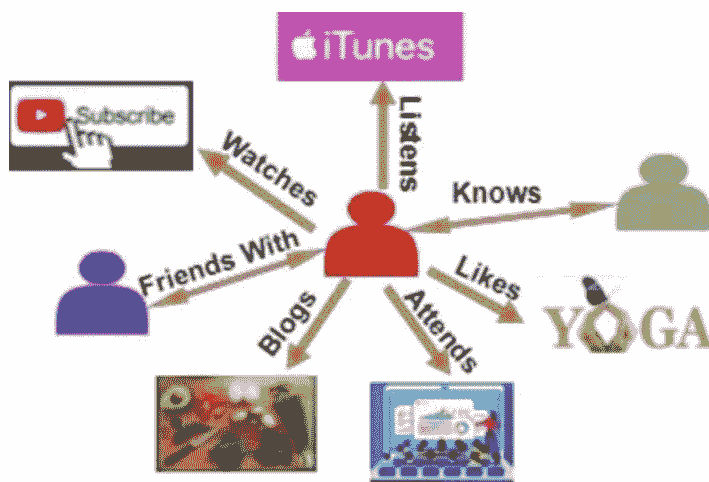

    图3展示了社交图的一个实例。它展示了一个个体与不同在线平台之间的不同类型的关系（单向、双向）。图中显示，中心的个体与不同的人之间存在双向关系。其中一种关系是他/她认识绿色的人，而另一种关系是他/她与蓝色的人是朋友。对于单向关系，中心的个体喜欢在iTunes上听音乐，写/读博客，订阅YouTube，参加会议并喜欢瑜伽。因此，这些链接展示了一个个体与网络上的其他服务之间的关系。对网络上的所有活动进行分析以更好地理解网络，这被称为“社交网络分析”（SNA）。

##### 2.3 社交网络分析

    社交网络分析[8]是分析社交网络上各种活动的过程。它是由有限数量的社交行为者（如人或组织）通过人际互动相互连接而形成的社交结构。这些联系，也被称为关系，可以是个人或专业性质的，可以从随意的友谊、熟人或同事到亲密的家庭关系。除了关系，社交网络经常显示信息的流动、互动和人群之间的共同点。亲属结构[9]、非正常群体成员之间的关系、企业的主导地位、社会流动性[10]、阶级结构[11]、科学引用[12]、国际贸易剥削[13]等主题都可以通过社交网络分析来研究。这种分析有助于更好地分析客户。它有助于理解社会结构、群体动态以及个体在网络中的相对位置。

##### 2.4 中心度量

    中心度量是一组度量标准，旨在量化网络中某个节点（或群组）的“重要性”、“影响力”或“控制力”。以下是各种中心度量：

###### 2.4.1 度中心度

    度中心度根据节点所拥有的连接数量为每个节点指定一个分数。它告诉我们每个节点需要与其他节点建立的直接、一跳接口的数量。它用于找到高度相关的人员、知名人士、具有最多信息的人员，或者可以轻松与网络的其他部分联系的人员。节点连通性的最基本度量是度中心度。在查看跨国数据或记录活动时，有时将入度（入链数量）和出度（出链数量）作为离散度量是有益的。从数学上讲，节点 $u$ 的度中心度可以定义为该节点的度数。

###### 2.4.2 介数中心性

    介数中心性通过估计一个节点在不同节点对之间的最短路径上的出现次数来衡量。这个度量指出了组织中哪些节点充当了连接其他节点的“桥梁”。首先，通过识别所有最短路径，然后计算每个节点在其中出现的次数来进行细化。它被用于找出与系统运行方式有关的人员。介数中心性在评估通信因素时很有用，但需要谨慎使用。高介数计数可能意味着某人在组织中负责两个不同的群体，或者他们处于两个群体的边缘。节点 $u$ 的介数中心性可以通过数学计算得出：

    $$C_{betw}(u) = \sum_{s \neq u \neq t} \frac{\sigma_u(s,t)}{\sigma(s,t)}$$

    其中，$\sigma_u(s,t)$ 是节点 $s$ 和 $t$ 之间包含节点 $u$ 的最短路径总数，而 $\sigma(s,t)$ 是 $s$ 和 $t$ 之间可能的最短路径总数。

###### 2.4.3 接近中心性

    接近中心性根据每个节点与组织中其他节点的距离来为每个节点分配一个分数。该度量标准找到连接所有节点的最短路径，然后根据这些路径的总和为每个节点分配一个分数。它用于找到最适合快速影响整个组织的人员。接近中心性可以帮助发现好的“传播者”，但在一个密集连接的网络中，所有节点通常具有相等的分数。对于发现单个群集中的强大力量可能更有用。给定节点 $u$ 的接近中心性可以通过以下方程计算：

    $$C_{clos}(u) = \sum_{v \in V} \frac{1}{d(u,v)}$$

    其中，$C_{clos}(u)$ 是节点 $u$ 的紧密中心度，而 $d(u,v)$ 是节点 $u$ 和 $v$ 之间的距离。标准化的紧密中心度是：

    $$C_{clos}(u) = \sum_{v \in V} \frac{|V|-1}{d(u,v)}$$

###### 2.4.4 特征中心度

    特征中心度根据一个中心节点与网络中其他节点的连接数量来评估其影响力，类似于度中心度。然后，特征中心度进一步考虑了一个节点的连接深度以及其连接的数量等因素。通过计算一个节点的长程连接，特征中心度可以找到对整个网络具有影响力的节点，以及与之直接相连的节点。特征中心度是一个很好的“全能”社交网络分析指标，有助于理解人际关系网络和恶意软件传播网络。对于给定的图，节点 $u$ 的相对中心度测量值可以计算为：

    $$x_u = \frac{1}{\lambda} \sum_{v \in N(u)} x_v = \frac{1}{\lambda} \sum_{v \in G} a_{u,v} x_v$$

    其中，$N(u)$ 是节点 $u$ 的邻居，$\lambda$ 是邻接矩阵 $A=a_{u,v}$ 的最大特征值，当节点 $u$ 和 $v$ 之间存在边时，$a_{u,v}=1$，否则为 $0$。

###### 2.4.5 PageRank

    PageRank 是一种基于节点关联和关联关系的 EigenCentrality 变体，为中心节点分配一个分数。PageRank 与之不同的是，它还考虑了连接方向和权重，意味着连接只能以一种方式传递影响，并且以不同的数量。这个度量标准可以区分具有超出直接关联的网络影响力的节点。PageRank对于获取引用和权威性非常有用，因为它考虑了方向和连接权重。更多信息：PageRank 是一种著名的排名算法，支持 Google 搜索引擎的初始版本。节点 $u$ 的 PageRank 重要性等于矩阵 $A^{\text{col}}$ 的主特征向量 $x_u$ (主特征值为 1)：

    $$x = A^{\text{col}} x$$

    其中，$A^{\text{col}} = AD^{-1}$，$D$ 为对角矩阵，$A$ 为邻接矩阵。

#### 3 链接预测

    文献中提供了许多社交网络链接预测的方法，其中一些重要的综述工作见[15-17]。早期的 Newman[18] 提出了在物理学和生物学中考虑合作网络的链接预测问题。在这篇文章中，节点代表网络中的作者，两个作者之间的链接表示合著关系，即当两个作者合作写一篇论文时，它们之间存在一个链接。此外，Liben-Nowell 和 Kleinberg[6] 模拟了社交网络中的链接预测。他们通过将社交实体或个人映射到节点，将两个实体之间的互动映射为两个节点之间的链接来模拟它。这是第一篇给出链接预测的正式定义的论文。他们计算了每个节点之间的相似度得分，通过使用网络的拓扑结构，通过节点对的方式进行预测。Hasan等人[19]对链接预测进行了更多的探索，并将监督学习应用于其中。为此，他们将链接预测模拟为二元分类问题，其中使用几种结构相似性方法计算的分数作为模型的特征，并应用不同的监督学习算法进行预测。实验结果显示与无监督方法或启发式方法相比，准确性更高。

    随后，他们全面探索了链接预测问题，并提出了一篇开创性的综述论文[15]。社交网络的演化与链接预测有一定的关联，因为网络的演化过程包括节点和链接的演化。社交网络演化的研究几乎与链接预测的任务相似，已经提出了几篇开创性的研究，如Barabási和Albert在Science上发表的关于随机网络的工作[20]，Kleinberg在Nature Communication上的工作[21]，KDD上的[22]，以及EPL上的[6]。近年来，已经提出了几种不同类型的链接预测方法，包括深度学习方法[23-25]，基于嵌入的方法[26-28]，概率和最大似然方法[29-31]等。

    最近，图神经网络（GNNs）引起了研究人员的关注，特别是在社交网络分析中，尤其是链接预测。最近的研究[32]证明了GNNs作为学习图结构和拓扑特征的强大工具。在GNN框架中应用这种学习方法在链接预测任务中表现出优越的性能[28,33]。张等人[34]将基于GNN的链接预测方法分为两大类。首先，图自编码器及其变分版本，在完整网络上应用GNN来学习每个节点的表示。然后，通过聚合节点级表示到边级表示来执行链接预测任务。其次，张等人[35]提出了SEAL框架用于链接预测，将链接预测问题系统地转化为子图分类问题。该框架提取给定目标链接周围的h-hop子图，并构建一个由结构节点标签、潜在嵌入和节点的显式属性组成的属性矩阵。然后，将子图信息与其属性矩阵一起输入GNN框架进行链接分类。

    在这项工作中，我们提出了一种基于神经网络的模型NN-LP-CF，用于预测社交网络中的缺失链接，如图1所示。首先，所提出的方法基于训练图计算出的不同中心性来估计所有链接预测指标的概率矩阵。然后，通过将相同数量的不存在边添加到现有边上，生成一个新的图，以计算基于中心性的链接预测概率的特征。

    接下来，基于卡方分布选择了特征，考虑了旧特征和新特征。然后，将训练数据输入到一个64个ReLU×64个ReLU×1个Sigmoid神经网络模型中进行训练。最后，使用测试数据来预测缺失链接的概率。

92. 涂, K., 崔, P., 王, X., 于, P.S., 朱, W.: 具有正则等价性的深度递归网络嵌入。在: 第24届ACM SIGKDD国际会议上的知识发现与数据挖掘, 第2357-2366页 (2018年)

93. 王, C., 潘, S., 龙, G., 朱, X., 江, J.: MGAE: 用于图聚类的边缘图自动编码器。在: 2017年ACM信息和知识管理会议论文集, 第889-898页 (2017年)

94. 吴, 张, 陈, 龙, 张, 菲利普: 关于图神经网络的综合调查。IEEE神经网络与学习系统交易, 32(1), 4-24 (2020年)

95. 谢, 斯兹曼斯基: 社交网络中线性时间重叠社区检测的研究。在: 太平洋亚洲知识发现与数据挖掘会议, 第25-36页。斯普林格出版社 (2012年)

96. 谢, 王, 江, 徐: 使用深度传递自编码器在社交网络中进行高性能社区检测。信息科学, 493, 75-90 (2019年)

97. 徐, 胡, 莱斯科维克, 杰格尔卡: 图神经网络有多强大? (2018年) arXiv:1810.00826

98. Xu, R., Che, Y., Wang, X., Hu, J., Xie, Y.: 基于堆叠自编码器的社交媒体数据分析方法通过集成聚类框架。信息科学, 526, 151-165 (2020年)

99. Yang, C., Liu, M., Wang, Z., Liu, L., Han, J.: 具有动态嵌入的图聚类 (2017年)。arXiv:1712.08249

100. Yang, J., McAuley, J., Leskovec, J.: 具有节点属性的网络社区检测。在: 2013年IEEE第13届国际数据挖掘会议, 第1151-1156页。IEEE (2013年)

101. Yang, L., Cao, X., He, D., Wang, C., Wang, X., Zhang, W.: 基于模块化的深度学习社区检测。在: IJCAI, 第16卷, 第2252-2258页 (2016年)

102. 杨, L., 王, Y., 顾, J., 王, C., 曹, X., 郭, Y.: Jane: 联合对抗网络嵌入。在: IJCAI, 第1381-1387页 (2020年)

103. 杨, Z., 科恩, W., 萨拉胡丁诺夫, R.: 重新审视具有图嵌入的半监督学习。在: 国际机器学习会议, 第40-48页。PMLR (2016年)

104. 应, R., 何, R., 陈, K., 埃克索姆巴恰伊, P., 汉密尔顿, W.L., 莱斯科维克, J.: 用于Web规模推荐系统的图卷积神经网络。在: 第24届ACM SIGKDD国际知识发现与数据挖掘会议论文集, 第974-983页 (2018年)

105. 尤, J., 戈梅斯-塞尔曼, J., 应, R., 莱斯科维克, J.: 身份感知图神经网络 (2021年)。arXiv:2101.10320

106. You, J., Ying, R., Leskovec, J.: 基于位置感知的图神经网络。在: 国际机器学习会议上, 第7134-7143页。PMLR (2019年)

107. Zachary, W.W.: 小组中冲突和分裂的信息流模型。人类学研究杂志, 第33卷(4), 452-473页 (1977年)

108. Zhang, B., Yu, Z., Zhang, W.: 面向社区检测的社区中心图卷积网络。在: IJCAI, 第551-556页 (2020年)

109. Zhang, W., Guo, X., Wang, W., Tian, Q., Pan, L., Jiao, P.: 基于角色的网络嵌入通过结构特征重建与度规则约束。基于知识的系统, 218, 106872 (2021年)

110. 张, Y., 熊, Y., 叶, Y., 刘, T., 王, W., 朱, Y., 于, P.S.: SEAL: 使用生成对抗网络学习启发式算法进行社区检测。在: 第26届ACM SIGKDD国际会议上的知识发现与数据挖掘, 第1103-1113页 (2020年)

111. 张, Z., 崔, P., 朱, W.: 图上的深度学习: 一项调查。IEEE Trans. Knowl. Data Eng. (2020年)

112. 郑, Y., 陈, S., 张, X., 王, D.: 用于时态社区检测的异构图卷积网络 (2019年)。arXiv:1909.10248

## 4个实验讨论

我们对六个真实数据集Karate、Dolphin、Adjnoun、Football、Polbooks和Macaque进行了实验，以分析NN-LP-CF与其他方法的性能。我们使用了九种基于中心性的链接预测方法来与所提出模型的性能进行比较。使用AUPR、AUC、平均精度和F1-Score[4]这四个指标来分析性能。所有这些实验都是一台64位Linux Mint 19.3 PC上进行的，配备Intel(R) Core(TM) i7-3632QM CPU @ 2.20 GHz处理器和16 GB内存。

实验结果显示在表1、2、3和4中。

- **AUPR**。关于AUPR指标，将NN-LP-CF与基于中心性的链接预测方法进行比较，结果显示在表1中。在Karate数据集上，除了边介数之外，该方法优于每种中心性方法。在剩余的数据集Dolphin、Adjnoun、Football、Polbooks和Macaque上，NN-LP-CF是AUPR下表现最好的方法。

- **平均精度**。关于平均精度指标，将NN-LP-CF与基于中心性的链接预测方法进行比较，结果显示在表2中。在Karate数据集上，该方法是仅次于边介数的第二好的方法。在剩余的数据集Dolphin、Adjnoun、Football、Polbooks和Macaque上，NN-LP-CF在平均精度上优于所有比较方法。

- **AUC**。表3显示了NN-LP-CF与基于中心性的链接预测方法在AUC指标上的比较。由于聚类系数较低，所以在Karate数据集上，所提出的方法表现最差。除了Dolphin数据集上的谐波中心度测量之外，NN-LP-CF优于所有比较方法。在Adjnoun数据集上，除了谐波中心度和接近中心度测量之外，所提出的方法优于比较方法。同样，NN-LP-CF是Football、Polbooks和Macaque等剩余数据集中表现最好的方法。

- **F1-Score**。表4显示了NN-LP-CF与基于中心性的链接预测方法在F1-Score指标上的比较。在Dolphin数据集上，所提出的方法是仅次于度中心度的第二好方法。NN-LP-CF在Karate和Adjnoun数据集上优于所有比较方法。在剩余的Football、Polbooks和Macaque数据集上，所提出的方法与最先进的方法相当。

##### 表1：与最先进方法的AUPR比较
| 数据集 | 比率 | 度 | 特征向量 | 卡茨 | 接近度 | 子图 | 谐波 | 页面排名 | 中介度 | 负载 | NN-LP-CF |
|---|---|---|---|---|---|---|---|---|---|---|---|
| 空手道 | 0.1 | 0.0539 | 0.0626 | 0.0642 | 0.0447 | 0.0484 | 0.0471 | 0.0579 | 0.0722 | 0.0518 | 0.0702 |
| | 0.2 | 0.0821 | 0.0911 | 0.0893 | 0.0781 | 0.0751 | 0.0682 | 0.0844 | 0.0889 | 0.0712 | 0.0936 |
| | 0.3 | 0.1037 | 0.1097 | 0.1163 | 0.1107 | 0.1012 | 0.0846 | 0.1395 | 0.1283 | 0.0881 | 0.1936 |
| | 0.4 | 0.1193 | 0.1227 | 0.1298 | 0.1100 | 0.1148 | 0.1076 | 0.1245 | 0.1322 | 0.1120 | 0.2492 |
| | 0.5 | 0.1320 | 0.1262 | 0.1192 | 0.1076 | 0.1209 | 0.1222 | 0.1318 | 0.1265 | 0.1221 | 0.3381 |
| 海豚 | 0.1 | 0.0446 | 0.0412 | 0.0422 | 0.0379 | 0.0369 | 0.0371 | 0.0351 | 0.0270 | 0.0304 | 0.0623 |
| | 0.2 | 0.0634 | 0.0649 | 0.0727 | 0.0629 | 0.0683 | 0.0616 | 0.0631 | 0.0533 | 0.0579 | 0.0777 |
| | 0.3 | 0.0857 | 0.0843 | 0.0944 | 0.0841 | 0.0816 | 0.0775 | 0.0825 | 0.0839 | 0.0789 | 0.1004 |
| | 0.4 | 0.1008 | 0.0990 | 0.0987 | 0.0980 | 0.1028 | 0.0962 | 0.0945 | 0.1030 | 0.0934 | 0.1876 |
| | 0.5 | 0.1164 | 0.1026 | 0.1179 | 0.1145 | 0.1125 | 0.1046 | 0.1160 | 0.1119 | 0.1070 | 0.1997 |
| 形容词名词 | 0.1 | 0.0248 | 0.0239 | 0.0275 | 0.0253 | 0.0260 | 0.0221 | 0.0177 | 0.0196 | 0.0239 | 0.0298 |
| | 0.2 | 0.0420 | 0.0415 | 0.0411 | 0.0403 | 0.0426 | 0.0385 | 0.0338 | 0.0358 | 0.0419 | 0.0450 |
| | 0.3 | 0.0557 | 0.0546 | 0.0544 | 0.0536 | 0.0596 | 0.0489 | 0.0487 | 0.0498 | 0.0563 | 0.0711 |
| | 0.4 | 0.0647 | 0.0669 | 0.0633 | 0.0625 | 0.0672 | 0.0659 | 0.0609 | 0.0646 | 0.0663 | 0.0697 |
| | 0.5 | 0.0713 | 0.0731 | 0.0762 | 0.0728 | 0.0775 | 0.0689 | 0.0742 | 0.0709 | 0.0729 | 0.1735 |
| 足球 | 0.1 | 0.0574 | 0.0630 | 0.0595 | 0.0605 | 0.0886 | 0.0921 | 0.0455 | 0.0580 | 0.0647 | 0.1739 |
| | 0.2 | 0.1099 | 0.1046 | 0.1085 | 0.1102 | 0.1355 | 0.1440 | 0.0942 | 0.1043 | 0.1072 | 0.2398 |
| | 0.3 | 0.1495 | 0.1526 | 0.1480 | 0.1546 | 0.1651 | 0.1694 | 0.1380 | 0.1413 | 0.1264 | 0.2687 |
| | 0.4 | 0.1807 | 0.1864 | 0.1817 | 0.1775 | 0.1752 | 0.1810 | 0.1800 | 0.1744 | 0.1481 | 0.2660 |
| | 0.5 | 0.1914 | 0.2028 | 0.2028 | 0.2075 | 0.1819 | 0.1892 | 0.1932 | 0.1976 | 0.1628 | 0.2598 |
| 政治书籍 | 0.1 | 0.0519 | 0.0523 | 0.0517 | 0.0587 | 0.0743 | 0.0771 | 0.0421 | 0.0477 | 0.0695 | 0.1321 |
| | 0.2 | 0.0989 | 0.0933 | 0.0974 | 0.1079 | 0.1235 | 0.1251 | 0.0852 | 0.0896 | 0.1248 | 0.2088 |
| | 0.3 | 0.1333 | 0.1264 | 0.1362 | 0.1459 | 0.1559 | 0.1639 | 0.1247 | 0.1211 | 0.1552 | 0.2271 |
| | 0.4 | 0.1565 | 0.1587 | 0.1655 | 0.1674 | 0.1700 | 0.1711 | 0.1476 | 0.1549 | 0.1697 | 0.2501 |
| | 0.5 | 0.1763 | 0.1737 | 0.1730 | 0.1830 | 0.1798 | 0.1841 | 0.1685 | 0.1629 | 0.1764 | 0.2326 |
| 猕猴 | 0.1 | 0.2299 | 0.1265 | 0.1855 | 0.1533 | 0.2767 | 0.2819 | 0.0861 | 0.0739 | 0.2487 | 0.3709 |
| | 0.2 | 0.3560 | 0.2265 | 0.3037 | 0.2526 | 0.4029 | 0.4041 | 0.1550 | 0.1353 | 0.3812 | 0.5047 |
| | 0.3 | 0.4282 | 0.3000 | 0.3897 | 0.3333 | 0.4754 | 0.4762 | 0.2153 | 0.1938 | 0.4706 | 0.5457 |
| | 0.4 | 0.4798 | 0.3744 | 0.4367 | 0.4180 | 0.5227 | 0.5192 | 0.2588 | 0.2491 | 0.5189 | 0.5760 |
| | 0.5 | 0.5058 | 0.4400 | 0.4828 | 0.4605 | 0.5456 | 0.5289 | 0.3050 | 0.2845 | 0.5516 | 0.5756 |

##### 表2：与最先进方法的平均精确度比较
| 数据集 | 比率 | 度 | 特征向量 | 卡茨 | 接近度 | 子图 | 谐波 | 页面排名 | 中介度 | 负载 | NN-LP-CF |
|---|---|---|---|---|---|---|---|---|---|---|---|
| 空手道 | 0.1 | 0.0700 | 0.0805 | 0.0837 | 0.0593 | 0.0629 | 0.0612 | 0.0745 | 0.0892 | 0.0688 | 0.0844 |
| | 0.2 | 0.0930 | 0.1023 | 0.1014 | 0.0883 | 0.0844 | 0.0767 | 0.0965 | 0.1022 | 0.0814 | 0.0759 |
| | 0.3 | 0.1098 | 0.1164 | 0.1234 | 0.1164 | 0.1059 | 0.0883 | 0.1451 | 0.1338 | 0.0927 | 0.0822 |
| | 0.4 | 0.1187 | 0.1213 | 0.1284 | 0.1087 | 0.1109 | 0.1049 | 0.1241 | 0.1319 | 0.1099 | 0.0872 |
| | 0.5 | 0.1241 | 0.1177 | 0.1121 | 0.1039 | 0.1129 | 0.1110 | 0.1253 | 0.1211 | 0.1149 | 0.0854 |
| 海豚 | 0.1 | 0.0488 | 0.0439 | 0.0468 | 0.0430 | 0.0391 | 0.0391 | 0.0363 | 0.0286 | 0.0317 | 0.0684 |
| | 0.2 | 0.0614 | 0.0633 | 0.0711 | 0.0617 | 0.0656 | 0.0588 | 0.0613 | 0.0510 | 0.0549 | 0.0656 |
| | 0.3 | 0.0764 | 0.0749 | 0.0857 | 0.0739 | 0.0708 | 0.0671 | 0.0732 | 0.0748 | 0.0679 | 0.0689 |
| | 0.4 | 0.0814 | 0.0791 | 0.0801 | 0.0781 | 0.0816 | 0.0759 | 0.0761 | 0.0826 | 0.0725 | 0.0521 |
| | 0.5 | 0.0843 | 0.0725 | 0.0855 | 0.0821 | 0.0791 | 0.0731 | 0.0839 | 0.0789 | 0.0752 | 0.0561 |
| 形容词名词 | 0.1 | 0.0270 | 0.0267 | 0.0308 | 0.0279 | 0.0285 | 0.0235 | 0.0190 | 0.0216 | 0.0258 | 0.0327 |
| | 0.2 | 0.0429 | 0.0418 | 0.0420 | 0.0405 | 0.0433 | 0.0382 | 0.0340 | 0.0360 | 0.0422 | 0.0459 |
| | 0.3 | 0.0536 | 0.0527 | 0.0527 | 0.0511 | 0.0573 | 0.0463 | 0.0467 | 0.0476 | 0.0539 | 0.0549 |
| | 0.4 | 0.0586 | 0.0612 | 0.0576 | 0.0561 | 0.0612 | 0.0573 | 0.0553 | 0.0585 | 0.0601 | 0.0619 |
| | 0.5 | 0.0608 | 0.0622 | 0.0644 | 0.0615 | 0.0656 | 0.0582 | 0.0628 | 0.0598 | 0.0611 | 0.0465 |
| 足球 | 0.1 | 0.0597 | 0.0653 | 0.0620 | 0.0628 | 0.0897 | 0.0933 | 0.0468 | 0.0596 | 0.0654 | 0.1787 |
| | 0.2 | 0.1096 | 0.1037 | 0.1082 | 0.1094 | 0.1339 | 0.1423 | 0.0934 | 0.1037 | 0.1054 | 0.2409 |
| | 0.3 | 0.1445 | 0.1475 | 0.1429 | 0.1494 | 0.1592 | 0.1633 | 0.1327 | 0.1362 | 0.1201 | 0.2657 |
| | 0.4 | 0.1672 | 0.1729 | 0.1680 | 0.1642 | 0.1611 | 0.1664 | 0.1665 | 0.1609 | 0.1338 | 0.2516 |
| | 0.5 | 0.1640 | 0.1746 | 0.1747 | 0.1794 | 0.1535 | 0.1610 | 0.1649 | 0.1698 | 0.1342 | 0.2291 |
| 政治书籍 | 0.1 | 0.0545 | 0.0550 | 0.0541 | 0.0616 | 0.0782 | 0.0807 | 0.0445 | 0.0506 | 0.0730 | 0.1388 |
| | 0.2 | 0.0992 | 0.0939 | 0.0984 | 0.1088 | 0.1246 | 0.1259 | 0.0856 | 0.0901 | 0.1258 | 0.2116 |
| | 0.3 | 0.1298 | 0.1229 | 0.1326 | 0.1427 | 0.1522 | 0.1604 | 0.1212 | 0.1179 | 0.1516 | 0.2237 |
| | 0.4 | 0.1451 | 0.1471 | 0.1544 | 0.1557 | 0.1578 | 0.1593 | 0.1362 | 0.1435 | 0.1577 | 0.2381 |
| | 0.5 | 0.1517 | 0.1488 | 0.1477 | 0.1575 | 0.1544 | 0.1592 | 0.1437 | 0.1378 | 0.1514 | 0.2064 |
| 猕猴 | 0.1 | 0.2344 | 0.1292 | 0.1885 | 0.1566 | 0.2809 | 0.2860 | 0.0881 | 0.0759 | 0.2531 | 0.3735 |
| | 0.2 | 0.3586 | 0.2284 | 0.3058 | 0.2547 | 0.4055 | 0.4066 | 0.1567 | 0.1369 | 0.3838 | 0.5058 |
| | 0.3 | 0.4303 | 0.3016 | 0.3911 | 0.3347 | 0.4772 | 0.4779 | 0.2167 | 0.1951 | 0.4724 | 0.5465 |
| | 0.4 | 0.4815 | 0.3755 | 0.4380 | 0.4191 | 0.5240 | 0.5205 | 0.2600 | 0.2502 | 0.5203 | 0.5766 |
| | 0.5 | 0.5069 | 0.4407 | 0.4840 | 0.4615 | 0.5466 | 0.5298 | 0.3060 | 0.2854 | 0.5525 | 0.5761 |

### 表3: 与最先进方法的AUC比较
| 数据集 | 比率 | 度 | 特征向量 | 卡茨 | 接近度 | 子图 | 谐波 | 页面排名 | 中介度 | 负载 | NN-LP-CF |
|---|---|---|---|---|---|---|---|---|---|---|---|
| 空手道 | 0.1 | 0.6922 | 0.6951 | 0.7084 | 0.6572 | 0.7128 | 0.6560 | 0.7312 | 0.6958 | 0.6830 | 0.5446 |
| | 0.2 | 0.6530 | 0.6919 | 0.6702 | 0.6429 | 0.6744 | 0.6608 | 0.6647 | 0.6382 | 0.6580 | 0.4794 |
| | 0.3 | 0.6291 | 0.6445 | 0.6705 | 0.6482 | 0.6351 | 0.6148 | 0.6631 | 0.6249 | 0.6141 | 0.4498 |
| | 0.4 | 0.6026 | 0.6020 | 0.6101 | 0.5930 | 0.6228 | 0.5956 | 0.6102 | 0.6046 | 0.6038 | 0.4378 |
| | 0.5 | 0.5734 | 0.5805 | 0.5639 | 0.5486 | 0.5642 | 0.5703 | 0.5631 | 0.5618 | 0.5692 | 0.4259 |
| 海豚 | 0.1 | 0.7624 | 0.7622 | 0.7498 | 0.7601 | 0.7448 | 0.7669 | 0.7475 | 0.7251 | 0.7527 | 0.7648 |
| | 0.2 | 0.7250 | 0.7266 | 0.7215 | 0.7299 | 0.7438 | 0.7363 | 0.7232 | 0.7168 | 0.7364 | 0.6369 |
| | 0.3 | 0.7028 | 0.6929 | 0.7025 | 0.7027 | 0.6890 | 0.6836 | 0.6837 | 0.6884 | 0.6962 | 0.5525 |
| | 0.4 | 0.6556 | 0.6531 | 0.6494 | 0.6550 | 0.6635 | 0.6507 | 0.6431 | 0.6540 | 0.6498 | 0.4611 |
| | 0.5 | 0.6105 | 0.6012 | 0.6159 | 0.6208 | 0.6130 | 0.6017 | 0.6117 | 0.6112 | 0.6091 | 0.4520 |
| 形容词名词 | 0.1 | 0.6879 | 0.6716 | 0.6907 | 0.6871 | 0.6717 | 0.6820 | 0.6632 | 0.6482 | 0.6708 | 0.6754 |
| | 0.2 | 0.6639 | 0.6650 | 0.6515 | 0.6627 | 0.6590 | 0.6648 | 0.6639 | 0.6494 | 0.6589 | 0.6571 |
| | 0.3 | 0.6427 | 0.6414 | 0.6330 | 0.6447 | 0.6479 | 0.6321 | 0.6350 | 0.6398 | 0.6399 | 0.6068 |
| | 0.4 | 0.6158 | 0.6204 | 0.6121 | 0.6203 | 0.6176 | 0.6243 | 0.6148 | 0.6209 | 0.6197 | 0.5867 |
| | 0.5 | 0.5874 | 0.5923 | 0.5950 | 0.5918 | 0.5996 | 0.5873 | 0.5904 | 0.5903 | 0.5927 | 0.4820 |
| 足球 | 0.1 | 0.8147 | 0.8191 | 0.8199 | 0.8065 | 0.8264 | 0.8325 | 0.7965 | 0.7991 | 0.8079 | 0.8450 |
| | 0.2 | 0.8060 | 0.7984 | 0.8051 | 0.8067 | 0.8189 | 0.8154 | 0.7993 | 0.8017 | 0.8027 | 0.8361 |
| | 0.3 | 0.7943 | 0.7981 | 0.7968 | 0.7935 | 0.8009 | 0.8001 | 0.7898 | 0.7948 | 0.7849 | 0.8080 |
| | 0.4 | 0.7689 | 0.7689 | 0.7672 | 0.7702 | 0.7708 | 0.7685 | 0.7681 | 0.7629 | 0.7636 | 0.7781 |
| | 0.5 | 0.7212 | 0.7301 | 0.7275 | 0.7297 | 0.7228 | 0.7280 | 0.7248 | 0.7255 | 0.7196 | 0.7332 |
| 政治书籍 | 0.1 | 0.8653 | 0.8651 | 0.8712 | 0.8725 | 0.8779 | 0.8766 | 0.8542 | 0.8510 | 0.8776 | 0.8905 |
| | 0.2 | 0.8471 | 0.8432 | 0.8520 | 0.8581 | 0.8503 | 0.8548 | 0.8377 | 0.8415 | 0.8595 | 0.8745 |
| | 0.3 | 0.8235 | 0.8136 | 0.8228 | 0.8280 | 0.8208 | 0.8338 | 0.8193 | 0.8175 | 0.8268 | 0.8306 |
| | 0.4 | 0.7815 | 0.7793 | 0.7865 | 0.7804 | 0.7747 | 0.7756 | 0.7788 | 0.7810 | 0.7805 | 0.7905 |
| | 0.5 | 0.7305 | 0.7223 | 0.7282 | 0.7347 | 0.7230 | 0.7228 | 0.7260 | 0.7191 | 0.7272 | 0.7303 |
| 猕猴 | 0.1 | 0.8500 | 0.7388 | 0.8043 | 0.7870 | 0.8789 | 0.8825 | 0.6239 | 0.5648 | 0.8455 | 0.8912 |
| | 0.2 | 0.8436 | 0.7515 | 0.8125 | 0.7829 | 0.8647 | 0.8740 | 0.6271 | 0.5798 | 0.8466 | 0.8873 |
| | 0.3 | 0.8352 | 0.7535 | 0.8106 | 0.7733 | 0.8519 | 0.8521 | 0.6312 | 0.5910 | 0.8476 | 0.8663 |
| | 0.4 | 0.8226 | 0.7507 | 0.7960 | 0.7781 | 0.8358 | 0.8376 | 0.6331 | 0.6053 | 0.8305 | 0.8462 |
| | 0.5 | 0.7944 | 0.7496 | 0.7798 | 0.7675 | 0.8149 | 0.8048 | 0.6375 | 0.6112 | 0.8183 | 0.8140 |

| 数据集 | 比率 | 度 | 特征向量 | 卡茨 | 接近度 | 子图 | 谱波 | 页面排名 | 中介度 | 负载 | NN-LP-CF |
|---|---|---|---|---|---|---|---|---|---|---|---|
| 空手道 | 0.1 | 0.0758 | 0.0731 | 0.1165 | 0.0594 | 0.0558 | 0.0550 | 0.1061 | 0.1116 | 0.0578 | 0.0937 |
| 空手道 | 0.2 | 0.1091 | 0.1185 | 0.1285 | 0.1062 | 0.1170 | 0.1020 | 0.1407 | 0.1663 | 0.1059 | 0.1235 |
| 空手道 | 0.3 | 0.1473 | 0.1514 | 0.1669 | 0.1391 | 0.1366 | 0.1278 | 0.2032 | 0.1705 | 0.1438 | 0.0928 |
| 空手道 | 0.4 | 0.1643 | 0.1644 | 0.1707 | 0.1573 | 0.1850 | 0.1670 | 0.1743 | 0.1799 | 0.1741 | 0.1033 |
| 空手道 | 0.5 | 0.1703 | 0.1833 | 0.1647 | 0.1482 | 0.1694 | 0.1807 | 0.1518 | 0.1682 | 0.1738 | 0.1318 |
| 海豚 | 0.1 | 0.0657 | 0.0724 | 0.0640 | 0.0587 | 0.0564 | 0.0564 | 0.0472 | 0.0445 | 0.0587 | 0.0642 |
| 海豚 | 0.2 | 0.1111 | 0.0988 | 0.1092 | 0.1057 | 0.1137 | 0.1061 | 0.0909 | 0.0620 | 0.1142 | 0.1045 |
| 海豚 | 0.3 | 0.1659 | 0.1196 | 0.1654 | 0.1575 | 0.1478 | 0.1439 | 0.1063 | 0.1108 | 0.1565 | 0.1192 |
| 海豚 | 0.4 | 0.1889 | 0.1363 | 0.1799 | 0.1841 | 0.1906 | 0.1804 | 0.1125 | 0.1242 | 0.1835 | 0.1003 |
| 海豚 | 0.5 | 0.1955 | 0.1164 | 0.2009 | 0.2067 | 0.1992 | 0.1860 | 0.1203 | 0.1504 | 0.1947 | 0.1128 |
| 形容词名词 | 0.1 | 0.0398 | 0.0358 | 0.0361 | 0.0336 | 0.0348 | 0.0325 | 0.0269 | 0.0240 | 0.0329 | 0.0422 |
| 形容词名词 | 0.2 | 0.0680 | 0.0644 | 0.0622 | 0.0593 | 0.0656 | 0.0598 | 0.0460 | 0.0299 | 0.0612 | 0.0717 |
| 形容词名词 | 0.3 | 0.0954 | 0.0890 | 0.0877 | 0.0834 | 0.0932 | 0.0833 | 0.0562 | 0.0435 | 0.0877 | 0.0985 |
| 形容词名词 | 0.4 | 0.1125 | 0.1090 | 0.1072 | 0.1059 | 0.1096 | 0.1100 | 0.0772 | 0.0428 | 0.1081 | 0.1142 |
| 形容词名词 | 0.5 | 0.1229 | 0.1239 | 0.1279 | 0.1213 | 0.1264 | 0.1191 | 0.0877 | 0.0533 | 0.1254 | 0.0840 |
| 足球 | 0.1 | 0.1072 | 0.1100 | 0.1127 | 0.1090 | 0.0554 | 0.0540 | 0.0391 | 0.0631 | 0.0549 | 0.0864 |
| 足球 | 0.2 | 0.1861 | 0.1811 | 0.1897 | 0.1938 | 0.1103 | 0.1069 | 0.0648 | 0.0914 | 0.1138 | 0.1523 |
| 足球 | 0.3 | 0.2348 | 0.2510 | 0.2404 | 0.2409 | 0.1689 | 0.1654 | 0.0816 | 0.0775 | 0.1720 | 0.2120 |
| 足球 | 0.4 | 0.2650 | 0.2829 | 0.2885 | 0.2675 | 0.2297 | 0.2282 | 0.0908 | 0.0891 | 0.2319 | 0.2674 |
| 足球 | 0.5 | 0.2888 | 0.2836 | 0.2982 | 0.2880 | 0.2761 | 0.2787 | 0.0844 | 0.0960 | 0.2765 | 0.3026 |
| 政治书籍 | 0.1 | 0.1045 | 0.0711 | 0.0910 | 0.1069 | 0.0737 | 0.0680 | 0.0284 | 0.0330 | 0.0746 | 0.0944 |
| 政治书籍 | 0.2 | 0.1778 | 0.1072 | 0.1113 | 0.1759 | 0.1370 | 0.1324 | 0.0425 | 0.0458 | 0.1402 | 0.1719 |
| 政治书籍 | 0.3 | 0.2325 | 0.1272 | 0.2224 | 0.2002 | 0.1901 | 0.1889 | 0.0624 | 0.0452 | 0.1957 | 0.2299 |
| 政治书籍 | 0.4 | 0.2611 | 0.1402 | 0.2637 | 0.2345 | 0.2264 | 0.2228 | 0.0923 | 0.0734 | 0.2361 | 0.2717 |
| 政治书籍 | 0.5 | 0.2828 | 0.1126 | 0.2723 | 0.2648 | 0.2608 | 0.2555 | 0.1041 | 0.0902 | 0.2660 | 0.2792 |
| 猕猴 | 0.1 | 0.2719 | 0.1881 | 0.2431 | 0.2323 | 0.2769 | 0.2802 | 0.0415 | 0.0188 | 0.2413 | 0.2530 |
| 猕猴 | 0.2 | 0.4090 | 0.2849 | 0.3809 | 0.3388 | 0.4301 | 0.4397 | 0.0381 | 0.0175 | 0.4092 | 0.4181 |
| 猕猴 | 0.3 | 0.4830 | 0.3517 | 0.4477 | 0.3944 | 0.5137 | 0.5113 | 0.0446 | 0.0173 | 0.5087 | 0.5151 |
| 猕猴 | 0.4 | 0.5227 | 0.4106 | 0.4833 | 0.4545 | 0.5487 | 0.5477 | 0.0546 | 0.0171 | 0.5452 | 0.5616 |
| 猕猴 | 0.5 | 0.5290 | 0.4599 | 0.5099 | 0.4910 | 0.5581 | 0.5411 | 0.0521 | 0.0187 | 0.5658 | 0.5539 |

#### 5 结论

本文提出了一种基于神经网络的基于中心性特征的链路预测算法。所提出的神经网络模型利用中心性度量作为特征集，用于估计预测缺失链接的可能性得分。

这些中心性度量使用了局部和全局拓扑特征，从而能够提供更稳定和准确的预测。在真实社交网络上进行了实验验证所提出模型相对于基于中心性的方法的性能。实验结果显示NN-LP-CF相对于其他方法在预测矩阵上具有优势。

未来可以在这项工作中做出重要贡献，例如采用用户意见、信息传播和语境特征，除了拓扑特征。

#### 参考文献

- 1. Kumar, A., Singh, S.S., Singh, K., Biswas, B.: 链接预测技术、应用和性能：一项调查。Phys. A: Stat. Mech. Appl. 124289 (2020)
- 2. Mishra, S., Singh, S.S., Mishra, S., Biswas, B.: Tcd2: 基于树的动态社交网络社区检测。Expert Syst. Appl. 169, 114493 (2021)
- 3. Singh, S.S., Srivastva, D., Verma, M., Singh, J.: 社交网络上的影响最大化框架、性能、挑战和方向：一项理论研究。J. King Saud Univ. - Comput. Inf. Sci. (2021)
- 4. Singh, S.S., Kumar, A., Mishra, S., Biswas, B.: 基于社区的信息扩散的链接预测：Clp-id. Inf. Sci. 514, 402-433 (2020)
- 5. 辛格, S.S., 库马尔, A., 辛格, K., 比斯瓦斯, B.: 社交网络中基于社区的上下文感知影响最大化: C2im。Phys. A 514, 796-818 (2019)
- 6. Liben-Nowell, D., Kleinberg, J.: 社交网络的链接预测问题。在：第十二届信息与知识管理国际会议 (CIKM '03) 论文集, 第556-559页。ACM, 纽约, 纽约, 美国 (2003)
- 7. 金, J., 哈斯塔克, M.: 灾后在线社交网络特征分析。Int. J. Inf. Manag. 38 (1), 86-96 (2018)
- 8. Saqr, M., Alamro, A.: 社交网络分析作为在线问题导向学习分析工具的作用。BMC Med. Educ. 19 (1), 1-11 (2019)
- 9. 邓肯, O.D.: 社会流动性分析中的方法论问题。Routledge出版社 (2018)
- 10. Ikram, M., Sroufe, R., Rehman, E., Zulfiqar Ali Shah, S., Mahmoudi, A.: 质量、环境和社会 (QES) 认证是否改善国际贸易？发展中国家与发达国家的比较灰色关联分析。Phys. A: Stat. Mech. Appl. 545, 123486 (2020)
- 11. Bridge, G.: 社交网络方法论下的新兴阶层化、阶级和社区。在：城市环境中, 第259-286页。Routledge出版社 (2020)
- 12. Wang, Z., Gnzel, W., Chen, Y.: 预印本对图书馆和信息科学的影响：引文、使用和社会关注指标分析。Scientometrics 125 (2), 1403-1423 (2020)
- 13. Holden, C., Lee, K.: 公司权力和社会政策：跨国烟草公司的政治经济学。全球社会政策 9(3), 328-354(2009)
- 14. Cordeiro, M., Sarmento, R.P., Brazdil, P., Gama, J.: 演化网络和社交网络分析方法和技术。社交媒体与新闻业-趋势、联系、影响, 第101-134页(2018)
- 15. Al Hasan, M., Zaki, M.J.: 社交网络中链接预测的调查, 第243-275页。Springer US, Boston, MA (2011)
- 16. Martinez, V., Berzal, F., Cubero, J-C.: 复杂网络中链接预测的调查。ACM计算机调查49(4), 69:1-69:33(2016)
- 17. Kumar, A., Singh, S.S., Singh, K., Biswas, B.: 链接预测技术、应用和性能：一项调查。Phys. A: Stat. Mech. Appl. 553, 124289 (2020)
- 18. Newman, M.E.J.: 生长网络中的聚类和优先连接。Phys. Rev. E 64, 025102 (2001)
- 19. Al Hasan, M., Chaoji, V., Salem, S., Zaki, M.: 使用监督学习进行链接预测。在: SDM 06 链接分析、反恐和安全研讨会论文集(2006)
- 20. Barabasi, A.-L., Albert, R.: 随机网络中的规模出现。Science 286(5439), 509-512 (1999)
- 21. Kleinberg, J.M.: 在一个小世界中导航。Nature 406(6798), 845 (2000)
- 22. Leskovec, J., Kleinberg, J., Faloutsos, C.: 随时间变化的图：密度定律、直径缩小和可能的解释。在：第十一届ACM SIGKDD国际数据挖掘知识发现会议论文集，KDD '05，第177-187页。ACM，纽约，纽约，美国(2005)
- 23. Li, X., Du, N., Li, H., Li, K., Gao, J., Zhang, A.: 动态网络中的链接预测的深度学习方法，第289-297页
- 24. Zhang, M., Chen, Y.: Weisfeiler-Lehman神经机器用于链接预测。在：第23届ACM SIGKDD国际数据挖掘知识发现会议论文集，KDD '17，第575-583页。计算机协会，纽约，纽约，美国(2017)
- 25. Wang, H., Wang, J., Wang, J., Zhao, M., Zhang, W., Zhang, F., Xie, X., Guo, M.: Graph-GAN：使用生成对抗网络的图表示学习(2017)。CoRR, abs/arXiv:1711.08267
- 26. Grover, A., Leskovec, J.: Node2vec: 可扩展的网络特征学习.在：第22届ACM SIGKDD国际数据挖掘与知识发现会议论文集，KDD '16，第855-864页。ACM，纽约，美国(2016)
- 27. Wang, D., Cui, P., Zhu, W.: 结构化深度网络嵌入.在：第22届ACM SIGKDD国际数据挖掘与知识发现会议论文集，KDD '16，第1225-1234页。计算机协会，纽约，美国(2016)
- 28. Kipf, T.N., Welling, M.: 变分图自动编码器(2016)。CoRR, abs/arXiv:1611.07308
- 29. Clauset, A., Moore, C., Newman, M.E.J.: 分层结构与网络中缺失链接的预测.Nature 453(7191), 98-101 (2008)
- 30. Guimer, R., Sales-Pardo, M.: 缺失和虚假的相互作用及复杂网络的重建。国家科学院学报106(52)，22073-22078 (2009)
- 31. Getoor, L., Friedman, N., Koller, D., Taskar, B.: 学习链接结构的概率模型。机器学习研究杂志3(null)，679-707 (2003)
- 32. Schlichtkrull, M., Kipf, T.N., Bloem, P., van den Berg, R., Titov, I., Welling, M.: 用图卷积网络建模关系数据。在：Gangemi, A., Navigli, R., Vidal, M-E., Hitzler, P., Troncy, R., Hollink, L., Tordai, A., Alam, M. (Eds.)，语义网，pp. 593-607。Springer International Publishing, Cham (2018)
- 33. Kipf, T.N., Welling, M.: 带有图卷积网络的半监督分类(2016).CoRR, abs/arXiv:1609.02907
- 34. 张明，陈勇：用于链接预测的Weisfeiler-Lehman神经机器。在：第23届ACM SIGKDD国际知识发现与数据挖掘会议论文集，加拿大，哈利法克斯，2017年8月13日-17日，第575-583页(2017)
- 35. 张明，陈勇：基于图神经网络的链接预测(2018)。CoRR, abs/arxiv:1802.09691

## 社交媒体文本分析

### 社交媒体中代码混合文本的深度挖掘：简要回顾

Rrubaa Panchendrarajan和Akrati Saxena

摘要：社交媒体的出现使人们之间的交流比以往更频繁、更容易。分析社交媒体中的内容为研究和商业机会打开了大量的研究和商业机会。然而，社交媒体中的内容是嘈杂和多语言的，这给计算带来了挑战。特别是非英语为母语的人在生成社交媒体内容时倾向于将母语与英语混合使用。因此，对文本进行全面的预处理是必要的，包括对许多语言处理应用程序进行语言识别。在语言处理领域，深度学习已经显示出非常成功的应用，并且最新的研究工作已经采用了深度学习解决方案来应对分析代码混合文本的挑战。在这里，我们重点介绍了用于分析社交媒体代码混合文本的深度学习技术的全面研究，以了解最新技术和现有的研究挑战。我们将讨论代码混合文本分析的几个应用和未来方向。

关键词：代码混合·文本挖掘·深度学习·自然语言处理·社交媒体

#### 1 引言

代码混合或代码切换指的是在一个话语或讨论中使用两种或更多语言的做法。通常可以在多语言社区的人际交流和社交媒体互动中观察到这一现象。通常会使用多种语言的人倾向于在获取信息时切换语言。

R. Panchendrarajan (✉)
斯里兰卡信息技术学院计算机学院，马拉贝，斯里兰卡
电子邮件：rrubaa.p@sliit.lk

A. Saxena
数学与计算机科学系，埃因霍温科技大学，荷兰埃因霍温
e-mail: a.saxena@tue.nl

© 作者，独家许可给Springer Nature Switzerland AG 2022
T.-P. Hong 等人（编），社交媒体数据分析的深度学习，大数据研究113，https://doi.org/10.1007/978-3-031-10869-3_3

恶意通信。流利使用英语的印度次大陆居民通常在英语和他们的母语之间进行语言转换，例如印地语、泰米尔语和泰卢固语。例如，表达式 `Can you see the simplicity of Modi Ji.[1]` 是用Hinglish（印地语+英语）书写的，直接翻译成英语的话应该是 `Can you see the simplicity of Mr. Modi`。类似的行为也可以在欧洲国家，如西班牙，看到，人们混合使用西班牙语和英语形成一种新的混合语言。这显示了一种新的沟通趋势，并吸引了研究界关注文本挖掘的下一个范式。

在社交媒体中挖掘文本开启了各种研究和商业机会，包括营销、产品推荐和分析社交趋势。

虽然研究界已经见证了大量关于处理社交媒体单语文本的研究工作，但混合代码数据也需要同样的关注，并且需要开发适当的解决方案。与单语言不同，混合代码文本面临着各种挑战，包括从多种语言借用词汇和短语，混合语法和多种语言的形态特征。例如，在同一个混合代码实例 `Can you see the simplicity of Modi Ji.` 中，单词 `ji` 没有任何对应的英文术语，通常在印地语社区中用于表示尊重。甚至术语 `sadgi` 可以用多种拼写方式书写，例如 `saadgi`、`saadagi` 等。这显示了在处理混合代码数据时开发有效解决方案的必要性。

在过去的二十年中，深度学习在许多研究领域中发挥了关键作用，包括文本挖掘。由于深度学习解决方案对语言的理解能力和处理长序列数据的强大性质，各种文本挖掘任务都采用了深度学习解决方案。

这些解决方案被代码混合文本挖掘研究社区采用，并在许多代码混合文本挖掘任务中取得了有希望的结果。本书章节全面回顾了用于分析代码混合数据的不同深度学习技术。我们介绍了一系列使用深度学习来建模最先进解决方案的文本挖掘任务。我们进一步讨论了每个任务所面临的挑战，以及用于克服这些挑战的不同深度学习技术，还探讨了每个问题领域的开放性研究问题和未来发展方向。

#### 2 代码混合文本挖掘

本节介绍了用于代码混合文本挖掘任务的多种深度学习技术。图1总结了本章讨论的深度学习技术。

- 1 这个例子是受到推特 https://twitter.com/Anonymouss_92/status/1470375298201882624 的启发。

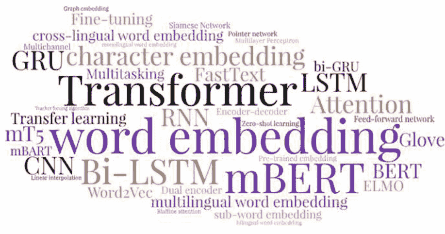

图1 讨论的深度学习技术总结。技术的字体大小与其使用相关。

##### 2.1 词嵌入

将文本转化为机器可以理解的有意义的表示是任何文本挖掘问题中的关键步骤。过去的二十年见证了词嵌入向量表示在许多文本挖掘应用的成功中起到了主导作用。词嵌入将单词投影到一个维度较低的向量表示中，使得传达相似含义的单词在向量空间中更接近。这些向量表示是通过在文本挖掘任务上使用神经网络进行联合学习得到的。语言建模广泛用于学习词嵌入向量表示，其中模型试图根据其周围或上下文单词来预测一个单词。用于特定任务训练的神经网络的第一层将输入单词投影到一个向量表示中，并在学习过程中进行调整以最小化任务上的损失。Word2Vec [1]、Glove [2]、FastText [3] 和 BERT [4] 是一些非常流行的预训练词嵌入向量表示，适用于英语。代码混合文本面临的第一个挑战是将文本高效地转化为有意义的向量表示。以下三种技术被用作生成代码混合文本的向量表示的解决方案。

- 1. 单语词嵌入—使用现有的单语词嵌入结合语言检测。一旦知道单词的语言，就可以使用相应的单语表示将单词转换为向量表示。
- 2. 双语词嵌入—在联合嵌入向量空间中学习两种语言的词嵌入向量表示[5]。这可以通过直接从双语数据中学习向量表示，或者使用一个专门的方法来完成，投影机制将单词向量表示投影到一个共同的矢量空间。
- 3. 跨语言或多语言词嵌入—在联合嵌入矢量空间中学习多种语言的词嵌入向量表示[5]。与双语词嵌入类似，可以通过从多语言数据直接学习向量表示，或者使用投影机制将单词向量表示投影到一个公共向量空间来实现。

##### 2.2 语言检测

识别代码混合文本中使用的语言是下游文本挖掘应用的基本任务。语言检测可以在单词级别和话语级别进行。在这个问题出现之初，支持向量机（SVM）[6] 被广泛使用，但Chang等人[7] 表明，具有跨语言嵌入的循环神经网络（RNN）在确定代码混合数据的语言方面优于SVM。参考文献[8,9] 使用了类似的方法，使用双向长短期记忆（bi-LSTM）进行语言检测。

Jaech等人[8] 进一步修改了解决方案，使用了一个专门用于学习单词嵌入表示的卷积神经网络（CNN）作为网络底部。单词以字符级别输入到CNN中，这使得它们能够使用字符序列构建每个单词的向量表示。Samih等人[9] 在LSTM之前添加了一个条件随机场（CRF）层，以捕捉单词的语言标签之间的关系。CRF是一种序列标注算法，它对整个序列的标签进行建模，而不是独立地对其元素进行建模。他们使用预训练的跨语言嵌入将单词转换为向量表示。

Choudhury等人[10] 研究了利用在单词数据上训练的语言检测模型的知识来提高代码混合文本中语言检测性能的不同方法。他们使用单词数据训练了一个神经网络，其中包含一个嵌入层和一个密集层，交替使用不同语言，然后如果有代码混合数据，再对其进行重新训练。这种方法显著提高了模型在确定代码混合数据中使用的语言方面的性能，他们还观察到仅使用单词数据训练的模型也具有相当高的准确性。Mandal等人[11] 修改了具有多通道的bi-LSTM和CRF架构，将其添加到网络底部。受到多通道网络在图像分类中的性能启发，他们使用了四个通道，其中三个通道使用CNN，一个通道使用LSTM。输入词向量被提供给所有四个通道，通道的输出被连接起来，并输入到具有CRF的bi-LSTM中以预测语言。

基于Transformer的神经架构在文本挖掘领域引起了轰动，为许多分类任务提供了最先进的性能。特别是BERT（双向编码器转换器的双向编码器表示）[4]，以及其扩展广泛应用于其架构优势，如编码器-解码器模型和自注意力机制，使其能够关注输入序列的部分。在这些预训练的Transformer模型的顶部添加新层进行微调，以生成文本挖掘领域的最先进的分类模型。

Thara等人[12] 利用了类似的思想，将BERT及其变体用于马拉雅拉姆语-英语数据的语言检测。他们观察到，即使在微调预训练模型时进行了少数轮次的训练，性能也有所提升。这表明了深度学习模型在语言检测任务中的应用演变，从具有跨语言词嵌入的LSTM到基于Transformer的架构。

##### 2.3 情感分析

情感分析是确定与陈述相关的极性（负面、正面或中性）的任务[14]。这利用了与商业、政治和其他社会趋势相关的广泛应用[15]。随着在社交媒体交流中使用混合编码数据的普及，有必要设计解决方案来推断混合文本中的情感并有效处理由多种语言混合引起的挑战。表1显示了来自[13] 数据集的社交媒体帖子的示例，其中包含印地语-英语混合文本，传达了三种不同的情感。虽然许多机器学习模型被探索作为解决这个问题的方法，但Ghosh等人[16] 尝试在Facebook帖子中应用多层感知器进行情感分析。他们强调在输入到多层感知器之前对文本进行广泛的预处理和特征提取以获得更好的性能的必要性。

Choudhary等人[17] 采用孪生网络进行代码-混合数据的情感分析。孪生网络与其他深度学习模型不同，因为它们具有参数共享的特性。该网络由两个或多个相同的子网络组成，共享参数。作者使用两个子网络对孪生网络进行建模，每个子网络由bi-LSTM和前馈网络的组合组成。具有相同情感极性的两个句子被输入到每个子网络中，并且在训练网络时，两个句子产生的向量表示之间的差异被最小化。这使得网络能够将具有相同极性的句子投影到一个共同的向量空间中。Li等人[18] 提出了一个双编码器架构，其中第一个编码器负责确定句子中表达的整体情感，而第二个带有注意机制的编码器则专注于个别子词。CNN用于生成子词的向量表示，该表示将作为输入提供给双编码器，并且双编码器的输出通过多个全连接层进行预测。

表1 来自hinglish代码混合情感分析数据集[13]的示例。对于每个帖子，原始推文以斜体显示，并在下一行中提到其英文翻译。

| 社交媒体帖子 | 情感 |
| :--- | :--- |
| 世界最好的总理纳伦德拉·莫迪吉米拉·巴特·马汉先生。纳伦德拉·莫迪是世界上最好的总理。我的印度很棒 | 积极 |
| 您的任何计划都没有得到正确的利用……<br>你的任何计划都没有被正确使用 | 消极 |
| 莫迪先生, 这是哪个国家?<br>先生莫迪, 这是哪个国家? | 中性 |

凭借注意力机制的显著性能，它们也被用于分析混合代码数据[19, 20]。Jamatia等人[19] 表明，带有注意力层的双向LSTM优于许多传统的机器学习算法。Javdan等人[20] 提出了一个具有多个注意力层的架构。所提出的模型包括两个并行的子网络，每个子网络分别负责学习字符级和词级特征。每个子网络由一个带有LSTM和注意力层的嵌入层组成，它们分别负责学习重要的词级和字符级特征。子网络的输出被合并并输入到另一个具有多个密集层的注意力层中。这个最后的注意力层旨在学习词级和字符级特征中的主导特征。

尽管词嵌入和字符嵌入被广泛用于将单词转换为向量表示，但一些研究[21,22] 指出了这两种表示的缺点，并表明子词级别的嵌入表示在表示混合代码数据方面更加强大。Mandalam等人[21] 在德拉维德语混合代码数据的情感分析中使用了子词嵌入与LSTM相结合。Chundi等人[22] 在子词嵌入层之上使用了CNN和双向LSTM的组合。在这里，CNN从这些子词向量表示中学习重要特征。与语言检测任务中的探索类似[10]，Yadav等人[24] 试图有效地将从单词数据中获得的知识转移到混合代码数据中。单词词嵌入是从大规模单词数据中训练得到的，它们学习了一个可以将一种语言的词嵌入向量空间转换为另一种语言的向量空间的投影矩阵。这个投影矩阵可以在有监督或无监督的情况下学习，它能够有效地生成跨语言的词嵌入。最后，他们在嵌入层上应用了一个双向LSTM来进行预测。可以观察到，在混合编码文本的情感分析的最新解决方案中，注意机制和有效的词嵌入被广泛使用。

##### 2.4 仇恨言论检测

社交网络上的仇恨和辱骂内容对在线社区构成了重大威胁。这促使研究界自动检测社交媒体内容中的仇恨言论，以最小化对社会的传播和伤害。

随着对混合编码文本的广泛使用，解决与之相关的挑战变得至关重要。

最初的深度学习解决方案探索了各种CNN架构，以确定混合编码文本中表达的仇恨言论。这包括一个独立的CNN [25, 26]，两个并行的CNN专门处理单词级和字符级信息[27]，CNN与LSTM的结合[28] 以及CNN与双向LSTM的结合[29]。参考文献[26, 28] 表明，在英文文本上训练的基于CNN的架构与多语言文本上的训练相比，表现更好。Srivastava等人[30] 表明，仅将迁移学习应用于嵌入层就足以处理混合编码数据中的仇恨言论检测所面临的挑战。他们重新训练了预训练的嵌入模型，如ELMO [31] 和BERT [4]，在混合编码数据上，并将其用作独立CNN的嵌入层来进行预测。

LSTM模型在处理序列数据方面更加强大。Kapoor等人[32] 采用了类似的迁移学习方法，使用基于LSTM的架构。他们使用一个包含多个密集层的LSTM模型，并使用英语数据进行训练。训练好的密集层被重复利用在另一个LSTM模型的顶部，以便在多语言数据上重新训练。这使他们能够在模型的最后阶段利用已经转移的学习特征。Santosh等人[33] 在LSTM模型中应用了注意机制，用于混合代码文本中的仇恨言论检测。在这里，通过一个一维卷积层生成LSTM的输入句子。Chopra等人[34] 进一步修改了这个模型，将社交网络信息融入到图嵌入中。从社交网络中获取的关注者和转发图被转换为嵌入表示，用于网络中的用户。使用Deepwalk [35] 和node2vec [36] 技术将用户转换为嵌入表示。最后，通过一个softmax层将图嵌入层与CNN、LSTM和注意力层结合起来进行预测。这表明，对于混合代码数据的仇恨言论检测，采用深度学习技术的发展已经从简单的基于CNN的架构发展到了融合迁移学习和社交网络数据。

##### 2.5 立场检测

立场检测是意见挖掘的一个重要分支，它确定一条意见是否对目标实体持反对、赞成或中立的态度[38]。目标实体可以是产品、人物或组织。表2展示了表达对2016年印度废钞事件的不同立场的印地语-英语混合社交媒体帖子的示例[37]。虽然其他分类任务的解决方案，如混合语言数据中的语言检测和情感分析，可以用来解决这个问题，但在立场检测方面，几乎没有使用深度学习技术的努力。Skanda等人[38] 仅在特征提取层面使用了深度学习，即对单词进行特征提取。

表2：表达对目标实体（废钞）的不同立场的印地语-英语混合帖子示例[37]

| 社交媒体帖子 | 立场 |
| :--- | :--- |
| 先生,您是反腐败的兄弟会成员,为什么要反对莫迪?请支持废钞行动的工作。先生,您是反腐败团体的成员,为什么要抗议莫迪呢?您应该支持废钞行动 | 支持 |
| @Narendramodi_PM废钞行动是您的错误决定!<br>@Narendramodi_PM您的废钞决策是错误的 | 反对 |
| #jeetupatvari,你很困惑,有时说方法不对,有时说废钞行动不对。 | 中性 |
| #jeetupatvari你很困惑,有时你说实施方法不对,有时你说废钞行动不对 | |

使用word2vec [1] 模型将其转换为向量表示，并使用逻辑回归方法训练立场检测模型。Shalini等人[39] 用独立的CNN和双向LSTM替换了逻辑回归模型，并表明CNN在检测代码混合数据的立场方面提高了性能。这表明在未来的深度学习技术中，进一步提高混合代码数据中立场检测任务的性能是必要的。特别是，可以进一步尝试在其他分类任务中使用的技术，如基于注意力的模型和迁移学习。

##### 2.6 问答

随着在线社交网络中可用内容的丰富，回答用户查询以检索准确信息已成为一项重要任务。问答是自然语言处理（NLP）的一个分支，试图从数据存储库中找到或生成给定问题的答案。尽管在过去的二十年中，这个问题已经发展了很多以适应各种挑战，但处理混合代码数据仍然是一个未解决的问题。在自动回答问题时，对处理混合代码数据的努力还很有限。

Gupta等人[40] 将这个问题建模为一个两步方法，首先他们使用基于分数的方法生成候选答案，然后使用Siamese CNN架构对候选答案进行排序。该架构包括两个平行的CNN，共享权重，其中一个CNN专门处理问题和正确答案，另一个CNN专门处理相同问题和错误答案。CNN的输出向量传递到全连接层以生成相似度分数，并在训练过程中最小化分数之间的差异。这有助于模型识别正确答案和错误答案之间的差异。

Gupta等人[41] 尝试了一种不同的两步方法。首先，他们将问题分类到预定义的一组类别中，然后提取相关的答案。他们应用深度学习解决方案将问题分类到预定义的类别中。神经网络由一个嵌入层和一个卷积神经网络（CNN）后面的循环神经网络（RNN）组成，用于分类问题。最后，使用基于分数的方法来对给定问题的最合适的答案进行排名。他们进一步使用双向门控循环单元（bi-GRU）[42] 对模型进行了修改。他们使用基于分数的方法从数据源中提取可能包含答案的句子。与问题相关的这些句子的集合被称为片段。在提出的解决方案中，有专门的层将问题和片段投影到向量形式。两个向量表示都通过最终的答案提取层传递，该层由指针网络构成，用于确定答案。指针网络使用注意机制来选择输入的一个成员作为输出。Gupta等人[41] 使用了两个指针网络来确定片段中答案的起始和结束单词的索引。

正如我们之前讨论的那样，基于Transformer的架构，如BERT，在许多文本挖掘应用中取得了最先进的结果。Gupta等人[43] 使用了BERT的多语言变体mBERT[4]，该模型在一个包含104种语言的文本语料库上进行了训练，以在混合代码数据中进行问题回答。他们尝试了两种方法来采用mBERT模型进行混合代码数据的问题回答。第一种方法被称为零样本学习，预训练的mBERT模型直接用于回答英语-印地语数据集中的问题，无需进一步训练。第二种方法在英语-印地语数据集上微调预训练模型。虽然零样本学习并没有改善基准模型的性能，但微调却表现出了令人信服的性能。这表明了mBERT模型在语言之间的转移能力，为进一步探索转移学习技术以提高性能开辟了研究机会。

##### 2.7 机器翻译

将用户生成的内容翻译成像英语这样的高资源语言对于许多引人注目的应用非常重要，例如搜索引擎、推荐系统和产品营销。将这个问题应用于混合代码文本，可以在翻译时使用可用于高资源语言的解决方案。同时，这增加了问题的复杂性，因为它需要从多种语言翻译文本。Nakayama等人[44] 使用了BERT [4] 模型的简化版本，并使用了公开可用的预训练BERT模型的相同超参数来执行混合代码数据的翻译。给定一个包含两种语言的句子，他们屏蔽了第二种语言的单词。训练神经网络模型以推断第一种语言中的单词。这有助于模型完成第一种语言的单语文本中的句子。

编码器-解码器架构已经展示了在单语文本翻译任务中的最新成果。编码器为一个语言的输入词序列生成一个固定长度的上下文向量表示。解码器接收上下文向量并在另一种语言中重新生成句子。这些编码器和解码器由双向LSTM组成，用于处理序列数据。一旦编码完成，解码器可以被替换以训练模型将句子翻译成任何语言。解码器可以添加一个注意力层，以学习输入序列中需要考虑的重要位置。这种带有注意力机制的编码器-解码器架构被用作Google的翻译系统的核心组件[45]。Mahata等人[46] 通过添加一个新组件来确定文本中的语言，采用了这种解决方案用于代码混合文本翻译。LSTM模型用于检测代码混合文本中的语言。这使得可以使用单语翻译系统将一种语言的文本序列翻译成另一种语言的句子。Kugathasan等人[47] 使用了类似的带有LSTM的编码器-解码器架构。解码器组件使用了一种称为“教师强制算法”的算法，该算法使用前一个时间步的真实输出作为输入的一部分。这使得解码器LSTM能够根据正确的输出快速有效地调整参数，而不是依赖于由于前一个时间步的错误预测而产生的损失。

文献中还探索了其他架构的编码器-解码器模型。Dowlagar等人[48] 用CNN替换了LSTM，开发了一个带有注意机制的编码器-解码器模型。他们表明，用CNN替换LSTM可以提高混合代码数据的机器翻译任务的性能。文献[49, 50] 使用预训练的多语言基于Transformer的模型，在很少量的任务特定数据上微调这些模型的强大性质。Gupta等人[50] 使用了BERT的跨语言变体mBERT。El madany等人[49] 尝试了两种方法：(i) 从头开始训练的多语言Transformer模型和 (ii) 预训练的多语言模型mT5 [51] 和mBART [52]。mT5和mBART是通过在大量多语言数据上训练它们的原始单语模型T5和BART获得的。这两个模型都采用了基于Transformer的编码器-解码器架构。很明显，编码器-解码器架构在混合代码数据的机器翻译任务中发挥着重要作用。mT5和mBART是通过在大量多语言数据上训练它们的原始单语模型T5和BART获得的。这两个模型都采用了基于Transformer的编码器-解码器架构。

##### 2.8 命名实体识别（NER）

从文本中提取命名实体是文本挖掘的基本任务，它旨在识别文本中的实体并将其分类为实体类别，例如人物、组织、地点、时间等[53]。图2展示了一个来自混合编码NER数据集的推文示例[54]。提取的命名实体被用作特征

图2来自混合编码NER数据集的推文示例[54]。该推文是用Tanglish（泰米尔语+英语）编写的。彩色单词表示实体，它们对应的实体类型在方框中指示。

许多文本挖掘任务，包括机器翻译、问答、搜索引擎和自动摘要。这些好处使得混合编码数据的NER任务成为一个必须解决的问题。NER任务的性质也被称为序列标注或序列标记，其中给定序列中的每个单词都被赋予一个标签或标记。在NER中，每个单词被赋予一个命名实体类别，而不属于任何预定义类别的单词则被分配一个特定的标签。

循环神经网络在序列标记任务中表现出色，因为它们能够高效处理长序列数据。辛格等人[55]分析了三种不同模型的性能，(i)决策树，(ii)条件随机场(CRF)，以及(iii)长短期记忆(LSTM)，用于处理代码混合数据的命名实体识别。他们观察到使用LSTM模型时性能略高于其他两种模型。古普塔等人[53]使用双向门控循环单元(bi-GRU)进行了类似的分析，并显示它优于其他机器学习模型，如条件随机场(CRF)和支持向量机(SVM)。在输入到bi-GRU之前，使用GloVe [2]词嵌入将单词转换为向量表示。纳拉亚南等人[56]表明，与使用单词级嵌入相比，使用字符级嵌入结合双向长短期记忆(bi-LSTM)在命名实体识别任务中表现更好。这可能是由于利用了字符级形态特征，从而提高了模型的性能。

在序列标注任务中，许多最先进的模型都结合了CRF和神经网络模型。Sabty等人[57, 58]结合了双向LSTM和CRF，并尝试了各种预训练嵌入，包括Word2Vec [1]、GloVe [2]、BERT [4]、ELMO [31]和FastText [3]。他们观察到当他们使用FastText词嵌入时，模型的性能更好，这是Facebook提出的Word2Vec的扩展。Gaddamidi等人[59]表明，通过为模型提供字符级嵌入以及额外的输入，可以进一步提高使用FastText嵌入的双向LSTM-CRF的性能。参考文献[60, 61]将CRF与基于Transformer的编码器结合起来，使用相应的单语词嵌入、子词嵌入和字符嵌入生成多语言嵌入表示。他们使用了FastText [3]和GloVe [2]作为单词词嵌入，并使用独立的投影层和注意力生成相应的多语言表示。这个提出的解决方案在英西[60]和英印[61]语言组合中被证明达到了最先进的性能。这显示了这些混合模型结合CRF和神经网络的强大性质，其中神经网络支持学习关键特征，而CRF利用这些特征执行序列标记任务。

##### 2.9 词性 (POS) 标注

与NER类似，词性（POS）标注是文本挖掘中的基本任务，许多下游任务需要POS标记的词序列作为输入[63]。该任务旨在为序列中的每个单词分配一个相关的词性，例如名词、动词、形容词、副词、介词、冠词等。图3显示了Hinglish句子及其相应的POS标记的示例。虽然基于CRF的模型[63, 64]广泛用于标记混合代码的POS，但Singh等人[65]比较了CRF和LSTM在印度英语混合数据中的性能，并显示CRF模型仍然保持了更好的性能，而不是独立的LSTM。Patel等人[66]分析了各种简单的神经网络架构来解决同样的问题。他们在相同的语言组合中比较了RNN、LSTM、两层LSTM和GRU模型，并显示GRU的性能优于其他模型。

Ball等人[67]进一步实验了嵌入表示在增强印地语-英语混合文本中词性标注任务性能方面的重要性。他们使用双向LSTM来预测混合编码词序列的词性标签。这个双向LSTM的输入包括四个嵌入组件：印地语和英语词嵌入，以及通过另一个双向LSTM获得的印地语和英语字符嵌入。该架构使用单词数据进行训练，训练过程中只激活专门用于一种语言的组件。在推断过程中，所有组件都被激活以进行预测。这使得模型能够在训练过程中推断出语言特定的特征，并且在推断过程中避免显式的语言识别。Bhattu等人[62]在第二个双向LSTM之上添加了一个CRF来进行预测。

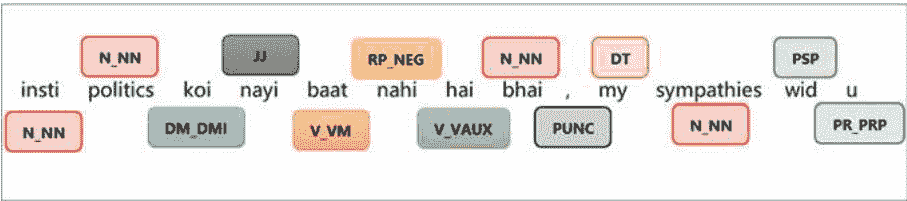

图3：Hinglish（印地语+英语）句子及其对应的词性标签示例[62]

他们直接在多语言混合数据中训练模型，并使用三种不同的词嵌入模型（Word2Vec [1]、GloVe [2] 和 FastText [3]）进行性能实验。此外，第一个双向LSTM（用于生成字符嵌入）也被CNN替换，以进行性能比较。结果表明，使用双向LSTM进行字符嵌入提取和使用FastText进行词嵌入的组合表现良好，优于其他组合。

采用基于Transformer的架构来实现最先进的性能，在混合编码数据的词性标注任务中也可以看到。Dowlagar等人[68]使用了基于BERT的模型，并探索了多任务学习，同时训练模型执行词性标注和语言检测。输入的词语列被传递给BERT模型，并在其上方使用CNN对整个序列进行编码。两个多层感知机接收编码后的向量表示，并独立地推断出序列中每个词的词性标签和语言。这种多任务学习使得模型能够有效地学习共享表示，避免过拟合，并通过利用辅助信息快速学习。这种最先进的解决方案将鼓励许多研究人员尝试基于Transformer的解决方案，进一步提升性能。

##### 2.10 解析

语言解析是根据形式语法规则分析和解释文本的语义结构的任务。提取词序列的语义结构有助于找到序列的真实含义。通常将结构表示为解析树。例如，图4展示了一个Hinglish混合代码句子及其相应的解析树，该解析树是使用混合代码解析器[69]生成的。解析结构在各种应用中被使用，包括命名实体识别、机器翻译和语法纠正[70]。混合代码文本也存在语法或语义规则，并且现有的研究表明，语言规则可以用于开发混合代码词序列[71]。这为探索开发混合代码数据的语言解析器问题提供了机会。

早期关于使用深度学习技术开发混合代码数据的语言解析器的研究之一是由Bhat等人提出的解决方案[73]。作者利用可用的单语训练数据来实验迁移学习方法。他们分别从代码混合文本中使用的语言单语文本数据训练了两个神经模型。该模型由一个前馈神经网络和一个隐藏层组成。一旦单语模型训练完成，它们将代码混合的句子分别传递给每个模型，并使用线性插值技术从单语模型的独立决策中获得最终决策。这些插值权重是使用单独的开发集学习的，并且作者在解析代码混合数据方面获得了合理的性能。同一作者后来表明，联合学习词性标注和解析可以提高两个任务的性能[69]。他们使用了一个共享的bi-LSTM，该网络具有两个并行的前馈神经网络，分别用于执行POS标记和解析。共享bi-LSTM的输入由从另一个bi-LSTM获得的词嵌入和字符嵌入组成。所提出的架构为处理印地语-英语混合语言的数据提供了最先进的解决方案。

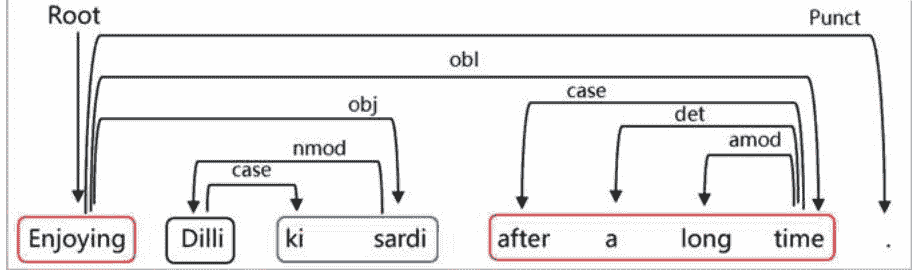

图4: Hinglish（印地语+英语）句子及其相应的带有关系的解析树的示例[72]，使用了一个代码混合语言解析器[69]生成

Ghosh等人[74]通过使用跨语言嵌入增强了上述最先进的解决方案。跨语言嵌入是通过将数据集中使用的语言的单词词嵌入投影到一个公共向量空间中获得的，投影矩阵是使用Artetxe等人[75]提出的监督方法进行训练的。Partanen等人[76]使用了相同的方法来开发跨语言嵌入表示，并使用具有多层感知机的bi-LSTM来验证其性能以构建候选解析树。Zhang等人[77]使用了类似的跨语言嵌入解决方案，结合了bi-LSTM。他们通过在bi-LSTM之上添加了Dozat等人[78]提出的双仿射评分层来修改此解决方案。双仿射注意机制最初是为单语言解析提出的，并且在单语言和混合代码文本中都表现出最佳性能。同样，Srinivasan等人[71]使用了多语言语言模型mBERT和深度神经网络。所提出的网络由8个相同的层组成，每个层包含两个子层，一个注意力层和一个前馈层。这显示了在开发用于混合代码文本的强大语言解析器中嵌入的重要作用。

#### 3 结论和未来方向

本章讨论了在社交媒体中处理混合编码文本所使用的各种深度学习技术。我们对深度学习技术在各种文本挖掘任务中的综合研究进行了介绍，同时强调了任务所面临的挑战以及提出的相应深度学习解决方案来克服这些挑战。我们还讨论了开放的研究问题和可能的未来方向，以整合有效的深度学习解决方案。

我们的研究强调了在许多文本挖掘任务中，尤其是情感分析和解析混合编码文本方面，嵌入起着至关重要的作用，可以获得最先进的性能。在三种不同的嵌入中，多语言嵌入是广泛使用的一种，它将多种语言的单词投影到一个共同的向量空间中，具有强大的泛化能力，并且可以在少量数据上进行微调。与词嵌入类似，基于Transformer的解决方案广泛用于混合编码数据中的许多文本挖掘任务，包括语言检测、机器翻译和问题回答。mBERT是基于Transformer架构的一个例子，它在多语言数据上进行训练，我们可以看到这个模型在许多文本挖掘任务中被广泛使用。

在处理混合代码数据时，使用不同的深度学习技术来克服挑战。我们的研究表明，迁移学习技术尝试使用单语数据训练模型，然后在多语言数据上进行微调，能够构建文本挖掘任务中的最先进解决方案，例如混合代码数据中的仇恨言论推断。此外，注意力机制和多任务学习，特别是训练模型同时执行POS标注和语言解析，可以看作是克服处理混合代码数据中的挑战的替代方法。然而，我们观察到在采用深度学习解决方案进行混合代码数据的立场检测等任务方面，工作量较小。此外，在社交网络挖掘的许多下游应用中，如聊天机器人/交互系统、影响力分析和用户行为分析，混合代码数据分析尚未被探索。此外，它为探索其他任务中使用的技术开辟了研究机会，以开发处理混合代码文本的有效解决方案。

#### 参考文献

- 1. Mikolov, T., Chen, K., Corrado, G., Dean, J.: 在向量空间中高效估计词表示（2013）。arXiv:1301.3781
- 2. Pennington, J., Socher, R., Manning, C.D.: GloVe：用于词表示的全局向量。在2014年经验方法自然语言处理会议（EMNLP）论文集中, 第1532-1543页。
- 3. Bojanowski, P., Grave, E., Joulin, A., Mikolov, T.: 用子词信息丰富词向量。计算语言学协会交易, 第5页, 第135-146页（2017）。
- 4. Devlin, J., Chang, M-W., Lee, K., Toutanova, K.: BERT：用于语言理解的深度双向转换器的预训练（2018）。arXiv:1810.04805
- 5. Ruder, S., Vulić, I., Søgaard, A.: 跨语言词嵌入模型综述. 人工智能研究杂志 65, 569-631 (2019)
- 6. Noble, W.S.: 什么是支持向量机？自然生物技术 24(12), 1565-1567 (2006)
- 7. Chang, J.C., Lin, C-C.: 微博上的语言检测循环神经网络代码-切换语料库 (2014). arXiv:1412.4317
- 8. Jaeckh, A., Mulcaire, G., Ostendorf, M., Smith, N.A.: 一种用于代码切换推文中语言识别的神经模型。 在：第二届计算方法研讨会论文集, 第60-64页 (2016)
- 9. Samih, Y., Maharjan, S., Attia, M., Kallmeyer, L., Solorio, T.: 基于LSTM循环神经网络的多语言代码切换识别。 在：第二届计算方法研讨会论文集, 第50-59页 (2016)
- 10. Choudhury, M., Bali, K., Sitaram, S., Baheti, A.: 代码切换的课程设计：深度神经网络在语言识别和语言建模中的实验。 在：第14届国际自然语言处理会议（ICON-2017）论文集，第65-74页（2017年）
- 11. Mandal, S., Singh, A.K.: 使用多通道神经网络和上下文捕捉进行代码混合数据的语言识别（2018年）。 arXiv:1808.07118
- 12. Thara, S., Poornachandran, P.: 基于Transformer的马拉雅拉姆-英语代码混合文本语言识别。 IEEE Access 9，118837-118850（2021年）
- 13. Joshi, A., Prabhu, A., Shrivastava, M., Varma, V.: 面向印地语-英语代码混合文本情感分析的子词级组合。 在：第26届国际计算语言学会议（COLING 2016）技术论文集，第2482-2491页（2016年）
- 14. Saxena, A., Reddy, H., Saxena, P.: 社交网络情感分析的最新发展：技术、数据集和开放问题。 在：社交网络原理，第279-306页。 Springer出版社（2022年）
- 15. Saxena, A., Reddy, H., Saxena, P.: 情感分析简介，涵盖基础知识、工具、评估指标、挑战和应用。 在：社交网络原理，第249-277页。Springer出版社（2022年）
- 16. Ghosh, S., Ghosh, S., Das, D.: 代码混合社交媒体文本的情感识别（2017年）。 arXiv:1707.01184
- 17. Choudhary, N., Singh, R., Bindlish, I., Shrivastava, M.: 利用资源丰富的语言进行代码混合语言的情感分析（2018年）。 arXiv:1804.00806
- 18. Lal, Y.K., Kumar, V., Dhar, M., Shrivastava, M., Koehn, P.: 从代码混合文本中分离情感。 在：第57届计算语言学协会年会：学生研究研讨会，第371-377页（2019年）
- 19. Jamatia, A., Swamy, S.D., Gambhir, B., Das, A., Debbarma, S.: 基于深度学习的代码混合英-印度和英-孟加拉社交媒体语料库情感分析。国际人工智能工具杂志29（05），2050014（2020年）
- 20. Mukherjee, S., Prasan, V., Nediyanchath, A., Shah, M., Kumar, N.: 基于鲁棒的深度学习的代码混合文本情感分类。 在：第16届国际自然语言处理会议，第124-129页（2019年）
- 21. Venkata Mandalam, A., Sharma, Y.: 德拉维达语混合代码数据的情感分析。 在：第一届德拉维达语言语音和语言技术研讨会论文集，第46-54页（2021年）
- 22. Chundi, R., Hulipalled, V.R., Simha, J.B.: 使用深度学习技术进行英语-卡纳达语代码切换文本的情感分析。 在：2020年智能计算、电气和电子技术国际会议论文集，第327-331页。IEEE（2020年）
- 23. Chakravarthi, B.R., Priyadharshini, R., Muralidaran, V., Suryawanshi, S., Jose, N., Sherly, E., McCrae, J.P.: 关于代码混合文本中德拉维达语情感分析的概述 。 在：信息检索评估论坛，第21-24页（2020年）
- 24. Yadav, S., Chakraborty, T.: 无监督的代码混合数据情感分析（2020年）。 arXiv:2001.11384
- 25. Badjatiya, P., Gupta, S., Gupta, M., Varma, V.: 深度学习用于推特中仇恨言论检测。 在：第26届国际万维网会议伴随论文集，页码759-760（2017年）
- 26. Mathur, P., Shah, R., Sawhney, R., Mahata, D.: 用于检测印地英语混合语言中冒犯性推文的方法。 在：第六届自然语言处理社交媒体国际研讨会论文集，页码18-26（2018年）
- 27. Ho Park, J., Fung, P.: 用于推特上辱骂性语言检测的一步和两步分类方法（2017年）。 arXiv:1706.01206
- 28. Mathur, P., Sawhney, R., Ayyar, M., Shah, R.: 你冒犯了我吗？ 用于印地英语混合语言中冒犯性推文的分类方法。 在：第二届在线辱骂语言研讨会论文集，页码138-148（2018年）
- 29. Vashistha, N., Zubiaga, A.: 在印地语和英语社交媒体上进行在线多语言仇恨言论检测的实验。 Information 12(1), 5 (2021)
- 30. Srivastava, A., Hasan, M., Yagnik, B., Walambe, R., Kotecha, K.: 人工智能在社交媒体上检测Hinglish数据中仇恨言论的作用 (2021) 。 arXiv:2105.04913
- 31. Peters, M.E., Neumann, M., Iyyer, M., Gardner, M., Clark, C., Lee, K., Zettlemoyer, L.: 深度上下文化的词表示。在新奥尔良，路易斯安那州举行的2018年北美计算语言学协会会议论文集：人类语言技术，卷1（长文）的论文集中。
- 32. Kapoor, R., Kumar, Y., Rajput, K., Shah, R.R., Kumaraguru, P., Zimmermann, R.: 对于代码切换语言的滥用和冒犯检测：注意你的语言。在：人工智能AAAI会议论文集，第33卷，第9951-9952页（2019年）
- 33. Santosh, T.Y.S.S., Aravind, K.V.S.: 印地语-英语混合社交媒体文本中的仇恨言论检测。在：ACM印度联合国际数据科学和数据管理会议论文集，第310-313页（2019年）
- 34. Chopra, S., Sawhney, R., Mathur, P., Shah, R.R.: 印地语-英语仇恨言论检测：作者个人资料、去偏见和实际观点。在：人工智能AAAI会议论文集，第34卷，第386-393页（2020年）
- 35. Perozzi, B., Al-Rfou, R., Skiena, S.: Deepwalk:在线学习社交表示。在：第20届ACM SIGKDD国际会议的知识发现和数据挖掘，第701-710页（2014年）
- 36. Grover, A., Leskovec, J.: node2vec:可扩展的网络特征学习。在：第22届ACM SIGKDD国际会议的知识发现和数据挖掘，第855-864页（2016年）
- 37. Swami, S., Khandelwal, A., Singh, V., Akhtar, S.S., Shrivastava, M.:英印混合语料库：立场注释和基线系统（2018年）。 arXiv:1805.11868
- 38. Srinidhi Skanda, V., Anand Kumar, M., Soman, K.P.:使用句子嵌入在卡纳达社交媒体混合文本中检测立场。在：2017年计算机、通信和信息学国际会议（ICACCI），第964-969页。IEEE（2017年）
- 39. Shalini, K., Anand Kumar, M., Soman, K.:基于深度学习的印度社交媒体文本立场检测。在：新兴的电子、计算机科学和技术研究，第57-67页。Springer（2019年）
- 40. Gupta, V., Chinnakotla, M., Shrivastava, M.: 音译比翻译更好吗？回答知识库中的混合编码问题。在：第三届计算语言代码切换研讨会论文集，第39-50页（2018年）
- 41. Gupta, D., Kumari, S., Ekbal, A., Bhattacharyya, P.: Mmqa：一个多领域多语言的英语和印地语问答框架。在：第十一届国际语言资源和评估会议论文集（LREC 2018）（2018年）
- 42. Gupta, D., Ekbal, A., Bhattacharyya, P.: 一个用于英语印地语问答的深度神经网络框架。ACM Trans. Asian and Low-Res. Lang. Inf. Process.(TALLIP) 19(2), 1-22 (2019年)
- 43. Gupta, S., Khade, N.: 基于Bert的英语和印地语多语言机器理解 (2020). arXiv:2006.01432
- 44. Nakayama, S., Kano, T., Tjandra, A., Sakti, S., Nakamura, S.: 识别和翻译混合语言语音表达。在：2019年东方COCOSDA第22届会议国际语音数据库和评估技术协调和标准化委员会（O-COCOSDA），第1-6页。IEEE（2019年）
- 45. Wu, Y., Schuster, M., Chen, Z., Le, Q.V., Norouzi, M., Macherey, W., Krikun, M., Cao, Y., Gao, Q., Macherey, K.等：谷歌的神经机器翻译系统：弥合人类和机器翻译之间的差距 (2016). arXiv:1609.08144
- 46. Mahata, S.K., Mandal, S., Das, D., Bandyopadhyay, S.: 混合语言到单一语言翻译框架。在：第11届信息检索评估论坛论文集，第30-35页（2019年）

47. Kugathasan, A., Sumathipala, S.: 辛哈拉语-英语混合文本的神经机器翻译。在：自然语言处理国际会议（RANLP 2021）论文集，第718-726页（2021年）

48. Dowlagar, S., Mamidi, R.: 基于门控卷积序列到序列的学习，用于英语-印地语混合机器翻译。在：第五届语言混合计算方法研讨会论文集，第26-30页（2021年）

49. Elmahdy, A.R., Abdul-Mageed, M. et al.: 调查混合编码的现代标准阿拉伯语-埃及语到英语的机器翻译。在：第五届语言混合计算方法研讨会论文集，第56-64页（2021年）

50. Gupta, A., Vavre, A., Sarawagi, S.: 用于混合代码翻译的训练数据增强。在：2021年北美计算语言学协会会议论文集：人类语言技术，第5760-5766页（2021）

51. Xue, L., Constant, N., Roberts, A., Kale, M., Al-Rfou, R., Siddhant, A., Barua, A., Raffel, C.: mT5：一种大规模多语言预训练文本到文本转换器（2020）。arXiv:2010.11934

52. Liu, Y., Goyal, N., Li, X., Edunov, S., Ghazvininejad, M., Lewis, M., Zettlemoyer, L.: 用于神经机器翻译的多语言去噪预训练。计算语言学协会交易。8，726-742（2020）

53. Gupta, D., Ekbal, A., Bhattacharyya, P.: 基于深度神经网络的印度社交媒体文本中实体提取方法。在：第十一届语言资源与评估国际会议论文集（LREC 2018）（2018年）

54. Rao, P.R.K., Devi, S.L.: Cmee-il: 印度社交媒体文本中的混合编码实体提取方法@ FIRE 2016-概述。FIRE（工作笔记），289（2016年）

55. Singh, V., Vijay, D., Akhtar, S.S., Shrivastava, M.: 印地英混合社交媒体文本中的命名实体识别。在：第七届命名实体研讨会论文集，第27-35页（2018年）

56. Narayanan, A., Rao, A., Prasad, A., Das, B.: 用于提升混合编码推文中命名实体识别的字符级神经网络架构。在：2020年新兴信息技术与工程国际会议（IC-ETITE），第1-6页。IEEE（2020年）

57. Sabty, C., Sherif, A., Elmahdy, M., Abdennadher, S.: 阿拉伯-英语混合数据中的命名实体识别技术。国际跨学科人工智能杂志 1（1），44-63页（2019年）

58. Sabty, C., Elmahdy, M., Abdennadher, S.: 阿拉伯-英语混合数据中的命名实体识别。在：2019年IEEE第13届语义计算国际会议论文集（ICSC），第93-97页。IEEE（2019年）

59. Gaddamidi, S., Prasath, R.: 对混合编码数据的命名实体识别方法的性能分析。在：国际信息、通信和计算技术会议上，第153-167页。Springer出版社（2021年）

60. Indra Winata, G., Lin, Z., Shin, J., Liu, Z., Fung, P.: 用于混合编码命名实体识别的分层元嵌入（2019年）。arXiv:1909.08504

61. Priyadharshini, R., Chakravarthi, B.R., Vegupatti, M., McCrae, J.P.: 使用元嵌入对混合编码的印度语语料库进行命名实体识别。在：2020年第6届国际高级计算与通信系统会议上，第68-72页。IEEE（2020年）

62. Bhattu, S.N., Nunna, S.K., Somayajulu, D.V.L.N., Pradhan, B.: 使用混合编码嵌入改进混合编码词性标注。ACM Transactions on Asian and Low-Resource Language Information Processing（TALLIP）19（4），1-31（2020年）

63. Gupta, D., Tripathi, S., Ekbal, A., Bhattacharyya, P.: SMPost: 用于代码混合的印度社交媒体文本的词性标注器（2017）。arXiv:1702.00167

64. Ghosh, S., Ghosh, S., Das, D.: 代码混合社交媒体文本的词性标注。在：《计算方法与代码切换的第二次研讨会论文集》，第90-97页（2016年）

65. Singh, K., Sen, I., Kumaraguru, P.: 用于印地语-英语代码混合词性标注的Twitter语料库。在：《社交媒体自然语言处理的第六届国际研讨会论文集》，第12-17页（2018年）

66. Patel, R.N., Pimpale, P.B., Sasikumar, M.: 基于循环神经网络的代码混合社交媒体文本词性标注器（2016）。arXiv:1611.04989

67. Ball, K., Garrette, D.: 无需明确语言识别的代码切换、音译文本的词性标注。在：2018年经验方法在自然语言处理中的会议论文集，第3084-3089页（2018年）

68. Dowlagar, S., Mamidi, R.: 用于代码混合社交媒体文本的预训练变压器和CNN模型，具有联合语言识别和词性标注。在：国际自然语言处理近期进展会议论文集（RANLP 2021），第367-374页（2021年）

69. Bhat, I.A., Bhat, R.A., Shrivastava, M., Sharma, D.M.: 用于印地-英语代码切换的通用依赖解析（2018年）。arXiv:1804.05868

70. Thara, S., Poornachandran, P.: 代码混合：简要调查。在：2018年计算、通信和信息学国际会议（ICACCI），第2382-2388页。IEEE（2018年）

71. Srinivasan, A., Dandapat, S., Choudhury, M.: 混合编码解析树及其发现方法。在：《计算方法与代码切换的第四届研讨会论文集》，第57-64页（2020年）

72. de Marneffe, M.-C., Manning, C.D., Nivre, J., Zeman, D.: 通用依赖关系。计算语言学，第47卷（2），255-308页（2021年）

73. Bhat, I.A., Bhat, R.A., Shrivastava, M., Sharma, D.M.: 汇集力量：利用单语树库解析混合编码数据（2017年）。arXiv:1703.10772

74. Ghosh, U., Sharma, D.M., Khanuja, S.: 孟加拉英语混合编码数据的依赖关系解析器，增强了合成树库。在：《第18届国际树库和语言理论研讨会（TLT, SyntaxFest 2019）论文集》，第91-99页（2019年）

75. Artetxe, M., Labaka, G., Agirre, E.: 在保持单语不变性的同时学习有原则的双语词嵌入映射。在：《2016年自然语言处理实证方法会议论文集》，第2289-2294页（2016年）

76. Partanen, N., Lim, K., Rießler, M., Poibeau, T.: 具有跨语言特征表示的代码切换数据的依赖关系解析。在：乌拉尔语言计算语言学国际研讨会，第1-17页。ACL（2018年）

77. 张, M., 张, Y., 傅, G.: 使用混合编码树库进行跨语言依赖解析。在：2019年经验方法自然语言处理会议和第9届国际联合自然语言处理会议（EMNLP-IJCNLP）论文集，第997-1006页（2019年）。

78. Dozat, T., Manning, C.D.: 深度双线性注意力用于神经依赖解析（2016年）。arXiv:1611.01734

### 卷积和循环神经网络用于药物评论的意见挖掘

摘要：在线健康论坛是患者分享他们对疾病、治疗等经验的地方。在匿名的掩护下，他们非常自由地表达自己的个人经历。因此，这些论坛对于医疗专业人员更好地识别和理解患者的问题、行为和情感非常有用。在这项研究中，我们的目标是使用基于深度学习的方法揭示药物评论的情感分析的秘密。更具体地说，我们的研究重点是通用性，以减少在挖掘过程中的人为干预。因此，我们探索了使用基于深度卷积和循环神经网络（如CNN、LSTM（长短期记忆）、GRU（门控循环单元）和混合模型）的方法进行意见挖掘的问题，而不是需要先验资源（如词汇表和句子结构）的标准方法。在这项工作中，我们尝试通过减少对先验资源的需求来扩展我们过程的通用性。

关键词：深度学习 ·卷积神经网络·循环神经网络 ·混合模型·药物评论 ·观点分析·情感分析

#### 1 引言

社交媒体是最受欢迎的在线活动。2020年，全球社交媒体用户数量超过36亿，预计到2025年将接近44.1亿[32]。因此，表达意见或情感的文本文档的可用性激增，例如新闻组、博客、论坛和其他产品评论网站。

许多大型医院和医疗机构也加入了社交媒体运动，并受到许多用户的关注，他们对新闻和其他事项发表评论。与这些大型医院相关的主题。制药公司和医疗机构正在考虑这些信息，并且舆情分析长期以来一直是他们决策的重要组成部分。

目前，连接到社交媒体的患者可以搜索健康信息，参与健康话题的讨论，欣赏来自健康组织的服务或产品；他们甚至可以与健康专家联系。这些用户通过社交媒体产生的数据和他们表达的意见在电子商务或政治等领域被广泛考虑。更具体地说，通过社交媒体，患者越来越多地了解并参与做出有关他们健康抉择的选择。

这些论坛是患者在匿名的掩护下自由分享个人经历的空间。Hancock等人 [12]表明，电脑背后的沟通和匿名性比传统沟通更有助于表达情感和观点。

由于患者是医疗服务的核心参与者，他们的对话和生成的数据是衡量医疗质量意见的重要指标；对于能够访问患者之间、患者与专业人员之间甚至专业人员之间的交流的医疗专业人员来说，这些资源非常丰富，可以帮助改善他们的形象并获得有价值的决策信息。

因此，自动处理意见的需求非常迫切。自动意见分析（意见挖掘）是指从文本等来源中提取情感而无需预定义结构。识别出的情感被分类为积极、消极或更细分的类别。意见挖掘/情感分析涉及几个学科，即自然语言处理和机器学习。

在这项研究中，我们的目标是通过机器学习方法揭示情感分析的秘密。更准确地说，我们的研究重点是泛化性和特异性。为了达到这个目的，我们使用了根据相关情感（积极、中性或消极）进行注释的药物评论示例。我们将自己置于监督学习框架中，并使用深度学习、循环学习方法和混合模型来探索意见挖掘问题，而不是使用需要先验资源（如词汇和句子结构）的标准方法。在本报告中，我们尝试通过研究卷积和循环网络以及它们的混合化来降低先验资源的需求，以推动我们过程的泛化性。

提出的工作按如下方式组织：第2节介绍了情感分析的一些概述。第3节是药物评论情感分析相关工作的概述。接下来，在第4节中给出了比较的深度学习架构（CNN、LSTM、BiLSTM、GRU、BiGRU）和混合模型的理论细节。比较结果和讨论在第5节中报告，随后是结论和展望在第6节中。

#### 2 观点挖掘/情感分析的普遍性

情感分析工具可以识别给定语句的主观性和极性[27]，从而创建结构化和可利用的知识，可供决策支持系统使用。它可以应用于文档、句子或一组单词的层面。

情感的分类可以是客观的或主观的。当一个句子是客观的时候，不需要其他基本任务。当一个句子是主观的时候，必须估计它的极性（积极的、消极的或中性的）。

应用情感分析的第一步是指定将用于给定研究的文本。一般来说，有三个分析层次[7]：针对整个文本（文档级别），针对文本中的每个句子（句子级别）以及更精细的情感和极性方面级别的分析。

##### 情感分析方法

在文献中，有许多实现情感分析系统的方法和算法，可以分为以下几类[20,27]：

##### 自动化方法

文本以描述符（例如术语）的形式表示，以便可以通过依赖于机器学习方法的统计方法进行处理。

##### 基于规则的方法

确定一组规则的集合，用于识别观点的主观性、极性或主题。这种方法可以使用各种输入，例如经典的自然语言处理技术、词根化、分词等。其他基于规则的操作使用情感词典将其与数据匹配以识别极性。

##### 混合方法

混合方法的概念非常直观：简单地将两种方法中最好的部分结合起来，即基于规则和自动化方法。通常，通过结合这两种方法，可以提高准确性。

##### 药物评论的现有研究工作

情感分析的重要性在许多领域中都存在，并且在这个背景下出现了许多应用[21]。这个问题主要从自动和/或语言的角度来解决[20]。通常将其建模为一个分类问题，其中分类器被提供句子/文本，并返回相应的极性，例如情感分析的情况[26]。这些方法以其通用性（良好的召回率）而闻名。另一方面，语言方法，也称为基于规则的方法，已经广泛应用于意见分析，例如[16,23]。这些方法以其特异性（良好的准确性）而闻名。最后，其他研究尝试将自动方法的通用性和语言学的特异性相结合，提出既强大又准确的方法（同时使用词典和机器学习算法的混合方法），例如[6,34]。直到最近，支持向量机SVMs[15]和朴素贝叶斯NB分类器[28]代表了这个领域中最广泛使用的分类器。按照当前的趋势，最近的工作采用了深度学习[1,3,39]。

在这项研究中，我们关注药物评论情感分析，目前很少有相关工作进行。这是因为开发的资源数量较少。我们引用一些现有的作品，根据它们的预测输出（情感极性和药物评分）。

**药物评分**
Grasser等人[9]通过抓取https://www.drugs.com和https://www.Druglib.com在线评论网站，将评论转化为评分，对患者的情感进行情感分析和基于方面的分析，以将两种方法都作为副作用和药物有效性问题的分类。采用n-gram方法表示用户评论，并使用逻辑回归（LR）进行分类。基于Transformer的语言模型被[30]提出用于分类药物用户评分。在未标记的数据上，使用预训练的基于Transformer的神经网络模型应用迁移学习和微调策略提取语言中的模式，然后评估基于TF-IDF的两个分类器（RF和NB）。Garg[8]提出了一种药物推荐系统，使用一些向量化过程（如BoW, TF-IDF, Word2Vec）和一个基于手动特征模型的几个监督分类器，在Drug Review Dataset (https://www.Drugs.com)上进行训练，以指示给定疾病的最佳药物。

**情感极性**
Gurdin等人[10]比较了朴素贝叶斯（NB）、随机森林（RF）、支持向量机（SVM）和卷积神经网络（CNN）模型在https://www.WebMD.com上进行药物评论的性能。Han等人[11]在SentiDrugs数据集上实验了基于双向门控循环单元（BiGRU）的预训练和多任务学习模型，用于方面级情感分类。[13]对四种药物的患者评论进行了基于词典的情感分析。首先，应用无监督机器学习（潜在狄利克雷分配，LDA）将相似的文档（药物）聚类在一起，其次，开发了三种监督机器学习算法，如LR（正则化逻辑回归）、SVM和ANN（人工神经网络）来预测评论的极性。[37]中，作者提出了对药物评论进行经典和深度学习方法的分析。Vineeta等人[36]提出进行各种机器学习比较，以根据患者的表述来分类最佳子宫肌瘤治疗方法。[5]中，对药物评论进行了三种模型（CNN、LSTM（长短期记忆）和BERT（双向编码器表示来自变换器））及其组合的实验，使用了各种词嵌入模型进行分类。Min[22]提出了一种弱监督的混合CNN-LSTM模型，以解决社交评论中标记评论数量有限的问题。其他研究还包括针对不良药物反应（ADR）的评论。混合CNN和双向LSTM建模方法应用于训练带有少量手动标记数据的弱标记数据，以提高ADR识别能力。

其他研究还包括药物评分和情感极性，如[35]，他们旨在研究计数向量化器和TF-IDF分数作为文本特征提取方法，结合神经网络和常规机器学习算法（如SVM、逻辑回归和随机森林）来进行药物评论和评论者评分的情感预测。CNN-LSTM和区域CNN-LSTM模型架构被考虑用于药物评分和情感分析，[33]使用的嵌入算法是GloVe，这项工作的独特之处在于使用情感维度，比情感极性更好地表示用户的意见。

过去二十年来，药物评论情感分析的研究进展可以分为三个主要阶段。首先，我们注意到使用了经典的机器学习方法，包括概率模型。第二个阶段以深度神经网络的使用为标志。它们的巨大成功促使该领域的研究人员朝这个方向发展。最后，研究界最近对知识迁移学习产生了兴趣，这引发了在观点挖掘和情感分析任务中达到最新技术水平的显著范式转变。

在这个提案中，我们将尝试研究基于深度学习（DL）的方法以及文献中使用的方法。我们将研究几种架构（CNN，LSTM，BiLSTM，GRU，BiGRU）和混合模型在我们的特定框架中的贡献。我们还测试并比较了几种经典的机器学习算法和不同类型的连续词表示。我们分析了系统的错误以及这些表示对药物评论情感分析的相关性。我们将在研究结束时对所获得的显著结果进行总结。

## 4 卷积和循环神经网络

为了构建我们的模型，我们使用了三类深度神经网络：卷积（CNN），循环（LSTM，BiLSTM，GRU和BiGRU）和混合组合（GRU-CNN，LSTM-CNN）用于药物情感分类。

### 4.1 卷积神经网络（CNN）

卷积网络是由LeCun和Bengio[18]引入的一种特殊类型的神经网络。CNN由卷积层（特征提取器）、池化层（将卷积层的输出组合起来以检测更高级别的特征）和全连接层（通常使用ReLU函数[25]作为激活函数）组成。

卷积层代表一组从数据中直接提取特征的卷积核/滤波器。它消除了手动特征提取的需要，这通常是一项繁琐的任务。所使用的特征不是预先训练的，即网络通过对图像进行训练自己学习这些特征。这种自动化特征提取使得CNN在目标分类中能够达到高性能。

在自然语言处理的情况下，CNN的优势主要在于检测句子中的重复模式。例如，我们可以检测强调程度：“非常好”，“真的很糟糕”等等。我们还可以检测否定：“我不喜欢”，“不错”等等。通过池化层，我们还可以检测到距离上的n-gram：“就像...一样多”，或者“我喜欢...，但是”。

### 4.2 循环神经网络 (RNN)

RNN主要用于自然语言处理问题的背景下。然而，在实践中，训练它们并达到它们的理论能力是困难的。其中一个原因是当要处理的序列过长时，误差梯度的反向传播可能会变得过大并爆炸，或者相反地变得过小。网络不再区分必须考虑的信息和不必考虑的信息[2]，这使得循环神经网络无法在长期内学习。适用于循环神经网络的梯度下降算法，即变反向传播（BPTT）[24]，遇到了数值上的困难。梯度爆炸或数值崩溃——梯度消失和梯度爆炸。

#### 4.2.1 长短期记忆网络 (LSTM)

循环神经网络模型只考虑非常短期的依赖关系，LSTM [14]通过引入一个记忆向量和一组门和状态来解决这个问题。循环神经网络中的LSTM单元比传统的RNN单元或传统的神经元要复杂得多。它由一个细胞、一个遗忘门、一个输入门和一个输出门组成，并通过一个动态内存来管理随时间变化的数据序列（图1）。

鉴于更复杂的结构，特别是存在3个权重矩阵（遗忘门、输入门和记忆计算权重），LSTM的学习阶段需要比传统神经网络或RNN更多的时间是合理的。然而，LSTM的性能要好得多。由于长期依赖的处理能力，目前通过循环网络获得的大部分有趣结果都是通过LSTM获得的。

## 4.2.2 门控循环单元 (GRU)

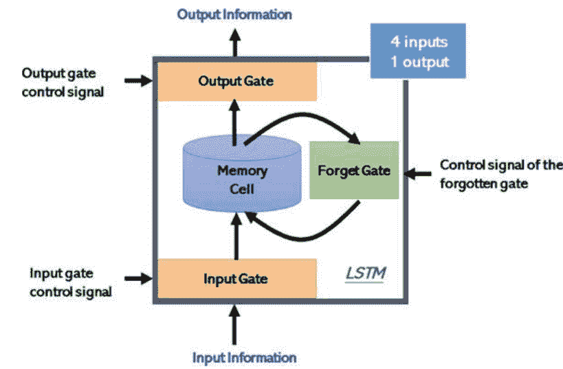
> 图1 LSTM模型表示

GRU [4] 是LSTM的一种变体；它的结构比LSTM简单，参数更少。 GRU只有三个门（没有内部细胞状态），信息被集成到最近单元的隐藏状态中，并传递给下一个闭合的循环单元。

为了对比这两个模型，可以将GRU看作是没有输出门和细胞记忆的LSTM。 实际上，GRU和LSTM提供了相似的结果。 GRU相对于LSTM的优势在于执行时间更快，因为需要计算的参数更少。

## 4.3 双向递归神经网络 (BiRNN)

在大多数序列分析问题中，拥有过去的记忆以便在当下做出良好的决策是很有趣的。 但在某些识别问题中，当有可能时，观察未来的观测结果有时也是很有趣的。 BiRNN ([29]) 是沿着一维信号及其两个方向遍历的过程。

针对翻译任务的RNN架构的研究表明，经典的序列读取方向并不是最优的。事实上，他们经验性地证明了在这类问题中，反向读取序列可以显著提高模型的性能。 两个读取方向的结合（双向RNN）可以获得更好的结果。 这个结果是可以预期的，因为双向表示使模型对序列的第一个字符和最后一个字符都能给予同样重要的关注。

而单向版本则会机械地“稀释”第一个字符，尽管在LSTM中这种现象比简单RNN中要轻微一些。然而，单向版本在LSTM中的这种现象要比简单RNN中要轻微一些。

因此，利用RNN在整个序列的每个时间步上进行分析将是有利的。自从第一次实验以来，出现了几种BiRNN的变体，包括标准循环层、LSTM层（BiLSTM）或GRU层（BiGRU）。需要注意的是，在实时处理数据的情况下，由于无法访问序列的末尾，使用双向RNN是不可能的。

### 4.4 混合模型

如今，CNN和RNN的使用界限有些模糊，因为我们可以将这些架构组合成CRNN，从而提高解决特定任务（如视频标记或手势识别）的效率。

需要注意的是，使用CNN的空间建模能力来捕捉基本上是顺序现象的内容并不是最优的，这需要更多的工作和内存来完成相同的任务。然而，有些情况下这两个模型互补。例如，在识别文本的情感方面。通常，一个短片断会被发送到一个LSTM中，该LSTM将提取主要思想（LSTM擅长分析文本并使其合适）。然后，这些信息会被发送到一个一维CNN中（因此适用于处理时间序列），该CNN将预测出写作文本的人是否表达了愤怒、喜悦或悲伤。对于CNN-LSTM，我们可以认为CNN是为LSTM准备数据的阶段。与传统的预处理（使用数学/统计工具）不同，这个阶段是自适应/智能的，因为CNN会根据图像的内容对每个图像进行不同的处理。

简而言之，混合网络只是两个网络的链条。我们使用混合的概念来强调它们的工作是互补/复杂的。由于我们正在讨论学习，以CNN-LSTM网络为例，学习可以是并行的，也可以是预先训练的CNN，这取决于使用案例和可用资源。

## 5 实验和结果

在这项研究中，我们使用了UCI ML药物评论数据集（https://www.Druglib.com）[9]。该数据集提供了关于特定药物和相关病情的患者意见，整体患者满意度通过一个10星级评分系统来表示。该数据是通过探索在线药品评论网站获得的。该数据集包括超过4143个药物评论，针对超过700种不同的医疗状况，分别分为75%的训练集和25%的测试集。

为了开发我们的系统并验证我们的提议，我们使用了Python编程语言和Google Colab环境。 对于深度学习，我们使用了Google的TensorFlow库，还使用了Numpy库来操作矩阵。

### 5.1 超参数和训练

在将文本数据引入药物评论情感分析的深度学习分类器之前，通过Vader情感函数应用情感极性分数，得到了三个标签：积极、中性和消极。 为了尽量少地手动注入语言信息，我们进行了很少的预处理，包括：
- 分词：必须解析文本以删除单词；删除标点符号和特殊字符；

对于CNN架构图2，在接下来的工作中，我们使用一个小型网络，具有3个并行的卷积层，大小为512、512和256，根据句子长度和单词向量大小（实际上对应于向量的长度）；在每个卷积层之后，应用一个调整大小的最大池化层，然后添加一个0.2的dropout层以提高泛化能力。 最后，我们添加了一个具有softmax激活函数的层，它可以将网络的输出转换为不同可能类别（正面、负面、中性）的概率分布。

在我们的实验中，我们创建了两个具有不同架构的RNN模型，用于LSTM/BiLSTM和GRU/BiGRU以及混合模型。 它们的具体架构如下所示：

对于LSTM架构图3，输入层包括批量大小（批量大小=128），序列的最大长度（最大长度=7484）。嵌入是

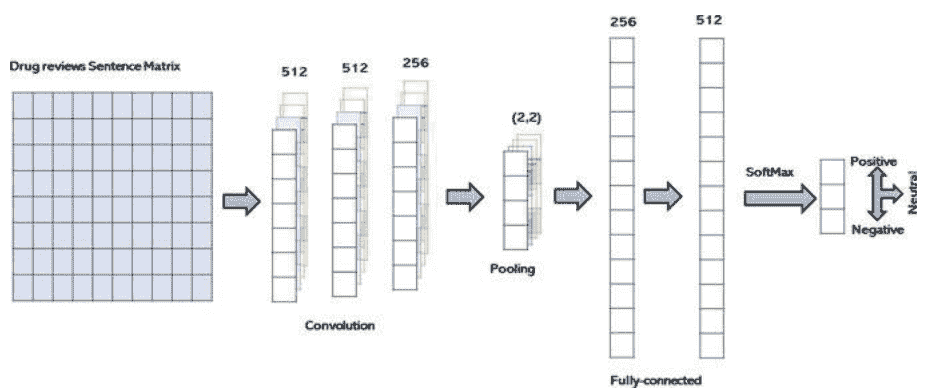
图2 CNN架构

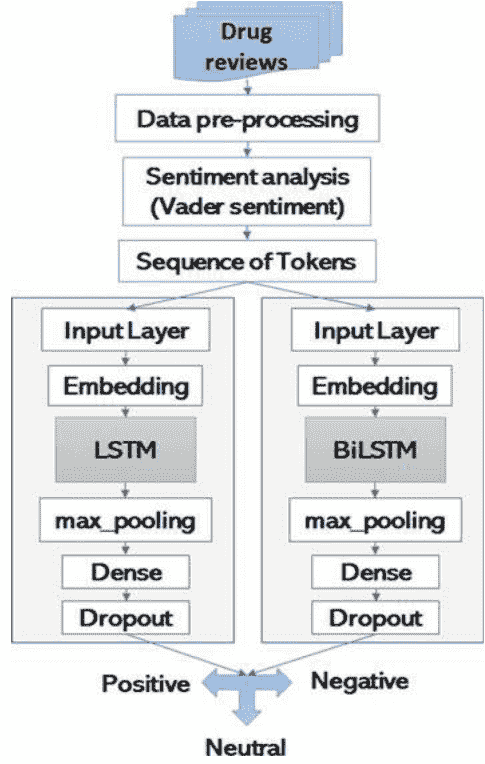
图3 LSTM架构

序列的最大长度嵌入的大小等于200。每个层有256个隐藏节点的三个LSTM层, 后面跟着一个最大池化层。在我们的模型中, 使用三个具有softmax激活函数的全连接层来获得所需的输出。应用Dropout以加快学习速度。相同的架构在BiLSTM架构中复制, 每个方向都有一个。

应用的GRU集成了一个嵌入层, 将我们的数据集中的标记转换为大小为50的嵌入。双向GRU输入层 (即上一层的输出) 与GRU层一样, 批量大小为128, 最大长度为13000, 每个GRU层的大小都等于200。我们使用了两个用于正则化的Dropout层, 并添加了3个具有200个隐藏单元和softmax输出的全连接层来预测输出。

CNN可以提取局部信息, 但在长距离依赖性上似乎失败了; LSTM有助于解决这个问题。基于这个观察, 我们建议将这两种架构与他们的CNN-LSTM模型相结合, 该模型通过卷积层从单词描述空间中提取相关性, 然后将信息作为序列传递到下一个LSTM层。每个卷积的输出都包含整个句子的语义信息, 作为一个序列。这种组合的目的是独立地学习药物评论中情绪的最佳表示。

在参数方面,模块尽可能轻量化,同时在结果性能和稳定性方面与随后的重复模块相比具有一定的稳定性。

CNN-LSTM架构的构建如下:输入层包括批量大小(批量大小=128),0.25的dropout类型正则化层,具有64个过滤器的卷积层,大小为5的卷积滤波器和ReLU类型的激活函数,然后是最大池化层,之后是第二个具有64个过滤器的卷积层,大小为5的卷积滤波器和ReLU类型的激活函数。之后是一个最大池化层,0.4的dropout类型正则化层,再之后是一个连接到FC层的LSTM层。学习是通过Adam [17]优化器梯度下降来进行的。

对于LSTM-CNN模型,如[38]所提出的,LSTM模型提取的每个特征序列,然后注入到一个卷积层中,接着进行最大池化操作和全连接层。参数设置为批量大小=128,LSTM中隐藏节点数为100,学习率为0.1,使用Adam优化策略,过滤器大小为5×64。

为了将一个模型的优势与另一个模型结合起来,我们提出了将CNN和GRU上下游结合起来的方法。CNN模块的结构包含2个卷积层,接着是最大池化操作和展平操作。

在CNN-GRU模型中,CNN层用于提取空间特征,使用64个卷积(卷积核大小为3),扩展到dropout为0.2和展平操作,每个卷积层包含一个卷积操作和一个最大池化操作,然后输入到具有64个节点、dropout=0.1、循环dropout=0.5的GRU中。最后,应用一个具有3个输出的密集层。

GRU-CNN模型使用GRU学习上下文特征,然后将这些上下文感知向量注入到CNN中。参数设置为60个单元;50个过滤器,内核大小为2,丢失率为0.2。

### 5.2 结果与讨论

对于测试阶段,我们计算数据测试的准确性,如果准确性很高(超过70%),我们固定模型,否则,我们使用其他超参数重复处理。我们的实验应用于循环和卷积方法及其组合,如前所述,评估是根据精确度指标进行的,如表1所总结的。

表1描述了根据先前提到的参数和后处理设置对每个测试模型获得的最佳结果。所获得的结果令人满意,整体性能强劲。

首先,已经证明简单的结构(如LSTM或GRU)可以提供非常好的精确度。这不是一个普遍规律,因为结果主要取决于

| 模型 | 精确度 |
| :--- | :--- |
| 卷积神经网络 | 0.8133 |
| 长短期记忆网络 | 0.8644 |
| 门控循环单元 | 0.8313 |
| 双向长短期记忆网络 | 0.8633 |
| 双向门控循环单元 | 0.8555 |
| 卷积神经网络-长短期记忆网络 | 0.8103 |
| 长短期记忆网络-卷积神经网络 | 0.8844 |
| 卷积神经网络-门控循环单元 | 0.8390 |
| 门控循环单元-卷积神经网络 | 0.8580 |

数据集的数量以及数据的质量。 在我们的实验中, 长短期记忆网络的表现优于门控循环单元, 其较低的性能是由于三门结构。 然而, 在减少和嘈杂数据的情况下, 我们可以观察到门控循环单元的兴趣和优势。

其次, 对于双向长短期记忆网络和双向门控循环单元模型, 我们可以得出相同的观察结论, 简单模型的性能有所提高。 然而, 为了能够在双向门控循环单元架构中进行梯度反向传播, 需要在MLP输出的前向和后向传递过程中保留所有RNN的内部激活。 根据序列和/或RNN的大小, 这可能会对学习过程中使用的内存量产生重要影响。

从表1可以看出, 提出的混合模型的最佳预测是通过LSTM-CNN和GRU-CNN架构实现的。 LSTM和GRU被应用于提取单词级表示, 学习工作由CNN进行。在我们的实验中, GRU提供的信息比LSTM少, 这解释了为什么GRU-CNN模型的结果比LSTM-CNN模型要低效得多。

在我们的CNN-LSTM和CNN-GRU网络的卷积模块层面上, 性能下降可以通过三个假设来解释: 将原始数据连接到输入层导致CNN层中的大量噪声, 此外, 在卷积层之间应用池化层。 事实上, 即使这种类型的层可以减少网络中的参数数量和计算量, 但它也会大幅度减小表示的大小, 特别是时间上的表示, 因此会导致信息的丢失。 最后, CNN是为计算机视觉任务中获取不同大小特征而设计的, 不适用于我们的药物评论序列分类任务。 精确度结果显示了所测试方法的通用性。 事实上, 尽管对药物评论进行了轻微的后处理, 但测试结果令人满意。 此外, 这些结果表明混合模型最大化了精确率 (88.44%)，并确认了这两种方法的互补性。

我们的初步方法有许多限制, 我们在本节中详细介绍。关于分类阶段, 主要的限制是我们只使用了精确-召回率。召回率和精确率是评估分类器性能的重要指标。尽管模型表现良好[31]，但深度学习的一个限制是它们没有提供任何透明度或解释性。尽管手动注释的消息数量较少，但这项工作显示了深度分类器性能相对于传统方法的明显优势。研究中还探索了先进的深度学习算法来解释这些模型[19]，在这个背景下可能会有用。最后，我们研究的另一个限制与结果的泛化有关。事实上，这个任务非常特定于研究主题，小数据集以及文本类型使得我们的方法难以推广。我们的结果显示了分类质量在数据集上的变异性。这可能意味着分析是特定于数据集的，因此网络只是适应而没有泛化它们的知识。然而，我们的提议和结果可以作为进一步研究文本数据自动识别类别的基准。

#### 6 结论

在这项工作中，我们探索了情感分析领域，就像自然语言处理的其他领域一样，自2000年以来经历了重大发展，并在深度学习的发现后取得了重大进展和极大的兴趣。在这项工作中，我们分享了我们对药物评论情感分析问题的贡献，包括使用的工具和数据集，以及通过CNN、RNN和混合模型等方法获得结果的步骤。我们的方法突出了深度学习架构在预测健康论坛数据类别方面的有效性。我们研究的适用性可以通过社交媒体平台为患者和医疗专业人员提供服务。对于未来可能改进我们情感分类系统的观点和方法，我们正在研究应用Transformer进行更好的分析和可解释工具以提高透明度。

#### 参考文献

- 1. Ain, Q.T., Ali, M., Riaz, A., Noureen, A., Kamran, M., Hayat, B., Rehman, A.: 使用深度学习技术的情感分析综述. Int. J. Adv. Comput. Sci. Appl. 8 (6) (2017). http://dx.doi.org/10.14569/IJACSA.2017.080657
- 2. Bengio, Y., Simard, P., Frasconi, P.: 用梯度下降学习长期依赖性是困难的。神经网络传输。5(2), 157-166 (1994)。https://doi.org/10.1109/72.279181
- 3. Chandra, R., Krishna, A.: 在新冠病例增加期间，通过深度学习进行情感分析。 PLOS ONE 16(8), 1-26 (2021)。 https://doi.org/10.1371/journal.pone.02556154
- 4. Cho, K., van Merrienboer, B., Güldenh, ., Bougares, F., Schwenk, H., Bengio, Y.: 使用RNN编码器-解码器学习短语表示用于统计机器翻译。 CoRR (2014)。 http://arxiv.org/abs/1406.1078
- 5. Colon-Ruiz, C., Segura-Bedmar, I.: 比较用于药物评论情感分析的深度学习架构。生物医学信息学, 110, 103539 (2020年)。 https://www.sciencedirect.com/science/article/pii/S1532046420301672
- 6. Dermouche, M., Khouas, L., Velcin, J., Loudcher, S.: 如何利用朴素贝叶斯和先验知识进行学习：情感分析应用。 在：国际语义评估研讨会。美国亚特兰大 (2013年)。 https://halshs.archives-ouvertes.fr/halshs-01100027
- 7. Fersini, E.: 第6章—社交网络中的情感分析：机器学习视角。 在： Pozzi, F.A., Fersini, E., Messina, E., Liu, B. (编者) 社交网络中的情感分析，第91-111页。 Morgan Kaufmann, 波士顿 (2017年)。 https://www.sciencedirect.com/science/article/pii/B9780128044124000061
- 8. Garg, S.: 基于药物评论情感分析的药物推荐系统，使用机器学习。 CoRR (2021), https://arxiv.org/abs/2104.01113
- 9. Größer, F., Kallumadi, S., Malberg, H., Zaunseder, S.: 基于方面的药物评论情感分析，应用跨领域和跨数据学习。 在： 2018年国际数字健康会议论文集，第121-125页 (2018年)。 https://doi.org/10.1145/3194658.3194677
- 10. Gurdin, G., Vargas, J.A., Maffey, L.G., Olex, A.L., Lewinski, N.A., McInnes, B.T.: 跨领域和跨数据药物评论极性分类分析。 AMIA联合峰会翻译科学论文集。 AMIA联合峰会翻译科学，2020年第2020卷，第201-210页，2020年5月。 https://pubmed.ncbi.nlm.nih.gov/32477639
- 11. 韩, 刘, 景: 基于双向大型循环神经网络和知识迁移的方面级药物评论情感分析。 IEEE Access 8, 21314-21325 (2020年)。 https://doi.org/10.1109/ACCESS.2020.2969473
- 12. 汉考克, 克莱顿, 帕克, 德尔, 布托, 卡里克, 卡罗, 格赫西, 格莱尔, 哈格蒂, 塔特萨尔: 在讨论晚期寿命有限疾病预后时的真实性。 Palliat. Med. 21 (6) , 507-517 (2007年)。 https://doi.org/10.1177/0269216307080823
- 13. 哈里森, 赛迪-吉本斯: 医学中的机器学习：自然语言处理的实用介绍。 BMC Med. Res. Methodol. 21 (1) , 158- (2021年)。 https://doi.org/10.1186/s12874-021-01347-1
- 14. Hochreiter, S., Schmidhuber, J.: 长短期记忆. 神经计算. 9(8), 1735-1780 (1997). https://doi.org/10.1162/neco.1997.9.8.1735
- 15. Imamah, Husni, Rachman, E.M., Suzanti, I.O., Mufarroha, F.A.: 文本挖掘和支持向量机用于邦卡兰县旅游评论的情感分析. 1477, 022023 (2020). https://doi.org/10.1088/1742-6596/1477/2/022023
- 16. Kennedy, A., Inkpen, D.: 使用上下文倾向转换器对电影评论进行情感分类. 计算智能. 22(2), 110-125 (2006). https://onlinelibrary.wiley.com/doi/abs/10.1111/j.1467-8640.2006.00277.x
- 17. Kingma, D.P., Ba, J.: Adam: 随机优化方法 (2014). arXiv:1412.6980
- 18. Lecun, Y., Bengio, Y.: 图像、语音和时间序列的卷积网络，脑理论和神经网络手册，第 255-258页。 麻省理工学院出版社 (1998) https://dl.acm.org/doi/10.5555/303568.303704
- 19. Lipton, Z.C.: 模型可解释性的神话。 CoRR (2016). http://arxiv.org/abs/1606.03490
- 20. Liu, B.: 情感分析和意见挖掘。 Morgan & Claypool Publishers (2012) https://doi.org/10.2200/S00416ED1V01Y201204HLT016
- 21. Liu, B., Zhang, L.: 意见挖掘和情感分析综述，第415-463页。 Springer US, 波士顿, 马萨诸塞州 (2012). https://doi.org/10.1007/978-1-4614-3223-4_13

- 22. Min, Z.: 使用弱监督模型进行药物评论情感分析*. 在：2019年IEEE国际人工智能和计算机应用大会 (ICAICA) . pp. 332–336 (2019年)。 https://doi.org/10.1109/ICAICA.2019.8873466

- 23. Morsy, S.A., Rafea, A.: 使用上下文情感转移改进文档级情感分类. 在：第17届国际自然语言处理和信息系统应用会议NLDB’12，pp. 253–258 (2012年) https://doi.org/10.1007/978-3-642-31178-9_30

- 24. Muller, B., Reinhardt, J., Strickland, M.T.: BPTT: 通过时间的反向传播. 在：Muller, B., Reinhardt, J., Strickland, M.T. (eds.) 神经网络：一种介绍，pp. 296–302. Springer,柏林，海德堡 (1995年)。 https://doi.org/10.1007/978-3-642-57760-4_28

- 25. Nair, V., Hinton, G.E.: 矫正线性单元改进受限玻尔兹曼机. 在：第27届国际机器学习国际会议，pp. 807–814. ICML’10，Omnipress，麦迪逊，WI，美国 (2010年) https://dl.acm.org/doi/10.5555/3104322.3104425

- 26. Pak, A., Paroubek, P.: Twitter作为情感分析和意见挖掘的语料库。在第七届语言资源和评估国际会议 (LREC'10) 的论文集中，马耳他瓦莱塔。欧洲语言资源协会 (ELRA)。 https://naaclanthology.org/volumes/L10-1/

- 27. Pang, B., Lee, L.: 意见挖掘和情感分析。信息检索基础趋势2 (1-2)，1-135 (2008)

- 28. Pratama, Y., Tampubolon, A.R., Sianturi, L.D., Manalu, R.D., Pangaribuan, D.F.: 使用朴素贝叶斯算法在Twitter上实现情感分析，了解人们对雅加达省长选举辩论的反应。物理学杂志：会议系列IOP Publishing 1175，012102 (2019)。 https://doi.org/10.1088/1746-6596/1175/1/012102

- 29. Schuster, M., Paliwal, K.: 双向递归神经网络. IEEE信号处理 45(11), 2673–2681 (1997). https://doi.org/10.1109/78.650093

- 30. Shiju, A., He, Z.: 使用基于Transformer的语言模型对药物评级进行分类. medRxiv (2021). https://www.medrxiv.org/content/early/2021/04/20/2021.04.15.21255573

- 31. Shwartz-Ziv, R., Tishby, N.: 通过信息揭开深度神经网络的黑盒子. CoRR (2017). http://arxiv.org/abs/1703.00810

- 32. Statista_研究部门：2017年至2025年全球社交网络用户数量。 Statista，2021年9月10日。 https://www.statista.com/statistics/278414/number-of-worldwide-social-network-users/

- 33. Thoomkuzhy, A.M.: 药物评论：使用区域CNN-LSTM模型进行评论定量化和交叉条件和交叉来源分析。硕士论文。硕士学位论文，都柏林理工大学 (2020年)。 https://arrow.tudublin.ie/scschartemis/202/

- 34. Valle-Cruz, D., López-Chau, A., Sandoval-Almazan, R.: 使用分类算法对Twitter中的热门话题进行印象分析。 在：第13届国际电子治理理论与实践会议论文集，第430-441页。ICEGOV 2020. https://doi.org/10.1145/3428502.3428570

- 35. Vijayaraghavan, S., Basu, D.: 使用监督机器学习算法进行药物评论的情感分析。 CoRR (2020年)。 https://arxiv.org/abs/2003.11643

- 36. Vineeta, Manek, A.S., Mishra, P.: UFMDRA：子宫肌瘤药物评价分析1110(1), 012006 (2021). https://doi.org/10.1088/1757-899x/1110/1/012006

- 37. Youbi, F., Settouti, N.: 机器学习和深度学习框架在药物评价上的分析. 计算机学报 (2021). https://doi.org/10.1093/comjnl/bxab084

- 38. Zhang, J., Li, Y., Tian, J., Li, T.: LSTM-CNN混合模型用于文本分类. 在：2018年IEEE第三届先进信息技术、电子与自动化控制会议 (IAEAC) ，pp. 1675–1680 (2018). https://doi.org/10.1109/IAEAC.2018.8577620

- 39. 张, L., 王, S., 刘, B.: 情感分析的深度学习：一项调查。 WIREs数据挖掘知识。 Dis. 8(4), e1253 (2018年)。 https://wires.onlinelibrary.wiley.com/doi/abs/10.1002/widm.1253

- 40. 周, C., 孙, C., 刘, Z., 刘, F.C.M.: 用于文本分类的C-LSTM神经网络。 CoRR (2015年)。 http://arxiv.org/abs/1511.08630

### 使用深度学习技术的基于文本的情感分析

Siddhi Kadu和Bharti Joshi

#### 摘要
今天的世界是互联网和信息的世界。 在这个现代化的发展领域中，技术对全球平台Web做出了很大贡献。评论和情感在我们的日常生活中起着至关重要的作用，因为它们有助于学习沟通、决策制定、产品评估、选举预测。人工智能（AI）是计算机科学的一个分支，它致力于分析人们产生的评论和意见，并帮助媒体应对形势。 目前，为了改进营销策略和产品广告，传统的基于Web的调查方法已被情感分析取代，这有助于改善客户服务。 因此，过去使用了各种方法，如机器学习、词典、混合和其他方法来分析这些情感/意见。 随着深度神经网络的当前进展，基于深度学习的方法因其在最近时期的准确性提高而变得非常流行。 情感分析使用了各种方法，如卷积神经网络（CNN）、循环神经网络（RNN）、长短期记忆（LSTM）、门控循环单元（GRU）和双向LSTM（Bi-LSTM）。 本文重点介绍了用户生成的评论的基于文本的情感分析所使用的不同深度学习技术。

#### 关键词
人工智能·情感分析·深度学习

#### 1 引言
如今，由于通讯媒体的巨大增长和技术的进步，4G和5G网络已成为社会和人数的组成部分，例如情感分析、电子语音助手、在线搜索和机器翻译等应用，涉及人与计算机之间使用自然语言进行交流的日常活动[1]。 目前，在这个先进的时代，最重要的是信息，或者说每天通过社交媒体产生的数据，以文本或言论的形式。 自动化地高效地分析这些内容和言论数据是基本任务，因此，自然语言处理（NLP）作为人工智能（AI）的一个分支，被用于从文本或言语中获取语义，并将其编码为结构化格式，也用于不同类型的计算机处理[2,3]。 现在的机器可以比人类分析更多基于语言的数据，不会感到疲倦，并以一种稳定、公正的方式理解文本、听取言语、解释它、衡量情感并整理出重要的部分。

在线言论交流已成为重要资源。 可以看到，人们正在利用互联网进行各种活动，如在线购物、社交网络、博客发布等。 大量与特定服务、产品或相关个人有关的信息或观点都可以轻松地在互联网上找到。 这些评论只是客户使用特定产品和服务的经验，可以作为决策的有用信息来源[4]。 评论对客户和制造商都有用。 顾客对这些评论感兴趣，以确定购买哪种产品或特定品牌，并评估产品的优缺点。 制造商可以从这些执着的评论中找到改进产品的领域。 所有这些表达人们行为的情感、态度、观点和意见都可以称为情感。

情感分析（SA）是自然语言处理领域中一项重要而复杂的研究。 许多购买者依赖于对产品的客户评价进行阅读和分析，并测量客户满意度的程度，以决定是否购买特定产品。 借助这些评价，公司可以收集有关其产品服务的 信息，并相应地进行改进，这对产品开发非常有用。 手动分析这么大量的数据是一项繁琐的任务，既消耗人力资源，又造成高昂的财务成本。 在这个领域的许多研究人员尝试使用各种技术从信息中提取摘要或重要部分，例如评价分析、反馈分析和问答评级，但只有一小部分信息被饱和利用，大部分信息被遗漏。 借助情感分析，可以从可用的评价中提取出大部分信息，这对于任何领域的应用都是有帮助的[4,15]。

情感分析是一个蓬勃发展的研究领域，在许多领域中都很有用，吸引了许多研究人员不断提出、评估和比较不同的方法，如基于词典的方法、机器学习（ML）方法、混合方法和其他方法。 ML在各种先进的学习算法和预处理技术中取得了进展。 由于计算机技术的进步，数据规模的增加和神经网络的普及，深度神经网络（DNNs）得以兴起。 对于深度神经网络（DNNs）来说，这提供了提高准确性和产生更好结果的机会。近年来，DNN在监督学习和无监督学习的情感分析中对许多研究人员产生了影响，并被广泛使用以提高准确性和产生更好的结果。DNN在机器学习中取得了巨大的成就，尤其是在自然语言处理和计算机视觉方面[1,5,12,13]。

本章的主要贡献如下：本章的目标是分析客户评论，然后将其分类为积极或消极；通过使用不同的深度学习算法，如卷积神经网络（CNN）、循环神经网络（RNN）、长短期记忆（LSTM）、门控循环单元（GRU）和双向LSTM (Bi-LSTM)，基于文本数据进行情感分析。本章展示了基于不同超参数的上述算法的比较分析，使用评估指标进行评估。本章的剩余部分计划如下。第2节讨论了使用不同深度学习算法进行情感分析的各种论文研究。第3节探讨了文本数据情感分析的不同现有方法。第4节描述了五种选择的深度学习架构用于情感分析。第5节进行了实验工作，包括设计、数据集和考虑的超参数。实验结果在第6节中展示。本章在第7节中总结。

#### 2 相关工作
本节介绍了在情感分析领域中，不同研究人员对产品和服务的意见进行情感分析的研究工作。这些产品和服务已经被人们广泛使用。以前，使用基于词典的方法和非神经网络分类器方法来分析情感，通过提取情感值和构建情感词典等方式。这是一种低效且繁琐的过程，而提取特征的主要过程是最费力的。最近，各种深度学习算法在模式识别、计算机视觉等领域取得了惊人的进展，并且根据最近的研究，它在自然语言处理领域也显示出了显著的增长。因此，我们基于深度学习方法调查和讨论最近的相关论文。

Jain等人[6]提出了一种混合系统，将CNN-LSTM系统（CNN后跟LSTM）用于情感分析，考虑批量归一化、dropout和最大池化超参数，使用Keras嵌入将评论中的单词转换为向量。Priyadarshini等人[7]提出了一种集成方法，考虑LSTM-CNN网格搜索方法进行情感分析。为了减少预定义的损失，使用网格搜索超参数优化方法，这也有助于提高系统在亚马逊评论和IMDB 50K电影评论数据集上的准确性。Basiri等人[8]提出了一种模型，使用双向LSTM和GRU层进行情感分析，通过应用注意机制输出考虑长短推文。层。为了降低特征的维度，使用了卷积和池化机制。GloVe用于文本数据的特征提取。Ali等人[9]探索了不同的深度学习算法（多层感知器（MLP）、卷积神经网络（CNN）和长短期记忆（LSTM）），并提出了一种使用IMDB数据集（50K部电影评论）和Word2Vec方法进行词嵌入的CNN-LSTM系统。为了改善和减少卷积层得到的结果，应用了最大池化掩码。

Ligthart等人[10]对情感分析中的重要主题和不同任务的各种方法进行了研究。识别出了各种特征、算法、数据集、挑战和开放问题。此外，对情感分析进行了112种最新的深度学习算法分类。基于这个分析，观察到LSTM和CNN算法是最常用的。

Sivakumar等人[11]提出了一种考虑到顾客在句子级别上生成的评论的长期短期记忆（LSTM）与模糊逻辑的多类别分类系统。对亚马逊视频游戏评论和亚马逊产品消费者评论的数据集进行了正面、负面、高度正面和高度负面的标记分类。在特征提取方面，使用了词袋等词嵌入方法。Xu等人[12]引入了一种先进的词表示方法，结合了传统的TF-IDF算法来生成词向量。

此外，加权词向量被插入到(BiLSTM)中以获取上下文信息，并且向量被有效地表示。评论的情感通过前馈神经网络分类器进行分类。Colon-Ruiz等人[13]引入了几种深度学习方法（如CNN，LSTM，RNN以及它们的组合）的比较分析，并发现Bidirectional Encoder Representations from Transformers（BERT）和Bi-LSTM的组合在药物评论情感分析数据集上表现出色。此外，还研究了各种预训练词嵌入模型的结果。Gandhi等人[14]展示了CNN和LSTM架构如何与停用词和Word2Vec预处理方法一起在包含50,000条电影评论的IMDB数据集上工作。Nemes等人[15]开发了一个RNN模型来预测情绪化的推文，并将其分类为积极的、消极的、弱积极或消极的以及强积极或消极的。

Beseiso等人[16]提出了一种使用CNN的文本分类模型，该模型使用字符级别进行分析，并在其之上堆叠了RNN，该模型在一个阿拉伯推文数据集上工作，由于数据有限，作者提出了一种数据增强方法来解决这个问题。ONAN等人[17]对MOOC评论进行了分析，通过应用监督学习方法、集成学习方法和深度学习方法来识别情感，并评估了效率，得出深度学习方法优于其他方法的结论。作者还评估了文本表示结构和词嵌入结构的有效性。进行了比较分析，并通过LSTM与GloVe和基于方案的表示相结合，实现了最大的分析性能。Wadawadagi等人[18]对情感进行了不同深度学习方法的研究实验。本文旨在对用于分类情感的各种深度神经网络（DNN）进行实证研究，并讨论各种应用。此外，还对各种深度学习算法的性能进行了评估。

通过微调不同的超参数和使用数据可视化方法已经采用了各种结果。Salur等人[19]提出了一种创新的混合深度学习结构，结合了各种词嵌入方法，如Word2Vec、Fast-Text、字符级嵌入，以及不同的深度学习方法，如LSTM、GRU、BiLSTM、CNN，用于情感分类，并通过实验比较了该模型与现有各种基本模型的效率。Kula等人[20]提出了一种新颖的方法，用于检测假新闻，采用了各种深度学习方法，如RNN、GRU、LSTM进行分类，并使用了Flair库提供的GloVe词嵌入方法，取得了有希望的结果。Patel等人[21]应用深度学习算法RNN对文本进行分类，并根据数据的预处理测量分类器的效率，获得了94.61%的准确率。Ni等人[22]提出了一种基于GloVe词模型和RNN的句子级情感分析方法。此外，还将LSTM和GRU模型组合作为RNN无法处理长期数据的解决方案，并进行了模型的比较分析，发现LSTM-GRU模型具有最高的效率。Santur等人[23]在土耳其电子商务平台数据集上实现了使用GRU进行情感分析的系统，并获得了95%的准确率。

因此，深度学习已成为研究人员感兴趣的领域，因为它相对于其他传统方法具有许多优势。它可以通过大量数据进行训练，性能得到改善，并且可以适应其他领域，如医学图像分割、图像处理、语音识别和物联网。

#### 3 情感分析方法的分类
目前的情感分析方法可以分为机器学习方法、混合方法和基于词典的方法。机器学习方法使用各种机器学习技术和语言特征来分类情感。基于词典的方法使用一系列短语和词语将情感分类为积极和消极。混合方法结合了机器学习和基于词典的方法，以提高情感分析的性能。图1讨论了情感分析方法的分类。


图1 情感分析方法[24]

##### 3.1 机器学习方法
机器学习方法对训练和测试数据进行分类，将情感分为积极、消极和中性极性，进一步分为有监督、无监督和半监督学习。

##### 3.2 基于词典的方法
这是一种传统的情感分析方法，进一步分为手动、基于词典和基于语料库的方法[10,24,25]。

##### 3.3 混合方法
混合方法结合了词典和机器学习方法。混合方法继承了机器学习方法的准确性和基于词典方法的稳定性。它结合了前两种方法的技术，克服了它们的局限性并利用了它们的优势[10,24,25]。

##### 3.4 其他方法
首先,基于方面的方法是一种平衡的活动,通过预测特定特征或文本中的词的情感极性来分析情感。需要考虑的不同方面包括特征、特性或属性。迁移学习利用数据分布、数据相似性、建模函数等,在一个领域中利用已经研究过的信息。这种方法无需从头开始训练算法[10,24,25]。

因此,针对基于文本的情感分析,考虑了不同的方法,观察到深度学习方法在准确性方面取得了显著的结果。还使用了许多其他方法,如迁移学习和其他混合方法。

#### 4 情感分析的深度学习架构
深度学习模型近年来在自然语言处理领域成为热门话题。它们由人工神经网络(ANN)组成,其中包括输入层、输出层和隐藏层。本节讨论了一些常见的深度学习架构,如卷积神经网络(CNN)、循环神经网络(RNN)、长短期记忆(LSTM)、门控循环单元(GRU)和双向LSTM(Bi-LSTM).

##### 4.1 卷积神经网络(CNN)
CNN属于人工神经网络的一种,已在图像处理和计算机视觉领域取得了巨大的成功和发展。CNN的基本架构如图2所示,包括输入层、池化层、卷积层和全连接层。

##### 4.2 循环神经网络(RNN)
RNN是一种用于创建序列模型的人工神经网络类。顺序数据在各种应用中被使用,例如在语言翻译中。RNN的主要功能是基于来自目标周期的内部记忆对信息进行顺序处理。RNN在处理句子中的每个单词时重复维护输入的内部状态,如图3所示。因此,它有助于预测句子中的下一个单词。

图2 CNN的一般架构[6]
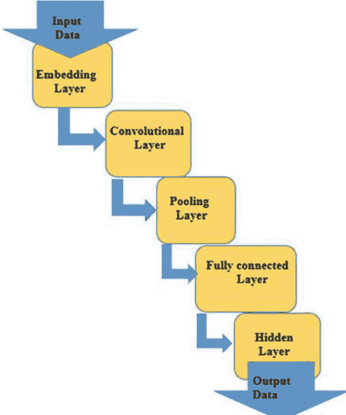
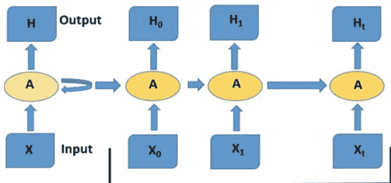

图3 RNN的一般架构[15]

通过保留所有过去的单词和它们之间的关系[15]，RNN可以预测句子中的下一个单词。


图4 LSTM的一般架构[7]

##### 4.3 长短期记忆 (LSTM)

长短期记忆模型 (LSTM) 是RNN的一种特殊形式，借助于该网络可以完成预测或分类等任务。LSTM克服了梯度爆炸、梯度消失和长期依赖等问题，如图4所示。标准LSTM由一个细胞、一个输入门、一个输出门和一个遗忘门组成。输出门管理发送到下一层的数据，遗忘门管理记忆丢失率并确定哪些数据可以缩减到细胞状态中[7, 8]。

##### 4.4 门控循环单元 (GRU)

门控循环单元 (GRU) 是LSTM模型的基本系统。尽管参数有限，GRU能够准确捕捉长期依赖关系。因此，GRU是基于效率和性能与LSTM进行比较的。每个隐藏单元的数据流通过更新和重置门[22, 23]来控制，如图5所示。

##### 4.5 双向长短期记忆网络 (Bi-LSTM)

双向长短期记忆网络由LSTM单元组成，可以同时捕捉过去和未来的上下文信息。Bi-LSTM可以学习长期依赖关系，而无需存储重复的上下文信息。因此，它在顺序建模问题中表现出色。

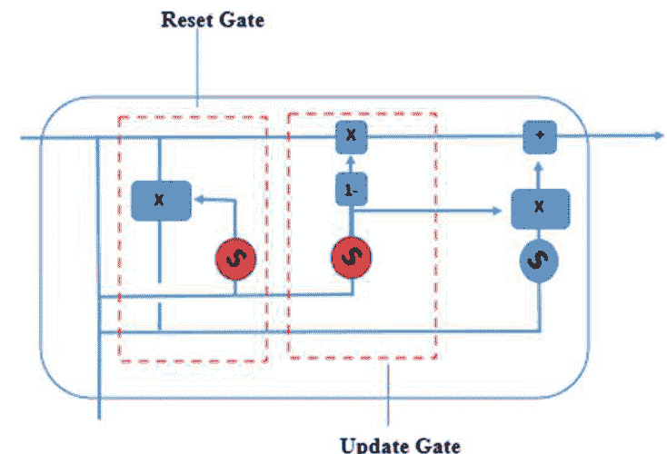

图5 GRU的总体架构[23]
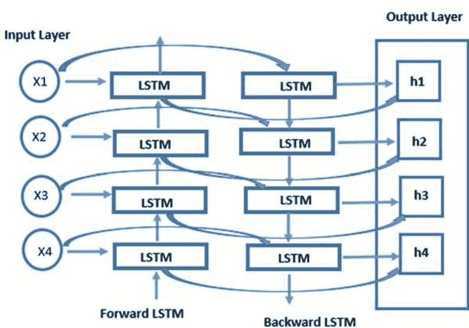

图6 Bi-LSTM的总体架构[12]

在顺序建模问题中，双向长短期记忆网络表现出卓越的效果，并被广泛应用于文本分类。双向长短期记忆网络具有两个平行层，分别在两侧进行正向和反向传递，以捕捉两种情景下的依赖关系[12]，如图6所示。

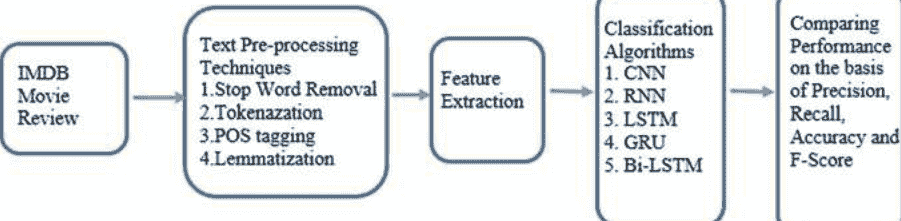

图7 提出的框架

#### 5 实验工作

提出的框架如图7所示，考虑了IMDB电影评论数据集，然后我们应用了文本预处理技术对评论进行处理，并进一步使用N-gram和Word2Vec技术提取特征。此外，我们实现了五种分类深度学习算法，并基于四个指标对其进行评估。

##### 5.1 数据集描述

为了分析目的，我们使用了一个包含50K电影评论的IMDB数据集，我们将其分为40K训练集和10K测试集。在40K行数据中，我们按照70:30的比例划分了训练集和测试集，用于模型准确度，即训练准确度和10K行数据的准确度为测试准确度[7]。

##### 5.2 数据预处理

从各种来源（主要是社交媒体）获取的信息以原始数据的形式存在，其中包含很多噪声，如拼写和语法错误。因此，处理、清洗、编辑文本，然后进行分析变得至关重要。预处理阶段的目的是通过删除无意义的文本来减小输入数据的大小，从而获得更好的分析结果。在图8中，预处理技术如删除HTML、删除非字母字符、转换为小写、分词、停用词去除、词性标注、词形还原等被应用于数据集[4, 7, 8]。

```python
def preprocess(review: str) -> list:
    # if show_progress:
    #     global counter
    #     counter += 1
    #     print('Processing... %6i/%6i'% (counter, total), end='\r')
    # 1. Clean text
    review = clean_review(review)
    # 2. Split into individual words
    tokens = word_tokenize(review)
    # 3. Lemmatize
    lemmas = lemmatize(tokens)
    # 4. Join the words back into one string separated by space,
    # and return the result.
    return lemmas

def clean_review(raw_review: str) -> str:
    # 1. Remove HTML
    review_text = BeautifulSoup(raw_review, "lxml").get_text()
    # 2. Remove non-letters
    letters_only = REPLACE_WITH_SPACE.sub(" ", review_text)
    # 3. Convert to lower case
    lowercase_letters = letters_only.lower()
    return lowercase_letters

def lemmatize(tokens: list) -> list:
    # 1. Lemmatize
    tokens = list(map(lemmatizer.lemmatize, tokens))
    lemmatized_tokens = list(map(lambda x: lemmatizer.lemmatize(x, "v"), tokens))
    # 2. Remove stop words
    meaningful_words = list(filter(lambda x: not x in stop_words, lemmatized_tokens))
    return meaningful_words
```

图8 数据预处理步骤

##### 5.3 特征提取

特征提取（FE）是一个重要的功能，因为它直接影响情感分析过程中情感阶段的功能。其目的是提取重要数据（例如情感表达词），以定义文本数据的重要方面。在情感分析中考虑的一些基本特征包括词袋模型、词嵌入和TF-IDF，它们将单词转换为向量，以找到单词及其同义词之间的关系[24,25]。在实验中，我们使用了Word2vec词表示，它是一个两层网络，通过将单词进行向量化来分析文本，其中输入是一个文本语料库，输出是一个向量集合：特征向量表示语料库中的单词。

##### 5.4 分类算法

卷积神经网络（CNN）模型：图9显示了CNN模型的所有层及其相应的输出形状的摘要。该模型被定义为一个顺序模型，因为文本被作为一个序列传递。嵌入层将每个单词编码为一个向量，然后应用GlobalMaxPooling1D层，之后将所有输出连接起来。在Dropout层之后应用一个Dense层和最后一个Dense层[6-8, 14]。

循环神经网络（RNN）模型：图10显示了一个简单的RNN模型的所有层及其相应的输出形状[8, 15, 21]。

长短期记忆（LSTM）模型：图11显示了LSTM模型的所有层及其相应的输出形状[6, 7, 13, 14, 22]。

门控循环单元（GRU）模型：图12显示了具有各自输出形状[22, 26]的所有层的GRU模型的摘要。

双向长短期记忆（Bi-LSTM）模型：图13显示了具有各自输出形状[5, 12, 19]的所有层的Bi-LSTM模型的摘要。

Model: "sequential"
| Layer (type) | Output Shape | Param # |
| :--- | :--- | :--- |
| embedding (Embedding) | (None, 150, 256) | 13507072 |
| conv1d (Conv1D) | (None, 150, 64) | 49216 |
| global_max_pooling1d (Global) | (None, 64) | 0 |
| dense (Dense) | (None, 128) | 8320 |
| dropout (Dropout) | (None, 128) | 0 |
| dense_1 (Dense) | (None, 1) | 129 |

Total params: 13,564,737
Trainable params: 57,665
Non-trainable params: 13,507,072

图9 CNN算法的模型摘要

| Layer (type) | Output Shape | Param # |
| :--- | :--- | :--- |
| embedding_4 (Embedding) | (None, 150, 256) | 13507072 |
| simple rnn 4 (SimpleRNN) | (None, 256) | 131328 |
| dense_8 (Dense) | (None, 8) | 2056 |
| dense_9 (Dense) | (None, 1) | 9 |

Model: "sequential_4"
Total params: 13,640,465
Trainable params: 133,393
Non-trainable params: 13,507,072

图10 RNN算法的模型摘要

| Layer (type) | Output Shape | Param # |
| :--- | :--- | :--- |
| embedding (Embedding) | (None, 150, 256) | 13507072 |
| lstm (LSTM) | (None, 256) | 525312 |
| dropout (Dropout) | (None, 256) | 0 |
| dense (Dense) | (None, 64) | 16448 |
| dropout_1 (Dropout) | (None, 64) | 0 |
| dense_1 (Dense) | (None, 1) | 65 |

Model: "sequential"
Total params: 14,048,897
Trainable params: 541,825
Non-trainable params: 13,507,072

图11 LSTM算法的模型摘要

##### 5.5 评估指标

使用四个指标 Precision (Pr)、Accuracy (Acc)、Recall (Re)、F1-score (F1) [24] 来评估模型的性能。这些指标广泛用于文本分类和情感分析等任务，并按以下方式计算：

$$\text{精度} = \frac{TP}{TP+FP}$$

Model: "sequential"
| Layer (type) | Output Shape | Param # |
| :--- | :--- | :--- |
| embedding (Embedding) | (None, 150, 256) | 13507072 |
| gru (GRU) | (None, 150, 128) | 148224 |
| dense (Dense) | (None, 150, 1) | 129 |

Total params: 13,655,425
Trainable params: 148,353
Non-trainable params: 13,507,072

图12 GRU算法的模型摘要

Model: "sequential"
| Layer (type) | Output Shape | Param # |
| :--- | :--- | :--- |
| embedding (Embedding) | (None, 150, 256) | 13507072 |
| bidirectional (Bidirectional) | (None, 512) | 1050624 |
| dropout (Dropout) | (None, 512) | 0 |
| dense (Dense) | (None, 64) | 32832 |
| dropout_1 (Dropout) | (None, 64) | 0 |
| dense_1 (Dense) | (None, 1) | 65 |

Total params: 14,590,593
Trainable params: 1,083,521
Non-trainable params: 13,507,072

图13 Bi-LSTM算法的模型摘要

$$\text{召回率} = \frac{TP}{真正例 + 假阴性} \quad (2)$$

$$\text{F1得分} = 2 \times \frac{精确率 \times 召回率}{精确率 + 召回率} \quad (3)$$

$$\text{准确率} = \frac{真正例 + 真反例}{真正例 + 真反例 + 假正例 + 假阴性} \quad (4)$$

图16 考虑节点数为256和批量大小为100时，模型准确率随迭代次数变化的情况
图17 考虑节点数为256和批量大小为200时，模型准确率随迭代次数变化的情况

| 算法 | 准确率 | 精确度 | 召回率 | F1得分 |
| :--- | :--- | :--- | :--- | :--- |
| 卷积神经网络 | 77.2 | 79.0 | 74.0 | 76.4 |
| RNN | 51.4 | 51.0 | 92.2 | 66.0 |
| 长短期记忆网络 | 79.2 | 81.0 | 76.0 | 78.4 |
| 门控循环单元 | 52.0 | 51.0 | 99.0 | 67.1 |
| Bi-LSTM | 81.0 | 78.0 | 80.4 | 79.0 |

批次大小的变化对性能影响较小。下表2讨论了基于评估指标（如准确率、精确率、召回率、F1得分）在IMDB电影评论数据集上不同模型的比较。观察到LSTM和Bi-LSTM在考虑超参数（节点数为256，批次大小为100，训练轮数为40）时表现更好。

##### 5.6 深度学习模型的超参数

超参数是可以控制学习过程的变量。调整超参数可以通过减少预测损失并提供精确结果来确认模型能够适当地解决问题[26]。深度学习模型的超参数如表1所示。

#### 6 结果与讨论

本节讨论了结果，包括使用评估指标对CNN、RNN、LSTM、GRU、Bi-LSTM等选择的深度学习模型进行比较分析，基于不同的超参数。考虑的超参数包括隐藏层的节点数、迭代次数和批次大小。发现改变上述参数会影响评估参数。下面的图表解释了不同深度学习模型在改变上述考虑的超参数时准确率的变化。图14显示了在训练数据集上，当节点数为128，批次大小为100时，CNN、RNN、LSTM、GRU和Bi-LSTM模型的准确率随着迭代次数从0到40的变化。观察到随着迭代次数的增加，准确率也增加。

图15显示了当节点数为128，批量大小为200时，CNN、RNN、LSTM、GRU和Bi-LSTM模型在训练数据集上的准确性随着迭代次数从0到40的变化。观察到随着迭代次数的变化，性能有所提高，但仅批量大小的变化对准确性的影响较小。

图16显示了当节点数为256，批量大小为100时，CNN、RNN、LSTM、GRU和Bi-LSTM模型在训练数据集上的准确性随着迭代次数从0到40的变化。观察到随着迭代次数的变化，性能有所提高。与先前的参数值相比，节点数的变化对模型的准确性产生了重大变化和增加。

图14 考虑节点数为128和批量大小为100时，模型准确率随迭代次数变化的情况
图15 考虑节点数为128和批量大小为200时，模型准确率随迭代次数变化的情况

图17显示了在训练数据集上，节点数为256和批量大小为200时，CNN、RNN、LSTM、GRU和Bi-LSTM模型的准确率随迭代次数变化的情况（迭代次数范围为0到40）。观察到随着迭代次数的变化，性能有所提高，但唯一的变化

#### 7 结论

情感分析在自然语言处理中起着重要作用，被广泛应用于许多应用领域。以往的研究主要关注传统方法，在数据规模增大时性能下降，因此采用了包括人工智能在内的非传统方法以获得更好的性能。本章展示了使用不同的深度学习架构（如CNN、RNN、LSTM、GRU和Bi-LSTM）对IMDB电影评论数据集进行情感分类的比较实验。根据批次大小、训练轮数和节点数等超参数的变化，比较了所选模型的准确率结果。观察到LSTM和Bi-LSTM模型在训练数据上的准确率约为79%和81%，在节点数为256、批次大小为100、训练轮数为40的超参数下表现更好。此外，可以通过将各种模型与算法进行混合来获得更高的准确率。除了训练轮数、批次大小和隐藏层数之外，还可以考虑其他超参数以获得更好的性能。

可以在提出的模型上评估多个数据集和应用程序。

#### 参考文献

1. Tembhurne, J.V., Diwan, T.: 使用递归神经网络进行文本、视觉和多模态输入的情感分析。Multimed. Tools Appl. 80(5), 6871–6910 (2021)
2. Al-Moslmi, T., Ocaña, M.G., Opdahl, A.L., Veres, C.: 用于知识图谱的命名实体提取: 文献综述。 IEEE Access 8, 32862–32881 (2020)
3. Otter, D.W., Medina, J.R., Kalita, J.K.: 深度学习在自然语言处理中的应用调查。IEEE Trans. Neural Netw. Learn. Syst. 32(2), 604-624 (2020)
4. Duong, H.T., Nguyen-Thi, T.A.: 预处理技术和数据增强在情感分析中的综述。Comput. Soc. Netw. 8(1), 1-16 (2021)
5. Yadav, A., Vishwakarma, D.K.: 使用深度学习架构的情感分析：一项综述。Artif. Intell. Rev. 53(6), 4335-4385 (2020)
6. Jain, P.K., Saravanan, V., Pamula, R.: 一种混合的CNN-LSTM: 使用定性用户生成内容的消费者情感分析的深度学习方法。Trans. Asian Low-Resour. Lang. Inf. Process. 20(5), 1-15 (2021)
7. Priyadarshini, I., Cotton, C.: 一种基于LSTM-CNN-网格搜索的新型深度神经网络用于情感分析。J. Supercomput. 1-22 (2021)
8. Basiri, M.E., Nemati, S., Abdar, M., Cambria, E., Acharya, U.R.: ABCDM: 一种基于注意力的双向CNN-RNN深度模型用于情感分析。Futur. Gener. Comput. Syst. 115, 279-294 (2021)
9. Ali, N.M., Abd El Hamid, M.M., Youssif, A.: 使用深度学习模型对电影评论数据集进行情感分析。国际数据挖掘与知识管理过程期刊 (IJDkP) 9 (2019)
10. Ligthart, A., Catal, C., Tekinerdogan, B.: 情感分析中的系统性研究：一项三级研究。人工智能评论 1-57 (2021)
11. Sivakumar, M., Uyyala, S.R.: 使用LSTM和模糊逻辑进行基于方面的手机评论情感分析。国际数据科学与分析期刊 12 (4)，355-367 (2021)
12. Xu, G., Meng, Y., Qiu, X., Yu, Z., Wu, X.: 基于BiLSTM的评论文本情感分析。IEEE Access 7, 51522-51532 (2019)
13. Colón-Ruiz, C., Segura-Bedmar, I.: 比较用于药物评论情感分析的深度学习架构。生物医学信息学杂志 110, 103539 (2020)
14. Gandhi, U.D., Kumar, P.M., Babu, G.C., Karthick, G.: 使用卷积神经网络 (CNN) 和长短期记忆 (LSTM) 进行Twitter数据情感分析。无线个人通信 1-10 (2021)
15. Nemes, L., Kiss, A.: 基于COVID-19的社交媒体情感分析。信息电信学杂志 5 (1)，1-15 (2021)
16. Beseiso, M., Elmousalami, H.: 阿拉伯语情感分析的子词注意模型：一种深度学习方法。ACM亚洲低资源语言交易 (2020)
17. ONAN, A.: 大规模在线课程评估的情感分析：文本挖掘和深度学习方法。计算机应用工程教育。29 (3)，572-589 (2021)
18. Wadawadagi, R., Pagi, V.: 深度学习网络的情感分析：比较研究和性能评估。人工智能评论。53, 6155-6195 (2020)
19. Salur, M.U., Aydin, I.: 一种新型混合深度学习模型用于情感分类。IEEE Access 8, 58080-58093 (2020)
20. Kula, S., Choraś, M., Kozik, R., Ksieniewicz, P., Woźniak, M.: 利用神经网络进行假新闻检测的情感分析。在：计算科学国际会议，第653-666页。斯普林格，洛桑 (2020)
21. Patel, P., Patel, D., Naik, C.: 使用深度学习RNN方法进行电影评论情感分析。在：智能数据工程与分析，第155-163页。Springer, 新加坡 (2021)
22. Ni, R., Cao, H.: 基于GloVe和LSTM-GRU的情感分析。在：2020年第39届中国控制会议 (CCC)，第7492-7497页。IEEE (2020)
23. Santur, Y.: 基于门控循环单元的情感分析。在：2019年国际人工智能和数据处理研讨会 (IDAP)，第1-5页。IEEE (2019)
24. Birjali, M., Kasri, M., Beni-Hssane, A.: 情感分析综述：方法、挑战和趋势。基于知识的系统。107134 (2021)
25. Jain, P.K., Pamula, R., Srivastava, G.: 机器学习在消费者情感分析中的应用的系统性文献综述，使用在线评论。计算机科学评论，41, 100413 (2021)
26. Liu, Y., Lu, J., Yang, J., Mao, F.: Bert-BiGRU-Softmax的深度学习模型用于电子商务产品评论的情感分析。数学生物科学工程：MBE, 17 (6), 7819-7837 (2020)

### 使用基于特征的智能学习技术进行社交情感分析

Prasannavenkatesan Theerthagiri

摘要：近年来，情感分析变得越来越流行。它研究了人们对组织、个人、产品和服务的感受。顾客的意见通过各种资源收集，如社交媒体网络、调查和表格。社交情感分析在确定产品或品牌相对竞争对手的评价方面非常有用。商业组织利用顾客的评论来提高产品质量。在这项研究中，情感分析被应用于各种数据集，包括Twitter情感分析、互联网电影数据库（IMDb）电影评论和亚马逊手机评论。从数据集中提取出所需的方面，并确定方面的情感极性。评论所关联的情感可以具有积极、消极或中性的语气。考虑了各种智能学习技术来进行情感分类。考虑了召回率、精确度和准确度等参数，以估计分类算法的性能。

关键词：情感预处理 · 方面提取 · 情感倾向 · 分类算法

#### 1 引言

如今，社交媒体已成为我们生活中不可分割的一部分。社交媒体工具提供了一种有效的方式与每个人分享想法、经验和思考。商业组织从顾客那里收集关于他们的产品、餐厅或酒店活动的意见，以了解他们的业务情况。用户提供的评论将在特征级别上进行过滤，并确定对特定产品的整体意见。相关评论将自动转发给产品团队，以确保质量维护和良好的客户支持[1]。在线客户调查和反馈表也对不同客户的获取选择产生巨大影响。随着在线用户数量的快速增加以及互联网上可用的大量数据，年轻的研究人员受到了在文本挖掘和情感分析（SA）方面开展工作的激励。它也被称为意见挖掘。

#### 自然语言处理 (NLP) 和智能学习方法

结合在情感分类分析系统中进行转录分析。

大公司的数据分析师使用情感分析来评估进行高级市场研究、公众舆论、产品声誉、监控品牌和了解消费者体验[2]。它是文本挖掘的一部分，可以识别各种内容背后的热情语气。情感分类可以应用于不同的层次，包括句子级别、文档级别和方面级别。在情感分类的主题中，已经进行了大量的研究。以前，大部分工作都致力于对语料库的整体情感进行分类[3]。

在类似回归算法的意见文本中，通常采用产品评论来预测意见的积极程度。回归方法解释了与在一个尺度上匹配的类别之间的相似关系，例如评论者的星级评分。建模话语结构、文档中的曲折转折，可以更有效地进行情感标注。Bo Pang和Lillian Lee尝试通过将位置数据整合到特征集中来解决部分问题。他们将相关的三元转换转化为比常规特征更具普适性的复合回退特征。

另一种二进制情感分类是一致性检测。当比较一对文本文档时，一致性检测确定情感相关的标签应该是相同的还是不同的。在极性分类确定后，系统可以提供积极性的程度，即将观点定位在积极到消极的范围上。它还可以根据媒体材料的情绪和情感内容进行分类，这对于过滤恶意评论、识别网络问题和情感人机交互可能很有用。如果文本没有表达强烈的情感或涵盖多个主题或项目，则会出现新问题。

目前可访问的情感分析的三种主要方法是关键词检测、词汇亲和性和统计技术。最简单的方法是关键词检测，也是最常见的，因为它简单且成本低廉。根据存在合理明确的情感词汇（如“悲伤”、“快乐”、“无聊”和“害怕”）将文本分类为情感类别。这种技术有两个缺点：它忽略了否定的影响，并依赖表面特征。该方法的第一个问题是，虽然它可能正确地将“今天是个好日子”分类为愉快，但对于像“今天一点也不开心”这样的陈述，它更有可能失败。

事实上，与其使用情感形容词，许多短语通过潜在的内容来表达情感。短语“我的配偶刚刚提出离婚，并且他想夺走我的孩子”引起强烈的情绪，但它不包含任何情感关键词。因此，关键词检测方法将无法识别它。词汇亲和性比关键词索引更高级，它为任意单词提供了对某种情感的概率“亲和性”，而不仅仅是关键词。

仅仅寻找明显的情感短语。例如，词语“事故”可能有75%的概率表达负面影响，如“车祸”或“意外受伤”。

通常，语言数据集用于训练这些概率。尽管它经常超越关键词识别方法。例如，“我避免了一场事故”（否定）和“我偶然遇到了我的爱人”可能会轻易欺骗词汇亲和性，因为它仅在单词级别上操作（其他词义）。

其次，由于词汇亲和性概率和语言语料库的来源经常偏向特定类型的文学作品。由于这个原因，很难创建一个与领域无关、可重复使用的模型[4]。

文本影响分类传统上依赖于统计方法，即支持向量机和贝叶斯推理。该系统可以通过学习有效和有用的情感关键词（关键词识别方法）以及通过提供一个巨大的情感标注文本训练语料库来学习额外无序关键词（词汇亲和性）、标点符号和词共现频率。另一方面，传统的统计技术往往在语义上较弱，这意味着除了明显影响关键词之外，统计模型中的其他词汇或共现特征本身的预测价值很小。因此，只有当文本输入足够大时，统计文本分类器才能准确执行。因此，虽然这些算法能够对页面或段落级别的用户材料进行分类，但在较短的文本单元（如句子或从句）上很难做到这一点[5]。

基于概念的情感分析侧重于对文本进行语义分析，利用在线本体或语义网络收集与自然语言观点相关的概念和情感数据。这种策略避免了仅依赖关键词和词共现计数，而是集中于依赖大型语义知识库与自然语言观念相关的隐含特质。

与仅仅依赖句法工具不同，基于概念的方法还可以识别微妙的情绪，例如通过检查不直接表达情绪但与其他概念间接相关的观念[6-11]。

概念层面的研究旨在推断与自然语言观点相关的语义和情感数据，从而实现基于特征的细粒度情感分析。用户更感兴趣的是基于个体特征（例如iPhone 5与Galaxy S3的触摸屏）或甚至子特征（例如iPhone 5与Galaxy S3的触摸屏脆弱性）来检查各种项目，而不是收集关于单个主题的孤立评论（例如iPhone 5）。构建广泛的常识知识库对于特征检测和极性识别至关重要。正确解析自然语言文本的情感需要理性思考，例如将“小房间”这个概念在度假村评论中估计为负面，但在邮局评论中将“小排队”这个概念估计为正面，或者将“去读这本书”这个概念在书评中估计为正面，但在电影评论中估计为负面。

在这项研究中，一个分类问题，情感分析分类器被提供了一组评论，用于对给定文本的情感进行分类。本研究仅考虑了正面和负面情感以进行分类目的。各种预处理技术被应用于这些评论，将非结构化信息转化为结构化事实。从评论中挖掘出方面，然后分配极性分数。最后，使用分类算法来估计分类器的性能。

本文提出了一个模型，描述了在亚马逊手机评论、Twitter情感分析和IMDb电影评论中进行情感分析的步骤序列。在这项研究中，我们专注于基于特征的意见挖掘。客户提供的评论进行情感分析。相关工作在第2节中描述。计划工作的具体内容在第3节中概述。第4节分析和可视化实验数据，第5节总结并提出进一步研究的建议。

#### 2 相关工作

SentiWordNet和SenticNet是两个现有的情感知识库，主要用于概念级情感分析。使用两步技术，结合随机游走和迭代回归与入链归一化过程，创建概念级情感词典。使用英语词汇情感规范（ANEW）和SenticNet来传播情感值，这是基于语义相似的想法具有可比较的情感的假设。

此外，极性准确度、平均最大比率和Kendall距离被用来评估情感词典，而不是平均误差。类似的方法被报道用于为SenticNet的思想添加情感信息，通过用情感名称标记它们。作者采用基于距离的度量，即情感亲和度、逐点互信息和基于SenticNet中提供的极性数据的相似度度量（使用WordNet-Affect）[12]。它建议通过分析这些词的情感重要性和相关的情感句子来重新评估SentiWordNet中的客观术语，这是另一项建立在已有情感知识基础上的新努力。

对于情感分类，提出了两种采样过程，然后与支持向量机相结合。根据各种实验，所提出的技术克服了SentiWordNet中典型的情感挖掘方法。探讨了情感分析和舆情挖掘语料库创建的关键困难。已经发布了一个名为情感Turin大学树库Senti-TUT的案例研究项目，并正在建立一个用于研究社交媒体政治讽刺的语料库。

情感分析通过分析用户以评论或评价形式给出的意见来识别内容背后的情感。用户上传的意见为情感分析提供了很好的资源[13]。在有监督和无监督的智能学习技术的支持下进行情感分类。Yassine等人[14]提出了一个新手模型，用于对产品评论、评价和反馈的积极和消极感知进行分类。已经得出结论，随机森林（RF）和支持向量机（SVM）算法（RF-SVM）非常适合亚马逊提供的产品评论数据集。Nadia等人[15]提出，支持向量机（SVM）、多项式朴素贝叶斯、逻辑回归（LR）和随机森林（RF）的聚合将导致一个分类器，当应用于公共推文情感数据集时，显示出增强的准确性。结果表明，在推文情感分析方面，特征哈希可以被考虑，而在准确性方面，词袋模型是最佳选择。

Hadi等人[16]提出了采用skip-gram模型和词袋模型的自然语言处理（NLP）方法。许多分类器，如SVM、RF和LR用于二元分类，而递归神经网络（RNN）用于具有多类标签的数据集进行情感分析。结论是，相对于其他方法，循环神经网络（RNN）在集成平均的情况下表现最佳，并通过集成平均获得了1.5%的准确性提升。Brian等人[17]引入了一种混合评分SVM，结合了监督方法（朴素贝叶斯、SVM）和无监督方法（评分算法）来分析国际会议的论文评审。结果显示，相对于基准线，混合评分SVM方法在标准度量指标（精确度、准确度、F1分数和召回率）方面更加稳健。

Oscar等人[18]提出了一种将现有传统情感分类器和情感训练的词嵌入结合起来的方法，应用于从推特和电影评论领域中挑选出的六个公共数据集。Chetashri等人[12]讨论了各种技术在方面分类和产品评论极性分类中的实施，并得出结论，使用SVM和领域特定词典可以达到78%的准确率。

Doaa Mohey等人[19]对情感分析中的挑战进行了调查。结果表明，领域独立性和准确率是识别情感挑战的重要因素。Michelle等人[20]提出了一种用于在广泛可访问的电影评论集上找到情感极性的支持向量机方法。结果证明，算法的分类准确率取决于所选择的特征类型。Xing等人[21]处理了情感分类和不同级别情感分类的问题，应用于亚马逊评论数据集。

许多研究在集成设置中探讨了知识库和统计方法。例如，为了处理歧义并结合情感短语的上下文，[20]推荐了一种混合技术，结合了词汇分析和机器学习。基于情境的技术根据情况找到具有不同极性的歧义短语，并将它们编码到上下文无关的情感词典中。当与语义知识库结合使用时，这些词典支持识别歧义情感短语和与其极性相关的观点[22]。它提供了一种新颖的方法，用于从一组非结构化文本消费者评价中检索产品特征和观点，这是另一项基于机器学习的研宄。这种技术使用了一种语言建模框架，可以用于审查任何领域和语言中的意见词集合。为了估计检索模型的特征，该方法结合了基于核的模型。

意见词（从意见词种子集训练得到）与词之间的统计映射[23]。

在概念级情感分析领域，诸如领域适应、意见总结和多模态情感分析等挑战是最近工作的例子。在领域适应问题中存在两个独立的需求：实例适应和标签适应[24]。然而，目前大部分研究都集中在前者属性上，忽视了后者。

本文提供了一种完整的策略，称为特征集成加样本选择（SS-FE）。SS-FE考虑了两种适应方法：首先，应用特征集成（FE）模型来学习新的标签函数，然后利用特征重新加权作为FE的补充[25]。

Starlet是一种用于提取多文档摘要的独特方法，用于评估文本。它使用特征分级分布和语言建模作为概念级摘要的特征。这些方面鼓励采用在摘要中反映原始评论中普遍意见分布并且语言最相似的行。所提出的方法在多文档总结评估语言方面优于标准摘要技术[26]。多模态情感分析是情感分类的一个子领域，越来越受欢迎。它使用语言、视觉信息、音频等进行多模态情感分析。在社交媒体网站YouTube上随机收集了一组105部西班牙电影，时长从2到8分钟不等，包括84位女性和21位男性演讲者，并由两个标签进行三元情感标注[27]。结果得到了550个词和约10,000个话语。当三种特征类型结合在一起时，结果比每种模态单独使用要好得多。

它由第二组英语视频支持。相反，[28]的作者提供了来自ExpoTV（78个片段）和YouTube（308个片段）的多模态电影意见数据库。最终收集了370个这些1-3分钟的英语视频，每个视频都有一到两个编码器提供三元情感注释。20个视频特征，2k个音频特征和额外的文本特征构成了选择的特征基础。然后，测量了几种领域依赖性：跨领域分析，使用1亿条Metacritic电影评论语料库进行领域内分析，以及使用在线数据源[29]。情感分类分析逐渐成为一个独立的领域，属于自然语言处理和自然语言理解之间。与正常的句法NLP任务不同，即自动分类和摘要，建议的意见挖掘集中在自然语言语义推理和情感信息上。它不需要对文本有深入的理解。我们设想情感分析研究将朝着基于内容、概念和上下文的自然语言文本分析方向发展，借助适用于大规模社交数据分析的节省时间的解析算法[30]。

情感分析和意见挖掘有大量的新数据来源。用户可以使用嵌入在触控板、智能手机或其他设备中的网络摄像头，以视频和音频格式提供他们的想法，而不仅仅是文本。考虑一下：每分钟，YouTube的观众上传相当于2天的视频内容到该网站。

#### 3 提出的方法论

在本节中，提出的情感分类方法的详细架构已经被呈现出来（图1）。

##### 3.1 数据集

我们考虑了不同的数据集，如Twitter情感分析、IMDb电影评论和亚马逊手机评论进行分类。从给定的数据集中提取方面，并将其作为系统的输入。用于训练和测试的数据集必须是有标签的数据。我们将逗号分隔值（CSV）文件格式作为输入。

此外，音频视觉格式不仅可以提取情绪和观点，还可以将口语转换为书面文本进行分析[31]。许多新领域，包括面部表情、身体动作和视频博主的音乐或颜色滤镜，可能在意见挖掘中有用。类似的领域，情感分析，涉及到口头、听觉和（可能）视频数据的利用。这个领域关注更广泛的情感范围或对恒定情绪的评估，如价值和情感。研究人员在一项研究中提出了基于语音和转录语言的最新分析，而在另一项研究中，调查人员则研究了更多的多模态组合。关于多模态情感分析的研究很少[32]。

Raaijmakers和他的研究人员整合了声学和语言数据，但是他们没有使用自动语音识别的输出，而是使用了口语内容的转录。除了这项研究外，Louis-Philippe Morency和他的同事还使用听觉、文本和视频方面的内容来测量47个YouTube视频中的观点极性。他们使用隐马尔可夫模型进行分类，结果显示在留一视频评估中有显著的改进。作者发现极化词汇、笑容、凝视、停顿和声音音调都是重要的方面。

同样，研究人员使用转录材料而不是实际的口语词汇进行分析[33]。多模态情感分析尚未完全研究，但它具有很大的潜力作为一种工具。当文本转录不可用时，多模态情感分析可能非常有益，我们需要从性能角度考虑协同效应和故障安全性。在这种方法中，其他模态，如生理和神经信号，以及对上下文知识的使用，将特别令人兴奋[34]。然后，除了音频视觉的置信度估计，我们还需要研究对个体（或所有）模态中的干扰的鲁棒性评估。

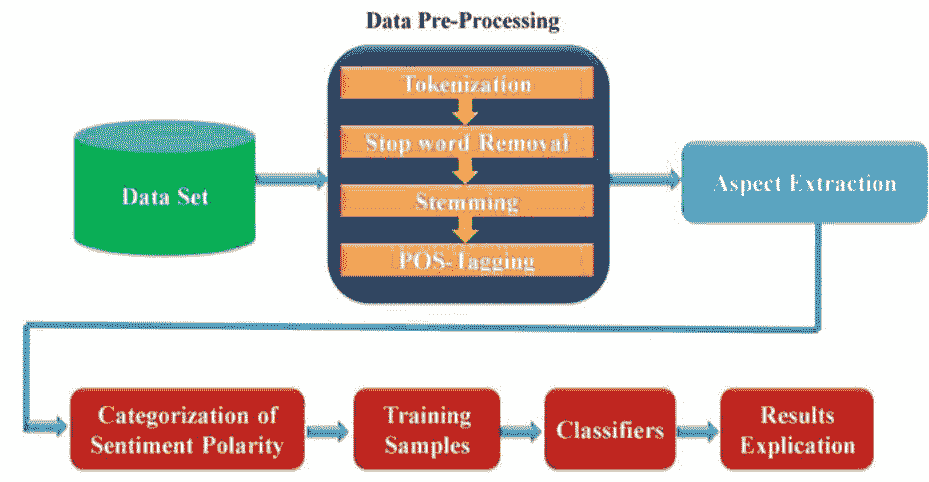

图1 提出的系统模型

##### 3.2 预处理

数据预处理是数据挖掘和数据分析的基础阶段。从网络中提取的评论通常是不完整、不一致的，可能包含不需要的符号或特殊字符。因此，为了去除特殊符号、多余的空格和换行符，需要对提取的评论应用预处理技术。使用停用词移除技术去除停用词，如a、the、as、be、an等，因为这些词在搜索查询中没有任何重要性。进行词干提取以将每个词减少到其词根。应该对每个词进行词性标注，其中标签被分配给每个词。常见的词性标记有名词、动词、形容词等。

方面提取：在这项工作中，使用了一种n-gram表示法来评估和分析。

分词：这是一种将长文本字符串分解为较小片段的方法。它将短语分解为一系列标记或单词。一段文本一旦被适当地分词处理后，通常会进一步处理[35]。

计数：它确定了文章中标记出现的次数。

归一化：在归一化中，根据词在语料库中出现的次数为每个词分配权重。最常出现的词，如停用词，将被赋予较低的重要性。

##### 3.3 情感极性的分类

情感分析中的极性定义了给定句子中表达的情感。它可以是负面的、积极的或中性的。本研究仅考虑情感分类的积极和负面方面。

##### 3.4 使用机器学习算法进行分类

支持向量机：一种监督学习算法，支持向量机（SVM）用于在N维空间中对数据点进行分类，N表示特征数量。支持向量用于构建超平面并影响其位置[36]。SVM使用迭代训练算法来减小误差函数以获得最优超平面。给定二元分类问题的线性分类器，其中包括特征x、权重参数w和偏差b：

$$f(x) = wx + b \quad (1)$$

由于SVM要求输入数据以数值形式表示，分类的评论文本文件被转换为数值形式。对于SVM分类器，考虑的调参参数值为C=1.0，核函数为'linear'，阶数为3，gamma为'auto'。

朴素贝叶斯分类器：朴素贝叶斯分类器（NB）是从贝叶斯定理推导出来的，通常适用于大型数据集。通过考虑Amazon、Twitter和IMDb数据集的属性来确定数据集中的某个点[37]。在监督学习算法中，迭代示例集，而在无监督算法中，遵循某些协议。可以使用以下规则来计算给定方面的情感预测概率。

$$P(\text{情感} | \text{方面}) = \frac{P(\text{方面} | \text{情感})P(\text{情感})}{P(\text{方面})} \quad (2)$$

K最近邻算法（KNN）：KNN方法是一种监督式机器学习技术，用于解决分类和回归问题[28]。在训练阶段存储的数据集将新数据分类到最接近的类别，这取决于距离或相似度等特定度量。

决策树：决策树是一种类似流程图的图形结构，由节点和分支组成。分类规则由根节点到叶节点的路径表示；内部节点是属性，叶节点表示类标签。在分类树中，目标变量取不同的值，在回归树中，目标变量取连续值[38]。

逻辑回归：逻辑回归（LR）是一种用于找到因变量概率的分类算法[39]。当目标变量是二分类的时候，我们选择逻辑回归；即值的范围为0到1。逻辑回归的调参参数值：C为1.0，迭代次数为100。

随机森林算法：随机森林（RF）是目前最合适的算法。它是决策树算法的更新版本，增加了复杂性和准确性等属性[40-45]。随机森林完全分析数据，并确定数据中是否存在任何特定的关联，然后将其映射到各种输出形式。随机森林考虑的调整参数值为n_estimators为100，最大深度为30。

#### 4 实施和结果分析

该提出的模型是在Python 3.7.0版本中开发的。本工作采用了自然语言工具包进行文本处理，其中包括词分词器、停用词、POS标注器、TextBlob、Scikit-Learn库等，用于构建机器学习模型。在为特定方面分配极性时，会检查情感倾向。如果情感倾向大于零，则被视为积极的；如果情感倾向小于零，则被视为消极的，并最终输入到分类器中。

这些数据集来自加利福尼亚大学欧文分校（UCI）的机器学习仓库。所有这些数据集都包含类标签和特征数量。这些数据集包括客户对特定功能的积极和消极意见。这些数据集的详细描述可以在https://archive.ics.uci.edu/ml/找到。

##### 4.1 结果分析

从亚马逊移动数据集中提取了一些样本的积极和消极术语，表1和表2中展示了这些术语。通过考虑不同的数据集来检查分类器的性能，并使用各个分类器进行对比评估结果。表3显示了使用不同分类器获得的数值。图2、图3和图4显示了亚马逊移动评论、Twitter情感分析和IMDb电影评论数据集的性能评估的图形表示。在这个实验中，70%的可用评论用于训练系统，剩下的30%用于测试。经过对分类器结果的检查，得出结论随机森林分类器在准确性方面超过了其他分类器。

从表1、2和3给出的结果可以清楚地看出，所提出的基于随机森林的方法与其他方法相比产生了更好的结果。

| 好 | 棒极了 | 很棒 | 好 | 喜欢 |
|---|---|---|---|---|
| 酷 | 快乐 | 谢谢 | 高 | 值得 |
| 惊人的 | 享受 | 惊人的 | 享受 | 高兴 |
| 喜欢 | 清晰 | 诚实 | 可爱 | 容易 |
| 狂热 | 神奇 | 公平 | 极好的 | 优越的 |
| 奇妙的 | 合理的 | 特别的 | 漂亮 | 好 |
| 复杂的 | 明智的 | 神奇 | 有效的 | 极好的 |

| 模糊的 | 坏的 | 虚假地 | 麻烦的 | 低的 |
|---|---|---|---|---|
| 慢的 | 最差的 | 令人沮丧的 | 压抑的 | 轻微的 |
| 差劲的 | 可怕的 | 激怒 | 荒谬的 | 错误的 |
| 缺失的 | 不稳定的 | 不幸的 | 不诚实的 | 几乎不 |
| 浪费 | 不必要的 | 怀疑的 | 混乱 | 死的 |
| 过时的 | 薄弱的 | 损坏的 | 伤心的 | 不必要的 |

学习算法。在表3中，随机森林方法对于亚马逊移动评论数据集的准确率、精确率、召回率和F1得分分别为92.5%、78.52%、95%、80.25%；对于Twitter SA数据集分别为90.25%、80.65%、92%、88%；对于IMDB电影评论数据集分别为88.08%、78.52%、90%、86.05%。

监督机器学习分类器的性能可以通过使用混淆矩阵来衡量。该矩阵有4种不同的实际和预测值组合，如真正例（TP）、假正例（FP）、真反例（TN）和假反例（FN）[46-51]。性能评估指标如下所示。

准确率 = (真正例情感 + 真反例情感) / (真正例情感 + 真反例情感 + 假正例情感 + 假反例情感) (3)
精确率 = 真正例情感 / (真正例情感 + 假正例情感) (4)
召回率 = 真正例情感 / (真正例情感 + 假反例情感) (5)
F1得分 = (2 × 精确率 × 召回率) / (精确率 + 召回率) (6)

图2、图3和图4清楚地显示，与现有的机器学习方法相比，建议的基于随机森林的技术产生了更好的结果。对于亚马逊，准确率、精确率、召回率和F1得分[49]。

| 机器学习分类器 | 准确率（%） | 精确率（%） | 召回率（%） | F1得分（%） |
| :--- | :--- | :--- | :--- | :--- |
| **亚马逊移动评论数据集** | | | | |
| 朴素贝叶斯 | 75.71 | 95 | 61.36 | 76.05 |
| 支持向量机 | 76.82 | 90 | 82.93 | 78.85 |
| K最近邻 | 84.28 | 80 | 86 | 88 |
| 决策树 | 87.3 | 85.45 | 90 | 92.15 |
| 逻辑回归 | 77.36 | 75.65 | 84.65 | 82.63 |
| 随机森林 | 92.5 | 78.52 | 95 | 80.25 |
| **Twitter情感分析数据集** | | | | |
| 朴素贝叶斯 | 68 | 92.5 | 85 | 88.88 |
| 支持向量机 | 71.25 | 82.05 | 88 | 75.54 |
| K最近邻 | 86.83 | 85 | 94 | 86 |
| 决策树 | 73.49 | 87.56 | 89 | 92.15 |
| 逻辑回归 | 74.64 | 82.25 | 90 | 85 |
| 随机森林 | 90.25 | 80.65 | 92 | 88 |
| **IMDB电影评论数据集** | | | | |
| 朴素贝叶斯 | 67.85 | 85 | 94 | 91 |
| 支持向量机 | 79.56 | 92 | 91 | 85 |
| K最近邻 | 76 | 85 | 92 | 86 |
| 决策树 | 82.55 | 85.45 | 86.3 | 92.15 |
| 逻辑回归 | 78.75 | 75.65 | 80.75 | 82.63 |
| 随机森林 | 88.08 | 78.52 | 90 | 86.05 |

准确率 = Accuracy，精确率 = Precision，召回率 = Recall，F1得分 = F1_Score

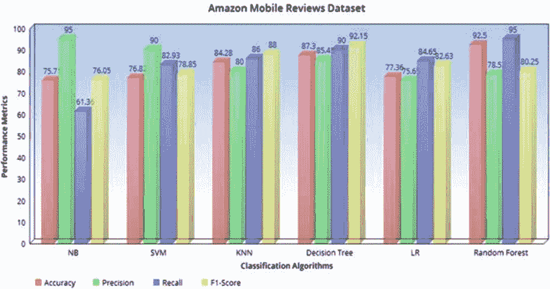
图2 关于分类器的亚马逊移动评论数据集的方面统计

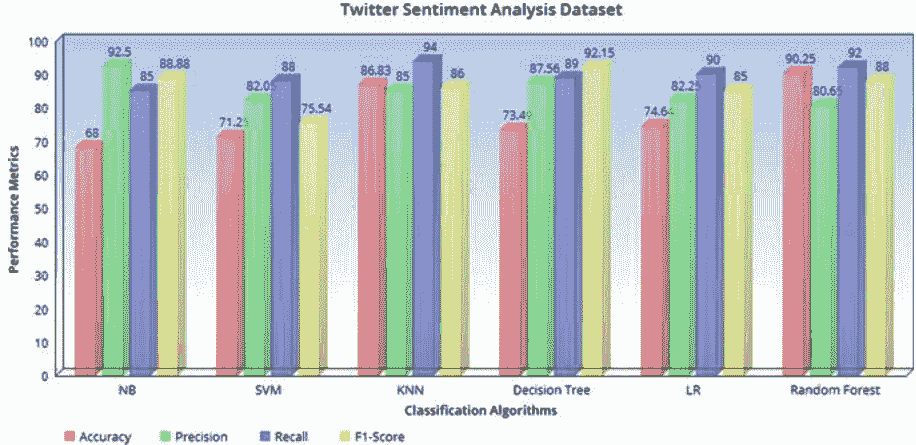
图3 关于分类器的Twitter情感分析数据集的方面统计

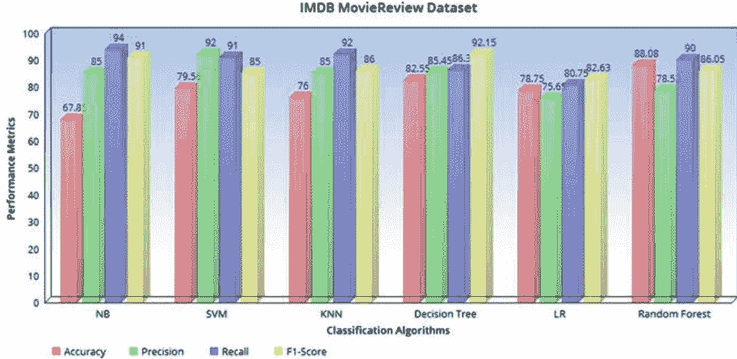
图4 关于分类器的IMDB 电影评论数据集的方面统计

亚马逊移动评论数据集的准确率为92.5%，精确率为78.52%，召回率为95%，F1得分为80.25%；Twitter情感分析数据集的准确率为90.25%，精确率为80.65%，召回率为92%，F1得分为88%；IMDB电影评论数据集的准确率为88.08%，精确率为78.52%，召回率为90%，F1得分为86.05%，根据图示数据。

## 5. 讨论

互联网已经从“只读”发展到“读写”环境。这种增长导致了一个充满激情的用户社区，他们通过在线社区、社交网络、维基、博客和其他协作媒体进行互动和分享。在与日常生活相关的领域，如贸易、教育、旅游和健康，传播了集体知识。情感分析和意见挖掘仍然是新兴的多学科课题，尽管取得了巨大的进展[4,6,52,53]。计算机科学家和工程师使用机器学习算法对语音、视频、生理和文本进行自动情感分类。心理学家利用长期的情绪研究来支持他们的修辞、理论和实践。研究人类情绪的情感科学与意见挖掘和情感分析密不可分。情感敏感的系统开发和心理情绪研究必须紧密结合[22]。

最近的研究试图更好地理解统治感觉的概念原则，以及可能帮助人们从实现到言语化的建议。未来的舆情挖掘算法将需要一个更大更多样化的常识数据知识库。更广泛的知识必须与受人类心理和认知影响的推理技术相结合。这将帮助学者理解自然语言的观点，并弥合非结构化多模态数据与机器可处理数据（结构化数据）之间的差距。将情感的科学方案与分析自然语言文本中的情感相结合，将会产生更多生物启发式方法，用于设计能够处理学习新的情感知识、语义知识、进行类比和感知、感知和“感受”情感的智能舆情挖掘系统[54,55]。

基于概念的方法的知识库的深度和广度至关重要。如果没有一个大型的人类知识库，舆情挖掘机器将无法理解自然语言文本的语义。此外，知识库处理语义复杂性的能力受到它们仅包含与概念相关的标准信息的限制。最后，思维的固定/扁平形状限制了与它们相关的语义和情感特质的推理。

通常，统计方法在语义上较弱，这意味着除了明显的关键词之外，统计模型的其他词汇或共现组件几乎没有预测意义。因此，统计文本分类器只有在处理大量文本时才有效。因此，虽然这些算法可以准确地对用户在页面或段落级别上的工作进行分类，但在短语或从句等较小的文本单元上可能会遇到困难。

## 6. 结论

本研究通过机器学习分类器对用户收集的评论进行了基于特征的情感嵌入构建过程的介绍。本文解决了情感分析和情感分类的基本问题。本研究使用了各种数据集，如电影评论、手机评论和Twitter情感分析数据集。已进行了句子级别的分类，以确定方面的极性。本文应用了多个机器学习（诸如KNN、逻辑回归、朴素贝叶斯、支持向量机、决策树和随机森林等）分类器对上述数据集进行分析。结果与其他分类器进行评估和比较。根据实验结果，可以确定随机森林在所有其他分类方法中表现最好。

在许多情况下，客户可以使用用户评级和表情符号来表达他们的意见。在未来的工作中，我们可以专注于这些问题，以提高情感分析的质量。可以通过应用更具体的特征选择技术和使用混合分类算法来进行方面提取。

#### 参考文献

- 1. Jagdale, R S., Shirsat, V.S., Deshmukh, S.N.: 使用机器学习技术对产品评论进行情感分析 。在：认知信息学和软计算，第639-647页。新加坡： Springer出版社（2019年）
- 2. Montiel, M.V., Graziotin, D., Kuutila, M.: 情感分析的演变-研究主题、会议和被引用次数最多的论文综述。计算机科学评论，27，16-32（2018年）
- 3. Dina, N.Z., Juniarta, N.: 基于方面的员工评论体验情感分析。信息系统工程与商业智能杂志，6（1），79-88（2020年）
- 4. Nasim, Z., Haider, S.: ABSA工具包：一个用于基于方面的情感分析的开源工具。Int. J. Artif. Intell. Tools 26(06), 1750023 (2017)
- 5. Cambria, E.: 概念级情感分析简介，第478-483页。 在墨西哥国际人工智能会议上， Springer，柏林，海德堡（2013）
- 6. Birjali, M., Beni-Hssane, A., Erritali, M.: 用于自杀情感预测的机器学习和语义情感分析算法。计算机科学会议论文集 113,65-72 (2017)
- 7. Ahmad, M., Aftab, S., Muhammad, S.S., Ahmad, S.: 情感分析的机器学习技术综述。国际多学科科学与工程杂志 8(3), 27 (2017)
- 8. Hasan, A., Moin, S., Karim, A., Shamshirband, S.: 基于机器学习的推特账户情感分析数学计算与应用 23(1), 11 (2018)
- 9. Tyagi, A., Sharma, N.: 使用逻辑回归和有效词语得分启发式的情感分析国际工程技术学报 7, 20–23 (2018)
- 10. Elmurngi, E., Gherbi, A.: 使用机器学习技术通过情感分析检测虚假评论 IARIA/数据分析 , pp. 65–72 (2017)
- 11. Jain, A., Jain, V.: 使用机器学习对可再生能源推特数据进行情感分类信息与优化科学杂志 40(2), 521–533 (2019)
- 12. Araque, O., Corcuera-Platas, I., Sánchez-Rada, J.F., Iglesias, C.A.: 在社交应用中使用集成技术增强深度学习情感分析。专家系统应用 77，236–246（2017年）
- 13. 王, Y., 陈, Q., 沈, J., 侯, B., 艾哈迈德, M., 李, Z.: 基于渐进机器学习的方面级情感分析。基于知识的系统212，106509（2021）
- 14. AlAmrani, Y., Lazaar , M., El Kadiri, K.E.: 基于随机森林和支持向量机的混合方法进行情感分析。计算机科学会议127，511-520（2018）
- 15. Da Silva, Nadia, F.F., Eduardo, R.H., Estevam, R.H. Jr.: 使用分类器集成的推文情感分析。决策支持系统66，170-179（2014）
- 16. Saleena, N.: 用于Twitter情感分析的集成分类系统。计算机科学会议132，937-946（2018）
- 17. Pouransari, H., Ghili, S.: 电影评论情感分析的深度学习。 斯坦福大学技术报告，技术报告（2014年）
- 18. Keith, B., Fuentes, E., Meneses, C.: 一种应用于论文的情感分析的混合方法。在ACM SIGKDD会议论文集中，加拿大新斯科舍省哈利法克斯，第10页（2017年）
- 19. Bhadane, C., Dalal, H., Doshi, H.: 情感分析：测量意见。计算机科学会议论文集，808-814页（2015年）
- 20. Hussein, D.M.: 情感分析挑战的调查。沙特阿拉伯国王大学工程科学学报，第30卷（4），330-338页（2018年）
- 21. Annett, M., Kondrak, G.: 情感分析技术的比较：极化电影博客。加拿大计算智能学会会议，第25-35页。Springer，柏林，海德堡（2008年）
- 22. Pasupa, K., Ayutthaya, T.S.N. 基于深度学习技术的泰国情感分析：基于词嵌入、词性标注和语义特征的比较研究。可持续城市社会，50，101615（2019）。
- 23. Shakhovska, N., Fedushko, S.: 基于社交和人口统计因素的网络用户音乐偏好数据分析。计算机科学会议论文集，1（198），730-735（2022）
- 24. Babu, N.V., Kanaga, E.: 利用人工智能进行社交媒体数据情感分析以检测抑郁症：综述。SN计算科学，3（1），1-20（2022）
- 25. Garg, N., Sharma, K.: 基于社交网络数据的多语言情感分析的文本预处理。国际电气计算机工程杂志，12（1），2088-8708（2022）
- 26. Hossain, M.S., Cucchiara, R., Muhammad. G., Tobón, D.P., Saddik, A.E.: 智能医疗的AI增强多媒体数据分析专题。ACM多媒体计算、通信和应用交易（TOMM），卷18（1s），第1-2页，（2022）
- 27. Rawat, R., Mahor, V., Chirgaiya, S., Shaw, R.N., Ghosh, A.: 使用机器学习技术在在线社交网络上进行情感分析，以进行网络恶意帖子评论，第113-130页。在《计算智能系统及其应用》一书中，Springer，新加坡（2021）
- 28. Bennett, K.P.: 通过线性规划构建决策树。威斯康星大学麦迪逊分校计算机科学系（1992年）
- 29. Chauhan, P., Sharma, N., Sikka, G.: 社交媒体数据和情感分析在选举预测中的出现。环境智能与人性化计算杂志，12（2），2601-2627（2021年）
- 30. Naseem, U., Razzak, I., Musial, K., Imran, M.: 基于Transformer的深度智能上下文嵌入用于Twitter情感分析。未来一代计算机系统，113，58-69（2020年）
- 31. Alam, M., Abid, F., Guangpei, C., Yunnrong, L.V.: 通过并行膨胀卷积神经网络进行社交媒体情感分析，用于智能城市应用。计算机通信，154，129-137（2020年）
- 32. Sharma, A., Shekhar, H.: 基于智能学习的政府决策意见挖掘模型。计算机科学会议论文集 173，216-224（2020年）
- 33. Alqaryouti, O., Siyam, N., Monem, A.A., Shaalan, K.: 使用智能政府评论数据的基于方面的情感分析。应用计算机信息（2020年）
- 34. Singh, M., Jakhar, A.K., Pandey, S.: 使用BERT模型对社交生活中冠状病毒影响的情感分析。社交网络分析与挖掘 11（1），1-1（2021年）
- 35. Fang, X., Zhan, J.: 使用产品评论数据的情感分析. J. Big Data 2(1), 1-14 (2015)
- 36. Stefanovič, P., Kurasova, O., Trimaitis, R.: 基于n-gram的文本相似度检测方法使用自组织映射和相似度度量. Appl. Sci. 9(9), 1870 (2019)
- 37. Deng, Z., Zhu, X., Cheng, D., Zong, M., Zhang, S.: 高效的大数据kNN分类算法. Neurocomputing 195, 143-148 (2016)
- 38. Friedman, J., Hastie, T., Tibshirani, R.: 加法逻辑回归: 提升的统计视角 (作者的讨论和答辩). Ann. Stat. 28(2), 337-407 (2000)
- 39. Medhat, W., Hassan, A., Korashy, H.: 情感分析算法和应用: 一项调查. Ain Shams Eng. J. 5(4), 1093-1113 (2014)
- 40. Gupte, A., Joshi, S., Gadgul, P., Kadam, A., Gupte, A.: 情感分析中使用的分类算法的比较研究. Int. J. Comput. Sci. Inf. Technol. 5(5), 6261-6264 (2014)
- 41. Everingham, Y., Sexton, J., Skocaj, D., Inman-Bamber, G.: 使用随机森林算法准确预测甘蔗产量. Agron. Sustain. Dev. 36(2), 27 (2016)
- 42. Catal, C., Nangir, M.: 基于多个分类器的情感分类模型. Appl.Soft Comput. 50, 135-141 (2017)
- 43. 彭, H., 徐, L., 冰, L., 黄, F., 卢, W., 司, L.: 知道什么, 如何和为什么: 面向方面的情感分析的近乎完整解决方案。AAAI人工智能会议论文集34 (05), 8600-8607 (2020年)
- 44. Mowlaei, M.E., Abadeh, M.S., Keshavarz, H.: 使用自适应面向方面的词典的面向方面的情感分析。专家系统应用148, 113234 (2020年)
- 45. 黄, J., 孟, Y., 郭, F., 季, H., 韩, J.: 通过方面-情感联合嵌入的面向方面的情感分析。在: 2020年经验方法在自然语言处理中的会议论文集 (EMNLP), pp. 6989-6999 (2020年)
- 46. Theerthagiri, P.: 使用多层感知器和多元线性回归技术预测低钠血症的住院患者。并发计算: 实践与经验33 (16), e6248 (2021年)
- 47. Prasannavenkatesan, T.: 使用cocode模型对流行病covid-19进行概率预测。EAI支持的《普适健康与技术交易》 7(26), e3 (2021)
- 48. Kommina, L, Theerthagiri, P, Payyavula, Y, Vemula, PS, Reddy, G.D.: 使用机器学习算法进行中风再入院预测模型。在: 数据驱动计算与通信的新趋势, 第53-65页。新加坡: Springer出版社 (2021年)
- 49. Theerthagiri, P., Jeena Jacob, I., Usha Ruby, A., Yendapalli, V.: 使用K最近邻分类算法预测COVID-19可能性。国际现有研究评论 13, 156 (2021)
- 50. Prasannavenkatesan, T.: 使用多层感知器分类技术对患者低钠血症进行预后分析。EAI支持的《普适健康技术交易》7(26), e5 (2021)
- 51. Gopala Krishnan, C., Theerthagiri, P.: 基于极限学习的人工智能肺癌分类。 In: Tyagi, A.K., Abraham, A., Kaklauskas A. (eds.) 智能互动多媒体系统用于电子医疗应用, 第375-385页。Springer, 新加坡 (2022年)
- 52. Ikram, M.T., Afzal, M.T.: 利用语言模式进行基于方面的引文情感分析, 以更好地理解科学知识。 Scientometrics 119 (1), 73-95 (2019)
- 53. Ahmad, M., Aftab, S., Ali, I.: 使用svm对推文进行情感分析。国际计算机应用杂志177 (5), 25-29 (2017)
- 54. Cambria E, Schuller B, Xia Y, Havasi C. 意见挖掘和情感分析的新途径。IEEE智能系统, 第21卷, 第28期 (2), 15-21页 (2013年)
- 55. 江, Q., 陈, L., 徐, R., 敖, X., 杨, M.: 面向方面的情感分析的挑战数据集和有效模型。在2019年经验方法会议和第9届国际自然语言处理联合会议 (EMNLP-IJCNP) 论文集中, 第6281-6286页 (2019年)

## 基于深度神经网络（DNN）架构的改进PIP：捕捉用户行为的一致推荐框架


Bam Bahadur Sinha, Gurvinder Singh Yadav和Sagar Badrish Kudkelwar

摘要：在线服务（如电子商务）的使用正在迅速增长，导致可用信息的数量呈指数增长。推荐系统帮助消费者从大量的替代品中选择相关信息。此外，不同的推荐上下文具有各自的挑战，需要使用不同的推荐方法。由于其高准确性、简单方法和低计算需求，协同过滤技术一直被广泛使用，而基于内容的过滤面临高计算需求的问题。本章旨在使用改进的Proximity Impact Popularity (Modified-PIP) 技术和深度神经网络 (DNN) 捕捉用户行为，以进行高效的电影推荐。在MovieLens-100K、MovieLens-1M和Jester数据集上测试了Modified-PIP对其他相似度度量（如PIP相似度、余弦相似度和PCC (皮尔逊相关系数)）的优势。应用匹配插补技术来减少数据集的稀疏性。使用RMSE（均方根误差）、MAE（平均绝对误差）、R（召回率）和P（精确率）评估了提出的深度神经网络（DNN）架构与Modified-PIP相似度度量的性能。提出模型的低误差得分证明了提出模型的高效性。

关键词：协同过滤·神经网络·相似度技术·推荐系统·MAE·RMSE

B. B. Sinha （通讯作者）
计算机科学与工程，印度信息技术研究所兰契分校，兰契 834010，JH，印度
e-mail: bahadurbam43@gmail.com

G. S. Yadav
数据科学与工程，印度信息技术研究所达尔瓦德分校，达尔瓦德 580009，KA，印度

S. B. Kudkelwar
电气工程系，G.H. Raison工程技术学院，那格浦尔 440016，MH，印度

© 作者，独家许可给Springer Nature Switzerland AG 2022
T.-P. Hong等人，社交媒体数据分析的深度学习，大数据研究113，https://doi.org/10.1007/978-3-031-10869-3_7
121

#### 1 引言

人类是地球上最脆弱的生物之一，然而他们设法处于食物链的顶端，甚至能够超越仅仅是生存的过程。作为一个物种，如果被人类看待，他们之所以能够这样做，只是因为他们开发了有效的工具。这些工具将我们从石器时代、青铜时代、铁器时代带到了信息时代，从简单发展到了高度复杂和先进的计算机系统。我们之所以能够这样做的唯一原因是因为信息的有效传播，这很难编制，甚至更难分享。但随着新信息时代的开始，信息的分享方式已经完全改变。以前，只有少数人可以获得高质量的内容，但现在每个有互联网和电脑访问权限的人都可以获得。由于接触到内容，每个人都能够获得对他们最相关的内容变得更加重要。在今天的世界中，每天都有petabytes的数据添加到互联网上，手动为一个人理解这些数据几乎是不可能的。这种对一个人能够消费多少内容以及什么样的内容对一个人来说是相关的瓶颈，导致了推荐系统的引入。作为媒体服务提供商，Netflix利用推荐系统根据用户的个人资料推荐电影和电视节目。用户个人资料包括制定一组与目标用户相似的用户。用户之间的相似性是使用不同的传统相似度度量方法计算的，例如余弦相似度、皮尔逊相关系数等。当使用的数据集非常稀疏时，这些相似度度量方法对准确性有一定的影响。这个实时推荐挑战激发了我们对不同现有相似度度量方法进行测试，以及对一种修改后的相似度计算方法进行有效的相似度计算。

推荐系统分析用户和内容输入系统的数据，以生成与特定用户相关的内容推荐。这对于越来越多的企业转向在线基础设施具有重大影响。例如，在网络空间中有大量的商品、服务和娱乐平台供应商，为了增加他们的利润，他们使用各种技术。其中最重要的工具和技术是推荐系统。这些供应商使用推荐系统（RSs）找到他们最喜欢的产品，然后推荐类似的内容，以便用户在他们的平台上花费更多的时间和金钱，但为了做到这一点，必须维护和分析庞大的数据库以产生准确的推荐。

推荐系统广泛分为三种基本过滤技术，即：基于内容的过滤（CBF），协同过滤（CF）和混合过滤[10]。

协同过滤（CF）使用用户的信息，如年龄、评分模式、职业、性别和人口统计信息来生成推荐，而基于内容的过滤（CBF）则分析产品的形状、大小、类型、价格等参数，并根据平台生成推荐。第三种方法是混合方法，顾名思义，它是CF和CBF过滤的混合技术。

本章重点介绍了使用深度神经网络（DNN）架构结合改进的PIP相似度度量来构建混合推荐系统。在CF模型中使用改进的PIP获得了高度准确的结果，这激发了我们在提出的基于深度学习的混合模型中使用改进的PIP。该提议的模型旨在通过推荐用户可能感兴趣的物品来生成高效的推荐列表。

深度学习的基础被广泛应用于复杂数据的分类，以增强从中获取的知识。深度结构学习是深度学习的另一个名称。它是机器学习研究中快速发展的领域，可以在多个层次上对数据进行建模，并在更深层次上发现不同类型数据之间的关系和相关性，例如文本信息、音频、图片等。通过监控消费者和产品之间的互动，深度学习方法可以预测并给出更好的建议，从而构建自动化的推荐系统。许多企业，如亚马逊、Netflix等，利用推荐系统来满足客户需求并帮助他们发现所需的内容。传统的推荐系统使用协同过滤技术来理解用户的兴趣。协同过滤方法采用矩阵分解（MF）方法来表示消费者和产品之间的互动，仅捕捉消费者和产品之间的表面合作程度。

依靠采用基于深度学习的架构，深度学习技术可以深入捕捉交互，并在许多层次上表示潜在的隐藏特征。因此，基于深度学习的推荐系统可能表现更好，并提供更加个性化的建议。

每个推荐上下文都有其自身的问题集，需要各种方法来开发推荐系统。例如，新闻推荐可能更加注重新闻内容的新鲜度，而电影推荐可能更加注重电影内容的相关性。

此外，用户的兴趣，特别是在电影领域，会随着时间的推移而演变和改变。可以想象，经常观看喜剧的用户可能出于各种原因对浪漫电影产生兴趣。因此，考虑到偏好的动态变化并提供更好的推荐是至关重要的。

尽管许多当前方法假设用户的兴趣保持不变，但这种假设似乎有些牵强。这意味着处理时间变化对消费者的最佳利益是必要的。以下是本章的主要贡献：

- 使用改进的PIP来展示其在其他传统相似度度量（如余弦、皮尔逊、杰卡德和接近度影响流行度）上的重要性。
- 使用匹配插补技术来减少 MovieLens-100K、MovieLens-1M 和 Jester数据集的稀疏性。
- 使用深度神经网络捕捉消费者与产品（电影、新闻等）之间的互动。
- 随机梯度下降（SGD）、RMSprop、Adam和Adagrad是用于使DNN模型更准确和更快收敛的优化技术之一。

本章的剩余部分结构如下：第2节讨论相关背景。第3节重点介绍了本章使用的不同方法论。第4节说明了提出的模型。实验设置和结果在第5节讨论。第6节总结了本章并展望未来方向。

#### 2 相关背景

尽管在推荐系统领域进行了大量研究，但在推荐系统中使用DNN的注意力较少。在本节中，讨论了与所提出的方法相关的一系列代表性方法。

##### 2.1 常见的推荐方法

在推荐生成中最广泛使用的策略是基于内容的推荐系统和基于协同过滤的推荐系统。基于内容的推荐方法主要分析文本挖掘过程中提供的隐式评分，而协同过滤则考虑用户的显式评价[2]。此外，协同过滤方法分为两种常用的技术，即基于模型的协同过滤和基于内存的协同过滤。基于模型的策略根据每个用户的评分创建用户模型，以确定未评级产品的估计值[3]。基于内存的协同过滤方法使用相似度度量来识别使用显式用户评分数据的邻域，然后预测应向最终用户推荐哪些项目[4]。

CBF是一种广泛应用于各个领域的个性化推荐方法[5,7]。另一方面，CF存在一些缺陷，包括冷启动问题、过度专业化和数据稀疏性[6,8,9]。由于这些问题的存在，用户体验受到了显著影响。基于内存的CF进一步分为基于用户和基于物品的过滤。下面的段落讨论了一些关于基于用户相似性技术的文献收集，这些文献是为了进行本研究而收集的。

由于相似度度量在提高协同过滤系统的预测准确性方面起着关键作用，因此已经进行了多项研究，引入了新的相似度度量方法，可以克服传统相似度度量所面临的问题。最广泛使用的PCC技术可以计算不同物品/电影之间的线性关系（相关性）。使用PCC获得的值 ∈ [-1 (负相关) , +1 (正相关或强相关) ]。如果值为0，则表示所选用户集之间没有相关性。计算两个用户 $u_j$ 和 $u_h$ 之间相似性的PCC的数学表示如公式1所示。

$$sim(u_j, u_h)^{PCC} = \frac{\sum_{i=1}^{m} (r_{u_j, i} - \bar{r}_{u_j}) (r_{u_h, i} - \bar{r}_{u_h})}{\sqrt{\sum_{i=1}^{m} (r_{u_j, i} - \bar{r}_{u_j})^2} \sqrt{\sum_{i=1}^{m} (r_{u_h, i} - \bar{r}_{u_h})^2}}$$

余弦相似度是一种广泛用于信息检索的向量空间模型，其中余弦向量之间的角度用于计算用户集之间的相似性。计算用户之间相似性的数学表示如公式 2所示。

$$sim(u_j, u_h)^{COS} = \frac{\sum_{x=1}^{U} r_{u_j, I_x} \times r_{u_h, I_x}}{\sqrt{\sum_{x=1}^{U} (r_{u_j, I_x})^2} \sqrt{\sum_{x=1}^{U} (r_{u_h, I_x})^2}}$$

基于Jaccard相似度的计算是通过找到两个用户之间评分值的交集的基数与并集的比率来计算的。它的取值范围从0到1，其中0表示没有相似的评分值，而1表示所有评分都重叠。方程3展示了计算用户 $u_j$ 和 $u_h$ 之间相似度的数学表示。

$$sim(u_j, u_h)^{JAC} = \frac{|I_{u_j} \cap I_{u_h}|}{|I_{u_j} \cup I_{u_h}|}$$

### 基于神经网络的社交媒体数据分析

在[11]中，使用了一个两层的受限玻尔兹曼机（RBM）来模拟消费者的明确物品评分。这是首次使用神经网络进行的开创性研究。后来，该技术被扩展以模拟评分的序数性质[12]。自动编码器最近在开发推荐系统[13, 14]中成为一个重要组成部分。AutoRec [13]的目的是发现可以根据用户先前的评分重建用户评分的隐藏模式。这种方法在个性化方面与物品[15]模型具有类似的背景，该模型将用户表示为其评级的物品特征。

吴等人[16]提出了一种基于隐式反馈的CDAE方法。与基于DAE的CF [17] 不同，CDAE将用户节点连接到自动编码器输入以重新创建用户的评分。当使用恒等函数触发CDAE的隐藏层时，作者证明它与SVD++模型[19]相似。尽管如此CDAE是一个基于物品-物品交互的CF模型，但本文所提出的工作依赖于用户-物品交互。相比之下，[18]的作者研究了用于推荐系统的DNN。他们提出了NCF（神经协同过滤），这是一个通用的框架，用深度网络替代内积，可以从提供的数据中学习任何函数。用户-物品交互使用多层感知器（MLP）进行学习。矩阵分解（MF）可以使用NCF来表示和推广。然后，他们使用MF的线性性和DNN的非线性性结合来描述用户-物品的潜在结构。这个模型被称为NeuMF（神经MF）。

#### 3 实验方法

##### 3.1 相似度度量

###### 传统相似度度量的缺点

余弦相似度和皮尔逊相关系数经常在广泛使用的基于CF的推荐系统中使用。余弦相似度和皮尔逊相关系数的限制包括：单值[20]、相反值[20]、相等比例[20]和平坦值[21]问题。余弦相似度是广泛应用于各种研究目的的主要相似度度量之一。这种方法通常应用于文本分组领域，用于计算两个文本文档之间的相关性[22]，也用于K-means方法中确定数据项和它们关联的质心之间的相似度。与传统技术相比，这种相似度度量在准确性方面表现更好[21]。杰卡德相似度有时被称为二进制相似度。这通常用于计算分类（二进制）数据集之间的相似度。这种度量在进化计算中产生更优的答案，例如用于进化算法（如遗传算法）的适应度值[23]。正如先前所述，研究清楚地表明余弦和杰卡德基于相似度度量在实际应用中被广泛使用，用于解决各种问题。在基于CF的系统中，使用有序评级尺度值。余弦相似度和皮尔逊相关系数对尺度的正面和负面赋予相等的权重，导致错误的相似度结果。这是基于余弦和基于皮尔逊相关系数的相似度度量的缺点之一。杰卡德相似度度量只考虑共同评估的数量，而不考虑它们的严重程度。

###### 3.1.1 接近度影响流行度 (PIP)

PIP技术包括两个条件（TRUE或FALSE），与协议一致。PIP的三个基本构建模块是：接近度（P），影响力（I）和流行度（P）[24]。方程4和5可用于计算用户之间的相似度 $r_{u_j, I_x}$ 和 $r_{u_h, I_x}$。

$$PIP(r_{u_j, I_x}, r_{u_h, I_x}) = Proximity(r_{u_j, I_x}, r_{u_h, I_x}) \times Influence(r_{u_j, I_x}, r_{u_h, I_x}) \times Popularity(r_{u_j, I_x}, r_{u_h, I_x})$$

$$sim(u_j, u_h)^{PIP} = \sum_{x=1}^{U} PIP(r_{u_j, I_x}, r_{u_h, I_x})$$

PIP分数受协议准则的影响很大。与其他相似度度量相比，它似乎是唯一用于量化协议准则以区分正面评级和负面评级的相似度度量。该协议准则用于根据两个不同个体提供的评级模式区分评估。考虑用户集合 $\left(U=u_{1}, u_{2}, \ldots, u_{n}\right)$ 和对象集合 $\left(I=X_{1}, X_{2}, \ldots, X_{m}\right)$。系统中存在的总用户数和存在的总物品数分别用“n”和“m”表示。它们与一个实用矩阵相关联，可以泛化为一个用户×物品评分矩阵。

举个例子，考虑两个评分 $r_{1}$ 和 $r_{2}$，其中 $r_{1}$ 是由用户 $u_j$ 对物品 $x$ 的评分，$r_{2}$ 是由用户 $u_h$ 对物品 $x$ 的评分。$R_m$ 和 $R_n$ 分别表示给定评分尺度的最大和最小评分；此外，令 $R_d = (R_n + R_m)/2$。当 $r_{1}$ 和 $r_{2}$ 都大于或小于 $R_d$ 且 $Agreement(r_1, r_2)$ 为真时，$Agreement(r_1, r_2)$ 为真。类似地，如果两个用户提供的评分方向不同，则 $Agreement(r_1, r_2)$ 为假。方程 6表示定义协议条件的函数。

$$Agreement(r_1, r_2) = \begin{cases} \text{True}, & \text{if } (r_1 < R_d \text{ 且 } r_2 < R_d) \text{ 或 } (r_1 > R_d \text{ 且 } r_2 > R_d) \\ \text{False}, & \text{其他} \end{cases}$$

###### 接近度

通常接近度表示任何物体的接近程度，但这里接近度方程式9被用来定义评分值之间的绝对差异。

$$\text{绝对值差异}(r_1, r_2) = \begin{cases} |r_1 - r_2|, & \text{协议=True} \\ 2 \times |r_1 - r_2|, & \text{协议=False} \end{cases}$$

$$Proximity(r_1, r_2) = \{(2 \times (R_m - R_n) + 1) - \text{绝对值差异}(r_1, r_2)^2\}$$

$AbsDiff(r_1, r_2)$ 可以使用公式 8 计算。当 $Agreement$ 为 'FALSE' 时，Proximity 的值范围从 1 到 25；当 $Agreement$ 为 'TRUE' 时，Proximity 的值范围从 49 到 81。Proximity 值越高，评分之间的不相似性越大。

###### 影响力

影响因子确定用户对给定项目的喜好或厌恶程度。当 $Agreement(r_1, r_2) = \text{False}$ 时，它的值范围从 0.11 到 0.25；当 $Agreement(r_1, r_2) = \text{TRUE}$ 时，它的值范围从 1 到 9。影响因子的值越高，表示用户对该特定项目的偏好越强。

$$I(r_1, r_2) = (|r_1 - R_d| + 1) \times (|r_2 - R_d| + 1), \quad \text{Agreement=TRUE}$$

###### 流行度

流行度表示给定项目与其对应项相比有多受欢迎。当 $Agreement(r_1, r_2) = \text{False}$ 时，其最小值为 1，范围从 1 到 5；当 $Agreement(r_1, r_2) = \text{True}$ 时。

$$Popularit(r_1, r_2) = 1 + \frac{r_1^2 + r_2}{2}, \quad \text{if Agreement=True}$$

$$Popularit(r_1, r_2) = 1, \quad \text{if Agreement=False}$$

###### 3.1.2 修改的接近度影响流行度

在 PIP 中，每个组件都分布在一个广泛的范围内，并且不对所有组件提供相等的权重。考虑到极端情况，当 $u_i = 5$ 和 $u_j = 5$ 时，各个组件（接近度、影响力和流行度）分别为 81、9、5，最终 PIP 评估为 3645。与 $u_1 = 5$ 和 $u_h = 1$ 相比，我们可以看到各个组件分别为 1、0.11、1，最终 PIP 评估为 0.11，其中接近度和流行度被赋予相同的权重。

虽然每个组件都提供了重要的信息，但在某些情况下，某些组件更受青睐。为了克服这个挑战，提出了改进的近距离影响流行度（MPIP）方法。除此之外，MPIP 还提供了更规范化的数值范围。下一节将进一步详细介绍如何评估 MPIP。

### 改进的近距离

改进的近距离的数值范围为 0 到 1。使用两个评分之间的绝对偏差来评估（方程式 13）。$R_{med}$ 是该特定项目的中位数评分。

$$D(r_1, r_2) = |r_1 - r_2|$$

## 基于深度神经网络 (DNN) 架构的改进PIP模型

提出的相似度 $S(r_1, r_2) = \begin{cases} \left( \frac{D(r_1, r_2) - \frac{med_+ + med_-}{2}}{R_{\max} - R_{\min}} \right)^2 & \text{如果 } Agreement(r_1, r_2) = \text{True} \end{cases}$

所提出的相似度可以使用公式14计算，其中 $med_+$ 是等于或高于评分尺度中位数的评分的中位数，$med_-$ 是低于评分尺度中位数的评分值的中位数，如公式14所示。

提出的相似度 $S(r_1, r_2) = \delta \times \left( \frac{\bar{D}(r_1, r_2)}{R_{\max} - R_{\min}} \right)^2$ 如果 $Agreement(r_1, r_2) = \text{False}$

$$\delta = \begin{cases} 0.75 & \text{如果 } D(r_1, r_2) > R_{\text{中位数}} \\ 0.5 & \text{如果 } D(r_1, r_2) = R_{\text{中位数}} \\ 0.25 & \text{否则} \end{cases}$$

Delta作为权重，惩罚评级之间的偏离接近度。方程14和15被除以 $R_{\max} - R_{\min}$ 以获得从0到1的归一化接近度的值。

## 修改后的影响

为了归一化影响，当 $Agreement(r_1, r_2) = \text{True}$ 时，表达式被转换为指数表达式。通过方程17讨论了表达式的转换。

提出的影响 $I(r_1, r_2) = \exp\left(-\frac{1}{(|r_1 - R_{mid}| + 1) \times (|r_2 - R_{mid}| + 1)}\right)$ 如果 $Agreement(r_1, r_2) = \text{True}$ (17)

$r_1$ 和 $r_2$ 相对于中位数的差距越大，`Impact (I)` 值越大。当两个分数都接近中位数时，`I` 的值较低。这表明两个个体对中位数值达成一致，表示评级的影响可以忽略不计。

提议的影响 $I(r_1, r_2) = \frac{1}{(|r_1 - R_{mid}| + 1) \times (|r_2 - R_{mid}| + 1)}$ 如果 $Agreement(r_1, r_2) = \text{False}$ (18)

方程18表明了当 `Agreement` 为 `FALSE` 时的提议影响。对于 $Agreement(r_1, r_2) = \text{False}$，表达式与方程17类似，因为其值已经在0到1之间。

## 修改后的流行度

当两个分数处于同一部分的尺度上，并且两个评分的平均值远离物品的平均评分时，该物品被认为是受欢迎的。两个个体对受欢迎和不受欢迎的物品提供相同类型的评分，当涉及到评分行为时，他们有很多共同之处。在提议的方法中，当 $Agreement(r_1, r_2) = \text{False}$ 时，该值被设为 0.3010。提议的流行度值范围从 0.3010 到 0.778，当 $Agreement(r_1, r_2) = \text{True}$。提议流行度的数学表示由方程19和20给出。

$$\text{提出的流行度 } P(r_1, r_2) = \log_{10} \left(2 + \frac{r_1 + r_2}{2} - \bar{r_i}\right)^2 \quad \text{如果 } Agreement(r_1, r_2) = \text{True (19)}$$

$$\text{提出的流行度 } P(r_1, r_2) = 0.3010 \quad \text{其他情况 (20)}$$

$$sim(I_i, I_q)^{MPIP} = \sum_{j=1}^{n'} MPIP(r_{uj}, I_i, r_{uj}, I_q) \quad (21)$$

方程21表示最终的相似度度量，可用于计算不同项目集之间的相似度。

#### 3.2 深度神经网络 (DNN)

神经网络 (NN) 是一种人工智能，旨在模仿人们获取特定信息方面的学习过程。NN包含了各种神经元（人工），类似于大脑中的真实神经元，并利用它们来解释和处理信息。NN由输入层、隐藏层（一个或多个）和输出层组成，将输入转换为一些有意义的输出。

图1展示了人工神经元的工作原理。DNN [26] 是一组分层的神经网络，或者说是具有许多层的网络。至少有2个隐藏层且仅向前运动的DNN也被称为“前馈神经网络”。这些神经网络可以进行分类和预测。在本章中，DNN被用于预测可能对用户感兴趣的未评级电影的评分。DNN旨在从输入对象中提取模式，然后使用这些模式来预测输出值。我们设计了多种具有激活函数的隐藏神经元来实现这一目标。

为了创建一组活跃的隐藏神经元网络，使用了非线性激活函数，如 Sigmoid、tanh 和 ReLU。权重 (W) 和偏置 (B) 必须进行调整，以便激活函数可以触发这些隐藏神经元。“W”和“B”首先被随机设置。该网络然后使用成千上万个输入进行训练。误差的反向传播被用来调整“W”和“B”，使隐藏神经元以适当的值激活。特征集是一组“W”和“B”，将用于识别特定的输出。当用于区分的模式如此复杂，以至于传统的统计和数值方法失败时，DNN被认为是关键解决方案。DNN的工作原理通过图2进行说明。

#### 4 提出的模型

所提出的流程包括三个阶段，如图3所示。第一阶段涉及评估不同相似度度量与协同过滤系统的关系。第二阶段使用MPIP和匹配插补来减少稀疏性。第三阶段扮演了预测系统中未评级项目的关键角色。下一节将解释所提出模型每个阶段的实验结果。

#### 5 实验结果和调查

本章使用 MovieLens-100K 数据集来训练和测试协同过滤系统。图4显示了u.data文件的示意结构。它有4列: userId, itemId, rating和timestamp。图5描述了u.item文件的示意结构。它包含以下属性的信息: movieId, release date, IMDb URL和genre信息。

可以清楚地观察到MovieLens-100K数据集中大多数电影没有评分。这使得数据集在数据稀疏性问题上倾向于高。MovieLens-100K数据集的稀疏性为93.7%。本章通过使用匹配插补来解决稀疏性问题。对于任何特定电影和用户，评分是基于一组最相似用户进行插补的。为了计算不同用户之间的相似性，进行了不同相似性度量的比较分析，以选择表现最佳的度量方法。表1显示了在协同过滤系统的背景下，不同传统相似性度量与我们的改进-PIP相似性度量的比较分析。在MAE、RMSE、Precision、Recall和F1-Score方面，改进-PIP优于其他相似性度量。

匹配插补方法有助于大幅减少稀疏性。使用匹配插补得到的稀疏性减少水平在表2中指定。稀疏性减少后形成的实用性（用户-电影评分）矩阵。

**表1 相似度度量的性能比较**
| 数据集 | 相似度 | 精确度 | 召回率 | F1得分 | MAE | RMSE |
|---|---|---|---|---|---|---|
| **MovieLens-100K** (1682部电影, 943用户) | 余弦 | 0.335744 | 0.273264 | 0.245345 | 1.370069 | 1.914075 |
| | 杰卡德 | 0.243128 | 0.302515 | 0.217494 | 0.942697 | 1.205746 |
| | 皮尔逊 | 0.299624 | 0.328616 | 0.270832 | 1.095055 | 1.084220 |
| | PIP | 0.365533 | 0.331017 | 0.266618 | 0.887194 | 1.174997 |
| | MPIP | 0.365495 | 0.342917 | 0.271720 | 0.849342 | 1.137702 |
| | MPIP-缩放 | 0.352711 | 0.324872 | 0.277165 | 0.844218 | 1.013293 |
| **MovieLens-1M** (3900部电影, 6040用户) | 余弦 | 0.195976 | 0.214260 | 0.182558 | 0.662590 | 0.737680 |
| | 杰卡德 | 0.628424 | 0.587450 | 0.516130 | 0.766970 | 0.957043 |
| | 皮尔逊 | 0.195976 | 0.214260 | 0.182558 | 0.740210 | 0.837680 |
| | PIP | 0.720224 | 0.683440 | 0.584828 | 0.764530 | 1.279500 |
| | MPIP | 0.829780 | 0.754330 | 0.737421 | 0.734320 | 0.928201 |
| | MPIP-缩放 | 0.895580 | 0.795110 | 0.737680 | 0.714260 | 0.825976 |
| **Jester数据1** (100个项目, 24983用户) | 余弦 | 0.254888 | 0.413840 | 0.484580 | 1.254330 | 1.568600 |
| | 杰卡德 | 0.138729 | 0.268400 | 0.300090 | 0.962590 | 1.240040 |
| | 皮尔逊 | 0.347697 | 0.293260 | 0.319260 | 0.836970 | 1.088420 |
| | PIP | 0.678336 | 0.798170 | 0.762530 | 0.742100 | 0.888280 |
| | MPIP | 0.644869 | 0.567620 | 0.530180 | 0.764530 | 0.901280 |
| | MPIP-缩放 | 0.644751 | 0.715110 | 0.582580 | 0.781240 | 0.937980 |

**表2 插补前后的稀疏性变化**
| 数据集 | 插补前的稀疏性(%) | 填充后的稀疏度(%) |
|---|---|---|
| 电影推荐100K | 93.69 | 43.45 |
| 电影推荐1M | 95.80 | 56.71 |
| Jester数据1 | 27.53 | 25.71 |

DNN模型用于预测可能对最终用户感兴趣的未评级电影。形成的数据集按60/40的比例划分，其中训练数据占60%，测试数据占40%。深度神经网络模型在不同参数下进行测试，如下所示:

**表3 不同配置下的模型性能 (训练/测试误差)**
| 因素 | SGD | RMSprop | Adam | Adagrad |
|---|---|---|---|---|
| **稠密-10** \| 学习率=0.0001 \| 批量大小=128 \| 迭代:100 | | | | |
| 20 | 0.4234::0.2362 | 0.3241::0.2252 | 0.2778::0.1989 | 1.3757::1.3400 |
| 50 | 0.4663::0.2606 | 0.3008::0.2051 | 0.2786::0.1996 | 1.0675::1.0087 |
| 100 | 0.4423::0.2638 | 0.3022::0.2089 | 0.3071::0.1961 | 0.9793::0.8979 |
| **稠密-10** \| 学习率=0.001 \| 批量大小=128 \| 迭代:100 | | | | |
| 20 | 0.3484::0.2042 | 0.3141::0.2098 | 0.2833::0.2029 | 0.3232::0.1988 |
| 50 | 0.3043::0.2006 | 0.3536::0.2211 | 0.3102::0.2034 | 0.2871::0.1987 |
| 100 | 0.3145::0.2010 | 0.3088::0.2142 | 0.2852::0.2029 | 0.3440::0.2006 |
| **稠密-20** \| 学习率=0.0001 \| 批量大小=128 \| 迭代:100 | | | | |
| 20 | 0.3567::0.2285 | 0.2468::0.2039 | 0.2254::0.1939 | 1.0167::0.9529 |
| 50 | 0.4055::0.2535 | 0.2393::0.2017 | 0.2160::0.1945 | 0.8271::0.7491 |
| 100 | 0.3586::0.2240 | 0.2432::0.2020 | 0.2164::0.1947 | 0.7753::0.7086 |
| **稠密-20** \| 学习率=0.001 \| 批量大小=128 \| 迭代:100 | | | | |
| 20 | 0.2303::0.1973 | 0.2800::0.2125 | 0.2228::0.1982 | 0.2334::0.1954 |
| 50 | 0.2583::0.1972 | 0.2636::0.2125 | 0.2236::0.1981 | 0.2282::0.1946 |
| 100 | 0.2318::0.1972 | 0.6316::0.5646 | 0.2237::0.1995 | 0.2261::0.1954 |
| **稠密-50** \| 学习率=0.0001 \| 批量大小=128 \| 迭代:100 | | | | |
| 20 | 0.2962::0.2200 | 0.2203::0.2018 | 0.1884::0.1816 | 0.8280::0.7732 |
| 50 | 0.2969::0.2184 | 0.2208::0.2002 | 0.1820::0.1826 | 0.5069::0.4531 |
| 100 | 0.2996::0.2218 | 0.2153::0.1960 | 0.1829::0.1821 | 0.6355::0.5847 |
| **稠密-50** \| 学习率=0.001 \| 批量大小=128 \| 迭代:100 | | | | |
| 20 | 0.2165::0.1944 | 0.2660::0.2260 | 0.1941::0.1880 | 0.2091::0.1928 |
| 50 | 0.2162::0.1939 | 0.2291::0.2130 | 0.1915::0.1883 | 0.2104::0.1923 |
| 100 | 0.2169::0.1937 | 0.2406::0.2127 | 0.1925::0.1874 | 0.2056::0.1914 |

不同配置下获得的结果 (训练/测试误差) 通过表3进行讨论。所提出的DNN模型的最小误差值约为0.1820 (训练误差) 和0.1826 (测试误差)。当网络更加密集时，训练误差和测试误差之间的泛化差距增加。因此，使网络更加密集并不能帮助其收敛到最佳解决方案；相反，它会使系统过拟合。使用学习率为0.0001和批量大小为128的Dense-50网络获得了最佳解决方案。与其他梯度下降优化算法相比，Adam优化算法表现最高效。通过图6a-d，展示了在不同配置下具有最差性能的情况下，训练误差和测试误差的收敛情况。图7a-d展示了在DNN上实施不同优化方法的最佳性能的配置设置。

#### 6 结论和未来工作

在本章中，深度神经网络 (DNN) 与修改后的PIP相似度测量一起使用，用于计算用户之间的相似度并预测未评级项目的评级。对DNN模型进行了不同配置 (因素、时期、优化技术和学习率) 的测试。提出的深度混合模型产生了较低的误差，从而保证了模型的高性能。

将来，我们将尝试研究学习误差函数而不是使用MPIP来计算用户之间的相似度的影响。我们还希望将我们的模型与其他推荐场景进行测试，如新闻推荐、笑话推荐、歌曲推荐等。除此之外，我们还将探索使用强化学习进行电影推荐的潜力。潜在的用户隐式输入可以用来建模他们的偏好并向他们提供推荐。

实现代码: 实现的深度混合模型的Python代码可以在以下GitHub链接找到: https://github.com/gurvinder-yadav/mpip-dnn。

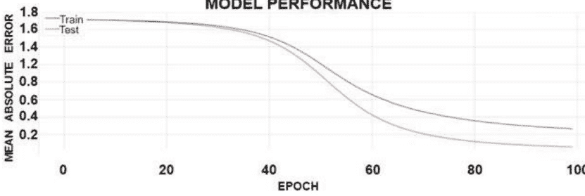
(a) 因子：50，优化器：SGD，学习率：0.0001
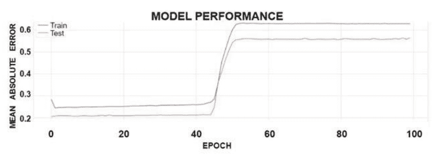
(b) 因子：100，优化器：RMSprop，学习率：0.001
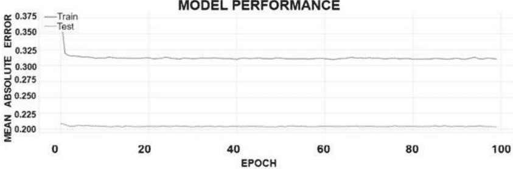
(c) 因子：50，优化器：Adam，学习率：0.001
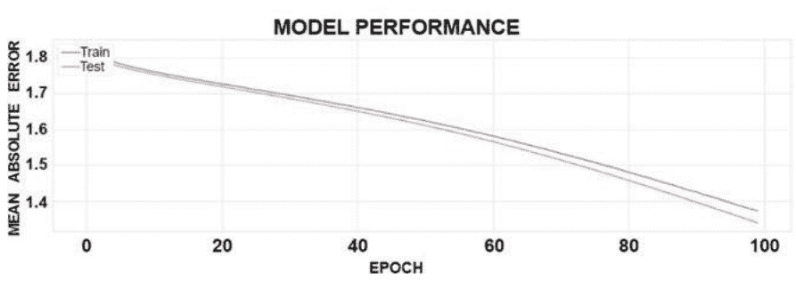
(d) 因子：20，优化器：Adagrad，学习率：0.0001
图6 最差表现的DNN架构

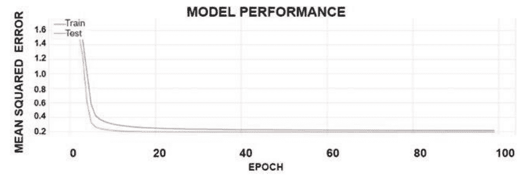
(a) 因子：50，优化器：SGD，学习率：0.0001
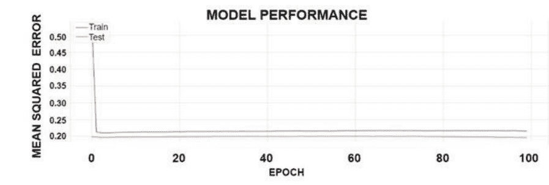
(b) 因子：100，优化器：RMSprop，学习率：0.001
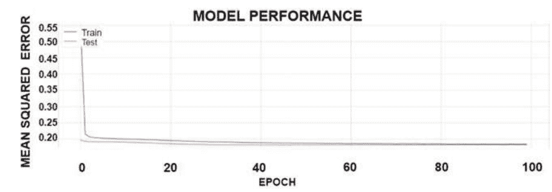
(c) 因子：50，优化器：Adam，学习率：0.001
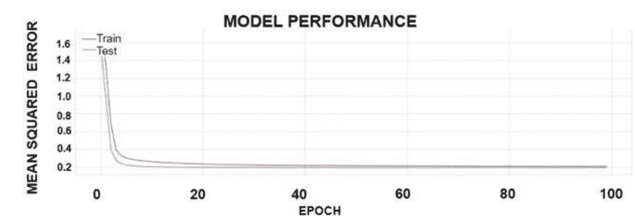
(d) 因子：20，优化器：Adagrad，学习率：0.0001
图7 最佳表现的DNN架构

#### 参考文献
- 1. 卢, J., 吴, D., 毛, M., 王, W., 张, G.: 推荐系统应用发展: 一项调查。决策支持系统 74, 12-32 (2015年)
- 2. Bag, S., Kumar, S.K., Tiwari, M.K.: 使用相关的Jaccard相似性进行高效的推荐生成。信息科学 483, 53-64 (2019年)
- 3. 刘, 华, 胖, 田, 朱: 一种改进协同过滤准确性的新用户相似性模型。基于知识的系统56, 156-166 (2014年)
- 4. 施, 罗, 尚, 顾: 基于协同过滤的长期演化系统中的推荐性能。 神经计算267, 635-643 (2017年)
- 5. 贝洛金, 桑切斯: 基于子序列匹配的协同过滤: 一种新方法。信息科学418, 432-446 (2017年)
- 6. 博巴迪拉, 奥尔特加, 埃尔南多, 古铁雷斯: 推荐系统调查。基于知识的系统46, 109-132 (2013年)
- 7. Sinha, B.B., Dhanalakshmi, R.: 随时间推移的推荐器范式优化演变。 J. King Saud Univ.-Comput. Inf. Sci. (2019年)
- 8. Luo, X., Xia, Y., Zhu, Q.: 基于正则化矩阵分解的增量协同过滤推荐器。知识基础系统， 27, 271-280 (2012年)
- 9. Bobadilla, J., Serradilla, F.: 稀疏性对协同过滤度量的影响。 在：第二十届澳大利亚数据库会议论文集，第92卷，第9-18页，2009年1月
- 10. Dhanalakshmi, R., Sinha, B.B.: 利用混合队列评级预测技术来提升推荐系统 (2019年)
- 11. Salakhutdinov, R., Mnih, A., Hinton, G.: 用于协同过滤的受限玻尔兹曼机。 在：第24届国际机器学习大会论文集，第791-798页，2007年6月
- 12. 杨, C., 白, L., 张, C., 袁, Q., 韩, J.: 连接协作过滤和半监督学习: 一种用于兴趣点推荐的神经方法。 在：第23届ACM SIGKDD国际数据挖掘和知识发现会议论文集，第1245-1254页，2017年8月
- 13. Sedhain, S., Menon, A. K., Sanner, S., Xie, L.: Autorec: 自动编码器与协作过滤相遇。 在：第24届国际万维网会议论文集，第111-112页，2015年5月
- 14. Strub, F., Mary, J.: 使用堆叠去噪自动编码器和稀疏输入的协作过滤。 在：NIPS电子商务机器学习研讨会，2015年12月15日。
- 15. 辛格, P.K., 辛哈, M., 达斯, S. , 乔杜里, P.: 使用Bhattacharyya系数和最相似项目提高基于项目的协作过滤的推荐准确性。应用智能。50 (12), 4708-4731 (2020年)
- 16. 吴, Y., 杜波伊斯, C., 郑, A. X., 埃斯特, M.: 协作去噪自编码器用于前n个推荐系统。 在第九届ACM国际网络搜索和数据挖掘会议上，第153-162页，2016年2月
- 17. 于, J.B.: 进化流形正则化堆叠去噪自编码器用于齿轮箱故障诊断。基于知识的系统。178, 111-122 (2019年)
- 18. 辛哈, B.B., 达纳拉克什米, R.: DNN-MF: 深度神经网络矩阵分解方法用于多标准推荐系统中的信息过滤。神经计算应用。1-15 (2022年)
- 19. 伦德尔, S., 克里切内, W., 张, L., 安德森, J.: 神经协作过滤与矩阵分解的再探讨 。 在第十四届ACM推荐系统会议上，第240-248页，2020年9月
- 20. 谭, Z., 何, L.: 一种受物理共振原理启发的基于用户协同过滤推荐系统的高效相似度度量方法。 IEEE Access 5, 27211-27228 (2017年)
- 21. 郭, G., 张, J., Yorke-Smith, N.: 一种新颖的贝叶斯相似度度量方法用于推荐系统 。 在：第23届国际人工智能联合会议，2013年6月
- 22. Abualigah, L.M., Khader, A.T.: 一种基于混合粒子群优化算法和遗传算子的无监督文本特征选择技术用于文本聚类。 J. Super-comput. 73（11），4773-4795（2017年）
- 23. Abualigah, L.M.Q., Hanandeh, E.S.: 应用遗传算法于信息检索中的向量空间模型。 Int. J. Comput. Sci. Eng. Appl. 5（1），19（2015年）
- 24. Ahn, H.J.: 一种新的协同过滤相似度度量方法，以缓解新用户冷启动问题。Inf. Sci. 178 (1)，37-51（2008年）
- 25. Ahire, J.B.: 人工神经网络手册：第4部分。Medium（2018年）。https://medium.com/@jayeshbahire/the-artificial-neural-networks-handbook-part-4-d2087d1f583e26.
- 26. Sinha, B.B., Dhanalakshmi, R.: 构建基于模糊逻辑的人工神经网络，提高推荐准确性。Comput. J. 63(1)，1624-1632（2020年）

## 基于图神经网络的视频推荐系统调查
Toshi Rawka和Mahipal Jadeja

摘要：推荐系统根据用户的兴趣来推荐内容。随着在线数据的大量增长，我们需要更多的推荐系统，并且在这个领域有很多工作正在进行。在线视频流媒体平台的推荐系统起着重要作用。80%的在线观看视频来自推荐。这个系统有很多工作原理。

由于大部分信息都以图形结构存在，而图神经网络（GNN）在表示学习方面具有专长，因此在推荐系统中利用GNN的领域正在扩展。本章提供了基于GNN的推荐系统和在该领域发展中的最新模型的知识。

关键词：推荐系统、图神经网络（GNN）、深度学习、标签排名、GraphSage、GAT-图注意力网络、GCN-图卷积网络

T. Rawka・M. Jadeja (✉)马拉维亚国立技术学院，印度拉贾斯坦邦，斋浦尔302017电子邮件：mahipaljadeja.cse@mnit.ac.in
T. Rawka电子邮件：2020pcp5532@mnit.ac.in
◎ 作者，独家许可给 Springer Nature Switzerland AG 2022T.-P. Hong 等人（编），深度学习用于社交媒体数据分析，大数据研究113，https://doi.org/10.1007/978-3-031-10869-3_8

#### 1 引言

推荐系统是一种预测用户或群体对物品喜好程度的系统。用户依赖推荐系统来帮助他们处理信息过载，并在庞大的选择范围中找到他们想要的东西（例如产品、电影、新闻或餐厅）。使用推荐系统的各种平台包括亚马逊、Flipkart、Youtube、Netflix、inshorts等等。

一种有效的推荐系统可以根据用户之前的互动（例如点击、观看、阅读和购买）准确预测用户的偏好，如图1所示。它们通过直接利用用户之前互动的对象来表示用户的偏好，因为它们能够高效地捕捉非线性的用户-视频关系和非平凡的用户-视频关系，并且轻松包含大量的数据资产，包括可见的、文本的和上下文的数据。在所有的推荐类别中，我们重点关注本章中的视频推荐。与文本和图像不同，视频通常包含更多消费者无法立即看到的信息。尽管标题和封面图像可以帮助表达电影中的重要观点，但静态摘要无法捕捉到用户对视频偏好的所有复杂性。

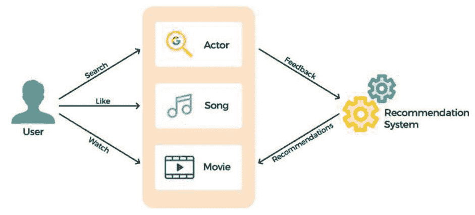
图1 推荐系统

视频推荐系统对用户和使用该系统的平台都有很多好处。其中一些好处包括：
- 1. 视频推荐系统帮助用户搜索感兴趣的视频。
- 2. 在线视频流媒体平台上的视频消费主要来自推荐，因此对于视频流媒体公司来说，一个良好的推荐系统至关重要。
- 3. 随着互联网上可用视频的数量不断增加，推荐系统成为必不可少的。

图神经网络是两个词或两个概念的结合：图和神经网络。图神经网络中最关键的是图。图是一组节点和边。神经网络帮助图像人类大脑一样思考。众所周知，图数据非常复杂，对现有的机器学习和深度学习方法构成了巨大挑战。

因此，试图最小化这个挑战的解决方案可以是直接应用于图的神经网络。现有的机器学习和深度学习方法专门针对固定大小和结构类似的图像，我们可以将其称为固定大小的网格图。还可以将线图表示为文本和语音。我们有更复杂的图，其中包含无序顶点的可变大小，顶点可以有不同的邻居。这对于现有的机器学习算法没有帮助，因为它有一个核心假设，即实例彼此独立。这使得图结构错误；每个顶点通过不同类型的链接/边与其他顶点相关联。

在商业应用和研究中, 使用深度学习模型进行推荐非常广泛且迅速增长。图神经网络（GNN）无疑是最吸引人的深度学习算法, 因为它具有处理复杂图数据的更大能力, 这对于推荐系统至关重要。 例如, 连接用户和物品节点的二分图可以用于描述推荐应用中的交互数据, 可以通过边表示交互。 根据用户行为序列, 物品的转换也可以在图中表示。 当包括结构化的外部信息, 例如用户之间的社交关系和与产品相关的知识图, 生成基于图的推荐任务的有用性变得更加明显。 GNN以这种方式为推荐系统中的众多异构数据建模提供了统一的视角。

本章的其余部分按照以下方式组织：第2节描述了推荐系统的基础知识和相关挑战, 第3节对潜在问题进行了深入研究。 第4节强调了基于GNN的视频推荐系统的需求。 第5节解释了基于最新技术的GNN方法, 用于视频推荐。第6节提供了这些方法的简要比较。 第7节简要介绍了潜在的应用场景, 第8节描述了该领域的数据隐私, 第9节总结了这项工作。 它还提到了相同领域的未来范围。

#### 2 视频推荐系统的基础知识和相关挑战

视频推荐是通过提取用户的个人资料和历史记录来推荐视频的一种方式; 然后根据用户的偏好和观看时间对视频进行排名。 许多大型公司都实施了视频推荐, 包括Netflix、亚马逊Prime和YouTube。推荐系统使用各种技术和算法向用户推荐相关的内容。 视频流媒体服务依赖于视频推荐系统来提供用户喜欢观看的视频。 用户和视频之间的关联是视频推荐的重要数据来源。 大多数现有的推荐系统根据用户的反馈 (例如观看和搜索活动) 计算视频的相关性。 传统上, 不使用深度学习概念的推荐方法包括聚类、最近邻和矩阵分解。 没有使用深度学习的推荐系统面临的问题是从用户的互动、附加信息中学习有效的用户/视频关系, 并解决冷启动问题 (每当向现有视频库中添加新视频时), 即为新添加的视频引导视频相关性评分, 这主要是由于用户与新添加的视频之间的互动非常有限。 本章解决了这个问题。

通过利用深度卷积神经网络来解决冷启动问题，讨论基于内容的视频推荐方法。基于深度学习的推荐系统由于能够处理非线性数据而优于传统推荐系统。本章讨论了基于深度学习的推荐系统的关键优势，包括非线性转换、表示学习、序列建模和灵活性。图神经网络（GNN）技术将节点信息与隐藏的拓扑结构相结合。由于在图数据学习中表现出色，GNN技术已广泛应用于许多领域，包括但不限于图像识别、自然语言处理。

#### 3 发现

许多研究人员提出了许多模型用于视频推荐。在本节中，我们将简要讨论所有相关模型。首先是使用基于内容的过滤的方法，该方法使用KNN模型和余弦相似度；这种相似度比其他相似度度量提供更准确的结果，由Ramni Harbir Singh等人在[1]中提出；此外，在电影推荐系统中，该相似度度量的运行复杂度相对较低。接下来是MOVREC，这是一个使用协同过滤方法的电影推荐系统，由D. K. Yadav等人在[2]中提出；在此方法中，从用户处提供显式信息并进行观察。推荐的项目按照最高评分的顺序进行排列。由于提出的基于内容和基于协同的过滤模型都有其局限性，Luis M Capos等人在[3]中提出了一个使用贝叶斯网络的模型。Harpreet Kaur等人在[4]中还讨论了混合推荐，这是基于内容和基于协同的综合方法。该模型减小了两种方法的局限性。

用户-项目特定信息通过Utkarsh Gupta等人使用chameleon [5]进行聚类。这通常是一种基于层次聚类的高效技术，用于推荐系统。所提出的方法减小了误差，并更好地对可比较的项目进行了聚类。Urszula Kuelewska等人还建议使用聚类概念来进行更好的推荐；基本上，他们提出并评估了基于质心解决方案和协同过滤的组合，与仅基于质心的方法相比，准确性有了显著提高。

用户配置文件信息、观看历史以及涉及其他网站的项目评分数据被用于聚合相似性计算，以进行独特的推荐，忽略用户特定的数据。总之，视频推荐系统的模型基于特征信息，即关键词、类别、偏好、配置文件、评分、喜欢等。根据这一点，视频推荐系统主要使用四种类型的算法：简单推荐系统、内容推荐系统、协同推荐系统和混合推荐系统。

##### 3.1 简单推荐系统

简单推荐器为正在热门的用户或最受欢迎的用户提供推荐。在这种推荐中，假设更受欢迎或处于趋势中的视频具有更多的评分，并且用户更有可能喜欢这些视频。这种推荐模型无法根据用户的兴趣提供个性化推荐。这个模型的实现非常简单。需要根据关键元素的评分和受欢迎程度对视频进行排序，并从评分最高的视频列表中得出结果。当用户想要获取热门视频列表时，这种方法是合适的。它存在严重的局限性，即不考虑用户的个人资料和口味，给每个人提供相同的推荐。

##### 3.2 基于内容的推荐系统

在这个系统中[6]，假设如果用户对过去的某个项目感兴趣，那么它也可能对将来的项目感兴趣。这个系统的主要内容是用户过去的数据，直接与用户互动或间接询问用户的兴趣。当内容不足以准确分类视频时，它的性能较差。在这种类型的推荐系统中，需要足够的评分才能进行准确的推荐。然而，如果有一个新用户，他还没有对任何项目进行评分，那么这个系统就不起作用了。

与过去的观看历史不同，用户根据他们的评分或明确的搜索，会得到一个类似项目的推荐或建议。在这种类型中，创建的是电影配置文件，而不是用户配置文件。这被称为基于项目的过滤，而不是基于用户的过滤。内容过滤系统中的建议并不意外或令人惊讶。它也无法判断电影的质量[7]。例如，如果两个项目使用相似的词语，它无法区分好的项目和差的项目。对于系统来分析电影的质量是困难的，因为它取决于每个用户的兴趣、口味、框架、想法等核心特征。

##### 3.3 协同过滤推荐系统

到目前为止，我们讨论的内容并没有提供良好的个性化推荐。当任何用户查询时，系统会收到一个类似的视频推荐；它会忽略他们的数据。这种协同方法[8]与我们之前看到的模型非常不同，它还涉及其他用户。它假设相似的用户喜欢相似的视频。与基于内容的方法相比，这提供了更好的推荐预测。 YouTube、Netflix和Prime Video都使用这个模型来进行推荐。那么，现在的问题是如何识别两个用户是否相似。为此，考虑两个用户观看的视频，并检查他们对视频的评分。然后，如果我们需要预测未见过的视频的评分，可以查看相似用户的选择。一些重要的协同过滤模型包括：
- 1. KNN：KNN是一种机器学习方法，用于根据标准类型的评分找出相似用户的群集，并根据数学概念对评分进行平均，并推荐前k个最近的邻居。它属于协同过滤系统，利用用户的行为来推荐不同的视频。它们可以是基于用户或基于项目的。
- 2. 主成分分析（PCA）：这也是一种协同过滤方法，用于计算不同用户之间的有效相似性，并使用视频推荐的特征。该模型使用三个指标来计算统计误差，即均方根误差（RMSE）、平均绝对误差（MAE）和均方误差（MSE），并使用召回率、精确度和F值进行性能分析。
- 3. 矩阵分解：矩阵分解[12]是传统推荐系统中使用的一类协同过滤模型。它将用户-物品关系矩阵分解为两个低维矩阵的乘积。

协同过滤的缺点：协同过滤存在冷启动问题，即当新用户进入系统时，很难为其做出推荐。因此，在这些情况下，用户尚未对任何物品进行评分，因此推荐系统无法预测他们的兴趣。

此外，这可能面临垃圾邮件攻击等攻击；这些攻击主要由有意误导系统以推荐特定产品的用户发起。一个问题 是评分矩阵的稀疏性；在大多数推荐系统中，用户不会对每个物品进行评分，因此评分矩阵中的大部分单元格为空。在这种情况下，识别不同用户或物品组之间的相似性会带来挑战。

即使在存在这样的群体的情况下，要向任何群体推荐不给出任何反馈（如肯定或否定）的最终用户仍然是一个挑战。

奇异值分解（SVD）：正如我们所看到的，矩阵的稀疏性是协同过滤方法中的问题，模型必须表示用户和项目之间的预期行为以处理此问题。主要思想是将推荐系统的问题转化为直接处理非常频繁变化的大数据集的更简单的问题。还可以看到模型对每个用户的物品评级的预测有多好。通常使用均方根误差（RMSE）。当RMSE较低时观察到更好的性能。潜在因素是一种有前景的方法，它暗示了用户或项目的概念。如果谈论电影，电影类型通常可以用潜在因素来表示。奇异值分解提取潜在因素，从而降低了效用矩阵的维度。实质上，每个用户和项目都被映射到一个具有大小的潜在空间中。它有助于正确理解最终用户和项目之间的连接，因为可以进行一对一的比较。

##### 3.4 混合推荐系统

在基于内容的推荐系统中，没有用户协同交互，因为任何用户都会被推荐观看类似电影的相同集合。同时，在协同过滤中，用户观看的电影之间没有关联。如果用户喜欢观看动作电影，推荐系统将无法捕捉到他的类型兴趣。因此，混合电影推荐系统的想法应运而生，它试图同时使用内容和协同过滤方法，结合两者的优点并消除缺点，为用户提供推荐。

图神经网络对推荐系统有益，因为它关注内容信息（用户、项目特征）和图结构（用户与项目的交互，例如视频）[13]。相比之下，传统模型通常只使用其中之一。下一节将介绍我们为什么需要基于图的推荐以及如何实现。

#### 4 为什么我们需要基于GNN的视频推荐系统？

图神经网络（GNN）[14]在过去几年中出现，并在许多领域中对表示图结构非常有帮助。目前，推荐领域中的大多数数据被定义为图结构。因此，为了更好地预测，可以利用GNN技术。以前，数据之间的关系可以用矩阵表示，但有时数据可能是稀疏的。创建一个二分图（如图2[13]所示）来说明终端用户和项目顶点之间的关系，其中链接/边表示相应终端用户和项目之间的关系。之后，一系列项目被转换为一系列

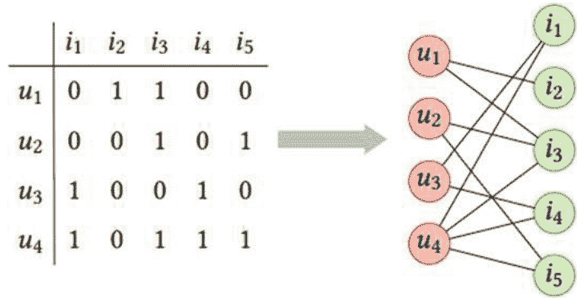

##### 图3 序列图[13]


##### 图4 用户之间的社交关系[13]


或者序列图，其中每个项目都与一个或多个后续项目相关联，如图3所示[13]。

将序列数据转换为序列图使其更具多功能性，适用于项目之间的关联。其他信息包括社交图；知识图也可以表示为图，如图4所示[13]。

在一般推荐中，通常考虑成对交互以了解用户/项目的表示。然后，对于顺序推荐，将序列模型转换为序列模式以了解用户的喜好并预测更好的推荐，因为用户的偏好可能会根据他们的心情、地域、行为等而变化。

为了在推荐系统中有效利用该序列模式以获得更好的结果，这是一个巨大的挑战，GNN模型设计应运而生以解决这个挑战。一般推荐的作用是学习有生产力的节点表示，即用户/项目的表示，因为用户/项目在图中表示为节点，并预测用户对项目的偏好。序列表示是顺序推荐的原因。模型学习信息丰富的图表示，从个体信息（顶点或节点信息）和边信息（关系信息）中学习，并结合利用普遍存在的社交网络和知识图的模型，使得GNN成为推荐的有希望的解决方案。

这种GNN技术广泛分为图卷积网络、GraphSAGE和图注意力网络。这进一步分为各自的模型：轻量级GNN、DualGNN、多模态图卷积网络（MMGCN）、基于标签排序的、概念感知去噪图神经网络、图精炼卷积网络、邻居感知图注意力网络、上下文相关的基于视频推荐的传播。还有很多其他模型也被提出用于这种推荐，我们通过一些讨论过的模型进行总结。

## 视频推荐的5个GNN模型

##### GCN模型

图卷积网络在视频推荐系统中有很多模型。其中一个模型是LightGCN。LightGCN的出现是为了简化GCN中不必要的组件[15]，主要是特征转换和非线性激活在推荐中的使用。在过去，GCN方法背后的关键思想是通过使用图特征来学习节点的表示。为了实现这一点，LightGCN反复执行图卷积，对邻居的特征进行求和，从而得到目标节点的新表示。传统的矩阵分解方法直接将唯一ID映射到其嵌入。可以通过增加用户ID以及她的历史交互作为输入来提高嵌入的质量。简单的关键好处在于更具可视化性，实际上更可靠地学习和维护。从技术角度来看，这种模型简单易懂，容易分析模型行为并对其进行改进以获得更有效的指导。

另一种GCN模型是MMGCN [16]，它代表多模态图卷积网络。神经图网络的一个概念是消息传递，它在这种框架中被使用，用于更好地捕捉用户偏好。可以使用模型特定的用户和视频描述。这在每种模态下构建了一个用户-项目二分图，同时试图增强每个节点和拓扑特征以及邻居结构的表示。

DualGNN是另一个用于推荐视频模型，它关注单模态和多模态表示两个方面。为了克服Dual-GNN的局限性，[17]提出了一个全新的框架用于多媒体推荐（称为DualGNN）。DualGNN在用户-视频二分图和用户共现图上工作，加强了用户之间的相关性，以共同挖掘所有用户的特定融合样本。

##### GraphSAGE模型

基于标签的视频推荐方法中，标签排序模型[18]也在早期的工作中提出。那时，视频只能通过标签来查看或处理，忽略了内容，但是通过图神经网络，这得到了改进。我们知道视频附有多个标签，并且除了其他属性，这些标签用于突出视频内容。该模型呈现了标签候选视频的个性化标签列表。为了提高视频标签的点击率和观看时间，模型应该吸引用户点击额外的标签，明确提供他们感兴趣的标签频道，并观看更多与标签相关的视频。模型应该考虑用户对标签和视频的兴趣。基本上，为了改善视频和标签，邻居相似性概念被用来编码异构节点表示中的用户选择。这将得出结论，该模型使用包括视频、标签和用户的动态或不同关系的异构网络进行了提出。

概念感知去噪图神经网络（CONDE）被提出[19]用于视频推荐，解决了信息冗余挑战。在视频推荐系统中，系统从标题和与视频相关的评论中提取或捕获概念，充分利用文本信息进行推荐模型。同样，借助用户、视频和概念节点的帮助，构建了一个异构三部图。三部图是因为用户可以与多个视频建立关系或互动，并且每天会收到大量评论，既不是所有视频，也不是视频的所有概念都能准确反映用户的偏好。因此，提出了一种图神经网络来个性化去噪概念，以获得用户和项目之间的关系。GraphSAGE[20]的结果呈现了具有项目和用户直接连接的同质图，无法弥补噪声信息的负面或错误影响。同时，构建项目到项目和用户到同质用户图以及项目-概念的连接在信息利用和聚合方面，相对于图注意力网络（GAT），分层注意力网络在性能改进方面更加强大。

多媒体和隐式反馈的一个推荐模型是在[21]中提出的图细化卷积网络。我们知道表示学习中的一个概念是图采样。当具有丰富的节点属性、用户-项目图中的可训练函数和隐式反馈图采样用于预测用户和项目之间的关系时，这个概念非常有用。该模型经过训练并沿着图传递消息，并收集它们以刷新每个节点的表示。传统上，GCN-based推荐中面临的隐式反馈问题，在图卷积操作中为高级用户-项目交互图提供了解决方案。在交互图中，它识别错误的正反馈并最小化相应的噪声边。还观察到消息传递、节点表示和聚合过程的概念不是清晰的信号。换句话说，我们可以说它不直接复制图中的本地结构信息中的用户偏好模式构建与隐式反馈。

##### GAT模型

大多数基于GNN的推荐模型考虑完整的协作多跳邻居信息以增强性能，但基于此类类型的模型没有考虑关系信息。关系信息可能包括邻居之间不同表达的差异。每个邻居用户的影响通过物品和用户邻居物品之间的相关性来解决物品偏好的表示。在图嵌入聚合中，建模邻居的内部相关性。使用一种称为NGAT4Rec的邻居感知图注意力网络来执行推荐任务。在该模型中，一层被称为邻居感知图注意力层。该层通过计算这些邻居之间的成对注意力，为给定节点的不同邻居提供各种邻居意识注意力的系数。该模型根据邻居感知注意力的相应系数对邻居的嵌入进行求和，为每个节点生成后续层的嵌入。此外，它还整合了一个更加邻居感知的图注意力层，以积累来自多跳邻居的强信号。它消除了在协作过滤中无用的非线性激活和特征转换。

提出了一种视频推荐模型[23]，称为CDPRec，即上下文相关传播推荐系统。这是一个包括异构信息网络(HINs)和多模态内容的神经网络。单词内容通常是视频；然后，这个神经网络自然而有效地输入到推荐系统中。该模型试图克服某种方法的缺点。这种基于路径的相似性引入了上下文相关传播，这意味着模型自动或自我传播用户的偏好，并探索异构信息网络中的层次内部依赖关系。为了对点击率进行直接预测，该模型提出了编码的概念；它将上下文编码为视频的完整嵌入。编码是从视频上下文到视频嵌入的过程。在强基线的基础上，该方法在真实的YouTube数据示例上进行了实验，证明了改进和结果。

## 不同模型的比较

本节简要比较了模型，即GraphSAGE、MMGCN、GAT。用于比较的数据集是Movielens(https://movielens.org/)。这个数据集主要用于个性化推荐，所以我们也使用这个数据集来比较我们的模型。为了衡量视频推荐系统，从视频中提取了音轨、关键帧和视频特征的集合。使用一些最初训练的深度模型[24]，去除了图像、音频或声音和文本模式，并在表1中展示了结果。

| 模型 | 精确度 | 召回率 |
|---|---|---|
| 视觉 | 0.0633 | 0.2545 |
| 声音 | 0.0621 | 0.2540 |
| 文本 | 0.0611 | 0.2531 |

使用GraphSAGE [21]类型模型来预测视频和用户之间的关系和互动。其中，使用隐式反馈创建用户-物品图。

还使用了MMGCN [21]模型。它有助于存储相关的聚合函数，通过这些函数将消息传递到图结构中以进行刷新。

| 模型 | 精确度 | 召回率 |
|---|---|---|
| GraphSAGE | 0.0496 | 0.1984 |
| MMGCN | 0.0581 | 0.2345 |
| GAT | 0.0569 | 0.2307 |

每个节点的表示。它还从隐式反馈中学习，并猜测用户对已观看和未观看视频的预测。这通常基于模型特定的用户偏好，即学习用户和物品之间的直接内容信息交换。这在某种程度上是基于内容的。

第三种类型的模型是GAT。这种类型的模型会自动训练并为每个节点的邻居指定不同的权重。除了训练结果外，该模型还会消除从邻居获取的信息中的噪音，从而有效改善个性化推荐。

正如我们所知，精确度和召回率是衡量模型性能的两个主要指标。精确度被定义为查准率，而召回率是查全率的度量。所有模型在这两个元素方面的情况都显示在表2中。

##### 6.1 解决冷启动问题

正如之前讨论的，冷启动问题是指任何新事物进入现有系统，导致用户和项目之间的互动困难。这个问题可以从两个方面理解：第一个是用户冷启动问题，即添加了一个新用户进行互动；或者是项目冷启动问题，即添加了一个新项目进行互动。为此，还需要明确的反馈，以便每当有新项目出现时，它与一些属性相关联，从而吸引用户。正如我们所观察到的，许多GNN模型，包括GCN、GraphSAGE、GAT，都被用于视频推荐系统，并建立在用户和项目的双向图上。这些模型基于隐式反馈，因为它们是一种要求评分的技术，不适用于现实世界的冷启动场景。

表1 剪枝操作对Movielens数据集的影响 (视觉、声音和文本)
表2 GraphSAGE、MMGCN和GAT的性能比较

#### 7 应用

本节简要介绍了视频推荐系统的潜在应用场景。该领域的各种应用包括YouTube、Netflix、Prime Video、Disney+ Hotstar、Instagram Reels、Facebook等。这些系统的主要目标是提供个性化推荐，帮助用户找到他们感兴趣和相关的视频。其背后的思想是定期更新推荐引擎，并跟踪用户的最近活动。换句话说，该系统的主要目标是让用户享受和参与特定平台，以保持娱乐。该系统观察到用户观看的大多数视频很可能是系统推荐的视频。根据地区、语言、心情和许多其他特征可以进行推荐。

#### 8 数据隐私

推荐系统收集用户的个性化信息，根据他们的兴趣建议项目，因此系统获取的个人数据是易受攻击的，应该加以保护。换句话说，需要保护的数据非常重要。因此，推荐系统的主要思想是在不泄露任何身份信息的情况下合理利用数据。一项调查讨论了图数据上动态隐私保护的推荐。

隐私由一项名为通用数据保护条例 (GDPR) 的法规来保护。

#### 9 结论和未来展望

由于丰富的特征，我们可以看到在推荐系统中，移向图神经网络会带来更显著的改进。在协同信号和顺序模式的图表示中训练和预测模型，在推荐系统中，这种技术非常有益。本章讨论了包括基于内容和基于协同的方法在内的各种方法，并采用了GNN方法使推荐系统更加有效。此外，还讨论了模型的比较，我们可以观察到MMGCN相比其他两个模型具有更高的精度。本章对最新的推荐工作进行了详细讨论。还讨论了一些分类方法来整理当前现有的结果。

众所周知，几个用户可能会随着时间的推移而改变。在现实世界的推荐系统场景中，几个项目也可能会发生变化或添加/删除，用户和项目之间的隐含关系也可能随时间而变化。因此，为了保持记录更新的建议或推荐，推荐系统应该不断更新以适应新的信息到达。从图的结构来看，不断更新的信息使得图变得动态而不是静态。这个动态图对结构来说是一个挑战。

此外，如果用户错误地点击了物品，社交关系可能无法捕捉到。因此，在这种情况下，入侵者也可能向推荐系统中插入虚假信息。由于GNN对噪声数据的敏感性，关于GNN领域的知识正在不断涌现。一些基于GNN的现有模型关注对抗学习，这也是一个未来的方向，以建立一个强大的模型。存在着一个包含数十亿或数万亿个顶点和边的巨大市场数据集。每个顶点都有数百万个特征；由于内存使用量大和训练时间长，普通的GNN现在变得具有挑战性。我们可以通过减小图的大小或不断改变模型设计来实现高效的GNN。在推荐系统中，图包含各种类型的节点和节点之间的关系，这是图中的主要内容，我们称之为异质性。此外，考虑到异质性的方法总是面临更多的计算挑战，因此需要更多的研究来提高计算效率。

#### 参考文献

- 1. 辛格，R.，莫里亚，S.，特里帕蒂，T.，纳鲁拉，T.，斯里瓦斯塔夫，G.：使用余弦相似度和KNN的电影推荐系统，第2249-8958页（2020年）
- 2. 库马尔，M.，亚达夫，D.，辛格，A.，古普塔，V.K.：文章：电影推荐系统：Movrec. 国际计算机应用学报124，第7-11页（2015年）
- 3. 德坎普斯，L.M.，费尔南德斯-卢纳，J.M.，胡埃特，J.F.，鲁埃达-莫拉莱斯，M.A.：结合基于内容和协同推荐的混合方法：基于贝叶斯网络的混合方法。国际近似推理杂志51（7），第785-799页（2010年）
- 4. Harpreet Kaur Virk, E.A.S., Maninder Singh, Er.: 混合在线电影推荐系统的分析与设计。在：国际工程和技术创新杂志（2015年）
- 5. Gupta, U., Patil, N.: 基于层次聚类算法Chameleon的推荐系统。在：国际先进计算会议 (IACC) （2015年）
- 6. Furtado, Singh, A.: 使用机器学习的电影推荐系统。Int. J. Res. Indus. Eng. 9(1), 84-98 (2020)
- 7. Uluyagmur, M., Cataltepe, Z., Tayfur, E.: 使用不同特征集的基于内容的电影推荐。在：世界工程与计算机科学大会论文集，卷1，第17-24页（2012年）
- 8. Subramaniyaswamy等：基于协同过滤的个性化电影推荐系统。Int. J. High Perform. Comput. Netw. 10(1-2), 54-63 （2017年）
- 9. Ahuja, R., Solanki, A., Nayyar, A.: 使用K-Means聚类和K-最近邻的电影推荐系统。在：2019年第9届云计算、数据科学&工程国际会议（Confluence）。IEEE，第263-268页 (2019年)
- 10. Hug, N.: Surprise：一种用于推荐系统的Python库。J. Open Source Softw. 5, 2174 (2020)
- 11. Manimurugan, S., Almutairi, S.: 一种基于用户的视频推荐方法，使用CAC过滤，PCA与LDOS-CoMoDa。在：超级计算杂志，第1-15页（2022年）
- 12. Duan, R., Jiang, C., Jain, H.K.: 结合基于评论的协同过滤和矩阵分解: 解决评分稀疏问题的方法。在: 决策支持系统, 第113748页 (2022年)
- 13. Wu, S., 等: 推荐系统中的图神经网络: 一项调查 (2020)。arXiv:2011.02260
- 14. 高亮等: 推荐系统中的图神经网络: 挑战, 方法和方向 (2021)。arXiv: 2109.12843
- 15. He, X., 等: LightGCN: 简化和增强图卷积网络用于推荐。在: 第43届国际ACM SIGIR会议论文集 (2020年)
- 16. Wei, Y., 等: MMGCN: 多模态图卷积网络用于个性化视频推荐。在: 第27届ACM国际多媒体会议论文集 (2019年)
- 17. Wang, Q., 等: DualGNN: 用于多媒体推荐的双图神经网络。在: IEEE多媒体交易 (2021年)
- 18. Liu, Q., 等: 用于标签增强视频推荐的图神经网络。在: 第29届ACM国际信息与知识管理会议论文集 (2020年)
- 19. Liu, Y., 等: 用于视频推荐的概念感知去噪图神经网络。在: 第30届ACM国际信息与知识管理会议论文集 (2021年)
- 20. Hamilton, W., Ying Z., Leskovec J.: 大规模图上的归纳表示学习。Adv. Neural Inf. Process. Syst. 30 (2017年)
- 21. Wei, Y., 等: 基于图的细化卷积网络在多媒体推荐中的应用隐式反馈。在: 第28届ACM国际多媒体会议 (2020年)
- 22. Song, J., 等: NGAT4Rec: 面向推荐的邻居感知图注意力网络 (2020)。arXiv:2010.12256
- 23. Sang, L., 等: 多模态异构信息网络中基于上下文依赖的传播式视频推荐。IEEE Trans. Multimed. 23, 2019-2032 (2020)
- 24. Lund, J., Ng, Y.-K.: 使用深度学习方法进行电影推荐。在: 2018年IEEE信息重用和集成国际会议 (IRI)。IEEE, 第47-54页 (2018年)
- 25. Purificato, E., Wehnert, S., De Luca, E.W.: 学术图数据上的动态隐私保护推荐。计算机 10(9), 107 (2021年)

# 使用深度学习技术对社交媒体数据进行精确分析

Toshita Sharma, Rrubaa Panchendrarajan和Akrati Saxena

**摘要** 社交媒体已成为在线用户与朋友和关注者分享观点、思想、意见和情感的最简单和最受欢迎的选择。共享内容对于对个人的个性做出有价值的结论非常有帮助。如今，全球的研究人员正在收集社交媒体数据，以了解社交媒体用户的心理健康状况。心理疾病是当今社会的一大关注焦点，如果不采取有效的方法，它很快就会转变为自杀的想法。对这种心理健康状况的早期检测为有效的社会干预提供了一种潜在的途径。这为研究界提供了自动确定用户生成内容中的各种心理健康状况（如焦虑、抑郁和近乎自杀的想法）的机会。深度学习技术在这一研究领域中得到了广泛应用，以更好地了解社交网络平台上用户的心理健康状况。在本章中，我们对使用深度学习技术从社交媒体数据中识别各种心理健康状况的研究工作进行了全面回顾。我们讨论了检测不同类型心理健康状况（如焦虑、抑郁、压力、自杀和厌食症）的方法。我们还提供了这些研究中使用的数据集的详细信息。本章以有希望的未来方向作为结论。

**作者信息：**

T. Sharma
Nirma大学技术学院，印度艾哈迈达巴德

R. Panchendrarajan
斯里兰卡信息技术学院，马拉贝，斯里兰卡
e-mail: rrubaa.p@sliit.lk

A. Saxena
数学与计算机科学系，埃因霍温科技大学，荷兰埃因霍温
e-mail: a.saxena@tue.nl

#### 1 引言

心理疾病已被证明是全球心理健康状况恶化的主要原因。全球每年约有2.64亿人受到单纯抑郁症的心理疾病影响[1]。更令人困惑的是，对于中低收入国家，约有76%至85%的人无法获得与心理疾病相关的任何治疗[2]。进一步的研究[3]表明，在一年内发生重大抑郁爆发的可能性对于男性约为3-5%，而对于女性则更高，约为8-10%。随着COVID-19的动荡，患有心理疾病的患者数量恶化。尽管患有这种疾病的患者数量逐渐增加，但全球范围内的护理和治疗仍然不足。

随着互联网的出现，人们越来越多地使用社交媒体平台，如Reddit、Twitter和Facebook，与朋友和家人分享他们的感受、想法和观点。这些想法大多是真实的，因此它们提供了一个优秀的数据来源，可以用来研究和进一步分析用户的心理健康状况。用户表达的负面情绪也可能提供关于他们心理健康状况的见解，如抑郁、焦虑、压力、自杀意图、暗示厌食症等。由于心理健康问题被证明是限制人们的一些主要疾病，从社交媒体上积极分享的内容中确定心理健康状况可能非常重要。这些数据有助于早期检测用户的心理疾病，并提供所需的干预措施。这激发了研究界开发解决方案，通过用户的社交媒体内容自动确定其心理健康状况。

过去几年中，已经出现了许多研究解决方案，使用社交媒体数据预测用户的心理健康状况[4]。他们从在线社交媒体平台提取了大规模数据集，然后使用从传统机器学习算法到深度学习技术的各种技术来训练模型，以预测不同的心理健康状况。随着采用深度学习解决方案来确定心理健康状况，甚至使用简单的深度学习架构也能产生最先进的模型。本章回顾了将深度学习技术应用于从社交媒体中提取的数据来识别心理健康状况的最新方法。我们根据心理疾病对这些工作进行分类，包括压力检测、焦虑检测、抑郁检测、厌食症检测和自杀预测，这些都是基于不同的深度学习技术。

## 2 心理健康检测技术

在接下来的小节中，我们将讨论使用各种深度学习技术进行心理疾病检测的文献。

### 2.1 压力检测

压力是人们中最常见的心理疾病之一，约占工作人群的73%，据报道工作是这种疾病的主要原因。据报道，45%的大学生因压力而寻求咨询和治疗。例如，以下Reddit用户发布的帖子表达了他/她因担心工作而遭受的压力以及被朋友忽视的压力[5]。

> 我还有其他事情发生-生活缺乏方向，对找工作感到紧张，为了工作和实习而忽视朋友而感到孤独。

压力还可能导致其他几种疾病，如糖尿病、增加酸反流风险和心脏病。如果能够在早期阶段检测到压力，那么可以避免或在初期治疗许多随之而来的健康并发症。

林等人[6]研究了从三个主要社交平台（腾讯微博、新浪微博和Twitter）中检测压力的方法。他们进行了一系列分析，以展示用户的压力模式，这可以通过微博来显示。该研究主要关注以下几个方面：（i）内容相关性-非压力和压力微博的内容差异，（ii）社交参与相关性-通过评论、点赞和互动创建的非压力和压力用户之间的差异，以及（iii）行为相关性-两种类型在频率和发布时间上的差异。利用这三种相关性作为特征，开发了一个带有交叉自编码器的卷积神经网络，用于预测微博中的压力。

所提出的模型与基准模型进行了比较，包括朴素贝叶斯、随机森林、支持向量机和深度神经网络。作者得出结论，使用从微博中提取的数据来检测心理压力的结果是令人鼓舞和准确的。

Hasan等人使用Facebook和Twitter数据进行了类似的分析[7]。作者定义了两组特征，即推文级属性和用户级属性，用于训练神经网络。推文级属性包括语言特征，例如传达积极或消极情绪的词语[8]，以及其他社交关注因素，例如帖子是否被喜欢。用户级属性是从发布行为中提取的，并且使用用户每周发布的内容生成社交互动。作者开发了一个由因子图和CNN组成的混合模型，用于确定用户是否感到压力。结果非常有希望，F1分数方面的改进达到了6-9%，超过了现有方法。作者全面研究了压力状态与社交互动行为之间的关系。他们观察到，压力用户的社交结构往往连接稀疏且不太复杂，而压力用户的稀疏连接社交结构数量比非压力用户高出14%。

- 1 https://medalerthelp.org/blog/stress-statistics/.

### 2.2 焦虑预测

术语焦虑和压力经常被互换使用，因为它们都是情绪反应。然而，压力是对一种情况中的威胁的反应，而焦虑则是由于压力而产生的。焦虑症的几个潜在原因包括过度使用药物或由于工作压力或个人生活引起的情况。家族史和遗传学在确定压力的程度上也起着重要作用，而应对这种压力的不足机制可能进一步导致焦虑。仅在美国，每年有4000万成年人受到焦虑的影响。2. 令人惊讶的是，鉴于如此多的患者，不到一半的受影响人群接受治疗。Shen和Rudzicz[9]提出了使用深度学习进行焦虑预测的早期研究之一。作者试图确定Reddit平台上用户帖子中的焦虑。他们生成了多个特征，包括(i)使用连续词袋(CBOW)模型的词嵌入，(ii)使用潜在狄利克雷分配(LDA)提取的主题，(iii)词汇-句法特征(LIWC)[10]，以及(iv)使用语言模型获得的单词和双词组的可能性。作者将SCM和逻辑回归(LR)作为基准模型与开发了两个隐藏层的神经网络进行了比较。通过使用N-gram概率和LIWC [10]的组合，作者获得了神经网络分类器的98%的准确率。他们的实验得出结论，焦虑与特定主题（如饮酒和学校）有很高的相关性。作者进一步强调了使用更大的数据集以及诊断标准或健康记录的潜在未来工作。

Tyshchenko等人[11]还在在线论坛上进行了一项焦虑症研究，使用了从BlogSpot上获取的数据。作者们尝试了一种卷积神经网络架构，这是基于Kim等人[12]提出的网络的一个衍生版本。与通常较短的社交媒体帖子相比，论坛帖子可能包含较长的讨论内容。因此，作者们扩展了他们的研究，以调查帖子的长度（以字数计）如何影响分类器的性能。实验结果显示，当论坛帖子较短时，分类器更好地预测疾病，而随着长度的增加，准确性下降。作者们提出了面向数据的改进和使用分层注意力网络来预测焦虑症的未来工作。

- 2 https://adaa.org/understanding-anxiety/facts-statistics.

> 孤独不是孤单，而是感觉没有人在乎。#孤独 #沮丧

抑郁症影响着广泛的年龄群体，主要影响15到30岁的群体。接下来，我们介绍了关于抑郁症检测的最新研究成果，并根据使用的深度学习模型对这些研究进行了分类。

#### 使用CNN进行抑郁症检测

卷积神经网络（CNN）在图像分类方面的性能表现出色，因此该模型被广泛应用于包括文本分类在内的各种任务中。Kim等人[14]使用CNN对用户的帖子进行抑郁症分类。CNN模型的架构包括嵌入层、卷积层、最大池化层、密集层和输出层，输出结果为二元分类的结果。数据集是从Reddit频道收集的，经过了停用词去除和分词处理。为了解决压力和非压力类别的不平衡问题，作者使用了合成少数类过采样技术（SMOTE）[15]。作者使用F1分数、精确度、召回率和准确度这四个指标比较了CNN模型和XGBoost模型。CNN模型的准确度达到了75.13%，而XGBoost模型的准确度为71.69%。

Yates等人[16]在Reddit平台上进行了类似的研究。作者创建了一个名为Reddit自报抑郁症诊断（RSDD）的大规模数据集，其中包含超过9000个Reddit用户。用于检测抑郁症的模型是一个两层的CNN架构，第一个CNN层的输入是用户的帖子，输出使用softmax激活函数进行结论。该模型与FastText分类器[17]和SVM分类器[18]进行了比较。以召回率和F1为指标，CNN模型在被诊断为抑郁症的用户上表现出了明显的优势，得出结论认为该模型提供了一种确定表明抑郁状态的帖子的强有力方法。

Trotzek等人[19]研究了使用Reddit帖子数据集进行早期抑郁症检测。作者利用CLEF 2017会议eRisk试点任务中发布的数据集进行早期抑郁症检测[20]。使用多个全连接层后的CNN模型用于对帖子进行分类。作者尝试了两种不同的词嵌入模型，fastText和Glove，将帖子的文本转换为向量表示输入到分类器中。实验结果表明，基于CNN的架构与fastText相结合的性能优于其他提出的解决方案和现有方法的组合。作者提出了一种可能的改进抑郁症检测任务的方法，即使用最近发布的语言建模方法，如BERT，作为网络的输入。

穆斯塔法等人通过推特帖子进行了细粒度的抑郁症分类[21]。作者使用CNN架构将推特帖子分为抑郁症的三个不同类别：低、中、高。‘高’级别表示用户感到内疚、无价值感和自杀倾向。焦虑、疲劳和情绪波动被视为中度抑郁症状。季节性情感障碍和感觉有人伤害你被归类为低抑郁水平。

作者收集了179名抑郁症患者的数据，每个用户平均发帖量为200到300条。推文经过了各种预处理技术，包括归一化、停用词去除和分词。使用TF-IDF方法计算标记的权重。根据权重的升序对单词进行排序。使用权重较高的前100个单词训练了一个CNN模型，在确定抑郁症水平方面获得了91%的准确率。

#### 使用RNN进行抑郁症检测

循环神经网络（RNN）在文本分类任务中非常流行，因为它们可以有效处理序列数据。

早期采用RNN进行抑郁症检测的研究之一是由Paul等人进行的[22]。作者旨在通过Reddit用户的帖子和评论早期检测抑郁症。文本分类器使用以下内容进行训练：（i）各种文本特征，包括词袋模型-根据单词出现的次数生成，以及（ii）统一医学语言系统特征-基于文本中的医学术语。使用fasttext嵌入的RNN模型用于进行分类。由于资源有限，他们将模型中的句子长度固定为150，导致精确度为0.35，召回率为0.15。然而，作者暗示增加句子长度以获得更好的性能。

沙阿等人通过使用Reddit数据集[20]进行了早期抑郁症检测的类似分析[23]。作者们探索了各种词嵌入技术，包括Word2vec、Glove、Fasttext和可训练的嵌入层作为神经模型的输入。他们进一步提取了表示词语使用统计的元数据作为Bi-LSTM的输入。作者们观察到，使用Word2vec嵌入将词语转换为向量表示时，模型的性能更好。Uban和Roso [24]使用了类似的特征集来早期检测抑郁症。他们使用Glove嵌入将词语转换为向量表示，并提取了语言特征，如代词使用、与心理障碍相关的术语以及情感和情绪表达。使用带有注意力机制的Bi-LSTM来检测早期抑郁症，结果表明考虑用户帖子中表达的情感可以提高性能。

在观察到使用用户的情感和情绪来检测抑郁症之后，Kholifah等人[25]开发了五个作为文本抑郁症度量的标准。这包括作者的情感和情绪、使用的代词、使用的负面术语和绝对术语。这五个特征是使用自然语言工具包（NLTK）和作者开发的词典提取的。使用LSTM模型从文本中确定抑郁症，作者们实现了50.24%的精确度和70.89%的召回率。作者建议通过优化超参数和增加训练数据量来提高准确性。

Song等人[26]关注了下一阶段，在这个阶段上，他们对已经被诊断为抑郁症的Reddit用户的帖子进行了研究。作者们开发了一个包含四个特征网络的特征注意力网络。每个特征网络都专门针对不同的抑郁症状进行了研究。这包括直接评论表明抑郁症、帖子中反映负面思维模式的情感、捕捉重复表达的反思性思维，以及主要捕捉词语顺序和词语类型的写作风格。单词序列最初被转换为独热向量，并使用双向RNN编码为特征向量。该模型在除了最先进的CNN模型之外，超过了所有现有模型。作者声称这可能是由于用于训练模型的数据集大小的差异。Ahmad等人[27]对Twitter数据进行了类似的分析。作者使用了双向LSTM模型对推文进行分类，将其分类为正常或抑郁，并获得了0.9的F1分数。他们的研究强调了在数据集中具有平衡的类别以提高现有方法的准确性的必要性。

#### 使用CNN-RNN进行抑郁症检测

几项研究[28-30]比较了CNN和RNN模型在检测抑郁症方面的独立性能。Orabi等人[28]比较了CNN和RNN在确定用户发布的推文是否表达了受控心态、抑郁心态或创伤后应激障碍（PTSD）方面的性能。这个比较包括了具有不同卷积层和最大池化尺寸的CNN模型。实验结果表明，CNN模型及其变体在确定抑郁症方面优于RNN。王等人[29]在新浪微博数据集上进行了类似的比较。作者比较了CNN和RNN在确定用户抑郁水平方面的性能，共有四个级别，他们观察到类似的结果，即CNN模型优于RNN模型。Shetty等人[30]对二分类进行了类似的研究，以确定用户是否抑郁。这可能主要是由于CNN在提取能够表达用户抑郁水平的重要关键词方面的特性。

独立性能的CNN和RNN模型在从文本数据中检测抑郁症方面引起了社区的关注，进而探索了包括CNN和RNN的混合架构[31-33]。[31]是最早探索由CNN和RNN组成的混合架构的研究之一。作者试图预测细粒度的抑郁状态，分为四类-快乐、回应、低困扰和高困扰。提出的混合模型由五层组成-嵌入层、CNN、最大池化层、LSTM和最后的稠密层。作者提出了一个扩展模型，更多地提取了语言特征，如POS标签、N-grams，作为未来的工作。Verma等人[32]探索了类似的混合模型，用于将推文分类为抑郁或非抑郁，混合模型在混合版本中利用了两种模型的优势，性能优于独立的CNN和RNN。通过分析多媒体数据，可以进一步扩展该模型以提高准确性。

作为一种及时的解决方案，Ghosh等人[33]调查了482名用户在四个城市中COVID-19对心理健康的影响。提出的混合模型包括四个阶段，嵌入层、双向LSTM、最大池化层和多个密集层。混合模型的准确率达到99.42%。研究还发现在四个月的时间内抑郁推文数量显著增加。除此之外，在2020年3月期间，考虑到的人口的推文总数要高得多，超过40%的推文传达了抑郁情绪。

#### 使用GRU进行抑郁症检测

门控循环单元（GRU）被提出作为解决RNN中短期记忆问题的解决方案，因为它们很难携带长序列的信息。这个特性使得文献中的许多研究[34-36]选择了GRU而不是RNN作为确定长文本序列中抑郁症的解决方案。Sadeque等人[34]对一个由两层GRU组成的神经模型进行了实验，利用了各种语言特征。这包括经过良好预处理的词汇表、单词计数和双词计数、通过LSTM获得的文本的向量化表示，以及来自统一医学语言系统（UMLS）的概念出现次数。虽然GRU取得了最佳的F1分数，但实验显示，利用LSTM对用户帖子进行向量表示可以提高GRU模型的性能。

Sekulic和Strube [35]实验了一种利用基于GRU的编码器对整个序列进行编码的分层注意力网络。该注意力网络由四层组成，一个词编码器层，一个词级注意力层用于识别关键词，一个由GRU构成的句子编码器和一个句子级注意力层用于识别关键句。他们将用户发布的所有内容建模为一个文档，从而能够根据用户发布的所有帖子预测用户的心理状态。在Reddit平台数据集上进行的评估表明，所提出的模型成功预测了用户的各种心理健康问题，包括抑郁症。

虽然用户发布的内容直接反映了用户的心理状态，但用户在社交平台上的行为，如发布速率、负面和正面帖子的数量、发布时间，也可以揭示心理状态。Zogan等人[36]提出了一个名为DepressionNet的新框架，利用内容和用户行为来预测用户是否抑郁。该模型由两个基于GRU的子网络组成，分别用于分析用户行为和用户帖子。用户行为建模为特征向量，经过两层GRU获得其向量表示。类似地，用户的总结内容经过一个卷积层，然后是一个GRU层，以获得用户帖子的向量表示。两个向量表示被连接并提供给一个密集层进行最终预测。广泛的评估表明，DepressionNet相对于现有方法取得了最佳性能。

这个研究总结了在预测用户心理状态时利用用户行为的影响。

#### 其他用于抑郁症检测的深度学习技术

Wongkoblap等人[37]提出了一个混合模型，由CNN层、GRU层和多层感知器组成，首先对用户的帖子进行分类，判断其是否与心理健康相关，并进一步用于对用户进行抑郁症分类。该模型达到了72%的准确率，对数据集的详细分析还揭示了抑郁症患者倾向于发布更多与心理健康相关的帖子。不抑郁的用户发布更普遍的帖子。作者建议增加更多特征，如互动和评论，可能会提高模型的性能。

研究人员还致力于识别具有特定程度抑郁的用户的抑郁状态[38,39]。Mann等人[38]将抑郁状态分为四个类别-强度严重、中度、轻度最小。作者从Instagram收集了带有文本和图像的帖子进行研究。他们比较了三个深度学习模型和三个特征工程模型，仅使用文本、仅使用图像以及文本和图像同时使用。用于分类图像的两个深度学习模型分别是(i) ResNet-18、34、50[40]，因为它是一个众所周知的公共框架，以及(ii)在940亿张图像上进行预训练的ResNeXt架构[41]。文本特征表示使用词袋模型、FastText [42]和ELMo [43]进行学习。

实验结果表明，ELMo和ResNet-34的组合在F1得分方面表现更好，视觉模型提供了更高的精确度得分，而文本模型提供了更高的召回率得分。

王等人使用新浪微博数据集研究了类似的抑郁状态的细粒度。作者将用户的帖子分为四个抑郁级别，从1(轻度)到3(严重)。他们使用了一个名为BERT的预训练语言模型来训练分类器，并将其性能与CNN和LSTM进行了比较。BERT模型基于基于Transformer的架构，旨在捕捉长词序列中的依赖关系。虽然BERT模型在确定抑郁症方面表现优于其他模型，但这为采用基于Transformer的架构从社交媒体帖子中分析用户的心理健康开辟了研究机会。

### 2.4 厌食症预测

厌食症是一种人们极度害怕体重增加和对体重有扭曲认知的进食障碍。Retamero和Bedmar使用深度学习技术从社交媒体帖子中确定了厌食症。他们使用了risk 2019数据集，该数据集在[45]中有描述，包含约150个用户的数据。通过去除停用词、标点符号和数字来预处理用户的帖子，并使用TF-IDF检索最具代表性的词语。使用三种不同的嵌入技术（字符嵌入、词嵌入和写作嵌入）学习文本的向量表示。作者尝试了各种类型的CNN和RNN模型，使用不同的嵌入表示，并观察到使用写作嵌入训练的RNN模型优于其他组合。

Ranganathan等人[46]利用现有的神经机器翻译(NMT)模型，由LSTM组成，预测用户帖子中的厌食症。NMT模型基于编码器-解码器架构，其中编码器将一个句子编码为向量表示，然后解码器将编码向量解码为另一种语言。在厌食症预测任务中，NMT模型被训练成解码器预测给定帖子是厌食症的积极还是消极指示。该模型的性能与SVM进行了比较，结果表明NMT模型的性能明显优于SVM模型。

Amini和Kosseim[47]进行了类似的早期发现厌食症症状的研究，使用了包含Reddit帖子的eRisk2019数据集[48]。

作者使用了一个神经分类器，CNN-ELMo，在eRisk共享任务中被证明是最好的模型。该模型由ELMo词嵌入层、CNN和注意力层组成。ELMo词嵌入层使用双向LSTM从字符级信息中生成单词的向量表示。这些向量表示被馈送到CNN中，以获得一个帖子级向量表示，用户的所有帖子级表示被连接起来，以获得一个用户级向量表示。然后，注意力层被应用于用户级向量表示，这使得模型能够对处于厌食症风险的用户分配更高的权重。所提出的模型在只有有限数量的帖子的情况下表现良好。所提出的模型可以扩展到临床心理学领域的其他二分类心理健康任务中的NLP。

### 2.5 自杀预测

自杀思想和尝试是全球关注的问题，每年造成80万人死亡和2500万次自杀尝试[49]。这一庞大的数字促使研究界利用社交媒体上发布的内容来识别和预防自杀。Sawhney等人[50]从在线自杀论坛上爬取了匿名数据，并进行了手动注释，生成了一个与自杀相关的词汇表。然后他们使用这些词汇表收集了Twitter数据集，并对其进行了手动标记，以确定是否存在自杀意图。作者训练了多个模型来预测自杀，包括一个RNN模型、一个LSTM模型和一个由CNN和LSTM堆叠而成的C-LSTM模型。

实验结果表明，将CNN和LSTM结合起来可以获得最佳结果，因为CNN在将推文空间编码为向量表示方面非常有效，而LSTM具有捕捉长期依赖关系的能力。

Tadesse等人进行了一项类似的研究，用于检测自杀意图，使用了一个Reddit数据集，其中包含3549个自杀意图和3652个非自杀意图的帖子。作者使用了统一的LSTM-CNN来开发分类器。首先，用户的帖子使用词嵌入技术转换为向量表示，并将其输入到LSTM，然后是CNN。实验结果表明，由于LSTM在处理长序列方面的特性，所提出的模型优于现有方法，而CNN可以识别传达自杀思想的关键术语。

在自杀预测任务中，结合CNN和LSTM以获得更好性能的观察之后，Mohammadi等人提出了另一个由多个神经网络和支持向量机（SVM）组成的混合模型。该混合模型使用了Reddit数据集[53]。所提出的系统由八个子神经网络组成，每个子神经网络具有不同类型的词嵌入作为输入和一个隐藏层。ELMo和GloVe都被用作词嵌入层，Bi-LSTM、Bi-RNN、Bi-GRU和CNN被用作不同子神经网络的隐藏层。作者得出结论，使用神经特征的组合可以获得更好的性能。

社交网络信息也可以用来补充文本特征，用于自杀预测。Mishra等人提出了一个名为SNAP-BATNET（Social Network Author Profiling - BiLSTM attention on NETwork）的模型[54]，基于这个概念。他们创建了一个包含所有用户的抓取推文和社交参与数据的数据集，该数据子集由人工标注为存在自杀意图和不存在自杀意图。作者使用了广泛的文本和社交图特征来训练模型。文本特征包括TF-IDF、POS标签、使用GloVe词嵌入获得的词向量表示、使用NRC词典获得的情感词和使用LDA主题模型提取的主题。社交图特征包括为关注者、提及、回复和引用图节点获得的嵌入表示，其中使用了现有的node2vec技术[55]将节点转换为向量表示。最后，通过训练随机森林分类器获得了社交图特征的组合嵌入表示。该模型的性能与包括CNN、LSTM和C-LSTM在内的几个基准模型进行了比较，结果显示使用LSTM和SNAP-BATNET与所有特征集相结合的效果最好。这些结果与之前的研究结果相一致，也证明了LSTM的有效性。

随后，Ophir等人[56]利用用户的文本特征和社交媒体活动开发了神经网络模型来预测自杀。作者使用了ELMo，一种上下文相关的词嵌入技术，将单词转换为从Facebook提取的数据的向量表示。用户的整体文本活动被表示为其帖子向量的平均值，并作为两个人工神经网络（ANN）模型的输入。输出是一个二进制形式（是/否），用于预测自杀的一般风险。第一个模型只训练预测自杀风险，并称为单任务模型（STM）。相比之下，第二个模型训练预测一系列相关因素，包括人格特征、精神障碍、心理社会风险和自杀风险，被称为多任务模型（MTM）。

评估结果显示，基于多层次和分层的理论驱动风险因素的MTM表现优于STM，符合预期。作者进一步详细说明了研究的一些局限性，包括未使用外部标准进行自杀风险评估以及未使用非文本数据（如图片）的情况。

Sawhney等人使用Twitter数据进行了基于时间的自杀意念分析[57]。收集到的历史推文被注释为两个类别：存在自杀意图和不存在自杀意图。作者提出了STATENet模型，即由两个专门处理当前和历史推文的Transformer组成的基于Transformer的架构。第一个Transformer处理待评估的推文，并生成其向量表示。类似地，第二个Transformer接收同一用户的过去推文和其中表达的情绪，生成表示用户随时间变化的整体向量表示。最后，两个向量表示被连接并传递到softmax层进行最终预测。就模型评估而言，通过宏F1、召回率和准确率等指标衡量，STATENet表现优异，这主要是由于利用了用户发布的时间感知情感内容。可以进一步提出一种基于优先级的自杀风险评估模型，利用实时推文提供快速干预。

Wang等人[58]表明，以词语或文档向量的形式提取的潜在特征比手工特征更有用，用于检测自杀倾向。他们使用CLPsych 2021 Twitter数据集[59]提取了两种类型的特征：(i)潜在特征，使用Doc2Vec生成词语和文档嵌入，以及(ii)手工特征，包括在文本中表达的情感、词性标签和表达自杀意图的词汇。使用潜在特征，开发了一个名为C-attention网络的神经模型，该模型包含一个多头注意力层模块，接着是一个卷积层和一个softmax层。为了评估使用手工特征的影响，训练了SVM、KNN和RF机器学习模型。C-attention模型在使用手工特征训练的其他机器学习模型之上表现出色，根据这些结果，作者得出结论，潜在特征结合神经模型能够有效预测社交平台上用户的自杀意图。

### 2.6 预测多种心理健康状况

相同的因素可能导致不同的心理健康状况，用户可能同时面临多种健康状况。这使得研究社区能够开发一个单一模型来处理社交媒体上发布的内容和用户活动，以确定多种心理健康状况。Kshirsagar等人[60]将用户的多种心理健康状况（如自杀、抑郁、自伤、身体虐待和饮食失调）称为危机，并试图预测基于MIT[61]的临床试验中由Koko提供的数据集上的危机的存在。作者们使用双向GRU模型和注意机制开发了一个可解释的模型来预测危机，并利用了众所周知的LIME框架[62]来生成模型预测的解释的种子。他们进一步提出了一种生成解释的方法。结果表明，最佳模型被证明对于预测是有效的，并且同时产生与人类注释者相当的解释。

Malhotra和Jindal[63]利用社交媒体帖子中的多模态信息进行二元分类，判断帖子是否表明抑郁/自杀行为。作者从Facebook、Twitter和Instagram收集了数据，并提取了图像、视频、文本和表情符号。对于特征提取，作者使用了VGG-16进行图像处理，使用word2vec进行词嵌入，使用更快的RNN进行视频中的人物检测，并根据悲伤表情符号的比例计算出抑郁分数。这些特征表示作为输入传递给softmax层，并且最终的决策是通过softmax层的预测的加权平均值来确定的。

Benton等人[64]进行了更细粒度的研究，通过利用多任务学习来预测用户的九种不同心理状态，包括抑郁、焦虑和自杀企图。作者评估了单任务学习模型（STL），即前馈两个隐藏层网络，以及多任务学习模型（MTL），其中底层的隐藏层在所有任务之间共享。这些模型是在从Twitter提取的多个数据集上进行训练的。结果显示，由于通过共享隐藏层在多个任务之间共享知识的好处，MTL模型明显优于STL模型。Ive等人[65]进一步专注于对来自Reddit的社交媒体帖子进行11种细粒度的心理健康状况分类。作者提出了一种分层RNN架构，该架构处理单词级别的信息以获得句子级别的向量表示，进而生成文档级别的表示。最后，文档级别的表示被用来预测文档级别的心理健康疾病的存在。所提出的模型在预测所有11个类别方面优于CNN模型。

## 3 数据集

在表1中，我们总结了用于不同心理健康检测研究的社交媒体数据集。

| 数据集 | 大小（用户/帖子） | 标签类别 | 备注 |
|---|---|---|---|
| Reddit焦虑数据集[9] | 22,808篇帖子 | 焦虑，控制 | 从焦虑相关的subreddits - r/panicparty, r/anxiety, r/socialanxiety和r/healthanxiety收集的数据；9971个焦虑帖子和12,837个对照帖子 |
| UMD Reddit自杀风险数据集[66] | 934个用户 | 无，低，中等，严重（风险） | 从r/SuicideWatch收集 |
| 高等教育抑郁数据集[38] | 221名学生 | 严重、中度、轻度、最小 | 使用问卷和Instagram API收集；136名女性和85名男性学生 |
| Reddit自报抑郁症诊断 (RSD D) [16] | 116,484名用户 | 诊断和对照组 | 原始数据来自 https://files.pushshift.io/reddit/ 收集；107,274名对照组用户和9,210名诊断用户 |
| Twitter 自报诊断数据集[67] | 2013名用户 | 焦虑、多动症、边缘人格障碍、双相情感障碍、抑郁症、精神分裂症、饮食障碍、创伤后应激障碍、强迫症、季节性情感障碍 | 使用Twitter API获取的自报诊断，然后进行手动检查 |
| eRisk抑郁症数据集[68] | 1707名用户 | 抑郁症、对照组 | 214名抑郁症患者和1493名对照组用户 |
| eRisk厌食症任务[68] | 1287名用户 | 厌食症，控制 | 134个厌食症用户和1153个控制用户 |
| eRisk自残任务[69] | 763个用户 | 自残，控制 | 145个自残用户和618个控制用户 |
| 与心理健康相关的帖子 Subreddits [14] | 228,060个用户，488,472个帖子 | 抑郁症，焦虑症，躁郁症，边缘人格障碍，精神分裂症，自闭症 | 从r/Anxiety、r/depression、r/schizophrenia、r/BPD、r/bipolar、r/autism、r/mentalhealth子论坛收集；数据可在[70]处获取 |
| 自杀尝试探索性数据集[71] | 554个用户 | 自杀 | 根据在Twitter上提到尝试结束生命用户收集 |
| Twitter压力JDB-1数据集[6] | 492,676条推文，23,304个用户 | 压力大，非压力大 | 来自11,074个用户的239,038条压力推文 |
| 新浪微博心理压力数据集[6] | 3,304条推文，210个用户 | 压力大，非压力大 | 来自98个用户的1,459条压力推文 |
| 腾讯微博心理压力数据集[6] | 311,155条推文，16,084个用户 | 压力大，非压力大 | 来自腾讯微博; 7,845个用户的138,570条压力推文 |
| CLPsych 2021 共享任务数据集[59] | 子任务1中有136个用户，子任务2中有194个用户 | 自杀或非自杀 | 数据可在[72]处获取 |
| #自杀推特数据集[73] | 34,306条推文和32,558个用户 | 自杀和非自杀 | 3,984条自杀推文 |
| 多类别推特抑郁数据集[21] | 179个用户 | 中度、轻度、重度抑郁 | 使用Twitter API收集 |
| 新浪微博抑郁水平数据集[29] | 13,993条微博 | 级别0、1、2、3 | 来自新浪微博 |
| Twitter 数据集[74] | 1238 个用户，2986k 条推文 | 双极性、抑郁症、创伤后应激障碍、季节性情感障碍 | 不同类别的用户：双极性病人 394 人，抑郁症患者 441 人，创伤后应激障碍患者 244 人，季节性情感障碍患者 159 人。此外，还有 10k 个对照组用户 |
| 抑郁推文处理数据集 [75] | 2345 条推文 | 抑郁推文 | 用于 [33] |
| SMHD 数据集 [76] | 36,948 个诊断用户和 33,592 个对照用户 | 焦虑、多动症、双极性、自闭症、进食障碍、抑郁症、创伤后应激障碍、强迫症、精神分裂症 | 来自 Reddit |
| CES-D [77] | 614 个用户 | 抑郁症、非抑郁症 | 466 个抑郁症患者和 148 个非抑郁症患者，拥有 Facebook 资料 |
| 自杀风险 Facebook 数据集[56] | 1002 个用户和 83,292 条帖子 | 自杀，非自杀 | 361名用户有风险，641名用户没有风险 |

表1 心理健康检测研究可用的数据集

## 4 结论和未来方向

本章简要介绍了现有的基于深度学习的方法，用于从社交媒体上发布的内容中识别各种心理健康状况的用户。许多研究主要使用推文和Reddit帖子，尽管一些研究使用博客作为数据源。我们观察到，高效的文本预处理在所有心理健康预测任务中起着至关重要的作用，其中词嵌入模型，如GloVe、word2vec、BERT、FastText和ELMo，被广泛用于将文本转换为向量表示。此外，文本特征，包括TF-IDF、POS标签、文本中表达的情感以及用户的转发、提及和点赞活动等社交网络特征，被用于提高预测模型的性能。

一系列神经模型，包括CNN、LSTM、RNN、GRU和基于Transformer的架构，已被证明能够为各种心理健康预测任务生成最先进的解决方案。这种性能进一步通过注意力机制的架构、分层模型和多任务技术得到了提升。此外，可以观察到现有模型的性能在处理极大数据集时受到数据大小和计算限制的影响。特别是只有在存在更大的数据集的情况下，注意力模型才能表现良好。作为解决这个问题的替代方案，传统机器学习算法被用来使用有限的数据生成准确的预测模型。

可以进一步研究开发能够更准确地捕捉用户情绪状态的模型，包括表情符号和表情图标的重要性。此外，为了更及时地解决这些疾病，需要使用多种类型的数据（如脑电图和语音信号）来部署可扩展的大规模公共健康跟踪方法来更好地检测这些疾病。

#### 参考文献

1. James, S.L., Abate, D., Abate, K.H., Abay, S.M., Abbafati, C., Abbasi, N., Abbastabar, H., Abd-Allah, F., Abdela, J., Abdelalim, A., et al.: 1990年至2017年全球、地区和国家的354种疾病和伤害的发病率、患病率和残疾年数：全球疾病负担研究2017的系统分析。《柳叶刀》 392(10159), 1789–1858 (2018)
2. Wang, P.S., Aguilar-Gaxiola, S., Alonso, J., Angermeyer, M.C., Borges, G., Bromet, E.J., Brufertsaerts, R., De Girolamo, G., De Graaf, R., Gureje, O., et al.: 在世界卫生组织的17个国家中，对焦虑、情绪和物质障碍的心理健康服务的使用情况。《柳叶刀》 370(9590), 841–850 (2007)
3. Andrade, L., Caraveo-Anduaga, J.J., Berglund, P., Bijl, R.V., De Graaf, R., Vollebergh, W., Dragomirecka, E., Kohn, R., Keller, M., Kessler, R.C., et al.: 重大抑郁发作的流行病学：来自国际精神流行病学联盟(icpe)调查的结果。国际精神病学研究方法 12(1), 3-21 (2003)
4. Briand, A., Almeida, H., Meurs, M.-J.: 分析社交媒体帖子以早期检测心理健康状况。在：加拿大人工智能会议，页码133-143。Springer (2018)
5. Turcan, E., McKeown, K.: Dreaddit：用于社交媒体压力分析的Reddit数据集。在：第十届健康文本挖掘和信息分析国际研讨会（LOUHI 2019），页码97-107，香港。计算语言学协会（2019）
6. Lin, H., Jia, J., Guo, Q., Xue, Y., Li, Q., Huang, J., Cai, L., Feng, L.: 使用深度神经网络从社交媒体中检测用户级心理压力。在：第22届ACM国际多媒体会议，页码507-516 （2014）
7. Ashfakul Hasan, Md., Anantha Raman, G.R., Kiran Kumar Reddy, P.: 基于深度学习的CNN模型用于压力检测：一种新方法。在：资源管理和技术杂志
8. Saxena, A., Reddy, H., Saxena, P.: 社交网络上情感分析的最新发展：技术、数据集和开放问题。在：社交网络原理，第279-306页。Springer出版社（2022）
9. Hanwen Shen, J., Rudzicz, F.: 通过Reddit检测焦虑。在：第四届计算语言学和临床心理学研讨会论文集-从语言信号到临床现实，第58-65页，温哥华, BC。计算语言学协会（2017）
10. Pennebaker, J.W., Boyd, R.L., Jordan, K., Blackburn, K.: liwc2015的开发和心理测量特性。技术报告（2015）
11. Tyshchenko, Y.: 从博客文章数据中检测抑郁和焦虑。自然 Precis. Sci., Inst. Comput. Sci., Univ. Tartu, Tartu, 爱沙尼亚 (2018)
12. Kim, Y.: 用于句子分类的卷积神经网络（2014）。arXiv:1408.5882

- 13. Coppersmith, G., Dredze, M., Harman, C., Hollingshead, K., Mitchell, M.: Clpsych 2015共享任务：推特上的抑郁和创伤后应激障碍。 在：第二届计算语言学和临床心理学研讨会论文集：从语言信号到临床现实，第31-39页 (2015年)

- 14. Kim, Jina, Lee, Jieon, Park, Eunil, Han, Jinyoung：一种用于从社交媒体用户内容中检测心理疾病的深度学习模型。科学报告。 10 (1) ，1-6 (2020年)

- 15. Chawla, N.V., Bowyer, K.W., Hall, L.O., Philip Kegelmeyer, W.: Smote: synthetic minority over-sampling technique. J. Artif. Intell. Res. 16, 321–357 (2002)

- 16. Yates, A., Cohan, A., Goharian, N.: Depression and self-harm risk assessment in online forums (2017). arXiv:1709.01848

- 17. Joulin, A., Grave, E., Bojanowski, P., Mikolov, T.: Bag of tricks for efficient text classification (2016). arXiv:1607.01759

- 18. Wang, S.I., Manning, C.D.: Baselines and bigrams: simple, good sentiment and topic classification. In: Proceedings of the 50th Annual Meeting of the Association for Computational Linguistics (Volume 2: Short Papers), pp. 90–94 (2012)

- 19. Troitzek, M., Koitka, S., Friedrich, C.M.: 利用神经网络和语言元数据对文本序列中的抑郁迹象进行早期检测。 IEEE Trans. Knowl. Data Eng. 32(3), 588–601 (2018)

- 20. Losada, D.E., Crestani, F., Parapar, J.: erisk 2017: Clef实验室对互联网上的早期风险预测进行实验基础。 在: 欧洲语言跨语言评估国际会议论坛，第346–360页。 Springer (2017)

- 21. Ul Mustafa, R., Ashraf, N., Shabbir Ahmed, F., Ferzund, J., Shahzad, B., Gelbukh, A.: 基于情感分析的社交媒体多类抑郁检测。 在: 第17届IEEE国际信息技术新一代会议论文集，第659–662页。 Springer (2020)

- 22. Paul, S., Kalyani Jandhyala, S., Basu, T.: 使用有效的机器学习框架在社交媒体上早期检测厌食症和抑郁迹象。 在：CLEF（工作笔记）（2018年）

- 23. Muhammad Shah, F., Ahmed, F., Kumar Saha Joy, S., Ahmed, S., Sadek, S., Shil, R., Hasanul Kabir, Md.: 使用深度学习技术从社交网络中早期检测抑郁症。 在：2020年IEEE第10个地区研讨会（TENSYMP），第823-826页。IEEE（2020年）

- 24. Uban, A.-S., Rosso, P.: 用于自残和抑郁水平预测的深度学习和策略。 在：CEUR研讨会论文集，第2696卷，第1-12页。Sun SITE中欧（2020年）

- 25. Kholifah, B., Syarif, I., Badriyah, T.: 使用深度学习通过社交媒体挖掘检测心理障碍。 Kinetik：游戏技术，信息系统，计算机网络，计算，电子和控制 5 (4) ，309-316 (2020年）

- 26. 宋, H., 尤, J., 钟, J.-W., 朴, J.C.: 特征注意力网络：从社交媒体中可解释的抑郁症检测。 在：第32届太平洋亚洲语言、信息和计算会议论文集（2018年）

- 27. Ahmad, H., Zubair Asghar, M., Alotaibi, F.M., Hameed, I.A.: 应用深度学习技术对社交媒体文本进行抑郁症分类。J. Med. Imaging Health Inform. 10(10), 2446-2451 (2020)

- 28. Husseini Orabi, A., Buddhitha, P., Husseini Orabi, M., Inkpen, D.: 用于检测推特用户抑郁症的深度学习。 在：第五届计算语言学和临床心理学研讨会论文集：从键盘到诊所，第88-97页 (2018年）

- 29. 王, X., 陈, S., 李, T., 李, W., 周, Y., 郑, J., 张, Y., 唐, B.: 评估中国微博中的抑郁风险：一个语料库和机器学习方法。 在：2019年IEEE国际医疗保健信息学会议（ICHI），第1-5页（2019年）

- 30. Shetty, N.P., Muniyal, B., Anand, A., Kumar, S., Nagendra Prabhu, S.: 使用深度学习和集成算法对原始Twitter数据进行抑郁预测。 在：国际电气与计算机工程杂志（IJECE）（2020年）

- 31. Aswathy, K.S., Rafeeqe, P.C., Murali, R.: 用于在Twitter中检测抑郁的深度学习方法

- 32. Verma, B., Gupta, S., Goel, L.: 基于神经网络的混合模型用于Twitter中的抑郁检测。在：计算与数据科学进展国际会议，第164-175页。Springer（2020年）

- 33. Ghosh, T., Hasan Al Banna, Md., Jaber Al Nahian, Md., Abu Taher, K., Shamim Kaiser, M., Mahmud, M.: 一个混合深度学习模型，用于预测covid-19对心理健康的影响来自社交媒体大数据 (2021)

- 34. Sadeque, F., Xu, D., Bethard, S.: 在社交媒体中测量抑郁检测的延迟 In: 第十一届ACM国际网络搜索和数据挖掘会议论文集，WSDM '18，第495-503页，纽约，美国。计算机协会 (2018)

- 35. Sekulic, I., Strube, M.: 调整深度学习方法用于社交媒体上的心理健康预测 CoRR, abs/2003.07634 (2020)

- 36. Zogan, H., Razzak, I., Jameel, S., Xu, G.: Depressionnet: 一种新颖的增强深度框架用于社交媒体上的抑郁检测 (2021). arXiv:2105.10878

- 37. Wongkoblap, A., Vadillo, M.A., Curcin, V.: 从社交网络数据中使用多实例学习对抑郁用户进行分类 In: 2018年IEEE国际医疗信息学会议 (ICHI)，第436页。IEEE (2018)

- 38. Mann, P., Paes, A., Matsushima, E.H.: 通过多模式社交媒体数据检测高等教育学生的抑郁症状。 在：国际网络和社交媒体AAAI会议论文集，第14卷，第440-451页 （2020）

- 39. Wang, Xiaofeng, Chen, Shuai, Li, Tao, Li, Wanting, Zhou, Yejie, Zheng, Jie, Chen, Qingcai, Yan, Jun, Tang, Buzhou: 通过深度学习方法对中国微博进行抑郁症风险预测：内容分析。JMIR Med. Inform. 8(7)，e17958 （2020）

- 40. He, K., Zhang, X., Ren, S., Sun, J.: 深度残差学习用于图像识别。 在IEEE计算机视觉和模式识别会议论文集中，第770-778页 （2016）

- 41. Xie, S., Girshick, R., Dollár, P., Tu, Z., He, K.: 聚合残差变换用于深度神经网络。 在： IEEE计算机视觉和模式识别会议论文集中，第1492-1500页 （2017）

- 42. Bojanowski, Piotr, Grave, Edouard, Joulin, Armand, Mikolov, Tomas: 用子词信息丰富词向量。 Trans. Assoc. Comput. Linguist. 5, 135-146 (2017)

- 43. Peters, M.E., Neumann, M., Iyyer, M., Gardner, M., Clark, C., Lee, K., Zettlemoyer, L.: 深度上下文化的词表示。 CoRR , abs/1802.05365 (2018)

- 44. Garcia Retamero, P.R., Segura-Bedmar, I.: 通过深度学习进行早期风险预测。 在： CLEF （工作笔记） （2019）

- 45. Losada, D.E., Crestani, F., Parapar, J.: 对互联网上的erisk 2019早期风险预测的概述。 在 ： 欧洲跨语言评估论坛的国际会议，第340-357页。Springer （2019）

- 46. Ranganathan, A., Haritha, A., Thenmozhi, D., Aravindan, C.: 使用rnn-lstm和svm分类器早期检测厌食症。 在： CLEF （工作笔记） （2019年）

- 47. Amini, H., Kosseim, L.: 在社交媒体中使用深度学习进行厌食症检测的可解释性研究。 在： 自然语言应用于信息系统的国际会议，第225-235页。Springer （2020年）

- 48. Losada, D.E., Crestani, F., Parapar, J.: Erisk概述：互联网上的早期风险预测。 在： 欧洲语言跨语言评估论坛国际会议，第343-361页。Springer （2018年）

- 49. Marks, M.: 基于人工智能的自杀预测。耶鲁法律与技术杂志，第21卷，第98页 （2019年）

- 50. Sawhney, R., Manchanda, P., Mathur, P., Shah, R., Singh, R.: 通过深度学习在社交媒体上探索和学习自杀意念的内涵。 在： 第9届计算主观性、情感和社交媒体分析研讨会论文集，第167-175页 （2018年）

- 51. Mesfin Tadesse, M., Lin, H., Xu, B., Yang, L.: 使用深度学习在社交媒体论坛中检测自杀意念。 算法 13 （1）， 7 （2020年）

- 52. Mohammadi, E., Amini, H., Kosseim, L.: Clac在clpsych 2019年：基于在线帖子的自杀风险评估的神经特征和预测类别概率的融合。 在： 第六届计算语言学和临床心理学研讨会论文集，第34-38页 （2019年）

- 53. Shing, H.-C., Nair, S., Zirikly, A., Friedenberg, M., Daum III, H., Resnik, P.: 通过在线帖子的专家、众包和机器评估自杀风险。在：计算语言学和临床心理学第五届研讨会论文集：从键盘到诊所，第25-36页，新奥尔良，LA。计算语言学协会（2018）

- 54. Mishra, R., Prakhhar Sinha, P., Sawhney, R., Mahata, D., Mathur, P., Ratn Shah, R.: Snap-batnet：级联作者个人资料和社交网络图用于社交媒体上的自杀意图检测。在：2019年北美计算语言学协会会议：学生研究研讨会论文集，第147-156页（2019）

- 55. Grover, A., Leskovec, J.: node2vec：可扩展的网络特征学习。在：第22届ACM SIGKDD国际知识发现与数据挖掘会议论文集，第855-864页（2016）

- 56. Ophir, Y., Tikochinski, R., Asterhan, C.S.C., Sisso, I., Reichart, R.: 深度神经网络可以从文本的Facebook帖子中检测自杀风险。科学报告。10(1)，1-10（2020）

- 57. Sawhney, R., Joshi, H., Gandhi, S., Shah, R.: 基于时间感知的变压器模型用于社交媒体上的自杀意图检测。在：2020年经验自然语言处理方法会议论文集（EMNLP），第768-769页（2020）

- 58. Wang, N., Luo, F., Shivtare, Y., Badal, V.D., Subbalakshmi, K. P., Chandramouli, R., Lee, E.: 从社交媒体帖子中学习自杀预测模型（2021）。arXiv:2105.03315

- 59. Macavaney, S., Mittu, A., Coppersmith, G., Leintz, J., Resnik, P.: 在安全环境中对自杀预测进行社区级研究：clpsych 2021共享任务概述。在：第七届计算语言学和临床心理学研讨会论文集：提高访问性，第70-80页（2021年）

- 60. Kshirsagar, R., Morris, R., Bowman, S.: 检测和解释危机（2017年）

- 61. Morris, R.R., Schueller, S.M., Picard, R.W.: 一种基于网络的众包式同伴认知重评估平台对抑郁症的疗效：随机对照试验。J. Med. Internet Res. 17(3). 出版商版权: Robert R Morris. Stephen M Schueller, Rosalind W Picard(2015)

- 62. Ribeiro, M.T., Singh, S., Guestrin, C.: “为什么我应该相信你？”解释任何分类器的预测。在第22届ACM SIGKDD国际知识发现与数据挖掘会议论文集中，第1135-1144页（2016年）

- 63. Malhotra, Anshu, Jindal, Rajni: 基于情感分析的多模态深度学习框架用于检测抑郁症和自杀行为的社交媒体帖子。EAI认可的Pervasive Health Technol. 6(21), e1（2020）

- 64. Benton, A., Mitchell, M., Hovy, D.: 使用社交媒体文本进行心理健康的多任务学习 (2017)

- 65. Ive, J., Gkotsis, G., Dutta, R., Stewart, R., Velupillai, S.: 具有注意机制的分层神经模型用于与心理健康相关的社交媒体文本分类。在：计算语言学和临床心理学第五届研讨会论文集：从键盘到诊所，第69-77页（2018年）

- 66. Shing, H.-C., Nair, S., Zirikly, A., Friedenberg, M., Daum III, H., Resnik, P.: 通过在线帖子进行自杀风险的专家、众包和机器评估。在：计算语言学和临床心理学第五届研讨会论文集：从键盘到诊所，第25-36页（2018年）

- 67. Coppersmith, G., Dredze, M., Harman, C., Hollingshead, K.: 从自我报告的诊断分析推特上的心理健康语言。在：计算语言学和临床心理学研讨会论文集：从语言信号到临床现实，第1-10页（2015年）

- 68. Losada, D.E., Crestani, F., Parapar, J.: erisk 2020: 自残和抑郁挑战。在：欧洲信息检索会议，第557-563页。Springer（2020年）

- 69. Losada, D.E., Crestani, F., Parapar, J.: erisk 2020概述：互联网上的早期风险预测。在：实验性信息检索与多语言、多模态和交互相遇，第272-287页，Cham。Springer International Publishing（2020年）

- 70. 金, J.: https://jina-kim.github.io/dataset/20srep-mental. [在线; 2022年3月27日访问]

- 71. Coppersmith, G., Ngo, K., Leary, R., Wood, A.: 自杀企图前社交媒体的探索性分析. 在: 计算语言学和临床心理学第三届研讨会论文集, 第106-117页 (2016)

- 72. MacAvaney, S.: Clpsych2021-Shared-Task/Practice-Dataset. https://github.com/seanmacavaney/clpsych2021-shared-task/tree/main/practice-dataset. [在线; 2022年3月27日访问]

- 73. Prakhar Sinha, P., Mishra, R., Sawhney, R., Mahata, D., Ratn Shah, R., Liu, H.: #suicidal-a在推特上识别和探索自杀意念的多管齐下方法. 在:第28届ACM国际信息与知识管理会议论文集, 第941-950页 (2019)

- 74. Coppersmith, G., Dredze, M., Harman, C.: 在Twitter中量化心理健康信号。在：计算语言学和临床心理学研讨会论文集：从语言信号到临床现实，第51-60页（2014年）

- 75. https://github.com/eddieir. 使用Twitter帖子检测抑郁症。https://github.com/eddieir/Depression_detection_using_Twitter_post. [在线; 访问日期2022年2月20日]

- 76. Cohan, A., Desmet, B., Yates, A., Soldaini, L., MacAvaney, S., Goharian, N.: SMHD：用于探索多种心理健康状况的在线语言使用的大规模资源。 在：第27届国际计算语言学会议论文集，第1485-1497页，美国新墨西哥州圣菲。计算语言学协会（2018年）

- 77. Wongkoblap, A., Vadillo, M.A., Curcin, V.: 用于检测社交网络用户抑郁症的多层预测模型。 在：2018年IEEE国际医疗信息学会议 (ICHI），第130-135页。IEEE（2018年）

#### 1 引言

近年来，心理健康的讨论与身体健康同样重要。由于疫情，人们被困在家中，导致体力活动减少。这加剧了心理健康问题。由于疫情，社交媒体被广泛用作沟通媒介。社交媒体的帖子可以告诉我们很多关于人的个性和心态。一部分心理健康问题的人在社交媒体上留下了一些线索。在这项研究中，我们收集了包含Facebook自白的数据集，并应用了卷积神经网络（CNNs）和循环神经网络（RNNs）来预测心理健康状况。

我们在CNN上得到了71.67%的训练准确率和73.94%的测试准确率。我们实现了SimpleRNN，在训练数据上的准确率为71.50%，在测试数据上的准确率为70.10%。我们还实现了长短期记忆（LSTM）网络，并且在训练和测试数据上得到了与SimpleRNN完全相同的准确率。这些结果表明，所实现的模型以相当好的准确率预测心理健康状况。

关键词：心理健康 ·卷积神经网络 ·循环神经网络 ·长短时记忆网络 ·社交媒体 ·深度学习

Z. Hussain (✉) · M. D. Borah
计算机科学与工程系，国立技术学院西尔恰尔分院，卡恰尔，西尔恰尔788010，阿萨姆邦，印度
e-mail: zakir_rs@cse.nits.ac.in

M. D. Borah
e-mail: malayaduttaborah@cse.nits.ac.in

© 作者，独家许可给Springer Nature Switzerland AG 2022
T.-P. Hong et al. (eds.)，深度学习用于社交媒体数据分析，大数据研究 113，https://doi.org/10.1007/978-3-031-10869-3_10

大多数时候，当我们谈论健康时，我们的思维直接涉及到身体健康的概念。一般来说，我们理解健康意味着没有疾病的身体。但根据世界卫生组织（WHO）的定义，“健康是身体、心理和社交福祉的完全状态，而不仅仅是没有疾病或疾病的缺席。”因此，心理健康和社交福祉与身体健康一样重要。现在，身体健康意味着身体具有足够的营养物质，并具有抵御进入身体的细菌的免疫力。这意味着身体在各个层面的标准功能。生物过程的正常功能及其与环境的平衡[14]。根据美国卫生与人类服务部的说法，心理健康表示一个人的情感、社交和心理福祉。良好的心理健康不仅仅意味着没有焦虑、抑郁或其他类型的障碍。它还根据一个人享受生活的能力，应对困难经历后的情况，适应逆境，平衡家庭和财务状况，感到安全和稳定，实现他们的全部潜力等来定义。

身体健康问题和心理健康问题密切相关。长期存在身体健康问题显著增加了患上心理健康问题的风险，反之亦然。经常观察到长期身体健康问题的人中有近34%患有心理健康问题，最常见的是抑郁症或焦虑症[21]。如果慢性疾病影响一个人完成日常任务的能力，那可能导致压力和抑郁[13]。随着检测技术的改进，现在医生能够在CT扫描甚至基因检测中识别出某些心理疾病的一些身体征象。

营养状况对身体和心理健康有很大影响。体内营养不足会导致营养不良的发展[7]。营养不良有营养不足和营养过剩两种形式[8]。营养不足导致营养不良，而营养过剩则导致营养过剩。这两种情况都不利于健康的稳定[2,9]。与身体健康类似，营养状况也会影响心理健康。根据[16]中的研究，像ω-3脂肪酸、胆固醇、烟酸、磷脂、叶酸、维生素B6和维生素B12等营养素对心理健康有益。[17]中的研究讨论了宏量营养素和微量营养素对心理健康的有益影响，特别是基于西方饮食。[19]中的研究发现，抑郁症患者摄入的维生素B6和B12较少。叶酸水平非常低。他们还发现抑郁症患者腹部肥胖更多。因此，很明显，营养状况对身体和心理健康都有重要影响。

社交网络是一种用于社交互动和个性化关联的网络[3]。而社交媒体是指能够让人们创建、分享内容并参与社交网络的网站和应用程序[1]。这些是专属的网站或应用程序，允许用户通过发布信息、留言、评论、图片、视频等与他人进行交流。这些是一些能够同时触达更广泛受众的强大媒介[11]。当我们提到社交媒体时，脑海中会浮现出Facebook。但实际上，Facebook并不是唯一的社交媒体平台。存在着各种类型的社交媒体平台。其中一些可以被称为社区博客、社交网络网站、图片分享网站、社交评论网站、视频托管网站、共享经济网络、讨论网站等[6,20]。这些都是面向不同受众的社交媒体平台。

现如今，几乎每个有互联网接入的人都使用某种类型的社交媒体。他们使用社交媒体的目的各不相同。他们也分享了很多关于个人生活的信息。每一条社交媒体帖子（无论什么类型）都有一个背后的想法。因此，这些帖子携带了关于个人心理状态的大量信息[15]。可以收集和分析这些帖子以预测该人的心理状态[4,12]。传统上，医生通过问答、肢体语言、行为和一些临床测试来咨询患者。但对于心理状态来说，它比前面的方法不那么重要。在社交媒体上，我们不需要提问就能得到很多问题的答案。因此，帖子可以作为预测一个人心理状态的重要信息来源。

社交媒体被数十亿人广泛使用，因此它携带着大量的数据[5]。这些数据大多数是无组织的数据。尽管深度学习只是机器学习的一小部分，但它可以处理大量的数据，也可以处理无组织的数据，而传统的机器学习模型只能处理少量的数据和有组织的数据[22]。此外，如果将大量的数据应用于传统的机器学习模型，执行时间会更长。

深度学习可以在处理大量数据时减少工作量和时间。

### 1.1 相关研究

为了了解当前工作的现状，我们搜索了一些类似的工作，并发现在这个领域只进行了少数几项研究。[23]中的研究讨论了通过开发多模态框架和使用统计技术从推文中检测抑郁症状。该研究根据获得批准的机构审查委员会（IRB）的要求，使用了数据集中的匿名用户。他们使用了两个数据集-一个是年龄启用的基准数据集，另一个是性别启用的基准数据集。[10]中的研究将无监督学习模型应用于推特上的帖子和推文，以根据行为变化的程度对用户进行分类。所提出的模型实现了76.12%的准确率。

### 1.2 贡献范围

从上面的讨论中可以发现，在这个研究领域中只完成了有限的任务。在预测心理健康和营养状况方面，传统的临床方法已经做出了很多研究贡献。利用社交媒体平台上的信息在心理健康和营养状况领域的贡献还有很大的探索空间。我们决定利用深度学习模型对社交媒体数据进行心理健康和营养状况的预测。

### 1.3 研究目标

本研究的主要目标是利用深度学习从社交媒体个人资料数据中预测心理健康状况和营养状况。为了实现这个目标，我们已经完成了以下中间工作：

- 收集包含所需社交媒体数据的数据集。
- 在数据集上应用深度学习模型来预测心理健康和营养状况。
- 检查模型的性能并进行调整（如果需要）以改善性能。

## 2 方法论

为了执行预测任务，我们计划使用深度学习模型。深度学习是基于人工神经网络的机器学习的一个子集。有许多深度学习模型。有些是有监督的，有些是无监督的。一些有监督的模型包括-卷积神经网络（CNNs），循环神经网络（RNNs），多层感知器（或经典神经网络）。同样，一些无监督的模型包括-自组织映射（SOMs），玻尔兹曼机，自编码器等。

### 2.1 使用的模型

收集到的数据集具有预定义的类标签。因此，我们使用有监督的深度学习模型。在这个实验中，我们使用卷积神经网络（CNNs）和循环神经网络（RNNs）。这些模型简要讨论如下：

卷积神经网络（CNNs）通常由几层组成，这些层大多是三种类型之一：

- 卷积层：该层由矩形网格的神经元组成，需要前一层也是矩形的。每个神经元接受来自前一层的矩形区域的输入，该矩形区域的权重也相同。这些权重指定了卷积滤波器。
- 最大池化：在每个卷积层之后可以放置一个池化层。该层接受来自卷积层的小矩形块，并对其进行子采样以生成单个输出。可以有多种方式执行池化，例如取平均值、取最大值或线性组合等。
- 全连接：在经过多个卷积和池化层之后，全连接层在网络中执行高级推理。它将前一层中的所有神经元（无论是全连接、池化还是卷积层）与它所拥有的每个单个神经元连接起来。

在前向传播阶段，假设我们在卷积层中有 N x N个神经元层。如果我们使用一个 f x f的滤波器 k，我们的卷积层的输出大小将为 (N - m + 1) x (N - f + 1)。

在反向传播阶段，让我们考虑一下，我们有一些误差函数 E，并且我们知道卷积层的误差值。我们知道的误差和我们需要计算的前一层的误差是 E相对于每个神经元输出的偏导数：

$$\sum \frac{\delta E}{\delta y_i}$$

循环神经网络（RNN）从技术上讲，循环网络是带有额外状态变量和循环环路的前馈网络的表示。因此，RNN的输入序列的每个元素都会被处理为：

$$\begin{aligned}s_t^{in} &= I_t W_s + s_{t-1} U + B_s \\ s_t &= f_s(s_t^{in}) \\ o_t^{in} &= s_t \times W_0 + B_0 \\ o_t &= f_0(o_t^{in})\end{aligned}$$

其中， I_t是时间步 t或输入序列的第t个元素。 s_t是时间步骤t的隐藏状态。 o_t是时间步骤t的输出。 f_s是输入层的激活函数。 f_o是输出层的激活函数。

与循环网络一样，可以将序列作为输入，有一个损失函数，并且它表示为每个输出的损失之和，有时是它们的平均值。数学上表示为：

$$\begin{aligned}L &= \sum_t L_t \\ \frac{\delta L}{\delta \theta} &= \sum_t \frac{\delta L_t}{\delta \theta}\end{aligned}$$

其中， $\theta$基本上由任何可训练的变量表示。

最常用的是交叉熵损失，损失对激活函数之前的 o的导数可以表示为：

$$\frac{\delta L_{t}}{\delta o_{t}^{\text{in}}}=-y_{t} \times\left(1-\sigma\left(o_{t}^{in}\right)\right)=-y_{t} \times\left(1-o_{t}\right)=y_{t} \times\left(o_{t}-1\right)$$

### 2.2 数据集细节和预处理

为了实现这项工作的目标，我们搜索包含在不同社交媒体平台上分享的自白的数据集。我们在研究中找到了一个提到的数据集[18]，但该数据集不公开可用。我们使用从kaggle.com下载的名为“Facebook Confessions Dataset”的数据集。这属于“心理健康数据集”类别。数据集的详细信息如图1和表1所示。数据集包含三列。在这三列中，一列记录序列号，下一列记录类别标签，第三列包含自白。

在所有这些自白中，72%的自白被标记为“无”。这意味着这些自白没有被归类到任何类别中。8%的自白是成人文本，而其余20%的自白属于其他类别，如“心理健康”。

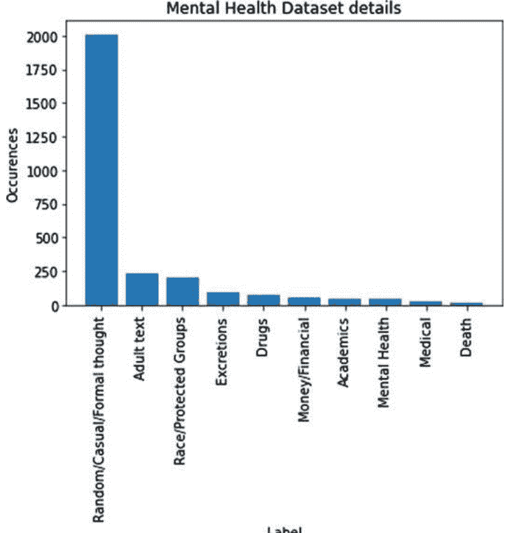

图1 数据集细节的可视化

表1 数据集的详细信息
| 属性 | 内容 |
| :--- | :--- |
| 数据集的名称 | Facebook倾诉数据集 |
| 类别 | 心理健康数据集 |
| 文件名 | labeled.csv |
| 列数 | 03 |
| 行数 | 2802 |
| 类标签数 | 10 |
| 属性数 | 02 |
| 大小 | 931.56 kB |
| 来源 | https://www.kaggle.com/apaul1218/mental-health-dataset |

“金钱/财务”,“医疗”,“药物”,“种族/受保护群体”,“排泄物”,“学术”和“死亡”。在数据集的两列中，第一列包含文本，第二列包含该文本的标签。如上所述，72%的文本被标记为“无”。这意味着它们没有被分配任何类别。我们阅读这些文本并发现这些文本表达了一些随机的思想，一些随意的思想，以及一些正式的思想。因此，为了更好地理解，我们将这些文本分配给一个名为“随机/随意/正式思想”的类别。我们知道，为了使用模型，很多时候需要将数据转换为数字。我们将标签转换为数值，并将“随机/随意/正式思想”类别赋值为1，将“成人文本”赋值为2，将“心理健康”赋值为3，将“金钱/财务”赋值为4，将“医疗”赋值为5，将“药物”赋值为6，将“种族/受保护群体”赋值为7，将“排泄物”赋值为8，将“学术”赋值为9，将“死亡”类别赋值为10。

## 3 结果

我们在CNN和RNN模型上使用处理过的数据集。CNN通常用于处理图像，但也有用于处理文本的版本。那个版本被称为TextCNN。我们使用那个版本来处理我们的数据集，因为我们的数据集只包含文本内容。我们使用三个模型，分别是CNN，SimpleRNN和LSTM。从这些模型中获得的结果分别如下所示。

### 3.1 从卷积神经网络获得的结果

我们将数据集按照75:25的比例划分。也就是说，我们使用75%的数据进行训练，25%的数据进行测试。我们对训练数据和测试数据都使用分词器来将文本转化为向量。这将文本输入转化为向量，并为每个词分配一个独立的向量。

表2 CNN模型概述
| 层(类型) | 输出形状 | 参数数量 |
| :--- | :--- | :--- |
| 嵌入(Embedding) | (None, 100, 200) | 1838000 |
| Conv1D | (None, 96, 128) | 128128 |
| GlobalMaxPooling1D | (None, 128) | 0 |
| dense (Dense) | (None, 10) | 1290 |
| dense_1 (Dense) | (None, 1) | 11 |
| **总参数** | | **1,967,429** |
| **可训练参数** | | **1,967,429** |
| **不可训练参数** | | **0** |

随后，我们使用后填充方法来确保序列的等长。我们不断在末尾添加0，直到最大长度为100。我们在CNN中添加了五层。第一层用于词嵌入，提供单词和它们相对含义的密集向量表示。这是我们CNN模型的第一层，我们使用词汇表大小作为“input_dim”的值，将“output_dim”的值设为200，“input_length”是序列的最大长度，即100。该层的输出是一个二维向量，每个单词在输入单词序列中都有一个嵌入。接下来，我们使用具有128个过滤器、核大小为5和激活函数“relu”（修正线性单元）的Conv1D层。第三层是具有默认值的GlobalMaxPooling1D，即channel_last数据格式，并将keepdims值设置为False。我们使用该层通过取最大值对输入表示进行下采样。接下来，我们使用具有10维输出空间和“relu”激活函数的Dense层。最后一层是具有一维输出空间和“sigmoid”激活函数的Dense层。我们使用“adam”优化器和“binary_crossentropy”损失函数编译CNN。我们使用准确率评估模型。关于模型的详细信息总结在表2中。我们考虑100个epochs和批量大小为10来训练模型。每个层的准确率和损失如图2所示绘制。我们通过绘制每个epoch的值来得到这些图形。在模型训练过程中，它显示每个epoch的准确率和损失。此外，还显示了该特定epoch所需的时间。训练准确率和训练损失的图使用蓝色，测试准确率和测试损失的图使用红色。在完成所有训练和测试的时代后，我们发现模型的整体训练准确率为71.67%，测试准确率为73.94%。

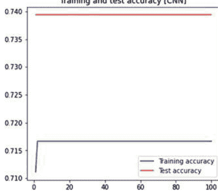
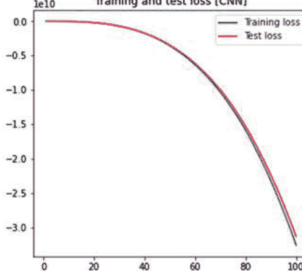
图2 在CNN训练和测试期间的准确性和损失

### 3.2 简单循环神经网络获得的结果

为了使用RNN模型，我们首先将25%的数据作为测试数据分离出来，并创建一个单独的数据集。剩下的75%数据保留在原始数据集中作为训练数据。我们使用MinMaxScaler将数据集的特征进行缩放和转换，范围为(0,1)。缩放和转换后的训练数据集如图3所示。然后，我们根据模型支持的格式重新调整数据。

我们使用总共5层。第一层是一个具有50维输出空间、“tanh”激活函数和return_sequence=True的SimpleRNN层，这意味着我们期望完整的输出序列。我们提供了输入形状为(shape[1], 1)的参数。第二层也是一个具有50维输出空间和“tanh”激活函数的SimpleRNN层。第三层与第二层相同，即一个具有50维输出空间和“tanh”激活函数的SimpleRNN层。第四层也是一个具有50维输出空间的SimpleRNN层，默认使用激活函数。模型的第五层也是最后一层，是一个具有一维输出空间的全连接层。在编译阶段，我们使用“adam”优化器和“mean_squared_error”类型的损失函数。用于评估模型的指标是准确性。模型的摘要如表3所示。我们使用批量大小为32，在100个周期内训练模型。我们绘制每个周期的准确性和损失，如图4所示。这里，我们还绘制了每个周期获得的单独结果。单独的结果包括准确性、损失和完成每个周期所需的时间。与之前的图表类似，我们使用蓝色表示训练准确性和训练损失，红色表示测试准确性和测试损失。在所有周期完成后，我们得到了模型的整体训练准确性为71.50%，测试准确性为70.10%。

在模型的训练和测试之后，我们对测试数据集进行预测。在这个预测任务上获得的结果如图5所示。我们使用两种不同的颜色来表示标签。我们使用灰色表示真实数据标签，蓝色表示预测标签。

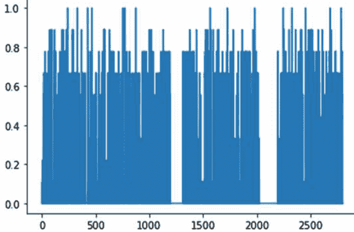
图3 缩放训练集的可视化


图4 Simple RNN的训练和测试期间的准确性和损失

数据标签。我们使用时间戳，并根据时间戳执行文本标签的预测。

表3 SimpleRNN模型摘要
| 层（类型） | 输出形状 | 参数数量 |
| :--- | :--- | :--- |
| simple_rnn (SimpleRNN) | (None, 50, 50) | 2600 |
| dropout (Dropout) | (None, 50, 50) | 0 |
| simple_rnn_1 (SimpleRNN) | (None, 50, 50) | 5050 |
| dropout_1 (Dropout) | (None, 50, 50) | 0 |
| simple_rnn_2 (SimpleRNN) | (None, 50, 50) | 5050 |
| dropout_2 (Dropout) | (None, 50, 50) | 0 |
| simple_rnn_3 (SimpleRNN) | (None, 50) | 5050 |
| dropout_3 (Dropout) | (None, 50) | 0 |
| dense (Dense) | (None, 1) | 51 |
| **总参数数目** | | **17,801** |
| **可训练参数** | | **17,801** |
| **不可训练参数** | | **0** |

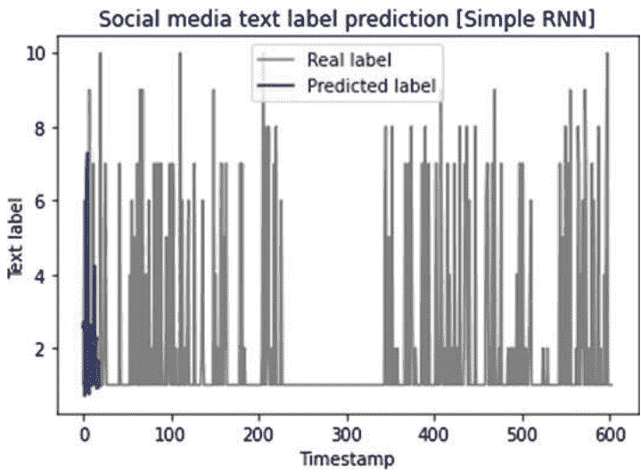
图5 简单RNN的结果

### 3.3 长短期记忆网络的结果

为了使用LSTM，我们将数据集分为两部分。我们将25%的数据作为测试数据，剩下的75%作为训练数据。与SimpleRNN模型类似，我们按照图3所示的方式对数据进行转换和缩放。将数据按照模型的格式进行重塑后，我们开始构建模型。

| 模型: “sequential_1” |
| :--- | :--- | :--- |
| 层 (类型) | 输出形状 | 参数数量 |
| lstm (LSTM) | (None, 50, 50) | 10400 |
| dropout_4 (Dropout) | (None, 50, 50) | 0 |
| lstm_1 (LSTM) | (None, 50, 50) | 20200 |
| dropout_5 (Dropout) | (None, 50, 50) | 0 |
| lstm_2 (LSTM) | (None, 50, 50) | 20200 |
| dropout_6 (Dropout) | (None, 50, 50) | 0 |
| lstm_3 (LSTM) | (None, 50) | 20200 |
| dropout_7 (Dropout) | (None, 50) | 0 |
| dense_1 (Dense) | (None, 1) | 51 |

总参数: 71,051  
可训练参数: 71,051  
不可训练参数: 0

不同的层。我们在不同层的LSTM中使用完全相同的参数值。在第一层中，我们部署了一个输出空间为50维的LSTM层，我们需要所有输出的序列，因此将`return_sequences`设置为“True”，输入形状为`(shape[1], 1)`。在第二层中，我们使用另一个输出空间为50维的LSTM层，并设置`return_sequences`为“True”。在第三层中，我们同样使用另一个输出空间为50维的LSTM层，并设置`return_sequences`为“True”。在第四层中，我们使用输出空间为50维的另一个LSTM层。在最后一层，我们使用一个输出空间为一维的全连接层。在编译阶段，我们使用“adam”优化器和“mean_squared_error”类型的损失函数。用于评估模型的指标是准确率。模型的摘要如表4所示。我们使用批大小为32，在100个epoch中训练模型。我们将每个epoch的准确率和损失绘制成图表，如图6所示。与SimpleRNN类似，我们绘制了每个epoch得到的单独结果。每个epoch得到的结果包括准确率、损失和完成该epoch所需的时间。在这里，蓝色用于绘制训练准确率和训练损失，红色用于绘制测试准确率和测试损失。在完成所有epoch后，我们发现训练和测试的准确率与SimpleRNN完全相同，即训练为71.50%，测试为70.10%。

在模型训练之后，我们对测试数据集进行预测。预测操作的结果显示在图7中。与之前的SimpleRNN任务类似，我们使用灰色表示原始数据标签，蓝色表示预测数据标签。在这里，我们也使用时间戳进行预测。

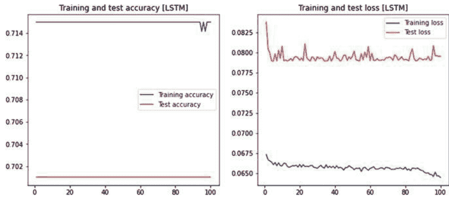

图6 LSTM训练和测试的准确率和损失

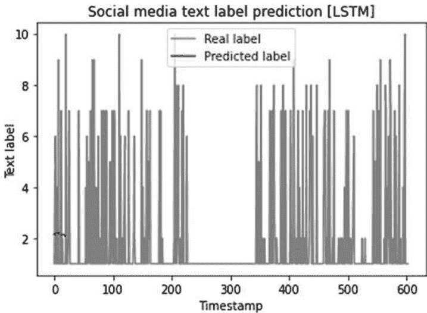

图7 LSTM的实验结果

## 4 讨论

从实验结果中我们发现，对于最初的几个时期，CNN的训练准确率从约71%增加到约71.50%，而对于其余的时期，准确率保持不变。对于训练集，准确率保持在约74%左右。

同样地，对于损失，我们观察到训练和测试数据的损失都保持为零。然后它慢慢下降到大约40个时期，然后指数级地下降到小于-3.0。

对于SimpleRNN，训练准确率在大约27个时期左右保持在71.5%左右。之后，准确率在一个大约的范围内波动，从71.1%到71.5%之间。训练损失显示出轻微波动，并逐渐从大约6.6%降低到大约6.1%。测试阶段的损失也显示出轻微的波动，直到大约96个时期，然后显示出高波动，然后再次降至大约7.9%的水平。

对于LSTM，训练准确率在大约96个时期左右保持在71.5%左右，之后显示出轻微波动，并再次保持在先前的水平。整个时期测试准确率保持在70.1%左右。测试阶段的损失在最初的几个时期显示出巨大的波动，之后在其余的时期中保持轻微波动。整个时期训练损失显示出轻微波动，并逐渐从6.75%的水平降低到6.45%的水平。

从上面的讨论中，我们发现从CNN得到的结果与SimpleRNN和LSTM有显著的不同。对于这三个模型的测试准确性，我们可以找到一些相似之处。但是，这三个模型的训练准确性是不同的。SimpleRNN的训练准确性波动非常大。然而，CNN和LSTM的训练准确性中可以找到一些相似之处。这三个模型的训练损失和测试损失彼此非常不同。在CNN中，训练损失和测试损失是相似的。但是，这与SimpleRNN和LSTM的训练损失和测试损失没有相似之处。对于SimpleRNN和LSTM，训练损失几乎相似，在接近98个时期时有一些差异。在LSTM中，测试损失的波动性更大，而在接近98个时期时，SimpleRNN的波动性更大。

### 4.1 比较

在研究中，我们找到了两个高质量的相关工作[10,23]。在研究[23]中，作者提到他们使用了一个多模态框架，该框架使用了特征选择和随机森林 (RF)。他们还提到，该模型在F1得分上取得了5%的改进。[10]中的研究使用了他们自己的方法，称为无监督方法 (UA)，该方法修改了传统的机器学习算法并添加了模糊性。他们修改版本中的最高准确率为76.12%。在本研究中，我们应用了CNN和RNN。对于CNN，我们获得了71.67%的训练数据准确率和73.94%的测试数据准确率。对于SimpleRNN，训练数据准确率为71.50%，测试数据准确率为70.10%。对于LSTM，训练数据准确率也是71.50%，测试数据准确率为70.10%。尽管我们将结果与表5中的结果[10,23]进行比较，但比较并不公平。因为这些研究中使用的数据集不同。实施的模型也不相同。前一项研究使用了一个多模态框架，该框架实现了RF和特征选择技术。后一项研究提出了他们自己的无监督模型，该模型在传统机器学习算法中添加了模糊性。现在，我们已经实施了深度学习模型，并将深度学习技术获得的结果与传统机器学习获得的结果进行了比较。

| 参考 | 模型 | 训练准确率 | 测试准确率 | 备注 |
|---|---|---|---|---|
| [23] | RF | NA | NA | F1得分提高了5% |
| [10] | UA | 76.12% | NA | NA |
| 这个 | 卷积神经网络 | 71.67% | 73.94% | NA |
| 这个 | 简单RNN | 71.50% | 70.10% | NA |
| 这个 | 长短期记忆网络 | 71.50% | 70.10% | NA |

模型不均匀。我们实现的模型在71-74%的范围内显示了相当可观且可比较的准确率。

### 4.2 心理健康和营养状况的预测

除了根据准确率评估模型外，我们还对一组独立的数据进行预测。SimpleRNN的预测结果显示在图5中，LSTM的预测结果显示在图7中。我们发现，使用SimpleRNN的预测结果几乎与真实数据相似。然而，对于LSTM，预测结果相对于原始数据较差。这个预测活动适用于数据集中的所有十个标签。在这些标签中，我们需要考虑心理健康的标签。值得一提的是，数据集的主要部分是关于随机/非正式/正式思想的。这部分数据包含了很多关于他们的身体健康和营养状况的信息。此外，在医学科学中，人们认为在心理健康方面存在问题的人缺乏一些稳定心理健康所需的微量营养素。

## 5 结论和未来工作

现如今，社交媒体已经成为日常生活中不可分割的一部分。人们使用这种媒介与世界各地的亲朋好友、虚拟认识的朋友、同事等交流他们的感受和情绪。他们的个人资料中的帖子可以很多方面反映他们的兴趣、品味、意图甚至是心理和身体健康状况。这些帖子是预测心理和身体健康状况的重要信息来源。本研究仅涵盖使用来自Facebook的帖子来预测心理健康和营养状况。我们应用CNN和RNN，并发现这些模型具有令人印象深刻的准确性。作为未来的工作，这项研究可以扩展到其他社交媒体平台。此外，还可以进行进一步的研究，从这些帖子中预测其他社会问题。

致谢。进行实验所需的数据已从https://www.kaggle.com下载。作者感谢数据集的所有者将其公开提供。此外，作者将永远感激该网站。

#### 参考文献

- 1. Aichner, T., Greenfelder, M., Maurer, O., Jegeni, D.: 二十五年的社交媒体：1994年至2019年的社交媒体应用和定义综述。《网络心理学、行为和社交网络》24(4), 215-222 (2021) https://doi.org/10.1089/cyber.2020.0134, PMID: 33847527
- 2. Asamane, E.A., Greig, C.A., Thompson, J.L.: 营养摄入、营养状况与社区居住的多样化老年人的身体功能之间的关联。《BMC营养学》6(1), 36 (2020). https://doi.org/10.1186/s40795-020-00363-6
- 3. Boyd, D.M., Ellison, N.B.: 社交网络网站：定义、历史和学术研究。《计算机媒体传播杂志》13(1), 210-230 (2007). https://doi.org/10.1111/j.1083-6101.2007.00393.x
- 4. Chan, W.S., Leung, A.Y.: 医疗专业人员之间使用社交网络网站进行沟通的系统综述。《医学互联网研究杂志》20(3), e117 (2018). https://doi.org/10.2196/jmir.8382, http://www.jmir.org/2018/3/e117/
- 5. Chancellor, S., De Choudhury, M.: 在社交媒体上预测心理健康状况的方法: 一项关键回顾. npj Digit. Med. 3(1), 43 (2020). https://doi.org/10.1038/s41746-020-0233-7
- 6. Fraidaki, K., Pramatarı, K., Doukidis, G.: 生活在社交媒体时代: 不同类型的社交媒体如何影响信息获取过程. In: Meiselwitz, G. (ed.) Social Computing and Social Media, pp. 178–185. Springer International Publishing, Cham (2014)
- 7. Hussain, Z., Borah, M.D.: 利用母亲特征的机器学习技术预测新生儿的出生体重. J. Stat. Manag. Syst. 23(6), 1079–1091 (2020) https://doi.org/10.1080/09720510.2020.1814499
- 8. Hussain, Z., Borah, M.D.: 使用机器学习技术预测新生儿的营养状况：一项比较研究。在：Bhattacharjee, A., Borgohain, S.K., Soni, B., Verma, G., Gao, X.Z.（编辑）：机器学习、图像处理、网络安全和数据科学，第69-83页。新加坡：Springer Singapore（2020年）。https://doi.org/10.1007/978-981-15-6318-8_7
- 9. Hussain, Z., Borah, M.D.: Nicov：分析营养状况和免疫对COVID-19的影响的模型。Med. Biol. Eng. Comput. 60（5），1481-1496（2022年）。https://doi.org/10.1007/s11517-022-02545-9
- 10. Joshi, D., Patwardhan, D.: 使用无监督方法分析社交媒体用户的心理健康。Comput. Hum. Behav. Rep. 2, 100036（2020年）https://doi.org/10.1016/j.chbr.2020.100036, https://www.sciencedirect.com/science/article/pii/S2451958820300361
- 11. Kaplan, A.M.: 社交媒体，定义和历史，第2662-2665页。纽约：Springer New York（2018年）。https://doi.org/10.1007/978-1-4939-7131-2_95
- 12. Karim, F., Oyewande, A.A., Abdalla, L.F., Chaudhry Ehsanullah, R., Khan, S.: 社交媒体使用与心理健康的关联性：系统综述。Cureus 12(6), e8627-e8627 (2020). https://doi.org/10.7759/cureus.8627, https://pubmed.ncbi.nlm.nih.gov/32685296
- 13. Kim, J., Lee, D., Park, E.: 社交媒体中的机器学习与心理健康：文献计量学研究。J. Med. Internet Res. 23(3), e24870 (2021) https://doi.org/10.2196/24870, https://www.jmir.org/2021/3/e24870
- 14. Koipysheva, E.: 身体健康（定义、语义内容、研究前景），第601-605页（2018）。https://doi.org/10.15405/epsbs.2018.12.73
- 15. Kuss, D.J., Griffiths, M.D.: 在线社交网络和成瘾-心理学文献综述. 环境研究公共卫生杂志 8(9), 3528–3552 (2011). https://doi.org/10.3390/ijerph8093528, https://www.mdpi.com/1660-4601/8/9/3528
- 16. Lim, S.Y., Kim, E.J., Kim, A., Lee, H.J., Choi, H.J., Yang, S.J.: 影响心理健康的营养因素. 临床营养研究 5(3), 143–152 (2016). https://doi.org/10.7762/cnr.2016.5.3.143, https://pubmed.ncbi.nlm.nih.gov/27482518
- 17. Muscaritoli, M.: 营养对心理健康和幸福感的影响: 来自文献的见解. 营养前沿 8, 97 (2021) https://doi.org/10.3389/fnut.2021.656290, https://www.frontiersin.org/article/10.3389/fnut.2021.656290
- 18. Rossola, E.A., Bahrainian, S.A., Crestani, F.: 用于社交媒体抑郁研究的数据集。 在：第28届ACM用户建模、适应和个性化会议论文集, 第338-342页。 UMAP '20, 计算机协会 , 纽约, 纽约, 美国 (2020年)。 https://doi.org/10.1145/3340631.3394879
- 19. Santos, A., Kaner, G., Soylu, M., Yüksel, N., Inan, N., Ongan, D., Başsmsırlı, E.: 评估抑郁症患者的营养状况。 BioMed Res. Int. 2015, 521481 (2015年)。 https://doi.org/10.1155/2015/521481
- 20. Voorveld, H.A.M., van Noort, G., Muntinga, D.G., Bronner, F.: 社交媒体参与和社交媒体广告：平台类型的区分作用。广告学杂志 47(1), 38-54(2018). https://doi.org/10.1080/00913367.2017.1405754
- 21. Wongkoblap, A., Vadillo, M.A., Curcin, V.: 在社交媒体时代研究心理健康障碍：系统综述。医学互联网研究杂志 19(6), e228 (2017). https://doi.org/10.2196/jmir.7215, http://www.jmir.org/2017/6/e228/
- 22. Yazdavar, A., Mahdavinejad, M., Bajaj, G.K., Thirunarayan, K., Pathak, J., Sheth, A.: 通过社交媒体数据进行心理健康分析，第459-460页 (2018). https://doi.org/10.1109/ICHI.2018.00102
- 23. Yazdavar, A.H., Mahdavinejad, M.S., Bajaj, G., Romine, W., Sheth, A., Monadjemi, A.H., Thirunarayan, K., Meddar, J.M., Myers, A., Pathak, J., Hitzler, P.: 社交媒体中的多模态心理健康分析。 PLOS ONE 15(4), 1–27 (2020). https://doi.org/10.1371/journal.pone.0226248

## 基于人工智能的聊天机器人与客户参与度和业务增长的影响

Chitra Krishnan, Aditya Gupta, Astha Gupta和Gurinder Singh

摘要 出于各种原因,人工智能设备对企业变得越来越重要。使AI增强服务在组织使用的一个主要特点是它们能够比人类更快、更准确地完成工作。几乎所有公司都在社交媒体和消息应用程序(如WhatsApp、Facebook等)上使用基于AI的聊天机器人与庞大的消费者群体进行互动并提供实时帮助。但是AI能做的远不止这些。对许多人来说,与一个听起来像人类的机器人进行对话是一种新的干扰,它作为一种吸引和引诱客户的工具,使他们离开网站。但是AI不仅仅能做到这些。

与感觉像人类对话的机器人交谈对很多人来说是一种新的干扰,它作为一种工具吸引这些客户并在购买后离开网站。就干扰而言,从指导客户如何订购披萨到描述复杂的销售流程,AI Chatbots能够帮助B2C和B2B的互动。本章提供了对AI Chatbots如何影响用户互动的见解,品牌如何利用Chatbots进行营销和客户服务,以及为什么客户被吸引与Chatbots等增强代理进行互动。

关键词 Chatbots·营销 ·AI·客户服务 ·增强现实 对话式AI

#### 1 引言

多年来,我们看到人们利用互联网寻找解决方案,并通过快速简便的答案改善日常生活中的问题。这一基本功能促使所有企业开始增加在线存在,并通过网站、博客和其他方式为客户提供服务。

我们无法想象今天有哪家公司不想与其联系通过互联网与客户进行联系，并为他们提供无忧的体验，无论是产品还是服务[1]。通过互联网与客户建立这种联系的公司现在正在获得回报，因为我们正迅速接近一个只有互联网和在线关系才重要的时期。聊天机器人，也被称为对话代理，是可以集成到各种平台上以响应传入消息或创建自然对话的软件应用程序。这个想法并不是全新的。另一方面，各个企业对聊天机器人的采用将在2021年及以后继续增加。由于人工智能和其他基础技术的发展，聊天机器人近年来越来越受欢迎。自然语言处理和机器学习就是其中的两个例子[2]。商业世界正在转向更加以客户为中心的方法。一家公司需要通过良好的客户服务来培养客户忠诚度以赚钱。聊天机器人简化了提供优质客户服务，从而导致销售额的提高，聊天机器人也可以提供帮助。客户参与度很难，因为它需要深入了解消费者的喜好、厌恶和喜爱等方面。

众所周知，聊天机器人已经在许多公司中取代了人工客户支持代理，通过与客户进行有益的对话。大部分客户已经习惯了聊天机器人服务，并且现在更喜欢它而不是人工客户支持专业人员。公司已经以多种方式利用互联网与客户进行沟通和提供客户服务。电子邮件、即时聊天、客户服务电话和其他技术被采用，但它们在为希望了解更多关于公司并购买产品的客户提供实时帮助和相关信息方面已经过时。因此，这些策略未能吸引客户并提供有关品牌商品和服务的信息。然后出现了将实时聊天集成到网站或消息应用程序中的概念。这种提供实时客户支持的方式已被证明是有效和有价值的。聊天机器人是将这一理论付诸实践的最受欢迎的工具，随着越来越多的公司转向它们进行客户服务，它们已经证明了自己的价值。

聊天机器人正在证明是了解客户更多信息的有效工具。它会追踪对话持续的时间以及哪种回应激怒了消费者[3]。根据哈佛商学院和Inside Sales的研究，回答查询的延迟五分钟可能会降低获得潜在客户的可能性。延迟10分钟可能会使您成功联系的机会降低400%。

Facebook甚至公开了一些令人瞩目的数据，证明了聊天机器人的价值：
- 在企业和人之间的双向沟通过程中，交换了近20亿条消息。
- 66%的人更愿意通过消息而不是电话联系客户服务。
- 53%的潜在客户更愿意与可以进行沟通的公司做生意。

处理如此复杂的问题的工具有一些显著的缺点，AI聊天机器人在某些方面可能不足。因为聊天机器人经常被认为是访问者在浏览公司网站时的干扰，所以聊天机器人必须放置在适当的位置。误解情感并提供适当的回应是其他问题之一，还有数据泄露、安全性和人类用户的误解。在这个领域还有很多研究和开发的空间，以进一步改进AI聊天机器人的使用。尽管客户更喜欢速度更快的服务，但人类的亲切感觉可以是锦上添花。机器人已经证明在回答基本问题方面是有效的代理。它们被编程成使用简单规则和人工智能逻辑来模拟人类书面语言。几乎所有客户都要求客户服务代理人全天候提供服务，因为他们的需求和偏好经常变化并重新定义企业结构。如果由人工代理处理，这是相当不可能的。

在这种情况下，聊天机器人在提供适当的支持和服务方面证明是有效的。人工智能与人类的混合可以重新定义客户体验，人类专注于引导人工智能的速度、效率和覆盖范围，而聊天机器人旨在通过迅速解决问题来提供完整的客户满意度。技术帮助聊天机器人理解每次讨论的上下文，并回答每个客户的问题。重要的是要认识到，作为人类，我们总是希望与真实的人交谈；但是，真实的人无法始终在线[4]。自主运行的人工智能驱动技术继续吸引人类的兴趣。聊天机器人是一个相对较新的趋势，引起了技术行业的大多数人的兴趣。由于行业中的所有研究和开发，编程变得更加类似于人类，同时保持机械性。由于快速响应和持续连接的结合，它们是网络应用趋势的一种有趣变化。

机器如何自然地进行沟通？在考虑使用聊天机器人时，这是许多人问自己的一个问题。聊天机器人的真正编码和工作方法是困难的，涉及广泛的技术知识，但他们以人性化的方式进行对话的想法是迷人且简单易懂的。聊天机器人使用知识库尽可能高效地处理和响应传入的请求。传入的文本被解析，并使用一系列算法和模式确定消息的意图。

科学界在1980年集中研究自然语言处理（NLP），也被称为计算机语言学，以构建一个能处理大量免费可用数据的算法。这种语言学方法最初是为了使用统计模型处理大量数据而开发的。自那时起，“大数据”一词已被重新关联到“机器学习”，聊天机器人使用自然语言处理来确定消息的意图（NLP）。这种方法帮助聊天机器人从文本中提取有用的数据。NLP是使对话助手能够理解对话上下文并解码意图（积极或消极），从而使机器人能够选择正确的自动响应或将问题升级给客服代理的基础。最初一代的聊天机器人只设计用于进行基于文本的讨论，但由于技术进步和优秀的自然语言处理，现在有一些机器人可以进行文本到文本和语音到语音的对话（例如Siri、Alexa等）。

对话系统的架构是第一个自然语言理解系统，它包含三个重要组件，负责解码用户提供的消息并将其传递给其他系统进行进一步处理。其次，有对话管理系统，它跟踪输出所得的上下文，还有自然语言生成，以自然语言显示最终结果。如今，机器学习方法被用于处理理解人类对话的语言结构，包括语义和句法信息。

NLP是一种语言处理引擎，允许聊天机器人推断用户消息的目的，并从其数据库中选择最佳响应。NLP理解通信的语法、语义、话语和目的，以便进行类似人类的对话，无论机器正在学习哪种语言。它专注于如何构建能够高效、有效地分析大量自然语言输入的计算机，从而减轻人类的某些任务并允许机器执行其他任务。NLP解决了计算机解释人类输入并从非结构化语言中创建结构化数据的问题。

然而，聊天机器人的任务并不止于此。在确定查询意图后，机器人必须在知识库框架中搜索相关的结构化材料，并将其提供为非结构化文本响应。

自然语言理解（NLU）通过解读用户输入的含义来实现。NLU使聊天机器人能够理解一段文本的含义，主要集中在机器阅读理解上。NLU不过是理解文本并将其分类为适当的意图。NLU可以在各种过程中使用。NLU可以做的事情包括对文本进行分类、收集新闻、存档特定的文本以及分析内容。NLU的真实世界实例包括根据基本语法和一个相对大的词汇表，根据文本理解程度提供基于文本理解的简短命令，例如将电子邮件路由到适当的接收者。

自然语言生成（NLG）是一种生成可读性高的文本的软件。NLG方法可以用于创建利用人类和机器知识和能力的共生系统。任何作为文档、报告、解释或其他帮助信息的一部分的语音流中的文本都可以作为输入，任何非语言表示的信息都可以作为输出。NLG可以使用任何通信数据库作为知识源。聊天机器人的主要目标是帮助客户服务代表解决常见的查询，使他们能够专注于更紧急的问题，同时为客户提供最有价值的资产。在这方面，聊天机器人是双赢的，因为它们为公司和消费者节省了大量时间。

大多数聊天机器人将使用由客户服务团队生成的一系列预定义响应来回答常见问题，这样可以更轻松地处理传入的查询。更强大的聊天机器人甚至可以解码复杂的结构化数据，并为其提供纯文本摘要，从而释放出人工操作员的工作，以便处理其他任务。

处理其他任务。总体而言，这种技术通过允许聊天机器人直接回答大量查询来减少响应时间，而将更困难的问题转发给人工客户服务代理。

## 2号客户参与的聊天机器人

由人工智能（AI）驱动的聊天机器人的普及以及自然语言处理（NLP）领域的最新进展正在逐渐改变人们与企业互动的方式[5,6]。在这种背景下，使用聊天机器人进行各种消费者互动越来越受欢迎，作为提高服务质量和客户体验的一种方式[7]。这些代理人通过文本交流与客户建立联系，作为处理较小客户查询的第一联系点，但它们也越来越多地用于更复杂的支持活动，如客户咨询[6]。

然而，顾客在采用聊天机器人方面进展缓慢[8]，与行业预测相反。专家们提出的一个可能的解释是，聊天机器人的发展是由技术进步而不是市场需求引发的。因此，用户的愿望和需求没有得到很好地满足[9]。

消费者普遍被认为对新技术持怀疑态度，因此行业报告经常强调缺乏信心[9]。聊天机器人变得越来越像人类可能强调了信任的必要性[6]。总结起来，由于缺乏信心，客户在各种客户服务互动中越来越多地使用聊天机器人，但是让客户过渡到这些新的服务渠道仍然是一个困难。

关于这些独特的人机界面如何影响用户对服务交付过程（即信任）以及用户的后果，我们知之甚少。最近的研究关注了个体设计特征对各种用户感知的影响，包括信任和对社交线索的行动能力[10]。然而，还没有研究比较使用具有静态界面的聊天机器人时的信任感知。因此，很难说是对话交互逻辑的改变还是更多地使用拟人化设计元素导致了感知上的变化。然而，了解这些机制将有助于更准确地开发适用于特定环境的这些代理。

在客户服务提供商中，平衡效率和质量是最困难的任务之一：根据研究和从业者的说法，客户自助服务具有许多潜在的好处，包括提高时间效率、降低成本和提供更好的客户体验[8,12]。聊天机器人作为一种自助工具，具有提高服务质量和提供者与客户之间互动的能力。

根据研究，聊天机器人可以缩短响应时间，为员工腾出其他任务，并回答80%的常见问题，从而导致每年与2650亿个客户支持请求相关的全球企业支出减少30%[13]。聊天机器人有可能为企业节省超过80亿美元的客户支持成本。到2022年，支出将达到2千2百万美元，比2017年预计节省的2千万美元要多。以24/7电子渠道的形式为客户提供服务，聊天机器人声称自己快速、方便和具有成本效益[8]。

个性化支持以及易于使用和可适应的自助渠道，经常受到客户的重视。因此，公司不应仅仅依赖于客户自助渠道，特别是在客户参与的开始阶段[12]，在线交易可能因缺乏人类社交参与者而受到影响。

另一方面，聊天机器人有潜力积极影响服务互动，并通过完成人类本应完成的任务来充当服务专业人员的替代品。顾客可以使用聊天机器人提问或投诉，而不是打电话给呼叫中心或发送电子邮件。聊天机器人每周七天、每天24小时都可用。这种自助渠道将变得更加重要（即作为服务接口的智能助手），而不是由人驱动，因为组织与消费者之间的关系“逐渐转变为技术主导”[14]。

各种公司都可以从人工智能聊天机会中受益。像必胜客、达美乐、耐克、Spotify等公司正在使用聊天机器人与客户互动，提升他们的营销活动。由于其能够从人类互动中学习，AI聊天机器人是企业发现客户需求以及对其产品或服务反应的关键工具。

这些聊天机器人还会收集和分析数据，以帮助公司改进其营销和沟通策略。产品和服务公司可以使用聊天机器人来增加交易的可能性。聊天机器人可以以一种经济高效的方式模仿人类沟通，建立买家和商店之间的信任。这项技术可以简单地整合到任何网站管理策略中，鼓励客户在网站上停留更长时间。随着商店越来越依赖移动解决方案和定制消息，聊天机器人在客户服务中变得越来越常见。电话和电子邮件可能不方便，而长时间等待可能会阻止潜在消费者。由于聊天机器人的存在，这些等待时间不再是一个问题。

### 3 企业增长的聊天机器人

聊天机器人可以成为发展强大客户关系的非常有用的工具。通过与网站用户进行互动和对话，您的组织可能能够建立深厚的联系。通过整合聊天机器人，您可以实现营销目标，增加销售额并改善客户服务。通过多种方式，聊天机器人可以帮助客户更高效地建立联系并促进业务增长[15]。

#### 3.1 提高客户参与度

用户数据可以用于推动参与度，然后通过使用对话式人工智能聊天机器人来放大。此外，机器人可以提供一致的回应，使您避免向消费者提供无关信息。如果您能及时并恰当地回应他们，客户将在您的网站上停留更长时间并延长对话。现在我们更了解对话式人工智能以及为何对品牌如此重要，让我们谈谈如何利用它来提升消费者参与度：
- 对话式人工智能可以帮助您更好地理解消费者的需求、请求和偏好。对话式人工智能可以帮助您记住和保留客户之前告诉您的关注点的知识。根据HubSpot的一项调查，客户不希望重复提供已经提供过的信息。在现有的聊天机器人界面中添加人工智能层将有助于提高您的响应率，这将有益于您的客户服务团队。
- 根据福布斯的数据，71%的客户希望在所有媒体上获得一致的体验。这是一个合理的要求。随着世界变得更加疏远和与客户互动的渠道变得更多样化，保持最新并与客户在一起变得至关重要。尽管WhatsApp和短信对话具有最高的开放率，但所有的企业，无论大小，都必须使用其他渠道并充分利用它们。品牌正在迅速赶上Facebook最近发布的Instagram Messenger API。
- 根据HubSpot的研究，82%的客户希望每周七天、每天24小时都能获得更快的服务。准备事先排练的回答非常重要。客户应该能够在白天或晚上的任何时间联系到您的公司，及时准确的回复可以决定客户服务的成败。您的代理人和自动聊天机器人将受益于预先填写的答案和对多个意图的理解。尽快做出回应是非常重要的。如果无法立即回复消费者，请包含免责声明和回复时间的估计。
- 根据Salesforce的研究，52%的客户希望定制化服务。记住姓名、消费者偏好、重要日期和其他信息将对品牌有很大帮助。借助对话式人工智能，品牌可以与更加了解自己需求、喜好和厌恶的客户进行互动。特别是营销部门可以通过社交媒体、电子邮件营销和其他渠道，为每个客户/潜在客户提供引人入胜且相关的体验。
- 当自助服务快速且直观时，客户更加参与。组织必须了解并与客户的客户服务部门保持一致。73%的受访者期望自助服务建立一个系统，允许客户自助服务。不要期望消费者填写所有问题，提供一键解决方案。创建一个对话AI平台可以自动将客户引导到支持代理，从而实现更无缝的客户体验。
- 聊天机器人缺乏人性化能力。然而，它们可以以类似人类的方式思考和回答问题。
- 文本逐渐取代语音成为最受欢迎的沟通方式。由于人工智能和自然语言处理的进步，机器现在可以以与人类相同的方式理解和回答问题。更重要的是，机器正在逐渐掌握处理越来越复杂的互动的能力，这正是我们作为个体所做的，它将客户参与提升到新的高度。

无论是销售、营销还是支持，客户沟通必须及时。如果客户有过负面经历，他们将永远不会回到你的企业。在这种情况下，基于人工智能的聊天机器人可能会发挥出色，因为它们可以自动化客户沟通并显著改善支持。根据35%的客户表示，客户希望更多的公司使用聊天机器人来改善他们的沟通策略并提供更好的客户体验。在各行各业中，聊天机器人的日益流行正是因为需要随时可用。如果您想让客户全天候参与并改善他们的体验，您也需要在某个时候使用机器人。这将有助于消费者需求管理，通过快速回复和提高客户满意度。

#### 3.2 提高潜在客户生成

对于大多数企业来说，潜在客户生成是首要任务，因为没有潜在客户，就没有销售和收入。聊天机器人已经发展到可以在客户整个旅程中以个性化的方式与客户沟通的程度。实际上，聊天机器人可以通过支持客户做出快速判断来帮助您的企业创造潜在客户。AI机器人可以使用预先编程的问答来吸引用户完成表单并生成潜在客户，从而提高转化率。

### 4 客户服务与自动化

随着消费者对其可能应用的广泛范围的认识增加，客户支持解决方案越来越受欢迎。具体而言，他们想知道如何改进客户服务[16]。

以下是一些客户服务自动化使事情变得更容易的示例：
- 客户数据，如页面访问、之前的交易和其他信息，可以用于在整个客户体验中提供个性化。因此，您可以更好地了解消费者并提出更好的建议。
- 许多客户认为快速解决时间等于积极的客户体验。由于自动化，代理商可以获得实时信息，以尽快为客户提供服务。
- 创新技术，如CSA，全年无休地提供服务。它可以以较低的成本提供高质量的服务。因为过多的人员配备和将支持外包给联系中心是额外的开销成本，可以在任何可能的情况下避免使用。
- 在客户联系之前，通过了解客户的需求和问题，提供主动帮助。这有潜力大大降低购物车放弃率，增加客户满意度。
- 它使组织能够通过将许多不同的功能整合到支持平台中快速扩展。将阿拉伯语纳入您的AI机器人中，例如，将帮助您扩大您的消费者群体，从而促进您的业务增长。

## 品牌使用AI聊天机器人的5种方式

Emirates Vacations是一家豪华旅行公司，于2018年首次亮相。自从在其网站上引入聊天机器人以来，该组织的用户互动增加了87%[17]。另一个例子是汽车制造商Kia。他们网站上的聊天机器人为用户提供了信息门户，并且其转化率为21%[17]。此外，与类似的商业网站相比，该机器人每周用户参与度增加了三倍。另一方面，Nykaa在其网站上提供了实时聊天选项，根据该公司的说法，该公司能够在不到一分钟的时间内与99.7%的用户进行互动[18]。这是一笔相当可观的金额！AbhiBus是一个汽车票预订网站，使用实时聊天来自动回答客户问题的过程。这一高级功能导致代理商生产力增长了33%，管理时间不到一分钟。

#### 5.1 阿联酋度假公司在他们的横幅广告中引入了一个聊天机器人

阿联酋度假公司，该航空公司的旅行运营商，正在利用人工智能开发一个可以在展示广告中访问的聊天机器人，如图1所示。人们可以利用广告来询问旅行和游览方面的问题，并且他们将在广告单元内获得快速答案。然而，根据该公司的说法，人工智能可能对另一个应用产生重大影响：减少搜索中的额外摩擦点。根据用户问题的上下文，聊天机器人所放置的网站上的信息以及阿联酋度假公司的库存，

聊天机器人将推荐网站和度假套餐。如果多伦多的酒店在Emirates Vacations上不可用，聊天机器人将不会推荐任何一个。“在不离开页面的情况下探索世界，”广告中如此声明。

图1 阿联酋度假公司将聊天机器人引入横幅广告
来源: https://digiday.com/marketing/emirates-brings-chatbot-banner-ads/


与标准的点击广告相比，Emirates Vacations的互动率提高了87%。Emirates Vacations通过对55万次展示进行了测试了新的聊天广告类型，并将结果与公司之前的相同展示广告格式进行了比较。Emirates Vacations没有提供其原始展示广告的互动统计数据，只是表示改进版本将在未来使用。

马尔代夫、曼谷、米兰和塞舌尔是目前在聊天室中广告宣传的四个目的地。例如，如果有人输入一个关于度假去哪里的一般问题，聊天广告将推荐这些地方的度假套餐。此外，这些广告还被战略性地放置在提到这些网站的文章旁边。 Emirates Vacations在People.com上关于歌手乔丹・斯帕克斯访问马尔代夫的文章旁边放置了一个聊天广告，吸引了潜在客户的注意。根据波拉德的说法，“对话广告为传统展示广告注入了新的生命。”传统展示广告导致消费者对在线广告感到恼火。

多年来，许多公司都在寻找提供更多价值给客户的方法。特别是旅行品牌，波拉德说，必须非常关注用户体验。

据Digiday报道，在Facebook Messenger上实施聊天机器人来帮助汽车买家找到解决问题的方法后，起亚的销售转化率有所增加。

#### 5.2 智能AI

Domino's通过其网站聊天机器人为客人提供强大的在线订购体验。三个选项卡允许您下订单、跟踪订单和重新订购。用户友好的用户界面使订购披萨变得轻而易举。聊天机器人可以回答大部分问题，减轻客服代表的工作负担。他们可以更加高效地工作，专注于最关键的事情。

#### 5.3 KIAN 聊天机器人

Kia最新的AI助手通过Facebook Messenger提供完整的购买体验，包括产品信息、当地库存、当前价格优惠以及竞争对手车辆比较。通过开发一个能够提供一对一支持的数字专家，Kia在NiroBot的成功基础上进行了扩展。

Kia与CarLabs（一家营销技术和对话式商务平台供应商）及其数字代理商Ansible合作，为其整个车型系列打造了一个综合的聊天机器人体验。Kian还将回答一些简单的问题，以帮助买家找到合适的伙伴。顾客还可以利用Kian卓越的自然语言处理能力提出关于各种主题的具体问题。

> 图2 Kia Motors America引入了AI驱动的虚拟助手 来源: https://www.kiamedia.com/


所有这些都可以在不离开Facebook Messenger的情况下完成，让购物者能够与朋友和家人保持联系。

Kian提供了一种移动优先的购买体验，类似于与人类汽车专家的讨论，并且更加智能，因为它实时评估了数百万辆车的数据点，将它们合并和组织在一个数据堆栈中，作为Kian的大脑。每个汽车购物者现在都会感觉自己正在与虚拟的Kia助手交谈，了解Kia的世界级汽车。Kian是该公司著名的NiroBot的后续产品，旨在使汽车购物和购买更加方便和愉快。

#### 5.4 科颜氏

科颜氏是一家拥有116年历史的化妆品品牌，刚刚推出了它的第一个Facebook Messenger机器人。该机器人为消费者提供了建议引擎、按产品类别和皮肤疾病分类的搜索、客户支持和其他功能。在选择完商品后，用户可以立即购买所选商品。

机器人的个性化方面，就像其他机器人一样，尤其在化妆品业和护肤品业非常重要。对于没有经验的客户来说，科颜氏有很多商品可供选择，这可能会让人感到害怕。机器人通过简化选择过程来改善整个体验。机器人的一个独特功能是允许用户将性别指定为“其他”，而不是通常的性别身份之一。科颜氏是为数不多知道这一点的品牌之一。

#### 5.5 华尔街日报

华尔街日报的Facebook Messenger聊天机器人使得了解最新的重大新闻和金融报价变得简单。您还可以通过输入一些简单的命令来创建自己的个性化提醒。您将在一个位置上获得商业信息、重要的财务信息、当前股票报价和最新的新闻更新。

#### 5.6 Hazel

Hazel是一个著名的程序，帮助人们管理他们的工作环境。它使用网站聊天机器人收集数据并提供重要的工作场所管理见解。为了提高效率，网站聊天机器人识别痛点并提供定制的增长策略。

#### 5.7 Spotify

Spotify是一个数字音乐平台，声称拥有数百万首可供订阅者选择的歌曲。顾客可以使用他们的聊天机器人在Facebook上直接制作播放列表。在询问您更多关于音乐偏好、兴趣、喜好流派和心情的信息后，智能机器人会为您的播放列表提供歌曲建议，根据您的活动和兴趣。多亏了Spotify的聊天机器人，您现在可以使用Facebook的无处不在的消息应用程序浏览和搜索您喜爱的音乐。用户现在可以通过该公司设计的Facebook Messenger聊天机器人搜索和交换音乐。该系统将利用Facebook聊天扩展功能提供音乐推荐、搜索功能和共享功能。用户现在可以使用聊天机器人向他们的Facebook朋友发送30秒的音频片段。您可以在应用程序内听取音频摘录，也可以转到Spotify的应用程序听取完整的歌曲。

您还可以利用聊天机器人搜索Spotify的音乐库。您可以与在线聊天伙伴分享专辑、歌曲和播放列表。以前，用户可以将Spotify链接发送到其包含专辑或歌曲标题和缩略图的Messenger对话中。另一方面，新的30秒剪辑功能提供了完全不同的体验。点击Messenger聊天左侧的蓝色‘+’图标即可启动聊天机器人。当您点击Spotify时，会弹出一个新窗口，让您浏览要与朋友分享的歌曲。

#### 5.8 Staples（史泰博）

“Staples Easy System将‘按需’世界带给企业，允许客户随时随地通过任何设备下订单，”Staples的移动和应用创新总监Ryan Bartley说。“IBM Watson将为该应用提供动力，该应用将使用机器人回答简单的问题，如‘我需要退货’。”“IBM Watson的语音转文本技术也将在该应用中使用，允许用户通过语音向手机提问或下订单。”Easy System还包括‘扫描我的清单’功能，允许消费者通过用手机拍照扫描清单来生成Staples.com订单。

#### 5.9 优步

优步聊天机器人允许消费者通过一次点击注册优步。顾客可以在Messenger上使用优步聊天机器人预订乘车，而不需要安装优步应用程序。该聊天机器人由优步的API提供支持。要获取收据和行程更新，您可以在Messenger上与优步进行私人消息交流。这个工具使得跟踪付款和乘车历史变得轻松。优步Facebook Messenger聊天机器人包括以下功能：通过Messenger与朋友分享有关当前优步行程的信息。在Messenger上向朋友发送位置，他或她只需点击地址即可预订前往该目的地的乘车。在Messenger群聊中，您还可以请求优步。这会通知您的朋友您将到达特定地点的时间[19]。

当您使用Messenger的功能浏览、请求和支付交通工具时，获取优步行程的整个过程就像发送一条消息一样简单。Slack和Telegram最近已添加到聊天机器人服务中。

#### 5.10 星巴克

星巴克是世界上最受欢迎的咖啡品牌之一。这家受欢迎的咖啡店使用智能聊天机器人来提高顾客的满意度，并使购买和定制更加容易。在线聊天机器人可以随着时间的推移学习顾客的偏好，并在顾客迅速订购他们最喜欢的饮品时提供帮助。它还会在顾客的订单准备好时通知他们，让他们无需排队就可以享受饮品。

#### 5.11 耐克

耐克聊天机器人在Facebook Messenger上始终为您提供所需。无论您需要新的办公设备还是新的健身装备，我们都能满足您的需求。耐克创新的新聊天机器人Stylebot旨在帮助顾客搭配服装或创造魔力。用户可以设计自己的运动鞋，也可以从各种型号中选择。对于每个类型，都有适合运动型女孩、职业女性和其他类型的鞋子。您可以在耐克的网站上找到您喜欢的任何服装的相关信息。如果您不喜欢其中一种，还有很多其他选择。女性专属的款式选择简化并加快了在耐克系列中的搜索。

另一方面，机器人创建个性化运动鞋的能力仍然是最令人兴奋的功能。它只需要你提交一张你最喜欢的运动鞋的照片，并从NikeID 24色调调色板中选择一个颜色方案。用户认为这个功能比风格特征更加中性。聊天机器人会将任何图像与Nike Air Max 90进行匹配，无论是绘画、风景还是其他图像。Nike聊天机器人中的这个选项是基于客户偏好的产品个性化的绝佳示例。顾客可以自己尝试各种选项，看看他们最喜欢哪些。之后，他们将能够下订单购买这些鞋子。

#### 6 结论

在当今的企业世界中，聊天机器人已经成为一种需求。聊天机器人是一次性的投资，可以节省时间和金钱，同时增强客户联系。正如我们在本文中所看到的，聊天机器人可以帮助公司完成各种任务。从提供信息到提供建议和处理订单，聊天机器人可以处理企业客户服务和营销的几乎所有方面。品牌可以通过将人工智能技术与人类的互动相结合，提供无缝的客户服务。例如，通过结合聊天机器人和实时聊天技术，客户可以自助服务，同时在需要时联系人工客服。通过使用基于人工智能的聊天机器人作为主要界面，您的公司可以提供实时支持，快速回复查询，并提高客户满意度。然而，在某些情况下，聊天机器人可能无法理解用户的意图，必须依赖人工进行操作。这些聊天机器人还可以整合到Facebook聊天中，以便更方便地访问和转化。例如，Siri和Google助手都是自动化聊天机器人。另一方面，这些聊天机器人最近变得更加易得（和经济实惠）。

#### 参考文献

- 1. Mariappan, J., Edassery, J.R., Krishnan, C., Odamlkulath, A.P.: 社交媒体作为大学教育工具。Amity Glob. Bus. Rev. 32, 1 (2019)
- 2. Hill, J., Ford, W.R., Farreras, I.G.: 与人工智能进行真实对话: 人与人在线对话与人与聊天机器人对话的比较。计算机人类行为 49, 245-250 (2015)
- 3. Mero, J.: 双向沟通和聊天服务使用对电子商务零售部门消费者态度的影响。电子营销 2 8(2), 205-217 (2018)
- 4. Krishnan, C., Baba, M.M., Singh, G., Mariappan, J.: 病毒营销: 新的视野和新兴挑战。原则社交网络新视野和新兴挑战 246, 161 (2021)
- 5. Dale, R.: 聊天机器人的回归。自然语言工程 22(5), 811-817 (2016)
- 6. Nordheim, C.B., Følstad, A., Bjørkli, C.A.: 一项关于客户服务中聊天机器人信任的初始模型——来自问卷调查的发现。交互计算。 31, 317-335 (2019)
- 7. Adam, M., Wessel, M., Benlian, A.: 基于人工智能的客户服务聊天机器人及其对用户遵从的影响。电子营销。 31(2), 427-445 (2021)
- 8. Meuter, M.L., Bitner, M.J., Ostrom, A.L., Brown, S.W.: 在选择服务交付模式时的顾客试用自助技术的调查。市场学。 69(2), 61-83 (2005)
- 9. De Bellis, E., Johar, G.V.: 自主购物系统: 识别和克服消费者采用障碍。零售学。 96(1), 74-87 (2020)
- 10. Feine, J., Gnewuch, U., Morana, S., Maedche, A.: 会话代理的社交线索分类. 人机交互研究国际期刊 (2019)
- 11. Wambsganss, T., Winkler, R., Schmid, P., Söllner, M.: 发掘课程评估中会话代理的潜力: 与网络调查的实证比较. 第28届欧洲信息系统会议 1-18 (2020)
- 12. Scherer, A., Wunderlich, N.V., Von Wangenheim, F.: 自助服务的价值. MIS季刊 39(1), 177-200 (2015)
- 13. Techlabs, M.: 聊天机器人能帮助减少30%的客户服务成本吗? (2017). https://chatbotsmagazine.com/how-with-the-help-of-chatbots-customer-service-costs-could-be-reduced-up-to-30-b9266a369945
- 14. Pelau, C., Dabija, D.C., Ene, I.: 什么使得一个人工智能设备具有人类特征？ 互动质量、共情和感知的心理人类特征在服务行业中接受人工智能的作用。计算机人类行为 122, 106855 (2021)
- 15. Krishnan, C., Goel, R., Garg, V.: 人工智能的作用及其对印度旅游业的影响。在: Garg, V., Goel, R. (eds.) 创新管理研究手册在工业5.0中使用人工智能, pp. 291-302. IGI Global (2022). https://doi.org/10.4018/978-1-7998-8497-2.ch021
- 16. Ayyagari, N.: 客户支持自动化及其重要性 (2020). https://verloop.io/blog/website-chatbot-examples/
- 17. https://www.marketingdive.com/news/emirates-vacations-digital-display-ads-integrate-chatbots-that-give-travel/518243/
- 18. https://verloop.io/case-studies/nykaa/
- 19. 金, L.: 品牌如何使用聊天机器人的9个很好的例子 (2018年)。 https://www.socialmediatoday.com/news/9-great-examples-of-how-brands-are-using-chatbots/524138/

## 社交媒体安全分析

### 不要“假装直到你成功为止”! 使用深度学习的流行假新闻检测方法综述

Rishabh Misra和Jigyasa Grover

摘要 现代社交媒体的蓬勃发展推动了一种新的信息传播模式，称为推送新闻，其中某个新闻被尽可能多的人推送，希望它能够传达给最需要这些信息的人。 这种新闻报道形式，尤其是通过社交媒体活动，提高了虚假报道的获取和制造，或者所谓的假新闻。 假新闻以点击诱饵、恶作剧、讽刺、宣传、极端党派、深度伪造或简单不可靠的新闻形式存在，对其读者产生了极大的影响，主要造成政治、社会经济或心理上的伤害。 在本章中，我们分析了社交媒体世界中假新闻的含义，它可以采取的各种形式，以及造成其传播的原因，以及这些假新闻的基本迹象是什么。 我们将对最先进的深度学习模型进行比较研究，以解决识别虚假信息、验证各种主张和事实的有效性、捕捉假内容等任务。本章还将特别阐述深度学习中对抗性方法来检测任何形式的伪造内容，如文本、图像、视频或音频。 通过这样做，我们建立了生成合理和可理解解释模型预测的重要性，特别强调算法公平性。 事实上，深度学习方法依赖于相对较大且质量一流的数据集，本章还将强调在这一领域中相关数据集的可用性，并在需要时提供策划指南。 然而，即使有足够的数据，在这个领域中的检测问题尤其具有挑战性，因为垃圾邮件发送者和虚假内容生成者正在不断努力地与检测机制的进步并行发展。 我们还将对假新闻贡献者方面的一些最新和即将到来的趋势进行一些阐述，并对我们当前最先进的深度学习技术在这些趋势面前的表现进行批判性评估。

两位作者贡献相等。

R. Misra (☐) · J. Grover
Twitter, Inc., 美国加利福尼亚州旧金山
电子邮件：rmisra@twitter.com
J. Grover
电子邮件：jgrover@twitter.com

最后，我们将给读者留下一些关于发展更好、更智能的假新闻检测器的思考。

#### 1 引言

社交媒体的出现和迅速增长以极大的方式改变了人类的互动方式。 随着高速互联网和智能设备的出现，实时通信已经达到了一个新的高度，每秒钟都有越来越多的人参与其中。 除了对打破物理障碍进行快速通信的影响外，社交媒体还通过促销和广告、增强娱乐选择、增加教育和职业发展等方面对许多重要应用产生了重要影响，对新闻业也产生了关键影响。 与社交媒体合作，一种被称为推送新闻的新模式引起了人们的兴趣，其中信息碎片被有意传播给整个人口，希望最终会汇聚到目标受众身上。

在这个过程中，经常会出现虚假报道，制造和传播虚假或错误信息给大众。 由于社交媒体的存在，这种传播变得轻而易举且迅速。有意为之编造的不准确信息，旨在操纵或欺骗网上的人们，被称为假新闻。 假新闻是一种误导性的信息，与现实无关，没有可验证的事实，也没有可靠的来源或引用。 它有潜力影响读者，并造成声誉损害，从而导致政治、社会经济和心理上的伤害。 虽然假新闻是一个非常主观和敏感的话题，但不应与我们观点不一致的信息混淆。

假新闻可以以各种形式呈现，无论是谣言、诱饵、恶作剧、讽刺、宣传、极端党派或现代的深度伪造。 任何一条没有经过验证的来源或事实核实的不可靠或不确定的新闻都被称为谣言。 点击诱饵是一种引人注目、耸人听闻的内容，如图像预览或奇特的标题，旨在吸引人们访问特定的网页，但与之相关性很小或没有有意义的内容。恶作剧是一种有意制造的虚假信息，故意将其冒充真相，与笑话不同，因为它们有着邪恶的意图。讽刺或模仿是夸张、讽刺性的内容，主要是为了逗乐人们或嘲笑现实情况，然而，一些无知的读者可能会将其视为真理。 有偏见或误导性的新闻基本上是为了操纵人们并推动某种议程，例如推广政治意识形态，被称为宣传。 在类似的情况下，无论是政治还是社会经济的内容，声称是公正的，但却充满了偏见的称为极端党派。 而在当代，我们有合成生成的媒体、图像或视频，可能与现有的人类相似，这被称为深度伪造。 这种类型的虚假操纵的视听内容是使用深度学习创建的，因此得名。


图1展示了社交媒体上的错误信息、深度伪造和讽刺的快照，并且有可能造成重大混乱。 这些只是最常见的假新闻形式的几个例子，通常由非专业记者、不管内容如何只想赚钱的人、想要娱乐的讽刺作家或想要影响人们的党派人士创造（图1）。

随着社交媒体的普及，它已成为假新闻传播的主要平台之一。 由于平台上的新闻很少有针对性，而且非常主观，读者会接受符合他们情绪的新闻。这导致许多人的现实被操纵，尤其是那些很难将其与真实新闻区分开的人，从而加剧社会冲突。 它不仅引起人们的不信任，引发暴力，还分散了人们对重要问题的注意力，这些问题通常因此而悬而未决。 因此，非常重要的是创建一个强大的机制来检测和过滤这些误导性的内容，使其与真实新闻区分开来。

伪造内容的显著特征包括缺乏或错误引用原始来源、未知的（或在某些情况下模仿知名的）出版商或作者、虚假的网站或应用程序、拼写或语法方面的语言质量差、不连贯的故事、夸张的图像预览等。然而，在这个信息过载的时代，手动检查每一篇内容并仔细审查它是繁琐的，几乎不可能的。这就是深度学习的威力发挥作用的地方，它可以迅速而准确地识别出虚假内容，减少人为干预，从而减轻不准确信息的传播。

在本章中，我们首先正式定义了问题，并探讨了各种当代深度学习技术，以处理虚假新闻，并将其分类为错误信息、点击诱饵、讽刺和深度伪造。我们进一步讨论了深度学习方法的局限性，以及对虚假新闻检测算法的公平性、可解释性和问责性的一些见解。最后，我们为读者留下了一些关于这一领域新兴趋势的指引。

#### 2 正式问题定义

现在我们对社交媒体上流传的虚假新闻的特征和类型非常熟悉，让我们通过应用深度学习技术尽早检测出这些虚假新闻的一些方法。然而，在我们探索各种方法之前，我们应该正式定义手头的问题。

考虑一条社交媒体上的信息或新闻文章，表示为 N。它由两个主要元素组成，即发布者详细信息 P 和内容 CN。发布者详细信息包括信息或新闻文章发布的领域、作者的姓名、个人资料等其他与发布者相关的属性。内容组件是实际的新闻片段，包括标题、文本、图片、视频、标签等。此外，我们可以通过 EN在社交媒体上表示对N的参与，其中 E是一组元组 {eit}，表示用户 ui在给定时间 t与给定新闻文章的互动，并通过他们的帖子 pi进一步传播。在这种情况下， eit可以表示为一个唯一组合的(ui, pi, t)。

因此，问题可以正式定义为，给定新闻文章N和所有相关属性如 PN, CN, 和 EN，任务是预测新闻文章N是否是一篇假新闻，即 F: (P, C, E)→{0,1}，使得 F(n) =1，如果n是一篇假新闻文章， F(n)=0，如果是一篇真实的新闻文章，其中 F是我们希望学习的预测函数。

也就是说，假新闻检测是机器学习世界中的一个二元分类问题，预测函数的结果要么是0，要么是1。或者说，给定的新闻可以是真实的或者是假的。Shu等人[1]将假新闻检测定义为基于以前的研究媒体偏见理论的扭曲偏见，通常被建模为一个二元分类问题，因为假新闻只是由发布者在真实世界中引入的扭曲偏见。

## 3种深度学习技术用于假新闻检测

作为一个新兴的研究领域，假新闻检测正在引起很多关注，并且不断开发新的工具和技术来对抗这种社会恶行的虚假报道。过去的研究和实证研究表明，深度学习技术在创建具有高准确率的预测模型以识别假新闻方面非常成功。让我们走过几种不同的方法，试图根据帮助解决的假新闻类型对它们进行分类。

##### 3.1 误导信息

社交媒体为全球范围内的新型沟通方式提供了强大的支持，并在此过程中释放了创新的新闻报道策略。这反过来加速了虚假和不准确内容的传播，也被称为错误信息。由于缺乏意识或者虚构内容过于令人信服，这些虚假新闻可能会被无意中分享。然而，如果同样的虚假新闻是出于恶意而创建和分享的，就被称为错误信息。在线误导信息是政治、社会经济和许多其他领域的紧迫公共问题，已知会导致现实世界的后果。个性化排名算法进一步加剧了这个问题，通过推广这种误导性、耸动性和阴谋论的内容。随着每秒钟产生大量的数据，从人工事实核查机制转向自动化人工智能机制来检测和停止在线误导信息的传播变得重要。

从基于知识的检测机制发展到基于风格的检测机制，后者分析新闻文章的内容正在取得进展。Zhou等人[2]描述了基于知识的检测方法，例如通过将给定新闻文章中传播的知识与事实进行交叉检查来标记假新闻。而基于风格的检测方法则侧重于内容的实际写作方式。在这里，我们强调基于风格的检测方法，因为它们评估了传播误导信息的意图。

神经网络的融合。Khan等人的一项基准研究[3]指出，与传统机器学习模型相比，深度学习模型在检测假新闻方面表现出更高的性能，尽管需要大规模的数据集。在这个方向上，Wang等人[4]在当时贡献了最大的公共数据集LIAR，其中包含政治家的陈述以及他们是否真实或错误的标签。在他们的工作中，他们还提出了一种混合神经网络框架，以整合文本和说话者元数据。该架构具有一个卷积层，用于捕捉说话者元数据，并在潜在空间上进行标准最大池化，然后是一个双向LSTM层。然后，这些嵌入与另一个CNN的最大池化文本表示连接，然后馈入一个完全连接层，使用softmax激活函数生成最终的预测。

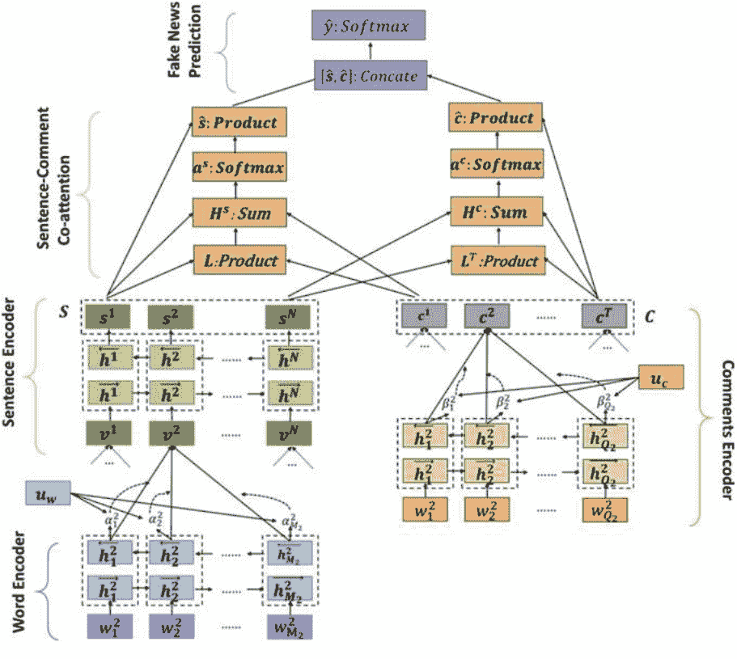

图2 dEFEND框架: 新闻内容编码器, 用户评论编码器, 句子-评论共同注意力组件和假新闻预测组件

在另一个实例中，Singhania等人[5]提出了一个三级分层注意力网络(3HAN)，分别用于单词、句子和新闻文章的标题，从而通过自下而上的分层方式有效地表示输入的新闻文章。在一个真实世界的数据集上评估时，实验结果显示96.77%的准确率。注意力层的可视化有助于定性分析，并揭示了假新闻文章使用倒金字塔式的写作风格（即按重要性递减的方式分布信息）。

在一项名为“不同色调的真相”的虚假新闻的广泛语言分析中，Rashkin等人[6]发现，虚假信息使用更多的第一人称和第二人称代词，更多的主观词、最高级词和情态副词，以及更少的肯定词。他们的工作使用了一个简单的LSTM模型和预训练的嵌入，然而，实验证明了精心设计的语言特征提供了很大的价值（图2）。

基于过去的研究成果，Shu等人[7]在他们的研究“dEFEND”中认为，虚假新闻检测器的可解释性是至关重要的，以及如何利用社交媒体上对新闻文章的评论来实现这一目标。


社交媒体上对新闻文章的评论可以用来促进这一目标。作者提出了一个新闻内容编码器（在句子级别）和一个用户评论编码器，然后将它们输入到一个共同注意力子网络中，以利用新闻内容和用户评论（图2）。实验设置表明，这种技术不仅在F1得分上至少比最先进的虚假新闻检测方法高出5.33%，而且还同时识别出解释一条新闻为何是虚假的前k个用户评论（图3）。

此外，Khattar等人[8]通过使用视觉信息和文本信息来检测错误信息，进一步增强了数据信号。他们提出的框架被称为多模态变分自编码器（MVAE），使用双模态变分自编码器从文本和视觉数据中学习表示，然后将其输入到全连接前馈神经网络中进行虚假新闻检测（图3）。该设置在微博和Twitter的数据集上进行评估，结果显示在这两个数据集上，该模型的平均准确率提高了约6%，F1得分提高了约5%（图4）。

语言模型的进展。目前，像BERT、ELECTRA、ELMo这样的高级预训练语言模型在包括文本分类在内的多个自然语言任务中受到了相当大的关注，而在误传检测领域也有一些相关工作。Jwa等人[9]提出使用基于BERT的模型来检测虚假新闻，分析新闻标题和正文之间的关系。由于BERT是在通用数据上进行预训练的，作者还将新闻领域的数据纳入进一步的微调，性能有了显著提高。BERT的深度上下文化特性使F1得分比之前最先进的模型提高了0.14。Kaliyar等人[10]提出的FakeBERT模型通过将BERT表示输入到三个并行的1D-CNN块中，进一步改进了性能。

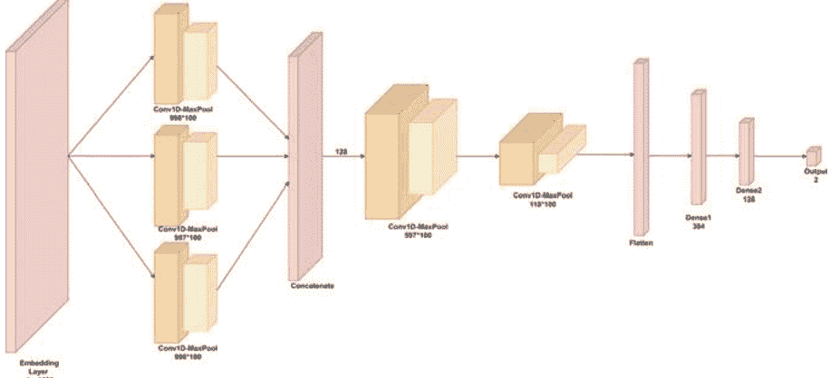

图4 FakeBERT架构

采用具有不同过滤器和内核大小的卷积层以实现更好的特征提取（图4）。作者展示了98.90%的准确率，比基准方法提高了4%，这是假新闻检测器发展的一个有希望的方向。

##### 3.2 点击诱饵

在社交媒体中，点击诱饵是一种带有夸张或引人注目标题的文本或链接，诱使读者“点击”。点击诱饵在在线用户体验中是一种麻烦，因为它利用了读者的好奇心，引诱他们阅读质量低下或不准确的信息。这是最常见的假新闻类型之一，通常用于广告，其中大量内容生成器通过基于点击的模型来优化虚假内容以赚取利润。点击诱饵利用了一些脆弱的用户，并滥用了用户生成内容的目的。这种欺骗形式被认为是社交媒体上的一种欺诈活动，并且在新闻报道界受到谴责，因为它导致了真实新闻传播的阻碍。因此，及早检测和标记点击诱饵在网络中是非常重要的。

2016年美国总统选举后，这个领域受到了很多关注，专家们争论说社交媒体上的标题诱导点击和其他虚假新闻可能影响了决策。一些早期的研究[12]使用某些语言线索来描述标题诱导点击，如未解决的代词、前向引用、后向引用和动作词。然而，由于标题只包含有限的信息，将这些特征编码到模型中变得具有挑战性。继续前进，我们深入探讨一些采用深度学习技术的方法，这些方法从过去的研究中获得知识的优势，并已被证明能够有效地检测到点击诱饵。

###### 利用文本数据

过去，CNN在各种句子分类任务中展示了有效性，因此在点击诱饵检测任务中尝试它们是很自然的。与传统的机器学习方法相反，CNN消除了整理有意义特征的需要，这可能有所帮助，也可能没有帮助。该领域的早期工作之一使用带有预训练的word2vec嵌入的CNN从新闻文章的标题中提取有意义的信息，进而用于预测[13]。这个模型被称为TextCNN，在与其前身技术相比表现出色，然而，在点击诱饵领域仍有很大的改进空间。

在他们优化TextCNN模型用于点击诱饵检测的尝试中，郑等人[14]认识到不同类型的点击诱饵文章倾向于使用不同的方式来吸引用户的注意力。对于他们的方法，被称为ClickbaitCNN，作者们收集了来自四个著名的中国新闻网站的标题，这些标题分为四种文章类型：新闻、博客、论坛和微信。他们提出使用一个新的词嵌入层，同时考虑整体和与文章类型相关的词义。

他们还提出了一个新的损失函数来调节与文章类型相关的词义的影响。研究发现，采用这些技术可以提高TextCNN的性能，精确度和召回率分别提高了2-3%。

###### 编码顺序信息

尽管基于CNN的技术在语言相关任务（如此类任务）中已经证明是有帮助的，但由于它们的本质限制，它们无法利用顺序信息。点击诱饵检测问题可以从RNN中受益，特别是如果将其作为多类分类问题提出，因为RNN可以很好地编码顺序/上下文信息。

在这些行上，周等人[15]提出了一种基于自注意力的循环神经网络模型，用于推断文本标记在预测点击诱饵时的重要性水平。数据来源于Twitter，并且手动注释为“非点击诱饵”、“稍微点击诱饵”、“相当点击诱饵”或“非常点击诱饵”。使用GloVe嵌入来有效地学习表示，并且在词嵌入层的输出、双向门控循环单元(biGRU)编码层的输出以及自注意层的输出上应用了dropout正则化。实验运行结果显示，在F1得分方面，与ClickbaitCNN相比，计算成本非常低，提高了4%（图5）。

Dong等人[16]通过利用误导性标题与内容之间的关系进一步推动了最新技术的发展，发现这为解决这个问题提供了重要线索。作者提出了一个深度关注相似性模型，用于捕捉输入对（即标题和内容）的全局和局部相似性（图5）。文本输入的表示是通过使用基于注意力的双向GRU模型获得的，类似于Zhou等人[15]的方法。全局相似性是通过最小化标题和内容之间的余弦相似度来学习的，用于不匹配的对。另一方面，局部相似性是通过使用块大小和步长选择的文本片段来计算的，同样通过最小化不匹配对的值来实现。

这些相似性与潜在表示连接在一起，并输入到完全连接的层中以产生输出。这种方法在F1得分方面比Zhou等人的自注意力RNN模型提高了约4%。

###### 标题的语言分析

此外，Naeem等人[11]展示了对点击诱饵的内在特征进行建模以进行知识发现并将其用于决策的成功。所述的知识发现是通过对新闻标题进行语言分析，使用词性分析模块（POSAM）来完成的。其思想是理解底层结构和语法，并相应地调整LSTM模块的结构以进行最终的分类（图6）。POSAM是基于词性（POS）标注器的原始n-gram分类器的变体，它揭示了点击诱饵文本中WH-限定词和代词等词的出现频率存在明显差异。此外，观察到在句子的后半部分存在创建信息差的POS标记，决定在后半部分有一个回环，有效地使第二半部分的权重加倍。该框架在Reddit上收集的新数据集上进行评估，并产生了0.973的F1分数（图6）。

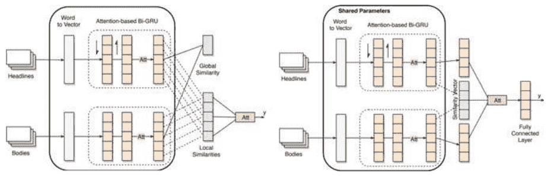

图5 L: 全局和局部相似性的学习。R: 综合方法用于最终预测

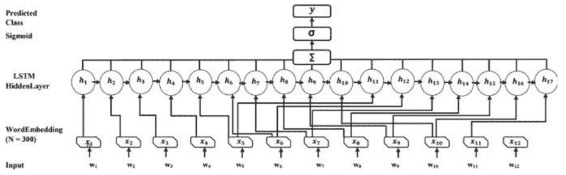

图6 POSAM使用单层，时间戳为10个单位，并且回环的一半词汇用于关注出现在标题后半部分的词汇

##### 3.3 讽刺

讽刺是一种非常有趣的体裁，涉及嘲笑、幽默、讽刺或夸张，主要被认为是一种娱乐形式。然而，读者往往无法识别出讽刺，如果线索太微妙无法识别或者缺乏相关背景。在人们将其视为真相的情况下，讽刺成为一种虚假新闻类型，从而传播不准确的信息并导致社会的不信任。正如《卫报》报道的那样，无论荒谬的内容如何，人们不仅相信讽刺内容，而且经常在他们的网络中分享。

检测文章中模仿真实新闻的讽刺内容是一个可以理解为二元分类问题的任务。过去在虚假新闻领域的研究可能不直接适用于讽刺检测，因为讽刺是一个具有独特特征的不同领域。例如，肖等人的作品[17]、董等人的作品[18]和葛等人的作品[19]专注于通过知识库和真实性估计来揭示真相，然而由于通常没有关于讽刺的真相，这些技术可能对这类虚假新闻无效。由于与欺骗检测问题的相似性，我们可以利用涉及心理语言学特征分析[20]、写作分析[21]和文化差异[22]的解决方案来解决讽刺检测问题。

需要注意的是，这些技术考虑的是文档级别的特征，然而观察到讽刺线索只存在于某些段落中，因此表明文档级别的特征对于这个用例可能是多余的。在本节中，我们将讨论一些深度学习技术，利用过去的研究来设计巧妙的框架，有效解决手头的问题。

###### 利用词汇和用户信号

Amir等人的早期作品之一[23]利用了讽刺内容的传递方式严重依赖于作者。因此，他们基于CNN的深度学习框架在处理问题时学习并使用用户嵌入，除了词汇信号外，无需手动特征工程。利用词汇信号生成多个特征图，采用多个不同的卷积神经网络（CNN）生成文本嵌入，这些文本嵌入利用了预训练的词嵌入。而用户嵌入则编码了用户的潜在特征并捕捉了同质性。这两种嵌入被连接在一起，提供了整体的上下文信息，并输入到完全连接的网络中，最终产生输出。该方法在从Twitter获取的数据集上进行了评估，该数据集是使用基于标签的监督方法收集的，并且相比于利用大量精心设计的特征的最先进方法，该方法表现出了优势（准确率提高了2%）。

###### 改善数据和模型质量

从Twitter收集的数据集往往具有嘈杂的标签，以及语言问题，加上推文可能不是自包含的，即回复中存在对话趋势或内容被分成线程。为了解决这些缺点，Misra等人[24]收集了一个高质量的数据集，通过利用两个流行的网络来源：HuffPost（用于真实新闻）和The Onion（用于讽刺新闻），来构建数据集。此外，作者通过认识到RNN在编码顺序信息方面的优势，提出了一个混合框架，在其中通过CNN和自注意力双向LSTM学习文本嵌入。然后将两种方法的嵌入进行连接，并最终将其馈送到全连接层进行最终预测。

除了将分类准确率提高5%之外，该研究还可视化了各种标题上的注意力层，以改善模型的可解释性。定性结果显示，该网络强调了每个句子中不一致词组的共现，例如“压迫其他人”和“开幕式期间的疯狂k-pop sh*t”，这些是我们人类检测讽刺的重要线索。

###### 利用段落级语言特征

杨等人的研究[25]表明，讽刺线索通常反映在文档的某些部分，因此使用具有注意机制的分层神经网络来提取段落级语言特征在解决检测讽刺问题是成功的。他们提出使用四个级别的特征：字符级特征通过CNN提取，能够很好地识别形态信息和命名实体，词级特征通过在字符级表示之上应用双向GRU生成，段落级特征通过在词表示上应用双向GRU并与工程化的语言特征连接生成，以及文档级特征通过对段落级表示应用注意机制并与工程化的语言特征连接生成。这些语言特征包括心理语言学特征、写作风格特征、可读性特征和结构特征。定性评估表明，可读性特征支持最终的分类，而心理语言学特征、写作风格特征和结构特征在段落级别上是有益的。此外，这篇论文揭示了讽刺新闻的写作往往是情感和想象力的。

###### 无源对抗训练

到目前为止讨论的方法都是基于根据文章来源自动标记的语料库构建的。McHardy等人[26]假设这鼓励模型学习出版源的特征，而不是某种程度上的讽刺特征，例如，如果来自The Onion，则是讽刺的；如果来自HuffPost，则是真实的，从而导致在未见过的出版源上性能较差。作者提出了一个对抗性组件来控制出版源的混淆变量。该框架由三个部分组成：特征提取器、讽刺检测器和出版标识器（图7）。特征提取器将预训练的词嵌入输入双向LSTM和注意力机制。讽刺检测器和出版标识器通过softmax层输出各自任务的预测结果。由于目标是控制出版源的混淆变量，训练过程中将出版标识器视为对手，即更新分类器的参数以优化出版标识，同时更新共享特征提取器的参数以欺骗出版标识器。这种技术在从4个真实新闻和11个讽刺德国网站收集的数据集上进行了评估。

图7 无源对抗训练模型

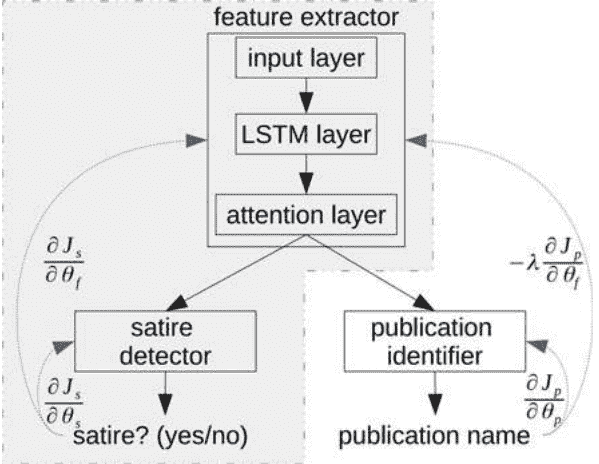

来源和定性分析显示，对抗性组件使模型能够关注讽刺的语言特征（图7）。

##### 3.4 深度伪造

随着图像处理和机器学习技术的进步，生成虚假的图像、音频和视频变得更加容易，这是相当令人担忧的。这些合成的视听内容，称为深度伪造，正在社交媒体上传播虚假信息，例如名人色情、修改过的政治领导人视频以引发冲突、恶作剧电话等。值得注意的是，伪造内容的想法并不新颖，通过“Photoshop”和常规视频编辑已经存在一段时间了，然而，深度伪造是一组非常强大令人信服的媒体，几乎不可能从事实中分辨出来。通过使用复杂的生成对抗网络(GANs)的深度学习技术，创建这些虚假的图像和视频。Zhu等人的CycleGAN是一种流行的技术，它使用GANs生成具有与输入图像相同特征的新图像。CycleGAN的关键特点是应用了循环损失函数，使其能够学习潜在特征并进行图像到图像的转换，无需配对示例，因此属于无监督学习范式。这种技术的成功归功于如今在网络上可用于训练的大量数据，这些数据以图像和视频的形式存在，现在已成为流行的内容媒介，多亏了像TikTok和Instagram这样的社交媒体网络。

显然，深伪技术有很大的潜力在我们的社会中制造混乱，通过在社会中播种和推动社会冲突、欺诈和报复。因此，尽早构建准确检测和标记这一系列伪造图像和视频的方法非常重要。

| ShallowNetV1 | ShallowNetV2 | ShallowNetV3 |
|---|---|---|
| C-N-R-D-C-N-R-D-C-N-R-M-D | C-R-D-C-R | C-R-D-C-R |
| C-N-R-D-C-N-R-D-C-N-R-M-D | -D-C-R-D | -D-C-R-M-D |
| C-N-R-D-C-N-R-D-C-N-R-M-D | C-R-D-C-R | C-R-D-C-R |
| C-N-R-D-C-N-R-D-C-N-R-M-D | -D-C-R-D | -D-C-R-M-D |
| C-N-R-D-C-N-R-D-C-N-R-M-D | C-R-D-C-R | C-R-D-C-R |
| C-N-R-D-C-N-R-D | -D | -D |
| F-De-R-N | F-De-R-N | F-De-R-N |
| -D-De-S | -D-De-S | -D-De-S |

图8 ShallowNet的变化。每一行代表架构中的一个块。(注意 $\mathrm{C}=$ Conv2D, $\mathrm{N}=$ Batch Normalization, $\mathrm{R}=$ ReLU, $\mathrm{D}=$ Dropout, $\mathrm{M}=$ MaxPooling, $\mathrm{F}=$ Flatten, $\mathrm{De}=$ Dense 和 $\mathrm{S}=$ Sigmoid)

准确检测和标记这一系列伪造图像和视频的方法非常重要，尽早在传播过程中进行。具有讽刺意味的是，深度学习已被证明是在区分真实和虚假内容方面更精确的方法之一。

###### 深伪图像检测

在基于人脸识别技术的较简单方法中，Nhu-Tai等人[28]使用深度卷积神经网络来解决深伪图像检测问题。首先，他们将人脸归一化为正面视图，然后进行深度特征提取以获得和归一化面部特征。然后，在人脸匹配过程中，为了区分真实和伪造图像，他们创建了一个适当的模型来计算面部特征向量之间的距离，用于面部识别和验证。通过调整分类器层的权重来校准提取的特征，结合韩国国家研究基金会（NRF）提供的取证数据，实现了微调机制。所提出的方法在给定的取证数据上表现良好，准确率达到80%。

###### 通过集成提升性能

进一步，Tariq等人[29]设计了一个集成模型，在“GAN是朋友还是敌人？”中使用了三个不同的浅层CNN，包括L2核正则化器（值为0.0001）、批量归一化、最大池化和dropout，他们称之为ShallowNet。根据（Fig. 8）中提到的不同层设置，创建了不同变体的ShallowNet。V2和V3变体在深度上类似，但比V1更浅，这导致训练时间更短。然而，在V3中引入最大池化层可以在低分辨率图像上获得更好的性能，而V1在这方面明显表现较差。ShallowNet实现了 $\sim 99.99 \%$ 的准确率，并在准确性和AU-ROC方面优于知名的GAN生成图像检测神经网络，如VGG16、XceptionNet和NASNet。结果还表明，随着深伪图像的分辨率降低，检测它们变得更加困难，模型性能有所下降。

## 使用图像预处理来增强模型的泛化能力

上述技术的一个主要缺点是它们在训练和评估模型时使用相同的数据集，这在实际情况并不适用。为了对抗未知类型的深度伪造并增强深度伪造检测模型的泛化能力，Xuan等人提出了一种新的图像预处理方法，即高斯模糊和高斯噪声，在训练阶段使用。与通用方法相反，这个想法是通过仅向训练图像添加高斯模糊和高斯噪声来破坏不稳定的低级高频噪声线索，以改善真实图像和伪造图像之间的像素级统计相似性。这推动模型学习更多内在和有意义的特征，而不仅仅是学习伪造图像生成模型的风格。他们没有使用复杂的模型，而是使用了一个相当简单的深度卷积生成对抗网络 (DCGAN) 作为鉴别器（图9）。实验结果证明了所提出的技术在增强泛化能力方面的有效性，尽管由于这个问题的固有困难，效果并不显著（图9）。

###### 真假对比学习

到目前为止，深度伪造检测一直被视为一个二元分类问题，目的是将给定的图像分为伪造或真实。此外，以前的研究集中在从真实图像部分重建的伪造图像上，即这些模型不能用于检测与任何生物无关的完全合成图像。可以理解的是，后者是一个困难的问题，因为只收集由GAN生成的图像组成的训练集是麻烦的。换句话说，从过去的GAN生成的图像中学习的监督学习技术可能不会导致具有普遍性的模型，因为检测器将无法识别在训练过程中过去可能没有见过的图像。为了克服这个问题，Hsu等人提出了一种基于修改的CNN的成对学习方法，他们称之为共同伪造特征网络 (CFFN)（图10）。

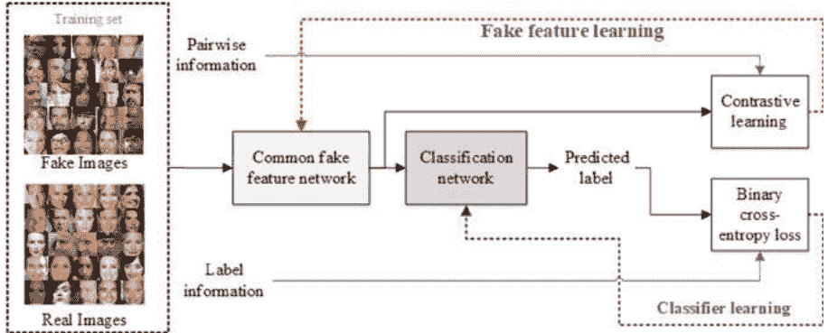
图10 基于CFFN的两步学习方法

在他们的方法中，作者将假图像和真实图像配对，并使用配对信息构建对比损失，这有助于所提出的CFFN学习区分性的共同假特征（CFFs）。然后可以进一步使用CFFs来区分假图像和真实图像。CFFN是一个集成了DenseNet的孪生网络。与通常只有单一流的常规CNN不同，CFFN是一个双流网络，具有摄入CFF学习的配对输入能力。由于CNN仅使用高级特征表示来检测真假，CFFN中的跨层特征串联进一步有助于捕捉细粒度特征表示，这正是假人脸图像的CFFs所存在的地方。这种技术采用了两步学习策略，因为它使用对比损失来学习CFFs，然后通过最小化交叉熵损失来优化分类器。实验结果表明，CFFNs具有比其他方法更高的泛化能力和有效性。

###### Deepfake视频检测

目前，人工生成的视频已经有很多重大的进展，具有如此复杂的嘴唇动作和眼睛同步，很难分辨出是否是假的。在每一帧上应用deepfake图像检测机制来揭示虚假性是不可行的，因为视频压缩后丢失了帧信息。

###### 利用眨眼的生理信号

李等人在他们的研究中提出了一个非常有价值的观点，利用眨眼的生理信号来检测假视频。他们的新方法采用了长期循环卷积神经网络（LRCN），这是CNN和RNN的结合，以捕捉眨眼过程中的现象学和时间规律。这个想法是，平均休息眨眼率为每分钟17次，可以增加到每分钟26次或降低到每分钟4.5次，这取决于对话的强度，然而，发现合成生成的面部视频缺乏眨眼功能，因为训练数据集很少包含闭眼的面部。

所提出的LRCN模型包括三个主要组成部分。特征是提取部分将输入的眼部区域转换为有区分度的特征，然后是序列学习。学习是通过带有LSTM单元的RNN实现的，以增加RNN模型的内存容量，并在反向传播时避免梯度消失。

###### 不要“假装到成功为止”！流行的伪造简介...

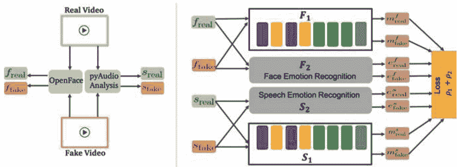

最终，状态预测组件使用LSTM的输出生成眼睛睁开或闭合的概率，通过这个概率我们可以绘制眨眼时间序列。该方法使用闭眼（CEW）数据集和DeepFake生成的视频进行评估。实验表明，尽管常规CNN能够非常好地预测图像中眼睛的状态，但它缺乏时间上的知识，而LRCN则利用长期动态来有效地预测眼睛状态，更加平滑和准确。

###### 超越可见信号的限制

Ciftci等人[33]在研究生物信号（如心率、血液流动）的有效性时，深入研究了这个问题，这些信号可能对人眼不可见。他们的研究“深伪视频的心脏如何跳动?”提出了从图像中提取光电容抗 (PPG) 信号，以检测血液流经静脉时皮肤反射的变化，从而帮助我们标记伪造视频。这个想法是在视频的每一帧中找到一个脸，使用人脸检测器并提取具有尽可能多稳定PPG信号的脸部区域。然后计算不同时间窗口中PPG细胞中原始值的功率谱密度，这有助于分类器（一个浅层CNN）将其标记为伪造或非伪造。这个设置在包含伪造视频的公共数据集（如CelebDF, Face2Face, FaceSwap等）上进行了实验，并能够达到约97.29%的准确率（图11）。

除了眼睛眨动和血液流动等生物信号外，还有其他信号，如音频和视频之间的同步，可以帮助检测视频是否是假的。在他们的研究“情感不会撒谎”中，Mittal等人建议从视频中寻找面部线索、语音线索、背景环境、手势和身体姿势，并进一步分析这些模态来识别真假视频。实验使用基于孪生网络的架构，输入一个真实视频和其对应的深度伪造视频，并获取模态以及面部和语音的情感嵌入向量（图11）。然后使用嵌入向量计算三元损失函数，以最大化真实视频模态之间的相似性，最小化伪造视频模态之间的相似性。

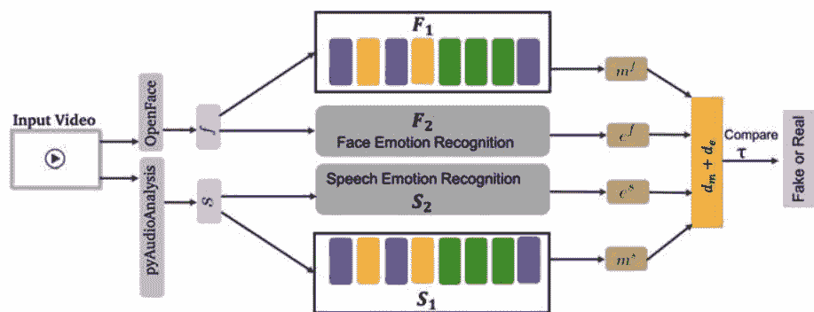
图12 多模态深度伪造检测：测试例程

主体的面部和语音的情感嵌入向量（图11）然后使用这些嵌入向量计算三元损失函数，以最大化真实视频模态之间的相似性，最小化伪造视频模态之间的相似性。该方法在两个深度伪造识别基准数据集Deep-fakeTIMIT和DFDC上进行了测试，分别获得了96.6%和84.4%的准确率（图12）。

###### 超越单帧

到目前为止，趋势是逐帧分析以寻找可能表明给定视频是否人工生成的线索。Lima等人[35]提出将时间因素纳入各种动作识别方法中，以应用于深伪造检测，这证明了其相对于当代基于帧的机制的优势。直觉是这些合成视频由于各种篡改而缺乏时间上的连贯性。CelebDF v2数据集用于此设置，并通过裁剪超出脸部（仅考虑脸部的篡改），从而消除数据中的噪声。实验结果显示，在各种架构中引入时间信息比基于帧的基准模型具有优势。R3D网络优于其他方法，它由一系列引入了层间信号绕过的残差网络组成。

毫无疑问，伪造图像和视频的制作大幅增加，并且达到了如此完美的程度。制作深度伪造的工具变得越来越容易获取，社交媒体为它们提供了一个突出的平台来传播。上述关于深度学习用于检测深度伪造的研究只是与对抗这种社会恶行同时进行的众多工作流之一。

## 深度学习方法的4个限制

尽管深度学习模型已经证明在一定程度上通过利用文本和时间属性来识别假新闻是成功的，但是假新闻检测仍然是一个艰巨的挑战。

因为假新闻的内容被精心制作，以至于即使是见多识广的读者也很难辨别真实信息和伪造信息。这是因为伪造内容被制作得如此巧妙，以至于即使是见多识广的读者也很难辨别真实信息和伪造信息，除非进行交叉参考、事实核查或者获取额外信息。这是因为伪造内容被制作得如此巧妙，以至于即使是见多识广的读者也很难辨别真实信息和伪造信息。

本章讨论的大多数技术采用自然语言处理（NLP）来分析新闻文章的写作风格和词汇模式，以确定是否为假新闻。这些方法在分析上相当肤浅，因为它们只检查新闻文章是否符合专业记者通常使用的标准风格。周等人在他们的研究中建议在这些基于NLP的假新闻检测技术之上使用众包的基于事实的知识检查，以实现更强大的机制。通过对假新闻检测器Fakebox的实验，他们突出了基于NLP的假新闻检测方法的脆弱性，因为缺乏更深层次的语义知识可能导致不准确的结果。它们也很容易受到恶意用户通过事实扭曲、内容夸大、将两个独立事件联系起来、主谓交换等对抗性攻击的欺骗。这些攻击更加隐蔽，因为它们不会改变新闻文章的整体写作风格，从而有可能逃避相似性检测。

#### 5 公平性和可解释性

对于更多新颖、准确和稳健的假新闻检测技术，深度学习方法受到越来越多的关注。在这个尝试中，一个滞后于快速发展的领域是对理性和伦理考虑的集中。由于不公平的假新闻检测模型对社会的影响比其他比较作品（如垃圾邮件过滤器或语音识别）更为严重，因此假新闻检测的伦理和公平性方面也值得关注。

Deepak等人[37]分析了假新闻检测方法在关键维度上的伦理考虑：价值观不匹配、数据驱动性和领域属性。在解决这个问题时，内容的上下文非常重要，因此新闻的准确性和模型的公平性之间存在紧张关系是显而易见的。模型学到的行为规则可能与社会不同，因为政治、合法性和情感是一个光谱，往往没有黑白之分。由于用于检测假新闻的深度学习技术，无论是有监督还是无监督，都只是建立在过去数据的统计模型上，它们会根据过去事件编码假设，这些假设在当前时代可能相关或不相关。根据模型的架构，也可能存在决策时间线和法律或任何引用的逆转未被考虑的情况。因此，对于假新闻上下文的静态性的隐含假设是阻碍全面公平和伦理洞察的另一个维度。使这个问题独特的另一个方面是虚假新闻是一个普遍的特征，几乎没有任何情况下它可能是真实的一部分人群和虚假的另一部分人群。因此，从伦理角度来看，结果中的任何不一致都是不可接受的。

尽管在虚假新闻检测方法方面取得了重大进展，但仍有一些尚未完全理解的领域。虚假新闻检测技术的可解释性是一个这样的领域，因为虚假新闻检测是一个广泛的问题，取决于我们所处理的虚假新闻的类型。可解释的模型可以帮助调试和模型验证，同时通过提供决策的解释来帮助用户识别算法中的偏见。Moheseni等人提出了算法的可解释性、对模型行为进行可视化的能力、对最终用户透明度的解释以及与新闻相关的经过验证的声明作为可以改进虚假新闻检测研究的三个维度。

## 6个新兴趋势

对假新闻检测的调查引起了人们的关注，并且仍然是研究和发展的一个增长领域，特别是在机器学习从业者和科学家中间。

鉴于假新闻领域的敏感性和高风险性，假新闻检测算法的问责制是另一个新兴的探索领域。这是必要的，因为可能通过事实扭曲、内容夸大、将两个独立事件联系起来或者主谓交换等方式进行对抗性攻击，这些方式甚至可以使更加严格的技术偏离其正常的操作模式，因为数据质量较低。Bogaert等人在《Can Fake News Detection be Accountable?》中研究了假新闻检测对制造的对抗性示例的鲁棒性。为了解决这些问题，一个建议是在检测框架中加入对抗性组件，通过改变真实新闻来自动生成假新闻，并允许检测模型更好地识别句法和语义模式。为了长期的问责制，Bogaert等人建议开发评估这些对策的方法。

最近，流行的社交网络 Twitter 引入了一个‘在转发之前阅读！’提示，旨在促进用户之间的理性讨论。由于标题经常具有误导性，这个提示鼓励用户在分享之前阅读整篇文章，以防它最终成为又一个虚假新闻文章。这些提示是鼓励媒体素养和控制社交媒体上虚假新闻传播的聪明方式。为了打击虚假新闻，Twitter 推出了一个名为 Birdwatch 的社区驱动项目，允许人们识别他们认为具有误导性的推文，并写下提供信息背景的注释。这样的数据对算法问责和改进虚假新闻检测方法非常有价值。

在选举之前，新加坡的一项名为网络虚假信息和操纵法案（POFMA）的法律，现在迫使社交媒体公司遵守他们的压制性法律，旨在通过在当局认为虚假的帖子旁边放置警告来打击虚假新闻，并在极端情况下将其删除。尽管这些法律被认为是潜在的审查工具，但当局声称，由于社交媒体公司通过传播虚假新闻来吸引眼球而将利润置于原则之上，这是一种必要的行动来遏制这种麻烦。为了符合POFMA，Twitter现在有一个额外的‘法律要求通知’标志来指示错误信息。

对于这个话题的一个有趣观点是分析社交媒体上虚假新闻的传播，而网络中的一个主要元素就是用户。Lopez等人[40]提供了一个令人信服的论点，说明某些用户可以根据他们的历史被标记为恶意用户，从而表明传播虚假新闻的意图。由于Twitter是一个流行的社交媒体网络，人们在其中积极分享更新，作者们致力于对用户进行假新闻传播者的个人资料分析，目前仅关注英语和西班牙语的推特用户。这是一个有进一步研究空间的领域，例如基于多种语言、其他人口统计学特征、时间或心理相关特征等等。

#### 参考文献

- 1. Shu, K., Sliva, A., Wang, S., Tang, J., Liu, H.: 社交媒体上的假新闻检测：数据挖掘视角。ACM SIGKDD Explorations Newsl 19(1), 22–36 (2017)
- 2. Zhou, X., Zafarani, R.: 假新闻综述：基本理论、检测方法和机会。ACM Comput. Surv (2020)
- 3. Khan, J.Y., Khondaker, Md.T.I., Afroz, S., Uddin, G., Iqbal, A.: 机器学习模型在在线假新闻检测中的基准研究。机器学习应用（2021）
- 4. Wang, W.Y.: “说谎者，说谎者，裤子着火”：一个新的用于检测假新闻的基准数据集（2017年）。arXiv:1705.00648
- 5. Singhania, S., Fernandez, N., Rao, S.: 3HAN：用于假新闻检测的深度神经网络（2017年）。https://doi.org/10.1007/978-3-319-70096-0_59
- 6. Rashkin, H., Choi, E., Jang, J.Y., Volkova, S., Choi, Y.: 不同程度的真相：分析假新闻和政治事实核查中的语言。 在： 2017年自然语言处理实证方法会议论文集，第2931-2937页（2017年）
- 7. Shu, K., Cui, L., Wang, S., Lee, D., Liu, H.: defend：可解释的假新闻检测。 在： 第25届ACM SIGKDD国际知识发现与数据挖掘会议论文集，第395-405页（2019年）
- 8. Khattar, D., Goud, J.S., Gupta, M., Varma, V.: MVAE: 多模态变分自编码器 用于假新闻检测。 在： 世界广泛的网络会议（WWW '19），第2915-2921页。计算机协会，纽约，美国（2019年）
- 9. Jwa, H., Oh, D., Park, K., Kang, J.M., Lim, H.: exBAKE: 基于双向编码器表示的自动假新闻检测模型（BERT）。应用科学。 9 （19），4062（2019年）
- 10. Kaliyar, R.K., Goswami, A., Narang, P.: FakeBERT: 基于BERT的深度学习方法在社交媒体中检测假新闻。Multimed. Tools Appl. 80， 11765-11788（2021年）
- 11. Naeem, B., Khan, A., Beg, M.O., Mujtaba, H.: 一种基于自然语言线索的社交领域网络点击诱饵检测的深度学习框架。计算机社会科学杂志1-13（2020年）
- 12. Chen, Y., Conroy, N.J., Rubin, V.L.: 误导性在线内容: 将点击诱饵识别为“虚假新闻”。 在: 2015年ACM多模态欺骗检测研讨会论文集, 第15-19页 (2015年)
- 13. Kim, Y.: 卷积神经网络用于句子分类。EMNLP (2014年)
- 14. Zheng, H.-T., Chen, J.-Y., Yao, X., Sangaiah, A.K., Jiang, Y., Zhao, C.-Z.: 点击诱饵卷积神经网络。 对称性 10 (5) , 138 (2018年)
- 15. Zhou, Y.: 使用自我注意网络检测推文中的点击诱饵 (2017年)。arXiv:1710.05364
- 16. Dong, M., Yao, L., Wang, X., Benatallah, B., Huang, C.: 相似性感知深度关注模型用于点击诱饵检测。 计算机科学讲义 (包括子系列计算机科学人工智能和生物信息学讲义) (2019年)
- 17. 肖, H., 高, J., 李, Q., 马, F., 苏, L., 冯, Y., 张, A.: 朝着真相的信心: 一种基于自举的真相发现方法。 在: 第22届ACM SIGKDD国际会议上的知识发现与数据挖掘, 1935-1944 (2016)
- 18. 董, X.L., 加布里洛维奇, E., 墨菲, K., 当, V. , 霍恩, W., 卢加雷西, C., 孙, S., 张, W.: 基于知识的信任: 估计网络来源的可信度 (2015年)。 arXiv:1502.03519
- 19. 格, L., 高, J., 李, X., 张, A.: 多源深度学习用于信息可信度估计。 在: 第19届ACM SIGKDD国际会议上的知识发现与数据挖掘, pp. 766-774 (2013年)
- 20. Li, J., Ott, M., Cardie, C., Hovy, E.: 识别欺骗性意见垃圾的一般规则. 在: 第52届计算语言学协会年会论文集 (第1卷: 长文) , 第1566-1576页 (2014年)
- 21. Feng, S., Banerjee, R., Yejin, C.: 句法风格学用于欺骗检测. 在: 第50届计算语言学协会年会, ACL 2012 - 会议论文集, 第2卷, 第171-175页 (2012年)
- 22. Taylor, P., Larner, S., Conchie, S., Zee, S.: 跨文化欺骗检测. 检测欺骗: 当前挑战和认知方法, 第175-201页 (2015年)。 https://doi.org/10.1002/9781118510001.ch8
- 23. Amir, S., Wallace, B.C., Lyu, H., Carvalho M rio, P., Silva, J.: 用用户嵌入模拟上下文进行社交媒体讽刺检测 (2016). arXiv:1607.00976
- 24. Misra, R., Arora, P.: 使用混合神经网络进行讽刺检测 (2019). arXiv:1908.07414
- 25. Yang, F., Mukherjee, A., Dragut, E.: 使用注意机制和语言特征进行讽刺新闻检测和分析 (2017). arXiv:1709.01189
- 26. McHardy, R., Adel, H., Klinger, R.: 对讽刺检测进行对抗训练: 控制混淆变量 (2019). arXiv:1902.11145
- 27. Zhu, J.-Y., Park, T., Isola, P., Efros, A.A.: 使用循环一致性对抗网络进行非配对图像翻译。 在: IEEE国际计算机视觉会议论文集, 第2223-2232页 (2017年)
- 28. Do, N.T., Na, I.S., Kim, S.H.: 使用卷积神经网络从GANs中进行法医面部检测 (2018)
- 29. Tariq, S., Lee, S., Kim, H., Shin, Y., Woo, S.: 检测机器和人类制造的假面图像。 在: 野外, pp. 81-87 (2018). https://doi.org/10.1145/3267357.3267367
- 30. Xuan, X., Peng, B., Wang, W., Dong, J.: 关于GAN图像取证的泛化。 在:中国生物识别会议, pp. 134-141 (2019)
- 31. Hsu, C.-C., Zhuang, Y.-X., Lee, C.-Y.: 基于成对学习的深度伪造图像检测。 Appl. Sci. 10(1), 370 (2020). https://doi.org/10.3390/app10010370
- 32. Li, Y., Chang, M.-C., Lyu, S.: In ictu oculi: 通过检测眨眼揭示由AI生成的假视频。 In: IEEE国际信息取证与安全研讨会(WIFS), 第1-7页。IEEE (2018)
- 33. Ciftci, U.A., Demir, I., Yin, L.: 深度伪造的心脏如何跳动? 通过解释生物信号中的残差进行深度伪造源检测。 In: 2020 IEEE国际联合会议生物识别学(IJCB), 第1-10页。 (2020)
- 34. Mittal, T., Bhattacharya, U., Chandra, R., Bera, A., Manocha, D.: 情感不会撒谎: 一种使用情感线索的音频-视觉深度伪造检测方法。 In: 第28届ACM国际多媒体会议论文集, 第2823-2832页。(2020)

- 35. de Lima, O., Franklin, S., Basu, S., Karwoski, B., George, A.: 使用时空卷积网络进行深度伪造检测(2020). arXiv:2006.14749
- 36. Zhou, Z., Guan, H., Bhat, M.M., Hsu, J.: NLP对假新闻检测容易受到对抗攻击 (2019). arXiv:1901.09657
- 37. Deepak, P., Chakraborty, T., Long, C., Santhosh, G.: 数据驱动的假新闻检测中的伦理考虑 (2021). https://doi.org/10.1007/978-3-030-62696-9_10
- 38. Mohseni, S., Ragan, E., Hu, X.: 打击假新闻中的未解决问题: 解释性作为机会 (2019). arXiv:1904.03016
- 39. Bogaert, J., Carbonnelle, Q., Descampe, A., Standaert, F.-X.: 虚假新闻检测是否可追溯? 对抗性示例挑战。在: 第41届比荷卢信息理论研讨会 (2021年)
- 40. López, J., Martínez, P.: 在Twitter上对虚假新闻传播者进行个人资料分析。在: CLEF (工作笔记) (2020年)

朝向在社交媒体中检测虚假垃圾邮件组的无监督深度学习方法

摘要
近年来，社交媒体的接受度增加，多个用户使用各种平台分享不同类型的信息。当前估计的在线用户数量接近十亿。由于在线活动的增加，今天的网络流量增加了一半以上。更多的用户进行在线活动，可以挖掘更多的数据。因此，广告和营销部门需要了解人们如何表达他们的观点，他们的反应可以提高他们的业务效率。由于社交媒体根植于各种数据源的不同规模，它们通常非常庞大。现在，人们在网上评论产品，在数字消费市场中，这在大多数消费者做出购买决策时起着至关重要的作用。垃圾邮件发送者经常写虚假评论，以利用在线评论来增加/减少特定产品的价值。过去的研究集中于发现虚假评论的不同评论者ID。然而，为了针对和控制特定产品的情感，虚假评论者创建多个虚假ID，并组成团队撰写评论。在本章中，我们解决了检测此类虚假评论者团队的问题。具体而言，我们提出了一种基于深度学习的框架，用于使用各种无监督深度学习算法（如自组织映射和受限玻尔兹曼机）检测评论者的虚假评论者组数据。我们使用先进的深度学习框架（如TensorFlow）和流行的机器学习框架（如scikit-learn）对这些算法进行超参数优化。最后，我们讨论了在真实的Google Play Store应用评论数据集上对虚假评论者进行分组的实际实现，该数据集中约有38,123个评论者ID中的2,207个虚假评论者ID具有部分地面真实数据。

我们通过实验结果验证了，通过投影方法可以以合理的准确性检测出虚假评论者群体。它还可以通过语义特征、顺序亲和性和情感分析来识别社交媒体中的意见垃圾邮件群体。

关键词：假垃圾邮件组 社交媒体 深度学习 无监督学习 谷歌应用商店
Jayesh Soni, Nagarajan Prabakar 和 Himanshu Upadhyay

#### 1 引言
在线评论越来越普遍，并对购买决策产生更大的影响力[1]。最近的消费者报告显示，78%的用户在网购前会查看评论。在线评论现在比广告在影响消费者决策方面强大七倍[2]。这些评论的经济影响力不断增长，为企业提供了强烈的动力，以发布虚假评论来宣传自己并抹黑竞争对手[3]。2004年，亚马逊揭示了作者自我评论的现象[4]。虚假评论的问题不仅引起了研究人员和受影响平台的关注，监管机构也认识到了这个问题的严重性，并开始采取行动。现有文献中提出的虚假评论检测方法可以分为行为和语言两种方法。行为方法包括查找评级的分布异常和观察评论元数据中异常相关的模式。例如，这些模式可以通过检查这些评论者是否系统地为一组产品撰写正面评论或一组竞争产品撰写负面评论来揭示评论者之间的合作[5]。另一种语言方法是通过关注真实评论和虚假评论的语言模式差异来检测虚假评论。研究表明，人类在描述真实事件和想象事件时会无意识地使用不同的语言模式，机器可以利用这一趋势来自动检测欺骗[6]。谷歌应用商店和iOS上有数百万款应用程序，欺诈者编写欺诈评论并在这项任务中变得更加精细。因此，找到具有虚假评论者的虚假评论变得更加具有挑战性。此类团体中存在着欺骗性行为的激增。最初，欺诈者会创建许多账户，使用各种众包方法与评论者联系，最后进行欺诈活动。此外，为了防止被检测，一些团队成员会间接地评论与目标产品相关的产品，并以普通用户的身份进行评论，以欺骗垃圾邮件检测工具。这样一支评论团队共同撰写虚假评论。通过团队评论者，我们指的是一组评论者ID，其中真实评论者可以是一个人具有多重身份，多个人或两者兼有。他们比个体欺诈更加危险。因此，检测此类团体作为欺诈者至关重要。本章旨在研究多个深度学习在社交媒体数据分析中的应用。

#### 2 文献综述
近年来，学者们广泛探讨了检测虚假评论的研究。Mukherjee等人[7]利用产品评论的交易来识别候选评论垃圾邮件组。Xu等人[8]提出了一种基于kNN的方法，将每个评论者分类为特定垃圾邮件组的垃圾邮件/非垃圾邮件标签。

Allahbakhsh等人[9]通过训练两个独立的聚类算法来检测双团，以验证垃圾邮件性质。Wang等人[10]利用评论者图的拓扑排列提出了一种分而治之的算法。评论的文本内容是他们算法中的一个特征。Akoglu等人[11]使用排名靠前的垃圾邮件发送者的子图，并设计了一种基于图聚类的技术。他们利用网络对评论者和产品的影响。Choo等人[12]利用社区结构和评论交互数据进行情感分析。他们进一步利用该分析来区分亚马逊数据集中的垃圾邮件组和非垃圾邮件组。他们的实验结果推荐了意见组垃圾邮件中的强大的乐观社区。Rayana和Akoglu[13]提出了SpEagle来区分垃圾邮件发送者组。他们检查元信息和关系数据。Ye和Akoglu[14]开发了GroupStrainer，这是一个改进的两步算法。首先，他们使用网络足迹分数来计算产品可能是垃圾邮件的概率，然后对垃圾邮件发送者进行聚类。Dhawan等人[15]使用垃圾邮件得分来对每个评论者组进行排名，提出了DeFrauder模型，该模型考虑了底层图结构。Bitarafan和Dadkhah[16]利用评论者图中的双连通模块来识别候选垃圾邮件发送者组，进而用于分类。Ramnath等人[17]利用应用程序的三个不同特征，即评分、评论和排名，对特定应用程序进行分类，判断其是否欺诈。Umer等人[18]利用基于自然语言处理的词频-逆文档频率技术对文本评论数据进行预测应用程序的数值评分。Lin等人[19]研究了iOS应用商店的应用程序，并开发了一个模型来预测应用程序是否会提前从商店中移除。目前大多数流行的方法都是手动标记虚假评论，这是一个重要的缺点。

因此，我们提出了一种基于深度学习的框架，用于检测非基准数据的垃圾邮件发送者组。

学习和基于机器学习的无监督算法及其优点和缺点，以检测此类欺诈者群体。本章的其余部分总结如下。第2节讨论了文献综述。第3节详细介绍了基于学习的算法。第4节解释了各种流行的无监督深度学习和机器学习算法，并介绍了评估指标。第5节讨论了开源框架和库。第6节描述了这些算法在解决欺诈检测问题时的实际实时用例，使用真实的Google Play应用商店数据集。最后，在第7节中，我们总结并讨论了未来的工作。

## 3 基于学习的算法
人工智能是一个更广泛的领域，涵盖了与创建智能机器相关的一切。机器学习（ML）是人工智能的一个分支，深度学习（DL）是一种应用于大规模和复杂数据集的机器学习（ML）方法（图1）。
- 1. 人工智能（AI）：自从机械的出现以来，人们就对自动化产生了兴趣。AI使得机器能够在没有人为干预的情况下学习。它是计算机科学的一个广泛领域。它由两个词组成：“Artificial”表示不自然的东西，“Intelligence”表示理解或推理的能力。
- 2. 机器学习（ML）：ML系统可以自动学习数据中的模式，无需显式编程。有三种类型的ML算法：有监督学习、无监督学习和半监督学习。
- 3. 深度学习（DL）：DL是一种受到人脑信息处理机制鼓励的方法。它利用神经网络（人脑神经元的数学模型）来模仿这种行为。它通过层次结构帮助研究输入数据，以进行进一步的预测和分类。它的网络架构可以分为循环神经网络[20]、卷积神经网络[21]和生成神经网络[22]。

### 3.1 机器学习算法
机器学习算法主要分为有监督、无监督和半监督三类。我们将限制我们的关注在有监督和无监督上。

图1 层次结构
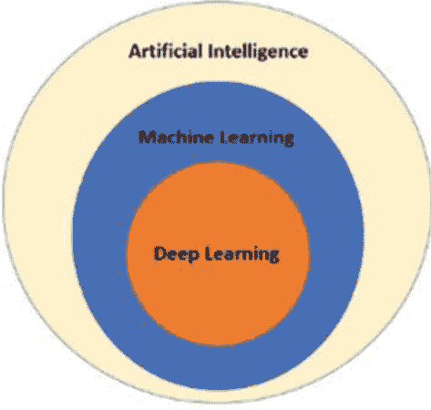
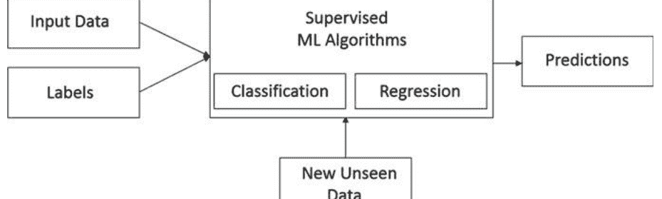
图2 有监督机器学习算法

### 3.1.1 有监督机器学习算法
在基于有监督的机器学习算法中，我们需要一个带有标签的输入数据集进行训练。例如，输入观测可以是不同的花朵的原始图像，而标签可以是花朵类型的名称（图2）。这些算法从原始数据集中学习模式并预测标签。

在训练过程中，输入数据被称为训练数据，并附有每个数据点的标签。算法学习将输入映射到其输出的函数。接下来，它预测结果并将其与实际输出进行比较。最后，它根据预测和实际输出之间的差异计算错误，并相应地重新训练。

监督算法可以分为两类：
- 1. 分类
- 2. 回归

分类：输出标签是分类的，例如“癌症或非癌症”。

回归：输出是实际值，例如房价预测。

基于分类的算法：逻辑回归、决策树、随机森林、K最近邻、支持向量机等。
基于回归的算法：决策树回归器、线性回归、支持向量回归器等。

### 3.1.2 无监督机器学习算法
在无监督的机器学习算法中，我们只有没有标签的输入数据集在训练时。算法从未标记的数据集中学习隐藏的结构（图3）。

无监督算法可以分为两类：
- 1. 聚类
- 2. 关联

聚类：它揭示数据的内在结构并将其分成不同的群组。例如，将测试数据分成政治、天气等群组。

关联：它发现关联规则。例如，如果人们购买了Y，他们也倾向于购买Z。

基于无监督机器学习的算法：K均值++[23]，主成分分析（PCA）[24]，T-SNE[25]，DBSCAN[26]，混合模型[27]等。

基于无监督深度学习的算法：自组织映射（SOM）[28]，受限玻尔兹曼机（RBM）[29]。让我们深入研究这些算法。

## 4 无监督算法
在学术界和工业界广泛接受的基础上，选择了以下三种无监督算法。

### 4.1 自组织映射
Teuvo Kohonen创建了自组织映射（SOM）。SOM从多维空间中发展出的低维空间上的点之间的几何关系规定了它们的相似性。它是一种基于深度学习的无监督算法，使用竞争学习的概念生成低维子空间。获胜神经元与样本输入非常相似，并使用获胜神经元来调整权重。此外，在最终收敛之前，它经过多次迭代进行训练。

### 4.1.1 SOM的架构
SOM具有单个计算层的神经元，并具有前馈架构。所有神经元都与所有初始单元的神经元密集连接（图4）。它有五个步骤：
- 1. 选择权重：每个权重向量都是随机选择的。
- 2. 比赛：从训练数据向量中引入一个随机输入。
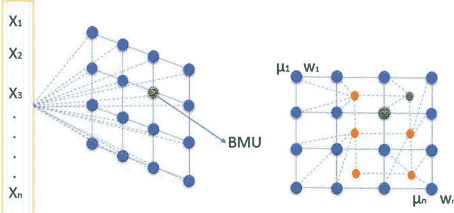
图4 自组织映射
- 3. 相似性：找到与输入节点最近的权重向量，并将其声明为获胜神经元。
- 4. 应用：更新权重。
- 5. 维护：重复步骤2直到特征图收敛。

它使用以下权重更新公式：
```
Wv(i+1) = Wv(i) + δ(b, v, i).θ(i).(K(h) - Wv(i)) (1)
```
其中i是步骤值，h是一个样本训练示例，b是向量K(h)的最佳匹配单元（BMU），θ(i)是学习系数；δ(b, v, i)是在特定步骤中给出神经元u和神经元v之间距离的函数。

**优势**
- 最终的特征图可以很容易地解释。
- 可以组织多维复合数据集。

**劣势**
- 权重选择很难调节。
- 它有附近点行为相似的约束要求。

**应用**
- 大规模文档集的组织。
- 音标打字机。
- 分类世界贫困。

### 4.2 受限玻尔兹曼机
RBM由一个输入层和一个隐藏层组成。在图5中，（K1…K6）是输入层的节点，而（D1,D2）是隐藏层的节点，最后，匹配的偏差存在。RBM不需要输出层，因为其学习机制与常规前馈网络不同。

它们是概率性的，模型分配的是概率值而不是离散值。RBM在每个点处处于特定状态。这里，状态表示输入层(k)和隐藏层(d)的神经元值。下面的方程式中给出了在某个状态下k和d的联合概率分布的值。
$$P(k, d)=\frac{1}{Z} e^{-E(k, d)} \quad(2)$$
$$M=\sum_{k, d} e^{-E(k, d)} \quad(3)$$
其中M是函数，表示所有可能的k和d的总和。下面的方程给出了给定k和d条件下d的概率和k的概率。
$$P(d|k) = \frac{1}{1+e^{-E(d,k)}} \quad (4.1)$$
$$P(k|d) = \frac{1}{1+e^{-E(k,d)}}$$
最后，使用贝叶斯规则，对于给定的输入k，神经元t使用下面的方程被激活：
$$p\left(d_{t=1} | k\right)=\sigma\left(b_{t}+\sum_{i} k_{i} w_{i t}\right) \quad(5)$$

**优势**
- 不平衡问题可以通过SMOTE [30]方法解决。
- 使用Gibbs采样，RBM找到了缺失的值。
- 为了解决噪声标签的问题，RBM利用其重构误差。
- 它将原始数据转化为隐藏单元，以克服非结构化数据的问题。

**劣势**
- 主要的缺点是它比反向传播算法慢。

**应用**
- 模式识别。
- 推荐引擎。
- 雷达目标识别。

### 4.3 K均值
K均值算法将数据集聚类为K个不同的组，其中K必须预先定义，并且数据集的每个点只属于K个聚类中的一个。

以下是K均值算法的步骤：
- 随机选择子空间中的任意点作为初始K个质心。
- 计算所有点与所有K个质心之间的距离。
- 根据最小距离准则将点分配给聚类。
- 对于每个聚类Ki，计算其点与质心之间距离的平均值，并重新分配新的聚类质心。
- 重复步骤2到4，直到前一个聚类质心与当前质心之间的距离不再变化。

**目标函数是：**
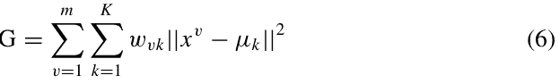
其中 $v_i$ 的聚类中心是 $\mu_k$。

**优势**
- 编码简单。
- 它可以快速处理大型复杂数据集。
- 收敛到鞍点聚类中心是有保证的。
- 它可以很好地推广到各种形式和维度的聚类。

**劣势**
- 聚类的数量必须预先定义。
- 数据点分配给聚类的方式取决于聚类中心的初始位置。

**应用**
- 市场细分。
- 文档聚类。
- 图像分割。

KMeans++ 是 KMeans 的一个版本，其中聚类中心的初始化不是随机的，而是依赖于第一个聚类中心的初始化。下一个聚类中心的进一步分配取决于与第一个聚类中心的距离。每个聚类中心将从实际数据点中取出。

### 4.4 评估指标

#### 4.4.1 肘部法则
簇间距离：簇与其所属点之间的距离。

簇内距离：簇与其他簇之间的距离。

肘部法则是一种可以用来确定簇值的度量方法[31]。在这种方法中，x轴表示簇的数量，y轴表示簇间距离。随着K值的增加，簇间距离减小，形成肘部的形状。此后，数值将平行于x轴移动。肘部点被认为是最佳的簇值。

#### 4.4.2 轮廓系数
轮廓系数衡量了点对其簇的归属程度以及与最近簇的距离。它是簇间距离和簇内距离的综合。其值范围从 -1 到 +1，其中 +1 表示良好的得分，反之亦然 [32]。

对于给定的数据点 d，轮廓系数 sc(d)定义如下：
$$\operatorname{sc}(\mathrm{d})=\frac{m(d)-n(d)}{\max \{n(d), m(d)\}}$$
其中 n(d) 表示 d 与其所在簇中所有点的平均距离。
$m(d)$ 表示点 $d$ 与其不属于的所有其他簇的最小平均距离。

## 5 框架和库
提出的研究框架的实验使用以下三个库进行：
- Tensorflow：Tensorflow是谷歌的开源库，用于深度学习和机器学习[33]。
- Keras：Keras是Tensorflow的封装库，被许多社会团体广泛使用。在Keras中编写的代码会被内部转换为TensorFlow进行进一步执行。它具有功能API（应用程序编程接口）和顺序API[34]。
- Scikit-learn：Scikit-learn处理各种基于学习的算法（有监督和无监督）[35]。

## 6 实际实施
本节提供了无监督算法的实际实施，用于检测伪造的谷歌应用商店评论者群体。

**谷歌应用商店[36]**：谷歌应用商店提供各种令人兴奋的应用程序可在Android操作系统上运行（其中一个流行的移动操作系统）。它由谷歌开发和管理，应用程序可以免费或收费下载（取决于应用程序）。2016年，谷歌应用商店下载了超过820亿次不同的应用程序，而2017年可用的应用程序总数几乎超过350万个。

**问题定义**：开发人员创建应用程序并将其上传到谷歌应用商店进行下载。用户通过应用程序的评论和评级来下载应用程序。因此，开发人员需要为他们应用程序获得良好的评论和评级以产生收入。现在，一些开发人员通过为他们应用程序编写虚假的好评和虚假的差评来进行欺诈。此外，他们雇佣评论者以团体方式进行此类欺诈行为。

**数据集**：我们有一个真实的Google Play商店应用数据集，其中包含640个应用程序的评论。我们对2207个虚假评论者ID拥有部分真实数据，这些ID属于原始数据集中的23个唯一聚类中的38,123个评论者ID之一。问题是使用整个数据集中的真实数据对未知的评论者ID进行聚类。我们拥有共同评论图，其中每个节点代表一个独立的评论者，两个评论者（R1和R2）之间的链接表示他们一起评论的应用程序总数（图6）。

### 6.1 框架描述
我们拥有一起评论应用程序的评论者的共同评论图，但没有任何文本评论数据集。因此，我们使用深度行走方法从图中提取特征。让我们简要讨论一下深度行走[37]。


图6 框架

## DeepWalk
DeepWalk是一种神经网络架构，可以给出具有节点和边的给定图的高级特征嵌入（表示）。它有两个子部分：
- 随机游走
- Word2Vec

### 随机游走
通过随机游走，使用随机抽样生成评论者ID序列。它有三个需要调整的超参数：
- 步数数量：需要生成的总步数。
- 最小路径长度：需要用于完整步行的评论者节点总数。
- 最小距离：需要覆盖的总距离（边权重）。

### Word2vec
Word2vec是一个神经网络，它将随机游走中的特定步行作为输入，并输出有意义的特征向量。它有两种不同的架构：
- CBOW
- SkipGram

这两种架构都从每个评论者节点中学习高级表示。

图7 CBOW


### A. CBOW (连续词袋模型)
CBOW [38] 获取上下文单词（周围的评论者ID）并预测中间的单词（中间的评论者ID）（图7）。

### B. SkipGram
SkipGram [39] 是CBOW的相反，它以单个评论者ID作为输入，并输出上下文评论者。这意味着给定一个评论者ID（上下文评论者），它输出与上下文评论者相关的评论者ID集合（图8）。Word2Vec有以下两个需要调整的超参数：
- (1) 表示大小：生成的特征向量的数量
- (2) 窗口大小：用作上下文向量的评论者ID数量。

## 6.2 实验结果
对于任何机器学习和深度学习算法，需要调整多个超参数。这被称为超参数优化。有各种技术，例如：
- (1) GridSearchCV：该技术对算法的所有参数进行穷举搜索。它需要很长时间，但可以得到最优的超参数集合。
- (2) RandomSearchCV：这种技术搜索随机参数值而不是穷举搜索。它所需的时间比GridSearchCV少，并提供接近最优的超参数集。

图8 SkipGram
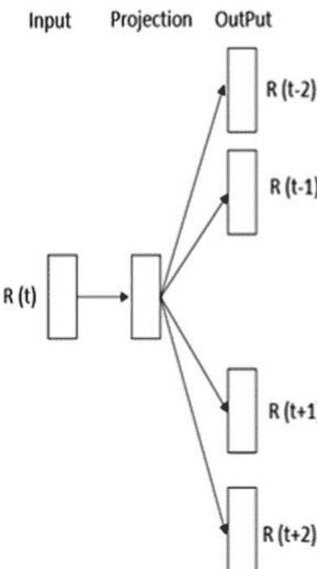

这里CV是K折交叉验证，其中K为10。图9显示了KMeans算法的弯曲曲线。聚类数显示在X轴上，Y轴表示簇内平方和（WCSS）距离。随着聚类数的增加，WCSS距离减小。弯曲点在300和400之间。同样，RBM在范围为350-400，而SOM将点聚类在370-420的簇范围内。聚类数表示数据中唯一垃圾邮件发送者组的数量。根据这些算法的结果，我们可以说最优聚类的总数在300-420的范围内。每个簇都有自己的行为。因此，可以基于这些聚类轻松检测新的未检测到的垃圾邮件发送者的行为，以优化的方式。

图9 距离与聚类数
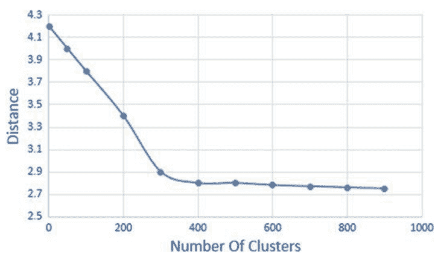

#### 7 结论
垃圾评论一直是一个重要的问题，因为在线市场竞争激烈。开发者希望他们的应用被数百万用户下载和使用以产生收入，因此他们通过编写虚假评论来进行欺诈。因此，识别此类垃圾评论者群体对于防止在线顾客受到虚假评论的影响至关重要。本章讨论了各种基于机器学习和深度学习的无监督算法，如KMeans、受限玻尔兹曼机和自组织映射，以及它们的优缺点。此外，我们通过使用真实的谷歌应用商店数据集，给出了将这些算法应用于解决欺诈评论问题的实际实现。

我们采用了基于DeepWalk的嵌入方法进行特征提取。深度行走方法必须在添加新节点时重新训练。因此，对于动态网络，我们采用流式图嵌入方法进行策略。这将实时重新定义垃圾评论者群体。我们使用分数的真实信息来优化DeepWalk的超参数。我们打算通过探索node2vec技术来扩展这一方法。此外，适当的自然语言处理（NLP）方法将提高语义关联的准确性。

#### 参考文献
1. Luca, M., Zervas, G.: 假装直到成功：声誉、竞争和Yelp评论欺诈。Manage. Sci. 62(12), 3412-3427 (2016)
2. Zhang, K.Z.K., et al.: 研究在线评论对消费者决策的影响：一种启发式-系统性模型。决策支持系统。 67, 78-89 (2014)
3. Chen, P.-Y., Dhanasobhon, S., Smith, M.D.: 不同的评论和评论者对Amazon.com的影响并不相同。Com (May 2008) (2008)
4. Norris, G., Brookess, A., Dowell, D.: 互联网欺诈受害心理学：一项系统性综述。警察犯罪心理学杂志。 34(3), 231-245 (2019)
5. Mukherjee, A., Liu, B., Glance, N.: 在消费者评论中发现虚假评论者群体。在：第21届国际万维网会议论文集 (2012)
6. Mihalcea, R., Strapparava, C.: 测谎仪：自动识别欺骗性语言的探索。在：ACL-IJCNLP 2009会议短文集 (2009)
7. Mukherjee, A., Liu, B., Wang, J., Glance, N., Jindal, N.: 检测群体评论垃圾信息。在：第20届国际同伴万维网会议论文集，第93-94页 (2011)
8. Xu, C., Zhang, J., Chang, K., Long, C.: 揭示中国评论网站中的串谋垃圾信息发布者。在：第22届ACM国际信息和知识管理会议论文集，第979-988页 (2013)
9. Allahbakhsh, M., 等: 在线评级系统中的串谋检测。在：亚太网络会议柏林，第196-207页。德国，Springer (2013)
10. Wang, Z., Hou, T., Song, D., Li, Z., Kong, T.: 通过二分图投影检测评论垃圾邮件组。计算机学报 59 (6) , 861-874 (2016)
11. Akoglu, L., Chandy, R., Faloutsos, C.: 通过网络效应在在线评论中检测意见欺诈。在：ICWSM会议论文集，第13卷，第2-11期，第29页 (2013)
12. Choo, E., Yu, T., Chi, M.: 通过社区发现和情感分析检测意见垃圾邮件组。在：IFIP年会数据和应用安全与隐私会议论文集，第170-187页。瑞士洛桑：Springer (2015)
13. Rayana, S., Akoglu, L.: 集体意见垃圾检测：桥接评论网络和元数据。在：第21届ACM SIGKDD国际会议知识发现数据挖掘，第985-994页 (2015)
14. Ye, J., Akoglu, L.: 通过网络足迹发现意见垃圾群体。在：机器学习知识发现数据库的联合欧洲会议，第267-282页。瑞士洛桑，斯普林格 (2015)
15. Dhawan, S., Gangireddy, S.C.R., Kumar, S., Chakaborty, T.: 在客户评论中发现在线欺诈的集体行为 (2019)。arXiv:1905.13649
16. Bitarafan, A., Dadkhah, C.: 基于异构信息网络的垃圾邮件发送者群体检测。在：国际网络资源会议 (ICWR)，第228-233页 (2019)
17. Ramnath, M., Rubavathi, C.Y.: 使用情感分析的三阶段证据系统进行应用评估。在：2021年第三届智能通信技术和虚拟移动网络国际会议(ICICV)，第1180-1183页(2021)。https://doi.org/10.1109/ICICV50876.2021.9388544
18. Umer, M., Ashraf, I., Mehmood, A., Ullah, S., Choi, G.S.: 使用文本特征和集成学习预测Google应用的数值评级。ETRI J. 43(1), 95-108 (2021)
19. Lin, F., Wang, H., Wang, L., Liu, X.: iOS应用商店中已删除应用的纵向研究。在：2021年Web会议论文集(WWW '21)。计算机协会，第1435-1446页。纽约，纽约，美国。https://doi.org/10.1145/3442381.344999020
20. Soni, J., Prabakar, N., Upadhyay, H.: 使用LSTM seq-seq、余弦相似度和Jaccard相似度对系统调用序列进行行为分析，用于实时异常检测。在：2019年国际计算科学和计算智能会议(CSCI)。IEEE (2019)
21. Albawi, S., Mohammed, T.A., Al-Zawi, S.: 理解卷积神经网络.在：2017年国际工程与技术会议(ICET). IEEE (2017)
22. Serban, I., et al.: 使用生成式分层神经网络模型构建端到端对话系统.在：AAAI人工智能会议论文集，vol. 30,no. 1 (2016)
23. Likas, A., Vlassis, N., Verbeek, J.J.: 全局k均值聚类算法. Pattern Recogn. 36(2), 451-461 (2003)
24. Wold, S., Esbensen, K., Gelati, P.: 主成分分析. Chemom. Intell. Lab. Syst. 2(1-3), 37-52 (1987)
25. Soni, J., Prabakar, N., Upadhyay, H.: 使用t分布随机邻域嵌入算法可视化高维数据.在：数据科学原理，pp. 189-206. Springer, Cham (2020)
26. Schubert, E., et al.: DBSCAN重新审视，再次审视：为什么以及如何仍然使用DBSCAN。ACM Trans. Database Syst. (TODS) 42(3), 1-21 (2017)
27. Topchy, A., Jain, A.K., Punch, W.: 用于聚类集成的混合模型。在：Proceedings of the 2004 SIAM International Conference on Data Mining. Society for Industrial and Applied Mathematics (2004)
28. Kohonen, T.: 自组织映射。Proc. IEEE 78(9), 1464-1480 (1990)
29. Sutskever, I., Hinton, G.E., Taylor, G.W.: 递归时间限制玻尔兹曼机。在：Advances in Neural Information Processing Systems (2009)
30. Chawla, N.V., et al.: SMOTE: 合成少数类过采样技术。J. Artif. Intell. Res. 16, 321-357 (2002)
31. Soni, J., Prabakar, N.: 有效的机器学习方法来检测虚假评论者的群体。在：第14届国际数据科学会议(ICDATA'18)论文集。拉斯维加斯，内华达州(2018)
32. Ogbuabor, G., Ugwoke, F.N.: 使用轮廓得分值对医疗数据集进行聚类算法。国际计算机科学与信息技术杂志(IJCSIT) 10(2), 27-37(2018)
33. Dillon, J.V., et al.: Tensorflow分布(2017). arXiv:1711.10604
34. Ketkar, N.: Keras简介，第97-111页。Python深度学习，Apress Berkeley，加利福尼亚州(2017)
35. Pedregosa, F., et al.: Scikit-learn: Python中的机器学习。机器学习研究杂志 12, 2825-2830(2011)
36. Viennnot, N., Garcia, E., Nieh, J..: 对Google Play的测量研究。在：2014年ACM国际计算机系统测量和建模会议 (2014)
37. Soni, J., Prabakar, N., Upadhyay, H.: 通过加权图上的DeepWalk进行特征提取。在：第15届国际数据科学会议 (ICDATA'19) 论文集。拉斯维加斯，NV (2019)
38. Luo, Q., Xu, W., Guo, J.: 关于CBOW模型的过拟合和稳定性的研究。在：第5届Web规模知识表示检索与推理国际研讨会 (2014)
39. Guthrie, D., et al.: 对skip-gram模型的深入研究。LREC 6 (2006)

### 社交媒体网络系统中异常用户入侵检测的深度学习方法
Nidhi Lal, Shishupal Kumar和Garima Kaidan

摘要 现今，人工神经网络有潜力在各个方面学习和提高机器的性能。它为人类提供了一个使生活更简单和更灵活的平台。在人工神经网络中，机器经过训练并学会高效准确地工作。有各种各样的应用领域，如医疗保健、军事、金融、家用电器等。通过使用人工神经网络检测入侵，可以增强系统的安全性。受此启发，我们提出了一种新颖的方法，使用递归神经网络根据给定的输入数据对社交媒体网络入侵类型进行分类。所提出的模型在大型数据集上进行了训练和测试，结果显示准确率很高。随后，所提出的深度学习模型用于检测社交媒体网络中的入侵，并根据新的输入数据进行分类。

关键词 循环神经网络 · 社交媒体网络入侵 · 分类 · 反向传播

N. Lal · S. Kumar · G. Kaidan
印度信息技术学院
纳格浦尔计算机科学与工程系，马哈拉施特拉邦440003，印度
e-mail: skumar@iiitn.ac.in
G. Kaidan
e-mail: garima@thapar.edu
塔帕尔大学，旁遮普邦，印度
e-mail: nidhi@iiitn.ac.in

#### 1 引言
近年来，人们注意到计算机社交媒体网络相关攻击有所增加。互联网用户数量在过去几年里迅速增长，这导致了更多的威胁和漏洞，从而危及了社交媒体网络系统。任何在计算机网络上未经授权的活动都被称为社交媒体网络入侵。防御者起着重要作用。

在检测入侵中起着重要的作用，因为对社交媒体网络攻击的工作方式有清晰和更好的理解是一种优势。在大多数情况下，这种不受欢迎的社交媒体网络活动或入侵会导致社交媒体网络资源被占用，同时也威胁到网络和数据的安全。通过正确设计和部署网络入侵检测系统（NIDS），我们可以阻止入侵者。

入侵检测系统 (IDS) 是一种监视流量并检测恶意活动或可疑策略违规的软件应用程序或设备。如果某项活动被管理员报告或通过安全信息和事件管理系统集中收集，则称其为可疑恶意活动。IDS 是一个将来自各种来源的输出结合起来，并通过使用警报过滤技术来区分恶意活动和误报的系统。IDS 的类型可以根据范围的不同而变化，范围从单个计算机系统到大量计算机社交媒体网络系统。IDS 的传统分类分为两种类型：NIDS 和基于主机的入侵检测系统（HIDS）。操作系统中的进程被称为 HIDS，它们观察和分析重要文件。然而，NIDS 属于监视传入社交媒体网络流量并检测入侵存在的进程。根据检测方法的不同，IDS 也可以被分类为基于签名和基于异常的入侵检测。基于签名的 IDS 包括在系统中进行恶意软件检测的模式识别。然而，基于异常的入侵检测系统涉及根据“良好”流量生成的模型来检测偏离。

##### 1.1 入侵检测方法
基于签名的入侵检测系统：它指的是通过特定的搜索模式识别入侵攻击。这些模式可以是恶意软件中先前已知的指令序列或社交媒体网络流量中的恶意字节序列。这些模式被检测为签名。因此，基于签名的入侵检测系统可以轻松识别先前已知的攻击。但它无法识别系统中的新攻击。

基于异常的入侵检测系统：由于恶意软件的快速发展，该系统用于检测未知攻击。机器学习是创建可信活动模型的主要技术。基于异常的入侵检测系统被用作基准模型来识别新攻击。然而，它存在误报的问题，例如将合法且新的活动错误地识别为恶意。此外，它是一个耗时的入侵检测过程，并导致性能下降。在本文中，我们只考虑了基于异常的入侵检测。

##### 1.2 动机
基于异常的入侵检测是一种有效的方法，可以检测系统中已知和未知的攻击。通过对网络行为进行持续监控和建模，可以检测到威胁。对异常进行分类有三种方式：上下文、集体或点。这三类异常与社交媒体网络安全中的四种攻击类型相关，分别是用户对根攻击（U2R攻击）、拒绝服务攻击（DoS攻击）、远程对本地攻击（R2L攻击）和探测攻击。集体异常的功能与拒绝服务攻击的特征相匹配。

在拒绝服务攻击中，计算资源被充分利用来服务有效的网络请求。结果就是服务被拒绝给用户。上下文异常的功能可以理解为一种探测攻击。在这种攻击中，黑客会扫描网络设备的弱点或漏洞。然后，目标系统被利用。探测攻击是数据挖掘中经常使用的一种技术。非法访问管理员账户，从而利用一个或多个漏洞是用户对根攻击的特征，被称为点异常。在这种攻击中，主要目标是利用系统中存在的漏洞来滥用系统，并且随后违反用户权限。在远程对本地攻击中，攻击者使用试错方法来确定密码，并获得具有传输网络数据包权限的本地访问。

本文旨在提出一种高效可靠的方法，通过使用深度学习方法来检测和分类基于异常的入侵检测系统。为了实现这一目标，我们使用了深度神经社交媒体网络架构，因此提出了一种稳健高效的方法。本文的主要目标是设计一个深度神经社交媒体网络，能够以较高的准确度进行预测。在系统中存在入侵或攻击时，所提出的方法可以对入侵类型进行分类，包括R2L、U2R、DoS和探测四种类型的攻击。

#### 2 文献综述
调查结果表明，尽管计算技术和NIDS领域的研究取得了进展，但这些检测技术的很大一部分仍然采用能力较弱的基于签名的方法，而不是使用基于异常的检测方法[4]。不愿改变使用基于异常的检测技术的原因有很多，其中一些原因是获取可靠的训练数据困难、高误报率、系统的行为动态以及训练数据的持久性。简而言之，如果依赖基于签名的入侵检测技术导致检测无效、不准确和不可靠，那么这种情况可能很快达到一个临界点。

手头的任务是提出一种广泛接受的基于异常的检测方法，能够克服现代网络中不断变化所产生的限制。社交媒体网络安全面临两个主要限制。第一个限制是社交媒体网络数据量的持续增加。用户之间的连接水平增加，物联网（IoT）的普及以及云服务的大幅增长主要是社交媒体网络数据增长的原因。为了管理如此大量的数据，技术应能够有效且高效地分析数据。

需要深入监控和细粒度来提高准确性和效果，这是第二个限制。与抽象的高级观察相比，NIDS分析还需要更详细和上下文意识。近年来，对NIDS的研究主要集中在应用决策树（DT）、支持向量机（SVM）、朴素贝叶斯和其他类似的机器学习算法进行入侵检测。到目前为止，这些技术的解决方案已经提供了准确检测的改进。但是，这些技术存在一些限制，例如需要预处理数据的知识，例如识别有用的数据模式[4]。因此，这是一个昂贵的过程，也容易出现劳动密集和错误的情况。所需的训练数据可能非常庞大，同样在动态和异构环境中成为一个挑战。

先前的研究集中在机器学习的各种传统方法上，其中包括支持向量机（SVM）[1,5]，随机森林（RF）[11,12]，人工神经网络（ANN）[9]，k最近邻（kNN）[7]以及其他在调查论文[10,13]中提到的分类方法。

这些提出的方法在入侵检测系统方面取得了可观的成功。通过回顾[2,6,8]中的文献并进行文献调查，我们可以得出结论，神经网络入侵检测尚未得到充分利用，在该领域具有应用潜力。

在[15]中，作者提出了一种基于深度神经网络的基于流量的异常检测的深度学习技术。从结果可以推断出在软件定义网络中，可以使用深度学习进行异常检测。在[14]中，作者提出了一种基于自学习（STL）的深度学习技术，使用的数据集是基准NSL-KDD数据集。

然而，上述参考文献类别主要关注深度学习方法来检测和分类入侵攻击。作者进行的研究是一种增量方法，他们使用LSTM并获得更好的准确性。

这些参考文献在预训练中使用了深度学习技术，而分类任务则由传统的监督模型执行。在直接执行分类任务方面，深度学习技术的应用并不常见，而在多类分类中，需要对模型的性能进行研究。正如[16]所述，递归神经网络（RNN）被认为是一个规模较小的神经网络。

本文的作者提出了一个具有三层架构的RNN，其输入具有41个特征，输出具有四个入侵类别，用于基于误用的入侵检测系统。然而，层的神经元只有部分连接，精简的RNN不能展示对高维特征的深度学习能力。

此外，在二元分类的情况下，作者没有研究模型的性能。此外，我们使用混合集成方法来提高分类任务的性能。

在基于异常的社交媒体网络入侵检测中，系统经过训练，使用被标记为“正常”的社交媒体网络流量，我们可以将新的流量分类为“异常”或“正常”。生成模型中预期存在的特征是适应和学习的能力，以便其行为可以被泛化，并且能够在动态的社交媒体网络环境中应对和表现良好。这总结需要一个自学习系统。对于基于异常的NIDS的训练和验证，标记数据的可用性是一个重要问题，因为“正常”数据的标签是可用的，而入侵或“异常”数据的标签是不可用的。因此，在这种情况下，无监督或半监督的异常检测方法更受青睐，如SVM [19-22]。

最近，在深度学习领域的当前研究已经解决了上述限制，这引起了许多领域的广泛关注。深度学习是机器学习的一个改进子集，它有助于克服浅层学习的一些缺点。该方法是使用深度学习提出基于异常的NIDS模型。通过使用深度学习，预计可以解决基于异常的NIDS面临的训练数据不可用、适应动态社交媒体网络环境、高入侵检测率等问题。在IDS领域，有一些研究提案利用了深度学习，但并没有有效地利用深度学习方法的能力。

在深度学习中，通常利用层次化的多层架构进行分类、模式分析和无监督特征学习。

这种方法展示了生成模型的能力，可以得到高分类准确性，有时甚至可以从不完整的训练数据中提取有用数据的部分。深度学习基于计算观测数据的分层表示或特征的原理。在这里，低层次的因素或特征决定了高层次的因素。这些技术旨在从大规模无标签数据集中学习有效的特征表示，以无监督学习的方法预训练模型。

然后，使用有限的标记数据对模型进行微调，用于特定任务的监督分类。这种无监督训练的方法随后被深度神经网络模型的监督微调所跟随，这种方法高效，并在许多困难的学习问题上提供了有利的结果。

在局部极小值附近初始化权重可以增加模型改进数据表示并提供更好的泛化的机会。许多深度学习技术是可靠的，并根据问题领域进行选择。本文中使用的深度学习技术是循环神经网络和长短期记忆网络。

#### 3 提出的工作

在本节中，给出了提出的方法的详细描述。

##### 3.1 方法论

在本小节中，提出了一种深度学习架构，用作循环神经网络。递归神经网络的一种变体是循环神经网络，它是通过神经元之间的连接形成一个有向循环，而不是前馈神经网络 (FNN)。这意味着当前输入以及上一步的神经元状态会产生影响。根据此影响确定输出。循环神经网络由输入层的输入单元、构成输出层的输出单元和隐藏层组成。在该模型中，信息的流动是单向的，从输入层的单元到隐藏层的单元。图1显示了从上一个时间隐藏单元到当前时间隐藏单元的信息单向流动。隐藏层的单元被视为整个神经网络的记忆，并用于记住端到端的信息。展开循环神经网络后，它体现了深度学习。

递归神经网络技术可以通过监督学习用于分类任务。循环神经网络与传统前馈神经网络的本质区别在于引入了一个有记忆能力的有向循环，能够记住先前的信息并输出结果。在循环神经网络中，序列的当前输出与先前的输出相关，隐藏层之间的神经元具有连接，而不像前馈神经网络那样无连接。此外，输入层和先前隐藏层的输出作为下一隐藏层的输入。循环神经网络诞生于20世纪80年代，虽然相对较旧，但近年来展现出了其真正的潜力。原因是，可访问性和可用性的增加导致了大量可用于长短期记忆 (LSTM) 的数据的开发。

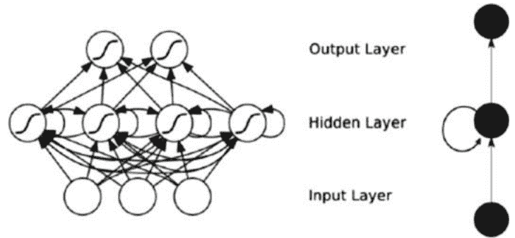

图1 循环神经网络的表示

计算能力的增强导致了大量可用于开发长短期记忆（LSTM）的数据的出现。循环神经网络中的记忆特性提供了记住接收到的输入数据的特征以进行预测的功能。对于前馈神经网络，信息的流动是从输入层，通过隐藏层，最终到输出层，只有一个单一的直线方向。

循环神经网络面临两个主要问题：梯度消失和梯度爆炸问题。LSTM网络解决了这些问题。在训练阶段，深度神经网络中存在梯度消失和梯度爆炸问题，这是由于梯度值在初始层中的反向传播引起的。从更深层传回到初始层的梯度值不断经历矩阵乘法，这是由于链式法则导致的。当值小于1时，它趋向于指数级收缩，直到消失。接近较早层时，它使模型无法学习，这被定义为梯度消失问题。梯度爆炸问题发生在值大于1时，它导致网络崩溃。

人工神经网络突然完全抹去已学习的信息并开始学习新信息的倾向被称为灾难性遗忘。这是由网络中的干扰引起的。

LSTMs是一种专门用于建模时间序列的RNN架构。它的长程依赖性比普通的RNN更准确。在LSTMs中，激活函数不在其循环组件中使用。因此，在梯度训练期间，存储的值不会被修改和消失。

LSTM具有一个显式的记忆单元，称为细胞单元，它在LSTM网络中固有地存在。因此，“遗忘”问题通过“添加”记忆来解决。LSTMs通过融入记忆机制克服了RNN的缺点。

通常，LSTM单元的实现是以“块”形式进行的，其中包含多个单元。在这些块中有三到四个“门”，根据逻辑函数决定信息的流动。将RNN与LSTM单元关联起来后，它们被称为长短期记忆网络或LSTM网络。

基本的LSTM单元包括一个细胞、一个输入门、一个输出门和一个遗忘门。这三个门有助于细胞内外信息流的调节。细胞还可以在任意时间间隔内记住这些值。LSTM的发展解决了在RNN训练过程中遇到的梯度消失和梯度爆炸问题。通过保持梯度足够陡峭，解决了梯度消失问题。因此，通过获得更高的准确性水平，训练时间会更短。RNN用于入侵检测最初是由Yin等人在[3]中提出的。然而，所提出的RNN模型在使用广泛的神经网络和深度神经网络方面与原始[3]有所不同。本文讨论了用于入侵检测任务的RNN和LSTM网络的实现。除了这两种方法之外，还使用了其他标准的机器学习分类算法，如支持向量机（SVM）和多层感知器（MLP），以与所提出的方法进行比较研究。

##### 3.2 数据集描述

所提出的模型的实现是用Python完成的。我们使用了一个由CPU或GPU后端驱动的Keras神经网络框架。通过调整学习率、激活函数和迭代次数来进行微调，以提高准确性。要使用的损失函数是输出值、预测值和实际标签值之间的交叉熵。神经网络对网络入侵的二元和多类分类进行评估。作为评估指标，我们考虑了检测的准确性，因为它是一个很好的性能指标。

深度神经网络架构的训练和测试过程使用了NSL-KDD数据集。关于NSL-KDD数据集的详细研究在[17]中进行。该数据集是在2009年生成的，是对KDD Cup '99数据集的改进，[18]中提到了该数据集的固有问题，通过删除冗余的记录。这个数据集被认为是最近关于入侵检测系统的研究工作中使用的基准数据集。该数据集包括训练集KDDTrain+（包括攻击类型标签-二元和五类分类）以及测试集KDD Test+（完整测试集）和KDDTest-21（文件'KDDTest+'的子集，不包含难度级别为21的记录）。

数据集由41个特征组成，每个流量记录都有一个类标签。基本特征（从第1列到第10列），内容特征（从第11列到第22列）和流量特征（从第23列到第41列）是这组41个特征中包含的特征。数据集将攻击分类为四类，分别是：R2L、U2R、DoS和探测攻击。测试集为入侵检测提供了一个现实的理论基础。它包含了训练数据集中不存在的某些攻击类型。

##### 3.3 数据集的预处理

第一步是对数据集进行预处理。在解决机器学习问题之前，数据预处理是必要的。机器学习中使用的数据集通常需要在训练机器学习算法之前进行处理或转换。这意味着将原始数据转换为干净的数据集。这样做是为了从机器学习模型中获得更好的结果。预处理的技术包括数据归一化、数据缩放、数据二值化和数据标准化。对NSL-KDD数据集进行的预处理包括数值化和归一化。

这个数据集有41个特征，其中包括38个数值特征和3个非数值特征，需要将非数值类型的特征转换为数值格式。这是因为循环神经网络要求输入值以数值格式提供。这三个非数值特征是 ‘service’, ‘flag’和‘protocol_type’特征，需要转换为数值格式。例如，‘protocol_type’特征有三种类型的属性：‘icmp’, ‘udp’和 ‘tcp’，需要使用独热编码方法将其转换为二进制向量，分别为 (0, 0, 1), (0, 1, 0) 和 (1, 0, 0)。‘service’特征有70种属性，‘flag’特征有11种属性。由于独热编码和数值化，这些特征将导致将41维特征映射为122维特征。

还有另一组三个特征，‘dst_bytes’, ‘src_bytes’和 ‘duration’，其中最小值和最大值之间的变化很大，因此需要应用对数缩放；然后使用归一化公式（如公式1）将每个特征线性映射到范围[0,1]中，其中 ‘min’和 ‘max’分别表示特征 ‘xi’的最小值和最大值。

$$x_i = \frac{x_i - \min}{\max - \min} \tag{1}$$

#### 4 实验细节

在本节中，我们详细讨论了RNN的性能。随后，给出了LSTM网络的实现描述。还讨论了用于训练和测试所提出模型的参数和超参数。

在RNN模型中，预处理后的输入层包含122个节点。在二元分类的情况下，输出层包含两个节点，类别为正常或异常；而在多类分类的情况下，输出层包含五个节点，类别标签分别为正常、R2L、DoS、U2R和Probe。用于实验的RNN的宽深模型如下所示：

- 1. 宽广的神经网络，具有一个隐藏层，节点数量在30到300之间变化。
- 2. 深度的神经网络，层数在2到20之间变化。

在宽RNN网络的情况下，单层的节点数量最初设置为30。神经网络在75%的数据上进行训练，并在剩余的25%上进行验证。模型权重被保存用于测试数据集。宽广的神经网络的第二次迭代将隐藏层的节点数量设置为40，其余参数保持不变。

所使用的模式是以每次增加10个节点的方式增加节点数量，直到神经网络中包含300个节点为止。保存的模型进行测试，并将准确性存储以进行比较。因此，RNN神经网络的宽模型的比较图表显示了测试数据准确性随着一个隐藏层中神经元数量的增加而变化。该实验同时进行了二进制和多类别分类。

实现深度RNN网络时采用了类似的方法。在这里，每一层的节点数量保持不变，而隐藏层的数量变化。在这个实现中，节点数量设置为40，并且获得了更好的结果。因此，深度神经网络的第一模型包含2个隐藏层，每个隐藏层有40个神经元/节点。第二次迭代包含3个隐藏层，每个隐藏层具有相同数量的节点，一直增加到20个隐藏层，其余参数保持不变。神经网络在75%的数据上进行训练，并在剩余的25%上进行验证。保存模型权重以便使用测试数据集对模型进行测试。通过考虑隐藏层数量的增加，生成了RNN神经网络深度模型的比较图表来观察测试数据准确性的变化。

实验同时针对二进制和多类别分类进行。

因此，我们有四个RNN神经网络模型，分别是：

- 1. 用于二进制分类的宽广神经网络
- 2. 用于二进制分类的深度神经网络
- 3. 用于多类别分类的宽广神经网络
- 4. 用于多类别分类的深度神经网络

生成的LSTM模型的宽广和深度模型如下：

- 1. 具有单个隐藏层的宽广神经网络，其中包含30到300个LSTM神经元的变化。
- 2. 具有隐藏层数量在2到20之间变化的深度神经网络。

在宽广的LSTM网络中，单层中的神经元数量最初设置为30。神经网络在75%的数据上进行训练，并在剩余的25%上进行验证。模型的权重被保存以便使用测试数据集进行测试。宽广神经网络的第二次迭代将隐藏层中的神经元数量设置为40，其余参数保持不变。按照每次增加10个神经元的模式逐步增加神经元数量，直到神经网络中包含300个神经元的隐藏层。保存的模型进行测试，并将准确性进行存储以进行比较。因此，针对增加一个隐藏层中神经元数量的测试数据准确性变化，生成了LSTM神经网络宽广模型的比较图。实验同时针对二进制和多类别分类进行。

实现深度LSTM神经网络的方法类似。在这里，每层LSTM神经元的数量保持不变，只在隐藏层的数量上进行变化。为了获得更好的结果，LSTM神经元的数量设置为55。因此，深度神经网络的第一模型包含2个隐藏层，每个隐藏层有55个LSTM神经元。

第二次迭代包含3个隐藏层，每个隐藏层具有相同数量的LSTM神经元，随后保持相同的剩余参数，一直增加到20个隐藏层。神经网络在75%的数据上进行训练，剩余的25%用于测试。模型权重被保存下来，以便使用测试数据集对模型进行测试。随后，根据隐藏层数量的增加，生成LSTM神经网络深度模型的测试数据准确性变化的比较图。通过这种方式，每个隐藏层中的LSTM神经元数量是固定的。这个实验既适用于二进制分类，也适用于多类分类。

因此，LSTM神经网络有四个模型，分别是：

- 1. 用于二进制分类的宽广神经网络
- 2. 用于二进制分类的深度神经网络
- 3. 用于多类别分类的宽广神经网络
- 4. 用于多类别分类的深度神经网络

在提出的方法中，梯度下降算法与时间反向传播(BPTT)相结合。在训练阶段使用这种组合来计算的梯度。随机梯度下降(SGD)被称为增量梯度下降。它遵循迭代方法来优化可微目标函数，作为梯度下降优化的随机逼近。与批量梯度下降相比，在每次参数更新之前，它会重新计算相似类型的实例的梯度。这样，它可以在大数据集上执行冗余计算。SGD每次只执行一次更新，没有冗余。它更快，也可以用于在线学习。SGD通过高方差进行频繁更新，使函数的目标严重波动。在批量梯度下降的情况下，它会收敛到盆地的最小值。在SGD的情况下，参数被初始化。这种波动有助于跳转到一个新的可能更好的局部最小值。然而，由于SGD必然会超调，因此它使得收敛到精确最小值变得复杂。然而，如果学习率缓慢降低，已经证明SGD显示出类似的收敛性。批量梯度下降通常对于凸优化收敛到全局最小值，对于非凸优化收敛到局部最小值。我们使用了由公式2表示的softmax激活函数。

同样地，对于一个sigmoid函数，softmax函数将每个神经元单元的输出压缩到0和1之间。此外，它确保了每个输出值的分割，使得输出值的总和等于1。

$$f\left(x_{i}\right)=\frac{e^{x_{i}}}{\sum_{j=1}^{k} e^{x_{j}}} \tag{2}$$

softmax函数的输出对应于一个分类概率分布。通过这种方式，它为所有类别给出了真实的概率值。在softmax的使用中，输出的范围在0和1之间。这个函数用于多类别分类的情况。在这种情况下，返回每个类别的概率。具有最高概率值的类别是目标类别。损失由方程3和4给出的交叉熵方法监控。用于衡量分类模型性能的函数必须包含输出值在0和1之间的概率。预测的概率与实际标签偏离越大，交叉熵损失就会不断增加。在二元分类的情况下，类别的数量用 $M = 2$ 表示。

$$- \left( y \log(p) + (1 - y) \log(1 - p) \right) \tag{3}$$

在多类分类的情况下，其中 $M > 2$，为每个类别标签的观测计算单独的损失，并将结果求和。

$$- \sum_{c=1}^{M} y_{o,c} \log(p_{o,c}) \tag{4}$$

其中 $M$ 是类别的数量。
$y$——二进制值（0或1），如果类别标签 $c$ 是观测 $o$ 的正确分类。
$p$——预测的概率观测 $o$ 属于类别 $c$。

如果预测值的概率发散，交叉熵损失将增加。对于完美的模型，损失值将为0。神经网络已经被训练以实现收敛。epochs（轮次）参数的数量设置为一个较高的值。通过网络的训练，可以提供预防措施。训练以每批1000个样本的形式进行。原因是，通过批处理对输入数据的分布进行近似比单个输入/样本更好。权重通过反向传播过程进行更新。如果批处理大小较大，则近似更好，但处理数据的时间可能更长。因此，批处理大小必须适当大，但不应超过内存限制。神经网络的训练在监控验证损失后达到收敛时停止，这被称为提前停止。通过使用25%的训练数据进行验证，可以防止过拟合。这可能导致神经网络在测试数据上表现不佳。神经网络的架构、权重和参数配置（优化器和损失函数）被存储在磁盘上以供以后在测试中使用。

#### 5 结果

在本节中，我们讨论了所得到的结果，并比较了RNN与提出的LSTM的性能。此外，我们还将提出的方法与其他标准机器学习算法进行了比较。下面的图表（图2和图5）显示了在测试中获得的准确性图表。图2显示了准确性与神经元数量的关系。在RNN二分类模型中，模拟从30个神经元开始，每次增加10个，直到达到300个。这个神经网络模型属于宽神经网络的范畴。观察到的平均准确性为## 一种用于异常用户入侵的深度学习方法...


图2 准确性与RNN二分类中神经元数量的增加之间的关系图

为90.53%，而最小值为60个神经元时的88.46%。 然而，最大准确性为40个神经元时的92.29%。

图3显示了关于隐藏层数量的准确性的图表。 它从第2层开始深入，一直到第20层的深度。 每一层都有固定数量的神经元，即在RNN模型中为40个，用于二元分类。

使用的类标签是正常和异常。 这个神经网络模型属于深度神经网络的范畴。 观察到的平均准确率为87.98%，在4层深度时观察到的最小准确率为84.65%。

然而，在13层深度时，最大准确率为88.85%。

图4显示了关于神经元数量的准确性的图表。 它从30个神经元开始，以10的增量逐步增加到300个，在RNN模型中用于多类分类。 模型使用的类标签被命名为正常和DoS，U2R，R2L和Probe。这个神经网络模型属于宽神经网络的范畴。 观察到的平均准确率为83.98%，在80个神经元时观察到的最小准确率为81.63%。 最大准确率为86.22%，在200个神经元时。

图5显示了关于隐藏层数量的准确性图。 它从第2层开始，一直到20层的深度。 在RNN多类分类模型中，每层有40个神经元。 使用的类标签是正常和DoS、Probe、U2R和R2L。这个神经网络模型属于深度神经网络的范畴。 观察到的平均准确率为85.36%，而在2层深度时观察到的最小准确率为82.21%。 然而，在第6层深度时，最大准确率为86.14%。

图3 RNN二分类准确性随隐藏层数增加的图

图4 RNN多类分类准确性随神经元数量增加的图

图5 RNN多类分类准确性随隐藏层数增加的图

图6显示了关于LSTM神经元数量的准确性图。它从30个神经元开始,以10的增量增加到300个,在LSTM神经网络模型中进行二元分类。使用的类标签是正常和异常。这种神经网络模型属于宽神经网络的范畴。观察到的平均准确率为96.48%,而LSTM神经元为60时的最小观察值为93.24%。然而,当LSTM神经元数量为270时,最大准确率为97.04%。

图7显示了关于隐藏层数量的准确性图。它从第2层开始,一直增加到第20层。每层都有固定数量的LSTM神经元。用于二元分类的LSTM模型使用正常和异常类标签。这种神经网络模型属于深度神经网络的范畴。观察到的平均准确率为97.66%,而在第4层深度时的最小观察值为96.49%。

然而,在第18层时,最大准确率为98.49%。

图8显示了关于LSTM神经元数量的准确率图。它从30个神经元开始,以10的增量增加到300个神经元。对于多类分类,它使用名为正常、DoS、U2R、R2L和Probe的类标签。这个神经网络模型属于宽神经网络的范畴。当LSTM神经元数量为40时,平均准确率为95.14%,最低准确率为90.68%。然而,当LSTM神经元数量为180时,最大准确率为96.09%。

##### 图6：准确率随着LSTM神经元数量增加的图表，用于二元分类

##### 图7：准确率随着隐藏层数增加的图表，用于LSTM二元分类

### Accuracy vs #LSTM Units for Multiclass Classifier

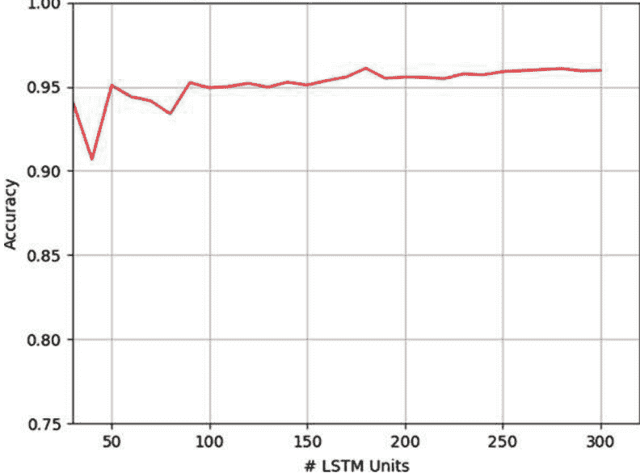

图8 准确率与多类别分类中神经元数量增加的关系图

### Accuracy vs Hidden Layers for Multiclass Classifier

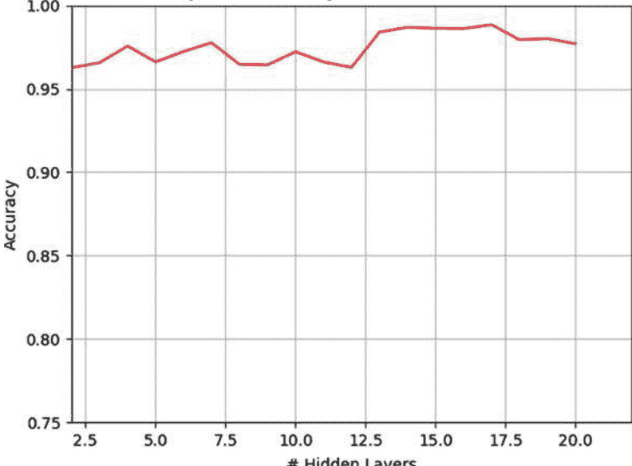

图9 准确率与LSTM多类别分类中隐藏层数量增加的关系图

图9显示了准确率与隐藏层数量的关系图。 它从2层开始, 深度增加到20层。 每个层中的LSTM神经元数量是固定的。对于多类别分类, 它使用名为正常、DoS、探测、U2R和R2L的类标签。这个神经网络模型属于深度神经网络的范畴。 观察到的平均准确率为97.46%, 在2层深度时观察到的最小准确率为96.27%。

然而, 在17层深度时, 最大准确率为98.84%。

#### 5.1 讨论

表1总结了在NSL-KDD数据集上实施的所有方法在检测基于异常的社交媒体网络入侵方面的准确率。

从表中, 我们可以很容易地观察到高斯朴素贝叶斯分类器表现最差。 它在二元分类中的分类准确率为85.3%, 在多类分类中的分类准确率为67.9%。

支持向量机的表现优于朴素贝叶斯分类器。 它分别给出了二元和多类分类的准确率为86.25%和82.75%。 然而, 分类准确率还可以进一步提高。 参数C的值被设置为1，并使用线性核。当数据的维度较高时，支持向量机（SVM）的性能不佳。

| 序号 | 方法 | 详情 | 二元准确率 | 多类准确率 |
|---|---|---|---|---|
| 1 | 朴素贝叶斯 | 高斯朴素贝叶斯 | 85.30 | 67.90 |
| 2 | 支持向量机 | C = 1.0, 线性核 | 86.25 | 80.64 |
| 3 | 多层感知机 | 宽网络, 50、150、200和250个神经元 | 87.06 (平均) | 82.75 (平均) |
| 4 | 多层感知机 | 深度网络, 5、10、15和20层 | 87.96 (平均) | 84.35 (平均) |
| 5 | 循环神经网络 | 宽网络, 30-300个神经元 | 90.53 (平均) | 83.98 (平均) |
| 6 | 循环神经网络 | 深度网络, 2-20层 | 87.98 (平均) | 85.36 (平均) |
| 7 | 长短期记忆神经网络 | 宽网络, 30-300个神经元 | 96.48 (平均) | 95.14 (平均) |
| 8 | 长短期记忆神经网络 | 深度网络, 2-20层 | 97.66 (平均) | 97.46 (平均) |

人工神经网络中的多层感知器（MLP）证明在这种多类别分类情况下可以提供更好的准确性。MLP模型被实现为具有一个隐藏层的宽模型。对于二分类和多类别分类的情况，将神经元的数量设置为50、150、200和250，并在表格中记录了平均准确性。MLP的深度模型包含固定数量的25个神经元，隐藏层数为5、10、15和20。然后，在二分类和多类别分类的情况下，记录了平均准确性。在此实现中，使用75%的训练数据集进行训练，25%用于验证。设置参数并调整超参数以获得记录的结果。

循环神经网络的深度和宽度模型比多层感知器模型表现更好。图2显示了在循环神经网络中，准确率随着神经元数量增加的变化图。由于网络的初始阶段，起始层会出现小的波动误差。当神经元数量较少时，它无法学习得很好。图3显示了在循环神经网络中，准确率随着隐藏层数量增加的变化图。这表明模型没有显示出很多波动误差。图4显示了在循环神经网络中，准确率随着神经元数量增加的变化图，用于多类别分类。由于学习和收敛能力的不足，它会出现小的波动误差。图5显示了在循环神经网络中，准确率随着隐藏层数量增加的变化图，用于多类别分类。可以看出没有太多波动误差。从图表中可以得出结论，循环神经网络的深度模型在二分类和多类分类中表现更好，而宽度模型则不如它。

LSTM的深度和宽度模型比RNN模型表现更好。图6显示了LSTM中二分类的准确率随着LSTM神经元数量增加的变化情况。该图显示了开始层中准确率的非常小的波动。原因是在初始阶段，神经网络在神经元数量较少时无法很好地学习。准确率似乎在后面的层次上没有饱和。图7显示了LSTM二分类中隐含层数量增加时准确率的变化情况。在这个图中，模型没有显示出很多波动的不准确性。图8显示了LSTM中多类分类的准确率随着LSTM神经元数量增加的变化情况。在这个图中，模型显示出小的波动不准确性。原因是，神经网络无法很好地学习和收敛。后面的层次没有显示出很多变化的不准确性。图9显示了LSTM中多类分类的准确率随着隐含层数量增加的变化情况。在这个图中，模型没有显示出很多波动的不准确性。从这些图表中，我们可以得出结论，LSTM的深度模型在二分类和多类分类中表现更好，比LSTM的宽度模型更好。此外，基于LSTM的神经网络模型在异常入侵检测方面表现更好。

#### 6 结论

基于异常的入侵检测系统是一种有效的方法，用于检测系统中以前已知的和新的/未知的攻击。它通过持续监测和建模网络行为来提供一些检测可能威胁的过程。

从上面的图表可以得出结论，LSTM在多类和二分类方面的准确率约为97%。还可以观察到二分类的准确率高于多类分类。

在RNN、LSTM和MLP的情况下，深度网络通常比网络的宽模型表现更好。这可能是因为网络的深层模型可以更好地建模数据表示。

#### 7 未来工作范围

在我们的未来工作中，可以应用特征选择算法并进行降维处理。这样可以减轻处理器的负担。

这也可能影响模型的性能。可以改变归一化方法来检查模型的性能。如果在网络的训练和测试过程中应用了运行时的减少，模型将能够高效工作。此外，可以尝试使用双向RNN、包含门控循环单元的神经网络和LSTM自编码器进行实验，以观察准确性是否有所提高。

#### 参考文献

- 1. Kuang, F., Xu, W., Zhang, S.: 一种新颖的混合KPCA和SVM与GA模型用于入侵检测。Appl. Soft Comput. (2014)
- 2. Fiore, U., Palmieri, F., Castiglione, A., Santis, A.: 使用RBM神经计算的网络安全异常检测。Neurocomputing 11 (2013). Elsevier B.V.
- 3. Yin, C., Zhu, Y., Fei, J., He, X.: 使用循环神经网络的深度学习方法进行入侵检测。IEEE Access 5 (2017)
- 4. Thapa, N., Liu, Z., Kc, D. B., Gokaraju, B., Roy, K.: 使用深度学习的基于异常的网络安全入侵检测系统。在2017年胡志明市国际系统科学与工程会议（ICSSE）中。
- 5. Reddy, R.R., Ramadevi, Y., Sunitha, K.V.N.: 使用SVM进行入侵检测的有效判别函数。在：国际计算、通信和信息学会议(ICACCI) (2016)
- 6. Alom, M.Z., Bontupalli, V., Taha, T.M.: 使用DBN进行入侵检测。在：国家航空航天和电子会议(NAECON) (2015)
- 7. Li, W., Yi, P., Wu, Y., Pan, L., Li, J.: 基于KNN分类算法的新型无线传感器网络入侵检测系统。电子计算机工程杂志(2014)
- 8. Niyaz, Q., Sun, W., Javaid, A., Alam, M.: 一种用于NIDS的深度学习方法。在：生物启发式信息与通信技术(BIONETICS)。比利时,布鲁塞尔(2014)
- 9. Ingre, B., Yadav, A.: 使用ANN对NSL-KDD数据集进行性能分析。在：国际信号处理和通信系统会议论文集（2015）
- 10. Buzcak, A.L., Guven, E.: 用于网络安全入侵检测的数据挖掘和机器学习方法综述。IEEE通信调查教程。 18（2016）
- 11. Zhang, J., Zulkernine, M., Haque, A.: 基于随机森林的网络安全入侵检测系统。IEEE系统、人、控制论C，应用评论。（2008）
- 12. N. Farnaaz和M. A. Jabbar，“用于网络安全入侵检测系统的随机森林建模”，Procedia计算机科学，2016年1月
- 13. Khan, J.A., Jain, N.: 入侵检测系统和分类技术综述。国际科学研究科学、工程和技术杂志。（2016）
- 14. Tang, T.A., Mhamdi, L., McLernon, D., Zaidi, S.A.R., Ghogho, M.: 软件定义网络中网络安全入侵检测的深度学习方法。在: 国际无线网络和移动通信会议论文集 (WINCOM)(2016)
- 15. Javaid, A., Niyaz, Q., Sun, W., Alam, M.: 一种用于网络安全入侵检测的深度学习方法。在: 第9届EAI国际生物启发式信息与通信技术会议论文集 (BIONETICS) (2016)
- 16. Sheikhan, M., Jadidi, Z., Farrokhi, A.: 使用基于特征分组的缩小尺寸RNN进行入侵检测。神经计算应用。(2012)
- 17. Dhanabal, L., Shantharajah, S.P.: 基于分类算法的基于NSL-KDD数据集的入侵检测系统研究。国际高级研究计算机通信工程。4 (2015)
- 18. Tavallaee, M., Bagheri, E., Lu, W., Ghorbani, A.: 对KDD CUP 99数据集的详细分析。在: 第二届IEEE安全与防御应用计算智能研讨会 (CISDA) (2009)
- 19. Sahu, S.K., Mohapatra, D.P., Rout, J.K., Sahoo, K.S., Pham, Q.V. and Dao, N.N.: 基于LSTM-FCNN的可扩展框架的多类入侵检测。计算机与电气工程学报。99, 107720 (2022)
- 20. Alqahtani, A.S.: FSO-LSTM IDS: 用于智能网络的混合优化和集成深度学习网络的入侵检测系统。超级计算机杂志。1-18 (2022)
- 21. Chen, A., Yang, F., Zheng, X., Guoming, L.: 使用混合DBN-LSTM网络的高效网络行为异常检测。计算机安全。114, 102600 (2022)
- 22. Meliboev, A., Alikhanov, J., Kim, W.: 基于深度学习的网络入侵检测系统在多个平衡和不平衡数据集上的性能评估。电子11(4),515 (2022)

### 在金融网络中深入挖掘异常交易在不平衡的数据中

### Vaishali Kansal 和 Pradumn Pandey

摘要 异常（用户或交易）检测是一个重要问题，引起了广泛的学科关注，例如金融、安全等。数据集中的异常实例通常很少见，这导致数据集中类别的分布不平衡，并对异常检测构成了巨大挑战。 在信用卡交易的情况下，识别欺诈交易非常重要，以便为金融机构节省给未来可能无法偿还的用户信用。解决类别不平衡问题的大多数现有技术旨在通过产生少数类的合成数据样本或消除多数类的一些样本来平衡数据集。 在本章中，我们简要概述了在学习基于深度学习的预测模型时由于类别不平衡而面临的挑战，并讨论了处理类别不平衡数据问题的采样策略，例如过采样、SMOTE及其变体以及数据集合。 数据集合将数据集划分为自身平衡的小子集。 然后，对于每个平衡的子数据集，训练一个分类器，并使用投票进行第一层预测。

由于深度学习方法能够映射高维数据中的复杂非线性关系，因此可以用于异常检测问题。

为了提高分类任务的性能并避免过拟合，对每个平衡的子数据集进行深度多层感知机（DMLP）和深度卷积神经网络（DCNN）的训练，并进行二级投票。 此外，还提供了对所提出的架构的详细数值分析。

关键词 异常检测 · 深度学习 · 集成学习 · 类别不平衡数据 · 信用卡欺诈检测

#### 1 引言

异常是数据中行为可能与大多数数据差异较大的模式。然而，识别和避免这种情况对于避免不必要的损失或损害很重要。根据作者[10, 40, 65]对各种类型的异常及其分类进行了研究，基于不同的特征，例如异常的行为[14, 17]，异常的性质[10, 25]，静态/动态性质[65]，交互模式[3]，可用信息[14, 65]等。异常检测定义了通过探索不同模式来发现用户意外隐藏行为的问题。在过去的几十年中[1]，由于发生了各种事件，异常检测引起了很大的兴趣，例如在金融[1]，安全[68]等领域。金融安全是任何金融机构的主要关注点。对于信用卡公司来说，必须识别可能是欺诈的任何交易，以避免向可能无法偿还的人提供信用。

为了以结构化的方式区分各种异常检测方法，[40]中的作者将它们分为三类。基于接近度的方法是基于其邻居进行分析的。有不同的相似度度量方法可以找到接近度，如距离[24, 42]、密度[8, 24, 32]等。还可以应用各种基于聚类的方法[35, 56]来检测异常。这些都是无监督的方法。接近度方法高度依赖于相似度度量，而聚类方法对于大数据集会产生高计算成本。

分类问题已经应用于包括异常检测在内的各个领域。其思想是能够将不同的数据点分类到不同的类别中，而异常检测是一个二元分类问题，其中一个类别是正常的，另一个类别是异常的。分类需要有标记的数据，因此被称为有监督方法。不同的数据科学和机器学习技术，如支持向量机 (SVM) [48, 57]、决策树 (DT) [22]、随机森林 (RF) [46, 74]，已经被应用于预测交易是否欺诈，利用了之前交易的信息以及它们之间的欺诈交易。每种方法的一般思想是根据有标记的数据教授模型学习不同类别之间的相似性或差异性。此外，贝叶斯分类器[45, 51]，如基本朴素贝叶斯分类器，也被使用过。由于其能够学习复杂的动态并超越传统模型，许多深度学习技术也被应用于异常检测领域，如[9, 47]中的作者所讨论的。神经网络能够学习不同类别的更复杂的潜在结构。常用的几种神经网络类型[38, 53, 55]包括多层感知器 (MLP) [5, 58, 69]、卷积神经网络 (CNN) [21, 41, 52]等。

与正常实例相比，异常实例非常罕见，这意味着异常检测始终受到类不平衡数据的影响[37]。深度学习模型的性能主要取决于训练数据，以及类不平衡数据对异常检测问题造成了巨大挑战[38]。

不平衡的类分布会降低分类技术的性能[4,67]，因为大多数学习器倾向于偏向于多数类，并且在最糟糕的情况下完全忽视少数类[30,44]。此外，学习器无法捕捉异常和非异常之间的决策边界。从这种高度不平衡的数据中获得的预测甚至可能导致对异常类的过拟合[44]。因此，在异常检测问题中考虑类不平衡的这个关键事实对于训练检测模型至关重要。

为了解决类别不平衡问题，研究了各种重新采样技术[30,43]。重新采样技术旨在平衡现有的倾斜数据，以便简化学习过程。重新采样技术可以广泛分为三类[6,12,18,75]：欠采样、过采样和混合。

过采样技术通过生成少数类的新实例来平衡倾斜的类分布[33]。两种广泛使用的过采样方法是合成少数类过采样技术(SMOTE)[11]和自适应合成(ADASYN)[34]，它们使用最近邻方法生成少数类的合成实例以平衡类分布。欠采样通过消除一些多数类的实例来平衡倾斜的类分布[50]。丢弃样本的基本技术之一是随机的，接着是随机欠采样技术。混合技术是过采样和欠采样技术的整合[15,39]。

##### 1.1 动机

不平衡数据是分类任务中的一个重要问题，其中类的分布高度倾斜。检测欺诈是一个数据挖掘问题，有两个主要挑战。第一个挑战是正常和欺诈行为的行为配置持续改变，第二个挑战是信用卡可用的数据集高度不平衡。因此，欺诈检测的效率极大地受到用于平衡数据和分类技术选择的采样选择策略的影响。

本章探讨了不同的采样策略，包括处理不平衡类别数据，既不需要生成合成数据，也不会消除现有数据。它将数据集分成子集，以便每个子集都包含两个类别的平衡分布。然后，对每个子集训练分类模型M。因此，对应于第i个子集，我们有一个经过训练的模型M_i。此外，通过采用多数投票的方式对个体学习器(M_i)的预测进行聚合。在这里，我们还旨在使用混合集成学习分类器分析分类任务的 性能，该分类器结合了多个基学习器（在本章中，我们考虑两个学习器，DMLP和DCNN），以通过两级投票来提高性能。数值分析表明，投票集成产生比单个分类器预测更好的结果。此外，在第二层使用的两种投票方式中，一致性用于接受CFA（一致性因子）方法倾向于更准确地识别真正的正例，而CFR（一致性因子拒绝）方法则在不太妥协其他方面的情况下识别真伪例。评估性能时考虑了不同的度量和指标，如精确度、召回率、F1分数和混淆矩阵。

#### 2 文献综述

本节简要介绍了深度学习方法在金融领域异常检测中的应用，例如信用卡欺诈检测以及与不平衡类别数据分类相关的各种挑战。

##### 2.1 使用深度学习进行异常检测

在过去几十年中，计算智能在金融行业已成为一个非常热门的话题[53]。近年来，深度学习作为机器学习的一个子领域，由于其能够胜过所有经典模型[9,47,55]，吸引了许多研究人员的关注。许多研究人员提出了各种深度学习模型来解决金融欺诈检测问题[27,53,55]。

各种深度学习方法已经被应用于解决各个领域的异常检测问题[9,47]。深度学习方法具有几个优点，例如能够与高维和多变量数据一起工作，有助于整合来自多个来源的信息，并消除为每个变量单独建模异常所带来的挑战[9,47]。深度学习模型的性能往往随着适当的训练数据的可用性而提高，这是它的另一个优点[38]。此外，深度学习方法提供了对数据中非常复杂的非线性关系进行建模并利用其进行各种异常检测问题的机会[55]。

在文献[38,54,64]中存在各种深度学习模型，可以广泛分类如图1所示。监督方法，如MLP[5,58,69]、CNN[21,52]、RNN[71]；无监督方法，如DBN[36,76]、AE[77,79]、GAN[13,19,23,72]、RBM[59]；以及混合方法，如集成学习[5,20,66,68,70,73]。

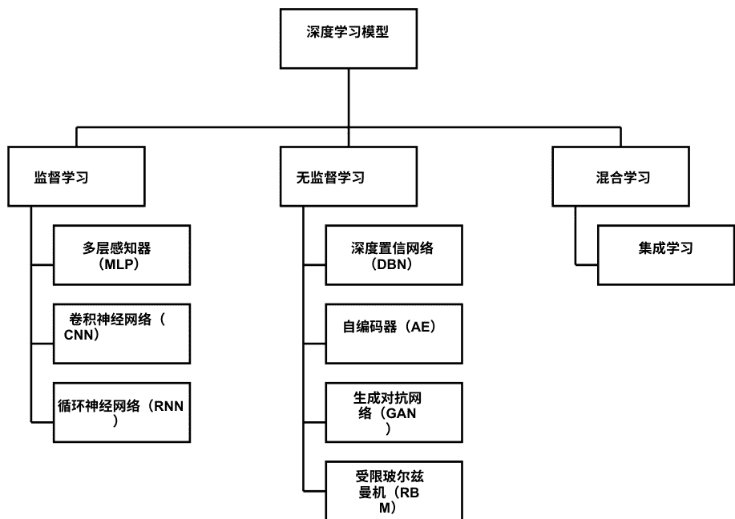

**图1** 应用于异常检测问题的深度学习模型分类

##### 2.2 不平衡数据

如前所述，类别不平衡问题[37]是指一个类别的实例数量比另一个类别非常稀少。不平衡分类的一个问题是很难为模型学习到决策边界。模型难以有效地学习决策边界。这个问题通常在医疗[29]、金融[12]等行业中观察到。在所有情况下，少数群体实际上是感兴趣的类别（正类）且实例数量稀少。在不平衡类别数据中，由于先验概率的增加，分类器错误地将多数群体（负类）过度分类。因此，分类器通常将正类实例误分类为负类实例。

此外，基本的评估指标，即在这种情况下常用的准确率，可能会误导分析师，提供高分数，这实际上是对高度不平衡数据上分类器良好性能的错误指示。因此，在不平衡数据的情况下，使用正确的评估指标非常重要。

对抗信用卡欺诈检测的一个关键挑战是欺诈和正常交易的高度倾斜分布，这降低了机器学习算法发现欺诈行为模式的潜力。

采样是处理不平衡数据的一种方法。采样策略的主要目标是改变数据集的分布，以平衡多数和少数类别。有几种采样的方法[75]，如过采样少数类别[33]、欠采样多数类别[50]、混合方法结合欠采样和过采样[15,39]。

欠采样技术[50]通过均匀选择来减少多数类别的实例。欠采样的一个重要优势是它利用在已经观察到的数据上训练模型。然而，这种技术面临的挑战是给模型提供的训练数据量显著减少。已经对学习倾斜分布的各种欠采样技术进行了深入研究[6, 49]。

过采样技术复制少数类的实例，以使多数类和少数类的实例数量相等。这反过来为分类器提供了足够的实例来学习两个类别。然而，过采样方法存在各种挑战，例如：
- (a) 最终可能导致分类器过拟合；
- (b) 仅通过复制相同实例而不引入任何新信息来改变数据。

SMOTE[11]是一种被广泛接受的最新过采样技术之一。它通过随机选择一些少数类样本及其k个最近邻来生成合成实例。对于每个样本，选择其中一个最近邻，并绘制连接它们的线段。然后，将实例生成为所选实例的凸组合。这种采样技术是高效的，因为新生成的实例在特征空间中与少数类的现有实例相对接近。这种采样方法的一个普遍限制是它不考虑多数类来生成合成实例，如果类之间存在强重叠，就会产生模糊的示例。

边界SMOTE[31]：边界实例和接近边界的实例比远离边界的实例更容易被错误分类。这些实例通常是模糊的，并且位于决策边界周围，类的成员资格往往重叠。因此，在边界SMOTE中，只在两个类之间的决策边界上创建合成示例。因此，根据选择为最近邻的实例的类别，SMOTE有许多可能的变体。对SMOTE进行的另一个主要改进是ADASYN [34]采样技术，该技术将很难学习的样本分配更多的重要性，并且更有可能被过采样。

文献中提出了处理不平衡数据的许多方法[30, 43, 44]。请注意，没有一种采样方法完全优于另一种。

大多数应用采样策略的现有技术旨在通过为少数群体生成合成数据实例或消除多数群体的一些实例来平衡数据。这些技术要么过拟合，要么丢失有价值的信息。在这两种情况下，分类器很可能产生不准确的预测，导致错误的高准确性。因此，仔细选择采样策略非常重要，因为分类器可能会遭受过拟合或欠拟合，从而导致将欺诈交易错误地分类为正常交易或反之亦然。

##### 2.3 集成学习

深度神经网络是非线性方法，提供了更高的灵活性，因为它们可以对高维数据进行建模，并且可以按比例扩展到可用的训练数据量。其灵活性的一个主要缺点是它使用随机梯度下降训练算法进行学习，这意味着它高度依赖于训练数据的规范。这反过来会导致每次训练时产生不同的预测，因为它们得到不同的权重集。因此，神经网络存在高方差问题。为了解决这个问题，不仅训练单个模型，而是训练多个模型，然后将所有模型的预测结果进行组合。这种方法被称为集成学习[78]，它有助于降低方差，并且相对于任何单个模型，能够得到更好的预测结果。

集成方法将各种基本分类器组合起来，以提高任何单个分类器的性能。集成学习算法通过将训练数据分成多个子集来修改训练数据分布。然后，在每个子集上部署多个基本分类器进行预测，并最终聚合结果。Boosting和Bagging [7]算法是两种常见的集成学习算法。

Bagging技术通过使用带替换的随机子集来工作。许多研究人员改进了这些现有算法以解决不平衡类别数据问题[16]。在金融领域中，[63, 76]的作者采用了集成学习技术。

从经验上看，当模型之间引入显著的差异时，集成方法会产生更好的结果。因此，集成方法旨在促进组合模型之间的差异。尽管像随机决策树这样的更随机算法已被证明能构建更强大的集成，但是采用多个强大的学习算法往往比应用试图降低模型性能以促进差异的技术更有效。

本研究采用DMLP和DCNN分类器的集成作为基本分类器对实际数据集的每个子集进行拟合。然后，聚合每个单独分类器得到的预测结果。这里的聚合是通过使用投票集成在两个层面上进行的。

#### 3 方法论

神经网络已广泛用于信用卡欺诈检测，因为它们具有从正常交易模式中学习的自适应能力，从而有助于识别欺诈交易的模式[26, 60, 62]。

MLP是一个完全连接的前馈神经网络，至少包含一个隐藏层。深度MLP（DMLP）是第一个基本的深度学习模型，就实现而言。MLP和DMLP之间唯一的区别是层数，在DMLP中比MLP更多。每个层中的每个神经元都有不同的输入 $x$，偏置 $b$ 和权重 $w$。此外，每个神经元都有一个非线性激活函数，它累积来自前一层神经元的加权输入并生成输出。使用公式1计算输出（y）。文献中使用的一些最常用的非线性激活函数[28,61]包括修正线性单元（ReLU）、泄漏ReLU、S型函数、Softmax、双曲正切和Swish。

$$y_i=\sigma\left(\sum_i w_i x_i+b_i\right)$$

多层深度人工神经网络有助于实现高效的分类性能。它的学习过程是通过反向传播过程来完成的，其中输出层神经元的输出误差被传播回前一层神经元。

DMLP使用随机梯度下降（SGD）方法来优化学习，以更新层之间的连接权重。

使用深度学习，可以为大型复杂数据设计预测模型，通过深度堆叠层自动提取非线性特征。人工神经网络具有处理复杂数据和自我学习的能力，但其学习过程非常缓慢。

尽管DCNN的学习时间非常短，但它具有避免模型过拟合的能力[21,52]。DCNN是多层深度学习模型之一，通过分层方式使用加权滤波器来去除局部特征。它通过学习网络的深层非线性结构，实现复杂的函数逼近，并表示输入输出映射关系。

DCNN由卷积层、下采样层和全连接层组成。

本章利用DCNN和DMLP方法的集成来对信用卡交易数据中的欺诈交易进行分类。信用卡交易数据包含一种特定的交易模式。DCNN的卷积层倾向于捕捉交易数据的不同特征，然后池化层将相似性质的特征合并为一个。为了提取较低层的基本特征，多个卷积层和池化层被堆叠在一起，而复杂的特征则在较高层中派生，即全连接层。DCNN模型可以通过去除其中的区分性特征并学习可用交易数据中的模式来对欺诈用户进行分类。我们设计了一个一维DCNN来分析其在信用卡欺诈检测中的性能，并评估其是否可以推广到其他未知交易。

##### 3.1 数据

我们考虑了来自Kaggle的284807个数据点的数据1，其中包含欧洲持卡人使用信用卡进行的交易。数据高度倾斜，因为其中只包含492个欺诈（正类）交易，占考虑数据的0.17%。数据已经经过预处理，并使用主成分分析（PCA）进行了维度缩减。因此，它只包含28个复合特征的数值输入值。由于其不重要，我们消除了‘时间’特征。‘金额’特征使用鲁棒缩放器方法[2]进行缩放，因为在应用PCA时不考虑此特征。因此，我们总共有29个特征作为模型的输入进行训练。数据有两个类别，其中值0表示正常交易，值1表示欺诈交易。

##### 3.2 子集重采样

在本节中，我们讨论了一种采样方法（子集重采样），以解决数据不平衡的问题，而不删除数据点或添加合成的少数类数据点。删除数据点会导致信息丢失，而添加额外的数据点（合成数据）会增加训练时间。在这里，我们还对所讨论的采样方法和其他针对不平衡数据的最新技术进行了性能分析，例如过采样、SMOTE及其不同的变体。

假设我们有稀有或少数类和多数类数据点。在子集重采样中，首先选择少数类数据的20%用于测试，从多数类中选择相同数量的数据（0.2×r）。剩余的（m−0.2×r）多数类数据点被分成多个子集，假设为S1，S2，...，Sn，使得每个子集几乎具有∣Si∣∈0.8×r个数据点。现在剩余的少数类数据点R1与每个Si组合，使用R1∪Si来训练模型Mi和Mi′。图2显示了提出的框架。

我们使用两个深度学习模型，DMLP(M)和DCNN(M')，作为基本分类器。重新采样的训练子集(R∪Si，′i)被输入到基本分类器模型中进行学习。每个模型对每个子集进行拟合，并为相同的测试集生成一组预测Pi(M)和Pi(M')。通过这种方式，每个分类器(M和M')为相同的给定测试集生成了一组预测结果。然后，使用一级投票V1分别聚合每个模型的预测结果集。这反过来又生成了与每个分类器对应的一组预测。然后，应用二级投票V2来聚合两个分类器的预测结果，参见图2。

这里考虑了两种SMOTE的变体：SMOTE1和SMOTE2，用于比较。SMOTE是一种采样技术，只在少数类中采用最近邻样本生成合成样本。这种技术加强了决策边界内的少数类。在SMOTE1中，只有在多数类中采用最近邻样本生成合成样本，从而有助于加强与多数类接近的少数类边界，而SMOTE2是一种混合方法SMOTE和SMOTE$_1$。在SMOTE$_2$中，通过考虑少数类和多数类的最近邻样本来生成合成样本。这增强了边界内和边界上的少数类。

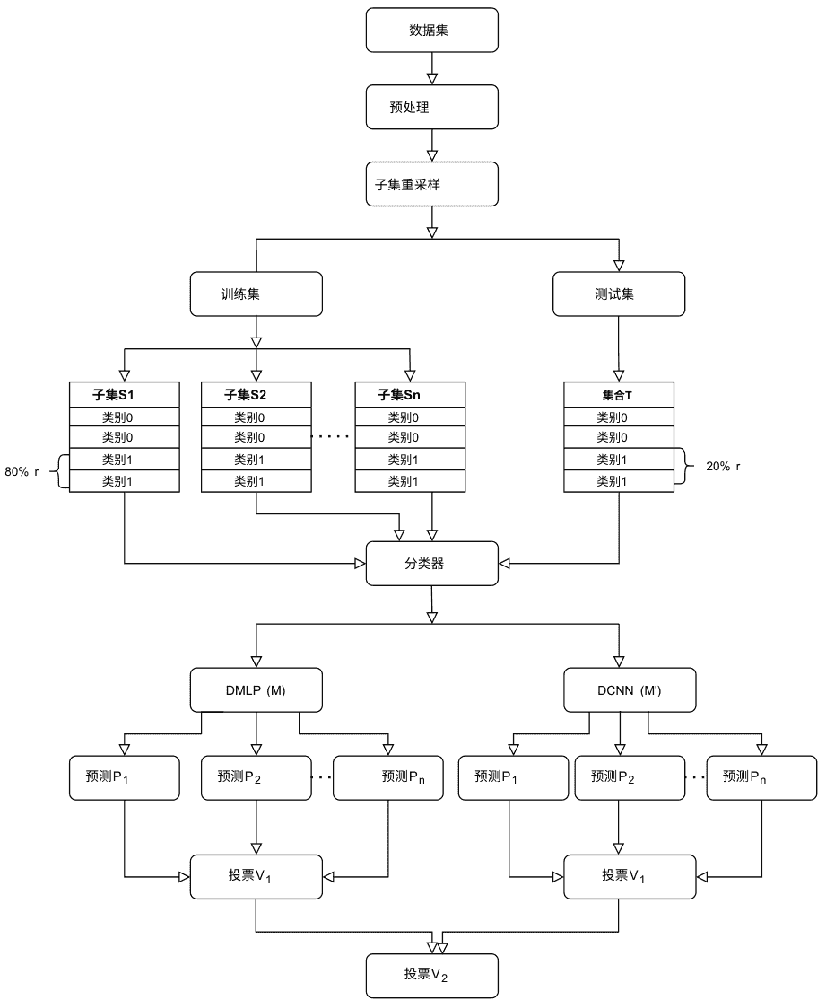

**图2** 提出的框架用于检测信用卡交易数据中的欺诈，该数据使用子集重采样策略进行采样，以解决类别不平衡的问题，并基于两个深度学习模型DMLP(M)和CNN(M')的集成

##### 3.3 性能指标

用于评估的指标包括准确率、召回率、精确率、混淆矩阵和f1得分。

在评估各种分类技术的性能时，准确率 (Ac) 是最常用的指标。它定义了总实例中有多少实例被正确分类，如公式 (2) 所定义。

$$Ac=\frac{\mathrm{TP}+\mathrm{TN}}{\mathrm{TP}+\mathrm{TN}+\mathrm{FP}+\mathrm{FN}}$$

其中TP、TN、FP和FN分别代表真正例、真负例、假正例和假负例。在高度不平衡的数据情况下，Ac不是一个充分的性能度量。例如，假设在考虑的数据集中只有0.17%是罕见事件，即欺诈交易。在这种情况下，模型无法对欺诈交易进行分类，并且倾向于产生对多数类别的偏见预测，如果将所有实例标记为负（正常交易），则模型准确率超过99.8%。

精确度 (P) 是另一个度量指标，它衡量了从总体上预测为正的实例中，正类别或欺诈交易的比例，并定义为

$$P=\frac{\mathrm{TP}}{\mathrm{TP}+\mathrm{FP}}$$

仅计算精确度对于不平衡的类别数据来说是不够的，因为它不考虑将正样本错误标记为负的数量。类似地，召回率 (R) 衡量了从总体上预测为正的实例中，准确预测的正实例的比例，并定义为

$$R=\frac{\mathrm{TP}}{\mathrm{TP}+\mathrm{FN}}$$

召回率指标是一个重要的度量，因为它给出了检测到的异常（欺诈交易）的比例。它不受不平衡类别数据的影响，因为它仅依赖于正类别。它不考虑被错误分类为正类别的负样本的比例，这实际上在数据高度倾斜、负样本丰富而正样本很少的情况下会产生问题。对于诸如欺诈交易检测、罕见疾病识别和罕见事件检测等应用，我们需要一个在召回率和精确率高时具有较高值的度量；否则，不需要。f1-Score (f1) 结合了召回率和精确率度量用于定义精确率相对于召回率的相对重要性，如公式 (5) 所述。

$$f1=2 \frac{P \times R}{P+R} \quad (5)$$

混淆矩阵 (C) 混淆矩阵以预测实例与实际实例的形式呈现分类器的性能。混淆矩阵的结构如表1所示。

**表1** 混淆矩阵
| | 预测为负类别 (0) | 预测为正类别 (1) |
|---|---|---|
| 实际为负类别 (0) | TN | FP |
| 实际为正类别 (1) | FN | TP |

#### 4 实验和分析

在本节中，我们对图2中提出的架构以及用于处理不平衡数据的各种采样技术进行性能分析。

我们展示了混合集成方法中两层投票系统的有效性。在第一层投票 ($V_{1}$) 中，我们采用多数投票来决定交易是否欺诈，但在第二层投票 ($V_{2}$) 中，我们采用了两种策略：(1) 一致接受 (CFA)，和 (2) 一致拒绝 (CFR)。CFA 定义为，如果在第一层投票后，所有人都认为交易是欺诈的，则是欺诈的，否则不是。CFR 与 CFA 相反；它意味着如果在第一层投票后，所有人都认为交易不是欺诈的，则不是欺诈的；否则，是欺诈的。

在信用卡欺诈检测中，检测到尽可能多的欺诈交易是很重要的，即预测的真正阳性 (TP) 的数量应接近实际阳性。此外，对于某些金融行业来说，不以任何代价失去任何有价值的客户更为重要，因此，在这种情况下，TN应接近实际负面。

因此，我们已经分析了基于平均预测TP和TN的性能（如混淆矩阵 C）$P$ 和 $R$，以及连续10次执行的情况。此外，在类别分布不平衡的情况下，f1-score 是一个更好的评估模型性能的指标，因此我们还评估了f1-score，$f1_{0}$ 表示类别 0 的f1-score，$f1_{1}$ 表示类别 1 的f1-score。

首先，我们将子集重采样技术与过采样技术的性能进行比较。从表2中可以看出，在子集重采样的情况下，预测的TP的平均数量为86.7，高于过采样中获得的79.1。此外，在子集重采样的情况下，类别1的召回率 R和f1-score 的值，即0.89和0.94，显著高于其他情况相对于过采样，这些值分别为0.81和0.89。

**表2** 过采样技术与子集重采样技术在CFA投票集成的DCNN和DMLP分类器中的比较。在这里，$P$是精确度，$R$是召回率，$Ac$是准确率，$f1_0$是类别0的f1分数，$f1_1$是类别1的f1分数，$C$是按照表1中定义的顺序计算的混淆矩阵。

| 序号 | $P$ | $R$ | $Ac$ | $f1_0$ | $f1_1$ | $C$ (过采样) | $P$ (子集重采样) | $R$ | $Ac$ | $f1_0$ | $f1_1$ | $C$ (子集重采样) |
|---|---|---|---|---|---|---|---|---|---|---|---|---|
| 1 | 0.99 | 0.82 | 0.90 | 0.91 | 0.89 | 97 1<br>18 80 | 1.00 | 0.90 | 0.95 | 0.95 | 0.95 | 98 0<br>10 88 |
| 2 | 1.00 | 0.84 | 0.92 | 0.92 | 0.91 | 98 0<br>16 82 | 1.00 | 0.88 | 0.94 | 0.94 | 0.93 | 98 0<br>12 86 |
| 3 | 1.00 | 0.79 | 0.89 | 0.90 | 0.88 | 98 0<br>21 77 | 1.00 | 0.87 | 0.93 | 0.94 | 0.93 | 98 0<br>13 85 |
| 4 | 1.00 | 0.84 | 0.92 | 0.92 | 0.91 | 98 0<br>16 82 | 0.99 | 0.89 | 0.94 | 0.94 | 0.94 | 97 1<br>11 87 |
| 5 | 1.00 | 0.80 | 0.90 | 0.91 | 0.89 | 98 0<br>20 78 | 1.00 | 0.88 | 0.94 | 0.94 | 0.93 | 98 0<br>12 86 |
| 6 | 1.00 | 0.84 | 0.92 | 0.92 | 0.91 | 98 0<br>16 82 | 1.00 | 0.89 | 0.94 | 0.95 | 0.94 | 98 0<br>11 87 |
| 7 | 1.00 | 0.82 | 0.91 | 0.92 | 0.90 | 98 0<br>18 80 | 0.99 | 0.89 | 0.94 | 0.94 | 0.94 | 97 1<br>11 87 |
| 8 | 1.00 | 0.82 | 0.91 | 0.92 | 0.90 | 98 0<br>18 80 | 0.98 | 0.89 | 0.93 | 0.94 | 0.93 | 96 2<br>11 87 |
| 9 | 1.00 | 0.74 | 0.87 | 0.89 | 0.85 | 98 0<br>25 73 | 1.00 | 0.86 | 0.93 | 0.93 | 0.92 | 98 0<br>14 84 |
| 10 | 1.00 | 0.79 | 0.89 | 0.90 | 0.88 | 98 0<br>21 77 | 0.99 | 0.92 | 0.95 | 0.96 | 0.95 | 97 1<br>8 90 |
| 平均 | 1.00 | 0.81 | 0.90 | 0.91 | 0.89 | 97.9 0.1<br>18.9 79.1 | 1.00 | 0.89 | 0.94 | 0.94 | 0.94 | 97.5 0.5<br>11.3 86.7 |

类似地，在表3中，TP为90.2，$(R, f1_1)$为(0.92, 0.95)，对应于子集重采样，高于85.9和(0.88, 0.93)对应于过采样。因此，子集重采样的性能优于过采样。此外，在表3中观察到，在CFR投票集成中，子集重采样预测的平均TP数量为90.2，高于在表2中预测的平均TP数量86.7的CFA投票集成。对于其他考虑的采样技术也得出了类似的观察结论。在分析过采样和子集重采样方法中两层投票的性能后，我们将其应用于著名的SMOTE采样方法及其变体。对于SMOTE，从表4中可以看出，在CFR投票集成的情况下，预测的平均TP数量为98，高于CFA投票集成的95.2和个别分类器DMLP和DCNN的(97.8, 95.4)。此外，在CFA投票集成的情况下，预测的平均TN数量为98，高于CFR投票集成的97和个别分类器的(97.7, 97.3)。

##### 表3 过采样技术与子集重采样技术在CFR投票集成的DCNN和DMLP分类器中的比较
在这里，$P$是精确率，$R$是召回率，$Ac$是准确率，$f1_0$是类别0的F1分数，$f1_1$是类别1的F1分数，$C$是按照表1中定义的顺序计算的混淆矩阵。

| 序号 | P | R | Ac | f1_0 | f1_1 | C | P | R | Ac | f1_0 | f1_1 | C |
|---|---|---|---|---|---|---|---|---|---|---|---|---|
| 1 | 0.99 | 0.92 | 0.95 | 0.96 | 0.95 | 97 1 8 90 | 0.99 | 0.93 | 0.96 | 0.96 | 0.96 | 97 1 7 91 |
| 2 | 0.98 | 0.94 | 0.96 | 0.96 | 0.96 | 96 2 6 92 | 1.00 | 0.91 | 0.95 | 0.96 | 0.95 | 98 0 9 89 |
| 3 | 0.99 | 0.87 | 0.93 | 0.93 | 0.92 | 97 1 13 85 | 1.00 | 0.90 | 0.95 | 0.95 | 0.95 | 98 0 10 88 |
| 4 | 1.00 | 0.92 | 0.96 | 0.96 | 0.96 | 98 0 8 90 | 0.98 | 0.93 | 0.95 | 0.96 | 0.95 | 96 2 7 91 |
| 5 | 0.99 | 0.85 | 0.92 | 0.92 | 0.91 | 97 1 15 83 | 1.00 | 0.91 | 0.95 | 0.96 | 0.95 | 98 0 9 89 |
| 6 | 1.00 | 0.90 | 0.95 | 0.95 | 0.95 | 98 0 10 88 | 0.98 | 0.92 | 0.95 | 0.95 | 0.95 | 96 2 8 90 |
| 7 | 0.99 | 0.85 | 0.92 | 0.92 | 0.91 | 97 1 15 83 | 0.96 | 0.92 | 0.94 | 0.94 | 0.94 | 94 4 8 90 |
| 8 | 0.98 | 0.86 | 0.92 | 0.92 | 0.91 | 96 2 14 84 | 0.95 | 0.94 | 0.94 | 0.94 | 0.94 | 93 5 6 92 |
| 9 | 0.98 | 0.82 | 0.90 | 0.91 | 0.89 | 96 2 18 80 | 0.95 | 0.91 | 0.93 | 0.93 | 0.93 | 93 5 9 89 |
| 10 | 0.99 | 0.86 | 0.92 | 0.93 | 0.92 | 97 1 14 84 | 0.97 | 0.95 | 0.96 | 0.96 | 0.96 | 95 3 5 93 |
| 平均 | 1.00 | 0.88 | 0.93 | 0.94 | 0.93 | 96.9 1.1 12.1 85.9 | 0.98 | 0.92 | 0.95 | 0.95 | 0.95 | 95.8 2.2 7.8 90.2 |

同样，在其他SMOTE变体中也观察到了类似的情况，即表5中的$\mathrm{SMOTE}_{1}$和表6中的$\mathrm{SMOTE}_{2}$，$\mathrm{CFR}$投票集成中预测的$\mathrm{TP}$的平均数量高于$\mathrm{CFA}$投票集成和单个分类器。

为了比较所有采样技术，我们总结了在CFA和CFR投票集成中使用的所有采样技术的结果，见表7。我们还计算了所有考虑指标的方差。观察到在CFA投票集成的所有抽样技术中，预测的$\mathrm{TN}$的平均数几乎等于实际负例，方差非常小。然而，在$\mathrm{CFR}$集成中，与其他抽样技术相比，SMOTE和过采样的平均预测$\mathrm{TN}$更好，方差非常小。

此外，与CFR相比，CFA的平均预测TN更好，因为方差明显较低。

接下来，考虑CFA投票集成的平均预测TP数量，观察到SMOTE明显优于其他抽样技术。

##### 表4 DMLP和DCNN分类器以及它们的投票集成CFA和CFR的SMOTE抽样技术的性能分析
这里，P是精确度，R是召回率，Ac是准确度，$f1_0$是类别0的F1分数，$f1_1$是类别1的F1分数，C是按照相同顺序计算的混淆矩阵，在表1中定义的。

| 序号 | DCNN-P | DCNN-R | DCNN-Ac | DCNN-f10 | DCNN-f11 | DCNN-C | CFA-P | CFA-R | CFA-Ac | CFA-f10 | CFA-f11 | CFA-C | CFR-P | CFR-R | CFR-Ac | CFR-f10 | CFR-f11 | CFR-C |
|---|---|---|---|---|---|---|---|---|---|---|---|---|---|---|---|---|---|---|
| 1 | 1.00 | 1.00 | 1.00 | 1.00 | 1.00 | 98 0 0.98 | 0.98 | 0.98 | 0.99 | 0.99 | 0.99 | 98 0 2.96 | 1.00 | 1.00 | 1.00 | 1.00 | 1.00 | 98 0 0.98 |
| 2 | 1.00 | 0.99 | 0.99 | 0.99 | 0.99 | 98 0 1.97 | 0.99 | 0.99 | 0.99 | 0.99 | 0.99 | 98 0 2.96 | 0.99 | 1.00 | 0.99 | 0.99 | 0.99 | 97 1 0.98 |
| 3 | 0.99 | 1.00 | 0.99 | 0.99 | 0.99 | 97 1 0.98 | 1.00 | 0.97 | 0.98 | 0.98 | 0.98 | 98 0 3.95 | 0.99 | 1.00 | 0.99 | 0.99 | 0.99 | 97 1 0.98 |
| 4 | 1.00 | 1.00 | 1.00 | 1.00 | 1.00 | 98 0 0.98 | 1.00 | 0.97 | 0.98 | 0.98 | 0.98 | 98 0 3.95 | 1.00 | 1.00 | 1.00 | 1.00 | 1.00 | 98 0 0.98 |
| 5 | 0.99 | 1.00 | 0.99 | 0.99 | 0.99 | 97 1 0.98 | 0.99 | 1.00 | 0.99 | 0.99 | 0.99 | 98 0 0.98 | 0.98 | 1.00 | 0.99 | 0.99 | 0.99 | 96 2 0.98 |
| 6 | 0.99 | 1.00 | 0.99 | 0.99 | 0.99 | 97 1 0.98 | 0.99 | 0.97 | 0.98 | 0.98 | 0.98 | 98 0 3.95 | 0.98 | 1.00 | 0.99 | 0.99 | 0.99 | 96 2 0.98 |
| 7 | 1.00 | 1.00 | 1.00 | 1.00 | 1.00 | 98 0 0.98 | 0.98 | 0.96 | 0.98 | 0.97 | 0.97 | 96 2 4.94 | 0.98 | 1.00 | 0.99 | 0.99 | 0.99 | 96 2 0.98 |
| 8 | 1.00 | 1.00 | 1.00 | 1.00 | 1.00 | 98 0 0.98 | 0.99 | 1.00 | 0.99 | 0.99 | 0.99 | 97 1 0.98 | 0.99 | 1.00 | 0.99 | 0.99 | 0.99 | 97 1 0.98 |
| 9 | 1.00 | 0.99 | 0.99 | 0.99 | 0.99 | 98 0 1.97 | 0.99 | 0.94 | 0.96 | 0.97 | 0.96 | 97 1 6.92 | 0.99 | 1.00 | 0.99 | 0.99 | 0.99 | 97 1 0.98 |
| 10 | 1.00 | 1.00 | 1.00 | 1.00 | 1.00 | 98 0 0.98 | 1.00 | 0.96 | 0.98 | 0.98 | 0.98 | 98 0 4.94 | 1.00 | 1.00 | 1.00 | 1.00 | 1.00 | 98 0 0.98 |
| 平均 | 1.00 | 1.00 | 1.00 | 1.00 | 1.00 | 97.7 0.3 0.1 97.8 | 0.99 | 0.97 | 0.99 | 0.99 | 0.99 | 98 0 2.8 95.2 | 0.99 | 1.00 | 0.99 | 0.99 | 0.99 | 97 1 0.98 |

##### 表5 对另一种SMOTE变体（即DMLP和DCNN分类器以及它们的投票集成CFA和CFR）进行性能分析
这里，P是精确度，R是召回率，Ac是准确率，$f1_0$是类别0的F1分数，$f1_1$是类别1的F1分数，C是按照与表1中定义的相同顺序计算的混淆矩阵。

| 序号 | DMLP-P | DMLP-R | DMLP-Ac | DMLP-f10 | DMLP-f11 | DMLP-C | DCNN-P | DCNN-R | DCNN-Ac | DCNN-f10 | DCNN-f11 | DCNN-C | CFA-P | CFA-R | CFA-Ac | CFA-f10 | CFA-f11 | CFA-C | CFR-P | CFR-R | CFR-Ac | CFR-f10 | CFR-f11 | CFR-C |
|---|---|---|---|---|---|---|---|---|---|---|---|---|---|---|---|---|---|---|---|---|---|---|---|---|---|
| 1 | 0.99 | 1.00 | 0.99 | 0.99 | 0.99 | 97.1 0.98 | 0.98 | 0.99 | 0.98 | 0.98 | 0.98 | 96.2 1.97 | 0.99 | 0.99 | 0.99 | 0.99 | 0.99 | 97.1 1.97 | 0.98 | 1.00 | 0.99 | 0.99 | 0.99 | 96.2 0.98 |
| 2 | 0.97 | 1.00 | 0.98 | 0.98 | 0.98 | 95.3 0.98 | 1.00 | 0.95 | 0.97 | 0.98 | 0.97 | 98.0 5.93 | 1.00 | 0.95 | 0.97 | 0.98 | 0.97 | 98.0 5.93 | 0.97 | 1.00 | 0.98 | 0.98 | 0.98 | 95.3 0.98 |
| 3 | 0.99 | 0.98 | 0.98 | 0.98 | 0.98 | 97.1 2.96 | 0.99 | 0.95 | 0.97 | 0.97 | 0.97 | 97.1 5.93 | 0.99 | 0.95 | 0.97 | 0.97 | 0.97 | 97.1 5.93 | 0.99 | 0.98 | 0.98 | 0.98 | 0.98 | 97.1 2.96 |
| 4 | 0.99 | 1.00 | 0.99 | 0.99 | 0.99 | 97.1 0.98 | 0.99 | 0.92 | 0.95 | 0.96 | 0.95 | 97.1 8.90 | 0.99 | 0.92 | 0.95 | 0.96 | 0.95 | 97.1 8.90 | 0.99 | 1.00 | 0.99 | 0.99 | 0.99 | 97.1 0.98 |
| 5 | 0.98 | 0.98 | 0.98 | 0.98 | 0.98 | 96.2 2.96 | 0.96 | 0.96 | 0.96 | 0.96 | 0.96 | 94.4 4.94 | 0.99 | 0.96 | 0.97 | 0.97 | 0.97 | 97.1 4.94 | 0.95 | 0.98 | 0.96 | 0.96 | 0.96 | 93.5 2.96 |
| 6 | 0.98 | 0.99 | 0.98 | 0.98 | 0.98 | 96.2 1.97 | 0.98 | 0.96 | 0.97 | 0.97 | 0.97 | 96.2 4.94 | 0.99 | 0.96 | 0.97 | 0.97 | 0.97 | 97.1 4.94 | 0.97 | 0.99 | 0.98 | 0.98 | 0.98 | 95.3 1.97 |
| 7 | 0.99 | 0.99 | 0.99 | 0.99 | 0.99 | 97.1 1.97 | 0.98 | 0.94 | 0.96 | 0.96 | 0.96 | 96.2 6.92 | 0.99 | 0.94 | 0.96 | 0.97 | 0.96 | 97.1 6.92 | 0.98 | 0.99 | 0.98 | 0.98 | 0.98 | 96.2 1.97 |
| 8 | 0.99 | 0.97 | 0.98 | 0.98 | 0.98 | 97.1 3.95 | 0.99 | 0.86 | 0.92 | 0.93 | 0.92 | 97.1 14.84 | 0.99 | 0.86 | 0.92 | 0.93 | 0.92 | 97.1 14.84 | 0.99 | 0.97 | 0.98 | 0.98 | 0.98 | 97.1 3.95 |
| 9 | 0.98 | 1.00 | 0.99 | 0.99 | 0.99 | 96.2 0.98 | 0.98 | 0.95 | 0.96 | 0.96 | 0.96 | 96.2 5.93 | 0.99 | 0.95 | 0.97 | 0.97 | 0.97 | 97.1 5.93 | 0.97 | 1.00 | 0.98 | 0.98 | 0.98 | 95.3 0.98 |
| 10 | 1.00 | 1.00 | 1.00 | 1.00 | 1.00 | 98.0 0.98 | 0.93 | 0.99 | 0.96 | 0.96 | 0.96 | 91.7 1.97 | 1.00 | 0.99 | 0.99 | 0.99 | 0.99 | 98.0 1.97 | 0.93 | 1.00 | 0.96 | 0.96 | 0.97 | 91.7 0.98 |
| 平均 | 0.99 | 0.99 | 0.99 | 0.99 | 0.99 | 96.6 0.9 | 0.98 | 0.95 | 0.96 | 0.96 | 0.96 | 95.8 5.3 | 0.99 | 0.95 | 0.97 | 0.97 | 0.97 | 97.2 5.3 | 0.97 | 0.99 | 0.98 | 0.98 | 0.98 | 95.2 0.9 |
| | | | | | | | | | | | | | | | | | | | | | | | | 97.1 |

## 在金融网络中深入挖掘异常交易

##### 表6 对SMOTE的混合变体（即DMLP和DCNN分类器以及它们的投票集成CFA和CFR）进行性能分析
这里，P是精确度，R是召回率，Ac是准确率，$f1_j$是类别j的F1分数，C是按照与表1中定义的相同顺序计算的混淆矩阵。

| 序号 | DMLP-P | DMLP-R | DMLP-Ac | DMLP-f10 | DMLP-f11 | DMLP-C | DCNN-P | DCNN-R | DCNN-Ac | DCNN-f10 | DCNN-f11 | DCNN-C | CFA-P | CFA-R | CFA-Ac | CFA-f10 | CFA-f11 | CFA-C | CFR-P | CFR-R | CFR-Ac | CFR-f10 | CFR-f11 | CFR-C |
|---|---|---|---|---|---|---|---|---|---|---|---|---|---|---|---|---|---|---|---|---|---|---|---|---|---|
| 1 | 1.00 | 1.00 | 1.00 | 1.00 | 1.00 | 98.0 98 0.98 | 0.99 | 1.00 | 0.99 | 0.99 | 0.99 | 97.1 98 | 1.00 | 1.00 | 1.00 | 1.00 | 1.00 | 98.0 0.98 | 0.99 | 1.00 | 0.99 | 0.99 | 0.99 | 97.1 0.98 |
| 2 | 0.99 | 0.99 | 0.99 | 0.99 | 0.99 | 97.1 1.97 | 1.00 | 0.99 | 0.99 | 0.99 | 0.99 | 98.0 1.97 | 1.00 | 0.99 | 0.99 | 0.99 | 0.99 | 98.0 1.97 | 0.99 | 0.99 | 0.99 | 0.99 | 0.99 | 97.1 1.97 |
| 3 | 0.99 | 1.00 | 0.99 | 0.99 | 0.99 | 97.1 0.98 | 0.99 | 0.95 | 0.97 | 0.97 | 0.97 | 97.1 5.93 | 0.99 | 0.95 | 0.97 | 0.97 | 0.97 | 97.1 5.93 | 0.99 | 1.00 | 0.99 | 0.99 | 0.99 | 97.1 0.98 |
| 4 | 0.99 | 0.98 | 0.98 | 0.98 | 0.98 | 97.1 2.96 | 0.99 | 0.94 | 0.96 | 0.97 | 0.96 | 97.1 6.92 | 1.00 | 0.94 | 0.97 | 0.97 | 0.97 | 98.0 6.92 | 0.98 | 0.98 | 0.98 | 0.98 | 0.98 | 96.2 2.96 |
| 5 | 1.00 | 0.99 | 0.99 | 0.99 | 0.99 | 98.0 1.97 | 1.00 | 0.93 | 0.96 | 0.97 | 0.96 | 98.0 7.91 | 1.00 | 0.92 | 0.96 | 0.96 | 0.96 | 98.0 8.90 | 1.00 | 1.00 | 1.00 | 1.00 | 1.00 | 98.0 0.98 |
| 6 | 0.99 | 0.99 | 0.99 | 0.99 | 0.99 | 97.1 1.97 | 0.96 | 0.92 | 0.94 | 0.94 | 0.94 | 94.4 8.90 | 0.99 | 0.92 | 0.95 | 0.96 | 0.95 | 97.1 8.90 | 0.96 | 0.99 | 0.97 | 0.97 | 0.97 | 94.4 1.97 |
| 7 | 0.97 | 1.00 | 0.98 | 0.98 | 0.98 | 95.3 0.98 | 0.98 | 0.97 | 0.97 | 0.97 | 0.97 | 96.2 3.95 | 0.99 | 0.97 | 0.98 | 0.98 | 0.98 | 97.1 3.95 | 0.96 | 1.00 | 0.98 | 0.98 | 0.98 | 94.4 0.98 |
| 8 | 0.99 | 1.00 | 0.99 | 0.99 | 0.99 | 97.1 0.98 | 1.00 | 0.95 | 0.97 | 0.98 | 0.97 | 98.0 5.93 | 1.00 | 0.95 | 0.97 | 0.98 | 0.97 | 98.0 5.93 | 0.99 | 1.00 | 0.99 | 0.99 | 0.99 | 97.1 0.98 |
| 9 | 0.98 | 1.00 | 0.99 | 0.99 | 0.99 | 96.2 0.98 | 1.00 | 0.95 | 0.97 | 0.98 | 0.97 | 98.0 5.93 | 1.00 | 0.95 | 0.97 | 0.98 | 0.97 | 98.0 5.93 | 0.98 | 1.00 | 0.99 | 0.99 | 0.99 | 96.2 0.98 |
| 10 | 0.99 | 0.99 | 0.99 | 0.99 | 0.99 | 97.1 1.97 | 0.98 | 0.93 | 0.95 | 0.96 | 0.95 | 96.2 7.91 | 1.00 | 0.93 | 0.96 | 0.97 | 0.96 | 98.0 7.91 | 0.97 | 0.99 | 0.98 | 0.98 | 0.98 | 95.3 1.97 |
| 平均 | 0.99 | 0.99 | 0.99 | 0.99 | 0.99 | 96.9 1.1 0.6 97.4 | 0.99 | 0.95 | 0.97 | 0.97 | 0.97 | 96.9 4.7 93.3 | 1.00 | 0.95 | 0.97 | 0.97 | 0.97 | 97.7 4.8 93.2 | 0.98 | 0.99 | 0.99 | 0.99 | 0.99 | 96.1 0.5 97.5 |

| 采样技术 | TP | TN | P | R | $f_{10}$ | $f_{11}$ |
|---|---|---|---|---|---|---|
| 过采样 平均CFA | 79.1 | 97.9 | 1 | 0.81 | 0.91 | 0.89 |
| 方差CFA | 8.32 | 0.1 | $1.00 \times 10^{-5}$ | $9.78 \times 10^{-4}$ | $1.21 \times 10^{-4}$ | $3.51 \times 10^{-4}$ |
| 平均CFR | 85.9 | 96.9 | 1 | 0.88 | 0.94 | 0.93 |
| 方差CFR | 14.99 | 0.54 | $5.44 \times 10^{-5}$ | $1.50 \times 10^{-3}$ | $3.82 \times 10^{-4}$ | $6.18 \times 10^{-4}$ |
| 子集重采样 平均CFA | 86.7 | 97.5 | 1 | 0.89 | 0.94 | 0.94 |
| 方差CFA | 2.68 | 0.50 | $5.00 \times 10^{-5}$ | $2.68 \times 10^{-4}$ | $6.78 \times 10^{-5}$ | $9.33 \times 10^{-5}$ |
| 平均CFR | 90.2 | 95.6 | 0.98 | 0.92 | 0.95 | 0.95 |
| 方差CFR | 2.40 | 3.96 | $3.96 \times 10^{-4}$ | $2.40 \times 10^{-4}$ | $1.21 \times 10^{-4}$ | $8.44 \times 10^{-5}$ |
| SMOTE$_1$ 平均CFA | 92.7 | 97.2 | 0.99 | 0.95 | 0.97 | 0.97 |
| 方差CFA | 13.79 | 0.18 | $2.07 \times 10^{-5}$ | $1.44 \times 10^{-3}$ | $3.40 \times 10^{-4}$ | $4.52 \times 10^{-4}$ |
| 平均CFR | 97.1 | 95.2 | 0.97 | 0.99 | 0.98 | 0.98 |
| 方差CFR | 1.21 | 3.73 | $3.37 \times 10^{-4}$ | $1.26 \times 10^{-4}$ | $1.05 \times 10^{-4}$ | $9.28 \times 10^{-5}$ |
| SMOTE$_2$ 平均CFA | 93.2 | 97.7 | 1 | 0.95 | 0.97 | 0.97 |
| 方差CFA | 7.51 | 0.23 | $2.66 \times 10^{-5}$ | $7.82 \times 10^{-4}$ | $1.95 \times 10^{-4}$ | $2.28 \times 10^{-4}$ |
| 平均CFR | 97.5 | 96.1 | 0.98 | 0.99 | 0.99 | 0.99 |
| 方差CFR | 0.50 | 1.88 | $1.81 \times 10^{-4}$ | $5.21 \times 10^{-5}$ | $7.85 \times 10^{-5}$ | $7.43 \times 10^{-5}$ |
| SMOTE 平均CFA | 95.2 | 98 | 1 | 0.97 | 0.99 | 0.99 |
| 方差CFA | 4.18 | 0 | 0 | $4.35 \times 10^{-4}$ | $1.02 \times 10^{-4}$ | $1.16 \times 10^{-4}$ |
| 平均CFR | 98 | 97 | 0.99 | 1 | 0.99 | 0.99 |
| 方差CFR | 0 | 0.67 | $6.67 \times 10^{-5}$ | 0 | $1.77 \times 10^{-5}$ | $1.7 \times 10^{-5}$ |

表7 不同采样技术与CFA和CFR投票集成方法的比较分析。在这里，TP是预测的正测试数，TN是预测的负测试数，P是精确度，R是召回率，$f_1^{(0)}$是类别0的$f_1$分数，$f_1^{(1)}$是类别1的$f_1$分数。对于投票集成CFA和CFR的所有指标的平均值和方差在表7中有所记录。对于投票集成CFA和CFR，考虑到所有指标的方差在表7中有所记录。

同样，对于CFR投票集成，SMOTE优于其他采样技术。在这里，对于两个集成，过采样的性能明显低于其他采样。此外，对于所有相应的采样，CFR的平均预测TP数更好，因为平均值和方差在CFR的情况下都更好。

因此，在需要检测尽可能多的欺诈交易的情况下，CFR投票集成的性能优于CFA投票集成。因此，考虑到TP的预测计数，表7中所示的考虑的采样技术按递增顺序排列。此外，过采样是性能最差的，而SMOTE是处理不平衡数据中性能最好的采样方法。在CFR投票集成预测所有98个欺诈交易和97个正常交易的情况下，SMOTE采样技术的结果为$R$值1，$f_1$值0.99，$f_1$值0.99。

#### 5 结论

在本章中，我们使用各种采样方法分析金融网络中的欺诈交易检测，以解决类别不平衡问题，这在各种研究中已经得到考虑。此外，混合集成学习已经被证明可以通过结合多个分类器来提高分类任务的效率。

考虑到这一点，我们分析了两个模型（DCNN和DMIP）的投票集成在不同采样技术下的性能。所得结果表明，组合多个分类器倾向于在准确识别感兴趣类别方面提高预测准确性。尽管这也取决于投票系统CFR或CFA所使用的策略，在预测结果难以达成共识的情况下。在本章中，我们比较了两种投票集成策略CFR和CFA的性能。我们得出结论，在选择一个交易作为正常或欺诈时存在冲突的情况下，将其标记为欺诈可以得到更好的预测结果，即CFR。对于未来的工作，可以将其他深度学习分类模型进行集成，如LSTM、AE，以增加多样性以提高性能。

#### 参考文献

- 1. Ahmed, M., Mahmood, A.N., Islam, M.R.: 金融领域异常检测技术综述. Futur. Gener. Comput. Syst. 55, 278–288 (2016)
- 2. Ahsan, M.M., Mahmud, M., Saha, P.K., Gupta, K.D., Siddique, Z.: 数据缩放方法对机器学习算法和模型性能的影响。 Technologies 9(3), 52 (2021)
- 3. Akoglu, L., McGlohon, M., Faloutsos, C.: 奇异点：发现加权图中的异常。 In: Pacific-Asia Conference on Knowledge Discovery and Data Mining, pp. 410–421. Springer, Berlin (2010)
- 4. Ali, A., Shamsuddin, S.M., Raulescu, A.: 具有类别不平衡问题的分类：一项综述 7, 176–204 (2015)
- 5. Bagga, S., Goyal, A., Gupta, N., Goyal, A.: 使用管道和集成学习进行信用卡欺诈检测. Procedia Comput. Sci. 173, 104–112 (2020)
- 6. Barandela, R., Valdovinos, R.M., Sanchez, J.S., Ferri, F.J.: 不平衡的训练样本问题：欠采样还是过采样？ 在：联合IAPR国际统计技术模式识别研讨会（SPR）和结构与句法模式识别研讨会（SSPR），pp. 806–814. Springer (2004)
- 7. Bauer, E., Kohavi, R.: 投票分类算法的实证比较：bagging，boosting和变种。机器学习。 36(1)，105–139（1999）
- 8. Breunig, M.M., Kriegel, H.P., Ng, R.T., Sander, J.: Lof：识别基于密度的局部异常值。 在： 2000年ACM SIGMOD国际数据管理会议论文集， pp. 93–104（2000）
- 9. Chalapathy, R., Chawla, S.: 深度学习用于异常检测的综述 (2019). arXiv:1901.03407
- 10. Chandola, V., Banerjee, A., Kumar, V.: 异常检测综述. ACM Comput. Surv. (CSUR) 41(3)，1–58（2009）
- 11. Chawla, N.V., Bowyer, K.W., Hall, L.O., Kegelmeyer, W.P.: Smote：合成少数类过采样技术 J. Artif. Intell. Res. 16, 321–357（2002）
- 12. Chawla, N.V., Japkowicz, N., Kotcz, A.: 学习不平衡数据集的特刊. ACM SIGKDD Explorations Newsl 6(1)，1–6（2004）
- 13. Chen, J., Shen, Y., Ali, R.: 使用稀疏自编码器和生成对抗网络进行信用卡欺诈检测. In: 2018 IEEE 9th Annual Information Technology, Electronics and Mobile Communication Conference (IEMCON), pp. 1054–1059. IEEE (2018)
- 14. Chen, Z., Hendrix, W., Samatova, N.F.: 基于社区的进化网络异常检测. J. Intell. Inf. Syst. 39(1)，59–85（2012）
- 15. Choirunnisa, S., Buliali, J.: 处理不平衡数据的混合欠采样和过采样方法 (2018). https://doi.org/10.1109/ISRITI.2018.8864335
- 16. Du, H., Zhang, Y., Gang, K., Zhang, L., Chen, Y.C.: 用于处理不平衡数据流的在线集成学习算法。 Appl. Soft Comput. 107, 107378（2021）
- 17. Eberle, W., Holder, L.: 以图形表示的数据中的异常检测。 Intell. Data Anal. 11(6)，663–689（2007）
- 18. Estabrooks, A., Jo, T., Japkowicz, N.: 用于学习不平衡数据集的多重重采样方法。 Comput. Intell. 20(1)，18–36（2004）
- 19. Fiore, U., De Santis, A., Perla, F., Zanetti, P., Palmieri, F.: 使用生成对抗网络来提高信用卡欺诈检测的分类效果。 Inf. Sci. 479, 448–455(2019)
- 20. Forough, J., Momtazi, S.: 深度顺序模型集成用于信用卡欺诈检测。 Appl. Soft Comput. 99, 106883（2021）
- 21. Fu, K., Cheng, D., Tu, Y., Zhang, L.: 使用卷积神经网络进行信用卡欺诈检测。 在: 神经信息处理国际会议, pp. 483–490. Springer(2016)
- 22. Gaikwad, J.R., Deshmane, A.B., Somavanshi, H.V., Patil, S.V., Badgujar, R.A.: 使用决策树归纳算法进行信用卡欺诈检测。
- 23. Gangwar, A.K., Ravi, V.: Wip: 生成对抗网络用于信用卡欺诈检测中的过采样数据。在:信息系统安全国际会议, pp. 123-134. Springer (2019)
- 24. Ganji, V.R., Mannem, S.N.P.: 使用反K最近邻算法进行信用卡欺诈检测。 Int. J. Comput. Sci. Eng. 4(6), 1035-1039 (2012)
- 25. Gao, J., Du, N., Fan, W., Turaga, D., Parthasarathy, S., Han, J.: 用于挖掘多源异常的多图谱框架。在：图模式分析的图嵌入，第205-227页。 Springer (2013)
- 26. Georgieva, S., Markova, M., Pavlov, V.: 使用神经网络进行信用卡欺诈检测，2159,030013 (2019)。 https://doi.org/10.1063/1.5127478
- 27. Gómez, J.A., Arvalo, J., Paredes, R., Nin, J.: 用于信用卡支付欺诈评分的端到端神经网络架构。Pattern Recogn. Lett. 105, 175-181 (2018)
- 28. Goodfellow, I., Bengio, Y., Courville, A.: 深度学习。 MIT Press, Cambridge (2016)
- 29. Grzymala-Busse, J.W., Goodwin, L.K., Grzymala-Busse, W.J., Zheng, X.: 基于规则强度变化的不平衡数据集方法。在：Rough-Neural Computing, pp. 543-553. Springer, Berlin (2004)
- 30. Haixiang, G., Yijing, L., Shang, J., Mingyun, G., Yuanyue, H., Bing, G.: 从类别不平衡数据中学习:方法和应用综述。 Expert Syst. Appl. 73, 220-239 (2017)
- 31. Han, H., Wang, W.Y., Mao, B.H.: 边界SMOTE:一种新的不平衡数据集学习过采样方法。在：智能计算国际会议, pp. 878-887. Springer (2005)
- 32. Hautamaki, V., Karkkainen, I., Franti, P.: 使用k最近邻图进行异常检测。在：第17届国际模式识别会议论文集, 2004. ICPR 2004,vol. 3, pp. 430-433. IEEE (2004)
- 33. He, G., Han, H., Wang, W.: 一种用于从不平衡数据集中学习的过采样专家系统.在:2005年国际神经网络与脑会议,第1卷,第537-541页.IEEE (2005)
- 34. He, H., Bai, Y., Garcia, E.A., Li, S.: Adasyn:一种用于不平衡学习的自适应合成采样方法.在:2008年IEEE国际联合神经网络会议 (IEEE世界计算智能大会),第1322-1328页. IEEE (2008)
- 35. He, Z., Xu, X., Deng, S.:发现基于聚类的局部异常值. Pattern Recogn. Lett. 24(9-10), 1641-1650 (2003)
- 36. Hinton, G.E., Osindero, S., Teh, Y.W.:一种用于深度信念网络的快速学习算法.Neural Comput. 18(7), 1527-1554 (2006)
- 37. Japkowicz, N., Stephen, S.: 类别不平衡问题：系统研究. Intell. Data Anal.6(5), 429-449 (2002)
- 38. Johnson, J.M., Khoshgoftaar, T.M.: 类别不平衡的深度学习调查. J. Big Data6(1), 1-54 (2019)
- 39. Junsomboon, N., Phienthrakul, T.: 结合过采样和欠采样技术处理不平衡数据集, pp. 243-247 (2017). https://doi.org/10.1145/3055635.3056643
- 40. Kaur, R., Singh, S.: 基于数据挖掘和社交网络分析的异常检测技术调查.Egyptian Inf. J. 17(2), 199-216 (2016)
- 41. Kim, J.Y., Cho, S.B.: 使用深度学习进行点对点社交借贷的还款预测.数学7(11), 1041 (2019)
- 42. Knorr, E.M., Ng, R.T., Tucakov, V.: 基于距离的异常值：算法和应用。 VLDB J. 8(3), 237-253 (2000)
- 43. Kong, J., Kowalczyk, W., Menzel, S., Bäck, T.: 通过异常检测改进不平衡分类。在：国际并行问题求解会议，第512-523页。 Springer (2020)
- 44. Krawczyk, B.: 从不平衡数据中学习：开放挑战和未来方向。Prog.Artif. Intell. 5(4), 221-232 (2016)
- 45. Kruegel, C., Mutz, D., Robertson, W., Valeur, F.: 贝叶斯事件分类用于入侵检测。在：第19届计算机安全应用会议，2003年。会议论文集，第14-23页。 IEEE (2003)
- 46. Kumar, M.S., Soundarya, V., Kavitha, S., Keerthika, E., Aswini, E.: 使用随机森林算法进行信用卡欺诈检测。 在： 2019年第三届计算与通信技术国际会议（ICCCT），第149-153页（2019年）。 https://doi.org/10.1109/ICCCT2.2019.8824930
- 47. Kwon, D., Kim, H., Kim, J., Suh, S.C., Kim, I., Kim, K.J.: 基于深度学习的网络异常检测综述。 Clust. Comput. 22(1), 949-961 (2019)
- 48. Li, K.L., Huang, H.K., Tian, S.F., Xu, W.: 改进一类支持向量机用于异常检测。 在： 2003年国际机器学习与控制论文集（IEEE Cat. No. 03EX693），第5卷，第3077-3081页。 IEEE (2003)
- 49. 林，W.C.，蔡，C.F.，胡，Y.H.，张，J.S.：基于聚类的类别不平衡数据下采样。信息科学 409，17-26 (2017)
- 50. 刘，X.Y.，吴，J.，周，Z.H.：探索性下采样用于类别不平衡学习。IEEE系统. Man Cybern. Part B (Cybernetics) 39(2)，539-550 (2008)
- 51. Maes, S., Tuyls, K., Vanschoenwinkel, B., Manderick, B.: 使用贝叶斯和神经网络进行信用卡欺诈检测。 在： 第一届国际Naiso神经模糊技术大会论文集，第261-270页（2002年）
- 52. Modi, K., Dayma, R.: 信用卡交易欺诈检测方法综述。 在： 2017年智能计算与控制国际会议（I2C2），第1-5页。 IEEE (2017)
- 53. Mubalike, A.M., Adali, E.: 智能金融欺诈检测系统的深度学习方法。 在： 2018年第三届计算机科学与工程国际会议（UB MK），第598-603页。 IEEE (2018)
- 54. 牛，X.，王，L.，杨，X.：信用卡欺诈检测的比较研究：监督与非监督 (2019)。 arXiv:1904.10604
- 55. Ozbayoglu, A.M., Gudelek, M.U., Sezer, O.B.: 金融应用的深度学习：一综述。 Appl. Soft Comput. 93, 106384 (2020)
- 56. 彭，Y.，寇，G.，石，Y.，陈，Z.：改进信用卡账户聚类分析. 在： 国际计算科学会议, pp. 548-553. Springer(2005)
- 57. Piciarelli, C., Micheloni, C., Foresti, G.L.: 基于轨迹的异常事件检测. IEEE Trans. Circuits Syst. Video Technol. 18(11), 1544-1554 (2008)
- 58. Pillai, T.R., Hashem, I.A.T., Brohi, S.N., Kaur, S., Marjani, M.: 使用深度学习技术进行信用卡欺诈检测。 在： 2018年第四届计算、通信和自动化国际会议(ICACCA)，第1-6页。 IEEE (2018)
- 59. Qiu, X., Zhang, L., Ren, Y., Suganthan, P.N., Amaratunga, G.: 集成深度学习用于回归和时间序列预测。 在： 2014年IEEE计算智能集成学习研讨会(CIEL)，第1-6页(2014)。 https://doi.org/10.1109/CIEL.2014.7015739
- 60. Raghavan, P., Gayar, N.E.: 使用机器学习和深度学习进行欺诈检测。 在： 2019年国际计算智能和知识经济会议(ICCIKE)，第334-339页(2019)。 https://doi.org/10.1109/ICCIKE.2019.9004231
- 61. Ramachandran, P., Zoph, B., Le, Q.V.: 搜索激活函数(2017) arXiv:1710.05941 (2017)
- 62. RB, A., K R, S.: 使用人工神经网络进行信用卡欺诈检测。全球交易处理。 2(2021)。 https://doi.org/10.1016/j.gltp.2021.01.006
- 63. Sanabila, H.R., Jatmiko, W.: 在大规模金融不平衡数据上进行集成学习。 在： 2018年国际大数据与信息安全研讨会(IWBIS)，第93-98页。 IEEE(2018)
- 64. Sarker, I.H.: 深度学习：技术、分类、应用 和研究方向的综述。 SN Comput. Sci. 2(6), 1-20 (2021)
- 65. Savage, D., Zhang, X., Yu, X., Chou, P., Wang, Q.: 在在线社交网络中进行异常检测。 社交网络 39, 62-70 (2014)
- 66. Sohony, I., Pratap, R., Nambiar, U.: 用于信用卡欺诈检测的集成学习。 在： ACM India联合国际数据科学和数据管理会议论文集，第289-294页（2018年）

## 在金融网络中深入挖掘异常交易...

- 67. Sun, Y., Wong, A.K., Kamel, M.S.: 不平衡数据的分类:一项综述。国际模式识别与人工智能杂志 23(04), 687-719 (2009)

- 68. Vanerio, J., Casas, P.: 用于网络安全和异常检测的集成学习方法。在:大数据分析和机器学习用于数据通信网络的研讨会论文集, 第1-6页 (2017)

- 69. Varmedja, D., Karanovic, M., Sladojevic, S., Arsenovic, M., Anderla, A.: 信用卡欺诈检测-机器学习方法。在:2019年第18届国际INFOTEH-JAHORINA研讨会论文集, 第1-5页。IEEE (2019)

- 70. 王, H., 朱, P., 邹, X., 秦, S.: 基于训练集分区和聚类的信用卡欺诈检测的集成学习框架。在:2018年IEEE智能世界, 普适智能与计算, 先进与可信计算, 可扩展计算与通信, 云与大数据计算, 人与智能城市创新(智能世界/SCALCOM/UIC/ATC/CBCom/IOP/SCI), 第94-98页。IEEE (2018)

- 71. Wiese, B., Omlin, C.: 信用卡交易, 欺诈检测和机器学习: 用LSTM循环神经网络建模时间。在:神经信息范式和应用的创新, 第231-268页。Springer (2009)

- 72. 谢, X., 熊, J., 卢, L., 桂, G., 杨, J., 范, S., 李, H.: 基于生成对抗网络的信用卡欺诈检测。在:国际通信, 信号处理和系统会议, 第1007-1014页。Springer (2018)

- 73. 谢, Y., 李, A., 高, L., 刘, Z.: 基于数据分布的异构集成学习模型用于信用卡欺诈检测。无线通信。移动计算。 2021 (2021)

- 74. 宣, S., 刘, G., 李, Z., 郑, L., 王, S., 江, C.: 用于信用卡欺诈检测的随机森林。在:2018年IEEE第15届国际网络、感知和控制会议(ICNSC), 第1-6页。IEEE (2018)

- 75. 叶, B.W., 阿卜杜拉尼, K., 阿卜杜拉曼, H.A., 丰, S., 凯鲁丁, Z., 阿卜杜拉, N.N.: 在处理不平衡数据集时使用过采样、欠采样、装袋和提升的应用。在:第一届高级数据和信息工程国际会议(DaEng-2013)论文集, 第13-22页。斯普林格 (2014)

- 76. Yu, L., Zhou, R., Tang, L., Chen, R.: 基于DBN的重采样SVM集成学习范式用于不平衡数据的信用分类。Appl. Soft Comput. 69, 192-202 (2018)

- 77. Zamini, M., Montazer, G.: 基于自动编码器的聚类方法进行信用卡欺诈检测。在:2018年第9届国际电信研讨会(IST), 第486-491页 (2018)。https://doi.org/10.1109/ISTEL.2018.8661129

- 78. Zhou, Z.H.: 集成学习。在:机器学习, 第181-210页。Springer, 柏林 (2021)

- 79. Zou, J., Zhang, J., Jiang, P.: 使用自动编码器神经网络进行信用卡欺诈检测 (2019)。arXiv:1908.11553