# 面向科学探索的人工智能

利用深度学习从实验数据中提取物理概念


拉班·伊腾

Springer

## 版权信息

拉班·伊腾
苏黎世联邦理工学院
瑞士苏黎世

ISBN 978-3-031-27018-5
ISBN 978-3-031-27019-2 (电子书)
https://doi.org/10.1007/978-3-031-27019-2

◎ 编辑（如适用）和作者，独家许可给 Springer Nature Switzerland AG 2023

本作品受版权保护。出版商独家授权所有权，无论是整体还是部分材料，特别是翻译、重印、插图重用、朗读、广播、微缩胶片复制、或以其他任何物理形式复制、传输或信息存储和检索、电子形式、计算机软件，或通过现有或今后开发的类似或不同的方法。

在本出版物中使用一般描述性名称、注册名称、商标、服务标志等，并不意味着即使在没有特定声明的情况下，这些名称也不受相关保护法律和法规的约束，因此可以自由使用。

出版商、作者和编辑可以安全地假设本书中的建议和信息在出版日期时被认为是真实和准确的。出版商、作者或编辑对本文所包含的材料不提供明示或暗示的保证，也不对可能存在的任何错误或遗漏承担责任。出版商在已发表的地图和机构隶属方面保持中立。

这本斯普林格印记由注册公司Springer Nature Switzerland AG出版，注册地址为：瑞士楚格市Gewerbestrasse 11号。

## 献词

献给Theres和Aschi Iten

## 前言

本书是为对使用机器学习来发现物理概念感兴趣的科学家而写的。不需要机器学习的先前知识，但假设具有科学学科的学士学位。

写这本书的动机源于我的博士研究，重点是利用机器学习在现代物理学的基本问题上取得进展。在博士学位的开始阶段，我只有非常基础的机器学习知识，所以我开始阅读很多关于机器学习领域的论文，以及使用机器学习进行物理学研究的论文。大部分使用机器学习进行物理学研究的工作都集中在为特定物理系统找到模型参数上，我只找到了一些使用机器学习来获取有关模型本身而不仅仅是其参数的见解的论文。这些论文来自各种研究社区，我花了一些精力来了解相关的机器学习方法，以自动化物理学家的发现过程的某些部分。因此，我认为提供对这个领域的概述可能对其他对如何利用机器从实验数据中获得见解感兴趣的物理学家有所帮助。我非常乐意听取对本书的反馈意见或对第二版应涵盖的内容的建议。

如果您有任何评论，请发送电子邮件至itenr@ethz.ch。

瑞士苏黎世
2023年1月
拉班·伊腾

## 致谢

本书基于我的博士学位，如果没有与托尼・梅特格和亨德里克・P・诺特鲁普的密切合作，本书将无法以这种形式存在。我要衷心感谢这些杰出的朋友对这本书的富有成果和非常愉快的合作以及对本书部分内容的审查。

此外，我还要感谢Springer的安吉拉·拉希、阿舒克·阿鲁迈拉杰及其团队对本书所涵盖主题的热情支持和在写作过程中的大力支持。

我还要真诚地感谢我的博士导师雷纳托・雷纳在写作本书过程中对我进行的有趣讨论和支持。他在科学思维方面的精确性极具启发性，明显地提高了我的思维能力。雷纳托给了我很多自由去研究我感兴趣的课题，并且总是乐于讨论任何问题。

此外，我还要感谢Giuseppe Carleo和Matthias Troyer作为我的博士论文的共同评审人对我的工作进行审查。

我也非常感谢Manfred Sigrist进行有趣的讨论和偶尔的办公室或慢跑时的聊天，最后但并非最不重要的是在ETH Zurich的HIT楼K层创造了非常友好的氛围。在过去的几年里，我非常幸运地与包括Mario Berta、Hans J. Briegel、Matthias Christandl、Roger Colbeck、Emanuel Malvetti、Hendrik P. Nautrup、Tony Metger、Romain Moyard、Navneeth Ramakrishnan、Joseph M. Renes、Renato Renner、Henrik Wilming和Stefan Woerner在内的各种杰出人才合作。我要感谢他们所有人的有趣合作。

Hans J. Briegel、Mario Krenn、Alexey Melnikov、Tony Metger、Hendrik P. Nautrup、Henrik Wilming和Monika Zimmermann帮助我改进了这本书，我非常感谢他们。我还要感谢Mario Krenn进行非常有趣和极具激励性的讨论，讨论如何使用机器学习来发现概念信息。

此外，我还要感谢苏黎世联邦理工学院量子信息理论小组的所有前任和现任成员，感谢他们提供了许多有趣和激励人心的讨论。特别要感谢我的办公室同事Rotem Arnon-Friedman和Mischa Woods，感谢他们的许多有趣讨论和科学贡献。此外，我还要感谢克里斯塔·佐夫尔在我博士期间帮助我组织在IBM研究所苏黎世分部与斯特凡·沃纳一起实习的机会，这是一次非常丰富的经历和美好的时光，不仅因为IBM食堂的美食。

此外，我还要感谢我的女朋友们在博士期间给我设定了一些物理学之外的挑战，从而为我的个人学习经验做出了贡献。她们教会了我复杂的课程（有时候是痛苦的学习），并为我提供了各种不同的经历，每个经历以其独特的方式对我产生了巨大的影响。这极大地促使我博士期间成为我生活中一个有教益的时期。特别是，我要感谢莫妮卡为我创造了一个稳定、支持和激励的社交环境，使我在博士期末度过了一个富有成果的时间。

最后但最重要的是，我要感谢我的两个姐妹和我的父母对我不断的支持和鼓励。

瑞士苏黎世
2023年1月
拉班·伊腾

## 目录

## 1 引言 . . . 1
- 1.1 动机 . . . 2
- 1.2 物理学家的发现过程 . . 3
- 1.3 从实验数据中提取相关参数 . . . . 4
- 1.4 大纲 . . . 6

## 第一部分 机器学习背景

## 2 机器学习简介 . 11
- 2.1 监督学习 . 11
- 2.2 无监督学习 . 12
- 2.3 强化学习 . 13
- 2.4 偏差-方差权衡 14

## 3 人工神经网络 . 17
- 3.1 单个人工神经元 . . . . 17
- 3.2 激活函数 . 18
- 3.3 神经网络 . 19
- 3.4 通用性定理 . 20
- 3.5 神经网络的训练 . . . . 21
- 3.5.1 随机梯度下降 . . . . 22
- 3.5.2 收敛性和超参数的选择 . 23
- 3.5.3 泛化 . . 24
- 3.6 深度学习 . 25

## 4 自编码器 . . 27

## 第二部分：使用机器学习进行科学发现的概述

## 5 创建实验设置 . 33
- 5.1 量子光学中的问题设置 . . 34
- 5.1.1 二分体系的纠缠 . . . 34
- 5.1.2 多分体系的纠缠 . . . 36
- 5.1.3 光子态的制备 . . . . 36
- 5.2 使用投影模拟创建实验设置 . . 37
- 5.2.1 投影模拟代理的架构 . . . 39
- 5.2.2 投影模拟代理的训练 . . . 40
- 5.2.3 结果 . . 44
- 5.3 从动作组合中获得概念洞察 . . 45

## 6 模型创建 . . 47
- 6.1 优化模型参数 . 47
- 6.2 发现物理定律 . 48
- 6.2.1 符号回归 . 49
- 6.2.2 从数据中提取物理定律 . . 52

## 7 模型测试 . . 57
- 7.1 统计设置 . . 58
- 7.2 概率密度函数的近似 . . . 60
- 7.2.1 参数建模 . 61
- 7.2.2 非参数建模 . 62
- 7.3 统计假设检验 . 63
- 7.4 识别不一致的区域 . 64
- 7.5 模型测试的应用 . 65

## 第三部分 物理发现的表示学习

## 8 理论：形式化人类模型构建的过程 . . . . 69
- 8.1 动机 69
- 8.2 物理学家的推理过程 . 70
- 8.3 实验设置和数据创建 . 70
- 8.4 操作上有意义的表示的标准 . . 72
- 8.4.1 最小表示 . 72
- 8.4.2 物理参数的分离 . 73
- 8.4.3 简单的更新规则 . 81
- 8.5 数学上有意义的表示的标准 . . 82
- 8.5.1 Koopman算子理论 . 83
- 8.5.2 Koopman特征函数的表示 . . 84
- 8.6 物理上有意义的表示的标准 . . 85
- 8.6.1 交互图 . 86
- 8.6.2 交互图的表示 . 86

## 9 方法：使用神经网络找到简单的表示 . . . . 89
- 9.1 动机 89
- 9.2 用于学习表示的通用网络结构 . . . . 90
- 9.3 用于分离参数的网络结构 92
- 9.3.1 统计独立 . 92
- 9.3.2 操作上有意义 . 93
- 9.4 通过网络结构找到简单的表示更新规则 . . . . 97
- 9.5 表示的最优性保证 99
- 9.6 通过网络结构找到库普曼特征函数 . . 99
- 9.7 通过网络结构找到交互图 100
- 9.7.1 图神经网络 . 101
- 9.7.2 通过网络结构学习交互图 . . . . 102

## 10 应用: 物理玩具示例 . . . 107
- 10.1 动机 108
- 10.2 阻尼摆 . . . . 109
- 10.3 非线性摆的动力学 . . . 111
- 10.4 角动量守恒 . 112
- 10.5 量子比特的表示 . . . . 114
- 10.5.1 纯态的最小表示 . . . . 116
- 10.5.2 两比特态的局部表示 . . 119
- 10.6 带电粒子 . . 121
- 10.6.1 单一编码器 . . . 123
- 10.6.2 多个编码器 . . . 125
- 10.7 日心系太阳系 . . . . 126
- 10.8 由弹簧连接的几个粒子 128

## 11 未来的研究方向和进一步阅读 . . . 131
- 11.1 寻找测量策略和表示 . 131
- 11.2 Sci Net的可解释性和泛化性 . . . 133

## 第四部分 未来展望

## 12 未来展望 . . . . 137
- 12.1 AI物理学家 . 137
- 12.2 学习过程而不是简单函数 . . . . 139
- 12.3 物理基础的人工智能 . 141
- 附录A: 潜在变量数量的解释 143
- 附录B: 变分自编码器 . . . . 147
- 附录C: 实现细节 . 151
- 附录D: 循环参数的表示 . . . 155
- 附录E: 带电质点的经典力学推导 . . . . 157
- 参考文献 161

## 第1章 引言

近年来，人工智能（AI）和机器学习领域取得了惊人的进展。 不久前，机器人还不能行走，现在它们甚至可以跳舞（例如2020年波士顿动力公司的机器人演示）。 计算机视觉和自然语言处理已经达到了一个水平，在许多领域中它们已经成为不可或缺的工具，如人脸识别、语音解释和自动驾驶汽车。 虽然大多数人工智能是基于领域知识开发的，即对所考虑的数据或感兴趣的环境具有特定的知识，但也有一些令人印象深刻的结果是AI从零开始学习的。 DeepMind的MuZero取得了这方面的突破[1]。 MuZero是一个机器学习系统，它在不知道游戏规则或如何获胜的情况下学习下围棋、国际象棋和将棋。你可能会想，如何在没有观看人类玩游戏并从中学习的情况下学习一款游戏。 DeepMind使用的策略是让机器之间进行对弈，并告诉它们何时赢得了一局。 令人惊讶的是，这些信息（以及允许的移动信息）足以让机器建立游戏模型和规则，并发展出一种获胜策略，而无需从人类玩家那里学习。

令人印象深刻的是，训练过的机器能够在全球范围内击败最强的人类选手，在围棋、国际象棋和将棋三个游戏中都如此。 拥有能够学习不同游戏模型的算法，而不需要对游戏有任何先验知识，我们可以将这些算法应用于科学问题。 事实上，MuZero所使用的方法已经成功应用于化学[2]和量子物理学[3]等一系列复杂问题。 然而，在科学中，我们不仅对预测感兴趣，还对预测的方式感兴趣。 物理学家的主要目标是找到描述自然的最简单模型。 拥有这样的模型可以预测以前未观察到的系统的行为。 不幸的是，理解MuZero学到的模型仍然非常具有挑战性，因此我们对MuZero如何进行预测没有太多的洞察力。 这是应用机器学习时经常面临的一个基本问题。

### 1.1 动机

历史表明，物理理论通常只在考虑环境的某些限制条件下提供准确的预测。例如，牛顿物理学非常适用于描述我们日常生活中熟知的物体的行为，如桌子或足球。然而，该理论不适用于描述分子等极小物体。相反，原子尺度上的物理现象更精确地由量子理论描述。新的物理理论通常包含先前已知理论的某些要素。这是可以预期的，因为新理论应该比先前的理论更基础，因此我们期望在新理论中找到先前的理论作为极限情况。在这种情况下，我们通过考虑普朗克常数趋于零的极限来从量子物理学中恢复牛顿物理学。然而，将太多的要素从先前的理论转移到新理论中可能不会得到解释实验数据的最简单模型，而是得到最自然地从先前的理论中推导出的模型。

例如，在特殊相对论被发现之前，出现在麦克斯韦方程中的光的恒定速度是通过一种被称为“以太”的介质来解释的，光可以在其中传播。以太作为一个绝对且唯一的参考系，麦克斯韦方程在其中成立。以太的概念可以追溯到 17 世纪。罗伯特・博伊尔考虑了两种类型的以太，一种用作解释分离体之间的机械相互作用的介质，另一种解释类似磁性的现象[5]。因此，在引入以太的时候，以太的概念已经在物理学的先前知识的基础上建立得很牢固，即物体只能通过其他粒子相互作用。尽管以太的概念随着时间的推移变得更加神奇，并且该理论与几个实验发生了冲突，但这个想法一直存活到 20 世纪，直到爱因斯坦提出了特殊相对论。

狭义相对论的基本思想是光在每个惯性系中以相同的速度传播。这个陈述的一个结论是时间和空间不能被单独考虑：对于一个观察者来说同时发生的两个事件，对于另一个观察者来说可能在不同的时间发生。狭义相对论需要彻底重新思考我们的物理直觉，我们不得不放弃绝对时间和以太作为光传播的介质的观念。

这个历史例子表明，对物理学的先前知识可能阻止我们找到描述观测数据的最简单解释。

如今，我们可能面临类似的情况：虽然我们可以使用建立在经典力学基础上的量子理论，在非常小的领域内以非常高的准确性预测测量结果，但我们仍然面临几个概念上的问题。量子物理学的测量问题相关的一个问题是，一个量子系统的观察者本身是否可以用量子力学来描述。这个问题由 Wigner在[6]中提出，由[7]进一步深化，并在[8,9]中最近得到进一步明确。实验上，我们正在研究是否可以用自主代理来模拟观察者[10,11]。现代物理学中一个严重的问题，可能与量子物理学中遇到的概念问题有关，是广义相对论与量子力学的根本不相容性，如黑洞信息丢失等悖论所证明的。这引发了一个有趣的问题：如果我们假设没有物理学的先前知识，量子物理学（或其他物理理论）是解释实验数据最自然的理论吗？虽然这个问题在不久的未来可能无法得到回答，但本书中描述的最新进展是朝着这个方向迈出的第一步。

### 1.2 物理学家的发现过程

通过与环境互动，构建能够自主学习物理原理的机器是一项极具挑战性的任务。大致上，物理学家在发现自然规律时经历的循环过程可以分为以下几个部分。

- 选择一个物理子系统：作为人类，我们每秒钟都会用感官器官收集大量的数据。物理学家专注于这些数据的特定部分。通常，专注的数据与一个或多个物理子系统相关，例如一个摆钟及其环境中的空气的数据。
- 创建一个实验设置：创建能够收集与物理过程相关的相关数据的设备。
- 观察：物理学家使用实验设置中的设备收集关于所选择的物理系统的数据。
- 创建模型：通过分析观察到的数据来构建描述底层物理系统行为的模型（或扩展已有模型）。一个有用的模型应该能够提出可以通过实验证伪的预测。
- 测试模型：测试模型的预测。如果模型被证明是错误的，物理学家应该创建另一个模型（或者至少分析模型的有效范围）。如果模型没有被证明是错误的，可以进一步测试和应用该模型。

这些部分中的每一部分都可能非常具有挑战性，并且有不同的机器学习方法来自动化它们。我们在本书的第二部分提供了这些方法的概述。在本书的第三部分，我们重点介绍其中一个步骤模型构建过程，即从实验数据中确定物理系统的相关自由度。在这个领域的最新进展使得在不需要任何关于考虑的物理系统的先验知识的情况下，能够发现物理系统的紧凑表示。减少先验知识不仅对于找到量子力学的替代描述的长期目标有趣，而且对于构建AI物理学家是一个基本要求。事实上，否则就不能声称AI物理学家完全自主地发现了所找到的定律。第三部分中介绍的方法的基本思想在第1.3节中解释。

### 1.3 从实验数据中提取相关参数

使用机器来发现实验数据背后的物理定律是一个追求已久的目标（详见第二部分进行详细讨论和[14-17]进行最新评论）。早期的很多工作都集中在寻找描述给定数据集的数学表达式上（详见例如[18-20]和第6.2节进行详细讨论）。例如，在[19]中，一种算法通过在给定输入变量上搜索数学表达式的形式和参数（这种搜索被称为符号回归[21]）来恢复机械系统（如双摆）的运动定律。然而，这种方法需要先验知识，即知道哪些变量是相关的。在某些情况下，可能没有这样的先验知识，或者不希望强加它，以便让机器找到完全不同的物理系统表示。定义这种表示的属性，并描述如何使用机器学习来找到它们，是本书的主要关注点（第三部分），并被视为使用物理和数学先验知识之外的机器学习来发现物理概念的第一步。事实上，为了写出物理定律，我们必须首先知道定律中涉及的参数，从而知道物理系统具有哪些自由度。接下来，将介绍找到相关自由度的基本思想。

找到一个足够描述给定数据集的最小参数集合（不使用任何关于创建数据集的系统的先验知识）是一个复杂的任务，但对于构建物理模型的过程至关重要。让我们考虑一个非常简单的玩具例子，我们被给予一个粒子沿着x方向以恒定速度移动的时间序列数据（对于某个3≤N∈N）。物理学家的目标可能是构建一个模型，可以预测任意时间t'时粒子的x坐标位置。标准方法是从数据中提取速度v=(x(t1)-x(t0))/(t1-t0)和起始位置x0=x(t0)-vt0，然后计算x(t')=x0+vt'。因此，物理学家构建的模型不直接处理观测数据，而是处理观测系统的底层物理状态的表示，例如两个参数：初始位置和速度，(x0,v)。使用哪些参数是模型的重要部分。

图1.1 人类对物理概念的学习（图源自Iten和Metger等人，物理评论快报，2020年[22]）。物理学家将实验观测结果压缩成简单的表示（编码）。当被问及有关物理环境的任何问题时，物理学家应该能够仅使用表示而不是原始数据产生正确答案。我们将从表示中产生答案的过程称为解码。例如，观测结果可能是粒子以恒定速度移动的轨迹的前几秒钟；表示可以是参数“速度v”和“初始位置x0”；问题可以是“粒子在稍后的时间t'时会在哪里？”

在本书的第三部分中，我们遵循[22,23]中提出的思想，形式化了对“自然”表示的理解，并描述了一个机器学习系统，该系统可以在不使用任何关于具体物理系统的先验知识的情况下找到这样的表示。表示的一个自然标准是它是充分的，因此它包含了预测系统（未来）行为所需的所有相关信息。要知道哪些参数是充分表示所需的，我们还必须对物理学家的预测过程建模。

因此，我们将人类建模过程分为两个相互依赖的任务。首先，在实验数据中找到相关参数（例如，初始位置和速度，(x0,v)）。其次，根据系统相关参数的知识（例如，“在时间t'时粒子在哪里？”），构建一个指定如何进行预测（即回答问题）的物理模型。由于我们的目标是构建一个解决这些任务的机器，因此形式化它们是有幫助的。从形式上讲，物理建模过程可以被视为一个“编码器”E:O→R，将可能的观测集O映射到表示集R，然后是一个“解码器”D:R×Q→A，将可能的表示集R和问题集Q映射到答案集A（图1.1）。在本书中，我们简称这个结构为SciNet。从机器学习的角度来看，SciNet的结构与自动编码器密切相关，自动编码器是一种用于找到高维数据的压缩表示的表示学习方法（有关自动编码器的非技术介绍，请参见第4章）。我们希望允许任意的编码器解码器函数，并让计算机从包含形式为[(o,q,a) (o,q)]的给定数据集中自学习这些函数，其中a(o,q)描述了问题q的正确答案给出观察o。与[19]类似，可以尝试使用符号回归（在第6.2.1节中讨论）同步地为编码器和解码器找到输入-输出对的函数。

一个使用基于进化计算的特定类型搜索算法[24,25]，通过搜索适应输入输出对的数学表达式空间来实现。 然而，这种方法面临着几个挑战：

- 1. 编码器的输出未知。 因此，必须确定描述编码器的数学表达式（注意不同的表达式可以具有不同的输出维度），然后搜索表示解码器的数学表达式空间，以查找是否存在一个合适的表达式提供正确的答案。 这样的搜索在计算上非常昂贵。
- 2. 对于常见的物理问题，从（少量的）相关物理参数计算预测的解码器函数通常相当简单（在上述考虑的例子里，它必须实现函数x(t')=x_0+vt'，输入为(x_0,v,t')）。 然而，编码器函数可能具有更复杂的形式，因此在符号回归中很难找到。
- 3. 编码器的输入可能是非常高维的，并且很多输入参数可能与回答问题无关。 通过循环遍历所有可能的输入参数子集来找到相关的输入是计算上非常昂贵的。
- 4. 对函数的搜索偏向于简单的数学表达式。

然而，这种偏见可能是不可取的。

另一方面，引入于第3章的人工神经网络可以逼近任何（连续的）函数（第3.4节），对简单的数学表达式没有偏见，在选择输入数据中仅相关特征方面表现出色，而且，可能最重要的是，使用神经网络实现编码器和解码器可以同时学习两个函数。 关键是，由于对编码器和解码器函数 E和 D没有任何限制，所提出的方案不使用任何关于特定物理系统或数学的先验知识。

这些是第三部分讨论的方法为了找到物理系统的相关参数而基于神经网络的主要原因。 使用神经网络来近似函数会导致一个困难，即人类很难解释所找到的编码映射。 我们讨论了一些克服这个困难的方法，但目前还没有一个通用的解决方案，并且在机器学习领域中正在积极研究。

### 1.4 大纲

本书的结构如下。 首先，在第一部分中，我们对机器学习进行了简要介绍，其中包含了科学家所需的计算机科学背景，以便理解本书后续部分的内容。 熟悉机器学习和人工神经网络概念的读者可以安全地跳过这一部分。

接下来的两个部分，第二部分和第三部分，都是独立的，读者可以直接关注他们最感兴趣的部分。在第二部分中，我们描述了一些使用机器学习自动化物理学家发现过程中不同步骤的工作。通常，机器学习被应用于特定的物理系统，并且将有关该系统的先验知识构建到机器学习结构中。相反，第二部分的章节侧重于适用于广泛范围系统的工作，并且使用了最少的先验知识。第二部分的章节是独立的，读者可以选择他们特别感兴趣的章节。在第5章中，我们讨论了如何使用强化学习创建实验设置。在第6章中，我们讨论了在已知相关参数的情况下进行模型创建和优化。最后，在第7章中，我们研究了如何测试进行概率预测的模型以及如何找到与模型预测最不符的实验数据的聚类。

第三部分专注于模型创建的一个特定部分，即使用最少的先验知识从实验数据中提取相关自由度，而不涉及物理或数学。实现这一目标的主要思想是将物理学家的简化推理过程（图1.1）映射到人工神经网络结构中。

首先，在第8章中，我们对设置进行了形式化，并提供了简化物理推理过程以及“自然”表示属性的数学公式。然后，在第9章中，我们描述了允许找到这些表示的机器学习方法。在第10章中，我们将这些方法应用于经典和量子物理学的各种示例，证明它们可以找到物理教科书中使用的相同变量，并解释如何从找到的表示中提取概念洞察。最后，在第11章中，我们总结了关于物理学表示学习的一些开放问题和未来研究方向。

在书的最后一部分（第四部分）中，我们讨论了物理学家自动化发现过程的未来展望以及机器学习在物理学基础方面的应用。

## 机器学习背景

在这一部分中， 我们对机器学习进行了大致的概述，其目的是通过给定的数据或与环境交互来创建可以自我学习的软件。 我们讨论了监督学习、无监督学习和强化学习这三个重要的子领域。 前两个子领域考虑的是从给定数据集中学习的系统，而在强化学习中，代理与环境进行交互，因此输入数据是连续创建的，并且可能取决于人工智能代理选择的动作。 在监督学习中，数据必须带有预期的输出标签，而在无监督学习中则不提供这样的标签。

在讨论了机器学习的基础知识之后， 我们向读者介绍了人工神经网络，这是目前机器学习中最重要的工具，也是本书第三部分的基础。 粗略地说，神经网络可以表示和实现对实际输入数据的函数。 我们讨论了神经网络的基本结构， 它们可以近似哪种函数，以及如何通过输入-输出对来训练它们学习函数。

最后， 我们向读者介绍了自动编码器，这是一种无监督学习的工具或者更具体地说是表示学习的工具。 表示学习的目标是找到高维数据的“自然”和低维表示， 并构建本书第三部分的基础。

## 第二章

### 机器学习简介

机器学习（ML）在过去几年中开始受到关注，并在科学和工业中找到了很多应用。主要思想是创建可以从数据中学习的算法。传统上，我们可以将ML分为有监督学习、无监督学习和强化学习。机器学习的思想最简单地为有监督学习，这在下一节中介绍。

### 2.1 监督学习

ML的一个著名应用是识别图像上的物体。假设你被要求编写一个程序，该程序接受猫和狗的图像作为输入，并输出显示在图像上的这些动物中的哪一个。为这个任务编写一个算法将非常复杂，因为有各种各样的猫和狗，它们可能在图像上没有完全可见，图像可能质量不好等等。相反，我们可以从人类学习过程中获得灵感。我们如何训练一个孩子区分猫和狗？我们向她或他展示很多猫和狗的例子，孩子将通过自己学会区分它们。但是教给孩子如何区分猫和狗的步骤（可以转化为算法）几乎是不可能的。

这使我们引出了机器学习背后的主要思想：我们提供了大量带有标签的图像示例（其中我们有“猫”和“狗”两个标签），即所谓的训练数据，给计算机算法，其任务是输出一个（可能非常复杂的）函数F，该函数以图像作为输入并提供正确的标签作为输出（见图2.1）。直接编写实现函数F的程序的困难任务现在转移到设计一个能够从带有标签图像中学习函数F的良好近似的算法上。这正是监督式机器学习的目标。显然，这是一个非常困难的任务，因为算法必须创建一个能够从一组图像中识别出区分猫和狗的相关特征的函数。否则，如果算法只是创建了一个记住训练集中提供的图像的正确标签的函数，那么它可能无法推广到训练过程中未见过的图像。

图 2.1 图像分类。监督式机器学习的一个常见例子是图像分类。学习算法提供了一个带有标记图像的数据集 (所谓的训练数据集)。例如, 这可以是一组猫和狗的图像, 以及正确的标签“猫”或“狗”。学习算法的任务是推断一个函数 $F$ (可能以黑盒的形式给出), 该函数能够正确标记图像。如果学习算法表现良好, 推断的函数 $F$ 也应该具有泛化能力, 即它应该能够正确标记在训练过程中未见过的图像。

创建这样一个算法的一个选择是使用人工神经网络。对于当前的目的, 可以将神经网络简单地视为一组参数化的函数 $\left\{F_{\theta}\right\}_{\theta}$ 从图像空间到输出标签的映射（详见第3章）。然后使用训练算法来优化参数选择 $\theta$ （确定函数 $F_{\theta}$ ）以使 $F_{\theta}$ 接近某些参数 $\theta^{*}$ 的函数 $F$ 。有趣的是, 神经网络在这个任务中表现得非常好, 可以推广到训练过程中从未见过的图像, 而无需将关于猫和狗的具体信息硬编码到网络结构或学习算法中（参见[26]）。

### 2.2 无监督学习

在监督学习中, 给定的数据样本与所有给定样本的期望输出一起提供, 而在无监督学习中, 尝试在不知道训练数据的正确输出的情况下学习一些关于给定数据的特征。例如, 再次给定猫和狗的图像, 可能希望压缩图像, 即减少原始图像的维度, 同时保留有关图像的所有基本信息。在这种情况下, 我们可能不知道这样的表示应该是什么样的, 希望算法能够找到最优解。最广为人知的降维方法可能是主成分分析 (PCA)。同样, PCA 的目标是降低维度。

图2.2 主成分分析 (PCA)。一种众所周知的无监督学习方法是PCA,它利用数据集中的线性相关性来降低其维度而不会丢失太多信息。该图显示了二维空间中的一些数据点 (x, y), 它们之间存在正相关性。PCA将坐标系转换为 (x', y'), 使得数据点大致位于x'轴上。换句话说, y'坐标的分布大致独立于x'坐标。可以忽略y'坐标而不会丢失太多信息。因此, PCA(近似地)将二维数据集减少到一维。然后可以从一维表示中近似恢复原始数据的分布。

输入数据,但限制了从输入数据到新表示的允许变换为线性变换 (图2.2)。寻找数据的压缩表示是无监督学习的一个子领域 (参见[27]的最新综述)。

### 2.3 强化学习

在强化学习中,训练数据并不是给定的,而是由一个人工智能代理从环境中收集得到的。因此,强化学习与人工智能的目标密切相关,即创建一个能够在环境中执行动作以实现特定目标的代理。" "“环境”被认为是除了代理本身之外的所有感兴趣的事物。例如,一个代理与另一个代理下棋的环境可以是棋盘和另一个代理。强化学习的基本模型如图2.3所示。在时间步骤t,代理获取环境的状态s(t) (编码了一些环境信息,如物体的位置)和奖励r(t) (衡量其在实现期望目标方面的表现) 作为输入。基于输入,代理选择可能动作集合中的一个动作a(t)。动作将环境从状态s(t)转换为状态s(t+1)。以下棋为例,动作可以是游戏棋子的移动,新状态s(t+1)可以对应移动后所有棋子位置的编码。然后,代理会收到奖励r(t+1),提供关于动作a(t)对于接近实现代理目标的有用程度的信息。强化学习环境的典型例子是象棋或围棋等游戏,代理的目标只是赢得游戏。代理的动作受游戏规则限制,如果游戏未结束,则奖励可能为零;如果代理输掉游戏,则奖励为-1;如果代理赢得游戏,则奖励为1。

### 2.4 偏差-方差权衡

机器学习的主要目标是从训练数据集（或训练环境）中学习一个模型，使其能够很好地推广到未在训练中见过的新数据样本（或新环境）。其中的困难在于处理机器学习算法的偏差和方差之间的权衡。大致而言，偏差是算法始终学习相同错误的倾向，而方差是学习与真实数据无关的随机事物的倾向。

让我们用一个简单的例子来解释，这个例子对大多数读者来说应该很熟悉：通过给定的 $5$ 个数据点 $(x_i, y_i), i \in \{1, \dots, 5\}$（见图2.4），拟合一个多项式。这些点是由一个带有一些高斯噪声的线性模型生成的，即 $y_i = c x_i + \varepsilon z_i$，其中 $c \in \mathbb{R}$，$\varepsilon > 0$，$z_i \sim \mathcal{N}(0, 1)$ 是从正态分布中采样得到的。现在假设我们并不确切地知道数据生成的基本模型，但我们猜测它是一个多项式模型（带有一些噪声）。例如，可以尝试对数据进行线性拟合，以及四次多项式拟合。线性模型更为受限，并且用较少的参数描述（只有在 $y$ 方向上的常量偏移和线的斜率）。从机器学习的角度来看，我们预期这样的模型会由于模型的低表达能力而导致较大的误差，即比起四次多项式而言，线性模型具有更高的偏差（关于偏差和方差的数学讨论可参考[28]）。在图2.4所示的例子中，我们发现线性模型无法完美地预测数据点，但对于这样一个简单的模型来说，预测效果还是相当不错的。另一方面，四次多项式拟合可以完美地拟合数据点，并且由于模型的简单性而没有误差。不幸的是，这是一种权衡。

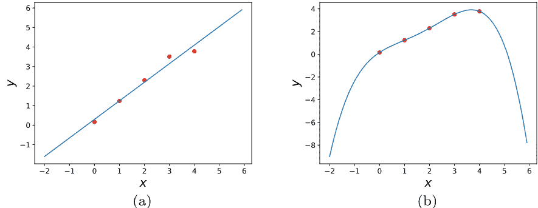

图2.4 偏差-方差权衡的多项式回归。数据点由 $(x_i, y_i)$ 给出，其中 $x_i = i-1$，$y_i = x_i + 0.5z_i$，$z_i$ 是随机采样自 $\mathcal{N}(0,1)$ 的值，$i \in \{1, \dots, 5\}$。图中分别展示了数据的线性最小二乘拟合与四次多项式最小二乘拟合。虽然该四次多项式完美地拟合了数据点，但它并不反映底层的线性模型。采样一个新的数据点 $(x, y)$，其中 $x=6$，这个模型的预测值将会在 $-8$ 左右，远离 $y=6$ 的预期值。这说明了在拟合训练数据和良好地泛化到测试数据之间的权衡。在机器学习中，由于过于简单的模型导致的预测错误和过度拟合训练集与表达能力过强的模型之间的权衡被称为偏差-方差权衡。

具有更高方差的模型意味着拟合结果强烈依赖于训练集中的样本，即特别依赖于随机样本 $z_i$ 服从 $\mathcal{N}(0,1)$。模型表达能力过强的问题不会直接在训练数据上表现出来（我们在那里没有预测误差！），但会导致糟糕的泛化行为。

事实上，在图2.4的例子中，对于一个测试样本，当 $x=6$ 时，预测 $y$ 的值将接近于 $y=-8$，而期望值是 $y=6$。我们说通过选择具有过高方差的模型对训练数据进行了过拟合。

在上面的例子中，我们知道了底层模型，因此清楚线性拟合将具有更好的泛化能力。然而，一般情况下，底层模型是未知的。可能数据样本确实是由一个四维多项式生成的，且没有噪声。在这种情况下，选择具有高偏差的模型，如线性拟合，将导致拟合和泛化效果不佳。这展示了机器学习的一个基本问题，即所谓的偏差-方差权衡，即我们无法同时降低方差和偏差的错误。

大多数机器学习策略的目标是找到方差和偏差的最佳权衡，以实现良好的泛化性能。

**注2.1（交叉验证）** 在上面讨论的例子中，如何系统地测试机器学习模型的泛化能力仍然不清楚。一种选择是交叉验证，它将训练集分为两个互补的子集，并在其中一个子集上训练模型。然后使用另一个子集来测试训练模型的泛化能力。这是使用训练数据的不同分区来完成的。如果模型在训练子集上表现良好，但在互补子集上泛化能力差，这表明我们存在高方差，因此我们的模型具有过高的表达能力（或未正确正则化）。另一方面，如果我们的模型在训练子集和互补子集上都有较高的预测误差，这表明模型存在过高的偏差，因此我们可能希望用具有更高表达能力的模型替换它。

## 第三章 人工神经网络

人工神经网络已成为解决机器学习问题和构建人工智能代理的最先进技术。此外，它们被认为可以从观察中获得人类大脑发展物理直觉的洞察力[29-35]。例如，在[36]中，神经网络被证明能够预测由木块组成的塔是否稳定或会倒塌。这样的实验证明神经网络的处理过程可能与人类的直觉推理有相似之处。在本节中，我们对神经网络的基础知识进行简要概述。我们仍然对这些网络的训练过程以及它们为什么经常很好地推广到未在训练中见过的数据没有深入的理解。因此，训练神经网络需要一些经验和知识，并且不能轻易教授。Michael Nielsen关于神经网络和深度学习的书籍[37]提供了对几种技巧的概述。

了解如何训练神经网络是当前研究的一个课题。例如，[38]中提出了一种信息论方法。在这里，我们重点关注神经网络的基本理解以及训练方法的原理。

### 3.1 单个人工神经元

神经网络的构建模块是单个神经元（图3.1a）。我们可以将神经元看作是一个接受多个实数输入 $x_1, \ldots, x_n$ 并提供一个输出 $\sigma \left(\sum_i w_i x_i + b\right)$ 的装置，根据一个激活函数 $\sigma : \mathbb{R} \to \mathbb{R}$，其中权重 $w_i \in \mathbb{R}$ 和偏置 $b \in \mathbb{R}$ 是可调参数。神经元的输出有时用激活表示，并且有不同的激活函数选择。

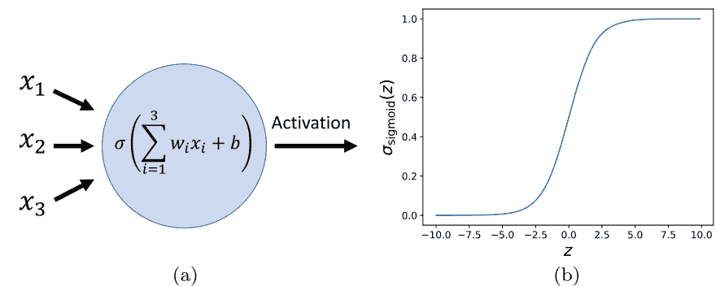

图3.1 Sigmoid神经元。一个带有权重 $w_j$、偏置 $b$ 和激活函数 $\sigma$ 的单个人工神经元。神经元的输入用 $x_1$、$x_2$ 和 $x_3$ 表示。神经元的输出称为激活，并且由 $\sigma\left(\sum_i w_i x_i+b\right) \in \mathbb{R}$ 给出。b. Sigmoid激活函数在 (3.2) 中给出。Sigmoid激活函数可以看作是 (3.1) 中阶跃函数的平滑近似。因此，如果输入明显大于零，则神经元提供的输出大致等于 $1$；如果输入明显小于零，则输出接近于零。

例如，考虑一个阶跃函数
$$\sigma(z)= \begin{cases} 1, & \text{如果 } z > 0 \\ 0, & \text{如果 } z \le 0 \end{cases}$$

这样的神经元被称为感知器，是由 Frank Rosenblatt 在 1950 年代和 1960 年代开发的，受到 Warren McCulloch 和 Walter Pitts 的早期工作的启发。选择这样的激活函数是基于生物神经元的功能，只有在加权输入信号的总和高于给定阈值时才会“触发”（即产生输出）。人们可以将感知器视为一种通过加权证据进行决策的简单模型。例如，你决定去冲浪可能主要取决于两个因素，风的强度（对应输入 $x_1$）和阳光明媚程度（对应输入 $x_2$）。权重表示你对这两个因素的个人权重；选择权重 $w_1$ 大于权重 $w_2$ 意味着拥有强风比拥有阳光更重要。偏置 $b$ 设置了你的决策边界，结果 $1$ 表示决定去冲浪，而结果 $0$ 表示你不会去冲浪。显然，这是一个非常简单的决策模型，但将在第 3.3 节中展示，构建许多神经元的网络可以表示复杂的模型。

### 3.2 激活函数

目前实际应用中使用的人工神经网络为其神经元使用不同的激活函数。不幸的是，目前没有理论告诉我们哪种激活函数在某个特定的机器学习任务中效果最好。然而，正如我们将在第 3.5 节中看到的，为了能够训练神经网络，选择一个（分段）平滑的激活函数非常重要。此外，选择一个平滑的激活函数还可以使网络输出实数而不是离散值，这在机器学习的回归任务中是必需的。我们可以使用感知器的不连续阶跃函数的平滑近似，即由S型激活函数（图3.1b）定义的函数。
$$\sigma (z)=\frac{1}{1+e^{-z}} \text { 。 }$$

在实践中，那些不饱和的激活函数，即对于大输入不会收敛到一个常数值的激活函数，通常表现更好。两个常用的激活函数是修正线性单元（ReLU）[39,40]和指数线性单元（ELU）激活函数[41]，分别表示为
$$\sigma_{\mathrm{ReLU}}(z)=\begin{cases} z, & \text{当 } z > 0 \text{ 时} \\ 0, & \text{当 } z \leqslant 0 \text{ 时} \end{cases}$$

对于某些 $\alpha>0$
$$\sigma_{\mathrm{ELU}}(z)=\begin{cases} z, & \text{当 } z > 0 \text{ 时} \\ \alpha(e^z - 1), & \text{当 } z \leqslant 0 \text{ 时} \end{cases}$$

这两个函数在图3.2中绘制。在本书第三部分讨论的示例的实现中，我们使用ELU激活函数，除了第10.3节讨论的示例使用ReLU激活函数。

### 3.3 神经网络

通过将神经元按层排列，并将第 $i$ 层神经元的结果转发到第 $(i+1)$ 层神经元，创建了一个（前馈）神经网络（见图3.3）。整个网络可以表示一类由 $\theta$ 参数化的函数 $\left\{F_{\theta}\right\}_{\theta}$，其中包含网络中所有神经元的权重和偏置。函数 $F_{\theta}$ 的输入 $x_1, \ldots, x_n$ 对应于该类中第一层神经元的激活（称为输入层）。输入层的激活形成第二层的输入，该层被称为隐藏层（因为它既不是输入层也不是输出层）。对于全连接网络，第 $(i+1)$ 层的每个神经元都接收第 $i$ 层所有神经元的激活作为输入。最后一层的 $m$ 个神经元的激活被解释为函数 $F_{\theta}$ 的输出。显然，这样的网络可以表示一类函数。

20
### 3 人工神经网络
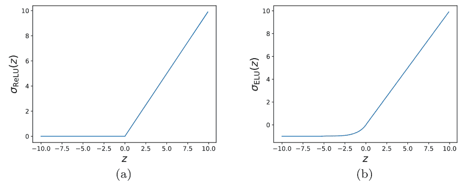

图3.2 ReLU和ELU激活函数。a. 修正线性单元（ReLU）[39,40]在（3.3）中给出。ReLU激活函数对于输入 $z>0$ 是线性的，否则恒为零。b. 指数线性单元（ELU）[41]在（3.4）中给出，其中 $\alpha=1$。ELU激活函数可以看作是ReLU激活函数的平滑版本（垂直向下平移1个单位）。

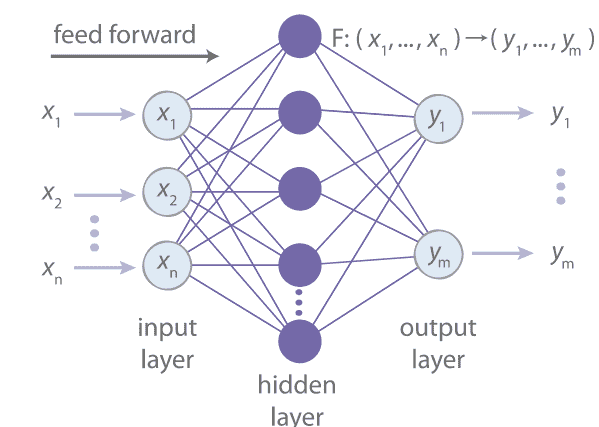

图3.3 前馈神经网络。（图由Iten和Metger等人在2020年的《物理评论快报》[22]中复制）。具有3层的全连接（前馈）神经网络。整个网络可以被看作是一个将输入 $(x_1, \dots, x_n)$ 映射到输出 $(y_1, \dots, y_m)$ 的函数。图3.3显示，图层由一系列人工神经元组成。

网络可以表示比单个神经元更复杂的模型。事实上，正如下一节所讨论的那样，对于某些激活函数的类别，神经网络在某种意义上是普适的，即任何连续函数都可以通过足够大的前馈网络的权重和偏置的选择来进行任意好的逼近。

### 3.4 通用性定理

在本节中，我们研究神经网络的表达能力，即我们研究可以由可变大小的神经网络表示的函数类别。有两类普适性定理。第一类考虑了神经网络在固定深度（即固定隐藏层数）下的表达能力。

第二类考虑了固定宽度的表达能力，即每个隐藏层中的神经元数量固定。对于本书来说，只有第一类普适性定理是相关的，关于第二类我们参考[42]。

关于只有一个隐藏层的神经网络的表达能力，[43, 44]中有一个通用结果。本书中特别相关的一个普适性定理版本在[44]中给出，如下所述。

**定理3.1** 对于任意连续、有界且非常数的激活函数，我们用 $\{F_{\theta}^p: \mathbb{R}^n \rightarrow \mathbb{R}^m\}$ 表示由一个具有 $p$ 个隐藏神经元的前馈神经网络表示的函数类。那么，对于任意连续函数 $G: \mathbb{R}^n \rightarrow \mathbb{R}^m$ 和紧致子集 $X \subset \mathbb{R}^n$ 以及 $\epsilon > 0$，存在 $p \in \mathbb{N}$ 和函数 $F_{\theta}^p$ 使得对于所有 $x \in X$
$$\left|F_{\theta}^p(x) - G(x)\right| < \varepsilon.$$

因此，由于S型激活函数是连续的、有界的和非常数的，任何连续函数都可以通过具有足够大的包含S型神经元的前馈网络来近似得很好。

我们参考[44]证明该陈述，并参考[37]直观证明该陈述通过可视化。该定理不适用于使用ReLU或ELU激活函数的网络，因为它们是無界的。然而，2017年的一项研究结果[45]表明，具有非有界和非多项式激活函数的神经网络也是通用的。

### 3.5 神经网络的训练

即使我们知道神经网络应该实现的目标函数，手动调整网络中所有神经元的权重和偏置，使网络很好地逼近目标函数，也是一项繁琐的任务。

此外，作为机器学习工具，我们希望神经网络能够从训练样本中自己学习函数，即已知的输入-输出对 $(x, y)$，其中 $x \in \mathbb{R}^n$ 和 $y \in \mathbb{R}^m$。因此，目标是找到一个训练算法，它接受一个由输入-输出对组成的训练集 $\mathcal{S}$ 作为输入，并调整神经网络中的偏置和权重（用变量 $\theta$ 总结），使网络实现的函数 $F_{\theta}$ 满足以下条件：

- **拟合**：$F_{\theta}(x) \approx y$ 对于所有的训练输入-输出对 $(x, y)$，
- **泛化**：$F_{\theta}(x') \approx y'$ 对于所有的测试输入-输出对 $(x', y')$，在训练过程中没有观察到。

你可能还记得在第2.1节中讨论的例子，机器学习的任务是对猫和狗的图像进行分类。学习算法通过输入-输出对 $(x, y)$ 来进行训练，其中包括猫和狗的图像（对应于 $x$）和正确的标签“猫”或“狗”（对应于 $y$）。更具体地说，神经网络的输入 $x$ 可以是图像像素的值，输出 $F_{\theta}(x) \in [0, 1]$ 可以是一个sigmoid神经元的激活，它可以表示图像中是否存在某个特定特征，被解释为图像上有狗的概率。[^1] 例如，如果我们从网络中得到 $0.9$ 的结果，那么很有可能图像上有一只狗。

然后，图像可以通过分类为“狗”来输出预测结果。若 $F_{\theta}(x) \geq 0.5$，则分类为“狗”，否则为“猫”。最佳输出应为 $F_{\theta}(x)=y$，其中我们设置 $y=1$ 表示标签为“狗”，$y=0$ 表示标签为“猫”。测试数据用于检查在训练过程中未见过的图像的分类情况。

让我们首先关注实现目标1的训练算法。要训练神经网络，我们需要一些性能度量，该度量平滑地依赖于网络参数 $\theta$（即网络的偏置和权重）。在上面的例子中，可以选择这样的度量 $C((x, y), \theta) = (F_\theta(x) - y)^2$ 作为训练样本 $(x, y)$ 的度量。我们将 $C((x, y), \theta) \geq 0$ 称为成本函数。这个名称的动机是我们希望最小化成本，即我们希望对于所有的训练样本 $(x, y)$，有 $C((x, y), \theta) \approx 0$，这对应于目标1。

然后通过计算整个训练集上的性能来衡量网络的表现，该性能由平均成本定义
$$\bar{C}(\theta, \mathcal{S})=\frac{1}{|\mathcal{S}|} \sum_{(x, y) \in \mathcal{S}} C((x, y), \theta) \text {, }$$
其中 $|\mathcal{S}|$ 表示训练集中样本 $(x, y)$ 的数量。请注意，平均成本函数是 $\theta$ 的平滑函数之和，因此它本身也平滑地依赖于 $\theta$。

#### 3.5.1 随机梯度下降

神经网络的训练算法的目标是找到网络中权重和偏置的选择，使得给定的平均成本 (3.5) 最小化。基本思想是从随机选择的权重和偏置开始，然后逐步调整它们以降低平均成本。在每一步中，我们稍微改变每个权重和偏置，即 $w_i \rightarrow w_i + \delta w_i$ 和 $b_i \rightarrow b_i + \delta b_i$，观察这种改变对平均成本的影响。然后，我们更新成本减少的权重和偏置，即 $w_i \rightarrow w_i + \delta w_i$ 和 $b_i \rightarrow b_i + \delta b_i$，以及成本增加的权重和偏置，即 $w_j \rightarrow w_j - \delta w_j$ 和 $b_j \rightarrow b_j - \delta b_j$。对于足够小的 $\delta w_j$ 和 $\delta b_j$，这些更新会降低平均成本。

在实践中，我们不是处理小的变化，而是计算代价函数对所有权重和偏差的梯度，这表明了代价函数增加的方向[^1]。在该无限小的领域中，代价函数的变化是最大的。此外，计算平均代价函数的变化通常计算量太大，因为必须分别计算所有训练样本的变化，而且通常训练集非常大。因此，我们通过仅对训练集的一部分进行平均来估计代价函数的变化，这部分被称为小批量。更具体地说，训练算法的工作方式如下（再次使用包含网络所有权重和偏差的向量 $\theta$ 作为元素来简化表示）：

- 随机初始化权重和偏置。
- 对于 $t \in \{1,2, \ldots, T\}$，其中 $T$ 表示训练步骤的数量，重复步骤3和4。
- 随机选择一个子集（称为小批量）$\mathcal{M}_t \subset \mathcal{S}$，其中包含 $k \in \mathbb{N}$ 个样本。
- 通过以下方式更新网络参数
$$\theta_t \rightarrow \theta_{t+1}=\theta_t-\eta \nabla_\theta \bar{C}\left(\theta_t, \mathcal{M}_t\right),$$
其中 $\eta>0$ 是学习率。

这个学习算法被称为随机梯度下降。这个名字来自于小批量的随机选择，从而导致梯度的随机估计。梯度可以通过反向传播算法高效地计算，该算法本质上计算输出层神经元参数的梯度，然后使用链式法则计算之前层次的梯度，直到达到输入层（有兴趣的读者可以在[37]中找到更多细节）。小批量大小 $k$ 和学习率 $\eta$ 被称为超参数。因此，它们不会被算法自动调整，而是在运行算法之前需要手动选择。选择更大的小批量大小可以在平均情况下更好地估计梯度，但会导致每次更新步骤的计算时间更长。学习率决定了 $\delta \theta$ 的大小，即我们在每一步中更新网络参数的程度。

#### 3.5.2 收敛性和超参数的选择

通常情况下，给定一个优化问题和一些超参数，目标是选择超参数的方式以最大化收敛速度。然而，对于在 $\theta$ 中非凸的成本函数，这通常是神经网络的情况，我们无法保证随机梯度下降收敛到成本函数的全局最小值。事实上，通常它会陷入局部最小值，并且它取决于网络参数的随机初始化，在哪个局部最小值上被困住。尽管如此，在实践中，训练一个网络

[^1]: 常用于图像分类的网络的隐藏结构并非完全连接，而是所谓的卷积神经网络（例如，参见 [37] 进行介绍），这些网络被优化用于处理视觉数据。然而，在这里的概念讨论中，这是无关紧要的。

对于许多问题来说，使用随机初始化参数 $\theta$ 多次，并选择性能最佳的网络效果很好。不幸的是，目前还不清楚为什么会出现这种情况，这是一个活跃的研究领域，旨在更好地理解神经网络的训练。此外，我们也没有一个理论告诉我们如何选择超参数以优化收敛速度，或者以优化概率达到接近最优值的预测准确性。

因此，选择好的超参数和随机初始化策略目前基于经验、直觉和技巧。关于当前技术水平的简明概述可参考[37]，但在这个神经网络入门介绍中，提供详尽的概述超出了范围。接下来，我们只描述选择好的超参数所面临的主要困难。

从先验上看，人们可能认为选择较大的小批量大小和较小的学习率会在计算时间与训练网络的性能之间取得平衡。然而，神经网络的情况更加复杂。基本上，学习率和小批量大小应该根据以下两个因素来选择：(i) 快速收敛到局部最小值；(ii) 避免陷入性能较差的局部最小值。事实上，选择较小的小批量大小会在网络参数更新中引入一定的随机性。如果小批量太小而不具有代表性，这似乎是需要避免的，因为它可能暂时增加平均成本。然而，事实证明，一定程度的随机性有助于跳出性能较差的局部最小值，从而收敛到性能更好的另一个局部最小值。同样，选择较小的学习率确保我们收敛到最接近的局部最小值。另一方面，选择较大的学习率可能导致“超调”，即在这一训练步骤中，整个训练集上的平均成本实际上会增加。同样，这有助于避免不良的局部最小值。另一方面，选择过小的小批量大小和过大的学习率将在成本空间中导致随机游走，网络可能无法改善其性能。总之，训练神经网络和选择最佳超参数目前更多地基于经验而非严格的洞察力，并需要耐心尝试不同的超参数选择，直到找到一个好的选择为止。

#### 3.5.3 泛化

一个中等规模的神经网络包含大量的参数。例如，一个具有10个输入和输出神经元以及一个包含100个神经元的隐藏层的全连接网络，包含120个偏置和 $2 \times 10 \times 100$ 个权重，总共超过2000个参数。根据第2.4节讨论的偏差-方差权衡，我们预期这样一个复杂的模型会过拟合并且泛化能力差。换句话说，我们预期训练数据可以很好地拟合，但神经网络的泛化能力很差。

令人惊讶的是，通过一些正则化技巧，神经网络在图像分类等任务中展现出了惊人的泛化能力。然而，要实现良好的泛化能力，正则化技术的选择至关重要，而且我们对于在给定情况下应该使用哪种正则化方法还没有深入的理解。一个正则化方法是在代价函数中添加一个项 $\|\theta\|_1$，以促使网络保持参数较小并将不必要的参数设为零。直观地说，通过将不必要的参数设为零来降低模型复杂度可以降低模型的方差，从而可能提高泛化能力。关于正则化神经网络的最新技术的进一步讨论，我们再次参考[37]。

### 3.6 深度学习

很有可能，你已经听说过深度学习。那么它到底是什么呢？本质上，训练至少有一个隐藏层的任何神经网络都可以被认为是深度学习。在实践中，这个术语通常用于包含许多隐藏层的网络（常见的是大约五到十个隐藏层的数量）。回想一下第3.4节中提到的，一个具有一个隐藏层的神经网络可以用足够多的隐藏神经元来逼近任何连续函数，人们可能会想为什么我们甚至要考虑具有多个隐藏层的网络。仅仅因为某件事情是可能的，并不意味着它是高效的。从多层网络的角度来看，相对于具有一个隐藏层的网络，可能需要更少的神经元来实现相同的表达能力（参见例如[46]中关于浅层和深层ReLU网络表达能力的数学比较）。此外，原则上，深度神经网络可能具有比浅层网络更好的泛化性能。

直观上，深度学习在实践中表现良好的原因是有一个组合论的论证。回想一下在第2.1节中考虑的对猫和狗图像进行分类的任务。正如[47,48]所示，经过训练用于分类图像的神经网络在后面的层中逐渐存储更复杂的特征。虽然最初的几层可能表示不同方向的边缘等简单特征，但后面的层可以在这些特征的基础上构建更复杂的物体部分形状，例如狗或猫的典型眼睛。然后，可以进一步组合这些物体部分形状来对分类任务进行决策，并输出“猫”或“狗”的标签。

在实践中，深度神经网络通常在图像识别等任务中优于浅层网络。但不幸的是，深度网络在实践中往往很难训练。虽然深度网络也是使用梯度下降进行训练的（和反向传播算法用于高效计算梯度），梯度大小在这样的网络中往往表现不稳定。因此，这些网络的早期层中的梯度往往会爆炸（爆炸梯度问题）或几乎消失（消失梯度问题）。关于为什么会出现这个问题以及如何在实践中处理它，我们再次参考[37]进行讨论。

有时候人们不仅对猫和狗的图片进行分类感兴趣，还希望从图像中提取相关的猫和狗特征。通过提取高级特征来找到数据的紧凑表示正是基于自编码器在第4章中讨论的表示学习的目标。深度神经网络是表示学习的强大工具，因为它们在更深的层次上自然地学习高级特征。

## 第4章 自编码器

自编码器是表示学习的工具，它是无监督机器学习的一个子领域，处理原始数据中的特征检测。表示学习的一个众所周知的例子是PCA，在第2.2节中进行了讨论。目前用于表示学习的大多数方法都基于人工神经网络。虽然原则上，所有深度神经网络架构都在其隐藏层中学习某种表示（参见第3.6节），但表示学习的大部分工作都致力于定义和寻找好的表示[27]。本书第三部分的主要重点是对物理系统中好表示的形式化以及设计能够找到这种表示的神经网络结构。虽然有各种各样的表示学习工具[27]，但对于本书来说，最相关的是自编码器。

在接下来的内容中，我们提供了一个非技术性的自编码器介绍。附录B中给出了对一种特定类型的自编码器（称为变分自编码器）的数学讨论。自编码器是一种用于在数据集中找到样本的紧凑表示的工具。为了具体起见，想象一下一个包含不同半径和不同中心点的圆形图像的数据集（参见图4.1）。如第3.6节所讨论的，深度神经网络能够从数据中提取抽象特征。然而，到目前为止，我们只考虑了用于监督学习的神经网络。在这里，我们只有圆形图像，但是我们没有任何标签，那么神经网络的输出应该是什么？当我们搜索网络的隐藏层以找到仍然包含足够信息以重构图像的表示时，我们应该要求网络再次将输入图像作为网络的输出，即对于图像 $x$ 和网络 $F_{\theta}$，我们希望 $F_{\theta}(x) \approx x$。但这只是一个恒等函数，那么训练一个网络来学习恒等函数有什么意义呢？通过在隐藏层中引入一个维度“瓶颈”，即引入一个具有少量神经元的隐藏层（称为潜在层），使得网络变得有趣。这迫使网络将输入压缩为几个相关参数，并且不允许它仅仅将原始图像从一层传递到下一层。更具体地说，我们可以将网络分为两部分，编码器函数 $E(x)=r$ 将输入 $x$ 映射到潜在表示 $r \in \mathbb{R}^p$，其中元素


图4.1 自编码器。图中显示了用于压缩圆形图像的自编码器。显示了三个可能的输入图像。圆的位置和半径在训练数据中变化。使用编码器映射将图像数据压缩为小维度的潜在表示。编码器的高维输入可能对应于图像像素的值，编码器的输出由潜在层中神经元的激活给出。请注意，编码器(和解码器)所示的神经元数量并不代表实际情况。

高效的编码器意识到只需“存储”圆心的坐标 $m=(m_s, m_t)$ 以及其半径 $d$。我们强调这些值不是潜在神经元的参数，而是对这些神经元的实值输出的对应值（给定图像作为编码器的输入）。然后使用解码器仅使用潜在表示的信息来重构图像。

对于给定的输入，$r$ 和 $y$ 对应于潜在神经元的激活。然后，通过网络的后半部分，即解码器函数 $D(r)=y$，将潜在表示映射到网络的输出 $y$（应该与输入图像大致相等，即 $x \approx y$）。在考虑的例子中（图4.1），知道圆的中心 $(m_s, m_t)$ 和半径 $d$ 足以重建图像。

因此，输入图像（可能是相当高维的，例如，如果图像尺寸为100×100像素，则为具有10,000个条目的向量）可以被压缩为一个三维潜在表示，存储 $m_s, m_t$ 和 $d$。请注意，所有图像中保持不变的特征，例如形状（在本例中为圆形），都被“存储”在解码器中。潜在表示只需要存储可能在图像之间发生变化的信息。

在人类中，将 $m$ 存储为一个由三个神经元组成的潜在表示是最自然的，但神经网络不会有先验理由不存储例如 $a=m_s+m_t$，$b=m_s-m_t$ 和 $c=d$，因为解码函数可以轻松地从这个表示中恢复 $m_s=(a+b)/2$，$m_t=(a-b)/2$ 和 $d=c$。因此，在生成的表示中，存储在潜在神经元中的不同参数通常高度相关，并且没有直接的解释。最近，表示学习领域的许多工作都致力于将这些表示分离开来，即以有意义的方式分离表示中的参数（参见例如[49-53]）。特别是，这些工作引入了在表示学习中称为先验的标准，通过这些标准我们可以解开纠缠表示。

## 4 自编码器

纠缠表示。在多个工作中，重点放在具有统计独立潜在神经元的先验上，最近提出的先验是所谓的意识先验[54]。它建议通过假设，在任何给定时间，表示中仅有一小部分特征或概念足以对现实做出有用的陈述，从而解开潜在表示。在本书的第三部分中，我们讨论了以自然方式解开物理系统表示的标准。

## 第二部分：使用机器学习概览科学发现

在本部分中，我们概述了机器学习可以应用于自动化科学发现过程的不同方向。近年来，机器学习已成为科学中常用的工具，本书的这一部分无法讨论所有相关结果。相反，我们专注于一些具有以下特点的结果：（i）它们基于可以应用于广泛范围的物理系统的机器学习方法，即这些方法不专门针对特定类别的系统；（ii）它们代表了一个研究方向（因此，它们为读者提供了阅读相应研究领域最新结果所需的机器学习背景）；（iii）它们允许从物理系统中提取概念信息。本书的这一部分的每一章都是独立的，因此读者可以自由选择自己特别感兴趣的章节，如果其他章节与他或她的研究领域不太相关，可以跳过。

在本部分中讨论的大多数方法都需要了解哪些物理参数与所研究的系统相关。例如，可以假设描述带电粒子在均匀电场中的时间演化的相关参数是粒子的电荷、质量以及场强。深度学习和表示学习的最新进展使得可以摆脱这种先验知识，让机器自己发现相关参数。这在本书的第三部分中进行了讨论。

## 第五章 创建实验装置


如第1.2节所讨论的，创建实验装置是物理学家发现过程中的一个基本步骤。为量子系统创建实验装置尤其具有挑战性，因为这类系统的行为通常是难以理解的。在过去几年中，已经使用自动搜索技术和基于强化学习的方案来生成量子光学的新实验装置[55,56]（参见[57]对计算机启发式实验的综述）。这项研究已经解决了几个以前未解决的问题[55,58]，实现了计算机启发式实验[59–64]，并且最重要的是，发现了新的科学思想和概念[65–67]。最近，一种名为 THESEUS 的新设计算法在[68]中被引入，专门用于概念洞察。THESEUS使用图形表示量子实验[66]，与自动搜索算法 MELVIN[55]相比，显著加快了运行时间。除了完全自动化实验的生成，还可以使用机器学习来生成假设，从而帮助改善人类专家对系统的直觉[69]。

在本章中，我们关注的是基于一种物理动机的强化学习方法，称为投影模拟[70]，所描述的结果[56]。投影模拟特别适用于强化学习问题，其中我们希望对代理的思考过程有一些了解。事实上，投影模拟允许发现在给定任务之外有用的实验工具组合（或小工具）。因此，以下讨论可以在更广泛的背景下被视为提供人工物理学家与环境相互作用的概念洞察的示例，使用强化学习。

### 5.1 量子光学中的问题设置

在本节中，我们提供了理解量子光学设置的背景知识（基于[56]）。不需要理解量子力学也可以理解本节内容。提供了足够的背景知识，以便将生成高维纠缠量子态的目标视为纯粹的数学优化问题。

一个（纯）d维量子系统的状态可以用一个复向量 $|\psi\rangle \in \mathbb{C}^d$ 表示，该向量被归一化，即具有单位欧几里得范数 $\|\psi\rangle\|_2 = 1$，并且如果存在 $\phi \in \mathbb{R}$，使得 $|\psi\rangle = e^{i\phi}|\psi'\rangle$，则两个状态 $|\psi\rangle$ 和 $|\psi'\rangle$ 被认为是相同的。我们使用复向量空间上的标准内积，即 $\langle v|w\rangle = \sum_{i=1}^d v_i w_i^*$，其中 * 符号表示复共轭。复向量空间 $\mathbb{C}^d$ 连同标准内积被称为希尔伯特空间。

在[56]中使用的量子光学装置中，光子的位置和轨道角动量（OAM）被用作存储和操作量子态的自由度。我们使用四条不同的路径，分别用 a、b、c 和 d 标记光子的传播路径，并且每个光子有 $2M+1$ 个角动量状态，分别用 $-M, \dots, 0, \dots$ 标记。其中 $M \in \mathbb{N}$ 是光子角动量数 $m$ 的有限上界。因此，光子的状态存在于一个 d 维复希尔伯特空间中，其中 $d=4\times(2M+1)$，并且有正交基矢 $|m\rangle_p$，其中 $m \in \{-M, \dots, 0, \dots, M\}$，$p \in \{a, b, c, d\}$。

在[56]中考虑的目标是创建一种特殊的光子态，称为纠缠态。在我们（数学上）描述可用于实现这一目标的实验工具之前，让我们讨论纠缠的定义。纠缠在基于量子力学的各个研究领域内起着基础性的作用。它描述了量子系统的固有属性，为这些系统的概念上具有挑战性的行为奠定了基础[71]，并在量子信息理论（参见[72]进行概述）和凝聚态理论中找到了许多应用，其中复杂系统中的相变与纠缠之间存在着强烈的联系[73]。让我们首先为二态定义纠缠，然后考虑更复杂的多方案例。

#### 5.1.1 二分体系的纠缠

考虑两个量子系统 A 和 B，它们的状态分别存在于希尔伯特空间 $H_A$ 和 $H_B$，维度分别为 $d_A$ 和 $d_B$。复合系统的状态
> 1 希尔伯特空间是一个实数或复数内积空间，它是一个关于内积诱导的距离函数而言的完备度量空间。距离函数，由内积 $\langle\cdot|\cdot\rangle$ 诱导，定义了两个向量 $x$ 和 $y$ 之间的距离为 $\langle x-y|x-y\rangle$。

那么它位于希尔伯特空间 $H_{AB}$ 的张量积中，即 $H_{AB} = H_A \otimes H_B$（参见[72]中关于量子力学背景下张量积的详细介绍）。例如，如果系统 A 和 B 分别处于状态 $|\psi_A\rangle$ 和 $|\varphi_B\rangle$，那么复合态由 $|\psi_A\rangle \otimes |\varphi_B\rangle$ 给出。可以用张量积形式表示的态被称为可分离态或乘积态。也许令人惊讶的是，如果一个人对量子力学不熟悉的话，在 $H_{AB}$ 中并不是所有的态都是乘积态，因此存在一些不能由每个系统的两个局部态来描述的态。

相反，如果系统处于一个不可分离的状态（也称为纠缠态），两个系统形成一个不可分割的整体。一个在路径 a 和 b 上的两个光子状态的例子，在 OAM 基础上是（最大）纠缠的：
$$|\psi_{AB}\rangle = \frac{1}{\sqrt{3}} \sum_{m=-1}^{1} |m\rangle_a |-m\rangle_b. \quad (5.1)$$
注意因子 $1/\sqrt{3}$ 需要 $\sqrt{3}$，以使 $\langle\psi_{AB}|\psi_{AB}\rangle=1$ 正规化。2 这样的状态可以通过两个非线性晶体中的双自发参量下转换过程在实验中生成[55,59]。一种表征纠缠的方法是基于Schmidt分解。

> 2 该符号 $\langle\psi_{AB}|\psi_{AB}\rangle$ 缩写了表达式 $(|\psi_{AB}\rangle\langle\psi_{AB}|)$，实际上是量子态用 $|\cdot\rangle$ 括起来的常见方式之一，被称为“凯特”符号。与“布拉”符号 $\langle\psi_{AB}|$ 表示复共轭行向量（列向量 $|\psi_{AB}\rangle$），“布拉凯特”符号 $\langle\psi_{AB}|\psi_{AB}\rangle$ 可以理解为矩阵乘法 $\langle\psi_{AB}|$ 与 $|\psi_{AB}\rangle$ 的乘积。

**定理1 (Schmidt分解[72])** 设 $|\psi_{AB}\rangle$ 是两个系统 A 和 B 的复合态。那么，存在正交态 $|\psi_i\rangle_A$ 用于系统 A，以及正交态 $|\varphi_i\rangle_B$ 用于系统 B，使得
$$|\psi_{AB}\rangle = \sum_i \lambda_i |\psi_i\rangle_A |\varphi_i\rangle_B, \quad (5.2)$$
其中 $\lambda_i$ 是非负实数，满足 $\sum \lambda_i^2 = 1$ 并被称为 Schmidt 系数。

分解的证明基于奇异值分解，并在[72]中给出。除了在量子信息理论中的许多其他应用之外，Schmidt 分解的最小 Schmidt 系数数量，称为 Schmidt 秩，可以用来通过所需的局部系统自由度的最小数量来表征纠缠。

一个乘积态只需要一个 Schmidt 系数，因此其 Schmidt 秩等于一。这对应于系统在一个自由度上“纠缠”，即每个局部系统与另一个系统独立，因此状态是可分离的。另一方面，任何 Schmidt 秩大于一的态都是纠缠的。例如，可以证明(5.1)中给出的态的 Schmidt 秩为三，因此它是纠缠的。

所有三个 OAM 维度。请注意，这个特征不依赖于 Schmidt 系数的大小，因此对噪声不具有鲁棒性：状态的任意微小扰动可能会改变 Schmidt 秩，例如从一变为二，从而将特征从“可分离”变为“纠缠”。尽管如此，这个特征在下面的章节中考虑的情况下效果很好，特别是因为[56]中使用的量子系统是在计算机上以任意精度模拟的。

### 5.1.2 多分体系的纠缠

对多粒子系统的纠缠特性进行表征比双粒子系统更加复杂。为了证明这一点，让我们考虑一个三粒子系统 ABC。我们可以通过 Schmidt 秩分别对系统 A-BC，B-AC 和 C-AB 之间的纠缠进行表征。然而，一般来说，这三个 Schmidt 秩不相等，因此我们没有一个单一的数值来描述纠缠，而是三个数值（它们不完全独立，但也不由彼此决定[74]）。因此，我们可以将三粒子系统的 Schmidt 秩向量（SRV）定义为一个具有整数项的三维向量，对应于系统的不同双粒子分裂的 Schmidt 秩。SRV 的各个项可以被视为系统不同分裂之间的纠缠维度。[56]中考虑的目标是创建具有 SRV（3,3,2）和（3,3,3）的高维纠缠三粒子光子态。这样的态不仅具有基础性的兴趣，而且在量子通信和计算[75-80]中有许多应用。

#### 5.1.3 光子态的制备

最初，我们创建了两对光子，它们在 OAM 基底上是最大纠缠的，即我们从一个由四个光子组成的状态开始：
$$|\psi\rangle = \frac{1}{3} \left( \sum_{m=-1}^{1} |m\rangle_a | -m\rangle_b \right) \otimes \left( \sum_{m=-1}^{1} |m\rangle_c | -m\rangle_d \right). \quad (5.3)$$
然后，我们可以对这个状态应用不同的变换，这些变换对应于量子光学中众所周知的工具，目标是在三个光子之间创建高维纠缠。可用的工具及其数学描述如下：

- 1. BS$_{a,b}$：非偏振对称的 50/50 分束器，用于光子在路径 a 和 b 上
  $$|m\rangle_{a} \rightarrow \frac{1}{\sqrt{2}}(i|-m\rangle_{a}+|m\rangle_{b}),$$
  $$|m\rangle_{b} \rightarrow \frac{1}{\sqrt{2}}(|m\rangle_{a}+i|-m\rangle_{b}) \text{ 。}$$
- 2. HO$_{a,k}$：路径 $a$ 中的全息图，OAM 偏移 $k \in \{\pm 1, \pm 2\}$：
  $$|m\rangle_{a} \rightarrow|m+k\rangle_{a}$$
- 3. DP$_{a}$：路径上的鸽子棱镜 $a$：
  $$|m\rangle_{a} \rightarrow i e^{i \pi m}|m\rangle_{a}$$
- 4. Refl$_{a}$：路径上的镜子 $a$：
  $$|m\rangle_{a} \rightarrow |-m\rangle_{a}$$

目标是从状态 $|\psi\rangle$ (5.3) 开始，应用 1 到 4 列出的一系列变换，使我们最终得到三个光子的高维纠缠态。应用所有变换后，在路径 $a$ 中的光子在 OAM 基上进行后选择，这意味着它在 OAM 基上进行测量，并且对于所有可能的测量结果，研究剩下的三个光子的状态。例如，如果我们不对初始态 $|\psi\rangle$ 应用任何变换，那么在 OAM 基上进行后选择将导致三个与 $|m_0\rangle_{a}$ 的后选择相对应的非平凡态，其中 $m_0 \in \{-1,0,1\}$。根据路径 $a$ 中光子的轨道角动量的测量结果 $m_0$，我们将得到剩下三个光子上的以下态：
$$\frac{1}{\sqrt{3}} |-m_0\rangle_{b} \otimes\left(\sum_{m=-1}^{1}|m\rangle_{c}|m\rangle_{d}\right).$$
这个状态的 SRV 为 $(1,3,3)$，因此路径 $b$ 中的光子完全没有纠缠。目标是找到一系列的变换，最终得到一个三光子状态具有 SRV $(3,3,2)$ 或 $(3,3,3)$。这是一个非常具有挑战性的任务，下一节将讨论如何使用强化学习来解决它。

### 5.2 使用投影模拟创建实验设置

投影模拟(PS)是一种特定的强化学习方法，于2012年在[70]中引入。PS已经在标准强化学习问题 $[81-84]$、先进机器人问题 $[85,86]$ 和量子纠错问题中表现出色。

tion [87, 88], 量子通信 [89], 建立实验贝尔测试 [90], 基于代理原理的集体行为建模 [91-93], 甚至被证明可以为强化学习提供量子增强 [94-100]。此外，在投影模拟 [101-103] 的背景下，还考虑了一些有趣的代理哲学挑战。回顾第2.3节，强化学习中代理的目标是处理编码环境状态的输入，以决定下一步应该执行哪个动作来实现目标。PS背后的一个基本思想是，代理通过投射自身，基于先前的经验和其变体，对潜在的未来情况进行处理。基于相关情况（以及作为输入的当前环境状态），代理选择在环境上执行的下一个动作。这个想法与情节记忆有关，其在心理学中的规划和预测作用已经在20世纪70年代讨论过了 [104, 105]。

让我们以一个简单的例子（在[70]中正式讨论）来非正式地解释这个想法。考虑一个代理，它可以在每个时间步骤中决定选择动作 $a_r$ 或 $a_l$，即向右移动或向左移动。代理的输入是一个指向左边的红色箭头 $s_l^{red}$ 或指向右边的红色箭头 $s_r^{red}$，代理的正确移动应根据所示的箭头进行。PS代理学习将所示的箭头与正确的动作相关联，即将动作 $a_r$ 与状态 $s_r$ 相关联，将动作 $a_l$ 与状态 $s_l$ 相关联。现在，假设向代理显示的箭头有时是蓝色的（而其他时候仍然是红色的），因此代理还有两个额外的潜在输入，分别表示指向左边和右边的蓝色箭头 $s_l^{blue}$ 和 $s_r^{blue}$。PS代理不仅可以学习将蓝色箭头再次与正确的动作相关联，还可以学习将蓝色箭头和红色箭头指向同一方向相互关联，从而识别箭头的“含义”与颜色无关。例如，给定一个输入 $s_l^{blue}$，记忆片段可能如下所示，这个输入会激活 $s_l^{red}$，进而导致选择正确的动作 $a_l$。因此，反思并不是一个复杂的计算过程，而是可以看作是记忆本身的结构动力学特征。特别地，这使得将PS的思想推广到量子世界成为可能，如[70]中所讨论的。记忆片段的基本激发称为 $clip$，由 $s_l^{blue}$、$s_l^{red}$、$s_r^{blue}$、$s_r^{red}$、$a_l$ 和 $a_r$ 组成。

所讨论的例子非常简单，忽略了PS [70]的一些方面。在一般的框架中，不同片段之间的关联是概率性的。PS允许通过在片段网络中进行随机游走而对各种潜在情况进行推理，而在此过程中不应用任何在环境中退出的动作。因此，它只是在第一时间对动作进行推理，但它们并没有直接在“现实”中实施。最后，根据整个推理过程，选择一个“真实”的动作在环境中执行。重要的是，片段不仅可以由一个状态或动作组成，还可以由一个组合组成。PS能够自己学习这样的组合，这是从训练的PS代理中提取概念信息的关键特征。

这个想法将在接下来的量子光学具体例子（第5.1节）中详细解释。

### 5.2 使用投影模拟创建实验设置

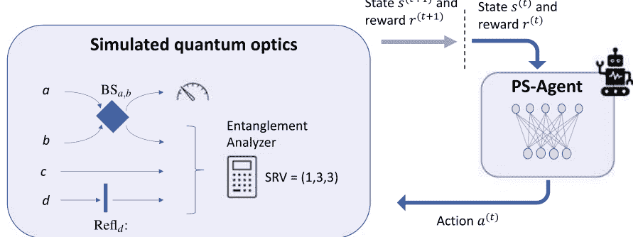

图5.1 投影模拟代理环境[56]。PS代理在每一步中放置（取决于当前光学设置）一些附加光学工具在（虚拟的）光学台上。动作 (a) 确定工具的数量以及在光学台上的位置。例如，动作 (a-1) 可以设置为在路径 a 和 b 上放置一个分束器 BS（如图中的当前状态 s 所示）。计算机模拟了四个光子在四条路径 a、b、c 和 d 上的传播，并计算了路径 b、c、d 上的输出状态（在路径 a 上的光子的 OAM 基础上进行选择）。然后，确定输出状态的 Schmidt-Rank 向量（SRV）作为纠缠度的度量。如果三光子状态的 SRV 为 (3, 3, 2) 或 (3, 3, 3)，代理将获得正向奖励 $r(t+1)$。如果奖励为正，或者达到了最大光学元件数 $L$，实验结束。否则，代理根据状态 $s(t+1)$ 选择下一个要放置在光学台上的元件。

#### 5.2.1 投影模拟代理的架构

在[56]中使用的PS代理具有简单的架构，其中每个记忆的光学设置状态和每个动作对应于一个剪辑。PS代理逐步构建光学设置，在每个步骤中将新的光学元件放置在光学台上（图5.1）。因此，可能的动作集合 $\{a_i\}_{i \in \{1,\dots,K\}}$ 对应于 1-4 中列出的可能变换。我们有6种可能的方法来放置分束器（从四条路径中选择两条），16种不同的全息图变体，以及4种选择用于鸽子棱镜和反射的方式，总共有 $K=30$ 种可能的动作。与光学设置对应的剪辑会随着过程的进行而添加到架构中，即从具有状态剪辑 $\{s_i\}_{i \in \{1,\dots,N\}}$ 的架构开始，将尚未包含在架构中的每个创建的设置作为附加剪辑 $s_{N+1}$ 添加。

我们对有限实验感兴趣，因此一个实验中光学元件的最大数量限制为 $L \in \mathbb{N}$。这不仅仅是理论上的限制，而且是实际上的限制：由于每个光学元件都会对量子态产生一些噪声，例如由于错位和干涉不稳定性，我们预期随着实验时间的增长，所得到的态的保真度会降低。具有固定光学元件数量 $l$ 的光学装置可能的状态数由 $K^l$ 给出。因此，所有可能状态的集合为 $\{s_i\}_{i \in \{1,\dots,N_{\max}\}}$，其中 $N_{\max} = \sum_{l=0}^{K} K^l$。请注意，其中 $s_1$ 代表空的光学台。

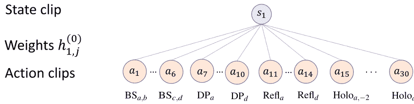

图5.2 PS代理的初始架构[56]。该图展示了PS代理在初始化时对情节记忆的简单模型的模拟。代理的目标是创建产生纠缠光子态的实验设置（参见图5.1的设置）。环境的状态和代理可以选择的动作对应于单个剪辑。剪辑 $s_1$ 对应于空的光学台。（在代理的训练过程中，进一步对应于代理状态的剪辑将会被逐步记忆。）动作剪辑 $a_1, \dots, a_{30}$ 对应于将 1-4 中列出的可能工具之一放置在光学台上。状态 $s_1$ 通过加权边 $(1, j)$ 与所有动作 $a_j$ 相连。权重 $h_{1,j}^{(0)}=1$ 都初始化为 1，因此第一个动作是均匀随机选择的。

在最多使用 6 个光学元件的情况下，这已经对应于超过五十亿个剪辑的最大数量。

初始架构（在训练过程中可能会更改）对于PS代理只包括与空光学台相对应的剪辑 $s_1$ 和剪辑 $a_1, \dots, a_K$，这些剪辑表示将光学工具 1-4 放置在台上的动作（图5.2）。状态 $s_1$ 通过加权边 $(1, j)$ 与每个动作 $a_j$ 相连，权重为 $h_{1,j}^{(0)}$，其中上标表示经过的训练步骤的数量。边 $(i, j)$ 表示在状态 $s_i$ 中采取动作 $a_j$ 的可能性。

更具体地说，选择在状态 $s_i$ 下采取动作 $a_j$ 的概率 $p_{i,j}^{(0)}$ 与权重 $h_{i,j}^{(0)}$ 成比例，即我们有

$$p_{i,j}^{(0)} = \frac{h_{i,j}^{(0)}}{\sum_{k=1}^{K} h_{i,k}^{(0)}}$$

最初，所有权重都设置为 1 [56]，因此，从空的光学台开始执行动作 $a_j$ 的概率是均匀的，即 $p_j = 1/K$ 对于每个 $j \in \{1, \dots, K\}$。类似地，如果在训练过程中记忆了额外的状态剪辑 $s_i$，则边 $(t_i, t_j)$ 的权重被初始化为 1。

#### 5.2.2 投影模拟代理的训练

从让PS代理选择下一个要放置的光学元件开始，我们希望训练PS代理学习生成导致高维纠缠态的设置，并具有高概率。

与监督学习相反，我们对PS的动作没有任何知识，代理应该选择实现这个目标。PS代理获得的唯一关于其性能的反馈是在它创建了导致高维纠缠态的光学装置时获得正面奖励，或者如果光学台上的元素达到了最大数量，则没有奖励。在这两种情况下，我们都会将光学台重置为空状态，并开始一个新的实验，其中PS代理再次将光学工具放置在台上。根据这样的奖励，代理必须学会在已经放置了一些元素的光学台上下一个放置哪些元素。在训练过程中，通过三种不同的调整方式，代理可以调整其行为 [56]：

- 1. 调整PS架构的权重，从而调整在给定光学台状态 $s_i$ 的情况下选择动作 $a_j$ 的概率。
- 2. 动作组合，即将已被证明在实现目标时有用的多个动作组合作为动作剪辑添加到架构中。
- 3. 剪辑删除，即删除可能不需要的状态和动作以实现目标。

我们在下面分别讨论这三种学习技术（对于不关心学习工作细节的读者，可以安全地跳过第5.2.2.1节和第5.2.2.3节）。动作组合（第5.2.2.2节）尤其有趣，因为它可以帮助我们对哪些工具组合，即实验工具的组合，特别有用有一些概念上的洞察。

##### 5.2.2.1 权重的训练

目标是在PS代理的训练过程中更新权重，以优化（平均）成功的概率，即获得正向奖励的机会。实现这个目标的基本思想是：每当PS代理获得奖励时，增加与在建立光学装置过程中所做的动作选择相对应的边的权重。例如，假设从空的光学台状态 $s_1$ 开始，PS代理首先执行一个动作 $a_{14}$，导致状态 $s_3$ 对应于路径 d 中放置了一个单独镜子的光学台（图5.3）。状态 $s_3$ 再采样一个动作 $a_{30}$，并导致一个奖励的光学状态。然后，当代理观察到状态 $s_1$ 或 $s_3$ 时，应增加边 $(1, 14)$ 和 $(3, 30)$ 的权重，以提高选择动作 $a_{14}$ 或 $a_{30}$ 的概率。

让我们形式化这个想法，并用数学方式描述权重如何更新。我们用 $t$ 表示训练过程中经过的交互圈数（见图5.1），用 $h^{(t)}$ 表示经过 $t$ 个圈数后的权重矩阵。经过 $t$ 个圈数后的奖励 $r^{(t)} \in \{0, \lambda\}$，当且仅当代理产生了具有期望 SRV 的状态 $\{3,3,2\}$ 或 $\{3,3,3\}$ 时，$\lambda > 0$。然后，[56]中使用的权重更新规则为

$$h^{(t+1)} = h^{(t)} + r^{(t)} g^{(t+1)} \quad (5.11)$$

其中 $h^{(t)}$ 是具有 $h_{i,j}^{(t)}$ 元素的权重矩阵，而 $g^{(t+1)}$ 是允许重新分配奖励的 glow 矩阵，以便过去做出的决策获得的奖励比最近的决策获得的奖励少。glow 矩阵 $g^{(0)} = \emptyset$ 初始化为零矩阵，并在每一步更新，通过设置 $g_{i,j}^{(t)} = 1$ 来表示上一次决策过程中遍历了边 $(i, j)$。此外，$g$ 矩阵在与环境的每次交互后更新，以降低过去行动被奖励的程度。

$$g^{(t+1)} = (1-\eta) g^{(t)}, \quad (5.12)$$

其中 $\eta \in [0,1]$ 是 PS 模型的发光参数。超参数 $\eta$ 可以根据启发式方法选择，也可以由 PS 自身学习 [106]。从 (5.11) 和 (5.12) 可以看出，正向奖励 $r^{(t)}$ 会增加从状态到动作的最近遍历边对应的权重。

##### 5.2.2.2 动作组合

动作组合 [70] 通过提供一些原始的创造性 [102]，使 PS 代理能够自己提出动作。在 [56] 中，这个想法的一个具体版本被实现，以学习导致正向奖励的动作。每当 PS 代理获得正向奖励时，导致该奖励的动作序列将作为附加的动作片段添加到 PS 模型中（图5.3）。这使代理能够在一个训练步骤中直接将过去经验中证明有用的几个光学工具放在一起。因此，可用的操作数量随着训练步骤的增加而变化，我们用 $K^{(t)}$ 表示训练步骤后的数量。连接新动作与所有状态剪辑的权重初始化为 1，并且在给定状态 $s_i$ 的情况下选择动作 $a_j$ 的概率为

$$p_{i,j}^{(t)} = \frac{h_{i,j}^{(t)}}{\sum_{k=1}^{K^{(t)}} h_{i,k}^{(t)}}$$

工具箱大小 $K^{(t)}$ 的重新缩放导致概率相对于权重的变化较小。为了补偿 $p_{i,j}^{(t)}$ 相对于权重变化的这种影响，我们还通过与工具箱大小成比例地重新缩放 $\lambda$ 来重新缩放奖励 $r^{(t)} \in \{0, \lambda^{(t)}\}$。

$$\lambda^{(t)} = \lambda^{(0)} \frac{K^{(t)}}{K^{(0)}}$$

其中 $\lambda^{(0)}$ 对应于初始奖励 $\lambda$，并且在经过 $t$ 步之后，正奖励 $r^{(t)} \in \{0, \lambda^{(t)}\}$ 会被赋予 $\lambda^{(t)}$。

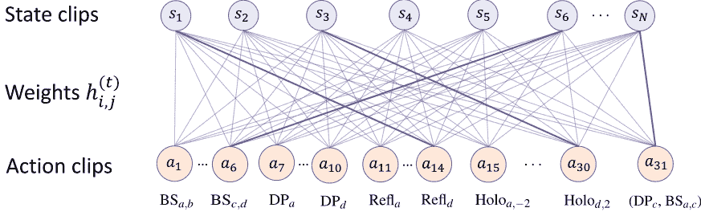

图5.3 PS代理的训练架构[56]。该图展示了图5.2中PS代理的架构在经过若干次训练后可能发生的变化。状态剪辑 $s_2, \dots, s_N$ 在受奖励实验中被探索，并在训练过程中被添加。选择动作 $a_j$ 作为输入状态 $s_i$ 的概率与权重 $h_{i,j}^{(t)}$ 相关（见式 5.13）。如果在训练过程中选择动作 $a_j$ 在状态 $s_i$ 中导致正向奖励的情况下，权重会增加（图中用实线表示高权重）。因此，在训练过程中增加选择导致受奖励实验的动作的概率。

此外，动作组合会改变PS架构的结构。例如，PS代理在训练过程中可能意识到将路径 c 上的 Dove 棱镜与路径 a 和 c 上的分束器组合在一起特别有用以实现其目标。因此，添加了复合动作剪辑 $(DP_c, BS_{a,c})$，使代理能够在一个训练步骤中放置两个元素。


图5.3 PS代理的训练架构[56]。该图展示了图5.2中PS代理的架构在经过若干次训练后可能发生的变化。状态剪辑 $s_2, \dots, s_N$ 在受奖励实验中被探索，并在训练过程中被添加。选择动作 $a_j$ 作为输入状态 $s_i$ 的概率与权重 $h_{i,j}^{(t)}$ 相关（见式 5.13）。如果在训练过程中选择动作 $a_j$ 在状态 $s_i$ 中导致正向奖励的情况下，权重会增加（图中用实线表示高权重）。因此，在训练过程中增加选择导致受奖励实验的动作的概率。

此外，动作组合会改变PS架构的结构。例如，PS代理在训练过程中可能意识到将路径 c 上的 Dove 棱镜与路径 a 和 c 上的分束器组合在一起特别有用以实现其目标。因此，添加了复合动作剪辑 $(DP_c, BS_{a,c})$，使代理能够在一个训练步骤中放置两个元素。

### 5.2.2.3 剪辑删除

光学装置的所有可能状态的数量随着 $K$ 的增加而急剧增加（约为 $K^L$），其中 $K$ 是动作的数量，$L$ 是放置在光学装置上的元素的最大数量。因此，将由 PS 代理构建的所有状态作为剪辑添加到 PS 模型中可能会导致大量的状态剪辑，从而导致大量的需要训练的权重。为了避免这种情况，我们删除只被偶尔使用的状态剪辑。更具体地说，如果在将最大数量 $L$ 的元素放置在光学台上后没有获得正面奖励，则删除所有已创建的状态剪辑和边（并从 PS 架构中移除）。

同样地，我们还使用删除机制来保持总动作数量合理地小。这个想法是只有当复合动作在许多情况下被证明有用时才保留。从技术上讲，我们检查在一些训练步骤之后，添加的动作剪辑的入边权重之和是否足够大，以证明其存在的合理性。如果不是这种情况，我们会再次移除该动作。（关于实现这个想法的方法的完整描述，请参阅[56]的补充材料。）

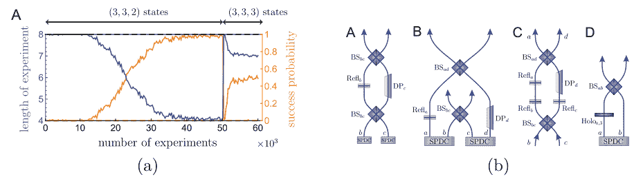

图5.4 使用PS创建光学装置的结果（图片摘自Melnikov和Nautrup等人的《国家科学院学报》2018年[56]）。(a) 图表显示了在训练过程中成功概率的演变以及实验的平均长度（即光学元件的数量）。PS代理经过 $5\times10^4$ 次实验进行训练，目标是创建具有 SRV (3,3,2) 的状态，然后进行 $10^4$ 次实验创建具有 SRV (3,3,3) 的状态。经过训练的代理成功地以约 50% 的概率创建具有 SRV (3,3,3) 的状态。虚线对应于从一开始就以创建具有 SRV (3,3,3) 为目标进行训练的代理。这样的代理基本上没有任何学习进展。这表明创建具有 SRV (3,3,2) 状态的技术对于创建具有 SRV (3,3,3) 状态也是有用的。(b) PS代理经常使用的实验设置。(A) 本地奇偶排序器。(B) 非局部奇偶排序器。(C) Klyshko 波前图中的非局部奇偶排序器 [107]，其中路径 a 和 d 与路径 b 和 c 完全相同。(D) 增加光子纠缠维度的设置。

#### 5.2.3 结果

PS代理经过 $5\times10^4$ 次实验训练，目标是学习具有 SRV (3,3,2) 的光子状态。发光参数 $\eta = 1/16$，光学元件的最大数量 $L=8$，奖励的初始大小 $\lambda^{(0)} = 1$。PS代理通过训练学习创建具有 SRV (3,3,2) 的光子状态，且在训练过程中光学元件的数量逐渐减少 [56]（图5.4a）。然后，同一PS代理经过 $10^4$ 次实验进一步训练，学习创建具有 SRV (3,3,3) 的光子状态。在这个短暂的额外训练期间，PS代理迅速学会以 50% 的成功概率创建这些状态。这表明，了解如何创建具有 SRV (3,3,2) 的状态有助于代理构建具有 SRV (3,3,3) 的状态，或者构建具有 SRV (3,3,3) 的状态比构建具有 SRV (3,3,2) 的状态更简单。为了验证这一点，新初始化的PS代理经过 $6\times10^4$ 次实验训练，目标是创建具有 SRV (3,3,3) 的状态，但成功概率仍接近零（图5.4a）。这证明，训练用于产生具有 SRV (3,3,2) 的状态的代理发现了一些也有助于产生具有 SRV (3,3,3) 的状态的结构。本节讨论了PS代理构建导致所需状态的实验设置的一些见解。

### 5.3 从动作组合中获得概念洞察

在第5.2节中，我们讨论了如何使用PS来创建用于准备纠缠态的实验设置。然而，作为科学家，我们不仅对能产生这种态的实验设置感兴趣，还希望对构建这些设置所使用的原理有一定的了解。事实上，实验设置与所创建态的纠缠结构之间的联系尚不完全理解 [55]。动作组合允许PS代理在训练过程中组合新的动作，这被证明特别有用，可以帮助我们对这种关系有一些了解。识别经常出现在成功实验设置中的小工具可以帮助我们了解哪些构建模块特别适用于创建高度纠缠的态。

根据第5.2节中描述的方法进行训练的PS代理的添加组合动作在[56]中进行了分析。根据动作 $a_j$ 的入边权重之和 $\sum_k h_{k,j}$ 进行分析，人们发现PS代理广泛使用了与光学干涉仪相对应的动作组合（如图5.4b(A) 所示）。通常，这样的干涉仪用于对具有不同奇偶性的 OAM 模式进行排序 [108]，因此，PS代理本质上（重新）发现了一种已知且用于各种任务的光学设置。

为了发现其他相关的装置，可以通过训练PS代理的方式，只对新颖的实验设置给予奖励。因此，如果PS代理找到了一个实现 SRV (3,3,2)（或 (3,3,3)）的设置，只有在该设置在训练过程中尚未发现时才给予奖励。再次分析这样一个代理找到的组合动作，可以得到几个新的有趣装置 [56]（见图5.4b(B)、(C) 和 (D)）。图5.4b(B) 所示的装置是一个非局域干涉仪，最近在 [65] 的工作中进行了分析和论证。此外，可以证明图5.4b(D) 所示的装置可以在 OAM 基础上创建超过三维初始状态的高维纠缠态。

## 第6章 模型创建

在本章中，我们讨论如何使用机器学习来优化和构建物理模型。关于使用机器学习解决科学（优化）问题的文献非常丰富。在这个方向上的工作有很多成功的案例，并且可以用来解决科学中的许多具有挑战性的问题。通常情况下，假设了一个物理系统的模型，机器的主要目标是优化模型的参数。因此，尽管这种方法在实践中非常有用，但通常不会超出给定问题的具体解决方案，无法产生新的科学知识。在第6.1节中，我们简要回顾了一些最近在这个领域的工作。然而，由于本书的重点是通过机器学习发现新模型，所以我们 将本节保持简短，并提供一些进一步阅读的资料。在第6.2节中，我们讨论如何找到描述物理系统时间演化的数学公式。找到数学公式是物理学家发现过程的重要组成部分。 基于底层模型由“简单”的数学公式描述的偏见，导致了具有很强泛化能力的模型在历史上的出现。

### 6.1 优化模型参数

很多文献都考虑构建机器学习系统来建模特定的物理系统。 然后，对模型的参数进行优化以解决特定的问题。这些方法在解决具有挑战性的科学问题方面非常成功，例如通过加速模拟量子系统（参见[109]中使用机器学习进行量子物理的广泛评论）来设计材料和分子。神经网络已成为近年来解决科学问题最重要的机器学习工具。例如，在凝聚态物理学和许多体系设置中，神经网络已被证明特别有用于表征相变（参见[14]和参考文献）。

### 6.2 发现物理定律

在量子化学中，神经网络和基于图的网络在合成分子和预测其性质方面展示出令人印象深刻的结果[111-113]（参见[114, 115]进行最新评论和进一步参考）。关于机器学习在物理学中应用的更详尽回顾可参考[17]。

将关于特定物理模型的先前知识纳入机器学习系统中，从根本上限制了机器可以“发现”的内容。事实上，如果机器学习系统中已经硬编码了模型的某些知识，我们无法声称机器发现了物理模型本身。另一种方法在本书的第三部分中进行了详细讨论，即使用机器学习系统对物理学家的推理过程进行建模。这种方法有潜力在解决特定物理问题的性能与自主发现物理模型之间进行权衡。模型的普适性和性能之间的权衡是基本的，因为从零开始发现某些东西总是比从系统的某些先前知识开始更困难。

发现实验数据背后的物理定律是物理学家的主要目标之一。在1987年的一项早期研究中，自动化这个过程被考虑了。2007年，一种算法在[116]中被引入，该算法在给定输入变量的情况下搜索数学表达式空间，以恢复时间序列数据背后的微分方程。两年后，在[19]中证明了在时间序列数据中搜索守恒量可以用于找到各种机械系统（如双摆）的运动定律。2011年，相同的算法被应用于推断代谢网络的 分析模型[20]。

在过去几年中，从实验数据中提取动力学方程取得了显著进展（参见例如[117-120]），这被认为是一个NP难问题[121]。例如，[118]中的方法已成功应用于复杂的物理系统，如水流经过管道（由Navier-Stokes方程定义）。最近，物理先验知识被纳入深度神经网络中，从而产生了所谓的物理信息深度神经网络[122]。通过利用先验知识，物理信息神经网络已被用于数据驱动的偏微分方程发现，这些方程应属于一类偏微分方程[122-125]。最后但并非最不重要的是，[126]中使用张量网络来学习非线性动力学定律。将物理原理（如相互作用的局部性）纳入张量网络中自然地确保了方法的可扩展性。

在接下来的章节中，我们将重点关注[19]中介绍的方法，因为有三个原因：(i) [19]中描述的方法涵盖了从数据中提取数学定律的基本思想，(ii) 对公式预期形式的最小先验知识要求，以及(iii) [19]中的工作为理解这个领域的更近期论文提供了基础。

对于对使用最佳性能从给定数据集中发现物理定律的方法感兴趣的读者，请参考上述更近期的参考文献。

上述提到的从实验数据中提取物理定律的所有工作都假设先前的知识，即了解描述物理系统的相关变量的知识。本书的第三部分将解释如何训练神经网络以并行学习相关参数和描述物理系统时间演化的微分方程（参见第8.5节、第9.6节和第10.3节）。

#### 6.2.1 符号回归

符号回归[21]是一种回归方法，其目标是找到一个数学表达式（包括形式和参数），能够准确描述数据。准确性和简洁性同样重要。在物理学的历史中，对“简单”数学模型的偏好超过复杂公式（可以看作是奥卡姆剃刀的特例，即更喜欢简单的解释而不是复杂的解释）往往导致具有很强泛化能力的模型。更具体地说，给定数据样本 $(x, y)$ 其中 $x \in \mathbb{R}^n$，对于某个 $n \in \mathbb{N}$，且不失一般性，$y \in \mathbb{R}$，符号回归搜索一个简单的数学表达式 $f: \mathbb{R}^n \rightarrow \mathbb{R}$，使得对于所有样本 $(x, y)$，$f(x) \approx y$。例如，给定数据点 $(0,0)$，$(1,1)$，$(2,4)$，我们可能期望找到类似于 $f(x)=x^2$ 的公式。当然，我们也可以用品次多项式拟合数据，但我们认为高次多项式比低次多项式更“复杂”，因此更喜欢低次多项式的表达式。在实践中，数据样本通常带有噪声，准确性和简洁性之间存在权衡。

数学方程的空间是无限大的，要在这个空间中高效地搜索描述样本的最简单表达式是一项艰巨的任务。此外，为了自动化简单表达式的搜索，我们必须定义表达式的“复杂性”。通常情况下，遗传算法[127]被用作搜索方法。遗传编程是一种机器学习技术，经常用于在离散空间中搜索元素。原则上，它也可以应用于连续空间，然而，在这种情况下，我们通常有更高效的方法。遗传算法的思想基于进化理论，试图通过逐代发展潜在解决方案来解决给定的任务，淘汰最不适合的竞争者并突变最适合的竞争者。只要存在确定适应度和基因修改潜在解决方案的方法，该算法理论上可以用于解决各种问题。接下来，我们将介绍如何使用遗传算法进行符号回归，其中基因型对应于符号表达式的编码。以下讨论的目的是向读者介绍基本概念，而不是提供实现所需的所有细节。对于有兴趣实现或使用符号回归的读者，我们参考[19]和[128]，其中重点讨论了物理应用中的符号回归。

让我们考虑一个样本集合 $S=\left\{\left(x^{i}, y^{i}\right)\right\}_{i}$，并用图形表示数学表达式，其中每个节点对应于数学构建块，每个叶子对应于系统变量或参数（示例如图6.1 所示）。至关重要的是，从数学构建块选择的集合的选择会对表达式的搜索产生偏差。遗传算法从随机选择一个集合 $\mathcal{P}_{0}$ 开始，称为种群，使用系统变量 $\left(x_{1}, \ldots, x_{n}\right)$ 对应于样本的坐标 $x^{i} \in \mathbb{R}^n$ 来表示数学表达式。表达式 $f$ 的适应度 $F(f, S)$ 可以通过负均方预测误差来定义，即

$$F(f, \mathcal{S})=-\frac{1}{|\mathcal{S}|} \sum_{i \in \{1, \ldots,|\mathcal{S}|\}}\|f(x^{i})-y^{i} \|_{2}^{2} .$$

因此，适应度是衡量表达式与给定数据样本的拟合程度的指标。表达式 $f$ 的复杂度 $C(f)$ 可以通过表达式中的项数来衡量。为了将表达式的简洁性纳入适应度中，可以定义

$$F^{\prime}(f, \mathcal{S})=-C(f)-\lambda \frac{1}{|\mathcal{S}|} \sum_{i \in \{1, \ldots, |\mathcal{S}|\}}\| f(x^i)-y^i \|_{2}^{2} ,$$

其中超参数 $\lambda$ 调节了准确性和简洁性之间的权衡。

受进化理论的启发，我们计算种群 $\mathcal{P}_{0}$ 中每个表达式的适应度，并进一步考虑适应度最高的表达式。然后，最适应的个体被 “轻微” 修改以生成新的种群 $\mathcal{P}_{1}$（见图6.1概述）。再次受到进化理论的启发，种群中适应度最高的表达式通过突变和交叉进行修改。生物突变是个体基因的随机变化，对应于用随机图替换表示表达式的图中的一小部分（如图6.1所示）。另一方面，交叉操作类似于生物学中的性繁殖过程中发生的交叉。在这里，它们可以被表示为剪切表示表达式的子图（具有较高适应度）并将其插入到另一个表达式中（如图6.1所示）。然后，选择适应度最高的个体并生成新的种群，这个过程重复 $m \in \mathbb{N}$ 次，直到在第 $m$ 个种群 $\mathcal{P}_m$ 中找到满意的表达式为止。

基于进化理论，遗传搜索算法被期望比暴力搜索更高效，前提是适应度较高的候选部分可以以合理的方式进行组合和变异，即将适应度较高的个体的两个部分组合起来很可能得到另一个适应度较高甚至更高的个体。然而，这类算法的运行时间通常限制了在许多变量中搜索复杂表达式。事实上，在 [19]中，目标复杂性呈指数级增长。

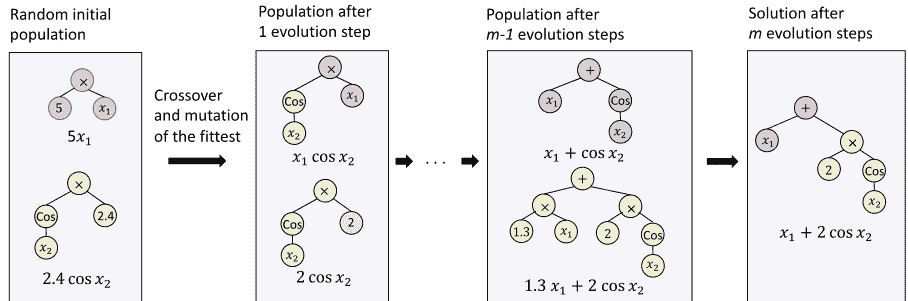

**图6.1 符号回归。** 符号回归的目标是找到一个简单的数学表达式 $f$ 与给定的输入-输出对集合 $S=\left\{\left(x^{i}, y^{i}\right)\right\}_{i}$ 相匹配，即我们寻找一个简单的符号表达式，使得对于所有 $i \in 1, \ldots,|S|$，都有 $f\left(x^{i}\right) \approx y^{i}$，其中 $x^{i}=\left(x_{1}^{i}, \ldots, x_{n}^{i}\right) \in \mathbb{R}^{n}$。

为了具体起见，我们在这里考虑 $n=2$ 和一个数据集 $y^{i} \approx x_{1}^{i}+2 \cos x_{2}^{i}$，即我们想要找到的目标表达式是 $f(x)=x_{1}+2 \cos x_{2}$。通常，遗传算法被用来找到最适合的表达式，即能很好地拟合数据的最简单的表达式。遗传算法从一个随机的初始符号表达式集合开始，这些表达式以图形的形式表示在系统变量 $x_{1}$ 和 $x_{2}$ 中（图中所示的表达式数量并不具有代表性）。

然后，通过变异和交叉操作选择并改变最适合的表达式。图中初始种群的上部图形通过交叉操作与下部图形结合，对应于生物学中的性繁殖过程中基因的结合。下部图形通过将存储参数2.4的叶子进行突变，将其替换为随机数。我们重复这个过程 $m \in \mathbb{N}$ 次，直到得到一个简单的能拟合数据的表达式。

在此观察到了表达式。通过逐步方式创建符号表达式来降低运行时间的一种有前景的方法在[129]中提出（见注释6.1）。

**注释6.1（逐步符号回归）** 在[129]中，提出了一种通过逐步添加系统变量来找到符号表达式的方法。这种方法与[19]中的方法相似，尚未完全自动化，但其思想非常简单，并在下面的示例中进行了解释。让我们考虑一个样本集，其中包含成对的 $((x, y, z), f(x, y, z))$，其中表达式 $f=z \sin \left(x e^{y}\right)$。目标是从样本集中找到符号表达式。假设我们可以数值地访问偏导数，我们可以为以下商数创建数值样本：

$$q_{x, y}=\frac{\partial f / \partial x}{\partial f / \partial y}=\frac{z \cos \left(x e^{y}\right) e^{y}}{z \cos \left(x e^{y}\right) x e^{y}}=\frac{1}{x} .$$

我们可以使用（标准）符号回归来获得一个表达式 $f_{(x, y)}$ 来逼近样本 $((x, y), q_{(x, y)})$，使得商 $\frac{\partial f(x, y) / \partial_x}{\partial f(x, y) / \partial_y}$ 逼近数值 $q_{(x, y)}$ 的值。符号回归可能找到的一个简单表达式是 $f_{(x, y)}=x e^{y}$，因此我们恢复了目标表达式中两个系统变量之间的关系。目标表达式的形式预计将以 $f=g\left(x e^{y}, z\right)$ 的形式给出，其中 $g: \mathbb{R}^{2} \rightarrow \mathbb{R}$ 是某个函数。

在第二步中，我们可以通过研究 $x$ 和 $z$ 之间的关系来考虑（对于固定的 $y=c \in \mathbb{R}$）：

$$q(x, z)= \frac{\partial f / \partial x}{\partial f / \partial z}=\frac{c z \cos (c x)}{\sin (c x)} \text{.} \quad (6.4)$$

再次，我们通过数值计算偏导数来创建商的样本，并应用符号回归来找到一个表达式 $f(x,z)=z\sin(cx)$。然后，目标函数预计具有形式 $f=g'\left(z\sin(c(y)), x, y\right)$，其中 $g': \mathbb{R}^{2} \rightarrow \mathbb{R}$ 和 $c: \mathbb{R} \rightarrow \mathbb{R}$。从要求 $f=g(xe^{y},z)$ 中，我们可以看出设置 $g(a,z)=z\sin(a)$ 提供了与 $f=g'(z\sin(c(y)), x, y)$ 相同的表达式，设置 $g'(a,y)=a$ 和 $c(y)=e^{y}$。因此，我们通过两次符号回归发现了目标表达式 $f=z\sin(xe^{y})$，这样可以更高效地在只有两个系统变量的情况下进行，而不是直接搜索完整的表达式。然而，合并表达式可能并不总是容易的，目前还没有自动化。考虑将来的工作会很有意思。

#### 6.2.2 从数据中提取物理定律

在本节中，我们描述了[19]中用于从时间序列数据中发现物理定律的思想。[19]中的方法成功地应用于发现各种物理系统的运动方程，包括混沌双摆，而不需要任何关于物理的先验知识，除了对系统变量的了解（使用深度神经网络发现系统变量在本书的第三部分中讨论）。[19]中方法的概念基础是几乎所有自然界的物理定律都基于数学的对称性和不变量[130]，这意味着对许多自然定律的搜索与对守恒量和不变方程的搜索密不可分[131,132]。使用符号回归搜索守恒量的主要困难是避免找到平凡的不变量，例如对于系统变量 $x \in \mathbb{R}$，$\sin^2(x)+\cos^2(x)$ 恒等于一但不包含任何物理见解。接下来，我们将根据一个例子解释[19]中采取的方法来避免这种平凡的不变量。

让我们考虑一个摆，即一个描述位置的非线性振子，其角度为 $\theta$。样本集 $S=\{(t^i, \theta(t^i), \omega(t^i))\}_i$ 包含了时间 $t^i$ 以及相应的位置 $\theta(t^i)$ 和角速度 $\omega(t^i)$ 的三元组。请注意，我们没有提供我们正在寻找的守恒量的值，因此它们必须以无监督的方式学习。计算上检测非平凡守恒定律的秘密在于候选方程应该预测系统子组件动力学之间的关系。

更具体地说，守恒方程应该能够预测变量组的导数随时间的关系。这样的关系可以通过偏导数的商来捕捉（类似于我们在注释6.1中讨论的方式）。换句话说，对于一个守恒量，表达式 $f(\theta, \omega)$ 被认为是非平凡的，如果它满足

$$\frac{\partial \theta / \partial t}{\partial \omega / \partial t}=\frac{\partial \theta}{\partial \omega}=\frac{\partial f / \partial \omega}{\partial f / \partial \theta} \quad (6.5)$$

我们可以通过数值方法估计 (6.5) 式左边的值

$$\frac{\partial \theta / \partial t}{\partial \omega / \partial t} \approx \frac{\Delta \theta}{\Delta \omega}$$

其中 $\Delta \theta$ 和 $\Delta \omega$ 表示参数 $\theta$ 和 $\omega$ 在一个小时间间隔内的变化。一个表达式 $f$ 的适应度可以通过均值对数误差来估计 [19]

$$F(f, \mathcal{S})=-\frac{1}{|\mathcal{S}|} \sum_{i=1}^{|\mathcal{S}|} \log \left(1+\left|\frac{\Delta \theta\left(t^{i}\right)}{\Delta \omega\left(t^{i}\right)}-\frac{\partial f / \partial \omega}{\partial f / \partial \theta} \right|_{t^{i}}\right)$$

其中 $\Delta \theta\left(t^{i}\right)$ 和 $\Delta \omega\left(t^{i}\right)$ 估计了变量 $\theta$ 和 $\omega$ 在时间 $t^{i}$ 时的时间导数（使用集合 $S$），而偏导数则通过候选函数 $f$ 的解析表达式进行符号计算。

然后，我们可以使用符号回归（如第6.2.1节所述）来搜索具有最高适应度的候选函数 $f$（请参见图6.2概述）。在 [19] 中，已经证明了该方法可以恢复具有两个参数 $c^{1}, c^{2}>0$ 的不变表达式 $f(\theta, \omega)=c^{1} \omega^{2}+c^{2} \cos (\theta)$，这取决于摆的质量 $m$ 和长度 $l$。

不变表达式对应于摆的拉格朗日量，但我们还需要找到参数 $c_{1}$ 和 $c_{2}$ 与摆的质量和长度的依赖关系。由于不变量 $f$ 是尺度不变的，我们可以将其除以 $c_{2}$，得到 $f(\theta, \omega)=c_{1} / c_{2} \omega^{2}+\cos (\theta)$，然后搜索一个符号表达式来表示它。

在系统变量 $m$ 和 $l$ 中，$c_{1} / c_{2}$ 的表达式 $c_{1} / c_{2} \equiv k(m, l)$ 可以如下找到：例如，可以通过为不同质量的摆和不同长度的摆创建时间序列数据来找到表达式 $c^{1} / c^{2} \equiv k(m, l)$。对于每个摆，我们确定 $k_{j}$ 的值，使得表达式 $k \omega^{2}+\cos (\theta)$ 与时间序列数据最佳拟合，即保持近似恒定。然后，我们可以再次运行符号回归，使用系统变量 $m$ 和 $l$ 以及样本集 $\left\{\left[m_{j}, l_{j}\right], k_{j}\right\}_{j}$。

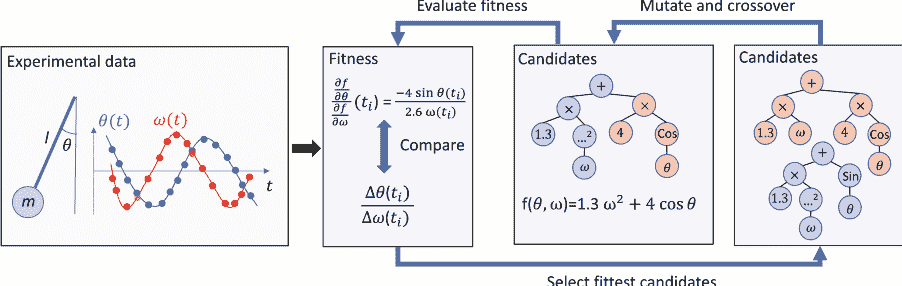

**图6.2 从时间序列数据中提取不变表达式[19]。** 我们考虑从一个简谐摆收集的实验数据，其在时刻 $t$ 时的位置由角度 $\theta$ 描述，我们用角速度 $\omega$ 来表示。我们使用符号回归从数据集 $\{(t^i, \theta^i, \omega^i)\}_i$ 中抽取与时间无关的表达式，即守恒量，其中 $i$ 是时间序列的索引。从随机生成的符号表达式（表示为图形）开始，我们根据 (6.7) 评估它们的适应度。所选择的表达式 (6.7) 是一个衡量候选表达式能够预测系统子组件之间关系的指标。因此，高适应度指向包含非平凡物理信息的不变表达式。然后，选择适应度最高的候选表达式，并通过变异和交叉操作进行修改，以创建更适应的个体。重复此过程，直到找到适应度约等于零的不变表达式，这对应于能够近似恢复角度和速度之间关系的表达式。在所考虑的例子中，找到的表达式是简谐摆的拉格朗日量，由 $f(\theta, \omega)=c_1\omega^2+c_2\cos(\theta)$ 给出，其中 $c_1, c_2>0$ 取决于质量 $m$ 和长度 $l$。

通过搜索符号表达式 $k(m,l)$，其中 $k(m_j, l_j) \approx k_j$ 对所有 $j$，最终我们发现拉格朗日量的形式与质量无关，由 $L(\theta, \omega)=\frac{1}{2} \omega^{2}+\cos(\theta)$ 给出，其中 $g=9.81 \, \mathrm{m/s^2}$ 是地球表面的重力加速度。

#### 运动方程由欧拉-拉格朗日方程推导得出

$$\frac{d}{dt} \left( \frac{\partial L}{\partial \omega} \right) - \frac{\partial L}{\partial \theta} = 0 \quad \Rightarrow \quad -\frac{g}{l} \sin \theta = 0 \quad (6.8)$$

因此 $\alpha = -\frac{g}{l} \sin(\theta)$。或者，我们可以在系统变量 $\theta, \omega$ 和 $\alpha$ 中搜索不变表达式，其中 $\alpha := \dot{\omega}$ 表示摆的加速度。这样做，我们可以直接推导出运动方程[19]。这一方面展示了方法对所选择的系统变量的依赖性，另一方面也展示了我们在使用不同系统变量的设置中发现有用的不变量。

---
[^2]: 遗传搜索算法在寻找不变表达式的运行时间从几分钟到30小时不等（对于双摆并行化搜索）。
[^3]: 在这里，我们利用了摆的质量和长度完全描述了摆的知识。本书的第三部分讨论了自动恢复这些参数的方法。

使用32个核心[19]。另一方面，找到参数的表达式通常需要较少的时间。我们得出结论，当考虑只有少数已知系统变量的系统时，所描述的方法提供了一种强大的方法来找到不变量的符号表达式。结果的符号性质可以帮助物理学家对所考虑的系统获得新的概念洞察。另一方面，对于不能用简单的解析公式描述的不变量，先前的假设可能会阻止我们恢复这些不变量。对于包含许多（可能是未知的）系统变量的系统，一种方法是考虑更近期的方法（参见第6.2节的相关参考文献引言）以及本书第三部分介绍的方法。

## 第7章
模型测试

测试物理模型是物理学家发现过程中的重要部分（在第1.2节中讨论）。在某个特定物理领域（如高能物理）中证伪一个模型有助于理解模型的局限性，并引导未来研究朝着应用范围更广的改进模型方向发展。测试新模型在高能物理中尤其受关注。尽管标准模型（SM）在粒子物理学中非常成功地描述了大量基本粒子过程，并具有高精度，但未解释的现象，如中微子质量或暗物质在宇宙中的出现，指出需要扩展或调整SM。在高能物理中搜索新现象通常依赖于通过运行实验（例如使用大型强子对撞机）测试新模型的建议，然后将收集到的数据与参考模型（例如粒子物理的SM）的预测进行比较。通常，考虑的模型会做出概率预测，这使得测试变得特别具有挑战性。在几篇论文中，通过使用标准技术（参见[134]中的模型测试综述）构建假设检验，对参考模型进行了与另一个假设模型的比较。这种方法需要提出一个替代模型，但其缺点是针对特定替代假设设计的统计检验通常对于数据偏离参考模型的其他类型不敏感。

我们如何在没有备用模型的情况下从测试数据中发现模型的局限性？基本思想是通过基于（实验）测试数据构建的机器学习模型来测试参考模型。如果模型的类别不限于特定的物理模型类别，我们称之为物理意义上的模型无关策略。如果机器学习构建的模型与参考模型明显不同，可以得出结论参考模型不适合测试数据。此外，我们可以分析两个模型最不一致的区域，这可以带来对参考模型存在的问题的概念性洞察。这种对新物理的模型无关搜索在文献[135–139, 139–142]中比模型相关的搜索更少见。在[141, 142]中描述的方法遵循类似的思想，用于对参考模型进行无模型测试。

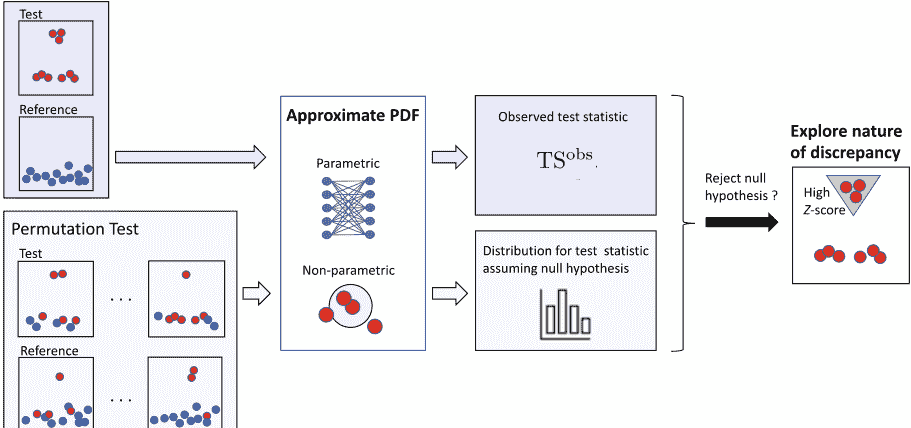

**图7.1** 检查模型兼容性的概述[141,142]。图中显示了如何以一种与模型无关的方式测试测试样本集合 $\mathcal{T}$ 与参考样本集合 $\mathcal{R}$ 的兼容性。图中所示的样本存在于一个二维特征空间中。零假设是数据集 $\mathcal{T}$ 和 $\mathcal{R}$ 由相同的模型生成，即相同的概率密度函数（PDF）。首先，将测试样本和参考样本作为输入提供给一个机器学习系统，其目标是估计测试和参考集合的潜在PDF，并将观察到的测试统计量 $\mathrm{TS}^{\mathrm{obs}}$ 作为输出（图中标记为蓝色的情景）。可以使用参数化模型（如神经网络[141]）或非参数化方法（如 $k$ 最近邻估计[142]）来估计PDF。在这里，我们使用式（7.5）给出的测试统计量，该统计量近似表示真实的测试和参考PDF之间的KL散度。为了解释观察到的值 $\mathrm{TS}^{\mathrm{obs}}$，我们将其与假设零假设为真时的测试统计量的概率分布进行比较。该分布是通过置换测试和参考集之间的样本并评估所得到的测试和参考集的测试统计量来获得的（图中标记为绿色的情景）。然后，我们可以估计P值，即在假设零假设成立的情况下观察到 $\mathrm{TS}^{\mathrm{obs}}$ 或更极端的测试统计量值的概率。如果P值低于所需的显著性水平 $\alpha \in [0,1]$，那么拒绝零假设。最后，我们使用式（7.16）给出的 $Z$ 分数来定位特征空间中不兼容的区域。

这些想法在下面（并由图7.1总结）中描述，并且原则上可以应用于测试任何物理模型，并找到收集到的数据与参考模型显著偏离的区域。然而，由于第7.5节中讨论的原因，应用这些技术在实践中仍然具有挑战性。

### 7.1 统计设置

在本节中，我们描述了无模型测试的正式统计设置（按照[142]中的方法）。该设置考虑了将两个数据集相互比较的基本场景，它可以应用于模型测试之外的统计问题。我们考虑两个具有 $d$ 维实数数据点的数据集：
$$\mathcal{T}=\left\{x_{i}: x_{i} \in \mathbb{R}^{d}, 1 \leq i \leq n_{\mathcal{T}}\right\} \quad \text{其中} \quad x_{i} \sim P_{\mathcal{T}}$$
$$\mathcal{R}=\left\{x_{i}^{\prime}: x_{i}^{\prime} \in \mathbb{R}^{d}, 1 \leq i \leq n_{\mathcal{R}}\right\} \quad \text{其中} \quad x_{i}^{\prime} \sim P_{\mathcal{R}}$$
其中观测值 $x_i \in \mathbb{R}^d$ 和 $x_i^{\prime} \in \mathbb{R}^d$ 是从测试和参考概率密度函数（PDF）$P_{\mathcal{T}}$ 和 $P_{\mathcal{R}}$ 中独立同分布地采样得到的。样本所在的 $d$ 维空间被称为特征空间。对于以下考虑，$P_{\mathcal{T}}$ 和 $P_{\mathcal{R}}$ 都不需要以解析方式知道。在典型的实际场景中，参考集合 $\mathcal{R}$ 是通过在计算机上基于参考模型运行模拟得到的，而测试集合 $\mathcal{T}$ 是通过实验获得的。

目标是确定这两个数据集是否（不）兼容，即在假设检验的语境下，我们想要找出在多大显著性水平下拒绝零假设 $H_0: P_{\mathcal{T}}=P_{\mathcal{R}}$。一个明确定义的统计检验场景需要一个备择假设，我们将其定义如下 $H_1: P_{\mathcal{T}}=\hat{P}_{\mathcal{T}}$，其中 PDF $\hat{P}_{\mathcal{T}}$ 取决于测试数据集 $\mathcal{T}$，并被选择为尽可能准确地逼近真实的 PDF $P_{\mathcal{T}}$。逼近方法的选择会导致不同的备择假设，其选择对于检验的敏感性至关重要。这里考虑的目标是找到能够对一系列数据偏离参考模型的测试敏感的逼近方法。这是一个微妙的问题，因为对于用于逼近 $P_{\mathcal{T}}$ 的 PDF 类别的任何不合理假设都可能导致对测试样本中出现的数据偏离不敏感。

作为兼容性的度量，我们可以考虑测试数据集中的数据点在概率密度函数 $P_{\mathcal{T}}$（分子）和 $P_{\mathcal{R}}$（分母）下的比率 $\lambda$[142]：
$$\lambda=\prod_{x_{i} \in \mathcal{T}} \frac{P_{\mathcal{T}}\left(x_{i}\right)}{P_{\mathcal{R}}\left(x_{i}\right)}$$
$\lambda$ 的值大于 1 意味着测试样本中的数据更有可能来自 $P_{\mathcal{T}}$ 而不是 $P_{\mathcal{R}}$。由于概率密度函数未知，我们需要通过 $P_{\mathcal{T}} \approx \hat{P}_{\mathcal{T}}$ 和 $P_{\mathcal{R}} \approx \hat{P}_{\mathcal{R}}$（见第7.2节的近似策略）来近似它们，以找到 $\lambda$ 的估计值：
$$\hat{\lambda}=\prod_{x_{i} \in \mathcal{T}} \frac{\hat{P}_{\mathcal{T}}\left(x_{i}\right)}{\hat{P}_{\mathcal{R}}\left(x_{i}\right)}$$
作为一个测试统计量 $\mathrm{TS}(\mathcal{T}, \mathcal{R})$，我们可以使用[142]：

$$\mathrm{TS}(\mathcal{T}, \mathcal{R}) = \log \hat{\lambda}^{\frac{1}{n_T}} = \frac{1}{n_T} \sum_{i=1}^{n_T} \log \frac{p_{\mathcal{T}}^{(i)}}{p_{\mathcal{R}}^{(i)}} \quad (7.5)$$

测试统计量被用作两个概率密度函数 $\hat{P}_{\mathcal{T}}$ 和 $\hat{P}_{\mathcal{R}}$（注7.1）之间的距离度量。$\mathrm{TS}$ 接近零意味着两个概率密度函数基本上相同，因此我们可能不会拒绝零假设。另一方面，$\mathrm{TS}$ 的较大值表明测试集中的概率密度函数 $\hat{P}_{\mathcal{T}}$ 与参考集中的概率密度函数 $\hat{P}_{\mathcal{R}}$ 显著不同，因此我们应该拒绝零假设。如何确定阈值 $\mathrm{TS}$，使得在所需的检验显著性水平 $\alpha \in [0, 1]$ 下拒绝零假设，在第7.3节中进行了讨论。首先，在第7.2节中，我们讨论了如何使用机器学习方法来近似概率密度函数。

注7.1（测试统计量作为Kullback-Leibler散度的近似[142]）Kullback-Leibler (KL) 散度（也见定义8.4）的 PDF $P_T$ 和 $P_R$ 的定义为：
$$D_{\text{KL}}(P_T \| P_R) = \int P_T(x) \log \left( \frac{P_T(x)}{P_R(x)} \right) \mathrm{d}x, \quad (7.6)$$
在整个特征空间上进行积分。KL散度是信息论中的一个基本度量，可以看作是两个PDF之间的距离度量。实际上，它是非负的，当且仅当 $P_T = P_R$ 时，它等于零（然而，它不是一个度量，因为它不是对称的）。将积分替换为测试集中样本的经验平均值，并将 $P_T$ 和 $P_R$ 替换为近似值 $\hat{P}_T$ 和 $\hat{P}_R$，我们可以看到在 (7.5) 中给出的测试统计量的表达式近似于 $D_{\text{KL}}(P_T \| P_R)$。

### 7.2 概率密度函数的近似

在本节中，我们讨论如何从实验数据中提取物理概念，使用深度学习来获得对概率密度函数（PDF）$\hat{P}_{\mathcal{R}}$（或 $\hat{P}_{\mathcal{T}}$）的估计，其基础是样本集 $\mathcal{R}$（或 $\mathcal{T}$）。更具体地说，由于我们最终感兴趣的是计算 (7.5) 中给出的检验统计量，我们只需要在测试集中的任意点估计PDFs $P_T$ 和 $P_R$ 的商（关于密度比估计器的综合回顾可参见[143]）。可以区分两种方法[141, 142]：
- 参数建模：我们考虑一个参数化的 PDF 类 $\mathcal{C} = \{ \hat{P}_{\theta} \}_{\theta \in \Theta}$，从中选择 $\hat{P}_{\mathcal{R}}$。
- 非参数建模：我们不限制 PDF 类的范围，并直接从 $\mathcal{R}$ 构建 $\hat{P}_{\mathcal{R}}$。

哪种方法应该选择，以实现最高敏感性以检测新物理信号，取决于具体的设置，包括参考模型和预期的新信号类型。对于大多数方法来说，我们对可以用高显著性检测到的信号类别没有确切的理解。因此，模型的选择也取决于用户对各种方法的经验。以下各节的目标不是讨论许多示例以获得这样的经验，而是介绍读者如何近似概率密度函数以在数据中搜索未知的物理信号的一般思路。

#### 7.2.1 参数建模

在参数化方法中，首先必须选择概率密度函数（PDF）的类 $\mathcal{C}$。与选择参数化的物理模型不同，我们在这里感兴趣的是选择一个能够近似广泛范围的 PDF 的表达类。一种选择是通过神经网络[141]对 PDF 的类进行参数化，神经网络是低偏差和通用的函数逼近器（见第3.4节）。此外，神经网络表示平滑函数，这通常是来自物理模型的 PDF 的合理偏差。事实上，我们不希望一个合理的物理模型预测出不连续的 PDF。最后但并非最不重要的是，有证据表明神经网络可以打破维度灾难。用直方图近似一个 PDF 所需的事件数量随特征空间的维度 $d$ 呈指数增长。虽然还没有证据，但[144-146]中的研究表明神经网络在高维特征空间上近似 PDF 所需的事件数量较少。由于在实际应用中，维度 $d$ 通常相当大，这是一个非常理想的属性。

选择了一类概率密度函数（PDFs）$\mathcal{C}=\{\hat{P}_{\theta} \mid \theta \in \Theta\}$（其中参数 $\theta$ 包含神经网络的所有权重和偏置），我们可以使用最大似然方法来近似 PDFs $P_{\mathcal{T}}$ 和 $P_{\mathcal{R}}$，即：
$$\hat{P}_{\mathcal{T}}=\hat{P}_{\hat{\theta}_{\mathcal{T}}} \quad \text{其中} \quad \hat{\theta}_{\mathcal{T}}=\arg \max _{\theta \in \Theta} \prod_{x \in \mathcal{T}} P_{\theta}(x)$$
$$\text{和} \quad \hat{P}_{\mathcal{R}}=\hat{P}_{\hat{\theta}_{\mathcal{R}}} \quad \text{其中} \quad \hat{\theta}_{\mathcal{R}}=\arg \max _{\theta \in \Theta} \prod_{x^{i} \in \mathcal{R}} P_{\theta}\left(x^{i}\right)$$
通过这些近似，我们可以计算测试统计量 $\mathrm{TS}(\mathcal{T},\mathcal{R})$（见7.5）。不需要使用两个神经网络，并解决7.7和7.8中给出的两个优化问题，我们也可以直接用一个神经网络表示 PDFs 的（对数）比值，并最小化测试统计量。这种方法在[141]中详细描述，并且被证明对各种数据偏差具有很高的敏感性。

#### 7.2.2 非参数建模

在非参数方法中，概率密度函数（PDF）的近似是在不限制参数化模型类的情况下进行的。在这里，我们讨论了最近邻（NN）方法[147-153]，该方法在[142]中描述了模型无关测试的背景。

基本思想是通过计算包含 $x$ 在特征空间中的 $k$ 个最近邻点的球体的体积来估计特征空间中点 $x$ 的概率密度函数（PDF）。密度估计与点的数量 $k$ 除以球体的体积成比例。让我们基于对测试集 $\mathcal{T}$ 上的概率密度 $P_{\mathcal{T}}$ 进行估计来形式化这个问题。考虑样本 $x_i \in \mathcal{T}$，并计算与 $\mathcal{T}$ 中所有其他样本的欧氏距离，排除 $x_i$ 本身。然后，确定 $k$ 个最近邻（即与 $x_i$ 距离最小的 $k$ 个样本），并将半径 $r_{i,\mathcal{T}}$ 设置为第 $k$ 个最近邻的半径。因此，$x_i$ 的 $k$ 个最近邻包含在以 $x_i$ 为中心、半径为 $r_{i,\mathcal{T}}$ 的球体中，其中 $\omega_d$ 表示 $d$ 维单位球体的体积，即：
$$\omega_d = \frac{\pi^{d/2}}{\Gamma\left(\frac{d}{2} + 1\right)}, \quad (7.9)$$
其中 $\Gamma$ 表示伽玛函数，对于正整数 $n$，它的定义为 $\Gamma(n)=(n-1)!$。因此，通过对样本总数进行归一化（除以 $n_{\mathcal{T}}-1$），PDF $P_{\mathcal{T}}$ 的 NN 估计为：
$$\hat{P}_{\mathcal{T}}(x_i) = \frac{k}{(n_{\mathcal{T}} - 1) \omega_d r_{i,\mathcal{T}}^d}, \quad (7.10)$$
对于任意的 $x_i \in \mathcal{T}$。为了估计测试集中样本 $x_i \in \mathcal{T}$ 的参考 PDF $P_{\mathcal{R}}$，我们计算 $x_i$ 到 $\mathcal{R}$ 中 $k$ 个最近邻的距离。第 $k$ 个最近邻的距离用 $r_{i,\mathcal{R}}$ 表示，参考 PDF $P_{\mathcal{R}}$ 的 NN 估计为：
$$\hat{P}_{\mathcal{R}}(x_i) = \frac{k}{n_{\mathcal{R}} \omega_d r_{i,\mathcal{R}}^d}, \quad (7.11)$$
对于任意的 $x_i \in \mathcal{T}$。测试统计量 $\mathrm{TS}(\mathcal{T}, \mathcal{R})$ 在(7.5)中变得简单：
$$\mathrm{TS}(\mathcal{T}, \mathcal{R}) = \log \frac{n_{\mathcal{R}}}{n_{\mathcal{T}} - 1} + \frac{d}{n_{\mathcal{T}}} \sum_{i=1}^{n_{\mathcal{T}}} \log \frac{r_{i,\mathcal{R}}}{r_{i,\mathcal{T}}}. \quad (7.12)$$

可以证明(7.12)中的表达式是 KL 散度[154-156]的一致且渐近无偏估计，即在大样本极限 $n_{\mathcal{R}}, n_{\mathcal{T}} \rightarrow \infty$ 下，测试统计量(7.12)几乎必然收敛到真实概率密度函数 $P_{\mathcal{T}}$ 和 $P_{\mathcal{R}}$ 之间的 KL 散度 $D_{\text{KL}}(P_{\mathcal{T}} \| P_{\mathcal{R}})$。

### 7.3 统计假设检验

在第7.1节描述的统计设置中，最终目标是决定是否可以以显著性水平 $\alpha \in [0, 1]$ 拒绝零假设 $H_0: P_{\mathcal{T}} = P_{\mathcal{R}}$。例如，以显著性水平 $\alpha = 0.05$ 拒绝零假设意味着在假设成立的情况下观察到测试数据的概率低于 5%。

为了解释测试统计量 $\mathrm{TS}(\mathcal{T}, \mathcal{R})$ 在 (7.5) 中给出的观察值，我们需要推导出在假设零假设成立的情况下概率分布 $P(\mathrm{TS}|H_0)$ 的值。然后，我们可以计算出零假设的双侧 P 值，即测试统计量与零假设下的期望值之间的差异至少达到观察到的测试统计量 $\mathrm{TS}^{\mathrm{obs}}$ 的概率。

如[142]所建议的，我们使用一种称为排列检验（permutation test）的重采样方法[157, 158]来计算 $P(\mathrm{TS}|H_0)$ 的分布。基本思想是在零假设下重新采样各种测试和参考集，假设两个集合都是由相同的概率密度函数生成的（也参见图7.1）。然后，我们评估重新采样集合的测试统计量，最后，我们从获得的各个数据点中推导出测试统计量的分布。

更正式地说，我们首先将测试集和参考集合并成一个样本池 $\mathcal{U} = \mathcal{T} \cup \mathcal{R}$。然后我们从 $\mathcal{U}$ 中随机选择 $n_{\mathcal{T}}$ 个样本分配给集合 $\tilde{\mathcal{T}}$。剩下的元素分配给重新采样的参考集合 $\tilde{\mathcal{R}}$。然后，计算集合 $\tilde{\mathcal{T}}$ 和 $\tilde{\mathcal{R}}$ 的检验统计量。重复这个过程 $n_{\text{perm}}$ 次，得到一组 $\{\mathrm{TS}_1, ..., \mathrm{TS}_{n_{\text{perm}}}\}$ 的数据点。

根据 $n_{\text{perm}}$ 的大小，我们可以选择一个区间大小 $\Delta \mathrm{TS}$，并通过将数据点 $\mathrm{TS}_j$ 分配到区间 $[m \Delta \mathrm{TS}, (m+1) \Delta \mathrm{TS}]$（其中 $m \in \mathbb{Z}$）来离散化分布 $P(\mathrm{TS}|H_0)$。为了决定是否以显著性水平 $\alpha$ 拒绝零假设，我们计算定义为的 P 值：
$$p = \int_{-\infty}^{\hat{\mu}-\delta} P_{\mathrm{TS}|H_0}(t)\mathrm{d}t + \int_{\hat{\mu}+\delta}^{\infty} P_{\mathrm{TS}|H_0}(t)\mathrm{d}t \quad (7.13)$$

1 或者，可以将 $\mathcal{U}$ 中的元素视为具有固定顺序，然后对元素列表应用随机排列（这就是“排列检验”名称的原因）。将前 $n_{\mathcal{T}}$ 个元素分配给 $\tilde{\mathcal{T}}$ 与从集合 $\mathcal{U}$ 中随机抽样这些元素得到的结果相同。

其中 $\hat{\mu}$ 表示测试统计量的估计均值，$\delta=\left|\mathrm{TS}^{\mathrm{obs}}-\hat{\mu}\right|$，积分实际上是通过逼近分布 $P_{\mathrm{TS} \mid H}$ 的直方图进行求和。最后，如果 $p$ 值小于显著性水平 $\alpha$，则拒绝原假设，因为在这种情况下，我们观察到的测试统计量值偏离预期值 $\hat{\mu}$ 至少 $\delta$ 的概率小于 $\alpha$。

总结一下，统计过程如下：

- 1. 用深度学习近似表示实验数据中的物理概念 $P_{T}$ 和 $P_{R}$ （在数据点 $x_{i} \in \mathcal{T}$ 处）。
- 2. 使用公式 (7.5) 计算观测到的检验统计量 $\mathrm{TS}^{\mathrm{obs}}(\mathcal{T}, \mathcal{R})$ 。
- 3. 估计在零假设为真的情况下，检验统计量的分布 $P_{\mathrm{TS} \mid H_{0}}$ 使用排列检验。
- 4. 计算双侧的零假设 $p$ 值。
- 5. 如果双侧的 $p$ 值小于 $\alpha$，则拒绝零假设。

### 7.4 识别不一致的区域

假设在第7.3节中描述的统计检验导致零假设被拒绝。这意味着观测到的检验统计量 $\mathrm{TS}^{\mathrm{obs}}$ 获得了一个远离零假设下预期值的值。为了对为什么参考模型无法准确解释测试数据的概念性洞察，我们研究了在特征空间中对测试统计量偏离预期值有显著贡献的区域。为了找到这样的区域，我们按照[141, 142]中的方法为每个样本 $x_{i} \in \mathcal{T}$ 分配一个密度场 $U\left(x_{i}\right)$ 。

$$
U\left(x_{i}\right) \equiv \log \frac{P_{\mathcal{T}}\left(x_i\right)}{P_{\mathcal{R}}(x_i)}
$$

观察到的检验统计量 (7.5) 可以被视为代表期望值的密度场的经验平均值。

$$
\mathrm{TS}^{\mathrm{obs}}=\mathbb{E}_{\mathcal{T}}[U] .
$$

此外，我们对密度场进行归一化，以获得一个 Z-分数。

$$
Z\left(x_{i}\right) \equiv \frac{U\left(x_{i}\right)-\mathbb{E}_{\mathcal{T}}[U]}{\sqrt{\mathbb{V}_{\mathcal{T}}[U]}} \text {, }
$$

其中 $\mathbb{V}_{\mathcal{T}}[U]$ 表示密度场 $U$ 的方差。为了简化后续讨论，让我们假设 $\mathrm{TS}^{\text {obs }}>\hat{\mu}$，其中 $\hat{\mu}$ 是零假设下测试分布的期望值。可以使用 $Z$-分数来识别在 $\mathcal{T}$ 中具有显著大于平均值 $\mathbb{E}_\mathcal{T}[U]$ 的密度场的样本。这些样本对于 $\mathrm{TS}^{\text {obs }}$ 的高值以及测试数据相对于参考模型的偏差特别强烈。因此，我们可以将 $Z$-分数大于某个阈值的样本（例如，$x_i \in \mathcal{T}$ 且 $Z\left(x_i\right)>3$）视为对测试概率密度函数与参考概率密度函数偏差最大的样本（参见图7.1）。为了更好地了解特征空间中参考模型与测试数据不兼容的区域，我们还可以使用聚类算法来识别具有 $Z$ 分数大于3的样本 $x_i$ 在特征空间中的高密度区域[142]。研究高差异区域可以更好地理解与参考模型偏差的原因。

### 7.5 模型测试的应用

在前几节中描述的统计设置非常通用，可以用来检查任意两个数据集之间的兼容性。因此，所描述的测试策略在科学和工程应用领域具有广泛的应用范围。

在这里，我们对其在模型测试和发现不一致区域方面的应用感兴趣。

使用神经网络的参数方法和基于 $k$ 最近邻估计的非参数方法已经应用于一些模拟玩具模型[141,142]。特别是，非参数方法已经应用于检测嵌入在根据粒子物理标准模型生成的参考数据中的（模拟的）暗物质信号[142]。数据集 $\mathcal{R}$ 包含根据标准模型的背景事件，数据集 $\mathcal{T}$ 还包含背景事件，但添加了暗物质信号。然后在[142]中证明了基于最近邻估计的检验统计量足够敏感，可以检测到暗物质信号。此外，在[142]中还考虑了将噪声添加到背景模拟中的相同情景。如预期的那样，这种噪声降低了对暗物质信号的敏感性，因此，根据噪声的大小，测试可能不足够敏感以拒绝零假设（在这种情况下，零假设是标准模型完全描述了测试集）。尽管如此，仍然可以应用用于识别不一致区域的方法，并指出特征空间中测试数据与参考数据最不一致的区域。这些很可能是暗物质信号发生的区域。

我们得出结论，[141, 142]中的工作为模型无关测试提供了一个概念验证。它证明了这些测试对各种假设的新物理信号具有良好的敏感性。即使测试和参考模型在特征空间的大部分区域中没有偏差（这在粒子物理学应用中很常见），模型无关测试仍然可以检测到特征空间的小区域中的偏差。然而，我们应该记住，真实世界的数据很可能不像模拟数据那样干净，建议的方法可能需要一些进一步的改进才能成功应用于真实数据。此外，具有神经网络的参数化测试在高维特征空间中往往容易过拟合稀疏数据点，可能需要正则化方法来避免这个问题[141]。

## 学习

## 第三部分 物理发现的表示

在本部分中，我们专注于模型创建的一个重要子过程，即使用最少的先验知识从实验数据中提取描述物理系统的简洁表示。为了实现这一目标，我们将一个简化的物理学家推理过程（我们称之为 SciNet）映射到人工神经网络结构，并训练网络学习给定数据的“自然”表示。

在第8章中，我们提供了简化的物理推理过程的数学表达，并介绍了一些数学准则，这些准则应该满足物理数据的“自然”表示（第8.4节）。这些准则并不针对特定的物理系统，而是原则上适用于任何物理系统。此外，我们讨论了如何将一些数学或物理先验知识融入SciNet的结构中，以便在数学框架（第8.5节）或物理属性分类（第8.6节）中解释所找到的表示。在第9章中，我们描述了人工神经网络结构，可以找到具有所需数学属性的数据表示。用于此目的的结构类似于我们用来描述物理学家推理过程的简化模型，我们将所有这些网络结构简称为SciNet，以简化起见。

然后我们描述了 SciNet在经典力学和量子力学中应用于不同物理玩具示例的情况。结果表明，SciNet在其表示中找到了与物理教科书中使用的参数相同的参数。此外，还演示了从找到的表示中可以提取概念信息。在第10.4节中，演示了两个物体碰撞实验中的守恒定律与 SciNet表示中找到的参数的关系。在第10.5.1节中，展示了如何使用 SciNet来判断一组测量是否足以完全确定量子系统的状态，最后，在第10.7节中，SciNet通过从地球上收集的行星轨道的角度数据切换到以太阳为中心的太阳系表示。此外，第10.3节显示了SciNet如何使用关于库普曼算子理论的数学先验知识来线性化非线性摆的动力学。最后，在第10.8节中，SciNet被用来应用于由多个物体组成的物理系统，以分类粒子之间的相互作用类型。

我们在第11章中总结了一些开放性问题和未来工作的方向，关于物理学的表示学习。

## 第8章 理论：形式化人类模型构建的过程

在本章中，我们对物理模型的创建过程进行了形式化。物理模型依赖于对物理系统的表示。至关重要的是，我们希望找到“自然”的表示，因为这简化了基于表示参数构建物理模型的过程。我们首先介绍了一个非常广泛的实验设置和观察的形式化定义。

然后，我们定义了最小表示（关于一组问题），这些表示将自然要求纳入考虑的物理系统的信息，以便回答可能提出的所有问题，同时尽可能压缩。此外，我们引入了两个标准，以自然的方式分离最小表示中的参数，从而定义了统计独立和操作上有意义的表示。操作上有意义的表示的标准源于在不同物理学家之间最小化通信以完成任务的操作要求。此外，在物理学中，我们经常更喜欢根据简单的更新规则随时间演化的表示。例如，描述具有恒定速度 $v$ 的粒子位置 $x$ 的线性时间演化可以使用简单的更新规则 $x \rightarrow x+v t$ 来描述，其中时间差 $\Delta t$（例如，在每个时间步骤中存储 $x^{2}$ 将需要更复杂的更新规则）。我们对表示形式上的要求进行了形式化，并更详细地考虑了由Koopman算子理论推动的一种特殊形式的更新规则。最后，我们描述了如何找到由几个相互作用对象组成的系统的表示。

### 8.1 动机

正如在引言中讨论的，我们将物理学家研究过程分为五个步骤：(1) 选择物理子系统；(2) 创建实验设置和(3) 进行测量；(4) 创建模型和(5) 测试模型。在这项工作中，我们专注于从实验数据中创建模型的一部分，即寻找物理系统的“自然”表示。这一步骤对于实现可解释的人工智能代理至关重要，因为数据的简洁和“自然”表示构建了寻找描述系统行为的数学方程的基础，从而在理解我们的物理环境的法则方面取得进展。

### 8.2 物理学家的推理过程

对物理学家完整的推理过程进行建模是一项非常复杂的任务，远远超出了本书的范围。然而，可以将基于实验数据生成模型的过程分为三个部分：

- 1. 找到预测系统行为所需的相关物理参数，
- 2. 找到描述系统行为的方程（使用相关参数），以及
- 3. 将方程推广并与已知方程统一。

在这里，我们专注于找到相关的物理参数。如第1节所讨论的，我们再次考虑了物理推理过程的简化模型SciNet（如图1.1所示）。请记住，编码器 $E:\mathcal{O} \rightarrow \mathcal{R}$ 将观察映射到表示 $\mathcal{R}$，然后解码器 $D: \mathcal{R} \times \mathcal{Q} \rightarrow \mathcal{A}$ 将表示与问题一起映射到答案。至关重要的是，我们还需要明确我们所理解的“自然”表示是什么。我们将在以下章节中讨论这个问题。

### 8.3 实验设置和数据创建

在我们正式定义我们对“自然”表示物理系统的理解之前，让我们解释一下我们认为的“实验设置”是什么，以及它如何用于生成实验数据（根据[23]中给出的定义）。

我们采取一个非常普遍的观点，通过一组隐藏参数 $^1 \mathcal{H} \subset \mathbb{R}^n$ 来表示自然状态，其中 $l \in \mathbb{N}$。请注意，任何类型的信息都可以编码成一组实数。然后，我们定义：

- 一个实验是从输入参数空间 $\mathcal{X}$（可以将其视为实验中拨盘和按钮的位置描述）到隐藏参数的子集 $\mathcal{H}' \subset \mathcal{H}$ 的映射 $S$。一个实验设置是具有指定参数的实验实例，即映射 $S$ 以及 $x \in \mathcal{X}$。

$^1$ “隐藏参数”这个表达式与贝尔定理中的“隐藏变量”不要混淆[159]。

- 观测是一种随机映射 $G: \mathcal{H} \rightarrow \mathcal{O}$，其中 $\mathcal{O} \subset \mathbb{R}^m$ 是可能的测量输出集合。

我们假设不在 $\mathcal{H}'$ 中的隐藏参数的值在不同的实验设置中是恒定的。因此，在不同的实验设置中，我们可以将观测视为一种随机映射（我们再次用 $G$ 表示）从 $\mathcal{H}$ 到 $\mathcal{O}$。此外，由于无法直接观测到隐藏参数 $\mathcal{H}$，更具操作性的做法是考虑连接的随机映射 $V = G \circ S : \mathcal{X} \rightarrow \mathcal{O}$。然而，出于说明的目的，我们在下面的章节中有时会使用隐藏参数的概念。

**例子** 让我们再次考虑一个沿着 $x$ 轴以恒定速度移动的粒子。在一个实验中，物理学家可以调节三个控制质量的旋钮：$m$，动能 $E$ 和粒子的初始位置 $x_0$。重要的是，物理学家不需要知道哪些参数由刻度调节。隐藏参数将包含有关粒子的所有属性的信息，例如质量、颜色、形状等。然后，观察者在 $N$ 个不同的时间 $t_i$ 测量粒子的位置 $x(t_i)$。因此，考虑的示例中的映射 $V$ 将为 $V(m, E, x_0) = ((t_0, x(t_0)), \dots, (t_N, x(t_N)))$，其中 $x(t_i) = x_0 + v t$，其中 $v = \sqrt{2E/m}$。然后，可以通过选择不同的实验设置（即调节 $m$、$E$ 和 $x_0$ 的不同设置）生成不同的数据样本，并观察每个设置下粒子位置的时间序列。

由于我们允许存在随机映射 $V$，因此该模型也适用于具有概率观测（如量子力学）的理论。在这种情况下，隐藏参数包含了物理系统的波函数信息，并且预测根据波恩规则（见第10.5节详细讨论）预测的分布进行采样。在这种情况下，人们可能希望对固定的实验设置 $x$ 进行多次测量，因为一次观测可能无法提供关于对应于随机映射 $V$ 的分布 $P_V(o \in \mathcal{O}|x)$ 的足够信息。因此，与参数 $x$ 对应的观测可以通过分布 $P_V(o \in \mathcal{O}|x)$ 的参数化来描述。例如，具有两种可能结果 $\mathcal{O} = \{0, 1\}$ 和 $P_V(0|x) = p(x), P_V(1|x) = 1 - p(x)$ 的随机映射 $V$ 的分布 $P_V$ 可以通过单个参数 $p(x)$ 来描述。通过选择实验设置 $x$ 并进行测量 $n$ 次，可以估计该参数。对于大的 $n$，我们有 $p(x) \approx n_0 / n$，其中 $n_0$ 是输出为 $0$ 的次数。我们将这些参数化的值集合称为 $\mathcal{O}$（并简单地用“观测集合”表示）。对于确定性映射 $V$，分布 $P_V(o \in \mathcal{O}|x)$ 由其输出 $o$ 完全描述，其中 $P_V(o|x) = 1$。

因此，在这种情况下，我们可以设置 $\mathcal{O} = \mathcal{O}$。

### 8.4 操作上有意义的表示的标准

你是否曾经想过为什么物理学家使用像粒子质量或摆动频率这样的变量？当然，我们使用这些参数的数学公式来预测系统的行为。但是，假设没有数学背景，我们为什么要使用这些量的更基本的原因呢？

在本节中，我们根据[22,23]中介绍的思想，对物理系统的“自然”表示形式提出了不同的期望标准。稍后，在第10节中，我们将通过几个示例展示这些标准导致了物理教科书中常用的表示形式。因此，我们对物理学家为什么使用某些变量获得了更基本的理解。

#### 8.4.1 最小表示

对于实验数据的表示，一个要求是它包含足够的信息来回答关于底层物理系统的所有问题。自然地，人们希望表示中只包含必要的信息，并去除冗余。除了节省内存外，去除冗余通常还简化了表示的解释。在第8.3节描述的图像中，我们希望找到正确回答所提问题所需的最小隐藏参数数量。在本节中，我们对存储在表示中的实值数据和参数的情况下，对这些标准进行了形式化。

我们考虑实值数据 $\left(\mathscr{O}, \mathscr{Q}, a\right)$，其中 $\mathscr{O}$ 是一组观测值，$\mathscr{O} \subseteq \mathbb{R}^{r}$，$\mathscr{Q}$ 是一组问题，$\mathscr{Q} \subseteq \mathbb{R}^{s}$，$\mathscr{A}$ 是一组答案，$\mathscr{A} \subseteq \mathbb{R}^{t}$，其中 $r, s, t \in \mathbb{N}$。注意，问题在输入神经网络之前会被编码成一系列实数参数。因此，单个问题的实际表示并不重要，只要它能让网络区分需要不同答案的问题即可。我们回顾一下函数 $a \in \mathscr{O} \times \mathscr{Q} \rightarrow \mathscr{A}$，它将一个观测值 $o \in \mathscr{O}$ 和一个问题 $q \in \mathscr{Q}$ 映射到正确的答案 $a \in \mathscr{A}$。在这里，我们假设观测值包含足够的信息来正确回答所有问题 $q \in \mathscr{Q}$。如果不是这样的话，函数 $a \in \mathscr{O} \times \mathscr{Q}$ 就不存在，因此也不可能存在包含足够信息的观测值的表示。

$^2$ 如果观测结果不包含足够的信息来回答所有问题，SciNet的预测准确率将在理论上受到限制。因此，即使对于最佳的编码器和解码器映射 $E$ 和 $D$，SciNet也不能始终正确回答所有问题。因此，在训练 SciNet后观察到低预测准确率，可以得出观测数据不完整的结论（参见第10.5.1节的示例）。

### 8.4 操作上有意义的表示的标准

**定义8.1 充分表示（具有平滑解码器）[22]** 对于由三元组 $(\mathcal{O}, \mathcal{Q}, a^*)$ 描述的数据，由编码器映射 $E: \mathcal{O} \rightarrow \mathcal{R} \subset \mathbb{R}^p$ 定义的表示 $\mathcal{R}$ 称为充分表示，如果存在一个平滑映射 $D: \mathcal{R} \times \mathcal{Q} \rightarrow \mathcal{A}$，使得对于所有观测值 $o \in \mathcal{O}$ 和问题 $q \in \mathcal{Q}$，$D(E(o), q) = a^*(o, q)$。

这个定义断言编码器映射 $E$ 编码了所有观测数据 $\mathcal{O}$ 中回答所有问题 $q$ 的必要信息。

**定义8.2 最小表示[22]** 我们称之为充分表示 $\mathcal{R} \subset \mathbb{R}^p$ 的一个最小表示，如果没有其他充分表示 $\mathcal{R}' \subset \mathbb{R}^{p'}$ 满足 $p' < p$。

这个形式化了我们认为的“最大压缩”表示，即需要最少数量的实际参数，但仍然编码了所有相关信息。如果没有解码器平滑的假设，原则上，只需要一个潜在变量就足够了，因为一个实数可以存储无限数量的信息。因此，标准信息论中的方法，如信息瓶颈[38, 160, 161]，不是给出变量数量的形式化含义的正确工具。在附录A中，我们使用微分几何的方法证明了最小表示中的变量数量 $p$ 对应于观测数据中的自由度数量（因此，在第8.3节给出的设置中的隐藏参数）需要回答所有可能的问题。

#### 8.4.2 物理参数的分离

在第8.4.1节中引入的最小表示概念仅考虑参数的数量和表示中包含的信息，然而，目前还不清楚应该根据哪个标准来分离不同的参数。例如，将具有恒定速度移动的粒子的时间序列 $(t_i, x_i)_{i\in\{1,\dots,N\}}$ 输入解码器，最小表示将编码速度 $v$ 和起始位置 $x_0$ 以便能够预测粒子位置的未来时间演化。

从理论上讲，我们可以存储任意两个参数 $a$ 和 $b$，从中可以恢复参数 $v$ 和 $x_0$。例如，我们可以在表示中存储 $a=x_0+v$ 和 $b=x_0-v$（考虑 $x_0$ 和 $v$ 为未分配物理单位的实数）。

很容易看出，这样的表示仍然是最小表示，因为它仍然包含两个参数的全部信息：我们可以通过 $x_0=(a+b)/2$ 恢复 $x_0$，通过 $v=(a-b)/2$ 恢复 $v$。然而，对于物理学家来说，将 $x_0$ 和 $v$ 作为单独的参数存储会更自然。为什么我们认为 $x_0$ 和 $v$ 是一个“好”的变量选择？

$^3$ 为了简化，我们滥用符号 $\mathcal{R}$ 来表示可能的值集合，以及由编码器定义的观测 $\mathcal{O}$ 的表示。

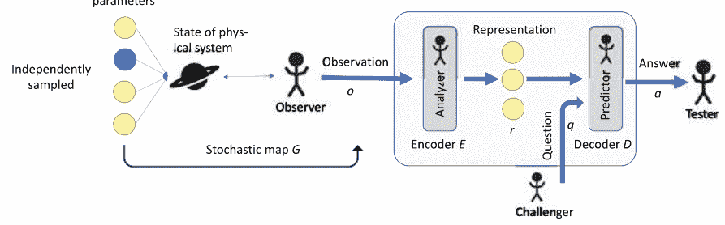

图8.1 解开统计独立参数的设置。我们假设存在一小组独立采样并完全确定物理系统状态的隐藏参数。请注意，图中的参数数量（表示为实心圆）并不具有代表性。从隐藏参数到观测代理的测量输出的映射 $G$ 可以是随机的。然后，观测代理将观测结果 $o$ 进一步传递给分析代理（由编码映射 $E$ 描述），其任务是恢复与挑战代理提出的问题相关的隐藏参数 $r$。基于表示 $r$ 回答问题 $q$ 的预测代理由解码映射 $D$ 描述。最后，测试代理将预测代理的答案 $a$ 与通过对环境进行测量获得的正确答案进行比较。请注意，在实践中，例如分析器、预测器和挑战者可以由单个物理学家代表。

在接下来的章节中，我们介绍了对表示中的参数进行“自然”分离的不同要求。在机器学习的背景下，一个通常是指将变量分离为解缠的潜在变量的任务，并将要求称为先验。稍后，在第10节中，我们将应用这些标准到不同的示例中，并证明它们导致了物理学家常用的分离。

### 8.4 操作上有意义的表示的标准

在这里，我们注意到实验者收集数据和分析数据的过程是相互依赖的。所考虑的设置（如图8.1所示）假设在创建观测数据时隐藏参数是独立采样的。我们将在第8.4.2.2节中考虑一个操作设置以及一个用于解开的替代标准。这个替代标准基于一个与用于生成训练数据的采样策略无关的操作上有意义的标准来解开特征。

现在让我们形式化独立参数的标准。我们考虑实值数据，我们认为这些数据是从未知概率分布中采样得到的。换句话说，我们为观测值 $O$，问题 $Q$，潜在表示 $R$ 和答案 $A$ 分配随机变量。我们使用约定，随机变量 $X = (X_1, \ldots, X_{|X|})$ 从 $X \subset \mathbb{R}^{|X|}$ 中取样，其中 $|X|$ 表示 $X$ 的隐空间空间的维度。

定义8.3（统计独立表示[22]）由编码器映射 $E: O \rightarrow R$ 定义的表示 $R$，用于描述三元组所描述的数据 $(O, Q, a, \varepsilon)$，如果随机变量 $\{R_1, R_2, \ldots, R_{|R|}\}$ 相互独立，则称为统计独立表示。$^4$

在实践中，我们永远不会找到完全独立的表示参数。因此，为了量化表示中参数的独立性，我们希望使用相关性度量 $C(R_1, R_2, \ldots, R_{|R|})$ 具有以下属性：
- 1. 当且仅当 $R_1, R_2, \ldots, R_{|R|}$ 统计独立时，$C(R_1, R_2, \ldots, R_{|R|}) = 0$。
- 2. $C(R_1, R_2, \ldots, R_{|R|}) \geq 0$ 对于任意分布 $R_{R_1, \ldots, R_{|R|}}$。
- 3. $C(R_1, R_2, \ldots, R_{|R|})$ 在分布 $p_{R_{1,2,\ldots,|R|}}$ 中是连续的。

满足所有这些属性的度量是总相关性。为了定义它，我们首先定义了 Kullback-Leibler 散度，它可以看作是随机变量分布之间的距离度量（然而，它不是一个度量，因为它不满足三角不等式）。

定义8.4（Kullback-Leibler 散度）对于两个连续随机变量 $x$ 和 $y$ 的分布 $P_X$ 和 $P_Y$，其中 $P_X$ 相对于 $P_Y$ 是绝对连续的，Kullback-Leibler 散度 $D_{\text{KL}}(P_X || P_Y)$ 被定义为
$$
D_{\text{KL}}(P_X || P_Y) = \int_{-\infty}^{\infty} P_X(x) \log\left(\frac{P_X(x)}{P_Y(x)}\right) dx .
$$
请注意，我们使用的约定是 $0 \log 0 = 0$，这确保了 Kullback-Leibler 散度的连续性，因为 $\lim_{x\to0^+} x \log x = 0$。

$^4$ 随机变量 $R_i$ 的分布是由观测值的分布和编码器映射 $E$ 引起的。

定义8.5（总相关性）对于给定的随机变量集合 $\{R_1, R_2, \ldots, R_{|R|}\}$，总相关性 $C(R_1, R_2, \ldots, R_{|R|})$ 被定义为
$$
C(R_1, R_2, \ldots, R_{|R|}) = D_{\text{KL}} \left( P_{R_1, R_2, \ldots, R_{|R|}} \| P_{R_1} P_{R_2} \ldots P_{R_{|R|}} \right). \quad (8.2)
$$
直观地说，总相关性量化了一组多个随机变量之间的依赖性或冗余性。它衡量了随机变量的联合分布与具有边际分布的独立分布之间的“距离”。

总相关性使我们能够在以下定义中总结所需和实际适用的性质，以统计上解耦的表示方式。

定义8.6（最小相关表示）对于由三元组 $(O, Q, a)$ 描述的数据，表示 $R$ 被称为最小相关表示，当且仅当：
- 1. 表示 $R$ 是最小的，并且
- 2. 没有其他表示 $R'$ 满足
$$
C(R'_1, R'_2, \ldots, R'_{|R|}) < C(R_1, R_2, \ldots, R_{|R|}).
$$
注8.1（与主成分分析的关系）从给定数据中提取不相关特征的最显著方法之一是主成分分析（PCA）。该方法对数据进行线性变换以提取不相关特征（参见第2章和图2.2）。因此，我们可以将PCA理解为其编码器（和解码器）执行线性操作的自编码器。对于正态分布的输入数据，PCA是最优的，从某种意义上说，它可以恢复出潜在的统计独立特征。然而，在一般情况下，线性不相关特征仍然可能是统计相关的。在这种情况下，需要使用非线性变换来找到统计独立特征。由于神经网络在原则上可以以任意精度（对于足够大的网络规模）逼近任何连续函数[43, 44]，使用神经网络实现编码器和解码器可以进行比PCA更复杂的变换。

### 8.4.2.2 高效的可传递的

在本节中，我们提出了一种操作方法，用于解开一个表示的参数，该表示不受数据收集过程的采样策略的偏见影响[23]。为了说明这个想法，让我们考虑以下物理设置：有两个带有质量 $m_1, m_2$ 和电荷 $q_1, q_2$ 的带电粒子。

代理 $B_1$ 可以对第一个电荷进行测量，代理 $B_2$ 可以对第二个电荷进行测量。代理 $B_1$ 的任务是预测质量 $m_1$ 的轨迹，这取决于 $m_1, q_1$ 和 $q_2$，但不取决于质量 $m_2$（对于代理 $B_2$ 也是如此）。

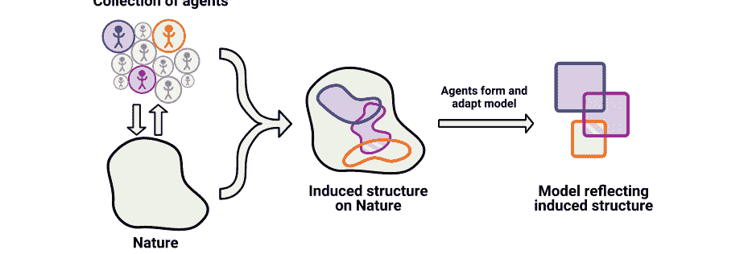

图8.2 通过通信代理在自然界上引发的结构 (图片来自Nautrup、Metger和Iten等人，2020年 [23, 237])。不同的代理通过实验与自然界的不同方面进行交互。不同的代理可能观察或与不同的子系统进行交互，但可能无法访问环境的其他部分。为了解决某些任务，代理可能需要其他代理才能访问的信息。因此，代理需要进行通信。为了达到这个目的，他们将信息编码成可以有效传递给其他代理的表示，即他们需要找到一种有效的“语言”来共享相关信息。这样一来，代理对自然界的描述就会产生结构。当代理构建自然界的模型，即学习对实验设置进行参数化时，我们希望这个模型能够反映出代理在压缩和传递参数方面所要求的结构的特点。

代理人必须相互通信并共享信息。我们希望代理人只分享相关信息，而不是分享所有测量数据。为此，代理人首先创建其数据的表示，然后分享存储在表示中的相关子集参数。这是受人类交互的启发，通过使用“抽象”语言进行沟通。为了最小化代理人 $B_2$ 必须传递给 $B_1$ 的参数数量，电荷 $q_2$ 应该与质量 $m_2$ 分开存储。事实上，如果例如 $p_1 = q_2 + m_2$ 和 $p_2 = q_2 - m_2$ 将以两个参数（在某些固定单位中）存储，那么代理人 $B_2$ 将不得不同时传递参数 $p_1$ 和 $p_2$ 给代理人 $B_1$，以便代理人 $B_1$ 拥有足够的信息来预测第一个电荷的轨迹。

我们得出结论，对于不同的代理人在给定任务的背景下激励有效的沟通，对物理参数的分离构成了操作上有意义的结构，如图8.2所示。

我们强调参数的分离取决于所选择的任务。如果代理人 $B_1$ 需要预测 $q_2 + m_2$，那么对于代理人 $B_2$ 来说，存储参数 $p_1 = q_2 + m_2$ 和 $p_2 = q_2 - m_2$ 是最优的。然而，从物理的角度来看，这个任务似乎并不特别有用。我们将“操作上有意义的参数”定义为在各种感兴趣的任务中有用的参数。也就是说，虽然参数受到我们希望解决的任务的偏差影响，但它们不受测量数据收集方式的偏差影响。

让我们形式化这种方法。我们考虑几个与自然相互作用的代理人（通过进行实验和收集观测）并相互交流。代理人如何共同分析一个物理系统的过程，如图8.3所示。

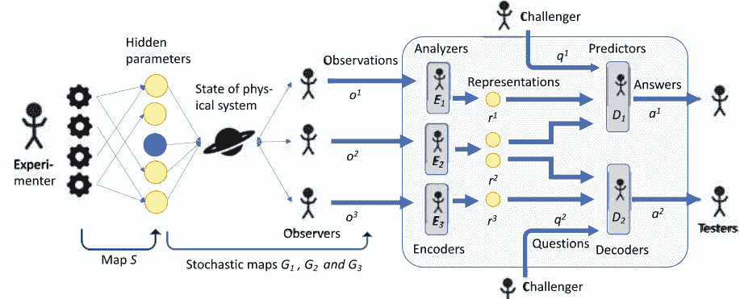

图8.3 用于解开操作有意义参数的设置。一个(或多个)实验者与环境的交互，并选择实验设置(例如通过选择拨盘和按钮的值)。一个函数 $S$ 将这样的设置映射到描述物理系统状态的一组参数(所示参数的数量不具代表性)。三个观察者可以访问物理系统的不同部分，并根据随机映射 $G_1, G_2$ 和 $G_3$ 对观测进行采样。然后，分析器(由编码映射 $E_1, E_2$ 和 $E_3$ 给出)产生观测的压缩表示 $r_1, r_2$ 和 $r_3$，分别。表示中的参数被传递给两个预测器(由解码映射 $D_1$ 和 $D_2$ 描述)，它们的任务是回答问题 $q_1$ 和 $q_2$，分别。一般来说，表示中的某些参数可以与多个解码器共享。优化表示中参数的分离方式，以便每个代理所需的参数量最小。这种分离参数的准则是通过最小化不同代理之间的通信来实现的。

第一个代理人，即实验者，选择了一个由映射 $S: \mathcal{X} \rightarrow \mathcal{H}$ 描述的实验。$m$ 个不同的观察者 $G_i: \mathcal{H} \rightarrow \mathcal{O}_i$ 收集了物理系统的观测 $o_i$，对于实验设置 $x$（因此，隐藏变量 $S(x) \in \mathcal{H}$），我们用 $o_i = (o_{i1} \cdots o_{im})$ 表示观测的连接。所有连接观测的集合被表示为 $\mathcal{O} \subset \mathcal{O}_1 \times \ldots \times \mathcal{O}_m$。请注意，一般情况下，$\mathcal{O}$ 是 $\mathcal{O}_1 \times \ldots \times \mathcal{O}_m$ 的真子集，因为不同观察者的测量结果可能彼此相关。

分析代理人 $E_i: \mathcal{O}_i \rightarrow \mathcal{R}_i$ 然后将给定的实验数据编码为压缩表示 $r_i$。分析代理人然后决定与哪些预测代理人通信的参数。我们将选择过程形式化如下：对于 $m$ 个分析代理人，我们将所有表示 $r_i$ 连接起来，得到 $r = (r_1, \ldots, r_m) \in \mathcal{R} \subset \mathcal{R}_1 \times \mathcal{R}_2 \times \ldots \times \mathcal{R}_m$。然后，对于每个预测代理人 $D_j$，我们定义一个过滤函数 $\phi_j: \mathcal{R} \rightarrow \mathcal{R}_j \subset \mathbb{R}^{d_j}$，该函数从向量 $r \in \mathcal{R}$ 中选择一部分组成子集。预测代理人 $D_j: \mathcal{R}_j \times Q_j \rightarrow A_j$ 然后通过挑战者从集合 $Q_j$ 中选择的问题 $q_j$ 进行挑战，并输出答案 $a_j \in A_j$。测试代理人然后进行实验以提供正确的回答。

$^5$ 但是，也可以考虑多个实验者，然而，在这项工作中，只有一个实验者也可以不改变分析。

过滤器的作用在于，对于给定的隐藏变量 $S(x)$ 和一个问题 $q^j$，直观上，每个过滤器应该只选择分析代理人发现的表示的部分，这部分是回答挑战代理人提出的问题所需的。

在本节开始时考虑的例子中，代理人 $B_1$ 和 $B_2$ 扮演观察、分析和预测代理人的人的角色。具体来说，我们有两个观察代理人 $G_1$ 和 $G_2$，对应于代理人 $B_1$ 和 $B_2$，它们将其观察结果（作为分析代理人 $E_1$ 和 $E_2$）编码为质量和电荷 $m_1, q_1$ 和 $m_2, q_2$。然后，分析代理人将 $m_1, q_1, q_2$ 和 $m_2, q_2, q_1$ 传递给预测代理人 $D_1$ 和 $D_2$，它们再次对应于代理人 $B_1$ 和 $B_2$。$^6$ 换句话说，定义连接表示为 $r = (r_1, r_2, r_3, r_4) = (m_1, q_1, m_2, q_2)$，两个过滤器 $\phi_1$ 和 $\phi_2$ 将 $r$ 映射为 $(r_1, r_2, r_4)$ 和 $(r_2, r_3, r_4)$，分别。然后，再次对应于代理人 $B_1$ 和 $B_2$ 的预测代理人被挑战代理人（不同于 $B_1$ 和 $B_2$）要求预测粒子的轨迹。

备注8.2（注意机制） 上述对代理之间的通信进行的形式化也可以解释为一种注意机制。事实上，考虑到所有出现在通信场景中的代理都是相同的极端情况，即只代表一个代理，这些过滤器可以被视为一种关注特定问题所需信息的注意机制。这样的机制已经在自然语言处理方面进行了深入研究[162-164]。[162]中引入了一种用于机器翻译的注意机制。编码器生成表示任意输入句子信息的一系列注释。然后，根据当前相关性使用注意机制来过滤（或加权）这些注释。生成的上下文向量可以被解码器用于生成翻译。这种注意机制已经扩展到多个编码器-解码器模型，用于多语言神经机器翻译[163]和摘要[164]。虽然这些工作中的方法主要关注改进解码器的输出，但在本书中，我们主要关注这些方法如何为潜在表示带来更多结构。

为了定义一个操作上有意义的表示，我们定义了问题 $q = (q^1, \ldots, q^n) \in \mathcal{Q} \subset \mathcal{Q}^1 \times \ldots \times \mathcal{Q}^n$ 的连接，以及答案 $a = (a^1, \ldots, a^n) \in \mathcal{A} \subset \mathcal{A}^1 \times \ldots \times \mathcal{A}^n$ 的连接。此外，我们注意到在假设存在足够的表示（即，观察代理收集的数据足以回答所有问题）的情况下，我们可以将函数 $a: \mathcal{O} \times \mathcal{Q} \rightarrow \mathcal{A}$ 视为关于观察的函数，提供了（连接的）正确答案 $a$ 对于（连接的）问题 $q$。

$^6$ 参数 $m_1, q_1$ 和 $m_2, q_2$ 分别从代理 $B_1$ 和 $B_2$ 发送给自己。因此，在本节开始时考虑的高层次图像上，我们不仅要最小化 $B_1$ 和 $B_2$ 之间的通信，还要最小化代理之间的“通信”，即我们要尽量减少用于解决代理任务的参数数量。在这种特殊情况下，分析代理与预测代理相同，因此最小化“通信”也对应于代理集中于其表示的相关部分的动机（参见备注8.2）。

对于隐藏变量的预测，我们用列表 $(\phi_1, \ldots, \phi_n)$ 表示滤波函数 $\phi_j: \mathcal{R} \rightarrow \widetilde{\mathcal{R}}^j \subset \mathbb{R}^{d_j}$，并用 $\dim(\phi^j)$ 表示 $\phi_j$ 的输出维度。在我们定义一个操作上有意义的表示之前，我们需要将最小表示（定义8.2）的定义扩展到多个编码器。这个推广是直接的，但是需要注意的是，使用多个编码器可能会增加最小表示中的参数数量，与只使用一个编码器的情况相比（参见第10.6.2节的示例）。

定义8.7（具有多个编码器的最小表示）由编码器 $E_1, \ldots, E_m$ 定义的描述数据 $(\mathcal{O}, \mathcal{Q}, a)$ 的表示 $\mathcal{R} \subset \mathcal{R}^p$ 被称为具有 $m$ 个编码器的最小表示，如果且仅如果
- 1. 它是充分的，即存在一个平滑解码器 $D(r=(r^1,\ldots,r^m),q)=a$ 对于所有可能的观察 $o \in \mathcal{O}$，问题 $q \in \mathcal{Q}$，其中我们定义 $r^i = E_i(o^i) \in \mathcal{R}^i$，并且没有其他充分表示 $\mathcal{R}' \subset \mathcal{R}'^{p'}$，其中 $p' < p$。

定义8.8（操作性有意义的表示[23]）是由编码器 $E_1, \ldots, E_m$ 定义的数据和滤波器的表示 $\mathcal{R}(\mathcal{O}, \mathcal{Q}, a, \phi)$ 被称为操作性有意义的表示，当且仅当：
- 1. 表示 $\mathcal{R}$ 是最小的，并且
- 2. 不存在其他具有选择函数 $\phi'$ 的最小表示 $\mathcal{R}'$，使得 $\sum_j \dim((\phi')_j) < \sum_j \dim(\phi_j)$。

第一个要求确保完整的连接表示由最少数量的参数组成，以便仍然包含足够的信息来回答可能提出的所有问题 $q \in \mathcal{Q}$。第二个要求鼓励将表示中的参数分离，以最小化发送到每个解码器的参数数量。

备注8.3（在强化学习背景下的SciNet）在本书中，我们要求SciNet根据从物理环境中收集到的观测数据来预测不同的物理量。从机器学习的角度来看，这个任务被归类为表示学习。一般来说，有一些任务需要与环境进行多次交互才能解决。例如，通过用球棒击球将球打入洞中的任务（对于打高尔夫球的读者来说可能是一个熟悉的任务）可能需要多个步骤。此外，如果我们没有在第一次击球时将球打入洞中，可能不清楚如何量化这一击球的“有用性”。换句话说，我们可能没有一个可以在每次击球后进行评估的成本函数，而只有在最终将球打入洞中时才会得到奖励。这是强化学习的典型设置（见第2章）。考虑到强化学习环境和几个具有不同任务的代理，我们可以将SciNet与强化学习的技术相结合，构建对环境状态进行最小表示的解缠结表示：SciNet的每个解码器可以被视为一个独立的强化学习代理，它必须通过从编码器接收到的额外信息来解决特定任务在其环境中。与同时学习表示和策略不同，从技术上讲，先学习最优策略，然后使用由训练代理与环境交互生成的数据集来训练SciNet可能更简单（参见[23]以获取示例和详细信息）。换句话说，训练代理为SciNet提供了正确的预测，因此可以为每个输入计算成本函数。

### 8.4.2.3 统计独立性与操作上有意义

在前面的章节中，我们描述了两种不同的方法来解开表示学习中的参数。根据情况，一种方法可能比另一种方法更可取。在操作上有意义的表示中，解开是通过最小化在代理之间传递的参数数量来操作上激励的。然而，要完全解开由 $k$ 个参数组成的表示，我们至少需要 $k$ 个关于物理系统的“自然”问题。如果我们不知道足够多这样的问题，我们可以通过搜索由数据收集过程偏置的统计独立参数来代替。或者，可以先根据问题解开方法，然后再根据统计独立性进一步解开得到的子表示。

### 8.4.3 简单的更新规则

除了最小性和解耦性之外，对于物理表示来说，通常希望存在简单的规则来从中获得预测。例如，通常希望给定一个表示，存在一个简单的数学公式来演化表示。为了形式化这一点，让我们考虑一个表示 $\mathcal{R}$ 上的一组（简单）更新规则 $u: \mathcal{R} \rightarrow \mathcal{R}$。此外，我们考虑一种特定形式的问题 $q = (t, q^\sim)$，其中 $t \in \mathbb{N}_0$ 表示应用更新规则的次数，问题 $q^\sim \in \mathcal{Q}^\sim$ 可以是任何与应用更新规则 $t$ 次后的系统相关的问题。

定义8.9（具有简单更新规则的表示[22]）对于由编码器 $E: \mathcal{O} \rightarrow \mathcal{R}$ 生成的描述为三元组 $(\mathcal{O}, \mathcal{Q} = \mathbb{N}_0 \times \mathcal{Q}^\sim, a)$ 的数据的表示 $\mathcal{R}$，如果且仅如果存在一组更新规则 $\mathcal{U}$，那么该表示被称为简单表示。
- 1. 表示 $R$ 是最小的，并且
- 2. 存在一个更新规则 $u \in \mathcal{U}$ 和一个解码映射 $D: \mathcal{R} \rightarrow \mathcal{A}$，使得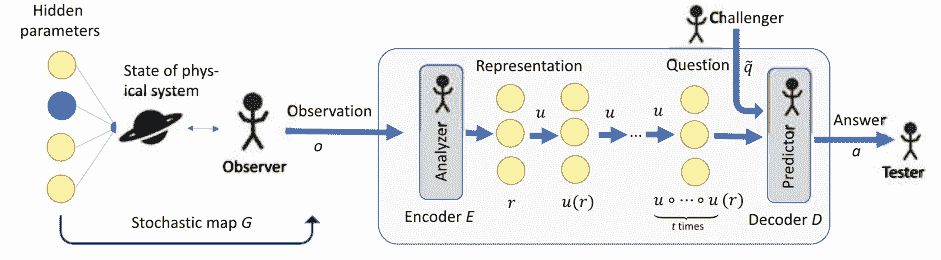

图8.4 搜索根据简单的更新规则演化的参数设置。一小 组隐藏参数完全确定了物理系统的状态（图中所示的参数数量不具代表性）。系统的状态取决于参数$t \in \mathbb{N}_0$（例如，时间可以对应于$(\varepsilon t+t_0)\text{s}$，其中$\varepsilon>0$和初始时间$t_0$）。我们希望找到一个物理系统的表示，使得对于参数$t$的表示可以简单地演化为参数$t+1$的表示。因此，我们考虑形式为$q=(t,\tilde{q})$的问题，即我们询问与参数$t$对应的系统状态的问题$\tilde{q}$。为此，分析器将观察$o$编码为表示$r$，然后通过简单的更新函数$u$将其演化$t$次。然后，解码代理被问问题$\tilde{q}$，他的答案$a$由测试代理检查。

$$
D(u \circ \cdots \circ u \circ E(o), \tilde{q}) = a^*(o, q)
$$
\quad $t$次

对于所有观测$o \in \mathcal{O}$和问题$q=(t,\tilde{q}) \in \mathcal{Q}$。

### 8.5 数学上有意义的表示的标准

在第8.4节中，我们关注的是对物理系统的表示的“自然”要求，不使用任何数学或物理先验知识。然而，在某些情况下，我们可能希望使用一些数学先验知识来寻找可以在数学框架内解释的表示。

在本节中，我们将描述如何使用深度学习和Koopman算子理论[165，166]来找到非线性动力学[167-172]的数学描述。这项研究作为一个示例，展示了如何使用数学知识来描述数学上有意义的表示。

> 7在[173]中提出了一种发现系统表示及描述其非线性动力学方程的替代方法。[173]中使用的模型具有描述动力学所必需的最少术语，平衡了模型复杂性和描述能力，从而促进了可解释性和泛化能力。此外，它们也适用于本框架，即它们可以被视为一种寻找数学上有意义的表示的方法。

#### 8.5.1 Koopman算子理论

Koopman算子理论在1931年的[165, 166]中被引入。它是线性化非线性动力学的系统方法的主要候选者[174, 175]。在这个领域中，无论是理论[174–178]还是相关的数值方法，如动态模态分解[179–181]，都有一些最近的进展。此外，越来越多的可用测量数据支持数据驱动的Koopman理论的应用。接下来，我们将简要介绍Koopman算子理论。关于这个主题的更详细的最新综述，请参考[182]。

我们考虑一个动力系统，其状态由变量$o(t) \in \mathcal{O} \subset \mathbb{R}^n$在时间$t$描述，并且其动力学由向量场$f: \mathcal{O} \to \mathbb{R}^n$描述，连同微分方程

$$
\dot{o}(t)=f(o(t)) \text{ 。}
$$

时间$\Delta t$的离散演化可以用函数$F: \mathcal{O} \to \mathcal{O}$来描述，给定为

$$
o_{k+1}=F\left(o_k\right) ，
$$

其中$o_k=o(k\Delta t)$是系统在时间$k\Delta t$时的状态，其中$k \in \mathbb{N}_0$。我们有兴趣从给定的实验数据中找到描述所考虑系统的离散时间动力学的函数$F$。许多感兴趣的物理系统可以用$o(t)$的微分方程紧凑表示。然而，在大多数情况下，除了线性动力学之外，微分方程在解析上是无法追踪的。

Koopman算子理论不考虑系统状态的演化，而是考虑从中导出的可观测量的演化，并由实值映射$g: \mathcal{O} \to \mathbb{R}$描述系统。让我们以一个包含一些理想气体的盒子为例。系统的状态完全由气体中粒子的所有位置和速度描述。一个可观测量的例子是气体的压力，可以看作是状态的函数。

Koopman算子$\mathcal{K}$是线性且无限维的算子，用于在离散时间步长$t$下推进测量函数。

$$
\mathcal{K} g=g \circ F \Rightarrow \mathcal{K} g\left(o_k\right)=g\left(o_{k+1}\right) \text{ 。}
$$

Koopman算子的线性性是复合操作的直接结果，因为对于可观测量$g_1, g_2: \mathcal{O} \to \mathbb{R}$，我们有

$$
\mathcal{K}\left(g_1+g_2\right)=\left(g_1+g_2\right) \circ F=g_1 \circ F+g_2 \circ F=\mathcal{K} g_1+\mathcal{K} g_2 \text{ 。}
$$

所以，好消息是我们用线性算子 $\mathcal{K}$ 替代了非线性动力学；坏消息是算子 $\mathcal{K}$ 作用在一个无限维空间上。为了理解 $\mathcal{K}$ 描述的动力学，将算子限制在不变于 $\mathcal{K}$ 作用下的有限维子空间可能会有帮助。任何由 $\mathcal{K}$ 的特征函数张成的子空间 $L$（在复数域上）都是不变子空间，因为对于由特征函数 $\phi_1, \ldots, \phi_l: \mathcal{O} \to \mathbb{C}$ 张成的子空间，具有特征值 $\lambda_1, \ldots, \lambda_l \in \mathbb{C}$，我们有：

$$
\mathcal{K}\left(\alpha_{1} \phi_{1}+\cdots+\alpha_{l} \phi_{l}\right)=\alpha_{1} \lambda_{1} \phi_{1}+\cdots+\alpha_{l} \lambda_{l} \phi_{l} \in L \text{，}
$$

对于任意复数系数 $\alpha_1, \ldots, \alpha_l \in \mathbb{C}$。因此，限制在特征向量张成的子空间上的Koopman算子允许对该子空间上的动态进行线性有限维表示。由于我们对线性系统有全面的理论，这种限制有潜力实现对非线性系统的高级预测和控制。

#### 8.5.2 Koopman特征函数的表示

在实际应用中，获得Koopman算子的特征函数一直是具有挑战性的。在本节中，我们根据[183]描述了如何使用神经网络来找到这些特征函数。 寻找Koopman特征函数可以看作是寻找变换 $\phi_1, \ldots, \phi_l: \mathcal{O} \rightarrow \mathbb{C}$ 的观测 $o \in \mathcal{O}$ 的演化 $\Delta t$ 为 $r \rightarrow (\mathcal{K} \phi_1(o), \ldots, \mathcal{K} \phi_l(o)) = (\lambda_1 \phi_1(o), \ldots, \lambda_l \phi_l(o)) =: \mathcal{K}(\lambda)(\phi_1(o), \ldots, \phi_l(o))$，其中我们定义了 $\mathcal{K}(\lambda): \mathbb{C}^l \rightarrow \mathbb{C}^l$ 为 $\mathcal{K}(\lambda)(\alpha_1, \ldots, \alpha_l) = (\lambda_1 \alpha_1, \ldots, \lambda_l \alpha_l)$，其中 $\alpha_1, \ldots, \alpha_l$ 为复数。定义（复值）编码器 $E: o \rightarrow r = (\phi_1(o), \ldots, \phi_l(o))$，我们可以将这个设置看作是第8.4.3节中考虑的情况的一个特殊情况，其中我们描述了允许简单更新规则 $u$ 的表示（见图8.4）。 实际上，如果我们设置 $u = \mathcal{K}(\lambda)$ 并选择问题的形式为 $q = (k, \tilde{q})$，其中 $\tilde{q}$ 是（固定的）问题“系统在时间 $k \Delta t$ 的状态是什么？”，定义8.9（对于复值编码器进行了推广）确保相应表示的编码器实现了最小数量的Koopman特征函数 $\phi_1, \ldots, \phi_l$，使得得到的表示 $r = (\phi_1(o), \ldots, \phi_l(o))$ 足以恢复状态 $o$。

许多物理系统需要具有连续谱的Koopman算子来准确描述 [166]。 例如，一个（非线性化的）摆的频率，其角位移 $\theta$ 满足微分方程 $\ddot{\theta} = -\omega_0^2 \sin(\theta)$（其中 $\omega_0 \in \mathbb{R}$），随着摆的能量增加而不断减小。在这种情况下，通过有限个特征函数的近似可能不够准确，无法更好地理解底层系统。一种处理连续谱的方法是允许特征值依赖于表示 $r$，这在[183]中有描述。

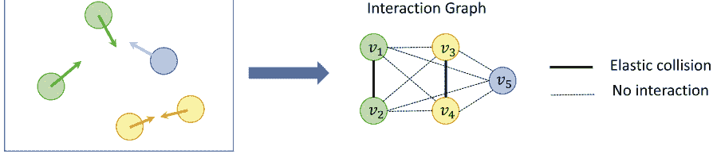

图8.5是一个移动球的玩具模型的交互图。五个球以不同的速度在一个盒子内移动（并与盒子的墙壁弹性碰撞）。我们考虑的玩具模型是相同颜色的球之间弹性碰撞，而不同颜色的球之间不相互作用。通过观察五个球体系的时间演化，可以创建一个表示五个物体相互作用信息的交互图。图中的顶点$v_1,\dots,v_5$表示球体，球之间的边描述它们的相互作用。图中的顶点$v_1,\dots,v_5$表示球体，球之间的边描述它们的相互作用。

即我们考虑一个Koopman算子$\mathcal{K}(\lambda)$，其中$\lambda \equiv \lambda(r)$。在[183]中，该方法成功地应用于线性化非线性摆动的动力学（第10.3节）和高维非线性流体流动。

### 8.6 物理上有意义的表示的标准

为了简化 SciNet表示的解释并提高其泛化能力，我们有时希望将一些物理先验知识纳入到机器学习设置中。关于先验知识的选择有很多选项，如对称性或子系统的成对相互作用，以及实现方式。我们重点关注一个示例，以演示如何将这种先验知识纳入 SciNet中，并说明它如何帮助解释所找到的表示。在本节中，我们考虑由多个对象（或更一般地说“部分”）相互作用而成的系统。我们假设我们的观测数据以我们知道它与对象的关系的方式结构化，换句话说，我们假设观测$o \in \mathcal{O}$ of $k$ 对象的形式为$o=(o_1, \ldots, o_k)$，其中$o_i$为实值向量。已经考虑了不同的方法来描述这种系统的行为[184-188]。在这里，我们重点关注[184]中描述的方法，它需要关于对象之间如何相互作用以及观测数据$o_i$的形式的最小先验知识。此外，它允许找到一个作为交互图的交互结构的描述。在接下来的几节中，我们将描述交互图的概念，然后介绍如何从动力系统中提取其表示。

#### 8.6.1 交互图

从数学上讲，图被定义为一个元组$(V, E)$，其中包含一组顶点$v \in V$和边$e=(v,v') \in E$，可以看作是两个顶点$v \in V$和$v' \in V$之间的连接（见图8.5的示例）。这样的结构可以自然地描述一组相互作用的对象，通过将顶点$v_1,\dots,v_n \in V$分配给对象和将边$e_{i,j}=(v_i,v_j)$分配给分配给$v_i$的对象对$v_j$的动作。然而，为了描述对象的属性和相互作用的类型，我们使用实向量的嵌入$h_i$和$h_{i,j}$来表示顶点和边。例如，让我们考虑一个玩具模型，其中有$n$个球，它们的位置是$x_i$，速度是$w_i$，颜色是$c_i$。因此，顶点的嵌入可以简单地表示为$h_i=(x_i,w_i,c_i)$。假设球之间只有两种类型的相互作用：颜色相同的球完全弹性碰撞，而颜色不同的球不相互作用。因此，边的嵌入可以表示为$h_{i,j}=h_{j,i}=1$，如果$c_i=c_j$；$h_{i,j}=h_{j,i}=0$，如果$c_i \neq c_j$。这样一个系统的相互作用图如图8.5所示。

#### 8.6.2 交互图的表示

本节的目标是规范从动态系统的观测数据中提取相互作用类型的过程，即从相互作用图的边的嵌入（按照[184]中的方法）中提取出观测数据。因此，对象的数量在不同的观测中可能会有所变化。让我们考虑时间序列 $t_i=[x_i(t_l)]_{l \le T}=x_i(t_1),\dots,x_i(T)$ 的长度为 $T$，其中 $x_i(t_l) \in \mathbb{R}^d$ 是固定时间 $t_1,\dots,T$ 时标签为 $i$ 的对象的状态。

我们希望推断出与观测数据描述的对象之间的相互作用对应的相互作用图的结构。

这个过程可以被认为具有类似于SciNet的基本结构，如图1.1所示。然而，通常我们考虑固定维度的实值观测，而这里的观测集合 $\mathcal{O}$ 是时间序列的集合 $[x_i(t_l)]_{l \le T} \in \mathbb{R}^{d \times \mathbb{R}_T}$，因此 $\mathcal{O} \subset \{[s_{t_i}]_{i \le k} : s_{t_i} \in \mathbb{R}^{d \times \mathbb{R}_T}, k \in \mathbb{N}\}$。现在，编码器应该能够将任意数量对象的观测数据映射到描述对象之间相互作用的表示，因此其大小与对象数量 $k$ 的平方成比例。更正式地说，编码器应该将 $k$ 个对象的观测 $o \in \mathcal{O}$ 映射到表示 $r$，该表示编码了所有嵌入 $h_i, h_{i,j}$，其中 $i,j \in \{1,\dots,k\}$ 且 $i \neq j$。假设相互作用可以完全由一个 $e$ 维实向量 $h_i, h_{i,j} \in \mathbb{R}^e$ 来描述，那么我们有 $r \in \mathbb{R}^{k(k-1) \times e}$。

为了简化起见，我们使用双索引表示，使得 $r_{i,j}=h_{i,j}$。请注意，使用前馈神经网络无法轻松实现具有可变输入和输出大小的编码器。相反，可以使用图神经网络（GNNs）来处理这些困难，如第9.7节所述。

然后，我们要求 SciNet 预测所有对象的未来时间演化，给定初始状态 $o(t_0) = o_1(t_0), \ldots, o_k(t_0)$ 在某个时间 $t_0$，并基于找到的表示来编码所有对象之间的相互作用。为了能够准确预测远期的时间演化（以便所有对象都会相互作用一次），SciNet 必须推断出所有必要的相互作用信息，并将此信息存储在潜在表示 $r$ 中。因此，这样的结构可以用来学习关于哪些对象相互作用以及哪些参数描述这些相互作用的概念信息。

我们在第9.7节中描述了如何使用GNNs [184]找到这样的表示。

## 第9章 方法：使用神经网络找到简单的表示


在前一章中，我们通过引入最小统计独立和操作上有意义的表示的概念，以及允许简单更新规则和表示由多个相互作用对象组成的系统的表示，形式化了我们认为是“简单”的物理数据表示。 在本章中，我们讨论了神经网络如何直接从给定的数据集中找到这些类型的表示（遵循[22,23]中描述的思想)。除了给定的数据和前一章中找到的表示的理论要求之外，我们还专注于将任何进一步的先验知识最小化到机器学习系统中。 因此，本章介绍的网络架构可以应用于广泛的数据范围。

### 9.1 动机

我们希望构建能够直接从给定数据中学习描述在第8.4节中所述的不同表示形式的软件。为了实现这一目标，主要困难在于找到一个将观察结果编码为满足第8.4节、第8.5节和第8.6节中形式化属性的表示形式的函数。对于任何表示形式，我们要求的一个关键属性是它足够充分，即它包含足够的信息来回答一组问题。 要检查一个表示形式是否足够，通常需要搜索将表示形式和问题映射到答案的解码函数（图1.1)。如果找到一个解码器，它对所有问题都输出正确答案，那么可以确定找到的表示形式包含所有必要的信息。我们得出结论，我们必须同时搜索编码器和解码器。通过使用人工神经网络，可以高效地实现这一目标，人工神经网络是一种直接从数据中学习函数的强大工具。请注意，对于神经网络的许多应用，它们能够推广到与训练过程中看到的样本显著不同的输入样本非常重要。然而，对于这项工作，神经网络主要用作一种函数逼近工具。


图9.1 SciNet的网络结构，受人类物理推理过程的启发（图取自 Iten 和 Metger 等人的Physical Review Letters, 2020年[22]）。观测结果被编码为实数参数，输入到一个编码器（一个前馈神经网络），将数据压缩成一个表示（潜在表示）。问题也被编码为一些实数参数，与表示一起输入到解码器网络中以生成答案（所示的神经元数量不具代表性）。

### 9.2 用于学习表示的通用网络结构

在第8.2节中描述的建模过程可以直接转化为神经网络架构（图9.1），我们在下文中称之为 SciNet[22]。

编码器和解码器都是以前馈神经网络的形式实现的。除了问题输入之外，得到的架构类似于表示学习中的自编码器[27, 189]，更具体地说是[190]中的架构。请注意，如果有一组有限的问题，原则上可以通过要求解码器在每次运行中回答所有问题来替换问题输入。然而，当使用描述问题的连续变量时，这种策略将不起作用。

在训练过程中，我们向网络提供形式为 $(o, q, a^*(o, q))$ 的三元组，其中 $a^*(o, q) \in \mathcal{A}$ 是给定观察值 $o \in \mathcal{O}$ 的问题 $q$ 的正确回答。通过这样，我们训练了编码器 $E_\Theta$ 和解码器 $D_\Phi$，其中 $\Theta$ 和 $\Phi$ 分别表示编码器和解码器的权重和偏差的集合。学习最小表示的 SciNet 的训练过程总结如下（见方框1）。

为了找到（估计）表示中的最小参数数量，只需增加参数数量，直到 SciNet 的答案质量不再显著提高。¹ 通过这种方式，表示由最小参数数量构成。如后面所讨论的，有更高效的方法来实现这一点（见注 9.2）。学习到的参数化（通过编码器 $E_\Theta$ 定义）通常被称为潜在表示 $[27,189]$。编码器完全自由选择潜在表示是至关重要的，而不是我们强加一个特定的表示。因为至少由足够多神经元组成的具有至少一个隐藏层的神经网络可以任意精确地逼近任何连续函数 $[191]$，函数 $E$ 和 $D$ 实现为神经网络并不显著限制它们的普遍性。换句话说，我们考虑相当大的网络 $E_\Theta$ 和 $D_\Phi$，以便总是存在参数 $\Theta$ 和 $\Phi$ 的选择，使得 $E_\Theta$ 和 $D_\Phi$ 接近编码器和解码器的最优函数。然而，与自编码器不同，潜在表示不需要完全描述观察结果；相反，它只需要包含回答所提问题所需的信息。

#### 盒子1：训练SciNet以学习最小表示（第9.2节）

- **目标**: 找到给定数据集 $\mathcal{D}$ 的最小表示，该数据集由形如 $(o, q, a^{*}(o, q))$ 的三元组组成，其中 $a^{*}(o, q) \in \mathcal{A}$ 是问题 $q \in \mathcal{Q}$ 的正确回答，给定观察值 $o \in \mathcal{O}$。
- **网络结构**: 如图9.1所示。我们用 $E_\Theta$ 表示参数化的编码器映射，用 $D_\Phi$ 表示解码器映射。
- **损失函数**: $\mathrm{d}[D_{\Phi}\left(E_{\Theta}(o), q\right), a^{*}(o, q)]$，对于一些（平滑的）距离度量 $\mathrm{d}[\cdot, \cdot]$。
- **数据集的分割**: 我们将数据集 $\mathcal{D}$ 分成训练集、验证集和测试集。
- **训练过程**: 为了找到最小表示，我们从零个潜在神经元开始，逐步增加潜在神经元的数量。对于每个潜在神经元的数量，我们使用训练数据训练网络，并使用验证数据验证预测的准确性。当准确性不再显著增加时，停止增加潜在神经元的数量。[在方框2中介绍了一种更高效的方法来找到所需参数的最小数量。]
- **测试**: 我们使用测试集测试训练好的 SciNet 的性能。

注 9.1 在某些情况下，神经网络 $E_\Theta$ 实现编码器可能难以找到完美的编码。要么是因为它在表达最优编码函数方面受限（因为隐藏神经元的数量不够大或者编码函数不连续，如第 10.5.1 节所示），要么是因为训练过程无法收敛到接近最优编码的解。在这种情况下，估计参数的最小数量的另一种方法是应用 Levin-Bickel 算法[192]。

使用深度学习从网络中提取信息。图9.1中的架构允许我们从神经网络中提取知识：相关信息存储在表示中，而该表示的大小相对于网络的自由度总数来说很小。这有助于解释学习到的表示。

表示。 具体来说，我们可以将SciNet的潜在表示与假设的参数化进行比较，从而得到从一个表示到另一个表示的简单映射。 如果我们甚至对手头的系统没有任何假设，仅从所需参数的数量或手动更改输入时表示的变化以及手动更改表示时输出的变化（例如[49]）中进行研究，我们仍然可以获得一些见解。

### 9.3 用于分离参数的网络结构

表示学习中的许多工作都集中在解缠表示的方法上，即在潜在空间中将“自然”特征存储在单独的神经元中（参见例如[49, 193]）。 通常，这些工作侧重于构建完整观察输入的表示。 相反，SciNet侧重于足以回答可能提出的所有问题的表示。 然而，使用机器学习文献中介绍的方法将参数分离出SciNet的表示是直接的。 然而，大多数这些方法依赖于训练数据的分布，并且在[23]中开发了用于操作解缠的新方法，即用于解缠解决不同物理任务的相关参数的方法（有关详细信息，请参见第8.4.2.2节）。

#### 9.3.1 统计独立

如第8.4.2.1节所述，如果表示中的参数在给定数据集上是统计独立的，则可以将其定义为解缠表示。 为了激励SciNet找到最小的统计独立表示，我们可以原则上使用与Box 1中描述的相同技术，并将总相关性 $C(R_1, \ldots, R_{|R|})$ 作为附加项添加到成本函数中。 然而，这种训练技术在计算上非常昂贵。 这有两个原因：首先，为不同数量的潜在神经元重新训练SciNet是昂贵的。 其次，更重要的是，在训练过程中估计总相关性在计算上非常昂贵，因为这个度量取决于潜在神经元的分布，而这又需要大量样本来进行良好的近似。

#### 盒子2：训练SciNet以学习统计独立的表示（第9.3.1节）

- 目标：为给定的数据集 $\mathcal{D}$（由形式为 $(o, q, a)$ 的三元组组成，其中 $a \in \mathcal{A}$ 是问题 $q$ 的正确回答，给定观察 $o$），找到一个统计独立的表示。
- 网络结构：基本上是图9.1中所示的结构（有关详细信息，请参见附录B中的图B.1）。我们用 $E$ 表示参数化的编码器映射： $E: \mathcal{O} \rightarrow \mathcal{R}$，用 $D$ 表示解码器映射： $D: \mathcal{R} \times \mathcal{Q} \rightarrow \mathcal{A}_{0}$。对于三元组 $x=(o, q, a)$，其中 $a \in \mathcal{A}$ 是问题 $q$ 的正确回答，给定观察 $o$，期望的成本函数为 $\mathcal{L}(x)=d\left[D_{\Phi}\left(E_{\Theta}(o), q\right), a^{\star}(o, q)\right]+ \alpha C\left(R_{1}, \ldots, R_{|R|}\right)$，对于某个（平滑的）距离度量 $d[\cdot, \cdot]$，一个超参数 $\alpha$，其中 $R_{1}, \ldots, R_{|R|}$ 是由编码器 $E_{\Theta}$ 确定的潜在神经元的随机变量（由用作训练数据的观测分布决定）。
- 可计算的成本函数：附录B中给出的 $\beta$-VAE成本函数（B.1）。
- 数据集的分割：我们将给定的数据集 $\mathcal{D}$ 分割为训练集、验证集和测试集。
- 训练过程：为了找到一个统计独立的表示，我们选择一个预期大于或等于最小表示所需的潜在神经元数量。我们使用 $\beta$-VAE成本函数来训练 SciNet，其中我们需要优化超参数 $\beta$。如果验证数据仍然具有较高的预测误差，可能是在开始时选择的潜在神经元数量过少，我们将使用更多的潜在神经元重复该过程。
- 测试：我们使用测试集评估训练好的SciNet的预测损失。此外，我们还想评估测试集上潜在神经元的总相关性。这是可行的，因为我们只需要在训练后计算一次。如果总相关性仍然很高，我们可以使用更高的 $\beta$ 值再次训练SciNet，以更强烈地促使潜在神经元的解缠。

由于这些困难，我们在这里采用了[22]中采用的方法：我们使用beta-VAEs [49]的技术，即变分自动编码器（见附录B），并使用一个适应的成本函数来帮助解缠潜在表示。实际上，beta-VAEs经常找到具有统计独立潜在神经元的表示。此外，如果存在不必要的潜在神经元，多余的神经元往往会被设置为恒定的零激活。然而，由于没有保证beta-VAEs总是找到统计独立参数，我们在完成SciNet训练后通过计算潜在变量的总相关性来进行后验验证。由于了解beta-VAEs的工作细节对于理解本论文并不重要，我们在附录B中进行了解释。训练过程在方框2中总结。

#### 9.3.2 操作上有意义

在本节中，我们描述了[23]中引入的方法，以找到操作上有意义的表示（参见定义8.8）。回顾给出的过程如图9.2所示，用神经网络替换编码器和解码器是直接的。实现的挑战部分是过滤器函数。事实上，这些函数必须选择将潜在神经元的哪些值发送到哪个解码器。因此，它们具有二进制的性质，对于每个潜在神经元，过滤器可以对某个解码器 $D_j$ 打开或关闭，这意味着该潜在神经元的值是否发送到解码器 $D_j$。为了训练这样的过滤器，我们希望对它们进行“平滑”，这样我们可以在运行反向传播训练算法时传播梯度。我们可以基于重新参数化技巧[193]对过滤器进行平滑处理，如下所述。为了简单起见，让我们假设我们只使用一个编码器。下面描述的实现总结于图9.2中。

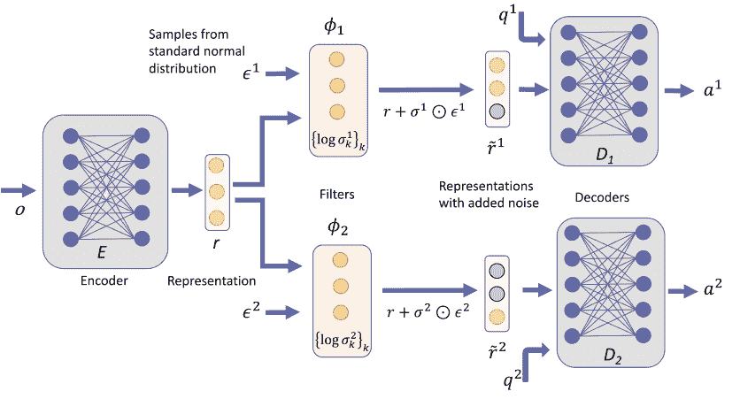

图9.2 网络架构用于学习操作上有意义的表示。 编码器接收一个观察值 $o$ 并输出一个表示 $r$。 （原则上，可以考虑多个编码器，但为简单起见，我们只使用一个）。 然后，对于每个解码器 $D_j$，将一个滤波器 $\phi_j$ 应用于表示，该滤波器向潜在神经元 $r_k$ 添加高斯噪声，标准差为 $\sigma_k^j$。 使用重参数化技巧[193]进行采样，即在网络的每次运行中，我们采样 $\epsilon^j \sim \mathcal{N}(0,1)$ 并将这些样本作为滤波器的输入。 然后，将值 $\tilde{r}_k^j = r_k + \sigma_k^j \epsilon^j$ 提供给解码器 $D_j$，其任务是输出对问题 $q^j$ 的响应。 图中的参数和解码器数量并不具有代表性。 从技术上讲，滤波器由可训练参数 $\{\log \sigma_k^j\}_k$ 描述。 如果滤波器 $\phi_j$ 向潜在神经元 $k$ 添加了大量噪声，则解码器 $D_j$ 基本上无法获取有关值 $r_k$ 通过 $\tilde{r}_k^j$ 传递给解码器 $D_j$ 的信息。 因此，这些神经元（在图中标记为灰色）被认为被 $\phi_j$ 过滤掉了，即解码器 $D_j$ 无法访问 $r_k^j$ 中包含的信息。

#### 盒子3：使用深度学习训练SciNet从实验数据中提取操作性概念（第9.3.2节）

- 目标：为给定的数据集 $\mathcal{D}$ 找到操作性概念表示，该数据集由形如 $(o, (q^1, q^2, \dots, q^n), (a^1, a^2, \dots, a^n))$ 的三元组组成，其中 $a^j \in \mathcal{A}_j$ 是问题 $q^j$ 给定观察 $o$ 的正确响应。
- 网络结构：如图9.2所示。我们用 $E$ 表示参数化的编码器映射： $E: \mathcal{O} \rightarrow \mathcal{R}$，用 $\phi_{\sigma_j}$ 表示滤波器： $[0,1]^n \times \mathcal{R} \rightarrow \mathcal{R}$，其中 $n$ 表示潜在神经元的数量 $\dim(\mathcal{R})$，用 $D_j$ 表示解码器映射： $\mathcal{R}_j \times \mathcal{Q}_j \rightarrow \mathcal{A}_j$。
- 成本函数：对于三元组 $x=(o, (q^1, \dots, q^n), (a^1, \dots, a^n))$ 和噪声样本 $\epsilon_k^j \stackrel{i.i.d.}{\sim} \mathcal{N}(0,1)$，解码器 $D_j$ 给出的答案为 $a^j=(a_1^j, \ldots, a_{\operatorname{dim}(\mathcal{A}_j)}^j)$，即 $a^j=D_j\left[\phi_{\sigma_j}(E(o) + \sigma_k^j \epsilon^j), q^j\right]$，成本由以下给出：
$$\mathcal{L}\left(x, \{\sigma^j\}_j\right)=\sum_j d\left[a^j, a^*(o, q^j)\right]-\beta \sum_k \log \left(\sigma_k^j\right) \quad (9.1)$$
对于一些（光滑的）距离度量 $d[\cdot, \cdot]$ 和一个调节好预测准确性和最小化每个解码器所需的潜在神经元数量之间权衡的超参数 $\beta$。
- 数据集的分割：我们将给定的数据集 $\mathcal{D}$ 分割为训练集、验证集和测试集。
- 训练过程：为了找到最小表示，我们从零个潜在神经元开始，逐渐增加潜在神经元的数量。对于每个潜在神经元的数量，我们使用训练数据和上述给出的代价函数训练网络，在优化超参数 $\beta$ 的同时，用验证数据验证预测的精度。如果我们达到几乎完美的精度，我们停止增加潜在神经元的过程。（更高效的方法在备注9.2中描述）。
- 测试：我们使用测试集评估经过训练的SciNet的预测损失。

实现过滤器 [23]。为了以平滑的方式训练一个filter，我们需要能够从filter的“on”状态平滑过渡到“off”状态。显然，如果filter对于一个潜在的神经元是“on”的，那么它的所有信息都会传递给解码器，在“off”状态下，不会将关于潜在神经元中存储的参数的任何信息传递给解码器。如果我们向潜在神经元添加噪声，我们可以平滑地调节关于潜在参数的信息量，这些信息将传递给解码器。

实际上，让我们正式考虑潜在神经元 $k$ 从高斯分布 $\mathcal{N}\left(r_k, \sigma_k^j\right)$ 中采样，其中 $r_k$ 是第 $k$ 个潜在神经元（来自编码器的输出），$\sigma_k^j$ 确定添加到潜在参数的噪声量，随后将其传递给解码器 $D_j$。对于解码器 $D_j$，$\sigma_k^j$ 的值具有以下含义：
- 1. 当 $\sigma_k^j$ 的值较大（相对于观测数据中第 $k$ 个潜在神经元的变化）时，意味着我们向第 $k$ 个潜在神经元的值 $r_k$ 添加了很多噪音。因此，解码器 $D_j$ 基本上无法获取关于 $r_k$ 的任何信息，我们认为这种情况下的解码器是一个不选择第 $k$ 个潜在神经元的过滤器。
- 2. 当 $\sigma_k^j$ 的值接近零时，意味着关于 $r_k$ 的所有信息都传递给了（解码器 $D_j$，因此该过滤器选择了这个潜在神经元。

尽管我们可以平滑地调节噪音，但我们必须在网络的每次运行中从高斯分布中进行采样。采样是一个非可微分的过程，涉及到描述编码器的权重和偏置的参数集合 $\Theta$。我们可以使用[193]中介绍的重参数化技巧（用于变分自动编码器）来解决这个问题：我们用辅助随机数 $\epsilon_k^j \sim \mathcal{N}(0,1)$ 作为神经网络的输入来替代采样操作。然后，应用于解码器 $D_j$ 的第 $k$ 个潜在变量，服从从 $\mathcal{N}(r_k, \sigma_k^j)$ 的分布，可以通过 $r_k + \sigma_k^j \epsilon_k^j$ 生成。使用向量表示，我们将解码器 $D_j$ 的完整过滤器输出表示为一个向量 $r + \sigma^j \odot \epsilon^j$，其中 $r = (r_1, \ldots, r_m)$，$\sigma^j = (\sigma_1^j, \ldots, \sigma_m^j)$ 和 $\epsilon^j = (\epsilon_1^j, \ldots, \epsilon_m^j)$ 表示 $m$ 个潜在变量，我们使用符号 “$\odot$” 表示逐元素乘法。采样 $\epsilon_k^j$ 不会干扰梯度下降，因为 $\epsilon_k^j$ 与可训练参数 $\Theta$ 是独立的。

请注意，在我们的实现中（图9.2），我们使用可训练参数作为过滤器的 $\log(\sigma_k^j)$ 而不是 $\sigma_k^j$，因为 $\log(\sigma_k^j)$ 可以取正实数或负实数值，而 $\sigma_k^j$ 必须始终为正。因此，这种替换简化了训练过程，因为我们不需要在每个训练步骤中确保这些值的正性。此外，$\sigma_k^j$ 的值在训练过程中可能变得非常大，而对数函数将这些值映射到一个合理的范围内。

用于最小化过滤器传输信息的成本函数。如定义8.8的第2项所述，我们希望最小化过滤器的“开启”状态数量，以最小化代理之间传递的信息（详见第8.4节对动机的详细解释）。通过上述实现，这转化为最小化 $-\sum_{j, k} \log(\sigma_k^j)$。事实上，这个成本项激励网络增加对潜在神经元的噪声，并与激励解码器输出正确预测的成本项竞争。完整的成本函数和训练过程的描述见方框3。

注9.2（最小化潜在神经元的总数）如果对于某个特定的 $k$，对于所有的 $j$，$\sigma_k^j$ 的值都很大，则第 $k$ 个潜在神经元的信息不会传递给任何解码器，因此可以忽略。由于我们希望找到一个最小的表示，我们希望所有解码器仍然能够输出准确预测的条件下，最大化未被任何解码器使用的潜在神经元的数量。成本函数项 $-\sum_{k, j} \log(\sigma_k^j)$ 并不一定激励SciNet去最小化潜在神经元的总数。

事实上，假设表示有两个潜在神经元 $r_l$ 和 $r_m$ 存储相同的信息，并且两个解码器 $D_i$ 和 $D_j$ 需要这个信息。那么，无论是将 $r_l$（或 $r_m$）的值传递给两个解码器，还是将 $r_m$ 传递给 $D_i$ 和 $r_l$ 传递给 $D_j$（或反之亦然），成本是相同的。为了最小化潜在神经元的数量，我们可以训练SciNet使用逐渐增加的潜在神经元数量（如第3框中所述），但这种方法计算成本高。或者，我们可以添加一个由 $\sigma_k^{\text{全局}}$ 参数化的全局过滤器，它在将潜在神经元发送到所有解码器特定的过滤器 $\phi_j$ 之前选择一定数量的潜在神经元。成本项 $-\sum_{k, j} \log(\sigma_k^j) - \gamma \sum_k \log(\sigma_k^{\text{全局}})$ 对于一些超参数 $\gamma$ 然后激励选择最小化潜在神经元的总数（通过激励全局过滤器选择将发送到解码器的神经元数量最小化）。

尽管这种方法非常高效，但在数值实验中，它比逐个增加潜在神经元的数量更不可靠，因为网络变得更难训练，并且更容易陷入次优局部最小值。尽管如此，该方法对于估计所需的潜在神经元数量非常有用。

从这个估计开始，可以逐步降低潜在神经元的数量，直到SciNet的预测准确性显著降低。当发生这种情况时，当前潜在神经元的数量加一很可能是所需的最小数量。

### 9.4 网络结构以简单的更新规则找到表示

在本节中，我们将描述如何根据[22]中描述的思想，通过一个简单的更新规则（参见定义8.9）来找到随时间演化的表示。回想一下，在一个编码器 $E$ 找到表示后，一个解码器 $D$ 被要求根据一个简单的更新规则 $u$（图8.4）在 $N_0$ 步中演化，并在回答问题 $\tilde{q}$ 之后进行。同样，使用神经网络来实现这个设置中的编码器和解码器是很直观的。为了加快训练过程，我们要求网络在每次应用更新规则后回答一个问题 $\tilde{q}$。因此，在每个训练步骤中，我们提出问题 $(0, \tilde{q}), \ldots, (t, \tilde{q})$（图9.3）。这为网络提供了更多的反馈，并帮助它更快地学习。

现在需要研究如何实现更新规则。假设函数 $u \in \mathcal{U}$ 是平滑的。我们需要区分两种技术情况：

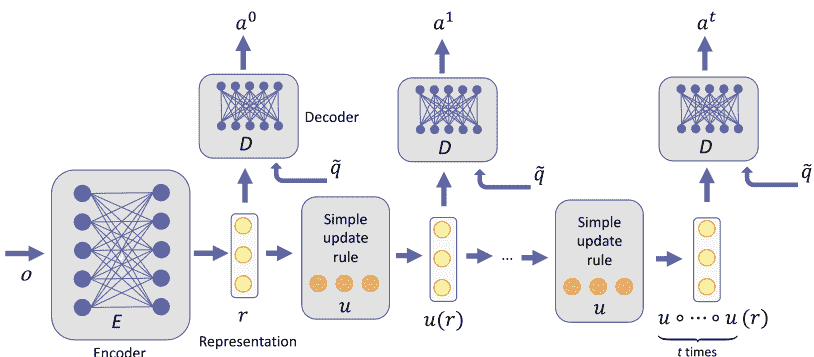

图9.3 网络架构，根据简单的更新规则演化表示。编码器将观测值 $o$ 映射到表示 $r$，从而允许使用简单的更新规则 $u$（可以将其视为在固定时间间隔内演化物理系统的表示）。解码器应该在每个步骤中正确回答问题 $\tilde{q}$。因此，问题集由元组 $(0, \tilde{q}), \ldots, (t, \tilde{q})$ 组成，其中元组的第一个元素确定了提问问题 $\tilde{q}$ 的步骤。解码器给出的答案用步骤编号标记为 $a^{0}, \ldots, a^{t}$。

关键是，在每个步骤中使用相同的解码器。在 $u$ 随时间演化系统的情况下，并且在 $\tilde{q}$ 在给定时间预测物理量的情况下，仅使用一个解码器意味着预测物理量的物理定律不随时间变化。图中所示的网络架构类似于递归神经网络的架构[194]。

- 1. 更新规则集 $\mathcal{U}$ 可以通过一组参数平滑参数化，即存在一个开连通参数集 $\Gamma \subset \mathbb{R}^l$（其中 $l \in \mathbb{N}$），使得对于任意 $r \in \mathbb{R}$，$u_{\gamma}(r) \in \mathcal{U}$ 依赖于 $\gamma \in \Gamma$，并且集合 $\{u_{\gamma}\}_{\gamma \in \Gamma}$ 和 $\mathcal{U}$ 一一对应。
- 2. 更新规则集不能平滑参数化。

在情况1下，我们可以通过神经网络的训练来传播梯度更新规则。因此，参数化的更新规则 $u_{\gamma}$ 可以被视为神经网络的一部分，其中参数 $\gamma$ 是可训练的参数，类似于人工神经元的权重和偏置。

情况2下的训练通常更加昂贵，并且在机器学习文献中有很多技巧可以将其映射回情况1。然而，如果对于给定的情况没有这样的技巧可用，解决情况2的一种蛮力策略是：对于每个 $u \in \mathcal{U}$，训练一个编码器和解码器来优化SciNet的预测准确性。如果找到一个 $u$，使得SciNet能够几乎完美地预测，那么问题就解决了。然而，如果 $\mathcal{U}$ 中有很多元素，这种策略在计算上变得难以处理。如果集合 $\mathcal{U}$ 可以被分成一小部分平滑可参数化的子集，那么可以通过类似情况1的策略分别处理这些子集。

#### 盒子4：使用简单的更新规则训练SciNet来学习表示，这些表示可以平滑地参数化（第9.4节）

- 目标：找到给定数据集 $\mathcal{D}$ 的表示，该数据集由形式为 $(o, [(0, \tilde{q}), \ldots, (t, \tilde{q})], [a^*(o, (0, \tilde{q})), \ldots, a^*(o, (t, \tilde{q}))])$ 的三元组组成，在步骤 $s \in \mathbb{N}_0$ 给定观察 $o$ 的情况下，$a^*(o, (s, \tilde{q}))$ 是问题 $\tilde{q} \in \mathcal{Q}$ 的正确回答。
- 网络结构：如图9.3所示。我们用 $E_{\Theta}: \mathcal{O} \rightarrow \mathcal{R}$ 表示参数化的编码器映射，用 $u_{\gamma}: \mathcal{R} \rightarrow \mathcal{R}$ 表示参数化的更新规则，用 $D: \mathcal{R} \times \mathcal{Q} \rightarrow \mathcal{A}$ 表示解码器映射。
- 成本函数：对于三元组 $x=(o, [(0, \tilde{q}), \ldots, (t, \tilde{q})], [a^*(o, (0, \tilde{q})), \ldots, a^*(o, (t, \tilde{q}))])$ 和解码器 $D$ 给出的答案为
$$a_s = D \underbrace{\left(u_{\gamma} \circ \cdots \circ u_{\gamma}\right)}_{s \text{ 次}} E_{\Theta}(o), \tilde{q},$$
成本由以下给出
$$\mathcal{L}(x)=\sum_{s} d\left[a_s, a^*(o, (s, \tilde{q}))\right]$$
对于某个（平滑的）距离度量 $d[\cdot, \cdot]$。
- 数据集的分割：我们将给定的 $\mathcal{D}$ 分割为训练集和测试集。
- 训练过程：为了找到最小表示，我们从零个潜在神经元开始，然后逐渐增加潜在神经元的数量。对于每个潜在神经元的数量，我们使用训练数据和上述成本函数训练网络（包括更新规则 $u_\gamma$）。如果我们达到几乎完美的精度，我们停止增加潜在神经元的过程。或者，我们可以尝试更高效的方法来找到最小参数数量，例如用于beta-VAE 的方法[49]（见附录B）。
- 测试：我们使用测试集评估经过训练的SciNet的预测损失。

### 9.5 表示的最优性保证

在前几节中，我们介绍了不同的方法来寻找“自然”的表示方式。然而，通常情况下，基于神经网络的方法不能保证找到最优表示。

尽管如此，可以事后检查表示的某些属性：

- 表示的充分性（通过检查测试数据上的预测准确性²）。
- 潜在参数的统计独立性（通过计算潜在参数的总相关性）。
- 表示允许简单的更新规则（通过在表示演化数个步骤后检查预测准确性）。

另一方面，测试以下属性更具挑战性：

- 表示的最小性。
- 滤波器的最优性，即在搜索操作上传递给解码器的参数数量的最小性（参见第9.3.2节）。

这些属性通过不需要更少参数的任何其他充分表示来定义。因此，要直接检查最小性，就必须将找到的表示与所有可能的表示进行比较，而这是无限多的。相反，可以例如减少潜在神经元的数量，并多次训练 SciNet。如果预测准确率保持较低，这表明我们开始时使用的潜在神经元数量是最小的。另一方面，研究潜在神经元之间的相关性以及改变其值对预测的影响可能有助于更好地理解找到的表示。

### 9.6 通过网络结构找到库普曼特征函数

作为数学上有意义的表示的例子，我们在第8.5节中考虑了允许线性动力学的表示。在库普曼算子的离散频谱情况下，可以将那里考虑的设置视为搜索具有简单更新规则的表示的特殊情况。因此，我们可以使用与第9.4节中介绍的相同方法，这些方法对应于本案例中使用的方法[183]。与第9.4节唯一的区别是我们正在搜索复数值表示。由于我们只能用（标准的）人工神经元表示实数值，我们用两个实数变量 $r_{2 i-1} \in \mathbb{R}$ 和 $r_{2 i} \in \mathbb{R}$ 表示复数值潜变量 $\tilde{r}_{i} \in \mathbb{C}$ 的实部和虚部。请回顾第8.5节，每对这样的变量对应于 $\mathcal{K}oopman$ 算子的特征函数 $\phi_{i}$ 的输出 $\phi_{i}(\cdot)$ 对于观测输入 $o_{i}$。此外，我们可以将特征函数 $\phi_{i}$ 的特征值写为 $\lambda_{i}=\exp \left[\left(\mu_{i}+\omega_{i i}\right) \Delta t\right]$，其中系数 $\mu_{i}, \omega_{i} \in \mathbb{R}$ 和离散（固定）时间步长 $\Delta t >0$，并分别表示堆叠的系数为 $\mu=\left(\mu_{1}, \ldots, \mu_{m}\right)$ 和 $\omega=\left(\omega_{1}, \ldots, \omega_{m}\right)$。然后，作用于（实数）潜表示 $r=\left(r_{1}, \ldots, r_{2 m}\right)$ 的 $\mathcal{K}oopman$ 算子 $\mathcal{K} \equiv \mathcal{K}(\mu, \omega)$ 由形式为 $\mathcal{B}\left(\mu_{i}, \omega_{i}\right)$ 的Jordan块组成。

$$
\mathcal{B}\left(\mu_{i}, \omega_{i}\right)=\mathrm{e}^{\mu_{i} \Delta t}\left[\begin{array}{ll}
\cos \omega_{i} \Delta t & -\sin \omega_{i} \Delta t \\
\sin \omega_{i} \Delta t & \cos \omega_{i} \Delta t
\end{array}\right] 。
$$

因此，我们找到了一种平滑参数化的更新规则集合 $\left\{u_{\gamma}\right\}_{\gamma \in \Gamma}=\{\mathcal{K}(\mu, \omega)\}_{\mu \in \mathbb{R}^{m}, \omega \in[0,2 \pi)^{m}}$。不再将 $\mu$ 和 $\omega$ 视为系数，可以允许它们依赖于更新之前的表示状态 $r$。如第8.5.2节所讨论的，这种依赖关系在[183]中进行了研究，以描述具有连续频谱的非线性系统的动力学。$\mu(r)$ 和 $\omega(r)$ 对 $r$ 的依赖关系可以简单地集成到图9.3中所示的网络结构中，通过添加一个神经网络，该网络将表示 $r$ 作为输入，并提供 $\mu$ 和 $\omega$ 作为输出。为了在特征函数坐标中实现圆对称性，可以将 $\|r\|^{2}$ 作为附加网络的输入，而不是 $r$ 本身[183]。

### 9.7 通过网络结构找到交互图

在第8.6节中，我们描述了动力系统的相互作用图。在这里，我们研究如何使用神经网络按照[184]中的方法找到这样的图形。

正如在第8.6节中所指出的，我们必须实现一个具有可变输入和输出大小的编码器。这样的编码器必须尊重所考虑系统的对象结构，否则它将无法从由 $k$ 个对象组成的系统推广到由 $k+1$ 个对象组成的系统。适用于图形结构输入的网络的一类网络是图神经网络（GNNs）[111, 198, 199]，将在下一节中介绍。

#### 9.7.1 图神经网络

图神经网络（GNNs）[111, 198, 199]允许处理图形结构作为输入，并已在广泛的应用中找到应用，例如用于预测化学性质[111]，用于控制和推理物理系统[184–186, 200–205]以及用于研究社交网络[206, 207]。它们的表达能力在 [208, 209] 中进行了研究。在本节中，我们对图神经网络进行简要介绍。图神经网络的结构细节非常灵活，在这里我们重点介绍[184]中使用的结构。所描述的结构可以用于推断由多个对象组成的动力系统的相互作用结构，假设存在一组有限的 $i$ 和 $j$ 之间的相互作用的离散嵌入 $h_i, h_j$。我们考虑具有顶点嵌入 $h_i$ 的图形。图神经网络的基本思想是根据图形结构多次更新这些嵌入，即嵌入 $h_i$ 的更新规则取决于相应顶点在图形中与其他顶点的连接方式。这样的更新规则可以被视为消息传递：$h_i$ 的相邻顶点将它们的信息发送给 $h_i$，后者根据接收到的信息按照某个规则更新其值。重要的是，这样的规则应该是可交换的，即更新后的值不依赖于消息处理的顺序。经过 $L$ 次这样的更新步骤，更新后的嵌入 $h_{i}^{L}$ 不仅包含有关顶点的信息，还包含有关图形结构的信息。例如，如果我们想要预测图形的二进制属性（例如完全连接性），可以将嵌入 $h_{i}^{L}$ 输入到神经网络中，并要求神经网络对图形进行分类。重要的是，只有当应用于嵌入 $h_i$ 的更新规则具有一定形式，使得结果嵌入 $h_{i}^{L}$ 包含有关图形的必要信息时，神经网络才能成功分类。有关图神经网络的更详细介绍，请参阅[210]。

在这里，我们对从观测数据中推断物体之间的相互作用类型感兴趣。因此，我们还考虑了具有标签 $i$ 和 $j$ 的顶点之间的边的嵌入。然后，更新规则分为两个步骤：$i) v \rightarrow e$：根据相邻顶点的值更新边的嵌入 $h_{i,j}$，并且 $ii) e \rightarrow v$：根据传入的边更新顶点的嵌入 $h_i$，其中 $\mathcal{N}_{i}=\{j\}$。更具体地说，我们考虑了更新规则[210]：

$$
\begin{aligned}
& v \rightarrow e: h_{i, j}^{l}=f_{e}^{l}\left(\left[h_{i}^{l}, h_{j}^{l}, y_{i, j}\right]\right), \\
& e \rightarrow v: h_{i}^{l+1}=f_{v}^{l}\left(\left[\sum_{j \in \mathcal{N}_{i}} h_{j, i}^{l}, y_{i}\right]\right).
\end{aligned}
$$

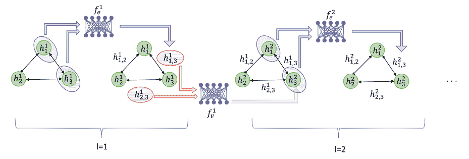

图9.4 图神经网络。图中显示了一个由三个顶点组成的全连接图，具有嵌入 $h^1_1, h^1_2$ 和 $h^1_3$。符号“$\leftrightarrow$”表示指向相反方向的两个有向边。应用于第一个图中的更新规则（9.3）用于获取边的嵌入 $h^1_{i,j}$，其中 $i, j \in \{1, 2, 3\}$ 且 $i \neq j$。请注意，为简单起见，我们仅显示 $i<j$ 的边 $h^l_{i,j}$。更新规则（9.3）将顶点 $h^1_1$ 和 $h^1_3$ 以及辅助顶点特征（未在图中显示）作为输入。然后，它将应用表示函数 $f_e^1$ 到输入中以获得边嵌入 $h^1_{1,3}$。其他边的嵌入类似地找到（未在图中显示）。然后，通过应用神经网络实现更新规则（9.4）$f_v^1$ 将顶点嵌入 $h^1_2$ 和 $h^1_3$，以及一些辅助边特征，以获得更新后的顶点嵌入 $h^{l+1}_{2,3}$。同样，其他顶点也以类似的方式进行更新。然后，这个过程重复 $L$ 次。

其中 $h_{i,j}^{l}$ 和 $h_{i}^{l+1}$ 是更新 $l$ 次后的边和顶点的嵌入，$y_{i,j}^{l}$ 和 $y_{i}^{l}$ 编码初始或辅助边和顶点特征，例如节点输入和边类型。图9.4展示了用于这些更新规则的GNN。在下一节中，我们将介绍如何使用这样的GNN从时间序列数据中学习对象之间的交互类型。

#### 9.7.2 通过网络结构学习交互图

在本节中，我们将介绍如何实现一个网络结构，以学习对象之间的交互类型，如第8.6节和[184]所述。我们首先构建一个使用GNN的编码器，将观察到的 $k$ 个对象映射到离散变量 $r_{i,j}$，表示交互类型。对于任何标签 $i$ 和 $j$，变量 $r_{i,j}$ 是 $c$ 个不同交互类型中的一个的独热编码。

**编码器**：我们使用一个GNN，其中更新规则在（9.3）和（9.4）中给出，用于编码器。我们从一个完全连接的图开始（参见图9.5）。我们使用一个前馈神经网络 $f_{emb}$ 来将观测值 $o_i$ 映射到顶点嵌入，即 $h^1_i = f_{emb}(o_i)$。然后，我们使用更新规则（9.3）和（9.4）（带有平凡的辅助特征 $y_{i,j}$ 和 $y_i$）来演化GNN进行 $L$ 步并获得 $h_{i,j}^{L}$ 作为输出。

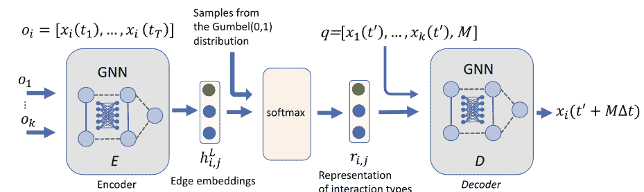

图9.5 用于寻找交互类型的网络结构。编码器是一个GNN，其更新规则在（9.3）和（9.4）中给出。它以 $k$ 个对象的时间序列作为输入，其中 $k$ 可能在不同的样本中变化，并提供边嵌入 $h_{i,j}^{L}$ 作为输出。边嵌入可以被视为参数化分布，我们从中采样连续近似的 one-hot 嵌入 $r_{i,j}$ 的交互类型。这种重新参数化技巧的随机输入由 Gumbel(0,1) 分布的独立同分布样本提供。然后，解码器被要求根据表示 $r$ 中编码的交互类型，从初始状态 $x_{i}\left(t^{\prime}\right)$ 开始演化所有对象的状态。因此，解码器被实现为一个GNN，其更新规则在（9.7）和（9.8）中给出。

让我们用符号 $\Theta$ 来表示描述GNN和编码映射的所有参数。为了将连续的输出变量 $h_{i, j}^{L}$ 解释为离散变量，我们在机器学习中使用了一种常见的技巧，即将 $\operatorname{softmax}\left(h_{i, j}^{L}\right)$ 视为对离散变量 $i, j$ 的分布 $q_{\Theta}\left(r_{i, j} \mid o\right)$。其中向量值函数 $\operatorname{softmax}(a)$ 对于一个 $n$ 维实向量 $a$ 的第 $i$ 个分量定义为：

$$
\operatorname{softmax}(a)_{i}=\frac{e^{a_{i}}}{\sum_{j=1}^{n} e^{a_{j}}} 。
$$

由于 $\sum_{i=1}^{n} \operatorname{softmax}(a)_{i}=1$，我们确实可以将 $\operatorname{softmax}(a)$ 的输出视为具有 $n$ 个不同值的离散变量的分布。

**采样**：由于我们从编码器的输出中获得了表示的分布，我们必须从中进行采样以提供给解码器作为输入。不幸的是，采样是一个在集合参数的非可微过程，因此不允许使用随机梯度下降训练GNNs。在第9.3.2节中，我们遇到了同样的问题，并通过重新参数化技巧[193]来解决。这个技巧的本质是用编码器的输出变量和具有固定分布的随机变量的可微函数替换采样过程。具有固定分布的随机变量的样本然后作为网络的输入提供。然而，由于离散状态的不连续性，这种重构对于离散随机变量不起作用。最近在[211]中考虑了解决这个问题的方法，其中建议用连续分布来近似离散分布，然后使用重新参数化技巧。更具体地说，我们从分布中抽取样本：

$$
r_{i, j}=\operatorname{softmax}\left(\frac{h_{i, j}^{L}+g}{\tau}\right)
$$

其中 $g \in \mathbb{R}^{c}$ 是从 Gumbel $(0,1)$ 分布中抽取的独立同分布样本向量，softmax 温度 $\tau$ 控制平滑的强度。Gumbel $(0,1)$ 分布由概率密度函数 $f(x)=\exp (-x-\exp (-x))$ 定义。请注意，对于 $\tau \rightarrow 0$，该分布收敛到我们分类分布的 one-hot 样本。

**解码器**：解码器将相互作用的表示 $r_{i,j}$ 作为输入，并且问题 $q=\left[x\left(t^{\prime}\right), M\right]$，其中 $x\left(t^{\prime}\right)=\left(x_{1}\left(t^{\prime}\right), \ldots, x_{k}\left(t^{\prime}\right)\right)$ 描述了时间 $t^{\prime}$ 时刻所有对象的状态，$M$ 是解码器应该使状态演变的时间步数，以固定的时间差 $\Delta t$。让我们用 $x_{i}^{0}, \ldots$ 表示解码器对于时刻 $t^{\prime}, t^{\prime}+\Delta t, \ldots, t^{\prime}+M \Delta t$ 预测的未来状态。对于第 $i$ 个对象，让我们初始化 $x_{i}^{0} =x_{i}\left(t^{\prime}\right)$ 对所有对象进行初始化。我们再次使用 GNN 作为解码器，每种类型的相互作用都有一个不同的神经网络。因此，我们稍微调整了更新规则[210]：

$$
\begin{aligned}
& v \rightarrow e: \tilde{h}_{i, j}^{c}=\sum_{s} r_{i, j, s} \tilde{f}_{e}^{s}\left(\left[x_{i}^{c}, x_{j}^{c}\right]\right), \\
& e \rightarrow v: x_{i}^{c+1}=x_{i}^{c}+\tilde{f}_{v}\left(\sum_{j \in \mathcal{N}_i} \tilde{h}_{j, i}^{c}\right),
\end{aligned}
$$

其中 $r_{i, j, s}$ 表示 $r_{i, j}$ 的第 $s$ 个元素。第一个更新规则确定了具有状态 $x_{i}^{c}$ 和 $x_{j}^{c}$ 的两个对象之间的相互作用。在表示 $r_{i, j}$ 为一个独热编码的情况下，其第 $d$ 个条目等于 1（即 $r_{i, j, a}=1$），只对输入状态应用一个解码器，并且我们有 $\tilde{h}_{i,j}=\tilde{f}_{e}^{a}\left(\left[x_{i}^{c}, x_{j}^{c}\right]\right)$。因此，每种相互作用类型确实有一个解码器。第二个更新规则接受了描述对象 $i$ 和 $j$ 在第 $c$ 个时间步的相互作用 $\tilde{h}_{j, i}^{c}$，并将系统的状态 $x_{i}^{c+1}$ 作为输出。

因此，应用这些更新规则 $M$ 次应该近似于物体的时间演化对于时间 $M \Delta t$。

**训练**：图9.5中显示的完整网络可以使用随机梯度下降进行训练。损失函数由两个项组成。预测损失为：

$$
\sum_{i=1}^{k} \sum_{c=1}^{T}\left\|x_{i}\left(t^{\prime}+c \Delta t\right)-x_{i}^{c}\right\|^{2}
$$

以及受变分自编码器成本函数（附录B）中KL项启发的损失项，由熵的总和给出[184]：

$$
\sum_{i<j} H(q_\Theta(r_{ij} | o))
$$


在本章中，我们将第9章的网络结构（简称为SciNet）应用于六个物理玩具系统的（模拟）观测数据，以找到它们的表示。结果表明，SciNet可以通过提供相关的物理参数来帮助恢复物理概念，无论是在量子还是经典力学的环境中。我们还展示了结果对实验数据中的噪声具有鲁棒性。

总结一下，在不提供任何关于所考虑的物理系统的先验知识的情况下，通过观测数据，我们发现：(i) 给定一个阻尼摆的位置时间序列，SciNet可以高精度地预测未来的位置，并且它使用相关参数，即频率和阻尼因子（这些参数是独立采样以生成训练数据的），分别在两个潜在神经元中设置激活，并将不必要的潜在神经元的激活设置为零；(ii) 给定一个非线性摆的角位移和角速度时间序列，SciNet会切换到一个随时间线性演化的表示；(iii) SciNet发现并利用守恒定律：它使用总角动量来预测两个碰撞粒子的运动；(iv) 给定来自一个简单量子实验的测量数据，SciNet可以用来确定未知量子系统的维度，并决定一组测量是否是全息完备的，即是否提供了关于量子态的完整信息。此外，混合量子态的操作意义上有意义的表示可以将表示中的局部自由度与非局部自由度分离开来；(v) 考虑来自带电粒子的不同实验的观测，SciNet在其操作意义上有意义的表示中分离了粒子的电荷和质量；(vi) 给定从地球观测到的太阳和火星的位置时间序列，SciNet切换到一个以太阳为参考的日心表示，即将数据编码为两个行星相对于太阳的平均偏近角；(vii) 给定一个盒子中几个粒子的位置和速度时间序列，其中一些粒子由弹簧连接，SciNet对粒子之间的相互作用进行分类，即SciNet的表示编码了两个粒子是否由弹簧连接。对于所有示例，训练网络的运行时间在标准笔记本电脑上最多几个小时。

### 10.1 动机

在第8章中，我们形式化了我们认为是一个“简单”表示物理系统的方式，并在第9章中描述了如何使用神经网络找到这样的表示方式。在本章中，我们将这些方法应用于几个示例并分析提取的表示方式。结果表明，SciNet能够在没有提供任何关于具体物理系统的先验信息的情况下，找到我们在物理教科书中用于描述不同环境的相同量。因此，我们对“简单”表示的形式化与物理学家喜欢用来描述数据的表示方式相符。

在所有的例子中，我们使用的训练数据是操作性的，可以从实验中生成，即正确的答案是根据实验观察得出的。在这里，我们使用模拟数据，因为我们只处理经过实验验证的经典和量子力学理论的预测，在相关领域中得到了很好的测试。有人可能会认为使用模拟数据会限制SciNet重新发现用于数据生成的理论。然而，特别是对于量子力学，我们有兴趣找到具有相同预测的概念上不同的理论表述。

本章考虑的具体例子是根据以下标准选择的：
- 需要存储在表示中的参数总数较小（即大约5个实数参数）。
- 这些例子应该展示在第8.4节中定义的不同标准的表示的“有用性”。
- 由于我们的长期目标是应用第9章的方法来更好地理解量子力学，我们还考虑了包括量子系统的例子。
- 我们专注于表示包含概念上有趣信息的例子。

第一个标准纯粹是技术性的，确保表示的解释不会变得太麻烦，并且在标准笔记本电脑上训练神经网络不会花费太长时间。更多的例子，例如使用火焰视频记录作为观察，可以在[192]中找到。

从机器学习的角度来看，所有考虑的例子都同样具有挑战性。Tensorflow库[212]使得设置网络结构非常简单。通常，我们使用由两个隐藏层组成的编码器和解码器，每层约有200个神经元（有关详细信息，请参见表C.1）。对于所有以下的例子，这种规模的网络能够很好地近似编码和解码映射。剩下的困难是找到一个“好”的选择。

^1^ 例如，可以将时间序列的位置视为非操作数据，但使用视频记录代替，因为这样的观察类似于人类用眼睛感知的观察。虽然这是一个有效的论点，但在本章考虑的示例中，使用视频数据作为观察概念上并没有增加任何内容，但会使神经网络训练变得复杂。

^2^ 选择网络大小的一种简单方法如下：从一个小的网络大小开始（具有足够的潜在神经元），并将其训练为仅最小化预测损失。如果预测准确率保持较低，增加网络的大小。连续进行，直到可以达到良好的预测准确率。（如果即使对于大型网络，预测准确率仍然较低，输入数据可能不包含足够的信息）。

### 10.2 阻尼摆

对于诸如成本函数9.1中出现的参数 $\beta$ 等超参数的选择，重要的是不需要知道所考虑的物理系统的最小表示（参见方框2和3）。尽管如第9.5节所讨论的那样，第9章介绍的方法不能保证找到“最优”表示，但它们在以下示例中总是找到它们（没有基于 SciNet是否有效进行后选择示例，即我们没有根据SciNet是否有效进行后选择示例）。

在[22]的研究基础上，我们考虑了一个经典物理学的简单例子，即阻尼摆，详见第5节。系统的时间演化由微分方程 $-\kappa x - b \dot{x} = m \ddot{x}$ 给出，其中 $\kappa$ 是弹簧常数，决定振动的频率，$b$ 是阻尼因子。我们保持质量 $m$ 恒定（它是可以通过定义 $\kappa' = \kappa/m$ 和 $b' = b/m$ 来吸收的缩放因子），因此 $\kappa$ 和 $b$ 是唯一的可变参数。在这里，我们考虑阻尼较弱的情况，运动方程的解见第5节。

我们通过均匀采样弹簧常数 $\kappa$ 和阻尼因子 $b$ 来生成训练数据。因此，我们期望一个统计独立的表示（定义8.3）可以恢复这些参数。我们选择了一个具有3个潜在神经元的SciNet网络结构。作为输入，我们提供了摆的位置的时间序列，并要求SciNet预测未来某个时间点的位置（详见第5节）。训练过程详见第1节，基于beta-VAE [49]。训练后，SciNet给出的预测准确性在图10.1a中有所展示。在没有给出任何物理概念的情况下，SciNet学会从（模拟的）时间序列数据中提取摆的x坐标的两个相关物理参数，并将它们存储在潜在表示中。如图10.1b所示，第一个潜在神经元几乎线性依赖于 $b$，并且几乎与 $\kappa$ 无关，而第二个潜在神经元仅与 $\kappa$ 相关，同样几乎线性。事实上，更加定量地，使用[213-215]中介绍的方法并在[216]中实现，估计两个潜在神经元之间的总相关性 $C(R_1, R_2)$（在这种情况下对应于互信息），我们发现 $C(R_1, R_2) = 0.107$，而完全相关的潜在神经元的 $C(R_1, R_1) = 10.95$。我们得出结论，SciNet恢复了物理学家使用的相同的与时间无关的参数 $b$ 和 $\kappa$。第三个潜在神经元几乎是常数，不提供任何额外的信息，换句话说，SciNet认识到两个参数足以编码这种情况。

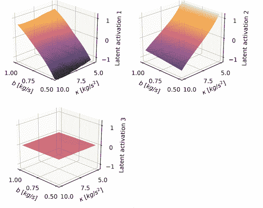
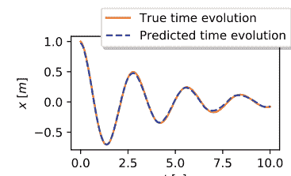

图10.1 阻尼摆（图取自Iten和Metger等人的《物理评论快报》，2020年[22]）。SciNet接收阻尼摆轨迹的时间序列。它学会将频率和阻尼这两个相关的物理参数存储在表示中，并对摆的未来位置进行正确预测。SciNet的轨迹预测。在这里，弹簧常数为$\kappa=5$ kg/s$^2$，阻尼因子为$b=0.5$ kg/s。SciNet的预测与真实的时间演化非常吻合。SciNet学到的表示。这些图显示了SciNet的三个潜在神经元的激活与弹簧常数$\kappa$和阻尼因子$b$的关系。前两个神经元分别存储阻尼因子和弹簧常数。第三个神经元的激活接近于零，这表明只需要两个物理变量。在抽象层面上，学习将一个激活设置为常数是通过搜索不相关的潜在变量来鼓励的，即通过在训练过程中最小化潜在神经元的共同信息。

#### 盒子5：阻尼摆的时间演化[22]（第10.2节）

问题：预测一维阻尼摆在不同时间的位置。
物理模型：运动方程：$m\ddot{x} = -\kappa x - b\dot{x}$。
解： $x(t) = A_0 e^{-\frac{b}{2m}t}\cos(\omega t+\delta_0)$，其中$\omega=\sqrt{\frac{\kappa}{m}}\sqrt{1-\frac{b^2}{4m\kappa}}$ 。
观测： 位置的时间序列： $o=[x(t_i)]_{i\in\{1,\dots,50\}} \in \mathbb{R}^{50}$，等间距的$t_i \in [0,5]\,\text{s}$。 质量$m=1\,\text{kg}$，振幅$A_0=1\,\text{m}$和相位$\delta_0=0$固定；弹簧常数$\kappa \in [5,10]$ kg/s$^2$和阻尼因子$b \in [0.5,1]$ kg/s 在数据创建过程中独立且均匀采样。
问题：预测时间 $t_{\text{pred}} \in [0,10]\,\text{s}$ 的正确答案。
正确答案： 在时间$t_{\text{pred}}$时刻的位置 $a \in \mathbb{R}$。
网络结构： 基本上是图9.1中所示的网络，具有三个潜在神经元（有关网络结构的详细描述请参见附录B）。网络大小可以在表C.1中找到。
训练： 在表C.2中给出的参数下，按照方框2中的描述进行。
主要发现：
- SciNet预测位置$x(t_{\text{pred}})$的均方根误差低于$2\%$ （相对于振幅 $A_0=1\,\text{m}$） （图10.1a）。
- SciNet将$\kappa$和$b$存储在两个潜在神经元中，并且不在第三个潜在神经元中存储任何信息 （图10.1b）。因此，它找到了一个统计独立的表示。

### 10.3 非线性摆的动力学

在本节中，我们演示了数学先验知识如何集成到 SciNet 的网络结构中，以帮助研究非线性摆的动力学行为。非线性摆的角位移 $\theta$ 满足微分方程 $\ddot{\theta}=-\omega_{0}^{2} \sin (\theta)$，其中 $\omega_{0}=\sqrt{g / l}$，其中 $g$ 是重力加速度， $l$ 表示摆长。这个微分方程有复解析解，2007年用雅可比椭圆函数描述[217]。库普曼算子理论采用了一种不同的方法，通过寻找 $(\theta, \dot{\theta})$ 的坐标变换，使得变换后的坐标允许进行线性时间演化（见第8.5节）。在这里，我们描述了[183]中的结果，展示了 SciNet如何用于找到这样的坐标变换。

SciNet的训练数据是通过从区间[-0.5,0.5]中采样 $\theta$ 和 $\dot{\theta}$ 生成的。SciNet 的网络结构具有2个潜在神经元，详见第9.6节。作为SciNet的输入，我们提供起始时间的角度和角速度，并要求SciNet预测这些量的时间演化（详见第6框中的细节）。训练过程与第4框中描述的类似，详见[183]中的细节。

### 框6：非线性摆的时间演化[183]（第10.3节）

问题：预测一维非线性摆在不同时间点的角度和角速度。
物理模型：运动方程：$\ddot{\theta}=-\omega_{0}^{2} \sin (\theta)$，其中 $\omega_{0}=1\,\text{s}^{-1}$。
解决方案：可以通过雅可比椭圆函数 [217] 来推导出解析解。
用于神经网络训练和评估的数据集是通过在MATLAB中使用ode45求解运动方程得到的，使用了固定时间步长为 0.02秒。
观察: $\theta_{0}, \dot{\theta}_{0} \in[-0.5,0.5]$ 。
问题：隐式。
正确答案：时间序列 $\left[a_{0}, \ldots, a_{n}\right]=\left[\left(\theta\left(t_{0}\right), \dot{\theta}\left(t_{0}\right)\right), \ldots,\left(\theta\left(t_{n}\right), \dot{\theta}\left(t_{n}\right)\right)\right]$ 共有50个观测值，时间步长固定为0.02秒。
网络结构：本质上，网络结构如图9.3所示，具有两个潜在神经元和形式化的更新规则
$$u_{\mu, \omega}\left(r_{1}, r_{2}\right)=\mathrm{e}^{\mu \Delta t}\left[\left(\cos (\omega \Delta t) r_{1}-\sin (\omega \Delta t) r_{2}\right), \sin (\omega \Delta t) r_{1}+\cos (\omega \Delta t) r_{2}\right]$$
其中 $\mu$ 和 $\omega$ 作为额外神经网络的输出给出，该神经网络接受 $r_{1}^{2}+r_{2}^{2}$ 作为输入（以强制在特征函数坐标中实现圆对称性）。网络大小可以在[183]中找到。
训练：与第4框中描述的类似。（详见[183]中的细节）。
主要发现：
- SciNet找到了线性化非线性摆动动力学的坐标（见图10.2）。
- 随着摆动能量的增加，频率 $\omega$ 持续减小（见图10.2）。

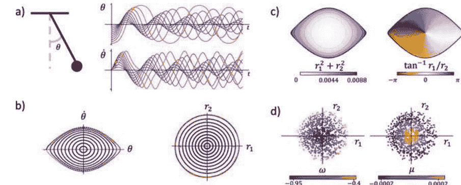

图10.2 非线性摆动（图像来源：Lusch等人，Nature Communications 2018，[218]）。该图展示了来自[183]的结果，其中SciNet应用于非线性摆动的观测数据（详见第6节）。SciNet学习准确预测非线性摆动的时间演化（图10.2a），并找到一个由编码器E实现的坐标变换 $(\theta, \dot{\theta}) \rightarrow (r_1, r_2)$，该变换表示Koopman特征函数（在图10.2c中表示）并将角位移和速度映射到坐标$(r_1, r_2)$，这些坐标随时间按照更新规则 $u_{\mu,\omega}$ 演化：$\exp(\mu t)([\cos(\omega t)r_1-\sin(\omega t)r_2, \sin(\omega t)r_1+\cos(\omega t)r_2])$。图10.2b显示了SciNet对$\theta$和$\dot{\theta}$的预测以及对应的$r_1$和$r_2$的十个初始条件的值，这些值在时间演化直到相对预测误差达到10%。参数$\mu$和$\omega$对$r_1$和$r_2$的更新规则的依赖关系显示在图10.2d中。请注意，如果摆动的振幅增加，频率$\omega$会减小，而阻尼因子$\mu$保持近似恒定。

结果呈现在图10.2中，并取自[183]。SciNet能够高精度地预测非线性摆的时间演化。此外，它还找到了从$(\theta, \theta')$到$(r_1, r_2)$的坐标变换，使得表示$(r_1, r_2)$按线性动力学演化。更具体地说，编码器实现了允许特征值连续依赖于$r_1^2+r_2^2$的Koopman特征函数。特征值的变化使得能够以优雅且可解释的方式处理非线性摆的连续谱。如图10.2所示，SciNet正确地识别了频率$\omega$与摆的能量之间的依赖关系。

### 10.4 角动量守恒

物理学中最重要的概念之一是能量和角动量守恒等守恒定律。尽管它们与对称性的关系使得它们对物理学家本身就很有趣，但守恒定律也具有实际重要性。如果两个系统以复杂的方式相互作用，我们可以使用守恒定律从一个系统的行为预测另一个系统的行为，而无需研究它们相互作用的细节。对于某些类型的问题，守恒量因此充当了多个系统共同属性的压缩表示。

我们考虑在[22]中讨论的散射实验，如图10.3所示，并在第7节中描述，其中两个点状粒子碰撞。给定两个粒子的初始角动量和其中一个粒子的最终轨迹，物理学家可以使用总角动量守恒预测另一个粒子的轨迹。

为了确定SciNet是否像物理学家那样利用角动量守恒，我们使用(模拟的)实验数据对其进行训练，如第7节所述，使用一个潜在神经元，并添加高斯噪声以显示编码和解码的稳健性。事实上，SciNet正是物理学家所做的，并将总角动量存储在潜在表示中(图10.3b)。这个例子表明SciNet可以恢复守恒定律，并暗示它们自然地从压缩数据和询问多个系统的共同属性中产生。

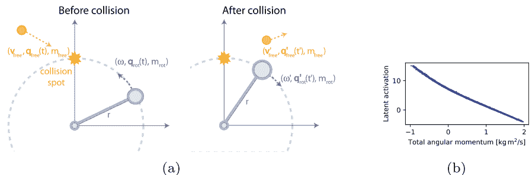

图10.3 在角动量守恒下的碰撞（图像来源于Iten和Metger等人的《物理评论快报》，2020 [22]）。在一个经典力学的场景中，总角动量是守恒的，神经网络学习将这个量存储在潜在表示中。一个物理设置。一个质量为$m$的物体固定在一个长度为$r$（质量可忽略）的杆上，以角速度$\omega$绕原点旋转。一个质量为$m_{\text{free}}$的自由粒子以速度$v_{\text{free}}$运动，并与旋转的物体在位置$q=(0,r)$发生碰撞。碰撞后，旋转粒子的角速度为$\omega'$，自由粒子被偏转并具有速度$v'_{\text{free}}$。由SciNet学习到的表示。潜在神经元的激活与总角动量的关系。SciNet学习存储系统的总角动量，这是一个守恒量。

#### 盒子7：角动量守恒的两体碰撞[22]（第10.4节）

问题：预测一个固定在半径为r的杆上（绕原点旋转）的粒子在与一个自由粒子（在二维空间中，参见图10.3a）在点（0，r）发生碰撞后的位置。
物理模型：根据碰撞前的总角动量和碰撞后自由粒子的速度，可以通过角动量守恒计算碰撞后旋转粒子在时间t'（碰撞后）的位置。
$J = m_{\text{rot}} r^2 \omega - m_{\text{free}} v_{\text{free}} x = J'$
观察：时间序列：两个粒子之间碰撞之前：$o = [ (t_i^{\text{rot}}, q_{\text{rot}}(t_i^{\text{rot}})), (t_i^{\text{free}}, q_{\text{free}}(t_i^{\text{free}})) ]_{i\in\{1,\dots,5\}}$，具有时间$t_i^{\text{rot}}$和$t_i^{\text{free}}$ 每个训练样本中都随机选择。质量$m_{\text{rot}} = m_{\text{free}} = 1\,\text{kg}$，轨道半径$r = 1\,\text{m}$固定；初始角速度$\omega$，初始速度$v_{\text{free}}$，第一个分量的$q_{\text{free}}(0)$和最终速度$v'_{\text{free}}$在训练样本中变化。所有位置输入都添加了高斯噪声($\mu = 0$, $\sigma = 0.01\,\text{m}$)。
问题：预测碰撞后自由粒子的时间和位置： $q = (t'_{\text{pred}}, [t'_i, q'_{\text{free}}(t'_i)]_{i\in\{1,\dots,5\}})$。
正确答案：时间$t'_{\text{pred}}$时旋转粒子的位置：$a^* \doteq q_{\text{rot}}(t'_{\text{pred}})$。
网络结构：图9.1中所示的网络，具有一个潜在神经元，并在表C.1中给出了具体规格。
训练：在方框1中描述，参数在表C.2中给出。
主要发现：
- SciNet预测旋转粒子的位置，均方根预测误差低于4%（相对于半径$r = 1\,\text{m}$）。
- SciNet对噪声具有抗干扰能力。
- SciNet将总角动量存储在潜在神经元中。

### 10.5 量子比特的表示

量子态重构是一个活跃的研究领域[219]。理想情况下，我们寻找一个量子系统状态的忠实表示，例如波函数：一种存储了预测该系统上任意测量结果概率所需的所有信息的表示。然而，为了指定一个量子系统的忠实表示，并不需要对系统进行所有理论上可能的测量。如果一组测量足以重构完整的量子态，这样的一组测量被称为完全重构。

在这里，我们讨论了来自[22, 23]的结果，这些结果表明，仅基于（模拟的）实验数据，并且没有给出任何关于量子理论的假设，SciNet可以恢复出小型量子系统状态的忠实表示，并且可以进行准确的预测。特别地，这使我们能够推断系统的维度，并区分完全和不完全的测量集。此外，SciNet可以根据局部条件分离表示中的参数（在图9.2中所示的表示中），并最终得到与[220]中给出的两个量子比特的类似表示。方框8和9总结了设置和结果。

n个量子比特上的纯态可以用一个归一化的复向量 $|\psi\rangle\in\mathbb{C}^{2^n}$ 来表示，其中两个状态 $|\psi\rangle$ 和 $|\psi'\rangle$ 仅当它们相差一个全局相位因子时，即存在 $\phi\in\mathbb{R}$ 使得 $|\psi\rangle=e^{i\phi}|\psi'\rangle$。归一化条件和全局相位因子的无关性使得量子态的自由参数减少了两个。由于复数有两个实参数，单比特态由 $2\times2-2=2$ 个实参数描述，而两比特态由 $2\times2\times2-2=6$ 个实参数描述。

#### 盒子8：纯一比特态和两比特态的表示[22]（第10.5.1节）

问题：对于任意纯比特态 $|\omega\rangle\langle\omega| \in \mathbb{C}^{2^n}$ 和 $|\psi\rangle \in \mathbb{C}^{2^n}$，预测进行任意二元投影测量时的测量概率。
物理模型：对于状态 $|\psi\rangle \in \mathbb{C}^{2^n}$ 进行测量 $|\omega\rangle\langle\omega| \in \mathbb{C}^{2^n \times 2^n}$，测量结果为0的概率由 $p(\omega,\psi)=|\langle\omega|\psi\rangle|^2$ 给出。
观察：从实验数据中提取物理概念的深度学习操作参数化状态 $|\psi\rangle$: $o=[p(\alpha_i,\psi)]_{i\in\{1,\dots,n_1\}}$ 对于一组固定的随机二进制投影测量 $M:=\{|\alpha_1\rangle\langle\alpha_1|, \dots, |\alpha_{n_1}\rangle\langle\alpha_{n_1}|\}$ ($n_1=10$ 对于一个量子比特，$n_1=30$ 对于两个量子比特)。
问题：通过其在一组固定的随机态上的结果概率来操作参数化测量 $|\omega\rangle\langle\omega|$: $q=[p(\beta_i,\omega)]_{i\in\{1,\dots,n_2\}}$ 通过其在一组固定的随机态上的结果概率来操作参数化测量 $S:=\{|\beta_1\rangle, \dots, |\beta_{n_2}\rangle\}$ ($n_2=10$ 对于一个量子比特，$n_2=30$ 对于两个量子比特)。
正确答案：$a^*(\omega,\psi)=p(\omega,\psi)=|\langle\omega|\psi\rangle|^2$。
网络结构：图9.1中所示的网络，具有不同数量的潜在神经元，并且在表C.1中给出了具体规格。
训练：在方框1中描述，参数在表C.2中给出。
主要发现：
- SciNet可以用来确定描述状态 $|\psi\rangle$ (见图10.4) 所需的最小参数数量，而不需要提供任何关于量子物理的先验知识。
- SciNet可以区分完全和不完全的测量集合 (见图10.4)。

更一般地，我们还可以考虑混合量子态，它可以被视为纯量子态的（经典）概率混合。形式上，我们用正半定矩阵 $\rho\in\mathbb{C}^{2^n \times 2^n}$ 来描述“量子比特的混合量子态”，其中 $\rho$ 的迹为单位。由于任何正半定矩阵 $\rho$ 都存在具有实特征值的特征分解，我们可以写成 $\rho=\sum_{i=1}^{2^n} p_i |\psi_i\rangle\langle\psi_i|$。由于 $\rho$ 的迹为单位，我们可以将 $\rho$ 视为一个概率纯态 $|\psi_i\rangle$ 的混合。纯态 $|\psi\rangle$ 可以被视为密度矩阵 $\rho=|\psi\rangle\langle\psi|$ 的一种特殊情况，其中只有一个特征值等于一。有关量子态形式主义的更多详细信息和更深入的介绍，请参阅[72]。

^3^ 记号 $|\cdot\rangle$ 和 $\langle\cdot|$ 在量子力学中很常见，被称为“布拉-凯特”记号。读者可以将凯特矢量 $|\cdot\rangle$ 视为行向量，其中布拉矢量 $\langle\cdot|$ 被视为列向量。此外，从 $\langle\psi|$ 的条目是 $|\psi\rangle$ 的共轭转置条目。

在这里，我们考虑对$n$个量子比特进行二进制投影测量。这些测量是形如$|\omega\rangle\langle\omega|$的算符，完全由向量$|\omega\rangle \in \mathbb{C}^{2^n}$描述，其中测量结果以$0$表示对$|\omega\rangle$的投影，以$1$表示其他情况。当在纯态$|\psi\rangle$上测量$|\omega\rangle\langle\omega|$的结果为$0$的概率由$p(\omega, \psi) = |\langle\omega|\psi\rangle|^2$给出，其中$\langle\cdot|\cdot\rangle$表示$\mathbb{C}^{2^n}$上的标准内积。更一般地，当在混合态$\rho$上测量$\omega$的结果为$0$的概率由$p(\omega, \rho) = \text{tr}(|\omega\rangle\langle\omega| \rho)$给出。注意，这与纯态情况下$\rho = |\psi\rangle\langle\psi|$的概率一致。

为了生成SciNet的训练数据，我们假设一个代理$B$可以访问由两个设备组成的准备实验。第一个设备创建（许多个）依赖于设备上的刻度和按钮设置的量子系统状态$\rho$。第二个设备可以在集合$\mathcal{M}$中执行任何二元投影测量，其中$\mathcal{M}:= \{ |\alpha_1\rangle\langle\alpha_1|, \dots, |\alpha_{n_1}\rangle\langle\alpha_{n_1}| \}$。我们希望使用这些测量结果来确定量子系统的状态。代理$B$在相同的量子态$\rho$上多次对$\mathcal{M}$中的所有测量进行估计，以估计测量结果为$0$的概率$p(\alpha_i, \rho)$。这些概率构成了提供给SciNet的观测数据。

基于代理$B$收集到的数据的表示，要求代理$C_j$预测测量结果$\mathcal{Q}^j$。为了对测量进行参数化$|\omega_j\rangle\langle\omega_j|$，我们从集合中选择$|\omega_j\rangle\langle\omega_j|$。我们选择一组状态：
$$\mathcal{S}^j := \left\{ |\beta_1^j\rangle, \dots, |\beta_{n_2}^j\rangle \right\}.$$
概率$p(\omega_j, \beta_1^j), \dots, p(\omega_j, \beta_{n_2}^j)$作为问题输入提供给代理$C_j$。然后代理$C_j$必须预测在执行测量$|\omega_j\rangle\langle\omega_j|$时状态$\rho$上得到结果$0$的概率$p(\omega_j, \rho)$。

**备注 10.1** 我们可以通过任何对实验设置自然的参数化来参数化可能测量的集合，例如实验装置上的刻度和按钮的设置。假设这样的自然参数化完全确定了测量，即在实验装置上相同的设置将始终导致执行相同的测量。

因为$\mathcal{S}$仅代表我们对测量设置参数化的选择，自然可以假设$\mathcal{S}$包含足够的状态来完全描述所有$\mathcal{Q}^j$中的测量。

### 10.5 量子比特的表示

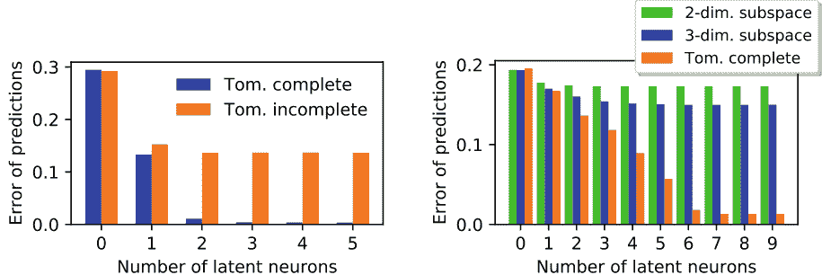

(a) One qubit.
(b) Two qubits.

图10.4 量子层析成像（图取自Iten和Metger等人的《物理评论快报》，2020年[22]）

SciNet接收一个或两个量子比特的层析数据和一个操作描述，将测量作为问题输入，并预测该测量的结果概率。我们使用完整和不完整的层析测量集对SciNet进行训练，并发现在给定完整层析数据的情况下，SciNet可以用来找到描述量子态所需的最小参数数量（一个量子比特需要两个参数，两个量子比特需要六个参数）。可以识别出层析不完整的数据，因为在这种情况下，SciNet无法达到完美的预测准确性，而预测准确性可以作为层析不完整集提供的信息量的估计。图中显示了SciNet对测试数据的测量预测的均方根误差与潜在神经元数量的关系。

测量的完备性是否通过层析成像完成？更具体地说，我们使用图9.1中所示的SciNet网络结构和方框3中描述的训练过程，找到表示量子态所需的最小参数数量。

如果对于任何潜在神经元数量，预测准确率都很低，我们可以得出结论：所提供的观测数据不包含足够的信息，这意味着在考虑的情况下，测量集$\mathcal{M}$是层析不完备的。如何在表示中操作分离参数在第10.5.2节中进行讨论。

我们考虑一个代理$B$对纯量子态$|\psi\rangle$进行测量，并且有一个代理$C:=C_1$被要求预测在测量$|\omega\rangle\langle\omega|$时测量到$0$的概率$p(\omega, \psi)$。我们使用不同的一对$(|\omega\rangle\langle\omega|, |\psi\rangle)$对训练SciNet，对于一比特和两比特的选择，保持测量集$\mathcal{M}$和$\mathcal{S}:=\mathcal{S}_1$不变。我们选择单比特情况下$n_1=n_2=10$，两比特情况下$n_1=n_2=30$。设置在方框8中总结。

结果显示在图10.4中。通过改变潜在神经元的数量，我们可以观察到随着参数在表示$|\psi\rangle$中的增加，预测质量的改善。为了减小由网络随机初始化引起的统计波动，每个网络规格被训练三次，并选择在测试数据上具有最低均方预测误差的运行结果。

对于完全经过层析成像的情况，在一比特和两比特的情况下，当潜在神经元的数量增加到两个或六个时，图10.4中的曲线显示出预测误差的下降。^4这与描述一比特或两比特状态所需的参数数量相符。因此，SciNet允许我们从完全经过层析成像的测量数据中提取出潜在量子系统的维度，而无需任何关于量子力学的先验信息。

SciNet还可以用来确定测量集$\mathcal{M}$是否在层析成像是完整的。为了生成层析成像不完整的数据，我们从所有二进制投影测量的子集中随机选择$\mathcal{M}$中的测量。具体来说，与$\mathcal{M}$中的测量对应的量子态被限制为随机实数线性叠加的$k$个正交态，即一个（实数）$k$维子空间。对于单比特，我们使用二维子空间；对于两个比特，我们考虑二维和三维子空间。

对于关于状态$|\psi\rangle$的层析成像不完整数据，无论潜在神经元的数量如何，SciNet都无法完美预测最终测量的结果，与层析成像完整情况相反（见图10.4）。因此，我们可以从SciNet的输出推断出$\mathcal{M}$是一个不完整的测量集。此外，这种分析为层析成像不完整测量提供了定性的信息度量：在两比特情况下，将子空间维度从二增加到三会提高预测准确性，并且所需的潜在神经元数量增加。

**备注 10.2** （高效表示多体系统的状态）由于多体波函数编码粒子之间的非平凡相关性的指数复杂性，量子多体系统的描述具有挑战性。在[222-236]中，神经网络被用于高效表示量子多体系统的状态，找到它们的基态甚至模拟它们的酉时间演化。特别地，在[223]中，变分自编码器被用于近似特定量子态的测量结果分布，对于固定的测量基，神经网络的大小可以提供状态复杂性的估计。相比之下，本节介绍的方法不专注于给定量子态的高效表示，也不是专门设计用于学习量子系统的表示。然而，SciNet可以用于生成任意简单量子系统状态的表示，而无需重新训练。

对于单个量子比特，从两个到三个潜在神经元的转变会有一个额外的小改进：这是一个技术问题，因为任何两参数表示都包括一个循环参数，例如布洛赫球表示，这个参数无法被连续编码器准确表示（见附录D）。同样的情况可能适用于两个量子比特，从$6$个到$7$个潜在神经元。这个限制也使得解释学习到的表示细节变得困难。最近的研究[221]通过使用流形理论将流形分割成部分，对其中具有连续编码的部分进行处理来解决这个问题。虽然这项工作在技术上非常有用，但在概念层面上并没有详细讨论，因此在这里不做过多讨论。

#### 10.5.1 纯量子态的最小表示

如[22]所述，我们在上述量子环境中使用SciNet来找到描述一个和两个量子比特上的纯量子态所需的实参数的数量。此外，我们还展示了如何使用SciNet来确定一个集合

#### 10.5.2 两比特态的局部表示

在上一节中，我们研究了描述（纯）量子态所需的参数数量。现在让我们按照[23,237]中的方法，以一种在操作上有意义的方式分离表示（混合）双量子比特态$\rho$的参数，正如第8.4.2.2节中所描述的那样。更具体地说，我们使用图9.2中所示的SciNet网络结构和方框3中描述的训练过程。

**方框 9：双量子比特态的局部表示[23]（第10.5.2节）**

- **问题**：三个代理$C_1$，$C_2$和$C_3$需要预测对两个量子比特进行二元投影测量的测量概率。因此，代理$C_1$和$C_2$被问及关于第一个和第二个量子比特的测量输出概率的问题，而代理$C_3$被要求预测两个量子比特的联合测量输出概率。
- **物理模型**：测量状态$\rho$的概率为$p(\omega, \rho) = \text{tr}(|\omega\rangle\langle\omega| \rho)$。
- **观察**：状态$\rho$的操作参数化为$o=[p(\alpha_i, \rho)]_{i \in \{1,\dots,n\}}$。对于一组固定的随机二元投影测量$\mathcal{M} := \{|\alpha_1\rangle\langle\alpha_1|, \dots, |\alpha_{75}\rangle\langle\alpha_{75}|\}$。
- **问题**：测量的操作参数化（见备注10.1）。
  $|\omega_j\rangle\langle\omega_j|$: $q^j=[p(\beta^j_i, \omega_j)]_{i \in \{1,\dots,75\}}$通过对固定随机状态集的结果概率进行提取。
  物理概念$\mathcal{S}^j := \{|\beta^j_1\rangle, \dots, |\beta^j_{75}\rangle\}$，其中$\{|\beta^j_i\rangle\}_{i \in \{1,\dots,75\}}$被选择为以下形式：$|\beta^1_i\rangle=|\tilde{\beta}^1_i\rangle \otimes |0\rangle$, $|\beta^2_i\rangle=|0\rangle \otimes |\tilde{\beta}^2_i\rangle$（对于随机的一比特态$|\tilde{\beta}^1_i\rangle$和$|\tilde{\beta}^2_i\rangle$），以及$|\beta^3_i\rangle$是随机的两比特态。
  测量选择的形式如下：$|\omega_1\rangle\langle\omega_1|=|\psi_1\rangle\langle\psi_1| \otimes \text{id}$, $|\omega_2\rangle\langle\omega_2|=\text{id} \otimes |\psi_2\rangle\langle\psi_2|$和$|\omega_3\rangle\langle\omega_3|=|\psi_3\rangle\langle\psi_3|$，其中$|\psi_1\rangle$和$|\psi_2\rangle$是一比特态，而$|\psi_3\rangle$是两比特态。
- **正确答案**：解码器$D_j$应该输出$a(\omega_j, \rho) = p(\omega_j, \rho) = \text{tr}(|\omega_j\rangle\langle\omega_j| \rho)$。
- **网络结构**：图9.2中所示的网络具有$15$个潜在神经元和三个解码器，网络大小见表C.1。
- **训练**：参见方框3，参数见表C.2。
- **关键发现**：SciNet找到了一个表示两比特态的方法，可以分离存储每个比特的局部自由度的参数。这个找到的表示与[220]中提出的表示类似。

为了简单起见，我们在这里选择了所需潜在神经元的最小数量。可以通过逐步增加潜在神经元的数量，直到SciNet达到较高的预测准确性来找到这个数量。

对于准备实验，一个代理$B$固定了$75$个随机选择的二进制测量$\mathcal{M} := \{|\alpha_1\rangle\langle\alpha_1|, \dots, |\alpha_{75}\rangle\langle\alpha_{75}|\}$，这些测量是在训练过程中变化的两比特态$\rho$上进行的。现在需要三个代理$C_1$，$C_2$和$C_3$来回答关于两比特系统的不同问题：

- 代理人$C_1$和$C_2$被问及关于测量输出概率的问题，分别针对第一个和第二个量子比特。
- 代理人$C_3$被要求预测两个量子比特的联合测量输出概率。

问题输入由二进制测量组成$|\omega_j\rangle\langle\omega_j|$（分别在一个或两个量子比特上）通过$75$个随机选择的状态$\mathcal{S}^j$进行参数化：$\{|\beta_1^j\rangle, \dots, |\beta_{75}^j\rangle\}$。关于设置的详细信息请参见方框9。

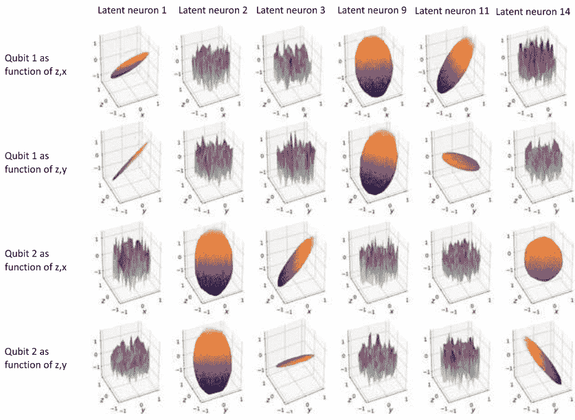

图10.5 两比特态的局部表示结果（图取自 Nautrup、Metger 和 Iten 等人的2020年论文[23]）。我们考虑一个由两个量子比特组成的量子力学系统。编码器将两比特态的层析数据映射到态的表示。三个代理人$C_1$、$C_2$和$C_3$被问及关于两比特系统上的测量输出概率的问题，其中问题被给定为测量的参数化。代理人$C_1$和$C_2$被要求预测第一个和第二个量子比特的测量结果概率。第三个代理人$C_3$被要求预测对整个两比特系统上任意测量的测量概率。总共需要$15$个潜在神经元来回答所有代理人$C_1$、$C_2$和$C_3$的问题。代理人$C_3$需要访问所有参数，而代理人$C_1$和$C_2$只需要访问两个不相交的三参数集，分别编码在潜在神经元$1$、$9$、$11$和$2$、$3$、$14$中。

这些图显示了这些潜在神经元对每个量子比特的局部自由度变化的激活值，图的底部坐标表示一比特态$\rho=1/2(\text{id}+x\sigma_x+y\sigma_y+z\sigma_z)$在第1或第2个量子比特上的变化。

我们发现每个局部量子比特表示需要使用三个潜在神经元，这是代理$C_1$和$C_2$所需的。这些局部表示存储了布洛赫球表示$\rho=1/2(\mathrm{id}+x\sigma_x+y\sigma_y+z\sigma_z)$的$x$、$y$和$z$分量的组合，其中$\sigma_x$、$\sigma_y$、$\sigma_z$表示泡利矩阵。一般来说，一个两比特的混合态$\rho$由$15$个参数描述，因为一个厄米$4 \times 4$矩阵由$16$个参数描述，而由于单位迹条件，一个参数由其他参数确定。事实上，我们发现必须预测联合测量结果的代理访问了所有$15$个潜在神经元，包括存储两个局部表示的神经元。这些数字与[220]中的分析方法中找到的数字相对应。

### 10.6 带电粒子

在本节中，我们研究了一个经典力学的玩具例子，该例子在[23,237]中被提出，目的是为了证明操作上有意义的参数分离准则（第8.4.2.2节）导致了与物理教科书中所知相同的参数发现。与第10.2节讨论的例子相反，本节中使用的方法不受训练数据分布的偏见影响。我们使用图9.2中所示的SciNet网络结构和方框3中描述的训练过程。此外，我们通过相同的例子演示了如何使用多个编码代理而不是一个。

我们考虑图10.6中所示的由两个粒子$p_1=(m_1,q_1)$和$p_2=(m_2,q_2)$组成的设置，其中$m_1$、$m_2$是质量，$q_1$、$q_2$是电荷。实验者（代理$B$）可以进行以下参考实验，以获取有关粒子性质的信息：

1. 实验者可以弹性碰撞每个粒子$p_i$（初始静止），与一个不带电的参考质量$m_{\text{ref}}$（以固定的参考速度$v_{\text{ref}}$移动）。然后，代理观察到粒子$p_i$在碰撞后的位置的时间序列。
2. 我们将一个粒子$p_i$放置在一个静止的坐标系的原点，并将一个参考粒子$p_{\text{ref}} = (m_{\text{ref}}, q_{\text{ref}})$（具有固定的质量和电荷），放置在距离原点的固定距离$d_0$处。两个粒子都可以自由移动。我们观察到粒子$p_i$由于库仑相互作用而移动的时间序列。

我们选择向不同解码代理$C_j$提出的自然问题（见图8.3）。在我们提出问题的物理环境中，粒子$p_i$的初始位置和两个目标孔的位置$h_i$是固定的。

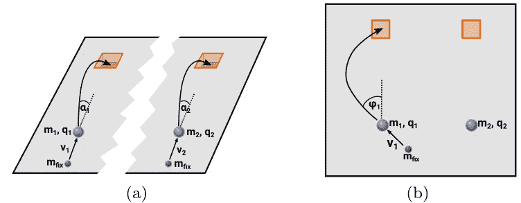

图10.6 带电质量的玩具示例（图取自Nautrup, Metger和Iten等人, 2020年[23, 237]）。a有两个独立的解码代理$C_1$和$C_2$，因此它们的个别实验设置之间没有相互作用。每个代理都需要将一粒质量为$m_i$和电荷为$q_i$的粒子射入一个带有固定重力场的孔$h_i$中。他们通过将一定质量的抛射物$m_{\text{fix}}$与粒子$p_i$弹性碰撞来实现这一点。到孔的距离是固定的。具有挑战性的代理选择抛射物的速度$v_i$，并将此信息作为问题输入提供给解码代理。正确答案是角度$\alpha_i$，即以给定速度和该角度射出抛射物时，粒子$p_i$会直接落入孔中。b现在我们考虑两个解码代理$C_3$和$C_4$在两个粒子之间受到库仑相互作用的情况下。代理$C_3$和$C_4$再次需要向粒子$p_1$和$p_2$射击抛射物。带电粒子将在另一个代理粒子的库仑场中移动。类似于a)中的情况，代理们被给予速度$v_3$或$v_4$作为问题，并且他们必须预测角度$\varphi_1$或$\varphi_2$在地面平面上，使得在该角度射出质量时，它将在无摩擦的地面上“滚动”进入孔中，而另一个电荷的位置保持不变。（然后，使用代理角色互换的方式重复实验，即首先射出质量的代理现在将其固定在起始位置，反之亦然）

- 每个解码代理$C_1$和$C_2$都被给予具有固定质量$m_{\text{fix}}$的抛射物，而具有挑战性的代理选择一个速度$v_i$，用这个速度把抛射物击中粒子$p_i$。解码代理$C_i$（由解码器$D_i$描述）然后被要求预测正确的角度$\alpha_i$在$yz$平面上，代理用这个角度射击他的抛射物对粒子$p_i$进行操作，使得粒子$p_i$直接着陆，即在恒定均匀重力场的影响下，不发生反弹，进入目标孔$h_i$。
- 同样，代理$C_3$和$C_4$也被给予抛射物，其选择的速度$v_3$和$v_4$作为问题输入提供给解码器$D_3$和$D_4$。解码器的目标是预测角度$\varphi_1$和$\varphi_2$在$xy$平面上，使得粒子$p_1$和$p_2$在另一个粒子的库仑场的影响下飞入其目标孔中，而另一个粒子保持固定。

在这两种情况下，我们限制了抛射物的可能速度，以便存在一个（唯一的）角度使粒子落入洞中。此外，预测损失由代理选择的角度与将质量直接落入洞中的正确角度之间的平方差给出；这个正确角度可以通过对系统进行实验来确定。

**方框 10：带电粒子[23]（第10.6节）**

- **问题**：图10.6中显示了两个涉及两个带电粒子$p_i=(m_i,q_i)$的物理挑战。在挑战a)中，两个解码器$C_1$和$C_2$必须预测给定射击速度下，粒子$p_1$或$p_2$在$yz$平面上的射击角度$\alpha_1$和$\alpha_2$，使其在受重力场影响下落入目标孔中。类似地，在挑战b)中，两个解码器$C_3$和$C_4$必须预测给定射击速度下，粒子$p_1$或$p_2$在$xy$平面上的射击角度$\varphi_1$和$\varphi_2$，使其分别落入目标孔中。
- **物理模型**：a)具有质量$m$的粒子在恒定的重力场中沿负$z$方向运动。b)带电粒子$p$根据另一粒子的库仑力作用而运动。对于粒子之间的距离$r$，库仑力与$q_1q_2/r^2$成正比。
- **观察**：参见第10.6节开头描述的实验1和2。对于两个编码代理$E_i$，它们只能访问与粒子$p_i$相关的实验。
- **问题**：在a)和b)中，问题由抛射物击中粒子的速度给出，即$q_j = v_j$，其中$j \in \{1,2,3,4\}$。
- **正确答案**：a) 假设目标放置在$x=d_0$处，我们发现$\alpha_i = \frac{1}{2} \arcsin(d_0 g / v_i^2)$。b) 在这个设置中的答案在附录E中讨论。
- **网络结构**：单个编码器：图9.2中所示的网络，具有一个编码器，$3$个潜在神经元和四个解码器。多个编码器：图9.2中所示的网络，具有两个编码器，$4$个潜在神经元和四个解码器。对于这两种情况，网络的大小在表C.1中给出。
- **训练**：参见方框3，参数在表C.2中给出。
- **关键发现**：单个编码器和多个编码器的关键发现是：
  - 单个编码器：SciNet将质量$m_1$和$m_2$存储在不同的潜在神经元中（图10.7）。第三个潜在神经元存储电荷$q_1q_2$的乘积，用于量化库仑相互作用的强度。重要的是，这种分离不受训练数据分布的偏见影响。
  - 多个编码器：编码代理无法直接编码电荷$q_1 \cdot q_2$的乘积。相反，每个编码代理生成的表示分别存储$q_i$。

为了简单起见，我们在这里选择了所需潜在神经元的最小数量。可以通过逐步增加潜在神经元的数量，直到SciNet达到较高的预测准确性来找到这个数量。

#### 10.6.1 单一编码器

首先，让我们考虑一个单一的编码代理$B$，以及由解码器$D_1$、$D_2$、$D_3$、$D_4$描述的四个解码代理。设置和结果总结在方框10中。

我们使用方框3中描述的训练过程来训练SciNet。为了分析学到的表示，我们绘制了不同示例的潜在神经元的激活情况。

图10.7 带有带电质量的示例结果（单个编码器）（图取自Nautrup、Metger和Iten等人，2020年[23]）。使用的网络（图9.2）有3个潜在神经元，每个图列对应一个潜在神经元。对于第一行，我们生成了具有固定电荷 $q_1 = q_2 = 0.5$（忽略单位）和可变质量 $m_1, m_2$ 的输入数据，以绘制潜在神经元的激活情况与质量的关系。我们观察到潜在神经元1和2分别存储质量 $m_1, m_2$，而潜在神经元3保持不变。在第二行，我们绘制了神经元对固定质量 $m_1, m_2 = 5$ 的电荷 $q_1, q_2$ 的响应激活情况。在这里，第三个潜在神经元大致存储 $q_1 \cdot q_2$，这是库仑相互作用的相关量，而其他神经元与电荷无关。第三行显示了哪个解码器接收来自相应潜在神经元的信息。$y$ 轴对应于潜在神经元和解码器 $j$ 的 $\log(\sigma_i^j)$。因此，$y$ 轴量化了潜在神经元的信息通过4个滤波器传递给相关解码器的程度，作为训练时期的函数。

正值表示滤波器不传输任何信息。解码器1和2分别对粒子 $(m_1, q_1)$ 和 $(m_2, q_2)$ 进行非交互实验。解码器3和4进行相应的交互实验。正如预期的那样，我们观察到关于 $m_1$（潜在神经元1）的信息被解码器1和3接收，关于 $m_2$（潜在神经元2）的信息被解码器2和4使用。由于解码器3和4回答关于交互实验的问题，所以只有它们（解码器3的最后一个图中的绿线被隐藏在红线下面）接收到电荷的乘积（潜在神经元3）。

使用不同（已知）的质量 $m_1, m_2$ 和电荷 $q_1, q_2$ 对这些已知值进行比较。这相当于将学习到的表示与我们可能已经有的假设表示进行比较。图10.7显示了这些图。第一和第二个潜在神经元分别与 $m_1$ 和 $m_2$ 线性相关，并且与电荷无关；第三个潜在神经元的激活类似于函数 $q_1 \cdot q_2$，并且与质量无关。这意味着第一个和第三个潜在神经元分别单独存储质量，这是符合预期的，因为图10.6a中的设置只需要单个质量而不需要电荷。第三个神经元大致存储了电荷的乘积，即与电荷之间库仑相互作用的强度相关的数量。这被用于处理图10.6b中的设置，其中粒子的轨迹取决于与另一个粒子的库仑相互作用。

#### 10.6.2 多个编码器

可以很容易地将上述示例推广到使用多个编码代理的情况。我们不再使用单个代理 B，而是使用两个代理 B1 和 B2，每个代理只能访问一个带电粒子 p1 和 p2。代理 Bᵢ 仅观察与粒子 pᵢ 相关的实验结果。然后，这两个编码代理分别构建自己的表示。观察结果。然后，这两个表示被连接起来，并像之前一样处理。单编码器设置；也就是说，对于每个解码器，将一个滤波器应用于连接的表示，将过滤后的表示用作解码器的输入。得到的网络结构与[238]中用于总结文本文档的网络结构相似。

该案例的结果显示在图10.8中，并在方框10中进行了总结。与单编码器情况相比，我们观察到在这里，电荷 $q_1$ 和 $q_2$ 分别存储在潜在表示中，而单个编码器存储了乘积 $q_1 \cdot q_2$。这是因为，尽管解码器仍然只需要乘积 $q_1 \cdot q_2$，但没有单个编码器具有足够的信息来输出这个乘积：编码器 $E_1$ 和 $E_2$ 的输入只包含有关各自的单个电荷 $q_1$ 和 $q_2$ 的信息，而不包含它们的乘积。因此，将输入分为两个编码器所施加的附加结构使得表示具有更多的结构，即将两个电荷分别存储。然而，与单编码器情况下的三个潜在神经元相比，连接的表示由四个潜在神经元组成，但根据定义8.8，它仍然是最小的。实际上，可以看出具有两个编码器的选择结构不允许只有三个潜在神经元的表示：如果这样的表示存在，一个编码器只能输出一个参数（而另一个编码器输出两个参数），这对于存储质量和电荷的信息是不够的。

### 10.7 日心系太阳系

在16世纪，哥白尼使用了不同行星在夜空中的位置的观测结果（图10.9a）来假设太阳而不是地球位于我们的太阳系中心。这种日心观点在17世纪初由开普勒基于布拉赫收集的天文数据证实，显示行星围绕太阳以椭圆轨道运动。在这里，基于[22]的工作，我们展示了SciNet同样使用日心角度（更准确地说，当被迫寻找一个表示形式，使得变量的时间演化采取非常简单的形式时（这是物理学中时间相关变量的典型要求），我们可以得到物理概念（例如平均近点角）。

给定给 SciNet 的观测数据（使用图9.3中显示的网络结构，具有两个潜在神经元），是火星的角度 $\theta_{M}(t_{0})$ 和太阳的角度 $\theta_{S}(t_{0})$，从地球上看起始时间 $t_{0}$（在训练过程中变化）时。时间演化网络 $u: \mathbb{R}^{2} \rightarrow \mathbb{R}^{2}$ 仅限于常数的加法（其值在训练过程中学习）。因此，我们可以通过两个参数 $\gamma=(\gamma_{1}, \gamma_{2})$ 来平滑地参数化更新规则集合 $u_{\gamma}(r_{1}, r_{2})=(r_{1}+\gamma_{1}, r_{2}+\gamma_{2})$。在每个时间步骤 $i$ 中，SciNet 被要求仅基于其在步骤 $i$ 的表示来预测从地球上看到的角度，即时间 $t_i = t_{0}+i \Delta t$。在我们的实现中，时间步长 $\Delta t$ 是固定的，并选择为 25 天。因为问题 $\tilde{q}$ 在每个时间步骤中都是相同的，所以我们不需要显式地将其输入解码器。

限制线性时间演化（仅允许在更新规则中添加常数 $\gamma_{i}$）可能看起来像是一种仅适用于特定物理系统的限制。然而，这样的限制实际上等同于假设所考虑系统的能量是守恒的。在这种情况下，存在一种变量转换，使得新的规范坐标（称为动作角）在时间上线性演化（参见例如 [239]）。

我们模拟火星和地球绕太阳的椭圆轨道（注意，原始工作 [22] 中使用的是圆形轨道），并使用随机选择的观测序列对 SciNet 进行约 50 步 25 天的训练。图 10.9b 显示了学习到的表示，并确认了 SciNet 确实存储了日心角。

实际上，SciNet 存储了平均近点角 $M_E \in[0,2 \pi)$ 和 $M_M \in[0,2 \pi)$ 的线性组合，即自行经过近日点的行星椭圆轨道周期的倍数。平均近点角被选择在区间 $[0,2 \pi)$ 内，因为它们可以几何地解释为在地球和火星围绕太阳做圆形轨道（具有相同周期）的情况下，从太阳观察到的角度。另一个几何关系是地球和火星与太阳之间的连线所扫过的面积 $A_E$ 和 $A_M$ 与地球和火星的平均近点角成比例（参见图 10.9）。更具体地说，我们有
$$
A_{E}=\frac{M_{E}}{2 \pi} A_{E}^{\text {tot }} \text { 和 } A_{M}=\frac{M_{M}}{2 \pi} A_{M}^{\text {tot }} \text{, } \quad (10.1)
$$
其中 $A_{E}^{\text {tot }}$ 和 $A_{M}^{\text {tot }}$ 分别表示地球和火星轨道所包围的完整面积。因此，另一种（物理上等效的）解释是SciNet在其潜在神经元中存储了两颗行星所扫过的面积的线性组合。这些扫过的面积随时间线性增长的事实是开普勒第二定律中所述的。我们强调，训练数据仅包含从地球观测到的角度，但SciNet仍然切换到一个以太阳为中心的表示。详细信息请参见第11框。

> **第11框：太阳系的日心模型（第10.7节）**
> **问题：** 根据给定的初始状态 $\theta_M(t_0)$ 和 $\theta_S(t_0)$，预测地球上看到的火星和太阳的角度 $\theta_M(t)$ 和 $\theta_S(t)$。
> **物理模型：** 地球和火星按照开普勒的行星运动定律在椭圆轨道上绕太阳运动。地球的轨道近似为圆形（离心率：0.017），轨道速度近似恒定。火星的椭圆轨道的离心率为0.093，轨道速度相对于平均轨道速度变化范围为±10%。
> **观测：** 随机选择的火星和太阳的初始角度作为地球上的观测值：$o=(\theta_M(t_0), \theta_S(t_0))$。
> **问题：** 隐式。
> **正确答案：** 时间序列 $[a_0,\dots,a_n] = [(\theta_M(t_0), \theta_S(t_0)), \dots, (\theta_M(t_n), \theta_S(t_n))]$。有20个观测值（训练后为50个观测值），固定时间步长为25天。
> **网络结构：** 如图9.3所示的网络，具有两个潜在神经元，并允许以 $u_\gamma(r_1,r_2)=(r_1+\gamma_1, r_2+\gamma_2)$ 的形式进行时间更新。网络尺寸见表C.1。
> **训练：** 如方框4所述，参数见表C.2。
> **主要发现：**
> - SciNet 使用深度学习预测火星和太阳的角度，均方根误差低于0.5%（相对于 $2\pi$）。
> - SciNet 在两个潜在神经元中存储了地球和火星相对于太阳的平均近点角 $M_E$ 和 $M_M$（见图10.9b）。

如果需要，可以使用第9.3.2节中描述的方法解开地球和火星的平均近点角。实际上，我们可以引入两个解码代理。第一个代理应该预测太阳的角度 $\theta_S$，第二个代理应该预测火星的角度 $\theta_M$（从地球上看）。为了完美地解决这些任务，第一个代理需要关于地球的平均近点角的信息，而第二个代理则需要关于地球和火星的平均近点角的信息。因此，相应的操作上有意义的表示自然地将这两个平均近点角分开。

### 10.8 由弹簧连接的几个粒子

在本节中，我们以许多相互作用的物体组成的物理系统为例，演示了物体结构的物理先验知识如何帮助解释SciNet的表示（第8.6节）。更具体地说，我们考虑一个二维盒子中的 $k \in \{5,10\}$ 个粒子，除了与盒子壁的弹性碰撞外，没有外部力[184]。

一些粒子通过具有固定弹簧常数 $k$ 的弦连接，因此粒子 $i$ 和 $j$ 之间的力为 $F_{i,j} = k \|\mathbf{p}_i - \mathbf{p}_j\|_2$，其中 $\mathbf{p}_i \in \mathbb{R}^2$ 和 $\mathbf{p}_j \in \mathbb{R}^2$ 是它们的位置。详细信息和示例策略请参见第12节。输入到SciNet的观测数据（使用GNN给出的结构如图9.5所示）是粒子的二维位置和速度的时间序列。用于编码器的GNN的边的 one-hot 嵌入 $h_{i,j} \in \mathbb{R}^2$ 可以编码两种不同类型的相互作用。

然后对GNN进行 $L=2$ 步演化，并对任意对象 $i$ 和 $j$ 之间的相互作用类型进行表示 $r_{i,j}$ 进行采样。

解码器再次由一个GNN组成，它将表示 $r$ 作为输入，以及一个由粒子在时间 $t'$ 的初始状态以及描述时间差 $\Delta t$ 的数字 $M \in \mathbb{N}$ 描述的问题 $q_0$。然后解码器需要预测在时间 $t'+M \Delta t$ 时粒子的未来状态。

SciNet 通过深度学习学习预测粒子路径和粒子之间的相互作用类型，具有高准确性 [184]。它发现两个粒子之间存在两种相互作用，即“无相互作用”和“由弹簧连接”。这些信息可以从 SciNet 在其表示中存储的独热编码中提取出来。

> **盒子12：几个粒子由弹簧连接[184]（第10.8节）**
> **问题：** 预测二维盒子中 $k \in \{5,10\}$ 个粒子的位置和速度的时间演化。
> **物理模型：** 粒子 $i$ 在位置 $\mathbf{p}_i$ 处的受力是弹簧力 $F_{i,j} = k \|\mathbf{p}_i - \mathbf{p}_j\|$ 的总和（粒子 $i$ 与位置 $\mathbf{p}_j$ 处通过弹簧连接的粒子 $j$ 之间）。此外，粒子与盒子的墙壁弹性碰撞。然后通过求解牛顿方程和交错积分 [184] 来模拟粒子的轨迹。
> **观测：** 从随机选择的初始状态开始，所有粒子的位置和速度的时间序列：随机选择的初始位置 $\mathbf{p}_{-i}$，其中 $\mathbf{p}_{-i}$ 的两个分量都是从均值为0、标准差为0.5的高斯分布 $\mathcal{N}(0,0.5)$ 中取样得到；粒子的速度是从范数为0.5的二维向量集合中均匀取样得到；以 50% 的概率在粒子 $i$ 和 $j \neq i$ 之间放置一个弹簧。
> **问题：** $q = [x_{-1}(t'), \dots, x_{-k}(t'), M]$，其中 $k \in \{5,10\}, M \in \mathbb{N}$，状态 $x_{-i}(t') = [\mathbf{p}_{-i}(t'), q_{-i}(t')]$，其中 $\mathbf{p}_{-i}(t')$ 和 $q_{-i}(t')$ 分别是粒子 $i$ 在时间 $t'$ 时的位置和速度。
> **正确答案：** 状态 $a = [x_1(t'+M \Delta t), \dots, x_k(t'+M \Delta t)]$，其中 $x_i(t)$ 是粒子 $i$ 在时间 $t$ 时的位置和速度给出的状态。
> **网络结构：** 图9.5中所示的网络，使用GNN的两个演化步骤实现编码器和二维边嵌入 $h_{i,j} \in \mathbb{R}^2$。详细信息请参见[184]。
> **训练：** 如第9.7.2节所述。更多详细信息请参见[184]。
> **关键发现：** SciNet 通过将粒子之间的相互作用分类为“无相互作用”或“由弹簧连接”来准确恢复粒子之间的相互作用。

## 第11章 未来的研究方向和进一步阅读

在接下来的内容中，我们指出了物理学表示学习的两个未来研究方向。第一个方向考虑了自动化搜索收集相关观测数据的策略。第二个方向指出，在没有假设表示的数据中，解释SciNet的表示可能具有挑战性。我们建议搜索数学表达式来编码和解码映射，以应对这一挑战。此外，这种方法可能会增加SciNet对与训练过程中观测到的差异较大的观测结果的泛化能力。

### 11.1 寻找测量策略和表示

正如在引言（第1章）中提到的，对于如何在一些实验设备给定的情况下收集观测数据是具有挑战性的。在我们第10章中考虑的示例中，观察粒子的时间序列或对量子系统进行随机测量可以提供关于物理系统的足够信息来回答提出的问题。然而，一般情况下可能需要更高级的观测策略。例如，为了确定粒子在盒子中的位置，可以首先使用一个扫描整个盒子并返回粒子位置的测量设备，但精度较低。然后，可以使用第二个更精确的测量设备来扫描盒子的一小部分。该设备可能会针对第一个测量设备找到的粒子的大致位置来确定粒子的位置，从而提高精度。因此，第二个测量设备的最佳设置取决于第一个测量设备的输出。随机选择盒子的一部分进行第二个测量设备的扫描很可能导致无法找到粒子，因此位置测量的准确性将保持较低水平。

为了找到这样的先进测量策略，可以训练一个强化学习代理，如果他能准确预测粒子在盒子中的位置，就会得到奖励。然而，要以监督的方式训练这样的代理，我们必须了解我们感兴趣的变量（在上面的例子中，是粒子的位置）。在本书的这部分考虑的设置中，我们只知道观察到的信息应足以回答我们提出的问题。因此，按照这种精神，测量策略必须与如何利用收集到的信息回答问题同时学习。对于上述给定例子的一个简单问题是要求 SciNet 预测盒子中一个固定点的电场。假设粒子带电，电场可能是粒子位置的函数 $f(x)$。

在[240]中，通过一些玩具示例，证明了当前的机器学习工具可以适应并行学习测量策略和函数 $f$。进一步研究这个研究方向将会很有意思并且看看是否可以并行学习更复杂系统的观察策略和表示。在机器学习中，状态表示学习是一个与此目标密切相关的方向，在备注11.1中讨论过。

> **备注11.1（状态表示学习）** 与表示学习相反，其中从（固定的）数据集中提取相关特征，状态表示学习考虑交互式设置[241]。因此，强化学习代理可以与环境交互，并通过其行动影响系统的状态。状态表示学习的目标是构建一个随着代理的选择行动而随时间演化的系统的低维表示。特别是，这种设置为解开表示提供了新的可能先验，因为代理可以尝试不同的行动并观察它们的效果[242]。例如，在[52]中，表示通过独立先验进行解缠，这鼓励将环境的独立可控特征存储在单独的参数中（参见[243]中的类似方法）。正如在[53, 243]中所示，这样的要求可以在某些场景中导致自然表示，例如为导航任务创建迷宫的抽象表示。然而，与依赖于代理目标的操作意义表示相反（第8.4.2.2节），这些表示取决于代理可以执行哪些行动（和策略）。在物理学中，这些行动取决于实验设备，可能被认为不如代理的目标那样基本。与根据不同问题解缠表示的方法更接近（第8.4.2.2节），在[244]中，几个具有不同目标的强化学习代理共享一个在训练过程中进行优化的公共表示。有趣的是，他们发现学习辅助任务可以提高代理在整体目标的学习中的性能。在[245]中，进一步的一步是辅助任务不需要由人类指定，而是在训练过程中学习。在类似的精神中，有趣的是在未来的工作中学习SciNet的相关问题，而不是手动选择它们。

### 11.2 解释性和 SciNet 的泛化能力

在机器学习中，很多工作目前都致力于提高人工神经网络的可解释性（参见 [246] 进行最新综述）。例如，启发式技术 [247,248] 可以用来了解神经网络学到了什么。这些技术在 [249] 中被用来从热力学系统中提取相关属性。将关于训练数据的先验知识构建到网络结构中通常可以提高可解释性。通常，可解释性与神经网络的泛化能力相关，而提高可解释性也会增加泛化能力。例如，将关于物理系统对象结构的信息构建到网络中（如第 8.6 节和第 9.7 节所述），可以使网络推广到具有不同对象和关系数量和配置的系统。同时，网络中的附加结构有助于提取网络学到的一些信息。事实上，在第 10.8 节中演示了如何从 SciNet 的表示中提取粒子之间的相互作用类型信息。另一方面，将一些数学先验知识构建到 SciNet 中（如第 9.6 节中的示例）可以帮助解释找到的表示，正如在 [183] 中对非线性摆的演示（并在第 10.3 节中讨论）所示。

为了将本书讨论的方法应用于物理学的基础，我们在构建 SciNet 的网络结构时必须非常小心地引入先前的知识。特别是，在第 8.6 节中考虑了观测数据的对象结构，可能会导致我们以一种不“自然”的方式分离对象，并且系统的划分可能存在更优雅的描述。因此，在本书的这一部分中，我们专注于从观测数据中提取物理概念，对物理学和数学的先前知识要求最小。这种方法的优势在于不限制神经网络可以学习的模型集合。另一方面，这是与 SciNet 的泛化能力和可解释性之间的权衡。要解释由 SciNet 找到的压缩表示，而不使用数学或物理的先前知识，我们必须将其与一个假设的表示进行绘制。未来工作的挑战是找到其他方法，使用最少的先前知识，并且仍然能够从机器学习系统中提取一些概念信息，而不需要任何已知的假设。

改进 SciNet 的可解释性和泛化能力的一个可能性是，例如，包含一个在物理学中非常常见的偏差：给定一个物理系统的相关变量和参数，我们假设存在一个“简单”的数学表达式，可以预测该系统的（未来的）物理特性（至少对于小的时间步长）。因此，更具体地说，我们可以假设 SciNet 的解码器可以用简单的数学表达式来描述。最近在 [250] 中已经朝着这个方向迈出了一步。[250] 中的作者使用了方程学习器（EQL）网络，类似于 [251,252] 中的工作，这些网络使用表示乘法或其他简单数学运算的激活函数（取正弦或余弦）。此外，为了找到“简单”的数学表达式，他们对网络中的权重施加了稀疏性约束。权重越多被设为零，EQL 网络表示的数学表达式就越短。

在 [250] 中，EQL 网络被应用于不同的问题，包括对简单的运动学问题和谐振子的动力学系统分析。他们使用与第 9.4 节中使用的相似的网络结构来找到具有简单更新规则（图 9.3）和简单解码器的表示，其中更新规则由 EQL 网络参数化。在这两个例子中，EQL 网络能够找到物理系统时间演化的简单数学表达式。

有趣的是，将 SciNet 中的解码器替换为 EQL 网络，并尝试从中提取简单的数学表达式。这些表达式对应于我们设置中物理定律的应用，因此可能有助于发现潜在的定律本身。此外，找到编码器的数学表达式也有助于解释 SciNet 找到的表示。然而，对于物理示例，从观测数据到表示的映射通常比从表示到预测的映射更复杂。因此，使用 EQL 网络找到这样的表达式可能具有挑战性。或者，可以使用前馈神经网络作为编码器，并尝试使用符号回归 [24] 中的方法从训练好的网络中提取描述其映射的方程（参见第 6.2.1 节）。[129] 中考虑了这个方向的一步（请参见 [129] 中介绍的方法的注释 6.1）。最近，利用图神经网络的附加结构从网络的不同部分提取方程 [205,253]。[205] 的作者将他们的技术应用于宇宙学示例，并发现了一个可以根据附近宇宙结构的质量分布预测暗物质浓度的新的解析公式。[253] 中，使用图神经网络训练了模拟太阳系太阳、行星和大型卫星的动力学的模型，使用三十年的轨迹数据。然后，使用符号回归提取了图神经网络隐式学习的力学定律的解析表达式，结果等同于牛顿的万有引力定律。

## 第四部分
### 未来前景

在本书的最后一部分中，我们讨论了自动化物理学家发现过程以及利用机器学习为物理学奠定基础的未来前景。由于对人工智能未来发展进行时间相关的预测非常困难，我们将重点指出必须解决的具有挑战性的问题，以完全自动化物理学发现过程。此外，我们指出了朝着这一长期目标迈出的最新步骤，以及必须在未来进一步改进的特别有前景的方法，以适用于实际问题。

## 第12章
### 未来前景

在本书中，我们考虑了物理学家发现过程中的几个步骤的自动化。然而，我们离建立一个能够取代人类科学家的 AI 科学家还有很长的路要走。事实上，开发一个 AI 物理学家可能几乎和开发通用人工智能一样困难，根据大多数 AI 智能研究人员（AI 研究人员）的说法，这还需要几十年的时间 [254,255]。一方面，在自动化物理学家发现过程的每个单独步骤中存在许多未解决的问题，另一方面，将所有步骤结合起来也是一个非常复杂的挑战。

在接下来的几节中，我们讨论了物理学家发现过程中的自动化进展和未来的挑战（第 12.1 节），学习过程如何帮助构建通用人工智能而不是简单函数（第 12.2 节），以及人工智能如何帮助解决物理学中的基本问题。

### 12.1 AI物理学家

最终的长期目标是构建 AI 物理学家，即能够从物理环境中自主行动和学习的系统。AI 物理学家没有“确切”的定义，最终可能会构建出专门针对某些领域的 AI 系统，并能够相互通信共享信息。这类似于人类物理学家，他们也是某些领域的专家，但不能执行其他物理学家能够执行的所有任务。例如，我在实验室中使用设备建立实验的能力可能接近于尝试随机动作的代理的表现。然而，目前我们离创建一个完全可以取代任何人类物理学家的 AI 物理学家还有很长的路要走，因此我们可以忽略目标并没有完全明确的事实。为了具体化，可以考虑以下目标：构建一个能够与真实世界进行交互的代理，并找到万有引力定律。为了测试代理是否真的找到了万有引力定律，可以让它预测按照引力作用移动的物体在一个全新的情况下的运动。代理人以前从未见过。此外，代理人应该能够记住发现的见解，并将它们与未来的见解结合起来，以统一不同的理论。在接下来的部分，我们首先描述了在构建 AI 物理学家方面的一些最新进展，然后讨论了在构建 AI 物理学家方面留下的一些重要挑战。

历史上第一台能够独立于其人类创造者发现新科学知识的机器是机器人“亚当” [256]。亚当可以自主地执行科学循环，建立假设，使用实验室机器人进行实验以测试假设，并最终解释结果。如果亚当证伪了假设，他会重复这个循环。在 [4] 中，还采取了更近一步成为一个人工智能物理学家的步骤，同时考虑了物理学家发现过程的几个步骤。与大多数其他工作不同，在大多数其他工作中，机器学习系统用于一次拟合所有给定的数据，在 [4] 中，环境使用无监督学习分为几个子域。子域是根据物理定律选择的，并且在预测该子域中物理系统的未来演化方面表现良好。这是物理学家的典型策略：选择和隔离一个物理系统，然后进一步研究。作为一个玩具例子，我们可以考虑在 $xy$-平面上的两个区域，在第一个区域中，我们有一个谐振势或均匀重力场，在第二个区域中，有一个重力场 $g=(g_x, g_y)$。因此，对于质量为 $m$ 的粒子，运动方程为 $\ddot{x}=-k / m\left(x-x_{0}\right)$ 和 $\ddot{y}=-k / m\left(y-y_{0}\right)$（其中弹簧常数为 $k$，平衡位置为 $\left(x_{0}, y_{0}\right)$）。在第一个区域，对于重力场 $g=\left(g_{x}, g_{y}\right)$，运动方程为 $\ddot{x}=g_{x}$ 和 $\ddot{y}=g_{y}$。然后，[4] 中提出的机器学习方法能够识别这两个区域并使用两个神经网络分别预测粒子在每个区域中的时间演化。为了提高泛化能力和可解释性，从这两个神经网络中提取出符号表达式，并添加到一个理论中心 [4]。

在上面的例子中，对于具有均匀重力场的区域，可能找到以下表达式：$\ddot{x} = g_x$ 和 $\ddot{y} = 3 \, \mathrm{m/s^2}$（其中我们假设 $g_x$ 和 $g_y = 3 \, \mathrm{m/s^2}$ 以具体化）。该理论被 AI 物理学家保存在记忆中，并用于研究新的环境。此外，在 [4] 中考虑了一些基本理论的统一，其中找到了参数化的主理论。在上面考虑的例子中，这个统一算法会认识到两个公式 $\ddot{x} = g_x$ 和 $\ddot{y} = 3 \, \mathrm{m/s^2}$ 具有相同的形式，并且可以被视为主理论 $u$ 的实例，其中 $u$ 是任意坐标，$g_u$ 是参数。

在 [4] 中描述的构建 AI 物理学家的方法超越了一个为给定的物理系统寻找模型，还指向了构建一个通用 AI 物理学家所必须解决的几个具有挑战性的问题，我们在下面进行讨论。首先，很明显，物理学家面临的主要困难之一是将环境分解为子系统，以便可以对子系统进行“简单”描述。此外，人们可能希望选择调查可能导致发现新物理概念的子系统。事实上，现代物理学家可能不想考虑标准摆，而更愿意考虑具有高能量的碰撞粒子，因为这样的场景更少见且被充分理解，并可能导致新的物理洞见。考虑一个人通过感官器官每秒获得的所有信息，识别子系统并选择和隔离它们以进行可能导致新的物理洞见的实验是一项极其困难的任务。朝着这个目标迈出的第一步可能是找到环境部分的紧凑表示，因为这简化了调查。此外，找到不能足以预测子系统未来演化的表示，指向对这些系统的理解不完整。从视频数据中直接提取表示的步骤已经在 [34, 192] 中完成。例如，在 [34] 中，从原始视觉数据中提取了物体的位置。这样的方法可能对构建未来的 AI 物理学家很有用。

构建一个完全成熟的 AI 物理学家的另一个困难，通常被忽视，但在 [4] 中被考虑到，就在于建立在现有理论上并统一不同系统中观察到的定律。完全自动化理论的统一和寻找潜在物理原理可能非常困难，与通用人工智能一样难以实现。统一的最终目标是提高物理学家的泛化能力。因此，可以通过在训练期间未见过的完全新环境中测试其预测能力，但具有与训练环境相同的基本定律，来估计 AI 物理学家的泛化性能。机器学习中的一项活跃研究方向，称为迁移学习，考虑将在一个环境中学到的概念重用到另一个环境中（参见 [257] 进行全面调查）。在这个领域的进展也可能导致将在特定环境中表现良好的物理理论推广到适用于所有考虑的环境的理论。

### 12.2 学习过程而不是简单函数

目前，神经网络是人工智能中最重要的工具。在本书中，我们主要使用前馈神经网络来拟合函数。然而，使用前馈神经网络无法构建通用人工智能代理，因为通用人工智能应该能够执行图灵机上可运行的任何算法。例如，考虑一个用于计算给定空间中某一点电场的人工智能物理学家，给定任意数量的带电粒子创建的电场。

对于任意固定的数量 $n$，可以构建一个前馈神经网络，将粒子的位置和电荷作为输入，并计算给定点的电场。然而，如果粒子的数量 $n$ 事先不知道，对于任何具有 $m$ 输入神经元的前馈神经网络，我们总是可以选择 $n > m/4$ 个粒子（注意，对于每个粒子，我们有四个输入：三维位置和电荷），使得人工智能物理学家无法预测电场，因为它无法处理这样的输入大小。此外，即使前馈神经网络可以处理输入大小，它完全忽略了每个粒子创建的场可以以相同的方式计算的事实。将相同的规则应用于顺序输入自然地由循环神经网络处理（例如在第 9.4 节中使用）。甚至已经证明循环神经网络如果正确连接，计算机是计算通用的（也称为图灵完备的），即它们可以用来模拟任何图灵机，从而模拟任何过程 [258]。

然而，如果某事在原则上是可能的，这并不一定意味着它在实践中会起作用。在 [259] 中，循环神经网络的容量得到了增强，通过添加一个大容量的可寻址内存来简化算法任务的解决方案。这类似于图灵通过无限内存来丰富有限状态机的结构，[259] 的作者将这种结构称为神经图灵机（NTM）。

与（标准）图灵机相反，NTM 不是由人类编程，而是通过自己从数据中学习程序。通过确保输出平滑地依赖于描述程序的参数，可以使用随机梯度下降来高效地训练 NTM。初步结果表明，NTM 可以推断出简单的算法，如复制和排序 [259]，但从数据中学习更复杂任务的程序仍然是一个具有挑战性的任务，需要未来的工作来解决。

如上所述，除了 NTMs 相对于前馈神经网络具有额外的计算能力之外，它们还可以学习更简单的过程描述。在想要计算由 $n$ 个粒子产生的电场的例子中，NTM 基本上需要学习它可以顺序考虑粒子，计算到感兴趣位置的距离，根据库仑定律估计场强，并在运行过程中累加估计的场强。增加粒子的数量不会使这个程序变得更复杂，只会使它运行更长时间。这是一种更优雅的方法，而不是一次在完整输入上拟合函数，因此，它可以为每对粒子单独学习库仑定律。为了激励 AI 代理学习简单的算法而不是复杂的算法，我们需要一些复杂度的度量。一种选择是使用科尔莫戈洛夫复杂度（Kolmogorov complexity），它被定义为为给定输入产生所需输出的程序的最小描述长度。请注意，最小描述长度取决于给定的图灵机可以执行的可用命令，因此，这些命令的选择引入了一些偏差。不幸的是，没有一种有效的方法来计算给定输入输出对的科尔莫戈洛夫复杂度。尽管如此，我们可以激励 NTM 选择产生最小描述长度的结果程序。

尽管这个复杂度度量来自计算理论，但它可能是物理学家工作和思考的根本原因。¹ 此外，寻找具有简短描述长度的程序还可以提高 NTMs 的可解释性。我预计，在构建通用人工智能的长期目标中，朝着构建可训练的图灵机和寻找简单程序的方法将是至关重要的，然而，用于实现这些方法的方法在未来几十年可能会发生很大变化。

类似的复杂度度量在 [4] 中用于找到描述实验数据的最简单公式。

### 12.3 物理基础的人工智能

最后，让我们回到这本书背后的主要动机之一，即利用人工智能来帮助解决现代物理学中的基本问题。本书的内容侧重于使用尽可能少的关于所研究物理系统的先验知识的方法。例如，在第 10.5 节中提取量子系统的表示时，我们确保执行测量的代理是操作性的，即不使用任何关于量子力学的先验知识。此外，用于提取表示的网络结构 SciNet 并不专门适用于量子系统，并且已经证明对于经典系统（如阻尼摆，第 10.2 节）也同样有效。此外，我们发现，寻找操作上有意义的表示时，可以找到物理教科书中常用的系统表示。这表明，操作上有意义的表示所需的属性（第 8.4 节）也是人类物理学家所需的，然而，物理学家实际上可能不知道为什么他们使用粒子的质量或电荷等参数的根本原因。

因此，遵循这种方法的精神，在未来的工作中可能会更好地理解物理学家所做的“隐藏”假设。如果在遥远的未来，我们能够构建一个与量子系统进行交互并且只假设一些“自然”要求（如搜索操作上有意义的表示）的 AI 代理，那么我们可以逐步去除这些假设原则并重新训练 AI 代理。这可能会导致量子力学的替代表述的发现，从而最终有助于克服我们目前在量子理论中面临的概念问题，这些问题可能是由于一个“隐藏”的假设造成的，我们最好放弃这个假设。

## 附录A
### 潜在变量数量的解释

在第 8.4.1 节中，我们定义了最小表示，并要求它们应包含最少数量的参数。在这个附录中（摘自 Iten 等人在 *Phys Rev Lett* 124:010508, 2020 [22] 中），我们使用微分几何技术来阐述最小表示中的参数数量与考虑的物理数据的自由度之间的形式关系。这个关系给出了 SciNet 所需的最小潜在神经元数量，即它对应于物理数据中所需的自由度，这些自由度用于回答我们可能提出的所有问题。

我们用三元组 $(\mathcal{O}, \mathcal{Q}, a)$ 描述给定的数据，其中 $\mathcal{O}$ 和 $\mathcal{Q}$ 分别是包含观察数据和问题的集合，函数 $a: (\mathcal{O}, \mathcal{Q}) \rightarrow \mathcal{A}$ 将观察 $o \in \mathcal{O}$ 和问题 $q \in \mathcal{Q}$ 发送到正确的回复 $a \in \mathcal{A}$。请注意，如果 SciNet 由多个解码器组成，则可以通过将所有问题和答案堆叠在一起，并将结果的元组分别视为一个问题或答案来将其转换为此设置。以下结果仅考虑一个编码器。

直观上，我们说三元组 $(\mathcal{O}, \mathcal{Q}, a)$ 的维度至少为 $n$，如果存在能够从观察数据 $\mathcal{O}$ 中捕捉 $n$ 个自由度的问题 $\mathcal{Q}$。这个“oracle”的平滑性是一个自然的要求，意味着我们期望答案对输入的依赖在小扰动下是稳健的。

正式定义如下。

**定义 A.1（数据集的维度）** 考虑由三元组描述的 dataset $(\mathcal{O}, \mathcal{Q}, a^*)$，其中 $a^*: \mathcal{O} \times \mathcal{Q} \rightarrow \mathcal{A}$，且所有集合都是实数集合，$\mathcal{O} \subseteq \mathbb{R}^r$，$\mathcal{Q} \subseteq \mathbb{R}^s$，$\mathcal{A} \subseteq \mathbb{R}^t$。如果存在一个 $n$ 维子流形 $\mathcal{O}_n \subseteq \mathcal{O}$，我们称这个三元组的维度至少为 $n$，并且有问题 $q_1, \ldots, q_k \in \mathcal{Q}$ 和一个函数 $f: \mathcal{O}_n \rightarrow f(\mathcal{O}_n)$ 是一个微分同胚。

**命题 A.1（SciNet 的最小表示）** 对于由三元组 $(\mathcal{O} \subset \mathbb{R}^r, \mathcal{Q} \subset \mathbb{R}^s, a^*: \mathcal{O} \times \mathcal{Q} \rightarrow \mathcal{A} \subset \mathbb{R}^l)$ 描述的数据，至少需要 $n$ 维的潜在变量。

**证明：** 根据假设，存在一个 $n$ 维子流形 $\mathcal{O}_n \subset \mathcal{O}$ 和 $k$ 个问题 $q_1, \ldots, q_k$ 使得 $f: \mathcal{O}_n \rightarrow \mathcal{I}_n := f(\mathcal{O}_n)$ 是一个微分同胚。我们通过反证法证明该命题：假设存在一个由编码器 $E: \mathcal{O} \rightarrow \mathcal{R}_m \subset \mathbb{R}^m$ 描述的（足够）表示，其中 $m < n$ 个潜在变量。由于表示的充分性，存在一个光滑解码器 $D: \mathcal{R}_m \times \mathcal{Q} \rightarrow \mathcal{A}$ 使得对于所有观测值 $o \in \mathcal{O}$ 和问题 $q \in \mathcal{Q}$，有 $D(E(o), q) = a^*(o, q)$。我们定义光滑映射
```latex
\begin{aligned}
\tilde{D} &: \mathcal{R}_m \rightarrow \mathcal{A}^k \\
&\rightarrow [D(r, q_1), \ldots, D(r, q_k)],
\end{aligned}
```
并用 $\tilde{D}^{-1}(\mathcal{I}_n)$ 表示 $\tilde{\mathcal{R}}_m$ 中与 $\mathcal{I}_n$ 对应的原像。由于表示的充分性，映射 $\tilde{D}$ 在 $\tilde{\mathcal{R}}_m$ 上的限制记为 $\tilde{D}|_{\tilde{\mathcal{R}}_m}: \tilde{\mathcal{R}}_m \rightarrow \mathcal{I}_n$ 是一个光滑且满射的映射。然而，根据 Sard 定理（参见例如 [260]），映射 $\tilde{D}(\tilde{\mathcal{R}}_m)$ 在 $\mathcal{I}_n$ 中的测度为零，因为定义域 $\tilde{\mathcal{R}}_m$ 的维度最多为 $m$，小于图像的维度 $n$。这与 $\tilde{D}|_{\tilde{\mathcal{R}}_m}$ 的满射性相矛盾，并完成了证明。

我们可以将自编码器视为 SciNet 的一种特殊情况，其中我们始终提出相同的问题，并期望网络能够重现观察输入。因此，自编码器可以用三元组 $(\mathcal{O}, \mathcal{Q} = \{0\}, a \in (o,0) \rightarrow o)$ 来描述。作为命题 A.1 的推论，我们证明在自编码器的情况下，所需的潜在变量数量对应于描述观察输入的“相关”自由度数量。相关自由度，在表示学习中称为“隐藏”生成因子（参见 [49]），可以通过光滑非退化数据生成函数 $H$ 的定义域的维度来描述。

**定义 A.2** 我们称光滑函数 $H: \mathcal{G} \subset \mathbb{R}^d \rightarrow \mathbb{R}^r$ 为非退化函数，如果存在开集 $\mathcal{N}^d \subset \mathcal{G}$ 使得限制 $H|_{\mathcal{N}_d}: \mathcal{N}_d \rightarrow H(\mathcal{N}_d)$ 在 $\mathcal{N}_d$ 上是一个微分同胚。

我们可以将 $H$ 看作是将数据的一个小维度表示映射到一个高维空间中的流形。

## 附录B

### 变分自编码器

摘要
在这个附录中（取自（Iten等人在Phys Rev Lett 124:010508，2020[22]中），我们描述了变分自编码器（VAEs）（Higgins等人在ICLR，2017[49]中，Kingma和Welling在2013[193]中），这是一种来自机器学习的工具，可以用来找到数据集的紧凑表示。特别地，我们考虑beta-VAE（Higgins等人在ICLR，2017[49]中），这是VAEs的扩展，旨在解开潜在表示中的参数。在本论文中，我们使用beta-VAEs作为一种工具来找到统计独立的表示（第8.4.2.1节）。

SciNet的实现使用了一种被称为变分自动编码器（VAEs）的改进版本[49，193]。标准的VAE架构不包括SciNet使用的问题输入，并试图从表示中重建输入，而不是回答问题。VAEs是表示学习领域中使用的一种特定架构[27]。在这里，我们简要介绍了表示学习的目标和VAEs的细节。

### 表示学习

表示学习的目标是将高维输入向量x映射到一个较低维的表示z=(z1，z2，...，zd)，通常称为潜在向量。表示z仍然应包含有关x的所有相关信息。

在自动编码器的情况下，z用于重建输入x。这是基于这样的想法，即（低维）表示越好，原始数据从中恢复的越好。具体而言，自动编码器使用神经网络（编码器）将输入x映射到少量的潜在神经元z。然后，另一个神经网络（解码器）用于重建输入的估计，即z→x（上标有波浪号）。在训练过程中，编码器和解码器被优化以最大化重建准确性，并达到x（上标有波浪号）≈x。

注2：变量x和z对应于主要文本中使用的观察o和表示r。

图B.1 变分自编码器的网络结构 [22]。编码器和解码器分别由条件概率分布 $p(z|x)$ 和 $p(x|z)$ 描述。编码器的输出分布是潜在变量的独立高斯分布 $z_i \sim \mathcal{N}(\mu_i, \sigma_i)$ 的参数 $\mu_i$ 和 $\log(\sigma_i)$。使用重参数化技巧从潜在分布中采样概率编码器和解码器。

![图 B.1 变分自编码器的网络结构]

我们将确定性映射 $x \rightarrow z$ 和 $z \rightarrow x$ 推广为编码器的条件概率分布 $p(z|x)$ 和解码器的条件概率分布 $p(\tilde{x}|z)$。

这是基于贝叶斯观点的动机，即编码器可以输出一个描述所有潜在向量的概率分布的描述，而不是输出一个单一的估计值。解码器的推理也是同样的道理。

我们使用符号 $z \sim p(z)$ 来表示 $z$ 是根据分布 $p$ 随机选择的。

我们无法对一般情况进行解析处理，因此我们做出了一些限制性的假设来简化设置。首先，我们假设输入可以通过编码器和解码器完美地压缩和重构，这两者都是神经网络，也就是说，我们假设理想分布 $p(z|x)$ 和 $p(\tilde{x}|z)$ 达到 $x=\tilde{x}$ 的成员属于参数化族 $\{p_\phi(z|x)\}_\phi$ 和 $\{p_\theta(\tilde{x}|z)\}_\theta$。我们进一步假设可以通过一个潜在表示来实现这一点，其中每个神经元都与其他神经元独立，$p_\phi(z|x) = \prod_i p_\phi(z_i|x)$。如果这些分布对于给定的潜在表示维度 $d$ 来说很难找到，我们可以尝试增加表示的神经元数量来解开它们的联系。最后，我们做出一个更简化的假设，这个假设在好的结果的支持下是合理的：我们可以通过使用每个潜在神经元的独立正态分布来获得对 $p(z|x)$ 的良好近似，其中 $\mu_i$ 是均值，$\sigma_i$ 是方差。我们可以将编码器视为将 $x$ 映射到向量 $\mu=(\mu_1, \ldots, \mu_d)$ 和 $\sigma=(\sigma_1, \ldots, \sigma_d)$。

最佳设置为 $\phi$ 和 $\theta$ 如下所示，参见图 B.1：
- 1. 具有参数（权重和偏差）$\phi$ 的编码器将输入 $x$ 映射到 $p_\phi(z|x) = \mathcal{N}[(\mu_1, \ldots, \mu_d), (\sigma_1, \ldots, \sigma_d)]$.
- 2. 从 $p_\phi(z|x)$ 中采样得到潜在向量 $z$.
- 3. 具有参数（权重和偏差）$\theta$ 的解码器将潜在向量 $z$ 映射到 $p_\theta(\tilde{x}|z)$.
- 4. 参数 $\phi$ 和 $\theta$ 被更新以最大化原始输入 $x$ 在解码器分布 $p_\theta(\tilde{x}|z)$ 下的似然性.

### 重参数化技巧

从参数 $\phi$ 和 $\theta$ 的角度来看，从潜在向量 $z$ 采样的操作 $\phi(z \mid x)$ 在参数 $\phi$ 和 $\theta$ 方面不可微分。然而, 使用随机梯度下降训练网络需要可微分性。这个问题可以通过引入重新参数化技巧来解决[193]：如果 $\phi\left(z_{-i} \mid x\right)$ 是一个均值为 $\mu_{-i}$, 标准差为 $\sigma_{-i}$ 的高斯分布, 我们可以用一个辅助随机数 $\varepsilon_{-i} \sim \mathcal{N}(0,1)$ 来替代采样操作。然后, 通过 $z_{-i}=\mu_{-i}+\sigma_{-i} \varepsilon_{-i}$ 可以生成潜在变量 $z_{-i}$ 的样本。采样 $\varepsilon_{-i}$ 不会干扰梯度下降, 因为 $\varepsilon_{-i}$ 与可训练参数 $\phi$ 和 $\theta$ 是独立的。或者, 可以将这种采样方式视为向潜在层注入噪声[261]。

### $eta$-VAE成本函数

从实验数据中提取物理概念的深度学习方法可以得到一个计算上可行的成本函数, 用于优化参数 $\phi$ 和 $\theta[193]$ 。这个成本函数在[49]中进行了扩展, 以鼓励潜变量 $z_{1}, \ldots$ 的独立性 (或者以表示学习的术语来说, 鼓励“解缠”的表示）。[49]中的成本函数被称为 $\beta$-VAE成本函数,

$$
C_{\beta}(x)=-\left[\mathbb{E}_{z \sim p_{\phi}(z \mid x)} \log p_{\theta}(x \mid z)\right]+\beta D_{\mathrm{KL}}\left[p_{\phi}(z \mid x) \| h(z)\right],
$$

其中分布 $h(z)$ 是潜在变量的先验分布, 通常选择为单位高斯分布$^{3}$, $\beta \geq 0$ 是一个常数, $D_{\mathrm{KL}}$ 是Kullback-Leibler (KL) 散度, 是概率分布之间的一种准距离$^{4}$ 测量。

$$
D_{\mathrm{KL}}[p(z) \| q(z)]=\sum_{z} p(z) \log \left(\frac{p(z)}{q(z)}\right).
$$

让我们对 $\beta$-VAE代价函数的动机给出一个直观解释。第一个项是对数似然因子, 它鼓励网络以高精度恢复输入数据。它询问“对于每个 $z$, 我们在解码后有多大可能恢复原始的 $x$ ? ”并且对从 $p_{\phi}(z \mid x)$ 中采样的 $z$ 的对数似然 $p_{\theta}(x \mid z)$ 的期望（也可以使用其他优点的数字替代对数）以模拟编码。在实践中, 这个期望通常用单个样本来估计, 如果选择的小批量足够大, 这种方法效果很好[193]。

第二项鼓励解开表示, 并且我们可以通过使用KL散度的标准属性来激励它。我们的目标是最小化潜变量 $z_{i}$ 之间的相关性: 我们可以通过最小化距离来实现这一点 $D_{\mathrm{KL}}\left[p(z) \| \prod p\left(z_{i}\right)\right]$ 在 $p(z)$ 和其边缘乘积之间。对于任何具有独立 $z_{i}$ 的其他分布, $h(z)=\prod_i h\left(z_{i}\right)$, KL散度满足

$$
D_{\mathrm{KL}}\left[p(z) \| \prod_{i} p\left(z_{i}\right)\right] \leq D_{\mathrm{KL}}[p(z) \| h(z)].
$$

KL散度在其参数中是联合凸的，这意味着

$$
D_{\mathrm{KL}}\left[\sum_{x} p(x) p_{\theta}(z \mid x) \| h(z)\right] \leq \sum_{x} p(x) D_{\mathrm{KL}}\left[p_{\theta}(z \mid x) \| h(z)\right].
$$

将此与先前的不等式相结合，我们得到

$$
D_{\mathrm{KL}}\left[p(z) \| \prod_{i} p\left(z_{i}\right)\right] \leq \mathbb{E}_{x \sim p(x)} D_{\mathrm{KL}}[p(z \mid x) \| h(z)].
$$

右侧的项恰好对应于成本函数中的第二项，因为在训练中我们试图最小化 $\mathbb{E}_{x \sim p(x)} C_{\beta}(x)$. 选择一个较大的参数 $\beta$ 也会惩罚潜在表示 $z$ 的大小，激励网络学习高效的表示。有关较大 $\beta$ 的效果的经验测试，请参见[49]，有关使用信息瓶颈方法的另一个理论证明，请参见[261]。

为了推导出一个简单情况下的 $C_{\beta}$ 的显式形式，我们再次假设 $p_{\phi}(z | x) = \mathcal{N}(\mu, \sigma)$。此外，我们假设解码器的输出 $p_{\theta}(\tilde{x} | z)$ 是一个多元高斯分布，均值为 $\hat{x}$，固定协方差矩阵为 $\hat{\sigma} = \frac{1}{\sqrt{2}}$ 同上。在这些假设下， $\beta$-VAE的代价函数可以明确地写成

$$
C_{\beta}(x) = \|\hat{x} - x\|_2^2 - \frac{\beta}{2} \left( \sum_i \log(\sigma_i^2) - \mu_i^2 - \sigma_i^2 \right) + C. \quad \text{(B.1)}
$$

常数项 $C$ 不会对用于训练的梯度产生影响，因此可以忽略。

注3：只有在将VAE作为生成网络推导时, $h(z)$ 作为先验的解释才是清晰的。有关详细信息,请参见[193]。
注4：KL散度除了对称性之外, 满足所有度量的公理。

## 附录C

### 实现细节

摘要
在这个附录中[基于(Iten等人在Phys Rev Lett 124:010508, 2020 [22]中的研究)], 我们提供了一些用于讨论第10章示例的实现细节。我们指定了所使用的神经网络的大小，并提供了训练网络所使用的最相关的参数。完整的细节可以在开源代码中找到。

以下实现细节涉及第10.2节、第10.4节、第10.5节、第10.6节和第10.7节。对于第10.3节和第10.8节中给出的示例的实现细节，我们分别参考[183,184]和它们的开源代码，链接如下： https://github.com/BethanyL/DeepKoopman和https://github.com/ethanfetaya/nri。

本研究中使用的神经网络由问题输入和观察输入的输入大小、输出大小、潜在神经元的数量以及编码器和解码器的大小来指定。编码器和解码器中的神经元数量对结果的影响不大，只要编码器和解码器足够大以不限制网络的表达能力（并且足够小以便高效训练）。训练由训练样本数量、批量大小、训练轮数、学习率和参数β的值来指定，该参数调节解缠缠结和准确预测之间的权衡。请注意，根据所考虑的示例，β对应于beta-VAE成本函数中的参数 (B.1) 或出现在寻找操作上有意义的表示的成本函数中的参数 (9.1)。为了测试这些网络，我们使用了一些之前未见过的测试样本。我们在第10章的表C.1和C.2中给出了这些参数的值。源代码、有关网络结构和训练过程的所有细节以及预训练的SciNets可在以下链接找到：
https://github.com/eth-nn-physics/nn_physical_concepts 和 https://github.com/tonymetger/communicating_scinet。

这些网络是使用Tensorflow库[212]实现的。对于所有的例子，训练过程只需要几个小时就可以在标准笔记本电脑上完成。

### 表 C.1：指定第10章示例中网络结构的参数
| 示例 | 观测输入大小 | 问题输入大小 | 潜在神经元数量 | 输出大小 | 编码器 | 解码器 |
|---|---|---|---|---|---|---|
| 摆碰撞 | 50 | 1 | 3 | | [500, 100] | [100, 100] |
| 一个量子比特（纯态） | 30 | 16 | 1 | [150, 100] | [100, 150] | [100, 100] |
| 一个量子比特（纯态） | 10 | 0-5 | 1 | [100, 100] | [100, 100] | |
| 两个量子比特（纯态） | 30 | 30 | 0-9 | [300, 100] | | |
| 两个量子比特（混合态） | 75 | [75, 75, 75] | 20 | [1, 1, 1] | [500, 250] | [[500, 100], [500, 100]] |
| 带电粒子（单个编码器） | 40 | [1, 1, 1, 1] | 3 | [1, 1, 1] | [500, 250] | [[100, 100], [100, 100]] |
| 带电粒子（多个编码器） | [20, 20] | [1, 1, 1, 1] | [2, 2] | [1, 1, 1, 1] | [[200, 200], [200, 200]] | [[100, 100], [100, 100], [100, 100]] |
| 太阳系 | 2 | 0 | 2 | 2 | [100, 100] | [100, 100] |

注：符号[n,n]用于描述编码器（或解码器）的第一和第二隐藏层的神经元数量。$^{2-5}$如果使用了多个对象实例，则它们将列在一个列表中，例如“编码器”列中的条目[[200, 200], [200, 200]]表示使用了两个编码器，每个编码器由两个包含200个神经元的隐藏层组成。

### 表 C.2：指定第10章示例中训练过程的参数
| 示例 | 批量大小 | 学习率 | β | 迭代次数 | 训练样本数 | 测试样本数 |
|---|---|---|---|---|---|---|
| 摆碰撞 | 512 | $10^{-3}$ | $10^{-3}$ | 1000 | 95,000 | 5000 |
| 一个量子比特（纯态） | 500 | $(5 \cdot 10^{-4}, 10^{-4})$ | 0 | (100, 50) | 490,000 | 10,000 |
| 一个量子比特（纯态） | 512 | $(10^{-3}, 10^{-4})$ | $10^{-4}$ | (250, 50) | 95,000 | 5000 |
| 两个量子比特（纯态） | 512 | $(10^{-3}, 10^{-4})$ | $10^{-4}$ | (250, 50) | 490,000 | 10,000 |
| 两个量子比特（混合态） | 512 | $5 \cdot 10^{-4}$ | $2 \cdot 10^{-5}$ | 1000 | 95,000 | 5000 |
| 带电粒子（单个编码器） | 512 | $10^{-3}$ | $10^{-3}$ | 5000 | 95,000 | 5000 |
| 带电粒子（多重编码器） | 256 | $10^{-3}$ | $10^{-3}$ | 5000 | 95,000 | 5000 |
| 太阳系 | 256-1024 | $(0.5-3) \cdot 10^{-3}$ | $(0.5-1) \cdot 10^{-2}$ | 5000 | 95,000 | 5000 |

对于两个阶段的训练，符号 (v, p) 分别表示第一阶段和第二阶段使用的参数。最后一个示例使用了五个训练阶段；详细说明见[262]。在训练过程中用于正则化的一些不太相关的参数未在此处列出，但可以在[263, 264]中找到。

## 附录D
### 循环参数的表示
摘要：在本附录中[摘自(Iten等人在Phys Rev Lett 124:010508, 2020 [22]中)]，我们解释了神经网络学习循环参数表示的困难，这在量子比特示例的上下文中已经提到[Sect. 10.5，参见(Pitelis等人在IEEE Conference on Computer Vision and Pattern Recognition, 2013 [265], Korman在2018年[266]中)进行了详细讨论，与计算机视觉相关。

一般来说，如果我们希望表示的数据 $\mathcal{O}$ 形成一个闭合流形（即，没有边界的紧致流形），例如圆、球或克莱因瓶，则会出现这个问题。在这种情况下，需要多个坐标图来描述这个流形。

让我们从一个例子开始：我们考虑位于单位球面上的数据点 $\mathcal{O} = \{ (x, y, z) : x^2 + y^2 + z^2 = 1 \}$，我们希望将其编码为一个简单的表示。数据可以用球坐标进行（全局）参数化，其中 $\phi \in [0, 2\pi)$ 且 $\theta \in [0, \pi]$，其中 $(x, y, z) = f(\theta, \phi) := (\sin\theta \cos\phi, \sin\theta \sin\phi, \cos\theta)$。我们希望编码器执行映射 $f^{-1}$，其中我们定义 $f^{-1}((0, 0, 1)) = (0, 0)$ 且 $f^{-1}((0, 0, -1)) = (\pi, 0)$ 以方便起见。这个映射在球面上的 $\phi = 0$ 且 $\theta \in (0, \pi)$ 的点处不连续。因此，使用神经网络作为编码器会导致问题，因为神经网络（如此处介绍的）只能实现连续函数。在实践中，网络被迫通过一个非常陡峭的连续函数来近似编码器中的不连续性，这导致接近不连续点的高误差。

在量子比特的例子中，同样的问题出现了。为了对一个量子比特状态进行参数化 $\psi$，使用具有参数 $\theta \in [0, \pi]$ 和 $\phi \in [0, 2\pi)$ 的布洛赫球：状态 $\psi$ 可以写成 $\psi(\theta, \phi) = (\cos(\theta/2), e^{i\phi}\sin(\theta/2))$（详见[72]等更多细节）。理想情况下，编码器将执行映射 $E: o(\psi(\theta, \phi)) \mapsto$
$$
\begin{pmatrix}
|\langle \alpha_1 | \psi(\theta, \phi)\rangle|^2, \dots, |\langle \alpha_{N_1} | \psi(\theta, \phi)\rangle|^2
\end{pmatrix} \mapsto (\theta, \phi)
$$
的二进制投影测量 $\alpha_i \in \mathbb{C}^2$。然而，这样的编码器是不连续的。

5. 函数 $f$ 不是一个图表，因为它不是单射且其定义域不是开集。

然而，这样的编码器是不连续的。事实上，假设编码器是连续的，会导致以下矛盾：
$$
\begin{aligned}
(\theta, 0) &= E(o(\psi(\theta, \phi=0))) \\
&= E\left(o\left(\lim_{\phi \rightarrow 2\pi} \psi(\theta, \phi)\right)\right) \\
&= \lim_{\phi \rightarrow 2\pi} E(o(\psi(\theta, \phi))) \\
&= \lim_{\phi \rightarrow 2\pi} (\theta, \phi) = (\theta, 2\pi),
\end{aligned}
$$
在第二个等式中我们使用了 $\phi$ 的周期性，以及在第三个等式中使用了布洛赫球表示和标量积（以及 $\phi$ 的连续性）的事实。

## 附录E
### 带电质量的经典力学推导
摘要：在第10.6节中，我们考虑了一个有两个带电粒子的物理情境，其中一个代理选择了一个击中其中一个粒子的抛射物的角度。代理的目标是选择一个角度，使得粒子落入一个固定位置的洞中。在这个附录中（摘自（Nautrup et al. in MachLearn Sci Technol 3(4):045025, 2022 [23], Nautrup et al. in MachLearn Sci Technol 3:045025 2022 [237]）），我们推导了这个情境的解析解，然后用于SciNet的监督训练预测。

在本节中，我们提供了对带电质量示例的解析解，该示例用于评估训练神经网络的成本函数。

这是对通用开普勒问题的相当直接的应用，但出于完整性的考虑，我们包括了推导过程。我们使用[267]的符号表示法。

我们考虑的设置如图E.1所示。我们的目标是推导出一个函数 $v_0(\phi)$，对于固定的 $q$、$Q$、$d_0$ 和给定的 $\phi$，输出左侧质量的初始速度。

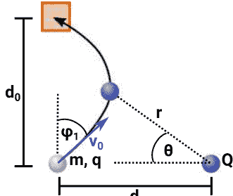

图E.1 设置和变量名称，用于将带电质量射入孔中[23,237]。一个带有质量 $m$ 和电荷 $q$ 的带电粒子在一个固定位置上由另一个电荷 $Q$ 产生的静电场中运动。初始条件由速度 $v_0$ 和角度 $\phi$ 给出。我们想确定 $\phi$ 的值，以使粒子以速度 $v_0$ 着陆在目标孔中。

引入逆径向坐标 $u = 1/r$，左质量的轨道 $r(\theta)$ 遵循以下微分方程（参见例如[267, 第4.3节]）：
$$ \frac{d^2 u}{d \theta^2} + u = \frac{k}{l^2} \quad \text{(E.1)} $$
与常数
$$ k = \frac{-q Q}{4 \pi \epsilon_0 m} \quad \text{(E.2)} $$
和质量归一化的角动量
$$ l = r^2 \frac{d\theta}{dt} \quad \text{(E.3)} $$
这是一个守恒量，我们可以从问题的初始条件确定它
$$ l = d_0 v_0 \cos\phi \quad \text{(E.4)} $$
方程 (E.1) 的一般解为
$$ u = A \cos(\theta - \theta_0) + \frac{k}{l^2} \quad \text{(E.5)} $$
其中 $A$ 和 $\theta_0$ 是从初始条件中确定的常数。初始条件为
$$ r(\theta = 0) = \frac{1}{A \cos(\theta_0) + \frac{k}{l^2}} = d_0 \quad \text{(E.6)} $$
$$ \left.\frac{dr}{d\theta}\right|_{\theta=0} = \frac{-A \sin \theta_0}{\left(A \cos \theta_0 + \frac{k}{l^2}\right)^2} \frac{v_0 \cos \phi}{d_0} = v_0 \sin \phi \quad \text{(E.7)} $$
将这些组合起来得到
$$ A \cos \theta_0 = \frac{1}{d_0} - \frac{k}{l^2} \quad \text{(E.8)} $$
$$ A \sin \theta_0 = -\frac{1}{d_0} \tan \phi \quad \text{(E.9)} $$
质量到达孔的条件可以用 $r(\theta)$ 表示如下：
$$ r\left(\theta = \frac{\pi}{4}\right) = \frac{1}{A \cos(\frac{\pi}{4} - \theta_0) + \frac{k}{l^2}} = \sqrt{2} d_0 \quad \text{(E.10)} $$

使用 $\cos(\pi/4-\theta_0) = \cos\theta_0/\sqrt{2} + \sin\theta_0/\sqrt{2}$，结合 $A$ 和 $\theta_0$ 的定义以及公式(E.8) 和(E.9)，我们可以解出 $v_0$：
$$ v_0^2 = \frac{(\sqrt{2}-1)k}{d_0} \frac{1}{\cos\phi \sin\phi} \quad \text{(E.11)} $$
将 $\phi$ 限制在一个合适的小区间内，这个函数是单射的，并且有一个明确定义的反函数 $\phi(v_0)$。神经网络必须从操作输入数据中计算出这个反函数。为了生成有效的问题-答案对，我们在大量随机选择的 $\phi$（在函数是单射的区间内）上评估 $v_0(\phi)$。

## 参考文献
- 1. Schrittwieser, J., Antonoglou, I., Hubert, T., Simonyan, K., Sifre, L., Schmitt, S., Guez, A., Lockhart, E., Hassabis, D., Graepel, T., Lillicrap, T., & Silver, D. (2020). Nature, 588(7839), 604.
- 2. Segler, M. H. S., Preuss, M., & Waller, M. P. (2018). Nature, 555(7698), 604.
- 3. Dalgaard, M., Motzoi, F., Sørensen, J. J., & Sherson, J. (2020). npj Quantum Information, 6(1), 6. https://doi.org/10.1038/s41534-019-0241-0
- 4. Wu, T., & Tegmark, M. (2018). http://arxiv.org/abs/1810.10525
- 5. 博伊尔, R. (1772). 尊敬的罗伯特・博伊尔的作品 (第二版, 第六卷).
- 6. 维格纳, E. P. (1995). 尤金・保罗・维格纳的著作。在 J. Mehra (Ed.) 的《哲学反思与综合》(pp. 247-260). Springer. https://doi.org/10.1007/978-3-642-78374-6_20
- 7. 德意志, D., & 彭罗斯, R. (1985). 伦敦皇家学会会议：A. 数学和物理科学, 400(1818), 97.
- 8. 布鲁克纳, Č. (2017). 前沿系列。在 R. Bertlmann & A. Zeilinger (Eds.) 的《量子不可言》第二卷: 贝尔定理的半个世纪 (pp. 95-117). Springer International Publishing. https://doi.org/10.1007/978-3-319-38987-5_5
- 9. Frauchiger, D., & Renner, R. (2018). Nature Communications, 9(1), 3711.
- 10. Proietti, M., Pickston, A., Graffiitti, F., Barrow, P., Kundys, D., Branciard, C., Ringbauer, M., & Fedrizzi, A. (2019). Science Advances, 5(9). https://advances.sciencemag.org/content/5/9/eaaw9832
- 11. Bong, K. W., Utreras-Alarcón, A., Ghafari, F., Liang, Y. C., Tischler, N., Cavalcanti, E. G., Pryde, G. J., & Wiseman, H. M. (2020). Nature Physics. https://www.nature.com/articles/s41567-020-0990-x.
- 12. Hawking, S. W. (1976). Physical Review D, 14, 2460.
- 13. Preskill, J. (1993). 国际黑洞研讨会：膜：虫洞和超弦。
- 14. Dunjko, V., & Briegel, H. J. (2017). http://arxiv.org/abs/1709.02779
- 15. Roscher, R., Bohn, B., Duarte, M. F., & Garcke, J. (2019). http://arxiv.org/abs/1905.08883
- 16. Alhousseini, I., Chemissany, W., Kleit, F., & Nasrallah, A. (2019). http://arxiv.org/abs/1905.01023
- 17. Carleo, G., Cirac, I., Cranmer, K., Daudet, L., Schuld, M., Tishby, N., Vogt-Maranto, L., & Zdeborová, L. (2019). http://arxiv.org/abs/1903.10563
- 18. Crutchfield, J. P., & McNamara, B. S. (1987). Complex Systems, 1(3), 417.
- 19. Schmidt, M., & Lipson, H. (2009). Science, 324, 81. https://doi.org/10.1126/science.1165893
- 20. Schmidt, M., Vallabh, & Lipson, H. (2011). Physical Biology, 8(5), 055011. https://doi.org/10.1088/1478-3975/8/5/055011
- 21. Koza, J. R. (1994). Statistics and Computing, 4(2), 87.
- 22. Iten, R., Metger, T., Wilming, H., del Rio, L., & Renner, R. (2020). Physical Review Letters, 124, 010508. https://doi.org/10.1103/PhysRevLett.124.010508
- 23. Nautrup, H. P., Metger, T., Iten, R., Jerbi, S., Trenkwalder, L. M., Wilming, H., Briegel, H. J., & Renner, R. (2022). 机器学习：科学与技术, 3(4), 045025.
- 24. Koza, J. R. (1994). 统计与计算, 4(2), 87.
- 25. Forrest, S. (1993). Science, 261(5123), 872.
- 26. Krizhevsky, A., Sutskever, I., & Hinton, G. E. (2012). 在 F. Pereira, C. J. C. Burges, L. Bottou, & K. Q. Weinberger (Eds.), Advances in Neural Information Processing Systems 25 (pp. 1097-1105). Curran Associates, Inc.
- 27. Bengio, Y., Courville, A., & Vincent, P. (2012). IEEE Transactions on Pattern Analysis and Machine Intelligence, 35. https://arxiv.org/abs/1206.5538?context=cs
- 28. Geman, S., Bienenstock, E., & Doursat, R. (1992). Neural Computation. https://doi.org/10.1162/neco.1992.4.1.1
- 29. Bates, C., Yildirim, I., Tenenbaum, J. B., & Battaglia, P. W. (2015). Proceedings of the 37th Annual Conference of the Cognitive Science Society (pp. 172-177). Pasadena, CA.
- 30. Wu, J., Yildirim, I., Lim, J. J., Freeman, B., & Tenenbaum, J. (2015). 在 C. Cortes, N. D. Lawrence, D. D. Lee, M. Sugiyama, & R. Garnett (Eds.), Advances in Neural Information Processing Systems 28 (pp. 127-135). Curran Associates, Inc.
- 31. Bramley, N. R., Gerstenberg, T., Tenenbaum, J. B., & Gureckis, T. M. (2018). Cognitive Psychology, 105, 9.
- 32. Rempe, D., Sridhar, S., Wang, H., & Guibas, L. J. (2019). http://arxiv.org/abs/1901.00466
- 33. Kissner, M., & Mayer, H. (2019). http://arxiv.org/abs/1905.09891
- 34. Ehrhardt, S., Monszpart, A., Mitra, N. & Vedaldi, A. (2018). http://arxiv.org/abs/1805.05086
- 35. Ye, T., Wang, X., Davidson, J., & Gupta, A. (2018). http://arxiv.org/abs/1808.10002
- 36. Lerer, A., Gross, S., & Fergus, R. (2016). http://arxiv.org/abs/1603.01312
- 37. Nielsen, M. A. (2018). 神经网络和深度学习. http://neuralnetworksanddeeplearning.com/
- 38. Tishby, N., & Zaslavsky, N. (2015). IEEE Information Theory Workshop (ITW), 1-5. https://doi.org/10.1109/ITW.2015.7133169
- 39. Nair, V., & Hinton, G. (2010). 第27届国际机器学习大会, 海法 (pp. 807-814).
- 40. Glorot, X., Bordes, A. & Bengio, Y. (2010). 国际人工智能和统计学会议, 第15届.
- 41. Clevert, D. A., Unterthiner, T. & Hochreiter, S. (2015). http://arxiv.org/abs/1511.07289
- 42. 卢, Z., 普, H., 王, F., 胡, Z., & 王, L. (2017). 在 I. Guyon, U. V. Luxburg, S. Bengio, H. Wallach, R. Fergus, S. Vishwanathan, & R. Garnett (Eds.), Advances in Neural Information Processing Systems (Vol. 30). Curran Associates, Inc. https://proceedings.neurips.cc/paper/2017/file/32cbf687880eb1674a07bf717761dd3a-Paper.pdf
- 43. Cybenko, G. (1989). Mathematics of Control, Signals and Systems, 2(4), 303.
- 44. Hornik, K., Stinchcombe, M., & White, H. (1989). Neural Networks, 2(5), 359.
- 45. Sonoda, S., & Murata, N. (2017). Applied and Computational Harmonic Analysis, 43(2), 233. https://doi.org/10.1016/j.acha.2015.12.005. http://arxiv.org/abs/1505.03654. ArXiv: 1505.03654
- 46. Pascanu, R., Montufar, G., & Bengio, Y. (2014). arXiv:1312.6098. http://arxiv.org/abs/1312.6098
- 47. Lee, H., Grosse, R., Ranganath, R., & Ng, A. Y. (2009). 第26届国际机器学习年会 - ICML '09 (pp. 1-8). 蒙特利尔, 魁北克, 加拿大: ACM出版社. https://doi.org/10.1145/1553374.1553453. http://portal.acm.org/citation.cfm?doid=1553374.1553453

## 参考文献

- 48. Zeiler, M. D., & Fergus, R. (2014). 计算机科学讲义。在 D. Fleet, T. Pajdla, B. Schiele 和 T. Tuytelaars (Eds.) 的《计算机视觉—ECCV 2014》 (pp. 818-833)。Cham: Springer International Publishing. https://doi.org/10.1007/978-3-319-10590-1_53
- 49. Higgins, I., Matthey, L., Pal, A., Burgess, C., Glorot, X., Botvinick, M., Mohamed, S., & Lerchner, A. (2017). ICLR. https://openreview.net/references/pdf?id=Sy2fzU9gl
- 50. Chen, T. Q., Li, X., Grosse, R. B., & Duvenaud, D. (2018). http://arxiv.org/abs/1802.04942
- 51. 金, H. & Mnih, A. (2018). https://arxiv.org/abs/1802.05983
- 52. Thomas, V., Bengio, E., Fedus, W., Pondard, J., Beaudoin, P., Larochelle, H., Pineau, J., Precup, D., & Bengio, Y. (2018). http://arxiv.org/abs/1802.09484
- 53. François-Lavet, V., Bengio, Y., Precup, D., & Pineau, J. (2019). 第三十三届AAAI人工智能大会, AAAI 2019 (pp. 3582-3589). https://doi.org/10.1609/aaai.v33i01.33013582
- 54. Bengio, Y. (2017). http://arxiv.org/abs/1709.08568
- 55. Krenn, M., Malik, M., Fickler, R., Lapkiewicz, R., & Zeilinger, A. (2016). 物理评论快报, 116, 090405.
- 56. Melnikov, A. A., Nautrup, H. P., Krenn, M., Dunjko, V., Tiersch, M., Zeilinger, A., & Briegel, H. J. (2018). 国家科学院院刊, 115(6), 1221.
- 57. Krenn, M., Erhard, M., & Zeilinger, A. (2020). 自然物理评论, 2(11), 649-661. https://doi.org/10.1038/s42254-020-0230-4
- 58. Gao, X., Krenn, M., Kysela, J., & Zeilinger, A. (2019). 物理评论A, 99(2), 023825. https://doi.org/10.1103/PhysRevA.99.023825
- 59. Malik, M., Erhard, M., Huber, M., Krenn, M., Fickler, R., & Zeilinger, A. (2016). 自然光子学, 10(4), 248. https://doi.org/10.1038/nphoton.2016.12
- 60. Schlederer, F., Krenn, M., Fickler, R., Malik, M., & Zeilinger, A. (2016). 新物理学杂志, 18(4), 043019. https://doi.org/10.1088/1367-2630/18/4/043019
- 61. Wang, F., Erhard, M., Babazadeh, A., Malik, M., Krenn, M., & Zeilinger, A. (2017). Optica, 4(12), 1462. https://doi.org/10.1364/OPTICA.4.001462
- 62. Babazadeh, A., Erhard, M., Wang, F., Malik, M., Nouroozi, R., Krenn, M., & Zeilinger, A. (2017). 物理评论, 119(18), 180510. https://doi.org/10.1103/PhysRevLett.119.180510
- 63. Erhard, M., Malik, M., Krenn, M., & Zeilinger, A. (2018). 自然光子学, 12(12), 759. https://doi.org/10.1038/s41566-018-0257-6
- 64. Kysela, J., Erhard, M., Hochrainer, A., Krenn, M., & Zeilinger, A. (2020). 国家科学院会议录, 117(42), 26118.
- 65. Krenn, M., Hochrainer, A., Lahiri, M., & Zeilinger, A. (2017). 物理评论, 118(8), 080401. https://doi.org/10.1103/PhysRevLett.118.080401
- 66. Krenn, M., Gu, X., & Zeilinger, A. (2017). 物理评论快报, 119, 240403.
- 67. Gao, X., Erhard, M., Zeilinger, A., & Krenn, M. (2020). 物理评论, 125(5), 050501. https://doi.org/10.1103/PhysRevLett.125.050501
- 68. Krenn, M., Kottmann, J., Tischler, N., & Aspuru-Guzik, A. (2020). arXiv:2005.06443 [physics, physics:quant-ph]. http://arxiv.org/abs/2005.06443
- 69. Friederich, P., Krenn, M., Tamblyn, I. & Aspuru-Guzik, A. (2020). 由机器学习生成的假设所启发的科学直觉。
- 70. Briegel, H. J., & Cuevas, G. D. I. (2012). 科学报告, 2, 400. https://doi.org/10.1038/srep00400, https://www.nature.com/articles/srep00400
- 71. Bell, J. S. (1964). 物理, 1, 195.
- 72. Nielsen, M. A., & Chuang, I. L. (2010). 量子计算和量子信息: 10周年纪念版. 剑桥大学出版社。 https://doi.org/10.1017/CBO9780511976667
- 73. Sachdev, S. (2000). 量子相变. 剑桥大学出版社。 https://doi.org/10.1017/CBO9780511622540
- 74. Huber, M., & de Vicente, J. I. (2013). 物理评论快报, 110(3), 030501。 https://doi.org/10.1103/PhysRevLett.110.030501。 http://arxiv.org/abs/1210.6876。 ArXiv: 1210.6876
- 75. Horodecki, R., Horodecki, P., Horodecki, M., & Horodecki, K. (2009). Reviews of Modern Physics, 81, 865.
- 76. Amico, L., Fazio, R., Osterloh, A., & Vedral, V. (2008). Reviews of Modern Physics, 80, 517.
- 77. Pan, J. W., Chen, Z. B., Lu, C. Y., Weinfurter, H., Zeilinger, A., & Żukowski, M. (2012). Reviews of Modern Physics, 84, 777.
- 78. Hein, M., Eisert, J., & Briegel, H. J. (2004). Physical Review A, 69, 062311.
- 79. Scarani, V., & Gisin, N. (2001). Physical Review Letters, 87, 117901.
- 80. Scarani, V., Bechmann-Pasquinucci, H., Cerf, N. J., Dušek, M., Lütkenhaus, N., & Peev, M. (2009). 物理模型评论, 81, 1301.
- 81. Mautner, J., Makmal, A., Manzano, D., Tiersch, M., & Briegel, H. J. (2015). 新一代计算, 33(1), 69.
- 82. Melnikov, A. A., Makmal, A., & Briegel, H. J. (2014). arXiv:1405.5459 [cs]. http://arxiv.org/abs/1405.5459
- 83. Melnikov, A. A., Makmal, A., Dunjko, V., & Briegel, H. J. (2017). 科学报告, 7(1), 14430.
- 84. Melnikov, A. A., Makmal, A., & Briegel, H. J. (2018). IEEE Access, 6, 64639. https://doi.org/10.1109/ACCESS.2018.2876494
- 85. Hangl, S., Ugur, E., Szedmak, S., & Piater, J. (2016). 2016 IEEE/RSJ International Conference on Intelligent Robots and Systems (IROS) (pp. 2799–2804). https://doi.org/10.1109/IROS.2016.7759434
- 86. Hangl, S., Dunjko, V., Briegel, H. J., & Piater, J. (2020). Frontiers in Robotics and AI, 7, 42. https://doi.org/10.3389/frobt.2020.00042, https://www.frontiersin.org/article/10.3389/frobt.2020.00042
- 87. Nautrup, H. P., Delfosse, N., Dunjko, V., Briegel, H. J. & Friis, N. (2019). 量子, 3, 215. https://doi.org/10.22331/q-2019-12-16-215
- 88. Tiersch, M., Ganahl, E. J., & Briegel, H. J. (2015). Scientific Reports, 5(1), 12874.
- 89. Wallnöfer, J., Melnikov, A. A., Dür, W., & Briegel, H. J. (2020). PRX Quantum, 1, 010301.
- 90. Melnikov, A. A., Sekatski, P., & Sangouard, N. (2020). Physical Review Letters, 125, 160401.
- 91. Ried, K., Müller, T., & Briegel, H. J. (2019). PLOS ONE, 14(2), e0212044.
- 92. López-Incera, A., Ried, K., Müller, T., & Briegel, H. (2020). PloS one, 15(12), e0243628.
- 93. López-Incera, A., Nouvian, M., Ried, K., Müller, T., & Briegel, H. J. (2020). 蜜蜂群体防御：实验结果和理论建模。
- 94. Paparo, G. D., Dunjko, V., Makmal, A., Martin-Delgado, M. A., & Briegel, H. J. (2014). Physical Review X, 4, 031002.
- 95. Dunjko, V., Friis, N., & Briegel, H. J. (2015). New Journal of Physics, 17(2), 023006.
- 96. Friis, N., Melnikov, A. A., Kirchmair, G., & Briegel, H. J. (2015). 科学报告, 5(1), 18036.
- 97. Dunjko, V., Taylor, J. M., & Briegel, H. J. (2016). 物理评论快报, 117, 130501. https://link.aps.org/doi/10.1103/PhysRevLett.117.130501
- 98. Dunjko, V., Taylor, J. M., & Briegel, H. J. (2017). 2017 IEEE国际会议系统、人类和控制论(SMC) (pp. 282–287). https://doi.org/10.1109/SMC.2017.8122616
- 99. Sriarunothai, T., Wolk, S., Giri, G. S., Friis, N., Dunjko, V., Briegel, H. J., & Wunderlich, C. (2018). 量子科学与技术, 4(1), 015014.
- 100. Jerbi, S., Trenkwalder, L. M., Poulsen Nautrup, H., Briegel, H. J., & Dunjko, V. (2021). PRX Quantum, 2, 010328. https://doi.org/10.1103/PRXQuantum.2.010328, https://link.aps.org/doi/10.1103/PRXQuantum.2.010328
- 101. Briegel, H. J., & Müller, T. (2015). Minds and Machines, 25(3), 261.
- 102. Briegel, H. J. (2012). Scientific Reports, 2(1), 522.
- 103. Müller, T., & Briegel, H. J. (2018). Dialectica, 72(2), 219.
- 104. Tulving, E. (1972). Organization of Memory (pp. xiii, 423–xiii, 423). Academic Press.
- 105. Ingvar, D. H. (1985). Human Neurobiology, 4(3), 127.
- 106. Makmal, A., Melnikov, A. A., Dunjko, V., & Briegel, H. J. (2016). IEEE Access, 4, 2110. https://doi.org/10.1109/ACCESS.2016.2556579
- 107. Klyshko, D. N. (1988). Physics-Uspekhi, 31(1), 74. https://ufn.ru/en/articles/1988/1/f/
- 108. Leach, J., Padgett, M. J., Barnett, S. M., Franke-Arnold, S., & Courtial, J. (2002). Physical Review Letters, 88, 257901.
- 109. Schütt, K. T., Chmiela, S., von Lilienfeld, O. A., Tkatchenko, A., Tsuda, K. & Müller, K. R. Machine Learning Meets Quantum Physics. https://link.springer.com/book/10.1007/978-3-030-40245-7#toc
- 110. Decelle, A., Martin-Mayor, V., & Seoane, B. (2019). http://arxiv.org/abs/1904.07637
- 111. Gilmer, J., Schoenholz, S. S., Riley, P. F., Vinyals, O., & Dahl, G. E. (2017). arXiv:1704.01212, http://arxiv.org/abs/1704.01212
- 112. De Cao, N., & Kipf, T. (2018). arXiv:1805.11973, http://arxiv.org/abs/1805.11973
- 113. Kremm, M., Häse, F., Nigam, A., Friederich, P., & Aspuru-Guzik, A. (2020). Machine Learning: Science and Technology, 1(4), 045024.
- 114. Sanchez-Lengeling, B., & Aspuru-Guzik, A. (2018). 科学, 361(6400), 360. https://doi.org/10.1126/science.aat2663. https://science.sciencemag.org/content/361/6400/360. 发布者：美国科学促进会. 部分：综述.
- 115. Gromski, P. S., Henson, A. B., Granda, J. M., & Cronin, L. (2019). 自然评论化学, 3(2), 119. https://doi.org/10.1038/s41570-018-0066-y. https://www.nature.com/articles/s41570-018-0066-y. 编号：2. 发布者：自然出版集团.
- 116. Bongard, J., & Lipson, H. (2007). 国家科学院院刊, 104(24), 9943. https://doi.org/10.1073/pnas.0609476104, https://www.pnas.org/content/104/24/9943
- 117. Daniels, B. C., & Nemenman, I. (2015). 自然通讯, 6, 8133. https://doi.org/10.1038/ncomms9133
- 118. Brunton, S. L., Proctor, J. L., & Kutz, J. N. (2016). 美国国家科学院学报, 113(15), 3932.
- 119. Reinbold, P. A. K., Kageorge, L. M., Schatz, M. F., & Grigoriev, R. O. (2021). 自然通讯, 12(1), 3219.
- 120. Lu, P. Y., Ariño, J. B., & Soljačić, M. (2022). 通讯物理学, 5(1), 1.
- 121. Cubitt, T. S., Eisert, J., & Wolf, M. M. (2012). 物理评论, 108(12), 120503. https://doi.org/10.1103/PhysRevLett.108.120503, https://link.aps.org/doi/10.1103/PhysRevLett.108.120503
- 122. Raissi, M., Perdikaris, P., & Karniadakis, G. E. (2019). 计算物理学杂志, 378, 686. https://doi.org/10.1016/j.jcp.2018.10.045, http://www.sciencedirect.com/science/article/pii/S0021999118307125
- 123. Raissi, M. (2018). http://arxiv.org/abs/1801.06637
- 124. Raissi, M., & Karniadakis, G. E. (2018). 计算物理学杂志, 357, 125. https://doi.org/10.1016/j.jcp.2017.11.039. http://www.sciencedirect.com/science/article/pii/S0021999117309014
- 125. Zhang, D., Guo, L., & Karniadakis, G. E. (2019). http://arxiv.org/abs/1905.01205
- 126. Goeßmann, A., Götte, M., Roth, I., Sweke, R., Kutyniok, G., & Eisert, J. (2020). 用于学习非线性动力学定律的张量网络方法。
- 127. Forrest, S. (1993). 科学, 261(5123). https://doi.org/10.1126/science.8346439, https://science.sciencemag.org/content/261/5123/872
- 128. Udrescu, S. M., & Tegmark, M. (2020). Science Advances, 6(16). https://doi.org/10.1126/sciadv.aay2631, https://advances.sciencemag.org/content/6/16/eaay2631
- 129. Neuweiler, P. (2019). 学期论文, ETH.
- 130. Anderson, P. W. (1972). 科学, 177(4047), 393.
- 131. Noether, E., König Gesellsch, N. D., & Göttingen, D. W. Z. (1918). Math-Physikalische Klasse, 235.
- 132. Hanc, J., Tuleja, S., & Hancova, M. (2004). 美国物理学杂志, 72(4), 428. https://doi.org/10.1119/1.1591764
- 133. Guimerà, R., Reichardt, I., Aguilar-Mogas, A., Massucci, F. A., Miranda, M., Pallarès, J., & Sales-Pardo, M. 科学进展, 6(5), 6971. https://doi.org/10.1126/sciadv.aav6971, https://www.science.org/doi/abs/10.1126/sciadv.aav6971

## 参考文献

- 134. Patrignani, C. (2016). 中国物理C, 40(10), 100001. https://doi.org/10.1088/1674-1137/40/10/100001. https://iopscience.iop.org/article/10.1088/1674-1137/40/10/100001/meta. 出版商: IOP Publishing.

- 135. Aaltonen, T., 等 (2008). 物理评论D, 78, 012002.

- 136. Aaltonen, T., 等 (2009). 物理评论D, 79(1), 011101.

- 137. Meyer, A. (2010). AIP会议论文集, 1200, 293.

- 138. Choudalakis, G. (2011). PHYSTAT 2011, 关于搜索实验和展开中与发现相关的统计问题的研讨会. 欧洲核子研究中心.

- 139. Aaboud, M., Aad, G., Abbott, B., Abdinov, O., Abeloos, B., Abidi, S. H., AbouZeid, O. S., Abraham, N. L., Abramowicz, H., 等 (2019). 欧洲物理学杂志C, 79(2). https://doi.org/10.1140/epjc/s10052-019-6540-y

- 140. Asadi, P., Buckley, M. R., DiFranzo, A., Monteux, A., & Shih, D. (2017). Journal of High Energy Physics, 2017(11), 194. https://doi.org/10.1007/JHEP11(2017)194

- 141. D'Agnolo, R. T., & Wulzer, A. (2019). Physical Review D, 99(1), 015014.

- 142. De Simone, A., & Jacques, T. (2019). The European Physical Journal C, 79(4), 289.

- 143. Sugiyama, M., Suzuki, T., & Kanamori, T. (2012). Density Ratio Estimation in Machine Learning. Cambridge University Press. https://doi.org/10.1017/CBO9781139035613

- 144. Poggio, T., Mhaskar, H., Rosasco, L., Miranda, B., & Liao, Q. (2017). International Journal of Automation and Computing, 14, 1. https://doi.org/10.1007/s11633-017-1054-2

- 145. Bach, F. (2017). Journal Machine Learning Resources, 18(1), 629.

- 146. Montanelli, H., & Du, Q. (2017). https://arxiv.org/abs/1712.08688

- 147. Schilling, M. F. (1986). 美国统计协会杂志, 81(395), 799. https://doi.org/10.1080/01621459.1986.10478337, https://www.tandfonline.com/doi/abs/10.1080/01621459.1986.10478337

- 148. Henze, N. (1988). 统计学年鉴, 16(2), 772.

- 149. Wang, Q., Kulkarni, S. R., & Verdu, S. (2005). IEEE信息论, 51(9), 3064. https://doi.org/10.1109/TIT.2005.853314

- 150. Wang, Q., Kulkarni, S. R., & Verdu, S. (2006). 2006 IEEE国际信息论研讨会(pp. 242-246). https://doi.org/10.1109/ISIT.2006.2618421

- 151. Dasu, T., Krishnan, S., Venkat-subramanian, S., & Yi, K. (2006). 统计学、计算科学和应用界面研讨会.

- 152. Pérez-Cruz, F. (2008). IEEE国际信息理论研讨会论文集(第1666-1670页).

- 153. Kremer, J., Gieseke, F., Steenstrups Pedersen, K., & Igel, C. (2015). 天文学与计算, 12, 67. https://doi.org/10.1016/j.ascom.2015.06.005

- 154. Wang, Q., Kulkarni, S. R., & Verdu, S. (2005). IEEE信息论交易, 51(9), 3064. https://doi.org/10.1109/TIT.2005.853314

- 155. Wang, Q., Kulkarni, S. R., & Verdu, S. (2006). 2006 IEEE国际信息理论研讨会(第242-246页). https://doi.org/10.1109/ISIT.2006.2618421

- 156. Pérez-Cruz, F. (2008). IEEE国际信息理论研讨会论文集(第1666-1670页).

- 157. Manly, B. F. J. (2007). 国际统计评论, 75(2), 269. https://doi.org/10.1111/j.1751-5823.2007.00015_21.x, https://onlinelibrary.wiley.com/doi/abs/10.1111/j.1751-5823.2007.00015_21.x._eprint: https://onlinelibrary.wiley.com/doi/pdf/10.1111/j.1751-5823.2007.00015_21.x

- 158. Vaart, A. W. V. D. (1998). 剑桥统计与概率数学系列. 在渐近统计. 剑桥大学出版社. https://doi.org/10.1017/CBO9780511802256

- 159. Bell, J. S. (1964). Physics-Physique-Fizika, 1(3), 195. https://doi.org/10.1103/PhysicsPhysiqueFizika.1.195, https://link.aps.org/doi/10.1103/PhysicsPhysiqueFizika.1.195. 出版商: 美国物理学会

- 160. Tishby, N., Pereira, F. C. & Bialek W. (2000). http://arxiv.org/abs/physics/0004057

- 161. Shwartz-Ziv, R., & Tishby, N. (2017). http://arxiv.org/abs/1703.00810

- 162. Bahdanau, D., Cho, K., & Bengio, Y. (2015). https://arxiv.org/abs/1409.0473

- 163. Firat, O., Cho, K., Sankaran, B., Yarman Vural, F. T., & Bengio, Y. (2017). 计算机语音语言, 45(C), 236-252. https://doi.org/10.1016/j.csl.2016.10.006, https://doi.org/10.1016/j.csl.2016.10.006

- 164. Celikyilmaz, A., Bosselut, A., He, X. & Choi, Y. (2018). 2018年北美计算语言学协会会议论文集: 人类语言技术, 第1卷(长文) (第1662-1675页). 计算语言学协会, 路易斯安那州新奥尔良. https://doi.org/10.18653/v1/N18-1150. https://www.aclweb.org/anthology/N18-1150

- 165. Koopman, B. O. (1931). 国家科学院会议录, 17(5), 315.

- 166. Koopman, B. O., & Neumann, J. V. (1932). 国家科学院会议录, 18(3), 255. https://doi.org/10.1073/pnas.18.3.255, https://www.pnas.org/content/18/3/255. 出版商: 国家科学院 数学部

- 167. Yeung, E., Kundu, S., & Hodas, N. (2017). http://arxiv.org/abs/1708.06850

- 168. Wehmeyer, C., & Noé, F. (2018). 化学物理学杂志, 148(24), 241703.

- 169. Mardt, A., Pasquali, L., Wu, H., & Noé, F. (2018). Nature Communications, 9(1), 5.

- 170. Takeishi, N., Kawahara, Y., & Yairi, T. (2017). 学习Koopman不变子空间用于动态模式分解。 http://arxiv.org/abs/1710.04340

- 171. Otto, S. E., & Rowley, C. W. (2017). http://arxiv.org/abs/1712.01378

- 172. Li, Q., Dietrich, F., Bollt, E. M., & Kevrekidis, I. G. (2017). Chaos: An Interdisciplinary Journal of Nonlinear Science, 27(10). https://doi.org/10.1063/1.4993854, http://arxiv.org/abs/1707.00225

- 173. Kutz, J. N., Brunton, S. L. (2019). 《国家科学院院刊》, 116(45), 22445.

- 174. Mezić, I., & Banaszuk, A. (2004). 《物理学D: 非线性现象》, 197(1-2), 101. https://doi.org/10.1016/j.physd.2004.06.015, https://linkinghub.elsevier.com/retrieve/pii/S0167278904002507

- 175. Mezić, I. (2005). 《非线性动力学》, 41(1), 309.

- 176. Mezić, I. (2019). arXiv:1702.07597. http://arxiv.org/abs/1702.07597

- 177. Budišić, M., Mohr, R., & Mezić, I. (2012). 《混沌: 非线性科学的跨学科期刊》, 22(4), 047510. https://doi.org/10.1063/1.4772195, https://laip.scitation.org/doi/10.1063/1.4772195. 出版商: 美国物理学会.

- 178. Mezić, I. (2013). Annual Review of Fluid Mechanics, 45(1), 357. https://doi.org/10.1146/annurev-fluid-011212-140652, http://www.annualreviews.org/doi/10.1146/annurev-fluid-011212-140652

- 179. Schmid, P. J. (2010). Journal of Fluid Mechanics, 656, 5. https://doi.org/10.1017/S0022112010001217, https://www.cambridge.org/core/journals/journal-of-fluid-mechanics/article/dynamic-mode-decomposition-of-numerical-and-experimental-data/AA4C763B525515AD4521A6CC5E10DBD4. 出版商: 剑桥大学出版社.

- 180. Rowley, C. W., Mezić, I., Bagheri, S., Schlatter, P., & Henningson, D. S. (2009). 流体力学杂志, 641, 115. https://doi.org/10.1017/S0022112009992059, https://www.cambridge.org/core/product/identifier/S0022112009992059/type/journal_article

- 181. Brunton, S. L., Proctor, J. L., Tu, J. H., & Kutz, J. N. (2015). 计算动力学杂志, 2(2), 165. https://doi.org/10.3934/jcd.2015002, https://www.aimsciences.org/article/doi/10.3934/jcd.2015002. 公司: 计算动力学杂志 分销商: 计算动力学杂志 机构: 计算动力学杂志 标签: 计算动力学杂志 出版商: 美国数学科学研究所.

- 182. Arbabi, H. (2018).

- 183. Lusch, B., Kutz, J. N., & Brunton, S. L. (2018). 自然通讯, 9, 4950.

- 184. Kipf, T., Fetaya, E., Wang, K. C., Welling, M., & Zemel, R. (PMLR, 2018). 机器学习研究的论文集(第80卷,第2688-2697页). http://proceedings.mlr.press/v80/kipf18a.html

- 185. Battaglia, P., Pascanu, R., Lai, M., Rezende, D. J., & Kavukcuoglu, K. (2016). 第30届国际神经信息处理系统会议论文集(第4509-4517页). http://dl.acm.org/citation.cfm?id=3157382. 3157601

- 186. Zheng, D., Luo, V., Wu, J., & Tenenbaum, J. B. (2018). http://arxiv.org/abs/1807.09244

- 187. Chang, M. B., Ullman, T., Torralba, A., & Tenenbaum, J. B. (2016). http://arxiv.org/abs/1612.00341

- 188. Raposo, D., Santoro, A., Barrett, D., Pascanu, R., Lillicrap, T., & Battaglia, P. (2017). http://arxiv.org/abs/1702.05068

- 189. Hinton, G. E., & Salakhutdinov, R. R. (2006). *Science*, 313(5786), 504. https://doi.org/10.1126/science.1127647

- 190. Eslami, S. M. A., Rezende, D. J., Besse, F., Viola, F., Morcos, A. S., Garnelo, M., Ruderman, A., Rusu, A. A., Danihelka, I., Gregor, K., Reichert, D. P., Buesing, L., Weber, T., Vinyals, O., Rosenbaum, D., Rabinowitz, N., King, H., Hillier, C., Botvinick, M., D. Wierstra, K. Kavukcuoglu, & Hassabis, D. (2018). *Science*, 360(6394), 1204.

- 191. Hornik, K. (1991). 神经网络, 4(2), 251.

- 192. 陈, B., 黄, K., 拉古帕蒂, S., 钱德拉特雷亚, I., 杜, Q., 和利普森, H. (2022). 自然计算科学, 2(7), 433.

- 193. Kingma, D. P., 和 Welling, M. (2013). https://arxiv.org/abs/1312.6114

- 194. Elman, J. L. (1990). 认知科学, 14(2), 179.

- 195. 刘, S., 杨, N., 李, M., 和周, M. (2014). 计算语言学协会第52届年会论文集（第1卷：长文）(pp. 1491-1500). 马里兰州巴尔的摩：计算语言学协会. https://doi.org/10.3115/v1/P14-1140. https://www.aclweb.org/anthology/P14-1140

- 196. Auli, M., Galley, M., Quirk, C., & Zweig, G. (2013). 2013年自然语言处理实证方法会议论文集(第1044-1054页). 美国华盛顿州西雅图: 计算语言学协会. https://www.aclweb.org/anthology/D13-1106

- 197. Sutskever, I., Vinyals, O., & Le, Q. V. (2014). 在 Z. Ghahramani, M. Welling, C. Cortes, N. D. Lawrence, & K. Q. Weinberger 的《神经信息处理系统进展》第27卷(第3104-3112页). Curran Associates, Inc. http://papers.nips.cc/paper/5346-sequence-to-sequence-learning-with-neural-networks.pdf

- 198. Scarselli, F., Gori, M., Tsoi, A. C., Hagenbuchner, M., & Monfardini, G. (2009). IEEE神经网络交易, 20(1), 61.

- 199. Li, Y., Tarlow, D., Brockschmidt, M., & Zemel, R. (2017). arXiv:1511.05493. http://arxiv.org/abs/1511.05493

- 200. Sanchez-Gonzalez, A., Heess, N., Springenberg, J. T., Merel, J., Riedmiller, M., Hadsell, R., & Battaglia, P. (2018). arXiv:1806.01242. http://arxiv.org/abs/1806.01242

- 201. Li, Y., Wu, J., Tedrake, R., Tenenbaum, J. B., & Torralba, A. (2019). ICLR.

- 202. Mrowca, D., Zhuang, C., Wang, E., Haber, N., Fei-Fei, L., Tenenbaum, J. B., & Yamins, D. L. K. (2018). arXiv:1806.08047. http://arxiv.org/abs/1806.08047

- 203. Bapst, V., Keck, T., Grabska-Barwińska, A., Donner, C., Cubuk, E. D., Schoenholz, S. S., Obika, A., Nelson, A. W. R., Back, T., Hassabis, D., & Kohli, P. (2020). 自然物理学, 16(4), 448.

- 204. Sanchez-Gonzalez, A., Godwin, J., Pfaff, T., Ying, R., Leskovec, J., & Battaglia, P. W. (2020). 学习用图网络模拟复杂物理现象. https://arxiv.org/abs/2002.09405

- 205. Cranmer, M., Sanchez-Gonzalez, A., Battaglia, P., Xu, R., Cranmer, K., Spergel, D., & Ho, S. (2020). arXiv:2006.11287, http://arxiv.org/abs/2006.11287

- 206. Hamilton, W. L., Ying, R., & Leskovec, J. (2018). arXiv:1706.02216, http://arxiv.org/abs/1706.02216

- 207. Kipf, T. N., & Welling, M. (2017). arXiv:1609.02907. http://arxiv.org/abs/1609.02907

- 208. Zaheer, M., Kottur, S., Ravanbakhsh, S., Poczos, B., Salakhutdinov, R. R., & Smola, A. J. (2017). In I. Guyon, U. V. Luxburg, S. Bengio, H. Wallach, R. Fergus, S. Vishwanathan, & R. Garnett (Eds.), *Advances in Neural Information Processing Systems 30* (pp. 3391-3401). Curran Associates, Inc. http://papers.nips.cc/paper/6931-deep-sets.pdf

- 209. Herzig, R., Raboh, M., Chechik, G., Berant, J., & Globerson, A. (2018). arXiv:1802.05451, http://arxiv.org/abs/1802.05451

## 参考文献

210. 刘志宇, & 周杰 (2020). Synthesis lectures on artificial intelligence and machine learning, 14(2), 1.

211. Maddison, C. J., Mnih, A., & Teh, Y. W. (2017). arXiv:1611.00712, http://arxiv.org/abs/1611.00712

212. Abadi, M., Agarwal, A., Barham, P., Brevdo, E., Chen, Z., Citro, C., Corrado, G. S., Davis, A., Dean, J., Devin, M., Ghemawat, S., Goodfellow, I., Harp, A., Irving, G., Isard, M., Jia, Y., Jozefowicz, R., Kaiser, L., Kudlur, M., Levenberg, J., Mané, D., Monga, R., Moore, S., Murray, D., Olah, C., Schuster, M., Shlens, J., Steiner, B., Sutskever, I., Talwar, K., Tucker, P., Vanhoucke, V., Vasudevan, V., Viégas, F., Vinyals, O., Warden, P., Wattenberg, M., Wicke, M., Yu, Y., & Zheng, X. (2015). TensorFlow: Large-scale machine learning on heterogeneous systems. https://www.tensorflow.org/

213. Ross, B. C. (2014). PLOS ONE, 9(2), e87357.

214. Kraskov, A., Stogbauer, H., & Grassberger, P. (2004). Physical Review E, 69(6), 066138.

215. Kozachenko, L. F., & Leonenko, N. N. (1987). Problems Inform. Transmission, 23, 95.

216. Pedregosa, F., Varoquaux, G., Gramfort, A., Michel, V., Thirion, B., Grisel, O., Blondel, M., Prettenhofer, P., Weiss, R., Dubourg, V., Vanderplas, J., Passos, A., Cournapeau, D., Brucher, M., Perrot, M., & Duchesnay, E. (2011). Journal of Machine Learning Research, 12, 2825.

217. Beléndez, A., Pascual, C., Méndez, D. I., Beléndez, T., & Neipp, C. (2007). Revista Brasileira de Ensino de Física, 29(4), 645.

218. 这个图由“B. Lusch, J. N. Kutz, and S. L. Brunton, Deep learning for universal linear embeddings of nonlinear dynamics, Nat. Commun. 9, 4950, https://doi.org/10.1038/s41467-018-07210-0, 2018”中的图组成。该作品根据知识共享署名4.0许可发布 (https://creativecommons.org/licenses/by/4.0/)。图中的标签已经修改以适应本书的内容。

219. 巴黎, M., & Reháček, J. (编著), (2004). 物理学讲义：量子态估计。柏林, 海德堡: 施普林格。https://doi.org/10.1007/b98673, http://link.springer.com/10.1007/b98673

220. Gamel, O. (2016). 物理评论A, 93(6). https://doi.org/10.1103/physreva.93.062320, http://dx.doi.org/10.1103/PhysRevA.93.062320

221. Floryan, D., & Graham, M. D. (2022). 自然机器智能, 4(12), 1113.

222. Carleo, G., & Troyer, M. (2017). 科学, 355(6325), 602.

223. Rocchetto, A., Grant, E., Strelchuk, S., Carleo, G., & Severini, S. (2018). NPJ量子信息, 4(1), 28. https://doi.org/10.1038/s41534-018-0077-z, https://www.nature.com/articles/s41534-018-0077-z

224. Glasser, I., Pancotti, N., August, M., Rodriguez, I. D., & Cirac, J. I. (2018). Physical Review X, 8(1), 011006.

225. Carleo, G., Nomura, Y., & Imada, M. (2018). Nature Communications, 9(1), 5322.

226. 蔡, Z., & 刘, J. (2018). Physical Review B, 97(3). https://doi.org/10.1103/PhysRevB.97.035116, http://arxiv.org/abs/1704.05148

227. 黄, Y., & Moore, J. E. (2017). http://arxiv.org/abs/1701.06246

228. Deng, D. L., Li, X., & Sarma, S. D. (2017). Physical Review B, 96(19). https://doi.org/10.1103/PhysRevB.96.195145, http://arxiv.org/abs/1609.09060

229. Schmitt, M., & Heyl, M. (2018). SciPost Physics, 4(2). https://doi.org/10.21468/SciPostPhys.4.2.013, http://arxiv.org/abs/1707.06656

230. Torlai, G., Mazzola, G., Carrasquilla, J., Troyer, M., Melko, R., & Carleo, G. (2018). Nature Physics, 14(5), 447.

231. Nomura, Y., Darmawan, A. S., Yamaji, Y., & Imada, M. (2017). Physical Review B, 96(20). https://doi.org/10.1103/PhysRevB.96.205152, http://arxiv.org/abs/1709.06475

232. Deng, D. L., Li, X., & Sarma, S. D. (2017). Physical Review X, 7(2). https://doi.org/10.1103/PhysRevX.7.021021, http://arxiv.org/abs/1701.04844

233. 高, X, & 段, L.M. (2017). 自然通讯, 8(1). https://doi.org/10.1038/s41467-017-0705-2, http://arxiv.org/abs/1701.05039

234. Carrasquilla, J., Torlai, G., Melko, R.G., Aolita, L. (2019). 自然机器智能, 1(3), 155.

235. Beach, M.J.S., De Vlugt, I., Golubeva, A., Huembeli, P., Kulchytskyy, B., Luo, X., Melko, R.G., Merali, E., & Torlai, G. (2019). SciPost物理学, 7(1), 009. https://doi.org/10.21468/SciPostPhys.7.1.009, http://arxiv.org/abs/1812.09329

236. Torlai, G., & Melko, R.G. (2019). http://arxiv.org/abs/1905.04312

237. 我们使用来自“Hendrik Poulsen Nautrup, Tony Metger, Raban Iten, Sofiene Jerbi, Lea M. Trenkwalder, Henrik Wilming, Hans J. Briegel, and Renato Renner, Operationally meaningful representations of physical systems in neural networks, Mach. Learn.: Sci. Technol. 3, 045025, https://doi.org/10.1088/2632-2153/ac9ae8, 2022”的材料。该作品根据知识共享署名 4.0 许可发布 (https://creativecommons.org/licenses/by/4.0/)。该材料经过修改以适应本书的内容（但内容没有进行实质性的更改）。

238. Celikyilmaz, A., Bosselut, A., He, X., & Choi, Y. (2018). arXiv:1803.10357, http://arxiv.org/abs/1803.10357

239. Goldstein, H., Poole, C., & Safko, J. (2002). 经典力学 (第三版). Addison-Wesley.

240. González, E. (2020). ETH 硕士论文.

241. Lesort, T., Díaz-Rodríguez, N., Goudou, J. F., & Filliat, D. (2018). 神经网络, 108, 379.

242. Bengio, E., Thomas, V., Pineau, J., Precup, D., & Bengio, Y. (2017). http://arxiv.org/abs/1703.07718

243. Jonschkowski, R., & Brock, O. (2015). 自主机器人, 39(3), 407.

244. Jaderberg, M., Mnih, V., Czarnecki, W. M., Schaul, T., Leibo, J. Z., Silver, D., & Kavukcuoglu, K. (2017). 第五届国际学习表示会议, ICLR 2017, 图伦, 法国, 2017年4月24日至26日, 会议论文集. https://openreview.net/forum?id=SJ6yPD5xg

245. Veeriah, V., Hessel, M., Xu, Z., Lewis, R., Rajendran, J., Oh, J., van Hasselt, H., Silver, D., & Singh, S. (2019). arXiv:1909.04607, http://arxiv.org/abs/1909.04607

246. Fan, F., Xiong, J., & Wang, G. (2020). arXiv:2001.02522, http://arxiv.org/abs/2001.02522

247. 深入神经网络: Inceptionism. http://ai.googleblog.com/2015/06/inceptionism-going-deeper-into-neural.html

248. Schindler, F., Regnault, N., & Neupert, T. (2017). Physical Review B, 95(24), 245134.

249. Seif, A., Hafezi, M., & Jarzynski, C. (2020). 自然物理学, 1-9 (2020). https://doi.org/10.1038/s41567-020-1018-2, https://www.nature.com/articles/s41567-020-1018-2. 出版商: 自然出版集团.

250. 金, S., 卢, P. Y., Mukherjee, S., Gilbert, M., Jing, L., Ceperic, V., & Soljacic, M. (2019). https://arxiv.org/abs/1912.04825

251. Martius, G., & Lampert, C. H. (2016). arXiv:1610.02995, http://arxiv.org/abs/1610.02995

252. Sahoo, S. S., Lampert, C. H., & Martius, G. (2018). arXiv:1806.07259, http://arxiv.org/abs/1806.07259

253. Lemos, P., Jeffrey, N., Cranmer, M., Ho, S., & Battaglia, P. (2022). 用深度学习从实验数据中提取物理概念. https://doi.org/10.48550/ARXIV.2202.02306, https://arxiv.org/abs/2202.02306

254. Müller, V. C. (2016). 人工智能的基本问题. Springer.

255. Grace, K., Salvatier, J., Dafoe, A., Zhang, B., & Evans, O. (2018). 人工智能研究杂志, 62, 729. https://doi.org/10.1613/jair.1.11222, https://www.jair.org/index.php/jair/article/view/11222

256. King, R. D., Whelan, K. E., Jones, F. M., Reiser, P. G. K., Bryant, C. H., Muggleton, S. H., Kell, D. B., & Oliver, S. G. (2004). Nature, 427(6971), 247.

257. 庄, F., 齐, Z., 段, K., 席, D., 朱, Y., 朱, H., 熊, H., 和何, Q. (2021). 《IEEE会议录》, 109(1), 43. https://doi.org/10.1109/JPROC.2020.3004555

258. Siegelmann, H., & Sontag, E. (1995). 《计算机与系统科学杂志》, 50(1), 132. https://doi.org/10.1006/jcss.1995.1013, https://www.sciencedirect.com/science/article/pii/S0022000085710136

259. Graves, A., Wayne, G., & Danihelka, I. (2014). 神经图灵机.

260. 李, J. (2012). 数学研究生教材. 在《平滑流形导论》(第2版)中. Springer-Verlag. https://doi.org/10.1007/978-1-4419-9982-5, www.springer.com/de/book/9781441999818

261. Achille, A., & Soatto, S. (2018). IEEE模式分析与机器智能交易, 40(8), 1828. https://doi.org/10.1109/TPAMI.2017.2784440

262. https://github.com/eth-nn-physics/nn_physical_concepts/blob/copernicus/analysis/copernicus_analysis_elliptic.ipynb

263. https://github.com/eth-nn-physics/nn_physical_concepts

264. https://github.com/tonymetger/communicating_scinet

265. Pitelis, N., Russell, C., & Agapito, L. (2013). IEEE计算机视觉和模式识别会议, (pp. 1642-1649). https://doi.org/10.1109/CVPR.2013.215

266. Korman, E. O. (2018). http://arxiv.org/abs/1803.00156

267. Tong, D. http://www.damtp.cam.ac.uk/user/tong/relativity.html