# 面向自然语言处理和语音识别的深度学习


Uday Kamath · John Liu · James Whitaker


Springer

Uday Kamath
Digital Reasoning Systems Inc.
McLean
VA, USA

John Liu
Intelluron Corporation
Nashville
TN, USA

James Whitaker
Digital Reasoning Systems Inc.
McLean
VA, USA

ISBN 978-3-030-14595-8 ISBN 978-3-030-14596-5 (电子书)
https://doi.org/10.1007/978-3-030-14596-5

© Springer Nature Switzerland AG 2019
本作品受版权保护。出版商保留所有权利，无论是整体还是部分材料，特别是翻译、重印、插图的再利用、朗诵、广播、微缩胶片复制或以任何其他实体方式的复制、信息传输和检索存储、电子适应、计算机软件，或者通过已知或今后开发的类似或不同的方法。

在本出版物中使用一般描述性名称、注册名称、商标、服务标志等，并不意味着即使在没有具体声明的情况下，这些名称也不受相关保护法律和法规的限制，因此可以自由使用。

出版商、作者和编辑可以安全地假设本书中的建议和信息在出版日期时被认为是真实和准确的。出版商、作者或编辑对本文所包含的材料不提供任何明示或暗示的保证，也不对可能存在的错误或遗漏负责。出版商在发表的地图和机构隶属方面保持中立。

这个Springer印记由注册公司Springer Nature Switzerland AG出版。注册公司地址为：瑞士Cham市Gewerbestrasse 11号，邮编6330。

感谢我的父母*Krishna*和*Bharathi*，我的妻子*Pratibha*，孩子们*Aaroh*和*Brandy*，
以及我的家人和朋友们的支持。
									–乌代·卡马特

致*Catherine*、*Gabrielle Kaili-May*、*Eugene* 和*Tina*，感谢他们一直以来的鼓舞。
										–约翰·刘

致我母亲南希，感谢她的持续支持
，还有我的家人和朋友们，他们用爱给予了我生活的祝福。
									–詹姆斯·惠特克

# 前言

这本书的出版时间非常完美。现有的深度学习书籍要么专注于理论方面，要么主要是工具的手册。但是这本书对自然语言处理和语音处理的深度学习技术进行了前所未有的分析和比较，弥合了理论与实践之间的巨大差距。每一章都讨论了相关主题的理论基础，并提供了13个不同应用领域的优秀案例研究。

这些案例研究包括基于分布式表示的分类、摘要、机器翻译、情感分析、迁移学习、多任务自然语言处理、端到端语音和问答。每个案例研究都包括最先进技术的实现和比较，并且附带的网站提供源代码和数据。这对于从业者来说非常有价值，他们可以亲自尝试这些方法，并通过将其应用于实际场景来加深对这些方法的理解。

本书全面介绍了深度学习的基础知识和先进技术，包括词嵌入、卷积神经网络、循环神经网络、注意力机制、增强记忆网络、多任务学习、领域自适应和强化学习。本书对从业者和研究人员都是一份宝贵的资源，讨论的案例研究和相关材料可以为各种项目和课堂实践提供灵感。

GMU的副教授 Carlotta Domeniconi，博士
美国弗吉尼亚州费尔法克斯
2019年2月

自然语言处理和语音处理应用，如虚拟助手和智能音箱，在我们的生活中扮演着重要且不断增长的角色。与此同时，在越来越多的出版物中，很难确定最有前途的方法。作为Digital Reasoning的首席分析官，并拥有大数据机器学习博士学位，Uday可以接触到这个快速发展领域的实践和研究方面。他还是该领域的作者之一。

精通Java机器学习，他非常适合解析实践和前沿方法。这本书将机器学习的理论和实践相结合，形成了一种罕见的融合。它包括一个简介，使其对刚入门的人易于理解，一个概述最先进的方法，即使对从事研究的人也很有趣，以及一系列实际示例，将材料与实际应用和演示中的行业从业者的有用性联系起来。

DeepMind的研究科学家 Sebastian Ruder，博士
伦敦，英国
2019年2月

几年前，我拿起几本教科书来学习与人工智能相关的主题—例如自然语言处理和计算机视觉。我阅读这些教科书的记忆主要是无助地凝视着窗外。每当我尝试实现所描述的概念和数学时，我都不知道从哪里开始。这在为学术目的编写的书籍中相当常见；它们嘲笑地将实际实现“作为读者的练习”。有一些例外的书籍试图弥合这个差距，这些书籍是由那些知道超越数学直到一个工作系统的重要性的人编写的。这本书是其中之一—通过讨论、案例研究、代码片段和全面的参考资料，它令人愉快地弥合了学习和实践之间的鸿沟。

我特别喜欢使用Python和开源工具。这是一种对实现机器学习系统的观点——人们可能会问：“为什么不用X”，其中X可以是Java、C++或Matlab？然而，我发现安慰的是，这是最流行的观点，这给读者提供了巨大的支持结构，使他们能够实现自己的想法。在现代互联网世界中，加入一个流行的生态系统等同于成千上万的人连接在一起互相帮助——从解决错误信息的Stack Overflow帖子到实现高质量系统的GitHub存储库。为了让你有所了解，我曾经支持过一个使用Lua编程语言的机器学习爱好者的小众社区，持续了几年。由于我们的人群规模比Python小几个数量级，所以每天都在努力做新的事情——甚至是基本的事情，比如制作条形图。

总的来说，我希望读者能够享受到现代实用的深度学习系统在自然语言处理和语音识别方面的应用，充分利用开源机器学习系统，并通过这些极具才华的作者学到很多“行业内的诀窍”。其中一位作者我认识了多年，见证了他构建强大的语音识别系统的过程。

Facebook AI Research (FAIR)的研究工程师 Soumith Chintala，博士
纽约，美国
2019年2月

# 前言

# 为什么选择这本书？

随着深度学习、自然语言处理（NLP）和语音应用在金融、医疗保健、政府以及我们日常生活中的广泛应用，需要一本全面的资源将深度学习技术与NLP和语音相结合，并提供使用工具和库进行实际应用的见解。 许多书籍关注深度学习理论或深度学习在NLP特定任务中的应用，而其他书籍则是工具和库的实用指南。 然而，快速发展的领域中不断涌现出新的算法、工具、框架和库，导致很少有可用的文本包含对最新深度学习方法和适用于NLP和语音的最新技术的解释，以及带有代码的实际案例研究，以提供实践经验。 举个例子，你会发现很难找到一本单一的资源，解释神经注意力技术在实际的NLP任务（如机器翻译）中的影响，从基础到最先进的方法都有涉及。 同样，很难找到一本包含基于知名库的伴随代码的资源，并对这些技术进行比较和分析。

- 本书提供以下所有内容：
- 一个全面的资源，从基础深度学习、文本和语音原理到先进的最新神经架构
- 一个深度学习技术的实用参考，适用于常见的自然语言处理和语音识别应用
- 一个有用的资源，详细解释了成功的架构和算法以及必要的数学洞察力
- 最新的端到端神经语音处理方法的深入参考和比较
- 领先的迁移学习、领域适应和深度强化学习架构的全景资源，适用于文本和语音
- 使用这些技术的实际方面，以及适用于实际应用的技巧和窍门
- 使用基于Python的库（如Keras、TensorFlow和PyTorch）进行实际案例研究的实践方法

简而言之，本书的主要目的是提供一个单一的来源，通过案例研究、代码、实验和支持分析来弥补理论与实践之间的差距。

# 这本书是为谁准备的？

本书旨在介绍深度学习、自然语言处理和语音识别的基础知识，重点关注应用和实践经验。本书面向自然语言处理专业人士、工程和计算机科学研究生、高级本科生以及具备适当数学背景的任何对最新深度学习方法在自然语言处理和语音识别中感兴趣的人。从数学上讲，我们期望读者熟悉多元微积分、概率、线性代数和Python编程。

Python正在成为数据科学家和研究人员在深度学习实验中的通用语言。近年来，涌现出许多支持Python的深度学习、自然语言处理和语音识别的库。因此，在本书的所有案例研究中，我们都使用Python语言及其相关库。由于在一本书中无法完全涵盖每个主题，我们介绍了我们认为与自然语言处理和语音识别相关的关键概念，这些概念可以应用于实际场景。特别是，我们重点关注这些领域的交叉点，通过利用不同的框架和库来探索现代研究和相关应用。

# 这本书涵盖了什么内容？

这本书分为三个部分，分别适合不同的读者群体和他们的专业知识。这三个部分分别是：

- 机器学习、自然语言处理和语音介绍。第一部分有三个章节，介绍了自然语言处理、语音识别、深度学习和机器学习的基本实践案例，使用了基于Python的工具和库。
- 深度学习基础。第二部分的五个章节介绍了深度学习和与语音和文本处理相关的各种主题，包括词嵌入、卷积神经网络、循环神经网络和语音识别基础。
- 文本和语音的高级深度学习技术。第三部分有五个章节，讨论了与自然语言处理和语音交叉的深度学习领域的最新研究。通过案例研究，涵盖了注意机制、记忆增强网络、迁移学习、多任务学习、领域自适应、强化学习和端到端的语音识别等主题。

接下来，我们总结每章涉及的主题。

- 在引言中，我们简要介绍了深度学习、自然语言处理和语音领域的历史。我们介绍了机器学习的不同领域，并详细介绍了从书籍到数据集的不同资源，以帮助读者在实践中获得帮助。
- 机器学习基础章节提供了基本理论和重要的实践概念的复习。涵盖的主题包括学习过程、监督学习、数据采样、验证技术、模型的过拟合和欠拟合、线性和非线性机器学习算法以及序列数据建模。本章以使用结构化数据构建预测模型并使用Python工具和库分析结果的详细案例研究结束。
- 在“文本和语音基础”章节中，我们向读者介绍了计算语言学和自然语言处理的基础知识，包括词汇、句法、语义和话语表示。我们介绍了语言建模，并讨论了文本分类、聚类、机器翻译、问答、自动摘要和自动语音识别等应用，最后通过一个文本聚类和主题建模的案例研究进行总结。
- 在“深度学习基础”章节中，我们在机器学习基础上引入了深度学习。该章节从多层感知器（MLP）的基本组成部分开始，对深度学习进行了基本分析，然后介绍了基本MLP架构的变体和深度神经网络的训练技术。随着章节的进展，介绍了各种用于监督学习和无监督学习的架构，如多类MLP、自编码器和生成对抗网络（GANs）。最后，通过一个口语数字数据集的案例研究，分析了监督学习和无监督学习的神经网络架构。
- 对于分布式表示章节，我们研究了基于向量空间模型（如word2vec和GloVe）的分布语义和词表示。我们详细介绍了词嵌入的局限性，包括反义词和多义词以及可以克服这些局限性的方法。我们还研究了嵌入模型的扩展，包括子词、句子、概念、高斯和双曲嵌入。我们在本章中通过一个案例研究来深入探讨嵌入模型的训练方式及其在文档聚类和词义消歧中的适用性。
- 卷积神经网络章节介绍了卷积神经网络的基础知识及其在自然语言处理中的应用。本章的主要内容从基本的数学运算开始，逐步探讨了卷积神经网络的架构，并揭示了卷积神经网络在各种文本数据形式中的精确映射。本章还讨论了一些经典框架的现代适应性、应用于不同自然语言处理任务的方法以及一些快速算法。本章以情感分类为例进行了详细的案例研究，探索了本章中提到的大多数算法，并提供了实用的见解。
- 循环神经网络章节介绍了循环神经网络（RNN），允许将基于序列的信息纳入深度学习中。本章首先对深度学习中的循环连接进行了深入分析，并讨论了它们的局限性。接下来，我们描述了改进循环模型性能和质量的基本方法和高级技术。然后，我们研究了这些架构在自然语言处理和语音中的一些应用。最后，我们通过一个案例研究来应用和比较基于循环神经网络的架构在神经机器翻译任务中的效果，分析了网络类型（RNN、GRU、LSTM和Transformer）和配置（双向、层数和学习率）的影响。
- 自动语音识别章节介绍了自动语音识别（ASR）的基本方法。本章开始关注训练和验证ASR系统常用的度量和特征。然后，我们介绍了语音识别的统计方法，包括声学、词典和语言模型的基本组成部分。案例研究重点训练和比较了两种常见的ASR框架，CMUSphinx和Kaldi，在一个中等规模的英文转录数据集上。
- 注意力和记忆增强网络章节介绍了在神经技术中起到重要作用的注意力机制。接下来，我们介绍了相关的记忆增强网络主题。我们详细讨论了大多数基于神经网络的记忆网络，从记忆网络到递归实体网络，以便用户了解每种技术的工作原理。这一章节独特之处在于它有两个案例研究，第一个用于探索注意力机制，第二个用于记忆网络。第一个案例研究扩展了第7章开始的机器翻译案例研究，以研究不同的注意机制对其影响。第二个案例研究探索并分析了不同的记忆网络在问答自然语言处理任务中的应用。
- 迁移学习：场景、自学习和多任务学习章节介绍了迁移学习的概念，并广泛涵盖了多任务学习技术。 这个案例研究探索了用于自然语言处理任务的多任务学习技术，如词性标注、分块和命名实体识别和分析。 读者应该期望获得应用介绍的多任务学习技术的真实、实际方面的见解。
- 迁移学习：领域自适应章节探讨了模型受到约束的迁移学习领域，例如训练数据较少或预测数据与训练数据不同的情况。 本章介绍了领域自适应、少样本学习、一样本学习和零样本学习的技术。 通过使用亚马逊产品评论跨不同领域进行了详细的案例研究，应用了许多讨论的技术。
- 端到端语音识别章节将第8章的ASR概念与深度学习技术相结合，实现端到端的语音识别。 本章介绍了训练端到端序列模型的机制，包括CTC和注意力机制，并探索了提高质量的解码技术。 通过使用相同的数据集比较了两种端到端技术，Deep Speech 2和ESPnet（CTC-Attention混合训练），扩展了第8章中的案例研究。
- 在深度强化学习用于文本和语音的章节中，我们回顾了强化学习的基础知识，并讨论了它们在深度序列到序列模型中的应用，包括深度策略梯度、深度Q学习、双重DQN和DAAC算法。 我们研究了深度强化学习在自然语言处理任务中的应用，包括信息抽取、文本摘要、机器翻译和自动语音识别。 最后，我们通过一个案例研究介绍了深度策略梯度和深度Q学习算法在文本摘要中的应用。

# 致谢

这本书的编写离不开许多人的巨大努力。 首先，我们要感谢Springer，特别是我们的编辑Paul Drougas，他与我们密切合作，使这本书得以完成。 我们要感谢Digital Reasoning给我们提供了在许多实际的自然语言处理和语音问题上工作的机会，这对我们的工作产生了重大影响。 我们还要特别感谢Maciek Makowski和Gabrielle Liu对本书内容的审查和编辑，以及其他为本书提供支持的人们。提供工程专业知识支持，进行实验，提供内容反馈和建议（按字母顺序）：Mona Barteau, Tim Blass, Brandon Carl, Krishna Choppella, Wael Emara, Last Feremenga, Christi French, Josh Gieringer, Bruce Glassford, Kenneth Graham, Ramsey Kant, Sean Narenthiran, Curtis Ogle, Joseph Porter, Drew Robertson, Sebastian Ruder, Amarda Shehu, Sarah Sorensen, Samantha Terker, Michael Urda。

| 地点 | 姓名 |
|------|------|
| 美国弗吉尼亚州麦克林 | Uday Kamath |
| 美国田纳西州纳什维尔 | John Liu |
| 美国弗吉尼亚州麦克林 | James Whitaker |

# 目录

# 第一部分 机器学习、自然语言处理和语音介绍

- 1. 介绍
  - 1.1 机器学习
    - 1.1.1 监督学习
    - 1.1.2 无监督学习
    - 1.1.3 半监督学习和主动学习
    - 1.1.4 迁移学习和多任务学习
    - 1.1.5 强化学习
  - 1.2 历史
    - 1.2.1 深度学习：简要历史
    - 1.2.2 自然语言处理：简要历史
    - 1.2.3 自动语音识别：简要历史
  - 1.3 从业者的工具、库、数据集和资源
    - 1.3.1 深度学习
    - 1.3.2 自然语言处理
    - 1.3.3 语音识别
    - 1.3.4 书籍
    - 1.3.5 在线课程和资源
    - 1.3.6 数据集
  - 1.4 案例研究和实施细节
  - 参考文献
- 2. 机器学习基础
  - 2.1 引言
  - 2.2 监督学习：框架和形式化定义
    - 2.2.1 输入空间和样本
    - 2.2.2 目标函数和标签
    - 2.2.3 训练和预测
  - 2.3 学习过程
  - 2.4 机器学习理论
    - 2.4.1 泛化-逼近权衡
    - Vapnik-Chervonenkis分析
    - 2.4.2 泛化-逼近权衡
    - 偏差-方差分析
    - 2.4.3 模型性能和评估指标
    - 2.4.4 模型验证
    - 2.4.5 模型估计和比较
    - 2.4.6 机器学习的实用技巧
  - 2.5 线性算法
    - 2.5.1 线性回归
    - 2.5.2 感知器
    - 2.5.3 正则化
    - 2.5.4 逻辑回归
    - 2.5.5 生成分类器
    - 2.5.6 线性算法的实用技巧
  - 2.6 非线性算法
    - 2.6.1 支持向量机
    - 2.6.2 其他非线性算法
  - 2.7 特征转换、选择和降维
    - 2.7.1 特征转换
    - 2.7.2 特征选择和降维
  - 2.8 序列数据和建模
    - 2.8.1 离散时间马尔可夫链
    - 2.8.2 判别式方法：隐马尔可夫模型
    - 2.8.3 生成式方法：条件随机场
  - 2.9 案例研究
    - 2.9.1 软件工具和库
    - 2.9.2 探索性数据分析（EDA）
    - 2.9.3 模型训练和超参数搜索
    - 2.9.4 最终训练和测试模型
    - 2.9.5 读者和实践者的练习
  - 参考文献
- 3 文本和语音基础
  - 3.1 引言
    - 3.1.1 计算语言学
    - 3.1.2 自然语言
    - 3.1.3 语言模型
  - 3.2 形态分析
    - 3.2.1 词干提取
    - 3.2.2 词形还原

## 3.3 词汇表示

### 3.3.1 标记

### 3.3.2 停用词

### 3.3.3 N-Grams

### 3.3.4 文档

## 3.4 句法表示

### 3.4.1 词性标注

### 3.4.2 依存句法分析

## 3.5 语义表示

### 3.5.1 命名实体识别

### 3.5.2 关系抽取

### 3.5.3 事件抽取

### 3.5.4 语义角色标注

## 3.6 语篇表示

### 3.6.1 连贯性

### 3.6.2 一致性

### 3.6.3 指代/倒指

### 3.6.4 本地和全局共指

## 3.7 语言模型

### 3.7.1 N-Gram模型

### 3.7.2 拉普拉斯平滑

### 3.7.3 未登录词处理

### 3.7.4 困惑度

## 3.8 文本分类

### 3.8.1 机器学习方法

### 3.8.2 情感分析

### 3.8.3 蕴涵

## 3.9 文本聚类

### 3.9.1 词汇链

### 3.9.2 主题建模

## 3.10 机器翻译

### 3.10.1 基于词典

### 3.10.2 统计翻译

## 3.11 问答系统

### 3.11.1 基于信息检索

### 3.11.2 基于知识的问答

### 3.11.3 自动推理

## 3.12 自动摘要

### 3.12.1 基于抽取

### 3.12.2 基于概括

## 3.13 自动语音识别

### 3.13.1 声学模型

## 3.14 案例研究

### 3.14.1 软件工具和库

### 3.14.2 EDA

# 第二部分 深度学习基础

## 4 深度学习的基础

## 4.1 简介

## 4.2 感知器算法解释

### 4.2.1 偏差

### 4.2.2 线性和非线性可分性

## 4.3 多层感知器（神经网络）

### 4.3.1 训练一个多层感知器

### 4.3.2 前向传播

### 4.3.3 误差计算

### 4.3.4 反向传播

### 4.3.5 参数更新

### 4.3.6 通用逼近定理

## 4.4 深度学习

### 4.4.1 激活函数

### 4.4.2 损失函数

### 4.4.3 优化方法

## 4.5 模型训练

### 4.5.1 提前停止

### 4.5.2 梯度消失/爆炸

### 4.5.3 全批量和小批量梯度下降

### 4.5.4 正则化

### 4.5.5 超参数选择

### 4.5.6 数据可用性和质量

### 4.5.7 讨论

## 4.6 无监督深度学习

### 4.6.1 基于能量的模型

### 4.6.2 限制玻尔兹曼机

### 4.6.3 深度信念网络

### 4.6.4 自编码器

### 4.6.5 稀疏编码

### 4.6.6 生成对抗网络

## 4.7 框架考虑

### 4.7.1 层次抽象

### 4.7.2 计算图

### 4.7.3 反向模式自动微分

### 4.7.4 静态计算图

### 4.7.5 动态计算图

## 4.8 案例研究

- 4.8.1 软件工具和库
- 4.8.2 探索性数据分析（EDA）
- 4.8.3 监督学习
- 4.8.4 无监督学习
- 4.8.5 使用无监督特征进行分类
- 4.8.6 结果
- 4.8.7 读者和从业者的练习

## 参考文献

## 5 分布式表示

## 5.1 引言

## 5.2 分布式语义学

### 5.2.1 向量空间模型

### 5.2.2 词表示

### 5.2.3 神经语言模型

### 5.2.4 word2vec

### 5.2.5 GloVe

### 5.2.6 光谱词嵌入

### 5.2.7 多语言词嵌入

## 5.3 词嵌入的局限性

### 5.3.1 词汇外

### 5.3.2 反义词

### 5.3.3 多义词

### 5.3.4 偏见嵌入

### 5.3.5 其他限制

## 5.4 超越词嵌入

### 5.4.1 子词嵌入

### 5.4.2 词向量量化

### 5.4.3 句子嵌入

### 5.4.4 概念嵌入

### 5.4.5 使用语义词典进行改进

### 5.4.6 高斯嵌入

### 5.4.7 双曲嵌入

## 5.5 应用

### 5.5.1 分类

### 5.5.2 文档聚类

### 5.5.3 语言建模

### 5.5.4 文本异常检测

### 5.5.5 上下文嵌入

## 5.6 案例研究

### 5.6.1 软件工具和库

### 5.6.2 探索性数据分析

### 5.6.3 学习词嵌入

### 5.6.4 文档聚类

### 5.6.5 词义消歧

### 5.6.6 读者和实践者的练习

## 参考文献

## 6 卷积神经网络

## 6.1 引言

## 6.2 CNN的基本构建模块

#### 6.2.1 线性时不变系统中的卷积和相关性系统

### 6.2.2 局部连接或稀疏交互

### 6.2.3 参数共享

### 6.2.4 空间排列

### 6.2.5 使用非线性的检测器

### 6.2.6 池化和子采样

## 6.3 CNN中的前向传播和反向传播

#### 6.3.1 对权重的梯度 ∂E/∂W

#### 6.3.2 对输入的梯度 ∂E/∂X

### 6.3.3 最大池化层

## 6.4 文本输入和CNN

### 6.4.1 词嵌入和CNN

### 6.4.2 基于字符的表示和CNN

## 6.5 经典的CNN架构

### 6.5.1 LeNet-5

### 6.5.2 AlexNet

### 6.5.3 VGG-16

## 6.6 现代的CNN架构

### 6.6.1 堆叠或分层CNN

### 6.6.2 扩张CNN

### 6.6.3 Inception网络

### 6.6.4 其他CNN结构

## 6.7 CNN在自然语言处理中的应用

### 6.7.1 文本分类和分类

### 6.7.2 文本聚类和主题挖掘

### 6.7.3 句法分析

### 6.7.4 信息抽取

### 6.7.5 机器翻译

### 6.7.6 摘要

### 6.7.7 问答

## 6.8 卷积的快速算法

### 6.8.1 卷积定理和快速傅里叶变换

### 6.8.2 快速滤波算法

## 6.9 案例研究

### 6.9.1 软件工具和库

### 6.9.2 探索性数据分析

### 6.9.3 数据预处理和数据划分

### 6.9.4 CNN模型实验

### 6.9.5 理解和改进模型

### 6.9.6 读者和实践者的练习

## 6.10 讨论

## 参考文献

## 7 循环神经网络

## 7.1 简介

## 7.2 循环神经网络的基本构建模块

### 7.2.1 循环和记忆

### 7.2.2 PyTorch示例

## 7.3 循环神经网络及其属性

### 7.3.1 循环神经网络的前向传播和反向传播

### 7.3.2 梯度消失问题和正则化

## 7.4 深度循环神经网络架构

### 7.4.1 深度循环神经网络

### 7.4.2 残差LSTM

### 7.4.3 循环高速公路网络

### 7.4.4 双向循环神经网络

### 7.4.5 SRU和准循环神经网络

### 7.4.6 递归神经网络

## 7.5 循环网络的扩展

### 7.5.1 序列到序列

### 7.5.2 注意力

### 7.5.3 指针网络

### 7.5.4 转换器网络

## 7.6 循环神经网络在自然语言处理中的应用

### 7.6.1 文本分类

### 7.6.2 词性标注和命名实体识别

### 7.6.3 依存句法分析

### 7.6.4 主题建模和摘要

### 7.6.5 问答

### 7.6.6 多模态

### 7.6.7 语言模型

### 7.6.8 神经机器翻译

### 7.6.9 预测/采样输出

## 7.7 案例研究

### 7.7.1 软件工具和库

### 7.7.2 探索性数据分析

### 7.7.3 模型训练

### 7.7.4 结果

### 7.7.5 读者和实践者的练习

## 7.8 讨论

### 7.8.1 记忆还是泛化

### 7.8.2 循环神经网络的未来

## 参考文献

## 8 自动语音识别

## 8.1 引言

## 8.2 声学特征

### 8.2.1 语音产生

### 8.2.2 原始波形

### 8.2.3 MFCC

### 8.2.4 其他特征类型

## 8.3 电话

## 8.4 统计语音识别

### 8.4.1 声学模型： P(X|W)

### 8.4.2 语言模型： P(W)

### 8.4.3 HMM解码

## 8.5 错误度量

## 8.6 DNN/HMM混合模型

## 8.7 案例研究

#### 8.7.1 数据集： Common Voice

### 8.7.2 软件工具和库

### 8.7.3 Sphinx

### 8.7.4 Kaldi

### 8.7.5 结果

### 8.7.6 读者和从业者的练习

## 参考文献

# 第三部分 文本和语音的高级深度学习技术

## 9 注意力和记忆增强网络

## 9.1 引言

## 9.2 注意力机制

### 9.2.1 注意力机制的必要性

### 9.2.2 软注意力

### 9.2.3 基于分数的注意力

### 9.2.4 软注意力 vs. 硬注意力

### 9.2.5 局部注意力 vs. 全局注意力

### 9.2.6 自注意力

### 9.2.7 键-值注意力

### 9.2.8 多头自注意力

### 9.2.9 分层注意力

### 9.2.10 注意力机制在文本和语音中的应用

## 9.3 增强记忆网络

### 9.3.1 记忆网络

## 9.3.2 端到端记忆网络 …… 422

## 9.3.3 神经图灵机 …… 424

## 9.3.4 可微分神经计算机 …… 428

## 9.3.5 动态记忆网络 …… 431

## 9.3.6 神经堆栈、队列和双端队列 …… 434

## 9.3.7 循环实体网络 …… 437

## 9.3.8 增强记忆网络在文本和语音中的应用 …… 440

## 9.4 案例研究 …… 440

### 9.4.1 基于注意力的神经机器翻译 …… 440

### 9.4.2 探索性数据分析 …… 441

### 9.4.3 问答系统 …… 450

### 9.4.4 动态记忆网络 …… 455

### 9.4.5 读者和从业者的练习 …… 459

## 参考文献 …… 460

# 10 迁移学习：场景、自学习和多任务学习 …… 463

## 10.1 引言 …… 463

## 10.2 迁移学习：定义、场景和分类 …… 464

### 10.2.1 定义 …… 465

### 10.2.2 迁移学习场景 …… 466

### 10.2.3 迁移学习分类 …… 466

## 10.3 自学习 …… 467

### 10.3.1 技术 …… 468

### 10.3.2 理论 …… 469

### 10.3.3 自然语言处理中的应用 …… 470

### 10.3.4 语音识别中的应用 …… 470

## 10.4 多任务学习 …… 471

### 10.4.1 技术 …… 471

### 10.4.2 理论 …… 480

### 10.4.3 自然语言处理中的应用 …… 480

### 10.4.4 语音识别中的应用 …… 482

## 10.5 案例研究 …… 482

### 10.5.1 软件工具和库 …… 482

### 10.5.2 探索性数据分析 …… 483

### 10.5.3 多任务学习实验和分析 …… 484

### 10.5.4 读者和实践者的练习 …… 489

## 参考文献 …… 489

# 11 迁移学习：领域自适应 …… 495

## 11.1 介绍 …… 495

### 11.1.1 技术 …… 496

### 11.1.2 理论 …… 513

### 11.1.3 自然语言处理中的应用 …… 515

### 11.1.4 语音识别中的应用 …… 516

## 11.2 零样本、一样本和少样本学习 …… 517

### 11.2.1 零样本学习 …… 517

### 11.2.2 一样本学习 …… 520

### 11.2.3 少样本学习 …… 521

### 11.2.4 理论 …… 522

### 11.2.5 自然语言处理和语音识别中的应用 …… 522

## 11.3 案例研究 …… 523

### 11.3.1 软件工具和库 …… 524

### 11.3.2 探索性数据分析 …… 524

### 11.3.3 领域自适应实验 …… 525

### 11.3.4 读者和从业者的练习 …… 530

## 参考文献 …… 531

# 12 端到端语音识别 …… 537

## 12.1 引言 …… 537

## 12.2 连接主义时序分类（CTC） …… 538

### 12.2.1 端到端音素识别 …… 541

### 12.2.2 深度语音 …… 541

### 12.2.3 深度语音 2 …… 543

### 12.2.4 Wav2Letter …… 544

### 12.2.5 CTC的扩展 …… 545

## 12.3 序列到序列 …… 546

### 12.3.1 早期序列到序列自动语音识别 …… 548

### 12.3.2 听、关注和拼写（LAS） …… 548

## 12.4 多任务学习 …… 549

## 12.5 端到端解码 …… 551

### 12.5.1 语言模型用于自动语音识别 …… 551

### 12.5.2 CTC解码 …… 552

### 12.5.3 注意力解码 …… 555

### 12.5.4 组合语言模型训练 …… 556

### 12.5.5 组合CTC-注意力解码 …… 557

### 12.5.6 单次解码 …… 558

## 12.6 语音嵌入和无监督语音识别 …… 559

### 12.6.1 语音嵌入 …… 559

### 12.6.2 无监督语音识别 …… 560

### 12.6.3 音频Word2Vec …… 560

## 12.7 案例研究 …… 561

### 12.7.5 结果 …… 570

### 12.7.6 读者和实践者的练习 …… 571

## 参考文献 …… 571

# 13 文本和语音的深度强化学习 …… 575

## 13.1 引言 …… 575

## 13.2 强化学习基础 …… 575

### 13.2.1 马尔可夫决策过程 …… 576

### 13.2.2 值函数、Q函数和优势函数 …… 577

### 13.2.3 贝尔曼方程 …… 578

### 13.2.4 最优性 …… 579

### 13.2.5 动态规划方法 …… 580

### 13.2.6 蒙特卡洛 …… 582

### 13.2.7 时间差分学习 …… 583

### 13.2.8 策略梯度 …… 586

### 13.2.9 Q学习 …… 587

### 13.2.10 演员-评论家 …… 588

## 13.3 深度强化学习算法 …… 590

### 13.3.1 为什么使用强化学习进行序列到序列的训练 …… 590

### 13.3.2 深度策略梯度 …… 591

### 13.3.3 深度Q学习 …… 592

### 13.3.4 深度优势演员-评论家 …… 596

## 13.4 文本的深度强化学习 …… 597

### 13.4.1 信息提取 …… 597

### 13.4.2 文本分类 …… 601

### 13.4.3 对话系统 …… 602

### 13.4.4 文本摘要 …… 603

### 13.4.5 机器翻译 …… 605

## 13.5 语音的深度强化学习 …… 605

### 13.5.1 自动语音识别 …… 606

### 13.5.2 语音增强和噪声抑制 …… 606

## 13.6 案例研究 …… 607

### 13.6.1 软件工具和库 …… 607

### 13.6.2 文本摘要 …… 608

### 13.6.3 探索性数据分析 …… 608

### 13.6.4 读者和实践者的练习 …… 612

## 参考文献 …… 612

# 未来展望 …… 615

## 端到端架构的普及 …… 615

## 向以人工智能为中心的转变 …… 615

## 专用硬件 …… 616

## 远离监督学习的转变 …… 616

## 可解释的人工智能 …… 616

## 模型开发和部署过程 …… 617

## 人工智能的民主化 …… 617

## 自然语言处理的趋势 …… 617

## 语音识别的趋势 …… 618

## 总结 …… 618

## 索引 …… 619

## 符号

### 微积分

≈ 约等于

|A| 矩阵 A的L1范数

||A|| 矩阵 A的L2范数

da/db 关于b的导数

∂a/∂b 关于b的偏导数

∇_x Y 关于x的梯度 ∇_x Y 关于X的导数矩阵

### 数据集

D 数据集，一组示例和相应的目标值 {(x1, y1), (x2, y2), ..., (xn, yn)}

X 所有可能输入的空间

Y 所有可能输出的空间

yi 示例 i的目标标签

ŷi 示例 i的预测标签

L 对数似然损失

Ω 学习到的参数

### 函数

f: A → B 一个将集合 A中的值映射到集合 B的函数 f

### 线性代数

- $a$ 标量值（整数或实数）
- $\begin{bmatrix} a_1 \\ \vdots \\ a_n \end{bmatrix}$ 包含元素 $a_1$到 $a_n$的向量
- $\begin{bmatrix} a_{1,1} & \cdots & a_{1,n} \\ \vdots & \ddots & \vdots \\ a_{m,1} & \cdots & a_{m,n} \end{bmatrix}$ 具有 $m$行和 $n$列的矩阵
- $A_{i,j}$ 矩阵 $\mathbf{A}$在第 $i$行和第 $j$列的值
- $\mathbf{a}$ 向量（根据上下文隐含的维度）
- $\mathbf{A}$ 矩阵（根据上下文隐含的维度）
- $\mathbf{A}^\top$ 矩阵 $\mathbf{A}$的转置
- $\mathbf{A}^{-1}$ 矩阵$\mathbf{A}$的逆 单位矩阵
- $\mathbf{I}$ 单位矩阵（根据上下文隐含的维度）
- $\mathbf{A} \cdot \mathbf{B}$ 矩阵 $\mathbf{A}$和 $\mathbf{B}$的点积
- $\mathbf{A} \times \mathbf{B}$ 矩阵 $\mathbf{A}$和 $\mathbf{B}$的叉积
- $\mathbf{A} \odot \mathbf{B}$ 逐元素（哈达玛积）
- $\mathbf{A} \otimes \mathbf{B}$ 矩阵 $\mathbf{A}$和 $\mathbf{B}$的克罗内克积
- $\mathbf{a}; \mathbf{b}$ 向量 $\mathbf{a}$和 $\mathbf{b}$的连接

### 概率

- $\mathbb{E}$ 期望值
- $P(A)$ 事件 $A$的概率
- $P(A|B)$ 在事件 $B$发生的条件下，事件 $A$的概率
- $X \sim \mathcal{N}(\mu, \sigma^2)$ 随机变量 $X$从高斯（正态）分布中采样 具有 $\mu$均值和 $\sigma^2$方差

### 集合

- $\mathbb{A}$ 一个集合
- $\mathbb{R}$ 实数集
- $\mathbb{C}$ 复数集
- $\emptyset$ 空集
- $\{a, b\}$ 包含元素 $a$和 $b$的集合
- $\{1, 2, \ldots, n\}$ 包含从1到 $n$的所有整数的集合
- $\{a_1, a_2, \ldots, a_n\}$ 包含 $n$个元素的集合
- $a \in \mathbb{A}$ 值 $a$是集合 $\mathbb{A}$的成员
- $[a, b]$ 实数集合从 $a$到 $b$，包括 $a$和 $b$
- $[a, b)$ 实数集合从 $a$到 $b$，包括 $a$但不包括 $b$
- $a_{1:m}$ 元素集合 $\{a_1, a_2, \ldots, a_m\}$ (用于方便表示)

除非另有说明，大多数章节都采用上述符号表示。

# 第一部分 机器学习、自然语言处理和语音介绍

# 第一章 介绍

近年来，机器学习的进步在我们与世界的互动中带来了显著和广泛的改进。其中最重要的进展之一是深度学习领域。基于人脑中的人工神经网络，深度学习是一组允许计算机在没有人类监督和干预的情况下从数据中学习的方法。此外，这些方法可以适应不断变化的环境，并提供对学习能力的持续改进。如今，深度学习在我们的日常生活中普遍存在，例如谷歌的搜索、苹果的Siri以及亚马逊和Netflix的推荐引擎等等。当我们与电子邮件系统、在线聊天机器人以及部署在从医疗保健到金融服务等各种企业中的语音或图像识别系统进行交互时，我们可以看到深度学习在实际中的强大应用。

人类交流是许多领域发展的核心，语言的复杂性使得计算方法变得越来越困难。然而，随着深度学习的出现，负担从生成基于规则的方法转移到直接从数据中学习。这些深度学习技术为我们建模人类交流和互动的能力开辟了新的前景，并改善了人机交互。

深度学习在2010年代初在计算机视觉领域取得了爆炸性的增长、关注和工具的可用性。自然语言处理很快从计算机视觉中获得了许多同样的好处。语音识别传统上是一个由特征工程和模型调优技术主导的领域，将深度学习纳入其特征提取方法中，取得了很大的质量提升。图1.1显示了这些领域近年来的受欢迎程度。

大数据时代是深度学习性能提升的另一个因素。与许多传统学习算法不同，深度学习模型随着提供的数据量的增加而不断改进，如图1.2所示。深度学习成功的一个最大贡献者可能是围绕它发展起来的活跃社区。学术机构和行业在开源方面的重叠和合作导致了一个虚拟的丰富多样性。

深度学习的工具和库的丰富性。学术界和消费市场的交叉和影响也导致了编程语言的受欢迎程度的变化，如图1.3所示，特别是向Python的转变。Python已经成为许多分析应用的首选语言，因为它简单、语法清晰、拥有多个数据科学库和可扩展性（特别是与C++的结合）。这种简单性和可扩展性导致大多数顶级深度学习框架都是基于Python构建的，或者采用了包装高性能C++和GPU优化扩展的Python接口。

本书旨在为读者提供深度学习技术在文本和语音处理领域的深入概述。我们希望读者能够全面了解自然语言处理和领先的深度学习技术，为未来的所有文本和语音处理进展奠定基础。由于“实践造就了美妙的伴侣”，本书的每一章都附有一个案例研究，介绍了该章节中介绍的方法的实际应用。

图1.3：过去十年中用于数据科学和深度学习的编程语言（如Java、Python和R）的Google趋势

## 1.1 机器学习

机器学习正在迅速成为我们日常使用的许多应用程序中的常见现象。它可以使我们更加高效，帮助我们做出决策，提供个性化体验，并通过利用数据来获得对世界的洞察。

人工智能领域广泛，包括搜索算法、计划和调度、计算机视觉等许多领域。机器学习是人工智能的一个子类，由监督学习、无监督学习和强化学习三个领域组成。深度学习是一组应用于这三个领域的学习算法，如图1.4所示。在我们进一步讨论之前，我们解释一下深度学习的具体应用方式。

本书的各章节将对这些领域进行深入探讨。

### 1.1.1 监督学习

监督学习依赖于从带有每个示例标签的数据集中学习。例如，如果我们试图学习电影情感，数据集可能是一组电影评论，而标签则是0-5星评分。

监督学习有两种类型：分类和回归（图1.5）。

分类将输入映射到一组固定的类别，例如将图像分类为猫或狗。

而回归问题则将输入映射到一个实数值。一个例子是尝试预测你的水电费用或股市价格。

图1.4：深度学习领域涵盖了机器学习的多个领域，而机器学习则是更广泛的人工智能类别的子集。

### (a)
| Movie Review | Label |
| :--- | :--- |
| I really enjoyed it! I though it was clever... | Positive |
| I have seen better films. | Negative |
| I can't believe I wasted my time on that... | Negative |
| Honestly, I was pleasantly surprised... | Positive |
| New example: It was spectacular! | ? |

**说明**：预测输出类别（Positive/Negative）

### (b)
| Movie Review | Score |
| :--- | :--- |
| I really enjoyed it! I though it was clever... | 5 |
| I have seen better films. | 2 |
| I can't believe I wasted my time on that... | 1 |
| Honestly, I was pleasantly surprised... | 4 |
| New example: It was spectacular! | 1 ≤ score ≤ 5 |

**说明**：预测输出一个数值（Score）

图1.5：监督学习使用带有标签的数据集来预测输出。在分类问题中，（a）输出将被标记为一个类别（例如，正面或负面），而在回归问题中，（b）输出将是一个值。

### 1.1.2 无监督学习

无监督学习是从没有标签的数据中确定类别。这些任务可以是聚类，将相似的项目分组在一起，或者是相似度，定义一对项目之间的相关程度。例如，想象一下，我们想根据一个人的观影习惯推荐电影。我们可以根据用户的观看和喜好进行聚类，并评估哪些人的观影习惯最符合我们向其推荐电影的人。

### 1.1.3 半监督学习和主动学习

在许多情况下，由于成本或缺乏专业知识或其他限制，无法对整个数据集进行标记或注释，因此从标记和未标记的数据中联合学习称为半监督学习。如果机器能够提供哪些数据应该被标记的见解，而不是由专家标记数据，则该过程称为主动学习。

### 1.1.4 迁移学习和多任务学习

“迁移学习”的基本思想是帮助模型适应之前未遇到的情况。这种学习形式依赖于将通用模型调整到新领域。从多个任务中学习以共同提高所有任务的性能称为多任务学习。这些技术正在成为深度学习和自然语言处理/语音识别的重点。

### 1.1.5 强化学习

强化学习的重点是在给定一个动作或一组动作的情况下最大化奖励。这些算法被训练成鼓励某种行为并抑制其他行为。强化学习在象棋或围棋等游戏中表现良好，其中奖励可能是赢得比赛。在这种情况下，必须采取一系列动作才能获得奖励。

## 1.2 历史

> > 在你不知道你要去哪里之前，你不知道你曾经在哪里。 -詹姆斯·鲍德温

无法将当前的自然语言处理和语音处理方法与其伴随的广泛历史分开。本书讨论的许多进展相对于其他地方提出的进展都比较新颖，因此了解这些想法如何随时间发展以将当前的创新放入适当的背景中非常重要。在这里，我们简要介绍深度学习、自然语言处理和语音识别的历史。

### 1.2.1 深度学习：简要历史

在学术界和工业界都进行了大量研究，这些研究导致了深度学习及其最近的流行。本节的目标是给出影响深度学习的研究的简要时间线，尽管我们可能没有涵盖所有细节（图1.6）。Schmidhuber [Sch15]全面记录了神经网络的整个历史以及导致今天深度学习的各种研究。在20世纪40年代初，S. McCulloch和W. Pitts使用称为“阈值逻辑单元”的简单电路模拟了大脑的工作方式，该电路可以模拟智能行为[MP88]。他们模拟了第一个神经元，当“加权和”低于阈值时生成0，否则生成1。权重没有被学习，而是被调整。他们创造了“连接主义”这个术语来描述他们的模型。唐纳德·赫布在他的书《行为的组织（1949）》中进一步提出了神经通路如何随着使用而有多个神经元发射和加强的想法，从而奠定了复杂处理的基础[Heb49]。

根据许多人的说法，艾伦·图灵在他的开创性论文“计算机机器和智能”中提出了人工智能的基础，其中包括验证机器“智能”的几个标准，即所谓的“图灵测试”[Tur95]。1959年，诺贝尔奖得主Hubel和Wiesel发现了构成主要视觉皮层的简单细胞和复杂细胞，对包括神经网络设计在内的许多领域产生了广泛影响。Frank Rosenblatt通过术语“Mark I感知机”扩展了McCulloch-Pitts神经元，该感知机接受输入，生成输出，并具有线性阈值逻辑[Ros58]。感知机中的权重是通过连续传递输入并减小生成输出与期望输出之间的差异来“学习”的。Bernard Widrow和Marcian Hoff进一步发展了感知机的思想，开发出了多自适应线性元素（MADALINE），用于消除电话线路中的噪声[WH60]。

Marvin Minsky和Seymour Papert出版了这本书Perceptrons展示了感知器在学习简单的异或函数（XOR）方面的局限性[MP69]。由于生成输出所需的大量迭代次数以及计算时间的限制，他们得出结论，多层网络无法使用感知器。由于这个原因，多年的资金支持枯竭，有效地限制了神经网络研究，这被称为“第一次人工智能寒冬”。

1986年，David Rumelhart，Geoff Hinton和Ronald Williams发表了具有里程碑意义的作品“通过反向传播错误学习表示”，展示了如何使用相对简单的过程有效地训练多层神经网络，以及如何使用“隐藏”层来克服感知器在学习复杂模式方面的弱点[RHW88]。尽管过去有很多关于神经网络的研究，包括各种论文和研究，但Linnainmaa、S.、P. Werbos、Fukushima、David Parker、Yann Le Cun和Rumelhart等人的作品极大地扩大了神经网络的流行度[Lin70, Wer74, Fuk79, Par85, LeC85]。

图1.6：深度学习研究的亮点

LeCun等人通过他们的研究和实现，首次广泛应用神经网络来识别美国邮政服务使用的手写数字[LeC+89]。这项工作是深度学习历史上的重要里程碑，因为它展示了卷积操作和权重共享如何对现代卷积神经网络（CNNs）中的特征学习产生有效影响。

George Cybenko展示了有限神经元、单隐藏层和非线性sigmoid激活函数的前馈网络如何在一定的假设下近似大多数复杂函数[Cyb89]。Cybenko的研究以及Kurt Hornik的工作进一步推动了神经网络的发展，并将其应用作为“通用逼近函数”[Hor91]。Yann Le Cun等人的开创性工作导致了CNNs的广泛应用，例如读取银行支票[LB94, LBB97]。

在Kohen的作品《自组织形成拓扑正确特征映射》[Koh82]中，展示了使用无监督技术进行降维和学习的方法。John Hopfield通过他的Hopfield网络创建了最早的循环神经网络(RNN)，它作为一种内容可寻址的记忆系统[Hop82]。Ackley等人在他们的研究中展示了如何使用粒子能量和热力学温度的概念，将Boltzmann机作为神经网络来捕捉概率分布[AHS88]。Hinton和Zemel在他们的工作中介绍了使用神经网络近似概率分布的各种无监督技术主题[HZ94]。Redford Neal关于“信念网络”的工作，类似于Boltzmann机，展示了如何使用更快的算法进行无监督学习[Nea95]。

Christopher Watkins的论文介绍了“Q学习”并为强化学习奠定了基础[Wat89]。Dean Pomerleau在CMU的NavLab工作中展示了如何使用监督技术和来自各种来源（如方向盘）的传感器数据在机器人中使用神经网络[Pom89]。Lin的论文展示了如何使用强化学习技术有效地教授机器人技能[Lin92]。神经网络历史上最重要的里程碑之一是当一个神经网络在相对复杂的任务（如下棋）中表现优于人类[Tes95]。第一个使用无监督预训练概念解决递归神经网络堆栈的信用分配问题的深度学习网络是由Schmidhuber提出的[Sch92, Sch93]。

Sebastian Thrun的论文“学习下棋游戏”展示了强化学习和神经网络在下国际象棋等复杂游戏中的局限性[Thr94]。Schraudolph等人的研究进一步突出了神经网络在下围棋中的问题[SDS93]。反向传播导致了神经网络的复兴，但很快被认为是一个问题，因为存在梯度消失、梯度爆炸和无法学习长期信息等问题[Hoc98, BSF94]。类似于CNN架构通过卷积和权重共享改进了神经网络，Hochreiter和Schmidhuber提出的“长短期记忆（LSTM）”架构在反向传播过程中解决了长期依赖问题[HS97]。

同时，统计学习理论，特别是支持向量机（SVM），正在快速成为各种问题上非常流行的算法[C V95]。这些变化导致了“第二个AI寒冬”。深度学习界通常认为加拿大高级研究院（CIFAR）在推动我们今天所知的深度学习方面起到了关键作用。Hinton等人在2006年发表了一篇突破性的论文，题为“深度信念网络的快速学习算法”，这导致了深度学习的复兴[HOT06a]。这篇论文不仅首次提出了“深度学习”这个名字，还展示了使用无监督方法进行逐层训练，然后使用有监督的“微调”来实现MNIST字符识别数据集上的最先进结果的有效性。Bengio等人在此之后发表了另一篇具有开创性意义的工作，揭示了为什么多层深度学习网络可以分层学习特征，而浅层神经网络或支持向量机不行[Ben+06]。这篇论文揭示了为什么使用DBNs、RBMs和自动编码器进行无监督方法的预训练不仅可以初始化权重以达到最优解，还可以提供可以学习的数据的良好表示。Bengio和LeCun的论文“朝着人工智能的算法扩展”通过CNN、RBM、DBN等架构以及无监督预训练/微调等技术重申了深度学习的优势，激发了下一波深度学习的发展[BL07]。使用非线性激活函数，如修正线性单元，克服了反向传播算法的许多问题[NH10, GBB11]。斯坦福大学人工智能实验室主任李飞飞与其他研究人员共同推出了ImageNet，收集了大量图像，并展示了数据在重要任务（如目标识别、分类和聚类）中的有用性[Den+09]。

与此同时，随着摩尔定律的发展，计算机变得更快，图形处理器单元（GPU）克服了以前CPU的许多限制。Mohamed等人使用深度学习技术在大型数据集上取得了巨大的速度提升，例如语音识别等复杂任务[Moh+11]。利用之前的网络，如卷积神经网络（CNN），结合ReLU激活、正则化技术（如dropout）和GPU的速度，Krizhevsky等人在ImageNet分类任务上取得了最小的错误率[KSH12]。在ILSVRC-2012比赛中，基于CNN的深度学习错误率为15.3%，远远超过第二名的26.2%，引起了学术界和工业界的广泛关注。Goodfellow等人提出了一种使用对抗方法的生成网络，解决了许多无监督学习中的问题，被认为是具有广泛应用的开创性研究[Goo+14]。

许多公司，如谷歌、Facebook和微软，开始使用基于GPU的架构，用深度学习替换传统算法以提高速度。Facebook的DeepFace使用超过1.2亿个参数的深度网络，在Labeled Faces in the Wild (LFW)数据集上达到了97.35%的准确率，通过比以前的结果提高了27% [Tai+14]，接近人类水平的准确率。Google Brain是Andrew Ng和Jeff Dean合作的项目，利用16000个CPU核心和近10亿个权重，从YouTube视频中进行大规模的深度无监督学习，用于物体识别等任务！DeepMind的AlphaGo击败了韩国国际顶级围棋选手李世石，这是整个人工智能和深度学习领域的重要里程碑。

### 1.2.2 自然语言处理：简要历史

自然语言处理（NLP）是计算机科学中令人兴奋的领域，涉及人类交流。它包括帮助机器理解、解释和生成人类语言的方法。这些方法有时被描述为自然语言理解（NLU）和自然语言生成（NLG）方法。人类语言的丰富性和复杂性不容小觑。与此同时，对能够理解语言的算法的需求不断增长，自然语言处理存在以填补这一空白。传统的NLP方法采用基于语言学的方法，从语言的基本语义和句法元素（如词性）开始构建。现代深度学习方法可以避开中间元素的需求，并可以学习自己的层次化表示以进行广义任务。

与深度学习一样，在本节中，我们将试图总结一些重要的事件，这些事件塑造了我们今天所知道的自然语言处理。我们将简要概述影响该领域直到2000年的重要事件（图1.7）。对于非常全面的总结，我们建议读者参考Karen Jones的调查报告[JON94]。由于神经架构和深度学习在这个领域中产生了很大的影响，并且是本书的重点，我们将更详细地介绍这些主题。

尽管在1940年代有一些有趣的实验痕迹，但1954年IBM-乔治敦实验展示了从俄语翻译成英语的大约60个句子，可以被认为是一个重要的里程碑[HDG55]。尽管受到软件和硬件形式的计算资源的限制，但一些句法、语义和语言多样性的挑战被发现，并尝试解决它们。类似于人工智能经历黄金时代，1954年至1966年之间发生了许多发展，例如1956年的达特茅斯会议、1958年的华盛顿国际会议以及1961年的特丁顿国际语言翻译和应用语言分析会议。在1956年的达特茅斯会议上，约翰·麦卡锡创造了“人工智能”这个术语。1957年，诺姆·乔姆斯基出版了他的著作《句法结构》，强调了语句句法在语言理解中的重要性[CHO57]。短语结构语法的发明在那个时代也起到了重要的作用。尤其是约翰·麦卡锡在1958年使用LISP和ELIZA（第一个聊天机器人）等软件进行图灵测试，不仅在自然语言处理领域，而且在整个人工智能领域都产生了巨大的影响。

图1.7：自然语言处理研究的亮点

1964年，美国国家研究委员会（NRC）成立了一个名为自动语言处理咨询委员会（ALPAC）的小组评估自然语言处理研究的进展。1966年的ALPAC报告强调了从机器翻译的过程本身到实施成本的困难，并在减少资金方面产生了影响，几乎使自然语言处理研究停滞不前[PC66]。这个20世纪60年代到70年代的阶段是强调语义而不是句法结构的世界知识研究的时期。诸如案例语法之类的语法，探索名词和动词之间的关系，在这个时代起到了有趣的作用。增强过渡网络是另一种解决问题的搜索算法，例如短语的最佳句法。Schank的概念依赖性以语义原语的形式表达语言，而不进行句法处理，这也是一个重要的发展[ST69]。SHRDLU是一个简单的系统，可以理解基本问题并用自然语言回答，使用语法、语义和推理。Woods等人的LUNAR是第一个结合自然语言理解和基于逻辑的系统的问答系统。语义网络，将知识表示为图形，成为越来越常见的主题，Silvio Ceccato、Margaret Masterman、Quillian、Bobrow和Collins以及Findler等人的工作都有所强调[Cec61，Mas61，Qui63，BC75，Fin79]。20世纪80年代初，语法逻辑阶段开始，语言学家们开发了不同的语法结构，并开始将短语的含义与用户意图相关联。许多工具和软件，如Alvey自然语言工具、SYSTRAN、METEO等，因解析、翻译和信息检索而受到欢迎[Bri+87，HS92]。20世纪90年代是统计语言处理的时代，许多新的想法，如使用语料库进行语言处理或根据其出现和共现使用基于概率的方法来理解单词，在大多数基于自然语言处理的系统中得到了应用[MMS99]。世界各地通过万维网提供的大量数据以不同的语言创造了对信息检索、机器翻译、摘要、主题建模和分类等领域的高需求[Man99]。计算机内存和处理速度的增加使得许多实际应用程序能够开始使用文本和语音处理系统。语言资源，包括Penn Treebank、British National Corpus、Prague Dependency Treebank和WordNet等注释集合，对学术研究和商业应用非常有益[Mar+94，HKKS99，Mil95]。传统方法，如n-grams和基于机器学习算法的词袋表示，如多项式逻辑回归、支持向量机、贝叶斯网络或期望最大化等，是许多自然语言处理任务中常见的有监督和无监督技术[Bro+92，MMS99]。Baker等人介绍了FrameNet项目，该项目研究了“框架”来捕捉实体和关系等语义，从而引发了语义角色标注，这是一个活跃的研究课题[BFL98]。

在21世纪初，自然语言学习会议（CoNLL）的共享任务在诸如分块、命名实体识别和依存句法分析等领域产生了许多有趣的自然语言处理研究[TKSB00，TKSDM03a，BM06]。Lafferty等人提出了条件随机场（CRF），它已成为大多数最先进的序列标注框架中的核心部分，其中标签之间存在相互依赖关系[LMP01]。

Bengio等人在2000年代初提出了第一个神经语言模型，使用查找表将前面的单词映射到前馈网络作为隐藏层，并生成一个平滑的输出，通过softmax层预测单词[BDV00]。Bengio的研究是自然语言处理历史上首次使用“稠密向量表示”而不是“独热向量”或词袋模型的例子。后来提出的基于循环神经网络和长短期记忆的许多语言模型已经成为最先进的技术[Mik+10b, Gra13]。Papineni等人提出的双语评估基准（BLEU）指标至今仍被用作机器翻译的标准度量[Pap+02]。Pang等人引入了情感分类，现在已成为最受欢迎和广泛研究的自然语言处理任务之一[PLV02]。Hovy等人介绍了OntoNotes，这是一个包含多种注释的大型多语言语料库，被广泛用于诸如依存句法分析和共指消解等各种任务[Hov+06a]。

远程监督技术是一种利用现有知识从大型语料库中生成模式以提取示例的方法，由Mintz等人提出，并在关系抽取、信息提取和情感分析等各种任务中使用[Min+09]。

Collobert和Weston的研究论文不仅在强调预训练词嵌入和卷积神经网络在文本中的应用方面起到了重要作用，还在多任务学习中共享了查找表或嵌入矩阵[CW08]。多任务学习可以同时学习多个任务，并且最近已成为自然语言处理中的一个核心研究领域。Mikolov等人通过去除隐藏层并使用近似目标来改进了Bengio等人提出的词嵌入的训练效率，从而产生了“word2vec”，这是一种高效的大规模嵌入实现[Mik+13a, Mik+13b]。Word2vec有两种实现方式：(a)连续词袋模型（CBOW），它根据附近的词预测中心词，以及(b)跳字模型，它相反地预测附近的词。

从大规模数据集学习中获得的效率使得这些密集表示能够捕捉各种语义和关系。词嵌入被用作表示，并且在任何基于神经网络的架构中对这些嵌入进行预训练已经成为标准做法。最近，许多对词嵌入的扩展，例如将来自不同语言的词嵌入投影到同一空间中，从而在无监督的情况下实现“迁移学习”，已经引起了很大的兴趣[Con+17]。

Sutskever的博士论文引入了无Hessian优化器，以便在长期依赖性上高效地训练循环神经网络，这是NLP中复兴RNN使用的一个里程碑[Sut13]。在Kalchbrenner等人和Kim等人取得进展之后，卷积神经网络在文本上的应用大大增加[KGB14, Kim14]。由于卷积操作对局部上下文的依赖性，CNN现在广泛用于许多NLP任务，并且具有高度的并行性。递归神经网络提供了一种递归的方式分层结构对句子的处理受到语言学方法的启发，在基于神经网络的自然语言处理领域中成为另一个重要的神经架构[LSM13]。

Sutskever等人提出了序列到序列学习作为一种通用的神经网络框架，由一个编码器神经网络处理输入序列，一个解码器神经网络根据输入序列的状态和当前输出状态预测输出[SVL14]。这个框架已经在诸如短语结构解析、命名实体识别、机器翻译、问答和摘要等广泛应用中找到了应用。谷歌开始用序列到序列的神经机器翻译模型替换其庞大的基于短语的机器翻译模型[Wu+16]。基于字符而不是单词的表示克服了许多问题，如词汇外和已经成为深度学习系统在各种自然语言处理任务中的研究的一部分[Lam+16, PSG16]。Bahdanau等人的注意机制是另一种在自然语言处理和语音领域广泛流行的创新[BCB14b]。带有各种变体的记忆增强网络，如记忆网络，神经图灵机，端到端记忆网络，动态记忆网络，可微分神经计算机和循环实体网络，在过去几年中在复杂自然语言理解和语言建模任务中变得非常流行[WCB14, Suk+15, GWD14, Gra+16, Kum+16, Gre+15, Hen+16]。对抗学习和使用对抗性示例最近在分布理解、测试模型的鲁棒性和迁移学习方面变得常见[JL17, Gan+16]。强化学习是深度学习中的另一个新兴领域，在自然语言处理中具有应用，特别是在存在时间依赖性和非可微优化区域的领域，梯度下降方法无法使用。对话系统建模，机器翻译，文本摘要和视觉叙事等领域已经看到了强化技术的好处[Liu+18, Ran+15, Wan+18, PXS17]。

### 1.2.3 自动语音识别：简要历史

自动语音识别（ASR）正在迅速成为人机交互的重要组成部分。今天使用的大多数工具都有语音识别选项，用于各种类型的口述任务，无论是撰写短信，通过家庭连接设备播放音乐，还是与虚拟助手一起使用的文本转语音应用程序。尽管许多技术最近才开始流行，但ASR的研究和开发始于20世纪中叶（图1.8）。

ASR的最早研究始于1950年代。1952年，贝尔实验室创建了一个系统，用于识别单个发言人的孤立数字的发音，该系统使用了来自语音功率谱的共振峰频率（与人类语音的某些声音相关的频率）。许多研究大学建立了识别单个发言者特定音节和元音的系统[JR05b]。

在20世纪60年代，小词汇量和基于声学语音的任务成为主要的研究领域，导致了许多围绕动态规划和频率分析的技术。IBM的Shoebox不仅能识别数字，还能识别诸如“sum”和“total”之类的单词，并在算术计算中使用它们来给出结果。英国大学学院的研究人员可以分析音素以识别元音和辅音[JR05a]。

在20世纪70年代，研究转向中等规模的词汇任务和连续语音。主要的技术是各种类型的模式识别和聚类算法。动态时间规整（DTW）被引入来处理时间变异性，将输入的特征序列与输出的类别序列对齐。卡内基梅隆大学的“Harpy”是一个能够识别1011个单词的语音识别器。这项工作的主要成就之一是引入了图搜索来“解码”具有一组规则和有限状态网络的词汇表示[LR090]。

然而，直到1990年代才引入了优化这种方法的能力。IBM创建了一个名为Tangora [JBM75]的识别系统，用于提供“语音激活打字机”。这一努力引入了对大词汇量和语法词序列的关注，从而引入了语言模型用于语音识别。在这个时代，AT&T也在ASR中发挥了重要作用，重点关注独立于说话人的系统。因此，他们的工作更加重视所谓的声学模型，处理跨说话人的语音模式分析。到了1970年代中后期，隐藏马尔可夫模型被用于建模离散语音的频谱变化。

在1980年代，ASR的基本方法转向了统计基础，具体而言是用于建模状态转换的HMM方法。到了1980年代中期，HMM已经成为ASR的主要技术（并且至今仍然是最重要的技术之一）。这种转变为HMM使得许多其他进展成为可能，例如具有FST的语音解码框架。1980年代见证了神经网络在语音识别中的引入。它们近似任何函数的能力使其成为预测状态转换的令人兴奋的候选者，同时仍然依赖HMM来处理连续语音的时间性质。在这个时期，出现了各种支持ASR的工具包，例如Sphinx [Lee88]和SRI的DECIPHER [Mur+89]。

在1990年代，许多机器学习的进展被纳入到ASR中，从而提高了准确性。其中许多是商业化的软件，比如拥有80,000个单词词典和能够训练软件适应用户声音的Dragon。许多工具包在1980年代末和1990年代被创建出来，比如来自剑桥的HTK [GW01]，一个隐马尔可夫模型工具包。

时延神经网络（TDNN）[Wai+90]是最早将深度学习应用于语音识别的方法之一。它利用堆叠的2D卷积层进行音素分类。这种方法的好处是它是平移不变的（不需要分割），但是网络的宽度限制了上下文窗口。TDNN方法与早期的HMM相当。

## 1.2 历史

基于方法；然而，它没有与HMM集成，并且在大词汇量设置中使用起来很困难[YD14]。

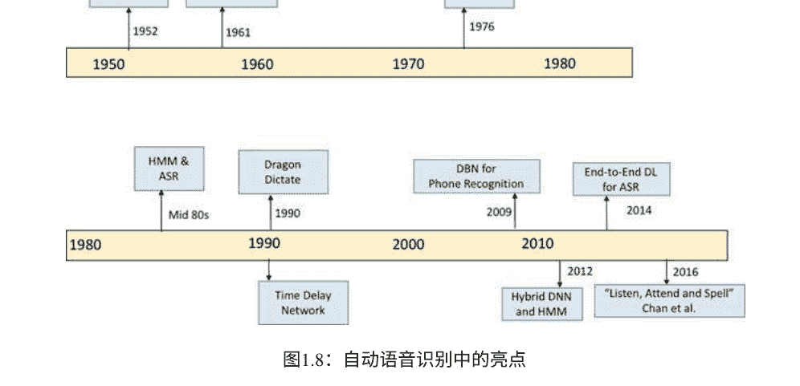

在2000年代，对机器学习进展的关注持续增加。在[MDH09]中，深度置信网络被应用于电话识别，在TIMIT语料库上实现了最先进的性能。¹这些网络学习无监督特征以提高声学鲁棒性。在[Dah+12]中，引入了混合DNN和上下文相关（CD）隐马尔可夫模型，扩展了DNN的进展，并在大词汇量语音识别中取得了显著的改进。深度神经网络在2000年代继续推动技术的发展，DNN/HMM混合模型成为主流方法。

自2012年以来，深度学习已应用于ASR任务的序列部分，取代了HMM的许多技术，向着端到端的语音识别模型发展。随着它们的引入，许多现代方法已经进入ASR领域，例如注意力[Cho+15] [KHW17]和RNN转录器[MPR08]。序列到序列架构与更大的数据集的结合使得模型能够直接从数据中学习声学和语言依赖关系，从而提高质量。

近年来，端到端研究一直在不断发展，重点是改善端到端模型中出现的一些困难；然而，由于词典模型在解码中的有用性，混合架构往往更受欢迎。有关自动语音识别历史的更详细调查，建议参考[TG01]。

## 1.3 实践者的工具、库、数据集和资源

对于对构建自然语言处理、深度学习或语音分析感兴趣的读者来说，有大量的开源资源可用。在下面的部分，我们提供了一些较受欢迎的库和数据集的列表。这绝不是一个详尽无遗的列表，因为我们的目标是让读者熟悉各种可用的框架和资源。

### 1.3.1 深度学习

与自然语言处理技术一样，深度学习框架近年来也取得了巨大的进展。存在许多不同的框架，每个框架都有其专业化领域。最受欢迎的深度学习框架包括：TensorFlow、PyTorch、Keras、MXNet、CNTK、Chainer、Caffe2、PaddlePaddle和Matlab。²现代深度学习框架的主要组成部分是在线性代数能力方面的效率，这适用于深度学习，支持CPU和GPU计算（专用硬件如TPUs [Jou16]也越来越受欢迎)。所有相关的Python框架都包含CPU和GPU支持。实现差异往往集中在面向预期最终用户（研究人员vs.工程师vs.数据科学家）之间的权衡上。

我们将研究之前提到的顶级深度学习框架，并对它们进行简要描述。为了做到这一点，我们比较了每个框架的Google趋势，并关注前3个。³如图1.9所示，全球范围内最受欢迎的框架是Keras，其次是TensorFlow，然后是PyTorch。本书将在案例研究中提供有关所使用框架的其他信息。


²Theano是另一个流行的框架；然而，由于更近期框架的流行，其主要开发已经停止。因此，它不包含在本书中。

³尽管这只是一个单一的、统计上不显著的数据点，但Google趋势机制是有用的，并且与其他评估指标（如贡献者数量、GitHub受欢迎度、文章数量和书籍数量）大致相关。

以下是用于构建神经网络的流行开源框架：

- **TensorFlow**: TensorFlow是一个基于数据流图的计算库。这些图中的节点表示数学运算，边表示在它们之间流动的张量。TensorFlow是用Python编写的，由Google Brain团队开发。
- **Keras**: Keras是一个简单、高级的Python库，用于快速原型设计和实验。它可以在TensorFlow和CNTK之上运行，现在是TensorFlow核心库的一部分。Keras包含了常见神经网络组件的实现和许多架构示例。
- **PyTorch**: PyTorch是一个用于快速原型设计神经网络的Python包。它基于Torch，是一个非常快速的计算框架，并提供了运行时的动态图计算。PyTorch由Facebook AI研究团队开发。
- **Caffe**: Caffe是一个高性能的C++框架，用于构建能够本地支持分布式和多GPU执行的深度学习架构。当前版本的Caffe2是Facebook在生产中使用的后端。
- **CNTK**: CNTK是一个基于有向图的计算框架，已更名为Microsoft Cognitive Toolkit。它支持Python、C#或C++语言，并由Microsoft Research开发。
- **MXNet**: MXNet是一个高性能的计算框架，使用C++编写，并在Apache项目中孵化，具有本地GPU支持。
- **Chainer**: Chainer是一个纯Python的框架，具有在运行时定义的动态计算图能力。

### 1.3.2 自然语言处理

以下资源是一些更受欢迎的开源工具包，用于自然语言处理：

- **Stanford CoreNLP**: 一种基于Java的语言分析工具包，用于处理自然语言文本。CoreNLP由斯坦福大学开发。
- **NLTK**: 自然语言工具包，简称NLTK，是一个开源的符号和统计自然语言处理库，用于英语。它是由宾夕法尼亚大学开发的。
- **Gensim**: 一个基于Python的开源工具包，专注于文本文档的向量空间和主题建模。
- **spaCy**: 一个高性能的基于Python的高级自然语言处理工具包。SpaCy是开源的，并得到了Explosion AI的支持。
- **OpenNLP**: 一个用于处理自然语言文本的开源机器学习工具包。OpenNLP由Apache项目赞助。
- **AllenNLP**: 一个基于PyTorch构建的自然语言处理研究库。

### 1.3.3 语音识别

以下资源是一些更受欢迎的开源语音识别工具包。⁴

#### 1.3.3.1 框架

- **Sphinx**: 由卡内基梅隆大学开发的一个语音识别工具包，专注于生产和应用开发。
- **Kaldi**: 一个开源的C++语音识别框架，旨在用于研究性的语音处理以及专业用途。
- **ESPnet**: 一个基于深度学习的端到端自动语音识别框架，受到Kaldi的启发，并使用PyTorch和Chainer后端编写。

#### 1.3.3.2 音频处理

- **SoX**: 一个音频处理工具包和库。它实现了许多文件格式，并且对于播放、转换和处理音频文件非常有用[NB18]。
- **LibROSA**: 一个用于音频分析的Python包，通常用于特征提取和数字信号处理（DSP）[MCF+15]。

#### 1.3.3.3 其他工具和库

- **KenLM**: 一个高性能的n-gram语言建模工具包，通常与自动语音识别框架集成。
- **LIME**: 局部可解释的模型无关解释器（LIME），用于机器学习和深度学习模型的局部解释。

### 1.3.4 书籍

自然语言处理和机器学习的领域非常广泛，无法全部包含在一个资源中。在这里，我们识别了一些提供更深入解释的书籍，以补充信息。《统计学习方法》是Hastie等人的著作，为机器学习和统计技术提供了良好的基础[HTF01]。《从数据中学习》是Abu-Mostafa等人的著作，以更简化和易懂的方式提供了机器学习理论的见解[AMMIL12]。深度学习（自适应计算和机器学习系列）[GBC16]是一本专注于理论的高级书籍。这被广泛认为是深度学习的基础书籍，从深度学习的基础知识（线性代数、概率论和数值计算）到多种架构实现和方法的探索。《统计自然语言处理基础》[MS99]是关于自然语言处理统计模型的全面资源，提供了实现NLP工具的深入数学基础。《语音和语言处理》[Jur00]是一本介绍自然语言处理和语音的书籍，涵盖了统计NLP的许多领域的广度和深度。更近期的版本探索了神经网络应用。

《自然语言处理中的神经网络方法》（Gol17）介绍了神经网络在语言数据上的应用，从机器学习和神经网络的介绍到专门用于自然语言处理应用的神经网络架构。《自动语音识别：深度学习方法》（YD15）全面介绍了ASR和深度学习技术。

### 1.3.5 在线课程和资源

以下是一些在线课程列表，领域专家教授与深度学习、自然语言处理和语音相关的主题，非常有益。

- **深度学习在自然语言处理中的应用**
  http://web.stanford.edu/class/cs224n/
- **自然语言处理的深度学习**
  http://www.cs.ox.ac.uk/teaching/courses/2016-2017/dl
- **神经网络在自然语言处理中的应用**
  http://phontron.com/class/nn4nlp2017/schedule.html
- **深度学习专项课程**
  https://www.deeplearning.ai/deep-learning-specialization/
- **深度学习暑期学校**
  https://vectorinstitute.ai/2018/11/07/vector-institute-deep-learning-and-reinforcement-learning-2018-summer-school/
- **卷积神经网络用于视觉识别**
  http://cs231n.stanford.edu/
- **神经网络用于机器学习** [http://www.cs.toronto.edu/~hinton/coursera_lectures.html](http://www.cs.toronto.edu/~hinton/coursera_lectures.html)
- **神经网络** [http://info.usherbrooke.ca/hlarochelle/neural_networks/content.html](http://info.usherbrooke.ca/hlarochelle/neural_networks/content.html)
- **实用的深度学习编码** [https://course.fast.ai/](https://course.fast.ai/)
- **使用PyTorch的深度学习入门** [https://www.udacity.com/course/deep-learning-pytorch--ud188](https://www.udacity.com/course/deep-learning-pytorch--ud188)

### 1.3.6 数据集

任何端到端的深度学习应用都依赖于数据。虽然大多数组织都依赖于数据收集作为其战略的基本组成部分，但对于研究人员、爱好者和从业者来说，有许多公开可用的数据集。Kaggle⁶是最受欢迎的机器学习和数据科学数据集和竞赛来源之一。Kaggle拥有数千个数据集和竞赛，拥有超过一百万注册用户的活跃社区，并通过其平台提供资金支持的竞赛，为许多任务提供了一个强大的起点。

语言数据联盟⁷从各种大学、公司和研究实验室收集并销售数据集。它主要关注语言数据和语言资源，拥有近1000个数据集。

斯坦福自然语言处理组还发布了许多用于自然语言处理的数据集，特别是用于他们的CoreNLP模型的训练。⁸

文本相似度：

| 数据集 | 描述 |
|---|---|
| SentEval [CK18] | 是一个用于句子嵌入的评估库，比较它们在17个下游任务上的有效性 |
| Quora问题对 [ZCZ] | 这是一个包含40万个潜在重复问题的问题对集合，来自Quora网站，目标是识别重复问题 |

## 文本聚类和分类

| 数据集 | 描述 |
|--------|------|
| 路透社-21,578 [Zdr+18] | 一系列于1987年出现在路透社新闻线上的21,578篇文章 |
| 开放ANC [MIG02] | 大约1500万个口语和书面用法的美式英语，来源多样，已标注句法结构 |
| MASC [Ide+10] | 从开放美国国家语料库中抽取的约50万个当代美式英语词汇，已标注句法、语义和篇章结构 |

## 依存句法分析

| 数据集 | 描述 |
|--------|------|
| 宾州树库 [MMS93] | 一个包含450万个词汇的、标注了词性的美式英语语料库 |

## 实体抽取

| 数据集 | 描述 |
|--------|------|
| CoNLL 2003 [TKSDM03b] | 新闻文本标记了各种类型的实体，如地点、组织、人物等 |
| WNUT2017 [Der+17] | 一个由带有不同实体标签的注释推特、YouTube评论和其他互联网来源组成的数据集 |
| OntoNotes [Hov+06b] | 一个包含许多标签（如词性、解析树和实体）的多语言语料库（版本5中有200万个标记） |

## 关系抽取

| 数据集 | 描述 |
|--------|------|
| NYT语料库 [RYM10] | 纽约时报语料库，用于远程相关实体的关系标签 |
| SemEval-2010 (任务8) [Hen+09] | 一个语义关系数据集，包含实体来源和因果关系等关系类型 |

## 语义角色标注

| 数据集 | 描述 |
|--------|------|
| OntoNotes [Pra+13] | 一个包含170万个单词的数据集，重点是对文本中实体的建模 |

### 机器翻译

| 数据集 | 描述 |
| --- | --- |
| Tatoeba | 从Tatoeba网站https://tatoeba.org收集的多语言句子对集合 |
| WMT 2014 [Sch18] | 一个包含来自多个来源的句子的英语-法语（和额外的英语-德语）数据集，如常见的爬行、联合国语料库和新评论 |
| Multi30k [Ell+16] | 多种语言中的图像描述的众包 |

### 文本摘要

| 数据集 | 描述 |
| --- | --- |
| CNN/Daily Mail [Nal+16] | 来自CNN和每日邮报网站的大约300,000条新闻报道，附带摘要要点 |
| 康奈尔新闻室 [GNA18] | 1998年至2017年间来自38家主要出版物的超过130万篇新闻文章和摘要 |
| Google数据集 [FA13] | 一个包含20万个示例的句子压缩任务，重点是删除单词以生成原始较长句子的压缩结构 |
| DUC | 一个包含500个文档的新闻摘要任务，包括新闻线和文档数据 |
| Webis-TLDR-17语料库 [Sye+18] | 一个包含超过三百万个Reddit帖子的数据集，带有“太长了；没看懂（TL;DR）”的摘要 |

### 问题回答

| 数据集 | 描述 |
| --- | --- |
| bAbI [Wes+15] | 一组任务和相关数据集，用于评估自然语言处理模型，特别针对问答 |
| NewsQA [Tri+16] | 一组包含来自CNN新闻文章的10万个具有挑战性的问题-答案对 |
| SearchQA [Dun+17] | 一个通用的搜索问答数据集 |

### 语音识别

| 数据集 | 描述 |
| :--- | :--- |
| AN4 [Ace90] | 一个包含随机生成的字母、数字和单词的小型数据集 |
| WSJ [PB92] | 一个通用的大词汇量语音识别数据集，包含400小时的口语音频和转录 |
| LibriSpeech [Pan+15] | 一个包含来自LibriVox有声读物项目的有声读物的1000小时数据集 |
| Switchboard [GHM92] | 对话数据集，包括超过240小时的音频。与CallHome英语集合的联合测试被称为Hub5’00 |
| TED-LIUM [RDE12] | 452小时的TED演讲与相应的转录和对齐信息。最新版本（3）[Her+18]的数据量是之前版本的两倍 |
| CHiME [Vin+16] | 是一个包含各种任务的语音挑战和数据集。其中一些任务包括语音分离、识别、噪声环境中的语音处理和多通道识别 |
| TIMIT [Gar+93] | 用于语音学研究的ASR数据集，包含630位发音丰富的演讲者读取的句子 |

## 1.4 案例研究和实施细节

在本书中，目标不仅是提供信息，还要使读者能够实践所学的知识。在以下各章中，案例研究详细探讨了章节概念，并提供了实践的机会。案例研究和补充代码使用Python编写，利用各种深度学习框架。在大多数情况下，深度学习依赖于高性能的C++或CUDA库进行计算。根据我们的经验，安装过程可能会变得非常繁琐，特别是在开始深度学习时。我们尝试通过为每个案例研究提供Docker [Mer14]镜像和GitHub存储库来限制这种困难。Docker是一个简单而强大的工具，为高级（Python）和低级（C++和CUDA）库提供了类似虚拟机的环境，使其与操作系统隔离。提供了访问和运行代码的指南 (https://github.com/SpringerNLP)。

案例研究如下：

- 第2章：介绍了机器学习分类的基本概念，以及数据科学的要素，以Higgs Boson Challenge为例。
- 第3章：使用Reuters-21,578数据集进行文本聚类、主题建模和文本分类，展示了一些基本的自然语言处理方法。
- 第4章：介绍了有监督和无监督深度学习的基础，以FSDD数据集上的口语数字识别为例。
- 第5章：介绍了嵌入方法，重点关注基于文本的表示方法，以Open American National Corpus为例。
- 第6章：使用各种基于卷积神经网络的方法探索了文本分类，以Twitter航空公司数据集为例。
- 第7章：比较了各种循环神经网络架构，用于神经机器翻译进行英法翻译。
- 第8章：本章探讨了基于传统HMM的语音识别在Common Voice数据集上的应用，使用了Kaldi和CMUSphinx。
- 第9章：本章包含两个不同的案例研究。 第一个案例是从第7章扩展的神经机器翻译，探索了各种基于注意力的架构。 第二个案例是基于bAbI数据集比较了记忆增强网络在问答任务中的表现。
- 第10章：本章重点研究了在NLP任务中使用不同架构进行多任务学习，如词性标注、分块和命名实体识别。
- 第11章：本章使用各种技术在Amazon Review数据集上进行了迁移学习和特定领域适应。
- 第12章：在第8章的ASR案例研究的基础上，应用端到端技术进行语音识别，利用CTC和注意力机制在Common Voice数据集上进行。
- 第13章：两种流行的强化学习算法应用于使用康奈尔新闻室数据集的抽象文本摘要任务。

## 参考文献

[AMMIL12] Yaser S. Abu-Mostafa, Malik Magdon-Ismail和Hsuan-Tien Lin。从数据中学习。AMLBook，2012年。 ISBN: 1600490069，9781600490064。

[Ace90] Alejandro Acero。 “自动语音识别中的声学和环境鲁棒性”。在: ICASSP的论文集。1990年。

[AHS88] David H. Ackley, Geoffrey E. Hinton和Terrence J. Sejnowski。 “神经计算：研究基础”。在: 由James A. Anderson和Edward Rosenfeld编辑。麻省理工学院出版社, 1988年。第A章 Boltzmann机器的学习算法，第635-649页。

[BCB14b] Dzmitry Bahdanau, Kyunghyun Cho, and Yoshua Bengio。 “通过联合学习对齐和翻译进行神经机器翻译”。 在: *CoRR* abs/1409.0473 (2014)。

[BFL98] Collin F. Baker, Charles J. Fillmore, and John B. Lowe。 “伯克利框架网络项目”。 在: *Proceedings of the 17th International Conference on Computational Linguistics - Volume 1*. COL-ING ’98 。 计算语言学协会, 1998年, 第86-90页。

[BSF94] Y. Bengio, P. Simard, and P. Frasconi。 “使用梯度下降学习长期依赖性是困难的”。在: *Trans. Neur. Netw.* 5.2 (Mar. 1994), 第157-166页。

[BDV00] Yoshua Bengio, Réjean Ducharme, and Pascal Vincent。 “神经概率语言模型”。 In: 第13届国际神经信息处理系统会议。丹佛, 科罗拉多州: MIT出版社, 2000, 第893-899页。

[BL07] Yoshua Bengio and Yann Lecun。 “将学习算法扩展到人工智能”。 In: 大规模核机器。 编者: L. Bottou等MIT出版社, 2007。

[Ben+06] Yoshua Bengio等。 “贪婪逐层训练深度网络”。 In: 第19届国际神经信息处理系统会议。 NIPS’06。 加拿大: MIT出版社, 2006, 第153-160页。

[BC75] Daniel G. Bobrow和Allan Collins, 编者。表征与理解: 认知科学研究。 Academic Press, Inc.,1975。

[Bri+87] Ted Briscoe等人 “英语大型语法的形式化和环境开发”。 在: 第10届国际人工智能联合会议论文集-第2卷。 Morgan Kaufmann Publishers Inc., 1987年, 第703-708页。

[Bro+92] Peter F. Brown等人 “基于类别的自然语言N-gram模型”。 在: 计算机语言学。 18.4 (1992年12月), 第467-479页。

[BM06] Sabine Buchholz和Erwin Marsi。 “CoNLL-X共享任务关于多语言依存句法分析”。 在: 第十届计算自然语言学习会议。 计算语言学协会，2006年，第149-164页。

[Cec61] S. Ceccato. “机械翻译的语言分析和编程”。 In: Gordon and Breach Science, 1961.

[Cho57] Noam Chomsky.句法结构。 Mouton and Co., 1957.

[Cho+15] Jan K Chorowski等. “基于注意力的语音识别模型”。 In: 神经信息处理系统的进展。 2015年, 第577-585页。

[CW08] Ronan Collobert和Jason Weston. “自然语言处理的统一架构: 深度神经网络与多任务学习”。

[CK18] Alexis Conneau和Douwe Kiela. “SentEval: 通用句子表示的评估工具包”。 In: arXiv预印本arXiv:1803.05449 (2018).

[Con+17] Alexis Conneau等人“从自然语言推理数据中监督学习通用句子表示”。 在: EMNLP。 计算语言学协会, 2017年, 第670-680页。

[CV95] Corinna Cortes和Vladimir Vapnik. “支持向量网络”。 在: 机器学习。 20.3 (1995年9月), 第273-297页。

[Cyb89] G. Cybenko. “通过S型函数的叠加逼近”。 在: 控制、信号和系统的数学 (MCSS) 2 (1989年)。 URL: http://dx.doi.org/10.1007/BF02551274.

[Dah+12] George E Dahl等人“面向大词汇量语音识别的上下文相关预训练深度神经网络”。 在: IEEE音频、语音和语言处理交易 20.1(2012年), 第30-42页。

[Den+09] J. Deng等人“ImageNet: 一个大规模的分层图像数据库”。 在: CVPR09。 2009.

[Der+17] Leon Derczynski等人“WNUT2017共享任务关于新颖和新兴实体识别的结果”。 在: 第三届嘈杂用户生成文本研讨会论文集。 2017, 第140-147页。

[Koh82] Bhuwan Dhingra, Kathryn Mazaitis和William W Cohen。“Quasar: 通过搜索和阅读进行问答的数据集”。 在: arXiv预印本arXiv:1707.03904 (2017).

[Dun+17] Matthew Dunn等人“SearchQA: 一个新的带有搜索引擎上下文的问答数据集”。 在: arXiv预印本arXiv:1704.05179 (2017).

[Ell+16] Desmond Elliott等人. “Multi30k: 多语言英德图像描述”。 在: arXiv预印本 arXiv:1605.00459 (2016).

[FA13] Katja Filippova和Yasemin Altun. “克服句子压缩中缺乏平行数据的问题”。 在: 2013年自然语言处理会议论文集。 2013年, 第1481-1491页。

[Fin79] Nicholas V. Findler编辑。关联网络：计算机知识的表示和使用。Academic Press, Inc.,1979。ISBN: 0122563808。

[Fuk79] K. Fukushima。“神经网络模型：一种不受位置偏移影响的模式识别机制 - Neocognitron”。在：IECE交易J62-A(10) (1979)，第658-665页。

[Gan+16] Yaroslav Ganin等人。“领域对抗训练的神经网络”。在：机器学习研究杂志17.1 (2016年1月)，第2096-2030页。

[Gar+93] John S Garofolo等人。“DARPA TIMIT声学-语音连续语音语料库CD-ROM。NIST语音光盘1-1.1”。在：NASA STI/Recon技术报告n 93 (1993年)。

[GW01] James Glass和Eugene Weinstein。“SPEECHBUILDER：促进口语对话系统开发”。在：第七届欧洲语音通信和技术会议2001。

[GBB11] Xavier Glorot, Antoine Bordes和Yoshua Bengio。“深度稀疏整流神经网络。”在：AISTATS。第15卷。JMLR.org, 2011年，第315-323页。

[GHM92] John J Godfrey, Edward C Holliman, and Jane McDaniel。“SWITCHBOARD: 用于研究和开发的电话语音语料库”。 In: Acoustics, Speech, and Signal Processing, 1992. ICASSP-92., 1992 IEEE国际会议。卷1。1992年, pp. 517–520。

[Gol17] Yoav Goldberg. “用于自然语言处理的神经网络方法”。 In: Synthesis Lectures on Human Language Technologies 10.1 (2017), p. 1–309。

[GBC16] Ian Goodfellow, Yoshua Bengio, and Aaron Courville. “深度学习(自适应计算和机器学习系列) ”。 In: 自适应计算和机器学习系列(2016), p.800。

[Goo+14] Ian J. Goodfellow等人. “生成对抗网络”。 In: Proceedings of the 27th International Conference on Neural Information Processing Systems - Volume 2. NIPS’14. MIT Press, 2014, pp. 2672–2680。

[Gra13] Alex Graves. “使用递归神经网络生成序列。” In: CoRR abs/1308.0850 (2013).

[GWD14] Alex Graves, Greg Wayne, 和 Ivo Danihelka. “神经图灵机”。 In: CoRR abs/1410.5401 (2014).

[Gra+16] Alex Graves 等人. “使用具有动态外部存储器的神经网络进行混合计算”。 In: Nature 538.7626 (Oct. 2016), pp.471–476. ISSN: 00280836。

[Gre+15] Edward Grefenstette 等人. “学习具有无界内存的转导”。 In: Advances in Neural Information Processing Systems 28: Annual Conference on Neural Information Processing Systems 2015, December 7-12, 2015, Montreal, Quebec, Canada。 2015, pp. 2422–2430。

[GNA18] Max Grusky, Mor Naaman, and Yoav Artzi. “NEWSROOM: A Dataset of 1.3 Million Summaries with Diverse Extractive Strategies”。 在: 2018年北美计算语言学协会会议论文集: 人类语言技术。 计算语言学协会, 2018, 第708-719页。

[HKKS99] Eva Hajicov´a, Ivana Kruijff-Korbayov´a, and Petr Sgall. “Prague Dependency Treebank: Restoration of Deletions”。 在: 第二届国际文本、语音和对话研讨会论文集。 Springer-Verlag, 1999, 第44-49页。

[HTF01] Trevor Hastie, Robert Tibshirani, and Jerome Friedman.统计学习的要素。 Springer统计学系列。 Springer纽约公司, 2001。

[Heb49] Donald O. Hebb.行为的组织: 一种神经心理学理论。 Wiley, 1949年。

[Hen+16] Mikael Henaff等人。“用循环实体网络跟踪世界状态”。 CoRR abs/1612.03969 (2016年)。

[Hen+09] Iris Hendrickx等人。“Semeval-2010任务8: 对名词对之间的语义关系进行多路分类”。 In: 语义评估研讨会: 最新成果和未来方向。 计算语言学协会。 2009年, 第94-99页。

[Her+18] Franc¸ois Hernandez等人。“TED-LIUM 3: 用于说话者适应实验的两倍数据和语料库分配”。 In: arXiv预印本arXiv:1805.04699 (2018年)。

[HZ94] G. E. Hinton和R. S. Zemel。“自动编码器, 最小描述长度和Helmholtz自由能”。 在: 神经信息处理系统 (NIPS) 6。 由J. D. Cowan, G. Tesauro和J. Alspector编辑。 摩根·考夫曼, 1994年, 第3-10页。

[HOT06a] Geoffrey E. Hinton, Simon Osindero, and Yee-Whye Teh. “一种用于深度信念网络的快速学习算法”。 In: 神经计算。 18.7 (2006年7月), pp. 1527–1554。

[Hoc98] Sepp Hochreiter. “递归神经网络中的梯度消失问题及其解决方案”。 In: 国际不确定性杂志。 模糊知识基础系统。 6.2 (1998年4月), pp. 107–116。

[HS97] Sepp Hochreiter和J¨urgen Schmidhuber。 “长短期记忆”。 在: 神经计算。 9.8 (1997年11月), 第1735-1780页。

[Hop82] J. J. Hopfield。 “神经网络和具有新兴集体计算能力的物理系统”。 在: 美国国家科学院学报 79.8 (1982年4月), 第2554-2558页。

- **[Hor91]** Kurt Hornik. “多层前馈网络的逼近能力”. In: 神经网络 4.2 (1991年3月), 第251-257页.
- **[Hov+06a]** Eduard Hovy 等. “OntoNotes：90%的解决方案”. In: 人类语言技术会议论文集，附录卷：短论文. NAACL-Short '06. 纽约，纽约：计算语言学协会, 2006年, 第57-60页.
- **[Hov+06b]** Eduard Hovy 等. “OntoNotes：90%的解决方案”. In: 北美计算语言学协会年会（NAACL）的会议记录，附录卷：短论文. 计算语言学协会, 2006年, 第57-60页.
- **[HDG55]** W. John Hutchins, Leon Dostert 和 Paul Garvin. “乔治敦-IBM实验”. In: John Wiley And Sons, 1955年, 第124-135页.
- **[HS92]** William J. Hutchins 和 Harold L. Somers. 机器翻译导论. 学术出版社, 1992年.
- **[Ide+10]** Nancy Ide 等. “MASC：美国英语手动注释子语料库”. In: LREC. 欧洲语言资源协会, 2010年6月4日.
- **[JBM75]** Frederick Jelinek, Lalit Bahl, and Robert Mercer. “用于连续语音识别的语言统计解码器的设计”. In: IEEE信息论杂志 21.3 (1975), 第250-256页.
- **[JL17]** Robin Jia and Percy Liang. “用于评估阅读理解系统的对抗性示例”.
- **[Jon94]** Karen Sparck Jones. “自然语言处理：历史回顾”.
- **[Jou16]** Norm Jouppi. “谷歌通过TPU定制芯片加速机器学习任务”. In: 谷歌博客, 2016年5月18日.
- **[JR05a]** B. H. Juang and L. R. Rabiner. “自动语音识别 - 技术发展的简要历史”. In: Elsevier语言和语言学百科全书 (2005年).
- **[JR05b]** Biing-Hwang Juang and Lawrence R Rabiner. “自动语音识别 - 技术发展的简要历史”. In: 佐治亚理工学院，亚特兰大；罗格斯大学和加利福尼亚大学，圣塔芭芭拉 1 (2005年), 第67页.
- **[Jur00]** Daniel Jurafsky. “语音和语言处理：自然语言处理简介”. In: 计算语言学，和语音识别 (2000年).
- **[KGB14]** Nal Kalchbrenner, Edward Grefenstette 和 Phil Blunsom. “用于建模句子的卷积神经网络”. In: 计算语言学协会, 2014年, 第655-665页.
- **[KHW17]** Suyoun Kim, Takaaki Hori, and Shinji Watanabe. “基于联合CTC和注意力机制的端到端语音识别方法的多任务学习”. In: 声学、语音和信号处理（ICASSP）, 2017年IEEE国际会议. IEEE, 2017年, 第4835-4839页.
- **[Kim14]** Yoon Kim. “卷积神经网络用于句子分类”. In: 2014年, 第1746-1751页.
- **[Koh82]** T. Kohonen. “自组织形成拓扑正确的特征映射”. In: 生物控制论 43.1 (1982), 第59-69页.
- **[KSH12]** Alex Krizhevsky, Ilya Sutskever, and Geoffrey E. Hinton. “使用深度卷积神经网络进行ImageNet分类”. In: 第25届国际神经信息处理系统会议 - 第1卷. Curran Associates Inc., 2012年, 第1097-1105页.
- **[Kum+16]** Ankit Kumar 等. “问我任何问题：动态记忆网络用于自然语言处理”. In: 第33届国际机器学习大会, ICML 2016, 纽约市, 纽约州, 美国, 2016年6月19日至24日. 2016年, 第1378-1387页.
- **[LMP01]** John D. Lafferty, Andrew McCallum 和 Fernando C. N. Pereira. “条件随机场：用于分段和标记序列数据的概率模型”. In: 第十八届国际机器学习大会. Morgan Kaufmann Publishers Inc., 2001年, 第282-289页.
- **[Lam+16]** Guillaume Lample 等. “用于命名实体识别的神经架构”. In: HLT-NAACL. 计算语言学协会, 2016年, 第260-270页.
- **[LeC85]** Y. LeCun. “Une procédure d'apprentissage pour réseau a seuil asymmetrique (a Learning Scheme for Asymmetric Threshold Networks)”. In: Cognitiva 85会议论文集. 1985年, 第599-604页.
- **[LeC+89]** Y. LeCun 等. “Backpropagation Applied to Handwritten Zip Code Recognition”. In: Neural Computation 1.4 (1989), 第541-551页.
- **[LB94]** Yann LeCun 和 Yoshua Bengio. “基于卷积神经网络的手写词识别器的词级训练”. In: 第12届国际模式识别会议, 会议B：模式识别和神经网络, ICPR1994, 以色列耶路撒冷, 1994年10月9日至13日, 第2卷. 1994年, 第88-92页.
- **[LBB97]** Yann LeCun, Léon Bottou 和 Yoshua Bengio. “使用多层图变换网络进行阅读检查”. In: 1997年IEEE国际会议，声学、语音和信号处理（ICASSP '97），德国慕尼黑，1997年4月21日至24日. 1997年, 第151-154页.
- **[Lee88]** 李开复. “大词汇量的说话人无关连续语音识别”. In: 语音通信 7.4 (1988年), 第375-379页.
- **[Lin92]** 林龙基. “使用神经网络的机器人强化学习”. UMI订单号 GA X93-22750. 博士论文. 匹兹堡，宾夕法尼亚州，美国, 1992年.
- **[Lin70]** S. Linnainmaa. “将算法的累积舍入误差表示为局部舍入误差的泰勒展开”. MA论文. 赫尔辛基大学, 1970年.
- **[Liu+18]** Bing Liu 等. “在端到端可训练的任务导向对话系统中，通过人类教学和反馈进行对话学习”. In: 2018年北美计算语言学协会会议论文集：人类语言技术，第1卷（长文）. 计算语言学协会, 2018年, 第2060-2069页.
- **[LR90]** Bruce Lowerre 和 Raj Reddy. “HARPY语音理解系统”. In: 语音识别读物. Elsevier, 1990年, 第576-586页.
- **[LSM13]** Minh-Thang Luong, Richard Socher 和 Christopher D Manning. “用于形态学的递归神经网络的更好词表示”. In: CoNLL-2013 (2013年), 第104页.
- **[MIG02]** C. Macleod, N. Ide, and R. Grishman. “美国国家语料库：美国英语的标准化资源”. In: 第二届语言资源和评估会议论文集（LREC）. 2002年, 第831-836页.
- **[Man99]** Inderjeet Mani. 自动文本摘要的进展. 由 Mark T. Maybury 编辑. 麻省理工学院出版社, 1999年.
- **[MMS99]** Christopher D Manning, Christopher D Manning, and Hinrich Schütze. 统计自然语言处理的基础. 麻省理工学院出版社, 1999年.
- **[MS99]** Christopher D. Manning and Hinrich Schütze. 统计自然语言处理的基础. 麻省理工学院出版社, 1999年.
- **[Mar+94]** Mitchell Marcus 等. “宾夕法尼亚树库：注释谓词论元结构”. In: 人类语言技术研讨会论文集. 计算语言学协会, 1994年, 第114-119页.
- **[MMS93]** Mitchell P Marcus, Mary Ann Marcinkiewicz 和 Beatrice Santorini. “构建一个大型的英语标注语料库：宾夕法尼亚树库”.
- **[Mas61]** Margaret Masterman. “使用中间语进行机器翻译的语义消息检测”. In: 国际机器翻译会议论文集. 女王陛下的文具办公室, 1961年, 第438-475页.
- **[MP88]** Warren S. McCulloch 和 Walter Pitts. “神经计算：研究基础”.
- **[McF+15]** Brian McFee 等. “librosa: Python中的音频和音乐信号分析”. In: 第14届科学会议的Python会议论文集. 2015年, 第18-25页.
- **[Mer14]** Dirk Merkel. “Docker: 轻量级Linux容器用于一致的开发和部署”. In: Linux Journal 2014.239 (2014), 第2页.
- **[Mik+10b]** Tomas Mikolov 等. “基于循环神经网络的语言模型”. In: INTERSPEECH. 由 Takao Kobayashi, Keikichi Hirose 和 Satoshi Nakamura 编辑. ISCA, 2010年, 第1045-1048页.
- **[Mik+13a]** Tomas Mikolov 等. “单词和短语的分布式表示及其组合性”. In: 神经信息处理系统26的进展. 由 C. J. C. Burges 等人编辑. Curran Associates, Inc., 2013年, 第3111-3119页.
- **[Mik+13b]** Tomas Mikolov 等. “在向量空间中高效估计词表示”. In: CoRR abs/1301.3781 (2013).
- **[Mil95]** George A. Miller. “WordNet: 英语的词汇数据库”. In: Commun. ACM 38.11 (Nov. 1995), pp. 39–41.
- **[MP69]** Marvin Minsky 和 Seymour Papert. 感知机：计算几何的介绍. 美国马萨诸塞州剑桥：麻省理工学院出版社, 1969年.
- **[Min+09]** Mike Mintz 等. “无标注数据的远程监督关系抽取”. In: Proceedings of the Joint Conference of the 47th Annual Meeting of the ACL and the 4th International Joint Conference on Natural Language Processing of the AFNLP: Volume 2 - Volume 2. ACL '09. 计算语言学协会, 2009年, 第1003-1011页.
- **[MDH09]** Abdel-rahman Mohamed, George Dahl 和 Geoffrey Hinton. “用于语音识别的深度置信网络”. In: Nips研讨会关于语音识别和相关应用的深度学习. 第1卷. 9. 加拿大温哥华. 2009年, 第39页.
- **[Moh+11]** Abdel-rahman Mohamed 等. “使用判别特征的深度置信网络进行语音识别”. In: ICASSP. IEEE, 2011年, 第5060-5063页.
- **[MPR08]** Mehryar Mohri, Fernando Pereira 和 Michael Riley. “带权有限状态转换器的语音识别”. In: Springer语音处理手册. Springer, 2008年, 第559-584页.
- **[Mur+89]** Hy Murveit 等. “SRI的DECIPHER系统”. In: 关于语音和自然语言的研讨会. 计算语言学协会. 1989年, 第238-242页.
- **[NH10]** Vinod Nair 和 Geoffrey E. Hinton. “修正线性单元改进了受限玻尔兹曼机”. In: 第27届国际机器学习大会. ICML'10. Omnipress, 2010年, 第807-814页.
- **[Nal+16]** Ramesh Nallapati 等. “使用序列到序列RNN和更多方法的抽象文本摘要”. In: arXiv预印本 arXiv:1602.06023 (2016年).
- **[Nea95]** Radford M Neal. “神经网络的贝叶斯学习”. 博士论文. 多伦多大学, 1995年.
- **[NB18]** Lance Norskog 和 Chris Bagwell. “Sox-Sound eXchange”. In: (2018年).
- **[Pan+15]** Vassil Panayotov 等. “LibriSpeech：基于公共领域音频书籍的自动语音识别语料库”. In: 声学、语音和信号处理（ICASSP），2015年IEEE国际会议. 2015年, 第5206-5210页.
- **[PLV02]** Bo Pang, Lillian Lee 和 Shivakumar Vaithyanathan. “拇指向上？：使用机器学习技术进行情感分类”. In: ACL-02会议论文集 - 第10卷中的自然语言处理经验方法. 计算语言学协会, 2002年, 第79-86页.
- **[Pap+02]** Kishore Papineni 等. “BLEU：一种用于自动评估机器翻译的方法”. In: 第40届年度计算语言学协会会议论文集中. 计算语言学协会, 2002年, 第311-318页.
- **[Par85]** D. B. Parker. 学习逻辑. 技术报告 TR-47. 麻省理工学院经济与管理科学中心, 1985年.
- **[PB92]** Douglas B Paul 和 Janet M Baker. “基于华尔街日报的CSR语料库设计”. In: Speech and Natural Language 的研讨会论文集. 1992年, 第357-362页.
- **[PXS17]** Romain Paulus, Caiming Xiong 和 Richard Socher. “一种用于抽象摘要的深度强化模型”. In: CoRR abs/1705.04304 (2017).
- **[PC66]** John R. Pierce 和 John B. Carroll. 语言和机器：计算机在翻译和语言学中的应用. 华盛顿特区，美国：国家科学院/国家研究委员会, 1966年.
- **[PSG16]** Barbara Plank, Anders Søgaard 和 Yoav Goldberg. “使用双向长短期记忆模型和辅助损失的多语言词性标注”. In: 第54届计算语言学协会年会论文集（第2卷：短论文）. 计算语言学协会, 2016年, 第412-418页.
- **[Pra+13]** Sameer Pradhan 等人. “利用OntoNotes进行鲁棒的语言分析”. In: 第十七届计算自然语言学会议. 2013年, 第143–152页.
- **[Qui63]** R Quillian. 一种表示概念信息的符号：应用于语义学和机械英语改写. 1963年.
- **[Ran+15]** Marc’ Aurelio Ranzato 等人. “使用递归神经网络进行序列级训练”. In: CoRR abs/1511.06732 (2015).
- **[RYM10]** Sebastian Riedel, Limin Yao 和 Andrew McCallum. “建模关系及其提及，无需标记文本”. In: 联合欧洲机器学习和知识发现数据库会议. Springer. 2010年, 第148–163页.
- **[Ros58]** F. Rosenblatt. “感知器：大脑中信息存储和组织的概率模型”. In: 心理评论 (1958), pp. 65–386.
- **[RDE12]** Anthony Rousseau, Paul Deléglise, 和 Yannick Esteve. “TEDLIUM：一个专门用于自动语音识别的语料库”. In: LREC. 2012, pp. 125–129.
- **[RHW88]** David E. Rumelhart, Geoffrey E. Hinton, 和 Ronald J. Williams. “神经计算：研究基础”. In: 由 James A. Anderson 和 Edward Rosenfeld 编辑. MIT Press, 1988. Chap. 通过反向传播误差学习表示, pp. 696–699.
- **[ST69]** Roger C. Schank 和 Larry Tesler. “自然语言的概念依赖解析器”. In: Proceedings of the 1969 Conference on Computational Linguistics. COLING ’69. 计算语言学协会, 1969, pp. 1–3.
- **[Sch92]** J. Schmidhuber. “使用历史压缩原理学习复杂的扩展序列”. In: 神经计算 4.2 (1992), pp. 234–242.
- **[Sch93]** J. Schmidhuber. Habilitation thesis. 1993年.
- **[Sch15]** J. Schmidhuber. “神经网络中的深度学习概述”. In: 神经网络 61 (2015), pp. 85–117.
- **[SDS93]** Nicol N. Schraudolph, Peter Dayan, and Terrence J. Sejnowski. “在围棋中的位置评估的时序差分学习”. In: Advances in Neural Information Processing Systems 6, 第7届NIPS会议，美国科罗拉多州丹佛市，1993年. 1993, pp. 817–824.
- **[Sch18]** H. Schwenk. “WMT 2014 EN-FR”. In: (2018).
- **[Suk+15]** Sainbayar Sukhbaatar 等人. “端到端记忆网络”. In: 神经信息处理系统28的进展：神经信息处理系统2015年年会，2015年12月7日至12日，加拿大蒙特利尔，魁北克. 2015年, 第2440-2448页.
- **[Sut13]** Ilya Sutskever. “训练递归神经网络”. In: 多伦多大学，多伦多，安大略省，加拿大的博士学位论文 (2013年).
- **[SVL14]** Ilya Sutskever, Oriol Vinyals 和 Quoc V. Le. “序列到序列学习与神经网络”. In: 神经信息处理系统第27届国际会议 - 第2卷. MIT出版社, 2014年, 第3104-3112页.
- **[Sye+18]** Shahbaz Syed 等人. 用于生成TL;DR的数据集. 2018年2月.
- **[Tai+14]** Yaniv Taigman 等人. “DeepFace: 接近人类级别的面部验证性能”. In: CVPR. IEEE计算机学会, 2014年, 第1701-1708页.
- **[Tes95]** Gerald Tesauro. “时间差异学习和TD-Gammon”. In: Commun. ACM 38.3 (1995年3月), 第58-68页.
- **[Thr94]** Sebastian Thrun. “学习下棋”. In: 神经信息处理系统7的进展, NIPS Conference, 美国科罗拉多州丹佛市, 1994年. 1994年, 第1069-1076页.
- **[TKSB00]** Erik F. Tjong Kim Sang 和 Sabine Buchholz. “CoNLL-2000共享任务简介：分块”. In: 学习逻辑语言和计算自然语言的第二届研讨会 - 第7卷的论文集. CoNLL'00. 计算语言学协会, 2000年, 第127-132页.
- **[TKSDM03a]** Erik F. Tjong Kim Sang 和 Fien De Meulder. “CoNLL-2003共享任务简介：语言无关的命名实体识别”. In: 第七届自然语言学习会议在HLT-NAACL 2003 - 第4卷. 计算语言学协会, 2003年, 第142-147页.
- **[TKSDM03b]** Erik F Tjong Kim Sang 和 Fien De Meulder. “CoNLL-2003共享任务简介：语言无关的命名实体识别”. In: 第七届自然语言学习会议在HLT-NAACL 2003 - 第4卷. 计算语言学协会. 2003年, 第142-147页.
- **[TG01]** Edmondo Trentin 和 Marco Gori. “关于自动语音识别的混合ANN/HMM模型的调查”. In: Neurocomputing 37.1–4 (2001), pp. 91–126.
- **[Tri+16]** Adam Trischler 等. “NewsQA：一个机器理解的数据集”. In: arXiv预印本 arXiv:1611.09830 (2016).
- **[Tur95]** A. M. Turing. “计算机与思维”. In: MIT Press, 1995年. Chap. 计算机与智能, pp. 11–35.
- **[Vin+16]** Emmanuel Vincent 等人. “第四届CHiME语音分离和识别挑战”. In: (2016).
- **[Wai+90]** Alexander Waibel 等人. “使用时延神经网络的音素识别”. In: 语音识别读物. Elsevier, 1990年, pp. 393–404.
- **[Wan+18]** Xin Wang 等人. “没有完美的度量标准：对视觉叙事的对抗性奖励学习”. In: 第56届计算语言学年会论文集中.

[Wat89] Christopher John Cornish Hellaby Watkins. "从延迟奖励中学习". 博士论文. 英国剑桥: 国王学院, 1989年。
[WER74] P. J. Werbos. "超越回归: 行为科学中的新预测和分析工具". 博士论文. 哈佛大学, 1974年。
[WCB14] Jason Weston, Sumit Chopra 和 Antoine Bordes. "记忆网络". 在: CoRR abs/1410.3916 (2014)。
[Wes+15] Jason Weston 等人 "Towards AI-Complete Question Answering: A Set of Prerequisite Toy Tasks". In: CoRR abs/1502.05698 (2015).
[WH60] Bernard Widrow 和 Marcian E. Hoff. "自适应切换电路". In: 1960 IRE WESCON Convention Record, Part 4. IRE, 1960, pp. 96–104.
[Wu+16] Yonghui Wu 等人 "Google 的神经机器翻译系统: 弥合人类和机器翻译之间的差距". In: arXiv 预印本 arXiv:1609.08144 (2016).
[YD14] Dong Yu 和 Li Deng. 自动语音识别-一种深度学习方法. Springer, 2014.
[YD15] Dong Yu 和 Li Deng. 自动语音识别: 一种深度学习方法. Springer, 2015.
[ZCZ] 张 X., 陈 Z., 张 H., 赵 L. Quora 问题对。
[Zdr+18] Anna Zdrojewska 等. "在 Reuters-21578 语料库上比较新的分类方法." 在 MISSI 中. 第 833 卷. Springer, 2018 年, 第 290-299 页。

## 第2章 机器学习基础

## 2.1 引言

本章的目标是回顾与深度学习相关的机器学习的基本概念。由于本章不可能涵盖机器学习的每个方面，我们建议希望获得更深入概述的读者参考教材，如从数据中学习 [AMMIL12] 和统计学习理论要素 [HTF09]。

我们首先给出了监督机器学习的基本学习框架和一般学习过程。然后我们讨论了一些机器学习理论的核心概念，如 VC 分析和偏差-方差权衡，以及它们与过拟合的关系。我们引导读者了解各种模型评估、性能和验证指标。我们讨论了一些基本的线性分类器，从判别式分类器开始，如线性回归、感知机和逻辑回归。然后我们给出了非线性转换和突出支持向量机和其他非线性分类器的一般原则。在处理这些主题时，我们介绍了核心概念，如正则化、梯度下降等，并讨论它们对机器学习中有效训练的影响。接下来介绍了生成式分类器，如朴素贝叶斯和线性判别分析。然后我们演示了如何通过线性算法实现基本的非线性。我们突出了常见的特征转换，如特征选择和降维技术。最后，我们通过马尔可夫链介绍了序列建模的世界。我们提供了序列建模的两种非常有效的方法的必要细节：隐马尔可夫模型和条件随机场。

我们通过一个详细的案例研究来总结本章，该案例使用真实世界的问题和数据集进行监督式机器学习，从而进行系统性、基于证据的机器学习过程，使得可以将本章中相关概念付诸实践。

## 2.2 监督学习：框架和形式化定义

正如第1章所讨论的，监督式机器学习是从一个广义的角度学习来自一个“神谕”提供的答案（标签或者“地面真相”）的任务。一个简单的例子是学习区分苹果和橙子。监督学习的过程如图2.1所示，并且我们将在本书的大部分章节中参考它。现在让我们描述一下监督学习过程的每个组成部分。

### 2.2.1 输入空间和样本

一个特定学习问题（例如，区分苹果和橙子）的所有可能数据的总体被表示为一个任意集合 $\mathcal{X}$。样本可以从总体 $\mathcal{X}$ 中以未知的概率分布 $P(\mathcal{X})$ 独立地抽取。它们可以形式化地表示为：

$$\mathbf{X} = \mathbf{x}_1, \mathbf{x}_2, \ldots, \mathbf{x}_n \qquad (2.1)$$

注意 $\mathbf{X} \subseteq \mathcal{X}$。集合 $\mathbf{X}$ 中的一个数据点，也称为一个实例或一个示例，通常以向量形式表示，具有 d 维度。向量 $\mathbf{x}_i$ 的元素也称为特征或属性。例如，苹果和橙子可以用{形状,大小,颜色}来定义，即使用 d=3 个特征/属性。

这些特征可以是分类的或名义的，例如颜色可以是{红色,绿色,橙色,黄色}。或者它们可以是有序的。在后一种情况下，特征可以是离散的（取有限个值）或连续的；例如，每个特征 $i \in [d]$ 可以是 $\mathbb{R}$ 中的标量，从而得到一个 $\mathbb{R}^d$ 的特征空间：

$$\mathbf{x}_i = x_{i1}, x_{i2}, \ldots, x_{id} \qquad (2.2)$$

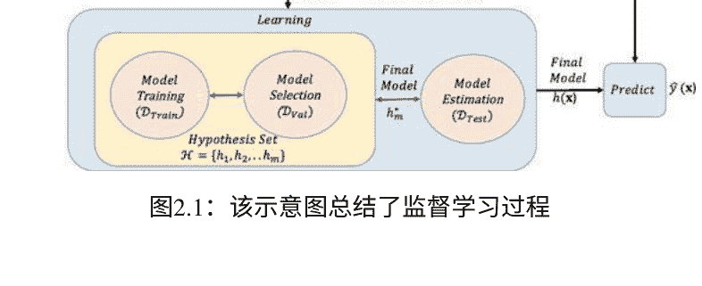

这组特征也可以看作是 $d$ 维向量 $\mathbf{f} = f_1, f_2, \ldots, f_d$，这在各种特征转换和选择过程中非常有用。

整个输入数据和相应的标签可以以矩阵形式查看：

$$\mathbf{X} = \begin{bmatrix} x_{11} & x_{12} & \cdots & x_{1d} \\ x_{21} & x_{22} & \cdots & x_{2d} \\ \vdots & \vdots & \ddots & \vdots \\ x_{n1} & x_{n2} & \cdots & x_{nd} \end{bmatrix}, \quad \mathbf{Y} = \begin{bmatrix} y_1 \\ y_2 \\ \vdots \\ y_n \end{bmatrix} \qquad (2.3)$$

在上述表示中，矩阵 $X$ 的第 $i$ 行存储了样本 $x_i$ 及其标签 $y_i$ 可以在矩阵 $Y$ 的第 $i$ 行找到。

或者，我们可以线性表示输入数据和相应的标签作为一个带标签的数据集 $\mathcal{D}_{labeled}$：

$$\mathcal{D}_{labeled} = (\mathbf{x}_1, y_1), (\mathbf{x}_2, y_2), \ldots, (\mathbf{x}_n, y_n) \qquad (2.4)$$

### 2.2.2 目标函数和标签

除了概率分布 $P(X)$ 之外，另一个未知实体是将输入空间 $\mathcal{X}$ 映射到输出空间 $\mathcal{Y}$ 的目标函数或理想函数。这个函数的形式表示为 $f : \mathcal{X} \rightarrow \mathcal{Y}$。机器学习中的目标是找到一个接近未知目标函数 $f$ 的近似函数。输出空间 $\mathcal{Y}$ 表示目标函数 $f$ 可以将输入映射到的所有可能值。一般来说，当值是分类的时候，找到对 $f$ 的近似被称为分类问题，而当值是连续的时候，问题被称为回归问题。当输出只能取两个值时，问题被称为二分类问题（例如，苹果和橙子）。在回归问题中，$y_i \in \mathbb{R}$。

有时候，不仅仅考虑一个实例 $(\mathbf{x}, y)$ 的精确映射或确定性输出，而是考虑目标联合概率分布 $P(\mathbf{x}, y) = P(\mathbf{x}) P(y|\mathbf{x})$ 会更有优势。后者更适应包含噪声或随机性的现实世界数据，我们稍后会详细讨论这个问题。

### 2.2.3 训练和预测

整个学习过程现在可以通过在一个大的假设空间 $\mathcal{H}$ 中找到近似函数 $f(\mathbf{x})$ 来定义，使得 $f(\mathbf{x})$ 能够有效地拟合给定的数据点 $\mathcal{D}$ 的标签，即 $\hat{f}(\mathbf{x}) \approx f(\mathbf{x})$。成功的衡量标准通常通过误差（也称为经验风险、损失或成本函数）来量化，该误差衡量了 $\hat{f}(\mathbf{x})$ 和未知目标函数 $f(\mathbf{x})$ 之间的差异。具体来说，误差 $= E(h(\mathbf{x}), f(\mathbf{x})) \approx e(h(\mathbf{x}), y)$ (2.5) 其中 $E(h(\mathbf{x}), f(\mathbf{x}))$ 是来自目标函数 $f(\mathbf{x})$ 的真实误差，该函数是未知的，并通过数据和标签给出的误差来近似表示为 $e(h(\mathbf{x}), y)$。

在分类领域中，对于一个数据点 $(\mathbf{x},y)$ 的单点误差可以是二进制值（记录不匹配），并且可以形式化地表示为：$E(\mathbf{x},y) = \llbracket h(\mathbf{x}) = y \rrbracket$ (2.6) 其中 $\llbracket \rrbracket$ 表示的是一个函数，当值不相等时返回1，否则返回0。在回归领域中，对于一个数据点 $(\mathbf{x},y)$ 的单点误差可以是平方误差：$E(\mathbf{x},y) = (h(\mathbf{x}) - y)^2$ (2.7) 整个标记数据集上的训练误差可以使用分类和回归的单点误差的均值来衡量，如下所示：

$E_{\text{train}} (h) = \frac{1}{N} \sum_{n=1}^{N} \llbracket h(\mathbf{x}_n) = y_n \rrbracket$ (2.8)

$E_{\text{train}} (h) = \frac{1}{N} \sum_{n=1}^{N} (h(\mathbf{x}_n) - y_n)^2$ (2.9)

通过对未见数据 $(\mathbf{x},y)$ 的期望值进行计算，可以得到预测或样本外误差：$E_{\text{out}} (h) = \mathbb{E}_{\mathbf{x}}[e(h(\mathbf{x}), y)]$ (2.10)

## 2.3 学习过程

机器学习是一个寻求回答三个问题的过程：

- 如何从标记数据中训练模型参数？
- 如何在给定标记数据的情况下选择模型的超参数？
- 如何从标记数据中估计样本外误差？

这个过程通常通过将整个标记的数据集逻辑地分成三个部分来完成： (a) 训练集 $\mathcal{D}_{Train}$, (b) 验证集 $\mathcal{D}_{Val}$, 和 (c) 测试集 $\mathcal{D}_{Test}$, 如图2.2所示。训练集 $\mathcal{D}_{Train}$ 用于训练给定的模型或假设，并学习最小化训练误差 $E_{Train}$ 的模型参数。验证集 $\mathcal{D}_{Val}$ 用于选择最小化验证误差 $E_{Val}$ 的最佳参数或模型。验证误差 $E_{Val}$ 作为外样本误差的代理。最后，测试集 $\mathcal{D}_{Test}$ 用于估计使用在 $\mathcal{D}_{Val}$ 上训练的最佳参数和在 $\mathcal{D}_{Train}$ 上学习的参数训练的模型的无偏误差。无偏误差很好地估计了对未来未见数据的误差。

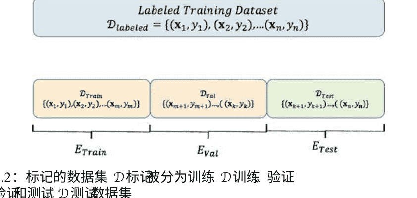

## 2.4 机器学习理论

在本节中，我们将回顾与机器学习相关的基本理论，以解决任何学习场景中的核心问题。

### 2.4.1 通过 Vapnik-Chervonenkis 分析的泛化-逼近权衡

将假设函数或模型拟合到标记的数据集可能导致机器学习中的一个核心问题，即过拟合。问题在于我们使用了所有标记数据点来减少误差，但这导致了较差的泛化。让我们考虑一个简单的一维数据集，使用带有高斯噪声的 $\sin(x)$ 作为目标函数生成。我们可以使用多项式函数的假设集来说明过拟合的问题。不同的次数可以被视为参数，通过这些参数可以获得不同的假设函数来拟合标记数据。图2.3显示了通过改变次数参数，我们可以通过有效增加模型的复杂性显著减少训练误差。图2.3显示了假设函数的选择如何导致欠拟合或过拟合。假设函数是由于缺乏复杂性，一次多项式很差地逼近目标函数。 相比之下，假设函数非常复杂（图2.3中也是15次多项式），甚至对训练数据中的噪声进行了建模，导致过拟合。在机器学习中，找到与给定资源（训练数据）相匹配的正确假设，以在逼近和泛化之间取得平衡，是至关重要的。

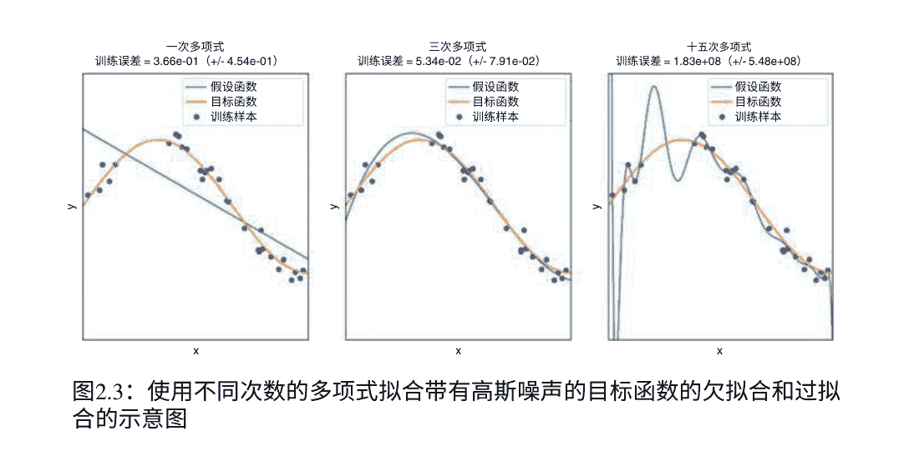

因此，有两个不同的错误需要考虑：(a) 在样本内的训练误差，由 $E_{train}(h)$ 表示，衡量了权衡的近似方面，以及(b) 在样本外的误差，由 $E_{out}(h)$ 表示，需要估计并衡量了泛化方面的权衡。

可能近似正确($PAC$) 可学习性定理提供了以下两个错误之间的理论界限，以模型可能正确的概率为条件：

$$P[|E_{train}(h) - E_{out}(h)| > \varepsilon] \leq 4m_{\mathcal{H}}(2N)e^{(-\frac{\varepsilon^2 N}{8})} \quad (2.11)$$

该方程限制了两个错误 $E_{train}(h)$ 和 $E_{out}(h)$ 之间的绝对差小于 $\varepsilon$ 的概率，通过一个称为增长函数 $m_{\mathcal{H}}$ 和训练数据样本数 $N$ 来衡量。 已经证明，即使学习算法的假设空间是无限的（例如感知器，稍后我们将讨论），增长函数也是有限的。 特别地，增长函数的上界是以 Vapnik-Chervonenkis (VC) 维度 $d_{VC}$ 来衡量的，它是可以被粉碎的最大 $N$；即 $m_{\mathcal{H}}(N) = 2^N$。 这使得 $m_{\mathcal{H}}(N)$ 在数据点的数量上是多项式的[Vap95]。因此，

$$m_{\mathcal{H}}(N) \leq N^{d_{VC}} + 1 \quad (2.12)$$

$m_{\mathcal{H}}(N) \sim N^{d_{VC}}$

因此，方程2.11可以重写为：

$$E_{out}(h) \leq E_{train}(h) + O\left(\sqrt{\frac{d_{VC} \log(N)}{N}}\right)$$

VC 维度，由 $d_{VC}$ 给出，与模型复杂度相关，上述方程可以进一步重写为：

$$E_{out}(h) \leq E_{train}(h) + \Omega(d_{VC})$$

图2.4捕捉了上述方程中 $E_{out}(h)$ 和 $E_{train}(h)$ 之间的关系。当模型复杂度低于最佳阈值 $d^*_{VC}$ 时，训练误差和样本外误差都在减小。选择任何模型来表示低于这个最优阈值的数据将导致欠拟合。当模型复杂度高于阈值时，训练误差 $E_{train}(h)$ 仍在减小，但样本外误差 $E_{out}(h)$ 增加，选择任何具有该复杂度的模型将导致过拟合。

PAC分析从VC维度的角度给出了训练集的外样本误差的上界，它与目标函数 $f: \mathcal{X} \to \mathcal{Y}$ 和根据该概率分布从总体中抽取样本的概率分布都无关。请记住，目标函数和概率分布都是未知的。


图2.4：模型复杂度和学习曲线。(a)训练误差、外样本误差和模型复杂度之间的关系。(b)训练误差、外样本误差和数据点数量之间的学习曲线关系。

### 2.4.2 通过偏差-方差分析进行泛化-逼近权衡

偏差-方差分析是衡量泛化-逼近权衡的另一种方法。通常使用均方误差作为成功度量来进行回归分析，但也可以修改为分类问题的分析方法[HTF09]。偏差-方差权衡的方程如下：

$$
E_x[(y - h(x))^2] = \underbrace{E_x[(h(x) - \bar{h}(x))^2]}_{\text{方差}} + \underbrace{(f(x) - \bar{h}(x))^2}_{\text{偏差}^2} + \underbrace{E[(y - f(x))^2]}_{\text{噪音}} \quad (2.16)
$$

偏差-方差权衡的思想是将样本外回归误差 $(y - h(x))^2$ 分解为三个量：

**方差**：项 $(h(x) - \bar{h}(x))^2$ 对应于 $\mathcal{H}$ 集合中假设的方差。项 $\bar{h}(x)$ 对应于整个集合 $\mathcal{H}$ 的平均假设。

**偏差**：该术语 $(f(x) - \bar{h}(x))^2$ 对应于由于没有一个好的或足够复杂的假设来近似目标函数 $f(x)$ 而引起的系统误差。

**噪声**：该术语 $(y - f(x))^2$ 对应于数据中固有的噪声。

一般而言，简单模型具有较大的偏差，而复杂模型具有较大的方差。为了说明偏差-方差权衡，我们再次使用一维正弦函数 $\sin(x)$ 作为目标函数，并添加高斯噪声来生成数据点。我们使用不同阶数的多项式回归进行拟合，如图2.5所示。

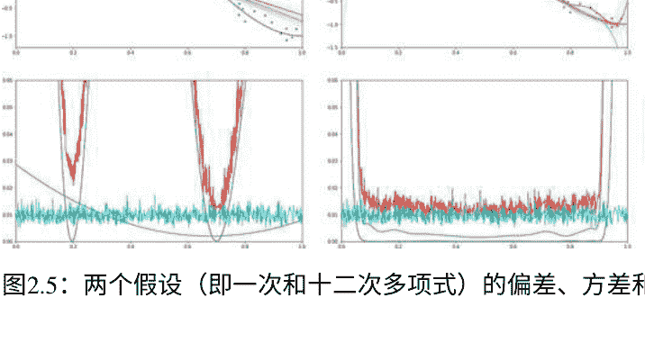

图2.5：两个假设（即一次和十二次多项式）的偏差、方差和噪声误差

在图2.5和表2.1中清楚地显示了偏差-方差权衡，该表列出了每种情况下的方差、偏差和噪声。一个简单的一次模型具有更高的偏差误差，导致欠拟合，而一个复杂的12次模型显示出巨大的方差误差，导致过拟合。

表2.1：一次和十二次多项式的偏差、方差和噪声误差

| 假设函数 | 偏差误差 | 方差误差 | 噪声误差 | 总误差 |
|----------|----------|----------|----------|--------|
| 一次     | 0.1870   | 0.0089   | 0.0098   | 0.2062 |
| 十二次   | 0.0453   | 2.4698   | 0.0098   | 2.5249 |

### 2.4.3 模型性能和评估指标

上面，我们使用分类或回归误差作为成功的度量来评估算法或模型的性能。一般来说，对于监督学习（无论是分类还是回归领域），有许多定义的度量标准取决于数据的大小、标签的分布、问题映射等等。下面，我们描述一些。

#### 2.4.3.1 分类评估指标

我们将考虑二元分类的简单情况。在分类领域中，模型成功的最简单可视化方式通常是使用混淆矩阵，如图2.6所示。准确率和分类错误是在数据在类别方面平衡时的有信息的成功度量；也就是说，类别具有相似的大小。当数据不平衡时，即数据集中一个类别相对于另一个类别具有更大的比例时，这些度量会对多数类别产生偏见，并给出错误的成功估计。

在这种情况下，基本度量指标，如真正率（TPR）、假正率（FPR）、真负率（TNR）和假负率（FNR），变得有用。例如，F1分数和马修斯相关系数（MCC）等度量将基本度量指标结合起来，给出一个总体的成功度量。以下是定义。

## Predicted Class

| Actual Class | Class Positive | Class Negative |
|--------------|----------------|----------------|
| Class Positive | True Positive (TP) | False Negative (FN) |
| Class Negative | False Positive (FP) | True Negative (TN) |

图2.6：二元分类的混淆矩阵

- 1. 真正例率（TPPR）或召回率或命中率或敏感度
  $\text{召回率} = \frac{TP}{(TP + FN)} \quad (2.17)$

- 2. 精确率或阳性预测值
  $\text{精确率} = \frac{TP}{(TP + FP)} \quad (2.18)$

- 3. 特异度
  $\text{特异度} = \frac{TN}{(TN + FP)} \quad (2.19)$

- 4. 负预测值
  $NPV = \frac{TN}{(TN + FN)} \quad (2.20)$

- 5. 漏报率或假阴性率
  $FNR = \frac{FN}{(TP + FN)} \quad (2.21)$

## 6. 准确率

准确率 = $\frac{TN + TP}{(TP + FN + FP + TN)} \quad\quad (2.22)$

## 7. F1得分

F1 = $2 \frac{\text{精确率} \times \text{召回率}}{(\text{精确率} + \text{召回率})} \quad\quad (2.23)$

## 8. 马修斯相关系数（MCC）

MCC = $2 \frac{TP \times TN - FP \times FN}{\sqrt{(TP+FP) \times (TP+FN) \times (TN+FP) \times (TN+FN)}} \quad\quad (2.24)$

许多分类模型不仅提供类别的预测，还提供每个数据点的置信度值，该值介于0和1之间。置信度阈值可以控制分类器在TPR和FPR方面的性能。在不同阈值下，绘制分类器的TPR和FPR的曲线被称为接收器操作特性（ROC）曲线。类似地，可以在不同阈值下绘制精确度和召回率，得到精确度-召回率曲线（PRC）。每个曲线下的面积分别称为auROC和auPRC，是常用的性能指标。特别是在存在不平衡类别的情况下，auPRC通常被认为是一种有信息量的指标。

#### 2.4.3.2 回归评估指标

在回归领域中，预测输出是一个与实际值（另一个实数）进行比较的实数，有许多变体的平方误差被用作评估指标。我们列举了一些如下。

- 1. 平均预测误差由以下公式给出：
  $\bar{y} = \frac{\Sigma_{i=1}^{n}(y_i - \hat{y}_i)}{n} \quad\quad (2.25)$
  其中 $y_i$ 对应于实际的实数标签，$\hat{y}_i$ 是模型的预测值。

- 2. 平均绝对误差（MAE）将正误差和负误差等同对待，由以下公式给出：
  MAE = $\frac{\Sigma_{i=1}^{n}|y_i - \hat{y}_i|}{n} \quad\quad (2.26)$

- 3. 均方根误差（RMSE）对大误差给予重视，由以下公式给出：
  RMSE = $\sqrt{\frac{\Sigma_{i=1}^{n}(y_i - \hat{y}_i)^2}{n}} \quad\quad (2.27)$

- 4. 相对平方误差（RSE）在两个不同单位的误差进行测量时使用：
  $$RSE = \frac{\sum_{i=1}^n (y_i - \hat{y}_i)^2}{\sum_{i=1}^n (\bar{y}_i - y_i)^2} \quad (2.28)$$

- 5. 决定系数（R²）总结了回归模型的解释能力，以平方误差的形式给出：
  $$SSE_{\text{残差}} = \sum_{i=1}^n (y_i - \hat{y}_i)^2 \quad (2.29)$$
  $$SSE_{\text{总}} = \sum_{i=1}^n (y_i - \bar{y}_i)^2 \quad (2.30)$$
  $$R^2 = 1 - \frac{SSE_{\text{残差}}}{SSE_{\text{总}}} \quad (2.31)$$

### 2.4.4 模型验证

验证技术旨在回答如何选择具有正确超参数值的模型的问题。当假设集中有许多假设时，每个唯一的假设都在训练集$D_{train}$上进行训练，然后在验证集$D_{val}$上进行评估；选择具有最佳性能指标的模型。从逻辑上讲，模型$h^-$（上标表示在较少数据上训练的模型）是在训练数据集上进行训练的，该数据集具有较少的数据点$M$，因为一些数据$K$在验证集中。然后给出在验证集上的性能：

$$E_{Val}(h^-) = \frac{1}{K} \sum_{n=1}^K e(h^-(\mathbf{x}_n), y_n) \quad (2.32)$$

利用上述的VC界限，我们可以证明：

$$E_{out}(h^-) \leq E_{Val}(h^-) + O\left(\frac{1}{\sqrt{K}}\right) \quad (2.33)$$

> 这个方程表明，验证数据点的数量越大K，对样本外误差的估计就越好。然而，从学习曲线来看，我们现在知道，训练数据越多，训练误差就越小。因此，通过从训练预算中移除K个点，我们在理论上增加了训练误差变大的机会。

这引发了一个有趣的学习悖论：我们需要大量的验证点来对样本外误差进行良好估计，而与此同时，为了更好地训练模型，我们需要在验证集中减少数据点的数量。

在实践中解决这个悖论的一种方法是仅使用训练数据 $D_{train}$ 来训练模型model，使用验证数据 $D_{val}$ 来估计误差 $E_{out}(h^-)$，然后将数据添加回训练集以学习新模型model $D_{train} + D_{val}$。 这被称为验证过程，并在图2.7中进行了说明。将所有这些放在一起，我们可以得到对 $E_{out}(h_S)$ 的上界：

$$E_{out}(h) \leq E_{out}(h^-) \leq E_{Val}(h^-) + O\left(\frac{1}{\sqrt{K}}\right) \quad (2.34)$$

需要注意的重要一点是，当验证集用于模型性能评估时，从验证误差中得出的外样本误差估计是乐观的；也就是说，验证集现在是一个有偏的集合，因为我们间接使用它来学习模型的超参数。 验证过程是一种简单的方法，可用于模型选择，与模型或学习算法无关。

验证过程的唯一缺点是需要大量标记数据点来创建训练集和验证集。由于成本或获取标签的困难，通常很难收集到大量标记集。在这种情况下，不需要物理上分离训练集和验证集，而是使用一种称为 $k$ 折交叉验证的技术。 $k$ 折交叉验证算法如图2.8所示。首先，数据被随机分成 $k$ 个集合。然后，在每个得到的 $k$ 个实验中， $k-1$ 个数据折用于训练，一个数据折用于验证以测量折的 $E_{Val}^k$。最后， $E_{Val}$ 的 $k$ 个验证错误的平均值被用作验证错误EVal的单个估计。

图2.7：模型训练和验证过程

我们强调验证过程中涉及具有单个参数的假设，参数为λ=(λ₁,λ₂…λ_M)，在搜索最佳参数时具有有限的值。

图2.8：十折交叉验证的示意图

**算法1：寻找最佳参数**
**数据：** 训练集 $D[k]$，验证集 $D[k]$
**结果：** 最佳参数，最低误差
**开始**
$\text{splitDataFolds}$: 创建带有标签的数据集 $D$ 的折叠 $k$
最佳参数 $\leftarrow \lambda_0$
**对于每个** $\mathbf{m} \in \mathbf{1..M}$，执行以下操作
  令 $\lambda \leftarrow \lambda_m$
  **对于每个** $i \in 1..k$，执行以下操作
    训练模型$(\lambda): D[i])$ $E_{VAL}[i] \leftarrow$ 测试模型$(\lambda): D[i])$
  $E_{VAL} \leftarrow \frac{1}{k} \sum_{k=1}^{K} E_{VAL}[k]$
  **如果**当前值是最佳值**那么**
    lowestError $\leftarrow E_{VAL}$
    bestParameter $\leftarrow \lambda_m$

### 2.4.5 模型估计和比较

一旦选择并训练了具有最佳参数的假设或模型使用整个 $D_{train} \cup D_{val}$ 集合，然后使用测试集 $D_{test}$ 来估计测试错误。回想一下，PAC方程是假设集大小 $M$ 和数据集大小 $N$ 的函数。因此，当只考虑一个假设时，$M=1$，在具有足够大的测试集的情况下，PAC方程确认测试错误是对样本外错误的良好近似。由于测试集既没有用于模型训练，也没有用于模型超参数选择，因此错误保持是一个无偏估计，与训练或验证错误相反。

如果需要对一个或多个分类器在一个或多个数据集上进行比较，以获得度量差异的统计估计，可以使用各种统计假设检验技术。在选择技术之前，必须了解每种技术的假设和约束条件[JS11, Dem06, Die98]。让我们描述一些统计假设检验技术。

重新采样$t$检验是一种参数检验（假设存在分布），用于通过从单个数据集中随机重新采样训练和测试子集来比较两个分类器在准确率或错误率等度量上的差异。如果$p_i$是两个分类器性能之间的差异，并且假设其服从高斯分布，而$\bar{p}$是平均性能差异，则$t$统计量为：

$$ t = \frac{\bar{p}\sqrt{n}}{\sqrt{\frac{\sum_{i=1}^{n}(\hat{p}_i-\bar{p})^2}{(n-1)}}} \qquad (2.35) $$

麦克尼马尔检验是一种常用的非参数检验方法，用于比较同一测试集上的两个分类器。该检验使用表2.2中给出的计数。零假设假定 $n_{10} \approx n_{01}$，统计量如下所示：

表2.2：两个分类器在测试集上的错误和正确的基本计数

| | 分类器₁错误 | 分类器₁正确 |
|---|---|---|
| 分类器₂错误 | $n_{00}$ | $n_{01}$ |
| 分类器₂正确 | $n_{10}$ | $n_{11}$ |

$$ \chi^2 = \frac{(|n_{01} - n_{10}| - 1)^2}{(n_{01} + n_{10})} \quad (2.36) $$

Wilcoxon符号秩检验是一种非参数检验方法，在多个数据集上比较两个分类器时很受欢迎。该检验将比较的两个分类器在第i个数据集上的指标差异排名为 $d_i = s_1 - s_2$，忽略符号。统计量如下所示：

$$ T = min(R^+, R^-) \quad (2.37) $$

其中

$$ R^+ = \sum_{d_i > 0} rank(d_i) + \frac{1}{2} \sum_{d_i = 0} rank(d_i) $$

和

$$ R^- = \sum_{d_i < 0} rank(d_i) + \frac{1}{2} \sum_{d_i = 0} rank(d_i) $$

当有多个分类器要在多个数据集上进行比较时，通常会使用Friedman非参数检验与Iman-Davenport扩展。这种情况在介绍新的分类器或在给定数据集上选择最佳分类器时非常常见。如果R_i是第i个数据集中第j个分类器在K个分类器中的排名，则统计量为：

$$ F = \frac{(N - 1)\chi_F^2}{K(K - 1) - \chi_F^2} \quad (2.38) $$

其中

$$ \chi_F^2 = \frac{12N}{K(K + 1)} \left[ \sum_{j=1}^{k} R_j^2 - \frac{K(K + 1)^2}{4} \right] $$

### 2.4.6 机器学习的实用技巧

> 虽然并非在每种情况下都成立，但对于机器学习从业者来说，有许多实用的技巧。我们在这里列举了一些。

- 在一个不平衡的数据集中，当有足够的数据时，创建分层抽样的训练和测试集是一个好主意。一般的经验法则是，如果可能的话，样本数量至少是维度数量的十倍。通常，将20%的数据保留用于测试。
- 如果标记的数据集非常稀疏（即样本数量远小于维度数量），可以使用交叉验证过程进行模型选择和估计，而不是将数据集分为训练集和测试集。需要注意的是，误差度量可能会过于乐观，可能无法反映真实的样本外误差。
- 为了在一个不平衡的数据集中获得良好的误差估计，测试集应该与总体估计的正负样本比例相似。
- 测试集需要具有与总体估计相似的数据特征。这包括特征统计和分布。
- 在不平衡的数据集中，创建许多不同多数类的同一少数类样本对于训练和测试都很有用。错误估计在不同集合之间的方差提供了样本偏差的重要指标。
- 使用训练集进行训练，并在训练集上使用交叉验证进行超参数选择。
- 在不平衡的数据集中，训练样本大小可以过采样或欠采样。两个类别的比例（在二元分类中）是另一个需要学习的超参数。
- 始终在验证集上绘制学习曲线（在训练集的交叉验证平均值和方差上）以评估给定算法所需的实例数量。

## 2.5 线性算法

现在让我们考虑回归问题中的类似问题。在本章中，我们将限制讨论线性回归。我们将给出每个算法的基本介绍和方程，然后讨论捕捉优势和局限性的要点。

### 2.5.1 线性回归

线性回归是最简单的线性模型之一，已经在理论上进行了分析并在许多领域中得到了实际应用[KK62]。数据集假设标签是数值或实数；例如，可以有兴趣预测一个地点的房价，该地点有先前房屋销售的历史数据以及重要特征，如结构、房间、邻居和其他特征已经被收集。由于线性回归的流行，让我们来介绍一些重要的元素，如优化的概念、方面等。

假设 $h$ 是输入 $\mathbf{x}$ 和权重参数的线性组合 $\mathbf{w}$（我们打算通过训练来学习）。在一个 $d$ 维输入（$\mathbf{x} = [x_1, x_2, ..., x_d]$）中，我们引入另一个维度，称为偏置项，$x_0$，其值为 1。因此，输入可以看作是 $\mathbf{x} \in \{1\} \times \mathbb{R}^d$，要学习的权重是 $\mathbf{w} \in \mathbb{R}^{d+1}$。

$$ h(\mathbf{x}) = \sum_{i=0}^{d} w_i x_i \quad (2.39) $$

在矩阵表示法中，输入可以表示为数据矩阵 $\mathbf{X} \in \mathbb{R}^{N \times (d+1)}$，其中行是来自数据的示例（例如，$\mathbf{x}_n$），输出表示为列向量 $\mathbf{y} \in \mathbb{R}^N$。我们将假设将数据集划分为训练、验证和测试的良好实践得到遵循，并将训练误差表示为 $E_{train}$。

通过线性回归进行学习的过程可以通过最小化假设函数 $h(\mathbf{x}_n)$ 和目标实际值 $y_n$ 之间的平方误差来分析表示为：

$$ E_{train}(h(\mathbf{x}, \mathbf{w})) = \frac{1}{N} \sum_{i=0}^{d} (\mathbf{w}^T \mathbf{x}_n - y_n)^2 \quad (2.40) $$

由于数据 $\mathbf{x}$ 已给出，我们将根据权重 $\mathbf{w}$ 来编写方程：

$$ E_{train}(\mathbf{w}) = \frac{1}{N} \| (\mathbf{X}\mathbf{w} - \mathbf{y})^2 \|, \quad (2.41) $$

其中 $\| (\mathbf{X}\mathbf{w} - \mathbf{y})^2 \|$ 是向量的欧几里德范数。因此，我们可以写成

$$ E_{train}(\mathbf{w}) = \frac{1}{N} (\mathbf{w}^T \mathbf{X}^T \mathbf{X} \mathbf{w} - 2\mathbf{w}^T \mathbf{X}^T \mathbf{y} + \mathbf{y}^T \mathbf{y}) \quad (2.42) $$

我们需要最小化 $E_{train}$。这是一个优化问题，因为我们需要找到最小化训练误差的权重 $\mathbf{w}_{opt}$ 也就是说，我们需要找到：

$$ \mathbf{w}_{opt} = \arg \min_{\mathbf{w} \in \mathbb{R}^{d+1}} E_{train}(\mathbf{w}) \quad (2.43) $$

我们可以假设损失函数 $E_{train}(\mathbf{w})$ 是可微的。因此，为了得到一个解，我们对损失函数关于 $\mathbf{w}$ 的梯度进行计算，并将其设为零向量 $\mathbf{0}$：

$$ \nabla E_{train}(\mathbf{w}) = \frac{2}{N} (\mathbf{X}^T \mathbf{X} \mathbf{w} - \mathbf{X}^T \mathbf{y}) = \mathbf{0} \quad (2.44) $$

$$ \mathbf{X}^{\mathrm{T}}\mathbf{X}\mathbf{w}=\mathbf{X}^{\mathrm{T}}\mathbf{y} \quad (2.45) $$

我们还假设 $\mathbf{X}^{\mathrm{T}}\mathbf{X}$ 是可逆的，因此我们得到

$$ \mathbf{w}_{\mathrm{opt}}=(\mathbf{X}^{\mathrm{T}}\mathbf{X})^{-1}\mathbf{X}^{\mathrm{T}}\mathbf{y} \quad (2.46) $$

我们可以将伪逆表示为 $\mathbf{X}^{+}$，即 $\mathbf{X}^{+}=(\mathbf{X}^{\mathrm{T}}\mathbf{X})^{-1}\mathbf{X}^{\mathrm{T}}$。这个推导表明线性回归有一个直接的解析公式来计算最优权重，学习过程就是计算伪逆矩阵和标签向量 $\mathbf{y}$ 的矩阵乘法。以下算法实现了上述优化过程。

**算法2：线性回归训练**

**数据：** 训练数据集 $(\mathbf{x}_1, y_1), (\mathbf{x}_2, y_2), \dots(\mathbf{x}_n, y_n)$ 使得 $\mathbf{x}_i \in \mathbb{R}^d$ 且 $y_i \in \mathbb{R}^d$
**结果：** 权重向量 $\mathbf{w} \in \mathbb{R}^{d+1}$
**开始**
从输入和每个向量的偏置创建矩阵 $\mathbf{X}$，并为标签创建向量 $\mathbf{y}$
计算伪逆 $\mathbf{X}^{+} = (\mathbf{X}^{\mathrm{T}}\mathbf{X})^{-1} \mathbf{X}^{\mathrm{T}}$
$\mathbf{w}_{\mathrm{opt}} = \mathbf{X}^{+}\mathbf{y}$

**算法3：线性回归预测**

**数据：** 测试数据 $\mathbf{x}$ 满足 $\mathbf{x} \in \mathbb{R}^d$ 和权重向量 $\mathbf{w}$
**结果：** 预测值 $\hat{y}$
**开始**
从输入创建向量 $\mathbf{x}$，并在输入向量前加上偏置项 $x_0 = 1$
$\hat{y} = \mathbf{x}^{\mathrm{T}}\mathbf{w}$

### 2.5.1.1 讨论要点

- 线性回归具有高效的训练算法，时间复杂度与训练数据的大小多项式相关。
- 线性回归假设 $\mathbf{X}^{+}$ 可逆。即使不是这种情况，也可以使用伪逆，但这并不能保证唯一的最优解。我们注意到有一些技术可以计算伪逆而不需要求逆矩阵。
- 如果训练集中的特征之间存在相关性，线性回归的性能会受到影响。

### 2.5.2 感知器

感知器是基于线性回归假设的模型，与回归不同的是，它使用符号函数提供分类输出，如下所示，并在图2.9中进行了说明。

$$h(\mathbf{x}) = sign\left( \sum_{i=0}^{d} w_i x_i \right) \quad (2.47)$$

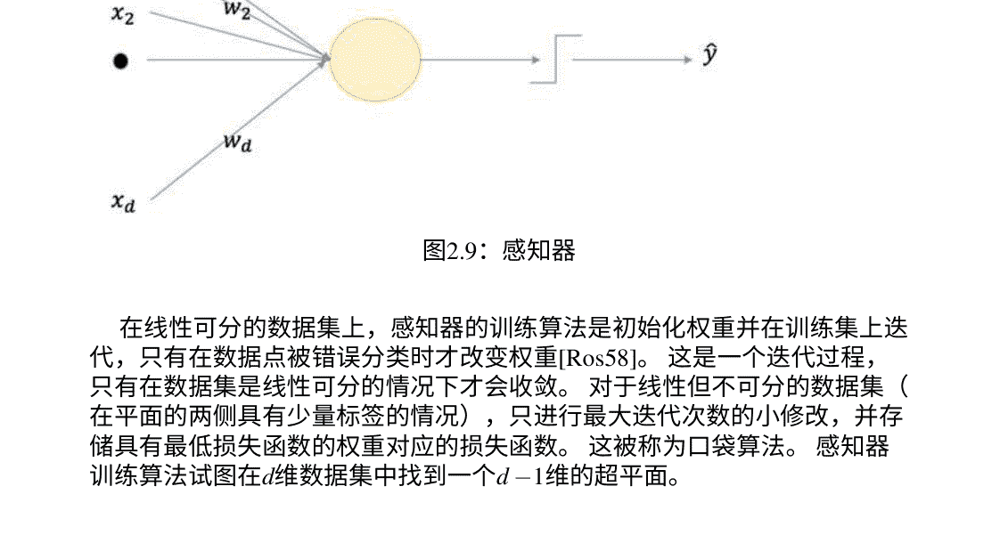

在线性可分的数据集上，感知器的训练算法是初始化权重并在训练集上迭代，只有在数据点被错误分类时才改变权重[Ros58]。这是一个迭代过程，只有在数据集是线性可分的情况下才会收敛。对于线性但不可分的数据集（在平面的两侧具有少量标签的情况），只进行最大迭代次数的小修改，并存储具有最低损失函数的权重对应的损失函数。这被称为口袋算法。感知器训练算法试图在$d$维数据集中找到一个$d-1$维的超平面。

### 2.5.2.1 讨论要点

- 感知器不需要找到最佳超平面（两类之间的最大分离）并且容易受到数据集中的噪声的影响。
- 异常值会影响算法找到最佳超平面的能力，因此处理异常值很重要。

### 算法 4：感知器

```
数据: 训练数据集 (x₁,y₁),(x₂,y₂),…(xₙ,yₙ) 使得 xᵢ ∈ ℝᵈ 且 yᵢ ∈ {+1, -1}, 最大迭代次数=T
结果: 权重向量 w ∈ ℝᵈ⁺¹
开始
    从输入创建向量 x，并在输入向量前加上偏置项 x₀ = 1
    从标签创建向量 y
    将权重向量 w₀ 初始化为 0
    bestWeight ← w₀
    将当前损失(w)初始化为1
    对于 t ∈ 0..T-1 执行
        对于 i ∈ 0..N-1 执行
            如果 sign(xᵢwᵀ)yᵢ ≠ yᵢ 则
                更新权重向量 w₍ₜ₊₁₎ = w₍ₜ₎ + xᵢyᵢ
                当前损失(w) ← 当前损失(w₍ₜ₊₁₎)
                如果当前损失(w) < 损失(w) 则
                    损失(w) ← 当前损失(w)
                    最佳权重 = w₍ₜ₊₁₎
    返回最佳权重
```

### 算法5： 感知器

```
数据: 测试数据 x 使得 x ∈ ℝᵈ 和权重向量 w
结果: 预测ŷ ∈ {+1, -1}
开始
    从输入创建向量 x 并为每个向量添加偏置 x₀ = 1
    ŷ = sign(xᵀ w)
    return ŷ
```

### 2.5.3 正则化

正如之前讨论的，监督式机器学习中常见的问题之一是过拟合。 方程2.15可以看作是对模型复杂度的一种惩罚。 如果在模型的训练中考虑到这种惩罚，那么学习效果会得到改善。 正则化的思想就是这样，即在训练过程中引入这种惩罚。 正则化可以被看作是奥卡姆剃刀的一种应用，目标是选择一个更简单的假设。 一般来说，正则化用于对数据集中固有的噪声进行抵抗。

在许多基于权重的机器学习算法中，如线性回归、感知机、逻辑回归和神经网络，常常会对权重施加惩罚，并将其引入损失函数中。 然后，将得到的增强损失函数用于优化，具体形式如下：

$$E_{aug}(h) = E_{train}(h) + \lambda \Omega(\mathbf{w}) \quad \quad (2.48)$$

在上述的增强损失函数中，标量参数λ被称为正则化常数，而Ω(w)被称为正则化函数。

#### 2.5.3.1 岭回归正则化：L₂范数

其中一种常见的正则化函数是L₂范数[HKO00]，也被称为权重衰减或岭回归。可以将其代入方程2.48中，如下所示：

$$E_{aug}(h) = E_{train}(h) + \lambda \mathbf{w}^T \mathbf{w}$$

因此，可以寻找最优的$\mathbf{w}_{opt}$，定义如下：

$$\mathbf{w}_{opt} = \arg \min_{\mathbf{w} \in \mathbb{R}^{d+1}} E_{aug}(\mathbf{w})$$

$$\mathbf{w}_{opt} = \arg \min_{\mathbf{w} \in \mathbb{R}^{d+1}} (E_{train}(h) + \lambda \mathbf{w}^T \mathbf{w})$$

带有正则化的线性回归解为：

$$\mathbf{w}_{opt} = (\mathbf{X}^T \mathbf{X} + \lambda \mathbf{I})^{-1} \mathbf{X}^T \mathbf{y}$$

> 正则化参数λ通常使用验证技术来选择，对于任何超参数，通常是一个小值大约为0.001。L₂正则化的影响是一些不相关的权重将接近于零。通过特征加权，L₂正则化可以被看作是通过隐式特征选择来进行的。L₂正则化在计算上是高效的。

#### 2.5.3.2 Lasso 正则化：L₁范数

L₁范数是另一种在基于权重的算法中常用的正则化方法[HTF09]：

$$\mathbf{w}_{opt} = \arg \min_{\mathbf{w} \in \mathbb{R}^{d+1}} (E_{train}(h) + \lambda |\mathbf{w}|)$$

由于绝对值函数，上述方程没有闭合形式的解，通常表示为以下约束优化问题：

$$\arg \min_{\mathbf{w} \in \mathbb{R}^{d+1}} (\mathbf{X}^T \mathbf{X} \mathbf{w} - \mathbf{X}^T \mathbf{y}) \quad s.t. \quad \mathbf{w} < \eta$$

参数 η 与正则化参数 λ 成反比。上述方程可以证明是一个凸函数，通常使用二次规划来获得优化的权重。

> 与 $L_2$ 正则化一样，$L_1$ 正则化中的正则化参数 λ 是通过验证技术来选择的。与 $L_2$ 相比，$L_1$ 正则化通常会导致更多的特征权重被设为零。因此，$L_1$ 正则化通过隐式特征选择产生了稀疏表示。

### 2.5.4 逻辑回归

逻辑回归可以看作是对线性组合 $\mathbf{x}^T\mathbf{w}$ 的变换 $\theta$，从而使分类器返回一个概率分数 [WD67]：

$$h(\mathbf{x}) = \theta(\mathbf{w}^T\mathbf{x}) \tag{2.55}$$

一个逻辑函数（也称为 sigmoid 函数或 softmax 函数）$\theta(\mathbf{w}^T\mathbf{x})$，如下所示，通常用于变换：

$$h(\mathbf{x}) = \frac{\exp(\mathbf{w}^T\mathbf{x})}{1 + \exp(\mathbf{w}^T\mathbf{x})} \tag{2.56}$$

对于二元分类问题，其中 $y \in \{-1, +1\}$，假设可以被视为预测 $y = +1$ 的可能性，即 $P(y = +1|\mathbf{x})$。因此，该方程可以被重新表示为对数几率比，通过学习权重来最大化给定输入的条件概率。

$$\frac{P(y = +1|\mathbf{x})}{P(y = -1|\mathbf{x})} = \mathbf{w}^T\mathbf{x} \tag{2.57}$$

假设的对数似然可以写成：

$$\log h(\mathbf{x}) = \sum_{i=0}^n \log P(y_i|\mathbf{x}_i) \tag{2.58}$$

$$\log \mathcal{L}(h(\mathbf{x})) = \sum_{i=0}^n \begin{cases} \log h(\mathbf{x}_i) & \text{if } y_i = +1 \\ (1 - \log h(\mathbf{x}_i)) & \text{if } y_i = -1 \end{cases} \tag{2.59}$$

$$\log \mathcal{L}(h(\mathbf{x})) = \sum_{i=0}^n (y_i \log h(\mathbf{x}_i) + (1 - y_i)(1 - \log h(\mathbf{x}_i))) \tag{2.60}$$

在信息论中，如果将 $y_i$ 和 $h(\mathbf{x}_i)$ 视为概率分布，则上述方程被称为交叉熵误差。这个交叉熵误差可以被视为我们的新误差函数 $E_{train}$，但它不能以闭式解的形式解决。与其寻求解析解，不如采用一种称为梯度下降的迭代算法。梯度下降是一种广泛应用于机器学习和深度学习的通用优化算法。下面我们详细讨论一下。

#### 2.5.4.1 梯度下降

让我们回顾一下目标是找到使 $E_{train}$ 最小化的权重 $\mathbf{w}$，并且在最小值处，$E_{train}$ 的梯度为0。在梯度下降中，负梯度被迭代地跟随，直到梯度为零。梯度是一个包含每个维度的偏导数的向量[Bry61]，如下所示：

$$ \mathbf{g} = \nabla E_{train}(\mathbf{w}) = \left[ \frac{\partial E_{train}}{\partial w_0}, \frac{\partial E_{train}}{\partial w_1} \dots \frac{\partial E_{train}}{\partial w_n} \right] \quad (2.61) $$

归一化梯度 $\hat{g}$ 可以表示为：

$$ \hat{g} = \frac{\nabla E_{train}(\mathbf{w})}{||\nabla E_{train}(\mathbf{w})||} \quad (2.62) $$

在 $-\hat{g}$ 的方向上进行小步长 $\eta$ 的更新，从而得到最优点。选择一个小的步长很重要，否则算法会震荡并且无法达到最优点。该算法可以总结为：

**算法6： 梯度下降**

| **数据** | 训练数据集 $\mathcal{D}_{train}=(\mathbf{x}_1, y_1), (\mathbf{x}_2, y_2), ..(\mathbf{x}_n, y_n)$ 使得 $\mathbf{x}_i \in \mathbb{R}^d$ 并且 $y_i \in \{+1, -1\}$， 损失函数 $E_{train}(\mathbf{w})$， 步长 $\eta$ 和最大迭代次数 $T$ |
| :--- | :--- |
| **结果** | 权重向量 $\mathbf{w} \in \mathbb{R}^{d+1}$ |
| **开始** | |
| | $\mathbf{w}_0 \leftarrow \text{init}(\mathbf{w})$ |
| | **对于** $t \in 0..T-1$ **do** |
| | $\quad \mathbf{g}_t \leftarrow \nabla E_{train}(\mathbf{w}_t)$ |
| | $\quad \mathbf{w}_{t+1} \leftarrow \mathbf{w}_t - \eta \hat{\mathbf{g}}_t$ |
| **返回** | $\mathbf{w}$ |

权重 $\mathbf{w}$ 可以初始化为 $\mathbf{0}$ 向量或设置为随机值（每个值从均值为0、方差较小的正态分布中获得）或预设值。梯度下降中的另一个重要决策是终止准则。当迭代次数达到特定值或梯度值接近零时，算法可以终止。

#### 2.5.4.2 随机梯度下降

梯度下降的一个缺点是在计算梯度时使用整个训练数据集。这对内存和计算速度有影响，随着训练样本数量和维度的增加，内存和计算速度也会增加。随机梯度下降是梯度下降的一种版本，它不使用整个训练数据集，而是从训练数据集中随机选择一个数据点（因此被称为随机）。研究表明，在大量迭代和小步长的情况下，随机梯度下降通常能达到与批量梯度下降算法相同的最优解。

**算法7：随机梯度下降**

| **数据** | 训练数据集 $\mathcal{D}_{\text{train}} = (\mathbf{x}_1, y_1), (\mathbf{x}_2, y_2), ..., (\mathbf{x}_n, y_n)$ 使得 $\mathbf{x}_i \in \mathbb{R}^d$ 并且 $y_i \in \{+1, -1\}$， 损失函数 $E_{\text{train}}(\mathbf{w})$， 步长 $\eta$ 和最大迭代次数 $T$ |
| :--- | :--- |
| **结果** | 权重向量 $\mathbf{w} \in \mathbb{R}^{d+1}$ |
| **开始** | |
| | $\mathbf{w}_0 \leftarrow \text{init}(\mathbf{w})$ |
| | **对于** $t \in 0..T-1$ **do** |
| | $\quad d \leftarrow (\mathbf{x}_i, y_i)$ |
| | $\quad \mathbf{g}_t \leftarrow \nabla E_d(\mathbf{w}_t)$ |
| | $\quad \mathbf{w}_{t+1} \leftarrow \mathbf{w}_t - \eta \mathbf{g}_t$ |
| **返回** | $\mathbf{w}$ |

图2.10展示了一维线性回归问题中批量梯度下降和随机梯度下降的训练误差的迭代变化。

可以证明，在逻辑回归中梯度为：

$$\nabla E_{\text{train}}(\mathbf{w}) = -\frac{1}{N} \sum_{i=0}^{n} \frac{y_i \mathbf{x}_i}{(1 + \exp^{y_i \mathbf{w}^T \mathbf{x}_i})} \quad \quad (2.63)$$

使用梯度下降训练逻辑回归的算法如下：

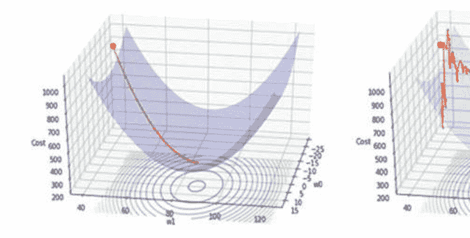

图2.10：使用梯度下降和随机梯度下降的一维回归

**算法8：使用梯度下降的逻辑回归**

| **数据** | 训练数据集 $(x_1, y_1), (x_2, y_2), ..(x_n, y_n)$ 使得 $x_i \in \mathbb{R}^d$ 且 $y_i \in \{+1, -1\}$， 最大迭代次数 = T 和步长 $\eta$ |
| :--- | :--- |
| **结果** | 权重向量 $w \in \mathbb{R}^{d+1}$ |
| **开始** | |
| | 从输入中创建一个向量 $x$，并为每个向量 $x$ 添加一个偏置项 $x_0 = 1$ |
| | **对于** $t \in 0..T-1$ **do** |
| | $\quad g_t \leftarrow -\frac{1}{N} \sum_{i=0}^{n} \frac{y_i x_i}{(1+\exp^{y_i w^T x_i})}$ |
| | $\quad w_{t+1} \leftarrow w_t - \eta g_t$ |
| **返回** | $w$ |

### 2.5.5 生成分类器

到目前为止，我们所见过的所有算法都是以判别式为基础的；也就是说，它们对数据的底层分布不做任何假设，而是专注于预测准确性的最终目标。机器学习中另一种流行的方法是生成式方法，它假设数据是由一个底层分布生成的，并试图找到该分布的参数来进行训练。

生成式方法虽然是一种间接实现预测准确性的机制，但在实际应用中非常成功。许多机器学习算法，包括有监督和无监督的算法，如朴素贝叶斯、线性判别分析、期望最大化和贝叶斯网络等，都基于生成式方法，并在贝叶斯定理的概率基础上建立。

形式上，给定一个假设 $h$ 和一个训练数据集 $D_{train}$，贝叶斯定理有助于定义选择假设的概率，即它有助于定义 $P(h|D_{train})$，给定假设的先验概率 $P(h)$，给定假设的数据似然 $P(D_{train}|h)$，以及数据的概率在所有假设上 $P(D_{train}) = \int_h P(D_{train}|h)$ 为：

$$ P(h|\mathcal{D}_{train}) = \frac{P(\mathcal{D}_{train}|h)P(h)}{P(\mathcal{D}_{train})} $$

如果存在多个假设，则根据训练数据确定最有可能的假设可以通过最大后验概率假设来回答：

$$ h_{MAP} = \arg \max_{h\in\mathcal{H}} P(h|\mathcal{D}_{train}) $$

$$ h_{MAP} = \arg \max_{h\in\mathcal{H}} \frac{P(\mathcal{D}_{train}|h)P(h)}{P(\mathcal{D}_{train})} $$

由于 \( P(D_{train}) \) 与 \( h \) 独立，我们有：

$$ h_{MAP} = \arg \max_{h\in\mathcal{H}} P(\mathcal{D}_{train}|h)P(h) $$

如果我们进一步假设所有的假设是等可能的（即， \( P(h_1) \approx P(h_2) \approx P(h_m) \) 对于 \( m \) 个假设），方程可以简化为：

$$ h_{ML} = \arg \max_{h\in\mathcal{H}} P(\mathcal{D}_{train}|h) $$

根据假设，如果训练样本是独立同分布的（i.i.d）， \( P(D_{train}|h) \) 可以用训练样本表示为：

$$ P(\mathcal{D}_{train}|h) = \prod_{i=1}^{N} P(\langle \mathbf{x}_i, y_i \rangle | h) = \prod_{i=1}^{N} P(y_i | \mathbf{x}_i; h) P(\mathbf{x}_i) $$

#### 2.5.5.1 朴素贝叶斯

对于二分类问题，贝叶斯形式的假设为： \( y_i \in \{0,1\} \)

$$ h_{Bayes}(\mathbf{x}) = \arg \max_{y\in\{0,1\}} P(X = \mathbf{x} | Y = y) P(Y = y) $$

在朴素贝叶斯中，假设特征或属性之间相互独立。因此，对于 \( d \) 个维度，方程简化为：

$$ h_{Bayes}(\mathbf{x}) = \arg \max_{y\in\{0,1\}} P(Y = y) \prod_{j=1}^{d} P(X_j = x_j | Y = y) $$

因此，训练和估计朴素贝叶斯的参数只需要测量两个量，即类别的先验概率 \( P(Y = y) \) 和给定类别的每个特征的条件概率 \( P(X_j = x_j | Y = y) \)。很容易证明，这些的最大似然估计就是离散数据集中的计数，如下所示：### 2.5.5.2 线性判别分析

$$P(Y = y) = \frac{1}{N} \sum_{i=0}^{N} \llbracket y_i = y \rrbracket = \frac{\text{countLabel}(y)}{N}$$

$$P(X_i = x_j | Y = y) = \frac{\llbracket y_i = y \text{ and } x_{i,j} = x \rrbracket}{N}$$

可以使用估计值和方程2.70对新样本进行预测。

线性判别分析（LDA）是另一种生成模型，假设P(X|Y)服从高斯分布，并且二元类别具有相等的先验概率，即P(Y=1)=P(Y=0)=1/2。形式上，μ∈R^d是多元均值，而Σ是协方差矩阵。然后，我们有：

$$P(X = \mathbf{x} | Y = y)P(Y = y) = \frac{1}{(2\pi)^{d/2} |\Sigma|^{1/2}} \exp \left( \frac{-1}{2} (\mathbf{x} - \boldsymbol{\mu})^{\text{T}} \Sigma^{-1} (\mathbf{x} - \boldsymbol{\mu}) \right)$$

LDA的训练，类似于朴素贝叶斯，涉及到参数的估计，(μ和Σ在这里)是从训练数据中得到的。

### 2.5.6 线性算法的实用技巧

- 1. 对于梯度下降算法，将输入的实值特征缩放到范围[0, 1]总是一个好主意。
- 2. 二进制或分类特征可以直接使用独热向量表示，无需进行任何转换。在独热向量表示中，每个分类属性被转换为k个布尔值属性，其中只有一个属性的值为一，其余属性的值为零。
- 3. 应该使用跨越多个数量级的值范围进行网格搜索，以确定学习率和正则化参数。

## 2.6 非线性算法

迄今为止我们所见过的算法，由 \(sign(\mathbf{w}^T\mathbf{x})\) 给出，对于权重 \(\mathbf{w}\) 来说是线性的，因为输入 \(\mathbf{x}\) 对于训练算法是给定的或常数。一个简单的扩展是对所有特征应用非线性变换 \(\phi(\mathbf{x})\)，将数据点转换到一个新的空间 \(\mathcal{Z}\)，在该空间中可以学习到一个由 \(sign(\mathbf{w}^T\phi(\mathbf{x}))\) 给出的线性模型。当需要对新的未见数据 \(\mathbf{x}\) 进行预测时，首先使用变换 \(\phi(\mathbf{x})\) 将数据转换到 \(\mathcal{Z}\) 空间，然后在 \(\mathcal{Z}\) 空间中应用线性算法权重进行预测。

举个例子，一个简单的非线性、二维的训练数据集可以被转化成一个三维的 \(\mathcal{Z}\) 空间，其中的维度为 \(\mathbf{z} = (x_1, x_2, x_1^2 + x_2^2)\)。如图2.11所示， \(\mathcal{Z}\) 空间是线性可分的。

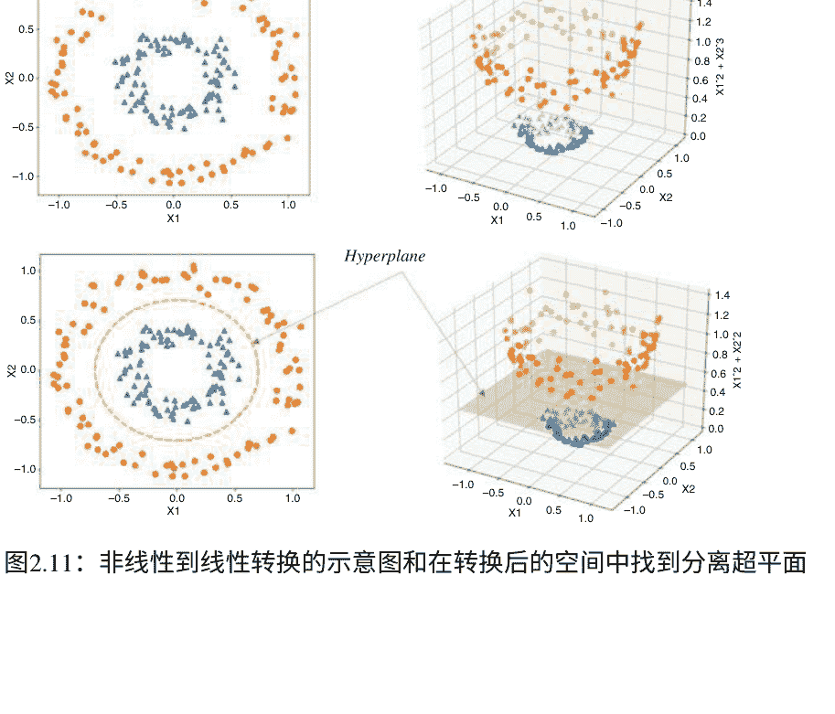

### 2.6.1 支持向量机

支持向量机（SVM）是最流行的非线性机器学习算法之一，它可以使用内置的转换（称为核函数）来分离线性和非线性数据[Vap95]。SVM不仅可以分离数据，还可以通过最大间隔分离原则找到最优的分离超平面，如图2.12所示。分离超平面上的数据点被称为支持向量。

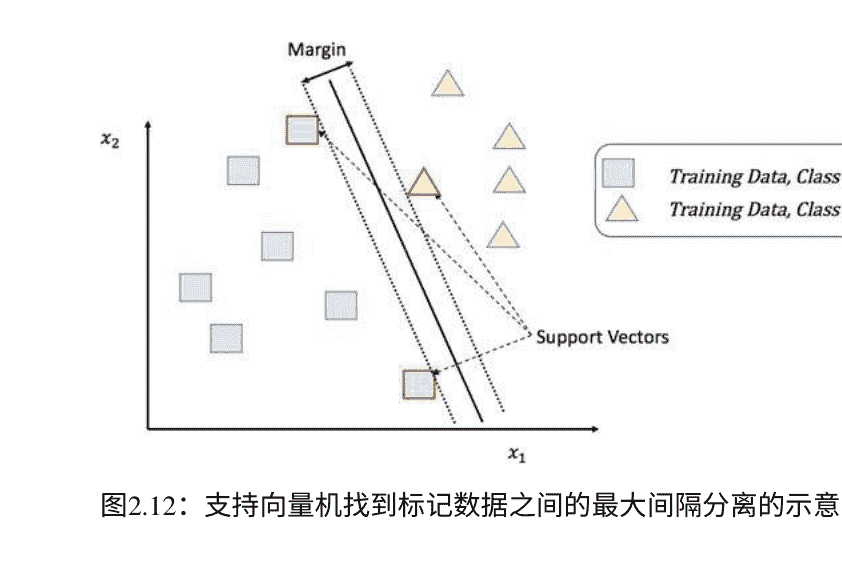

在支持向量机中，超平面是通过核变换 \(k(x, x')\) 获得的，该变换接受任意两个数据点 \(x\) 和 \(x'\)，并在内积空间中获得转换后的实数值：

$$y = b + \sum_{i} \alpha_{i} k(\mathbf{x}, \mathbf{x}')$$

核函数的思想是通过所谓的核技巧，在不进行任何显式变换 \(\phi(\mathbf{x})\) 的情况下，隐式地对 \(\mathcal{X}\) 空间进行非线性变换。径向基函数，也称为高斯核，就是这样一种核变换：

$$k(\mathbf{x}, \mathbf{x}') = \exp^{-\frac{|\mathbf{x}-\mathbf{x}'|^2}{\sigma^2}}$$

高斯核可以将输入空间映射到无限维特征空间。图2.11中所示的变换可以推广为一个 \(\sigma\) 次多项式核：

$$k(\mathbf{x}, \mathbf{x}') = (1 + \mathbf{x}\mathbf{x}')^{\sigma}$$

### 2.6.2 其他非线性算法

k最近邻算法是另一种简单的非线性算法。 它也被称为惰性学习器，因为其核心思想是将所有训练数据保存在内存中，并使用用户指定的k（邻居数量）的距离度量来对未见过的新数据点进行分类。 通常，使用欧几里得距离或曼哈顿距离等距离度量来计算点之间的距离：

$$\text{dist}(\mathbf{x}, \mathbf{x}') = \left( \sum_{d=1}^{D} |\mathbf{x} - \mathbf{x}'|^q \right)^{\frac{1}{q}} \qquad (2.78)$$

神经网络是感知器的另一种扩展，用于创建非线性边界。 我们在第4章中详细讨论它们。决策树及其许多扩展，如梯度提升算法和随机森林等，都基于找到特征的简单决策边界并将它们组合成分层树的原则，如图2.13所示。

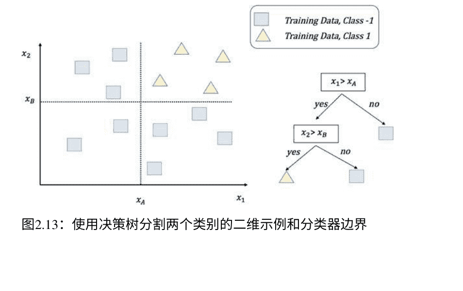

图2.13：使用决策树分割两个类别的二维示例和分类器边界

## 2.7 特征转换、选择和降维

在本节中，我们将回顾一些常用的特征转换、选择和降维技术。

### 2.7.1 特征转换

在许多算法中，将所有特征保持在相同的范围内是有益的，例如，在 [0,1] 范围内，以使算法不受偏差影响，并能有效地运行在所有特征上。一些常用的转换如下所示。

#### 2.7.1.1 居中或零均值

可以通过从值中减去均值来转换每个特征，即 $f_{feature,i} = f_i - \bar{f}_f$ 特征：

$$\bar{f}_f \text{ 特征} = \frac{1}{N} \sum_{i=0}^{N} f_i \quad (2.79)$$

#### 2.7.1.2 单位范围

可以将每个特征转换为 [0,1] 范围内。对于特征 $f_{feature}$，让 $f_{feature}Max$ 表示数据集中的最大值， $f_{feature}Min$ 表示最小值。那么对于实例 $i$ 的转换为：

$$f_i = \frac{(f_i - f_f \text{ 特征最大值} )}{(f_f \text{ 特征最大值} - f_f \text{ 特征最小值} )} \quad (2.80)$$

#### 2.7.1.3 标准化

在这个转换中，特征的均值变为零，方差变为单位。特征 $v_f$ 特征的经验方差通过以下公式计算：

$$v_f \text{ 特征} = \frac{1}{N} \sum_{i=0}^{N} (f_i - \bar{f}_f \text{ 特征} )^2 \quad (2.81)$$

每个特征的转换公式为 $f_i = \frac{(f_i - \bar{f}_f \text{ 特征} )}{\sqrt{v}}$.

#### 2.7.1.4 离散化

连续特征有时会通过定义类别数量或类别宽度来转换为分类类型。

### 2.7.2 特征选择和降维

我们已经看到，使用 $L_1$ 或 $L_2$ 进行正则化可以被视为一种特征评分和选择机制，并且可以直接应用于算法中以减少或优先考虑特征的影响。有许多单变量和多变量的特征选择方法，使用信息论、基于统计的、稀疏学习的、包装算法来寻找特征[GE03, CS14]。还有各种降维或特征减少技术，将特征集转换和减少为更有意义的子集。在本节中，我们将介绍一种基于统计的方法，称为主成分分析(PCA)，它也适用于深度学习技术。

#### 2.7.2.1 主成分分析

PCA是一种线性降维技术，给定一个输入矩阵 $\mathbf{X}$，试图找到一个特征矩阵 $\mathbf{W}$，使得特征矩阵 $\mathbf{W}$ 的大小 $m$ 比输入维度 $d$ ($m \ll d$) 要小得多，并且这个新特征矩阵中的每个降维特征都能够从输入中捕捉到最大的方差[Jol86]。这可以被视为找到权重矩阵 $\mathbf{W}$ 使得特征之间的相关性最小化的过程（图2.14）。这可以表示为以下形式：

$$(\mathbf{W}\mathbf{X})^{\mathrm{T}}(\mathbf{W}\mathbf{X}) = (\mathbf{Z})^{\mathrm{T}}(\mathbf{Z}) = N\mathbf{I} \tag{2.82}$$

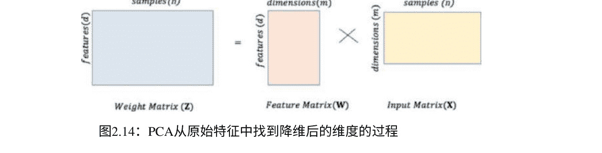

$$\mathbf{W}\mathbf{X}^{\mathrm{T}}\mathbf{X}\mathbf{W}^{\mathrm{T}} = N\mathbf{I} \tag{2.83}$$

通过对角化求解，上述方程变为：

$$\mathbf{W}\mathrm{Cov}(\mathbf{X})\mathbf{W}^{\mathrm{T}} = \mathbf{I} \tag{2.84}$$

协方差矩阵是正半定的、对称的，具有正交特征向量和实数特征值。矩阵 $\mathbf{A}$ 可以分解为 $\mathbf{U}\mathbf{\Lambda}\mathbf{U}^{\mathrm{T}} = \mathbf{\Lambda}$，其中 $\mathbf{U}$ 的列是 $\mathbf{A}$ 的特征向量，$\Lambda = \text{diag}(\lambda_i)$，其中 $\lambda_i$ 是 $\mathbf{A}$ 的特征值。

因此，$\mathbf{W}\text{Cov}(\mathbf{X})\mathbf{W}^\top$ 的解是协方差矩阵的特征向量 $\mathbf{U}$ 和特征值 $\Lambda$ 的函数，即 $\text{Cov}(\mathbf{X})$。算法如下所示。

```
算法9: 主成分分析
数据: 数据集 $\mathbf{X}= [\mathbf{x}_1, \mathbf{x}_2..\mathbf{x}_N] \in \mathbb{R}^d$，组件数 = m
结果: 转换后的数据 $\mathbf{Y} \in \mathbb{R}^m$
开始
$\mathbf{X} \leftarrow [\mathbf{x}_1 - \mu, \mathbf{x}_2 - \mu..\mathbf{x}_N - \mu]$
$\mathbf{S}_t \leftarrow \frac{1}{N} \mathbf{X} \mathbf{X}^\top$
$\mathbf{X}^\top \mathbf{X} = \mathbf{V} \lambda \mathbf{V}^\top$
$\mathbf{U} \leftarrow \mathbf{X} \mathbf{V} \lambda^{-\frac{1}{2}}$
$\mathbf{U}_m \leftarrow [\mathbf{u}_1, \mathbf{u}_2..\mathbf{u}_m]$
$\mathbf{Y} \leftarrow \mathbf{U}_m^\top \mathbf{X}$
返回 $\mathbf{Y}$
```

## 2.8 序列数据和建模

在许多序列数据分析问题中，例如语言建模、时间序列分析和信号处理，将底层过程建模为马尔可夫过程非常成功。许多传统的自然语言处理任务，如词性标注、信息提取和短语分块，已经非常成功地使用隐马尔可夫模型（HMM）进行建模，这是一种特殊类型的马尔可夫过程。在接下来的几节中，我们将讨论与马尔可夫链[KS+60]相关的一些重要理论、性质和算法。

### 2.8.1 离散时间马尔可夫链

马尔可夫链是建模许多顺序过程的基本构建块。考虑一个有限状态集合，表示为 $S = \{s_1, s_2, . . . , s_n\}$，并且让变量 $q$ 表示任意时间 $t$ 的转移。图2.15提供了一个示例。

马尔可夫性质指出，在任意时间 $t$，它处于状态 $s_t$ 的概率仅取决于之前的 $k$ 个状态，而不是从时间1到 $t-1$ 的所有状态。这可以表示为：
$P(q_t = s_i|q_{t-1}, q_{t-2}, ..q_1) = P(q_t = s_i|q_{t-1}, q_{t-2}, ..q_{t-k}) \quad (2.85)$

最简单的马尔可夫链仅依赖于最近的状态（k=1），表示为：

$$P(q_t = s_i|q_{t-1}, q_{t-2}, ..q_1) = P(q_t = s_i|q_{t-1})$$ (2.86)

给定由 $S = (s_1, s_2, ..s_n)$ 定义的一组固定状态的马尔可夫链可以使用一个 $n \times n$ 转移矩阵 $A$ 来表示，其中每个元素捕捉了转移概率，如下所示：

$$A_{i,j} = P(q_t = s_i|q_{t-1} = s_j)$$ (2.87)

以及一个包含初始状态概率的 $n$ 维向量 $\pi$：

$$\pi_i = P(q_1 = s_i) \text{ s.t. } \sum_{1}^{n} \pi_i = 1$$ (2.88)

### 2.8.2 判别式方法：隐马尔可夫模型

有时，马尔可夫链的状态是隐藏的，不可观测的，但它们会产生可观测的效果。这样的马尔可夫链使用隐马尔可夫模型（HMM）表示，如图2.16所示，在先前的马尔可夫链上添加了具有固定 $m$ 个元素的新观测状态集 $V$，例如 $V = (v_1, v_2, ... v_m)$ [Rab89]。

HMM中需要的概念有：

- 有限的隐藏状态 $S = (s_1, s_2, ..s_n)$ 和有限的可观测状态 $V = (v_1, v_2, ... v_m)$。
- 对于固定长度为 $T$ 的状态序列转移，表示为 $Q = q_1, q_2, ...q_T$，观测结果由 $O = o_1, o_2, ... o_T$ 给出。
- HMM的参数是 $\lambda = (\mathbf{A}, \mathbf{b}, \pi)$，其中
    - 转移矩阵 $\mathbf{A}$ 表示从状态 $s_i$ 到状态 $s_j$ 的转移概率，表示为：
        $A_{i,j} = P(q_t = s_j|q_{t-1} = s_i)$ (2.89)

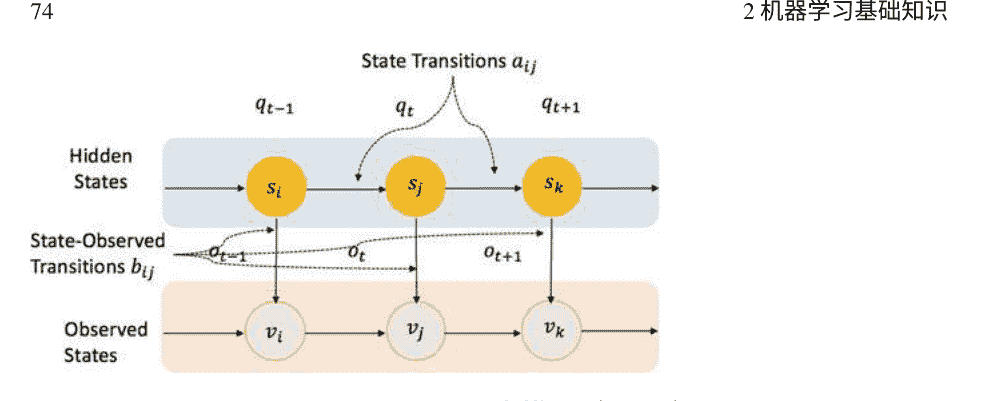

图2.16：隐马尔可夫模型（HMM）

– 向量 **b**表示在隐藏状态 $s_i$下观察到状态 $v_k$的概率，与时间无关，表示为:

$$b(k) = P(x_t = v_k | q_t = s_i) \quad (2.90)$$

– 向量 $\pi$表示状态的初始概率，表示为:

$$\pi_i = P(q_1 = s_i) \text{ s.t. } \sum_{1}^{n} \pi_i = 1 \quad (2.91)$$

- 一阶HMM有两个独立假设:
  $$P(q_t = s_i | q_{t-1}, q_{t-2}, .. q_1) = P(q_t = s_i | q_{t-1}) \quad (2.92)$$
  $$P(o_t = v_j | o_{t-1}, o_{t-2}, .. o_1 q_t, q_{t-1}, .. q_1) = P(o_t = v_j | o_t, q_t) \quad (2.93)$$

通过不同的基于动态规划的算法，HMM可以用来回答各种基本问题，下面列举了其中的一些。

- 1. **似然度**
   给定一个HMM (λ) 和一个观测序列 O，HMM生成该序列的概率是多少；即 P (O|λ) 是多少？ 一种基于动态规划的技术被称为前向算法，它存储状态和概率的中间值，最终以高效的方式构建整个序列的概率。
- 2. **解码**
   给定一个HMM (λ) 和一个观测序列 O，生成这些观测序列的最可能的隐藏状态序列 S是什么？ 一种基于动态规划的技术被称为维特比算法，类似于前向算法，但有一些小的改变，用于回答这个问题。
- 3. **学习：有监督和无监督**
   给定一系列观测 O和状态序列 S，求解能够生成它的HMM参数是什么？这是一个有监督学习问题，可以通过计算训练样本中的不同概率来轻松获得，使用Count()函数进行似然估计。

转移概率矩阵的单个单元格 $A_{i,j}$ 可以通过计算状态 $s_j$ 后跟状态 $s_i$ 的次数来估计：

$$A_{i,j} = P(s_j|s_i) = \frac{Count(s_j, s_i)}{Count(s_i)} \tag{2.94}$$

数组 $b(k)$ 的元素可以通过计算观察到的状态 $v_k$ 与隐藏状态 $s_j$ 同时发生的次数来估计：

$$b_j(k) = P(v_k|s_j) = \frac{Count(v_k, s_j)}{Count(s_j)} \tag{2.95}$$

并且初始概率计算为：

$$\pi_i = P(q_1 = s_i) = \frac{Count(q_1 = s_i)}{Count(q_1)} \tag{2.96}$$

如果只提供观测序列 $O$，并且我们需要学习最大化序列概率的模型，则可以使用期望最大化 (EM) 算法的变体来解决无监督学习问题，该算法被称为 Baum-Welch算法。

### 2.8.3 生成式方法：条件随机场

类似于朴素贝叶斯和逻辑回归之间的关系，条件随机场 (CRF) 与HMM在序列建模领域中有类似的关系。HMM在有效建模输入或观测状态之间的依赖关系以及它们之间的重叠关系方面存在缺陷。线性链CRF可以被认为是线性HMM的无向图模型等价形式，如图2.17所示[LMP01]。CRF主要用于有监督学习问题，尽管有一些扩展可以解决无监督学习问题，而HMM可以很容易地用于无监督学习。

为了说明条件随机场，让我们以一个简单的句子作为输入奥巴马在谷歌总部山景城发表演讲。每个输入单词都将被分配一个标签，可以是人名、组织机构、地点或其他，如图2.18所示。这些标签与单词的关联被称为命名实体识别问题在文本处理中。

图2.17：非序列和序列数据中生成模型和判别模型之间的关系

#### 2.8.3.1 特征函数

特征函数是条件随机场的基本单元，用于捕捉两个连续输出 $y_{i-1}, y_i$ 与整个输入序列 $x_1, x_2, \ldots$ 之间的关系。将 $x_n$ 作为实值输出，由 $f_j(y_{i-1}, y_i, x_{1:n}, i)$ 给出。我们的例子可以写一个简单的二元特征函数：

$$f_j(y_{i-1}, y_i, \mathbf{x}, i) = \begin{cases} 1 & \text{if } y_i = \text{位置}, y_{i-1} = \text{位置和} x_i = \text{视图} \\ 0 & \text{否则} \end{cases} \quad (2.97)$$

#### 2.8.3.2 条件随机场分布

整个长度为 $n$ 的标记序列可以被建模为基于特征函数 $f_j(y_{i-1}, y_i, x_{1:n}, i)$ 及其权重 $\lambda_j$ 的对数线性模型，类似于逻辑回归，如下所示：

$$P(\mathbf{y}|\mathbf{x}, \lambda) = \frac{1}{Z(\mathbf{x}, \lambda)} \exp \left( \sum_{i=0}^n \sum_j f_j(y_{i-1}, y_i, \mathbf{x}, i) \right) \quad (2.98)$$

其中 $Z(\mathbf{x}, \lambda)$ 被称为归一化常数或分区函数，其定义如下：

$$Z(\mathbf{x}, \lambda) = \sum_{\mathbf{y} \in Y} \exp \left( \sum_{i=0}^n \sum_j f_j(y_{i-1}, y_i, \mathbf{x}, i) \right) \quad (2.99)$$

图2.18：以单词作为输入和条件随机场输出的信息提取示例

#### 2.8.3.3 条件随机场训练

与逻辑回归类似，最大似然（负对数似然）可以用于学习条件随机场的参数(λ)。考虑m个训练序列(x^m,y^m)，总对数似然损失可以写成：

$$ℒ(λ,D) = -log(∏_{k=1}^{m} mP(y|x,λ)) \quad (2.100)$$

$$ℒ(λ,D) = -∑_{k=1}^{m} log( (1/Z(x,λ)) exp(∑_{i=0}^{n} ∑_{j} f_j(y_{i-1},y_i,x,i)) ) \quad (2.101)$$

最优参数λ_opt可以通过下面的方程估计，其中C作为先验或正则化常数。

$$λ_{opt} = arg min_λ ℒ(λ,D) + C/2 |λ|^2 \quad (2.102)$$

上述方程是凸的，解出最优值将保证获得全局最优解。如果我们将特征函数简化为以下形式，并对上述方程关于λ_j求导：

$$F_j(y,x) = ∑_j f_j(y_{i-1},y_i,x,i) \quad (2.103)$$

$$∂ℒ(λ,D)/∂λ_j = (-1/m) ∑_{k=1}^{m} F_j(y^k,x^k) + ∑_{k=1}^{m} E_{P(y|x^k,λ)}[F_j(y^k,x^k)] \quad (2.104) \quad \underbrace{\qquad}_{\text{观察到的平均特征值}} \underbrace{\qquad}_{\text{给定模型的预期特征值}}$$

可以看出，这个方程没有一个闭合形式，因此无法通过解析方法求解。通常使用各种迭代算法，如L-BFGS或梯度下降（如上所述）来获得解决方案。

## 2.9 案例研究

现在，我们通过一个案例研究来向读者介绍本章中介绍的概念。案例研究还为读者提供了必要的实际操作工具、库、方法、代码和分析，这对于标准机器学习和深度学习都是有用的。

我们使用了由Kaggle主办的希格斯玻色子挑战赛。挑战数据现在可以在ATLAS Higgs Challenge 2014上获得。案例研究是将事件分类为信号和背景（除信号以外的其他事件）。这是一个二元分类问题。大多数Kaggle挑战或黑客马拉松提供带有标签的训练数据。提交的模型然后在盲测数据上进行评估，使用一个众所周知的指标。我们使用了一个样本数据集，其中训练数据集的大小为10,000，独立的测试数据集的大小为5000，并且有标签，模型将在其上进行评估。我们还假设最佳模型是基于在测试数据上实现的分类准确率来选择的，使用准确率作为指标，因为两个类别之间的数据在数量上是平衡的。

案例研究的目标是使用章节中所示的各种技术和方法，并在未见过的测试集上比较性能。案例研究中介绍了各种Python库，如Numpy、Scipy、Pandas和scikit-learn，这些库在机器学习中被广泛使用。

### 2.9.1 软件工具和库

首先，我们需要描述我们将在案例研究中使用的主要开源工具和库。

- Pandas(https://pandas.pydata.org/)是一个流行的开源实现，用于数据结构和数据分析。我们将用它进行数据探索和一些基本处理。
- scikit-learn(http://scikit-learn.org/)是一个流行的开源机器学习算法和评估工具。我们将仅在案例研究中使用它进行抽样和创建数据集，线性和非线性算法的机器学习实现。
- Matplotlib(https://matplotlib.org/)是一个流行的开源可视化工具。我们将用它来可视化性能。

### 2.9.2 探索性数据分析（EDA）

我们使用基本的探索性数据分析来通过单变量统计、相关性分析和可视化来了解数据的特征。

我们在本书的开头强调的最重要的原则之一是避免数据窥探，即让测试集的标签影响模型或过程决策。进行分布分析、特征的统计分析，并确认训练集和测试集在拆分上看起来相似，都被认为是有效的探索性分析步骤。

下面是一个探索性数据分析的例子。

1. 探索训练和测试数据的数量，以及每个集合中的特征和类别数量。
2. 探索每个特征的数据类型，确定它是分类的、连续的、有序的等，并根据领域的需要进行转换。
3. 查找特征是否有缺失或未知值，并根据需要进行转换。
4. 使用散点图、直方图和箱线图等来理解每个特征的分布，以查看特征的基本统计信息，如范围、方差和分布。 如图2.19所示。
5. 理解训练数据和测试数据特征之间的相似性和差异性，以及每个统计量和图形之间的相似性和差异性。
6. 计算特征之间的成对相关性以及特征与标签之间的相关性，并在训练集上绘制和可视化这些相关性（如图2.19所示），这对于专业人员和数据科学家非常有帮助。

### 2.9.3 模型训练和超参数搜索

在本节中，我们将介绍一些在数据上执行的标准机器学习技术，以学习有效的模型。

#### 2.9.3.1 特征转换和降维的影响

了解特征转换和选择的影响是训练机器学习模型的前提之一。 如前面的章节中所讨论的，有各种降维技术，如PCA、SVD等，各种选择技术，如互信息、卡方等，每种技术都有需要调整的参数。 这些都会影响模型和训练算法。 特征选择和降维技术应该被视为模型选择过程中要优化的超参数。 为了简洁起见，在本节中我们只分析两种不同的特征选择算法。 我们将在本节中展示两种不同的特征选择并进行分析。

图2.19：探索性数据分析图 (a) 每个特征和标签在训练数据上的直方图 (b) 特征和标签在训练数据上的皮尔逊相关性

我们首先使用两个主成分进行主成分分析，并将这些主成分与标签一起绘制，以查看新降维后的训练数据集是否显示出改善的分离性。然后，我们增加维度，并通过添加每个转换特征捕获的方差来绘制累积解释方差。图2.20显示了这两个图，并揭示了PCA转换和降维对于这个数据集可能没有用处；转换后的特征需要与原始特征一样多的维度来捕获方差。

图2.20: PCA分析 (a) 以散点图形式显示的两个转换后的主成分的PCA分析结果 (b) 前25个维度的累积解释方差

我们还对数据进行卡方分析，首先将特征缩放到范围为 [0, 1]，因为卡方需要所有特征都在正数范围内。图2.21显示了得分和特征名称的图表。只有16个特征的得分超过了阈值0.1，如果进行特征减少，这可能是一个不错的子集选择。

图2.21: 按降序绘制的特征的卡方得分

#### 2.9.3.2 超参数搜索和验证

我们选择准确率作为搜索超参数的度量标准，并用于比较算法，因为测试数据预测将在该度量标准上进行评估。我们将在超参数搜索中使用交叉验证作为验证技术。 我们将使用五种线性和非线性算法进行训练: (a) 感知机，(b) 逻辑回归，(c) 线性判别分析，(d) 朴素贝叶斯，以及(e) 支持向量机（使用RBF核函数）。

下面的代码突出了SVM的超参数搜索。

```python
from sklearn.svm import SVC
import numpy
# SVM中的gamma参数
gammas = numpy.array([1, 0.1, 0.01, 0.001])
# SVM的C参数
c_values = numpy.array([100, 1, 0.1, 0.01])
# gamma和C的网格搜索
svm_param_grid = {'gamma': gammas, 'C': c_values}
# 使用径向基函数核的支持向量机
svm = SVC(kernel='rbf')
scoring='准确率'
# 网格搜索
grid = GridSearchCV(estimator=svm, param_grid=svm_param_grid, scoring=scoring)
```

表2.3中给出了找到的超参数和验证结果。有趣的是观察到最简单的线性感知器得分最低，而随着模型复杂度增加到完全非线性的RBF核SVM，性能得到了改善。

表2.3：分类器的超参数和验证分数

| 分类器 | 参数和值 | 十折交叉验证AUC |
|--------|----------|------------------|
| 感知器 | α = 0.001, maxIter = 100 | 0.54 |
| 逻辑回归 | penalty=L1, C=0.1, maxIter = 100 | 0.61 |
| 线性判别分析 | tolerance=0.001 | 0.60 |
| 朴素贝叶斯 | | 0.60 |
| 支持向量机（RBF） | γ = 0.01, C = 100 | 0.63 |

接下来，我们通过对特征选择/降维和分类器的所有参数进行网格搜索，来看看特征选择技术对分类器的影响。 我们使用主成分分析（PCA）和卡方检验（kbest）作为两种特征选择技术，以及逻辑回归作为分类器。通过在各种组合上绘制分类准确率，如图2.22所示，我们可以看到特征选择和降维对验证性能没有影响。

### 2.9.3.3 学习曲线

为了观察训练样本的影响以及不同验证运行之间的方差，我们绘制了学习曲线。它们以训练集大小为函数提供了有用的训练和验证指标的比较。我们绘制了调整后的逻辑回归和SVM的学习曲线，因为它们是得分较高的算法（如图2.23a和b所示）。可以观察到SVM的验证分数随着训练集大小的增加而单调增加，表明更多的示例确实提高了性能。还可以观察到与逻辑回归相比，SVM在运行中具有较低的方差，这表明SVM分类器的稳健性。

### 2.9.4 最终训练和测试模型

最后，我们使用最佳参数在整个训练数据上训练最佳模型，并在测试数据上运行它们以估计样本外误差（表2.4）。

图2.23: (a) 调整后逻辑回归的学习曲线。(b) 调整后支持向量机的学习曲线。

表2.4：分类器的最终测试分数。

| 分类器 | 准确率 | 精确率 | 召回率 | F1得分 |
|--------|--------|--------|--------|--------|
| 感知器 | 0.55 | 0.55 | 0.56 | 0.56 |
| 逻辑回归 | 0.61 | 0.61 | 0.62 | 0.61 |
| 线性判别分析 | 0.61 | 0.61 | 0.61 | 0.61 |
| 朴素贝叶斯 | 0.60 | 0.61 | 0.60 | 0.60 |
| 支持向量机 (RBF) | 0.64 | 0.64 | 0.65 | 0.65 |

### 2.9.5 读者和实践者的练习

读者和从业者可以尝试一些其他有趣的问题，包括：

1. 其他特征转换（如归一化）的影响是什么？
2. 其他单变量特征选择方法（如互信息选择高增益特征）的影响是什么？
3. 多变量特征选择方法（如相关特征选择（CFS）或最小冗余最大相关性（mRmR））相对于单个特征的影响是什么？
4. 基于包装器的特征选择方法（如递归特征消除（RFE））的影响是什么？
5. 其他非线性学习方法（如决策树、梯度提升和随机森林）的影响是什么？
6. 元学习技术（如基于成本的学习、集成学习等）的影响是什么？

## 参考文献

- [AMMIL12] Yaser S. Abu-Mostafa, Malik Magdon-Ismail, and Hsuan-Tien Lin. 《从数据中学习》. AMLBook, 2012. ISBN: 1600490069, 9781600490064.
- [BB08] Léon Bottou和Olivier Bousquet。 《大规模学习的权衡》。 In: 《神经信息处理系统进展》。 Vol. 20. NIPS Foundation (http://books.nips.cc), 2008, pp. 161–168.
- [Bry61] A. E. Bryson。 《用于优化多阶段分配过程的梯度方法》。 In: 《哈佛大学数字计算机及其应用研讨会论文集》。 1961.
- [CS14] Girish Chandrashekar和Ferat Sahin。 《特征选择方法综述》。 In: 《计算机与电子工程》。 40.1 (Jan. 2014), pp. 16–28.
- [Dem06] Janez Demšar. “多个数据集上的分类器统计比较”。 在: J. Mach. Learn. Res.7 (2006年12月), pp. 1–30.
- [Die98] Thomas G. Dietterich. “用于比较监督分类学习算法的近似统计检验”. 在： NeuralComput.10.7 (1998年10月), pp. 1895–1923.
- [GE03] Isabelle Guyon和André Elisseeff. “变量和特征选择简介”. 在： J. Mach. Learn. Res.3 (2003年3月), pp. 1157–1182.
- [HTF09] Trevor Hastie, Robert Tibshirani和Jerome Friedman.统计学习的要素. Springer统计学系列, 2009年. 第15章
- [HK00] Arthur E. Hoerl和Robert W. Kennard. 《岭回归：非正交问题的有偏估计》. 在： Technometrics 42.1 (2000年2月) , 第80-86页.
- [JS11] Nathalie Japkowicz和Mohak Shah. 《评估学习算法：分类视角》. 纽约，美国：剑桥大学出版社, 2011年.
- [Jol86] I. T. Jolliffe. 《主成分分析》. Springer-Verlag, 1986年.
- [KS+60] John G Kemeny, James Laurie Snell等. 《有限马尔可夫链》. Vol. 356. van Nostrand Princeton, NJ, 1960年.
- [KK62] J. F. Kenney和E. S. Keeping. 《统计学的数学》. 普林斯顿, 1962年, 第252-285页.
- [LMP01] John D. Lafferty, Andrew McCallum, and Fernando C. N. Pereira. “条件随机场：用于分割和标记序列数据的概率模型”. 在：第十八届国际机器学习大会. ICML '01. MorganKaufmann Publishers Inc., 2001年, 第282-289页.
- [Rab89] Lawrence R Rabiner. “隐马尔可夫模型及其在语音识别中的应用教程”. 在： IEEE77.2 (1989), 第257-286页.
- [Ros58] Frank Rosenblatt. “感知器：大脑中信息存储和组织的概率模型”。在：心理学评论65.6 (1958), 第386页.
- [Vap95] V. Vapnik.统计学习理论的本质. Springer, 纽约, 1995年.
- [WD67] Strother H. Walker和David B. Duncan. “作为几个独立变量的函数的事件概率估计”. 在： Biometrika54 (1967), pp. 167–179.

## 第3章 文本和语音基础知识

## 3.1 引言

本章介绍了文本和语音分析以及机器学习方法的主要主题。 神经网络方法将在后面的章节中介绍。

我们从自然语言和计算语言学的概述开始。 介绍了构成高级分析基础的文本表示，并讨论了计算语言学的核心组成部分 。 读者将通过广泛应用这些概念的一系列应用程序进行指导。 我们研究了文本分类和文本聚类的主题，并转向机器翻译、问答和自动摘要的应用。

在本章的后半部分，介绍了声学模型和音频表示，包括MFCC和频谱图。

### 3.1.1 计算语言学

计算语言学专注于应用定量和统计方法来理解人类语言建模的方式，以及回答语言问题的计算方法。 它的起源可以追溯到20世纪50年代计算机的出现。 自然语言处理（NLP）是将计算方法应用于对人类语言进行建模和提取信息的过程。 虽然这两个概念之间的区别与基本动机有关，但它们经常可以互换使用。

计算语言学可以涉及书面或口头自然语言。 书面语言是口头或手势语言的符号表示。 有很多口头自然语言没有书写系统，而没有书面自然语言是不可能独立发展的。 对书面语言的自然语言处理通常被称为文本分析，对口头语言的自然语言处理被称为语音分析。

在过去，计算语言学被认为是计算机科学领域的一个子领域。随着计算语言学成为一个跨学科的理论和应用科学领域，它在语言学、心理学、神经科学、哲学、计算机科学、数学等领域得到了显著发展。随着社交媒体、对话代理和个人助理的兴起，计算语言学在创建对人类语言建模和理解的实际解决方案方面变得越来越重要。

### 3.1.2 自然语言

自然语言是指人类在日常使用中自然演化而来的语言，没有经过正式的构建。它们包括口头和手语。据估计，目前存在大约7000种人类语言，其中前十种占世界人口的46% [And12]（图3.1）。


自然语言在其书面形式上本质上是含糊的。要理解为什么会这样，考虑到英语词汇中大约有17万个单词，但日常使用的只有约1万个 [And12]。

人类的交流方式已经演变成高效的形式，允许通过上下文重复使用较短的单词来解决其含义。这减轻了计算负担，并释放出人脑的其他重要任务部分。

与此同时，这种歧义性使得计算机在处理和理解自然语言方面变得困难。这种困难还涉及到语言的讽刺、反讽、隐喻和幽默等方面。在任何语言中，单词的意义、语法结构和句子结构都存在歧义。我们将在下面讨论处理这些歧义的方法。

### 3.1.3 语言模型

当我们分析自然语言时，通常将语言特征分为一组类别。对于文本分析，这些类别包括形态学、词汇、句法、语义、语篇和语用。形态学指的是单词的形状和内部结构。词汇指的是将文本分割成有意义的单元，如单词。句法指的是应用于单词、短语和句子的规则和原则。语义指的是在句子中提供含义的上下文。

语义学提供了人类语言的效率。话语指的是句子之间存在的对话和关系。语用学指的是外部特征，如说话者传达上下文的意图。对于语音分析，我们通常将语言特征分为声学、音韵学、音位学和韵律学等类别。声学指的是我们用来表示声音的方法。音韵学指的是将声音映射到作为语音基本单位的音素的方法。音位学也称为音韵学，指的是音素在语言中的使用方式。韵律学指的是伴随语音的非语言特征，如语调、重音、语调和音高。在接下来的章节中，我们将从计算语言学的角度更详细地讨论每个方面。正如我们将在后续章节中看到的，这些语言特征可以用于为机器学习算法提供丰富的表示（表3.1）。

表3.1: 语言分析类别

| 类别   | 描述               |
| :----- | :----------------- |
| 形态学 | 词的形状和结构     |
| 词汇   | 将文本分割成单词   |
| 句法   | 句子中单词的规则   |
| 语义学 | 句子中单词的意义   |
| 语篇   | 句子之间的意义     |
| 语用学 | 通过说话者意图传达的意义 |
| 声学   | 声音的表示         |
| 音韵学 | 将声音映射到语音   |
| 音位学 | 将语音映射到语言   |
| 韵律学 | 重音、音高、音调、节奏 |

由于这些类别中固有的依赖关系，我们经常将自然语言建模为一组语言特征的层次集合，如图3.2所示。这通常被称为语言的同步模型，即基于语言的某个时间点的模型[Rac14]。一些语言学家认为，这样的同步模型不适用于不断演变的现代活语言，更喜欢能够处理时间变化的历时模型。然而，历时模型的复杂性使其难以处理，而瑞士语言学家费迪南德·索维尔在20世纪初提出的同步模型如今被广泛采用[Sau16]。计算机和可以应用于同步模型中的每个组件的统计方法构成了自然语言处理的基础。
自然语言处理旨在将语言映射到能够捕捉形态、词汇、句法、语义或话语特征的表示形式，然后通过机器学习方法进行处理。表示形式的选择对后续任务有重要影响，并且将取决于所选择的机器学习算法进行分析。

在本章的后续部分，我们将深入探讨这些表示形式，以更好地理解它们在语言学中的作用和在自然语言处理中的目的。我们向读者介绍最常见的基于文本的表示形式，并将音频表示形式留到后面的章节。

## 3.2 形态分析

所有自然语言都具有系统的结构，包括手语。在语言学中，形态学是对词汇内部结构的研究。从其希腊词根的字面意思来看，形态学意味着“形状的研究”。它指的是根据上下文形成单词的一套规则和约定，例如复数、性别、缩写和变位。

单词由称为词素的子组件组成，词素代表了具有独立意义的语言最小单位。词素可能是与其意义、语法角色或派生相关的单词的组成部分。一些词素本身就是单词，例如“run”、“jump”或“hide”。其他单词是由词素的组合形成的，例如“runner”、“jumps”或“unhide”。一些语言，如英语，对于组合词素具有相对简单的形态规则。而其他语言，如阿拉伯语，具有丰富的复杂形态规则[HEH12]。

对于人类来说，理解“walk”、“walking”、“walked”之间的形态关系相对简单。然而，可能的词素组合的多样性使得计算机在没有形态分析的情况下很难做到这一点。最常见的两种方法是词干提取和词形还原，我们将在下面进行描述。

### 3.2.1 词干提取

通常，单词的结尾并不像词根本身那样重要。这在动词中尤为真实，动词的词根可能比动词的时态更具意义。如果是这种情况，计算语言学会应用词干提取的过程将单词转换为其词根形式（例如，意义中的基本词素）。

- 以下是一些词干提取的例子：
  - works → work
  - worked → work
  - workers → work

尽管你和我可以轻松地认识到这些词与意义相关，但对于计算机来说，没有词干提取是非常困难的。需要注意的是，词干提取可能会引入歧义，正如上面的第三个例子中所示，“workers”与“works”具有相同的词干，但两个词具有不同的含义（人与物品）。另一方面，词干提取的优点是它通常对拼写错误具有鲁棒性，因为正确的词根仍然可以被正确推断出来。

> 在自然语言处理中，最流行的词干提取算法之一是由Martin Porter于1980年设计的Porter词干提取器。这种简单而高效的方法使用5个步骤来去除单词后缀并找到词干。Porter词干提取器的开源实现广泛可用。

### 3.2.2 词形还原

词形还原是计算语言学中另一种常用的方法，用于将单词转化为基本形式。它与词干提取密切相关，是一种算法过程，通过去除屈折和后缀将单词转化为它们的词元（即词典形式）。词形还原的一些示例包括:

- works → works
- worked → work
- workers → worker

请注意，词形还原的结果与词干提取非常相似，只是结果是实际单词。与词干提取可能会丢失意义和上下文的过程不同，词形还原在上面的第三个示例中表现得更好。由于词形还原需要词典和大量的查找操作，词干提取速度更快，通常更受青睐。词形还原对拼写错误也非常敏感，可能需要拼写校正作为预处理步骤。

## 3.3 词汇表示

词法分析是将文本分割成词法表达式的任务。在自然语言处理中，这意味着将文本转换为基本词表示，以便进行进一步处理。在接下来的几个小节中，我们将介绍词级、句级和文档级表示的概述。正如读者所看到的，这些表示本质上是稀疏的，即很少有非零元素。我们将在后面的章节中讨论稠密表示和词嵌入。

词是自然语言的基本符号。它们并不是最基本的，因为一个词可以由一个或多个词素组成。在自然语言处理中，通常的第一个任务是将文本分割成单独的词。请注意，我们说的是“通常”，而不是“总是”。正如我们将在后面看到的，句子分割作为第一步可能会带来一些好处，特别是在存在“嘈杂”或格式不良的语音的情况下。

### 3.3.1 标记

将文本分割成相关的单词或意义单位的计算任务被称为分词。标记可以是单词、数字或标点符号。在最简单的形式中，可以通过使用空格来实现分词:

- 西班牙的雨主要落在平原上。
  |这|, |雨|, |在|, |西班牙|, |落下|, |主要|, |在|, |平原|, |上|, |.|

这在大多数情况下有效，但在其他情况下失败：

- 不要假设我们要去纽约。

注意，“纽约”通常被视为一个单词，因为它指的是一个具体的地点。更复杂的问题是，标记有时可能由多个单词组成（例如，“他谁不能被命名”）。还有许多不使用任何空格的语言，比如中文。

- 西班牙的降雨主要集中在平原。

分词还可以通过划分句子来分割句子，标明一个句子的结束和另一个句子的开始。标点符号在这个任务中起着重要的作用，但不幸的是标点符号经常是模糊的。标点符号如撇号、连字符和句号可能会造成问题。考虑一下这个句子中句号的多次使用：

- 博士。格雷厄姆向烧杯中倒入0.5毫升。
  |博士|，|格雷厄姆倒入0.|，|5毫升到烧杯中。|
  一个简单的基于标点符号的句子分割算法会错误地将其分割成三个句子。有许多方法可以克服这种模糊性，包括增加基于标点符号的手工规则，使用正则表达式，机器学习分类，条件随机场和槽填充方法。

### 3.3.2 停用词

在英文文本中，标记不均匀地出现。相反，它们遵循一个称为Zipf定律的指数出现模式，该定律指出一小部分标记经常出现（例如the， of， as），而大多数标记很少出现。有多少少？在莎士比亚的全部作品中，有884,000个标记，其中100个标记占了一半以上[Gui+06]。

在英语书面语中，常见的功能词如“the”，“a”，或“is”提供很少的上下文，但却经常出现在文本中，如图3.3所示。通过在自然语言处理中排除这些词，可以显著提高性能。这些常被排除的词的列表被称为停用词列表。

### 3.3.3 N-Grams

虽然单词级别的表示有时很有用，但它们无法捕捉到与相邻单词的关系，这可以帮助提供语法或上下文。例如，在处理单个标记时，没有词序的概念。

### Zipf's Law

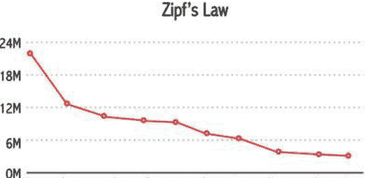

只需考虑文本中标记的存在和出现即可。这被称为词袋模型（参见公式（3.1）），基于马尔可夫假设。包含 $L$ 个标记的短语将以概率预测：

$$P(w_1 w_2 \dots w_L) = \prod_{i=1}^{L} P(w_i) \tag{3.1}$$

与考虑单个标记（称为unigrams）不同，另一种方法是考虑连续的标记。这被称为bigram方法，其中一个具有 $L$ 个标记的句子会产生 $L-1$ 个bigrams，形式如下：

$$P(w_1 w_2 \dots w_L) = \prod_{i=2}^{L} P(w_i|w_{i-1}) \tag{3.2}$$

请注意，bigrams有效地捕捉了两个连续标记的局部词序（例如，“狮子王”与“王狮子”不同）。我们可以扩展这个概念来捕捉长度为 $n$ 的标记，称为 $n$-grams：

$$P(w_1 w_2 \dots w_L) = \prod_{i=n}^{L} P(w_i|w_{i-1} w_{i-2} \dots w_{i-n}) \tag{3.3}$$

需要注意的是，对于较高的 $n$ 值，$n$-grams变得非常罕见。这将对基于计数的自然语言处理方法产生不利影响，稍后我们会看到。

### 3.3.4 文档

在处理文档语料库时，计算语言学中使用了许多文档表示方法。有些是基于单词的，有些是基于多个单词的，还有些是基于字符的。许多表示方法是稀疏的，而其他一些是稠密的。在本节中，我们讨论了其中两种最常见的方法。

#### 3.3.4.1 文档-词矩阵

文档-词矩阵是一组文档的数学表示。
在表3.2中显示的文档-词矩阵中，行对应于集合中的文档，列对应于唯一的单词。列的数量等于所有文档中的唯一单词词汇量。有许多方法可以确定此矩阵的元素值，我们在下面讨论其中两种。

#### 3.3.4.2 词袋模型

一种常见的方法是将文档-词矩阵的每个元素设置为每个文档中单词出现的频率。想象一下，将每个文档表示为唯一单词计数的列表。这被称为词袋模型的方法[PT13]。显然，仅使用文档向量来表示整个文档会有很大的信息损失，但对于许多计算语言学应用来说，这已经足够了。将一组文档转换为每个元素等于单词出现次数的文档-词矩阵的过程通常被称为计数向量化。

表3.2：文档-词矩阵

|        | 文档1 | 文档2 | 文档3 | 文档4 | 文档5 | 文档6 |
| :----- | :---- | :---- | :---- | :---- | :---- | :---- |
| 汽车   | 1     | 0     | 0     | 1     | 1     | 1     |
| 自行车 | 0     | 1     | 1     | 0     | 0     | 1     |
| 驾驶   | 1     | 0     | 1     | 0     | 0     | 1     |
| 骑行   | 0     | 1     | 0     | 1     | 2     | 1     |
| 颠簸   | 0     | 1     | 0     | 1     | 1     | 1     |
| 平稳地 | 1     | 0     | 1     | 0     | 0     | 1     |
| 喜欢   | 0     | 0     | 1     | 0     | 2     | 1     |

你可能记得，英语词汇中最常见的单词通常比较不重要，对于理解意义来说，罕见的单词更重要。不幸的是，词袋模型根据出现次数来衡量单词的重要性。实际上，在计数向量化之前，通常会使用停用词过滤器来删除最常见的单词。即使这样做，我们仍然会发现在一组文档中出现的罕见单词通常是最有意义的。

#### 3.3.4.3 TFIDF

TFIDF是一种方法，通过将每个文档-词矩阵元素设置为词频（TF）乘以每个标记的逆文档频率（IDF）的值来给予罕见单词更大的权重[Ram99]:

$$w = tf \times idf \quad (3.4)$$
$$= (1 + \log(TF_t)) \times \log\left(\frac{N}{n_i}\right) \quad (3.5)$$

在这里，我们使用了术语频率的定义，即术语 t 在文档 d 中出现的次数与文档 d 中总术语数的对数比例，以及逆文档频率的定义，即总文档数与包含术语 t 的文档数的对数比例。

由于tf因子的存在，一个词在文档中出现的次数越多，其TFIDF值就会成比例地增加。idf因子根据在所有文档中出现的频率来降低一个词的TFIDF值。目前，TFIDF是最流行的加权方法，在当前的数字图书馆中有超过80%的使用率（表3.3）。

表3.3：TFIDF矩阵

|          | 文档1 | 文档2 | 文档3 | 文档4 | 文档5 | 文档6 |
| :------- | :---- | :---- | :---- | :---- | :---- | :---- |
| 汽车     | 3.50  | 0     | 0     | 5.91  | 3.21  | 2.82  |
| 自行车   | 0     | 2.79  | 2.51  | 0     | 0     | 1.73  |
| 驾驶     | 1.21  | 0     | 0.88  | 0     | 0     | 0.88  |
| 骑行     | 0     | 1.26  | 0     | 3.13  | 2.22  | 0.41  |
| 颠簸     | 0     | 1.11  | 0     | 0.45  | 0.61  | 1.23  |
| 平稳地   | 0.13  | 0     | 0.12  | 0     | 0     | 0.92  |
| 喜欢     | 0     | 0     | 0.22  | 0     | 0.34  | 0.24  |

## 3.4 句法表示

自然语言的句法表示处理词语和短语在句子中的语法结构和关系。语法在大多数语言中起着固有的作用，以提供上下文。计算语言学利用不同的方法来提取这些上下文线索，如词性标注、分块和依存句法分析。它们在下游自然语言处理任务中作为特征发挥着很好的作用。

### 3.4.1 词性标注

词性（POS）是一类具有语法属性的词语，起着类似句子语法角色的作用。广泛认可的是，有9个基本的词性类别（你可能还记得它们是从小学开始学的）（表3.4）。

表3.4: 基本的词性标签

| 标签 | 词性   | 示例         |
| :--- | :----- | :----------- |
| N    | 名词   | 狗，猫       |
| V    | 动词   | 跑，藏       |
| A    | 冠词   | 这，一个     |
| Adj  | 形容词 | 绿色，短     |
| Adv  | 副词   | 快速地，可能地 |
| P    | 介词   | 通过，为了   |
| Conj | 连词   | 和，但是     |
| PRO  | 代词   | 你，我       |
| INT  | 感叹词 | 哇，哈哈     |

英语中有许多词性的子类，例如单数名词（NN），复数名词（NNS），专有名词（NP）或副词名词（NR）。一些语言可能有超过1000个词性[PD M11]。由于英语的歧义性，许多英语单词属于多个词性类别（例如，“bank”可以是动词、名词或感叹词），它们的角色取决于它们在句子中的使用方式。很难确定单词属于哪个类别。词性标注是预测词性的过程


根据句子中的语法角色和上下文，为文本中的每个单词确定其类别（图3.4）[DeR88]。词性标注算法分为两个不同的组：基于规则和统计方法。

> 布朗语料库是计算语言学研究中首个主要的英语文本集合。它是由Henry Ku'c era和W. Nelson Francis于1960年代中期在布朗大学开发的，包含从500个随机选择的文本中提取的超过一百万个英语散文单词。
>
> 2000字以上的出版物。语料库中的每个单词都经过了精细的词性标注，使用了87个不同的词性标签。布朗语料库仍然常用作衡量词性标注算法性能的黄金标准。

#### 3.4.1.1 基于规则的方法

最早的词性标注方法是基于规则的，依赖于字典、词典或正则表达式来预测每个单词可能的词性标签。当出现歧义时，通常会加入临时规则来进行词性标注决策。这使得基于规则的系统很脆弱。例如，一个规则可以声明，在副词之后、连词之前的词应该是名词，除非它不是一个单数普通名词，那么它应该是动词。迄今为止，最好的基于规则的词性标注器在布朗语料库上只能达到77%的准确率。

#### 3.4.1.2 隐马尔可夫模型

自从上一章介绍的隐马尔可夫模型（HMM）在上世纪80年代引入后，成为了一种更好的词性标注方法。相比基于规则的方法，HMM能够更好地学习和捕捉语法的顺序性。为了理解这一点，我们来考虑词性标注问题，即给定一个词序列，我们希望找到最可能的标签序列$t^n$。

$$\hat{t}^n = \arg\max_{t^n} P(t^n|w^n) \tag{3.6}$$

$$\approx \arg\max_{t^n} \prod_{i=1}^{n} P(w_i|t_i) P(t_i|t_{i-1}) \tag{3.7}$$

上面的方程表示了一个HMM模型，其中马尔可夫状态是词$w^n$，隐藏状态是词性标签$t^n$。过渡矩阵可以直接从文本数据中计算得到。事实证明，将最常见的标签分配给每个已知的单词可以达到相当高的准确率。为了处理更多的歧义词序列，可以使用高阶HMM来处理更长的序列，利用维特比算法。这些高阶HMM可以达到非常高的准确率，但是它们需要大量的计算负载，因为它们必须探索一个更大的路径集合。

除了HMMs，机器学习方法在词性标注任务中变得非常流行，包括CRF、SVM、感知器和最大熵分类方法。现在大多数方法的准确率都超过97%。在接下来的章节中，我们将探讨深度学习方法在词性标注中的更大潜力。

### 3.4.2 依存句法分析

在自然语言中，语法是由单词和短语组成的结构规则集合。英语中的每个句子都遵循一定的模式。这些模式被称为语法，它们表达了一个主词与其从属词之间的关系。大多数自然语言都有丰富的语法规则，了解这些规则有助于我们消除句子中的歧义。考虑到没有语法，将单词组合在一起的可能性几乎是无限的。

解析是自然语言处理中的任务之一，它根据语言的语法规则来识别句子中单词之间的句法关系[Cov01]。自然语言中描述句子结构的两种常见方法。第一种方法是将句子表示为其组成短语，递归地到达单词级别。这被称为组成语法分析，它将句子映射到组成解析树（图3.5）。另一种方法是链接个体，根据它们的依赖关系将单词组合在一起。这被称为依存句法分析，它将一个句子映射到一个依存句法树（图3.6）。依存关系是一对一的对应关系，这意味着确切地有一个中心词和若干从属词。句子中的每个单词都有一个节点。 请注意，链接是有方向的，在依存句法树中，从主要词指向从属词以传达关系。 成分和依存句法树可以是强等价的。 依存树的吸引力在于链接与语义关系非常相似。

由于依赖树包含每个单词的一个节点，解析可以通过计算效率实现。 给定一个句子，解析算法尝试从其语法规则中找到最可能的推导。 如果句子存在结构歧义，可能会有多个推导结果。 解析器可以分为两种一般方法。 自顶向下的解析器使用递归算法和回溯机制从根节点向下遍历句子中的所有单词。 自底向上的解析器从单词开始，并根据移位/规约或其他算法构建解析树。 自顶向下的解析器将得到始终符合语法的树，但可能无法与句子中的所有单词对齐。自底向上的方法将对齐所有单词，但可能不总是符合语法。

#### 3.4.2.1 上下文无关文法

如上所述，语法是定义句子中单词的句法结构和模式的规则集。 由于这些规则通常是固定和绝对的，可以使用上下文无关文法（CFG）来表示语言的语法规则。 上下文无关文法通常具有称为巴科斯-诺尔范式的表示形式，并能够捕捉句子中的成分和单词的顺序。

不幸的是，由于语言的固有歧义性，CFG可能会为给定的句子生成多个可能的解析推导。 概率上下文无关文法（PCFG）通过对可能的解析推导进行排名，并从文本分布中学习到的一组权重中选择最有可能的解析推导来处理这个问题。 PCFG通常比CFG表现更好，特别是对于像英语这样的语言。

#### 3.4.2.2 分块

对于某些应用程序，可能不需要完整的句法解析，因为它的计算开销较大。 分块，也称为浅层解析，是一种自然语言处理任务，它将单词组合成基本的句法单元，而不是生成完整的解析树。 这些基本的句法单元通常被称为“块”。 例如，给定一个句子，我们希望仅识别出基本的名词短语（即具有与名词相同的语法功能且不包含其他名词短语的短语）：

> [ NP冬季 ] 对很多人来说是令人沮丧的 [ NP许多人 ].

分块通常通过基于规则的方法进行，其中使用正则表达式和词性标注来匹配固定模式，或者使用机器学习算法，如SVM [KM01]。

#### 3.4.2.3 树库

树库是一个已经解析和注释了句法结构的文本语料库。也就是说，语料库中的每个句子都被解析为其依赖解析树。树库通常是使用解析器算法和人工审查 [Mar+94] [Niv+16] 迭代生成的。通常，树库是在已经注释了词性标注的语料库的基础上构建的。树库的创建在计算语言学中引起了革命，因为它体现了一种数据驱动的生成语法的方法，可以广泛地在多个应用和领域中重复使用。

使用树库训练的统计解析器能够更好地处理结构上的歧义性 [Bel+17]。

> Penn Treebank是解析分析和评估的事实上的标准树库。它最初于1992年发布，由英语中的道琼斯新闻服务的一系列文章组成，其中有100万个词进行了词性标注，160万个词进行了解析。改进版的Penn Treebank于1995年发布。

Universal Dependencies是包含60种语言中的100多个树库的集合，旨在促进跨语言分析[McD+ 13]。正如其名称所示，这些树库是使用一组通用的、跨语言一致的语法注释创建的。第一个版本于2014年10月发布。

## 3.5 语义表示

而词汇和句法分析捕捉到了语言的形式和顺序，却没有将含义与单词或短语关联起来。例如，将“dog”标记为名词并不能告诉我们“dog”是什么。语义表示给单词和短语赋予了一种含义。它们给词块附加了诸如人、地点或数量等角色。语义分析主要关注于理解单词和句子之间的含义关系。单词之间有几种不同的语义关系（见表3.5）。

### 表3.5：单词之间的语义关系

| 术语 | 定义 |
| :--- | :--- |
| 同义词 | 拼写不同但意思相同的单词 |
| 反义词 | 意思相反的单词 |
| 下义词 | 一般术语及其具体实例 |
| 上义词 | 包括其他单词的大类别 |
| 部分整体关系 | 构成部分或成员 |
| 整体部分关系 | 整体与其部分之间的语义关系 |
| 同形异义词 | 形状相同但意思不同的单词 |
| 多义词 | 具有两个或更多不同含义的单词 |

同形异义词和多义词非常相似，关键区别在于多义词是一个单词具有不同的含义，而同形异义词是不同的单词共享相同的形状（通常是拼写和发音）。例如，大多数人认为名词“轮胎”（你车上的轮子）和动词“疲劳”（锻炼时发生的情况）是完全不同的单词，尽管它们看起来和听起来相同。它们是同形异义词。另一方面，大多数人认为只有一个单词“冒犯”，但它有各种相关的含义：进攻的团队，犯罪行为，被侮辱的感觉等。

### 3.5.1 命名实体识别

命名实体识别（NER）是自然语言处理中的一项任务，旨在识别和标记文本中指代人物、地点、组织、日期、时间或数量的单词或短语。它是信息提取的一个子任务，有时也被称为实体抽取。由于自然语言的词汇复用和歧义性，实体识别是困难的。例如，单词“华盛顿”可能指的是一个城市、一个州或一位总统。在没有真实世界知识的上下文的情况下，很难消除这个词的歧义。歧义可以以两种方式存在：同一类型的不同实体（乔治·华盛顿和华盛顿·卡弗都是人物）或不同类型的实体（乔治·华盛顿或华盛顿州）（表3.6）。

### 表3.6：命名实体

| 类别 | 示例 |
| :--- | :--- |
| 人 | 乔治·华盛顿 |
| 地点 | 华盛顿州 |
| 组织 | 通用汽车 |
| 日期 | 七月四日 |
| 时间 | 中午过半 |
| 数量 | 四分之一 |

虽然正则表达式可以在一定程度上用于命名实体识别[HN14]，但标准方法是将其视为序列标记任务或类似于词性标注或分块的HMM [AL13]。条件随机场（CRFs）在命名实体识别中取得了一些成功。然而，训练CRF模型通常需要大量的带注释的训练数据[TKSDM03c]。即使有大量数据，命名实体识别仍然存在很大的挑战。

### 3.5.2 关系抽取

关系抽取是在文本中检测命名实体提及的语义关系的任务。例如，从以下句子中，

> 总统乔治·布什和他的妻子劳拉参加了国会晚宴。

我们可以提取一组实体之间的关系：乔治·布什，劳拉，国会晚宴（表3.7）。注意第二个关系（乔治·布什已婚）从第一个句子（劳拉和乔治·布什结婚了）可以逻辑推断出第二个句子（乔治·布什和劳拉结婚了），即使文本中没有明确说明。

### 表3.7：关系抽取示例

| 关系描述 | 实体类型关系 |
| :--- | :--- |
| 劳拉和乔治·布什结婚了 | 人 → 人 |
| 乔治·布什和劳拉结婚了 | 人 → 人 |
| 乔治·布什在国会晚宴上 | 人 → 地点 |
| 乔治·布什总统 | 组织 → 人 |

关系抽取的常见方法是将其分为子任务：

1.  识别实体之间的关系
2.  根据类型对已识别的关系进行分类
3.  推导出逻辑/互补关系。

第一个子任务通常被视为一个分类问题，在文本中判断是否存在两个实体之间的关系。第二个子任务是一个多类别预测问题。朴素贝叶斯和支持向量机模型已成功应用于这两个子任务[BB07，Hon05]。最后一个子任务是一个逻辑推理任务。关系抽取在问答任务中起着重要作用。

### 3.5.3 事件抽取

事件是文本中具有特定位置和实例或时间间隔的提及。事件检测的任务是在文本中检测事件的提及，并确定它们所属的类别。一些事件的例子包括：超级碗、樱花节和我们的25周年结婚纪念庆典。事件检测的基于规则和机器学习的方法与关系抽取的方法类似[Rit+12, MSM11]。由于需要外部上下文和时间关系的重要性，这些方法的成功程度不一。

### 3.5.4 语义角色标注

语义角色标注（SRL），也称为主旨角色标注或浅层语义解析，是将标签分配给单词和短语以指示它们在句子中的语义角色的过程。语义角色是一个抽象的语言构造，指的是主语或宾语在动词方面承担的角色。这些角色包括：施事者、经验者、主题、患者、工具、接受者、来源、受益者、方式、目标或结果。

语义角色标注可以提供有价值的上下文[GJ02]，而句法分析只能提供语法结构。语义角色标注的最常见方法是解析一组目标句子以识别谓词[PWM08]。对于每个谓词，使用在PropBank或FrameNet等数据集上训练的机器学习分类器来预测语义角色标签。这些标签可作为进一步任务（如文本摘要或问答）的非常有用的特征[JN08, BFL98b]。

> PropBank（命题银行）是一组Penn Treebank句子的语义角色完全注释的语料库，其中每个角色都特定于一个单独的动词意义。每个动词在PropBank中映射到一个实例。该语料库于2005年发布。
>
> FrameNet是另一个带有语义角色注释的语料库。与PropBank角色特定于单个动词不同，FrameNet角色特定于语义框架。语义框架是语义角色发生的背景或环境，它为框架内的角色提供了丰富的上下文。FrameNet角色比PropBank角色更细粒度。FrameNet包含1200多个语义框架，13,000个词汇单元和202,000个示例句子。

## 3.6 语篇表示

话语分析是研究超过一个句子长度的文本的结构、关系和意义。更具体地说，它通过一系列句子的整体来研究信息和意义的流动。话语假设存在发送者、接收者和信息。它包括文档/对话结构、讨论主题、文本的连贯性和一致性等特征。话语分析中的两个常见任务是共指消解和话语分割。

### 3.6.1 连贯性

连贯性是衡量话语中句子结构和依赖关系的一种方式。它被定义为文本中存在支持文本预设的其他信息。也就是说，连贯性在词语和句子结构上提供了连续性。它有时被称为“表面层”文本统一性，因为它提供了将结构上无关的短语和句子连接在一起的手段[BN00]。

文本中有六种连贯性类型：共指、替代、省略、连接、重复和搭配。其中，共指是最流行的，正如在两个句子中“杰克”和“他”之间的关系所观察到的那样：

> 杰克跑上山。
> 他走了回来。

### 3.6.2 一致性

一致性是指在文本中将短语和句子联系在一起的语义意义的存在。它可以被定义为在意义和上下文中的连续性，并且通常需要推理和现实世界的知识。一致性通常基于发送者和接收者共享的概念关系，用于构建话语的心理表示[WG05]。一致性的一个例子可以在以下例子中看到，它假设了一个水桶中装有水的知识：

> 杰克拿着桶。
> 他把水洒了出来。

### 3.6.3 指代/倒指

指代是指两个词或短语之间的关系，其中一个词（称为指代词）的解释由之前出现的一个词（称为先行词）的解释决定。倒指是指一个词的解释由之后出现的一个词的解释决定。

> 回指：法院在休庭前清理了案件。
> 先行指代：尽管他很小心，杰克还是溅了水。

### 3.6.4 本地和全局共指

语言学过程中，回指词与其先行词的关联被称为共指消解。 这是一个在话语中被广泛研究的问题。 当这种情况发生在一个文档内时，通常被称为局部共指。 如果这种情况发生在多个文档之间，被称为全局共指。 在文本中，当需要消除代词的歧义并将其与正确的个体提及连接时，共指消解起着重要的作用，也在实体解析中扮演着重要角色[李等13，辛等13]。共指消解可以被视为一个分类任务，解决共指消解的算法的准确性范围从命名实体的70%到代词的90% [PP09]。

## 3.7 语言模型

统计语言模型是对词序列的概率分布。给定这样一个长度为 L 的序列，它为整个序列分配一个概率。换句话说，它试图为每个可能的词序列或标记序列分配一个概率。给定一组 L个标记 w1, w2, ...,wL，语言模型将预测概率 P(W):

$$P(W) = P(w1w2...wL) \tag{3.8}$$

这有什么用？ 语言模型试图预测一个短语在语言的自然使用中出现的频率。有一种估计不同短语相对可能性的方法，在许多自然语言处理应用中非常有用，特别是生成文本作为输出的应用。 例如，语言模型可以通过预测前面所有单词来进行拼写纠正:

$$P(w_L | w_{L-1}w_{L-2}...w_1) \tag{3.9}$$

语言建模在语音识别、机器翻译、词性标注、解析、手写识别、信息检索和其他应用中使用。

### 3.7.1 N-Gram模型

我们可以将这个推广到一般的n-gram情况。我们假设观察到第i个单词w_i在前面单词的上下文历史中的概率可以近似为在缩短的上下文历史中观察到它的概率（n阶Markov性质）。

在信息检索中使用的一元模型可以被视为几个一状态有限自动机的组合。它将上下文中不同术语的概率分割开来，例如：

$$P(w1w2…wL) = ∏_{i=1}^{L} P(wi) \tag{3.10}$$

词组bigrams和trigrams分别表示具有n=2和n=3的n-gram模型语言模型。条件概率可以从n-gram模型的频率计数中计算得出：

$$P(w1w2…wL) = ∏_{i=n}^{L} P(wi|wi-1 wi-2…wi-n) \tag{3.11}$$

### 3.7.2 拉普拉斯平滑

n-gram的稀疏性可能成为一个问题，特别是如果用于创建n-gram语言模型的文档集合很小的情况下。在这些情况下，某些n-gram在数据中可能具有零计数是很常见的。语言模型会将这些n-gram分配零概率。当这些n-gram出现在测试数据中时，这会造成问题。由于马尔可夫假设，一个序列的概率等于各个n-gram的概率的乘积。一个零概率的n-gram会将序列的概率设为零。

为了克服这个问题，通常使用一种称为平滑技术的方法。最简单的平滑算法将每个可能的n-gram的计数初始化为1。这被称为拉普拉斯或加一平滑，并保证任何n-gram都有一小概率发生。不幸的是，随着n-gram的稀疏性增加，这种方法变得不太有用，因为它会显著改变出现概率。

如果一个词在训练数据中从未出现过，那么该句子的概率就是零。显然，这是不可取的，所以我们应用拉普拉斯平滑来处理这个问题。我们将每个计数加1，这样它就永远不会为零。为了平衡这一点，我们将可能的单词数加到除数上，这样除法就永远不会大于1。拉普拉斯平滑是一种简单而不太优雅的方法，对于类似文本分类的结果提供了适度的改进。一般来说，我们可以使用一个伪计数参数α > 0：

$$\theta_i = (x_i + \alpha) / (N + \alpha d) \tag{3.12}$$

一种更有效和明智使用的方法是Kneser-Ney平滑，由于它使用绝对折扣，通过从概率的较低阶项中减去一个固定值来省略低频的n-gram:

$$P_{\text{abs}}(w_i|w_{i-1}) = \frac{\max(c(w_{i-1}w_i) - \delta, 0)}{\sum_w c(w_{i-1}w)} + \alpha p_{\text{abs}}(w_i)$$

### 3.7.3 未登录词处理

语言模型面临的另一个严重问题是当单词不在模型的词汇表中时。词汇表外的（OOV）单词对语言模型造成严重问题。在这种情况下，包含词汇表外单词的n-gram被忽略。即使没有观察到，n-gram的概率也会在词汇表中的所有单词上进行平滑处理。

为了明确地建模词汇表外单词的概率，我们可以在词汇表中引入一个特殊的标记（例如，<unk>）。在累积n-gram计数之前，语料库中的词汇表外单词会被有效地替换为这个特殊的<unk>标记。通过这种方式，我们可以估计涉及词汇表外单词的n-gram的转移概率。然而，这样做会将所有OOV单词视为一个单一实体，忽略语言信息。

另一种方法是使用近似的 n-gram匹配。OOV的 n-gram映射到词汇表中最接近的 n-gram，接近程度基于某种语义相似度度量（我们将在后面的章节中详细介绍词嵌入）。

处理OOV的 n-gram的一种简单方法是使用回退(backoff)策略，基于计数包含OOV术语的较小的 n-gram。如果找不到三元组，则计数二元组。如果找不到二元组，则使用一元组。

### 3.7.4 困惑度

在信息论中，困惑度(perplexity)衡量了概率分布对样本的预测能力。困惑度是评估语言模型性能的常用指标。它衡量了一个 n-gram模型作为一个概率 P(W)的内在质量，该模型预测一个测试序列 W = w_1w_2...w_N的发生概率，表示为:

$$PPL(W) = P(w_1w_2...w_N)^{-\frac{1}{N}} = \sqrt[N]{\frac{1}{P(w_1w_2...w_N)}}$$

如果模型基于二元组，困惑度可以简化为以下表达式：

$$PPL(W) = \sqrt[N]{\prod_{i=1}^{N} \frac{1}{P(w_i|w_{i-1})}} \tag{3.16}$$

较低的困惑度值意味着模型更好地预测了测试数据，而较高的困惑度值意味着预测质量较低。 请注意，测试序列必须由与训练语言模型相同的n-gram组成，否则困惑度将非常高。

## 3.8 文本分类

文本分类是许多应用中的核心任务，如信息检索、垃圾邮件检测或情感分析。文本分类的目标是将文档分配给一个或多个类别。 构建分类器的最常见方法是通过监督式机器学习，通过学习分类规则从示例中获得分类器[SM99, CT94, Seb02]。我们简要介绍了创建这些分类器的过程。 读者可以参考前一章节中的机器学习算法的详细信息。

### 3.8.1 机器学习方法

大多数计算语言学问题最终都变成了文本分类问题，可以通过监督式机器学习方法来解决。 文本分类包括文档表示、特征选择、机器学习分类器的应用以及最后的分类器性能评估。 特征选择可以利用前面介绍的任何形态、词汇、句法、语义或篇章表示。

给定一组标记的文档集合 $\mathcal{D}$，第一步是在特征空间中构建这些文档的表示。 常见的方法是使用词袋模型，使用N-gram频率或TFIDF创建文档向量 $\mathbf{x}_i$ 及其标记的类别 $y_i$：

标记的文档集合 $\mathcal{D} = (\mathbf{x}_1, y_1), (\mathbf{x}_2, y_2), \dots, (\mathbf{x}_n, y_n) \tag{3.17}$

通过这些数据，我们可以训练一个分类模型来预测未标注的文本样本的标签。 文本分类的流行机器学习算法包括K最近邻算法、决策树、朴素贝叶斯、支持向量机和逻辑回归。 一般的文本分类流程可以总结如下：算法1：文本分类流程
数据：一组带标签的文档D
结果：训练好的模型h（x）
开始
    预处理文档（例如分词）
    创建文档表示x_i
    将其分为训练集、验证集和测试集
    对于每个x_i∈X
        在训练集上训练机器学习分类器模型
        在验证集上调整模型参数
    在测试集上评估调整后的模型

### 3.8.2 情感分析

情感分析是一项任务，用于评估书面或口头语言，以确定语言表达是否积极、消极或中性，以及程度。它在商业领域有广泛的应用，包括了解客户反馈、评估整体情绪和意见，或者追踪人类行为。情感包括文本的情感方面——情绪如何影响我们的交流——以及文本的主观方面——我们情感、观点和信念的表达。

文本情感分析是检测句子、短语或文档中态度类型和强度的任务。

#### 3.8.2.1 情绪状态模型

情绪模型已经研究了几十年。情绪状态模型是捕捉人类情绪状态的模型。例如，Mehrabian和Russell模型将人类情绪状态分解为三个维度（表3.8）。在情感分析中还有其他情绪状态模型，包括Plutchik的情绪轮和Russell的二维情绪圆环模型（图3.7）。

| 维度 | 描述 |
|------|------|
| 情感价值 | 衡量情感的愉悦程度，也被称为极性，矛盾是正面和负面情感之间的冲突 |
| 唤起 | 衡量情感的强度 |
| 支配 | 衡量情感对其他情感的支配程度 |

包括Plutchik的情绪轮和Russell的二维情绪圆环模型（图3.7）。

情感分析的最简单的计算方法是将描述情感状态的词汇与情感状态模型的维度值进行向量化[Tab+11]。计算这些词汇的出现次数在一个文档中，文档的情感等于这些词汇的聚合分数。这种词汇方法非常快速，但无法有效地模拟微妙、讽刺或隐喻[RR15]。否定（例如，“不好”与“好”）在纯词汇方法中也存在问题。

英语单词的情感规范（ANEW）数据集是由布拉德利和朗创建的一个词汇表，其中包含1000个单词的情感评分，包括情感价值、支配力和唤起度（图3.8）。ANEW对于较长的文本和新闻文档非常有用。另一个模型是SentiStrength模型，由Thelwall等人开发用于分析短文本和Twitter消息，并取得了成功应用。

图3.7：普卢奇克的情感轮

#### 3.8.2.2 主观性和客观性检测

情感分析中一个密切相关的任务是对特定文本的主观性或客观性进行评分。将主观和客观部分分开，然后对每个部分进行情感分析，对于分析非常有用。

图3.8：ANEW情感词典子集

客观性检测可以帮助识别个人偏见，追踪隐藏观点，并缓解当前存在的“假新闻”问题[WR05]。

一种客观性检测的方法是使用n-gram或浅层解析和模式匹配与一组学习到的词汇-句法模式。另一种方法是将词汇-句法特征与会话话语特征结合起来，为主观性训练一个分类器。

### 3.8.3 蕴涵

文本蕴涵是一个逻辑概念，即一个文本片段的真实性导致另一个文本片段的真实性。它是一个有方向的关系，类似于“如果-那么”子句。数学上，给定文本片段X和Y，蕴涵关系由以下公式给出：

$$P(Y|X) > P(X)$$

其中 $P(Y|X)$被认为是蕴涵的置信度。请注意，关系 X 蕴含Y并不能确定Y蕴含X（逻辑谬误）。

蕴含被认为是一个文本分类问题。它在许多自然语言处理应用中广泛使用（例如，问答系统）。最初的蕴含方法是基于逻辑形式的方法，需要许多公理、推理规则和大量的知识库。与其他统计自然语言处理方法相比，这些定理证明方法表现不佳[HMM16]。

目前，最流行的蕴含方法是基于语法的方法[AM10]。使用解析树生成和比较相似度得分，然后与SVM或LR分类器结合以检测蕴含。这种方法在捕捉浅层蕴含方面非常有能力，但在处理更复杂的文本（例如在主动语态和被动语态之间切换的文本）时表现不佳。

最近的语义方法已经显示出更好的泛化能力，除了词汇和句法特征之外，还结合了语义角色标注[Bur+07]。即使如此，人类层次的蕴涵和计算方法之间的差距仍然很大。蕴涵仍然是一个开放的研究课题。

## 3.9 文本聚类

虽然文本分类是文本分析的常用方法，但我们经常面临一个大量未标记数据的语料库，在其中我们寻找共享共同语言和/或含义的文本。这就是文本聚类的任务[Ber03]。

文本聚类的最常见方法是使用 $k$ 均值算法[AZ12]。文本文档被分词，有时进行词干提取或词形还原，去除停用词，并使用词袋模型或TFIDF对文本进行向量化。然后对得到的文档-词项矩阵应用K-means算法，尝试不同的 $k$ 值。

算法2：文本聚类流程
数据：一组未标记的文档
结果：$k$个文本聚类
开始
    预处理文档（例如，分词）
    创建文档表示 $\mathbf{x}_i$
    对于$k$的值，执行以下操作
        应用$k$-means算法
选择最佳的$k$值

在使用$k$-means时有两个主要考虑因素。第一个是两个文本片段之间的距离概念。对于$k$-means，这是欧氏距离，但理论上也可以使用其他度量，如余弦距离。第二个是确定$k$的值-在一个语料库中存在多少个不同的文本聚类。与标准的$k$-means一样，肘部法则是确定$k$值最广泛使用的方法。

### 3.9.1 词汇链

传统方法依赖于词袋模型，忽略了文档中词之间的语义关系，无法捕捉含义。一种可以融入这种语义信息的方法是词链。这些链源自文本连贯性的语言概念，其中一系列相关的词被认为具有语义关系。例如，以下单词形成一个词链：

汽车 → 汽车 → 轿车 → 跑车

通常，像WordNet这样的词汇数据库被用来预测词汇链，并对结果概念进行聚类。词汇链对于文本摘要和话语分割等高阶任务非常有用[MN02，Wei+15]。

### 3.9.2 主题建模

通常，我们有一系列文档，并希望大致了解集合中讨论的内容。主题建模使我们能够组织、理解和总结大量的文本。主题模型是一种统计模型，用于发现文档集合中的抽象“主题”。它是一种文本挖掘形式，旨在识别话语中的重复模式。

#### 3.9.2.1 LSA

潜在语义分析（LSA）是一种技术，旨在基于隐含的信念，即意义相近的词语会出现在相似的文本片段中，来识别一组文档和词语之间的关系。它是最古老的主题建模方法之一[Bir+08]。它使用一种名为奇异值分解（SVD）的数学技术，将文本语料库的文档-词语矩阵转换为两个低秩矩阵：一个将主题映射到文档的文档-主题矩阵，以及一个将词语映射到主题的主题-词语矩阵。通过这样做，LSA在降低语料库向量空间的维度的同时，识别语料库中的高阶模式。为了衡量相关性，LSA利用两个词语向量之间的余弦距离测量。

LSA非常容易训练和调整，从LSA派生的两个矩阵可以在其他任务中重复使用，因为它们包含语义信息。不幸的是，对于大量文档集合，LSA可能会非常慢。

#### 3.9.2.2 LDA

潜在狄利克雷分配（LDA）是一种模型，它也可以将文档-词矩阵分解为低阶文档-主题矩阵和主题-词矩阵。它与LSA的不同之处在于采用了随机生成模型的方法，并假设主题具有稀疏的狄利克雷先验。这相当于相信任何特定文档只属于一小组主题，并且主题主要包含一小组常见词语。与LSA相比，LDA在消除词语歧义和识别更细节的主题方面表现更好。

## 3.10 机器翻译

机器翻译（缩写为MT）是指将文本从源语言翻译成不同的目标语言的过程。即使对于人类来说，语言翻译也很困难，无法完全捕捉到意义、语调和风格。不同语言的形态、句法或语义结构可能会有很大差异。例如，很少能找到超过4个词素的英语单词，但在土耳其语或阿拉伯语中很常见。德语句子通常遵循主语-动词-宾语的句法结构，而日语大多遵循主语-宾语-动词的顺序，阿拉伯语更偏向于动词-主语-宾语的顺序。在机器翻译中，我们通常关注两个指标：

-   忠实度 = 在翻译中保留文本的意思
-   流利度 = 对于母语人士来说，文本或语音听起来自然

### 3.10.1 基于词典

在最简单的形式中，机器翻译可以通过使用双语词典直接翻译每个单词来实现。稍微改进的方法可能是直接翻译词组而不是单个单词[KOM03]。由于缺乏句法或语义上下文，直接翻译在除了最简单的机器翻译任务之外往往表现不佳[Dod02]。

机器翻译的另一种经典方法是基于从源语言到目标语言的学习词汇和句法转换规则。这些规则提供了在语言之间映射解析树的方法，可能会改变转换中的结构。由于需要解析，转换方法通常复杂且难以管理，特别是对于大词汇量的情况。因此，经典的机器翻译系统通常采用综合方法，对于简单的文本结构使用直接翻译，对于更复杂的情况使用词汇/句法转换。

### 3.10.2 统计翻译

统计机器翻译采用概率方法将一种语言映射到另一种语言。具体而言，它通过将问题视为类似于通信中的贝叶斯噪声信道问题来构建两种模型：

-   语言模型（流畅度）= P(X)
-   翻译模型（忠实度）= P(Y|X).

语言模型衡量任何词序列x是一个实际句子的概率，即语言内部的一致性。翻译模型衡量目标语言中词序列y是源语言中词序列x的真实翻译的条件概率。统计机器翻译模型通过优化以下目标来找到最佳的目标语言y的翻译：

$$\hat{Y} = \underset{Y}{\mathrm{argmax}} P(X|Y)P(Y) \quad\quad (3.19)$$

统计模型基于词对齐的概念，即将源语言的单词序列映射到目标语言的单词序列。由于语言之间的差异，这种映射几乎永远不会是一对一的。此外，单词的顺序可能会有很大的不同。

> BLEU（双语评估助手）是一种常用的衡量机器翻译质量的方法[Pap+02]。它通过对整个语料库中基于短语的模型翻译和人工创建的翻译进行平均，衡量它们之间的相似性。类似于精确度，它通常表示为0到1之间的值，但有时会乘以10的因子进行缩放。

## 3.11 问答系统

问答（QA）是自然语言处理中回答问题的任务。它可以利用专家系统、知识表示和信息检索方法。传统上，问答是一个多步骤的过程，其中检索相关文档，从这些文档中提取有用信息，提出可能的答案并根据证据进行评分，最后生成一个自然语言的简短文本答案作为回应。

-   问题：谁赢得了2011年《危险边缘》锦标赛？
-   答案：IBM Watson在2011年推出了一个名为DeepQA的系统，该系统在《危险边缘》的传奇冠军中获得了第一名。

早期的问答系统只关注在特定领域内回答一组预定义的主题[KM11]。这些被称为封闭领域的问答系统，与试图回答任何主题的开放领域问答系统相对。封闭领域系统通常避免了对话过程的复杂性，并从专家系统直接产生基于结构化和模式的答案。现代开放领域问答系统提供了更丰富的功能，并且理论上可以利用无限的知识源（例如互联网）通过统计处理来回答问题。

问题分解是任何问答系统的第一步，其中问题被处理成一个查询。在简单的版本中，问题会被解析以找到关键词，这些关键词作为查询输入到专家系统中产生答案。这被称为查询形成，其中从问题中提取关键词以构建相关的查询。有时，还会使用查询扩展来识别与问题中的查询术语类似的其他查询术语[CR12]。在更高级的版本中，可以使用句法处理（例如名词短语）和语义处理（例如提取实体）来丰富提取。另一种方法是查询重构，其中从问题中提取实体及其语义关系。例如，以下句子和语义关系：

> 谁发明了电报？ → 发明者（人物，电报）

一个答案模块可以将这个关系与语义数据库和知识库进行模式匹配，以检索一组候选答案。候选答案根据证据进行评分，并返回具有最高置信度的自然语言回答。有些问题更容易回答。例如，确定事件的日期或年份（例如，第二十届超级碗是什么时候）要比在特定上下文中关联实体（例如，哪个城市最多伦多）更容易。前者只需要进行小规模、有针对性的搜索，而后者的搜索空间要大得多。

### 3.11.1 基于信息检索

基于网络的问答系统（如Google搜索）基于利用网络的信息检索（IR）方法。这些基于文本的系统通过从互联网或其他大型文档集合中找到短文本来回答问题。通常，它们将查询映射为词袋，并使用LSA等方法检索一组相关文档并提取其中的段落。

根据问题类型的不同，可以使用模式提取方法或n-gram平铺方法生成答案字符串。基于IR的问答系统完全是统计性质的，无法真正捕捉到超越分布相似性的含义。

### 3.11.2 基于知识的问答

而基于知识的问答系统采用语义方法。它们应用语义解析将问题映射为对全面数据库的关系查询。这个数据库可以是关系数据库或捕捉现实世界关系（例如主谓宾）的知识库，如DBpedia或Freebase。由于能够捕捉含义，基于知识的方法更适用于高级的开放域问答应用，因为它们可以引入知识库的外部信息[Fu+12]。与此同时，它们受到这些知识库集合关系的限制（图3.9）。

> DBpedia是一个免费的语义关系数据库，从维基百科页面中提取出了460万个实体，支持多种语言。它包含了30亿个基于资源描述框架（RDF）格式的关系三元组。DBpedia通常被认为是语义网，也被称为链接开放数据云的基础。DBpedia于2007年首次发布，通过众包更新的方式不断发展，类似于维基百科。

图3.9：链接开放数据云的一部分

### 3.11.3 自动推理

最近的问答系统开始引入自动推理（AR）来扩展超出基于知识的系统的语义关系。自动推理是人工智能领域的一个研究方向，探索计算机系统中的归纳、概率、空间和时间推理。通过创建一组一阶逻辑子句，问答系统可以增强一组语义关系和证据以支持答案假设的检索[FGP10]。Prolog是一种常见的声明式语言方法，用于维护这组子句。

IBM Watson的DeepQA是一个问题回答系统的例子，它结合了各种基于信息检索、基于知识的和自动推理的方法。通过利用据报道使用了100种不同的方法和知识库来源来生成候选答案，并对其进行证据评分和合并[Wan+12]，DeepQA能够在2011年的Jeopardy游戏中超过人类水平的表现。IBM此后在各个领域部署了DeepQA，并取得了不同程度的成功。

> 用于衡量问题回答系统性能的常用指标是平均倒数排名（MRR）。它基于使用一组由人工手动标记了正确答案的问题。为了评估一个问题回答系统，系统的答案排名集合将与一个包含 N个问题的语料库的正确答案进行比较，MRR的计算公式如下：

$$MRR = \frac{1}{N} \sum_{i=1}^{N} \frac{1}{排名_i} \tag{3.20}$$

目前最先进的问题回答系统在常用的TREC-QA基准测试中超过了MRR = 0.83。

## 3.12 自动摘要

自动摘要是一项有用的自然语言处理任务，它识别文档或一组文档中最相关的信息，并创建摘要。它可以是提取任务，提取原始形式中最相关的短语或句子并使用它们生成摘要，也可以是抽象任务，从语义内容生成自然语言摘要[AHG99, BN00]。这两种方法都反映了人类总结文本的方式，尽管前者提取文本，而后者改写文本。

### 3.12.1 基于抽取

基于抽取的摘要是一种从文档中提取内容的方法。在大多数实现中，它只是提取被认为最重要的一部分句子。衡量重要性的一种方法是计算信息性词语的数量。基于词汇度量（例如TFIDF）的词汇度量和基于话语度量（例如连贯性）的话语度量是识别关键句子的另一种方法。基于中心点的方法评估单词在背景语料库中的概率来确定重要性。一种创造性的方法称为TextRank，它采用基于图的方法根据单词的词汇相似性分配句子得分。只要不涉及抄袭问题，基于抽取的摘要是更受欢迎的方法。

### 3.12.2 基于概括

与基于提取的复制不同，基于抽象的方法采用语义方法。一种方法是使用实体识别和语义角色标注来识别关系。这些可以输入标准模板（例如，mad-lib方法）或自然语言生成引擎以创建简介。使用词汇链可以帮助识别中心主题，其中最强的链表明主要主题[SM00]。

自动摘要仍然是一项困难的任务。最先进的方法在35%的精度水平左右，性能因底层文档类型而有很大差异[GG17]。深度学习方法具有重要的潜力，我们将在后面的章节中看到。

## 3.13 自动语音识别

自动语音识别（ASR）是实时计算机转录口语的自然语言处理任务。自从1950年代以来，ASR一直是研究人机界面的前沿。随着Siri、Alexa或Cortana等个人AI助手的出现，ASR的重要性在近年来飙升。ASR的最终目标是人类水平（接近100%）的语音转录。

目前在完美条件下的自动语音识别只能达到95% [Bak+09]。进化使我们具备了在各种条件下（例如噪音、口音、用词和语调）识别语音的能力，而计算机目前还无法处理这些条件，自动语音识别仍有很大的改进空间。在接下来的章节中，将介绍有关语音的计算表示和传统的自动语音识别方法的背景知识。

### 3.13.1 声学模型

声学模型是自动语音识别中用于表示音频信号中声音的一种表示方式。它的主要目的是将声学波形映射到音素的统计特性上，音素是语言中区分一个词与另一个词的基本语音单元。将音频信号视为一个序列由短的连续时间帧组成 $S = s_1, s_2, \ldots s_{T_0}$。假设一个由 $M$ 个音素组成的序列表示为 $F = f_1, f_2, \ldots f_M$，一个由 $N$ 个单词组成的序列表示为在语音识别中，目标是从音频输入 $S$ 中预测单词集合 $W$：

$$\hat{W} = \arg\max_W P(W|S) \tag{3.21}$$
$$\hat{W} \approx \arg\max_W P(S|F) P(F|W) P(W) \tag{3.22}$$

在这里，$P(W)$ 表示一串单词是一个英语句子的概率—也就是说，$P(W)$ 是语言模型。量 $P(S|F)$ 被称为发音模型，量 $P(F|W)$ 是声学模型。

#### 3.13.1.1 频谱图

频谱图是声音信号在一段时间内频率的可视化表示，其中水平轴表示时间，垂直轴表示频率，每个点的颜色表示音频信号的强度。频谱图是通过使用滑动时间窗口执行短时傅里叶变换来生成的。作为语音信号的时频可视化，频谱图对于语音表示和文本到语音系统的评估都很有用（图3.10）。

图3.10：语音信号的频谱图示例

#### 3.13.1.2 MFCC

梅尔频率倒谱系数（MFCC）是语音信号的另一种有用表示，MFCC将连续的音频信号转换为特征向量，每个特征向量代表一个小的时间窗口。考虑倒谱，它是音频信号的对数快速傅里叶变换的反傅里叶变换（图3.11）：

```
$C = |F^{-1}(\log F(f(t)))|^2$ (3.23)
```

MFCC与倒谱类似，通过对应用了Mel频率滤波器的音频信号的对数快速傅里叶变换进行离散余弦变换来计算。Mel滤波器在低于1000Hz的频率上线性放置，在高于1000Hz的频率上以对数刻度放置，与人耳的响应密切相关：

```
$C = DCT(\log (MEL (F(f(t)))))$ (3.24)
```

MFCC包含了关于音频信号的时间和频率信息。它们对ASR非常有用，因为倒谱特征在效果上是正交的，并且对噪声具有鲁棒性。


## 3.14 案例研究

为了进一步了解自然语言处理的应用，我们提供以下案例研究，以指导读者通过文本聚类、主题建模和文本分类原理。该案例研究基于1987年的Reuters-21578数据集，这是一组由21578个新闻稿件组成的数据集。我们首先对数据集进行清洗和转换，以便更容易进行分析。

通过探索性数据分析，我们将检查语料库的结构，并确定是否存在文本聚类以及程度如何。我们将对语料库进行主题建模，并将我们的发现与数据集中提供的注释进行比较。最后，我们将探索各种方法来按主题对文档进行分类。希望这个案例能够研究将加强文本分析的基本原理，并确定经典自然语言处理中的关键差距。

### 3.14.1 软件工具和库

对于这个案例研究，我们将使用Python和以下库：

- Pandas(https://pandas.pydata.org/)是一个流行的开源实现，用于数据结构和数据分析。我们将用它进行数据探索和一些基本处理。
- scikit-learn(http://scikit-learn.org/) 是一个流行的开源库，用于各种机器学习算法和评估。我们仅在案例研究中使用它进行抽样、创建数据集和实现线性和非线性机器学习算法。
- NLTK(https://www.nltk.org/) 是一套文本和自然语言处理工具。我们将使用它将文本转换为向量进行处理。
- Matplotlib(https://matplotlib.org/) 是一个流行的开源可视化库。我们将使用它来可视化性能。

### 3.14.2 EDA

我们的第一个任务是通过加载和进行探索性数据分析来仔细查看数据集。为此，我们必须从语料库中的每个文档中提取元数据和正文。如果我们仔细查看语料库，我们会发现（图3.12、3.13和3.14）：

1.  有11,367个文档具有一个或多个主题注释。
2.  单个文档中最多的主题数量为16个。
3.  语料库中共有120个不同的主题标签。
4.  有147个不同的地点标签和32个组织标签。

到目前为止一切顺利。但在进行任何自然语言处理分析之前，我们将希望进行一些初步的文本规范化：

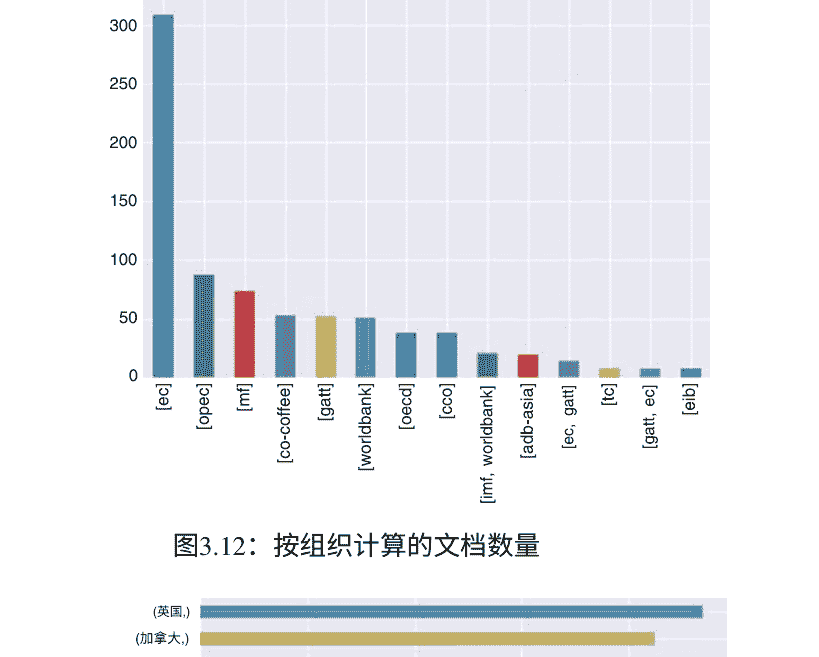

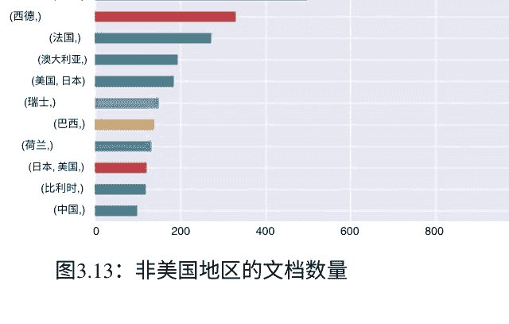

1.  转换为小写
2.  去除标点符号和数字
3.  提取动词的词干
4.  去除停用词

为了实现这一目标，我们定义了一个SimpleTokenizer方法，在创建文档表示时非常有用。

```
python
import re
import nltk
from nltk import word_tokenize
from nltk.corpus import stopwords
from nltk.stem.porter import PorterStemmer
from sklearn.preprocessing.label import MultiLabelBinarizer
from sklearn.feature_extraction.text import TfidfVectorizer

nltk.download("punkt")
nltk.download("stopwords", "data")
nltk.data.path.append('data')

labelBinarizer = MultiLabelBinarizer()
data_target = labelBinarizer.fit_transform(dataset[u'topics'])

stopWords = stopwords.words('english')
charfilter = re.compile('[a-zA-Z]+');

def SimpleTokenizer(text):
    words = map(lambda word: word.lower(), word_tokenize(text))
    words = [word for word in words if word not in stopWords]
    tokens = (list(map(lambda token: PorterStemmer().stem(token), words)))
    ntokens = list(filter(lambda token: charfilter.match(token), tokens))
    return ntokens

vec = TfidfVectorizer(tokenizer=SimpleTokenizer,
                      max_features=1000,
                      norm='l2')

mytopics = [u'cocoa', u'trade', u'money-supply', u'coffee', u'gold']

dataset = dataset[dataset[u'topics'].map(set(mytopics).intersection)
                .apply(lambda x: len(x) > 0)]
docs = list(dataset[u'body'].values)

dtm = vec.fit_transform(docs)
```

### 3.14.3 文本聚类

我们想要查看文档中是否存在聚类，因此让我们通过TFIDF创建一些文档表示。这给我们一个文档-词项矩阵，但通常这个矩阵的维度太大，表示稀疏。让我们首先应用主成分分析（PCA）来降低维度。原始的TFIDF向量维度为1000。让我们通过绘制解释方差比例作为主成分数量的函数来看一下降维的效果（图3.15）：

```
python
from sklearn.decomposition import PCA

explained_var = []
for components in range(1,100,5):
    pca = PCA(n_components=components)
    pca.fit(dtm.toarray())
    explained_var.append(pca.explained_variance_ratio_.sum())

plt.plot(range(1,100,5), explained_var, "ro")
plt.xlabel("组件数量")
plt.ylabel("解释方差比例")
```

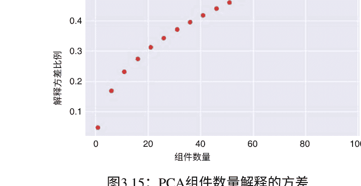

上图显示，60个组件可以解释一半的方差。让我们将其应用于数据集，并通过绘制每个文档的前两个PCA组件来可视化结果（图3.16）。

```
python
from sklearn.decomposition import PCA
import seaborn as sns

components = 60
palette = np.array(sns.color_palette('hls', 120))

pca = PCA(n_components=components)
pca.fit(dtm.toarray())
pcadt = pca.transform(dtm.toarray())

plt.scatter(pcadt[:,0], pcadt[:,1],
            c=palette[data_target.argmax(axis=1).astype(int)])

explained_variance = pca.explained_variance_ratio_.sum()
print("PCA步骤的解释方差： {}%".format(
    int(explained_variance * 100)))
```

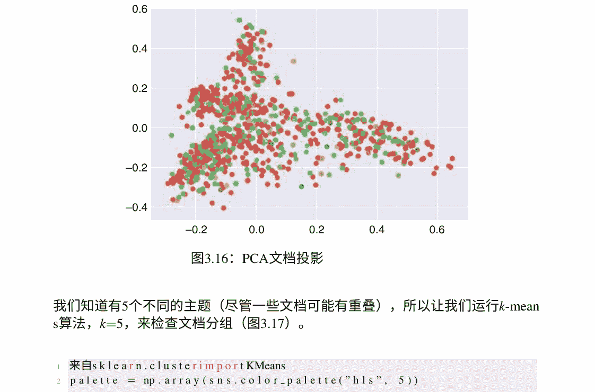

我们知道有5个不同的主题（尽管一些文档可能有重叠），所以让我们运行k-means算法，k=5，来检查文档分组（图3.17）。

```
python
from sklearn.cluster import KMeans
palette = np.array(sns.color_palette("hls", 5))

model = KMeans(n_clusters=5, max_iter=100)
clusters = model.fit(pcadt)
centroids = model.cluster_centers_
y = model.predict(pcadt)

ax = plt.subplot()
sc = ax.scatter(pcadt[:,0], pcadt[:,1],
            c=palette[y.astype(np.int)])
```

这与手动标注的标签相比如何？（图3.18）

```
python
palette = np.array(sns.color_palette("hls", 5))
gold_labels = dataset['topics'].map(set(mytopics).intersection)
                 .apply(lambda x: x.pop()).apply(lambda x: mytopics.index(x))

ax = plt.subplot()
sc = ax.scatter(pcadt[:, 0], pcadt[:, 1], c=palette[ gold_labels ])
```

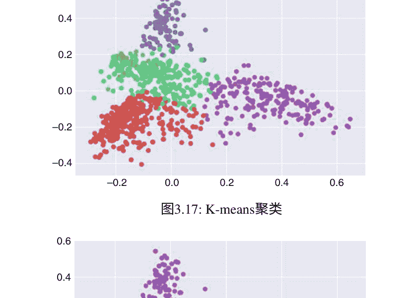

图3.17: K-means聚类

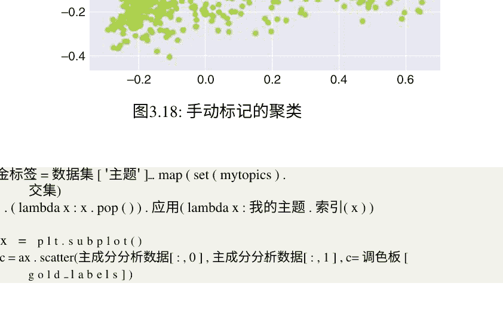

图3.18: 手动标记的聚类

### 3.14.4 主题建模

除了文档的词汇聚类之外，让我们看看是否可以在语料库中找到任何自然主题结构。我们应用LSA和LDA算法，将单词关联到一组主题，将主题关联到我们的文档集合。

#### 3.14.4.1 LSA

我们从LSA算法开始，将维度数设置为60（图3.19）：

```
python
from sklearn.decomposition import TruncatedSVD
import seaborn as sns

components=60
palette = np.array(sns.color_palette('hls', 120))

lsa = TruncatedSVD(n_components=components)
lsa.fit(dtm)
lsa_dtm = lsa.transform(dtm)

plt.scatter(lsa_dtm[:,0], lsa_dtm[:,1],
            c=palette[data_target.argmax(axis=1).astype(int)]
           )
explained_variance = lsa.explained_variance_ratio_.sum()
print("解释 SVD步骤的方差: {}%".format(
    int(explained_variance * 100)))
```

与PCA类似，让我们使用 k-means算法进行 k = 5个聚类（图3.20）。

```
python
from sklearn.cluster import KMeans
palette = np.array(sns.color_palette("hls", 8))

model = KMeans(n_clusters=5, max_iter=100)
clusters = model.fit(lsa_dtm)
centroids = model.cluster_centers_
y = model.predict(lsa_dtm)

ax = plt.subplot()
sc = ax.scatter(lsa_dtm[:,0], lsa_dtm[:,1], c=palette[y.astype(
    np.int)])
```

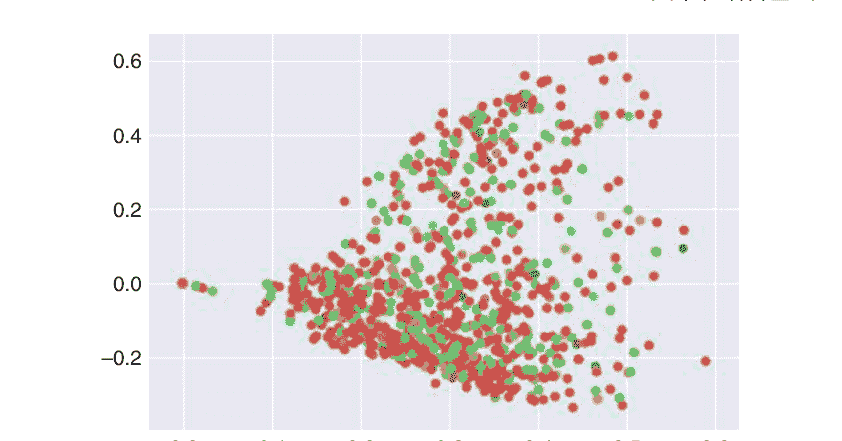

图3.19: LSA主题模型

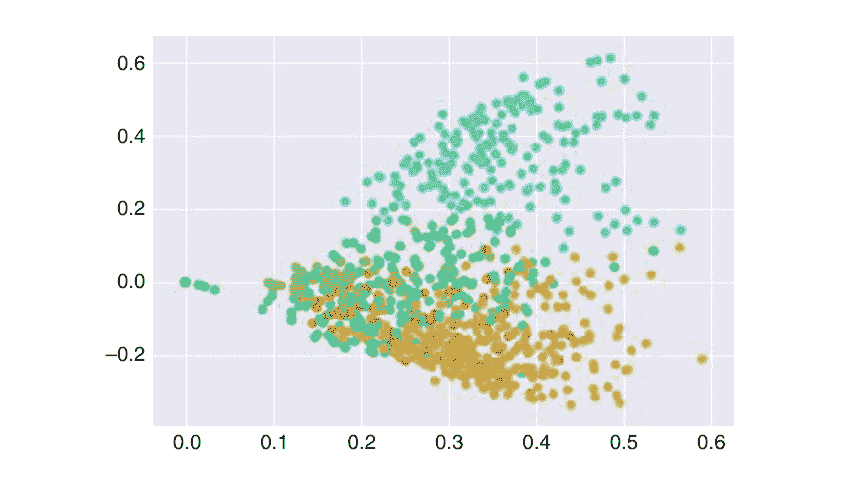

图3.20: k均值在LSA上

让我们来检查其中一个簇的文档:

| 序号 | 内容 |
|------|------|
| 232 | 关于重新引入的讨论。... |
| 235 | 印度尼西亚的农业部门将会增长。... |
| 249 | 国际咖啡组织。... |
| 290 | 关于咖啡出口配额的讨论。... |
| 402 | 国际咖啡组织的咖啡配额谈判。... |
| 42 | 国际咖啡组织，ICO，... |
| 562 | 在扩展特别会议上的讨论。... |
| 75 | 国际咖啡组织（ICO）。... |
| 754 | 打破僵局的努力。... |
| 842 | 国际咖啡组织的特别会议。... |

#### 3.14.4.2 LDA

让我们看看LDA算法作为贝叶斯方法在文档聚类和主题建模中是否更好。我们将主题数设置为已知的主题数=5。

```
python
import numpy as np
import seaborn as sns
from sklearn.cluster import KMeans
from sklearn.decomposition import LatentDirichletAllocation

components = 5
n_top_words = 10

palette = np.array(sns.color_palette('hls', 120))

def print_top_words(model, feature_names, n_top_words):
    for topic_idx, topic in enumerate(model.components_):
        message = "主题#%d: " % topic_idx
        message += " ".join([feature_names[i]
                         for i in topic.argsort()[:-n_top_words - 1:-1]])
        print(message)
    print()

lda = LatentDirichletAllocation(n_components=components,
        max_iter=5, learning_method='online')
lda.fit(dtm)
lda_dtm = lda.transform(dtm)

vec_feature_names = vec.get_feature_names()
print_top_words(lda, vec_feature_names, n_top_words)
```

| 主题 | 单词 |
| :--- | :--- |
| 主题0 | 说贸易美国代表配额巴西出口年咖啡市场 |
| 主题1 | 金矿盎司吨说有限公司矿石英尺矿工 |
| 主题2 | 联邦沃尔克储备部银行借贷百分比利率增长美元 |
| 主题3 | 说贸易美国出口日本咖啡将欧共市场官方 |
| 主题4 | 十亿美元百万百分比一月二月上升银行下降年 |

LDA的结果令人鼓舞，我们可以轻松地从与每个主题相关联的单词列表中辨别出5个原始主题中的4个。

### 3.14.5 文本分类

现在让我们看看是否可以构建分类器来可能识别上述主题。我们首先对数据集进行随机化和分割成训练集和测试集。

```
python
from sklearn.model_selection import train_test_split

dataset['label'] = gold_labels
X_train, X_test, y_train, y_test = train_test_split(dataset,
     gold_labels, test_size=0.2, random_state=10)
print("训练集=",len(X_train))
print("测试集=",len(X_test))

X_train = X_train[u'body']
X_test = X_test[u'body']
```

然后我们创建一个基于5个模型的分类器的流水线：朴素贝叶斯、逻辑回归、支持向量机、K最近邻和随机森林。

```
python
from sklearn.naive_bayes import MultinomialNB
from sklearn.linear_model import LogisticRegression
from sklearn.svm import LinearSVC
from sklearn.neighbors import KNeighborsClassifier
from sklearn.ensemble import RandomForestClassifier

models = [('多项式nb', MultinomialNB()),
       ('logreg', LogisticRegression()),
       ('线性svc', LinearSVC()),
       ('knn', KNeighborsClassifier(n_neighbors=6)),
       ('rf', RandomForestClassifier(n_estimators=6))]
```

然后我们在训练集上训练每个模型，并在测试集上进行评估。对于每个模型，我们想要看到每个主题类别的精确度、召回率、F1分数和支持（样本数量）。

```
python
from sklearn.pipeline import Pipeline
from sklearn.metrics import classification_report

for name, model in models:
    pipeline = Pipeline([('vec', TfidfVectorizer(tokenizer=SimpleTokenizer)), (name, model)])
    pipeline.fit(X_train, y_train)
    test_y = pipeline.predict(X_test)
    print(classification_report(y_test, test_y, digits=6))
```

结果似乎表明线性SVM模型表现最好，随机森林次之。这有点误导人，因为我们没有调整这些模型中的任何一个来获得我们的结果。超参数调整可以显著影响分类器的性能。让我们尝试调整LinearSVC模型。我们希望使用网格搜索和交叉验证来调整参数。请注意，交叉验证很重要，因为我们不希望使用测试集来进行调整，我们只会在最后使用它来评估性能。还要注意这可能需要一些时间！

```
python
from sklearn.model_selection import GridSearchCV

pipeline = Pipeline([('vec', vec),
      ('model', model)])
``````python
参数 = {'vecngramrange': ((1, 1), (1, 2)),
       'vec_max_features': (500, 1000),
       'model_loss': ('hinge', 'squared_hinge'),
       'C': (1, 0.9)}

网格搜索 = GridSearchCV(pipeline, parameters, verbose=1)
网格搜索.fit(Xtrain, ytrain)

测试y = 网格搜索.best_estimator_.predict(Xtest)
print(classification_report(ytest, testy, digits=6))
```

正如您所见，SVM模型通常优于其他机器学习算法，并且通常提供最先进的质量（图3.21）。不幸的是，SVM存在一些主要缺点，包括无法扩展到大型数据集。正如我们将在后面的章节中学到的，神经网络可以绕过SVM的限制。

|              | 测试集精确度 | 测试集召回率 | 测试集F1值 |
|--------------|--------------|--------------|------------|
| 朴素贝叶斯   | 0.8262       | 0.7361       | 0.7048     |
| 逻辑回归     | 0.8929       | 0.8704       | 0.8606     |
| 线性支持向量机 | 0.9567       | 0.9537       | 0.9541     |
| K最近邻算法  | 0.5802       | 0.3981       | 0.3959     |
| 随机森林     | 0.8854       | 0.8843       | 0.8803     |

图3.21: 分类结果

### 3.14.6 读者和从业者练习

以下是给读者的进一步练习：

- 1. 除了TFIDF之外，我们还可以尝试哪些其他文档表示方法？
- 2. 我们如何将句法信息融入文本聚类任务中以增强效果？
- 3. 哪些语义表示对于文本分类可能有用？
- 4. 还有哪些其他方法可以对文档进行聚类？
- 5. 我们可以结合分类模型以提高预测准确性吗？

## 参考文献

[AZ12] Charu C. Aggarwal和ChengXiang Zhai。“文本聚类算法综述。” In:挖掘文本数据. Springer, 2012, pp. 77–128.

[And12] S.R. Anderson.语言：一本简短的介绍. OUP Oxford, 2012.

[AM10] Ion Androutsopoulos和Prodromos Malakasiotis。“关于改写和文本蕴涵方法的调查”。在：J. Artif. Int. Res. 38.1 (2010年5月), pp.135-187。

[AL13] Samet Atdag和Vincent Labatut。“应用于传记文本的命名实体识别工具的比较”。在：CoRR abs/1308.0661 (2013年)。

[AHG99] Saliha Azzam, Kevin Humphreys和Robert Gaizauskas。“使用共指链进行文本摘要”。在：ACL Workshop on Coreference and its Applications。1999年。

[BB07] Nguyen Bach和Sameer Badaskar。“关系抽取综述”。2007年。

[BFL98b] Collin F. Baker, Charles J. Fillmore和John B. Lowe。“伯克利框架网项目”。在：Proceedings of the 36th Annual Meeting of the Association for Computational Linguistics and 17th International Conference on Computational Linguistics - Volume 1。ACL '98。Association for Computational Linguistics, 1998年, pp. 86-90。

[Bak+09] Janet Baker等人。“语音识别和理解的研究发展和方向，第1部分”。在IEEE信号处理杂志26 (2009), 页码75–80。

[BM04] Michele Banko和Bob Moore。“上下文中的词性标注”。

[Bel+17] Anya Belz等人。“共享任务提案：使用通用依赖树进行多语言表面重构”。

[Ber03] Michael Berry. 文本挖掘综述：聚类、分类和检索。

[Bir+08] Istvan Biro等人。“用于网页分类的潜在变量模型的比较分析”。IEEE计算机学会, 2008年, 页码23–28。

[BN00] Branimir K. Boguraev和Mary S. Neff。“词汇连贯性，话语分割和文档摘要”。在：基于内容的多媒体信息访问-第2卷. RIAO '00. 2000年，第962-979页。

[Bur+07] Aljoscha Burchardt等人。“一种文本蕴涵的语义方法：系统评估和任务分析”。在：ACL-PASCAL文本蕴涵和改写研讨会. 计算语言学协会, 2007年，第10-15页。

[CR12] Claudio Carpineto和Giovanni Romano。“信息检索中自动查询扩展的调查”。在：ACM计算机调查44.1（2012年1月），1:1-1:50。

[CT94] William B. Cavnar和John M. Trenkle。“基于N-Gram的文本分类”。在：SDAIR-94第三届文档分析和信息检索年度研讨会。1994年，第161-175页。

[Cov01] Michael A. Covington。“依赖解析的基本算法”。在：第39届ACM东南会议论文集。2001年，第95-102页。

[DeR88] Steven J. DeRose。“通过统计优化进行语法类别消歧”。在：计算语言学。14.1（1988年1月），第31-39页。

[Dod02] George Doddington。“使用N-gram共现统计自动评估机器翻译质量”。在：第二届人类语言技术研究国际会议。HLT '02。Morgan Kaufmann Publishers Inc.，2002年，第138-145页。

[Fu+12] Linyun Fu等人“在DBpedia中更好地理解和利用关系”。在：Web Intelli. and Agent Sys. 10.3 (2012年7月)，pp. 291–303.

[FGP10] Ulrich Furbach, Ingo Gl`ockner和Bj`orn Pelzer。“自然语言问答中自动推理的应用”。在：AI Commun. 23.2–3 (2010年4月)，pp. 241–265.

[GG17] Mahak Gambhir和Vishal Gupta。“最近的自动文本摘要技术：一项调查”。在：Artif. Intell. Rev. 47.1 (2017年1月)，pp. 1–66.

[GJ02] Daniel Gildea和Daniel Jurafsky。“语义角色的自动标注”。在：Comput. Linguist. 28.3 (2002年9月)，pp. 245–288.

[Gui+06] Yves Guiard等人“莎士比亚的完整作品作为评估多尺度文档导航技术的基准”。在：2006年AVI工作坊上的时间和错误之外：信息可视化的新评估方法。ACM，2006年，第1-6页。

[HMM16] Mohamed H, Marwa M.A.和Ahmed Mohammed。“文本蕴涵识别的不同模型和方法”。在：142（2016年5月），第32-39页。

[HEH12] Nizar Habash, Ramy Eskander和Abdelati Hawwari。“埃及阿拉伯语的形态学分析器”。在：计算形态学和音韵学特别兴趣小组第十二次会议的论文集。计算语言学协会，2012年，第1-9页。

[Hon05] Gumwon Hong。“使用支持向量机的关系提取”。在：第二届国际自然语言处理联合会议论文集。Springer-Verlag，2005年，第366–377页。

[JN08] Richard Johansson和Pierre Nugues。“基于依存的语义角色标注PropBank”。在：经验方法在自然语言处理中的应用会议论文集。EMNLP’08。计算语言学协会，2008年，第69–78页。

[JM09] Daniel Jurafsky和James H. Martin。语音和语言处理（第二版）。Prentice-Hall, Inc., 2009年。

[KOM03] Philipp Koehn, Franz Josef Och, and Daniel Marcu。“统计基于短语的翻译”。In:2003年北美计算语言学协会会议人类语言技术-第一卷。计算语言学协会，2003年，第48-54页。

[KM11] Oleksandr Kolomiyets and Marie-Francine Moens。“从信息检索角度看问答技术的调查”。In:Inf. Sci.181.24 (2011年12月), 第5412-5434页.

[KM01] Taku Kudo and Yuji Matsumoto。“支持向量机的分块方法”。In:第二次北美计算语言学协会会议语言技术。计算语言学协会，2001年，第1-8页.

[Lee+13] Heeyoung Lee等。“基于实体为中心、精确排序的规则的确定性共指消解”。在：《计算语言学》39.4(2013年12月)，第885-916页。

[Mar+94] Mitchell Marcus等。“宾夕法尼亚树库：注释谓词论元结构”。在：《人类语言技术研讨会论文集》。计算语言学协会，1994年，第114-119页。

[MSM11] David McClosky, Mihai Surdeanu和Christopher D. Manning。“事件提取作为依存句法分析”。在：《计算语言学协会年会论文集：人类语言技术-卷I》。计算语言学协会，2011年，第1626-1635页。

[McDonald+13] Ryan T. McDonald等人。“通用依赖注释用于多语言解析。” In: 计算机语言学协会，2013年，第92-97页。

[MN02] Dan Moldovan和Adrian Novischi。“用于问答的词汇链”。In: 第19届国际计算语言学会议 - 第1卷。计算语言学协会，2002年，第1-7页。

[Niv+16] Joakim Nivre等人。“通用依赖关系v1：多语言树库集合”。In: LREC。2016年。

[PT13] Georgios Paltoglou和Mike Thelwall。“不仅仅是词袋模型：基于句子的情感分析文档表示。” In: RANLP。 RANLP 2013组织委员会/ACL，2013年，第546-552页。

[Pap+02] Kishore Papineni等人“BLEU：一种用于自动评估机器翻译的方法”。在：第40届年会关于计算语言学的协会。ACL'02。计算语言学协会，2002年，第311-318页。

[PDM11] Slav Petrov，Dipanjan Das和Ryan McDonald。“通用词性标记集”。在：IN ARXIV:1104.2086。2011年。

[PP09] Simone Paolo Ponzetto和Massimo Poesio。“最先进的NLP方法用于共指消解：理论和实践配方”。在：ACL-IJCNLP 2009的教程摘要。计算语言学协会，2009年，第6-6页。

[PWM08] Sameer Pradhan，Wayne Ward和James H. Martin。“朝着稳健的语义角色标注”。在：计算语言学（2008年）。

[Rac14] Jiří Raclavský“一种同步和历时语言模型”。在：Lodź英语和通用语言学研究2：语言哲学和语言学问题。Lodź大学出版社，2014年，第109-123页。

[Ram99] Juan Ramos。使用TF-IDF确定文档查询中的词相关性。1999年。

[RR15] Kumar Ravi和Vadlamani Ravi。“关于观点挖掘和情感分析的调查”。在：基于知识的系统89.C（2015年11月），第14-46页。

[Rit+12] Alan Ritter等。“从Twitter中提取开放领域事件”。在：第18届ACM SIGKDD国际会议论文集知识发现和数据挖掘。ACM，2012年，第1104-1112页。

[Sau16] 费迪南德·德·索绪尔。《语言学通论》Payot，1916年。

[SM99] Sam Scott和Stan Matwin。“文本分类的特征工程”。在：ICML-99会议论文集，第16届国际机器学习大会。Morgan Kaufmann Publishers，旧金山，美国，1999年，第379-388页。

[Seb02] Fabrizio Sebastiani。“自动文本分类中的机器学习”。在：ACM计算机调查34.1（2002年3月），第1-47页。

[SM00] H. Gregory Silber和Kathleen F. McCoy。“使用词汇链进行高效文本摘要”。在：第5届智能用户界面国际会议论文集。IUI '00. ACM，2000年，第252-255页。

[Singh+13] Sameer Singh等人“实体、关系和共指的联合推断”。在：2013年自动知识库构建研讨会论文集。ACM，2013年，第1-6页。

[Taboada+11] Maite Taboada等人“基于词典的情感分析方法”。在：《计算语言学》37.2（2011年6月），第267-307页。

[TKSDM03c] Erik F. Tjong Kim Sang和Fien De Meulder。“CoNLL-2003共享任务简介：语言无关的命名实体识别”。在：第七届自然语言学习会议在HLT-NAACL 2003 - Volume 4上。计算语言学协会，2003年，第142-147页。

[Wan+12] 王昌旺等人。“DeepQA中的关系抽取和评分”。在：IBM研究与发展杂志56.3/4 (2012), 9:1–9:12.

[Wei+15] 魏婷婷等人。“一种基于WordNet和词汇链的文本聚类语义方法”。在：应用专家系统42.4 (2015), pp. 2264–2275.

[WR05] Janyce Wiebe和Ellen Riloff。“从未标注的文本中创建主观和客观句子分类器”。在：第六届国际计算语言学和智能文本处理会议论文集。Springer-Verlag, 2005, pp. 486–497.

[WG05] Florian Wolf和Edward Gibson。“表示话语连贯性：基于语料库的研究”。在：计算语言学31.2 (2005年6月), pp. 249–288.

## 第二部分
深度学习基础

# 第四章 深度学习基础知识

## 4.1 简介

在学术界和媒体中，深度学习是机器学习中最受关注的概念之一。神经网络和深度学习的思想源于人脑（或其他有脑的生物）的生物学表示。

感知器的灵感来自生物神经元（图4.1），它连接多个输入（信号传递给树突），将这些输入组合和累积（就像在细胞体中发生的那样），并产生类似轴突的输出信号。

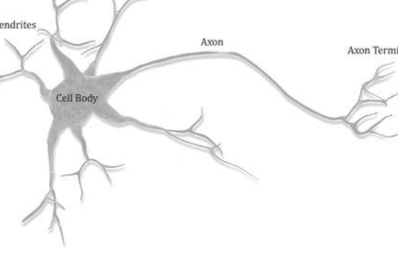

图4.1：生物神经元的示意图

神经网络扩展了这个类比，将一组人工神经元组合成一个神经网络，在神经元之间传递信息（突触）。

如图4.2所示。这些神经元中的每一个都学习其输入的不同函数，使得神经元网络具有极其多样化的表征能力。

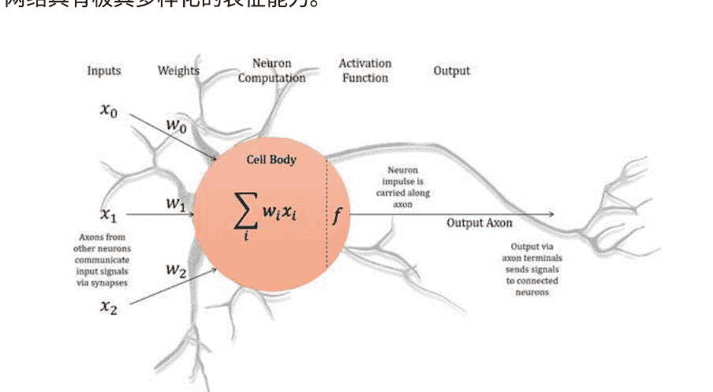

过去的6-7年中，深度学习的受欢迎程度和应用范围呈指数级增长。尽管神经网络的基础可以追溯到20世纪60年代末[Iva68]，但AlexNet架构[KSH12c]在2012年Imagenet图像分类竞赛中轻松获胜[Den+09b]，引发了对深度学习的极大兴趣，该架构采用了一个5层的卷积神经网络。从那时起，深度学习已经应用于多个领域，并在大多数领域中取得了最先进的性能。

本章的目的是向读者介绍深度学习。通过本章的学习，读者应该能够理解神经网络的基础知识以及如何训练它们。我们从回顾在第2章中介绍的感知器算法开始，神经网络就是从那里起源的。然后我们介绍多层感知器（MLP）分类器，这是前馈神经网络的最简单形式。接下来讨论了训练MLP的基本组成部分。本节介绍了前向传播和反向传播，并解释了神经网络的整个训练过程。

然后我们转向对基本架构组件的探索：激活函数、误差度量和优化方法。在本节之后，我们将把MLP的概念扩展到深度学习领域，在训练深度神经网络时引入了额外的考虑因素，如计算时间和正则化。最后，我们对常见的深度学习框架方法进行了实际讨论。

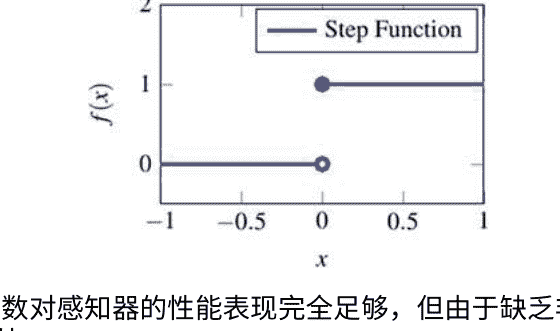

图4.3：阶跃函数对感知器的性能表现完全足够，但由于缺乏非零梯度，对神经网络毫无用处。

## 4.2 感知器算法解释

深度学习在其最简单的形式下是感知器算法的演化，使用基于梯度的优化器进行训练。第2章介绍了感知器算法。本节阐述了感知器算法作为深度学习的基石的重要性。

感知器算法是最早的监督学习算法之一，可以追溯到1950年代。就像生物神经元一样，感知器算法充当人工神经元，具有多个输入和与每个输入相关联的权重，然后产生一个输出。这在图4.6b中有所说明。二分类问题的感知器算法的基本形式为：

$$y(x_1, \dots, x_n) = f(w_1 x_1 + \dots + w_n x_n). \tag{4.1}$$

我们通过学习到的权重 $w_i$ 对每个输入 $x_i$ 进行加权，将输入 $\mathbf{x} \in \mathbb{R}^n$ 映射到输出值 $y$，其中 $f(x)$ 定义如下所示，并且在图4.3中也有展示。

$$f(v) = \begin{cases} 0 & \text{如果 } v < 0.5 \\ 1 & \text{如果 } v \geq 0.5 \end{cases} \tag{4.2}$$

阶跃函数接受一个实数输入，并产生一个二进制值0或1，表示是否超过阈值0.5进行正类别或负类别的分类。

### 4.2.1 偏差

感知器算法学习一个能够将两个类别分开的超平面。然而，在这一点上，分离超平面无法远离原点，如图4.4a所示。以这种方式限制超平面会引起问题，如图4.4b所示。
```

一种解决方案是通过将数据归一化到以原点为中心来解决这个问题，或者在方程4.1中添加一个偏置项 b，使得分类超平面可以远离原点，如图4.5所示。

图4.5：(a) 在将数据居中到原点后，感知器算法能够将两个类别分开。请注意图中原点的位置。(b) 偏置项允许感知器算法重新定位分离平面，使其能够正确分类数据点。

## 4.2 感知器算法解释

我们可以将感知器写成带有偏置项的形式：

```
y(x_1, \ldots, x_n) = f(w_1 x_1 + \ldots + w_n x_n + b)
```

或者，我们可以将 b 视为附加的权重 w_0，与一个常数输入1相连，如图4.6 b所示，并将其写为：

```
y(x_1, \ldots, x_n) = f(w_1 x_1 + \ldots + w_n x_n + w_0)
```

一些作者将此描述为添加一个输入常数1，允许学习到的 b = w_0将决策边界移离原点。我们现在将继续将偏置项写出，以提醒其重要性；然而，在学术文献中通常情况下，即使不写出偏置项，它也是隐含的。切换到向量表示法，我们可以将公式4.3重写为：

```
y(\mathbf{x}) = f(\mathbf{w} \mathbf{x} + b).
```

> 偏置项是一个学习到的权重，它消除了分离超平面必须通过原点的限制。

感知器算法的学习过程是修改权重 w 以在训练集上达到0误差。例如，假设我们需要分离点集 A 和 B。从随机权重 w 开始，我们通过每次迭代逐步改进边界，目标是达到 E(w,b) =0。因此，我们将在整个训练集上最小化以下函数的误差。

```
E(\mathbf{w}) = \sum_{\mathbf{x} \in A} (1 - f(\mathbf{w} \mathbf{x} + b)) + \sum_{\mathbf{x} \in B} f(\mathbf{w} \mathbf{x} + b)
```

### 4.2.2 线性和非线性可分性

如果存在一个单一的决策边界可以将两组数据分开，那么它们是线性可分的。例如，如果存在某个决策阈值 $t$，使得每个 $A$ 中的 $x_i$ 满足不等式 $\sum_i w_i x_i \geq t$，并且每个 $B$ 中的 $y_j$ 满足相反，如果分离需要一个非线性决策边界，则两个集合不是线性可分的。

如果我们将感知器应用于一个非线性可分的数据集，例如图4.7a中所示的数据集，则无法像4.7b中所示那样将数据分开，因为我们只能学习到三个参数，w_1，w_2和b。

图4.7: (a) 非线性可分数据集（XOR函数的推广）。(b) 在(a)上训练感知器算法的结果。线性边界无法正确分类数据。

不幸的是，在自然语言处理和语音识别中，我们遇到的大多数数据都是高度非线性的。一种选择（正如我们在第2章中看到的）是创建输入数据的非线性组合，并将其用作模型中的特征。另一种选择是学习原始数据的非线性函数，这是神经网络的主要目标。

## 4.3 多层感知器（神经网络）

多层感知器（MLP）将多个感知器（通常称为神经元）链接成一个网络。将相同输入的神经元分组成一个感知器层。与之前看到的阶跃函数不同，我们使用一个可微分的非线性函数进行替代。应用这个非线性函数，通常称为激活函数或非线性函数，允许输出值成为其输入的非线性加权组合，从而创建下一层使用的非线性特征。相比之下，使用线性函数作为激活函数将限制网络只能学习输入数据的线性变换。此外，研究表明，具有线性激活函数的任意层数的MLP可以简化为一个2层的MLP [HSW89]。

MLP由相互连接的神经元组成，因此是一个神经网络。具体而言，它是一个前馈神经网络，因为数据在网络中只有一个方向流动（没有循环-递归连接）。图4.8显示了最简单的多层感知器。MLP必须包含一个输入层和一个输出层，至少还要有一个隐藏层。此外，这些层也是“全连接”的，意味着每一层的输出都连接到下一层的每个神经元。换句话说，在层之间的每个输入神经元和输出神经元的组合上学习一个权重参数。

隐藏层提供两个输出，h₁和h₂，它们可以是输入值x₁和x₂的非线性组合。输出层根据来自隐藏层的输入进行加权，形成一个潜在的非线性映射，并进行预测。

### 4.3.1 训练一个多层感知器

训练多层感知器（以及神经网络）的权重依赖于四个主要组成部分。

- 训练神经网络的步骤：
- 1. 前向传播：计算输入示例的网络输出。
- 2. 误差计算：计算网络预测与目标之间的预测误差。
- 3. 反向传播：根据输入和权重计算梯度的反向顺序。
- 4. 参数更新：使用随机梯度下降更新网络的权重，以减小该示例的误差。

我们将逐步介绍图4.8中所示的网络的每个组成部分。

### 4.3.2 前向传播

训练多层感知器（MLP）的第一步是计算数据集中示例的网络输出。我们使用Sigmoid函数，表示为σ(x)，作为MLP的激活函数。它可以被视为平滑的阶跃函数，并在图4.14中进行了说明。此外，它是连续可微的，这是反向传播的一个理想特性，稍后将进行说明。Sigmoid函数的定义为：

$$
\sigma(x) = \frac{1}{1+e^{-x}} \tag{4.7}
$$

前向传播步骤与感知器算法的步骤3和4非常相似。这个过程的目标是计算当前网络对于特定示例x的输出，其中每个输出都连接到下一层神经元的输入。

为了符号和计算的方便，层的权重被合并成一个单独的权重矩阵W_l，表示该层中的权重集合，其中l是层的编号。层计算中由每个权重执行的线性变换是输入x和W_l之间的内积计算。这种类型通常被称为“全连接”，“内积”或“线性”层，因为每个输入都连接到每个输出。计算对于示例x的预测值ŷ，其中h_1和h_2表示相应的层输出，变为：

$$
f(v) = \sigma(v) \n\mathbf{h}_1 = f(\mathbf{W}_1\mathbf{x} + \mathbf{b}_1) \nh_2 = f(\mathbf{W}_2\mathbf{h}_1 + b_2) \n\hat{y} = h_2 \tag{4.8}
$$

### 4.3.3 误差计算

误差计算步骤验证了我们的网络在给定示例上的表现如何。在这个例子中，我们使用均方误差（MSE）作为损失函数（将训练视为回归问题）。MSE的定义如下：

$$E(\hat{\mathbf{y}}, \mathbf{y}) = \frac{1}{2n} \sum_{i=1}^{n} (\hat{y}_i - y_i)^2. \tag{4.9}$$

这 $\frac{1}{2}$ 简化了反向传播。对于单个输出，这个数量被减少到：

$$E(\hat{y}, y) = \frac{1}{2} (\hat{y} - y)^2. \tag{4.10}$$

误差函数将在第4.4.2节中进一步探讨。这个误差函数通常用于回归问题，衡量目标的平方误差的平均值。平方函数强制误差为非负，并且作为一个二次损失函数，值越接近零，误差越小。误差计算步骤为训练示例产生一个标量误差值。我们将在第4.4.2节中更详细地讨论误差函数。

图4.9显示了图4.8的输出神经元的前向传播步骤和误差传播。

### 4.3.4 反向传播

在前向传播过程中，对于输入 $x$和网络参数 $\theta$，计算出一个输出预测 $\hat{y}$。为了改进我们的预测，我们可以使用随机梯度下降（SGD）来减小整个网络的误差。通过微积分的链式法则，可以确定每个参数的误差。我们可以使用微积分的链式法则，按照前向传播的相反顺序计算每个层（和操作）的导数，如图4.10所示。

在我们之前的例子中，预测值 $\hat{y}$依赖于 $\mathbf{W}_2$。我们可以使用链式法则计算相对于 $\mathbf{W}_2$的预测误差：

$$\frac{\partial E}{\partial \mathbf{W}_2} = \frac{\partial E}{\partial \hat{y}} \cdot \frac{\partial \hat{y}}{\partial \mathbf{W}_2} \quad (4.11)$$

链式法则允许我们计算每个可学习参数 $\theta$的误差梯度，从而使用随机梯度下降更新网络。

我们首先计算输出层相对于预测的梯度。

```
∇_ŷ E(ŷ, y) = \frac{∂E}{∂ŷ} = (ŷ - y) \quad (4.12)
```

然后我们可以根据第2层的参数计算误差。我们目前有“激活后”梯度，所以我们需要计算“激活前”的梯度：

```
∇_{a₂} E = \frac{∂E}{∂a₂} = \frac{∂E}{∂ŷ} \cdot \frac{∂ŷ}{∂a₂} = \frac{∂E}{∂ŷ} \odot f'(W₂h₁ + b₂) \quad (4.13)
```

现在我们可以计算相对于 W₂和 b₂的误差。

```
∇_{W₂} E = \frac{∂E}{∂W₂} = \frac{∂E}{∂ŷ} \cdot \frac{∂ŷ}{∂a₂} \cdot \frac{∂a₂}{∂W₂} = \left(\frac{∂E}{∂a₂}\right) h₁^T \quad (4.14)
```

```
∇_{b₂} E = \frac{∂E}{∂b₂} = \frac{∂E}{∂ŷ} \cdot \frac{∂ŷ}{∂a₂} \cdot \frac{∂a₂}{∂b₂} = \frac{∂E}{∂a₂} \quad (4.15)
```

我们还可以计算第2层输入（即第1层的激活后输出）的误差。

```
∇_{h₁} E = \frac{∂E}{∂h₁} = \frac{∂E}{∂ŷ} \cdot \frac{∂ŷ}{∂a₂} \cdot \frac{∂a₂}{∂h₁} = W₂^T \frac{∂E}{∂a₂} \quad (4.16)
```

然后我们重复这个过程，计算第1层参数 W₁和 b₁的误差，从而将误差向后传播到整个网络。图4.11显示了图4.8中所示网络的输出神经元的反向传播步骤。我们将数值探索和实验留给我们的笔记本练习。

### 4.3.5 参数更新

训练过程中的最后一步是参数更新。在网络中获取所有可学习参数的梯度之后，我们可以完成单个SGD步骤，根据学习率 α更新每一层的参数。

θ = θ - α∇θE (4.17)

这里介绍的SGD更新规则的简单性是有代价的。在SGD中，α的值特别重要，它影响收敛的速度、收敛的质量，甚至影响网络是否能够收敛。学习率过小，网络收敛非常缓慢，并且有可能陷入随机权重初始化附近的局部最小值。如果学习率过大，权重可能会快速增长，变得不稳定，并且无法收敛。此外，学习率的选择取决于网络深度和归一化方法等多种因素的组合。这里介绍的网络的简单性减轻了选择学习率的繁琐过程，但对于更深的网络，这个过程可能更加困难。选择一个好的学习率的重要性导致了关于梯度下降优化算法的整个研究领域。我们在第4.4.3节中更详细地讨论了一些这些技术。

整个过程在算法1中描述。

```
算法1: 神经网络训练
数据：训练数据集 $\mathcal{D} = \{(\mathbf{x}_1, \mathbf{y}_1), (\mathbf{x}_2, \mathbf{y}_2), ..., (\mathbf{x}_n, \mathbf{y}_n)\}$
具有可学习参数的$l$层神经网络
$\theta = \{\{\mathbf{W}_1, ..., \mathbf{W}_l\}, \{\mathbf{b}_1, ..., \mathbf{b}_l\}\}$
激活函数$f(\mathbf{v})$
学习率$\alpha$
误差函数$E(\hat{\mathbf{v}}, \mathbf{v})$
初始化神经网络参数$\theta = \{\{\mathbf{W}_1, ..., \mathbf{W}_l\}, \{\mathbf{b}_1, ..., \mathbf{b}_l\}\}$
对于$e$从1到$e$个周期进行循环
    对于$(\mathbf{X}, \mathbf{Y})$在$\mathcal{D}$中执行
        对于$i \leftarrow 1$到$l$执行
            如果$i=1$则
                $\mathbf{h}_{i-1} = \mathbf{X}$
            $\mathbf{a}_i = \mathbf{W}_i\mathbf{h}_{i-1} + \mathbf{b}_i$
            $\mathbf{h}_i = f(\mathbf{a}_i)$
        $\hat{\mathbf{y}} = \mathbf{h}_l$
        误差 $= E(\hat{\mathbf{y}}, \mathbf{y})$
        $\mathbf{g}_{\mathbf{h}_{l+1}} = \nabla_{\hat{\mathbf{y}}}E(\hat{\mathbf{y}}, \mathbf{y})$
        对于$i \leftarrow l$到$1$执行
            $\mathbf{g}_{\mathbf{a}_i} = \nabla_{\mathbf{a}_i}E = \mathbf{g}_{\mathbf{h}_{i+1}} \circ f'(\mathbf{a}_i)$
            $\nabla_{\mathbf{W}_i}E = \mathbf{g}_{\mathbf{a}_i}\mathbf{h}_{i-1}^T$
            $\nabla_{\mathbf{b}_i}E = \mathbf{g}_{\mathbf{a}_i}$
            $\mathbf{g}_{\mathbf{h}_i} = \nabla_{\mathbf{h}_{i-1}}E = \mathbf{W}_i^T\mathbf{g}_{\mathbf{a}_i}$
    $\theta = \theta - \alpha\nabla_{\theta}E$
```

### 4.3.6 通用逼近定理

神经网络架构被应用于各种问题，因为它们具有很强的表达能力。通用逼近定理[HSW89]已经证明，具有单层的前馈神经网络可以近似任何连续函数，只对层中神经元的数量有一定限制。1这个定理通常被总结为“神经网络是通用逼近器”。虽然从技术上讲这是正确的，但该定理并不对学习特定函数的可能性提供任何保证。

随着机器学习问题变得更加复杂，参数空间的拓扑结构变得更加多样。它通常是非凸的，存在许多局部最小值。简单的梯度下降方法可能难以学习到具体的函数。
相反，多层神经元依次堆叠并与反向传播一起进行训练。然后，层级网络学习多个非线性函数以适应训练数据集。深度学习是指多个神经网络层按顺序连接。

## 4.4 深度学习

术语“深度学习”有些模糊。在许多领域中，深度学习是神经网络的重新命名术语，或者用来指代具有许多连续（深层）层的神经网络。然而，用于区分深层网络和浅层网络的层数是相对的。例如，图4.12中显示的神经网络被认为是深层还是浅层？

图4.12：具有两个隐藏层的前馈神经网络

总的来说，深层网络仍然是神经网络（通过反向传播进行训练，学习输入的分层抽象，使用基于梯度的优化方法)。深度学习是一种机器学习方法，它使用多层神经网络来进行学习。深度学习的特点是应用于以前传统方法和较小的神经网络无法解决的问题，例如图4.8中所示的多层感知器。更深的网络可以学习输入数据的更多层次的抽象，从而能够在更复杂的领域中学习更高阶的函数。

然而，在本书中，我们使用上述描述的深度学习术语——一个具有多个隐藏层的神经网络。

神经网络的灵活性使其非常引人注目。由于反向传播和基于梯度的优化方法的简单性和有效性，神经网络被应用于许多类型的问题。在本节中，我们介绍了影响深度神经网络（DNN）架构设计和模型训练的其他方法和考虑因素。具体而言，我们关注激活函数、误差函数、优化方法和正则化方法。

### 4.4.1 激活函数

图4.13：阶跃函数对感知器来说表现得非常好，但是它的导数使其在梯度下降方法中表现糟糕。

当计算输出层的梯度时，很明显阶跃函数在计算梯度时并不是很有帮助。如图4.13所示，导数在任何地方都是0，这意味着任何梯度下降都是无用的。因此，我们希望使用一个非线性激活函数，在反向传播过程中提供有意义的导数。

#### 4.4.1.1 Sigmoid

作为激活函数使用的更好的函数是逻辑sigmoid函数：

$$
\sigma(x) = \frac{1}{1+e^{-x}} \tag{4.18}
$$

sigmoid函数是一个有用的激活函数，有多种原因：从图4.14中可以看出，该函数作为一个连续的压缩函数，将其输出限制在范围 (0,1)内。它类似于阶跃函数，但具有平滑、连续的导数，非常适合梯度下降方法。它还是以零为中心的，为二元分类任务创建了一个简单的决策边界，sigmoid函数的导数在数学上很方便：

$$
\sigma'(x) = \sigma(x)(1-\sigma(x)). \tag{4.19}
$$

然而，sigmoid函数也有一些不理想的性质。

- 在曲线的两端（非常接近 $\sigma(x) \leftarrow 0$ 或 $\sigma(x) \leftarrow 1$）时，sigmoid梯度会饱和，导致梯度非常接近于0。随着反向传播继续进行到后续层，小梯度会与前一层的后激活输出相乘，进一步减小。防止这种情况可能需要仔细初始化网络权重或其他正则化策略。
- Sigmoid函数的输出不是以0为中心，而是以0.5为中心。这导致了层之间的差异，因为输出不在一个一致的范围内。这通常被称为“内部协变量偏移”，我们稍后会详细讨论。

#### 4.4.1.2 双曲正切函数

双曲正切函数是另一种常见的激活函数。它也作为一个压缩函数，将其输出限制在范围(-1, 1)内，如图4.15所示。

$$ f(x) = tanh(x) \quad \text{(4.20)} $$

它也可以被看作是一个缩放和平移的Sigmoid函数。

$$ tanh(x) = 2 * \sigma(2x) - 1 \quad \text{(4.21)} $$

双曲正切函数解决了Sigmoid非线性函数的一个问题，因为它是以零为中心的。然而，我们仍然面临着函数极端值处梯度饱和的问题，如图4.16所示。

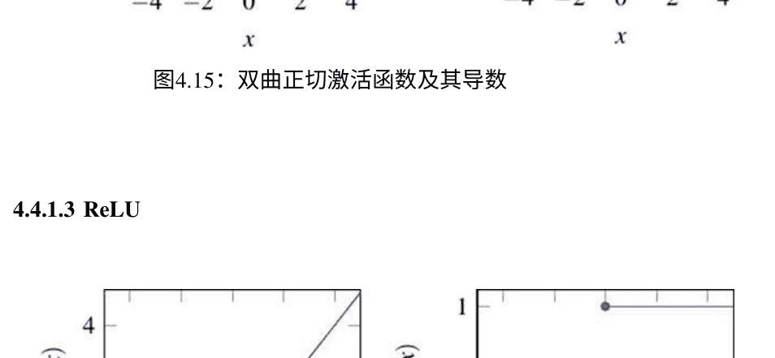

#### 4.4.1.3 ReLU

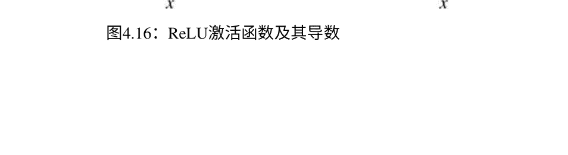

修正线性单元（ReLU）是一种简单快速的激活函数，通常用于计算机视觉。该函数是一个线性阈值函数，定义为：

$$ f(x) = \max(0, x) \quad \text{(4.22)} $$

这个简单的函数之所以受欢迎，是因为相比于sigmoid和tanh函数，它在正方向上的梯度不会饱和，从而显示出更快的收敛速度。

除了更快的收敛速度，ReLU函数在计算上也更快。sigmoid和tanh函数需要进行指数运算，而这比简单的最大值运算要花费更长的时间。

梯度更新只有0或1的简单性带来的一个缺点是，在训练过程中可能会导致神经元“死亡”。如果一个大的梯度通过一个神经元进行反向传播，神经元的输出可能会受到如此严重的影响，以至于更新会阻止神经元再次更新。一些研究表明，如果学习率设置得太高，使用ReLU激活函数的网络中有多达40%的神经元会“死亡”。

#### 4.4.1.4 其他激活函数

其他激活函数已被纳入以限制前面描述的效果，如图4.17所示。

- 硬切线双曲函数：硬切线双曲函数的计算成本比双曲函数低。然而，它重新引入了在极端值处梯度饱和的缺点。
  $$ f(x) = \max(-1, \min(1, x)) \quad \text{(4.23)} $$
- Leaky ReLU：Leaky ReLU引入了一个 α参数，允许在激活不活跃时反向传播小梯度，从而消除了神经元在训练过程中的“死亡”。
  $$ f(x) = \begin{cases} x & \text{if } x \geq 0 \\ \alpha x & \text{如果 } x < 0。 \end{cases} \quad \text{(4.24)} $$
- PRELU：参数化修正线性单元（PRELU）类似于Leaky ReLU，它使用一个 α参数来调整输入的负部分的斜率；然而，每个神经元都学习一个alpha参数（使得学习的权重数量翻倍）。请注意，当 α =0 时，这是ReLU函数，当 α固定时，它等同于Leaky ReLU。
  $$ f(x) = \begin{cases} x & \text{if } x \geq 0 \\ \alpha x & \text{如果 } x < 0。 \end{cases} \quad \text{(4.25)} $$
- ELU
  ELU是ReLU的一种修改，它允许激活的均值接近0，从而可能加快收敛速度。
  $$ f(x) = \begin{cases} x & \text{if } x > 0 \\ \alpha(e^x - 1) & \text{如果 } x \leq 0 \end{cases} \quad (4.26) $$
- Maxout
  maxout函数采用了一种不同的激活函数方法。它与将函数逐个应用于每个神经元输出的方法不同。相反，它学习两个权重矩阵，并对每个元素取最高输出。
  $$ f(x) = \max(w_1x + b_1, w_2x + b_2) \quad (4.27) $$

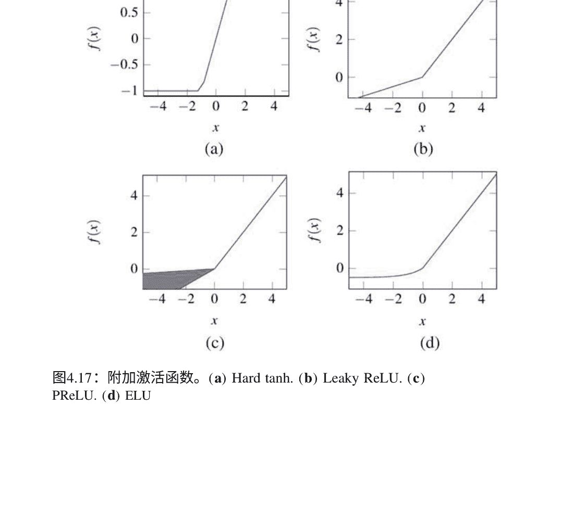

图4.17：附加激活函数。(a) Hard tanh. (b) Leaky ReLU. (c) PReLU. (d) ELU

#### 4.4.1.5 软最大值

通过softmax函数，将sigmoid函数的压缩概念扩展到多类别问题上。softmax函数允许我们输出一个关于K个类别的分类概率分布。

$$ f(x_i) = \frac{e^{x_i}}{\sum_j e^{x_j}} \quad (4.28) $$

我们可以使用softmax函数根据神经元的输出产生一个概率向量。对于一个具有K=3个类别的分类问题，我们的网络的最后一层将是一个具有三个神经元输出的全连接层。如果我们将softmax函数应用于最后一层的输出，通过为每个神经元分配一个类别，我们可以得到每个类别的概率。softmax计算如图4.18所示。

softmax概率可能会变得非常小，特别是当类别很多时，预测变得更加自信。大多数情况下，使用基于对数的softmax函数来避免下溢错误。softmax函数是激活函数的一种特殊情况，它很少被视为一种激活函数。

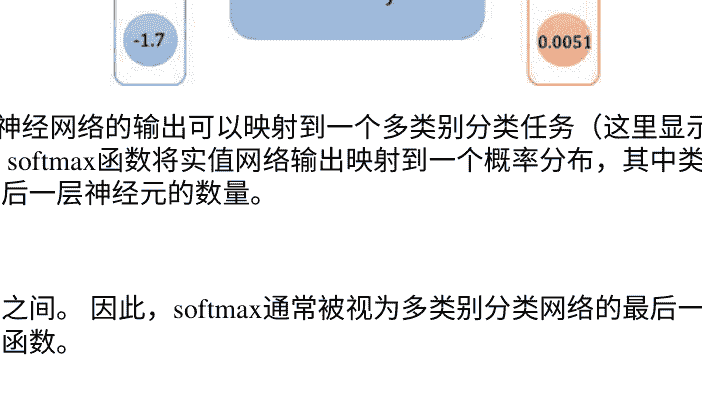

图4.18：神经网络的输出可以映射到一个多类别分类任务（这里显示了三个类别）。softmax函数将实值网络输出映射到一个概率分布，其中类别的数量等于最后一层神经元的数量。softmax通常被视为多类别分类网络的最后一层，而不是激活函数。

#### 4.4.1.6 分层softmax

当类别数量开始增长时，如在语言任务中经常发生，计算softmax函数的计算成本可能变得很高。例如，在语言建模任务中，我们的输出层可能试图预测序列中的下一个单词。因此，网络的输出将是对我们词汇表中术语数量的概率分布，可能是数千个或数十万个。分层softmax [MB05]通过将函数表示为二叉树来近似softmax函数，其中深度产生较低概率的类别激活。树在网络训练时必须保持平衡，但它的深度为$\log_2(K)$，其中$K$是类别的数量，这意味着只需要评估$\log_2(K)$个状态来计算类别的输出概率。

### 4.4.2 损失函数

训练神经网络的另一个重要方面是选择误差函数，通常被称为准则。选择误差函数取决于所解决的问题类型。对于分类问题，我们希望预测一组类别的概率分布。然而，在回归问题中，我们希望预测一个具体的值，而不是一个分布。我们在这里介绍了基本的、最常用的损失函数。

#### 4.4.2.1 均方误差 (L2)

均方误差(MSE)计算分类预测和目标之间的平方误差。使用MSE进行训练可以最小化差异的大小。MSE的一个缺点是它对异常值敏感，因为差异被平方。

$$ E(\hat{\mathbf{y}}, \mathbf{y}) = \frac{1}{n} \sum_{i=1}^{n} (y_i - \hat{y}_i)^2 \quad (4.29) $$

到目前为止，我们一直使用MSE或 L2作为二元分类问题的损失函数，如果ŷ ≥ 0.5，则将其分类为0，如果ŷ < 0.5，则将其分类为1；然而，它通常用于回归问题，并且可以轻松扩展到我们一直在处理的简单问题。

#### 4.4.2.2 平均绝对值 (L1) 误差

平均绝对误差给出了目标值和预测值之间的绝对差异的度量。使用它可以最小化误差的大小，而不考虑方向，使其对异常值不太敏感。

$$ E(\hat{\mathbf{y}}, \mathbf{y}) = \frac{1}{n} \sum_{i=1}^{n} |y_i - \hat{y}_i| \quad (4.30) $$

#### 4.4.2.3 负对数似然

负对数似然（NLL）是用于多类分类问题的最常见的损失函数。它也被称为多类交叉熵损失。softmax函数提供了输出类别的概率分布。熵计算是多类分类问题中可能事件或分类的加权平均对数概率。这导致损失增加，当预测的概率分布与目标标签偏离时。

$$ E(\hat{\mathbf{y}}, \mathbf{y}) = -\frac{1}{n} \sum_{i=1}^{n} (y_i \log(\hat{y}_i) - (1 - y_i) \log(1 - \hat{y}_i)) \quad (4.31) $$

#### 4.4.2.4 合页损失

合页损失是从支持向量机损失中得到的最大间隔损失分类。它试图通过最大化它们之间的间隔来分离类别之间的数据点。尽管它不可微分，但它是凸的，这使得它作为损失函数很有用。

$$ E(\hat{\mathbf{y}}, \mathbf{y}) = \sum_{i=1}^{n} \max(0, 1 - y_i \hat{y}_i) \quad (4.32) $$

#### 4.4.2.5 Kullback-Leibler (KL) 损失

此外，我们可以优化函数，例如 KL 散度，它在连续空间中测量距离度量。这对于具有连续输出分布的生成网络等问题非常有用。KL 散度误差可以描述为：

$$ \begin{aligned} E(\hat{\mathbf{y}}, \mathbf{y}) &= \frac{1}{n} \sum_{i=1}^{n} \mathcal{D}_{KL}(y_i \| \hat{y}_i) \\ &= \frac{1}{n} \sum_{i=1}^{n} (y_i \cdot \log(y_i)) - \frac{1}{n} \sum_{i=1}^{n} (y_i \cdot \log(\hat{y}_i)) \end{aligned} \quad (4.33) $$

### 4.4.3 优化方法

神经网络的训练过程基于梯度下降方法，具体来说是SGD。然而，正如我们在前一节中所看到的，SGD在训练过程中可能会导致许多不良困难。除了SGD和与之相关的好处，我们还将探索其他优化方法。我们将所有可学习的参数，包括权重和偏置，表示为 θ。

#### 4.4.3.1 随机梯度下降

正如第2章所介绍的，随机梯度下降是通过在梯度方向上更新一组权重来减小误差的过程。在算法7中，SGD的更新规则是简单的形式：

$$ \theta_{t+1} = \theta_t - \alpha\nabla_\theta E. \quad (4.34) $$

其中θ表示可学习的参数，α是学习率，∇_θ E是相对于参数的误差梯度。

#### 4.4.3.2 动量

SGD常常出现一个问题，即特征空间中存在着长而浅的峡谷，通向极小值。SGD会在峡谷中来回震荡，因为梯度会指向其中一侧的最陡梯度，而不是指向极小值的方向。因此，SGD可能导致收敛速度较慢。

动量是对SGD的一种修改，可以更快地将目标移动到极小值。动量的参数更新方程为：

$$ v_t = \gamma v_{t-1} + \eta\nabla_\theta E \\ \theta_{t+1} = \theta_t - v_t \quad (4.35) $$

其中θ_t表示迭代t时的参数。动量从物理学中汲取灵感，计算一个速度向量，捕捉先前梯度产生的累积方向。这个速度向量还会乘以一个额外的超参数η，用于指示累积速度对更新的贡献程度。

#### 4.4.3.3 Adagrad

Adagrad [DHS11]是一种自适应梯度优化方法。它根据网络中的每个参数调整学习率，对不经常出现的参数进行更大的更新，对经常出现的参数进行较小的更新。这使得它特别适用于稀疏数据的学习问题。Adagrad最显著的好处之一是不需要手动调整学习率。然而，这也带来了一个代价，即网络中的每个参数都需要有一个额外的参数。

Adagrad的计算公式如下：

$$ g_{t,i} = \nabla_\theta E(\theta_{t,i}) \\ \theta_{t+1,i} = \theta_{t,i} - \frac{\eta}{\sqrt{G_{t,ii} + \varepsilon}} \circ g_{t,i} \quad (4.36) $$

其中 $g_{t}$ 是时间 $t$ 上每个分量的梯度，$G_{t}$ 是对所有参数 $\theta$ 的过去梯度的 $t$ 个时间步长的和的对角线矩阵，$\eta$ 是通用学习率，$\varepsilon$ 是平滑项（通常为 $1e-8$），用于避免除以零的情况。

Adagrad的主要缺点是平方梯度的累积是正的，导致总和增长，缩大学习率，并停止模型进一步学习。为了缓解这个问题，还引入了其他变体，如Adadelta [Zei12]。

#### 4.4.3.4 RMS-Prop

RMS-prop [TH12]由Hinton开发，也用于解决adagrad的不足之处。它还将学习率除以平均平方梯度，但它也以指数方式衰减这个数量。

$$ \mathbb{E}[g^2]_t = \rho \mathbb{E}[g^2]_{t-1} + (1 - \rho) g_t^2 \\ \theta_{t+1} = \theta_t - \frac{\eta}{\sqrt{\mathbb{E}[g^2]_t + \varepsilon}} g_t \quad (4.37) $$

其中 $\rho = 0.9$，学习率 $\eta = 0.001$，这是在演讲中建议的。

#### 4.4.3.5 ADAM

自适应矩估计，即Adam [KB14]，是另一种自适应优化方法。它为每个参数计算学习率，但除了保持先前梯度的指数衰减平均值之外，类似于动量，它还包括过去梯度的平均值 $m_t$。

$$ m_t = \beta_1 m_{t-1} + (1 - \beta_1) g_t \\ v_t = \beta_2 v_{t-1} + (1 - \beta_2) g_t^2 \\ \hat{m}_t = \frac{m_t}{1 - \beta_1^t} \\ \hat{v}_t = \frac{v_t}{1 - \beta_2^t} \\ \theta_{t+1} = \theta_t - \frac{\eta}{\sqrt{\hat{v}_t} + \varepsilon} \hat{m}_t \quad (4.38) $$

实证结果表明，Adam在实践中与其他基于梯度的优化技术相比表现良好。虽然Adam是一种流行的技术，但一些对原始证明的批评显示在某些情况下会收敛到次优解[BGW18，RKK18]。每个工作提出了解决方案，但后续方法比原始的Adam技术更不流行。

## 4.5 模型训练

实现最佳泛化误差（在测试集上的最佳性能）是机器学习的主要目标，这需要在过拟合和欠拟合之间找到最佳位置。深度学习更容易过拟合。

由于有很多自由参数，相对容易找到达到E=0的路径。已经证明许多标准的深度学习架构可以在训练数据的随机标记上进行训练，并达到E=0 [Zha+16]。

与过拟合相反，对于许多复杂函数来说，存在多个局部最小值，这些局部最小值可能不是最优解，通常会停留在一个局部最小值。深度学习依赖于找到非凸优化问题的解，对于一般的非凸函数来说，这是一个NP完全问题[MK87]。在实践中，我们发现计算良好正则化的深度网络的全局最小值大多数情况下并不重要，因为局部最小值通常大致相似，并且随着模型复杂性的增加，它们越来越接近全局最小值[Cho+15a]。然而，在正则化不足的网络中，局部最小值可能导致较高的损失，这是不可取的。

最好的模型是那些在训练损失和验证损失之间达到最小差距的模型；然而，选择正确的架构配置和训练技术可能是困难的。在这里，我们讨论了改进模型泛化能力的典型训练和正则化技术。

### 4.5.1 提前停止

我们可以通过“提前停止”来防止模型过拟合。提前停止的基本假设是：“随着验证误差的减小，测试误差也应该减小。”在训练过程中，我们在不同的时间点（通常在每个时期结束时）计算验证误差，并选择具有最低验证误差的模型，如图4.19所示。

学习曲线显示训练误差将继续减小至0。然而，模型开始在验证集上表现更差，因为它过拟合了训练数据。因此，为了保持模型在测试集上的泛化能力，我们会选择在验证集上表现最好的模型（学习到的模型参数）。在这里还需要指出的是，这需要将数据集分为训练集、验证集和测试集，并且它们之间不能有重叠。测试集应该与训练集和验证集分开，否则会损害模型的完整性。

早停法的简单性使其成为深度学习中最常用的正则化形式。

### 4.5.2 梯度消失/爆炸

当使用反向传播训练具有多层的神经网络时，会出现梯度消失/爆炸的问题。在反向传播过程中，我们将梯度乘以每个后续层的输出。这意味着梯度可以变得越来越大，如果∇E >1或∇E <1，如果梯度为1<∇E <0，则梯度会变得越来越小，因为它会与每个后续层相乘。

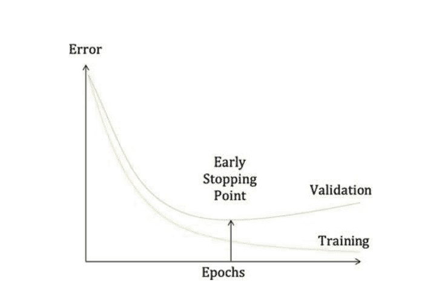

如果 ∇E >1或 ∇E <1，则梯度会变得越来越大，如果梯度为1 < ∇E < 0，则梯度会变得越来越小，因为它会与每个后续层相乘。实际上，这意味着在梯度消失的情况下，很少有误差传播回网络的早期层，导致学习非常缓慢或不存在。对于梯度爆炸，这会导致权重最终溢出，从而阻止学习。神经网络越深，这个问题就越严重。

### 4.5.3 全批量和小批量梯度下降

批量梯度下降是梯度下降的一种变体，在更新模型之前，在整个数据集上评估误差，并在每个示例之后累积误差。这样可以减轻随机梯度下降的一些问题，例如每个示例引入的噪声，但更新的频率可能导致训练周期之间的方差增加，从而在模型中产生显著差异。这种方法在深度学习中很少使用。

在这两种策略之间的一个合适的折衷方案是小批量梯度下降。小批量梯度下降将数据集分成批次，在进行更新之前，模型会累积一个小批量的误差。这种方法提供了各种优势，包括：

- 由于从多个训练样本中累积梯度，每个模型更新中的噪声减少
- 比随机梯度下降更高效
- 通过利用矩阵运算减少IO时间，加快训练速度

小批量梯度下降的一个缺点是将小批量大小作为超参数添加。小批量大小通常根据模型的硬件限制设置，以不超过CPU或GPU的内存。此外，批量大小通常是2的幂（8、16、32等），这是由于常见的硬件实现。一般来说，希望在小批量大小较小时能够更快地收敛，并在小批量大小较大时能够更慢但更准确地估计。

建议查看几个不同批量大小的学习曲线，以确定最佳大小。

### 4.5.4 正则化

实际上，通过创建一个适当正则化的大模型来控制泛化误差[GBC16a，Bis95]。正则化可以采取多种形式。

一些方法专注于通过在目标函数中添加正则化项来惩罚异常参数，从而减少模型的容量。

$$ E(W; \hat{y}, y) = E(\hat{y}, y) + \Omega(W) \quad (4.39) $$

其中 **W** 是网络的权重。一些方法专注于限制提供给网络的信息（例如，dropout）或对层的输出进行归一化处理（批量归一化），而其他方法可能直接对数据进行更改。在这里，我们将探讨各种正则化方法，并且通常建议在每个问题中都使用多种方法。

#### 4.5.4.1 $L_2$正则化：权重衰减

最常见的正则化方法之一是 $L_2$正则化方法，通常称为权重衰减。权重衰减将一个正则化项添加到误差函数中，将权重推向原点，惩罚高权重变化。权重衰减引入一个标量 $\alpha$，惩罚权重远离原点。这相当于对训练目标施加了一个零均值的高斯先验，限制了网络学习可能导致过拟合的大权重。这个参数的设置非常重要，因为如果模型过于受限，可能无法学习。

$L_2$正则化的定义为：

$$ \Omega(w) = \frac{\alpha}{2} \mathbf{w}^\top \mathbf{w} $$

损失函数可以描述为：

$$ E(\mathbf{W}; \hat{y}, y) = \frac{\alpha}{2} \mathbf{W}^\top \mathbf{W} + E(\hat{y}, y). $$

梯度为：

$$ \nabla_{\mathbf{W}} E(\mathbf{W}; \hat{y}, y) = \alpha \mathbf{W} + \nabla_{\mathbf{W}} E(\hat{y}, y) $$

参数更新为：

$$ \mathbf{W} = \mathbf{W} - \epsilon (\alpha \mathbf{W} + \nabla_{\mathbf{W}} E(\hat{y}, y)), $$

其中 $\epsilon$ 是学习率。

#### 4.5.4.2 $L_1$正则化

一种较少使用的正则化方法是 $L_1$正则化。这种技术也作为权重惩罚。正则化器是权重的绝对值之和：$$\Omega(\mathbf{w}) = \alpha \sum |w_i|$$

#### 4.5.4.3 丢弃

随着训练的进行，许多权重将变为零，从而引入了模型权重的稀疏性。这在特征选择中经常使用，但并不总是神经网络中的一个理想特性。

在深度学习中，第二常见的正则化方法可能是丢弃法 [Sri+14]。丢弃法是一种简单而高效的方法，用于减少神经网络的过拟合问题。它源于这样一个想法，即神经网络可能存在从输入到输出的非常脆弱的连接。这些学习到的连接可能对训练数据有效，但不能推广到测试数据。丢弃法的目标是通过在神经网络训练过程中随机“丢弃”连接，使预测不能依赖于任何单个神经元来纠正这种倾向，如图4.20所示。

将丢弃法应用于网络，涉及到从伯努利分布中采样的随机掩码。这个掩码矩阵在前向传播操作中逐元素地应用（乘以0）。在反向传播步骤中，对于每个参数和被掩码的参数的梯度被设置为0，其他梯度被放大
$$\frac{1}{1-p}$$。

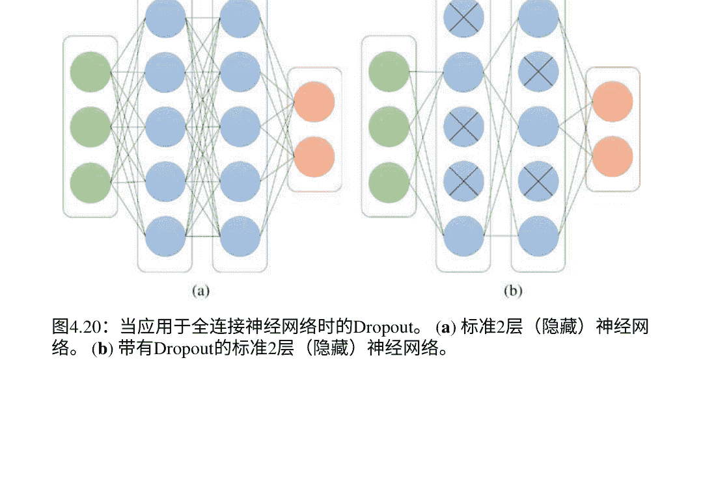

#### 4.5.4.4 多任务学习

在所有的机器学习任务中，我们都在优化特定的错误度量或函数。因此，为了同时在各种任务上表现良好，我们通常为每个度量训练一个模型，然后以某种有意义的方式集成、线性组合或连接它们，以在我们的整体任务集上表现良好。由于深度学习是通过基于梯度的计算和下降来实现的，我们可以同时优化多种优化函数。这使得我们的底层表示可以学习一个通用的表示，可以完成多个任务。多任务学习最近已经成为一种广泛使用的方法。辅助任务的添加可以帮助改善对学习参数的梯度信号，从而提高整体任务的质量[Rud17a]。

#### 4.5.4.5 参数共享

正则化的另一种形式是参数共享。到目前为止，我们只考虑了完全连接的神经网络，它为每个输入学习一个独立的权重。
在某些任务中，输入足够相似，不希望为每个任务学习不同的参数集，而是在多个地方共享学习。这可以通过在不同的输入之间共享一组权重来实现。参数共享不仅作为正则化器有用，还提供了多个训练优势，例如减少内存（一组权重的副本）和减少唯一模型参数的数量。

利用参数共享的一种方法是卷积神经网络，在第6章中我们将探讨这个方法。

#### 4.5.4.6 批量归一化

在训练过程中，训练示例的变化可能很大，导致训练过程中引入噪音。在介绍中，我们推荐的一种方法是在训练之前对数据进行归一化。归一化减少了权重需要调整以适应特定示例的量，保持相同的分布特性。在深度学习中，我们有多层计算，隐藏值传递给后续层。每个层的输出很可能是非归一化的输入，并且在训练过程中分布很可能经常变化。批量归一化[IS15] 旨在通过在训练过程中对中间层的输出进行归一化来减少网络中的内部协变量偏移。这加快了训练过程，并允许更高的学习速率，而不会出现发散的风险。

批量归一化通过对上一隐藏层的输出进行批次（小批次）均值和方差的归一化来实现这一目标。这种归一化，然而，这会影响推理阶段，因此批归一化会在推理时捕捉均值和方差的移动平均值并固定它们。

对于输入的小批量 $\beta = \{x_{1:m}}$，我们通过学习参数 $\gamma$ 和 $\beta$ 来进行调整：

$$ \mu_{\beta} = \frac{1}{m} \sum_{i=1}^{m} x_i $$
$$ \sigma_{\beta}^{2} = \frac{1}{m} \sum_{i=1}^{m} (x_i - \mu_{\beta})^2 $$
$$ \hat{x}_i = \frac{x_i - \mu_{\beta}}{\sqrt{\sigma_{\beta}^{2} + \varepsilon}} $$
$$ y_i = \gamma \hat{x}_i + \beta. $$ (4.45)

### 4.5.5 超参数选择

大多数学习技术和正则化方法都与一些训练配置参数相关联。例如，学习率、动量、dropout概率和权重衰减都需要为每个模型进行选择。
选择最佳组合的这些超参数可能是一项具有挑战性的任务。

#### 4.5.5.1 手动调整

当将现有模型应用于新数据集时，建议进行手动超参数调整，或者将新模型应用于现有数据集。手动选择有助于提供对网络的直觉。这对于理解特定参数集是否会导致网络过拟合或欠拟合非常有用。
建议监控梯度的范数，以及模型损失的收敛或发散速度。通常来说，学习率是最重要的超参数，对网络的有效容量有最大的影响[GBC16b]。
选择合适的学习率可以实现良好的收敛，而提前停止可以防止模型过拟合训练集。如果学习率过高，大梯度可能导致网络发散，在某些情况下甚至在学习率变低后也无法继续学习。如果学习率过低，小的更新会减慢学习过程，并且可能导致模型陷入高训练误差和泛化误差的局部最小值。

#### 4.5.5.2 自动调参

自动超参数选择是一种更快速和稳健的优化训练配置的方法。网格搜索，介绍在第2章，是最常见且直接的技术。在网格搜索中，为了优化每个参数，提供了均匀或对数样本，并为每个参数组合训练一个模型。这种方法是有效的，但是需要大量的计算时间来训练一组模型。通常，可以通过首先研究大范围，然后缩小参数或范围的集合，使用新范围进行另一次网格搜索来减少这种成本。

随机超参数搜索有时对训练的微妙差异更加稳健，因为一些超参数的组合可能会产生累积效应。与网格搜索类似，随机搜索在网格搜索范围内随机采样值，而不是均匀间隔的样本。研究表明，与网格搜索相比，随机搜索在超参数网格中有未探索的空间（给定相同数量的参数组合）。

通常，通过网格搜索和随机搜索探索的大多数模型都存在不良组合的问题。可以通过设置适当的搜索边界来缓解这个问题，这些边界可以从手动探索中获得，然后理想情况下，可以使用模型的性能来确定下一组参数。已经引入了各种条件和贝叶斯超参数选择过程来实现这一点[SLA12]。

### 4.5.6 数据可用性和质量

正则化是防止过拟合的最常见技术，但也可以通过增加数据量来实现。数据是任何机器学习模型中最重要的组成部分。尽管这似乎很明显，但在现实场景中往往是最容易被忽视的组成部分之一。抽象地说，神经网络是通过学习遇到的经验来学习的。在二分类中，例如，鼓励正例-标签对，而抑制负例对。调整神经网络的超参数通常是改善泛化误差的最佳步骤。如果训练误差和泛化误差之间仍然存在性能差距，可能需要增加数据量（或在某些情况下提高数据质量）。

神经网络对数据集中的一定程度的噪声具有鲁棒性，在训练过程中，异常值的影响通常会减弱。然而，错误的数据可能会引起许多问题。在实际应用中，模型性能不佳可能是由于一直错误的标签或数据不足引起的。

> 在实际应用中，如果在训练过程中出现异常行为，可能是数据不一致的迹象。

这通常表现为两种方式之一：过拟合或收敛不良。在过拟合的情况下，模型可能会学习到数据的异常（例如，在许多负面情感评论中存在用户名称）。深度学习特别受益于比其他机器学习算法更大的数据集。深度学习所取得的许多质量改进直接归因于使用的数据集规模的增加。大型数据集可以作为一种正则化技术，防止模型过度拟合特定示例。

#### 4.5.6.1 数据增强

改善模型性能的最简单方法之一是引入更多的训练数据。实际上，这可能是昂贵的，但如果数据可以以有意义的方式进行增强，这种方法非常有用。这种技术可以特别有益地减少对数据集中特定异常的过拟合。

对于图像来说，我们可以将旋转和水平翻转想象为创建一个不同的 $(X,y)$ 对，而无需重新标记任何数据。然而，对于手写数字来说，情况可能并非如此，水平翻转可能会破坏标签的解释（想想5和2）。在整合数据增强时，要记住示例和目标之间的约束条件。

#### 4.5.6.2 Bagging

Bagging是机器学习中常用的另一种技术。这种技术基于这样一个思想，即通过在训练集的不同部分上训练多个模型，我们可以减少模型过拟合的能力。Bagging技术从原始数据集中进行采样（有放回地），创建子训练集，然后在这些子训练集上训练模型。由于学习不同数据部分，模型应该学习不同的特征，从而在合并每个模型的结果后导致更低的泛化误差。由于深度学习模型的计算时间、深度模型的大数据需求以及其他正则化方法（如Dropout）的引入，这种策略在实践中使用较少。

#### 4.5.6.3 对抗训练

对抗样本是专门设计的样本，旨在使分类器对该样本进行错误分类。神经网络的自由参数空间意味着我们可以找到特定的输入样本，利用模型中训练参数的特定集合[GSS14]。

由于对抗样本的特性，我们可以使用用于创建对抗样本的技术来产生网络的训练数据，以减少特定攻击成功的可能性，并提高网络的鲁棒性。

| 支柱 | 描述 |
| :--- | :--- |
| 数据可用性和质量 | 数据的数量和正确性 |
| 计算速度 | 训练和推理所需的时间 |
| 内存需求 | 模型存储和运行时内存占用 |
| 质量 | 模型的性能指标 |

广义上说，配置和训练神经网络时通常存在四个相互制约的支柱：
在实践中，建议先确定最终目标，然后逆向思考每个约束的边界。

一般来说，模型选择的初始阶段确保模型具有可靠的学习能力。这不可避免地导致在训练数据集上过拟合，此时引入正则化来减小训练损失和验证损失之间的差距。在实践中，通常不需要（也不可行）为每种新的模型类型或任务从头开始。然而，我们认为在高度动态的系统中逐渐引入复杂性是最好的选择。通常从经验验证的架构大小开始，并直接应用正则化，但在出现意外情况时最好减少复杂性。

### 4.5.7.1 计算和内存约束

尽管有许多进展使得深度学习成为可能，但最近采用深度学习的增长最重要的贡献者之一无疑是硬件改进，特别是专用计算机架构（GPU）。GPU实现的处理速度是深度学习流行和实用性的最重要因素之一。通过矩阵优化和批量计算的速度优势使得GPU架构非常适合深度学习的问题。这一发展使得我们能够超越浅层架构，实现今天所见到的深度、复杂的架构。

大规模数据集和深度学习架构已经带来了显著的质量改进；然而，深度学习模型的计算成本通常比其他机器学习方法更高，这需要在资源有限的环境中（如移动设备）加以考虑。模型的要求也会影响可以进行的超参数优化的数量。对于需要花费数天或数周进行训练的模型，很难进行完整的网格搜索。相同的推理也适用于内存问题，更大的模型需要更多的空间。尽管有许多量化技术被引入来缩小模型的大小，例如量化参数或使用哈希参数值[Jou+16b]。

## 4.6 无监督深度学习

到目前为止，我们已经研究了一些用于监督学习的前馈神经网络的示例。现在，我们将看一些其他架构，通过研究三种常见的无监督架构：受限玻尔兹曼机（RBM），深度置信网络和自编码器，将神经网络和深度学习扩展到无监督任务。通过分析一些完成除分类之外任务的简单架构，我们将在当前的知识基础上进行扩展。

正如第2章所讨论的，无监督模型通过学习表示来形成没有标签的数据。这通常是一个非常理想的特性，因为大量的无标签数据是容易获取的。

### 4.6.1 基于能量的模型

能量模型（EBMs）从物理学中获得灵感。系统中的自由能与观测的概率相关。高能量与低概率观测相关，低能量与高概率观测相关。因此，在EBMs中，目标是学习一个能够使数据集中观察到的示例具有低能量，未观察到的示例具有较高能量的能量函数[LeC+06]。

对于基于能量的模型，通过能量函数定义概率分布，类似于：
$$p(x) = \frac{e^{-E(x)}}{Z}$$ (4.46)
其中 $Z$ 是归一化常数，通常称为分区函数。
$$Z = \sum_{x} e^{-E(x)}$$
对于许多算法来说，分区函数是难以处理的，因为它需要对输入 $x$ 的所有可能组合进行指数求和，如分布 $P$ 所定义的那样。然而，我们可以通过近似来计算它，正如我们将在RBM的情况下看到的那样。学习有用的特征需要学习输入 $x$ 的权重以及隐藏部分 $h$ 的权重。因此，观测到一个观测值 $x$ 的概率可以写成：
$$P(x) = \sum_{h} P(x, h) = \sum_{h} \frac{e^{-E(x)}}{Z}$$
自由能被定义为：
$$F(x) = -\log \sum_{h} e^{-E(x, h)}$$
以及负对数似然梯度：
$$-\frac{\log p(x)}{\partial \theta} = \frac{\partial F(x)}{\partial \theta} = -\sum_{\hat{x}} p(\hat{x}) \frac{\partial F(x)}{\partial \theta}.$$
这个函数产生了一个负对数似然梯度，由两部分组成，通常被称为正相位和负相位。正相位增加了训练数据的概率。

### 4.6.2 限制玻尔兹曼机

受限玻尔兹曼机[HS06]是一种使用对数线性马尔可夫随机场（MRF）来建模无监督学习能量函数的技术。RBM是玻尔兹曼机[HS83]的一种受限形式，它对架构提供了一些有用的约束，以提高算法的可处理性和收敛性。RBM限制了网络的连接性，如图4.21所示，只允许可见层和隐藏层之间的连接。这种修改使得训练算法更加高效，例如基于梯度的对比散度算法。

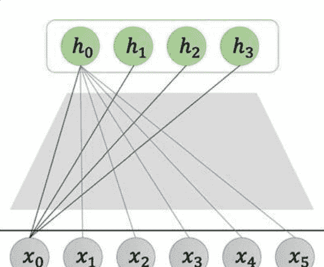

RBM的能量函数定义如下：
$$E(\mathbf{x},\mathbf{h}) = -\mathbf{h}^\top \mathbf{W} \mathbf{x} - \mathbf{c}^\top \mathbf{x} - \mathbf{b}^\top \mathbf{h}$$ (4.51)
其中，$\mathbf{W}$ 表示连接可见单元和隐藏单元的权重矩阵，$\mathbf{b}$ 是隐藏单元的偏置，$\mathbf{c}$ 是每个 $x_i$ 的概率偏置。

然后，我们从能量函数中得到概率：
$$p(\mathbf{x}, \mathbf{h}) = \frac{e^{-E(\mathbf{x},\mathbf{h})}}{Z}$$ (4.52)
此外，如果 $\mathbf{x}, \mathbf{h} \in \{0, 1\}$，我们可以进一步简化方程为：
$$p(h_i = 1|\mathbf{x}) = \sigma(b_i + \mathbf{W}_i\mathbf{x})$$
$$p(x_j = 1|\mathbf{h}) = \sigma(c_j + \mathbf{W}_j^\top \mathbf{h})$$ (4.53)
其中 $\sigma$ 是sigmoid函数。

因此，自由能公式变为：
$$F(\mathbf{x}) = -\mathbf{c}^\top \mathbf{x} - \sum_i \log(1 + e^{b_i+\mathbf{W}_i\mathbf{x}})$$ (4.54)
然后我们可以计算RBM的梯度：
$$ \frac{\partial \log p(\mathbf{x})}{\partial W_{ij}} = \mathbb{E}_{\mathbf{x}}[p(h_i|\mathbf{x})x_j] - \sigma(c_i + \mathbf{W}_i \mathbf{x}) $$
$$ \frac{\partial \log p(\mathbf{x})}{\partial b_i} = \mathbb{E}_{\mathbf{x}}[p(h_i|\mathbf{x})] - \sigma(\mathbf{W}_i \mathbf{x}) $$
$$ \frac{\partial \log p(\mathbf{x})}{\partial c_j} = \mathbb{E}_{\mathbf{x}}[p(x_j|\mathbf{h})] - x_j $$ (4.55)
一旦我们有了函数 $p(\mathbf{x})$ 的样本，我们可以使用Gibbs采样运行马尔可夫链。

### 4.6.3 深度信念网络

RBM的有效性表明这些架构可以堆叠和一起训练，以创建深度置信网络（DBN）[HOT06b]。每个子网络都是独立训练的，隐藏层作为下一个网络的可见层。这种逐层训练的概念导致了深度学习的一种最早有效的方法。深度置信网络如图4.22所示。


图4.22：三层深度置信网络的示意图。每个RBM层都是独立训练的，从最底层开始。

### 4.6.4 自编码器

自动编码器是一种无监督的深度学习方法，用于对每组数据进行降维处理。其目标是通过训练一个编码器来降低数据的维度，并通过另一个解码器来重构输入数据，从而学习到一个较低维度的表示。自动编码器是一个神经网络，其训练目标是重构输入而不是预测类别。所学习到的表示在较小的压缩向量中包含与输入相同的信息。为了最小化重构误差，自动编码器学习了对重建最重要的内容。

自动编码器分为两个组件，编码器和解码器。编码器将输入 $\mathbf{x}$ 转换为嵌入向量 $\mathbf{z}$。解码器将编码 $\mathbf{z}$ 映射回原始输入 $\mathbf{x}$。因此，对于神经网络编码器 $\mathrm{Enc}(\mathbf{x})$ 和解码器 $\mathrm{Dec}(\mathbf{z})$，通过最小化损失函数 $\mathcal{L}$（均方误差）来实现。

$$
\mathbf{z} = \mathrm{Enc}(\mathbf{x}) \\
\hat{\mathbf{x}} = \mathrm{Dec}(\mathbf{z}) \\
\mathcal{L}(\mathbf{x}, \hat{\mathbf{x}}) = \|\mathbf{x} - \hat{\mathbf{x}}\|^2.
$$ (4.56)

图4.23展示了自编码器的架构示意图。

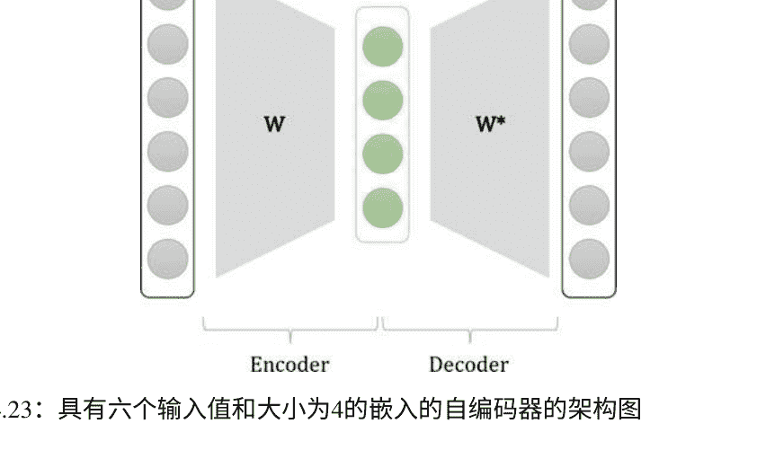

图4.23：具有六个输入值和大小为4的嵌入的自编码器的架构图

训练自编码器与其他神经网络架构非常相似，除了损失函数。以前使用softmax来预测一组类别的分布，现在我们希望产生一个与输入进行比较的实值输出。这正是我们之前使用的MSE目标函数所实现的，主要用于自编码器。

该网络的训练与算法1中定义的相同，只是偶尔会有一些差异。在自编码器中，很多时候将权重绑定在一起是有益的。编码器和解码器之间的连接是通过解码器的权重 $\mathbf{W}^* = \mathbf{W}^\top$ 来实现的。在这种情况下，权重 $\mathbf{W}$ 的梯度将是来自编码器和解码器的两个梯度之和。

一般来说，自动编码器有四种类型：
- 欠完备自动编码器（标准型）
- 稀疏自动编码器
- 去噪自动编码器
- 变分自动编码器（VAE），具体应用取决于不同的变体。

#### 4.6.4.1 欠完备自动编码器

欠完备自动编码器是最常见的类型。如图4.23所示，编码器将网络缩小以产生比输入更小的编码。
这是一种学习的降维技术。理想情况下，编码器应该学习将最重要的信息压缩到编码中，以便解码器可以重构输入。

#### 4.6.4.2 去噪自编码器

去噪自编码器接收一个带噪声的输入，并尝试解码为无噪声的输出。学习到的表示对输入中的噪声扰动不太敏感。

对于一个噪声函数$^4$ $N(\mathbf{x})$，自编码器可以描述为：
$$
\begin{aligned}
\mathbf{x}' &= N(\mathbf{x})\\
\mathbf{z} &= \text{Enc}(\mathbf{x}')\\
\hat{\mathbf{x}}' &= \text{Dec}(\mathbf{z})\\
\mathcal{L}(\mathbf{x}, \hat{\mathbf{x}}') &= \|\mathbf{x} - \hat{\mathbf{x}}'\|^2.
\end{aligned}
$$ (4.57)

#### 4.6.4.3 稀疏自编码器

稀疏自编码器依赖于激活的最小阈值来强制编码中的稀疏性，而不是依赖于编码器的瓶颈。在这种情况下，编码器可以具有比输入更大的隐藏层，并且可以通过为神经元设置最小阈值来实现稀疏性，将低于阈值的神经元的输出置零。

训练稀疏自编码器的一种方法是在损失函数中添加一个项，如 $L_1$，以惩罚编码器中的输出激活。对于单层编码器，损失函数。

$^4$注意：噪声函数中没有学习参数。

函数可以描述为 $\mathcal{L}(\mathbf{x}, \mathbf{\hat{x}}) = ||\mathbf{x} - \mathbf{\hat{x}}||^2 + \lambda \sum_{i} |z_i|$，其中 $\lambda$设置了稀疏性的权重。

#### 4.6.4.4 变分自编码器

变分自编码器通过概率分布来描述潜在空间。到目前为止，自编码器学到的编码描述了从编码器确定的某个潜在空间中抽取的样本。与其他自编码器不同，变分自编码器将编码的每个值表示为潜在分布。这些参数通常是相对于高斯分布学习的，必须学习两个参数：均值 $\mu$和标准差 $\sigma$。解码器是在由学习的 $\mu$和 $\sigma$值参数化的随机分布中抽取的样本上进行训练的。图4.24显示了变分自编码器的示意图。

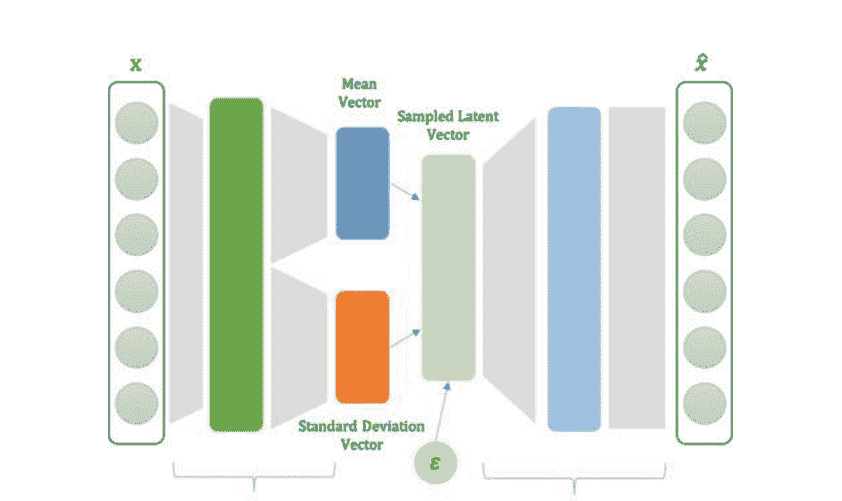

图4.24：变分自编码器学习一个均值向量，$\mu$，和一个标准差向量，$\sigma$。采样的潜变量，$\mathbf{z}$，通过 $\mathbf{z} = \mu + \sigma \odot \varepsilon$ 计算，其中 $\varepsilon$是从正态分布 $\mathcal{N}(0, 1)$中采样得到的。

当尝试通过从高斯分布中采样的随机操作进行反向传播时会出现问题。计算在正向传播路径中，并且必须计算采样的梯度以获得编码器的梯度；然而，随机操作没有一个明确定义的梯度。重参数化技巧[JGP16]提供了一种重写采样过程的方法，使得随机元素独立于学习的 $\mu$和 $\sigma$参数。潜变量 $\mathbf{z}$的采样方式从以下方式改变到重参数化方式：

$$ z = \mu + \sigma \varepsilon, \qquad (4.59) $$
其中 $\varepsilon$ 是从正态分布 $\mathcal{N}(0,1)$ 中采样得到的。 现在，尽管 $\varepsilon$ 仍然是随机的，但 $\mu$ 和 $\sigma$ 不依赖于它进行反向传播。

训练VAE需要优化损失函数中的两个组成部分。 第一个组成部分是重构误差，我们已经为普通自编码器进行了优化，第二部分是KL散度。 KL散度损失确保学习到的均值和方差参数保持接近 $\mathcal{N}(0,1)$。总体损失定义为：

$$ \mathcal{L}(x, \hat{x}) + \sum_{j} D_{KL}(q_{j}(z|x) || p(z)), \qquad (4.60) $$
其中 $D_{KL}$ 是KL散度， $p(z)$ 是先验分布，而 $q_{j}(z|x)$ 是学习到的分布。

### 4.6.5 稀疏编码

稀疏编码[Mai+10]旨在学习一组基向量来表示数据。然后可以使用这些基向量进行线性组合来表示输入 $x$。学习基向量来表示数据的技术类似于我们在第2章中探索的PCA等技术。然而，通过稀疏编码，我们学习的是一个过完备的集合，可以学习数据中的各种模式和结构。

稀疏编码本身不是一个神经网络算法，但我们可以在我们的网络中添加一个惩罚项，以强制自动编码器的稀疏性。这仅仅是在损失函数中添加了一个 $L_1$ 惩罚项，强制大部分权重为0。

### 4.6.6 生成对抗网络

生成对抗网络（GAN）[Goo+14a]是一种无监督技术，将学习过程结构化为一个零和博弈。该技术使用了两个神经网络，分别称为生成器和判别器。生成器向判别器网络提供一个生成的示例，通常是从潜在空间或分布中抽取的。判别器必须判断提供的示例是一个生成的（假的）示例还是来自数据集/分布的实际示例。

图4.25展示了GAN的示意图。

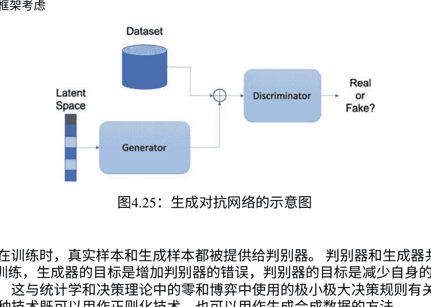

在训练时，真实样本和生成样本都被提供给判别器。判别器和生成器共同训练，生成器的目标是增加判别器的错误，判别器的目标是减少自身的错误。这与统计学和决策理论中的零和博弈中使用的极小极大决策规则有关。这种技术既可以用作正则化技术，也可以用作生成合成数据的方法。

对于生成器 G和判别器 D，目标函数如下：

$$ \min_G \max_D \mathbb{E}_{x \sim \mathbb{P}_r} [\log(D(x))] + \mathbb{E}_{\tilde{x} \sim \mathbb{P}_g} [\log(1 - D(\tilde{x}))], \quad (4.61) $$
其中 $\mathbb{P}_r$和 $\mathbb{P}_g$分别表示真实数据分布和生成数据分布，而 $\tilde{x} = G(z)$，其中 $z$是从噪声分布（如高斯分布）中抽取的。

GANs在计算机视觉中比在自然语言处理中更常见。例如，可以向图像中添加一定量的高斯噪声，同时保持图像内容的整体结构和意义。句子通常被映射到离散空间而不是连续空间，因为单词是离散的（存在或不存在），在不改变意义的情况下无法轻易应用噪声。然而，在[Gul+17]中通过使用潜在向量通过卷积神经网络生成32个one-hot字符向量，实现了一种字符级语言建模的形式。

## 4.7 框架考虑

大部分已经讨论过的架构和算法考虑已经在深度学习框架中实现，并且具有CPU和GPU支持。许多差异集中在实现语言、目标用户和抽象上。最常见的实现语言是C++，带有Python接口。目标用户可以广泛变化，随着这种变化，对抽象的决策也会有所不同。一个关键的抽象是如何组成深度网络。

早期的抽象主要关注将层作为可以链接在一起的计算块，而最近的框架则采用了计算图的方法。

### 4.7.1 层次抽象

在之前，我们简要介绍了层抽象的概念，将线性变换操作称为“线性层”。从概念上讲，我们可以将层抽象扩展到包括神经网络的所有部分，在图4.8中表示为具有一个隐藏层的三层，如图4.26所示。

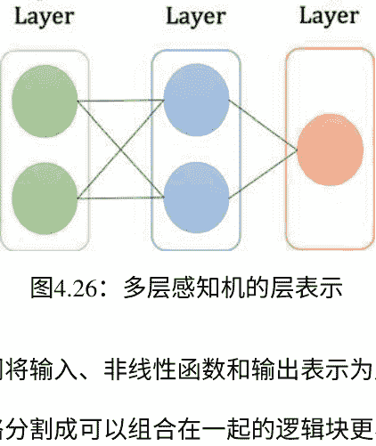

图4.26：多层感知机的层表示

请注意，尽管我们将输入、非线性函数和输出表示为层，但这仍然是一个单隐藏层网络。

这使得将神经网络分割成可以组合在一起的逻辑块更容易。早期的深度学习框架采用了这种方法来组合神经网络。通过实现最小的一组函数，即前向传播步骤和反向传播步骤，可以创建任何层。这些层通过连接形成一个神经网络。

当构建标准的神经网络时，这种抽象是有用的，具有定义行为，并且已经成为框架的常见方法。对于层之间的交互以及计算需求的保证，这是相对简单明了的。然而，当处理复杂的网络结构时，这种方法的一个缺点就是层的抽象变得困难。例如，如果我们想要在网络中实现递归连接，通常需要在一个单独的层块中实现所有的递归计算（我们将在第7章中更详细地探讨这个问题）。

### 4.7.2 计算图

许多框架已经超越了层的抽象，转向了计算图的方法。计算图的方法与编译器中的抽象符号树（AST）类似。输入和输出的依赖关系图可以用树中的符号来表示。这使得编译器可以根据图中的依赖关系生成链接库和函数的汇编指令，用于生成可执行模型。数据根据图中存在的依赖关系在AST中流动。

在深度学习中，计算图是一个有向图，它定义了计算的顺序。图的节点对应于操作或变量。特定节点的输入是计算图中存在的依赖关系。随后，反向传播过程可以通过按照操作的逆序从前向传播步骤中计算它们的顺序来确定。神经网络计算图的示例如图4.27所示。

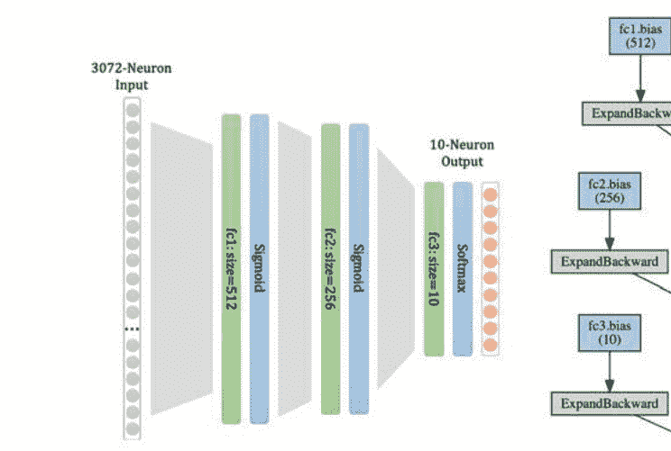

图4.27：具有相应的反向计算图的3层神经网络的示意图。请注意，某些操作仍然可以在程序中进行组合以进行优化（例如，Addmm将加法和乘法组合成单个操作）。(a)具有Sigmoid激活函数和10个类别的Softmax输出的3层神经网络的示意图。(b)从(a)中构建的计算图。

### 4.7.3 反向模式自动微分

计算图方法不仅方便处理复杂函数，而且可以扩展到在复杂神经网络中进行简单梯度近似。梯度计算在神经网络中起着核心作用。编写深度神经网络的最困难的部分之一是为特定层或操作进行梯度计算。然而，基于图的深度学习方法允许在计算图上以反向模式高效自动计算梯度。

计算图使得利用反向模式自动微分方法变得更加容易。自动微分（AD）[GW08]是一种用于数值计算函数导数的方法。AD利用计算机中所有数学计算都是作为基本数学运算序列执行的概念。AD方法利用链式法则将函数分解为函数中每个基本操作的微分。这使得导数可以自动且准确地应用（在理论导数的小精度范围内）。这种方法通常很容易实现，可以实现对复杂架构的简化实现。

反向模式自动微分算法[Spe80]是深度学习中选择自动微分的方法，因为它可以对单个标量损失进行微分。前向传播操作可以通过计算图来观察。这个图可以被细分为原始操作，在反向传播过程中，可以计算出相对于标量误差的输出梯度。

### 4.7.4 静态计算图

静态计算图是使用静态内存视图创建的图。静态结构允许在计算之前对图进行优化，从而实现并行计算和操作的最佳排序。

例如，融合某些操作可以减少内存IO所需的时间，或者在一组GPU上对计算进行高效优化，从而提高整体性能。这种前期优化成本在资源受限的嵌入式应用程序中非常有益，或者在网络架构相对固定、输入变化很小的情况下，因为它会重复执行相同的图。

静态计算图的一个缺点是一旦创建，就无法修改。任何修改都会消除应用优化策略中的潜在优势。

### 4.7.5 动态计算图

动态计算图采用了一种不同的方法，操作在运行时动态计算。这在你不知道计算内容或者希望在给定数据点上执行不同计算的情况下非常有用。一个明显的例子是基于时间序列输入的递归神经网络中的递归计算，这些输入通常具有可变长度。动态计算在自然语言处理应用中经常需要，因为句子长度不同，在语音识别中也是如此，因为音频文件的长度可变。

这些方法都有权衡，就像比较动态类型编程语言和静态类型编程语言一样。目前两个例子分别是TensorFlow [Aba+15]和PyTorch [Pas+17]。TensorFlow依赖于静态计算图，而PyTorch利用动态计算图。

## 4.8 案例研究

在本节中，我们将把本章的概念应用到常见的自由口语数字数据集(FSDD)上。FSDD是由3位发言人录制的1500个口语数字（0-9）的集合。我们通过进行数据增强来增加文件数量。我们将在下一节中讨论这个问题。

口语词汇相对较短（大多数少于1.5秒）。在原始形式下，音频是时间域中的一系列样本，但通常将其转换为使用FFT的频率域更有用。我们将每个音频文件转换为对数梅尔频谱图。

频谱图以时间为点，表示频率的特征的二维表示，其强度表示频率的强度。这些表示将在第8章中进一步讨论。图4.28显示了来自FSDD数据集的一组对数梅尔频谱图样本。

### 4.8.1 软件工具和库

在这些部分中，我们将使用PyTorch作为我们的示例代码。我们发现，用于PyTorch的代码与Python混合使用，使得更容易专注于深度学习概念，而不是与其他框架相关的语法。除了PyTorch，我们还使用librosa进行音频处理和增强。

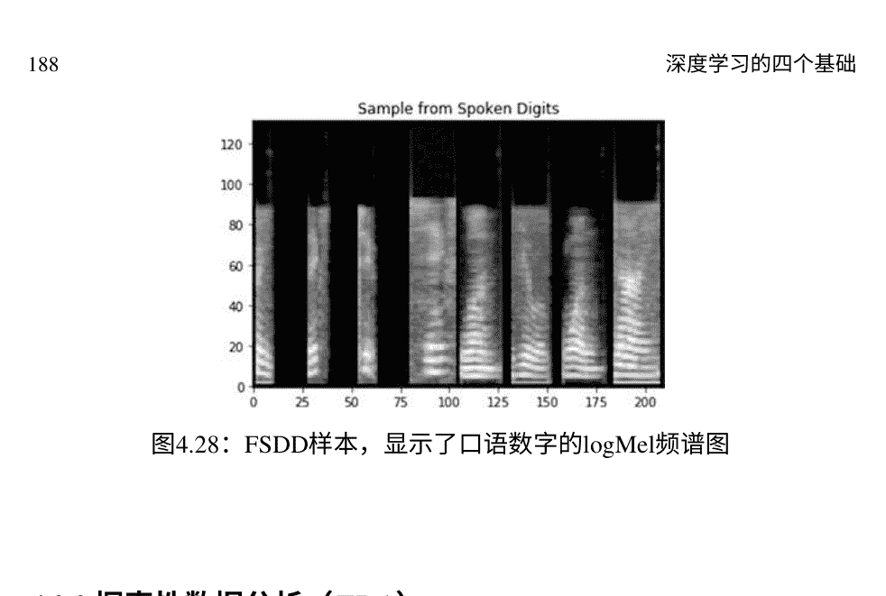

### 4.8.2 探索性数据分析（EDA）

原始的FSDD数据集包含1500个示例，没有专门的验证或测试集。考虑到深度学习，这是一个相对较小的示例数量，因此我们通过使用数据增强来扩展数据集。 我们专注于两种类型的增强：时间拉伸和音高变换。 时间拉伸可以增加或减少文件的长度，而音高变换可以将频率提高或降低。 对于时间拉伸，我们将文件速度调快或调慢25%，而对于音高变换，我们将音高上升或下降半个音阶。 每个文件都应用了这些组合，产生了13,500个示例，数据量增加了9倍。

```
1 样本，采样率 = librosa.加载(filepath)
2 for ts in [0.75,1,1.25]:
3     for ps in [-1,0,+1]:
4         样本新 = librosa.effects.时间拉伸(样本, 速率=ts)
5         y_new = librosa.effects.音高转换(样本新, 采样率, 音高步长=ps)
```

到目前为止，所描述的神经网络只能接受固定长度的输入。 语音的时间性质使得这一点变得困难，因为一些文件比其他文件更长。 为了缓解这个限制，我们选择将所有文件剪裁到最长1.5秒的持续时间。这样我们就可以使用固定的表示来处理所有文件。 这也有助于批处理，因为一个批次中的所有文件通常应该具有相同的长度，以提高计算效率。

在增加总数据量并限制长度之后，我们随机分成训练、验证和测试集。其中80%的数据用于训练，10%用于验证，10%用于测试。

我们使用librosa获取logMel频谱图，应用了128个mel滤波器（通常 <40仍然可以）。

```
python
1 maxLength=1.5 #最大长度为1.5秒
2 样本，采样率= librosa.加载(filepath)
3 short_samples = librosa.util.fix_length(samples, sample_rate*max_length)
4 melSpectrum = librosa.feature.melspectrogram(short_samples. astype(np.float16), sr=sample_rate, n_mels=128)
5 logMelSpectrogram = librosa.power_to_dB(melSpectrum, ref=np. max )
```

除了以原始的wav格式保存音频文件外，我们还将它们保存为numpy数组。在训练过程中，加载numpy数组速度更快，尤其是在应用任何数据增强时。输入数据将是来自频谱图的缩放像素输入。输入的维度将为 $d \times t$，其中 $d$ 是提取的梅尔特征数量，$t$ 是时间步数。在加载时，我们将对数梅尔频谱图归一化到0到1之间。将数据范围从功率分贝范围 $[-80, 0]$转换为连续的范围 $[0, 1]$可以减轻网络在训练初期学习更高权重的需求。这通常使训练更加稳定，因为它减少了内部协变量偏移的影响。

理论上，神经网络不一定需要进行缩放和归一化。通过改变与输入相关的权重和偏置，任何归一化都可以转换为相同的结果。然而，一些梯度下降方法对缩放非常敏感，标准化输入数据可以减少网络学习异常值的需求。这通常可以提高训练时间，因为它减少了对初始权重尺度的依赖。

我们希望在我们的数据中寻找的下一件事是是否存在类别或数据集的不平衡。如果存在明显的类别不平衡，那么我们希望确保我们的数据集中有代表性的样本。图4.29显示了我们数据集的分割的直方图。从直方图中，我们可以看到每个类别在我们的数据集中都有很好的代表性，并且所有类别在每个集合中的样本数量相对平衡。这通常适用于学术数据集，但在实践中很少出现这种情况。

现在我们对我们的数据有了很好的表示，我们将展示一个使用神经网络的监督分类问题的示例，以及使用自编码器的无监督学习方法。

### 4.8.3 监督学习

监督分类器首先要求我们定义一个我们要优化的错误函数。我们在模型中使用交叉熵损失和softmax输出。在实践中，对softmax的对数进行计算可以防止当某个类别的概率变得非常低时出现下溢。

第二步是定义我们的网络架构。架构通常是通过实验获得的，考虑到计算资源和表示能力。在我们的例子中，我们最初选择了一个小型的、有2个隐藏层的网络，每个隐藏层有128个神经元，并在每个隐藏层后使用ReLU激活函数。这个网络如图4.30所示。

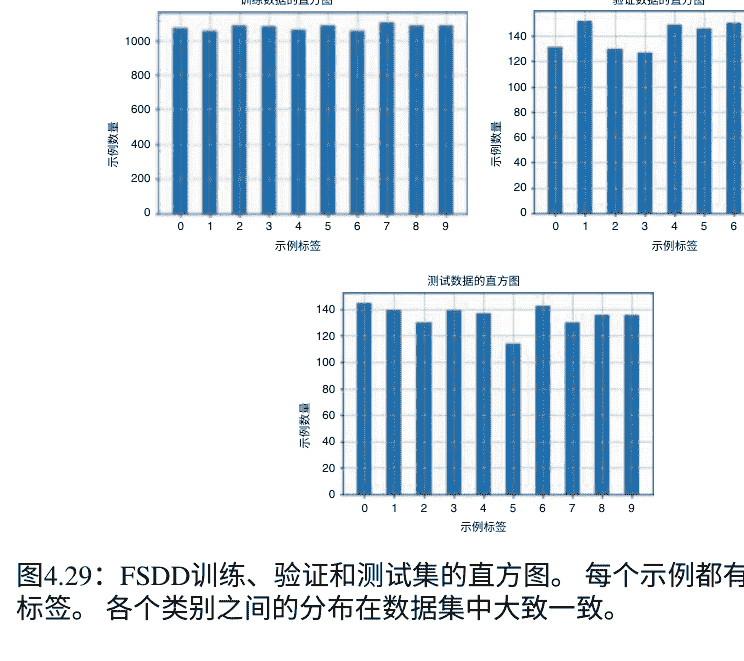

PyTorch网络定义如下：

```
import torch.nn as nn

# PyTorch网络定义
class Model(nn.Module):
    def __init__(self):
        super(Model, self).__init__()
        self.fc1 = nn.Linear(3072, 128)
        self.fc2 = nn.Linear(128, 128)
        self.fc3 = nn.Linear(128, 10)

    def forward(self, x):
        x = x.view((-1, 3072)) # 将2D数据转换为1D
        h = self.fc1(x)
        h = torch.relu(h)

        h = self.fc2(h)
        h = torch.relu(h)

        h = self.fc3(h)
        输出 = torch.logsoftmax(h, dim=1)
        返回输出
```

在网络定义中，我们只需要实例化学习的层，然后前向函数定义了将要执行的计算顺序。

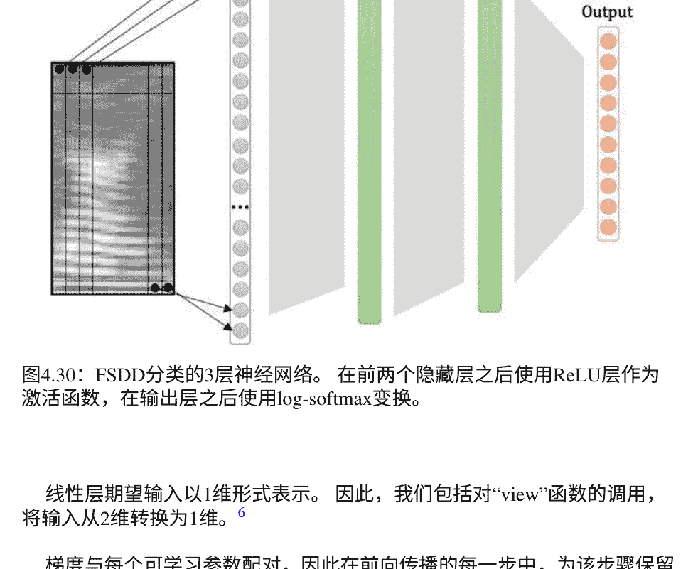

图4.30：FSDD分类的3层神经网络。在前两个隐藏层之后使用ReLU层作为激活函数，在输出层之后使用log-softmax变换。

线性层期望输入以1维形式表示。因此，我们包括对“view”函数的调用，将输入从2维转换为1维。[6] 梯度与每个可学习参数配对，因此在前向传播的每一步中，为该步骤保留了梯度的内存。通过我们的网络传递数据后，我们将得到一个大小为 $[n, 1, 1, 10]$ 的输出张量。然后，我们可以使用交叉熵作为误差度量来计算损失。该函数接受两个相同大小的张量，并计算标量损失。损失上的反向函数然后使用反向传播按相反顺序计算导致损失的所有参数的梯度。一旦完成了反向传播，我们就会为我们的优化器调用一步，该步骤沿着梯度的方向前进（相对于我们的学习率和其他超参数）。我们将这个过程重复执行整个数据集，进行 $e$ 个时期。训练函数的Python代码如下所示。

```
python
import torch.optim as optim
使用CUDA = torch.cuda.可用() #在GPU上运行可用
```

[6] 注意，PyTorch仍然可以以小批量模式进行训练。视图函数将输入张量转换为维度 $[n, 1, 1, 3072]$，其中 $n$ 是小批量大小。

```python
# 在PyTorch中进行神经网络训练
model = Model()
model.train()
if use_cuda:
    model.cuda()
optimizer = optim.Adam(model.parameters(), lr=0.01)
epoch = 40
for epoch in range(epochs):
    for data, target in train_loader:
        # 获取样本
        if use_cuda:
            data, target = data.cuda(), target.cuda()

        # 清除梯度
        optimizer.zero_grad()

        # 前向传播
        pred = model(data)

        # 误差计算
        loss = torch.cross_entropy(pred, target)

        # 反向传播
        loss.backward()

        # 参数更新
        optimizer.step()
```

这段代码片段不完整，因为在训练过程中没有包含验证评估。在附带的笔记本中给出了一个更健壮的示例。读者可以尝试不同的超参数配置来进行实验。在训练过程中，我们保存了具有最佳验证损失的模型副本。该模型用于计算测试集上的错误。训练曲线和测试集结果如图4.31所示。我们还可以修改我们的网络，包括我们之前讨论过的一些正则化技术和激活函数，如批归一化、dropout和ReLU。将这些特性纳入模型架构的修改非常简单。该模型的训练图也在图4.31中给出。

```python
# PyTorch网络定义
class Model(nn.Module):
    def __init__(self):
        super(Model, self).__init__()
        self.fc1 = nn.Linear(3072, 128)
        self.bn1 = nn.BatchNorm1d(128)

        self.fc2 = nn.Linear(128, 128)
        self.bn2 = nn.BatchNorm1d(128)

        self.fc3 = nn.Linear(128, 10)

    def forward(self, x):
        x = x.view((-1, 3072))
        h = self.fc1(x)
        h = self.bn1(h)
        h = torch.relu(h)
        h = F.dropout(h, p=0.5, training=self.training) # 在评估期间禁用
        h = self.fc2(h)
        h = self.bn2(h)
        h = torch.relu(h)
        h = F.dropout(h, p=0.2, training=self.training) # 在评估期间禁用
        h = self.fc3(h)
        output = torch.log_softmax(h, dim=1)
        return output
```

### 4.8.4 无监督学习

对于无监督的示例，我们将在FSDD数据集上训练一个简单的自编码器。这个自编码器学习输入数据的低维编码，解码器能够生成示例，我们将在本示例中使用的架构如图4.32所示。

因为这是一个无监督的任务，我们将使用均方误差（MSE）作为误差函数，将输入与解码器的输出进行比较。我们网络的输出必须与输入的大小相同，即d=3072，因此我们网络的最后一层必须确保维度与输入匹配。

网络架构非常简单，编码器和解码器各有四个线性层。PyTorch自编码器的定义如下所示。

```python
import torch.nn as nn
import torch.nn.functional as F # 用于非原位操作的函数

# PyTorch网络定义
class Autoencoder(nn.Module):
    def __init__(self):
        super(Autoencoder, self).__init__()
        self.e_fc1 = nn.Linear(3072, 512)
        self.e_fc2 = nn.Linear(512, 128)
        self.e_fc3 = nn.Linear(128, 64)
        self.e_fc4 = nn.Linear(64,64)
        self.d_fc1 = nn.Linear(64,64)
        self.d_fc2 = nn.Linear(64,128)
        self.d_fc3 = nn.Linear(128,512)
        self.d_fc4 = nn.Linear(512,3072)

    def forward(self, x):
        # 编码器
        h = F.relu(self.e_fc1(x))
        h = F.relu(self.e_fc2(h))
        h = F.relu(self.e_fc3(h))
        h = self.e_fc4(h)

        # 解码器
        h = F.relu(self.d_fc1(h))
        h = F.relu(self.d_fc2(h))
        h = F.relu(self.d_fc3(h))
        h = self.d_fc4(h)
        out = F.tanh(h)

        return out
```

图4.31：使用两种不同架构定义进行40个epoch运行的学习曲线。注意(b)相对于(a)的正则化架构的稳定性。(a)图4.30所示的2隐藏层网络进行40个epoch运行的学习曲线。在测试集上，最佳验证模型的损失为2.3050，准确率为10%，与随机猜测相同。(b)图4.30所示的2隐藏层网络进行40个epoch运行的学习曲线，其中包括批归一化和dropout。在测试集上，最佳验证模型的损失为0.0825，准确率为98%。

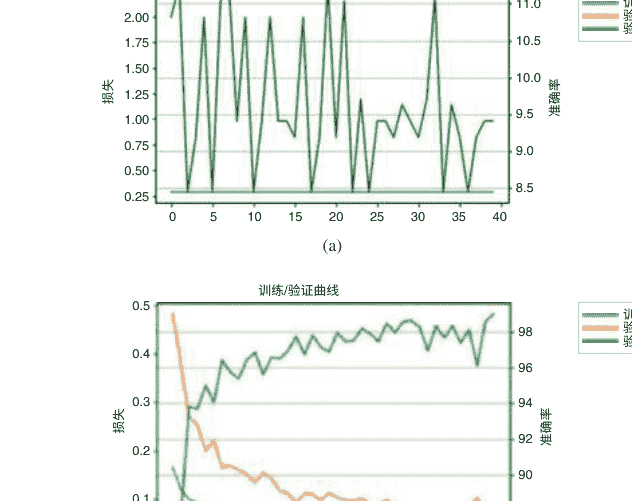

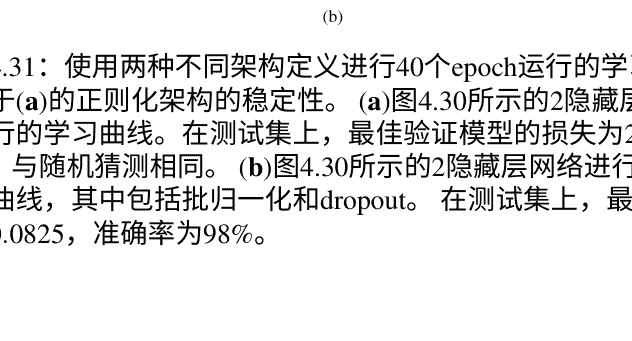

图4.32：FSDD数据集的自动编码器。注意：层大小定义了该层的输出大小。

训练算法与分类示例中介绍的算法非常相似。我们使用Adam优化器，并添加了一个权重衰减项进行正则化。此外，由于我们将使用相同大小的输入和输出，我们将在模型之外进行2D到1D的转换。算法的其余部分与之前展示的相同。训练算法如下所示。

```python
import torch.optim as optim
import torch.nn.functional as F

# 在PyTorch中进行神经网络训练
model = autoencoder()
optimizer = optim.Adam(
    model.parameters(), lr=learning_rate, weight_decay=1e-5)

for epoch in range(epochs):
    for data, _ in train_loader:
        # 获取样本
        input = data.view(-1, 3072) # 我们将格式化的输入作为目标进行重用

        # 前向传播
        output = model(input)

        # 计算误差
        loss = F.mse_loss(output, input)

        # 清除梯度
        optimizer.zero_grad()

        # 反向传播
        loss.backward()

        # 参数更新
        optimizer.step()
```

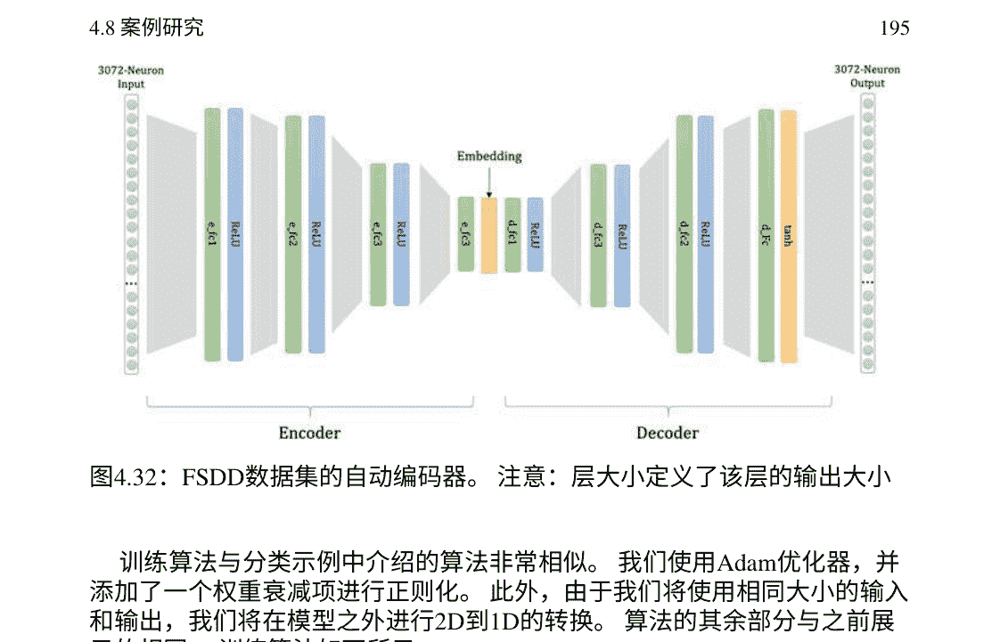

图4.33显示了输入示例解码输出的样本。

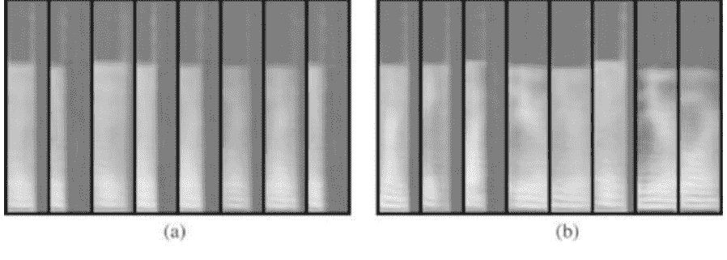

图4.33：训练数据上经过n个epoch后的自编码器输出。请注意，频谱图中的水平线开始以不同的方式形成不同的输入。(a)经过1个epoch后的自编码器重构其输入。(b)经过100个epoch后的自编码器重构其输入。

当我们检查重建的输入时，我们注意到它们似乎比图4.28中显示的示例要不那么清晰。这主要是由于均方误差损失函数。因为它计算的是平方误差，所以它倾向于将所有值拉向平均值，优先考虑输入的整体而不是特定区域。

### 4.8.5 使用无监督特征进行分类

RBM在训练过程中学习无监督特征。一旦学习了这些无监督特征，我们可以使用这些特征创建一个低维度的标记数据集，用于监督分类器。在我们的例子中，我们训练一个RBM，然后将学到的特征作为逻辑回归分类器的输入。

我们可以使用以下代码定义一个RBM:

```python
class RBM(nn.Module):
    def __init__(self, n_vis=3072, n_hid=128, k=5):
        super(RBM, self).__init__()
        self.W = nn.Parameter(torch.randn(n_hid, n_vis)*1e-2)
        self.v_bias = nn.Parameter(torch.zeros(n_vis))
        self.h_bias = nn.Parameter(torch.zeros(n_hid))
        self.k = k

    def sample_from_p(self, p):
        return F.relu(torch.sign(p) - Variable(torch.rand(p.size())))

    def v_to_h(self, v):
        p_h = F.sigmoid(F.linear(v, self.W, self.h_bias))
        sample_h = self.sample_from_p(p_h)
        return p_h, sample_h

    def h_to_v(self, h):
        p_v = F.sigmoid(F.linear(h, self.W.t(), self.v_bias))
        sample_v = self.sample_from_p(p_v)
        return p_v, sample_v

    def forward(self, v):
        pre_h1, h1 = self.v_to_h(v)

        h_ = h1
        for _ in range(self.k):
            pre_v_, v_ = self.h_to_v(h_)
            pre_h_, h_ = self.v_to_h(v_)

        return v, v_

    def free_energy(self, v):
        vbias_term = v.mv(self.v_bias)
        wx_b = F.linear(v, self.W, self.h_bias)
        hidden_term = wx_b.exp().add(1).log().sum(1)
        return (- hidden_term - vbias_term).mean()
```

我们使用Adam算法训练模型。以下是执行此操作的示例代码：

```python
rbm = RBM(n_vis=3072, n_hid=128, k=1)
train_op = optim.Adam(rbm.parameters(), 0.01)
for epoch in range(epochs):
    loss = []
    for _, (data, target) in enumerate(trainloader):
        data = Variable(data.view(-1, 3072))
        sample_data = data.bernoulli()
        v, v1 = rbm(sample_data)
        loss = rbm.free_energy(v) - rbm.free_energy(v1)
        loss.append(loss.data[0])
        train_op.zero_grad()
        loss.backward()
        train_op.step()
```

在训练完我们的RBM特征之后，我们可以创建一个逻辑回归分类器，根据我们学到的无监督特征对示例进行分类。

```python
from sklearn.linear_model import LogisticRegression
clf = LogisticRegression()
clf.fit(train_features, train_labels)
predictions = clf.predict(test_features)
```

该分类器在数据集上达到了71.04%的准确率，使用了来自RBM的128维特征。图4.34显示了该分类器的混淆矩阵。

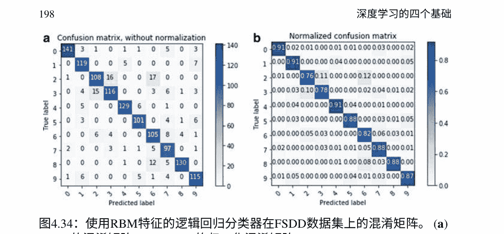

### **4.8.6 结果**

综合前几节的结论，我们在表4.1中比较了分类方法。

### **4.8.7 读者和从业者的练习**

读者和从业者可以尝试一些其他有趣的问题，包括：

表4.1：FSDD测试集上的端到端语音识别性能。高亮结果表示最佳性能。

| 方法 | 准确率 |
| :--- | :--- |
| 2层MLP | 10.38 |
| 2层MLP（带正则化） | 98.44 |
| RBM + 逻辑回归 | 71.04 |

- 1. 使用学习率[0.001,0.1,1.0,10]训练FSDD分类器的效果如何？切换优化方法会有什么影响？
- 2. FSDD自编码器使用学习率0.1的结果是什么？
- 3. 如果我们想要学习一组稀疏特征而不是手写数字的低维编码，架构会如何改变？
- 4. 批量大小对学习过程有什么影响？它会影响学习速率吗？
- 5. 为了使系统更加稳健，可以应用哪些附加的音频数据增强方法？
- 6. 使用训练好的自编码器的编码作为特征来训练一个分类器。准确率与监督模型相比如何？
- 7. 将自编码器改为变分自编码器。它会提高生成输出的可见质量吗？改变解码器的输入以了解已学习到的特征。
- 8. 扩展RBM以创建用于分类FSDD数据集的深度置信网络。

## 参考文献

[Aba+15] Martín Abadi 等人. *TensorFlow: Large-scale machine learning on heterogeneous systems*. 2015.

[Bis95] Christopher M Bishop. “Regularization and complexity control in feed-forward networks”. In: (1995).

[BGW18] Sebastian Bock, Josef Goppold, and Martin Weiß. “An improvement of the convergence proof for the ADAM-optimizer”. In: *arXiv preprint arXiv:1804.10587* (2018).

[Cho+15a] Anna Choromanska 等人. “The loss surfaces of multilayer networks”. In: *AISTATS*. 2015, pp. 192–204.

[Cyb89b] George Cybenko. “Approximation by superpositions of a sigmoidal function”. In: *Mathematics of control, signals and systems* 2.4 (1989), pp. 303–314.

[Den+09b] Jia Deng 等人. “Imagenet: A large-scale hierarchical image database”. In: *Computer Vision and Pattern Recognition, 2009. CVPR 2009. IEEE Conference on*. IEEE. 2009, pp. 248–255.

[DHS11] John Duchi, Elad Hazan, and Yoram Singer. “Adaptive subgradient methods for online learning and stochastic optimization”. In: *Journal of Machine Learning Research* 12.Jul (2011), pp. 2121–2159.

[GBC16a] Ian Goodfellow, Yoshua Bengio, and Aaron Courville. *Deep Learning*. MIT Press, 2016.

[GBC16b] Ian Goodfellow, Yoshua Bengio, and Aaron Courville. “Deep learning (Adaptive computation and machine learning)”. In: *Adaptive computation and machine learning* (2016), p. 800.

[Goo+14a] Ian Goodfellow 等人. “Generative adversarial nets”. In: *Advances in neural information processing systems*. 2014, pp. 2672–2680.

[GSS14] Ian J Goodfellow, Jonathon Shlens, and Christian Szegedy. “Explaining and harnessing adversarial examples”. In: *arXiv preprint arXiv:1412.6572* (2014).

[GW08] Andreas Griewank and Andrea Walther. *Evaluating derivatives: principles and techniques of algorithmic differentiation*. SIAM, 2008.

[Gul+17] Ishaan Gulrajani 等人. “Improved training of wasserstein gans”. In: *Advances in Neural Information Processing Systems*. 2017, pp. 5767–5777.

[HOT06b] Geoffrey E Hinton, Simon Osindero, and Yee-Whye Teh. “A fast learning algorithm for deep belief nets”. In: *Neural computation* 18.7 (2006), pp. 1527–1554.

[HS06] Geoffrey E Hinton and Ruslan R Salakhutdinov. “Reducing the dimensionality of data with neural networks”. In: *Science* 313.5786 (2006), pp. 504–507.

[HS83] Geoffrey E Hinton and Terrence J Sejnowski. “Optimal perceptual inference”. In: *Proceedings of the IEEE Conference on Computer Vision and Pattern Recognition*. Citeseer. 1983, pp. 448–453.

[HSW89] Kurt Hornik, Maxwell Stinchcombe, and Halbert White. “Multilayer feedforward networks are universal approximators”. In: *Neural networks* 2.5 (1989), pp. 359–366.

[IS15] Sergey Ioffe and Christian Szegedy. “Batch normalization: Accelerating deep network training by reducing internal covariate shift”. In: *CoRR* abs/1502.03167 (2015).

[Iva68] Aleksey Grigorievitch Ivakhnenko. “The group method of data handling – a rival of the method of stochastic approximation”. In: *Soviet automatic control* 13.3 (1968), pp. 43–55.

[JGP16] Eric Jang, Shixiang Gu, and Ben Poole. “Categorical reparameterization with gumbel-softmax”. In: *arXiv preprint arXiv:1611.01144* (2016).

[Jou+16b] Armand Joulin 等人. “Fasttext.zip: Compressing text classification models”. In: *arXiv preprint arXiv:1612.03651* (2016).

[KB14] Diederik Kingma and Jimmy Ba. “Adam: A method for stochastic optimization”. In: *arXiv preprint arXiv:1412.6980* (2014).

[KSH12c] Alex Krizhevsky, Ilya Sutskever, and Geoffrey E Hinton. “Imagenet classification with deep convolutional neural networks”. In: *Advances in neural information processing systems*. 2012, pp. 1097–1105.

[LeC+06] Yann LeCun 等人. “A tutorial on energy-based learning”. In: *Predicting structured data* 1.0 (2006).

[Mai+10] Julien Mairal 等人. “Online learning for matrix factorization and sparse coding”. In: *Journal of Machine Learning Research* 11.Jan (2010), pp. 19–60.

[MB05] Frederic Morin and Yoshua Bengio. “Hierarchical probabilistic neural network language model.” In: *Aistats*. Vol. 5. Citeseer. 2005, pp. 246–252.

[MK87] Katta G Murty and Santosh N Kabadi. “Some NP-complete problems in quadratic and nonlinear programming”. In: *Mathematical programming* 39.2 (1987), pp. 117–129.

[Pas+17] Adam Paszke 等人. “Automatic differentiation in PyTorch”. In: (2017).
```[PSM14] Jeffrey Pennington, Richard Socher和Christopher Manning. “Glove: 用于词表示的全局向量”. 在：2014年经验方法在自然语言处理中的会议论文集 (EMNLP). 2014年，第1532-1543页。

[RKK18] Sashank J Reddi, Satyen Kale和Sanjiv Kumar. “关于Adam及其收敛性的研究”. 在：(2018年)。

[Rud17a] Sebastian Ruder. “深度神经网络中多任务学习的概述”. 在：CoRR abs/1706.05098 (2017年)。

[SLA12] Jasper Snoek, Hugo Larochelle和Ryan P Adams. “机器学习算法的实用贝叶斯优化”. 在：神经信息处理系统的进展。2012年，第2951-2959页。

[Spe80] Bert Speelpenning. 编译由算法给出的函数的快速偏导数。Tech. rep. 伊利诺伊大学，厄巴纳（美国）。计算机科学系，1980年。

[Sri+14] Nitish Srivastava等. “Dropout: 防止神经网络过拟合的一种简单方法.” 在：机器学习研究杂志15.1 (2014年)，第1929-1958页。

[TH12] Tijmen Tieleman和Geoffrey Hinton. “Lecture 6.5-rmsprop: 将梯度除以其最近幅度的运行平均值”. 在：COURSERA: 神经网络的机器学习4.2 (2012年)，第26-31页。

[Zei12] Matthew D. Zeiler. “ADADELTA: 自适应学习率方法”. In: CoRR abs/1212.5701 (2012).

[Zha+16] Chiyuan Zhang et al. “理解深度学习需要重新思考泛化”. In: CoRR abs/1611.03530 (2016).

# 第5章 分布式表示

## 5.1 引言

在本章中，我们介绍了词嵌入的概念，它是深度学习方法中文本的核心表示。我们从分布假设开始，解释了如何利用它来形成语义表示。我们讨论了常见的分布语义模型，包括word2vec和GloVe及其变体。我们解决了嵌入模型的缺点，并将其扩展到文档和概念表示。最后，我们讨论了自然语言处理任务的几个应用，并提供了一个以语言建模为重点的案例研究。

## 5.2 分布式语义学

分布语义学是自然语言处理的一个子领域，其基本假设是词的含义来源于其使用方式。分布假设认为在相似的上下文中使用的词具有相似的含义。也就是说，如果两个词经常与相同的词一起出现，那么它们在语义上是相似的。更广泛的概念是统计语义假设，它认为含义可以从词的统计使用模式中得出。分布语义学是许多最近的计算语言学进展的基础。

### 5.2.1 向量空间模型

向量空间模型(VSMs)将文档集合表示为超空间中的点，或者等价地表示为向量空间中的向量(图5.1)。它们基于在超空间中，点的接近程度是文档语义相似性的度量标准。换句话说，具有相似向量表示的文档意味着它们在语义上是相似的。向量空间模型在信息检索应用中得到了广泛应用，其中通过返回一组按距离排序的附近文档来实现搜索查询。我们已经在第3章中以词袋-词频或TFIDF示例的形式看到了向量空间模型。

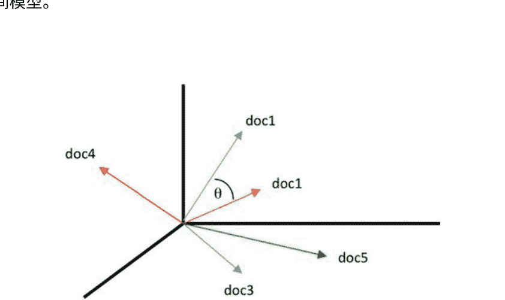

图5.1：文档的向量空间模型表示

#### 5.2.1.1 维度灾难

如果基于高维稀疏表示，向量空间模型可能会遇到一个主要缺点。这里，稀疏表示意味着向量中有许多零值的维度。这被称为维度灾难。因此，这些向量空间模型需要大量的内存资源，并且在实现和使用上计算成本高昂。例如，基于词频的向量空间模型理论上需要与整个文档语料库的词典中的单词数量一样多的维度。实际上，通常会对向量空间模型的单词数量和维度设置一个上限。不在向量空间模型中的单词被称为词汇外（OOV）。这是大多数向量空间模型存在的一个有意义的差距，它们无法为之前没有见过的新单词赋予语义含义，并且被视为词汇外。

> > 分布假设认为一个词的意义来源于它所使用的上下文，具有相似意义的词在相似的上下文中使用。

### 5.2.2 词表示

最早使用词表示的例子可以追溯到1986年。词向量明确地编码了语言的规律和模式。分布语义模型可以分为两类，基于共现的模型和预测模型。基于共现的模型必须在整个语料库上进行训练，捕捉全局的依赖关系和上下文，而预测模型则捕捉了（小）上下文窗口内的局部依赖关系。其中最著名的模型是word2vec和GloVe，它们被称为词模型，因为它们对语料库中的词依赖关系进行建模。这两种模型从大量的非结构化文本数据中学习高质量的稠密词表示。这些词向量能够编码语言的规律和语义模式，从而产生一些有趣的代数性质。

#### 5.2.2.1 共现

分布假设告诉我们，词语的共现可以揭示出它们的语义接近程度和含义。计算语言学利用这一事实，并使用语料库中两个词语共同出现的频率来识别词语之间的关系。点互信息(PMI)是一种常用的信息论度量，用于衡量两个词语之间的共现关系$w_1$和$w_2$:

$$PMI(w_1, w_2) = \log \frac{p(w_1, w_2)}{p(w_1)p(w_2)}$$ (5.1)

其中$p(w)$是词语出现的概率，而$p(w_1, w_2)$是两个词语共现的联合概率。PMI的高值表示词语的搭配和巧合（因此表示词语之间的强关联）。通常根据词频和共现在语料库中估计单个词语和联合概率。PMI是一种用于词语聚类和其他许多任务的有用度量。

#### 5.2.2.2 LSA

潜在语义分析（LSA）是一种有效利用词共现来识别文档集中的主题的技术。具体来说，LSA通过形成一个文档-词矩阵（见图5.2）来分析文档集中的词关联，其中每个单元格可以是词在文档中的出现频率或TFIDF。由于该矩阵可能非常大（与语料库词汇量一样多的行），因此会应用奇异值分解等降维技术来找到低秩近似。

这个低秩空间可以用来识别关键词和聚类文档，或用于信息检索（如第3章所讨论的）。

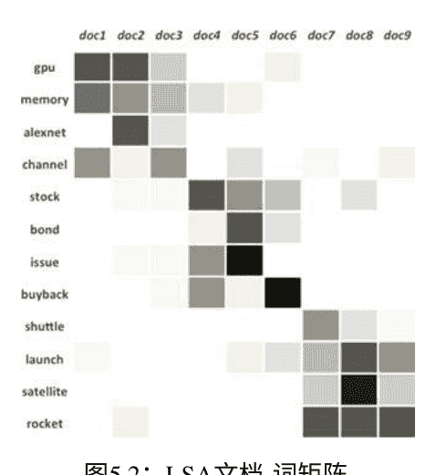

### 5.2.3 神经语言模型

回想一下，语言模型旨在学习单词序列的联合概率函数。正如上面所述，由于维度灾难，这是困难的——英语中使用的词汇量庞大，意味着我们要学习的序列数量可能是不可想象的巨大。语言模型估计下一个单词$w_t$在给定所有前面单词$w_1$到$w_{t-1}$的条件下的条件概率：

$$p(w_T) = \prod_{t=1}^{T}p(w_t | w_1, \ldots, w_{t-1}) \qquad (5.2)$$

有许多方法可以估计单词的连续表示，包括潜在语义分析（LSA）和潜在狄利克雷分配（LDA）。前者无法保持线性语言规律，而后者在处理大型数据集时需要巨大的计算开销。近年来，不同的神经网络方法已被提出来克服这些问题（图5.3），我们将在下面介绍这些方法。这些神经网络模型学习到的表示被称为神经嵌入或简称为嵌入，并在本书的其余部分中将被引用。

#### 5.2.3.1 Bengio

2003年，Bengio等人[Ben+03]提出了一种用于学习单词分布式表示的神经概率语言模型。Bengio模型提出使用多层神经网络将单词和文档表示为低维连续向量空间，而不是稀疏的高维表示。

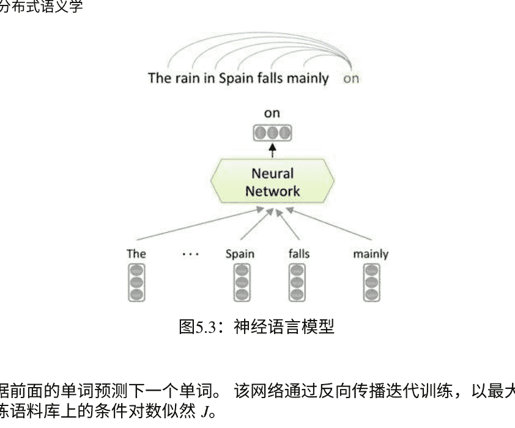

根据前面的单词预测下一个单词。该网络通过反向传播迭代训练，以最大化训练语料库上的条件对数似然J。

$$J = \frac{1}{T} \sum_{t=1}^{T} \log f(\mathbf{v}(w_t), \mathbf{v}(w_{t-1}), \ldots, \mathbf{v}(w_{t-n+1}); \theta) + R(\theta) \qquad (5.3)$$

其中 $\mathbf{v}(w_t)$ 是单词 $w_t$ 的特征向量，$f$ 是表示神经网络的映射函数，$R(\theta)$ 是应用于网络权重 $\theta$ 的正则化惩罚项。通过这样做，模型同时将每个单词与分布式单词特征向量相关联，并学习单词序列的联合概率函数，该函数以序列中单词的特征向量表示。例如，对于一个词汇量为100,000的语料库，使用独热编码的100,000维向量表示，Bengio模型可以学习一个更小的300维连续向量空间表示（图5.4）。

#### 5.2.3.2 Collobert和 Weston

2008年，Collobert和 Weston [CW08]将词向量应用于几个自然语言处理任务，并展示了词向量可以在无监督的情况下在语料库上进行训练，并用于显著提升自然语言处理任务。他们使用了一个端到端训练的多层神经网络。在这个过程中，网络中的第一层学习到了分布式的词表示，这些表示在不同任务之间共享。这个词表示层的输出被传递给下游架构，能够输出词性标签、块、命名实体、语义角色和句子的可能性。Collobert和 Weston的模型是多任务学习的一个例子，通过采用密集层表示实现。

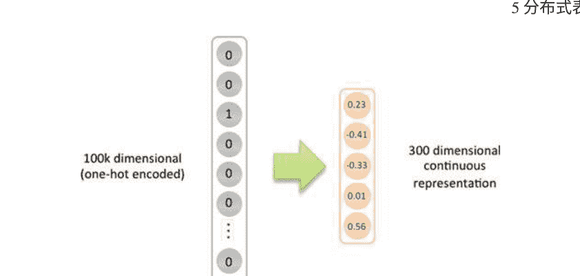

> > 神经语言模型可以通过随机梯度下降进行训练，从而避免了存储共现矩阵的大量计算和内存负担。

### 5.2.4 word2vec

2013年，Mikolov等人[Mik+13b]提出了一组神经网络架构，可以在大型数据集上计算单词的连续表示。与其他用于学习词向量的神经网络架构不同，这些架构具有高度的计算效率，能够处理甚至包含十亿个单词的词汇表，因为它们不涉及密集矩阵乘法。此外，这些模型学习到的高质量表示具有有用的翻译属性，提供了语义和句法含义。提出的架构包括连续词袋模型(CBOW)和skip-gram模型。他们将这组模型称为word2vec。他们还提出了两种训练模型的方法，一种是基于分层softmax方法，另一种是基于负采样方法。

通过word2vec模型学习到的向量的翻译属性可以提供非常有用的语言和关系相似性。特别是，Mikolov等人揭示了向量运算可以产生高质量的词语相似性和类比。他们展示了通过在余弦距离上搜索最近的向量之和，可以从king、man和woman的表示中恢复出queen的向量表示：

$$v(\text{“女王”}) \approx v(\text{“国王”}) - v(\text{“男人”}) + v(\text{“女人”})$$

向量运算可以揭示语义关系，例如：

$$v(\text{“罗马”}) \approx v(\text{“巴黎”}) - v(\text{“法国”}) + v(\text{“意大利”})$$

$$v(\text{“侄女”}) \approx v(\text{“侄子”}) - v(\text{“兄弟”}) + v(\text{“姐妹”})$$

$$v(\text{“铜”}) \approx v(\text{“锌”}) - v(\text{“锌”}) + v(\text{“铜”})$$

及句法关系，例如：

$$v(\text{“最大的”}) \approx v(\text{“最小的”}) - v(\text{“小的”}) + v(\text{“大的”})$$

$$v(\text{“思考”}) \approx v(\text{“阅读”}) - v(\text{“阅读”}) + v(\text{“思考”})$$

$$v(\text{“老鼠”}) \approx v(\text{“美元”}) - v(\text{“美元”}) + v(\text{“鼠标”})$$

在接下来的章节中，我们将介绍CBOW和skip-gram模型的直觉和训练方法。值得注意的是，人们发现CBOW模型更能捕捉句法关系，而skip-gram模型在编码单词之间的语义关系方面表现出色。

> 请注意，word2vec模型速度快，可以快速学习比以前的方法更大的语料库的向量表示。

#### 5.2.4.1 连续词袋模型

连续词袋模型基于一个投影层，该层通过训练来预测给定目标词的上下文窗口中的c个单词（图5.5）。输入层将每个上下文单词通过一个嵌入矩阵 W 映射到一个维度为 k 的稠密向量表示，并且上下文单词的结果向量在每个维度上进行平均，得到一个 k 维的单一向量。嵌入矩阵 W 对于所有上下文单词都是共享的。由于上下文单词的顺序在求和中是无关紧要的，所以该模型类似于词袋模型，只是使用了连续的表示。连续词袋模型的目标是最大化平均对数概率：

$$\frac{1}{T} \sum_{t=1}^{T} \sum_{-c<j<c, j=0} \log(p(w_t | w_{t+j})) \qquad (5.4)$$

其中 c 是目标词两侧的上下文词的数量（图5.6）。对于简单的CBOW模型，从投影层的输出中得到的平均向量表示被馈入一个softmax函数，该函数在整个语料库的词汇表上进行预测，并使用反向传播来最大化对数概率目标：

$$p(w_t | w_{t+j}) = \frac{\exp({\mathbf{v}'_{w_t}}^\top \mathbf{v}_{w_{t+j}})}{\sum_{w=1}^{V} \exp({\mathbf{v}'_w}^\top \mathbf{v}_{w_{t+j}})} \qquad (5.5)$$

其中 V 是词汇表中的单词数量。请注意，在训练之后，矩阵 W 是模型学到的词嵌入。

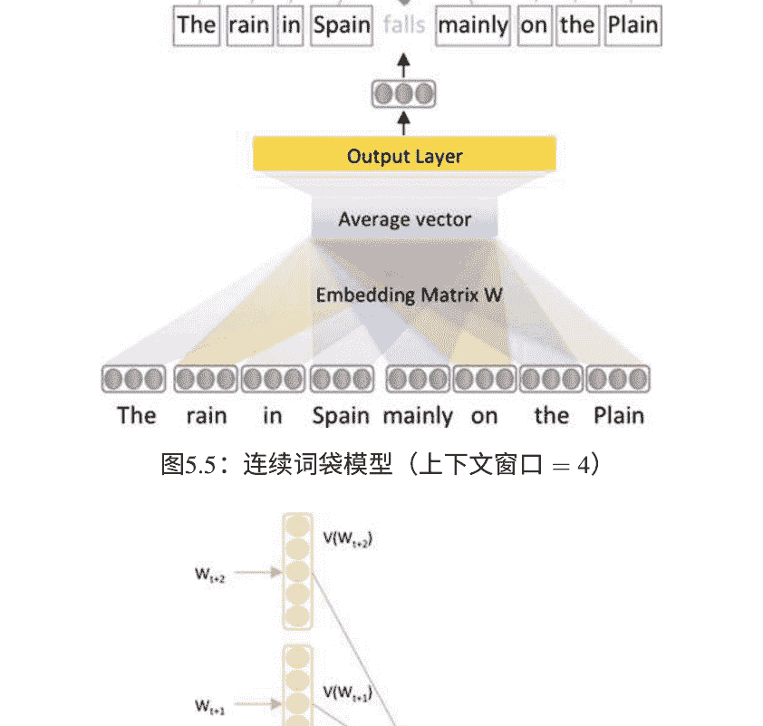

图5.5：连续词袋模型（上下文窗口 = 4）

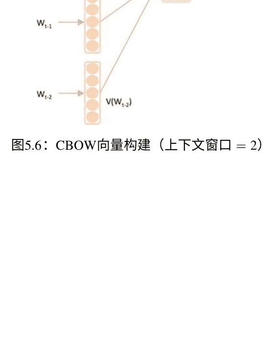

图5.6：CBOW向量构建（上下文窗口 = 2）

#### 5.2.4.2 Skip-Gram

然而，CBOW模型是根据附近的上下文单词来预测目标单词，而skip-gram模型是根据目标单词来预测附近的上下文单词（图5.7）。再次强调，不考虑单词的顺序。对于一个上下文大小为c的情况，skip-gram模型被训练来预测目标单词周围的c个单词。skip-gram模型的目标是最大化平均对数概率：

$$\frac{1}{T} \sum_{t=1}^{T} \sum_{-c<j<c, j=0} \log(p(w_{t+j}|w_t)) \quad (5.6)$$

其中c是训练上下文的大小（图5.8）。较大的c值会导致更多的训练样本，从而可能提高准确性，但训练时间会增加。最简单的skip-gram公式使用softmax函数：

$$p(w_{t+j}|w_t) = \frac{\exp({\mathbf{v}'_{w_{t+j}}}^\top \mathbf{v}_{w_t})}{\sum_{w=1}^{V} \exp({\mathbf{v}'_w}^\top \mathbf{v}_{w_t})} \quad (5.7)$$

其中V是词汇表中的单词数。

> 有趣的是，较短的训练上下文可以很好地捕捉句法关系，而较大的上下文窗口可以更好地捕捉语义关系。这背后的直觉是，句法信息通常依赖于即时上下文和词序，而语义信息可能是非局部的，需要更大的窗口大小。

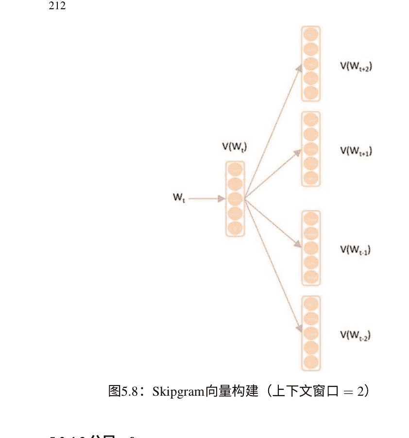

图5.8：Skipgram向量构建（上下文窗口 = 2）

#### 5.2.4.3 分层softmax

CBOW和skip-gram的简单版本使用完整的softmax输出层，当词汇量很大时，这可能会导致计算开销很大。一种更高效的逼近完整softmax的方法是使用分层softmax，它使用二叉树表示输出层。每个单词 w 可以通过从树根到适当路径到达：

$$p(w|w_t) = \prod_{j=1}^{L(w)-1} \sigma(\llbracket b(n(w, j+1) = ch(n(w, j))) \rrbracket) \cdot {v'_{n(w,j)}}^\top v_{w_t} \quad (5.8)$$

其中

$$\sigma(x) = \frac{1}{1+e^{-x}} \quad (5.9)$$

$$\sum_{w=1}^{V} p(w|w_t) = 1 \quad (5.10)$$

在实践中，常常使用二进制哈夫曼树，为频繁出现的单词分配短码，从而实现快速训练，因为它只需要计算$\log_2(V)$个单词，而不是 V个单词用于softmax。

#### 5.2.4.4 负采样

Mikolov等人[Mik+13b]提出了一种更好的基于层次softmax的替代方法，即基于噪声对比估计(NCE)。NCE的前提是，一个好的模型应该能够通过逻辑回归区分数据和噪声。负采样是NCE的简化版本，通过最大化修改后的对数概率来区分真实上下文单词和随机选择的单词：

$$ \log \left(\sigma \left(\mathbf{v}_{w_O}^{\prime \top} \mathbf{v}_{w_I}\right)\right)+\sum_{i=1}^{k} \mathbb{E}_{w_i \sim p_n(w)}\left[\log \left(\sigma \left(-\mathbf{v}_{w_i}^{\prime \top} \mathbf{v}_{w_I}\right)\right)\right] \tag{5.11}$$

> 在选择负样本数量 $k$ 时，需要注意，在大多数情况下，word2vec的性能会随着这个数量的增加而降低。在实践中，可以使用范围为5-20的 $k$ 值。

负采样和NCE之间的主要区别在于，NCE需要噪声分布的数值概率和样本，而负采样只使用样本。

$$ \sum_{t=1}^{T} \sum_{c \in C_{t}} \ell\left(s\left(w_{t}, w_{c}\right)\right)+\sum_{n \in N_{t, c}} \ell\left(-s\left(w_{t}, n\right)\right) \tag{5.12}$$

$$ s(w, c) = \sum_{g \in G_w} \mathbf{z}_g^\top \mathbf{v}_c \tag{5.13}$$

$$ s(w_t, w_c) = \mathbf{u}_{w_t}^\top \mathbf{v}_{w_c} \tag{5.14}$$

我们之前已经注意到，在使用基于计数的方法时需要去除停用词，因为这些频繁出现的词汇可能出现的频率非常高，但传达的语义信息很少。在训练词向量时，它们可能会产生类似的不成比例的影响。处理这种影响的常见方法是对频繁出现的词汇进行子采样。在训练过程中，每个词 $w_i$ 有可能以以下概率被丢弃：

$$ p(w_i) = 1 - \sqrt{\frac{t}{f(w_i)}} \tag{5.15}$$

子采样可以大大加快训练时间，同时提高对稀有单词的学习向量的准确性。

#### 5.2.4.5 短语表示

以前的单词表示受到了它们无法满足组合性的限制——也就是说，它们无法从单个单词中推断出短语的含义。许多短语的含义并不是单个单词含义的简单组合。例如，新英格兰爱国者的含义并不是每个单词含义的总和。

为了解决这个问题，一种方法是用一个单一的标记替换短语中的单词（例如，新英格兰爱国者）。这个过程可以通过一个评分机制自动化进行：

$$ \text{score}(w_i, w_j) = \log \frac{\text{count}(w_i, w_j)}{\text{count}(w_i)\text{count}(w_j)} \quad (5.16) $$

这样，当分数超过阈值时，单词会被组合和替换为一个单一的标记。这个方程是对点对点互信息的近似。

有趣的是，word2vec模型，特别是skip-gram模型，展示了向量组合性——使用简单的向量加法通常可以产生有意义的短语。将费城和鹰的向量相加可以得到与其他体育队最接近的向量。

#### 5.2.4.6 word2vec CBOW：前向和后向传播

我们将推导CBOW的前向和后向传播方程，以便读者了解训练机制和权重如何更新。假设一个单词的输入表示为一个独热向量，表示为 \( \mathbf{x} \in \mathbb{R}^V \)，其中V是词汇表，由大小为c的多个这样的词向量 \( \{\mathbf{x}_1, \mathbf{x}_2, \cdots, \mathbf{x}_C\} \) 组成上下文。让向量流入一个单一的隐藏层 \( \mathbf{h} \in \mathbb{R}^D \)，其中 D是通过训练学习到的嵌入的维度，使用恒等激活函数，并且输入值在上下文单词中进行平均。

\( \mathbf{W} \in \mathbb{R}^{V \times D} \) 是捕捉输入和隐藏层之间权重的权重矩阵。图5.9显示了不同的层和上述描述的连接。隐藏层可以表示为：

$$ \mathbf{h} = \mathbf{W}^\top \left( \frac{1}{C} \sum_{c=1}^{C} \mathbf{x}_c \right) \quad (5.17) $$

我们将表示 \( \frac{1}{C} \sum_{c=1}^{C} \mathbf{x}_c \) 为由 \( \bar{\mathbf{x}} \) 给出的平均输入向量。因此：

$$ \mathbf{h} = \mathbf{W}^\top \bar{\mathbf{x}} \quad (5.18) $$

隐藏层 h ∈ ℝᴰ 被映射到一个具有权重的单个输出层 u ∈ ℝⱽ W' ∈ ℝᴰˣⱽ。这由以下给出：

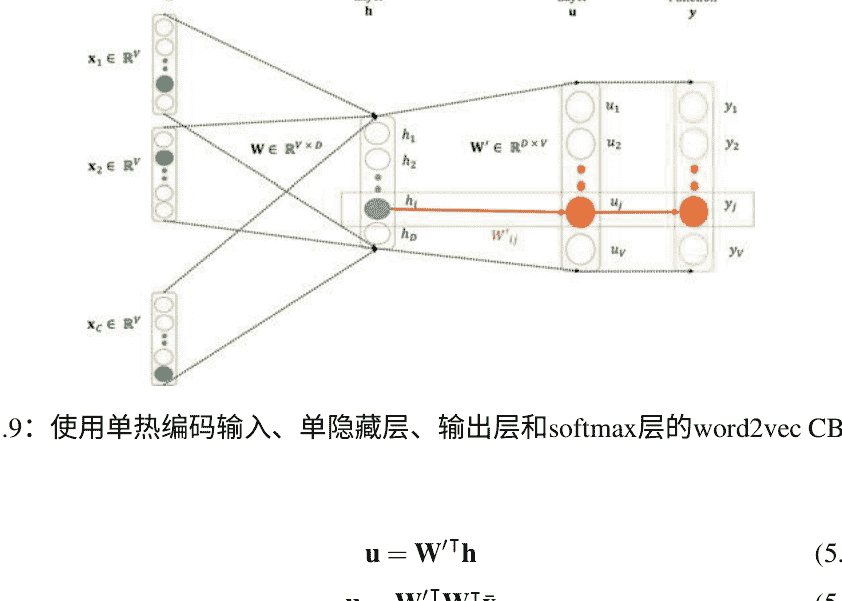

图5.9：使用单热编码输入、单隐藏层、输出层和softmax层的word2vec CBOW

然后将输出层映射到一个由softmax输出层 y ∈ ℝⱽ给出的层，其中：

$$ u = W'^\top h \quad (5.19) $$

$$ u = W'^\top W^\top \bar{\mathbf{x}} \quad (5.20) $$

然后将输出层映射到一个由softmax输出层 y ∈ ℝⱽ给出的层，其中：

$$ \mathbf{y} = \text{softmax}(\mathbf{u}) = \text{softmax}(W'^\top W^\top \bar{\mathbf{x}}) \quad (5.21) $$

当我们用目标词(w_t)上下文词(w_{c,1},w_{c,2},⋯,w_{c,C})训练模型时，输出值应与独热编码表示中的目标匹配，即在位置j*处输出值为1，其他位置为0。损失函数以给定上下文词的条件概率表示为：

$$ \mathcal{L} = -\log P(w_t|w_{c,1},w_{c,2},\cdots,w_{c,C}) = -\log(y_{j*}) = -\log(\text{softmax}(u_{j*})) \quad (5.22) $$

$$ \mathcal{L} = -\log(y_{j*}) = -\log\left( \frac{\exp(u_{j*})}{\sum_i \exp(u_i)} \right) \quad (5.23) $$

$$ \mathcal{L} = -u_{j*} + \log \sum_i \exp(u_i) \quad (5.24) $$

如第4章所讨论的，通过梯度下降进行训练的思想是找到使损失函数（由公式（5.24）给出）最小化的 W 和 W' 的值。损失函数通过输出变量 u 依赖于 W 和 W'。因此，为了找到这些值，我们对损失函数 L 分别关于 W 和 W' 进行求导。由于 L = L(u(W,W'))，这两个导数可以写成：

$$ \frac{\partial \mathcal{L}}{\partial W'_{ij}} = \sum_{k=1}^V \frac{\partial \mathcal{L}}{\partial u_k} \frac{\partial u_k}{\partial W'_{ij}} \quad (5.25) $$

$$\frac{\partial \mathcal{L}}{\partial W_{ij}} = \sum_{k=1}^V \frac{\partial \mathcal{L}}{\partial u_k} \frac{\partial u_k}{\partial W_{ij}} \quad (5.26)$$

让我们考虑公式（5.25），其中 $W'_{ij}$ 是隐藏层 $i$ 和输出层 $j$ 之间的连接，由于输出是one-hot编码，只对值 $k=j$ 产生影响，在其他位置上为0。因此，方程简化为：

$$ \frac{\partial \mathcal{L}}{\partial W'_{ij}} = \frac{\partial \mathcal{L}}{\partial u_j} \frac{\partial u_j}{\partial W'_{ij}} $$

现在 $\frac{\partial \mathcal{L}}{\partial u_j}$ 可以写成：

$$ \frac{\partial \mathcal{L}}{\partial u_j} = -\delta_{jj*} + y_j = e_j $$

其中 $-\delta_{jj*}$ 是 Kronecker delta，如果 $j = j*$ 则值为1，否则为0。这可以用向量形式表示为 $\mathbf{e} \in \mathbb{R}^V$。

另一个项 $\frac{\partial u_j}{\partial W'_{ij}}$ 可以用 $W_{i j}$ 和平均输入向量 $\bar{x}_k$ 来表示：

$$ \frac{\partial u_j}{\partial W'_{ij}} = \sum_{k=1}^V W_{ki} \bar{x}_k $$

因此结合起来：

$$ \frac{\partial \mathcal{L}}{\partial W'_{ij}} = (-\delta_{jj*} + y_j)\left(\sum_{k=1}^V W_{ki} \bar{x}_k\right) $$

这可以写成：

$$ \frac{\partial \mathcal{L}}{\partial \mathbf{W}'} = (\mathbf{W}^T \bar{\mathbf{x}}) \otimes \mathbf{e} $$

接下来，$\mathbf{u}$ 写成展开形式为：

$$ u_k = \sum_{d=1}^D \sum_{l=1}^V W'_{mk} \left(\frac{1}{C} \sum_{c=1}^C W_{lm} x_l^c\right) $$

对于方程（5.26），在固定输入后，节点 $j$ 的输出 $y_j$ 取决于所有从该输入到该节点的连接

$$ \frac{\partial \mathcal{L}}{\partial W_{ij}} = \sum_{k=1}^V \frac{\partial \mathcal{L}}{\partial u_k} \frac{\partial}{\partial W_{ij}} \left(\frac{1}{C} \sum_{d=1}^D \sum_{l=1}^V W'_{mk} \sum_{c=1}^C W_{lm} x_l^c\right) \quad (5.27) $$

$$ \frac{\partial \mathcal{L}}{\partial W_{ij}} = \frac{1}{C} \sum_{k=1}^{V} \sum_{c=1}^{C} (-\delta_{kk*} + y_k) W'_{jk} x_{i}^{c} \quad (5.34) $$

这可以写成：

$$ \frac{\partial \mathcal{L}}{\partial \mathbf{W}} = \bar{\mathbf{x}} \otimes (\mathbf{W}'\mathbf{e}) \quad (5.35) $$

因此，使用学习率 $\eta$ 计算新的 $W_{new}$ 和 $\mathbf{W}'_{new}$ 的公式如下：

$$ \mathbf{W}_{new} = \mathbf{W}_{old} - \eta \frac{\partial \mathcal{L}}{\partial \mathbf{W}} \quad (5.36) $$

$$ \mathbf{W}'_{new} = \mathbf{W}'_{old} - \eta \frac{\partial \mathcal{L}}{\partial \mathbf{W}'} \quad (5.37) $$

#### 5.2.4.7 word2vec Skip-gram: 前向和后向传播

正如我们所定义的，skip-gram模型是CBOW模型的逆过程，即输入中给出中心词，输出中预测上下文词，如图5.10所示。我们将使用与上述CBOW类似的简单网络推导出skip-gram方程。

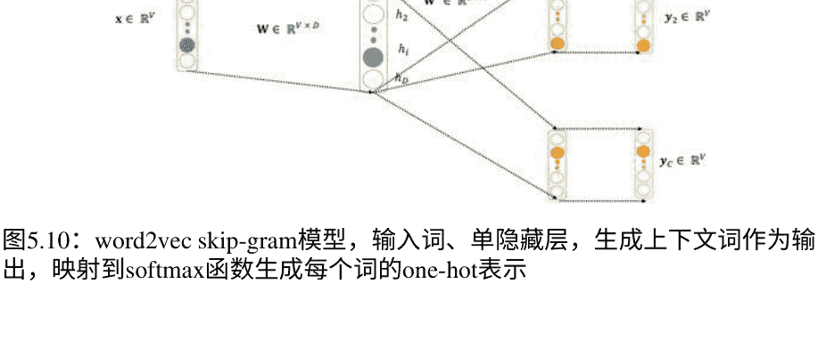

图5.10：word2vec skip-gram模型，输入词、单隐藏层，生成上下文词作为输出，映射到softmax函数生成每个词的one-hot表示

输入 $\mathbf{x} \in \mathbb{R}^V$ 通过权重 $\mathbf{W} \in \mathbb{R}^{V \times D}$ 和单元激活函数进入隐藏层 $\mathbf{h} \in \mathbb{R}^D$。隐藏层然后生成上下文词向量 $\mathbf{u}_c \in \mathbb{R}^{D \times V}$ 作为输出，并且可以映射到一个 softmax 函数以生成一个独热表示 $\mathbf{y} \in \mathbb{R}^V$，该表示将词汇表中的一个词映射到每个嵌入输出。

$$ \mathbf{h} = \mathbf{W}^T \mathbf{x} \quad (5.38) $$
$$ \mathbf{u}_c = \mathbf{W'}^T \mathbf{h} \quad (5.39) $$
$$ \mathbf{u}_c = \mathbf{W'}^T \mathbf{W}^T \mathbf{x} \quad c=1,\cdots,C \quad (5.40) $$
$$ \mathbf{y}_c = \text{softmax}(\mathbf{u}_c) = \text{softmax}(\mathbf{W'}^T \mathbf{W}^T \mathbf{x}) \quad c=1,\cdots,C \quad (5.41) $$

Skip-gram的损失函数可以写成：

$$ \mathcal{L} = -\log P(w_{c,1}, w_{c,2}, \cdots, w_{c,C} | w_i) \quad (5.42) $$

其中，单词 $w_i$ 是输入单词，$w_{c,1}, w_{c,2}, \cdots, w_{c,C}$ 是输出上下文单词。

$$ \mathcal{L} = -\log \prod_{c=1}^{C} P(w_{c,i} | w_i) \quad (5.43) $$

与CBOW类似，这可以进一步写成：

$$ \mathcal{L} = -\log \prod_{c=1}^{C} \left( \frac{\exp(u_{c,j*})}{\sum_{j=1}^{V} \exp(u_{c,j})} \right) \quad (5.44) $$

$$ \mathcal{L} = \sum_{c=1}^{C} \exp(u_{c,j*}) + \sum_{c=1}^{C} \log \sum_{j=1}^{V} \exp(u_{c,j}) \quad (5.45) $$

损失函数依赖于 $\mathbf{u}_c$，每个 $\mathbf{u}$ 都依赖于 $(\mathbf{W}, \mathbf{W'})$。这可以表示为：

$$ \mathcal{L} = \mathcal{L}(\mathbf{u}_1(\mathbf{W}, \mathbf{W'}) \cdots \mathbf{u}_C(\mathbf{W}, \mathbf{W'})) \quad (5.46) $$

$$ \mathcal{L} = \mathcal{L}(u_{1,1}(\mathbf{W}, \mathbf{W'}) \cdots u_{C,V}(\mathbf{W}, \mathbf{W'})) \quad (5.47) $$

对skip-gram模型应用链式法则得到：

$$ \frac{\partial \mathcal{L}}{\partial W'_{ij}} = \sum_{k=1}^{V} \sum_{c=1}^{C} \frac{\partial \mathcal{L}}{\partial u_{c,k}} \frac{\partial u_{c,k}}{\partial W'_{ij}} \quad (5.48) $$

$$ \frac{\partial \mathcal{L}}{\partial W_{ij}} = \sum_{k=1}^{V} \sum_{c=1}^{C} \frac{\partial \mathcal{L}}{\partial u_{c,k}} \frac{\partial u_{c,k}}{\partial W_{ij}} \quad (5.49) $$

与CBOW类似，我们可以写成：

$$ \frac{\partial \mathcal{L}}{\partial W'_{ij}} = \sum_{k=1}^{V} \sum_{c=1}^{C} \frac{\partial \mathcal{L}}{\partial u_{c,k}} \frac{\partial u_{c,k}}{\partial W'_{ij}} = \sum_{c=1}^{C} \frac{\partial \mathcal{L}}{\partial u_{c,j}} \frac{\partial u_{c,j}}{\partial W'_{ij}} \quad (5.50) $$

$$ \frac{\partial \mathcal{L}}{\partial W'_{ij}} = \sum_{c=1}^{C} (-\delta_{jjc*} + y_{c,j}) \left( \sum_{k=1}^{V} W_{ki} x_k \right) \quad (5.51) $$

其中 \( \frac{\partial \mathcal{L}}{\partial u_{c,j}} = -\delta_{jjc*} + y_{c,j} = e_{c,j} \)

这可以简化为：

$$ \frac{\partial \mathcal{L}}{\partial \mathbf{W'}} = (\mathbf{W}^T \mathbf{x}) \otimes \sum_{c=1}^{C} \mathbf{e_c} \quad (5.52) $$

同样，我们可以将公式(5.49)写成：

$$ \frac{\partial \mathcal{L}}{\partial W_{ij}} = \sum_{k=1}^{V} \sum_{c=1}^{C} \frac{\partial \mathcal{L}}{\partial u_{c,k}} \frac{\partial}{\partial W_{ij}} \left( \sum_{m=1}^{D} \sum_{l=1}^{V} W'_{mk} W_{ld} x_l \right) \quad (5.53) $$

$$ \frac{\partial \mathcal{L}}{\partial W_{ij}} = \sum_{k=1}^{V} \sum_{c=1}^{C} (-\delta_{kk*c} + y_{c,k}) W'_{jk} x_i \quad (5.54) $$

现在，表示 \( -\delta_{kk*c} + y_{c,k} = e_{ck} \) 我们可以简化为

$$ \frac{\partial \mathcal{L}}{\partial \mathbf{W}} = \mathbf{x} \otimes \left( \mathbf{W'} \sum_{c=1}^{C} \mathbf{e_c} \right) \quad (5.55) $$

### 5.2.5 GloVe

基于全局共现的模型可以作为预测性的替代，类似于word2vec的局部上下文窗口方法。共现方法通常具有很高的维度，并且需要大量的存储空间。当使用降维方法（如LSA）时，所得到的表示通常在捕捉语义词规律方面表现不佳。此外，频繁共现的术语往往占主导地位。像word2vec这样的预测性方法是基于局部上下文的，通常在捕捉语料库统计信息方面表现不佳。2014年，Pennington等人提出了一种对数双线性模型，结合了全局共现和浅窗口方法。他们将其称为 GloVe模型，这是对 Global和 Vector这两个词的玩笑。GloVe模型通过最小二乘法训练，使用的成本函数是：

$$ J = \sum_{i=1,j=1}^{V} f(X_{ij}) (\mathbf{u}_i^T \mathbf{v}_j - \log(X_{ij}))^2 \quad (5.56) $$

其中 V是词汇表的大小，$X_{ij}$是词 $i$和 $j$在语料库中共现的次数（图5.11），$f$ 是一个权重函数，用于减少频繁计数的影响。

图5.11：GloVe共现矩阵（上下文窗口 = 3）

|       | where | in | the | sacred | river | ran | man | to | sunlit | sea |
|-------|-------|----|-----|--------|-------|-----|-----|----|--------|-----|
| where | 0     | 2  | 1   | 0      | 0     | 0   | 1   | 2  | 0      | 0   |
| in    | 2     | 0  | 0   | 1      | 0     | 0   | 1   | 0  | 1      | 0   |
| the   | 1     | 0  | 0   | 4      | 3     | 1   | 5   | 0  | 2      | 1   |
| sacred| 0     | 1  | 4   | 0      | 2     | 0   | 1   | 0  | 0      | 1   |
| river | 0     | 0  | 3   | 2      | 0     | 3   | 0   | 1  | 0      | 0   |
| ran   | 0     | 0  | 1   | 0      | 3     | 0   | 3   | 3  | 0      | 0   |
| man   | 1     | 1  | 5   | 1      | 0     | 3   | 0   | 1  | 0      | 2   |
| to    | 2     | 0  | 0   | 0      | 1     | 3   | 1   | 0  | 1      | 0   |
| sunlit| 0     | 1  | 2   | 0      | 0     | 0   | 0   | 1  | 0      | 2   |
| sea   | 0     | 0  | 1   | 1      | 0     | 0   | 2   | 0  | 2      | 0   |

而 $\mathbf{u}_i$和 $\mathbf{v}_j$是词向量。通常，权重函数 $f$假设为截断的幂律形式：

$$ f(X_{ij}) = \begin{cases} \left( \frac{X_{ij}}{X_{\max}} \right)^a & \text{如果 } X_{ij} < X_{\max} \\ 1 & \text{否则} \end{cases} \quad (5.57) $$

其中 $X_{\max}$在训练时根据语料库设置。请注意，该模型分别训练上下文向量 $U$ 和词向量 $V$，并且GloVe嵌入是这两个向量表示的和 $\mathbf{U} + \mathbf{V}$。与word2vec类似，GloVe嵌入可以通过向量加法和减法表达语义和句法关系[SL14]。此外，由GloVe生成的词嵌入在许多自然语言处理任务中表现优异，特别是在全局上下文重要的情况下，如命名实体识别。

> 当语料库较小或数据不足以捕捉局部上下文依赖性时，GloVe优于word2vec。

### 5.2.6 光谱词嵌入

基于特征值分解的谱方法是另一类生成密集词嵌入的方法。其中一种方法是典型相关分析，它显示出显著的潜力。该方法克服了以前方法的许多缺点，包括尺度不变性和更好的稀有词样本复杂性处理。

典型相关分析 (CCA) 类似于对矩阵对进行主成分分析 (PCA)。与PCA计算单个矩阵内最大协方差的方向不同，CCA计算两个矩阵之间最大相关性的方向。CCA在学习词嵌入中具有理想的特性，它对线性变换具有尺度不变性，并提供更好的样本复杂性处理。

CCA模型通过首先计算目标词和附近的一组 c 个上下文词之间的主要典型相关性来学习嵌入。目标是找到向量 $\phi_w$ 和 $\phi_c$，使线性组合最大相关：

$$
\max_{\phi_w, \phi_c} \frac{\phi_w^T \mathbf{C}_{wc} \phi_c}{\sqrt{\phi_w^T \mathbf{C}_{ww} \phi_w} \sqrt{\phi_c^T \mathbf{C}_{cc} \phi_c}} \quad \text{(5.58)}
$$

与LSA类似，这是通过将SVD应用于带有上下文的单词计数的缩放共现矩阵来实现的。因此，优化目标可以被描述为：

$$
\max_{\mathbf{g}_{\phi_w}, \mathbf{g}_{\phi_c}} \mathbf{g}_{\phi_w}^T \mathbf{D}_{wc} \mathbf{g}_{\phi_c} \quad \text{(5.59)}
$$

其中

$$
\mathbf{g}_{\phi_w}^T \mathbf{g}_{\phi_w} = \mathbf{I} \quad \text{(5.60)}
$$

$$
\mathbf{g}_{\phi_c}^T \mathbf{g}_{\phi_c} = \mathbf{I} \quad \text{(5.61)}
$$

$$
\mathbf{D}_{wc} = \mathbf{\Lambda}_w^{-1/2} \mathbf{V}_w^T \mathbf{C}_{wc} \mathbf{V}_c \mathbf{\Lambda}_c^{-1/2} \quad \text{(5.62)}
$$

从中创建一个特征词典，然后提取词嵌入。通过使用显式的左右上下文，CCA具有“多视图”能力，可以隐含地考虑单词顺序，与word2vec或GloVe相比。这种“多视图”能力可以用来诱导上下文特定的嵌入，从而显著改善某些自然语言处理任务。如果应用了短文本和长文本的混合，这一点尤为重要，这可以捕捉到自然语言处理任务中所需的短程和长程依赖关系，如词义消歧或蕴含关系。

### 5.2.7 多语言词嵌入

众所周知，分布假设适用于大多数人类语言。这意味着我们可以在许多语言中训练词嵌入模型[Cou+16, RVS17]，而且Facebook和Google等公司已经发布了多达157种语言的预训练word2vec和GloVe向量[Gra+18]。这些嵌入模型是单语言的，它们是在单一语言上学习的。有几种语言存在多种书写形式。例如，日语有三种不同的书写系统（平假名、片假名、汉字）。单语言嵌入模型无法将一个词的含义与不同的书写形式关联起来。

术语词对齐用于描述自然语言处理过程中的词在两种书写形式之间的关联关系（翻译关系）（图5.12）[Amm+16]。嵌入模型为深度学习在词对齐任务中取得重大突破提供了途径，我们将在第6章及以后学习。

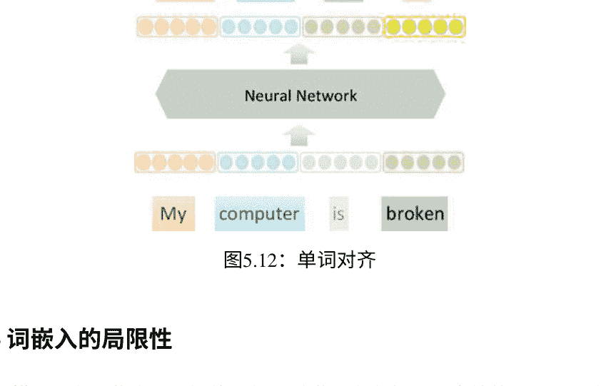

## 5.3 词嵌入的局限性

嵌入模型存在一些众所周知的限制。这些限制包括词汇表外的词汇、反义词、多义词和偏见。我们将在下一节中详细探讨这些限制。

### 5.3.1 词汇外

英语的Zipf分布性质使得存在大量的不常见词汇。为这些罕见词汇学习表示需要大量的（可能无法获得的）数据，以及可能的过多的训练时间或内存资源。由于实际考虑，一个词嵌入模型只包含英语语言中有限的一部分单词。即使是一个大词汇量，仍然会有很多超出词汇表(OOV)的单词。不幸的是，许多重要的领域特定术语往往出现得很少，这可能会导致OOV单词的数量增加。这在领域转移中尤为明显。因此，OOV单词在NLP任务的性能中起着至关重要的作用。

对于像word2vec这样的模型，常见的方法是对那些在词汇表中出现频率过低的词使用“UNK”表示。这将许多罕见的词映射到相同的向量（零向量或随机向量），认为它们的罕见意味着它们对语义意义没有显著贡献。因此，在训练过程中，OOV词提供了相同的上下文。同样，在测试时，OOV词被映射到这个表示。由于各种原因，这种假设可能会失效，因此已经提出了许多方法来解决这个问题。

理想情况下，我们希望能够预测一个与我们的训练语料库之外的词或在我们的语料库中出现过于频繁的词在语义上相似的向量表示。基于字符或子词(char-n-gram)的嵌入模型是一种组合方法，试图从单词的部分（例如词根、后缀）中推导出意义[Lin+15, LM16, Kim+16]。子词方法对于阿拉伯语或冰岛语等富有形态学的外语尤其有用[CJF16]。字节对编码是一种基于字符的自底向上方法，它迭代地组合频繁出现的字符对，并在最终的组合上学习嵌入[KB16]。还有其他利用外部知识库（例如WordNet）的方法，包括考虑词位置和对齐的复制机制，但对领域转移的适应性较差[Gu+16, BCB14]。

### 5.3.2 反义词

另一个重要的限制是分布相似性的基本原则的一个衍生物，词模型是从中得出的，即在相似的上下文中使用的词在意义上是相似的。不幸的是，两个互为反义词的词经常与相同的词上下文集合共同出现：

> 我真的很讨厌星期三的意大利面。
> 我真的很喜欢星期三的意大利面。

虽然词嵌入模型可以捕捉同义词和语义关系，但它们明显无法区分反义词和词的整体极性。换句话说，如果没有干预，词嵌入模型无法区分同义词和反义词，常常在向量空间模型中发现反义词紧密共存。

可以对word2vec进行改进，通过整合同义词词典信息来学习词嵌入，以消除极性歧义[OMS15]。考虑优化目标函数的skip-gram模型：

$$
J(\theta) = \sum_{w\in V} \sum_{c\in V} \{\#(w,c) \log \sigma (sim(w,c)) + k\#(w)P_o(c) \log \sigma (-sim(w,c))\} \quad \text{(5.63)}
$$

其中第一项是上下文窗口内的共现对，第二项表示负采样。给定一个词w的同义词集合S_w和反义词集合A_w，我们可以将skip-gram模型的目标函数修改为以下形式：

$$
J(\theta) = \sum_{w\in V} \sum_{s\in S_w} \log \sigma (sim(w,s)) + \alpha \sum_{w\in V} \sum_{a\in A_w} \log \sigma (-sim(w,a)) + \sum_{w\in V} \sum_{c\in V} \{\#(w,c) \log \sigma (sim(w,c)) + k \log \sigma (-sim(w,c))\} \quad \text{(5.64)}
$$

这个目标可以被优化，以学习可以区分同义词和反义词的嵌入。研究表明，以这种方式学习的嵌入可以同时融合分布式和词库信息，在问答等任务中表现出显著的优势。

### 5.3.3 多义词

在英语中，单词有时可能有几个意思。这被称为多义性。有时，这些意思可能非常不同，甚至完全相反。查找单词“坏”的意思，你可能会找到多达46个不同的含义。由于诸如word2vec或GloVe之类的模型将每个单词与一个向量表示相关联，它们无法处理同音异义词和多义词。词义消歧是可能的，但需要更复杂的模型。

在语言学中，词义涉及到一个概念，在英语和许多其他语言中，单词可以有多个意思。多义性是一个概念，表示一个词可以有多个意思。同音异义词是一个相关的概念，表示两个单词拼写相同但意思不同。例如，在下面的句子中比较单词“玩”的用法：

> 她非常喜欢这个剧。
> 她喜欢玩牌。
> 她为晋升而努力。

对于NLP应用来区分一个多义词的意义，需要学习针对同一个词的不同表示，每个表示与特定的意义相关联[Nee+14]。这在word2vec或GloVe嵌入模型中是不可能的，因为它们为一个词学习了一个单一的嵌入。嵌入模型必须扩展以正确处理词义。

#### 5.3.3.1 聚类加权上下文嵌入

处理词义消歧的一种方法是首先在语料库中建立单词的意义清单。每个单词的实例 $w_i$ 都与其周围的上下文单词相关联。这些表示，称为上下文嵌入，然后被聚类在一起。每个聚类的中心点是表示 $S_{w_i}$ 对于单词的不同意义，有如下定义：

$$
\min_{j: s_j \in S_{w_i}} d(c_i, s_j) \qquad\qquad\qquad\qquad\qquad\qquad\qquad\qquad (5.65)
$$

其中 $d$ 是一个距离度量（通常是余弦距离）。这可以实现为多义性跳字模型（图5.13），其中每个单词与一个具有上下文向量 $\mathbf{c}$ 和每个单词意义相关联的表示 $\mu$ 的向量 $\mathbf{v}$ 相关联。给定一个目标单词，基于 $\mathbf{v}$ 上下文预测单词的意义 $s_t = \arg \max$

$$
\min_{k=1,2,...,K} sim(\mu(w_t, k), \mathbf{v}_{context}(\mathbf{c}_t)) \qquad\qquad\qquad\qquad\qquad\qquad (5.66)
$$

其中，$sim(\mathbf{a}, \mathbf{b})$ 是一个相似度函数。多义词嵌入是通过最大化目标函数从训练集中学习得到的：

$$
J(\theta) = \sum_{(w_t, c_t) \in D^+} \sum_{c \in c_t} \log P(D=1 | \mathbf{v}_s(w_t, s_t), \mathbf{v}_g(c)) + \sum_{(w_t, c_t') \in D^-} \sum_{c' \in c_t'} \log P(D=0 | \mathbf{v}_s(w_t, s_t), \mathbf{v}_g(c')) \qquad\qquad (5.67)
$$

#### 5.3.3.2 Sense2vec

相比于单义词模型，多义词嵌入模型在训练和应用上更加耗时 [CP18]。Sense2vec是一种更简单的方法，可以通过监督标注（如词性标注）来实现词义消歧。[TML15] 这是一种高效的方法，可以在训练过程中消除聚类的需求，就像上下文嵌入中所见。例如，单词 “plant” 的含义根据其作为动词或名词的用法而有所不同：

> 动词：他种下了树。
> 名词：他浇水给了植物。

sense2vec模型可以通过将单一意义的嵌入模型与词性标签（图5.14）相结合，学习该词的不同词义。给定一个语料库，sense2vec将为每个词的每个词义创建一个新的语料库，通过将一个词与其词性标签连接起来。然后，使用word2vec的CBOW或skip-gram对新的语料库进行训练，以创建包含词义的词嵌入（与其词性用法相关）。sense2vec已被证明在许多自然语言处理任务中都非常有效（图5.15）。

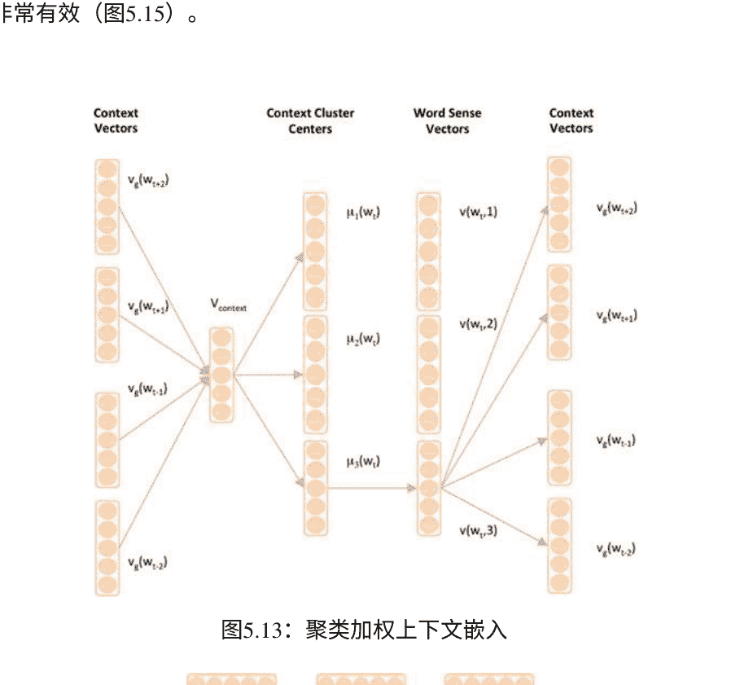

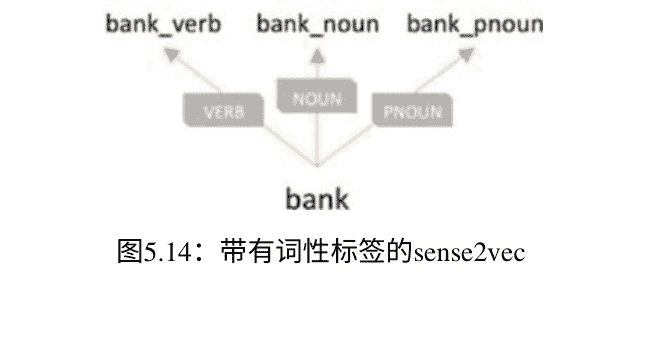

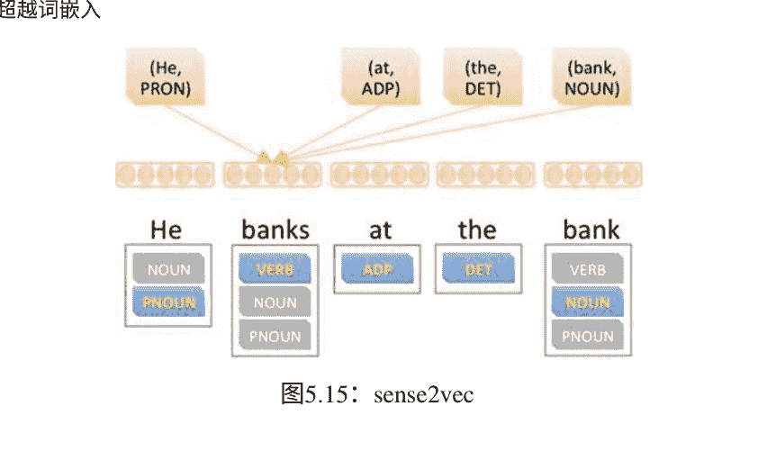

### 5.3.4 偏见嵌入

最近，我们意识到嵌入模型中可能存在的潜在偏见。学习到的词表示只有在训练数据的基础上才能发挥作用，即它们将捕捉到训练数据中固有的语义和句法上下文。例如，最近的研究揭示了在广泛的新闻语料库上训练的GloVe和word2vec等流行词嵌入模型中存在的种族和性别偏见：

> v(护士) ≈ v(医生) - v(父亲) + v(母亲)
> v(勒罗伊) ≈ v(布拉德) - v(快乐) + v(愤怒)

### 5.3.5 其他限制

词嵌入模型的进一步限制与训练的批处理性质以及使用新数据或扩展词汇表的实用性有关。这样做需要我们重新训练一个嵌入模型，同时使用原始数据和新数据，需要整个数据集可用并重新计算嵌入。在线学习方法可以使词嵌入模型更加实用。

## 5.4 超越词嵌入

对词嵌入模型的最近兴趣导致了可以利用词组合性（子词嵌入）和解决内存限制（word2bits）的实用改进。其他人已经扩展了word2vec，学习句子、文档（DM和DBOW）和概念（RDF2Vec）的分布式表示。兴趣还催生了将单词映射到潜在概率的贝叶斯方法密度（高斯嵌入）以及双曲空间（Poincaré嵌入）。我们将在下一节中研究这些创新。

### 5.4.1 子词嵌入

诸如word2vec或GloVe的方法忽略了单词的内部结构，并将每个单词（或单词意义）关联到单独的向量表示。对于形态丰富的语言，可能存在大量罕见的单词形式，要么必须维护非常大的词汇表，要么将大量单词视为词汇外（OOV）。如前所述，词汇外的单词会对性能产生重大影响，因为罕见单词会导致上下文丢失[Bak18]。可以帮助解决这个限制的方法是使用子词嵌入[Boj+16]，其中字符n-grams $g$与向量表示 $z_g$相关联，并且单词 $w_i$由n-gram向量的总和表示（图5.16）。

$$ w_i = \sum_{g \in \mathbb{G}_w} z_g \quad \text{(5.68)} $$

例如，单词indict的向量由这些向量的和组成 n-grams $\{ind,ndi,dic,ict,indi,ndic,dict,indict\}$ 当 $n \in (3,6)$。因此，n-grams的集合是语料库词汇的超集（图5.17）。由于n-grams在单词之间共享，这使得即使是未见过的单词也可以表示，因为OOV单词仍然由具有表示的n-grams组成。子词嵌入可以显著提升自然语言处理任务，如语言建模和文本分类。

### 5.4.2 词向量量化

即使对于一个小词汇表，单词模型也可能需要大量的内存和存储空间。考虑一个15万词汇量的情况。这些单词的300维连续64位表示很容易占用超过360兆字节的空间。通过对单词向量应用量化，可以学习到一种紧凑的表示方法。

在某些情况下，相对于完整精度的词向量，可以实现8倍到16倍的压缩比，同时保持可比较的性能[Lam18]。此外，量化函数可以作为一种正则化器，可以提高泛化性能[Lam18]。

Word2Bits是一种通过引入量化元素到其损失函数中来改进word2vec CBOW方法的方法：

$$ J_{\text{量化}} \left( \mathbf{u}_o^{(q)}, \hat{\mathbf{v}}_c^{(q)} \right) = -\log \left( \sigma \left( \left( \mathbf{u}_o^{(q)} \right)^T \hat{\mathbf{v}}_c^{(q)} \right) \right) - \sum_{i=1}^{k} \log \left( \sigma \left( \left( -\mathbf{u}_i^{(q)} \right)^T \hat{\mathbf{v}}_c^{(q)} \right) \right) \quad \text{(5.69)} $$

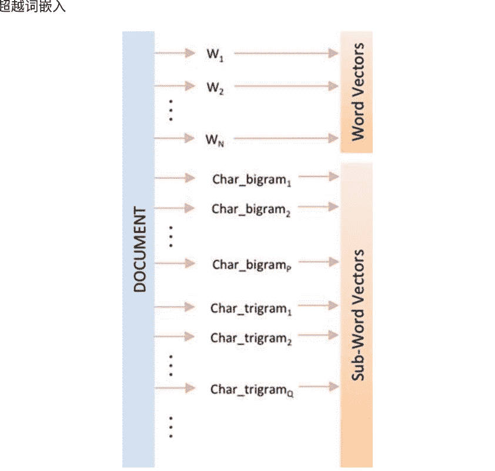

其中

$$ u_o^{(q)} = Q_{位级} (u_o) \quad \text{(5.70)} $$

$$ \hat{v}_c^{(q)} = \sum_{-w+i \leq i \leq w+o, i=o} Q_{bitlevel} (v_i) \quad \text{(5.71)} $$

在这里，$w$是上下文窗口的宽度，$Q_{bitlevel}$是量化函数，$u_o$和$v_c$分别是目标词向量和上下文词向量，$u_o^{(q)}$和$\hat{v}_c^{(q)}$是它们的量化等价物。海维赛德阶跃函数通常被选择作为量化函数$Q_{bitlevel}$。与标准CBOW算法类似，损失函数在语料库上优化目标词$u_o$和上下文词$v_j$。目标词$u_o$、负采样词$u_i$和上下文词$v_i$的梯度更新如下：

$$ u_o : \frac{\partial J_{quantized} \left( u_o^{(q)}, \hat{v}_c^{(q)} \right)}{\partial u_o} = \frac{\partial J_{quantized} \left( u_o^{(q)}, \hat{v}_c^{(q)} \right)}{\partial u_o^{(q)}} \quad \text{(5.72)} $$

$$ u_i : \frac{\partial J_{quantized} \left( u_o^{(q)}, \hat{v}_c^{(q)} \right)}{\partial u_i} = \frac{\partial J_{quantized} \left( u_o^{(q)}, \hat{v}_c^{(q)} \right)}{\partial u_i^{(q)}} \quad \text{(5.73)} $$

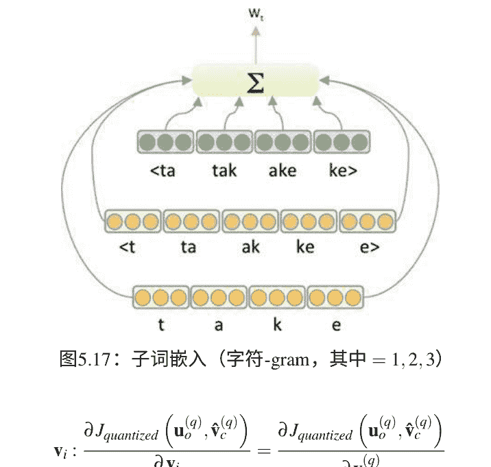

$$ v_i : \frac{\partial J_{quantized}\left(\mathbf{u}_o^{(q)}, \hat{\mathbf{v}}_c^{(q)}\right)}{\partial \mathbf{v}_i} = \frac{\partial J_{quantized}\left(\mathbf{u}_o^{(q)}, \hat{\mathbf{v}}_c^{(q)}\right)}{\partial \mathbf{v}_i^{(q)}} \quad \text{(5.74)} $$

每个单词的最终向量表示为 $Q_{bitlevel}(\mathbf{u}_i + \mathbf{v}_j)$，其元素可以取2个比特级的值，并且只需要比特级的位数来表示，与完全精确的32/64位相比，节省了空间。研究表明，量化向量在单词相似性任务和问题回答任务上的表现可以与16倍压缩的情况下相媲美。

### 5.4.3 句子嵌入

虽然词嵌入模型可以捕捉单词之间的语义关系，但在句子级别上失去了这种能力。句子表示通常是通过句子中单词向量的求和来表示的。这种词袋模型的方法存在一个主要缺陷，即只要使用相同的单词，不同的句子可以具有相同的表示。为了融入单词顺序信息，人们尝试使用能够捕捉短期顺序上下文的词袋-$n$-gram方法。

然而，在句子级别上，由于数据稀疏性和高维度，它们受到限制，并且在泛化能力上表现不佳。Le和Mikolov在2014年[LM14]提出了一种无监督算法，用于学习捕捉单词顺序信息的句子的有用表示。他们的方法受到了用于学习单词向量的Word2Vec的启发，通常被称为doc2vec。它从可变长度的文本生成固定长度的特征表示，因此对于应用于句子、段落、部分或整个文档非常有用。这种方法的关键是将每个段落与唯一的段落向量$\mathbf{u}_i$关联起来。

该向量是段落中J个单词的单词向量w_ij的平均值，从而得到段落p_i的表示：

$$p^i = u^i + \sum_{j=1,J} w^{ij}$$

请注意，术语“段落”也可以指句子或文档。这种方法被称为分布式记忆模型（DM）（图5.18）。段落向量u_i可以被看作是记住单词顺序上下文的一种记忆。

在训练过程中，使用一个滑动窗口的上下文词C和段落向量p^i来预测段落上下文中的下一个词。段落向量和词向量都是通过反向传播进行训练的。段落向量对于每个段落是唯一的，并在从同一个段落生成的所有上下文中共享，而词向量则在整个语料库中共享。值得注意的是，DM架构类似于word2vec的CBOW架构，只是增加了段落上下文向量。Le和Mikolov还提出了一种架构

图5.18：用于段落向量的分布式内存架构

称为分布式词袋模型(DBOW)，它仅使用段落上下文向量来预测段落中的词语（图5.19）。这个简单的模型类似于word2vec的skip-gram版本，只是使用段落向量来预测整个段落中的所有词语，而不是使用目标词语来预测上下文词语。与skip-gram模型一样，DBOW在计算和内存效率上非常高。实证结果表明，对于文本表示，DM和DBOW都优于词袋模型和n-gram模型。此外，对DM和DBOW向量表示进行平均通常可以获得最佳性能。

### 5.4.4 概念嵌入

嵌入模型的一个关键特征是它们能够使用简单的向量运算捕捉语义关系。利用这个思想，最近已经开发了嵌入模型，将本体概念映射到向量空间中[Als+18]。这些嵌入可以反映知识图的实体类型、语义和关系。**RDF2Vec**是一种学习知识图中实体嵌入的方法

知识图中的实体（图5.20）是由三个组成部分构成的RDF语句：主语、谓词和宾语。这些语句的集合可以用来构建知识图。RDF2Vec将RDF图转换为一组序列，使用图遍历/子树图核方法，然后应用word2vec算法将实体映射到潜在表示。在生成的嵌入空间中，共享背景概念的实体彼此靠近聚集，使得像“纽约”这样的实体靠近像“城市”这样的实体。

TransE被提出作为一种通用方法，旨在将实体之间的关系在嵌入空间中表示为平移。关键概念是，给定一组关系（头实体，标签，尾实体），尾实体的向量应该接近于头实体的向量加上标签的向量：

$$v_{尾实体} \approx v_{头实体} + v_{标签}$$
(5.76)

TransE的训练方式类似于负采样，通过随机梯度下降来最小化一组三元组 S 上的损失函数：

$$J(\theta) = \sum_{(h,l,t) \in S} \sum_{(h',l',t') \in S'} \max\left(d(h+l,t) - d(h'+l', t'), 0\right) + R(\theta)$$
(5.77)

其中，$d$是一个不相似度度量，$R$是一个正则化项（通常是$L_2$范数）。图5.21展示了作为知识图谱中关系的向量转换

在图5.18中由TransE方法嵌入。例如，以下转换成立：

$$v(医生) \approx v(医生) - v(吉尔) + v(杰克)$$
$$v(吉尔) \approx v(杰克) - \mathbf{v}(多佛) + v(伊利)$$

具有处理大型数据集的能力，TransE和相关方法[Bor+13]对于关系提取、链接预测以及自然语言处理任务非常有用。

### 5.4.5 使用语义词典进行改进

为了利用词汇数据库（如WordNet或FrameNet）中包含的关系信息，Faruqui等人[Far+14]提出了一种改进方法

词嵌入，使词汇链接的单词具有相似的向量表示。这种改进方法通常被称为语义词典的retrofitting，它不对学习这些向量表示的方式做任何假设，并且适用于光谱和神经方法。给定一个词汇表

$(w_1, w_2, ..., w_n)$，一个由无向图表示的语义关系集合，以及每个$w_i$的学习到的词向量$\mathbf{q}_i$，目标是推断出一组新的词向量$\mathbf{q}_i$，使其与$\mathbf{q}_i$和相邻顶点$w_j$的距离接近。使用欧氏距离度量，这等价于最小化目标函数：

$$J = \sum_{i=1}^{n} \left[ \alpha_i \lVert \mathbf{q}_i - \hat{\mathbf{q}}_i \rVert^2 + \sum_{(i,j)\in E} \beta_{ij} \lVert \mathbf{q}_i - \mathbf{q}_j \rVert^2 \right] \quad\quad (5.78)$$

其中$\alpha_i$和$\beta_{ij}$反映了关联的相对强度。可以通过以下更新迭代地完成Retrofitting：

$$\mathbf{q}_i = \frac{\sum_{j:(i,j)\in E} \beta_{ij} \mathbf{q}_j + \alpha_i \hat{\mathbf{q}}_i}{\sum_{j:(i,j)\in E} \beta_{ij} + \alpha_i} \quad\quad (5.79)$$

Retrofitting在许多词汇语义评估任务中取得了显著的改进，对于可以利用外部知识的情况非常有用。

### 5.4.6 高斯嵌入

与其假设嵌入模型将单词映射到潜在表示空间中的点向量，不如将单词映射到连续的概率密度。这带来了几个有趣的优势，因为它们可以固有地捕捉语义关系之间的不确定性和不对称性。

#### 5.4.6.1 Word2Gauss

一种方法是 Word2Gauss，它将词汇表中的每个单词 $w$ 和字典 $C$ 中的上下文单词 $c$ 映射到潜在嵌入空间上的高斯分布。这个空间的向量被称为word type s，观察到的单词是word instances。Word2Gauss提供了两种生成嵌入的方法。第一种方法是用高斯密度之间的内积 $E$ 替换潜在密度空间中点向量的余弦距离：

$$E(P_i, P_j) = \int_{x\in\mathbb{R}^n} \mathcal{N}(x; \mu_i, \Sigma_i) \mathcal{N}(x; \mu_j, \Sigma_j) dx = \mathcal{N}(0; \mu_i - \mu_j, \Sigma_i + \Sigma_j) \quad\quad (5.80)$$

其中 $\mathcal{N}(x; \mu_i, \Sigma_i)$ 和 $\mathcal{N}(x; \mu_j, \Sigma_j)$ 分别是目标词和上下文词的密度函数。这是一种对称度量，计算效率高，但不能建模

单词之间的非对称关系。第二种更具表现力的方法是通过KL散度的概念来建模相似性，并通过训练来优化损失函数：

$$D_{KL}(\mathcal{N}_j||\mathcal{N}_i) = \int_{x\in\mathbb{R}^n} \mathcal{N}(x; \boldsymbol{\mu}_i, \boldsymbol{\Sigma}_i) \log \frac{\mathcal{N}(x; \boldsymbol{\mu}_j, \boldsymbol{\Sigma}_j)}{\mathcal{N}(x; \boldsymbol{\mu}_i, \boldsymbol{\Sigma}_i)} dx \qquad (5.81)$$

这种KL散度方法使得高斯嵌入能够融入蕴含的概念，因为从 \(w\) 到 \(c\) 的低KL散度意味着 \(c\) 蕴含 \(w\)。此外，由于KL散度是非对称的，这些嵌入可以编码单词类型之间的非对称相似性。

Word2Gauss在蕴含等非对称任务中表现出显著优势[VM14]。然而，单模态高斯密度不能很好地处理多义词，并且在训练过程中的计算复杂度是一个重要考虑因素。

#### 5.4.6.2 贝叶斯Skip-Gram

最近的一种方法是基于将词嵌入视为概率密度的概念，采用了生成式贝叶斯方法。贝叶斯Skip-Gram模型（BSG）以每个单词表示的形式建模，该表示是从语料库中每个给定单词的先验密度生成的贝叶斯模型。

通过引入上下文，BSG模型可以克服Word2Gauss的多义性限制。事实上，它可以潜在地建模无限数量的连续词义。

对于目标词 \(w\) 和一组上下文词 \(\mathbf{c}\)，BSG模型假设先验分布 \(p_{\theta}(\mathbf{z}|w)\)和后验分布 \(q_{\theta}(\mathbf{z}|\mathbf{c}, w)\)都服从高斯分布：

$$p_{\theta}(\mathbf{z}|w) = \mathcal{N}(\mathbf{z}|\boldsymbol{\mu}_w, \boldsymbol{\Sigma}_w) \qquad (5.82)$$
$$q_{\theta}(\mathbf{z}|\mathbf{c}, w) = \mathcal{N}(\mathbf{z}|\boldsymbol{\mu}_q, \boldsymbol{\Sigma}_q) \qquad (5.83)$$

其中 \(\boldsymbol{\Sigma}_w\) 和 \(\boldsymbol{\Sigma}_q\) 是对角协方差矩阵，\(\mathbf{z}\) 是从先验中抽取的潜在向量（图5.22）。协方差矩阵 \(\boldsymbol{\Sigma}_q\) 的值越大，目标词 \(w\) 在上下文 \(\mathbf{c}\) 中的含义就越不确定。

BSG模型旨在最大化给定目标词 \(w\) 的上下文窗口中单词的概率 \(p_{\theta}(\mathbf{c}|w)\)，这类似于skip-gram模型。它通过选择目标词 \(w\)，从先验中抽取其潜在含义 \(\mathbf{z}\)，并从条件概率分布 \(p_{\theta}(\mathbf{c}|\mathbf{z})\) 中选择上下文词 \(\mathbf{c}\) 来进行训练。目标是最大化对数似然函数：
$$\log p_{\theta}(\mathbf{c}|w) = \log \int \prod_{j=1}^{C} p_{\theta}(c_j|\mathbf{z}) p_{\theta}(\mathbf{z}|w) d\mathbf{z} \qquad (5.84)$$

其中 c 是上下文窗口的大小，c_j 是目标词 w 的上下文词。为了简化计算，BSG模型通过优化对数似然的下界进行训练，下界由以下公式给出：

$$J(\theta) = \sum_{(j,k)} \left( D_{KL} \left[ q_{\phi} || \mathcal{N}(z; \mu_{c_k}, \Sigma_{c_k}) \right] - D_{KL} \left[ q_{\phi} || \mathcal{N}(z; \mu_{c_j}, \Sigma_{c_j}) \right] \right) - D_{KL} \left[ q_{\phi} || p_{\theta}(z|w) \right] \quad (5.85)$$

其中求和是在正 c_j 和负 c_k 上下文词对之间进行的。结果是与先验分布相关联的嵌入，表示一个词的类型，并与后验分布相关联的嵌入，编码动态上下文。

训练的结果是与先验分布相关联的表示一个词的嵌入，以及与后验分布相关联的编码动态上下文的嵌入。与Word2Gauss相比，BSG可以提供更好的上下文敏感性，例如在多义词的情况下。

### 5.4.7 双曲嵌入

嵌入模型对于建模复杂模式的能力受到嵌入空间维度的限制。此外，已经证明嵌入模型在捕捉潜在的层次关系方面表现不佳。为了克服这些限制，Nick el和Keila [NK17]提出了Poincar´e

嵌入作为一种有效增加表示能力的方法，同时学习潜在层次结构。他们的方法是基于在双曲空间而不是欧几里德空间中学习表示。双曲几何可以有效地和高效地建模层次结构，如树（图5.23）。实际上，树可以被看作是离散双曲空间的实例。值得注意的是，在双曲空间中表示树所需的维度线性增长，而在欧几里德空间中呈二次增长。

Poincaré嵌入模型通过将单词映射到一个n维单位球$\mathbb{B}^d = \{\mathbf{x} \in \mathbb{R}^d \mid \|\mathbf{x}\| < 1\}$，其中$\|\mathbf{x}\|$是欧几里德范数，来学习分层表示。在双曲空间中，两点$\mathbf{u}, \mathbf{v} \in \mathbb{R}^d$之间的距离是：

$$ d(\mathbf{u}, \mathbf{v}) = \cosh^{-1}\left(1+2\frac{\|\mathbf{u}-\mathbf{v}\|^2}{(1-\|\mathbf{u}\|^2)(1-\|\mathbf{v}\|^2)}\right) \tag{5.86} $$

请注意，当$\|\mathbf{x}\|$接近1时，到其他点的距离呈指数增长。

图5.23：将树嵌入双曲空间

在欧几里德空间中，直线的概念映射到$\mathbb{B}^d$中的测地线（图5.24）。这样的表述允许通过将根节点放置在/靠近原点和将叶节点放置在边界上来对树进行建模。在训练过程中，模型学习表示$\Theta$：

$$ \Theta = \{\theta_i\}_{i=1}^{n} \quad \text{其中} \quad \theta_i \in \mathbb{B}^d, \tag{5.87} $$

通过对数据集$\mathbb{D} = \{(\mathbf{u}, \mathbf{v})\}$应用负采样方法，通过最小化损失函数$L(\Theta)$来实现：

$$ L(\Theta) = \sum_{(\mathbf{u}, \mathbf{v}) \in \mathbb{D}} \log \frac{e^{-d(\mathbf{u},\mathbf{v})}}{\sum_{\mathbf{v}' \in N(\mathbf{u})} e^{-d(\mathbf{u},\mathbf{v}')}} \tag{5.88} $$

其中 $N(\mathbf{u}) = \{\mathbf{v}'|(\mathbf{u}, \mathbf{v}') \notin \mathbb{D}\}$ 是负样本集合。 尼克尔和凯拉的配方需要使用随机黎曼优化方法来生成嵌入。 这些方法，如黎曼随机梯度下降，存在一些限制，并需要额外的投影步骤将嵌入带回单位超球体。 此外，它们的训练计算成本较高，这使得它们在大型文本语料库中不太可行。 最近，Dhingra

图5.24：在欧几里得空间中，最短路径是直线，而在双曲空间中，它们是曲线，被称为测地线

等人通过将基于学习编码器函数 $f_{\theta}$ 的参数化方法纳入广义双曲嵌入中，将词序列映射到Poincaré球 $\mathbb{B}^d$ [Dhi+18]上的嵌入 该方法基于这样的观点：语义上一般的概念出现在更广泛的上下文中，而语义上特定的概念出现在更狭窄的上下文中 通过使用简单的参数化方法来表示双曲嵌入的方向和范数，并对范数应用sigmoid函数，该方法允许使用流行的优化方法来诱导嵌入，只需修改距离度量和损失函数

## 5.5 应用

词嵌入模型在广泛的自然语言处理任务中提高了最先进的得分 在许多应用中，传统方法几乎完全被词嵌入方法取代 它们能够将可变长度的序列映射为固定长度的表示，为深度学习在自然语言处理中的应用打开了大门。在接下来的章节中，我们将

### 5.5.1 分类

文本分类是自然语言处理中许多重要任务的基础。传统的线性分类器词袋模型方法，如朴素贝叶斯或逻辑回归，在文本分类中表现良好。 然而，它们在无法泛化到训练数据中未见过的单词和短语方面存在问题。 嵌入模型提供了克服这个缺点的能力。 通过利用预训练的词嵌入——在一个独立的大型语料库上学习单词表示——我们可以构建能够跨文本泛化的分类器。

Joulin等人提出的FastText模型是一个利用词嵌入的文本分类模型的例子（图5.25）。 FastText的第一阶段在一个大型语料库上学习单词表示，从而捕捉了广泛词汇的语义关系。 然后，在分类器训练阶段使用这些嵌入将文档中的单词映射到向量，并将这些向量平均在一起形成文档的潜在表示。 这些潜在表示及其标签构成了softmax或分层softmax分类器的训练集。

FastText， 顾名思义，计算效率高， 据报道能够在10分钟内训练10亿个词，并且达到接近最先进的性能[Jou+16a]。

### 5.5.2 文档聚类

基于词袋模型的传统文档聚类往往导致维度过高和数据稀疏。 主题建模方法，如潜在语义分析（LSA）和潜在狄利克雷分配（LDA），可以应用于文档聚类，但要么忽略词共现，要么在计算可扩展性方面存在问题。

我们已经看到了如何使用词嵌入来创建文档的潜在表示。 这些表示捕捉了文档中的语义信息，可以很容易地使用k-means或其他传统聚类方法来识别文档簇。 实证证据表明，与词袋模型或主题模型方法相比，使用嵌入进行文档聚类的优越性已经得到证明[LM14]。 使用预训练的嵌入可以增强聚类文档时的语义信息。

### 5.5.3 语言建模

正如之前所指出的，语言模型与嵌入模型的训练密切相关，因为两者都是根据一组上下文词预测目标词。 n-gram语言模型预测前面的单词$w_t$给定前面的单词$w_{t-1}, w_{t-2}, \dots, w_{t-n}$。 n-gram语言模型的训练等价于最大化负对数似然函数：

$$J(\theta) = \sum_{t=1}^{T} \log p(w_t|w_{t-1}, w_{t-2}, \dots, w_{t-n+1}) \tag{5.89}$$

相比之下，CBOW word2vec模型的训练等价于最大化目标函数：

$$J(\theta) = \frac{1}{T} \sum_{t=1}^{T} \log p(w_t|w_{t-n}, \dots, w_{t-1}, w_{t+1}, \dots, w_{t+n}) \tag{5.90}$$

因此，语言模型根据前面的$n$个上下文单词预测目标单词，而CBOW模型根据每一侧的上下文单词预测目标单词。
嵌入方法在语言建模任务中表现出色，并且在性能方面引领了深度神经网络方法[MH09]。

### 5.5.4 文本异常检测

异常检测在许多应用中起着重要作用。不幸的是，文本的异常检测通常很难建模，因为数据稀疏性和文本的极高维度特性。现有的结构化数据方法可以分为基于距离的方法、基于密度的方法和子空间方法[Kan+17]。然而，这些方法不容易推广到非结构化文本数据。虽然矩阵分解和主题建模方法可以弥合这一差距，但它们仍然可能受到高维度和噪声的影响，因为许多单词往往与文档的上下文无关。嵌入模型可以映射文本，将序列转换为允许基于距离和密度的方法应用的密集表示[Che+16]。嵌入方法的一个示例如图5.26所示。在训练时，模型通过 k-means学习文本表示和聚类实体，从而识别潜在实体空间中的聚类和密集区域。在预测时，可以将文档映射到其潜在表示 v_d。基于距离的方法可以计算该表示 v_d与训练时识别的聚类中心 c_j之间的距离，并在距离超过阈值 T时标记文档（图5.27）：

```
math
\min_{c_j} \|\mathbf{v}_d - \mathbf{c}_j\| > T \rightarrow anomaly
```

基于密度的方法可以计算 v_d附近的实体数量，并在数量低于阈值 T时标记文档。

### 5.5.5 上下文嵌入

在过去的一年中，提出了许多利用上下文嵌入的新方法。这些方法基于一个观点，即单词的嵌入应该基于其所在的上下文。这个上下文可以是句子、段落或文档中周围单词的位置和存在。

通过在大量数据上进行生成性预训练的上下文嵌入和语言模型，可以在各种任务上进行判别性微调，并取得最先进的结果。这通常被称为“自然语言处理的ImageNet时刻”[HR18]。

其中一个值得注意的方法是Transformer模型，这是一个基于注意力机制的堆叠编码器-解码器架构（见第7章），可以进行大规模的预训练。Vaswani等人[Vas+17a]将这个模型应用于机器翻译任务，并打破了性能记录。

另一个重要的方法是ELMo，即来自语言模型的嵌入，它生成一组上下文化的单词表示，有效地捕捉语法、语义和多义性。这些表示实际上是一个双向的、基于字符的LSTM语言模型的内部状态，该模型在大型外部语料库上进行了预训练（参见第10章）。

在Transformer的基础上，最近提出了一种方法，称为BERT，即来自Transformers的双向编码器表示。BERT是一种基于Transformer的掩码语言模型，通过双向训练生成深度上下文化的单词嵌入，捕捉了从左到右和从右到左的上下文。这些嵌入只需要很少的微调就能在下游复杂任务（如蕴含或问答）中表现出色[Dev+18]。

BERT打破了多个性能记录，代表了当今语言表示领域的重要突破之一。

## 5.6 案例研究

我们首先详细研究了word2vec算法，并检查了带有负采样的skip-gram模型的Python实现。一旦我们了解了word2vec的基本概念，我们将使用Gensim包来加快训练速度，并研究词嵌入的翻译特性。

我们将研究GloVe词嵌入作为word2vec的替代方法。然而，这两种方法都无法处理反义词、多义词和词义消歧。我们考虑使用嵌入方法进行文档聚类。最后，我们研究了像sense2vec这样的嵌入方法如何更好地处理词义消歧。

### 5.6.1 软件工具和库

在这个案例研究中，我们将研究word2vec的skip-gram和负采样方法以及Python中的GloVe词嵌入的内部操作。

我们还将利用流行的nltk、gensim、glove和spaCy库进行分析。NLTK是一个流行的开源工具包，用于自然语言处理和文本分析。gensim库是一个用Python实现的开源工具包，用于向量空间建模和主题建模，并使用Cython进行性能加速。glove库是Python中高效的GloVe实现。SpaCy是一个快速的开源自然语言处理库，用于词性标注和命名实体识别。

对于我们的分析，我们将利用Open American National Corpus，该语料库包含大约1500万个口语和书面语的词汇。具体而言，我们将使用子语料库，该子语料库包含1996年至2000年间的4531篇Slate杂志文章（约420万个词）。

### 5.6.2 探索性数据分析

让我们来看一下这个数据集的一些基本统计信息，例如文档长度和句子长度（图5.28和图5.29）。通过查看语料库中前1000个词的词频（图5.30），我们可以看到前100个词通常被认为是停用词（表5.1）。它们在大多数句子中都很常见，几乎没有捕捉到任何语义含义。随着我们继续往下看，我们开始看到在传达句子或文档中更重要的意义的词汇。

### 5.6.3 学习词嵌入

我们的目标是为上述语料库训练一组词嵌入。 让我们构建一个带有负采样的skip-gram模型，然后再构建一个GloVe模型。 在训练任何模型之前，我们发现预处理后的4.86百万词语语料库中有77,440个独特的词。

表5.1: 词频

| 词 | 频率 |
|----|------|
| the | 266,007 |
| of | 115,973 |
| - | 114,156 |
| to | 107,951 |
| a | 100,993 |
| and | 96,375 |
| in | 74,561 |
| that | 64,448 |
| is | 51,590 |
| it | 38,175 |
| ... | ... |
| 眼睛 | 500 |
| 部队 | 499 |
| 提高 | 499 |
| 专家 | 499 |
| 呼吁 | 498 |
| de | 498 |
| 体育 | 498 |
| 策略 | 497 |
| 数字 | 496 |
| 论证 | 496 |

#### 5.6.3.1 Word2Vec

我们现在可以开始训练word2vec模型的神经网络。 让我们定义我们的模型参数：

- dim = 词向量的维度
- win = 上下文窗口大小（词的数量）
- start.alpha = 初始学习率
- neg = 负采样的样本数量
- min.count = 词汇表中的最小出现次数

我们可以通过过滤掉罕见的词来减小词汇表的大小。 如果我们将语料库中的最小出现次数阈值设置为5次，我们发现词汇表的大小降至31,599个，其中45,842个词将被视为OOV（未登录词）。 我们将把所有这些词映射到一个特殊的未登录词标记。

```
truncated = []
truncated.append(VocabWord('<unk>'))
unk_hash = 0

count_unk = 0
for token in vocab_items:
    if token.count < min_count:
        count_unk += 1
        truncated[unk_hash].count += token.count
    else:
        truncated.append(token)

truncated.sort(key=lambda token: token.count, reverse=True)

vocab_hash = {}
for i, token in enumerate(truncated):
    vocab_hash[token.word] = i

vocab_items = truncated
vocab_hash = vocab_hash
vocab_size = len(vocab_items)
print('未知的词汇大小: ', count_unk)
print('截断后的词汇大小: %d' % vocab_size)
```

#### 5.6.3.2 负采样

为了加快训练速度，让我们创建一个负采样查找表，在训练过程中使用。

```
power = 0.75
norm = sum([math.pow(t.count, power) for t in vocab_items])

table_size = int(1e8)
```

```
python
table = np.zeros(table_size, dtype=np.int)
p = 0
i = 0
for j, unigram in enumerate(vocab_items):
    p += float(math.pow(unigram.count, power))/norm
    while i < table_size and float(i) / table_size < p:
        table[i] = j
        i += 1

def sample(table, count):
    indices = np.random.randint(low=0, high=len(table), size=count)
    return [table[i] for i in indices]
```

#### 5.6.3.3 训练模型

我们现在准备训练word2vec模型。方法是通过迭代语料库中的句子，训练一个两层（syn0，syn1）神经网络，并调整权重以最大化给定目标词的上下文词的概率（skip-gram）并进行负采样。完成后，隐藏层syn0的权重就是我们所寻找的词嵌入。

```
python
tmp = np.random.uniform(low=-0.5/dim, high=0.5/dim, size=(vocab_size, dim))
syn0 = np.ctypeslib.as_ctypes(tmp)
syn0 = np.array(syn0)

tmp = np.zeros(shape=(vocab_size, dim))
syn1 = np.ctypeslib.as_ctypes(tmp)
syn1 = np.array(syn1)

current_sent = 0
truncated_vocabulary = [x.word for x in vocab_items]
corpus = df['text'].tolist()

当当前句子 < df.count()[0]:
    line = corpus[current_sent]
    sent = [vocab_hash[token] if token in truncated_vocabulary
            否则 vocabhash['<unk>']
            for token in [['<bol>'] + line.split() + ['<eol>']]]
    对于句子的词性标注，使用token in enumerate(sent)函数:

        当前窗口大小为np.random生成的随机数 生成一个介于low和high之间的随机整数, low=1, high=win+1
        上下文的起始位置为max(sentpos - currentwin, 0)
        上下文的结束位置为min(sentpos + currentwin + 1, len(sent))
        上下文为sent[contextstart:sentpos]+sent[sentpos+1:上下文结束]

对于上下文中的单词:
    embed = np.zeros(DIM)
    classifiers = [(token, 1)] + [(target, 0) for target in table.sample(neg)]
对于分类器中的目标和标签:
    z = np.dot(syn0[context_word], syn1[target])
    p = sigmoid(z)
    g = alpha * (label - p)
    embed += g * syn1[target]
    syn1[target] += g * syn0[context_word]
    syn0[context_word] += embed
    word_count += 1
    current_sent += 1
    如果 current_sent % 2000 == 0:
        打印("\r读取句子 %d" % current_sent)
embedding = 字典(压缩(截断词汇, syn0))
```

这些嵌入的语义翻译特性值得注意。让我们来检查两个相似单词（男人，女人）和两个不相似单词（糖果，社交）之间的余弦相似度。我们期望相似的单词展现出更高的相似度。

- 距离（男人，女人） = 0.01258108
- 距离（糖果，社交） = 0.05319491

#### 5.6.3.4 可视化嵌入

我们可以使用T-SNE算法将单词嵌入可视化到2D空间中。请注意，T-SNE是一种降维技术，可以保留向量空间内的接近性概念（在2D中接近的点在更高维度中也是接近的）。下图显示了来自词汇表的300个单词样本的关系（图5.31）。

#### 5.6.3.5 使用Gensim包

上面的Python代码对于理解原理很有用，但运行速度不是最快的。原始的word2vec包是用C++编写的，以便在多个核心上实现快速训练速度。gensim包提供了一个API来访问word2vec库，以及几种有用的方法来检查向量邻域。让我们看看如何使用gensim在样本数据语料库上进行训练。Gensim希望我们提供一组文档，作为一个标记列表的列表。我们将调用gensim的simple_preprocess()方法来删除标点符号、特殊字符和大写字符。通过gensim包提供的包装器API，训练word2vec就像定义一个模型并传递训练文档集一样简单。

```
1 documents = [gensim.utils.simple_preprocess(df['text'].iloc[i]) for i in range(len(df))]
2 model = gensim.models.Word2Vec(documents,
3                size=100,
4                window=10,
5                min_count=2,
6                workers=10)
7 model.train(documents, total_examples=len(documents), epochs=10)
```

#### 5.6.3.6 相似度

让我们通过检查单词邻域来评估学习到的词嵌入的质量。 如果我们看一下“man”或“book”的最相似单词，我们会发现它们的邻域中有非常相似的单词。 到目前为止还不错。

```
1 模型.词向量.最相似的（“男人”，前n=5个）
2 [('家伙', 0.6880463361740112),
3  ('女人', 0.6301935315132141) ,
4  ('人', 0.6296881437301636) ,
5  ('士兵', 0.5808842182159424) ,
6  ('某人', 0.55520117286743)]
```

```
python
模型.wv.最相似的('书', topn=5)
[('书籍', 0.723261356353759),
 ('小说', 0.6448987126350403),
 ('传记', 0.6039375066757202),
 ('回忆录', 0.6010321378707886) ,
 ('章节', 0.5646576881408691) ]
```

让我们来看一些多义词。与单词"bass"相似的词反映了音乐定义的bass。也就是说，它们只捕捉到一个词义（没有与水生定义的bass相关的词）。类似地，与"bank"相似的词都反映了其金融词义，但没有海滩或河床。这是word2vec的一个主要缺点之一。

```
python
模型.词向量.mostsimilar("bass",topn=5)
[('吉他',0.6996911764144897),
 ('独奏',0.6786242723464966),
 ('西装',0.6665750741958618),
 ('咆哮',0.6658747792243958),
 ('corduroy', 0.6525936126708984)]
```

```
python
模型.wv.最相似的('银行',topn=5)
[('banks', 0.6580432653427124),
 ('bankers', 0.5862468481063843),
 ('imf', 0.5782995223999023),
 ('储备',0.5546875),
 ('贷款',0.5457302331924438)]
```

我们可以通过一些向量代数来更详细地研究语义翻译的属性。如果我们从单词"儿子"开始，减去"男人"并加上"女人"，我们确实发现"女儿"是最接近结果的单词。同样地，如果我们反转操作，从单词"女儿"开始，减去"女人"并加上"男人"，我们发现"儿子"是最接近结果的。请注意，word2vec并不保证互逆性。

```
python
模型.wv.通过向量 (model.wv['儿子']-model.wv['男人']
+模型.词向量['女人'], topn=5)
[('女儿',0.7489624619483948),
 ('姐妹',0.7321654558181763),
 ('母亲',0.7243343591690063),
 ('男朋友',0.7229076623916626),
 ('爱人',0.7120637893676758)]
```

```
python
模型.词向量.通过向量计算相似度(模型.词向量['女儿']
-模型.词向量['女人']+模型.词向量['男人'],前n个=5)
[('儿子',0.7144862413406372),
 ('女儿',0.6668421030044556),
 ('man', 0.6652499437332153),
 ('祖父',0.5896619558334351),
```

我们还可以看到word2vec通过将单词“巴黎”减去“法国”并加上“俄罗斯”来捕捉地理相似性。结果的总和接近我们的预期结果——“莫斯科”。

```
model.wv.most_similar(model.wv['巴黎']
                      - model.wv['法国']
                      + model.wv['俄罗斯'], topn=5)
[('俄罗斯', 0.7788714170455933),
 ('莫斯科', 0.6269053220748901),
 ('巴西', 0.6154285669326782),
 ('日本', 0.592476487159729),
 ('gazeta', 0.5799405574798584)]
```

我们之前讨论过，由word2vec生成的词嵌入无法区分反义词，因为这些词在正常使用中通常共享相同的上下文词，因此学习到的嵌入接近。

例如，“大”最相似的词是“小”，或者“难”最相似的词是“容易”。反义词很难！

```
model.wv.most_similar('大', topn=5)
[('small', 0.726446270942688),
 ('巨大的', 0.5439934134483337),
 ('庞大的', 0.5070887207984924),
 ('广阔的', 0.5017688870429993),
 ('大小', 0.48968151211738586)]
```

```
model.wv.most_similar('困难', topn=5)
[('容易', 0.6564798355102539),
 ('困难', 0.6085934638977051),
 ('诱人', 0.5201482772827148),
 ('不可能', 0.5099537372589111),
 ('更容易', 0.4868208169937134)]
```

#### 5.6.3.7 GloVe 嵌入

而 word2vec 捕捉到句子中单词的局部上下文，GloVe 嵌入还可以考虑整个语料库的全局上下文。让我们更深入地了解如何计算 GloVe 嵌入。我们首先从语料库中构建一个词汇字典。

```
from collections import Counter

vocab_count = Counter()
for line in corpus:
    tokens = line.strip().split()
    vocab_count.update(tokens)
    vocab = {word: (i, freq) for i, (word, freq) in enumerate(vocab_count.items())}
```

#### 5.6.3.8 共现矩阵

让我们从语料库中构建词共现矩阵。 请注意，单词的出现情况是双向的，既有主要单词到上下文的，也有上下文到主要单词的。 对于较小的上下文窗口值，预计该矩阵将是稀疏的。

```python
from scipy import sparse
import numpy as np

min_count = 10
window_size = 5

vocab_size = len(vocab)
id2word = dict(((i, word) for word, (i, _) in vocab.items()))
occurrence = sparse.lil_matrix((vocab_size, vocab_size), dtype=np.float64)

for i, line in enumerate(corpus):
    tokens = line.split()
    token_ids = [vocab[word][0] for word in tokens]

    for center_i, center_id in enumerate(token_ids):
        context_ids = token_ids[max(0, center_i - window_size) : center_i]
        contexts_len = len(context_ids)

        for left_i, left_id in enumerate(context_ids):
            distance = contexts_len - left_i
            increment = 1.0 / float(distance)
            occurrence[center_id, left_id] += increment
            occurrence[left_id, center_id] += increment
    if i % 10000 == 0:
        print("处理句子%d " % i)

def occurmatrix(vocab, cooccurrence, mincount):
    for i, (row, data) in enumerate(zip(cooccurrence.rows, cooccurrence.data)):
        if min_count is not None and vocab[id2word[i]][1] < min_count:
            continue
        for j, data_idx in enumerate(row):
            if mincount is not None and vocab[id2word[j]][1] < min_count:
                continue
            yield i, j, data[data_idx]
```

#### 5.6.3.9 GloVe训练

现在我们可以通过迭代语料库中的文档（句子）来训练嵌入向量。

```python
from random import shuffle
from math import log
import pickle

iterations = 30
dimension = 100
learning_rate = 0.05
x_max = 100
alpha = 0.75

vocab_size = len(vocab)
W = (np.random.rand(vocab_size * 2, dimension) - 0.5) / float(dimension + 1)
biases = (np.random.rand(vocab_size * 2) - 0.5) / float(dimension + 1)

gradient_squared = np.ones((vocab_size * 2, dimension), dtype=np.float64)
gradient_squared_biases = np.ones(vocab_size * 2, dtype=np.float64)

data = [(W[i_main], W[i_context + vocab_size],
         biases[i_main : i_main + 1],
         biases[i_context + vocab_size : i_context + vocab_size + 1],
         gradient_squared[i_main], gradient_squared[i_context + vocab_size],
         gradient_squared_biases[i_main : i_main + 1],
         gradient_squared_biases[i_context + vocab_size : i_context + vocab_size + 1],
         cooccurrence)
        for i_main, i_context, cooccurrence in comatrix]

for i in range(iterations):
    global_cost = 0
    shuffle(data)
    for (v_main, v_context, b_main, b_context, gradsq_W_main,
         gradsq_W_context, gradsq_b_main, gradsq_b_context, cooccurrence) in data:

        weight = (cooccurrence / x_max) ** alpha if cooccurrence < x_max else 1

        cost_inner = (v_main.dot(v_context)
                     + b_main[0] + b_context[0]
                     - log(cooccurrence))
        cost = weight * (cost_inner ** 2)
        global_cost += 0.5 * cost

        grad_main = weight * cost_inner * v_context
        grad_context = weight * cost_inner * v_main
        grad_bias_main = weight * cost_inner
        grad_bias_context = weight * cost_inner

        v_main -= (learning_rate * grad_main / np.sqrt(gradsq_W_main))
        v_context -= (learning_rate * grad_context / np.sqrt(gradsq_W_context))
        b_main -= (learning_rate * grad_bias_main / np.sqrt(gradsq_b_main))
        b_context -= (learning_rate * grad_bias_context / np.sqrt(gradsq_b_context))

        gradsq_W_main += np.square(grad_main)
        gradsq_W_context += np.square(grad_context)
        gradsq_b_main += grad_bias_main ** 2
        gradsq_b_context += grad_bias_context ** 2
```

学习到的权重矩阵包括两组向量，一组用于主要单词位置，一组用于上下文单词位置。我们将对它们进行平均，生成每个单词的最终GloVe嵌入。

```python
def merge_vectors(W, merge_fun=lambda m, c: np.mean([m, c], axis=0)):

    vocab_size = int(len(W) / 2)
    for i, row in enumerate(W[:vocab_size]):
        merged = merge_fun(row, W[i + vocab_size])
        merged /= np.linalg.norm(merged)
        W[i, :] = merged

    return W[:vocab_size]

embedding = merge_vectors(W)
```

#### 5.6.3.10 GloVe向量相似性

让我们来研究这些向量的平移特性。我们定义一个简单的函数，返回与单词“man”最相似的5个单词。

```python
mostsimilar(embedding, vocab, id2word, 'man', 5)
[('woman', 0.9718018808969603),
 ('girl', 0.9262655177669397),
 ('single', 0.9222400016708986),
 ('death', 0.9187203648559261),
 ('young', 0.9081009733127359)]
```

有趣的是，相似性结果可以分为两类。然而，“女人”和“女孩”与“男人”具有相似的语义含义，而“死亡”和“年轻”则没有。但是这些词经常共同出现，比如“年轻人”或“死亡人”。GloVe嵌入可以捕捉到这两种上下文。我们可以通过使用T-SNE（图5.32）来可视化嵌入。

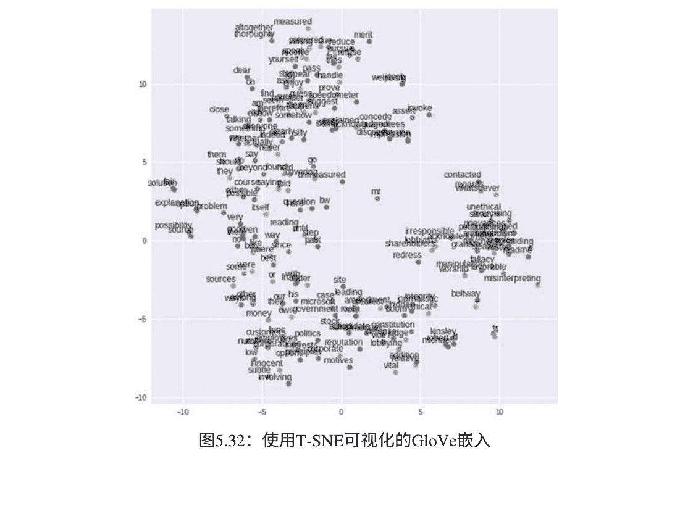

#### 5.6.3.11 使用Glove包

虽然有用，但我们的Python实现在处理大型语料库时速度太慢。glove库是一个高效实现GloVe算法的Python包。
让我们使用glove包重新训练我们的嵌入

```python
from glove import Corpus, Glove

corpus = Corpus()
corpus.fit(documents, window=5)

glove = Glove(no_components=100, learning_rate=0.05)
glove.fit(corpus.matrix, epochs=30, no_threads=4, verbose=True)
glove.add_dictionary(corpus.dictionary)
```

让我们通过检查一些单词来评估这些嵌入的质量

```python
glove.most_similar('man', number=6)
[('woman', 0.9417155142176431),
 ('young', 0.8541752252243202),
 ('guy', 0.8138920634188781),
 ('person', 0.8044470112897205),
 ('girl', 0.793038798219135)]
```

```python
glove.most_similar('good', number=6)
[('boy', 0.7583150809899194),
 ('very', 0.7071106359169386),
 ('seems', 0.7048211092737807),
 ('bad', 0.697033427158236),
 ('interesting', 0.6898111303194308)]
```

```python
glove.most_similar('apple', number=6)
[('industry', 0.6965166116455955),
 ('employee', 0.6724064797672178),
 ('fbi', 0.6280345651329606),
 ('gambling', 0.6276268857034702),
 ('indian', 0.6266591982382662)]
```

再次，最相似的单词既具有语义相似性又具有高共现概率。即使有了额外的上下文，GloVe嵌入仍然无法处理反义词和词义消歧。

### 5.6.4 文档聚类

使用词嵌入提供了一种与传统方法（如LSA或LDA）相比更有用和高效的文档聚类方法。最简单的方法是使用词袋模型，其中通过对文档中每个单词的向量进行平均来创建文档向量。让我们拿我们的Slate语料库来看看我们可以用这种方法找到什么。

#### 5.6.4.1 文档向量

我们通过将文档中每个单词的向量相加并除以总单词数来创建一组文档向量。

```python
documents = [gensim.utils.simple_preprocess(ndf['text'].iloc[i])
           for i in range(len(ndf))]
corpus = Corpus()
corpus.fit(documents, window=5)
glove = Glove(no_components=100, learning_rate=0.05)
glove.fit(corpus.matrix, epochs=10, no_threads=4, verbose=True)
```

```python
glove.add_dictionary(corpus.dictionary)
print("Glove embeddings trained.")

doc_vectors = []
for doc in documents:
    vec = np.zeros((dim,))
    for token in doc:
        vec += glove.word_vectors[glove.dictionary[token]]
    if len(doc) > 0:
        vec = vec / len(doc)
    doc_vectors.append(vec)

print("处理的文档数=", len(doc_vectors))
```

如果我们使用T-SNE可视化这些嵌入，我们可以看到有几个明显的聚类（图5.33）。

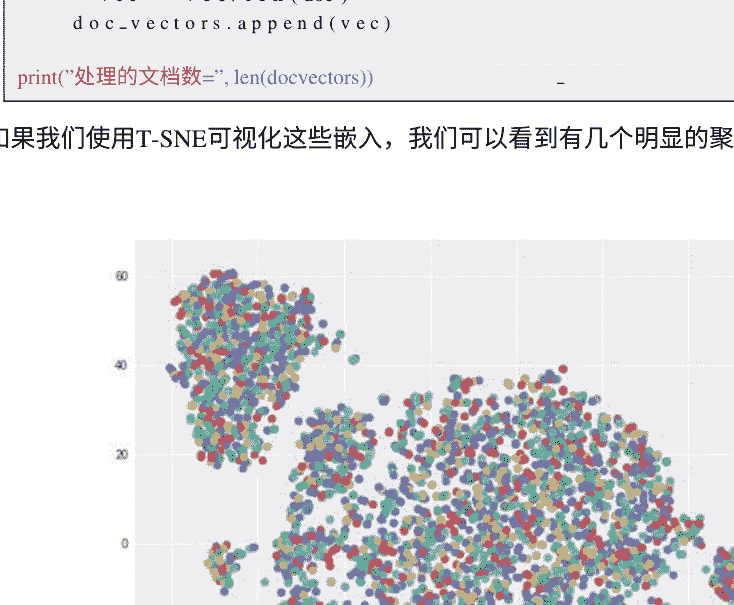

### 5.6.5 词义消歧

词义消歧是计算语言学中的重要任务。 然而，word2vec或GloVe嵌入将单词映射到单个嵌入向量，因此无法区分单词的多个意义。

sense2vec算法是一种改进的方法，可以通过监督消歧来处理多义词或反义词。此外，sense2vec计算成本低廉，并且可以在训练word2vec或GloVe模型之前作为预处理任务实施。为了验证这一点，让我们利用spaCy库生成词性标签，将sense2vec算法应用于我们的语料库，这些标签将作为我们的监督消歧标签。

#### 5.6.5.1 监督消歧注释

让我们使用spaCy NLP注释处理我们语料库中的句子。我们创建一个单独的语料库，其中每个单词都附加了其词性标签。例如，单词 he被映射为he_PRON。

```python
import spacy
nlp = spacy.load('en', disable=['parser', 'ner'])
corpus = df['text'].tolist()
print("文档数量=", len(corpus))

docs = []
count = 0
for item in corpus:
    docs.append(nlp(item))
    count += 1
    if count % 10000 == 0:
        print("处理的文档#", count)

sense_corpus = [[x.text + "_" + x.pos_ for x in y] for y in docs]
```

#### 5.6.5.2 使用word2vec进行训练

通过新的预处理语料库，我们可以继续进行word2vec的训练。我们可以使用训练好的模型来观察词语如“run”或“lie”如何根据它们的词性进行消歧。

```python
model.wv.most_similar('run_NOUN', topn=5)
[('runs_NOUN', 0.5418172478675842),
 ('term_NOUN', 0.50855630636362152),
 ('ropy_VERB', 0.5027114152908325),
 ('distance_NOUN', 0.49787676334381104),
 ('sosa_NOUN', 0.4942496120929718)]
```

```python
model.wv.most_similar('run_VERB', topn=5)
[('put_VERB', 0.6089274883270264),
 ('work_VERB', 0.599068284034729),
 ('hold_VERB', 0.5984195470809937),
 ('break_VERB', 0.5887631177902222),
 ('get_VERB', 0.5873323082923889)]
```模型。Word2Vec。最相似的（“lie NOUN”，top n = 5）

| 词语 | 相似度 |
|------|--------|
| ‘truth NOUN’ | 0.6057517528533936 |
| ‘guilt NOUN’ | 0.567844688923645 |
| ‘sin NOUN’ | 0.565475344657898 |
| ‘perjury NOUN’ | 0.5402902364730835 |
| ‘madness NOUN’ | 0.5183135867118835 |

模型。Word2Vec。最相似的（“lie VERB”，top n = 5）

| 词语 | 相似度 |
|------|--------|
| ‘talk VERB’ | 0.662897527217865 |
| ‘expose VERB’ | 0.64887535572052 |
| ‘testify VERB’ | 0.6263021230697632 |
| ‘commit VERB’ | 0.6155776381492615 |
| ‘leave VERB’ | 0.5946056842803955 |

### 5.6.6 读者和实践者的练习

词嵌入算法可以以多种有趣的方式进行扩展，并鼓励读者进行调查：

- 1. 基于字符、n-gram、字节对或其他子词方法进行嵌入训练。
- 2. 将嵌入方法应用于聚类命名实体。
- 3. 将嵌入作为分类器的输入特征。

在后续章节中，读者将意识到嵌入对于将神经网络应用于文本和语音是基础的。此外，嵌入还实现了迁移学习，并且是任何深度学习算法中的重要考虑因素。

## 参考文献

- [Als+18] Faisal Alshargi等人：“Concept2vec：用于本体概念嵌入质量评估的度量。” In: CoRRabs/1803.04488(2018)。
- [Amm+16] Waleed Ammar等人：“大规模多语言词嵌入。” In: CoRRabs/1602.01925 (2016)。
- [BCB14] Dzmitry Bahdanau, Kyunghyun Cho, and Yoshua Bengio。“通过联合学习对齐和翻译进行神经机器翻译”。 在: CoRRabs/1409.0473 (2014)。
- [Bak18] Amir Bakarov。“词嵌入评估方法综述”。 在: CoRRabs/1801.09536 (2018)。
- [Ben+03] Yoshua Bengio等人。“一种神经概率语言模型”。 在: JMLR(2003)，第1137-1155页。
- [Boj+16] Piotr Bojanowski等人。“用子词信息丰富词向量”。在：CoRRabs/1607.04606 (2016)。
- [Bor+13] Antoine Bordes等人。“用于建模多关系数据的嵌入翻译”。在：NIPS。2013年，第2787-2795页。
- [CP18] Jos´e Camacho-Collados和Mohammad Taher Pilehvar。“从词到意义的嵌入：关于向量表示的综述”。在：CoRRabs/1805.04032(2018)。
- [Che+16] Ting Chen等人。“基于实体嵌入的异构分类事件异常检测。”在：IJCAI。IJCAI/AAAI Press, 2016年，第1396-1403页。
- [CW08] Ronan Collobert和Jason Weston。“自然语言处理的统一架构：深度神经网络与多任务学习”。在：第25届国际机器学习大会。ACM, 2008年，第160-167页。
- [CJF16] Marta R. Costa-Juss`a和Jos´e A. R. Fonollosa。“基于字符的神经机器翻译。”在：CoRRabs/1603.00810 (2016)。
- [Cou+16] Jocelyn Coulmance等人。“Trans-gram，快速跨语言词嵌入”。在：CoRRabs/1601.02502 (2016)。
- [Dev+18] Jacob Devlin等人。“BERT: 深度双向转换器的预训练用于语言理解。”
- [DFU11] Paramveer S. Dhillon, Dean Foster和Lyle Ungar。“通过cca进行多视角单词嵌入学习”。
- [Dhi+18] Bhuwan Dhingra等人。“在双曲空间中嵌入文本”。在：第十二届基于图的自然语言处理方法研讨会（TextGraphs-12）中，计算语言学协会，2018年，第59-69页。
- [Faru+14] Manaal Faruqui等人将词向量与语义词典相结合。2014年。
- [Gra+18] Edouard Grave等人“学习157种语言的词向量”。在：CoRRabs/1802.06893 (2018)。
- [Gu+16] Jiatao Gu等人在序列到序列学习中引入复制机制。2016年。
- [HR18] Jeremy Howard和Sebastian Ruder。“通用语言模型对文本分类进行微调”。在：计算语言学协会，2018年。
- [Jou+16a] Armand Joulin等人“高效文本分类的技巧”。在：CoRRabs/1607.01759 (2016)。
- [Kan+17] Ramakrishnan Kannan等人“文本数据的异常检测：扩展版本”。在：CoRRabs/1701.01325 (2017)。
- [Kim+16] Yoon Kim等人“基于字符的神经语言模型”。在：AAAI. 2016。
- [KB16] Anoop Kunchukuttan和Pushpak Bhattacharyya。“通过字节对编码在相关语言之间学习可变长度单元”。在：CoRRabs/1610.06510 (2016)。
- [Lam18] Maximilian Lam。 “Word2Bits - 量化词向量”。 在： CoRRabs/1803.05651 (2018).
- [LM14] Quoc V. Le和Tomas Mikolov。 “句子和文档的分布式表示”。 在： CoRRabs/1405.4053 (2014).
- [Lin+15] Wang Ling等人“在形式中找到功能：用于开放词汇表单词表示的组合字符模型。” 在： CoRRabs/1508.02096 (2015).
- [LM16] Minh-Thang Luong和Christopher D. Manning。 “使用混合词-字符模型实现开放词汇表神经机器翻译。” 在： CoRRabs/1604.00788 (2016).
- [Mik+13b] Tomas Mikolov等人“单词和短语的分布式表示及其组合性”。 在： Advances in Neural Information Processing Systems 26. 2013, pp. 3111-3119.
- [MH09] Andriy Mnih和Geoffrey E Hinton。 “可扩展的分层分布式语言模型”。 在： Advances in neural information processing systems. 2009, pp. 1081-1088.
- [Nee+14] Arvind Neelakantan等人。 “向量空间中每个单词的高效非参数估计多个嵌入”。 在： EMNLP. ACL, 2014年，第1059-1069页。
- [NK17] Maximillian Nickel和Douwe Kiela。 “Poincar´e嵌入用于学习分层表示”。 在： Advances in Neural Information Processing Systems 30. Curran Associates, Inc., 2017年，第6338-6347页。
- [OMS15] Masataka Ono, Makoto Miwa和Yutaka Sasaki。 “基于词嵌入使用词库和分布信息进行反义词检测”。 在： HLT-NAACL. 2015年，第984-989页。
- [PSM14] Jeffrey Pennington, Richard Socher和Christopher D. Manning。 “GloVe: 用于单词表示的全局向量”。 在： Empirical Methods in Natural Language Processing (EMNLP). 2014，第1532-1543页。
- [RVS17] Sebastian Ruder, Ivan Vulic, and Anders Sogaard. 跨语言词嵌入模型综述. 2017.
- [SL14] Tianze Shi and Zhiyuan Liu. “将GloVe与word2vec相连。” In: CoRR abs/1411.5595 (2014).
- [TML15] Andrew Trask, Phil Michalak, and John Liu. “sense2vec - 一种快速准确的神经词嵌入中的词义消歧方法。” In: CoRRabs/1511.06388 (2015).
- [Vas+17a] Ashish Vaswani等人。 “注意力就是一切”。 In: 神经信息处理系统进展. 2017, pp. 5998-6008.
- [VM14] Luke Vilnis and Andrew McCallum. “通过高斯嵌入进行词表示。” In: CoRRabs/1412.6623 (2014).

# 第6章 卷积神经网络

## 6.1 引言

在过去几年中，卷积神经网络（CNN）和循环神经网络（RNN）已成为构建各种自然语言处理、语音和时间序列任务的复杂深度学习解决方案的基本构建模块。LeCun首次将CNN框架的某些基本部分作为一种通用的神经网络框架引入，用于解决计算机视觉、语音和时间序列中的各种高维数据问题。ImageNet应用卷积来识别图像中的对象；通过显著改进现有技术，ImageNet重新激发了对深度学习和CNN的兴趣。Collobert等人首先将CNN应用于自然语言处理任务，如词性标注、分块、命名实体解析和语义角色标注。在过去的十年中，CNN在输入表示、层数、池化类型、优化技术和各种自然语言处理任务的应用等方面进行了许多改进和研究。

本章的初始部分描述了卷积神经网络（CNN），从基本操作开始，并演示了这些网络如何在创建归纳偏差的同时减少参数。后续部分推导了基本CNN的前向和后向传递方程。接下来介绍了CNN的应用以及它们对文本输入的适应性。首先介绍了经典的CNN框架，然后是现代框架，以向读者展示CNN在不同领域中的多样用途。

特别关注CNN在各种自然语言处理任务中的流行应用。本章还描述了特定算法，使深度CNN框架在现代基于GPU的硬件上运行更高效。为了让读者获得实际的实践经验，本章以详细的案例研究结束，使用许多讨论过的CNN框架在Keras和TensorFlow上实现航空公司推文情感分析。在这个案例研究中，读者将获得详细的探索性数据分析、预处理、训练、验证和评估，类似于在现实项目中的体验。

## 6.2 CNN的基本构建模块

接下来的几节介绍了卷积神经网络的基本概念和构建模块。请注意，由于卷积神经网络起源于计算机视觉应用，其构建模块中的许多术语和示例都是针对图像或二维（2D）矩阵的。随着本章的继续，这些将被映射到一维（1D）文本输入数据。

### 6.2.1 线性时不变系统中的卷积和相关

#### 6.2.1.1 线性时不变系统

在信号处理或时间序列分析中，一个线性且时不变的变换或系统被称为线性时不变系统（LTI）；即，如果 $y(t) = T(x(t))$，那么 $y(t - s) = T(x(t - s))$，其中 $x(t)$和 $y(t)$是输入和输出，而 $T()$是变换。

线性系统具有以下两个特性：

- 1. 缩放： $T(ax(t)) = aT(x(t))$
- 2. 叠加： $T(x_1(t) + x_2(t)) = T(x_1(t)) + T(x_2(t))$

#### 6.2.1.2 卷积运算符及其性质

卷积是在LTI系统上执行的数学运算，其中输入函数 $x(t)$与函数 $h(t)$组合，产生一个新的输出，表示 $x(t)$与 $h(t)$的反向平移版本之间的重叠。函数 $h(t)$通常被称为卷积核或滤波器变换。在连续域中，这可以定义为：

$$y(t) = (h \times x)(t) = \int_{-\infty}^{\infty} h(\tau)x(t - \tau)d\tau \tag{6.1}$$

在离散域中，一维情况下可以定义为：

$$y(i) = (h \times x)(i) = \sum_{n} h(n)x(i - n) \tag{6.2}$$

同样地，在二维情况下，主要用于静态图像的计算机视觉中：

$$y(i, j) = (h \times x)(i, j) = \sum_{n} \sum_{m} h(m, n)x(i - m, i - n) \tag{6.3}$$

这也可以被写成互相关或翻转或旋转的核函数：

$$y(i, j) = (h \times x)(i, j) = \sum_{n} \sum_{m} x(i + m, i + n)h(-m, -n) \tag{6.4}$$

$$y(i, j) = (h \times x)(i, j) = x(i+m, i+n) \times \text{rotate}_{180}\{h(m, n)\} \quad (6.5)$$

卷积具有一般的交换、分配、结合和可微分性质。

#### 6.2.1.3 互相关及其性质

互相关是一种非常类似于卷积的数学运算，它衡量了两个信号之间的相似性或相关性的强度 x(t) 和 h(t)。它的表达式为：

$$y(t) = (h \otimes x)(t) = \int_{-\infty}^{\infty} h(\tau) x(t + \tau) \quad (6.6)$$

在离散域中，一维情况下可以定义为：

$$y(i) = (h \otimes x)(i) = \sum_{n} h(n) x(i + n) \quad (6.7)$$

同样地，在二维情况下：

$$y(i, j) = (h \otimes x)(i, j) = \sum_{n} \sum_{m} h(m, n) x(i + m, i + n) \quad (6.8)$$

需要注意的是，互相关与卷积非常相似，但不具有交换和结合性质。

许多CNN使用交叉相关运算符，但该操作被称为卷积。 我们将这两个术语视为同义词，因为它们的主要思想都是捕捉输入信号的相似性。CNN中使用的许多术语都源自图像处理。

在常规神经网络中，两个相邻层之间的转换涉及权重矩阵的乘法。 相比之下，在CNN中，转换实际上涉及卷积操作。

### 6.2.2 局部连接或稀疏交互

在基本神经网络中，输入层的所有单元都连接到下一层的所有单元。这种连接性对计算效率和能力都产生了负面影响。

考虑一个示例，如图6.1所示，输入层具有 $m = 9$ 个维度，隐藏层具有 $n = 4$ 个维度；在完全连接的神经网络中，如图6.1a所示，将有 $m \times n = 36$ 个连接（即权重），神经网络需要学习这些连接。另一方面，如果我们只允许 $k = 3$ 个空间上相邻的输入连接到隐藏层的一个单元，如图6.1b所示，连接的数量减少到 $n \times k = 12$。限制连接的另一个优势是将隐藏层连接限制在空间上相邻的输入上，强制前馈系统通过反向传播学习局部特征。我们将维度为 $k$ 的矩阵称为我们的过滤器或卷积核。连接的空间范围或过滤器的大小（宽度和高度）通常被称为感受野，因为它具有计算机视觉的遗传特征。在3D输入空间中，过滤器的深度始终等于输入的深度，但宽度和高度是可以通过搜索获得的超参数。

### 6.2.3 参数共享

参数共享或权重共享是一个概念，即在两个层之间的所有连接中重复使用相同的参数（权重）。参数共享有助于减少参数空间，从而减少内存使用。如图6.2所示，如果局部连接共享相同的 $k$ 权重集合，而不是像图6.2a中那样学习 $n \times k = 12$ 个参数，那么内存使用量将减少一个因子 $n$。请注意，前馈计算仍然需要 $n \times k$ 次操作。参数共享还可以导致等变性的转换特性，即映射保持结构不变。对于输入 $x$，如果函数 $f()$ 对于函数 $g()$ 是等变的，即 $f(g(x)) = g(f(x))$。

局部连接和参数共享的组合导致了捕捉所有输入中共同特征的滤波器作为构建块的结果。在图像处理中，通过滤波器学习到的这些共同特征可以是基本的边缘检测或更高级的形状。在自然语言处理或文本挖掘中，这些共同特征可以是捕捉到训练语料库中过度出现的单词或字符的n-gram的组合。

### 6.2.4 空间排列

请注意，滤波器的数量、排列和连接是模型中的超参数。CNN的深度是指层数，而每层中的滤波器数量决定了后续层的“深度”。滤波器的步幅是指滤波器在下一个实例之前跳过的输入数量。例如，当步幅为2时，会跳过两个输入。

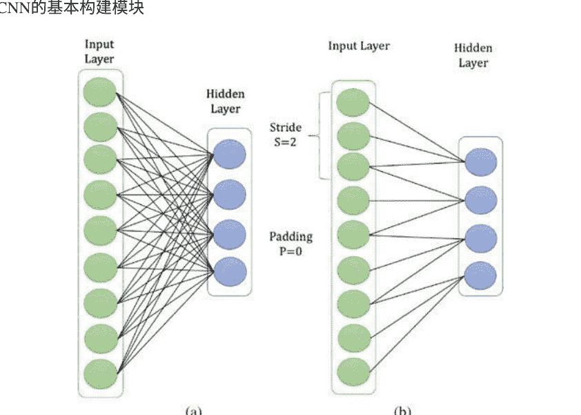

图6.1：局部连接和稀疏交互。（a）全连接层。（b）局部连接层

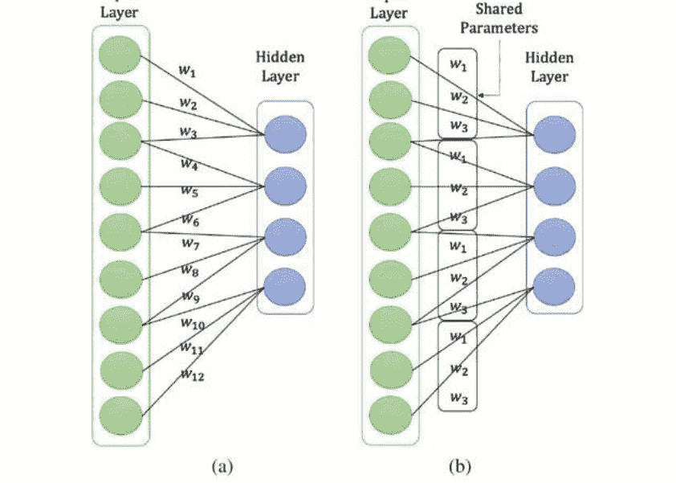

图6.2：局部连接和参数共享。（a）局部连接层。（b）具有参数共享的局部连接层

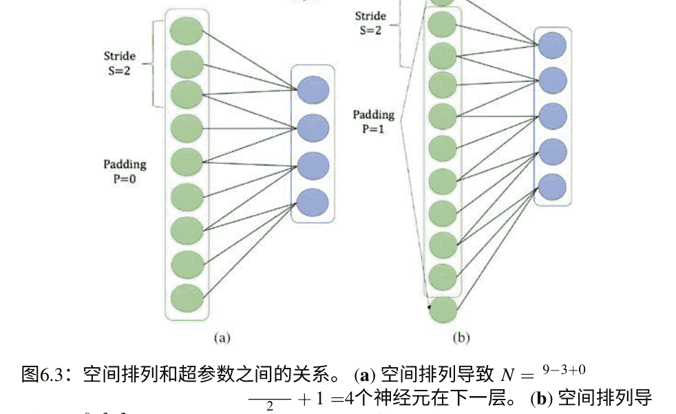

图6.3：空间排列和超参数之间的关系。

在连接到下一层之前，可以跳过滤波器的下一个实例。输入可以在边缘处进行零填充，以便滤波器可以适应边缘单元。填充单元的数量是另一个用于调整的超参数。图6.3展示了不同层之间的填充方式。在边缘添加值为0的填充被称为零填充；使用零填充进行的卷积被称为宽卷积，而没有使用零填充的卷积被称为窄卷积。

输入数量（输入体积）W，感受野（滤波器大小）F，步长S和零填充P之间的关系决定了下一层中的神经元数量，如公式（6.9）所示。

$$ N = \frac{W - F + 2P}{S} + 1 $$ (6.9)

图6.4说明了一个二维滤波器如何与输入进行卷积，生成该层的最终输出，卷积步骤被分解。图6.4可视化了上述所有空间排列，并说明了如何根据上述方程改变填充方式来影响神经元的数量。

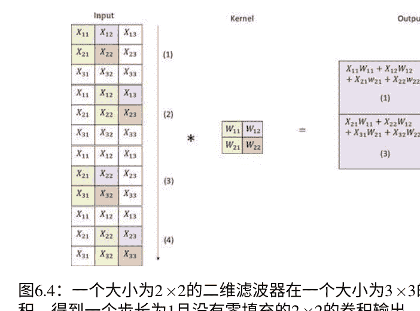

图6.4：一个大小为2×2的二维滤波器在一个大小为3×3的二维输入上进行卷积，得到一个步长为1且没有零填充的2×2的卷积输出。

图6.5将卷积过程扩展到具有三个通道的3D输入（类似于图像中的RGB通道）和两个滤波器，展示了线性卷积如何减少层之间的体积。如图6.6所示，这些滤波器充当了复杂特征检测机制。给定大量的训练数据，卷积神经网络可以在分类过程中学习滤波器，如水平边缘、垂直边缘、轮廓等。

过滤器中的通道数量应与其输入中的通道数量匹配。

大多数实用的CNN工具包或库在超参数违反等式（6.9）给出的约束条件时会抛出异常或安全处理关系。

图6.5: 一个尺寸为6×6×3（高度×宽度×通道数）的图像与两个尺寸为3×3×3的过滤器进行卷积，无填充和步长为1，结果为4×4×2的输出。这两个过滤器可以看作是并行工作的，结果在图的右侧有两个输出。

图6.6: 捕捉基本图像特征的四个滤波器

### 6.2.5 使用非线性的检测器

卷积的输出是一个仿射变换，进入一个非线性层或称为检测器层/阶段的转换。这与第4章中研究的激活函数非常相似，其中权重和输入的仿射变换通过非线性变换函数。检测器层通常使用sigmoid函数 $f(x) = \frac{1}{1+e^{-x}}$，双曲正切函数 $f(x) = tanh(x)$，或ReLU函数 $f(x) = max(0, x)$ 作为非线性函数。如第4章所讨论的，ReLU是最流行的函数，因为它易于计算且简单可微分。研究表明，在CNN中使用ReLU可以获得更好的泛化性能。

### 6.2.6 池化和子采样

一层的输出可以进一步进行下采样，以捕捉局部神经元或子区域的汇总统计信息。这个过程根据上下文称为池化、子采样或下采样。通常，检测器阶段的输出成为池化层的输入。

池化有许多有用的效果，例如减少过拟合和减少参数的数量。特定类型的池化也可以导致不变性。不变性允许无论特征的精确位置如何都能识别该特征，并且在分类中是一种重要属性。例如，在人脸检测问题中，指示眼睛存在的特征不仅是必要的，而且无论其在图像中的位置如何都存在。

有不同的池化方法，每种方法都有自己的好处，具体选择取决于手头的任务。当池化方法的偏差与特定的卷积神经网络应用中的假设相匹配时，例如在人脸检测的例子中，可以期望结果有显著的改善。下面列出了一些较受欢迎的池化方法。

#### 6.2.6.1 最大池化

顾名思义，最大池化操作选择其输入中神经元的最大值，从而有助于上述的不变性属性。这在图6.7中有所说明。形式上，对于检测阶段的2D输出，最大池化层执行以下转换：

$h_{i,j}^{l} = \max_{p,q} h_{i+p, j+q}^{l-1}$

其中 $p$ 和 $q$ 表示神经元在其局部邻域中的坐标，$l$ 表示层。在 $k$ 最大池化中，返回 $k$ 个值而不是单个值在最大池化操作中。

#### 6.2.6.2 平均池化

在平均池化中，局部邻域神经元的值取平均得到输出值，如图6.7所示。形式上，平均池化执行以下转换：

公式：$h_{i,j}^{l} = \frac{1}{m^{2}} \sum_{p, q} h_{i+p, j+q}^{l-1}$ (6.11)

其中 $m \times m$ 是卷积核的维度。

#### 6.2.6.3 L2范数池化

L2范数池化是平均池化的一种推广形式，表示为：

公式：$h_{i,j}^{l} = \sqrt{\sum_{p, q} h_{i+p, j+q}^{l-1}{ }^{2}}$ (6.12)

实际上，池化有很多变种，例如 $k$ 最大池化，动态池化，动态 $k$ 最大池化等。

#### 6.2.6.4 随机池化

在随机池化中，不是选择最大值，而是从多项分布中选择一个神经元。随机池化与dropout类似，可以解决过拟合问题[Z F13b]。

#### 6.2.6.5 频谱池化

在频谱池化中，空间输入通过离散傅里叶变换（DFT）转换为频域，以捕捉低维度中的重要信号。例如，如果输入为 $\mathbf{x} \in \mathbb{R}^{m \times m}$，并且必须缩小到大小 $h \times w$，则在输入上执行DFT操作，使得频率表示保持中心 $h \times w$ 子矩阵；然后，执行逆DFT变换返回到空间域[RSA15]。这种转换对空间具有降维的效果，并且在某些应用中非常有效。

## 6.3 CNN中的前向传播和反向传播

现在，所有基本组件都已经涵盖，它们将被连接起来。本节还将逐步介绍CNN中前向传播和反向传播中涉及的不同操作的过程，以便清楚地理解。为了清晰起见，我们将考虑一个基本的CNN块，包括一个卷积层，一个非线性激活函数（如ReLU，执行非线性变换）和一个池化层。在实际应用中，多个这样的块被堆叠在一起形成网络层。这些块的输出然后被展开并连接到一个全连接输出层。展开过程将多维张量转换为一维向量，例如将三维 (W,H,N)转换为维度为 d的向量。W × H × N.

让我们开始对层 l的推导，它是在层 l−1上进行卷积的输出。层 l的高度为 h，宽度为 w，通道数为 c。假设有一个通道，即 c=1，输入维度有迭代器 i、j。我们将考虑具有迭代器 m、n的卷积操作的 k1×k2维度的滤波器。

具有权重 W_{m,n}和偏置 b^l的权重矩阵通过卷积操作将上一层 l−1转换为层 l。卷积层之后是一个非线性激活函数，例如ReLU f(·)。层 l的输出用 O^l_{i,j}表示。

因此，层 l的前向传播可以写成：

> X^l_{i,j} = \text{旋转180}\{W^l_{m,n}\} \times O^{l-1}_{i,j} + b^l

这可以展开为：

> X^l_{i,j} = \sum_m \sum_n W^l_{m,n} O^{l-1}_{i+m,j+n} + b^l

和

> O^l_{i,j} = f(X^l_{i,j})

我们假设误差或损失机制，如均方误差 E用于衡量预测值和实际标签之间的差异。错误必须向后传播，并且需要更新滤波器和层 l接收到的输入的权重。因此，在反向传播过程中，我们对误差 E相对于输入 (∂E/∂X)和滤波器权重感兴趣。

> (\partial E / \partial W)

### 6.3.1 相对于权重的梯度 $\frac{\partial E}{\partial \mathbf{W}}$

我们首先考虑单个像素 $(m', n')$对卷积核的影响，由 $W_{m',n'}$给出的误差 $E$，使用链式法则：

$$\frac{\partial E}{\partial W_{m',n'}^l} = \sum_{i=0}^{h-k_1} \sum_{j=0}^{w-k_2} \frac{\partial E}{\partial X_{i,j}^l} \frac{\partial X_{i,j}^l}{\partial W_{m',n'}^l} \quad (6.16)$$

如果我们将$(\delta_{i,j}^l)$视为层 $l$相对于输入的梯度误差，上述方程可以重写为：

$$\frac{\partial E}{\partial W_{m',n'}^l} = \sum_{i=0}^{h-k_1} \sum_{j=0}^{w-k_2} \delta_{i,j}^l \frac{\partial X_{i,j}^l}{\partial W_{m',n'}^l} \quad (6.17)$$

将输出的变化写成输入的形式（上一层），我们得到：

$$\frac{\partial X_{i,j}^l}{\partial W_{m',n'}^l} = \frac{\partial}{\partial W_{m',n'}^l} \left( \sum_m \sum_n W_{m,n}^l O_{i+m,j+n}^{l-1} + b^l \right) \quad (6.18)$$

当我们对 $W_{m',n'}$求偏导时，除了映射到 $m = m'$和 $n = n'$的分量外，所有值都变为零。

$$\frac{\partial X_{i,j}^l}{\partial W_{m',n'}^l} = \frac{\partial}{\partial W_{m',n'}^l} \left( W_{0,0}^l O_{i+0,j+0}^{l-1} + \dots + W_{m',n'}^l O_{i+m',j+n'}^{l-1} + \dots + b^l \right) \quad (6.19)$$

$$\frac{\partial X_{i,j}^l}{\partial W_{m',n'}^l} = \frac{\partial}{\partial W_{m',n'}^l} \left( W_{m',n'}^l O_{i+m',j+n'}^{l-1} \right) \quad (6.20)$$

$$\frac{\partial X_{i,j}^l}{\partial W_{m',n'}^l} = O_{i+m',j+n'}^{l-1} \quad (6.21)$$

将结果代回，得到：

$$\frac{\partial E}{\partial W_{m',n'}^l} = \sum_{i=0}^{h-k_1} \sum_{j=0}^{w-k_2} \delta_{i,j}^l O_{i+m',j+n'}^{l-1} \quad (6.22)$$

> 整个过程可以总结为梯度的卷积 与层 $l-1$的输出旋转180度 $\delta_{i,j}^l$的卷积. 即 $O_{i+m',j+n'}^{l-1}$。因此，要更新的新权重可以非常简单地计算出来类似于前向传播。

$$
\frac{\partial E}{\partial W^{l}_{m',n'}} = \text{rotate}_{180}\{\delta^{l}_{i,j}\} \times O^{l-1}_{m',n'}
$$ (6.23)

### 6.3.2 相对于输入的梯度 $\frac{\partial E}{\partial X}$

接下来，我们对单个输入的变化感兴趣，由 $X^{l}_{i',j'}$ 给出，影响了错误 $E$。借鉴计算机视觉的方法，卷积后的输入像素 $X^{l}_{i',j'}$ 影响了一个由左上角 $(i'+k_1-1, j'+k_2-1)$ 和右下角 $(i',j')$ 界定的区域。因此，我们得到：

$$
\frac{\partial E}{\partial X^{l}_{i',j'}} = \sum_{m=0}^{k_1-1} \sum_{n=0}^{k_2-1} \frac{\partial E}{\partial X^{l+1}_{i'-m, j'-n}} \frac{\partial X^{l+1}_{i'-m, j'-n}}{\partial X^{l}_{i',j'}}
$$ (6.24)

$$
\frac{\partial E}{\partial X^{l}_{i',j'}} = \sum_{m=0}^{k_1-1} \sum_{n=0}^{k_2-1} \delta^{l+1}_{i'-m, j'-n} \frac{\partial X^{l+1}_{i'-m, j'-n}}{\partial X^{l}_{i',j'}}
$$ (6.25)

仅展开输入变化率，可以得到：

$$
\frac{\partial X^{l+1}_{i'-m, j'-n}}{\partial X^{l}_{i',j'}} = \frac{\partial}{\partial X^{l}_{i',j'}} \left( \sum_{m'} \sum_{n'} W^{l+1}_{m',n'} O^{l}_{i'-m+m', j'-n+n'} + b^{l+1} \right)
$$ (6.26)

将其写成输入层 $l$ 的形式，我们得到：

$$
\frac{\partial X^{l+1}_{i'-m, j'-n}}{\partial X^{l}_{i',j'}} = \frac{\partial}{\partial X^{l}_{i',j'}} \left( \sum_{m'} \sum_{n'} W^{l+1}_{m',n'} f(X^{l}_{i'-m+m', j'-n+n'}) + b^{l+1} \right)
$$ (6.27)

除了当 $m' = m$ 且 $n' = n$ 时，所有的偏导数都为零 $f(X^{l}_{i'-m'+m, j'-n'+n}) = f(X^{l}_{i',j'})$，和 $W^{l+1}_{m',n'} = W^{l+1}_{m, n}$ 在相关的输出区域中。

$$
\frac{\partial X^{l+1}_{i'-m, j'-n}}{\partial X^{l}_{i',j'}} = \frac{\partial}{\partial X^{l}_{i',j'}} \left( W^{l+1}_{m',n'} f\left( X^{l}_{0-m+m', 0-n+n'} \right) + \cdots + W^{l+1}_{m,n} f\left( X^{l}_{i',j'} \right) + \cdots + b^{l+1} \right)
$$ (6.28)

$$\frac{\partial X^{l+1}_{i'-m,j'-n}}{\partial X^{l}_{i',j'}} = \frac{\partial}{\partial X^{l}_{i',j'}} \left( W^{l+1}_{m,n} f\left(X^{l}_{i',j'}\right) \right)\quad(6.29)$$

$$\frac{\partial X^{l+1}_{i'-m,j'-n}}{\partial X^{l}_{i',j'}} = W^{l+1}_{m,n} f'\left(X^{l}_{i',j'}\right)\quad(6.30)$$

代入后得到：

$$\frac{\partial E}{\partial X^{l}_{i',j'}} = \sum_{m=0}^{k_1-1}\sum_{n=0}^{k_2-1} \delta^{l+1}_{i'-m,j'-n} W^{l+1}_{m,n} f'\left(X^{l}_{i',j'}\right)\quad(6.31)$$

该术语 $\sum_{m=0}^{k_1-1}\sum_{n=0}^{k_2-1} \delta^{l+1}_{i'-m,j'-n} W^{l+1}_{m,n}$ 可以被视为翻转的滤波器，或者是旋转180度后与 \(\delta\) 矩阵进行卷积的滤波器。因此，

$$\frac{\partial E}{\partial X^{l}_{i',j'}} = \left( \delta^{l+1}_{i',j'} \times \text{旋转}_{180}\left\{ W^{l+1}_{m,n} \right\} \right) f'\left(X^{l}_{i',j'}\right)\quad(6.32)$$

### 6.3.3 最大池化层

正如我们在池化部分中所看到的，池化层没有任何权重，只是根据执行的空间操作来减小输入的大小。 在前向传播中，池化操作将矩阵或向量转换为单个标量值。

在最大池化中，记住胜出神经元或细胞；当需要进行反向传播时，整个误差都传递给该胜出神经元，因为其他神经元没有贡献。 在平均池化中，反向传播过程中的一个 \(n \times n\)池化块将总标量值除以 \(\frac{1}{n \times n}\)并将其均匀分布在该块中。

## 6.4 文本输入和CNN

文本挖掘中的各种自然语言处理和自然语言理解任务使用卷积神经网络作为特征工程块。 我们将从基本的文本分类开始，以突出计算机视觉中的图像和文本映射之间的一些重要类比和卷积神经网络过程中的必要变化。

### 6.4.1 词嵌入和CNN

让我们假设所有的训练数据都是带有标签的句子，并且具有给定的最大长度s。第一个转换是将句子转换为一个向量表示。一种方法是对句子中的每个单词进行查找函数，以获取其固定维度的表示，例如词嵌入。让我们假设在一个固定的词汇大小V中查找单词表示，得到一个固定维度的向量，记为d；因此，每个向量可以映射到ℝᵈ。

矩阵的行表示句子的单词，列可以是对应的固定长度向量。句子是一个实际的矩阵X ∈ ℝˢˣᵈ。

一般的假设，特别是在分类任务中，是序列中的局部词语，类似于n-gram，当它们结合在一起时，形成复杂的高级特征。这种局部词语的组合与计算机视觉类似，其中局部像素可以组合成线条、边缘和真实物体等特征。在使用图像表示的计算机视觉中，卷积层的过滤器尺寸比输入尺寸小，通过在图像上滑动进行卷积操作。在文本挖掘中，卷积的第一层通常具有与输入相同的维度，但具有不同的高度，通常称为过滤器尺寸。

图6.8说明了这一点，对句子“The cat sat on the mat”进行了分词，得到了6个单词{The, cat, sat, on, the, mat}。查找操作为每个单词获取了一个三维词嵌入（维度为3）。一个具有高度或大小为2的单个卷积过滤器开始生成特征图。输出经过ReLU的非线性激活函数，阈值为0.0，然后进入1-max池化。图6.8说明了使用相同的共享核在所有输入上产生的最终状态，生成1-max池化的单个输出。

图6.9给出了一个从句子到输出的简单CNN框架的广义方法。在现实世界中，输入单词的许多表示形式可以存在，类似于计算机视觉领域中具有颜色通道的图像。不同的单词向量可以映射到可能是静态的通道（即预训练的），也可以是动态的，即使它们是预训练的，反向传播也可以微调它。有各种应用程序使用不仅仅是单词嵌入来表示，还使用词性标签或序列中的位置。应用程序和NLP任务决定了特定的表示形式。它们还可以是动态的，即使它们是预训练的，反向传播也可以微调它。有各种应用程序使用不仅仅是单词嵌入来表示，还使用词性标签或序列中的位置。应用程序和NLP任务决定了特定的表示形式。

通常，输出结果在不同的区域中产生，并且这些区域的数量也是多样的，一般从2到10个，即滑动窗口覆盖2-10个单词。对于每个区域大小，可以有多个学习到的滤波器，由$n_f$给出。与上面推导出的图像表示计算类似，这里也有步长为$stride$的1个区域，其中$stride$是单词过滤器滑过的数量。因此，卷积层的输出是维度为$\mathbb{R}^{s-h+1}$的向量，对于步长为1。形式上，

```
$ o_i = \mathbf{W} \cdot \mathbf{X}[i:i+h-1, :] $ (6.33)
```

这个方程表示了一个高度为$h$的滤波器矩阵$\mathbf{W}$如何在区域矩阵$\mathbf{X}[i:i+h-1, :]$上以单位步长滑动。对于每个滤波器，权重是共享的，就像基于图像的框架一样，进行局部特征提取。然后，输出通过非线性激活函数$f(a)$流入，最常见的是ReLU。输出为每个滤波器或区域生成一个特征图$c_i$，带有偏置$b$，如下所示：

```
$ c_i = f(o_i) + b $ (6.34)
```

每个特征图的输出向量都经过一个池化层，如前所述。池化层提供了降采样和不变性的特性，如上所述。池化层还通过产生一个降维的整体向量来解决句子中单词长度可变的问题。由于向量表示单词或时间序列，文本领域中的最大池化被称为时间上的最大池化。如图6.10所示，如何通过时间上的最大池化将两个不同大小的文本缩减为相同维度的表示。

> 在短文本分类中，1-max池化效果显著。在文档分类中，k-max池化是一个更好的选择。

池化层的输出被连接起来并传递给softmax层，根据类别或标签的数量进行分类。在表示文本和进行卷积神经网络操作时，有许多超参数选择，例如词表示的类型，词表示的数量，步幅，填充，过滤器宽度，过滤器数量，激活函数，池化大小，池化类型以及在最终的softmax层之前的卷积神经网络块的数量，等等。对于一个简单的文本处理块的卷积神经网络，总的超参数数量可以表示为：参数 = \((V + 1) \times d\) WordEmbeddings(static) + \(((h \times d) \times n_f) + n_f + \) 过滤器 \(n_f + 1\) Softmax输出 (6.35)

现在，我们将为一个简单的CNN在文本领域中提供从输入到输出的正式处理。对于来自训练数据的可变长度句子，具有最大长度为 \(s\) 的单词，对于大小为 \(d\) 的单词嵌入的类似查找，我们得到一个输入向量在 \(\mathbb{R}^d\) 中。对于其他少于 \(s\) 个单词的句子，我们可以使用0或随机值进行填充。与前一节一样，这些单词可以有许多表示形式，例如静态或动态，不同的嵌入，如word2vec、GloVe等，甚至不同的嵌入，如位置、标签（POS标签）等，所有这些都形成了输入通道，唯一的约束是它们都具有相同的维度。

卷积滤波器可以看作是与词嵌入长度相同的1D权重，滑动在大小为 \(h\) 的单词上。这可以创建不同的词窗口。这些特征向量由 \([o_1, o_2, \cdots, o_{n-h+1}]\) 表示，通过非线性激活函数（如ReLU）进行表示。非线性激活函数的输出与输入具有相同的维度，可以表示为 \([c^1, c^2, \cdots, c^{n-h+1}]\) 在 \(\mathbb{R}^{n-h+1}\) 中。最后，非线性激活函数的输出进一步传递到最大池化层，该层为每个过滤器找到一个单一的标量值 \(c_i \in \mathbb{R}\)。在实践中，每个大小h都有多个过滤器，而在一般情况下，有多个不同大小的过滤器h从2到10不等。输出层将所有最大池化层的输出 \(\hat{c}\) 连接成一个单一的向量，并使用softmax函数进行分类。填充句子的考虑在开始和结束时，步长长度，窄或宽卷积以及其他超参数与一般卷积映射过程中的相同。

### 6.4.2 基于字符的表示和CNN

在许多与分类相关的任务中，词汇量变得很大，即使在训练中考虑到未见过的单词，使用嵌入也会导致次优性能。张等人的工作[ZZL15]使用字符级嵌入代替词级嵌入在训练输入中，以克服这些问题。研究人员表明，字符嵌入可以实现开放词汇，处理拼写错误的单词等多种好处。图6.11显示了设计的CNN具有许多1D卷积层的卷积块，非线性激活-卷积层中使用了多个卷积核、激活函数、批归一化和 k-max池化，所有这些都堆叠在一起形成了一个深度卷积层。该表示使用了一组70个常见的字母数字字符，其中包括所有小写字母、数字和其他字符，使用了一位有效编码。固定大小为 \(l =1024\) 的字符组合作为给定时间点输入的一部分，形成了可变长度文本的输入。总共使用了6个块的2组CNN，其中一个尺寸较大，维度为1024，另一个尺寸较小，维度为256。前两个卷积层的滤波器高度为7，其余卷积层的高度为3，前几个卷积层使用了3-pooling和步长为1。最后3个层是全连接层。最后一层是用于分类的软最大层。

图6.11：基于字符的CNN用于文本分类

## 6.5 经典的CNN架构

在本节中，我们将介绍一些标准的CNN架构。我们将详细讨论它们的结构，并为每个结构提供一些历史背景。尽管许多这些架构在计算机视觉领域非常流行，但它们在文本和语音领域仍然适用，只是会有一些变化。

### 6.5.1 LeNet-5

LeCun等人提出了LeNet-5作为CNN的首批实现之一，并在手写数字识别问题上展示了令人印象深刻的结果[LeC+98]。

图6.12显示了LeNet-5的完整设计。LeCun通过卷积来减小高度和宽度的概念，增加了滤波器/通道的大小，并使用成本函数来传播错误的全连接层，这些概念现在是所有CNN框架的基础。LeNet-5使用了MNIST数据集的60K个训练数据来进行训练和学习权重。从现在开始，在我们的所有讨论中，一个层的表示将由 \(n_w \times n_h \times n_c\) 给出，其中 \(n_w\), \(n_h\), \(n_c\) 分别表示宽度、高度和通道/滤波器的数量。接下来，我们将详细介绍关于输入、输出、滤波器数量和池化操作的设计细节。

- 输入层仅使用灰度像素值，大小为 \(32 \times 32 \times 1\)。它被归一化为均值为0，方差为1。
- 使用 \(5 \times 5 \times 6\) 的滤波器，无填充和步长 \(s=1\)，创建一个大小为 \(28 \times 28 \times 6\) 的层。
- 接下来是一个平均池化层，滤波器宽度 \(f=2\)，步长 \(s=2\)，结果是一个大小为 \(14 \times 14 \times 6\) 的层。
- 应用另一个 \(5 \times 5 \times 16\) 的卷积层，无填充和步长 \(s=1\)，创建一个大小为 \(10 \times 10 \times 16\) 的层。
- 再次使用平均池化层，滤波器宽度 \(f=2\)，步长 \(s=2\)，导致高度和宽度减小，得到一个大小为 \(5 \times 5 \times 16\) 的层。
- 然后将其连接到一个大小为120的全连接层，然后是一个大小为84的全连接层。
- 然后将这84个特征输入到一个输出函数中，该函数使用欧几里德径向基函数来确定这些特征表示的是哪个数字中的哪个。

> 1. LeNet-5在非线性方面使用了Sigmoid函数，而不是ReLU函数，后者在当今的CNN框架中更受欢迎。
> 2. 在池化层之后应用了Sigmoid非线性函数。
> 3. LeNet-5使用了欧几里德径向基函数，而不是当今更流行的softmax函数。
> 4. LeNet-5中的参数/权重数量约为60K，乘法和累加（MACS）数量约为341K。
> 5. 当时使用了不填充的概念，这会导致尺寸变小，但这在现今并不常见。

### 6.5.2 AlexNet

AlexNet，由Krizhevsky等人设计[KSH12a]，是第一个在2012年以较大优势（约11.3%）赢得ImageNet挑战的深度学习架构。AlexNet在很多方面都对深度学习研究进行了关注[KSH12a]。它的设计与LeNet-5非常相似，但是有更多的层和滤波器，导致网络更大，参数更多。[KSH12a]的工作表明，使用深度学习框架可以学习特征，而不是手动生成具有深度领域理解的特征。Alex Net的设计细节如下（图6.13）：

- 与LeNet-5不同，AlexNet使用了所有三个通道的输入。尺寸为227 ×227 ×3的输入经过11 × 11 ×96的卷积滤波器，步长为 \(s =4\)，通过ReLU进行非线性处理，得到55 ×55 ×96的输出。
- 这经过一个大小为3×3，步长为2的最大池化层，并将输出减少到27 × 27 × 96。
- 这一层经过局部响应归一化（LRN），有效地对通道深度上的值进行归一化，然后进行另一个大小为5×5 ×256，步长为1，填充为2的卷积操作，应用ReLU函数得到一个27 × 27 ×256的输出。
- 这经过一个大小为3×3，步长为2的最大池化层，将输出减少到13 × 13 × 256。
- 接下来是LRN操作，然后进行另一个大小为3×3×384，步长为1，填充为1的卷积操作，应用ReLU函数得到一个13 × 13 ×384的输出。
- 这之后是另一个尺寸为3×3×384的卷积，步长为1，填充 \(f =1\)，应用ReLU函数得到一个13 × 13 × 384的输出。
- 这之后是尺寸为3×3×256的卷积，步长为1，填充为1，应用ReLU函数得到一个13×13×256的输出。
- 这经过一个尺寸为3×3，步长为2的最大池化层，将输出减少到6×6×256。
- 这个输出6×6×256=9216被传递到一个大小为9216的全连接层，然后通过两个具有ReLU函数的全连接层进行0.5的dropout处理，大小为4096。
- 输出层是一个具有100个图像类别的softmax层，用于学习。

图6.13: AlexNet

> 1. AlexNet使用ReLU函数，并显示其作为一种非常有效的非线性激活函数。ReLU在CIFAR数据集上比sigmoid函数表现出六倍的性能提升，这也是研究人员选择ReLU的原因。
> 2. 参数/权重的数量约为632万，计算量约为11亿次，远高于LeNet-5。
> 3. 通过两个GPU实现了加速。层被分割，使得每个GPU与下一层的输出并行工作。
> 4. 节点和句子信息传递给其他节点。即使使用GPU，90个训练周期也需要5-6天的时间来训练120万个训练样本。

### 6.5.3 VGG-16

VGG-16，也被称为VGGNet，由Simonyan和Zisserman开发，以其统一的设计在许多领域取得了很大的成功[SZ14]。所有卷积层都是3×3，步长为1，并且使用2×2的最大池化层，通道数从64增加到512，以2的倍数增加，这使得设置非常吸引人且容易。已经证明堆叠卷积层可以在三层中，步长为1的3×3等效于7×7的卷积，并且计算量显著减少。VGG-16在末尾有两个全连接层，并带有一个softmax层用于分类。VGG-16唯一的缺点是网络非常庞大，大约有1.4亿个参数。即使使用GPU配置，训练模型仍需要很长时间（图6.14）。

## 6.6 现代的CNN架构

我们将讨论导致现代卷积神经网络在不同领域中的变化，包括文本挖掘。

### 6.6.1 堆叠或分层CNN

基本的卷积神经网络映射到具有大小为 \(k\) 的卷积滤波器的句子中，类似于经典自然语言处理设置中的 \(k\) 元词汇检测器。堆叠或分层卷积神经网络的思想是通过添加更多层来扩展原理。通过这样做，感受野的大小增加，将捕捉到更大的单词或上下文窗口作为特征，如图6.15所示。

如果我们将 \((W, b)\) 看作是对应于权重和偏差的参数，\(\oplus\) 表示对长度为 \(m\) 的句子进行的词嵌入序列的拼接操作，其中每个维度为 \(d\)，\(k\) 表示卷积的窗口大小，则输出由 \(c_{1:m}\) 给出。

$$c_{1:m} = CONV_{(W, b)}^{k}(e_{1:n})$$ (6.36)

$$c_i = f(\oplus(w_{i:i+k-1}) \cdot W + b)$$ (6.37)

其中 \(m = n - k + 1\) 表示窄卷积，而 \(m = n + k + 1\) 表示宽卷积。

如果我们考虑 \(p\) 层，其中一个卷积层的输出作为另一个卷积层的输入，那么我们可以写成

$$\begin{aligned}
c_{1:m_1}^1 &= CONV_{(W^1, b^1)}^{k_1}(w_{1:n}) \\
c_{1:m_2}^2 &= CONV_{(W^2, b^2)}^{k_2}(c_{1:m_1}^1) \\
&\vdots \\
c_{1:m_p}^p &= CONV_{(W^p, b^p)}^{k_p}(c_{1:m_{p-1}}^{p-1})
\end{aligned}$$ (6.38)

随着层层叠加，用于捕捉信号的有效窗口大小或感受野也会增加。例如，在情感分类中，如果有一个句子——这部电影不是很好，一个大小为2的卷积滤波器将无法捕捉到“不是很好”的序列，但是一个相同大小的堆叠卷积神经网络将在更高层次上捕捉到这个序列。

### 6.6.2 扩张CNN

在堆叠卷积神经网络中，我们假设步长为1，但是如果我们将步长泛化为大小为s，那么卷积操作可以表示为：

$$c_{1:m} = CONV^{k,s}_{(W,b)}(w_{1:n})$$ (6.39)

$$c_i = f(\oplus(w_{1+(i-1)s:(s+i)k}) \cdot W + b)$$ (6.40)

扩张卷积神经网络可以看作是堆叠卷积神经网络的一种特殊版本。一种方法是当卷积核大小为 \(k\) 时，每层的步长大小为 \(k-1\)。

$$c_{1:m} = CONV^{k,k-1}_{(W,b)}(w_{1:n})$$ (6.41)

在没有池化的 \(l\) 层卷积神经网络上进行 \(k \times k\) 的卷积操作会得到尺寸为 \(l \times (k-1) + k\) 的感受野，这与层数 \(l\) 呈线性关系。扩张卷积神经网络可以根据层数指数级地增加感受野的大小。另一种方法是保持步长大小恒定，如 \(s=1\)，但在每层使用局部池化进行长度缩短，可以使用最大值或平均值作为池化的值。图6.16展示了通过逐渐增加层的扩张率，感受野可以指数级地增加，覆盖更大的区域[YK15]。

> 1. 扩张卷积神经网络有助于捕捉更长的文本片段的句子结构，并且在捕捉上下文方面非常有效。
> 2. 扩张卷积神经网络可以减少参数数量，从而提高训练速度，并捕捉更多的上下文。

图6.16: 扩张卷积神经网络显示了随着扩张的增加而增加的感受野，扩张分别为1, 2, 和 4

### 6.6.3 Inception网络

Szegedy等人的Inception网络[Sze+17]目前是最好的卷积神经网络之一，特别是在计算机视觉领域。Inception网络的核心是一个重复的Inception块。Inception块使用许多滤波器，例如1×1, 3×3和5×5，还有最大池化，无需选择其中任何一个。使用1×1滤波器的核心思想是在将其馈送到较大的滤波器（例如3×3）之前减少体积和计算量。

图6.17展示了一个28×28×192的样本输出，该输出是通过前一层与一个3×3×128的滤波器卷积得到的，输出为28×28×128；即输出层有128个滤波器，大约需要进行1.74亿次乘法累加运算。通过使用1×1×96的滤波器来减少体积，然后再与3×3×128的滤波器卷积，总计算量减少到大约1亿次乘法累加运算，几乎节省了60%。同样，通过使用1×1×16的滤波器来先于5×5×32的滤波器，总计算量可以从大约1.2亿减少到1200万，减少了一个数量级。减少体积的1×1滤波器也被称为瓶颈层。

图6.18展示了一个带有样本输入的单个Inception块的图示视图，其宽度和高度为28×28，深度为192，生成宽度和高度为28×28，深度为256的输出。1×1滤波器在减少其他滤波器的体积的同时，也产生输出。

1×1×64滤波器用于产生28×28×64的输出。当输入通过1×1×96滤波器并与3×3×128卷积时，生成28×28×128的输出。当输入通过1×1×16滤波器，然后通过5×5×32滤波器时，产生28×28×32的输出。使用步长为1和填充的最大池化操作产生大小为28×28×192的输出。由于最大池化输出具有许多通道，每个通道都通过另一个1×1×32用于减少体积的滤波器。因此，每个滤波操作可以并行进行，并生成一个连接在一起的输出，最终大小为28×28×256。

图6.17：在3×3滤波器之前使用1×1滤波器可以节省计算成本

图6.18：具有多个大小为1×1、3×3、5×5的滤波器的Inception块，生成一个连接的输出

1×1卷积块在减少体积方面起着重要作用，用于更大的滤波器尺寸卷积。Inception块允许学习多个滤波器权重，从而无需选择其中一个滤波器。不同滤波器之间的卷积并行操作和连接进一步提高了性能。

### 6.6.4 其他CNN结构

在许多自然语言处理任务中，例如情感分析，使用语法元素和语言中的其他结构信息的特征已经取得了改进的性能。图6.19显示了一个通过依赖弧连接的句法和语义表示，它映射到基于树或基于图的表示形式。

基本的卷积神经网络无法捕捉语言中的这些依赖关系。因此，提出了结构化卷积神经网络来克服这个缺点。依赖卷积神经网络（DCNN），如图6.20所示，是通过词嵌入来表示句子中的词依赖关系，然后执行类似于矩阵卷积的树卷积，最后在输出分类之前使用全连接层进行分类[Ma+15]。在Mou等人[Mou+14]中，应用领域是编程语言而不是自然语言，并且使用类似的基于树的卷积神经网络来学习特征表示。

句法和依赖关系可以通过图表示 \(G\) 来捕捉 \((V,E)\)，其中单词充当节点或顶点 \(V\)，它们之间的关系被建模为边 \(E\)。然后可以对这些图结构进行卷积操作[Li+15]。

如第5章所示，诸如word2vec、GloVe等的每个嵌入框架都捕捉到不同的分布语义，每个框架的维度也可能不同。Zhang等人提出了一种多组范数约束的CNN（MGNC-CNN），可以将不同维度的不同嵌入组合在同一个句子中[ZRW16]。正则化可以应用于每个组（MGNC-CNN），也可以应用于连接层（MG-CNN），如图6.21所示。

图6.19：显示了具有句法和语义依赖关系的句子

在许多应用中，比如机器翻译、文本蕴含、问答等，经常需要比较两个输入的相似性。大多数这些框架都具有某种形式的孪生结构，每个句子都有两个并行的框架，结合了卷积层、非线性变换、池化和堆叠，直到最后将特征组合在一起。Bromley等人的签名比较工作启发了许多类似框架的设计[Bro+94]。

图6.20：一种基于树结构的CNN，可以捕捉句法和语义依赖关系

图6.21：MG-CNN和MGNC-CNN展示了用于分类的不同维度的嵌入。 MG-CNN将在第一层应用范数约束，而MGNC-CNN将在第一层和第二层应用范数约束。

我们将通过Wenpeng等人的最新框架[Yin+16a]来说明一个这样的框架，他将其称为基本的双向CNN，如图6.22所示。该框架进一步修改为具有共享注意力层，并在各种应用中表现出色。

例如答案选择、释义识别和文本蕴含。孪生网络，每个网络由CNN和池化块组成，处理两个句子中的一个，并且最后一层解决句子对任务。输入层包含来自word2vec的词嵌入，每个句子的单词进行拼接。每个块使用宽卷积，以便句子中的所有单词都可以提供信号，相比之下，窄卷积则不然。tanh激活函数 tanh(Wx_i + b) 被用作非线性变换。接下来，对每个句子执行平均池化操作。最后，两个平均池化层的输出被连接并传递给用于二分类的逻辑回归函数。

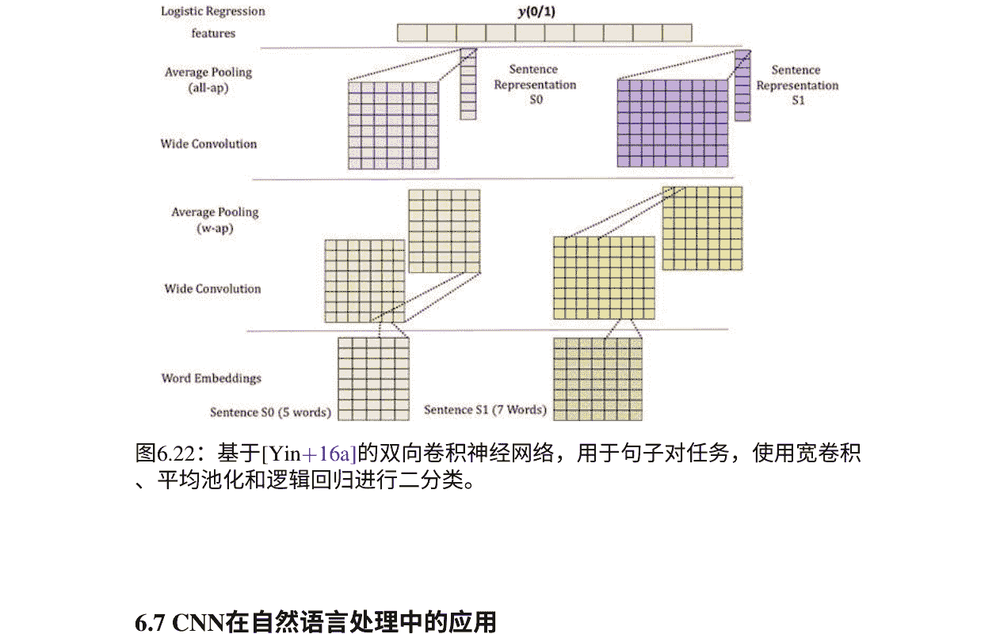

## 6.7 CNN在自然语言处理中的应用

在本节中，我们将讨论CNN在各种文本挖掘任务中的一些应用。我们的目标是总结这项研究，并提供关于流行的CNN和现代设计的见解。CNN在各种修改甚至与其他框架（如LSTMs）的组合中确实被用于不同的NLP任务。由于CNN本身可以通过进一步的组合捕捉局部特征和这些特征的组合，因此CNN主要用于文本/文档分类、文本分类和情感分类任务。尽管CNN在基于序列的任务（如POS标记、NER、分块等）中被使用，但它们失去了序列的顺序。在这样的集合中真正有效在这些任务中，它们要么需要与其他框架结合使用，要么需要对位置特征进行编码。

### 6.7.1 文本分类和分类

许多文本分类任务使用单词的n-gram来捕捉局部交互和特征，在过去几年中，使用CNN框架取得了很大的成功。 基于CNN的框架可以轻松捕捉变长文本序列中的时间和层次特征。 在这些框架中，词嵌入通常是第一层。 根据数据和类型，可以使用预训练的或静态的词嵌入来获得句子中单词的向量表示。

Collobert等人[CW08c]， [Col+11]使用一个卷积块来对句子进行建模，以执行许多自然语言处理任务。 Yu等人[Yu+14]也使用一个卷积神经网络来建模一个分类器，以选择问题答案映射。 Kalchbrenner等人通过堆叠卷积神经网络并使用动态 k-max池化操作来扩展这个想法，以处理长句子[KGB14b]。 这项研究在短文本和多类别分类方面显著改进了现有方法。 Kim通过在输入中添加多个通道和多个不同长度的卷积核来扩展单块卷积神经网络，以获得更高阶的 ngram组合[Kim14b]。 这项工作还进行了静态与动态通道的各种影响分析，以及最大池化的重要性等，以检测哪些基本块产生了较低的错误率。 Yin等人将Kim的多通道、可变卷积核框架扩展为使用分层卷积神经网络，进一步改进了性能[YS16]。

Santos和Gatti使用了字符到句子级别的表示与CNN框架-为了有效的情感分类[SG14]。 Johnson和Zhang探索了区域嵌入在有效的短文本分类中的应用，因为它能够捕捉到词嵌入无法捕捉到的上下文信息[JZ15]。 Wang和其他人使用预训练的词嵌入在密度峰上进行语义聚类，形成了一种称为语义团的表示，这些语义单元进一步与卷积一起用于短文本挖掘[Wan+15a]。

Zhang等人探索了在CNN中使用字符级表示而不是词级嵌入[ZZL15]。 在大型数据集上，句子的字符级建模与传统的稀疏表示或者词嵌入CNNs或RNNs相比表现得非常好。 Conneau等人设计了一个非常深的CNN，并进行了一些修改，如快捷方式，以学习更复杂的特征[Con+16]。 Xiao和Cho的研究进一步扩展了字符级编码在整个文档分类任务中的应用，同时结合了参数较少的RNNs[XC16]。

### 6.7.2 文本聚类和主题挖掘

在他们的工作中，Xu等人使用了卷积神经网络以完全无监督的方式进行短文本聚类[Xu+17]。原始文本中的关键词特征被用来生成具有保持局部性约束的紧凑二进制编码。使用动态卷积神经网络和词嵌入技术获得深度特征表示[KGB14b]。在训练过程中，卷积神经网络的输出被调整以适应二进制编码。从卷积神经网络层中演化出的深度特征被传递给常规聚类算法，如k-means，以得到数据的最终聚类结果。实验证明，这种方法在各种数据集上比传统基于特征的方法表现更好。

Lau等人使用基于卷积神经网络的框架共同学习主题和语言模型，从而得到更连贯、有效和可解释的主题模型[LBC17]。使用卷积神经网络框架捕捉文档上下文，并将生成的文档向量与主题向量相结合，得到有效的文档-主题表示。语言模型由上述相同的文档向量和LSTMs组成。

### 6.7.3 句法分析

在Collobert等人的开创性工作中，许多自然语言处理任务，如词性标注、块状标注、命名实体解析和语义角色标注，首次使用了词嵌入和CNN模块进行了处理[Col+11]。研究表明，使用CNN在自动化方式中寻找特征比手工制作的特定任务特征更加有效。郑等人表明，基于字符的表示、基于CNN的框架和动态规划在处理像中文这样复杂的语言的句法分析中非常有效[Zhe+15]。Santos和Zadroźny表明，在英语和葡萄牙语中，使用字符级别的嵌入与词级别的嵌入和深度CNN相结合可以进一步改善词性标注任务[DSZ14]。Zhu等人提出了一种递归CNN（RCNN）来捕捉依赖树中的复杂结构。RCNN作为一个基本的k叉树单元，可以捕捉到解析树中节点和子节点之间的关系。这种结构可以递归地应用于整个依赖树的表示。RCNN在依赖解析器中作为重新排序模型表现出非常有效[Zhu+15]。

### 6.7.4 信息抽取

正如第3章所讨论的，信息抽取（IE）是一个包含多个子类别的通用类别，例如实体抽取、事件抽取、关系抽取等。共指消解和实体链接等。在陈等人的工作中，研究人员没有使用手工编码的特征，而是使用基于词的表示来捕捉词汇和句子级别的特征，这些特征与修改过的CNN结合使用，以实现在文本中进行多个事件抽取的卓越性能[Che+15]。研究人员在他们的表示和嵌入中使用了词的上下文、位置和事件类型，这些表示和嵌入流入具有多个特征图的CNN中。研究人员没有使用具有最大池化的CNN，因为这可能会错过句子中发生的多个事件，而是采用了动态多池化的方法。在动态多池化中，特征图被分成三个部分，每个部分找到一个最大值。

正如在NLP部分中讨论的那样，郑等人[Zhe+15]和桑托斯等人[DSZ14]在关系分类中使用了CNN，而没有使用任何手工编码的特征。在Vu等人的工作中，关系分类使用了CNN和RNN的组合。在一个包含实体和它们之间关系的句子中，研究人员将句子分为左部分、中间部分和右部分，分别流入两个不同的词嵌入和具有最大池化的CNN层。这种设计特别关注中间部分，在关系分类中比以前的研究更为重要。引入了具有额外隐藏层的双向RNN来捕捉后续词语中的关系参数。综合方法显示出显著的改进，超过了传统基于特征的方法，甚至超过了独立使用的CNN和RNN。Nguyen和Grisham使用基于CNN的框架进行关系抽取[NG15b]。他们使用词嵌入和位置嵌入作为具有关系的实体句子的输入表示。他们采用了具有多个滤波器尺寸和最大池化的CNN。有趣的是，他们的框架的性能优于所有基于手工特征工程的机器学习系统，这些系统使用了许多形态和词汇特征。

在Adel等人的工作中，研究人员比较了许多技术，从传统的基于特征的机器学习到基于CNN的深度学习，用于关系分类在槽填充的上下文中[AS17a]。与上述工作类似，他们将句子分为三个部分以捕捉上下文，并使用CNN进行处理。k-max池化。

### 6.7.5 机器翻译

胡等人强调了CNN如何用于编码翻译对中的语义相似性和上下文，从而产生更有效的翻译[胡+15]。这项研究的另一个有趣方面是它采用了课程训练，其中训练数据从简单到困难进行分类，并使用短语到句子的上下文编码进行有效的翻译。

孟等人构建了一个基于CNN的框架，用于在机器翻译过程中引导源语言和目标语言的信号[孟+15]。使用带有门控的CNN可以指导源文本的哪些部分对目标词有影响。将它们与整个源句子进行上下文融合可以得到更好的联合模型。

Gehring等人使用了带有注意力模块的CNN，因此不仅展示了一个快速执行和可并行化的实现，而且还展示了与基于LSTM的模型相比更有效的模型。 在输入表示中使用词和位置嵌入，将过滤器叠加在一起以进行分层映射，使用门控线性单元和多步注意力模块，使研究人员在英法和英德翻译中具有真正的优势[Geh+17b]。

### 6.7.6 摘要

Denil等人表明，通过具有由单词嵌入组成的单词嵌入层次结构，进而组成文档嵌入，以及使用动态CNN，可以得到有用的文档摘要和有效的可视化效果[Den+14]。 研究还强调了组合可以在各种任务中捕捉从低级词汇特征到高级语义概念的能力，包括摘要、分类和可视化。

Cheng和Lapata开发了一个神经框架，将CNN用于分层文档编码，并使用注意力提取器进行有效的文档摘要[CL16]。 通过将表示映射到实际数据非常接近的地方，其中将单词组合成句子，句子组合成段落，段落组合成整个文档，使用CNN和最大池化，研究人员在捕捉局部和全局句子信息方面具有明显优势。

### 6.7.7 问答

Dong等人使用多列CNN对问题进行分析，从不同的角度，如答案路径、答案类型和答案上下文[Don+15b]。 利用实体和关系的低维嵌入空间对答案层进行嵌入，并在顶部使用评分层对候选答案进行排序。 该研究表明，在没有手工编码或工程特征的情况下，该设计提供了一个非常有效的问答系统。

Severyn和Moschitti表明，使用基于CNN的框架给出的问题和答案之间的词匹配的关系信息可以提供非常有效的问答系统[SM15]。 如果我们可以将问题映射到从数据库中找到事实，Yin等人在他们的工作中表明，使用基于CNN的框架的两阶段方法可以产生出色的结果[Yin+16b]。 答案中的事实被映射到主语、谓语和宾语。 然后，通过实体链接将问题中的提及与主语相关联

-

## 6.8 卷积的快速算法

总体而言，卷积神经网络比其他深度学习架构更具并行性。 然而，随着训练数据规模的增加，对近实时快速预测的需求以及基于GPU的硬件用于并行化操作的普及，卷积神经网络的卷积操作经历了许多改进。 在本节中，我们将讨论一些用于卷积神经网络的快速算法，并深入了解如何通过更少的浮点运算使卷积更快。

### 6.8.1 卷积定理和快速傅里叶变换

这个定理说明了时域中的卷积（任何离散输入，如图像或文本）等价于频域中的逐点乘法。我们可以将这个转换表示为对输入和卷积核进行快速傅里叶变换（FFT），相乘并进行逆傅里叶变换。

$$ (\mathbf{f} \times \mathbf{g})(t) = \mathscr{F}^{-1}(\mathscr{F}(\mathbf{f}) \cdot \mathscr{F}(\mathbf{g})) \tag{6.42} $$

> 卷积操作是一种$n^2$算法，而已经证明FFT是$\log(n)$的。 因此，对于一个更大的序列，即使进行$^2$次FFT和逆FFT操作，也可以证明$n+^{2\log}(n)<n^2$，从而显著提高速度。

### 6.8.2 快速滤波算法

Winograd算法使用计算技巧来减少卷积操作中的乘法次数。 例如，如果一个大小为$n$的1D输入数据需要与大小为$r$的滤波器进行卷积，得到大小为$m$的输出，则需要$m \times r$次乘法运算。

普通的最小滤波算法$F(m,r)$只需要$\mu(F(m,r))=m+r-1$次乘法运算。让我们以一个简单的例子为例，输入为$[d_0,d_1,d_2,d_3]$，大小为4，与滤波器$[g_0,g_1,g_2]$大小为3的输入给出大小为2的输出$[m_1,m_2]$。在传统的卷积中，我们需要6次乘法，但通过如下排列输入：

$$
\begin{bmatrix} d_0 & d_1 & d_2 \\ d_1 & d_2 & d_3 \end{bmatrix}
\begin{bmatrix} g_0 \\ g_1 \\ g_2 \end{bmatrix}
=
\begin{bmatrix} m_1 + m_2 + m_3 \\ m_2 - m_3 - m_4 \end{bmatrix}
\quad\quad\quad\quad (6.43)
$$

其中

$$m_1 = (d_0 - d_2)g_0 \tag{6.44}$$
$$m_2 = (d_1 + d_2)\frac{(g_0+g_1+g_2)}{2} \tag{6.45}$$
$$m_3 = (d_2 - d_1)\frac{(g_0-g_1+g_2)}{2} \tag{6.46}$$
$$m_4 = (d_1 - d_3)g_2 \tag{6.47}$$

因此，乘法只减少到$m+r-1$，即4，而节省只有加法$\frac{(g_0+g_1+g_2)}{2}$和$\frac{(g_0-g_1+g_2)}{2}$可以从滤波器中预先计算出来，从而获得额外的性能优势。这些快速滤波算法可以用矩阵形式表示：

$$Y = \mathbf{A}^T [(\mathbf{Gg}) \circ (\mathbf{B}^T \mathbf{d})] \tag{6.48}$$

其中$\circ$表示逐元素乘法。对于1维示例，矩阵为

$$\mathbf{B}^T = \begin{bmatrix} 1 & 0 & -1 & 0 \\ 0 & 1 & 1 & 0 \\ 0 & -1 & 1 & 0 \\ 0 & 1 & 0 & -1 \end{bmatrix}
\quad
\mathbf{G} = \begin{bmatrix} 1 & 0 & 0 \\ \frac{1}{2} & \frac{1}{2} & \frac{1}{2} \\ \frac{1}{2} & -\frac{1}{2} & \frac{1}{2} \\ 0 & 0 & 1 \end{bmatrix}
\quad\quad\quad\quad\quad\quad\quad\quad (6.49)$$

$$\mathbf{A}^T = \begin{bmatrix} 1 & 1 & 1 & 0 \\ 0 & 1 & -1 & -1 \end{bmatrix} \tag{6.50}$$

$$\mathbf{g} = [g_0\ g_1\ g_2]^T \tag{6.51}$$

$$\mathbf{d} = [d_0\ d_1\ d_2\ d_3]^T \tag{6.52}$$

2d最小算法可以用嵌套的1d算法来表示。例如，$F(m,r)$和$F(n,s)$可以用来计算一个大小为$r \times s$的滤波器的$m \times n$个输出。因此

$$\mu (F(m \times n, r \times s)) = \mu (F(m, r))\mu (F(n, s)) = (m + r - 1)(n + s - 1) \tag{6.53}$$

类似地，2d算法的矩阵形式可以写成：

$$Y = \mathbf{A}^\top[(\mathbf{G}^\top\mathbf{g}\mathbf{G}) \circ (\mathbf{B}^\top\mathbf{d}\mathbf{B})]\mathbf{A}^\top \tag{6.54}$$

一个 filter $g$ 现在的大小为 $r \times r$，每个输入可以被视为一个维度为 $(m + r - 1) \times (m + r - 1)$ 的瓷砖。通过将 $F(m, r)$ 和 $F(n, s)$ 嵌套在上面，可以将泛化扩展到非方阵。因此，对于 $F(2 \times 2, 3 \times 3)$，普通卷积将使用 $4 \times 9 = 36$ 次乘法，而快速filter算法只需要 $(2 + 3 - 1) \times (2 + 3 - 1) = 16$，节省了36次。$\frac{36}{16} = 2.25$。

- 以下是关于CNNs特别是用于分类任务的一些建议。

- 对于分类任务来说，从Yoon Kim等人提出的使用词表示的CNN [Kim14b] 开始是一个很好的选择。
- 与使用1-hot向量表示作为单一静态通道来映射句子相比，使用预训练的word2vec或GloVe嵌入应在微调或引入多个通道之前完成。
- 使用多个过滤器，如 [3,4,5]，特征图数量从60到500不等，并且ReLU作为激活函数通常能够获得良好的性能 [ZW17]。
- 与平均池化和 $k$ 最大池化相比，1-max池化能够获得更好的结果 [ZW17]。
- 正则化技术的选择，例如 $L1$ 或 $L2$ 或 dropout等，取决于数据集，并且始终建议在没有正则化和有正则化的情况下进行比较验证指标。
- 学习曲线及其在多次交叉验证中的变化为算法的“鲁棒性”提供了有趣的想法。曲线越平坦，方差越小，验证指标的估计越准确。
- 通过对验证数据上模型的预测结果进行分析，寻找假阳性和假阴性的模式。是因为拼写错误吗？是因为依赖关系和顺序问题吗？是因为缺乏能够覆盖所有情况的训练数据吗？
- 基于字符的嵌入在有足够的训练数据的情况下是有用的。
- 逐步添加其他结构，如LSTM、分层、注意力机制，以观察每种组合的影响。

## 6.9 案例研究

为了在一个涉及到本章描述的许多技术和框架的实际数据分析问题上获得实践经验，我们将使用文本情感分类。具体而言，我们将利用公开的美国航空公司情感数据集，从Twitter上抓取的推文进行分类，将推文分为积极、消极或中性。消极的推文可以进一步分类其原因。

我们将评估不同深度学习技术在情感分类中的效果，包括使用不同输入表示的CNN。在这个案例研究中，分类将仅基于推文的文本内容，而不考虑任何推文元数据。我们将探索文本数据的各种表示方法，如从数据中训练的词嵌入、预训练的词嵌入和字符嵌入。我们没有对每种方法进行大量的超参数优化，以展示它们在没有进一步微调的情况下能够产生的最佳结果。读者可以使用笔记本和代码自行探索微调。

### 6.9.1 软件工具和库

首先，我们需要描述我们将在案例研究中使用的主要开源工具和库。

- Keras(www.keras.io) 是一个用Python编写的高级深度学习API，它为各种深度学习后端（如TensorFlow、CNTK和Theano）提供了一个共同的接口。该代码可以在CPU和GPU上无缝运行。所有使用CNN的实验都是使用Keras API完成的。
- TensorFlow(https://www.tensorflow.org/) 是一个流行的开源机器学习和深度学习库。我们将TensorFlow作为我们的深度学习库，但使用Keras API作为实验的基本API。
- Pandas(https://pandas.pydata.org/) 是一个流行的开源数据结构和数据分析实现。 我们将用它进行数据探索和一些基本处理。
- scikit-learn(http://scikit-learn.org/) 是一个流行的开源机器学习算法和评估工具。 我们只会在案例研究中使用它来进行抽样和创建数据集。
- Matplotlib(https://matplotlib.org/) 是一个流行的开源可视化工具。 我们将用它来可视化性能。

现在我们准备专注于以下四个子任务。

- 探索性数据分析
- 数据预处理和数据拆分
- CNN模型实验和分析
- 理解和改进模型## 6.9.2 探索性数据分析

总共有14,640个标记数据，其中只有文本属性将用于学习。类别分为正面、负面和中性。我们将从整个数据集中以分层方式取15%的数据进行测试，同样从训练数据中取10%进行验证。通常交叉验证（CV）用于模型选择和参数调整，我们将使用验证集来减少运行时间。我们比较了CV估计和单独验证集的结果，两者看起来相当可靠。

图6.23显示了类别分布。我们可以看到负面情绪相对于正面和中性情绪有一定的偏差。

在EDA中，一个有趣的步骤是绘制整个数据集中积极和消极情感数据的词云，以了解最常用的词语，并可能与该情感相关联。在词云中过度表示的标记主要是形容词，如“谢谢”，“很棒”，“好”，“欣赏”等，而负面情感的词云中则有“行李”，“取消航班”，“网站”等原因，如图6.24所示。

### 6.9.3 数据预处理和数据划分

我们进行一些基本的数据处理，以删除文本中的停用词和提及，因为它们在我们的分类任务中基本上没有用处。下面的列表显示了基本的数据清理代码。

```python
# 除了例外，删除停用词
def remove_stopwords(input_text):
    stopwords_list = stopwords.words('english')
    # 一些可能表示特定情感的词语
    # 保留
    whitelist = ["n't", "not", "no"]
    words = input_text.split()
    clean_words = [word for word in words if (
        word not in stopwords_list or word in whitelist) and
        len(word) > 1]
    return " ".join(clean_words)

# 移除提及
def remove_mentions(input_text):
    return re.sub(r'@\w+', '', input_text)

tweets = tweets[[TEXT_COLUMN_NAME, LABEL_COLUMN_NAME]]
tweets[TEXT_COLUMN_NAME] = tweets[TEXT_COLUMN_NAME].apply(
    remove_stopwords).apply(remove_mentions)
tweets.head()
```

接下来，我们将整个数据分为训练集和测试集，其中85%用于训练，15%用于测试。我们将使用相同的训练数据构建各种模型，并在相同的测试数据上进行评估，以进行清晰的比较。

```python
X_train, X_test, y_train, y_test = train_test_split(
    tweets[TEXT_COLUMN_NAME], tweets[LABEL_COLUMN_NAME],
    test_size=0.15, random_state=37)
```

然后，我们对训练数据进行分词、将其分为训练集和验证集，并进行固定大小的序列映射。我们使用语料库中的最大文本长度来确定序列长度，并进行填充。

```python
# 使用最大单词定义的分词和过滤器来去除字符
tk = Tokenizer(num_words=NB_WORDS,
               filters='!"#$%&()*+,-./:;<=>?@[\]^_`{|}~\t\n',
               lower=True,
               split="")
tk.fit_on_texts(X_train)
```

```python
# 理解序列分布
seq_lengths = X_train.apply(lambda x: len(x.split(' ')))

# convert train and test to sequence using the tokenizer
# 在训练数据上进行训练
X_train_total = tk.texts_to_sequences(X_train)
X_test_total = tk.texts_to_sequences(X_test)

# 将序列填充到最大长度
X_train_seq = pad_sequences(X_train_total, maxlen=MAX_LEN)
X_test_seq = pad_sequences(X_test_total, maxlen=MAX_LEN)

# 执行编码
le = LabelEncoder()
y_train_le = le.fit_transform(y_train)
y_test_le = le.transform(y_test)
y_train_one_hot = to_categorical(y_train_le)
y_test_one_hot = to_categorical(y_test_le)
```

### 6.9.4 CNN模型实验

一旦我们对数据进行了预处理并创建了训练、验证和测试集，我们将对数据进行各种建模分析。我们首先使用简单的CNN进行一些基本分析，然后继续运行本章讨论的CNN的各种配置和修改。

接下来，我们展示了一个基本的CNN代码，其中输入层的最大长度为24，输出为100维向量，这些向量与每个高度或大小为3的64个滤波器进行卷积，相当于3-gram，经过ReLU非线性激活函数，然后是一个最大池化层，将其展平，作为完全连接层的输入，该层输出到具有3个输出的softmax层，用于3个类别。

```python
# 基本的卷积神经网络模型来理解它的工作原理
def base_cnn_model():
    # 嵌入 --> 一维卷积 --> 最大池化 --> 展平 --> 全连接 --> 分类器
    model = Sequential([
        Embedding(input_dim=10000, output_dim=100, input_length=24),
        Conv1D(filters=64, kernel_size=3, padding='same', activation='relu'),
        MaxPooling1D(),
        Flatten(),
        Dense(100, activation='relu'),
        Dense(3, activation='softmax')])
    model.summary()
    return model
```

```python
# train and validate
base_cnn_model = base_cnn_model()
base_history = train_model(
    base_cnn_model,
    X_train_seq,
    y_train,
    X_valid_seq,
    y_valid)
```

这里展示了使用预训练的嵌入和Yoon Kim的CNN模型的单通道，带有多个过滤器。

```python
# 为实验创建嵌入矩阵
emb_matrix = create_embedding_matrix(tk, 100, embeddings)

# 单通道 CNN，带有多个过滤器
def single_channel_kim_cnn():
    text_seq_input = Input(shape=(MAX_LEN,), dtype='int32')
    text_embedding = Embedding(NB_WORDS+1,
                               EMBEDDING_DIM,
                               weights=[emb_matrix],
                               trainable=True,
                               input_length=MAX_LEN)(
        text_seq_input)

    filter_sizes = [3,4,5]
    convs = []
    # 并行层用于每个过滤器尺寸，使用conv1d和最大池化
    for filter_size in filter_sizes:
        l_conv = Conv1D(
            filters=128,
            kernel_size=filter_size,
            padding='same',
            activation='relu')(text_embedding)
        l_pool = MaxPooling1D(filter_size)(l_conv)
        convs.append(l_pool)
    # 将所有CNN块的输出连接起来
   合并 = concatenate(convs, axis=1)
    convol = Conv1D(128, 5, activation='relu')(merge)
    pool1 = GlobalMaxPooling1D()(convol)
    dense = Dense(128, activation='relu', name='Dense')(pool1)
    # 分类层
    out = Dense(3, activation='softmax')(dense)
    model = Model(
        inputs=[text_seq_input],
        outputs=out,
        name='KimSingleChannelCNN')
    model.summary()
    return model
```

```python
single_channel_kim_model = single_channel_kim_cnn()
single_channel_kim_model_history = train_model(
    single_channel_kim_model, X_train_seq, y_train,
    X_valid_seq, y_valid)
```

在突出每个实验结果之前，我们将列出不同实验及其名称和目的。

- 1. 基础CNN. 一个基本的CNN单元，包括卷积层（滤波器大小为3）、最大池化层和softmax层。
- 2. 基础CNN + Dropout. 观察Dropout对基础CNN的影响。
- 3. 基础CNN + 正则化. 观察L2正则化对基础CNN的影响。
- 4. 多滤波器. 通过将更多的滤波器[2,3,4,5]添加到CNN中来观察其影响。
- 5. 多滤波器 + 增加映射. 通过将过滤器映射从64增加到128来观察其影响。
- 6. 多滤波器 + 静态预训练嵌入. 通过在CNN中使用预训练的词嵌入来观察其影响。
- 7. 多滤波器 + 动态预训练嵌入. 通过在CNN中使用在训练集上训练的预训练词嵌入来观察其影响。
- 8. Yoon Kim的单通道. 使用广为人知的架构[Kim14b]的单通道CNN。
- 9. Yoon Kim的多通道. 使用广为人知的架构[Kim14b]的多通道CNN来观察增加通道的影响。静态和动态嵌入被用作两个不同的通道。
- 10. Kalchbrenner等人的动态CNN. Kalchbrenner等人基于动态CNN与 K最大池化[KGB14b]。
- 11. 多通道可变MVCNN. 我们使用两个嵌入层，静态和动态通道[YS16]。
- 12. 多组MG-CNN. 我们使用三个不同的通道（两个输入使用GloVe的嵌入层和一个使用fastText的嵌入层），具有不同的维度（100和300）[ZRW16]。
- 13. 词级扩张CNN. 通过使用词级输入来探索扩张的概念，减少参数并增加覆盖范围[YK15]。
- 14. 字符级CNN. 我们探索了字符级嵌入而不是词级嵌入[ZZL15]。
- 15. 非常深的字符级CNN. 多层非常深的CNN的影响[Con+16]。
- 16. 基于字符级的扩张卷积神经网络. 通过使用字符级输入来探索扩张概念，减少参数并增加覆盖范围[YK15]。
- 17. C-LSTM. 通过探索C-LSTM来验证CNN如何捕捉短语的局部特征，以及RNN如何捕捉全局和时间上的句子语义[Zho+15]。
- 18. AC-BiLSTM通过CNN探索双向LSTM[LZ16]。

在训练模型时，我们使用了一些实用的深度学习技巧，如下所示：

```python
# 使用验证损失来检测最佳权重保存
checkpoints.append(ModelCheckpoint(checkpoint_file, monitor='val_loss', verbose=0, save_best_only=True, save_weights_only=True, mode='auto', period=1))
# 将输出保存到TensorBoard
checkpoints.append(TensorBoard(log_dir='./logs', write_graph=True, write_images=False))
# 如果10个周期内没有改进，则停止
checkpoints.append(EarlyStopping(monitor='val_loss', patience=10))
```

在表6.1中，我们将突出显示上述不同CNN架构的运行结果以及我们跟踪的准确性和平均精度的结果。

**表6.1: CNN测试结果摘要**

| 实验 | 准确性 % | 平均精度 % |
| :--- | :--- | :--- |
| 基础CNN | 77.77 | 82 |
| 基础CNN + 丢弃 | 70.85 | 78 |
| 基础CNN + 正则化 | 78.32 | 83 |
| 多过滤器 | 80.55 | 86 |
| 多过滤器 + 增加映射 | 79.18 | 85 |
| 多过滤器 + 静态预训练嵌入 | 77.41 | 84 |
| 多过滤器 + 动态预训练嵌入 | 78.96 | 85 |
| Yoon Kim的单通道 | 79.50 | 85 |
| Yoon Kim的多通道 | 80.05 | 86 |
| Kalchbrenner等人的动态CNN | 78.68 | 85 |
| 多通道可变MVCNN | 79.91 | 85 |
| 多组CNN MG-CNN | **81.96** | **87** |
| 词级扩张CNN | 77.81 | 84 |
| 字符级CNN | 73.36 | 81 |
| 非常深的字符级CNN | 67.89 | 73 |
| 字符级扩张CNN | 74.18 | 78 |
| C-LSTM | 79.14 | 85 |
| AC-BiLSTM | 79.46 | 86 |
| 粗体表示所有实验中最佳结果或准确性 |

我们将从表6.1中列出一些高级分析和观察，并在下面进行各种运行的分析：

- 基于L2正则化的基本CNN似乎在减少损失和削减最大损失的两个角度上都有所改善。Dropout似乎对基本CNN的性能有所损害。
- 多层和多个滤波器似乎能够将准确性和平均精度提高2%以上。
- 使用在数据中训练的预训练嵌入向量可以获得最佳性能，并且与许多研究结果非常一致。
- 基于词表示的多组规范约束MG-CNN在准确性和平均精度方面都取得了最佳结果。使用三个嵌入通道和两个不同大小的嵌入向量似乎能够获得优势。
- Yoon Kim的模型具有两个通道，其性能排名第二，并且在分类问题中始终值得尝试。双通道与MG-CNN的性能证实了增加通道数量对模型总体上有所帮助。
- 增加CNN的深度和复杂性以及参数的数量对泛化没有太大影响，这可以归因于训练数据规模较小。
- 基于字符的表示方法表现相对较差，这与大多数研究一致，因为语料库和训练数据有限。
- 通过结合CNN和LSTM引入复杂性并不能提高性能，这也可以归因于任务的复杂性和训练数据的规模。

### 6.9.5 理解和改进模型

在本节中，我们将给出一些实用的技巧和窍门，帮助研究人员深入了解模型的行为并进一步改进它们。了解模型行为的一种方法是使用某种形式的降维技术和可视化技术来观察各个层的预测结果。为了探索分类层之前倒数第二层的行为，我们首先通过删除最后一层并使用测试集从该层生成高维输出来创建模型的克隆。然后，我们使用PCA从128维输出中获取30个主成分，并最终使用TSNE进行投影。如图6.25所示，我们可以清楚地看到为什么Yoon Kim的单通道CNN比基本CNN表现更好。

接下来，我们将分析假阳性和假阴性，以了解模式和原因，进一步改进模型。

表6.2突出了一些文本和可能的原因。在负面情况下，诸如晚点飞行，高架等词汇过度出现，导致这些句子被错误分类为负面。这甚至导致包含这些词汇的句子被错误分类为负面。增加更多使用类似语言的积极样本，并使用平均池化可能有所帮助。添加对表情符号的支持，甚至使用已经训练过的嵌入可以进一步改进使用它们的示例。

**表6.2：假阴性**

| 文本 | 预测 | 可能的原因 |
| :--- | :--- | :--- |
| 赞扬机票代理人为乘客办理行李托运，使其能够放在头顶上 | 消极的 | 关键词过度表现 |
| 感谢联合地勤人员将最后一个座位安排在最后一班航班上，让我晚点的航班仍然能回家 | 消极的 | 关键词过度表现 |
| 表情符号爱飞行 | 中性的 | 表情符号 |

表6.3突出了一些文本和可能的原因。在积极方面，像“棒极了”、“谢谢”等词语过度表现，导致即使有这些词语的句子也被分类为积极。添加更多具有类似语言的否定词，并使用平均池化可能会有所帮助。使用基于讽刺的数据集，对其进行嵌入训练，并将其用作输入通道，可以提高性能。

## 6.9.6 案例研究

使用Lime进行模型解释，特别是对于错误的积极和错误的消极，可以通过与关键词相关联的权重来了解原因，如图6.26所示。

**表6.3：错误的积极**

| 文本 | 预测 | 可能的原因 |
| :--- | :--- | :--- |
| 忘记预订，感谢这家伟大的公司，我又一次乘坐了航班，谢谢你 | 积极的 | 关键词过度表达和讽刺 |
| 谢谢终于做到了，错过了会议现在积极 | 积极的 | 关键词过度表达和讽刺 |
| 我的航班取消了，导致一团糟，请谢谢，太棒了，出去 | 积极的 | 关键词过度表达和讽刺 |

```python
def keras_wrapper(text):
    seq = tk.texts_to_sequences(text)
    text_data = pad_sequences(seq, maxlen=MAX_LEN)
    return single_channel_kim_model.predict(text_data)

exp = explainer.explain_instance('忘记预订谢谢伟大的公司我有取消航班再次感谢你',
    keras_wrapper,
    num_features=10,
    labels=[0, 2]
)
```

## 6.9.7 读者和实践者的练习

读者和从业者可以进一步尝试的其他有趣问题和研究问题如下：## 6.10 讨论

Geoffrey Hinton在他在MIT的演讲“卷积神经网络有什么问题？”中强调了CNN的一些问题，特别是关于最大池化的问题。
这个讲座解释了最大池化如何由于其对“关键”特征的偏好而“忽略”一些重要信号。另一个问题是突出了滤波器如何捕捉不同特征并构建更高级别的特征，但在某种程度上无法捕捉这些特征之间的“关系”。一个例子是，在使用具有不同滤波器和层的CNN进行人脸识别时，无法将具有这些特征但位置不正确的图像分离出来。胶囊网络将胶囊作为基本构建块，被视为克服这些问题的替代设计。[SFH17]

## 参考文献

- [AS17a] Heike Adel和Hinrich Schütze。“卷积神经网络的全局归一化用于联合实体和关系分类”。在：EMNLP。计算语言学协会，2017年，第1723-1729页。
- [Brom+94] Jane Bromley等人。“使用“连体”时延神经网络进行签名验证”。在：神经信息处理进展。第6届神经信息处理系统。由J. D. Cowan, G. Tesouro和J. Alspector编辑。Morgan-Kaufmann, 1994年, 第737-744页。
- [Che+15] Yubo Chen等人。“通过动态多池化卷积神经网络进行事件提取”。在：ACL (1)。计算机语言学协会，2015年，第167-176页。
- [CL16] Jianpeng Cheng和Mirella Lapata。“通过提取句子和单词进行神经摘要”。在：计算语言学协会第54届年会。计算语言学协会, 2016年, 第484-494页。
- [Col+11] R. Collobert等人。“自然语言处理 (几乎) 从零开始”。在：机器学习研究杂志12 (2011年), 第2493-2537页。
- [CW08b] Ronan Collobert和Jason Weston。“统一的自然语言处理架构：深度神经网络与多任务学习”。在：第25届国际机器学习会议论文集。ICML '08. 2008年。
- [Con+16] Alexis Conneau等人。“用于自然语言处理的非常深的卷积网络”。在：CoRR abs/1606.01781 (2016年)。
- [Den+14] Misha Denil等人。“用单个卷积神经网络建模、可视化和总结文档。”在：CoRR abs/1406.3830 (2014年)。
- [Don+15b] 李东等人。“使用多列卷积神经网络在Freebase上进行问答”。在：国际自然语言处理联合会议论文集, 2015年, 第260-269页。
- [DSZ14] Cícero Nogueira Dos Santos和Bianca Zadrozny。“学习词性标注的字符级表示”。在：第31届国际机器学习大会论文集, ICML’14, 2014年, 第II-1818-II-1826页。
- [Geh+17b] Jonas Gehring等人。“卷积序列到序列学习”。在：第34届国际机器学习大会论文集, Doina Precup和Yee Whye Teh主编, 第70卷。机器学习研究论文集。2017年, 页码1243-1252。
- [Hu+15] 胡宝天等人。“基于上下文的翻译选择使用卷积神经网络”。在：ACL (2)。计算机语言学协会, 2015年, 页码536-541。
- [JZ15] Rie Johnson和Tong Zhang。“基于区域嵌入的文本分类的半监督卷积神经网络”。在：神经信息处理系统28的进展。由C. Cortes等人编辑, 2015年, 页码919-927。
- [KGB14b] Nal Kalchbrenner, Edward Grefenstette和Phil Blunsom。“用于建模句子的卷积神经网络”。在：CoRR abs/1404.2188 (2014)。
- [Kim14b] Yoon Kim. “卷积神经网络用于句子分类”。在： CoRR abs/1408.5882 (2014)。
- [KSH12a] Alex Krizhevsky, I Sutskever. 和 G. E Hinton. “使用深度卷积神经网络进行ImageNet分类”。在： Advances in Neural Information Processing Systems (NIPS 2012). 2012, 第4页。
- [LBC17] Jey Han Lau, Timothy Baldwin, 和 Trevor Cohn. “主题驱动的神经语言模型”。在： ACL (1). Association for Computational Linguistics, 2017, 第355-365页。
- [LG16] Andrew Lavin 和 Scott Gray. “卷积神经网络的快速算法”。在： CVPR. IEEE Computer Society, 2016,第4013-4021页。
- [LB95] Y. LeCun和Y. Bengio. 《卷积网络用于图像、语音和时间序列》。在： 《脑理论和神经网络手册》。1995年。
- [LeC+98] Yann LeCun等人. 《基于梯度的学习应用于文档识别》。在： 《IEEE会议论文集》。第86卷。1998年，第2278-2324页。
- [Li+15] Yujia Li等人. 《门控图序列神经网络》。在： CoRR abs/1511.05493 (2015)。
- [LZ16] Depeng Liang和Yongdong Zhang. 《AC-BLSTM：用于文本分类的非对称卷积双向LSTM网络》。在： CoRR abs/1611.01884 (2016)。
- [Ma+15] Mingbo Ma等人. 《基于树的卷积用于句子建模》。在： CoRR abs/1507.01839 (2015)。
- [Men+15] Fandong Meng等人。“使用卷积神经网络对源语言进行编码以进行机器翻译”。在： ACL (1). 计算机语言学协会，2015年，第20-30页。
- [Mou+14] Lili Mou等人。“TBCNN:一种基于树的卷积神经网络用于编程语言处理”。在： CoRR abs/1409.5718 (2014)。
- [NG15b] Thien Huu Nguyen和Ralph Grishman. “关系抽取：基于卷积神经网络的视角”。在： 自然语言处理的第一届向量空间建模研讨会. 计算语言学协会，2015年，第39-48页。
- [RSA15] Oren Rippel, Jasper Snoek和Ryan P. Adams. “用于卷积神经网络的频谱表示”。在： 第28届国际神经信息处理会议论文集-第2卷. NIPS’15. 2015年，第2449-2457页。
- [SFH17] Sara Sabour, Nicholas Frosst, and Geoffrey E Hinton. “胶囊之间的动态路由”. In: 2017, pp. 3856–3866.
- [SG14] Cicero dos Santos and Maira Gatti. “用于短文本情感分析的深度卷积神经网络”. In:COLING 2014会议论文集. 2014.
- [SM15] Aliaksei Severyn and Alessandro Moschitti. “使用卷积深度神经网络对短文本对进行排序学习”. In:第38届国际ACM SIGIR信息检索研究与开发会议. SIGIR ’15. 2015,pp. 373–382.
- [SZ14] Karen Simonyan and Andrew Zisserman. “用于大规模图像识别的非常深的卷积神经网络”. In: 2014.
- [Sze+17] Christian Szegedy等人. “Inception-v4, Inception-ResNet和残差连接对学习的影响”。 在: AAAI. AAAI Press, 2017年, 第4278-4284页。
- [Wan+15a] Peng Wang等人. “短文本分类的语义聚类和卷积神经网络”。 在: 第7届国际自然语言处理联合会议。2015年。
- [XC16] Yijun Xiao和Kyunghyun Cho. “通过结合卷积和循环层进行高效的字符级文档分类”。 在: CoRR abs/1602.00367 (2016)。
- [Xu+17] Jiaming Xu等人. “自学习卷积神经网络用于短文本聚类”。 在: 神经网络88 (2017), 第22-31页。
- [YS16] Wenpeng Yin和Hinrich Schütze. “多通道可变尺寸卷积用于句子分类”。 在: CoRR abs/1603.04513 (2016年)。
- [Yin+16a] Wenpeng Yin等. “ABCNN: 基于注意力的卷积神经网络用于建模句子对”。 在: 计算语言学协会交易4 (2016年), 第259-272页。
- [Yin+16b] Wenpeng Yin等. “通过注意力卷积神经网络进行简单问题回答”。 在: COLING 2016会议论文集, 第26届国际计算语言学会议: 技术论文。 COLING 2016组委会, 2016年, 第1746-1756页。
- [YK15] Fisher Yu和Vladlen Koltun. “通过扩张卷积进行多尺度上下文聚合”。 在: CoRR abs/1511.07122 (2015)。
- [Yu+14] Lei Yu等人. “用于答案句子选择的深度学习”。 在: CoRR abs/1412.1632 (2014)。
- [ZF13b] Matthew D. Zeiler和Rob Fergus. “用于深度卷积神经网络正则化的随机池化”。 在: CoRR abs/1301.3557 (2013)。
- [ZZL15] Xiang Zhang, Junbo Jake Zhao和Yann LeCun. “用于文本分类的字符级卷积网络”。 在: CoRR abs/1509.01626 (2015)。
- [ZRW16] Ye Zhang, Stephen Roller和Byron C. Wallace. “MGNC-CNN: 利用多个词嵌入进行句子分类的简单方法”。 在: Proceedings of the 2016 Conference of the North American Chapter of the Association for Computational Linguistics: Human Language Technologies。 计算语言学协会, 2016年, 第1522-1527页。
- [ZW17] Ye Zhang和Byron Wallace。“卷积神经网络在句子分类中的敏感性分析（以及从业者指南）”。在：第八届国际联合自然语言处理会议论文集（第1卷：长文）。亚洲自然语言处理联合会，2017年，第253-263页。
- [Zhe+15] Xiaoqing Zheng等。“基于字符的卷积神经网络解析”。在：第24届国际人工智能会议论文集。IJCAI'15，2015年，第1054-1060页。
- [Zho+15] Chunting Zhou等。在：CoRR abs/1511.08630（2015年）。
- [Zhu+15] Chenxi Zhu等。“基于递归卷积神经网络的依存句法分析重新排序模型”。在：国际联合自然语言处理会议论文集。2015年，第1159-1168页。

# 第七章 循环神经网络

## 7.1 简介

在前一章中，卷积神经网络为神经网络学习了一种类似于文本中的n-gram分类的权重层次结构。 这种方法被证明对情感分析或更广泛的文本分类非常有效。 然而，卷积神经网络的一个缺点是它们无法对长序列中的上下文信息进行建模。在自然语言处理中，捕捉长期依赖关系并保持单词之间的上下文顺序以解决文本的整体含义是非常有意义的。 在本章中，我们介绍了循环神经网络（RNNs），它将深度学习扩展到序列数据。

在自然语言处理中，顺序信息和长期依赖关系传统上依赖于隐马尔可夫模型（HMMs）来计算上下文信息，例如依存句法分析。在使用马尔可夫链进行序列任务时的一个限制是每个预测的生成仅限于固定数量的先前状态。然而，循环神经网络（RNN）放宽了这个约束，通过将每个时间步的信息累积到“隐藏状态”中。这样可以对序列信息进行“总结”，并且可以基于整个序列的历史进行预测。RNN的另一个优点是其能够学习可变长度序列（如句子、文档和语音样本）的表示。 这使得长度不同的两个样本可以映射到相同的特征空间中，从而使它们可以进行比较。 例如，在语言翻译的背景下，输入句子可能比其翻译有更多的单词，需要进行可变数量的计算步骤。 因此，在预测翻译之前，了解整个句子的长度是非常有益的。 我们将在本章末尾更详细地研究这个例子。

在本章中，我们首先描述了循环神经网络（RNN）的基本构建模块以及它们如何保留记忆。 然后，我们描述了RNN的训练过程，并讨论了梯度消失问题、正则化和RNN的变种。接下来，我们展示了如何在循环架构中整合文本输入，利用单词和字符表示。 然后，我们介绍了一些传统的自然语言处理中的循环神经网络架构，然后转向更现代的架构。 本章以神经机器翻译的案例研究和对循环神经网络未来发展方向的讨论作为结论。

## 7.2 循环神经网络的基本构建模块

循环神经网络是一种应用于序列向量输入的标准前馈神经网络。然而，为了将序列上下文纳入到下一个时间步的预测中，必须保留对先前时间步的“记忆”。

### 7.2.1 循环和记忆

首先，我们将从概念上了解循环的概念。 让我们将一个长度为T的输入序列定义为X，其中X = {x1, x2, ..., xT}, x_t ∈ R^N是时间t的向量输入。 然后，我们将我们的记忆或历史定义为h_{t-1}，包括时间t在内。 因此，我们可以将我们的输出定义为o_t:

```
o_t = f(x_t, h_{t-1})   (7.1)
```

其中函数f将记忆和输入映射到输出。 上一个时间步的记忆是h_{t-1}，输入是x_t。 对于初始情况x_1，h_0是零向量0。

抽象地说，输出o_t被认为总结了当前输入x_t和先前历史h_{t-1}的信息。 因此，o_t可以被视为整个序列直到时间t的历史向量。 这导致了以下方程：

```
h_t = o_t = f(x_t, h_{t-1})   (7.2)
```

在这里，我们可以看到“循环”一词的来源：对于每个实例，应用相同的函数，其中输出直接依赖于先前的结果。

更正式地说，我们可以通过重新定义转换函数 f来将这个概念扩展到神经网络中，如下所示：

```
h_t = f(Ux_t + Wh_{t-1})   (7.3)
```

其中 W和 U是权重矩阵 W,U ∈ R^(N×N)，而 f 是一个非线性函数，例如 tanh，σ或ReLU。图7.1显示了我们在这里描述的简单RNN的图表。

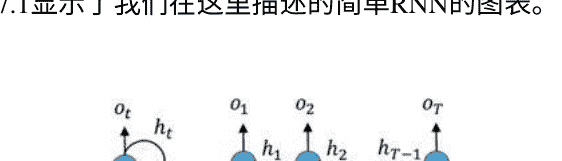

图7.1：循环神经网络的图表

### 7.2.2 PyTorch示例

下面的代码片段展示了一个简单的PyTorch实现的RNN之前描述过的。它展示了现代框架中的循环计算。

```
# PyTorch RNN定义
import torch.nn as nn
from torch import autograd
from torch.autograd import Variable
import torch.optim as optim

class RNN(nn.Module):
    def __init__(self, input_size):
        super(RNN, self).__init__()
        self.input_size = input_size
        self.hidden_size = input_size
        self.output_size = input_size
        self.U = nn.Linear(input_size, self.hidden_size)
        self.W = nn.Linear(self.hidden_size, self.output_size)

    def forward(self, input, hidden):
        Ux = self.U(input)
        Wh = self.W(hidden)
        output = Ux + Wh
        return output

rnn = RNN(input_size)

# 训练网络
optimizer = optim.Adam(rnn.parameters(), lr=learning_rate, weight_decay=1e-5)

for epoch in range(num_epochs):
    for data, target in train_loader:
        # 获取样本
        input = Variable(data)

        # 前向传播
        hidden = Variable(torch.zeros(1, rnn.hidden_size))
        for i in range(input.size()[0]):
            output = rnn(input[i], hidden)
            hidden = output

        # 误差计算
        loss = F.nll_loss(output, target)

        # 清除梯度
        optimizer.zero_grad()

        # 反向传播
        loss.backward()

        # 参数更新
        optimizer.step()
```

在这个片段中，我们在每个时间步骤上执行分类（以及随后的错误计算）。与其在输出计算时执行计算，不如在前向传播完成后为每个时间步骤计算错误。误差将被反向传播到每个时间步骤。

这个片段本身是不完整的，因为我们的输入大小、输出大小和隐藏大小通常会根据问题而异，我们将在接下来的部分中看到。

## 7.3 循环神经网络及其属性

现在让我们专注于RNN的典型实现，以及它们的训练和一些引入的困难。

### 7.3.1 循环神经网络的前向传播和反向传播

RNN通过反向传播和梯度下降进行训练，与我们之前看到的前向传播网络类似：前向传播一个示例，计算预测的误差，通过反向传播计算每组权重的梯度，并根据梯度下降优化方法更新权重。

前向传播方程为 h_t 和输出预测 y^_t:## 7.3.1.1 输出权重（V）

权重矩阵 V 控制 ŷ 的输出维度，并不对循环连接做出贡献。因此，计算梯度与线性层相同。

为了方便起见，令
```
q_t = V h_t
```
然后，
```
∂E_t/∂V_{i,j} = ∂E_t/∂ŷ_{t_k} ∂ŷ_{t_k}/∂q_{t_l} ∂q_{t_l}/∂V_{i,j}
```
根据我们对 Et（7.5）的定义，我们有：
```
∂E_t/∂ŷ_{t_k} = -y_{t_k}/ŷ_{t_k}
```
通过softmax函数的反向传播可以计算如下：
```
\frac{\partial \hat{y}_{tk}}{\partial q_{tl}} = \begin{cases} -\hat{y}_{tk} \hat{y}_{tl}, & k = l \\ \hat{y}_{tk} (1 - \hat{y}_{tk}), & k = l \end{cases}
```
如果我们结合(7.9)和(7.10)，我们可以得到对所有 k值的求和，得到
```
-\frac{y_{tl}}{\hat{y}_{tl}} \hat{y}_{tl} (1 - \hat{y}_{tl}) + \sum_{k=l} \left( -\frac{y_{tk}}{\hat{y}_{tk}} \right) (-\hat{y}_{tk} \hat{y}_{tl}) = -y_{tl} + y_{tl} \hat{y}_{tl} + \sum_{k=l} y_{tk} \hat{y}_{tl} \\ = -y_{tl} + \hat{y}_{tl} \sum_{k} y_{tk}.
```
回想一下，所有的 y_t 都是独热向量，意味着向量中除了一元素表示类别外，其他元素都是零。因此，求和结果为1，所以
```
\frac{\partial E_t}{\partial q_{tl}} = \hat{y}_{tl} - y_{tl}
```
最后， q_t = V h_t，所以 q_{t_l} = V_{l,m} h_{t_m}。因此，
```
\frac{\partial q_{tl}}{\partial V_{i,j}} = \frac{\partial}{\partial V_{i,j}} (V_{l,m} h_{t_m}) \\ = \delta_{il} \delta_{jm} h_{t_m} \\ = \delta_{il} h_{t_j}.
```
现在我们将(7.12)和(7.13c)结合起来得到：
```
\frac{\partial E_t}{\partial V_{i,j}} = (\hat{y}_{t_l} - y_{t_l}) h_{t_j},
```
这可以被识别为外积。因此，
```
\frac{\partial E_t}{\partial \mathbf{V}} = (\hat{\mathbf{y}}_t - \mathbf{y}_t) \otimes \mathbf{h}_t,
```
其中 ⊗ 表示外积。

## 7.3.1.2 循环权重 (W)

参数 W 出现在 h_t 的参数中，因此我们需要检查 h_t 和 y^_t 的梯度。我们还必须注意到 y^_t 直接和间接地依赖于 W(通过 h_{t-1})。然后 h_t = tanh( z_t )。

起初，似乎通过链式法则我们有：
```
\frac{\partial E_t}{\partial W_{i,j}} = \frac{\partial E_t}{\partial \hat{y}_{tk}} \frac{\partial \hat{y}_{tk}}{\partial q_{tl}} \frac{\partial q_{tl}}{\partial h_{t_m}} \frac{\partial h_{t_m}}{\partial W_{i,j}}
```
注意到这四个项中，我们已经计算了前两个，第三个很简单：
```
\begin{align}
\frac{\partial q_{t_l}}{\partial h_{t_m}} &= \frac{\partial}{\partial h_{t_m}} (V_{l,b} h_{t_b}) \quad &(7.17a)\\
&= V_{l,b} \delta_{b,m} \quad &(7.17b)\\
&= V_{l,m} \quad &(7.17c)
\end{align}
```
然而，最后一个项需要通过 $h_{t-1}$ 对 $W_{i,j}$ 有一个隐式的依赖，同时也有一一个直接的依赖。因此，我们有：
```
\frac{\partial h_{t_m}}{\partial W_{i,j}} \rightarrow \frac{\partial h_{t_m}}{\partial W_{i,j}} + \frac{\partial h_{t_m}}{\partial h_{t-1_n}} \frac{\partial h_{t-1_n}}{\partial W_{i,j}}.\tag{7.18}
```
但我们可以再次应用这个结果得到：
```
\frac{\partial h_{t_m}}{\partial W_{i,j}} \rightarrow \frac{\partial h_{t_m}}{\partial W_{i,j}} + \frac{\partial h_{t_m}}{\partial h_{t-1_n}} \frac{\partial h_{t-1_n}}{\partial W_{i,j}} + \frac{\partial h_{t_m}}{\partial h_{t-1_n}} \frac{\partial h_{t-1_n}}{\partial h_{t-2_p}} \frac{\partial h_{t-2_p}}{\partial W_{i,j}}.\tag{7.19}
```
这个过程一直持续到达 $h_{(-1)}$，它被初始化为一个全零向量（$\mathbf{0}$）。注意到(7.19)中的最后一项简化为 $\frac{\partial h_{t_m}}{\partial h_{t-2_n}} \frac{\partial h_{t-2_n}}{\partial W_{i,j}}$ 我们可以将第一个项转化为 $\frac{\partial h_{t_m}}{\partial h_{t_m}} \frac{\partial h_{t_m}}{\partial W_{i,j}}$。然后，我们得到了紧凑的形式：
```
\frac{\partial h_{t_m}}{\partial W_{i,j}} = \frac{\partial h_{t_m}}{\partial h_{r_n}} \frac{\partial h_{r_n}}{\partial W_{i,j}},\tag{7.20}
```
在这里，我们对所有小于 $t$ 的 $r$ 的值求和，除了标准的虚拟索引 $n$。更明确地说，这可以写成：
```
\frac{\partial h_{t_m}}{\partial W_{i,j}} = \sum_{r=0}^{t} \frac{\partial h_{t_m}}{\partial h_{r_n}} \frac{\partial h_{r_n}}{\partial W_{i,j}}.\tag{7.21}
```
这个项负责梯度消失/爆炸问题：梯度指数级地趋近于0（消失）或指数级增长（爆炸）。项 $\frac{\partial h_{t_m}}{\partial h_{r_n}}$ 乘以项 $\frac{\partial h_{r_n}}{\partial W_{i,j}}$ 意味着如果这两个项都小于1，乘积将会更小；如果这两个项大于1，乘积将会更大。我们将稍后详细讨论这个问题。将所有这些组合起来得到：
```
\frac{\partial E_t}{\partial W_{i,j}} = (\hat{y}_{t_l} - y_{t_l}) V_{l,m} \sum_{r=0}^{t} \frac{\partial h_{t_m}}{\partial h_{r_n}} \frac{\partial h_{r_n}}{\partial W_{i,j}}.\tag{7.22}
```
## 7.3.1.3 输入权重 (U)

对 U求梯度与 W求梯度类似，因为它们都需要对 $\mathbf{h}_t$向量进行顺序导数。我们有：
```
\frac{\partial E_t}{\partial U_{i,j}} = \frac{\partial E_t}{\partial \hat{y}_{t_k}} \frac{\partial \hat{y}_{t_k}}{\partial q_{t_l}} \frac{\partial q_{t_l}}{\partial h_{t_m}} \frac{\partial h_{t_m}}{\partial U_{i,j}} \quad (7.23)
```
注意，我们现在只需要计算最后一项。按照与W相同的过程，我们发现：
```
\frac{\partial h_{t_m}}{\partial U_{i,j}} = \sum_{r=0}^{t} \frac{\partial h_{t_m}}{\partial h_{r_n}} \frac{\partial h_{r_n}}{\partial U_{i,j}} \quad (7.24)
```
因此，我们有：
```
\frac{\partial E_t}{\partial U_{i,j}} = (\hat{y}_{t_l} - y_{t_l}) V_{l,m} \sum_{r=0}^{t} \frac{\partial h_{t_m}}{\partial h_{r_n}} \frac{\partial h_{r_n}}{\partial U_{i,j}} \quad (7.25)
```
在实际实现中， U和 W之间的差异出现在 $\frac{\partial h_{rm}}{\partial U_{i,j}}$ 的值上， 和 $\frac{\partial h_{rm}}{\partial W_{i,j}}$ 不同。

## 7.3.1.4 聚合梯度

所有时间步的误差是根据我们的损失函数 (7.6) 对 $E_{l}$的求和。因此，我们可以对网络中每个权重的梯度进行求和 (U，V和W)，并使用累积梯度进行更新。

### 7.3.2 梯度消失问题和正则化

训练RNN的最困难的部分之一是梯度消失/爆炸问题 (通常称为梯度消失问题)。在反向传播过程中，梯度会乘以每个时间步的权重对误差的贡献，如公式 (7.21) 所示。这种乘法在每个时间步的影响会大大降低或增加传播到前一个时间步的梯度，然后再次进行乘法运算。在反向传播步骤中的循环乘法会对任何不规则性产生指数效应。

- 如果权重很小，梯度会指数级缩小。
- 如果权重很大，梯度会指数级增长。

在贡献非常小的情况下，权重更新可能是微不足道的变化，可能导致网络停止训练。 实际上，这通常

tanh激活函数将梯度限制在0和1之间。 这会导致在这些情况下梯度缩小。当不考虑时，会导致下溢或上溢错误。缓解这个问题的一种方法是使用二阶导数来预测梯度消失/爆炸的存在，使用Hessian-free优化技术。另一种方法是仔细初始化网络的权重。然而，即使进行了仔细的初始化，处理长期依赖仍然具有挑战性。

RNN的常见初始化方法是将初始隐藏状态初始化为0。通过允许学习这个隐藏状态，性能通常可以提高。

自适应学习率方法，如Adam [KB14]，在循环神经网络中非常有用，因为它们适应了各个权重的动态变化，而在RNN中这些权重可能会有很大的变化。

有许多方法用于解决梯度消失问题，其中很多方法都侧重于仔细初始化或控制梯度传播的大小。最常用的解决梯度消失问题的方法是在RNN中添加门控机制。我们将在下一节中更详细地讨论这种方法。RNN的序列可能非常长。例如，如果用于语音识别的RNN采样20毫秒的窗口，步长为10毫秒，那么对于一个10秒的片段，将产生999个时间步的输出序列（假设没有填充）。因此，梯度很容易消失/爆炸[BSF94b]。

#### 7.3.2.1 长短期记忆网络

长短期记忆（LSTM）利用门控机制来控制循环网络中的梯度传播[HS97b]。这些门控机制（称为输入门、输出门和遗忘门）用于保护携带隐藏状态到下一个时间步的记忆单元。这些门控机制本身就是神经网络层。这使得网络能够学习何时忘记、忽略或保留记忆单元中的信息。图7.5显示了一个LSTM的示意图。

LSTM单元的形式化定义如下：
```
\begin{aligned}
\mathbf{i}_t &= \sigma(\mathbf{W}_i \mathbf{x}_t + \mathbf{U}_i \mathbf{h}_{t-1} + \mathbf{b}_i) \\
\mathbf{f}_t &= \sigma(\mathbf{W}_f \mathbf{x}_t + \mathbf{U}_f \mathbf{h}_{t-1} + \mathbf{b}_f) \\
\mathbf{o}_t &= \sigma(\mathbf{W}_o \mathbf{x}_t + \mathbf{U}_o \mathbf{h}_{t-1} + \mathbf{b}_o) \\
\tilde{\mathbf{c}}_t &= \tanh(\mathbf{W}_c \mathbf{x}_t + \mathbf{U}_c \mathbf{h}_{t-1}) \\
\mathbf{c}_t &= \mathbf{f}_t \odot \mathbf{c}_{t-1} + \mathbf{i}_t \odot \tilde{\mathbf{c}}_t \\
\mathbf{h}_t &= \mathbf{o}_t \odot \tanh(\mathbf{c}_t)
\end{aligned} \quad (7.26)
```
遗忘门控制着从一步到另一步记住多少信息。一些建议是将遗忘门的偏置初始化为1，以便在初始阶段记住更多信息[Haf17]。

#### 7.3.2.2 门控循环单元

门控循环单元（GRU）是另一种用于循环神经网络的流行门控结构[Cho+14]。GRU将LSTM中的门控结构结合起来，创建一个更简单的更新规则，减少了一个学习层，降低了复杂性并提高了效率。使用LSTM还是GRU的选择主要是经验决定的。尽管有很多尝试比较这两种方法，但没有得出可推广的结论[Chu+14]。GRU使用的参数较少，因此在LSTM和GRU架构之间性能相等时通常选择GRU。图7.6显示了GRU的结构。更新规则的方程如下所示：
```
\begin{aligned}
\mathbf{z}_t &= \sigma(\mathbf{W}_z \mathbf{x}_t + \mathbf{U}_z \mathbf{h}_{t-1}) \\
\mathbf{r}_t &= \sigma(\mathbf{W}_r \mathbf{x}_t + \mathbf{U}_r \mathbf{h}_{t-1}) \\
\tilde{\mathbf{h}}_t &= \tanh(\mathbf{W}_h \mathbf{x}_t + \mathbf{U}_h (\mathbf{r}_t \odot \mathbf{h}_{t-1})) \\
\mathbf{h}_t &= (1 - \mathbf{z}_t) \odot \tilde{\mathbf{h}}_t + \mathbf{z}_t \odot \mathbf{h}_{t-1}
\end{aligned} \quad (7.27)
```

在GRU中，新的候选状态 $\tilde{\mathbf{h}}_{t}$ 与先前的状态相结合，其中 $\mathbf{z}_{t}$ 确定了历史的多少被传递或新的候选者替代历史的多少。与设置LSTM的遗忘门偏置类似，以改善早期阶段的记忆，GRU的重置门偏置可以设置为 -1 以达到类似的效果[Haf17]。

#### 7.3.2.3 梯度裁剪

限制梯度爆炸的一种简单方法是将梯度强制限制在特定范围内。限制梯度的范围可以解决许多问题，特别是在训练时防止溢出错误。通常的做法是跟踪梯度的范数以了解其特性，然后在超过正常操作范围时减小梯度。这个概念通常被称为梯度裁剪。

- 剪裁梯度的两种常见方法是：
    - $L_2$ 范数剪裁，使用阈值 $t$。
        $$\nabla_{\text{新}} = \nabla_{\text{当前}} \circ \frac{t}{L_2(\nabla)}$$ (7.28)
    - 固定范围
        $$\nabla_{\text{新}} = \begin{cases} t_{\min} & \text{if } \nabla < t_{\min} \\ \nabla & \\ t_{\max} & \text{if } \nabla > t_{\max} \end{cases}$$ (7.29)
        使用最大阈值 $t_{\max}$ 和最小阈值 $t_{\min}$。

#### 7.3.2.4 BPTT序列长度

循环网络训练中涉及的计算严重依赖于输入的时间步数。在训练过程中，一种限制计算量的方法是设置最大序列长度。

- 设置序列长度的常见方法有：
    - 将训练数据填充到最长的期望长度
    - 在训练过程中截断反向传播的步骤数。

在训练的早期阶段，使用截断反向传播的重叠序列可以帮助网络更快地收敛。随着训练的进行，增加截断长度也可以在学习的早期阶段帮助收敛，特别是对于复杂的序列或者数据集中最大序列长度较长的情况。

- 静态计算图需要固定大小的输入，
- 模型受内存限制，或者
- 梯度在训练开始时非常大。

#### 7.3.2.5 循环丢失

循环网络和其他深度学习网络一样容易过拟合。Dropout是一种常见的正则化技术，也是应用于循环神经网络的直观选择，但是需要修改原始形式。如果在每个步骤中应用原始形式的dropout，那么掩码的组合可能导致在较长的序列上传递很少的信号。相反，我们可以在每个步骤中重复使用相同的掩码，以防止时间步长之间的信息丢失。

其他技术，如变分丢失[GG16]和区域退出[Kru+16]，在LSTMs或GRUs中丢弃输入或输出门，具有类似的目标。

## 7.4 深度循环神经网络架构

与整个深度学习领域一样，许多架构和技术都是活跃研究领域。在本节中，我们描述了一些架构变体，以说明基本RNN概念的表达能力和扩展。

### 7.4.1 深度循环神经网络

就像我们堆叠多个全连接和卷积层一样，我们也可以堆叠循环网络层[EHB96]。由 $l$ 个基本RNN层组成的堆叠RNN的隐藏状态可以定义如下：

$$ h_t^{(l)} = f( W [h_{t-1}^{(l)} ; h_t^{(l-1)}] ) $$ (7.30)

其中 $h_t^{(l-1)}$ 是上一个RNN层在时间 $t$ 的输出。这在图7.7中有所说明。据说，当堆叠卷积层时，网络学习了一系列空间相关的特征。类似地，当堆叠循环网络时，它允许学习更长范围的依赖关系和更复杂的序列[Pas+13]。

由于RNN中的权重是二次的，相比较而言，多个较小的层可能更加高效，而不是一个较大的层。另一个好处是融合的RNN层的计算优化[AKB16]。

然而，堆叠RNN的一个常见问题是由于深度和时间步数的增加而导致的梯度消失问题。然而，RNN已经能够从其他领域获得灵感，将残差连接和高速公路网络引入到深度卷积网络中。

### 7.4.2 残差LSTM

在Prakash等人的研究中[Pra+16]，作者们在LSTM的层之间使用了残差连接，以便为下层提供更强的梯度，以实现释义生成的目的。残差层通常应用于卷积网络中，允许较低级别的信息传递到网络的后续层。

这提供了更低层次的信息给更高层次，并且还允许更大的梯度传递到更早的层次，因为与输出有更直接的连接。在Kim等人的研究中，作者使用残差连接来改善深度语音网络上的词错误率，并得出结论是在高速公路路径上缺乏累积，同时使用投影矩阵来缩放LSTM输出。

在LSTM定义中的方程（7.26）中，$h_t$ 被改变为：

$$\mathbf{h}_{t}=\mathbf{o}_{t} \cdot\left(\mathbf{W}_{p} \cdot \tanh \left(\mathbf{c}_{t}\right)+\mathbf{W}_{h} \mathbf{x}_{t}\right)$$

其中 $\mathbf{W}_{p}$ 是投影矩阵，$\mathbf{W}_{h}$ 是与 $\mathbf{x}_{t}$ 的大小匹配的单位矩阵。当 $\mathbf{x}_{t}$ 和 $\mathbf{h}_{t}$ 的维度相同时，该方程变为：

$$\mathbf{h}_{t}=\mathbf{o}_{t} \cdot\left(\mathbf{W}_{p} \cdot \tanh \left(\mathbf{c}_{t}\right)+\mathbf{x}_{t}\right).$$

### 7.4.3 循环高速公路网络

循环高速公路网络（RHN）[Zil+16]提供了一种在多层RNN架构中对循环层之间的梯度传播进行门控的方法。作者提出了LSTM架构的扩展，允许门控连接的存在。

在循环层之间，允许增加可以堆叠的层数，从而实现深度RNN。

对于具有 $L$ 层和输出 $S(\cdot)$ 的RHN，网络描述如下：

$$
\begin{aligned}
\mathbf{s}_t^{(l)} &= \mathbf{h}_t^{(l)} \cdot \mathbf{t}_t^{(l)} + \mathbf{s}_t^{(l-1)} \cdot \mathbf{c}_t^{(l)} \\
\mathbf{h}_t^{(l)} &= \tanh\left( \mathbf{W}_{H} \mathbf{x}_t \mathbb{1}_{\{l=1\}} + \mathbf{R}_{H} \mathbf{s}_t^{(l-1)} + \mathbf{b}_{H} \right) \\
\mathbf{t}_t^{(l)} &= \sigma\left( \mathbf{W}_{T} \mathbf{x}_t \mathbb{1}_{\{l=1\}} + \mathbf{R}_{T} \mathbf{s}_t^{(l-1)} + \mathbf{b}_{T} \right) \\
\mathbf{c}_t^{(l)} &= \sigma\left( \mathbf{W}_{C} \mathbf{x}_t \mathbb{1}_{\{l=1\}} + \mathbf{R}_{C} \mathbf{s}_t^{(l-1)} + \mathbf{b}_{C} \right)
\end{aligned}
$$ (7.33)

其中 $\mathbb{1}$ 表示指示函数。

从RHN中获得了许多有用的性质，特别是雅可比特征值在时间步骤上得到了调节，从而实现了更稳定的训练。作者在使用10层深度RHN进行语言建模任务时报告了令人印象深刻的结果。

### 7.4.4 双向循环神经网络

到目前为止，我们只考虑了在正向方向上累积记忆上下文。在许多情况下，我们希望知道在未来的时间步骤中会遇到什么，以便在时间 $t$ 进行预测。双向RNN [SP97] 允许将正向上下文和“反向”上下文合并到预测中。这通过在序列上运行两个RNN来实现。

一个是正向方向，一个是反向方向。对于一个输入序列 $X = \{x_1, x_2, \ldots, x_T \}$，正向上下文RNN按照正向顺序接收输入 $t = \{1, 2, \ldots, T \}$，而反向上下文RNN按照反向顺序接收输入。这两个RNN一起构成了一个双向层。图7.10显示了一个双向RNN的图示。

两个RNN的输出，$\mathbf{h}$ 和 $\mathbf{f}$，通常会被连接起来形成一个单一的输出向量，可以通过向量求和、连接、平均或其他方法实现。

在自然语言处理中，这种结构有很多用途。例如，在语音识别中，这对于音素分类任务非常有用，因为对未来上下文的了解可以更好地指导任何时间步的预测。双向网络通常在大多数任务中优于单向RNN。此外，这种方法可以扩展到其他形式的循环网络，如双向LSTM（BiLSTM）。这些技术按照逻辑顺序进行，一个LSTM网络按照正向方向处理输入，另一个按照反向方向处理输入，然后将输出进行组合（连接、相加或其他方法）。

双向RNN的一个限制是在进行预测之前必须知道完整的输入序列，因为反向RNN需要第一个计算的输入 $x_1$ 到 $x_T$。因此，双向循环神经网络不能用于实时应用。然而，根据应用的要求，为输入设置一个固定缓冲区可以缓解这个限制。

### 7.4.5 SRU和准循环神经网络

循环连接限制了可以并行处理的计算量，因为信息必须按顺序处理。因此，与卷积神经网络相比，循环神经网络的计算成本较高。引入了两种技术来加速计算，其中一种是消除一些顺序依赖关系。

这些技术可以使网络更深，计算成本更低。第一种技术引入了半循环单元（SRU）[LZA17]。该方法同时处理每个时间步的输入，并在之后应用轻量级的循环计算。SRU引入了跳跃连接和高路连接，以改善网络中的特征传播。SRU的定义如下：

$$
\begin{aligned}
\tilde{\mathbf{x}}_t &= \mathbf{W} \mathbf{x}_t \\
\mathbf{f}_t &= \sigma (\mathbf{W}_f \mathbf{x}_t + \mathbf{b}_f) \\
\mathbf{r}_t &= \sigma (\mathbf{W}_r \mathbf{x}_t + \mathbf{b}_r) \\
\mathbf{c}_t &= \mathbf{f}_t \circ \mathbf{c}_{t-1} + (1 - \mathbf{f}_t) \circ \tilde{\mathbf{x}}_t \\
\mathbf{h}_t &= \mathbf{r}_t \circ g(\mathbf{c}_t) + (1 - \mathbf{r}_t) \circ \mathbf{x}_t
\end{aligned}
$$ (7.34)

其中 $\mathbf{f}$ 是遗忘门，$\mathbf{r}$ 是重置门，而 $\mathbf{c}$ 是记忆单元。这种方法被应用于文本分类、问题回答、语言建模、机器翻译和语音识别，与LSTM相比，训练时间缩短了10倍，取得了竞争性的结果。

准循环神经网络（QRNN）[Bra+16]是一种不同的方法，但目标相同。QRNN应用卷积层来并行化输入计算，这些计算被提供给减少的循环组件。这个网络被应用于情感分析任务，并且在训练和预测时间上取得了竞争性的结果。

### 7.4.6 递归神经网络

递归神经网络（RecNN）是循环神经网络的一种广义形式，可以有效地操作图形结构。递归神经网络可以学习与有标签的有向无环图相关的信息，而循环网络只能处理有序序列[GK96]。在自然语言处理中，递归神经网络的主要应用是依存句法分析[SMN10]和学习形态词向量[LSM13b]。

数据以树的形式结构化，顶部是父节点，从父节点衍生出子节点。目标是通过预测树并减少与目标树结构的误差来学习数据的适当图形结构。

为简单起见，我们考虑分支因子为2（每个父节点有2个子节点）。结构预测，递归神经网络旨在实现两个输出：
- 一个语义向量表示 $p(\mathbf{x}_i, \mathbf{x}_j)$，合并子节点 $\mathbf{c}_i$ 和 $\mathbf{c}_j$
- 一个分数 $s$ 表示子节点合并的可能性有多大。

该网络可以描述如下：

$$ s_{i,j} = \mathbf{U} p(\mathbf{c}_i, \mathbf{c}_i) \tag{7.35} $$
$$ p(\mathbf{c}_i, \mathbf{c}_j) = f(\mathbf{W} [\mathbf{c}_i; \mathbf{c}_j] + \mathbf{b}) $$

其中 $\mathbf{W}$ 是共享层的权重矩阵，$\mathbf{U}$ 是得分计算的权重矩阵。

树的得分是每个节点得分的总和：

$$ S = \sum_{n \in \text{节点}} s_n \tag{7.36} $$

递归神经网络的误差计算使用最大边界解析：

$$ E = \sum_i s(x_i, y_i) - \max_{y \in A(x_i)} (s(x_i, y) + \Delta(y, y_i)) \tag{7.37} $$

量 $\Delta(y, y_i)$ 计算所有错误决策的损失。结构反向传播（BPTS）类似于BPTT，在图中的每个节点计算导数。导数在每个节点处分割并传递给子节点。除了对预测节点的梯度之外，我们还计算了对分数值的梯度。

LSTM和GRU单元也被应用于递归网络中，以解决梯度消失问题[TSM15]。递归网络已经在关系分类[Soc+12]、情感分析[Soc+13]和短语相似性[TSM15]等领域中使用过。

递归神经网络展示了对基于序列的神经架构的强大扩展。尽管随着基于注意力的架构的引入，它们的使用已经不再流行，但它们提出的改进计算效率的概念仍然有用。

## 7.5 循环网络的扩展

循环神经网络可以用来解决许多类型的序列问题。到目前为止，我们关注的是一个多对多的例子，输入和输出具有相同数量的时间步。然而，通过修改错误计算的位置，RNN可以用于许多类型的序列导向问题。图7.12展示了可以用RNN解决的序列问题的类型。

图7.12：循环神经网络可以解决各种基于序列的问题。(a)展示了一对一的序列（这相当于具有共享权重的深度神经网络）。(b)展示了一对多的序列任务，给定一个输入生成一系列输出。(c)是一个多对一的任务，可以表示文本分类任务，在整个文本被看到后预测一个单一的分类。(d)展示了一个具有一对一对齐的多对多序列任务，输入和输出时间步的数量相等。这种结构在语言建模中很常见。(e)展示了一个没有特定对齐的多对多序列任务，输入和输出的长度可以不同。输入和输出步骤的数量也可以不同。这种技术通常被称为序列到序列，并且在神经机器翻译中经常见到。

循环神经网络具有极大的灵活性，并且可以扩展到解决各种序列任务。前馈神经网络的局限性仍然存在：倾向于过拟合，需要大量的数据集和计算要求。此外，序列模型引入了其他考虑因素，如较长序列长度时的梯度消失和较早上下文的“遗忘”。这些困难导致了各种扩展、最佳实践和技术来缓解这些问题。

### 7.5.1 序列到序列

许多自然语言处理和语音任务都是序列导向的。这些任务中最常见的架构方法之一是序列到序列，通常缩写为seq-to-seq或seq2seq。seq-to-seq方法类似于自编码器，具有循环编码器和循环解码器，如图7.13所示。编码器的最终隐藏状态作为“编码”传递给解码器；然而，它通常以监督方式训练，具有特定的输出序列。seq-to-seq方法起源于神经机器翻译，输入是一种语言的句子，输出是另一种语言的对应句子。其目的是用编码器对输入进行总结，并用解码器将其解码到新的领域。

这种方法的一个困难是隐藏状态往往反映最近的信息，丧失了先前内容的记忆。这对于长序列来说是一个限制，其中关于该序列的所有信息必须被总结为一个编码。

### 7.5.2 注意力

强制一个单一的向量来总结之前时间步的所有信息是一个缺点。在大多数应用中，解码器生成的序列的信息与输入序列有一定的相关性。例如，在机器翻译中，输出句子的开头很可能取决于输入句子的开头，而不太取决于最近看到的句子的结尾。在许多情况下，不仅有总结的知识，还有能够在特定时间步骤更好地关注输入的不同部分以更好地指导输出的能力将会很有帮助。

注意力[BCB14a]已成为解决这个问题的最流行技术之一，通过针对输出序列中的每个单词的部分进行特定的关注。这不仅可以提高我们预测的质量，还可以通过查看依赖于预测的输入来了解网络。

如果 $s_i$ 是增强注意力的隐藏状态，在时间 $i$，它有三个输入：
- 解码器的上一个隐藏状态 $s_{i-1}$，
- 上一个时间步的预测 $y_{i-1}$，和
- 一个上下文向量 $c_i$，它为给定时间步骤加权适当的隐藏状态。

$$s_i = f(s_{i-1}, s_i, c_i)$$ (7.38)

上下文向量 $c_i$ 的定义如下：

$$\mathbf{c}_i = \sum_{j=1}^{T_x} \alpha_{ij} \mathbf{h}_j$$. (7.39)

注意力权重如下：

$$\alpha_{ij} = \frac{\exp(e_{ij})}{\sum_{k=1}^{T_x} \exp(e_{ik})}$$ (7.40)

和

$$e_{ij} = a(\mathbf{s}_{i-1}, \mathbf{h}_j)$$. (7.41)

函数 $a(\mathbf{s}, \mathbf{h})$ 被称为对齐模型。该函数评分了输入 $\mathbf{h}_j$ 对位置 $i$ 的输出的影响力。

它是完全可微分和确定性的，因为它考虑了所有对输出有贡献的时间步骤。使用所有先前的时间步骤的一个缺点是，对于长序列来说，需要大量的计算。其他技术通过对影响上下文向量的状态数量进行选择来放松这种依赖关系。然而，这样做会产生一个不可微分的损失，并且在反向传播期间，训练需要使用蒙特卡洛采样来估计梯度。

注意力的另一个好处是它为每个时间步提供一个分数，识别出对预测最有用的输入。当检查网络质量或获得模型学习内容的直观理解时，这可以非常有用，如图7.15所示。注意机制在第9章中有更详细的介绍。

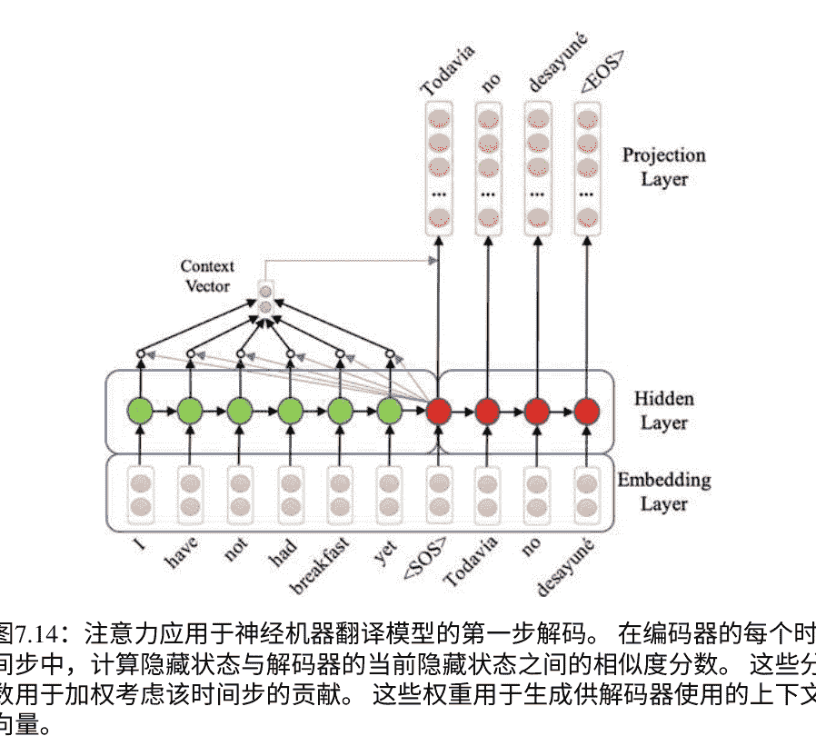

### 7.5.3 指针网络

指针网络[VFJ15]是基于注意力的序列到序列模型的一种应用。与其他基于注意力的模型相反，它选择要用作输出的单词（点），而不是将输入序列累积到上下文向量中。在这种情况下，输出字典必须随着输入序列的长度增长。为了适应这一点，使用注意机制作为指针，而不是混合解码信息。

```
$\mathbf{u}_j^i = \mathbf{v}^\top \tanh(\mathbf{W}_1 \mathbf{e}_j + \mathbf{W}_2 \mathbf{d}_i)$

$p(C_i|C_1, \ldots, C_{i-1}, P) = \text{softmax}(\mathbf{u}^i)$

(7.42)
```

其中，$\mathbf{e}_j$是时间点 $j$处编码器的输出，$\mathbf{d}_i$是时间步 $i$处解码器的输出，$C_i$是时间点 $i$处的索引，$\mathbf{v}$、$\mathbf{W}_1$和$\mathbf{W}_2$是可学习的参数。

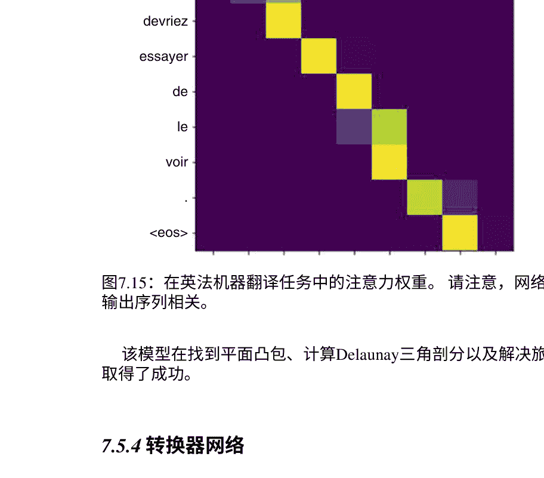

该模型在找到平面凸包、计算Delaunay三角剖分以及解决旅行商问题方面取得了成功。

### 7.5.4 转换器网络

注意力在序列到序列任务上的成功引发了一个问题，即它是否可以直接应用于输入，从而减少甚至消除网络中的循环连接的需求。Transformer网络[Vas+17b]在将这种注意力直接应用于输入上取得了巨大的成功，在机器翻译中击败了循环和卷积模型。转换器网络不依赖于RNN来累积先前状态的记忆，而是直接在输入嵌入上使用“多头”注意力。这消除了网络的顺序依赖性，使得大部分计算可以并行进行。

注意力直接应用于输入序列，以及在预测输出序列时。编码器和解码器部分被合并使用，使用一个掩码在预测输出字典上的概率分布之前，使用其他注意机制。

多头注意力，如图7.16所示，由三个输入矩阵定义：Q打包成矩阵的查询集合，键K和值V。

```
$$注意力(\mathbf{Q}, \mathbf{K}, \mathbf{V}) = \mathrm{softmax}\left(\frac{\mathbf{Q}\mathbf{K}^{\mathrm{T}}}{\sqrt{d_{k}}}\right) \mathbf{V}$$
```

然后，多头注意力定义为：

```
$$多头(\mathbf{Q}, \mathbf{K}, \mathbf{V}) = \mathrm{Concat}(\mathrm{head}_{1}, \ldots, \mathrm{head}_{h}) \mathbf{W}^{O}$$
```

其中

```
$$头_{i}(\mathbf{Q}, \mathbf{K}, \mathbf{V}) = 注意力\left(\mathbf{Q}\mathbf{W}_{i}^{Q}, \mathbf{K}\mathbf{W}_{i}^{K}, \mathbf{V}\mathbf{W}_{i}^{V}\right).$$
```

所有W矩阵的参数都是投影矩阵。

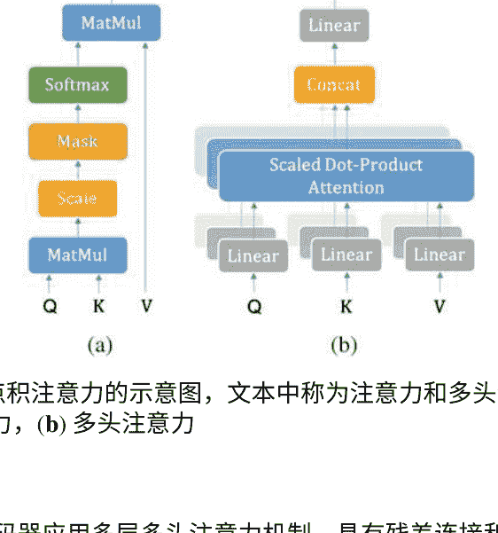

编码器和解码器应用多层多头注意力机制，具有残差连接和额外的全连接层。由于大部分计算是并行进行的，所以使用掩码技术和偏移来确保网络仅使用到时间t之前的可用信息进行预测。变换器网络减少了预测所需的步骤数量，显著提高了计算时间，同时在翻译任务上取得了最先进的结果。

## 7.6 循环神经网络在自然语言处理中的应用

将文本纳入循环网络是一个直观的过程，类似于前一章中的CNN分类。句子的单词被转换为词嵌入，并作为时间序列传递到我们的网络中。在这种情况下，我们不必担心序列的最小长度，因为单词的上下文是通过RNN的记忆来学习的，而不是作为输入的组合。

在Yin等人[Yin+17]的研究中，作者对CNN和RNN架构在各种自然语言处理任务（如文本分类、蕴含、答案选择和词性标注）中进行了广泛比较。在这项工作中，作者训练了基本的CNN和RNN架构，结果显示RNN在大多数任务上表现良好，只有在某些匹配情况下CNN才表现出优势，其中主要特征基本上是关键短语。总体而言，CNN和RNN在建模句子方面有不同的方法。CNN倾向于学习类似于n-gram的特征，而RNN旨在维护长程依赖关系以定义上下文。

### 7.6.1 文本分类

图7.17显示了一个简单的文本分类任务的结构，用于输入句子。通过循环网络，我们能够在每个时间步骤上顺序编码单词嵌入。一旦整个序列被编码，我们使用最后一个隐藏状态来预测类别。该网络使用BPTT进行训练，并学习按顺序为分类任务加权单词。

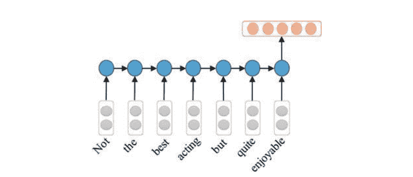

图7.17: 基于简单RNN的情感分类器

在Lee和Dernoncourt [LD16]的研究中，作者比较了CNN和RNN架构在短文本分类中的表现。通过CNN和RNN架构添加顺序信息显著提高了对话行为特征的结果。

在情感分类中，Wang等人[Wan+15b]使用LSTM网络对推文进行编码以预测情感。在他们的工作中，他们展示了RNN对于捕捉推文结构中包含的复杂性的鲁棒性，特别是否定短语（例如，当单词 not 否定一个短语时）。在Lowe等人[Low+15]的研究中，作者引入了一种称为双LSTM的架构用于语义匹配。该架构对问题和答案进行编码，并使用问题向量和答案向量的内积来对候选响应进行排序。

### 7.6.2 词性标注和命名实体识别

在Huang等人的研究中[HXY15]，词特征和嵌入被应用于词性标注、命名实体识别和分块任务，使用双向LSTM和CRF来提高性能。在Ma和Hovy的研究中[MH16]，双向LSTM被用于WSJ上的端到端分类任务。Ma和Hovy使用了一种端到端的方法来改进这些结果。他们的方法不依赖于其他作品中应用的上下文特征，如词性标注、词典特征和任务相关的预处理。在Lample等人的研究中[Lam+16b]，双向LSTM与CRF结合使用，在CoNLL-2003数据集上实现了四种语言的命名实体识别的最新性能。这项工作还将基本的RNN-CRF架构扩展到堆栈LSTM（使用LSTM单元模拟堆栈数据结构的推入和弹出功能）。除了词嵌入外，字符嵌入通常也被用来捕捉有关词语语义结构的额外信息，并对OOV词进行预测。

### 7.6.3 依存句法分析

在Dyer等人[Dye+15]的研究中，使用了允许推送和拉取操作的堆叠LSTM来预测可变长度文本的依赖解析。Kiperwasser和Goldberg [KG16]简化了架构，去除了堆叠LSTM的需求，依靠双向LSTM来预测依赖解析的树转换。

### 7.6.4 主题建模和摘要

在Ghosh等人[Gho+16]的研究中，引入了上下文LSTM（C-LSTM）用于单词预测、句子选择和主题预测。C-LSTM在网络训练的每个时间步骤中将主题嵌入与单词嵌入连接起来。这项工作的功能类似于语言模型训练，目标是预测下一个单词；然而，它还扩展到将主题上下文纳入预测中。因此，目标是预测下一个单词和到目前为止的句子的主题。

### 7.6.5 问答

在Tan等人的研究中[Tan+15]，作者训练了一个问题RNN和一个答案RNN，为每个问题和答案分别生成了嵌入。然后，通过使用一个余弦相似度来强制两个最可能的对之间的相似度，同时训练这两个网络。另一种方法，动态记忆网络[XMS16]，包含一系列组件来构建一个问答系统。该系统使用了循环网络和注意机制的组合来构建输入、问题和答案模块，利用一个情节性记忆来调整预测结果。

### 7.6.6 多模态

深度学习在图像和视频等其他应用中的有效性，导致了各种多模态应用的出现。这些应用需要根据输入媒体生成语言。这些应用包括图像和视频的字幕生成、视觉问答和视觉语音识别。

图像字幕生成是最早将深度卷积网络与文本结合的方法之一。在Vinyals等人的研究中[Vin+15b]，作者利用一个预训练的卷积网络进行图像分类，为LSTM网络的初始状态生成图像嵌入。LSTM网络被训练用于预测每个字幕的单词。这种初始方法推动了RNN架构的进步[Wan+16a]。

视频字幕生成也有类似的发展，[Ven+14]使用预训练的CNN模型提取每个视频帧的图像特征，作为输入传入循环网络进行文本生成。Pan等人[Pan+15a]通过跨越之前循环层的输出帧来扩展这种方法，创建了一个“分层循环神经编码器”，以减少堆叠RNN输出层中考虑的时间步数。

在视觉问答中，语言生成用于生成与视觉输入相关的文本问题的答案。Malinowski等人[MRF15]在神经图像问答网络中展示了一种端到端的方法，其中输入图像和问题条件下的LSTM网络生成文本答案。

### 7.6.7 语言模型

在前几章中，我们简要讨论了语言模型。回想一下，语言模型提供了确定一系列单词的概率的方法。例如，一个n-gram语言模型通过查看每个单词在其前面n个单词的概率来确定一个单词序列的概率：

```
P(w_1, \ldots, w_m) \approx \prod_{i=1}^{m} P(w_i | w_{i-(n-1)}, \ldots, w_{i-1})
```

语言模型在自然语言处理中特别有趣，因为它们可以为可能在语义上相似但在句法上不同的预测提供额外的上下文信息。在语音识别的情况下，两个听起来相同的单词，如“to”和“two”，具有不同的含义。但是短语“设置一个计时器为to分钟”没有意义，而“设置一个计时器为two分钟”有意义。

当语言生成和域适应时，通常会使用语言模型，并且可能存在大量未标记的文本数据和有限的标记数据。n-gram语言模型的概念也可以用RNN来实现，这样就不需要设置一个固定的n-gram数量的硬截断。此外，类似于词向量，这些模型可以在大型语料库上以无监督的方式进行训练。

语言模型通过训练来预测序列中下一个单词，给定先前的上下文，即隐藏状态。这使得语言模型能够针对学习目标:

> $$P(w_1, \ldots, w_m) = \prod_{i=1}^m P(w_i | w_1, \ldots, w_{i-1})$$ (7.47)

图7.18显示了基于RNN的语言模型的示例。

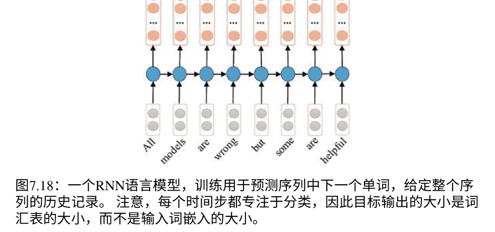

图7.18: 一个RNN语言模型，训练用于预测序列中下一个单词，给定整个序列的历史记录。注意，每个时间步都专注于分类，因此目标输出的大小是词汇表的大小，而不是输入词嵌入的大小。

在语言建模中，一个好的做法是为输入和输出序列使用单个嵌入矩阵，允许参数共享，从而减少需要学习的总参数数量。此外，引入“下投影”层来减少大型RNN的状态通常是有用的，当输出包含大量元素时。这个投影层减小了最终线性投影的大小，这在语言建模中经常发生[MDB17]。

#### 7.6.7.1 困惑度

困惑度是衡量模型能够表示领域的能力的指标，通过其对样本的预测能力来展示。对于语言模型，困惑度可以量化语言模型对验证或测试数据的预测能力。如果语言模型对测试集中的句子产生高概率，则表明其表现良好。困惑度是归一化的逆概率，除以单词数量。

我们可以为一个测试句子集合 $(s_1, \ldots, s_m)$ 定义困惑度测量：

$$PP(s_1, \ldots, s_m) = 2^{-\frac{1}{M}\sum_{i=1}^m \log_2 p(s_i)} \tag{7.48}$$

其中 $M$ 是测试集的词汇量。因为困惑度给出了数据集的概率的倒数，较低的困惑度意味着更好的结果。

#### 7.6.7.2 循环变分自编码器

循环变分自编码器 (RVAE) 是循环语言模型 [KW13, RM15] 的扩展。RVAE的目标是在自动编码器的训练过程中引入变分推断，以捕捉潜在变量中的全局特征。在Bowman等人的研究中[Bow+15]，作者利用了VAE架构从语言模型生成句子。

### 7.6.8 神经机器翻译

机器翻译是递归神经网络成功的最大受益者之一。传统方法基于统计模型，计算成本高，需要大量领域专业知识进行调整。机器翻译非常适合使用循环神经网络，因为输入句子的长度和顺序可能与期望的输出不同。早期的神经机器翻译架构依赖于循环编码器-解码器架构。图7.19很简单地说明了这一点。

神经机器翻译接受一个输入词序列 $X = (x_1, \ldots, x_m)$ 并将其映射到一个输出词序列 $Y = (y_1, \ldots, y_n)$。注意，$n$ 不一定等于 $m$。使用嵌入空间，输入 $X$ 被映射为一个向量表示，然后由循环网络用于编码序列。解码器使用最终的RNN隐藏状态（编码输入）来预测翻译后的词序列 $Y$（一些研究还展示了对子词翻译的成功）。

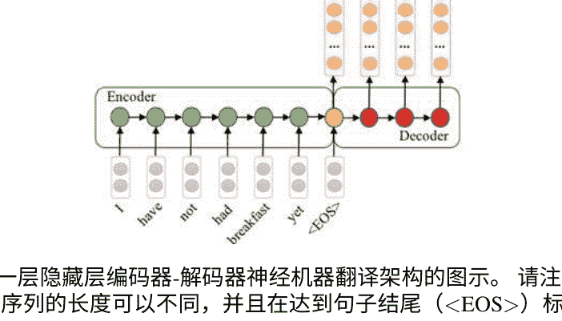

图7.19：一层隐藏层编码器-解码器神经机器翻译架构的图示。请注意，输入和输出序列的长度可以不同，并且在达到句子结尾（<EOS>）标记时会被截断。

在预测解码器网络时，加强序列通常是有益的。将预测的输出序列作为输入传递，如图7.20所示，可以改善预测结果。在训练过程中，可以将真实预测结果作为下一个时间步的输入，以一定的频率进行传递。这被称为“教师强制”，因为它在训练时使用真实预测结果来帮助。另一种选择是使用解码器的预测输出，这可能会导致在训练的早期阶段出现困难。随着训练的进行，逐渐减少教师强制，使模型学习适当的依赖关系。计划采样是解决这个问题的一种方法，它在预测目标和网络输出之间进行切换。

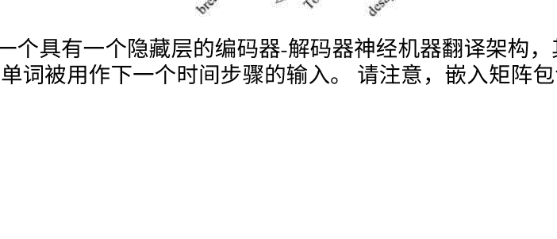

图7.20：一个具有一个隐藏层的编码器-解码器神经机器翻译架构，其中预测的前一个单词被用作下一个时间步骤的输入。请注意，嵌入矩阵包含两种语言的条目

在实践中，编码器和解码器不需要超过2-4层深度，并且双向编码器通常优于单向编码器[Bri+17]。

#### 7.6.8.1 BLEU

用于评估机器翻译的最常见指标是BLEU。BLEU（双语评估助手）是一种用于机器翻译的质量评估指标，旨在与人类对自然语言的评估相一致。它允许将翻译与一组目标翻译进行比较以评估质量。

该分数介于0和1之间，较高的值表示更好的性能。通常在文献中，该分数将乘以100以近似表示百分比相关性。在其核心，BLEU分数是一种精确度测量。它计算目标中参考$n$-gram的精确度。

一个完美的匹配应该如下所示：

```
1 from nltk.translate.bleu_score import sentence_bleu
2 targets = [['i', 'had', 'a', 'cup', 'of', 'black', 'coffee', 'at', 'the', 'cafe']]
3 prediction = ['i', 'had', 'a', 'cup', 'of', 'black', 'coffee', 'at', 'the', 'cafe']
4 score = sentence_bleu(targets, prediction) * 100
5 print(score)
6 
7 > 100.0
```

或者，如果预测中没有出现任何参考词，则得分为0。

```
1 from nltk.translate.bleu_score import sentence_bleu
2 targets = [['i', 'had', 'a', 'cup', 'of', 'black', 'coffee', 'at', 'the', 'cafe']]
3 prediction = ['什么', '是', '我们', '在做']
4 score = sentence_bleu(targets, prediction) * 100
5 print(score)
6 
7 > 0
```

如果我们在转录中更改一个或两个单词，那么得分会下降。

```
1 from nltk.translate.bleu_score import sentence_bleu
2 targets = [['i', 'had', 'a', 'cup', 'of', 'black', 'coffee', 'at', 'the', 'cafe']]
3 prediction = ['我', '喝', '一杯', '黑色', '茶', '在', '咖啡馆', '的']
4 score = sentence_bleu(targets, prediction) * 100
5 print(score)
6 
7 > 65.8037
8 
9 targets = [['i', 'had', 'a', 'cup', 'of', 'black', 'coffee', 'at', 'the', 'cafe']]
10 prediction = ['我', '喝', '一杯', '黑色', '茶', 'at', 'the', 'house']
11 score = sentence_bleu(targets, prediction) * 100
12 print(score)
13
14 > 58.1430
```

在这些例子中，展示了BLEU-1分数；然而，更高的n-gram会给出更好的质量指标。在NMT中常见的是BLEU-4，它考虑了假设和目标翻译之间的4-gram精度的相关性。

### 7.6.9 预测/采样输出

有多种方法可以评估语言模型的输出。

#### 7.6.9.1 贪婪搜索

如果我们在每一步预测最可能的单词，可能不能得到最佳的序列概率。在过程的早期做出的最佳决策可能不能最大化序列的整体概率。实际上，有一个决策树的可能性需要解码，以获得最佳的结果。由于语言模型输出中的树状结构，有多种方法可以解析它们。

#### 7.6.9.2 随机采样和温度采样

我们可以使用随机搜索来解析模型的输出。在随机搜索中，句子中的下一个单词根据下一个状态的概率分布来选择。随机采样技术可以帮助实现结果的多样性。然而，有时语言模型的预测可能非常自信，使得输出结果看起来类似于贪婪搜索的结果。改善预测的多样性的一种常见方法是使用一个叫做温度的概念。温度是一种指数变换概率并重新分配最高概率在前几个类别之间的方法。

从语言模型中进行采样的一种方法是使用“温度采样”。该方法通过应用冻结函数来选择输出预测，冻结函数的定义如下：

$$f_{\tau}(p)_i = \frac{p_i^{\frac{1}{\tau}}}{\sum_j p_j^{\frac{1}{\tau}}} \quad (7.49)$$其中 \(\tau \in [0,1]\) 是控制预测结果的“热度”的温度参数。温度越低，结果越不多样化。

NLP的另一个理想特性是语言生成。在Sutskever等人的研究中[SVL14b]，使用了基于深度循环神经网络的编码器-解码器架构来生成独特的句子。网络将“源”词序列通过循环神经网络编码成一个固定长度的“编码”向量。解码器使用该“编码”作为初始隐藏状态，并生成响应。

#### 7.6.9.3 优化输出：波束搜索解码

贪婪搜索在解码过程中对每个时间步骤之间做了独立性假设。我们依赖于我们的循环神经网络来正确地传递每个时间步骤之间的依赖关系。我们可以在我们的预测中提供先验知识，以确保我们避免简单的错误（如时态变化）。我们可以通过对一个评分机制进行预测偏置来实现这一点，该评分机制可以告知一个特定序列是否比另一个序列更有可能。

当我们使用训练好的模型对新数据进行预测时，我们依赖于模型产生正确的输出，给出最有信心的预测。然而，在许多情况下，我们希望对输出施加先验，使其偏向于特定的领域。例如，在语音识别中，通过将语言模型作为输出预测的偏置，可以大大提高声学模型的性能。

我们从机器翻译模型中获得的输出，例如，是每个时间步骤上词汇表的概率分布，从而为我们解析输出创建了一个可能性树。

通常情况下，探索整个可能性树的计算成本太高，因此最常见的搜索方法是束搜索。束搜索是一种搜索算法，它在内存中保持固定数量的可能状态。这为在网络训练后优化输出提供了一种灵活的方法，平衡了速度和质量。

如果我们考虑网络的输出序列 \((y_1, \ldots, y_m)\) 其中 \(y_i\) 是我们词汇表上的 softmax 输出，那么我们可以通过每个时间步骤的概率乘积来计算整个序列的概率：

\[
P(y_1, \ldots, y_m) = \prod_{i=1}^{m} p_i(y_i) \quad (7.50)
\]

我们可以通过将输出的概率与从一个单词过渡到下一个单词的概率相关联来解码它。

如果我们有一个语言模型，可以给出一个单词序列的概率，我们可以使用这个模型来通过计算可能转换路径的概率来偏置我们输出的预测。

假设 \(y\) 是一个单词序列， \(P(y)\) 是根据我们的语言模型计算得到的该序列的概率。 我们将使用束搜索来探索在时间 \(t\) 的多个假设序列 \(H_{t-1}\)，束大小为 \(k\) 。

\[
H_t := \{ (w_1^1, ..., w_t^1), ..., (w_1^k, ..., w_t^k) \} \quad H_3 := \{ (\text{一杯茶}), (\text{一杯咖啡}) \}
\]

通过束搜索，我们跟踪我们的前 \(k\) 个假设，并选择最大化 \(P(y)\) 的路径。 我们将收集每个假设的概率 \(P(h_t)\) 在 \(P_t\) 中。 在排序时， \(H_t\) 和 \(P_t\) 的索引顺序应该绑定在一起，以保持它们的顺序。 我们每个假设的开头都是 `<SOS>` 标记，并且一旦达到 `<EOS>` 标记，假设就结束了。 得分最高的假设是被选择的假设。

```
**算法1: 束搜索**
**数据:** y, 束宽度
**结果:** 具有最高概率P(y)的y
**开始**
  H_0 = \{ (<SOS>) \}
  P_0 = \{0\}
  **for** t in 1 to T **do**
      **for** h in H_{t-1} **do**
          **for** y in Y **do**
              \hat{y} = (y_1^h, ..., y_{t-1}^h, \hat{y})
              H_t += \hat{y}
              P_t += P(\hat{y})
  H_t = sort(H_t) according to highest P_t
  H_t = H_t[1, ..., beamWidth]
**结束**
```

## 7.7 案例研究

在这里，我们将递归神经网络的概念应用于神经机器翻译。 具体而言，我们探索了基本的RNN、LSTM、GRU和Transformer序列到序列的架构，并在英法翻译任务中进行了实验。 我们首先进行了一个探索性过程，为这个任务生成了一个数据集。 接下来，我们探索了序列到序列的架构，比较了各种超参数和架构设计对质量的影响。

我们使用的数据集是从Tatoeba网站上获取的一组包含英语句子和法语翻译的大型数据集。 原始数据是一组没有指定训练集、验证集和测试集划分的配对示例数据，因此我们在EDA过程中创建这些划分。

### 7.7.1 软件工具和库

序列到序列模型能够解决的问题的普及和多样性导致了许多高性能的实现。在这个案例研究中，我们专注于基于PyTorch的Fairseq(-py)代码库[Geh+17a]，该代码库由Facebook AI Research (FAIR)开发。这个代码库提供了许多常见的序列到序列模式的实现，包括优化的数据加载器和批处理支持。

此外，我们使用PyTorch的文本包和spaCy [HM17]进行EDA和数据准备。这些包提供了许多用于文本处理和数据集创建的有用函数，特别是针对深度学习数据加载器的（尽管我们在这里没有使用它们）。

### 7.7.2 探索性数据分析

Tatoeba数据集中文本的原始格式是一个以制表符分隔的英文句子，后跟法语翻译，每行一个句对。计算行数可以得到总共135,842个英法句对。通过选择一些随机样本，如图7.21所示，我们可以看到其中包含标点符号、大写字母以及Unicode字符。考虑到翻译任务，Unicode并不令人意外；然而，在处理任何计算表示时，都必须考虑Unicode字符，因为库和对Unicode字符的支持会有所不同。

#### 7.7.2.1 序列长度过滤

首先，我们检查数据集中的序列长度。我们使用spaCy进行英文和法文的分词。当读取数据时，可以通过torchtext字段自动应用分词器。torchtext中的字段是数据集的通用数据类型。在我们的示例中，有两种类型的字段，一个源字段表示为“SRC”，它将包含有关如何处理英文句子的详细信息，而第二个字段称为“TRG”，包含目标法语数据及其类型处理。我们可以将分词器附加到每个字段上，如下所示。

```python
def tokenize_fr(text):
    """
    将法语文本从字符串分词为字符串列表
    """
    return [tok.text for tok in spacy_fr.tokenizer(text)]

def tokenize_en(text):
    """
    将英语文本从字符串分词为字符串列表
    """
    return [tok.text for tok in spacy_en.tokenizer(text)]

SRC = Field(tokenize=tokenize_en, init_token='<sos>', eos_token='<eos>', lower=True)
TRG = Field(tokenize=tokenize_fr, init_token='<sos>', eos_token='<eos>', lower=True)

SRC.build_vocab(train_data, min_freq=0)
TRG.build_vocab(train_data, min_freq=0)
```

Torchtext可以接受任何类型的分词器，因为它只是对传入的文本进行操作的函数。spaCy中的分词器非常有用，因为它们具有停用词、分词例外和各种类型的标点符号处理。

在训练基于序列的模型时，另一个考虑因素是示例的长度。我们在图7.22中绘制了序列长度的直方图。较长的句子- 图7.22：英语和法语句子长度的直方图。注意大多数句子都很短，而很少有长句子。

较长的句子很可能具有更复杂的结构，并且可能具有更长的依赖关系。我们不希望学习这些示例，因为它们在数据集中的表示不足。如果我们希望学习更长句子的翻译，我们需要收集更多数据，或者将长示例智能地分割成更短的示例，这样我们就有更多的数据。此外，长示例可能会导致使用小批量训练时的内存问题，因为较短的示例可以使用更大的批量大小。

对于这个案例研究，我们通过设置示例的长度阈值来删除较长的示例。我们选择输入或输出序列的时间步长限制为20，这将允许序列中最多有18个实际单词，包括 `<sos>` 和 `<eos>` 标记。这个限制意味着我们的最大长度包括所有具有重要数据的序列长度。结果长度分布如图7.23所示。 图7.23：在将最大长度过滤为18（如果包括 `<sos>` 和 `<eos>` 标记，则为20）后，英语和法语句子长度的直方图

在过滤掉较长的示例后，我们使用随机索引技术创建训练、验证和测试集，不重复使用样本，如下所示。

```python
n_examples = len(all_data)
idx_array = list(range(n_examples))
random.shuffle(idx_array)
train_indexs = idx_array[:int(0.8*n_examples)] # 80% training 数据
val_indexs = idx_array[int(0.8*n_examples):int(0.9*n_examples)] #10%验证数据
test_indexs = idx_array[int(0.9 * n_examples):] # 10%测试数据
```

这种技术应该使得数据集的每个划分具有相似的特征。最终的数据集分配了80%用于训练，10%用于验证，10%用于测试。我们将数据保存到文件中，以便在需要时可以在其他实验中使用，而无需重复所有的预处理。检查结果数据划分，显示每个划分的长度分布相似，如图7.24所示。

#### 7.7.2.2 词汇检查

词汇对象提供了许多常见的自然语言处理功能，例如对术语的索引访问，简化的嵌入创建和频率过滤。现在我们加载并分词数据集。总体词汇大小为： 图7.24：（a）训练数据，（b）验证数据和（c）测试数据的句子长度直方图

```python
train_data, valid_data, test_data = FrenchTatoeba.splits(path=
    data_dir,
    exts=('.en', '.fr'),
    fields=(SRC, TRG))

SRC.build_vocab(train_data, min_freq=0)
TRG.build_vocab(train_data, min_freq=0)
```

```python
print("英语词汇大小:", len(SRC.vocab))
print("法语词汇大小:", len(TRG.vocab))
# > 英语词汇大小: 12227
# > 法语词汇大小: 20876
```

词汇频率显示在图7.25中。分布显示出“长尾”效应，其中一小部分标记具有高计数，例如几乎出现在所有句子中的“。”，以及其他仅出现一次的标记，例如“stitch”。在只出现一次的单词的最极端情况下，训练仅依赖于该单个示例来通知模型，很可能导致过拟合。此外，softmax的分布将为一些概率分配一些概率 图7.25：未过滤的英语和法语词频。计数被排序并放在对数刻度上，以捕捉数据集中单词表示的严重程度。正如我们所看到的，有许多很少使用的单词，而只有一个小的子集被频繁使用。

这些术语。由于不常见的单词占据了词汇的大部分，因此在早期阶段，大部分概率质量将被分配给这些术语，从而减慢学习速度。一种常见的方法是将不常见的单词映射到未知标记`<unk>`。这样可以使模型忽略对一个不太可能有效的表示的低频词汇。

我们可以通过在构建词汇表时将其设置为参数来强制执行最小频率。 训练数据集用于创建词汇表（使用验证数据被视为数据窥探）。

在词汇表创建过程中，我们将最小频率设置为5。 评估此参数的影响留作练习。

```python
SRC.build_vocab(train_data, min_freq=5)
TRG.build_vocab(train_data, min_freq=5)
```

在研究最终词汇表时，我们仍然注意到单词的频率呈现出长尾分布，如图7.26所示。这并不令人太惊讶，因为我们选择了最小频率为5。如果阈值过高，删除了许多单词，那么模型在学习过程中会受到过多限制，许多值将映射到未知标记。 图7.26： (a) 英语和 (b) 法语训练数据的过滤词汇频率图

图7.27显示了训练集中英语和法语的前50个术语。对列表的分析引发了一些有趣的问题。例如，词汇表中显示的最常见单词之一是“n’t”。这似乎很奇怪，因为英语中没有“n’t”这个词。更深入的检查发现，spaCy的分词方式会将缩写拆分开来，导致出现一个孤立的“n’t”标记，每当出现“don’t”或“can’t”等缩写时。当处理缩写“I’m”时，情况也是如此。这说明了在数据上进行迭代改进的重要性，因为预处理是特征生成的基本组成部分，如果结果是在最终输出上计算的，则还需要进行后处理。

我们数据拆分的最终计数如下所示。

- 训练集大小：107885
- 验证集大小：13486
- 测试集大小：13486
- 英语词汇表大小：4755
- 法语词汇表大小：6450

### 7.7.3 模型训练

现在数据集准备好了，我们研究模型及其在训练集和验证集上的性能。具体而言，我们关注各种简单的RNN、LSTM和GRU。我们研究了这些架构在学习率、深度和双向性方面的表现。每种技术都涉及到优化多个超参数以正则化网络，同时改变网络的训练动态。为了减轻对所有可能超参数进行完整网格搜索的负担，我们只调整引入架构的学习率。这并不能完全消除调整其他参数的需求，但它使问题变得可行。

我们训练的每个模型都使用了图7.28中显示的脚本。请注意，fairseq中没有实现GRU和RNN的配置。为了进行比较，我们将它们添加到了库中。

每个模型的训练最多进行100个时期。当验证性能停滞时，我们会降低学习率，并在学习停滞时停止训练。嵌入维度固定为256，输入和输出的dropout设置为0.2。为了简单起见，我们在所有实验中将隐藏大小固定为512（除了双向架构）。双向架构为解码器提供了两个隐藏状态，因此解码器的大小必须加倍。有人可能会争论说 只有当模型具有相同数量的参数时，模型之间的可比性才能实现。例如，LSTM的参数数量大约是标准RNN的4倍；然而，为了简单和清晰起见，我们保持了固定的隐藏表示。在下面的图中，每个模型名称的形式为，`{rnn类型}{学习率}{层数}{度量}`。

```python
train.py datasets/en-fr \
    --arch {rnn_type} \
    --encoder-dropout-out 0.2 \
    --encoder-layers {n_layers} \
    --encoder-hidden-size 512 \
    --encoder-embed-dim 256 \
    --decoder-layers {n_layers} \
    --decoder-embed-dim 256 \
    --decoder-hidden-size 512 \
    --decoder-attention False \
    --decoder-dropout-out 0.2 \
    --optimizer adam --lr {lr} \
    --lr-shrink 0.5 --max-epoch 100 \
    --seed 1 --log-format json \
    --num-workers 4 \
    --batch-size 512 \
    --weight-decay 0
```

图7.28：我们fairseq模型训练的基本配置。可以通过适当插入参数来控制rnn类型、层数和学习率(lr)。

#### 7.7.3.1 RNN基准

首先，我们研究了单层单向RNN作为我们实验的基准性能。我们对学习率进行手动网格搜索，找到一个合理的起始值。这些选择的验证曲线如图7.29所示。

验证曲线显示学习率对RNN模型容量的影响，给出了截然不同的学习曲线。

我们还计算了该模型的测试结果，以便在最后进行比较。请注意，测试结果不会以任何方式用于调整或改进我们的模型。所有的调整都是在验证集上完成的。任何调整都应该在验证集上进行。我们最佳的RNN模型的测试结果是：

- 翻译了13486个句子：
- 使用beam=1生成测试：BLEU4 = 15.46

#### 7.7.3.2 RNN、LSTM和GRU的比较

接下来，我们将比较RNN、LSTM和GRU的架构。我们对每个架构的学习率进行变化，因为每个架构的动态可能不同。验证结果如图7.30所示。

经过检查，我们注意到某些配置比其他配置需要更长的时间来收敛。特别是，当学习率为0.0001时，GRU和LSTM架构都达到了最大的100个周期。其次，我们可以看到LSTM和GRU架构以比RNN架构更快、更高的学习率收敛到更低的损失。在这里，GRU似乎是表现最好的模型，但LSTM和GRU都显示出类似的收敛性能。

#### 7.7.3.3 循环神经网络（RNN）、长短时记忆网络（LSTM）和门控循环单元（GRU）层深度比较

我们现在比较每种架构的深度对结果的影响。在这里，我们除了调整学习率外，还改变了深度配置。我们尝试了1层、2层和4层深度。结果显示在图7.31中。现在我们有了很多模型，要对它们的性质进行总结变得更加困难。如果我们比较RNN模型，我们会发现很多配置的验证损失都比GRU和LSTM架构要高。我们还观察到，深层架构在较低的学习率下表现良好，而浅层架构则相对较差。此外，## RNN、GRU和LSTM比较

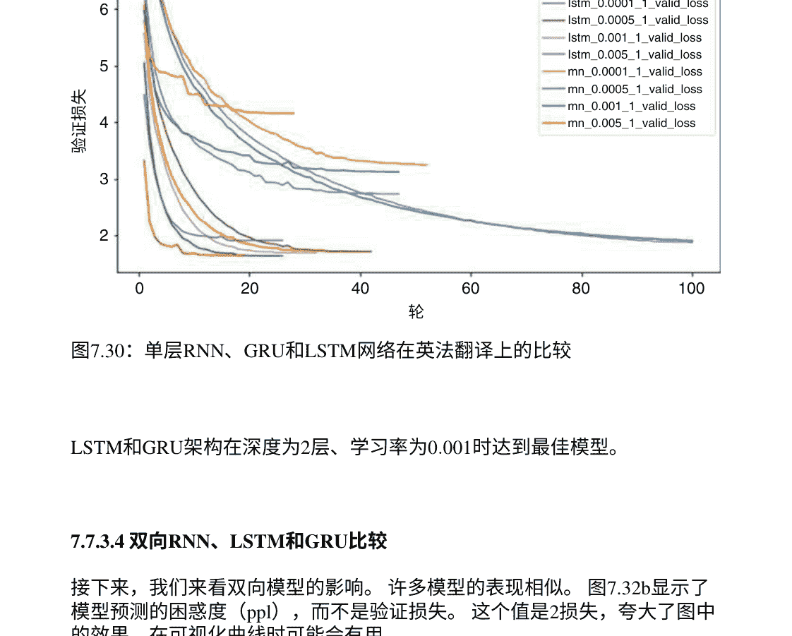

图7.30：单层RNN、GRU和LSTM网络在英法翻译上的比较

LSTM和GRU架构在深度为2层、学习率为0.001时达到最佳模型。

#### 7.7.3.4 双向RNN、LSTM和GRU比较

接下来，我们来看双向模型的影响。许多模型的表现相似。图7.32b显示了模型预测的困惑度（ppl），而不是验证损失。这个值是2的损失，夸大了图中的效果，在可视化曲线时可能会有用。

我们再次看到，LSTM和GRU架构优于RNN架构，其中GRU架构表现稍好。

#### 7.7.3.5 深度双向比较

到目前为止，表现最好的模型是两层LSTM和GRU模型以及单层双向LSTM和GRU模型。在这里，我们将两个组件结合起来，看看它们是否互补。在这组实验中，为了清晰起见，我们去除了表现不佳的RNN模型。结果如图7.33所示。

## RNN Depth Comparison

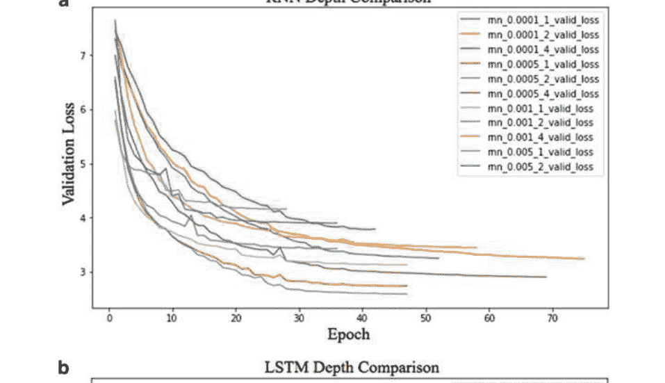

## LSTM Depth Comparison

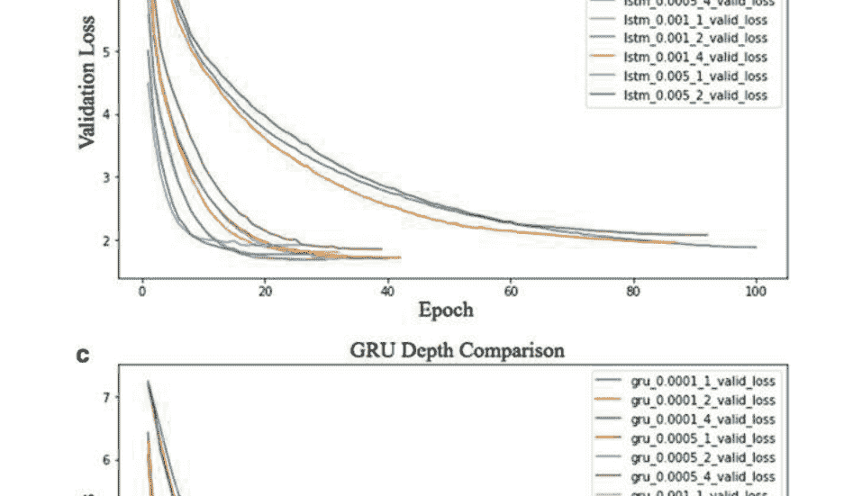

## GRU Depth Comparison

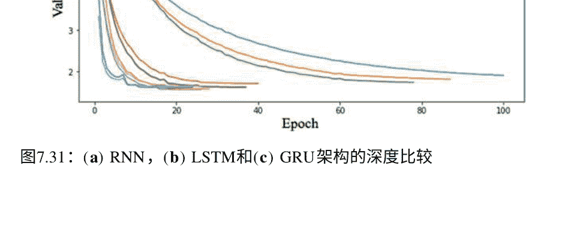

图7.31: (a) RNN, (b) LSTM和(c) GRU架构的深度比较

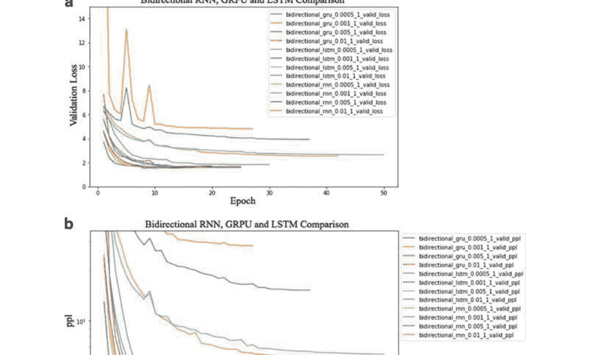

图7.32: 单层双向RNN，GRU和LSTM网络的(a)验证损失和(b)ppl比较。请注意，尽管颜色相似，但前两条线是RNN模型（而不是GRU模型）

这组结果表明，具有学习率为0.001的2层GRU架构是双向比较中最好的模型。

### 7.7.3.6 变压器网络

现在我们将注意力转向变压器架构，其中注意力直接应用于输入序列，而不需要循环网络。与之前的实验类似，我们将输入和输出的维度固定为256，编码器和解码器中设置了4个注意力头，并将全连接层的大小固定为512。我们探索了一小部分深度，并相应地改变了学习率。结果如图7.34所示，使用学习率为0.0005的4层变压器架构表现最好。

## 7.7 案例研究

## 基准RNN：学习率比较

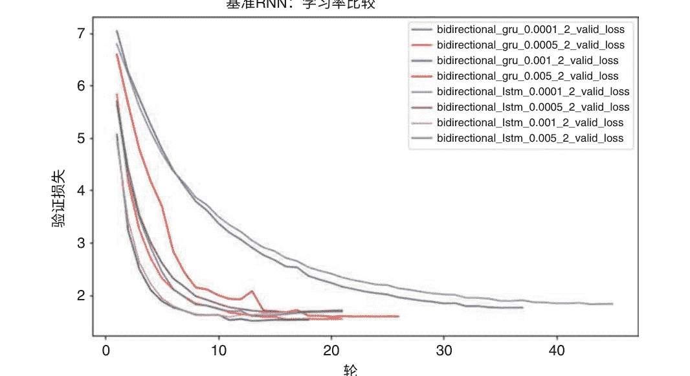

## 图7.33：2层双向GRU和LSTM架构的比较

## Transformer比较

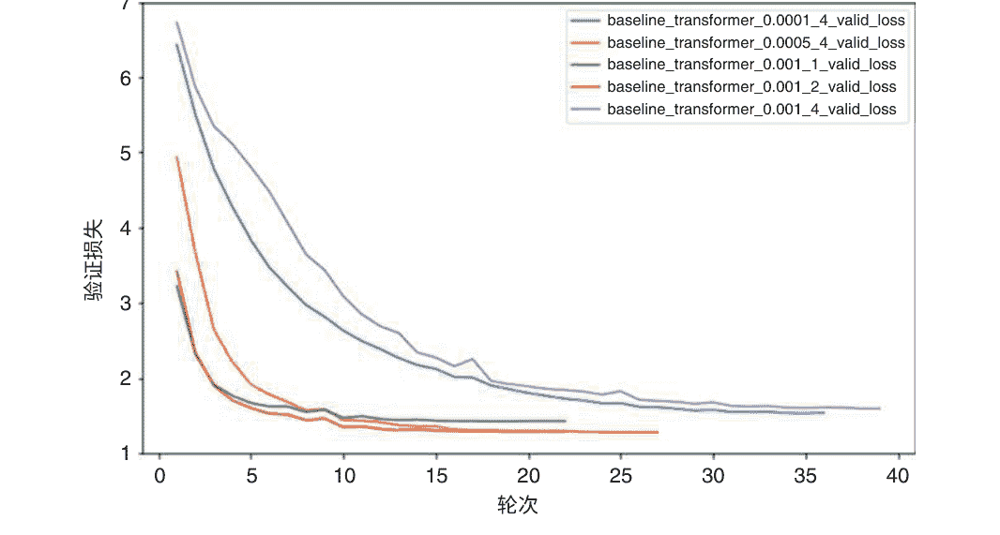

## 图7.34：不同学习率和深度的Transformer架构比较 请注意编码器和解码器的深度是相同的

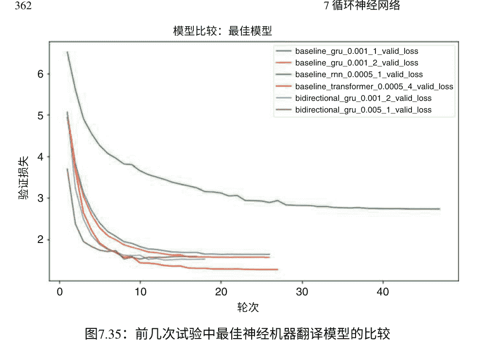

#### 7.7.3.7 实验比较

在机器翻译的许多架构中进行了探索后，我们现在比较每个实验的输出。这个集合包括了基线实验中表现最好的循环神经网络，单层单向和双向GRU，两层单向和双向GRU，以及四层变压器网络。通过对这些模型在验证集上的损失进行比较（图7.35），我们可以看到四层变压器网络是表现最好的。

### 7.7.4 结果

现在我们在测试集上比较每个实验的模型（表7.1）。

表7.1：神经机器翻译网络在测试集上的性能。最佳结果已突出显示。

| 网络类型 | 学习率 | BLEU4 |
| :--- | :--- | :--- |
| 基线RNN（1层） | 0.0005 | 15.46 |
| GRU，1层 | 0.001 | 36.17 |
| GRU，2层 | 0.001 | 38.53 |
| GRU，1层，双向 | 0.005 | 40.63 |
| GRU，2层，双向 | 0.001 | 40.60 |
| Transformer，4层 | 0.0005 | **44.07** |

当我们从模型（图7.36）中采样输出时，我们可以看到结果看起来相当不错。请注意，即使模型可能无法准确预测目标，它也可能产生合理的翻译。

```
Input: are you surprised ?
Target: êtes - vous surpris ?
Hypothesis: êtes - vous surprises ?

Input: i have evidence .
Target: j' ai des preuves .
Hypothesis: je dispose de preuves .

Input: i do n't know how many more times i 'll be able to do this .
Target: j' ignore combien de fois je serai encore capable de faire ça .
Hypothesis: je ne sais pas combien de fois je serai capable de faire ça .
```

## 图7.36：最佳NMT模型的输出

总之，我们已经证明，在我们的任务中，使用GRU或LSTM架构通常优于基本的RNN。此外，我们还证明了初始学习率对模型的质量有重要影响，即使使用自适应学习率方法也是如此。此外，由于深度网络的动态特性，学习率需要针对模型的每个配置进行调整。

最后，更深的网络并不总是更好。在这个数据集上，2层循环架构优于4层循环架构。而单层双向GRU在最终的测试集上表现稍微差一些，但在验证损失比较中却显示出了微小的改进。

这些结果显示了调整超参数的重要性，不仅适用于应用程序，还适用于数据集。在实际应用中，建议尽可能调整多个超参数以达到最佳结果。

### 7.7.5 读者和实践者的练习

- 读者和从业者可能感兴趣的其他问题包括：
  1. 在训练中添加L2正则化，并查看其是否改善了在测试集上的泛化能力。
  2. 修剪词汇表，删除更少频繁出现的词项（例如，出现次数少于20次的词）。这对训练有什么影响（性能、质量）？
  3. 调整束搜索参数以适应验证数据集。这对测试数据有什么影响？对预测时间有什么影响？
  4. 尝试调整编码器和解码器中的其他超参数。
  5. 为了问答任务，需要进行哪些修改来修改架构？
  6. 使用预训练的嵌入来初始化网络。

## 7.8 讨论

在许多自然语言处理任务中，循环神经网络的结果非常令人印象深刻，在几乎每个领域都取得了最先进的结果。考虑到它们的简单性，它们的有效性是非常显著的。然而，在实践中，实际环境需要额外的考虑，例如小数据集、数据缺乏多样性和泛化能力。以下是对这些问题和常见争论的简要讨论。

### 7.8.1 记忆还是泛化

到目前为止，所有讨论过的深度学习技术都存在过拟合的风险。此外，许多学术任务针对各种自然语言处理任务都非常专注于某个问题，并且具有充足的数据，但这些数据可能并不代表真实世界的任务。^5训练数据和测试数据之间的相关性使得一定程度的过拟合对验证集和测试集都有益处；然而，这些相关性是否只是代表领域本身还有待商榷。难点在于判断网络是否记忆了某些对降低总体成本或学习问题的底层语义结构相关的序列。记忆化的一些症状可以通过解码算法（如束搜索和带有温度的随机选择）来产生输出序列的多样性。

在文献[Gre16]中，Grefenstette探讨了递归网络是否能够学习下推自动机，这可以说是自然语言所需的最简单的计算形式。这项工作引用了一些“简单RNN”的局限性：

- 非自适应容量
- 目标序列建模主导训练
- 梯度饥饿的编码器

这个建议专门针对简单的循环神经网络，认为循环神经网络只能学习有限状态机。

在Liska等人[LKB18]的研究中，作者研究了循环神经网络学习组合结构的能力，这将展示循环神经网络在任务之间的迁移学习能力。实验中的一小部分循环神经网络表明，在没有架构约束的情况下，学习组合解决方案是可能的，尽管许多循环神经网络的尝试并不成功。实现的结果表明，梯度下降和进化策略可能是学习组合结构的一个引人注目的方向。

### 7.8.2 循环神经网络的未来

Grefenstette的演讲中提出的一个建议是将循环视为一个API。在本章中，我们已经看到了这个建议的迹象，比如LSTM和GRU单元。在这些例子中，循环API只需要满足以下交互：给定输入和先前状态，产生输出和更新后的状态。这种抽象为各种基于记忆的架构铺平了道路，例如动态记忆网络[XMS16]和堆栈LSTM[Dye+15]。

未来的方向指向添加堆栈和队列，以实现更具交互性的内存模型，类似于具有神经图灵机结构的RAM[GWD14a]。

## 参考文献

[AKB16] Jeremy Appleyard, Tomas Kocisky和Phil Blunsom。“优化GPU上递归神经网络的性能”。在：arXiv预印本arXiv:1604.01946 (2016)。

[BCB14a] Dzmitry Bahdanau, Kyunghyun Cho和Yoshua Bengio。“通过联合学习对齐和翻译进行神经机器翻译”。在：arXiv预印本arXiv:1409.0473 (2014)。

[BSF94b] Yoshua Bengio, Patrice Simard和Paolo Frasconi。“使用梯度下降学习长期依赖性是困难的”。在：IEEE神经网络交易5.2 (1994), pp. 157-166。

[Bow+15] Samuel R. Bowman等。“从连续空间生成句子”。在：CoRRabs/151 1.06349 (2015)。

[Bra+16] James Bradbury等。“准循环神经网络”。在：CoRR abs/1611.01576 (2016)。

[Bri+17] Denny Britz等。“神经机器翻译架构的大规模探索”。在：arXiv预印本arXiv:1703.03906 (2017)。

[Cho+14] Kyunghyun Cho等。“使用RNN编码器-解码器学习短语表示进行统计机器翻译”。在：arXiv预印本arXiv:1406.1078 (2014)。

[Chu+14] Junyoung Chung等。“对序列建模中门控循环神经网络的实证评估”。在：arXiv预印本arXiv:1412.3555(2014)。

[DN17] Michael Denkowski和Graham Neubig。“在神经机器翻译中获得可信结果的更强基线”。在：arXiv预印本arXiv:1706.09733 (2017)。

[Dye+15] Chris Dyer等人。“基于转换的依存句法分析与堆栈长短期记忆”。

[EHB96] Salah El Hihi和Yoshua Bengio。“用于长期依赖的分层循环神经网络”。在：神经信息处理系统的进展。1996年，第493-499页。

[GG16] Yarin Gal和Zoubin Ghahramani。 “在循环神经网络中基于理论的dropout应用”。 在：神经信息处理系统的进展。2016年，第1019-1027页。

[Geh+17a] Jonas Gehring等人的“卷积序列到序列学习”。 在:ICML会议论文集。2017年。

[Gho+16] Shalini Ghosh等人的“用于大规模自然语言处理任务的上下文lstm (clstm )模型”。 在:arXiv预印本 arXiv:1602.06291 (2016年 )。

[GK96] Christoph Goller和Andreas Kuchler的“通过结构反向传播学习任务相关的分布式表示”。 在:神经网络, 1996年, IEEE国际会议。第1卷。 IEEE. 1996年, 第347-352页。

[GWD14a] Alex Graves, Greg Wayne和Ivo Danihelka的“神经图灵机”。 在:arXiv预印本 arXiv:1410.5401 (2014年)。

[Gre16] Ed Grefenstette. 增强循环神经网络的Seq2Seq之外. 2016.

[Haf17] Danijar Hafner. “训练循环神经网络的技巧” . 在: URL: (2017).

Sepp Hochreiter和Jürgen Schmidhuber. “长短期记忆” . 在:神经计算9.8 (1997), pp. 1735–1780.

[HM17] ________ 在:即将出版 (2017).

[HXY15] Zhiheng Huang, Wei Xu, and Kai Yu. “双向LSTM-CRF模型用于序列标注”. 在:arXiv预印本 arXiv:1508.01991(2015).

[KEL17] Jaeyoung Kim, Mostafa El-Khamy和Jungwon Lee. “残差LSTM : 一种用于远程语音识别的深度循环架构的设计”. 在: CoRR abs/1701.03360 (2017) .

[KB14] Diederik P Kingma和Jimmy Ba. “Adam: 一种用于随机优化的方法”. 在: arXiv预印本arXiv:1412.6980 (2014) .

[KW13] Diederik P Kingma和Max Welling. “自动编码变分贝叶斯”. 在 : arXiv预印本arXiv:1312.6114 (2013) .

[KG16] Eliyahu Kiperwasser和Yoav Goldberg. “使用双向LSTM特征表示的简单准确的依存句法分析”. 在: arXiv预印本arXiv:1603.04351 (2016) .

[Kru+16] David Krueger等人“Zoneout: 通过随机保留隐藏激活来规范化循环神经网络”. 在: arXiv预印本arXiv:1606.01305 (2016年)。

[Lam+16b] Guillaume Lample等人“用于命名实体识别的神经网络架构”. 在 : arXiv预印本arXiv:1603.01360 (2016年) 。

[LD16] Ji Young Lee和Franck Dernoncourt“使用循环和卷积神经网络进行顺序短文本分类”. 在: arXiv预印本arXiv:1603.03827 (2016年) 。

[LZA17] Tao Lei, Yu Zhang和Yoav Artzi“训练循环神经网络与卷积神经网络一样快”. 在: CoRRabs/1709.02755 (2017年) 。

[LKB18] Adam Liska, Germán Kruszewski和Marco Baroni。“记忆还是泛化？在一堆中寻找一个组合的RNN”。在：CoRRabs/1802.06467（2018年）。

[Low+15] Ryan Lowe等。“Ubuntu对话语料库：用于非结构化多轮对话系统研究的大型数据集”。在：arXiv预印本arXiv:1506.08909（2015年）。

[LSM13b] Thang Luong, Richard Socher和Christopher Manning。“用于形态学的递归神经网络的更好的词表示”。在：第十七届计算自然语言学习会议论文集。2013年，第104-113页。

[MH16] Xuezhe Ma和Eduard Hovy。“通过双向lstm-cnns-crf进行端到端序列标注”。在：arXiv预印本arXiv:1603.01354（2016年）。

[MRF15] Mateusz Malinowski, Marcus Rohrbach, 和 Mario Fritz。“询问你的神经元：一种基于神经网络的图像问题回答方法”。在：IEEE国际计算机视觉会议论文集。2015年，第1-9页。

[MDB17] Gábor Melis, Chris Dyer, 和 Phil Blunsom。“神经语言模型评估的现状”。在：arXiv预印本arXiv:1707.05589 (2017年)。

[Pan+15a] Pingbo Pan 等人。“用于视频表示的分层循环神经编码器及其在字幕生成中的应用”。在：CoRRabs/1511.03476 (2015年)。

[Pas+13] Razvan Pascanu 等人。“如何构建深度递归神经网络”。在：arXiv预印本arXiv:1312.6026（2013年）。

[Pra+16] Aaditya Prakash等人。“使用堆叠残差LSTM网络进行神经重述生成”。在：CoRRabs/1610.03098 (2016)。

[RM15] Danilo Jimenez Rezende和Shakir Mohamed。“使用归一化流进行变分推断”。在：arXiv预印本arXiv:1505.05770(2015)。

[SP97] Mike Schuster和Kuldip K Paliwal。“双向递归神经网络”。在：IEEE信号处理45.11（1997年），pp. 2673–2681。

[SSB16] Stanislau Semeniuta, Aliaksei Severyn和Erhardt Barth。“无记忆的递归丢失”。在：CoRRabs/1603.05118（2016年）。

[SMN10] Richard Socher, Christopher D Manning, and Andrew Y Ng。“使用递归神经网络学习连续短语表示和句法分析”。在：NIPS-2010深度学习和无监督特征学习研讨会。卷2010。 2010年，第1-9页。

[Soc+12] Richard Socher等人。“通过递归矩阵-向量空间实现语义组合性”。在：2012年联合会议的论文集自然语言处理和计算自然语言学。计算语言学协会。2012年，第1201-1211页。

[Soc+13] Richard Socher等人。“使用神经张量网络进行知识库补全的推理”。在：神经信息处理系统的进展。2013年，第926-934页。

[SVL14b] Ilya Sutskever, Oriol Vinyals, and Quoc V Le。“使用神经网络的序列到序列学习”。在：神经信息处理系统进展。2014年，第3104-3112页。

[TSM15] Kai Sheng Tai, Richard Socher, and Christopher D Manning。“来自树状长短期记忆网络的改进语义表示”。在：arXiv预印本arXiv:1503.00075 (2015)。

[Tan+15] Ming Tan等人。“基于LSTM的深度学习模型用于非事实问题答案选择”。在：arXiv预印本arXiv:1511.04108 (2015)。

[Vas+17b] Ashish Vaswani等人。“注意力就是一切”。在：神经信息处理系统进展。2017年，第5998-6008页。

[Ven+14] Subhashini Venugopalan等人。“使用深度递归神经网络将视频翻译为自然语言”。在：arXiv预印本arXiv:1412.4729 (2014)。

[VFJ15] Oriol Vinyals, Meire Fortunato和Navdeep Jaitly。“指针网络”。在：神经信息处理系统的进展。2015年，第2692-2700页。

[Vin+15b] Oriol Vinyals等人。“展示和描述：神经图像标题生成器”。在：IEEE计算机视觉和模式识别会议论文集。2015年，第3156-3164页。

[Wan+16a] Cheng Wang等人。“使用深度双向LSTMs的图像字幕生成”。在：2016年ACM多媒体会议论文集。ACM。2016年，第988-997页。

[Wan+15b] 王欣等人。“通过将词嵌入与长短期记忆相结合来预测推文的极性”。在：计算语言学协会第53届年会和第7届国际自然语言处理联合会议论文集（第1卷：长文）。卷1。2015年，页1343-1353。

[XMS16] Caiming Xiong，Stephen Merity和Richard Socher。“用于视觉和文本问答的动态记忆网络”。在：国际机器学习会议。2016年，页2397-2406。

[Yin+17] Wenpeng Yin等人。“卷积神经网络和循环神经网络在自然语言处理中的比较研究”。在：arXiv预印本arXiv:1702.01923 (2017年)。

[Zil+16] Julian G. Zilly等人“循环高速公路网络”。在：CoRRabs/1607.03474 (2016)。

## 第8章
自动语音识别

## 8.1 引言

近年来，自动语音识别（ASR）取得了巨大的发展，深度学习发挥了关键作用。简单来说，ASR是将口语转换为计算机可读的文本的任务（图8.1）。它已经成为与技术互动的有用方式，并显著缩小了人机交互的差距，使其更加自然。从历史上看，ASR与计算语言学密切相关，因为它与自然语言有着紧密的联系，与音韵学紧密相关，因为人类可以产生各种语音声音。本章介绍了基于HMM的语音识别的基本概念。


图8.1：ASR的重点是将数字化的语音信号转换为计算机可读的文本，称为转录

简单来说，ASR可以描述如下：给定一个来自录音语音信号的音频样本 X，应用一个函数 f将其映射为一个单词序列，表示所说内容的转录的单词序列W。
$$ W = f(X) (8.1) $$
然而，找到这样一个函数是相当困难的，需要连续的建模任务来生成单词序列。这些模型必须对说话者、声学环境和语境的变化具有鲁棒性。例如，人类的语音可以具有时间变化（说话者速度）、发音、说话者音量和声音变化的任意组合（嘶哑或鼻音的说话）仍然会得到相同的转录。

从语言学角度来看，还会遇到其他变量，比如韵律（提问时的升调），举止，自发性说话，也被称为填充词（“嗯”或“啊”），所有这些都可能暗示不同的情绪或含义，尽管说的是相同的词。将这些变量与任意数量的环境场景结合起来，比如音频质量，麦克风距离，背景噪音，混响和回声，会极大地增加识别任务的复杂性。

语音识别的主题可以包括许多任务，如关键词检测，语音命令和说话者验证（安全性）。为了简洁起见，我们主要关注本章中的语音转文本（STT）任务，具体来说是大词汇连续语音识别（LVCSR）。我们首先讨论了ASR系统常用的错误度量标准。接下来，我们讨论了声学特征和处理，以及用于语音识别的音素单位。在介绍统计语音识别（ASR）的经典方法之后，我们将这些概念结合起来，介绍了DNN/HMM混合模型，展示了经典ASR流程如何融合深度学习。在本章末尾，我们通过比较两种常见的ASR框架进行了案例研究。

## 8.2 声学特征

选择用于自动语音识别的声学特征是一个关键步骤。从声学信号中提取的特征是任何模型构建的基本组成部分，也是声学信号中的信息最丰富的组成部分。因此，声学特征必须足够描述信号并提供有用信息，同时对声学环境中可能出现的许多扰动具有足够的韧性。

### 8.2.1 语音产生

让我们首先快速概述一下人类如何产生语音。虽然对人类声音系统的解剖学的全面研究超出了本书的范围，但对人类语音产生的一些了解可能会有所帮助。语音的物理产生是通过改变空气压力产生压缩波，我们的耳朵与大脑一起解释这些压缩波。人类语音是通过从声道和舌头、牙齿和嘴唇（通常称为调音器）调制出来：

-   空气从肺部推出并震动声带（产生准周期声音）。
-   空气流入咽部、鼻腔和口腔。
-   各种发音器官调节空气波动。
-   空气通过口腔和鼻腔逸出。

人类的语音通常限制在85 Hz至8 kHz的范围内，而人类的听觉范围在20 Hz至20 kHz之间。

### 8.2.2 原始波形

通过麦克风将空气压力波转换为电压，并通过模拟-数字转换器进行采样。录音过程的输出是表示数字转换的离散样本的一维数组。数字化信号具有三个主要属性：采样率、通道数和精度（有时称为位深度）。采样率是模拟信号采样的频率（以赫兹为单位）。通道数指的是使用多个麦克风源进行音频捕捉。单声道音频称为单声道或单声音，而立体声指的是双声道音频。额外的通道，如立体声和多声道音频，在挑战性的声学环境中进行信号滤波时非常有用。精度或位深度是每个样本的位数，对应于信息的分辨率。

标准电话音频的采样率为8 kHz，精度为16位。CD音质为44.1 kHz，精度为16位，而当代语音处理主要关注16 kHz或更高的采样率。

有时候，比特率被用来衡量音频的整体质量，计算公式如下：
比特率=采样率×精度×通道数。(8.2)

原始语音信号是高维的，很难建模。大多数自动语音识别系统依赖于从音频信号中提取的特征来降低维度和过滤不需要的信号。这些特征中的许多来自于将音频信号转换为一组增强类似于人耳的信号的特征的谱分析方法。其中许多方法依赖于使用FFT、滤波器组或两者的组合对音频信号进行短时傅里叶变换（STFT）[PVZ13]。

### 8.2.3 MFCC

梅尔频率倒谱系数（MFCC）[DM90]是自动语音识别中最常用的特征。它们的成功依赖于它们能够执行与人类听觉系统相关的类似类型的滤波和低维度特征。

计算MFCC特征有七个步骤[MBE10]。整个过程如图8.2所示。这些步骤对于大多数特征生成技术来说是相似的，只是在使用的滤波器类型和应用的滤波器组上有一些变化。我们逐步讨论每个步骤：
1. 预加重
2. 分帧
3. 汉明窗
4. 快速傅里叶变换
5. 梅尔滤波器组处理
6. 离散余弦变换（DCT）
7. 能量增量和频谱增量。

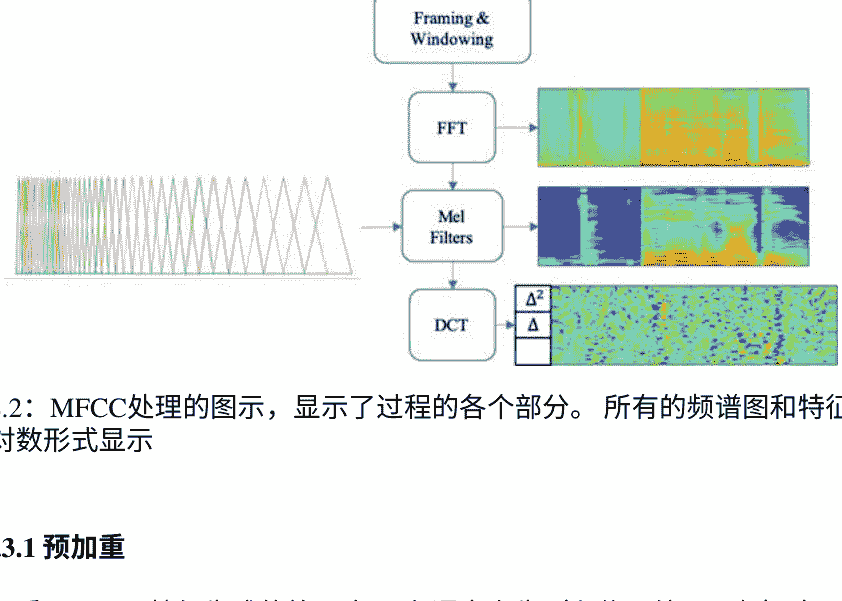

#### 8.2.3.1 预加重

预加重是MFCC特征生成的第一步。在语音产生（和信号处理一般）中，高频信号的能量倾向于要更低。预加重处理对输入信号应用滤波器，强调了较高频率的幅度，降低了较低频率带的幅度。例如：
$$ y_{t}=x_{t}-\alpha x_{t-1} $$
会使输出对前一时间步的强信号的依赖性减小。

#### 8.2.3.2 分帧

语音中的声学信号是不断变化的。通过将从音频中采样的小片段视为静止的来对这种变化的信号进行建模。分帧是将原始音频中的样本分成固定长度的片段的过程，这些片段被称为帧。这些片段通过FFT转换为频域，得到每个帧中频率强度的表示。这些片段表示了语音的音素表示之间的边界。与语音相关的音素声音通常在5-100毫秒的范围内，因此帧的长度通常选择以考虑这一点。通常，大多数自动语音识别系统的帧在20毫秒的范围内，重叠10毫秒，从而为我们的帧提供10毫秒的分辨率。

#### 8.2.3.3 窗口化

窗口化通过一个缩放函数将样本乘以一个系数。这个函数的目的是平滑帧的边缘可能导致的急剧变化。将窗口化函数应用于样本，从而减弱帧边缘附近可能产生的信号干扰。

可以将多种窗口化函数应用于信号。ASR中最常用的是Hann窗口化和Hamming窗口化。

Hann窗口：
$$ w(n)=0.5\left(1-\cos\left(\frac{2\pi n}{N-1}\right)\right)=\sin^{2}\left(\frac{\pi n}{N-1}\right) $$

Hamming窗口：
$$ w(n)=0.54-0.46\cos\left(\frac{2\pi n}{N-1}\right) $$
其中 $N$ 是窗口长度，$0 \leq n \leq N-1$。

#### 8.2.3.4 快速傅里叶变换

短时傅里叶变换（STFT）通过使用帧并对每个帧应用离散傅里叶变换（DFT），将一维信号从时间域转换为频率域。图8.3展示了DFT转换的示意图。在适当的情况下，快速傅里叶变换（FFT）是一种高效的计算DFT的算法，并且在自动语音识别中很常见。

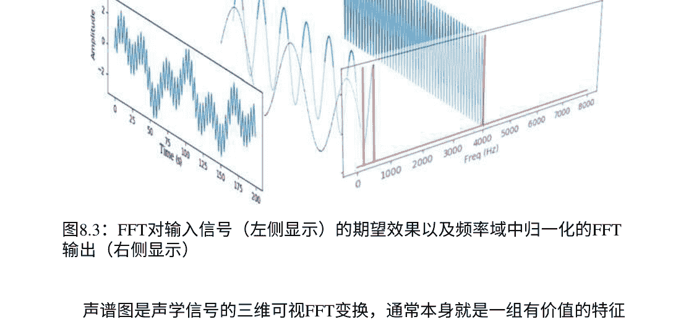

声谱图是声学信号的三维可视FFT变换，通常本身就是一组有价值的特征。STFT表示法可能是有利的，因为它对语音信号（除了原始波形）做出最少的假设。对于一些端到端系统，声谱图被用作输入，因为它提供了更高分辨率的频率描述。图8.4显示了时间沿着x轴，频率在y轴，以及该频率在z轴上的强度，通常用颜色表示。

幅度谱图可以通过以下方式计算：
$$ S_m = |FFT(x_i)|^2 (8.6) $$
功率谱图有时更有帮助，因为它通过考虑的点数对幅度进行了归一化。
$$ S_p = |FFT(x_i)|^2 / N (8.7) $$
其中N是用于FFT计算的点数（通常为256或512）。

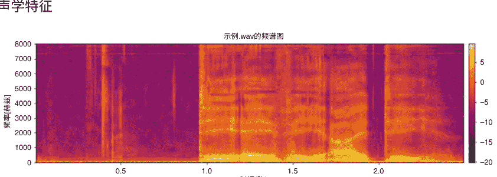

图8.4：音频文件的对数谱图

大部分重要频率位于频谱的较低部分，因此谱图通常映射到对数刻度。

#### 8.2.3.5 梅尔滤波器组

从音频的STFT变换中创建的特征旨在模拟人类听觉系统的处理过程。梅尔滤波器组是一组模拟人类听觉系统的带通滤波器。与线性刻度不同，这些三角形滤波器在较高频率时呈对数形式，在较低频率时呈线性形式，这在语音信号中是典型的。图8.5显示了梅尔滤波器组。滤波器组通常有40个滤波器。

Mel（m）和Hertz（f）域之间的转换可以通过以下方式完成：
$$ m = 2595 \log_{10} \left(1 + \frac{f}{700}\right) $$
$$ f = 700 \left(10^{\frac{m}{2595}} - 1\right) (8.8) $$

每个滤波器产生的输出是对应于每个滤波器的频谱频率的加权和。这些值将输入频率映射到Mel刻度。

#### 8.2.3.6 离散余弦变换

离散余弦变换（DCT）将Mel刻度特征映射到时间域。DCT函数类似于傅里叶变换，但只使用实数（傅里叶变换产生复数）。它将输入数据压缩成描述函数中振荡的一组余弦系数。这种转换的输出被称为MFCC。

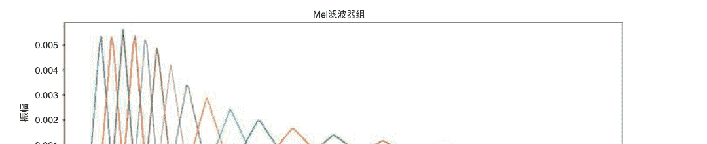

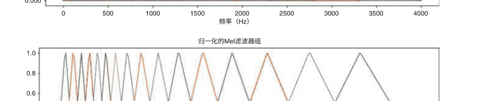

图8.5：显示了带有16个滤波器的Mel滤波器组。这些滤波器应用于输入信号以产生Mel刻度输出。

#### 8.2.3.7 Delta能量和Delta频谱

Delta能量（delta）和Delta频谱（也称为“delta delta”或“双delta”）特征提供了关于帧之间过渡斜率的信息。Delta能量特征是连续帧之间的系数差异（当前帧和前一帧）。Delta频谱特征是连续Delta能量特征之间的差异（当前Delta能量特征和前一个Delta能量特征）。计算Delta能量和Delta频谱特征的方程式如下：
$$ d_t = \frac{\sum_{n=1}^{N} n(c_{t+n} - c_{t-n})}{2 \sum_{n=1}^{N} n^2} \tag{8.9} $$
$$ dd_t = \frac{\sum_{n=1}^{N} n(d_{t+n} - d_{t-n})}{2 \sum_{n=1}^{N} n^2} \tag{8.10} $$

### 8.2.4 其他特征类型

多年来，已经提出了许多声学特征，应用不同的滤波器和变换来突出声学频谱的各个方面。其中许多方法依赖于手工设计的特征，如MFCCs、gamma音特征[Sch+07]或感知线性预测系数[Her90]；然而，MFCCs仍然是最流行的。

MFCC特征（或任何手动设计的特征集）的一个缺点是对噪声的敏感性，因为它依赖于频谱形式。特征空间的低维度对于早期的机器学习技术非常有益，但是对于卷积神经网络等深度学习方法来说，可以使用甚至学习更高分辨率的特征。

总体上，MFCC特征计算高效，适用于自动语音识别，并且可以对特征进行去相关处理。有时候，它们会与其他特定于说话者的特征（通常是i-vectors）结合使用，以提高模型的鲁棒性。

#### 8.2.4.1 自动学习

已经尝试了各种方法来直接学习特征表示，而不是依赖于工程化的特征，这可能不是降低词错误率的最佳方法。其中一些方法包括：使用DNN对特征进行监督学习[T`us+14]，在原始语音上使用CNN进行音素分类[PCD13]，结合CNN-DNN特征[HWW15]，甚至使用RBM进行无监督学习[JH11]。

自动学习的特征在特定场景中可以提高质量，但在不同领域中可能有限制。通过有监督训练产生的特征学习区分数据集中的示例，但在未观察到的环境中可能有限制。随着端到端模型在ASR中的引入，这些特征在端到端任务中进行调整，减轻了两阶段训练过程。

## 8.3 电话

从自然语言处理中可以得出，将语音转换为文本的最合理的语言表示似乎是单词，因为单词级别的转录是期望的输出，并且单词级别有着意义的附加。然而，实际上，语音数据集往往每个单词只有很少的转录示例，使得单词级别的建模变得困难。共享的单词表示是可取的，以获得足够的训练数据来处理各种可能的单词。

例如，音素可以用于在特定语言中对单词进行音素离散化。将一个音素与另一个音素交换会改变单词的意义（尽管在另一种语言中可能不是这样）。例如，如果单词 sweet [swit]中的第三个音素 [i]被改变为 [ɛ]，整个单词的意义也会改变：sweat [swɛt]。

由于附加了含义，音素本身在实际使用中过于严格。相反，音素被用作语言单位的音标表示（可能多个音素映射到一个音素）。音素不与任何特定语言相关，而是与语音本身相关，区分表示语音的声音。图8.6显示了英语的音素集。

| AA | AY | EH | HH | L | OY | T | W |
|---|---|---|---|---|---|---|---|
| AE | B | ER | IH | M | P | TH | Y |
| AH | CH | EY | IY | N | R | UH | Z |
| AO | D | F | JH | NG | S | UW | ZH |
| AW | DH | G | K | OW | SH | V | |

图8.6：基于CMU Sphinx框架中ASR的ARPAbet符号的英语音素集。 手机套装由39部手机组成

通过使用类似于图8.7中所示的音标词典，单词可以映射到它们的音标对应项。词汇表中每个单词都应该有一个音标条目（如果一个单词有多种发音方式，则可能有多个条目）。通过使用音标来表示单词，可以从跨单词的许多示例中学习共享表示，而不是对完整单词进行建模。

| 词 | 电话表示 |
|---|---|
| a | AH |
| 土豚 | AA R D V AA R K |
| 亚伦 | EH R AH N |
| 阿提 | AA R T IY |
| ... | ... |
| 合子 | Z AY G OW T |

图8.7：支持的ASR系统中的音标词典。 注意：音节的重音有时会添加额外的特征到电话表示中。

如果每个单词都用相同的音素发音，那么从音频到音素到单词的映射将是一个相对简单的转换。然而，音频存在于连续的流中，语音信号之间并不一定有明确定义的边界，甚至单词之间也是如此。信号可以以多种形式出现在音频流中，但仍然映射到相同的可解释输出。例如，说话者的语速、口音、节奏和环境都可以在如何将音频流映射到输出序列中起到重要作用。所说的单词不仅取决于当前时刻的音素，还取决于之前和之后的上下文。语音中的这种自然动态强调了周围上下文和音素的依赖关系。

将电话状态组合起来是一种常见的策略，可以提高质量，而不是依赖它们的规范表示。具体来说，单词之间的转换可能比单个电话状态更具信息量。为了对此进行建模，二音素——两个连续音素的部分，三音素，或者扩展到音素上下文相关单元（senones）可以用作语言表示或中间表示，而不是音素本身。有许多方法可以将音素表示与附加上下文结合起来，直接建模或通过学习状态组合的统计层次结构，大多数传统方法依赖于这些技术。

尽管ASR侧重于识别而不是解释（例如，识别口语单词而不是上下文相关的单词序列建模），但上下文理解是一个重要的方面。在同音异形词的情况下，具有相同语音表示但不同拼写的两个单词，预测正确的单词完全依赖于周围的上下文。在这种情况下，一些问题可以通过后面讨论的语言模型来解决。不正确的音标替换进一步复杂化了问题。例如，在英语中，*pin* [P IH N]和*pen* [P EH N]的表示是不同的。然而，尽管这些单词确实具有不同的语音表示，但它们常常被错误地互换使用或发音相似，需要更多地依赖上下文来进行正确选择，而不仅仅是音素本身。随着口音的加入，语音表示可能会产生更多的冲突，需要替代方法来确定说话者特定的特征。这些类型的情况在ASR中非常重要，因为人们可能会说错单词，但上下文和意图仍然可以被解释。所有这些口语的现实因素都为实际中的自动语音识别增加了复杂性。

## 8.4 统计语音识别

统计自动语音识别专注于根据语音信号通过音频文件或输入流预测最可能的单词序列。早期的方法并没有使用概率化的方法，而是通过对输入的声学特征应用保留词的模板来优化输出的单词序列（这在历史上用于识别口语数字）。动态时间规整（DTW）是一种早期的扩展模板策略的方法，通过找到模板的“最低约束路径”来实现。这种方法允许输入时间序列和输出序列的变化，但是很难确定适当的约束条件，例如距离度量、如何选择模板以及缺乏统计概率基础。这些缺点使得DTW模板方法难以优化。

很快就出现了一种概率化的方法，将声学信号映射到单词序列。统计序列识别引入了最大后验概率估计的重点。形式上，这种方法是从一系列声学语音特征 \(X\) 到一系列单词 \(W\) 的映射。声学特征是长度为 \(T\) 的特征向量序列： \(X = \{\mathbf{x}_t \in \mathbb{R}^D | t = 1, \ldots, T\}\)，而单词序列定义为 \(W = \{w_n \in V | n = 1, \ldots, N\}\)，长度为 \(N\)，其中 \(V\) 是词汇。最有可能的词序列 W*可以通过最大化来估计 P(W|X)对于所有可能的词序列, V*。从概率上讲，这可以写成:
$$ W^* = \arg\max_{W \in V^*} P(W|X) $$
解决这个问题是自动语音识别的核心。传统方法将这个问题分解，优化模型来解决每个组成部分，而最近的端到端深度学习方法则专注于直接优化这个问题。

使用贝叶斯定理，统计语音识别被定义为:
$$ P(W|X) = \frac{P(X|W)P(W)}{P(X)} $$
数量 P(W)代表语言模型 (给定词序列的概率)，而 P(X|W)代表声学模型。因为这个方程驱动着分子的最大化，以实现最可能的词序列，目标不依赖于 P(X)，因此可以将其移除:
$$ W^* = \arg\max_{W \in V^*} P(X|W)P(W) $$
统计自动语音识别的概述如图8.8所示。

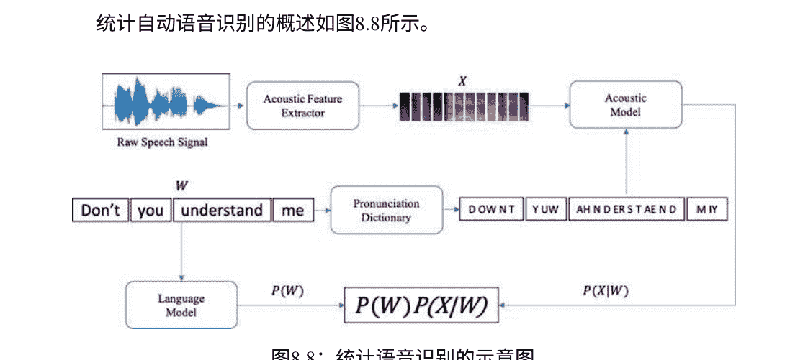

通常，语音识别中最具挑战性的组成部分之一是输入序列和输出序列之间的步骤数量的显著差异 (T ≫ N)。例如，提取的声学特征可能表示音频信号中的10毫秒帧。一个典型的十个单词的话语可能持续3秒，导致输入序列长度为300，目标输出序列长度为10 [You96]。因此，一个单词可以延伸多个帧，并且可以采用多种形式，如图8.9所示。因此，有时将一个单词分割成跨越较少帧的子组件是有益的。

### 8.4.1 声学模型： P(X|W)

在等式（8.13）中的统计定义可以扩展，以将声学特征映射到音素，然后从音素映射到单词：

$$ W^* = \underset{W}{\mathrm{argmax}} P(X|W) P(W) $$
$$ = \underset{W}{\mathrm{argmax}} \sum_{S} P(X, S|W) P(W)      (8.14) $$
$$ \approx \underset{W, S}{\mathrm{argmax}} P(X|S) P(S|W) P(W) $$

其中 P(X|S)将声学特征映射到音素状态， P(S|W)将音素映射到单词（通常称为发音模型）。 等式 （8.13）展示了两个因素 P(X|W)和 P(W)。 这些因素中的每一个都被视为模型，因此具有可学习的参数 Θ_A和 Θ_L， 分别用于声学模型和语言模型。

$$ W^* = \underset{W \in V^*}{\mathrm{argmax}} P(X|W, \Theta_A) P(W, \Theta_L)      (8.15) $$

这个模型现在依赖于预测观测值 X的可能性，其中因子 P(X|W, Θ_A)。 解决这个数量需要基于状态的建模方法(HMMs)。 如果假设一个离散状态模型，观测值的概率可以通过引入状态序列 S来定义，其中 S = {s_t ∈ {s^(1), ... s^(Q)} | t = 1, ..., T } into P(X|W)。

$$ P(X|W) = \sum_{S} P(X|S) P(S|W)      (8.16) $$

方程8.16可以进一步使用概率的链式法则进行因式分解，得到逐帧的可能性。为了方便表示，令 $\mathbf{x}_{1:n} = \mathbf{x}_1, \mathbf{x}_2, \ldots, \mathbf{x}_n$。

$$ P(X|S) = \prod_{t=1}^{T} P(\mathbf{x}_t|\mathbf{x}_{1:t-1}, S) \tag{8.17} $$

使用条件独立性假设，可以将这个数量减少到：

$$ P(X|S) \approx \prod_{t=1}^{T} P(\mathbf{x}_t|\mathbf{s}_t) \tag{8.18} $$

条件独立性假设限制了用于预测的上下文。我们假设任何观测值 $\mathbf{x}_t$ 只依赖于当前状态 $s_t$，而不依赖于观测历史 $\mathbf{x}_{1:t-1}$，如图8.10所示。这个假设减少了问题的计算复杂度；然而，它限制了任何决策中包含的上下文信息。条件独立性假设通常是自动语音识别中最大的障碍之一，因为语音具有上下文性。因此，许多技术都集中在提供“上下文特征”以提高质量。

图8.10：带有特征观察的状态对齐

条件独立性假设允许我们通过对所有可能的状态序列 $S$ 求和来计算观察的概率，因为实际上产生 $X$ 的状态序列是未知的。状态集合 $Q$ 可以根据ASR系统的建模方法而变化。在简单的系统中，目标状态是子词单元（如英语音素）。

帧之间的转移对齐在先验上是未知的。我们使用HMM，允许我们学习时间扩展，并使用期望最大化（EM）算法进行训练。通常，EM算法使用当前HMM参数估计状态占用概率，然后基于估计重新估计HMM参数。

HMM由两个随机过程组成：一个隐藏的马尔可夫链和一个依赖于马尔可夫链的可观察过程。目标是对产生可观察事件（声学特征）的状态建模概率分布。形式上，HMM的定义如下：

- 1. 一组Q状态S = {s^(1), ..., s^Q}。马尔可夫链一次只能处于一个状态。在一个简单的ASR模型中，状态集合S可以是语言中的音素集合。
- 2. 初始状态概率分布，π = {P(s^(i)|t = 0)}, 其中t是时间索引。
- 3. 定义状态之间转移的概率分布：
   a_ij = P(s_t^(j)|s_{t-1}^(i))。转移概率a_ij不依赖于时间t。
- 4. 观测值X来自特征空间F。在我们的情况下，这个特征空间可以是输入到我们模型中的所有连续声学特征。这些特征由声学信号提供给我们。
- 5. 一组概率分布，发射概率（有时称为输出概率）。这组分布描述了每个状态产生的观测结果的特性，即b_x = {b_i(x) = P(x|s^(i))}

- 发射分布：b_x = P(x|s)
- 转移概率：a_ij = P(s_t|s_{t-1})
- 初始状态概率：π = P(s_1).

状态之间的转换仅取决于前一个状态s_{t-1}。词典模型（在下一节中讨论）提供了初始转换状态的概率。这些转换可以是自循环，以允许基于帧的预测中的弹性时间膨胀。

HMM通过在声学观测X和目标电话状态序列Y上进行训练，优化学习π, a和b(x)。初始估计可以从词典模型中获得。可以从词典模型中获得P(s^(j)|s^(i))的概率。前向递归算法用于评分当前模型参数a,b(x)，得到参数以获得P(X|S)。维特比算法用于避免计算所有路径的和，并作为前向算法的近似：

$$ P(X|S) = \sum_{\text{路径}} P(X, S|\lambda) \quad \underset{\text{最大路径}}{\text{维特比}} P(X, S|\lambda) $$

训练通常通过前向-后向（或Baum-Welch）和维特比算法完成 [Rab89b]。在我们的情况下，发射概率的目标是最大化给定模型的样本的概率。因此，维特比算法只关注可能状态序列中最可能的路径（图8.11）。通常使用高斯或高斯混合模型来建模发射概率密度函数。

## 8.4.1.1 词典模型 : P(S|W)

可以通过表示给定单词序列的状态序列的概率来构建P(S|W)模型。这个模型通常被称为发音或词典模型。我们使用概率链规则对其进行分解，得到：

$$ P(S|W) = \prod_{t=1}^{T} P(s_t|s_{1:t-1}, W) \tag{8.20} $$

再次使用条件独立性假设，这个数量被近似为：

$$ P(s_t|s_{1:t-1}, W) = P(s_t|s_{t-1}, W) \tag{8.21} $$

引入条件独立性假设也是第一阶马尔可夫假设，使我们能够将模型实现为第一阶HMM。模型的状态，$s_t$，不是直接可观察的；因此，我们无法观察到从一个语音单元到另一个语音单元的转换；然而，观测值$x_t$ do依赖于当前状态$s_t$。 HMM允许我们从观测值中推断出关于状态序列的信息。

首先，将词汇表 $V$ 转换为每个项的状态表示，以创建一个词模型。

- 词典模型可以用于确定每个状态的初始概率。
- 通过计算每个单词开头的出现率，可以确定初始概率($s_1$)。
- 转移概率累积在音频数据的词汇版本的转录目标上。

可以为词汇表中的每个单词创建基于状态的单词序列模型，如图8.12所示。

## 8.4.2 语言模型 : $P(W)$

语言模型 $P(W)$通常是一个利用概率链规则的$n$-gram语言模型。除了使用条件独立性假设外，它还通过使用第$(m-1)$阶马尔可夫假设进行分解，其中$m$ 是要考虑的$n$-gram数量。它可以描述为：

$$\begin{aligned} P(W) &= \prod_{n=1}^{N} P(w_n | w_{1:n-1}) \\ &\approx \prod_{n=1}^{N} P(w_n | w_{n-m+1:n-1}) \end{aligned} \tag{8.22} $$

HMM是训练和解码序列的强大模型。在训练HMM模型时，我们专注于为状态对齐训练单独的模型，然后将它们合并为一个用于连续语音识别的单个HMM模型。HMM还允许将单词序列纳入其中，基于单词创建状态序列，并应用单词序列先验知识。此外，HMM支持组合性；因此，时间扩展、发音和单词序列（语法）在同一个模型中通过组合各个组件来处理。

$$\begin{aligned} P(q|M) &= P(q, \phi, w|M) \\ &= P(q|\phi) \cdot P(\phi|w) \cdot P(w_n | w_{1:n-1}) \end{aligned} \tag{8.23} $$

不幸的是，许多用于优化HMM的假设限制了它们的功能[BM12]：

* HMM和DNN模型是相互独立训练的，但彼此之间又有依赖关系。
* 先验选择统计分布依赖于手工制作的发音词典中的语言信息。这些容易出现人为错误。
* 一阶马尔可夫假设通常被称为条件独立假设（状态仅依赖于其前一个状态），强制执行严格的对于个别预测，考虑上下文状态的数量有限制。

* 解码过程很复杂。

### 8.4.3 HMM解码

基于HMM的ASR模型的解码过程会找到最优的单词序列，结合各种模型。该过程首先从声学特征中解码出状态序列，然后从状态序列中解码出最优的单词序列。传统上，音素解码依赖于根据声学特征从音素词典中构建的每个单词的HMM概率格。解码可以使用Viterbi算法在HMM输出格上进行，但对于大词汇量的任务来说，这是昂贵的。Viterbi解码能够高效地执行精确搜索，但对于大词汇量的任务来说是不可行的。为了减少计算量，通常使用波束搜索。解码过程使用回溯来跟踪生成的单词序列。

图8.13: (a) HMM状态表示, (b) 单词“data”的音素状态转换, 以及(c) 语法状态模型。 这个图是从[MPR08]中改编的

在预测过程中，解码HMM通常依赖于使用加权自动机和转换器。在简单情况下，加权有限状态接受器（WFSA）的自动机由一组状态（初始、中间和最终）、一组带有标签和权重的状态之间的转换以及每个最终状态的最终权重组成。权重表示每个转换的概率或成本。你可以将HMM表示为有限状态自动机的形式。在这种方法中，每个状态之间都有一个转换。WFSA根据状态和可能的转换接受或拒绝可能的解码路径。拓扑结构可以表示一个单词、可能的单词发音或路径中各个状态的概率（图8.13）。因此，解码取决于将HMM的状态模型与发音、字典和n-gram语言模型以某种方式结合起来。

通常，加权有限状态转换器（WFST）用于表示解码阶段中不同级别的状态转换[MPR08]。WFST将输入序列转换为输出序列。WFST添加了一个输出标签，可以用于将解码关系的不同级别联系在一起，例如音素和单词。WFSA是没有输出标签的WFST。WFST表示允许通过其结构属性以高效的算法进行模型的组合和优化：组合性、确定性和最小化。组合性属性允许独立构建不同类型的WFST，并将它们组合在一起，例如将词典（音素到单词）WFST和概率语法组合在一起。确定性要求唯一的初始状态，即没有两个离开一个状态的转换共享相同的输入标签。最小化将冗余状态合并在一起，可以看作是后缀共享。因此，通过四个转换器，DNN-HMM混合模型的整个解码算法可以用WFST表示：

- HMM：将HMM状态映射到CD音素
- 上下文依赖性：将CD音素映射到音素
- 发音词典：将音素映射到单词
- 词级语法：将单词映射到单词。

例如，在Kaldi中，这些转换器分别被称为H、C、L和G。组合性允许将L和G组合成一个单一的转换器LG，将音素序列映射到单词序列。实际上，这些转换器的组合可能会变得过大，因此通常采用以下形式进行转换：HCLG，其中

$$ HCLG = \min(\det(H \circ \min(\det(C \circ \min(\det(L \circ G)))))). \qquad (8.24) $$

## 8.5 错误度量

语音识别中最常用的度量标准是词错误率（WER）。WER通过考虑插入、删除和替换的数量，使用Levenshtein距离度量，测量预测和目标之间的编辑距离。

词错误率定义为：

$$ WER = 100 \times \frac{I+D+S}{N} $$

其中

- $I$是插入的单词数，
- $D$是删除的单词数，
- $S$是替换的单词数，以及
- $N$是目标中的总单词数。

对于基于字符的模型和基于字符的语言，错误度量主要关注CER（字符错误率），有时也称为LER（字母错误率）。第9章将更详细地探讨基于字符的模型：

$$ CER = 100 \times \frac{I+D+S}{N} $$

其中

- $I$是插入的字符数，
- $D$是删除的字符数，
- $S$是替换的字符数，以及
- $N$是目标中的总字符数。

CER和WER用于确定预测与目标的相似程度，从而衡量整个系统的性能。它们计算简单，能够直观地总结识别系统的质量。图8.14展示了计算WER和CER的脚本。图8.15、8.16和8.17展示了一些WER和CER的示例。

然而，编辑距离度量的一个缺点是它们不提供任何关于错误可能是什么的指示。因此，测量特定类型的错误需要进一步的调查来改进模型，例如SWER（显著词错误率）或查看概念准确性。在[MMG04]中，作者提出了对WER度量的改进，形式为MER（匹配错误率）和WIR（词信息损失）。当信息传达的重要性大于编辑成本时，这些度量可以很有用，并且还提供概率解释（因为WER可以大于100）。

## 8.6 DNN/HMM混合模型

GMMs是一个受欢迎的选择，因为它们能够直接对$P(\mathbf{x}_t|s_t)$直接进行建模。此外，它们对输入提供了概率解释，对每个状态下的分布进行建模。然而，每个状态下的高斯分布本身就是一个强假设。在实践中，特征可能是强非高斯的。DNNs通过其能力相对于GMMs显示出显著的改进学习非线性函数。 DNN不能直接提供条件似然。 帧后验分布用于将概率模型$P(\mathbf{x}_t|s_t)$转化为分类问题$P(s_t|\mathbf{x}_t)$， 使用伪似然技巧作为联合概率的近似。伪似然的应用被称为“混合方法”。

$$ \prod_{t=1}^{T} P(\mathbf{x}_t|s_t) \propto \prod_{t=1}^{T} \frac{P(s_t|\mathbf{x}_t)}{p(s_t)} \tag{8.27} $$

```python
1  import Levenshtein as Lev
2  
3  def wer(s1, s2):
4      """
5      计算单词错误率，定义为编辑距离
6      
7      两个提供的句子在分词后的距离。
8      参数:
9          s1 (字符串): 以空格分隔的句子
10         s2 (字符串): 以空格分隔的句子
11     """
12     
13     # 构建单词到整数的映射
14     b = set(s1.split() + s2.split())
15     word2char = dict(zip(b, range(len(b))))
16     
17     # 将单词映射到字符数组 (仅适用于Levenshtein包
18     # 接受
19     # 字符串)
20     w1 = [chr(word2char[w]) for w in s1.split()]
21     w2 = [chr(word2char[w]) for w in s2.split()]
22     wer_lev = Lev.distance("".join(w1), "".join(w2))
23     wer_inst = float(wer_lev) / len(s1.split()) * 100
24     return 'WER: {0:.2f}'.format(wer_inst)
25 
26 
27 def cer(s1, s2):
28     """
29     计算字符错误率，定义为编辑距离。
30     
31     参数:
32         s1 (字符串): 以空格分隔的句子
33         s2 (字符串): 以空格分隔的句子
34     """
35     s1, s2 = s1.replace(' ', ''), s2.replace(' ', '')
36     cer_inst = float(Lev.distance(s1, s2)) / len(s1) * 100
37     return 'CER: {0:.2f}'.format(cer_inst)
```

图8.14：用于计算WER和CER的Python函数

```python
1 预测 = '猫坐在垫子上'
2 目标 = '猫坐在垫子上'
3 打印 ('预测：' + 预测， '\n目标：' + 目标)
4 打印 (wer (预测, 目标) )
5 打印 (cer (预测, 目标) )
6
7 > 预测：猫坐在垫子上
8 > 目标：猫坐在垫子上
9 > WER： 0.00
10 > CER： 0.00
```

图8.15：预测与目标完全匹配，WER和CER为0

```python
1 预测 = '猫坐在垫子上'
2 target = 'the cat sat on the hat'
3 打印 ('预测：' + 预测， '\n目标：' + 目标)
4 打印 (wer (预测, 目标) )
5 打印 (cer (预测, 目标) )
6
7 > 预测：猫坐在垫子上
8 > 目标：猫坐在帽子上
9 > WER： 16.67
10 > CER： 5.88
```

图8.16：改变预测单词中的一个字符会导致更大的WER增加，因为整个单词都是错误的，尽管在音标上相似。相比之下，CER的变化要小得多，因为字符比单词多；因此，单个字符的变化影响较小。

```python
1 prediction = '猫垫子'
2 目标 = '猫坐在垫子上'
3 打印 ('预测：' + 预测， '\n目标：' + 目标)
4 打印 (wer (预测, 目标) )
5 打印 (cer (预测, 目标) )
6
7 > 预测：猫垫子
8 > 目标：猫坐在帽子上
9 > WER： 200.00
10 > CER： 183.33
```

图8.17：WER和CER通常不被视为百分比，因为它们可以超过100%。大段内容的丢失或插入会大大增加WER和CER分子是一个DNN分类器，它使用一组输入特征作为输入 $x_t$ 和目标状态 $s_t$ 进行训练。在简单情况下，如果我们考虑每个音素1个状态，那么分类器的类别数量将为 $len(q)$。分母 $P(s_t)$ 是状态 $s_t$ 的先验概率。请注意，训练逐帧模型需要使用 $x_t$ 作为输入和 $s_t$ 作为目标的逐帧对齐，如图8.18所示。这种对齐通常是通过利用较弱的HMM/GMM对齐系统或人工创建的标签来实现的。对齐标签的质量和数量通常是混合方法中最重要的限制因素。

图8.18：为了应用DNN分类器，必须存在一个逐帧目标。使用现有的分类器计算约束对齐，以对齐声学特征和已知的状态序列

分类器的构建需要选择目标状态（单词、音素、三音素状态）。选择状态 $Q$ 可以在任务的质量和复杂性上产生显著差异。首先，它必须支持识别任务以获得对齐。其次，它必须对分类任务实用。例如，对于训练分类器来说，音素可能更容易，但是获取训练数据的逐帧标签和解码方案可能更加困难。或者，基于单词的状态更容易创建，但是获取逐帧对齐和训练分类器更加困难。

## 8.7 案例研究

在这个案例研究中，主要关注使用开源框架训练ASR系统。我们首先训练传统的ASR引擎，然后转向框架中更高级的模型，最后使用TDNN模型。

### 8.7.1 数据集：Common Voice

在这个案例研究中，我们专注于为Mozilla发布的Common Voice 1数据集构建ASR模型。Common Voice是一个包含500小时录制语音的语料库。它由众包说话者每个示例录制一个话语组成。然后对这些录音进行同行评审，以评估转录-录音对的质量。根据每个话语接收的正面和负面投票数量，将其标记为有效、无效或其他。有效类别包含至少两个评论的样本，且大多数确认音频与文本匹配。无效类别同样至少有两个评论，大多数确认音频与文本不匹配。其他类别包含少于两个投票或没有多数共识的所有文件。每个子组（有效和其他）进一步分为训练、测试和开发（验证）集。“cv-valid-train”数据集总共包含239.81小时的音频。总体而言，该数据集复杂多样，包含各种口音、录音环境、年龄和性别。

### 8.7.2 软件工具和库

Kaldi是最广泛使用的语音识别工具包之一，主要用于研究人员和专业使用。它主要由约翰霍普金斯大学开发，并完全使用C++和shell脚本构建各种库的组件。设计重点是提供一个灵活的工具包，可以根据任务进行修改和扩展。一组称为“recipes”的脚本用于连接组件以进行训练和推断。

CMU Sphinx是由卡内基梅隆大学开发的语音识别工具包。它还依赖于基于HMM的语音识别和n-gram语言模型进行语音识别。Sphinx工具包有多个版本，其中Sphinx 4是最新版本。一种名为PocketSphinx的Sphinx版本更适用于嵌入式系统（通常由于硬件限制而导致一些质量损失）。

### 8.7.3 Sphinx

在本节中，我们使用Common Voice数据集训练了一个Sphinx ASR模型。这个框架依赖于各种包，主要基于C++。鉴于此，本ASR介绍章节的大部分工作都集中在脚本和相关概念上，即数据准备。像许多框架一样，一旦数据格式化正确，框架就相对简单。

### 8.7.3.1 数据准备

Sphinx所需的数据准备是最重要的步骤。Sphinx被配置为在特定位置查找特定内容，并期望文件和文件名之间的一致性。传统的结构是一个与数据集同名的顶级目录。这个名称将用作后续文件的文件名。在这个目录下，有两个目录“wav”和“etc”。“wav”目录包含所有以wav格式的训练和测试音频文件。“etc”目录包含所有的配置和转录文件。图8.19显示了文件结构。

```
1 / common_voice
2                 etc/
3                         common_voice.dic
4                         common_voice.filler
5                         common_voice.idngram
6                         common_voice.lm
7                         common_voice.lm.bin
8                         common_voice.phone
9                         common_voice.vocab
10                        common_voice_test.fileids
11                        common_voice_test.transcription
12                        common_voice_train.fileids
13                        common_voice_train.transcription
14                wav/
15                        train_sample000000.wav
16                        test_sample000000.wav
17                        train_sample000001.wav
18                        test_sample000001.wav
19                        ...
20
```

Common Voice最初使用“mp3”文件打包。通过使用“SoX”工具将其转换为“wav”。处理脚本如图8.20所示。

在创建“wav”文件之后，我们创建了一个包含所有用于训练的文件列表，以及一个单独的验证列表（在Sphinx框架中称为测试）文件列表包含“fileids”文件。“fileids”文件每行包含一个文件名，不包括文件扩展名。如图8.21所示。接下来，我们创建转录文件。转录文件每行包含一个话语转录，末尾指定了“fileid”。转录文件的示例如图8.22所示。

> 2 http://sox.sourceforge.net/。

```
text
1 def convert_to_wav(x):
2     file_path, wavpath = x
3     file_name = os.path.splitext(os.path.basename(file_path))[0]
4     cmd = "sox {} -r {} -b 16 -c 1 {}".format(
5         file_path,
6         args.sample_rate,
7         wavpath)
8     subprocess.call([cmd], shell=True)
9 
10 with ThreadPool(10) as pool:
11     pool.map(convert_to_wav, train_wav_files)
```

图8.20：使用sox库将mp3文件转换为wav文件。该函数被并行化以提高转换速度。

```
text
1 train_sample000000
2 train_sample000001
3 train_sample000002
4 ...
5
```

图8.21：从“common_voice_train.fileids”文件中提取的样本

```
text
1 <s> 学会识别预兆并跟随它们，老国王曾经
    说 </s> (训练样本 - 00000)
2 <s> 宇宙中的一切都在演化，他说 </s> (训练样本 - 000001)
3 <s> 你来了，这样你就能了解你的梦想，国王说
    old 女人     </s> (train_sample - 000002)
4 ...
5
```

图8.22：来自“common_voice_train.transcription”文件的示例

一旦创建了转录文件，我们就会关注所使用的语音单元。在这个例子中，与图8.6所示一样使用相同的音素，另外还有一个额外的音素 <SIL>来表示静音标记。

下一步是创建音素字典。我们在训练数据集的转录中创建一个包含所有单词的列表。图8.23中的脚本展示了一种简单的方法。

接下来，我们使用单词和音素列表创建一个音素字典（词典）。创建词典模型通常需要语言学专业知识或现有模型来为这些单词创建映射，因为音素表示应该匹配。

```
python
import collections
import os

counter = collections.Counter()
with open(csv_file) as csv_file:
    reader = csv.DictReader(csv_file)
    for row in reader:
        trans = row['text']
        counter += collections.Counter(trans.split())
with open(os.path.join(etcdir, 'common_voice.words'), 'w') as f:
    for item in counter:
        f.write(item.lower() + '\n')
```

图8.23：该脚本创建一个名为“common_voice.words”的文件，其中包含训练数据中的每个单词的一行。注意：该文件中的每个单词只表示一次。

发音。为了简化这种依赖关系，我们使用CMU Lextool³创建了我们的音标字典，并保存为“common_voice.dic”。注意：这里需要进行一些额外的处理，以确保在表示中没有添加任何额外的音素，而只有在我们的“.phone”文件中指定的音素。此外，在这个例子中，所有的音素和转录都以小写形式表示。音标字典也需要匹配。图8.24显示了音标字典的一个样本。

```
1 a          ah
2 a(2)       ey
3 monk       m ah ng k
4 dressed    d r eh s t
5 in         ih n
6 black      b l ae k
7 came       k ey m
8 to         t uw
9 ...
10
```

图8.24：来自“common_voice_train.dic”文件的示例

我们的最后一步是创建一个语言模型。大多数语言模型遵循ARPA格式，每行表示n-gram及其相关概率，并使用节的分隔符表示n-gram数量的增加。我们使用CMUCLMTK创建一个3-gram语言模型，这是CMU的一个语言建模工具包。脚本计算不同的n-gram并计算概率。

> ³ http://www.speech.cs.cmu.edu/tools/lextool.html.

```
# 创建词汇文件
text2wfreq < etc/common_voice_train.transcription | wfreq2vocab > 
    etc/common_voice.vocab

# 从训练转录文件创建n-gram计数
text2idngram -vocab etc/common_voice.vocab -idngram etc/
    common_voice.idngram < etc/common_voice_train.transcription

# 从n-grams创建语言模型
idngram2lm    -vocab_type 0 -idngram etc/common_voice.idngram -vocab
    etc/common_voice.vocab   -arpa etc/common_voice.lm

# 将语言模型转换为二进制（压缩）
sphinx_lm_convert -i etc/common_voice.lm  -o etc/common_voice.lm.DMP
```

图8.25：CMUCLMTK创建语言建模文件

预处理完成后，我们准备训练ASR模型。

### 8.7.3.2 模型训练

Sphinx的模型训练过程非常简单，一切都按照配置文件进行设置。要生成配置文件，我们运行以下命令：

```
sphinxtrain -t common_voice setup
```

有了设置配置文件，可以通过以下命令训练Sphinx模型：

```
sphinxtrain run
```

训练函数运行一系列脚本来检查配置和设置。然后对数据进行一系列转换以生成特征，然后训练一系列模型。Sphinx框架在Common Voice验证集上实现了39.824的WER和24.828的CER。

### 8.7.4 Kaldi

在本节中，我们训练一系列Kaldi模型来在Common Voice数据集上训练高质量的ASR模型。训练高质量模型需要中间模型将声学特征帧与语音状态对齐。代码和解释来自Kaldi教程。

```
\n1 \data \n2 ngram  1=8005\n3 ngram  2=31528\n4 ngram  3=49969\n5\n6 \1-grams:\n7 -6.8775  </s>     0.0000\n8 -0.9757  <s>      -4.8721\n9 -1.6598  a        -4.5631\n10 -5.0370  aaron    -1.2761\n11 -4.5116 abandon  -1.7707\n12 -3.9910 abandoned -2.2851\n13 ...\n14\n15 \2-grams:\n16\n17 -1.9149  <s> a    -3.2624\n18 -4.1178  <s> abigail  0.0280\n19 -2.8197  <s> about  -2.4474\n20 -4.0634  <s> abraham  0.0483\n21 -2.9228  <s> absolutely  -1.8134\n22 ...\n23\n24 \3-grams:\n25 -0.9673  <s> a boy\n26 -1.6977  <s> a breeze\n27 -2.6800  <s> a bundle\n28 -1.5866  <s> a card\n29 -2.2998  <s> citation\n30
```

图8.26：标准ARPA格式中“common_voice.lm”文件的示例

### 8.7.4.1 数据准备

Kaldi中的数据准备与Sphinx准备类似，需要转录和音频ID文件，如图8.27所示。Kaldi已经准备了一套脚本来自动构建这些文件，以减少Sphinx设置中所需的手动工作。

准备一个从“.wav”文件到音频路径的映射。我们为每个文件创建一个话语ID。这个话语ID用于将文件与训练流程中的不同表示绑定在一起。在Kaldi中，这被视为一个简单的文本文件，使用“.scp”扩展名。

其次，创建一个将话语ID映射到话语转录的文件（图8.28）。⁴这个文件将用于创建话语。语料库文件包含数据集中的所有话语。它用于计算系统的词级解码图。

⁴如果还有其他标签，比如说话人和性别，也可以在这个过程中使用。Common Voice没有这些标签，所以每个话语都被独立处理。

```
# spk2gender [<speaker-id> <gender>]
# wav.scp [<utteranceID> <full_path_to_audio_file>]
# text [<utteranceID> <text_transcription>]
# utt2spk [<utteranceID> <speakerID>]
# corpus.txt [<text_transcription>]
```

图8.27：Kaldi所需创建的文件

```
dad_4_4_2 four four two
july_1_2_5 one two five
july_6_8_3 six eight three
# 等等...
```

图8.28：来自转录文件的示例

这些文件允许生成其余所需的文件，例如包含字典中所有单词及其音素转录的“lexicon.txt”文件。此外，还有非静音和静音音素文件，用于处理非语音音频（图8.29）。

```
! SIL sil
<UNK> spn
eight ey t
five f ay v
four f ao r
nine n ay n
one hh w ah n
one w ah n
seven s eh v ah n
six s ih k s
three th r iy
two t uw
zero z ih r ow
zero z iy r ow
```

图8.29：从“lexicon.txt”文件中的样本

一旦准备好这些文件，就可以使用Kaldi脚本创建ARPA语言模型和词汇表。使用Sphinx，字典中的所有术语都需要手动输入词条（我们利用预制字典和附加推理字典来完成此操作）。在这种情况下，也使用了CMU字典，但在Kaldi中，使用了预训练模型来估计发音。

OOV词的数量。⁵一旦字典准备好了，就构建词汇模型，其中包含数据集中每个单词的音标表示。然后从转录和词典模型构建FST，并用它来训练模型。数据预处理的下一步是为所有的训练数据生成MFCC特征。为了进行各种实验，将每个话语保存为单独的文件以减少特征生成。在这个过程中，我们还创建了两个较小的数据集：一个包含10k个最短话语的数据集和一个包含20k个最短话语的数据集。这些数据集用于构建之前的模型。特征提取完成后，我们可以训练我们的模型。

⁵ 原文为“OOV词的数量。5”，根据上下文，此脚注标记应为上标或与后续句子合并。此处保留原文数字标记，但根据格式要求调整为正文。

### 8.7.4.2 模型训练

在数据准备完成后，大部分模型训练都是使用Kaldi脚本完成的，非常直观。首先训练的模型是一个HMM-GMM模型。它通过10k个最短话语进行40个时期的训练。然后使用这个模型对20k个话语进行对齐。每个模型训练完成后，我们重新构建解码图并将其应用于测试集。该模型在验证集上的WER为52.06（图8.30）。

```
1 steps/train_mono.sh --boost-silence 1.25 --nj 20 --cmd "run.pl --mem 8G" data/train_10kshort data/lang exp/mono || exit 1;
2 ( 
3 utils/mkgraph.sh data/lang_test exp/mono exp/mono/graph
4 for testset in valid_dev; do
5 steps/decode.sh --nj 20 --cmd "run.pl --mem 8G" exp/mono/graph data/$testset exp/mono/decode_$testset
6 done
7 )&
```

图8.30：使用训练数据中的10k个最短语音片段对单音素“mono”模型进行训练并进行对齐

接下来，我们使用20k个对齐结果来训练一个新模型，该模型包含了增量和双增量特征。该模型还将在训练过程中利用三音素。之后，我们将使用单独的训练脚本再次执行上述过程，生成一个WER为25.06的模型（图8.31）。第三个训练的模型是LDA+MLLT模型。该模型将使用前一个模型在20k数据集上的学习结果来计算更好的对齐。到目前为止，我们一直在使用13维的MFCC特征。在这个## 8.7 案例研究

```
steps/align_si.sh --boost-silence 1.25 --nj 10 --cmd "run.pl --mem 8G" \
    data/train_20k data/lang exp/mono exp/mono_ali_train_20k

steps/train_deltas.sh --boost-silence 1.25 --cmd "$train_cmd" \
    2000 10000 data/train_20k data/lang exp/mono_ali_train_20k exp/tri1

# 使用tri1模型进行解码
(
    utils/mkgraph.sh data/lang_test exp/tri1 exp/tri1/graph
    for testset in valid_dev; do
        steps/decode.sh --nj 20 --cmd "$decode_cmd" exp/tri1/graph \
            data/$testset exp/tri1/decode_$testset
    done
)&
```

图8.31：使用“mono”模型的对齐结果在20k训练子集上训练另一个单音素“tri1”模型

在模型中，一个单一的输入中考虑了多个帧，以提供更多的上下文。在每个状态下，增加的输入维度增加了分类器的计算需求，因此我们使用线性判别分析（LDA）来降低特征的维度。此外，最大似然线性变换（MLLT）进一步去相关特征，并使它们“正交”，以便更好地由对角协方差高斯模型化[Rat+13]。得到的模型产生了一个WER为21.69（图8.32）。

接下来训练的模型是称为“LDA+MLLT+SAT”的说话人自适应模型。使用先前的模型再次对20k数据集进行对齐，并使用与先前模型相同的架构，加上额外的说话人自适应特征。由于我们的数据不包含说话人标签，我们不会在这个领域获得增益，我们也没有看到任何增益。得到的模型产生了一个WER为22.25（图8.33）。

我们现在将之前模型计算得到的对齐应用到整个训练数据集上。我们在新的对齐上训练了另一个LDA+MLLT+SAT模型。得到的模型的词错误率为17.85（图8.34）。

最终模型是一个TDNN模型[PPK15]。TDNN模型是一个8层的DNN，带有批归一化。由于深度和并行化的需求，这个模型需要使用GPU进行训练（图8.35）。

在集成了8层DNN之后，最终模型在验证集上的词错误率为4.82。

```
steps/align_si.sh --nj 10 --cmd "$train_cmd" \
    data/train_20k data/lang exp/tri1 exp/tri1_ali_train_20k

steps/train_lda_mllt.sh --cmd "$train_cmd" \
    --splice-opts "--left-context=3 --right-context=3" 2500 15000 \
    data/train_20k data/lang exp/tri1_ali_train_20k exp/tri2b

#使用LDA+MLLT模型进行解码
utils/mkgraph.sh data/lang_test exp/tri2b exp/tri2b/graph
(
    for testset in valid_dev; do
        steps/decode.sh --nj 20 --cmd "$decode_cmd" exp/tri2b/graph \
            data/$testset exp/tri2b/decode_$testset
    done
)&
```

图8.32：使用“tri1”模型的对齐训练LDA+MLLT“tri2b”模型

```
# 使用tri2b模型进行对齐
steps/align_si.sh --nj 10 --cmd "$train_cmd" --use-graphs true \
    data/train_20k data/lang exp/tri2b exp/tri2b_ali_train_20k

steps/train_sat.sh --cmd "$train_cmd" 2500 15000 \
    data/train_20k data/lang exp/tri2b_ali_train_20k exp/tri3b

# 使用tri3b模型进行解码
(
    utils/mkgraph.sh data/lang_test exp/tri3b exp/tri3b/graph
    for testset in valid_dev; do
        steps/decode_fmllr.sh --nj 10 --cmd "$decode_cmd" \
            exp/tri3b/graph data/$testset exp/tri3b/decode_$testset
    done
)&
```

图8.33：使用“tri2b”模型的对齐训练LDA+MLLT+SAT“tri3b”模型

### 8.7.5 结果

本案例研究中取得的结果总结在表8.1中。然后对Kaldi和Sphinx模型在测试集上进行评估。这些结果显示，将深度学习应用于最终的Kaldi TDNN模型相比传统学习算法在声学模型上有显著的质量改进。

```
# 使用tri3b模型在完整的训练集上对齐句子
steps/align_fmllr.sh --nj 20 --cmd "$train_cmd" \
    data/train_20k data/lang exp/tri3b exp/tri3b_ali_train_20k

# 在整个训练集上训练另一个LDA+MLLT+SAT系统
steps/train_sat.sh --cmd "$train_cmd" 4200 40000 \
    data/train_20k data/lang exp/tri3b_ali_train_20k exp/tri4b

# 使用tri4b模型进行解码
(
    utils/mkgraph.sh data/lang_test exp/tri4b exp/tri4b/graph
    for testset in valid_dev; do
        steps/decode_fmllr.sh --nj 20 --cmd "$decode_cmd" \
            exp/tri4b/graph data/$testset exp/tri4b/decode_$testset
    done
)&
```

图8.34：使用“tri3b”模型的对齐训练LDA+MLLT+SAT“tri4b”模型

```
local/chain/run_tdnn.sh --stage 0
```

图8.35：脚本：使用“tri4b”模型训练TDNN模型

### 8.7.6 读者和从业者的练习

读者和从业者可以尝试一些其他有趣的问题，包括：

-   1. 如何将额外的单词添加到词汇表中？
-   2. 评估该系统的实时因子（RTF）。
-   3. 有哪些改善口音语音质量的方法？
-   4. 一个二音素模型中有多少个状态？ 三音素模型中有多少个状态？

表8.1：Common Voice验证集上的语音识别性能。最佳结果已阴影标出

| 方法 | WER |
| :--- | :--- |
| Sphinx | 39.82 |
| Kaldi单音素（10k样本） | 52.06 |
| Kaldi三音素（带有delta和double delta，20k样本） | 25.06 |
| Kaldi LDA+MLLT（20k样本） | 21.69 |
| Kaldi LDA+MLLT+SAT（20k样本） | 22.25 |
| Kaldi LDA+MLLT+SAT（所有数据） | 17.85 |
| Kaldi TDNN（所有数据） | 4.82 |

表8.2：Common Voice测试集上的语音识别性能。最佳结果已标记

| 方法 | WER |
|------|------|
| Sphinx | 53.85 |
| Kaldi TDNN | 4.44 |

## 参考文献

> [BM12] Herve A Bourlard和Nelson Morgan。连接主义语音识别：一种混合方法。第247卷。 Springer Science & Business Media，2012年。

> [BW13] Michael Brandstein和Darren Ward。 麦克风阵列：信号处理技术和应用。 Springer Science & Business Media，2013年。

> [DM90] Steven B Davis和Paul Mermelstein。 “连续语音中单音节词识别的参数表示比较”。 在：语音识别读物。Elsevier，1990年，第65-74页。

> [Her90] Hynek Hermansky. “感知线性预测（PLP）分析语音”。 在：《美国声学学会杂志》87.4（1990），第1738-1752页。

> [HWW15] Yedid Hoshen， Ron J Weiss和Kevin W Wilson. “从原始多通道波形中进行语音声学建模”。 在：《声学、语音和信号处理（ICASSP）》2015年IEEE国际会议上。IEEE。2015年，第4624-4628页。

> [JH11] Navdeep Jaitly和Geoffrey Hinton。 “使用受限玻尔兹曼机学习更好的语音声波表示”。 在：《声学、语音和信号处理（ICASSP）》2011年IEEE国际会议上。IEEE。2011年，第5884-5887页。

> [MPR08] Mehryar Mohri, Fernando Pereira, 和 Michael Riley. “带权重有限状态转换器的语音识别”。 在:Springer语音处理手册. Springer, 2008, 页559–584.

> [MMG04] Andrew Cameron Morris, Viktoria Maier, 和 Phil Green. “从WER和RIL到MER和WIL: 改进的连接语音识别评估指标”。 在:第八届国际口语处理会议. 2004.

> [MBE10] Lindasalwa Muda, Mumtaj Begam和Irraivan Elamvazuthi. “使用Mel频率倒谱系数（MFCC）和动态时间规整（DTW）技术的语音识别算法”。 在: arXiv预印本 arXiv:1003.4083 (2010)。

> [PCD13] Dimitri Palaz, Ronan Collobert, 和 Mathew Magimai Doss. “使用卷积神经网络从原始语音信号中估计音素类别条件概率”。 在: arXiv预印本 arXiv:1304.1018 (2013)。

> [PVZ13] Venkata Neelima Parinam, Chandra Sekhar Vootkuri, 和 Stephen A Zahorian. “自动语音识别中光谱分析方法的比较。” 在: INTERSPEECH。 2013年，第3356-3360页。

> [PPK15] Vijayaditya Peddinti, Daniel Povey, 和 Sanjeev Khudanpur. “一种用于高效建模长时序上下文的时延神经网络架构”。 在: 国际语音通信协会第十六届年会。 2015年。

> [Rab89b] Lawrence R Rabiner. “关于隐马尔可夫模型和语音识别中的应用的教程”。 在:IEEE会议论文集77.2 (1989), pp. 257–286.

> [Rat+13] Shakti P Rath et al. “改进的深度神经网络特征处理。”在:Interspeech.2013, pp. 109–113.

> [Sch+07] Ralf Schluter et al. “用于大词汇语音识别的Gammatone特征和特征组合”。 在:声学、语音和信号处理, 2007. ICASSP 2007. IEEE国际会议论文集.Vol. 4. IEEE. 2007, pp. IV–649.

> [Tus+14] Zoltan Tüske et al. “使用原始时间信号进行大词汇连续语音识别的声学建模”。 在:国际语音通信协会第十五届年会. 2014.

> [You96] Steve Young. “大词汇连续语音的回顾”。 在:IEEE信号处理杂志13.5 (1996年) , 第45页。

# 第三部分 文本和语音的高级深度学习技术

## 第9章 注意力和记忆增强网络

## 9.1 引言

在深度学习网络中，正如我们在前几章中所看到的，有很好的架构可以使用各种形式的卷积和循环网络来处理空间和时间数据。当数据具有某些依赖关系时，例如无序访问、长期依赖关系、无序访问，大多数讨论的标准架构都不适用。让我们从bAbI数据集中考虑一个具体的例子，在这个例子中，有一些故事/事实被呈现出来，然后提出一个问题，需要从这些故事中推断出答案。如图9.1所示，这需要无序访问和长期依赖关系才能找到正确的答案。

在过去的十年中，深度学习架构在各种自然语言处理任务中捕捉隐含知识作为特征方面取得了显著进展。许多任务，如问答或摘要，需要存储显式知识，以便在任务中使用。例如，在bAbI数据集中，关于Mary、Sandra、John、足球及其位置的信息被捕捉用于回答问题，比如“足球在哪里？”循环网络如LSTM和GRU无法在非常长的序列中捕捉这样的信息。注意机制、记忆增强网络以及两者的某些组合目前是解决上述许多问题的顶级技术。在本章中，我们将详细讨论在语音和文本中成功应用的许多流行的注意机制和记忆网络技术。

尽管在Bahdanau等人提出他们的研究之后，注意机制在自然语言处理和语音中变得非常流行，但在神经架构中以某种形式先前已经引入过。Larochelle和Hinton强调了在图像识别任务中改进性能的“固定点”的有用性[LH10]。Denil等人还提出了一种类似的用于目标跟踪的注意模型。

图9.1： 问题和回答任务

并受到神经科学模型的启发的识别方法[Den+12]。 Weston等人开创了现代记忆增强网络，但其起源可以追溯到1960年代早期的Steinbuche和Piske [SP63]。 Das等人使用了具有外部堆栈内存的神经网络下推自动机（NNPDA）来解决学习上下文无关文法中循环网络的问题[DGS92]。 Mozer在他的工作中解决复杂时间序列问题时，架构分为两个部分：（a）短期记忆用于捕捉过去事件，（b）关联器用于使用短期记忆进行分类或预测[Moz94]。

## 9.2 注意力机制

以一种更加普遍的方式，注意力是人类心理学中非常熟知的概念，在这种情况下，由于处理瓶颈的限制，人们对某些信息的某个部分有选择性地关注，忽略其他可见信息的部分。 将人类心理学中的同样概念映射到文本流或音频流等序列数据时，当我们在学习过程中专注于序列或区域的某些部分并模糊其余部分时，这个过程被称为注意机制。 在第7章介绍递归网络和序列建模时引入了注意力。 由于许多使用注意力的技术要么

### 9.2.1 注意力机制的必要性

让我们考虑一个从英语到法语的翻译，句子是“I like coffee”，在法语中是‘J’aime le café。’我们将使用一个机器翻译的案例，使用序列到序列模型来突出注意力机制的需求。让我们考虑一个简单的RNN编码器-解码器网络，如图9.2所示。从上面的神经机器翻译中我们可以看到整个句子

被压缩成一个由隐藏向量 s4给出的单一表示，该向量是整个句子的表示，并且被解码器序列用作翻译的输入。随着输入序列长度的增加，将整个信息编码到单个向量中变得不可行。文本中的输入序列通常具有复杂的短语结构和词之间的远距离关系，所有这些似乎都被压缩到最后的单个向量中。此外，在现实中，编码器网络的所有隐藏值都携带可以在任何时间步骤上影响解码器输出的信息。通过不使用所有的隐藏输出，而只使用单个输出，它们的影响可能会在过程中被稀释。最后，解码器的每个输出可能会受到每个输入的不同影响，并且可能不会按照输入序列的顺序发生。

### 9.2.2 软注意力

在本节中，我们将介绍注意机制作为克服循环网络问题的一种方法。 我们将从Luong等人的注意机制开始，这是一种更通用的方法，然后描述它与原始的Bahdanau等人基于注意力的论文[LPM15, BCB14b]的区别。

注意机制在编码器和解码器中具有以下特点：（图9.3）

- 源序列的长度为 \(n\)，表示为 \(\mathbf{x} = \{\mathbf{x}_1, \mathbf{x}_2, ..., \mathbf{x}_n\}\)。
- 目标序列的长度为 \(m\)，表示为 \(\mathbf{y} = \{\mathbf{y}_1, \mathbf{y}_2, ..., \mathbf{y}_m\}\)。
- 编码器隐藏状态为 \(\mathbf{s}_1, \mathbf{s}_2, ..., \mathbf{s}_n\)。
- 解码器序列的隐藏状态由输出 \(i\) 处的 \(\mathbf{h}_i\) 给出，其中 \(i=1,2, . . . , m\)。
- 在位置 \(i\) 处，源端上下文向量 \(\mathbf{c}_i\) 是前面状态和对齐向量 \(\mathbf{a}_i\) 的加权平均值
  $$ \mathbf{c}_i = \sum_j a_{i,j} \mathbf{s}_j \qquad\qquad\qquad\qquad (9.1) $$

- 对齐分数由以下公式给出：
  $$ \begin{aligned}
  \mathbf{a}_i &= align(\mathbf{h}_i, \mathbf{s}_j) & & (9.2) \\
  &= softmax(score(\mathbf{h}_i, \mathbf{s}_j)) & & (9.3)
  \end{aligned} $$
  \(a_{ij}\)被称为对齐权重。上述方程捕捉了每个输入元素如何影响给定位置的输出元素。预定义函数 \(score\) 被称为注意力分数函数，下一节将定义其多个变体。

- 源端上下文向量 \(\mathbf{c}_i\) 和隐藏状态 \(\mathbf{h}_i\) 通过连接 \([\mathbf{c}_i; \mathbf{h}_i]\) 和非线性 \(\tanh\) 操作相结合，得到注意力隐藏向量 \(\mathbf{\tilde{h}}_i\)：
  $$ \mathbf{\tilde{h}}_i = \tanh(\mathbf{W}_c[\mathbf{c}_i; \mathbf{h}_i]) \qquad\qquad\qquad\qquad (9.4) $$
  其中权重 \(\mathbf{W}_c\) 在训练过程中学习得到。
- 注意力隐藏向量 \(\mathbf{\tilde{h}}_i\) 通过 \(softmax\) 函数传递，生成概率分布如下：
  $$ P(y_i|y_{<i}, x) = softmax(\mathbf{W}_s\mathbf{\tilde{h}}_i) \qquad\qquad\qquad\qquad (9.5) $$

Bahdanau等人在编码器中使用双向LSTM层，并连接隐藏状态。

Bahdanau等人使用前一个状态，即 \(\mathbf{h}_{i-1}\)，并且计算路径为 \(\mathbf{h}_{i-1} \rightarrow \mathbf{a}_i \rightarrow \mathbf{c}_i \rightarrow \mathbf{\tilde{h}}_i\)，与Luong等人的方法相比，后者为 \(\mathbf{h}_i \rightarrow \mathbf{a}_i \rightarrow \mathbf{c}_i \rightarrow \mathbf{\tilde{h}}_i\)。

### 9.2.3 基于分数的注意力

Bahdanau等人在评分函数中使用前一个状态和编码器状态的线性组合，给出的评分函数为score(\(s_j, h_i\)) = \(v_a^T\) tanh(\(W_a s_j + U_a h_i\))。

Luong等人使用输入馈送机制，将注意力隐藏向量 \(\tilde{h}_i\) 与目标输入连接起来。

表9.1列出了计算注意力分数函数以得到不同注意力类型的不同方法。

- 乘法和加法评分函数通常给出类似的结果，但乘法评分函数在计算和空间效率上更快，使用高效的矩阵乘法技术。

表9.1: 注意力分数总结

| 评分名称 | 分数描述 | 参数 | 参考文献 |
|----------|----------|------|----------|
| 连接（加法） | 分数(s_j, h_i) = v_a^T tanh(W_a[s_j; h_i]) | v_a 和 W_a 可训练 | [LPM15] |
| 线性（加法） | 分数(s_j, h_i) = v_a^T tanh(W_a s_j + U_a h_i) | v_a, U_a 和 W_a 可训练 | [BCB14b] |
| 双线性（乘法） | 分数(s_j, h_i) = h_i^T W_a s_j | W_a 可训练 | [LPM15] |
| 点乘（乘法） | 分数(s_j, h_i) = h_i^T s_j | 无参数 | [LPM15] |
| 缩放点乘（乘法） | 分数(s_j, h_i) = (h_i^T s_j) / sqrt(n) | 无参数 | [Vas+17c] |
| 基于位置的 | score(s_j, h_i) = softmax(W_a h_i^T) | W_a trainable | [LPM15] |

- 加性注意力在输入维度较大时表现更好。
- 上述定义的缩放点积方法已被用于缓解这个问题。

### 9.2.4 软注意力 vs. 硬注意力

软注意力和硬注意力的唯一区别在于，在硬注意力中，它选择一个编码器状态，而不是软注意力中的所有输入的加权平均。硬注意力由以下公式给出：

$$ c_i = \arg \max_{a_{i,j}} \{s_1, s_2, ..., s_n\} \quad (9.6) $$

因此，硬注意力和软注意力之间的区别基于上下文计算时的搜索方式。

- 硬注意力使用的arg max函数不是连续函数，不可微分，因此不能在标准反向传播方法中使用。通常使用强化学习技术来选择离散部分和基于蒙特卡洛的采样技术。另一种技术是使用下一节中给出的高斯技巧。

### 9.2.5 局部注意力 vs. 全局注意力

软注意力方法，如Bahdanau的研究，也被称为全局注意力，因为每个解码器状态在计算上下文向量时都会考虑“所有”编码器输入。迭代所有输入的过程可以是双向的，当序列长度较大时，计算成本高且很多时候不切实际。

Luong等人引入了局部注意力，它是软注意力和硬注意力的结合，以克服这些问题[Luo+15]。实现局部注意力的一种方式是使用编码器隐藏状态的小窗口来计算上下文。这被称为预测对齐，并恢复了可微性。

在任何解码器状态下的时间 $i$，网络会生成一个对齐的位置 $p_i$，并且使用大小为 $D$的窗口来计算该位置两侧隐藏状态的上下文向量 $\mathbf{c}$。位置$p_i$是通过对当前解码器隐藏状态 $\mathbf{h}_i$应用sigmoid函数计算得到的，并且使用句子长度 $S$给出如下：

$$ p_t = S \cdot \text{sigmoid}(\mathbf{v}_p^\top \tanh(\mathbf{W}_p \mathbf{h}_i)) $$

其中 $\mathbf{W}_p$和 $\mathbf{v}_p$是要学习的模型参数，用于预测位置而 $S$是序列的长度， $p_i \in [0, S]$。困难在于如何在不使用不可微分的arg max的情况下聚焦于位置 $p_i$。一种聚焦于位置 $p_i$附近的方法是使用以 $p_i$为中心的高斯分布，标准差 $\sigma = \frac{D}{2}$给定为：

$$ \mathbf{a}_i = \text{align}(\mathbf{s}_j, \mathbf{h}_i) \exp \left( - \frac{(s - p_t)^2}{2 \sigma^2} \right) $$

图9.4显示了示意图。

### 9.2.6 自注意力

Lin等人引入了自注意力或内部注意力的概念，认为通过允许一个句子自我关注，可以提取出许多相关的方面[Lin+17]。加性注意力用于计算每个隐藏状态 $\mathbf{h}_i$的分数：

$$ \text{得分}(\mathbf{h}_i) = \mathbf{v}_a^\top \tanh(\mathbf{W}_a \mathbf{h}_i) $$

然后，使用所有隐藏状态 $\mathbf{H} = \{\mathbf{h}_1, \ldots, \mathbf{h}_n\}$注意力向量 $\mathbf{a}$：

$$ \mathbf{a} = \text{softmax}(\mathbf{v}_a \tanh(\mathbf{W}_a \mathbf{H}^\top)) $$

其中 $\mathbf{W}_a$和 $\mathbf{v}_a$是在训练数据上学习到的权重矩阵和向量。最终的句子向量 $\mathbf{c}$通过以下方式计算：

$$ \mathbf{c} = \mathbf{H} \mathbf{a}^\top $$

不仅仅使用单个向量 $\mathbf{v}_a$，还可以通过使用捕捉句子中存在的多个关系的矩阵 $\mathbf{V}$执行多个注意力跳跃，并且允许我们提取注意力矩阵 $\mathbf{A}$：

图9.4: 编码器-解码器网络中局部注意力的逐步计算过程

$$ A = softmax(V_a tanh(W_a H^T)) $$

$$ C = AH $$

为了鼓励注意向量的多样性并惩罚冗余性，我们使用以下正交性约束作为正则化技术：

$$ \Omega = |(AA^T - I)|_F^2 $$

### 9.2.7 键-值注意力

Daniluk等人的键值注意力是另一种变体，它将隐藏层分为键和值，其中键用于注意力分布，值用于上下文表示[Dani+17]。隐藏向量 $\mathbf{h}_j$ 被分为一个键 $\mathbf{k}_j$ 和一个值 $\mathbf{v}_j$：$[\mathbf{k}_j; \mathbf{v}_j] = \mathbf{h}_j$。长度为 $L$ 的注意向量 $\mathbf{a}_i$ 由以下公式给出：

$$ \mathbf{a}_i = softmax(\mathbf{v}_a tanh(\mathbf{W}_1 [\mathbf{k}_{i-L}; \cdots; \mathbf{k}_{i-1}] + \mathbf{W}_2 \mathbf{1}^T)) $$

其中 $\mathbf{v}_a$, $\mathbf{W}_1$, $\mathbf{W}_2$ 是参数。然后上下文被表示为：

$$ \mathbf{c}_i = [\mathbf{v}_{i-L}; \cdots; \mathbf{v}_{i-1}]\mathbf{a}^{\mathrm{T}} $$ (9.16)

### 9.2.8 多头自注意力

Vaswani等人在他们的工作中提出了使用多头自注意力而没有任何循环网络来实现机器翻译中最先进结果的transformer网络[Vas+17c]。我们将在本节中逐步描述多头自注意力的计算过程，如图9.5所示。源输入为单词$_1$, 单词$_2$, $\dots$, 单词$_n$的词袋首先映射到一个嵌入层，以获得单词的向量 $\mathbf{x}_1, \mathbf{x}_2, \dots, \mathbf{x}_n$。有三个矩阵 $\mathbf{W}^Q, \mathbf{W}^K$和 $\mathbf{W}^V$称为查询、键和值权重矩阵，在训练过程中进行训练。单词嵌入向量与矩阵 $\mathbf{W}^Q, \mathbf{W}^K$和 $\mathbf{W}^V$相乘，为了获得查询、键和值向量，分别给出每个单词的$\mathbf{q}, \mathbf{k}$和 $\mathbf{v}$。接下来，通过使用查询向量 $\mathbf{q}$和键向量 $\mathbf{k}$的点积来计算每个单词与其他单词之间的得分。这种评分捕捉了单词与其他单词的单一交互。例如，对于第一个单词：

得分$_1 = \mathbf{q}_1\mathbf{k}_1 + \mathbf{q}_2\mathbf{k}_2 + \cdots + \mathbf{q}_n\mathbf{k}_n$

然后，将其除以键向量 $\sqrt{d_k}$的长度，并计算softmax函数得到介于0和1之间的权重。然后，将该得分与所有值向量相乘，得到加权值向量。这样可以将注意力或焦点集中在句子中的特定单词上，而不是每个单词上。然后将值向量求和。

### 9.2.9 分层注意力

杨等人使用分层注意力机制进行文档分类任务，展示了在上下文层面上具有注意力机制和在词级别上具有重要性的优势[Yan+16]。如图9.6所示，总体思想是通过使用双向GRU进行词级别编码，词级别注意力，句子级别编码和句子级别注意力来实现。我们将简要解释每个组件。

让我们将输入视为一组文档，每个文档最多有L个句子，每个句子最多有T个单词，其中w_{it}表示文档中第i个句子中的第t个单词。所有单词的句子经过一个嵌入矩阵W_e进行转换，得到一个向量x_{it} = W_{e} w_{it}。然后通过双向GRU进行处理，如下所示：

$$ x_{it} = W_e w_{it}, t \in [1, T] $$
$$ h_{it}^F = \text{GRU}^F(x_{it}), t \in [1, T] $$
$$ h_{it}^R = \text{GRU}^R(x_{it}), t \in [T, 1] $$

隐藏状态是通过连接上述两个向量得到的 h_{it} = [h_{it}^F; h_{it}^R]，从而总结了其周围的所有信息。单词注释 h_{it} 首先通过一个单层MLP得到隐藏表示 u_{it}，然后用它来测量单词级上下文向量 u_{it} 的重要性，通过softmax获得归一化的重要性，并使用它来计算加权和的句子向量 s_{i}。上下文向量 $\mathbf{u}_w$是随机初始化的，然后在训练过程中进行学习。根据作者的观点，上下文向量 $\mathbf{u}_w$的直觉是它捕捉了句子中“哪个词是信息丰富的”这样一个固定的查询。

$$ \mathbf{u}_{it} = \tanh(\mathbf{W}_w \mathbf{h}_{it} + b_w) \tag{9.21} $$
其中 $\mathbf{W}_w, b_w$是从训练过程中学到的参数。

$$ \alpha_{it} = \frac{\exp(\mathbf{u}_{it}^{\top} \mathbf{u}_w)}{\sum_t \exp(\mathbf{u}_{it}^{\top} \mathbf{u}_w)} \tag{9.22} $$
$$ \mathbf{s}_i = \sum_t \alpha_{it} \mathbf{h}_{it} \tag{9.23} $$

给定句子向量的集合L，使用双向GRUs计算文档隐藏向量，类似于使用双向GRUs计算词向量。

$$ \mathbf{h}_i^F = \mathrm{GRU}^F(\mathbf{s}_i), i \in [1, L] \tag{9.24} $$
$$ \mathbf{h}_i^R = \mathrm{GRU}^R(\mathbf{s}_i), i \in [L, 1] \tag{9.25} $$ 与词注释类似，将这两个向量连接起来可以捕捉到来自正向和反向的所有句子摘要，由 $\mathbf{h}_i = [\mathbf{h}_i^F ; \mathbf{h}_i^R]$给出。类似于词上下文向量 $\mathbf{u}_w$，句子上下文向量 $\mathbf{u}_s$也用于获取句子之间的注意力，从而得到文档向量 $\mathbf{v}$：

$$ \mathbf{u}_i = \tanh(\mathbf{W}_s \mathbf{h}_i + b_s) \tag{9.26} $$
其中 $\mathbf{W}_s$和$b_s$是从训练过程中学到的参数。

$$ \alpha_i = \frac{\exp(\mathbf{u}_i^{\top} \mathbf{u}_s)}{\sum_i \exp(\mathbf{u}_i^{\top} \mathbf{u}_s)} \tag{9.27} $$
$$ \mathbf{v} = \sum_i \alpha_i \mathbf{h}_i \tag{9.28} $$

文档向量 $\mathbf{v}$通过softmax进行分类，使用标签到预测的负对数似然进行训练。

> 在实践中，如果有一个文档分类任务，分层注意力机制相对于其他注意力机制甚至其他分类技术来说是一个很好的选择。它通过学习过程来找到句子中的重要关键词和文档中的重要句子。

图9.6：用于文档分类的分层注意力机制

## 9.2.10 文本和语音中注意力机制的应用

许多自然语言处理和自然语言理解研究已经使用注意力机制来处理句子嵌入、语言建模、机器翻译、句法成分解析、文档分类、情感分类、摘要生成和对话系统等任务。Lin等人使用LSTM进行句子嵌入的自注意力机制在情感分类和文本蕴涵等多个任务上显示出显著的改进[Lin+17]。Daniluk等人将注意力机制应用于语言建模，并展示了与记忆增强网络相当的结果[Dan+17]。本章讨论的神经机器翻译实现已经取得了最先进的结果[BCB14b, LPM15, Vas+17c]。Vinyals等人表明，用于句法成分解析的注意力机制不仅能够达到最先进的结果，而且还能提高速度[Vin+15a]。Yang等人的研究表明，使用分层注意力机制可以在很大程度上超越许多基于CNN和LSTM的网络[Yan+16]。Wang等人表明，基于注意力的LSTM在方面级情感分类中可以达到最先进的结果[Wan+16b]。Rush等人展示了局部注意力方法在文本摘要任务中能够显著提高性能[RCW15]。

Chorowski等人介绍了注意力机制如何实现更好的归一化，以获得更平滑的对齐，并在语音识别中使用先前的对齐来生成特征[Cho+15b]。Bahdanau等人使用端到端的基于注意力的网络来解决大词汇量的语音识别问题[Bah+16b]。听、关注和拼写（LAS）是一种基于注意力的模型，已经证明在序列到序列方法上表现优越[Cha+16a]。张等人在他们的研究中展示了如何使用注意机制和卷积网络在语音情感识别问题上取得了最先进的结果[Zha+18]。

## 9.3 增强记忆网络

接下来，我们将描述一些在自然语言处理和语音研究中非常有效的著名记忆增强网络。

### 9.3.1 记忆网络

韦斯顿等人的记忆网络（MemNN）受到了从故事或知识库事实中存储信息以便能够轻松回答各种问题的能力的启发[WCB14]。记忆网络已经在许多其他应用中得到了扩展，但在故事或事实上进行问题和回答可以被认为是其基本应用，我们将专注于这个叙述。

记忆网络由内存 m 索引 mi 组成，并且有四个组件 如图9.7所示。

1. 输入特征映射 I：该组件将传入的数据转换为内部特征表示。该组件可以执行任何任务特定的预处理，例如将文本转换为嵌入或POS表示等。给定输入 x，目标是将其转换为内部特征表示 I(x)。
2. 泛化 G：该组件使用上述输入的表示并通过任何必要的转换来更新内存。转换可以简单地使用表示本身，也可以进行共指消解，或者基于任务进行复杂的推理。该转换由以下公式给出：

通常，对于新输入，记忆 mi 的更新由 H(·)给出，它是一个通用函数，可以用于执行各种操作，从简单的例如在内存中查找槽索引，到复杂的部分，例如查找槽是否已满或遗忘某些内存槽。一旦检测到槽索引， G 将输入 I(x)存储在该位置：

$$ m_H(x) = I(x) \tag{9.29} $$
$$ m_i = G(m_i, I(x), m) \forall i \tag{9.30} $$

3. 输出 **O**：这是从内存中读取必要推理以推断生成响应的相关部分。这可以表示为根据新的输入和内存计算输出特征，即 $o = O(I(x), \mathbf{m})$。
4. 响应 **R**：该组件将内存中的输出转换为外部世界可以理解的表示形式。将输出特征解码以得到最终响应的过程可以表示为 $r = R(o)$。

在论文中，输入组件将句子存储为原样，用于故事和问题。内存写入或泛化也是基本的写入到下一个槽位，即 $\mathbf{m}_N = x, \ N = N + 1$。大部分工作都是在网络的输出 $O$，$R$部分完成的。

输出模块使用k个记忆单元来找到与输入最接近的匹配，并使用一个评分函数来支持这个事实。

$$ o_k = \underset{i=1, ..., n}{\arg \max} s_O(x, \mathbf{m}_i) \tag{9.31} $$

评分函数$s_O$用于将输入问题或输入的事实/故事句与所有现有的记忆槽进行最佳匹配。在最简单的情况下，他们选择$k = 2$进行输出推理。这可以表示为：

$$ o_1 = O_1(x, \mathbf{m}) = \underset{i=1, ..., N}{\arg \max} s_O(x, \mathbf{m}_i) \tag{9.32} $$
$$ o_2 = O_2(x, \mathbf{m}) = \underset{i=1, ..., N}{\arg \max} s_O([x, \mathbf{m}_{o_1}], \mathbf{m}_i) \tag{9.33} $$

输入 $[x, \mathbf{m}_{o_1}, \mathbf{m}_{o_2}]$被传递给响应组件，该组件根据最高排名生成一个单词：其中 $W$ 是词汇表中的所有单词的集合， $s_R$ 是将单词与输入匹配的评分函数。在论文中，评分函数 $s_O$ 和 $s_R$ 具有相同的形式，可以写成：

$$s(x,y) = \phi_x(x)^T U^T U \phi_y(y)$$ \quad (9.35)

矩阵 $U$ 是一个 $n \times D$ 维的矩阵，其中n是嵌入大小， $D$ 是特征数量。矩阵 $\phi_x$ 和 $\phi_y$ 表示将原始文本映射到 $D$ 维特征空间。论文中选择的特征空间是基于词汇表 $W$ 的词袋模型， $D = 3|W|$，对于 $s_O$ 和 $s_R$，每个单词有三个表示，一个用于 $\phi_y(\cdot)$，两个用于 $\phi_x(\cdot)$，根据单词是否在输入或支持记忆中进行建模。在 $o$ 和 $r$ 的参数 $U$ 中是分开训练的，使用边际损失函数进行训练。

$$\sum_{\tilde{f}=\mathbf{m}_{O1}} \max(0, \gamma - s_O(x, \mathbf{m}_{O1}) + s_O(x, \tilde{f})) + $$ $$\qquad \sum_{\tilde{f}'=\mathbf{m}_{O2}} \max(0, \gamma - s_O([x, \mathbf{m}_{O1}], \mathbf{m}_{O2}) + s_O([x, \mathbf{m}_{O1}], \tilde{f}')) + $$ $$\qquad \sum_{\tilde{r}=r} \max(0, \gamma - s_R([x, \mathbf{m}_{O1}, \mathbf{m}_{O2}], r) + s_R([x, \mathbf{m}_{O1}, \mathbf{m}_{O2}], \tilde{r}))$$ \quad (9.36)

其中 $f, \tilde{f}', \tilde{r}$ 是除了真实标签之外的其他选择，即如果错误选择的得分大于真实标签减去 $\gamma$，则添加边际损失。

> 当内存存储较大时，Eqs. 9.32和9.33中给出的评分函数 $o_1$ 和 $o_2$ 的计算代价较高。该论文使用了一些技巧，例如对单词进行哈希处理和聚类单词嵌入在一个簇 $k$ 中。聚类方法在速度和准确性之间提供了一个很好的权衡，可以选择簇大小 $k$。

让我们以一个简单的例子来说明，表格中给出了来自bAbI数据集的两个支持事实数据已经存储在内存槽中。当问题是“在哪里”时

| 内存插槽 (内存$_i$) | 句子 |
| --- | --- |
| 1 | 玛丽去了浴室。 |
| 2 | 桑德拉去了卧室。 |
| 3 | 约翰去了厨房。 |
| 4 | 玛丽在那里拿到了足球。 |
| 5 | 玛丽回到了厨房。 |
| 6 | 玛丽回到了花园。 |

当问到“足球在哪里？”时，经过 $k=2, x=\text{“Where is the football?”}$ 的输入与内存中的所有内容进行匹配，插槽 $\mathbf{m}_{O1} = \text{“Mary got the footballthere”}$ 并使用此插槽，即 $[x, \mathbf{m}_{O1}]$，将执行另一个相似性搜索并找到插槽$\mathbf{m}_{O2} = \text{“Mary went back to the garden”}$，从而产生新的输出 $[x, \mathbf{m}_{O1}, \mathbf{m}_{O2}]$。$R$组件使用 $[x, \mathbf{m}_{O1}, \mathbf{m}_{O2}]$ 输入来生成输出响应 $r = \text{“花园。”}$

### 9.3.2 端到端记忆网络

为了克服记忆网络的问题，例如每个组件需要以监督方式进行训练，训练困难的注意力等问题，Sukhbaatar等人提出了端到端记忆网络或MemN2N。MemN2N通过在读取内存时使用软注意力，对内存进行多次查找或跳跃，并以最小的监督进行端到端训练，克服了MemNN的许多缺点[Suk+15]。

### 9.3.2.1 单层MemN2N

MemN2N有三个输入; (a) 故事/事实/句子 $\mathbf{x}_1, \mathbf{x}_2, \ldots, \mathbf{x}_n$, (b) 问题 $\mathbf{q}$, 和 (c) 答案/标签 $a$。接下来，我们将介绍MemN2N架构的不同组件和交互，只考虑一层内存和控制器。

### 9.3.2.2 输入和查询

例如，输入句子 $x_i$是第 $i$个由单词 $w_{i,j}$ 组成的句子将其转换为记忆表示 $\mathbf{m}_1, \mathbf{m}_2, \ldots$ 记忆表示 $\mathbf{m}_n$的维度为 $d$，使用维度为 $d\times|V|$ 的嵌入矩阵 $\mathbf{A}$进行转换，其中 $|V|$是词汇表的大小 操作如下：

$$\mathbf{m}_i = \sum_j \mathbf{A}_{\text{乘以} x_i} \qquad (9.37)$$

本文讨论了将句子中所有单词的词嵌入进行组合的不同方法，例如通过对所有词嵌入进行求和操作来获得句子嵌入 类似地，查询或问题句子通过使用维度为 $d\times|V|$的嵌入矩阵 $\mathbf{B}$进行映射，得到一个维度为 $d$的向量

### 9.3.2.3 控制器和记忆

然后，控制器从嵌入矩阵B中获取查询表示 **u**，并使用点积计算与每个记忆索引 **m_i** 的相似度，并使用softmax选择状态。该操作可以表示为：

> $$p_i = \frac{\exp(\mathbf{u}^T \mathbf{m}_i)}{\sum_j \exp(\mathbf{u}^T \mathbf{m}_j)}$$ (9.38)

### 9.3.2.4 控制器和输出

每个输入句子 **x_i** 也被映射为控制器的向量 **c_i**，维度为 **d**，使用第三个维度为 $d \times |V|$ 的嵌入矩阵 **C**。然后，使用softmax输出 $p_i$ 和向量 **c_i** 将输出组合为：

> $$\mathbf{o} = \sum_i p_i \mathbf{c}_i$$ (9.39)

### 9.3.2.5 最终预测和学习

输出向量 **o** 和带有嵌入的输入查询 **u** 被组合后，通过最终的权重矩阵 **W** 和softmax函数生成标签：

> $$\hat{a} = \frac{\exp(\mathbf{W}(\mathbf{o} + \mathbf{u}))}{\sum_j \exp(\mathbf{W}(\mathbf{o} + \mathbf{u}))}$$ (9.40)

然后，使用真实标签 $a$ 和预测标签 $\hat{a}$ 来训练包括嵌入矩阵A、B、C和W的网络，使用交叉熵损失和随机梯度下降。图9.8展示了一个完整流程的单层MemN2N，包括输入句子、查询和答案。

### 9.3.2.6 多层

单层MemN2N然后通过图9.9扩展为多层，如下所示：

-   每一层都有自己的输入和控制器/输出嵌入矩阵A和C。
-   每一层的输入 $K+1$ 通过以下方式组合当前层的输出 $\mathbf{o}^k$ 和输入 $\mathbf{u}^k$：
    $$\mathbf{u}^{k+1} = \mathbf{o}^k + \mathbf{u}^k$$ (9.41)
-   顶层使用softmax函数生成标签$\hat{a}$，类似地。

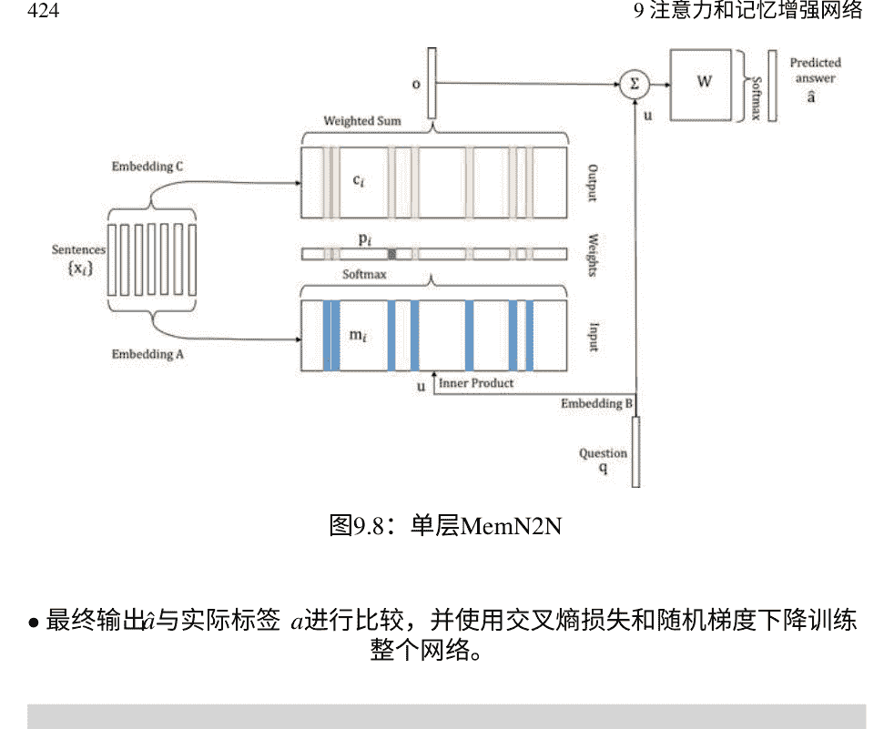

-   最终输出\(\hat{a}\)与实际标签 \(a\)进行比较，并使用交叉熵损失和随机梯度下降训练整个网络。

由于许多任务（如问答）需要时间上下文，即一个实体在去另一个地方之前曾经在某个地方，该论文通过使用时间矩阵修改内存向量来编码时间上下文。 例如，输入内存映射可以写成：

\[ \mathbf{m}_i = \sum_j \mathbf{A} x_{i,j} + \mathbf{T}_A(i) \quad (9.42) \]

其中 \(\mathbf{T}(i)\)是一个时间矩阵 \(\mathbf{T}\)的第\(i\)行。

### 9.3.3 神经图灵机

Graves等人提出了一种称为神经图灵机（NTM）的记忆增强网络，用于执行重复且需要长时间信息的复杂任务[GWD14b]。如图9.10所示，它具有一个与外部世界和内部记忆交互的神经网络组件，称为控制器。


为了进行所有操作，它使用了内存。受图灵机的启发，控制器使用读头和写头与内存交互。由于内存的读取或写入可以看作是离散和非连续的操作，因此无法进行微分，因此大多数基于梯度的算法不能直接使用。研究中引入的最重要的概念之一是通过在读和写中使用模糊操作来克服这个问题，这些操作与所有内存元素以不同程度进行交互。通过使用这些模糊操作，所有的读和写都可以是连续的、可微分的，并且可以使用随机梯度下降等基于梯度的算法进行有效学习。

让我们将内存 M 视为一个二维矩阵（N × M），其中 N 行对应于内存，每行有 M 列用于存储值。
接下来，我们将讨论NTM中的不同操作。

### 9.3.3.1 读操作

在NTM中，使用注意力机制来移动读（和写）头。注意力机制可以被表示为一个长度为 N 的归一化权重向量 w_t，在给定时间 t 从内存 M_t 中读取内容。这个权重向量的各个元素将被称为 w_t（i）。

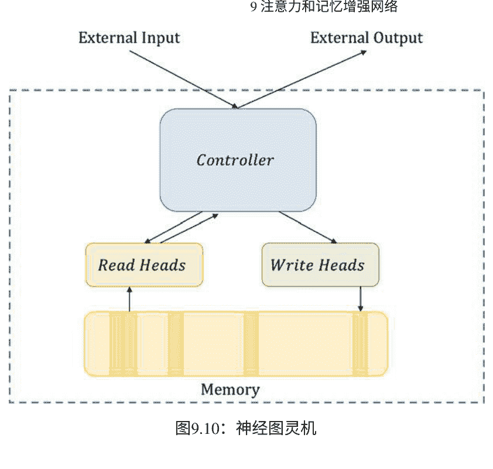

权重向量的约束条件为：∀i∈{1…N}0≤  
\( w_t(i) \leq 1 \)  (9.43)  
\( \sum_{i=1}^N w_t(i) = 1 \)  (9.44)  
\( \mathbf{r}_t \leftarrow \sum_{i=1}^M w_t(i)\mathbf{M}_t(i) \)  (9.45)  
由于上述方程是可微的，整个读操作也是可微的。

### 9.3.3.2 写操作

在NTM中进行写操作可以看作是两个不同的步骤：擦除内存内容和添加新内容。擦除操作通过一个长度为\( M_{\text{erase}} \)的向量\( \mathbf{e}_t \)以及权重向量\( \mathbf{w}_t \)来指定行中哪些元素应该完全擦除、保持不变或进行一些更改。因此，

权重向量wᵢ给出了要访问的行，擦除向量eᵢ擦除了该行中的元素，从而进行更新：

$$\mathbf{M}_t^{erased}(i) \leftarrow \mathbf{M}_{t-1}(i)[1 - w_t(i)\mathbf{e}_t] \quad (9.46)$$

擦除状态后，即$\mathbf{M}_{t-1}$转换为$\mathbf{M}_t^{erased}$，写头使用长度为M的添加向量$\mathbf{a}_t$来完成写入操作，如下所示：

$$\mathbf{M}_t(i) \leftarrow \mathbf{M}_t^{擦除}(i) + w_t(i)\mathbf{a}_t \quad (9.47)$$

由于擦除和写入操作都是可微分的，整个写入操作也是可微分的。

### 9.3.3.3 寻址机制

读取和写入中使用的权重是基于两种寻址机制计算得出的：(a)基于内容的寻址和(b)基于位置的寻址。基于内容的寻址的思想是从控制器生成的信息中，即使是部分信息，也要在内存中找到一个精确的匹配。在某些任务中，特别是基于变量的操作，找到变量的位置对于迭代和跳转等任务至关重要。在这种情况下，基于位置的寻址非常有用。

权重在不同的阶段计算并传递到下一个阶段。我们将逐步介绍计算权重的每个步骤，如图9.11所示。第一阶段称为内容寻址，它接受两个输入：一个长度为M的向量$\mathbf{k}_t$和一个标量关键字强度$\beta_t$。

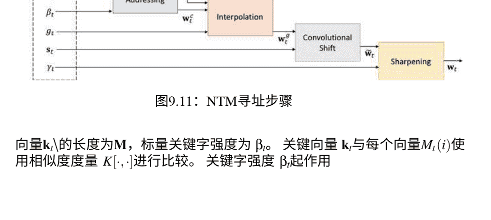

向量$\mathbf{k}_t$的长度为M，标量关键字强度为$\beta_t$。关键向量$\mathbf{k}_t$与每个向量$\mathbf{M}_t(i)$使用相似度度量$K[\cdot,\cdot]$进行比较。关键字强度$\beta_t$起作用

将重点放在特定术语上或减弱它们的重要性。基于内容的寻址产生的输出$\mathbf{w}_t^c$如下所示：

$$ \mathbf{w}_t^c = \frac{\exp(\beta_t K[\mathbf{k}_t, \mathbf{M}_t(i)])}{\sum_j \exp(\beta_t K[\mathbf{k}_t, \mathbf{M}_t(j)])} $$

基于位置的寻址在接下来的三个阶段中进行。第二阶段，称为插值$g_t \in (0, 1)$，从控制器头部获取一个标量参数，用于组合前一步骤的内容权重$\mathbf{w}_t^c$和前一个时间步骤的权重向量$\mathbf{w}_{t-1}$生成的门控权重$\mathbf{w}_t^g$如下所示：

$$ \mathbf{w}_t^g \leftarrow g_t \mathbf{w}_t^c + (1 - g_t) \mathbf{w}_{t-1} $$

下一个阶段是卷积移位，它用于将注意力转移到其他行。它从控制器头部接收一个移位向量$s_t$作为输入，并且前一个插值的输出$\mathbf{w}_t^g$。移位向量可以有不同的值，例如$+1$表示向前移动一行，$0$表示保持不变，$-1$表示向后移动一行。该操作是一个移位模$N$，因此底部的注意力移动将头部移动到顶部，反之亦然。卷积移位由$\widetilde{\mathbf{w}}_t$给出，操作为：

$$ \widetilde{w}_t(i) \leftarrow \sum_{j=0}^{N-1} w_t^g(j) s_t(i - j) $$

最后一个阶段是锐化，它使用来自控制器头部的另一个参数$\gamma \ge 1$，以防止前一个卷积移位的权重模糊。权重向量$\mathbf{w}_t$的最终输出为：

$$ \mathbf{w}_t(i) \leftarrow \frac{\widetilde{w}_t(i)^{\gamma_t}}{\sum_j \widetilde{w}_t(j)^{\gamma_t}} $$

因此，通过上述操作计算读写地址，并且所有部分都是可微分的，因此可以通过基于梯度的算法进行学习。控制器网络有很多选择，例如神经网络类型、读头数量、写头数量等。本文使用了前馈和基于LSTM的循环神经网络作为控制器。

### 9.3.4 可微分神经计算机

Graves等人提出了可微分神经计算机（DNC），作为神经图灵机的扩展和改进[Gra+16]。它遵循与控制器相同的高层架构，具有多个读头和单个写头，如图9.12所示。我们将在本节中描述DNC对NTM所做的改变。

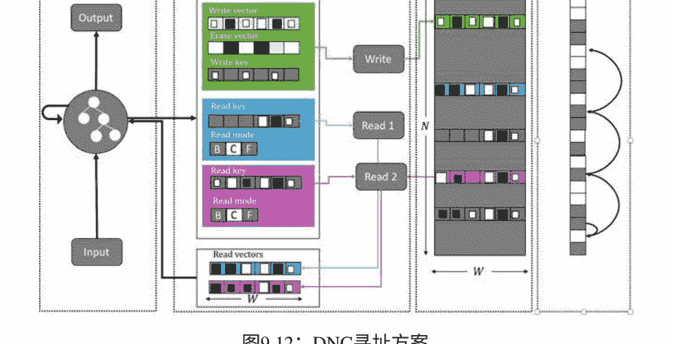

图9.12: DNC寻址方案

### 9.3.4.1 输入和输出

控制器网络在每个时间步接收输入向量 $\mathbf{x}_t \in \mathbb{R}^X$，并生成输出 $\mathbf{y}_t \in \mathbb{R}^Y$。它还作为输入接收上一个时间步的读向量 $\mathbf{r}_{t-1}^1, \ldots, \mathbf{r}_{t-1}^R$ 从内存矩阵 $\mathbf{M}_{t-1} \in \mathbb{R}^{N \times W}$ 通过读头获取。输入和读向量被连接为单个控制器输入 $\mathbf{x}_{con_t} = [\mathbf{x}_t; \mathbf{r}_{t-1}^1, \ldots, \mathbf{r}_{t-1}^R]$。控制器使用诸如LSTM的神经网络。

### 9.3.4.2 内存读取和写入

位置选择是使用非负且总和为1的权重向量进行的。在内存中，对于$N$个位置的“允许”加权的完整集合由非负半轴和约束给出：

$$\Delta_N = \left\{ \alpha \in \mathbb{R}^N \mid \alpha_i \in [0,1], \sum_{i=1}^N \alpha_i \leq 1 \right\} \quad (9.52)$$

读操作使用读取权重 $\{\mathbf{w}_t^{r,1}, \ldots, \mathbf{w}_t^{r,R}\} \in \Delta_N$ 进行，因此通过以下方程给出读向量 $\{\mathbf{r}_t^1, \ldots, \mathbf{r}_t^R\}$:

$$\mathbf{r}_t^i = \mathbf{M}_t^\top \mathbf{w}_t^{r,i} \quad (9.53)$$

读向量会附加到下一个时间步的控制器输入中。写操作由控制器发出的写权重 $\mathbf{w}_t^w \in \mathbb{R}^N$、写向量 $\mathbf{v}_t \in \mathbb{R}^W$和擦除向量 $\mathbf{e}_t \in [0,1]^W$一起修改内存：

$$\mathbf{M}_t = \mathbf{M}_{t-1} \circ (\mathbf{E} - \mathbf{w}_t^w \mathbf{e}_t^T) + \mathbf{w}_t^w \mathbf{v}_t^T$$ (9.54)

其中 $\circ$ 表示逐元素乘法，$\mathbf{E}$ 是一个 $N \times M$ 的全一矩阵。

### 9.3.4.3 选择性注意力

控制器输出的权重通过三种形式的注意力机制对内存行进行参数化：基于内容的注意力、内存分配和时间顺序。控制器使用标量门在这三种机制之间进行插值。

与NTM类似，选择性注意力使用长度为W的部分关键向量 $\mathbf{k}_t$ 和标量关键强度 $\beta_t$。关键向量 $\mathbf{k}_t$ 与每个向量 $\mathbf{M}_t[i]$ 进行比较，使用余弦相似度作为相似度度量方法，找到与关键向量最接近的向量，如下所示：

$$C(\mathbf{M}, \mathbf{k}, \beta)[i] = \frac{\exp(\beta K[\mathbf{k}, \mathbf{M}[i]])}{\sum_j \exp(\beta K[\mathbf{k}, \mathbf{M}[j]])}$$ (9.55)

DNC克服了NTM只分配连续内存块的缺点。DNC引入了可微分的自由列表的概念，用于跟踪每个内存位置的使用情况。使用情况在每次写入 ($\mathbf{w}_t^w$) 后增加，并且可以在每次读取 ($\mathbf{w}_t^{r,i}$) 后通过自由门 ($f_t^i$) 进行减少，如下所示：

$$\mathbf{u}_t = (\mathbf{u}_{t-1} + \mathbf{w}_{t-1}^w - \mathbf{u}_{t-1} \circ \mathbf{w}_{t-1}^w) \circ \prod_{i=1}^R (1 - f_t^{r,i} \mathbf{w}_t^{r,i})$$ (9.56)

控制器使用一个分配门 ($g_t^a \in [0,1]$) 来插值写入到内存中的新分配位置 ($\mathbf{a}_t$) 或者通过内容 ($\mathbf{c}_t^w$) 找到的现有位置，其中 $g_t^w \in [0,1]$ 是写入门：

$$\mathbf{w}_t^w = g_t^w [(g_t^a \mathbf{a}_t + (1 - g_t^a) \mathbf{c}_t^w)]$$ (9.57)

NTM 的另一个缺点是无法保留记忆的时间顺序，而这在许多任务中非常重要。DNC 通过按照写入顺序迭代访问记忆来克服这个问题。一个优先权重 ($\mathbf{p}_t$) 通过以下方式跟踪最近写入的记忆位置：

$$\mathbf{p}_t = \left(1 - \sum_i \mathbf{w}_t^w[i]\right) \mathbf{p}_{t-1} + \mathbf{w}_t^w$$ (9.58)

一个时间链接矩阵 ($\mathbf{L}_t[i, j] \in \mathbb{R}^{N \times N}$) 表示位置之间的关联程度 $i$ 是位置 $j$ 之后的位置。该矩阵使用先行权重向量 $\mathbf{p}_t$ 进行更新，如下所示：

$$\mathbf{L}_t[i, j] = (1 - \mathbf{w}_t^w[i] - \mathbf{w}_t^w[j]) \mathbf{L}_{t-1}[i, j] + \mathbf{w}_t^w[i] \mathbf{p}_{t-1}[j]$$ (9.59)

## 9.3 增强记忆网络

控制器可以使用时间链接矩阵来检索上次读取位置 (b_t^i) 之前或之后的写入位置 (f_t^i)，从而实现时间上的前进和后退移动，如下所示：

b_t^i = L_t^T w_{t-1}^{r,i} (9.60)

f_t^i = L_t w_{t-1}^{r,i} (9.61)

在论文中，时间链接矩阵是 N × N 的，因此与内存和计算相关的操作的复杂度为 𝒪(N^2)。由于矩阵是稀疏的，作者使用固定长度 K 来近似表示向量 w^W t，p^{r,i}_{t-1} 来近似表示写入权重和优先权重。这进一步用于计算近似的时间链接矩阵 L^i 以及新的前向和后向移动 f_t^i 和 b_t^i。他们使用近似方法获得了更快的性能，而且没有明显的效果降低。

读头 i 使用读取关键字 k_t^{r,i} 计算内容权重向量 c_t^{r,i}，使用以下公式：

c_t^{r,i} = C(M_t, k_t^{r,i}, β_t^{r,i}) (9.62)

读头从三路门 (π_t^i) 获取输入，并用它来插值在迭代向前、向后或由给定内容之间：

w_t^{r,i} = π_t^i[1] b_t^i + π_t^i[2] c_t^{r,i} + π_t^i[3] f_t^i (9.63)

### 9.3.5 动态记忆网络

Kumar等人提出了动态记忆网络（DMN），在其中，自然语言处理中的许多任务可以被表述为事实-问题-答案的三元组，并且可以进行端到端的有效学习[Kum+16]。我们将描述DMN的组件，如图9.13所示。我们将使用图9.13中给出的小例子来解释每个步骤。

### 9.3.5.1 输入模块

输入模块以原始形式的句子/事实等作为输入，使用诸如GloVe之类的嵌入将其转换为分布式表示，并使用循环网络（如GRU）对其进行编码。输入可以是单个句子或连接在一起的句子列表，例如由单词 T_j 给出的 w_1, ..., w_T。

每个句子都通过添加一个句子结束符号进行转换，然后将单词连接在一起。每个句子结束符号生成一个对应于该句子的隐藏状态，如 h_t = GRU(L(w_t), h_{t-1})，其中 w_t 是时间_t 的单词 w_t 索引，L是嵌入矩阵。该输入模块的输出模块是每个句子隐藏状态的长度 $T_c$的事实序列和 $\mathbf{c}_t$是第 $t$步的事实。在最简单的情况下，每个句子输出被编码为一个事实，$T_c$等于句子的数量。

### 9.3.5.2 问题模块

问题模块类似于输入模块，将问题句子转换为嵌入向量，并输入到循环网络中。基于GRU的循环网络用于对其进行建模，其中 $q_t = GRU(\mathbf{L}(w_t^Q), \mathbf{q}_{t-1})$，其中$\mathbf{L}$是嵌入矩阵。隐藏状态，即问题结束时的最终状态，由 $\mathbf{q} = \mathbf{q}_T$ 给出。输入模块和问题模块之间共享。

### 9.3.5.3 情节记忆模块

输入模块的隐藏状态和问题模块的输出是情节记忆模块的输入。情节记忆具有注意机制，用于关注输入状态和更新情节记忆的循环网络。情节记忆的更新是一个迭代过程的一部分。在每次迭代中，注意机制关注输入模块的隐藏状态，映射到事实表示 $\mathbf{c}$、问题 $\mathbf{q}$ 和过去记忆 $\mathbf{m}^{i-1}$，产生一个情节 $\mathbf{e}^i$。然后，使用情节和先前的记忆 $\mathbf{m}^{i-1}$ 来更新情节记忆 $\mathbf{m}^i = GRU( \mathbf{e}^i, \mathbf{m}^{i-1})$。GRU的初始状态是一个问题，即 $\mathbf{m}^0 = \mathbf{q}$。这是一个迭代的过程。

情节记忆的作用是帮助集中注意力在输入的不同部分上，并且具有推理所需的传递性质。通过多次传递T_M来调整超参数，并将最终的情节记忆 m^TM传递给答案模块。

注意机制包括特征生成部分和使用门控机制的评分部分。门控通过一个函数 G来实现，该函数接受候选事实 c_t、上一个记忆 m^{t-1}和问题 q作为输入，计算一个标量 g_t作为门控：

g_t^i = G(c_t, m^{i-1}, q) (9.64)

特征向量 z(c, m, q)通过上述的评分函数 G使用输入事实、上一个记忆和问题之间的不同相似性来计算：

z(c, m, q) = [c \odot m; c \odot q; |c - m|; c - m] (9.65)

其中 \odot是向量之间的逐元素乘积。评分函数 G是标准的两层前馈网络，其中

G(c, m, q) = \sigma(\mathbf{W}^{(2)} \tanh(\mathbf{W}^{(1)} z(c, m, q) + b^1) + b^2) (9.66)

其中权重 \mathbf{W}^{(1)}, \mathbf{W}^{(2)}和偏置 b^1, b^2通过训练过程学习得到。第 i次迭代的情节使用带有序列 c_1, . . . . . . . . . . . . , c_T的GRU_{\mathbf{C}} 加权由门 g^i控制，并且最终隐藏状态用于更新，如下所示：

h_t^i = g_t^i GRU(c_t, h_{t-1}^i) + (1 - g_t^i) h_{t-1}^{i-1} (9.67)

e^i = h_{T_C}^i (9.68)

要么设置最大迭代次数，要么传递一个有监督的符号来标记阶段结束的令牌，以停止迭代。

### 9.3.5.4 答案模块

答案模块可以在每个情节记忆迭代的结束时或基于任务的最后一个触发。它再次被建模为一个GRU，具有一个输入问题，最后一个隐藏状态 a_{t-1}，和先前的预测 y_{t-1}。初始状态 a_0被初始化为最后一个记忆，即 a_0 = m^{T_M}。因此，更新可以写成：

y_t = softmax(\mathbf{W}^a a_t) (9.69)

a_t = GRU([y_{t-1}, \mathbf{q}], a_{t-1}) (9.70)

### 9.3.5.5 训练

端到端的训练以监督方式进行，其中通过将答案模块生成的答案与真实标记的答案进行比较，并使用随机梯度下降传播交叉熵损失。为了给出一个具体的例子。

### 9.3.6 神经堆栈、队列和双端队列

Grefenstette等人通过使用传统的数据结构，如栈、队列和双端队列，探索了控制器和内存之间的学习交互。与RNN相比，它们产生了更好的泛化效果[Gret+15]。在接下来的几节中，我们将探讨神经堆栈架构的基本工作原理，然后将其推广到其他领域。

### 9.3.6.1 神经堆栈

神经堆栈是一种可微分结构，允许通过推操作存储向量，并通过弹出操作检索向量，类似于栈数据结构，如图9.14所示。

给定时间\(t\)的整个堆栈内容用矩阵\(\mathbf{V}_t\)表示，每一行对应于内存地址\(i\)，包含一个大小为\(m\)的向量\(\mathbf{v}_{t,i}\)，使得它在空间\(\mathbb{R}^m\)中。与矩阵中的每个索引相关联的是一个强度向量，给出了与该内容索引相关联的权重，表示为\(\mathbf{r}_t\)。推信号由标量\(s_t \in (0,1)\)给出，弹出信号由标量\(u_t \in (0,1)\)给出。从堆栈中读取的值由\(\mathbf{o}_t \in \mathbb{R}^m\)给出。

神经堆栈的必要操作由以下三个方程给出：\(\mathbf{V}_t\)，\(\mathbf{s}_t\)和\(\mathbf{r}_t\)：

\(\mathbf{V}_t[i] = \begin{cases} \text{如果 } 1 \leq i < t, \quad \mathbf{V}_{t-1}[i], & \mathbf{v}_{t-1} \ \text{如果 } i=t, \quad \mathbf{V}_t[i]=\mathbf{v}_t, & \text{对于所有 } i \leq t \end{cases} \tag{9.71}\)

方程9.71将堆栈的更新捕捉为一个不断增长的类似列表的结构，其中每个旧索引都从上一个时间步获取值，并且新向量被推入顶部：

s_t[i] = \begin{cases} \max\left(0, s_{t-1}[i] - \max\left(0, u_t - \sum_{j=i+1}^{t-1} s_{t-1}[j]\right)\right) & \text{如果 } 1 \leq i < t \\ d_t & \text{如果 } i = t \end{cases} (9.72)

方程式9.72捕捉了权重更新，其中情况 $i = t$ 意味着我们直接传递推力权重 $d_t \in (0,1)$。从堆栈中删除一个条目并不会物理上删除它，而是将索引0处的强度值设置为0。下面的每个堆栈的强度根据以下计算进行更改，减去弹出信号强度 $u_t$ 和上面索引 $i+1$ 和下面索引值 $t-1$ 之间的相对和，并通过找到该值和0之间的最大值进行限制。然后将其与索引 $s_t+1$ 处的当前值相减，并通过找到该值和0之间的最大值进行限制。

我们在时间 $t=3$ 和最低索引 $i=1$ 处查看图9.14，假设先前的值为0.7，它将变为 $\max(0, 0.7 - \max(0, 0.9 - 0.5)) = 0.3$。类似地，我们可以将相同的值插入到 $t=3$ 和下一个索引 $i=2$ 处，先前的值为0.7，它将变为 $\max(0, 0.9 - \max(0, 0.9 - 0)) = 0$。最后，在 $t=3$ 时，顶部索引 $i=3$ 将具有值为0.9的 $d_t$ 值：

r_t = \sum_{i=1}^{t} \min\left( s_t[i], \max\left( 0, 1 - \sum_{j=i+1}^{t} s_t[j] \cdot V_t[i] \right) \right) (9.73)

方程9.73可以看作是网络在时间 $t$ 看到的状态。它是索引向量及其强度的组合，其中强度被限制为总和为1。

再次看一下图9.14，在时间 $t=3$ 时，我们可以看到除了索引1的强度从0.3变为0.1之外，其他组合都是正常的，因为替换后我们得到 $\min(0.3, \max(0, 1 - 0.9)) = 0.1$。

### 9.3.6.2 循环网络、控制器和训练

从上方逐渐扩展的神经堆栈作为一个循环网络和控制器的动作如图9.15a，b所示。用虚线标记的整个架构是一个带有输入的循环网络，包括(a)上一个循环状态 $H_{t-1}$ 和(b)当前输入 $i_t$；以及输出的是(a)下一个循环状态 $H_t$ 和(b) $o_t$。上一个循环状态 $H_{t-1}$ 由三部分组成：(a)来自RNN的上一个状态向量 $h_{t-1}$，(b)上一个堆栈读取 $r_t$，以及(c)来自上一个状态的堆栈状态。

在实现中，除了随机初始化的 $H_0$ 之外，所有向量都被设置为0开始。

当前输入 $i_t$ 与栈的先前读取连接起来 $r_{t-1}$ 到控制器，控制器具有自己的先前状态 $h_{t-1}$ 生成下一个状态 $h_t$ 和输出 $o'_t$。输出 $o'_t$ 导致推送信号标量 $d_t$，弹出信号标量 $u_t$ 和值向量 $\mathbf{v}_t$ 作为输入信号传递给神经堆栈和整个输出信号 $\mathbf{o}_t$。方程如下：

d_t = \text{sigmoid}(W_d o'_t + b_d) (9.74)

u_t = \text{sigmoid}(W_u o'_t + b_u) (9.75)

\mathbf{v}_t = \text{sigmoid}(W_v o'_t + b_v) (9.76)

\mathbf{o}_t = \text{sigmoid}(W_o o'_t + b_o) (9.77)

整个结构可以通过改变弹出信号从列表底部而不是顶部读取来轻松适应神经队列，并且可以写成：

\mathbf{s}_{-t}[i] = \begin{cases} \max \left( 0, \mathbf{s}_{-t-1}[i] - \max \left( 0, u_{-t-1} - \sum_{j=1}^{i-1} \mathbf{s}_{-t-1}[j] \right) \right) & \text{如果} 1 \le i < t \\ d_{-t} & \text{如果} i = t \end{cases} (9.78)

\mathbf{r}_t = \sum_{i=1}^{t} \min \left( \mathbf{s}_t[i], \max \left( 0, 1 - \sum_{j=1}^{i-1} \mathbf{s}_t[j] \cdot \mathbf{V}_t[i] \right) \right) (9.79)

神经DeQue的工作原理类似于神经堆栈，但具有对列表的顶部和底部的推送、弹出和值的输入信号的能力。

### 9.3.7 循环实体网络

Henaff等人设计了一种高度并行的架构，具有长期动态内存，在许多已知的NLU任务上表现良好，称为循环实体网络（Ent-Net）[Hen+16]。这个想法是拥有内存单元块，每个单元块可以存储关于句子中的实体的信息，以便许多实体对应于名称、位置和其他方面在单元块中具有信息内容。我们将在图9.16中讨论EntNet的核心组件。

### 9.3.7.1 输入编码器

让我们具体考虑一个讨论感兴趣主题的问答系统，其中问题和答案都可以在给定的句子中找到，尽管这也可以用于许多其他任务。让我们考虑一个设置，训练集为 $\{(x_i, y_i)^n_{i=1}\}$，其中 $x_i$ 是输入句子，$q$ 是问题，以及 y_i是单词的答案。输入编码层将单词序列转换为固定长度的向量。这可以通过作者描述的方法来实现，使用BOW表示和RNN的结束状态。他们选择了一个简单的表示，使用一组向量 {f_1, ..., f_k} 与单词的输入嵌入。

{e_1, ..., e_k} 表示给定时间 t 的给定输入：
$$
\mathbf{s}_t = \sum_i \mathbf{f}_i \circ \mathbf{e}_i \tag{9.80}
$$
其中 ∘ 是Hadamard乘积或逐元素乘法。相同的向量集合 {f_1, ..., f_k} 在所有时间步骤中都被使用。嵌入矩阵 E ∈ ℝ^{|V|×d} 使用 E(w) = e ∈ ℝ^d 来转换句子中的每个单词，其中 d 是嵌入的维度。与其他参数一样，向量 {f_1, ..., f_k} 是从训练数据中联合学习的。

### 9.3.7.2 动态内存

如图9.16b所示，输入编码的句子流入内存块中，并且整个网络是一种门控循环单元（GRU），其中这些块的隐藏状态连接在一起，形成网络的总隐藏状态。总块数 h_1, ..., h_m 的数量大约为5-20个，每个块 h_j 有20-100个单元。每个块 j 都有一个隐藏状态 h_j ∈ ℝ^d 和一个关键字 w_j ∈ ℝ^d。

块的作用是捕捉有关实体的信息。这是通过将关键向量的权重与文本中感兴趣的实体的嵌入相关联来实现的，以便模型学习有关文本中出现的实体的信息。具有权重 w_j 和隐藏状态 h_j 的通用块表示为：

$$
\begin{aligned}
\mathbf{g}_j^t &\leftarrow \text{sigmoid}(\mathbf{s}_t^\top \mathbf{h}_j^{t-1} + \mathbf{s}_t^\top \mathbf{w}_j^{t-1}) && \text{(门控)} \tag{9.81} \\
\tilde{\mathbf{h}}_j^t &\leftarrow \phi (\mathbf{P} \mathbf{h}_j^{t-1} + \mathbf{Q} \mathbf{w}_j^{t-1} + \mathbf{R} \mathbf{s}_t) && \text{(候选记忆)} \tag{9.82} \\
\mathbf{h}_j^t &\leftarrow \mathbf{h}_j^{t-1} + \mathbf{g}_j \circ \tilde{\mathbf{h}}_j^t && \text{(新记忆)} \tag{9.83} \\
\mathbf{h}_j^t &\leftarrow \frac{\mathbf{h}_j^t}{\|\mathbf{h}_j^t\|} && \text{(重置记忆)} \tag{9.84}
\end{aligned}
$$

其中，g_j 是决定更新多少记忆的门控，φ是激活函数，如ReLU，h_j^t 是将旧的时间戳与当前时间戳结合的新记忆，最后一步的归一化有助于遗忘先前的信息。矩阵 P ∈ ℝ^{d×d}, Q ∈ ℝ^{d×d}, R ∈ ℝ^{d×d} 在所有块中共享。

### 9.3.7.3 输出模块和训练

当输出模块接收到问题 $q$ 时，它会创建一个概率分布覆盖所有隐藏状态，整个方程可以写成：

p_j = \mathrm{softmax}(\mathbf{q}^\top \mathbf{h}_j)

\mathbf{u} = \sum_j p_j \mathbf{h}_j

y = \mathbf{R}\phi(\mathbf{q} + \mathbf{H}\mathbf{u})矩阵 $R \in \mathbb{R}^{|V| \times d}$ 和 $H \in \mathbb{R}^{d \times d}$ 再次与其他参数一起进行训练。函数 $\phi$ 添加了非线性，可以是ReLU等激活函数。整个网络使用反向传播进行训练。实体可以在预处理的过程中提取出来，关键向量可以与故事中存在的实体的嵌入（如bAbI示例中的 $\{Mary, Sandra, John, bathroom, bedroom, kitchen, garden, football\}$）特别关联。

## 9.3.8 记忆增强网络在文本和语音中的应用

大多数记忆网络已成功应用于复杂的自然语言理解任务，如问答和语义角色标注[WCB14, Suk+15, Gra+16, Hen+16]。Sukhbaatar等人在语言建模任务中通过增加记忆跳数，应用端到端记忆网络超越了传统的循环神经网络[Suk+15]。Kumar等人有趣地将大多数自然语言处理任务从句法任务转化为语义任务，并成功地应用了动态记忆网络[Kum+16]。Grefenstette等人在机器翻译中使用记忆网络，如神经堆栈、队列和双端队列，展示了显著的性能提升[Gre+15]。

## 9.4 案例研究

在本节中，我们将探讨两个自然语言处理的主题：基于注意力的神经机器翻译和记忆网络用于问答。每个主题都遵循与之前章节相同的格式，并在最后提供练习题。

### 9.4.1 基于注意力的神经机器翻译

在这个案例研究的部分中，我们将比较在第7章介绍的英法翻译任务中的注意力机制。使用的数据集由Tatoeba网站上的翻译对组成。这是在第7章案例研究中使用的相同数据集。

### 9.4.2 探索性数据分析

对于EDA过程，我们参考第7.7.2节中使用的步骤来创建数据集的划分。

数据集摘要如下所示。

- 1. 训练集大小：107885
- 2. 验证集大小：13486
- 3. 测试集大小：13486
- 4. 英语词汇表大小：4755
- 5. 法语词汇表大小：6450

#### 9.4.2.1 软件工具和库

当我们首次探索神经机器翻译时，我们使用了基于PyTorch的fairseq库。据我们所知，没有一个库能够支持所有不同的注意力机制。因此，我们结合了一系列的库来比较注意力方法。具体而言，我们使用PyTorch作为深度学习框架，AllenNLP用于大多数注意力机制的实现，spaCy用于分词，torchtext用于数据加载。这里包含的代码扩展了PyTorch教程中的一些原始工作，并增加了额外的功能和比较。

#### 9.4.2.2 模型训练

我们比较了五种不同的注意力机制，进行了100个周期的训练。对于每个注意力机制，选择在验证数据上表现最好的模型来运行测试数据。训练的模型是具有四层双向GRU编码器和一个单向GRU解码器的。编码器和解码器的隐藏大小都为512，编码和解码的嵌入大小为256。模型使用交叉熵损失和SGD进行训练，批量大小为512。初始学习率为0.01用于编码器，0.05用于解码器，并且动量值为0.9。当验证损失连续5个周期没有改善时，使用学习率调度来降低学习率。

为了正则化我们的模型，我们在编码器和解码器中都添加了0.1的丢弃率，并且梯度的范数被剪裁在10以内。
我们采用了批处理实现模型，以利用GPU的并行计算能力。每个模型的架构都是相同的，除了Bahdanau模型，它在注意力机制中需要引入一个用于双向编码器输出的权重矩阵。

我们将网络的不同组件定义如下：

```python
class Encoder(nn.Module):
    def __init__(self, input_dim, emb_dim, enc_hid_dim, dec_hid_dim,
                 dropout, num_layers=1, bidirectional=False):
        super().__init__()
        self.input_dim = input_dim
        self.emb_dim = emb_dim
        self.enc_hid_dim = enc_hid_dim
        self.dec_hid_dim = dec_hid_dim
        self.num_layers = num_layers
        self.bidirectional = bidirectional

        self.embedding = nn.Embedding(input_dim, emb_dim)
        self.rnn = nn.GRU(emb_dim, enc_hid_dim, num_layers=num_layers, bidirectional=bidirectional)
        self.dropout = nn.Dropout(dropout)
        if bidirectional:
            self.fc = nn.Linear(enc_hid_dim * 2, dec_hid_dim)

    def forward(self, src):
        embedded = self.dropout(self.embedding(src))
        outputs, hidden = self.rnn(embedded)

        if self.bidirectional:
            hidden = torch.tanh(self.fc(torch.cat((hidden[-2,:,:], hidden[-1,:,:]), dim=1)))

        if not self.bidirectional and self.num_layers > 1:
            hidden = hidden[-1,:,:]

        return outputs, hidden
```

```python
class Decoder(nn.Module):
    def __init__(self, output_dim, emb_dim, enc_hid_dim, dec_hid_dim, dropout, attention, bidirectional_input=False):
        super().__init__()
        self.emb_dim = emb_dim
        self.enc_hid_dim = enc_hid_dim
        self.dec_hid_dim = dec_hid_dim
        self.output_dim = output_dim
        self.dropout = dropout
        self.attention = attention
        self.bidirectional_input = bidirectional_input

        self.embedding = nn.Embedding(output_dim, emb_dim)

        if bidirectional_input:
            self.rnn = nn.GRU((enc_hid_dim * 2) + emb_dim, dec_hid_dim)
            self.out = nn.Linear((enc_hid_dim * 2) + dec_hid_dim + emb_dim, output_dim)
        else:
            self.rnn = nn.GRU(enc_hid_dim + emb_dim, dec_hid_dim)
            self.out = nn.Linear(enc_hid_dim + dec_hid_dim + emb_dim, output_dim)

        self.dropout = nn.Dropout(dropout)

    def forward(self, input, hidden, encoder_outputs):
        input = input.unsqueeze(0)
        embedded = self.dropout(self.embedding(input))
        hidden = hidden.squeeze(0) if len(hidden.size()) > 2 else hidden  # batch_size=1 issue

        # 重复隐藏状态以进行双向注意力输出
        if hidden.size(-1) != encoder_outputs.size(-1):
            attn = self.attention(hidden.repeat(1, 2), encoder_outputs.permute(1, 0, 2))
        else:
            attn = self.attention(hidden, encoder_outputs.permute(1, 0, 2))

        a = attn.unsqueeze(1)

        encoder_outputs = encoder_outputs.permute(1, 0, 2)

        weighted = torch.bmm(a, encoder_outputs)
        weighted = weighted.permute(1, 0, 2)

        rnn_input = torch.cat((embedded, weighted), dim=2)

        output, hidden = self.rnn(rnn_input, hidden.unsqueeze(0))

        embedded = embedded.squeeze(0)
        output = output.squeeze(0)
        weighted = weighted.squeeze(0)

        output = self.out(torch.cat((output, weighted, embedded), dim=1))

        return output, hidden.squeeze(0), attn
```

```python
class Seq2Seq(nn.Module):
    def __init__(self, encoder, decoder, device):
        super().__init__()
        self.encoder = encoder
        self.decoder = decoder
        self.device = device

    def forward(self, src, trg, teacher_forcing_ratio=0.5):
        batch_size = src.shape[1]
        max_len = trg.shape[0]
        trg_vocab_size = self.decoder.output_dim

        outputs = torch.zeros(max_len, batch_size, trg_vocab_size).to(self.device)

        encoder_outputs, hidden = self.encoder(src)

        hidden = hidden.squeeze(1)

        output = trg[0, :]  # first input to decoder <sos>

        for t in range(1, max_len):
            output, hidden, attention = self.decoder(output, hidden, encoder_outputs)
            outputs[t] = output
            teacher_force = random.random() < teacher_forcing_ratio
            top1 = output.max(1)[1]
            output = (trg[t] if teacher_force else top1)

        return outputs
```

我们使用AllenNLP中的注意力实现，包括点积、余弦和双线性注意力。这些函数接受解码器的隐藏状态和编码器的输出，并返回注意力分数。

```python
from allennlp.modules.attention import LinearAttention, CosineAttention, BilinearAttention, DotProductAttention

attn = DotProductAttention()  # 为每种类型的模型更改
enc = Encoder(input_dim,
              ENC.EMB.DIM,
              ENC.HID.DIM,
              DEC.HID.DIM,
              ENC.DROPOUT,
              num_layers=ENC.NUMLAYERS,
              bidirectional=ENC.BIDIRECTIONAL)
dec = Decoder(output_dim,
              DEC.EMB.DIM,
              ENC.HID.DIM,
              DEC.HID.DIM,
              DEC.DROPOUT,
              attn,
              bidirectional_input=ENC.BIDIRECTIONAL)

model = Seq2Seq(enc, dec, device).to(device)
```

在图9.17和9.18中，我们展示了每个注意力模型的损失和PPL的训练图。表现最好的三种方法是Bahdanau，点积和双线性模型。余弦和线性注意力难以收敛。线性注意力中的注意机制与输入序列没有相关性。

在图9.19、9.20、9.21、9.22和9.23中，我们给出了三个不同文件的解码注意力输出的一些示例，显示了解码器在翻译过程中关注的内容。在每个图中，前两个图形（a和b）的输入长度为10，这是模型在训练过程中看到的最大长度。在大多数情况下，注意力仍然与输入对齐；然而，预测大多数是不正确的，通常在接近最大训练序列长度的时间步附近具有较高的熵。

#### 9.4.2.3 Bahdanau 注意力

Bahdanau 注意力使用全连接层来组合双向层的连接输出，而不是复制隐藏状态。
为了融入这一点，需要稍微修改以适应张量大小的变化。

```python
class BahdanauEncoder(nn.Module):
    def __init__(self, input_dim, emb_dim, enc_hid_dim, dec_hid_dim, dropout):
        super().__init__()
        self.input_dim = input_dim
        self.emb_dim = emb_dim
        self.enc_hid_dim = enc_hid_dim
        self.dec_hid_dim = dec_hid_dim
        self.dropout = dropout

        self.embedding = nn.Embedding(input_dim, emb_dim)
        self.rnn = nn.GRU(emb_dim, enc_hid_dim, num_layers=4, bidirectional=True)
        self.fc = nn.Linear(enc_hid_dim * 2, dec_hid_dim)
        self.dropout = nn.Dropout(dropout)

    def forward(self, src):
        embedded = self.dropout(self.embedding(src))
        outputs, hidden = self.rnn(embedded)
        hidden = torch.tanh(self.fc(torch.cat((hidden[-2,:,:],
                                              hidden[-1,:,:]), dim=1)))
        return outputs, hidden
```

```python
class BahdanauAttention(nn.Module):
    def __init__(self, enc_hid_dim, dec_hid_dim):
        super().__init__()

        self.enc_hid_dim = enc_hid_dim
        self.dec_hid_dim = dec_hid_dim

        self.attn = nn.Linear((enc_hid_dim * 2) + dec_hid_dim, dec_hid_dim)
        self.v = nn.Parameter(torch.rand(dec_hid_dim))

    def forward(self, hidden, encoder_outputs):
        batch_size = encoder_outputs.shape[1]
        src_len = encoder_outputs.shape[0]
        hidden = hidden.unsqueeze(1).repeat(1, src_len, 1)
        encoder_outputs = encoder_outputs.permute(1, 0, 2)
        energy = torch.tanh(self.attn(torch.cat((hidden, encoder_outputs), dim=2)))
        energy = energy.permute(0, 2, 1)
        v = self.v.repeat(batch_size, 1).unsqueeze(1)
        attention = torch.bmm(v, energy).squeeze(1)
        return F.softmax(attention, dim=1)
```

#### 9.4.2.4 结果

对于每种注意力机制，最佳性能模型在测试集上运行，产生了表9.2中的以下结果。

| 注意力类型 | 损失    | PPL    |
| :--------- | :------ | :----- |
| 点积       | 17.826  | 2.881  |
| 双线性     | **13.987** | **2.638** |
| 余弦       | 22.098  | 3.095  |
| 线性       | 17.918  | 2.886  |
| Bahdanau   | 17.580  | 2.867  |

表9.2：注意力模型的测试结果。最佳结果以粗体显示

在这个实验中，双线性注意力表现最好。从图9.21的注意力对齐中可以看出，注意力输出与输入强相关。此外，注意力的强度在整个预测序列中非常自信，仅在序列末尾稍微失去自信。

### 9.4.3 问答系统

为了帮助读者熟悉注意力和记忆网络的概念，我们将在问答任务中应用本章的概念，并使用bAbI数据集。bAbI是一个包含20个简单的问答任务和有限词汇的数据集。对于每个任务，都有一组1000个训练和1000个故事、测试问题和答案，以及一个包含10000个样本的扩展训练集。尽管简单，bAbI有效地捕捉了问答中的记忆和长距离依赖关系的复杂性。在这个案例研究中，我们将重点关注任务1-3，这些问题需要从故事中提供最多三个支持事实来支持答案。

### 9.4.3.1 软件工具和库

我们将使用Keras和TensorFlow实现几种架构来进行这个案例研究。Keras提供了一个用于问答任务的有用的循环神经网络架构，将作为我们的基准。我们将与本章讨论的几种基于记忆网络的架构进行性能对比，包括DeepMind的可微分神经计算机模型。我们不会在这里提供每个架构的完整覆盖，而是将读者引导到本章附带的笔记本中获取完整的实现细节。

### 9.4.3.2 探索性数据分析

我们的第一步是下载bAbI数据集并提取训练和测试集进行分析。我们将重点关注包含1万个训练样本和1000个测试样本的扩展数据集。让我们先快速查看一下QA1、QA2和QA3任务的样本:

```
QA1故事： 玛丽去了浴室。约翰去了走廊。
QA1问题：玛丽在哪里？
QA1答案：浴室
QA2故事： 玛丽去了浴室。桑德拉去了卧室。玛丽在那里拿到了足球。约翰去了厨房。玛丽回到了厨房。玛丽回到了花园。
QA2问题：足球在哪里？
QA2答案：花园
QA3故事： 玛丽去了浴室。桑德拉去了卧室。玛丽在那里拿到了足球。约翰回到了卧室。玛丽去了办公室。约翰去了办公室。约翰拿了牛奶。丹尼尔回到了厨房。约翰去了卧室。丹尼尔回到了走廊。丹尼尔拿了苹果。约翰把牛奶放在那里。约翰去了厨房。桑德拉回到了浴室。丹尼尔去了浴室。约翰去了浴室。玛丽去了浴室。桑德拉回到了花园。桑德拉去了办公室。丹尼尔去了花园。桑德拉回到了走廊。丹尼尔去了办公室。玛丽掉了足球。约翰搬到了卧室。
QA3 查询：足球在浴室之前在哪里？
QA3 答案：办公室
```

对数据集的分析显示了从任务QA1到QA3的逐渐增加的复杂性和长期记忆的要求。故事的分布

| 任务 | 训练故事 | 测试故事 | 最小（故事长度） | 最大（故事长度） | 查询长度 | 词汇量 |
|------|----------|----------|------------------|------------------|----------|--------|
| QA1  | 10,000   | 1000     | 12               | 68               | 4        | Q      |
| A2   | 10,000   | 1000     | 12               | 552              | 5        | Q      |
| A3   | 10,000   | 1000     | 22               | 1875             | 8        | 36     |

长度和问题长度（以标记计）如图9.24所示。

从QA1到QA3任务，故事的平均长度显著增加，这使得任务变得更加困难。请记住，在QA3任务中，只有三个支持事实，大部分故事被认为是“噪音”。我们将看到不同的架构能够多好地学习识别相关事实。

### 9.4.3.3 LSTM基线

我们使用Keras LSTM架构示例作为我们的基线。该架构包括以下内容：

- 1. 每个故事和问题的标记被映射到嵌入向量中（它们之间不共享）。
- 2. 故事和问题使用单独的LSTM进行编码。
- 3. 对于故事和问题的编码向量进行连接。
- 4. 将这些连接向量作为输入传递给一个DNN，其输出是词汇表上的softmax。
- 5. 整个网络被训练以最小化softmax输出和答案之间的误差。

实现这个架构的Keras模型是：

```
RNN = layers.LSTM
句子 = layers.Input(shape=(故事最大长度,), dtype='int32')
编码句子 = layers.Embedding(词汇大小, 嵌入隐藏大小)(句子)
encoded_sentence = Dropout(0.3)(encoded_sentence)
encoded_sentence = RNN(SENT_HIDDEN_SIZE, return_sequences=False)(encoded_sentence)

question = layers.Input(shape=(query_maxlen,), dtype='int32')
encoded_question = layers.Embedding(vocab_size, EMBED_HIDDEN_SIZE)(question)
encoded_question = Dropout(0.3)(encoded_question)
encoded_question = RNN(查询隐藏大小, return_sequences=False)(encoded_question)

merged = layers.concatenate([encoded_sentence, encoded_question])
merged = Dropout(0.3)(merged)
preds = layers.Dense(词汇大小, activation='softmax')(merged)
model = Model([句子, 问题], preds)
模型.compile(optimizer='adam', loss='分类交叉熵', metrics=['准确率'])
```

我们使用扩展的bAbI训练集进行模型训练，使用50维嵌入，100维编码，批量大小为32，并使用Adam优化器进行100个时期的训练。在任务QA1、QA2和QA3上的性能见表9.3。如表所示，随着故事长度的增加，LSTM模型的性能变差，这是由于数据中的增加的“噪音”所致。

**表9.3：基准LSTM性能**

| 任务 | 测试集准确率 |
|------|--------------|
| QA1 | 0.51 |
| QA2 | 0.31 |
| QA3 | 0.17 |

结果显示，故事越长，LSTM模型的性能越差，这是由于数据中的增加的“噪音”所致。

### 9.4.3.4 端到端记忆网络

记忆网络提供了存储长期信息的机会，从而提高性能，特别是在较长的序列上，如任务QA3。记忆网络能够将支持事实存储为记忆向量，并用于查询和预测。在Weston的原始形式中，记忆向量通过硬注意力进行直接监督学习，并且在网络的每一层都需要监督。这需要大量的努力。为了克服这个需求，Sukhbaatar提出的端到端记忆网络使用软注意力代替监督，在训练过程中可以通过反向传播进行学习。这种端到端架构包括以下步骤：

- 1. 将每个故事句子和查询映射到单独的嵌入表示。
- 2. 将查询嵌入与记忆中每个句子的嵌入进行比较，并使用softmax函数生成类似软注意力机制的概率分布。
- 3. 这些概率用于使用另一组句子嵌入来选择最相关的句子。
- 4. 生成的向量与查询嵌入连接，并作为输入传递给一个LSTM层，然后是一个具有softmax输出的密集层。
- 5. 整个网络被训练以最小化softmax输出和答案之间的误差。

请注意，这被称为1跳或单层MemN2N，因为我们只查询一次内存。如前所述，内存层可以堆叠以提高性能，特别是在多个事实相关且必要以预测答案的情况下。下面是该架构的Keras实现。

```
input_sequence = Input((story_maxlen,))
input_encoded_m = Embedding(input_dim=vocab_size, output_dim=EMBED_HIDDEN_SIZE)(input_sequence)
input_encoded_m = Dropout(0.3)(input_encoded_m)
input_encoded_c = Embedding(input_dim=vocab_size, output_dim=query_maxlen)(input_sequence)
input_encoded_c = Dropout(0.3)(input_encoded_c)
question = Input((query_maxlen,))
question_encoded = Embedding(input_dim=vocab_size, output_dim=EMBED_HIDDEN_SIZE, input_length=query_maxlen)(question)
question_encoded = Dropout(0.3)(question_encoded)
匹配 = 点乘([输入编码m, 问题编码], axes=(2, 2))
匹配 = 激活('softmax')(匹配)
响应 = 加法([匹配, 输入编码c])
response = Permute((2, 1))(response)
answer = concatenate([response, question_encoded])
answer = LSTM(BATCH_SIZE)(answer)
answer = Dropout(0.3)(answer)
answer = Dense(vocab_size)(answer)
answer = Activation('softmax')(answer)
model = Model([input_sequence, question], answer)
模型.compile(optimizer='adam', loss='稀疏分类交叉熵', metrics=['准确率'])
```

我们使用扩展的bAbI训练集对这个单层模型进行训练，使用50维嵌入、批量大小为32和adam优化器进行100个时期的训练。在任务QA1、QA2和QA3上的性能见表9.4。与基准LSTM相比，MemN2N模型在这三个任务中表现更好，尤其是在QA1上。

**表9.4：端到端记忆网络性能**

| 任务 | 准确率 (20个时期) | 准确率 (100个时期) |
|------|-------------------|-------------------|
| QA1  | 0.53              | 0.92              |
| QA2  | 0.39              | 0.35              |
| QA3  | 0.15              | 0.21              |

与基准LSTM相比，MemN2N模型在这三个任务中表现更好，尤其是在QA1上。

### 9.4.4 动态记忆网络

如前所述，动态记忆网络将记忆网络推进了一步，使用GRU层对记忆进行编码。情节记忆层是动态记忆网络的关键，具有用于特征生成和评分的注意机制。情节记忆由两个嵌套的GRU组成，其中内部GRU生成情节，外部GRU从情节序列生成记忆向量。DMN遵循以下步骤：

- 1. 使用GRU对输入的故事句子和查询进行编码，并传递给情节记忆模块。
- 2. 通过对这些编码进行关注生成情节，从而形成记忆，忽略注意分数较低的句子编码。
- 3. 使用情节和先前的记忆状态来更新情节记忆。
- 4. 查询和记忆状态作为答案模块中的GRU的输入，用于预测输出。
- 5. 整个网络的训练目标是最小化GRU输出和答案之间的误差。

提供了一个动态记忆网络的情节记忆模块的TensorFlow实现。请注意，情节记忆模块依赖于软注意力GRU实现，该实现已包含在案例研究代码中。

```
python
类EpisodicMemoryModule（层）：

    #注意力网络
    self.l_1 = Dense(units=emb_dim, batch_size=batch_size, activation='tanh')
    self.l_2 = Dense(units=1, batch_size=batch_size, activation=None)

    # Episode network
    self.episodeGRU = SoftAttnGRU(单元=单元, return_sequences=False, batch_size=batch_size)

    # 记忆生成网络
    self.memorynet = Dense(单元=单元, activation='relu')

    for step in range(self.memorysteps):
        attentions = [tf.squeeze(计算注意力(事实,问题,记忆), axis=1) for i, fact in enumerate(fact_list)]
        attentions = tf.stack(attentions)
        attentions = tf.transpose(attentions)
        attentions = tf.nn.softmax(attentions)
        attentions = tf.expand_dims(attentions, axis=-1)
        episode = K.concatenate([facts, attentions], axis=2)
        episode = self.episodeGRU(episode)
        memory = self.memory_net(K.concatenate([memory, episode, question], axis=1))
        return K.concatenate([memory, question], axis=1)
```

我们使用扩展的bAbI训练集，50维GloVe嵌入，批量大小为50，100个隐藏单元，3个记忆步骤和adam优化器进行了20个时期的DMN模型训练。在表9.5中给出了任务QA1、QA2和QA3的性能。与早期的架构相比，我们可以看到动态记忆网络在性能上优于MemN2N和LSTM网络，并在任务QA1上达到了完美的预测。

**表9.5：动态记忆网络性能**

| 任务 | 测试集准确率 |
| :--- | :--- |
| QA1 | 1.00 |
| QA2 | 0.47 |
| QA3 | 0.29 |

### 9.4.4.1 可微分神经计算机

可微分神经计算机（DNC）是一个带有独立存储器的神经网络。它是一个嵌入式神经网络控制器，具有一系列预设的内存存储和管理操作。作为神经图灵机架构的扩展，它允许在不必扩展网络的其余部分的情况下扩展存储器。

DNC的核心是一个称为控制器的神经网络，类似于计算机中的CPU。该DNC控制器可以同时对内存执行多个操作，包括同时读写多个内存位置并生成输出预测。与以前一样，内存是一组可以存储信息向量的位置。DNC控制器可以使用软注意力根据每个位置的内容搜索内存，或者可以沿着关联的时间链接向前或向后遍历以回忆序列信息的任一方向。然后可以使用查询的信息进行预测。

对于每个时间步的给定输入，DNC控制器输出四个向量：

- * 读向量：用于读头寻址内存位置
- * 擦除向量：用于选择性擦除内存中的项目
- * 写向量：用于写头将信息存储在内存中
- * 输出向量：用作输出预测的特征

在这个案例研究中，我们将使用DeepMind开发的TensorFlow-DNC实现来应用bAbI扩展数据集。这个实现中的DNC模块如下所示：

```
python
DNCState = collections.namedtuple('DNCState', ('access_output', 'access_state', 'controller_state'))

class DNC(snt.RNNCore):
    # 模块
    self.控制器 = snt.LSTM(**控制器配置)
    self.访问 = 访问.MemoryAccess(**访问配置)

    # 输出
    prev_access_output = prev_state.access_output
    prev_access_state = prev_state.access_state
    prevcontrollerstate = prevstate.控制器状态

    batch_flatten = snt.BatchFlatten()
    控制器输入 = tf.concat([batchflatten(inputs), batch_flatten(prev_access_output)], 1)

    controller_output, controller_state = self._controller(controller_input, prev_controller_state)

    access_output, access_state = self._access(controller_output, prev_access_state)

    输出 = tf.concat([controlleroutput, batchflatten(access_output)], 1)
    输出 = snt.Linear(outputsize=self.outputsize.aslist()[0], name='输出线性')(输出)
```

我们使用扩展的bAbI训练集，50维GloVe嵌入，256隐藏层大小，256×64内存大小，4个读头，1个写头，批量大小为1，使用RMSprop优化器进行梯度剪裁进行20,000次迭代来训练DNC模型。 在任务QA1、QA2和QA3上的性能见表9.6。鉴于增加的复杂性，DNC 模型优于所有先前的模型并不令人惊讶。在选择最适合任务的架构时，准确性和训练时间之间存在权衡。

**表9.6：可微分神经计算机性能**

| 任务 | 测试集准确率 |
|------|--------------|
| QA1  | 1.00         |
| QA2  | 0.67         |
| QA3  | 0.55         |

在选择最适合任务的架构时，应该仔细权衡准确性和训练时间。对于简单的任务，单个 LSTM 实现可能已经足够。当需要复杂的知识进行任务预测时，具有可扩展内存的 DNC 是更好的选择。

### 9.4.4.2 循环实体网络

循环实体网络（EntNets）包含一个固定的动态内存单元库，允许同时进行位置和基于内容的更新。由于这种能力，它们在推理任务（如bAbI）中表现出色，并且设定了最先进的状态。与依赖于复杂的中央控制器的DNC不同，EntNet本质上是一组独立的并行循环记忆体，每个记忆体都有独立的门控。

EntNet架构包括输入编码器、动态内存和输出层。它的操作步骤如下：

- 1. 将输入的故事句子和查询映射到嵌入表示，并分别传递给动态内存层和输出层。
- 2. 生成带有实体嵌入的关键向量。
- 3. 在动态内存的一组门控GRU块中，通过输入编码器向量和关键向量更新隐藏状态（记忆）。
- 4. 输出层对查询 q 和记忆单元的隐藏状态应用softmax函数，生成潜在答案的概率分布。
- 5. 整个网络的训练目标是最小化输出层候选答案与真实答案之间的误差。

下面是使用TensorFlow编写的动态记忆单元的架构：

```
class DynamicMemoryCell(tf.contrib.rnn.RNNCell):
    def get_gate(self, state_j, key_j, inputs):
        a = tf.reduce_sum(inputs * state_j, axis=1)
        b = tf.reduce_sum(inputs * key_j, axis=1)
        return tf.sigmoid(a + b)

    def get_candidate(self, state_j, key_j, inputs, U, V, W, U_bias):
        key_v = tf.matmul(key_j, V)
        state_u = tf.matmul(state_j, U) + U_bias
        input_w = tf.matmul(inputs, W)
        return self.activation(state_u + input_w + key_v)

    def __call__(self, inputs, state):
        state = tf.split(state, self.num_blocks, axis=1)
        next_states = []
        for j, state_j in enumerate(state):
            key_j = tf.expand_dims(self._keys[j], axis=0)
            gate_j = self.get_gate(state_j, key_j, inputs)
            candidate_j = self.get_candidate(state_j,
                                             key_j,
                                             inputs,
                                             U, V, W, U_bias)
            state_j_next = state_j + tf.expand_dims(gate_j, -1) * candidate_j
            state_j_next_norm = tf.norm(tensor=state_j_next,
                                        ord='euclidean',
                                        axis=-1,
                                        keep_dims=True)
            state_j_next_norm = tf.where(tf.greater(state_j_next_norm, 0.0),
                                         state_j_next_norm,
                                         tf.ones_like(state_j_next_norm))
            state_j_next = state_j_next / state_j_next_norm
            next_states.append(state_j_next)
        state_next = tf.concat(next_states, axis=1)
        return state_next, state_next
```

我们使用扩展的bAbI训练集、100维嵌入、20个块、批量大小为32以及ADAM优化器进行梯度剪裁的200个周期来训练EntNet。在表9.7中给出了任务QA1、QA2和QA3的性能。我们的实现在bAbI任务QA1、QA2和QA3上的性能超过了所有以前的架构。

### 表9.7: EntNet性能

| 任务 | 测试集准确率 |
|---|---|
| QA1 | 1.00 |
| QA2 | 0.97 |
| QA3 | 0.90 |

超过了所有以前的架构。请注意，通过适当的超参数调整，EntNet和以前的架构在bAbI任务上的性能可以得到改善。

### 9.4.5 读者和从业者的练习

读者和从业者可以考虑将案例研究扩展到以下问题，以扩大他们的知识：

- 1. 当使用相同的嵌入矩阵作为编码器和解码器时，内存和复杂性可能会受到限制。为了解决这个问题，需要做出哪些改变？
- 2. 在训练过程中调整和增加基准LSTM模型的迭代次数。添加dropout有帮助吗？
- 3. 在端到端记忆网络中添加第二和第三跳，并观察在bAbI任务QA2和QA3上性能是否提高。
- 4. 限制记忆表示的大小会对性能产生什么影响？
- 5. 在MemN2N网络的记忆控制器中，使用不同的相似性评分函数而不是soft max会产生显著的影响吗？
- 6. 在bAbI任务3-20中探索这个案例研究中的架构。简单的基准LSTM在某些任务上表现优异吗？

## 参考文献

- [BCB14b] Dzmitry Bahdanau, Kyunghyun Cho, and Yoshua Bengio. “Neural Machine Translation by Jointly Learning to Align and Translate”. In: CoRR abs/1409.0473 (2014).
- [Bah+16b] Dzmitry Bahdanau et al. “End-to-end attention-based large vocabulary speech recognition”. In: 2016 IEEE International Conference on Acoustics, Speech and Signal Processing ICASSP 2016, Shanghai, China, March 20–25, 2016. 2016, pp. 4945–4949.
- [Cha+16a] William Chan等人。 “Listen, attend and spell: A neural network for large vocabulary conversational speech recognition”。 在:2016年IEEE国际声学、语音和信号处理会议 ICASSP 2016，中国上海，2016年3月20日至25日。2016年，第4960-4964页。
- [Cho+15b] Jan Chorowski等人。 “Attention-Based Models for Speech Recognition”。 在:神经信息处理系统28的进展: 年度神经信息处理系统会议2015年，12月7日至12日，加拿大蒙特利尔，魁北克。2015年，第577–585页。
- [Dan+17] Michal Daniluk等人。 “Frustratingly Short Attention Spans in Neural Language Modeling”。 在: CoRR abs/1702.04521 (2017)。
- [DGS92] Sreerupa Das, C. Lee Giles和Guo-Zheng Sun。 “在一个 {NNPDA} 中使用先验知识来学习上下文无关语言”。
- [Den+12] M. Denil等。 “使用深度架构学习图像跟踪的注意力位置”。
- [GWD14b] Alex Graves, Greg Wayne和Ivo Danihelka。 “神经图灵机”。 在: CoRR abs/1410.5401 (2014)。
- [Gra+16] Alex Graves等。 “使用具有动态外部存储器的神经网络进行混合计算”。 在: Nature 538.7626 (Oct. 2016), pp. 471–476。
- [Gre+15] Edward Grefenstette等人“学习使用无界内存进行传输”。 在: Advances in Neural Information Processing Systems 28: Annual Conference on Neural Information Processing Systems 2015,
- [Hen+16] Mikael Henaff等人“使用循环实体网络跟踪世界状态”。在: CoRR abs/1612.03969 (2016).
- [Kum+16] Ankit Kumar等人“问我任何问题: 动态记忆网络用于自然语言处理”。在: Proceedings of the 33nd International Conference on Machine Learning, ICML 2016, New York City, NY, USA, June 19–24, 2016。 2016年，第1378–1387页。
- [LH10] Hugo Larochelle和Geoffrey E Hinton。“学习将视觉焦点与三阶Boltzmann机器相结合”。在: 神经信息处理系统23的进展。由J. D. Lafferty等人编辑。
- [Lin+17] Zhouhan Lin等人。“一种结构化的自我注意句子嵌入”。
- [LPM15] Minh-Thang Luong, Hieu Pham和Christopher D. Manning。“基于注意力的神经机器翻译的有效方法”。
- [Moz94] Michael C. Mozer。“用于时间序列处理的神经网络架构”。
- [RCW15] Alexander M. Rush, Sumit Chopra和Jason Weston。“一种用于抽象句子摘要的神经注意模型”。在: 2015年经验方法国际会议论文集, EMNLP 2015, 葡萄牙里斯本, 2015年9月17日至21日。2015年，第379-389页。
- [SP63] Karl Steinbuch和Uwe A. W. Piske。“学习矩阵及其应用”。在: IEEE Trans. Electronic Computers 12.6 (1963年)，第846-862页。
- [Suk+15] Sainbayar Sukhbaatar等。“端到端记忆网络”。在: 神经信息处理系统28: 神经信息处理系统年会2015年12月7日至12日, 加拿大蒙特利尔, 魁北克。2015年, 第2440-2448页。
- [Vas+17c] Ashish Vaswani等人“注意力就是一切”。在: 第30届神经信息处理系统年会: 2017年神经信息处理系统年会, 2017年12月4日至9日, 美国加利福尼亚州长滩。2017年, 第6000-6010页。
- [Vin+15a] Oriol Vinyals等人“语法作为一门外语”。在: 第28届神经信息处理系统年会: 2015年神经信息处理系统年会, 2015年12月7日至12日, 加拿大魁北克蒙特利尔。2015年, 第2773-2781页。
- [Wan+16b] Yequan Wang等人“基于注意力的LSTM用于方面级情感分类”。在: 2016年自然语言处理实证方法会议论文集, EMNLP 2016, 美国德克萨斯州奥斯汀, 2016年11月1日至4日。2016年, 第606-615页。
- [WCB14] Jason Weston, Sumit Chopra, and Antoine Bordes. "Memory Networks". 在: CoRR abs/1410.3916 (2014).
- [Yan+16] Zichao Yang等人. "Hierarchical Attention Networks for Document Classification". 在: NAACL HLT 2016, The 2016 Conference of the North American Chapter of the Association for Computational Linguistics: Human Language Technologies, San Diego California, USA, June 12–17, 2016. 2016, pp. 1480–1489.
- [Zha+18] Yuanyuan Zhang等人. "Attention Based Fully Convolutional Network for Speech Emotion Recognition". 在: CoRR abs/1806.01506 (2018).

## 10.1 引言

大多数监督式机器学习技术，如分类，依赖于一些基本假设，例如：(a) 训练和预测时的数据分布相似；(b) 训练和预测时的标签空间相似；(c) 训练和预测时的特征空间保持不变。在许多实际场景中，这些假设并不成立，因为数据的性质会发生变化。

机器学习中有许多技术来解决这些问题，例如增量学习、连续学习、成本敏感学习、半监督学习等。在本章中，我们将主要关注迁移学习和相关技术来解决这些问题。

DARPA将迁移学习定义为系统从先前的任务中学习和应用知识的能力[DAR05]。这项研究在传统机器学习算法中以迁移学习为重点，在各个领域取得了许多成功，持续了7-10年之久。这项研究对无线电信、计算机视觉、文本挖掘等多个领域产生了影响[Fun+06, DM06, Dai+07b, Dai+07a, TS07, Rai+07, JZ07, BBS07, Pan+08, WSZ08]。

随着深度学习领域的快速发展，当前的主要关注点是无监督学习和迁移学习。我们可以将迁移学习分为各种子领域，如自学习、多任务学习、领域适应、零样本学习、一次学习、少样本学习等。在本章中，我们首先介绍迁移学习的定义和基本场景。我们将介绍自学习和多任务学习中涉及的技术。最后，我们将通过使用自然语言处理任务进行多任务学习的详细案例研究，以获得与本章相关的各种概念和方法的实践经验。

## 10.2 迁移学习：定义、场景和分类

如图10.1所示，在传统机器学习中，不同的模型需要为不同的来源（数据和标签）进行学习。图10.1显示，对于具有训练数据和标签的源（任务或领域），系统分别学习了只对与源相似的目标（任务或领域）有效的模型A和模型B。在大多数情况下，为特定源学习的模型无法用于预测不同的目标。如果有一个需要大量训练数据的模型，那么收集数据、标记数据、训练模型和验证模型的工作必须针对每个来源进行。从成本和资源的角度来看，这种工作在有大量系统的情况下变得难以控制。

图10.2展示了一个通用的迁移学习系统，可以从源系统或模型中提取知识，并以某种方式进行转移，以便在目标上有用。模型A使用源A的训练数据进行训练，可以用来提取知识并将其转移到另一个目标任务上。

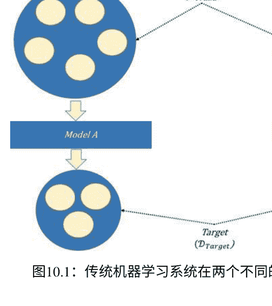

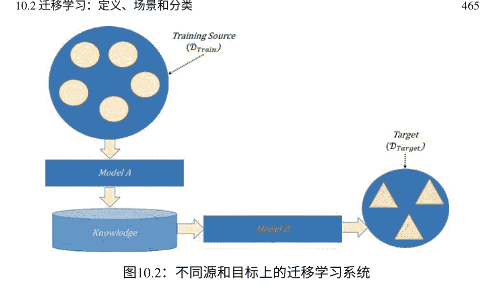

图10.2：不同源和目标上的迁移学习系统

### 10.2.1 定义

为了准确定义迁移学习，我们首先要定义一些概念，如$P a_{n}$和$Y a_{n}$g所述，即领域和任务$[P Y10]$。一个领域$\mathcal{D} = (\mathcal{X}, P(\mathcal{X}))$是通过特征空间$\mathcal{X}$和边际概率分布$P(\mathcal{X})$来定义的，其中$\mathcal{X}$表示训练数据样本$\mathcal{X} = x_1, x_2, ...$例如，在情感分析的二分类任务中，$\mathcal{X}$对应于词袋表示，$x_i$对应于语料库中的第$i$个术语。因此，当两个系统的特征空间或边际概率分布不同时，我们说领域不匹配。

一个任务$\mathcal{T} = (\mathcal{Y}, f(\cdot))$是根据输入和标签对$(x_i, y_i)$来定义的，其中(a)标签空间$\mathcal{Y}$和(b)目标预测函数$f(\cdot)$是不直接观察到的，但可以从输入和标签对中学习得到。标签空间包含了所有实际标签的集合，例如，对于二分类问题，可以是真和假。目标预测函数$f(\cdot)$用于根据数据预测标签，并且可以以概率的方式解释为$f(\cdot) \approx p(y|x)$。

给定源域$\mathcal{D}_S$、源任务$\mathcal{T}_S$、目标域$\mathcal{D}_T$和目标任务$\mathcal{T}_T$，迁移学习可以被定义为使用源域$\mathcal{D}_S$和源任务$\mathcal{T}_S$的知识来学习目标域$\mathcal{D}_T$中的目标预测函数$f_T(\cdot) = P(Y_T | X \mathcal{T})$的过程，其中$\mathcal{D}_S \neq \mathcal{D}_T$或$\mathcal{T}_S \neq \mathcal{T}_T$。

### 10.2.2 迁移学习场景

基于源领域和目标领域的不同组成部分和任务，有以下四种不同的迁移学习场景：

- 1. 特征空间不同，$X_S \neq X_T$。例如，情感分类中的一个例子是特征定义了两种不同的语言。在自然语言处理中，这个术语通常被称为跨语言适应。
- 2. 源领域和目标领域之间的边缘概率分布不同，$P(X_S) \neq P(X_T)$，例如，一个使用缩写词的聊天文本和一个使用正式语言的电子邮件文本都在讨论情感。
- 3. 源领域和目标领域之间的标签空间不同，$Y_S \neq Y_T$。这实际上意味着源任务和目标任务完全不同，例如，一个可以有与情感（积极、中性、消极）对应的标签，而另一个可以有与情绪（愤怒、悲伤、快乐）对应的标签。
- 4. 预测函数或条件概率分布是不同的，一个例子是一个分布可以是平衡的，而另一个分布可以完全倾斜或高度不平衡；源数据中有相等数量的正面和负面情感案例，但目标数据中的正面情感案例非常少。

### 10.2.3 迁移学习分类

基于源数据和目标数据之间的“如何转移”和“什么转移”，迁移学习可以进一步分为许多不同的类型，其中许多类型已经成为独立的研究和应用领域。在本节中，我们不会涵盖已经在Pan和Yang [PY10]的调查中定义的许多传统机器学习分类。相反，我们只会涵盖那些在深度学习领域中已经被探索或产生影响的分类。

基于源标签的可用性和源与目标任务的相似性，可以有各种各样的迁移学习的子类别，如图10.3所示。当源标签不可用，但存在大量的源数据和少量到大量的目标数据时，学习的类别被称为自学习。在语音和文本的许多实际应用中，标记的成本或工作量存在限制，而大量的数据可以用于学习和转移到具有标签的特定任务，这种技术非常成功。在这些学习系统中，核心假设是在源数据上采用某种形式的无监督学习来捕捉有助于知识转移的特征。

当目标不仅是在目标任务上表现良好，而是以某种方式共同学习并在源和目标任务上都表现良好时，这种迁移学习的形式被称为多任务学习。核心假设是在相关任务之间共享信息，这些任务应该具有一定的相似性，可以提高整体的泛化能力。

与多任务学习相关的是，源和目标之间的任务不同，领域适应是一种学习形式，其中领域（即特征空间或数据中的边际分布）在源和目标之间是不同的。核心原则是从源中学习一个领域不变的表示，可以以有效的方式转移到具有不同领域的目标中。

在领域适应中，领域不同且源中有少量到大量标记数据可用。根据可用的标记数据数量（0，1，n），领域适应可以是零样本学习、单样本学习和少样本学习。

## 10.3 自学习

如图10.4所示，自学习包括两个不同的步骤：(a) 从无标签的源数据集中以无监督的方式学习特征，以及(b) 使用目标数据集上的分类器调整这些学习到的特征，该数据集具有标签。

图10.4：使用预训练和微调步骤的自学习 (a) 使用无标签的源数据集学习特征。(b) 使用带有分类器的标记目标数据对特征进行微调。

### 10.3.1 技术

在本节中，我们将总结各种方法，然后讨论在自然语言处理和语音识别中取得成功的具体算法或技术。

#### 10.3.1.1 无监督预训练和有监督微调

```
算法1：无监督特征学习

**数据**: 训练数据集 $\mathbf{x}_1^{(s)}, \mathbf{x}_2^{(s)}, \cdots, \mathbf{x}_n^{(s)}$ 使得 $\mathbf{x}_i^{(s)} \in \mathbb{R}^d$, 层数=L

**结果**: 权重矩阵 $\mathbf{W}_l \in \mathbb{R}^{d'}$ 和 $b_l \in \mathbb{R}$ 对于每一层 $l$

**开始**

appendClassifierLayer($h_L$)
对于 $l = k$ 到 $L$ do
    $\mathbf{W}_l, b_l = \text{trainUnsupervised}((\mathbf{x}_1^{(s)}, \mathbf{x}_2^{(s)}...\mathbf{x}_n^{(s)}))$
对于每一层 $l$ 返回 $\mathbf{W}_l, b_l$
```

算法1的输入是大小为 $n$ 的源无标签数据集；$(S)$ 下标表示源。学习的第一部分以无监督的方式从源数据中进行，如算法1所示。这与传统机器学习中的特征或维度缩减和流形学习有很多相似之处。这个过程通常使用线性和非线性技术来找到输入的潜在表示，其维度比输入小。在深度学习中，算法中的 $\text{train}$ 对应于许多无监督技术，如PCA或ICA层，受限玻尔兹曼机，自编码器、稀疏自编码器、去噪自编码器、收缩自编码器和稀疏编码技术等等，这些都可以用于特征学习。根据算法的不同，可以逐层或全局进行训练。函数 $R$ 对应于对底层算法的一般调用。

自编码器是无监督学习方法中最流行的技术之一；基本的编码和解码发生在层之间以匹配输入。神经元的数量或层的大小在自编码器学习中起着重要作用。当大小小于输入时，称为欠完备表示，并且可以看作是一种在较低维度中找到表示的压缩机制。当大小大于输入时，称为过完备表示，并且需要正则化技术（如稀疏性）来强制学习重要特征。在许多实际应用中，自编码器被堆叠在一起，以从输入中创建分层或高级特征。

一旦这些特征被学习到，下一步就是使用目标数据集来微调它们，使用类别层（如 softmax）进行微调。有各种选择，比如在某个层级 $k>1$ 上冻结学习层的状态，并只使用其余的层进行调整，或者使用所有层进行调整。算法2展示了微调过程如何使用大小为 $m$ 的标记目标数据集。

```
算法2：有监督的微调

**数据**: $(\mathbf{x}_{m(T)}, y_n)$ 使得 $\mathbf{x}_{i(T)} \in \mathbb{R}^d$ 且 $y_i \in \{+1, -1\}$，训练层 $h_1, h_2, \dots, h_L$，训练层开始 $k$
**结果**: 权重矩阵 $\mathbf{W}_l \in \mathbb{R}^d$ 和 $b_l \in \mathbb{R}$ 对于每一层 $l$

**开始**

appendClassifierLayer($h_{L+1}$)
for $l = k$ to $L$ do
    $W_l, b_l = train((x_{1(T)}, y_1), (x_{2(T)}, y_2), ..., (x_{m(T)}, y_n))$
return $W_l, b_l$ for each layer $l$
```

### 10.3.2 理论

在他们的开创性工作中，Erhan等人提供了有关无监督预训练和微调的有趣的理论和实证见解[Erh+10]。他们使用各种架构，如前馈神经网络、深度置信网络和堆叠去噪自编码器，在不同的数据集上以逐步、受控的方式经验性地验证了各种理论结论。

他们表明，预训练不仅提供了一个良好的起始条件，而且还捕捉到了参数之间的复杂依赖关系。研究还表明，无监督预训练可以作为一种正则化形式，引导权重朝着更好的极小值吸引区域。从预训练过程中获得的正则化影响了监督学习的起始点，并且与标准正则化相比，这种影响在使用更多数据时并不消失。诸如 $L_1$/$L_2$ 等技术也不例外。研究得出结论，在小规模训练数据的情况下，无监督预训练具有许多优势。它还表明，在某些情况下，训练示例的顺序会影响结果，但预训练即使在这种情况下也能减少方差。实验证明，无监督预训练作为一种通用的方差减少技术甚至是优化技术，对于更好的训练具有洞察力。

### 10.3.3 自然语言处理中的应用

使用无监督技术从大量数据语料库中获取词嵌入，并将其应用于各种监督任务，是自然语言处理中最基本的应用。由于这在第5章中已经详细讨论过，我们将更多关注其他自然语言处理任务。戴和勒表明，使用序列自编码器或基于语言模型的系统进行无监督特征学习，然后使用监督训练在各种数据集上实现了很好的文本分类结果，例如IMDB、DBpedia和20 Newsgroup [DL15]。序列自编码器使用LSTM编码器-解码器以无监督方式捕捉依赖关系。LSTM的权重被用来在监督学习的设置中初始化带有softmax分类器的LSTM。无监督的自编码器训练在所有数据集上都显示出优越的结果，而该技术的普适性使其在所有序列到序列问题中具有优势。

Ramachandran等人表明，在情感分类中，经过语言建模预训练的LSTM编码器可以非常有效地使用而无需微调。Deing等人表明，TopicRNN是一种使用RNN进行局部句法依赖和使用主题建模进行全局语义潜在表示的架构，可以作为非常有效的特征提取器。TopicRNN在情感分类任务上取得了接近最先进的结果。Turian等人表明，从多个嵌入中以无监督的方式学习特征，并将其应用于各种监督的自然语言处理任务，如分块和命名实体识别，可以获得接近最先进的结果。

### 10.3.4 语音识别中的应用

早期，Dahl等人在他们的研究表明，无监督的预训练为权重提供了很好的初始化，并且在深度置信网络上使用标记的微调进一步改善了自动语音识别任务的结果[Dah+12]。Hinton等人展示了无监督的预训练逐层学习RBM，然后使用标记的示例进行微调，不仅减少了过拟合，还减少了在标记的示例上学习的时间[Hin+12]。Lee等人表明，在大型数据集上进行的无监督特征学习可以学习有助于使用深度卷积网络进行各种音频分类任务的音素[Lee+09]。

## 10.4 多任务学习

无论是在深度学习中还是在机器学习中，总体过程是根据与该任务对应的数据集学习一个模型。这可以看作是单任务学习。这的一个扩展是多任务学习（MTL），其中试图从多个任务及其对应的数据集中联合学习[Rud17]。Caruana将多任务学习的目标定义为“MTL通过利用相关任务的训练信号中包含的领域特定信息来提高泛化能力。”多任务学习也可以称为归纳传递过程。MTL中引入的归纳偏差是通过迫使模型更喜欢解释多个任务而不是单个任务的假设。当每个任务的标记数据有限，并且任务之间存在知识或学习特征的重叠时，多任务学习通常是有效的。

### 10.4.1 技术

在深度学习中处理多任务学习的两种一般方法是通过硬共享或软共享参数，如图10.5所示。硬共享参数是使用单个模型的神经网络中最古老的技术之一，其中隐藏层共享公共权重，并且任务特定的权重在输出层学习 [Car93]。硬共享参数共享的最重要的好处是通过在任务之间强制实现更广泛的泛化来防止过拟合。另一方面，软共享参数具有单独的模型和每个任务的独立参数，并且对参数进行约束以使任务之间的参数更相似。在软共享参数中，通常使用正则化技术来强制执行约束。在下一节中，我们将介绍一些在多任务学习中证明有效的深度学习网络。

图10.5：多任务学习的两种通用方法。(a)在隐藏层中进行硬参数共享(b)在不同任务之间对隐藏层进行软参数共享

#### 10.4.1.1 多线性关系网络

最早用于多任务学习的深度学习网络之一是由Long和Wang引入的，被称为多线性关系网络（MRN）[LW15]。MRN在图像识别的不同任务中展示了最先进的性能。MRN如图10.6所示，是AlexNet架构的修改版，该架构在第6章中进行了讨论。前几层是卷积层，而全连接层学习可转移特征，接近输出的其余全连接层学习任务特定特征。如果有T个带有训练数据X_t和y_t的任务，其中X_t = x_1, ..., x_{N_t}, y_t = y_1, ..., y_{N_t}，N_t是训练示例和标签的数量，D是特征空间的维度，C是标签空间的基数，则第l层中第t个任务的网络参数为给定 $W^{t,l} \in \mathbb{R}^{D_1^l \times D_2^l}$，其中 $D_1^l$ 和 $D_2^l$ 是矩阵 $W^t$ 的维度，和参数张量 $\mathcal{W}^l = [W^{1,l}; \cdots; W^{T,l}] \in \mathbb{R}^{D_1^l \times D_2^l \times T}$。全连接层 ($fc6 - fc8$) 学习给定的映射 $h_n^{t,l} = a^l(W^{t,l} h_n^{t,l-1} + b^{t,l})$，其中 $h_n^{t,l}$ 是每个数据实例 $x_n^t$ 的隐藏表示，$W^{t,l}$ 是权重，$b^{t,l}$ 是偏置，$a^l$ 是激活函数，如 ReLU。第 tth 任务的分类器是 $y = f_t(x)$，经验误差为：

$$\min_{n=1}^{N_t} J(f_t(x_n^t), y_n^t) \quad (10.1)$$

其中 $J(\cdot)$ 是交叉熵损失函数，$f_t(x_n^t)$ 是网络对数据点 $x_n^t$ 分配给标签 $y_n^t$ 的条件概率。MRN对完全连接的任务特定层中的参数张量具有张量正则先验，类似于作为任务相关学习的正则化的贝叶斯模型。

给定训练数据，网络参数 $\mathcal{W} = \mathcal{W}^l : l \in \mathcal{L}$ 的最大后验 (MAP) 估计为任务特定层 $\mathcal{L} = fc7, fc8$:

$$P(\mathcal{W}|\mathcal{X}, \mathcal{y}) \propto P(\mathcal{W}) \cdot P(\mathcal{y}|\mathcal{X}, \mathcal{W}) \quad (10.2)$$

$$P(\mathcal{W}|\mathcal{X}, \mathcal{y}) = \prod_{l \in \mathcal{L}} P(\mathcal{W}^l) \cdot \prod_{t=1}^{T} \prod_{n=1}^{N_t} P(y_n^t|x_n^t, \mathcal{W}^l) \quad (10.3)$$

在假设先验概率 $P(\mathcal{W}^l)$ 和每一层的参数张量 $\mathcal{W}^l$ 是相互独立的情况下，最大似然估计 (MLE) 部分 $P(\mathcal{y}|\mathcal{X}, \mathcal{W})$ 被建模为学习较低层的可迁移特征，以及所有层的参数 ($conv1 - fc6$) 是共享的。任务特定层 ($fc7, fc8$) 不共享，以避免负迁移。先验部分 $p(\mathcal{W})$ 被定义为张量正态分布，并且表示为：

$$p(\mathcal{W}) = \mathcal{TN}_{D_1^l \times D_2^l \times T}(\mathbf{O}, \Sigma_1^l, \Sigma_2^l, \Sigma_3^l) \quad (10.4)$$

其中 $\Sigma_1^l$, $\Sigma_2^l$ 和 $\Sigma_3^l$ 是协方差矩阵的模式。在张量先验中，行协方差矩阵 $\Sigma_1^l \in \mathbb{R}^{D_1^l \times D_1^l}$ 学习特征之间的关系，列协方差矩阵 $\Sigma_2^l \in \mathbb{R}^{D_2^l \times D_2^l}$ 学习类别之间的关系，协方差矩阵 $\Sigma_3^l \in \mathbb{R}^{T \times T}$ 学习层参数中任务之间的关系 $\mathcal{W}^l = [W^{1,l}; ... ; W^{T,l}]$。将公式10.1中给出的经验误差与公式10.4中给出的先验结合起来，得到公式10.3中的MAP估计，然后通过取负对数的过程，优化的方程为：

$$\min_{f_t|_{t=1}^T, \Sigma_k|_{k=1}^K} \sum_{t=1}^T \sum_{n=1}^{N_t} J(f_t(\mathbf{x}_n^t), \mathbf{y}_n^t) + \frac{1}{2} \sum_{l \in \mathcal{L}} \left( \text{vec}(\mathcal{W}^l)^T (\Sigma_{1:K}^l)^{-1} \text{vec}(\mathcal{W}^l) - \sum_{k=1}^K \frac{D^l}{D_k^l} \ln(|\Sigma_k^l|) \right) \quad (10.5)$$

其中 $D^l = \prod_{k=1}^K D_k^l$, $K = 3$ 是参数张量 $\mathcal{W}$ 的模式数量，或者对于卷积层 $K = 4$, $\Sigma_{1:3}^l = \Sigma_1^l \otimes \Sigma_2^l \otimes \Sigma_3^l$ 是特征、类别和任务协方差的Kronecker乘积。方程10.5给出的优化问题是关于参数张量和协方差矩阵的联合非凸问题，因此在优化一组变量的同时，保持其他变量不变。在不同的计算机视觉多任务学习数据集上使用MRN进行的实验表明，它可以达到最先进的性能。

图10.6: 一个多线性关系网络，其中前几层学习共享特征，最后几层学习具有张量正则先验的任务特定特征

#### 10.4.1.2 全自适应特征共享网络

卢等人采用任务特定学习的方法作为一种搜索，从一个薄网络开始，然后以一种有原则的方式扩展成宽网络，在训练过程中形成宽网络[Lu+16]。该方法还引入了一种新技术，即同时正交匹配追踪（SOMP），用于从更宽的预训练网络初始化薄网络，以实现更快的收敛和更高的准确性。

该方法论有三个阶段：

1.  薄模型初始化：由于网络（薄）与预训练网络的维度不同，无法直接复制权重。因此，它使用SOMP来学习如何选择原始行 d 的子集 d'，用于每一层 l。这是一个非凸优化问题，因此采用贪婪方法来解决，详细描述在论文中。
2.  自适应模型扩展：在初始化过程之后，从顶层开始，每一层都经历一个扩展过程。扩展过程可以定义为在网络中创建子分支，使得每个分支执行网络执行的一部分任务。分支的分叉点称为交汇点，并通过增加更多的输出层来扩展它。图10.7显示了迭代扩展过程。如果有 T 个任务，则薄网络的最终输出层 l 具有与 T 个分支的交汇点，每个分支可以被视为一个子分支。迭代过程从通过分组找到 t 个分支开始，这样的事情使得 $t \leq T$ 在层 $l$ 上，然后以自上而下的方式递归地移动到下一层 $l -1$ 等等。任务的分组是通过关联“亲和性”的概念来完成的，这是同时观察训练数据中简单或困难示例对于任务对的概率。
3.  最后模型训练：在细模型初始化和递归扩展过程之后，训练最终模型是最后一步。

图10.7：一个迭代过程，显示网络在特定迭代上的某一层上如何扩展以分组任务

#### 10.4.1.3 交叉缝合网络

如图10.8所示，这些深度网络是AlexNet的修改版本，使用线性组合学习共享和任务特定表示[Mis+16]。对于每个任务，都有一个深度网络，例如AlexNet，交叉缝合单元在池化层之间有一个连接，作为卷积或全连接层的输入。交叉缝合单元是任务输出之间的线性组合，用于学习共享表示。在数据匮乏的多任务环境中，它们被证明非常有效。

图10.8：一个交叉编织网络试图学习对两个任务有用的潜在表示

考虑两个任务A和B以及在相同输入数据上的多任务学习。图10.9中显示的交叉编织单元起到将两个网络组合成一个多任务网络的作用，使得任务控制共享的程度。给定从层l的两个激活输出 $x_A, x_B$，学习线性组合使用参数 $\alpha$ 产生输出 $\tilde{x}_A, \tilde{x}_B$，这些输出流向下一层，并且对于位置 $(i, j)$ 给出如下：

$$\left[\begin{array}{c} \tilde{x}_A^{i,j} \\ \tilde{x}_B^{i,j} \end{array}\right] = \left[\begin{array}{cc} \alpha_{AA} & \alpha_{AB} \\ \alpha_{BA} & \alpha_{BB} \end{array}\right] \left[\begin{array}{c} x_A^{i,j} \\ x_B^{i,j} \end{array}\right] \quad (10.6)$$

图10.9：交叉缝合单元细节

#### 10.4.1.4 一个联合多任务网络

自然语言处理任务通常可以被认为是层次结构的流水线，其中一个任务可以作为下一个任务的输入和有用的。Søgaard和Golberg表明，使用双向RNN架构在不同层次上进行监督多任务学习，使得低层任务输入到高层任务中，可以取得很好的结果[SG16]。Hashimoto等人通过创建一个端到端的深度学习网络来扩展这个想法，其中网络具有不断增加的深度，以完成从句法和语义表示到语言层次结构的任务，如图10.10所示[Has+16]。已经证明，具有这种架构的单一端到端网络可以在不同的任务中取得最先进的结果，如分块、依赖解析、语义相关性和文本蕴含。

给定长度为 $l$ 的句子 $s$ 有 $w$ 个词。对于每个词，都有skip-gram词嵌入和字符嵌入。单词表示 $\mathbf{v}_i$ 通过连接单词和字符-gram嵌入来完成，这些嵌入是通过使用skip-gram和负采样来学习单词的。字符-gram用于为任务提供形态特征。第一个任务是词性标注，使用双向LSTM进行，输入是嵌入的输入，通过softmax进行标签分类。词性标注的标签嵌入（以及许多其他任务）由以下给出：POS标签的标签嵌入（以及许多其他任务）由以下给出：## 10.4 多任务学习

$$y^{\mathbb{E}}_{t}=\sum_{j=1}^{C}p(y^{1}_{t}=j|h^{1}_{t})l(j)$$ (10.7)

其中 $C$ 是POS标签的数量， $p()$ 是第 $j$ 个POS标签分配给第 $w$ 个标记的概率， $l$ 是第 $j$ 个POS标签的标签嵌入。第二个任务是分块，它使用双向LSTM并从POS双向LSTM获取隐藏状态，其LSTM的隐藏状态，嵌入的标记和POS标记的标签嵌入。第三个任务是依赖解析，其输入来自分块层的隐藏状态，依赖解析的先前隐藏状态，嵌入的标记和POS层和分块层的标签嵌入。

POS标记层和带有隐藏状态的分块层对于生成对许多任务有用的低级特征是有用的，这是从传统的自然语言处理中已知的特征工程中得出的。第四个任务是依赖解析，再次使用双向LSTM，其输入为隐藏的LSTM状态，嵌入的标记和来自POS标记和分块层的标签嵌入。与前面的层相比，下面的两个任务在语义上相关。语义相关性任务是比较两个句子并给出它们相关性的实值输出。通过LSTM的隐藏状态进行最大池化得到句子级表示，表示为：

$$h^{relat}_{s}=max(h^{relat}_{1},h^{relat}_{2},\cdots,h^{relat}_{L})$$ (10.8)

> 两个句子的相关性 $(s, s^{\prime})$ 由以下公式给出：

$$d_{1}(s,s^{\prime})=[|h^{relat}_{s}-h^{relat}_{s^{\prime}}|;h^{relat}_{s}\odot h^{relat}_{s^{\prime}}]$$ (10.9)

将 \( d_1(s, s') \) 的值输入到具有maxout隐藏层的softmax层中，得到相关性分数。

最后一个任务是文本蕴含，它再次接受两个句子并给出蕴含、矛盾或中立的类别之一。从相关性任务中获取的标签嵌入以及类似于Eq. 10.9中的距离度量从LSTM层中得到，并输入到softmax分类器进行分类。

当一个网络依次训练一个任务，然后在另一个任务上训练时，它通常会“遗忘”或在第一个任务上表现不佳。这种现象被称为灾难性干扰或灾难性遗忘。每一层的训练都类似，使用一个损失函数，该损失函数考虑了（a）使用预测和标签的层的分类损失的度量，（b）其权重向量的L2范数，以及（c）如果它们是输入的话，对先前任务的参数的正则化项。根据作者的说法，联合学习使得框架对灾难性干扰具有鲁棒性。一个例子是用于分块层的输入，由权重和偏置\(\theta_{POS}\)给出，以及在POS层之后的一个当前时期给出的\(\theta'\)。

```
POS，分块层的权重\(W_{CHK}\)，以及概率\(p(y_{CHK} | \mathbf{h}_{CH} = \alpha | h_t^{CHK})\)在句子中，将正确的标签\(\alpha\)分配给\(w_t\)的方法是：

\[J_2(\theta_{CHK}) = - \sum_s \sum_t \log p(y_t^{CHK} = \alpha | h_t^{CHK}) + \lambda \| W_{CHK} \|^2 + \delta \| \theta_{POS} - \theta'_{POS} \|^2\]

(10.10)
```

## 10.4.1.5 水门网络

Ruder等人最近提出了一种通用的深度学习架构，称为水门网络，它结合了许多以前的研究类型的概念，如硬参数共享、交叉缝合网络、块稀疏正则化和自然语言处理的层次多任务学习[Rud17]。主任务A和辅助任务B的水门网络由共享输入层、每个任务的三个隐藏层和两个任务特定的输出层组成，如图10.11所示。每个任务的隐藏层都是一个RNN，分为两个子空间，例如，任务A和层1具有\(G_{A,1}\)和\(G_{A,2}\)，这使它们能够有效地学习任务特定和共享的表示。隐藏层的输出通过\(\alpha\)参数流向新层，该层通过线性组合输入来加权共享和任务特定学习的重要性。通过使子空间具有各自的权重并控制它们的共享方式，水门网络在多任务设置中具有自适应学习的方式，只学习有用的内容。最终的递归隐藏层将信息传递给\(\beta\)参数，它们试图结合层所学到的所有内容。Ruder等人凭经验证明，主要任务（如NER和SRL）可以从辅助任务（如POS）中受益，并在错误方面取得显著的改进。

Ruder等人将整个学习过程视为矩阵正则化问题。如果有\(M\)个任务与\(M\)个非重叠数据集松散相关

给定由 $L_1, L_2, \cdots, L_K$ 层模型 $\theta_1, \theta_2, \cdots, \theta_M$ 组成的 $K$ 层深度神经网络，以及具有 $\mathcal{D}$ 个参数和显式归纳偏差 $\Omega$ 作为惩罚项的模型，则要最小化的损失函数为：

$$\lambda_1 \mathcal{L}_1(\mathbf{f}(x; \theta_1), y_1) + \cdots + \lambda_M \mathcal{L}_M(\mathbf{f}(x; \theta_M), y_M) + \Omega \qquad (10.11)$$

损失函数 $\mathcal{L}_i$ 是交叉熵损失函数，权重 $\lambda_i$ 决定了训练过程中任务 $i$ 的重要性。如果 $G_{m,k,1}$ 和 $G_{m,k,2}$ 是每一层的两个子空间，归纳偏差由正交约束给出：

$$\Omega = \sum_{m=1}^{M} \sum_{k=1}^{K} \left\| G_{m,k,1}^T G_{m,k,2} \right\|_F^2 \qquad (10.12)$$

矩阵正则化通过更新 $\alpha$ 参数来实现，与Misra等人的交叉线性单元[Mis+16]相似。对于两个任务（A，B）和 $k$ 层的一个子空间，交叉线性组合的扩展如下：

$$\begin{bmatrix} \tilde{h}_{A_1,k} \ \vdots \ \tilde{h}_{B_1,k} \end{bmatrix} = \begin{bmatrix} \alpha_{A_1 A_1} & \cdots & \alpha_{A_1 B_2} \ \vdots & \ddots & \vdots \ \alpha_{A_1 B_2} & \cdots & \alpha_{B_2 B_2} \end{bmatrix} \begin{bmatrix} h_{A_1,k} \ \vdots \ h_{B_1,k} \end{bmatrix} \qquad (10.13)$$

where $h_{A_1,k}$ 是第一子空间在任务A中的输出 $k$，而 $h_{A1,k}$ 是第一子空间和任务A的线性组合。第 $k+1$ 层的输入是这两者的串联，表示为 $h_{A,k} = [h_{A1,k}, \tilde{h}_{A2,k}]$。通过层之间的跳跃连接来学习低级任务和高级任务之间的层次关系，其中使用了 $\beta$ 参数。这相当于一个混合模型，可以写成：

$$\tilde{h}_{A}^{T} = \begin{bmatrix} \beta_{A,1} \ \vdots \ \beta_{A,k} \end{bmatrix} \begin{bmatrix} h_{A,1}^{T} \dots h_{A,k}^{T} \end{bmatrix} \quad \text{(10.14)}$$

其中 $h_{A,k}$ 是任务A的输出，而 $\tilde{h}_{A}$ 是所有层输出的线性组合，输入到softmax分类器中。

### 10.4.2 理论

Caruana在他早期的多任务学习研究中，然后Ruder在他的工作中总结了多任务学习有效的不同原因和时机[Car97, Rud17]。

- 1. 隐式数据增强—当约束是每个任务的有限数据时，通过共同学习相似的不同任务，总的训练数据量增加。正如学习理论所建议的，训练数据越多，模型质量越好。
- 2. 注意力聚焦—当约束是每个任务的噪声数据时，通过共同学习不同任务，关注对多个任务有用的相关特征，以获得更多的关注。总的来说，这种联合学习有助于作为一种隐式特征选择机制。
- 3. 窃听—当训练数据有限时，可能需要的特征可能不在数据中。通过拥有多个数据集用于多个任务，特征可以窃听，即为其他任务学习的特征可以用于所讨论的任务，并有助于该特定任务的泛化。
- 4. 表示偏差-多任务学习强制实现一个能够在任务之间泛化的表示，从而强制实现更好的泛化能力。
- 5. 正则化-多任务学习也被认为是一种通过归纳偏好的正则化技术，从理论和实证上已知可以提高模型质量。

### 10.4.3 自然语言处理中的应用

在他的工作中，Rei表明，将语言建模作为辅助任务与主要任务（如POS标注、分块和命名实体检测）一起使用，可以显著提高结果，超过基准[Rei17]。

Fang和Cohn说明了跨语言多任务联合学习在低资源语言的POS标注中的优势[FC17]。Yang等人表明，具有跨语言多任务学习的深层分层神经网络可以在各种序列标注任务（如NER、POS标注和分块）中实现最先进的结果[YSC16]。Duong等人使用跨语言多任务学习来实现

在低资源语言的依赖解析中实现高准确性[Duo+15]。Col-lobert和Weston表明，使用CNN在各种任务上进行多任务学习可以达到很高的准确性[CW08]。

多任务学习在机器翻译任务中最为成功，可以在编码器阶段或解码器阶段或两者同时使用。Dong等人成功地使用MTL在序列到序列网络的编码器阶段将单一源语言翻译成多种语言[Don+15]。Zoph和Knight使用法语和德语作为MTL的多源学习，在解码器阶段有效地将其翻译成英语[ZK16]。Johnson等人表明，联合学习编码器和解码器可以以统一的方式为多个源语言和目标语言建立单一模型[Joh+16]。Luong等人对序列到序列和多任务学习在编码-解码的各个阶段进行了更全面的研究，包括翻译等NLP任务，以展示其好处[Luo+15]。Niehues和Cho在他们对德英翻译的研究中探索了诸如词性标注和命名实体识别等任务如何帮助机器翻译，并改善这些任务的结果[NC17]。

Choi等人使用多任务学习来学习理解中的句子选择，然后在问题-答案模型中使用该学习结果以获得更好的结果[Cho+17]。另一项令人兴奋的工作使用大量的数据语料库来学习和排名可能用于问题-答案的段落，然后使用这些段落与QA模型进行联合训练，以在开放式QA任务中获得最先进的结果[Wan+18]。Jiang展示了如何将多任务学习与弱监督学习相结合，使用联合模型来提取不同的关系或角色类型，从而改善结果[Jia09]。Liu等人表明，使用深度神经网络在低资源数据集中进行联合多任务学习可以改善查询分类和网络搜索排名的结果[Liu+15]。Katiar和Cardie展示了如何使用基于注意力的循环网络进行关系和提及的联合抽取，从而改善传统深度网络的性能[KC17]。Yang和Mitchell强调了一个单一模型可以同时学习语义角色标注和预测关系，从而改善现有技术水平[YM17]。

Isonuma等人展示了如何使用少量摘要和文档分类一起进行总结，可以得到与现有技术相当的结果[Iso+17]。在特定领域（如法律）中，Luo等人展示了如何通过相关文章提取进行分类，当二者一起学习时，可以得到改进的结果[Luo+17]。Balikas等人展示了如何使用联合多任务学习来改进学习三元和细粒度分类的情感分析任务[BMA17]。Augenstein和Søgaard展示了在学习辅助任务（如语义超感标记和多词表达式识别）时，关键短语边界分类的改进。[AS17]

### 10.4.4 语音识别中的应用

Watanabe等人强调了在混合端到端深度学习框架中执行与语音识别相关的多个任务的重要性[Wat+17]。这种架构结合了CTC损失和基于注意力的序列到序列，可以得到与以前基于HMM深度学习的方法相当的结果。Watanabe等人再次强调了如何使用端到端深度学习和多任务学习同时执行自动语音识别(ASR)和跨十种语言的语言识别/分类等多个任务[WHH17]。Watanabe等人强调了在ASR和说话人识别上进行多任务学习可以显著提高总体性能，与分别训练的模型相比[Wat+18]。

## 10.5 案例研究

在这个案例研究中，我们探讨了多任务学习如何应用于一些常见的自然语言处理任务，如词性标注、分块和命名实体识别。整体性能取决于许多选择，如序列到序列的架构、嵌入和共享技术。

我们将尝试回答低级任务（如词性标注）是否对高级任务（如分块）有益？与密切相关的任务和松散相关的任务进行联合学习会有什么影响？连接性和共享对学习有什么影响？是否存在负迁移以及它对学习的影响？神经架构和嵌入选择是否会影响多任务学习？我们将使用CoNLL-2003英文数据集，在我们的实验中，该数据集对每个任务的标记进行了标注。CoNLL-2003数据集已经具有了训练、验证和测试的标准划分。我们将使用测试集上的准确率作为案例研究的性能指标。

- 探索性数据分析
- 多任务学习实验和分析

### 10.5.1 软件工具和库

我们将在下面描述我们在案例研究中使用的主要开源工具和库：

- PyTorch：我们在这个案例研究中使用http://github.com/pytorch/pytorch作为我们的深度学习工具包。
- GloVe：我们在实验中使用https://nlp.stanford.edu/projects/glove/作为我们的预训练嵌入。https://github.com/SeanNaren/nlp多任务学习pytorch/用于多任务学习实验。

### 10.5.2 探索性数据分析

用于训练、验证和测试的原始数据具有表格格式，每个标记都有相应的注释，如表10.1所示。

表10.1：原始数据格式
| 标记 | 词性 | 块 | NER |
| :--- | :--- | :--- | :--- |
| U.N. | NNP | I-NP | I-ORG |
| official | NN | I-NP | O |
| Ekeus | NNP | I-NP | I-PER |
| heads | VBZ | I-VP | O |
| for | IN | I-PP | O |
| 巴格达 | NNP | I-LOC | I-LOC |
| - | - | O | O |

表10.2给出了每个数据集的总文章、句子和标记的基本分析。标记遵循“内部-外部-开始”(IOB)的分块和命名实体识别方案。

表10.3给出了每个NER类别和标记的标记数。

表10.2：CoNll-2003的数据分析
| 数据集 | 文章 | 句子 | 标记 |
| :--- | :--- | :--- | :--- |
| 训练集 | 946 | 14,987 | 203,621 |
| 验证集 | 216 | 3466 | 51,362 |
| 测试集 | 231 | 3684 | 46,435 |

表10.3：CoNll-2003的NER标记分析
| 数据集 | 位置 | 其他 | 组织 | 人名 |
| :--- | :--- | :--- | :--- | :--- |
| 训练集 | 7140 | 3438 | 6321 | 6600 |
| 验证集 | 1837 | 922 | 1341 | 1842 |
| 测试集 | 1668 | 702 | 1661 | 1617 |

### 10.5.3 多任务学习实验和分析

我们的模型基于Søgaard和Golberg在“联合学习”模式下使用双向RNN的研究。我们在两种不同的配置下探索“联合学习”：(a)所有任务之间共享层，这些层连接到三个不同的softmax层(POS、分块和NER)；(b)每个RNN位于不同的层，并且较低层的隐藏层流入下一个更高层，如图10.12所示。

我们在下面的代码中突出显示了 JointModel类，其中定义了所有的配置选项：(a)单独学习，(b)共享层的联合学习，以及(c)级联的联合学习。

```
#初始化图
def forward(self, input, *hidden):
    if self.trainmode == 'Joint':
        #当层数相同时，隐藏层
        #是共享的
        #和连接到不同的输出
        if self.n_layers1 == self.n_layers2 == self.n_layers3:
            logits, shared_hidden = self.rnn(input, hidden[0])
            outputs_pos = self.linear1(logits)
            outputs_chunk = self.linear2(logits)
            outputs_ner = self.linear3(logits)
            return outputs_pos, outputs_chunk, outputs_ner, shared_hidden
        # 级联架构，其中低一级任务流入高级
        else:
            # 词性标注任务
            logits_pos, hidden_pos = self.rnn1(input, hidden[0])
            self.rnn2.flatten_parameters()
            # 使用POS进行分块
            logits_chunk, hidden_chunk = self.rnn2(logits_pos, hidden[1])
            self.rnn3.flatten_parameters()
            # 使用分块进行命名实体识别
            logits_ner, hidden_ner = self.rnn3(logits_chunk, hidden[2])
            outputs_pos = self.linear1(logits_pos)
            outputs_chunk = self.linear2(logits_chunk)
            outputs_ner = self.linear3(logits_ner)
            return outputs_pos, outputs_chunk, outputs_ner, hidden_pos, hidden_chunk, hidden_ner
    else:
        #个体任务学习
        logits, hidden = self.rnn(input, hidden[0])
        outputs = self.linear(logits)
        return outputs, hidden
```

由于我们有不同的任务（POS、块划分和NER），输入层选择（预训练的嵌入或来自数据的嵌入），神经架构选择（LSTM或双向LSTM）和MTL技术（联合共享和联合分离），我们按照逐步的方式进行以下实验，以获得洞察力：

- 1. **LSTM + POS + Chunk**: 我们在编码器-解码器中使用LSTM，没有预训练的嵌入，并使用不同的共享技术来观察对POS标记和分块的影响。
- 2. **LSTM + POS + NER**: 我们在简单的编码器-解码器中使用LSTM，没有预训练的嵌入，并使用不同的共享技术来观察对POS标记和NER的影响。
- 3. **LSTM + POS + Chunk + NER**: 我们在简单的编码器-解码器中使用LSTM，没有预训练的嵌入，并使用不同的共享技术来观察对POS标记、分块和NER的影响。
- 4. **双向LSTM + POS + Chunk**: 我们在编码器-解码器中使用双向LSTM，没有预训练的嵌入，并使用不同的共享技术来观察对POS标记和分块的影响。从这个实验中，我们可以看出神经架构对学习的影响。
- 5. **LSTM + GloVe + POS + Chunk**: 我们在编码器-解码器中使用LSTM，预训练的GloVe嵌入，并使用不同的共享技术来观察对POS标记和分块任务的影响。从这个实验中，我们可以看出预训练嵌入对学习的影响。

### 10.5.4 读者和实践者的练习

以下是一些扩展和研究人员尝试的额外想法：

1. 使用不同的预训练嵌入（如word2vec）对结果有何影响？
2. 为共享和单独的RNN添加更多层对结果有何影响？那会改变多任务学习的行为吗？
3. 我们尝试了使用LSTM进行多任务学习，但没有尝试过GRU或者基本的RNN，选择不同的循环网络对多任务学习的性能有显著差异吗？
4. 隐藏单元数量、批次大小和迭代次数等超参数对多任务学习的影响是什么？
5. 如果我们在多任务学习中添加更多任务，例如语言模型、情感分类、语义角色标注等，对多任务学习的性能会有什么影响？
6. 使用与其他研究（如交叉网络、水闸网络等）相同的数据集，进行跨方法的比较分析。

我们在编码器-解码器中使用双向LSTM，预训练的GloVe嵌入，并使用不同的共享技术来观察对POS标记和分块任务的影响。这个实验为我们提供了关于架构和嵌入组合对这两个任务学习的影响的见解。

我们在编码器-解码器中使用双向LSTM，预训练的GloVe嵌入，并使用不同的共享技术来观察对POS标记和NER任务的影响。这个实验为我们提供了关于架构和嵌入组合对这两个任务学习的见解。

我们在编码器-解码器中使用双向LSTM，预训练的GloVe嵌入，并使用不同的共享技术来观察对POS标记、分块和NER三个任务的影响。这个实验让我们了解了当存在多个任务时，架构和嵌入的组合对学习的影响。

我们使用输入嵌入的参数运行所有实验，包括是否预训练300维度的嵌入，128作为隐藏单元的数量，128作为批量大小，300作为迭代次数，ADAM优化器和交叉熵损失函数。在下面的表格中，我们给出了各个实验的结果，并用绿色标记出改进的结果，用红色标记出恶化的结果。

### 表10.4: 实验1: LSTM + POS + Chunk

| 模型 | POS准确率% | 分块准确率% |
|------|------------|-------------|
| POS单任务 | 86.33 | – |
| Chunk单任务 | – | 84.69 |
| MTL联合共享 | 83.91 | 85.23 |
| MTL联合分离 | 86.88 | 85.78 |

### 表10.5: 实验2: LSTM + POS + NER

| 模型 | POS准确率% | NER准确率% |
|------|------------|------------|
| POS单任务 | 86.33 | – |
| NER单任务 | – | 84.92 |
| MTL联合共享 | 85.62 | 88.28 |
| MTL联合分离 | 86.72 | 89.74 |

### 表10.6：实验3：LSTM + POS + Chunk + NER

| 模型 | POS准确率% | Chunk准确率% | NER准确率% |
|------|------------|--------------|------------|
| POS单任务 | 87.42 | - | - |
| Chunk单任务 | - | 85.16 | - |
| NER单任务 | - | - | 90.08 |
| MTL联合共享 | 85.94 | 85.00 | 88.05 |
| MTL联合分离 | 87.11 | 86.72 | 88.83 |

实验中的一些有趣观察结果是：

### 表10.7：实验4：双向LSTM + POS + Chunk

| 模型 | POS准确率% | 分块准确率% |
|------|------------|-------------|
| POS单任务 | 86.56 | - |
| Chunk单任务 | - | 86.88 |
| MTL联合共享 | 84.53 | 88.20 |
| MTL联合分离 | 87.34 | 87.11 |

### 表10.8：实验5：LSTM + GloVe + POS + Chunk

| 模型 | POS准确率% | 分块准确率% |
|------|------------|-------------|
| POS单任务 | 90.55 | - |
| Chunk单任务 | - | 88.05 |
| MTL联合共享 | 89.84 | 88.12 |
| MTL联合分离 | 90.86 | 87.73 |

### 表10.9：实验6：双向LSTM + GloVe + POS + Chunk

| 模型 | POS准确率% | 分块准确率% |
|------|------------|-------------|
| POS单任务 | 92.42 | - |
| Chunk单任务 | - | 89.69 |
| MTL联合共享 | 91.72 | 89.53 |
| MTL联合分离 | 92.34 | 89.61 |

### 表10.10：实验7：双向LSTM + GloVe + POS + NER

| 模型 | POS准确率% | NER准确率% |
|------|------------|------------|
| POS单任务 | 92.42 | - |
| NER单任务 | - | 95.08 |
| MTL联合共享 | 92.89 | 95.70 |
| MTL联合分离 | 92.19 | 95.0 |

### 表10.11：实验8：双向LSTM + GloVe + POS + Chunk + NER

| 模型 | POS准确率% | Chunk准确率% | NER准确率% |
| :--- | :--- | :--- | :--- |
| POS单任务 | 92.66 | - | - |
| Chunk单任务 | - | 88.52 | - |
| NER单任务 | - | - | 95.78 |
| MTL联合共享 | 92.89 | 89.53 | 94.92 |
| MTL联合分离 | 91.95 | 90.00 | 95.31 |

- 表10.4和10.5显示，与共享层相比，使用单独的LSTM层进行联合多任务学习可以提高POS标注和分块以及POS标注和NER的性能。
- 表10.6显示，当所有三个任务结合使用共享和分离层的联合多任务学习时，结果会恶化，除了分块。这些结果与表10.4和10.5相反，表明当存在一些不是完全相关的任务混合时，会出现“负迁移”的情况。
- 表10.7中的实验结果使用双向LSTM，并且显示出与表10.4中的LSTM模型相似的性能，这表明仅仅通过增加架构复杂性本身并不会改变多任务行为，至少在这种情况下是如此。
- 引入使用GloVe向量的预训练嵌入在单个任务的性能上显示出约4%的巨大提升，如表10.8所示。多任务学习的边际改进与没有使用GloVe时类似。
- 表10.9中给出的实验6显示，当同时使用双向LSTM和预训练的GloVe向量时，不仅个别任务得到改善，而且多任务学习的行为与表10.4中的基本第一次实验不同。共享和分离层在这里都显示出比单个任务更差的性能。不知何故，个别任务的性能越好，多任务学习的影响就越小。
- 实验7，我们将双向LSTM和预训练的GloVe结合起来进行词性标注和命名实体识别，结果如表10.10所示，与实验2（表10.5）相比，结果非常不同。使用共享的联合多任务学习对两个任务都有性能提升，这在之前的实验中没有看到过。
- 实验8，结果如表10.11所示，我们将所有任务与双向LSTM和GloVe结合起来，与实验3（表10.6）相比，表现有所不同。词性标注和分块标记显示出共享的改进，但命名实体识别的性能下降。除了分块标记外，其他任务在单独层面上的表现都比实验3差。

## 参考文献

[AS17] Isabelle Augenstein和Anders Søgaard. “多任务学习的关键词边界分类”. 在：第55届计算语言学协会年会论文集. 2017年，第341-346页.

[BMA17] Georgios Balikas, Simon Moura, and Massih-Reza Amini. “多任务学习用于细粒度的Twitter情感分析”. In: 第40届国际ACM SIGIR会议研究与信息检索发展. 2017, pp. 1005–1008.

[BBS07] Steffen Bickel, Michael Br¨uckner, and Tobias Scheffer. “用于不同训练和测试分布的判别学习”. In: 第24届国际机器学习大会.ICML ’07. 2007, pp. 81–88.

[Car97] Rich Caruana. “多任务学习”. In: 机器学习 28.1 (1997), pp. 41–75.

[Car93] Richard Caruana. “多任务学习：归纳偏好的基于知识的来源”. In: 第十届国际机器学习大会. Morgan Kaufmann, 1993, pp. 41–48.

[Cho+17] Eunsol Choi等人“粗糙到精细的长文档问答”. 在：计算语言学协会第55届年会论文集. 2017年，第209-220页.

[CW08] Ronan Collobert和Jason Weston“统一的自然语言处理架构：深度神经网络与多任务学习”。在：第25届国际机器学习大会论文集。ICML '08。2008年，第160-167页.

[Dah+12] George E. Dahl等人“大词汇量语音识别的上下文相关预训练深度神经网络”。在：IEEE音频、语音和语言处理杂志20.1 (2012)，第30-42页.

[DL15] Andrew M Dai和Quoc V Le“半监督序列学习”。在：神经信息处理系统28的进展。C. Cortes等人编辑。2015年，第3079-3087页.

[Dai+07a] 戴文元等人。“增强学习用于迁移学习”。在：第24届国际机器学习大会.ICML '07。2007年，第193-200页.

[Dai+07b] 戴文元等人。“将朴素贝叶斯分类器用于文本分类”。在：第22届全国人工智能大会-第1卷. AAAI'07。2007年，第540-545页.

[DM06] Hal Daumé III和Daniel Marcu。“统计分类器的领域自适应”。在：J. Artif. Int. Res.26.1 (2006年5月)，第101-126页.

[Die+16] Adji B. Dieng等人。“TopicRNN: 具有长程语义依赖的循环神经网络。”在：CoRRabs/1611.01702 (2016年).

[Don+15] Daxiang Dong等人。“多任务学习用于多语言翻译。”In:ACL (I). 2015, pp. 1723–1732.

[Duo+15] Long Duong等人。“低资源依存句法分析: 神经网络解析器中的跨语言参数共享”。In:Proceedings of the7th International Joint Conference on Natural Language Processing(Volume 2: Short Papers). 2015, pp. 845–850.

[Erh+10] Dumitru Erhan等人。“为什么无监督预训练有助于深度学习？”In:J. Mach. Learn. Res.11 (Mar. 2010).

[FC17] Meng Fang和Trevor Cohn。“使用双语词典对低资源语言进行标记的模型转移”。In: CoRRabs/1705.00424 (2017).

[Fun+06] Gabriel Pui Cheong Fung等人“重新审视没有负面示例的文本分类”。在：IEEE Trans. on Knowl. and Data Eng. 18.1 (2006年1月)，第6-20页.

[Has+16] Kazuma Hashimoto等人“一个联合多任务模型: 为多个自然语言处理任务构建神经网络”。在：CoRR abs/1611.01587 (2016年).

[Hin+12] Geoffrey Hinton等人“深度神经网络在语音识别中的声学建模”。在：Signal Processing Magazine (2012年).

[Iso+17] Masaru Isonuma等人“使用文档分类的多任务学习进行抽取式摘要”。在：Proceedings of the 2017 Conference on Empirical Methods in Natural Language Processing, EMNLP 2017. 2017年，第2101-2110页.

[Jia09] Jing Jiang。“多任务迁移学习用于弱监督关系抽取”。In:ACL 2009, 第四届国际自然语言处理联合会议论文集. 2009,pp. 1012–1020.

[JZ07] Jing Jiang 和 Chengxiang Zhai. “实例加权用于自然语言处理中的领域适应”. In: In ACL 2007. 2007, pp. 264–271.

[Joh+16] Melvin Johnson 等. “谷歌的多语言神经机器翻译系统: 实现零-shot翻译”. In: CoRRabs/1611.04558 (2016).

[KC17] Arzoo Katiyar 和 Claire Cardie. “冒险一试: 在没有依赖树的情况下联合抽取实体提及和关系”. In: 《计算语言学协会第55届年会论文集》. 2017年, 第917-928页.

[Lee+09] 李洪洛等人. “使用卷积深度置信网络进行音频分类的无监督特征学习”。 《神经信息处理系统22: 第23届神经信息处理系统年会》. 2009年, 第1096-1104页.

[Liu+15] 刘晓东等人. “使用多任务深度神经网络进行语义分类和信息检索的表示学习”。 《NAACL HLT 2015, 北美计算语言学协会2015年会议》.

[LW15] 龙明盛和王建民. “使用深度关系网络学习多个任务”。 《CoRR》 abs/1506.02117 (2015).

[Lu+16] 鲁永熙等人“在多任务网络中完全自适应特征共享，并应用于人物属性分类”。

[Luo+17] 罗秉锋等人“学习预测刑事案件的法律依据”。

[Luo+15] 龙明堂等人“多任务序列到序列学习”。 在 CoRRabs/1511.06114 (2015)中.

[Mis+16] Ishan Misra等人“用于多任务学习的十字绣网络”。

[NC17] Jan Niehues和Eunah Cho. “利用多任务学习的语言资源来进行神经机器翻译的利用”。 在: 第二届机器翻译会议的论文集。 计算语言学协会, 2017年, 第80-89页.

[PY10] Sinno Jialin Pan和Qiang Yang. “关于迁移学习的调查”。 在: IEEE Trans. on Knowl. and Data Eng.22.10 (2010年10月), 第1345-1359页.

[Pan+08] Sinno Jialin Pan等. “基于WiFi的室内定位的迁移学习”。 在: 2008年.

[Rai+07] Rajat Raina等. “自学习: 从无标签数据中进行迁移学习”。 在: 第24届国际机器学习会议的论文集。 ICML '07. 2007, 第759-766页.

[RLL17] Prajit Ramachandran, Peter J. Liu, and Quoc V. Le. “无监督预训练用于序列到序列学习”. In: *Proceedings of the 2017 Conference on Empirical Methods in Natural Language Processing*, EMNLP 2017, Copenhagen, Denmark, September 9–11, 2017. 2017年，页码383-391.

[Rei17] Marek Rei. “半监督多任务学习用于序列标注”. In: *CoRRabs/1704.07156* (2017).

[Rud17] Sebastian Ruder. “深度神经网络中的多任务学习概述”. In: *CoRRabs/1706.05098* (2017).

[SG16] Anders Søgaard和Yoav Goldberg. “在较低层次监督的低级任务的深度多任务学习”. In: *Proceedings of the 54thAnnual Meeting of the Association for Computational Linguistics*, ACL2016, August 7–12, 2016, Berlin, Germany, Volume 2: Short Papers.2016.

[TS07] Matthew E. Taylor和Peter Stone. “跨领域转移学习强化学习”. 在：第24届国际机器学习大会。ICML '07. 2007年，第879-886页.

[Tur05] “广告代理机构转移学习提案信息手册（PIP）”. 在：国防高级研究计划局（DARPA），2005年.

[TRB10] Joseph Turian， Lev Ratinov和Yoshua Bengio. “词表示：一种简单且通用的半监督学习方法”. 在：第48届计算语言学协会年会。ACL '10. 2010年.

[Wan+18] Shuohang Wang等. “R³：用于开放域问答的强化排序器-阅读器”. 在：第32届人工智能协会大会。2018年.

[WSZ08] 郑旺，宋阳秋，张长水. “转移降维”. 在：欧洲机器学习和知识发现数据库会议论文集-第二部分。*ECML PKDD* '08. 2008年，第550-565页.

[WHH17] 渡边真司，堀贵明，约翰R.赫尔希. “独立于语言的端到端架构用于联合语言识别和语音识别”. 在：*ASRU*。IEEE，2017年，第265-271页.

[Wat+17] 渡边真司等. “用于端到端语音识别的混合CTC/Attention架构”. 在：*J. Sel. Topics Signal Processing* 11.8(2017)，第1240-1253页.

[Wat+18] 渡边真司等. “用于多说话人语音识别的纯端到端系统”. 在：*ACL (1)*。计算语言学协会，2018年，第2620-2630页.

[YM17] Bishan Yang和Tom M. Mitchell。“一种联合顺序和关系模型用于框架-语义解析”。在：2017年经验方法国际自然语言处理会议EMNLP 2017。2017年，第1247-1256页。

[YSC16] Zhilin Yang, Ruslan Salakhutdinov和William W. Cohen。“从头开始的多任务跨语言序列标记”。在：CoRR abs/1603.06270（2016年）。

[ZK16] Barret Zoph和Kevin Knight。“多源神经翻译”。在：CoRR abs/1601.00710（2016年）。

## 第11章 迁移学习：领域自适应

## 11.1 介绍

领域自适应是一种迁移学习形式，其中任务保持不变，但源领域和目标领域之间存在领域转移或分布变化。举个例子，考虑一个已经学会对电子产品的评论进行正面和负面情感分类的模型，并用于对酒店房间或电影的评论进行分类。情感分析的任务保持不变，但领域（电子产品和酒店房间）发生了变化。将模型应用于不同领域会带来许多问题，因为训练数据和未见测试数据之间发生了变化，通常被称为领域转移。例如，包含“声音清晰”的句子在电子产品中通常被认为是积极的，而在酒店房间评论中则是消极的。

同样，在书评等领域中可能普遍存在“冗长”或“无聊”等关键词，在厨房设备评价等领域中可能完全不存在。

正如上一章所讨论的，领域自适应的核心思想是从源数据集（有标签和无标签）中学习，以便可以将学习应用于具有不同领域映射的目标数据集。为了学习源领域和目标领域之间的领域转移，传统技术可以分为两大类：基于实例和基于特征。在基于实例的方法中，通过对源样本进行重新加权和从重新加权的样本中学习模型来减小源领域和目标领域之间的差异[BM10]。在基于特征的方法中，学习源领域和目标领域之间的共享空间或联合表示，使其分布相匹配[GGS13]。近年来，深度学习架构已成功应用于各种应用中的领域自适应，尤其是在计算机视觉领域[Csu17]。在本章中，我们详细讨论了在领域自适应中使用深度学习的一些技术以及它们在文本和语音领域中的应用。接下来，我们将讨论在零样本、单样本和少样本学习中广受欢迎的领域自适应技术。

我们在本章中使用了许多讨论的技术进行了详细的案例研究，以便在最后给读者提供领域自适应的实际方面。

> > 在本章中，我们将使用与引用的研究论文类似的符号，以便于对应参考文献。

### 11.1.1 技术

在本节中，我们将重点介绍一些众所周知的技术，这些技术对于解决文本和语音领域自适应问题非常有效且足够通用。

### 11.1.1.1 堆叠自动编码器

领域自适应中最早的工作之一来自Glorot等人在情感分类领域[GBB11b]。源领域包含大量的亚马逊评论情感数据，而目标领域则是完全不同的产品，并且只有少量标记数据。在这项工作中，研究人员使用堆叠去噪自动编码器（SDA）对源数据和目标数据进行组合，如图11.1所示，作为第一步学习特征。然后，使用自动编码器的编码器部分提取的特征训练线性支持向量机（SVM），并用于预测不同领域的未见目标数据。研究人员报告了在不同领域情感分类方面的最新结果。

变种，例如堆叠边缘去噪自编码器（mSDA），具有更好的最优解和更快的训练时间，在分类任务中也被非常成功地应用，例如情感分类[Che+12]。为了解释这种方法，让我们假设对于源S和目标T，我们有样本源数据 $D_S = \{x_1, \dots, x_n\}$ 和标签 $L_s = \{y1, \dots, yn_s\}$，以及目标样本数据 $D_T = \{x_{n_s+1}, \dots, x_n\}$ 且没有标签。目标是通过有标签的源训练数据 $D_S$ 学习分类器 $h \in H$，以在无标签的目标数据 $D_T$ 上进行预测。

这项工作的基本构建块是单层去噪自编码器。这个输入是源数据和目标数据的整个集合，即 $D = D_S \cup D_T = \{x_1, \dots, x_n\}$，并且通过以概率 $p \geq 0$ 的方式进行特征删除。例如，如果向量的表示是词袋向量，一些值可以从1翻转为0。让我们将 $\tilde{x}_i$ 视为 $x_i$ 的损坏版本。不使用两级编码器-解码器，而是使用一个映射 $W: \mathbb{R}^d \rightarrow \mathbb{R}^d$，该映射最小化由以下方程给出的平方重构损失：

```
\frac{1}{2n} \sum_{i=1}^n \| x_i - W \tilde{x}_i \| \quad (11.1)
```

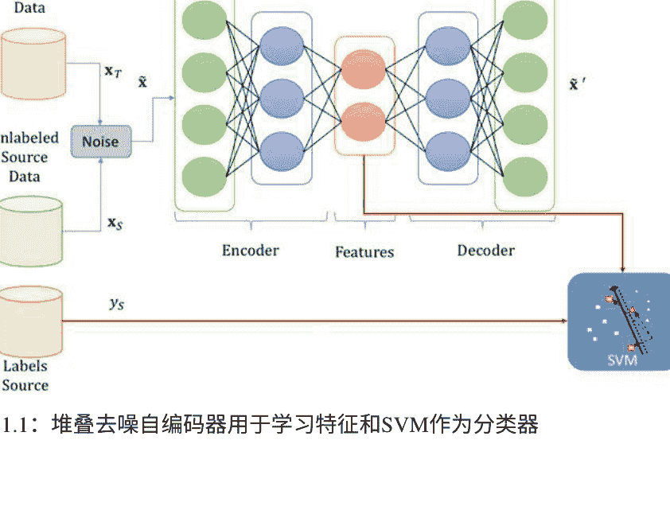

图11.1：堆叠去噪自编码器用于学习特征和SVM作为分类器

如果我们重复这个 $m$次，方差会降低，可以从中得到 $\mathbf{W}$的解：

```
$$\mathcal{L}_{squared}(\mathbf{W}) = \frac{1}{2mn} \sum_{j=1}^{m} \sum_{i=1}^{n} \| \mathbf{x}_i - \mathbf{W}\tilde{\mathbf{x}}_{i,j} \|$$
```

其中$\tilde{\mathbf{x}}_{i,j}$表示原始输入的第 $j$个损坏版本。在矩阵表示中，输入为 $\mathbf{X} = [\mathbf{x}_1, \cdots, \mathbf{x}_n] \in \mathbb{R}^{d \times n}$，它的重复 $m$次的版本为 $\bar{\mathbf{X}}$，损坏版本为 $\tilde{\mathbf{X}}$。损失方程可以写成：

```
$$\mathcal{L}_{squared}(\mathbf{W}) = \frac{1}{2mn} \mathrm{tr} \left[ (\bar{\mathbf{X}} - \mathbf{W}\tilde{\mathbf{X}})^T (\bar{\mathbf{X}} - \mathbf{W}\tilde{\mathbf{X}}) \right]$$
```

这个方程的闭式解为：

```
$$\mathbf{W} = \mathbf{P}\mathbf{Q}^{-1}, \quad \text{其中} \quad \mathbf{Q} = \tilde{\mathbf{X}} \tilde{\mathbf{X}}^T, \quad \mathbf{P} = \bar{\mathbf{X}} \tilde{\mathbf{X}}^T$$
```

在极限情况下，当 $m \rightarrow \infty$时，$\mathbf{W}$可以用 $\mathbf{P}$和 $\mathbf{Q}$的期望来表示。

```
$$\mathbf{W} = E[\mathbf{P}]E[\mathbf{Q}]^{-1}$$
```

让我们考虑一下 $E[\mathbf{Q}]$，它是

```
$$E[\mathbf{Q}] = \sum_{i=1}^{n} E[\tilde{\mathbf{x}}_i \tilde{\mathbf{x}}_i^T]$$
```

如果两个特征 α和 β都幸存下来，那么矩阵 [\mathbf{x}_i \mathbf{x}_i^\top] 中的非对角线元素是未损坏的。这个概率是 (1-p)^2。对于对角线，它以概率 1-p 成立。如果我们定义一个向量 \mathbf{q} = [1-p, \cdots, 1-p, 1] \in \mathbb{R}^{d+1}，其中 q_\alpha 表示特征 α 幸存下来的概率，那么原始未损坏输入的散射矩阵可以表示为 \mathbf{S} = \mathbf{X} \mathbf{X}^\top，并且矩阵 \mathbf{Q} 的期望可以写成：

```
E[\mathbf{Q}]_{\alpha,\beta} = \begin{cases} \mathbf{S}_{\alpha,\beta} \mathbf{q}_\alpha \mathbf{q}_\beta & \text{if } \alpha = \beta \\ \mathbf{S}_{\alpha,\beta} \mathbf{q}_\alpha & \text{if } \alpha = \beta \end{cases} \quad (11.7)
```

以类似的方式，矩阵 \mathbf{P} 的期望可以推导为 E[\mathbf{P}]_{\alpha,\beta} = \mathbf{S}_{\alpha,\beta} \mathbf{q}_\beta。因此，通过这些期望矩阵，可以在不损坏任何实例 \mathbf{x}_i 和“边际化”噪声的情况下，闭式计算重构映射 \mathbf{W}。接下来，研究者将多个层堆叠在一起，类似于堆叠自编码器。第 (t-1) 层的输出经过一个压缩函数（如 tanh）后，输入到第 t 层，从而引入非线性，可以表示为 \mathbf{h}^t = \tanh(\mathbf{W}^t \mathbf{h}^{t-1})。训练是逐层进行的，即每一层都贪婪地学习 \mathbf{W}^t（通过闭式计算），并尝试重构前一层的输出 \mathbf{h}^{t-1}。对于领域适应，他们将输入和所有隐藏层连接起来作为 SVM 分类器的特征进行训练和预测。

- 与其他方法相比，mSDA具有以下一些优势：
- 优化问题是凸的，并且保证了最优解。
- 优化是非迭代的和闭合形式的。
- 通过整个训练数据的一次遍历来计算期望值 \(E[\mathbf{P}]\) 和 \(E[\mathbf{Q}]\) 可以大大提高训练速度。

### 11.1.1.2 源和目标之间的深度插值

与传统机器学习非常相似，Chopra等人的研究使用具有不同领域的源和目标以不同比例混合，学习中间表示[CBG13]。这项工作被称为通过在领域之间插值进行领域自适应的深度学习(DLID)。研究人员使用卷积层与池化和预测性稀疏分解方法以无监督的方式学习非线性特征。预测性稀疏分解方法类似于稀疏编码模型，但具有快速和平滑的近似器[KRL10]。标记数据经过相同的转换以获得特征，将它们连接起来，并使用逻辑回归等分类器获得一个联合模型。通过这种方式，模型以无监督的方式学习有用的特征。

来自源和目标的这些特征可以用于目标领域的迁移，图11.2a, b以示意图的方式展示了这个过程的工作原理。

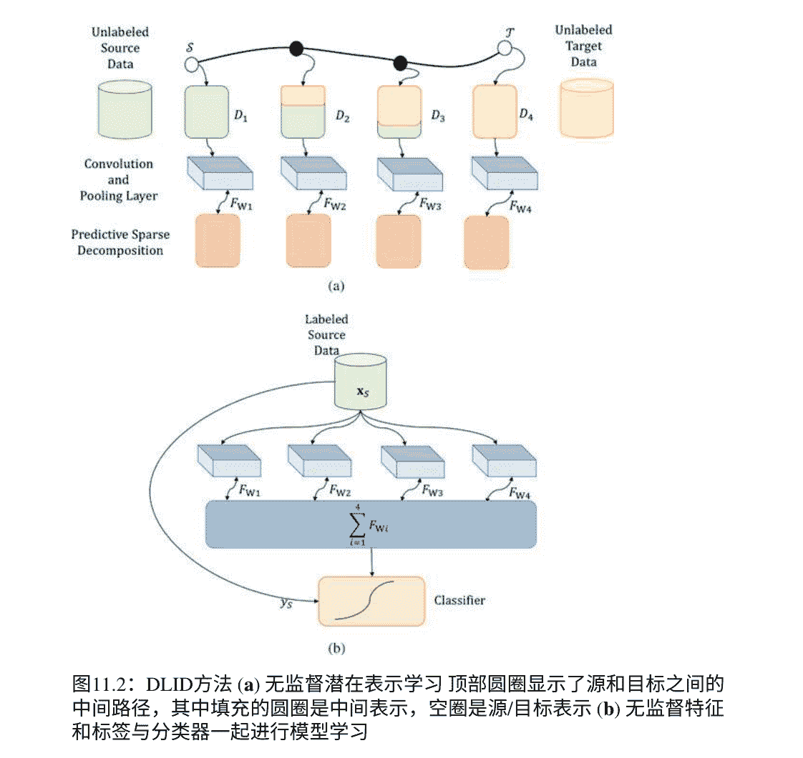

图11.2: DLID方法 (a) 无监督潜在表示学习 顶部圆圈显示了源和目标之间的中间路径，其中填充的圆圈是中间表示，空圈是源/目标表示 (b) 无监督特征和标签与分类器一起进行模型学习

设 S为具有数据样本 D_S的源域， T为具有数据样本D_T的目标域， p ∈ [1,2 ,...,P]为 P个数据集的索引。混合源和目标的方式是在 p = 1时， D_S = D_T，然后源样本的数量逐渐减少，目标样本的数量以相同的比例增加。对于每个数据集 D p ∈ [2,⋯,P−1]， D_S的样本数量逐渐减少， D_T的样本数量逐渐增加。每个数据集D p作为非线性特征提取器 F_W的输入。

p 使用在无监督方式下训练的权重 W_p，生成输出 $Z^i_p = F_W$。一旦以无监督方式训练完成，任何带标签的训练数据都会通过这个DLID表示路径提取特征 $F_W$ 作为输出，并且所有输出的连接形成该输入的表示：

```
$$Z^i = [F_{W1}(X^i)F_{W2}(X^i)...F_{W_p}(X^i)] = [Z_1^i Z_2^i ... Z_p^i] \quad (11.8)$$
```

该表示和标签$Z^i,Y^i$被传递给分类器或回归器进行任务，并使用标准损失函数进行优化。未见过的数据经过相同的路径，分类器的预测结果用于获取类别和概率。

### 11.1.1.3 深度领域混淆

深度领域混淆（DDC）架构如图11.3所示，由Tzeng等人提出，是一种流行的基于差异的领域自适应框架之一[Tze+14]。研究人员引入了领域自适应层和混淆损失，以学习一个语义有意义且具有领域不变性的表示。提出了一种基于孪生卷积网络的架构，其主要目标是学习一个表示，使源领域和目标领域之间的分布距离最小化。该表示可以与源标记数据集一起用作特征，以最小化分类损失，并直接应用于无标签的目标数据。在这项工作中，通过最大均值差异（MMD）来最小化分布距离的任务，该任务计算表示$\phi()$在源领域和目标领域上的距离：

```
$$MMD(X_s, X_t) = \left\| \frac{1}{|X_s|} \sum_{x_s \in X_s} \phi(x_s) - \frac{1}{|X_t|} \sum_{x_t \in X_t} \phi(x_t) \right\| \quad (11.9)$$
```

从中学到的表示被用作损失函数中的正则化项，其中正则化超参数$\lambda$也作为源域和目标域之间的混淆程度

```
$$L = L_C(X_L, y) + \lambda * MMD(X_s, X_t) \quad (11.10)$$
```

其中$L_C(X_L, y)$是来自标记数据$X_L$的分类损失，$y$是标签或者真实值，$MMD(X_s, X_t)$是源域$X_s$和目标域$X_t$之间的最大均值差异（MMD）。超参数$\lambda$控制着源域和目标域之间的混淆程度。研究人员使用标准的AlexNet，并对其进行修改，添加了一个额外的低维度瓶颈层“fc adapt”。这个低维度层作为正则化项，防止过拟合源分布。上述讨论的MMD损失被添加到这个层之上，以便它学习对源和目标都有用的表示。

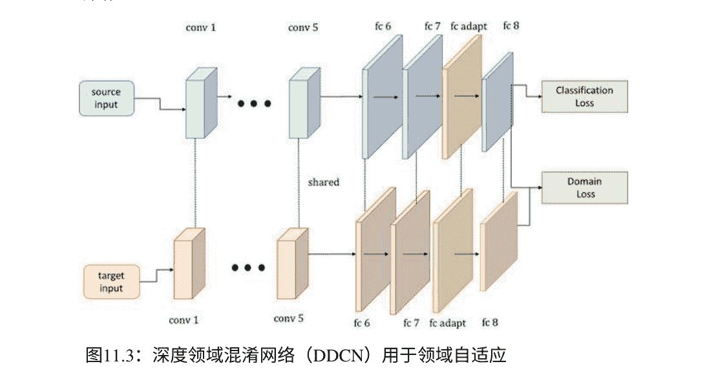

图11.3：深度领域混淆网络（DDCN）用于领域自适应

### 11.1.1.4 深度自适应网络

Long等人提出了深度自适应网络（DAN），如图11.4所示，它是一个修改过的AlexNet，在最后的全连接层中发生差异损失[LW15]。如果零假设是样本来自相同分布，备择假设是它们来自两个不同分布，最大均值差异（MMD）是一种统计方法之一[Sej+12]。MMD的多核变体（MK-MMD）测量两个分布（源和目标）的均值嵌入之间的再生核希尔伯特空间（RKHS）距离，具有特征核 $k$。如果$\mathcal{H}_k$是带有特征核 $k$的再生核希尔伯特空间，分布 $p$在 $\mathcal{H}_k$中的均值嵌入是一个唯一的元素 $\mu_k(p)$，使得$\mathbb{E}_{\mathbf{x} \sim p} f(\mathbf{x}) = \langle f(\mathbf{x}), \mu_k(p) \rangle_{\mathcal{H}_k}$。对于任意层 $l$和核 $k$之间的平方距离，源（$S$）和目标（$T$）之间的距离可以表示为：

$$d_k^{2}(\mathcal{D}_S^l, \mathcal{D}_T^l) \triangleq \| \mathbb{E}_{\mathcal{D}_S} [\phi(\mathbf{x}^S)] - \mathbb{E}_{\mathcal{D}_T} [\phi(\mathbf{x}^T)] \|_{\mathcal{H}_k}^2$$ (11.11)

与特征图 $\phi$相关的特征核 $k(\mathbf{x}^S, \mathbf{x}^T) = \langle \phi(\mathbf{x}^S), \phi(\mathbf{x}^T) \rangle$，它是由一组正半定核 $\{k_u\}$组合而成，其中对于系数 $\beta_u$有一些约束条件：

$$\mathcal{K} \triangleq \left\{ k = \sum_{u=1}^{m} \beta_u k_u : \sum_{u=1}^{m} \beta_u = 1, \beta_u \geq 0 \right\}$$ (11.12)

由于对系数 $\{\beta_u\}$有约束条件，所以衍生的多核 $k$是特征核。

修改后的AlexNet具有三层卷积网络（conv1 - conv3）作为通用可迁移特征层，在训练一个领域后会被冻结。接下来的两个卷积层（conv4 - conv5）更具体，因此需要进行微调以学习领域特定的特征。最后的全连接层（fc6 - fc8）非常具体且不可转移，因此使用MK-MMD进行适应。如果网络中的所有参数由 Θ = {W^l, b^l}_{l=1}^L 给出，则经验风险由以下公式给出：

```
\[ \min_{\Theta} \frac{1}{n_a} \sum_{i=1}^{n_a} J(\Theta(\mathbf{x}_i^a), y_i^a) \]
```

其中 J是交叉熵损失函数，Θ(\mathbf{x}_i^a)是将数据点 \mathbf{x}_i^a分配给标签 y_i^a的条件概率。通过将基于MK-MMD的多层适应正则化器添加到上述风险中，我们得到一个类似于DDC损失的损失函数，可以表示为：

```
\[ \min_{\Theta} \frac{1}{n_a} \sum_{i=1}^{n_a} J(\Theta(\mathbf{x}_i^a), y_i^a) + \lambda \sum_{l=l_1}^{l_2} d_k^2(\mathcal{D}_S^l, \mathcal{D}_T^l) \]
```

其中 λ >0是正则化常数，l1 =6，l2 =8是DAN设置的参数。

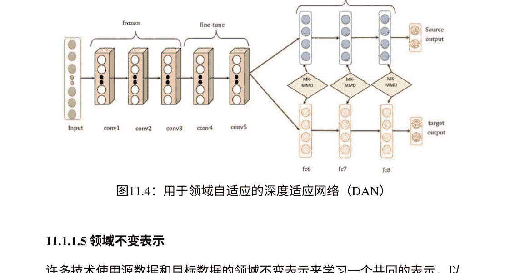

### 11.1.1.5 领域不变表示

许多技术使用源数据和目标数据的领域不变表示来学习一个共同的表示，以帮助领域自适应。

CORrelation ALignment（CORAL）是一种使用线性变换来对齐源数据和目标数据的二阶统计量（协方差）的技术。Sun和Saenko扩展了该框架，学习了对齐层之间相关性的非线性变换，称为Deep CORAL [SS16]。Deep CORAL扩展了AlexNet，并在最后一层（即输出层之前的全连接层）计算了二阶统计量损失。如果 $D_S = \{x_i\}, x \in \mathbb{R}^d$ 是大小为 $n_S$ 的源域训练数据，$D_T = \{u_i\}, u \in \mathbb{R}^d$ 是大小为 $n_T$ 的无标签目标数据，$D_S^{i,j}$ 表示第 $i$ 个源数据实例的第 $j$ 个维度，$D_T^{i,j}$ 表示 $j$ 是第 $i$ 个目标数据实例的第j个维度，$C_S$ 是源特征协方差矩阵，$C_T$ 是目标协方差矩阵，那么CORAL损失被定义为协方差之间的距离：

```
$$ CORAL = \frac{1}{4d^2} \| C_S - C_T \|_F^2 $$
```

其中 $\| \cdot \|_F^2$ 表示矩阵的Frobenius范数的平方。

源和目标的协方差矩阵如下所示：

```
$$ C_S = \frac{1}{(n_S - 1)} \left( D_S^T D_S - \frac{1}{n_S} (1^T D_S)(1^T D_S) \right) $$
```

```
$$ C_T = \frac{1}{(n_T - 1)} \left( D_T^T D_T - \frac{1}{n_T} (1^T D_T)(1^T D_T) \right) $$
```

其中 $1$ 是列向量。联合训练通过减小分类损失 $l_{CLASS}$ 和CORAL损失来实现：

```
$$ l = l_{CLASS} + \sum_{i=1}^t \lambda_i CORAL $$
```

其中 $t$ 是层数，$\lambda$ 用于平衡分类和域适应之间的关系，旨在学习源域和目标域之间的共同表示（图11.5）。

还有其他成功应用于各种工作的域不变表示。Pan等人通过使用最大均值差异（MMD）的域不变表示进行转移组件分析，试图减小子空间中两个域之间的距离[PAN+11]。Zellinger等人提出了一种新的距离函数——中心矩差异（CMD），用于匹配概率分布的高阶中心矩[ZEL+17]。他们展示了他们的技术在目标识别和情感分类任务中的普适性（图11.5）。

### 11.1.1.6 域混淆和不变表示

Tzeng等人的研究对深度域混淆存在缺点，即需要源域中大量标记数据和目标域中稀疏标记数据。Tzeng等人在他们的工作中提出了对标记和未标记数据进行域混淆损失的方法，以学习跨域的不变表示。

和任务[Tze+15]。通过a)最大化域混淆，使源域和目标域之间的边缘分布尽可能相似；b)在源示例上学习的类之间的相关性传递到目标示例上，实现源域和目标域之间的迁移学习。完全标记的源数据$(x_S, y_S)$和稀疏标记的目标数据$(x_T, y_T)$用于生成在特征表示$f(x; \theta_{repr})$上操作的分类器$\theta_C$，该分类器由表示参数$\theta_{repr}$参数化，并在目标样本的分类中具有良好的准确性：

$$\mathcal{L}_C(x, y; \theta_{repr}, \theta_C) = -\sum_k \mathbf{1}[y = k] \log(p_k) \qquad (11.19)$$

其中 $p = \text{softmax}(\theta_C^{\top} f(x; \theta_{repr}))$。

为了确保源和目标类之间的对齐，而不是使用“硬标签”进行训练，对于特定类别，使用标记的源数据的所有激活的softmax的“软标签”进行平均。在softmax函数中使用高温参数$\tau$，以便在微调期间，相关类别对概率分布产生类似的影响。软标签损失如下：

$$\mathcal{L}_{soft}(x_T, y_T; \theta_{repr}, \theta_C) = -\sum_i l_i^{y_T} \log(p_i) \qquad (11.20)$$

其中 $p_i = \text{softmax}(\theta_C^{\top} f(x_T; \theta_{repr})/\tau)$。

使用具有参数$\theta_D$的领域分类器层来识别数据是来自源域还是目标域。最佳领域分类器可以使用以下目标函数来学习：

$$L_D(x_S, x_T, \theta_{repr}; \theta_D) = -\sum_d \mathbf{1}[y_D = d] \log(q_d) \qquad (11.21)$$

其中 $q = \text{softmax}(\theta_D^{\top} f(x; \theta_{repr}))$。
因此，对于特定的领域分类器 $\theta_D$，最大化混淆的损失可以看作是预测领域和标签之间的交叉熵损失，并可以写成：

$$L_{confusion}(x_S, x_T, \theta_D; \theta_{repr}) = -\sum_d (1/D) \log(q_d) \qquad (11.22)$$

参数 $\theta_D$ 和 $\theta_{repr}$ 通过以下目标函数进行迭代学习：

$$\min_{\theta_D} L_D(x_S, x_T, \theta_{repr}; \theta_D) \qquad (11.23)$$

$$\min_{\theta_{repr}} L_{confusion}(x_S, x_T, \theta_D; \theta_{repr}) \qquad (11.24)$$

因此，联合损失函数可以表示为：

$$L(x_S, y_S, x_T, y_T; \theta_{repr}, \theta_C) = L_C(x_S, y_S, x_T, y_T; \theta_C, \theta_{repr}) + \lambda L_{confusion}(x_S, x_T, \theta_D; \theta_{repr}) + \nu L_{soft}(x_T, y_T; \theta_{repr}, \theta_C) \qquad (11.25)$$

其中 $\lambda$ 和 $\nu$ 是控制域混淆和优化过程中软标签影响的超参数。

## 11.1 介绍

### 11.1.1.7 域对抗神经网络

Ganin等人通过域对抗神经网络（DANN）使用了一种有趣的“梯度反转”层来进行领域转移适应 [Gan+16b]。
这个过程适用于所有神经网络，并且可以使用标准的随机梯度方法进行训练。
他们在计算机视觉和情感分类的不同领域中展示了最先进的结果。

设 $S = \{(x_i, y_i)\}_{i=1}^n \sim (D_S)^n$；$T = \{x_i\}_{i=n+1}^{N} \sim (D_X^T)^{n'}$ 是从 $D_S$ 和 $D_T$ 分布中抽取的源数据和目标数据； $N = n + n'$ 是样本的总数。 $D_X^T$ 是在输入空间 $\mathcal{X}$ 上的 $D_T$ 的边缘分布， $Y = 0, 1, ..., L-1$ 是标签集合。 该网络有三个重要的层： (a) 特征生成层，用于从输入中学习特征，具有参数。

隐藏层 $G_f : \mathcal{X} \rightarrow \mathbb{R}^D$ 由矩阵-向量对 $\theta_f = (W, b)$ 参数化：

$$G_f(x; \theta_f) = \sigma(Wx + b) \qquad (11.26)$$

(b) 标签预测层 $G_y : \mathbb{R}^D \rightarrow [0, 1]^L$ 由矩阵-向量对 $\theta_y = (V, c)$ 参数化：

$$G_y(G_f(x); \theta_y) = \text{softmax}(Vx + c) \qquad (11.27)$$

(c) 以向量-标量对 $\theta_d=(u,z)$ 参数化的领域分类层 $G_d:\mathbb{R}^D\rightarrow[0,1]$ 用于预测示例是来自源领域还是目标领域。图11.6展示了在三个不同层之间的训练过程。

标签预测损失 $(\mathbf{x}_i, y_i)$ 可以写成：

$$\mathcal{L}_y^i(\boldsymbol{\theta}_f, \boldsymbol{\theta}_y) = \mathcal{L}_y(G_y(G_f(\mathbf{x}_i; \boldsymbol{\theta}_f); \boldsymbol{\theta}_y), y_i)$$

域损失 $(\mathbf{x}_i, d_i)$，其中 $d_i$ 是域，可以写成：

$$\mathcal{L}_d^i(\boldsymbol{\theta}_d, \boldsymbol{\theta}_f) = \mathcal{L}_d(G_d(G_f(\mathbf{x}_i; \boldsymbol{\theta}_d); \boldsymbol{\theta}_f), d_i)$$

单层网络的总训练损失可以写成：

$$\mathcal{L}_{\text{total}}(\boldsymbol{\theta}_f, \boldsymbol{\theta}_y, \boldsymbol{\theta}_d) = \frac{1}{n}\sum_{i=1}^n \mathcal{L}_y^i(\boldsymbol{\theta}_f, \boldsymbol{\theta}_y) - \lambda\left( \frac{1}{n}\sum_{i=1}^n \mathcal{L}_d^i(\boldsymbol{\theta}_f, \boldsymbol{\theta}_d) + \frac{1}{n'}\sum_{i=n+1}^N \mathcal{L}_d^i(\boldsymbol{\theta}_f, \boldsymbol{\theta}_d) \right)$$

超参数 $\lambda$ 控制损失之间的权衡。参数是通过求解以下方程得到的：

$$(\hat{\boldsymbol{\theta}}_f, \hat{\boldsymbol{\theta}}_y) = \arg\min_{\boldsymbol{\theta}_f, \boldsymbol{\theta}_y} \mathcal{L}_{\text{total}}(\boldsymbol{\theta}_f, \boldsymbol{\theta}_y, \hat{\boldsymbol{\theta}}_d)$$

$$(\hat{\boldsymbol{\theta}}_d) = \arg\max_{\boldsymbol{\theta}_d} \mathcal{L}_{\text{total}}(\hat{\boldsymbol{\theta}}_f, \hat{\boldsymbol{\theta}}_y, \boldsymbol{\theta}_d)$$

梯度更新与标准随机梯度下降非常相似，只是使用学习率 $\mu$ 进行反向更新，而 $\lambda\frac{\partial \mathcal{L}_d^i}{\partial \boldsymbol{\theta}_f}$ 进行反向更新。梯度反转层没有参数，其前向传播是恒等函数，而后向传播是来自后续层的梯度乘以 $-1$：

$$\boldsymbol{\theta}_f \leftarrow \boldsymbol{\theta}_f - \mu\left( \frac{\partial \mathcal{L}_y^i}{\partial \boldsymbol{\theta}_f} - \lambda\frac{\partial \mathcal{L}_d^i}{\partial \boldsymbol{\theta}_f} \right)$$

$$\boldsymbol{\theta}_y \leftarrow \boldsymbol{\theta}_y - \mu\frac{\partial \mathcal{L}_y^i}{\partial \boldsymbol{\theta}_y}$$

$$\boldsymbol{\theta}_d \leftarrow \boldsymbol{\theta}_d - \mu\frac{\partial \mathcal{L}_d^i}{\partial \boldsymbol{\theta}_d}$$

### 11.1.1.8 对抗性判别领域自适应

Tzeng等人提出了对抗性判别领域自适应（ADDA）方法，用于学习领域间的转移，没有权重共享。源和目标之间存在联系，并且使用GAN损失计算对抗损失[Tze+17]。

让我们假设我们有源数据 $\mathbf{X}_s$和标签 $Y_s$，这些数据是从源分布 $p_s (x, y)$ 中抽取的，还有来自目标分布 $p_t (x, y)$ 的目标数据 $\mathbf{X}_t$，但没有标签。目标是学习一个目标映射 $M_t$和一个分类器 $C_t$，可以对 $K$个类别进行分类。在对抗性方法中，目标是最小化源映射 $M_s (\mathbf{X}_s)$ 和 $M_t (\mathbf{X}_t)$ 之间的分布距离，以便源分类模型 $C_s$可以直接用于目标，即 $C = C_s = C_t$。标准的有监督损失可以写成：

$$\min_{M_s, C} \mathcal{L}_{class}(\mathbf{X}_s, Y_s) = -\mathbb{E}_{(\mathbf{x}_s, y_s) \sim (\mathbf{X}_s, Y_s)} \sum_{k=1}^{K} \mathbf{1}_{[k=y_s]} \log C(M_s(\mathbf{x}_s)) \quad \quad (11.36)$$

域鉴别器 $D$用于分类数据是来自源还是目标，并且 $D$通过 $\mathcal{L}_{advD}$进行优化：

$$\min_D \mathcal{L}_{advD}(\mathbf{X}_s, \mathbf{X}_t, M_s, M_t) = -\mathbb{E}_{\mathbf{x}_s \sim \mathbf{X}_s} [\log D(M_s(\mathbf{x}_s))] - \mathbb{E}_{\mathbf{x}_t \sim \mathbf{X}_t} [\log (1 - D(M_t(\mathbf{x}_t)))] \quad \quad (11.37)$$

对抗映射损失由 $\mathcal{L}_{advM}$给出：

$$\min_{M_s, M_t} \mathcal{L}_{advM}(\mathbf{X}_s, \mathbf{X}_t, D) = -\mathbb{E}_{\mathbf{x}_t \sim \mathbf{X}_t} [\log D(M_t(\mathbf{x}_t))] \quad \quad (11.38)$$

训练分为多个阶段，如图11.7所示。该过程从优化 $\mathcal{L}_{class}$ 开始，通过使用标记数据 $\mathbf{X}_s$和标签 $Y_s$，我们可以进行对抗性适应。然后，我们可以通过交替优化 $\mathcal{L}_{advD}$ 和 $\mathcal{L}_{advM}$ 来进行对抗性适应。

图11.7：对抗性判别域适应

### 11.1.1.9 耦合生成对抗网络

Liu和Tuzel提出了一种耦合生成对抗网络（CoGAN），用于学习两个域之间的联合分布，并且在计算机视觉中取得了很大的成功[LQH16]。正如在第4章中讨论的那样，GAN由生成模型和判别模型组成。生成模型用于生成类似真实数据的合成数据，而判别模型用于区分两者。形式上，一个随机向量 $\mathbf{z}$ 被输入到生成模型中，输出与输入 $\mathbf{x}$ 具有相同支持的 $g(\mathbf{z})$。判别模型输出 $f(\mathbf{x}) = 1$，如果从真实分布 $\mathbf{x} \sim p_X$ 中抽取，$f(\mathbf{x}) = 0$，如果从合成或生成分布 $\mathbf{x} \sim p_G$ 中抽取。因此，生成对抗网络可以看作是通过优化来解决的极小极大博弈问题：

$$\max_g \min_f V(f, g) = \mathbb{E}_{\mathbf{x} \sim p_X}[-\log f(\mathbf{x})] + \mathbb{E}_{\mathbf{z} \sim p_Z}[-\log(1 - f(g(\mathbf{z})))] \quad (11.39)$$

在CoGAN中，如图11.8所示，有两个GAN用于两个不同的领域。生成模型试图从高级特征解码到低级特征，与判别模型相反。如果 $\mathbf{x}_1$ 和 $\mathbf{x}_2$ 是从第一个边缘分布中抽取的两个输入（$\mathbf{x}_1 \sim p_{X_1}$）和第二个（$\mathbf{x}_2 \sim p_{X_2}$），然后生成模型 $GAN_1$ 和 $GAN_2$ 将随机向量 $\mathbf{z}$ 映射到具有与 $X_1$ 和 $X_2$ 相同支持的示例。函数 $g_1(\mathbf{z})$ 和 $g_2(\mathbf{z})$ 的分布是 $G_1$ 和 $G_2$ 的概率密度函数。

当 $g_1$ 和 $g_2$ 实现为多层感知机时，我们可以写成：

$$g_1(\mathbf{z}) = g_1^{(m_1)}(g_1^{(m_1-1)}(\cdots g_1^{(2)}(g_1^{(1)}(\mathbf{z}))))$$

$$g_2(\mathbf{z}) = g_2^{(m_2)}(g_2^{(m_2-1)}(\cdots g_2^{(2)}(g_2^{(1)}(\mathbf{z}))))$$

其中 $g_1^i$ 和 $g_2^i$ 是相应的GAN中的层，具有层 $m_1$ 和 $m_2$，前几层的结构和权重是相同的，因此有约束条件：

$$\theta_{g_1^i} = \theta_{g_2^i} \quad \text{或} \quad i = 0,1,\ldots k$$

其中 $k$ 是共享层，并且 $\theta_{g_1^i}$ 和 $\theta_{g_2^i}$ 分别是 $g_1^i$ 和 $g_2^i$ 的参数。这个约束使得解码高级特征的第一层对于生成器 $g_1$ 和 $g_2$ 是共享的。

判别模型将输入映射到概率，估计输入来自数据分布的可能性。如果 $f_1^i$ 和 $f_2^i$ 对应于具有 $n_1$ 和 $n_2$ 层的两个GAN的判别网络，可以写成：

$$f_1(\mathbf{x}_1) = f_1^{(n_1)}(f_1^{(n_1-1)}(\cdots f_1^{(2)}(f_1^{(1)}(\mathbf{x}_1))))$$

$$f_2(\mathbf{x}_2) = f_2^{(n_2)}(f_2^{(n_2-1)}(\cdots f_2^{(2)}(f_2^{(1)}(\mathbf{x}_2))))$$

其中 $f_1^i$ 和 $f_2^i$ 是相应 $f_1$ 和 $f_2$ 中的层，具有层数 $n_1$ 和 $n_2$。判别模型与生成模型相反，在第一层提取低级特征，在最后一层提取高级特征。为了确保数据具有相同的高级特征，我们使用以下方法共享最后一层：

$$\theta_{f_1^{(n_1-i)}} = \theta_{f_2^{(n_2-i)}} \quad \text{或} \quad i = 0,1,\ldots(l-1)$$

其中 $l$ 是共享层的数量。$\theta_{f_1^{(n_1-i)}}$ 和 $\theta_{f_2^{(n_2-i)}}$ 分别是 $f_1^{(n_1-i)}$ 和 $f_2^{(n_2-i)}$ 的参数。可以证明，CoGAN中的学习对应于一个受限制的极小极大博弈，给出如下形式：

$$\max_{g_1,g_2} \min_{f_1,f_2} V(g_1,g_2,f_1,f_2) \\
\text{受限于} \quad \theta_{g_1^i} = \theta_{g_2^i} \quad \text{或} \quad i = 0,1,\ldots k \\
\theta_{f_1^{(n_1-i)}} = \theta_{f_2^{(n_2-i)}} \quad \text{或} \quad i = 0,1,\ldots(l-1)$$

其中价值函数 $V$ 给出如下形式：

$$V(g_1,g_2,f_1,f_2) = \mathbb{E}_{\mathbf{x}_1\sim p_{X_1}}[-\log f_1(\mathbf{x}_1)] + \mathbb{E}_{\mathbf{z}\sim p_Z}[-\log(1-f_1(g_1(\mathbf{z})))] \\
+ \mathbb{E}_{\mathbf{x}_2\sim p_{X_2}}[-\log f_2(\mathbf{x}_2)] + \mathbb{E}_{\mathbf{z}\sim p_Z}[-\log(1-f_2(g_2(\mathbf{z})))]$$

### 11.1.1.10 循环生成对抗网络

朱等人提出的循环一致性对抗网络（CycleGAN）是近年来最具创新性的生成对抗网络之一，在不同领域具有广泛的适用性[Zhu+17]。循环一致性的概念意味着如果我们将一句话从语言A翻译成语言B，那么将其从语言B翻译回语言A应该得到一个类似的句子。

主要思想是在训练数据中没有对应的示例时，学习从源领域 $\mathcal{X}$ 到目标领域 $\mathcal{Y}$ 的转换。
这个过程分为两步：a) 学习一个映射 $G : \mathcal{X} \rightarrow \mathcal{Y}$，使得无法区分数据是来自 $G(\mathcal{X})$ 还是 $\mathcal{Y}$，使用对抗损失函数；b) 学习逆映射 $F : \mathcal{Y} \rightarrow \mathcal{X}$，并引入循环一致性损失函数，使得 $F(G(\mathcal{X})) = \mathcal{X}$ 和 $G(F(\mathcal{Y})) = \mathcal{Y}$（图11.9）。

学习过程中，生成器 $G(\mathbf{x})$ 试图生成与 $\mathbf{y}$ 相似的数据，而判别器 $D_{\mathcal{Y}}$ 旨在区分 $G(\mathbf{x})$ 和真实的 $\mathbf{y}$，可以表示为：

$$\min_G \max_{D_{\mathcal{Y}}} \mathcal{L}_{GAN}(G, D_{\mathcal{Y}}, \mathcal{X}, \mathcal{Y}) \quad\quad\quad (11.48)$$

其中

$$\mathcal{L}_{GAN}(G, D_{\mathcal{Y}}, \mathcal{X}, \mathcal{Y}) = \mathbb{E}_{\mathbf{y}\sim p_{\text{data}}(\mathbf{y})}[\log D_{\mathcal{Y}}(\mathbf{y})] + \mathbb{E}_{\mathbf{x}\sim p_{\text{data}}(\mathbf{x})}[\log(1 - D_{\mathcal{Y}}(G(\mathbf{x})))] \quad\quad\quad (11.49)$$同样地

$$ \min_{F} \max_{D_X} \mathcal{L}_{GAN}(F, D_X, Y, X) \tag{11.50}$$

$$\mathcal{L}_{GAN}(F, D_X, Y, X) = \mathbb{E}_{x \sim p_{data}(x)}[\log D_X(x)] + \mathbb{E}_{y \sim p_{data}(y)}[\log(1 - D_X(F(y)))] \tag{11.51}$$

循环一致性损失的目的是将原始数据 \( x \) 从翻译 \( x \rightarrow G(x) \rightarrow F(G(x)) \approx x \) 的域和原始数据 \( y \) 从翻译 \( y \rightarrow F(y) \rightarrow G(F(y)) \approx y \) 被捕获为：

$$\mathcal{L}_{cyc}(G, F) = \mathbb{E}_{x \sim p_{data}(x)}[\| F(G(x)) - x \|_1] + \mathbb{E}_{y \sim p_{data}(y)}[\| G(F(y)) - y \|_1] \tag{11.52}$$

因此，总目标可以写成：

$$\mathcal{L}_{total}(G, F, D_X, D_Y) = \mathcal{L}_{GAN}(G, D_Y, X, Y) + \mathcal{L}_{GAN}(F, D_X, Y, X) + \lambda \mathcal{L}_{cyc}(G, F) \tag{11.53}$$

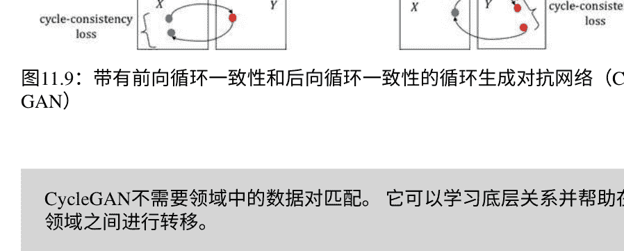

CycleGAN不需要领域中的数据对匹配。它可以学习底层关系并帮助在领域之间进行转移。

## 11.1.1.11领域分离网络

Bousmalis等人的领域分离网络具有用于学习各个领域的私有编码器，用于学习跨领域的共享编码器，用于有效泛化的共享解码器，以及使用共享表示的分类器以提高鲁棒性[Bou+16]。

源领域 \( \mathcal{D}_s \) 有 \( N_s \) 标记数据 \( \mathbf{X}_s = \{\mathbf{x}^s_i, y^s_i\} \) 和目标领域 \( \mathcal{D}_t \) 有 \( N_t \) 未标记数据 \( \mathbf{X}_t = \{\mathbf{x}^t_i\} \)。让 \( E_p(\mathbf{x}; \theta_p) \) 是将输入 \( \mathbf{x} \) 映射到表示为领域私有的隐藏表示 \( \mathbf{h}_p \) 的函数。

让 \(E_c(\mathbf{x};\theta_c)\) 是将输入 \(\mathbf{x}\) 映射到在源领域和目标领域中共享的隐藏表示 \(\mathbf{h}_c\) 的函数。让 \(D(\mathbf{h};\theta_d)\) 是将隐藏表示 \(\mathbf{h}\) 映射到原始重构 \(\hat{\mathbf{x}}\) 的解码函数。重构可以通过 \(\hat{\mathbf{x}} = D(E_c(\mathbf{x}) + E_p(\mathbf{x}))\) 给出。让 \(G(\mathbf{h};\theta_g)\) 是将隐藏表示 \(\mathbf{h}\) 映射到预测 \(\hat{y}\) 的分类器函数，其中 \(\hat{y} = G(E_c(\mathbf{x}))\)。

图11.10展示了DSN的整个过程。

总损失可以写成：

$$\mathcal{L}_{total}(\theta_c, \theta_p, \theta_d, \theta_g) = \mathcal{L}_{class} + \alpha \mathcal{L}_{recon} + \beta \mathcal{L}_{difference} + \gamma \mathcal{L}_{similarity} \quad (11.54)$$

其中超参数 \(α, β, γ\) 控制着每个损失项的权重。分类损失是标准的负对数似然函数，表示为：

$$\mathcal{L}_{class} = -\sum_{i=0}^{N_s} y_i^s \cdot \log(\hat{y}_i^s) \quad (11.55)$$

重构损失使用尺度不变的均方误差计算：

$$\mathcal{L}_{recon} = -\sum_{i=0}^{N_s} \mathcal{L}_{si\_mse}(\mathbf{x}_i, \hat{\mathbf{x}}_i) \quad (11.56)$$

差异损失，顾名思义，应用于源域和目标域，并旨在捕捉私有编码器和共享编码器的不同方面。设 \(\mathbf{H}_c^s\) 和\(\mathbf{H}_c^t\) 是源隐藏层和目标隐藏层之间共有的行。设 \(\mathbf{H}_p^s\) 和 \(\mathbf{H}_p^t\) 是源隐藏层和目标隐藏层中私有的行。差异损失由以下公式给出：

$$\mathcal{L}_{difference} = \|\mathbf{H}_c^{s\top} \mathbf{H}_p^s\|_F^2 + \|\mathbf{H}_c^{t\top} \mathbf{H}_p^t\|_F^2 \quad (11.57)$$

其中 \(\| \cdot \|_F\) 是平方Frobenius范数。域对抗相似性损失通过梯度反转层和域分类器来预测域，从而最大化“混淆”。如果 \(d_i \in \{0,1\}\) 是数据的域的真实值，\(\hat{d}_i \in \{0,1\}\) 是域的预测值，则可以通过对抗学习来实现：

$$\mathcal{L}_{similarity}^{DANN} = \sum_{i=0}^{N_s+N_t} \left\{ d_i \log \hat{d}_i + (1 - d_i) \log(1 - \hat{d}_i) \right\} \quad (11.58)$$

最大均值差异（MMD）损失也可以用来替代上述的DANN。

领域分离网络明确地和共享的领域表示的私有和共享组件进行了联合捕捉，使其对与共享分布相关的噪声更不容易受到影响。

## 11.1.2理论

我们将描述过去几年中研究的两个主题，以在深度学习领域中提供适用的领域自适应的形式映射。一个是由Tzeng等人提出的大多数领域自适应网络的泛化版本[Tze+17]，另一个是为领域自适应提供理论基础的优化传输理论[RHS17]。

### 11.1.2.1基于孪生网络的领域自适应

Tzeng等人提出了一个广义的孪生架构，它捕捉了使用深度学习进行领域自适应的大多数实现，如图11.11所示[Tze+17]。该架构有两个流，源输入是有标签的，目标输入是无标签的。训练是通过组合分类损失和基于差异或对抗的损失来完成的。分类损失仅使用有标签的源数据计算。差异损失是基于源领域和目标领域之间的领域转移计算的。对抗损失试图使用对抗目标来捕捉潜在特征，与领域鉴别器相关。这项研究有助于将所有架构视为对一般架构的各种扩展，改变了分类损失、差异损失和对抗损失的计算方式。

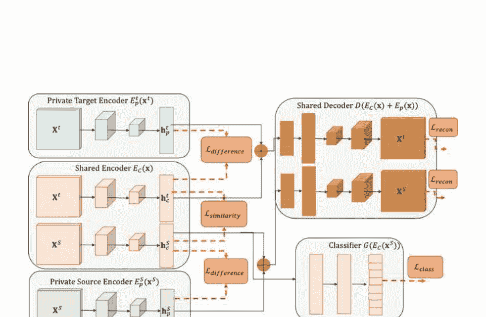

图11.10: 领域分离网络（DSN）

该设置可以推广到从分布p_s(x,y)中绘制源标记样本(X_s,Y_s)和从分布p_t(x,y)中绘制未标记的目标样本X_t。目标是从源示例和分类器C_s学习表示映射

$M_s$，并且还有一个目标映射 $M_t$，在预测时具有分类器 $C_t$，该分类器学习对 $k$ 个类别中的未见示例进行分类。
大多数对抗方法的目标是最小化 $M_s$（$X_s$） 和 $M_t$（$X_t$） 之间的距离，这意味着在大多数情况下，源和目标分类器可以是相同的 $C = C_s = C_t$。源分类可以以通用损失优化形式给出：

$$ \min_{M_s, C} \mathcal{L}_{class}(\mathbf{X}_S, Y_S) = -\mathbb{E}_{(\mathbf{x}_s, y_s) \sim (\mathbf{X}_S, Y_S)} \sum_{k=1}^{K} \mathbb{1}_{[k=y_s]} \log C(M_s(\mathbf{x}_s)) \qquad (11.59) $$

一个域鉴别器 $D$，用于分类数据是来自源域还是目标域，可以表示为：

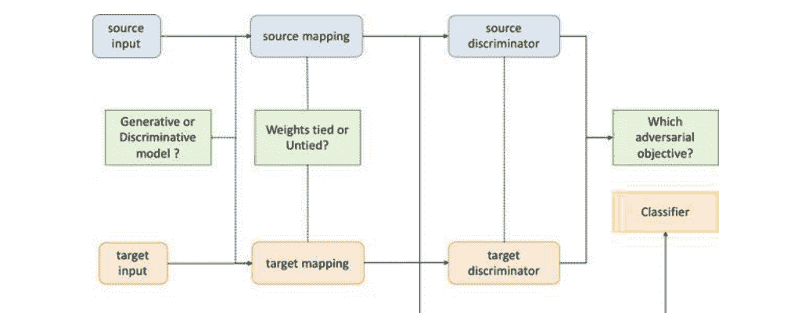

图11.11：用于泛化领域适应实现的连体网络

$$ \min_{D} \mathcal{L}_{adv_D}(\mathbf{X}_S, \mathbf{X}_T, M_S, M_T) = -\mathbb{E}_{\mathbf{x}_s \sim \mathbf{X}_S}[\log D(M_S(\mathbf{x}_s))] -\mathbb{E}_{\mathbf{x}_t \sim \mathbf{X}_T}[\log(1 - D(M_T(\mathbf{x}_t)))] \qquad (11.60) $$

通过 \(\psi(M_S, M_T)\) 给出的源域和目标域映射约束，可以捕捉到一个可以区分它们的鉴别器\(D\)作为对抗目标 \(\mathcal{L}_{adv_M}\)：

$$ \min_{D} \mathcal{L}_{adv_M}(\mathbf{X}_S, \mathbf{X}_T, M_S, M_T) \quad \min_{M_S, M_T} \quad t\psi(M_S, M_T) \qquad (11.61) $$

通过这个通用框架，可以理解领域适应中描述的各种技术。

梯度反转过程可以通过直接优化判别器损失 \(\mathcal{L}_{adv}\) 来表示。

$$ \mathcal{L}_{adv}^M = -\mathcal{L}_{adv_D} $$

在使用生成对抗网络时，有两个损失函数：判别器损失和生成器损失。判别器损失 \(\mathcal{L}_{adv}^D\) 保持不变，而生成器损失可以表示为：

$$ \min_D \mathcal{L}_{adv_M}(X_S, X_T, D) = -\mathbb{E}_{x_t \sim X_T} [\log D(M_T(x_t))] $$

域混淆损失可以写成最小化交叉熵损失
given by:

$$ \min_D \mathcal{L}_{adv_M}(X_S, X_T, D) = - \sum_{d \in s,t} \mathbb{E}_{x_d \sim X_D} \left[ \frac{1}{2} \log D(M_d(x_d)) + \frac{1}{2} \log(1-D(M_d(x_d))) \right] $$

## 11.1.2.2 最优传输

在过去几年中，最优传输理论从各种统计学、优化和机器学习的角度变得突出起来。 最优传输可以被看作是一种测量数据在两个不同分布之间传输的方式，这两个分布基于数据点的几何形状，并且具有与运输相关的成本函数[Mon81]。 这种传输机制很好地映射到领域自适应中，其中源域和目标域可以被看作是两个不同的分布，并且最优传输从理论和优化的角度解释了这种映射。 最优传输中的Wasserstein距离用于衡量两个分布之间的距离，也可以用作整体损失函数中的最小化目标或正则化函数。 最优传输已经被用来为深度领域自适应框架提供了很好的泛化界限[RHS17]。

### 11.1.3 自然语言处理中的应用

Glorot等人在深度学习的早期阶段展示了如何使用稀疏整流单元的堆叠自编码器学习特征级表示，这种表示可以在情感分析的领域自适应中非常有效地进行 [GBB11c]。
Nguyen和Grishman使用词嵌入和词聚类特征展示了关系抽取中的领域自适应非常有效[NG14]。Nguyen等人进一步探索了词嵌入和树核方法生成关系抽取的语义表示，并在特征方法上进行了改进 [NPG15]。Nguyen和Grishman展示了基于词嵌入、位置嵌入和实体类型嵌入的基本CNN作为输入可以学习到有效的表示，从而提供了一种良好的领域自适应方法用于事件检测 [NG15a]。Fu等人展示了使用领域对抗神经网络（DANN）进行关系抽取的领域自适应的有效性 [Fu+17]。

他们使用词嵌入、位置嵌入、实体类型嵌入、块状嵌入和依赖路径嵌入。他们使用卷积神经网络和带有梯度反转层的域自适应神经网络，有效地学习跨域特征的关系提取。

周等人使用一种新颖的双向转移深度神经网络，将源示例转移到目标示例，从而实现了接近最先进的情感分类结果[Zho+16]。张等人使用源和目标关键词之间的映射，并将其应用于分类中的对抗训练，实现了领域自适应[ZBJ17]。Ziser和Reichart展示了如何使用枢轴特征（源和目标中都存在的共同特征）以及自编码器来学习非常有效的领域自适应情感分类的表示[ZR17]。Ziser和Reichart进一步扩展了研究，以一种结构感知的方式构建了基于枢轴的语言模型，可用于改进各种分类和序列到序列任务的结果[ZR18]。于和Ziang结合了结构对应学习、基于枢轴的特征和联合任务学习的思想，实现了情感分类中的有效领域自适应[YJ16]。

## 11.1.4语音识别中的应用

Falavigna等人展示了如何使用深度神经网络和自动质量评估（QE）进行领域适应[Fal+17]。他们使用了一个两步过程，首先使用手动标记的转录文本来评估不同质量数据上的WER。然后根据WER分数对未见过的数据进行适应，通过QE组件展示了性能的显著提升。

Hosseini-Asl等人将CycleGAN的概念扩展为具有多个鉴别器（MD-CycleGAN）的无监督非平行语音领域适应[Hos+18]。他们使用多个鉴别器启用的CycleGAN来学习领域之间频谱图的频率变化。他们在训练和测试中使用不同性别的语音ASR来评估框架的领域适应性，并使用MD-CycleGAN架构在未见过的领域上报告了良好的性能。

适应具有不同口音的不同说话者是语音识别中的一个开放性研究问题之一。王等人在他们的工作中对此进行了详细分析，将其视为具有不同框架的领域适应问题，以提供重要见解[Wan+18a]。他们使用了三种不同的说话者适应方法，如线性变换（LIN）、学习隐藏单元贡献（LHUC）和Kullback-Leibler散度（KLD）在基于i-vector的DNN声学模型上。他们表明，根据口音使用其中一种方法，不仅可以显著提高重口音的ASR性能，还可以提高轻微口音说话者的ASR性能。孙等人使用领域对抗训练来解决带有口音的语音ASR问题[Sun+18a]。他们在学习目标中使用领域对抗训练，从具有不同口音的未标记目标领域中分离源领域和目标领域，同时使用标记的源领域进行分类，他们显示了错误率的显著降低，适用于未知口音。

通过改善模型的鲁棒性，提高在噪声环境下的ASR质量也可以从领域适应的角度来解决

这取决于目标领域或未知数据中的噪声与源领域的不同。Serdyuk等人使用GANs进行未知噪声目标数据的领域适应[Ser+16]。该模型具有编码器、解码器和识别器，中间有一个隐藏表示，用于执行改善识别和最小化领域区分的双重任务。他们展示了他们的方法在目标领域的噪声类别比源训练数据中使用的类别更多时更好地泛化。Sun等人使用快速梯度符号方法（FSGM）进行对抗性数据增强，以显著提高声学模型的鲁棒性[Sun+18b]。Meng等人使用领域分离网络（DSN）进行源和目标之间的领域适应，以应对不同噪声水平的目标数据的鲁棒性[Men+17]。共享组件学习源领域和目标领域之间的领域不变性。私有组件与共享组件正交，并学习增加领域不变性。他们展示了他们的方法相对于未适应的声学模型在WER上的显著降低。

## 11.2零样本、一样本和少样本学习

域自适应或迁移学习问题的极端情况是当有限的训练样本与测试样本匹配时。最好的例子是计算机视觉中的面部识别问题，每个人只有一个训练样本，当有人出现时，需要将其与现有的样本进行匹配或分类为新的未知样本。根据我们在预测时得到的与未知样本相对应的训练样本数量，有不同的方法，如零样本学习、一次样本学习和少样本学习。在接下来的章节中，我们将讨论每种方法以及解决这些问题的常用技术。

### 11.2.1零样本学习

零样本学习是一种迁移学习的形式，其中在测试集中或在模型用于预测时，我们没有任何可用于训练的类别数据。其思想是学习一个从类别到向量的映射，以便未来的未知类别可以映射到相同的空间，并且与现有类别的“接近程度”可以提供有关未知类别的一些信息。在自然语言理解领域的一个例子是当有关计算机和知识库（KB）的数据可用时，可以将“特定部件的成本如显示器等功能的成本是多少”这样的问题形成对具有组件、子组件、功能和部件数据库的KB的查询。学习这种映射可以用于将其转移到完全不同的领域。例如，这可以在汽车制造领域中使用。

如果执行特定功能的零件的成本通常相似查询中使用。

### 11.2.1.1技术

我们将介绍一种通用方法和在计算机视觉和语言/语音理解/识别任务中取得成功的变体[XSA17]。

该方法是衡量源域和目标域之间的相似性。例如，在计算机视觉中，一种方法是基于侧面信息将标签空间映射到向量空间，例如捕捉图片的属性。这些属性可以是元级或图像级特征，例如“特定颜色的存在”，“物体的大小”等。向量表示可以是这些属性的独热向量。源数据特征嵌入在源特征空间中。下一步是使用兼容性函数找到源特征空间之间的兼容性，如图11.12所示。

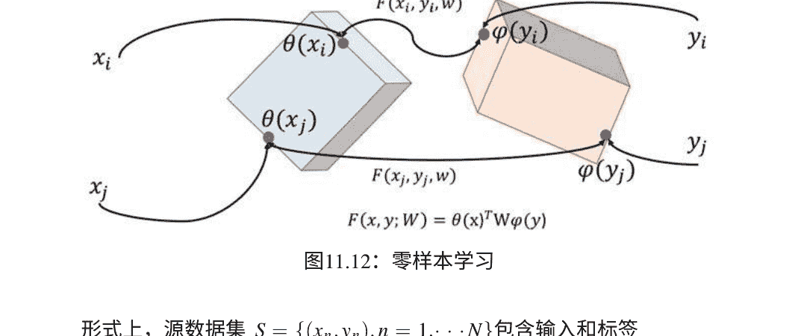

形式上，源数据集 \(S = \{(x_n, y_n), n = 1, \cdots N\}\) 包含输入和标签，其中，\(x_n \in \mathcal{X}\), \(y_n \in \mathcal{Y}\) 分别表示输入和标签。目标是学习一个函数 \(f(x)\)，该函数能够最小化预测标签 \(y\) 的损失，并且可以通过最小化经验风险来表示：

$$\frac{1}{N} \sum_{n=1}^{N} L(y_n, f(x_n)) \quad (11.64)$$

其中，\(L\) 是一个衡量损失的函数。对于分类问题，当匹配时可以为0，不匹配时可以为1。设 \(\theta\) 为源嵌入函数，将输入数据转换为特征空间，即 \(\theta: \mathcal{X} \rightarrow \tilde{\mathcal{X}}\)。类似地，设 \(\varphi: \mathcal{Y} \rightarrow \tilde{\mathcal{Y}}\) 为标签嵌入函数，将标签转换为具有属性的空间。

## 11.2 零样本、一样本和少样本学习

兼容性函数 $F: \mathcal{X} \times \mathcal{Y} \rightarrow$ 以及函数 $f$ 是通过模型参数 $w$ 来定义的，即给定参数 $w$ 时，如何判断一对 $(x, y)$ 是否兼容：

$$ f(x; w) = \arg \max_{y \in \mathcal{Y}} F(x, y; w) \qquad (11.65) $$

存在不同形式的兼容性函数，下面列举了一些常见的形式：

- **1. 成对排序**：一种常用的方法是使用凸目标函数、成对排序和SGD更新：

$$ \sum_{y \in \mathcal{Y}_{train}} [\Delta(y_n, y) + F(x_n, y; W) - F(x_n, y_n; W)]_+ \qquad (11.66) $$

其中 $\Delta$ 是0/1损失，$F$ 是线性兼容性函数。

- **2. 加权成对排序**：在上述方法的基础上增加权重，如下所示：

$$ \sum_{y \in \mathcal{Y}_{train}} l_k [\Delta(y_n, y) + F(x_n, y; W) - F(x_n, y_n; W)]_+ \qquad (11.67) $$

其中 $l_k = \sum_{i=1}^{k} \alpha_i$, $\alpha_i = \frac{1}{i}$，且 $k$ 是排名的数量。

- **3. 结构化联合嵌入（SJE）**：另一种用于多类别情况的成对排序方法，其中使用最大函数找到最具违规的类别，表示为：$\max$

$$ \sum_{y \in \mathcal{Y}_{train}} [\Delta(y_n, y) + F(x_n, y; W) - F(x_n, y_n; W)]_+ \qquad (11.68) $$

- **4. 极度简单的零样本学习**：对上述SJE方法的扩展，添加了一个正则化项：

$$ \gamma \|W \phi(y)\|^2 + \lambda \|\theta(x)^{\top} W\|^2 + \beta \|W\|^2 \qquad (11.69) $$

其中 $\gamma, \lambda, \beta$ 是正则化参数。

- **5. 语义自编码器**：另一种使用线性自编码器将从 $\theta(x)$ 到 $\phi(y)$ 空间的投影的技术：

$$ \min_{W} \|\theta(x) - W^{\top} \phi(y)\|^2 + \lambda \|W \theta(x) - \phi(y)\|^2 \qquad (11.70) $$

- **6. 潜在嵌入**：为了克服线性权重 $W$ 的限制，对兼容性函数进行分段线性修改以实现非线性，如下所示：

$$ F(x, y; W) = \theta(x)^{\top} W_i \phi(y) \qquad (11.71) $$

其中 $W_i$ 是不同的线性权重学习得到的。

- **7. 跨模型转移**：使用具有权重 $W_1$ 和 $W_2$ 的两层神经网络进行非线性转换，目标函数是另一种非线性技术：

$$\sum_{y \in Y^{train}} \sum_{x \in \mathcal{X}} \| \varphi(y) - W_1 \tanh(W_2 \theta(x)) \| \tag{11.72}$$

- **8. 直接属性预测**：另一种技术直接使用与要学习的类相关的属性，如下所示：

$$f(x) = \arg \max_c \prod_{m=1}^{M} \frac{p(a_m^c|x)}{p(a_m^c)} \tag{11.73}$$

其中 $M$ 是属性的总数，$a_m^c$ 是类 $c$ 的第 $m$ 个属性，而 $p(a_m^c|x)$ 是与给定数据 $x$ 相关的属性概率。

## 11.2.2 一样本学习

单样本学习中的一般问题是从一个类别的数据集中学习，其中只有一个示例。相似性函数在训练示例之间的表示中使用相同的一般形式，因此在预测过程中，相似性函数用于在训练数据中找到最接近的可用示例。

### 11.2.2.1 技术

基于孪生网络的架构及其变体通常是这些框架中学习相似性的常见方式。网络参数通过从训练数据集中进行成对学习来学习，如图11.13所示。一种变体是，不是完全连接的层连接到softmax层，而是使用输入的特征或编码来进行相似性计算；结果被称为匹配网络。学习网络参数的一种方法是在训练时最小化相似输入时的差异，并在不相似时最大化差异，而在预测时使用学习到的表示来计算与现有训练样本的相似性。如果 $x_i$ 和 $x_j$ 是训练数据中的两个示例，则相似性函数可以是孪生网络中两个预测之间的差异。

$$d(x_i, x_j) = \| f(x_i) - f(x_j) \|_2^2 \tag{11.74}$$

学习参数的另一种方式是通过三元组损失函数来学习，由Schroff等人提出[FSP15]。这个想法是选择一个锚点数据 $x_A$，用于学习网络的参数，以便最大化锚点数据和正样本之间的差异，并最小化锚点数据和负样本之间的差异：$x_P$ 和一个负样本 $x_N$ 被用来学习网络的参数，以便最大化锚点数据和正样本之间的差异，并最小化锚点数据和负样本之间的差异：

$$\mathcal{L}(x_A, x_P, x_N) = \max(\| f(x_A) - f(x_P) \|_2^2 - \| f(x_A) - f(x_N) \|_2^2 + \alpha, 0) \tag{11.75}$$

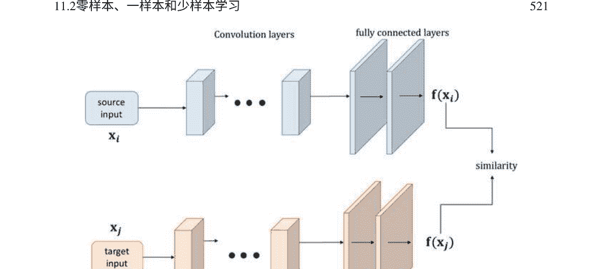

**图11.13：一次性学习**

在方程式11.75中，参数 $\alpha$ 类似于SVM中的间隔。训练数据用于生成三元组，并且可以使用随机梯度方法来学习具有此损失函数的参数。

### 11.2.3 少样本学习

少样本学习相对于前两种学习形式来说相对容易。一般来说，大部分提到的一次性学习技术也可以用于少样本学习，但我们将介绍一些额外的成功技术。

#### 11.2.3.1 技术

少样本学习的深度学习技术可以分为基于数据的方法和基于模型的方法。在基于数据的方法中，通过以不同形式增加训练数据的方式来增加相似样本的数量是一般的过程。

相反，基于模型或参数的方法通过某种形式的正则化来防止模型过拟合有限的训练样本。Donghyun等人使用了一个有趣的想法，即通过形成源数据中每层的相似神经元或参数的“组”来相关激活[Yoo+18]。每层的超参数“组数”是使用 k均值聚类算法选择的，并且 k通过强化学习技术进一步学习。

一旦它们在源数据集上训练好，这些神经元组会使用组内反向传播在目标领域上进行微调。随着参数数量的增加，对于每个类别的小训练数据而言，优化算法如SGD并不有效。Mengye等人提出了一种元学习方法来解决这个问题，分为两个步骤：(a)教师模型从大量数据中学习捕捉参数空间，(b)然后指导实际的学生或分类器在参数流形上学习，取得了出色的结果[Ren+18]。

### 11.2.4 理论

Palatucci等人提出了一种基于语义输出编码映射的分类器作为零样本学习的理论基础和形式化[Palt+09]。分类器映射有助于理解知识库和输出的语义特征是如何映射的，以及在训练数据中缺少新类别时如何进行学习，使用了PAC框架。

Fei-Fei Li等人提出了一个贝叶斯框架，为目标识别领域的一次性学习提供了理论基础[FFFP06]。通过将数据的先验知识建模为参数的概率密度函数，并使用这些模型来表示后验，即对象的类别，贝叶斯框架展示了即使在训练中只有很少的示例，模型也能正确识别类别的信息。

Triantafillou等人提出了一个信息检索框架和实现方法，用于建模少样本学习[TZU17]。本文提出了一种学习相似度度量的方法，将对象映射到一个空间中，并根据它们的相似关系进行分组。训练目标是优化每个训练批次中数据点的相对顺序，以在数据稀缺的情况下利用重要性。

### 11.2.5 自然语言处理和语音识别中的应用

零样本、一次性学习和少样本学习的大部分应用都集中在计算机视觉领域。只有最近才在自然语言处理和语音领域出现了应用。Pushp和Srivastav在文本分类中使用零样本学习[PS17]。源数据集是从网络上爬取的新闻标题，类别是搜索引擎。目标测试数据集是UCI新闻和推文分类数据集。他们根据LSTM网络的输入和输出方式采用不同的神经架构。然后将训练好的模型应用于以前没有见过关系的数据集（UCI新闻和推文），取得了非常令人印象深刻的结果，展示了零样本学习方法的有效性。

Levy等人通过从语料库中学习回答问题来在关系抽取中使用零样本学习[LS17]。Yogatama等人尝试将RNNs作为生成模型进行探索，并凭经验证明了零样本学习在生成学习中的潜力。

学习设置[Yog+17]。通过提出问题并在答案中有句子与实体相对应的方式来学习关系，其中关系是从诸如WikiReading的槽填充数据集中提及的。他们表明，即使在看不见的关系上，零样本学习也显示出足够的潜力作为一种方法。Mitchell等人通过使用关于标签或类别的解释来进行零样本学习，使用约束来学习嵌入空间，并在电子邮件分类[MSL18]上展示了良好的结果。

Dagan等人提出了一种零样本学习框架，用于事件抽取问题，使用事件本体和小型手动标注的数据集[Dag+18]。他们展示了对于甚至是未见过的类型的可迁移性，并且还报告了接近最先进技术的结果。

Yan等人通过使用少样本学习来解决短文本分类问题[YZC18]。他们使用Siamese CNNs学习编码，以区分复杂或非正式的句子。使用少样本学习方法学习了不同的结构和主题，并且显示出比许多传统和深度学习方法更好的泛化能力和准确性。

Ma等人提出了一种神经架构，用于细粒度命名实体类型的少样本和零样本学习，即不仅检测句子中的实体，还检测实体的类型（例如，“John正在使用手机交谈”不仅识别出“John”作为实体，还可以解码出“John”是说话者[MCG16]）。他们使用原型和层次信息来学习标签嵌入，并为分类任务提供了巨大的性能提升。在他们的工作中，Yazdani和Henderson使用零样本学习进行口语理解，其中他们将标签动作与ASR对话的输出中的属性和值进行关联[YH15]。他们在单词和标签之间构建了一个语义空间，以便形成一个表示层，可以非常有效地预测未见过的单词和标签。

Rojas-Barahona等人展示了深度学习和零样本学习在口语对话系统的语义解码中的成功。他们使用深度学习从已知和未知类别中联合学习特征[Roj+18]。然后，他们使用无监督学习来调整权重，进一步使用风险最小化来实现对未知数据的零样本学习，其中包含训练集中未知的槽对。Keren等人使用Siamese网络进行一次性学习，计算源数据中的单个示例与目标数据中的未知示例之间的相似性，用于语音领域中的口语术语检测问题[Ker+18]。

## 11.3 案例研究

我们将通过一个详细的案例研究来从实际角度探索和理解本章中讨论的不同内容。我们选择了Blitzer等人在研究中发布的亚马逊产品评论数据集[BDP07]，用于情感分类任务。该数据集包含各种产品领域的评论。

如书籍、DVD、厨房用品和电子产品。所有领域都有2000个带有二进制标签（正面和负面）的标记示例，基于评论。厨房和电子产品领域也有大量未标记的示例。在我们的实验中，当需要时，我们没有使用未标记的示例，而是将许多标记的示例视为未标记的。

我们选择了两种不同的情况：（1）源领域是厨房，目标领域是电子产品；（2）源领域是书籍，目标领域是厨房。我们将所有数据集分为训练集和测试集，分别包含1600个和400个示例。验证数据是从训练数据集中选择的，可以是一个百分比或分层样本。尽管目标不是复制论文或微调每种方法以获得最佳结果，但我们进行了一些参数调整，并保持大多数参数标准或恒定，以观察相对影响。

### **11.3.1 软件工具和库**

我们将在下面描述我们在案例研究中使用的主要开源工具和库。在笔记本中提到了一些特定算法的开源包，我们要么使用、改编或扩展了这些包：

- **Keras** (www.keras.io)
- **TensorFlow** (https://www.tensorflow.org/)
- **Pandas** (https://pandas.pydata.org/)
- **scikit-learn** (http://scikit-learn.org/)
- **Matplotlib** (https://matplotlib.org/)

### **11.3.2 探索性数据分析**

与其他案例研究类似，我们将进行一些基本的数据探索分析，以了解数据及其特征。图11.14a、b显示了源语言和目标语言情感的词分布柱状图。这清楚地表明，从厨房领域转向电子领域可能与从书籍转向厨房评论并没有太大的不同。

图11.15a-c显示了积极情感数据在书籍、厨房和电子评论中的词云。通过直观地探索一些高频词，厨房-电子的词云之间的相似性以及书籍-厨房之间的差异非常明显。图11.16a-c显示了消极情感数据在书籍、厨房和电子评论中的词云，也展示了相同的特征。

### 11.3.3 领域自适应实验

接下来，我们将详细描述我们在转移学习方面进行的所有实验，包括训练过程、模型、算法和变化。再次强调，我们的目标不是为每个技术获得最佳调整模型，而是实际了解每种技术及其偏见和过程在某些复杂情况下的表现。

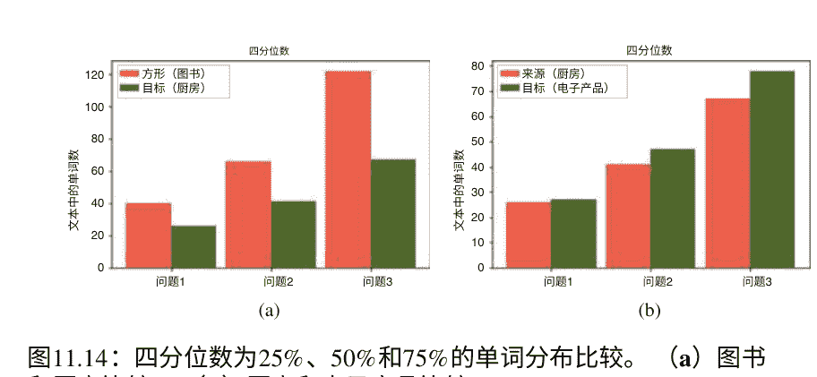


真实世界的任务。我们对书籍-厨房和厨房-电子产品进行了实验，作为我们的源-目标领域。我们使用分类准确率作为指标，以查看测试数据的性能，其中正面和负面情感的数量相等。

#### 11.3.3.1 预处理

我们对原始数据进行了一些基本的预处理，以进行情感分类任务。数据从基于XML的文档中解析出来，通过去除基本的停用词将其分词为单词，并对序列进行一些基本的填充，以给出每个序列的恒定最大长度表示。我们通过找到源和目标中的所有单词，并将其限制在最大大小为15000的词汇表中，为大多数实验创建了一个词汇表。对于一些向量空间模型，我们使用大小为2的n-gram的词袋表示，并且最大特征大小为10000。

#### 11.3.3.2 实验

我们将在大多数实验中使用Kim的CNN模型，如图11.17所示，作为我们的分类器模型。我们使用了标准的GloVe嵌入，维度为100，这些嵌入是在60亿个单词上训练得到的。我们将在下面列出实验的名称和目的：

- **1. 训练源 +测试目标**：目标是了解在源数据上训练并仅在目标数据上进行测试时由于领域变化而发生的迁移学习损失。正如我们讨论过的，这可能会逐渐发生，也可能是由于完全不同的环境部署模型。这为我们的实验提供了基本的最坏情况分析。
- **2. 训练目标 +测试目标**：这个实验为模型提供了最好的情况分析，模型没有看到源数据，完全在目标训练数据上进行训练，并在目标测试数据上进行预测。
- **3. 预训练嵌入源 +训练目标**：我们试图了解无监督预训练嵌入对学习过程的影响。在这个实验中，嵌入层被冻结且不可训练。我们使用无监督嵌入在目标领域上训练模型，并在目标测试集上进行测试。
- **4. 预训练的嵌入源 +训练目标 +微调目标**：我们使用无监督的嵌入在目标领域上训练模型，但是通过目标训练数据对嵌入层进行微调。
- **5. 预训练的嵌入 +训练源 +微调源和目标**：这可以是预训练和微调的最佳情况，您可以从无监督学习中学习嵌入，对源进行训练，对目标进行微调，从而在学习有用表示的过程中获得更多的示例。

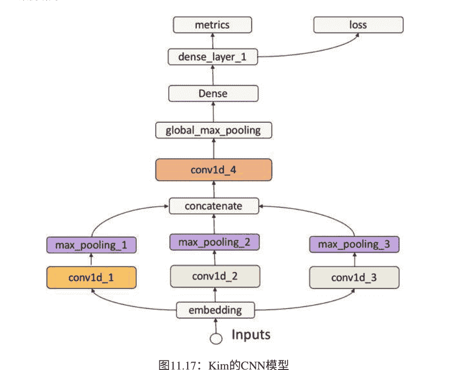

- **6. 堆叠自动编码器和深度神经网络**：我们使用带有堆叠自动编码器的深度神经网络进行无监督的潜在特征表示学习。在源领域上以无监督方式训练模型。使用新的分类层对目标训练数据进行微调，并在目标数据上进行测试。
- **7. 堆叠自编码器和卷积神经网络**：目标是通过使用卷积神经网络对自编码器学习到的未见过的源数据的语义表示来理解其对目标领域的影响，如图11.18a，b所示。展示了如何构建自编码器的示例代码：

```python
input_layer = Input(shape=(300, 300))
# 编码层以形成瓶颈
encodedh1 = Dense(128, activation='tanh')(input_layer)
encodedh2 = Dense(64, activation='tanh')(encodedh1)
encodedh3 = Dense(32, activation='tanh')(encodedh2)
encodedh4 = Dense(16, activation='tanh')(encodedh3)
encodedh5 = Dense(8, activation='tanh')(encodedh4)
# 潜变量编码层
latent = Dense(2, activation='tanh')(encodedh5)
# 解码层
decoder_h1 = Dense(8, activation='tanh')(latent)
decoder_h2 = Dense(16, activation='tanh')(decoder_h1)
decoder_h3 = Dense(32, activation='tanh')(decoder_h2)
decoder_h4 = Dense(64, activation='tanh')(decoder_h3)
decoder_h5 = Dense(128, activation='tanh')(decoder_h4)
# 输出层
output_layer = Dense(300, activation='tanh')(decoder_h5)
# 使用深度神经网络的自动编码器
autoencoder = Model(input_layer, output_layer)
autoencoder.summary()
autoencoder.compile('adadelta', 'mse')
```

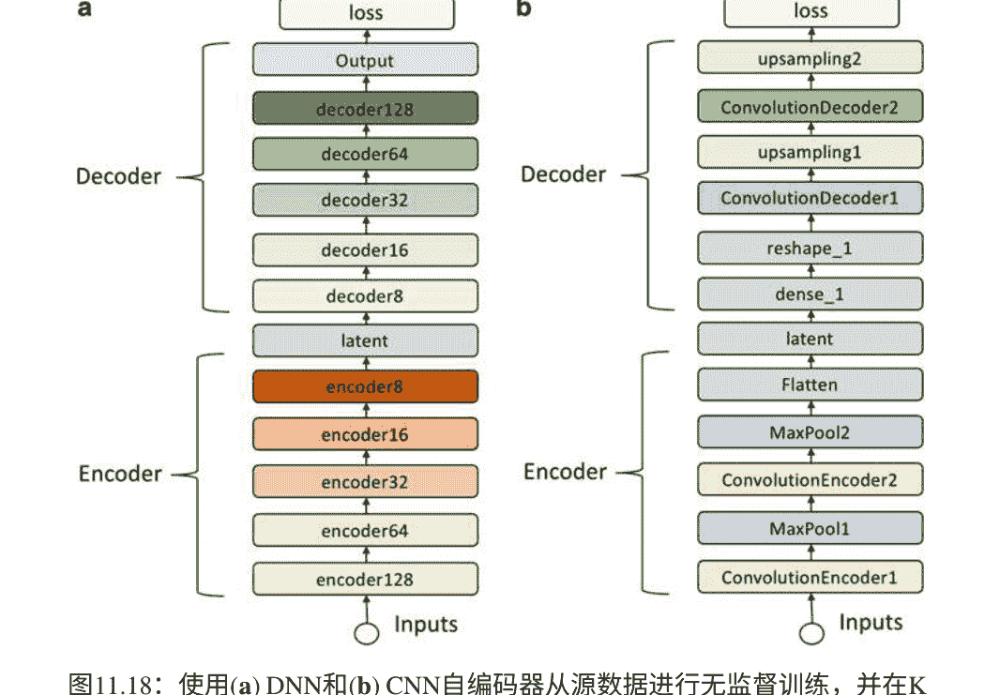

**图11.18：使用(a) DNN和(b) CNN自编码器从源数据进行无监督训练，并在Keras中使用分类层进行进一步的目标训练/测试**

使用编码层的自动编码器进行分类：

```python
# 创建一个序贯模型
classification_model = Sequential()
# 添加所有的编码层到自动编码器
classification_model.add(autoencoder.layers[0])
classification_model.add(autoencoder.layers[1])
classification_model.add(autoencoder.layers[2])
classification_model.add(autoencoder.layers[3])
classification_model.add(autoencoder.layers[4])
classification_model.add(autoencoder.layers[5])
# 展平输出
classification_model.add(Flatten())
``````python
#分类层
classification_model.add(Dense(2, activation='softmax'))
classification_model.compile(optimizer='rmsprop',
                            loss='categorical_crossentropy',
                            metrics=['准确率'])
```

8. 边缘化堆叠自编码器：本实验的目标是了解mSDA架构在领域适应中的影响[Che+12]。我们首先使用源数据和目标数据学习联合表示。接下来，我们使用mSDA的最后一层作为特征层，与输入层连接，使用标记的源数据训练SVM，并在未标记的目标测试数据上进行预测。

9. 基于二阶统计的方法（Deep CORAL，CMD和 MMD）：目标是看看如果目标数据没有标签，是否可以从源数据和目标数据中学习的二阶统计方法在领域转移下对目标进行预测是否有用。

10. 领域对抗神经网络（DANN）：目标是看看如果目标数据没有标签，是否可以从源数据和目标数据中学习的对抗性方法在领域转移下对目标进行预测是否有用（表11.1）。

## 11.3.3.3 结果和分析

表11.1：对两个不同数据集进行领域适应实验，以分析源-目标领域转移的影响

| 实验 | 源（图书）和目标（厨房）测试准确率 | 源（厨房）和目标（电子产品）测试准确率 |
| --- | --- | --- |
| 训练源 + 测试目标 | 69.0 | 78.00 |
| 训练目标 + 测试目标 | 84.25 | 82.5 |
| 预训练的嵌入（源）+ 训练目标 | 81.5 | 80.25 |
| 预训练的嵌入（源）+ 训练目标 + 微调目标 | 85.0 | 84.5 |
| 预训练的嵌入 + 训练源 + 微调源和目标 | 85.75 | 86.75 |
| 堆叠自编码器和深度神经网络 | 67.75 | 63.75 |
| 堆叠自编码器和卷积神经网络 | 78.25 | 79.25 |
| 边缘化堆叠自编码器 | 48.0 | 69.75 |
| CORAL | 63.25 | 69.25 |
| CMD | 63.25 | 69.25 |
| MMD | 63.25 | 69.25 |
| DANN | 75.00 | 80.0 |

以下是一些观察和结果分析：

- 从书籍到厨房的领域转移损失较高，训练准确率为78.25，测试准确率为69.00，相差9.25，而厨房到电子产品相比，训练准确率为83.75，测试准确率为78.00，相差5.75。词云和数据分布证实，针对书籍的评论与厨房和电子产品的评论非常不同。
- 使用预训练的嵌入对结果有影响，从仅使用冻结的嵌入到在源语言和目标语言上训练的嵌入的逐步改进证明了迁移学习的合理性。
- 在书籍-厨房和厨房-电子产品两个领域中，使用预训练的嵌入并首先在源语言上进行训练，然后在目标语言上进行训练，取得了最好的结果。因此，学习无监督和微调以适应领域变化的优势非常明显。
- 使用卷积神经网络的堆叠自编码器比使用普通深度神经网络获得更好的结果，证明了自编码器在捕捉潜在特征方面的有效性，以及分层卷积神经网络在捕捉分类信号方面的有效性。
- 大多数统计技术，如CORAL、CMD和MMD，表现不佳。
- 对抗性方法，如DANN，仅使用浅层网络就显示出很大的潜力。

### 11.3.4 读者和从业者的练习

读者和从业者可以尝试一些其他有趣的问题，包括：

- 1. 将源数据和目标训练数据组合在一起对未见过的目标测试数据有什么影响？
- 2. 使用来自源和目标的标记和未标记数据学习嵌入，然后使用各种技术会有什么影响？基于情感的嵌入是否比通用嵌入产生更好的结果？
- 3. 第5章中学到的不同嵌入技术对实验的影响是什么？
- 4. 第6章中学到的不同深度学习框架对实验的影响是什么？
- 5. 使用CycleGAN或CoGAN等其他领域自适应技术会有什么效果？
- 6. 对于其他源-目标对如DVD-kitchen，转移损失和改进会是什么样的？
- 7. 这些技术中哪些可以用于语音识别的迁移学习问题？

## 参考文献

- [BDP07] John Blitzer, Mark Dredze, and Fernando Pereira. “Biographies, Bollywood, boomboxes and blenders: Domain adaptation for sentiment classification”. In: ACL. 2007, pp. 187–205.
- [Bou+16] Konstantinos Bousmalis et al. “Domain Separation Networks”. In: Advances in Neural Information Processing Systems 29. Ed. by D. D. Lee et al. 2016, pp. 343–351.
- [BM10] Lorenzo Bruzzone and Mattia Marconcini. “Domain Adaptation Problems: A DASVM Classification Technique and a Circular Validation Strategy”. In: IEEE Trans. Pattern Anal. Mach. Intell. 32.5 (May 2010), pp. 770–787.
- [Che+12] Minmin Chen et al. “Marginalized Denoising Autoencoders for Domain Adaptation”. In: Proceedings of the 29th International Coference on International Conference on Machine Learning. ICML’12. 2012, pp. 1627–1634.
- [CBG13] Sumit Chopra, Suhrid Balakrishnan, and Raghuraman Gopalan. “Deep域自适应 through在领域间插值”. In: 2013 IC ML Workshop on Challenging Representations Learning.
- [Csu17] Gabriela Csurka, ed. Domain Adaptation in Computer Vision Applications. Advances in Computer Vision and Pattern Recognition. Springer, 2017.
- [Dag+18] Ido Dagan et al. “Zero-Shot Transfer Learning for Event Extraction”. In: Proceedings of the 56th Annual Meeting of the Association for Computational Linguistics (Volume 1: Long Papers). ACL 2018. 2018, pp. 2160–2170.
- [Fal+17] Daniele Falavigna et al. “DNN Adaptation for ASR Hypothesis via Automatic Quality Estimation”. In: Computer Speech & Language 46 (2017), pp. 585–604.
- [FFFP06] Li Fei-Fei, Rob Fergus, and Pietro Perona. “One-shot learning of object categories”. In: IEEE Transactions on Pattern Analysis and Machine Intelligence 28.4 (Apr. 2006), pp. 594–611.
- [FSP15] Dmitry Kalenichenko, Florian Schroff, and James Philbin. “FaceNet: A Unified Embedding for Face Recognition and Clustering”. In: 2015 IEEE Conference on Computer Vision and Pattern Recognition (CVPR). CVPR 2015. 2015, pp. 815–823.
- [Fu+17] Fuli Li et al. “Domain Adaptation with Domain Adversarial Neural Network for Relation Extraction”. In: Proceedings of the 8th International Joint Conference on Natural Language Processing (Volume 2: Short Papers). IJCNLP. 2017, pp. 425–429.
- [Gan+16b] Yaroslav Ganin et al. “Domain-Adversarial Training of Neural Networks”. In: J. Mach. Learn. Res. 17.1 (Jan. 2016), pp. 2096–2030.
- [GBB11b] Xavier Glorot, Antoine Bordes, and Yoshua Bengio. “Domain Adaptation for Large-Scale Sentiment Classification: A Deep Learning Approach”. In: Proceedings of the 28th International Conference on Machine Learning (ICML-11). ICML 2011, Bellevue, Washington, USA, June 28 - July 2, 2011. 2011, pp. 513–520.
- [GBB11c] Xavier Glorot, Antoine Bordes, and Yoshua Bengio. “Domain Adaptation for Large-Scale Sentiment Classification: A Deep Learning Approach”. In: Proceedings of the 28th International Conference on Machine Learning (ICML-11).
- [GGS13] Boqing Gong, Kristen Grauman, and Fei Sha. “Connecting the Dots with Landmarks: Domain-Independent Representation Learning for Unsupervised Domain Adaptation”. In: Proceedings of the 30th International Conference on Machine Learning (ICML-13).
- [Hos+18] Ehsan Hosseini-Asl et al. “Multi-discriminator CycleGAN for Unsupervised Non-parallel Speech Domain Adaptation”. In: CoRR abs/1804.00522 (2018).
- [KRL10] Koray Kavukcuoglu, Marc’Aurelio Ranzato, and Yann LeCun. “Fast Sparse Coding Algorithms for Sparse Signal Classification”.
- [Ker+18] Gil Keren et al. “One-Shot Detection with Attention-based Siamese Networks”.
- [LS17] Roger Levy and Lucia Specia, eds. Proceedings of the 21st Conference on Computational Natural Language Learning (CoNLL 2017), Vancouver, Canada, August 3-4, 2017. Association for Computational Linguistics, 2017.
- [LQH16] Ming-Yu Liu and Oncel Tuzel. “Coupled Generative Adversarial Networks”. In: Advances in Neural Information Processing Systems 29. Ed. by D. D. Lee et al. 2016, pp. 469–477.
- [LW15] Mingsheng Long et al. “Learning Transferable Features with Deep Adaptation Networks”. In: Proceedings of the 32nd International Conference on Machine Learning (ICML-15). Vol. 37. ICML’15. 2015, pp. 97–105.
- [MCG16] Yukun Ma, Erik Cambria, and Sa Gao. “Label Embedding for Zero-Shot Fine-Grained Named Entity Typing”. In: COLING 2016, the 26th International Conference on Computational Linguistics. 2016, pp. 171–180.
- [Men+17] Ming Meng et al. “Unsupervised Adaptation of Domain Separation Networks for Robust Speech Recognition”. In: 2017 IEEE Automatic Speech Recognition and Understanding Workshop. 2017, pp. 214–221.
- [MSL18] Tom M. Mitchell, Shashank Srivastava, and Igor Labutov. “Zero-shot Learning from Natural Language Quantification to Classifiers”. In: Proceedings of the 56th Annual Meeting of the Association for Computational Linguistics (Volume 1: Long Papers). ACL 2018, Melbourne, Australia, July 15–20, 2018. 2018, pp. 306–316.
- [Mon81] Gaspard Monge. Mémoire sur la théorie des déblais et des remblais. De l’Imprimerie Royale, 1781.
- [NG14] Thien Huu Nguyen and Ralph Grishman. “Domain Adaptation for Relation Extraction with Word Representations and Regularization”. In: Proceedings of the 52nd Annual Meeting of the Association for Computational Linguistics (Volume 2: Short Papers). ACL. 2014, pp. 68–74.
- [NG15a] Thien Huu Nguyen and Ralph Grishman. “Event Detection and Domain Adaptation with Convolutional Neural Networks”. In: Proceedings of the 7th International Joint Conference on Natural Language Processing of the Asian Federation of Natural Language Processing. 2015, pp. 365–371.
- [NPG15] Thien Huu Nguyen, Barbara Plank, and Ralph Grishman. “Semantic Representations for Domain Adaptation: A Case Study on Relation Extraction with Tree Kernel Methods”. In: Proceedings of the 53rd Annual Meeting of the Association for Computational Linguistics and the 7th International Joint Conference on Natural Language Processing of the Asian Federation of Natural Language Processing. 2015, pp. 635–644.
- [Pal+09] Mark Palatucci et al. “Zero-Shot Learning with Semantic Output Codes”. In: NIPS. Curran Associates, Inc., 2009, pp. 1410–1418.
- [Pan+11] Sinno Jialin Pan et al. “Domain Adaptation via Transfer Component Analysis”. In: IEEE Trans. Neural Networks 22.2 (2011), pp. 199–210.
- [PS17] Pushpankar Kumar Push and Muktabh Mayank Srivastava. “Train Once, Test Anywhere: Zero-Shot Learning for Text Classification”. In: CoRR abs/1712.05972 (2017).
- [RHS17] Ievgen Redko, Amaury Habrard, and Marc Sebban. “Theoretical Analysis of Domain Adaptation with Optimal Transport”. In: Machine Learning and Knowledge Discovery in Databases - European Conference, ECML PKDD 2017, Skopje, Macedonia, September 18–22, 2017, Proceedings, Part II. 2017, pp. 737–753.
- [Ren+18] Mengye Ren et al. “Meta-Learning for Semi-Supervised Few-Shot Classification”. In: CoRR abs/1803.00676 (2018).
- [Roj+18] Lina Maria Rojas-Barahona et al. “Almost Zero-Shot Learning for Semantic Decoding in Spoken Dialogue Systems”. In: CoRR abs/1806.05484 (2018).
- [Sej+12] Dino Sejdinovic et al. “Equivalence of Distance-based and RKHS-based Statistics in Hypothesis Testing”. In: CoRR abs/1207.6076 (2012).
- [Ser+16] Dmitriy Serdyuk et al. “Invariant Representations for Noisy Speech Recognition”. In: CoRR abs/1612.01928 (2016).
- [SS16] Baochen Sun and Kate Saenko. “Deep CORAL: Correlation Alignment for Deep Domain Adaptation”. In: ECCV Workshops (3). Vol. 9915. Lecture Notes in Computer Science. 2016, pp. 443–450.
- [Sun+18a] Sining Sun et al. “Domain Adversarial Training for Accented Speech Recognition”. In: CoRR abs/1806.02786 (2018).
- [Sun+18b] Sining Sun et al. “Training Enhancement for Robust Speech Recognition via Adversarial Examples”. In: CoRR abs/1806.02782 (2018).
- [TZU17] Eleni Triantafillou, Richard S. Zemel, and Raquel Urtasun. “Few-Shot Learning through an Information Retrieval Perspective”. In: NIPS. 2017, pp. 2252–2262.
- [Tze+14] Eric Tzeng et al. “Deep Domain Confusion: Maximizing for Domain Invariance”. In: CoRR abs/1412.3474 (2014).
- [Tze+15] Eric Tzeng et al. “Simultaneous Deep Transfer Across Domains and Tasks”. In: 2015 IEEE International Conference on Computer Vision (ICCV). ICCV ’15. 2015, pp. 4068–4076.
- [Tze+17] Eric Tzeng et al. “Adversarial Discriminative Domain Adaptation”. In: 2017 IEEE Conference on Computer Vision and Pattern Recognition (CVPR). CVPR 2017. 2017, pp. 2962–2971. [Note: Duplicate entry from original text consolidated.]
- [Wan+18a] Ke Wang et al. “An Empirical Evaluation of DNN-Based Acoustic Models for Speaker Adaptation”. In: CoRR abs/1803.10146 (2018).
- [XSA17] Yongqin Xian, Bernt Schiele, and Zeynep Akata. “Zero-Shot Learning - The Good, the Bad and the Ugly”. In: 2017 IEEE Conference on Computer Vision and Pattern Recognition, CVPR. 2017, pp. 3077–3086.
- [YZC18] Leiming Yan, Yuhui Zheng, and Jie Cao. “Few-Shot Learning for Short Text Classification”. In: Multimedia Tools and Applications (2018), pp. 1–12.
- [YH15] Majid Yazdani and James Henderson. “A Zero-Shot Learning Approach for Spoken Language Understanding”. In: Proceedings of the 2015 Conference on Empirical Methods in Natural Language Processing. 2015, pp. 244–249.
- [Yog+17] Dani Yogatama et al. “Generative and Discriminative Text Classification with Recurrent Neural Networks”. In: CoRR abs/1703.01898 (2017).
- [Yoo+18] Donghyun Yoo et al. “Efficient K-Shot Learning with Regularized Deep Networks”. In: AAAI. AAAI Press, 2018, pp. 4382–4389.
- [YJ16] Jianfei Yu and Jing Jiang. “Learning Sentence Embeddings with Auxiliary Tasks for Cross-Domain Sentiment Classification”. In: Proceedings of the 2016 Conference on Empirical Methods in Natural Language Processing, EMNLP 2016, Austin, Texas, USA, November 1-4, 2016. 2016, pp. 236–246.
- [Zel+17] Werner Zellinger et al. “Central Moment Discrepancy (CMD) for Domain-Invariant Representation Learning”. In: CoRR abs/1702.08811 (2017).
- [ZBJ17] Yuan Zhang, Regina Barzilay, and Tommi S. Jaakkola. “Aspect-augmented Adversarial Networks for Domain Adaptation”. In: TACL 5 (2017), pp. 515–528.
- [Zho+16] Guangyou Zhou et al. “Bi-Transferring Deep Neural Networks for Domain Adaptation”. In: Proceedings of the 54th Annual Meeting of the Association for Computational Linguistics (Volume 1: Long Papers). ACL. 2016.
- [Zhu+17] Jun-Yan Zhu et al. “Unpaired Image-to-Image Translation using Cycle-Consistent Adversarial Networks”. In: Computer Vision (ICCV), 2017 IEEE International Conference on. 2017.
- [ZR17] Yftah Ziser and Roi Reichart. “Neural Structural Correspondence Learning for Domain Adaptation”. In: Proceedings of the 21st Conference on Computational Natural Language Learning (CoNLL 2017). 2017, pp. 400–410.
- [ZR18] Yftah Ziser and Roi Reichart. “Language Modeling with Neural Frame Representations for Domain Adaptation”. In: Proceedings of the 2018 Conference of the North American Chapter of the Association for Computational Linguistics: Human Language Technologies, NAACL-HLT. 2018, pp. 1241–1251.
```## 第12章 端到端语音识别

## 12.1 引言

在第8章中，我们旨在通过使用贝叶斯定理将基本方程分解为声学模型、词典模型和语言模型。

$$W^* = \argmax_{W \in V^*} P(W|X) \quad (12.1)$$

这种方法在很大程度上依赖于条件独立性假设和不同模型的分开优化过程。

深度学习首次在统计框架中应用，通过基于观测值预测语音状态，取代了高斯混合模型。

这种方法的一个缺点是DNN/HMM混合模型依赖于分别训练每个组件。正如在其他场景中所看到的，分别训练过程可能导致次优结果，因为模型之间缺乏错误传播。在语音识别中，这些缺点往往表现为对噪声和说话人变化的敏感性。将深度学习应用于端到端语音识别使模型能够直接从数据中学习，而不是依赖于大量的工程特征。因此，已经有一些方法来以端到端的方式训练语音识别模型。端到端方法尝试直接优化 $P(W|X)$ 的数量，而不是将其分离。

通过端到端建模，输入-目标对只需是语音表达和转录的语言表示。有很多可能的表示方式：音素、三音素、字符、字符n-gram或单词。鉴于ASR专注于从语音信号中生成单词表示，单词是更明显的选择；然而，也存在一些缺点。词汇量需要大的输出层，以及训练中每个单词的示例，导致比其他表示方式更低的准确性。最近，端到端方法开始使用字符、字符n-gram和一些单词。

在有足够的数据的情况下，模型也可以很好地工作。当创建音素字典时，这些数据对可以更容易地生成，从而减轻了对语言知识的要求。同时优化特征提取和顺序组件可以带来许多好处，具体包括：更低的复杂度、更快的处理速度和更高的质量。

实现端到端自动语音识别的关键组件需要一种替代HMM模型来建模语音的时间结构的方法。最常见的方法是CTC和注意力机制。在本章中，传统自动语音识别的组件被端到端训练和解码技术所替代。我们首先介绍CTC，一种用于训练不对齐序列的方法。接下来，我们探讨了一些用于训练端到端模型的架构和技术。然后，我们回顾了注意力机制以及如何将其应用于自动语音识别网络和一些使用这些技术进行训练的架构。在注意力机制之后，我们讨论了同时使用CTC和注意力机制进行训练的多任务网络。我们探索了CTC和注意力机制在推理过程中的常见解码技术，结合语言模型来提高预测质量。最后，我们讨论了嵌入和无监督技术，然后以一个案例研究结束，结合了CTC和注意力网络。

## 12.2 连接主义时序分类（CTC）

DL-HMM模型依赖于语言单位与音频信号的对齐来训练DNN对音素、音素序列或三音素状态进行分类（简单来说，这个声学特征序列应该对应这个音素）。对于大型数据集来说，手动获取这些对齐可能会非常昂贵。理想情况下，对于一个话语-转录对来说，不需要进行对齐。连接时序分类[Gra+06]被引入以提供一种训练RNN直接“标记未分段序列”的方法，而不是混合模式中的多步骤过程。

给定一个声学输入 X = [x1, x2, ..., xT] 和期望的输出序列 Y = [y1, y2, ..., yU]。准确的 X 到 Y 的对齐是未知的，并且 X 和 Y 的长度比通常存在额外的变异，通常有 T ≪ U（考虑音频中存在静默时段的情况，导致转录较短）。

如何为 (X, Y) 对构建可能的对齐？一个简单的理论对齐，如图12.1所示，说明了一种潜在的方法，其中每个输入 xi 都有一个分配给它的输出，重复的输出被合并成一个单一的预测。

这种对齐方法存在两个问题：首先，在语音识别中，输入可能存在与分配的输出不直接对齐的静默时期。其次，我们永远不会有重复的字符（比如“hello”中的两个“l”），因为它们会被合并成一个单一的预测。

CTC算法通过引入一个作为空白分隔符的空白符号来缓解这种天真方法的问题。这个符号在合并重复字符之后被移除。

重复预测，允许重复的序列和“静音”时期。因此，在损失计算或解码中不包括空白符号；然而，它允许输入和输出之间的直接对齐，而不强制进行分类到输出词汇。请注意，空白符号与用于表示单词分隔的空格符号是分开的。图12.2显示了CTC对齐的一个示例。

通过这种输出表示，输入序列和输出序列的长度之间存在1:1的对齐。此外，引入空白符号意味着可能有许多预测的对齐导致相同的输出。例如:

```
[h, e, l, ε, l, o, ε] → "hello"
[h, ε, e, l, ε, l, o] → "hello"
```

因为输出中的任何标记都可以在之前或之后有一个 ε，我们可以想象所需的输出序列在每个标签之前和之后都有一个 ε。

```
Y = [ε, y1, ε, y2, . . . , ε, yU]
```

多条路径/对齐可以得到一个正确的解，因此，必须考虑所有正确的解决方案。CTC算法本身是“无对齐”的；然而，这些“伪对齐”用于计算可能的对齐的概率。

然后，它产生一个关于所有可能的Y的输出分布，可以用来推断特定输出Y的概率。条件概率 $P(Y|X)$，通过对输入和输出之间的所有可能的对齐求和来计算，如图12.3所示。

> 图12.3：目标序列的有效CTC路径，$Y=[a,b]$。请注意，空白符号 $\epsilon$ 从最终序列中被移除。因此，有两个可能的初始状态 $\epsilon$ 和 $a$，以及两个可能的最终状态 $\epsilon$ 和 $b$。此外，为了实现最终输出，从epsilon的转换必须是自身或序列中的下一个标记，而从 $a$ 的转换可以是自身 $\epsilon$ 或 $b$。

数学上，我们可以定义单个对齐的条件概率 $\alpha_t$，作为序列中每个状态的乘积:

```
$$P(\alpha|X) = \prod_{t=1}^{T} P(\alpha_t|X) \quad (12.2)$$
```

所有路径被认为是互斥的，因此我们对所有对齐的概率求和，得到单个话语$(X,Y)$的条件概率:

```
$$P(Y|X) = \sum_{A \in A_{X,Y}} \prod_{t=1}^{T} P(\alpha_t|X) \quad (12.3)$$
```

其中$A_{X,Y}$是有效对齐的集合。动态规划用于改进CTC损失函数的计算。通过在序列中的每个标签周围提供空白符号，当路径在相同的时间步骤达到相同的输出时，它们可以轻松比较和合并。

将所有内容组合在一起得到CTC的损失函数。

```
$$L_{CTC}(X,Y) = -\log \sum_{\alpha \in A_{X,Y}} \prod_{t=1}^{T} P(\alpha_t|X) \quad (12.4)$$
```

反向传播的梯度可以从每个时间步计算出来，根据每个帧的概率。

CTC假设每个时间步之间存在条件独立性，即每个时间步的输出与之前的时间步无关。尽管这种特性允许逐帧梯度传播，但它限制了学习序列依赖性的能力。使用语言模型（第12.5.2节）可以缓解一些问题，通过提供单词或n-gram上下文。

### 12.2.1 端到端音素识别

CTC最初在TIMIT [ZSG90]音素识别任务上取得了成功[GMH13]。使用CTC训练了各种架构，并在该任务上取得了最先进的性能。该架构使用单个端到端网络将Mel滤波器组特征映射到音素序列。作者探索了单向和双向RNN。堆叠的双向LSTM架构提供了最佳结果。双向RNN似乎允许网络利用整个话语的上下文，而不仅仅是前向上下文。

作者在训练这个网络时使用了两种正则化技术：权重噪声和提前停止。权重噪声在训练过程中向权重中添加高斯噪声，以减少对特定序列的过拟合。这些正则化技术对网络的训练非常关键。

### 12.2.2 深度语音

在音素识别中，CTC的成功之后，其他人尝试将其与不同的输出表示一起使用。Deep Speech (DS1) 架构[Han+14a]通过训练来预测一系列字符概率，从音频特征（在本例中为频谱图）直接生成转录。Deep Speech 网络由一个具有三个全连接层的DNN架构、一个双向LSTM层（取代了HMM）和一个全连接输出softmax层组成，将预测分类为字母表中的一个字符。输入层依赖于频谱图中的帧，中心帧以及每侧的5-9个上下文帧。图12.4展示了这个架构的示意图。

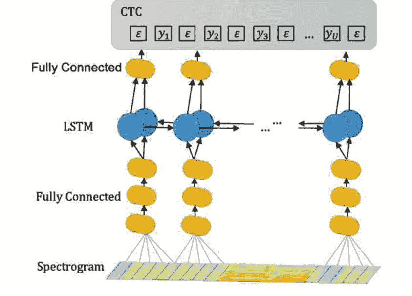

图12.4：原始Deep Speech论文中使用的RNN模型。该架构在输入频谱图之后，包含一个双向LSTM层和三个全连接层，用于学习特征。

考虑到将输入映射到字符的复杂性，Deep Speech的成功在很大程度上归功于数据集的规模：来自9600位说话者的5000小时语音数据。尽管数据集规模增加了，但正则化仍然对网络的泛化至关重要，因此模型在训练过程中使用了dropout和数据增强。受计算机视觉中的“抖动”启发，一种技术是将音频文件向前和向后平移5毫秒。在反向传播之前，对抖动示例的输出概率进行平均。

Deep Speech的一个令人兴奋的组成部分是，在训练过程中，RNN模型可以学习一个轻量级的字符级语言模型，即使没有语言模型，也能生成“可读”的转录结果。出现的错误往往是单词的音标拼写错误，例如bostin而不是boston。

#### 12.2.2.1 GPU并行计算

考虑到数据集的规模和架构的计算要求，需要使用多个GPU来进行训练。深度语音的工作在克服许多工程挑战方面起到了关键作用，例如如何在大型数据集上进行训练。该论文的许多贡献都集中在如何在多个GPU上扩展架构的训练上。使用了两种类型的并行计算来在多个GPU上训练模型：数据并行和模型并行。数据并行主要是在每个GPU上保留一份架构的副本，将一个大型训练批次分割通过在不同的GPU上执行前向和后向传播步骤，对不同的数据进行处理，并最终聚合所有模型的梯度更新。数据并行性能几乎与GPU数量呈线性比例增长（但可能会影响收敛速度，因为有效的批量大小会改变）。第二种类型的并行性是模型并行性。模型并行性侧重于将模型的层进行分割，并将这些层分布在可用的GPU集合上。在使用循环神经网络时，引入模型并行性可能会很困难，因为它们具有顺序性质。在Deep Speech架构中，作者通过在时间维度上将模型分成两半来实现模型并行性。这些决策使作者能够在5000小时的音频上进行训练，并在两个嘈杂语音基准测试中取得了最先进的结果。

### 12.2.3 深度语音2

在Deep Speech 2 (DS2) [Amo+16]中，这是Deep Speech的后续论文，作者扩展了原始架构以进行基于字符的端到端语音识别。作者验证了这些建模技术在英语和普通话转录中的有效性。Deep Speech 2的修改对原始架构进行了许多改进，以及工程优化，实现了原始Deep Speech实现的7×加速。图12.5显示了更新的架构。

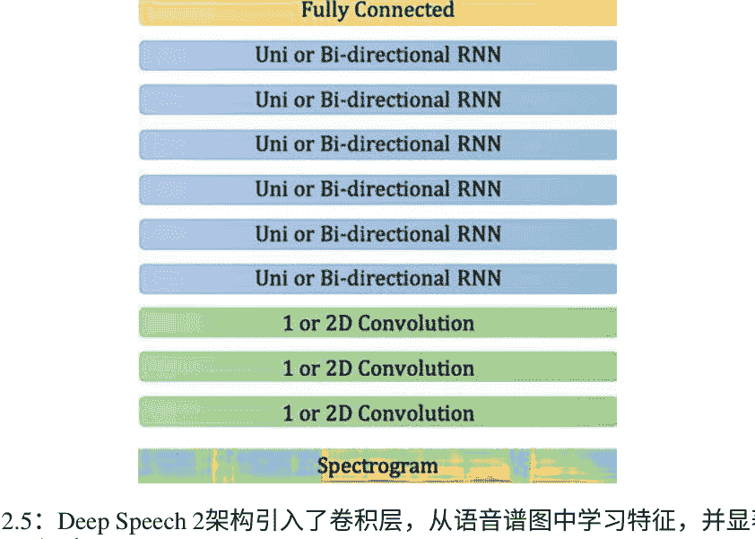

> 图12.5：Deep Speech 2架构引入了卷积层，从语音谱图中学习特征，并显著增加了深度。

Deep Speech和Deep Speech 2架构的主要区别是深度的增加。在Deep Speech 2的工作中，尝试了许多不同的架构，将卷积层的数量从1变化到3，将循环层的数量从1变化到7。对于英语转录，最佳的DS2架构包括11层（3个卷积层，7个双向循环层和1个全连接层）。在每个层之后都加入了批归一化（除了全连接层），并且还包括了梯度裁剪以改善收敛性。整体架构包含了大约3500万个参数。

通过引入n-gram语言模型，相对于已经具有竞争力的DS1架构，这导致了43.4%的WER相对改进。

Deep Speech 2改进的其他关键组件包括训练技术和进一步增加数据集大小。在CTC模型的早期阶段，训练可能不稳定。作者使用训练课程来提高模型的稳定性。通过首先选择较短的话语，模型可以在第一个时期的早期部分受益于较小的梯度更新。此外，作者将Deep Speech 2的数据集大小增加到12,000小时。他们指出，随着训练集大小每增加10倍，数据的缩放可以将WER降低40%。

### 12.2.4 Wav2Letter

Wav2Letter [CPS16]将端到端模型扩展到仅使用CNN的网络。这项工作展示了与其他端到端网络（如Deep Speech 2）相竞争的结果，它使用MFCC和功率谱特征在完全卷积网络上运行。CNN经过CTC训练，实现了速度的显著提升，并具备实时解码的能力。

在训练网络之后，将中间的一维卷积层添加在输入和初始卷积层之间。然后将网络的输入改为原始波形，目的是学习生成与最初使用的MFCC类似的特征。在训练这些层之后，整个网络进行端到端的优化训练。在原始波形上进行端到端操作的网络的准确性有所下降，尽管它直接操作波形。图12.6展示了提出的架构。

作者还探索了一种新颖的序列损失函数，称为自动分割准则（ASG），除了CTC之外。ASG没有空白标签，节点上没有归一化分数，而是全局归一化而不是帧级归一化。我们可以回忆起我们使用空白字符来分隔双字母。

相反，ASG还引入了一个额外的字符，专门用于表示重复（例如，“hello”可以表示为“hel2o”）。

从架构中移除循环神经网络使得预测的计算代价大大降低，同时也允许流式转录（卷积在输入上滑动以揭示每个时间步的输出）。

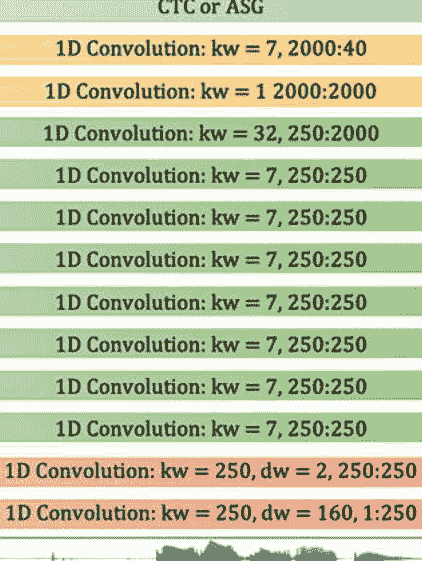

图12.6：用于在原始波形上进行识别的Wav2Letter架构。当在MFCCs上进行训练而不是原始波形时，第一层不包括在内。卷积参数被组织为 (kw, dw, dim ratio)，其中 kw是卷积核宽度， dw是卷积核步长， dim ratio是输入维度到输出维度的比例。

在后续的工作中，在Wav2Letter++ [Pra+18]上，作者改进了ASR系统的速度，实现了训练时间的线性扩展（最多64个GPU）。

### 12.2.5 CTC的扩展

CTC提供了一种优雅的方法来计算未对齐序列的伪对齐；然而，帧独立性假设确实有一些缺点。已经引入了各种技术来放宽帧独立性假设。

最显著的是Gram-CTC和RNN转录器。

#### 12.2.5.1 Gram-CTC

Gram-CTC [Liu+17]将CTC算法扩展到固定字母表和固定目标分解。这种方法专注于学习预测字符-字符-n-gram，而不是单个字符，允许模型在给定的时间步骤输出多个字符。使用字符-字符-gram可以在一定程度上减轻帧独立性假设的影响，因为需要学习多个标签一起。该工作还尝试在训练过程中自动学习字符-字符-gram（称为“grams”），利用前向-后向算法。尽管同时学习grams和转录是可行的，但模型需要同时学习目标的对齐和分解，训练变得不稳定。多任务学习用于解决这种不稳定性，同时优化CTC和Gram-CTC。总体而言，引入grams在多个数据集上都取得了改进，即使grams是手动选择的。

#### 12.2.5.2 循环神经网络转导器

循环神经网络转导器[Gra12]通过假设输入和输出序列之间存在本地且单调的对齐来扩展CTC。这种方法通过结合两个RNN层来模拟不同时间步长输出之间的依赖关系，从而减轻了CTC的条件独立性假设。

$$P_{RNN-T}(Y|X) = \sum_{a\in A_{X,Y}} P(a|h) = \sum_{a\in A_{X,Y}} \prod_{t=1}^{T'} P(a_t|h_t, y_{1:u_{t-1}}) \quad (12.5)$$

其中 $u_t$ 表示与输入时间步长 $t$ 对齐的输出时间步长 $t$。$T'$ 是对齐序列的长度，包括预测的空白标签数量。注意 $y_{1:u}$ 是不包括空白标签的预测序列，直到时间步长 $u$。循环神经网络将非空白标签的完整历史信息纳入到下一个时间步长的CTC预测中。训练RNN-T模型需要使用前向-后向算法来计算梯度（类似于CTC计算）。在线语音识别中，可以使用单向RNN来模拟时间步长之间的依赖关系。

## 12.3 序列到序列

序列到序列模型在机器翻译中的成功促使它们在语音识别中的应用。在语音识别中，序列到序列模型最重要的好处之一是它们不依赖于CTC进行训练，从而本质上消除了CTC对帧独立性假设的依赖。通常，在语音识别中，输入和输出中有大量的时间步骤，这使得使用单个表示完整话语的隐藏状态来训练基本的序列到序列模型变得不可行。

相反，采用了基于注意力机制的方法，可以直接建模输出序列的概率：

$$P(Y|X) = \prod_{u=1}^{U} P(y_u | y_{1:u-1}, X)$$

这个量可以通过基于注意力机制的目标函数来估计，参考[Bah+16c]：

$$\begin{aligned}
\mathbf{h}_t &= \text{编码器} (X) \\
a_{ut} &=
\begin{cases}
\text{内容注意力} & (\mathbf{q}_{u-1}, \mathbf{h}_t) \\
\text{位置注意力} & (\{\mathbf{a}_{u-1}\}_{t=1}^{T}, \mathbf{q}_{u-1}, \mathbf{h}_t)
\end{cases} \\
\mathbf{c}_u &= \sum_{t=1}^{T} a_{ut} \mathbf{h}_t \\
P(y_u | y_{1:u-1}, X) &= \text{解码器} (\mathbf{c}_u, \mathbf{q}_{u-1}, y_{u-1})
\end{aligned}$$

编码器神经网络产生了声学输入的隐藏表示 $h_t$，并且解码器从编码序列中产生了转录输出。注意力权重，$a_{ut}$，用于计算解码器的上下文向量 $c_u$。解码器的隐藏状态，$q_u$，将解码器的预测累积上下文引入到下一个预测中。我们在这里考虑了两种类型的注意力：基于内容的注意力和位置感知注意力[Cho+15c]。

#### 12.3.0.1 基于内容的注意力

基于内容的注意力学习一个权重向量 $g$ 和两个线性层 $W$ 和 $V$（没有偏置参数），用于加权先前的预测和编码器隐藏状态 $h_t$。表示如下：

$$e_{ut} = \mathbf{g}^T \tanh(\mathbf{W} \mathbf{q}_{u-1} + \mathbf{V} \mathbf{h}_t)$$

$$a_{ut} = \text{Softmax}(\{e_{ut}\}_{t=1}^{T})$$

#### 12.3.0.2 基于位置的注意力

基于位置的注意力是对卷积的扩展支持。这个特性考虑了上一步的对齐。可以定义为：

$$\{\mathbf{f}_t\}_{t=1}^{T} = \mathbf{K} * \mathbf{a}_{u-1}$$

其中 $*$ 表示沿时间轴的一维卷积操作 $t$ 使用卷积矩阵 $\mathbf{K}$。还学习了一个线性层 $U$ 来映射输出将特征 $f_t$ 映射到特征空间中。

$$e_{ut} = \mathbf{g}^\top \tanh(\mathbf{W} \mathbf{q}_{u-1} + \mathbf{V} \mathbf{h}_t + \mathbf{U} \mathbf{f}_t)$$

$$a_{ut} = \text{Softmax}(\{e_{ut}\}_{t=1}^T)$$

训练基于注意力的网络的一个困难之一是同时进行优化：

- 编码器权重，
- 计算正确对齐的注意力机制，以及
- 解码器权重。

网络的动态特性使其变得困难，尤其是在早期阶段，正则化是这些模型的一个关键组成部分。

### 12.3.1 早期序列到序列自动语音识别

注意力机制成功应用于[BCB14a]，将计算机视觉[MHG+14]中的工作扩展到了RNN编码器-解码器的机器翻译任务中，该工作扩展自[Cho+14]。

[Bah+16c]将序列到序列应用于语音识别。该工作中的注意力机制将解码器聚焦于一系列编码器输出。注意力不仅有助于模型的收敛，还提高了训练时间（图12.7、12.8和12.9）。

### 12.3.2 听、关注和拼写（LAS）

听、关注和拼写（LAS）网络[Cha+16b]使用金字塔双向LSTM对输入序列进行编码，称为听者。解码器是基于注意力机制的循环神经网络，用于预测字符。

序列到序列模型的缺点是它们往往比CTC更难训练（推理过程中更慢）。在注意力机制对每个新的时间步长进行加权之前，解码器无法进行预测。已经引入了一些技术来解决这个问题，例如窗口机制来减少解码过程中考虑的时间步数，以及标签平滑技术，防止对预测结果过于自信。

序列到序列模型的另一个困难是无法以完全在线流式方式使用。在解码之前，必须对整个上下文进行编码。

在[Wav2Text+16]中，Wav2Text架构使用了一个带有注意力机制的CNN-RNN模型，直接在原始波形上预测基于字符的转录。编码器是一个卷积架构，结合了两个双向LSTM。

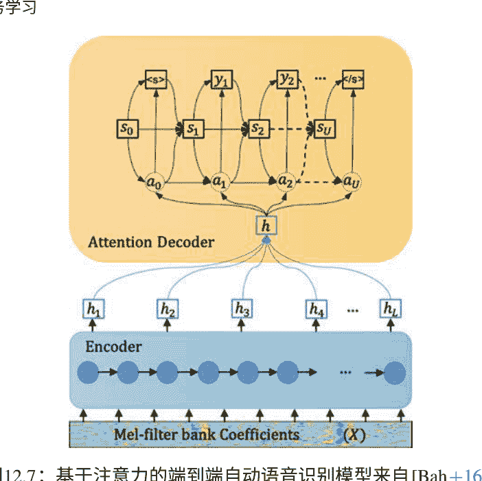

图12.7：基于注意力的端到端自动语音识别模型来自[Bah+16c]

解码器是一个单向双向LSTM。卷积层主要用于降低输入的维度。由于注意力的额外复杂性和原始波形的利用，网络通过迁移学习进行训练。最初，只有较低的编码器层从原始输入波形中预测频谱特征（MFCC和对数Mel频谱图）作为目标。

然后，使用基于注意力的编码器-解码器和CTC对这些特征进行训练，以生成转录文本。

## 12.4 多任务学习

注意力和CTC的许多缺点导致了多任务学习方法的出现。
注意力通常在端到端场景中表现更好，但在嘈杂环境中往往难以收敛并容易受到干扰。另一方面，CTC通常由于条件独立性假设而产生较低的质量，但更加稳定。CTC和注意力之间的权衡使它们在多任务学习中具有很高的价值。ESPnet [KHW17, Xia+18]就是为了这个目的而训练的：同时优化基于注意力的编码器-解码器模型和CTC和注意力。

ESPnet的训练损失是一个多目标损失（MOL），定义为：

$$\mathcal{L}_{MOL} = \lambda \log P_{ctc}(C|X) + (1 - \lambda) \log P^*_{att}(C|X) \quad (12.13)$$

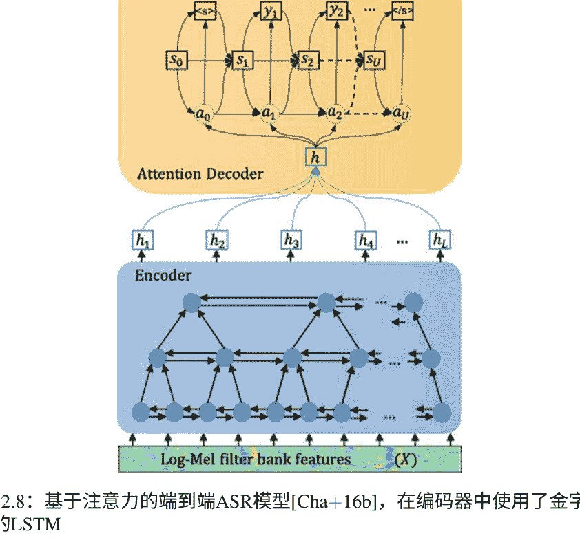

图12.8: 基于注意力的端到端ASR模型[Cha+16b]，在编码器中使用了金字塔式的LSTM

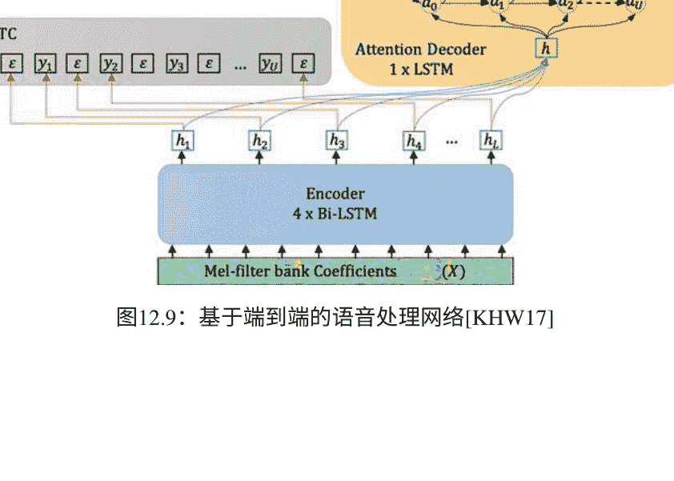

图12.9: 基于端到端的语音处理网络[KHW17]

其中$\lambda$是每个损失函数的权重，$0 \le \lambda \le 1$。$P_{ctc}$是CTC目标函数而 $P^*_{att}$ 是注意力目标函数。ESPnet架构使用了一个4层双向LSTM编码器和一个1层LSTM解码器。为了减少输出的时间步数，编码器的前两层每隔一个状态读取一次，这样可以将输出的长度减少4倍。

## 12.5 端到端解码

CTC和基于注意力的模型是端到端的，直接从声学特征生成转录文本。尽管它们在训练过程中具有学习内在语言模型的能力，但是在训练过程中所见的语言数据量相对较小。在大多数情况下，解码过程可以改善预测结果，并且在许多情况下可以显著提高词错误率。理想的状态是在解码过程中结合额外的信息来改善预测结果，使用波束搜索和语言模型。波束搜索可以将更广泛的上下文纳入预测中，而语言模型可以利用可能没有话语-转录对的大型文本语料库。

在[Hor+17]中，介绍了两种用于解码组合CTC-注意力模型的方法。第一种方法重新评分预测结果，第二种方法在解码过程中结合了注意力和CTC预测的概率。

在[HCW18]中，作者将基于单词和字符的RNN语言模型纳入解码过程中。

### 12.5.1 语言模型用于自动语音识别

通过提供语言模型的先验信息，解码过程可以进行扩展。这些语言模型可以在大量文本数据上进行训练，以准确地偏向特定领域的预测转录。

#### 12.5.1.1 N-gram

在《Deep Speech 2》论文中，作者们尝试了n-gram语言模型。尽管架构中包含的RNN层学习了隐式语言模型，但它在同音词和某些单词的拼写上容易出错。因此，使用KenLM [Hea+13]工具包在Common Crawl Repository上训练了一个n-gram语言模型，使用了250亿行文本中最常见的40万个单词。

解码步骤使用波束搜索来优化数量：

$$Q(Y) = \log(P_{CTC}(Y|X)) + \alpha \log(P_{LM}(Y)) + \beta \gamma(Y) \quad (12.14)$$

其中 $\gamma(Y)$ 是 $Y$中的单词数。权重 $\alpha$影响语言模型的贡献，权重 $\beta$偏向于预测更多的单词。这两个参数在开发集上进行调整。

语言模型被纳入束搜索解码中，并显著改善了基准WER与无语言模型基准的差距。

#### 12.5.1.2 循环神经网络语言模型

循环神经网络语言模型在本书中多次出现。应用循环神经网络语言模型依赖于利用下一个单词的可能性来预测给定前一个单词的最可能的单词序列。

这些模型可以像n-gram语言模型一样作为额外的得分被纳入束解码中，也可以作为对前n个假设的重新评分。

基于单词的模型存在OOV问题，但在训练时使用非常大的数据集（125 kh ）时，它们成功击败了基于音素的CTC模型[SLS16]。这个限制促使研究人员在遇到OOV术语时加入基于字符的预测 [Li+17]。

### 12.5.2 CTC解码

解码CTC网络（使用CTC训练的深度学习网络）是指在推理时找到分类器最可能的输出，类似于HMM解码。从数学上讲，解码过程由函数描述 $h(x)$：

$$h(\mathbf{x}) = \underset{\mathbf{l} \in L^{\le T}}{\text{argmax}} P(\mathbf{l}|\mathbf{x}) \quad (12.15)$$

在原始的连接主义时序分类发布中[Gra+06]，提出了两种方法：最佳路径解码和前缀搜索解码。

最佳路径解码，也称为贪婪解码，在每个时间步输出最可能的输出。为了得到一个有用的字符串，重复的字符被合并，空白标记被移除，得到假设，$h_o$。

$$h(x) = \mathbf{B}(\pi^*) \quad \pi^* = \underset{\pi \in N^t}{\text{argmax}} p(\pi|x) \quad (12.16)$$

这种解码方案很直观。然而，它不太可能产生最佳序列，因为它没有考虑获得相同对齐的多个路径。

可以将波束搜索纳入解码过程以改善预测。通过波束搜索，导致相同结果的路径的概率可以求和，从而得到更高的概率。算法1展示了带有空序列和波束集合B的波束搜索解码过程。

算法1: CTC波束搜索

| 输入: | $B \leftarrow \{\emptyset\}$; $P(\emptyset, 0) \leftarrow 1$ |
| :--- | :--- |
| **结果:** | $\max_{Y \in B} P^{\uparrow}(Y, T)$ |
| **开始** |  |
| 对于 $t = 1 \ldots T$ 执行 |  |
|  | $\hat{B} \leftarrow W$ 个最可能的序列在B中 |
|  | $B \leftarrow \{\}$ |
|  | 对于 $y \in \hat{B}$ 做 |
|  |  | 如果 $y = \emptyset$ 则 |
|  |  |  | $P^{\uparrow}(Y, t) \leftarrow P^{\uparrow}(Y, t-1) P(Y^e, t|x)$ |
|  |  |  | 如果 $\hat{y} \in \hat{B}$ 则 |
|  |  |  |  | $\sqcup P^{\uparrow}(Y, t) \leftarrow P^{\uparrow}(Y, t) P(Y^e, \hat{Y}, t)$ |
|  |  | $P^{\downarrow}(Y, t) \leftarrow P^{\uparrow}(Y, t-1) P(\_ , t|x)$ |
|  |  | 将 $Y$ 添加到 $B$ |
|  |  | 对于 $k = 1 \ldots K$ 执行 |
|  |  |  | $P^{\downarrow}(Y+k, t) \leftarrow 0$ |
|  |  |  | $P^{\uparrow}(Y+k, t) \leftarrow P(k, Y, t)$ |
|  |  |  | 将 $(Y+k)$ 添加到 $B$ |

束搜索算法可以通过n-gram语言模型进行扩展。一种简单的方法是在达到单词结尾（空格）标记时重新评分单词序列。然而，这依赖于模型能够预测没有拼写错误的完整单词。

更好的方法是使用前缀搜索解码，在解码过程中利用语言模型的前缀来融合子词级别的信息。将单词级语言模型转换为“标签级”或基于字符的模型，可以通过将输出序列表示为最长完成的单词序列和剩余单词前缀的连接来实现，分别表示为 $w$ 和 $p$。计算下一个标签在当前序列给定的概率的函数为：

$$P(k|y) = \frac{\sum_{w'\in(p+k)*} P_{\gamma}(w'|W)}{\sum_{w'\in p*} P_{\gamma}(w'|W)} \quad (12.17)$$

其中 $P(w'|W)$ 是从 $W$ 到 $w'$ 的单词历史转移概率， $p*$是以 $p$ 为前缀的字典单词集合，$\gamma$是语言模型权重。

在解码过程中，计算了序列前缀的概率，可以选择结束当前前缀或继续扩展。在波束搜索期间，假设状态的概率也会根据前缀、字典条目或n-gram语言模型的概率进行修改，以确定扩展概率。

该方法依赖于前向-后向算法，计算随着状态和时间步骤的增加呈指数级增长。我们可以通过修剪输出序列来提高解码的效率，删除所有概率高于指定阈值的空白标记的输出。由于输出激活往往是“尖峰”，这显著减少了考虑的状态数量，并始终优于最佳路径解码。

通过将概率设置为1，可以在不使用语言模型的情况下使用该算法。在[Han+14b]中介绍的前缀算法在算法2中给出。

算法2：CTC前缀波束搜索

| 输入： | $P_b(\emptyset; x_{1:0}) \leftarrow 1$, $P_{nb}(\emptyset; x_{1:0}) \leftarrow 0$ |
| :--- | :--- |
| $A_{prev} \leftarrow \{\emptyset\}$ |  |
| **结果：** | 在 $A_{prev}$ 中最有可能的前缀 |
| **开始** |  |
| 对于 $t = 1 \ldots T$ 执行 |  |
|  | $A_{next} \leftarrow \{\}$ |
|  | 对于 $l \in A_{prev}$ do |
|  |  | 对于 $c \in \Sigma$ do |
|  |  |  | 如果 $c = \text{空格}$ 则 |
|  |  |  |  | $P_b(l; x_{1:t}) \leftarrow P(\text{空格}; x_t)(P_b(l; x_{1:t-1}) + P_{nb}(l; x_{1:t-1}))$ |
|  |  |  |  | 将 $l$ 添加到 $A_{next}$ 中 |
|  |  |  | 其他 |
|  |  |  |  | $l^+ \leftarrow$ 连接 $l$ 和 $c$ |
|  |  |  |  | 如果 $c = l$ 结束 则 |
|  |  |  |  |  | $P_{nb}(l^+; x_{1:t}) \leftarrow P(c; x_t)P_b(l; x_{1:t-1})$ |
|  |  |  |  |  | $P_{nb}(l; x_{1:t}) \leftarrow P(c; x_t)P_b(l; x_{1:t-1})$ |
|  |  |  |  | 否则如果 $c = \text{空格}$ 则 |
|  |  |  |  |  | $P_{nb}(l^+; x_{1:t}) \leftarrow P(W(l^+) | W(l))^{\alpha} P(c; x_t)(P_b(l; x_{1:t-1}) + P_{nb}(l; x_{1:t-1}))$ |
|  |  |  |  | 其他 |
|  |  |  |  |  | $P_{nb}(l^+; x_{1:t}) \leftarrow P(c; x_t)(P_b(l; x_{1:t-1}) + P_{nb}(l; x_{1:t-1}))$ |
|  |  |  |  | 如果 $l^+$ 不在 $A_{prev}$ 中 则 |
|  |  |  |  |  | $P_b(l^+; x_{1:t}) \leftarrow P(\text{blank}; x_t)(P_b(l^+; x_{1:t-1}) + P_{nb}(l^+; x_{1:t-1}))$ |
|  |  |  |  |  | $P_{nb}(l^+; x_{1:t}) \leftarrow P(c; x_t)P_{nb}(l^+; x_{1:t-1})$ |
|  |  |  |  | 将 $l^+$ 添加到 $A$ 的下一个位置 |
|  | $A$ 的前一个位置 $\leftarrow A$ 的下一个位置中的 $k$ 个最有可能的前缀 |  |  |  |

这种方法还需要进行长度归一化，以防止对具有较少转换的序列产生偏见。

### 12.5.3 注意力解码

注意力解码已经产生了给定先前预测的最有可能的序列。因此，如前所述，贪婪解码可以应用于此处，每个时间步骤产生最有可能的字符。然而，它可能不会产生最有可能的序列。

$$\hat{C} = \arg\max_{C \in U^*} \log P(C|X) \quad (12.18)$$

在解码过程中，束搜索也可以应用于注意力模型。因为上一个时间步骤作为下一个预测的输入提供，所以最高在每个时间步骤上，可以保留n最有可能的路径。束搜索从首先考虑句子开头符号开始，< s >.

$$\alpha(h,X) = \alpha(g,X) + \log P(c|g_{l-1}, X) \quad (12.19)$$

其中 g 是束搜索中的部分假设，而 c 是附加到 g 的符号/字符，从而产生一个新的假设 h。束搜索注意力解码的示例如图12.10所示。

各种架构旨在在端到端的ASR模型中使用这些额外的非配对数据[Tos+18]。最近提出了术语融合，指的是将这些语言模型整合到主要的声学模型中。

### 12.5.3.1 浅融合

浅融合（最初用于NMT）在解码过程中结合了语言模型和ASR模型的分数[Gul+15]。这种类型的语言模型解码在波束搜索期间引入了外部语言模型，以考虑单词或字符的概率。浅融合可以与基于单词或字符的语言模型一起使用，以确定特定序列的概率。

$$Y^* = \arg\max_{Y} \log P(Y|X) + \lambda P_{LM}(Y) \quad (12.20)$$

字符语言模型对于在达到单词边界之前重新评分假设或作为基于字符的语言（如日语和中文）的重新评分机制非常有帮助。此外，基于字符的语言模型可以预测未见过的字符序列，而基于单词的模型则不允许。

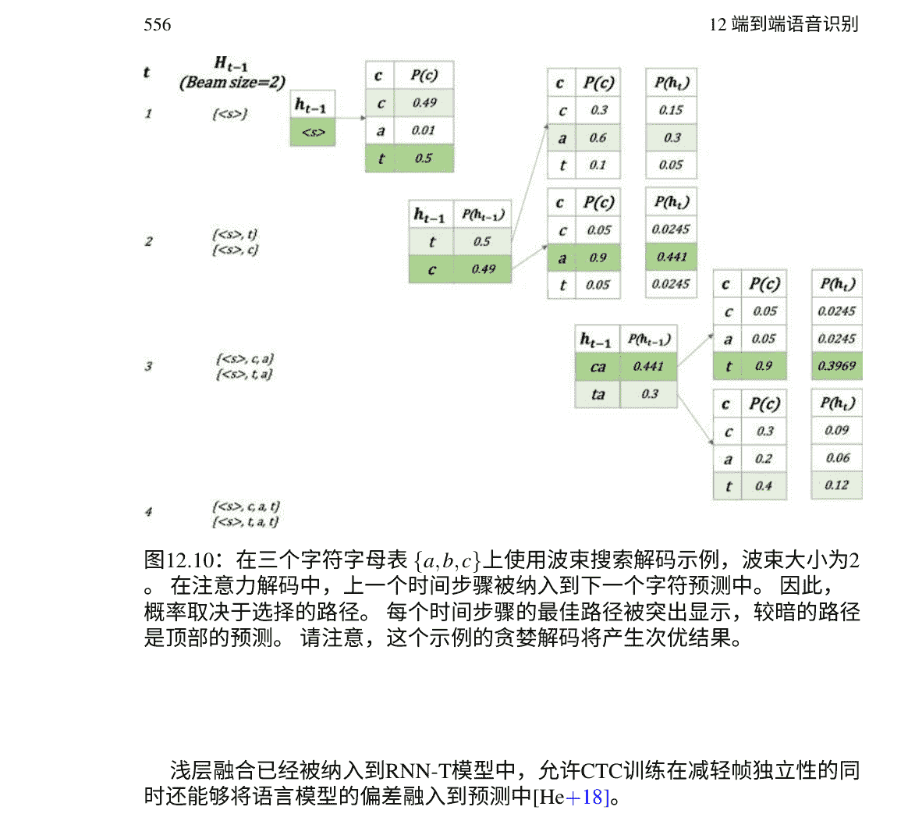

图12.10：在三个字符字母表 {a, b, c} 上使用波束搜索解码示例，波束大小为2。在注意力解码中，上一个时间步骤被纳入到下一个字符预测中。因此，概率取决于选择的路径。每个时间步骤的最佳路径被突出显示，较暗的路径是顶部的预测。请注意，这个示例的贪婪解码将产生次优结果。

浅层融合已经被纳入到RNN-T模型中，允许CTC训练在减轻帧独立性的同时还能够将语言模型的偏差融入到预测中[He+18]。

### 12.5.4 组合语言模型训练

当将神经语言模型纳入端到端的ASR中时，很快就会发现这两者可以一起进行优化，利用来自大型文本语料库的声学信息和语言信息。联合训练声学模型和语言模型的两种最流行的技术是深度融合和冷融合。

### 12.5.4.1 深度融合

另一方面，深度融合[Gul+15]将语言模型融入到声学模型（具体来说是编码器-解码器模型）中，创建一个组合网络。

通过“融合”预训练的AM和LM模型的隐藏状态来实现网络的组合，继续训练以学习“融合”参数。在这个训练过程中，LM和AM的参数是固定的，降低了计算成本并且快速收敛。

$$ g_t = \sigma(\mathbf{v}_g^T \mathbf{s}_t^{LM} + b_g) $$
$$ \mathbf{s}_t^{DF} = [\mathbf{c}_t; \mathbf{s}_t; g_t \mathbf{s}_t^{LM}] $$
$$ P(y_t | \mathbf{h}, Y_{1:(t-1)}) = \text{softmax}(\mathbf{W}_{DF} \mathbf{s}_t^{DF} + \mathbf{b}_{DF}) \quad (12.21) $$

其中 $\mathbf{c}_t$是上下文向量，$\mathbf{h}$是编码器的输出，$\mathbf{v}_g$, $b_g$, $\mathbf{b}_{DF}$和$\mathbf{W}_{DF}$都是在持续训练阶段学习到的。

### 12.5.4.2 冷聚变

冷聚变[Sri+17]扩展了深度融合的思想，将语言模型融入到训练过程中。然而，在冷聚变中，声学模型是从头开始训练的，将预训练的语言模型融入其中。

$$ \mathbf{s}_t^{LM} = DNN(\mathbf{d}_t^{LM}) $$
$$ \mathbf{s}_t^{ED} = \mathbf{W}_{ED}[\mathbf{d}_t; \mathbf{c}_t] + \mathbf{b}_{ED} $$
$$ g_t = \sigma(\mathbf{W}_g [\mathbf{s}_t^{ED}; \mathbf{s}_t^{LM}] + b_g) $$
$$ \mathbf{s}_t^{CF} = [\mathbf{s}_t^{ED}; g_t \circ \mathbf{s}_t^{LM}] $$
$$ \mathbf{r}_t^{CF} = DNN(\mathbf{s}_t^{CF}) $$
$$ P(y_t | \mathbf{h}, Y_{1:(t-1)}) = \text{softmax}(\mathbf{W}_{CF} \mathbf{r}_t^{CF} + \mathbf{b}_{CF}) \quad (12.22) $$

由于冷聚变将语言模型（LM）纳入训练过程中，如果LM发生变化，则需要重新训练。原始论文介绍了一种通过使用LM logits而不是LM隐藏状态来切换语言模型的方法；然而，这会增加学习参数和计算量的数量。

### 12.5.5 组合CTC-注意力解码

使用CTC-attention结构进行解码依赖于生成最可能的字符序列$\hat{\mathbf{c}}$。将这两个输出结合起来是非常复杂的。注意力机制产生一个输出标签序列，而CTC每帧产生一个标签。在[Wat+17b]中，作者提出了两种将CTC和注意力输出结合的方法：重新评分和一次解码。

## 12.5.5.1 重新评分

重新评分依赖于两步方法。第一步是从注意力解码器生成一组完整的假设。第二步是根据CTC和注意力概率（使用前向算法获取CTC概率）重新评分这些假设。

$$\hat{C} = \operatorname{argmax} \{\lambda \alpha_{CTC}(h, X) + (1 - \lambda) \alpha_{ATT}(h, X)\} \quad (12.23)$$

### 12.5.6 单次解码

另一方面，一次通过解码侧重于计算部分假设生成字符的概率。语言模型也可以被纳入解码过程中[HCW18]，通过向解码器添加额外的语言建模项来实现：

$$\hat{C} = \operatorname{argmax} \{\lambda \log P_{CTC}(C|X) + (1 - \lambda) \log P_{ATT}(C|X) + \gamma \log P_{LM}(C)\} \quad (12.24)$$

束搜索中的得分可以描述为：

$$\alpha(h) = \lambda \alpha_{CTC}(h) + (1 - \lambda) \alpha_{ATT}(h) + \gamma \alpha_{LM}(h) \quad (12.25)$$

对于每个不完整的假设 $h$。计算注意力和语言模型得分很简单，可以通过以下方式实现：

$$\begin{aligned} \alpha_{ATT}(h) &= \alpha_{ATT}(g) + \log P_{ATT}(c|g, X) \\ \alpha_{LM}(h) &= \alpha_{LM}(g) + \log P_{LM}(c|g, X) \end{aligned} \quad (12.26)$$

其中 $h = g; c$，$g$ 是已知的假设，$c$ 是要添加到序列中生成 $h$ 的字符。然而，CTC由于可能产生字符序列的序列数量而更加微妙。因此，CTC分数是所有以 $h$ 为前缀的序列的总和。

$$P(h, \dots|X) = \sum_{v \in (U \cup \{<EOS>\})^+} P(h; v|X) \quad (12.27)$$

CTC分数变为：

$$\alpha_{CTC}(h) = \log P(h, \dots|X) \quad (12.28)$$

## 12.6 语音嵌入和无监督语音识别

无监督数据的数量可以比配对的语音-文本平行语料库高出几个数量级。因此，无监督语音识别和用于音频处理的声学嵌入是有前景的研究领域。

### 12.6.1 语音嵌入

最早在语音嵌入中的一项工作是[BH14]。在这项工作中，作者使用了一种Siamese网络形式来训练声学词嵌入，其中听起来相似的单词（声学上相似）在嵌入空间中聚集在一起。通过这种方式，“如果它们听起来相似，那么单词就是相邻的。”通过直接建模单词，语音识别的范式从传统的HMM模型转变为试图建模状态。

该网络分为两个部分进行训练：首先，训练一个CNN分类模型来对固定时长的音频（2秒）中的口语单词进行分类。其次，固定该网络并将其纳入到一个词嵌入网络中。词嵌入网络的训练目标是将正确单词的嵌入与声学嵌入对齐，同时将错误单词分离开来。为了通过使用字母-n-gram的词袋模型来减小输入嵌入空间的大小，只选择了前50000个字母n-grams被用来减小输入嵌入空间的大小（字母-n-grams）。架构图如图12.11所示。

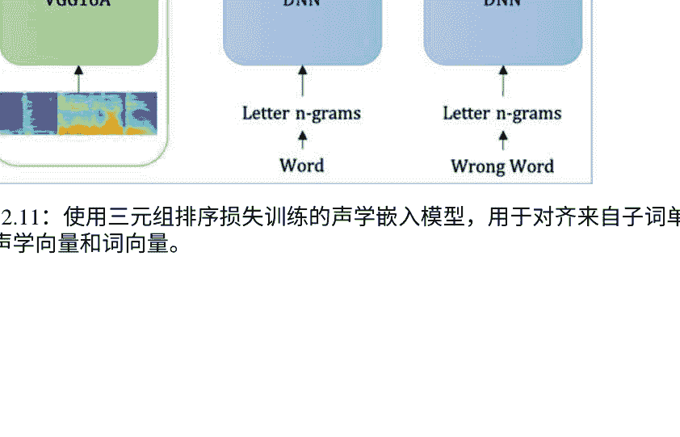

### 12.6.2 无语音

在Unspeech [MB18]中，作者使用了Siamese网络来训练用于说话者自适应、话语聚类和说话者比较的嵌入。这项工作基于相似的语音区域很可能有相同的说话者的假设。真实和虚假说话者示例的上下文取自同一话语的相邻上下文窗口或不同的文件。这个想法类似于负采样的概念。因此，这个网络不期望相似的词在同一个嵌入空间中，而是期望相同的说话者。架构如图12.12所示。

### 12.6.3 音频Word2Vec

卷积神经网络方法的一个缺点是它需要固定长度的音频片段。音频Word2Vec [Chu+16]使用序列到序列自编码器来学习可变长度口语单词的固定表示。因为学习到的表示是输入本身，所以可以完全无监督地学习，因此称为word2Vec的参考。因此，得到的模型能够对单词在查询示例系统中进行编码。训练模型不需要监督；然而，在嵌入过程中需要知道单词边界的知识来创建单词嵌入。

音频Word2Vec在[WLL18]中扩展到了话语级别，通过学习一种分割方法。该方法是分段序列到序列自编码器（SSAE）的一个例子。SSAE学习分割门来确定话语中的单词边界，并学习每个片段的编码。需要一些指导来防止自编码器将话语分割成太多的嵌入；然而，学习适当的估计值是不可微分的。由于学习离散变量的不可微分性，使用强化学习来估计这个数量。

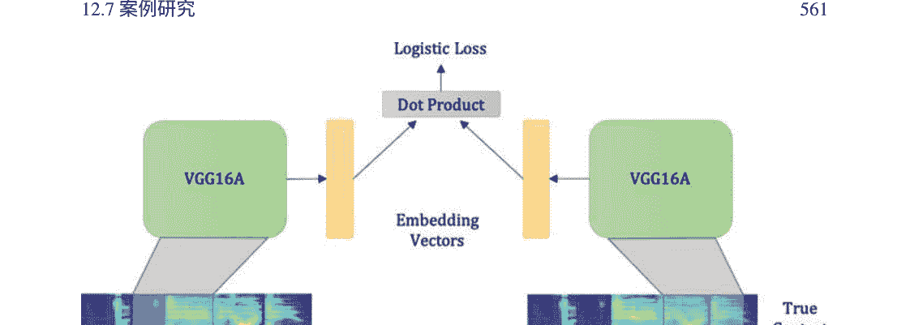

图12.12：使用Siamese CNN网络（VGG16A）训练Unspeech嵌入，计算嵌入向量。计算两个向量的点积，并使用逻辑损失函数来优化二元分类任务，判断上下文窗口是否为目标的真实或虚假上下文窗口。

## 12.7 案例研究

在这个案例研究中，我们继续专注于在Mozilla Common Voice数据集上构建ASR模型。在本章中，我们特别关注使用CTC和混合注意力-CTC模型训练端到端网络的Deep Speech 2模型。

### 12.7.1 软件工具和库

自Deep Speech 2论文发布以来，已经有多个开源实现该架构的版本，最常见的区别是使用的深度学习框架。最流行的是Mozilla的TensorFlow实现，PaddlePaddle实现，以及PyTorch版本。每个版本都有各种优点和缺点，其中一些是深度学习的框架、预处理的数量、可变长度与固定长度的循环神经网络（RNNs）等等。我们专注于PyTorch实现，因为它简单易用。最近的一个重要进展是CTC+attention模型，特别是ESPnet。该工具包专注于端到端的语音识别和文本转语音。该工具包使用Chainer和PyTorch作为后端，并为一些最现代化的架构提供了Kaldi风格的配方。

### 12.7.2 深度语音2

所使用的Deep Speech 2实现是基于PyTorch编写的。它包括一个并行化的数据加载器以加快模型训练速度，一个优化的CTC损失函数，一个带有语言模型支持的CTC解码库，以及用于声学模型训练的数据增强技术。

#### 12.7.2.1 数据准备

数据准备要求使用目录结构或清单文件。在第一种方法中，数据集目录的结构如下所示（图12.13、12.14和12.15）。对于基于字符的模型，不需要额外的音素字典；数据在加载时会被处理成频谱图，然后转换为张量。

在这个实现中，也可以使用“清单”文件来定义使用的数据集。清单类似于Kaldi和Sphinx的结构，包含每个数据集划分中的示例列表。当使用可变长度的RNN时，清单文件对于过滤较长的文件非常有用。

```
1 / common voice
2     / train
3         txt/
4             train_sample000000.txt
5             train_sample000001.txt
6             ...
7         wav/
8             train_sample000000.wav
9             train_sample000001.wav
10            ...
11    / val
12        txt/
13            ...
14        wav/
15            ...
16    / test
17        txt/
18            ...
19        wav/
20            ...
21
```

图12.13: Deep Speech 2的目录结构

```
1 /path/to/train_sample000000.wav,/path/to/train_sample000000.txt
2 /path/to/train_sample000001.wav,/path/to/train_sample000001.txt
3 ...
4
```

图12.14: Deep Speech 2训练集的清单结构

```
1 python train.py --train-manifest data/train_manifest.csv --val-manifest data/val_manifest.csv
2
```

图12.15: Deep Speech 2的训练函数

#### 12.7.2.2 声学模型训练

首先，我们根据默认配置训练一个基础模型。得到的模型有两个卷积层和五个双向GRU层，总共约4100万个可学习参数。我们还启用了训练过程中的数据增强步骤，通过对节奏和增益进行小的变化来减少过拟合。

我们在GPU上训练所有模型，并根据验证集的WER进行早停。在我们的情况下，模型在大约15个epoch后开始发散，如图12.16所示，并且在验证集上达到了最佳的WER，为23.470。一旦模型训练完成，我们在测试集上评估最佳模型，在贪婪解码的情况下，我们实现了平均WER为22.611和CER为7.757。图12.17展示了训练模型的贪婪解码的几个样本。

> 虽然在CPU上训练这个模型是可能的，但由于卷积和循环层的计算密集性，这是不现实的。

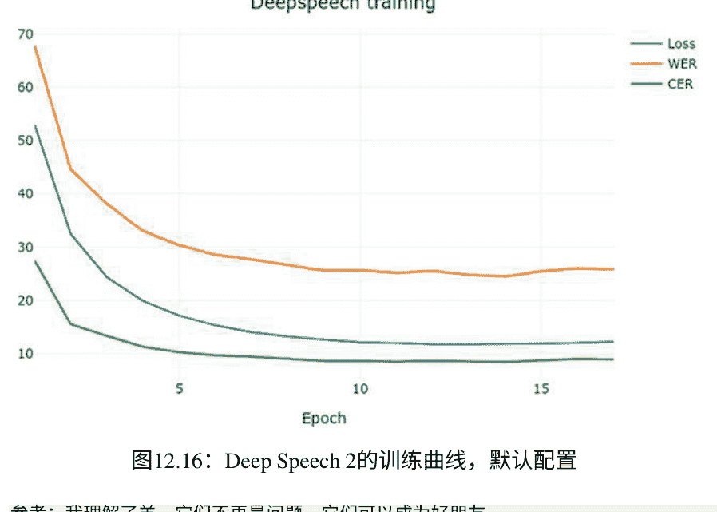

> 1 参考：我理解了羊，它们不再是问题，它们可以成为好朋友
> 2 假设：我理解她们不再是问题，而且她们可以成为好朋友
> 3 WER: 0.214 CER: 0.027
> 4
> 5 参考：当他看着那些石头时，他感到了某种解脱
> 6 假设：当他看着那些石头时，他感到了某种解脱
> 7 WER: 0.333 CER: 0.051
> 8

图12.17：基础Deep Speech 2模型的输出 请注意，许多错误似乎是音标错误，并且会产生非逻辑的单词，例如shee和ashe

### 12.7.3 语言模型训练

基于字符的预测能够产生合理的转录结果，而不需要语言模型。然而，在解码阶段提供语言模型可以改善贪婪预测结果。我们利用ctcdecode包来应用不同的解码方案，该包已集成到PyTorch Deep Speech 2中。关于这个语言模型需要注意的一点是它还包含一个字符FST。这个FST作为一个拼写检查器，强制生成单词。

解码方案可以应用于改善预测的错误率。这些结果总结在表12.1中。

KenLM工具包[Hea+13]用于训练n-gram语言模型。语言模型是根据训练语料库的转录结果创建的，以提供与先前案例研究相当的结果。在实践中，语言模型通常是在非常大的训练语料库上训练的，比如之前提到的Common Crawl(图12.18)。

```
1 kenlm/build/bin/lmplz -o 2 < training_transcripts.txt > cv2gramlm.arpa
2
3 kenlm/build/bin/build_binary cv2gramlm.arpa cv2gramlm.trie
4
```

图12.18：使用KenLM在训练转录中训练一个2-gram语言模型。第一条命令从转录中创建一个ARPA语言模型，第二条命令创建一个用于解码阶段的二进制trie结构的语言模型。

我们通过在验证集上评估它们来确定系统的最佳语言模型，并选择最佳模型应用于测试集。表12.1总结了不同语言模型的WER和CER。

表12.1：不同解码方法的验证结果。最佳结果以粗体显示

| 解码方法 | WER | 字符错误率 |
| :--- | :--- | :--- |
| 无 | 22.832 | 8.029 |
| 2-gram | 12.919 | 7.292 |
| 3-gram | 12.027 | 6.990 |
| 4-gram | **11.865** | **6.915** |
| 5-gram | 11.977 | 6.955 |

在应用默认波束大小（beamwidth = 10）的语言模型后，我们发现最佳模型是4-gram模型。现在，我们可以增加波束大小来评估对预测结果的影响。结果总结如表12.2所示。

表12.2：不同波束大小的验证结果。最佳结果以粗体显示

| 解码方法 | WER | 字符错误率 |
| :--- | :--- | :--- |
| 4-gram，波束大小=10 | 11.865 | 6.915 |
| 4-gram，波束大小=64 | 7.742 | 4.458 |
| 4-gram，波束大小=128 | 6.939 | 3.984 |
| 4-gram，波束大小=256 | 6.288 | 3.616 |
| 4-gram，波束大小=512 | **5.857** | **3.375** |

```
1 参考：我理解了羊，它们不再是问题，它们可以成为好朋友
2 Hyp：我理解了羊，它们不再是问题，它们可以成为好朋友
3 WER：0.0 CER：0.0
4
5 参考：当他看着这些石头时，他感到了一些宽慰
6 假设：当他看着这些石头时，他感到了一些
7 WER：0.083 CER：0.068
8
9
```

图12.19：使用语言模型解码的测试输出。注意，在解码过程中加入语言模型可以纠正许多音标错误；然而，它也可能导致其他错误。在第二个例子中，贪婪解码输出为ason而不是reason，但在应用语言模型之后，假设将其缩减为as，从而降低了WER并增加了该例子的CER。

计算时间与波束大小呈线性增长。在实践中，最好选择一个在性能和质量之间取得良好平衡的波束大小。在测试集上应用我们最好的4-gram语言模型和512大小的波束，我们获得了WER为5.587和CER为3.232。图12.19中展示了一些解码输出的示例。

### 12.7.4 ESPnet

ESPnet是一个端到端的语音处理工具包，受到Kaldi的启发。它主要包含了混合CTC-attention架构，主要是[KHW17]和[Wat+17b]中的架构。该工具包的大部分是基于bash脚本的。与Kaldi类似，它使用Chainer和PyTorch作为后端。在这个案例研究的部分中，使用ESPnet工具包在Common Voice数据集上训练了一个混合CTC-attention架构。

#### 12.7.4.1 数据准备

数据准备与Kaldi非常相似，需要依赖Kaldi进行一些预处理。主要区别在于Kaldi需要音素词典和字典，而我们则生成MFCC特征并以JSON格式存储。该格式包含目标转录、分词转录、特征位置以及训练各个组件的一些附加信息。图12.20展示了格式化训练数据的示例。提取特征并创建输入文件后，网络准备好进行训练。

#### 12.7.4.2 模型训练

模型训练过程在某种程度上也遵循Kaldi脚本；然而，一旦提取了特征，我们就运行训练脚本。训练的模型是一个4层双向LSTM编码器和一个1层单向LSTM解码器。我们使用Adadelta在单个GPU上对该模型进行20个epochs的训练。图12.21显示了完整的训练参数列表。在训练过程中，可以监测CTC和attention的损失，以确保收敛的一致性。训练和验证的总损失是这两个组件的加权和。我们还注意到验证损失与训练数据损失趋势相似，直到最后一个epoch。在这个例子中，由于计算原因，我们设置了一个固定的epoch数量作为停止条件。为了得到最佳模型，我们会继续训练，直到验证损失与训练损失明显不同，并选择在验证数据上表现最好的模型（图12.22）。

准确率曲线如图12.23所示，显示了网络在训练过程中的性能随着训练的进行。前两个时期在早期阶段显示出显著的增益，随着训练的进行，改进逐渐变得适度。我们在训练中的最佳模型在验证数据上达到了WER为12.07。

我们可以通过绘制每个时间步长的权重来检查解码过程中的输出注意力权重。如前所述，通过可视化注意力，我们可以看到在推理过程中对输入的哪部分进行了关注。这在图12.24中显示出来。我们注意到输出通常与输入音频文件相关，产生了一个对齐的输出，能够对音频进行分段，并处理时间上的偏移。在早期阶段，我们注意到注意力对齐到输入时出现了一些中断，而在后一种情况下，注意力对齐似乎与输入无缝对齐。

```
json
{
    "utts": {
        "cv-valid-dev-sample-000000": {
            "input": [
                {
                    "feat": ".valid_dev/deltafalse/feats.l.ark:27",
                    "name": "input1",
                    "shape": [502, 83]
                }
            ],
            "output": [
                {
                    "name": "target1",
                    "shape": [55, 31],
                    "text": "小心你的预测",
                    "token": "BE <space> CARE FUL <space> WITH <space> YOUR <space> PROGNOS TICAT IONS <space> SAID <space> THE <space> STRANGER",
                    "tokenid": "5 8 3 6 4 21 8 9 24 15 3 26 12 23 11 3 28 18 24 21 3 19 21 18 10 17 18 22 23 12 6 4 23 12 18 17 22 3 22 4 12 7 3 23 11 8 3 22 23 21 4 17 10 8 21"
                }
            ],
            "utt2spk": "cv-valid-dev-sample-000000"
        },
        ...
    }
}
```

图12.20: ESPnet训练的数据.json输入文件格式

```
bash
python asr_train.py --backend pytorch --outdir exp/results --dict data/lang_lchar/train_nodev_units.txt --minibatches 0 --resume --train-json dump/cv_valid_train/deltafalse/data.json --valid-json dump/cv_valid_dev/deltafalse/data.json --etype blstmp --elayers 4 --eunits 320 --eprojs 320 --subsample 1_2211 --层1 --单元300 --类型位置 --维度320--卷积--通道数10 --卷积--滤波器数100 --MTL alpha 0.5 --批次--大小30 --最大长度--输入800 --最大长度--输出150 --采样--概率0.0 --opt adadelta --迭代次数20
```

图12.21: ESPnet的训练命令

## 图12.22：训练过程中的损失

## 图12.23：模型的训练和验证准确率曲线

我们的基础模型在测试集上使用贪婪解码（束搜索大小为1）时，WER为12.34，CER为6.25。当在测试集上将束搜索大小设置为20（ESPnet默认选择）时，我们将WER降低到11.56，CER降低到5.80。我们将调整束搜索大小和引入语言模型的工作留作练习。请注意，当我们将此功能添加到Deep Speech 2架构中时，取得了显著的改进。

图12.24：在输入音频上进行单个文件的注意力权重，在第（a）1个时期后和第（b）20个时期后

### 12.7.5 结果

我们现在提供了对本案例研究中评估的技术的总结。测试结果显示在表12.3中。

## 表12.3：Common Voice测试集上的端到端语音识别性能（最佳结果已突出显示）

| 方法 | WER |
| --- | --- |
| Deep Speech 2（无解码） | 22.83 |
| Deep Speech 2（4-gram LM, beam size为512） | 5.59 |
| ESPnet（无解码） | 12.34 |
| ESPnet（无语言模型，beam size为20） | 11.56 |
| Kaldi TDNN（第8章） | 4.44 |

总体而言，使用CTC-attention模型，我们得到了比Deep Speech 2基线（WER为22.83）更快、更稳定的收敛和更低的WER。

尽管这个结果不如第8章中使用Kaldi取得的结果好，但Deep Speech 2（带有语言模型）和Kaldi模型之间的结果是可比较的，即使没有词典模型。训练过程比传统的ASR方法所需的训练步骤更直接，例如去除了迭代训练和对齐的要求。在解码过程中加入语言模型可以获得额外的好处，以提供令人信服的结果，而无需大量的语言资源。

### 12.7.6 读者和实践者的练习

读者和从业者可以尝试一些其他有趣的问题，包括：

- 1. 在新语言上训练Deep Speech 2模型需要做哪些改变？
- 2. 在更多数据上训练语言模型会有什么影响？
- 3. 将测试转录内容纳入验证数据会提高结果吗？测试数据呢？
- 4. 将测试转录内容纳入语言模型会损害结果的有效性吗？
- 5. 如何将RNN语言模型纳入Deep Speech 2和ESPnet的解码过程中？
- 6. 在ESPnet模型上进行波束搜索的网格搜索。

## 参考文献

- [Amo+16] Dario Amodei等。 “Deep speech 2: End-to-end speech recognition in English and Mandarin”。 In: International Conference on Machine Learning. 2016, pp. 173–182.
- [BCB14a] Dzmitry Bahdanau, Kyunghyun Cho, 和 Yoshua Bengio。 “Neural machine translation by jointly learning to align and translate”。 In: *arXiv preprint arXiv:1409.0473* (2014).
- [Bah+16c] Dzmitry Bahdanau等人。 “基于端到端注意力的大词汇语音识别”。 在：声学、语音和信号处理 (ICASSP), 2016年IEEE国际会议。 IEEE。 2016年, 第4945-4949页。
- [BH14] Samy Bengio和Georg Heigold。 “用于语音识别的词嵌入”。 在：国际语音通信协会第十五届年会。 2014年。
- [Cha+16b] William Chan等人。 “听、关注和拼写：用于大词汇对话语音识别的神经网络”。 在：声学、语音和信号处理 (ICASSP), 2016年IEEE国际会议。 IEEE。 2016年, 第4960-4964页。
- [Cho+14] Kyunghyun Cho等人。 “使用RNN编码器-解码器学习短语表示用于统计机器翻译”。 在：arXiv预印本 *arXiv:1406.1078* (2014年)。
- [Cho+15c] Jan K Chorowski等人。 “基于注意力机制的语音识别模型”。 在：神经信息处理系统进展。 2015年, 第577-585页。
- [Chu+16] Y.-A. Chung等人。 “音频Word2Vec：使用序列到序列自编码器进行无监督学习的音频片段表示”。
- [CPS16] Ronan Collobert, Christian Puhrsch和Gabriel Synnaeve。 “Wav2letter：一种基于端到端ConvNet的语音识别系统”。 在：arXiv预印本 *arXiv:1609.03193* (2016)。
- [Gra12] Alex Graves。 “使用循环神经网络进行序列转导”。 在：*arXiv*预印本 *arXiv:1211.3711* (2012)。
- [GMH13] Alex Graves, Abdel-rahman Mohamed, and Geoffrey Hinton。 “使用深度递归神经网络进行语音识别”。 在：声学、语音和信号处理 (ICASSP), 2013年IEEE国际会议。 2013年, 第6645-6649页。
- [Gra+06] Alex Graves等。 “连接主义时间分类：使用递归神经网络对非分段序列数据进行标记”。 在：第23届国际机器学习会议论文集。 ACM。 2006年, 第369-376页。
- [Gul+15] Caglar Gulcehre等。 “在神经机器翻译中使用单语语料库”。 在：arXiv预印本 *arXiv:1503.03535* (2015)。
- [Han17] Awni Hannun。 “使用CTC进行序列建模”。 在：*Distill*。 (2017)。
- [Han+14a] Awni Hannun等。 “深度语音：扩展端到端语音识别”。 在：arXiv预印本 *arXiv:1412.5567* (2014)。
- [Han+14b] Awni Y Hannun等人。 “使用双向递归DNN进行首次大词汇连续语音识别”。 在：arXiv预印本 *arXiv:1408.2873* (2014)。
- [He+18] Yanzhang He等人。 “面向移动设备的流式端到端语音识别”。 在：arXiv预印本arXiv:1811.06621 (2018)。
- [Hea+13] Kenneth Heafield等人。 “可扩展的修改Kneser-Ney语言模型估计”。 在：计算语言学协会第51届年会论文集（第2卷：短论文） 第2卷。2013年，第690-696页。
- [HCW18] Takaaki Hori, Jaejin Cho和Shinji Watanabe。 “基于单词的RNN语言模型的端到端语音识别”。 在：arXiv预印本arXiv:1808.02608 (2018)。
- [Hor+17] Takaaki Hori等人的“基于深度CNN编码器和RNN-LM的联合CTC-attention的端到端语音识别的进展”。 在：arXiv预印本arXiv:1706.02737 (2017)。
- [KWL16] Herman Kamper, Weiran Wang和Karen Livescu的“使用单词对侧面信息的深度卷积声学词嵌入”。 在：声学、语音和信号处理（ICASSP），2016年IEEE国际会议。 IEEE。2016年，第4950-4954页。
- [KHW17] Suyoun Kim, Takaaki Hori和Shinji Watanabe的“基于联合CTC-attention的端到端语音识别的多任务学习”。 在：声学、语音和信号处理（ICASSP），2017年IEEE国际会议。 IEEE。2017年，第4835-4839页。
- [Li+17] J. Li等人“无OOV的声学到词模型”。 在：ArXiv e-prints (2017年11月)。
- [Liu+17] 刘海荣等人“Gram-CTC：用于序列标注的自动单元选择和目标分解”。 在：arXiv预印本arXiv:1703.00096 (2017年)。
- [MB18] Benjamin Milde和Chris Biemann。 “Unspeech：无监督的语音上下文嵌入”。 在：arXiv预印本arXiv:1804.06775 (2018年)。
- [MHG+14] Volodymyr Mnih, Nicolas Heess, Alex Graves等人“视觉注意力的循环模型”。 在：神经信息处理进展系统。2014年，第2204-2212页。
- [Pra+18] Vineel Pratap等人“wav2letter++：最快的开源语音识别系统”。 在：arXiv预印本arXiv:1812.07625 (2018年)。
- [SLS16] Hagen Soltau, Hank Liao和Hasim Sak。 “神经语音识别器：大词汇语音识别的声学到词语的LSTM模型”。 在：arXiv预印本arXiv:1610.09975 (2016年)。
- [Sri+17] Anuroop Sriram等。 “冷聚变：训练seq2seq模型与语言模型一起”。 在：arXiv预印本arXiv:1708.06426 (2017年)。
- [Tos+18] Shubham Toshniwal等。 “编码器-解码器语音识别中技术的比较”。 在：arXiv预印本arXiv:1807.10857 (2018年)。
- [VDO+16] A`aron Van Den Oord等。 “WaveNet：原始音频的生成模型。” 在：SSW。2016年，第125页。
- [WLL18] Yu-Hsuan Wang, Hung-yi Lee, and Lin-shan Lee “分段音频word2vec: 用于表示向量序列的话语的应用-在口语词语检测中的应用”。 在：2018年IEEE国际会议声学、语音和信号处理（ICASSP）。 IEEE。2018年，第6269-6273页。
- [Wat+17b] 渡边真治等人。 “用于端到端语音识别的混合CTC/attention架构”。 在:IEEE选定主题信号处理杂志11.8 (2017), pp. 1240–1253.
- [Xia+18] 张宇晓等人。 “基于混合CTC-Attention的端到端语音识别使用子词单元”。 在：arXiv预印本arXiv:1807.04978 (2018)。
- [ZSG90] Victor Zue, Stephanie Seneff, 和 James Glass。 “麻省理工学院的语音数据库开发：TIMIT和更多”。 在:语音通信 9.4(1990), 页码 351–356.

## 13.1 引言

在本章中，我们研究了深度强化学习在文本和语音应用中的应用。强化学习是机器学习的一个分支，涉及代理如何学习一组可以最大化预期累积奖励的动作。在过去的研究中，强化学习主要关注游戏玩法。深度学习的最新进展使得强化学习可以应用于更广泛的实际问题，从而催生了深度强化学习领域。在本章的第一部分，我们介绍了强化学习的基本概念及其通过使用深度神经网络进行扩展的方法。在本章的后半部分，我们研究了几种流行的深度强化学习算法及其在文本和语音自然语言处理任务中的应用。

## 13.2 强化学习基础

强化学习（RL）是人工智能研究中最活跃的领域之一。尽管监督学习要求我们提供带标签的、独立且具有相同分布的数据，但强化学习只需要我们指定一个期望的奖励。此外，它可以学习涉及延迟奖励的顺序决策任务，尤其是那些在未来发生的远离当前时刻的任务。

强化学习代理在离散的时间步骤中与环境进行交互。在每个时间 t，处于状态 s_t 的代理从可用动作集中选择一个动作 a_t，并转移到一个新的状态 s_{t+1}，并接收奖励 r_{t+1}。代理的目标是学习一组最佳动作，称为策略，以产生最高的累积奖励（图13.1）。代理可以（可能是随机地）选择任何可用的动作。代理从开始到结束所采取的任何一组动作被称为一个回合。正如我们将在下面看到的，我们可以使用马尔可夫决策过程来捕捉强化学习问题的回合动态。

由于强化学习的顺序决策性质，它面临着一种被称为信用分配问题的困难。由于有许多可能导致延迟奖励的动作，强化学习方法很难将对这些奖励产生最大正面或负面影响的动作子集归因给出。对于具有大状态和动作空间的问题，这变成了一个特别困难的问题。

### 13.2.1 马尔可夫决策过程

马尔可夫决策过程（MDP）是一个有用的数学框架，用于将情况建模为离散时间随机控制过程。从数学上讲，MDP可以使用元组来表示：

```
$(s, a, p_a, r_a, \gamma)$  (13.1)
```

其中：

- s = 有限状态集合
- a = 有限动作集合
- p_a = 每个动作的概率_a
- r_a = 执行动作后的奖励_a
- γ = 时间折扣因子

该过程处于某个状态 s，并且在每个时间步骤中，决策者可以选择状态 s 中可用的任何动作 a。该过程在下一个时间步骤中响应通过随机移动到一个新的状态 s'，并给决策者一个相应的奖励Ra(s,s')。该过程从当前状态s移动到新状态 s'的概率受到选择的动作和收到的奖励 r的影响。具体而言，它由状态转移函数 p(s'|s,a)定义：

```
$p(s'|s,a) = \Pr\{S_t = s'|S_{t-1} = s, A_{t-1} = a\} = \sum_{r \in \mathcal{R}} p(s', r|s, a)$  (13.2)
```

这样的：
$$ \sum_{s' \in \mathcal{S}} \sum_{r \in \mathcal{R}} p(s', r|s, a) = 1, \text{对于所有的 } s \in \mathcal{S}, a \in \mathcal{A}(s) \quad (13.3) $$
因此，下一个状态 $s'$ 取决于当前状态 $s$ 和决策者的动作 $a$。但是，给定 $s$ 和 $a$，它在条件上独立于所有先前的状态和动作；换句话说，MDP 的状态转换满足马尔可夫性质。

马尔可夫决策过程是马尔可夫链的扩展，其中添加了一组动作（允许选择）和奖励（提供动机）。相反，如果每个状态只有一个动作，并且所有奖励都相等，那么马尔可夫决策过程就简化为马尔可夫链。

### 13.2.2 值函数、$Q$函数和优势函数

我们将 $r_t$ 定义为我们在时间 $t$ 收到的奖励。我们可以将回报定义为未来奖励序列的总和：
$$ G_t = r_{t+1} + r_{t+2} + \ldots \quad (13.4) $$
通常，我们包括一个时间折扣因子 $\gamma \in (0,1)$，未来累积奖励可以表示为：
$$ G_t = \sum_{k=0}^{\infty} \gamma^k r_{t+k+1} \quad (13.5) $$
通过这个定义，我们可以定义一个状态 $s$ 的值函数为期望的累积回报：
$$ V(s) = \mathbb{E}[G_t | s_t = s] \quad (13.6) $$
任何特定状态的值函数都不是唯一的。它取决于我们在未来采取的一系列行动。我们定义一组未来行动，称为策略 $\pi$：
$$ a = \pi(s) \quad (13.7) $$
然后与该策略相关联的值函数是唯一的：
$$ V_\pi(s) = \mathbb{E}_\pi[G_t | s_t = s] \quad (13.8) $$
$$ = \mathbb{E}_\pi \left[ \sum_{k=0}^{\infty} \gamma^k r_{t+k+1} | s_t = s \right] \quad (13.9) $$
请注意，虽然这个策略相关的值函数是唯一的，但实际值在非确定性策略下可能是随机的（例如，我们从策略定义的可能动作分布中进行采样）：
$$ \pi(a|s) = \mathbb{P}[a|s] \quad (13.10) $$

除了找到特定状态的值函数外，我们还可以定义给定状态的特定动作的值函数。这被称为动作值函数或Q函数：

$$Q_{\pi}(s, a) = \mathbb{E}_{\pi}[G_t | s_t = s, a_t = a]$$

$$= \mathbb{E}_{\pi}\left[ \sum_{k=0}^{\infty} \gamma^k r_{t+k+1} | s_t = s, a_t = a \right]$$

与值函数一样，Q函数对于特定策略π的动作是唯一的。期望考虑了根据策略的未来动作的随机性，以及从环境返回的状态的随机性。请注意：

$$V_{\pi}(s) = \mathbb{E}_{a \sim \pi}[Q_{\pi}(s, a)]$$

策略π的优势函数通过计算状态值函数和状态-动作值函数之间的差异来衡量一个动作的重要性：

$$A_{\pi}(s, a) = Q_{\pi}(s, a) - V_{\pi}(s)$$

因为值函数V衡量了遵循策略π后状态s的价值，而Q函数衡量了从状态s采取动作a的价值，所以优势函数衡量了从状态s采取特定动作的收益或损失。

### 13.2.3 贝尔曼方程

强化学习的基本突破是一组用于值函数和Q函数的传播方程。这些方程通常被称为贝尔曼方程，以美国应用数学家Richard Bellman命名。对于状态值函数，贝尔曼方程如下：

$$V_{\pi}(s) = \mathbb{E}_{s'}[r + \gamma V_{\pi}(s') | s_t = s]$$

这个方程告诉我们，与策略π相关联的状态值函数是下一个状态的奖励和折扣后的状态值函数的期望值。类似地，Q函数的贝尔曼方程如下：

$$Q_{\pi}(s, a) = \mathbb{E}_{s', a'}[r + \gamma Q_{\pi}(s', a') | s_t = s, a_t = a]$$

贝尔曼方程的重要性在于它们让我们能够将状态的值表示为其他状态的值。这意味着如果我们知道 s_{t+1} 的值，我们可以很容易地计算出 s_t 的值。这为计算每个状态的值打开了迭代方法的大门，因为如果我们知道下一个状态的值，我们就可以更新当前状态的值。

可以计算出当前状态的值。听起来熟悉吗？这类似于反向传播的概念。

### 13.2.4 最优性

任何强化学习问题的目标是找到导致最高期望累积奖励的最优决策。强化学习方法根据它们如何优化策略 π 分为几个主要类别之一：

- 1. 对于预期奖励：
$$
\max_{\pi} \mathbb{E} \left[ \sum_{k=0}^{\infty} \gamma^k \text{奖励}_{t+k+1} \right] \qquad (13.17)
$$
- 2. 对于优势函数：
$$
\max_{\pi} A_{\pi}(s, a) \qquad (13.18)
$$
- 3. 对于Q函数：
$$
\max_{\pi} Q_{\pi}(s, a) \qquad (13.19)
$$

诸如动态规划或策略梯度等方法旨在优化预期奖励，而演员-评论家模型和Q学习方法则专注于优化优势函数和Q函数。

对于任何特定的动作策略，我们可以使用值函数来确定其预期奖励。始终至少存在一种优于或等于其他所有策略的策略。这被称为最优策略，称为 π∗，可能不是唯一的。所有最优策略共享相同的状态值函数：

$$
V_{*}(s) = \max_{\pi} V_{\pi}(s) \qquad (13.20)
$$

最优策略还共享相同的动作值函数：

$$
Q_{*}(s, a) = \max_{\pi} Q_{\pi}(s, a) \qquad (13.21)
$$

贝尔曼方程可以应用于最优状态值函数 V*，从而给出独立于任何选择的策略的贝尔曼最优方程：

$$
V_{*}(s) = \max_{a} \mathbb{E}_{s'} [r + \gamma V_{*}(s')] \qquad (13.22)
$$

同样，最优的动作值函数与选择的策略无关，并且可以表示为：

$$
Q_{*}(s, a) = \mathbb{E}_{s'} \left[ r + \gamma \max_{a'} Q_{*}(s', a') | s, a \right] \qquad (13.23)
$$

### 13.2.5 动态规划方法

当环境是已知且完全规定的时候，可以应用动态规划方法来找到最优策略。关键概念是使用价值函数来搜索改进的策略。动态规划通常应用于有限马尔可夫决策过程问题，是一类重要的强化学习算法的基础。

### 13.2.5.1 策略评估

给定一个策略 π，我们可以确定该策略的状态值函数 V_π。使用上述贝尔曼方程，可以从一个近似的 V_π 开始，并迭代更新估计值 V_k 直到收敛于 V_π，即 k → ∞：

$$V_{k+1}(s) = \mathbb{E}_\pi[r_{t+1} + \gamma V_k(s_{t+1}) | s_t = s] \quad (13.24)$$
$$= \sum_a \pi(a|s) \sum_{s',r} p(s', r | s, a) [r + \gamma V_k(s')] \quad (13.25)$$

上述是一个预期的更新，因为它基于对所有可能的下一个状态和动作的期望（图13.2）。

### 13.2.5.2 策略改进

考虑下一个动作 a 对于不来自策略 π 的状态 s。采取这个动作的价值由动作值函数给出：

$$Q_\pi(s, a) = \mathbb{E}[r_{t+1} + \gamma V_\pi(s_{t+1}) | s_t = s, a_t = a] \quad (13.26)$$
$$= \sum_{s',r} p(s', r | s, a) [r + \gamma V_\pi(s')] \quad (13.27)$$

如果我们将采取这个动作的价值与我们的策略 π 进行比较，我们可以决定是否采用一个采取动作 a 的新策略。这导致了策略改进定理，该定理指出对于任何两个确定性策略 π 和 π'，如果：

$$Q_\pi(s, \pi'(s)) \geq V_\pi(s) \quad (13.28)$$

那么必须有：

$$V_{\pi'}(s) \geq V_\pi(s) \quad (13.29)$$

当我们发现一个新的策略 π' 更好时，我们可以采用其值 V_{\pi'} 并用它来找到一个更好的策略。这里，E 表示策略评估，I 表示策略改进。这个迭代过程被称为策略迭代，我们在策略评估（π → V_π）和策略改进（V_π → π'）之间循环，直到找到最优的策略 π_*：

$$\pi_0 \rightarrow V_{\pi_0} \rightarrow \pi_1 \rightarrow V_{\pi_1} \rightarrow \pi_2 \rightarrow \dots \rightarrow \pi_* \rightarrow V_* \quad (13.30)$$

其中 E 表示策略评估，I 表示策略改进。因为有限马尔可夫决策过程有有限数量的可能策略，这个过程会收敛到最优策略 $\pi_*$。

### 13.2.5.3 值迭代

策略迭代存在一个潜在的严重缺点，即对策略 $\pi$ 的评估在计算上是昂贵的，因为它需要对MDP中的每个状态进行迭代计算。我们可以通过执行单次更新迭代 ($V_{\pi} \approx V_{k+1}$) 来近似计算 $V_{\pi}$，而不是等待收敛 $k \rightarrow \infty$:

$$V_{k+1}(s) = \max_a \mathbb{E}_\pi [r_{t+1} + \gamma V_k(s_{t+1}) | s_t = s, a_t = a] \quad (13.31)$$

$$= \max_a \sum_{s',r} p(s',r|s,a) [r + \gamma V_k(s')] \quad (13.32)$$

这被称为值迭代，它在计算上非常高效，因为它将截断的策略评估与策略改进相结合。

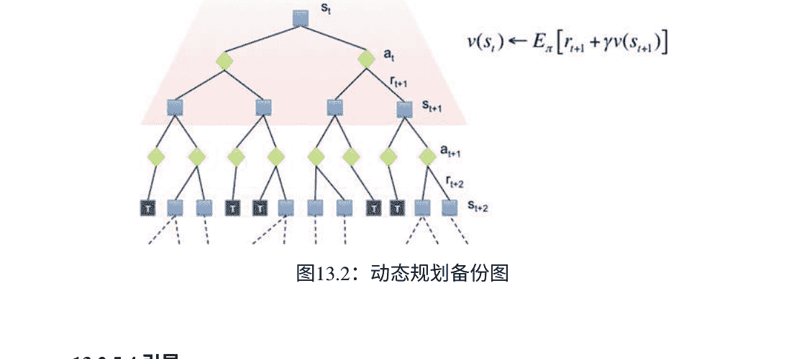

### 13.2.5.4 自举

自举的概念是动态规划中的一个重要概念，它指的是从后继状态的值的估计中估计出一个状态或状态-动作值。自举是其他强化学习方法（如时序差分学习或Q学习）的一个组成部分，可以实现更快的在线学习。然而，由于它基于使用估计值进行估计的概念，可能会出现不稳定性。而且，对于更长的后继状态序列进行自举的方法将具有更好的收敛性质。

### 13.2.5.5 异步动态规划

动态规划方法在有限MDP的整个状态集上操作。当状态集很大时，动态规划是不可行的，因为在完成一次扫描之前，必须更新每个状态。异步动态规划方法不等待所有状态都被更新，而是在每次扫描中更新一部分状态。只要所有状态最终都被更新，这样的方法就会收敛。异步动态规划方法非常有用，因为它们可以以在线方式运行，同时代理正在体验MDP的状态。因此，在选择要更新的状态子集时可以考虑代理的经验。这类似于束搜索的概念。

### 13.2.6 蒙特卡洛

与需要完全了解环境的动态规划方法不同，蒙特卡洛（MC）方法通过学习一组代理经验来进行学习。这些情节性经验是代理与环境的交互中的实际或模拟的动作、状态和奖励的序列。蒙特卡洛方法不需要先前的知识，但仍然可以通过简单地使用每个状态和动作的平均样本奖励来产生最优策略。

考虑一组情节 E，其中每个状态 s ∈ E 的出现被称为一次访问。为了估计 V_π(s)，我们可以跟踪每次访问直到情节的结束来计算回报 G，然后对它们进行平均以生成更新：

$$V(s_t) \leftarrow V(s_t) + \alpha [G_t - V(s_t)] \quad (13.33)$$

其中 α 是学习率（图13.3）。值得注意的是，使用蒙特卡洛方法，每个状态的估计是相互独立的。它不使用自举法。因此，蒙特卡洛方法允许我们专注于改进结果的一部分相关状态。

MC方法可以用于估计状态-动作值以及状态值。与其按照访问某个状态 s，我们可以按照在访问某个状态 s 时采取的动作 a，并相应地进行平均。然而，不幸的是，某些状态-动作对可能永远不会被访问。对于确定性策略，从任何状态只采取一个动作，因此只会估计一个状态-动作对。必须估计每个状态的所有动作的值以进行策略改进。克服蒙特卡洛方法中的充分探索问题的一种方法是使用探索起点，这是一种通过随机选择动作和状态来生成序列的方法。 这被称为就地策略方法，因为我们试图改进生成序列的策略。

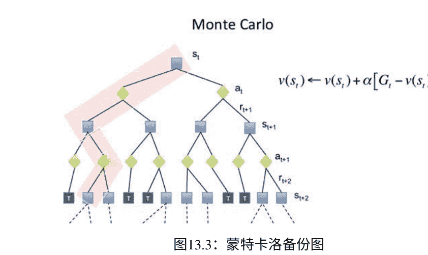

图13.3：蒙特卡洛备份图

### 13.2.6.1 重要性采样

离策略方法基于两个独立的策略：一个目标策略将被优化，另一个探索策略用于生成行为（称为行为策略）。 离策略蒙特卡洛方法通常使用重要性采样的概念，这是一种从一个分布中给定样本估计另一个分布的期望的技术。 关键思想是通过转移概率质量来更频繁地采样对期望值有更大影响的值。

请注意，目标策略和行为策略可以是无关的，可以是确定性的或者是随机的。

## 13.2.7 时序差分学习

时序差分（TD）学习旨在将动态规划和蒙特卡洛方法的优点结合起来。 与动态规划类似，它使用自举法来更新估计值，而不必等到整个回合结束。 同时，它可以从经验中学习，而无需像蒙特卡洛方法那样对环境建立显式模型。 最简单的TD学习方法是一步TD，也称为TD(0)。它基于以下方式更新状态值函数（图13.4）：

$$V(s_t) \leftarrow V(s_t) + \alpha [r_{t+1} + \gamma V(s_{t+1}) - V(s_t)] \quad (13.34)$$

这可以写成：

$$V(s_t) \leftarrow V(s_t) + \alpha\delta_t \quad (13.35)$$

其中：

$$\delta_t = r_{t+1} + \gamma V(s_{t+1}) - V(s_t) \quad (13.36)$$

被称为TD误差。与蒙特卡洛等其他方法必须等到回合结束（时间T）才能更新 $V(s_t)$ 不同，这种方法仅使用下一个时间步的估计值进行更新。也就是说，一步TD估计了回报 $G_t \rightarrow r_{t+1} + \gamma V(s_{t+1})$。这是自举法的一个例子。与蒙特卡洛类似，TD使用样本回报来近似期望回报。与动态规划类似，TD使用 $V(s_{t+1})$ 代替 $V_\pi(s_{t+1})$。与动态规划方法相比，TD方法不需要环境模型。此外，TD方法以在线方式更快地进行更新，而蒙特卡洛方法必须等到整个回合结束才能计算更新中使用的回报。对于非常长的回合，蒙特卡洛可能太慢了。

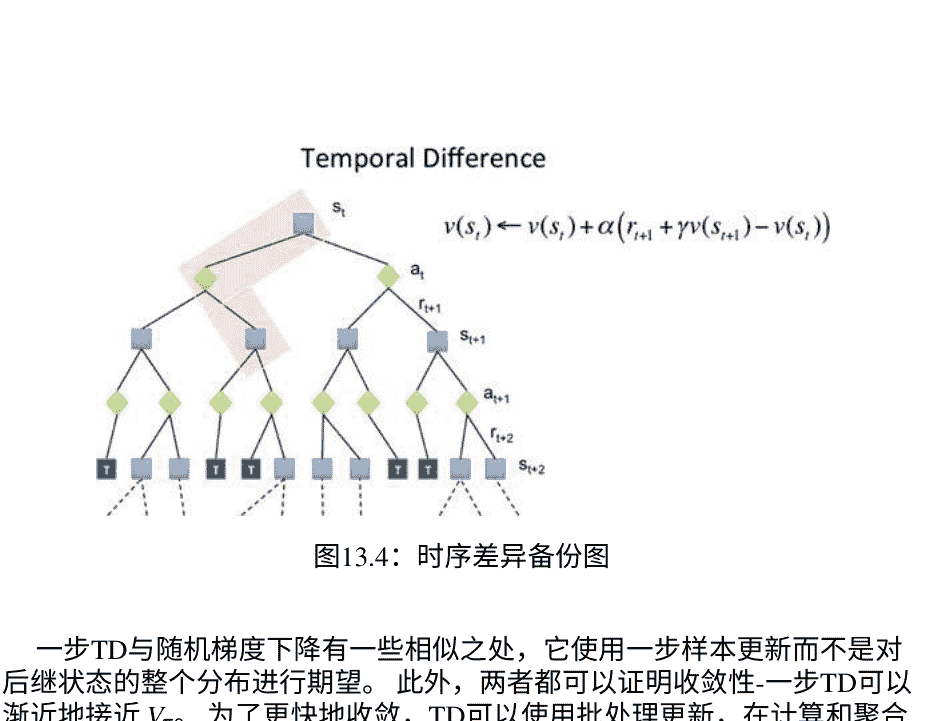

一步TD与随机梯度下降有一些相似之处，它使用一步样本更新而不是对后继状态的整个分布进行期望。此外，两者都可以证明收敛性-一步TD可以渐近地接近 $V_\pi$。为了更快地收敛，TD可以使用批处理更新，在计算和聚合一批经验后更新值函数。

TD方法不限于单个时间步长，$n$ 步TD允许通过使用更新规则在多个步骤上进行自举。

$$V_{t+n}(s_t) = V_{t+n}(s_t) + \alpha[G_{t:t+n} - V_{t+n-1}(s_t)] \quad (13.37)$$

其中0 ≤ t < T，$n$ 步回报由以下公式给出：

$$G_{t:t+n} = r_{t+1} + \gamma r_{t+2} + \dots + \gamma^{n-1} r_{t+n} + \gamma^{n} V_{t+n-1}(s_{t+n}) \quad (13.38)$$

这个 $n$ 步回报是对完整回报的近似，其中最后一项是对 $n$ 步之后剩余回报的估计。一步TD可以在计算后继状态之后进行更新，而 $n$ 步TD必须等待 $n$ 步之后的整个回合才能进行更新。作为一种权衡，$n$ 步TD为具有更好收敛性质的状态值函数提供更好的估计，而一步TD则不然。

**算法1：一步TD学习算法**
输入：策略 π
输出：值函数 V
用 $V(终止)=0$ 随机初始化 $V$
对于每个回合执行以下步骤：
    初始化状态 $s$
    对于每个回合的每个步骤，直到终止 **do**
        根据 π 给出动作 $(a|s)$
        观察奖励 $r$，下一个状态为 $(s')$
        更新 $V(s) \leftarrow V(s) + \alpha[r + \gamma V(s') - V(s)]$
        更新状态为 $(s')$

## 13.2.7.1 SARSA

在无模型的情况下，动作值方法在当前状态下操作是有优势的，因为它们不需要访问环境的模型。这与状态值函数形成对比，后者需要模型，因为它们需要评估未来状态和可能的动作。我们可以通过考虑从一个状态-动作对到下一个状态-动作对的转换来应用时间差分方法来估计动作值函数：

$$ Q(s_t, a_t) \leftarrow Q(s_t, a_t) + \alpha [r_{t+1} + \gamma Q(s_{t+1}, a_{t+1}) - Q(s_t, a_t)] \quad (13.39)$$

请注意，此更新仅适用于从非终端状态到终端状态的转换，因为在终端状态下，$Q(s_{t+1}, a_{t+1}) = 0$。因为此更新取决于元组 $(s_t, a_t, r_{t+1}, s_{t+1}, a_{t+1})$，所以它被称为SARSA。它是一种完全在线的、基于策略的方法，渐进地收敛到最优策略和动作值函数。

**算法2：SARSA学习算法**
- 输入：策略π
- 输出：Q函数
- 随机初始化 \( Q(s,a) \)，其中 \( Q(terminal, all) = 0 \)
- 对于每个回合执行以下操作
  - 初始化状态 \( s \)
  - 根据 \( Q \) 选择动作 \( a \) 从 \( \pi(a|s) \)
  - 对于每个回合的每一步直到终止状态执行以下操作
    - 采取行动 \( a \)，观察奖励 \( r \)，下一个状态 \( s' \)
    - 根据策略选择下一个动作 \( a' \)
    - 更新 \( Q(s,a) \leftarrow Q(s,a) + \alpha[r + \gamma Q(s',a') - Q(s,a)] \)
    - 更新 \( s \leftarrow s' \), \( a \leftarrow a' \)

### 13.2.8 策略梯度

策略梯度方法旨在直接优化策略，而无需学习状态或动作值函数。具体而言，这些无模型方法使用参数化表示来表示具有参数θ的随机策略 \( \pi(a|s; \theta) \)，并寻求优化期望回报：

$$ \max_{\theta} \mathbb{E}_{\pi}[G_t] \quad (13.40)$$

通过应用梯度上升来更新策略参数：

$$ \theta \leftarrow \theta + \alpha \nabla_{\theta} \mathbb{E}_{\pi}[G_t] \quad (13.41)$$

请注意，此公式在计算梯度之前评估期望值，这要求我们知道 \( \pi(a|s; \theta) \) 的过渡概率分布。为了分析的可行性，我们可以利用策略梯度定理，即：

$$ \nabla_{\theta} \mathbb{E}_{\pi}[G_t] = \nabla_{\theta} \int_{x \sim \pi} p_{\theta}(x) G_t(x) dx \quad (13.42)$$

$$ = \int_{x \sim \pi} p_{\theta}(x) \nabla_{\theta} \log p_{\theta}(x) G_t(x) dx \quad (13.43)$$

$$ = \mathbb{E}_{\pi}[\nabla_{\theta} \log \pi(a_t|s_t; \theta) G_t] \quad (13.44)$$

这使我们能够将策略梯度更新规则表示为：

$$ \theta \leftarrow \theta + \alpha \mathbb{E}_{\pi}[\nabla_{\theta} \log \pi(a_t|s_t; \theta) G_t] \quad (13.45)$$

因此，我们可以更新我们的策略，而无需计算动作和状态的转移概率分布或需要模型。策略梯度方法对于连续和离散的动作空间都很有用。一种流行的方法，称为REINFORCE，应用随机梯度下降，每个步骤只使用一个序列进行训练以估计参数 θ。因此，它是一个具有降低计算负担的无偏估计器。但是，由于它使用单个序列来估计奖励，REINFORCE 可能会受到高方差的影响，并且需要更长的时间才能收敛。减少这种方差的一种方法是从我们的预期回报中减去一个基准 $r_b(s_t)$ 奖励，这样可以教会模型增加生成高于平均预期回报的动作的概率：

$$\theta \leftarrow \theta + \alpha\mathbb{E}_\pi [\nabla_{\theta} \log \pi(a_t|s_t; \theta) (G_t - r_b(s_t))] \quad (13.46)$$

通过对一批动作序列进行采样，可以将该批次上的平均奖励用作该批次中每个动作序列的基准奖励，在梯度更新中使用。只要基准奖励不依赖于策略参数 θ，估计器仍然保持无偏。

**算法3: REINFORCE算法**
- **输入:** 策略 π(a|s; θ)
- **输出:** 最优策略 π_*
- 初始化策略参数 θ
- 当未收敛时
    - 按照策略 π 生成一个序列
    - 对于每个步骤直到终止
        - 计算回报 G
        - 更新 θ ← θ + αγ^t G ∇ log π(a_t|s_t; θ)

### 13.2.9 Q学习

Q-learning 基于这样的观点，即如果最优 Q 函数可用，则可以通过以下关系直接找到最优策略：

$$\pi^*(s) = \arg\max_a Q^*(s, a) \quad (13.47)$$

因此，这些方法尝试直接学习最优 Q 函数，始终选择任何状态下的最佳动作，而无需考虑正在遵循的策略。Q-learning 是一种离策略的时序差分方法，通过以下方式更新动作-状态值函数：

$$Q(s_t, a_t) \leftarrow Q(s_t, a_t) + \alpha [r_{t+1} + \gamma \max_{a'} Q(s_{t+1}, a') - Q(s_t, a_t)] \quad (13.48)$$

这个方程与 SARSA 非常相似，只是它通过对未来动作进行最大化来估计未来的预期奖励。实际上，Q-learning 使用贪婪更新来逐步接近最优的 Q 函数，并已被证明在极限情况下收敛到 Q*。

算法4: Q-learning算法

**输出：** Q函数

随机初始化 $Q(s, a)$，其中 $Q(terminal, all) = 0$

对于每个回合执行以下操作：
- 初始化状态 $s$
- 对于每个回合的每个步骤，直到终止 **do**
  - 从 $Q$ ($\epsilon$-greedy)中选择最佳动作 $a$；执行动作 $a$，
  - 观察奖励 $r$，下一个状态为$s'$；更新 $Q(s, a) \leftarrow Q(s, a) + \alpha [r + \gamma \max_{a'} Q(s', a') - Q(s, a)]$；更新状态为$s'$

### 13.2.10 演员-评论家

演员-评论家方法，类似于策略梯度方法，基于对参数化策略的估计。演员-评论家方法的不同之处在于它们还学习一个参数化函数，用于评估动作序列并辅助学习。演员是被优化的策略，而评论家是值函数，可以被视为策略梯度更新方程中基准奖励的参数化估计：

$$\theta \leftarrow \theta + \alpha \mathbb{E}_{\pi} \left[ \nabla_{\theta} \log \pi(a_t|s_t; \theta) \left[ \underbrace{Q_{\pi}(s_t, a_t)}_{\text{演员}} - \underbrace{V_{\pi}(s_t)}_{\text{评论家}} \right] \right] \tag{13.49}$$

请注意，我们可以用优势函数替换演员-评论家：

$$\theta \leftarrow \theta + \alpha \mathbb{E}_{\pi} [\nabla_{\theta} \log \pi(a_t|s_t; \theta) A_{\pi}(s_t, a_t)] \tag{13.50}$$

与REINFORCE算法类似，演员-评论家方法可以使用随机梯度下降来采样单个序列。在这种情况下，优势函数的形式为：

$$A_{\pi}(s_t, a_t) = r_t + \gamma V_{\pi}(s_{t+1}) - V_{\pi}(s_t) \tag{13.51}$$

对 $Q(s,a)$ 的估计。

在学习过程中，演员提供样本状态 $s_t$ 和 $s_{t+1}$给评论家估计价值函数。然后，演员使用这个估计值来计算用于更新策略参数 $\theta$的优势函数。

由于演员-评论家方法依赖于当前样本来训练评论家（作为一种基于策略的模型），所以演员和评论家的估计值是相关的。可以通过转向离策略训练来缓解这个问题，其中样本被积累并存储在一个内存缓冲区中。然后，这个缓冲区被随机批量采样来训练评论家。这被称为经验回放，是一种样本高效的技术。

因为在训练过程中可以多次使用单个样本，所以这是一种有效的技术。一般来说，使用演员-评论家模型进行批量训练可以得到低方差的估计值，但是估计值会有较差的偏差。这与策略梯度模型相反，后者可能具有较高的偏差，但是是无偏的。

算法5：演员-评论家算法

输入：策略 $\pi(a|s; \theta)$，状态值函数 $v(s; w)$
输出：最优策略 $\pi_*$
初始化策略参数 $\theta$和状态值权重 $w$
当未收敛时执行
- 初始化状态 $s$
- 对于每个步骤直到终止
  - 根据策略 $\pi(a|s; \theta)$采取行动 $a$，观察奖励 $r$和下一个状态 $s'$
  - 更新权重 $w \leftarrow w + \beta A(s,a) \nabla v(s; w)$
  - $A(s,a) \leftarrow r + \gamma v(s'; w) - v(s; w)$
  - 更新策略参数 $\theta \leftarrow \theta + \alpha \gamma^t A(s,a) \nabla \log \pi(a_t|s_t; \theta)$
  - 更新状态 $s \leftarrow s'$

### 13.2.10.1 优势演员评论家 A2C

通过使用多个线程并行地作为一个批次来训练模型，可以减少在线训练的方差。每个线程使用一个样本，并使用优势函数计算更新。当所有线程完成计算更新后，它们被批量合并以更新模型。这被称为同步优势演员评论家模型，或者A2C。作为一种算法，A2C非常高效且不需要内存缓冲区。此外，它可以非常有效地利用现代多核处理器来加速计算。

算法6：A2C算法

输入：策略 $\pi(a|s; \theta)$，状态值函数 $v(s; w)$
输出：最优策略 $\pi_*$
初始化策略参数 $\theta$和状态值权重 $w$
当未收敛时执行
- 初始化状态 $s$
- 对于每个步骤直到终止
  - 从 $\pi(a|s; \theta)$ 中采样N个动作 $a_{1:N}$，观察到奖励 $r_{1:N}$和下一个状态 $s'_{1:N}$，更新 $w_{1:N} \leftarrow w_{1:N} + \beta A(s_i,a_i) \nabla v(s_i; w_{1:N})$
  - $A(s,a) \leftarrow \frac{1}{N} \sum_{i} r_i + \gamma v(s'_i; w_i) - v(s_i; w_i)$
  - 更新 $\theta \leftarrow \theta + \alpha \gamma^t A(s,a) \nabla \log \pi(a_t|s_t; \theta)$
  - 更新状态 $s \leftarrow s'$

### 13.2.10.2 异步优势演员评论家 A3C

与其等待所有线程完成计算更新，我们可以异步地更新模型。一旦一个线程计算出一个更新，它可以将更新广播给其他线程，其他线程立即应用它们在它们的计算中。这被称为异步优势演员评论家或A3C，并因其轻量级的计算占用和快速的训练时间而受到广泛关注和前所未有的成功。

## 13.3 深度强化学习算法

深度学习方法在强化学习中有几个重要的应用。它们自动学习大规模分布式表示并作为通用函数逼近器，使其对建模参数化策略、价值函数和优势函数非常有用。特别是最近在序列到序列模型的深度学习方法方面的进展，为自然语言处理的有趣深度强化学习应用带来了新的可能性。

当用于近似非线性函数（如状态值函数）时，深度神经网络通常不稳定。有多种技术可以稳定学习，包括批量训练、经验回放和目标网络。

### 13.3.1 为什么使用强化学习进行序列到序列的训练

序列到序列（seq2seq）模型，如前一章所讨论的，已被广泛用于解决序列问题。训练seq2seq模型最常见的方法被称为教师强制，在每个解码步骤中使用真实序列来最小化最大似然（ML）损失。然而，在测试时，通常使用诸如词错误率（WER）之类的离散度量来评估模型。这些离散度量是不可微分的，不能在ML框架中用于训练。在训练时仅优化ML损失往往会导致测试时的次优度量，这是一种被称为训练-测试不一致性的问题。

Seq2seq模型还面临着另一个重要问题，被称为曝光偏差。虽然教师强制在每个步骤使用真实标签来解码序列的下一个元素，但在测试时这个真实标签是不可用的。结果，seq2seq模型只能使用其预测来解码序列。这意味着在输出序列生成过程中错误会累积。结果是，训练过程中性能较差的模型可能永远无法改进。解决曝光偏差的一种方法是在模型训练过程中使用计划采样，即首先使用最大似然进行预训练，然后逐渐转向自身的预测 [Kent et al., 2018]。

强化学习提供了一种克服这两个限制的方法。通过将WER等离散度量作为奖励函数纳入强化学习方法，可以避免训练和测试之间的不一致性。由于RL模型的状态在每个时间步由seq2seq解码器的输出状态给出，因此可以避免曝光偏差。

基于注意力机制的模型最近在各种任务上明显优于标准的seq2seq模型。然而，它们在大输出空间上存在重要限制。在自然语言处理中，常常使用较小的截断词汇表以减少计算负担。基于注意力机制的模型无法处理词汇表之外的词汇。为了克服这个问题，最近提出了指针生成方法 [See et al., 2017]。这些方法实现了一个切换机制，当模型输出预测的是一个词汇表之外的词时，将输入词复制到输出中。指针生成模型目前是几个自然语言处理任务中的最先进方法。

### 13.3.2 深度策略梯度

深度策略梯度方法训练深度神经网络来学习最优策略。这可以通过使用seq2seq模型来实现，其中解码器的输出状态用于表示模型的状态。因此，代理被建模为深度神经网络（seq2seq模型），其中输出层预测代理采取的离散动作（图13.5）。在训练过程中，可以根据深度神经网络选择动作来生成序列，从而应用REINFORCE等策略梯度方法。奖励在序列结束时或预测到一个序列结束符号（EOS）时被观察到。这个奖励可以是在生成序列和真实序列之间评估的性能指标。

不幸的是，算法必须等到序列结束才能更新，导致方差很高，使其收敛速度较慢。此外，在训练开始时，当深度神经网络随机初始化时，早期预测的动作可能会使模型偏离正确方向。最近的研究表明，在切换到REINFORCE算法之前，使用交叉熵损失对策略梯度模型进行预训练，这被称为“热启动”。

算法7：seq2seq REINFORCE算法
输入：输入序列 $X$，真实输出序列 $Y$
输出：最优策略 $\pi_*$
当未收敛时
- 从 $X$ 和 $Y$ 中选择批次
- 预测动作序列：$[a_1, a_2, ..., a_N]$
- 观察奖励：$[r_1, r_2, ..., r_N]$
- 计算基准奖励：$r_b$
- 计算梯度并更新策略网络

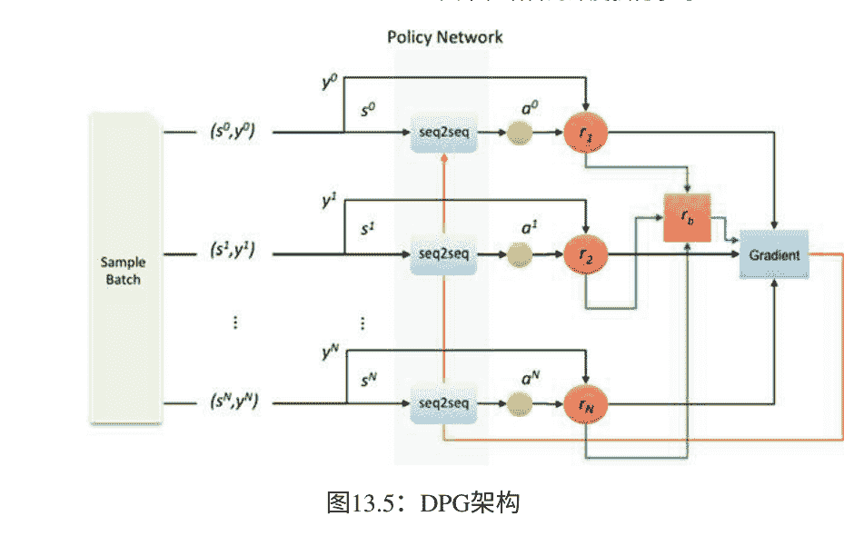

### 13.3.3 深度Q学习

我们可以使用深度神经网络来近似动作值函数，而不是直接学习策略的估计值，从中我们可以确定最优策略。这些方法通常被称为深度Q学习，我们通过最小化损失函数来学习估计一个带有参数θ的Q函数 $Q(s, a; θ)$：

$$L(θ) = \frac{1}{2}\mathbb{E}\left[r + \gamma \max_{a'} Q(s', a'; θ) - Q(s, a; θ)\right]^2 \tag{13.52}$$

对 θ 求梯度得到的更新规则如下：

$$θ \leftarrow θ + α \underbrace{\left[r + \gamma \max_{a'} Q(s', a'; θ) - Q(s, a; θ)\right]}_{\text{时序差分}} \nabla_θ Q(s, a; θ) \tag{13.53}$$

不幸的是，更新规则存在收敛问题，并且可能相当不稳定，这限制了深度Q学习模型的使用。

#### 13.3.3.1 DQN

深度Q网络（DQN）算法是一种利用经验回放和目标网络来克服不稳定性的深度Q学习模型（图13.6）[Mni+13]。有人将深度强化学习领域的发展归功于2015年DQN算法的引入[HGS15]。

正如之前所述，经验回放使用一个内存缓冲区来存储转换，在训练过程中进行小批量采样。 这个经验缓冲区有助于打破转换之间的相关性，从而稳定学习。

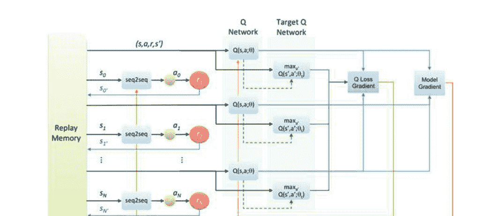

目标网络是深度Q网络的一个额外副本。它的权重 $\theta_{target}$ 定期从原始Q网络复制过来，但在其他时间保持不变。 这个目标网络用于计算更新过程中的时间差异：

$$\theta \leftarrow \theta + \alpha \left[ r + \gamma \max_{a'} Q(s', a'; \theta_{target}) - Q(s, a; \theta) \right] \nabla_{\theta} Q(s, a; \theta) \tag{13.54}$$

通过经验回放和目标网络，有效地平滑学习过程，避免参数振荡或发散。 通常使用长度为M的有限内存缓冲区进行经验回放，只存储和采样最近的M个转换。 此外，经验是均匀地从缓冲区中采样的，不考虑其重要性。 最近，提出了优先级经验回放方法 [Sch+15a]，根据TD误差和重要性采样更重要的转换更频繁。

算法8： Seq2Seq DQN算法

输入：输入序列 X, 目标输出序列 Y
输出：最优Q函数 $Q_*$
初始化seq2seq模型 $\pi_\theta$
初始化Q网络参数 $\theta$
初始化目标Q网络参数 $\theta_{target}$
初始化回放记忆
当未收敛时
- 从 X 和 Y 中选择批次
- 从seq2seq模型中采样动作序列：$[a_1, a_2, ..., a_n]$
- 收集经验 $(s_t, a_t, r_t, s_{t'})$ 并添加到回放记忆中
- 从回放记忆中选择小批次
- 对于每个小批次样本执行
  - 使用Q网络估计当前Q值
  - 使用目标Q网络估计下一个最佳动作的Q值
  - 将估计值保存到缓冲区
- 通过最小化小批次估计的Q网络损失来更新Q网络参数 $\theta$
- 根据估计的Q值基于梯度更新seq2seq模型 $\pi_\theta$
- 每K步，将权重复制到目标网络 $\theta_{target} = \theta$

#### 13.3.3.2 双DQN

DQN方法存在一个问题，即它们在根本上倾向于高估Q值。为了看到这一点，考虑以下关系：

$$ \max_{a'} Q(s', a'; \theta_{\text{目标}}) = Q\left(s', \arg\max_{a'} Q(s', a'; \theta_{\text{目标}}); \theta_{\text{目标}} \right) \tag{13.55} $$

利用这一点，我们可以将DQN损失函数重新写成：

$$ L(\theta) = \frac{1}{2} \mathbb{E} \left[ r + \gamma Q\left(s', \arg\max_{a'} Q(s', a'; \theta_{\text{目标}}); \theta_{\text{目标}} \right) - Q(s, a; \theta) \right]^2 \tag{13.56} $$

在这个表达式中，可以看到目标网络被使用了两次；首先用于选择下一个最佳动作，然后用于估计该动作的Q值。因此，存在高估Q值的倾向。双深度Q学习网络通过使用两个独立的目标网络来克服这个问题：一个用于选择下一个最佳动作，另一个用于估计给定动作的Q值。

双深度Q网络（DDQN）不引入另一个目标网络，而是使用当前的Q网络来选择下一个最佳动作，并使用目标网络来估计其Q值。DDQN损失函数可以写成：

$$ L(\theta) = \frac{1}{2} \mathbb{E} \left[ r + \gamma Q(s', \arg\max_{a'} Q(s', a'; \theta); \theta_{target}) - Q(s, a; \theta) \right]^2 \tag{13.57} $$

DDQN减轻了双重深度Q学习中使用第三个网络来解决过度估计问题的需要。

#### 13.3.3.3 Dueling Networks

当动作空间较小时，DQN和DDQN方法非常有用。然而，在自然语言处理应用中，动作空间可能等于词汇表的大小，尽管在任何时候只有一个小的子集可能是可行的。在如此大的空间中估计每个动作的Q值可能会非常昂贵和收敛缓慢。考虑到在某些状态下，选择动作可能几乎没有影响，而在其他状态下，选择动作可能是生死攸关的。

对决网络方法使用单个网络同时预测状态值函数和优势函数，这些函数被聚合以估计Q函数。通过这样做，它避免了估计每个动作选择的值的需要。在一种可能的设计中，对决网络基于具有CNN底层的Q网络架构，后面是两个独立的全连接层流，它们的输出被求和以估计Q值。

算法9： Seq2Seq双DQN算法
输入：输入序列X，地面真实输出序列Y
输出：最优Q函数 $Q_*$
初始化seq2seq模型 $\pi_\theta$
初始化Q网络参数 $\theta$
初始化目标Q网络参数 $\theta_{target}$
初始化回放记忆
当未收敛时
- 从 X 和 Y 中选择批次
- 从seq2seq模型中采样动作序列： $[a_1, a_2, ........., a_n]$
- 收集经验 $(s_t, a_t, r_t, s_{t'})$ 并添加到回放记忆中
- 从回放记忆中选择小批次
- 对于每个小批次样本执行
  - 使用Q网络估计当前Q值
  - 使用Q网络选择下一个最佳动作
  - 使用目标Q网络估计样本Q
  - 保存估计结果到缓冲区
- 通过最小化小批次估计的Q网络损失来更新Q网络参数 $\theta$
- 根据估计的Q值基于梯度更新seq2seq模型 $\pi_\theta$
- 每K步，将权重复制到目标网络 $\theta_{target} = \theta$

### 13.3.4 深度优势演员-评论家

我们已经看到，将一个独立的目标网络添加到深度Q学习方法中可以帮助克服高方差和过度估计的问题。回想一下，在DDQN中，我们使用当前网络选择一个动作，使用目标网络评估该动作。实际上，当前网络充当演员，目标网络充当评论家，但两个网络在架构上是相同的，并且目标网络的权重定期与当前网络同步。

这并不一定是这样的，因为可以训练不同的网络来估计价值函数并充当评论家。由于深度神经网络往往是状态值函数的不稳定估计器，深度演员-评论家方法通常专注于估计和最大化优势函数。

我们可以使用TD误差来定义优势函数，而不是状态值函数和Q函数之间的差异：

$$δ = r_t + γV_{π_θ}(s_{t+1}) - V_{π_θ}(s_t) \tag{13.58}$$

因为可以证明：

$$\mathbb{E}[δ] = Q_{π_θ}(s, a) - V_{π_θ}(s_t) \tag{13.59}$$

这种价值网络方法被称为深度优势演员-评论家（图13.7）。在这种情况下，只需要一个Q网络，但出于稳定性原因，最好使用经验回放和类似DQN的目标网络进行训练。

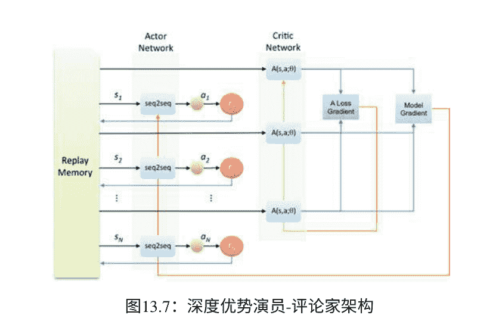

算法10： 带有经验回放的Seq2Seq AC算法
输入：输入序列X, 地面真实输出序列Y
输出：最优策略 $\pi_*$
初始化演员 (seq2seq) 网络 $\pi_\theta$
初始化评论家网络 $\theta$
初始化回放记忆
当未收敛时
- 从 X和 Y中选择批次
- 来自演员的样本动作序列：$[a_1, a_2, . . . . . . . . . , a_n]$
- 计算真实折扣奖励：$[r_1, r_2, . . . . . . . . . , r_n]$
- 收集经验 $(a_n, v_n)$ 并添加到回放记忆中
- 从回放记忆中采样小批量
- 对于每个小批次样本执行
  - 从评论家网络计算优势估计
- 通过最小化小批量上的评论家损失来更新评论家 Q 网络参数 $\theta$
- 根据评论家的优势估计使用梯度来更新演员参数 $\pi_\theta$

## 13.4 文本的深度强化学习

深度强化学习方法最近已经应用于文本上的各种自然语言处理任务。 特别是，在构建对话代理和对话系统方面取得了很大成功。 在接下来的几节中，我们将对信息提取、文本分类、对话系统、文本摘要、机器翻译和自然语言生成等不同的 DRL 方法进行调查。 其中许多方法基于利用用于生成嵌入或作为目标策略模型的 seq2seq 模型。 这并不意味着 DRL 方法仅限于使用 seq2seq 模型，因为 CNN 也可以成功应用。

### 13.4.1 信息提取

信息提取被定义为从文本中自动提取实体、关系和事件的任务。 近年来，研究人员成功地将深度学习方法应用于实体提取，包括利用CNN和RNN的架构 [Qi+14, GHS16]。然而，在实际领域中，需要大量标记数据来学习执行高质量的提取。 此外，关系提取的质量取决于实体提取的结果（反之亦然）。 我们可能只关心一部分关系，比如行动任务提取。 DRL方法在解决这些问题方面具有适用性。

对于大规模领域来说，标记训练数据往往是性能的最大限制，因为准确标记数据的获取成本很高。
远程监督是一种通过利用外部知识图来自动对齐文本以提取实体或关系的方法[Min+09b]。然而，以这种方式生成的提取结果并不直接标记，并且可能是不完整的。这就是强化学习可以帮助的地方。

## 13.4.1.1 实体提取

对于实体提取任务，可以使用外部信息来解决歧义，并通过查询相似文档和比较提取的实体来提高准确性。
这是一个顺序任务，可以通过强化学习代理来解决，其中我们将提取任务建模为马尔可夫决策过程。
图13.8是基于DQN代理提出的架构示例，由K. Narasimhan等人[N YB16]提出。在该模型中，状态是实值向量，用于编码目标和查询文档中提取的实体的匹配、上下文和置信度。动作是接受、拒绝或调和两个文档的实体，并查询下一个文档。奖励函数被选择为最大化最终的提取准确性：

> $$R(s, a) = \sum_{\text{实体}_j} Acc(entity_{target}(j)) - Acc(entity_{query}(j))$$

为了减少查询次数，每一步都会添加一个负奖励。由于这个模型是基于连续状态空间的，DQN算法可以被训练来近似Q函数，其中DQN的参数使用经验回放和目标网络来减少方差。

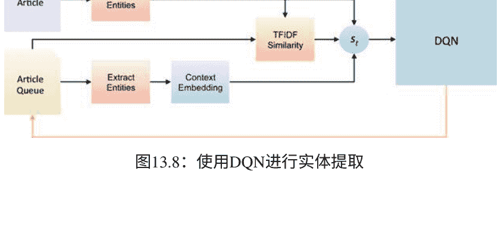

## 13.4.1.2 关系提取

考虑一个用于关系提取任务的深度学习网络。这个网络被视为DRL代理，其作用是将一个句子中的单词序列作为输入，并将提取出的关系作为输出。如果将句子视为状态，将关系视为动作，我们可以学习一个最优策略来执行关系提取。从一组句子中提取关系的过程成为一个episode。

图13.9描述了一种深度策略梯度方法来解决这个关系提取任务。奖励函数由预测关系在一组标准标签中的准确性给出。REINFORCE算法已经被应用[Zen+18]来优化该模型的策略，通过定义状态 $s_i$ 的奖励函数为：

$$R(s_i) = \gamma^{n-i} r_n$$ (13.61)

其中 $n$ 是袋子中的句子数量， $r_n$ 要么是+1，要么是 $-1$。策略梯度方法的目标函数是：

$$J(\theta) = \mathbb{E}_{s_1, s_2, ......s_n} R(s_i)$$ (13.62)

这导致了梯度更新的形式：

$$\theta \leftarrow \theta + \nabla J(\theta) = \sum_{i=1}^n \sum_{j=1}^{n_i} \nabla p(a_i|s_i; \theta)(R(s_i) - r_b)$$ (13.63)

其中基准 $r_b$ 由以下给出：

$$r_b = \frac{\sum_{i=1}^n \sum_{j=1}^{n_i} R(s_j)}{\sum_{i=1}^n n_i}$$ (13.64)

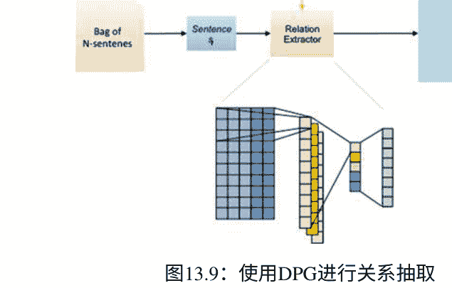

图13.9：使用DPG进行关系抽取

## 13.4.1.3 动作提取

从文本中提取动作序列的任务具有挑战性，因为它们通常受到上下文的影响。传统方法依赖于一组模板，这些模板无法很好地推广到自然语言。序列标注方法效果不好，因为只有一部分序列可以被认为是有意义的动作。动作提取器可以被建模为一个DRL代理，其中状态被视为单词序列，动作是与单词序列相关联的标签集合。通过训练一个DQN模型，该代理可以学习到最优的标注策略。图13.10展示了Feng等人提出的基于EASDRL的架构[FZK18]，该架构首先提取动作名称，然后提取动作目标。为了实现这一目标，该架构定义了两个与独立CNN网络相关联的Q函数，用于建模动作名称 $Q(s,a)$ 和动作目标 $Q(s,a)$，并使用一种加权正奖励转换的经验回放变体进行训练。

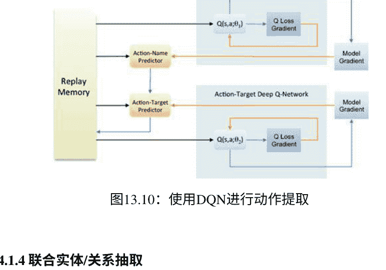

## 13.4.1.4 联合实体/关系抽取

通常，实体抽取是关系抽取的前置步骤。它们可以被视为相互依赖的任务，因为关系抽取的质量通常取决于提取的实体的质量。鉴于这种顺序性，可以使用强化学习来同时学习和优化这两个任务。图13.11展示了基于深度Q学习代理的DRL架构[Fen+17]。在这个模型中，当前状态 $s$ 是通过Bi-LSTM和注意力机制 $Att(X;θ_1)$ 提取的实体信息，而转移状态 $s'$ 是通过Tree-LSTM $Tree(X;θ_2)$ 提取的关系信息。动作定义在集合 $(a_1, a_2, a_3, a_4)$ 其中 $a_1$ 和 $a_2$ 用于分类关系提及的存在，而 $a_3$ 和 $a_4$ 用于分类关系提及的类型。换句话说，DRL代理结合了这两个任务。

实体抽取、关系提及分类和关系分类。DQL模型使用随机梯度下降进行训练。

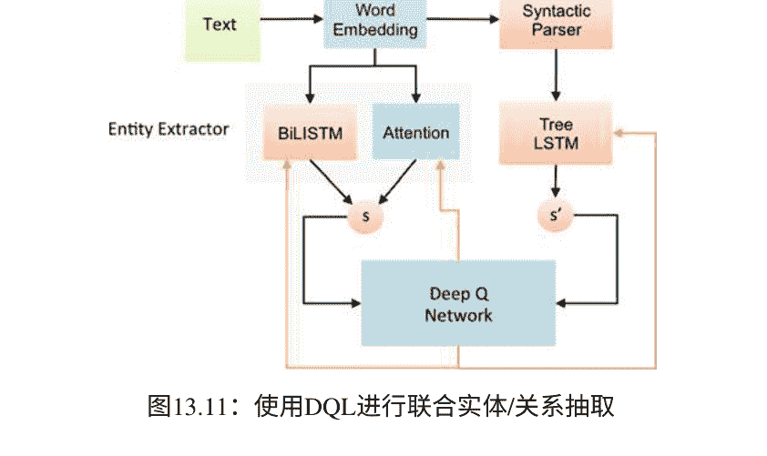

### 13.4.2 文本分类

深度学习在文本分类方面主要关注学习能够有效捕捉语义上下文和结构的单词和句子表示。

然而，当前的方法无法自动学习和优化结构，因为它们明确地使用有监督的输入或树库注释进行训练。相比之下，强化学习可以用于构建具有层次结构的句子表示，而无需注释。

图13.12显示了一个由三个组件组成的架构：策略网络、表示模型和分类网络[ZHZ18]。策略网络基于随机策略，其状态是单词级和短语级结构的向量表示。这些向量是表示模型的输出，表示模型由一个两级层次的LSTM组成，将一系列单词连接起来形成短语，将一系列短语连接起来形成句子表示。策略网络的动作标记一个单词是短语内部还是短语末尾。策略网络专注于构建捕捉结构的句子表示，而分类网络使用表示模型的输出执行分类任务。

为了共同训练策略和分类网络，首先使用分类器网络的交叉熵损失对分层LSTM进行初始化和预训练，给定如下：

```
L = - \sum_{X \in D} \sum_{y=1}^{K} p(y, X) \log P(y|X) \qquad (13.65)
```

其中，p和P分别是目标分布和预测分布。然后，表示模型和分类器网络的参数保持不变，使用REINFORCE算法对策略网络进行预训练。在热启动之后，三个网络一起训练直到收敛。

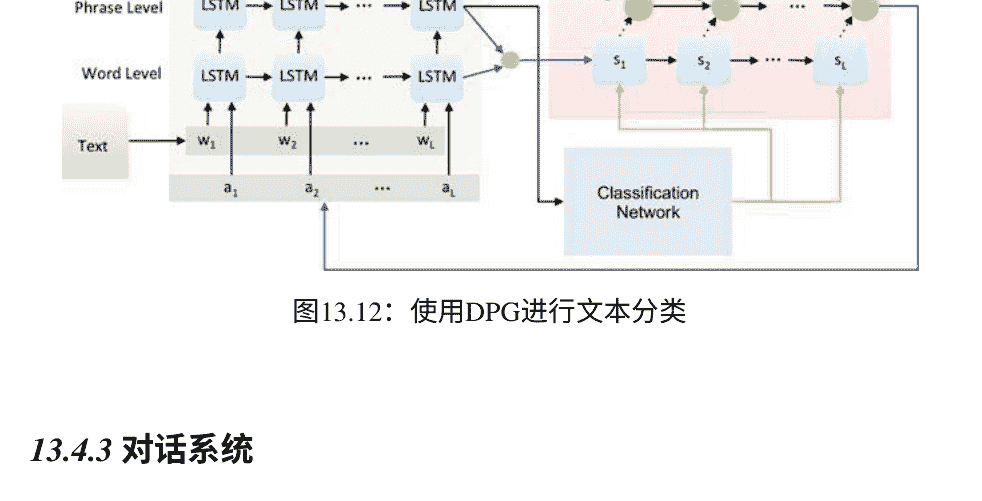

### 13.4.3 对话系统

随着聊天机器人在社交媒体和客户服务中的广泛应用，对话系统变得越来越受欢迎。开发智能对话系统一直是人工智能的主要目标，可以追溯到图灵测试。对话代理必须执行多个任务的流程，包括自然语言理解、状态跟踪、对话策略和自然语言生成。对话系统已经成功地建模为部分可观察的马尔可夫决策过程。

槽填充对话是对话系统的一个重要子类，涉及在用户对话和上下文中填充一组预定义的槽。在这些系统中，聊天机器人和用户之间的关系类似于强化学习代理和其环境之间的关系。对话式对话成为一个最优决策问题，其中奖励函数可以定义为聊天机器人和用户之间的成功交互。

对话系统存在几个基本问题。最大的问题是学分分配问题，通过管道的错误传播可能使确定组件错误源变得几乎不可能。例如，性能不佳的对话策略可能是由于错误的状态跟踪或低质量的自然语言理解引起的。同样，下游组件对上游任务的依赖使优化变得特别困难。例如，对状态跟踪的微调可能导致次优的对话策略。在理想情况下，整个流程以端到端的方式进行训练。出于这些原因，深度强化学习方法在建模对话系统方面得到了广泛应用。

已成功应用DQN代理来训练对话系统[ZE16, GGL18]，该系统将状态跟踪和对话策略统一起来，并将两者都视为RL代理可用的动作。该架构学习生成一个口头回应或更新当前对话状态的最优策略。图13.13描述了DQN模型，该模型使用LSTM网络生成对话状态表示。

LSTM的输出作为一组策略网络的输入，这些网络以多层感知器网络的形式表示每个可能的动作。这些网络的输出表示每个动作的动作-状态值函数。

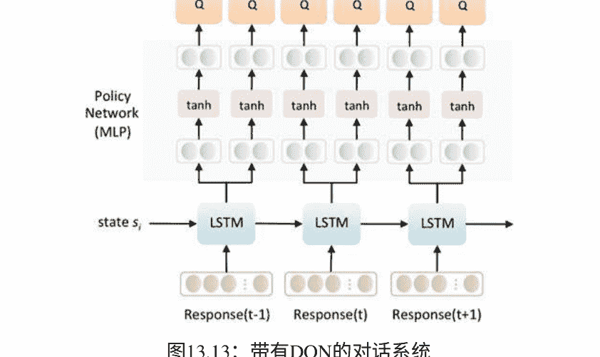

图13.13：带有DQN的对话系统

由于高维状态和动作空间，通常需要大量标记的对话来训练对话系统。为了克服对训练数据的需求，提出了一种两阶段深度RL方法[Fat+16]，该方法使用演员-评论家架构，其中策略网络首先通过分类交叉熵在少量高质量对话上进行监督训练，以启动学习。然后可以使用深度优势演员-评论家方法来训练值网络。

### 13.4.4 文本摘要

文本摘要是一项有趣的自然语言处理任务，旨在自动生成人类可读的输入文本的自然语言摘要。它在各个行业广泛应用，并分为两类：抽取式和生成式摘要。在抽取式摘要中，它试图消除多余的文本，只保留最相关的词汇，同时保持自然语言形式。

在生成式摘要中，它试图提供文本中相关要点的释义摘要。

回顾导向的摘要评估（ROUGE）是用于文本摘要任务的标准质量度量。根据定义，ROUGE-1衡量预测摘要与参考文本之间共享的单词。ROUGE-2衡量共享的二元组，ROUGE-L衡量预测和参考之间的最长公共子串（LCS）。对于这些度量指标，通常会提到精确度和召回率。ROUGE的问题在于它们提供了很少关于预测的人类可读性的信息，而语言模型的困惑度通常可以捕捉到这一信息。

DQN已成功应用于抽取式文本摘要任务[LL17，PXS17b，C, e+18b]。图13.14显示了架构，其中状态表示当前（部分）文本摘要，动作表示将句子添加到摘要中，并使用ROUGE作为奖励。在这个架构中，句子被表示为文档向量（DocVec）、句子向量（SentVec）和位置向量（PosVec）的连接。

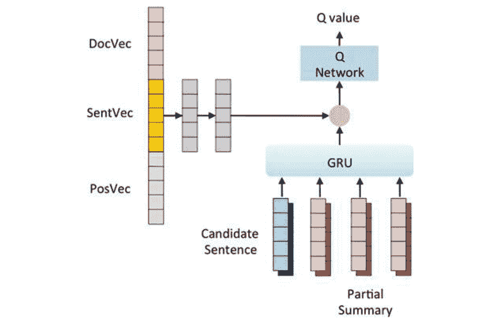

基于注意力的深度学习网络在抽象式文本摘要任务中取得了显著的进展。但是尽管它们的ROUGE分数很高，它们经常生成不自然的摘要。这为能够结合深度强化学习方法打开了大门，可以将混合训练目标纳入其中：

```
$L_{mixed} = \sigma L_{rl} + (1 - \sigma)L_{ml}$
```

它结合了教师强制最大似然函数：

```
$$L_{ml} = -\sum_{t=1}^{n} \log p(y_t|y_1, y_2, \ldots, y_{t-1}, x) \quad (13.67)$$
```

以及策略梯度目标：

```
$$L_{rl} = -[r - r_b] \sum_{t=1}^{n} \log P(y_t|y_1, y_2, \ldots, y_{t-1}, x) \quad (13.68)$$
```

其中奖励 $r$ 是像ROUGE这样的离散目标。

### 13.4.5 机器翻译

神经机器翻译中最近的突破之一是使用了seq2seq模型。如上所述，教师强制是训练这些网络的主要方法。这些模型在预测时表现出曝光偏差。此外，解码器无法生成具有特定目标的目标序列。如果使用波束搜索，这一点尤为明显，波束搜索更倾向于关注短期奖励，这被称为近视偏差。机器翻译通常基于离散的BLEU度量进行评估，这会导致训练和测试不匹配。

深度强化学习模型已经被提出来克服其中的一些缺陷。基于REINFORCE训练算法的深度PG模型[Li+16]可以解决BLEU指标的不可微性质。然而，REINFORCE在学习大动作空间的策略方面存在困难，就像语言翻译一样。

最近，通过使用一个解码方案，结合一个值函数估计，提出了一个演员-评论家模型[Bah+16a]。在这个模型中，主要的序列预测模型是演员/代理，而值函数则充当评论家。当前的序列预测输出是状态，候选标记是代理的动作。评论家由一个单独的RNN实现，并使用时序差分方法在地面真实输出上进行训练，使用目标评论家来减少方差。

## 13.5 语音的深度强化学习

深度神经网络现在已经显著提高了语音识别系统的性能。当它们与GMM或HMM一起作为混合系统的一部分使用时，在训练过程中需要对声学模型进行对齐。而当深度神经网络用于端到端系统时，可以避免这种情况。

通过直接最大化输入数据的可能性来学习转录[YL18]。这样的系统，虽然目前在最先进的性能方面处于领先地位，但仍然存在各种限制。
借鉴文本的经验，研究人员和实践者已经开始将深度强化学习方法应用于语音和音频，包括自动语音识别、语音增强和噪声抑制等任务。
在不久的将来，我们预计会在语音的其他方面更广泛地采用深度强化学习技术，包括说话人分析、说话人语调检测和应力分析等应用。

### 13.5.1 自动语音识别

自动语音识别（ASR）的任务在很多方面与机器翻译类似。ASR通常使用CTC最大似然学习，同时使用词错误率（WER）等离散度量来衡量性能。因此，训练和测试之间的不匹配是一个问题。此外，作为一个序列预测任务，ASR在训练时会使用地面真实标签，而在预测时这些标签是不可用的，因此会受到曝光偏差的影响。

使用策略梯度的深度强化学习方法已被证明在克服这些限制方面是有效的（图13.15）。在这种方法中，自动语音识别（ASR）模型被视为代理，训练样本被视为环境。策略πθ（y|x）由参数θ参数化，动作被认为是生成的转录，模型状态是隐藏的数据表示。奖励函数被定义为词错误率（WER）。策略梯度通过以下规则进行更新：

```
θ ← θ + α∇_θ log P_θ(y|x)[r - r_b]
```

### 13.5.2 语音增强和噪声抑制

机器学习语音增强方法已经存在了相当长的时间。增强技术通常分为四个子任务：语音活动检测，信噪比估计，噪声抑制和信号放大。前两个子任务提供目标语音信号的统计信息，而后两个子任务使用这些统计信息提取目标信号。这可以自然地被视为一个顺序任务。基于策略梯度的深度强化学习方法已经提出用于语音增强任务，其架构基于使用LSTM网络来建模一个由学习的策略πθ确定参数θ的滤波器。在这个模型中，滤波器是代理，状态是一组滤波器参数，动作是增加或减少滤波器参数。奖励函数衡量滤波器输出与地面真实干净信号之间的均方误差。

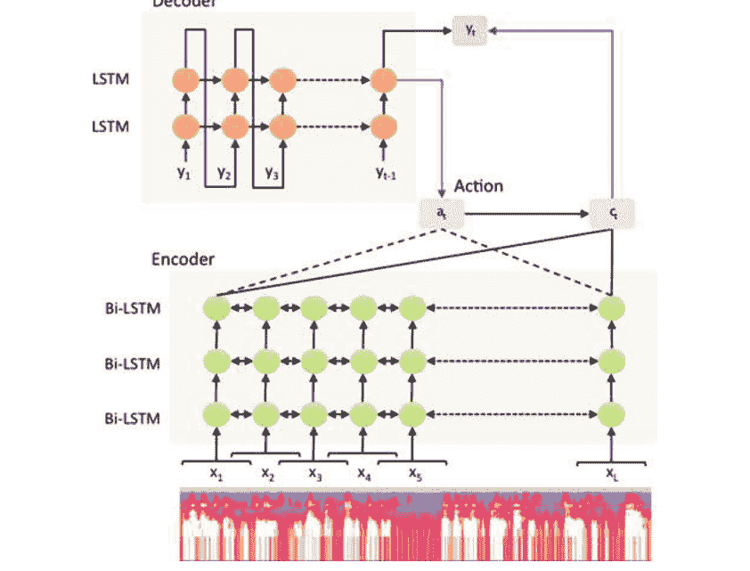

图13.15: 使用DPG的自动语音识别

信号序列。这个策略梯度模型使用REINFORCE算法进行训练，可以在不对基线语音增强过程进行算法更改的情况下改善信噪比。此外，通过整合深度强化学习代理，滤波器可以通过动态参数适应来调整到不断变化的底层条件。

## 13.6 案例研究

在这个案例研究中，我们将把本章的深度强化学习概念应用于文本摘要任务。我们将使用康奈尔新闻室摘要数据集。这里的目标是向读者展示如何使用深度强化学习算法训练一个能够生成这些文章摘要的代理。在这个案例研究中，我们将重点关注深度策略梯度和双重深度Q网络代理。

### 13.6.1 软件工具和库

- TensorFlow是一个开源的数据流编程软件库，可用于各种任务。它是一个符号数学库，也用于机器学习应用，如神经网络。它在谷歌的研究和生产中都有使用。

- **RLSeq2Seq**是一个开源库，使用序列到序列模型实现了各种强化学习技术来进行文本摘要。
- **pyrouge**是一个Python接口，用于与基于Perl的ROUGE-1.5.5软件包进行交互，计算文本摘要的ROUGE分数。

### 13.6.2 文本摘要

为了衡量机器生成的摘要的性能，我们将使用ROUGE，它代表召回导向的摘要评估。它是一组用于评估文本自动摘要和机器翻译的度量标准。它通过将自动生成的摘要或翻译与一组参考摘要（通常是人工生成的）进行比较来工作。

ROUGE-N、ROUGE-S和ROUGE-L是在系统预测的摘要和参考摘要之间进行比较时文本粒度的度量标准。

例如，ROUGE-1指的是系统摘要和参考摘要之间的单个词的重叠。ROUGE-2指的是系统摘要和参考摘要之间的二元词组的重叠。让我们以上面的例子为例。假设我们想计算ROUGE-2的精确度和召回率分数。对于ROUGE，召回率是衡量系统摘要捕捉到参考摘要的程度的指标。

### 13.6.3 探索性数据分析

康奈尔新闻室数据集包括130万篇文章和总结，由来自1998年至2017年的38家主要出版物的新闻作者和编辑撰写。
该数据集分为训练集、开发集和测试集，分别包含110万、10万和10万个样本。

下面是数据集的一个样本：

> 故事：与玛丽·雪莱的生日周重合，由雷德利为导演儿子卢克制作的这个斯科特家族事件是关于科学家们创造新生命，却看到它血腥地远离他们的又一次尝试。冰冷的风险评估员凯特·玛拉对这个名为女巫的混合智能（仍然令人毛骨悚然的安雅·泰勒-乔伊）的处理进行调查，让斯科特小将有一个小时的存在主义困惑：是温和的摩根还是她无节制的人类监督者（托比·琼斯，杨紫琼，保罗·吉亚玛蒂）对这个神秘公司的安全运营构成更大的威胁？不幸的是，一旦这个问题得到解决，电影就变成了一个过得去的垃圾片，最后一刻的转折有一个在斯科特作品中明显的先例。能干的演员们带领我们穿越这些欺诈行为，对一些科幻思想表示欢迎，但是加强版的弗兰肯斯坦不是这部电影更聪明或更原创的部分之一。

总结：里德利和他的儿子卢克呈现出了一部过得去的科幻惊悚片，但恐怖片在走向可预测的转折结局时变得低俗。

对于我们的案例研究，我们将使用康奈尔新闻室数据集中的10,000/1000/1000篇文章和摘要的子集作为我们的训练、验证和测试集。我们将使用word2vec生成的100维嵌入来对这些数据集进行分词和映射。出于内存考虑，我们将词汇表限制在50,000个单词。

#### 13.6.3.1 Seq2Seq模型

我们的第一个任务是训练一个能够生成文章摘要的深度策略梯度代理。在此之前，我们使用最大似然损失对seq2seq模型进行预训练，编码器和解码器层大小为256，批量大小为20，使用梯度剪裁的adagrad算法进行10个时期的训练（图13.16）。预训练后，我们在测试集上评估该模型，结果如表13.1所示。

表13.1：基于MLE训练的Seq2Seq的ROUGE指标

| 指标 | F-分数 | 精确率 | 召回率 |
| :--- | :--- | :--- | :--- |
| ROUGE-1 | 15.6 | 20.6 | 14.5 |
| ROUGE-2 | 1.3 | 1.6 | 1.3 |
| ROUGE-L | 14.3 | 19.0 | 13.3 |

> Seq2seq: 这只90岁的乌龟在遭受可怕的老鼠袭击后，移动得更好了导致它失去了腿
参考：一只90岁的乌龟在遭受老鼠袭击后失去了前腿，给它安装了轮子

> Seq2seq: 迪亚拉省首府巴库巴的一名市政雇员生动地描述了他的矛盾心情
参考：伊拉克人最希望的就是美国士兵离开伊拉克，但他们承受不起这样的代价

> Seq2seq: 谷歌在最新季度的业绩低于预期
参考：这家科技巨头在最新季度的销售额增长低于预期，但股价上涨了

与参考摘要相比，生成的摘要还算不错，但还有改进的空间。

#### 13.6.3.2 策略梯度

让我们应用深度策略梯度算法来改进我们的摘要（图13.17）。我们将奖励函数设置为ROUGE-L F1分数，并从MLE损失切换到RL# 图13.16：用于文本摘要的Seq2Seq模型

损失。我们继续训练8个时期，然后在测试集上评估经过RL训练的模型，结果如表13.2所示。

# 表13.2：DPG的ROUGE指标

| | F-分数 | 精确率 | 召回率 |
|---|---|---|---|
| ROUGE-1 | 22.4 | 19.6 | 35.3 |
| ROUGE-2 | 6.0 | 5.8 | 8.5 |
| ROUGE-L | 17.6 | 15.5 | 28.0 |

随着训练的增加，我们预计生成的摘要将更加接近人类生成的语言。

> **DPG：** 苹果已向录音公司透露了流媒体音乐服务计划的细节，消息人士称

**参考：** 苹果高管已与四家顶级录音公司就向消费者免费提供流媒体音乐服务的计划进行了交谈，多位音乐行业消息人士告诉cnet

> **DPG：** 保守派评论员格伦·贝克表示，奥巴马政府正在利用教堂和其他信仰团体来推广其气候变化议程

**参考：** 贝克表示奥巴马在气候变化和温室效应方面利用教堂

> **DPG：** 佐治亚州首府的动物园在一场毁灭性的洪水后三个月重新开放

这场洪水导致600只动物中超过一半的动物死亡，包括大约20只老虎、狮子和美洲豹

**参考资料：** 佐治亚州的一个动物园在6月的洪水中有一半的动物死亡后重新开放

# 13.6.3.3 DDQN

让我们看看是否可以通过使用双重深度Q学习代理来改进上述结果。我们像之前一样，通过最大似然损失对seq2seq语言模型进行预训练，训练10个周期。然后，我们使用批量大小为20、回放缓冲区为5000个样本，并在每500次迭代时更新目标网络，训练双重深度Q网络8个周期。为了获得更好的结果，我们将首先使用一个固定的演员对DDQN代理进行预训练，训练一个周期。当我们在测试集上评估得到的模型时，我们在表13.3中找到了结果。

表13.3：DDQN的ROUGE指标

| | F-分数 | 精确率 | 召回率 |
|---|---|---|---|
| ROUGE-1 | 34.6 | 28.8 | 55.5 |
| ROUGE-2 | 21.4 | 19.0 | 31.1 |
| ROUGE-L | 30.4 | 25.7 | 47.7 |

> **DDQN:** 美军中东指挥官表示，在最近解放的叙利亚曼比季镇的战斗中，拒绝遵循命令发生了

**参考资料：** 一位美国高级将领周二表示，ISIS战士们不听从他们领导的命令，而是撤退到北方

> **DDQN:** 华盛顿地区租赁市场的在线讨论，特邀专栏作家萨拉·格伯哈特参与

**参考资料：** 欢迎来到公寓生活，华盛顿地区租赁市场的在线讨论，特邀专栏作家萨拉·格伯哈特参与

DDQN: 阿尔巴尼亚已成为欧洲最大的露天大麻生产国
**参考资料:** 阿尔巴尼亚已成为欧洲最大的露天大麻生产国

对于选择的参数，DDQN代理优于DPG代理。有许多可能性进一步改进结果——我们可以使用计划的或优先的采样，中间奖励，以及/或者在编码器或解码器中使用某种形式的注意力。

### 13.6.4 读者和实践者的练习

- 当使用带有软注意力的seq2seq模型进行文本分类任务时，你会如何结合DQN代理？
- 对于双DQN代理，使用两个单独的目标网络是否有意义？为什么？
- 对于Q-learning模型，我们会使用哪种类型的深度神经网络？为什么CNN是否适用？

## 参考文献

[Bah+16a] Dzmitry Bahdanau等。“用于序列预测的演员-评论家算法。” In: CoRR abs/1607.07086 (2016).

[Fat+16] Mehdi Fatemi等。“用于对话系统的两阶段训练策略网络。” In: CoRR abs/1606.03152 (2016).

[FZK18] Wenfeng Feng, Hankz Hankui Zhuo和Subbarao Kambhampati。“基于深度强化学习从文本中提取动作序列。” In: IJCAI. ijcai.org, 2018, pp. 4064–4070.

[Fen+17] 冯云天等人“使用强化学习和深度学习进行实体和关系的联合提取。” In: Comp. Int. and Neu-rosc. 2017 (2017), 7643065:1–7643065:11.

[GGL18] 高建峰, 米歇尔·加利和李立宏。“对话人工智能的神经网络方法。” In: CoRR abs/1809.08267 (2018).

[GHS16] Tomas Gogar, Ondrej Hubácek和Jan Sedivý。“用于网页信息提取的深度神经网络。” In: AIAI. Vol. 475. Springer, 2016年, 第154-163页。

[HGS15] Hado van Hasselt, Arthur Guez和David Silver“使用双Q学习的深度强化学习。” In: CoRR abs/1509.06461 (2015).

[Ken+18] Yaser Keneshloo等人。“深度强化学习用于序列到序列模型。” 在: CoRR abs/1805.09461 (2018).

[LL17] Gyoung Ho Lee和Kong Joo Lee. “使用嵌入特征的强化学习自动文本摘要。” 在: IJCNLP (2). Asian Federation of Natural Language Processing, 2017, pp.193–197.

[Li+16] Jiwei Li等人.“深度强化学习用于对话生成。” 在: CoRR abs/1606.01541 (2016). In: CoRR abs/1606.01541 (2016).

[Min+09b] Mike Mintz等人.“无标注数据的关系抽取远程监督。” 在: ACL/IJCNLP. The Association for Computer Linguistics, 2009, pp. 1003–1011.

[Mni+13] Volodymyr Mnih等人.“使用深度强化学习玩Atari游戏。” 在: CoRR abs/1312.5602 (2013).

[NYB16] Karthik Narasimhan, Adam Yala, 和 Regina Barzilay “通过强化学习获取外部证据来改进信息提取。” In: CoRR abs/1603.07954 (2016).

[PXS17b] Romain Paulus, Caiming Xiong, 和 Richard Socher. “用于抽象摘要的深度强化模型。” In: CoRR abs/1705.04304 (2017).

[Qi+14] Yanjun Qi等人“基于字符的信息提取的深度学习。” In: ECIR. Vol. 8416. Springer. 2014, pp. 668–674.

[Sch+15a] Tom Schaul等人“优先经验回放。” In: CoRR abs/1511.05952 (2015).

[SLM17] Abigail See, Peter J. Liu, and Christopher D. Manning. “Get To The Point: 使用指针生成网络进行摘要生成。” In: CoRR abs/1704.04368 (2017).

[TSN17] Andros Tjandra, Sakriani Sakti, and Satoshi Nakamura. “通过强化学习优化序列到序列的自动语音识别。” In: CoRR abs/1710.10774 (2017).

[YL18] Dong Yu and Jinyu Li. “基于深度学习的声学模型的最新进展（更新版）。” In: CoRR (2018). http://arxiv.org/abs/1804.09298

[Zen+18] Xiangrong Zeng et al. “使用强化学习进行大规模关系抽取。” In: AAAI AAAI Press, 2018.

[ZHZ18] Tianyang Zhang, Minlie Huang, and Li Zhao. “通过强化学习学习文本分类的结构化表示。” 在: AAAI. AAAI Press, 2018年。

[ZE16] Tiancheng Zhao and Maxine Eskénazi. “通过深度强化学习实现对话状态跟踪和管理的端到端学习。” 在: SIGDIAL Conference. The Association for Computer Linguistics, 2016年, 第1-10页。

[ZXS17] Yingbo Zhou, Caiming Xiong, and Richard Socher. “通过策略学习提高端到端语音识别的性能。” 在: CoRR abs/1712.07101 (2017).

[Celikyilmaz+18b] Asli Celikyilmaz等. “用于抽象摘要的深度通信代理。” 在: NAACL-HLT. Association for Computational Linguistics, 2018年, 第1662-1675页。

# ## 未来展望

预测人工智能的未来在今天和过去几年一样不可能。此外，我们预测的未来越远，不确定性就越大。总的来说，有些事情可能会完全按预期发展（计算速度的提升），有些预期可能会有轻微的变化（主导的深度学习架构），而其他一些是不太可能被预测到的突破性创新（大数据、计算速度和深度学习的交叉）。在本书的结尾，我们希望根据当前的轨迹、趋势和研究的实用性提供我们的预测。我们拒绝被视为预言家，甚至是可靠的预测方。我们试图在这些主题的结尾只提供给读者一些考虑，并建议对未来几年的一些领域保持警觉。

## 端到端架构的普及

鉴于在自然语言处理和语音识别中许多端到端方法的成功，我们预计会有更多方法采用这些架构。这些方法缺乏鲁棒性的一个领域是针对特定环境的调优，例如在ASR混合架构中词典模型的实用性或者在将语言模型适应到新领域中。这是一个必须解决的领域，以便深度学习在训练数据昂贵或不可用的领域产生重大影响。

## 向以人工智能为中心的转变

最简单的投影之一是更多公司将转向或以人工智能为中心的策略。许多领先的科技公司，例如谷歌，Facebook和Twitter等公司已朝这个方向发展，这一趋势很可能延续到许多其他大型和中型公司。这种转变将在软件开发的每个层面引入机器学习，并伴随着对工具和流程的需求，以确保可靠性和普适性。有些人将这种转变称为“软件2.0”。过渡到这种状态将需要增加对数据的严谨性，模型的可解释性，对模型安全性的关注，以及对对抗性场景的弹性。

## 专用硬件

专用硬件将变得更加常见。这种发展模式在加密货币挖矿或嵌入在智能手机中的图像处理器中使用ASIC（特定应用集成电路）硬件时非常常见。

TPU的引入是专门为深度学习而创建的首个案例之一，这是专门为深度学习而创建的物理硬件。苹果A11芯片的引入是支持移动设备上神经网络的另一个专用硬件的例子。

## 远离监督学习的转变

我们预计机器学习的重点将发生转变。深度学习在有监督数据方面取得了最大的改进；然而，创建大规模标记数据集的成本往往是难以承受的。在许多场景中，存在大量未标记的数据源，可以被无监督算法使用，我们预计在这个领域会有更多的算法集中，就像词嵌入和语言模型的发展一样。

## 可解释的人工智能

尽管端到端的深度学习技术强大，并且可以产生准确性等令人印象深刻的性能指标，但它们缺乏可解释性。金融领域（如贷款申请或行为监控）或医疗保健领域（如疾病预测）的许多应用需要模型和预测具有可解释性。行业已经转向可解释的人工智能（XAI）。

许多技术，例如局部可解释的模型无关解释（LIME），深度学习重要特征（DeepLIFT），SHapley加性解释（SHAP）等等，都在提供模型无关解释方面非常有前景。为了个别预测的解释以及模型的总结，这些和其他创新将是克服模型可解释性和人工智能信任障碍所必需的。

## 模型开发和部署过程

在深度学习中存在一个权衡，即在模型开发过程中进行实验的便利性与在高性能、低延迟的生产环境中部署这些模型所需的高度优化代码之间的权衡。这种权衡在自然语言处理和语音识别模型中更为常见，因为它们是复杂的动态图，与优化运行时性能的静态图相比，更为复杂。诸如PyText之类的框架可以帮助调整预构建模型，以快速进行实验，为模型设计师和工程师提供预构建的工作流程，并支持将模型轻松部署到生产环境中，最小限度地进行干预，这将很快成为开发过程中必不可少的一部分。模型测试和质量保证是开发和部署过程中需要调整的另一个方面，以适应复杂的深度学习模型。

> 谷歌最近的研究论文“ML测试分数：用于ML生产准备和技术债务减少的评分标准”提出了一个很好的框架来测试这些复杂的基于深度学习的系统。

## 人工智能的民主化

人工智能和深度学习被一小部分研究人员、教育者、专家和从业者使用，但这个群体正在迅速增长。为了使它们通过应用程序、工具或教育对大众可见，需要改变态度、政策、投资和研究，特别是来自顶级公司和大学。这种现象被称为“人工智能的民主化”。许多公司，如谷歌、微软和Facebook，以及许多大学，如麻省理工学院、斯坦福大学和牛津大学，都在为网络上免费提供的软件工具、库、数据集、课程等做出贡献。这个方向的积极趋势将在通过人工智能改变生活方面发挥巨大作用。

## 自然语言处理的趋势

语言模型可以在大量未标记的数据上进行预训练，从而具有相当大的优势。语言模型现在被认为对许多自然语言处理任务有巨大的好处。语言模型嵌入为复杂任务提供特征，并且已经显示出在最先进的方法上对许多任务的改进。使用对抗性方法来理解模型、分析在深度学习研究中，改进模型的鲁棒性或提高失败案例的处理已成为一种趋势。朝着资源匮乏的语言和使用深度学习技术（如迁移学习）的方向发展，许多研究人员特别关注机器翻译等任务。

最令人好奇的发展领域之一是强化学习。与其收集数据、训练模型、投入生产并测试结果，不如创建一个代理与环境（真实或合成）进行交互，并根据其经验进行学习。总体而言，我们看到从监督学习到无监督学习再到强化学习技术的发展进程。

## 语音识别的趋势

许多端到端的深度学习技术能够在调整和语言专业知识较少的情况下胜过传统的混合HMM模型。这些模型在训练数据广泛可用的情况下，在一般的语音识别任务中表现非常好。然而，在需要上下文关键的预测时，它们往往表现不佳。此外，融合语音和自然语言处理的持续追求是一个可能会持续下去的方向，端到端学习将引领潮流。最近的进展集中在通过语言模型融合将领域信息纳入解码过程，以实现上下文化识别。

语音识别在声学环境和说话人特定差异（如口音）方面仍存在困难。利用从语音转文本系统生成的数据正在得到推广，提供模拟环境和说话人以提高鲁棒性。我们预计语音转文本系统的整合，类似于GAN工作流程，将继续改进，并有可能更加完全地融入强化学习工作流程。

## 总结

我们希望读者在本书中找到的信息既有启发性又有帮助。深度学习在过去几年中对自然语言处理和语音识别产生了重大影响，而且这一趋势似乎正在加速。我们希望读者能够理解深度学习提供的基础和高级技术，并展示如何实际应用它们。

# 索引

- **A**
  - A2C, 589
  - A3C, 590
  - 激活函数, 156
  - 演员-评论家, 588
  - Adagrad, 163
  - Adam, 164
  - 优势函数, 578
  - 对抗性, 173
  - ANEW, 111
  - 人工智能, 8
  - ASG, 544
  - ASR, 369
  - 注意力, 335
  - 注意力, 408
  - 注意力解码, 555
  - 自动编码器, 178
  - 自动微分 (AD), 186
  - 自动语音识别, 15
  - 平均池化, 271
- **B**
  - 反向传播, 151
  - 词袋模型, 94
  - 批归一化, 170
  - 贝尔曼方程, 578
  - 偏差, 145
  - 偏差-方差权衡, 46
  - 双向循环神经网络, 329
  - 自助法, 581
- **C**
  - 灾难性干扰, 478
  - 连续词袋模型, 209
  - CCA, 221
  - CER, 388
  - 链式法则, 150
  - 分块, 100
  - 圆形图, 110
  - 分类, 5
  - 连贯性, 105
  - 凝聚力, 105
  - 冷核聚变, 557
  - 计算图, 185
  - 计算语言学, 87
  - 条件随机场 (CRF), 75
  - 混淆矩阵, 47
  - 基于内容的注意力, 547
  - 卷积, 264
  - 卷积神经网络 (CNNs), 263
  - 共指, 106
  - 交叉相关, 265
  - 交叉验证, 51
  - CTC, 538
- **D**
  - 数据增强, 173
  - 数据并行, 543
  - DDQN, 594
  - 深度优势演员-评论家, 596
  - 深度置信网络 (DBN), 178
  - 深度融合, 556
  - 深度策略梯度, 591
  - 深度Q学习, 592
  - 深度语音1, 541
  - 深度语音2, 543
  - 去噪自编码器, 180
  - 可微分神经计算机, 428
  - 扩张卷积神经网络, 287
  - 离散余弦变换, 375
  - 分布语义学, 203
  - doc2vec, 230
  - 领域自适应, 495
  - 领域自适应, 467
  - 领域偏移, 495
  - 双深度Q学习, 594
  - DQN, 592
  - Dropout, 169
  - 动态记忆网络, 431
  - 动态规划, 580
  - 动态时间规整, 379
- **E**
  - 基于能量的模型 (EBMs), 175
  - 蕴含, 112
  - 零样本学习, 517
- **F**
  - 快速傅里叶变换, 374
  - 特征, 264
  - 特征, 40
  - 微调, 469
  - 有限状态转换器, 387
- **G**
  - 门控循环单元 (GRU), 325
  - 泛化, 43
  - 生成对抗网络 (GAN), 182
  - 全局注意力, 412
  - GloVe, 220
- **H**
  - 海明窗口, 373
  - 汉宁窗口, 373
  - 硬注意力, 412
  - 隐马尔可夫模型 (HMM), 73
  - 分层softmax, 161
  - 分层softmax, 212
  - 铰链损失, 162
  - 人类语音, 371
  - 超参数选择, 171
- **I**
  - 重要性采样, 583
  - 归纳转移, 471
  - 不变性, 271
- **K**
  - 核函数, 264
  - KL散度, 162
  - KL损失, 162
- **L**
  - 语言模型, 106, 385
  - 拉普拉斯平滑, 107
  - LAS, 548
  - 潜在狄利克雷分配, 115
  - 潜在语义分析, 114
  - 词形还原, 92
  - 词汇链, 114
  - 局部注意力, 413
  - 位置感知注意力, 547
  - 逻辑回归, 61
  - 长短期记忆 (LSTM), 324
- **M**
  - 机器学习, 5
  - 马尔可夫决策过程, 576
  - 最大池化, 271
  - 均方误差, 161
  - 均方误差 (MSE), 149
  - 梅尔滤波器组, 375
  - MemN2N, 422
  - 记忆网络, 419
  - MFCC, 372
  - 模型并行, 543
  - 动量, 163
  - 蒙特卡洛, 582
  - 形态学, 90
  - 多头注意力, 416
  - 多层感知机 (MLP), 146
  - 多任务学习, 7, 466
- **N**
  - n-gram, 94
  - 自然语言, 88
  - 自然语言处理, 11
  - 负对数似然 (NLL), 162
  - 负采样, 213
  - 命名实体识别, 102
  - 神经堆栈, 434
  - 神经图灵机, 424
- **O**
  - 一次性学习, 517
  - OOV, 108
  - 最优策略, 579
  - 过拟合, 43
- **P**
  - 参数共享, 266
  - 解析, 99
  - 词性, 97
  - 感知器, 143
  - 感知器, 8
  - 困惑度, 108
  - 音素, 377
  - Poincaré嵌入, 237
  - 指针网络, 336
  - 策略, 575## 索引

- 多义性，102
- 池化，271
- 预加重，372
- 精确率-召回率曲线，49
- 主成分分析（PCA），71
- 可能近似正确（PAC），44
- 发音模型，381

## Q

- Q函数，578
- Q学习，587
- 量化，228

## R

- 重新评分，558
- 接收操作特征曲线，49
- 修正线性单元（ReLU），158
- 循环实体网络，437
- 循环高速公路网络（RHN），329
- 循环神经网络（RNNs），315
- 回归，5
- 正则化，59
- REINFORCE，586
- 强化学习，7
- 受限玻尔兹曼机，176

## S

- SARSA，585
- 语义角色标注，104
- 半监督学习，7
- sense2vec，225
- 序列到序列，334
- 浅融合，555
- 短时傅里叶变换，371
- sigmoid，156
- skip-gram，211
- softmax，160
- 稀疏自编码器，180
- 稀疏编码，182
- 频谱图，374
- 堆叠卷积神经网络，286
- 词干提取，91
- 随机梯度下降，63
- 停用词，93
- 子词嵌入，228
- 监督学习，5
- 支持向量机（SVM），68
- 同步模型，89

## T

- 双曲正切，157
- 时序差分学习，583
- TFIDF，96
- 分词，92
- 训练误差，42
- 迁移学习，7，465
- Transformer网络，337
- 树库，101
- 图灵测试，8

## U

- 无偏误差，43
- 欠拟合，43
- 通用逼近定理，153
- 非语音，560
- 无监督学习，6

## V

- 值函数，577
- 梯度消失，324
- 变分自编码器，181
- VC维度，45
- 向量空间模型，203

## W

- wav2letter，544
- 权重衰减，168
- 权重噪声，541
- WER，387
- word2vec，208

## Z

- 零样本学习，517
- Zipf定律，93