# 面向语音和自然语言处理的深度学习方法


# 信号与通信技术

- Virender Kadyan
- Amitoj Singh
- Mohit Mittal
- Laith Abualigah 编辑

Springer

# 信号与通信技术

## 系列编辑

Emre Celebi，中央阿肯色大学计算机科学系，康威，美国

- Jingdong Chen，西北工业大学，西安，中国
- E. S. Gopi，国家电子与通信工程学院电子与通信工程系，提鲁吉拉帕利，泰米尔纳德邦，印度
- Amy Neustein，语言技术系统，福特李，美国
- H. Vincent Poor，普林斯顿大学电气工程系，普林斯顿，美国

本系列专注于现代信号处理方法和尖端通信技术的基础和应用。主要主题包括信息和信号理论、声学信号处理、图像处理和多媒体系统、移动和无线通信以及计算机和通信网络。该系列的卷册面向学术界和工业研发部门的研究人员。该系列以应用为导向。然而，每个单独卷册的呈现水平取决于主题，可以从实用到科学。

**索引：所有在"信号与通信技术"中的书籍都被Scopus和zbMATH索引**

有关本书系列的一般信息、评论或建议，请联系Mary James，邮箱：mary.james@springer.com，或Ramesh Nath Premnath，邮箱：ramesh.premnath@springer.com。

有关本系列的更多信息，请访问http://www.springer.com/series/4748

Virender Kadyan • Amitoj Singh • Mohit Mittal
Laith Abualigah
编辑

## 深度学习方法用于语音和自然语言处理

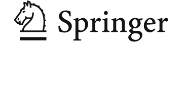

## 编辑

Virender Kadyan 石油和能源大学 德拉敦，印度

Amitoj Singh
Jagat Guru Nanak Dev Punjab State Open University
Patiala, Punjab, India

Mohit Mittal
京都产业大学
京都，日本

Laith Abualigah
安曼阿拉伯大学
安曼，约旦

ISSN 1860-4862
ISSN 1860-4870（电子版）
信号与通信技术
ISBN 978-3-030-79777-5
ISBN 978-3-030-79778-2（电子书）
https://doi.org/10.1007/978-3-030-79778-2

©编辑（如适用）和作者，独家许可给Springer Nature Switzerland AG 2021
本作品受版权保护。出版商独家授权所有权，无论是全部还是部分材料，特别是翻译、重印、重用插图、朗读、广播、微缩胶片复制或以任何其他物理方式、以及传输或信息存储和检索、电子适应、计算机软件，或者通过已知或今后开发的类似或不同的方法。

在本出版物中使用一般描述性名称、注册名称、商标、服务标志等，并不意味着即使在没有特定声明的情况下，这些名称也不受相关保护法律和法规的约束，因此可以自由使用。

出版商、作者和编辑可以安全地假设本书中的建议和信息在出版日期时是真实准确的。出版商、作者或编辑对本书中所含材料不提供明示或暗示的保证，也不对可能存在的任何错误或遗漏负责。出版商在发表的地图和机构附属方面保持中立。

这本Springer印记由注册公司Springer Nature Switzerland AG出版
注册公司地址为：Gewerbestrasse 11, 6330 Cham, Switzerland

致上帝、我的老师和我的家人

## 致谢

我们要感谢那些对本书有重要贡献的贡献者。 我还要感谢我的合作编辑们；他们澄清了我最初模糊的概念，并在许多过程中提供了帮助，包括审查、剪辑、绘图等。此外，我要对项目协调员Shabib Shaikh先生（图书）和高级编辑Mary E. James表示深深的感激和真诚的感谢，感谢他们在支持我们的想法方面不知疲倦的努力。 我要向整个团队，特别是Virender Kadyan博士表示感谢，感谢他们的热情和合作。 没有我的合作编辑Mohit Mittal博士和Laith Abualigah博士的指导，这个项目是不可能的。

## 目录

### 关于Twitter情感分析的调查：架构，分类和挑战

Laith Abualigah, Nada Khaleel Kareem, Mahmoud Omari, Mohamed Abd Elaziz和Amir H. Gandomi

1

### 改进自动阿拉伯语论文题目评分基于Microsoft Word字典

Muath M. Hailat, Mohammed A. Otair, Laith Abualigah, Essam H. Houssein和Canan Batur Şahin

19

### 最优分形特征选择和估计在不匹配条件下的语音识别

Puneet Bawa，Virender Kadyan，Archana Mantri和Vaibhav Kumar

41

# 从文本需求生成类图：自然语言处理的应用

Abdulwahab Ali Almazroi, Laith Abualigah, Mohammed A. Alqarni, Essam H. Houssein, Ahmad Qasim Mohammad AlHamad, 和Mohamed Abd Elaziz

55

### 语义相似性和释义识别使用深度自编码器的马拉雅拉姆语

R. Praveena，M. Anand Kumar和K. P. Soman

81

### 模型匹配：在相似性评估期间预测UML类图参数的影响人工神经网络

Alhassan Adamu, Salisu Mamman Abdulrahman, Wan Mohd Nazmee Wan Zainoon和Abubakar Zakari

97

### 经典和深度学习数据处理技术用于语音和说话者识别

Aakshi Mittal，Mohit Dua和Shelza Dua

111

### 英语语音识别：一篇综述

Amritpreet Kaur, Rohit Sachdeva和Amitoj Singh

127

### 通过噪声鲁棒性别分类系统声学特征的最优选择

Puneet Bawa, Vaibhav Kumar, Virender Kadyan和Amitoj Singh

147

# 索引

161

## 缩写

| 缩写 | 全称 |
|------|------|
| 人工智能 | Artificial Intelligence |
| ANN | Artificial neural network |
| ASR | 自动语音识别 |
| BFCC | 基底膜频带倒谱系数 |
| BNs | 贝叶斯网络 |
| CBOW | 连续词袋模型 |
| CER | 字符错误率 |
| CNN | 卷积神经网络 |
| DCT | 离散余弦变换 |
| DFD | 数据流程图 |
| DFT | 离散傅里叶变换 |
| DNF | 析取范式 |
| DNN | 深度神经网络 |
| DPIL | 检测印度语的释义 |
| ELM | 极限学习机 |
| FD | 分形维度 |
| FFT | 快速傅里叶变换 |
| FSK | 频移键控 |
| GA | 遗传算法 |
| GFCC | 伽马音频倒谱系数 |
| GMM-UBM | 高斯混合模型-通用背景模型 |
| GPU | 图形单元 |
| HBD | 豪斯多夫-贝西科维奇维数 |
| HLDA | 异方差线性判别分析 |
| HMM | 隐马尔可夫模型 |
| IDE | 集成开发环境 |
| IEA | 智能论文评估器 |
| LD | 莱文斯坦距离 |
| LPCC | 线性预测编码系数 |
| L-RNN | 分层递归神经网络 |
| LSA | 潜在语义分析 |
| MAE | 平均绝对误差 |
| MFCC | 梅尔频率倒谱系数 |
| ML | 机器学习 |
| MT | 机器翻译 |
| MTL | 多任务学习 |
| NB | 朴素贝叶斯 |
| NL | 自然语言 |
| NLP | 自然语言处理 |
| NN | 神经网络 |
| PCA | 主成分分析 |
| PCR | 皮尔逊相关结果 |
| PLP | 感知线性预测 |
| PNN | 概率神经网络 |
| POS | 词性 |
| PSO | 粒子群优化 |
| RAE | 递归自动编码器 |
| RNN | 循环神经网络 |
| SA | 情感分析 |
| SRS | 软件需求规范 |
| STFT | 短时傅里叶变换 |
| SVM | 支持向量机 |
| TF | 二进制词频 |
| TF | 词频 |
| TF-IDF | 词频-逆文档频率 |
| TPU | 张量处理单元 |
| UML | 统一建模语言 |
| WCM | 词-上下文矩阵 |

# Twitter情感分析综述：架构、分类、和挑战

Laith Abualigah, Nada Khaleel Kareem, Mahmoud Omari, Mohamed Abd Elaziz和Amir H. Gandomi

## 1 引言

情感分析（SA）是研究知识或解释人们对特定主题的观点的领域[1]。它也被称为意见挖掘，因为它解释了发言者对特定主题的观点[2]。它有各种名称并包含不同的任务；其中包括情感分析、意见挖掘、情感挖掘、主观性分析等等。每个名称都有自己的工作和不同的任务，但它们都致力于获取人们对特定主题的感受和观点[1]。换句话说，它确定对特定主题的观点是负面的、积极的还是中立的。因此，情感被分为三个类别：负面、积极和中立的情感[2]。积极的情感是关于所考虑主题的好词。当积极的印象很高时，它表示良好的感受。另一方面，负面情感是关于所考虑主题的不好词。例如，许多企业主使用Twitter来追踪和监控人们对其产品和服务的观点。当关于产品的积极反馈很高时，预期的购买率也会很高。

另一方面，当负面印象很高时，它会被拒绝偏好列表，不期望购买该产品。最后，中性情感既不是对主题的好评也不是差评。因此，它既不是偏爱也不是被忽视。

SA是一种自然语言处理（NLP）任务，它提取自然数据，重点是获取情感。一般来说，它侧重于从说话者或个人的行为中推断出关于特定主题的信息[3]。情感分析领域是多学科的，因为它涉及个体的情感、观点、情绪和对产品、服务、主题、问题、个人以及任何其他需要意见的事物的态度。情感分析的主题包括各种领域，如计算机语言、NLP、机器学习（ML）和技术情报，以及信息检索。它包括一组基于技术的计算和自然语言，可以用于从特定文本中提取主观意见或情感[4]。情感分析领域是机器学习的一个子领域。通过手动训练，可以解决分析情感的问题，以达到所需的水平，因为没有自动集成系统可以在不需要手动干预的情况下分析情感[5]。

情感分析可以应用于不同的层次，包括对整个文档给出一个极性的文档级别，对每个句子给出极性的句子级别，以及基于分析每个有情感的单词的实体/方面级别。以前，情感分析只限于了解观点的极性。它对于制定或做出决策没有任何用处，因为不知道情感为什么会改变。因此，有必要建立系统来解释公众情感的差异。多个情感技术和各种算法的研究被用于分析情感[2, 3]。情感分析的主要资源是网络数据，这是一种庞大的非结构化和结构化信息存储。

如今，社交网络已经广泛使用。Facebook、Twitter、LinkedIn和YouTube以及其他网站非常受欢迎。Twitter是社交媒体中使用最广泛的平台，它是一个微博，允许用户发布他们的情感和观点。2017年，Twitter的注册用户数达到了近6.96亿，每天的推文数量达到了大约5800万条。这种微博已经成为人们观点和情感的重要和重要的来源。它涵盖了各种主题和不同的方向，包括政治、经济、宗教、社会以及体育和其他趋势。这些重要的数据可以有效地用于研究市场状况、社会研究、疾病监测和其他常见主题。Twitter的用户不仅仅是普通用户，还包括国家领导人、企业高管和名人[1, 6]。例如，如果你想知道人们对前美国总统巴拉克·奥巴马的观点，你可以参考Twitter等社交网络网站。Twitter平台上包含了数百万条关于奥巴马在任期内所做的事情的观点。你会发现积极、消极和中立的观点推文。通过从表达对此事观点的推文中提取一些准确的词语，可以得出人们是否认为他履行了职责的答案。

显然，为了了解推文中表达的情感，有必要收集和分析以文本帖子形式表示的数据。网络中可用的大部分数据都是不规则的，约占世界上所有数据的80%。获取准确的信息、做出判断或分析这些数据是困难的。情感分析在提取或挖掘意见方面非常重要，因为它有助于从社交媒体中揭示人们的情感或意见，这些媒体用于在全球网络上分享意见和想法[1, 6]。这项研究的重要性源于情感分析对所有人的努力的重要性[2]。本研究将描述情感分析过程及其对各个层次的文本分析的依赖，即句子级别、文档级别和短语级别。我们还将研究情感分析过程的架构，包括数据收集、预处理、特征提取和训练与分类四个阶段。我们还将更广泛地讨论在这一领域中使用的最重要的算法。描述情感分析面临的挑战。

最后，我们将指出一些有助于扩大研究领域进展范围的差距。

本章的组织如下。第2节描述了不同层次的情感分析。第3节描述了用于进行全面和详细情感分析的架构。本领域中使用的各种算法在第4节中进行了讨论。在第5节中，我们将讨论情感分析面临的一些挑战。第6节总结了研究并给出了进一步的研究方向。

## 2 情感分析级别

关于情感分析的各种研究已经在三个主要层次上进行了[1-4]:

- (a) 文档级别分析：在这种类型[7]中，整个文档被视为一个主题，目标是分析整个文档的整体感觉。例如，在审查特定产品时，任务是确定对该产品的意见是负面的、积极的还是中立的。有时，这个层次不会给出正确的结果，比如在论坛或博客中，一个产品与另一个产品在相同特性上进行比较。此外，文档可能包含与主题无关的句子，不应包括在情感分析的过程中。
- (b) 短语级别分析：这个级别仅限于分析完整的句子，并决定其是否具有积极、消极或中性的情感。一个句子可能有两个或更多个单词。它接近于主观分类；它从包含观点和客观方面的句子中提取准确的数据。如果句子中包含否定句，可能会给出不准确的结果。
- (c) 实体/方面级别分析：也称为特征级别。与分析文档或句子不同，这个级别是基于分析每个具有情感的单词。这个级别提供了每个方面（特征级别）的准确分析。分析单词以获取不同的观点。这个词可以是形容词或副词，也可以是名词。它取决于一个概念；观点可以是态度、词语或观点。

## 3 系统架构

情感分析是基于人们用来表达他们意见的词语，以及这些词语在特定情况下的情感（消极、积极或中性）。为了揭示观点的方向，我们首先识别推文中的有意义的词语，然后发现它们的情感方向，即这个词语是否反映了积极情感、消极情感还是中性情感[8]。该系统包括四个关键阶段：数据收集、数据处理和特征提取[1]，如图1所示。数据是从Twitter获取或收集的，经过预处理，包括过滤以筛选出唯一的Twitter特征，并提取基于侧面的特征以识别显性和隐性方面[9]。作为输入，系统收集推文标识符和N-Gram模型，用于学习一个类别[10]。推文被规范化并转换为单个词组（四个词组、三个词组、两个词组和单个词组）[11]。在准备训练和测试数据之后，应用不同的分类器来分析工作簿的性能[6]，从而获得输出结果。接下来，我们详细讨论每个阶段。

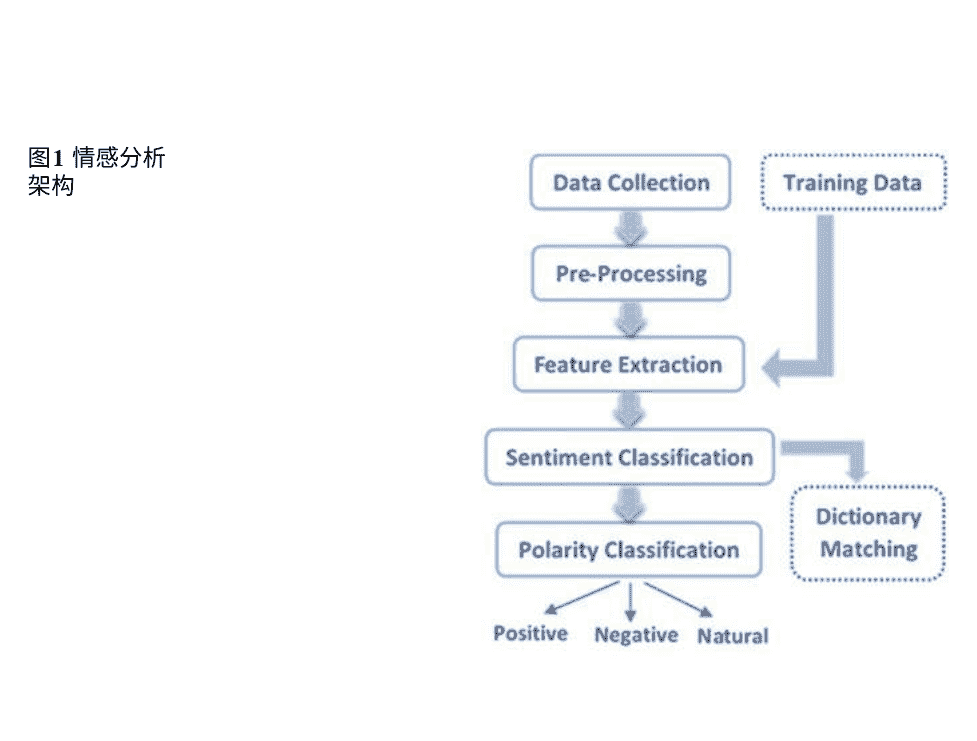

### 3.1 数据收集

从相关网站（如微博）使用查询[6]收集特定主题的数据非常重要。 这意味着，如果我们需要分析健康领域的观点情感，例如，就必须依赖于特定于该领域的网站[12]。 博客是允许用户发布消息、图片、链接到其他网站或视频的网站。 在博客上发布的消息很短，不像传统的博客。 目前有许多博客平台可供选择，包括Twitter、LinkedIn、Google、Foursquare和Tumblr [13]。 在这里，我们将讨论Twitter作为数据来源。

#### 3.1.1 Twitter

Twitter是最受欢迎的微博网站之一，是一种允许用户发布消息（称为推文）的平台和微博。 推文具有许多独特的特点[8, 14]。 Twitter成立于2006年，自那以后吸引了大量用户。 易于访问和下载出版物以及包含的数据量。 Twitter被认为是最大的数据集之一[13]，可以在情感分析中采用。 采用Twitter数据进行情感分析的目的是准确地将推文分类为不同的情感类别[1]。 Twitter数据在各个领域得到了采用，例如用作监测现实世界结果或预测信息，包括对叙利亚2013年、电影票房预期、日本地震等极端事件的分析[12]。 Twitter具有一些特定的特点，如下所示：

- 推文：推文是在Twitter上发布的消息。最大消息限制约为140个字符。推文内容（推文主题）可以不同从对特定主题或新闻的个人观点到链接、新闻、照片或包括视频的形式。
- 写作技巧：由于消息很短，许多人在评论中使用缩写，有些人使用具有很多含义的符号。除了拼写错误外，许多推文中存在拼写错误，还使用了口语语言。
- 可用性：在Twitter上以公共领域发推文的人数与其他平台（如Facebook）相比较多（Facebook有许多隐私设置）。这使得数据广泛可用，因为很容易收集推文进行训练。
- 用户/用户名：在系统注册时，选择一个名称，该名称可以是一个化名。该名称用于在系统中发布推文。
- 提及：提及是指推文被引用到另一个用户，与该用户分享话题。推文使用“@”符号在用户名之前表示（@用户名）。
- 评论：评论通常会引发对话，这是对评论的回答，还会提到其他人。
- 关注者：关注者是关注用户及其活动的人。跟进是与其他Twitter用户进行沟通的方式。用户从关注者那里接收更新，并向关注者发送自己的更新。
- 转推：当一条推文发布后，其他用户可以使用转推重新发布该推文。这被认为是传播信息的一种力量。可以看到该推文被重新发布，并在用户名后面加上RT的缩写（RT用户名）。
- 主题标签：这个功能用于对推文进行分类，以及与特定主题的相关性。符号#后面跟着主题的名称（#主题）。推文使用主题标签，从而可以访问使用相同主题标签的所有推文。分类主题标签通常是热门话题。
- 隐私：此功能确定推文是否对所有人可见，还是仅对关注者可见。提到的所有这些特征都是问题；另一方面，这些问题需要进行处理，我们将在第二阶段[1, 8, 13, 14]中解决。

### 3.2 预处理

采用Twitter推文是因为它们包含许多以不同方式呈现的观点。它已被分类为积极、消极和中性，这使得数据分析不困难[15]。推文的表示通常以模糊和非正式的方式呈现[11]。由于推文中语言使用的多样性，可能存在语言或拼写错误。

推文可能包含一些符号、缩写、用户名、链接和与分类过程无关的其他内容[9]。因此，在获取相关内容的同时，使用处理技术将其他与主题无关的评论忽略。这个阶段在分类过程中非常重要[15]。因此，数据质量对结果有重要影响。因此，为了增强分析，初步数据进行处理[15]。实施的最重要的处理步骤如下：

- 分词：在将推文与数据集中可用的标识符编译在一起之后，每个推文都会被分解成一组单独的单词。对于每个推文，都会有一个其自己的单词列表[16-18]。
- 去除非英语推文：Twitter的性质允许使用60多种语言。重点将放在英语上。我们将删除非英语单词和推文。
- 替换许多微博帖子中的表情符号：许多Twitter用户在推文中使用表情符号和快捷方式。这些符号每个都具有强烈的内涵，并且是情感的指示器，因为它们是识别情感的简洁方式。因此，它将在确定推文的情感方面起着重要作用。

表1 一些表情符号及其含义

| Emoticon | Meaning      | Sentiment Class |
|----------|--------------|-----------------|
| :-D      | Laughing     | Positive        |
| :-)      | smile        | Positive        |
| o:-)     | innocent     | Positive        |
| 8-)      | cool         | Positive        |
| :$       | Happy blush  | Positive        |
| :(       | defeated     | Negative        |
| :'(      | Crying       | Negative        |
| :o       | shocked      | Negative        |
| >:(      | Grumpy       | Negative        |
| (@)      | Angry red    | Negative        |
| X|       | Dead         | Negative        |

很容易区分消息的极性，无论是积极的还是消极的。这是通过表情符号字典来完成的，其中符号被替换为相应的情感（表1）。

- 删除链接/URL：由于推文的长度有限，用户使用URL。这些URL在推文本中不包含任何有意义的指示，作为一个词。但它确实提供了用户试图以简洁的方式表达的大量情感内容。然而，要获取URL的内容仍然非常困难；因此，将删除URL。
- 删除目标提及：大多数情况下，用户在推文中提及另一个用户。它可以通过“@”符号来区分。它放在要引用的用户名前面（@约翰）。推文的这部分（@约翰）在分析中不重要，因为它没有任何道德意义。因此，将删除它。
- 从hashtags中删除标点符号：hashtags很重要，提供了推文意义的摘要。因此，为了获取信息，必须删除标点符号和表示标点符号的符号，只保留重要信息。
- 去除数字：有时候，在推特中会使用数字。当测量情感时，数字没有价值。因此，数字被从推特内容中移除。
- 处理重复字符序列：在分析推特内容的情感时，拼写纠正非常重要。通常用户以异常和大声的方式表达自己的观点，而不关注正确的语调和拼写。推特用户使用像“c”这样的词语ooooooool” or “woooooow.”为了得到这些词语的正确表达，我们将重复超过三次的字母替换为三个字母，例如 “coool”和“woooow.”我们用三个字母替换来区分单词的强调用法和常规用法；例如，单词“cool”有另一层含义。使用WordNet确保不必要的字符被移除。

- 去除停用词：推文中包含许多没有意义的词，称为停用词。停用词不包含任何关于情感的信息，因此是无用的。在进行分词时，应该将这些词移除。停用词的例子包括a、an、the和其他词。
- 处理负面提及：负面情绪在确定推文时起着重要和显著的作用。诸如“no”、“not”、“never”等词或以此结尾的词应该被替换为表示否定的词。
- 大写字母识别：通常使用大写字母来表达强烈的情绪。这种类型被称为e-shouting。这是一个很好的指标，可以轻松获取消息的极性。在提取大小写之前，这一步骤挖掘了这个特征[10, 11, 19, 20]。

请注意，我们需要处理Twitter数据的资源，包括一个表情符号字典和一个缩略语字典[21]。表情符号字典用于存储表情符号，其中包括一些最常用的表情符号。至于缩略语字典，它是从各种来源编制的，包括大量缩略语的翻译，我们将在本文的另一部分中提到它们。

### 3.3 特征提取

特征的识别和选择对于文本的分类非常重要。我们试图了解哪些特征对于分类过程最为重要。文本特征提取是从先前处理的数据中获取单词列表，然后将该列表转换为分类器可以使用的一组特征的过程。定义和从文本数据中提取特征的各种方法对于分类非常重要；以下是其中一些特征[4, 19, 22, 23]：

- 词性标注 (PoS)：寻找每个句子中的形容词或描述性词的重要信号。自然语言处理技术使用指向词性的指针。词性指示器是将句子中的所有单词标记为词性标签的任务。这些单词与英语语法的共同类别相关，包括形容词、动词、名词和介词，以及屈折、代词和干扰。由于词性是情感表达和表达之间的语义关系的表达，它们被用来过滤指示情感方向的特征。
- N-gram模型：分析与某一主题相关的一组文本。这些文本代表推文。从推文中提取出每个单词或符号作为一系列单词，表示为N。最后，形成一个单词或符号的字典。该符号或单词序列可以是字母、单词或字节，并且可以是连续的符号。根据n-gram的数量，定义了单词，即1-gram，也称为unigram，由一个符号组成；2-gram或bigram由两个符号组成，trigram由三个符号组成。这使分析过程能够揭示这些单词之间的相关性和短语本身的突出性。例如，文本“微软正在推出新产品”由以下2-gram词特征组成：“微软正在，”“正在推出，”“推出新，”“新产品。”和“产品。”推文以N-gram形式表示，就像前面的例子一样。这些特征是N-gram词或独立词与其重复计数。推文特征将是一系列的1和0。1表示推文包含N-gram，而0表示其不存在。

- 无监督特征加权方法：加权技术可以分为两类：无监督和有监督技术。有监督技术利用学习文档中的先前数据来制定一组预先生成的分类器。这与有监督特征加权技术不同。在无监督加权下使用的技术包括TF-IDF（词频-逆文档频率）和二进制词频（TF）。

- 利用主成分分析（PCA）进行降维：这被认为是一种常用的特征提取方法。它已经应用于许多领域，并在各种生物和社会科学领域以及金融领域的各个群体上得到应用。由于这种方法是基于设置数据点的基础上的。为了确定在该空间中更重要的点，应用了两个标准：方差比例和凯撒准则。

- Word2vec模型：Word2Vec用于创建词嵌入。使用word2vec形成的模型是具有两层神经网络的小指示。一旦学习完成，它们会传播单词的语义案例。该模型将大量文本作为输入。然后构建一个通常具有数百维的向量范围。框架中的每个特殊单词都被分配了对称向量。具有相同案例的单词在向量范围内靠近。Word2vec使用两种构造之一：连续跳字模型，它认为当前单词是预测相邻窗口中的案例单词。在这个构造中，附近的案例词比离群案例词更多地被处理为构造。或者连续词袋（CBOW），案例词的序列不会影响预测结果，因为它是基于词袋样本的。

- 词袋：被认为是提取特征的最简单和最常见的方法之一，因为这种方法很灵活。它以各种方式从文本数据中提取特征。每个词都有一组相似的词；它们被收集在一个袋子里，被称为词袋。WordPad是文本数据的显示，它确定了文档中词的频率。词袋包括一个常见词的词典和这些词的频繁出现。这种特征提取模型的复杂性在于这些词的存在程度以及为这些词设计的词汇。尽管这种模型的简便性和灵活性，词的重复是一个不能忽视的问题。具有最高频率的数据将控制其余的袋子数据。更高频率的数据可能并不重要，或者模型信息可能不可用。这个问题是忽视相关词的主要原因。

- TF-IDF：通过这种方式，我们将能够显示携带单个文档所需信息的唯一单词。
- 观点词和短语：它们通常用于表示由坏或好、爱或恨组成的观点。这意味着一些词汇表示观点，而不使用观点短语。
- 否定词：负面词汇的存在可能使观点转向，例如“不坏”等同于“好”。

### 3.4 分类

在预处理和特征提取阶段之后，我们进入分类阶段。我们将特征传入一个分类器 [10]。为文本分类构建了许多技术。在这个阶段，将讨论技术的一般类别以及它们在分类任务中的具体应用。我们了解到，讨论的技术类别在其他领域（如分类数据或定量数据）中也存在 [24]。情感分类策略可分为基于机器学习、基于词典和混合技术 [14]。在机器学习方法中，除了这些算法的语义指示外，还使用了流行的机器学习算法，包括朴素贝叶斯分类器、支持向量机、决策树等。我们可以将机器学习分类为监督学习和无监督方法。至于基于词典的方法，它完全依赖于情感词典，这是一个先前收集的情感表达集合。它分为两种：基于词典的方法和基于语料库的方法。还有一种混合方法，结合了前两种方法，通过它我们可以获得更好的结果。可以使用多种优化技术来优化分类过程或特征选择过程 [25, 26]。我们将在第4节中介绍一些广泛使用的算法 [14]。

## 4 情感分类技术

在图2中，我们说明了分类技术。将进一步讨论技术的一般类别及其在分类任务中的应用。

### 4.1 机器学习方法

许多早期的工作中都进行了基于机器学习的SA系统的进展，以获取相关主题的公众观点。该系统能够将推文分类到各种情感类别[27]。文本分类问题定义：有一个训练文档列表，每个文档都被分类到一个类别。分类模型是合适的根据类别标签将特征标记为劣质记录中的特征。接下来，对于一个未知类别的给定案例，模型被用于预测类别标签。当仅为一个事件选择了一个标签时，严重的分类问题就出现了。机器学习技术在机器学习中使用了许多著名算法，并采用了语义函数[14]。

#### 4.1.1 基于监督学习的分类

监督学习是一种ML类型[7, 28]。监督学习策略依赖于称为训练数据的数据。以前分类的对象作为训练数据输入到设备中。设备从这些数据中学习。然后它将预测未分类的数据。有许多在监督下进行的工作；我们将提到其中一些[14, 29]。

##### 朴素贝叶斯分类器

朴素贝叶斯是一个简单、易于使用但功能强大的规则套件[14]。因此，它在训练和分类阶段都被使用[15]。它是一个概率分类器，它使用贝叶斯定理来计算推文属于特定类别（如负面、正面或中性）的可能性[20]。它可以训练测试模式在一组已经分类的文档上。朴素贝叶斯分类器的基本机制是通过计算消息中与情感相关的单词的重复次数来完成的。根据情感词的匹配次数，推文被分类和记录，因为内容将单词列表与正确分类的文档进行比较。节点的重要性根据推文的重要性进行调整，可以为评定的情感生成更精确的结果[2]。提供了经过预处理的数据和提取的特征。

##### 支持向量机（SVM）

支持向量机（SVM）是一种用于非线性和线性数据分类的方法。SVM通常用于文本分类。如果数据是线性可分的，SVM会研究数据，定义选择边界，并利用支持向量机在输入空间中执行计算。搜索线性最优分割超平面（线性核），被认为是将文档向量从其他类别的向量中分割开的向量。此外，所有被视为向量的数据都被分类到一个特定的类别中。因此，工作的目标是识别两个类别之间的边界，该边界与所有文档[2, 15, 30]都有一定的距离。它在高维特征空间中使用线性函数的可能性空间，依赖于核替换。它将通过执行从统计训练理论中得出的学习偏差的训练算法来学习。我们可以通过使用支持向量机（SVM）来构建高度非线性的分类方法[20]。当数据线性接近时，SVM利用非线性图表将数据转换到更高的维度。然后，通过定位一个线性超平面[30]来解决问题。SVM具有动态替换教学风格的能力，每次在类别中出现新的品牌模式时都可以进行替换[14]。

##### 神经网络分类器

神经网络（NN）是一组特定的算法，已经改变了机器学习[14]。神经网络受到生物神经网络的刺激[14]。NN中的基本元素是一个单元或神经元。因此，每个单元都采用一个由向量 `X_i` 表示的特定输入。每个神经元还与一组权重 `A` 相关联，这些权重用于计算输入的函数 `fof`。在NN中经常使用的一个常见函数是线性函数，如下所示：`p_i = A * X_i`。问题是：如果所有类别不能通过线性分离器进行精确划分，如何使用NN？通过使用多个神经元层可以实现非线性分类界限。采用多层神经元可以创建非线性分类界限。这种多层结构的目的是创建多个线性限制，这些限制可以用来牺牲属于特定类别的有界部分。在这样的网络中，输出的前一层的神经元输入到下一层的神经元中。这种网络的学习过程相当复杂，因为错误需要在不同的层之间进行反向传播。然而，对于文本的一般监测是线性分类主要提供类似的结果，与非线性数据相比，非线性分类方法的改进相对较小[24]。神经网络是一种准则特征处理方法；这就是为什么它们可以用于几乎任何设备训练问题，以研究从输入到输出区域的复杂映射。基于神经网络的规划在自然语言处理方面取得了出色的改进[14]。

##### 随机森林（决策树）

决策森林比单个决策树提供更准确的分类[30]，因为它由多个决策树组成[20]。决策树的基础是数据空间的分层分解，其中数据被重复分割，直到找到每个叶节点包含最小数量的决策[24]。在这里，我们将发现每棵树都会为每个输入分配一个特定的类别。选择具有最高票数的层。错误率取决于森林中每棵树的强度以及森林中树之间的关系。这意味着降低错误率取决于森林中每棵树的强度和独立性[20]。为了说明森林的工作，我们将举一个例子：X是主要的森林，由Y个子树组成。每个子树被称为 Xi。 Xi由具有与主 X相同行数的分支组成，这些分支是用 X的替代样本x进行替换的。通过采用这些带有替代的样本，这意味着原始样本 X中的一些特征可能不包含在 Xi中，而可能在其他样本中重复出现。然后编译器为每个 Xi构建一个决策树。最后，我们将得到一个有Y棵树的森林。为了对一个匿名组 M进行分类，每棵树都将自己的行预测作为单一投票返回。因此，对于M类的最后决策是根据最多的投票来确定的[30]。

##### 基于规则的分类器

基于规则的方法是基于实体识别的。一般来说，基于规则的方法的性质如下：首先，一组规则是手动标记或自动训练的[31]。这些规则被采用在数据空间的设计中。规则由两个方面组成。左侧称为“模式”，表示基本特征集的基本条件。模式根据标记的特征确定正则表达式。模式匹配一系列标记，此时启动指定的动作。右侧称为“动作”，表示与相关特征对应的类别指定。至于动作，可以将一系列标记命名为实体，指定实体的开始或结束标记，或同时指定多个实体[24, 31]。例如，指出任何一系列符号 “Y先生”其中Y是一个大写字母作为一个独立的实体，可以指定后续规则：（Token = “正字法” 正字法类型 =首字母大写）！这个人的名字。规则的左侧是一个逻辑条件，可以用DNF（析取范式）表示。然而，在许多情况下，左侧的条件要简单得多，并且表示一系列术语，这些术语必须在文档中存在，以便满足条件[24]。用于处理标记的常用特征包括标记本身，词性（POS）标识标记，标记的正字法类型，以及标记是否在某个预定义的地名词典中[31]。很少使用表达式，因为这种规则不太可能，但对于稀疏文本数据来说非常实际，其中许多词典中的语句通常不存在（稀疏性属性）。制定方法的基本思想是生成一组规则，其中至少有一个基本区域涵盖了所有要点。可以使用多个标准从学习数据中生成规则。用于创建规则的最常见条件是信任和支持[24]。

##### 贝叶斯分类器

贝叶斯网络（BNs）或信念网络（贝叶斯网络）也被称为生成工作簿。它是一种具有矢量图形的模型之一。这意味着图形链接由表示特定方向的箭头表示。尝试构建概率分类取决于对不同类别中的关键字特征进行建模。通过文档属于不同类别的后概率形成对文本进行分类的思想，这基于这些文档中存在一个词。英语语言权重通过许多输入组对单词的存在产生影响。由于主题模型的表示具有吸引力，它们获取其他方法中缺失的信息。例如，对于必须进行摘要的文档，将有一个明确的表示作为不同的文档来形成该组。通常情况下，多个文档条目将被表示为一个长文本，而不区分文档的限制。因此，对于贝叶斯分类器，后概率通过预测所在类别的成本进行加权[24, 32]。

#### 4.1.2 基于无监督学习的分类

无监督学习是一种机器学习的方法。这种机器学习类型主要依赖于统计学中的推测密度。无监督学习没有明确的目标，但它为模型的评估提供了空间。该领域可以通过依赖传递给模型的输入值等数据来检查给定的模型[14, 29]。

### 4.2 基于词典的方法

我们在前面的章节中提到了使用情感词典的可能性，这是大多数情感分析算法中最重要的资源之一。词典包含了许多用于许多分类任务的观点词。在这里，我们将简要介绍一些创建观点词典的方法。观点词、极性词或情感词被用来表达选择的情况，如果观点词是积极的，或者如果它们是消极的，则是不希望的。积极观点词的例子有美丽、好等。消极观点词的例子有坏、差等。观点词不一定以单个词的形式出现；它们可以以观点短语或术语的形式出现。例如，它花费一个人的手臂和腿。它们共同被称为观点词典。在情感分析中非常重要。观点词可以分为两部分：第一部分称为基本类型，之前的所有实例都代表这种类型，第二部分称为比较类型。比较类型基于比较和偏好原则，例如更好、更差和更多。优先和比较形式用于基本特征或条件，例如好和坏。在这里，我们将重点关注基本类型。编制意见词列表有三种主要方法：手动方法、基于语料库的方法和基于词典的方法。手动方法耗费大量时间，因此通常不使用；在某些情况下，它与自动化方法结合使用。在这里，我们将讨论两种自动化方法[14, 33, 4]：

- 基于词典的方法：使用意见词典来获取情感极性。计算每个推文中负面和正面词的极性数。该方法确定了最高极性数。如果极性既等于正面又等于负面，则将该推文视为中性。使用该方法的目的是方便访问带有方向的情感词。然而，它未能定义采用上下文公式的方向性词语[6]。手动获取意见词以创建意见词组。可以通过在WordNet中搜索来扩展该组，以添加新的意见词或其同义词或对立词列表。然后，手动进行检查以删除和纠正错误。这种类型的缺点在于在上下文特定指令中识别意见词的能力较弱[14, 34]。

- 基于语料库的方法：在该模型中，从推文中提取意见词后，确定它们的方向。意见词将是动词和形容词的混合，还包括情况。不采用条件和动词，并使用基于词典的方法来计算它们的方向。至于形容词，形容词是用来描述和修饰对象的词。它是领域相关的，将利用基于语料库的方法来获取形容词的语义方向[30, 34]。

## 5 情感分析中涉及的挑战

情感分析中需要面对一些挑战。其中一些列举如下[14]：

- 语言问题：由于英语资源的可用性便于分析过程，因此英语语言被用于进行情感分析。资源包括词典和字典。许多研究人员对分析其他语言（包括中文、阿拉伯语、德语等）中的情感很感兴趣。这使得研究人员在其他语言（例如术语表和字典）中创建资源变得具有挑战性。

- 自然语言处理（NLP）：利用NLP需要进一步改进情感分析过程，因为它已经成为研究人员的热点。自然语言处理提供更好的挖掘结果，并且对语言有很好的认知。意见挖掘是基于上下文或领域的。意见挖掘需要给予很多关注，因为基于领域的挖掘比基于上下文的挖掘提供了更好的结果。基于领域的挖掘更加复杂或更难开发。

- 虚假意见：虚假意见或虚假评论指的是通过提供不真实、负面或正面的意见来误导消费者，以减少对象的状况。这种垃圾邮件使得情感分析在许多应用中变得无效。

## 6 结论和未来工作

用于检查情感的数据是社交网络。Twitter是其中最重要的。它从不同的角度进行分析以表达情感和观点。我们解释了情感的概念和数据处理的结构，以提取情感分析的各个层面上的意见。情感的极性也被分类为负面、正面和中性。除了子类别，即非常负面和非常正面。在情感分析领域，已经使用了许多方法，包括机器学习和词典。情感分析还使用了缩写词典和表情符号。在这里，我们介绍了一些取得良好结果的最重要的算法概述。朴素贝叶斯和支持向量机算法通常用于识别情感分类问题。情感分析是一个广泛的领域，为研究领域和各种问题提供了广阔的机会。因此，情感分析领域的投资变得很大。它在政治、经济层面和许多领域都得到了采用。然而，情感分析面临一些挑战，其中最重要的是非英语语言的有限数据资源，如第5节所述。

情感分析是一个广泛而重要的领域。许多不同领域的机构都在采用情感分析进行工作。每天有数百万条推文涉及各种话题。推文内容的多样性需要被注意到。

根据提出的方向或主题进行分析。在分析中使用了许多方法和算法，并得到批准以接近真实或准确的结果。所有提出的研究都涉及文本情感或文本数据。推文可以包含以图片或视频形式呈现的观点，也可以以链接形式更准确、更清晰地传达情感或观点。因此，我们建议进行研究，分析图像或视频的情感，或者可能的链接，这是直接传达情感的重要元素，因为它对观点具有重要的情感。

## 参考文献

- 1. R. Wagh, P. Punde, 使用Twitter数据集进行情感分析的调查, 在2018年第二届国际电子、通信和航空技术会议(ICECA)中,(IEEE, 2018), pp. 208–211
- 2. B.S. Dattu, D.V. Gore, 使用不同技术对推特数据进行情感分析的调查。国际计算机科学与信息技术杂志 6(6), 5358–5362 (2015)
- 3. H. Hajipoor等人, 关于推特情感分析的调查。第一届国际网络研究会议(ICWR)论文集, 伊朗德黑兰, 15–16 (2015)
- 4. G. Beigi, X. Hu, R. Maciejewski, H. Liu, 社交媒体情感分析及其在灾难救援中的应用概述, 收录于情感分析与本体工程, 波士顿, MA, 2016年, 第313–340页
- 5. R. Varghese, M. Jayasree, 关于情感分析和意见挖掘的调查。国际工程研究杂志 2(11), 312–317 (2013)
- 6. A.P. Jain, V.D. Katkar, 使用数据挖掘对Twitter数据进行情感分析, 在2015年国际信息处理会议(ICIP)上,(IEEE, 2015), pp. 807–810.
- 7. L. Abualigah, A.H. Gandomi, M.A. Elaziz, H.A. Hamad, M. Omari, M. Alshinwan, A.M. Khasawneh, 大数据文本聚类中的元启发式优化算法的进展. 电子学 10(2), 101 (2021)
- 8. A. Kumar, T.M. Sebastian, 在Twitter上进行情感分析. 国际计算机科学问题杂志 (IJCSI) 9(4), 372 (2012)
- 9. N. Zainuddin, A. Selamat, R. Ibrahim, 在Twitter上进行混合情感分类的基于方面的情感分析. 应用智能 48(5), 1218–1232 (2018)
- 10. A. Dalmia, M. Gupta, V. Varma, IIIT-H在SemEval 2015中的推特情感分析-好的, 坏的和中性的! 第9届国际工作坊。 Seman. Eval. (SemEval) 2015, 520-526 (2015)
- 11. R. Pandarachalil, S. Sendhilkumar, G.S. Mahalakshmi, 用于大规模数据的推特情感分析: 一种无监督方法. Cogn. Comput. 7(2), 254-262 (2015)
- 12. V. Carchiolo, A. Longheu, M. Malgeri, 使用推特数据和情感分析研究疾病动态, 在国际生物和医学信息技术会议, (Springer, Cham, 2015)
- 13. A. Giachanou, F. Crestani, 喜欢还是不喜欢: Twitter情感分析方法调查. ACM Comput. Sur. (CSUR) 49(2), 1–41 (2016)
- 14. C. Bhagat, D. Mane, 使用情感分析的文本分类调查. Int. J. Sci. Technol. Res. 8(8), 1189–1195 (2019)
- 15. G. Gautam, D. Yadav, 使用机器学习方法和语义分析对Twitter数据进行情感分析, 在2014年第七届国际现代计算会议(IC3), (IEEE, 2014)
- 16. L.M.Q. Abualigah, E.S. Hanandeh, 应用遗传算法在信息检索中使用向量空间模型. Int. J. Comp. Sci. Eng. Appl. 5(1), 19 (2015)
- 17. L.M. Abualigah, A.T. Khader, 基于混合粒子群优化算法和遗传算子的无监督文本特征选择技术用于文本聚类。 J. Supercomput. 73(11), 4773–4795 (2017)
- 18. L. Abualigah, M. Qasim,特征选择和增强的鲸群算法用于文本文档聚类(Springer, Berlin, 2019)
- 19. V.S. Pagolu等，用于预测股市走势的Twitter数据情感分析，2016年国际信号处理、通信、电力和嵌入式系统会议(SCOPES)，(IEEE, 2016)
- 20. B. Gokulakrishnan, P. Priyanthan, T. Ragavan, N. Prasath, A.S. Perera, 在国际新兴地区ICT进展会议(ICTer2012)上的舆情挖掘和情感分析，(IEEE, 2012), pp. 182–188
- 21. A. Agarwal, B. Xie, I. Vovsha, O. Rambow, R.J. Passonneau, 推特数据的情感分析。 Proc. Worksh. Lang. Soc. Media (LSM) 2011, 30–38 (2011)
- 22. A.G. Shirbhate, S.N. Deshmukh, 推特数据情感分类的特征提取。 Int. J. Sci. Res. (IJSR) 5(2), 2183–2189 (2016)
- 23. R.N. Waykole, A. Thakare, 文本分类的特征提取方法综述。 IJAERD 5(04), 351–354 (2018)
- 24. C. C. Aggarwal, C. X. Zhai (eds.), 挖掘文本数据 (Springer Science & Business Media, 纽约, 2012)
- 25. L. Abualigah, A. Diabat, S. Mirjalili, M. Abd Elaziz, A.H. Gandomi, 算术优化算法。计算方法和应用力学。 376, 113609 (2021年)
- 26. L. Abualigah, A. Diabat, 正弦余弦算法的进展：综述。人工智能评论。 54, 1–42
- 27. J. Du等，利用基于机器学习的方法评估人乳头瘤病毒疫苗情绪趋势与推特数据。BMC医学信息决策制定。 17（2），69（2017年）
- 28. L. Abualigah, A.H. Gandomi, M.A. Elaziz, A.G. Hussien, A.M. Khasawneh, M. Alshinwan, E.H. Houssein, 自然启发的优化算法用于文本文档聚类—全面分析。 算法 13（12），345（2020年）
- 29. T. Upadhy, S. Raj, S. Pathak, 代码优化的机器学习技术. 机器学习 6(07) (2019)
- 30. X. Fang, J. Zhan, 使用产品评论数据的情感分析. 大数据 2(1), 1–14 (2015)
- 31. J. Jiang, 从文本中提取信息. 在挖掘文本数据. (Springer, Boston, MA, 2012), pp. 11–41
- 32. A. Nenkova, K. McKeown, 文本摘要技术综述, 在挖掘文本数据. (Springer, Boston, MA, 2012), pp. 43–76
- 33. R. Feldman, 情感分析的技术和应用. ACM通信 56(4), 82–89 (2013)
- 34. B. 刘, 情感分析和主观性. 自然语言处理手册 2(2010), 627–666 (2010)

# 基于微软Word字典的自动化阿拉伯语论文问题评分的改进

Muath M. Hailat, Mohammed A. Otair, Laith Abualigah, Essam H. Houssein和Canan Batur Şahin

## 1 引言

随着教育领域中计算机技术的发展，学生数量不断增加，教育社区也在不断壮大，传统和电子教育系统的出现，通过比较和评估学生答案与模范答案，引发了自动化论文评分系统的关注。对于多项选择题、判断题和填空题，实现自动评分系统很容易，因为答案是明确的，而与论文题的答案相比较[1]。

与其他类型的问题相比，论文题更具挑战性。这是因为它们需要更多的时间来评分，但它们更受欢迎，因为作弊不再容易[2]。研究人员从上世纪60年代开始进行自动评估，第一个开发的模型是PEG（项目论文评分）于上世纪60年代，IEA（智能论文评估器）于1997年开发，E-Rater（电子论文评分器）于1998年开发，IntelMetric系统1998年开发[3]。研究发现，英国教师花费30%的时间来纠正答案，这个估计每年价值30亿英镑。因此，自动评分解决了手动评分过程中的问题，如高成本和耗时的任务，对教师和学生都有好处，教师节省时间，答案更准确。另一方面，学生可以直接知道他们的成绩[4]。

自动评分系统被学校、大学、公司或使用在线考试的任何实体广泛使用，如托福[5]。此外，它被描述为一种高效和有效的方式，用于以数字或字母等级形式评分论文题目[6]。自动阿拉伯语评分技术包含两个阶段的论文评分。首先，将有用的文本放入自动评分系统中进行处理和分析。文本预处理包括通过删除变音符号和特殊字符来规范化文本，以及替换一些字母的形状：/Alef/ ( ) 将会 /Ah/ ( ), /tah/ (将会 /ha ’/(), 和 /hamzah/ (将会 /ya ’/()。

然后，通过识别介词和代词来进行停用词去除。此外，识别一些与语义问题无关的词语[7, 8]。然后，使用词干提取器来获取单词的词根，从而使搜索更加高效。下一步将使用微软Word字典来获取单词的同义词，这在学生答案中使用了不同的单词，但与教师答案具有相同的含义时非常有用。

其次，使用朴素贝叶斯分类器对学生的答案进行分类。接下来，使用内积相似度来衡量学生答案与教师答案之间的相关性，以获取分数。由于数据量大且互联网内容的快速发展，文本分类被开发出来以有效地管理和利用大量的数据[9]。

在分类中，有许多类型的分类器用于自动作文评分系统，如KNN，SVM (支持向量机) 和NB (朴素贝叶斯分类器)。本章将使用朴素贝叶斯分类器，它被认为是一种简单的分类器，因为它非常容易实现和非常快速[10]。相似性度量对于创建表现类似于人类的智能系统非常重要。此外，文本相似性与语言相关的近似人类相似性。

有许多类型的文本相似性。其中一种类型是内积，有时也称为标量积或点积；在本章中，它被用于检索与教师答案更相关的学生答案。阿拉伯语作文评分系统使用文本相似性算法[2]和统计学和计算语言学技术[5]。在本章中，朴素贝叶斯分类器和内积相似性被应用于分类和测量教师答案和学生答案之间的相似性，以找到最终得分。未来可以使用优化方法[13]。

## 2 文献综述

本节介绍了文献综述和相关工作的视角；它概述了阿拉伯语文章评分技术的概况，以及阿拉伯语文章问题评分技术的主要主题，包括文本相似性、文本分类和MS字典。

### 2.1 文本分类

文本分类被认为是一个非常重要的领域，用于根据预定义的组对文档进行分类。大多数文本分类技术用于分类英文文档。不幸的是，很少有分类技术应用于阿拉伯文档[14]。文本分类指的是构建自动系统，将多个文档分类到其正确的类别中。这个系统被称为知识工程师技术。例如，当有许多文档时，我们需要将它们分类到正确的类别中，如“体育”、“政治”或“艺术”。然后，分类模型或系统将能够将每个文档分类到其正确的类别；如果一个文档属于多个类别，这被称为多标签文档。如果文档只属于一个类别，这被称为单标签文档[15]。

### 2.2 文本分类算法

文本分类，也称为主识别，是决定数据集是否属于预定义类别的过程[16-19]。这个任务属于信息检索（IR）和机器学习（ML）领域，引起了许多开发者和研究人员的关注。由于需要大量的自动分类，可以根据内容自动将文本分类到预定义的类别中，自动分类与手动分类相比具有非常快速和准确的优势。大多数研究人员研究英文文本，但只有少数研究人员研究阿拉伯文本[20]。文本分类涉及许多应用，如自动评分、专利归档和垃圾邮件过滤[21]。文本分类算法的关键目的是在最大程度减少信息损失的同时最大化降维[22]。文本分类技术包括以下分类器：朴素贝叶斯（NB）、支持向量机（SVM）、K最近邻（KNN）、Rocchio分类器、线性分类器和决策树（DT）分类器。

#### 2.2.1 朴素贝叶斯 (NB)

这是一种基于贝叶斯定理的分类技术，属于概率分类器，被认为是一种简单而强大的概率分类器，也适用于大数据[14]。朴素贝叶斯分类器广泛用于多语言自动文章评分。本章使用朴素贝叶斯分类器对阿拉伯语文章题目进行评分。

朴素贝叶斯的主要公式如下所示（式1）：

$$P(C/D) = \frac{P(C) \cdot P(D/C)}{P(D)}$$ (1)

- $P(C/D)$: 文档 $D$ 属于预测类别 $C$ 的概率。
- $P(D)$: 文档概率
- $P(C)$: 类别概率
- $P(D/C)$: 给定类别 $C$ 的文档 $D$ 的概率

图1展示了构建朴素贝叶斯分类器和分类过程的训练步骤[23]。

一些学习算法被应用于根据输入数据训练分类器。通过将训练好的分类器的结果应用于任何新数据，可以进行标记过程。在本章中，80个答案被用作训练数据集，在这些步骤中，两个特征与分类任务的相关性更强且更具描述性，即失败或成功。

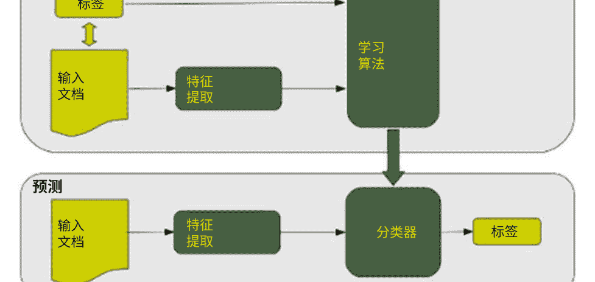

图1 构建和处理朴素贝叶斯分类器

NB算法广泛应用于文本分类，表现出良好的结果和高性能。NB因其高效和最优的时间复杂性而被认为是一种流行的机器学习算法。朴素贝叶斯提供了两种流行的模型：多变量伯努利朴素贝叶斯分类和多项式朴素贝叶斯分类。当数据库较大时，首选使用朴素贝叶斯多项式模型，并且它更适用于文本文件。另一方面[15]，多项式关注单词在文档中出现的次数，这说明了文档中出现的单词和词频（TF）。

伯努利模型专注于二进制概念，表示单词在文档中出现的次数。然而，它不像多项式朴素贝叶斯那样，不涉及TF [24]。

#### 2.2.2 支持向量机（SVM）

SVM是一种监督式机器学习技术，可用于文本分类和自动化作文评分。它需要训练集的正面和负面数据，不需要在维度空间中使用其他分类方法来分离负面和正面数据，寻找决策面，称为超平面。最接近的文档代表了一个称为支持向量的决策面。图2展示了使用超平面的SVM [25]。

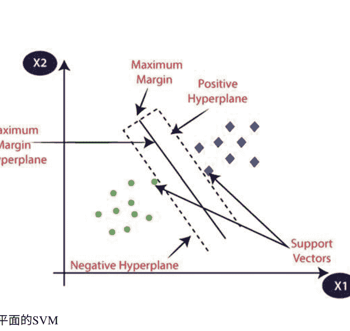

### 2.3 文本相似度（TS）

文本相似度在文本应用中起着重要作用，如信息检索、文本分类、简答题、自动化作文题和答案评分。 在文本相似性中，找到单词、段落和文档之间的相似性非常重要。有三种文本相似性的方法：

1. 基于字符串的相似性：这种相似性通过两种方式来衡量字符的结构，即基于术语的相似性和基于字符的相似性。
2. 基于语料库的相似度：该相似度根据从大型语料库中收集的信息来衡量单词之间的相似度。
3. 基于知识的相似度：该相似度利用从诸如WordNet这样的网络中获取的信息来衡量单词之间的相似度，WordNet考虑了英语动词、名词、副词和形容词的大型数据库[29]。 在本章中，将使用内积相似度来评分和评级学生的答案。

#### 2.3.1 内积相似度（点积）

相似度度量计算两个向量之间的相似程度，因为文档和查询都可以表示为向量。 相似度度量表示两个查询、两个文档甚至一个文档和一个查询之间的相似度。 内积相似度衡量文档和查询之间的相似度，公式如下：

```
∑_{k=1}^{t} (d_{ik} \cdot q_{k})
```

其中，d_ik是文档k中词项i的权重，q_k是查询中词项i的权重。 对于加权向量词项，内积相似度是匹配词项权重的乘积的总和。

对于二进制向量，内积相似度测量是文档中匹配查询的数量。 下面是二进制向量的一个例子：

```
文档 = 1, 1, 1, 0, 1, 1, 0
查询 = 1, 0, 1, 0, 0, 1, 1
sim (D, Q) = 3
```

其中D是文档，Q是查询。

### 2.4 评估指标

通过比较人工评分和自动评分的结果，使用MAE（平均绝对误差）和PCR（皮尔逊相关系数）来评估本文中提出的技术的评估结果。

#### 2.4.1 平均绝对误差（MAE）

MAE用于评估学生答案的人工得分和自动得分之间的分数。根据公式（2）计算MAE结果：

```
$$ \text{MAE} = \frac{1}{N} \sum_{i=1}^{N} |X_i - Y_i| \quad \text{(2)} $$
```

其中 x是人工评分，y是自动评分，N是数据测试的数量。

#### 2.4.2 皮尔逊相关系数结果（PCR）

皮尔逊相关系数衡量了学生答案的人工评分和自动评分之间的相关性强度。PCR结果根据公式（3）计算。

```
$$ \text{PCR} = \frac{\sum xy - \frac{\sum x \cdot \sum y}{N}}{\sqrt{\left(\sum x^2 - \frac{(\sum x)^2}{N}\right) \cdot \left(\sum y^2 - \frac{(\sum y)^2}{N}\right)}} \quad \text{(3)} $$
```

其中 x是人工评分，y是自动评分，N是问题测试的数量。

### 2.5 先前相关研究

在[30]中，提出了一种基于SVM和文本相似度算法的自动阿拉伯语论文评分系统；本论文提出了两个主要过程：首先，使用WordNet找到给定单词的所有可能含义；其次，使用特征提取。此外，使用余弦相似度来找到学生答案和教师答案之间的相似程度。数据集来自包含40个问题和三类答案的计算机、社会和科学书籍。120个问题。本论文表明，使用WordNet进行自动阿拉伯语文章评分可以得到更好的结果，而不使用WordNet。

在[2]中，提出了一种基于文本相似性的自动阿拉伯语文章评分系统。该研究使用210个简答题作为数据集，分别应用基于字符串的相似性算法（Damerau-Levenshtein算法，N-gram算法）和基于语料库的算法（LSA，DISCO），并进行结果比较和使用预处理数据步骤：首先，使用原始数据，然后进行分词和停用词移除。之后，进行词干提取和停用词词干。该研究证明，使用相似性算法可以提供有效的解决方案，帮助教师使用高精度的自动评分系统。

在[31]中，他们提出了一种用于阿拉伯语学生作文自动评估的方法。该研究使用了利雅得市的三百多名学生的数据集，应用了预处理技术，并使用了将修辞结构理论（RST）与潜在语义分析（LSA）相结合的混合技术；他们的系统实验显示准确率为78.33%，与教师评估的相关性为0.79。

在[32]中，提出了一种用于阿拉伯语简答题自动评分的方法。本研究利用余弦相似度来衡量模型答案和学生答案之间的相似性。本研究的数据集检查了一个由11个问题组成的考试和一个问题的模型答案。此外，所提出的方法的阶段如下：首先，提取学生答案和模型答案的关键词，然后在学生答案和模型答案中使用同义词以获得准确的结果。然后，使用余弦相似度来衡量模型答案和学生答案的准确性。使用这种方法的结果是相关性为95.4%，正确比例为84.5%。

在[33]中，研究人员介绍了一种用于阿拉伯语在线考试的自动评分系统。本研究提出了一种使用重度词干处理方法和轻度词干处理方法的自动评分系统。首先，对学生答案和模型答案使用重度词干处理方法，然后开始使用重度词干处理方法，删除数字、变音符号和其他语言的任何字母。

接下来，通过去除停用词，去除“AL.”然后，对单词进行处理，如果单词超过三个字母，则去除后缀fix或前缀fix。最后，对学生答案和模型答案中的每个单词应用相似度。

其次，通过去除前缀fix和后缀fix，然后对学生答案和模型答案应用相似度。所提出的技术对阿拉伯语作文题有有效的结果。

在[34]中，作者提出了一种用于自动阿拉伯语作文评分的混合方法。在这项研究中，采用了五个阶段：（1）准备数据集，包括610个答案；（2）对数据进行预处理，包括规范化、分词和词干提取；（3）使用阿拉伯语WordNet查找单词的同义词；（4）应用基于TF-IDF和余弦相似度的潜在语义分析；（5）应用修改后的LSA，使用词性（名词、动词、形容词和副词）将单词分配到固定的词性。使用修改后的LSA可以提高阿拉伯语作文评分的准确性。

在[1]中，作者提出了一种具有有效反馈的阿拉伯语简答评分方法。本研究使用了14种基于字符串和两种基于语料库的相似度方法，并对它们进行了比较。之后，评估和使用这些相似度测量的组合。在这项研究中，收集了一个包含50个问题和12个答案的阿拉伯语数据集，总共有600个答案。应用四种方法（原始、停用词、词干提取和停用词+词干提取）来处理基于字符串的相似度。除了两种模型（整体和分割）来处理基于语料库的相似度外，本研究还提出了在实际评分环境中使用该系统的实现。

在[35]中，介绍了利用字符串相似度和基于语料库的相似度进行简答题评分的方法。该系统分为三个阶段：首先，使用基于字符串的算法（包括四个模型：停用词、原始、停用词+词干提取和词干提取）测量模型答案和学生答案之间的相似度；其次，使用基于语料库的相似度算法（DISCO1和DISCO2）进行停用词去除、获取不同词以及构建相似度矩阵；最后，将基于字符串的相似度值与基于语料库的相似度算法的值进行合并。该数据集来自北德克萨斯大学，包含80个问题和2273个学生答案。该系统使用N-gram与DISCO1相结合，得到了0.504的结果。在[4]中，他们提出了一种自动评估学生阿拉伯语自由文本答案的方法。在这项研究中，使用了潜在语义分析（LSA）技术。从2011年3月的“系统设计”课程中收集了一组29份答卷作为数据集，这些答卷是用阿拉伯语书写的。答案将被添加到系统中，并执行多个任务，如清理文本、规范化字母、拼写检查单词、词干提取、处理同义词和删除停用词。

接下来，创建单词上下文矩阵（WCM）。然后，计算权重。接着，计算余弦相似度来比较学生答案和参考答案。最后，计算人工评分和系统评分之间的相关性，结果为0.91。然而，人工评分和LSA算法之间的相关性为0.88。

## 3个提出的模型

本章提出了一种旨在改进自动阿拉伯语文章评分技术的技术。如图3所示，该过程从预处理阶段开始，其中标记化步骤将答案分割成小的标记片段。对于规范化步骤，它用于替换特殊的字母形状并去除变音符号。然后，停用词移除步骤会移除无意义和无用的单词。最后，词干提取过程用于获取单词的词干和词根。所有预处理阶段都适用于学生答案和数据集（语料库）。然后，使用朴素贝叶斯分类器对学生答案和数据集（语料库）进行分类，以获得准确的结果。之后，使用Microsoft Word字典来比较并获取学生答案和模型答案的足够同义词，以获得更好的结果。最后，使用内积展示结果。

然后通过内积相似性与人类评分结果进行比较，从而可以衡量所提出技术的评估和效率。

### 3.1 预处理

相位用于将文本从困难的形式转换为更容易处理的形式。此外，转换后的文本应以向量格式呈现[36]。此外，实施词提取以清晰的格式，应用标记化、规范化、停用词去除和词干提取，以减少词语的歧义性，提高效率。这一步在分类过程中尤为重要，特别是在使用高度受影响的语言（如阿拉伯语）时，以支持和提高结果的效率[37]。图4显示了预处理步骤。

#### 3.1.1 分词和规范化过程

分词是预处理阶段的第一步，它将学生的答案和模型答案分成小片段和字符串的数量。一些分词去除停用标记的示例是（“;”， “.”， “?”）从学生的答案和模型答案中。然后，将句子分成标记：文本：“هي عميليه اسبقا المعلومات تبحث سيوطرتك الكلامه”但是，当将这个文本转换成标记时，它将变成“هي، عميليه، اسبقا، المعلومات، تبحث، سيوطرتك، الكلامه.”规范化是预处理阶段中一个重要的步骤，旨在实现最佳结果。规范化的目的是替换字符的形状，转换为单一形式，并去除变音符号和特殊字符。

#### 3.1.2 停用词去除

停用词去除被定义为在文本中去除不必要和无意义的词语，如代词、连词和介词[38, 39]。该过程在分词步骤之后同时应用于学生的答案和模型答案。停用词在分词步骤之后被列在表中以进行去除。例如，‘أي، بِأَيِّ ، بِئْن ، بَيْتُمَا ، بَهَا ، إِذْ ، إِذَا ، إِذَمَا ، إِذَنْ ، إِلَى ، إِلَيْكُمْ ، إِلَيْكَ ، إِلَيْهِمْ ، إِلَيْهَا ، إِلَيْهِ ، إِنْ ، إِنَّا ، إِنَّكُمْ ، إِنَّكَ ، إِنَّهُمْ ، إِنَّهَا ، إِنَّهُ ، إِمَّا ، إِمَّا ، لِأَلَّا ، لِأَلَّا ، لَدَيْنَا ، لَدَيْكُمْ ، لَدَيْكَ ، لَدَيْهِمْ ، لَدَيْهَا ، لَدَيْهِ ، لِمَا ، لِمَ ، لِمَنْ ، لَهُمْ ، لَهَا ، لَهُ ، مَعَ ، مَنْ ، مَنْ ، مَنْهُمْ ، مَنْهَا ، مَنْهُ ، مَهْ ، مِنْكُمْ ، مِنْكَ ، مِنْهُمْ ، مِنْهَا ، مِنْهُ ، مِنْ ، مِمَّنْ ، لِمَنْ ، لِمَا ، لِمَا ، مَهْ ، مِنْكُمْ ، مِنْكَ ، مِنْهُمْ ، مِنْهَا ، مِنْهُ ، لِمَا ، مِنْ ، مِمَّنْ ، لِمَنْ ، لِمَا ، لِمَا’所有这些词在应用停用词去除步骤之后都将被删除。

以本文为例：文本 “هَذِهِ عَلَامَةٌ ، هَذِهِ عَلَامَةٌ ، هَذِهِ عَلَامَةٌ  ”作为标记 “...” 应用停用词去除过程后，文本变为 “هَذِهِ عَلَامَةٌ ، هَذِهِ عَلَامَةٌ ، هَذِهِ عَلَامَةٌ  ”

#### 3.1.3 词干提取

词干提取是一种将词语最小化以获取其词根或词干的方法，主要用于信息检索以提高召回率[40, 41]。词干提取的主要过程是找到词的词根或词干，即去除给定词的所有词缀。阿拉伯语词干提取器分为两种主要类型。首先，轻型词干提取器通过去除后缀、前缀和中缀来找到词根，例如snowball词干提取器。其次，重型词根提取器通过减少词缀并转换一些字母来找到词根或词干，例如Khoja词干提取器和ISRI词干提取器[42]。由于阿拉伯语具有许多形态变化，因此阿拉伯语被认为是最具挑战性的词根检索之一[43]。在完成单词的规范化过程后，最后进行词干提取过程。阿拉伯文本分类使用多种类型的词干提取器。ISRI（信息科学研究所）词干提取器可以用于获取单词的词干和词根[26]。ISRI词干提取器使用词根词典来获取检索任务信息的词干和词根，去除变音符号并规范化一些字母形状。此外，还要去除长度为两个或三个的前缀，去除连接符。除了规范化阿里夫（改变到 1） ，如果单词等于三个字母，则作为词干返回，考虑到单词的长度（长度 =4，长度 =5，长度 =6，长度 =7）[44]。例如：文本 “هَذِهِ عَلَامَةٌ ، هَذِهِ عَلَامَةٌ ، هَذِهِ عَلَامَةٌ  ” 作为标记 “...” 作为停用词移除 “هَذِهِ عَلَامَةٌ ، هَذِهِ عَلَامَةٌ ، هَذِهِ عَلَامَةٌ  ” 作为词干 “...”

### 3.2 朴素贝叶斯分类器

NB分类器是一种简单的概率分类器，其中每个特征都被独立处理。NB有许多不同类型，如多项式、伯努利和高斯类型。NB在许多领域中表现良好，如文本分类。NB被认为是快速和易于实现的，因此可以作为TC中的基准[24]。在[45]中，对许多类型的文本分类进行了比较。

相应地，这是朴素贝叶斯分类器是通过使用预处理和特征提取方法来进行文档分类的最佳指示，以获得更好的挖掘质量性能。 此外，影响数据质量的因素挖掘结果的性能。在本章中，朴素贝叶斯阶段在预处理阶段之后进行，与最先进的文本分类方法支持向量机（SVM）进行比较。随后，将三种类型的朴素贝叶斯进行比较。然后，在三种类型中选择最佳，并使用高斯朴素贝叶斯分类器构建模型。

### 3.3 微软Word字典

微软Word字典阶段出现在预处理阶段之后。在本章中，根据微软Word同义词词典构建一个字典表，以检查学生答案和模型答案之间的同义词。当模型答案中的单词及其在学生答案中的同义词具有相同的含义时，答案是正确的。学生知道正确答案的概率将增加。下面是一个示例（表1）。

### 3.4 收集的数据

本章中使用的数据集与[46]中使用的数据集相同。数据集在Microsoft Excel工作表中创建为xlsx file，然后在Allu’lu’ta现代学校中使用社交书籍、科学和计算机来获取问题。数据集是一组问题和答案，其中包含40个问题和三类答案，总共有120个答案。自动化的作文题评分模型应用于Python Jupyter Notebook中，因为它易于实现且部署速度快。数据集的参数如下：

*   ID: 每个答案的唯一编号。
*   分数: 教师给学生答案的评分。
*   答案: 表示学生给出的答案。
*   问题ID: 每个问题的唯一编号。

图5显示了包含问题、ID和理想答案的数据集示例。

**表1 MS Word字典示例**

| 单词 | 同义词 |
|------|--------|
| ربط | وصل، شبك، أوفق، قيمة |
| بحث | تبحث، تنسى، تبحث، تتحقق |
| خط | مجرد، اتجاه، مجرد |
| طرق | سبيل، نجاح، مسلك، مجرد، واسطة |

| Id | Questions | Ideal-answer |
| --- | --- | --- |
| 1 | عرف الإنترنت | مجموعة من الأجهزة المتصلة مع بعضها البعض |
| 2 | لماذا يقصد بأمان المعلومات | في عملية إبقاء المعلومات تحت سيطرتك الكاملة |
| 3 | لماذا تعني بمحركات البحث | هي برامج مختصة في الشبكة الافتراضية تستخدم للبحث عن المعلومات تساعد الباحث للحصول على المعلومات |
| 4 | ما هي متطلبات الاتصال بالإنترنت | جهاز حاسوب اشتراك من أحد الشركات المزودة للخدمة ومتصفح الإنترنت، مودم |
| 5 | لماذا يقصد بمزود خدمة الإنترنت | شركة تمكن المشترك من الحصول على الإنترنت |
| 6 | ما هي وظيفة جهاز الموجم | جهاز يربط بين الحاسوب وخط الهاتف |
| 7 | ما هي الخدمات التي تقدمها الحكومة | تكوّن الدارة الكهربائية المصابيح، الإلكترونية، وما فائدتها |
| 8 | اذكر خدمات البريد الإلكتروني | مشاركة الرسائل والملفات والصور الآن |
| 9 | عل، احترام الحقوق الملكية الفكرية عند استخدام الإنترنت | حقوق النشر ونسخ المواد الموجودة مملوكة لأشخاص آخرين ولا يحق لأحد أن يعيد نشره |
| 10 | عرف بروتوكول الإنترنت | هي القواعد التيتحكم في الاتصال وتبادل المعلومات للأجهزة المختفلة المرتبطة بالشبكة |
| 11 | عرف الضارع الاجتماعي | عملية اجتماعية تؤدي إلى هدم المجتمع |
| 12 | عرف المنصر | سلك رفيق يصل في الدارة الكهربائية لحماية الأجهزة الكهربائية من الاحترق وينصير当他 يمر فيه تيار قوي |
| 13 | عرف البوصلة | اداة تستخدم لتحديد الاتجاهات وتتركب من مغناطيس صغير يشبه البرزة ويركز على سن مدينة تسخ له بالدوران والاتجاة نحو الشمال |

图5 数据集问题示例

图6展示了为学生创建的数据集样本，其中每个问题有五个答案，三个是真实答案，两个是为了实验目的而设定的。每个答案由人工评分，并给出一个分数。如果答案与典型答案完全兼容，则得分为100，但如果答案与典型答案部分兼容，则得分为75。当答案为空时，得分为0。否则，得分为25。

| ID | AnswerId | Score | QuestionID | Answer |
|---|---|---|---|---|
| 1 | 2 | 100 | 1 | معموله من الحواسب التي تبني بواسطة شبكة السلسلة إلى المحوره على م祯ك الBoundingClientRect |
| 2 | 2 | 75 | 1 | معموله من الحواسب التي تبني مع دمجها وتوفير وظائفه شبكة السلسلة |
| 3 | 1 | 50 | 1 | معموله من الحواسب التي تبني مع دمجها الميكن |
| 121 | 2 | 100 | 1 | معموله من الأجهزة التلفازه مع دمجها الميكن |
| 201 | 2 | 100 | 1 | معموله من الأجهزة التلفازه مع دمجها |
| 161 | 1 | 0 | 1... | (空白) |
| 4 | 2 | 100 | 2 | هي عباره عن أجهزة الميلميك تحتسب سيرفرتك الكليكله |
| 5 | 2 | 75 | 2 | أجهزة الميلميك تحتسب سيرفرتك شخصك |
| 6 | 1 | 50 | 2 | أجهزة الميلميك يسرودك يخترع بدون تدخيل |
| 122 | 2 | 100 | 2 | هي عباره أجهزة الميلميك تحتسب سيرفرتك الكليكله |
| 162 | 1 | 0 | 2... | (空白) |
| 7 | 2 | 100 | 3 | هي برنامج مخصص في الشبكه الإخبارية تستخدم للقتصاد عن الميلميك تساعد الميدان للوصول على الميلميك |
| 8 | 2 | 75 | 3 | ساعات الميدان للوصول على الميلميك |

图6 学生答案的示例

## 4 实验设计和结果

本节介绍了使用朴素贝叶斯（NB）分类器和内积算法相似度测量对阿拉伯语文章问题进行自动评分的结果。所提出的技术对所有数据集进行了处理以获得结果。所提出的技术使用Python Jupyter Notebook（6.0.3）完成，因为它具有许多有用的功能。例如，它易于使用，支持用于阿拉伯语处理的NLTK库，并且在机器学习（ML）中被广泛使用。

### 4.1 分类结果

本章中使用了不同类型的文本分类器，如SVM、NB和逻辑回归。朴素贝叶斯模型在产生卓越和成功的性能方面表现出色，以获得高准确性结果。本章中使用高斯朴素贝叶斯模型来预测准确性。

分类器模型在包含200个答案的所有数据集中实现，其中120个答案作为真实数据集，另外80个答案用于实验目的。表2展示了实现分类器模型的准确性值，其中朴素贝叶斯（伯努利）类型的准确性值为0.55，是最低的准确性。当实现朴素贝叶斯（高斯）类型时，最高的准确性值为0.9。

图7展示了分类算法准确性结果的图形描述。

### 4.2 不使用MS字典的内积

表3显示了在不使用MS字典的情况下使用内积的结果。

**表2 分类准确率结果**

| 模型 | 准确率 |
|------|--------|
| 线性SVM | 0.75 |
| RBF SVM | 0.775 |
| Nu SVM | 0.75 |
| 高斯NB | 0.9 |
| 多项式NB | 0.575 |
| 伯努利NB | 0.55 |
| 逻辑回归 | 0.75 |

图7 分类器准确率结果

**表3 不使用MS字典的提议模型结果**

| 问题（ID） | 人工评分 | 不使用MS字典的内积结果 |
|------------|----------|--------------------------|
| 1 | 75 | 25 |
| 2 | 25 | 30 |
| 8 | 25 | 0 |
| 10 | 100 | 100 |
| 11 | 75 | 25 |
| 14 | 75 | 85 |
| 21 | 25 | 53 |
| 23 | 25 | 27 |
| 29 | 25 | 40 |
| 35 | 100 | 100 |

### 4.3 使用MS字典的内积

表4显示了在使用MS字典的情况下使用内积的结果。

图8展示了使用MS字典和不使用MS字典的内积的比较结果的图形描述。

**表4 使用MS字典的提议模型结果**

| 问题（ID） | 人工评分 | 使用MS字典的内积结果 |
|------------|----------|----------------------|
| 1          | 75       | 75                   |
| 2          | 25       | 37                   |
| 8          | 25       | 33                   |
| 10         | 100      | 100                  |
| 11         | 75       | 50                   |
| 14         | 75       | 77                   |
| 21         | 25       | 40                   |
| 23         | 25       | 25                   |
| 29         | 25       | 28                   |
| 35         | 100      | 100                  |# 4.4 评估结果

通过比较人工评分和自动评分的平均绝对误差（MAE）以及皮尔逊相关系数（PCR），对使用Microsoft字典在阿拉伯语论文问题评分中的评估进行了执行。

# 4.4.1 平均绝对误差

MAE评估人工评分和提议技术之间的准确性。使用第2.4.1节的方程式2来确定MAE值。首先，使用字典和不使用字典的内积对人工评分和自动阿拉伯语论文问题评分进行MAE评估。

```

增强 = (MAE1 - MAE2) / MAE1 * 100%

```

根据表5中显示的平均绝对误差值，提高了4.65%的准确性。

# 4.4.2 皮尔逊相关系数

皮尔逊相关系数计算人工评分和自动化技术之间的强度，以提高自动化作文评分系统的效率。方程式3用于计算人工评分和自动评分之间的皮尔逊相关性。

```

Cor(x,y) = (Σxy - (Σx Σy)/N) / sqrt( (Σx^2 - (Σx)^2/N) * (ΣY^2 - (ΣY)^2/N) )

```

其中，x是人工评分（因变量），y是自动评分（自变量），N是问题测试的数量。

表5 提出的技术在有和无MS字典的情况下的平均绝对误差

| 项目 | 平均绝对误差（MAE） |
|------|---------------------|
| 与MS字典的内积 | 0.041 |
| 没有MS字典的内积 | 0.043 |

表6 使用MS字典和不使用MS字典的内积的皮尔逊相关结果

| | 带MS字典的内积 | 不带MS字典的内积 |
|---|---|---|
| 皮尔逊相关结果 | 0.8250 | 0.8193 |

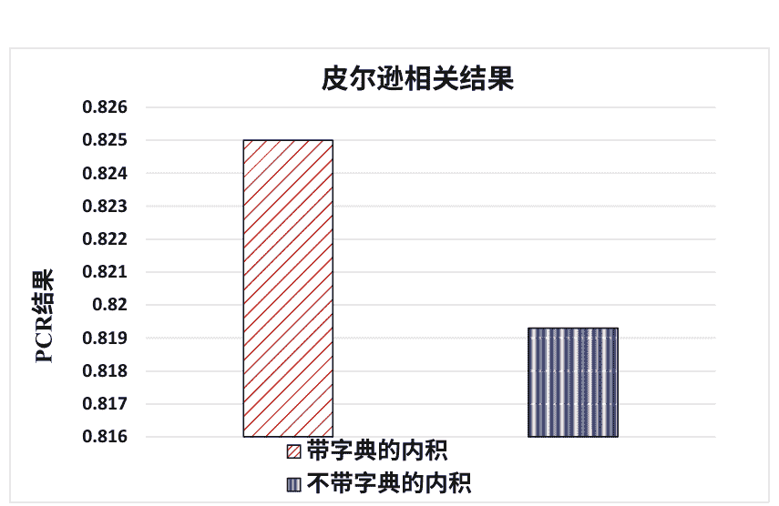

图9 皮尔逊相关

皮尔逊相关的有效结果在-1到+1之间。如果相关结果在0.5到1之间，则表示x变量和y变量之间存在高正相关。如果相关结果在0到0.49之间，则表示低正相关。如果相关结果在-0.5到0之间，则表示负相关。如果相关结果在-0.49到-1之间，则表示强烈的负相关。

如表6所示，皮尔逊相关系数的值介于0.5和1之间，这意味着这是一个强正相关，高X变量得分与高Y变量得分相伴随，反之亦然。

图9展示了使用MS字典和不使用MS字典进行自动化作文的PCR的图形描述。在使用MS字典的内积相似度和不使用MS字典的内积相似度之间，人工评分与提出的技术之间的皮尔逊相关系数结果较大，这意味着在利用MS字典时，提出的技术将改进阿拉伯语作文问题技术。

## 5 结论和未来工作

本章介绍了使用朴素贝叶斯分类器来进行阿拉伯语文章问题评分技术，并使用内积相似度来获取学生答案的分类准确性和得分。本工作的目标是通过添加微软Word字典来提高自动化的文章问题，使其能够与人类评分相匹配。因为为学生答案提供更多选择有助于证明所提出技术的效率。所有这些都是在包含40个问题和120个答案的各种阿拉伯数据集上执行的。

通过对学生答案实施自动化评分系统并进行结果比较，进行了许多实验。

结果显示，即使使用内积相似度和微软Word字典，自动化系统也有所改进。与不使用微软Word字典的内积相比，结果在准确性方面更好。通过计算质量指标的平均绝对误差（MAE）和皮尔逊相关系数（PCR）来证明了这一点。使用字典的内积的MAE为0.041，PCR为0.825。而与内积但不使用MS字典相比，MAE的值为0.043，PCR为0.819。

对于本章的未来建议和推荐是在不同类型和更大的数据集上实施所提出的技术，考虑在同一数据集上使用不同的分类理论和相似性算法。此外，还可以将语音识别进化到自动化阿拉伯语作文题评分，而不是使用书面作文题。

## 参考文献

1.  W.H. Gomaa, A.A. Fahmy, 有效反馈的阿拉伯语简答题评分。Int. J. Comp. Appl. 86(2), 35–41 (2014)
2.  A. Shehab, M. Faroun, M. Rashed, 基于文本相似性算法的自动阿拉伯语作文评分系统。Int. J. Adv. Comput. Sci. Appl. 9(3) (2018)
3.  D. Hutchison, 自动化作文评分系统, 在*K-12*新媒体素养研究手册: 问题与挑战, (IGI Global, Hershey, 2009), pp. 777–793
4.  M.M. Refaat等, 学生阿拉伯语自由文本答案的自动评估。*IJCIS* 12(1),213–222 (2012)
5.  K.M.O. Nahar, I.M. Alsmadi, 使用统计和计算语言学技术对阿拉伯语在线考试中的论述题进行自动评分。MASAUM J. Comput.1(2), 215–220 (2009)
6.  D.S.V. Madala等, 机器学习模型对自动化论文评分的实证分析。PeerJ Preprints (2018). https://doi.org/10.7287/peerj.preprints.3518v1
7.  L.M. Abualigah, A.T. Khader, 基于混合粒子群优化算法和遗传算子的无监督文本特征选择技术用于文本聚类。J. Supercomput. 73(11), 4773–4795 (2017)
8.  L.M. Abualigah等, 使用稳健权重方案和动态降维对文本文档聚类进行文本特征选择。Expert Syst. Appl. 84, 24–36 (2017)
9.  Z. 永, L. 友文, X. 世雄, 一种基于聚类的改进KNN文本分类算法. 计算机学报 4(3), 230–237 (2009)
10. Y.M. Fanny, F. Tanzil, 一种新闻分类的文本分类方法K-NN、朴素贝叶斯和支持向量机的比较. J Pengembangan IT 3(2) (2018)
11. S. Jimenez, C. Becerra, G. Alexander, 软基数：一种参数化的文本比较相似度函数, 在第一届词汇和计算语义联合会议(*SEM),(2012), pp. 449–453
12. S.-H. Cha, 概率密度函数之间的距离/相似度度量综合调查. 数学方法与应用科学国际期刊 1(4), 300–307 (2007)
13. L. Abualigah等人, 算术优化算法. 计算方法与应用力学工程. 376, 113609 (2021年)
14. A.H. Mohammad, T. Alwada’n, O. Al-Momani, 使用支持向量机、朴素贝叶斯和神经网络的阿拉伯语文本分类. GSTF计算机杂志 (JOC) 5 (1), 108–115 (2016年)
15. V. Korde, C.N. Mahender, 文本分类和分类器：一项调查. 国际人工智能应用杂志 (IJAIA) 3 (2) (2012年)
16. L.M. Abualigah, A.T. Khader, E.S. Hanandeh, 一种改进的特征选择方法, 用于改善使用粒子群优化算法的文档聚类. 计算机科学杂志. 25, 456–466 (2018年)
17. L.M. Abualigah, A.T. Khader, E.S. Hanandeh, 使用改进的鲸群算法进行混合聚类分析. Appl. Intell. 48 (11), 4047–4071 (2018)
18. L.M. Abualigah, A.T. Khader, E.S. Hanandeh, 目标函数和混合鲸群算法在文本文档聚类分析中的组合. Eng. Appl. Artif. Intell. 73, 111–125 (2018)
19. L.M. Abualigah等, 一种应用于聚类技术的鲸群算法的新型混合策略. Appl. Soft Comput. 60, 423–435 (2017)
20. G. Kanaan等, 应用于阿拉伯文本的文本分类技术的比较. J. Am. Soc. Inf. Sci. Technol. 60(9), 1836–1844 (2009)
21. S. Alsaleem, 使用SVM和NB进行自动化阿拉伯文本分类. Int. Arab J. e-Technol. 2(2), 124–128 (2011)
22. Al-Shargabi, B., W. AL-Romimah和F. Olayah, 基于停用词消除的阿拉伯文本分类算法的比较研究. ACM Digital Library, 纽约, 纽约2011年
23. S. Warmerdam, 多声部混音中的乐器识别特征 (代尔夫特理工大学, 代尔夫特, 2017年)
24. S. Xu, 贝叶斯朴素贝叶斯分类器用于文本分类. J. Inf. Sci. 44 (1), 48–59 (2018年)
25. 支持向量机算法. www.javatpoint.com. (2018年)
26. L.M.Q. Abualigah, 文本文档的特征选择和增强的鲸群算法用于文本文档聚类 (斯普林格, 瑞士, 2019年)
27. L.M.Q. Abualigah, E.S. Hanandeh, 应用遗传算法对信息检索进行研究, 使用向量空间模型. Int. J. Comput. Sci. Eng. Appl. 5(1), 19 (2015)
28. M.K. Vijaymeena, K. Kavitha, 文本挖掘中的相似度测量调查. Mach. Learn. Appl. 3(1) (2016)
29. W.H. Gomaa, A.A. Fahmy, 文本相似度方法调查. Int. J. Comput. Appl. 68(13), 13–18 (2013)
30. S.A.A. Awaida, B. Al-Shargabi, T. Al-Rousan, 基于f-score和阿拉伯语词网的自动阿拉伯语论文评分系统. Jordan. J. Comput. Inform. Technol. (JJCIT) 5(3), 1 (2019)
31. M.F. Al-Jouie, A.M. Azmi, 阿拉伯语学校儿童作文的自动评估. Proc.Comput. Sci. 117, 19–22 (2017)
32. H. Rababah, T.A. Al-Taani, 一种用于阿拉伯语简答题自动评分的方法问题, 在2017年第8届国际信息技术会议(ICIT), (2017), pp. 697–702
33. E.F. Al-Shalabi, 一种基于词干技术和Levenshtein编辑操作的阿拉伯语在线考试论文评分自动系统. Int. J. Comput. Sci. 13(5) (2016)
34. R. Mezher, N. Omar, 一种用于自动阿拉伯语论文评分的句法特征和潜在语义分析的混合方法。J. Appl. Sci. 16(5), 209–215 (2016)
35. W.H. Gomaa, A.A. Fahmy, 使用字符串相似性和基于语料库的相似性进行简答题评分。Int. J. Adv. Comput. Sci. Appl. (IJACSA) 3, 11 (2012)
36. A. Khan等人, 机器学习算法在文本文档分类中的综述。J. Adv. Inform. Technol. 1(1), 4–20 (2010)
37. A. Ayedh等人, 预处理对阿拉伯文档分类的影响.算法 9(2), 27 (2016)
38. A. Patra, D. Singh, 不同术语加权方法的文本分类调查报告和分类算法的比较. Int. J. Comput. Appl. 75(7) (2013)
39. L. Abualigah等人, 面向文本文档聚类的自然启发优化算法—A 综合分析。 算法 13(12), 345 (2020)
40. D. Sharma, 词干提取算法：一项比较研究及其分析。Int. J. Appl. Inform. Syst. (IJAIS) 4(3) (2012)
41. L. Abualigah等人, 大数据文本聚类中元启发式优化算法的进展。 电子 10(2), 101 (2021)
42. M.G. Syarief等人, 改进的阿拉伯词干提取器：ISRI词干提取器，在2019年IEEE第5届国际无线和电信会议(ICWT)上，(IEEE, 印度尼西亚日惹，2019)
43. M.A. Otair, 阿拉伯词干提取算法的比较分析。国际管理信息技术学报(IJMIT)5(2) (2013)
44. K. Taghva, R. Elhoury, J. Coombs, 无根词典的阿拉伯词干提取。 ITCC 2005(1), 152–157 (2005)
45. S.L. Ting, W.H. Ip, A.H.C. Tsang, 朴素贝叶斯是文档分类的好分类器吗? Int. J. Soft. Eng. Appl. 5(3) (2011)
46. S.E.O. Al-awaida,基于支持向量机和文本相似性算法的自动阿拉伯语论文评分系统(中东大学, 安曼, 约旦, 2019)

# 在不匹配条件下的语音识别的最优分形特征选择和估计

Puneet Bawa, Virender Kadyan, Archana Mantri和Vaibhav Kumar

## 1 引言

人类语音与更传统类型的机器反馈之间的差异在于将语音作为计算机模拟的一部分的基本差异。 尽管这些模拟系统通常被编程为产生一定范围的可接受的定义输出的最终目标。 它完全依赖于人类语音信号的近乎精确的转换[1, 2]。 然而，人的声音是独特的，即使是相同的单词在不同的方式或不同的环境条件下说出来也可能有不同的含义。 在大流行的情况下，孩子们现在在学校和家中的早期阶段学习如何使用计算机[3]。 随着越来越多的基于语音的应用程序被设计，孩子们能够使用这些技术的进展变得至关重要[4, 5]。 因此，语音识别系统管理每个元音和单词的正确发音的能力对于提高生产力非常重要。 此外，儿童在音调的情况下通常面临生成和发音元音的问题语言[6]。 因此，在这种情况下，对元音的有效识别非常重要，因为它们会立即影响可懂度，忽视可能会对辅音的产生造成严重影响。儿童说的话与成人语音相比，也具有较高的基频，儿童在生长过程中声音装置的不断变化是明显的。此外，儿童口语数据的收集和处理通常是一项繁琐、重复且耗费资源的任务，因此已经研究和实验了多种将成人语音适应到儿童语音的努力。此外，可以使用一组卷积层和深度语音层从输入信号中提取情感。该模型可以帮助实现检测喜悦和悲伤的最新结果 [7]。

因此，研究人员已经尝试了各种努力来实现语音特征向量的最佳提取和选择，其范围更广。 为了理想地识别声音，这些努力可以使用两种类型的方法进行分类：(a) 模板匹配 [8] 和 (b) 特征分析。 模板匹配方法是最简单的技术，它与依赖基本条件断言以正确匹配实际输入的传统键盘输入密切对应。 因此，该方法仅适用于设计依赖于说话人的自动语音识别系统，其中输入数字化语音样本仅识别先前建模的上下文 [8, 9]。 另一方面，特征分析的可靠方法被用作设计独立于说话人的自动语音识别系统的一般方法。 与模板匹配不同，该方法基于傅里叶变换处理输入语音信号，然后在现有数字化样本和预测输入之间找到类似特征的相关性。 同样，几乎在每个数字通信系统中都可以看到信号的非线性行为，从无线网络到蜂窝到卫星系统 [12, 13]。 因此，已经实施了几种非线性操作和技术，以适当提取与输入语音信号相对应的附加特征。 在这些方法中，最新的简化技术是基于分形分析，用于精确估计非线性信号的维度 [14]。 在这些方法中，对于生物医学信号（包括心电图、正常语音信号和脑电图）的时间序列主要集中在分形分类上进行分析 [15–18] 。

在这项研究中，我们努力解决了儿童语音中存在的元音发音困难问题，通过选择三种分形特征维度分析技术（Katz FD、Higuchi FD和Petrosian FD）来实现最佳选择。就像旁遮普语儿童语音识别系统一样，存在更高的分形指标，表明整个时间序列中存在更高的不规则性。 这些异常可能对应于更高的分形维度值和训练和测试语音之间的差异增加。 实验的目的是成功开发能够大幅减少计算复杂性并通过利用现有信道非线性因素提高效果的方法和算法。

因此，提出了一个增强的旁遮普语儿童系统，以充分识别更复杂和高频的非平稳语音信号。提出了一种复杂且高频的非平稳语音信号的增强旁遮普语儿童系统。最后，在评估使用混合声学分类器DNN-HMM的个体分形特征后，性能得到了提高。

本章的其余部分如下所示：第2节讨论了研究人员进行的文献回顾，以证明需要适当的算法来消除输入语音信号中的异常。此外，第3节讨论了被用于更好地分析所提出系统的理论背景，以及在第4节中呈现了对输入信号学习的预测。实验结果在第5节中描述。最后，在第6节中总结了研究。

## 2 相关工作

1975年开始进行了对分形特征的初步研究[19, 20]，作为现代数值假设的一部分。分形维度是分形理论中的主要参数。它定量地描述了分形集的不可预测性。作为一种时间序列，分形测度可以有效地描述通信信号的变化。基本的一维分形维度包括Hausdorff-Besicovitch维度（HBD）、Higuchi维度、Katz维度、Petrosian维度和Sevcik分形维度。HBD [21]是最基本的分形维度，被认为限制了天线尺寸，保持了较高的辐射效率[22]。这证实了HBD的重要性，并且还表明它具有很高的计算不可预测性，这使得很难接受基于说话者的信息。Sevcik分形维度提出了测量波形分形维度的方法[23]。这种方法可以用于轻松测试HBD波形测量，并计算波形的各个方面和任意性。Petrosian提出了一种快速估计有限序列分形维度的方法[24]，将数据转换为二进制序列，然后估计时间序列的分形维度。Tricot研究了Katz和Higuchi方法在四个人工分形波形上的评估精度。结果表明，Katz方法持续低估了实际测量值，而Higuchi方法在评估分形特征时更准确。此外，Ezz-Eldin等人提出了其混合网络的串联输出。它还尝试将其馈送到softmax层。它还尝试通过分类语言识别类别生成概率分布。根据发现和对输入特征的准确性，它可以被视为一种真实的测量[26]。

在[27]中，探索了分形演示和估计，以便在工程中实现分形函数。在[14]中，研究了几种分形在各种噪声传播系统中的应用，用于无线通信信号。模拟结果表明，不同噪声分布的FSK（频移键控）函数实际上可以通过各种分形来提取。最熟练的在[28]中，针对有效的观察性研究，开发了一种用于选择分形计算高亮度以组织连接调制符号的工具。在[29]中，提出了一种具有很少训练样本的自动语音识别（ASR）框架。它利用了观察到的语音波形中的分形特征。

为了提高两种不同ASR系统的性能，它与传统的MFCCs相结合。此外，在[30]中，研究人员提出了不同的特征提取技术组合：MFCC，RASTA-PLP和PLP。该研究为克服训练和测试阶段之间的性能下降挑战铺平了道路。在[31]中，研究人员对不同的声波（如混合声音，噪声等）进行了实验，并提出了一种系统来迭代地去除噪声和混响效应，并增强嘈杂环境下的语音。从理论上讲，已经知道儿童和成人的语音之间存在不匹配。在[32]中，作者探索了将不匹配的训练数据纳入到更好的声学模型中以及在有限的训练数据和使用噪声进行训练数据增强方面提高性能的方法。Manjutha等人[33]还尝试使用粒子群优化和协同纤维细胞优化从MFCC中选择最佳特征，并将这些特征输入到朴素贝叶斯和支持向量机等机器学习算法中，以获得更好的准确性。在[34]中，作者对基线Mel频率倒谱系数特征和伽马音频倒谱系数特征进行了比较研究，并使用DNN-HMM建模解决了过拟合问题，并建立了旁遮普语ASR系统的流水线。在[35]中，作者探索了各种特征提取技术与N-gram语言模型和单音和三音声学建模，并发现与其他方法相比，MFCC特征提取具有更高的准确性。在Bawa和Kadyan（2021）中，研究人员通过基于性别的领域内训练数据增强处理了成人和儿童语音之间的声学和语音变化，然后使用声道长度归一化来规范训练和测试集中的说话者之间的声学变异。

结果显示，在不同的环境条件下，即干净或嘈杂[36]，系统性能显著提高。在[37]中，作者经验性地确定了提高ASR系统准确性的最佳特征，并发现像Punjabi这样的音调语言的特征，如音高和声音概率，可以提高ASR系统的性能。在[38]中，作者探索了基于端到端注意力的语言识别系统。所提出的方法证明了超越最先进模型的性能。

## 3 特征提取

### 3.1 Katz分形特征

具有持续时间 $D$ 和波形长度 $W_L$ 的语音信号 $(a_i, b_i)$，以及初始点 $(a_i, b_i)$ 与其他点之间的最大距离 $d_{max}$，可以用来获取Katz分形特征($K_z$)：

$$K_z = \frac{\log(D)}{\text{对数}(D) + \text{对数}(d_{\text{最大}})}$$

宽度长度 $$= \sum_{i=0}^{D-2} \sqrt{(b_{i+1} - b_i)^2 + (a_{i+1} - a_i)^2}$$

最大 $$= \text{最大}\left(\sqrt{(b_i - b_1)^2 + (a_i - a_1)^2}\right)$$

### 3.2 Higuchi分形维度

Higuchi'的方法与Katz方法类似，具有递归性质。多年来，它已被证明在波形和信号处理中非常方便。

将语音信号视为 $a(1), a(2), . . . . ., a(N)$ 以 $k$为间隔两个相邻时间序列之间的间隔为 $m =1, 2, ..., k$为序列的初始时间值，重新计算的时间序列如下所示

$$a^k_m = \left\{ a(m), a(m+k), a(m+2k), ..., a\left(m + \left[\frac{N-m}{k}\right].k\right) \right\}$$

对于每个 $a^k_m$，平均长度 $AL_m(k)$ 显示为

$$AL_m(k) = \frac{\sum_{i=1}^{[(N-M)_k]} |a(m+ik) - a(m+(i-1).k)|.(N-1)}{[(N-M)/k].k}$$

因此，离散语音信号的总平均长度可以表示为

$$AL_T(k) = \sum_{n=1}^{k} AL_m(k)$$

通过对数变换，可以确定Higuchi分形维度 $H$为

$$\ln(AL_T(k)) / H.\ln\left(\frac{1}{k}\right)$$

### 3.3 Petrosian分形维度

首先，语音时间序列可以表示为 $a(1), a(2), . . . . , a(N)$。给定输入语音信号由一系列点组成 $b_1, b_2, b_3, , b_N$。需要从中生成一个二进制序列 $c_i$

$$ c_i = \begin{cases} 1, & a_i > \text{mean}(b) \\ -1, & a_i \leq \text{mean}(b) \end{cases}, i = 1, 2, . . . ., N $$

然后，可以计算出序列中相邻符号变化的总数

$$ \text{TN}_\Delta = \sum_{i=1}^{N-2} \frac{c_{i+1} - c_i}{2} $$

可以通过计算Petrosian分形维度来确定

$$ P = \frac{\log_{10} N}{\log_{10} N + \log_{10} \left( \frac{N}{N+0.4 \text{TN}_\Delta} \right)} $$

## 4 提出的系统架构

实验在32个儿童语音发言者和21个成年人语音发言者上进行，采样频率为16 kHz。数据库的音频在有和没有使用麦克风的开放和封闭环境中进行了录制。语音识别的初始方法是通过提取相关特征来表征输入语音信号中的复杂表示和模式，常用的前端MFCC提取技术使用了25毫秒的帧大小和10毫秒的帧移。频率带的确定是基于预处理信号$y(t)$的频域，以使得Mel尺度函数和频率$f(y(t))$之间的过渡得以进行。

$$ \text{Mel} \left( f(y(t)) \right) = 2595 \log_{10} \left( 1 + \frac{f(y(t))}{700} \right) $$

同样，双阶段已被用于增强对分形维度值对应特征的提取，以消除输入语音信号中存在的不一致性。最初，提取了帧级特征对应于输入语音信号的特征被提取出来，并对语料库中的所有话语进行了经典的逐帧分析。因此，相应地，对于成人语音中的一些话语，详细说明了在每个帧中评估Katz($kfd_{feats}$)、Higuchi($hfd_{feats}$)和Petrosian($pfd_{feats}$)的指数分形维度值以获得足够的时间序列，如图1a所示，以及儿童语音中的图1b。

### **算法1：处理不匹配条件下的特征选择的最优过程**

-   **步骤1：** 将成人语音语料库初始化为成人语料库，并将儿童语音语料库初始化为儿童语料库。
-   **步骤2：** 将成人语料库的训练集划分为80%和20%，将儿童语料库的训练集划分为80%和20%，然后将它们合并成拼接的语料库集合。最终的训练集为($adult_{corp}$的80%)加上($child_{corp}$的80%)。最终的测试集为($adult_{corp}$的20%)加上($child_{corp}$的20%)。
-   **步骤3：** 使用公式(11)提取产生的训练集和测试集的相应MFCC特征：

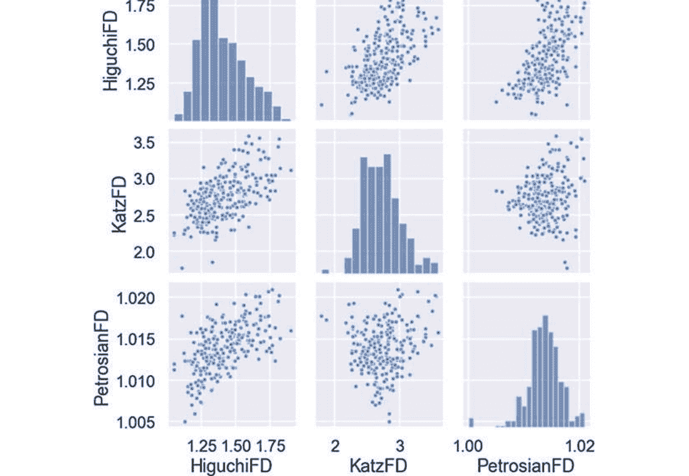

图1 (a) 成人语音语料库基于分形维度特征的成对图表示。(b) 儿童语音语料库基于分形维度特征的成对图表示。

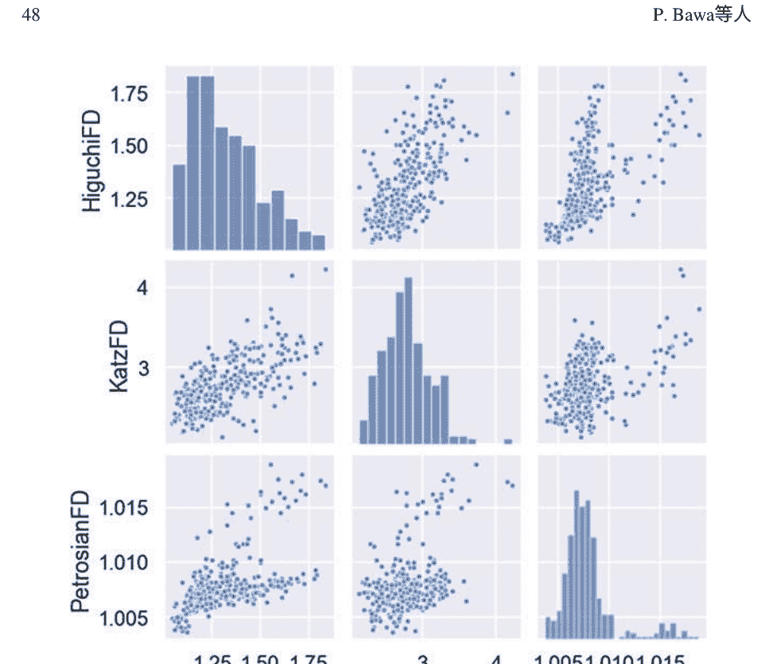

# 图1（续）

```
mfcc训练特征 = mfcc(final训练集)
mfcc测试特征 = mfcc(final测试集)
```

-   **步骤4:** 提取给定信号的个别分形特征:
    -   **步骤4.1:** 使用公式(1)提取Katz分形维度特征:
        ```
        kfd训练特征 = kfd(final训练集)
        kfd测试特征 = kfd(final测试集)
        ```
    -   **步骤4.2:** 使用公式(4)提取Higuchi分形维度特征:
        ```
        hfd训练特征 = hfd(final训练集)
        hfd测试特征 = hfd(final测试集)
        ```
    -   **步骤4.3:** 使用公式(8和9)提取Petrosian分形维度特征:
        ```
        pfd训练特征 = pfd(final训练集)
        pfd测试特征 = pfd(final测试集)
        ```
-   **步骤5:** 将训练和测试数据集的特征连接起来:
    -   **步骤5.1:** 将在步骤4.1中提取的Katz分形维度与在步骤3中提取的MFCC特征以及表示为第一组分形特征ff1连接起来:
    -   **步骤5.2:** 将在步骤4.2中提取的Higuchi分形维度与在步骤3中提取的MFCC特征以及表示为第二组分形特征ff₂连接起来：
        训练_ff₁ [mfccTrain特征 + kfdTrain特征 ]
        测试_ff₁ [mfccTest特征 + kfdTest特征 ]
    -   **步骤5.3:** 将在步骤4.3中提取的Petrosian分形维度与在步骤3中提取的MFCC特征进行连接，表示为第二组分形特征ff₃：
        train_ff₂ [mfccTrain特征 + hfdTrain特征 ]
        测试_ff₂ [mfccTest特征 + hfdTest特征 ]
        train_ff₃ [mfccTrain特征 + pfdTrain特征 ]
        test_ff₃ [mfccTest特征 + pfdTest特征 ]

此外，在提取这些特征后，在第二阶段将原始MFCC特征和独立提取的特征进行连接，如图2所示，并在算法1中详细说明。这些具有弹性的特征被连接在一起，以识别与儿童声音相对应的适当特征，因为相关的FD特性非常多样化，并反映个体说话者的状态特征。这些生成的特征FF1（mfcc特征+kfd特征），FF2（mfcc特征+hfd特征），和FF3（mfcc特征+pfd特征）在混合数据集上分别进行处理，经过归一化处理后得到42个特征，使用倒谱均值和方差归一化（CMVN）[39]。

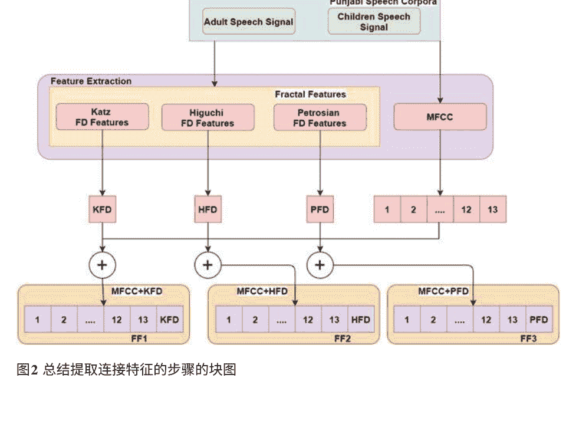

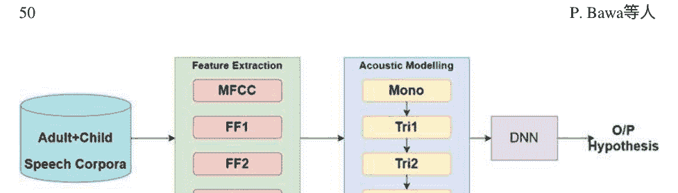

# 图3 所提出的用于选择适当的异构特征的块图以便进行充分的声学建模

# 表1 不匹配条件下各种异构特征提取技术的WER（%）

|          | MFCC   | FF1    | FF2    | FF3    |
|----------|--------|--------|--------|--------|
| 儿童     | 15.43  | 15.19  | 15.11  | 15.31  |
| 成人-儿童 | 14.27  | 13.86  | 13.65  | 13.88  |

在提取过程之后，将个体特征输入到DNN-HMM混合分类器中。在声学建模过程中，使用单声道（mono）、增量（tri1）和增量-增量（tri2）训练来更好地处理所获得的特征。这导致特征维度为117，与MFCC特征提取的情况相同，以及126，与图3中的FF1、FF2和FF3的详细情况相同。对于神经网络来说，这些高维语音特征很难解释，因此使用MLLT（最大似然线性变换）将其转换为40维的过程。最后，使用基于Kaldi的DNN [40] 对WER（%）和RI效率指标（%）进行评估。

## 5 性能评估

对两种类型的数据集（a）儿童语料库和（b）成人-儿童混合语料库进行实验，以测试基于分形维度的特征集的适用性，详细结果如表1所示。最初，开发了基准系统，展示了这些异质特征的更好性能，其中包括FF1、FF2和FF3，相对于MFCC的改进分别为1.55%、2.07%和0.7%。由于儿童数据集是冗余的，已经实施了采用成人数据对儿童数据进行自适应的增强策略的实验。在使用有限的声学功能的情况下，实现了选择各种特征组合的最佳子集的高异质性。然而，利用HFD（FF2）的汇集特征在其他基于分形维度的特征上表现良好，相对于FF1和FF2的改进分别为1.52%和1.66%。这个分析最终导致通过扩展代表增强儿童ASR系统的较低特征集的稳定发展，相对于基准系统整体改进了11.54%。

## 6 结论

考虑到儿童所说单词的非线性和波动的本质，我们应用了基于分形维度的特征。特征选择有助于更容易地进行分类，以生成适当的特征向量，而不是使用完整的特征集。同样，采用Higuchi分形维度的选择在正常和不匹配条件下分别提供了2.07%和4.34%的相对改进。采用自适应数据增强获得的选择使我们能够在不匹配条件下探索新的特征集，并使儿童ASR系统整体改进了11.54%。这些提取适当分形维度的策略可以被视为构建儿童语音识别系统的极具选择性的方法。对依赖韵律特征的异构分形测量进行深入探索[41]将在不久的将来扩大这项研究的有趣领域，并使其特别与儿童语音的适当识别相关联。

利益冲突作者声明没有利益冲突。

## 参考文献

1.  L.R. Rabiner, 隐马尔可夫模型及其在语音识别中的应用教程. 在语音识别读物中, (IEEE, 1990), 第267页
2.  W. Zhang, Y. Liu, X. Wang, X. Tian, 语音产生过程中运动和感觉系统之间的动态和任务相关的表征转换. 认知神经科学. 11(4), 194–204 (2020). https://doi.org/10.1080/17588928.2020.1792868
3.  J. Wolfe, J. Smith, S. Neumann, S. Miller, E.C. Schafer, A.L. Birath, 等, 在COVID-19期间优化学校和其他环境中的沟通. 听力杂志. 73(9), 40–42 (2020). https://doi.org/10.1097/01.HJ.0000717184.65906.b9
4.  D. Giuliani, M. Gerosa, 调查儿童语音识别，在2003年IEEE国际会议上，声学、语音和信号处理，2003年。 Proceedings(ICASSP'03), vol. 2, (IEEE, 2003), p. II-137. https://doi.org/10.1109/ICASSP.2003.1202313
5.  M. Russell, C. Brown, A. Skilling, R. Series, J. Wallace, B. Bonham, P. Barker, 自动语音识别在幼儿语言发展中的应用，在第四届国际口语处理会议上。 ICSLP’96,vol. 1, (IEEE, 1996), pp. 176–179. https://doi.org/10.1109/ICSLP.1996.607069
6.  J.L. Wu, H.M. Yang, Y.H. Lin, Q.J. Fu, 计算机辅助语音训练对普通话听力障碍儿童的影响。 听觉. 神经. 12(5), 307–312 (2007)
7.  J. Oliveira, I. Praça, 利用预训练的语音识别深层来检测情绪。 IEEE Access 9, 9699–9705 (2021)
8.  S. Dey, P. Motlicek, S. Madikeri, M. Ferras, 文本相关说话人验证的模板匹配。 语音通信. 88, 96–105 (2017). https://doi.org/10.1016/j.specom.2017.01.009
9.  A. Arora, V. Kadyan, A. Singh, 音调特征对不同方言变体的影响旁遮普语言，信号处理和通信的进展： ICSC 2018 的选择论文，由B. S. Rawat, A. Trivedi, S. Manhas, V. Karwal编辑，(Springer, New York,2018), pp. 467–472
10. N. Bassan, V. Kadyan, 使用MFCC进行旁遮普语的连续自动语音识别的实验研究，智能计算技术的最新发现: 第5届ICACNI 2017的论文集，vol. 707, (Springer Nature, Singapore, 2018), p. 267. https://doi.org/10.1007/978-981-10-8639-7_288
11. Y. Kumar, N. Singh, M. Kumar, A. Singh, AutoSSR: 旁遮普语自动自发语音识别模型的高效方法。 软计算., Springer(2020)。 https://doi.org/10.1007/s00500-020-05248-1
12. A. Chern, Y.H. Lai, Y.P. Chang, Y. Tsao, R.Y. Chang, H.W. Chang, 一种基于智能手机的多功能听力辅助系统，以促进课堂上的语音识别。 IEEEAccess 5, 10339–10351 (2017). https://doi.org/10.1109/ACCESS.2017.2711489
13. Z. Zhang, J. Geiger, J. Pohjalainen, A.E.D. Mousa, W. Jin, B. Schuller, 深度学习用于环境鲁棒语音识别的最新发展概述。 ACM Trans.Intel. Syst. Technol. (TIST) 9(5), 1–28 (2018). https://doi.org/10.1145/3178115
14. H. Wang, J. Li, L. Guo, Z. Dou, Y. Lin, R. Zhou, 基于分形复杂性的通信信号特征提取算法。 分形 25(04), 1740008 (2017)。 https://doi.org/10.1142/S0218348X17400084
15. M. Dalal, M. Tanveer, R.B. Pachori, 基于FAWT子带信号的分形维度的自动识别系统，用于焦点EEG信号，机器智能和信号分析，(Springer， 新加坡， 2019年)， pp. 583–596. https://doi.org/10.1007/978-981-13-0923-6_50
16. J. Kaur, A. Singh, V. Kadyan, 用于音调语言的自动语音识别系统: 工程计算方法档案，(Springer, 2020年)。 https://doi.org/10.1007/s11831-020-09414-4
17. A. Korolj, H.T. Wu, M. Radisic, 一剂健康的混沌: 使用分形框架工程高保真生物医学系统。 生物材料 219, 119363 (2019年)。 https://doi.org/10.1016/j.biomaterials.2019.119363
18. A. Singh, V. Kadyan, M. Kumar, N. Bassan, ASRoIL: 印度语言自动语音识别的综合调查. 人工智能评论, Springer 53, 3673–3704 (2019)
19. J.P.A. Sanchez, O.C. Alegria, M.V. Rodriguez, J.A.L.C. Abeyro, J.R.M. Almaraz, A.D. Gonzalez, 使用EMD方法和分形维度理论检测与地震活动相关的ULF地磁异常. IEEE拉丁美洲交易. 15(2), 197–205 (2017). https://doi.org/10.1109/TLA.2017.7854612
20. Y.D. Zhang, X.Q. Chen, T.M. Zhan, Z.Q. Jiao, Y. Sun, Z.M. Chen, S.H. Wang, 基于Minkowski-Bouligand方法的病理性脑检测系统的分形维度估计. IEEE Access 4, 5937–5947 (2016). https://doi.org/10.1109/ACCESS.2016.2611530
21. Y. Gui, 由非线性纤维编码索引的自仿射地毯的Hausdorff维度谱，在2009年国际混沌分形理论和应用研讨会上，(IEEE， 2009)， 页码382–386。 https://doi.org/10.1109/IWCFTA.2009.86
22. E. Guariglia，熵和分形天线。 熵 18(3), 84 (2016)。 https://doi.org/10.3390/e18030084
23. C. Sevcik，一种估计波形分形维度的方法。 arXiv (2010) 预印本 arXiv:1003.5266
24. A. Petrosian, 有限序列的Kolmogorov复杂度和不同前兆EEG模式的识别，在第八届IEEE计算机医学系统研讨会上，(IEEE, 1995)， 页码212–217。 https://doi.org/10.1109/CBMS.1995.465426
25. M. Ezz-Eldin, A.A. Khalaf, H.F. Hamed, A.I. Hussein, Efficient feature-aware hybrid model of deep learning architectures for speech emotion recognition. IEEE Access 9, 19999–20011 (2021). https://doi.org/10.1109/ACCESS.2021.3054345
26. V. Kadyan, S. Shanawazuddin, A. Singh, Developing children’s speech recognition system for low resource punjabi language. Appl. Acoust. 178 (2021). https://doi.org/10.1016/j.apacoust.2021.108002

+   27. E. Guariglia, Spectral analysis of the Weierstrass-Mandelbrot function, in 2017 2nd International Multidisciplinary Conference on Computer and Energy Science (SpliTech), (IEEE, 2017), pp. 1–6.

+   28. C.T. Shi, 基于分形特征和机器学习的信号模式识别。Appl. Sci. 8(8), 1327 (2018). https://doi.org/10.3390/app8081327

+   29. A. Ezeiza, K.L. de Ipiña, C. Hernández, N. Barroso, 增强自动语音识别中的特征提取过程与分形维度。Cogn. Comput. 5(4), 545–550 (2013). https://doi.org/10.1007/s12559-012-9165-0

+   30. V. Kadyan, A. Mantri, R.K. Aggarwal, 一种具有混合HMM分类器的异构语音特征向量生成方法。Int. J. Speech Technol. 20(4), 761–769 (2017). https://doi.org/10.1007/s10772-017-9446-9

+   31. J. Singh, K. Kaur, 使用深度神经网络进行旁遮普语言的语音增强，在2019年国际信号处理和通信会议(ICSC)上, (IEEE, 2019), 第202–204页。 https://doi.org/10.1109/ICSC45622.2019.8938309

+   32. M. Qian, I. McLoughlin, W. Quo, L. Dai. 使用DNN-HMM进行儿童语音自动识别的不匹配训练数据增强, 在2016年第10届中国口语语言处理国际研讨会(ISCSLP)上, (IEEE, 2016), 第1–5页。 https://doi.org/10.1109/ISCSLP.2016.7918386

+   33. M. Manjutha, P. Subashini, M. Krishnaveni, V. Narmadha, 使用泰米尔语音数据集进行发音缺陷分类的优化倒谱特征选择方法, 在2019年IEEE国际智能城市会议(ISC2)上, (IEEE, 2019), 第671–677页。 https://doi.org/10.1109/ISC246665.2019.9071756

+   34. V. Kadyan, A. Mantri, R.K. Aggarwal, A. Singh, 基于深度神经网络的旁遮普语自动语音识别系统的比较研究。国际语音技术杂志 22(1), 111–119 (2019). https://doi.org/10.1007/s10772-018-09577-3

+   35. J. Guglani, A.N. Mishra, 基于Kaldi ASR工具包的连续旁遮普语语音识别模型。国际语音技术杂志 21(2), 211–216 (2018). https://doi.org/10.1007/s10772-018-9497-6

+   36. K. Goyal, A. Singh, V. Kadyan, 旁遮普语方言中的喉音效应比较。环境智能与人类计算杂志 (2021). https://doi.org/10.1007/s12652-021-03235-4

+   37. J. Guglani, A.N. Mishra, 在KALDI工具包上具有音高相关特征的旁遮普语自动语音识别系统。Appl. Acoust. 167, 107386 (2020). https://doi.org/10.1016/j.apacoust.2020.107386

+   38. G. Sreeram, K. Dhawan, K. Priyadarshi, R. Sinha, 使用基于注意力的E2E网络进行联合语言识别和代码-切换语音, 在2020年国际信号处理和通信会议 (SPCOM), (IEEE, 2020), pp. 1–5. https://doi.org/10.1109/SPCOM50965.2020.9179636

+   39. J. Li, L. Deng, Y. Gong, R. Haeb-Umbach, 噪声鲁棒自动语音识别概述, 在IEEE/ACM音频、语音和语言处理交易, vol.22(4), (IEEE, 2014), pp. 745–777. https://doi.org/10.1109/TASLP.2014.2304637

+   40. D. Povey, A. Ghoshal, G. Boulianne, L. Burget, O. Glembek, N. Goel, K. Vesely, Kaldi语音识别工具包, 在IEEE 2011自动语音识别和理解研讨会 (NSF), (IEEE信号处理学会, 2011)

+   41. S. Rajendran, P. Jayagopal, 通过吸收不同的语音识别技术, 在护理点保持可学习性和可理解性。Int. J. Speech Technol. 23, 265–276(2020). https://doi.org/10.1007/s10772-020-09687-x

# 从文本需求生成类图：自然语言处理的应用

Abdulwahab Ali Almazroi, Laith Abualigah, Mohammed A. Alqarni, Essam H. Houssein, Ahmad Qasim Mohammad AlHamad, 和 Mohamed Abd Elaziz

## 1 引言

软件程序开发过程漫长而复杂。它通过了解用户的需求（称为需求或规格）来运行；这是整个软件程序的主要目标[1]。本节涵盖了多种安排和会议，直到最终的需求计划被提供。在规格中描述的这个文件或文档被称为软件需求规格（SRS）文件[2]。开发人员利用这个记录（SRS）来开发和分析所需的应用程序。SRS提供完整的培训细节必须呈现，必须包括的功能、样式和程序，以及其他许多内容。这份报告是人工-定期发生的，但是大型任务有许多SRS方面，因此几乎不可能由人类来观察和检查。因此，本章的研究人员希望能够找到一种新的、强大的策略来解决这个问题[3]。 此外，可以使用优化技术来解决这个问题[4-7]。

普遍地，现有的技术被用来确定需求记录中的所需图表，这被评估为两种主要策略：基于传统的策略和基于面向对象的策略。这些过程被选择出来以实现机器的最佳目标和目的，而最近的方法与面向对象的模型相关。它描述了指令、特征（属性）和规则（方法）。它进一步准备了类之间的关联（如果存在）[8, 9]。UML图主要结合了两个主要组成部分：静态设计和动态设计。静态设计也被声明为结构设计，包括类和复合结构设计（图表）[10, 11]。此外，行为图重点关注应用设计中出现的需求。动态设计图（行为图）旨在解释系统的过程和操作，也用于说明软件服务的功能。从自然语言（NL）系统需求中生成设计是一项非常耗时且具有挑战性的任务[8]。

设计模式通常用于以结构化的方式准备需求文档；各种设计模式包括互通设计图、序列图（控制）和活动设计图[12]。为了在需求审查（要求）和设计阶段之间成功填补差距，已经开发出各种技术和工具，通过生成面向对象的原型来满足提供的需求[13]。

过去，数据流图（DFD）被用来表示数据流并绘制用户的需求规范。然而，在现代，统一建模语言（UML）被用来将用户的需求映射和显示在统计漂移图上，这是一种完整和合法的提供信息的方法。UML对以下类型的软件开发方法有益[1]。任何软件开发过程都始于对需求的调查和评估，如第一部分所述。本节将制定一个清晰的布局，以理解编程开发中最具挑战性和棘手的任务。灾难使得这个行动在编程开发的更长时间内变得无法控制。首先，这些能力的原因是为了报告在NLP中使用它们的重要性。为了克服这个问题，已经开发出一种工具，它从软件规范中设计出一个半自动化的UML类模型，并使用NLP策略。这种方法旨在以传统和广泛的配置展示类图，并进一步列出指令之间的连接[2]。通过所有这些表达来展示人类的观点，人类语言是一种模糊但非常灵活的方法；图形设计是最有效的是数学语言，但它需要更高水平的专业知识来开发和理解[14]。

所需的记录通常由计算机使用专家确定和提供。已证明信息和统计检索因素几乎是相等的原则。分析师可以采用各种策略来收集与软件开发相关的相关统计数据。这个统计数据定义了在布局要求、目标、障碍、性能和鲁棒性标准方面的覆盖期望。因此，需要一个机制计划，以支持软件工程开发特定生命周期步骤中包含的任务的自动化，其中还包括稍后将介绍的类图。

这些机器反映了完成功能和非功能任务的能力，从文本数据到增强的应用程序可视化，以帮助用户承担与特定技术无关的演化过程的管理。本研究旨在构建一种将文本、自然语言和数据转化为UML精美图表的工具。该工具用于输入构成文本输入规范的文本数据，以便让人们理解文本。首先，它对实体的名称进行分类（即类、属性和指令类型之间的关系）。其次，它将它们准备成一个基于XML的结构化文档。所提出的技术用于根据所选系统的需求规范生成精美图表。所提出的技术通过执行有效且快速的规则从数据集的精美需求生成类图来提高可分析性。它通过提供熟悉的社交相关用户界面来继续与用户的互动。

研究的其余部分按照以下方式系统化：第2节介绍了相关工作的综合评述，以向读者展示该领域的研究进展。第3节介绍了本研究的方法论，以展示所有的步骤。第4节给出了实验结果和讨论，以展示所提出方法的性能。最后，在第5节中给出了结论和可能的未来工作。

## 2 相关工作

本节展示了相关工作并讨论了其主要步骤，如下一小节所示。

### 2.1 统一建模语言（UML）图

在软件开发生命周期中，需求分析和设计是出现问题的其中之一。在将过程转移到其他步骤的第一阶段中面临的问题，与原始方法相比，导致高成本的过程。人类语言风格可以帮助开发人员通过改变电子设计中的元素来确定软件规格，使用UML图[13]。

本文侧重于生成序列设计和活动设计图，并通过自然语言将需求呈现出来[15]。解析器和PSO标记方法用于分析用户输入在选择过程和表达式以及文本中的其他内容时提供的英语。

在另一篇论文[8]中，引入了一种新的技术来改善整体处理NL规范，并且所提出的方法检测到NL规范中的缺陷。此外，作者通过比较研究展示了所提出的方法如何支持非软件工程师编辑生成软件工程需求的文本。本研究的结果表明，所提出的方法可以显著加快创建具有更散乱缺陷的文本的速度。

另一项研究中提出的方法[12]改进了传统建模语言与常规自然语言处理之间的连接。这种方法是由Java开发并在一些个人文档上进行了测试。此外，还引入了几种机制，以在规则变化时保持模型的兼容性和文本表示[8]。

另一项研究代表了NLP机制，旨在帮助面向对象结构中软件改进的调查步骤[16]。该NLP过程旨在研究以英语形式复制的软件需求文本，并创建一个描述在语法系统中的准备文本的组合对话范式。然后，该系统自行应用，几乎没有直接人工控制，以构建一个UML类图，例如类设计，说明给定文本中的术语类型，它们之间的关系以及电子模型的顺序图。规范审查定义了用户对特定目的的需求。[15]中提出了一种机制，用于从给定的需求文档中获取图表或图示，并提供强大的语义辅助。推荐的工具将用户建模细节转换为编程专家代码；代码生成是通过Java实现的。这项工作的主要目标是通过执行利用NLP过程的模型工具，在Java中生成各种UML设计图和代码框架。

另一种提取范式被命名为UML设计生成器，从需求的解释中获得UML设计，使用有用的NLP机制。在这种方法中，复杂的需求将根据一系列句法重构命令被处理为精确的需求。此外，任何UML设计的可视化设计将通过XMI设计进行。

软件规范是软件过程的重要步骤；在这个阶段的失败必然会导致系统配置和实现中出现困难。需求以自然语言形式表达，可能存在不确定性、不一致性、错误，或者是程序员处理大量知识的困难。程序员处理大量知识可能存在不确定性、不一致性、错误，或者是自然语言形式表达的失败。 本章提出了一种新的方法，用于将通用自然语言的需求描述自动转换为面向对象的解释系统。

为了将人类语言转化为用例和类图，引入了一种新的方法来执行这些操作；产生了两个状态。 首先，递归对象设计从人类语言转变为图形风格（写作）。 它还将递归对象设计转换为UML风格[14]。 此外，它将UML设计转换为人类语言[19]。 此外，它引入了一种使用语法结构将类设计图转换为通用语言或人类语言的新系统。 然后，语言形式被转换为人类语言（文本）。 类图的自动生成器被引入为一种方法，它聚合了人类语言（NL）方法的分析和设计验证特性。 确定了各种模型来生成类图。 当想法被创建时，XML元数据文件被创建并通过计算机辅助工具传输以生成UML设计图[20, 21]。

引入了一种新的算法，以便从各种人产生的人类语言中提取规则，生成UML设计图[22]。 改进UML的常规语法并在初始阶段识别合法问题将减少时间和成本。 这项工作还为UML图和用例图提供了一个对称的语法模型[23]。

如今，最强大的软件应用程序，可以更强力地诱导UML设计图的是Rational Rose、Clever Draw等。 目前，这些软件是推荐用于此目的的，但它们有许多缺点和不足之处。 根据标准和规则，设计分析师必须进行一些绘画，以推断一般业务功能并在描述UML设计时遵循用户需求，使用正统的CASE工具。 因此，由于可用的CASE工具的双重性质，导致了大量时间的浪费。 如今，每个人都希望得到快速可靠的服务。 因此，有必要有一些智能软件应用程序，可以基于文本创建UML，以节省用户和设备分析师的时间和资源[1]。

### 2.2 类图

每个软件改进过程都始于基本审查。 从需求审查开始的第一阶段是生成一个被认为是编程改进中常见的具有挑战性和要求的设计。 在这个过程中会出现非性能问题，这在编程进展的更高阶段可能会很难改变。 这种可能的困难背后的一个主要目标是展示它们的必要目的。 在普通语言应用中。 这个问题的解决方案是由[2]提出的，其中设计了一种机制，用于使用NLP技术从软件短语生成UML类设计的作者半自动化辅助。 所提出的系统以传统形式展示了类图，并记录了提供的类之间的关联。

文献[24]介绍了一种方法，用于改进需求系统的规范，并通过保持自然语言处理来获取类图。专家们通过人工方式对条件进行了研究，以找出类图；因此，需要一种计算机化的方法来克服人为错误。 需求和类图生成是支持需求审查员和软件工程学者在生成软件需求时探索人类语言的工具，这些工具达到了核心理论和关系，并选择了类图。 为了将业务报告解释为文本以生成UML图，引入了一种基于自然语言的自动系统。 用户以英文人类语言在多个文本中记录需求，而该方法具有解释给定文本记录的非凡能力。 下一步是执行分析阶段和提取阶段；该系统描述了各种UML设计图、类设计图和序列设计图。 所提出的工作提供了一种稳定而有效的方法来生成UML图[1]。

研究人员提议将软件规范更改为面向对象的模型[25, 26]。 软件需求规范以人类语言描述，涉及各种复杂情况，如样式转换为特定变化条件下的UML类图。 变更过程利用语法解释软件规范。 作者旨在使用自然语言处理过程将软件元素转换为正式术语。 一种新方法被用来检查命令并从人类术语中选择类设计图，以管理自然语言处理策略[27]。

引入了从UML类设计图生成人类语言规范的方法，以解决人类语言和计算机语言之间的内涵问题[28]。 首先，采用数据语言类来分析基于多种情况的类设计，以制定减少在UML中使用的人类语言部分的不确定性的规则。 为了获得精确的UML词汇系统并生成语法决策，使用了WorldNet本体论。 解释软件规范并创建以语法安排为指定的合并对话模型[15]。 所选材料用于生成描述类中记录的人类语言术语的类图的UML模型。 需求还可以将用户演示转换为Java风格源代码的片段[3]。

### 2.3 ER图

在实体关系（ER）信息设计中（用于辅助生成数据库），ER设计的结构使其成为一个复杂的工作来确定学生和设计师的ER。为了解决这个问题并从人类语言术语中生成ER图组件，使用自然语言处理提出了各种解决方案。引入了一种使用人类语言记录进行ER设计的方法。为了生成需求规格的术语，基于特定规则应用了结构化方法[29]。

需求解释器认为概念设计是软件开发生命周期（SDLC）的需求审查阶段生成的重要工件[30]。概念设计是术语的可见模型'在中心的专业。由于其可见性，设计作为利益相关者讨论需求的依据。它允许需求调查员改进其他功能规格。概念规则通常通过软件计划的配置和实现阶段生成类设计图。此外，相对机械的概念设计可以通过加速图形界面、概念和可视化的规则在分析阶段节省足够的时间。

另一项工作引入了一种新的方案，从有用的术语中产生一个心理概念设计，在计算机化模型中记录[18]。类'图和它们的连接根据工作要求自动识别。这个描述取决于句法生成的解释和面向对象系统的目的。EER（扩展实体关系）系统被用于类关联。优化过程被用于通过后处理步骤识别对象，并提供最后的概念说明。书面领域的优势——与几个规则混合——用于确定给出了一种理想的方法来生成设计中的对象术语的类关系。该工作演示了运行当前案例研究的模型制作过程。它以评估所提出的方法对规格审查和调查的适用性结束。将解释与文献中的两个标准模型和个人设计的概念形式进行比较，以进行不同的评估参数。

所选单词在ER设计细节中概述，如实体、关系和属性。在这项工作中，提出了一种从功能需求中生成实际设计的新方法，以人类语言使用计算机系统呈现。从功能需求中识别出类和关系——这些分类规则取决于句子语言的创建和面向对象模型的原则。扩展ER系统与类关联混合在一起。对分类实体进行优化处理，同时提供后处理层和最后的概念安排。利用记录的命令与定义类关系的命令相结合，以生成标准形式的术语[18]。本研究的作者们牢记着类图的重要性，原因如下：

- 一些研究已被用于将人类语言需求转换为用于开发目的的类设计图。
- 类图是任何系统设计和分析的主要部分，其他方法都是从类图中获取的。此外，它们包含了大部分信息，尽管不包括系统需求特征的特性和规格。

A. A. Almazroi
信息技术部，吉达大学，库莱斯计算机与信息技术学院，沙特阿拉伯吉达

L. Abualigah (✉)
研究与创新部，天际线大学学院，沙迦，阿拉伯联合酋长国
计算机科学与信息学院，安曼阿拉伯大学，安曼，约旦
计算机科学学院，马来西亚理科大学，槟城，马来西亚

M. A. Alqarni
软件工程系，吉达大学，计算机科学与工程学院，吉达，沙特阿拉伯

E. H. Houssein
计算机与信息系，米尼亚大学，米尼亚，埃及

A. Q. M. AlHamad
信息系统部，沙迦大学，沙迦，阿拉伯联合酋长国

M. A. Elaziz
数学系，理学院，扎加济格大学，扎加济格，埃及在这个层次上，用例设计图被忽略，因为它们提供的细节主要用人类语言表达。随后，它不需要太多的生产工作，并且完全适合用户理解。

用例图的知识与类图相关的过程类似。它们主要用于发现术语之间的协作和交互，以及它们如何从一种情况转换到另一种情况。

在软件工程领域和自然语言处理中，减少面向对象建模的时间和工作量非常重要。因此，为了解决生成类图并提供强大解决方案的问题，需要一个合适的框架来帮助用户和软件工程师[31-33]。进行的工作是特定于领域的；然而，根据给定的要求，它可以在未来的几年内快速发展。计划中的应用程序目前可以在读取提供的纯文本需求后，将用户需求映射为一组UML设计图，包括活动图、组件图、顺序图、用例图和类图。进一步的整合改进将提供足够的输入、用户交互和输出。未来还可以使用其他自然语言处理技术[34-39]。

## 3 提出的方法

本节讨论了提出的方法来解决系统需求翻译；提出的方法将用户的需求转化为UML类设计图。如图1所示，提出的方法旨在仔细处理这些过程，以满足用户的需求。需求术语是用户创建的元素，描述了系统采用了纯人类表达。

### 3.1 提出方法的主要步骤

在提出的方法中，通过将应用程序分发到更不充分的模块中，降低了复杂性，具体如下。

#### 3.1.1 分词和句子选择

在第一步中，分词将确定句子中的不同停用词，例如a、the、in、you、me和no。已经提出了各种方法来识别停用词。然而，这些方法在获取知识方面并不有用。

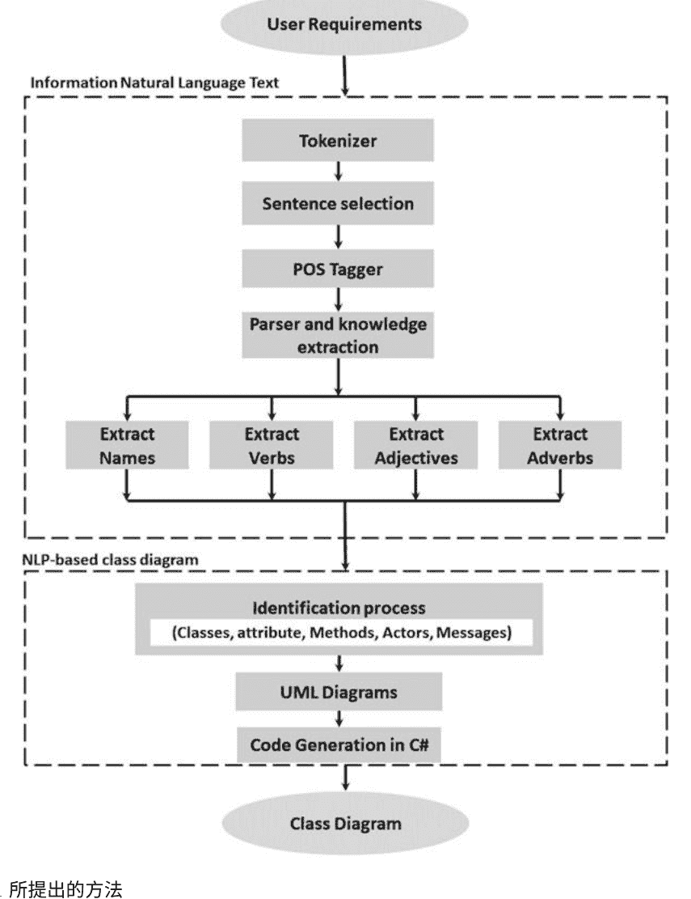

# 图1 所提出的方法

知识。在这项研究中，作者将收集最常见的停用词，然后匹配系统将从文本中提取这些词[15]。此外，本研究的作者将使用词干算法来获取每个单词的词根以便通过删除前缀和后缀进行更多的检查。

#### 3.1.2 词性标注器和知识提取

在这里，该方法将解析输出以找出名词、动词、形容词和副词。这项研究建议使用Open NLP POS标注器进行此分析。

#### 3.1.3 使用NLP的类图

本节介绍了一种自动创建所需类图的新方法。该过程的输入将是常规文本和结构化文本，而输出将提供具有类和属性以及关系的类设计图。类间连接可以按照关联、聚合和泛化进行排列。关联规则可以分为三种基本关系：一对一、一对多和多对多[40]。

引入的技术实现了NLP来探索案例的指令；也就是说，我们将位置的主要类别作为起始问题进行区分，对于这一点我们通常非常有利，并确定可以与已知类别相关联的类别。该过程的优势在于它以一种动作定义字符和关联。在进行这一步之前，我们执行以下基本添加剂的方法，并介绍它们在这项研究中的呈现方式以帮助定义其合理性。

##### 类别识别

词性标注器和句子分析都提供了基本解决方案。另一方面，语义网络方法和词义明确地实现了获取原始候选项。

##### 关系识别

为了提取关系，它利用链接范围来定义句子内具有强大语法关系的所有概念对。我们为所有理论集提供了几个权重，以展示连接的稳健性是基于概念组件在决策中的作用。

##### 属性识别

属性识别系统描述了类别属性，后面跟着两个概念，这两个概念被完全相关地获取；我们需要决定理论是与类别属性还是与类别相关。

##### 命名关系

命名关系实现了形式语义；这有助于获取关联。该模型使用多种关系识别方法来分类关系类型，如一对一、一对多和多对多。

所提出的方法使用重复过程来确定类别和特征。它从特定集合中选择一个概念，其关联率最高，并与指定的类别相关联。关联率是新理论与候选计划集合中所有其他目的的语义连接程度的指标。如果对应分数小于关联的起始值，则过程结束。与此不同的是，它将包括类型集合或特征集合的概念数量与特征的数量。最后，为了利用分析的先前结果，生成UML设计类图，并通过C#生成代码模板。该方法操作UML设计的图形表示，并允许用户重命名类别、添加、删除和连接。作为用户界面的一部分，概念管理用户界面是一个主要界面，允许用户查看、合并、交换和准备概念和连接。客户可以上传新设计并交换概念类型。概念管理方法使用户能够根据需要进行处理。

## 4 实验和结果

### 4.1 案例研究

本节介绍了概念模型生产过程的结果。给定的要求规范和详细信息来自ATM困境陈述[41]。第一部分是手动更改的，以消除各种代词、引用和wh代词（谁、谁的、谁、无论什么等）。它进一步调整以确保一个常规功能的常规术语的常规使用，即每个对话一个功能（图2）。

> > The system must support a computerized banking network that includes both human cashiers and ATMs. The computerized banking network will be shared by a consortium of banks. Each bank provides a computer that maintains the bank's accounts and processes transactions against the accounts. Cashier stations are owned by individual banks and communicate directly with the bank's computers. Human cashiers enter the account data and transaction data. An ATM communicates with a central computer. The central computer clears transactions with the banks. An ATM accepts a cash card and interacts with the user. An ATM communicates with the central computer to carry out transactions. An ATM dispenses cash, and prints receipts. The system requires appropriate record-keeping and security provisions. The system must handle concurrent access to the same account correctly. The banks will provide the bank's own software for the bank's own computers.

图2 来自Rumbaugh’s ATM问题[41]的修改后的ATM陈述

### 4.2 概念建模

在预处理阶段，组件被划分为决策。句法特征提取的结果提供了动词、形容词、名词和集体名词的集合。在旅程中，将术语分类为词性（POS）的最终集合如图3所示：将单词分类为POS的最终集合。

在添加剂的最后一项中，ATM被视为一个集体名词类。一个作为新颖名词命令出现的名词，如果以这种方式使用，还允许一次性的通用名词数据。在这个例子中，

| Adjectives | Adverbs | Nouns | Proper Nouns | Common Nouns |
|------------|---------|-------|--------------|--------------|
| 'computerized', 'central', 'human', 'own', 'appropriate', 'same', 'concurrent', 'individual' | 'directly', 'correctly' | 'receipt', 'station', 'cashier', 'bank', 'computer', 'user', 'access', 'data', 'card', 'transaction', 'network', 'security', 'record-keeping', 'consortium', 'provision', 'atm', 'system', 'account', 'banking', 'cash', 'software' | None | 'receipt', 'bank', 'cashier', 'user', 'consortium', 'security', 'card', 'account', 'transaction', 'computer', 'atm', 'network', 'system', 'access', 'banking', 'provision', 'station', 'cash', 'software', 'data', 'record-keeping' |

图3 最后一组将单词分类为POS的集合

在起始句子中使用 “ATM”的 “The machines have to aid a computerized banking network that includes each human cashiers and ATMs”使ATM成为一个常见名词创造。选择和选定设计组件。每个句子的书面领域在每个应用组件（规则）中移动。生成的软件组件的阶段定义了表达式所采用的属性、类别和家族成员。例如，对于决定，ATM与主计算机进行交互；用于查找此表达式的命令的顺序如图4所示。

每个语句都是根据语句结构、连接的出现、介词问题、动名词等各种规则准备的。提供的语句的设计组件的结果，然后执行所有给定的规则：

#### 4.2.1 类

此列表包含一组术语（atm、系统、中央计算机、财团、银行、计算机化银行网络、个人银行、出纳站、出纳员、计算机）

#### 4.2.2 类关系

生成的关系和关系图的概述如图5所示。我们使用了在最后一列中介绍的选择方案组件的规则。从将语句分割成部分，并根据状态结构的分割而应用规则，而不是整个语句，可以明显看出应用强制解析的好处。

然后根据它们的特性将通用连接分组，并将小类和连接作为操作和属性进行处理，以便将它们省略。

#### 4.2.3 聚合分类

- 计算机化银行网络>出纳员 (聚合)
- 计算机化银行网络>自动取款机 (聚合)
- 上述是一些关系，来自表3转换聚合关系。

#### 4.2.4 组合分类

- 联盟>银行 (组合)

| Typed dependencies | Rules checked | Rule results and further actions | Trace of low level actions in rule results processing. |
| :--- | :--- | :--- | :--- |
| det ATM An | Ignored | | |
| nsubj communicates ATM | Check ‘Basic Rule’ | obj does not exist for same verb Fails | |
| | Check ‘Intransitive Verb Rule’ | Fails, due to presence of prepositional object | |
| det computer a | Ignored. | | |
| amod computer central | Ignored. | | |
| prep_with communicates computer | Check ‘Prepositional subject and object’ | Pass | |
| | | class(ATM) | Stem (atm) = atm
No compound nouns
No adjective modifiers
Create atm class |
| | | class(computer) | Stem (computer) = computer
No compound nouns
Adjective Modifier found |
| | | class(central_computer) | No classification for ‘central’
Append to class name
computer->central_computer |
| | | Not created, as this is an object | |

图4 使用实施规则跟踪计划的案例示例

#### 4.2.5 泛化分类

我们在提供的记录中没有泛化的情况。一个断言，“计算机是一种数字工具，”可能成为处理器类型的标准泛化。

| No. | Sentence No. | Class 1 | Class 2 (may not exist) | Name of relation | Rule used |
| :--- | :--- | :--- | :--- | :--- | :--- |
| 1. | 0 | computerized_banking_network | atm | Includes | * Compound noun generator<br>* Elementary subject object rule |
| 2. | 0 | system | computerized_banking_network | support | * Compound noun generator<br>* Elementary subject object rule |
| 3. | 0 | computerized_banking_network | Cashier | Includes | * Compound noun generator<br>* Elementary subject object rule<br>* Adjective classifier–human denotes quality<br>* cashier added as class, with attribute quality = human |
| 4. | 1 | computerized_banking_network | consortium | shared_by | * Compound noun generator<br>* Passive subject with agent |
| 5. | 1 | consortium | bank | of | * Secondary 'of' preposition following agent in passive subject (composition) |
| 6. | 2 | bank | computer | provides | * Elementary subject object rule |

图5 设计组件提取后的连接示例应用

# 表3 性能评估

| 案例研究 | 方法 | ATM [41] | 课程注册 [45] | EFP [46] |
|----------|------|----------|---------------|----------|
| 没有隐含信息或假设 | | | | |
| 总体 | 召回率 (%) | 83.33 | 100 | 93 |
| | 精确度 (%) | 100 | 80 | 88 |
| | 超过_SR (%) | 100 | 100 | 93 |
| 关联 | 召回率 (%) | 80 | 100 | 86 |
| | 精确度 (%) | 100 | 100 | 75 |
| | 超过_SR (%) | 120 | 0 | 171 |
| 组合 | 召回率 (%) | 100 | 100 | 100 |
| | 精确度 (%) | 100 | 75 | 100 |
| | 超过_SR (%) | 0 | 133 | 100 |
| 带有隐含信息/假设 | | | | |
| 总体 | 召回率 (%) | 50 | 57 | 61 |
| | 精确度 (%) | 100 | 80 | 88 |
| | 超过_SR (%) | 60 | 57 | 61 |
| 泛化 | 召回率 (%) | 44 | 100 | 100 |
| | 精确度 (%) | 100 | 100 | 100 |
| | 超过_SR (%) | 67 | 0 | 100 |
| 关联 | 召回率 (%) | 100 | 50 | 50 |
| | 精确度 (%) | 100 | 75 | 75 |
| | 超过_SR (%) | 0 | 67 | 100 |
| 提出的方法 | | | | |
| 总体 | 召回率 (%) | 85 | 100 | 95 |
| | 精确度 (%) | 100 | 80 | 100 |
| | 超过_SR (%) | 100 | 100 | 94 |
| 泛化 | 召回率 (%) | 49 | 100 | 100 |
| | 精确度 (%) | 100 | 100 | 100 |
| | 超过_SR (%) | 69 | 0 | 100 |
| 关联 | 召回率 (%) | 100 | 60 | 55 |
| | 精确度 (%) | 100 | 78 | 80 |
| | 超过_SR (%) | 0 | 68 | 100 |

#### 4.2.6 将琐碎的关联转换为属性

小类的原因提示如下，包括对象：

- 评估关系：银行>计算机 (拥有)
- 关联：非平凡（具有）关联保留银行；计算机
- 在连接银行拥有计算机的情况下，银行作为一个独立的状态
- (类) 由于银行类的额外通知而保留。
- 评估关系：银行>账户 (具有)
- 属性（具有）关联移至属性银行：账户
- 评估关系：银行>软件 (具有)

属性（具有）关联移至属性银行：软件
不是账户或软件还额外定义并且不作为类银行的特征存活；因此，它被设计为类银行的特征。

#### 4.2.7 平凡关系到操作

与不存在的属性连接的关联会转换为巨大壮丽的移动，因为它们导致了小引用的训练。在以下提示中，第二个项目不存在作为一个类。

- 评估关系！ atm: 现金（分发）
- 旅行关联！ 类 open: atm: 分发现金
- 评估关系！ system: 账户（处理到）
- 旅行关联！ 类 open: system: 处理到账户
- 评估关系！ 计算机: 账户（处理对抗）
- 旅行关联！ 类 open: computer: 处理对抗账户
- 评估关系！ atm: 现金卡（接受）
- 旅行关联！ 类 open: atm: 接受现金卡
- 评估关系！ atm: 现金（打印）
- 旅行关联！ 类 open: atm: 打印现金
- 评估关系！ system: 并发访问（处理）
- 旅行关联！ 类 open: system: 并发访问处理
- 评估关系！ 中央计算机: 交易（清除）
- 旅行关联！ 类 open: central_computer: 清除交易
- 评估关系！ system: 安全提供（要求）
- 旅行关联！ 类 open: system: 要求安全提供

#### 4.2.8 关联分类

在完成所有先前操作后，给定关系的其余部分保持为关联。

- 评估关系 →银行：银行（提供软件）
- 关联 →银行：提供软件_银行
- 评估关系 →计算机化银行网络：财团（共享）
- 关联→计算机化银行网络：共享_财团
- 评估关系 →计算机：银行（维护账户）
- 关联→计算机：维护账户_银行

#### 4.2.9 无关紧要的类别移除

在这个级别上，担心的是预先知道的词汇和要提取的单词。这些短语远离类别和关系的菜单使用。在ATM版本中，单词“设备”可以表示为要消除的小类别。

图6 仅具有属性、关系和类的概念模型

后续接收到的结果，满足表4中列出的所有措施。在表4中，“a”表示移动到操作的无关紧要的关系，“b”表示移动到属性的无关紧要的关联，“c”表示聚合，“d”表示组合，“e”表示剩余的关联。

概念模型是使用Bhala的理论[42]来产生实际能力。理论原则是通过以DOT批评中的代码编程生成的，这是可视化软件的一部分。

发生频率的归一化定义了每个类别的优先级。标准化率是通过参考类名在对象元素生成方法中的比率来完成的。所得结果如图6所示。在图1中，ATM和银行是出现最多的两个类别。

### 4.3 性能评估

由于我们没有一个“正确”的概念模型的解释，所以这种方法的有效性评估变得困难。通常完成的理论模型已被发现包含了研究人员广泛带来的乐趣。概念模型中的独特知识类似于需求文本中不明确的类别和/或关系。

表1 关系的分类结果

| 序号 | 类别1 | 类别2 | 关系名称 |
| :--- | :--- | :--- | :--- |
| 1 | 计算机化银行网络 (c) | 自动取款机 (c) | 包括 (c) |
| 2 | 计算机化银行网络 (c) | 出纳员 (c) | 包括 (c) |
| 3 | 计算机化银行网络 (e) | 联合体 (e) | 共享 (e) |
| 4 | 联盟 (d) | 银行 (d) | 的 (d) |
| 5 | 银行 (e) | 计算机 (e) | 提供 (e) |
| 6 | 银行 (b) | 账户 (b) | 有 (b) |
| 7 | 计算机 (e) | 银行 (e) | 维护账户 (e) |
| 8 | 计算机 (e) | 银行 (e) | 处理交易 (e) |
| 9 | 计算机 (a) | 账户 (a) | 处理对 (a) |
| 10 | 出纳台 (e) | 个人银行 (e) | 由...拥有 (e) |
| 11 | 出纳台 (e) | 计算机 (e) | 与...通信 (e) |
| 12 | 出纳员 | 账户数据 (a) | 输入 (a) |
| 13 | 出纳员 (a) | 交易数据 (a) | 输入 (a) |
| 14 | 自动取款机 (e) | 中央计算机 (e) | 与...通信 (e) |
| 15 | 中央计算机 (a) | 交易 (a) | 结算 (a) |
| 16 | 中央计算机 (e) | 银行 (e) | 与...结算 (e) |
| 17 | 自动取款机 (a) | 现金卡 (a) | 接受 (a) |
| 18 | 自动取款机 (a) | 用户 (a) | 与 (a) 互动 |
| 19 | 自动取款机 (e) | 中央计算机 (e) | 与...通信 (e) |
| 20 | 自动取款机 (a) | 收据 (a) | 打印 (a) |
| 21 | 自动取款机 (a) | 现金 (a) | 发放 (a) |
| 22 | 银行 (e) | 银行 (e) | 提供软件 (e) |
| 23 | 银行 (e) | 计算机 (e) | 有 (e) |
| 24 | 银行 (b) | 软件 (b) | 有 (b) |
| 25 | 银行 (e) | 计算机 (e) | 提供软件给 (e) |

例如，在ATM案例中，银行拥有银行计算机，描述了一个特定的连接观点。同时，类远程交易是一种宪法理论，一个特定的类持久存在，尽管它在需求文本中没有声明。

### 4.4 评估标准

在这部分中，评估标准被用来分析所提出的自动创建的概念模型与传统可用设计或人工设计模型在文献中的对比[38, 43, 44]。使用的标准包括：

1.  召回率表示计算机化生成所有类别的能力，如公式 (1) 所示。

    ```
    召回率 = \frac{Ncorrect}{Ncorrect + Nmissing}
    ```

    在公式 (1) 中，Ncorrect 表示正确识别的真实类别数量；Nmissing 表示人工专家选择并被提出的概念方法忽略的类别数量。

2.  精确度表示在提出的概念模型中识别的类别的准确性或相关性，如公式 (2) 所示。

    ```
    精确度 = \frac{Ncorrect}{Ncorrect + Nincorrect}
    ```

    在公式 (2) 中，Nincorrect 表示被错误分类的正确级别数量。

3.  过度规范率 (Over_SR) 表示计算机化过程在提出的概念模型中添加的无用但正确的类别数量，如公式 (3) 所示。

    ```
    超过_SR = \frac{额外（有效）}{Ncorrect + Nmissing}
    ```

    在方程 (3) 中，额外（有效）是恢复的正确附加类别的数量。

无论真相如何，该版本都不打算假设独特的专业知识，我们通过人工制定的规则来研究它。为了确定这一点，我们提出另一个变量。隐含意味着计算的类别数量，这可能是正确的和正确的，但在需求文本中没有报告。应用于分配特定信息的方程如下：

```
召回率（隐含） = \frac{Ncorrect}{正确隐含 + 缺失隐含 + 隐含}
```

```
精确度（隐含） = \frac{Ncorrect}{Ncorrect + Nincorrect}
```

```
超过_SR（隐含） = \frac{额外（有效）}{正确隐含 + 缺失隐含 + 隐含}
```

虽然对于评估那些不构成隐含的人来说，可能存在出色的参考率，但任何一个标准的目标值都无法生存。

### 4.5 概念类建模结果与其他比较标准模型

表2展示了各种案例研究中获得的成果指标结果。这些案例被多位研究人员用来说明类图的生成过程，并在相应的参考文献中获得了类似的结果。观察到这些传统设计并非为需求调查而开发，也不是自动生成的，因此包含了人类知识的成分，而我们的实现则需要这些。

降低的精确度说明了人类判断的重要性，以添加相关指令。我们的方法融合了一些可以提到的错误教训。由于所有使用的指令通常都被诊断为候选教训，所以召回率可能非常高。尽管过度规范化权重必须保持较低的价格，并且它提供了较高的值，但过度规范化费用增加会导致生成模型中的视觉混乱。

根据所使用的评估指标，所提出的方法在所有研究案例中都获得了更好的结果，这意味着所提出的方法可以比其他比较方法更准确地生成类别。所有比较方法的召回率值都相似。然而，精确度值由所提出的方法获得得更好。

表2 评估结果

| 案例研究方法 | ATM [41] | 课程注册 [45] | EFP [46] |
| :--- | :--- | :--- | :--- |
| 没有隐含信息或假设 | 召回率 (%) | 100 | 100 | 100 |
| | 精确度 (%) | 91.67 | 81.82 | 94.44 |
| | 超过_SR (%) | 9.09 | 22.22 | 41.18 |
| 有隐含信息/假设 | 召回率 (%) | 91.67 | 100 | 85 |
| | 精确度 (%) | 91.67 | 81.82 | 94.44 |
| | 超过_SR (%) | 8.33 | 22.22 | 35 |
| 提出的方法 | 召回率 (%) | 100 | 100 | 100 |
| | 精确度 (%) | 92.54 | 85.32 | 95 |
| | 超过_SR (%) | 8.02 | 20.15 | 33 |

图7 统计分析结果

所提出的方法。此外，与其他方法相比，所提出的方法在超过_SR值方面取得了更好的结果。从上述结果可以得出结论，所提出的方法在整体上获得了更好的结果。

由于需要标准文本和专业模型，实验是针对个体主题进行的。最终CASE工具实验的结果被用作参考。图7展示了最终的统计结果。

### 4.6 性能评估

精确度、召回率和过度规范化被用于评估所提出方法在类之间的连接上的有效性，如表3所示。所得结果与人类主体的结果相比，也得到了相似的结果。关联的关系表明，与标准结果相比，过度规范化的比例非常高。总体上，所提出的方法取得了更好的结果。关系方面的结果是可比较的。关联的连接表明，与标准结果相比，过度规范化的比例非常强大。

## 5 结论和未来工作

本章介绍了一种通过使用自然语言处理来改进创建UML图的过程的新技术，这将帮助软件开发人员以更少的错误分析软件需求。

有效的方法。所提出的方法利用解析器分析和语音(POS)标记器来研究和分析用户在英语中列出的用户需求。获得的结果显示，所提出的方法比文献中的其他方法获得了更好的结果。所提出的方法为给定的需求提供了更好的分析和更好的图表展示，有助于软件工程师。因此，召回率度量非常受欢迎，因为所有可用的类别都定期被识别为候选类别，并且不受召回过程的影响。然而，过度规范的权重应保持在较低的水平，并且即使高过度规范的成本会导致创建的模型中的视觉混乱，它也会给出较高的值。所提出的方法可以通过使用评估指标在所有研究案例中产生更好的结果，这意味着所提出的方法可以比其他比较方法更准确地生成类别。所有相关技术的召回率值都相似。然而，所提出的方法获得了更好的精确度值。此外，与其他方法相比，所提出的方法获得了更好的Over_SR值。从上述结果可以得出结论，所提出的方法整体上获得了更好的结果。值得进一步研究的另一个方面是软件需求的动态性质。这可以通过将语言代码转换为文本观察来实现，使用可翻译的统一建模语言和模型驱动架构。这将与困难机器的自然语言细节混合在一起，因为它们在对象的规则中起着重要的作用。

## 参考文献

1.  I.S. Bajwa, M.A. Choudhary, 基于自然语言处理的自动生成UML图的系统，在第18届沙特国家计算机科学会议上（NCC18），（沙特计算机学会（SCS），沙特阿拉伯利雅得，2006年）
2.  S.K. Kar，使用自然语言处理从软件需求规范生成UML类图（NIT，Rourkela，2014年）
3.  S. Amdouni, W.B.A. Karaa, S. Bouabid, 用于自动生成UML类图的需求的语义注释. Int. J. Comput. Sci. Iss. 8(3) (2011)
4.  L. Abualigah等, 算术优化算法. Comput. Method. Appl. Mech. Eng. 376, 113609 (2021)
5.  L. Abualigah, A. Diabat,正弦余弦算法的进展: 一项综合调查. 人工智能评论 54, 2567–2608 (2021)
6.  L. Abualigah, 群体搜索优化器:一种受自然启发的元启发式优化算法及其结果、变体和应用. 神经计算应用 33, 2949–2972 (2021)
7.  L. Abualigah, A. Diabat, 蚱蜢优化算法的综合调查:结果、变体和应用. 神经计算应用 32, 15533–15556 (2020)
8.  M. Landhäußer, S.J. Körner, W.F. Tichy, 从需求到UML模型再到需求工程的自动处理: 文本的自动处理如何支持需求工程. 软件质量杂志 22(1),121–149 (2014)
9.  Y. Jaafar, K. Bouzoubaa, 阿拉伯语NLP架构的调查和比较研究, 在智能自然语言处理: 趋势和应用, (Springer, 2018), pp. 585–610
10. R. Platt, N. Thompson, UML的过去、现在和未来, 在网络架构、移动计算和数据分析的高级方法和技术, (IGI Global, 2019), pp. 1452–1460
11. Z.A. Hamza, M. Hammad, 使用自然语言处理从软件需求中生成UML用例模型, 在2019年第8届建模仿真与应用优化国际会议(ICMSAO), (IEEE, 2019)
12. F. Friedrich, J. Mendling, F. Puhlmann, 从自然语言文本生成过程模型, 在国际高级信息系统工程会议, (Springer,2011)
13. S. Gulia, T. Choudhury, 从自然语言规范生成UML图的高效自动化设计, 2016年第六届国际云系统和大数据工程会议 (Confluence) , (IEEE, 2016年)
14. L. Chen, Y. Zeng, 根据自然语言描述的产品需求自动生成UML图, ASME 2009国际设计工程技术会议和计算机与信息工程会议, (ASME, 2009年)
15. S.K. Shinde, V. Bhojane, P.Y. Mahajan, 基于NLP的面向对象分析和设计, 从需求规范开始。Int. J. Comput. Appl. 47 (21) , 30–34 (2012年)
16. S. Bhagat等人, 使用NLP进行类图提取。Semantic Scholar 2, 125 (2012年)
17. D.K. Deeptimahanti, M.A. Babar, 从自然语言需求生成UML模型的自动化工具, 2009年IEEE/ACM国际会议论文集-自动化软件工程 (IEEE计算机学会, 2009年)
18. V.B.R.V. Sagar, S. Abirami, 自然语言功能需求的概念建模。J. Syst. Softw. 88, 25–41 (2014年)
19. H. Burden, R. Heldal, 从类图生成自然语言,在第8届国际模型驱动工程、验证和验证研讨会上, (ACM, 2011)
20. W. Ben Abdessalem Karaa等人, 类图的自动构建者(ABCD): 从功能需求生成UML的应用. 软件实践与经验 46(11), 1443–1458(2016)
21. P. More, R. Phalnikar, 计算机科学基础, 从自然语言规范生成UML图。 Semantic Scholar 1 (8), 19–23 (2012)
22. A. Tazin, 使用软件需求规范进行UML类图组合,在MODELS (Satellite Events), (Semantic Scholar, 2017)
23. J. Chanda等人, 要求的可追溯性和UML用例、活动和类图的一致性验证: 一种形式化方法, 2009年国际计算机科学方法和模型会议(ICM2CS)论文集, (IEEE, 2009)
24. M. Ibrahim, R. Ahmad, 使用自然语言处理(NLP)技术从文本要求中提取类图, 在2010年第二届国际计算机研究与开发会议上, (IEEE, 2010)
25. V. Adhav等人, 使用NLP技术从文本要求中提取类图(IEEE, 2010)
26. Joshi, S. Deshpande D, 使用NLP进行UML图提取的文本要求分析。 Semantic Scholar 20 12. 50(8): p. 42–46
27. H. Herchi, W.B. Abdessalem,从用户需求到UML类图 (语义学者, 2012年)
28. F. Meziane, N. Athanasakis, S. Ananiadou,从UML类图生成自然语言规范。需求工程 13 (1) , 1–18 (2008年)
29. E.S. Btoush, M. Hammad,基于自然语言处理从需求规范生成ER图。国际数据库理论应用 8 (2) , 61–70 (2015年)
30. P. Achimugu等, 软件需求优先级的系统性文献综述研究。信息软件技术 56 (6) , 568–585 (2014年)
31. J. Martin, J.J. Odell,面向对象的方法 (Prentice Hall PTR, 1994年)
32. A. Nanthaamornphong, A. Leatongkam, 扩展的ForUML用于从面向对象的Fortran自动生成UML序列图。科学程序。2019 (2019)
33. I. Drave等人, 用于面向对象系统的状态图的语义差异，出版于第7届国际模型驱动工程和软件开发会议, (SCITEPRESS-Science and Technology Publications, Setúbal, 2019)
34. L. Abualigah等人, 大数据文本聚类中的元启发式优化算法的进展。电子10(2), 101 (2021)
35. L. Abualigah等人, 自然启发式优化算法用于文本文档聚类—全面分析。算法13(12), 345 (2020)
36. L. Abualigah等人, 用于特征选择的并行混合鲸群算法。国际机器学习与网络学报, 1–24 (2020)
37. L.M. Abualigah等人, 一种改进的b-hill climbing优化技术用于解决文本文档聚类问题。Curr. Med. Imag. 16(4), 296–306 (2020)
38. L.M. Abualigah, A.T. Khader, 一种基于混合粒子群优化算法和遗传算子的无监督文本特征选择技术用于文本聚类。J. Supercomput. 73(11), 4773–4795 (2017)
39. L.M. Abualigah等人, 一种具有鲁棒权重方案和动态维度约简的文本特征选择方法用于文本文档聚类。Expert Syst. Appl. 84, 24–36 (2017)
40. X. Zhou, H. Han, Word Sense Disambiguation方法调查, in FLAIRS Conference, (Marshall University, 2005)
41. J. Rumbaugh等人, 面向对象建模与设计, 卷199 (Prentice-Hall Englewood Cliffs, NJ, 1991)
42. R.V. Bhala, T. Mala, S. Abirami, 有效的概念类图可视化, 在2012年国际计算与软件系统最新进展会议, (IEEE, 2012)
43. L.M. Abualigah, A.T. Khader, E.S. Hanandeh, 一种改进的特征选择方法, 以提高使用粒子群优化算法的文档聚类。J. Comput. Sci. 25, 456–466 (2018)
44. L.M.Q. Abualigah, 特征选择和增强的鲸群算法用于文本文档聚类 (Springer, 2019)
45. W. Kurt, O.M.T. 应用, 使用对象建模技术的实用逐步指南 (SIGS Books, 纽约, 1995)
46. P. Swithinbank等人, 模式: 使用IBM Rational Software进行模型驱动开发 Architect (IBM Corp, 2004)# 使用深度自编码器进行马拉雅拉姆语的语义相似性和改写识别

R. Praveena, M. Anand Kumar和K. P. Soman

## 1 引言

改写识别系统必须确定两个句子是否表达相似的含义。改写识别在自然语言处理（NLP）中具有许多重要应用，如机器翻译评估、文本摘要、抄袭检测、信息检索、问答等。深度语义理解对于改写识别等问题的性能提升至关重要。本章介绍的工作在两个层面上展示了马拉雅拉姆语的改写识别。在第一层级中，系统仅识别改写和非改写，但在第二层级中，系统升级为识别半等效改写和其他两种情况。改写、非改写和半等效改写的形式定义如下。对现有句子的替代表示产生了改写。因此，尽管它们以不同的形式存在，但具有相同含义的任意两个句子被称为改写。考虑下面的例子；句子S1和S2是改写，这证明了句子S1和S2之间的语义重叠很高。

R. Praveena · K. P. Soman
计算工程与网络中心，Amrita Vishwa Vidyapeetham，
科伊马托尔，印度

M. Anand Kumar (✉)
信息技术系，印度国立卡纳塔克理工学院(NITK)，
苏拉特卡尔，卡纳塔克邦，印度
e-mail: m_anandkumar@nitk.edu.in

©作者，独家许可给Springer Nature Switzerland AG 2021

V. Kadyan等人 (编)，深度学习方法用于口语和自然语言处理，信号与通信技术，
https://doi.org/10.1007/978-3-030-79778-2_5

S1:
അങ്ങാടിയിലെ ഭവനത്തിൽ പോലും ക്രിക്കറ്റ് ഉണ്ടായിരുന്നു.
[/阿曼一栋住宅楼发生大火/]

S2:
അങ്ങാടിയിലെ ഭവനത്തിൽ വേണ്ടി വന്നു അവിടെയുള്ള ഒരു അടുക്കള.
[/阿曼一栋多层建筑发生火灾/]

一对不完全传达相同含义的句子被称为非同义词。句子 S3和 S4不是同义词；即使句子中包含相同的单词，也不意味着相同的上下文。

S3:
ജർമ്മനി ഇപ്പോൾ ആദ്യത്തെ പന്ത്രണ്ടാം മിനിറ്റിൽ ലീഡ് എടുത്തു.
[/德国在第44分钟取得了应得的领先/]

S4:
ജർമ്മനി അവരുടെ ഹോം ഗ്രൗണ്ടിൽ ഒരു മികച്ച തുടക്കം ലഭിച്ചു.
[/德国在他们的家乡获得了出色的开球/]

S5:
അഖിലേഷ് യാദവ് ഡോ. ആ സംഭവത്തിൽ അന്വേഷണം നടത്തിയ റിപ്പോർട്ട് സംശയിക്കുന്നു.
[/阿克希莱什·亚达夫对达德里事件的法医报告表示怀疑/]

S6:
അഖിലേഷ് യാദവ് ഡോ. ആ സംഭവത്തിൽ അന്വേഷണം നടത്തിയ റിപ്പോർട്ട് സംശയിക്കുന്നു. ഇത് അക്ബർപൂർ ഹൗസിൽ നിന്ന് ശേഖരിച്ച മാംസം ബീഫ് ആണെന്ന് റിപ്പോർട്ട് ചെയ്യുന്നു.
[/北方邦首席部长阿克希莱什·亚达夫对达德里事件的报告提出质疑，该报告声称从阿克拉克的房子收集的肉样本是牛肉/]

给定一对句子 S5 和 S6，其中一个句子比另一个句子包含更多信息，这两个句子属于半等价。句子S5和S6是半等价的释义。

本节讨论了基于不同技术的不同释义方法。Bill Dolan等人以无监督的方式从不同的新闻领域构建了大型释义语料库[1]。在这种方法中，通过使用来自网络中数千个新闻来源的主题和时间新闻文章范围的不同无监督技术，对单语句级释义进行了研究。Fernando等人提出了一种基于语义相似度的释义检测方法[2]。这项工作提出了一种解决释义识别问题的新方法。基于语言学的分布分析解释了处理释义的方法[3]。Lin等人描述了使用递归自编码器为句子生成语义向量表示[4, 5]。Kalchbrenner等人解释了动态池化的概念以及句子之间短程和长程关系的重要性[6]。

Finch等人提出了一种使用机器翻译评估确定句子级语义等价性的方法[7]。机器翻译（MT）评估任务和句子级语义相似性分类密切相关。Socher等人[8]解释了使用展开来检测释义的方法递归自编码器。通过动态池化层概念固定了句子长度，并且关于这项工作的更多细节在[9]中进行了探讨。在这个提出的系统中，使用了相同的算法实现并进行了轻微的修改。Amrita-CEN在2016年信息检索评估论坛（FIRE-2016）上组织了一个共享任务，用于检测印度语言（DPIL）的释义[10]。这个任务涉及的印度语言包括马拉雅拉姆语、印地语、泰米尔语和旁遮普语。不同团队使用的各种特征包括词干或词形、词性、词重叠、停用词、同义词、余弦等。Mathew等人讨论了用于释义识别任务的不同统计技术，如Jaccard相似度、余弦相似度、Dice相似度、词序和词距相似度[11, 12]。除了统计方法，还使用了语义方法，如UNL en-conversion过程、UNL表达式和基于UNL图的相似度来检测释义[13]。释义识别也可以应用于嘈杂的社交媒体数据，这被发现是复杂的。在Twitter数据上进行的释义检测使用了现有的方法，如词或n-gram重叠、词对齐和字符串匹配到语义词相似度[14]。Mahalakshmi等人实现了递归自编码器来识别Twitter数据上的释义[15]。在[16]中解释了使用递归自编码器的泰米尔语释义识别系统。可以在[17]中看到用于释义检测的低级字符串、语义和词汇特征。

单词相似性是通过WordNet推导出来的，进一步用于语义方法中识别释义。无监督语义在[18]中引入。与问答应用类似，基于短答案评分的释义检测在[19]中讨论。基于推理网络的文本相似度度量在[20]中展示。他们的推理结果显示使用单独的度量方法可以获得改进的结果。通过基于模糊层次聚类的方法处理释义中的名词和动词歧义[21]。Brockett等人解释了基于文本特征的启发式方法，其中每个文档簇中的前两个句子与彼此进行交叉匹配以确定相似句子[22]。在He等人提出的工作中[23]，他们研究了不同粒度的内在特征，并且最终使用卷积神经网络进行句子嵌入的释义识别[23]。Mihalcea等人解释了两种面向语料库和六种面向知识的文本语义相似度度量的有效性。六种基于知识的度量方法是Leacock和Chodorow相似度，Lesk相似度，Wu和Palmer相似度，Resnik相似度，Lin相似度和Jiang和Conrath相似度[24]。TF-KLD是由Ji等人引入的包括词频和KL散度的词权重度量[25]。TF-KLD度量了特征的可辨识性，并且通过重新加权的特征-上下文矩阵分解得到了更好的释义句对之间的语义相关性。Cheng等人采用了Siamese架构进行释义检测。在[26]中解释了一个位于组合层之上的额外层，用于评分所产生的短语或句子向量在语法和语义方面的合理性。在[27]中进行了基于句法依赖的特征对释义检测的影响的研究。基于意义的释义检测文中解释了句子中的不相似之处[28]。与统计方法相比，语言学方法在识别释义方面表现出更好的结果[29]。
泰米尔语的释义识别也被认为是一个复杂的任务，就像马拉雅拉姆语一样，因为它们都属于德拉维达语系，具有相似的语义结构和形态变化。出于同样的原因，人们也在泰米尔语领域进行了大量的自然语言处理应用研究。其中一些在这里进行了讨论。

基于统计特征（如Jaccard相似度、基于长度的编辑距离和余弦相似度）的语言无关释义识别系统在[30]中被介绍。他们提出了一种基于概率的神经网络用于检测任务，该网络通过上述统计特征进行训练。在[31]中讨论的释义检测方法解释了如何使用多项式逻辑回归以及词汇层次和语义层次的相似性作为特征。[32]讨论了他们对现有释义识别技术的研究以及其在自动释义检测中的应用。在[33]中说明了对具有命名实体的句子进行句子相似性评估的方法。在[34, 35]中介绍了一种使用协作和对抗网络的新颖的释义识别方法，并揭示了在识别释义时受到的鲁棒性的重要性和不同问题。在[36]中讨论了使用词汇、句子和句法编码进行上下文学习。Praveena等人通过学习基于分块的语义特征来说明马拉雅拉姆语的释义识别[37]。在[38]中讨论了在Quora和Twitter数据上进行释义识别的不同监督技术。在[39]中详细解释了在四种不同的印度语言中创建用于检测释义的数据集的过程。

## 2 材料和方法

令 $S_1 = \{W_1, W_2. \dots W_m\}$ 和 $S_2 = \{W_1, W_2. \dots W_n\}$。语义接近程度决定了句子属于哪种改写类型。如前所述，最初的问题是将句子对分类为改写或非改写，这被称为二分类问题。该系统的扩展还可以识别半等价的改写，这被称为三分类问题。如果句子对之间的语义接近程度很高，则被分类为改写；如果接近程度较低，则被分类为非改写。那些处于中间范围的句子对属于半等价改写。也就是说，

```
$P \rightarrow SC(S_1, S_2) = \text{high}$
$NP \rightarrow SC(S_1, S_2) = \text{low}$
$SP \rightarrow SC(S_1, S_2) = \text{average}$
```

其中 $SC$ 是句子之间的语义接近度。

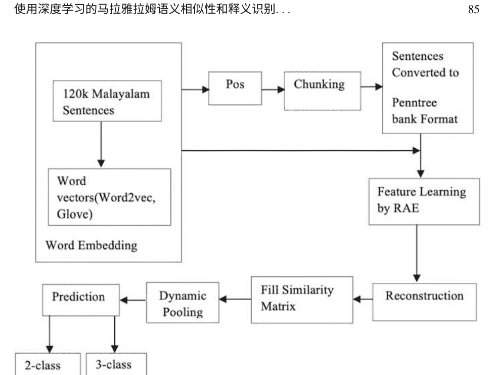

### 2.1 马拉雅拉姆语-改写识别系统

为马拉雅拉姆语建立基准系统进行了初步实验，如图1所示。从大量马拉雅拉姆语句子中获取的词向量，以及以Penn Treebank格式提供的改写、非改写和半等效改写类别的监督句子，经过RNN训练生成句子嵌入。所使用的RNN架构是展开递归自编码器，详见第4.3节。通过动态池化将长度不同的句子转换为固定大小，详见第4.4节。动态池化阶段的输出传递给分类器，用于预测测试句子所属的类别。系统的各种制作过程在下面的小节中进行了解释。

### 2.2 单词表示

在单词表示中，给定的单词被转换为它们对应的数字格式或表示，技术上称为向量。这个过程被称为单词嵌入。存在不同的单词嵌入技术，它们使用不同的数学表达式，导致不同的向量作为其结果。在这项工作中，我们使用了两种广为人知的单词嵌入技术，即word2vec和Glove。

#### 2.2.1 Word2vec嵌入

Word2vec是由Miklov等人提出的，是大多数自然语言处理应用中最常用的嵌入技术之一[40]。Word2vec将任何单词在向量空间中给出一个分布式表示，使得学习算法在各种自然语言处理任务中能够产生更好的性能。语义信息是从单词的分布式表示中捕捉到的，向量空间中距离较近的单词被认为具有高度的语义相似性。Word2vec提出了两种嵌入模型，即skip-gram模型和连续词袋模型（CBOW），其中前者在提出的模型中使用。skip-gram模型将从给定的中心词预测周围的单词，数学上，skip-gram模型的目标被定义为

$$J = \frac{1}{t_1} \sum_{t=1}^{t_1} \sum_{-n \leq i \leq n, i \neq 0} \log P(W_{t+i} | W_t)$$

这将对目标词W_t的右侧和左侧的相邻n个词的对数概率进行求和。

#### 2.2.2 Glove嵌入

Glove也是一种无监督算法，用于获取单词向量[41]。Glove从训练过程中的一个巨大的无标签语料库中的单词共现统计中生成单词向量。加权最小二乘目标函数将最小化单词向量与它们的共现之间的差异。目标函数定义为

$$J = \sum_{i,j}^v f(x_{ij}) \left( v_i^t v_j + \theta_i + \bar{\theta}_j - \log x_{ij} \right)^2$$

#### 2.2.3 使用分块信息进行解析

解析阶段为所有带标签的句子生成一棵树形表示，称为解析树。解析器的输出是将句子划分为由名词短语和动词短语组成的块。由于没有公开可用的准确的马拉雅拉姆语解析器，所有句子最初都是词性标注的。使用内部块切割了POS标记的句子。然后将切割的句子转换为Penn Treebank格式。通过将句子转换为Penn Treebank格式，捕捉句子的句法信息。

#### 2.2.4 递归自编码器

递归自编码器 (RAE) 用于从解析树的节点中学习特征。RAE的目标还扩展到在解析树的每个节点中找到不同或不同大小的短语的相应向量表示。

RAE使用从词嵌入阶段获得的词向量来生成短语的向量表示，输入形式为P→(词1， 词2)。树是通过解析句子获得的，这在第4.2节中有解释。图2展示了一个包含四个词的句子的RAE的工作原理。在图中，PV和SV分别代表短语向量和句子向量。

RAE以无监督的方式生成短语向量。可以从子表示重构父节点。例如，父节点 P是通过典型的神经网络层使用 $p = f(W_e[c_1;c_2] + b)$ 从其子节点 word1和word2计算得到的，其中 $[c_1; c_2]$ 是c1和c2的连接。将参数 $W_e$ 与c1和c2的连接相乘后，添加一个偏置项。将得到的向量应用于逐元素激活函数 f，例如 tanh。为了了解向量的创建效果如何，可以像公式（3）中那样重构单词向量和短语向量。

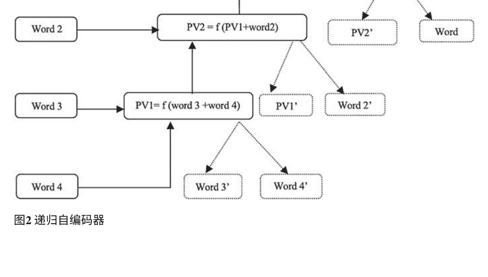

$[c'_1; c'_2] = W_e'p + b'$

欧几里得距离位于实际输入和重建的向量之间。重建误差为：

$E_{\text{rec}}(p) = \|[c_1; c_2] - [c'_1; c'_2]\|^2$

重建阶段的目标是获得最小的重建误差，可以使用公式（4）来获得。

在提出的实验中，我们使用了各种标准的递归自编码器，称为展开递归自编码器。它们与典型的RAE仅在重建步骤上有所不同。展开的RAE将重建节点下的所有子节点，而典型的RAE仅重建直接子节点。从数学上讲，展开的RAE中的重建过程如公式（5）所示。

$E_{\text{rec}}(p) = \|[x_1; \ldots; x_j] - [x'_1; \ldots; x'_j]\|^2$

我们使用了整个标记数据集中的解析树的子集，并且最小化了每棵树的重构误差之和。

#### 2.2.5 动态池化

用于验证释义的句子对在单词数量方面大小不同。为了使长度相同，我们使用了动态池化的概念。从计算的欧氏距离中创建了一个相似度矩阵 S，用于检查重构误差。我们知道句子的长度不相等，因此相似度矩阵 S的维度也将不相等。为了使转换后的句子具有固定长度，相似度矩阵 S被映射以获得一个池化矩阵 $S_p$，并且它被分成大致相等的行和列。$S_p$ 包含一个池化区域，并选择其中最小的值进行进一步处理。

### 2.3 实验设置

本节介绍了使用的数据集以及为马拉雅拉姆语创建初始词向量的过程。它还描述了基于语义的短语向量和统计特征用于释义。

#### 2.3.1 马拉雅拉姆语释义数据集

为了开发一种自动释义识别系统，对于印度语言来说，释义语料库是必不可少的。我们使用了印度语言释义检测语料库（DPIL）[10]来开发马拉雅拉姆语释义系统。马拉雅拉姆语语料库包含11,000个句子对，其中包括释义、非释义和半等效释义。该DPIL语料库包含使用标签“0”标记的非释义（NP）句子对和标签“1”标记的释义（P）句子对。该数据集用于两类问题（P和NP）和三类问题（P、NP和SP）。从各种网络来源收集了包含120,000个马拉雅拉姆语句子的单语语料库。然后，这些句子用于创建马拉雅拉姆语词嵌入。表1描述了在提出的工作中用于释义识别的数据集。表1还描述了两个问题中源句子和目标句子的平均词数。提出的两类问题（任务1）和三类问题（任务2）的句子对平均词数分别为9.253、9.035和9.414、8.449。任务1中一对句子的平均词数为9.144，任务2中为8.932。

#### 2.3.2 马拉雅拉姆语的词向量表示

本小节解释了如何为马拉雅拉姆语的释义识别生成词向量。首先，使用word2vec [40]和Glove [41]嵌入技术对随机收集的120k个马拉雅拉姆语句子进行训练，以获得向量。无监督语料库的训练得到了97,236个独特的马拉雅拉姆语词汇及其对应的词向量。这个词嵌入模块生成了一个包含足够数量的独特词汇和它们的100维向量的词典。虽然向量的维度最初设置为100，但后来扩展到了200和300。因此，创建词嵌入后得到的输出文件的大小分别为vocabulary_size × 100、vocabulary_size × 200和vocabulary_size × 300，对应不同的维度。

表1 马拉雅拉姆语数据集描述（成对）数据
| | 两类 | 三类 |
|---|---|---|
| 训练 | 2500 | 3500 |
| 测试 | 900 | 1400 |
| **平均单词数** | | |
| 句子1 | 9.253 | 9.414 |
| 句子2 | 9.035 | 8.449 |
| 句子对 | 9.144 | 8.932 |

#### 2.3.3 马拉雅拉姆语短语向量生成和特征提取

递归自编码器 (RAE) 扮演短语向量生成的角色。将单词字典及其对应的单词以及解析后的句子作为输入提供给RAE。RAE的工作原理在第4.3节中有所说明。句子的不同特征存储在短语向量生成步骤中。在实施基准系统之后，还添加了一些基于语义相似性的统计特征以提高系统性能。它们如下所述。

**词重叠**

该特征提取了一对句子中出现的共同字符串。考虑句子 $S_1$ 和 $S_2$。那么，

词重叠 $= S_1 \cap S_2$ (6)

**编辑距离**

考虑句子 $S_1$ 和 $S_2$。要从 $S_2$ 生成 $S_1$ 所需更改的字符数即为编辑距离。

**POS标签**

句子中常见的POS标签信息 $S_1$ 和 $S_2$ 将被添加到特征列表中。也就是说，

POSinfo($S_1$) $\cap$ POSinfo($S_2$) (7)

**字符长度**

出现在 $S_1$ 和 $S_2$ 中的字符数给出它们的字符长度。也就是说，

- $Cl_1$ = length($S_1$).
- $Cl_2$ = length($S_2$).

将 $S_1$ 和 $S_2$ 的字符长度连接起来作为特征添加。也就是说，

- Con_char_length = [$Cl_1$;$Cl_2$].

**词长度**

出现在 $S_1$ 和 $S_2$ 中的字符串数给出它们的词长度。也就是说，

- $Wl_1$ = length(strsplit($S_1$)).
- $Wl_2$ = length(strsplit($S_2$)).

$S_1$ 和 $S_2$ 的词长也被连接起来作为一个特征。也就是说，

- Con_word_length = [$Wl_1$; $Wl_2$].

## 3 结果

本章讨论的释义识别系统经历了一系列实验，这些实验得到的结果在本节中进行了说明。解决这个问题的初始步骤是开发一个使用嵌入的两类释义识别系统，最终被视为两类问题的基准系统。三类系统的基准系统也是以类似的方式开发的。两类和三类问题的基准系统的性能分别在表2和表3中进行了说明。由于需要改进所提出的系统的性能，一些传统的统计特征被添加并在第5.3节中进行了解释。在将每个特征引入系统时，其性能不断变化。当系统学习了统计特征后，表4显示了系统的准确性。基准两类任务的分类是通过线性回归完成的。在添加统计特征后，两类和三类系统对线性回归的响应分别在表4和表5中显示。使用支持向量分类器进行两类和三类分类任务的结果分别在表6和表7中显示。

从上表可以推断出，使用从word2vec嵌入中获取的200维词向量，两类系统的最高性能为83.32%。同时发现，在大多数情况下，线性回归的分类效果比支持向量分类器更好。

表2 两类问题的基准系统
| 维度 | Word2vec | Glove |
| :--- | :--- | :--- |
| 100 | 77.66% | 77.33% |
| 200 | 77.89% | 77.78% |
| 300 | 75.33% | 75.89% |

表3 三类问题的基准系统
| 维度 | Word2vec | Glove |
| :--- | :--- | :--- |
| 100 | 66.07% | 65.43% |
| 200 | 66.43% | 65.76% |
| 300 | 63.50% | 64.50% |表4 在LR中添加每个新特征时在两类系统中获得的准确性（所有值以%表示）

| 特征 | Word2vec (100) | Word2vec (200) | Word2vec (300) | Glove (100) | Glove (200) | Glove (300) |
| :--- | :--- | :--- | :--- | :--- | :--- | :--- |
| 词重叠 | 78.55 | 78.88 | 80.11 | 77.89 | 78.56 | 79.11 |
| 编辑距离 | 80.44 | 80.78 | 81.11 | 80.33 | 80.33 | 80.33 |
| 常见POS标签 | 80.56 | 80.95 | 81.00 | 80.56 | 80.22 | 80.63 |
| 字符计数 S₁ | 81.44 | 81.56 | 81.56 | 81.00 | 81.11 | 81.67 |
| 字符计数 S₂ | 82.22 | 82.44 | 82.11 | 82.56 | 82.33 | 83.22 |
| 字符计数 S₁ & S₂ | 82.45 | 82.78 | 81.78 | 82.22 | 82.33 | 81.89 |
| 单词计数 S₁ | 82.89 | 82.89 | 82.22 | 82.22 | 82.66 | 82.89 |
| 单词计数 S₂ | 83.11 | 83.21 | 82.22 | 82.67 | 82.56 | 83.00 |
| 单词计数 S₁ & S₂ | 83.32 | 83.15 | 82.11 | 82.33 | 82.33 | 82.22 |

表5 使用LR进行三类系统的准确率

| 特征 | Word2vec (100) | Word2vec (200) | Word2vec (300) | Glove (100) | Glove (200) | Glove (300) |
| :--- | :--- | :--- | :--- | :--- | :--- | :--- |
| 词重叠 | 68.21 | 67.14 | 67.29 | 66.86 | 66.42 | 66.86 |
| 编辑距离 | 67.43 | 67.57 | 64.86 | 66.79 | 66.86 | 65.86 |
| 常见POS标签 | 68.29 | 66.50 | 68.64 | 68.36 | 68.57 | 67.00 |
| 字符计数 S₁ | 70.93 | 69.85 | 70.79 | 70.71 | 70.57 | 70.36 |
| 字符计数 S₂ | 68.00 | 68.07 | 70.21 | 68.57 | 67.93 | 70.79 |
| 字符计数 S₁ & S₂ | 68.58 | 68.79 | 67.50 | 68.93 | 68.42 | 67.14 |
| 单词计数 S₁ | 68.50 | 69.14 | 68.50 | 68.79 | 68.35 | 67.50 |
| 单词计数 S₂ | 68.86 | 68.57 | 68.50 | 68.86 | 68.21 | 68.50 |
| 单词计数 S₁ & S₂ | 69.29 | 69.36 | 68.14 | 69.76 | 69.00 | 68.64 |

表6 使用SVM进行两类系统的准确率

| 特征 | Word2vec (100) | Word2vec (200) | Word2vec (300) | Glove (100) | Glove (200) | Glove (300) |
| :--- | :--- | :--- | :--- | :--- | :--- | :--- |
| 词重叠 | 78.11 | 79.00 | 79.66 | 79.00 | 78.78 | 80.22 |
| 编辑距离 | 79.89 | 80.44 | 81.33 | 80.22 | 80.22 | 80.44 |
| 常见POS标签 | 80.22 | 80.78 | 81.22 | 80.33 | 80.56 | 81.11 |
| 字符计数 S₁ | 81.33 | 81.22 | 81.44 | 81.56 | 81.67 | 81.11 |
| 字符计数 S₂ | 82.22 | 82.22 | 81.78 | 82.11 | 82.33 | 81.89 |
| 字符计数 S₁ & S₂ | 82.44 | 82.33 | 82.33 | 82.11 | 82.22 | 81.44 |
| 单词计数 S₁ | 82.22 | 82.44 | 82.44 | 82.00 | 82.11 | 82.22 |
| 单词计数 S₂ | 82.22 | 82.44 | 82.11 | 82.67 | 82.22 | 82.22 |
| 单词计数 S₁ & S₂ | 83.22 | 82.22 | 82.67 | 82.11 | 82.66 | 83.11 |

在使用word2vec嵌入和Glove的100、200和300维词向量中，200维的向量表现更好。对于100维的word2vec嵌入和Glove的向量进行图形分析

表7 使用SVM进行三类系统的准确率

| 特征 | Word2vec (100) | Word2vec (200) | Word2vec (300) | Glove (100) | Glove (200) | Glove (300) |
| :--- | :--- | :--- | :--- | :--- | :--- | :--- |
| 词重叠 | 66.79 | 67.93 | 67.64 | 66.36 | 66.71 | 66.14 |
| 编辑距离 | 68.14 | 67.43 | 67.78 | 67.29 | 68.21 | 67.43 |
| 常见POS标签 | 68.14 | 68.36 | 68.86 | 68.50 | 67.93 | 68.14 |
| 字符计数 S₁ | 71.07 | 70.64 | 70.50 | 71.43 | 70.79 | 70.58 |
| 字符计数 S₂ | 71.50 | 71.29 | 71.27 | 70.93 | 70.93 | 68.64 |
| 字符计数 S₁ & S₂ | 68.58 | 68.93 | 68.94 | 68.43 | 68.57 | 69.43 |
| 单词计数 S₁ | 68.58 | 68.57 | 67.93 | 68.64 | 67.71 | 68.29 |
| 单词计数 S₂ | 68.93 | 69.14 | 68.57 | 68.93 | 68.07 | 70.43 |
| 单词计数 S₁ & S₂ | 69.71 | 69.14 | 69.36 | 68.79 | 68.79 | 69.36 |

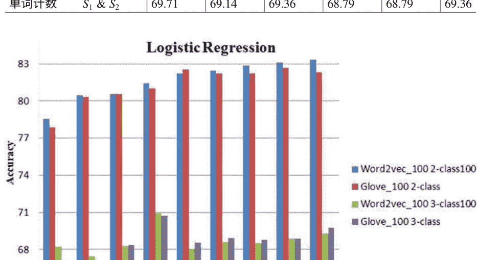

使用逻辑回归和SVM分类器在图3和图4中进行了说明。 将统计特征与嵌入结合可以提高释义系统的性能。

## 4 讨论

本章介绍了马拉雅拉姆语的释义识别。使用RAE嵌入将马拉雅拉姆语句映射到相应的向量。使用Word2vec和Glove嵌入获取初始词向量。从词嵌入中捕获短语向量，并作为RAE的特征。由于句子长度不同，我们应用动态池化将它们转换为固定大小的表示。然后将新生成的向量传递给逻辑回归和支持向量机分类器。最初，为两类和三类任务建立了基准系统。随后通过添加新的统计特征集来扩展系统。在添加每个特征后，系统性能得到检查。从结果中，我们推断出在词嵌入技术中，word2vec的表现更好，其中200维向量相对而言结果更好。在使用的分类方法中，逻辑回归比支持向量机分类器分类更准确。在基准系统中添加更多特征后，两类和三类系统的准确性提高了约5%。在马拉雅拉姆语处理领域中，释义识别仍然是一个复杂而具有挑战性的问题。所提出的方法可以消除词级别的歧义，以识别用于检测释义的上下文。很快就可以将相同的方法应用于其他形态丰富的语言。它有助于理解语言的词性和形态学方面对于识别释义的影响，其基本思想是找到句子之间的语义接近度。

## 参考文献

1. B. Dolan, C. Quirk, C. Brockett, 无监督构建大规模释义语料库:利用大规模并行新闻源, 在第20届国际计算语言学会议上, (计算语言学协会, 2004), 第350页
2. S. Fernando, M. Stevenson, 一种语义相似性方法用于释义检测, 在英国计算语言学特别兴趣小组第11届年度研究研讨会上, (计算语言学协会, 2008年3月), 第45-52页
3. M. Redington, N. Chater, S. Finch, 分布信息:一种获取句法类别的强大线索. 认知科学 22 (4), 425-469 (1998)
4. M. Iyyer, J. Boyd-Graber, H. DauméIII, 从语义向量空间生成句子, 在Nips学习语义研讨会上, (Semantic Scholar, 2014)
5. Lin, T.Y;和 Lee, C.Y. (2013). 使用递归自编码器学习句子的含义, 加州大学圣地亚哥分校
6. N. Kalchbrenner, E. Grefenstette, P. Blunsom, 用于建模句子的卷积神经网络。 arXiv预印本 arXiv 1404, 2188 (2014)
7. A. Finch, Y.S. Hwang, E. Sumita, 使用机器翻译评估技术来确定句子级语义等价性, 在第三届国际短语重述研讨会上, (IWP, 2005)
8. R. Socher, E.H. Huang, J. Pennin, C.D. Manning, A.Y. Ng, 动态池化和展开递归自编码器用于释义检测, 在神经信息处理系统进展中, (NeurIPS Proceedings, 2011), pp. 801-809
9. E. 黄, 使用递归自编码器进行释义检测 (2011) , http://nlp.stanford.edu/courses/cs224n/2011/reports/ehhuang.pdf。于2016年9月21日访问
10. K.M. Anand, S. Singh, B. Kavirajan, K.P. Soman, DPIL@FIRE2016: 印度语言中释义检测共享任务概述, 在FIRE 2016-信息检索评估论坛 (CEUR研讨会论文集, 印度加尔各答, 2016年) , pp. 7-10
11. K. Manju, S.M. Idicula, CUSAT_TEAM@DPIL-FIRE2016: 印度语言-马拉雅拉姆语中的释义检测。 在FIRE (工作笔记) 中, 279-281 (2016年)
12. L. Sindhu, S.M. Idicula, CUSAT_NLP@ DPIL-FIRE2016: 马拉雅拉姆语释义检测。 在FIRE (工作笔记) 中, 266-269 (2016年)
13. M.I. Sumam, S. Savitha,比较统计和语义相似性技术用于释义识别 (IEEE, 2012)
14. V. Ngoc Phuoc An, S. Magnolini, O. Popescu, 在Twitter中的释义识别和语义相似性与简单特征(Association for Computational Linguistics, 2015)
15. M.S. Sundaram, A.K. Madasamy, S.K. Padannayil, AMRITA_CEN@SemEval-2015: 通过无监督特征学习和递归自编码器在Twitter上进行释义检测, in第9届语义评估国际研讨会(SemEval), (Association for Computational Linguistics, 2015), pp. 45-50
16. S. Mahalakshmi, M. Anand Kumar, K.P. Soman, 使用深度学习算法进行泰米尔语释义检测。 Int. J. Appl. Eng. Res. 10(17), 13929-13934 (2015)
17. E. Pronoza, E. Yagunova, 释义识别的低级特征, in墨西哥国际人工智能会议, (Springer, Cham, 2015), pp. 59-71
18. Cordeiro, J; Dias, G; Brazdil, P. (2007). 释义检测的度量标准。在全球信息技术计算, 2007. ICCGI 2007. 国际多会议 (pp. 7).
19. N. Koleva, A. Horbach, A. Palmer, S. Ostermann, M. Pinkal, Paraphrase Detection for Short Answers Coring, in  Proceedings of the Third Workshop on NLP for Computer-Assisted Language Learning, (LiU Electronic Press, 2014), pp. 59-73
20. E.S.M. El-Alfy, R.E. Abdel-Aal, W.G. Al-Khatib, F. Alvi, Boosting paraphrase detection through textual similarity metrics with abductive networks. Appl. Soft Comput.  26, 444-453 (2015)
21. A. Chitra, A. Rajkumar, Paraphrase extraction using fuzzy hierarchical clustering. Appl. Soft Comput. 34, 426–437 (2015)
22. C. Brockett, W.B. Dolan, Support Vector Machines for Paraphrase Identification and Corpus Construction, in Proceedings of the Third International Workshop on Paraphrasing (IWP2005), (Natural Language Processing Group, 2005)
23. H. He, K. Gimpel, J. Lin, 使用卷积神经网络进行多角度句子相似性建模，在2015年自然语言处理会议论文集中，(计算语言学协会, 2015年)，第1576–1586页
24. R. Mihalcea, C. Corley, C. Strapparava, 基于语料库和基于知识的文本语义相似度度量，在人工智能促进协会第6卷中，(Semantic Scholar, 2006年)，第775–780页
25. Y. Ji, J. Eisenstein, 用于分布式句子相似性的判别性改进，在2013年自然语言处理会议论文集中，(计算语言学协会, 2013年)，第891–896页
26. J. Cheng, D. Kartsaklis, 用于深度组合模型的句法感知多义词嵌入。 arXiv预印本 arXiv, 1508.02354 (2015)
27. S. Wan, M. Dras, R. Dale, C. Paris, 使用基于依赖关系的特征来消除“拙劣的复述”，在2006年澳大利亚语言技术研讨会论文集中,(Academia, 2006), pp. 131–138
28. L. Qiu, M.Y. Kan, T.S. Chua, 通过不相似性重要性分类来识别复述，在2006年经验方法自然语言处理会议论文集中,(Association for Computational Linguistics, 2006), pp. 18–26
29. M.Y.M. Chong,使用自然语言处理技术进行抄袭检测和抄袭方向识别的研究(Semantic Scholar, 2013)
30. S. Sarkar等人, NLP-NITMZ@ DPIL-FIRE2016: 语言无关的复述检测，在FIRE (Working Notes), (Semantic Scholar, 2016)
31. K. Sarkar, KS_JU@ DPIL-FIRE2016: 使用多项式逻辑回归模型检测印度语中的释义。 arXiv预印本 arXiv, 1612.08171 (2016)
32. A. Altheneyan, M.E.B. Menai, 评估最先进的释义识别及其应用于自动抄袭检测。Int. J. Patter. Recogn. Artif. Intel. 34 (04), 2053004 (2020)
33. M. Mohamed, M. Oussalah, 基于知识丰富的语义启发式的混合方法进行释义识别。Lang. Resour. Eval. 54 (2), 457–485 (2020)
34. J.A. Alzubi, R. Jain, A. Kathuria, A. Khandelwal, A. Saxena, A. Singh, 使用协作对抗网络进行释义识别。J. Intel. Fuzzy Syst. 39 (1), 1021–1032 (2020)
35. Z. Shi, T. Yao, J. Xu, M. Huang, 对共享词进行释义识别的鲁棒性。arXiv预印本 arXiv, 1909.02560 (2019)
36. S. Xu, X. Shen, F. Fukumoto, J. Li, Y. Suzuki, H. Nishizaki, 用词、句法和句子编码进行释义识别。应用科学。10(12), 4144 (2020)
37. R. Praveena, M.A. Kumar, K.P. Soman, 基于分块的马拉雅拉姆语释义识别使用展开递归自动编码器，在2017年国际计算、通信和信息学会议(ICACCI), (IEEE, 2017), pp. 922–928
38. S. Viswanathan, N. Damodaran, A. Simon, A. George, M.A. Kumar, K.P. Soman, 在Quora和Twitter语料库中检测重复内容，在大数据和云计算进展,(Springer, 新加坡, 2019), pp. 519–528
39. S. Singh, P. Ramanan, V. Sinthiya, K.P. Soman, 为印度语言创建释义识别语料库: 用于释义创建的开源数据集, 在《机器学习新兴趋势和应用手册》中, (IGI Global, 2020), 第157–170页
40. T. Mikolov, K. Chen, G. Corrado, J. Dean, 在向量空间中高效估计词表示。arXiv预印本 arXiv, 1301.3781 (2013)
41. J. Pennington, R. Socher, C. Manning, Glove: 全局词向量表示, 在2014年自然语言处理实证方法会议论文集(EMNLP), (2014), 第1532–1543页

模型匹配：在相似性评估中预测UML类图参数的影响时使用人工神经网络

Alhassan Adamu, Salisu Mamman Abdulrahman, Wan Mohd Nazmee Wan Zainoon和Abubakar Zakari

1 引言

人工智能（AI）展示了学习和预测复杂关系参数集的显著能力。许多因为复杂性或规模而难以解决的问题已经使用AI方法解决[1]。模型匹配的研究人员面临着模型参数匹配的复杂性和规模问题。这迫使他们使用优化算法，如遗传算法[2-5]，粒子群优化算法（如[6, 7]的工作），布谷鸟搜索算法[8]和动态规划方法[9]，以在计算模型参数之间的相似性时找到近似最优解。UML模型由多个图表组成，代表了软件系统的不同视角。

例如，类图用于表示软件系统的结构视图，序列和用例图用于表示系统的功能视图，状态机图用于表示系统的行为[10]。

此外，表示视图的每个图表都由一些参数或元素组成；例如，类图由类名、属性名、方法名和结构关系组成。因此，这些参数在特定实例的图表中代表着不同的含义。由于模型元素的性质，仅依靠一个或两个参数来捕捉和计算模型的两个不同图表之间的相似性变得困难；这个问题激发了一些作者提出了不同的相似度度量方法。

A. Adamu · S. M. Abdulrahman · A. Zakari (✉) 尼日利亚卡诺科技大学计算机科学系
W. M. N. W. Zainoon 马来西亚槟城马来西亚大学计算机科学学院
©作者（们），独家许可给Springer Nature Switzerland AG 2021 V. Kadyan等人（编），深度学习方法用于口语和自然语言处理，信号与通信技术， https://doi.org/10.1007/978-3-030-79778-2_6

通过将图表中的不同元素视为[11, 12]中的工作，可以捕捉模型图之间的相似性。然而，现有的工作未能展示在相似性计算过程中每个参数的贡献和影响。据我们所知，目前没有现有的工作提出使用人工智能方法来预测模型参数在相似性评估过程中的影响。

本章的组织如下：第2节概述了人工神经网络，第3节介绍了软件工程领域中ANN的相关工作，第4节描述了提出的框架，第5节呈现了结果分析和讨论，第6节给出了结论。

2 人工神经网络 (ANN)

在这项研究中使用ANN的动机是，ANN是一种数据处理机制，它在处理数据时不遵循特定的模式，而是使用接收到的现有数据作为输入来发现/学习规则。这种机制使得ANN在解决手头数据问题时非常强大，而我们不知道这些数据之间的关系。ANN是用于预测和预测复杂数据关系的数学建模工具。它在历史上是通过模拟/模仿人脑的活动[13]来设计的，这是通过大量高度相互连接的处理单元实现的。ANN有三个结构：输入层，将数据输入模型；隐藏层，处理数据；输出层，生成结果[14]。ANN结构由三个组件组成：神经元（节点），权重和激活函数[15]。图1显示了神经网络的一个简单示例，包括一个输入层，两个隐藏层和两个输出层。

神经元（节点）是ANN的基本单元。它们通过称为突触的连接相互连接[13]，用于向彼此发送信号以及加权连接。节点作为网络的输入，它们经过处理以产生输出[16]。在这个过程中，权重被调整，以便在给定输入的情况下，产生所需的输出，这是基于学习的过程（算法）用于减少观察到的目标和预测目标之间的误差[17]。ANN有各种分类，如前馈神经网络（FFNN）。

3 相关工作

在软件工程问题领域，ANN的应用并不新颖。在软件工程的各个阶段，已经使用ANN解决了多个问题，从分析到软件测试[18-20]。对应用ANN解决软件工程问题的现有工作的回顾[21]将应用领域分为（a）软件项目成本估计，（b）软件度量，（c）软件测试和（d）软件质量和可靠性预测。有兴趣的读者可以参考[21]了解详细信息。据我们所知，目前还没有关于在软件重用中应用ANN的现有工作。

### 3.1 软件测试中的人工神经网络

最早的研究之一是Khoshgoftaar和Szabo [22]的工作，提出了对软件系统中的故障数量进行预测。使用观测（原始）数据和预测（使用主成分分析）数据训练了两个神经网络模型。作者使用从两个类似系统收集的数据比较了这两个模型的预测质量。结果表明，使用以主成分为输入的神经网络模型在故障预测方面优于使用原始输入的神经网络。

Kanmani和Uthariaj [23]提出了一种预测面向对象软件中故障的方法。引入了两种基于神经网络的方法：概率神经网络（PNN）和反向传播神经网络（BPN）。从研究生项目中收集了1185个数据集，其中软件中的三分之二的类（790个）构成了训练集，三分之一的类（395个）构成了测试数据。模型在训练集中找到了317个带有故障的类，测试集中找到了158个带有故障的类。PNN在预测质量参数（错误分类率、正确性、完整性、有效性、效率）方面表现出很高的鲁棒性，并且比较了预测准确性。另一种使用神经网络进行故障预测的方法在[24]的工作中提出。作者提出了一种名为特征选择（FS）的新方法，以提高分层递归神经网络（L-RNN）的性能。L-RNN是一种用于解决软件故障预测问题的分类技术。采用基于二进制遗传算法、二进制粒子群算法和二进制蚁群优化算法的包装器特征选择算法。从存储库中检查了19个真实软件故障项目，具有不同的大小（即109-909个实例）。数据被分为训练集（80%）和测试（20%）。实验分别进行了带有特征选择和不带特征选择的测试；使用了多个评估分类器的标准，如准确率、精确度、召回率、F-measure和曲线下面积（AUC）。结果表明，L-RNN能够获得平均AUC为0.8358的良好分类率。

在[25]的工作中，提出了一种通过组合多个分类器来预测软件质量的方法。该研究试图回答一些研究问题，例如评估软件系统中故障的强大基础预测算法是什么，预测器数量如何影响故障检测性能，可能改变集成预测器性能的可能集成组合是什么。进行了一项实验证明了十个集成预测器的故障预测性能。共评估了15个软件项目的算法故障检测性能。该研究证明了集成预测器通过F-measure和操作特性曲线下面积（ROC）的性能指标改进了软件故障预测。此外，Ghosh和Singh [26]提出了使用卷积神经网络（CNN）进行软件故障预测的深度学习技术。

CNN是一种深度学习网络，可以减少数据集中的参数数量。模型是使用训练数据集进行训练的；在模型训练完成后，将测试数据发送进行故障定位。此外，Serban和Bota [27]在预测故障准确性方面，通过将两个软件度量与特征选择方法相结合进行了实证研究。他们的实验表明，高性能度量的组合能够更准确地预测软件类中的错误数量。还可以使用其他优化和自然语言处理技术[29-32]。

4 框架概述

本节讨论前馈网络的架构和反向传播训练算法（称为反向传播神经网络（BPN））用于类图参数预测。类图包含用于计算软件系统模型之间相似性的多个参数。类图描述了软件系统的结构表示。图2显示了铁路系统类图的示例。

类图中的参数包括类名、属性、方法和关系。这些参数决定了一个系统与另一个系统之间的相关性。例如，在[2]的工作中，类图之间的相似性是使用类图分类器之间的关系计算的。关系存储在邻接矩阵中，该矩阵保存了不同类型关系之间的不相似度度量。类似地，[7]的工作通过类名计算两个类图之间的相似性；该工作通过名称相似性（NS）来衡量两个类名的相似程度。NS的计算方式是通过Levenshtein距离（LD）的帮助，可以测量一个字符串中需要更改的字符数，以获得另一个字符串中的字符。

### 4.1 提出的方法论

本章采用ANN方法来开发模型（类图）参数关系，引入非线性发生而不是传统方法。FFBPNN包含多层神经元；对于单层前馈神经网络，模型具有一层sigmoid神经元，然后是一层线性神经元的输出层。使用sigmoid传递函数，模型可以学习输入和输出变量向量之间的线性和非线性关系。 预测方法的整体视图如图3所示。

#### 4.1.1 数据准备（输入数据）

数据来自不同类型领域的现有软件项目，如Java Game Maker、Plot Digitizer 、OpenStego、JOtho6（JO）51 Degrees和Jcurses，获取自http://sourceforge.net 。使用Altova® UModel（www.altova.com）进行反向工程，获取软件的模型。创建了一个包含每个软件系列的五个版本的存储库，总共30个软件项目。计算软件项目之间的值之间的相似性，以获得观察到的值系统之间的相似性。观察到的相似性值被用作ANN模型的输入值之一。

表1显示了样本数据。

表1 样本ANN模型输入数据
CN类名，CA类属性，CM类方法，CR类关系，O观察到的相似性

| CN    | CA    | CM    | CR    | O     |
|-------|-------|-------|-------|-------|
| 0.810 | 0.564 | 0.989 | 0.667 | 0.758 |
| 0.810 | 0.542 | 0.948 | 0.617 | 0.729 |
| 0.810 | 0.542 | 0.948 | 0.595 | 0.724 |
| 0.750 | 0.542 | 0.948 | 0.595 | 0.709 |
| 0.750 | 0.542 | 0.948 | 0.595 | 0.709 |
| 0.750 | 0.539 | 0.948 | 0.595 | 0.708 |
| 0.735 | 0.539 | 0.948 | 0.594 | 0.704 |
| 0.735 | 0.514 | 0.948 | 0.594 | 0.698 |
| 0.682 | 0.514 | 0.948 | 0.594 | 0.685 |

#### 4.1.2 数据预处理

UML类图模型的输入数据是类名、类属性、类方法和类关系，这些数据来自查询中的软件模型和存储库，在建模和分析之前被归一化为0-1的公共尺度。使用公式（1）中的归一化方程对输入数据进行归一化。

$$X_{s}=\frac{X_{i}-X_{\min }}{X_{\max }-X_{\min }} \quad (1)$$

其中 $X_{s}$ 是标准化值，$X_{i}$ 是原始值，$X_{\min}$ 是 $X$ 的最小值，而 $X_{\max}$ 是 $X$ 的最大值。

#### 4.1.3 灵敏度分析

进行灵敏度分析以确定输入变量对输出的贡献。灵敏度分析结果用于模型构建。皮尔逊积矩相关系数用于灵敏度分析。皮尔逊相关方程式如公式（2）所示。

$$r=\frac{S_{xy}}{\sqrt{S_{xx} S_{yy}}} \quad (2)$$

其中，$r$ 是皮尔逊积矩相关系数，$S_{xx}$ 是变量 $X$ 的标准差，$S_{yy}$ 是变量 $Y$ 的标准差，$S_{xy}$ 是变量 $X$ 和 $Y$ 的乘积的标准差。

#### 4.1.4 模型制定

人工神经网络（ANN）是一种非常快速发展的非线性建模技术，因其预测能力和快速学习系统行为的能力而受到青睐。ANN由输入层、隐藏层和输出层组成的并行操作架构，通过神经元相互连接，如图4所示。

ANN通过隐藏神经元的激活函数训练输入和目标输出值的关联，通过调整每个神经元的连接权重，直到达到所需的性能值（目标值和输出值之间的最大相关系数或最小均方误差）。解决复杂ANN架构的关键问题是获得所需的性能值以及隐藏层和神经元的数量。基于输入和目标输出的关联，有几种尝试来表示ANN的架构。图4显示了基于前馈和反向传播算法的提出的ANN。

网络由输入层、隐藏层和输出层组成。隐藏层中所需的神经元数量是通过试错法基于最佳性能值选择的。输入层包括两个神经元、三个神经元、四个神经元和五个神经元，它们代表了模型提取的特征，目标输出层有一个神经元，表示观察到的相似性。神经元之间的连接强度被称为权重。输入和它们的权重的总和通过求和运算给出在方程（3）中。

$$ NET_J = \sum_{i=1}^{n} W_{ij} X_{ij}. \quad (3)$$

其中 $W_{ij}$ 是建立的权重，$X_{ij}$ 是输入值，$NET_j$ 是第j层节点的输入。在反向传播技术中，目标输出神经元通过sigmoid函数进行量化，方程（4）给出。

$$ f(NET_j) = \frac{1}{1 + \exp(-NET_j)} \quad (4)$$

反向传播算法类似于监督训练，并通过修改连接权重来最小化平方误差的总和。

5 结果与分析

### 5.1 敏感性分析结果

研究使用皮尔逊相关方法确定模型构建中每个变量的重要性顺序。表2呈现了独立变量和因变量之间的关系。

基于皮尔逊相关系数矩阵，构建了三个人工神经网络模型，如表3所示。

表2 皮尔逊相关系数矩阵 (模型参数)

|          | CN       | CA       | CM       | CR       | O        |
|----------|----------|----------|----------|----------|----------|
| CN       | 1        |          |          |          |          |
| CA       | 0.765301 | 1        |          |          |          |
| CM       | 0.638018 | 0.792793 | 1        |          |          |
| CR       | 0.708178 | 0.976657 | 0.854106 | 1        |          |
| O        | 0.909396 | 0.957195 | 0.817779 | 0.936281 | 1        |

CN类名, CA类属性, CM类方法, CR类关系, O观察到的

表3 模型组合

| 模型名称 | 参数组合 |
|----------|----------|
| FFNN-M1  | CA, CR   |
| FFNN-M2  | CA, CR, CN |
| FFNN-M3  | CA, CR, CN, CM |

### 5.2 模型估计分析结果

在这项研究中，使用Levenberg-Marquardt算法训练的两层前馈网络用于人工神经网络模型的分析。前馈网络由一系列层组成，每个后续层都与前一层相连。该模型使用MATLAB 2019a中的工具构建；基于皮尔逊相关系数构建了三个人工神经网络模型。在该过程中，75%的数据用于训练，25%用于验证人工神经网络的分析。

表4 ANN模型训练阶段和ANN模型测试阶段

| Model    | $R^2$      | $R$         | MSE         | RMSE        |
|----------|------------|-------------|-------------|-------------|
| **训练阶段** |            |             |             |             |
| FFNN-M1  | 0.981615   | 0.990764762 | 0.00005     | 0.00694     |
| FFNN-M2  | 0.99973    | 0.999865146 | 0.00000071  | 0.00084     |
| FFNN-M3  | 0.999968   | 0.999984142 | 0.000000083 | 0.000288    |
| **测试阶段** |            |             |             |             |
| FFNN-M1  | 0.97341201 | 0.986616    | 0.000105711 | 0.01028159  |
| FFNN-M2  | 0.9999834  | 0.999992    | 0.0000001   | 0.00025687  |
| FFNN-M3  | 0.99998718 | 0.999994    | 0.000000051 | 0.0002258   |

模型。网络性能根据均方误差（MSE）进行测量。表4展示了所有三个ANN模型在训练和验证中的性能指标。

6 模型验证

验证是建模的重要部分，它展示了模型代表实际系统的合理程度。评估ANN模型性能的最常见指标是相关系数、决定系数、MSE和RMSE。RMSE表示预测值与观察值之间差异的样本标准差[34]。使用公式（5）-（8）估计$R^2$, $R$, MSE和RMSE的值。

$$R^2 = 1 - \frac{\sum_{i=1}^{n} (O_i - P_i)^2}{\sum_{i=1}^{n} (O_i - \overline{O})^2} \quad (5)$$

$$R = \sqrt{R^2} \quad (6)$$

$$\text{MSE} = \frac{\sum_{i=1}^{n} (O_i - P_i)^2}{N} \quad (7)$$

$$\text{RMSE} = \sqrt{\text{MSE}} \quad (8)$$

共收集了来自30个不同项目的301个数据模型；模型包括类图、类名、类关系、类属性和类方法，用于分析。图5显示了雷达图中的预测模型比较。该图显示了每个模型的高低相关性。

图5显示了FFNN-M1的训练阶段和测试阶段的CC雷达图

图6显示了FFNN-M2最佳模型的观测值和计算值的散点图

为了完美展示模型的性能，组合了相关系数的最佳显示。可以观察到0.98和0.99都是测试阶段模型中相关系数（CC）的最低和最高值。性能最佳的模型归功于具有较高CC值的模型。图5显示了雷达图。

图6显示了最佳计算模型的散点图。这些图表表明FFNN-M1、FFNN-M2和FFNN-M3的观测值和计算值之间存在着密切的一致性。

## 7 结论

本章介绍了一种使用Levenberg-Marquardt算法训练的两层前馈神经网络（FFNN）在分析ANN模型以预测在软件重用过程中计算软件系统之间的相似性时UML类参数（类名、方法、属性等）的影响。通过Pearson相关系数建立了三个模型。每个模型结合了一些影响软件设计相似性计算的参数。在该过程中，75%的数据用于训练，25%用于验证。使用均方误差（MSE）来衡量模型的性能。模型2（FFNN-M2）是最佳模型，只需少量参数作为ANN模型的输入即可获得良好的相关系数。

## 参考文献

- 1. A.S. Tenney等人，应用人工神经网络进行随机估计和喷气噪声建模。AIAA J., 1–12 (2020)
- 2. H.O. Salami, M. Ahmed，使用遗传算法检索类图，在机器学习和应用（ICMLA），2013年第12届国际会议，（IEEE，2013）
- 3. H.O. Salami, M. Ahmed，使用遗传算法检索序列图，在计算机科学和软件工程（JCSSE），2014年第11届国际联合会议，（IEEE，2014）
- 4. H.O. Salami, M. Ahmed，多视图UML工件重用框架。arXiv预印本arXiv, 1402.0160 (2014)
- 5. H.O. Salami, M.A. Ahmed，使用遗传算法进行类图检索的框架（SEKE, 2012）
- 6. G. Assuncao, W. Klewerton, S.R. Vergilio，用于检索类图的多目标解决方案，在智能系统（BRACIS）2013巴西会议，（IEEE）
- 7. W.K.G. Assunção, S.R. Vergilio，使用粒子群优化的类图检索，在第25届国际软件工程和知识工程会议，（SEKE, 2013）
- 8. A. Adamu, W.M.N.W. Zainon，使用布谷鸟搜索算法从软件库中匹配和检索状态机图，在国际信息技术会议，（IEEE，阿尔扎托纳大学约旦分校，阿曼，约旦，2017）
- 9. A. Adamu, W.M.N.W. Zainon，使用动态规划对UML序列图进行相似性评估，在国际视觉信息学会议，（Springer，2017）
- 10. M. Ahmed，面向UML工件的集成重用环境的发展，在ICSEA 2011，第六届国际软件工程进展会议，（语义学者，2011）
- 11. M.A.-R. Al-Khiaty, M. Ahmed，UML类图：相似性方面和匹配。Lect. Notes Softw. Eng. 4(1), 41–47 (2016)
- 12. Adamu, A.和W.M.N.W. Zainoon，通过组合不同的软件属性来确定UML模型的相似性。J. Theor. Appl. Inf. Technol., 2018年96(11) 1992-8645
- 13. M.M. Hamed, M.G. Khalaf allah, E.A. Hassanien，使用人工神经网络预测废水处理厂的性能。Environ. Model Softw. 19(10), 919–928 (2004)
- 14. K.P. Sing等人，人工神经网络建模河水质量—案例研究。Ecol. Model. 220(6), 888–895 (2009)
- 15. E. Dogan, B. Sengorur, R. Koklu，使用人工神经网络技术模拟土耳其Melen河的生物需氧量。J. Environ. Manag. 90(2), 1229–1235 (2009)
- 16. E. Dogan et al.，应用人工神经网络估计废水处理厂进口生化需氧量。环境进展。27(4), 439–446 (2008)
- 17. S.I. Abba, G. Elkiran，使用人工神经网络应用预测废水处理厂的化学需氧量。Proc. Comput. Sci. 120, 156–163 (2017)
- 18. L. Abualigah等人，大数据文本聚类中元启发式优化算法的进展。电子10(2), 101 (2021)
- 19. L. Abualigah等人，自然启发式优化算法在文本文档聚类中的综合分析。算法13(12), 345 (2020)
- 20. L.M.Q. Abualigah，特征选择和增强的鲸群算法用于文本文档聚类（Springer，瑞士，2019）
- 21. Y. Singh等人，神经网络在软件工程中的应用：一项综述，在国际信息系统、技术和管理会议上（Springer，柏林，海德堡，2009）
- 22. T.M. Khoshgoftaar, R.M. Szabo，使用神经网络在测试过程中预测软件故障。IEEE Trans. Reliab. 45(3), 456–462 (1996)
- 23. S. Kanmani等人，使用神经网络进行面向对象软件故障预测。Inf. Softw. Technol. 49(5), 483–492 (2007年)
- 24. H. Turabieh, M. Mafarja, X. Li，使用分层递归神经网络的迭代特征选择算法进行软件故障预测。Expert Syst. Appl. 122, 27–42 (2019年)
- 25. F. Yucalar等人，软件质量工程中的多分类器：结合预测器以提高软件故障预测能力。Eng. Sci. Technol. Int. J. 23(4), 938–950 (2020年)
- 26. D. Ghosh, J. Singh，使用深度学习技术进行软件故障预测的新方法，在自动化软件工程：基于深度学习的方法（Springer，瑞士，2020年），pp. 73–91
- 27. C. Serban, F. Bota，使用神经网络进行软件故障预测的概念框架，在国际智能系统建模与发展会议上，（Springer, Switzerland, 2019）
- 28. S.R. Chidamber, C.F. Kemerer，面向对象设计的度量套件。IEEE Trans. Softw. Eng. 20(6), 476–493 (1994)
- 29. L.M. Abualigah等人，具有鲁棒权重方案和动态维度缩减的文本特征选择用于文本文档聚类。Expert Syst. Appl. 84, 24–36 (2017)
- 30. L. Abualigah, A. Diabat，正弦余弦算法的进展：一项综合调查。Artif. Intell. Rev. 54, 2567–2608
- 31. L. Abualigah等人，算术优化算法。Comput. Meth. Appl. Mech. Eng. 376, 113609 (2021)
- 32. L. Abualigah, A. Diabat，对蝗虫优化算法的全面调查：结果、变体和应用。神经计算应用, 1–24 (2020)
- 33. V. Nourani等人，一种情感人工神经网络用于预测车辆交通噪音。Sci. Total Environ. 707, 136134 (2020)
- 34. V. Nourani, T. Khanghah, A.H. Baghanam，熵概念在小波-人工神经网络降雨径流建模中的输入选择应用。环境信息学报26(1), 52–70 (2015)

# 用于语音和说话者识别的经典和深度学习数据处理技术

Aakshi Mittal, Mohit Dua和Shelza Dua

## 1 引言

语音是一种涉及个体特征和话语表达的人类行为特征。它正在成为一种成本很低、健康的与人工智能系统互动的方式。

现在可以看到各种基于语音的系统，例如YouTube的闭路字幕，亚马逊的Alexa，基于语音的生物特征和锁定系统等。这些系统主要受到语音识别或说话人识别的影响。

语音识别技术通过对应的文本来模拟话语。语音信号本身包含了上下文的信息，可以通过口语话语的形式得到语音特征向量[1]。为了进行语音识别，特定话语的特征向量与其对应的预期音素[2,3]相关联。

说话人识别是通过识别他们的声音来识别个体的一种方式。两个个体的声音不同是由于他们的声音产生系统和表达话语的方式的差异[4]。这些物理和特征特质参与了个体的话语。在说话人识别的情况下，这些特质成为特定说话人的信息，可以通过语音特征提取来确定。

语音和说话者识别系统由前端和后端两部分组成。系统的前端部分使用语音特征提取技术提供特征向量。有各种经典的特征提取技术，如梅尔频率倒谱系数 (MFCC)、伽马音频倒谱系数 (GFCC)、感知线性预测 (PLP) 等，以及基于深度学习的特征提取技术 [5–7]。还使用了综合特征来应对嘈杂的环境条件 [8, 9]。本章讨论了各种经典和深度学习技术，并对语音和说话者识别中使用的前端特征进行了分析。本章提供了梅尔频率倒谱系数 (MFCC) 特征提取的实现细节。

对于后端，通常需要一个分类模型，通常是一个机器学习模型。隐马尔可夫模型、高斯混合模型、支持向量机等是广泛使用的经典机器学习模型。然而，卷积神经网络、长短期记忆网络等深度学习模型也在提高这些系统的性能方面发挥着更好的作用 [10–12]。

各种语音语料库可用于对这些系统进行强健训练。这些语料库包含语音数据、相关文本数据、说话者知识、音频和文本的元数据等。基于语音的系统受到环境中噪声的影响；例如，当语音信号通过无线网络传输时，会面临不同类型的干扰。为了应对噪声的存在，语音系统通过包含噪声数据在训练中使其适应噪声 [9]。本章讨论了各种可用的数据来源。

本章的组织结构如下：第2节描述了数据的私有和公共来源。第3节讨论了在干净和噪声数据下的各种特征提取技术、语音前端分析和说话者识别技术，讨论了静态和动态MFCC的实现细节，并讨论了各种基于深度学习的特征提取技术。第4节总结了所提出的工作。

## 2 数据来源

进行语音识别和说话者识别系统的研究和开发需要数据集。如今，语音很容易通过一些私有和公共来源获得。为了开发强健的系统，数据集的变化是必要的，这些变化在私有来源的情况下是无意识引入的，在公共来源的情况下是有意识引入的。下面讨论了一些私有和公共数据来源。

### 2.1 数据的私人来源

几乎每个组织每天都会产生大量的语音数据。大部分时候这是真实的数据；因此，它对工作很有用。因此，它对研究和实际工作很有用。这些数据可能包含很多语音变化，因为它们是从随机人员那里收集的。这么多的数据可以用来进行语音或说话者识别的研究。这些数据对这些组织来说是私有的。有时，这些数据可能涉及到客户的隐私问题，因此不能公开使用。在完成一些任务后，这些数据可以用于研究。这些数据来源的一些例子如下：

- 电信组织
- 客户服务提供商
- 电视和广播数据等

### 2.2 数据的公共来源

研究社区已经开发了各种语音语料库，以促进语音驱动系统领域的研究。这些数据集包括各种说话者的声音以及话语的元数据。这些语料库在各种环境条件下录制，以包含数据集中的真实情况。这些语料库以不同的语言录制，无论是国家语言还是特定地区的本地语言。这些数据集由这些社区公开提供，以支持世界各地在基于语音的领域进行研究。以下是一些公开可用的语音语料库：

- 华尔街日报 (WSJ)
- 德州仪器-麻省理工学院 (TIMIT)
- 国家标准与技术研究院 (NIST)
- YOHO
- VoxCeleb等

## 3 数据处理

数据处理是任何语音识别或说话者识别系统前端开发的基本任务。数据集以音频信号的形式提供数据，数据处理是提取“话语的上下文是什么？”信息的方法。在语音识别中，“话语的发出者是谁？”信息的提取方法。在说话者识别任务中，“话语的发出者是谁？”信息的提供方法。它提供信息关于语音的上下文和说话者特定信息以数值形式提供，对人类和不同的机器学习（ML）后端模型非常有用。后端模型从这些系数中学习分类线索，并对测试样本进行预测。对语音信号和不同的信号处理操作有深入的了解可以提供语音驱动系统前端的鲁棒性。前端数据处理技术的应用可以增加前端设计的新进展。

除了数值系数之外，还有波形和频谱图绘制的方法，可以更好地可视化数据。本节讨论了用于处理语音数据的各种可用平台。讨论了用于语音和说话人识别任务的经典语音特征提取技术。然后介绍了基于深度学习（DL）的特征提取技术。

### 3.1 处理数据的可用平台

可以使用不同语言在不同软件平台上提供的各种信号处理库来处理数据集中的语音信号或音频。MATLAB、Python等可以轻松处理语音数据。本章讨论的实现在Python中实现。有各种平台可供使用Python；下面讨论了一些平台。

#### 3.1.1 在个人电脑上

个人电脑通常提供CPU的计算能力，可用于处理少量数据。有各种集成开发环境（IDE）可用于使用不同的语言。Anaconda是一个很好的IDE，支持Windows和Linux操作系统。它提供了Jupyter Notebooks、Spyder和Qt Console平台，具有良好的图形用户界面，可用于Python工作。

这是获取Anaconda IDE下载的URL：https://docs.anaconda.com/anaconda/install/windows/。

#### 3.1.2 云支持

如果要处理的数据很大，则需要使用图形处理单元(GPU)或张量处理单元(TPU)。这些处理能力由各种公开可用的云支持提供。这些云支持还提供了一个固定的大内存单元，而且还可以通过联系相关组织以一定的费用获得更多。这些平台是用于语音的经典和深度学习数据处理技术。非常适合在较短时间内使用大型数据集训练机器学习(ML)模型。而且这些云可以保护用户的工作安全。以下是一些免费提供的云支持：

- Google Colaboratory
- Kaggle Kernels
- Microsoft Azure Notebooks等。

### 3.2 经典特征提取技术

本节讨论了语音信号处理操作及其实现细节。然后对经典的特征提取技术进行了语音识别和说话人识别任务的分析。本节还介绍了Mel频率倒谱系数（MFCC）及其带有delta和delta-delta系数的实现细节。

#### 3.2.1 语音信号处理操作

本节列出的所有信号处理操作都应用于音频文件。音频文件以.wav格式进行压缩。以符号#开头的行表示注释行。使用Python的库librosa加载、显示波形和处理音频。通过librosa加载音频文件后，它提供了一个时间序列y，它是一个numpy数组，以及采样率sr。除此之外，还使用matplotlib库绘制了本工作的图形（代码1）。图1显示了代码的结果。

```
`代码 1`
```

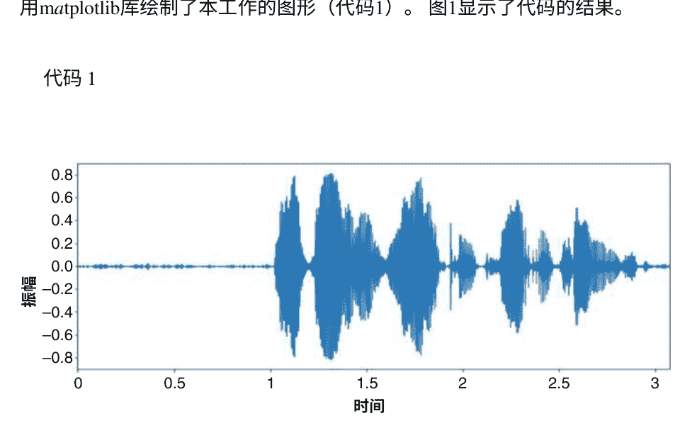

```
# 库
import librosa
%matplotlib inline
import matplotlib.pyplot as plt
# 整个过程
y, sr= librosa.load("audio_file.wav")
# 绘制波形图，图1显示输出
plt.figure(figsize=(14,5))
librosa.display.waveplot(y=y, sr=sr)
plt.xlabel("时间")
plt.ylabel("振幅")
plt.show()
# 结果
```

Numpy库提供了处理数组和矩阵的所有功能。为了进行科学和数学运算，使用scipy库，它是numpy库的一个依赖项。这两个库都可以在音频_file.wavfile上应用对数、平方和绝对值运算。除此之外，还可以对信号应用离散余弦变换（DCT）、快速傅里叶变换（FFT）和短时傅里叶变换（STFT）。这些操作和变换都是应用在y上的，因此结果也是numpy数组的值。由于结果是相当大的数组，代码2的结果只显示了第一行的几列。注释行# 更多库表示需要额外的库，之前所有代码中使用的库也包括在这个代码中。代码2

```
# 更多库
import numpy as np
from scipy.fftpack import fft, dct
# 整个过程
# 对数
logg= np.log(y)
print("对数")
print(logg)
# 平方
sq= np.square(y)
print("平方")
print(sq)
# 绝对值
abso=np.abs(y)
print("绝对值")
print(abso)
# DCT
dctt=dct(y)
print("DCT")
print(dctt)
# FFT
fftt=fft(y)
print("FFT")
print(fftt)
# STFT
x=librosa.stft(y)
print("STFT")
print(x)
#结果
对数
[-6.0601254 -5.5124846 -5.4277854 ... ]
平方
[5.4480606e-06 1.6289841e-05 1.9296805e-05 ... ]
绝对值
[0.00233411 0.00403607 0.00439281 ... ]
DCT
[4.9195433e+00 2.2777748e-01 3.4334455e+00 ... ]
FFT
[2.4597836+0.j 1.7166903+0.82551146j 2.526172 +1.4188728j ... ]
STFT
[4.0432158e+00+0.0000000e+00j 2.2287924e+00+0.0000000e+00j -1.1482446e+00+0.0000000e+00j ... ]
```

#### 3.2.2 古典特征提取技术的分析

本节详细分析了语音和说话人识别领域中不同的特征提取技术。语音识别系统是为了适应嘈杂和非嘈杂环境而构建的。下面是这两个领域前端的分析。

**在语音识别中**

对于理想条件下的系统已经进行了大量的研究。这些研究考虑了用于系统开发的干净数据。但是当数据进入广泛传播的网络时，会变得嘈杂 [13]。这些特定条件也通过不断检查前端的不同特征提取技术来解决。本节讨论了干净数据和嘈杂数据的情况。

- 使用干净的数据

理想情况下，系统被认为位于一个无噪声的环境中。因此，在干净或无噪声的数据上实现高准确性是期望的。不同的特征提取技术选择将研究引向更好的性能。Ittichaichareon等人选择了MFCC作为前端特征来训练支持向量机（SVM）和最大似然（ML）分类器。Dua等人[3]使用异构特征向量训练了一个隐马尔可夫模型（HMM）。这些异构特征是通过将MFCC流和感知线性预测（PLP）流组合生成的，这些特征通过异方差线性判别分析（HLDA）和线性变换方法减少到39个特征。分析表明，异构特征在平面上表现出色。

MFCC和平面PLP特征在由印度基础研究所（TIFR）开发的印地语语音和文本语料库上表现出色。Elharati等人也选择了MFCC特征作为前端来开发阿拉伯语语音识别系统。该系统的数据集来自19名阿拉伯语母语者和24个阿拉伯语单词。

- 带有噪声的数据

语音识别系统多年来取得了相当高的准确性；然而，在环境噪声和信道失真的情况下，它们的性能会下降。为了使系统在这些困难情况下得到实践，选择了不同的噪声鲁棒特征的情景，并生成了噪声数据来训练系统。Këpuska等人[14]使用了MFCC、PLP、RASTS-PLT和线性预测编码系数（LPCC）的不同组合创建了不同的混合特征。多变量HMM使用这些混合特征以及不同信噪比（SNR）下的单独特征进行训练。分析表明，在高噪声比下，静态和动态LPCC特征的性能优于其他特征。Dua等人[9]使用了经过优化滤波器生成的MFCC、GFCC和基底膜频带倒谱系数（BFCC）特征。

应用滤波器组通过差分评估方法进行优化。在这种情况下，BFCC特征在嘈杂数据中表现优于MFCC和GFCC。Dua et al. [8]使用前端集成特征和后端精细化的HMM来处理基于印地语的语音数据集。集成特征是MFCC + PLP的集成和MFCC + Gammatone频率倒谱系数（GFCC）的集成。GFCC特征模拟人类听觉系统，是噪声鲁棒性的关键点特征。精细化的后端模型是具有遗传算法（GA）和粒子群优化算法（PSO）的HMM。结果表明，MFCC + GFCC与HMM + PSO相结合在增加信噪比（嘈杂数据）方面优于其他组合。

## 3.2.2 在说话人识别中

对于干净和嘈杂数据，已经进行了说话人识别的研究。由于这种技术应用于取证、无线远程访问系统等领域，处理嘈杂数据变得至关重要[15–17]。本节重点介绍了在干净和嘈杂环境下开发说话人识别系统所选择的前端特征提取技术。

- 使用干净的数据

Tiwari [18]提出了一个以MFCC为前端的文本相关说话人识别系统。她通过改变滤波器数量和窗口类型来分析系统的性能，结果显示使用32个滤波器和Hanning窗口类型可以达到最大效率。她的研究表明，在实施过程中使用少于或多于32个滤波器会降低系统性能。Sarkar等人[19]专门设计了一个说话人识别系统用于孟加拉语。他们的系统使用不同的非线性特征，并通过互相关矩阵的帮助进行分类。Bouziane等人[20]对说话人识别系统的不同特征提取技术进行了比较，这可以启发MFCC和GFCC特征的广泛使用。

- 带有噪声的数据

Frankle和Ramachandran [21]在SNR水平存在白噪声的情况下研究了说话人识别。他们的研究工作包括五种不同的特征，即自适应组件加权（ACW）倒谱、后处理滤波器（PFL）倒谱、MFCC、线性预测倒谱（CEP）和线谱频率（LSF），并在不同的噪声场景下与高斯混合模型-通用背景模型（GMM-UBM）在后端进行融合向量。他们的融合在高噪声条件下表现出色。Bharath等人[22]在嘈杂环境中使用极限学习机（ELM）对数据进行分类[23]。为了应对嘈杂的环境条件，他们使用乘法器基础的MFCC和功率归一化倒谱系数（PNCC）特征进行得分级融合。

通过基于乘法器的MFCC和PNCC的归一化得到所需的特征。这种技术在TIMIT和SITW数据集上的特征和分类模型的其他场景中表现更好。

### 3.2.3 讨论

- 在经典的特征提取技术中，MFCC是最受欢迎和广泛使用的特征提取方法。
- GFCC是一种新引入的特征提取技术，比MFCC表现更好，并成为新的流行方法。
- 不同特征提取技术的组合或集成也可以在嘈杂环境中获得更高的准确性。
- 在声音和说话者识别领域中，有一些倒谱域的特征，如常数Q倒谱系数（CQCC），尚未得到探索。
- 语音和说话者识别系统已经在各大洲、地方语言等广泛使用的语言中进行了研究。

MFCC是讨论的两个基于语音的领域中最受欢迎的特征。这些特征在这些领域的系统前端被广泛地单独使用或与其他特征组合使用。由于研究人员对这些特征非常感兴趣，本章在下一节中详细讨论了MFCC特征提取过程及其实现技术。

图2 MFCC特征提取过程

### 3.2.4 梅尔频率倒谱系数（MFCC）处理

梅尔频率倒谱系数（MFCC）特征能够很好地处理人类听觉系统。为此，使用了感知动机的梅尔刻度。对输入音频应用FFT [24]或离散傅里叶变换（DFT）[25]可以得到音频频谱。将三角形或高斯形状的滤波器应用于改变刻度为梅尔刻度。通过对频谱应用DFT，然后进行对数运算[26]，得到最终的MFCC。图2描述了MFCC提取的整个过程。通常，对于不同的系统，可靠的特征系数为12到14个。MFCC提取的数学过程如下：

> $D_{DFT}(a) = DFT(f)$

> $MFB(p) = \sum_{a=1}^{L} |D_{DFT}(a)|^2 W(a)$

> $MFCC(r) = \sum_{p=1}^{P} \log[MFB(p)] \cos\left\{\frac{r(p-0.5)\pi}{P}\right\}$

其中，f是音频帧，$D_{DFT}(a)$是其$D_{DFT}$，MFB(p)是通过具有P个滤波器的mel缩放频谱计算的，L表示总的$D_{DFT}$索引，r表示通过MFCC(r)进行的MFCC特征提取。

现在，本节讨论了Mel频率倒谱系数（MFCC）提取的过程和实现细节。首先，在应用mel滤波器之前，对音频信号应用FFT。然后应用对数运算，随后是DCT。代码3使用了python_speech_features库，该库方便了音频的mel滤波器。再次，结果是巨大的numpy数组；因此，结果中仅显示了第一行的几个值。

### 代码 3
```python
# 更多库
import python_speech_features
# 整个过程
# FFT
fft=fft(y)
print("FFT")
print(fft)
# 梅尔滤波器
mfc=python_speech_features.base.hz2mel(fft)
print("梅尔系数")
print(mfc)
#对数
logg=np.log(mfc)
print("对数后")
print(logg)
# DCT
dctt=dct(logg)
print("最终MFCC后")
print(dctt)
# 结果
FFT
[2.4597836+0.j 1.7166903+0.82551146j 2.526172 +1.4188728j ... ]
梅尔系数
[3.9532394+0.j 2.7612073+1.3258146j 4.0620995+2.2761562j ... ]
对数后
[1.3745353+0.j 1.1193992+0.44764802j 1.5382305+0.510747j ... ]
DCT后 final MFCC
[-8.4915918e+03-5.5313110e-05j 5.9848289e+00-1.2086787e+04j
3.2515691e+05+1.0052490e+00j ... ]
```

代码3教授MFCC提取的整个过程。正如结果的最后一行所显示的，生成的系数的值属于非常大的连续域范围，因此在进一步使用这些系数之前需要进行系数的归一化处理。统计学提供了相当好的操作来进行此操作。可以使用librosa的内置函数来计算MFCC。在图3、4和5中，显示了这些特征的频谱图。代码4从audio_file.wav中提取了12个MFCC特征，可以通过设置函数中的n_mfcc参数来提取所需数量的特征。此代码还提取了第一和第二阶动态特征系数，并为它们绘制了频谱图。动态特征有助于揭示上下文信息。

图3 MFCC特征的频谱图

图4 MFCC特征的频谱图

图5 MFCC特征的二阶差分的频谱图

比仅有MFCC特征更清晰地表达话语。图3、4和5代表代码4的输出。

### 代码4
```python
# 更多库
import librosa.display
# 整个过程
mfc=librosa.feature.mfcc(y, sr=sr, n_mfcc=12)
plt.figure(figsize=(14,5))
librosa.display.specshow(mfc, sr=sr, x_axis='time', y_axis='hz')
# delta
d=librosa.feature.delta(mfc, width=9, order=1, axis=-1, trim=True)
plt.figure(figsize=(14,5))
librosa.display.specshow(d, sr=sr, x_axis='time', y_axis='hz')
# delta-delta
dd=librosa.feature.delta(mfc, width=9, order=2, axis=-1, trim=True)
plt.figure(figsize=(14,5))
librosa.display.specshow(dd, sr=sr, x_axis='time', y_axis='hz')
# 结果
```

### 3.3 基于深度学习的特征提取技术

分析表明，从2011年开始，使用深度学习进行特征提取的应用逐渐出现[27]。它为语音特征提取任务带来了新的时代。通常，深度学习应用于涉及图像数据集的计算机视觉；然而，卷积神经网络表明，如果适当地呈现音频文件，它也适用于音频数据[28]。在基于深度学习的特征提取过程中，所使用的深度学习模型的隐藏层被提取为特征向量。d-向量、j-向量、x-向量等都属于基于深度学习的语音特征提取技术[29]。下面简要讨论一些这些技术。

#### 3.3.1 d-向量

已经进行了大量关于提取深层特征的研究。Variani等人[30]使用感知线性预测（PLP）特征训练了一个DNN，同时选择了帧级别的其delta和delta-delta向量。设计的DNN包含多个全连接层。期望的d-向量是这些隐藏层激活函数的平均输出。这些特征被用于开发说话人识别系统。

#### 3.3.2 x-向量

在x-向量的情况下，隐藏层被提取为特征向量。深度学习网络与时间延迟因子一起用于提取这些特征。Fang等人[31]设计了一个时间延迟神经网络（TDNN），它由多个全连接层组成，对具有一定时间上下文的语音信号的帧进行操作。

#### 3.3.3 端到端语音信号

通常，从语音信号中提取特征向量，然后将这些向量传递给深度学习模型进行分类。然而，深度学习分类模型本身应该经过训练，以接受原始语音信号作为输入，并对其进行进一步处理。这些方法目前也正在实际应用中使用[1, 32, 33]。

## 4 结论

基于语音的系统目前是与各种智能设备交互的潜在选择。语音识别和说话者识别是应用于各种形式交互的两种技术。本章讨论了用于辅助这些系统开发的各种数据来源，揭示了公开可用的数据来源是最广泛使用且真正有帮助的。经典的特征提取技术涉及各种语音信号处理步骤，以模拟人类听觉、声道形状等。这些语音信号处理步骤的实现细节启发了设计新的特征提取技术和特征的集成。

在清洁和嘈杂的环境下分析语音和说话者识别的前端表明，集成的特征提取技术正在改善这些技术的性能。然而，MFCC是最流行的特征提取技术，既可以作为集成特征的一部分，也可以单独使用。本章讨论了MFCC及其在静态和动态系数中的实现。深度学习正在为基于语音的特征开发带来一个新时代。本章讨论了各种基于深度学习的特征提取技术，这些技术有潜力提高这些系统的性能。

## 参考文献

1. M. Dua, R.K. Aggarwal, V. Kadyan, S. Dua，用于连接词的旁遮普语语音转文本系统（IET，印度班加罗尔，2012年）
2. M. Dua, R.K. Aggarwal, M. Biswas，基于GFCC的鉴别训练噪声鲁棒连续ASR系统，用于印地语。环境智能人性化计算期刊 10（6），2301–2314（2019年）
3. M. Dua, R.K. Aggarwal, M. Biswas，使用异构特征向量进行鉴别训练的印地语自动语音识别系统，在2017年国际计算机与应用会议（ICCA）（IEEE，多哈，2017年），第158–162页
4. T. Kinnunen, H. Li，无文本独立说话人识别综述：从特征到超向量。语音通信期刊 52（1），12–40（2010年）
5. J. Villalba, N. Chen, D. Snyder, D. Garcia-Romero, A. McCree, G. Sell, 等人，用于NIST SR E18和野外说话人评估的神经网络嵌入的最新说话人识别。计算机语音语言 60，101026（2020）
6. K. Kumar, H. Khalil, Y. Gong, Z. Al-Bawab, C. Liu，美国专利号10，706，852（美国专利和商标局，华盛顿特区，2020）
7. M. Dua, R.K. Aggarwal, V. Kadyan, S. Dua，使用HTK的旁遮普语自动语音识别。国际计算机科学期刊（IJCSI） 9（4），359（2012）
8. M. Dua, R.K. Aggarwal, M. Biswas，使用噪声鲁棒集成特征和精细化的HMM建模进行判别式训练。智能系统杂志 29（1），327–344（2018）
9. M. Dua, R.K. Aggarwal, M. Biswas，使用优化的滤波器组进行印地语语音识别系统的性能评估。工程科学技术国际期刊 21（3），389–398（2018）
10. R.K. Aggarwal, A. Kumar，使用集成声学特征和循环神经网络语言建模进行判别式训练的连续印地语语音识别。智能系统杂志 30（1），165–179（2020）
11. A. Kumar, R.K. Aggarwal，使用时延神经网络声学建模和i-vector自适应进行印地语语音识别。语音技术国际期刊，1–12（2020）。https://doi.org/10.1007/s10772-020-09757-0
12. M. Dua, R. Yadav, D. Mamgai, S. Brodiya，一种基于改进的RNN-LSTM的新方法用于乐谱生成。计算机科学会议论文集 171，465–474（2020）
13. Q. Zhu, A. Alwan，非线性特征提取用于稳定和非稳定噪声中的鲁棒语音识别。计算机语音语言 17（4），381–402（2003）
14. V.Z. Kèpuska, H.A. Elharati，在嘈杂环境中使用传统和混合的鲁棒语音识别系统特征MFCC、LPCC、PLP、RASTA-PLP和隐马尔可夫模型分类器。计算机通信 3（06），1（2015）
15. S. Ding, T. Chen, X. Gong, W. Zha, Z. Wang，AutoSpeech：用于说话人识别的神经架构搜索。arXiv 预印本 arXiv，2005.03215（2020）
16. A. Lozano-Diez, A. Silnova, P. Matejka, O. Glembek, O. Plchot, J. Pesan, L. Burget，J. Gonzalez z-Rodriguez，分析和优化说话人识别的瓶颈特征，第2016卷（奥德赛，毕尔巴鄂，2016年），第352–357页
17. P.S. Nidadavolou, J. Villalba, N. Dehak，Cycle-GANs用于声学特征的领域自适应说话人识别，在ICASSP 2019–2019 IEEE国际会议上声学、语音和信号处理（ICASSP），（IEEE，布莱顿，2019年），第6206–6210页
18. V. Tiwari，MFCC及其在说话人识别中的应用。Emerg. Technol. 1（1），19–22页（2010年）
19. U. Sarkar, S. Pal, S. Nag, C. Bhattacharya, S. Sanyal, A. Banerjee, D. Ghosh，从非线性特征中识别孟加拉语发言人。arXiv预印本 arXiv，2004.07820（2020年）
20. A. Bouziane, J. Kharroubi, A. Zarghili，用于自动说话人识别系统的特征提取技术的客观比较。Bull. Electr. Eng. Inform. 10（1），374–382（2020年）
21. M.N. Frankle, R.P. Ramachandran，在嘈杂环境下的鲁棒说话人识别中使用特征补偿和信噪比估计，2016年第59届国际中西部电路与系统研讨会（MWSCAS），（IEEE，阿布扎比，2016年），第1–4页
22. K.P. Bharath, R. Kumar，使用基于多窗函数的MFCC和PNCC特征与融合得分的ELM说话人识别方法，适用于有限数据集。Multimed. Tools Appl. 79（39），28859–28883（2020）
23. P. Alku, R. Saeidi，从更高滞后自相关系数到噪声鲁棒的说话人识别的线性预测建模。IEEE/ACM Trans. Audio, Speech, Language Process 25（8），1606–1617（2017）
24. P. Prithvi, T.K. Kumar，MFCC，LFCC，RASTA-PLP的比较分析。Int. J. Sci. Eng. Res. 4（5），1–4（2016）
25. M. Todisco, H. Delgado, K. Lee, M. Sahidullah, N. Evans, T. Kinnunen, J. Yamagishi，综合演示攻击检测和自动说话人验证：共同特征和高斯后端融合（Interspeech，海得拉巴，2018年）
26. W. Cai, H. Wu, D. Cai, M. Li，DKU重放检测系统用于ASVspoof 2019挑战：关于数据增强，特征表示，分类和融合。arXiv预印本 arXiv，1907.02663（2019年）
27. N. Chen, Y. Qian, K. Yu，多任务学习用于文本相关说话人验证，在国际语音通信协会第十六届年会，（Interspeech，海得拉巴，2015年）
28. S. Shuvaev, H. Giaffar, A.A. Koualakov，深度学习中音频特征的声音表示。arXiv预印本 arXiv，1712.02898（2017年）

> 29. D. Sztahó, G. Szaszák, A. Beke, 说话人识别中的深度学习方法：一项综述。arXiv 预印本 **arXiv**, 1911.06615 (2019)
> 30. E. Variani, X. Lei, E. McDermott, I.L. Moreno, J. Gonzalez Dominguez, 用于小型文本相关说话人验证的深度神经网络，在2014年IEEE国际会议 on Acoustics, Speech and Signal Processing (ICASSP) 上发表，(IEEE, 2014), pp. 4052–4056. [d-向量]
> 31. F. Fang, X. Wang, J. Yamagishi, I. Echizen, M. Todisco, N. Evans, J. Bonastre, 使用X-向量和神经波形模型进行说话人匿名化。arXiv预印本 **arXiv**, 1905.13561(2019)
> 32. G. Heigold, I. Moreno, S. Bengio, N. Shazeer, 端到端的文本相关说话人验证，在2016年IEEE国际声学、语音和信号处理会议(ICASSP)上发表，(IEEE, 上海, 2016), pp. 5115–5119
> 33. Z. Gao, Y. Song, I. McLoughlin, P. Li, Y. Jiang, L. Dai, 改进聚合和损失函数以提高端到端说话人验证系统的嵌入学习。Proc.Interspeech **2019**, 361–365 (2019)

# 英语中的自动语音识别：一项综述

Amritpreet Kaur，Rohit Sachdeva和Amitoj Singh

## 1 引言

人类可以通过说话、写作、手语或使用其他方式进行互动或交流信息。在计算机时代，计算机的自然语言界面对于提高普通人使用计算机的功能起着非常重要的作用。我们应尽可能地将人与人之间的互动接近人与计算机之间的互动。语音处理是提供人与机器之间交互的方法之一。自动语音识别，更为人所熟知的是自动语音识别(ASR)，在过去几年中变得越来越流行。ASR是机器学习的一个领域，它帮助人类更轻松、更紧密地与机器交互。ASR的实用性已经成为每个应用程序的基本组成部分，无论是您的手机还是基于互联网的应用程序。语音搜索功能如今越来越受欢迎。语音识别已经作为每个应用程序的重要组成功能被包含在内。


### 1.1 语音识别过程

语音主要包括三个任务：第一，词汇的理解，这有助于设备记住我们表达的术语、含义和句子；第二，自然语言的了解，这使系统能够理解我们说的话；第三，语音的特征，这确保机器能够识别。自动语音识别将捕获的信号转换为可读的短语、动作或音素。进行语音识别的动机是构建能够在获得信息时进行交流的机器人。

基于语音识别的设备可以为学习辅助、家庭技术、计算机控制和语音理解设备提供语音转换，以支持身体残疾人士。

新的科学实验证明，语音是人类与设备交流的最简单方式之一[1]。然而，我们无法为各个领域提供基于语言的软件，如手机和转录写作。ASR使用传统的模型识别技术，通过维护一系列要学习的特征，并将网络参数与测试模型进行比较，以在最佳匹配设计类中识别它们。在早期阶段，ASR应用研究主要涉及语音识别中的统计模型，并在全球范围内的多种语言形式中取得了优秀的结果。科学上发展起来的ASR框架使用语音提取方法，并在可听模型中使用语音参数，以添加关于目标语言框架的临时细节，并添加语音提取特征和假设的音素理论。语言和发音模型用于表示语言词汇，并使用解码技术将发出的测试语音信号转换为文本格式。[2]值得注意的是，还正在进行零损失语音识别系统的开发，使用先进的特征消除和声音建模技术，大量的语音语料库，不同的语言建模方法以及更好的解码方式。[3–8]

HMM是一个双重确定性过程，由两个相互作用的过程得到，一个是具有有限状态数的马尔可夫链，另一个是与每个状态配对的特殊统计函数，以确定声学特征的可能性。状态变量可以通过不同的投影[9]、半连续的概率范围[10]或连续的概率分配[11]来建模。由高斯或拉普拉斯概率密度函数（pdf）的线性界面组成的混合分布广泛用于离散统计模拟。人工神经网络（ANN）是一种现代架构，受到人脑细胞组织的启发。多层感知器（MLP）是首选的ANN模型，用于语音识别系统[12–14]。具有MLP特定应用的ANN有助于该平台的问题分类。一些人工智能方法也被提出，以提升最先进的ASR程序[15]。

作为ANN的进一步发展，深度学习方法被提出来显著提高声学模型的性能。受限玻尔兹曼机器、深度置信网络、深度神经网络、卷积神经网络和胶囊神经网络是深度学习技术的流行变体，成功应用于语音识别任务。它们将系统的性能提升到人类水平，但主要限制是需要大量的数据集进行训练和测试。

### 1.2 语音识别架构

ASR系统的架构主要分为五个组件，如图1所示。

### 1.3 预处理和特征提取

语音识别的作用是首先通过模拟到数字（A/D）转换器将录制的模拟语音信号转换为数字值。A/D转换器执行采样、量化和编码，将模拟语音信号转换为数字值。使用16 kHz的采样率作为设定标准。在规定的时间间隔内取得录制语音信号的幅度进行采样，每个采样数据输出被量化或近似为预定义的值。这个预定义值进一步被编码为其等效的数字形式。

背景噪声去除、预加重、分帧和窗口处理是ASR预处理阶段的四个步骤。预加重使用一阶有限冲激响应（FIR）滤波器对语音信号进行预加重。分帧将预加重的语音信号分成重叠的帧，每个帧的大小为10-25毫秒，并且与前后帧重叠50-70%，以防止信息丢失。窗口处理将多个这样的帧组合成一个窗口。稳态语音信号比变量语音信号具有更可靠的频谱估计。在预加重之后，应用特征提取或参数化的过程来从语音信号中提取有用信息[16, 17]。该模块的功能是从录制的语音信号中找到一组声学相关参数。这些参数被称为特征。这些特征被组合在一起形成特征向量。参数化的一个目标是从录制的语音信号中获取区分给定文本序列的子单元的信息[18]。时间分析和频谱分析是用于参数化的两种方法，前者直接处理语音信号，后者通过使用短时傅里叶变换计算特征[19]。

特征提取的主要目标是将语音信号投影到一个紧凑的参数空间，从而简化与语音内容相关的数据的提取。

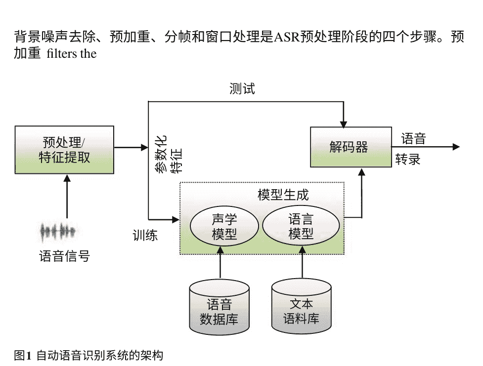

图1 自动语音识别系统的架构

### 1.4 自动语音识别系统的优点

- 它们在相对较短的时间内产生大量的写作。
- 减少打字工作量。
- 准确性较高。
- 口述减轻了工作负担。
- 语音识别技术比打字快得多。
- ASR在医疗领域等少数领域非常有用。
- 它们帮助有认知障碍的人。
- 易于获取的数据集。
- 与其他安全方法相比，应用程序更安全。
- 运营成本较低。

### 1.5 自动语音识别系统的缺点

- 需要大量内存来存储语音文件。
- 由于噪音干扰，在正常教室环境中使用起来很困难。
- 需要对软件进行训练，以识别每个用户的声音。
- 对于解码能力差的人来说很困难。
- 如果没有足够的支持，容易因错误而感到沮丧。
- 自动语音识别系统仅在写作过程的一个阶段提供帮助，但并不解决写作问题。

### 1.6 自动语音识别系统的应用

语音识别现在越来越受欢迎。ASR的商业应用如下：

- 自动识别。
- 在直播过程中生成字幕。
- 在各个专业领域进行口述。
- 它们提供医疗援助。
- 工业机器人。
- 法医和执法。
- 国防和航空电信行业。
- 家庭自动化和安全门禁。
- IT和消费电子。
- 语音转文本。
- 将语音翻译成外语。
- 使用口述查询数据库，例如E-Farming。
- 机器人技术。
- 在移动应用中实现语音识别功能。
- 嵌入式系统中的不同应用。
- 教育和学习。

### 1.7 自动语音识别中的不同方法

有多种方法可用于语音识别。以下是语音识别过程中可以使用的几种方法：

- 模式识别方法
  语音趋势可以通过语音原型或数学模型（例如，隐马尔可夫模型或HMM）来描述。这些语音趋势可以有几种类型。
- 声学-语音方法
  根据声学-语音框架，语言中存在不同的语言功能。这些功能主要通过一系列随时间变化的声学特征来定义。有三种方法用于对语言进行分类解决方案：电话识别、高斯混合模型（GMM）和支持向量机（SVM），这有助于解决正在研究的问题的分类。[6, 7]
- 基于学习的方法
  它还减少了基于HMM的神经网络和遗传算法训练和设计方法的缺点。该方法利用智能学习，通过限制来学习。
- 基于知识的方法
  我们假设在明确建模方面会有重大进展。基于知识的方法考虑了语言细节、音韵学和频谱图。
  人工智能是声音和模式检测的结合。信息将帮助机器人更好地解决问题。基于知识的框架已经被记录为改进创新并产生改进的解决方案和设计。
- 随机方法
  语音是完全不可预测的。随机建模方法可以使用概率模型处理不确定或不完整的信息。

在本文中，作者回顾了文献中最相关的工作，包括用于识别语音模型的训练技术，特别是关于DNN-HMM混合模型的判别式训练，并突出了最重要的文献，这对于DNN-HMM系统的判别学习和特征提取方法至关重要。

## 2 挑战和问题

已经进行了非常广泛的研究，以确定现有文献中的各种技术和方法，以及在语音识别过程中面临的现有挑战，这可能会引发进一步的研究。语音识别系统可以根据可以识别的话语模式进行分类。语音可以分为五个类别。前端处理一次一个话语。连接词系统与独立词相同，但允许话语以有限的延迟组合在一起。由于在理解连续表达中使用了特殊方法，该程序很难启动和运行。与录制表达相比，自发表达很难识别。这是正常的表达，而不是记忆的表达。ASR系统应能够处理发音错误，其他类型的难以理解的表达也应该是可行的。然而，自动语音识别中的自发性是一个挑战。由于语音识别的这种限制，它产生了可能影响ASR系统性能的各种挑战。这些挑战可以概括如下：

1. 在不同环境和实时应用中，背景噪音可能会影响语音识别的准确性。
2. 说话者在发音单词时的变化可能导致发音差异。这种变化进一步分为说话者的年龄、性别和方言等方面。
3. 与连续的语音相比，实现连续语音系统相对困难。我们在现实生活中使用连续语音系统，这进一步给语音识别系统带来了问题。
4. 麦克风质量差、位置不当以及与说话者的方向有关。
5. 导致较低识别率的其他因素包括发音。这也可能是一个重大挑战。这可能受到发音单词时重音放在不同音节、音素和元音上的生理因素的影响。这特别影响了声调语言的语音识别。

尽管存在这些挑战，环境变化、信道变化、说话风格、年龄、性别等也是语音识别的挑战任务。

## 3 动机

为了使ASR系统普及，关键是系统应能够处理各种变异，如语言变异、说话者变异和环境变异。在过去的六十年里，已经提出了许多最先进的语音识别系统和基准技术，以使ASR系统独立于这些变异。尽管进行了所有的研究，但对于语音的声学语音特征的了解还没有达到目标，并且还没有实现100%有效的语音识别系统。有一些策略，如声学模型自适应和优化抗噪特征，可以有效地融入抗噪ASR系统。

另一个重要的论点是，ASR研究是基于英语、阿拉伯语和中文等语言的。这是因为大多数语言学发展中心都是在这些语言国家。

大多数语音识别算法使用隐马尔可夫模型（HMM）和高斯混合模型（GMM）来评估语音变异。神经网络的规模非常大，使用非常可靠。深度神经网络已经能够超越其他常用的分类器，经常被研究团队使用。

使用语音识别系统存在许多问题已经被识别出来。使用随机初始化的深度神经网络（DNNs）进行训练，在ASR基准测试中取得了出色的结果[20–22]。

## 4 包含-排除准则

文献系统综述是一种识别、评估和解释可用文献（如研究论文、文章、期刊等）的方法，以便对研究文献进行总结，识别研究空白，并为未来研究提供基础[23]。

研究中包含的数据集如下：

- TIMIT
- CTIMIT
- NTIMIT
- SWITCHBOARD数据
- NIST（国家标准与技术研究所）
- DARPA
- CHiME
- OGI AlphaDigit
- IWAMSR
- 美国之音（VOA）
- FIRE
- IIIT-H
- NIST LRE（语言识别评估）2005
- NIST LRE 2006
- NIST LRE 2007
- KEELE数据库
- IEMOCAP（交互式情感二元动作捕捉）
- DIRHA

从大量与语音识别及其术语相关的现有文献中，通过使用数据库搜索和重要关键词的帮助，筛选出了中心思想。主要研究文章侧重于不同研究论文中包含的关键词。然后，作者们手动对所选的论文进行了进一步的改进。根据论文摘要中的信息，手动丢弃了与研究无关的论文。根据研究的重点和研究问题，确定了以下方面，触发了研究的包含-排除原则：语音识别、特征提取、大词汇连续语音识别和ASR系统。该研究采用系统化的方法，包括定量和定性研究文章，截至2021年发表。这使得数据库搜索更加全面。最后，根据摘要和全文，将主要研究纳入综述研究中（表1）。

我们的随机前瞻性方法消除了对设计的变异性、研究设计和社区之间的多样性以及出版偏见的偏见。

表1 包含排除标准的特征

| 特征 | 描述 |
| :--- | :--- |
| 语音识别 | 该系统是为语音识别而开发的；它使用了不同的语音识别方法 |
| 特征提取 | 它的研究包括不同类型的特征提取技术或混合特征提取方法 |
| 大词汇连续语音识别（LVCSR） | 强调了包含大词汇的LVCSR系统的语音识别 |
| ASR系统 | 包括了所开发的ASR系统的结果 |

## 5 英语语音识别的认知

评估口语表达的算法方法基于方法检测原理[24]。为了反映单一模块确定性有限状态网络（FSN）中的所有限制，采用自上而下的方法，该方法由由GMM电话创建的可听的HMM状态及其协调弧组成[11]。这是一种后验技术，用于从FSN中找到最佳的单词链作为已知输入语音的表达。

搜索策略方法在许多搜索活动中取得了成功的结果（表2）。

大多数最新的语音识别技术使用隐马尔可夫模型（HMM）来评估一个样本或一段短的话语在声学输入方面与每个HMM状态的匹配程度。一种测试统计拟合的方法是使用前馈神经网络（FNN），它将一组话语样本作为输入，并生成每个HMM状态的残差概率作为输出。深度神经网络已经能够以较大的优势超过其他分类器。

## 6 英语语言

英语是一种被全球接受和使用于人际交流的美国-英国语言。英语主要有两种类型，即英式英语和美式英语。机器学习可能会对自动语音识别产生重大变革。最大的进展发生在近40年前，当时发现了期望最大化（EM）算法用于训练隐马尔可夫模型（HMMs）。EM算法通过考虑语音状态和可听输入之间的关联作为高斯混合来实现现实世界的语音识别。在这些结构中，可听输入由从波形计算得出的Mel频率倒谱系数（MFCCs）和感知线性预测（PLP）的组合提供[25，26]。已经努力传达剩余的细节，以促进对GMM-HMMs类型的偏见。Imseng等人[27]测试了多语种语音的ASR。他们仅使用了语料库语音数据（Ⅱ），这需要三个单词。每个应用程序的每个说话者。该框架用于定义一类约30个单词，用于沉浸式语音响应系统，例如“帮助”和“取消”。作者们开发了基于知识音素的离散语音知觉系统，为每个知识音素设计了一个三状态的从左到右的HMM。用于GMM系统的训练和识别的HTK工具包[28]中，为每个条件建模了32个具有对角协方差矩阵的高斯混合模型。他们研究了语音识别系统的效率，这些系统在多语言混合挑战中具有多个功能和可听的处理方法（其中测试语音的方言意义预计无法识别）。Soltau等人[29]展示了在机器学习中扩展线性层的最大利用设计到一个未定义的图形框架的基本移动。这个移动结合了卷积神经网络的优势和普通网络的优势。联合模型在参数上只有显著的改进，并且在准备和解码时间上几乎没有变化。在两个LVCSR任务和一个语音识别任务中，作者报告了参数上的重大变化。虽然参数规模几乎翻倍，但变化有限（WER从18.9%降至18.6%），记录下来。该模型具有不同的架构：它被设计为在MLP和CNN之间共享大部分层次结构因此，该模型为CNN和MLP提供相同的输入能力[30]。Seide等人[30]将上下文相关的深度神经网络HMM应用于语音到文本的转录。GMM的词错误率从27.4%降至18.5%，相对增益为33%，在switchboard（RT03S）语料库上。CD-DNN-HMM与传统的绑定状态三音素和深度置信预训练网络堆叠。过去，通过数十小时的准备，将词错误率（WER）最小化了16%的绑定状态。这对进一步实施CD-DNN-HMMs做出了贡献，并揭示了如何利用超过300小时的训练数据、9000个绑定状态和最多九个隐藏层进行转录。对于四个不太兼容的转录活动，相对误差减少了22.28%。除了传统的语音识别模型，深度学习方法也被成功应用于Hinton等人[20]的研究中。DNN语音识别功能在音素识别任务中得到了资格认证[31]。他们观察到，发音特征如发音位置和发音狭窄地影响性能。

现在，由于它们在其他模型上具有显著的增强效率，DNN是声学语音建模中最流行的技术。然而，他们用于从高度可变的声学信号中构建音素组的计算方法并不是非常成熟。他们观察到DNN可以识别性能音素，并在每个层次上定义了单个和社区层次上的识别特征。与特定发音方法和位置相关的节点被从第一个隐藏层中移除，更深的层次变得更稀疏。在所有层次上观察到不同的语音特征，每个层次的节点都非常稀疏。此外，他们观察到具有相同语音特征的节点在不同实例中触发不同。这项研究表明，语音特征在DNN的各个层次上协调激活，这代表了人类听觉系统中功能编码的结论。对神经网络的简单修改意味着将广泛使用的线性层结构扩展到任意图形结构。

Soltau等人[32]指出，神经网络的基本修改是将广泛使用的线性层系统扩展到一个单一的图形结构中，该结构由主观图形firm组成。在两个LVCSR任务和一个语音动作检测任务中，相对于非常高的基线报告了实质性的改变。作者证明了图形框架有助于联合训练卷积和传统神经网络。联合训练方法不能使I-vectors充分利用卷积神经网络，因为I-vectors不是地形特征。基线CNN的错误率从11.8%降低到10.4%。分析显示，相对增益为10%。作者已经证明他们的模型适用于LVCSR和RATS关键词搜索等各种任务。现在，最先进的语音识别技术包括深度神经网络。设计基于神经网络的声学模型涉及一系列设计决策，包括布局的选择。

表2 特征提取技术分析

| 特征提取 | 优点 | 缺点 |
|----------|------|------|
| DWT | 仅包含时间信息和频率信息，适用于嘈杂环境中的时间和频率定位 | 由于使用相似的基本小波进行语音样本处理，因此不灵活 |
| MFCC | 系数之间关系不明显，不考虑线性特征，可靠的区分效率 | 受噪声影响，不考虑相位谱 |
| WPT | 考虑了高频样本 | 由于使用相似的基本小波进行语音样本处理，因此不灵活 |
| LPC | 使用低维特征向量表示谱包络，计算正确且易于实现，静态特征提取 | 不适合语音感知，无关子语音样本的先验知识 |
| LPCC | 特征向量之间的去相关性比LPC更稳健 | 不适合语音感知，无关子语音样本的先验知识 |
| PLP | 在有声和无声语音之间减少差异不依赖于声道长度 | 受到噪声、设备和信道的影响 |
| RASTA-PLP | 减少了谱因子鲁棒的技术 | 在无噪声条件下表现不佳 |
| VQ | 占用较少的存储空间来存储谱分析信息以更快的速度进行训练语音信号以离散的方式建模 | 训练时间与词汇量成正比不考虑时间信息在量化中涉及计算错误 |网络、大小和训练。对基于DNN的声学模型架构进行了实证分析，这些方面与语音识别系统的高质量最相关。基于DNN的语音识别系统近年来对LVCSR进行了巨大的改进。第一项研究假设DNNs由于未经监控的预训练而表现良好[33]。在LVCSR中，许多语音识别基准都是由具有随机初始化的DNNs实现的[20-22]。通过深度学习构建的最先进的语音识别方法接近人类的表现。与依赖HMM状态的传统系统相比，该设计要简单得多。这些传统解决方案在嘈杂的环境中甚至更不成功（[34]）。通过总结从2006年到2018年发布的174篇文章的细节，Nassif等人[35]对深度学习在语音应用中的使用进行了全面的统计研究。

深度学习算法最显著的应用是改善计算机技能，实现人们应该做的事情，比如语音识别。Hansen和Mirsamadi [36] 发现国际语言口音语言是母语（L1）和英语（L2）之间的插值。所使用的范例升级为口音表达方式，可以同时回答两种语言。他们研究了使用母语数据在口音英语中获得更好结果的方法，通过在英语和印度语中训练的端到端递归神经网络（RNN）框架。在这方面，我们分析了使用母语进行预训练以及多任务学习（MTL）。

研究结果表明，所提出的MTL模型比预训练效果更好，并且优于仅使用英语数据训练的简单模型。同样地，作者们还研究了使用母语进行预训练。作者们在现代MTL环境中引入了英语和母语在次要角色中受教育，并使用相同的性能集。他们的模型展示了对英语结果的更多关注，并将模型质量提高到相对字符错误率（CER）为+11.95%和+17.55%。Audhkhasi等人[37]表示，直接从声学到词（A2W）建模需要更多的数据量才能与子词单元模型竞争。

他们在一个2000小时的数据集上研究了一个A2W模型，该模型与其他使用子词单元的复杂混合和端到端模型兼容。所提出的SR模型为用户提供了丰富且易于理解的性能，同时保留了A2W模型的学习和解码的简便性（表3和表4）。

## 7 综合分析

从迄今为止研究的文献中，列出了以下findings。这里最相关的finding是，为了获得更好的准确性，研究人员应该使用混合特征提取技术。这些技术为分类器的输入提供了高效且有用的信息。

## 表3 英语方面的一些重要工作

| 作者 | 语料库类型 | 特征提取 | 分类 | 语言模型 | 数据库 | 持续时间 | WER % |
|------|------------|----------|------|----------|--------|----------|-------|
| [38] | 连续语音识别 | — | 连接主义时序分类（CTC）和循环神经网络 | — | TIMIT | 4小时 | 20.36 |
| [39] | 连续语音识别 | — | 连接主义时序分类（CTC）和循环神经网络 | 三元组 | 华尔街日报 | 81小时 | 6.7 |
| [40] | 电话交谈 | PLP和I-向量组 | 联合 CNN/DNN | N-元组+NN语言模型 | 交换机板 | 2000小时 | 8.0 |
| [41] | 连续语音识别 | 对数梅尔滤波器组 | BLSTM 循环神经网络，BLSTM+CTC | N-元组 | 交换机板 | 2000小时 | 8.5 |
| [42] | 连续语音识别 | — | CTC-RNN | N-元组 | 11,940小时（英语） | 自创 | 3.10（干净）21.59（嘈杂） |
| [8] | 电话交谈 | f-MLLR+I-向量 | RNN + 深度卷积神经网络 +BLSTM | N-元组+NN语言模型 | 交换机板 | 2000小时 | 6.6 |

## 表4 英语语言文献综述深度学习

| 参考文献 | 语料库 | 数据集 | 特征提取技术 | 语言模型 | 声学建模 | 词错误率 (%) |
| :--- | :--- | :--- | :--- | :--- | :--- | :--- |
| [29] | DARPA RATS, SWB-1 | 256 帧 | LVCSR,I-向量 | N-元组 | MLP,CNN, MLP/CNN | 10.4 |
| [43] | WSJ Aurora 4 | 5个隐藏层, 每个层有2048个节点, 对应着1209个音素, 3个和12个电话 | HMM, LVCSR, KWS | N-元组 | DNN, NN-HMM | 12 |
| [44] | Switchboard 和 Fisher | 8986 个输出类别 | HMM-DNN, LVCSR, GMM | 声谱图 | HMM-GMM, DNN | 20.7 |
| [45] | TIMIT | 39 个音素, 32 个话语 | NN-HMM | Bigrams, triphone | GMM-HMM, DNN-HMM, RNN | 16.88 |
| [34] | Switchboard Hub5'00 | 30,000 词词汇量, 每个隐藏层有 2048个神经元 | NN-DNN | N-元组 | RNN, HMM | 16.0 |
| [46] | 交换机板 | 37 K 句子 | HMM | Bigram, 扩展三元组, 三元组 | LVCSR, HMM-DNN, RNN | 18.6, 11.7, 10.8, 9.3 |
| [47] | BlackOut | 71,350 个单词和 3720 个独特单词 | RNN | N-元组 | RNN, DNN, LSTM | 51.3 |
| [48] | Numbers’95 | 27 个电话, 3 个隐藏层每个有 1024 个节点 | DNN | - | DNN-HMM | 15.4 |
| [49] | 10 亿词基准 | 793,471个单词 | RNN | N-元组 | RNN, LSTM | 30.0 |
| [50] | TIMIT | 3696个话语来自 462个说话者, 24个说话者 (2个男性, 1个女性) | TDNN | 二元模型 | LSTM | 16.49 |
| [51] | 交换机板 | - | ANN, HMM | 三元模型 | CD-DNN-HMM, GMM | 27.4 |
| [50] | Aurora 4 | 7137个话语来自 83个说话者 | HMM, GMM-HMM | 二元模型 | CD-DNN-HMM | 22.5 |
| [52] | CallHome, Switchboard, GigaWord | 61 k 词 | HMM, GMM | 二元模型 | HMM-GMM, SGMM | 54.7 |
| [37] | Switchboard-Fisher | 300 h 262 h, 2000 h 1698 h | DNN, HMM | N-元组 | LSTM (BLSTM) RNN | 8.8%/13.9 |

将不同分类器组合的方法取决于单个分类器提供的信息。

由于不同地区不同个体的说话风格变化，语音识别无疑是一个具有挑战性的研究领域。还需要更多关于连续语音的工作。

由于分类器的性能依赖于特征提取阶段的特征提取，因此在特征提取方法和分类器的选择上要谨慎。

研究人员可用的标准数据库的缺乏显著低。这为进行各种实验提供了未来的方向。

语音识别和识别过程的准确性依赖于具有高判别能力的特征。因此，有必要研究能够实现良好准确性的不同特征选择算法。

观察到语音识别和识别任务中最常用的特征提取方法是PLP、LFCC、MFCC和RASTA。还注意到语音识别和识别任务中最常用的分类器是HMM、GMM、DNN和DNN-HMM。

HMM分类器通常用于具有良好准确性的语音识别，这也是从迄今为止的文献研究中观察到的。研究人员常用的工具包有Sphinx和HTK。但是，一些研究结果证明，使用DNN、DNN-HMM、HMM-GMM和ANN模型可以提高准确率。

## 8 讨论和未来范围

在语音识别领域，可以探索大量的方向来进行进一步的研究。所提出的用于提取语音样本特征的技术可以进一步扩展，通过结合不同的技术来提高语音识别率和WER。

研究人员应该为各种语言开发标准数据库。LVCSR数据库系统应该更加关注。这些数据库应该对小型研究人员开放，以便未来的研究能够发展。

印度语言尚未应用于高效的特征提取技术。研究人员只关注了基线MFCC特征，如现有文献所述。可以在印度语言上应用混合特征，如MFCC+LDA+MLLT，MFCC+BFCC+GFCC，LDA+MFCC，MF+PLP，RASTA-PLP等。

可以对重finement技术和识别方法进行更多的研究。应提出一种优化声学特征选择的技术。文献中的研究人员已经报告了他们在干净环境中（即无噪音）的识别准确性结果。然而，在实时应用中，背景噪音和其他因素会影响语音识别的准确性。应进行提取高效且适合的特征和噪音消除的研究，以开发ASR系统。

## 9 结论

在本章中，作者对用于英语语音识别的不同特征提取技术进行了广泛的回顾和分析。研究人员总结了不同的评估参数通过他们广泛的研究。进一步的研究人员根据他们的工作报告了他们的工作。研究人员的工作已经提到借助不同的表格。这些参数包括WER、mWER、SER、PER、准确性、识别率和不同技术的比较分析。在参考广泛的文献后，作者建议对英语语言实施高效的特征提取技术。这是因为语音研究领域非常广泛。此外，还没有为英语语言开发出许多准确的ASR系统，这些系统可以对连续语音进行高效处理。此外，研究人员应更多地探索LVCSR系统，以提高识别语音的准确性，以便开发实时应用。

## 参考文献

- 1. E. Yücesoy, V.V. Nabiyev, 一种新的方法，用于评分级融合以进行说话人年龄和性别的分类。计算机电气工程 53, 29–39 (2016年)
- 2. R.K. Aggarwal, M. Dave, 顺序组合异构特征流用于印地语语音识别系统的性能评估。电信系统 52 (3) , 1457–1466 (2013年)
- 3. A. Adiga, M. Magimai, C.S. Seelamantula, 用于鲁棒语音识别的伽马音波小波倒谱系数， 发表于TENCON 2013–2013 IEEE Region10 Conference（31194），（IEEE，2013年西安）
- 4. R.K. Aggarwal, M. Dave, 印地语语音识别系统的判别技术， 发表于Information Systems for Indian Languages, (Springer, 2011年), pp. 261–266
- 5. V. Kadyan, S. Shan awazuddin, A. Singh, 为低资源的旁遮普语开发儿童语音识别系统。应用声学 **178**, 1080 02 (2021年)。 https://doi.org/10.1016/j.apacoust.2021.108002
- 6. V. Passricha, R.K. Aggarwal, 用于语音识别的卷积支持向量机。 Int. J. Speech Technol. **22**(3), 601–609 (2019a)
- 7. V. Passricha, R.K. Aggarwal, 使用卷积神经网络进行端到端声学建模。智能语音信号处理, 5–37 (2019b)
- 8. W. Xiong, L. Wu, F. Alleva, J. Droppo, X. Huang, A. Stolcke, 微软2017年会话式语音识别系统，在2018年IEEE国际会议上发表的论文中， (ICASSP), (IEEE, 卡尔加里, AB, 2018)
- 9. M. De Wachter, M. Matton, K. Demuynck, P. Wambacq, R. Cools, D. Van Compemoll e,基于模板的连续语音识别。IEEE Trans. Audio Speech Lang. Process. **15**(4), 1377–1390 (2007)
- 10. X.D.黄, M.A.杰克, 用于语音信号的半连续隐马尔可夫模型，在语音识别读物，（爱思唯尔, 阿姆斯特丹, 1990年），第340–346页
- 11. S.E.莱文森, L.R.拉宾纳, M.M .桑迪, 马尔可夫过程的概率函数理论在自动语音识别中的应用简介。贝尔系统。Tech. J. **62**(4), 1035–1074 (1983年)
- 12. A.阿罗拉, V.卡迪安, A.辛格, 音调特征对不同方言变体的 旁遮普语言的影响，在信号处理和通信方面的进展：ICSC 2018的选择论文 ，编者B. S. Rawat, A. Trivedi, S. Manhas, V. Karwal, （斯普林格, 纽约, 2018年），第467–472页
- 13. Kumar, Y., Singh, N., Kumar, M., Singh, A., AutoSSR: 旁遮普语自动自发语音识别模型的 高效方法, Soft Comput., Springer,25, 1617–1630 2020 https://doi.org/10.1007/s00500-020-05248-1
- 14. S. Masmoudi, M. Frikha, M. Chtourou, A.B. Hamida, 使用神经元招募方法的高效MLP构建 训练算法用于孤立词识别系统. Int. J. Speech Technol. **14**(1), 1–10 (2011)
- 15. P. Pujol, S. Pol, C. Nadeu, A. Hagen, H. Bourlard, 混合HMM/MLP和HMM/GMM语音识别 系统中特征的比较和组合. IEEE Trans. Speech AudioProcess. **13**(1), 14–22 (2005)
- 16. J. Kaur, A. Singh, V. Kadyan, 自动语音识别系统对调性语言的研究现状：最新调查。Arch. Comput. Method. Eng., Springer **28**, 1039–1068 (2020). https://doi.org/10.1007/s11831-020-09414-4
- 17. A. Singh, V. Kadyan, M. Kumar, N. Bassan, ASRoIL: 印度语言自动语音识别的综合调查。 Artif. Intell. Rev., Springer **53**, 3673–3704 (2019)
- 18. J.W. Picone, 语音识别中的信号建 模技术。 Proc. IEEE **81**(9), 1215–1247(1993)
- 19. W. Ghai, N. Singh, 基于电话的旁遮普语自动语音识别的声学建模。J. Speech Sci. **1**(3), 69–83 (2013)
- 20. G. Hinton, L. Deng. D. Yu, G.E. Dahl, A.-r. Mohamed, N. Jaitly, 等人, 深度神经网络 在语音识别中的声学建模: 四个研究小组的共同观点. IEEE 信号处理杂志 **29**(6), 82–97 (2012)
- 21. B. Kingsbury, T.N. Sainath, H. Soltau, 使用分布式无Hessian优化的可扩展最小贝叶斯风险 训练深度神经网络声学模型, 在Interspeech上发表的论文, (Interspeech, 俄勒冈州波特兰, 2012)
- 22. K. Veselý, A. Ghoshal, L. Burget, D. Povey, 序列判别式训练深度神经 网络. 在Interspeech上发表的论文. arXiv, 1808.00639v1 (2013)
- 23. B. Kitchenham, S. Charters, 在软件工程中进行系统性文献综述的指南(CiteSeerX, 新泽西州普林斯顿, 2007年)
- 24. L. Lee, R.C. Rose, 使用高效的频率扭曲过程进行说话人归一化, 在发表于1996年声学、语音和信号处理国际会议的论文。*ICASSP-96. 会议论文*, 1996 *IEEE国际会议*, (IEEE, 乔治亚州亚特兰大, 1996)
- 25. S. Furui, 使用语音频谱的动态特征进行说话人无关的孤立词识别. *IEEE Trans. Acoust. Speech Signal Process*. **34**(1), 52–59 (1986)
- 26. H. Hermansky, 语音的感知线性预测(PLP)分析. *J. Acoust. Soc. Am*. **87**(4),1738–1752 (1990). https://doi.org/10.1121/1.399423
- 27. D. Imseng, H. Bourlard, M.M. Doss, 面向混合语言语音识别系统的研究.在国际语音通信协会第十一届年会上发表的论文, (瑞士Idiap, 2010年)
- 28. S. Young, G. Evermann, M. Gales, T. Hain, D. Kershaw, X. Liu, 等, HTK书, 第3卷(剑桥大学工程学院, 2002年), 第175页
- 29. H. Soltau, H.-K. Kuo, L. Mangu, G. Saon, T. Beran, 神经网络声学模型用于DARPA RATS计划, 在国际语音通信协会第十三届年会上发表的论文, (法国里昂ISCA, 2013年)
- 30. F. Seide, G. Li, D. Yu, 使用上下文相关深度神经网络进行会话语音转录, 在国际语音通信协会第十二届年会上发表的论文, (意大利佛罗伦萨ISCA, 2011年)
- 31. T. Nagamine, M.L. Seltzer, N. Mesgarani, 探索深度神经网络如何形成音素类别, 在国际语音通信协会第十六届年会上发表的论文, (ISCA, 德累斯顿, 德国, 2015)
- 32. H. Soltau, H. Liao, H. Sak, 神经语音识别器: 用于大词汇量语音识别的声学到词语的LSTM模型. arXiv预印本 **arXiv**, 1610.09975 (2016)
- 33. G.E. Dahl, D. Yu, L. Deng, A. Acero, 上下文相关的预训练深度神经网络用于大词汇量语音识别. *IEEE Trans. Audio Speech Lang. Process*. **20**(1), 30–42 (2012)
- 34. A. Hannun, A. Maas, D. Jurafsky, A.Y. Ng, 第一遍大词汇连续语音识别使用双向递归DNNs. arXiv 预印本 **arXiv**, 1408.2873 (2014)
- 35. A.B. Nassif, I. Shahin, I. Attili, M. Azzeh, K. Shaalan, 使用深度神经网络的语音识别: 一项系统性综述. *IEEE access*, **7**, 19143–19165 (2019)
- 36. S. Mirsamadi, J.H. Hansen, 关于深度神经网络声学模型适应鲁棒远场语音识别的研究, 在第十六届国际语音通信协会年会上发表的论文, （*ISCA*, 德累斯顿, 德国, 2015年）
- 37. K. Audhkhasi, B. Kingsbury, B. Ramabhadran, G. Saon, M. Picheny, 构建竞争性的英语会话语音识别直接声学到词模型, 在2018年/IEEE国际声学、语音和信号处理会议上发表的论文, （*IEEE*, 卡尔加里, 2018年）
- 38. O. Abdel-Hamid, A.-R. Mohamed, H. Jiang, L. Deng, G. Penn, D. Yu, 用于语音识别的卷积神经网络。*IEEE/ACM Trans. Audio Speech Lang. Process*. **22**(10),1533–1545 (2014). https://doi.org/10.1109/taslp.2014.2339736
- 39. A. Graves, N. Jaitly, 用循环神经网络实现端到端语音识别的研究. 论文发表在国际机器学习会议上。*PMLR* **32**(2), 1764–1772 (2014)
- 40. G. Saon, H.-K.J. Kuo, S. Rennie, M. Picheny, IBM 2015年英语会话电话语音识别系统。*arXiv* 预印本 **arXiv**, 1505.05899 (2015)
- 41. T. Yoshioka, M.J. Gales, 环境鲁棒的深度神经网络语音识别前端。*计算机语音语言* **31**(1), 65–86 (2015)
- 42. D. Amodei, S. Ananthanarayanan, R. Anubhai, J. Bai, E. Battenberg, C. Case, 等, DeepSpeech 2: 英语和普通话的端到端语音识别, 在国际机器学习会议上发表, (arXiv.org, 2016)

# 通过声学特征的最佳选择实现抗噪性别分类系统

Puneet Bawa，Vaibhav Kumar，Virender Kadyan和Amitoj Singh

## 1 引言

对用于性别检测的语音声学中的声音进行系统研究以及它们与解释的关系是一个具有挑战性的目标，在许多领域，从语言学到计算机识别，都具有重要的影响和应用。人类说话者通常使用一个正常的系统，其中空气从肺部排出，并形成声带和器官，包括舌头、嘴唇、牙齿等[1]。同样，声学声音分析依赖于样本的特征参数，如滤波、功率、频率和持续时间[2]。这些声学特征通常通过线性分析和可视化方法来定义。

然而，近年来，很明显这些频谱表示只是对听觉通路在外周和中央区域实际产生的非常粗略的近似[3–5]。听觉图像的一些最重要的特征是由于耳蜗滤波器的非对称形式和在3–4 kHz以下保留精细时间滤波器输出结构[6]。同样，应用可靠的生物物理学模型来研究听觉系统有两个主要原因，详细介绍了与听觉系统相关的概念。首先，应描述语音的声学特性与传统的音素分类系统之间的关系[7, 8]（通过它们的输出模式表示）。其次，需要定义实际标准，以便在高背景噪声和广泛的声压[9]下正确编码语音信号。同样，系统还可以学习何时使用强大的机器学习算法来选择和整合映射所需的功能语音数据。

随着技术的快速发展，机器学习是一个经历了重大变革并且也是一个常见趋势的科学领域[10]。机器学习是人工智能的一个子类，它使用算法和数据进行计算机学习，以解决不同领域的特定问题，例如会计、金融和医学，通过机器学习和数据挖掘技术来识别性别、发声等。此外，性别识别的作用适用于各种数字多媒体应用，包括语音识别、智能人机交互、说话人日记、生物特征和视频索引[11-13]。同样，考虑到机器学习应用在语音识别主题中的不断增长的需求，高效识别性别的方法在医疗保健系统领域发挥了重要作用，包括一些病理学，包括声带囊肿。然而，构建一个通过语音进行性别识别的预测模型仍然被认为是一个非常困难和令人望而却步的挑战[14]。此外，在计算机化的快速发展环境中，在发展中国家最重要的问题之一是在印度本土语言中正确识别性别，这些语言通常被称为低资源语言[15-17]。然而，找到足够的标记数据以进行分类训练分类器以进行准确预测也是一项昂贵和耗时的挑战，因此需要人工工作，尽管通常更容易找到未标记的数据。半监督学习（SSL）算法被认为是利用未标记集合中的秘密数据开发更精确的分类以解决低资源数据中存在的不足问题的适当方法[18, 19]。类似地，许多类别的SSL算法已经被提出，每个算法都在不同的方法和方法上进行评估，目标是找到标记和未标记数据分布之间的足够关系差异。

有几种方法可以用于增强传入语音信号的语音合成。同样，所要执行的工作必须产生与实时系统实现和应用相匹配的实际情况。考虑到这样的实时情况，在本章中，使用噪声数据增强技术将三种不同类型的噪声（包括Babble、Factory和Volvo）以随机信噪比值引入到原始数据集中，并标记为男性和女性进行分类。此外，本章使用warbleR库[20]进行声学分析，以可视化方言旁遮普语中性别检测的过程。据我们所知，已经做出了一些努力来开发足够的语言资源，但还没有为旁遮普语设计相应的分类器。儿童语音。此外，为了优化所提取的20个声学参数中所需参数的选择，已经进行了与性别检测相当的数据集研究。最后，通过对三种机器学习算法（包括随机森林、支持向量机和多层感知器）进行比较分析，建立了基于最佳选择的提取声学特征的适当模型来识别性别。

## 2 相关工作

分析音频并提取特征有时可能成为一项重要的任务，当你需要选择某些特征并拒绝其他特征以执行某些任务时。在[21]中，作者使用机器学习算法并计算了可以帮助检查音频信号真实性的特征。实验能够确定要使用的超参数的适当值。李和刘[22]使用梅尔滤波器能量特征和梅尔频率倒谱系数（MFCC）特征作为检测普通话元音的声学准则，具有低错误率和高调查率。在[23]中，作者还探索了使用从音频样本中提取的MFCC、频谱图和频谱质心特征来选择最佳特征，并将这些特征输入到两层卷积网络中。结果显示，MFCC特征具有最高的准确性。同样，[24]中的作者还探索了基于声学特征预测新生儿的原因。选择音高特征和共振峰频率作为声学特征，结合K-means算法，对于检测哭声中的“疼痛”以及哭声的原因提供了确定性结果。同样，基于与母语相关的发现，分析了建立最先进的音调语言语音识别模型的研究努力[11]。在[25]中，作者提出了一种使用音频进行性别分类和使用图像将当前视觉与数据库中存储的视觉进行匹配以评估学生是否真正出席的自动考勤系统。在[26]中，研究人员探索了在清洁和嘈杂环境中进行性别建模，并提出了MFCC特征和高斯混合模型（GMM）用于音频建模。所提出的系统能够根据音频或视觉反馈进行性别分类，选择较少噪音的方式，尽管该方法对于音频质量和视觉质量都很差的情况（即数据嘈杂）是脆弱的。为了模拟男性/女性检测，在[27]中，作者研究了使用音高参数和RASTA-PLP变量的GMM建模。在评估生成的GMM时考虑了清洁和嘈杂环境，通过变化协方差矩阵获得。所提出的方法似乎是朝着正确的方向迈出的一步。同样，Copiaco等人[28]还使用深度卷积神经网络对多通道音频进行了MFCC和功率归一化倒谱系数的分类实验。所提出的方法产生了98%的准确率。在[29]中，作者堆叠了不同的机器学习模型，并尝试使用声学特征对数据进行建模。最先进的方法在准确性方面略有改善，但是对于这种堆叠模型，它带来了空间复杂度以及预测一个样本的性别的时间复杂度。在[30]中，作者们尝试了使用Mel频率谱系数 (MFSC) 而不是MFCC特征，并使用简单的神经网络来基于性别对数据进行分类。最终，最优特征和参数的选择被证明是决定性的，结果显示准确性有了显著提高，并应用了平滑处理。

使用深度学习算法动态选择原始语言信号中的关键信息，用于分类处理。因此，通过提出的算法[31]，研究人员避免了对情感的缺乏了解，情感无法像声音的声学特征一样进行数学建模。在[32]中，进行了与巴哈萨印度尼西亚语相关的性别识别的研究，并应用了带有MFCC特征的监督式机器学习算法，如SVM、K最近邻算法和人工神经网络。结果为音频识别的性别识别影响分析铺平了道路。在[33]中，作者们尝试了基于长短期记忆 (LSTM) 的递归神经网络来预测年龄和性别，使用音频样本，并通过使用数据增强来减少过拟合问题，并使用正则化提高了测试准确性。作者还探索了双向LSTM与MFCC特征在低资源数据集上的应用，并发现更多的数据可以产生更准确的结果[34]。此外，还使用机器学习模型如朴素贝叶斯、随机森林和线性回归来处理Twitter数据集进行仇恨言论检测。研究表明，这种模型可以帮助实现充分的结果[35]。研究人员还对音频特征进行了分析，并发现梯度提升和随机森林等算法可以根据声学特征对性别进行分类。研究人员还建立了一个基于性别的情感识别流水线，其中使用MFCC特征以及卷积神经网络，最后使用平均池化层而不是完全连接层可以实现准确的结果。

## 3 半监督分类算法

### 3.1 随机森林

随机森林分类器以其在分类和回归任务中的最佳应用而闻名。它是一种集成算法，利用一组决策树并预测树中每个节点的类别或概率值。它通常被称为随机决策树。另一方面，根据决策树中节点的重要性，可以为树分配一定的权重。产生低错误率的节点有准确预测的机会，因此应分配更高的权重，反之亦然。设置这样的流水线可以输出决定性的预测结果。

### 3.2 支持向量机

支持向量机是一种监督建模方法，被认为是分类或回归问题分析中最好的方法之一。SVM模型以最大化两个给定类别之间的差异来建模训练样本。一个新样本被映射到一个空间，然后建模算法尝试预测样本是否属于分配的空间。对于给定的训练样本 $(a_1,b_1),(a_2,b_2),\ldots,(a_m,b_m)$，其中 ai 表示 m 维向量，而 bi 将是 -1 或 1，表示样本所属的输出类别。目标是找到一个超平面，使得最近点与超平面之间的距离最大化，并且可以使用超平面区分类别。

### 3.3 多层感知器

多层感知器是一种前馈神经网络，用于描述多层神经网络或 “香草”神经网络。一个基本的多层感知器包括输入层、隐藏层和输出层[38]。它是一种监督学习方法，使用反向传播来优化每个隐藏层上的随机权重。为了区分那些无法使用支持向量机和随机森林等算法分离的数据，将激活函数附加到隐藏层上，主要使用sigmoid激活函数： $f(x) = \frac{1}{1+e^x}$。

## 4 系统架构

该数据库由6603个男性和女性的语音录音组成，比例几乎相等。该数据库根据语音和语音声学特性将声音分类为女性或男性。这些录音在开放和封闭环境中使用或不使用录音机进行。每个语音样本都以.wav格式的PCM头存储，包括3315个男性录音和3288个女性录音。此外，考虑到现有数据量较少，还使用噪声增强对男性和女性数据进行了进一步的分析，以便存在声学不匹配。

图1显示了在干净和嘈杂条件下男性和女性音频波形的可视化表示，由于环境条件的变化。因此，从标准NOISEX-92数据库[39]中随机注入了三种不同的声音——Volvo、Factory和Babble，这些声音包含了从 -5 dB到5 dB的许多噪声SNR值。

接下来，主要关注声学特征分析以评估分类性能。这20个声学特征—平均频率（meanfreq），与频率对应的标准差（sd），中位数频率（median），第一四分位数（Q25），第三四分位数（Q75），四分位距（IQR），偏度（skew），峰度（kurt），频谱熵（sp.ent），频谱平坦度（sfm），众数频率（mode），频率质心（centroid），基频平均测量（meanfun），基频最小测量（minfun），基频最大测量（maxfun），主导频率平均测量（meandom），主导频率最小测量（mindom），主导频率最大测量（maxdom），主导频率范围（dfrange），调制指数（modindx）对应男性（M）和女性（F）—已使用内置的R库包提取，用于干净数据和噪声增强数据，详见图2a、b。

也许最好和最常见的机器学习算法用于分类挑战的是包括随机森林、支持向量机和多层感知机在内的有监督分类器。因此，使用所有20个特征和三个最显著特征在干净和嘈杂数据集上利用这三个分类模型算法的区分值正在进行实验，如图3的块图所示。

图2 (a) 在干净的男性和女性音频数据集上提取声学特征的可视化。(b) 在噪声增强的男性和女性音频数据集上提取声学特征的可视化。

## 5 结果与讨论

在本节中，我们进行了一系列实验，以选择原生语音干净数据集中性别识别的最佳特征参数模型性能。此外，针对半监督模型在降级条件下的性能进行了测试，展示了包括嘈杂和干净数据集的增强数据集。

### 5.1 在干净数据集上的性能评估

可以注意到，从图2a所描述的对应于干净数据集的提取特征的开始，对于男性和女性音频，发现了三个最重要的提取特征，分别是Q25、IQR和meanfun。因此，基于两种特征选择的半监督算法的比较分析已经在表1中进行了实验，一种是包含20个特征的选择，另一种是包含三个独特特征的选择。在第一组实验中，20个特征的结果表现出比理想的三个声学特征选择更好的性能。为了确定所有特征组合对应于音频集的某些部分的可能性，进行了分析。此外，鉴于音频信号对应的非线性数据集，SVM的性能不如随机森林的分类方法。然而，使用理想的特征选择在径向基函数（rbf）核上获得了更好的性能，准确率为82.04%，而使用20个特征的准确率为81.92%。此外，在干净音频数据集的情况下，MLP利用三个最佳选择的特征实现了87.28%的准确率，超过了SVM和随机森林分类技术，总体RI为6.54%。

### 5.2 在噪声增强数据集上的性能评估

可以注意到，从图2b所描述的与噪声增强数据集对应的提取特征的开始，对比男性和女性噪声增强音频集，发现了四个最显著的提取特征，它们是Q25、IQR、mode和meanfun。因此，基于三个预选的最佳特征选择的基准结果，进一步在噪声增强数据集上进行了使用这四个最重要的声学特征的实验，如表2所示。即使在嘈杂的数据情况下，随机森林和SVM分类技术的性能表现也非常相似。

表1 清洁男性和女性数据集上的分类算法性能评估

|  | 准确率(%)  |
| --- | --- | --- |
|  | 20个特征 | 3个特征 |
| 随机森林 | 83.04 | 80.86 |
| 支持向量机 | 81.92 | 82.04 |
| 多层感知机 | 85.56 | 87.28 |

表2 在干净和噪声增强的数据集上的性能评估

|  | 噪声 | 准确率(%)  |
| --- | --- | --- | --- |
|  |  | 3个特征 | 4个特征 |
| 随机森林 | 是 | 86.59 | 83.28 |
| 支持向量机 | 是 | 81.80 | 83.46 |
| 多层感知机 | 是 | 90.52 | 92.58 |
|  | 否 | 87.28 | 87.42 |

## 6 结论

在选择适当的特征来解决问题时，执行音频分析可能会变得繁琐。在探索了众多特征之后，研究发现Q25、IQR和meanfun能够准确区分男性和女性说话者。通过应用增强技术，创建了一个抗噪声的模型，并为数据集增加了变异性。在增强数据集之后，进行了轮廓分析，这次还包括了模态频率特征用于模型的训练，并取得了更好的性能。多层感知器（MLP）的性能优于随机森林和支持向量机（SVM）算法，观察到了8.21%的RI。使用经过噪声增强的数据集，选择了四个特征，得到了6.07%的RI。该研究提供了进一步探索特征排列组合和增加语料库的机会。此外，它为将所提出的系统扩展到其他研究领域，如年龄组别检测和本地和非本地说话者检测，打开了大门。

> 利益冲突声明：作者声明没有利益冲突。

## 参考文献

- Z. Zhang, 人声产生和控制的力学。 J. Acoust. Soc. Am. 140(4), 2614-2635 (2016)。 https://doi.org/10.1121/1.4964509
- J.A. Gómez-García, L. Moro-Velázquez, J.D. Arias-Londoño, J.I. Godino-Llorente, 自动语音状况分析系统的设计。 第三部分：声学建模策略综述。Biomed. Signal Process. Contr. 66, 102049 (2021)。 https://doi.org/10.1016/j.bspc.2020.102049
- B. Delgutte, N.Y. Kiang, 听觉神经中的语音编码：I. 类似元音的声音。J. Acoust. Soc. Am. 75(3), 866-878 (1984)。 https://doi.org/10.1121/1.390596
- D.G. Sinex, C.D. Geisler, 对辅音-元音音节的听神经纤维的响应。J. Acoust. Soc. Am. 73(2), 602-615 (1983). https://doi.org/10.1121/1.3890075
- E.D. Young, M.B. Sachs, 对听神经纤维群体的放电模式中稳态元音的表示。J. Acoust. Soc. Am. 66(5),1381-1403 (1979). https://doi.org/10.1121/1.383532

# 索引

- A
  - 声学-语音学方法, 131
  - 声学到词语(A2W)建模, 138
  - 自适应组件加权(ACW), 119
  - 模拟-数字(A/D)转换器, 129
  - 阿拉伯语作文评分系统, 20
  - 阿拉伯语作文题目评分
    - 数据收集, 31
    - 评估指标, 25
    - 实验设计和结果, 33, 35–37
    - Microsoft Word字典阶段, 31
    - NB分类器, 30
    - 提出的模型, 27–31
    - 词干处理方法和轻量级词干处理方法, 26
    - 文本分类, 21–23
    - 文本相似度, 24
    - 阿拉伯WordNet, 26
    - 人工智能（AI）, 97, 132
    - 人工神经网络（ANN）, 98, 128
    - 反向传播训练算法, 100
    - 类图, 100
    - 模型估计分析结果, 105
    - 模型训练阶段, 106
    - 模型验证, 107
    - 神经元, 98
  - 皮尔逊相关系数矩阵, 105
  - 提出的方法
    - 反向传播算法, 105
    - 数据预处理, 103
    - FNN模型, 104
    - flow图, 102
  - 敏感性分析, 103, 105
  - 软件工程问题, 99
  - 软件测试, 99
    - 故障检测, 100
    - 故障预测, 99
    - 特征选择, 99
    - L-RNN, 99
  - 结构, 98
    - 三层前馈, 98
  - 自动评分系统, 20
  - 自动语音识别（ASR）
    - 声学语音模型, 137
    - 算法方法, 135
    - 美式英语, 135
    - A2W模型, 138
    - 应用, 131
    - 方法
      - 声学-语音, 131
      - 基于知识, 132
      - 基于学习, 132
      - 模式识别, 131
      - 随机建模, 132
    - 架构, 129
    - Boltzmann机器, 128
    - 类别, 136
    - 挑战, 132, 133
    - 传统系统, 138
    - 卷积神经网络, 136
    - 深度学习算法, 138
    - 深度学习方法, 128
    - 缺点, 130
    - 效率, 136
    - 英语, 135, 139–141
    - 特征提取, 129, 130, 136
    - 图形框架, 137
    - 人与机器, 127
    - 人类听觉系统, 137
    - 人际互动, 127
    - 包含-排除标准, 134
    - 问题, 132, 133
    - 语言和发音模型, 128
    - 基于语言的软件, 128
    - LVCSR数据库系统, 142
    - 机器学习, 127
    - 马尔可夫链, 128
    - 优点, 130
    - 动机, 133
    - MTL, 138
    - 语音特征, 137
    - 身体残疾, 128
    - 预处理, 129, 130
    - 识别方法, 142
    - 改进技术, 142
    - 科学实验, 128
    - 语音转换, 128
    - 状态变量, 128
    - 最先进的方法, 137
    - 统计模型, 128
    - 合成分析, 138, 141
    - 语音识别, 127
    - 可用性, 5

### B
  - 后端模型, 114
  - 词袋, 9
  - 贝叶斯分类器, 20
  - 贝叶斯网络（BNs）, 14

### C
  - 分类语言识别, 43
  - 倒谱均值和方差归一化（CMVN）, 49
  - 字符错误率（CER）, 138
  - 类图, NLP
    - 属性识别, 64
    - 类识别, 64
    - 命名关系, 64
    - 关系识别, 64
  - 经典特征提取技术, 114
    - 分析, 115, 117
    - 库, 116
    - 无噪声环境, 117
    - 集合, 117
    - 信号处理操作, 115
    - 语音识别, 117
  - 分类准确率, 34
  - 计算机模拟, 41
  - 概念类建模 vs. 比较标准模型, 75–76
  - 上下文学习, 84
  - 连续词袋（CBOW）模型, 86
  - 基于语料库的方法, 15
  - 基于语料库的相似性, 24

### D
  - 数据收集, 5
  - 数据 flow图（DFD）, 56
  - 数据处理, 113
    - 云支持, 114, 115
    - 数据集, 113
    - 个人电脑, 114
    - 语音驱动系统, 114
  - 数据集, 112, 118
    - 语料库, 113
    - 公共来源, 113
    - 来源, 113
  - 数据来源, 113
  - 基于深度学习（DL）的特征提取技术, 114
    - 分类模型, 123
      - 卷积神经网络（CNNs）, 123
      - d-向量, 123
      - 语音信号, 123
      - x-向量, 123
    - 深度神经网络（DNNs）, 133
    - 用于印度语言的释义检测（DPIL）, 83
    - 基于词典的方法, 15
    - 点积, 20
    - 动态特征系数, 121

### E
  - 情感, 42
  - 评估指标
    - 平均绝对误差（MAE）, 25
    - 皮尔逊相关度测量, 25
  - 期望最大化（EM）
    - 算法, 135
  - 极限学习机（ELM）, 119

### F
  - 虚假观点, 16
  - 快速傅里叶变换（FFT）
    - 应用, 120
  - 特征分析, 42
  - 前馈神经网络（FNN）, 135
  - Levenberg-Marquardt算法, 105
  - 示意结构, 104

### G
  - 高斯混合模型（GMM）, 133, 149
  - 高斯朴素贝叶斯模型, 33

### H
  - Hausdorff-Besicovitch维度（HBD）, 43
  - 隐马尔可夫模型（HMMs）, 133, 135
  - Higuchi维度, 43
  - Higuchi分形维度, 45

### I
  - 信息检索, 21
  - 输入语音信号, 42
  - 集成开发环境（IDE）, 114

### K
  - Katz维度, 43
  - Katz分形特征, 44
  - Katz’s策略, 43
  - 基于知识的方法, 132
  - 基于知识的相似性, 24

### L
  - 语言问题, 16
  - 潜在语义分析（LSA）, 26, 27
  - 分层递归神经网络（L-RNN）, 99
  - 基于学习的方法, 132
  - Levenberg-Marquardt算法, 105
  - 基于词典的方法, 15
  - 长短期记忆（LSTM）, 150

### M
  - 机器学习（ML）, 21, 114, 115
    - 算法, 44
    - 方法, 10, 11
  - 机器翻译（MT）, 82
  - 马拉雅拉姆语重述识别系统, 85
    - 实验设置
      - 字符长度, 90
      - 数据集描述, 89
      - 编辑距离, 90
      - 短语向量生成, 90
      - POS标签信息, 90
      - 词长度, 91
      - 词向量表示, 89

### N
  - 朴素贝叶斯（NB）分类器, 11, 30, 31, 33
  - 自然语言处理（NLP）, 16, 56, 81, 84
    - ATM困境陈述, 65
    - 类图, 59, 60
    - 概念模型
      - 聚合分类法, 67
      - 关联分类法, 71

6. J.K. Bizley, K.M. Walker, 听觉皮层神经元对声音的音高、音色和位置的敏感性和选择性. 神经科学家 **16**(4), 453–469 (2010). https://doi.org/10.1177/1073858410371009

7. Hermansky H, Sharma S (1999) 嘈杂语音自动识别中的时间模式(TRAPS). 在1999年 IEEE国际声学、语音和信号处理会议. 论文集. ICASSP99 (Cat. No. 99CH36258) (Vol. 1, pp. 289–292). IEEE凤凰城, 亚利桑那州

8. R. Hu, V. Krishnan, D.V. Anderson, 通过改进码本映射实现语音带宽扩展以增加语音分类的准确性, 在第九届欧洲语音通信和技术会议上, (Interspeech, 里斯本, 2005)

9. M. Koo, J. Jeon, H. Moon, M.W. Suh, J.H. Lee, S.H. Oh, M.K. Park, 噪声和序列位置对正常听力成年人口语单词自由回忆和编码期间瞳孔扩张的影响. 脑科学. **11**(2), 277 (2021). https://doi.org/10.3390/brainsci11020277

10. M.I. Jordan, T.M. Mitchell, 机器学习: 趋势、观点和前景. 科学 **349**(6245), 255–260 (2015). https://doi.org/10.1126/science.aaa8415

11. J. Kaur, A. Singh, V. Kadyan, 自动语音识别系统对调性语言的研究现状调查. Arch. Comput. Method. Eng., 1–30 (2020a). https://doi.org/10.1007/s11831-020-09414-4

12. M.H. Moattar, M.M. Homayounpour, 关于说话人分离系统和方法的综述. Speech Comm. **54**(10), 1065–1103 (2012). https://doi.org/10.1016/j.specom.2012.05.002

13. D. Raj, P. Denisov, Z. Chen, H. Erdogan, Z. Huang, M. He, et al., 针对多人会议的语音分离、说话人分离和识别的集成: 系统描述、比较和分析. arXiv预印本 **arXiv**, 2011.02014 (2020)

14. S.I. Levitan, T. Mishra, S. Bangalore, 从语音中自动识别性别, 在 Speech Prosody的论文中, (Semantic Scholar, 2016), pp. 84–88

15. P. Bawa, V. Kadyan, 在不匹配条件下的噪声鲁棒的领域内儿童语音增强自动旁遮普语识别系统. Appl. Acoust. **175**, 107810 (2021). https://doi.org/10.1016/j.apacoust.2020.107810

16. P. Sarma, S.K. Sarma, 基于音节的阿萨姆语文本到语音合成方法: 一项综述. J. Phys. Conf. Series **1706**(1), 012168 (2020) IOP Publishing

17. A. Singh, V. Kadyan, M. Kumar, N. Bassan, ASRoIL: 印度语言的自动语音识别的综合调查. Artif. Intell. Rev., 1–32 (2019). https://doi.org/10.1007/s10462-019-09775-8

18. Y. Kumar, N. Singh, M. Kumar, A. Singh, AutoSSR: 旁遮普语自动语音识别模型的高效方法. 软件计算. **25**(2), 1617–1630 (2021). https://doi.org/10.1007/s00500-020-05248-1

19. S. Thomas, M.L. Seltzer, K. Church, H. Hermansky, 深度神经网络特征和半监督训练用于低资源语音识别, 在2013年IEEE国际声学、语音和信号处理会议上, (IEEE, 2013), pp. 6704–6708. https://doi.org/10.1109/ICASSP.2013.6638959

20. M. Araya-Salas, G. Smith-Vidaurre, warbleR: 一个用于简化动物声音分析的R包. 方法生态学进化. **8**(2), 184–191 (2017). https://doi.org/10.1111/2041-210X.12624

21. Y. Zhan, X. Yuan, 基于音频特征的音频后处理检测和识别, 2017年国际小波分析和模式识别会议(ICWAPR), (IEEE, 中国宁波, 2017), pp. 154–158. https://doi.org/10.1109/ICWAPR.2017.8076681

22. G. Li, Y. Liu, 普通话元音特征的声学参数分析, 2017年第十届国际图像与信号处理、生物医学工程与信息学大会(CISP-BMEI), (IEEE, 中国上海, 2017), pp. 1–5. https://doi.org/10.1109/CISP-BMEI.2017.8302104

23. Y. Singh, A. Pillay, E. Jembere, 口音识别的语音音频特征, 2020年国际人工智能、大数据、计算和数据通信系统会议(icABCD), (IEEE, 南非德班, 2020), pp. 1–6. https://doi.org/10.1109/icABCD49160.2020.9183893

24. R. Hidayati, I.K.E. Purnama, M.H. Purnomo, 基于音高和共振峰的婴儿哭声情感检测中的声学特征提取, 在2009年国际仪器、通信、信息技术和生物医学工程会议上, (IEEE, 印度尼西亚万隆, 2009), pp. 1–5. https://doi.org/10.1109/ICICI-BME.2009.5417242

25. S. Poonnima, N. Sripriya, B. Vijayalakshmi, P. Vishnupriya, 使用面部识别和音频输出的考勤监控系统和性别分类, 在2017年国际计算机、通信和信号处理会议上, (IEEE, 印度钦奈,印度, 2017), pp. 1–5. https://doi.org/10.1109/ICCCSP.2017.7944103

26. D. Stewart, H. Wang, J. Shen, P. Miller, 对音频-视觉性别分类对背景噪声和光照效果的稳健性研究, 在2009年数字图像计算：技术和应用会议上, (IEEE, 墨尔本, VIC, 2009), 第168–174页. https://doi.org/10.1109/DICTA.2009.34

27. Y.M. Zeng, Z.Y. Wu, T. Falk, W.Y. Chan, 基于韵律和RASTA-PLP参数的鲁棒GMM性别分类, 在2006年机器学习和控制论国际会议上, (IEEE, 大连, 中国, 2006), 第3376–3379页. https://doi.org/10.1109/ICMLC.2006.258497

28. A. Copiaco, C. Ritz, N. Abdulaziz, S. Fasciani, 识别多通道声学场景分类的最佳特征, 在2019年第二届信号处理和信息安全国际会议(ICSPIS)中, (IEEE, 迪拜, 2019), pp. 1–4. https://doi.org/10.1109/ICSPIS48135.2019.9045907

29. P. Gupta, S. Goel, A. Purwar, 通过声音进行性别识别的堆叠技术, 在2018年第十一届当代计算国际会议(IC3)中, (IEEE, 诺伊达,印度, 2018), pp. 1–3. https://doi.org/10.1109/IC3.2018.8530520

30. H. Harb, L. Chen, 使用通用音频分类器进行性别识别, 在2003年多媒体和博览会国际会议(ICME®03)中, vol.2, (IEEE, 巴尔的摩, 马里兰州, 2003), p. II-733. https://doi.org/10.1109/ICME.2003.1221721

31. T.W. Sun, 带有性别信息的端到端语音情感识别. IEEE Access 8, 152423–152438 (2020). https://doi.org/10.1109/ACCESS.2020.3017462

32. E. Tanuar, E. Abdurachman, F.L. Gaol, 使用监督机器学习算法分析印度尼西亚语中的性别识别, 在2020年第三届国际信息与通信技术会议（ICOIACT）上，（IEEE, 印度尼西亚日惹, 2020年），第421–424页. https://doi.org/10.1109/ICOIACT50329.2020.9332145

33. G.R. Nitisara, S. Suyanto, K.N. Ramadhani, 使用长短期记忆进行语音年龄性别分类, 在2020年第三届国际信息与通信技术会议（ICOIACT）上，（IEEE, 印度尼西亚日惹, 2020年），第358–361页. https://doi.org/10.1109/ICOIACT50329.2020.9331995

34. R.D. Alamsyah, S. Suyanto, 使用双向长短期记忆进行语音性别分类, in 2020第三届信息技术和智能系统研讨会(ISR/ITI), (IEEE, 印度尼西亚日惹, 2020), pp. 646–649. https://doi.org/10.1109/ISRITI51436.2020.9315380

35. S.A. Kokatnoor, B. Krishnan, 使用堆叠加权集成(SWE)模型进行Twitter仇恨言论检测, in 2020第五届计算智能和通信网络研究国际会议(ICRCICN), (IEEE, 印度班加罗尔, 2020), pp. 87–92. https://doi.org/10.1109/ICRCICN50933.2020.9296199

36. E.E. Kalaycı, B. Doğan, 使用深度学习和数据挖掘方法通过声音的声学特征进行性别识别, 在2020年智能系统和应用创新大会(ASYU)上, (IEEE, 土耳其伊斯坦布尔, 2020), 第1-4页. https://doi.org/10.1109/ASYU50717.2020.9259824

37. P. Mishra, R. Sharma, 用于语音情感识别的性别差异化卷积神经网络, 在2020年超现代电信和控制系统国际大会(ICUMT)上, (IEEE, 捷克布尔诺, 2020), 第142-148页. https://doi.org/10.1109/ICUMT51630.2020.9222412

38. V. Kadyan, S. Bala, P. Bawa, 在旁遮普成人语音识别系统中使用TANDEM声学建模进行训练增强. 国际语音技术杂志 **24**, 473–481 (2021). https://doi.org/10.1007/s10772-021-09797-0

39. A. Varga, H.J.M. Steeneken, 用于自动语音识别的评估: II. NOISEX-92: 一个用于研究加性噪声对语音识别系统影响的数据库和实验. 语音通信 **12**(3), 247–251 (1993). https://doi.org/10.1016/0167-6393(93)90095-3

### 自然语言处理（NLP） (cont.)

- 类，67
- 分类结果，73
- 类关系，67
- 组合分类，67
- 泛化分类，68
- 属性的平凡关联，70–71
- 平凡类移除，71–72
- 操作的平凡关系，71
- 使用跟踪计划，68
- 词性标注，66
- ER图，61，62
- 评估标准，73，75
- 性能评估，70，72–73
- 提出的方法，62
  - 类图（见类图，NLP）
  - POS标记器，63
  - 分词和句子选择，62
- 统计分析，76
- 任务，2
- UML类版本，56
- UML图，56，58，59
- 负面情绪，1
- 神经网络（NN），12
- N-gram模型，8

### 抗噪性别分类系统

- 声学特征，147，149
- 音频特征，150
- 音频质量，149
- 音频识别，150
- 听觉图像，147
- 增强，156
- 自动考勤系统，149
- 儿童语音，148
- 数据增强，148，150
- 深度学习算法，150
- 性别检测，148
- 性别识别，148，150
- 性别识别，148，153
- 超参数，149
- 实施方法，147
- K-means算法，149
- 最先进的方法，150
- 监督式机器学习算法，150
- 系统架构，151，152
- 技术，148
- Twitter数据集，150
- 视觉质量，149
- 非复述，82
- 归一化，29
- NumPy库，116

### P

- 复述检测方法，84
- 复述识别系统，81
- 粒子群优化（PSO），118
- 词性标注，8，86
- 模式识别方法，131
- 皮尔逊相关度测量，25，105
- Penn Treebank格式，87
- 感知线性预测（PLP），123，135
- 个人电脑，114
- Petrosian维度，43
- Petrosian分形维度，46
- 积极情感，1
- 文本预处理，20
- 概率分布，43
- 旁遮普语儿童语音识别系统，42
- Python，114

### R

- 随机森林，13，150
- 循环神经网络（RNN）
  - 框架，138
- 递归自编码器（RAE），87，90
- 研究社区，113
- 修辞结构理论（RST），26
- 基于规则的方法，13

### S

- 标量积，20
- 半监督分类算法
  - MLP，151
  - 随机森林，150
  - SVM，151
- 半监督学习（SSL）算法，148
- 情感分析（SA）
  - 挑战，16
  - 分类，10
  - 数据收集，5
  - 文档级别分析，3
  - 实体/方面级别分析，3

# 索引

- 提取/挖掘意见，3
- 特征提取，8，9
- 机器学习方法，10，11
- 多种情感技术，2
- 负面印象，1
- 负面情感，1
- 短语级别分析，3
- 正面情感，1
- 预处理，6–8
- 社交网络，2
- Sevcik分形维度，43
- 信噪比（SNR），118
- 软件需求规格说明（SRS），55
- 说话人识别，111，118，119
- 语音，111
  - 特征提取，123
  - 和说话人识别系统，112
  - 基于语音的系统，112
  - 语音驱动系统，113
- 语音识别
  - Higuchi分形维度，45
  - Katz分形特征，44
  - Petrosian分形维度，46
  - 提出的系统架构，46，49，50
  - 系统，118
  - 技术，111
  - 模板匹配方法，42
- 语音信号/音频，114
- 词干提取，30
- 随机建模方法，132
- 停用词去除，29，30
- 基于字符串的相似度，24
- 支持向量机（SVM），12，20，23，117，151
- T
  - 模板匹配，42
  - 张量处理单元（TPU），114
  - 词频（TF），23
  - 文本分类，21–23
  - 文本相似度，24
  - 时间延迟神经网络（TDNN），123
  - 分词，29
  - 训练数据增强，44
  - 推文，5
- U
  - UML放大图，57
  - 统一建模语言（UML），56，97
  - 无监督特征加权方法，9
  - 无监督学习，14
  - 用户/用户名，5
- W
  - 基于上下文的词矩阵（WCM），27
  - 词相似度，83
  - Word2vec模型，9
  - 包装器特征选择算法，99
  - 写作技术，5