# 面向音乐生成的深度学习技术


# 计算合成与创造性系统

- Jean-Pierre Briot
- Gaëtan Hadjeres
- François-David Pachet


# 计算合成与创造性系统

系列编辑

- François Pachet, 法国巴黎
- Pablo Gervás, 西班牙马德里
- Andrea Passerini, 意大利特伦托
- Mirko Degli Esposti, 意大利博洛尼亚

创造力已成为现代世界的座右铭：每个人、每个机构和每个公司都被敦促创造、创新、打破常规。这需要设计一种新的技术类别，旨在协助人类完成被认为具有创造性的任务。

开发一台能够从特定领域合成全新实例的机器是计算机科学面临的巨大挑战，可能在生物技术、设计和艺术等领域具有突破性应用。创造力和独创性是主要要求，与人类进行推荐和反馈的良性循环能力也是必备的。这个问题需要跨学科的视角，结合机器学习、人工智能、工程学、设计和实验心理学等领域。

相关问题和挑战包括设计能够有效地探索大规模实例空间的系统；评估自动生成系统，尤其是在创造性领域；设计能够促进人类创造力的系统；形式化创造力和原创性的概念；设计人与机器之间用于创造性任务的生产性合作场景；以及理解创造性集体系统的动态。

该书系列旨在出版具有强烈技术内容的专著、教材和编辑书籍，并侧重于计算合成方法，不仅对特定问题领域有贡献，而且更普遍地引入了计算机科学中的新问题、新数据或新定义明确的挑战。

有关该系列的更多信息，请访问 http://www.springer.com/series/15219

Jean-Pierre Briot • Gaëtan Hadjeres

François-David Pachet

# 深度学习技术用于音乐生成

Jean-Pierre Briot
LIP6, Sorbonne Université, CNRS
法国巴黎

Gaëtan Hadjeres
索尼计算机科学实验室
法国巴黎

François-David Pachet
Spotify创作者技术研究实验室
法国巴黎

ISSN 2509-6575
计算合成与创造性系统
ISBN 978-3-319-70162-2
https://doi.org/10.1007/978-3-319-70163-9
ISSN 2509-6583 (电子版)
ISBN 978-3-319-70163-9 (电子书)

© Springer Nature Switzerland AG 2020
本作品受版权保护。 出版商保留所有权利，无论是整体还是部分材料，特别是翻译权利，再版权，插图的重复使用，朗诵，广播，微缩胶片复制或以任何其他物理方式的复制，以及传输或信息存储和检索，电子适应，计算机软件，或通过类似或不同的已知或今后开发的方法。
在本出版物中使用一般描述性名称、注册名称、商标、服务标志等，并不意味即使没有特定声明，这些名称也不受相关保护法律和法规的限制，因此可以自由使用。出版商、作者和编辑可以安全地假设本书中的建议和信息在出版日期时被认为是真实准确的。 出版商、作者或编辑对本文所包含的材料不提供任何明示或暗示的保证，也不对可能存在的错误或遗漏承担责任。出版商在已发布的地图和机构隶属方面保持中立。

This Springer imprint is published by the registered company Springer Nature Switzerland AG
The registered company address is: Gewerbestrasse 11, 6330 Cham, Switzerland

Jean-Pierre Briot将这本书献给他已故的同事、音乐家和朋友Les Gasser的记忆。

# 前言

本书是对使用深度学习（深度人工神经网络）生成音乐内容的不同方法进行调查和分析。我们提出了一种基于五个维度的分析方法：

- 目标
  - 要生成什么音乐内容？例如：旋律、复调、伴奏或对位。
  - 用于什么目的和什么用途？由人类（在乐谱的情况下）或机器（在音频文件的情况下）执行。
- 表示
  - 要操作的概念是什么？例如：波形、频谱图、音符、和弦、节拍和节奏。
  - 要使用什么格式？例如：MIDI、钢琴卷或文本。
  - 表示将如何编码？例如：标量、单热编码或多热编码。
- 架构
  - 要使用哪种类型的深度神经网络？例如：前馈网络、循环网络、自编码器或生成对抗网络。
- 挑战
  - 有哪些限制和待解决的挑战？例如：变异性、互动性和创造力。
- 策略
  - 我们如何建模和控制生成过程？示例包括：单步前馈、迭代前馈、采样或输入操作。

对于每个维度，我们对各种模型和技术进行了比较分析，并提出了一些初步的多维分类。这种分类是自下而上的，基于从相关文献中选择的许多现有基于深度学习的音乐生成系统的分析。这些系统在本书中进行了描述，并用来说明目标、表示、架构、挑战和策略的各种选择。本书的最后部分包括一些讨论和展望。本书还包括目录、表格列表、图表列表、缩略词表、参考文献、术语表和索引。

附加材料可在以下伴随网站上获取：

www.briot.info/dlt4mg/

巴黎和里约热内卢，
巴黎，
巴黎，

Jean-Pierre Briot
Gaëtan Hadjeres
François-David Pachet

# 致谢

这项研究部分是在Flow Machines项目内进行的，该项目获得了欧洲研究理事会在欧洲联盟第七框架计划（FP/2007-2013）下的资助/ERC授予协议号291156。

作者感谢CNRS，LIP6，巴黎索邦大学，Sony CSL和Spotify CTRL对他们的支持和研究环境。Jean-Pierre Briot还感谢CAPES，PUC-Rio和UNIRIO的额外支持。

作者感谢Springer的高级编辑Ronan Nugent对整个出版过程的仔细监督。

Jean-Pierre想感谢他的妻子Marta在制作本书期间的耐心和支持。

# 目录

- 1 引言
  - 1.1 动机
    - 1.1.1 基于计算机的音乐系统
    - 1.1.2 自主性与辅助性
    - 1.1.3 符号与子符号人工智能
    - 1.1.4 深度学习
    - 1.1.5 现在和未来
  - 1.2 这本书
    - 1.2.1 其他书籍和资源
    - 1.2.2 其他模型
    - 1.2.3 深度学习与马尔可夫模型
    - 1.2.4 先决条件和路线图
    - 1.2.5 限制
- 2 方法
  - 2.1 维度
    - 2.1.1 目标
    - 2.1.2 表示
    - 2.1.3 架构
    - 2.1.4 挑战
    - 2.1.5 策略
  - 2.2 讨论
- 3 目标
  - 3.1 方面
    - 3.1.1 类型
    - 3.1.2 目的和用途
    - 3.1.3 模式
    - 3.1.4 风格

### 4 表示

### 4.1 数据的阶段和类型

### 4.2 音频与符号

### 4.3 音频

#### 4.3.1 波形

#### 4.3.2 转换后的表示

#### 4.3.3 频谱图

#### 4.3.4 色度图

### 4.4 符号化

### 4.5 主要概念

#### 4.5.1 音符

#### 4.5.2 休止符

#### 4.5.3 音程

#### 4.5.4 和弦

#### 4.5.5 节奏

### 4.6 多声部/多音轨

### 4.7 格式

#### 4.7.1 MIDI

#### 4.7.2 钢琴卷帘

#### 4.7.3 文本

#### 4.7.4 标记语言

#### 4.7.5 主旋律谱

### 4.8 时间范围和粒度

#### 4.8.1 时间范围

#### 4.8.2 时间粒度

### 4.9 元数据

#### 4.9.1 音符持续/结束

#### 4.9.2 音符表示（与增音）

#### 4.9.3 特征提取

### 4.10 表现力

#### 4.10.1 时机

#### 4.10.2 动态

#### 4.10.3 音频

### 4.11 编码

#### 4.11.1 策略

#### 4.11.2 从单热到多热再到多一热

#### 4.11.3 总结

#### 4.11.4 分箱

#### 4.11.5 优点和缺点

#### 4.11.6 和弦

#### 4.11.7 特殊保持和休止符号

#### 4.11.8 鼓和打击乐

### 4.12 数据集

#### 4.12.1 移调和对齐

#### 4.12.2 数据集和库

### 5 架构

### 5.1 神经网络简介

#### 5.1.1 线性回归

#### 5.1.2 符号

#### 5.1.3 模型训练

#### 5.1.4 梯度下降训练算法

#### 5.1.5 从模型到架构

#### 5.1.6 从模型到线性代数表示

#### 5.1.7 从简单到多变量模型

#### 5.1.8 激活函数

### 5.2 基本构建块

#### 5.2.1 前馈计算

#### 5.2.2 同时计算多个输入数据

### 5.3 机器学习

#### 5.3.1 定义

#### 5.3.2 类别

#### 5.3.3 组件

#### 5.3.4 优化

### 5.4 架构

#### 5.5 多层神经网络也称为前馈神经网络

#### 5.5.1 抽象表示

#### 5.5.2 深度

#### 5.5.3 输出激活函数

#### 5.5.4 成本函数

#### 5.5.5 解释

#### 5.5.6 熵和交叉熵

#### 5.5.7 前馈传播

#### 5.5.8 训练

#### 5.5.9 过拟合

#### 5.5.10 正则化

#### 5.5.11 超参数

### 5.9 卷积架构模式

#### 5.9.1 原理

#### 5.9.2 阶段

#### 5.9.3 池化

#### 5.9.4 多层卷积架构

#### 5.9.5 时间卷积

### 5.10 条件架构模式

### 5.11 生成对抗网络 (GAN) 架构模式

#### 5.11.1 挑战

### 5.12 强化学习

### 5.13 复合架构

#### 5.13.1 组合类型

#### 5.13.2 双向循环神经网络

#### 5.13.3 循环神经网络编码器-解码器

#### 5.13.4 变分循环神经网络编码器-解码器

#### 5.13.5 多音符循环网络

#### 5.13.6 更多复合架构

#### 5.13.7 组合的限制

### 6 挑战和策略

### 6.1 架构和表示维度的符号

### 6.2 一个简单的例子

#### 6.2.1 单步前馈策略

##### 6.2.2 例子：MiniBach合唱赋格 伴奏符号音乐生成 系统

#### 6.2.3 第一次分析

### 6.3 限制和挑战的初步列表

### 6.4 从无到有的生成

#### 6.4.1 解码器前馈

#### 6.4.2 采样

### 6.5 长度可变性

#### 6.5.1 迭代前馈

### 6.6 内容可变性

#### 6.6.1 采样

### 6.7 表现力

##### 6.7.1 示例：Performance RNN 钢琴和声符号 音乐生成系统

### 6.8 RNN 和迭代前馈再探

##### 6.8.1 #1 示例：时间窗口旋律符号音乐 生成系统

##### 6.8.2 #2 示例：顺序旋律符号音乐 生成系统

##### 6.8.3 #3 示例：BLSTM 和弦伴奏符号 音乐生成系统

#### 6.8.4 总结

### 6.9 旋律和和声的互动

##### 6.9.1 #1 示例：RNN-RBM 和声多声部符号音乐生成系统

##### 6.9.2 #2 示例：六面体和声多声部符号音乐生成架构

##### 6.9.3 #3 示例：双轴LSTM 和声多声部符号音乐生成架构

### 6.10 控制

#### 6.10.1 控制策略的维度

#### 6.10.2 采样

#### 6.10.3 条件

#### 6.10.4 输入操作

#### 6.10.5 输入操作和采样

#### 6.10.6 强化

#### 6.10.7 单元选择

### 6.11 风格转移

#### 6.11.1 作曲风格转移

#### 6.11.2 音色风格转移

#### 6.11.3 演奏风格转移

##### 6.11.4 示例：FlowComposer作曲支持环境

### 6.12 结构

##### 6.12.1 示例：MusicVAE多声部分层次符号音乐音乐生成系统

#### 6.12.2 其他时间结构层次

### 6.13 独创性

#### 6.13.1 条件

#### 6.13.2 创造性对抗网络

### 6.14 增量性

#### 6.14.1 音符实例化策略

##### 6.14.2 示例：DeepBach赞美诗多声部符号音乐生成系统

### 6.15 交互性

##### 6.15.1 #1 示例：deepAutoController音频音乐生成系统

##### 6.15.2 #2 示例：DeepBach合唱团符号音乐生成系统

#### 6.15.3 接口定义

### 6.16 适应性

### 6.17 可解释性

##### 6.17.1 #1 示例：BachBot合唱团多声部符号音乐生成系统

##### 6.17.2 #2 示例：deepAutoController音频音乐生成系统

#### 6.17.3 迈向自动化分析

### 6.18 讨论

### 7 分析

### 7.1 引用和缩写

### 7.2 系统分析

### 7.3 相关分析

### 8 讨论和结论

### 8.1 全局与时间步长

### 8.2 卷积与循环

### 8.3 风格转移和迁移学习

### 8.4 合作

### 8.5 专业化

### 8.6 评估和创造力

### 8.7 结论

- 参考文献
- 术语表
- 索引## 表格列表

- 5.1 输出激活函数和成本（损失）函数之间的关系 72
- 6.1 MiniBach摘要 118
- 6.2 DeepHear_M 摘要 123
- 6.3 deepAutoController摘要 124
- 6.4 RBM_C 摘要 126
- 6.5 Blues_C 摘要 129
- 6.6 Blues_MC 摘要 129
- 6.7 PHCCCF音高表示的示例 133
- 6.8 CONCERT摘要 134
- 6.9 Celtic系统摘要 136
- 6.10 Performance RNN摘要 138
- 6.11 Time-Windowed摘要 140
- 6.12 Sequential架构摘要 143
- 6.13 BLSTM摘要 146
- 6.14 RNN-RBM摘要 149
- 6.15 Hexahedria摘要 153
- 6.16 Bi-Axial LSTM摘要 154
- 6.17 VRAE摘要 158
- 6.18 GLSR-VAE摘要 160
- 6.19 C-RNN-GAN摘要 162
- 6.20 Rhythm系统摘要 166
- 6.21 WaveNet摘要 167
- 6.22 MidiNet 摘要 170
- 6.23 DeepJ 摘要 172
- 6.24 Anticipation-RNN 摘要 174
- 6.25 VRASH 摘要 175
- 6.26 DeepHear_C 摘要 178
- 6.27 C-RBM 摘要 189
- 6.28 RL-Tuner 摘要 192
- 6.29 单元选择 摘要 195
- 6.30 音频（音色）风格转换（AST）摘要 197
- 6.31 MusicVAE 摘要 206
- 6.32 DeepBach 摘要 214
- 6.33 BachBot 摘要 221
- 7.1 系统参考 224
- 7.2 目标类型缩写 225
- 7.3 表示类型缩写 226
- 7.4 架构类型缩写 226
- 7.5 挑战类型缩写 227
- 7.6 策略类型缩写 227
- 7.7 系统摘要（1/2） 229
- 7.8 系统摘要（2/2） 230
- 7.9 系统 × 目标 231
- 7.10 系统 × 表示（1/2） 232
- 7.11 系统 × 表示（2/2） 233
- 7.12 系统 × 架构与策略 234
- 7.13 系统 × 挑战 235
- 7.14 表示 × 目标 237
- 7.15 架构与策略 × 目标 238
- 7.16 目标与架构与策略 × 表示 239
- 7.17 策略 × 架构 240
- 7.18 架构与策略 × 挑战 240

## 图表列表

- 4.1 波形示例 22
- 4.2 具有细粒度分辨率的波形示例。摘录自Michael Jancsy的波形可视化（吉他声音），来源于“https://plot.ly/~michaeljancsy/205.embed”作者的许可 22
- 4.3 一个“nineteenth century”口语词汇的频谱图示例。从Aquegg的原始图像复制“https://en.wikipedia.org/wiki/Spectrogram” 23
- 4.4 色谱图示例。(a) C大调音阶的乐谱。(b) 从乐谱中获得的色度图。(c) 在钢琴上演奏的C大调音阶的音频录音。(d) 从音频录音中获得的色度图。来源于Meinard Mueller的原始图像，链接为“https://en.wikipedia.org/wiki/Chroma feature”。根据CC BY-SA 3.0许可证 24
- 4.5 C大调的开放式和弦位置/音位: 1-5-3 (根音，第五音和第三音) (第三音) 27
- 4.6 来自MIDI文件的摘录 30
- 4.7 对应于MIDI摘录的乐谱 30
- 4.8 自动钢琴和钢琴卷轴。来源于Yaledmot的帖子“https://www.youtube.com/watch?v=QrcwR7eijyc”，经YouTube许可。获得YouTube许可 31
- 4.9 符号化钢琴卷轴的示例。来源于[70]，经许可。获得Hao Staff Music Publishing (Hong Kong) Co Ltd.的许可。 31
- 4.10 “一杯茶”的分数 (传统)。从《The Session》复制。经理的许可下的第[98]次会议 32
- 4.11 “一杯茶”的ABC记谱法。从《The Session》复制。经理的许可下的第[98]次会议 33
- 4.12 “一杯茶”的Folk-rnn记谱法。从[178]复制，经作者许可。经作者许可 33
- 4.13 “Very Late”的乐谱 (Pachet和d'Inverno)。经作曲家许可复制。经作曲家许可 35
- 4.14 类似钢琴卷帘的时间范围 37
- 4.15 a) J. S. Bach赞美诗的摘录和b) 使用保持符号“”的表示。从[69]复制，经作者许可。经作者许可 39
- 4.16 各种编码类型 44
- 5.1 线性可分的例子和反例 51
- 5.2 简单线性回归的例子 54
- 5.3 梯度下降 56
- 5.4 线性回归的架构模型 57
- 5.5 多元线性回归的架构模型 58
- 5.6 多元线性回归的架构模型，显示与第三个连接对应的偏差和权重输出 58
- 5.7 具有激活函数的多元线性回归的架构模型函数 59
- 5.8 Sigmoid函数 60
- 5.9 双曲正切函数 61
- 5.10 ReLU函数 61
- 5.11 前馈神经网络的示例（详细） 67
- 5.12 前馈神经网络的示例（简化） 68
- 5.13 前馈神经网络的示例（抽象） 68
- 5.14 （左） GoogLeNet 27层深度网络架构。从[181]中获得许可，作者允许复制。（右） ResNet 34层深度网络架构。从[73]中获得许可，作者允许复制作者 70
- 5.15 实数和二进制值的代价函数和解释 73
- 5.16 多类单标签的代价函数和解释 74
- 5.17 多类多标签的成本函数和解释 74
- 5.18 多多类单标签的成本函数和解释 75
- 5.19 -log 函数 76
- 5.20 前馈神经网络的示例（抽象）流水线计算 79
- 5.21 欠拟合、良好拟合和过拟合模型 80
- 5.22 自编码器架构 83
- 5.23 可视化稀疏自编码器架构中每个隐藏单元最大激活的输入图像动机。经作者许可，转载自[140] 84
- 5.24 在MNIST手写数字数据库上对采样潜在点进行解码生成的各种数字在MNIST手写数字数据库上以固定间隔进行插值的比较 86
- 5.25 通过（左）在数据（旋律）空间中插值和（右）在潜在空间中插值并解码为旋律的顶部和底部旋律的比较。经作者许可，转载自[161] 88
- 5.26 一个2层堆叠自编码器架构，结果为4层完整的架构 89
- 5.27 限制玻尔兹曼机（RBM）架构 90
- 5.28 循环神经网络（折叠） 93
- 5.29 循环神经网络（展开） 94
- 5.30 标准连接与循环连接（展开） 94
- 5.31 循环神经网络（折叠） 95
- 5.32 循环神经网络（展开） 96
- 5.33 训练循环神经网络 97
- 5.34 LSTM架构（概念） 99
- 5.35 卷积、滤波器和特征图。受Karn的数据科学博客文章[96]启发博客文章[96] 101
- 5.36 池化。受Karn的数据科学博客文章[96]的启发 102
- 5.37 卷积深度神经网络架构。受Karn的启发数据科学博客文章[96] 102
- 5.38 条件架构 104
- 5.39 生成对抗网络（GAN）架构。经作者许可复制经O'Reilly Media许可，来自[157] 105
- 5.40 强化学习 - 概念模型。来自[39]经SAGE Publications, Inc./Corwin许可 107
- 5.41 双向RNN架构 110
- 5.42 RNN编码器-解码器架构。灵感来自[19] 111
- 5.43 RNN编码器-解码器音频Word2Vec架构。来自[25]经作者许可，来自[25] 112
- 6.1 MiniBach架构 118
- 6.2 MiniBach架构和编码 119
- 6.3 MiniBach生成的一段赋格对位的示例，基于一个女高音旋律 119
- 6.4 DeepHear堆叠自编码器架构。扩展自[179]经作者许可，来自[179] 122
- 6.5 DeepHear训练。扩展自[179]经作者许可 122
- 6.6 DeepHear生成。扩展自在作者的许可下[179] 123
- 6.7 由训练于J. S. Bach赞美诗的RBM生成的样本。在作者的许可下重现[11] 126
- 6.8 用于蓝调生成的和弦训练示例。重现在作者的许可下[42] 128
- 6.9 蓝调和弦生成架构 128
- 6.10 蓝调生成的示例（摘录）。在许可下重现作者 130
- 6.11 对softmax输出进行采样 131
- 6.12 CONCERT PHCCCH音高表示。受[172]和启发[138] 132## 图表列表

6.13 CONCERT持续时间表示。受[138]启发 ........................ 133

6.14 CONCERT架构。在作者的许可下重现[138] Taylor & Francis (www.tandfonline.com) 的一部分 ........................ 134

6.15 基于J. S. Bach训练集的CONCERT生成的旋律示例。在作者的许可下重现[138] Taylor & Francis (www.tandfonline.com) 的一部分 ........................ 135

6.16 自动生成的“The Mal's Copland”乐谱。经作者许可从[178]复制 ........................ 136

6.17 Performance RNN表示的示例。经作者许可复制，经作者许可从[173]复制 ........................ 138

6.18 时间窗口架构。受[189]启发 ........................ 140

6.19 顺序架构。灵感来自[189] ........................ 142

6.20 顺序架构生成的旋律示例。(o)学习的原始计划旋律。(e₁和 e₂) 通过从新的计划旋律推断生成的旋律。灵感来自[189] ........................ 142

6.21 顺序架构生成的旋律示例。(o_A和 o_B) 学习的原始计划旋律。(i₁和 i₂) 在 o_A计划旋律和 o_B计划旋律之间插值生成的旋律。灵感来自[189] ........................ 143

6.22 单个小节中提取数据的示例。来源于[119] 在CC BY 4.0许可下复制 ........................ 144

6.23 BLSTM架构。来源于[119] 在CC BY 4.0许可下复制 ........................ 145

6.24 生成和原始和弦进行的比较（HMM，DNN-HMM，BLSTM和原始）。根据[119]在CC BY 4.0下复制 ........................ 146

6.25 RNN-RBM架构。根据[12]的许可复制 ........................ 148

6.26 RNN-RBM训练的J. S. Bach赋格曲生成的示例。根据[12]的许可复制 ........................ 150

6.27 六面体架构（折叠）。根据[93]复制作者的许可 ........................ 151

6.28 六面体架构（展开）。根据[93]复制作者的许可 ........................ 152

6.29 双轴LSTM架构。根据[126]复制经作者许可 ........................ 154

6.30 双轴LSTM生成的音乐示例（摘录）。根据[94]复制 ........................ 155

6.31 VRAE潜在空间编码数据的可视化。根据[49]的许可扩展作者的许可，来自[49] ........................ 159

6.32 GLSR-VAE潜空间编码数据的可视化。复制来自[68]，经作者许可 ........................ 160

6.33 GLSR-VAE生成的2小节长旋律示例（由双小节线分隔）。复制自[68]，经作者许可 ........................ 160

6.34 C-RNN-GAN架构。复制自[134]，经作者许可 ........................ 161

6.35 C-RNN-GAN生成的示例（摘录）。复制自[134]，经作者许可 ........................ 162

6.36 节奏生成架构。复制自[122]，经作者许可 ........................ 165

6.37 生成的节奏模式示例。钢琴卷的五条线（向下）对应：低音鼓、军鼓、定音鼓、踩镲和铙钹。复制自[122]，经作者许可 ........................ 165

6.38 使用特定贝斯线作为条件输入生成的节奏模式示例。复制自[122]，经作者许可 ........................ 165

6.39 WaveNet架构。经许可从[193]复制作者 ........................ 167

6.40 MidiNet架构。经许可从[211]复制作者 ........................ 168

6.41 MidiNet生成器的架构。经许可从[211]复制经作者许可 ........................ 169

6.42 DeepJ架构。经许可从[126]复制经作者许可 ........................ 172

6.43 DeepJ生成的巴洛克音乐示例。经许可从[126]复制经作者许可 ........................ 172

6.44 DeepJ嵌入空间的可视化。扩展自[126]经作者许可 ........................ 173

6.45 Anticipation-RNN架构。经许可从[67]复制经作者许可 ........................ 174

6.46 Anticipation-RNN生成的旋律示例。经许可从[67]复制经作者许可 ........................ 175

6.47 VRASH架构。经许可从[188]复制作者 ........................ 176

6.48 VRASH架构，重点放在解码器上。扩展自[188]经作者许可从[188]复制 ........................ 176

6.49 Deep Dream架构（概念） ........................ 179

6.50 深度梦境。高层单元最大化转换示例由Google的深度梦境创建。原始图片：Abbey Road专辑封面，披头士，苹果唱片（1969年）。原始照片由Iain Macmillan拍摄 ........................ 180

6.51 深度梦境架构，重点是低层单元 ........................ 181

6.52 深度梦境。低层单元最大化转换示例 根据[136]在CC BY 4.0许可下复制。原始照片由Zachi Evenor拍摄 ........................ 182

6.53 风格转移完整架构/过程。扩展自一幅图 根据作者的许可，从[55]复制 ........................ 183

6.54 图宾根的内卡河岸。照片由Andreas Praefcke拍摄。根据作者的许可，从[55]复制 ........................ 183

6.55 “星夜”（1889年）在图宾根的内卡河岸照片上的风格转移。从[55]复制 经作者许可 ........................ 184

6.56 将J.M.W. Turner（1805年）的《弥诺陶洛斯号的沉船》风格转换到Tübingen的内卡尔河畔照片上。与作者许可的[55]一起复制 ........................ 185

6.57 在Tübingen的内卡尔河畔照片上对瓦西里·康定斯基（1913年）的《第七号构图》进行风格转换的变体。根据作者的许可，从[55]复制 ........................ 186

6.58 C-RBM架构。与作者许可的[108]一起复制作者 ........................ 188

6.59 C-RBM生成的钢琴卷样本。与作者许可的复制经作者许可 ........................ 188

6.60 RL-Tuner架构。与作者许可的[92]一起复制作者 ........................ 190

6.61 RL-Tuner架构训练过程中两种奖励类型的演化。与作者许可的[92]一起复制作者 ........................ 191

6.62 单元选择索引架构。与作者许可的[13]一起复制经作者许可 ........................ 193

6.63 基于语义成本的单元选择。与作者许可的[13]一起复制经作者许可 ........................ 194

6.64 各向异性音乐与各向同性图像。将Aquegg的原始图像从“https://en.wikipedia.org/wiki/Spectrogram”和文森特·梵高（1889年）的画作“星夜”结合在一起。 ........................ 198

6.65 昨天（列侬/麦卡特尼）（前15小节）-原始和声。经许可从[152]复制经作者许可 ........................ 199

6.66 昨天（列侬/麦卡特尼）（前15小节）-FlowComposer以米歇尔·勒格朗的风格重新和声。经许可从[152]复制 ........................ 200

6.67 昨天（列侬/麦卡特尼）（前15小节）-FlowComposer以比尔·埃文斯的风格重新和声。经许可从[152]复制 ........................ 200

6.68 Flow Composer控制面板。经许可从[152]复制经作者许可 ........................ 200

6.69 Flow Composer交互生成的乐谱示例。经作者许可，转载自[149] ........................ 201

6.70 MusicVAE架构。经作者许可，转载自[162]作者 ........................ 203

6.71 MusicVAE生成的三重奏音乐示例。经作者许可，转载自[161] ........................ 204

6.72 MusicVAE通过对两个旋律的潜在空间进行平均来生成的旋律示例（中间）。经作者许可，转载自[162] ........................ 205

6.73 MusicVAE通过将“高音密度”属性向量添加到现有旋律的潜在空间中生成的旋律示例（底部）。经作者许可，转载自[161]作者 ........................ 205

6.74 MusicVAE中添加（左侧）或减去（右侧）属性对其他属性的相关矩阵。经作者许可，转载自[162] ........................ 206

6.75 创造性对抗网络（CAN）架构。转载自从[44]获得作者的许可 ........................ 208

6.76 CAN生成的图像示例。从[44]复制经作者许可 ........................ 209

6.77 音符生成/实例化-三种主要策略 ........................ 211

6.78 DeepBach架构。从[69]获得作者的许可作者 ........................ 212

6.79 DeepBach增量生成/采样算法 ........................ 214

6.80 DeepBach生成的赞美诗示例。从[69]复制从[69]获得作者的许可 ........................ 214

6.81 deepAutoController信息窗口的快照，显示隐藏单元。从[169]获得作者的许可。 ........................ 215

6.82 DeepBach用户界面。从[69]获得作者的许可作者 ........................ 216

6.83 BachBot中的乐谱编码示例。从[118]复制。 ........................ 219

6.84 BachBot层/单元激活的相关性分析。从[118]复制 ........................ 220

## 首字母缩略词

- AF：激活函数
- AI：人工智能
- ANN：人工神经网络
- AST：音频风格转换
- BALSTM：双向LSTM
- BLSTM：双向LSTM
- BOW：词袋模型
- BPTT：时间反向传播
- CAN：创造性对抗网络
- CBR：基于案例的推理
- CNN：卷积神经网络
- ConvNet：卷积神经网络
- C-RBM：卷积受限玻尔兹曼机
- CS：约束采样
- dBFS：相对于满幅的分贝
- EMI：音乐智能实验
- FFT：快速傅里叶变换
- FM：频率调制
- GAN：生成对抗网络
- GD：梯度下降
- GLO：生成潜在优化
- GLSR：测地线潜在空间正则化
- GPU：图形处理单元
- GRU：门控循环单元
- GS：吉布斯采样
- HMM：隐马尔可夫模型
- KL散度：Kullback-Leibler散度
- LSDB：主旋律数据库
- LSTM：长短期记忆
- MFCC：梅尔频率倒谱系数
- MIDI：音乐乐器数字接口
- MIR：音乐信息检索
- ML：机器学习
- MLP：多层感知器
- MNIST：改进的国家标准与技术研究所
- MSE：均方误差
- NLP：自然语言处理
- NN：神经网络
- NTM：神经图灵机
- PCA：主成分分析
- RBM：受限玻尔兹曼机
- ReLU：修正线性单元
- RHN：循环高速公路网络
- RL：强化学习
- RNN：循环神经网络
- SGD：随机梯度下降
- SGS：选择性吉布斯采样
- SVM：支持向量机
- TTS：文本转语音
- VAE：变分自编码器
- VRAE：变分循环自编码器
- VRASH：历史支持的变分循环自编码器

# 第一章

# 引言

深度学习最近成为一个快速增长的领域，现在常常用于分类和预测任务，例如图像识别、语音识别或翻译。它在2012年变得流行，当时一个深度学习架构在图像分类竞赛中明显优于依赖手工特征的标准技术，更多细节请参见第5节。

我们可以通过以下因素来解释这种成功和人工神经网络技术的复兴：

- 大量数据的可用性；
- 高效且经济实惠的计算能力的可用性<sup>1</sup>；
- 技术进步，例如：
    - 预训练，解决了最初训练具有多层的神经网络效率低下的问题[79]<sup>2</sup>；
    - 卷积，提供了模式平移不变性[110]；
    - LSTM（长短期记忆），解决了循环神经网络[82]最初的低效训练问题。

关于深度学习没有共识的定义。它是一套基于人工神经网络的机器学习（ML）技术的集合。关键的方面和共同点是深度这个词。这意味着有多个层次的处理，从数据中自动提取多个层次的抽象。因此，深度架构可以根据更简单的表示来管理和分解复杂的表示。技术基础主要是人工神经网络，正如我们将在第5章中看到的那样，有许多扩展，如：卷积网络，循环网络，自编码器和受限玻尔兹曼机。有关深度学习的历史和各个方面的更多信息，请参阅最近关于该领域的综合性书籍[62]。

深度学习的驱动应用是传统的机器学习任务<sup>4</sup>：分类（例如，图像识别）和预测<sup>5</sup>（例如，天气预报），还有更近期的应用，如翻译。

但深度学习技术的一个不断增长的应用领域是内容生成。内容可以是各种形式：图像，文本和音乐，我们的分析重点是音乐。动机在于利用现在广泛可用的各种语料库来自动学习音乐风格并基于此生成新的音乐内容。

## 1.1 动机

### 1.1.1 基于计算机的音乐系统

计算机生成的第一首音乐出现在1957年。它是作者纽曼·古特曼创作的一首17秒长的旋律，名为“银色音阶”，由贝尔实验室的Mathews开发的声音合成软件Music I生成。同年，由计算机创作的第一部乐谱是“伊利亚克组曲”[77]。它以美国伊利诺伊大学香槟分校（UIUC）的ILLIAC I计算机命名。人类“元作曲家”是音乐家兼科学家Lejaren A. Hiller和Leonard M. Isaacson。这是算法作曲的早期例子，利用随机模型（马尔可夫链）进行生成，并根据所需属性过滤生成的材料。

在声音合成领域，一个里程碑是雅马哈于1983年发布的DX 7合成器，该合成器基于Chowning的基于频率调制（FM）的合成模型。同年，MIDI<sup>6</sup>接口推出，作为各种软件和乐器（包括雅马哈DX 7合成器）之间互操作的一种方式。另一个里程碑是IRCAM的Puckette开发的Max/MSP实时交互处理环境，用于实时合成和交互演出。

关于算法作曲，在20世纪60年代初，伊安尼斯·克萨纳基斯探索了随机作曲的思想[208]，在他1962年的作品“阿特雷斯”中。这个想法涉及使用计算机快速计算来根据作曲家设计的一组概率计算各种可能性，以生成要选择的音乐片段的样本。在另一种方法中，沿着“伊利亚克组曲”的初始方向，使用语法和规则来指定给定语料库或更一般的调性音乐理论的风格。一个例子是上世纪80年代Ebcio˜glu的作曲软件CHORAL生成了一首按照350多条手工制作的规则，以约翰·塞巴斯蒂安·巴赫的风格的四声部赞美诗。在上世纪80年代末，大卫·科普的系统名为音乐智能实验（EMI）扩展了这种方法，具有从作曲家的乐谱语料库中学习并创建自己的语法和规则数据库的能力。

自那时以来，计算机音乐一直在为大众发展，例如考虑到苹果平台（计算机、平板电脑和手机）上的GarageBand音乐创作和制作应用程序，作为最初由Steinberg于1989年发布的Cubase音序器软件的产物。

有关计算机音乐的历史和原理的更多细节，请参阅Roads的书[159]。有关算法作曲的历史和原理的更多细节，请参阅[127]以及Cope的书[26]或Dean和McLean的书[32]。

### 1.1.2 自主性与辅助性

当谈论基于计算机的音乐生成时，实际上存在一些关于目标的不确定性<sup>7</sup>：

- 设计和构建自主音乐制作系统——两个最近的例子是基于深度学习的Amper™和Jukedeck系统/公司，旨在为商业和纪录片创作原创音乐；或者
- 设计和构建基于计算机的环境，以协助人类音乐家（作曲家、编曲家、制作人等）——其中两个例子是索尼CSL-巴黎开发的FlowComposer环境[152]（在第6.11.4节介绍）和IRCAM开发的OpenMusic环境[3]。

追求自主音乐创作系统可能是一个有趣的视角——用于探索作曲过程<sup>8</sup>并且它也作为一种评估方法。在第6.14.2节将介绍一个音乐图灵测试<sup>9</sup>的例子。

<sup>1</sup>值得注意的是，得益于最初为视频游戏设计的图形处理单元（GPU），现在它们在数据科学和深度学习应用中有着最大的市场之一。

<sup>2</sup>尽管现在已经被其他技术所取代，例如批归一化[91]和深度残差学习[73]。

<sup>3</sup>也就是说，尽管深度学习会自动从数据中提取重要特征，但是对于学习的准确性和生成内容的质量来说，手动选择输入表示非常重要，例如音频中的频谱与原始波形信号的选择，详见第4.9.3节。

<sup>4</sup>即标准机器学习任务。

<sup>5</sup>也称为回归问题。

<sup>6</sup>乐器数字接口。

<sup>7</sup>在计算机出现之前，被记录下来的随机音乐的最早案例之一是被归功于沃尔夫冈·阿马德乌斯·莫扎特的Musikalisches Würfelspiel（骰子音乐）。它通过连接随机选择的预定义音乐片段来生成音乐，这些片段以特定的风格（奥地利华尔兹以特定的调式）组成。

<sup>8</sup>正如理查德·费曼所说：“我无法创造的东西，我就无法理解。”

<sup>9</sup>最初由艾伦·图灵于1950年编码，并由他命名为“模仿游戏”[190]，“图灵测试”是一种测试机器表现出与人类智能行为等效（甚至更多）的能力的测试。

它的原理是向公众的各个成员（从初学者到专家）展示由J.S.巴赫创作或由深度学习系统生成并由人类音乐家演奏的赞美诗¹⁰。正如我们将在接下来看到的，深度学习技术在这些测试中非常高效，因为它们能够从给定的语料库中学习音乐风格，并生成符合这种风格的新音乐。也就是说，我们认为这样的测试更多是一种手段而不是目的。更广泛的视角是在音乐创作的各个阶段中协助人类音乐家：作曲、编曲、管弦乐、制作等。事实上，一个音乐家很少从零开始创作或即兴创作¹¹。他/她有意识或无意识地从自己已经了解或听过的各种音乐中重用和调整特征，同时遵循一些原则和指导方针，比如关于和声和音阶的理论。基于计算机的音乐家助手可以在作曲的不同阶段起作用，引发、建议、挑衅和/或补充人类作曲家的灵感。

话虽如此，正如我们将看到的，目前大多数基于深度学习的音乐生成系统仍然专注于自主生成，尽管越来越多的系统正在解决人类级别的控制和交互问题。

## 1.1.3 符号与子符号人工智能

人工智能（AI）通常分为两个主要流派¹²：

- 符号化AI - 处理高级符号表示（例如和弦、和声等）和过程（和声化、分析等）；以及
- 子符号化AI - 处理低级表示（例如声音、音色等）和过程（音高识别、分类等）。

用于音乐的符号模型的例子包括基于规则的系统或语法来表示和声。用于音乐的子符号模型的例子包括从音乐片段语料库中自动学习音乐风格的机器学习算法。这些模型可以以生成和交互的方式使用，通过利用这种“智能”记忆（联想、归纳和生成）来帮助音乐家创作新音乐，这是因为音乐以各种形式（例如声音、乐谱和MIDI文件）的不断增加而变得可行，这些形式可以被计算机自动处理。

> > 准确地说，与人类的行为无法区分。在他的想象实验环境中，图灵提出了一种自然语言对话的测试，测试对象是一个人类（评估者）和一个隐藏的演员（另一个人类或机器）。如果评估者无法可靠地区分机器和人类，那么机器被认为通过了测试。

## 1.1 动机

最近一个集成音乐创作环境的例子是FlowCom-poser [152]，我们将在第6.11.4节介绍。它提供了各种符号和子符号技术，例如用于建模风格的马尔可夫链，用于表达约束的约束求解模块，用于产生和声分析的基于规则的模块；以及用于生成渲染的音频映射模块。另一个集成音乐创作环境的例子是OpenMusic [3]。

然而，更深入地整合亚符号技术，如深度学习，与符号技术，如约束和推理，仍然是一个未解决的问题¹³，尽管在受限上下文中已经存在一些部分整合（参见[148, 7]中的马尔可夫约束和FlowComposer在第6.11.4节中的使用示例）。

## 1.1.4 深度学习

使用深度学习（以及更一般的机器学习技术）生成音乐内容的动机是其通用性。与手工制作的模型相反，如基于语法的[176]或基于规则的音乐生成系统[41]，基于机器学习的生成系统可以是不可知的，因为它从任意音乐语料库中学习模型。因此，同一个系统可以用于各种音乐流派。

因此，随着更多的大规模音乐数据集的提供，基于机器学习的生成系统将能够自动学习音乐风格从语料库中生成新的音乐内容。正如Fiebrink和Caramiaux [51]所述，一些好处是

- 当所需应用过于复杂无法通过分析公式或手动设计来描述时，它可以使创作成为可能，并
- 学习算法通常比手动设计的规则集更加灵活，学到的规则更有可能准确地推广到可能发生变化的新环境中。

此外，与规则和语法等结构化表示相反，深度学习擅长处理原始的非结构化数据，从中的层次结构将提取适应任务的更高级别表示。

## 1.1.5 现在和未来

正如我们将看到的，基于深度学习的音乐生成研究领域最近变得热门，建立在最初使用人工神经网络进行生成的工作基础上。

生成音乐的目标是在深度学习的进展下，通过诸如1989年Todd的开创性实验[189]和1994年Mozer开发的CONCERT系统[138]等工作，产生一系列新的想法和挑战。值得注意的是，一些数字媒体的大型私人参与者对计算机辅助艺术内容生成的兴趣日益增长，例如谷歌于2016年6月创建的Magenta研究项目[47]和Spotify于2017年9月创建的创作者技术研究实验室（CTRL）[175]。这很可能有助于通过音乐内容的个性化来模糊音乐创作和音乐消费之间的界限[2]。

## 1.2 这本书

缺乏（据我们所知）对这个活跃研究领域的全面调查和分析促使我们编写了这本书，从对许多最近的研究工作的分析开始，以自下而上的方式构建。目标是通过对文献中呈现的各种架构、系统和实验的分析，提供使用深度学习生成音乐的问题和技术的全面描述。我们还提出了一个概念框架和分类目录，旨在更好地理解当前和未来系统的设计决策。

### 1.2.1 其他书籍和资源

据我们所知，只有少数几个部分尝试分析使用深度学习生成音乐的方法。在[14]中，Briot等人通过多标准分析（考虑目标、表示、架构和策略作为维度）提出了各种系统的初步调查。我们通过将挑战作为一个额外的维度整合和巩固了这项研究（在[15]中进行了分析）。

在[64]中，Graves提出了一种关注递归神经网络和文本生成的分析。在[89]中，Humphrey等人提出了另一种分析，分享了一些关于音乐表示的问题（见第4节），但专注于音乐信息检索（MIR）任务，如和弦识别、流派识别和情绪估计。关于深度学习在MIR应用方面，还可以参考Choi等人最近的教程论文[20]。

还可以参考一些最近创建的国际研讨会的论文集，例如

- 在第30届神经信息处理系统年会（NIPS 2016）期间举办的构造性机器学习研讨会（CML 2016）[28];
- 在国际神经网络联合会议（IJCNN 2017）期间举办的音乐深度学习研讨会（DLM）[74]，随后还有一期特刊[75]；以及
- 关于创造力的深度挑战，相关的国际计算创造力会议系列（ICCC）[185]。

对于生成音乐的基于计算机的技术的更一般的调查，读者可以参考一般的书籍，如

- Roads关于计算机音乐的书[159];
- Cope的[26]，Dean和McLean的[32]和/或Nierhaus的关于算法作曲的书[143]；
- 关于算法作曲中的人工智能方法的最新调查[50]；以及
- Cope的关于音乐创造力模型的书[27]。

关于机器学习的一般性介绍，一些教材的例子是

- Mitchell的教材[131];
- Domingos的一个很好的介绍和总结[38]; 以及
- Goodfellow等人关于深度学习的最新、完整和全面的书[62]。

### 1.2.2 其他模型

我们必须记住，还有其他各种使用计算机生成音乐的模型和技术，如规则、语法、自动机、马尔可夫模型和图模型。这些模型要么是由专家手动定义的，要么是通过使用各种机器学习技术从示例中自动学习的。

由于我们关注深度学习技术，所以这本书不会涉及到它们。然而，在下一节中，我们会对深度学习和马尔可夫模型进行快速比较。

### 1.2.3 深度学习与马尔可夫模型

深度学习模型并不是唯一能够从示例中学习音乐风格的模型。马尔可夫链模型也被广泛使用，例如参考文献[145]。深度神经网络模型和马尔可夫链模型的优缺点快速比较如下（受[138]中Mozer的分析启发）：

- + 马尔可夫模型在概念上很简单。
- + 马尔可夫模型具有简单的实现和简单的学习算法，因为模型是一个转移概率表¹⁵。
- - 神经网络模型在概念上很简单，但是当前深度网络架构的优化实现可能会很复杂，需要大量调整。
- - 一阶马尔可夫模型（即只考虑前一个状态）无法捕捉长期时间结构。
- - n阶马尔可夫模型（考虑前n个状态）是可能的，但需要一个庞大的训练集大小¹⁶，并且可能导致抄袭¹⁷。
- + 神经网络可以捕捉各种类型的关系、上下文和规律性。
- + 深度网络可以学习长期和高阶依赖关系。
- + 马尔可夫模型可以从少量示例中学习。
- - 神经网络需要大量示例才能学习得好。
- - 马尔可夫模型的泛化能力不太好。
- + 神经网络通过使用分布式表示更好地进行泛化[81]。
- + 马尔可夫模型是操作模型（自动机），可以附加一些对生成的控制¹⁸。
- - 深度网络是具有分布式表示的生成模型，因此无法直接进行控制¹⁹。

¹⁵请注意，他在1994年进行了分析，早在深度学习浪潮之前。

### 1.2.4 先决条件和路线图

这本书不需要关于深度学习和神经网络或音乐的先前知识。

第1章引言（本章）介绍了本书的目的和理论基础。

第2章方法介绍了分析方法（概念框架）和其基础的五个维度（目标、表示、架构、挑战和策略），这些维度将在接下来的四章中讨论。第3章目标涉及我们想要生成的不同类型的音乐内容（如旋律或现有旋律的伴奏），以及它们的预期用途（由人类和/或机器使用）。

第4章表示提供了对不同类型的音乐内容（如音符、持续时间或和弦）进行编码的深度学习架构的分析。对于已经精通计算机音乐的读者来说，可以跳过本章，尽管其中一些编码策略是专门针对神经网络和深度学习架构的。

第5章架构总结了用于音乐生成的最常见的深度学习架构（如前馈、循环或自编码器）。这包括对简单神经网络的基础知识的简要提醒。

对于已经精通人工神经网络和深度学习架构的读者来说，可以跳过本章。

第6章挑战和策略提供了将深度学习技术应用于音乐生成时遇到的各种挑战的分析，以及解决这些挑战的各种策略。我们将以文献中调查的各种系统和实验为基础进行研究。本章是本书的核心。

第7章分析通过一些表格总结了第6章中进行的调查和分析，以识别设计决策及其相互关系，用于不同的系统调查²¹。

第8章讨论和结论重新审视了第6章中提出的挑战和策略分析中涉及的一些未解决问题，在结束本书之前。

目录、缩略词表、参考文献列表、术语表和索引完善了本书。

附加材料可在以下伴随网站上获取：

www.briot.info/dlt4mg/

## 1.2.5 限制

本书不打算成为深度学习的一般介绍 - 这个主题的最新和广泛的书籍是[62]。我们不打算涉及所有内容实现的技术细节，如工程和调优，以及理论²²，因为我们希望专注于概念层面，同时提供足够的精确度。 此外，尽管有明确的教学目标，我们不提供一步一步实现和调优完整的基于深度学习的音乐生成系统的所有步骤和细节。

最后，由于本书涉及一个非常活跃的领域，并且我们的调查和分析是基于现有系统的，所以我们的分析显然不是详尽无遗的。 我们尽力选择了最具代表性的提案和实验，而新的提案正在我们撰写本文时提出。 因此，我们鼓励读者和同事提供任何反馈和建议，以改进这项调查和分析，这仍然是一个正在进行中的项目。

²⁰我们提出的可能目标的分类将在我们的分析中证明是有用的，因为，正如我们将看到的，不同的目标可能导致不同的架构和策略。

²¹希望也适用于未来的目标。如果我们以某种元层次的方式进行类比（参见第5.5.9节），从机器通过对语料库进行学习而学到的模型能够推广到未来的示例，我们希望本书中提出的概念框架（通过对基于深度学习的音乐生成系统的科学和技术文献语料库进行（手动）归纳）也能够帮助设计和理解未来的系统。

²²例如，我们不会开发概率论和信息论框架来形式化和解释神经网络和深度学习的行为。然而，第5.5.6节将介绍熵和交叉熵的概念背后的直觉，用于衡量学习过程中的进展。

# 第二章 方法

在我们的分析中，我们考虑了五个主要维度来描述应用深度学习技术生成音乐内容的不同方式。 这种分类旨在帮助分析导致设计不同基于深度学习的音乐生成系统的各种观点（和要素）。

## 2.1 维度

我们考虑的五个维度如下。

### 2.1.1 目标

目标²包括：

- 要生成的内容的音乐性质。
  例如，旋律、复调或伴奏；以及
- 生成内容的目的和用途。
  例如，由某些人类音乐家演奏的乐谱或要播放的音频文件。

### 2.1.2 表示

表示是用于训练和生成音乐内容的信息（数据）的性质和格式。

示例包括信号、变换信号（例如通过傅里叶变换得到的频谱）、钢琴卷帘、MIDI或文本。

### 2.1.3 架构

架构是处理单元（人工神经元）及其连接的组合的性质。

示例包括前馈架构、循环架构、自编码器架构和生成对抗网络。

### 2.1.4 挑战

挑战是音乐生成可能需要的特性（要求）之一。

示例包括内容的变化性、互动性和独创性。

### 2.1.5 策略

策略表示架构将如何处理表示以实现目标并满足所需的要求。

示例包括单步前馈、迭代前馈、解码器前馈、采样和输入操作。

## 2.2 讨论

请注意，这五个维度并不正交。表示的选择部分取决于目标，并且还限制了体系结构的输入和输出（接口）。给定类型的体系结构通常也会导致默认的使用策略，而新的策略可能是为了解决特定的挑战而设计的。

实际上，探索这五个不同维度及其相互作用是我们分析的核心⁴。前三个维度（目标、表示和体系结构）将在特定章节中进行分析，包括各种说明性示例和讨论。挑战和策略维度将在同一章节（第6章）中共同分析，以共同说明潜在问题（挑战）和可能的解决方案（策略）。

正如我们将看到的，相同的策略可能与多个挑战相关，反之亦然。

最后，我们不希望我们提出的概念框架（及其相关的五个维度和相关的分类）成为最终结果，而是作为对深度学习音乐生成的设计决策和挑战更好理解的第一步。换句话说，它很可能会进一步修订和改进，但我们希望它能帮助启动我们认为是必要的全面研究。

> ⁴让我们记住，我们提出的分类法是从文献中检索和分析的许多系统中以自下而上的方式构建的，其中大部分是最近的。

# 第三章 目标

第一个维度，目标，是生成音乐内容的性质。

## 3.1 方面

我们可以考虑五个主要方面的目标：

- 类型
  生成内容的音乐性质。
  例如旋律、复调或伴奏。
- 目的地
  旨在使用（处理）生成内容的实体。
  例如人类音乐家、软件或音频系统。
- 用途
  目的地实体将处理生成内容的方式。
  例如播放音频文件或演奏音乐乐谱。
- 模式
  生成将进行的方式，即带有一些人类干预
  （交互）或没有任何干预（自动化）。
- 风格
  要生成的内容的音乐风格。
  例如约翰·塞巴斯蒂安·巴赫的赞美诗、沃尔夫冈·阿马德乌斯·莫扎特
  的奏鸣曲、科尔·波特的歌曲或韦恩·肖特的音乐。通过选择用作训练
  示例的音乐示例数据集（语料库）来实际设置风格。

### 3.1.1 类型

音乐类型的主要示例如下：

- * 单声部旋律，简称旋律
  它是一个单独乐器或声乐的音符序列，同时最多只能有一个音符。
  一个例子是由单声部乐器（如长笛）产生的音乐¹。
- * 单声部复调（也称为单音轨复调），简称复调
  它是一个单独乐器的音符序列，可以同时播放多个音符。
  一个例子是由复调乐器（如钢琴或吉他）产生的音乐。
- * 多声部复调（也称为多音轨复调），简称多声部或多音轨
  它是一个用于多个声音或乐器的多个声部/音轨的集合。
  例如：有高音、中音、次中音和低音声部的赞美诗，或者有钢琴、贝斯和鼓的爵士三重奏。
- * 伴奏给定的旋律
  例如
  - 对位，由一个或多个旋律（声部）组成；或
  - 和弦进行，提供一些相关的和声。
- * 将旋律与和弦进行关联
  一个例子是所谓的主旋律谱²，在爵士乐中很常见。 它还可以包括歌词³。

请注意，类型方面实际上是最重要的方面，因为它捕捉到了内容生成的音乐性质。在本书中，我们经常根据其类型来确定目标，例如旋律，这是为了简化问题。下面的三个方面 - 目的地，用途和模式 - 在考虑人类用户与内容生成过程的交互维度时非常重要。

### 3.1.2 目的和用途

目的地和用途的主要示例如下：

- 音频系统
  将播放生成的内容，就像生成音频文件一样。
- 序列软件
  将处理生成的内容，就像生成MIDI文件一样。
- 人类
  将表演和解释生成的内容，就像生成音乐乐谱一样。

### 3.1.3 模式

音乐生成有两种主要模式：

- 自主和自动化
  没有任何人类干预；或者
- 交互式（在某种程度上）
  通过一些控制界面，人类用户可以对生成过程进行一些交互控制。

由于深度学习用于音乐生成是最近的，基本的神经网络技术是非交互式的，我们分析的大多数系统还不太交互⁴。因此，一个重要 的目标似乎是为音乐家设计完全交互式的支持系统（用于作曲、分析、和声、编排、制作、混音等），正如FlowComposer原型所开创的那样[152]，将在第6.11.4节介绍。

### 3.1.4 风格

如前所述，生成的内容的音乐风格将由用作训练示例的音乐示例数据集的选择来决定。正如将在第4.12节进一步讨论的那样，我们将看到数据集的选择，特别是连贯性、覆盖范围（与稀疏性相对）和范围（专业化与广泛性）实际上对于良好的音乐生成是至关重要的。

# 第四章 表示

我们分析的第二个维度，即表示，涉及到音乐内容的表示方式。 表示的选择和其编码与输入和输出架构的配置密切相关，即输入和输出变量的数量及其对应的类型。

我们将看到，尽管深度学习架构可以自动从数据中提取显著的特征，但表示的选择可能对学习的准确性和生成内容的质量有重要影响。

例如，在音频表示的情况下，我们可以使用频谱表示（通过傅里叶变换计算）而不是原始波形表示。 在符号表示的情况下，我们可以考虑（与大多数系统一样）音程，即A♯等同于B♭， C♭等同于B，或者保留区分以保持和声和/或声部进行的含义。

### 4.1 数据的阶段和类型

在深度学习架构处理各种数据的表示选择之前，重要的是要确定与深度学习架构的活动相关的两个主要阶段：训练阶段和生成阶段，以及相关的四个主要数据类型：

- 训练阶段
  - 训练数据 用于训练深度学习系统的示例集；
  - 验证数据（也称为测试数据）用于测试深度学习系统的示例集³。
- 生成阶段
  - 生成（输入）数据
    将用作生成的输入数据，例如用于生成伴奏的旋律，或者将作为生成旋律的第一个音符的音符；
  - 生成的（输出）数据
    由生成产生的数据，根据目标指定。

根据目标⁴，这四种类型的数据可能相等或不同⁵。
例如：
- 在生成旋律的情况下（例如，在第6.6.1.2节中），训练数据和生成数据都是旋律；而
- 在生成对位伴奏的情况下（例如，在第6.2.2节中），生成的数据是一组旋律。

### 4.2 音频与符号

在选择表示方法方面存在着很大的分歧（无论是输入还是输出），即音频与符号之间的分歧。这也对应着连续和离散变量之间的分歧。正如我们将看到的那样，它们各自的原始材料在性质上非常不同，初始表示的处理和转换的技术类型也不同⁶。事实上，它们对应着不同的科学和技术社区，即信号处理和知识表示。

然而，深度学习架构对这两种主要表示的实际处理基本上是相同的。因此，音频和符号架构在音乐生成方面可能非常相似。例如，WaveNet音频生成架构（将在第6.10.3.2节介绍）已经转换为MidiNet符号音乐生成架构（在第6.10.3.3节中）。这种多态性（多种表示导致泛化）是深度学习方法的另一个优势。

¹根据架构的复杂性，可能会有更多类型的数据，其中可能包括中间处理步骤。
²实际上，可以进行区分，稍后将在第5.5.9节中解释。
³ 动机将在第5.5.9节中介绍。
⁴ 如第3.1.1节所述，我们根据目标的类型来确定目标，以简化问题。
⁵ 实际上，训练数据和验证数据是相同类型的，都是相同架构的输入数据。
⁶ 初始表示可以通过数据压缩或提取更高级别的表示来改变，以提高学习和/或生成的效果。
⁷ 事实上，在深度网络架构的处理级别上，音频和符号表示之间的初始区别可以归结为仅考虑数值值和操作。

### 4.3 音频

话虽如此，本书将重点关注符号表示和深度学习技术在符号音乐生成方面的应用。选择这个的原因有很多：

- 当前大多数用于音乐生成的深度学习系统都是符号的；
- 我们认为音乐的本质（与声音⁸相对）在于组合过程，这通过符号表示（如乐谱或主旋律）展现，并且可以进行分析（如和声分析）；
- 涵盖处理和转换音频表示（例如频谱、倒谱、MFCC⁹等）的技术细节和多样性将需要另一本书¹⁰；而
- 如前所述，无论考虑音频还是符号音乐生成，深度学习架构的原则以及使用的编码技术实际上非常相似。

最后，让我们提到一种最近基于深度学习的架构，它结合了音频和符号表示。在Manzelli等人的提案中[125]，除了音频表示主要输入外，还使用符号表示作为条件输入¹¹，以更好地引导和结构化（音频）音乐的生成（详见第6.10.3.2节）。

音乐内容的第一种表示形式是音频信号，可以是原始形式（波形）或经过转换的形式。

#### 4.3.1 波形

最直接的表示是原始音频信号：波形。波形的可视化如图4.1所示，另一个具有更细粒度分辨率的波形如图4.2所示。在这两个图中，x轴表示时间，y轴表示信号的幅度。

使用波形的优点在于将原始材料保持不变，具有完整的初始分辨率。处理原始信号的架构有时被称为端到端架构<sup>12</sup>。缺点在于计算负荷：低级原始信号在内存和处理方面要求较高。

图4.1 波形示例

图4.2 具有细粒度分辨率的波形示例。摘自Michael Jancsy的波形可视化（吉他声音），由作者许可从“https://plot.ly/~michaeljancsy/205.embed”复制

#### 4.3.2 转换后的表示

使用转换后的音频信号通常会导致数据压缩和更高级别的信息，但正如前面所提到的，这是以失去一些信息和引入一些偏差为代价的。

#### 4.3.3 频谱图

音频的常见转换表示是通过傅里叶变换获得的频谱<sup>13</sup>。图4.3显示了一个频谱图的示例，它是一个频谱的可视化表示，其中x轴表示时间（以秒为单位），y轴表示频率（以kHz为单位），第三个轴表示声音的强度（以dBFS<sup>14</sup>为单位）。

图4.3 “nineteenth century”口语词的频谱图示例。来源于“https://en.wikipedia.org/wiki/Spectrogram”的Aquegg原始图像

#### 4.3.4 色度图

一种变体的频谱图，离散化到平均律音阶上并且与八度无关，称为色度图。它仅限于<sup>15</sup>个音高类。C大调音阶在钢琴上的色度图示例如图4.4所示。x轴是四个子图（a到d）共同的时间（以秒为单位）。乐谱的y轴（a）表示音符，色度图的y轴（b和d）表示色度（音高类）和信号的y轴（c）表示振幅。对于色度图（b和d），颜色中的第三个轴表示强度。

图4.4 色度图示例。（a）C大调音阶的乐谱。（b）从乐谱中获得的色度图。（c）在钢琴上演奏的C大调音阶的音频录音。（d）从音频录音中获得的色度图。根据Meinard Mueller的原始图像在“https://en.wikipedia.org/wiki/Chroma feature”下使用CC BY-SA 3.0许可证复制

### 4.4 符号化

符号表示与音符、持续时间和和弦等概念有关，将在以下章节中介绍。

### 4.5 主要概念

#### 4.5.1 音符

在符号表示中，音符通过以下主要特征来表示，对于每个特征，都有指定其值的替代方式：

- 音高 - 由
  - 频率，以赫兹（Hz）表示；
  - 垂直位置（高度）在乐谱上；或
  - 音高记号<sup>16</sup>，结合了音符名称，例如A、A♯、B等等 – 实际上是它的音高类别 – 和一个数字（通常以下标表示），用于标识音高类别所属的八度范围，该范围属于 [-1,9]离散区间。一个例子是A<sub>4</sub>，它对应于A440 – 频率为440 Hz – 并且用作通用音高调音标准。
- 持续时间 - 由
  - 绝对值，以毫秒（ms）表示；或
  - 相对值，以参考音符持续时间的除法或倍数表示，即全音符。例如，一个四分音符<sup>17</sup> 和一个八分音符<sup>18</sup>。
- 动态 - 由
  - 绝对和定量值，以分贝（dB）表示；或
  - 定性值，是关于如何演奏音符的乐谱注释，属于离散集合 {*ppp*, *pp*, *p*, *f*, *ff*, *fff*}，从极弱音到极强音。

#### 4.5.2 休止符

休止符在音乐中很重要，因为它们代表了沉默的间隔，允许停顿呼吸<sup>19</sup>。一个休止符可以被视为一个特殊情况的音符，只有一个特征，即其持续时间，没有音高或动态。休止符的持续时间可以通过以下方式指定：

- 绝对值，以毫秒（ms）表示；或
- 相对值，以参考休止符持续时间的分割或倍数来表示，整休止符 _ 持续时间与整音符相同。例如，一个四分之一休止符和一个八分休止符，分别对应一个四分音符和一个八分音符。

#### 4.5.3 音程

音程是两个音符之间的相对转换。例如，一个大三度（包括4个半音），一个小三度（3个半音）和一个（纯）五度（7个半音）。音程是和弦的基础（将在下一节介绍）。例如，古典音乐中的两个主要和弦是大和弦（具有大三度和纯五度）和小和弦（具有小三度和纯五度）。

在[189]中描述的开创性实验中，托德讨论了一种表示音符音高的替代方式。这个想法不是像4.5.1节中那样以绝对方式表示，而是以相对方式表示，通过指定两个连续音符之间的相对转换（以半音为单位）即间隔。例如，旋律C4，E4，G4将被表示为C4，+4，+3。

在[189]中，托德指出了两个优点，即音高范围没有固定界限，而且与给定的调性（音调）无关。然而，他也指出这个第二个优点可能也是一个主要的缺点，因为如果在生成间隔时出现错误（导致调性变化），则在生成的其余旋律中将保持错误的音调（因为索引错误）。另一个限制是这种策略仅适用于单声部旋律的规范，并且不能直接表示单声部复调，除非将平行间隔分开为不同的声部。

由于这些优点和缺点，在基于深度学习的音乐生成系统中，基于间隔的表示实际上很少使用。

#### 4.5.4 和弦

一个和弦的表示，它是至少3个音符（三和弦）的集合<sup>20</sup>，可以是：

- 隐式和外延，列举出组成它的确切音符。这允许指定精确的八度以及每个音符的位置（声部），请参见图4.5中的示例；或者
- 显式和内涵，通过使用组合的和弦符号：
  - 其根音的音级，例如C，和
  - 类型，例如大、小、属七或减小<sup>21</sup>。

图4.5 C大调的开放位置/音位：1-5-3（根音、第五音和第三音）

我们将看到，基于深度学习的音乐生成系统更常采用外延方法（明确列出所有组成音符），但也有一些系统采用内涵方法明确表示和弦，例如将在第6.10.3.3节介绍的MidiNet系统。

#### 4.5.5 节奏

节奏是音乐的基础。它传达了脉动以及对特定节拍的强调，对于舞蹈来说是不可或缺的！节奏为音符的线性序列引入了脉动、循环和结构。

##### 4.5.5.1 节拍和节拍器

节拍是音乐中的脉动单位。节拍被分组成小节，由小节线<sup>22</sup>分隔。小节中的节拍数以及两个连续节拍之间的持续时间构成了小节和音乐作品的节奏特征<sup>23</sup>。这个拍号也经常被称为节拍器。它以分数形式表示为节拍数/节拍时值，其中：

- 拍数是一个小节内的拍数；和
- 拍间隔是两个拍之间的时长。与音符的相对时长（见第4.5.1节）或休止符的相对时长一样，它被表示为整个音符时长的一部分。

更常见的拍子有2/4、3/4和4/4。例如，3/4表示每小节有3拍，每拍的时长为四分音符。这是华尔兹的节奏特征。一些拍或它们的细分上的重音（或强调）可能会形成音乐的实际节奏风格，以及舞蹈的节奏风格，例如三部爵士乐与二部摇滚乐。

##### 4.5.5.2 节奏信息的层级

在音乐表示中，我们可以考虑三个不同的层级，以便包含有关节奏的信息的数量和粒度：

- 无- 只表示音符及其持续时间，没有明确的小节表示。这是大多数系统的情况。
- 小节- 明确表示小节。一个例子是第6.6.1.2节中描述的系统<sup>24</sup>。
- 节拍- 包含有关节拍、节奏等的信息。一个例子是第6.10.5.1节中描述的C-RBM系统，它允许我们对生成的音乐施加特定的节拍和强调。

### 4.6 多声部/多音轨

多声部表示法，也称为多音轨，考虑独立的不同声部，每个声部都是不同的音域（例如，女高音，女中音...）或不同的乐器（例如，钢琴，低音，鼓...）。多声部音乐通常被建模为并行轨道，每个轨道都有不同的音符序列<sup>25</sup>，但拥有相同的节拍，可能有不同的强拍<sup>26</sup>。

请注意，在某些情况下，尽管有同时发出的音符，表示法仍然是单声部的复音，如第3.1.1节所介绍的。常见的例子是钢琴或吉他等复音乐器。另一个例子是鼓或打击乐组，其中的各个组件（例如，军鼓，踩镲，骑行铙钹，踢踏板等）通常被视为同一声部的不同音符。

在第4.11.2节中将进一步讨论编码单声部和多声部的不同方式。

### 4.7 格式

格式是一首音乐用计算机解释的语言（即语法和句法）<sup>27</sup>。

#### 4.7.1 MIDI

音乐乐器数字接口（MIDI）是一种技术标准，描述了协议、数字接口和连接器，用于各种电子音乐乐器、软件和设备之间的互操作性[132]。MIDI传输事件消息，指定实时音符演奏数据以及控制数据。在这里，我们只考虑两个最重要的消息：

- 音符开启- 表示有音符被演奏。它包含
  - 一个通道号，表示乐器或音轨，由集合 {0,1,…,15}中的整数指定；
  - 一个MIDI音符号，表示音高，由集合 {0,1,…,127}中的整数指定；以及
  - 一个速度，表示音符演奏的音量大小<sup>28</sup>，由集合 {0,1,…,127}中的整数指定。
  一个例子是“Note on, 0, 60, 50”，表示“在通道1上开始以速度50播放中央C音符”；
- Note off- 表示音符结束。在这种情况下，速度表示音符释放的速度。一个例子是“Note off, 0, 60, 20”，表示“在通道1上停止以速度20播放中央C音符”。

每个音符事件实际上嵌入到一个轨道块中，这是一个包含增量时间值的数据结构，该值指定了定时信息和事件本身。增量时间值表示事件的时间位置，并且可以表示：

- 相对节拍时间 - 从开头开始的 ticks数。一个参考，名为 division并在文件头中定义，指定每个四分音符的ticks数； 或者
- 一个绝对时间 - 适用于真实演奏，这里不详细介绍，请参见[132]。

一个MIDI文件片段的示例（转换为可读的ASCII码）及其对应的乐谱分别显示在图4.6和图4.7中。分割已设置为384，即每四分音符384个刻度（对应于十六分音符的96个刻度）。

```
2, 96, Note_on, 0, 60, 90
2, 192, Note_off, 0, 60, 0
2, 192, Note_on, 0, 62, 90
2, 288, Note_off, 0, 62, 0
2, 288, Note_on, 0, 64, 90
2, 384, Note_off, 0, 64, 0
```

图4.6 来自MIDI文件的摘录

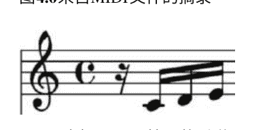

在[86]中，黄和胡声称直接编码MIDI消息的一个缺点是无法有效地保留通过使用多个轨道同时播放多个音符的概念。在他们的实验中，他们将轨道连接在一起，因此认为这样的模型将很难学习到在不同轨道上相同位置的多个音符可以同时播放。下一节将介绍的钢琴卷没有这个限制，但代价是另一个限制。

#### 4.7.2 钢琴卷帘

钢琴卷的表示方式（单音或多音）受到自动钢琴的启发（见图4.8）。这是一卷连续的纸带，上面有打孔（洞）。每个打孔代表一个音符的控制信息，用于触发给定的音符。打孔的长度对应于音符的持续时间。在另一个维度上，打孔的定位对应于其音高。

现代钢琴卷帘的一个示例（用于数字音乐系统）在图4.9中显示。x轴表示时间，y轴表示音高。
有几种使用钢琴卷帘作为基本视觉表示的音乐环境，而不是传统的乐谱，因为它比传统的乐谱符号更直观。一个例子是Hao Staff钢琴卷帘乐谱[70]，如图4.9所示，时间轴水平向右，音符表示为绿色单元格。另一个例子是吉他谱，其中旋律以钢琴卷帘格式表示[84]，与和弦和歌词相补充。吉他谱被MidiNet系统用作输入，在第6.10.3.3节中介绍。

图 4.8 自动钢琴和钢琴卷。经 YouTube许可，转载自 Yaledmot的帖子 “https://www.youtube.com/watch?v=QrcwR7eijyc”

图4.9 符号钢琴卷的示例。经Hao Staff音乐出版（香港）有限公司许可，转载自[70]。

钢琴卷是最常用的表示之一，尽管它有一些限制。与MIDI表示相比，一个重要的限制是没有音符关闭信息。因此，无法区分长音符和重复的短音符<sup>30</sup>。在第4.9.1节中，我们将探讨解决这个限制的不同方法。有关MIDI和钢琴卷的更详细比较，请参阅[86]和[199]。

#### 4.7.3 文本

##### 4.7.3.1 旋律

旋律可以以文本表示并作为文本进行处理。一个重要的例子是ABC记谱法[201]，它是民间和传统音乐的事实标准<sup>31</sup>。图4.10和4.11显示了名为“A Cup of Tea”的曲调的原始乐谱及其相关的ABC记谱法，来自仓库和讨论平台The Session [98]。

前六行是头部，表示元数据：T是音乐的标题，M是节拍，L是默认音符长度，K是调号等。头部后面是代表旋律的主要文本。ABC符号的编码规则的一些基本原则如下<sup>32</sup>：

- 音符的音高类别编码为对应其英文符号的字母，例如，A代表A或La;
- 音高的编码如下：A对应A₄，a对应高一个八度的A 和 a′ 对应高两个八度的A;
- 音符的持续时间编码如下：如果默认长度标记为1/8（即八分音符，如“一杯茶”示例）， a对应八分音符， a/2对应十六分音符， a2对应四分音符；并且
- 小节之间用“|”（小节线）分隔。

```
X: 1
T: 一杯茶
R: 卷舞
M: 4/4
L: 1/8
K: Amix
|:eA (3AAA g2 fg|eA (3AAA BGGf|eA (3AAA g2 fg|1afge d2 gf:|
|2afge d2 cd|| |:eaag efgf|eaag edBd|eaag efge|afge dgfg:|
```

图4.11 “一杯茶”的ABC记谱法。经过The Session [98]的许可复制。

请注意，ABC符号只能表示单声部的旋律。为了能够被深度学习架构处理，ABC文本通常会从字符词汇文本转换为标记词汇文本，以便正确考虑可能在多个字符上标注的概念，例如 g2。Sturm等人在第6.6.1.2节中描述的实验使用了一种基于标记的符号表示法，称为folk-rnn符号表示法[178]。一个曲调被包含在一个“<s>”开始标记和一个“\s>”结束标记之间。最后，所有示例旋律都被转调到相同的C调根音，结果是图4.12中显示的“A Cup of Tea”曲调的符号表示。

```
<s> M:4/4 K:Cmix |: g c (3 c c c b2 a b | g c (3 c c c d B B a | g c (3 c c c b2 a b |1 c' a b g f2 b a :| |2 c' a b g f2 e f |: g c' c' b g a b a | g c' c' b g f d f | g c' c' b g a b g | c' a b g f b a b :| \s>
```

图4.12 《一杯茶》的Folk-rnn符号表示。与作者的许可[178]一起再现

##### 4.7.3.2 和弦和复音

在表示上，和弦通常使用同时发生的音符作为向量进行编码。和弦的一个有趣的替代表示方式是……

> 注意，休止符可以通过ABC符号中的 z字母来表示。它们的持续时间与音符一样表示，例如，z2表示双倍长度的休止符。

脚注：
⁸ 不要低估管弦乐和制作的重要性。
⁹ 梅尔频率倒谱系数。
¹⁰ 一个示例入口是Wyse对深度卷积网络音频表示的最新评论[207]。
¹¹ 在第6.10.3节中将介绍条件。
<sup>12</sup>端到端一词强调系统从原始未经处理的数据中学习所有特征，而不需要任何预处理、表示转换或特征提取，以产生最终输出。
<sup>13</sup>傅里叶变换（可以是连续的或离散的）的目标是将任意信号分解为其基本组成部分（正弦波形）。除了压缩信息外，它在音乐目的上的作用是基础的，因为它揭示了信号的谐波成分。
<sup>14</sup>分贝相对于满幅，是数字系统中振幅级别的测量单位。
<sup>15</sup>一个音高类（也称为色度）表示对应音符的名称，与八度位置无关。可能的音高类包括C、C♯（或D♭）、D、... A♯（或B♭）和B。
<sup>16</sup>也称为国际音高记号或科学音高记号。
<sup>17</sup>在英国英语中称为四分音符。
<sup>18</sup>在英国英语中称为八分音符。
<sup>19</sup>既是对音乐的欣赏，也是对人类演奏者的呼吸！
<sup>20</sup>现代音乐通过添加和/或改变间隔/组件，将原始的大三和小三和弦扩展为更丰富的可能性集合（减小、增大、属七、悬挂、九、十三等）。
<sup>21</sup> 在爵士乐和流行音乐中有一些常见的缩写符号，例如C小调 = Cmin = Cm = C-; C大七和弦 = CM7 = Cmaj7 = CΔ，等等。
<sup>22</sup> 尽管（也因为）小节实际上是图形实体-分隔小节的线段“|”-但术语小节在美国也经常被用来代替小节。在本书中，我们将坚持使用术语小节。
<sup>23</sup> 对于更复杂的音乐，节拍可能在音乐的不同部分内发生变化。
<sup>24</sup> 有趣的是，正如Sturm等人在[178]中指出的那样，生成的音乐格式中也包含了分隔小节的小节线，并且不能保证一个小节中的音符数量总是适合一个小节。然而，错误很少发生，这表明这种表示对于架构学习计数是足够的，参见[59]和第6.6.1.2节。
<sup>25</sup> 对于给定的声部可能有同时发生的音符，请参见第3.1.1节。
<sup>26</sup> 舞曲擅长这一点，通过在强节拍上不对齐的方式来创造一些弹跳的脉动，例如一些不对齐的低音和/或吉他。
<sup>27</sup> 格式是一首音乐用计算机解释的语言（即语法和句法）。
<sup>28</sup> 速度表示音符的力度或音量。
<sup>29</sup> 另一种特定于吉他或弦乐器的符号是吉他谱，其中六条线表示吉他的和弦（低音吉他为四条线），音符由用于获得它的品位数指定。
<sup>30</sup> 在钢琴卷中，一个音符由一个开始时间和持续时间表示。如果想要表示一个重复的短音符，需要创建多个短音符事件，这与一个连续的长音符在视觉上是无法区分的。
<sup>31</sup> ABC记谱法是一种基于文本的乐谱格式，特别常用于民间音乐。
<sup>32</sup> 这里列出的是基本规则，完整的ABC记谱法规范要复杂得多。

最近提出了一个名为Chord2Vec<sup>34</sup>的方法[121]<sup>35</sup>。与其将和弦（垂直）视为向量，它将和弦（水平）表示为由组成音符序列。更准确地说：

- 一个和弦被表示为任意长度的有序音符序列；和
- 和弦之间用特殊符号分隔，就像自然语言处理中的句子标记一样。

当使用这种表示来预测相邻和弦时，使用了一种特定的复合架构，名为RNN编码器-解码器，将在第6.10.2.3节中描述。

请注意，巴赫机器人系统[118]也使用了类似的模型，用于多声部音乐生成，将在第6.17.1节中介绍。在该模型中，对于每个时间步，各个音符（按降序排列）被表示为一个序列，并且特殊的分隔符符号“|||”表示下一个时间帧。

#### 4.7.4 标记语言

让我们提到基于标记语言的通用文本结构化表示的情况（著名的例子是HTML和XML）。一些标记语言已经被设计用于音乐应用，例如开放标准MusicXML [61]。动机是提供一种通用格式，以便音乐软件系统（如乐谱编辑器和序列器）之间共享、交换和存储乐谱。MusicXML以及类似的语言并不适合直接由人类使用，因为它的冗长性，这是其丰富性和有效性作为交换语言的缺点。此外，由于其冗长性和丰富性会产生过多的开销和偏见，因此它不适合作为机器学习任务的直接表示。

#### 4.7.5 主旋律谱

主旋律谱表是流行音乐（爵士乐、流行音乐等）的重要表示格式。通过一种意向符号，主旋律谱表可以在几页内传达旋律的乐谱和其对应的和弦进行<sup>36</sup>。歌词也可以添加。演奏者通常还会提供一些重要的信息，如作曲家、作者、风格和速度。图4.13展示了一个主旋律谱表的例子。

> <sup>34</sup>Chord2Vec受自然语言处理中的Word2Vec模型的启发[129]。
> <sup>35</sup>值得一提的是，还有另一个类似的模型，也叫Chord2Vec，提出于[87]。
> <sup>36</sup>请参阅第4.5.4节。

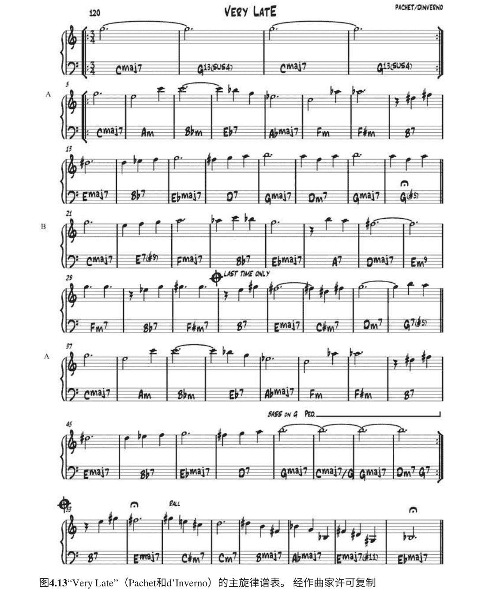

矛盾的是，很少有系统和实验使用这种丰富而简洁的表示形式，大多数时候它们都专注于音符。请注意，Eck和Schmidhuber的蓝调生成系统（将在第6.5.1.1节介绍）输出的是旋律和和弦进行的组合，尽管不是作为一个明确的主旋律谱表。Flow Machines项目中对主旋律谱表的系统编码是一个值得注意的贡献[48]，结果形成了Lead Sheet Data Base（LSDB）仓库[146]，其中包括超过12,000个主旋律谱表。

请注意，有一些备选符号，特别是标签[84]，其中旋律以类似钢琴卷帘的格式表示（见第4.7.2节），并与相应的和弦补充。标签的一个使用示例是MidiNet系统，将在第6.10.3.3节中进行分析。

### 4.8 时间范围和粒度

时间的表示对于音乐过程至关重要。

#### 4.8.1 时间范围

初始设计决策涉及用于生成数据和生成数据的表示的时间范围，即表示将如何根据时间由架构解释，如图4.14所示：

- 全局 - 在这种情况下，表示的时间范围是整个音乐作品。深度网络架构（通常是前馈或自编码器架构，请参见第5.5节和第5.6节）将在全局单步内处理输入并生成输出。示例是MiniBach和DeepHear系统，分别在第6.2.2节和第6.4.1.1节中介绍。
- 时间步长（或时间片）- 在这种情况下，最常见的情况是，表示的时间范围是音乐片段的一个局部时间片，对应于特定的时间点（时间步长）。深度网络架构（通常是循环网络）的处理粒度是一个时间步长，生成是迭代的。请注意，时间步长通常设置为最短音符持续时间（详见第4.8.2节的更多细节），但它也可以更大，例如设置为系统中的一个小节，如[189]中所讨论的。
- 音符步长 - 这是Mozert在[138]中提出的第三种情况，在他的CONCERT系统[138]中，参见第6.6.1.1节。在这种方法中，没有固定的时间步长。深度网络架构的处理粒度是一个音符。这种策略使用了持续时间的分布编码，可以在单个网络处理步骤中处理任何持续时间的音符。请注意，通过将其视为一个将单个处理步骤称为音符而不是时间步骤，网络需要连接的处理步骤数量大大减少。后来Walder在[199]中提出的方法类似。

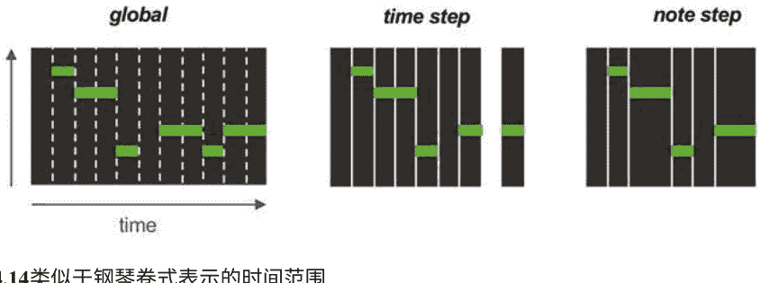

图4.14类似于钢琴卷式表示的时间范围

请注意，全局时间范围表示实际上也考虑了时间步骤（在图4.14中由虚线分隔）。然而，尽管时间步骤在表示层面上存在，但它们不会被神经网络架构解释为不同的处理步骤。基本上，连续时间切片的编码将被连接成一个全局表示，由网络作为整体来考虑，如图6.2所示，这是在第6.2.2节中介绍的一个示例。

还要注意，在全局时间范围的情况下，生成的音乐内容具有固定长度（时间步数），而在时间步长或音符步长的时间范围内，生成的音乐内容具有任意长度，因为生成是迭代的，我们将在第6.5.1节中看到。

#### 4.8.2 时间粒度

在全局或时间步长的时间范围内，时间步长的粒度，对应于时间离散化的粒度，必须被定义。有两种主要策略：

- 最常见的策略是将时间步长设置为相对持续时间，即语料库（训练示例/数据集）中音符的最小持续时间，例如十六分音符。更准确地说，如[189]中所述，时间步长应该是要学习的所有音符持续时间的最大公约数。这确保了每个音符的持续时间都能用整数个时间步长正确表示。这种“降级”的一个直接结果是，无论实际音符的持续时间如何，都需要进行一定数量的处理步骤。
- 另一种策略是将时间步长设置为固定的绝对持续时间，例如，10毫秒。这种策略允许我们在人类演奏中捕捉到每个音符的时间表达性，如第4.10节所示。

请注意，在音符步长时间范围的情况下，时间没有统一的离散化（没有固定的时间步长），也不需要。

### 4.9 元数据

在某些系统中，还可以明确地表示和使用来自乐谱的其他信息作为元数据，例如

- 音符连结³⁹，
- 停顿，
- 泛音，
- 调式，
- 节拍，和
- 与声音相关的乐器。

这些额外的信息可能导致更准确的学习和生成。

#### 4.9.1 音符持续/结束

一个重要问题是如何表示音符是否被保持，即与前一个音符连结。实际上，这等同于如何表示音符的结束。

在MIDI表示格式中，音符的结束是明确说明的（通过一个“Note off”事件⁴⁰）。在第4.7.2节讨论的钢琴卷格式中，没有音符结束的显式表示，因此无法区分两个重复的四分音符和一个半音符。

主要可能的技术是

- 引入一个保持/重放表示，作为音符序列的双重表示。例如，这个解决方案被Mao等人在他们的DeepJ系统中使用[126]（将在第6.10.3.4节中进行分析），通过引入一个类似于钢琴卷帘式音符矩阵的重放矩阵；
- 将时间步长的大小<sup>41</sup>除以二，并始终用一个特殊标记标记音符的结束，例如0。例如，Eck和Schmidh¨uber在[42]中使用了这个解决方案，并将在第6.5.1.1节中进行分析；
- 将时间步长的大小分割为以前的方式，而是标记一个新的音符开始。这个解决方案是由托德在[189]中使用的；或者
- 使用一个特殊的 hold符号“ ”代替音符，以指定前一个音符何时保持不变。这个解决方案是由Hadjeres等人在他们的DeepBach系统[69]中提出的，在第6.14.2节中进行了分析。

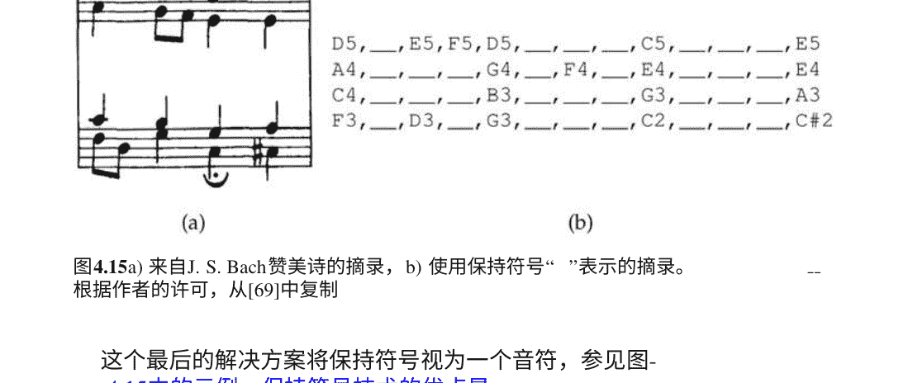

这个最后的解决方案将保持符号视为一个音符，参见图4.15中的示例。保持符号技术的优点是

- 它简单而统一，因为保持符号被视为一个音符；而且
- 不需要将时间步长的值除以二并标记音符的结束或开始。

DeepBach的作者还强调，他们使用Gibbs采样获得的良好结果完全依赖于将保持符号集成到音符列表中（参见[69]和第6.14.2节）。一个重要的限制是，保持符号仅适用于单声部旋律的情况，即在单声部复调的情况下无法直接以明确的方式表示保持音符。在这种情况下，单声部复调必须重新构建为多声部表示，每个声部都是一个单声部旋律；然后为每个声部单独添加一个保持符号。请注意，在重放矩阵的情况下，附加信息（矩阵行）是针对每个可能的音符而不是每个声部。

我们将在第4.11.7节讨论如何编码保持符号。

#### 4.9.2 音符表示（与增音）

大多数系统认为音程，即在均匀律系统中，A♯与B♭在音高上是等价的（即具有相同的音高），尽管在和谐上和作曲家的意图上它们是不同的。DeepBach系统是一个例外，它在第6.14.2节中描述，它使用音符的真实名称而不是它们的MIDI音符编号进行编码。DeepBach的作者表示，这些额外的信息可以得到更准确的模型和更好的结果[69]。

#### 4.9.3 特征提取

尽管深度学习擅长处理原始的非结构化数据，从中它的层次结构将提取适应任务的更高级别的表示（参见第1.1.4节），但一些系统包括一个自动特征提取的预处理步骤，以便以更紧凑、特征化和区分性的形式表示数据。一个动机可能是为了提高训练和生成的效率和准确性。此外，这种基于特征的表示对于索引数据也是有用的，以便通过紧凑的标签来控制生成（例如，参见第6.4.1.1节中的DeepHear系统），或者用于索引要查询和连接的音乐单元（参见第6.10.7.1节）。

特征集可以手动定义（手工制作）或自动定义（例如通过自动编码器，参见第5.6节）。在手工制作特征的情况下，词袋（BOW）模型是一种常见的自然语言文本处理策略，也可以应用于其他类型的数据，包括音乐数据，如我们将在第6.10.7.1节中看到的。它的作用是将原始文本（或任意表示）转换为“词袋”（由所有出现的单词或更一般地说，所有可能的标记组成的词汇表）；然后可以使用各种度量来描述文本。最常见的是词频，即一个词在文本中出现的次数42。

为了自动计算保留项目之间关系的向量表示，已经设计了复杂的神经网络架构方法。文本的向量表示被称为词嵌入43。自然语言处理（NLP）的最新参考模型是Word2Vec模型[129]。最近将其转化为和弦向量编码的Chord2Vec模型，如[121]中所述（参见第4.5.4节）。

### 4.10 表现力

#### 4.10.1 时机

如果训练样本是从传统乐谱或MIDI格式库中处理的，那么音乐很有可能是完全量化的 - 即，音符的起始点44恰好对齐到节奏 - 导致机械化的声音，没有表现力。一种方法是考虑符号记录 - 在大多数情况下直接记录在MIDI中 - 来自真实人类演奏，由音乐家解释节奏。一个用于此目的的系统的例子是Performance RNN [173]，将在第6.7.1节中进行分析。它遵循绝对时间持续量化策略，介绍在第4.8.2节中。

#### 4.10.2 动态

另一个常见的限制是许多MIDI格式库不包含音乐乐器的动态（声音的音量），这在整个乐曲中保持不变。一种选择是考虑作曲家关于动态的注释（如果在乐谱上有的话），从pi-anissimo ppp到fortissimo fff，参见第4.5.1节。至于速度表现，第4.10.1节中提到的另一种选择是使用真实的人类演奏，以MIDI中的速度字段记录明确的动态变化。

#### 4.10.3 音频

请注意，在音频表示的情况下，表现力以及速度和动态都纠缠在整个表示中。尽管控制全局动态（全局音量）很容易，但单独控制单个乐器或声音的动态则较为困难45。

### 4.11 编码

一旦选择了表示的格式，仍然存在如何对这个表示进行编码的问题。表示（音乐内容的表示）的编码是将表示（由一组变量，例如音高或音量组成）映射为神经网络架构的一组输入（也称为输入节点或输入变量）的过程[46]。

#### 4.11.1 策略

首先，让我们考虑变量的三种可能类型：

- 连续变量 - 一个例子是以赫兹为单位定义的音符音高，它是在 ]0, +∞[ 区间内的实数值[47]。直接将变量[48]编码为实数值的标准方法。我们将这种策略称为值编码。
- 离散整数变量 - 一个例子是音符的音高，由其MIDI音符编号定义，即在 {0, 1, . . . , 127}离散集合[49]内的整数值。将变量编码为实数值标量的直接方法是将整数转换为实数。这是另一种值编码的情况。
- 布尔（二进制）变量 - 一个例子是音符结束的规范（见第4.9.1节）。将变量编码为实数值标量的直接方法是使用两个可能的值：1（表示真）和0（表示假）。
- 分类变量[50] - 一个例子是鼓套件的组成部分；可能值集合中的一个元素：{snare, high-hat, kick, middle-tom, ride-cymbal, etc.}。

通常的策略是将一个分类变量编码为一个向量，其长度为可能元素的数量，换句话说就是可能值集合的基数。然后，为了表示给定的元素，编码向量的相应元素设置为1，而其他元素设置为0。因此，这种编码策略通常被称为独热编码[51]。这是一个经常使用的方法。

#### 4.11.2 从单热到多热再到多一热

请注意，一个音符的一热编码对应于钢琴卷的一个时间切片表示（见图4.9），行数与可能的音高一样多。还要注意，虽然对于单音的钢琴卷表示的一热编码很简单，但对于一个多声部（同时演奏的音符，比如吉他弹奏和弦）不是。然后可以考虑

- 多热编码 - 其中向量中与音符或活动组件对应的所有元素都设置为1;
- 多一热编码 - 考虑不同的声音或音轨（用于多声部表示，请参见第4.6节），并为每个不同的声音/音轨使用一热编码;
- 多多热编码 - 这是一个多声部表示，其中至少一个或所有声音同时演奏。

#### 4.11.3 总结

编码的各种方法如图4.16所示，从左到右显示

- A4的标量连续值编码，实数指定其赫兹频率;
- A4的标量离散整数值编码52，整数指定其MIDI音符编号;
- A4的一热编码;
- 一个D小调和弦（D4, F4, A4）的多热编码;
- 一个带有A4的第一声和一个带有D3的第二声的多一热编码; 和
- 一个带有D小调和弦（D4, F4, A4）的第一声和一个带有C3（对应于低音上的小七度）的第二声的多多热编码。

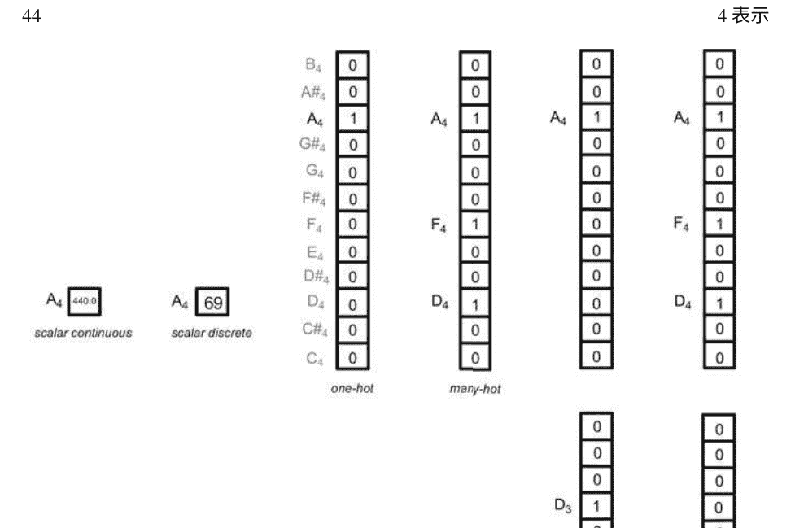

图4.16各种类型的编码

#### 4.11.4 分箱

在某些情况下，连续变量被转换为离散域。一种常见的技术，称为分箱，或者也称为桶装，包括

- 将原始值域划分为较小的区间<sup>53</sup>，称为 bins；并
- 用一个代表性的值（通常是中心值）替换每个区间（及其中的值）。

请注意，这种分箱技术也可用于减少变量的离散域的基数。一个例子是第6.7.1节中描述的Performance RNN系统，其中音符动态的初始MIDI集合由127个值减少到32个区间。

#### 4.11.5 优点和缺点

一般情况下，除了音频外，很少使用值编码，而独热编码是符号表示最常见的策略。

一个反例是第6.10.3.4节中描述的DeepJ符号生成系统，它在某种程度上受到WaveNet音频生成系统的启发。DeepJ的作者表示：“我们跟踪每个音符的动态，并将其存储在一个N x T动态矩阵中，该矩阵为每个时间步存储了每个音符动态在0到1之间的值，其中1表示最大可能的音量。” 在我们的初步工作中，我们还尝试了一种动态的备选表示，即将动态表示为具有128个区间的分类值，正如Wavenet [193]所建议的。我们的模型不是预测一个标量值，而是学习音符动态的多项分布。

然后我们将在生成过程中从这个多项式分布中随机采样动态。与Wavenet的结果相反，我们的实验得出结论，标量表示产生了更和谐的结果。” [126]。

值编码的优点是紧凑的表示，但由于数值运算（近似）的原因，它的敏感性较高。 One-hot编码的优点是其稳健性（离散与模拟），但代价是高基数和可能的大量输入。

还需要理解，在网络架构的输出处选择one-hot编码通常（尽管不总是）与softmax函数相关联，以计算每个可能值的概率，例如音符是A、A#、B、C等的概率。这实际上对应于分类任务，对于分类变量的可能值之间进行分类。这将在第5.5.3节中进一步分析。

#### 4.11.6 和弦

编码和和弦的两种方法，对应于第4.5.4节中讨论的两种主要替代表示方法，分别是

- 隐式和外延 - 枚举组成和弦的确切音符。自然编码策略是多热编码。一个例子是基于RBM的多音乐生成系统，详见第6.4.2.3节；以及
- 显式和内涵 - 使用一个和弦符号，结合一个音高类和一个类型（例如，D小调）。自然编码策略是多一热编码，具有一个音高类别的初始独热编码和类别类型的第二个独热编码（大调、小调、属七和其他）。一个例子是在第6.10.3.3节中描述的MidiNet系统。

#### 4.11.7 特殊保持和休止符号

我们必须考虑特殊符号的情况，如保持（“保持前一个音符”，参见第4.9.1节）和休止符（“无音符”，参见第4.5.2节），以及它们与实际音符的编码之间的关系。

首先，注意到有一些罕见的情况，其中休止符实际上是隐含的：

- 在MIDI格式中 - 当没有“活动”的“Note on”时，即当它们都被相应的“Note off”“关闭”时；和
- 在独热编码中 - 当向量编码可能音符的所有元素都等于0时（即“零热”编码，意味着当前没有选择任何可能的音符）。这在Todd的实验中是一个例子（将在第6.8.1节中描述）。

现在，让我们考虑如何根据音符音高的编码方式来编码保持和休止符：

- 数值编码 - 在这种情况下，需要添加两个额外的布尔变量（及其对应的输入节点） *hold* 和 *rest*。对于多声部的情况，需要为每个可能的独立声部执行此操作；或者
- 独热编码 - 在这种情况下（最常见和可管理的策略），只需将独热编码的词汇表扩展两个额外的可能值：*hold* 和 *rest*。它们将被视为与输入和输出的可能音符（例如，A<sub>3</sub>或C<sub>4</sub>）具有相同级别和性质的元素。

#### 4.11.8 鼓和打击乐

一些系统明确考虑鼓和/或打击乐。鼓或打击乐套件通常被建模为单音轨的多声部，每个“音符”对应于一个鼓或打击乐器件（例如，军鼓、踢鼓、低音筒、踩镲、骑行铜钹等），即为多热编码。

> 56在MidiNet中，可能的和弦类型实际上只有大调和小调。因此，可以使用布尔变量来代替独热编码。
> 57这可能首先看起来是对休止符的经济编码，但以网络架构的softmax输出产生的概率（对于每个可能的音符）的一些歧义为代价。每个音符的低概率向量可以被解释为休止符或音符之间的等概率。请参阅第6.8.1节中提出的阈值技巧，以区分两种可能的解释。

一个专门用于节奏生成的系统示例在第6.10.3节中描述。它采用单音轨多声部的方法。在该系统中，五个组成部分都通过一个二进制值表示，指定当前时间步是否存在相关事件。鼓事件被表示为长度为5的二进制字，其中每个二进制值对应于五个鼓组件之一；例如，10010表示同时击打低音鼓和高音帽，采用了多热编码。

请注意，该系统还包括作为附加声音/音轨的压缩表示的低音线部分和表示节拍的一些信息，详见第6.10.3.1节。作者[122]认为，这些额外的显式信息确保了网络架构在任何给定点上都意识到节拍结构。

另一个例子是MusicVAE系统（见第6.12.1节），其中考虑了九个不同的鼓/打击乐器组件，共有2^9种组合，即512种不同的标记。

### 4.12 数据集

选择一个数据集对于良好的音乐生成是至关重要的。首先，数据集应具有足够的大小（即包含足够数量的示例）以确保准确学习。正如Hadjeres在[66]中指出：“我认为在构建深度生成模型时，数据集的大小和其一致性之间的权衡是一个重要问题。”如果数据集非常异质，良好的生成模型应该能够区分不同的子类别并且能够很好地进行泛化。相反，如果子类别之间只有轻微的差异，那么了解“平均模型”是否能够产生音乐上有趣的结果就很重要了。

#### 4.12.1 移调和对齐

机器学习中的一种常见技术是生成合成数据，以人工增加数据集的大小（训练示例的数量），以提高模型的准确性和泛化能力（参见第5.5.10节）。在音乐领域，一种自然且简单的方法是转调，即将所有示例转换到所有键中。除了人工增加数据集外，这还提供了所有示例的关键（音调）不变性，从而使示例更具通用性。此外，这还减少了训练数据中的稀疏性。例如，在第6.10.5.1节中描述的C-RBM系统[108]中使用了这种转置技术。

另一种方法是将所有示例转置（对齐）到一个共同的键中。这已经被推崇为RNN-RBM系统[11]的一种促进学习的方法，请参见第6.9.1节。

1. 在这个系统中，编码是以文本形式进行的，类似于第4.7.3节中描述的格式，更准确地遵循[21]中提出的方法。
2. 神经网络和深度学习架构需要大量的示例才能正常运行。然而，最近的一个研究领域是从稀缺数据中学习。
3. 这被称为数据集增强。

#### 4.12.2 数据集和库

一个实际问题是训练系统和评估和比较系统和方法的数据集的可用性。在图像领域有一些参考数据集（例如，关于手写数字的MNIST数据集[112]），但音乐领域尚无。然而，已经公开了各种数据集或库，下面列举了一些示例：

- 古典钢琴MIDI数据库[104]；
- JSB合唱数据集[1]；
- LSDB (Lead Sheet Data Base) 存储库[146]，其中包含超过12,000个主旋律谱（包括所有爵士乐和巴萨诺瓦歌曲书），在Flow Machines项目[48]中开发。
- MuseData库，一个包含800多个古典音乐作品的电子图书馆，来自斯坦福大学的CCARH [76]；
- MusicNet数据集[187]，包含330个免费授权的古典音乐录音以及超过100万个注释标签（指示时间和乐器信息）；
- Nottingham数据库，一个包含1,200个ABC记谱法的民间曲调[53]的集合，每个曲调由简单的旋律和和弦组成，换句话说，是一个乐谱的ABC版本；
- Session [98]，一个包含超过15,000首以ABC记谱法表示的凯尔特音乐的存储库和讨论平台；
- Walder的Symbolic Music数据集[200]，一个庞大的经过清理和预处理的MIDI文件集合；
- TheoryTab数据库[84]，一组以制表符格式表示的歌曲，包括钢琴卷帘旋律、和弦和歌词，换句话说，是一个钢琴卷帘版本的乐谱；
- 雅马哈电子钢琴比赛数据集，参赛者的MIDI演奏记录可供使用[209]。

## 第5章 架构

深度网络是神经网络的自然演化，神经网络本身是1957年Rosenblatt提出的感知器的演化[165]。从历史上看，感知器在1969年被Minsky和Papert批评，因为它无法对非线性可分域进行分类。他们的批评也促使了基于符号表示和推理的人工智能的替代方法。

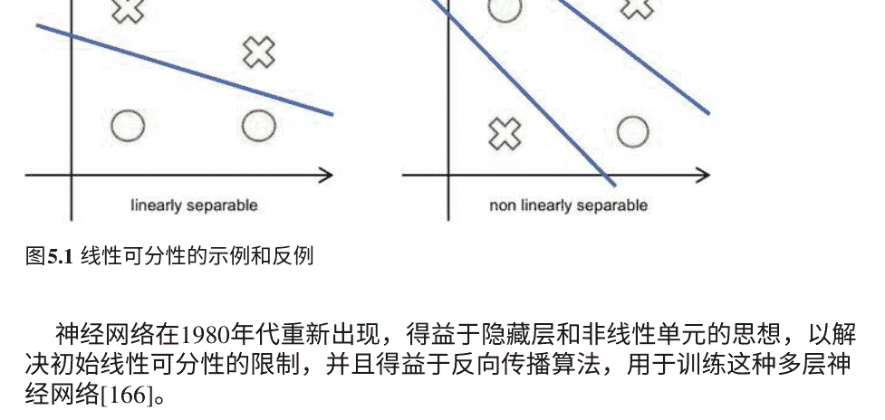

神经网络在1980年代重新出现，得益于隐藏层和非线性单元的思想，以解决初始线性可分性的限制，并且得益于反向传播算法，用于训练这种多层神经网络[166]。

在1990年代，神经网络因为训练具有多层的神经网络的困难而遭受兴趣下降的影响，并且由于与支持向量机(SVM) [196]的竞争，支持向量机被高效地设计用于最大化分离边界并具有坚实的形式背景。

一个重要的进展是Hinton等人在2006年发明的预训练技术，解决了这个限制。2012年，一个图像识别竞赛（ImageNet大规模视觉识别挑战赛[167]）由一个名为AlexNet的深度神经网络算法赢得，与其他使用手工特征的算法相比，取得了惊人的优势。这个惊人的胜利结束了神经网络具有许多隐藏层不能高效训练的普遍观点。

### 5.1 神经网络简介

本节的目的是回顾或介绍人工神经网络的基本原理。我们的目标是定义分析各种音乐生成系统时将使用的关键概念和术语。然后，我们将介绍各种衍生架构的概念和基本原理，如自动编码器，循环网络，RBM等，这些在音乐应用中使用。

我们不会详细描述神经网络和深度学习的技术，例如在最近的书籍[62]中介绍的内容。

#### 5.1.1 线性回归

尽管受到生物启发（生物神经元），神经网络和深度学习的基础是线性回归。在统计学中，线性回归是一种建模方法，用于描述标量变量y ∈ ℝ与一个或多个解释变量x₁...xₙ之间的（假设为线性）关系。其中xᵢ ∈ ℝ，共同表示为向量x。一个简单的例子是根据一些因素（例如大小、高度、位置...）来预测房屋的价值。

方程5.1给出了（多个）线性回归的一般模型，其中

```
h(x) = b + \theta_1 x_1 + ... + \theta_n x_n = b + \sum_{i=1}^{n} \theta_i x_i \quad (5.1)
```

- $h$是模型，也称为假设，因为这是假设的最佳模型，即学习到的模型；
- $b$是偏差，表示偏移；和
- $\theta_1...\theta_n$是模型的参数，即权重，对应于解释变量$x_1...x_n$。

#### 5.1.2 符号

我们将使用以下简单的符号约定：

- 常数以罗马（直）体字表示，例如整数1和音符C$_4$。
- 模型的变量以罗马体字表示，例如输入变量x和输出变量y（可能是向量）。
- 模型的参数以斜体字表示，例如偏差b，权重参数θ$_1$，模型函数h，解释变量的数量n和变量$x_i$的索引。
- 一个概率以及一个概率分布都是斜体和大写字母，例如，变量note的值为A4的概率P(note=A4)，以及变量note在所有可能的音符（结果）上的概率分布P(note)。

#### 5.1.3 模型训练

训练线性回归模型的目的是找到每个权重θ和偏差b的最佳拟合实际训练数据/示例的值，即各种值对(x, y)。换句话说，我们希望找到参数和偏差值，使得对于所有的x值，h(x)尽可能接近y，根据某个称为成本的度量。这个度量表示h(x)（预测值，也表示为^y）和y（实际基准值）之间的距离，对于所有的示例。成本，也称为损失，通常表示为J_θ(h)，可以通过均方差（MSE）来衡量，它衡量平均平方差异，如公式5.2所示，其中m是示例的数量，(x^(i), y^(i))是第i个示例对。

```
$$J_{\theta}(h) = 1/m \sum_{i=1}^{m} (y^{(i)} - h(x^{(i)}))^2 = 1/m \sum_{i=1}^{m} (y^{(i)} - \hat{y}^{(i)})^2 \qquad (5.2)$$
```

一个示例如图5.2所示，对于简单线性回归的情况，即只有一个解释变量x。训练数据以蓝色实心点表示。一旦模型训练完成，参数的值将被调整，如蓝色实线粗线所示，它大部分符合示例。然后，该模型可以用于预测，例如，通过计算h(x)（以绿色显示）来为给定的x值提供y的良好估计^y。

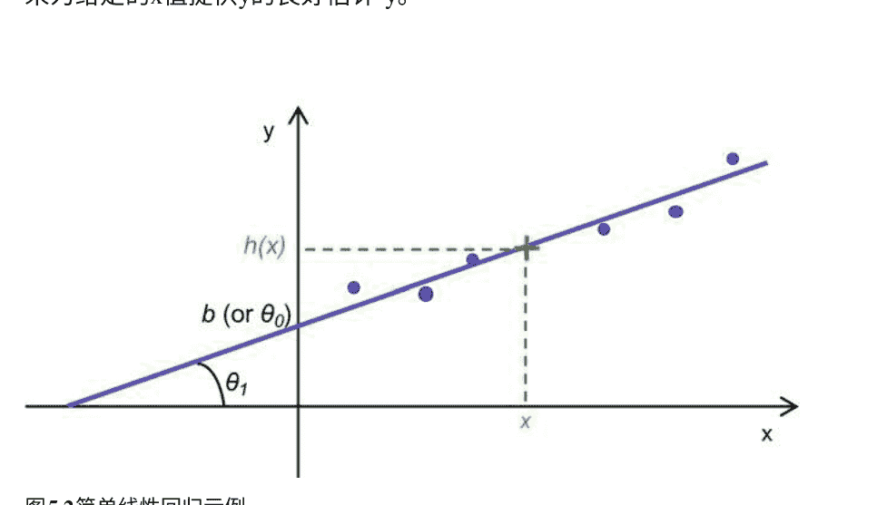

#### 5.1.4 梯度下降训练算法

训练线性回归模型的基本算法，使用简单的梯度下降方法，实际上非常简单。

- 将每个参数 θ_i 和偏置 b 初始化为随机或一些启发式值；
- 计算模型对于所有示例的值 h；
- 计算代价函数 J_θ(h)，例如通过方程式 5.2；
- 计算梯度 ∂J_θ(h)/∂θ_i 是代价函数 J_θ(h) 相对于每个 θ_i 和偏置 b 的偏导数；
- 同时根据更新规则（方程式 5.3），使用学习率 α 更新所有参数 θ_i 和偏置。

```
\theta_i := \theta_i - \alpha \frac{\partial J_\theta(h)}{\partial \theta_i} \quad (5.3)
```

这表示梯度相反方向的更新，以减小成本 J_θ(h)，如图5.3所示；并且

- 迭代，直到误差达到最小值，或者经过一定次数的迭代。

#### 5.1.5 从模型到架构

现在让我们在图5.4中引入线性回归模型的图形表示，作为神经网络的前身。所表示的架构实际上是模型的计算表示。

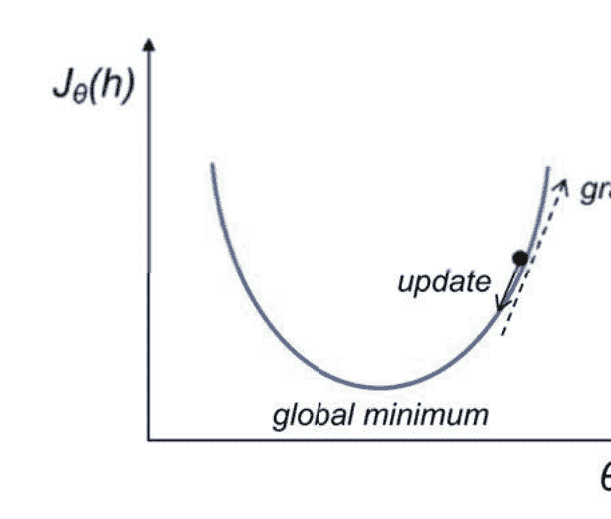

图5.3梯度下降

加权和表示为一个计算单元，绘制为一个带有 Σ 的方框，其输入来自于 xi 节点，绘制为圆圈。

在所示的示例中，有四个解释变量：x1，x2，x3和x4。请注意，有一些惯例认为偏差是权重的特殊情况（因此也可以表示为 θ0），并且有一个相应的输入节点称为偏差节点，它是隐含的并且具有常数值表示为 +1。这实际上对应于考虑一个隐含的附加解释变量x0具有常数值+1，如方程5.4所示，线性回归的替代形式最初在方程5.1中定义。

```
h(x) = θ0 + θ1x1 + ... + θnxn = Σ_{i=0}^{n} θixi  
(5.4)
```

#### 5.1.6 从模型到线性代数表示

初始线性回归方程（在方程5.1中）也可以通过线性代数符号表示更加简洁，得到方程5.5，其中

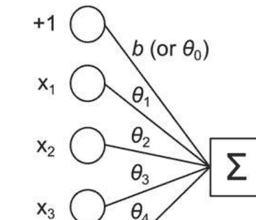

$h(x) = b + \theta x$   (5.5)

- $b$ 和 $h(x)$ 是标量；
- $\theta$是由单行组成的行向量，包含了 $n$个元素：$[\theta_1, \theta_2, ..., \theta_n]$；
- $x$是由单列组成的列向量，包含了 $n$个元素：$[x_1, x_2, ..., x_n]^T$。

#### 5.1.7 从简单到多变量模型

线性回归可以推广到多元线性回归，即存在多个变量 $y_1... y_p$要预测的变量，如图5.5所示，有三个预测变量：$y_1$，$y_2$和$y_3$，每个子网络用不同的颜色表示。

相应的线性代数方程是方程5.6，其中

$h(x) = b + Wx$   (5.6)

- 偏置向量 $b$是一个维度为 $p×1$的列向量，其中 $b_j$表示偏置输入节点与 $j$th求和操作之间的连接权重对应于 $j$th输出节点；
- 权重矩阵 $W$是一个维度为 $p×n$的矩阵，即具有 $p$行和 $n$列，其中 $W_{i,j}$表示输入节点与 $i$th求和操作之间的连接权重对应于 $i$th输出节点；

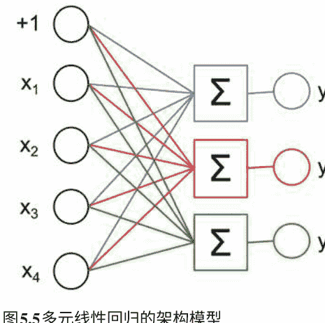

- $n$是输入节点的数量（不包括偏置节点）；和
- $p$是输出节点的数量。

对于图5.5中所示的架构，$n=4$（输入节点的数量和$W$的列数），$p=3$（输出节点的数量和$W$的行数）。相应的偏置向量$b$和权重矩阵$W$在图5.6中的方程式5.7和5.8中显示。

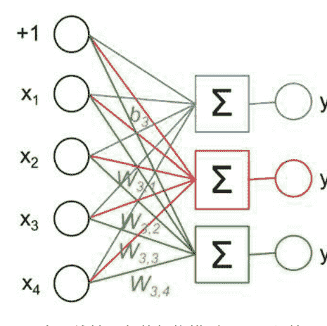

$$
b = \begin{bmatrix} b_1 \ b_2 \ b_3 \end{bmatrix} \qquad\qquad\qquad\quad (5.7)
$$

$$
W = \begin{bmatrix} W_{1,1} & W_{1,2} & W_{1,3} & W_{1,4} \ W_{2,1} & W_{2,2} & W_{2,3} & W_{2,4} \ W_{3,1} & W_{3,2} & W_{3,3} & W_{3,4} \end{bmatrix} \qquad\qquad\quad (5.8)
$$

#### 5.1.8 激活函数

现在，我们还要对每个加权和单元应用激活函数（AF），如图5.7所示。

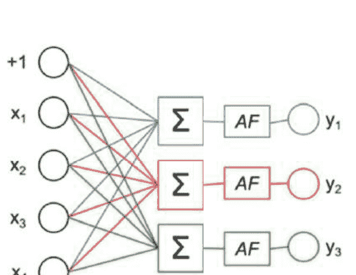

图5.7带有激活函数的多元线性回归的架构模型

这个激活函数允许我们引入任意的非线性函数。

- 从工程角度来看，非线性函数是克服单层感知器的线性可分性限制的必要条件（参见第5节）。
- 从生物启发角度来看，非线性函数可以通过其输入信号（通过树突）捕捉神经元的激活阈值效应，决定其是否沿着输出（轴突）发射。
- 从统计角度来看，当激活函数是sigmoid函数时，模型对应于逻辑回归，它模拟了某个类别或事件的概率，因此进行二元分类。

从历史的角度来看，sigmoid函数（用于逻辑回归）是最常见的。sigmoid函数（通常写作$\sigma$）在方程5.9中定义，并在图5.8中显示。它将在第5.5.3节中进一步分析。另一种选择是双曲正切函数，通常表示为tanh，类似于sigmoid函数，但其定义域区间为$[-1, +1]$（sigmoid函数为$[0, 1]$）。tanh在方程5.10中定义，并在图5.9中显示。

但是ReLU现在被广泛使用，因为它简单而有效。ReLU，即修正线性单元，在方程5.11中定义，并在图5.10中显示。请注意，作为一些符号约定，我们使用z作为激活函数变量的名称，因为x通常保留给输入变量。

$$\text{sigmoid}(z) = \sigma(z) = \frac{1}{1 + e^{-z}} \quad (5.9)$$

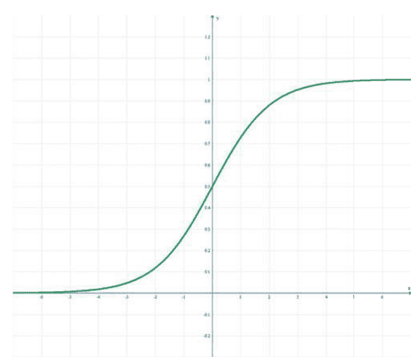

$$\tanh(z) = \frac{e^{z} - e^{-z}}{e^{z} + e^{-z}} \quad (5.10)$$

$$\text{ReLU}(z) = \max(0, z) \quad (5.11)$$

### 5.1 神经网络简介

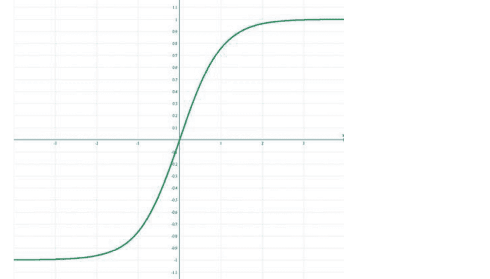

图5.9 Tanh函数

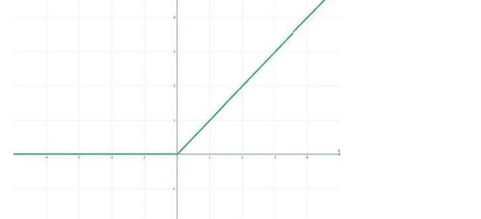

图5.10 ReLU函数

### 5.2 基本构建块

图5.7所示的多元线性回归与激活函数的架构表示是神经网络和深度学习架构的一个实例（具有4个输入节点和3个输出节点）。这个基本构建块虽然简单，但实际上是一个工作中的神经网络。尽管简单，但这个基本构建块实际上是一个工作中的神经网络。
它有两层：

- 输入层，在图的左侧，由输入节点 x_i 和偏置节点组成，它是一个具有常数值的隐含和特定的输入节点，因此通常表示为 +1。
- 输出层，在图的右侧，由输出节点 y_j 组成。

训练基本构建块本质上与训练线性回归模型相同，该模型已在第5.1.3节中描述。

#### 5.2.1 前馈计算

在训练完成后，我们可以使用这个基本构建块神经网络进行预测。因此，我们只需将数据前向传递给网络（即输入数据到网络中）并计算输出值。这对应于方程5.12。

> ŷ = h(x) = AF(b + Wx) \quad (5.12)

对于在图5.5中所示的架构的前馈计算，在方程5.13中进行了说明，其中h_j(x)(即^y_j)是第j个变量y_j的预测。

```
$$\hat{y} = h(x) = h\left(\begin{bmatrix} x_1 \\ x_2 \\ x_3 \\ x_4 \end{bmatrix}\right) = AF(b + Wx)$$

$$= AF\left(\begin{bmatrix} b_1 \\ b_2 \\ b_3 \end{bmatrix} + \begin{bmatrix} W_{1,1} & W_{1,2} & W_{1,3} & W_{1,4} \\ W_{2,1} & W_{2,2} & W_{2,3} & W_{2,4} \\ W_{3,1} & W_{3,2} & W_{3,3} & W_{3,4} \end{bmatrix} \times \begin{bmatrix} x_1 \\ x_2 \\ x_3 \\ x_4 \end{bmatrix}\right)$$

$$= AF\left(\begin{bmatrix} b_1 \\ b_2 \\ b_3 \end{bmatrix} + \begin{bmatrix} W_{1,1}x_1 + W_{1,2}x_2 + W_{1,3}x_3 + W_{1,4}x_4 \\ W_{2,1}x_1 + W_{2,2}x_2 + W_{2,3}x_3 + W_{2,4}x_4 \\ W_{3,1}x_1 + W_{3,2}x_2 + W_{3,3}x_3 + W_{3,4}x_4 \end{bmatrix}\right) \quad (5.13)$$

$$= AF\left(\begin{bmatrix} b_1 + W_{1,1}x_1 + W_{1,2}x_2 + W_{1,3}x_3 + W_{1,4}x_4 \\ b_2 + W_{2,1}x_1 + W_{2,2}x_2 + W_{2,3}x_3 + W_{2,4}x_4 \\ b_3 + W_{3,1}x_1 + W_{3,2}x_2 + W_{3,3}x_3 + W_{3,4}x_4 \end{bmatrix}\right)$$

$$= \begin{bmatrix} h_1(x) \\ h_2(x) \\ h_3(x) \end{bmatrix} = \begin{bmatrix} \hat{y}_1 \\ \hat{y}_2 \\ \hat{y}_3 \end{bmatrix}$$
```

#### 5.2.2 同时计算多个输入数据

同时向一组示例进行前馈计算可以通过矩阵乘法来表示，通过将方程5.12中的单个向量示例x替换为示例矩阵（通常表示为X），得到方程5.14。示例矩阵X的连续列对应于不同的示例。我们使用上标符号X^{(k)}来表示第k个示例，X矩阵的第k列，以避免与下标符号x_i混淆，后者用于表示第i个输入变量。因此，X_i^{(k)}表示第k个示例的第i个输入值。一组示例的前馈计算在方程5.15中进行了说明，其中预测值h(X^{(k)})是结果输出矩阵的连续列。

```
$$h(X) = AF(b + WX) \quad (5.14)$$
```

```
$$
h(\mathbf{X}) = h\left(\begin{bmatrix} X_1^{(1)} & X_1^{(2)} & \dots & X_1^{(m)} \\ X_2^{(1)} & X_2^{(2)} & \dots & X_2^{(m)} \\ X_3^{(1)} & X_3^{(2)} & \dots & X_3^{(m)} \\ X_4^{(1)} & X_4^{(2)} & \dots & X_4^{(m)} \end{bmatrix}\right) = AF(b + W\mathbf{X})
$$
```

```
$$
= AF\left(\begin{bmatrix} b_1 \\ b_2 \\ b_3 \end{bmatrix} + \begin{bmatrix} W_{1,1} & W_{1,2} & W_{1,3} & W_{1,4} \\ W_{2,1} & W_{2,2} & W_{2,3} & W_{2,4} \\ W_{3,1} & W_{3,2} & W_{3,3} & W_{3,4} \end{bmatrix} \times \begin{bmatrix} X_1^{(1)} & X_1^{(2)} & \dots & X_1^{(m)} \\ X_2^{(1)} & X_2^{(2)} & \dots & X_2^{(m)} \\ X_3^{(1)} & X_3^{(2)} & \dots & X_3^{(m)} \\ X_4^{(1)} & X_4^{(2)} & \dots & X_4^{(m)} \end{bmatrix}\right) \quad (5.15)
$$
```

```
$$
= \begin{bmatrix} h_1(\mathbf{X}^{(1)}) & h_1(\mathbf{X}^{(2)}) & \dots & h_1(\mathbf{X}^{(m)}) \\ h_2(\mathbf{X}^{(1)}) & h_2(\mathbf{X}^{(2)}) & \dots & h_2(\mathbf{X}^{(m)}) \\ h_3(\mathbf{X}^{(1)}) & h_3(\mathbf{X}^{(2)}) & \dots & h_3(\mathbf{X}^{(m)}) \end{bmatrix} = \left[ h(\mathbf{X}^{(1)}) \ h(\mathbf{X}^{(2)}) \dots h(\mathbf{X}^{(m)}) \right]
$$
```

请注意，主要的计算过程[^28]是矩阵的乘积。这可以通过使用线性代数向量化实现库以及像图形处理单元（GPUs）这样的专用硬件来高效计算。

### 5.3 机器学习

#### 5.3.1 定义

现在让我们稍微思考一下训练模型的含义，无论是线性回归模型（第5.1.1节）还是本书中介绍的基本构建块架构（第5.2节）。因此，让我们考虑机器学习实际上意味着什么。我们的起点是Mitchell在[131]中提供的以下简明而通用的机器学习定义：“如果计算机程序在某类任务T上的性能P，根据经验E而提高，则称该程序从经验E中学习。”首先，注意到单词“性能”实际上涵盖了不同的含义，特别是与计算机音乐的上下文相关的含义：

1. 执行（执行）一个动作，尤其是艺术行为，如音乐家演奏一首音乐的行为；
2. 对该行为的度量，尤其是对计算机系统的度量其在时间和内存方面执行任务的效率[^29]测量；或者
3. 执行任务的准确性的度量，即以最小误差预测或分类的能力。

[^28]: 除了计算 AF 激活函数之外。对于 ReLU 来说，这是快速的。
[^29]: 对应的分析测量，时间复杂度和空间复杂度，用于对应的算法。

在本书的其余部分，为了尽量减少歧义，我们将使用以下术语：

- 表演作为音乐家的行为，
- 效率作为计算能力的度量，以及
- 准确性作为预测或分类质量的度量<sup>30</sup>。

因此，我们可以重新表述定义为：“如果一个计算机程序在某类任务 T 和准确度量 A 方面通过经验 E 提高了在 T 任务上的准确度 A，那么它被认为是从经验 E 中学习的。”

#### 5.3.2 类别

现在我们可以考虑机器学习的三个主要类别，与示例传达的经验性质有关：

- 监督学习 - 数据集是固定的，并且每个示例都与一个正确（预期）答案<sup>31</sup>相关联，总体目标是为新示例预测答案。任务的示例包括回归（预测）、分类和翻译；
- 无监督学习 - 数据集是固定的，总体目标是提取信息。任务的示例包括特征提取、数据压缩（由自动编码器在第5.6节中介绍）、概率分布学习（由受限玻尔兹曼机在第5.7节中介绍）、序列建模（由循环神经网络在第5.8节中介绍）、聚类和异常检测；以及
- 强化学习<sup>32</sup> - 经验是通过代理在环境中连续采取行动的方式逐步增加的，其中一些反馈（奖励）提供了有关行动价值的信息，总体目标是学习接近最优的策略，即一套最大化累积奖励（收益）的行动。任务的例子包括游戏玩耍和机器人导航。

实际上，准确度可能不是一个相关的度量标准，对于一个具有偏斜类别的分类任务，即一个类别在数据中比其他类别更多地表示，例如，在检测罕见疾病的情况下。因此，混淆矩阵和其他指标如精确率和召回率，以及可能的组合如F分数，被使用（详见，例如，[62，第11.1节]）。我们不会在本书中讨论它们，因为我们主要关注内容生成而不是模式识别（分类）。

<sup>31</sup>在分类任务中通常被称为标签，在预测回归任务中被称为目标。
<sup>32</sup>将在第5.12节介绍。

#### 5.3.3 组件

在他对机器学习的介绍中[38]，Domingos通过三个组成部分描述了机器学习算法：

- 表示 - 表示模型的方式 - 在我们的情况下，是一个神经网络，如下面的章节中所介绍和进一步发展；
- 评估 - 评估和比较模型的方式 - 通过一个成本函数，将在第5.5.4节中进行分析；以及
- 优化 - 识别（在模型中搜索）最佳模型的方式。

#### 5.3.4 优化

寻找使成本函数最小化的模型参数值的问题确实是一个优化问题。 最简单的优化算法之一是梯度下降，如第5.1.4节中所介绍的。

有各种更复杂的算法，例如随机梯度下降（SGD），Nesterov加速梯度（NAG），Adagrad，BFGS等（有关更多详细信息，请参见[62，第9章]）。

### 5.4 架构

从这个基本构建块开始，我们将在以下几节中描述用于音乐生成（以及其他用途）的主要深度学习架构：

- 前馈，
- 自编码器，
- 受限玻尔兹曼机（RBM），和
- 循环（RNN）。

我们还将介绍可以应用于它们的架构模式（参见第5.13.1节）：

- 卷积，
- 条件，和
- 对抗。

### 5.5 多层神经网络，也称为前馈神经网络

多层神经网络，也称为前馈神经网络，是一系列基本构建块的组合：

- 第一层，由输入节点组成，称为输入层；
- 最后一层，由输出节点组成，称为输出层；并且
- 输入层和输出层之间的任何层都被称为隐藏层。

图5.11中展示了一个具有两个隐藏层的多层神经网络的示例。

隐藏层和非线性激活函数的组合使得神经网络成为一个通用逼近器，能够克服线性可分性的限制<sup>33</sup>。

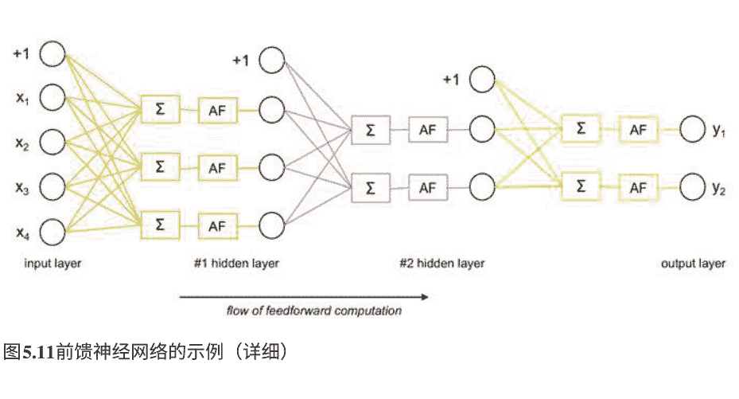

图5.11 前馈神经网络的示例（详细）

#### 5.5.1 抽象表示

请注意，在实际（非玩具）神经网络结构的实例中，为了简化图形，偏置节点很少被描绘出来。为了达到类似的目标，求和单元和激活函数单元也几乎总是被省略，从而得到一个更抽象的视图，如图5.12所示。

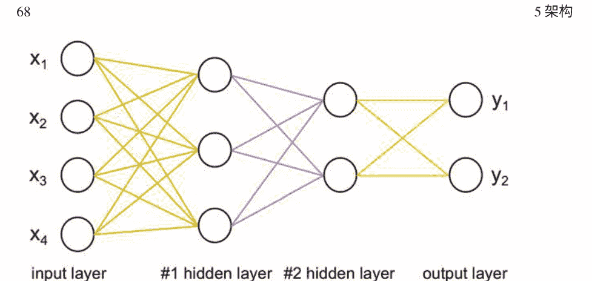

图5.12 前馈神经网络的示例（简化）

我们可以通过将每一层表示为一个长方形形式（隐藏其节点）<sup>34</sup>如图5.13所示，进一步抽象化每一层。


图5.13 前馈神经网络的示例（抽象）

#### 5.5.2 深度

图5.13中所示的架构被称为3层神经网络架构，也表示该架构的深度为三。请注意，层数（深度）确实为三，而不是四，与事实无关。

<sup>34</sup>有时它被描绘为一个矩形，参见图5.14，甚至作为一个圆圈，特别是在循环网络的情况下，参见图5.31。

将输入层、输出层和两个隐藏层相加得到四个，而不是三个。这是因为按照惯例，只有具有权重（和单元）的层在计算多层神经网络的层数时才被考虑；因此，输入层不被计算在内。实际上，输入层只充当输入接口，没有任何权重或计算。

在本书中，我们将使用上标（幂）符号<sup>35</sup>来表示神经网络架构的层数。例如，图5.13中所示的架构可以表示为前馈<sup>3</sup>。

第一个神经网络架构的深度很小。原始的感知机[165]，神经网络的祖先，只有一个输入层和一个输出层，没有任何隐藏层，即它是一个单层神经网络。在20世纪80年代，传统的神经网络主要是2层或3层架构。

对于现代深度网络来说，深度确实可以非常大，值得称为深（甚至非常深）网络。最近的两个例子，都在图5.14中有所说明，它们是：

- 27层的GoogLeNet架构[181]；以及
- 34层（甚至达到152层！）的ResNet架构<sup>36</sup> [73]。

请注意，深度确实很重要。最近的一个定理[43]指出，在$\mathbb{R}^{d}$上存在一个简单的径向函数<sup>37</sup>，可以由一个3层神经网络表示，除非其宽度在维度$d$上是指数级的，否则无法以常数精度逼近任何2层网络。直观地说，这意味着减少深度（去掉一层）意味着指数级增加层的宽度（单元的数量）。对于这个问题，感兴趣的读者还可以参考[4]和[192]中的分析。

请注意，对于图5.14中显示的两个网络，计算的流动是垂直的，GoogLeNet向上，ResNet向下。这与我们迄今为止介绍和使用的计算流动的惯例不同，后者是水平的，从左到右。不幸的是，关于计算流动的符号在文献中没有共识。请注意，在即将介绍的循环网络的特定情况下，共识的符号是垂直的，向上。

在第6.1节中将介绍一组用于表示架构或表示维度的简洁符号。

<sup>36</sup>它介绍了残差学习的技术，将输入重新注入到不同层级之间，并估计残差函数$\text{(x)} - \text{x}$，这是一种针对非常深的网络的技术，请参阅[73]了解更多细节。
<sup>37</sup>A径向函数是一个函数，其值仅取决于该点与原点之间的距离。更准确地说，如果一个函数在保持原点不变的同时对所有旋转都不变，则它是径向的。

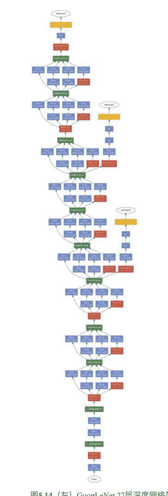

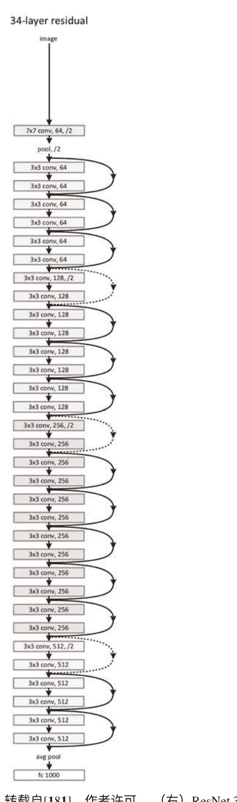

图5.14 （左）GoogLeNet 27层深度网络架构。转载自[181]，作者许可。（右）ResNet 34层深度网络架构。转载自[73]，作者许可。

#### 5.5.3 输出激活函数

我们在第5.2节中已经看到，在现代神经网络中，用于在每个隐藏层的输出引入非线性的激活函数（AF）通常是ReLU函数。但神经网络的输出层具有特殊的地位。
基本上，输出层的激活函数有三种主要类型，分别是以下的输出激活函数<sup>38</sup>：

- 恒等函数 - 用于预测（回归）任务的情况。它具有连续（实数）输出值。因此，在最后一层我们不需要也不希望进行非线性转换；
- Sigmoid函数 - 二元分类任务的情况，如逻辑回归<sup>39</sup>。Sigmoid函数（通常写作σ）在方程式5.9中定义，并在图5.8中显示。请注意其特定形状，它提供了一种“分离”效果，用于在值0和1之间进行二进制决策；并且
- Softmax函数 - 用于具有多个类别但只能选择一个标签的分类任务的最常见方法<sup>40</sup>（通常使用独热编码，参见第4.11节）。

Softmax函数实际上表示了一个离散输出变量的概率分布，具有n个可能的值（换句话说，已知输入变量x时每个可能值v的发生概率 P（y = v|x））。因此，softmax确保每个可能值的概率之和等于1。Softmax函数在方程式5.16中定义，并且其使用示例显示在方程式5.17中。请注意，像Sigmoid函数一样，softmax函数使用σ符号，因为softmax实际上是将Sigmoid推广到多个值的情况，它是一种可变参数函数，即接受可变数量的参数。

$$
\sigma(\mathbf{z})_i = \frac{e^{z_i}}{\sum_{i=1}^{n} e^{z_i}} \quad (5.16)
$$

$$
\sigma \begin{bmatrix} 1.2 \\ 0.9 \\ 0.4 \end{bmatrix} = \begin{bmatrix} 0.46 \\ 0.34 \\ 0.20 \end{bmatrix} \quad (5.17)
$$

对于分类或预测任务，我们可以简单地选择具有最高概率的值（即通过argmax函数，具有最高值的独热向量的索引）。但是，通过softmax函数产生的分布也可以用作基础进行抽样，以增加生成过程中的非确定性和内容的变化性（这将在第6.6节中详细介绍）。

#### 5.5.4 成本函数

成本（损失）函数的选择实际上与输出激活函数的选择以及目标y（真实值）的编码选择相关。表5.1总结了主要情况。

| 任务 | 输出类型（ŷ） | 输出激活 | 编码目标（y） | 成本（损失）函数 |
| :--- | :--- | :--- | :--- | :--- |
| 回归实数 | ℝ | 恒等（线性） | | 均方误差 |
| 分类二进制 | {0, 1} | Sigmoid | | 二元交叉熵 |
| 分类多类单标签独热 | | Softmax | | 分类交叉熵 |
| 分类多类多标签多热 | | Sigmoid | | 二元交叉熵 |
| 多个分类多类单标签独热 | 多 | 多 | Sigmoid | 二元交叉熵 |
| | | | 多 | Softmax | 分类交叉熵 |

表5.1 输出激活函数与成本（损失）函数之间的关系

交叉熵函数衡量两个概率分布之间的差异，在我们的情况下（分类任务）是目标（真实值）分布（y）和预测分布（ŷ）之间的差异。请注意，有两种类型的交叉熵成本函数：

- * 二进制交叉熵，当分类是二进制（布尔）时，以及
- * 分类交叉熵，当分类是多类单标签选择时。

在具有多个标签的分类情况下，必须选择二进制交叉熵与sigmoid结合（因为在這種情况下，我们希望独立地比较分布，每个类别的成本<sup>42</sup>），并且每个类别的成本相加。

在多个同时分类的情况下（多多类单标签），每个分类现在与其他分类无关，因此我们有两种方法：对每个元素应用sigmoid和二进制交叉熵，并相加成本，或者对每个分类独立地应用softmax和分类交叉熵，并相加成本。

#### 5.5.5 解释

让我们举些例子来说明这些微妙但重要的差异，从图5.15中的实数和二进制值开始。它们还包括结果的基本解释⁴³。

| Output type | Output activation function | Output value (Ŷ) | Cost | Target (true) value (y) | Interpretation | Meaning |
|-------------|----------------------------|------------------|------|-------------------------|----------------|---------|
| Real        | Identity                   | 439.7            | Mean squared error | 440 | | A4 |
| Binary      | Sigmoid                    | 0.96             | Binary cross-entropy | 1 | >0.5 | True |

图5.15 实数和二进制值的成本函数和解释

- 使用多类单标签类型的一个例子是在单声部旋律中对一组可能的音符进行分类，因此只有一个单一的可能音符选择（单标签），如图5.16所示。例如，在第6.5.1.1节中的蓝调𝑐系统中。
- 使用多类多标签类型的一个例子是在单声部多声部旋律中对一组可能的音符进行分类，因此有多个可能的音符选择（多个标签），如图5.17所示。例如，在第6.9.3节中的双轴LSTM系统中。
- 多类单标签类型的使用示例是对多声单旋律可能音符集合进行多类别分类，因此每个声部只有一个可能的音符选择，如图5.18所示。例如，在第6.5.1.2节中的蓝调𝑀𝐶系统中可以看到。
- 多类单标签类型的另一个使用示例是对一组时间步长（在钢琴卷帘表示中）的单旋律可能音符进行多类别分类，因此每个时间步长只有一个可能的音符选择。例如，在第6.4.1.1节中的DeepHear 𝑀系统中可以看到。
- 多类²级单标签类型的使用示例是对多声单旋律集合的一组时间步长进行²级多类别分类。例如，在第6.2.2节中的MiniBach系统中可以看到。

使用的三种主要解释⁴⁴是

- argmax（具有最大值的输出向量的索引），在单热多类单标签的情况下（为了选择最可能的音符），

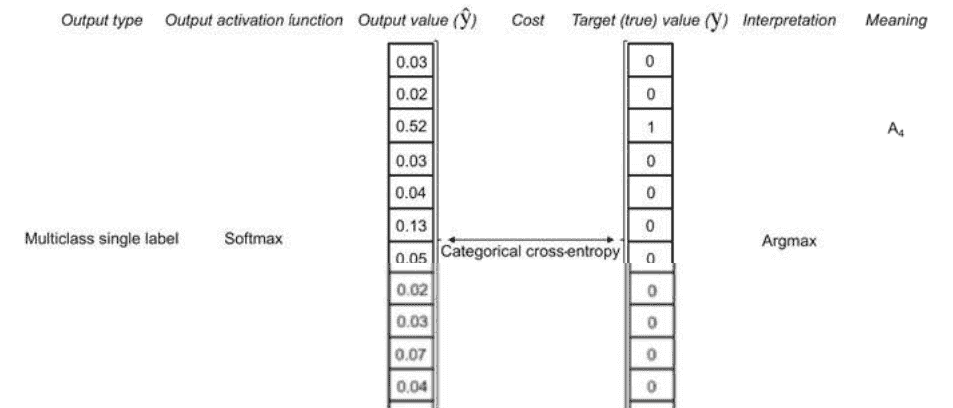

图5.16 多类单标签的成本函数和解释

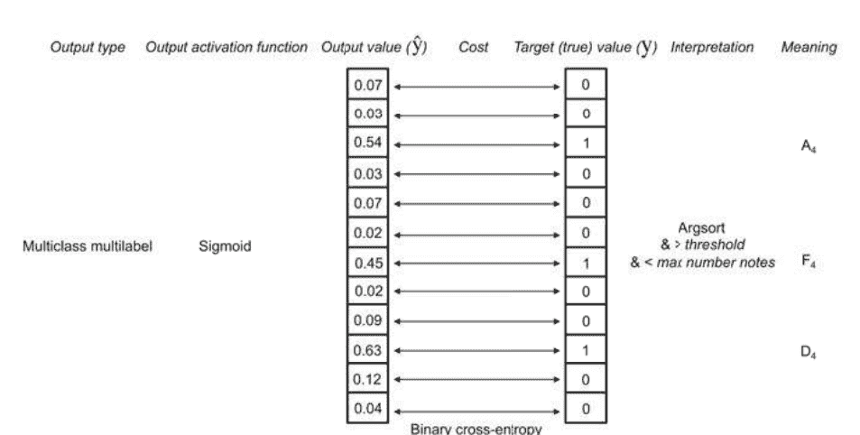

图5.17 多类多标签的成本函数和解释

- 从输出向量表示的概率中进行采样，在单热多类单标签的情况下（为了选择按其可能性排序的音符），以及
- argsort⁴⁵（根据其递减值排序的输出向量的索引），在多热多类多标签的情况下，通过一些阈值进行过滤（为了选择概率高于阈值且同时音符数量不超过最大值的最可能音符）。

⁴⁵ argsort是一个numpy库的Python函数。

| Output type | Output activation function | Output value (\hat{y}) | Cost | Target (true) value (y) | Interpretation | Meaning |
| :--- | :--- | :--- | :--- | :--- | :--- | :--- |
| Multi multiclass single label | Sigmoid | 0.03 | Binary cross-entropy | 0 | Argmax | A4 |
| | | 0.02 | | 0 | | |
| | | 0.52 | | 1 | | |
| | | 0.03 | | 0 | | |
| | | 0.04 | | 0 | | |
| | | 0.13 | | 0 | | |
| | | 0.05 | | 0 | | |
| | | 0.02 | | 0 | | |
| | | 0.03 | | 0 | | |
| | | 0.07 | | 0 | | |
| | | 0.04 | | 0 | | |
| | | 0.02 | | 0 | | |
| | | 0.05 | Binary cross-entropy | 0 | Argmax | F4 |
| | | 0.02 | | 0 | | |
| | | 0.04 | | 0 | | |
| | | 0.03 | | 0 | | |
| | | 0.02 | | 0 | | |
| | | 0.05 | | 0 | | |
| | | 0.53 | | 1 | | |
| | | 0.06 | | 0 | | |
| | | 0.03 | | 0 | | |
| | | 0.09 | | 0 | | |
| | | 0.03 | | 0 | | |
| | | 0.05 | | 0 | | |

图5.18 多类别单标签的成本函数和解释

#### 5.5.6 熵和交叉熵

均方误差在第5.1.3节的方程5.2中被定义。在不涉及信息论的细节的情况下，我们现在引入交叉熵的概念和公式⁴⁶。

信息论的直觉是，关于一个可能（预期）结果的事件的信息内容很低，而关于一个不太可能（意外，即惊喜）结果的事件的信息内容很高。

让我们以一个用于估计旋律的下一个音符的神经网络架构为例。假设结果是音符 ＝B，并且它有一个概率 P(note = B)。然后我们可以在方程5.18中引入该事件的自信息（表示为 I）。

```
I(note = B) = log(1/P(note = B)) = -log P(note = B)   (5.18)
```

> ⁴⁶在[155]中受到Preiswerk介绍的一些启发。

请记住，概率在 [0,1] 区间内。如果我们看一下图5.19中的-log函数，我们可以看到它的值对于低概率值（不太可能的结果）很高，对于概率值等于1（确定的结果）它的值为零，这对应于上面介绍的目标。请注意，对数的使用使得自信息对于独立事件是可加的，即 $I(P_1 P_2) = I(P_1) + I(P_2)$。

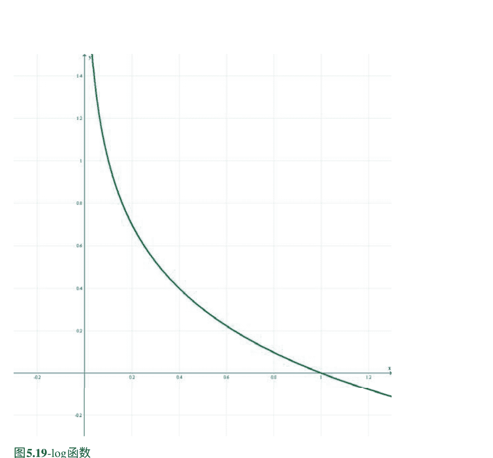

图5.19 -log函数

然后，让我们考虑所有可能的结果note = Note_i，每个结果都有一个与之相关的概率P(note = Note_i)，而P(note)则是所有可能结果的概率分布。直觉是将所有可能结果的概率分布的熵（表示为H）定义为每个可能结果的自信息的加权和，权重为该结果的概率。

这导致方程5.19。

$$H(P) = \sum_{i=0}^{n} P(\text{note} = \text{Note}_i)\, I(\text{note} = \text{Note}_i) = - \sum_{i=0}^{n} P(\text{note} = \text{Note}_i) \log P(\text{note} = \text{Note}_i) \quad (5.19)$$

#### 5.5.6 熵和交叉熵

请注意，我们可以通过使用期望的概念进一步重写定义，这导致方程5.20。

$$ H(P) = \mathbb{E}_{\text{note} \sim P}[I(\text{note})] = -\mathbb{E}_{\text{note} \sim P}[\log P(\text{note})] $$ (5.20)

现在，让我们在方程式5.21中引入Kullback-Leibler散度（通常缩写为KL-散度，并表示为$D_{\text{KL}}$），作为衡量两个不同的概率分布$P$和$Q$在同一变量（注意）上有多不同的一种度量$^{48}$ of how different are two separate probability distributions $P$ and $Q$ over a same variable (note).

$$ D_{\text{KL}}(P\|Q) = \mathbb{E}_{\text{note} \sim P} \left[ \log \frac{P(\text{note})}{Q(\text{note})} \right] = \mathbb{E}_{\text{note} \sim P} [\log P(\text{note}) - \log Q(\text{note})] = \mathbb{E}_{\text{note} \sim P} [\log P(\text{note})] - \mathbb{E}_{\text{note} \sim P} [\log Q(\text{note})] $$ (5.21)

$D_{\text{KL}}$可以重写为方程5.22$^{49}$，其中$H(P,Q)$，被称为分类交叉熵，在方程5.23中定义。

$$ D_{\text{KL}}(P\|Q) = -H(P) + H(P,Q) $$ (5.22)

$$ H(P,Q) = -\mathbb{E}_{\text{note} \sim P} [\log Q(\text{note})] $$ (5.23)

注意，分类交叉熵与KL散度类似$^{50}$，但缺少$H(P)$项。但是，最小化$D_{\text{KL}}(P\|Q)$或最小化$H(P,Q)$，关于$Q$是等价的，因为被省略的项$H(P)$是关于$Q$的常数。现在，请记住$^{51}$神经网络的目标是通过最小化它们之间的差异来预测$\hat{y}$概率分布，这是$y$真实概率分布的估计。这导致方程5.24和5.25。

$$ D_{\text{KL}}(y\|\hat{y}) = \mathbb{E}_y [\log y - \log \hat{y}] = \sum_{i=0}^{n} y_i (\log y_i - \log \hat{y}_i) $$ (5.24)

$$ H(y,\hat{y}) = -\mathbb{E}_y [\log \hat{y}] = -\sum_{i=0}^{n} y_i \log \hat{y}_i $$ (5.25)

如上所述，最小化$D_{\text{KL}}(y\|\hat{y})$或最小化$H(y,\hat{y})$，关于$\hat{y}$是等价的，因为省略的项$H(y)$是关于$\hat{y}$的常数。

最后，推导出二进制交叉熵(我们记作 $H_B$)很容易，因为只有两种可能的结果，这导致方程5.26。

```
$H_B(y, \hat{y}) = -(y_0 \log \hat{y}_0 + y_1 \log \hat{y}_1)$
```

因为$y_1 = 1 - y_0$且$\hat{y}_1 = 1 - \hat{y}_0$(因为两种可能结果的概率之和为1)，这导致方程5.27。

```
$H_B(y, \hat{y}) = (5.27)$
```

更多细节和成本函数的原则可以在[62, 第6.2.1节]和[62，第5.5节]中找到。此外，交叉熵的信息论基础是编码所需的比特数，例如在[36]中介绍。

#### 5.5.7 前馈传播

在多层神经网络中的前馈传播是将输入数据注入输入层，并通过其连续的层进行计算，直到产生输出。这可以非常高效地实现，因为它是连续向量化矩阵乘积的流水线计算（与激活函数调用交替进行）。

从第k-1层到第k层的每个计算都按照方程5.28进行处理，这是方程5.12的推广，其中$b^{[k]}$和$W^{[k]}$分别是第k-1层和第k层之间的偏置和权重矩阵，而$output^{[0]}$是输入层，如图5.20所示。

```
$输出^{[k]} = AF(b^{[k]} + W^{[k]} \cdot output^{[k-1]})$
```

因此，输出多层神经网络也经常被称为前馈神经网络或多层感知机 (MLP)$^{56}$。

请注意，神经网络是确定性的。这意味着相同的输入将确定性地始终产生相同的输出。这对于预测和分类目的是一个有用的保证，但对于生成新内容可能是一个限制。然而，这可以通过从结果概率分布中采样来进行补偿（参见第5.5.3节和第6.6节）。

- 52. 最大似然估计的基本原理在此不予解释。
- 53. 作为生成阶段和训练阶段的示例的k部分。
- 54. 一层的前馈计算已在第5.2.1节中介绍。
- 55. 我们使用上标符号和括号 $^{[k]}$ 来表示 $k$ 层，以避免与使用括号表示 $k$ 个示例和使用下标表示 $i$ 个输入变量的符号混淆。
- 56. 最初的感知器是一个没有隐藏层的神经网络，因此等同于我们的基本构建模块，只有一个输出节点，并且使用阶跃函数作为激活函数。

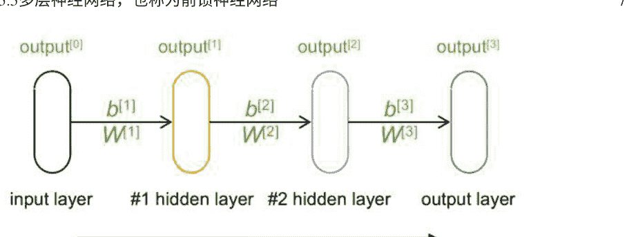

#### 5.5.8 训练

对于训练阶段^57，计算导数比在第5.1.4节中介绍的没有隐藏层的基本构建模块更复杂。反向传播是估计多层神经网络导数（梯度）的标准方法。它基于链式法则原理 [166]，以估计每个权重对最终预测误差即成本的贡献。

例如，更多细节请参见[62，第6章]。 请注意，在最常见的情况下，多层神经网络的成本函数不是凸函数，这意味着可能存在多个局部最小值。梯度下降以及其他更复杂的启发式优化方法不能保证达到全局最优解。但在实践中，巧妙配置模型（特别是其超参数，请参见第5.5.11节）和经过调优的优化启发式算法，如随机梯度下降（SGD），将导致准确的解决方案^58。

#### 5.5.9 过拟合

神经网络（以及更一般地说，机器学习算法）的一个基本问题是它们的泛化能力，即在尚未见过的数据上表现良好的能力。换句话说，我们不希望神经网络只是在训练数据上表现良好<sup>59</sup>也在未来数据上表现良好<sup>60</sup>。这实际上是一个基本的困境，两种相反的风险是

- 欠拟合- 当训练误差（在训练数据上的误差度量）很大时；和
- 过拟合- 当泛化误差（对于尚未见过的数据的预期误差）很大时。

图5.21显示了相同训练数据（绿色实心点）的欠拟合、良好拟合和过拟合模型的简单说明性示例。

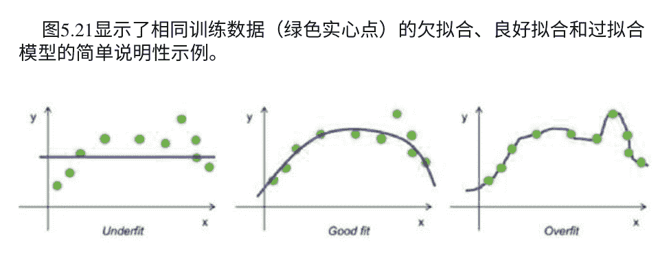

图5.21 欠拟合、良好拟合和过拟合模型

为了能够估计泛化的潜力，数据集实际上被分成两部分，比例大约为70/30:

- 训练集- 用于训练神经网络；
- 验证集，也称为测试集<sup>61</sup>- 用于估计模型的泛化能力。

^57让我们记住这是一种监督学习的情况（见第5.2节）。
^58关于这个问题，请参见[23]，它显示了以下事实：1）局部最小值位于一个明确定义的范围内，2）随机梯度下降收敛到该范围，3）随着网络规模的增加，达到全局最小值变得更加困难，4）实际上这是无关紧要的，因为全局最小值通常导致过拟合（见下一节）。
<sup>59</sup>否则，最好和简单的算法将是基于内存的算法，它只是记住所有的(x, y)对。它对训练数据拟合最好，但没有任何泛化能力。
<sup>60</sup>未来的数据尚未知道，但这并不意味着它是任何一种（随机）数据，否则机器学习算法将无法学习和泛化得好。确实存在与任务对应的数据的规律性的基本假设（例如人脸图像、爵士和弦进行等），神经网络将利用这些规律。
<sup>61</sup>实际上，正如Hastie等人在[72, 第222页]中解释的那样，可以（应该）有所区别：“重要的是要注意，实际上我们可能有两个不同的目标：模型选择：估计不同模型的性能，以选择最佳模型。模型评估：在选择了最终模型后，估计其在新数据上的预测误差（泛化误差）。如果我们处于数据丰富的情况下，对于这两个问题的最佳方法是将数据集随机分成三部分：训练集、验证集和测试集。训练集用于拟合模型；验证集用于估计模型选择的预测误差；测试集用于评估最终选择模型的泛化误差。”然而，为了简化起见，我们在本书中不考虑这种差异。

#### 5.5.10 正则化

有各种技术来控制过拟合，即改善泛化能力。它们通常被称为正则化，一些众所周知的技术示例是

- 权重衰减（也称为L²），通过惩罚过于突出的权重；
- 随机失活，通过引入随机断开连接；
- 提前停止，通过在验证集上的错误减少时存储模型参数的副本，然后在预定的迭代次数内没有进展时终止，并返回这些参数；以及
- 数据集增强，通过数据合成（例如，对于图像进行镜像、平移和旋转；对于音乐进行转位，参见第4.12.1节），以增加训练样本的数量。

我们不会进一步详细介绍正则化技术，请参阅[62，第7节]。

#### 5.5.11 超参数

除了模型的参数，即节点之间的权重，模型还包括超参数，这是在架构元级上的参数，涉及结构和控制。

主要关注架构的结构性超参数的示例是

- 层数，
- 节点数, 和
- 非线性激活函数.

主要关注学习过程的控制性超参数的示例是

- 优化过程,
- 学习率, 和
- 正则化策略和相关参数.

选择适当的值（调整）各种超参数对于神经网络在给定应用中的效率和准确性都是基础的。探索和调整超参数有两种方法:手动调整或自动调整- 通过算法探索超参数的多维空间，并对每个样本评估泛化误差. 自动调整的三种主要策略是

- 随机搜索- 通过为每个超参数定义分布，对配置进行采样和评估;
- 网格搜索- 与随机搜索相反，对每个超参数的一小组值进行系统性的探索;
- 基于模型的优化- 通过构建一个泛化误差模型并在其上运行优化算法。

自动调谐的挑战在于计算成本，尽管可以并行运行多个试验。我们将不在此处详细介绍这些方法；然而，更多信息可以在[62，第11.4节]中找到。

请注意，对于传统任务（如预测和分类），调谐活动更加客观，因为评估指标是客观的，即验证集的错误率。当任务是生成新的音乐内容时，调谐更加主观，因为没有预先存在的评估指标。

然后，通过音乐学家对生成的音乐进行手动评估，更具有定性特点。这个评估问题将在第8.6节中讨论。

## **5.5.12 平台和库**

各种平台，如CNTK、MXNet、PyTorch和TensorFlow，可作为开发和运行深度学习系统的基础。它们包括库

- 基本架构，例如我们在本章中介绍的架构;
- 组件，例如优化算法;
- 运行时接口，用于在各种硬件上运行模型，包括GPU或分布式Web运行时设备; 和
- 可视化和调试工具。

Keras是一个简化开发的高级框架示例，CNTK、TensorFlow和Theano是可能的后端。ONNX是一种开放格式，用于表示深度学习模型，旨在简化模型在不同平台和工具之间的转移。

## **5.6 自编码器**

自动编码器是一个具有一个隐藏层的神经网络，并且具有一个额外的约束: 输出节点的数量等于输入节点的数量64。

### 5.6 自编码器

输出层实际上镜像输入层。如图5.22所示，它具有其独特的对称式扁饼（或沙漏）形状。

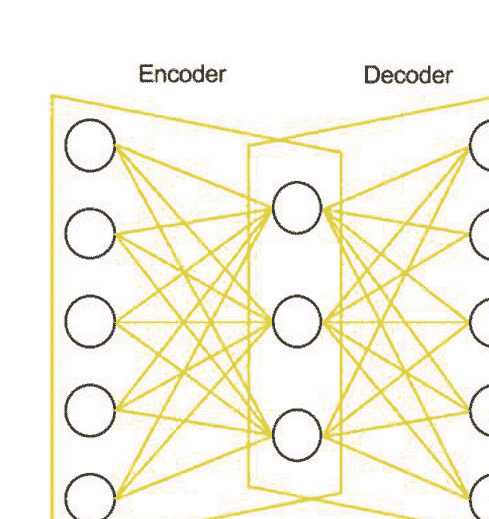

训练自编码器是一种无监督学习的情况，因为示例中不包含任何额外的标签信息（要预测的有效值或类别）。但是，诀窍在于使用传统的监督学习技术来实现，通过提供与输入数据相等的输出数据。

实际上，自编码器试图学习恒等函数。由于隐藏层通常比输入层的节点少，所以编码器组件（在图5.22中以黄色显示）必须在压缩信息的同时，解码器（在紫色显示）必须尽可能准确地重构初始信息。这迫使自编码器发现重要（有区别的）特征以将有用信息编码到隐藏层节点中（也称为潜在变量）。因此，自编码器可以用于自动提取高级特征 [109]。

提取的特征集通常被称为嵌入。一旦训练完成，为了从输入中提取特征，只需将输入数据前向传递并收集隐藏层的激活值（潜在变量的值）。

解码器的另一个有趣用途是对内容生成进行高级控制。自编码器的潜在变量构成了学习示例的共同特征的紧凑表示。通过实例化这些潜在变量并解码嵌入，我们可以生成与潜在变量值相对应的新音乐内容。我们将在第6.4.1节中探讨这种策略。

> 65 这有时被称为自监督学习[109]。
> 66 与传统的降维算法（如主成分分析（PCA））相比，这种方法有两个优点：1）特征提取是非线性的（流形学习的情况，参见[62，第5.11.3节和第5.6.2节]）；2）在稀疏自编码器的情况下（参见下一节），特征的数量可以是任意的（不一定比输入参数的数量小）。
> 67 在统计学中，潜在变量是不直接观察到的变量，而是通过数学模型从其他观察到的变量中推断出来的（直接测量）。它们可以用来降低数据的维度。
> 68 请参阅第4.9.3节中对嵌入的定义。

#### 5.6.1 稀疏自编码器

稀疏自编码器是一种具有稀疏性约束的自编码器，使得其隐藏层单元大部分时间处于非活跃状态。其目标是强制隐藏层的每个单元作为特定的特征检测器进行专门化。

例如，具有100个隐藏层单元并在10×10像素图像上训练的稀疏自编码器将学习在图像中不同位置和方向上检测边缘，如图5.23所示。当应用于其他输入领域，例如音频或符号音乐数据时，该算法也将学习有用的特征。

稀疏性约束通过将额外的项添加到要最小化的成本函数中来实现，更多细节请参见[140]或[62, 第14.2.1节]。

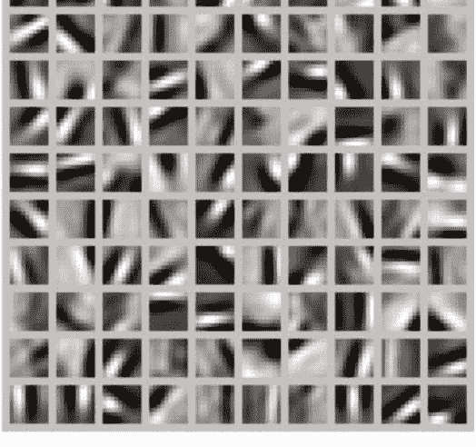

图5.23 稀疏自编码器架构中最大激活每个隐藏单元的输入图像动机的可视化。经作者许可，转载自[140]。

#### 5.6.2 变分自编码器

变分自编码器（VAE）[101]具有附加约束，即编码表示，潜在变量，按照先验概率分布 \( P(z) \)。通常，选择高斯分布⁶⁹是因为其普适性。

通过将特定项添加到成本函数中，通过计算潜在变量值与先验分布之间的交叉熵来实现此约束⁷⁰。有关VAE的更多细节，可以在[37]中找到教程示例，并且在[162]中有关于其在音乐中应用的很好介绍。

与自动编码器一样，VAE将学习身份函数，但此外解码器部分还将学习潜在变量的高斯分布与学习示例之间的关系。因此，从VAE中进行采样是直接的，只需要

- 对潜在变量z进行采样，符合分布 \( P(z) \)，即z遵循分布 \( P(z) \)；
- 将其输入解码器；并
- 前馈解码器以生成与示例分布相对应的输出，遵循解码器学习的 \( P(x|z) \)条件概率分布。

这与其他架构（如RBM）需要间接且计算昂贵的策略（如Gibbs采样）形成对比，将在第5.7节中介绍。

通过构建，变分自动编码器代表了其学习的数据集，也就是说，对于数据集中的任何示例，至少存在一组潜在变量的设置，使得模型生成与该示例非常相似的内容[37]。

变分自动编码器架构在生成目的上具有非常有趣的特性 - 因此通常被认为是一类生成模型中的一种类型 - 就是在潜在空间的有意义的探索，因为变分自动编码器能够学习到一个“平滑”的⁷¹潜在空间映射到逼真的示例。请注意，这个通用目标被称为流形学习和更一般地表示学习[8]，即学习一种捕捉示例拓扑结构的表示。如[62，第5.11.3节]中所定义，流形是一组可以用较少维度近似的点（示例），每个维度对应于一个局部方向的变化。一个直观的例子是捕捉城市拓扑结构的2D地图分布在3D地球上，地图上的移动对应于地球上的移动。

为了说明可能性，让我们只用两个潜在变量在MNIST手写数字数据库数据集[112]上训练一个VAE（共有60,000个示例，每个示例都是一个28×28像素的图像）。然后，我们扫描潜在的二维平面，在规则间隔内对两个潜在变量进行潜在值的采样（即在二维潜在空间中采样点），并通过解码潜在点生成相应的人工数字。图5.24显示了生成的人工数字的示例。

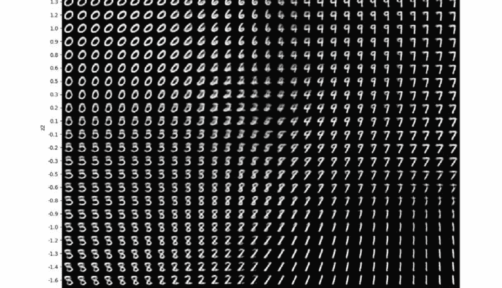

图5.24通过对MNIST手写数字数据库上的采样潜在点进行解码生成的各种数字

请注意，训练VAE强制它通过将信息分为两个子集（通过编码器）来压缩有关实际示例的信息：

- 特定的（判别性）部分，编码在潜变量中；和
- 常见的部分，编码在解码器的权重中，以便尽可能地重建每个原始数据。

实际上，VAE被迫找出数据集示例的变化维度。从图中我们可以猜测这两个维度可能是：

- 从角形到圆形元素的第一个变量（z₁，水平表示），以及
- 第二个潜变量（z₂，垂直表示）的化合物元素的大小。

请注意，我们不能期望/强制VAE朝着特定维度的语义（含义）发展，因为VAE将自动提取它们（这取决于数据集以及训练配置），我们只能尝试解释它们a posteriori。音乐生成的可能维度示例包括：音符数量，音域（从最低音到最高音的距离）等。

一旦被VAE学习，潜在表示（一组潜在变量的向量）可以用于通过各种操作控制/变化内容的生成。一些在潜在空间上的操作示例，如在第6.12.1节中描述的MusicVAE系统中提出的[162]和[161]，包括

- 平移；
- 插值；
- 一些点的平均；
- 属性向量算术，通过添加或减去捕捉给定特征的属性向量。

图5.25展示了由此产生的旋律的有趣比较

- 在数据空间中进行插值，即旋律的表示空间；和
- 在潜在空间中进行插值，然后解码为相应的旋律。

潜在空间中的插值产生比数据空间中的插值更有意义和有趣的旋律（基本上只是变化了

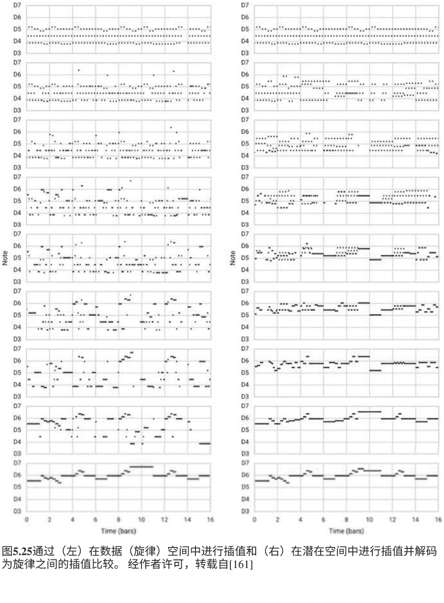

图5.25通过（左）在数据（旋律）空间中进行插值和（右）在潜在空间中进行插值并解码为旋律之间的插值比较。经作者许可，转载自[161]

#### 5.6.3 堆叠自编码器

堆叠自编码器的想法是逐层嵌套连续的自编码器并逐渐减少隐藏层单元的数量。一个2层堆叠自编码器⁷⁷的示例，即两个嵌套的自编码器，我们可以表示为Autoencoder²，如图5.26所示。

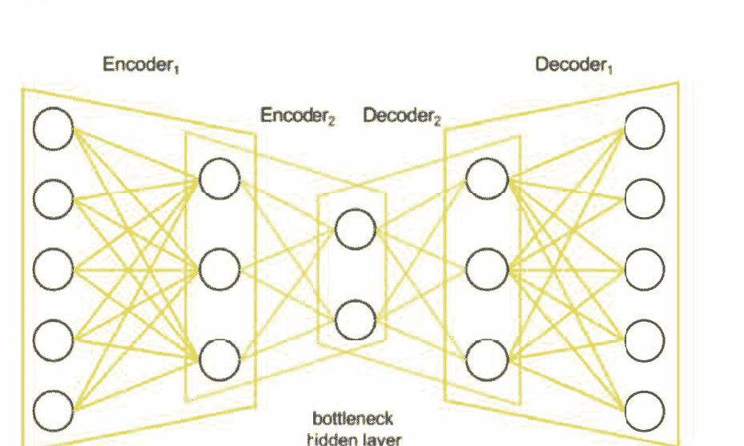

图5.26一个2层堆叠自编码器架构，得到一个4层完整架构

编码器链将逐渐压缩数据并提取更高级别的特征。堆叠自编码器，实际上是深度网络，因此用于特征提取（一个示例将在第6.10.7.1节中介绍）。它们也用于音乐生成，正如我们将在第6.4.1节中看到的。这是因为最内层的隐藏层，有时被称为瓶颈隐藏层，提供了紧凑且高级的编码（嵌入）作为生成的种子（通过解码器链）。

> ⁷⁷ 请注意，在这种情况下的约定是计算和记录嵌套自编码器的数量，即隐藏层数量。这与整个架构的深度不同，它是两倍的。例如，一个2层堆叠自编码器会得到一个4层整体架构，如图5.26所示。

### 5.7 限制玻尔兹曼机 (RBM)

限制玻尔兹曼机（RBM）[80]是一种生成性随机人工神经网络，可以学习其输入集上的概率分布。它的名称来自于它是受限制（约束）形式的玻尔兹曼机[81]，以统计力学中的玻尔兹曼分布命名，该分布用于其采样函数。RBM的架构限制（见图5.27）是

- 它是按层组织的，就像前馈网络或自编码器一样，更准确地说是两层：
  - 可见层（类似于自编码器的输入层和输出层）；和
  - 隐藏层（类似于自编码器的隐藏层）；
- 对于标准神经网络而言，同一层内的节点之间不能有连接。

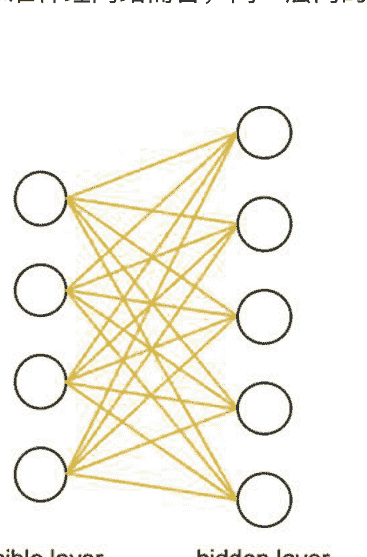

图5.27限制玻尔兹曼机（RBM）架构

RBM在精神和目标上与自编码器有一些相似之处。然而，它们之间存在一些重要的区别：

- RBM没有输出 - 输入也充当输出；
- RBM是随机的（因此不确定性），与前馈网络或自编码器相反；
- RBM以无监督学习的方式进行训练，使用特定算法（称为对比散度，参见第5.7.1节），而自编码器则使用标准的监督学习方法进行训练，输入和输出相同；并且
- 被操作的值是布尔值。

在Hinton设计了一种特定的快速学习算法用于RBM之后，RBM变得流行起来，这种算法被称为对比散度[78]，并且被用于深度神经网络的预训练 [46]（见第5节）。
RBM是一种专门用于学习分布的架构。此外，它可以丛很少的示例中高效地学习。对于音乐应用来说，这对于学习（和生成）和弦是有趣的，因为形成和弦的可能音符的组合性质很大，而示例的数量通常很少。我们将在第6.4.2.3节中看到这样一个应用的例子。

> 78 这实际上使得RBM变得实用，而不同于一般形式，除了其有趣之外，还存在学习可扩展性的限制。

#### 5.7.1 训练

训练RBM与训练自编码器有一些相似之处，但实际上的区别在于，因为没有解码器部分，RBM将在两个步骤之间交替进行：

- 前馈步骤- 将输入（可见层）编码为隐藏层，通过对隐藏层节点激活进行预测；和
- 反向步骤- 解码/重构输入（可见层），通过对可见层节点激活进行预测。

我们不会在这里详细介绍RBM背后的学习技术，请参阅[62， 第20.2节]。请注意，重构过程是生成学习的一个示例（而不是基于回归的判别学习，如训练自编码器所用的方法）⁸⁰。

#### 5.7.2 采样

在训练阶段完成后，在生成阶段，可以从模型中随机初始化可见层向量v来绘制样本。

尽管有多项式（分类）或连续值的扩展，请参阅第5.7.3节。

请参阅[142]中关于生成学习的简介（以及与判别学习的区别）的详细介绍。

通过随机初始化可见层向量v（遵循标准均匀分布）并运行采样，直到收敛为止。为此，隐藏节点和可见节点交替更新（与训练阶段相同）。

在实践中，当能量稳定时，收敛被达到。能量 of 一个配置（可见层和隐藏层的一对）在方程式5.29中表示，在其中

$$
E (v, h) = -a^T v - b^T h - v^T W h \quad (5.29)
$$

- v和h分别是表示可见层和隐藏层的列向量；
- W是与可见节点和隐藏节点之间的连接相关的权重矩阵；
- a和b分别是表示可见节点和隐藏节点的偏置权重的列向量，其中a^T和b^T是它们的转置为行向量；以及
- v^T是v的转置为行向量。

#### 5.7.3 变量类型

请注意，RBM变量（单元、可见或隐藏）实际上有三种可能性：

- 布尔或伯努利 - 这是标准RBM的情况，其中单元（可见和隐藏）是布尔型，具有伯努利分布（参见[62，第3.9.2节]）；
- 多项式分布 - 一种具有多项式单元的扩展，即具有超过两个可能离散值的情况；和
- 连续分布 - 另一种具有连续单元的扩展，可以取任意实数值（通常在[0,1]范围内）。一个例子是在第6.10.5.1节中分析的C-RBM架构。

### 5.8 循环神经网络 (RNN)

循环神经网络(RNN)是一种前馈神经网络，通过循环连接来学习序列中的项目（例如，将旋律作为一系列音符）。RNN的输入是序列中的一个元素 $x_t^{84}$，其中 t 表示索引或时间，预期输出是下一个元素 $x_{t+1}$。换句话说，RNN将被训练来预测序列的下一个元素。

为了实现这一点，隐藏层的输出重新进入自身作为额外的输入（具有特定的相应权重矩阵）。这样，RNN不仅可以基于当前项目进行学习，还可以基于其先前的状态进行学习，从而递归地学习整个先前序列。因此，RNN可以学习序列，特别是时间序列，如音乐内容的情况。

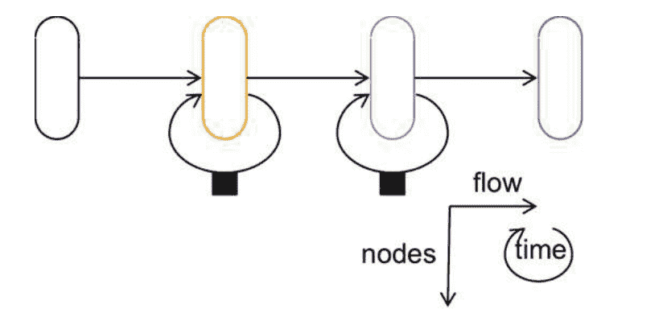

图5.28显示了一个具有两个隐藏层的RNN示例。循环连接用实心方块表示，以区分它们与标准连接$^{85}$。可视化表示的展开版本在图5.29中，其中一个新的对角轴表示时间维度，以便展示每个层的先前步骤值（以较细和较浅的颜色表示）。请注意，与标准连接（以黄色实线表示）一样，循环连接（以紫色虚线表示）完全连接（具有特定的权重矩阵）所有与上一步节点对应的节点到当前步节点对应的节点之间存在连接，如图5.30所示。

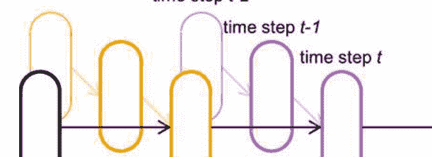

图5.29递归神经网络（展开）

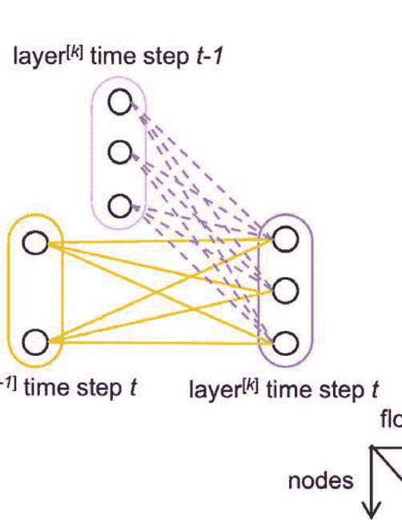

图5.30标准连接与递归连接（展开）

通过训练RNN可以学习序列上的概率分布，预测在时间步骤t中下一个元素为条件概率分布P(s_t|s_1,...,s_{t-1})，也可以表示为P(s_t|s_<t)，即给定生成的所有先前元素s_1, s_2, ..., s_{t-1}的概率分布P(s_t)。总之，递归网络（RNN）擅长学习序列，因此常用于自然文本处理和音乐生成。

> $^{84}$这种$x_t$notation（有时候用$s_t$来强调它是一个序列）非常常见，但不幸的是可能会引起与$x_i$作为第i个输入变量的符号混淆。上下文-循环与非循环网络-通常有助于区分，以及使用字母 t（表示时间）作为索引。一个例外的例子是在第6.9.1节中分析的RNN-RBM系统，它使用了$x^{(t)}$ notation。
> $^{85}$实际上，这种基本架构有一些变体，取决于递归连接的确切性质和位置。最常见的情况是每个隐藏单元都有一个递归连接，如图5.28所示。但还有一些其他情况，例如在[62，第10.2节]中可以看到。在第6.8.2节中将介绍一种具有从输出到特殊上下文输入的递归连接的音乐生成架构的示例。

#### 5.8.1 可视化表示

RNN的更常见的可视化表示是向上流动，时间向右流动，参见图5.31中只有一个隐藏层的RNN的折叠版本和图5.32中的展开版本，其中h_t是第t步隐藏层的值，x_t和y_t是第t步输入和输出的值。

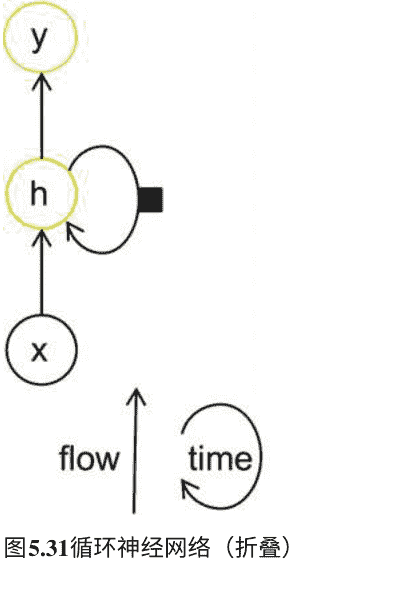

#### 5.8.2 训练

循环网络的训练方式与前馈网络不完全相同。思路是将序列中的一个示例元素（例如，旋律中的一个音符）作为输入x_t，将序列的下一个元素（下一个音符）x_{t+1}作为输出y_t。这将训练循环网络来预测下一个元素。

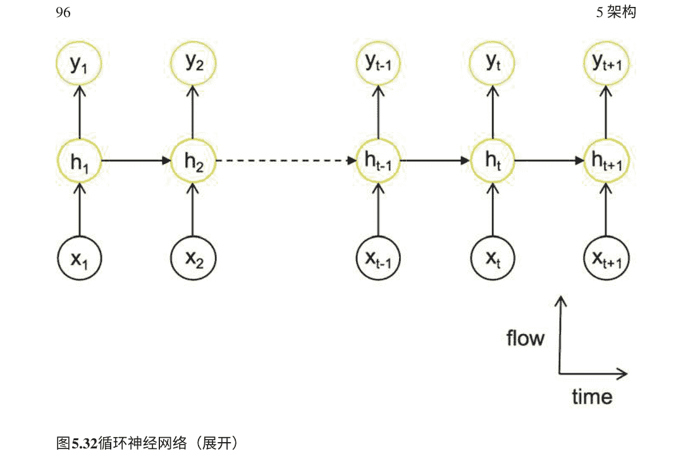

序列的一部分。 在实践中，RNN很少以元素为单位进行训练，而是以序列作为输入，并将相同的序列向左移动一步/项作为输出。 请参见图5.33^{86}的示例。 因此，递归网络将学习预测序列的所有连续元素的下一个元素。

反向传播算法用于计算前馈网络的梯度，在5.5.8节中介绍，已经扩展为递归网络的时间反向传播算法（BPTT）算法。 直观地说，通过时间展开RNN，并考虑一个有序的输入-输出对序列，但每个展开的网络副本共享相同的参数，然后应用标准的反向传播算法。 更多细节可以在[62，第10.2.2节]中找到。

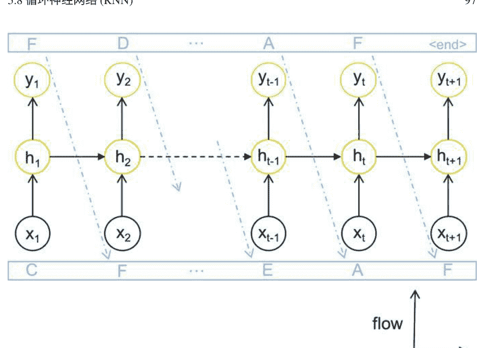

图5.33训练递归神经网络

请注意，RNN的输出层通常与其输入层相同⁸⁸，因为递归网络预测下一个项目，该项目将被迭代地用作下一个输入，以递归方式生成序列。

还要注意，训练递归网络通常被视为有监督学习的一种情况，因为对于每个项目，下一个项目被呈现为预期的预测，尽管它不是额外的标签信息（有效值或类别要预测），而只是关于下一个项目的递归信息（在序列中固有地存在）。

> ⁸⁸RNN实际上更加通用，实际上有一些罕见的情况下，RNN的输出与输入不同（与前馈网络相同）。一个例子是基于RNN的架构，用于生成基于和弦的伴奏，在第6.8.3节中进行分析。正如Karpathy在[97]中所说：“根据您的背景，您可能会想知道：递归网络有什么特别之处？ Vanilla神经网络（以及卷积网络）的一个明显限制是它们的API过于受限：它们接受一个固定大小的向量作为输入（例如图像），并产生一个固定大小的向量作为输出（例如不同类别的概率）。不仅如此：这些模型使用固定数量的计算步骤来执行此映射（例如模型中的层数）。递归网络更令人兴奋的核心原因是它们允许我们在向量序列上操作：输入中的序列，输出中的序列，或者在最一般的情况下同时操作两者。”

#### 5.8.3 长短期记忆网络 (LSTM)

由于通过时间的反向传播引入了重复的乘法运算，循环网络遇到了梯度估计的训练问题，可能导致过度放大或最小化效果⁸⁹。这个问题已经通过1997年Hochreiter和Schmidhuber提出的长短期记忆（LSTM）架构得到解决。由于解决方案非常有效，LSTM已成为循环网络的事实标准⁹⁰。

LSTM的思想是在一个块内的内存单元中安全地存储信息，以防止循环网络的标准数据流⁹¹。关于在块内写入、读取和遗忘（擦除）单元值的决策是通过打开或关闭门来执行的，并在训练过程中在不同的控制层（元层）进行学习。

因此，每个门都受到一个权重参数的调制，因此适用于反向传播和标准训练过程。换句话说，每个LSTM块学习如何根据其输入来维护其记忆，以最小化损失。

请参考图5.34中LSTM单元的概念视图。我们不会在这里进一步详细介绍LSTM单元（和块）的内部机制，因为我们可以将其视为一个黑盒子（请参考，例如，原始文章[82]）。

请注意，最近提出了一种通过训练定制访问的更通用的内存模型：神经图灵机（NTM）[65]。在这个模型中，内存是全局的，并具有读取和写入操作以及可微分的控制，因此可以通过反向传播进行学习。要访问的内存，可以通过位置或内容来指定，并通过注意力机制进行控制（在下一节中介绍）。

#### 5.8.4 注意力机制

注意机制的动机来自人类视觉系统的能力，即通过聚焦注意力来高效地跟踪和识别物体。

因此，它首先被引入到神经网络架构中用于图像识别，例如物体跟踪[34]。

然后，它被适应到用于自然语言处理的循环架构中（更具体地说是用于

> ⁸⁹ 这被称为梯度消失或梯度爆炸问题，也被称为长期依赖的挑战（参见[62，第10.7节]）。
> ⁹⁰ 虽然后来出现了一些类似的提议，例如门控循环单元（GRUs）。请参阅[24]中关于LSTM和GRU的比较分析。
> ⁹¹ 同一块中的单元共享输入、输出和遗忘门。因此，尽管每个单元的内存中可能保存着不同的值，但是块内的所有单元记忆都会同时被读取、写入或擦除[82]。

### 5.9 卷积架构模式

卷积神经网络（CNN或ConvNet）在深度学习中已经成为图像应用的常见方法。这个概念最初的灵感来自于人类视觉模型和卷积数学运算——即卷积⁹³。LeCun对神经网络进行了精心调整和改进，首先用于手写字符和物体识别[110]。这导致了在自然图像中利用空间局部相关性的高效准确的模式识别架构。

#### 5.9.1 原理

基本思想⁹⁴是：

- 通过整个图像（视为输入矩阵）滑动一个矩阵（称为滤波器、卷积核或特征检测器）；并且
- 对于每个映射位置：
  - 计算滤波器与图像的每个映射部分的点积；并且
  - 然后对结果矩阵的所有元素求和；
- 从而得到一个新的矩阵（由每个滑动/映射位置的不同求和组成），称为卷积特征，或者也称为特征图。

特征图的大小由三个超参数控制：

- 深度 - 使用的滤波器数量；
- 步幅 - 我们将滤波器矩阵在输入矩阵上滑动的像素数；以及
- 零填充⁹⁵ - 在输入矩阵周围用零填充边界。

图5.35中以一些简单的设置为例进行说明：深度=1，步幅=1，无零填充。可以使用不同的滤波器矩阵来实现不同的目标，例如检测不同的特征（例如边缘或曲线）或其他操作，如锐化或模糊。

> ⁹³在数学中，卷积是两个共享相同定义域的函数（通常表示为 f * g）之间的数学运算，它产生一个第三个函数，该函数是两个函数在定义域内点乘积的积分（或在离散情况下 - 像素图像的情况下的求和）。在连续定义域的情况下[low high]：
> (f*g)(x) = \int_{低}^{高} f(x-t)g(t)dt
> 在离散情况下：
> (f*g)(n) = \sum_{m=低}^{高} f(n-m)g(m)

> ⁹⁴受Karn在[96]中提供的直观解释的启发。有关更多技术细节，请参阅[116]或[62，第9章]。

> ⁹⁵零填充允许将滤波器映射到图像的边界。这也避免了表示的收缩问题，否则在使用多个连续的卷积层时会出现问题[62，第9.5节]。

卷积使用的参数共享（因为共享的固定滤波器）带来了平移等变性的重要属性，即图像中的模式可以独立于其位置进行检测[62，第9章]。

#### 5.9.2 阶段

卷积通常由三个连续的阶段组成：

- 卷积阶段，如第5.9.1节所述；
- 非线性整流阶段，有时称为检测器阶段，应用非线性操作，通常是ReLU；以及
- 池化阶段，也称为子采样，用于降低维度。

#### 5.9.3 池化

池化的动机是在保留重要信息的同时，减少每个特征图的维度。用于池化的操作包括最大值、平均值和求和。除了降低数据的维度，池化还具有对输入图像中的小变换、扭曲和平移的不变性的重要属性。这为整个过程提供了鲁棒性[96]。与卷积一样，池化有超参数来控制过程。图5.36展示了一个步长为2的最大池化的简单示例。

#### 5.9.4 多层卷积架构

典型的卷积架构示例，连续的层 - 每一层包括卷积、非线性和池化的三个阶段 - 如图5.37所示。最后一层是一个完全连接的层，就像标准的前馈网络一样，通常以softmax结束，以分类图像类型。

请注意，卷积是一种架构模式，因为它可以在内部应用于几乎任何列出的架构。

#### 5.9.5 时间卷积

对于音乐应用，将卷积应用于时间维度⁹⁶，以建模时间上不变的动机可能是有趣的。因此，卷积操作将在时间上共享参数[62， 第374页]，就像RNNs⁹⁷一样。然而，参数的共享是浅层的，因为它仅适用于输入的一小部分时间上的相邻成员，与RNNs共享参数的深层方式相反，对于所有时间步骤。对于音乐应用，RNNs确实比卷积网络更常见。

话虽如此，我们注意到最近出现了一些卷积架构作为RNN架构的替代品，这是在音频[193]中描述的开创性WaveNet架构的后续。WaveNet呈现了一堆因果卷积层，有点类似于循环层。另一个例子是C-RBM架构，在第6.10.5.1节中描述。

> ⁹⁶这种方法实际上是时间延迟神经网络的基础[107]。
> ⁹⁷事实上，RNN在时间上是不变的，正如[93]中所述。

如果我们现在考虑音高维度，在大多数情况下，音高间隔不被认为是不变的，因此卷积不应该先验地应用于音高维度⁹⁸。关于音乐应用中的卷积与循环（循环网络）的问题将在第8.2节中进一步讨论。

> ⁹⁸一个例外是Johnson的架构[93]，在第6.9.2节中进行了分析，它明确地寻找音高的不变性（尽管这似乎是一个罕见的选择），并相应地在音高维度上使用了一个RNN。

### 5.10 条件架构模式

条件（有时也称为条件）架构的思想是基于一些额外的条件信息对架构进行参数化，这些信息可以是任意的，例如类标签或来自其他模态的数据。目标是对数据生成过程进行一定的控制。条件信息的示例是：

- 在节奏生成系统中，可以在第6.10.3.1节中描述的低音线或节拍结构中设置一些位置约束；
- 在MidiNet系统中，可以在第6.10.3.3节中描述的和弦进行中设置一些位置约束；
- 在Anticipation-RNN系统中，可以在第6.10.3.5节中描述的音符中设置一些位置约束；并且
- 在WaveNet系统中，可以在第6.10.3.2节中描述的音乐风格或乐器中设置一些位置约束。

在实践中，条件信息通常作为额外的和特定的输入层输入到架构中，如图5.38中的紫色所示。条件层可以是：

- 一个简单的输入层。一个例子是在第6.10.3.2节中描述的WaveNet系统中指定的音乐风格或乐器的标签；或者
- 某些架构的某些输出，被
  - 相同的架构，作为一种将架构与一些历史条件化的方式⁹⁹。一个例子是MidiNet系统，将在第6.10.3.3节中描述，其中来自先前小节的历史信息被注入到架构中；或者
  - 另一种架构。一个例子是DeepJ系统，将在第6.10.3.4节中描述，其中风格标签的两个连续转换层产生一个用作条件输入的嵌入。

对于条件化一个时间不变的架构 - 在时间上是循环的或卷积的 - 有两个选择：

- 全局条件– 如果条件输入在所有时间步骤中共享；和
- 局部条件– 如果条件输入对每个时间步骤都是特定的。

WaveNet架构，在时间上进行卷积（参见第5.9.5节），提供了这两个选项，将在第6.10.3.2节中进行分析。

> ⁹⁹这在精神上接近于循环架构（RNN）。

## 5.11 生成对抗网络（GAN）架构模式

2014年，Goodfellow等人引入了一项重要的概念和技术创新，即生成对抗网络（GAN）[63]。这个想法是同时训练两个神经网络¹⁰⁰，如图5.39所示：

- 生成模型（或生成器） G， 其目标是将随机噪声向量转化为类似于从真实图像分布中抽取的真实样本的合成（伪造）样本；和
- 一个判别模型（或鉴别器）D，用于估计样本来自真实数据而不是生成器G的概率¹⁰¹。

这对应于一个极小极大的两人博弈，有一个唯一（最终）解¹⁰²：G恢复训练数据分布，D在所有地方输出1/2。

然后生成器能够从噪声向量产生用户吸引力的合成样本。然后鉴别器可以被丢弃。

最小最大关系定义在方程5.30中。

$$
\min_{G} \max_{D} V(G,D) = \mathbb{E}_{x\sim P_{\text{data}}}[\log D(x)] + \mathbb{E}_{z\sim P_z(z)}[\log(1 - D(G(z)))] \quad (5.30)
$$

- D(x)表示x来自真实数据的概率（即D的正确估计）；和
- \mathbb{E}_{x\sim P_{\text{data}}}[\log D(x)]是从真实数据中抽取x的\log D(x)的期望值。

因此，D的目标是正确估计真实数据，即最大化\mathbb{E}_{x\sim P_{\text{data}}}[\log D(x)]项。

- D(G(z))表示 G(z)来自真实数据的概率（即D的未校正估计）；
- 1 - D(G(z))表示 G(z)不是来自真实数据的概率，即它是由G生成的（即D的正确估计）；和
- \mathbb{E}_{z\sim P_z(z)}[\log(1 - D(G(z)))]是期望值，表示对于由G从随机噪声z生成的G(z)产生的\log(1 - D(G(z)))的期望值。

因此，D的目标也是正确估计合成数据，即最大化\mathbb{E}_{z\sim P_z(z)}[\log(1 - D(G(z)))]项。总之，D的目标是正确估计真实数据和合成数据，并且最大化 \mathbb{E}_{x\sim P_{\text{data}}}[\log D(x)] 和 \mathbb{E}_{z\sim P_z(z)}[\log(1 - D(G(z)))]项，即最大化 V(G,D)。相反，G的目标是最小化V(G,D)。实际训练是通过交替训练生成器和判别器来组织的。

GAN最初的动机之一是为了防止对抗者操纵深度网络以强制对输入进行错误分类（这种漏洞在[182]中进行了详细分析）。然而，从内容生成的角度来看（这是我们的兴趣所在），GAN改善了样本的生成，使其难以与实际语料库示例区分开来。

为了生成音乐，随机噪声被用作生成器G的输入，其目标是将随机噪声转化为目标，例如旋律¹⁰⁴。使用GAN生成音乐的一个例子是MidiNet系统，在第6.10.3.3节中将进行描述。

#### 5.11.1 挑战

基于极小极大目标的训练被认为是具有挑战性的优化问题[210]，存在非收敛振荡的风险。因此，仔细选择模型及其超参数非常重要[62, 第701页]。还有一些较新的技术，例如特征匹配¹⁰⁵等，用于改善训练[168]。

最近提出的一种替代GAN和自编码器的方法是生成潜在优化（GLO）[9]。这是一种通过学习从噪声向量到图像的映射来训练生成器的方法，而无需学习鉴别器。GLO在这方面，从GAN生成与从变分自编码器的隐藏层变量解码（第5.6.2节）生成有一些相似之处，因为在两种情况下，生成都是从潜在变量进行的。一个重要的区别是，通过构造，变分自编码器代表了它所学习的整个数据集，也就是说，对于数据集中的任何示例，至少存在一组潜在变量的设置，使得模型生成的东西与该示例非常相似[37]。GAN不提供这样的保证，并且在潜在空间上没有平滑的生成控制界面（例如，插值或属性算术，参见第5.6.2节），但它通常可以生成质量更好（分辨率更高）的图像，而变分自编码器则不能[124]。请注意，对于音频生成音乐的VAE来说，分辨率限制也可能是一个问题，但在符号生成音乐的情况下，这似乎不是一个直接的关注点。

因此，它既可以被视为无编码器的自编码器，也可以被视为无鉴别器的GAN。正如在5.6.2节中介绍的VAE（变分自编码器）一样，它还可以用于通过探索潜在空间来控制生成。 GLO已经在图像上进行了测试，但尚未在音乐上进行，并需要进行更多评估。

> ¹⁰⁰在原始版本中，使用了两个前馈网络。但我们会看到其他网络可能会被使用，例如C-RNN-GAN架构中的循环网络（第6.10.2.4节）和MidiNet架构中的卷积前馈网络（第6.10.3.3节）。
> ¹⁰¹未校正估计指生成器G产生样本的分布未完全收敛到真实数据分布。
> ¹⁰²指在理想条件下，该博弈会达到纳什均衡。
> ¹⁰⁴指音乐中的主旋律声部。
> ¹⁰⁵特征匹配改变了生成器的目标（以及相应的成本函数），以最小化真实数据和生成样本之间的统计差异，在[168]中可以找到更多细节。

### 5.12 强化学习

强化学习（RL）乍一看似乎与我们对深度学习架构的兴趣无关，因为它具有不同的目标和模型。 然而，最近这两种方法已经结合起来。 首次尝试是在2013年，使用深度学习架构有效地实现强化学习技术，从而产生了深度强化学习[133]。 第二次尝试是在2016年，直接与我们的关注点相关，它探索了使用强化学习来控制音乐生成，从而产生了RL-Tuner架构[92]，将在6.10.6.1节中进行描述。

让我们从强化学习的基本概念开始，如图5.40所示：

- 在环境中选择和执行动作的代理按顺序进行；
- 每个执行的动作将其带到一个新的状态；
- 代理接收到一个奖励（强化信号），表示动作对环境（当前情况）的适应度；
- 代理的目标是学习一个近乎最优的策略（动作序列），以最大化其累积奖励（收益）；

请注意，代理事先不知道环境的模型和奖励，因此它需要在探索学习更多和利用（已学到的知识）以改善其收益之间取得平衡-这就是探索利用困境。

有许多强化学习的方法和算法（更详细的介绍请参考[95]），其中，Q-learning[202]被证明是一种相对简单和高效的方法，因此被广泛使用。这个名字来自于学习（估计）Q函数Q*(s,a)，它表示给定一对(s,a)的预期收益，其中s是一个状态，a是一个动作，对于选择最优动作的代理（即按照最优策略π*）。代理将管理一个称为Q-table的表，其中包含所有可能的(s,a)对应值。随着代理探索环境，表会逐步更新，估计值变得更准确。

最近提出了一种将强化学习（更具体地说是Q-learning）和深度学习结合起来的方法，称为深度强化学习[133]，以提高学习效率。由于Q-table可能非常庞大¹⁰⁶，所以使用深度神经网络来通过学习多个重复的经验来近似Q-table的预期值。

进一步的优化，名为双Q学习[195]将动作选择与评估分离，以避免值过高估计。第一个网络，称为目标Q网络，用于估计增益（Q），而Q网络的任务是选择下一个动作。

强化学习似乎是一种有希望的方法，用于根据听众的反馈逐步调整生成的音乐，例如基于听众的反馈（该问题将在第6.16节中讨论）。同时，通过奖励机制，使用强化学习将一些控制引入到深度学习架构生成音乐的过程中，如第6.10.6节所述。

> ¹⁰⁶因为状态-动作对的数量可能随状态和动作空间的大小呈指数增长。

### 5.13 复合架构

通常使用复合架构。有些情况下是同质复合架构，结合了同一架构的不同实例，例如堆叠自编码器（见第5.6.3节），而大多数情况下是异质复合架构，结合了不同类型的架构，例如RNN编码器-解码器，见第5.13.3节。

#### 5.13.1 组合类型

我们将看到，从架构的角度来看，可以使用各种类型的组合¹⁰⁷：

- **组合**- 至少两种架构，可以是相同类型或不同类型的架构，如
    - 双向RNN（第5.13.2节）将两个RNN，正向和反向，组合在一起；以及
    - RNN-RBM架构（第5.13.5节）将RNN架构和RBM架构组合在一起。
- **细化**- 通过一些额外的约束，对一个架构进行细化和专门化¹⁰⁸，例如
    - 稀疏自编码器架构（第5.6.1节）；以及
    - 变分自编码器（VAE）架构（第5.6.2节）。
- **嵌套**- 一个架构嵌套在另一个架构中，例如
    - 一个堆叠自编码器架构（第5.6.3节）；和
    - RNN编码器-解码器架构（第5.13.3节），其中两个RNN架构嵌套在自编码器的编码器和解码器部分中，因此我们也可以表示为Autoencoder(RNN, RNN)。
- **模式实例化**- 将一个架构模式实例化到给定的架构上，例如
    - C-RBM架构（第6.58节）将卷积架构模式实例化到RBM架构上，我们可以表示为Convolutional(RBM)；
    - C-RNN-GAN架构（第6.10.2.4节），其中GAN架构模式实例化到RNN架构上，我们可以表示为GAN(RNN, RNN)；和
    - Anticipation-RNN架构（第6.10.3.5节），它将条件架构模式实例化到具有另一个RNN输出作为条件输入的RNN上，我们可以表示为Conditioning(RNN, RNN)。

> ¹⁰⁷这些分类是作者为了本书而提出的，并非标准术语。
> ¹⁰⁸指在基础架构上增加约束，使其成为更具体的变体。

#### 5.13.2 双向循环神经网络

双向递归神经网络（双向RNN）是由Schuster和Paliwal [170]引入的，用于处理预测不仅依赖于前面的元素，还依赖于下一个元素的情况，例如语音识别。在实践中，双向RNN结合了：

- 第一个RNN沿着时间向前移动，并从序列的开始开始；和
- 第二个对称RNN沿着时间向后移动，并从序列的结束开始。

双向RNN在步骤t的输出y_t组合：

- 在“前向RNN”的隐藏层的第t步的输出h_t和
- 在“后向RNN”的隐藏层的第N-t+1步的输出h^b_{N-t+1}和

图5.41中有一个示例。使用示例包括：

- BLSTM架构（第6.8.3节）；
- C-RNN-GAN架构（第6.10.2.4节），将双向RNN封装到GAN的鉴别器中；以及
- MusicVAE架构（第6.12.1节），将双向RNN封装到VAE（变分自动编码器）的编码器中。

#### 5.13.3 循环神经网络编码器-解码器

将两个相同的循环网络（RNNs）封装到一个自动编码器中，称为RNN编码器-解码器<sup>110</sup>的想法最初在[19]中提出，作为一种将由一个循环网络学习的可变长度序列编码为由另一个循环网络生成的另一个可变长度序列的技术<sup>111</sup>。动机和应用目标是从一种语言翻译到另一种语言，从而产生可能长度不同的句子。

这个想法是使用一个固定长度的向量表示作为编码器和解码器架构之间的中间表示，参见图5.42的示意图。编码器的隐藏层将充当记忆，在读取连续的$x_i$元素<sup>112</sup>时，迭代地累积关于某个长度为$N$的输入序列的信息，最终得到一个最终状态 $h^e_N$；将该状态作为整个输入序列的摘要$c$传递给解码器；解码器则基于该摘要$c$和自身先前的输出，逐步生成目标序列。

> <sup>110</sup> 也常被称为序列到序列（Seq2Seq）模型。
> <sup>111</sup> 这里的“编码”和“解码”主要指序列到序列的转换，与自编码器的降维目的不同。
> <sup>112</sup> 即输入序列的各个元素。

然后，解码器通过预测下一个项目y_t给出其隐藏状态h_t^d和摘要（作为条件附加输入）c^{113}，迭代地生成长度为M的输出序列。

RNN编码器-解码器的两个组成部分共同训练，以最小化输入和输出之间的交叉熵。请参见图5.43中处理音频语音结构的Audio Word2Vec架构示例[25]。

图5.43 RNN编码器-解码器音频Word2Vec架构。经作者许可，转载自[25]。

RNN编码器-解码器方法的一个限制是很难记住非常长的序列^{114}。两个可能的方向是

+   使用注意机制^{115}；和
+   使用分层模型，如MusicVAE架构中提出的，在第6.12.1节中介绍。

#### 5.13.4 变分循环神经网络编码器-解码器

一个有趣的发展是RNN编码器-解码器的变分版本，换句话说是一个封装了两个RNN的变分自编码器（VAE）。我们可以将其表示为Variational(Autoencoder(RNN, RNN))。目标是结合

> ^{113} 正如Goodfellow等人在[62, 第10.4节]中所指出的，另一种选择是仅使用摘要c来初始化解码器的初始隐藏状态h_0^d。例如，在第6.10.2.3节中描述的GLSR-VAE架构中选择了这种策略。
> ^{114} 在文本翻译应用中，句子的长度有限。
> ^{115} 在第5.8.4节中介绍。

+   VAE的变分属性用于控制生成^{116}；而
+   RNN的序列生成属性。

其在音乐生成中的应用示例将在第6.10.2.3节中介绍。

#### 5.13.5 多音符循环网络

RNN-RBM架构将在第6.9.1节中介绍，它通过将RBM架构和循环（LSTM）架构耦合在一起，将垂直视角（同时音符）与水平视角（音符的时间序列）关联起来，以生成多声部。

#### 5.13.6 更多复合架构

可以进一步组合已经复合的架构，例如

+   WaveNet架构（第6.10.3.2节），它是一个带有某个标签作为条件输入的条件卷积前馈架构，我们可以表示为Conditioning(Convolutional(Feedforward), Tag); 和
+   VRASH架构（第6.10.3.6节），它是一个将RNN封装在解码器上，并且解码器的条件是历史记录的变分自编码器，我们可以表示为Variational(Autoencoder(RNN, Conditioning(RNN, History))).

还有一些更具体的（临时）复合架构，例如

+   Johnson的Hexahedria架构（第6.9.2节），它将两个在时间维度上循环的层与两个在音高维度上循环的层结合在一起，作为RNN-RBM架构的一种综合替代方案; 和
+   DeepBach架构（第6.14.2节），它将两个前馈架构与两个循环架构结合在一起。

#### 5.13.7 组合的限制

有一种自然倾向去探索不同架构的可能组合，希望能够结合它们各自的特点和优点。一个复杂的复合架构的例子是VRASH架构（第6.10.3.6节），它结合了

+   变分自编码器；
+   循环网络；和
+   条件（在解码器上）。

然而，请注意

+   并非所有的组合都有意义。例如，时间维度上的循环和卷积会相互竞争，如第5.9节所讨论的；而
+   没有保证将各种类型组合在一起会产生一个声音和准确的架构^{117}。

我们将在第6章中看到，一个重要的额外设计维度是策略，它决定了架构如何处理表示以达到预期的目标和一些期望的属性（挑战）。

> 117 就像一个好厨师的情况一样，他的目标不是简单地混合所有可能的成分，而是发现原创的成功组合。

## 第6章 挑战和策略

我们现在正在接近本书的核心。本章将深入分析如何应用第5章中介绍的架构来学习和生成音乐。我们首先将使用神经网络的基本预测任务来生成一个旋律的伴奏，这是一种天真、直接的策略。

我们将看到，尽管这种简单直接的策略确实有效，但它也存在一些局限性。然后，我们将研究这些局限性，其中一些相对简单解决，一些更加困难和深刻 - 即挑战。我们将分析各种策略^1来应对每个挑战，并通过相关文献中的不同系统^2来说明它们。这也为研究架构和策略之间的可能关系提供了机会。

### 6.1 架构和表示维度的符号

首先，让我们引入一些关于架构维度和表示大小的简洁符号：

+   架构类型 $n$ 表示一个$n$层架构^3，例如，前馈^2表示MiniBach系统中将在第6.2.2节中介绍的2层前馈架构。
+   架构类型 $\times n$ 用于一个 $n$ 实例的复合架构，例如，RNN$\times 2$表示在第6.10.6.1节中介绍的RL-Tuner的双RNN复合架构，以及
+   One-hot$\times N$ 用于多位热编码表示，例如：
    *   一个时间步长的独热编码，例如：One-hot$\times 64$ 用于DeepHear_M系统在第6.4.1.1节中介绍的64个时间步长表示,
    *   一个音轨的独热编码，例如：One-hot$\times 2$ 用于Blues_MC系统在第6.5.1.2节中介绍的旋律+和弦表示，或者
    *   一个多时间步长编码和多音轨编码的组合，例如：One-hot$\times 64 \times (1+3)$ 用于MiniBach系统在第6.2.2节中介绍的64个时间步长1个音轨输入和3个音轨输出表示。

一个组合符号的例子是LSTM²$\times 2$，用于Anticipation-RNN系统在第6.10.3.5节中介绍的双2层RNN复合结构。

> ^1请记住，在接下来的章节中，这一点非常重要，正如第2章中所述，我们在这里考虑的是与生成阶段相关的策略，而不是训练阶段（可能不同）。
> ^2正如第2章中提出的，我们使用术语系统来表示基于深度学习的音乐生成的各种提案-架构、模型、原型、系统和相关实验-这些提案来自相关文献。
> ^3这个符号实际上已经在第5.5.2节中介绍过了。

### 6.2 一个简单的例子

#### 6.2.1 单步前馈策略

最直接的策略是使用神经网络的预测或分类任务来生成音乐内容。让我们考虑以下目标：给定一个旋律，我们想要生成一个伴奏，例如对位。我们将考虑一个数据集的示例，每个示例都是一对（旋律，对位旋律（和弦））。然后，我们以监督学习的方式在这个数据集上训练一个前馈神经网络架构。训练完成后，我们可以选择任意一个旋律，并将其输入到架构中，以生成相应的对位伴奏，以数据集的风格为基础。生成在一次前馈处理的单步中完成。因此，我们将这种策略称为单步前馈策略。

#### 6.2.2 示例：MiniBach赞美诗对位伴奏符号音乐生成系统

让我们考虑以下目标：通过三个匹配的部分，为女高音声部生成一个与给定旋律相配的对位伴奏。我们将使用J. S.巴赫的多声部赞美诗集[5]作为语料库。由于我们希望这个初级系统简单，我们只考虑语料库中长度为4小节的片段。数据集是通过从原始的352首赞美诗中提取所有可能的长度为4小节的片段构建的，同时还转调了所有可能的调式。在这个数据集上训练后，该系统可以用于为任意长度为4小节的旋律生成三个对位声部。不知何故，它确实捕捉到了J. S.巴赫的实践。

巴赫选择了各种旋律作为女高音，并以对位的方式创作了三个额外的声部旋律（用于女中音、男高音和低音）。
首先，我们需要确定输入和输出的表示方式。我们用四个4/4音乐小节来表示。输入和输出的表示方式都是符号化的，属于钢琴卷类型，每个音轨都采用独热编码，即输出表示采用多热编码。前三个声部（女高音、女中音和男中音）有20个可能的音符范围，还有一个额外的标记来编码保持4，而最后一个声部（男低音）有27个可能的音符范围，还有保持符号。时间量化（时间步长的值）设置为十六分音符，这是语料库中使用的最小音符持续时间。输入表示的大小为21个可能的音符 × 16个时间步长 × 4个小节，即21 × 16 × 4 = 1,344，而输出表示的大小为（21 + 21 + 28） × 16 × 4 = 4,480。

该架构是一个前馈网络，如图6.1所示。如前所述，并且由于表示和架构之间的映射，输入层有1,344个节点，输出层有4,480个。隐藏层有200个单元⁵。隐藏层使用的非线性激活函数是ReLU。输出层的激活函数是sigmoid，成本函数是二元交叉熵（这是一种多²多类单标签的情况，请参见第5.5.4节）。

架构和编码的详细信息如图6.2所示。它显示了连续音乐时间片段的编码直接映射到输入节点（变量）的连续独热向量。在图中，每个黑色向量元素以及每个相应的黑色输入节点元素都说明了特定音符时间片段的特定编码（独热向量索引），具体取决于其实际音高（或在较长音符的情况下保持，用括号表示）。双重过程发生在输出端。每个灰色输出节点元素说明了选择的音符（具有最高概率的音符），导致相应的独热索引，最终为每个旋律声部生成一系列音符。

这个系统的特点，名为MiniBach⁶，在我们的多维概念框架中总结（如第2章方法中定义）在Table 6.1中。符号⁷ One-hot$\times 64 \times (1+3)$表示具有1个输入+3个输出声音的编码，每个声音都有64个（用于16个时间步长的4个小节）one-hot编码的音符。符号前馈²表示2层前馈架构（带有1个隐藏层）。从女高音旋律生成的赞美诗对位的示例如图6.3所示。

图6.1 MiniBach架构

| 目标           | 伴奏; 对位; 赞美诗; 巴赫                |
| :------------- | :--------------------------------------- |
| 表示           | 符号化; 钢琴卷帘; 单热×64×(1+3); 保持   |
| 架构           | 前馈                                     |
| 策略           | 单步前馈                                 |

表6.1 MiniBach摘要

#### 6.2.3 第一次分析

MiniBach生成的赞美诗乍一看很令人信服。但是，独立于定性音乐评估的专家可能会发现一些缺陷，MiniBach的客观限制如下：

+   结构上的限制是生成的音乐（以及输入旋律）具有固定的大小（无法生成更长或更短的音乐片段）。
+   相同的旋律将始终产生完全相同的伴奏，因为前馈神经网络架构的确定性特性。
+   生成的伴奏是在一个原子步骤中产生的，没有任何人为干预的可能性（即没有增量和互动）。

图6.2 MiniBach架构和编码

图6.3 MiniBach从高音旋律生成的一段赞美诗对位的示例

### 6.3 限制和挑战的初步列表

现在让我们引入一个初步的限制列表（在大多数情况下，未满足的属性）和挑战⁸：

+   从无到有的生成（与伴奏相对）；
+   长度可变性（与固定长度相对）；
+   内容可变性（与确定性相对）；
+   表现力（与机械化相对）；
+   旋律和和声的一致性；
+   控制（例如，调性一致性，最大重复音符数等）；
+   风格转换；
+   结构；
+   原创性（与模仿相对）；
+   增量性（与一次性生成相对）；
+   互动性（与自动化相对）；
+   适应性（与使用中没有改进）；和
+   可解释性（与黑盒相对）。

我们将通过可能的匹配解决方案对它们进行分析，并通过各种示例系统进行说明。

### 6.4 Ex Nihilo 生成

MiniBach系统擅长生成与输入旋律相匹配的伴奏（由三个不同的旋律组成的对位曲）。这是一个有监督学习的例子，因为训练样本包括输入（旋律）和相应的输出（伴奏）。

现在假设我们的目标是单独生成一段旋律 - 而不是作为某个输入旋律的伴奏 - 同时基于从旋律语料库中学到的风格。标准的前馈架构及其伴随的单步前馈策略，例如MiniBach中使用的策略（在第6.2.2节中描述），对于这样的目标是不合适的。

让我们介绍一些生成新音乐内容的策略，例如从零开始或从最小的种子信息开始，比如一个起始音符或一个高级描述。

> ⁸我们对限制和挑战之间的浅显区别如下：限制具有相对明确的解决方案，而挑战则更加深远，仍然是开放研究的主题。

#### 6.4.1 解码器前馈

第一种策略基于自编码器架构。如第5.6节所解释的那样，在训练阶段，自编码器将专门将其隐藏层转化为检测学习的音乐类型及其变化的特征的探测器⁹。然后，可以将这些特征用作输入接口来参数化音乐内容的生成。其思想是：

+   选择一个作为隐藏层单元对应值的向量作为种子；
+   将其插入隐藏层；并
+   通过解码器进行前馈。

我们将这种策略称为解码器前馈，它将生成与训练示例相同格式的新的音乐内容。为了获得一个最小和高级的特征向量，通常使用堆叠自动编码器（见第5.6.3节）。然后，在堆叠自动编码器的瓶颈隐藏层中插入种子，并通过解码器链进行前馈。因此，简单的种子信息可以生成任意长的、固定长度的音乐内容。

##### 6.4.1.1 示例：DeepHear拉格泰姆旋律符号音乐生成系统

一个例子是Sun的DeepHear系统[179]。使用的语料库是Scott Joplin的拉格泰姆音乐的600个小节，分为4个小节长的片段。使用的表示方法是带有多个独热编码的钢琴卷帘。量化（时间步长）是六分音符，因此表示包括4×16=64个时间步长（表示为独热×64）。输入节点的数量约为5,000个，提供了大约80个可能的音符值的词汇表。架构如图6.4所示，是一个4层堆叠自动编码器（表示为自动编码器⁴），具有逐渐减少的隐藏单元数量，最终为16个单元。

在预训练阶段之后¹¹，进行最终训练，每个提供的示例都被用作输入和输出，在自监督学习方式下进行（见第5.6节），如图6.5所示。

通过将随机数据作为种子输入到16个瓶颈隐藏层单元¹²（在红色矩形内显示），然后将其馈送到解码器链中进行处理，以产生输出（在相同的4个小节中进行长格式作为训练示例，如图6.6所示。我们总结了DeepHear的特点_M13在表6.2中。在[179]中，Sun指出该系统产生了一定数量的抄袭。一些生成的音乐几乎是从语料库中复制的。他说这是由于瓶颈隐藏层的尺寸很小（仅16个节点）[179]。他测量了相似性（定义为生成乐曲中与训练乐曲中相同的音符百分比），发现平均值为59.6%，这确实相当高，尽管它并不能阻止大多数生成的乐曲听起来不同。

图6.4 DeepHear堆叠自编码器架构。从[179]中复制的图的扩展，作者许可。

图6.5 训练DeepHear。从[179]中复制的图的扩展，作者许可。

> ¹³我们将这个DeepHear旋律生成系统标记为DeepHear_M，其中M代表旋律，因为在第6.10.4.1节中将介绍另一个使用相同DeepHear架构但目标不同的实验。

图6.6 使用DeepHear_M进行旋律生成。从[179]中复制的图的扩展，作者许可。

| 目标           | 旋律; 排练                              |
| :------------- | :-------------------------------------- |
| 表示           | 符号化; 钢琴卷; 单热×64                 |
| 架构           | 堆叠自编码器 = 自编码器⁴                |
| 策略           | 解码器前馈                              |

表6.2 DeepHear_M 摘要

##### 6.4.1.2 示例：deepAutoController音频音乐生成系统

deepAutoController系统，由Sarroff和Casey [169]开发，与DeepHear（见第6.4.1.1节）类似，也使用了堆叠自编码器。但表示方式是音频，更准确地说是由傅里叶变换生成的频谱，请参阅[169]了解更多细节。数据集由8,000首包含10种音乐流派的歌曲组成，共产生了70,000帧的幅度傅里叶变换¹⁴。整个数据被归一化到[0,1]范围内。使用的成本函数是均方误差。架构是一个2层堆叠自编码器，瓶颈隐藏层有256个单元和输入和输出层具有1,000个节点。作者报告称增加隐藏单元的数量似乎并没有改善模型性能。

> ¹⁴正如作者在[169]中所述：“我们选择使用幅度FFT（快速傅里叶变换）的帧来构建我们的模型，因为当相位信息被保留时，它们可以被精确地重建为原始时域信号，傅里叶系数不会改变，并且适当的窗口和重叠添加被应用。”因此，通过自编码模型处理后的重建质量更容易主观评估。”

该系统总结如表6.3所示，还提供了一个用户界面，在第6.15节中进行了分析，用于交互式控制生成，例如选择给定的输入（插入到瓶颈隐藏层），生成随机输入，并控制（通过缩放或静音）给定单元的激活。

| 目标           | 音频: 用户界面                         |
| :------------- | :------------------------------------- |
| 表示           | 音频: 频谱                             |
| 架构           | 堆叠自编码器 = 自编码器²               |
| 策略           | 解码器前馈                             |

表6.3 deepAutoController摘要

#### 6.4.2 采样

另一种策略是基于采样的。采样是根据概率分布从随机模型中生成一个元素（一个样本）的行为。

##### 6.4.2.1 采样基础

采样的主要问题是确保生成的样本与给定的分布匹配。基本思想是以这样的方式生成一系列样本值，即随着生成更多的样本值，值的分布越来越接近目标分布。因此，样本值是通过迭代生成的，下一个样本的分布仅依赖于当前样本值。每个连续的样本都是通过生成和测试的策略生成的，即通过生成一个潜在的候选样本，根据定义的概率密度接受或拒绝它，并在需要时重新生成它。已经提出了各种采样策略：Metropolis-Hastings算法，Gibbs采样（GS），块Gibbs采样等。有关采样算法的更多详细信息，请参见[62，第17章]。

##### 6.4.2.2 音乐生成的采样

对于音乐内容，我们可以考虑两个不同级别的概率分布（和采样）：

+   项目级别或垂直维度 - 在一个复合音乐项目的级别上，例如一个和弦。在这种情况下，分布是关于和弦组成部分之间的关系，即描述音符一起出现的概率；并且
+   序列级别或水平维度 - 在一系列项目的级别上，例如由连续音符组成的旋律。在这种情况下，分布是关于音符序列的，即描述给定音符后特定音符出现的概率。

通常使用受限玻尔兹曼机（RBM）架构来建模垂直维度，即应该一起演奏哪些音符。如第5.7节所述，RBM架构专门用于学习分布，并且可以从少量示例中高效学习。这对于学习和生成和弦特别有趣，因为形成和弦的可能音符的组合性质很大，而示例的数量通常很少。将在第6.4.2.3节中介绍在RBM上应用于水平维度的采样策略的示例。

RNN（循环神经网络）架构通常用于水平维度，即在给定音符之后可能播放哪个音符，如第6.5.1节所述。正如我们将在第6.6.1节中看到的，采样策略也可以添加以增加变化性。

我们将在第6.9.1节中看到，一种名为RNN-RBM的复合架构可以结合和表达这两种不同的方法：

+   一个带有垂直维度采样策略的RBM架构；和
+   一个带有水平维度迭代前馈策略的RNN架构。

另一种方法是将采样作为两个维度的唯一策略，正如在第6.14.2节中所分析的DeepBach系统所见。

##### 6.4.2.3 示例：基于RBM的和弦音乐生成系统

在[11]中，Boulanger-Lewandowski等人提出使用受限玻尔兹曼机（RBM）[80]来建模多声部音乐。他们的目标实际上是改善从音频中转录多声部音乐。但在此之前，作者们讨论了从已学习的模型中生成样本作为定性评估和音乐生成的问题[12]。在他们的第一个实验中，RBM从语料库中学习了可能同时出现的音符的分布，即和弦的曲目。

语料库是J.S.巴赫的赞美诗集（如第6.2.2节中描述的MiniBach）。多声部（同时出现的音符数）从0到15不等，平均多声部为3.9。输入表示具有88个二进制可见单元。

> > ¹⁵ 一个反例是C-RBM卷积RBM架构，将在第6.10.5.1节中介绍，它对单声部多声部音乐的垂直维度（同时音符）和水平维度（音符序列）进行建模。
> > ¹⁶ 在第6.9节中，将进一步分析如何表达垂直和水平维度，即和声与旋律的关系。

这些序列跨越了从A0到C8的整个钢琴范围，采用了一种多热编码的方式进行对齐（转置）到一个共同的音调上（例如C大调/小调），以便于学习过程。

通过块Gibbs采样，可以从RBM中进行采样，通过交替地从可见层节点（视为变量）中采样隐藏层节点（参见第5.7节）。图6.7展示了各种样本的示例。垂直轴表示连续的可能音符。每一列代表一个特定的样本，由多个同时发出的音符组成，在分析明确时，下方会写出和弦的名称。表6.4总结了这个基于RBM的和弦生成系统，我们将其表示为RBMC（其中 c代表和弦）。

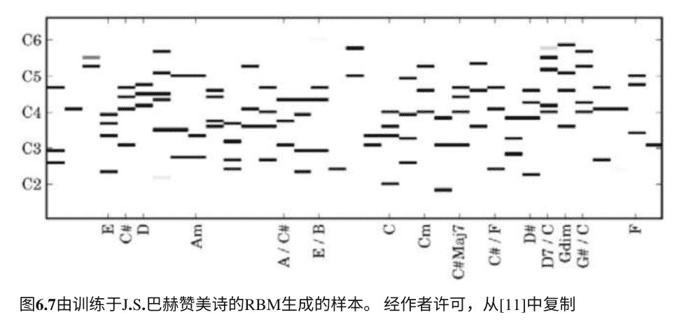

| 目标 | 同时音符（和弦） |
| :--- | :--- |
| 表示符号化；多热 | |
| 架构 RBM | |
| 策略 | 抽样 |

### 6.5 长度可变性

单步前馈策略（第6.2.1节）和解码器前馈策略（第6.4.1节）的一个重要限制是生成的音乐长度（更准确地说是时间步长或小节数）是固定的。这是一个实际上，这个问题可以通过架构来解决，即输出层的节点数为^17。要生成更长（或更短）的音乐作品，需要重新配置架构及其相应的表示。

#### 6.5.1 迭代前馈

解决这个限制的标准方法是使用循环神经网络（RNN）。最初由Graves在[64]中描述的典型用法是用于文本生成，其方法是：

- 选择一些种子信息作为第一个项目（例如，旋律的第一个音符）；
- 将其馈送到递归网络中以生成下一个项目（例如，下一个音符）；
- 使用此下一个项目作为下一个输入以生成下一个下一个项目；
- 重复此过程，直到生成所需长度的序列（例如，音符序列，即旋律）。

请注意，生成过程是逐个元素进行的迭代过程。因此，我们将此方法命名为迭代时间步前馈策略，简称为迭代前馈策略。实际上，递归-当前输出重新输入作为下一个输入-也经常出现。然而，有一些罕见的例外，正如我们将在Sequential（第6.8.2节）和BLSTM（第6.8.3节）架构中看到的那样，其中存在迭代但没有递归。

请注意，迭代前馈策略，如解码器前馈策略（第6.4.1节），是一种基于种子的生成方法（参见第6.4节），完整序列（例如旋律）是从初始种子项（例如起始音符）迭代生成的。

##### 6.5.1.1 示例：蓝调和弦序列符号音乐生成系统

在[42]中，Eck和Schmidhuber描述了一项使用LSTMs^18的循环网络架构的双重实验。在他们的第一个实验中，目标是学习和生成和弦序列。表示格式为钢琴卷帘，有两种类型的序列：旋律和和弦，尽管和弦被表示为音符。旋律范围以及和弦词汇受到严格限制，因为语料库由12小节的布鲁斯乐曲手工制作而成（旋律和和弦）。13个可能的音符从中央C（C~4~）延伸到男高音C（C~5~）。12个可能的和弦从C到B。

使用了一种独热编码。时间量化（时间步长）设置为八分音符，是语料库中最小音符持续时间的一半，即四分音符。

^17在RBM的情况下，输入层的节点数（也充当输出层的角色）。
^18这实际上是使用LSTMs生成音乐的第一个实验。

对于12小节的音乐，这相当于96个时间步长。 图6.8显示了一个和弦序列训练示例。

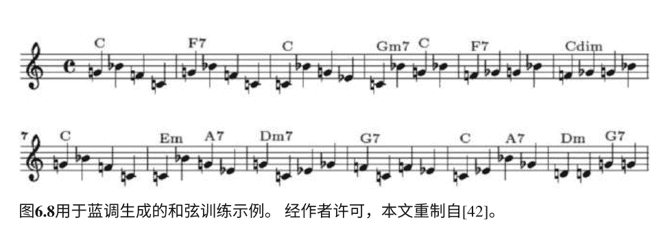

图6.8 用于蓝调生成的和弦训练示例。经作者许可，本文重制自[42]。

这个第一个实验的架构是：一个具有12个节点的输入层（对应于12个和弦词汇的独热编码），一个包含两个细胞的四个LSTM块的隐藏层¹⁹和一个具有12个节点的输出层（与输入层相同）。

生成是通过提供一个种子和弦（用音符表示）并通过迭代地向前馈送网络来执行的，产生下一个时间步的和弦预测，将其用作下一个输入，依此类推，直到生成一系列和弦。 架构和迭代生成如图6.9所示。这个系统，我们将其表示为Blues_C（其中C代表和弦），在表6.5中进行了总结。

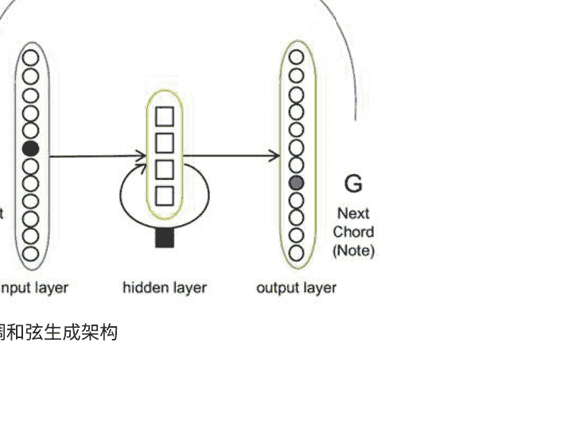

图6.9 蓝调和弦生成架构

| 目标 | 和弦序列；蓝调 |
| :--- | :--- |
| 表示符号化；独热编码；音符结束；和弦作为音符 | |
| 架构 LSTM | |
| 策略 | 迭代向前馈送 |

**表6.5 蓝调C总结**

##### 6.5.1.2 示例：蓝调旋律和和弦符号化音乐生成系统

在Eck和Schmidhuber的第二个实验[42]中，目标是同时生成旋律和和弦序列。新的架构是之前架构的扩展：它有一个具有25个节点的输入层（对应于12个和弦词汇的独热编码和13个旋律音符词汇的独热编码），一个具有八个LSTM块的隐藏层（四个和弦块和四个旋律块，如下所示），每个块包含两个单元，并且具有一个具有25个节点的输出层（与输入层相同）。

- 和弦块与与和弦对应的输入节点和输出节点完全连接；
- 旋律块与与旋律对应的输入节点和输出节点完全连接；
- 和弦块与自身和旋律块有递归连接；
- 旋律块只有与自身的循环连接。

通过将种子（音符和和弦）呈现并将其递归地前馈到网络中，生成下一个时间步音符和和弦的预测，以此类推，直到生成一系列带有和弦的音符。

图6.10显示了生成的旋律和和弦的示例。表6.6总结了这个第二个系统，我们将其表示为Blues_MC（其中 MC代表旋律和和弦）。

| 目标 | 旋律+和弦；蓝调 |
| :--- | :--- |
| 表示符号化；独热×2；音符结束；和弦作为音符 | |
| 架构 LSTM | |
| 策略 | 迭代前馈 |

**表6.6 蓝调_MC总结**

这个第二个实验很有趣，因为它同时生成旋律和和弦。请注意，在这个第二个架构中，循环连接是不对称的，因为作者希望确保和弦的主导作用。和弦块既与自身有循环连接，也与旋律块有循环连接，而旋律块则没有与和弦块有循环连接。这意味着和弦块将接收有关和弦和旋律的上一步信息，而旋律块不能使用有关和弦的上一步信息。这种在架构中的递归连接的有些特殊的配置是一种控制和谐与旋律之间相互作用的主从方式。在旋律和和声之间的相互作用和一致性的控制确实是一个有效的问题，并且在第6.9节中我们将进一步分析替代方法。

### 6.6 内容可变性

在RNN上的迭代前馈策略的一个限制，正如在第6.5.1.2节中描述的蓝调生成实验所示，是生成是确定性的。实际上，神经网络是确定性的[20]。因此，对相同的输入进行前馈传递将始终产生相同的输出。由于下一个音符、下一个下一个音符等的生成是确定性的，相同的种子音符将导致相同的生成音符序列[21]。此外，由于只有12个可能的输入值（12个音高类别），因此只有12个可能的旋律。

#### 6.6.1 采样

幸运的是，正如我们将看到的，通常的解决方案非常简单。假设旋律的输出表示是一位有效编码。换句话说，输出表示是一种钢琴卷式类型，输出激活层是softmax，生成被建模为分类任务。在图6.11中可以看到一个示例，其中 $P(x_t = C | x_{<t})$ 表示元素（音符）$x_t$ 在步骤$t$ 时给定先前元素$x_{<t}$（到目前为止生成的旋律）的条件概率为C。

默认的确定性策略是选择具有最高概率的类（音符），即 $\arg\max_{x_t} P(x_t | x_{<t})$，即图6.11中的Ab。然后，我们可以轻松地切换到一种非确定性策略，通过对应于可能音符之间的概率分布（通过softmax函数）进行采样输出。通过根据生成的分布采样一个音符$^{22}$，我们引入了过程中的随机性，从而在生成中引入了变化。

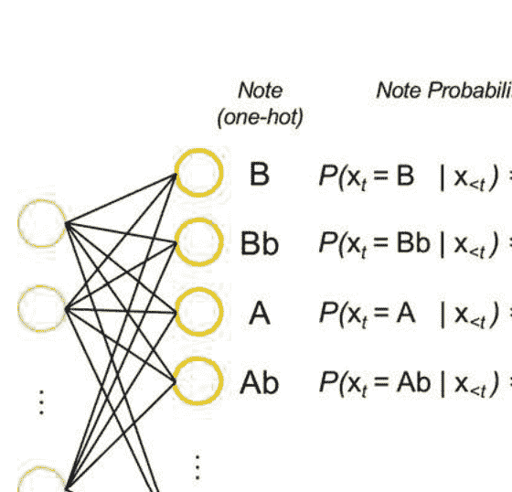

##### 6.6.1.1 示例：CONCERT巴赫旋律符号音乐生成系统

CONCERT (CONnectionist Composer of ERudite Tunes的首字母缩写) 是由Mozer [138]于1994年开发的，实际上是基于循环网络（在LSTM之前）生成音乐的最早的系统之一。它旨在生成旋律，可能带有一些和弦进行作为伴奏。

输入和输出表示包括音符的三个方面：音高、持续时间和和声伴奏。音高的表示方式被命名为PHCCCH，受Shepard的心理音高表示空间[172]的启发，基于五个维度，如图6.12所示。

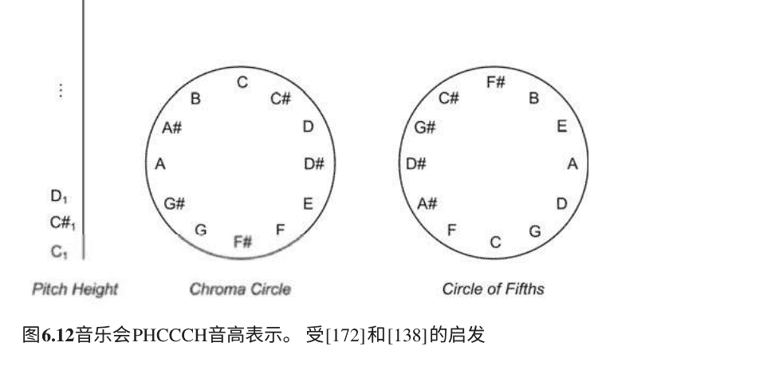

主要组成部分如下：

- 音高高度（PH）
- （模）色度圆（CC）笛卡尔坐标
- （和声）五度圆（CH）笛卡尔坐标

动机在于通过捕捉八度的相似性和音符与其五度的和声相似性，实现更具音乐意义的音高表示。两个音高的接近程度通过计算它们的PHCCCH表示之间的欧氏距离来确定，该距离在移调下保持不变。音高高度的编码通过一个标量变量进行，范围从C1的-9.798到C5的+9.798。色度圆和五度圆的编码通过一个六位二进制值向量进行，详细原因请参见[138]。结果编码包括13个输入变量，其中一些示例显示在表6.7中。请注意，休止符被编码为具有唯一代码的音高。

表6.7 PHCCCF音高表示的示例

| 音高 | H | CC | CH |
| :--- | :--- | :--- | :--- |
| C1 | -9.798 | +1 +1 +1 -1 -1 -1 | -1 -1 -1 +1 +1 +1 |
| F#1 | -7.349 | -1 -1 -1 +1 +1 +1 | +1 +1 +1 -1 -1 -1 |
| G2 | -2.041 | -1 -1 -1 -1 +1 +1 | -1 -1 -1 +1 +1 +1 |
| C3 | 0 | +1 +1 +1 -1 -1 -1 | -1 -1 -1 +1 +1 +1 |
| D#3 | 1.225 | +1 +1 +1 +1 +1 +1 | +1 +1 +1 +1 +1 +1 |
| E3 | 1.633 | -1 +1 +1 +1 +1 +1 | +1 -1 -1 -1 -1 -1 |
| A4 | 8.573 | -1 -1 -1 -1 -1 -1 | -1 -1 -1 -1 -1 -1 |
| C5 | 9.798 | +1 +1 +1 -1 -1 -1 | -1 -1 -1 +1 +1 +1 |
| 休止符 | 0 | +1 -1 +1 -1 +1 -1 | +1 -1 +1 -1 +1 -1 |

持续时间在非常细粒度的水平上考虑，每个拍子（四分音符）被分为十二分之一，因此持续时间为12/12。这个选择可以表示二进制（两个或四个分割）以及三进制（三个分割）的节奏。与音高的表示方式类似，持续时间通过标量和两个圆坐标表示，分别对应1/4和1/3拍周期，如图6.13所示，通过一个五维二进制值向量直接编码（详见[138]）。时间范围是一个音符步骤，即架构处理的粒度是一个音符步骤²³。

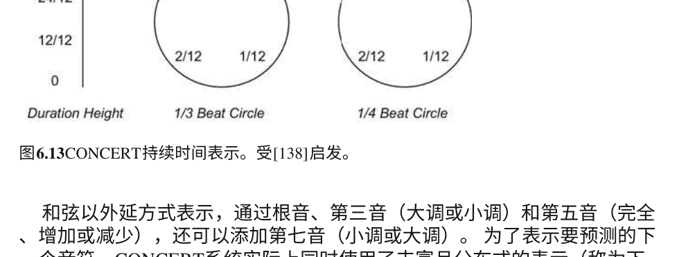

和弦以外延方式表示，通过根音、第三音（大调或小调）和第五音（完全、增加或减少），还可以添加第七音（小调或大调）。为了表示要预测的下一个音符，CONCERT系统实际上同时使用了丰富且分布式的表示（称为下一个节点分布式，见图6.14）和更简洁传统的表示（称为下一个节点本地），以提高可理解性。激活函数是经过重新缩放到[-1,+1]范围的sigmoid函数，成本函数是均方误差。

> ²³而不是大多数循环架构中的固定时间步长，例如在第6.5.1.1节中。各种类型的时间范围已在第4.8.1节中介绍。

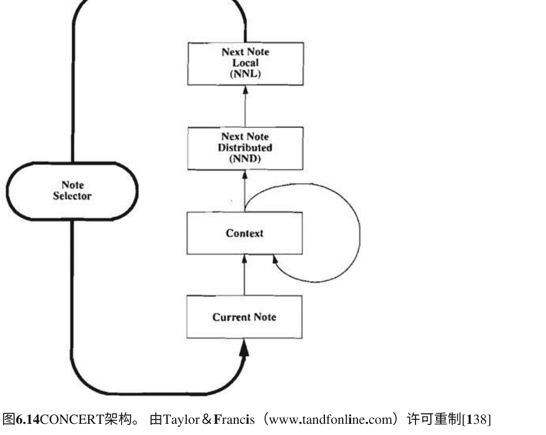

图6.14 CONCERT架构。由Taylor & Francis (www.tandfonline.com) 许可重制[138]

在生成阶段，输出被解释为可能音符集上的概率分布，作为决定下一个音符的基础，以非确定性的方式，遵循抽样策略。

CONCERT已在不同的示例上进行了测试，特别是在使用J. S. Bach的旋律进行训练后。图6.15显示了基于巴赫训练集生成的旋律示例。尽管现在有点过时，CONCERT仍然是一个开创性的模型，并且关于表示问题的文章讨论仍然相关。

还要注意，CONCERT（在表6.8中概述）代表了早期生成系统，在深度学习架构出现之前，当时的表示是使用丰富的手工特征设计的。使用深度学习架构的一个好处是，这种丰富而深入的表示可以由架构自动提取和管理。

| 目标 | 旋律 + 和弦 |
| :--- | :--- |
| 表示 | 符号化; 和声; 和谐; 节拍 |
| 架构 | 循环神经网络 |
| 策略 | 迭代前馈; 采样 |

表6.8 CONCERT摘要

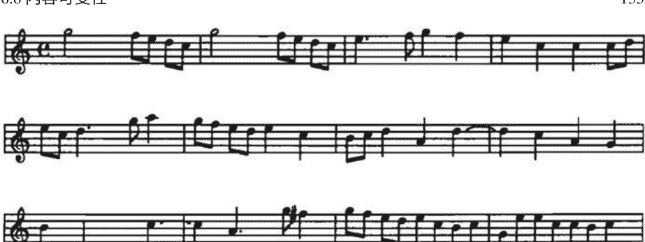

图6.15 基于J.S.巴赫训练集的CONCERT旋律生成示例。转载自[138]，经Taylor & Francis (www.tandfonline.com)许可

##### 6.6.1.2 示例：凯尔特旋律符号音乐生成系统

另一个代表性的例子是Sturm等人开发的用于生成凯尔特音乐旋律的系统[178]。所使用的架构是一个具有三个隐藏层的循环网络，我们可以将其表示为LSTM3，每层有512个LSTM单元。

语料库包括从名为The Session [98]的存储库和讨论平台检索到的民间和凯尔特单声部旋律。太短、太复杂（具有不同的节拍）或包含错误的乐曲被过滤掉，留下了一个包含23,636个旋律的数据集。所有旋律都被调整（转置）到单一的C键上。其中一个特点是所选择的表示方式是文本化的，即基于令牌的folk-rnn记谱法，这是字符型ABC记谱法的转换（见第4.7.3节）。输入和输出节点的数量等于词汇表中令牌的数量（即使用独热编码），实际上等于137。网络的输出是其词汇表上的概率分布。

训练递归网络是通过迭代的方式完成的，因为网络学会了预测下一个项目。一旦训练完成，生成过程是通过输入一个随机令牌或特定令牌（例如，对应于特定的起始音符），将其前馈到生成输出，从该概率分布中进行采样，并递归地使用所选的词汇元素作为后续输入，以逐个元素地生成旋律。

最后一步是将生成的folk-rnn表示解码为MIDI格式的旋律以进行播放。请参见图6.16中生成的旋律示例。也可以在[177]上查看和听取结果。结果非常令人信服，生成的旋律具有明显的凯尔特风格。该系统在表6.9中进行了总结。

请注意，如5.5.2节所述，我们在计算隐藏层的数量时不考虑输入层。

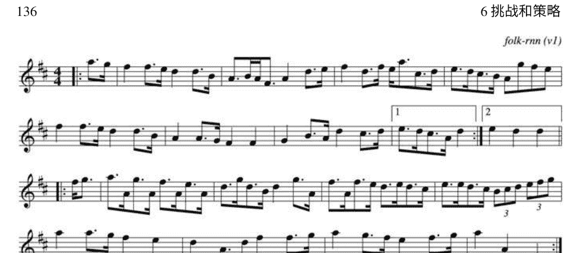

图6.16 自动生成的“The Mal's Copporim”乐谱。转载自[178]，作者许可。

> > 正如[66]所观察到的：“有趣的是，在这种方法中，小节线和重复小节线是明确给出的，也需要进行预测。”这可能会导致一些问题，因为不能保证标记的输出序列能够表示一个有效的ABC格式的歌曲。例如，一个小节中可能有太多的音符，但根据作者的说法，这种情况很少发生。这表明这样的架构能够学会计数。”²⁵

| 目标 | 旋律 |
| :--- | :--- |
| 表示符号化；文本；基于标记；独热编码 | |
| 架构 | LSTM³ |
| 策略 | 迭代前馈；采样 |

表6.9 凯尔特系统概述

### 6.7 表现力

大多数现有系统的一个限制是它们考虑所有音符的固定动态（振幅）以及精确的量化（固定的速度），这使得生成的音乐过于机械，缺乏表现力和细微之处。

一种自然的方法是考虑从真实演奏中记录的表示，而不仅仅是乐谱，因此具有音乐基础（由熟练的人类音乐家）的速度和动态的变化，如第4.10节所讨论的。

请注意，另一种方法是自动地对生成的音乐信息（例如标准的MIDI乐曲）进行微小的振幅和/或速度变换。一个例子是Cyber-Jo~ao系统[29]，通过自动检索和应用节奏模式，以富有表现力的方式演奏bossa nova吉他伴奏。

如第4.10.3节所述，在音频表示的情况下，表现力是隐含在表示中的。然而，由于表示是全局的，因此很难单独控制单个乐器或声音的表现力（动态或速度）。28

#### 6.7.1 示例：Performance RNN 钢琴和声符号音乐生成系统

在[173]中，Simon和Oore提出了他们的架构和方法论，名为Performance RNN。它是基于LSTM的递归神经网络架构。其中一个特点在于数据集的特征，因为该语料库由记录的人类演奏组成，每个音符的准确时间和动态都有记录。所使用的语料库是Yamaha e-Piano Competition数据集，该数据集的参赛者MIDI演奏记录对公众开放[209]。它收录了超过1,400位熟练的钢琴家的演奏。为了创建额外的训练示例，应用了一些时间拉伸（最多快5%或慢5%）以及一些移调（最大三度）。

表示适应于目标。乍一看，它类似于一个带有MIDI音符编号的钢琴卷帘，但实际上有些不同。每个时间片是一个多独热向量，表示以下可能事件的可能值之一：

- 一个新音符的开始 - 有128个可能的值（MIDI音高），
- 一个音符的结束 - 有128个可能的值（MIDI音高），
- 时间偏移 - 有100个可能的值（从10毫秒到1秒），
- 动态 - 有32个可能的值（将128个MIDI速度量化为32个bins²⁹）。

图6.17显示了一个演奏表示的示例。用户可以使用一些控制，称为温度，它以以下方式控制生成事件的随机性：

- 温度为1.0使用精确的分布预测，
- 小于1.0的值会减少随机性，从而增加模式的重复，
- 较大的值会增加随机性，减少模式的重复。

示例可在网页[173]上找到。 Performance RNN总结见表6.10。

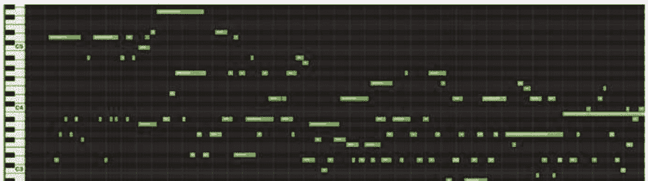

| 目标 | 多声部；性能控制 |
| :--- | :--- |
| 表示符号化 | 独热编码×4；时间偏移；动态 |
| 架构 LSTM | |
| 策略 | 迭代前馈；采样 |

表6.10 Performance RNN摘要

### 6.8 RNN 和迭代前馈再探

正如我们在之前的例子中所看到的，迭代前馈策略基于递归神经网络（RNN）架构的思想，以迭代生成序列的连续项。递归神经网络架构和迭代前馈策略似乎紧密相连。 事实上，几乎所有基于RNN的系统都使用迭代前馈策略，并将生成的输出（下一个时间步生成的）递归地重新输入。 但是在本节中，我们将介绍一些例外情况。

## 6.8.1 #1 示例：时间窗口化的旋律符号音乐生成系统

托德在[189]中的实验是最早的尝试之一（在1989年）探索如何使用人工神经网络生成音乐。尽管他提出的架构现在并没有直接使用，但他的实验和讨论是开创性的，仍然是重要的信息来源。

托德的目标是以某种迭代的方式生成一个单声部的旋律。他尝试了不同的选择来表示音符（参见第4.5.3节）和持续时间，但最终决定使用传统的音高音符表示方法，采用一位有效编码和时间步长的时间范围方法。

时间步长设置为八分音符的持续时间。在大多数实验中，用于训练的输入旋律长度为34个时间步长（即四个小节和半个小节），在末尾填充休止符。音符的开始由一个特定的标记表示，并作为附加值编码节点进行编码（参见第4.9.1节和第4.11.7节）。休止符不是显式地编码，而是作为音符的缺失，即作为音符一位有效编码中所有值都为空值（参见第4.11.7节）。第一个实验是作者称之为时间窗口化架构，其中考虑了一个固定大小的连续时间段的滑动窗口。实际上，这个旋律片段的滑动窗口长度为一个小节，即8个时间步长。它的表示可以被视为一个钢琴卷帘，就像MiniBach架构中的表示方式一样（参见第6.2.2节），其中连续的音符的一位有效编码用于8个连续的时间步长，表示为One-hot×8。

该架构是一个前馈网络（而不是循环神经网络），其输入是一个旋律段，输出是下一个旋律段，并且具有一个隐藏层。生成是通过迭代（和递归）逐个旋律段进行的。该架构如图6.18所示。

对于旋律段的每个时间步，预测的音符是具有最高概率的音符。由于休止符的零热编码（即所有值为空），在每个可能音符的概率较低和休止符的情况之间存在歧义（参见第4.11.7节）。因此，引入了一个概率阈值，即0.5。因此，如果最高概率大于0.5，则预测的音符是具有最高概率的音符，否则是休止符。

该网络以监督方式进行训练，通过将一个旋律段作为输入呈现，并将其相应的下一个段作为输出，并对各个段重复此过程。请注意，由于该架构不是循环的，尽管网络将学习两个连续旋律段之间的成对相关性[^30]，但没有明确的记忆来学习长期相关性，例如循环网络架构的情况。因此，尽管作者没有展示与其下一个实验的比较（见下一节），该架构似乎具有较低的学习长期相关性的能力。时间窗口架构总结如表6.11所示。

> [^30] 在这方面，时间窗模型类似于一阶马尔可夫模型（仅考虑先前状态）在一个旋律小节的层面上。

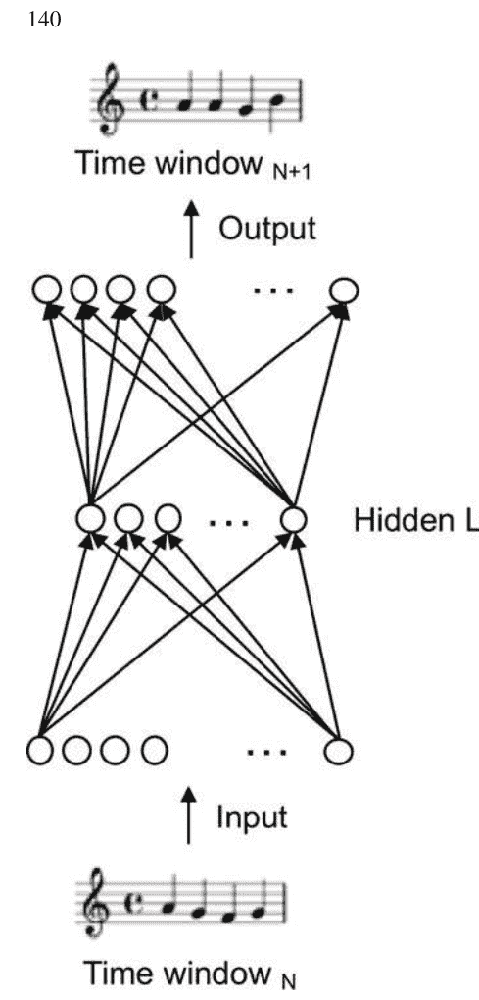

图6.18 时间窗架构。灵感来自[189]

## 表6.11 时间窗总结

| 目标 | 旋律 |
| :--- | :--- |
| 表示 | 符号化；钢琴卷帘；独热×8；音符开始；隐含休止 |
| 架构 | 前馈 |
| 策略 | 迭代前馈 |

## 6.8.2 #2 示例：顺序旋律符号音乐生成系统

在[189]中，托德提出了另一种架构，他将其命名为顺序，因为音符是按顺序生成的。如图6.19所示。

输入层分为两部分，分别称为上下文和计划。上下文是实际的记忆（迄今为止生成的旋律）并由与每个音符（D4到C6）对应的单元组成，以及关于音符开始信息的单元（在图6.19中标记为“nb”）。因此，它从输出层接收下一个音符的信息，并具有与每个单元对应的重新输入连接[^31]。此外，正如托德解释的那样：“通过在每个单独的上下文单元上具有自反馈连接，保留了不仅仅是单个先前输出（音符）的记忆。”[^32]

该计划代表了网络学习到的一段旋律（其中之一）。托德尝试了各种编码方式，包括一位有效编码或分布式编码（通过多个有效嵌入）。

训练是通过选择一个要学习的计划（旋律）来完成的。上下文单元的激活被初始化为0，以便从一个干净的空上下文开始。然后，网络进行前馈，并将其输出与要学习的旋律的第一个时间步音符进行比较，从而调整权重。输出值[^33]被传回到当前上下文。然后，网络再次进行前馈，导致下一个时间步音符，再次与旋律目标进行比较，直到旋律的最后一个时间步。然后，对各种计划（旋律）重复此过程。

通过使用与新旋律（不属于训练计划/旋律）对应的新计划嵌入来进行新旋律的生成。上下文单元的激活被初始化为0，以便从一个干净的空上下文开始。生成是迭代进行的，一步一步地。请注意，与大多数迭代前馈策略（第6.5.1节）不同，在托德的顺序架构中，输出不是显式地重新输入（递归）到架构的输入中，而是由于递归连接的特定性质而隐式地重新进入上下文单元：输出重新进入上下文单元，而输入（计划旋律）保持不变。

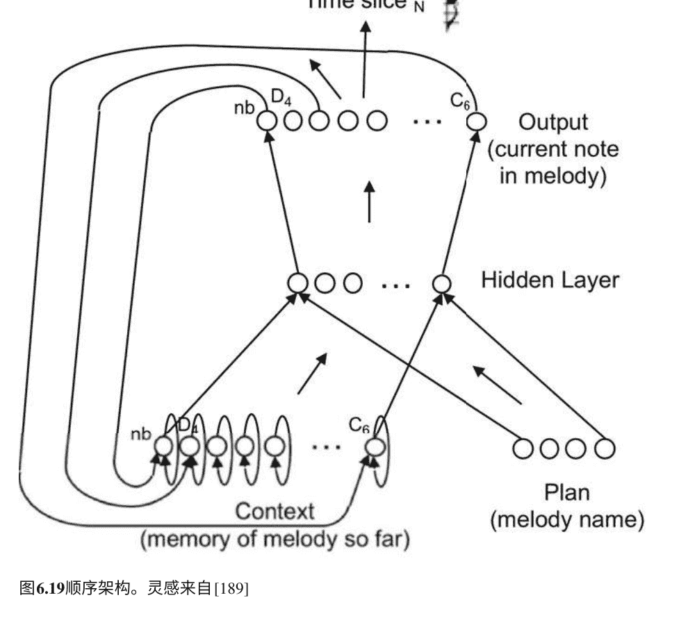

图6.19 顺序架构。灵感来自[189]

在对计划旋律进行训练之后，可以通过输入新的计划来生成各种旋律，如图6.20所示。重复符号 `:` 表示网络输出进入一个固定循环。

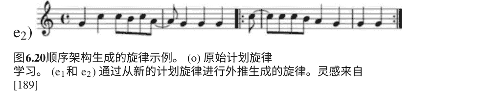

图6.20 顺序架构生成的旋律示例。(o) 原始计划旋律学习。(e1和e2) 通过从新的计划旋律进行外推生成的旋律。灵感来自[189]

还可以在已学习的几个（两个或更多）计划旋律之间进行插值[^34]。示例见图6.21。顺序架构概述如表6.12所示。

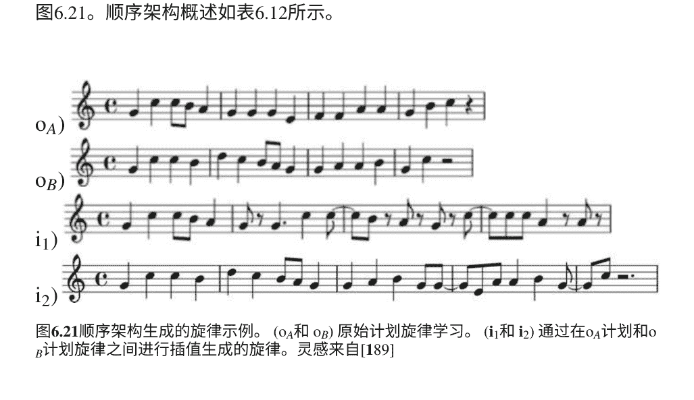

## 表6.12 顺序架构摘要

| 目标 | 旋律 |
| :--- | :--- |
| 表示 | 符号化；钢琴卷帘；独热编码；音符开始；隐式休止 |
| 架构 | RNN |
| 策略 | 迭代前馈 |

## 6.8.3 #3 示例：BLSTM和弦伴奏符号音乐生成系统

Lim等人的BLSTM（双向LSTM）和弦伴奏系统[119]是一种罕见且有趣的情况[^35]基于循环架构的伴奏系统。目标是生成一个和弦的进程（序列）作为一段旋律的伴奏（以符号方式指定）。

该语料库是从一个已经关闭的主旋律乐谱公共数据库导入的。作者选择了2,252首不同西方现代音乐（摇滚，流行音乐、乡村音乐、爵士乐、民谣、节奏布鲁斯、儿童歌曲等），全部采用大调并且大多数每小节只有一个和弦（否则只考虑第一个和弦）。这样得到了一个由1,802首歌曲（共72,418小节）组成的训练集和一个由450首歌曲（共17,768小节）组成的测试集。所有歌曲都转调（对齐）到C大调。

期望的特征从原始的XML文件中提取出来，并转换成CSV[^36]（电子表格）矩阵格式，如图6.22所示。表示的具体细节如下：

- 对于旋律[^37]，只考虑音高类别（不考虑八度），结果是一个12音符的独热编码（称为12音级向量）加上其余部分；并且
- 对于和弦，只考虑它们的主要三和弦，只有两种类型：大和小，导致24个和弦的独热编码。

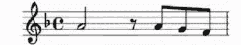

| time | measure | key_fifths | key_mode | chord_root | chord_type | note_root | note_octave | note_duration |
| :--- | :--- | :--- | :--- | :--- | :--- | :--- | :--- | :--- |
| 4/4 | 1 | -1 | major | F0 | major | A0 | 4 | 8.0 |
| 4/4 | 1 | -1 | major | F0 | major | rest | 0 | 2.0 |
| 4/4 | 1 | -1 | major | F0 | major | A0 | 4 | 2.0 |
| 4/4 | 1 | -1 | major | F0 | major | G0 | 4 | 2.0 |
| 4/4 | 1 | -1 | major | F0 | major | F0 | 4 | 2.0 |

图6.22 从单个小节中提取的数据示例。根据[119]在CC BY 4.0许可下复制

该架构是一个双向LSTM，具有两个LSTM层，每个层有128个单元。动机是向网络提供音乐上下文的前后信息。架构考虑的时间步长为四个小节，如图6.23所示。tanh函数用作隐藏层的非线性激活函数，softmax用作输出层的激活函数，其关联的损失函数为分类交叉熵。

训练是使用各种四个小节长的样本作为输入，并使用滑动窗口生成其关联的四个和弦作为输出，覆盖每个训练歌曲。生成是通过迭代地前馈传递连续的歌曲的四个小节长的旋律片段（时间切片）连接起来，形成四个小节长的和弦进行片段。

这种架构很奇特，尽管是循环的，但生成不是递归的，并且输出数据的性质和结构（和弦）与输入数据（音符）不同。此外，需要注意的是，尽管策略是迭代的，架构是循环的，但每个迭代步骤的粒度相当粗糙，因为它是4个小节长，而不是大多数基于循环架构和迭代前馈策略的系统，这些系统将时间步骤考虑为最小音符持续时间的级别（例如，第6.5.1.1节中分析的系统）。这种混合架构/策略在前向/单步和循环/迭代之间可能是出于捕捉水平相关性历史的目标（旋律音符之间和伴奏和弦之间的相关性），因为LSTM单元专注于捕捉垂直相关性历史（音符和和弦之间的相关性）。

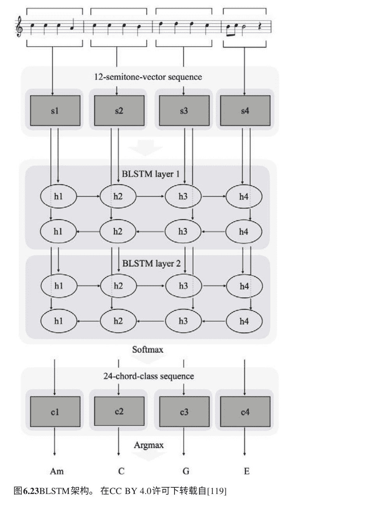

图6.23 BLSTM架构。在CC BY 4.0许可下转载自[119]

该系统已通过与一些隐马尔可夫模型（HMM）模型和一些深度神经网络-HMM混合模型（称为DNN-HMM，详见[198]）的比较进行评估，无论是定量（通过比较准确性和混淆矩阵）还是定性（通过对25名音乐素质不高的参与者进行基于网络的调查）。结果显示BLSTM模型具有更高的准确性和偏好，见图6.24的简单示例。作者指出，评估还显示，当歌曲是未知的时，对BLSTM模型的偏好较弱。他们推测这是因为BLSTM通常生成比原始和弦序列更多样化的原因。BLSTM系统总结如表6.13所示。

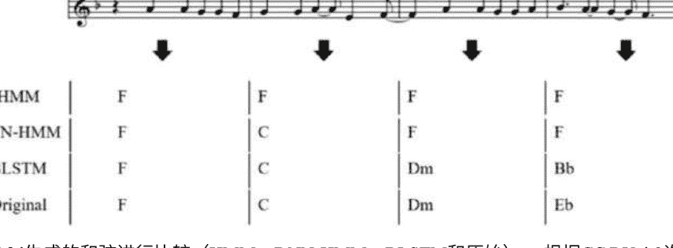

## 表6.13 BLSTM摘要

| 目标 | 伴奏；和弦序列；西方现代音乐 |
| :--- | :--- |
| 表示 | 符号化；CSV；独热×(12×* + 24×4)；休止符 |
| 架构 | LSTM² |
| 策略 | 迭代前馈 |

#### 6.8.4 总结

总之，我们已经看到RNN架构通常与迭代前馈策略相结合，这允许基于递归种子的可变长度生成，如第6.5节所讨论的。然而，也有一些例外情况：

- Todd的时间窗系统（第6.8.1节）使用迭代前馈策略在前馈架构上生成旋律，以及
- BLSTM系统（第6.8.3节）使用迭代前馈策略在循环架构上生成和弦伴奏。

我们将在接下来的内容中（在第6.10.2.3节中描述的VRAE系统中）进一步了解RNN编码器-解码器复合架构（第5.13.3节），作为一种通过将解码器前馈策略与迭代前馈策略相结合来解耦输入序列长度与输出序列长度的方法。

在第6.18节中将讨论一些架构和策略之间的耦合示例，或者挑战之间的耦合示例。在此之前，我们将继续分析挑战以及可能的解决方案或方向。

### 6.9 旋律和和声的互动

当目标是同时生成一段旋律和伴奏时，通过一些和声或对位来表达[^38]，一个问题是旋律和和声之间的音乐一致性。尽管像MiniBach（第6.2.2节）这样的通用架构被认为已经学习到了相关性，但垂直和水平维度之间的相互作用并没有明确考虑。

我们在第6.5.1.2节中分析了一个具体的架构示例，用于同时生成旋律和和弦，并且它们之间存在明确的关系（即和弦可以使用有关旋律的先前步骤信息，但反之不行）。然而，这种架构有点特殊。在接下来的几节中，我们将分析一些更一般的架构，考虑到旋律和和声之间的相互作用。

> [^38] 和声和对位是两种不同关注点和优先级的伴奏方法。和声关注同时发生的音符之间的垂直关系，作为独立对象（和弦），然后考虑它们之间的水平关系（例如，和声终止）。相反，对位关注每个同时进行的旋律（声部）之间连续音符的水平关系，然后考虑它们的进展之间的垂直关系（例如，避免平行五度）。请注意，尽管它们的观点不同，但分析和控制垂直和水平维度之间的关系是它们共同的目标。

## 6.9.1 #1 示例：RNN-RBM 多声部符号音乐生成系统

在[11]中，Boulanger-Lewandowski等人将RBM-based架构（在第6.4.2.3节中介绍）与循环神经网络（RNN）相关联，以表示音符的时间序列。这个想法是将RBM与具有单个隐藏层的确定性RNN相结合，使其成为一个整体。

- RNN模型对时间序列进行建模，生成连续的输出，对应于连续的时间步骤，
- 这些输出是一个建模伴奏音符的RBM的参数，更准确地说是偏置，即哪些音符应该一起演奏的条件概率分布。

换句话说，目标是将水平视图（时间序列）和垂直视图（特定时间步骤的音符组合）结合起来。所得到的架构被称为RNN-RBM，如图6.25所示，并可以解释如下：

- 底部线表示RNN隐藏单元 $u^{(0)}, u^{(1)}, ..., u^{(t)}$，其中 $u^{(t)}$ 表示RNN隐藏层在时间（索引） t的值[^39]。
- 上部分表示每个RBM实例在时间 t的序列，我们可以用 $RBM^{(t)}$ 来表示
    - $v^{(t)}$ 是它的可见层，带有 $b_v^{(t)}$ 是它的偏置，
    - $h^{(t)}$ 是它的隐藏层，带有 $b_h^{(t)}$ 是它的偏置，并且
    - $W$ 是可见层 $v^{(t)}$ 和隐藏层 $h^{(t)}$ 之间的连接权重矩阵。

有一种特定的训练算法，我们在这里不详细介绍，请参考[11]。在生成过程中，每个处理的 t 时间步骤如下：

- 计算偏置 $b_v^{(t)}$ 和 $b_h^{(t)}$ 通过方程6.1和6.2，使用RBM的 $h^{(t)}$
- 通过使用块Gibbs采样从RBM中进行采样，产生 $v^{(t)}$
- 将RNN的输入设置为 $v^{(t)}$，并使用RNN隐藏层值 $u^{(t-1)}$，通过方程6.3生成RNN的新隐藏层值 $u^{(t)}$，其中
    - $W_{vu}$ 是RBM输入层和RNN隐藏层之间连接的权重矩阵，$b_u$ 是偏置；以及
    - $W_{uu}$ 是RNN隐藏层的循环连接的权重矩阵。

$$b_v^{(t)} = b_v + W_{uv} u^{(t-1)}$$

$$b_h^{(t)} = b_h + W_{uh} u^{(t-1)}$$

$$u^{(t)} = tanh(b_u + W_{uu} u^{(t-1)} + W_{vu} v^{(t)})$$

注意，偏差 $b_v^{(t)}$ 和 $b_h^{(t)}$ 对于每个时间步都是变量，换句话说，它们是时间相关的，而 $RBM^{(t)}$ 的隐藏层和可见层之间的连接的权重矩阵 $W$ 是共享的，即它是时间无关的[^40]。

在实验中使用了四个不同的语料库：古典钢琴、民间曲调、管弦乐古典音乐和巴赫赞美诗。复调音符的数量从0到15不等，平均值为3.9。使用钢琴卷帘表示，88个单元表示从 $A_0$ 到 $C_8$ 的音高。离散化（时间步长）为四分音符。所有示例都与一个共同的调性对齐：C大调或小调。图6.26显示了以钢琴卷帘表示生成的样本示例。该模型的质量使得RNN-RBM成为多声部音乐生成的参考架构之一，摘要见表6.14。

## 表6.14 RNN-RBM摘要

| 目标 | 多声部 |
| :--- | :--- |
| 表示 | 符号化；多热 |
| 架构 | RBM-RNN |
| 策略 | 迭代前馈；采样 |

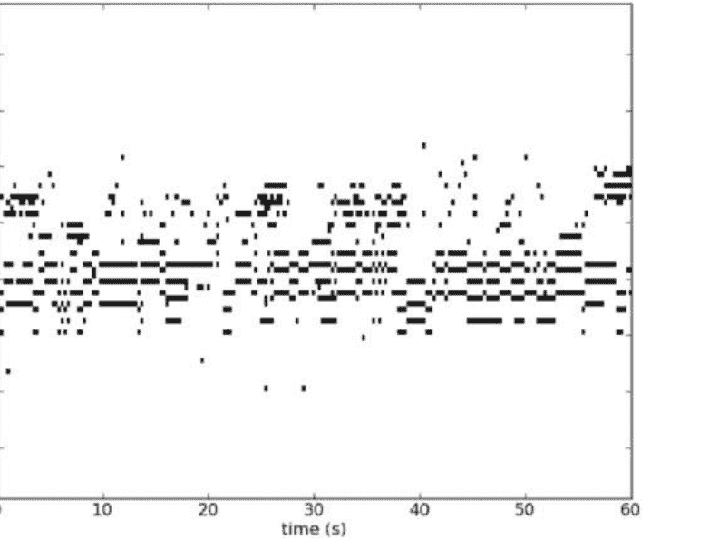

##### 6.9.1.1 其他RNN-RBM系统

有一些系统在RNN-RBM架构的基础上进行了延伸和扩展，但它们并没有显著的不同，而且还没有经过彻底的评估。然而，值得一提的是以下内容：

- RNN-DBN架构[^41]，使用多个隐藏层[60]；和
- LSTM-RTRBM架构，使用LSTM而不是RNN[120]。

## 6.9.2 #2 示例：六面体和声符号音乐生成架构

约翰逊在他的Hexahedria博客[93]中提出的多声部音乐系统是混合和原创的，因为它将不同的部分整合到同一架构中：

- 第一部分由两个RNN（实际上是LSTM）层组成，每个层有300个隐藏单元，沿着时间维度进行循环，负责处理序列中音符之间的时间水平关系。每个层在时间步长上有连接，但在音符之间是独立的；并且
- 第二部分由另外两个RNN（LSTM）层组成，分别有100个和50个隐藏单元，沿着音符维度进行循环，负责处理同一时间步内同时发生的音符之间的和声垂直关系。每个层在时间步长之间是独立的，但在音符之间有横向有向连接。

我们可以将这个架构表示为 $LSTM^{2+2}$，以突出两个连续的2级循环层，在两个不同的维度（时间和音符）上循环。实际上，这个架构是在前一节描述的RNN-RBM架构的基础上进行整合的一种形式[^42]。主要的创新之处在于不仅在时间维度上使用循环网络，而且还在音符维度上使用循环网络，更准确地说是在音高类别维度上。这种后一种类型的循环用于基于其他同时音符来建模同时音符的出现。与时间关系一样，它是朝未来方向的，音高类别关系是朝更高音高的方向的，从C到B。

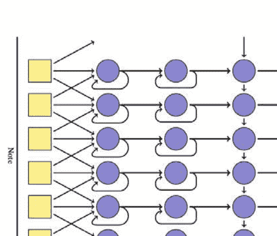

得到的架构以其折叠形式显示在图6.27中，在图6.28中以其展开形式[^43]，有三个轴表示：

- 流动轴，水平显示并从左到右指向，表示从输入层到输出层的（前馈）计算流程；

[^41]: 从交叉熵损失的角度来看，这显然是J.S.巴赫合唱数据集的最新技术水平。
[^42]: 在第6.9.3节中，我们将看到一种名为双轴LSTM的替代架构，其中每个2级时间递归层都封装在不同的架构模块中。
[^43]: 我们在图5.29中展示的RNN的展开图实际上是受到了约翰逊的六面体展开图的启发。

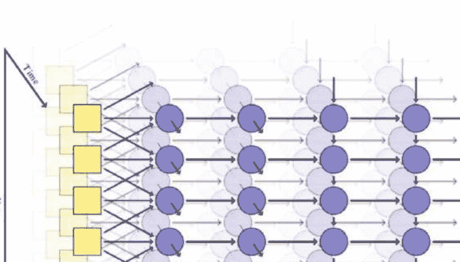

图6.28 六面体架构（展开）。经作者许可，转载自[93]

-   • 音符轴，垂直显示并从上到下指向，表示两个最后（以音符为导向）的递归隐藏层中相邻音符对应的单元之间的连接；
-   • 时间轴，仅在展开的图6.28中，以对角线显示并从左上到右下指向，表示时间步骤和记忆在两个第一（以时间为导向）的递归隐藏层的同一单元内的传播。

数据集是通过从古典钢琴MIDI数据库[104]中提取8小节长的部分来构建的。所使用的输入表示是钢琴卷帘，音高以MIDI音符编号表示。添加了更具体的信息：音高类别、上一个播放的音符（表示可能的保持）、上一个时间步中音高类别的播放次数以及拍子（在4/4拍号下的位置）。

输出表示也是钢琴卷帘，以表示同时播放多个音符的可能性。生成是以迭代方式进行的（即遵循迭代前馈策略），与大多数循环网络一样。该系统在表6.15中进行了总结。

| 目标 | 复调 |
| :--- | :--- |
| 表示符号化 | 钢琴卷帘；保持；拍子 |
| 架构 | LSTM²⁺² |
| 策略 | 迭代前馈；采样 |

表6.15 六面体总结

#### 6.9.3 示例：双轴LSTM多声部符号音乐生成架构

约翰逊最近提出了他原始的六面体架构的演进，详见第6.9.2节，名为双轴LSTM（或BALSTM）[94]。

所使用的表示方法是钢琴卷帘，其中添加了音符保持和休止符令牌到词汇表中。使用了各种语料库：JSB赞美诗数据集，由J.S.巴赫创作的382个四声部赞美诗[1]；MuseData图书馆，斯坦福CCARH的电子古典音乐图书馆[76]；诺丁汉数据库，包含1200个ABC记谱法的民间曲调[53]；以及古典钢琴MIDI数据库[104]。每个数据集都被转置（对齐）到C大调或C小调。

演奏音符的概率取决于两种类型的信息：

-   * 之前时间步的所有音符 - 这由时间轴模块建模；和
-   * 当前时间步内已生成的所有音符（按从低到高的顺序） - 这由音符轴模块建模。

还有一个名为“音符八度”的额外前端层，将每个音符转换为其所有可能的对应八度音符的向量（即音高类的外延版本）。结果架构如图6.29所示。“x2”表示每个模块都堆叠了两次（即有两个层）。

时间轴模块在时间上是循环的（就像经典的RNN一样），LSTM权重在音符之间共享，以获得音符转位不变性。音符轴模块⁴⁵在音符上是循环的。对于音符轴模块的每个音符输入，⊕表示将来自时间轴模块的相应输出与已预测的较低音符进行连接。对于每个音符输出概率，应用采样（使用硬币翻转）以计算最终预测（是否演奏该音符）。

正如Johnson [94]所指出的，在训练阶段，由于所有时间步长上的所有音符都是已知的，可以通过独立处理每个层（例如，在GPU上运行输入）来加速训练过程。

⁴⁴这个数字来自于另一个基于Bi-Axial LSTM架构的系统DeepJ的描述，该系统将在第6.10.3.4节中描述。

⁴⁵请注意，与Johnson的第一个架构（我们称之为Hexahedria，并在第6.9.2节中介绍）相反，Bi-Axial LSTM架构将2级时间递归层与2级音符递归层集成在单个架构中，因此表示为LSTM²⁺²，而Bi-Axial LSTM架构将每个2级时间递归层明确分离为不同的架构模块，因此表示为LSTM²×²。

在所有音符上并行地进行层计算，并使用两个音符轴层在所有时间步骤上并行地计算概率。

生成阶段对于每个时间步骤是顺序的（通过遵循迭代前馈策略和采样策略）。图6.30显示了生成的音乐摘录。

双轴LSTM系统在表6.16中进行了总结，并与其他一些架构进行了评估和比较。作者报告了使用双轴LSTM获得明显更好的结果，其中最大的改进出现在MuseData [76]和古典钢琴MIDI数据库[104]数据集上，并在[94]中指出：“这可能是因为这些数据集中包含了许多不同键中的更复杂的音乐结构，这对于具有平移不变性的架构来说是一个理想情况。”请注意，带有条件的双轴LSTM架构的扩展，名为DeepJ，将在第6.10.3.4节中介绍。

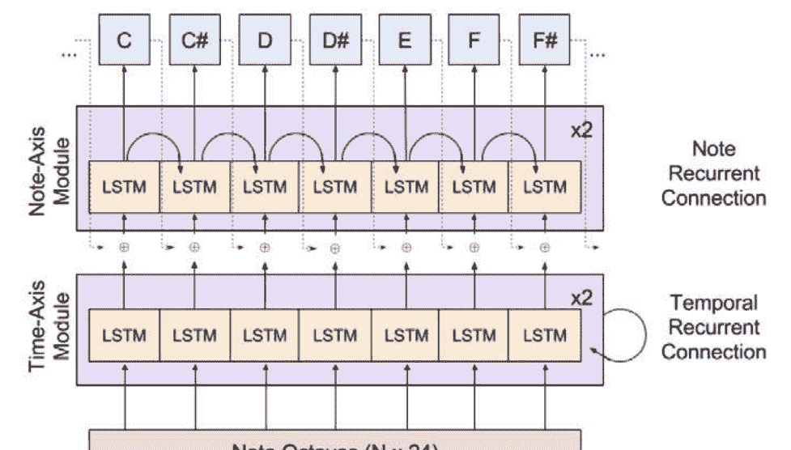

| 目标 | 复调 |
| :--- | :--- |
| 表示符号化；钢琴卷；持续；休止 |  |
| 架构 | 双轴LSTM = LSTM^{2} ×2 |
| 策略 | 迭代前馈；采样 |

表6.16 双轴LSTM摘要

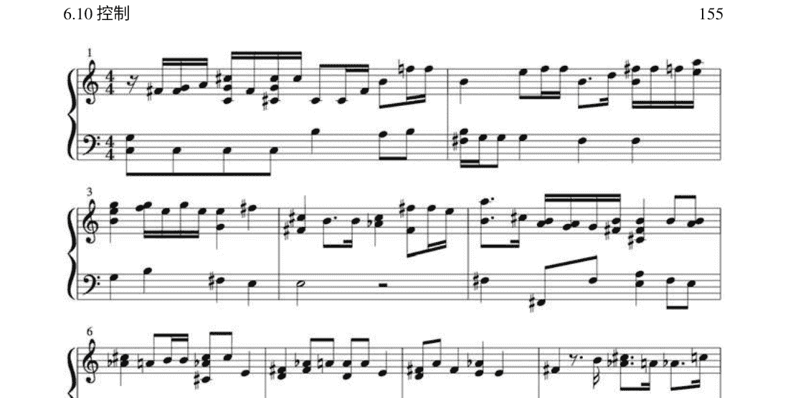

> 图6.30 双轴LSTM生成的音乐示例（摘录）。引自[94]

### 6.10 控制

深度架构生成与语料库学习的风格相匹配的音乐内容。从语料库中归纳而来的能力，无需任何明确的建模或编程，这是一种重要的能力，如第1章和[51]中所讨论的。

然而，就像一辆需要好方向盘的快车一样，控制也是必要的，因为音乐家通常希望将从其他背景中借用的思想和模式调整到自己的目标和背景中，例如转调到另一个键，减少音符数量，以给定音符结束等等。

#### 6.10.1 控制策略的维度

对于深度学习架构和技术来说，任意控制是一个困难的问题，因为神经网络并不是为了被控制而设计的。在马尔可夫链的情况下，它们有一个操作模型，可以附加约束来控制生成⁴⁶。然而，神经网络没有提供这样的操作入口，它们的分布式表示性质也没有提供与生成内容结构的明确关系。因此，正如我们将看到的那样，控制深度学习生成的大多数策略都依赖于在各种入口点（钩子）和层次上的外部干预。

-   - 输入,
-   - 输出,
-   - 输入 和 输出, 并且
-   - 封装/重构。

可以采用各种控制策略:

-   - 采样,
-   - 调节,
-   - 输入操作,
-   - 强化学习, 和
-   - 单元选择。

我们还将看到一些策略（例如采样，参见第6.10.2节）更多地从底层开始，而其他策略（例如结构 imposition，参见第6.10.5.1节，或单元选择，参见第6.10.7节）更多地从顶层开始。最后，还存在一种部分解决方案（例如调节/参数化，参见第6.10.3节）和更一般方法（例如强化学习，参见第6.10.6节）之间的连续性。

#### 6.10.2 采样

从随机架构（例如受限玻尔兹曼机（RBM），参见第6.4.2节）或确定性架构中采样（为了引入变异性，参见第6.6.1节），如果我们在采样过程中引入约束，可能是控制的一个入口。这被称为约束采样，例如在第6.10.5.1节中的C-RBM系统。

约束采样通常通过生成和测试方法来实现，其中有效的解决方案是从模型生成的一组随机样本中选择的。但这可能是一个非常昂贵的过程，而且没有成功的保证。因此，一个关键且困难的问题是如何引导采样过程以满足约束条件。

##### 6.10.2.1 迭代前馈生成的采样

在使用循环网络进行迭代前馈策略的情况下，可以对采样过程进行一些改进。

在第6.6.1节中，我们介绍了使用循环网络的softmax输出进行采样的技术，以引入内容的变化。然而，这有时可能会导致生成一个不太可能的音符（概率较低）。此外，正如[66]中所指出的，生成这样一个“错误”的音符可能会对生成序列的其余部分产生连锁效应。

一种对学习的RNN模型进行调整的对策是不考虑概率低于一定阈值的音符。新模型的概率分布 \(P_{\text{阈值}}(s_t | s_{<t})\)，在[203]中定义如下：

\[
P_{\text{阈值}} (s_t | s_{<t}) := \begin{cases} \text{如果 } P(s_t | s_{<t}) / \max_{s_t} P(s_t | s_{<t}) < \text{阈值}, & \text{则为}0, \\ \text{否则为 } P(s_t | s_{<t}) / z. & \end{cases} \quad (6.4)
\]

-   * \(\max_{s_t} P(s_t | s_{<t})\)是音符的最大概率。
-   * 阈值是阈值超参数，并且
-   * z是一个归一化常数。

稍微复杂一些的版本在原始分布\(P(s_t | s_{<t})\)和\(\argmax_{s_t} P(s_t' | s_{<t})\)确定性变体<sup>47</sup>，具有一些温度控制超参数（更多细节请参见[66，第4.1.1.3节]）。这种技术将进一步与条件策略相结合，通过位置约束来控制音符在特定位置的生成。这将通过Anticipation-RNN系统在第6.10.3.5节中进行示例说明。

##### 6.10.2.2 增量生成的采样

在增量生成的情况下（将在第6.14节中介绍），用户可以选择

-   * 在哪个部分（例如，旋律的某个部分和/或给定的声音）将进行采样（或重新发生），以及
-   * 采样将发生的可能值的间隔。

在DeepBach系统的情况下（将在第6.15.2节介绍），这将成为引入用户控制生成的基础，特别是重新生成音乐的某些部分，限制音符范围和强加一些基本节奏。

##### 6.10.2.3 变分解码器前馈生成的采样

另一个有趣的案例是对生成模型（例如变分自编码器（VAEs）和生成对抗网络（GANs））进行采样，将在第6.10.2.4节介绍。我们将看到采样的一些很好的控制，例如产生插值、平均或属性修改，将在解码器前馈策略生成的内容中产生有意义的变化。

此外，正如在第5.6.2节中讨论过的那样，变分自动编码器（VAE）有趣的是，它能够在已学习的重要维度上控制生成。

<sup>47</sup> 参见第6.6.1节。

##### 6.10.2.4 对抗生成的采样

另一个生成模型的例子是生成对抗网络（GAN）架构。在这样的架构中，在通过对抗训练生成器之后，通过对潜在随机变量进行采样来生成内容。

**例子：Mogren的C-RNN-GAN古典多声部符号音乐生成系统**

Mogren的C-RNN-GAN [134] 系统的目标是生成单声部的多声部音乐。所选择的表示受到MIDI和模型的启发，通过四个属性对每个音乐事件（音符）进行编码：持续时间、音高、强度和自上一个事件以来的时间间隔，每个属性都被编码为实值标量。这允许同时表示音符（实际上最多三个）。语料库的音乐流派是古典音乐，从网络中以MIDI格式获取，包含来自160位作曲家的3,697首作品。

C-RNN-GAN基于生成对抗网络（GAN）架构，生成器和判别器都是循环网络⁴⁹，更具体地说，每个都有两个具有350个单元的LSTM层。一个特点是判别器（但不是生成器）具有双向循环架构，以便在决策时从过去和未来获取上下文。架构如图6.34所示，并在表6.19中概述。

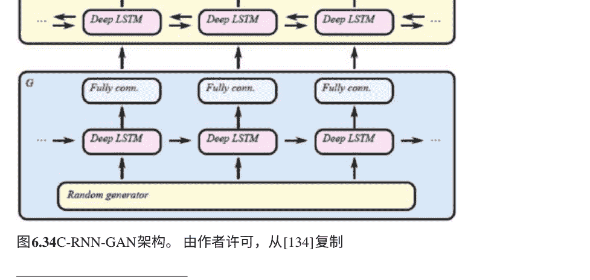

图6.34 C-RNN-GAN架构。由作者许可，从[134]复制

> ⁴⁹这个生成式GAN架构包含两个循环网络，与生成式VRAE变分自编码器架构相同，后者在第6.10.2.3节中有解释。

鉴别器与生成器并行训练，用于分类判断输入序列是否来自真实数据。与RNN编码器-解码器的编码器部分类似，将音乐序列总结为隐藏层的值（参见第5.13.3节），C-RNN-GAN的双向RNN解码器部分将序列输入总结为两个隐藏层的值（正向序列和反向序列），然后进行分类。

图6.35展示了生成的音乐示例。作者对生成的音乐进行了多次测量。他表示，使用特征匹配进行训练的模型在结构和惊喜之间取得了更好的平衡，优于其他变体。请注意，这与在MidiNet中使用特征匹配正则化技术来控制创造力的方法是一致的（将在第6.10.3.3节介绍）。C-RNN-GAN在表6.19中有总结。

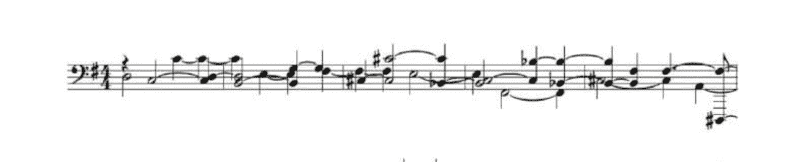

图6.35 C-RNN-GAN生成的示例（摘录）由作者许可，从[134]复制

表6.19 C-RNN-GAN摘要

| 目标 | 复调 |
| :--- | :--- |
| 表示符号化；MIDI；值编码×4 |  |
| 架构 | GAN（双向LSTM², LSTM²） |
| 策略 | 迭代前馈；采样⁵¹ |

##### 6.10.2.5 其他生成策略的采样

采样也可以与其他内容生成策略结合使用，例如

-   - 条件，作为一种用约束参数化生成的方法，在第6.10.3.5节中，或者

#### 6.10.3 条件

条件化的想法（有时也被称为条件架构）是在架构上对一些额外信息进行条件约束，这些信息可以是任意的，例如类标签或来自其他模态的数据。例如

-   - 在节奏生成架构（第6.10.3.1节）中的低音线或节拍结构
-   - 在MidiNet架构（第6.10.3.3节）中的和弦进行
-   - 在VRASH架构（第6.10.3.6节）中的先前生成的音符
-   - 在Anticipation-RNN架构（第6.10.3.5节）中对音符的位置约束
-   - 在WaveNet架构（第6.10.3.2节）中的音乐流派或乐器
-   - 在DeepJ架构（第6.10.3.4节）中的音乐风格

在实践中，条件信息通常作为额外的输入层输入到架构中（例如，参见图5.38）。标准输入和条件输入之间的区别遵循良好的架构模块化原则⁵²。条件是在生成过程中具有一定程度的参数化控制的一种方式。

条件层可以是

-   - 一个简单的输入层。一个例子是在WaveNet系统（第6.10.3.2节）中指定音乐流派或乐器的标签，
-   - 某些架构的某些输出，被
    -     - 相同的架构，作为一种在某些历史上对架构进行条件化的方式⁵³– 一个例子是MidiNet系统（第6.10.3.3节），其中来自先前小节的历史信息被注入回架构中，或者
    -     - 另一种架构 – 例如节奏生成系统（第6.10.3.1节）中，负责低音线和节拍结构信息的前馈网络生成条件输入，以及DeepJ系统（第6.10.3.4节）中，风格标签的两个连续转换层生成用作条件输入的嵌入。

> ⁵²请注意，我们不将条件作为一种策略，因为我们认为条件的本质与条件架构相关。生成使用传统策略（例如，单步前馈，迭代前馈...）取决于架构的类型（例如，前馈，循环...）。
> ⁵³这在精神上接近循环架构（RNN）。

如果架构是时间不变的-即随时间变化的循环或卷积-，有两个选择

-   - 全局条件-如果条件输入在所有时间步骤中共享，或
-   - 局部条件– 如果条件输入对每个时间步骤都是特定的。

WaveNet架构，在时间上进行卷积（参见第5.9.5节），提供了这两个选项，将在第6.10.3.2节中进行分析。

##### 6.10.3.1 示例：节奏符号音乐生成系统

Makris等人提出的系统[122]的特殊之处在于它专门用于生成节奏序列。另一个特殊之处是可以根据特定信息（例如给定的节拍或低音线）对生成进行条件设置。

该语料库包括45个鼓和贝斯模式，每个模式长16小节，采用4/4拍的时间签名，来自三个不同的摇滚乐队，并转换为MIDI格式。鼓的表示方法在第4.11.8节中描述，并总结如下。不同的鼓组成部分（低音鼓、军鼓、定音鼓、踩镲、铜钹）被视为不同的同时发声声部，采用一种多热编码方法，并以文本形式编码为长度为5的二进制词，例如，10010表示低音鼓和踩镲同时演奏。

该表示方法还包括贝斯线部分的简化表示。它从声部领导的角度捕捉了贝斯的音高差异方向⁵⁴，指定了两个连续时间步之间贝斯的音高差异方向。这在长度为4的二进制词中表示，第一个数字指定贝斯事件（1）或休止符事件（0）的存在，而剩下的三个数字指定声部领导的三个可能方向：稳定（000）、上升（010）和下降（001）。最后，该表示方法还包括一些表示节拍结构（节拍结构）的附加信息，同样采用二进制词表示。详细信息请参见[122]。

该架构是一个循环网络（更准确地说，是一个LSTM）和一个前馈网络的组合，代表了条件层。LSTM（两个堆叠的具有128或512个单元的LSTM层）负责鼓部分，而前馈网络负责贝斯线和节奏结构信息。这两个网络的输出然后合并⁵⁵，得到的架构如图6.36所示。作者报告称，条件层（贝斯线和节拍信息）提高了学习和生成的质量。它也可以用于轻微地影响生成。

更多细节可以在文章[122]中找到。该架构总结如下表6.20。

图6.37展示了一个生成的节奏模式的示例，图6.38展示了使用特定且更复杂的低音线作为条件输入产生更精细的节奏。类似钢琴卷帘的可视化表示在其五个连续的行（向下）中显示了踢鼓、军鼓、定音鼓、踩镲和铙钹组件事件。

图6.36节奏生成架构。经作者许可，转载自[122]

图6.37生成的节奏模式示例。钢琴卷帘的五条线分别对应（向下）：踢鼓、军鼓、定音鼓、踩镲和铙钹。经作者许可，转载自[122]

图6.38使用特定低音线作为条件输入生成的节奏模式示例。经作者许可，转载自[122]

| 目标 | 多声部；节奏；鼓 |
| :--- | :--- |
| 表示符号化 | 节拍；鼓；多热；低音线；音符；休止符；保持 |
| 架构条件（前馈（LSTM²），前馈） | |
| 策略 | 迭代前馈；采样 |
| 表6.20节奏系统摘要 | |

##### 6.10.3.2 示例：WaveNet语音和音乐音频生成系统

WaveNet，由van der Oord等人[193]开发，是一个用于生成原始音频波形的系统，从这个角度来看相当创新。它已在三个音频领域进行了测试：多说话人、文本转语音（TTS）和音乐。

该架构基于一个没有池化层的卷积前馈网络。卷积被限制以确保预测仅依赖于先前的时间步，并因此被称为因果卷积。实际实现通过使用扩张卷积进行了优化（也称为“a trous”），其中卷积滤波器通过跳过一定步骤的输入值来应用于比其长度大的区域。逐步扩张的连续卷积层⁵⁶使网络能够在只有几层的情况下具有非常大的感受野，同时保持网络中的输入分辨率以及计算效率（有关更多详细信息，请参见[193]）。该架构在图6.39中说明。

WaveNet的另一个特点在于训练/生成的不对称性：在训练阶段，可以并行地对所有时间步进行预测，而在生成阶段，预测是顺序的（遵循迭代前馈策略）。

WaveNet架构通过添加额外的标签作为条件输入来进行条件生成，以引导生成过程。因此，我们可以将该架构表示为条件（卷积（前馈））标签。

- 全局条件，如果条件输入在所有时间步骤上是共享的；以及
- 局部条件，如果条件输入对每个时间步骤都是特定的。

在文本转语音应用领域，条件输入的一个例子是从不同说话者（例如北美或普通话英语）中提取语言特征，以生成具有特定韵律的语音。

作者还进行了初步的工作，使用一组指定的标签（例如流派或乐器）来生成音乐。他们声明（没有进一步的细节）他们的初步尝试是有希望的[193]。WaveNet在表6.21中总结。

最后，让我们提到一个最近的提议，作为WaveNet的一个产物，它使用一个符号表示（与音频输入相关联）作为条件模型/输入，为了更好地指导和结构化（音频）音乐的生成（详见[125]中的详细信息）。

| 目标 | 音频 |
| :--- | :--- |
| 表示音频；波形 | 架构条件（卷积（前馈），标签）；扩张卷积 |
| 策略 | 迭代前馈；采样 |

表6.21 WaveNet摘要

## 6.10.3.3 示例： MidiNet流行音乐旋律符号音乐生成系统

在[211]中，杨等人提出了MidiNet架构，它既具有对抗性，又具有卷积性，用于生成单声道或多声道流行音乐旋律。

所使用的语料库是来自TheoryTab^57在线数据库[84]的1,022首流行音乐歌曲的集合，该数据库为每个选项卡提供两个通道，一个用于旋律，另一个用于基础和弦进行。 这样可以得到两个版本的系统：一个只使用旋律通道，另一个还使用和弦来调整旋律生成。 在所有预处理步骤完成后，数据集由526个MIDI选项卡（代表4,208个小节）组成。 然后通过将所有旋律和和弦循环移动到12个键中的任意一个来进行数据增强，从而得到最终的训练数据集，包含50,496个旋律和和弦对的小节。

该表示是通过将MIDI文件的每个通道转换为8个小节长的钢琴卷积表示的一种独热编码来获得的，其中使用其中一种编码来表示静音（休止符），并忽略音符事件的速度。时间步长设置为最小音符，即十六分音符。所有旋律都已经为了适应两个八度音程，进行了转置 $[C_4, B_5]^{58}$。请注意，当前的表示方式没有区分长音符和两个短音符的重复，作者提到考虑未来的扩展以强调音符的起始。

对于和弦，作者表示使用一个维度为13的内涵表示法比使用一个维度为24的多热向量外延表示法更高效：12个用于音高（键）和1个用于和弦类型（大调或小调）。

架构$^{59}$在图6.40和6.41中有所说明。它由一个生成器和一个鉴别器组成，两者都是卷积网络。生成器包括两个全连接层（分别具有1,024和512个单元）和四个卷积层。生成是通过逐个采样一个小节来进行迭代的，直到达到8个小节。生成器由一个模块（在图6.40中称为Conditioner CNN）进行条件化，该模块包括四个具有相反架构的卷积层。条件化机制包括

- 来自先前测量的历史信息（作为记忆机制，类似于RNN），以及
- 和弦序列（仅用于生成器）。

鉴别器包括两个卷积层，后面是一些全连接层和最终的输出激活函数是交叉熵。鉴别器也是有条件的，但没有特定的条件层。因此，我们可以将架构表示为GAN（条件化（卷积（前馈），卷积（前馈（历史，和弦序列））），条件化（卷积（前馈），历史））。

图6.40 MidiNet架构。经作者许可，转载自[211]

图6.41 MidiNet生成器的架构。由作者许可[211]转载

条件信息可以是

- 仅关于前一个小节-称为“1D条件”（在图6.40和6.41中以黄色显示）；或者
- 关于各个前一个小节-称为“2D条件”（以蓝色显示）。

这两种情况在图6.40中有所说明。作者报告了不同变体的实验：

- 旋律生成与对前一个小节的条件（生成器的前一个小节作为2D条件，鉴别器的前一个小节作为1D条件⁶⁰）；
- 旋律生成与对前一个小节和和弦序列的条件（生成器的和弦序列作为1D条件，或者仅作为其最后一个卷积层的2D条件以突出显示和弦条件）；以及
- 在创造模式下，通过对前一个小节和和弦序列进行条件限制进行旋律生成（通过生成器的所有卷积层的2D条件作为和弦序列）。

对于第二种变体，他们称之为稳定模式，作者报告说生成的旋律更加以和弦为主，并且更加稳定，换句话说，它紧密地遵循和弦进行。

为了确保鉴别器仅仅根据当前小节区分真实的和生成的旋律，它遵循和弦进行，并且很少生成违反和弦约束的音符。对于第三种变体，称为创造模式⁶¹，生成器有时会违反和弦的约束，以更好地遵循前一个小节的旋律。换句话说，创造模式允许更好地平衡旋律跟随和和弦跟随。作者在[211]中表示：“这种违规有时听起来不舒服，但有时会很有创意。”与前两种变体不同，我们需要听几个由该模型生成的旋律来挑选出好的旋律。然而，我们相信这样的模型仍然可以用于辅助和启发人类作曲家。”MidiNet在表6.22中总结。

表格 6.22 MidiNet 概述

| 目标 | 旋律 + 和弦; 流行音乐; 旋律与和弦的平衡 |
| 表示符号化 | 和弦; 钢琴卷帘; 单热编码; 休止符 |
| 架构GAN | 条件化(卷积(前馈)), 卷积(前馈(历史, 和弦序列)), 条件化(卷积(前馈), 历史)) |
| 策略 | 迭代前馈; 采样 |

## 6.10.3.4 示例: DeepJ 风格特定的多声部符号化音乐生成系统

在 [126] 中，Mao 等人提出了一个名为 DeepJ 的系统，其目标是能够控制生成音乐的风格。在他们的实验中，他们考虑了23种不同的风格，每种风格对应一个不同的作曲家（从约翰·塞巴斯蒂安·巴赫到彼得·伊里奇·柴可夫斯基），具有他/她特定的风格⁶²。他们将风格 - 或风格的组合⁶³ - 编码为对所有可能风格（即作曲家）的多热编码表示。作曲家被分为音乐流派。因此，流派被指定为该流派的风格（作曲家）的等量组合。例如，如果巴洛克流派由1到4号作曲家定义，那么巴洛克风格将等于 [0.25,0.25,0.25,0.25,0,0, ...]。当详细说明架构时，我们将看到这种有些简化的用户定义的风格编码将在学习阶段自动转化为自适应分布式表示。

该架构的基础是由约翰逊在[94]中提出的双轴LSTM架构（参见第6.9.3节）。音乐表示基于钢琴卷轴，通过其MIDI音符编号来建模音符，范围在一个截断范围内（原本在 {0,1, ... 127}的离散集合中，截断为 {36,37, ... 84}，即四个八度）。为了减少音符输入的维度，量化为每个小节16个时间步长，即一个十六分音符的时间步长。表示方式类似于双轴LSTM的表示方式。DeepJ表示使用一个回放矩阵，与音符的钢琴卷轴矩阵相对应，以区分保持的音符和重新演奏的音符。DeepJ表示还通过一个标量变量⁶⁴（在[0,1]区间内）包含有关动态的信息。但主要的增加是使用风格调节，通过全局调节⁶⁵，就像WaveNet一样。正如已经指出的，用户定义的风格编码过于简单，不能直接使用。音乐风格不一定是正交的，可能共享许多特征。第一个转换层将风格的用户定义的多热编码线性转换为第一个嵌入（一组隐藏/潜在变量，如图6.42中的黄色嵌入框所示）。第二个转换层通过非线性方式（通过tanh激活⁶⁶）将这个第一个嵌入转换为风格的第二个嵌入（如下方的黄色全连接框），以作为时间轴模块的条件输入添加。音符轴模块也进行类似的转换和调节。

更多细节和讨论可在[126]中找到。DeepJ在表6.23中有总结。

作者们进行了一次初步的主观评估，与人类听众比较了DeepJ生成的音乐（示例见图6.43）和Bi-Axial LSTM生成的音乐。他们报告说DeepJ的作品通常更受欢迎，并评论说风格调节使生成的音乐更具风格一致性。他们还进行了第二次主观评估，以验证DeepJ是否能够生成风格独特的音乐（被人类听众正确识别）。作者报告说DeepJ音乐和真实作曲家音乐的分类准确率没有统计学上的显著差异。还进行了更客观的分析，通过可视化风格嵌入空间（如图6.44所示），每位作曲家被描绘为一个点，每个聚类被表示为一种颜色（蓝色、黄色和红色分别代表巴洛克、古典和浪漫主义聚类）。作者发现来自相似时期的作曲家会聚集在一起（相同颜色），并指出了路德维希·范·贝多芬出现在古典和浪漫聚类之间的有趣结果。

##### 6.10.3.5 示例：预测-RNN巴赫旋律符号音乐生成系统

在[67]中，Hadjeres和Nielsen提出了一个名为预测-RNN的系统，用于在音符上施加一元约束（以强制在给定的位置上有一个给定的音符）生成旋律。

⁶⁴作者评论说，他们还尝试了将动态表示为分类值（独热编码），使用128个区间（与WaveNet中的方法相同，参见第6.10.3.2节），这实际上是原始的MIDI离散化。但是：“与WaveNet的结果相反，我们的实验得出结论，标量表示产生了更和谐的结果。”[126] ⁶⁵这意味着条件输入在所有时间步骤中是共享的，请参见第6.10.3.2节。⁶⁶双曲正切函数。

# 图6.42 DeepJ架构。由作者许可，转载自[126]

# 图6.43 DeepJ生成的巴洛克音乐示例。由作者许可，转载自[126]

| 目标 | 复调；古典；风格 |
| 表示符号化；钢琴卷帘；重放矩阵；休止符；风格；动态 |  |
| 架构条件化（双向LSTM，嵌入） | =条件化（LSTM²×2，嵌入） |
| 策略 | 迭代前馈；采样 |

# 表6.23 DeepJ摘要

图6.44 DeepJ嵌入空间的可视化。由作者许可，扩展自[126]

在使用标准的迭代前馈策略进行生成时，限制是在时间 i 具有给定值的位置上强制执行。然而，这样做可能会回溯地使先前生成的项目的分布无效⁶⁷，如[150]所示。因此，思路是将RNN条件化为总结进一步（在时间上）的约束集的信息，以预测即将到来的约束，从而生成具有正确分布的音符。

因此，使用了第二个RNN架构，名为Constraint-RNN，它在时间上向后运行。它的输出被用作主RNN的额外输入，作者称之为Token-RNN。完整的架构如图6.45所示，具有以下符号和含义：

- c_i 是一个位置约束；和
- o_i 是Constraint-RNN在索引 i（经过 i次迭代）处的输出 - 它总结了从步骤 i 到序列结束 N的约束信息。它将与Token-RNN的输入 s_{i-1}（用 ⊕圆加号表示）连接起来，以预测下一个项目 s_i。

请注意，Anticipation-RNN不是对称的双向循环架构，如BLSTM（第6.8.3节）或C-RNN-GAN（第6.10.2.4节架构，因为反向处理的是另一个序列（与第一个序列相关的约束序列）。Constraint-RNN和Token-RNN都实现为2层LSTM。

> ⁶⁷正如作者所说，对时间索引 i 施加约束“扭曲”了条件概率分布 P(s_t|s_{<t})对于 t < i。

# 图6.45 预测-RNN架构。经作者许可，转载自[67]

使用的语料库是从J. S. Bach的四声合唱曲中提取的女高音旋律集。数据合成通过在原始音域内进行所有键的转置，并与一些排序的约束集配对来完成⁶⁸。

预测-RNN与Deep-Bach系统在第6.14.2节中介绍的表示原则相同，即使用一位有效编码，添加保持符号“”和其余符号来分别指定音符重复和休止，并使用音符名称而不是变音。量化水平为十六分音符。

使用相同的位置约束集生成的三个示例旋律如图6.46所示（每个示例用绿色矩形中的绿色音符表示）。模型确实能够通过调整方向朝向目标（低音或高音音符）来预测每个位置约束。进一步的细节和结果分析请参见[67]。Anticipation-RNN总结如表6.24所示。

# 表6.24 Anticipation-RNN总结

| 目标 | 旋律；巴赫 |
|---|---|
| 表示符号化 | 独热编码；保持；休止符；无升降号 |
| 架构 | 条件化（LSTM<sup>2</sup>, LSTM<sup>2</sup>） |
| 策略 | 迭代前馈；采样 |

为了减少组合爆炸，可以不必构建所有可能的配对（旋律，约束），只要覆盖范围足够好就可以了。

图6.46 使用预测-RNN生成的旋律示例。经作者许可，转载自[67]

##### 6.10.3.6 示例：VRASH旋律符号音乐生成系统

Tikhonov和Yamshchikov在[188]中描述的系统，虽然与VRAE（见第6.10.2.3节）相似，但使用了不同的表示方式，分别以多个独热编码的方式对音高、八度和持续时间进行编码。训练集由各种歌曲（不同的时代和流派）组成，从MIDI文件中派生而来，经过过滤和归一化处理（详见[188]中的详细信息）。该架构具有四个LSTM<sup>69</sup>编码器和解码器层。

作者尝试将解码器的输出反馈到解码器中，作为将先前生成的音符作为附加信息的一种方式（因此，他们将最终架构命名为VRASH，表示支持历史的变分递归自编码器）。它在图6.47和6.48中有所说明，并在表6.25中进行了总结。在评估中，作者表示，生成的旋律与语料库之间的接近程度（使用交叉熵度量）仅略高于不添加历史信息时的接近程度，但从质量上来看，结果更好。

| 目标 | 旋律 |
| :--- | :--- |
| 表示符号化 | MIDI; 多独热 |
| 架构 | 变分自编码器(LSTM<sup>4</sup>, 条件化(LSTM<sup>4</sup>, 历史)) |
| 策略 | 解码器前馈; 迭代前馈; 采样 |

# 表6.25 VRASH 摘要

# 图6.47 VRASH 架构。经作者许可，转载自[188]

# 图6.48 VRASH 架构，重点关注解码器。经作者许可，扩展自[188]

#### 6.10.4 输入操作

输入操作策略是由Deep Dream在图像领域首创的。其思想是逐步操作初始输入内容或全新（随机生成的）输入内容，以匹配目标属性。请注意，生成的控制是间接的，因为它不是应用于输出而是应用于生成之前的输入。目标属性的示例包括

- 最大化与给定目标的相似性，以创建一个和谐的旋律，如DeepHear_C(第6.10.4.1节)中所示；
- 最大化特定单元的激活，以放大与该单元相关的某些视觉元素，如Deep Dream (第6.10.4.3节)中所示；
- 最大化与初始图像的内容相似性和与参考风格图像的风格相似性，以执行风格转移 (第6.10.4.4节)；并
- 最大化与参考音乐的结构相似性，以执行风格强加 (第6.10.5.1节)。

有趣的是，这是通过重复使用标准的训练机制来实现的，即使用反向传播计算梯度，以及使用梯度下降（或上升）来最小化成本（或最大化目标）。

#### 6.10.4.1 示例: DeepHear拉格泰姆对位符号音乐生成系统

在[179]中，除了生成旋律（在6.4.1.1节中描述），Sun还提出使用DeepHear实现不同的目标：和声旋律，同时使用相同的架构以及已经学习到的内容⁷⁰。我们将这个第二个实验标记为DeepHear_C，其中C代表对位，以便将其与旋律生成（6.4.1.1节）的DeepHear_M区分开来。这个想法是找到嵌入的标签实例，即堆叠自编码器的瓶颈隐藏层的16个单元的一组值，这将导致解码输出类似于给定的旋律。因此，定义了一个简单的距离（错误）函数来表示两个旋律之间的距离（相似性）（实际上是不匹配音符的数量）。然后，在嵌入变量上进行梯度下降，根据错误函数对应的梯度进行引导，直到找到一个足够相似的解码旋律。

虽然这不是真正的对位⁷¹，而是生成类似的（和声）旋律，但结果（在拉格泰姆旋律上测试）确实产生了一个天真的带有拉格泰姆风味的对位。

请注意，在DeepHear-C（总结在表6.26中），操作的输入是最内部解码器的输入（解码器链的起点），而不是完整架构的主要输入。而在Deep Dream系统（将在第6.10.4.3节介绍）的情况下，这是完整（前馈）架构的主要输入，被操作。

| 目标 | 伴奏；罗格泰姆 |
| :--- | :--- |
| 表示符号化 | 钢琴卷；单热×64 |
| 架构 | 自编码器⁴ |
| 策略 | 输入操作；解码器前馈 |

表6.26 DeepHear-C摘要

##### 6.10.4.2 与变分自编码器的关系

需要注意的是，在自编码器的隐藏层单元操作中（或者堆叠自编码器，如DeepHear-C的情况），输入操作策略与变分自编码器有一些类似，例如VRAE系统（第6.10.2.3节）或GLSR-VAE系统（第6.10.2.3节）。事实上，在这两种情况下，通过解码器（或解码器链）对隐藏单元的可能值进行一些探索，以生成音乐内容的变化。重要的区别是

- 在变分自动编码器的情况下，值的探索是由用户指导的，尽管可以通过某些原则进行引导，例如GLSR-VAE中的测地线，MusicVAE中的插值或属性向量算术（第6.12.1节）
- 在输入操作的情况下，值的探索是由梯度下降（或上升）机制自动引导的，用户事先指定要最小化（或最大化）的成本函数。

##### 6.10.4.3 示例：深度梦境迷幻图像生成系统

Deep Dream，由Mordvintsev等人[136]开发，以生成标准图像的迷幻版本而闻名。这个想法是使用深度卷积前馈神经网络架构（见图6.49）并使用它来引导初始输入图像的逐步改变，以最大化与给定单元的激活相关的特定视觉主题的潜在出现。

方法如下：

- 首先在大量图像数据集上训练网络；

> ⁷²为了创建一种类似幻觉的效果，其中幻觉是一种心理现象，即大脑对刺激（如图像或声音）做出反应，认为不存在的地方存在着熟悉的模式。

- 与最小化成本函数不同，目标是最大化某些特定单元的激活，这些单元已被确定为激活某些特定视觉特征，例如狗的脸，参见图6.49⁷³；
- 通过梯度上升控制，迭代地轻微改变初始图像（例如通过抖动⁷⁴），以最大化特定单元的激活。这将有利于相关视觉主题的出现，参见图6.50。

## 请注意

- 高层单元的激活最大化，如图6.49所示，将偏好在图像中出现相关的高层主题（动机），如狗的脸（见图6.50⁷⁵）；而
- 低层单元的激活最大化，如图6.51所示，将导致纹理插入（见图6.52）。

人们可以想象将Deep Dream方法直接应用于音乐，通过最大化特定节点的激活⁷⁶。

> ⁷³与其精确指定要放大的特征，一个替代方法是让网络做出决策，选择一个层并要求网络增强它检测到的任何内容[136]。
> 
> ⁷⁴添加一小段随机噪声像素位移。
> 
> ⁷⁵正如[136]中所说：“结果令人着迷—即使是相对简单的神经网络也可以用来过度解释图像，就像我们小时候喜欢看云朵并解释其中的随机形状一样。”这个网络主要是在动物图像上进行训练的，所以自然而然地它倾向于将形状解释为动物。”
> 
> ⁷⁶特别是如果通过节点/层激活和音乐动机之间的相关分析来确定节点的角色，例如在第6.17.1节中。

##### 6.10.4.4 示例：风格转移绘画生成系统

这种方法的思想被称为风格转移，由Gatys等人[55]首创，并设计用于图像，其目的是使用深度卷积前馈架构独立捕捉

- 第一张图片的特征（称为内容），以及
- 第二张图片的风格（作为特征之间的相关性）（称为风格）。

然后使用基于梯度的学习来引导对初始随机第三张图像的增量修改，其双重目标是匹配内容描述和风格描述。更准确地说，该方法如下：

- 通过将第一张图像（内容参考）馈送到网络并存储每个层的单元激活来捕捉内容信息；
- 通过将第二张图像（风格参考）馈送到网络并存储特征空间（即每个层的单元激活之间的相关性）来捕捉风格信息；并
- 合成混合图像。

通过生成随机图像并将其定义为当前图像，然后迭代以下循环，直到达到两个目标（内容相似性和风格相似性）为止，创建混合图像：

- 捕捉当前图像的内容和风格信息，
- 计算内容成本（参考内容与当前内容之间的距离）和风格成本（参考风格与当前风格之间的距离），
- 通过标准反向传播计算相应的梯度，并
- 通过梯度引导更新当前图像。

架构和过程总结如图6.53所示（更多细节可参见[56]）。内容图像（右侧）是德国图宾根的内卡尔河畔的照片⁷⁷（如图6.54所示），而风格图像（左侧）则是文森特·梵高（1889年）的画作“星夜”。

图6.55和6.56分别展示了相同内容（图宾根的内卡尔河畔）和风格“星夜”（文森特·梵高，1889年）以及“米诺陶洛斯的沉船”（J. M. W. Turner，1805年）的转换示例。


图6.51 Deep Dream架构专注于较低级别的单元


图6.52深度梦境。一个下层单元最大化转换的示例。转载自[136]，根据CC BY 4.0许可证。原始照片由Zachi Evenor拍摄

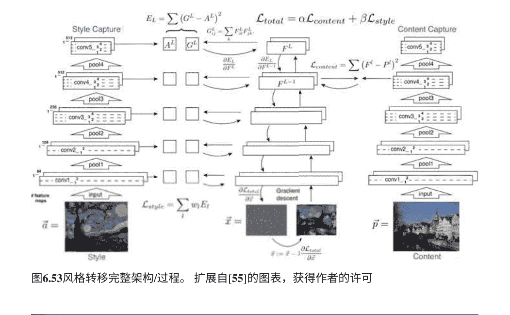

图6.53风格转移完整架构/过程。扩展自[55]的图表，获得作者的许可


图6.54图宾根的内卡尔河岸。Andreas Praefcke拍摄的照片。根据[55]的作者许可转载

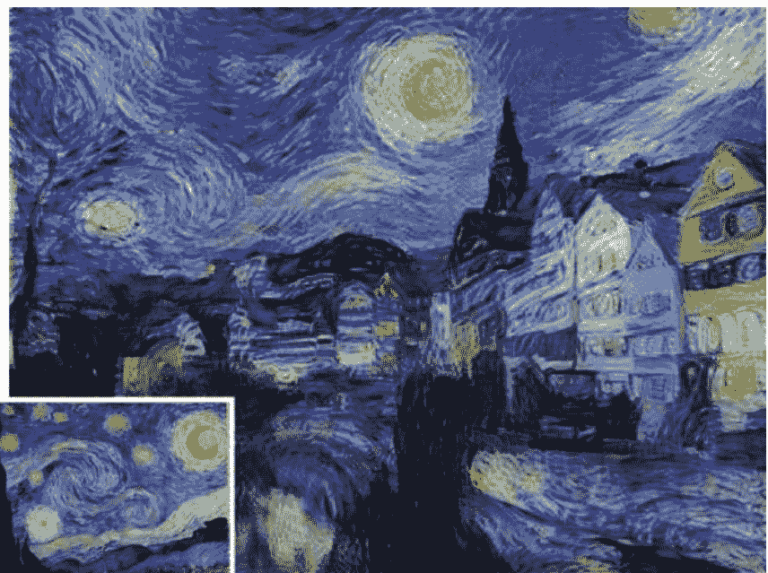

图6.55“星夜”文森特·梵高（1889年）在图宾根的内卡尔河岸照片上的风格转移。转载自[55]，获得作者的许可

请注意，可以通过平衡内容和风格目标⁷⁸（α/β比例）来偏好内容或风格。此外，捕捉的复杂性也可以通过使用的隐藏层数进行调整。这些变化显示在图6.57中：向右增加 α/β内容/风格目标比例，向下增加使用的隐藏层数（从1到5）以捕捉风格。风格图像是瓦西里·康定斯基（1913年）的画作“第七号构图”。

##### 6.10.4.5 风格迁移 vs 迁移学习

请注意，尽管风格迁移与迁移学习有一些共同的目标，但实际上它们在目标和技术上是不同的。迁移学习是关于重用神经网络架构所学到的知识，应用于另一个任务和/或领域（例如，另一种类型的分类）。迁移学习问题将在第8.3节中讨论。

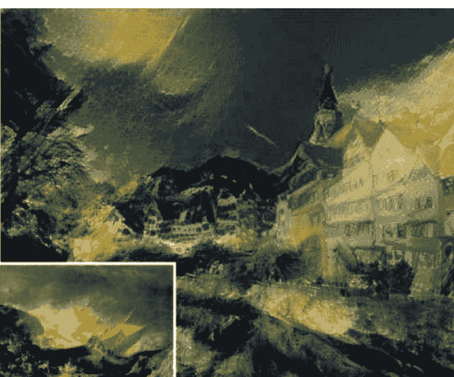

图6.56对J. M. W. Turner（1805年）的“The Shipwreck of the Minotaur”进行风格迁移，应用于Tübingen的Neckarfront照片。经作者许可，转载自[55]

##### 6.10.4.6 示例：音乐风格转换

将这种风格转换技术应用于音乐（音乐风格转换）是一个诱人的方向。然而，正如我们将看到的，一首音乐的风格更具多维度性，并且可能与不同类型的音乐表达（作曲、演奏、声音等）相关，因此通过这种简单的激活相关性来捕捉它更加困难。因此，我们将在第6.11节中将这个问题分析为一个具体的挑战。

#### 6.10.5 输入操作和采样

将输入操作策略与采样策略相结合的示例，因此同时作用于输入和输出⁷⁹，在下一节中进行了说明。

有趣的是，输入实际上等于输出，因为所使用的架构是RBM（见第5.7节），其中可见层同时充当输入和输出。

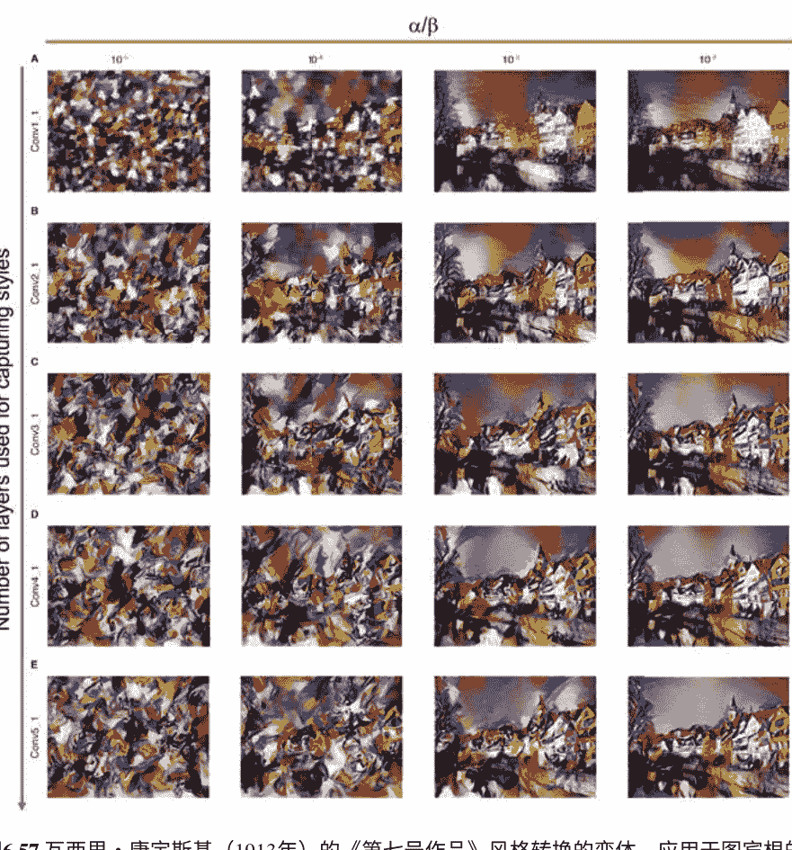

##### 6.10.5.1 示例：C-RBM和声符号音乐生成系统

在Lattner等人[108]提出的系统中，起点是使用受限玻尔兹曼机（RBM）学习音乐作品语料库的局部结构，被视为音乐的纹理。另一个想法是通过约束来施加更全局的结构（例如，AABA形式和调性），将现有音乐作品中的结构模板应用于生成的新作品。这被称为结构强加⁸⁰，也被Hofstadter[83]称为模板抄袭（tem-plagiarism）的缩写。这些关于结构、调性和节拍的约束将通过梯度下降的搜索过程来引导迭代生成，从而对输入进行操作。

> ⁸⁰这是一个乐谱级别的作曲风格转换的示例（见第6.10.4.6节）。

实际目标是生成多声部音乐。所使用的表示方式是钢琴卷帘，有512个时间步长和64个音符范围（对应MIDI音符编号28到92）。语料库是沃尔夫冈·阿马德乌斯·莫扎特的奏鸣曲。每首曲子都转调成所有可能的调式，以便拥有足够的训练数据来覆盖所有可能的调式（这也有助于减少训练数据的稀疏性）。架构是卷积受限玻尔兹曼机（C-RBM）[114]，即带有卷积的RBM，具有32,768个输入节点和2,048个隐藏单元。单元具有连续值而不是布尔值，与标准RBM不同（见第5.7.2节）。卷积仅在时间维度上执行，以建模时间上不变的动机而不是音高上不变的动机（整个音高范围内的音符之间存在相关性），这将破坏调性的概念⁸¹。

- 自相似性—目的是在生成的音乐片段中指定一个全局结构（例如AABA）。这通过最小化参考目标的自相似性矩阵和中间解决方案的自相似性矩阵之间的距离（通过均方误差测量）来建模。
- 调性约束—目的是指定一个调式（音调）。为了估计给定时间窗口中的调式，将窗口中的音高类别分布与参考的所谓调式概要文件进行比较（即特定音阶和模式的典范相对音高类别强度[184]，实际上是大调和小调模式）。它们在钢琴卷帘矩阵的时间和音高维度上重复出现，并在音高维度上进行模 octave 移位。将得到的调式估计向量进行组合（有关更多细节，请参阅文章），以获得总体调式估计向量。与自相似性一样，最小化目标和中间解决方案的调式估计之间的距离。
- 节拍约束—目的是施加特定的节拍（也称为拍号，例如3/4、4/4，请参见第4.5.5节）及其相关的节奏模式（例如，在4/4节拍中，在一个小节的第一拍和第三拍上有相对强烈的重音）。由于音符的强度未编码在数据中，因此只考虑音符的起始时间。音符起始时间在一个小节内的相对出现次数受到约束，以遵循参考音符的出现次数。

生成通过约束采样（CS）进行，这是一种根据一些预先设定的规则来限制采样过程中可能解的集合的机制。

> ⁸¹正如作者在[108]中所述：“调性是音乐中另一个非常重要的高阶属性。”它描述了音符和和弦之间的感知调性关系。这些信息可以用于，例如，确定一首乐曲或音乐片段的调性。一个调性的特征是在感兴趣的（时间）窗口内音乐纹理中音高类的分布。不同的窗口长度可能导致不同的调性估计，构成一个分层的调性结构（在非常局部的层面上，调性估计与和弦估计密切相关）。

定义的约束。该过程的原则如图6.58所示，如下所示：

- 一个样本是根据标准均匀分布随机初始化的。
- 执行一步约束采样（CS），包括
  - 梯度下降（GD）优化的$n$次运行，以强加高层结构，以及
  - 选择性Gibbs采样（SGS）的$p$次运行，以选择性地重新对齐样本到学习分布。
- 应用模拟退火算法，以减少与解决方案方差减少相关的探索。

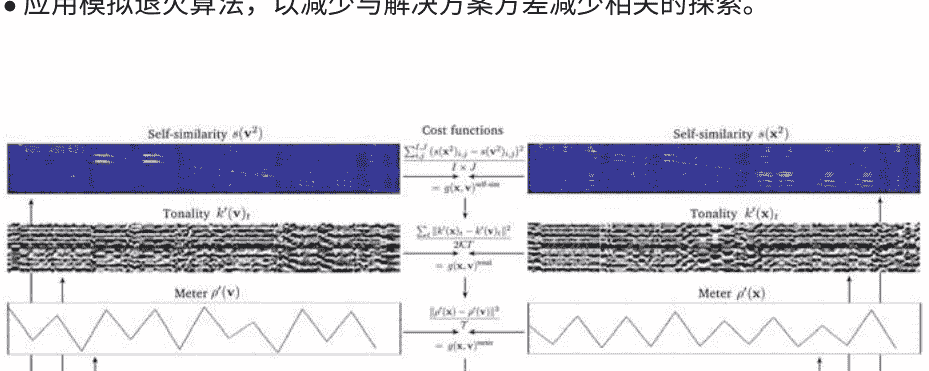

约束采样的不同步骤在[108]中进一步详细说明。图6.59显示了以钢琴卷格式生成的示例样本。

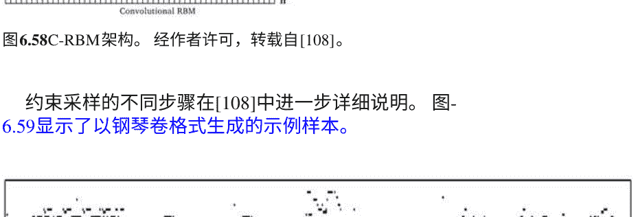

> ⁸² 选择性吉布斯采样（SGS）是作者对吉布斯采样（GS）的变种。

C-RBM的结果（在表6.27中总结）非常有趣和有希望。作者指出，目前的限制是只适用于高级结构。在强加低级结构的初步尝试中，面临着挑战，因为约束从来都不是纯粹的内容不变的，在尝试转移低级结构时，模板作品可以在GD阶段完全重建。因此，为低级结构创建约束必须伴随着它们内容不变性的增加。另一个问题是约束的收敛和满足。正如作者所讨论的，他们的方法并不是精确的，与马尔可夫约束方法（用于马尔可夫链）在[148]中提出的方法相反。

| 目标 | 复调；风格强加 |
| :--- | :--- |
| 表示符号化 | 钢琴卷帘；休息；多热；米 |
| 架构 | 卷积（RBM） |
| 策略 | 输入操作；采样 |

表6.27 C-RBM总结

#### 6.10.6 强化

强化学习策略的想法是将音乐生成的过程重新定义为强化学习问题：使用与数据集上训练的循环网络输出的相似性作为奖励，并添加用户定义的约束，例如根据音乐理论的调性规则作为额外的奖励。

让我们考虑将单声部旋律作为强化学习问题的情况：

- 状态表示到目前为止生成的音乐内容（部分旋律）
- 动作表示选择要生成的下一个音符。

现在让我们考虑在所选旋律语料库上训练的循环神经网络（RNN）。训练完成后，RNN将作为强化学习架构的参考。强化学习架构的奖励定义为两个目标的组合：

- 通过测量所选择的动作（即要生成的下一个音符）与循环网络在类似状态（即到目前为止生成的部分旋律）中预测的音符的相似性，来保持对所学内容的遵循；
- 通过测量满足用户定义的约束条件的程度（例如与当前音调的一致性、避免过多的重复等），来保持对这些约束条件的遵循。

总之，强化学习架构被奖励以模仿RNN，同时也被奖励以强制执行一些用户定义的约束条件。

##### 6.10.6.1 示例：RL-Tuner旋律符号音乐生成系统

强化学习策略由Jaques等人在RL-Tuner架构中首创[92]。这个架构如图6.60所示，包括两个深度Q网络强化学习架构和两个循环神经网络（RNN）架构。

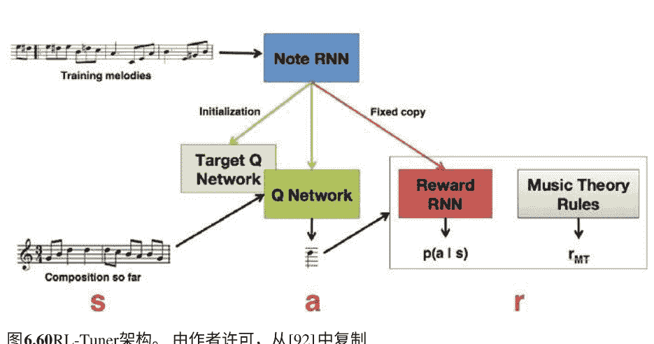

图6.60 RL-Tuner架构。由作者许可，从[92]中复制

- 最初的RNN，名为Note RNN，是在旋律数据集上训练的，用于预测和生成下一个音符，遵循迭代前馈策略。
- 制作了一个固定的Note RNN副本，名为Reward RNN，将被强化学习架构用作参考。
- Q网络架构的任务是学习从生成的（部分）旋律中选择下一个音符（下一个动作a），以及当前状态s。
- Q网络与其他Q网络并行训练，名为Target Q网络，它估计增益（累积奖励）的值，并从Note RNN学到的内容进行初始化。

Q网络的奖励r结合了两个奖励，如前一节所定义的：

- 遵循已学习内容的程度，通过Reward RNN播放该音符的概率来衡量，实际上是给定旋律s的下一个音符a的对数概率$\log P(a|s)$；以及
- 遵守音乐理论约束，在实践中⁸⁴：
  · 保持在一个调上，
  · 以主音开始和结束，
  · 避免过多重复的音符,
  · 更喜欢和谐的音程,
  · 解决大跳音程,
  · 避免连续重复的极值音符,
  · 避免高自相关性,
  · 演奏动机, 和
  · 演奏重复的动机.

> ⁸³通过深度学习架构实现Q学习强化学习策略[195]的实现。
> 
> ⁸⁴这个音乐理论约束列表是从[57]中选取的，更多细节请参见[92]。

总奖励 r(s, a)⁸⁵ 由方程6.5定义，其中 $r_{MT}$ 是关于音乐理论的奖励，$c$是控制两个竞争约束之间平衡的参数。

$$ r(s, a) = \log P(a|s) + r_{MT}(a, s)/c $$

图6.61显示了两种类型的奖励（对Note RNN和音乐理论的遵循度）在训练阶段的演变，使用了三种不同的强化学习算法：Q-learning、Ψ-learning和G-learning（详见[92]中的详细信息）。

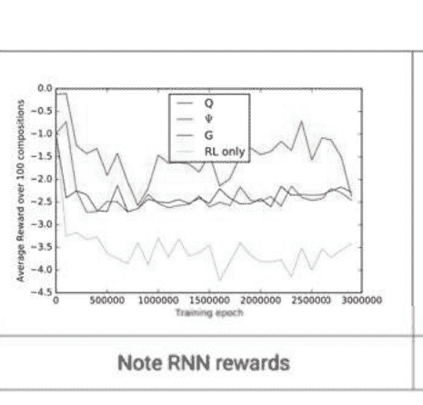

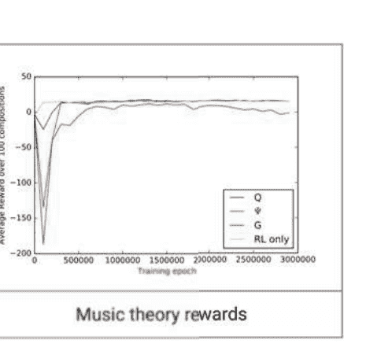

图6.61 RL-Tuner架构的训练过程中两种类型的奖励的演变。经作者许可，转载自[92]

实验中使用的语料库是从30,000首MIDI歌曲中提取的一组单声部旋律。时间步长设置为16分音符。one-hot编码（维度为38）考虑了三个八度的音符以及两个特殊事件：音符关闭（编码为0）和无音符（休止符，编码为1）。MIDI音符编号被转换，以便将最低音符（C_3）作为2开始（B_5编码为37），并且特殊事件在整数编码中平滑集成。请注意，由于旋律是单声部的，播放不同的音符会隐式地结束上一个播放的音符，而不需要显式的音符关闭事件，这导致了更紧凑的表示。Note RNN（及其副本Reward RNN）具有一个带有100个单元的LSTM层。

总之，强化学习策略允许将任意用户给定的约束（控制）与递归网络学习到的风格相结合。

请注意，在RL-Tuner的情况下，奖励是事先已知的，并且具有双重目的：手工制作音乐理论规则和通过RNN从数据集中学习音乐风格。因此，有机会添加另一种类型的奖励，即用户的交互反馈（参见第6.15节）。然而，以生成的每个音符为粒度的反馈可能过于苛刻，而且不太准确。我们将在第6.16节讨论从用户反馈中学习的问题。RL-Tuner在表6.28中概述。

| 目标 | 旋律 |
| :--- | :--- |
| 表示符号化 | 独热编码；音符关闭；休息 |
| 架构 | LSTM×2 + RL |
| 策略 | 迭代前馈；强化 |

表6.28 RL-Tuner总结

#### 6.10.7 单元选择

单元选择策略是关于从数据库中查询连续的音乐单元（例如，一个小节长的旋律）并按顺序连接它们以根据某些用户特征生成序列。查询是使用由自动编码器自动提取的特征。连接，即“下一个单元是什么？”，由两个LSTM控制，每个LSTM控制一个不同的标准，以实现方向和过渡之间的平衡。

与大多数自下而上的策略相反，这种策略是自上而下的，因为它从一个结构开始并填充它。

##### 6.10.7.1 示例：单元选择和连接符号旋律生成系统

这种策略最早由Bretan等人[13]开创。这个想法是从数据库中查询音乐单元的连接来生成音乐。这里的关键过程是单元选择，它基于两个标准：语义相关性和连接成本。单元选择生成序列的想法实际上是受到文本转语音（TTS）系统中常用的一种技术的启发。

目标是生成旋律。考虑的语料库是一个包含4,235个不同音乐风格（爵士乐、民谣、摇滚等）和120个爵士独奏转录的数据集。音乐单位的粒度是一个度量。这意味着大约有

> ⁸⁶正如迈尔斯·戴维斯所说：“如果你弹错了音符，下一个音符决定了它是好还是坏。”

数据集中有170,000个单位。数据集限制在五个八度范围内（MIDI音符编号36到99），并通过将每个单位在所有键上移调来增加所有可能的音高。

架构包括一个自动编码器和两个LSTM循环网络。第一步是特征提取：手动制作了10个特征，采用了词袋（BOW）方法（参见第4.9.3节），例如某个音高类别的计数、某个音高类别节奏元组的计数、第一个音符是否与前一个小节连结等。这导致了9,675个实际特征。大多数特征具有整数值，除了使用负音高值表示休止符和一些布尔特征。因此，每个单位都被描述为一个大小为9,675的特征向量。

所使用的自编码器具有2层堆叠自编码器架构，如图6.62所示。一旦在特征向量集上以通常的自监督方式（参见第5.6节）对其进行训练，自编码器就成为一个特征提取器，将大小为9,675的特征向量编码为大小为500的嵌入向量。

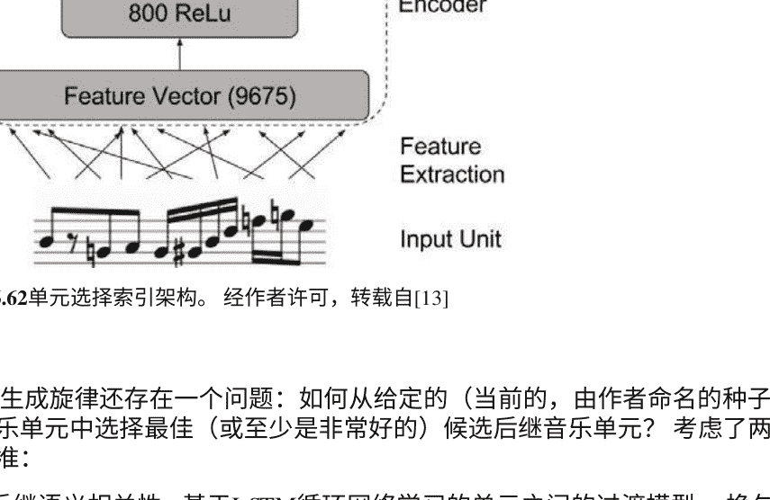

生成旋律还存在一个问题：如何从给定的（当前的，由作者命名的种子）音乐单元中选择最佳（或至少是非常好的）候选后继音乐单元？考虑了两个标准：

- 后继语义相关性 - 基于LSTM循环网络学习的单元之间的过渡模型。换句话说，相关性基于模型预测的下一个理想单元的距离。这是第一个LSTM架构有两个隐藏层，每个隐藏层有128个单元。输入和输出层有512个单元（对应于嵌入格式）。
- 连接成本 - 基于另一个过渡模型（参见第78节）在当前单元的最后一个音符和下一个单元的第一个音符之间的学习，由另一个LSTM循环网络完成。这个第二个LSTM架构是多层的，其输入和输出层约有3,000个单元，对应于一个多one-hot编码的音符特征化（由其音高和持续时间定义）。

这两个标准的组合（在图6.63中以当前（种子）单元为蓝色，下一个（候选）单元为红色进行说明）由基于启发式的动态排名过程处理：

1. 根据其与当前音乐单元的后继语义相关性对所有音乐单元进行排序（参见第88节）；
2. 将前5%的内容重新排序，根据它们的后继语义相关性和连接成本的组合进行重新排序；并且
3. 选择综合排名最高的音乐单元。

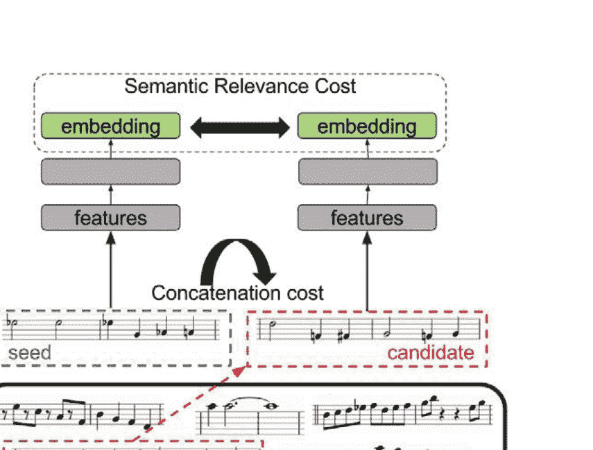

图6.63 基于语义成本的单元选择。经作者许可，转载自[13]

该过程按顺序迭代以生成连续的音乐单元和任意长度的旋律。这乍一看像是从循环网络进行的标准迭代前向生成（参见第6.5.1.2节），但有两个重要的区别：

- 通过多标准排序算法计算下一个音乐单元的标签（嵌入实例）；并且
- 使用标签作为索引从数据库中查询实际单元。

作者已进行了初始的外部人类评估。他们发现，使用一到两个小节生成的音乐在自然度和喜好度方面往往比使用四个小节或音符级生成的音乐排名更高，理想的小节长度似乎是一个小节。

请注意，单元选择策略不直接提供控制，但它提供了控制的入口点，因为可以通过扩展选择框架（目前基于两个标准：后继语义相关性和连接成本）与用户定义的约束/标准相结合。该系统在表6.29中进行了总结。

| 目标 | 旋律 |
| :--- | :--- |
| 表示 | 符号化；休止符；BOW特征 |
| 架构 | 自动编码器<sup>2</sup> + LSTM×2 |
| 策略 | 单元选择；迭代前馈 |

表6.29 单元选择摘要

### 6.11 风格转移

在第6.10.4.6节中，我们介绍了使用输入操作策略来控制内容生成的一个示例，即风格转移。图像的风格转移技术（由Gatys等人提出[55]，并在第6.10.4.4节中描述）是有效的，而且相对简单易用。然而，与绘画不同，绘画的常见表示是二维的，并且以像素为单位均匀数字化，而音乐是一个更复杂的对象，具有各种级别和模型的表示（参见第4章和第6.11.2.2节）。

在他们最近的分析中，Dai等人[30]考虑了三个主要层次（或维度）的表示和相关的音乐风格转换类型：

- 分数级别，他们称之为作曲风格转换；
- 声音级别，他们称之为音色风格转换；以及
- 演奏控制级别，他们称之为演奏风格转换。

他们指出每个层次（即作曲、音色和演奏风格转换）的音乐风格转换在性质上非常不同。他们还指出了这些不同层次（和性质）的相互关系和纠缠的问题。因此，他们指出有必要自动学习不同层次的音乐表示的解缠<sup>89</sup>，以便简化音乐风格转换。

#### 6.11.1 作曲风格转移

在作曲层面上进行风格转换意味着处理符号表示。一个例子是结构强加，即将一些现有的结构（例如，一个AABA全局结构）从一个初始作曲中转移到另一个新生成的作曲中。在第6.10.5.1节中介绍的C-RBM系统通过分别考虑三种结构和相关约束来实现这种结构强加：全局结构（例如，AABA），调性和节拍（韵律）。

有人可能认为这样的结构描述符对于定义风格来说太低级了。但是它们是一个有趣的第一步，因为可以通过聚合这样的结构描述符来考虑更高级的风格描述符。例如，让我们想象一下，描述（并随后转移）像米歇尔·勒格朗这样的作曲家的风格，他有自己的动机转位方式。

请注意，在DeepJ系统中控制生成的风格（第6.10.3.4节）的目标是不同的，因为风格是由用户通过一组音乐示例明确指定的，并在生成过程中通过条件加以应用和学习。

#### 6.11.2 音色风格转移

对于基于音频表示的音色风格转移，一些研究人员直接应用了Gatys等人的技术（第6.10.4.4节）到声音（音频）上，使用各种来源（各种音乐风格以及语音），如下一节所述。

##### 6.11.2.1 示例：音频音色风格转换系统

音频（音色）风格转换系统的示例有：

- Ulyanov和Lebedev在[191]中的系统，以及
- Foote等人在[52]中的系统。

这两个系统都使用频谱图（而不是直接波形信号）作为它们的输入表示<sup>90</sup>。在[207]中，Wyse指出Ulyanov和Lebedev系统的架构中有两个特殊之处（他称之为“两个显著的方面”）：

- 网络只使用一个单层。因此，内容和风格之间的唯一区别来自于一阶和二阶激活的（相关性）度量之间的差异；并且
- 网络没有进行预训练，使用随机权重。

Wyse在[207]中进一步补充道：“博文声称这种不直观的方法生成的结果和其他任何方法一样好，而且发布的声音示例确实令人信服。”我们也发现音频风格转换的示例很有说服力，尽管不如绘画风格转换有趣，因为它听起来类似于风格和内容信号的某种声音调制/合并。在他们自己的分析中，Foote等人在[52]中总结了困难如下：“在这个层面上，我们得出一个主要结论：音频与图像之间的差异足够大，我们不应该期望在这个领域的工作像将2D卷积变为1D那样简单。”我们将在下一节中尝试分析一些可能的原因。

表6.30总结了这些音频（音色）风格转换系统的主要特点（我们将在第7章中称之为AST）。

| 目标 | 音频风格转换（AST） |
| :--- | :--- |
| 表示 | 音频；频谱图 |
| 架构 | 卷积（前馈） |
| 策略 | 输入操作；单步前馈 |

表6.30 音频（音色）风格转换（AST）摘要

##### 6.11.2.2 限制和挑战

我们认为，直接将图像风格转换应用于音乐的困难部分来自于全局音频音乐内容表示的各向异性<sup>91</sup>。对于自然图像，视觉元素（像素）之间的相关性在任何方向（水平轴、垂直轴、对角线轴或任意方向）都是等效的，即相关性是各向同性的。对于全局音频数据的表示（其中水平维度表示时间，垂直维度表示频率），情况则不同。

<sup>89</sup> 解缠是将数据中不同因素的变异性分离的目标（例如，在人类图像的情况下，个体的身份和面部表情，参见[35]的示例）。关于解缠学习的最新研究可以在[10]中找到。还要注意，变分自动编码器（VAEs，参见第5.6.2节）目前是解缠学习中最有前景的方法之一，因为正如Goodfellow等人在[62，第20.10.3节]中所说：“训练参数化编码器与生成器网络结合，迫使模型学习可预测的坐标系统，编码器可以捕捉。”

<sup>90</sup> 有关音频风格转换的各种音频表示的比较，请参阅Wyse [207]的最新分析。

<sup>91</sup> 各向同性意味着性质不受方向影响，而各向异性意味着方向依赖性。

在谱图表示中（其中水平维度表示时间，垂直维度表示频率，在MIDI表示中，维度表示音符），这种均匀性不再成立，因为水平相关性表示时间相关性，垂直相关性表示和谐相关性，这在性质上非常不同（见图6.64的示例）。

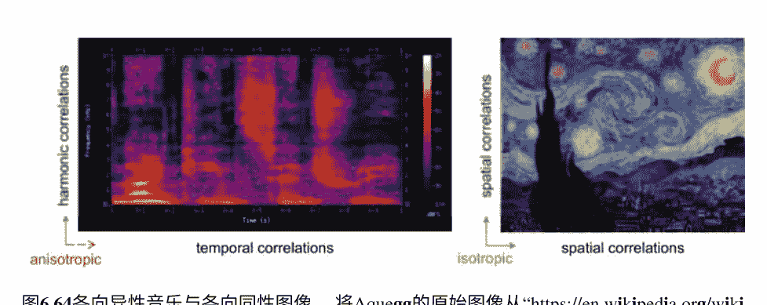

一个方向可能是重新制定风格信息的捕捉方式，因此考虑到时间维度的相关性的性质。另一个（也是假设性的）方向可能是使用“时间压缩”表示，通过考虑由RNN编码器-解码器学习的摘要（参见第6.10.2.3节）。

#### 6.11.3 演奏风格转移

虽然它并没有直接涉及性能风格转换，但在第6.7.1节中描述的PerformanceRNN系统为建模性能（包括音符的起始和动态）提供了背景表示。还需要进行以下工作来开发性能强加系统：

- 建模性能和其他特征之间的映射（例如音符的平均持续时间、调制等）；
- 通过相关性分析学习给定语料库（音乐家、上下文等）的映射，揭示给定音乐家（和语料库）的性能风格；以及
- 将映射转置到现有作品中，以转移性能风格。

正如Dai等人在[30]中指出的，性能风格转换与表现性能渲染密切相关，例如第6.7节中介绍的Cyber-João系统[29]和基于深度学习的最新系统[123]。但它还需要解开控制（风格）和乐谱信息（内容）之间的联系，以及上述讨论的映射的学习。因此，这仍然是一个需要探索的方向。

### 6.11.4 示例：FlowComposer 组合支持环境

一个很好的例子是 FlowComposer 系统[149, 152]，它是在 Flow Machines 项目[48]期间由 Pachet 等人开发的，它解决了不同维度上的风格转移的交互式音乐创作环境。请注意，它是基于马尔可夫链模型而不是（尚未）深度学习模型。

FlowComposer 在以下几个层面上提供了音乐风格转移的可能性：

- 作曲风格层面 - 可以进行一些风格转移，例如基于选定音乐的风格（语料库）的自动重新和声。请参见昨天的自动重新和声的例子，由约翰·列侬和保罗·麦卡特尼（图6.65）以米歇尔·勒格朗（图6.66）和比尔·埃文斯（图6.67）的风格进行。
- 音色和演奏风格水平<sup>92</sup> - 可通过样式转换、通过从各种乐器音频演奏库中进行自动映射和外推（通过ReChord组件[156]）进行渲染。

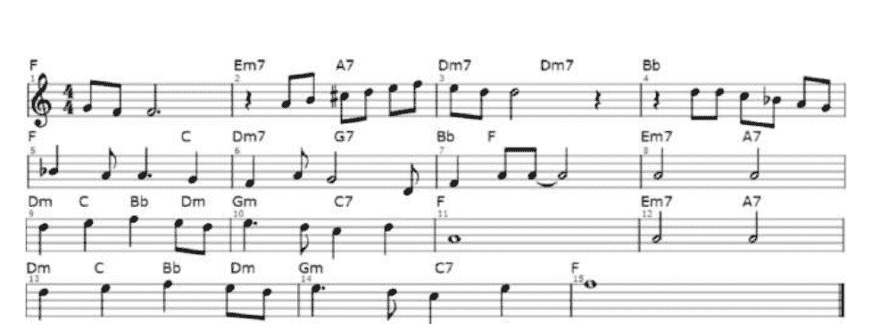

FlowComposer控制面板包括各种字段，用于选择作曲风格和滑块以设置和声一致性、灵感、平均音符持续时间和和弦变化，如图6.68所示。图6.69显示了以Bill Evans风格生成的一个主旋律谱，具有以下用户定义特征：3/4拍号，对第一个音符（C7）的约束和最后的(G7)和弦，以及四拍的“最大顺序”<sup>93</sup>。彩色背景表示从所选语料库中整体提取的音符序列（这里是Bill Evans的所有3/4作品）。

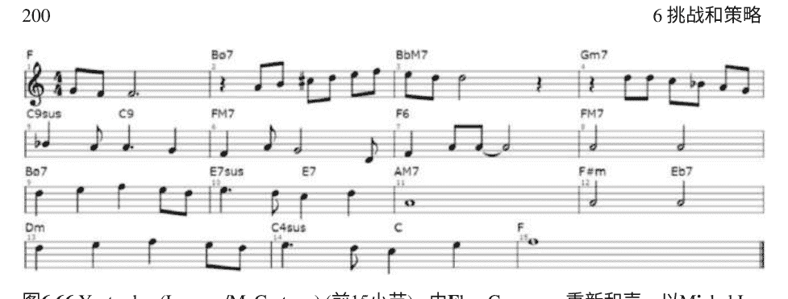

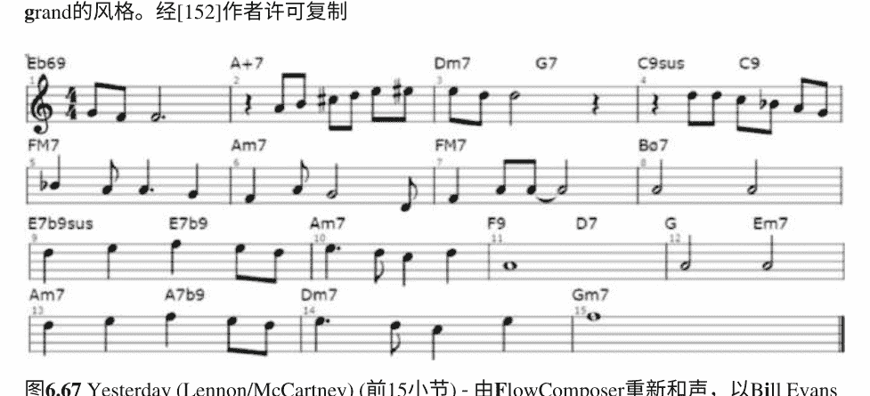

<sup>92</sup> 由于目前还无法分离/解开这两个问题，因此需要共同处理。

<sup>93</sup> 这个非常有趣的功能控制从语料库中连续复制的最大音符数量（实际上是拍子）。它依赖于在FlowComposer中基于Markov约束框架[148]的新约束MaxOrder [151]的集成。这是控制原创性的一种可能方式（见第6.13节）。


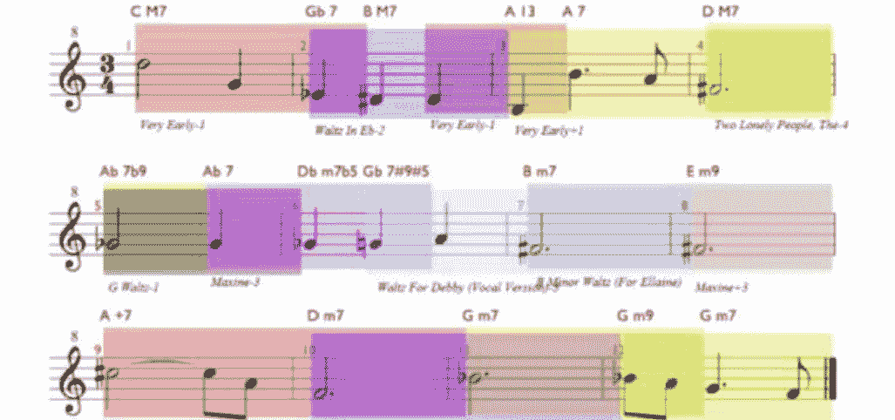

### 6.12 结构

一个挑战是大多数现有系统倾向于生成没有明确结构或“方向感”的音乐<sup>94</sup>。换句话说，尽管生成的音乐风格与学习的语料库相对应，但音乐似乎漫无目的地漫游，没有任何更高的组织，而不像人类创作的音乐具有一些全局组织（通常称为形式）和可识别的组成部分，例如：

- 古典音乐中的序曲、快板、慢板或终曲；
- 爵士乐中的AABA或AAB形式；
- 歌曲中的副歌、诗句或桥段。

请注意，存在各种可能的结构层次。例如，一个更细粒度的结构示例是在旋律动机的层次上，该动机可以重复，通常会转调以适应新的和声结构。

强化学习策略（在第6.10.6.1节中由RL-Tuner使用）和结构约束方法（在第6.10.5.1节中由C-RBM使用）都可以对生成过程中的一些约束（可能是高级别的）进行强制执行和/或转移（参见第6.11节）。关于结构约束，还可以参考最近的一个提议，该提议结合了两个图形模型，一个用于和弦，一个用于旋律，用于生成带有强制结构的乐谱[147]。另一种自上而下的方法是通过单元选择策略（参见第6.10.7节）生成一个抽象的序列结构，并用音乐单元填充，尽管该结构还不是非常高级，因为它实际上仍停留在小节的水平上。一个相关的挑战不是关于强加既有高级结构，而是关于学习高级结构的能力，而且是高级结构的发明（emergence）的能力。因此，一个自然的方向是明确考虑和处理不同层次（层次结构）的时间性和结构。

<sup>94</sup> 除了LSTM在学习长期依赖性方面带来的技术改进（参见第5.8.3节）之外。

#### 6.12.1 示例：MusicVAE多声部分层次符号音乐生成系统

在[162]中，Roberts等人提出了一种名为MusicVAE的架构，基于具有2级分层RNN的变分递归自编码器（VRAE）在解码器内部。

该语料库包括从网络收集的MIDI文件，从中提取了三种类型的音乐示例：

- 单声部旋律<sup>95</sup>，2或16小节长；
- 鼓模式，2或16小节长；和
- 三个不同声音（旋律、低音线和鼓模式）的三重序列，16小节长。

单音旋律和低音的编码是通过代表MIDI事件的标记进行的：128个“Note on”事件对应于定义间隔的128个可能的MIDI音符编号（音高），单个“Note off”事件<sup>96</sup>和其余的（静音）标记。鼓模式的编码是通过将MIDI标准鼓类映射到9个规范类别，从而导致2<sup>9</sup>=512个分类标记，表示所有可能的组合。量化为十六分音符。

该架构遵循变分自编码器（VRAE）等递归网络的原则，有两个区别：

- 编码器是一个双向递归网络（参见第5.13.2节）- 一个具有2,048个节点的LSTM，输入和输出层具有512个单元的单隐藏层；和
- 解码器是一个分层的2级递归网络，由以下组成
  - 一个名为指挥者的高级RNN – 一个具有512个节点和1,024个单元的单隐藏层的LSTM – 产生一系列嵌入；和
  - 一个底层RNN – 一个具有两个隐藏层的1,024个单元的LSTM – 将每个嵌入用作初始状态，并作为附加输入连接到先前生成的令牌<sup>97</sup>以产生每个子序列。为了优先考虑指挥者RNN而不是底层RNN，每个新子序列的初始状态都会重新初始化为解码器生成的嵌入。在多声部三重奏（旋律、低音和鼓）的情况下，每个声部都有一个LSTM。

MusicVAE架构如图6.70所示。作者报告说，一个等效的“平坦”MusicVAE架构（没有层次结构），虽然在2小节长的例子中对风格建模准确，但在16小节长的例子中不准确，自编码器重构的错误率增加了27%（平坦架构的准确率为0.883，层次结构的准确率为0.919）。

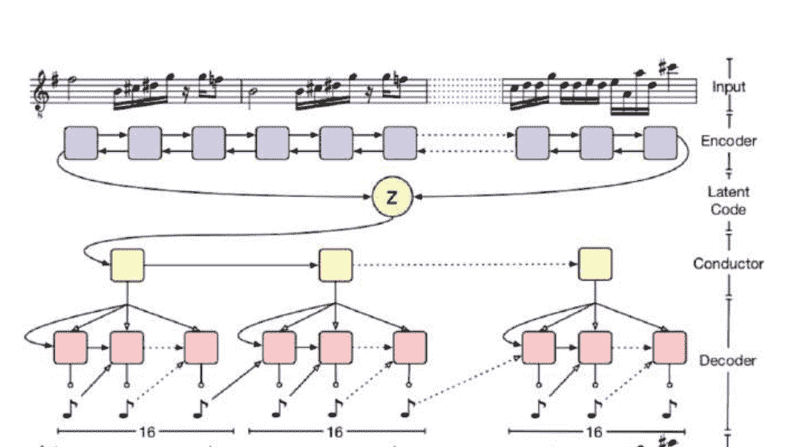

图6.71展示了生成的三重奏音乐示例。已经进行了初步的评估，听众比较了三个版本（平坦架构、层次结构和真实音乐）的三种类型的音乐：旋律、三重奏和鼓。结果显示，层次结构具有非常显著的优势，详细信息请参见[162]。

变分自动编码器架构的一个有趣特点在于通过各种操作来探索潜在空间的能力，例如：

- 翻译；
- 插值 - 第5.6.2节的图5.25展示了数据空间中插值（即旋律表示空间）和潜在空间中插值（然后解码为相应的旋律）产生的有趣比较。可以看到（和听到），潜在空间中的插值产生了更有意义和有趣的旋律；
- 平均 - 图6.72展示了从两个旋律的潜在空间的组合（平均）生成的一个旋律示例（在图的中间），这两个旋律分别位于图的顶部和底部；
- 属性向量算术，通过添加或减去一个属性向量来捕捉给定的特征 - 图6.73显示了当“高音密度”属性向量添加到现有旋律的潜在空间时生成的一个旋律的示例（图的底部）（图的顶部）。属性向量是通过计算共享该特征（属性）的一组示例的潜在向量的平均值来计算的（例如，音符密度高，变化快，音域高等）。

此外，图6.74显示了通过在潜在空间中添加（左矩阵）或分别减去（右矩阵）属性向量来修改16小节长旋律的各个属性的效果，以百分比变化表示。每个相关矩阵的垂直轴表示应用的属性向量，水平轴表示测量的属性。这些相关矩阵表明可以修改单个属性而不影响其他属性，除非是以下情况当预期存在相关性时，例如八分音符和十六分音符的同步。

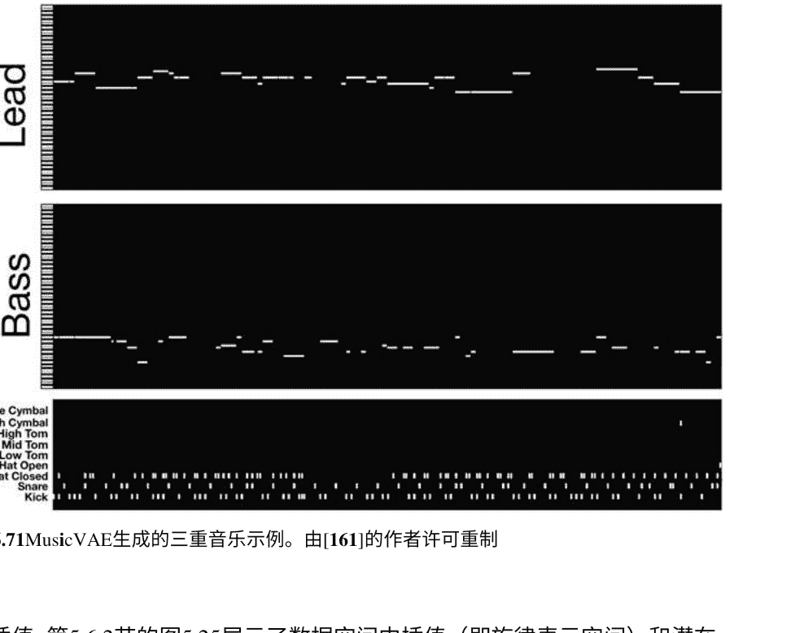

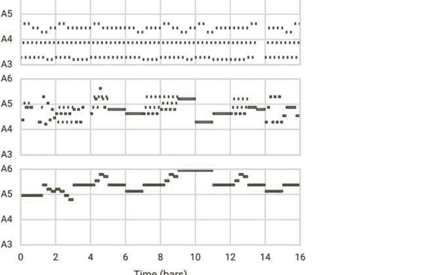

图6.72 通过MusicVAE对两个旋律的潜在空间进行平均生成的一个旋律示例（中间）。经作者许可，转载自[162]

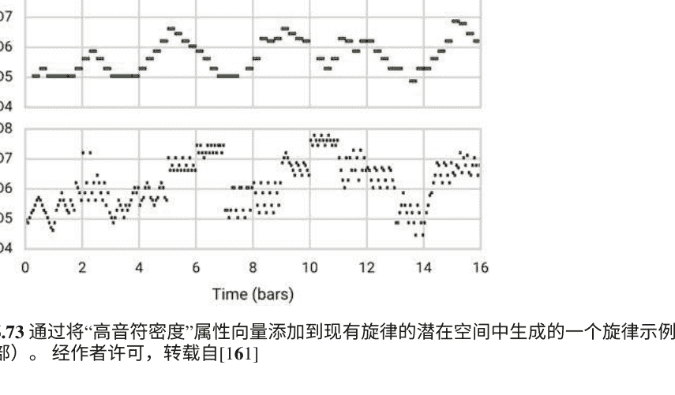

图6.73 通过将“高音符密度”属性向量添加到现有旋律的潜在空间中生成的一个旋律示例（底部）。经作者许可，转载自[161]

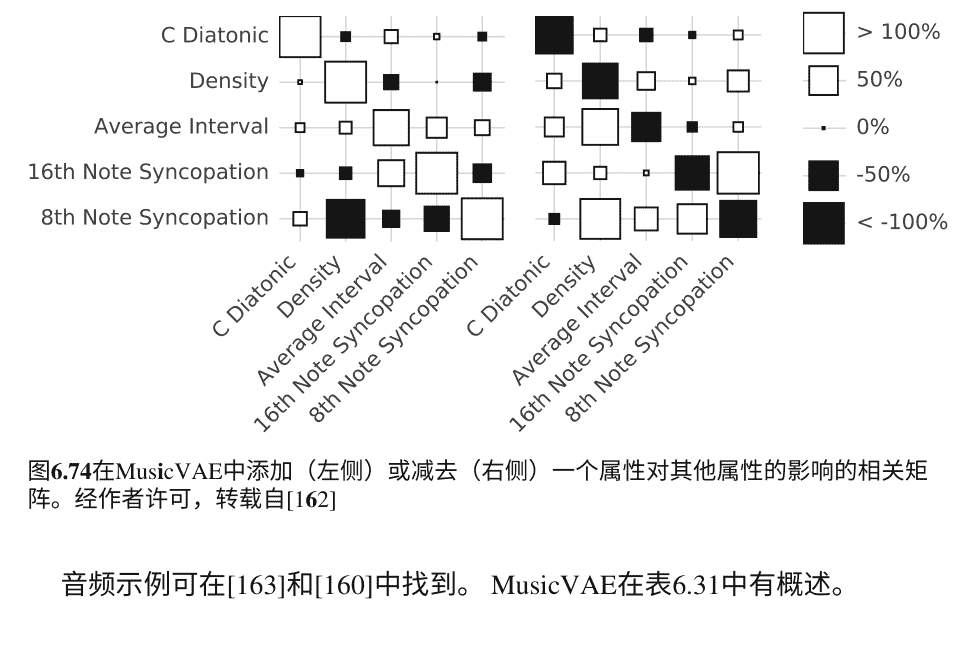

音频示例可在[163]和[160]中找到。MusicVAE在表6.31中有概述。

| 目标 | 旋律；三重奏（旋律，低音，鼓） |
| :--- | :--- |
| 表示 | 符号化；鼓；音符结束；休止符 |
| 架构 | 变分自动编码器（双向LSTM，分层<sup>2</sup>-LSTM） |
| 策略 | 迭代前馈；采样；潜在变量操作 |

表6.31 MusicVAE摘要

#### 6.12.2 其他时间结构层次

在深度学习架构中，有一些替代方案来组织时间层次结构。第一个例子是Clockwork RNN，由Koutník等人提出[102]。这个想法是将隐藏的循环层分成多个模块，每个模块都与输入层节点和输出层节点完全连接（以并行方式），但每个模块的时钟速率不同，并根据它们的时钟速率进行模块之间的互连（更快模块的神经元与更慢模块的神经元完全连接）。

另一个例子是Sample RNN，由Mehri等人提出[128]。它是WaveNet架构（第6.10.3.2节）的扩展，灵感来自不同时钟的想法。

<sup>95</sup> MusicVAE已经扩展到任意数量的复调音轨，详见[174]。
<sup>96</sup> 只需要一个“Note off”事件来表示所有可能的音高，因为旋律是单音的。它用于区分一个音符与两个连续相同音符，详见第4.9.1节。
<sup>97</sup> 图6.64 谱图（左）和MIDI表示（右）各向异性的图示。在谱图中，水平维度表示时间，垂直维度表示频率。在MIDI表示中，水平维度表示时间，垂直维度表示音高（音符编号）。两种表示都显示了方向依赖性：水平相关性表示时间相关性，垂直相关性表示和谐相关性，这在性质上非常不同。

从ClockworkRNN的速率，但通过一些外部模块（完整的网络）组织，通过一些条件[98]，与ClockworkRNN的内部模块相反。每个模块都是一个深度RNN，它将其输入的历史（连续的波形帧）总结为下一个模块向下的条件向量，该模块处理更短持续时间的帧。有关这两种架构的更多详细信息可以在它们各自的文章[102]和[128]中找到。

这些示例表明，存在积极的研究活动来探索在深度学习架构（用于音频或符号内容）中组织时间层次结构的各种方式，以更好地捕捉音乐的长期结构。

### 6.13 独创性

生成的音乐的原创性不仅是一个艺术问题（创造性），而且也是一个经济问题，因为它引发了版权[99]的问题。一种方法是事后，通过确保生成的音乐与现有音乐不太相似（例如，没有复制大量的音符）来实现。因此，可以使用现有的文本相似性检测算法。

另一种更系统但更具挑战性的方法是先验地确保生成的音乐不会复制训练语料库中的某个部分[100]。已经提出了一种基于马尔可夫链的音乐生成解决方案[151]。它基于可变阶马尔可夫模型，并通过一些最小阶和最大阶的约束来控制生成的阶数，以在垃圾和抄袭之间达到某种平衡。然而，目前还没有深度学习架构的解决方案。

现在让我们分析一些最近的方向，以促进生成音乐内容的原创性。

#### 6.13.1 条件

##### 6.13.1.1 示例：MidiNet旋律生成系统

在他们对MidiNet的描述中[211]（参见第6.10.3.3节），作者讨论了两种控制创造力的方法：

- 通过仅在生成器架构的中间卷积层中插入条件数据来限制条件；和
- 减小特征匹配正则化的两个控制参数的值，以减少真实数据和生成数据的分布接近的要求。

这些实验很有趣，但它们仍然停留在对架构的特定调整的水平上。

#### 6.13.2 创造性对抗网络

另一个更系统和概念性的方向是由Elgammal等人提出的创造性对抗网络（CAN）的概念，作为生成对抗网络（GAN）架构（在第5.11节介绍）的扩展。

##### 6.13.2.1 创造性对抗网络绘画生成系统

Elgammal等人在[44]中提出通过将生成对抗网络（GAN）架构扩展为创造性对抗网络（CAN）架构来解决创造性问题，以“通过学习风格并偏离风格规范来生成艺术作品。”[44]。

他们的假设是在标准GAN架构中，生成器的目标是生成欺骗鉴别器的图像，因此生成器被训练成模仿但不创造。在提出的创造性对抗网络（CAN）（如图6.75所示）中，生成器不仅从鉴别器接收一个信号，而是两个信号：

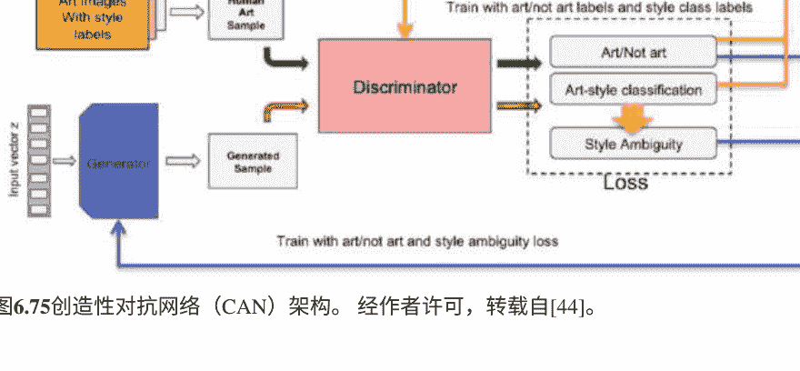

- 第一个信号类似于标准GAN的情况（参见方程式5.30），表示鉴别器对生成样本是真实还是伪造的艺术品的估计；并且
- 第二个信号表示鉴别器能够将生成的样本轻松分类到预定义的艺术风格中的程度。如果生成的样本是风格不明确的（即各个类别的概率相等），这意味着样本很难适应现有的艺术风格，这可能被解释为创造了一种新的风格。

这两个信号是相互矛盾的力量，推动生成器探索生成与现有艺术作品分布接近且风格不明确的物品的空间。

已经对来自WikiArt数据集[204]的绘画进行了实验。该收藏包含来自1,119位艺术家的81,449幅绘画图像，涵盖了从15世纪到20世纪的作品。它被标记为25种可能的绘画风格（例如立体主义、野兽派、高文艺复兴、印象派、波普艺术、现实主义等）。CAN生成的一些图像示例如图6.76所示。

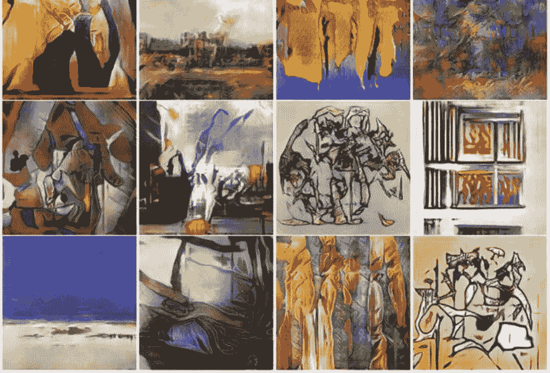

正如作者所讨论的那样，这些生成的图像在传统艺术中并不被认可，无法按照标准流派（肖像、风景、宗教画、静物等）进行识别，这一点通过初步的外部人类评估和初步的方法分析得到证实。

对他们的方法进行分析。请注意，CAN方法假设存在一个先验的风格分类，并将创造力的概念简化为探索新的风格（这在艺术史上确实有一定基础）。必要的先验分类在不同风格之间确实起着重要作用，有趣的是尝试使用其他类型的分类，包括自动构建的风格。尝试将CAN方法应用于音乐生成是一个诱人的方向。

请注意，与大多数在生成阶段应用控制约束的技术不同（例如，在第6.10.5.1节中的C-RBM系统中应用样式限制），在CAN方法中，创造力的动机是在训练阶段应用的。

原创性（和创造力）的重要问题将在第8.6节进一步讨论。

### 6.14 增量性

对于生成，深度架构的直接使用会导致一次性生成整个音乐内容（在前馈或自编码器网络架构的情况下），或者在递归网络架构的情况下，逐步生成音乐内容的时间片段。与人类作曲家逐步、通过对任意部分的连续改进的方式相比，这是一个很大的限制。

#### 6.14.1 音符实例化策略

让我们回顾一下在生成过程中如何实例化音符。有三种主要策略：

- 单步前馈 - 前馈架构在单个处理步骤中处理包含所有时间步的全局表示。一个例子是MiniBach（第6.2.2节）。
- 迭代前馈 - 递归架构迭代地处理与单个时间步相对应的局部表示。一个例子是CONCERT（第6.6.1.1节）。
- 增量采样 - 一个前馈架构逐步处理包含所有时间步的全局表示，通过逐步实例化其变量（每个变量对应于特定时间步的音符可能性）。一个例子是DeepBach（第6.14.2节）。

这三种策略在图6.77中进行了比较和说明。表示是钢琴卷类型，有两个同时的声音（或轨道）。蓝色的单元格是要播放的音符。带有粗线标记为“current”的矩形表示正在处理的部分，而浅灰色的部分表示已经处理的部分。

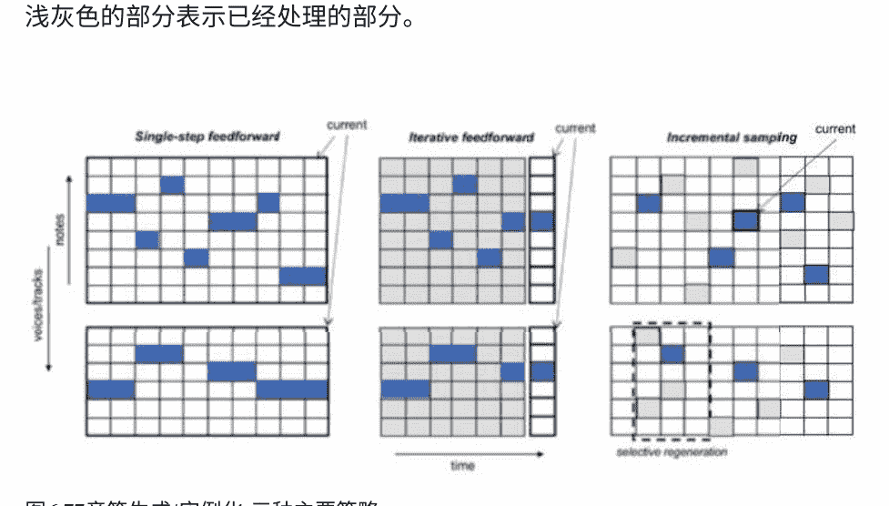

在增量采样策略的情况下（图6.77的右侧部分），在每个处理步骤中，随机选择并实例化表示三连音符（voice, note, time step）的新单元格，标记为“current”。已经实例化的三连音符如果要播放则为蓝色填充，否则为浅灰色填充。

请注意，使用这种增量采样策略，可以仅生成或重新生成音乐内容的任意部分（切片），以满足特定时间步长之间的时间间隔和/或特定的声音/音轨子集，而无需重新生成整个内容。在图6.77中，虚线矩形表示用户选择的区域，用于执行选择性再生[101]。

#### 6.14.2 示例：DeepBach合唱多声部符号音乐生成系统

Hadjeres等人提出了DeepBach架构[102]用于生成J.S.巴赫合唱曲[69]。该架构如图6.78所示，结合了两个循环网络（LSTM）和两个前馈网络。与标准的递归网络使用中只考虑单个时间方向[103]，而DeepBach架构考虑了两个方向：向前的时间和向后的时间[104]。因此，使用了两个递归网络（更准确地说，具有200个单元的LSTM），一个总结过去的信息，另一个总结来自未来的信息，以及一个负责同时发生的音符的非递归网络。它们的三个输出被合并并传递给一个具有200个隐藏单元的最终前馈神经网络的输入。最终的输出激活函数是softmax。

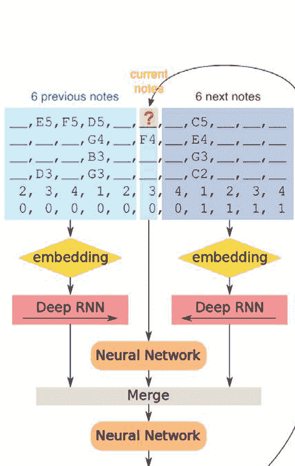

图6.78 DeepBach架构。经作者许可，从[69]中复制。

[103] 一个例外是，在BLSTM和C-RNN-GAN系统中分别使用的一些双向递归架构，分别在第6.8.3节和6.10.2.4节中进行了分析。

[104] 作者表示，这种架构选择在某种程度上与巴赫赞美诗的真实创作实践相匹配。事实上，在重新和声给定旋律时，从终止开始向后写音乐通常更简单[69]。

初始语料库是J.S.巴赫的多声部赞美诗（多声部）[5]，其中作曲家选择了各种给定的旋律作为女高音，并以对位法的方式创作了其他三个声部（女中音、男高音和男低音）。初始数据集（352首赞美诗）通过添加符合初始语料库定义的声部音域的所有赞美诗转调来进行扩充。这导致了一个总共有2,503首赞美诗的语料库。声部音域每个声部最多包含28个不同的音高[105]。

DeepBach中表示的选择具有一些特殊性。使用保持符号“_”来指示音符是否被保持（参见第4.9.1节）。作者在[69]中强调，这种表示方法非常适合他们使用的采样方法，更确切地说，他们之所以能够通过Gibbs采样获得良好的结果，完全依赖于将保持符号整合到音符列表中的选择。另一个特殊之处在于，表示方法使用音符的实际名称而不是MIDI音符编号进行编码（例如，F#与G被视为不同的音符，参见第4.9.2节）。最后，巴赫赞美诗中的延音符号被明确考虑，因为它有助于产生结构和连贯的乐句。

图6.78顶部示例数据的前四行对应于四个声音。底部的两行对应于元数据（延长音和节拍信息）。实际上，这个架构被复制了四次，每个声音一次（合唱中的四个声音）。

对于神经网络，训练和生成并不是以传统方式进行的。目标是预测给定声音（图6.78顶部中央用红色“？”标示的浅绿色）的当前音符的值，使用周围上下文音符及其相关元数据作为输入信息，更准确地说

- 其他三个声音的三个当前音符（图6.78顶部中央的浅蓝色矩形）；
- 所有声音的六个先前音符（图6.78顶部左侧的浅绿蓝色矩形）；和
- 所有声音的六个后续音符（图6.78顶部右侧的浅灰蓝色矩形）。

训练集是通过重复随机选择语料库中的一个音符及其周围上下文（如前面所定义的）来形成的。

生成是通过增量采样来完成的，使用类似于但计算上更简单的伪-Gibbs采样算法（参见第6.4.2.1节），以产生一组多声部的值（每个音符），遵循网络学习的分布。增量采样的生成算法如图6.79所示，并在图6.77中进行了说明。

[105] 高音、中音和次中音部分分别为105、21和28，低音部分为106。

与Gibbs采样（基于条件概率分布的不兼容性假设）和该算法的差异在[69]中进行了详细讨论。

```
创建长度为L的四个列表V = (V1; V2; V3; V4);
用对应声音的范围内的随机音符进行初始化
(均匀采样或从音符的边际分布中采样) ;
对于 m 从1到最大迭代次数 do
    在1到4之间均匀选择声音 i;
    在1到L之间均匀选择时间 t;
    从 P_i(V'_i | V \setminus i, θ_i) 重新采样 V'_i
结束循环
```

图6.79 DeepBach增量生成/采样算法

图6.80展示了生成的一首赞美诗的例子[107]。与许多实验不同，进行了一项图灵测试类型的系统评估（通过Web上的问卷调查，包括超过1200名从专家到新手的人）结果非常积极，显示出很大的难度区分由巴赫创作的赞美诗和由DeepBach生成的赞美诗。DeepBach在表6.32中有概述。

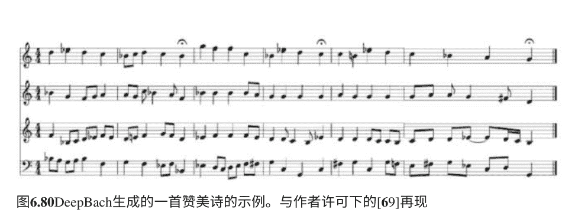

图6.80 DeepBach生成的一首赞美诗的示例。与作者许可下的[69]再现

| 目标 | 多声部；对位；赞美诗；巴赫 |
| --- | --- |
| 表示 | 符号化；钢琴卷帘；多热编码；保持；休止符；延长记号 |
| 架构 | 前馈 ×2 + LSTM×2 |
| 策略 | 采样 |

### 6.15 交互性

一个重要问题是，对于大多数当前的系统，音乐内容的生成是一个自动化和自主的过程。与人类用户的一些互动对于获得一个伴侣系统来帮助人类在他们的音乐任务中（作曲，对位，和声，分析，编排等）以递增和交互的方式是至关重要的。一个例子，已经在第6.11.4节中介绍过，是FlowComposer原型[152]。

基于深度网络架构的部分交互式增量系统的几个示例是deepAutoController（第6.4.1.2节）和DeepBach（第6.14.2节）。

### 6.15.1 示例: deepAutoController音频音乐生成系统

deepAutoController系统[169]在第6.4.1.2节中介绍了一个用户界面，如图6.81所示，可以通过以下方式与生成进行交互，例如通过

- 选择给定的输入,
- 生成一个随机输入以供前馈到解码器堆栈中，或
- 控制（通过缩放或静音）给定单元的激活。

| Neuron | Gain | Scale | Adj. Value | Mute |
|--------|------|-------|------------|------|
| 24 | 1.00000 | 2.00000 | 2.00000 |  |
| 25 | 1.00000 | 1.00000 | 0.00000 | M |
| 26 | 0.26772 | 1.00000 | 0.26772 |  |
| 27 | 1.00000 | 1.59055 | 1.59055 |  |
| 28 | 1.00000 | 1.96850 | 1.96850 |  |
| 29 | 1.00000 | 0.51969 | 0.51969 |  |
| 30 | 0.68504 | 0.69291 | 0.00000 | M |
| 31 | 0.78740 | 1.00000 | 0.78740 |  |

图6.81 deepAutoController信息窗口的快照，显示隐藏单元。经授权从[169]中复制，作者许可

#### 6.15.2 示例：DeepBach合唱符号音乐生成系统

DeepBach[69]的用户界面（见第6.14.2节）是作为MuseScore音乐编辑器的插件实现的（见图6.82）。它帮助人类用户交互地选择和控制合唱的部分再生。这是由于生成的增量性质使其成为可能（见第6.14节）。此外，用户可以强制执行一些用户定义的约束，例如

- 冻结一个声部（例如女高音）并重新采样其他声部以重新谱写固定旋律[109]；
- 修改延音符列表以在特定位置强制结束音乐短语；
- 限制给定声部和给定时间间隔的音符范围; 和
- 通过将音符范围限制为保持符号（因为它被视为音符）在特定部分中强制执行节奏。

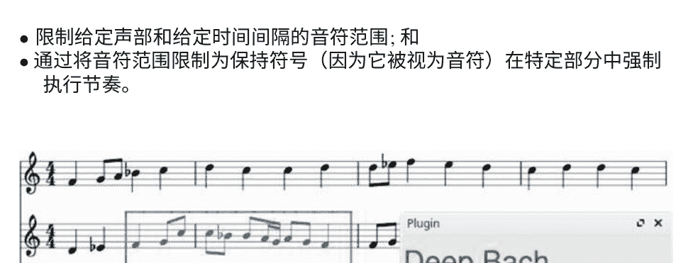

#### 6.15.3 接口定义

最后，让我们提到一下，在控制和交互之间的交界处，Morris等人在[137]中对于控制参数（用于通过马尔可夫链训练模型生成音乐）应该在人类用户层面上暴露的问题进行了有趣的讨论。他们尝试过一些用户层面的控制参数，例如

[109] 在实践中，这意味着从生成4声音乐的原始目标（如第6.14.2节所讨论的）转变为为给定旋律生成3声对位伴奏。

- 大调与小调；
- 跟随旋律与跟随和弦；以及
- 锁定一个特征（例如和弦）。

### 6.16 适应性

当前深度学习架构在生成音乐内容方面存在一个根本性限制，即它们矛盾地不会学习或适应。学习是在网络的训练阶段应用的，但在生成阶段不会发生学习或适应。然而，可以想象用户（例如作曲家、制作人、听众）对生成音乐的质量和适应性提供一些反馈。这种反馈可能是明确的，这对用户来说是一项任务，但它也可能是至少部分隐含和自动化的。例如，用户迅速停止听刚生成的音乐可能被解释为负面反馈。相反，用户在第一次快速听取初始再现后选择更好的演奏可能被解释为正面反馈。

有几种方法是可能的。最直接的方法是考虑神经网络和监督学习的性质，将新生成的音乐作品添加到训练集中，并最终重新训练网络[110]。这将增强正面示例的数量，并逐渐更新学习模型，从而影响未来的生成。然而，并不能保证整体生成质量会提高。这也可能导致模型过拟合并失去一些泛化能力。此外，由于几乎没有机会在数据集中删除生成不良示例，因此没有直接的负反馈可能性。

在适应性和互动性之间的交汇处，一种有趣的方法是音乐生成的交互式机器学习，如Fiebrink和Caramiaux[51]所讨论的。他们报告了他们设计的一个工具包Wekinator的使用经验，允许用户交互地修改训练示例。例如，他们在[51]中提到：“交互式机器学习还可以让人们从很少的训练示例中构建准确的模型：通过在输入空间中最需要改进模型准确性的区域迭代地放置新的训练示例（例如，接近所需的类别之间的决策边界），用户可以更有效地学习复杂的概念，而不是如果所有的训练数据都代表未来的数据。”

另一种方法是不在训练数据集上工作，而是在生成阶段上工作。这将使我们回到控制问题（参见第6.10节），通过受限采样策略、输入操作策略或者其他方式[111]。一种强化策略。RL-Tuner框架（第6.10.6.1节）是朝着这个方向迈出的有趣一步。虽然RL-Tuner最初的动机是在生成过程中引入音乐约束，通过将其封装为额外的奖励，但这种方法也可以用于引入用户反馈作为额外的奖励。

[110] 立即，在一段时间后，或者在一定量的新反馈后，例如使用小批量（参见第5.1.4节）。
[111] 这可以在后台进行。

### 6.17 可解释性

对于人工智能（AI）的亚符号方法（如神经网络和深度学习），一个常见的批评是它们的黑盒性质，这使得解释和证明它们的决策变得困难[17]。可解释性确实是一个真正的问题，因为我们希望能够理解和解释深度学习系统从语料库中学到了什么（以及如何学到），以及为什么它最终生成了特定的音乐内容。

#### 6.17.1 示例：BachBot合唱多声部符号音乐生成系统

虽然初步，但通过BachBot系统进行的一项有趣研究涉及网络中一些单元（神经元）与某些特定动机和进行的相关分析。

BachBot，由Liang[118, 117]设计，旨在以J.S. Bach的风格生成赞美诗，这也是DeepBach（第6.14.2节）的目标之一。数据集中的所有示例都对齐到相同的键。初始表示为钢琴卷帘，但以文本形式编码，类似于第6.6.1.2节中描述的凯尔特旋律生成系统。

编码的一个特点是同时音符被编码为一系列令牌，特殊的分隔符符号“|”表示下一个时间帧，时间步长为八分音符。实际上，BachBot将赞美诗视为单声部多声部，而不是多声部多声部，例如DeepBach（第6.14.2节）和MiniBach（第6.2.2节）。休止符被编码为空帧。音符按降序排列，并用它们的MIDI音符号表示，其中布尔值表示它是否与前一个时间步骤的相同音高的音符连接[112]。图6.83显示了一个示例，编码了两个连续的和弦：

- 音符B3，G♯3，E3和B2，对应于以B为低音的E大调（在爵士乐中通常表示为E/B），持续一个四分音符，并通过连音符重复；+   - 一个延长记号，表示为“(.)”；和
- 音符 A3，E3，C3和A2，对应于以 A 为低音的 A 小调，持续一个八分音符。

```
(59, 假)
(56, 假)
(52, 假)
(47, 假)
|||
(59, 真)
(56, 真)
(52, 真)
(47, 真)
|||
(.)
(57, 假)
(52, 假)
(48, 假)
(45, 假)
|||
```

图6.83 BachBot中的乐谱编码示例。引用自[118]

该架构是一个循环网络（LSTM）。作者使用了网格搜索来选择架构的超参数的最佳设置（层数、单元数等）。所选的架构有三层，正如作者在[118]中指出：“深度很重要！增加层数可以使验证损失降低高达9%。”最佳模型有3层深度，再深就会出现过拟合。生成是按时间步骤进行的，遵循迭代前馈策略。

至于DeepBach（第6.14.2节和6.15.2节），BachBot可以从最初的4声多声部赋格生成目标重新调整为旋律3声对位伴奏目标，请参阅[118，第6.1节]中的详细信息。然而，与DeepBach架构和表示保持不变不同，在BachBot的情况下，架构、表示的时间范围和策略都必须从时间步骤/迭代前馈生成方法结构上进行改变，改为全局/单步前馈生成方法（类似于MiniBach）。

作者进行了一项有趣的初步研究，邀请了一位音乐学家手动搜索单位激活和特定动机和进行的可能相关性，如图6.84所示。一些相关性的例子如下：

+   - 第1层的神经元64和138似乎能够检测到根位和弦的完全终止(V–I)在主调中。
+   - 第1层的神经元87似乎能够检测到第一拍上的I（第一音）和四小节后的再现。
+   - 第1层的神经元151似乎能够检测到以A小调结束第2和第4乐句的cadences。
+   - 第2层的神经元37似乎在寻找I和弦：完整的I和弱一些的其他类似和弦（同样的低音）。

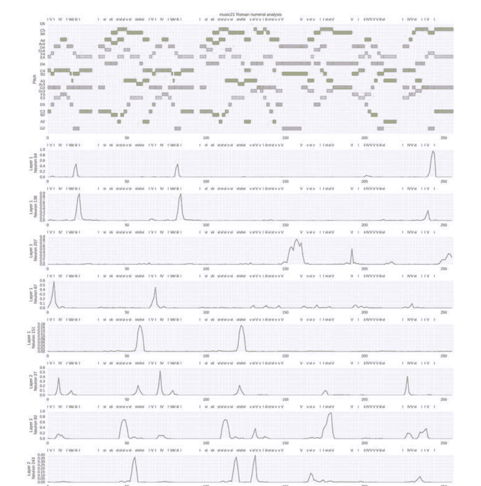

巴赫机器人总结如表6.33所示。

| 目标 | 多声部; 赞美诗; 巴赫 |
| :--- | :--- |
| 表示符号化; 文本; 独热编码; 保持; 延音 | 
| 架构 | LSTM³ |
| 策略 | 迭代前馈; 采样 |

表6.33巴赫机器人总结

#### 6.17.2 示例：深度自动控制音频音乐生成系统

在[169]中，deepAutoController的作者（第6.4.1.2节）讨论了对架构单元的不同控制对音乐的影响：“模型的最优参数大多是抑制性的。”因此，隐藏层中的单元去激活会在输出端产生更密集的声音混合。学习使用这样的界面可能对新用户来说很困难，因为人们通常期望从音乐合成器中得到相反的行为。<...>我们通过使用不对称的权重衰减来探索具有非负权重的模型，如[115]所示。这里不提供结果，因为它们是初步的。在这样的模型中，重构误差比没有非负约束的模型更糟糕。但我们非正式地发现，这些模型作为合成器更加直观可玩。”

#### 6.17.3 迈向自动化分析

在第6.17.1节和6.17.2节中的两个先前的示例是初步手动相关分析的示例。与此同时，一个活跃的研究领域涉及深度学习架构的工作方式和通过自动分析解释其预测或决策。这种方法的一个例子是使用显著性图，其中包括以下三个类别¹¹⁵：

+   - 梯度敏感性，用于估计输入的微小变化如何影响分类任务（例如，参见[6]）；
+   - 信号方法，用于分离刺激神经元在更高层次的激活的输入模式（例如，参见[100]）；和
+   - 归因方法，用于将特定输出神经元的值分解为来自各个输入维度的贡献¹¹⁶（例如，参见[135]）。

请注意，这种类型的分析也可以用于不同的目标：通过删除组件来优化架构的配置。

¹¹⁵在[99]中，根据Kindermans等人的研究，实际上是对显著性方法可靠性的批评。

¹¹⁶采用类似于逆相关的方法，该方法在神经生理学中用于研究感觉神经元如何从不同来源的信号中累加并在不同时间内对刺激进行求和以生成响应（例如，参见[158]）。

### 6.18 讨论

我们可以观察到，我们分析的各种限制和挑战可能在一定程度上相互依赖，并且存在冲突。因此，解决一个问题可能会抑制另一个问题。例如，Deep-Bach使用的采样策略（第6.14.2节）提供了增量性，但生成的音乐长度是固定的，而迭代前馈策略允许可变且无限长度，但增量性只能向前推进。

可能没有通用解决方案，对于多准则决策，架构和策略的选择取决于偏好和优先级。此外，正如在第5.13.7节中已经指出的那样，组合各种不同的架构和/或策略并不能保证得到一个声音和准确的系统。

对于一个好的厨师来说，最好的结果并不是简单地混合所有可能的成分。因此，继续深入我们的理解并探索解决方案以及它们可能的表达和组合是很重要的。 我们希望本章和接下来的两章中进行的调查和分析能对这一理解做出贡献。

# 第7章分析

我们现在通过各种表格对所调查的各种系统进行初步分析和总结，遵循我们提出的五个维度参考。这为分析不同维度之间的关系和相应的设计决策提供了材料。

### 7.1 引用和缩写

首先，我们在表7.1中引用了我们分析过的各种系统。然后，由于空间限制，我们为每个维度的各种可能类型引入了缩写：

+   - 目标在表7.2中；
+   - 表示在表7.3中；
+   - 架构在表7.4中；
+   - 挑战在表7.5中；以及
+   - 策略在表7.6中。

| 参考名称 | 原始名称 | 作者 | 参考部分 |
|----------|----------|------|----------|
| Anticipation-RNN | 预测-RNN | G. Hadjeres & F. Nielsen | [67] 6.10.3.5 |
| AST (音频风格转移) |  | D. Ulyanov和V. Lebedev | [191] 6.11.2.1 |
|  |  | D. Foote等人 | [52] 6.11.2.1 |
| BachBot | BachBot | F. Liang | [118] 6.17.1 |
| 双轴LSTM | 双轴LSTM | D. Johnson | [94] 6.9.3 |
| BLSTM | BLSTM | H. Lim等人 | [119] 6.8.3 |
| 蓝调C |  | D. Eck和J. Schmidh¨uber | [42] 6.5.1.1 |
| 蓝调MC |  | D. Eck和J. Schmidh¨uber | [42] 6.5.1.2 |
| 凯尔特 |  | B. Sturm等人 | [178] 6.6.1.2 |
| 音乐会 | 音乐会 | M. Mozer | [138] 6.6.1.1 |
| C-RBM | C-RBM | S. Lattner等人 | [108] 6.10.5.1 |
| C-RNN-GAN | C-RNN-GAN | O.莫格伦 | [134] 6.10.2.4 |
| deepAutoController | deepAutoController | A.萨罗夫和M.凯西 | [169] 6.4.1.2 |
| DeepBach | DeepBach | G.哈杰雷斯等 | [69] 6.14.2 |
| DeepHearC | DeepHear | F.孙 | [179] 6.10.4.1 |
| DeepHearM | DeepHear | F.孙 | [179] 6.4.1.1 |
| DeepJ | DeepJ | L.-C.毛等 | [126] 6.10.3.4 |
| GLSR-VAE | GLSR-VAE | G.哈杰雷斯和F.尼尔森 | [68] 6.10.2.3 |
| Hexahedria |  | D. Johnson | [93] 6.9.2 |
| MidiNet | MidiNet | L.-C.杨等 | [211] 6.10.3.3 |
| MiniBach | MiniBach | G.哈杰雷斯等 | 6.2.2 |
| MusicVAE | MusicVAE | A. Roberts等人 | [162] 6.12.1 |
| 性能RNN | 性能RNN | I. Simon & S. Oore | [173] 6.7.1 |
| RBMC |  | N. Boulanger-Lewandowski 等人 | [11] 6.9.1 |
| 节奏 |  | D. Makris等人 | [122] 6.10.3.1 |
| RL-Tuner | RL-Tuner | N. Jaques等人 | [92] 6.10.6.1 |
| RNN-RBM | RNN-RBM | N. Boulanger-Lewandowski 等人 | [11] 6.9.1 |
| 顺序 | 顺序 | P. Todd | [189] 6.8.2 |
| 时间窗口 | 时间窗口 | P. Todd | [189] 6.8.1 |
| 单元选择 |  | M. Bretan等人 | [13] 6.10.7.1 |
| VRAE | VRAE | O. Fabius & J. van Amersfoort | [49] 6.10.2.3 |
| VRASH | VRASH | A. Tikhonov & I. Yamshchikov | [188] 6.10.3.6 |
| WaveNet | WaveNet | A. van der Oord等 | [193] 6.10.3.2 |

表7.1系统引用

| 缩写 | 目标 |
|------|------|
| 类型 | |
| Au | 音频 |
| Me | 旋律 (单声部旋律) |
| Po | 复调 (单声部复调) |
| CP | 和弦进行 (序列) |
| MV | 多声部 (多声部/多音轨复调) |
| Dr | 鼓 |
| Co | 对位伴奏 |
| CA | 和弦 (进行) 伴奏 |
| ST | 风格转换 |
| 目的地和用途 | |
| AR | 音频再现 |
| SP | 软件处理 |
| HI | 人类解释 |
| 模式 | |
| AG | 自主生成 |
| IG | 交互生成 |

表7.2目标类型的缩写

| 缩写 | 表示 |
| :--- | :--- |
| 音频 | |
| Wa | 波形 |
| Sp | 频谱 |
| 符号 | |
| 概念 | |
| No | 音符 |
| Re | 休止符 |
| 和弦 | 和弦 |
| 旋律 | 节奏（拍子和节拍） |
| Dr | 鼓 |
| 格式 | |
| MI | MIDI |
| Pr | 钢琴卷帘 |
| Te | 文本 |
| 时间范围 | |
| Gl | 全局 |
| TS | 时间步长 |
| 元数据 | |
| NH | 音符保持或结束 |
| NE | 无升降号（音符表示） |
| Fe | 延长音符 |
| FE | 特征提取 |
| 表现力 | |
| Te | 速度 |
| Dy | 动态 |
| 编码 | |
| VE | 值编码 |
| OH | 一位有效编码 |
| MH | 多位有效编码 |
| 数据集 | |
| Tr | 移调 |
| Al | 对齐 |

表7.3表示类型的缩写

| 缩写 | 架构 |
| :--- | :--- |
| Fd | 前馈 |
| Ae | 自编码器 |
| Va | 变分 |
| RB | 受限玻尔兹曼机（RBM） |
| RN | 循环（RNN） |
| Cv | 卷积 |
| Cn | 条件 |
| GA | 生成对抗网络（GAN） |
| RL | 强化学习（RL） |
| Cp | 化合物 |

表7.4架构类型的缩写

| 缩写 | 挑战 |
| :--- | :--- |
| Fr | 从无到有生成 |
| LV | 长度变异性 |
| CV | 内容变异性 |
| Ex | 表达力 |
| MH | 旋律和和声的一致性 |
| Co | 控制 |
| St | 结构 |
| Or | 原创性 |
| In | 增量性 |
| It | 互动性 |
| Ad | 适应性 |
| Ey | 可解释性 |

表7.5挑战类型的缩写

| 缩写 | 策略 |
| :--- | :--- |
| SF | 单步前馈 |
| DF | 解码器前馈 |
| Sa | 采样 |
| IF | 迭代前馈 |
| IM | 输入操作 |
| Re | 强化 |
| US | 单元选择 |
| Cp | 化合物 |

表7.6策略类型的缩写

### 7.2 系统分析

我们在表7.7和7.8中总结了每个系统在目标、表示、架构和策略四个维度上的位置。 然后我们逐个维度对每个系统进行更详细的分析：

+   - 目标 在表7.9中；
+   - 表示在表7.10和7.11中；
+   - 架构 和 策略 在表7.12中；和
+   - 挑战 在表7.13中。

对于每个表格，分析每个系统（行）与给定维度的可能类型（列）之间的关系，给定行（系统）和给定列（类型）的交叉处出现“X”表示该系统在该维度上与给定类型匹配（例如，遵循某种表示特征，基于某种架构类型，满足某种挑战...） 。 请注意，我们基于文献引用中每个系统的呈现方式进行分析，而不是根据其可能的进一步扩展。

此外，我们使用Xⁿ和X×n（在第6.1节中介绍）等符号来传达有关类型出现次数的附加信息。

| 系统 | | | | |
| 姓名 | 目标 | 表示 | 架构 | 策略 |
|------|------|------|------|------|
| 预测-RNN | 旋律; 巴赫 | 符号化; 单热编码; 保持; 休止符; 无升降音 | 条件化(LSTM², LSTM²) | 迭代前馈; 采样 |
| AST | 音频风格转移 | 音频; 频谱 | 卷积自回归(前馈) | 输入操作; 单步前馈 |
| 巴赫机器人 | 复调; 赞美诗; 巴赫 | 符号化; 文本; 单热编码; 保持; 延长音 | LSTM³ | 迭代前馈; 采样 |
| 双轴LSTM | 复调 | 符号化; 钢琴卷帘; 保持; 休止符 | LSTM×2 | 迭代前馈; 采样 |
| BLSTM | 伴奏; 符号化; CSV; 和弦序列; 独热编码; 西方音乐 ×(12×* + 24×4); 休止符 | | LSTM² | 迭代前馈 |
| 蓝调C | 和弦序列; 符号化; 单热编码; 蓝调 | 音符结束; 和弦作为音符 | LSTM | 迭代前馈 |
| 蓝调MC | 旋律 + 和弦; 蓝调 | 符号化; 单热编码×2; 音符结束; 和弦作为音符 | LSTM | 迭代前馈 |
| 凯尔特 | 旋律 | 符号化; 文本; 基于令牌; 单热编码 | LSTM³ | 迭代前馈; 采样 |
| 音乐会 | 旋律 + 和弦 | 符号化; 谐波; RNN 和声; 节拍 | | 迭代前馈; 采样 |
| C-RBM | 复调; 风格限制 | 符号化; 钢琴卷帘; 休止符; 多热编码; 节拍 | 卷积(RBM) | 输入操作; 采样 |
| C-RNN-GAN | 复调 | 符号化; MIDI | GAN(双向(LSTM²), LSTM²) | 迭代前馈; 采样 |
| deepAutoController | 音频; 用户界面 | 音频; 频谱 | 自编码器² | 解码器前馈 |
| DeepBach | 多声部; 对位法; 赞美诗; 巴赫 | 符号化; 钢琴卷帘; 多²-独热编码; 保持; 休止符; 延长音; 无半音 | LSTM×2 | 前馈 ×2 采样 |
| DeepHearC | 旋律 伴奏 | 符号化; 钢琴卷帘; 独热编码×64 | 自编码器⁴ | 输入操作; 解码器前馈 |
| DeepHearM | 旋律; 拉格泰姆 | 符号化; 钢琴卷帘; 独热编码×64 | 自编码器⁴ | 解码器前馈 |
| DeepJ | 复调; 古典; 风格重放矩阵; 休止符; 风格; 动态 | 符号化; 钢琴卷帘; | 条件化(LSTM²×2, 嵌入) | 迭代前馈; 采样 |
| GLSR-VAE | 旋律; 巴赫 | 符号化; 钢琴卷帘; 独热编码; 保持; 休止符; 延长音; 无半音 | 变分自编码器; 编码器(LSTM, 采样 LSTM); 测地线 正则化 | 迭代前馈; 采样 |
| Hexahedria | 和声 | 符号化; 钢琴卷帘; 保持; 节拍 | LSTM²⁺² | 迭代前馈; 采样 |

表7.7系统摘要（1/2）

| 系统 | | | | |
| 姓名 | 目标 | 表示 | 架构 | 策略 |
| --- | --- | --- | --- | --- |
| MidiNet | 旋律+和弦; 流行; 钢琴卷帘; 旋律 vs 和弦 | 符号化; 和弦 | GAN (条件化 (卷积 (前馈), 卷积 (前馈 (历史, 和弦序列)), 条件 (卷积(前馈), 历史)) | 迭代前馈; 采样 |
| MiniBach | 伴奏; 对位; 赞美诗; 巴赫 | 符号化; 钢琴卷帘; 独热编码×64×(1+3); 保持 | 前馈² | 单步前馈 |
| MusicVAE | 旋律; 三重奏 (旋律, 低音, 鼓) | 符号化; 鼓; 音符结束; 休止符 | 变分自编码器 (双向-LSTM, 分层²-LSTM) | 迭代前馈; 采样; 潜在变量操作 |
| 性能RNN | 性能控制 | 符号化; 单热; 时间偏移; 动态 | LSTM | 迭代前馈; 采样 |
| RBMC | 同时音符 (和弦) | 符号化; 多热 | RBM | 采样 |
| 节奏 | 多声部; 节奏; 鼓声 | 符号化; 节拍; 鼓声; 贝斯线; 音符; 休止符; 持续音 | 条件化(前馈(LSTM²), 前馈) | 迭代前馈; 采样 |
| RL-Tuner | 旋律 | 符号化; 单热; LSTM×2 + 强化学习; 音符结束; 休止符 | | 迭代前馈; 强化学习 |
| RNN-RBM | 和声 | 符号化; 多热 | RBM-RNN | 迭代前馈; 采样 |
| 顺序 | 旋律 | 符号化; 钢琴卷帘; 单热; 音符开始; 隐式休止 | RNN | 迭代前馈 |
| 时间窗口 | 旋律 | 符号化; 钢琴卷帘; 单热×8; 音符开始; 隐式休止 | 前馈 | 迭代前馈 |
| 单元选择 | 旋律 | 符号; 休止符; BOW特征 | 自编码器² + LSTM×2 | 单元选择; 迭代前馈 |
| VRAE | 旋律; 视频游戏歌曲 | 符号化; | 变分自编码器; 编码器 (LSTM, LSTM) | 迭代前馈; 采样 |
| VRASH | 旋律 | 符号; MIDI; 多独热 | 变分自编码器; 编码器 (LSTM⁴, 条件化 (LSTM⁴, 历史)) | 迭代前馈; 采样 |
| WaveNet | 音频 | 音频; 波形 | 条件化 (卷积(前馈), 卷积标签); 扩张卷积 | 迭代前馈; 采样 |

表7.8系统摘要（2/2）

### 表7.9 系统 × 目标

| 系统 | Au | Me | Po | CP | MV | Dr | Co | CA | $T | AR | SP | HI | AG | IG |
|------|----|----|----|----|----|----|----|----|----|----|----|----|----|----|
| 预测-RNN | | X | | | | | | | | X | X | X | X | X |
| AST | X | | | | | | | | X | X | | | X | |
| BachBot | | | X | | | | | | | X | X | X | | |
| 双轴LSTM | | | X | | | | | | | X | X | X | | |
| BLSTM | | | | X | | | X | | | X | X | X | | |
| 布鲁斯_C | | | | X | | | | | | X | X | X | | |
| 布鲁斯_MC | | X | | X | X | | | | | X | X | X | | |
| 凯尔特 | | X | | | | | | | | X | X | X | | |
| 音乐会 | | X | | X | X | | | | | X | X | X | | |
| C-RBM | | | X | | | | | | X | | X | X | X | |
| C-RNN-GAN | | | X | | | | | | | | X | X | X | |
| 深度自动控制器 | | | | | | | | | X | | | X | X | |
| DeepBach | | X×3 | | X | | X | | | | X | X | X | X | X |
| DeepHear_C | | X | | | | X | | | | X | X | X | | |
| DeepHear_M | | X | | | | | | | | X | X | X | | |
| DeepJ | | | X | | | | | | | X | X | X | | |
| GLSR-VAE | | X | | | | | | | | X | X | X | | |
| Hexahedria | | | X | X | X | | | | | X | X | X | | |
| MidiNet | | X | | X | X | | | | | X | X | X | | |
| MiniBach | | X×3 | | X | | X | | | | X | X | X | | |
| MusicVAE | | X | | X | X | | | | | X | X | X | | |
| Performance RNN | | | X | | | | | | | X | X | X | | |
| RBM_C | | | | X | | | | | | X | X | X | | |
| 节奏 | | | | | X | X | | | | X | X | X | | |
| RL-Tuner | | X | | | | | | | | X | X | X | | |
| RNN-RBM | | | X | | | | | | | X | X | X | | |
| Sequential | | X | | | | | | | | X | X | X | | |
| Time-Windowed | | X | | | | | | | | X | X | X | | |
| UnitSelection | | X | | | | | | | | X | X | X | | |
| VRAE | | X | | | | | | | | X | X | X | | |
| VRASH | | X | | | | | | | | X | X | X | | |
| WaveNet | X | | | | | | | | X | | | X | | |

### 表7.10 系统 × 表示 (1/2)

| 系统 | Wa | Sp | No | Re | Ch | Rh | Dr | Ml | Pi | Te | G | TS |
|------|----|----|----|----|----|----|----|----|----|----|----|----|
| 预测-RNN | | | X | X | | | | | | X | | X |
| 音频风格转换 (AST) | | X | | | | | | | | | | X |
| BachBot | | | X | X | | | | | | X | | X |
| 双轴LSTM | | | X | X | X | X | | | | X | | X |
| BLSTM | | | X | X | X | | | | | | | X |
| 蓝调_C | | | X | | X | | | | | X | | X |
| 蓝调_MC | | | X | | X | | | | | X | | X |
| 凯尔特 | | | X | | | X | | | | X | | X |
| 音乐会 | | | X | X | X | X | | | | X | | X |
| C-RBM | | | X | X | | X | | | | X | X | |
| C-RNN-GAN | | | X | X | | | | X | | | | X |
| 深度自动控制器 | | X | | | | | | | | | | X |
| DeepBach | | | X | X | | | | | | X | | X |
| DeepHear_C | | | X | | | | | | | X | | X |
| DeepHear_M | | | X | | | | | | | X | | X |
| DeepJ | | | X | X | X | X | | | | X | | X |
| GLSR-VAE | | | X | X | | | | | | | | X |
| Hexahedria | | | X | | X | X | | | | X | | X |
| MidiNet | | | X | X | X | | | | | X | X | |
| MiniBach | | | X | | | | | | | X | X | |
| MusicVAE | | | X | X | | X | X | X | X | X | | X |
| 表演RNN | | | X | X | | | | X | | | | X |
| RBM_C | | | X | | X | | | | | X | X | |
| 节奏 | | | X | X | | X | X | | | X | | X |
| RL-Tuner | | | X | X | | | | | | X | | X |
| RNN-RBM | | | X | | X | | | | | X | | X |
| 顺序 | | | X | | | | | | | X | | X |
| 时间窗口 | | | X | | | | | | | X | | |
| 单元选择 | | | X | X | | | | | | X | | |
| VRAE | | | X | | | | | | | | X | X |
| VRASH | | | X | | | | | | | X | X | X |
| WaveNet | | X | | | | | | | | | | X |

### 表7.11 系统 × 表示 (2/2)

| 系统 | NH | NE | Fe | FE | To | Dy | VE | OH | MH | Tr | Al |
|---|---|---|---|---|---|---|---|---|---|---|---|
| 预测-RNN | X | X | X | | | | X | | | X | |
| 音频风格转换 (AST) | | | | | X | X | X | | | | |
| 巴赫机器人 | X | | X | | | | X | | | X | |
| 双轴LSTM | X | | | X | | | X | | X | X | |
| BLSTM | X | | | | | | X×(12×* + 24×4) | | | X | |
| 蓝调C | X | | | | | | X | | | | |
| 蓝调MC | X | | | | | | X×2 | | | | |
| 凯尔特 | | | | | | | X | | | X | |
| 音乐会 | | | | | X | X | X | | X | | |
| C-RBM | X | | | | | | | | X | X | |
| C-RNN-GAN | X | | | | | | X×4 | | | | |
| deepAutoController | | | | | X | X | X | | | | |
| DeepBach | X | X | X | | | | X | | | X | |
| DeepHearC | | | | | | | X | | | | |
| DeepHearM | | | | | | | X | | | | |
| DeepJ | X | | | X | X | X | X | | X | | |
| GLSR-VAE | X | X | X | | | | X | | | X | |
| Hexahedria | X | | | | X | X | X | | X | | |
| MidiNet | | | | | | | X | | | X | |
| MiniBach | X | X | | | | | X×64×(1+3) | | | X | |
| MusicVAE | X | | | | | | X | | | | |
| 表演RNN | X | | | | X | X | X | X×4 | | | X |
| RBMC | | | | | | | | | X | X | |
| 节奏 | X | | | | | | | | X | | |
| RL-Tuner | X | | | | | | X | | | | |
| RNN-RBM | | | | | | | | | X | X | |
| 顺序 | X | | | | | | X | | | X | |
| 时间窗口 | X | | | | | | X×8 | | | X | |
| 单元选择 | | | | X | | X | X | | | X | |
| VRAE | | | | | | | | | | | |
| VRASH | | | | | | | X×3 | | | | |
| WaveNet | | | | | X | X | X | X | | | |

### 表7.12 系统 × 架构和策略

| 系统 | 架构-Fd | 架构-Ae | 架构-Va | 架构-RB | 架构-RN | 架构-Cv | 架构-Cn | 架构-GA | 架构-RL | 策略-Cp | 策略-$F | 策略-DF | 策略-Sa | 策略-IF | 策略-IM | 策略-R$ | 策略-U$ | 策略-Cp |
|-------|------|-------|-------|-------|-------|-------|-------|-------|-------|------|-------|-------|-------|-------|-------|-------|-------|-------|
| 预测-RNN | | | | | X²×2 | | X | | X | | X | X | | | | X | | |
| AST | X | | | | | X | | | X | X | | X | | | | X | | |
| BachBot | | | | | X³ | | | | | | X | X | | | | X | | |
| 双轴LSTM | | | | | X²×2 | | | X | | | X | X | | | | X | | |
| BLSTM | | | | | X | | | | | | | X | | | | | | |
| 蓝调_c | | | | | X | | | | | | | X | | | | | | |
| 蓝调_MC | | | | | X | | | | | | | X | | | | | | |
| 凯尔特 | | | | | X³ | | | | | | X | X | | | | X | | |
| 音乐会 | | | | | X | | | | | | X | X | | | | X | | |
| C-RBM | | | | X | | X | | | X | | X | | X | | | X | | |
| C-RNN-GAN | | | | | X²×2 | | | X | X | | X | X | | | | X | | |
| 深度自动控制器 | | X² | | | | | | | X | | X | | | | | | | |
| DeepBach | X×2 | | | | X×2 | | | | X | | | X | | | | | | |
| DeepHear_c | | X⁴ | | | | | | | X | | X | | X | | | X | | |
| DeepHear_M | | X⁴ | | | | | | | X | | X | | | | | | | |
| DeepJ | | | | | X²×2 | X | | | X | | X | X | | | | X | | |
| GLSR-VAE | | X | X | | X² | | | | X | | X | X | | | | X | | |
| Hexahedria | | | | | X²⁺² | | | | X | | X | X | | | | X | | |
| MidiNet | X | | | | | X | X | X | X | X | X | X | X | | | X | | |
| MiniBach | X² | | | | | | | | | | X | | | | | | | |
| MusicVAE | | X | X | | X×2+2 | | | | X | | X | X | X | | | X | | |
| 表演RNN | | | | | X | | | | | | X | X | | | | X | | |
| RBM_c | | | | X | | | | | | | | X | | | | | | |
| 节奏 | X | | | | X² | X | | X | X | | X | X | | | | X | | |
| RL-Tuner | | | | | X×2 | | X | X | | | X | X | | X | | X | | |
| RNN-RBM | | | | X | X | | | | X | | X | X | | | | X | | |
| 顺序 | | | | | X | | | | | | | X | | | | | | |
| 时间窗口 | X | | | | | | | | | | | X | | | | | | |
| 单元选择 | | X² | | | X×2 | | | | X | | X | | | X | X | | | |
| VRAE | | X | X | | X×2 | | | | X | | X | X | X | | | X | | |
| VRASH | | X | X | | X⁴×2 | X | | | X | | X | X | X | | | X | | |
| WaveNet | X | | | | | X | X | | X | | X | X | | | | X | | || 系统 | EN | LV | CV | Es | MH | Co | St | Or | Ic | It | Ad | Hy |
|------|----|----|----|----|----|----|----|----|----|----|----|----|
| 预测-RNN | X | X | X | | | X | | X | | | | |
| AST | | | | | | X | | | | | | |
| BachBot | X | X | X | | X | | | | X | | | X |
| 双轴LSTM | X | X | X | | X | | | | X | | | |
| BLSTM | | X | | | X | | | | X | | | |
| 蓝调C | X | X | | | | | | | X | | | |
| 蓝调MC | X | X | | | X | | | | X | | | |
| 凯尔特 | X | X | X | | | | | | X | | | |
| 音乐会 | X | X | X | | | | | | X | | | |
| C-RBM | X | | X | | X | X | X | | X | | | |
| C-RNN-GAN | X | X | X | | | | | | X | | | |
| deepAutoController | X | | | | | X | | | | X | | |
| DeepBach | | | X | | X | | | | X | X | | |
| DeepHearC | X | | | | X | | | | | | | |
| DeepHearM | X | | | | | | | | | | | |
| DeepJ | X | X | X | X | | X | | | X | | | |
| GLSR-VAE | X | X | X | | | X | | | X | | | |
| Hexahedria | X | X | X | | X | | | | X | | | |
| MidiNet | X | | X | | X | X | | X | | | | |
| MiniBach | | | | | X | | | | | | | |
| MusicVAE | X | X | X | | | X | X | | X | | | |
| 性能RNN | X | X | X | X | | X | | | X | | | |
| RBMC | X | | X | | | | | | | | | |
| 节奏 | X | X | X | X | | X | | | X | | | |
| RL-Tuner | X | X | X | | | | X | X | | X | | |
| RNN-RBM | X | X | X | | X | | | | X | | | |
| 顺序 | X | X | | | | | | | X | | | |
| 时间窗口 | X | X | | | | | | | X | | | |
| 单元选择 | X | X | X | | | X | X | | X | | | |
| VRAE | X | X | X | | | | | | X | | | |
| VRASH | X | X | X | | | | | | X | | | |
| WaveNet | X | | X | X | | X | | | X | | | |

## 表7.13 系统 × 挑战

请注意，在考虑表7.13中的挑战分析时，我们必须记住

- 限制和挑战的重要性和难度不相等；和
- 大多数系统可以进一步扩展以更好地解决一些挑战³。

话虽如此，我们可以看到使用全局与时间步长时间范围表示的系统之间出现了一些分歧（见第4.8.1节），取决于³例如，RL-Tuner系统有潜力解决互动性和适应性挑战，尽管据我们所知，尚未进行实验。

根据以下要求：从无到有的生成和长度可变性。这将在第8.1节进一步讨论。

### 7.3 相关分析

最后一系列表格分析了维度之间的一些相关性：

- 在表7.14中，与目标相关的表示；
- 在表7.15中，与目标相关的架构和策略；
- 在表7.16中，与表示相关的目标、架构和策略；
- 在表7.17中的架构方面的策略和
- 在表7.18中的挑战方面的架构和策略。

在给定行（第一个维度的给定类型）和给定列（第二个维度的给定类型）的交叉点处出现“X”表示存在（至少）一个同时匹配两种类型的系统⁴（例如，基于特定架构并遵循特定策略的系统）。然而，缺少“X”并不意味着两种类型不兼容或不存在或不能构建这样的系统。因此，我们添加了额外的“x”符号来表示类型之间的a priori potential兼容性以及进一步探索的可能方向。

| | Au | Me | Po | CP | MV | Dr | Co | CA | ST | AR | SP | HI | AG | IG |
|---|---|---|---|---|---|---|---|---|---|---|---|---|---|---|
| **表示** | | | | | | | | | | | | | | |
| **音频** | | | | | | | | | | | | | | |
| 波形 | X | | | | | | | | x | X | | X | x | |
| 频谱 | X | | | | | | | | X | X | | X | x | |
| **符号** | | | | | | | | | | | | | | |
| **概念** | | | | | | | | | | | | | | |
| 音符 | | X | X | X | X | | X | X | X | | X X | X | X | |
| 休止符 | | X | X | X | X | X | X | X | X | | X X | X | X | |
| 和弦 | | | X | X | X | | | X | X | | X X | X | x | |
| 节奏（节拍和拍子） | | X | X | X | X | X | X | x | X | | X X | X | X | |
| 鼓 | | | X | | X | X | | x | x | | X X | X | x | |
| **格式** | | | | | | | | | | | | | | |
| MIDI | | X | X | X | X | X | X | x | x | | X X | X | x | |
| 钢琴卷帘 | | X | X | X | X | X | X | x | X | | X X | X | X | |
| 文本 | | X | X | X | | X | X | | x | | X X | X | x | |
| **时间范围** | | | | | | | | | | | | | | |
| 全局 | | X | X | X | X | X | X | x | X | X | X X | X | X | |
| 时间步长 | | X | X | X | X | X | X | X | x | X | X X | X | x | |
| **元数据** | | | | | | | | | | | | | | |
| 音符保持或结束 | | X | X | X | X | X | X | x | x | | X X | X | X | |
| 无升降号（音符表示） | | X | x | x | X | | X | x | x | | X X | X | X | |
| 延长音 | | X | X | x | X | | X | x | x | | X X | X | X | |
| 特征提取 | x | X | x | x | x | x | x | x | x | X | X X | X | x | |
| **表现力** | | | | | | | | | | | | | | |
| 速度 | | X | x | X | x | x | x | x | x | X | X X | X | X | x |
| 动态 | | X | x | X | x | x | x | x | x | X | X X | X | X | x |
| **编码** | | | | | | | | | | | | | | |
| 值编码 | | X | x | x | x | x | x | | | X | X X | X | X | |
| 独热编码 | | X | X | | X | X×n | x×n | X×n | X×n | x | X | X | X | X |
| 多热编码 | | | | X | x | | X | x | x | X | | X X | X | x |
| **数据集** | | | | | | | | | | | | | | |
| 移调 | | | X | X | X | X | | X | x | x | | X X | X | X |
| 对齐 | | | X | X | x | x | | x | X | x | | X X | X | x |

**表格 7.14 表示 × 目标**

| | 目标 | | | | | | | | | | | | | |
|---|---|---|---|---|---|---|---|---|---|---|---|---|---|---|
| | **类型** | **目的/使用模式** | | | | | | | | | | | | |
| | **Au** | **Me** | **Po** | **CP** | **MV** | **Dr** | **Co** | **CA** | **ST** | **AR** | **SP** | **HI** | **AG** | **IG** |
| **架构** | | | | | | | | | | | | | | |
| 前馈 | X | X | x | x | X | x | X | x | X | X | X | X | X | X |
| 自编码器 | X | X | x | x | X | X | X | | X | X | X | X | X | X |
| 变分 | x | X | X | X | X | X | | | x | X | X | X | x | |
| 受限玻尔兹曼机 | x | x | X | X | x | x | | | x | X | X | X | x | |
| 循环神经网络 (RNN) | x | X | X | X | X | X | X | X | X | x | X | X | X | x |
| 卷积 | X | X | X | X | X | X | X | | X | X | X | X | X | x |
| 条件 | X | X | X | X | X | X | X | x | X | X | X | X | X | x |
| 生成对抗网络 | x | X | X | X | X | | | | x | X | X | X | x | |
| 强化学习 (RL) | x | X | X | X | X | X | | | | X | X | X | x | |
| **策略** | | | | | | | | | | | | | | |
| 单步前馈 | X | X | x | x | X | x | X | x | X | X | X | X | X | x |
| 解码器前馈 | X | X | x | x | x | x | x | | X | X | X | X | X | X |
| 采样 | X | x | x | x | X | x | X | x | x | X | X | X | X | X |
| 迭代前馈 | X | X | X | X | X | X | X | X | | X | X | X | x | |
| 输入操作 | x | x | X | x | x | x | X | | X | x | X | X | X | x |
| 强化 | | X | x | x | x | x | x | | | X | X | X | x | |
| 单元选择 | x | X | x | x | x | x | x | | | x | X | X | X | x |

## 表7.15 架构和策略 × 目标

| 表示 | 音频 | 概念 | 格式 | 时间范围 | 元数据 | 表现力 | 编码 | 数据集 |
|------|------|------|------|----------|--------|--------|------|--------|
| | Wa\|Sp | No\|Re\|Ch\|Rh\|Dr | MI\|P\|T\|G | TS\|NH\|NE | Fe\|FE | To\|Dy | VE\|OH\|MH\|Tr\|Al | |
| **目标** | | | | | | | | |
| **类型** | | | | | | | | |
| Au | X X | x x x x x | x x x X x | | x x x | X X | | X X | | X X |
| Me | | X X X | X X X | X X X X | X X | X X | X X | x x | X X | | X X |
| Po | | X X X X | X X X | X X X X | X X | X X | X X | X X | X | | X X |
| CP | | X X X X | x X x | X X | X X | X X | x x x | X X | X | X | X x |
| MV | | X X X X X | X X X | X X | X X | X X | x x x | X X×n | X | X x |
| Dr | | | X X X | X X | X X | X | X x | x x | x X | X | |
| Co | | X X x X | x X X | X X | X X | X X | x x x | X X | x | x X |
| CA | | X X X x | x x x | x X X | x X X | X | X×n x | x | X | |
| ST | | X X x X x | x X x | X x | X | X x x | X X | X X | x | X x |
| **目的地和用途** | | | | | | | | |
| AR | X X | x x x x x | x x x X | | | x x x | X X | x | | |
| SP | | X X X X X | X X X | X X | X X | X X | X X | X X | X X | |
| HI | | X X X X X | X X X | X X | X X | X X | X X | X X | X X | |
| **模式** | | | | | | | | |
| AG | X X | X X X X X | X X X | X X | X X | X X | X X | X X | X X | X X |
| IG | x X | X X x X x | x X x | X x | X X | X x | X X | X X | x | X x |
| **架构** | | | | | | | | |
| Fd | X X | X X X X X | x X x | X X | X X | X X | X X | X X | X X | X x |
| Ae | x X | X X x X X | X X X | X | X X | X X | X X | X X | X X | X x |
| Va | x x | X X x X X | X X X | X | X X | X X | X X | X X | X X | X x |
| RB | x x | X X X X x | x X x | X | X x | X X | X X | X X | X X | X x |
| RN | | X X X X X | X X X | | X X | X X | X X | X X | X X | X X |
| Cv | X X | X X X X x | x X x | X | X x | X X | X X | X X | X X | X x |
| Cn | X x | X X X X X | x X x | X X | X X | X X | X X | X X | X X | X x |
| GA | x x | X X X x x | X X x | X | X x | X X | X X | X X | X X | X x |
| RL | | X X x x x | x X x | | X | X x | X X | X X | X X | X x |
| **策略** | | | | | | | | |
| SF | X x | X X X X X | X X X | X | X X | x x | X X | X X | x X | X X |
| DF | x X | X X x X X | X X X | X | X X | X X | X X | X X | X X | X x |
| Sa | X x | X X X X X | X X X | X X | X X | X X | X X | X X | X X | X X |
| RF | X | X X X X X | X X X | | X X | X X | X X | X X | X X | X X |
| IF | X | X X X X X | X X X | | X | X X | X X | X X | X X | X X |
| IM | x X | X X x x X | X X X | X | X x | x x | X X | X X | x X | X x |
| Re | | X X x x X | X X X | | X | X x | X x | X X | X X | X x |
| US | x x | X X x x X | X X X | | X | X x | X X | X X | X X | X x |

**表格 7.16 目标和架构和策略×表示**## 表7.17 策略 × 架构

|        | Fd | Ae | Va | RB | RN | Cv | Cn | GA | RL |
|--------|----|----|----|----|----|----|----|----|----|
| **架构** |    |    |    |    |    |    |    |    |    |
| 单步前馈 |    |    |    |    |    | X  | X  | X  |    |
| 解码器前馈 |    | X  | X  |    |    | X  | X  | X  |    |
| 采样    | X  | X  | X  | X  | X  | X  | X  | X  | X  |
| 迭代前馈 | X  |    | X  |    | X  | X  | X  | X  |    |
| 输入操作 | X  | X  | X  | X  | X  | X  | X  | X  |    |
| 强化学习 |    |    |    |    | X  |    | X  |    | X  |
| 单元选择 |    | X  |    |    | X  |    | X  |    |    |

## 表7.18 架构和策略 ×挑战

|        | EN | LV | CV | Es | MH | Co | St | Or | Ic | It | Ad | Hy |
|--------|----|----|----|----|----|----|----|----|----|----|----|----|
| **架构** |    |    |    |    |    |    |    |    |    |    |    |    |
| 前馈    | X  |    |    |    |    | X  |    |    |    | X  |    |    |
| 自编码器 | X  |    | X  |    |    | X  |    |    |    | X  |    |    |
| 变分    | X  |    | X  |    |    | X  |    |    |    | X  |    |    |
| 受限玻尔兹曼机(RBM) | X  |    | X  |    |    | X  |    |    |    |    |    |    |
| 循环(RNN) | X  | X  | X  |    | X  | X  |    |    | X  | X  |    |    |
| 卷积    |    |    |    |    |    |    |    |    |    |    |    |    |
| 条件    |    |    |    |    | X  | X  |    | X  |    |    |    |    |
| 生成对抗网络(GAN) | X  |    | X  |    |    | X  |    | X  |    |    |    |    |
| 强化学习(RL) | X  | X  | X  |    |    | X  |    | X  | X  | X  | X  |    |
| **策略** |    |    |    |    |    |    |    |    |    |    |    |    |
| 单步前馈 |    |    |    |    |    |    |    |    |    |    |    |    |
| 解码器前馈 | X  |    |    |    |    | X  |    |    |    |    |    |    |
| 采样    | X  |    | X  |    |    | X  |    |    | X  | X  | X  |    |
| 迭代前馈 | X  | X  |    |    |    | X  | X  |    | X  | X  |    |    |
| 输入操作 | X  |    | X  |    | X  | X  | X  |    |    | X  | X  |    |
| 强化学习 | X  | X  | X  |    |    | X  | X  |    |    | X  | X  | X  |
| 单元选择 | X  | X  | X  |    |    | X  | X  |    |    | X  | X  |    |

通过分析相关表格，我们可以得出一些初步观察结果关于一些设计决策及其后果：

- 音频与符号表示（表7.16）；
- 全局与时间步长的时间范围表示（表7.16和7.17）。通常，全局时间范围表示与：a) 前馈架构和单步前馈策略结合，或b) 自编码器架构和解码器前馈策略结合。时间步长表示通常与循环架构和迭代前馈策略结合。然而，也有一些例外情况（例如，第6.8.1节的时间窗口和第6.8.3节的BLSTM）；和
- 伴奏目标与基于种子的生成（表7.15）不同。DeepBach是一个值得注意的例外，因为由于其仅采样策略，它可以生成伴奏和完整的赞美诗（请参见第6.17.1节中的讨论）。

请注意，在表7.18中，与表达能力和可解释性挑战对应的列是空白的。这是因为这些挑战不能仅通过架构或策略的单一选择来解决。

在本书中，我们不再对这些表进行进一步评论。我们将它们视为与我们提出的概念框架相关的分析工具的第一个版本，可以尝试并改进，以研究当前和未来的系统。

## 第8章 讨论与结论

我们现在重新审视通过我们的分析提出的一些设计决策问题，并讨论相关的前景。

### 8.1 全局与时间步长

正如我们在第6.8节和第6.14.1节中所看到的，一个重要的决策是选择两种主要类型的时间范围表示：

- 全局，包括所有时间步骤 - 通常与前馈或自编码器架构相结合；和
- 时间步骤，表示单个时间步骤 - 通常与递归神经网络（RNN）架构相结合¹。

优点和缺点如下：

**全局**

- + 允许任意输出，例如通过单步前馈策略在前馈架构上生成一些伴奏，例如在MiniBach系统（第6.2.2节）中；
- + 支持增量实例化（通过采样），例如通过DeepBach系统（第6.14.2节）；
- - 不允许可变长度生成；
- - 不允许基于种子的前馈架构生成；

> 通常情况下，时间步长的粒度设置为最小音符持续时间的级别，如第4.8.2节所讨论的。时间窗口和BLSTM架构（分别在第6.8.1节和第6.8.3节）都是粗粒度时间步长的特殊情况（分别为一小节和四小节长）。时间窗口架构具有额外的特殊性，它是一种前馈而不是循环架构。

- + 允许基于种子的生成，通过解码器前馈策略在自动编码器架构上，例如在DeepHear系统中（第6.4.1.1节）；

**时间步长**

- +/- 支持增量实例化，但只能通过递归网络架构上的迭代前馈策略向前推进；
- + 允许可变长度生成，例如在CONCERT系统中（第6.6.1.1节）。

实际上，将“两者的优点结合起来”的尝试似乎在使用RNN编码器-解码器架构时

- 生成是迭代的，这允许可变长度内容生成，
- 同时允许任意输出生成，因为输出序列可以具有任意长度和内容²，并且
- 允许对全局时间范围表示（潜在变量）进行操作。

此外，在变分版本中，例如VRAE，潜在空间可以以有纪律和有意义的方式进行探索，例如在GLSR-VAE和MusicVAE系统中（第6.10.2.3节和第6.12.1节）。还要注意，与循环架构相反，卷积架构可以应用于时间维度，如（下一节）第8.2节中所讨论的。

### 8.2 卷积与循环

如第5.9节所述，卷积架构在图像应用中很常见，但在音乐应用中比循环神经网络（RNN）架构更少见。我们遇到和分析过的非循环架构在时间维度上使用卷积的少数例子是

- WaveNet是一种用于音频的卷积前馈架构（第6.10.3.2节）；
- MidiNet，一个封装了条件卷积架构的GAN架构（第6.10.3.3节）³；和
- C-RBM，一个卷积RBM（第6.10.5.1节）。

让我们试着列举和分析使用循环架构或卷积架构来建模时间相关性的相对优点和缺点：

- 循环网络在LSTM架构出现后变得流行和准确；
- 卷积应该仅在时间维度上使用，因为与图像不同，在音乐中音高维度不是度量不变的⁴；
- 卷积网络通常比循环网络训练速度更快，更容易并行化[194]；
- 在时间维度上使用卷积代替循环网络意味着将输入变量的数量乘以考虑的时间步数，从而导致要处理的数据量和要调整的参数数量显著增加⁵；
- 通过卷积共享权重仅适用于输入的少数时间邻近成员，与递归网络相比，递归网络以深度方式共享参数，适用于所有时间步骤（参见第5.9节）；
- WaveNet的作者认为，扩张卷积层可以以更便宜的方式使感受野变得更长，而不是使用LSTM单元；
- MidiNet的作者认为，使用条件策略来进行卷积架构可以将先前的测量信息合并到中间层中，因此可以像递归网络一样考虑历史信息。

这种初始比较分析的一个潜在输出是，由于有许多使用非递归架构（如前馈网络或自编码器）的系统，研究它们在时间维度上扩展为卷积架构是否能够带来一些有效的收益，无论是在效率还是准确性方面，可能是有趣的。

实际上，使用卷积与循环架构的问题最近受到了一种名为Transformer [197]的新架构的挑战，其目标与RNN编码器-解码器架构（在第5.13.3节中介绍）类似。这种架构不使用卷积或循环，只基于注意机制（第5.8.4节）。最近，在[88]中提出了一种名为MusicTransformer的应用于音乐生成的方法，其结果显然非常好，能够很好地建模长期结构。

### 8.3 风格转移和迁移学习

迁移学习对于深度学习和机器学习来说是一个重要问题。由于训练过程可能很繁琐，问题在于能够至少重复使用已有的训练结果。部分地，在一个环境中学到的东西可以在其他环境中使用。可以考虑各种情况，例如相似的源领域和目标领域，相似的任务等。这个名为“迁移学习”的新研究子领域是关于已经学到的东西的迁移的方法和技术[62， 第15.2节]。我们在分析中没有涉及这个重要问题，因为它还没有专门针对音乐生成进行研究，尽管我们认为它将成为一个研究领域。与此同时，一个例子，虽然仍然简单，是DeepHear架构和它学到的东西从生成旋律的目标转移到生成对位法的目标（见第6.10.4.1节）。另一个例子是DeepBach架构允许将目标从从零开始的赞美诗生成适应到多声伴奏（见第6.14.2节）。

最后，让我们记住，风格迁移是迁移学习的一个非常特殊的案例，涉及到目标和技术方面的内容（参见第6.10.4.5节）。

### 8.4 合作

所有调查的系统基本上都是单一系统（尽管架构可能是复合的）。更具合作性的方法对于处理复杂性、异质性、可扩展性和开放性是自然的，例如，多智能体系统[206]的先驱。

Hutchings和McCormack提出的系统是一个例子[90]。它由两个代理组成：

- 一个基于RNN（LSTM）架构的和声代理，负责和弦的进行；和
- 一个基于规则系统的旋律代理，负责旋律。

这两个代理以合作的方式工作，并在领导和伴奏角色之间交替（受到例如爵士乐队中音乐家的启发）。作者们描述了两个代理之间的有趣动态，以及和声创造力和和声一致性之间的有趣平衡⁷。

这种方法似乎是一个有趣的方向，可以通过更多的代理和角色来追求和扩展。

### 8.5 专业化

一个普遍的问题是系统的超专业化，这些系统设计用于特定的目标和/或特定类型的语料库。这可以从所调查的架构和方法的多样性中看出。请注意，这是人工智能（AI）研究中的一个已知问题。存在一些倾向于超专业化的系统，系统解决特定问题，特别是在由会议或其他机构组织的竞赛的情况下，有可能失去最初的目标，即一个通用的问题解决框架⁸。

与此同时，生成有趣的音乐内容的总体目标是复杂的，仍然是一个未解决的问题。因此，我们需要同时在通用问题的通用方法和特定子问题的特定方法上进行工作，以及自上而下和自下而上的方法，同时不失去对如何解释、概括和重用进展和经验教训的兴趣⁹。

### 8.6 评估和创造力

对于生成音乐的系统进行评估主要包括对生成音乐示例的定性评估¹⁰。对于许多实验，评估仅仅是初步的，并且在许多情况下，只由设计师自己进行。当然也有一些例外情况，更系统和外部的评估（由更或者更少专业的公众）存在。

当语料库非常精确时，例如在BachBot或DeepBach系统的情况下（第6.17.1节和6.14.2节），可以进行图灵测试：将一首音乐作品呈现给公众，公众需要猜测它是原创作品还是由计算机生成的音乐。但是当目标不是生成与相对狭窄的风格（和语料库）高度一致的音乐时，这种方法论更加有限，例如J. S. Bach合唱曲的情况¹¹，而是生成更具创造性的音乐。

此外，如果我们将系统的一般目标视为帮助作曲家和音乐家¹²，而不是自主生成音乐（参见第1.1.2节），我们可能应该考虑作为评估标准的是作曲家的满意度（特别是如果计算机的帮助使他能够创作和创造他认为否则不可能的音乐），而不是听众的满意度（他们往往过于受某种当前音乐趋势的引导）。

> 8 一个有趣的反例是关于通用游戏玩法的正在进行的研究和竞争[58]。
>
> 9 我们希望本书中进行的调查和分析能够为这项研究议程做出贡献。
>
> 10 关于更系统的客观评估标准的可能性，我们可以例如参考Theis等人对图像生成案例的分析[186]。作者指出，图像生成模型的评估是通过不同的可能指标进行多标准评估的，例如对数似然、Parzen窗估计或定性视觉保真度，并且在一个标准上的好结果并不一定意味着在另一个标准上也有好结果。
>
> 11 巴赫赞美诗，更一般地说巴赫音乐，经常被用于实验和评估，因为这个语料库在给定的风格（例如前奏曲，赞美诗等）以及质量方面非常均匀。它也非常适合算法作曲，巴赫在某种程度上是其先驱者。
>
> 12 例如，FlowComposer原型在第6.11.4节中引入。

一些基本的限制是，没有明确的客观函数与创造力和艺术质量相关联。因此，选择用作训练示例集的音乐语料库是第一个基本步骤和决策¹³。但是为了能够学到有趣的东西，需要选择一个相对一致/均匀的语料库¹⁴。这将不幸地偏向于生成的音乐内容在学习的风格方面的质量（实际上是一致性），而不是其内在质量（兴趣）。

目前的实验和推动创造力的方向主要依赖于限制条件来避免抄袭和/或启发式方法来激励深度架构从语料库中学到的“舒适区”之外的生成，同时在惊喜和可预测性/可理解性之间保持平衡。这种创造力控制可以在训练阶段应用（CAN架构的情况，请参见第6.13.2节），或者（对于大多数类型的控制，请参见第6.10节和第6.13节）在生成阶段应用。

更好地模拟这种惊喜元素的一些替代（和互补）方向可能是包括一个人工听众模型和一些期望模型，例如，可以评估新生成内容在与现有记忆的参考相关性方面的“解释”程度，如[40]中所提出的。

最后，当前深度学习技术用于学习和生成音乐的一些额外基本限制是基于实际音乐数据的产物，独立于导致它们的过程和文化。如果我们想要构想更深入的系统，很可能我们需要将一些上下文和导致音乐产物的过程建模进去，而不仅仅是音乐产物本身。事实上，当考虑艺术史时，创作发生在历史文化背景中，有着改进和可能的突破性发展。因此，一个可能的方向是不仅仅从一个冻结的艺术语料库之外的历史中模拟内容生成，而是模拟包括历史文化背景在内的动态创作过程。

### 8.7 结论

深度学习技术在音乐内容创作以及更广泛的创造性艺术内容方面的应用，如今正受到越来越多的关注。本书介绍了使用深度学习生成音乐内容的各种策略和技术的调查和分析。我们提出了一个基于五个维度的多准则概念框架：目标、表示、架构、挑战和策略。我们在文献中分析和比较了各种研究者提出的各种系统和实验。我们希望本书提供的概念框架能帮助读者理解在使用深度学习进行音乐生成时所面临的问题。

# 参考文献

> 1. Moray Allan和Christopher K. I. Williams。通过概率推断进行合唱的和声。神经信息处理系统进展, 17:25–32, 2005年。
>
> 2. Giuseppe Amato, Malte Behrmann, Fr´ed´eric Bimbot, Baptiste Caramiaux, Fabrizio Fachi, Ander Garcia, Joost Geurts, Jaume Gibert, Guillaume Gravier, Hadmut Holken, Hartmut Koenitz, Sylvain Lefebvre, Antoine Liutkus, Fabien Lotte, Andrew Perkis, Rafael Redondo, Enrico Turrin, Thierry Vieville和Emmanuel Vincent。媒体和创意产业中的人工智能, 2019年5月。arXiv:1905.04175v1。
>
> 3. G´erard Assayag, Camilo Rueda, Mikael Laurson, Carlos Agon, 和 Olivier Delerue。在IRCAM的计算机辅助作曲：从PatchWork到OpenMusic。计算机音乐杂志(CMJ), 23(3):59–72, 1999年9月。
>
> 4. Lei Jimmy Ba 和 Rich Caruana。深度网络真的需要很深吗？, 2014年10月。arXiv:1312.6184v7。
>
> 5. Johann Sebastian Bach.389赞美诗 (Choral-Gesange)。Alfred Publishing Company, 1985年。
>
> 6. David Bachrens, Timon Schroeter, Stefan Harmeling, Motoaki Kawanabe, Katja Hansen, 和 Klaus-Robert M¨uller。如何解释个别分类决策.机器学习研究杂志(JMLR), (11):1803–1831, 2010年6月。
>
> 7. Gabriele Barbieri, Franc¸ois Pachet, Pierre Roy和Mirko Degli Esposti。用于生成具有风格的歌词的马尔可夫约束。在第20届欧洲人工智能大会（ECAI 2012）的论文集中，第115-120页, 2012年8月, 法国蒙彼利埃。
>
> 8. Yoshua Bengio, Aaron Courville和Pascal Vincent。表示学习：综述和新视角。IEEE模式分析与机器智能交易（TPAMI）, 35（8）:1798-1828, 2013年8月。
>
> 9. Piotr Bojanowski, Armand Joulin, David Lopez-Paz和Arthur Szlam。优化生成网络的潜在空间, 2017年7月。arXiv:1707.05776v1。
>
> 10. Diane Bouchacourt, Emily Denton, Tejas Kulkarni, Honglak Lee, SiddharthNarayanaswamy, David Pfau和Josh Tenenbaum（编辑）。2017年12月NIPS 2017学习分离表示的研讨会：从感知到控制。https://sites.google.com/view/disentanglenips2017。
>
> 11. Nicolas Boulanger-Lewandowski, Yoshua Bengio, and Pascal Vincent。对高维序列中的时间依赖性建模：应用于多声部音乐生成和转录。在第29届国际机器学习大会(ICML-12)上的论文中, 页码为1159-1166, 苏格兰爱丁堡, 英国, 2012年。
>
> 12. Nicolas Boulanger-Lewandowski, Yoshua Bengio, and Pascal Vincent。第14章 - 使用RNN-RBM对多声部音乐序列进行建模和生成。在深度学习教程 - 发布0.1中, 页码为149-158。蒙特利尔大学LISA实验室, 2015年9月。http://deeplearning.net/tutorial/deeplearning.pdf。
>
> 13. Mason Bretan, Gil Weinberg, and Larry Heck。使用深度神经网络进行音乐生成的单元选择方法。在Ashok Goel, Anna Jordanous和Alison Pease的论文中，- 13. 编辑，第8届国际计算创造力会议(ICCC 2017)，页码72-79，美国亚特兰大，2017年6月。
- 14. Jean-Pierre Briot，Gaëtan Hadjeres和François-David Pachet。深度学习技术用于音乐生成-一项调查，2017年9月。arXiv:1709.01620。
- 15. Jean-Pierre Briot和François Pachet。深度学习音乐生成-挑战和方向。神经计算与应用(NCAA)，2018年10月。音乐和音频的深度学习专题。
- 16. Shan Carter, Zan Armstrong, Ludwig Schubert, Ian Johnson, and Chris Olah. Activation atlas. Distill, 2019年3月。 https://distill.pub/2019/activation-atlas.
- 17. Davide Castelvecchi. AI的黑盒子。 Nature, 538:20–23, 2016年10月。
- 18. E. Colin Cherry. 关于语音识别的一些实验，使用一个和两个耳朵。The Journal of the Acoustical Society of America, 25(5):975–979, 1953年9月。
- 19. Kyunghyun Cho, Bart van Merriënboer, Caglar Gulcehre, Dzmitry Bahdanau, Fethi Bougares, Holger Schwenk, and Yoshua Bengio。使用RNN编码器-解码器学习短语表示进行统计机器翻译，2014年9月。arXiv:1406.1078v3。
- 20. Keunwoo Choi, György Fazekas, Kyunghyun Cho, and Mark Sandler。音乐信息检索的深度学习教程，2017年9月。arXiv:1709.04396v1。
- 21. Keunwoo Choi, György Fazekas, and Mark Sandler。基于文本的LSTM网络用于自动音乐创作。在第一届计算机模拟音乐创造会议（CSMC 16）中，英国哈德斯菲尔德，2016年6月。
- 22. François Chollet. 在Keras中构建自编码器，2016年5月。 https://blog.keras.io/building-autoencoders-in-keras.html.
- 23. Anna Choromanska, Mikael Henaff, Michael Mathieu, Gérard Ben Arous和Yann LeCun。多层网络的损失曲面，2015年1月。arXiv:1412.0233v3。
- 24. Junyoung Chung, Caglar Gulcehre, KyungHyun Cho和Yoshua Bengio。对序列建模中的门控循环神经网络进行实证评估，2014年12月。arXiv:1412.3555v1。
- 25. Yu-An Chung, Chao-Chung Wu, Chia-Hao Shen, Hung-Yi Lee和Lin-Shan Lee。Audio Word2Vec：使用序列到序列自编码器进行音频片段表示的无监督学习，2016年6月。arXiv:1603.00982v4。
- 26. David Cope。算法作曲家。A-R Editions，2000年。
- 27. David Cope。音乐创造的计算机模型。MIT出版社，2005年。
- 28. Fabrizio Costa, Thomas Gärtner, Andrea Passerini和François Pachet。构造性机器学习-研讨会论文集，2016年12月。http://www.cs.nott.ac.uk/~psztg/cml/2016/.
- 29. Márcio Dahia, Hugo Santana, Ernesto Trajano, Carlos Sandroni和Geber Ramalho。生成吉他的节奏伴奏：Cyber-João案例研究。在第九届巴西计算机音乐研讨会（SBCM 2003），页码7-13，圣保罗州坎皮纳斯，巴西，2003年8月。
- 30. Shuqi Dai, Zheng Zhang和Gus Guangyu Xia。音乐风格转换问题：一个立场论文，2018年3月。arXiv:1803.06841v1。
- 31. Ernesto Trajano de Lima和Geber Ramalho。关于巴萨诺瓦音乐中的节奏模式提取。在第9届国际音乐信息检索会议(ISMIR 2008)的论文集中，第641-646页，2008年9月，美国费城。ISMIR。
- 32. Roger T. Dean和Alex McLean，编辑。算法音乐牛津手册。牛津手册。牛津大学出版社，2018年。
- 33. Jean-Marc Deltorn。深度创作：知识产权和自动机。数字人文前沿，2017年2月，第4期，第3篇文章。
- 34. Misha Denil, Loris Bazzani, Hugo Larochelle和Nando de Freitas。学习用于图像跟踪的深度架构的关注点，2011年9月。arXiv:1109.3737v1。
- 35. Guillaume Desjardins, Aaron Courville和Yoshua Bengio。通过生成纠缠来解开变异因素，2012年10月。arXiv:1210.5474v1。
- 36. Rob DiPietro。交叉熵损失的友好介绍，02/05/2016。https://rdipietro.github.io/friendly-intro-to-cross-entropy-loss/.
- 37. Carl Doersch. 变分自动编码器教程，2016年8月。arXiv:1606.05908v2。
- 38. Pedro Domingos. 机器学习的几个有用的知识。ACM通信 (CACM), 55(10):78–87, 2012年10月。
- 39. Kenji Doya和Eiji Uchibe. 智能啮齿动物项目：自我保护和自我复制机制的探索。自适应行为, 13(2):149–160, 2005年。
- 40. Shlomo Dubnov和Greg Surges. 第6章 - 将创造力委托给音乐算法的机器听觉和作曲。在Newton Lee编辑,数字达芬奇 -音乐中的计算机, 第127-158页。Springer-Verlag, 2014年。
- 41. Kemal Ebcioğlu. 一个用于和声四声部合唱的专家系统。 计算机音乐杂志 (CMJ) , 12(3):43–51, 1988年秋季。
- 42. Douglas Eck和Jürgen Schmidhuber. 使用LSTM循环神经网络进行音乐创作的初步研究。 技术报告，IDSIA/USI-SUPSI，Manno，瑞士，2002年。编号IDSIA-07-02。
- 43. Ronen Eldan和Ohad Shamir. 对于前馈神经网络，深度的力量，2016年5月。arXiv:1512.03965v4。
- 44. Ahmed Elgammal, Bingchen Liu, Mohamed Elhoseiny和Marian Mazzone. CAN：通过学习风格并偏离风格规范生成“艺术”的创造性对抗网络，2017年6月。arXiv:1706.07068v1。
- 45. 来自arXiv的新兴技术。深度学习机器解决了鸡尾酒会问题。MIT技术评论， 2015年4月。https://www.technologyreview.com/s/537101/deep-learning-machine-solves-the-cocktail-party-problem/。
- 46. Dumitru Erhan, Yoshua Bengio, Aaron Courville, Pierre-Antoine Manzagol和Pascal Vincent. 为什么无监督的预训练有助于深度学习？机器学习研究杂志 (JMLR) , （11）：625-660, 2010年。
- 47. Douglas Eck et al. Magenta项目，于2017年6月20日访问。https://magenta.tensorflow.org。
- 48. François Pachet et al. Flow Machines – 未来音乐的人工智能，2012年。http://www.flow-machines.com。
- 49. Otto Fabius和Joost R. van Amersfoort. 变分递归自编码器，2015年6月。arXiv:1412.6581v6。
- 50. Jose David Fernández和Francisco Vico. 算法作曲中的人工智能方法：一项综合调查。人工智能研究杂志 (JAIR) , （48）：513–582, 2013年。
- 51. Rebecca Fiebrink和Baptiste Caramiaux. 机器学习算法作为创造性音乐工具，2016年11月。arXiv:1611.00379v1。
- 52. Davis Foote, Daylen Yang和Mostafa Rohaninejad. 音频风格转换-安卓机器人梦见电子节拍吗？，2016年12月。https://audiostyletransfer.wordpress.com。
- 53. Eric Foxley。诺丁汉 数据库，访问于 2018年3月12日。 https://ifdo.ca/~seymour/nottingham/nottingham.html。
- 54. Erich Gamma，Richard Helm，Ralph Johnson和John Vlissides。设计模式：可重用面向对象软件的元素。专业计算系列。Addison-Wesley，1995年。
- 55. Leon A. Gatys, Alexander S. Ecker, 和 Matthias Bethge. 一个艺术风格的神经算法，2015年9月。arXiv:1508.06576v2。
- 56. Leon A. Gatys, Alexander S. Ecker, 和 Matthias Bethge. 使用卷积神经网络的图像风格转移。在2016年IEEE计算机视觉和模式识别 (CVPR) 会议论文集中，第2414-2423页。IEEE, 2016年6月。
- 57. Robert Gauldin. 一种实用的18世纪对位法的方法。Waveland Press，1988年。
- 58. Michael Genesereth 和 Yngvi Björnsson. 国际通用游戏竞赛。AI Magazine, 第107-111页，2013年夏季。
- 59. Felix A. Gers 和 Jürgen Schmidhuber. 时间和计数的循环网络。在IEEE-INNS-ENNS国际联合神经网络会议论文集中。IICNN 2000年。神经计算：新千年的新挑战和展望，第3卷，页189-194。IEEE, 2000年。
- 60. Kratarth Goel, Raunaq Vohra和J.K. Sahoo。 通过建模时间依赖关系使用RNN-DBN进行多声部音乐生成。 在国际会议论文集上，人工神经网络，第8681号，理论计算机科学和一般问题，第217-224页。 Springer国际出版社，2014年。
- 61. Michael Good。 用于符号和分析的MusicXML。 在Walter B. Hewlett和Eleanor Selfridge-Field编辑的《虚拟乐谱：表示、检索、恢复》中，第113-124页。 MIT出版社，2001年。
- 62. Ian Goodfellow, Yoshua Bengio和Aaron Courville。 深度学习。 MIT出版社，2016年。
- 63. Ian J. Goodfellow, Jean Pouget-Abadie, Mehdi Mirza, Bing Xu, David Warde-Farley, Sherjil Ozairy, Aaron Courville, and Yoshua Bengio. 生成对抗网络, 2014年6月。 arXiv:1406.2661v1。
- 64. Alex Graves。 使用递归神经网络生成序列, 2014年6月。 arXiv:1308.0850v5。
- 65. Alex Graves, Greg Wayne和Ivo Danihelka。 神经图灵机, 2014年12月。 arXiv:1410.5401v2。
- 66. Gaëtan Hadjeres。 交互式深度生成模型用于符号音乐。 博士论文, Ecole Doctorale EDITE, 巴黎索邦大学, 法国, 2018年6月。
- 67. Gaëtan Hadjeres和Frank Nielsen。 使用Anticipation-RNN进行带位置约束的交互式音乐生成, 2017年9月。 arXiv:1709.06404v1。
- 68. Gaëtan Hadjeres, Frank Nielsen和François Pachet。 GLSR-VAE：测地线潜空间正则化变分自动编码器架构, 2017年7月。 arXiv:1707.04588v1。
- 69. Gaëtan Hadjeres, François Pachet和Frank Nielsen。 DeepBach：巴赫赋格生成的可控模型, 2017年6月。 arXiv:1612.01010v2。
- 70. Jeff Hao。 Hao staff钢琴卷谱, 于2017年3月19日访问。 http://haostaff.com/store/index.php?main_page=article。
- 71. Dominik Hárnel。 ChordNet：使用神经网络和动态规划学习和生成声部进行。 新音乐研究杂志 (JNMR), 33 (4)：387-397, 2004年。
- 72. Trevor Hastie, Robert Tibshirani和Jerome Friedman。 统计学习的要素：数据挖掘，推断和预测。 Springer统计学系列。 Springer-Verlag, 2009年。
- 73. Kaiming He, Xiangyu Zhang, Shaoqing Ren和Jian Sun。 深度残差学习用于图像识别, 2015年12月。 arXiv:1512.03385v1。
- 74. Dorien Herremans和Ching-Hua Chuan。 音乐的深度学习-研讨会论文集, 2017年5月。 http://dorienherremans.com/dlm2017/。
- 75. Dorien Herremans和Ching-Hua Chuan。 深度学习的出现：音乐和音频技术的新机遇。 神经计算与应用 (NCAA), 2019年4月。 专题：音乐和音频的深度学习。
- 76. Walter Hewlett, Frances Bennion, Edmund Correia和Steve Rasmussen。 Muse-Data –一个古典音乐乐谱的电子图书馆, 于2018年3月12日访问。 http://www.musedata.org。
- 77. Lejaren A. Hiller和Leonard M. Isaacson。 实验音乐：与电子计算机的作曲。 麦格劳希尔, 1959年。
- 78. Geoffrey E. Hinton。 通过最小化对比散度训练专家产品。 神经计算, 14(8)：1771-1800, 2002年8月。
- 79. Geoffrey E. Hinton, Simon Osindero和Yee-Whye Teh。 一种用于深度学习的快速算法信念网络。 神经计算, 18(7)：1527-1554, 2006年7月。
- 80. Geoffrey E. Hinton和Ruslan R. Salakhutdinov。 用神经网络降低数据的维度。 科学, 313 (5786)：504-507, 2006年。
- 81. Geoffrey E. Hinton和Terrence J. Sejnowski。 在Boltzmann机器中学习和重新学习。 在David E. Rumelhart, James L. McClelland和PDP Research Group, 编辑, 并行分布式处理-认知微结构的探索：卷1 基础, 页码282-317。 MIT出版社, 美国马萨诸塞州剑桥市, 1986年。
- 82. Sepp Hochreiter和Jürgen Schmidhuber。 长短期记忆。 神经计算, 9(8)：1735-1780, 1997年。
- 83. Douglas Hofstadter。 直视艾米的眼睛-尽力不畏缩。 在 David Cope, 编辑, 虚拟音乐-计算机合成音乐风格, 页码33-82. MIT 出版社, 2001年。
- 84. Hooktheory。 Theorytabs, 于2017年7月26日访问。 https://www.hooktheory.com/theorytab.
- 85. Kurt Hornik. 多层前馈网络的逼近能力。 神经网络, 4(2):251–257, 1991.
- 86. Allen Huang 和 Raymond Wu. 音乐的深度学习, 2016年6月。 arXiv:1606.04930v1。
- 87. Cheng-Zhi Anna Huang, David Duvenaud 和 Krzysztof Z. Gajos. ChordRipple: 推荐和弦以帮助新手作曲家超越平凡。 在第21届国际智能用户界面会议(IUI 16)上的论文中, pages 241–250, Sonoma, CA, USA, March 2016. ACM.
- 88. Cheng-Zhi Anna Huang, Ashish Vaswani, Jakob Uszkoreit, Noam Shazeer, Ian Simon Curtis Hawthorne, Andrew M. Dai, Matthew D. Hoffman, Monica Dinculescu 和 Douglas Eck. 音乐变换器: 生成具有长期结构的音乐, 2018年12月。 arXiv:1809.04281v3。
- 89. Eric J. Humphrey, Juan P. Bello, and Yann LeCun. 特征学习和深度架构: 音乐信息学的新方向。 智能信息系统杂志(JIIS), 41(3):461–481, 2013年。
- 90. Patrick Hutchings和Jon McCormack。 使用自主代理实时即兴创作音乐。 在João Correia, Vic Ciesielski和Antonios Liapis编辑的计算音乐、声音、艺术和设计中的计算智能 — 第6届国际会议, EvoMUSART 2017, 荷兰阿姆斯特丹, 2017年4月19日至21日, 论文集, 编号10198, 理论计算机科学和一般问题, 页码114-127。 Springer国际出版, 2017年。
- 91. Sergey Ioffe和Christian Szegedy。 批量归一化: 通过减少内部协变量偏移来加速深度网络训练, 2015年3月。 http://arxiv.org/abs/1502.03167v3。
- 92. Natasha Jaques, Shixiang Gu, Richard E. Turner和Douglas Eck。 用强化学习调整递归神经网络, 2016年11月。 arXiv:1611.02796。
- 93. Daniel Johnson。 使用循环神经网络进行音乐创作, 2015年8月。 http://www.hexahedria.com/2015/08/03/composing-music-with-recurrent-neural-networks/ 。
- 94. Daniel D. Johnson. 使用并行网络生成多声部音乐。 在João Correia, Vic Ciesielski和Antonios Liapis编辑的《计算音乐、声音、艺术和设计中的计算智能》第6届国际会议EvoMUSART 2017, 荷兰阿姆斯特丹, 2017年4月19日至21日, 论文集, 第10198号理论计算机科学和一般问题, 第128-143页。 Springer国际出版社, 2017年。
- 95. Leslie Pack Kaelbling, Michael L. Littman和Andrew W. Moore。 强化学习: 一项调查。 人工智能研究杂志 (JAI R) , (4) : 237-285, 1996年。
- 96. Ujjwal Karn. 卷积神经网络的直观解释, 2016年8月。 https://ujjwalkarn.me/2016/08/11/intuitive-explanation-convnets/。
- 97. Andrej Karpathy. 循环神经网络的非合理有效性, 2015年5月。 http://karpathy.github.io/2015/05/21/rnn-effectiveness/。
- 98. Jeremy Keith. The Session, 于2016年12月21日访问。 https://thesession.org。
- 99. Pieter-Jan Kindermans, Sara Hooker, Julius Adebayo, Maximilian Alber, Kristof T. Schütt, Sven Dähne, Dumitru Erhan和Been Kim。 显著性方法的（不）可靠性, 2017年11月。 arXiv:1711.00867v1。
- 100. Pieter-Jan Kindermans, Kristof T. Schütt, Maximilian Alber, Klaus-Robert Müller, Dumitru Erhan, Been Kim和Sven Dähne。 学习如何解释神经网络: PatternNet and PatternAttribution, 2017年。 arXiv:1705.05598v2。
- 101. Diederik P. Kingma和Max Welling. 自动编码变分贝叶斯, 2014年5月。 arXiv:1312.6114v10。
- 102. Jan Koutník, Klaus Greff, Faustino Gomez和Jürgen Schmidhuber. 时钟RNN, 2014年12月。 arXiv:1402.3511v1。
- 103. Alex Krizhevsky, Ilya Sutskever和Geoffrey E. Hinton. 使用深度卷积神经网络的ImageNet分类。 在第25届国际神经信息处理系统会议的论文集中, 第1卷NIPS 2012, 第1097-1105页, 美国内华达州塔霍湖, 2012年。 Curran Associates Inc.## 参考文献

104. Bernd Krueger. 古典钢琴Midi页面, 于2018年12月3日访问。 http://piano-midi.de/.

105. Andrey Kurenkov. 神经网络和深度学习的“简要”历史, 第4部分, 2015年12月。 http://www.andreykurenkov.com/writing/a-brief-history-of-neural-nets-and-deep-learning-part-4/.

106. Patrick Lam. MCMC方法: Gibbs采样和Metropolis-Hastings算法, 于2016年12月21日访问。 http://pareto.uab.es/mcreel/IDEA2017/Bayesian/MCMC/mcmc.pdf.

107. Kevin J. Lang, Alex H. Waibel和Geoffrey E. Hinton. 用于孤立词识别的时延神经网络架构。神经网络, 3(1): 23-43, 1990年。

108. Stefan Lattner, Maarten Grachten和Gerhard Widmer. 使用卷积限制玻尔兹曼机和约束在多声部音乐生成中引入高级结构。创造性音乐系统杂志 (JCMS), 2(2), 2018年3月。

109. Quoc V. Le, Marc’Aurelio Ranzato, Rajat Monga, Matthieu Devin, Kai Chen, Greg S. Corrado, Jeff Dean和Andrew Y. Ng. 使用大规模无监督学习构建高级特征。在第29届国际机器学习大会上, 英国爱丁堡, 2012年。

110. Yann LeCun和Yoshua Bengio. 用于图像、语音和时间序列的卷积网络。在Michael A. Arbib编辑, 大脑理论和神经网络手册, 页255-258。MIT出版社, 美国马萨诸塞州剑桥市, 1998年。

111. Yann LeCun, Leon Bottou, Yoshua Bengio和Patrick Haffner. 基于梯度的学习应用于文档识别。IEEE会议录, 86 (11): 2278-2324, 1998年11月。

112. Yann LeCun, Corinna Cortes和Christopher J. C. Burges. 手写数字MNIST数据库, 1998年。 http://yann.lecun.com/exdb/mnist/.

113. Yann LeCun, John S. Denker和Sara A. Solla. 最佳脑损伤。在David S. Touret-zky编辑, 神经信息处理系统2的进展, 页598-605。Morgan Kaufmann, 1990年。

114. Honglak Lee, Roger Grosse, Rajesh Ranganath, 和 Andrew Y. Ng. 可扩展无监督学习分层表示的卷积深度置信网络。在第26届国际机器学习大会 (ICML 2009) 上, 第609-616页, 加拿大蒙特利尔, 2009年6月。ACM。

115. Andre Lemme, René Felix Reinhart, 和 Jochen Jakob Steil. 非负稀疏自动编码器在线学习和部分图像表示的泛化。神经网络, 33:194-203, 2012年9月。

116. Fei-Fei Li, Andrej Karpathy, 和 Justin Johnson. 卷积神经网络 (CNNs / ConvNets) - CS231n卷积神经网络用于视觉识别讲义, 2016年冬季。 http://cs231n.github.io/convolutional-networks/#conv.

117. Feynman Liang. BachBot, 2016。 https://github.com/feynmanliang/bachbot.

118. Feynman Liang. BachBot: Bach赞美诗风格的自动作曲 - 开发、分析和评估深度LSTM模型。剑桥大学硕士论文, 英国剑桥, 2016年8月。机器学习、语音和语言技术的M.Phil.

119. Hyungui Lim, Seungyeon Ryu和Kyogu Lee. 使用BLSTM网络从符号旋律生成和弦。在Xiao Hu, Sally Jo Cunningham, Doug Turnbull和Zhiyao Duan编辑, 第18届国际音乐信息检索学会会议 (ISMIR 2017), 页621-627, 中国苏州, 2017年10月。ISMIR。

120. Qi Lyu, Zhiyong Wu, Jun Zhu和Helen Meng. 使用LSTM-RTRBM建模高维序列: 应用于多声部音乐生成。在第24届国际人工智能会议, 页4138-4139。AAAI出版社, 2015年。

121. Sephora Madjiheurem, Lizhen Qu和Christian Walder. Chord2Vec: 学习音乐和弦嵌入。在第30届神经信息处理系统会议 (NIPS 2016) 的建设性机器学习研讨会上的论文, 西班牙巴塞罗那, 12月2016年。

122. Dimos Makris, Maximos Kaliakatsos-Papakostas, Ioannis Karydis和Katia Lida Kermanidis. 结合LSTM和前馈神经网络进行条件节奏组合。在Giacomo Boracchi, Lazaros I Iiadis, Chrisina Jayne和Aristidis Likas的编辑下, 神经网络的工程应用：第18届国际会议，EANN 2017，希腊雅典，2017年8月25日至27日，论文集，计算机和信息科学通信，570-582页。斯普林格国际出版社，2017年。

# 参考文献

123. Iman Malik和Carl Henrik Ek。音乐风格的神经翻译，2017年8月。arXiv:1708.03535v1。

124. Stéphane Mallat。GANs vs VAEs，2018年9月。个人通信。

125. Rachel Manzelli, Vijay Thakkar, Ali Siahkamari和Brian Kulis。为结构化自动音乐调节深度生成原始音频模型。在第19届国际音乐信息检索大会（ISMIR 2018）论文集中，第182-189页，法国巴黎，2018年9月。ISMIR。

126. Huanru Henry Mao, Taylor Shin和Garrison W. Cottrell。DeepJ：风格特定的音乐生成，2018年1月。arXiv:1801.00887v1。

127. John A. Maurer。算法作曲的简要历史，1999年3月。https://ccrma.stanford.edu/~blackrse/algorithm.html。

128. Soroush Mehri, Kundan Kumar, Ishaan Gulrajani, Rithesh Kumar, Shubham Jain, Jose Sotelo, Aaron Courville和Yoshua Bengio。SampleRNN：一种无条件的端到端神经音频生成模型，2017年2月。arXiv:1612.07837v2。

129. Tomas Mikolov, Kai Chen, Greg Corrado, and Jeffrey Dean。在向量空间中高效估计单词表示，2013年9月。arXiv:1301.3781v3。

130. Marvin Minsky和Seymour Papert。感知机：计算几何导论。MIT出版社，1969年。

131. Tom M. Mitchell。机器学习。麦格劳希尔，1997年。

132. MIDI制造商协会（MMA）。MIDI规范，于2017年4月14日访问。https://www.midi.org/specifications。

133. Volodymyr Mnih, Koray Kavukcuoglu, David Silver, Alex Graves, Ioannis Antonoglou, Daan Wierstra和Martin Riedmiller。使用深度强化学习玩Atari游戏，2013年12月。arXiv:1312.5602v1。

134. Olof Mogren。C-RNN-GAN：连续递归神经网络与对抗训练，2016年11月。arXiv:1611.09904v1。

135. Grégoire Montavon, Sebastian Lapuschkin, Alexander Binder, Wojciech Samek, 和 Klaus-Robert Müller。用深度Taylor分解解释非线性分类决策。模式识别，(65):211–222，2017年。

136. Alexander Mordvintsev, Christopher Olah, 和 Mike Tyka。深梦，2015年。https://research.googleblog.com/2015/06/inceptionism-going-deeper-into-neural.html

146. François Pachet, Jeff Suzda和Daniel Martín。 一份全面的在线机器可读leadsheets数据库，用于爵士乐标准曲目。 在Alceu de Souza Brito Junior, Fabien Gouyon和Simon Dixon编辑，第14届国际音乐信息检索学会会议（ISMIR 2013），275–280页，巴西库里蒂巴，巴拉那州，2013年11月。 ISMIR。

147. François Pachet, Alexandre Papadopoulos和Pierre Roy。 结构化音乐生成的序列采样变化。 在Xiao Hu, Sally Jo Cunningham, Doug Turnbull和Zhiyao Duan编辑，第18届国际音乐信息检索学会会议（ISMIR 2017），167–173页，中国苏州，2017年10月。 ISMIR。

148. François Pachet和Pierre Roy。 马尔可夫约束：可操纵的马尔可夫序列生成。 约束，16(2)：148–172，2011年。

149. François Pachet和Pierre Roy。 带用户约束的模仿lead sheet生成。 在Torsten Schaub, Gerhard Friedrich和Barry O'Sullivan编辑，ECAI 2014 - 第21届欧洲人工智能大会，人工智能前沿应用，页1077-1078。 IOS Press，2014年。

150. François Pachet, Pierre Roy和Gabriele Barbieri。 带约束的有限长度马尔可夫过程。 在第22届国际联合人工智能大会（IJCAI 2011），页635-642，西班牙巴塞罗那，2011年7月。

151. Alexandre Papadopoulos, François Pachet和Pierre Roy。 生成非抄袭的Markov序列与最大顺序采样。 在Mirko Degli Esposti, Eduardo G. Altmann, 和François Pachet编辑，语言中的创造力和普遍性，形态学讲义。 Springer International Publishing，2016年。

152. Alexandre Papadopoulos, Pierre Roy, and François Pachet。 使用FlowComposer辅助创作引导乐谱。 在Michel Rueher编辑的《约束编程原理与实践：第22届国际会议，CP 2016，法国图卢兹，2016年9月5-9日，论文集》中，编程与软件工程，页码769-785。 Springer国际出版社，2016年。

153. Aniruddha Parvat, Jai Chavan和Siddhesh Kadam。 深度学习框架调查。 在《国际发明系统与控制会议(ICISC 2017)》论文集中，印度科伊马托尔，2017年1月。

154. Kexin Pei, Yinzhi Cao, Junfeng Yang和Suman Jana。 Deepxplore：深度学习系统的自动化白盒测试，2017年9月。 arXiv:1705.06640v4。

155. Frank Preiswerk。 在机器学习和人工智能的背景下写的香农熵，04/17/2018。 https://medium.com/swlh/在机器学习和人工智能背景下的香农熵-24aee2709e32。

156. Mathieu Ramona, Giordano Cabral和François Pachet。 从单曲录音中捕捉音乐家的感觉：生成逼真的伴奏。 在第24届国际人工智能联合会议（IJCAI 2015）-演示轨道中，页码4140-4141，阿根廷布宜诺斯艾利斯，2015年7月。 AAAI出版社/IJCAI。

157. Bharath Ramsundar和Reza Bosagh Zadeh。 深度学习的TensorFlow。 O'ReillyMedia，2018年3月。

158. Dario Ringach和Robert Shapley。 神经生理学中的逆相关。 认知科学，28:147-166，2004年。

159. Curtis Roads. 计算机音乐教程。 MIT出版社，1996年。

160. Adam Roberts。 MusicVae补充材料，于2018年4月27日访问。 g.co/magenta/musicvae-samples。

161. Adam Roberts, Jesse Engel, Colin Raffel, Curtis Hawthorne和Douglas Eck。 用于学习音乐长期结构的分层潜在向量模型，2018年6月。 arXiv:1803.05428v2。

162. Adam Roberts, Jesse Engel, Colin Raffel, Curtis Hawthorne和Douglas Eck。 用于学习音乐长期结构的分层潜在向量模型。 在第35届国际机器学习大会（ICML 2018）上的论文中。 ACM，加拿大蒙特利尔，魁北克，2018年7月。

# 参考文献

163. Adam Roberts, Jesse Engel, Colin Raffel, Ian Simon和Curtis Hawthorne. MusicVAE: 用机器学习创建音乐乐谱的调色板, 2018年3月。 https://magenta.tensorflow.org/music-vae.

164. Stacey Ronaghan. 深度学习：我应该使用哪种损失和激活函数？, 2018年7月26日。 https://towardsdatascience.com/deep-learning-which-loss-and-activation-functions-should-i-use-ac02f1c56aa8.

165. Frank Rosenblatt. 感知和识别自动机的感知器。技术报告，康奈尔航空实验室，纽约州，美国，1957年。报告85-460-1。

166. David E. Rumelhart, Geoffrey E. Hinton和Ronald J. Williams。通过反向传播错误学习表示。自然，323（6088）：533-536，1986年10月。

167. Olga Russakovsky, Jia Deng, Hao Su, Jonathan Krause, Sanjeev Satheesh, Sean Ma, Zhi-heng Huang, Andrey Karpathy, Aditya Khosla, Michael Bernstein, Alexander C. Berg和Li Fei-Fei。ImageNet大规模视觉识别挑战。国际计算机视觉杂志（IJCV），11 5（3）：211-252，2015年。

168. Tim Salimans, Ian Goodfellow, Wojciech Zaremba, Vicki Cheung, Alec Radford和Xi Chen。改进的GAN训练技术，2016年6月。arXiv:1606.03498v1。

169. Andy M. Sarroff和Michael Casey。使用自编码神经网络进行音乐音频合成，2014年。http://www.cs.dartmouth.edu/~saroff/papers/saroff2014a.pdf。

170. Mike Schuster和Kuldip K. Paliwal。双向递归神经网络。IEEE信号处理，（11）:2673–2681，1997年。

171. Mary Shaw和David Garlan。软件架构：对新兴学科的视角。Prentice Hall，1996年。

172. Roger N. Shepard。音乐音高结构的几何近似。心理学评论，（89）:305–333，1982年。

173. Ian Simon和Sageev Oore。性能RNN：生成具有表现力的音乐的时间和动态，2017年6月29日。https://magenta.tensorflow.org/performance-rnn。

174. Ian Simon, Adam Roberts, Colin Raffel, Jesse Engel, Curtis Hawthorne和Douglas Eck。学习多轨措施的潜在空间，2018年6月。arXiv:1806.00195v1。

175. Spotify for Artists。为作家和艺术家创新，于2017年6月9日访问。https://artists.spotify.com/blog/innovating-for-writers-and-artists.

176. Mark Steedman。爵士和弦序列的生成语法。音乐感知，2(1): 52-77, 1984年。

177. Bob L. Sturm和João Felipe Santos。无尽的传统音乐会话，于2016年12月21日访问。http://www.eecs.qmul.ac.uk/~sturm/research/RNNIrishTrad/index.html。

178. Bob L. Sturm, João Felipe Santos, Oded Ben-Tai和Iryna Korshunova。使用深度学习进行音乐转录建模和作曲。在第一届计算机模拟音乐创造会议（CSCM 16）的论文集中，英国哈德斯菲尔德，2016年4月。

179. Felix Sun. DeepHear – 用神经网络创作和和谐音乐，于2017年12月21日访问。https://fephun.github.io/2015/09/01/neural-music.html.

180. Ilya Sutskever, Oriol Vinyals, and Quoc V. Le. 序列到序列学习与神经网络. 在Z. Ghahramani, M. Welling, C. Cortes, N. D. Lawrence, 和 K. Q. Weinberger,编辑,Advances in Neural Information Processing Systems 27, 页码3104–3112. CurranAssociates, Inc., 2014.

181. Christian Szegedy, Wei Liu, Yangqing Jia, Pierre Sermanet, Scott Reed, Dragomir Anguelov, Dumitru Erhan, Vincent Vanhoucke, 和 Andrew Rabinovich. 深入研究卷积神经网络, 2014年9月. arXiv:1409.4842v1.

182. Christian Szegedy, Wojciech Zaremba, Ilya Sutskever, Joan Bruna, Dumitru Erhan, Ian Goodfellow, and Rob Fergus. 神经网络的有趣特性, 2014年2月. arXiv:1312.6199v4.

183. 李涛。面部识别抓住中国的空调女王董明珠违章横穿马路，但事实并非如此。 南华早报，2018年11月。https://www.scmp.com/tech/innovation/article/2174564/facial-recognition-catches-chinas-air-con-queen-dong-mingzhu.

184. David Temperley.基本音乐结构的认知。MIT出版社，马萨诸塞州剑桥市，美国，2011年。

185. 国际计算创造力协会。国际计算创造力会议（ICCC），于2018年5月17日访问。 http://computationalcreativity.net/home/conferences/。

186. Lucas Theis, Arón van den Oord, and Matthias Bethge. 关于生成模型评估的一点说明，2015年。 arXiv:1511.01844。

187. John Thickstun, Zaid Harchaoui, and Sham Kakade. 从零开始学习音乐特征，2016年12月。 arXiv:1611.09827。

188. Alexey Tikhonov和Ivan P. Yamshchikov. 基于历史支持的变分递归自编码器的音乐生成，2017年7月。 arXiv:1705.05458v2。

189. Peter M. Todd. 一种连接主义算法作曲方法。 计算机音乐杂志(CMJ)，13(4):27-43, 1989年。

190. A. M. Turing. 计算机器和智能。 心灵, LIX(236):433-460, 1950年10月。

191. Dmitry Ulyanov和Vadim Lebedev. 音频纹理合成和风格转移，2016年12月。 https://dmitryulyanov.github.io/audio-texture-synthesis-and-style-transfer/。

192. Gregor Urban, Krzysztof J. Geras, Samira Ebrahimi Kahou, Ozlem Aslan, Shengjie Wang, Abdelrahman Mohamed, Matthai Philipose, Matt Richardson和Rich Caruana. 深度卷积网络真的需要很深（甚至卷积）吗？，2016年5月。 arXiv:1603.05691v2。

193. Arón van den Oord, Sander Dieleman, Heiga Zen, Karen Simonyan, Oriol Vinyals, Alex Graves, Nal Kalchbrenner, Andrew Senior和Koray Kavukcuoglu. WaveNet: 原始音频的生成模型, 2016年12月。 arXiv:1609.03499v2。

194. Arón van den Oord, Nal Kalchbrenner, Oriol Vinyals, Lasse Espeholt, Alex Graves和Koray Kavukcuoglu. 有条件的图像生成与PixelCNN解码器, 2016年6月。 arXiv:1606.05328v2。

195. Hado van Hasselt, Arthur Guez和David Silver. 深度强化学习与双重Q学习, 2015年12月。 arXiv:1509.06461v3。

196. Vladimir N. Vapnik. 统计学习理论的本质。 工程统计学和信息科学。 Springer-Verlag, 1995年。

197. Ashish Vaswani, Noam Shazeer, Niki Parmar, Jakob Uszkoreit, Llion Jones, Aidan N. Gomez, Lukasz Kaiser和Illia Polosukhin. 注意力就是你所需要的, 2017年12月。 arXiv:1706.03762v5。

198. Karel Veselý, Arnab Ghoshal, Lukáš Burget, 和 Daniel Povey. 深度神经网络的序列判别式训练. 在第14届国际语音通信协会年会(Interspeech 2013)的论文集中, 第2345-2349页, 2013年8月, 法国里昂. ISCA。

199. Christian Walder. 建模符号音乐: 超越钢琴卷帘, 2016年6月. arXiv:1606.01368。

200. Christian Walder. 符号音乐数据版本1.0, 2016年6月. arXiv:1606.02542。

201. Chris Walshaw. ABC记谱法主页, 于2016年12月21日访问. http://abcnotation.com。

202. Christopher J. C. H. Watkins 和 Peter Dayan. Q-learning. 机器学习, 8(3):279-292, 1992。

203. Raymond P. Whorley和Darrell Conklin. 音乐生成来自统计模型的和谐. 新音乐研究杂志(JNMR), 45(2):160-183, 2016年。

204. WikiArt.org. WikiArt-视觉艺术百科全书, 于2017年8月22日访问. https://www.wikiart.org。

205. Cody Marie Wild. 我们编织的解缠网络: VAE中的表示学习（第1部分）, 2018年7月。 https://towardsdatascience.com/what-a-disentangled-net-we-weave-representation-learning-in-vaes-pt-1-9e5dbc205bd1。

206. Michael Wooldridge. 多智能体系统简介. 约翰威利和儿子, 2009年。

207. Lonce Wyse. 用卷积神经网络处理的音频频谱图表示 在第1届深度学习音乐国际研讨会论文集中, 页37-41, 美国阿拉斯加州安克雷奇, 2017年5月。

208. 伊安尼斯·克萨纳基斯. 形式化音乐: 作曲中的思想与数学. 印第安纳大学出版社, 1963年。

209. 雅马哈. e-Piano Junior 比赛，于2018年3月19日访问. http://www.piano-e-competition.com/。

210. 严新辰，杨杰美，孙起赫和李洪洛. Attribute2Image: 条件图像生成，2016年10月. arXiv:1512.00570v2。

211. 杨立嘉，周思宇，杨逸环. MidiNet: 用于符号领域音乐生成的卷积生成对抗网络. 在Xiao Hu, Sally Jo Cunningham, Doug Turnbull和Zhiyao Duan编辑的第18届国际音乐信息检索大会(ISMIR 2017), 页码324-331, 中国苏州, 2017年10月. ISMIR。

212. Julian Georg Zilly，Rupesh Kumar Srivastava，Jan Koutný和Jürgen Schmidhuber. Recurrent highway networks，2017年7月。arXiv:1607.03474v5。

# 术语表

### ABC记谱法
一种用于民间和传统音乐的基于文本的记谱法。

### 伴奏
为歌曲或器乐作品的旋律或主题提供节奏和/或和声支持的音乐部分。在不同的音乐流派和风格中，有许多不同的伴奏风格和类型。 例如：通过进行（序列）的和声伴奏，由钢琴或吉他等复音乐器演奏；通过一系列旋律声部的复调伴奏，由人声或乐器演奏。

### 激活函数
与神经网络层相关联的函数。 在隐藏层的情况下，其目的是添加非线性。 标准示例包括sigmoid、tanh和ReLU。在输出层的情况下，其目的是组织结果以便能够解释它。输出层激活函数的示例包括：softmax用于计算与分类任务中的相关概率，其中只能选择一个标签；在预测任务中，使用identity函数。

### 算法作曲
使用算法和计算机生成音乐作品（符号形式）或音乐片段（音频形式）。 模型和算法的例子有：语法、规则、随机过程（例如马尔可夫链）、进化方法和人工神经网络。

### 架构
人工神经网络的架构是计算单元（神经元）的组织结构，通常分组在层中，并且它们之间有加权连接。 架构的类型例子有：前馈（也称为多层感知器）、循环（RNN）、自编码器和生成对抗网络。 架构处理已编码的表示（在我们的情况下是音乐内容），这些表示已经被编码。

### 人工神经网络
一类基于计算单元（神经元）之间加权连接的生物启发式机器学习算法家族。在训练阶段，权重会逐步调整以使模型适应数据（示例）。

### 注意机制
一种受人类视觉系统启发的机制，它在每个时间步上专注于输入序列的某些特定元素。这是通过对序列元素（或隐藏单元序列）进行加权连接来建模的，这些连接可以被学习。

### 自编码器
一种具有镜像输入层和隐藏层的特定案例的人工神经网络架构。自编码器擅长提取特征。

### 反向传播
“误差反向传播”的简称，它是用于计算代价函数的梯度（相对于每个权重参数和偏置的偏导数）的算法。梯度将被用来指导代价函数的最小化，以适应数据。

### 词袋模型（BOW）
它将原始文本（或任意表示）转换为由所有出现的标记（项）组成的词汇表。然后，可以使用各种度量来描述文本，最常见的是词项频率，即一个词在文本中出现的次数。它主要用于特征提取，例如对文本进行特征化和比较。

### 偏差
简单线性回归模型的偏移项 h(x) = b + θx，以及神经网络层的扩展。

### 偏差节点
神经网络层中对应于偏差的节点。它的常数值为1，通常表示为 +1。

### 分箱
将连续区间离散化或降低离散区间的维度的技术。它包括将原始值域分成较小的区间，并用一个代表性值（通常是中心值）替换每个箱（及其中的值）。

### 瓶颈隐藏层（也称为最内层隐藏层）
堆叠自编码器的最内层隐藏层。它提供了输入数据的紧凑高级嵌入，并可用作生成的种子（通过解码器链）。

### 挑战
可能对音乐生成的要求之一。挑战的例子包括：增量性、独创性和结构。

### 色度图（又称色度）
一个离散化版本的频谱图。它被离散化到平均律音阶上，并且与八度无关。

### 分类
一种机器学习任务，用于将实例归属于一类（从一组可能的类中选择）。一个例子是确定下一个音符是否为 C4，C#4等等。

### 复合架构
一种人工神经网络架构，是一些架构的组合结果。组合的类型示例包括组合、嵌套和模式实例化。

### 条件架构
通过某些条件信息（例如低音线、和弦进行等）对人工神经网络架构进行参数化，通过特定的额外输入来引导生成。

### 连接
一个神经元与另一个神经元之间的关系，表示从第一个神经元的输出到第二个神经元的输入的计算流。在训练阶段，连接由一个权重调制，该权重将在训练过程中进行调整。

### 卷积
在数学中，是两个在相同定义域上的函数进行数学运算，产生一个第三个函数，该函数是两个函数在定义域内点乘积（或在离散情况下的求和，即像素图像的情况）的积分。它既受到数学卷积的启发，也受到人类视觉模型的启发，已经被应用于人工神经网络，并通过利用自然图像中存在的空间局部相关性来提高模式识别的准确性。基本原理是通过整个图像（视为输入矩阵）滑动一个矩阵（称为滤波器、核或特征检测器），对于每个映射位置，计算滤波器与图像的每个映射部分的点积，然后对结果矩阵的所有元素求和。结果被称为特征图。

### 相关性
任何统计关系，无论是因果关系还是非因果关系，都是两个随机变量之间的关系。人工神经网络擅长提取变量之间的相关性，例如输入变量和输出变量之间的相关性，以及输入变量之间的相关性。

### 成本函数（也称为损失函数）
用于衡量人工神经网络架构的预测（^y）与实际目标（真实值y）之间的距离的函数。可以使用不同的成本函数，取决于任务（预测或分类）和输出的编码方式，例如均方误差、二元交叉熵和分类交叉熵。

### 对位法
在音乐理论中，通过一组其他旋律（声部）伴奏主旋律的方法。一个例子是具有3个声部（次中音、男中音和低音）与女高音旋律相配的赞美诗。对位法关注每个同时旋律（声部）的连续音符之间的水平关系，然后考虑它们的进展之间的垂直关系（例如，避免平行五度）。

### 交叉熵
一种衡量两个概率分布之间差异的函数。它被用作分类任务的成本（损失）函数，用于衡量人工神经网络架构（^y）的预测与实际目标（真实值y）之间的差异。交叉熵成本函数有两种类型：当分类是二进制时，使用二元交叉熵；当分类是多类别且只选择一个标签时，使用分类交叉熵。

### 数据合成
一种机器学习技术，用于生成合成数据，以人工增加数据集的大小（训练示例的数量），以提高学习模型的准确性和泛化能力。为了提高学习模型的准确性和泛化能力，通常将数据集分为两个子集：训练集用于训练阶段，验证集用于估计模型的泛化能力。在音乐领域中，一种自然且简单的方法是转调，即将所有示例在所有键中进行转调。

### 数据集
用于训练人工神经网络架构的示例集。数据集通常被分为两个子集：训练集用于训练阶段，验证集用于估计模型的泛化能力。

### 解码器
自动编码器的解码组件，将隐藏层中的压缩表示（嵌入）从隐藏层重新构建为尽可能接近输入层初始数据表示的输出层表示。

### 解码器前馈策略
一种基于自动编码器架构生成内容的策略，其中将值分配给隐藏层的潜在变量，并将其转发到架构的解码器组件，以生成与插入的抽象描述相对应的音乐内容。

### 深度学习（也称为深度神经网络）
一种具有大量连续层的人工神经网络架构。

### 鉴别器
生成对抗网络（GAN）的判别模型组件，用于估计样本来自真实数据而不是生成器的概率。

### 嵌入
在数学中，是一种保持结构的单射映射。最初用于自然语言处理，现在经常用于深度学习中，作为将给定表示编码为向量表示的通用术语。

### 编码器
自动编码器的编码组件，将数据表示从输入层转换为压缩表示（嵌入）在隐藏层中。

### 编码
表示的编码是将表示（由一组变量组成，例如音高或动态）映射到神经网络架构的一组输入（也称为输入节点或输入变量）中。编码策略的示例包括：值编码、独热编码和多热编码。

### 端到端架构
一种人工神经网络架构，用于处理原始未经处理的数据 - 无需任何预处理、表示转换或特征提取 - 以产生最终输出。

### 和谐性
在均匀律系统中，具有相同音高的音符的等价性，例如A♭和B♯，尽管在和声上它们是不同的。

### 特征图
也称为卷积特征，这是在图像的特定位置应用滤波器矩阵（也称为特征检测器）的结果，求和所有点积。这代表了卷积人工神经网络架构的基本操作。

### 前馈神经网络
架构处理输入的基本方式通过将输入数据前馈到神经网络架构的连续层中的神经元，直到产生输出。前馈神经网络架构（也称为多层神经网络或多层感知器，MLP）由连续的层组成，至少有一个隐藏层。

### 傅里叶变换
将信号转换（可以是连续或离散的）为其基本组成部分（正弦波形）。除了压缩信息外，它在音乐目的上的作用是揭示信号的谐波成分。

### 生成对抗网络（GAN）
由两个组件架构组成的复合架构，生成器和判别器，它们同时进行训练具有相反目标。生成器的目标是生成类似真实数据的合成样本，而判别器的目标是检测合成样本。

### 生成器
生成对抗网络（GAN）的生成模型组件，其目标是将随机噪声向量转化为合成（伪造的）样本，类似于从真实数据分布中抽取的真实样本。

### 梯度
代价函数相对于权重参数或偏置的偏导数。

### 梯度下降
用于训练线性回归模型和人工神经网络的基本算法。它通过代价函数的梯度进行增量式更新权重参数，直到达到最小值。

### 和声
在音乐理论中，一种用于组织同时发生的音符的系统。和声关注同时发生的音符之间的垂直关系，作为独立对象（和弦），然后考虑它们之间的水平关系（例如，和声进行）。

### 隐藏层
神经网络架构中位于输入层和输出层之间的任何神经元层。

### 保持
关于音符的信息，使其在单个时间步长上延长其持续时间。

### 超参数
关于神经网络架构及其行为的高阶参数。例如：层数、每层神经元的数量、学习率和步幅（对于卷积架构）。

### 输入层
神经网络架构的第一层。它是一个没有内部计算的节点集合的接口。

### 输入操作策略
一种基于要被人工神经网络架构处理的表示的逐步修改来生成内容的策略。

### 迭代前馈策略
一种通过生成其连续的时间片段来生成内容的策略。

### 潜变量
在统计学中，一种不直接观察到的变量。在深度学习架构中，隐藏层内的变量。通过对潜变量进行采样，可以控制生成，例如在变分自编码器的情况下。

### 层
神经网络架构的组成部分，由一组神经元组成，它们之间没有直接连接。

### 线性回归
在线性回归中，是一种建模方法，用于建模一个标量变量与一个或多个解释变量之间的（假设线性）关系。

### 线性可分
在欧几里得空间中，通过一条直线或超平面将两个不同类别的元素分开的能力。

### 长短期记忆（LSTM）
一种递归神经网络结构，具有学习长期相关性的能力，在训练阶段不会受到梯度消失或梯度爆炸问题的影响。这个想法是将信息安全地存储在内存单元中，以防止其受到递归网络的标准数据流的影响。关于写入、读取和遗忘单元值的决策是通过打开或关闭门来执行的，并且在不同的控制级别上表达，在训练过程中进行学习。

### 多热编码
一种用于同时编码多个分类变量值的策略，例如由三个音符音高组成的三和弦。对于独热编码，它基于一个向量，其长度为可能值的数量（例如，从C4到B4）。每个音符的出现都用相应的1表示，其他元素都为0。

### 马尔可夫链
一种描述可能状态序列的随机模型。从当前状态转换到另一个状态的机会由概率控制，并且不依赖于先前的状态。

### 旋律
单声部旋律的缩写，即一种单一乐器的音符序列，最多同时只有一个音符。

### 音乐仪器数字接口（MIDI）
一种描述协议、数字接口和连接器的技术标准，用于各种电子音乐仪器、软件和设备之间的互操作性。

### 多层感知机（MLP）
一种由连续层组成的前馈神经结构，至少包含一个隐藏层。

### 多声部（又称多音轨）
多声部复调的缩写，即为多个声部或乐器设计的音符序列集合。

### 神经元
人工神经网络架构的原子处理单元，受到生物神经元模型的启发。一个神经元有几个输入连接，每个连接都有一个相关的权重和一个输出。神经元将进行计算，计算加权和所有输入值，然后应用其关联的激活函数以计算其输出值。 权重将在神经网络架构的训练阶段进行调整。

### 节点
人工神经网络架构的原子结构元素。 节点可以是处理单元（神经元）或值的简单接口元素，例如输入层或偏置节点的情况。

### 非线性函数
在人工神经网络架构中用作激活函数，以引入非线性并解决线性可分性限制。

### 目标
神经网络架构生成的音乐内容的性质和目的。 目标的示例包括：由人类长笛手演奏的单声部旋律和由合成器演奏的多声部伴奏。

### 独热编码
用于将分类变量（例如音符音高）编码为向量，其长度为可能值的数量（例如从C4到B4）。给定的元素（例如音符音高）用相应的1表示，其他所有元素都为0。名称来自于数字电路，独热指的是一组位中唯一合法（可能）的组合值是只有一个高（热）（1）位，其他都是低（0）。

### 输出层
神经网络架构的最后一层。 它包括输出激活函数，例如在分类任务中可以是sigmoid或softmax。

### 过拟合
对于人工神经网络架构（以及更一般地说，对于机器学习算法），当模型学到的内容适用于训练数据，但不适用于评估数据时发生的情况。 这意味着模型无法很好地泛化。

### 参数
人工神经网络架构的参数是与神经元之间的每个连接相关联的权重，以及与每个层相关联的偏差。

### 感知器
一种最早的人工神经网络结构，由罗森布拉特于1957年创建。 它没有隐藏层，并且受到线性可分性的限制。

### 钢琴卷帘
一种受自动钢琴启发的旋律（单声部或多声部）表示形式。 每个“穿孔”代表一个音符控制信息，用于触发特定的音符。 穿孔的长度对应于音符的持续时间。在另一个维度上，穿孔的定位（高度）对应于其音高。

### 音高类别
对应音符的名称（例如，C），独立于八度位置。也称为色度。

###
复调音乐
单声部复调的缩写，是单个乐器（例如吉他或钢琴）的音符序列，可能同时演奏。

###
池化
对于卷积架构，是一种数据维度缩减操作（通过最大值、平均值或求和）用于每个卷积阶段产生的特征图，同时保留重要信息。池化具有对输入图像的小变换、扭曲和平移的不变性的重要属性。

###
预训练
一种技术，也称为贪婪逐层无监督训练，由每个隐藏层级联（一次一个层次）的先前训练组成。事实证明，这对于基于学习数据初始化权重的准确训练具有显著改进。

###
Q学习
一种基于动作值函数Q的增量式改进的强化学习算法，该函数表示给定状态和给定动作的累积奖励。

###
循环连接
从节点的输出到其输入的连接。扩展来说，一个层的循环连接将所有层节点的输出完全连接到所有节点的输入。这是循环神经网络（RNN）架构的基础。

###
循环神经网络（RNN）
一种具有循环连接的人工神经网络架构。它用于学习序列。

###
强化学习
一种机器学习领域，涉及代理在环境中连续做出决策，并在每个动作之后接收奖励（强化信号）。代理的目标是找到最佳策略，最大化其累积奖励。

###
强化策略
一种通过将连续音符的生成建模为强化学习问题，并使用RNN作为奖励建模的参考的内容生成策略。因此，可以引入任意的控制目标（例如，遵循当前的音调，最大重复次数等）作为额外的奖励项。

###
ReLU
修正线性单元函数，在卷积的情况下，可以用作隐藏层的非线性激活函数。

###
表示
用于训练和生成音乐内容的信息（数据）的性质和格式。表示的类型包括：信号、频谱、钢琴卷帘和MIDI。

###
休息
关于一个音符的缺席信息（静音）在一个或多个时间步骤中。

###
受限玻尔兹曼机（RBM）
一种特定类型的人工神经网络，可以学习其输入集上的概率分布。它是随机的，没有输出并使用特定的学习算法。

###
采样
根据给定的概率分布生成一个项目（样本）的行为。随着越来越多的样本被生成，它们的分布应该更接近给定的分布。

###
采样策略
一种生成内容的策略，其中内容表示的变量根据先前学习的目标概率分布逐步实例化和细化。

###
基于种子的生成
一种使用最少（种子）信息（例如，第一个音符）生成任意内容（例如，一个长的旋律）的方法。

###
自监督学习
一种机器学习的类别，当示例的输出值（监督的目标值）等于输入值时。一个例子是自动编码器的训练。

###
Sigmoid函数
也称为逻辑函数，用作二元分类任务的输出层激活函数，也可以用作隐藏层的非线性激活函数。

###
单步前馈策略
一种生成内容的策略，其中前馈架构在单个处理步骤中处理全局时间范围表示，该表示包括所有时间片。

###
Softmax函数
将Sigmoid（逻辑）函数推广到多类别情况。用作多类单标签分类的输出激活函数。

###
稀疏自动编码器
具有稀疏约束的自动编码器，使其隐藏层单元大部分时间处于非活动状态。目标是强制隐藏层中的每个单元作为特定特征检测器的专业化。

###
频谱图
通过傅里叶变换获得的音频信号频谱的可视化表示。

###
堆叠自编码器
一组具有逐渐减少的隐藏层单元的层次嵌套自编码器。

###
策略
架构处理表示以生成目标并满足所需要求的方式。策略类型的示例有：单步前馈、迭代前馈和解码器前馈。

###
步幅
对于卷积架构，我们在输入矩阵上滑动滤波器矩阵的像素数。

###
风格转移
一种捕捉风格（例如给定绘画的风格，通过捕捉每层神经元之间的相关性）并应用于另一个内容的技术。

###
监督学习
一种机器学习的类别，对于每个训练示例，提供目标信息（回归情况下为标量值，分类情况下为类别）。

###
支持向量机（SVM）
一类监督式机器学习模型，通过优化分离边界来进行线性分类。核方法通常与SVM相关联，以将初始的非线性分类问题转化为高维空间中的线性分类问题。

###
双曲正切函数（又称为双曲正切）
双曲正切函数，可用作隐藏层的非线性激活函数。

###
测试集（又称为验证集）
用于评估学习模型在存在未见数据的情况下进行泛化的能力，即正确预测或分类的能力的示例子集（数据集）。

###
时间片
作为人工神经网络架构使用的时间表示的原子部分（粒度）的时间间隔。

###
时间步长
人工神经网络架构考虑的时间的原子增量。

###
训练集
训练人工神经网络架构的示例子集（数据集）。

###
迁移学习
机器学习的一个领域，关注的是能够重复使用已学到的知识，并将其应用于相关领域或任务。

###
图灵测试
最初由艾伦·图灵于1950年编码，并由他命名为“模仿游戏”，“图灵测试”是一种测试机器是否能够展示与人类行为等价（更准确地说，无法区分）的智能行为的能力。在他的想象实验环境中，图灵提出了这个测试，它是一个人类（评估者）和一个隐藏的参与者（另一个人类或机器）之间的自然语言对话。如果评估者无法可靠地区分机器和人类，则认为机器通过了测试。

###
单元
参见神经元。

###
单元选择策略
一种内容生成策略，通过从数据库中查询连续的音乐单元（例如，一个小节长的旋律片段），并按照某些用户特征进行连接，以生成一个序列。

###
无监督学习
一种从数据中提取信息而不添加标签或类别信息的机器学习类别。

###
变分自编码器（VAE）
一种自编码器，其编码表示（其潜在变量）遵循某种先验概率分布，通常是高斯分布。因此，变分自编码器能够学习到一个“平滑”的潜在空间映射到逼真的示例，从而提供了控制生成变化的有趣方式。

###
值编码
将数值直接编码为标量的过程。

###
梯度消失或梯度爆炸问题
在训练循环神经网络时出现的已知问题，由于难以估计梯度，因为在时间反向传播中，循环引入了重复的乘法，可能导致过度放大或最小化效果（数值误差）。长短期记忆（LSTM）架构解决了这个问题。

###
波形
信号的原始表示，表示其振幅随时间的演变。

###
权重
一个与节点（神经元或非神经元）和单元（神经元）之间的连接相关的数值参数。神经元将计算其连接的激活的加权和，然后应用其关联的激活函数。权重将在训练阶段进行调整。

###
零填充
对于卷积架构，将输入矩阵的边界周围填充零。

# 索引
- ABC记谱法, 32, 48, 135, 263
- 抽象, 1
- 重音, 187
- 伴奏, 16, 116, 219, 243, 263
- 准确, 192
- 行动, 107
  - 评估, 108
  - 选择, 108
- 激活, 179, 181
  - 函数, xxvii, 59, 64, 78, 81, 263
- 特设, 113, 130, 147
- 适应, 108, 217
- AF, 见激活函数, 59
- 代理, 107, 108
- 不可知, 5
- AI, 看人工智能, 4, 218, 246
- 艾伦·图灵, 3
- AlexNet, 52
- 算法, 195
- 算法作曲, 2, 7, 263
- 分析, 223
- ANN, 看人工神经网络
- 异常检测, 2
- Anticipation-RNN, 103, 109, 157, 163, 171, 224
- 架构, 109, 163
  - 元级, 81
  - 模式, 66, 102, 109
- 架构, vii, 12, 55, 115, 263
- Argmax, 71, 73, 131, 157
- Argsort, 74
- 艺术, 208, 248
- 人工
  - 智能, xxvii, 4, 51, 218, 246
  - 神经网络, 看神经网络, 1, 52, 263
- AST, 参见音频风格转换, 224
- 不对称性, 129, 166
- 注意机制, 98, 99, 112, 245, 264
- 属性, 87, 157, 159, 161, 204
  - 向量算术, 87, 204
- 音频, 20, 21, 41, 102, 166, 196
  - 风格转换, xxvii
- AudioWord2Vec, 112
- 自动编码器, 2, 36, 40, 65, 82, 85, 89, 90, 107, 109, 111, 121, 243, 245, 264
- 自动编码器 (RNN, RNN), 109, 111
- 自动化, 17
- 自主, 17
- 平均, 87, 204
- 轴, 151
- Axone, 59
- 巴赫, 3, 4, 125, 134, 149, 170, 211, 213, 247
- BachBot, 34, 218, 224, 247
- 反向传播, 51, 79, 96, 98, 99, 177, 181, 264
  - 通过时间, xxvii, 96, 98
  - 向后, 212
- 词袋模型, xxvii, 40, 193, 264
- BALSTM, 参见双轴LSTM, 153
- 小节, 27
- 巴洛克, 170
- 基本构建块, 62, 67
- 低音, 213
  - 线条, 47, 103, 163, 164
- 节拍, 27, 103, 163, 164
- 贝多芬, 171
- 伯努利, 92
- 双轴LSTM, xxvii, 153, 170, 171, 224
- 偏差, 22, 53, 56, 62, 264
  - 节点, 56, 264
- 双向, 109, 144
  - LSTM, xxvii, 143
  - 循环神经网络, 110, 161, 173, 202, 212
- RNN, 见双向循环神经网络, 110
- 比尔·埃文斯, 199
- Bin, 44, 45, 171
- 二进制, 28, 42
- 交叉熵, 72, 78
- 分箱, 44, 202, 264
- 生物
  - 启发, 56, 59
  - 神经网络, 56
- 黑盒, 218
- 块, 见 LSTM块
- 吉布斯采样, 124, 126, 149
- BLSTM, 见 双向LSTM, 110, 127, 143, 147, 173, 212, 224, 241
- 布鲁斯, 127
- 布鲁斯_M, 224
- 布鲁斯_MC, 224
- 玻尔兹曼机, 90
- 布尔, 42, 91, 92
- 巴萨诺瓦, 137
- 瓶颈隐藏层, 89, 121, 177, 264
- 自下而上, 6, 13, 192
- BOW, 参见词袋模型, 40, 193, 264
- BPTT, 参见透过时间的反向传播, 96
- 脆弱, 5
- 分桶, 44
- C-RBM, 参见卷积受限玻尔兹曼机, 92, 102, 109, 125, 156, 187, 196, 201, 224, 244
- C-RNN-GAN, 104, 109, 110, 161, 173, 212, 224, 244
- 节奏, 147, 212
- CAN, 参见创造性对抗网络, 208
- 基于案例的推理, xxvii, 137
- 分类的, 42, 91
- 交叉熵, 72, 77
- 因果卷积, 166
- CBR, 参见基于案例的推理, 137
- 细胞, 参见LSTM细胞
- 凯尔特, 48, 135, 224
- 倒谱, 21
- 链式法则, 79
- 挑战, vii, 12, 13, 115, 120, 264
- 合唱, 3
- 合唱, 16, 116, 149, 211, 213
- 和弦, 16, 26, 34, 40, 124, 143, 147
  - 进程, 16, 34, 103, 143, 163
- Chord2Vec, 34
- Chroma, 参见Chromagram, 264
- Chromagram, 23, 264
- 古典, 48, 149, 152, 201
- 古典钢琴MIDI数据库, 48, 152-154
- 分类, 1, 2, 65, 71, 106, 116, 264
  - 任务, 45, 131
- ClockworkRNN, 206
- CNN, 参见卷积神经网络, 99
- 鸡尾酒会效应, 41
- 相干性, 17, 47
- 列向量, 57
- 作曲家, 170
- 作曲, 109
  - 风格转移, 186, 195
- 复合架构, 108, 125, 264
- 计算机音乐, 3, 7
- 连接, 192, 194
- 成本, 192, 194
- CONCERT, 210, 224, 244
- 条件
  - 架构, 参见条件架构, 163
  - 概率, 85, 95, 148, 157, 173, 213
- 条件, 103, 163, 164, 166, 168, 171, 196, 208
  - 架构, 103, 163, 265
  - 输入, 103, 104, 109, 112, 113, 163, 164, 166, 171
- 条件 (RNN, RNN), 109
- 连接, 81, 265
- 辅音, 177
- 约束采样, xxvii, 156, 187, 188
- 约束, 156, 173, 186
  - 满意度, 189
- 内容, 2, 116
  - 生成, 2
- 上下文, 161, 246, 248
- 连续, 20, 42, 92
- 对比散度, 91, 187
- 控制, 81, 103, 108, 124, 137, 192, 195, 207, 215
  - 接口, 17
  - 参数, 208
- 收敛, 189
- 凸, 55, 79
- ConvNet, 参见卷积神经网络, 99
- 卷积, 1, 99, 103, 166, 208, 244, 265
- 卷积神经, 102
  - 架构, 244
  - 网络, 参见卷积神经网络, 102, 104, 1, 66, 245
  - 神经网络, xxvii, 52, 99
- 受限玻尔兹曼机, xxvii, 187
- 卷积 (RBM), 109
- 卷积特征, 100
- 语料库, 2, 5, 192
- 相关性, 100, 180, 181, 219, 265
- 成本, 54, 55, 79, 84, 85, 194
  - 函数, 72, 109, 179
- 对位法, 16, 116, 117, 147, 177, 213, 219, 265
- 国家, 144
- 夫妻, 148
- 覆盖率, 17
- 创造性, 208
  - 对抗网络, xxvii, 208
- 创造力, 7, 162, 170, 207, 248
- 标准, 192, 193
- 交叉熵, 72, 85, 265
  - 成本, 72, 112, 150, 175
- CS, 参见约束采样, 187
- CSV, 参见逗号分隔值
- 累积奖励, 108
- 网络安全-Jo~ao, 137, 198
- 数据合成, 81, 265
- 数据库, 192, 195
- 数据集, 37, 47, 48, 116, 178, 192, 217, 266
  - 增强, 47, 81
- dBFS, 参见相对于满刻度的分贝, 23
- 分贝, 25
  - 相对于满刻度, xxvii, 23
- 决策树, 44
- 解码器, 83, 90, 109, 111, 121, 266
  - 前馈策略, 121, 127, 157, 244, 266
- 分解, 23
- 深度, 69
  - 信念网络, 52
  - 学习, vii, 1, 62, 218, 266
  - 网络, 参见深度神经网络, 89
  - 神经网络, 108, 266
  - 强化学习, 107, 108
- 深度梦境, 177, 178, 222
- 深度自动控制器, 123, 215, 224
- DeepBach, 39, 40, 113, 117, 125, 157, 159, 174, 177, 210, 211, 215, 218, 219, 222, 224, 241, 243, 246, 247
- DeepHear, 36, 121, 177, 224, 244, 246
- DeepHear_C, 177, 224
- DeepHear_M, 123, 224
- DeepJ, 45, 103, 153, 154, 163, 170, 196, 224
- Dendrite, 59
- Depth, 68, 100
- Destination, 15
- Deterministic, 91, 156
- Dilated convolution, 166
- Discrete, 20, 42
- Discretization, 37, 171
- 鉴别器, 105, 107, 208, 266
- 解缠, 196
  - 学习, 196
- 距离, 54, 177, 187, 193
- 分布, 参见概率分布, 124, 137, 187, 208
- 双Q学习, 108
- 丢弃, 81
- 鼓, 46, 164
- 持续时间, 30, 33
- DX7, 2
- 动力学, 41, 136, 137
- 提前停止, 81
- 嵌入, 83, 90, 103, 121, 163, 171, 177, 193-195, 202, 266
- 出现, 179
- EMI, 参见音乐智能实验
- 3
- 仿效, 208
- 封装, 111
- 编码器, 83, 89, 107, 109, 111, 266
- 编码, 40, 42, 72, 83, 90, 111, 266
- 端到端架构, 22, 266
- 能量, 92
- 工程, 59
- 和声, 19, 40, 266
- 纠缠, 41
- 纠缠态, 196
- 熵, 76
- 入口点, 155
- 环境, 107, 108
- 等概率, 209
- 等变性, 101
- 错误, 79
- 估计, 54, 79, 105, 108, 187, 190
- 评估, 66, 195, 214, 247
- 事件消息, 29
- 期望, 77
- 经验, 65
- 音乐智能实验, xxvii, 3
- 可解释性, 218
- 解释变量, 53
- 梯度爆炸问题, 98, 273
- 探索, 188
  - 利用困境, 108
- 表现力, 41, 136
- 外延, 133, 168, 170
- 提取, 19, 65, 137, 192
- 快速, 245
  - 傅里叶变换, xxvii, 123
- 特征, 19, 40, 89, 121, 192, 193, 208
  - 基于表示, 40
  - 检测器, 84, 100
  - 提取, 40, 83, 89, 193
  - 提取器, 193
  - 映射, 100, 266
  - 匹配, 106, 162, 208
- 反馈, 108, 192, 217
- 前馈, 36, 62, 116, 121, 181, 267
  - 网络, 参见前馈神经网络, 113, 120, 164, 178, 245
  - 神经网络, 67, 78, 116, 243
- 传播, 78
- 延长音符, 38, 213, 219
- FFT, 参见快速傅里叶变换
- 填充, 1, 92
- 滤波器, 100
- 细粒度, 194
- 固定长度, 111
- 流动, 151
- 流动机器, 36, 48, 199
- FlowComposer, 5, 199
- 长笛, 16
- FM, 参见频率调制, 2
- 民谣, 48, 135, 144, 149, 192
- -rnn, 33, 135
- 形式, 186, 201
- 前进, 212
- 傅里叶变换, 19, 23, 123, 267
- 频率, 25
- 调制, xxvii, 2
- 增益, 65, 108, 190
- 博弈论, 105
- GAN, 参见生成对抗网络, 104, 107, 109, 110, 157, 161, 208, 267
- GAN(RNN, RNN), 109
- GarageBand, 3
- 门控循环单元, xxvii, 98
- 高斯分布, 85
- GD, 参见梯度下降
- 普遍性, 5
- 泛化, 5, 47, 54, 79, 217
  - 误差, 80
- 生成, 116
  - 试验法, 124, 156
- 生成的数据, 20, 36
- 生成, 2, 5, 103, 108, 163, 166, 187, 217
  - data, 20, 36
  - phase, 19
- 生成的
  - 对抗网络, xxvii, 104, 157, 161, 208, 267
  - 潜在优化, xxvii, 106
  - 模型, 85, 90, 157, 161
- 生成器, 104, 208, 267
- 类型, 见 音乐类型, 170
- 测地线潜在空间正则化, xxvii, 158
- 吉布斯采样, xxvii, 85, 92, 124, 188, 213
- GLO, 见生成潜在优化, 106
- 全局, 186
  - 条件, 166, 171
- 最小, 55
- GLSR, 见测地线潜在空间正则化, 158
- GLSR-VAE, 112, 158, 178, 224, 244
- GoogLeNet, 69
- GPU, 见图形处理单元, 1, 64
- 梯度, 55, 79, 181, 267
  - 上升, 179
  - 下降, xxvii, 55, 66, 177, 267
- 语法, 4, 5
- 粒度, 192
- 图形处理单元, xxvii, 1, 64
- 贪婪逐层无监督训练, 52
- 网格搜索, 219
- GRU, 见门控循环单元, 98
- GS, 见吉布斯采样, 92, 124, 188
- 吉他, 16, 137
- 手工制作, 193
  - 特征, 40, 134
- 模型, 5
- 谐波, 23, 38
- 和声, 199, 212
- 和谐, 16, 125, 147, 151, 267
- 赫兹, 25
- 异构, 47, 108
- 启发式, 55, 194
- 六面体, 224
- 隐藏
  - 层, 51, 67, 93, 121, 267
  - 层单元, 89
  - 马尔可夫模型, xxvii, 146
  - 单元, 见隐藏层单元
- 分层, 1, 89, 112, 187, 202, 206
- 高级, 179, 189
- 更高
  - 阶, 187
  - 级别, 89
- 历史, 245
- HMM, 见 隐藏马尔可夫模型, 146
- 保持, 38, 39, 159, 174, 267
- 均匀的, 108
- 钩子, 155
- 双曲正切, 60, 272
- 超参数, 79, 81, 100, 106, 157, 219, 267
- 假设, 53

# 索引

赫兹，参见赫兹
识别，2
身份，83，85
伊利亚克组曲，2
图像，2，48，99，177，178，180，244
识别，1，52，98
增量，108，180，243
索引，93，193，195
初始化，55
最内层隐藏层，89，264
输入，19
层，62，67，103，163，267
操作策略，177，185，195，267
节点，42，56，62，82
变量，42
实例化，109
乐器，16，103，163，166
整数，42
集成，150
内涵，168
交互式，17，215
接口，121
插值，87，204
间隔，26
不变性，101，187，245
迭代前馈策略，36，127，138，147，156，195，210，222，244，268
爵士乐，16，27，48，144，192，201
抖动，179
JSB 合唱数据集，48，153
内核，100
键，47
KL 散度，参见 Kullback-Leibler 散度，77
知识表示，20
Kullback-Leibler 散度，xxvii，77
L²，81
标签，40，65，83，97，103，121，163，177，195
语言，111
潜在
空间，85，87，244
变量，83-85，87，244，268
层，1，55，67，68，78，245，268
乐谱，16，34，48
乐谱数据库，xxvii，48
学习，2，5，108，217
速率，55，81
长度，111，126
似然，78
限制，vii，120
线性
代数，56，64
回归，2，53，268
可分离性，67，268
局部
调节，166
最小值，79
逻辑
函数，参见 Sigmoid 函数
回归，2，59，71
长
长期依赖，98，99
短期记忆，xxvii，1，52，98，268
损失，54
有损表示，40
低级，189
LSDB，参见 Lead sheet 数据库，36，48
LSTM，参见长短期记忆，1，52，98，99，113，201，245，268
歌词，16，34
机器学习，xxviii，1
主要，27，187
流形，85
学习，83，85
多热编码，43，45-47，168，268
马尔可夫
链，2，189，199，207，268
约束，189
矩阵，57，63，64，78
Max/MSP，2
最大化，177
最大似然估计，78
均方误差，xxviii，54，72
测量，27，33，245
梅尔频率倒谱系数，xxvii，21
旋律，参见单声道旋律，34，116，125，147，268
内存，80，98，152，168
基于，80
元级，81，98
元数据，32，38，213
米，27，32，186，187
Metropolis-Hastings，124
MFCC，参见梅尔频率倒谱系数，21
米歇尔·勒格朗，196，199
MIDI，参见音乐乐器数字接口，2，17，29，38，40，171，268
音符编号，29，42
音符速度，29
MidiNet，20，27，30，36，103，104，106，162，163，167，224，244，245
迈尔斯·戴维斯，192
MiniBach，36，117，147，177，210，211，218，219，224，243
Minibatch，217
梯度下降，55
Minimax，105
小调，27，187
MIR，参见音乐信息检索，6
误分类，106
ML，参见机器学习，1
MLP，参见多层感知器，78，268
MNIST，参见改进的国家标准与技术研究所，48，86
模态，103，163
模式，15，187
模型，53，55
修正的国家标准与技术研究所，xxviii
模块化，163
单声部，16，43
旋律，参见单声部旋律
动机，178，179，187，201，245
莫扎特，3，187
均方误差，参见均方误差
多
- 多热编码，43
- 单热编码，43，45
多类别单标签，73
多类别
多标签，73
单标签，73
多准则，195，247
多层
神经网络，参见神经网络
感知器，xxviii，78，268
多项式，92
多项式分布，91，92
多元线性回归，53
多轨，参见多声部复调，28，30，43，268
多声部和多声部多声部回归，57
多声部，参见多声部多声部，28，43，219，268
多声部，16，218
MuseData 库，48，153，154
音乐，2
信息检索，xxviii，6
风格转换，185
单元，192
音乐 I，2
音乐
内容，vii
流派，5，103，123，163
乐器数字接口，xxvii，2，29，268
单元，192
MusicNet 数据集，48
MusicTransformer，245
MusicVAE，47，110，112，178，202，224，244
MusicXML，34
纳什均衡，105
自然语言处理，xxviii，34，40，98
嵌套，109
神经
网络，参见神经网络
网络，xxviii，51，62，104，115，116，218
图灵机，xxviii，98
神经元，56，268
NLP，参见自然语言处理，40
NN，参见神经网络
节点，56，269
非线性，71
函数，59，269
范数，208
正态分布，85
符号约定，27，32，34，53，60，63，69，71，78，85，93，115，228，236
音符，16，25，34，113，124
开始，39
持续时间，37，117
结束，38，39
起始时间，41，168，187，198
步长，36，133
连音，38
Nottingham 数据库，48，153
NTM，参见神经图灵机，98
Nuance，136
目标，vii，11，15，20，116，208，269
目的地，15
方面，15
模式，15
类型，15
用途，15
八度，23，25，153
独热编码，42，43，45，46，71，269
OpenMusic，5
优化，66，81
组织，201
原创性，207
输出，19
激活函数，71，72
层，62，67，269
层激活函数，参见输出
激活函数
节点，62，82
过度估计，108
过拟合，54，81，217，269
并行，166
参数，53，81，269
初始化，55
共享，101
参数化，121
错觉，178
模式，参见架构模式，187
实例化，109
主成分分析，参见主成分分析，83
感知机，51，69，78，269
打击乐，46
性能，41，49，137，195
风格转换，195
性能 RNN，41，44，137，224
钢琴，16，149，152
滚动，30，38，43，269
音高，25，29，30，32，42，103，149，245
类，23，26，32，144，269
音符，25
枢纽表示，111
像素，179
抄袭，8，122
策略，65，108
多态性，20
多音，16
复音，参见单声部复音，113，270
池化，101，166，270
流行音乐，144，167
位置约束，157，163，173
预训练，1，52，55，91，270
预测，1，2，54，62，65，71，115，116
主成分分析，xxviii，83
概率，53，71
分布，53，71，77，85，90，95，124，134
过程，194
轮廓，187
传播，152
伪-Gibbs 采样，213
迷幻，178
Q
学习，108，270
- 表，108
函数，108
网络，190
量化，41，136
查询，192，195
R&B，参见节奏布鲁斯
径向函数，69
拉格泰姆，121，177
随机，55，121，135，156，177，180
噪声，179
随机性，137
范围，92
等级，194，195
RBM，参见受限玻尔兹曼机，65，90，92，109，113，125，127，156，270
RBM_C，224
真实，92
ReChord，199
复制，207
整流线性单元，xxviii，60
循环，102
连接，93，270
高速公路网络，xxviii，175
网络，参见循环神经网络，52，65，103，104，111，113，156，245
神经网络，xxviii，36，93，125，243，244，270
递归，97，127，138，147
参考，223
细化，109
回归，2，65，71
正则化，81，208
强化：
学习，xxviii，65，107，270
信号，107
策略，189，192，270
关系，223
相关性，193
ReLU，参见修正线性单元，60，101，270
渲染，199
重复，138
重播，108
表示，vii，1，12，42，55，66，117，134，270
学习，85
ResNet，69
休息，25，159，270
受限玻尔兹曼机，xxviii，2，90，125，156，270
检索，137
重用，245
反转，168
奖励，65，107，108，190，192，218
RHN，参见递归高速公路网络，175
节奏，27，164，224
节奏模式，137
理查德·费曼，3
RL，参见强化学习，107
RL-Tuner，107，190，201，218，224
RNN，参见递归神经网络，93，102，103，109-111，125，243，244，270
- RNN 编码器-解码器，34，108，109，111，147，198，244，245
- RNN-DBN，150
- RNN-RBM，109，113，125，148，151，224
- 鲁棒性，45，101
- 摇滚，143，192
- 行向量，57
- 规则，2，5，137
- 基于系统，4，5
- 显著性地图，221
- 样本，91，104，106，124，156
- SampleRNN，206
- 采样，71，74，78，85，90，124，149，156，243，271
- 策略，125，134，185，210，213，222，271
- 标量，42，43
- 刻度，187
- 频谱，21
- 范围，17
- 分数，25，195
- 搜索，186
- 种子，90，120，121，127，128
- 基于生成，127，147，243，271
- 选择，192
- 选择性吉布斯采样，xxviii，188
- 自
- 信息，75
- 相似性，187
- 监督学习，83，121，193，271
- 语义相关性，192，193
- 方向感，192，201
- 序列，16，111，125
- 到序列学习，111
- 顺序器，17
- 连续的，127，141，224
- SGD，参见随机梯度下降，55，66，79
- SGS，参见选择性吉布斯采样，188
- Sigmoid，60，71，271
- 信号，12，21，23
- 处理，20
- 相似性，123，177，187，207
- 简单线性回归，53
- 模拟退火，188
- 同时，161
- 单
- 步骤，116
- 步饲养策略，36，116，120，210，243，271
- 轨道复音，参见单声
- 复音，46，47
- 单声部旋律，16
- 音色多声部，16，218
- 正弦波，23
- 大小，47
- 切片，参见时间切片
- Softmax，45，46，71，271
- 独奏，192
- 奏鸣曲，187
- 声音，195
- 稀疏自编码器，84，109，121，271
- 稀疏性，17，48，84，187
- 扬声器，166
- 专业化，109，246
- 频谱图，23，271
- 频谱，19，23
- 堆叠自编码器，89，108，109，271
- 状态，107
- 步骤，36，91，95
- 随机，2，91，124，156
- 梯度下降，xxviii，55，66，79
- 音乐，3
- 策略，viii，12，13，114，115，156，271
- 步幅，100，271
- 结构，81，186，187，192，201
- 强加，196
- 风格，2，5，15，103，163，170，171，180，192，208
- 排版，177
- 转移，177，180，184，195，246，271
- 子符号，4，218
- 子采样，101
- 继承者语义相关性，194
- 摘要，223
- 监督学习，65，79，83，91，97，116，120，271
- 支持向量机，xxviii，52，272
- SVM，参见支持向量机，52，272
- 符号，4，20，51，196
- 表示，19
- 符号音乐数据集，48
- 对称，83，110，173
- 合成，2
- 合成器，2
- 合成数据，47
- 系统，11，115
- 制表符，30，36，48
- 制表法，30
- 标签，103，113，163，166，209
- 双曲正切，60，272
- 目标，65，177
- 任务，2，11，246
- 柴可夫斯基，170
- 模板抄袭，186
- 模板，186
- 速度，34，41，136
- 时间范围，36，219
- 序列，93，113
- 三元的，28
- 测试数据，19
- 集合，80，272
- 文本，2，32，40，47
- 到-语音，xxviii，166，192
- 文本表示，32
- 纹理，179
- TheoryTab 数据库，48
- 阈值，59
- 滴答声，29
- 连音，38
- 音符，193，218
- 音色，196
- 风格转换，195，196
- 时间，36，93，244
- 延迟神经网络，102
- 帧，34，218
- 量化，4
- 8 节拍，27，187
- 切片，36，272
- 步骤，36，37，39，99，104，164，166，171，235，243，272
- 拉伸，41
- 时间窗口，139，224，241
- 时间，137
- 音调，186
- 自上而下，192
- 轨道，16，29，43，47
- 权衡，162
- 训练，54，79，106，166，217，245
- 语料库，207
- 数据，19
- 错误，80
- 相位，19
- 集合，80，217，272
- 转录，125，192
- 迁移学习，52，177，184，245，272
- 变压器，99，245
- 转换，192，193
- 翻译，1，2，99，111，244
- 移调，47
- 不变性，153
- 三和弦，26，144
- TTS，参见文本到语音，166，192
- 元组，193
- 图灵，参见艾伦·图灵测试，3，105，214，247，272
- 类型学，viii
- 展开，93
- 单元，56，59，92，272
- 选择策略，192，201，272
- 单元选择，224
- 通用逼近器，67
- 无监督学习，65，83，91，272
- 使用，15
- 用户，192
- 自定义，170
- 接口，124，215
- VAE，参见变分自编码器，85，107，109，110，112，157，196，272
- 验证数据，19
- 集，80，82，272
- 值编码，42，45，46，272
- 梯度消失问题，98，273
- 变量，19，53
- 长度，111，147，243
- 方差，188
- 变分，112
- 自动编码器，xxviii，85，89，109，110，112，157，178，196，244，272
- 递归自动编码器，xxviii，158，202
- 递归自动编码器支持历史记录，xviii，175
- 变分自动编码器 (RNN, RNN)，112
- 向量化，64
- 速度，29，38，41
- 视频游戏，158
- 可见单元，92
- 视觉，178
- 词汇，33
- 声乐，16
- 声音，16，43，47，147，213
- 音量，29，41
- VRAE，参见变分递归自动编码器，147，158，161，178，202，224，245
- VRASH，参见变分递归自动编码器支持历史记录，113，163，175，224
- 华尔兹，27
- 波形，19，21，166，273
- WaveNet，20，45，102-104，113，163，164，166，171，206，224，244，245
- 网络，214
- 权重，53，79，81，98，273
- 衰减，81
- 加权和，59
- 窗口，187
- 词嵌入，40
- Word2Vec，34，40
- 泽纳基斯，3
- XML，144
- 零填充，100，273
- 雅马哈电子钢琴比赛数据集，49