# 面向高光谱图像分析和分类的深度学习

林密涛
阿提夫·穆吉斯

计算方法在工程应用中的第五卷
Springer

## 计算方法在工程应用中的第五卷

### 第五卷

系列编辑
- 高亮，华中科技大学数字制造设备与技术国家重点实验室，中国湖北武汉
- 阿基尔·加格，华中科技大学机械科学与工程学院，中国湖北武汉

本书系列《计算方法在工程应用中的第五卷》涵盖了数学理论和最新计算或数值方法在各个工程领域中的众多应用。它强调这些方法的实际应用，并可能涉及编程方面。本书系列讨论了使用大数据、机器学习和人工智能的新兴计算方法，并可应用于制造工程、工业工程、控制工程、土木工程、能源工程和材料工程等工程领域。

《工程应用的计算方法》这本书系的目标是向研究人员和工程师介绍在不同工程项目中采用的重要计算方法。该系列中的每一本书都有特定的主题。每一卷的目标是为读者全面介绍在某个特定工程领域中如何使用计算方法。作为一个系列，该系列为学术界、工程研究界、工业界以及其他希望扩展计算方法知识的人提供了宝贵的资源。

更多关于该系列的信息，请访问 http://www.springer.com/series/16380

林密涛 · 阿提夫 · 穆吉斯

# 高光谱图像分析和分类的深度学习

林密涛
清华大学计算机科学与技术系
中国北京

阿提夫·穆吉斯
清华大学计算机科学与技术系
中国北京

ISSN 2662-3366
ISSN 2662-3374（电子版）

计算方法在工程应用中
ISBN 978-981-33-4419-8
ISBN 978-981-33-4420-4（电子书）

https://doi.org/10.1007/978-981-33-4420-4

© 编辑（如适用）和作者，独家许可给 Springer Nature
Singapore Pte Ltd. 2021

本作品受版权保护。所有权利由出版商独家许可，无论是全部还是部分材料，具体涉及翻译、再版、重用插图、朗读、广播、微缩胶片复制或以任何其他实体方式复制，以及传输或信息存储和检索、电子适应、计算机软件，或通过类似或不同的已知或今后开发的方法。

在本出版物中使用一般描述性名称、注册名称、商标、服务标志等，并不意味着即使在没有具体声明的情况下，这些名称免于相关保护法律和法规的约束，因此可以自由使用。

出版商、作者和编辑可以安全地假设本书中的建议和信息在出版日期时被认为是真实和准确的。出版商、作者或编辑对本文中包含的材料不提供任何明示或暗示的保证，也不对可能存在的任何错误或遗漏负责。出版商在已发布的地图和机构关系中保持中立。

这本 Springer 印记由注册公司 Springer Nature Singapore Pte Ltd.出版。
注册地址为：152 Beach Road, #21-01/04 Gateway East, Singapore 189721, Singapore

## 前言

随着科学技术的快速发展，高光谱图像（HSI）分析作为一种广泛而先进的技术，在概念、理论和应用层面上取得了广泛而显著的进展，并成为一个已经确立的学科。

它考虑了数百个连续的光谱通道，以发现传统视觉传感器无法识别的地球资源。

这本书是在过去十年中基于机器学习的 HSI 处理的研究成果，这是从 HSI 的角度来看的一种新方法。

本书的标题“深度学习用于高光谱图像理解”表示本书的主要目的是通过结合图像的光谱和空间特征，探索和定义新的机器学习方法和技术，用于高光谱遥感场景的分析和分类。特别是，主要目标是研究和优化基于深度学习的深度特征提取策略。此外，在最后一章中，我们介绍了无监督的传统稀疏编码技术，以有效提取空间特征，并设计了一个框架来检测高维数据中的冗余和噪声。我们希望读者能够体验到在 HSI 领域中，有监督深度学习与无监督稀疏方案的优点和缺点。

使这本书与其他 HSI 书籍不同的一个重要因素是，这本书从噪声检测去除、基于深度学习的特征提取和最终的分类开始，利用了 HSI 的理论、应用和分析。

本书按照深度学习方法的顺序结构化，这些方法在逻辑上与彼此相关，并且可以向前和向后学习以获取更多细节。更具体地说，大部分实验、模拟结果、图表和实验分析比较都被组织成了一个既有关于 HSI 内容又有关于学习方法的一致且有逻辑性的组织。这些技术被结合在一个集成的结构中，读者可以轻松理解这些概念是如何建立和发展的。

这本书可以被视为一本涵盖 HSI 分析技术的完整指南。其中一些技术，如无监督的 HSI 噪声检测、分割和特征提取，已经得到了实际实施的验证和成熟。它们被进行了极其详细的评估和分析。

该书中建立的各种深度学习技术在未来几年中也将变得非常有用。出于这个原因，我们使这本书自给自足，以便读者能够轻松理解和实施算法，而不会遇到太多困难。为此，我们结合了全面的数学资源和实验来进行解释。

中国北京清华大学
2020 年 8 月

林密涛
阿提夫·穆吉斯

## 致谢

我们要向值得我们衷心感激的人表示深深的认可。这些个人是我的前博士生，Sami ul Haq 博士，陈晓琪先生和杜如城博士。没有他们的努力和贡献，这本书将无法完成。我们要深深感谢 Sami ul Haq 博士在稀疏编码方面的宝贵博士研究，这也是本书的内容之一。

本书包括在清华大学计算机科学与技术系、BNRist 和教育部普适计算重点实验室进行的超光谱成像工作，历时十年完成。中国北京。

最后，我们感谢中国国家自然科学基金会在 61672017 和 61272232 号资助下的支持。

## 目录

### 1 引言
- 1.1 高光谱图像的应用
- 1.2 高光谱图像分类中的挑战
- 1.3 研究目标
- 1.4 研究成果
    - 1.4.1 高光谱图像的噪声降低/波段分类
    - 1.4.2 无监督高光谱图像分割
    - 1.4.3 基于深度学习的高光谱图像分类技术
- 1.5 本书的组织
- 参考文献

### 2 高光谱图像和分类方法
- 2.1 高光谱成像简介
    - 2.1.1 高光谱成像系统
    - 2.1.2 为什么高光谱遥感
- 2.2 基于机器学习的方法综述
    - 用于高光谱图像分类的深度学习
    - 2.2.1 高光谱图像解释分类
- 2.3 高光谱遥感图像数据集描述
    - 2.3.1 印度松树：AVIRIS 数据集
    - 2.3.2 帕维亚大学：ROSIS 数据集
    - 2.3.3 休斯顿图像：AVIRIS 数据集
    - 2.3.4 萨利纳斯谷：AVIRIS 数据集
    - 2.3.5 莫菲特图像：AVIRIS 数据集
    - 2.3.6 华盛顿特区购物中心高光谱数据集
- 2.4 分类评估指标
- 2.5 文献综述
    - 2.5.1 高光谱图像噪声/冗余检测
    - 2.5.2 基于深度学习的算法
- 参考文献

### 3 无监督高光谱图像噪声降低和波段分类
- 3.1 提出的方法
    - 3.1.1 预处理以进行初始分割
    - 3.1.2 簇大小因子
    - 3.1.3 簇移动因子
    - 3.1.4 簇空间 - 光谱上下文差异因子
    - 3.1.5 波段噪声因子 (BNF)
    - 3.1.6 高光谱图像处理和噪声模型
    - 3.1.7 噪声估计
- 3.2 实验结果
    - 3.2.1 高光谱图像数据集
    - 3.2.2 合成数据集
    - 3.2.3 实际高光谱数据上的实验
    - 3.2.4 rET 参数的讨论
    - 3.2.5 权重因子参数的讨论
    - 3.2.6 噪声水平估计
    - 3.2.7 HSI 分类
- 3.3 提出的无监督高光谱图像的噪声降低和波段分类方法总结
- 参考文献

### 4 高光谱图像空间特征提取通过分割
- 4.1 提出的方法
    - 4.1.1 初始分割的预处理
    - 4.1.2 边界模型
    - 4.1.3 通道 - 组合合并准则
- 4.2 实验方法和分析
    - 4.2.1 高光谱数据集
    - 4.2.2 权重因子的调整
    - 4.2.3 分组和合并方法
    - 4.2.4 实验结果和比较
    - 4.2.5 评估指标
- 4.3 提出的高光谱图像空间特征的总结通过分割方法提取
- 参考文献

### 5 整合光谱 - 空间信息进行深度学习基于 HSI 分类
- 5.1 预处理
    - 5.1.1 波段选择
    - 5.1.2 基于超分割的空间特征提取
- 5.2 基于 SAE 的形状自适应深度学习用于高光谱图像分类
    - 5.2.1 特征提取
    - 5.2.2 实验结果和性能比较
    - 5.2.3 基于光谱 - 空间信息的深度学习 HSI 分类方法的总结
- 5.3 基于 DBN 的形状自适应深度学习用于高光谱图像分类
- 5.4 基于超分割的 DBN 用于 HSI 分类
    - 5.4.1 通过 DBN 提取空间的光谱 - 空间信息
    - 5.4.2 段落的分割
    - 5.4.3 实验结果和性能比较
    - 5.4.4 提出的基于 DBN 的形状自适应深度学习方法的总结，用于高光谱图像分类
- 5.5 基于 PCANet 的边界自适应深度学习高光谱图像分类
    - 5.5.1 基于 SANet 的光谱 - 空间分类网络
    - 5.5.2 实验分析和性能比较
    - 5.5.3 参数设置
    - 5.5.4 提出的基于 PCANet 的边界自适应深度学习方法的总结，用于高光谱图像分类
- 5.6 提出的基于深度学习的方法的总结
    - 用于高光谱图像分类的深度学习
- 参考文献

### 6 基于多深度网络的高光谱图像分类
- 6.1 基于多深度置信网络的光谱 - 空间分类高光谱图像的分类
    - 6.1.1 光谱自适应分段 DBN 用于 HSI 分类
    - 6.1.2 光谱 - 空间特征提取通过分段 DBN
    - 6.1.3 实验结果和性能比较
    - 6.1.4 实验设置
    - 6.1.5 光谱 - 空间 HSI 分类
    - 6.1.6 提出的多深度网络方法的总结
- 6.2 基于深度自动编码器和隐马尔可夫随机场的高光谱图像分类方法
- 6.3 提出的方法
    - 6.3.1 HMRF-EM 分割
    - 6.3.2 保留边缘的最终分割
    - 6.3.3 SAE 像素级分类
    - 6.3.4 多数投票
- 6.4 实验结果和性能比较
- 6.5 基于深度自动编码器和隐马尔可夫的提出的高光谱图像分类方法总结
    - 随机场
- 6.6 基于超像素分割和深度置信网络的高光谱图像分类方法
    - 6.6.1 提出的方法
    - 6.6.2 实验结果和性能比较
- 6.7 基于深度学习的方法总结
    - 用于高光谱图像分类的深度学习
- 参考文献

### 7 基于稀疏表示的高光谱数据分类
- 7.1 引言
- 7.2 相关方法
- 7.3 提出的方法
    - 7.3.1 高光谱数据的稀疏表示使用少量标记样本
    - 7.3.2 同伦
    - 7.3.3 稀疏集成框架
- 7.4 实验结果和比较
    - 7.4.1 参数选择对分类准确度的影响
    - 7.4.2 AVIRIS 高光谱图像
    - 7.4.3 华盛顿特区购物中心图像
    - 7.4.4 肯尼迪航天中心和萨利纳 A 高光谱数据集
    - 7.4.5 一般 LP 稀疏的时间比较和基于同伦的稀疏表示
- 7.5 讨论
    - 7.5.1 计算解的稀疏性
    - 7.5.2 稀疏分类
    - 7.5.3 稀疏解析
    - 7.5.4 稀疏重建
- 7.6 总结
- 参考文献

### 8 挑战和未来前景
- 8.1 未来前景

## 第 1 章 引言


人类对发现和理解宇宙的好奇心总是导致科学和技术的边界扩展，遥感是其中的一个补充。
遥感（RS）是处理与研究对象或事件相关的信息的科学领域，而无需进行物理接触。1957 年第一颗卫星的发射为地球观测（EO）提供了大量信息。搭载强大传感器的航天和航空平台使得获取地球表面的详细信息成为可能。高光谱成像传感器能够捕捉传感器覆盖区域接收到的光的详细光谱特征。

图像光谱学，也称为高光谱成像，是测量航空/航天传感器视场下场景的光谱特征/化学组成的过程。高光谱图像包含了指定场景中每个材料的详细光谱和空间信息。传感器在可见光到近红外波长范围内捕捉数百个窄的连续光谱通道，因此提供了地球表面的大量光谱和空间信息。每个像素由一个向量组成，其中每个值对应于连续窄光谱波段序列上的特定光谱特征，并且还包含了详细的空间特征。向量的大小等于特定传感器能够捕捉的光谱通道的总数。在高光谱成像传感器的情况下，它们能够获取数百个光谱通道。这种详细信息的可用性使得能够准确地区分感兴趣的材料，并提高分类准确性。

高维高光谱数据的分类是一项具有挑战性的任务。

### 1.1 高光谱图像的应用

由于其高度独特的分类和区分不同材料的能力，HSI 在分析地球表面方面被广泛应用，从而为矿物检测、精确农业、城市规划、环境监测和管理以及监视等广泛应用打开了新的大门。

在过去的十年中，高光谱成像通过提供大量信息并解决场景分析 [2]、环境变化 [3] 和物体分类 [4] 等具有挑战性的问题，推动了科学的边界。高光谱成像包含众多应用。全光谱信息与丰富的空间信息相结合的能力开辟了巨大的潜力，例如：

- 农业—作物识别、面积确定和状况监测：通过使用包含田地和作物的 HSI，可以用于精确农业管理和监测农业过程。可以利用高光谱图像进行农场优化和空间化的程序操作组织。数据可以帮助确定作物应激的区域和程度，然后可以用于优化农药的使用。主要应用包括作物分类、作物损伤评估和作物产量估计。
- 生态科学：基于地质、结构、土壤、植物、环境条件和水资源等因素，可以利用高光谱图像对不同的生态区域进行分类。
- 地质科学：高光谱图像技术现在越来越多地用于制作地质图和提取基本地质材料，以进行进一步的详细分析。
- 监视和军事应用：富含光谱空间信息的高光谱图像具有巨大的军事和监视应用。它使我们能够监视研究区域内的军事集结和部队活动。

遥感场景也可以看作是以不同波长（光谱带）拍摄的一堆场景，从而形成了高光谱图像。具体而言，高光谱数据立方体的每个光谱通道都表示为灰度图像，如图 1.1 所示。3D 数据立方体的大小为 $L_1 \times L_2 \times S$，其中 $L_1 \times L_2$ 是每个光谱通道的大小，而 $S$ 是光谱带的总数。更具体地说，高光谱场景被分为光谱和空间特征。

### 1.2 高光谱图像分类中的挑战


图 1.1 HSI 数据的 3D 立方体 [1]

将 HSI 图像分类为其地物覆盖类别是基础、关键和决定性的，具有许多主要应用于几乎所有领域的高光谱场景的优势。然而，一般来说，监督分类技术需要大量标记样本用于训练、测试、验证和参数微调等不同阶段。这个问题在遥感中变得更加严重，因为很难获取标记数据，即使有的话，也非常昂贵且有限。有时甚至无法获得标记数据，如果有的话，成本非常高昂且有限。高光谱数据和详细的空间特征使得 HSI 分析成为一项具有挑战性的任务，因为在没有数据复杂性的情况下很难获得光谱 - 空间特征。以下是一些挑战：

- 1. 噪声和其他大气因素的影响：在获取过程中，光照和多次散射等因素、噪声和冗余导致 HSI 分类面临重大困难。由于高光谱冗余、噪声和不确定性源的存在，场景的分析变得非常具有挑战性。光照来源可能会影响光谱特征，因为通过不同光源照明的物体在同一时间可能具有不同的光谱特征。
- 2. 维度诅咒：高光谱图像中波段数量巨大，而训练数据量较小，使得遥感场景的分析成为一项具有挑战性的任务。基于机器学习技术的方法使得这个问题变得更加严重，随着维度的增加，需要标记数据的数量也随之增加，以获得统计上可靠的结果，因为参数的数量随着维度的增加而增加。优化如此大量的参数变得具有挑战性、复杂且耗时 [5]。
- 3. 光谱 - 空间信息的整合：远程传感器技术的最新进展提供了丰富的空间信息和光谱数据。空间和光谱域完全不同，每个都具有独特的特征和属性。
- 4. 在有限的训练数据存在的情况下对不同类别进行分类：根据每个高光谱图像（HSI）像素所属的类别进行标记的过程称为 HSI 分类。HSI 的一个最重要的限制是有限的训练数据的可用性，因为标记 HSI 数据很困难、昂贵，有时甚至不可能，这使得分类成为一项具有挑战性的任务，因为大多数分类器和特征提取技术都需要大量的训练数据。此外，一些 HSI 数据集在小尺寸图像中包含许多类别，这使得分类变得更加困难和复杂。

特征和属性。上下文信息包括边缘、物体形状、结构、不同的纹理和上下文信息。而光谱信息则包括场景的独特光谱特征，并描绘了与材料相关的属性。为了有效和准确地进行分类，最近发现利用光谱和空间信息起着至关重要的作用。由于它们的不同性质，如何合并光谱和空间信息以实现有效的分类仍然是一个开放的研究领域。

因此，设计一个能够有效利用光谱和空间数据并能处理 HSI 数据的高维度的分类器是非常理想的。此外，检测和去除冗余和噪声也是一个未解决的问题。

### 1.3 研究目标

本书的主要目的是通过结合图像的光谱和空间特征，探索和定义用于高光谱遥感场景分析和分类的新方法。此外，我们开发了一种无监督方式有效提取空间特征的技术，并设计了一个框架来检测高维数据中的冗余和噪声。特别是，主要目标是研究和优化基于深度学习的深度特征提取策略，用于提取和整合光谱和空间特征，以进行强大的 HSI 分类。所提出的高光谱遥感图像分析框架如图 1.2 所示。近年来，基于深度学习的架构在以层次方式提取深度和有区分度的特征方面引起了更多关注。深度学习最近在 HSI 分类中证明了其有效性，可以提取有用的特征。然而，与计算成本和有效提取类别特定统计信息相关的各种问题需要进一步研究。HSI 数据的高维度包含冗余和噪声信息，也导致了休斯现象，这也是一个未解决的问题。

为了解决和克服上述阻碍 HSI 分析的挑战和限制，制定了以下目标：

- 深入探索基于深度学习的架构/算法在遥感领域中的行为和性能，包括复杂性和分类准确性，在不同的实验安排下进行设计。
- 开发一种有效的基于深度学习的分类方法，以提高分类性能。
- 通过利用自适应边界调整技术，开发一种创新的空间特征提取、信息冗余和噪声问题的方法。
- 在基于深度学习的分类框架中定义一种融合光谱和空间特征的方法。
- 通过利用三因素准则，设计一种解决 HSI 分类中的休斯现象的新策略。

### 1.4 研究成果

本节简要介绍了本书中提出的研究成果。详细的贡献在图 1.3 和 1.4 中呈现。为了应对上述挑战，首先讨论了基于光谱特征提取的波段分类方法，该方法可以有效检测和去除冗余和噪声数据，同时保留最具辨别力的信息。其次，提出了一种无监督的空间特征提取方法，用于分割 HSI 中空间相似的区域。最后，开发了几种基于深度学习的算法，可以有效提取和整合光谱 - 空间信息，用于高光谱图像分类，从而提高分类性能。

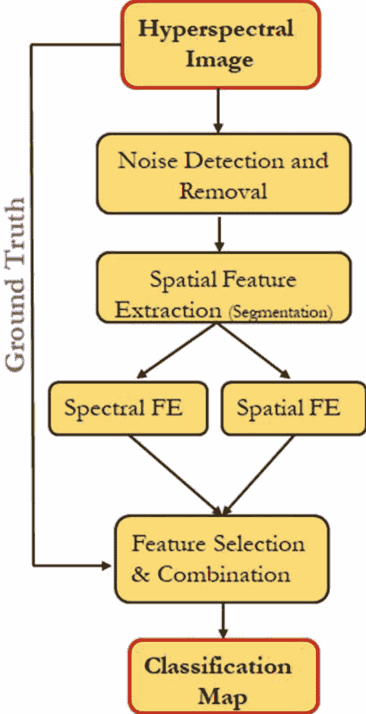

图 1.2 高光谱图像分析的一般框架


图 1.3 本书的主要贡献

#### 1.4.1 HSI 的噪声降低/波段分类

高光谱场景 (HSIs) 的维度领域的巨大体积，包括其所有的复杂性和复杂性，还涉及大量的重复和噪声，被认为是导致 HSI 分析中的困难和许多不确定性的持续问题之一，特别是在一般应用和 HSI 分类方面。为了解决这个问题，我们开发了一种基于灵活的边缘检测的分组波段分类 (BC) 算法，通过通道中存在的有用光谱数据的内容和范围对通道进行分类。此外，它还解决了从原始高光谱数据中无法准确提取真实内容的重复/噪声材料。由于高光谱场景训练数据的获取要求高且复杂，我们提出了一种创新无监督光谱 - 上下文灵活的通道噪声准则设计，该设计根植于边缘适应/修改和通道相互关联的能力。强聚类和基于边缘检测的方法包含两个主要问题：通道关联和通道偏好。我们开发的技术预测了通道之间的相互对应和通道之间的协同作用。在这里，通道偏好是通过每个光谱通道中所包含的区分和信息内容来建立的。

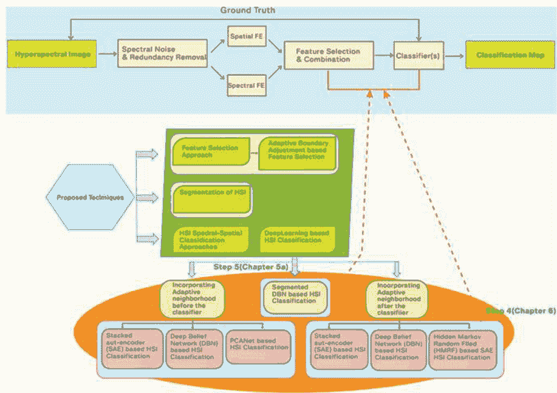

图 1.4 高光谱图像分析的通用框架以及每个阶段的贡献

#### 1.4.2 无监督高光谱图像分割

高光谱图像 (HSI) 分割被认为是后续应用和深度分析的关键预处理步骤，以充分利用现有的多光谱信息。无监督分割在计算机视觉中是一个持久的问题，但在高光谱成像中更为严重和关键，它不涉及降维过程和训练样本。为高光谱场景分割设计了一种创新无监督的光谱 - 上下文灵活的边缘修改/变化根植架构和结构，该架构通过有偏聚类进行修改。该架构利用和探索了高光谱场景的两个主要特征：光谱关系和通道上下文偏好。光谱通道偏好通过个别通道中的独特能力和信息内容来展示，并建议使用灵活的过程来保留光谱域中的光谱关系并在上下文域中对真实对象进行竞争。所开发的方法学同意在多个分割点上利用场景。利用通道集群灵活边缘改变根据程序的一致边缘均匀性和自相似性特征，以及根据开发的四种不同合并措施得出的分割结果，对最终分割的性能产生重要影响。

#### 1.4.3 基于深度学习的 HSI 分类技术

深度学习可以表征和建立各种信息阶段，以表示数据之间的复杂关联。然而，尽管具有优势，但由于多个原因，如大量波段和有限的可用训练数据，深度学习不能直接应用于 HSI。HSI 由数百个波段组成，因此即使是一个小的图像块也包含非常大的数据，导致预训练网络中的神经元数量很大。同样，很少的标记样本使网络难以训练。此外，将空间上下文信息与光谱特征结合起来进行深度学习也是一个开放的研究问题。此外，由不同传感器捕获的图像具有不同的特征并且通常存在很大差异。因此，在本书中提出了多种基于深度学习的分类方法。一般来说，在 HSI 分类过程中将空间信息与光谱通道相结合非常重要 [6]，因为随着成像技术的进步，高光谱传感器可以提供出色的空间分辨率。在这方面，研究人员提出了一些技术。在第一类中，分类技术在执行分类之前提取空间和光谱特征 [7, 8]。在第二类中，HSI 分类方法在分类过程中将空间信息纳入分类器 [9]。在第三类中，分类方法尝试在分类之后通过空间正则化或决策规则来包含空间依赖性 [10]。然而，所有这些空间特征都需要人类知识。

在这本书中，我们开发和研究了几种基于深度学习的方法，以有效地整合空间上下文信息。这些方法可以分为两大类，根据空间信息的整合和网络的性质：

- 在分类之前整合空间信息
    - 基于堆叠自编码器的高光谱图像分类
    - 基于深度置信网络的高光谱图像分类
    - 基于 PCANet 的高光谱图像分类
- 在分类之后整合空间信息
    - 基于堆叠自编码器和隐马尔可夫随机场的高光谱图像分类
    - 基于深度置信网络的高光谱图像分类
    - 基于分割的深度置信网络的高光谱图像分类

##### 1.4.3.1 基于堆叠自编码器的光谱 - 空间分类 HSI

提高遥感领域中不同类别的高光谱图像分类准确性是首要关注的问题。最近，深度学习算法在高光谱图像分类中展示了其能力。然而，尽管具有学习能力，深度学习中的固定大小扫描窗口以及无法将空间上下文信息与光谱特征整合到深度网络中以提高性能的能力限制了其能力。在这项工作中，我们提出了一种基于空间自适应超分割的堆叠自编码器 (SAHS-SAE) 方法，用于光谱 - 空间特征提取，该方法自适应地修改扫描窗口大小，并在具有相似光谱特征的相邻像素中探索空间上下文特征，以实现稳健的高光谱图像分类。所提出的方法包括两个关键方法：首先，我们开发了基于自适应边界移动的超分割，其大小和形状可以根据空间结构进行调整，由具有相似光谱特征的空间连续像素组成；其次，我们开发了基于堆叠自编码器 (SAE) 的对象级分类决策融合方法，将空间分割结果和光谱信息整合到 SAE 框架中，实现稳健的光谱 - 空间高光谱图像分类。所提出的方法用对象级超分割替代了传统的 SAE 扫描窗口方法。此外，为了实现稳健的分类，我们使用基于波段偏好和相关性的波段选择方法，仅选择最具信息量的波段，而不会损害高光谱图像中的原始内容。基于自适应边界调整的过程中的局部结构规律和光谱相似性信息的使用，以及空间上下文和光谱特征与 SAE 的融合对最终高光谱图像分类的准确性有显著影响。对具有不同上下文和分辨率的真实多样化高光谱图像进行的实验结果验证了所提出方法在分类准确性上优于几种众所周知的现有技术。

##### 1.4.3.2 基于深度置信网络的光谱 - 空间分类 HSI

最近，基于深度学习的架构在高光谱图像分析中得到了成熟和实现。然而，在深度学习模型中融合上下文特征和光谱信息仍然是一个持久的挑战。这个框架代表了一个独特的上下文修改的深度置信网络 (SDBN) 在高光谱场景分类中有效地利用了光谱匹配相邻像素中的上下文特征。在开发的框架中，场景首先被划分为具有相同光谱特征的灵活边缘调节根据上下文可比较区域，然后利用基于深度置信网络 (DBN) 的结构特征挖掘和分类技术开始，将上下文划分的上下文和光谱数据合并到 DBN 网络中，以改善光谱 - 空间高光谱场景分类。此外，为了提高精度，采用基于通道偏好/关联的特征选择技术来选择具有最大数据但不损失场景中真实信息的光谱通道。利用灵活边缘调节根据的本地上下文特征和光谱对应，将上下文和光谱特征结合到 DBN 网络中，可以提高最终场景分类的精度。对著名的高光谱场景进行实验演示，证明了该方法在许多现有方法上的分类精度。

##### 1.4.3.3 基于 PCANet 的高光谱图像光谱 - 空间分类

通过采用众所周知的 DL-based 架构进行特征挖掘，将 HSI 场景中每个像素的分布映射到相应的类别，已经展示出了很好的性能。然而，多方面的网络模型、繁琐的训练过程以及在深度网络中积极使用上下文材料限制了深度学习的应用和实施。在本书的这一部分中，为了进行一种有效的光谱 - 上下文特征提取，开发了一种改进的深度网络，上下文灵活网络 (SANet) 技术，该技术利用上下文特征和光谱属性创建了一个更简化的深度网络，从而实现了更好的特征挖掘，用于后续的过程分析。SANet 被认为是主成分分析网络的有效模型。首先，通过 SANet 根据上下文操作特征进行挖掘并与有用的光谱波段融合，然后利用 SANet 的根据结论融合技术进行结构分类。它将上下文结果和光谱特征合并到 SANet 网络中，用于强大的光谱 - 上下文场景分析。将有限的操作一致性和光谱相似性结合到有效的深度 SANet 中对分类执行产生了重要影响。对常见的常规 HSI 场景进行的实验演示显示了 SANet 方法的性能，其准确性得到了显著提高。

##### 1.4.3.4 基于分割的 DBN 高光谱图像分类

基于深度学习的深度置信网络最近被设计用于高光谱场景中的特征提取。深度置信网络作为基于深度学习的架构，已经被用于浅层和不变的高光谱场景分析中特征提取。然而，DBN 架构必须面对和处理来自高光谱立方体的许多光谱特征和高空间分辨率，这导致了复杂性和无法挖掘真正精确不变特征的能力，因此这种深度学习架构在面对高光谱挑战时表现不佳。此外，基于降维的解决方案会导致有价值的光谱数据损失，进一步降低准确性。为了解决这个问题，本节开发了一种光谱变分分割的 DBN（SAS-DBN），用于光谱上下文高光谱分类，通过将真实光谱通道分成小组关联的光谱通道，并独立地对每个通道组应用深度置信网络来探索不变的深层特征。此外，通过首先在场景上使用超分割，还合并了上下文特征。这种方法的性能如预期地提高了分类准确性。通过将 DBN 根特征挖掘应用于每个单独的通道组，降低了计算复杂性，同时实现了改进的数据挖掘，从而获得了提高的精度。总体而言，通过分割的 DBN 过程有效地利用光谱特征和灵活分割和添加光谱和上下文特征进行场景分析，对分类准确性产生了重要影响。对具有不同上下文特征和分辨率的现有高光谱典型场景进行的实验分析展示了该方法的价值，其结果与许多最新开发的高光谱分类方法相似。

##### 1.4.3.5 堆叠自编码器和马尔可夫随机场基于 HSI 的分类

该技术通过利用堆叠自编码器（SAE）和无监督的高光谱分割，开发了一种基于不变特征挖掘的新颖光谱上下文高光谱场景分类方法。具体而言，最初，SAE 架构被用作标准的光谱特征分类器，用于不变特征挖掘。随后，通过利用对象边缘正则化的分割方法，获得了上下文受控特征。最后，采用最高投票特征来融合光谱挖掘特征和上下文关联，形成精确的分类地图。

### 1.5 本书的组织结构

本书的其余部分安排如下：第 2 章简要介绍了高光谱成像以及几种基于深度学习的高光谱图像分类技术。第 3 章介绍了基于边界调整的波段选择/分类方法，用于有效的光谱特征提取。此外，第 4 章包括了基于自适应边界调整准则的空间特征提取的提出方法。第 5 章介绍了一种新颖的自适应窗口大小和空间特征融合的概念，用于优化深度学习特征提取。它提出了一种新的方法，通过将第 3 章和第 4 章的研究结果整合到 HSI 分类的深度学习架构中，整合了光谱和空间信息。第 6 章介绍了将空间信息纳入 HSI 分类并利用光谱通道的策略。第 7 章介绍了基于稀疏的深度学习解决方案用于 HSI 分类。最后，第 8 章总结了本书。

### 参考文献

- 1. http://www.markelowitz.com/Hyperspectral.html
- 2. Marin-Franch I, Foster DH (2013) 从图像颜色中估计信息：应用于数码相机和自然场景。 IEEE Trans Pattern Anal Mach Intell 35(1):78–91.
- 3. Kim SJ, Deng F, Brown MS (2011) 用高光谱成像增强旧文件的可视化。 Pattern Recognit 44(7):1461–1469
- 4. Fu Z, Robles-Kelly A, Zhou J (2011) MILIS:多实例学习与实例选择。 IEEE 模式分析与机器智能 33(5):958–977
- 5. Hughes G (1968) 关于统计模式识别器的平均准确性。 IEEE 信息论 14(1):55–63
- 6. Plaza A, Plaza J, Martin G (2009) 将空间约束纳入遥感高光谱数据的光谱混合分析中。在: IEEE 国际机器学习信号处理研讨会，2009. MLSP 2009. IEEE, pp 1–6
- 7. Li J, Marpu PR, Plaza A, Bioucas-Dias JM, Benediktsson JA (2013) 高光谱图像分类的广义复合核框架。 IEEE 地球科学遥感传感器 51(9):4816–4829
- 8. Zhou Y, Peng J, Chen CP (2015) 具有复合核的极限学习机用于高光谱图像分类。 IEEE 选择应用地球观测遥感 8(6):2351–2360
- 9. Chen Y, Nasrabadi NM, Tran TD (2013) 通过核稀疏表示进行高光谱图像分类。 IEEE 地球科学遥感传感器 51(1):217–231
- 10. Fauvel M, Benediktsson JA, Chanussot J, Sveinsson JR (2008) 使用 SVMS 和形态学特征对高光谱数据进行光谱和空间分类。 IEEE Trans Geosci Remote Sens 46(11):3804–3814

## 第 2 章
### 2.1 高光谱成像简介

遥感技术和地理数据的最新发展为高光谱传感器的进步铺平了道路。高光谱遥感（HRS），也被称为成像光谱学，是一种相对较新的技术，目前正在研究中，研究人员和科学家对其广泛的应用进行了调查，如目标检测、矿物识别、植被和人类结构和背景的识别。HRS 将成像和光谱学集成在一个独特的结构中，通常由大量数据集组成，需要现代化的分析技术。光的电磁谱在图 2.1 中显示。高光谱图像通常由大约 100-200 个窄带宽度范围为 5-10 nm 的光谱通道组成，而多光谱图像通常由 70-400 nm 的大带宽范围内的 5-10 个光谱通道组成。

#### 2.1.1 高光谱成像系统

当光与地球表面相互作用时，可能会发生 5 种机制，要么光会在许多方向上散射，要么在单个方向上反射，要么被吸收为一种能量并储存在该材料中，要么被传输或通过。图 2.2 展示了一个详细的过程。如果我们只考虑反射成分，任何地球材料对太阳能的反射都会创建一个独特的足迹，即该特定材料的光谱特征。这些独特光谱特征的位置和形状使我们能够识别不同类型的地表特征。

© 作者（们），在 Springer Nature Singapore Pte Ltd. 2021 的独家许可下
L. Tao 和 A. Mughees，深度学习用于高光谱图像分析和分类，工程应用中的计算方法 5，
https://doi.org/10.1007/978-981-33-4420-4_2

## 2. 高光谱图像和分类方法

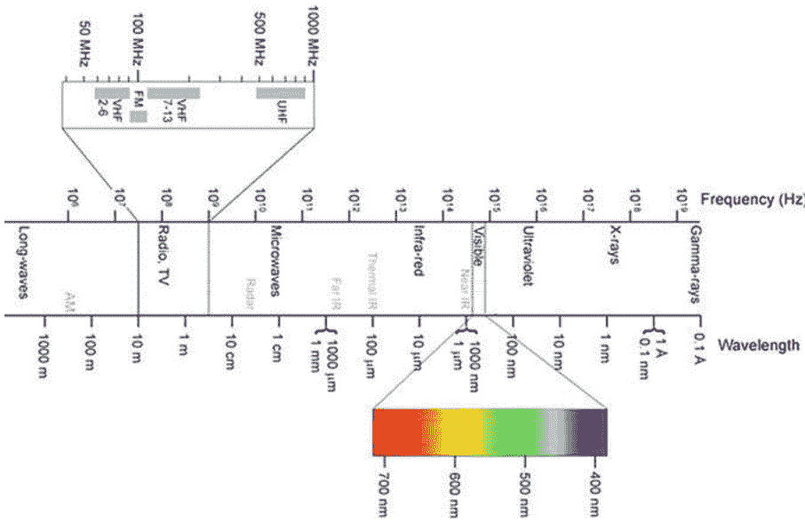

图 2.1 电磁谱 [1]

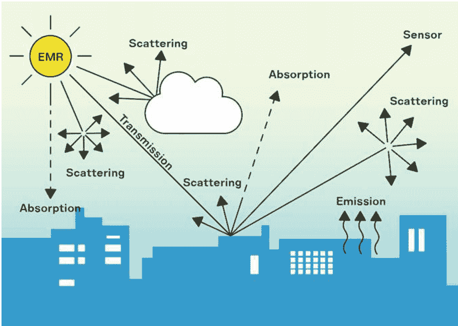

图 2.2 大气和地表的电磁辐射相互作用 [2]

### 2.1 高光谱成像简介

#### 2.1.1 波段和波长

HSI 的 200 个波段中的每个波段都与特定的波长区域相关联。例如，700 到 705 纳米之间的波长区域可能与通过成像光谱仪捕获的一个波段相关联。光谱分辨率与波段数有关。但不仅仅是波段数，还有波段范围（带宽）。带宽越小，光谱分辨率越好，反之亦然。这是多光谱和高光谱之间的主要区别，即高光谱的光谱分辨率比窄带观测中的光谱分辨率更高。

高光谱成像是收集和处理跨电磁谱的信息的过程，具有数百个光谱波段。图 2.3 展示了宽带、多光谱、高光谱和超光谱（光谱感知）之间的差异。首先是全色，整个可见区域都包含在一个观测中。在多光谱中，同样的可见区域被分解成更广的光谱通道。而在高光谱图像中，同一区域被分成数百个波段。随着光谱能力的增加，分析能力也增强，您可以获取的详细信息也增加。在高光谱图像中，对于每个图像，您都有大量的观测数据，取决于您通过这些数据可以通过匹配其光谱特征来识别地面材料。

#### 2.1.2 为什么要进行高光谱遥感

地球表面的大部分材料在电磁波谱的 400-2500 纳米范围内具有诊断性吸收特征。这些特征具有非常窄的光谱外观。只有在充分高的光谱分辨率下，才能识别出这些材料。

人眼只能检测到可见光区域（即 0.4-0.7 微米）的反射能量。另一方面，先进的高光谱传感器以图像形式捕获数据，感知从地球表面反射的电磁辐射的一部分，包括可见光、近红外和短波红外等电磁波谱区域，如图 2.4 所示。

### 2.2 基于机器学习的高光谱图像分类方法综述

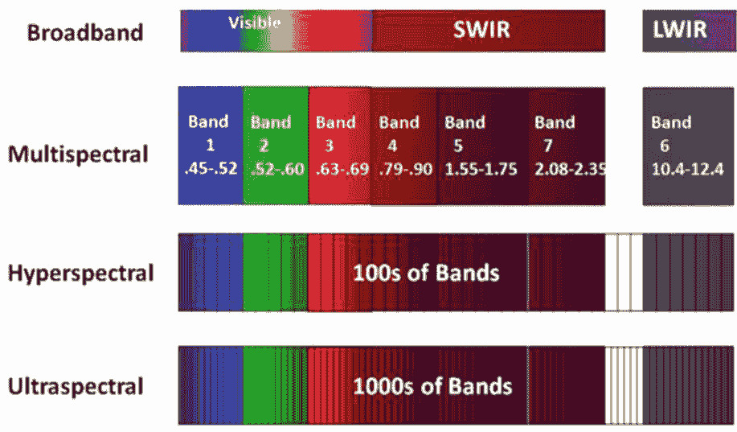

图 2.3 多光谱和高光谱数据的差异 [3]

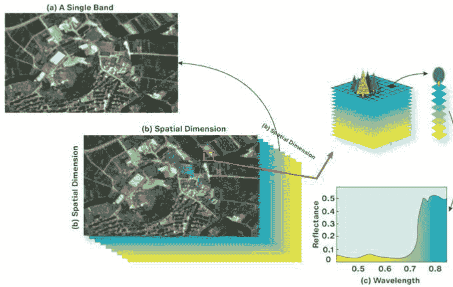

图 2.4 高光谱数据立方体 [4]

为了对区域内的物体进行分类、识别和分析化学成分，高光谱获取设备使得场景内容可以远程分析。因此，地球观测卫星和飞机的高光谱图像在农业、环境监测、城市发展、矿业和国防等领域变得越来越重要。机器学习（ML）算法由于其出色的预测能力，已成为现代高光谱成像研究的关键方法。对于遥感学者和科学家来说，掌握 ML 技术的知识变得极为重要。本章节将研究社区中针对 ML 学习的高光谱场景分类的新算法进行分析和评估。这些技术按照场景评估和 ML 算法进行组织，并产生场景评估和不同类型的基于机器学习的场景分析算法的双重可视化。本节涵盖了高光谱图像解释和 ML 技术（图 2.4）。在农业生产、环境科学、野生动物、矿产提取和快速城市化、安全和航空航天科学等领域，高光谱成像被认为是研究地球资源化学结构的有力遥感工具。

遥感，有时被视为光谱学图像获取，测量从可见光到红外频率的电磁辐射在图像中的传输或释放，形成数百个相关光谱关系。高光谱场景中的每个像素都有一个由数百个分量组成的向量，比例因子被认为是光谱范围，用于测量反射或发射辐射。因此，高光谱图像可以被视为一个三维数据模型，包括两个携带有关对象位置的上下文轴和一个携带有关元素化学纹理的光谱轴。这个频率范围获取了化学特征，因为这些原子或分子结构受到不同频率和成分之间的相互作用的控制。基于航空器和卫星的高光谱设备可以捕捉场景，设计地表和地球使用情况，识别和定位结构，或解释物质的生理特征在广阔的地理区域。由于高光谱场景由数百个通道组成，因此不能像彩色场景一样进行评估，彩色场景只有 3 个通道。因此，计算机视觉方法被设计用于从场景中获取表达性数据。ML 和计算机视觉根源的技术在这方面表现出了准确性，因为它们具有在场景的每个空间位置获取的光谱信息与所需获取的特征之间的必然关联的能力。在处理失真和模糊性方面，它们比传统方法（如手工设计的标准化指数和基于物理的架构）具有更强的鲁棒性。与高光谱领域相关的从业者对 ML 总体和深度学习特别感兴趣。

本节旨在广泛介绍高光谱图像分类工作以及机器学习和深度学习算法的观点。本节总结的所有方法都是成熟的已发表研究。这些方法能够分析电磁辐射和反射。

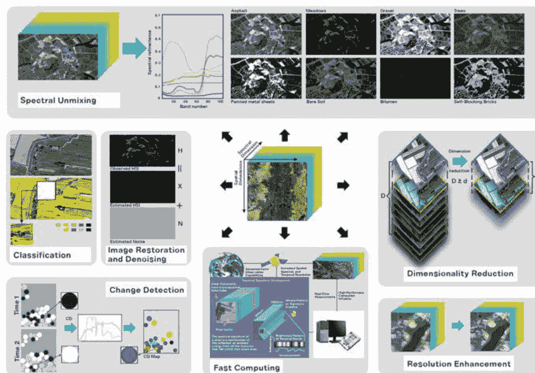

图 2.5 高光谱图像解释 [5]

场景，除了以另一种方式呈现。高光谱图像探索的目标是地表分类 [39]、物体定位 [222]、解混 [29] 和体内因素评估 [278]。本节的主要目的是使读者熟悉新研究的 HSI 分类技术，通过高光谱图像任务或机器学习算法对技术进行分类，并调查现有趋势和挑战，包括未来的发展方向。

#### 2.2.1 高光谱图像解释分类

表面组分的特性决定了表面反射能量的程度。然而，进入接收器的能量还包括来自大气色散的输入，可以通过利用环境调整方法 [101] 来估计表面反射。因此，高光谱场景中的像素值在辐射或反射水平上进行评估。场景的反射特性对于 HSI 场景探索非常有利，因为反射属性的表面特性如图 2.5 所示。此外，包含反射属性的场景由于减少了环境干扰而产生了增强的结果。

高光谱场景可以在 4 个离散领域中进行分析：土地覆盖映射、目标识别，光谱解混和，以及生理因素评估，如图 2.6 所示。


图 2.6 高光谱图像解释 [5]

##### 2.2.1.1 地表映射

地表映射 [39] 是检测 HSI 场景中每个像素所属物质的过程。目标是生成一张地图，展示了 HSI 设备捕捉到的地球区域上多种物质的分布情况。地表映射的重要用途包括植物类型分类 [69]、城市图像组织 [74]、矿物探测 [218] 和变化研究 [238]。

许多地表映射技术需要关于图像中存在的物质类别的先前信息，包括属于该特定物质的光谱特征。一般来说，这些数据是由专业人员提供的，这些数据是从现场获得的像素值或从给定的光谱收集中修改的。

然而，几种表面积映射方法不需要先前的数据来进行图像内容分析。

##### 2.2.1.2 目标识别

在高光谱场景中，目标识别的作用 [191] 是根据特定的光谱特征来识别和定位目标结构。

##### 2.2.1.3 光谱解混

HSI 场景中每个像素获取的电磁辐射很难来自不同物质的不同表面。通过航空或卫星捕捉的场景的分辨率超过一米，即每个像素代表的区域大多超过一米。因此，很有可能特定区域包含不同或多种不同的材料。例如，在从城市区域捕捉的图像中，每个像素可能包含多种材料，包括人造结构、道路、树木等。因此，每个像素获取的光谱特征可能包含不同材料的光谱特性。

HSI 解混是在场景的每个像素级别上重建无污染物质的数量的过程。

### 2.3 高光谱遥感图像数据集描述

为了评估分类性能，高光谱分类研究社区中的所有研究人员 [6] 都使用了由不同传感器在不同时间和不同地点捕获的这些可用的标准真实高光谱数据集。这些数据集由农村和城市地区以及小型人造和自然结构的存在提出了具有挑战性的分类任务。在现有文献中，通常考虑每个时间点的两个数据集，以证明所提出的高光谱分类技术的验证和准确性。表 2.1 中给出了每个数据集的详细描述。下面是每个数据集的简要描述。

#### 2.3.1 印度松：AVIRIS 数据集

印度松数据集是通过 1992 年的空中可见红外成像光谱仪（AVIRIS）传感器在印第安纳州西北部的松树地区获取的。它的空间尺寸为 145×145，地面分辨率为 17 米。它包含了波长范围为 0.4-2.5 微米的 224 个光谱波段，光谱分辨率为 10 纳米，空间分辨率为 20 米。其中，由于水吸收而产生的 24 个噪声波段被移除，从而得到了 200 个光谱通道。如图 2.7 所示，它包含 16 个不同的土地覆盖农业类别。伪彩色合成图和地面真实情况如图 2.7 所示。由于其低空间分辨率、小结构尺寸和混合像素的存在，该数据集被认为是具有挑战性的数据集之一。


图 2.7 具有 16 个类别的印度松数据集

#### 2.3.2 帕维亚大学：ROSIS 数据集

帕维亚大学场景是由 ROSIS 传感器在意大利的帕维亚大学上空收集的。帕维亚场景的空间尺寸为 610×340，光谱尺寸为 115 个通道。场景的空间尺寸为 1.3m/像素，光谱范围为 0.43-0.86μm。由于水吸收，共有 12 个噪声波段被移除，剩余 103 个波段。帕维亚场景分类使用了九个标准类别。伪彩色合成图像如图 2.8 所示。该数据集包含人造结构和绿色区域。


图 2.8 帕维亚大学数据集，共有 9 个类别

#### 2.3.3 休斯顿图像：AVIRIS 数据集

休斯顿数据库是由 AVIRIS 传感器在休斯顿大学及其附近城市地区收集的。它包含 144 个光谱波段，光谱分辨率为 380×1050nm，空间范围为 349×1905。它包含 15 个不同的地表覆盖类别，如图 2.9 中的伪彩色合成图像和地面真实情况所示。


图 2.9 休斯顿大学数据集，共有 15 个类别

#### 2.3.4 萨利纳斯谷：AVIRIS 数据集

萨利纳斯谷图像是由 AVIRIS 传感器在加利福尼亚州的萨利纳斯谷上捕获的。原始图像包含 224 个频道，但舍弃了 20 个水吸收波段。其空间分辨率为 3.7 米/像素。萨利纳斯谷的地面真实情况包括土壤、绿色田地等 16 个类别。所覆盖的区域为 512 行 217 列。地形和边界如图 2.10 所示。

#### 2.3.5 莫菲特图像：AVIRIS 数据集

莫菲特图像是由 AVIRIS 传感器于 1997 年在加利福尼亚州旧金山湾南端的莫菲特场捕获的。[1] 图 2.11 所示的图像具有 224 个光谱波段，名义带宽为 10 纳米，尺寸为 512×614。它包括一个湖泊的一部分和由植被和土壤组成的沿海地区。

> [1] [在线] http://aviris.jpl.nasa.gov/html/aviris.freedata.html.


图 2.10 萨利纳斯谷图像


图 2.11 莫菲特图像

| 数据集 | 图像尺寸 | 类别 | 波段 | 标记的像素 | 波长范围 (nm) | 空间分辨率 (m) |
| :--- | :--- | :--- | :--- | :--- | :--- | :--- |
| 印度松 | 145 × 145 | 16 | 200 | 10,249 | 400-2,500 | 20 |
| 帕维亚大学 | 340 × 610 | 9 | 103 | 42,776 | 430-860 | 1.3 |
| 萨利纳斯 | 512 × 217 | 16 | 200 | 54,129 | 400-2,500 | 3.7 |
| 休斯顿大学 | 349 × 1905 | 15 | 144 | 2,500 | 380-1,050 | - |
| 莫菲特场 | 512 × 614 | - | 224 | - | - | - |

#### 2.3.6 华盛顿特区购物中心高光谱数据集

该数据集是通过使用高光谱数字成像收集实验（HYDICE）传感器获取的。它包含了 210 个光谱通道，范围为 0.4-2.4 微米。然而，由于水吸收，有 19 个通道被排除。这个高光谱图像有 1280 行和 307 列。在实验中，使用了 7 个材料类别，包括屋顶、道路、小径、草地、树木、水和阴影，如图 2.12 所示。相对于 AVIRIS，这个 HSI 在分类方面不太有问题。


图 2.12 华盛顿特区购物中心数据集。a 华盛顿特区的伪彩色表示。b 地面真实情况。c 类别

### 2.4 分类评估指标

在高光谱图像分析研究社区中，根据整体准确率（OA）、平均准确率（AA）和 kappa 系数（κ）（图 2.12）来评估分类性能。

- 整体准确率（OA）：OA 是正确分类的像素百分比。
- 平均准确率（AA）：AA 是特定图像的所有类别准确率的平均值，除以类别总数。
- Kappa 系数（κ）：Kappa（κ）是预测类别准确率与实际情况之间的一致程度。通常，它被认为比 OA 和 AA 更稳健。

每个评估指标的详细定义在图 2.13 中呈现。

| Symbol | Name | Definition |
| :--- | :--- | :--- |
| $d$ | Number of classes | |
| $n_i$ | Number of labelled samples in class $i$ (ground label) | |
| $m_i$ | Number of classified samples in class $i$ (classification label) | |
| $N$ | Total number of samples | $N = \sum_{i=1}^{d} n_i = \sum_{i=1}^{d} m_i$ |
| $c_i$ | Number of true positive samples in class $i$ | |
| $p_o$ | Observed agreement | $p_o = \frac{1}{N} \sum_{i=1}^{d} c_i$ |
| $p_c$ | Chance agreement | $p_c = \frac{1}{N^2} \sum_{i=1}^{d} m_i n_i$ |
| OA | Overall accuracy | OA = $p_o$ |
| AA | Average accuracy | AA = $\frac{1}{d} \sum_{i=1}^{d} c_i / m_i$ |
| Kappa | $\kappa$ | $\kappa = (p_o - p_c) / (1 - p_c)$ |

图 2.13 分类性能的定义和评估指标

### 2.5 文献综述

基于深度学习（DL）的算法可以从复杂数据中提取有区分性和代表性的特征，最近在音频、视频、语音和图像分析等许多领域中表现出色。DL 最近在遥感领域中被引入，并展示了令人信服的结果。通过将光谱数据输入 DL 网络，将网络的顶层特征输入分类器进行像素级分类。此外，通过解决 HSI 相关问题并仔细调整输入输出参数，我们观察到 DL 在 HSI 分析中可以显著提高性能。

本节介绍了 HSI 分类的 DL 整体框架，以及先进的基于 DL 的深度网络和调优技巧。如何从这样增加的数据量中提取有用的特征。传统的特征提取方法通过模型提取特征 [7]。近年来在 HSI 分类方面取得了重大进展，如手工特征 [8-10]、有区分性特征学习 [11-13] 和分类器设计 [14,15]。然而，大多数现有技术只能提取浅层特征，对于分类任务来说不够强大。此外，这些方法由于需要手工特征 [11,16]，无法提取深层有区分性和代表性特征。即使这些手工特征也不能包含复杂数据的细节。由于 HSI 数据的巨大变异性，这个问题甚至更加严重。现有方法的详细描述在图 2.14 中呈现 [4]。感谢深度学习架构 [17]，为 HSI 分类提供了深层、浅层、有区分性和代表性特征。尽管深度学习包含复杂和多样的层次结构，但 DL 方法可以集成到一个广泛的 HSI 分类框架中。图 2.15 呈现了 HSI 分析的 DL 方法的一般框架。它包括三个主要阶段：预处理的输入数据、分层多层核心深度模型以及提取的输出特征和分类。在第一阶段，输入向量由光谱特征向量、空间特征向量或光谱 - 空间特征向量组合而成。

| Criteria | Types | Brief Description |
| :--- | :--- | :--- |
| Whether training samples are used or not? | Supervised classifiers | Supervised approaches classify input data using a set of representative samples for each class, known as training samples. |
| | Unsupervised classifiers | Unsupervised approaches, also known as clustering, do not consider the labels of training samples to classify the input data. |
| | Semi-supervised classifiers | The training step in semi-supervised approaches is based on both labeled training samples and unlabeled samples. |
| Whether any assumption on the distribution of the input data is considered or not? | Parametric classifiers | Parametric classifiers are based on the assumption that the probability density function for each class is known. |
| | Non-parametric classifiers | Non-parametric classifiers are not constrained by any assumptions on the distribution of input data. |
| Either a single classifier or an ensemble classifier is taken into account? | Single classifier classifiers | In this type of approaches, a single classifier is taken into account to allocate a class label for a given pixel. |
| | Ensemble (multi) classifier | In this type of approaches, a set of classifiers (multiple classifiers) is taken into account to allocate a class label for a given pixel. |
| Whether the technique uses hard partitioning, in which each data point belongs to exactly one cluster or not? | Hard classifiers | Hard classification techniques do not consider the continuous changes of different land cover classes from one to another. |
| | Soft (fuzzy) classifiers | Fuzzy classifiers model the gradual boundary changes by providing measurements of the degree of similarity of all classes. |
| If spatial information is taken into account? | Spectral classifiers | This type of approaches consider the hyperspectral image as a list of spectral measurements with no spatial organization. |
| | Spatial classifiers | This type of approaches classify the input data using spatially adjacent pixels, based on either a crisp or adaptive neighborhood system. |
| | Spectral-spatial classifiers | Sequence of spectral and spatial information is taken into account for the classification of hyperspectral data. |
| Whether the classifier learns a model of the joint probability of the input and the labeled pixels? | Generative classifiers | This type of approaches learns a model of the joint probability of the input and the labeled pixels, and makes the prediction using Bayes rules. |
| | Discriminative classifiers | This type of approaches learns conditional probability distribution, or learns a direct map from inputs to class labels. |
| Whether the classifier predicts a probability distribution over a set of classes, given a sample input? | Probabilistic classifiers | This type of approaches is able to predict, given a sample input, a probability distribution over a set of classes. |
| | Non-probabilistic classifiers | This type of approaches simply assign the sample to the most likely class that the sample should belong to. |
| Which type of pixel information is used? | Sub-pixel classifiers | In this type of approaches, the spectral value of each pixel is assumed to be a linear or non-linear combination of endmembers (pure materials). |
| | Per-pixel | Input pixel vectors are fed to classifiers as inputs. |
| | Object-based and Object-oriented classifiers | In this type of approaches, a segmentation technique allocates a label for each pixel in the image in such a way that pixels with the same label share certain visual characteristics. In this case, objects are known as underlying units after applying segmentation. Classification is conducted based on the objects instead of a single pixel. |
| | Per-field classifiers | This type of classifiers is obtained using a combination of RS and GIS techniques. In this context, raster and vector data are integrated in a classification. The vector data are often used to subdivide an image into parcels, and classification is based on the parcels. |

图 2.14 分类方法总结 [4]

#### 2.5.1 HSI 噪声/冗余检测

HSI 数据立方体的增加容量经常覆盖了大量的冗余和噪声，具有一些不可取的统计和几何特性。这

## 2 高光谱图像和分类方法


这个缺点是由于许多原因造成的，比如传感器或仪器噪声，环境效应。传感器噪声包括热噪声、量化噪声和散粒噪声，这是降低和破坏光谱数据的基础。

评估高光谱遥感图像的噪声特征能力是创建其能力和限制的一个重要阶段，从操作和科学的角度来看。已经做出了许多努力来检测和去除噪声和冗余数据。HSI 中的噪声可以分为两类 [19]: 随机噪声和固定模式噪声。由于其随机性质，随机噪声很难去除。HSI 处理算法通常基于特定的噪声模型，如果模型不能正确地处理噪声特性，它们的性能可能会合理地下降。在 HSI 中广泛使用的随机噪声模型是加性模型 [20, 21]。大部分高光谱处理文献没有涉及任何大气效应，这些效应在其噪声模型中没有通过其他方法进行缓解。在辐射进入传感器之前，HSI 处理遇到的噪声污染类似于水汽吸收。

现有的噪声估计方法主要可以分为三类：基于块的、基于滤波器的和二者的组合。基于块的方法首先将图像划分为密集块，然后发现具有最少结构和纹理的块，然后基于这些块估计噪声方差。通常，这些方法使用方差、空间均匀性或时空均匀性 [22, 23]、局部均匀性分析器 [24] 和梯度协方差矩阵 [25] 作为结构的度量。

波段选择 (BS) 工作可以分为两类 [26]: (1) 最大信息或最小相关 (MIMC) 技术和 (2) 最大带间可分性 (MIS) 技术。MIS（最大带间可分性）技术通常使用带内相关性和聚类准则。基于带内相关性准则的算法通过最大化熵类似的测量来收集适当的带子集，以最大化整体信息量 [27, 28]。基于 MIS 的算法选择具有最小带内相关性的适当带集。例如，[29, 30] 分别包括基于互信息的算法和基于约束能量最小化 (CBS-CEM) 的约束带选择算法。基于极光谱图像分析和分类的深度学习。

#### 2.5.2 基于深度学习的算法

近年来，已经提出了几种基于深度学习的算法 [31]，并在许多领域中超越了现有技术，例如音频识别 [32]，自然语言处理 [33]，图像分类 [34, 35]。这个想法的动机来自于人脑在目标识别等任务的处理中的多个抽象层次。受到人脑的多个抽象层次和深度的启发，研究人员建立了创新的深度架构作为传统浅层架构的替代方案。

##### 2.5.2.1 自编码器

它是一个前馈神经网络，类似于典型的用于分类的神经网络，但其主要区别在于其目标是将输入复制到输出层，而不是像前馈那样在输出层上表征特定类别的共享。图 2.16 显示了一个具有单个隐藏层的自编码器。自编码器中的输入层和输出层具有相同的大小。在训练过程中，我们将自编码器产生的输出值与输入数据进行比较，并鼓励自编码器在输出层尽可能完美地复制输入层的值。除此之外，它是一个常规的神经网络。在自编码器中，计算隐藏层的模型部分被称为编码器，它将输入编码为潜在表示：

$$ l=f\left(w_{l} x+b_{l}\right), m=f\left(w_{m} y+b_{m}\right) $$

主要目标是减少输入和输出之间的差异：

$$ \arg \min _{w_{l}, w_{m}, b_{l}, b_{m}}[error(l, m)] $$

对于编码，通常使用线性变换的 sigmoid 函数。另一方面，解码器将接收潜在表示 h(x)，即编码器的输出，进行线性变换，并通过非线性函数传递。因此输出为

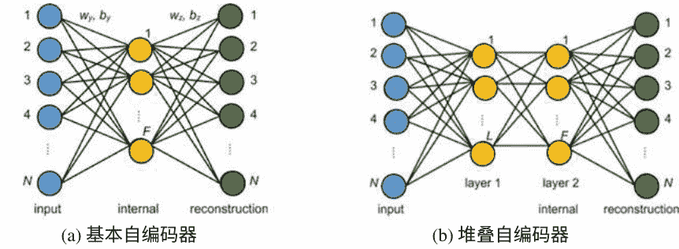

根据自编码器提取的潜在表示解码输出。W_a, W_b 是隐藏层和重构层之间的权重。每个隐藏单元提取特定特征，并在重构过程中将该特征反馈给解码器。我们训练模型以使隐藏表示保持有关输入的所有信息。例如，如果我们使用比输入层小得多的隐藏层，这意味着自编码器将压缩信息，忽略对重构不重要的输入部分，并专注于从中提取更重要的输入部分，以进行后续重构。因此，它可以用于提取有意义的特征进行分类。

$$C(x, z) = -\frac{1}{m} \sum_{k=1}^{d} \left[ (x_k - z_k)^2 + (1 - x_{ik}) + \frac{\beta}{2} W^2 \right]$$ (2.3)

其中，x 和 z 分别是输入和重建数据。

##### 2.5.2.2 深度置信网络

在深度学习的最新进展中，深度置信网络（DBN）是其中的一个重要部分。它被认为是无监督逐层训练过程的起源。DBN 基于训练深度神经网络的许多重要概念，这些概念具有概率性质。DBN 是一个生成模型，它在构成输入或可见层或所有隐藏层的变量之间混合了无向和有向的相互作用。如图 2.17 所示，这是一个例子。

在这里，我们从输入到隐藏层有无向连接，但从隐藏层到隐藏层和输出层有有向连接。在 DBN 中，顶部的两层始终形成一个 RBM。在图 6.15 中，h^2 和 h^3 上的分布是具有无向连接的 RBM。而其他层将形成具有有向相互作用的贝叶斯网络。

### 2.5 文献综述


(a) 基本 RBM


(b) DBN

图 2.17 通用 DBN 模型

这将对应于与逻辑回归模型相关的概率模型。DBN 不是一个前馈网络。具体而言，输入层和三个隐藏层之间的联合分布将成为 $h_2$ 和 $h_3$ 的先验。

训练 DBN 是一个困难的问题。良好的初始化在结果的质量中起着非常关键的作用。初始化过程的思想是，为了训练，例如，3 个隐藏单元的 DBN，我们将第一个 RBM 的参数作为输入传递给第二个 RBM，依此类推。然后，有一个精细调整的过程，不是反向传播。精细调整的算法被称为上下算法。

##### 2.5.2.3 卷积神经网络

卷积神经网络或卷积网络或 CNN 是一种人工神经网络，迄今为止已经广泛用于图像分析。尽管图像分析是 CNN 最广泛使用的领域，但它们也可以用于其他数据分析，如分类问题。CNN 是根据生物驱动模型设计的。研究人员发现人类感知视觉信息是通过结构化的层次进行的。通常，我们可以将 CNN 视为一种人工神经网络，它具有一些专门用于检测模式并理解模式的特性。

这种模式检测使得 CNN 在图像分析中非常有用。它是一个可训练的多层架构，包括输入层、一组隐藏的卷积层和输出层，如图 2.18 所示。通常，CNN 由几个特征提取阶段组成。每个阶段包括三个层，隐藏的卷积层、池化层和非线性层。一个典型的 CNN 由两个或三个这样的阶段组成，用于深度特征提取，然后是一个或多个典型的全连接层，最后是一个分类器，用于对学习到的特征进行分类。CNN 可以提取深层表示，但 HSI 分类的主要瓶颈是有限的标签数据，因为 CNN 需要大量的训练数据来学习参数。下面的章节简要介绍了每个阶段。

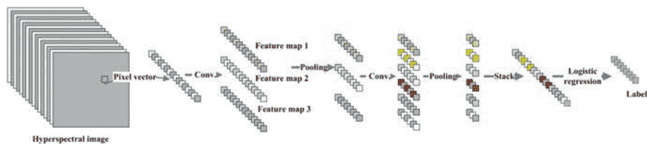

图 2.18 深度卷积神经网络的一般框架 [37]

###### 卷积层

卷积层是应用于给定输入数据的一组滤波器。在 HSI 的情况下，卷积层的输入是一个具有 n 个二维特征的三维数据，每个特征的大小为 r×c。卷积层的输出也是一个大小为 rl×cl×l 的三维数据。其中 l 是每个大小为 rl×cl 的特征的大小。卷积层由连接输入和输出的滤波器组成。

###### 非线性层

非线性层是一个 CNN，它包含一个激活函数，该函数将卷积层生成的特征作为输出，并生成激活图作为输出。激活函数包含逐元素操作，因此输入和输出的大小相同。

###### 池化层

这是一种非线性下采样层，负责减少激活图的空间维度。通常，在卷积和非线性层之后使用它们以减少计算负担。

##### 2.5.2.4 稀疏编码模型

稀疏编码是无监督学习背景下的一种模型。在没有标签的训练数据集中，即训练集中的一组 x 向量的情况下，它可以帮助我们从无标签的训练集中提取有意义的特征，并允许我们利用无标签数据的可访问性。已经提出了大量基于稀疏的技术用于 HSI 分类。

对于任何输入 x，寻找稀疏的潜在表示 h，这意味着 h 由许多零和少数非零元素组成。我们还希望潜在表示包含关于 x 的有意义的信息，以便能够重构原始输入。这些条件的目标函数可以被表述为

$$\min _{D} \frac{1}{M} \sum_{k=1}^{M} \min _{h^{(k)}} \frac{1}{2}\left\|\left(x^{k}-D h^{k}\right)\right\|_{2}^{2}+\beta\left\|h^{(k)}\right\|_{1}$$

方程的第一部分表示我们要最小化的重建误差。矩阵 D 是一个字典矩阵。下一个项是稀疏惩罚，因为我们希望潜在表示是稀疏的，因此我们将对 L1 范数进行惩罚。而 β 项控制我们希望在实现高稀疏性的同时获得良好的重建误差的程度。因此，这是我们希望针对每个训练样本进行优化的目标。 x(t)。

### 参考文献

- 1. 网站，howpublished = https://en.wikipedia.org/wiki/electromagnetic_spectrum note = .
- 2. http://www.microimages.com/documentation/Tutorials/introrse.pdf
- 3. http://research.csiro.au/qi/spectroscopy-and-hyperspectral-imaging
- 4. Ghamisi P, Yokoya N, Li J, Liao W, Liu S, Plaza J, Rasti B, Plaza A (2017) Advances in hyperspectral image and signal processing: a comprehensive overview of the state of the art. IEEE Geosci Remote Sens Mag 5(4):37–78
- 5. 美国科罗拉多州博尔德市巴特尔国家生态观测网络。http://data.neonscience.org
- 6. Li J, Bioucas-Dias JM, Plaza A (2013) 使用循环置信传播和主动学习的光谱 - 空间分类高光谱数据。IEEE Trans Geosci Remote Sens 51(2):844–856
- 7. Camps-Valls G, Tuia D, Bruzzone L, Benediktsson JA (2014) 高光谱图像分类的进展：统计学习方法的地球监测。IEEE Signal Process Mag 31(1):45–54
- 8. Benediktsson JA, Palmason JA, Sveinsson JR (2005) 基于扩展形态学特征的城市区域高光谱数据分类。IEEE Trans Geosci Remote Sens 43(3):480–491
- 9. Zhang L, Huang X, Huang B, Li P (2006) 结合光谱信息的像素形状指数用于高空间分辨率遥感图像分类。IEEE Trans Geosci Remote Sens 44(10):2950–2961
- 10. 黄 X, 卢 Q, 张 L (2014 年) 一种用于城市区域高分辨率遥感图像分类的多指数学习方法。ISPRS J Photogramm Remote Sens 90:36–48
- 11. 贾 X, 郭 B-C, 克劳福德 MM (2013 年) 用于高光谱图像分类的特征挖掘。Proc IEEE 101(3):676–697
- 12. 张 L, 张 L, 陶 D, 黄 X (2012 年) 关于结合多个特征进行高光谱遥感图像分类的研究。IEEE Trans Geosci Remote Sens 50(3):879–893
- 13. 张 L, 张 Q, 张 L, 陶 D, 黄 X, 杜 B (2015 年) 用于多视图特征嵌入的集合流形正则化稀疏低秩逼近。Pattern Recognit 48(10):3102–3112
- 14. Melgani F, Bruzzone L (2004 年) 支持向量机在高光谱遥感图像分类中的应用。IEEE Trans Geosci Remote Sens 42(8):1778–1790
- 15. Li W, Tramel EW, Prasad S, Fowler JE (2014 年) 用于高光谱分类的最近正则化子空间。IEEE Trans Geosci Remote Sens 52(1):477–489
- 16. Benediktsson JA, Pesaresi M, Amason K (2003) 基于形态变换的城市遥感图像分类和特征提取。IEEE Trans Geosci Remote Sens 41(9):1940–1949
- 17. Bengio Y, Courville A, Vincent P (2013) 表示学习：综述和新视角。IEEE Trans Pattern Anal Mach Intell 35(8):1798–1822
- 18. Zhang L, Zhang L, Du B (2016) 遥感数据的深度学习：关于现状的技术教程。IEEE Geosci Remote Sens Mag 4(2):22–40
- 19. Acito N, Diani M, Corsini G (2011) 高光谱图像中的信号相关噪声建模和模型参数估计。IEEE Trans Geosci Remote Sens 49(8):2957–2971
- 20. Roger R, Arnold J (1996) 可靠地估计 AVIRIS 高光谱图像中的噪声。Int J Remote Sens 17(10):1951–1962
- 21. 高 L-R, 张 B, 张 X, 张 W-J, 童 Q-X (2008 年) 一种用于估计高光谱图像噪声的新操作方法。IEEE 地球科学遥感信号处理通讯 5(1):83–87
- 22. Amer A, Dubois E (2005 年) 快速可靠的面向结构的视频噪声估计。IEEE 电路与系统视频技术交易 15(1):113–118
- 23. Ghazal M, Amer A, Ghrayeb A (2007 年) 一种用于时空视频噪声估计的实时技术。IEEE 电路与系统视频技术交易 17(12):1690–1699
- 24. 李 J, Hoppel K (1989 年) 遥感图像噪声建模和估计。在：地球科学和遥感研讨会，1989 年。IGARSS'89。第 12 届加拿大遥感研讨会，1989 年国际，第 2 卷。IEEE, pp 1005-1008
- 25. 刘 X, 田中 M, 奥久富 M (2012) 使用单个噪声图像的弱纹理块进行噪声水平估计。在：2012 年第 19 届 IEEE 国际图像处理会议 (ICIP) 中。IEEE, 第 665-668 页
- 26. 孙 W, 张 L, 杜 B, 李 W, 赖 YM (2015) 使用改进的稀疏子空间聚类进行波谱成像分类的波段选择。IEEE J Sel Top Appl Earth Obs Remote Sens 8(6):2784–2797
- 27. Arzuaga-Cruz E, Jimenez-Rodriguez LO, Velez-Reyes M (2003) 基于相对熵准则的无监督特征提取和波段子集选择技术用于高光谱数据分析。
- 28. Bajcsy P, Groves P (2004) 高光谱波段选择方法。Photogramm Eng Remote Sens 70(7):793–802
- 29. Guo B, Gunn SR, Damper RI, Nelson JD (2006) 使用互信息进行高光谱图像分类的波段选择。IEEE Geosci Remote Sens Lett 3(4):522–526
- 30. Chang C-I, Wang S (2006) 用于高光谱图像的约束波段选择。IEEE Trans Geosci Remote Sens 44(6):1575–1585
- 31. LeCun Y, Bengio Y, Hinton G (2015) 深度学习。Nature 521(7553):436
- 32. Mohamed A-R, Sainath TN, Dahl G, Ramabhadran B, Hinton GE, Picheny MA (2011) 使用判别特征的深度置信网络进行电话识别。In: 2011 IEEE international conference on acoustics, speech and signal processing (ICASSP). IEEE, pp 5060–5063
- 33. Collobert R, Weston J (2008) 用于自然语言处理的统一架构：深度神经网络与多任务学习。In: Proceedings of the 25th international conference on machine learning. ACM, pp 160–167
- 34. Bengio Y, Lamblin P, Popovici D, Larochelle H (2007) 深度网络的贪婪逐层训练。在：神经信息处理系统的进展，第 153-160 页
- 35. Krizhevsky A, Sutskever I, Hinton GE (2012) 使用深度卷积神经网络的 ImageNet 分类。在：神经信息处理系统的进展，第 1097-1105 页
- 36. Serre T, Kreiman G, Kouh M, Cadieu C, Knoblich U, Poggio T (2007) 关于即时视觉识别的定量理论。脑科学进展 165:33-56
- 37. Chen Y, Jiang H, Li C, Jia X, Ghamisi P (2016) 基于卷积神经网络的高光谱图像深度特征提取和分类。IEEE Trans Geosci Remote Sens 54(10):6232-6251

## 第 3 章
无监督的高光谱图像噪声降低和波段分类

本章介绍了一种用于高光谱图像分类的算法的全面研究和开发，即噪声/冗余检测，如图 3.1 所示。所有高光谱图像分类阶段的完整描述在第 1 章，图 1.3 中描绘出来。该阶段旨在通过解决一些问题来检测噪声和冗余，以便对遥感高光谱图像进行分类。

如前所述，高光谱图像由数百个具有重复性和噪声的光谱通道组成，这不仅使得对 HSI 的后续分析变得非常具有挑战性和困难，而且还降低了后续分类算法的性能。在过去的二十年中，高光谱传感器取得了进展。在遥感领域，高光谱图像的分析被视为一项快速发展的创新之一。高光谱数据中包含了数百个相邻的薄光谱带。在广泛的应用领域中，这种丰富的数据变得非常重要。这些应用包括环境监测、矿物探测、环境监测、精确农业、环境管理和城市规划。尽管高光谱图像中存在大量的噪声和冗余，导致几何和统计特性，从而对后续高光谱图像数据应用和分析造成问题和降低效果。这包括光谱解混、数据显示、数据存储、数据传输、数据识别、数据分类和数据处理。从科学和操作的角度来看，在创建其能力和限制时，评估高光谱波段属性是一个重要的步骤。基于每个波段中包含的数据和波段质量，本研究首次提出了一种自适应边界波段表征方法。这使得所有后续应用都可以使用这些波段。需要具有不同属性和特征的波段。

### 3.1 提出的方法论

用于不同应用。基于这些分类带的特征，可以选择带的子集。例如，对于目标检测、分类、去噪、噪声估计和带选择，需要具有不同特征的带。基于边界移动或边界调整三因子准则，利用局部结构规律和自相似性，建议的方法允许基于每个带中包含的信息水平对带进行分类。对于随后的应用，也可以通过有效的带特征描述来解决问题。这包括了休斯现象，而不会对高光谱图像的原始光谱含义造成任何问题。通过将所提出的方法应用于高光谱图像分类和噪声估计，演示了该框架的应用。基于自适应边界调整和噪声估计的分割区域，执行噪声估计。

基于新提出的分割区域和噪声模型，分类和噪声估计提供了可比较的输出。来自高光谱传感器的高光谱图像对噪声非常敏感，具有可靠性和质量 [1]。获得的数据包括大量的仪器噪声、噪声较大的波段以及与常规水吸收特征相关的瞬时外部因素，即使在高光谱图像的进展中也是如此。许多高光谱图像应用程序需要具有高信噪比（SNR）的图像，包括分类 [2]、信号子空间识别 [3]、光谱解混、信息提取、分析、场景解释等。这种多余的噪声不仅影响后续应用的精度，而且还影响后续应用 [2]。因此，噪声的检测被认为是一项必要的工作，它对进一步的高光谱图像分析产生全面影响。例如，在航空可见/红外成像光谱仪（AVIRIS）和智能光学框架成像光谱仪传感器（ROSIS）数据集 [4] 中，许多幻影组具有较高的信噪比；然而，根据分析师的经验，大量组别（高达 20%）非常嘈杂。一些应用程序会丢弃嘈杂的组别，尽管这可能导致有价值信息的丢失 [5, 6]。基于可变限制的波段排序（AB3C）算法允许估计数据/噪声水平，并从嘈杂的组别中恢复有用的信息，以便进行进一步的分析和应用。

高光谱图像噪声有两个主要类别 [7]。一个是固定模式噪声，另一个是随机噪声。随机噪声是随机的，因此很难消除。由于高光谱图像算法的特性，对于处理高光谱图像算法来说，存在特定的噪声模型，如果这些模型没有正确处理噪声的特性，它们的性能会明显下降。在高光谱图像中，加性模型通常用作随机噪声模型。大部分处理高光谱图像的文献都没有考虑大气效应。其他噪声模型没有减少这些大气效应的影响。例如，在光线进入探测器之前，高光谱图像处理遇到了水蒸气吸收噪声污染。

在文献综述中，我们观察到噪声是由探测器噪声和场景噪声组成的。场景噪声是由辐射和大气层效应组成的。大气层主要由路径散射效应和吸收效应组成。

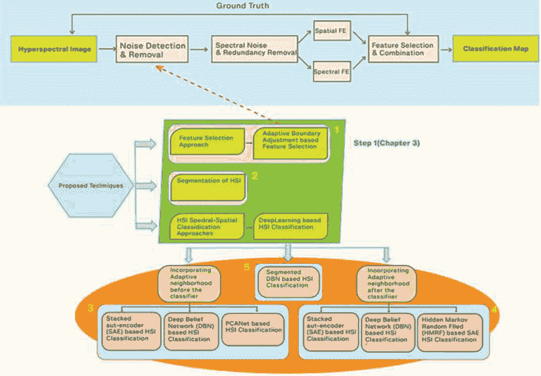

图 3.1 第一阶段与高光谱遥感图像分类框架对齐

在某些波长上，场景噪声很显著，而传感器噪声主要来自热能和射击噪声。检测器噪声和场景噪声中都存在信号相关的元素。

最近，噪声可以分为三个主要类别。这些类别包括基于滤波器、基于块的方法，以及两者的组合。在基于块的方法中，图像首先被划分为多个密集块，然后通过最小纹理和结构来筛选出这些块。基于这些块，估计噪声方差。通常，这些方法中的结构测量是通过时空均匀性、方差、空间均匀性和梯度协方差矩阵来进行的。

目前用于噪声估计的方法主要是基于分割和像素生长。为了在极不均匀的光学浅水环境中定义相同的对象段，Sagar 等人使用了基于图像分割的协方差矩阵估计方法。类似地，参考文献 21 中描述的方法是基于像素生长方法的改进版本，该方法基本上是由 Dekker 和 Paater 开发的。类似的方法在遥感场景中被用于研究光学浅水。

每当我们使用这些方法时，我们必须面对许多缺点。首先，在处理过程中，我们必须将空间（Spatial）和光谱维度等同对待，但在实际的高光谱图像中，空间相关性要小得多。与光谱相关性相比，除此之外，高光谱传感器引入了混合噪声，并且大多数传感器之间的噪声强度是不同的。具有各个波段之间均匀方差的高斯噪声可以通过先前描述的技术来处理。另一个不切实际的假设是噪声在每个波段中是相同的。因此，我们无法使用这些方法的实际数据来达到期望的结果。考虑到这些缺点，我们需要使用一种特定的波段估计噪声的策略。因此，我们的重点是开发这种针对噪声估计的波段特定策略。

在这项研究中，我们还考虑了低维度的（波段选择）BS 分类，但允许将所有组别分成不同的分类，而不是消除任何组别，使我们的方法与 BS 不同。我们可以将 BS 工作分为两类 [8]：（1）基于最大信息或最小相关性（MIMC）的技术和（2）基于最大波段可分离性（MIS）的技术。MIMC 技术通常使用组内相关性和聚类准则。MIMC 方法使用聚类模型和组内相关性。基于组内连接模型的计算通过使用类似熵的度量来最大化信息量，从而构建合理的组别子集。在 24、25 中，基于 MIS 的算法选择具有最小组内关系的适当组别排列。例如，参考文献 26、27 分别包括基于共享数据的算法和基于强制能量最小化的强制波段选择算法。

在这项研究中，我们提出了一种空间自适应、多功能的基于波段的排列 (AB3C) 系统，其中考虑了相邻组之间的噪声功率差异和空间属性。AB3C 也可以被视为高光谱图像噪声估计、去噪、BS、分类等的初始步骤。在这项研究中，基于 AB3C 还实施了高光谱图像的噪声估计和分类应用。在高光谱图像中，局部强度变化是由反射率、图像本身的照明或噪声引起的。将图像波动作为噪声水平的估计很可能导致过高估计；因此，我们将高光谱图像分成不同的组，并根据噪声引起的变化程度为每个组分配置信度分数。与使用天真的平均值或中位数来估计噪声水平不同，我们使用置信度分数加权的噪声水平函数进行拟合。由于噪声水平因组而异，我们能够分别测量每个波段的噪声水平。提出了一种噪声模型来估计噪声，该模型结合了仪器基于信噪比的估计、影响场景的环境变化、空气和水的干扰以及阳光和直接天空的散射折射等多种因素。根据所提出的方法，图像被分成三个波段 (28-30)。基于聚类的方法对噪声非常敏感，因为某些组可能完全由嘈杂的数据组成，可以使用基于阈值调整的准则独立评估这些数据。然后可以根据不同的阈值调整因素计算每个波段的噪声水平。提出系统的主要贡献如下：

方法论基于三波段图像的基于聚类的分割 [9-11]。基于聚类的方法对噪声非常敏感，因为一些聚类可能完全由噪声数据组成，可以使用基于边界调整的准则进行独立估计。然后可以基于各种边界调整因子计算每个波段的噪声水平。

提出的框架的主要贡献总结如下：

- （1）空间自适应边界调整高光谱图像的最重要准则是 $AB^3C$；
- （2）用于捕捉每个波段所携带的信息的属性是边缘移动，借助波段属性，我们能够得到一个新的框架；
- （3）考虑了不同波段之间的信息变化和空间信息差异；
- （4）基于波段空间自适应的噪声估计过程是自动化的。
- 根据分割区域创建的聚类基于构建的三重权重因子估计噪声的水平进行计算。
- 为了覆盖基于传感器和大气的传感器噪声和场景噪声，提出了一个噪声模型。

所提出的框架具有两个主要优点：

- 根据信息水平，对波段进行特征化和识别，并根据应用程序消除仅含噪声的波段和几乎没有数据的波段。
- 可以有效地应用于去噪、噪声估计、分类 BS 等应用领域。

所提出的算法的性能在合成数据集（用于噪声估计）和真实 HSI 上进行了验证，以评估其在受控环境中对特定波段的高斯噪声和混合噪声（高斯噪声、泊松噪声和尖峰噪声）的性能。

本章的其余部分组织如下：第 3.2 节回顾了相关算法，支持所提出的方法论，并详细定义了所提出框架的每个组成部分；第 3.3 节描述了用于检验所提出框架能力的广泛实验，并进行了总结。

### 3.1 提出的方法论

在本节中，我们将简要讨论基于边界调整的无监督框架的噪声带检测的建议方法。图 3.2 显示了流程图的概述，并在算法 1 和 2 中得出结论。在这个框架中，这个框架最重要的部分是评估噪声带的权重准则。


图 3.2 基于边界调整的噪声带选择框架的流程图

使用基于权重的准则来估计噪声带。为了估计噪声通道，由 M 个通道组成的数据被分成 $M_N$ 个 G 通道组，每个分割的数据都被独立分析，从而得到一个在 [0,1] 范围内的带噪声因子 W 来利用噪声水平。

数据由像素 $p_{i,j}$（其中 $i \in [1, \text{宽度}]$，$j \in [1, \text{高度}]$）组成，并被分成像素簇（“单元”）$C_{i} \in C$，其中成员为 $p \in C_{i}$。每个像素属性被观察为实值的多维向量 $x_p \in [0,1]^{N}$，其中每个维度是该像素的一个波段的强度值。最初，使用一个六边形区域，在图像上放置 R 个簇。

因此，每个聚类都会有一个平均的特殊光谱上下文表达式。

$$
SSC(C_i) = \frac{1}{|C_i|} \sum_{p \in C_i} x_p \quad (3.1)
$$

对于每个边界像素，我们有一个直线度因子

$$
\tilde{n}_p(C_i) = |\{p' \notin C_i, \text{dist}(p, p') \le r\}| \quad (3.2)
$$

为了显示连接圆盘上的像素数量，有一个与不同聚类相关的直线度因子，其与一个常数因子 $r$ (邻域圆盘的半径) 相关联。

HSI 数据的强度值通过逐波段的最大和最小强度线性归一化到 [0,1] 范围内。

对于边界像素，我们将所属聚类表示为 $O(p)$ s.t. $p \in O(p) \forall p$ 并定义相邻聚类

$$
N(p) = \{O(p') | \text{dist} (p, p') \le 1\}
$$

```
**Algorithm 1:** Adaptive cluster-edge adjustment
**Input**: HSI Bands $\mathcal{B}$, with pixels, $p$, and intensity vectors, $x_p$, and initial clusters $\{P_k\}_{(k=1..K)}, C_{k,0} = P_k$.
**Output:** boundary adjustment-based final clusters/segments
1 $bBoundaryAdjustment \leftarrow$ true;
2 $i \leftarrow 0$;
3 **while** $bBoundaryAdjustment$ **do**
4 $i \leftarrow (i+1)$;
5 $bBoundaryAdjustment \leftarrow$ false;
6 **for each** $(p_b, C_{k,i})$ (boundary pixel $p_b$, adjacent cluster $C_{k,i}$ pair) **do**
7 Compute the class centroid, $SSC$, as defined in (1);
8 Compute $p_b$'s local gradient, $grad(p_b)$, as defined in (4);
9 Compute $p_b$'s straightness factor as defined in(2);
10 Using the above values, compute the cluster- energy function, $E_{rET}(p_b, C_{k,i})$, defined in (5);
11 **for All Pixels** $p$ **do**
12 compare $E_{rET}(p_b, C_{k,i})$ for each neighbouring cluster;
13 Re-assign it to the cluster with the largest $E_{rET}$;
14 Find $k$, such that $E_{rET}(p, C_{k,i})$ is the maximum;
15 put $p$ into $C_{k,i+1}$;
16 **if** $C_{reassigned} \neq C_{current}$ **then**
17 $bBoundaryAdjustment \leftarrow$ true;
18 **end**
19 **end**
20 **end**
21 **end**
```

作为相邻像素的拥有聚类的集合。我们进一步使用四向核方法定义像素位置梯度：

$$
grad(p_{i,j}) = \frac{1}{4} \| x_{p_{i,j}} - x_{p_{i+1,j}} \| + \| x_{p_{i,j}} - x_{p_{i,j+1}} \| + \| x_{p_{i,j}} - x_{p_{i-1,j}} \| + \| x_{p_{i,j}} - x_{p_{i,j-1}} \|
$$

最后，使用类似于 [9] 的方法，我们定义边界像素和相邻聚类之间的聚类能量函数为：

$$
E_{rET}(p, C_i) = \sqrt{\| x_p - SSC(C_i) \| + \lambda \times \tilde{n}_p(C_i) \times grad(p)}
$$

对于鲁棒估计 (rET) 算法，其中 $\lambda$ 表示边缘直线部分的重要性的常数监控。通过考虑梯度，算法更有可能将边界调整为实际的图像分割边界，这是非噪声图像的一个重要特征。

在每次迭代中，每个像素针对每个相邻的聚类计算能量，并将新的聚类定义为具有最大能量的聚类。如果两个聚类之间有任何差异，则将像素从其先前的聚类中移除并添加到新的聚类中。当一个周期后没有像素获得新值，或者重心中的新分配数量不到一个限制稳定值时，计算结束。

带噪声因子 (BNF) 描述了各种子因子的混合，每个子因子在范围 [0, 1] 内进行归一化，根据上述计算结果调整边界。我们在下一段中定义了每个因子的分割。

#### 3.1.1 初始分割的预处理

如果我们提供了一个 N 通道的组，每个像素被定义为一个 N 维向量。通过运行预定的算法，可以找到高光谱图像分割。更具体地说，我们会有一组聚类，$C=(C1, ..., CR)$，和一个边界定义，$E=\{p|N(p)>1\}$。影响噪声带分类和检测的因素如下。

#### 3.1.2 群集大小因子

选择一个良好调整的准则来为嘈杂图像的调整边界选择。通常，每个群集具有相同的平均强度，从而导致较低的边界差异。在这种情况下，我们将能够完成各个区域的调整。与初始设置相比，群集大小的差异将很小。

给定群集的大小 $|Ci|$，我们确定其标准差 (大小的方差) 为

$$
s_{C}=\sqrt{\frac{1}{R} \sum_{i}\left(\left|C_{i}\right|-\overline{\left|C_{i}\right|}\right)^{2}}
$$

其中平均值为

$$
\overline{\left|C_{i}\right|}=\frac{height \times width}{R}
$$

将该因子与一个常数阈值进行比较，并映射到 [0, 1]：

$$
W_{size}=\min \left(1, \frac{s_C}{\lambda_{size} \times \overline{\left|C_i\right|}}\right)
$$

#### 3.1.3 群集位移因子

同样，可能是没有达到调整的原因，这意味着分割的组群与其初始值没有足够的变化。然而，如果我们有一个信息通道的聚类，边界的位置将有意义地改变位置以达到原始边界。这种情况下，聚类焦点的微小移动表明噪声通道的可能性更高。我们将移动因子描述如下：

$$
\text{移动} (C_i) = \text{距离} (\text{中心} (C_i), \text{中心} (C_{0,i})) \quad (3.9)
$$

其中，聚类 $C_i$ 的中心被定义为其质心，$C_{0,i}$ 是调整前的六边形 Voronoi 区域的初始聚类。

权重因子被定义为

$$
W_{\text{shift}} = \min \left( 1, \frac{\overline{\text{移动} (C_i)}}{\lambda_{\text{shift}} \times D} \right) \quad (3.10)
$$

其中，将移位与初始聚类直径 $D$ 进行比较，可以近似计算为

$$
D = \sqrt{\frac{H \times W}{R} \times \frac{4}{\pi}} \quad (3.11)
$$

#### 3.1.4 聚类空间 - 光谱上下文差异因子

当真实值边界与聚类相符时，两个不同的表面项目在高光谱图像中由两个连续的群组表示，这些群组将具有特定的正常 SSC 数据和一个不显著差异通道群组。有趣的是，在噪声通道聚集中，所有群组的正常 SSC 数据都大致相似，不论修改如何。因此，正常 SSC 的较大差异意味着边界调整上有更多的信息量。

对于每个边界边缘像素，$e \in E$，与相邻的聚类 $C_a$ 和 $C_b$，我们定义 SSC 差异为

$$
cd(e) = \|SSC (C_a) - SSC (C_b)\|_1 \quad (3.12)
$$

和 SSC 差异的权重为

$$
W_{ssc} = \min \left( 1, \frac{cd(e)}{\lambda_{ssc}} \right) \quad (3.13)
$$

#### 3.1.5 波段噪声因子 (BNF)

特定通道组的 BNF 定义为所有上述权重子因子的乘积 (图像平均)

$$
W = W_{size} \times W_{shift} \times W_{ssc}
$$

由于权重子因子的值范围在 [0,1] 内，我们也有 $W \in [0,1]$. 该因子表示指定通道组中存在的有用数据的程度，较小的权重表示存在更多的噪声。一个极低的 BNF，例如低于阈值 $W_{min}$，表示一个噪声通道组。

```
Algorithm 2: AB^3C
Input : HSI I with M channels
Output: categorized band based on energy/noise
1 Divide M channels into M/N G-channel groups;
2 for i ← 1 to G do
3 | Apply Algorithm 1 on each channel group;
4 | Compute weight subfactor based on cluster-size variance, as defined in (6)-(8) ;
5 | Compute weight subfactor based on cluster-shift variance, as defined in (9)-(11) ;
6 | Compute weight subfactor based on SSC difference between edges, as defined in (12) and (13) ;
7 | Compute BNF, as defined in (14);
8 | Classify the bands based on the BNF, as defined in (14);
9 end
```

#### 3.1.6 HSI 过程和噪声模型

HSI 噪声过程被描述为 (1) 从太阳到地面接收的光线被场景反射，(2) 反射的光线被发送到达传感器的情况，(3) 图像传感器将辐射能量转化为信号，最后转化为图像。参考文献 [12] 中展示了图像成像过程的示意表现，如图 3.3 所示。在大多数先前的文献中，噪声被显示为一个添加的元素，并且不包含信号；然而，噪声图形并不简单，通常具有信号相关和信号无关的部分。从图像形成的角度来看，最后的高光谱图像由不同的噪声源组成。我们将这些噪声显示为由场景噪声和光线响应以及传感器中的光线转换为电子信号引起的传感器噪声。这两个噪声源都有信号相关和信号无关的部分。达到传感器的理想信号是物体反射的纯净光线，然而在现实中，空气与物体和传感器之间的光线发生相互作用，通常由散射和空气吸收来分类。

### 3.1 提出的方法论

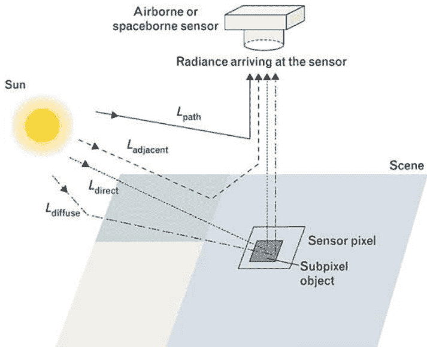

图 3.3 成像系统。照明源及其从源到场景表面，然后进入传感器的路径 [12]

影响。空气中的原子和粒子会散射光线，形成路径散射辐亮度。传感器接收到的总路径散射光线由直接来自太阳和附近表面反射的辐亮度组成，详细描述见 [12]。散射主要发生在可见光和近红外波长。路径散射辐亮度可以表示为一个常数偏移加上零均值的高斯噪声。我们将进入传感器的理想辐亮度表示为 $R$，路径散射辐亮度表示为 $R_s = r_{ps} + n_{ps}$，其中 $R_{ps}$ 是一个常数，$n_{ps}$ 表示高斯噪声。

某些气体吸收能量。特别是在 1.4 和 1.9 µm 附近，水蒸气和二氧化碳通常吸收所有能量，导致 HSI 中出现噪声带。环境透射率如图 3.4 所示。我们将吸收效应表示为光子由于在空气中的自由传播而发生的能量变化。吸收效应可以表示为能量的缩放项 A，由透射率控制，加上零均值的吸收噪声 $N_A$。由于离散化，$N_A$ 的差异相对于

真实的射线进入传感器被描绘为

$\sqrt{R}$相对于中心极限假设

$$
\hat{R} = a R + r_{ps} + n_a + n_{ps} \tag{3.15}
$$

传感器噪声源类似于阴影耦合器件（CCD）相机。根据 [14] 中的 CCD 传感器噪声模型，我们提出了一个用于高光谱图像传感器的噪声模型。这包括由暗流引起的热噪声，可以表示为恒定偏移加上零均值的高斯噪声。

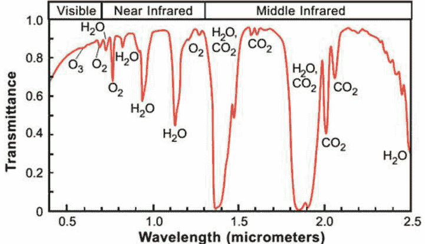

图 3.4 典型大气条件下大气透射率与波长的图。[13]

噪声。射击噪声是由光子计数引起的，受辐射强度的影响。考虑到其他噪声源，例如量化噪声、增强器噪声、D/A 和 A/D 噪声以及附加和无符号噪声，$n_s$ 描述了射击噪声，并将所有无符号噪声源合并为一个具有稳定波动的项。结果为

$$
I = bL + c + n_s + n_i \tag{3.16}
$$

其中 $I$ 是感知图像强度，$L$ 是物体的辐射度，$n_s$ 是拍摄噪声，而 $b$ 是一个缩放因子。在这篇文献中，$L$ 是一个依赖于 $\hat{R}$ 的随机变量。结合 (3.15) 和 (3.16)，结果为

$$
I = \alpha R + \beta + n_d + n_i \tag{3.17}
$$

其中 $\alpha$ 是连接吸收效应和光子观测速率的缩放因子，$\beta$ 是常数偏移量，$n_d$ 是连接的信号相关噪声源，而 $n_i$ 是连接的信号独立噪声源 ($E(n_s)=0, Var(n_s)=R\sigma_d^2, E(n_i)=0$, and $Var(n_i)=\sigma_i^2$)，并且具有恒定方差。

#### 3.1.7 噪声估计

使用第 3.1.6 节中描述的噪声模型，我们按照该模型估计高光谱数据中的噪声水平。首先，将噪声描述为

$$
\tau(I) = \sqrt{E[(I_N - I)^2]} \tag{3.18}
$$

### 3.1 提出的方法论

其中 $I_N$ 是观测数据，$I = E(I_N)$。准确地说，这篇文献得出结论

$$
\tau(I) = \sqrt{I \sigma_s^2 + \sigma_i^2} \tag{3.19}
$$

关键决定因素可以从 HSI 数据的分割结果中获得。这些关键因素包括 $\{I_i, \sigma_i\}$，其中 $I_i$ 是平均强度，$\sigma_i$ 是该特定分割区域的方差。然后，利用这些关键因素来近似该特定分割区域的噪声水平的标准。

贝叶斯最大后验（MAP）技术被用来选择关键因素的较低界限。较低的界限意味着拟合函数应该具有比近似值更小的概率，并且与关键因素非常接近的概率相对较高。

从数学上讲，给定一个特定的噪声水平指示函数，似然函数的责任是预测 HSI 图像的强度和噪声变化：

$$
L(\tau(I)) = P(\{I_n, \hat{\sigma}_n\}|\tau(I)) \propto \prod_n \Phi \left( \frac{\sqrt{k_n}(\hat{\sigma}_n - \tau(I_n))}{\hat{\sigma}_n} \right) \exp \left\{ - \frac{(\tau(I_n) - \hat{\sigma}_n)^2}{2s^2} \right\} \tag{3.20}
$$

其中 $\Phi(.)$ 是典型正态分布的累积分布函数，$k_n$ 是该特定段中像素的总和，$s$ 是用于控制关键决策因素与函数接近程度的正则化因子。此外，因子 $\sigma_s$ 和 $\sigma_i$ 的值是通过解决传统优化问题得到的：

$$
\{\sigma_s^*, \sigma_i^*\} = \underset{\{\sigma_s, \sigma_i\}}{\arg\min} \sum_n \left[ - \log \Phi \left( \frac{\sqrt{k_n}(\hat{\sigma}_n - \tau(I_n))}{\hat{\sigma}_n} \right) + \frac{(\tau(I_n) - \hat{\sigma}_n)^2}{2s^2} \right]
$$

噪声近似过程如下所示：

Algorithm 3: Estimating noise level
Input: Image $I$, segmentation $\{P_k\}_{k=1...K}$
Output: Noise level $\{\sigma_d, \sigma_i\}$
- for Each segment $P_k$ do
- | Calculate the pair $(I_k, \sigma_k)$, where $I_k$ represents the mean of all pixels and $\sigma_k$ is the variance.
- end
- Define the noise-level function as $\tau(I) = \sqrt{I\sigma_d^2 + \sigma_i^2}$.
- Define the likelihood function $L(\tau(I)) = P(\{I_n, \hat{\sigma}_n|\tau(I)\}$, which is the probability of seeing the samples, given a particular noise-level function.
- Calculate $L(\tau(I))$ for all samples $\{(I_k, \sigma_k)\}$.
- Find the parameters $\{\sigma_d, \sigma_i\}$ that maximize $L(\tau(I))$.

在概念层面上，提出的方法包括以下主要步骤：

- 1. 将初始的 HSI 通道图像分成 $M/N$ 通道组。
- 2. 将 $K$ 个初始种子放入 HSI 中的 $k$ 个类别中。
- 3. 将 HSI 分成初始的 $k$ 个六边形片段/聚类。
- 4. 重复以下基本步骤，直到不再发生进化，即没有像素转移到不同的片段。
    - 计算每个片段的类别质心。
    - 计算每个边界像素的梯度。
    - 计算边界的直线因子。
    - 计算相似度测量，即每个类别质心和边缘之间的吸引/排斥力。
    - 根据相似度测量来演化边界。
- 5. 给定超分割，相应地计算所有权重因子。
    - 基于聚类大小方差计算权重子因子。
    - 基于聚类偏移相对于初始位置计算权重子因子。
    - 基于边缘之间的 SSC 差异计算权重子因子。
- 6. 将子因子组合成 BNF。
- 7. 根据因子对波段进行分类。

### 3.2 实验结果

通过应用于特定的高光谱图像数据集来评估建议的 A³BC 结构。在这一部分中，该数据集能够与不同质量的通道以及仅包含噪声的通道合作。他们的选择得到了支持，因为这些数据集在过去十年中已经广泛用于验证高光谱图像分析算法，因为它们的复杂性和多样性，并且它们目前被用作验证新算法的基准标准。对于噪声的估计，该方法应用于合成数据信息和真实数据集。

#### 3.2.1 HSI 数据集

在实验阶段，我们使用了三种不同类型的高光谱数据集，这些数据集是使用 AVIRIS 传感器收集的，包括印度松树（图 3.5），萨利纳斯山谷（图 3.6）和莫菲特菲尔德（图 3.7），这些数据集由 AVIRIS 传感器捕获。

这些具有挑战性的数据集的详细信息在第 2.3 节中进行了讨论。

#### 3.2.2 合成数据集

使用 [15] 中的数据集作为合成数据集的来源。已经有许多分析师使用这个合成数据集来评估和测试他们的算法。

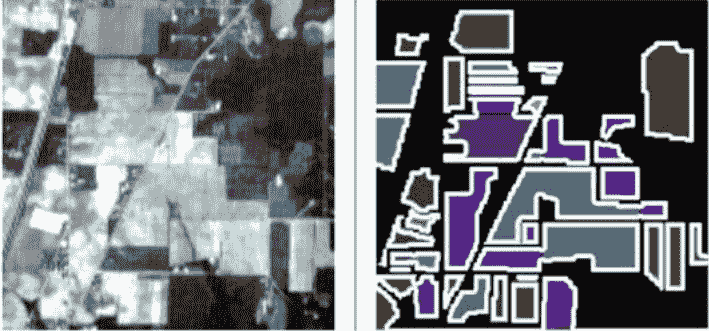


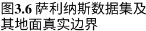

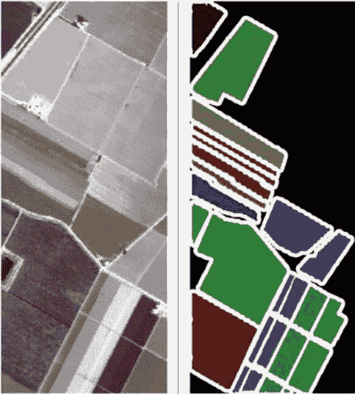

算法 [16]。该数据集的初始信息收集大小为 100×100，包含 221 个组。由于低分辨率和表面的干扰，噪声的估计变得困难。

#### 3.2.3 实验结果在真实的高光谱数据上

本节详细介绍了我们建议的 A³BC 框架在通过 AVIRIS 传感器收集的数据集上的可信度（图 3.7）。

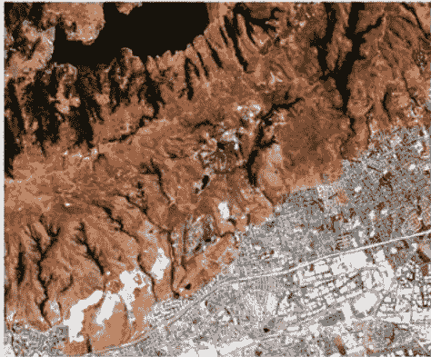

| Channel group | Hyper-seg | Size sub-factor | Shift sub-factor | SSC sub-factor | BNF |
| :--- | :--- | :--- | :--- | :--- | :--- |
| #1~#5 | | $W_{size}=0.678$ | $W_{shift}=0.771$ | $W_{ssc}=0.676$ | $W=0.353$ |
| #141~#145 | | $W_{size}=0.996$ | $W_{shift}=0.921$ | $W_{ssc}=0.830$ | $W=0.761$ |
| #151~#155 | | $W_{size}=0.106$ | $W_{shift}=0.135$ | $W_{ssc}=0.172$ | $W=0.0024$ |

图 3.8 对 Indian Pine 数据集进行分析的实验结果

##### 3.2.3.1 使用 AVIRIS Indian Pines 数据集的实验

首次实验使用了传统的 Indian Pines 数据集，其尺寸为 145 像素，包含 220 个通道，其中 20 个通道被声明为噪声。通道是由相邻的五个通道 ($N=5$) 组成，将由我们的框架进行评估。

图 3.8 描述了三个常见的直接通道组的分析结果。通道 141 到 145 是一个常见的通道，边缘与实际物体的边缘相似，而通道组 1-5 稍微有些噪声。通道 151-154 是纯粹的噪声，限制保持在六边形形状中。所有通道的带噪声因子在图 3.9 中描述。官方宣布的嘈杂通道（吸水波长）由红线标记。从差异中可以观察到，所提出的技术能够识别完全嘈杂的通道组，并将较低的变量分配给部分嘈杂的通道。通道 151-165 被检测为完全嘈杂，而通道 81-95、106-110 和 161-166 被认为是部分嘈杂的。

对于集群大小的表示，一个更大的组以绿色出现，而一个较小的集群以红色出现。两者都表示非噪声通道。

图 3.9 印度松树数据集上的 BNF 分布

##### 3.2.3.2 使用 Salinas 数据集的实验

随后使用 Salinas 数据集进行了一项研究。该数据集有 224 个通道，其中 20 个被宣布为嘈杂。尺寸为 512×217 像素。

与过去的调查一样，所有通道的 BNF 和检查分别在图 3.10 和 3.11 中描述。正式宣布的嘈杂通道（吸水波长）由红线标出。如图 3.12 所示，嘈杂波段的 BNF 普遍小于 0.2，而完全嘈杂的波段 (111-116 和 156-166) 的 BNF 小于 0.01。嘈杂和常规通道的平均 BNF 的方差在图 3.12 中描述。

部分嘈杂通道与较低的 BNF 有关，但没有接近零的通道。由于噪声接近通道 110 的数据带宽较窄，我们

对于集群运动表示，较大的群体运动以更长的跑步显示为绿色，而较小的群体运动以更短的跑步显示为红色。较大的移动（较长的跑步）是非嘈杂通道的特征。

对于边界智能对比度的划分，绿色边缘显示出较大的组 SSC 差异，而红色边缘显示出较小的差异。较大的差异表明图像非噪声。

图 3.10 Salinas 数据集的通道组 BNF 分布

图 3.11 Salinas 数据集分析的实验结果

### 3.2 实验结果

图 3.12 Salinas 数据集中噪声和常规通道组之间的比较

图 3.13 Salinas 数据集中不同的#聚类参数

图 3.14 Salinas 数据集中不同的λ参数

同样尝试了另一种方法来区分真正的噪声通道。与其为每次运行选择下一个 N 个通道，我们选择下一个 N/2 个通道作为新的分组。结果（对于 N=66，每次跳过三个通道）在相同的图中与其他组相同，而在噪声传输带宽（吸收水分的传输带宽）附近的 BNF 更接近零。

| Channel group | Hyper-segmentation | Size sub-factor | Shift sub-factor | Spatial sub-factor | BNF |
| :--- | :--- | :--- | :--- | :--- | :--- |
| #4~#6 | | $W_{size}=0.999$ | $W_{shift}=0.411$ | $W_{edge}=0.379$ | $W=0.213$ |
| #55~#57 | | $W_{size}=0.999$ | $W_{shift}=0.853$ | $W_{edge}=0.905$ | $W=0.785$ |
| #106~#108 | | $W_{size}=0.998$ | $W_{shift}=0.777$ | $W_{edge}=0.819$ | $W=0.656$ |

图 3.15 对 Moffett 数据集进行分析的实验结果

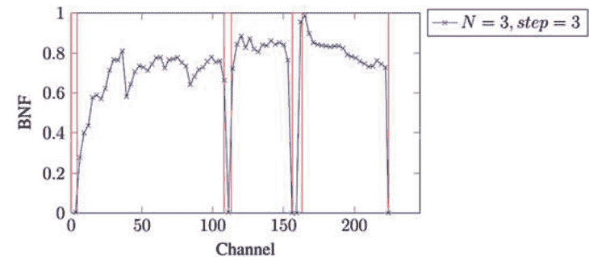

图 3.16 Moffett Field 数据集上通道组的 BNF 分布

##### 3.2.3.3 使用 Moffett Field 数据集的实验

第三次实验尝试使用 Moffett 数据集。该数据集具有 224 个通道，测量 512×614 像素。通道按三个连续通道 ($N=3$) 重新分组进行评估。与先前的检查一样，所有通道组的 BNF 出现在图 3.16 中。通过红线标出了权威宣布的嘈杂通道 (吸水波长)。正如可以看到的那样，大部分嘈杂波段组的 BNF < 0.2，而完全嘈杂波段 (1-3, 109-113, 153-161 和 223-224) 的波段噪声因子为零。

图 3.17 展示了一些通道的分割结果，而图 3.16 和图 3.15 展示了所有通道的 BNF 和一些通道中每个权重因子的表示。从图 3.15 可以看出，尺寸子因子揭示了有关噪声水平的有限信息，可能是由于城市 (小物体) 和景观 (大物体) 的混合；而变换和 SSC 子因子都表现出良好的帮助识别嘈杂组。

一些通道与部分噪声通道相关，与较低的 BNF 有关，然而没有接近零的通道。在图 3.18 中显示了不同组数的结果。

图 3.17 通过对 Moffett Field 数据集进行分析得到的实验结果 $\lambda=4, R=1,000$

图 3.18 Moffett Field 数据集的不同#聚类参数

图 3.19 Moffett Field 数据集的不同λ参数

如图 3.19 所示，所提出的结构能够识别出完整的噪声组，并根据其噪声水平对这些组进行排序，给予它们较低的权重因子。

### 3.2.4 rET 参数的讨论

生成了超分割通道的组，根据之前提到的 rET 算法进行计算组的 BNF。rET 算法使用了两个预定义的参数，对我们的方法识别噪声通道的能力有较小的影响，如下面的实验所示。

##### 3.2.4.1 聚类数目

超光谱图像的数量分割组，或者说底层组的大小，主要影响了 rET 算法跟踪景观细节或小型合成物体的能力。无论组的大小如何，rET 计算将将组的边界固定为标准（非噪声）通道中的真实物体边界，而噪声通道中组大小的变化始终很小。当组的数量不足时，普通通道 BNF 与初始组大小之间存在轻微关联。我们认为这是由于非噪声图像中的边界调整不足。使用不同的聚类大小参数，噪声和非噪声通道之间的 BNF 差异如图 3.13 所示。这个结果是使用 Salinas 数据集获得的，图 3.20 显示了不同的分割结果。

##### 3.2.4.2 边界直线度和梯度因素

由于特定因素，卷曲边界在 rET 算法中受到惩罚，可能导致边界调整时间更长，直到边界变直。不同的因素是强度之间的差异。尽管它与簇的大小没有直接关联，因为边界调整不会扩展或移动簇。

图 3.14 中显示了不同分割调整值的影响。图 3.21 中显示了分割调整值的影响。


图 3.20 展示了 Salinas 数据集不同分割-聚类大小的示意图 ($R=50, 200, 400, 500, 600$)


图 3.21 展示了 Salinas 数据集不同边界权重因子的示意图 ($\lambda=20, 40, 50, 60, 100$)

#### 3.2.5 权重子因素参数的讨论

每个权重子因素参数为非噪声通道设置了一个边缘。当参数比例超过一时，它被截断为一。因此，过小的 $\lambda$ 偏移将导致大部分通道被截断（加权为一），并将更大的负载分配给嘈杂的通道，因为完全嘈杂的通道也会有很小的非零组偏移。其他权重元素都将具有可比较的影响。

同时，较大的 $\lambda$ 不会移除任何通道，并且可能会错误地将一些典型通道误认为比其他通道更嘈杂，因为存在着聚类变化的巨大估计之间的对比。例如，考虑到某些通道中的一些物体是不可见的，非嘈杂的通道将与所有物体都明显可见的通道相比具有较短的聚类变化。过大的 $\lambda_{shift}$ 值可能导致这些通道具有 $W_{shift}$ 惩罚。较小的 $\lambda_{shift}$ 将使这两个通道的 $W_{shift}=1$。在某些应用中仍然可能需要这种情况；因此，我们建议根据所使用的 HSI 传感器类型和其他应用程序的特定对象来明确选择参数。

参数通道分布的影响如下所示：图 3.22、3.23、3.24 描述了变化的 $\lambda$ 大小、$\lambda$ 偏移和 $\lambda_{ssc}$ 的影响。

```
$\left\{\begin{array}{l}\lambda_{\text {大小 }}=0.2, \lambda_{\text {偏移 }}=0.2, \lambda_{s s c}=5\end{array}\right.$
```

***

**Footnotes:**

2 对于集群大小的表示，一个更大的组以绿色出现，而一个较小的集群以红色出现。两者都表示非噪声通道。

3 如果我们将 $W_{min} = 0.1$ 作为阈值，以下通道将被视为噪声：156-160 和 160-165。

4 如果 $W_{min} = 0.1$ 被用作上限，以下通道将被标记为噪声：$N=5$: 106-110, 111-115, 156-160, 160-165, 166-170。$N=6$: 106-111, 109-114, 112-117, 151-156, 154-159, 157-162, 160-165, 163-168。

5 两个实验都使用了 Salinas 数据集，其中 $N = 6$。

6 所有实验都使用了 Salinas 数据集，其中 $N=6$，并使用默认参数。

图 3.22 Salina$_s$数据集的不同$\lambda$大小参数

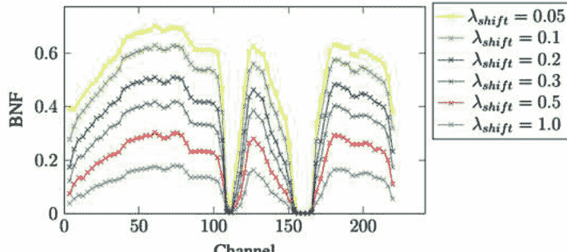

图 3.23 Salina$_s$数据集的不同$\lambda$偏移参数

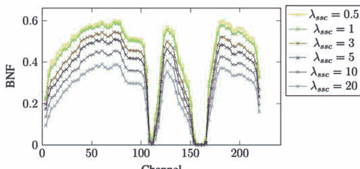

图 3.24 Salina$_s$数据集的不同$\lambda_{ssc}$参数

### 3.2 实验结果


图 3.25 分形图像的合成噪声图像和估计的噪声水平函数 (噪声标准差作为图像强度的函数)。a-c 来自分形 1，其中$\sigma_i=0.01, \sigma_d=0.01$。d-f 来自分形 3，其中$\sigma_i=0.03, \sigma_d=0.03$。g-i 来自分形 5，其中$\sigma_i=0.06, \sigma_d=0.06$

#### 3.2.6 噪声水平估计

我们对合成信息和真实 HSI 进行了噪声估计。$100\times100$像素的合成场景来自使用分形产生特定空间模式的数据集 [17]。使用这个数据集进行噪声估计是困难的，因为数据包含噪声样式并且分辨率较低。根据 [18] 中的噪声模型，向这些图像添加了合成噪声，其中噪声因子$\sigma_d$和$\sigma_i$的范围从$0.01$到$0.06$，增量为$0.01$。合成噪声使得可以将估计的噪声水平 (ENL) 与 GT 进行比较。我们还使用 Salinas 和 Indian Pines AVIRIS 数据进行了实际 HSI 的实验。由于我们没有噪声水平的 GT，我们从不同的高光谱图像中检查了 ENL。

在图 3.25 中，我们展示了使用三个高光谱图像的九个组进行噪声估计的下包络拟合。在 (a) 中，分形 3 具有平滑区域，并且一些模式紧密地遵循 GT 曲线。同时，这些模式跨越了广泛的强度范围。因此，(a) 中的估计是良好的。在图 3.25e 中，大多数模式与噪声相比具有较高的标准偏差。由于纹理区域中的模式保持了估计，所以 ENL 没有显著增加。在图 3.25g 中，分形 5 在每个位置都具有丰富的高频分量，因此导致了过高的估计。

在表 3.1 中，我们展示了 Fractal 3 中 20 个组的估计。由于具有无穷表面和合成噪声能量相对较低，一些组被过度估计，与真实图像中的那些相比。

**表 3.1 噪声水平和 ENL 的 GT 比较，来自 Fractal 2，其中 $\sigma_i=0.02$, $\sigma_d=0.02$**

| 波段 | GT | ENL |
| :--- | :--- | :--- |
| 1 | 0.0239 | 0.0311 |
| 21 | 0.0259 | 0.0272 |
| 41 | 0.0260 | 0.0255 |
| 61 | 0.0259 | 0.0247 |
| 81 | 0.0264 | 0.0245 |
| 101 | 0.0264 | 0.0235 |
| 121 | 0.0267 | 0.0238 |
| 141 | 0.0267 | 0.0240 |
| 161 | 0.0261 | 0.0291 |
| 181 | 0.0255 | 0.0241 |
| 201 | 0.0246 | 0.0225 |
| 221 | 0.0239 | 0.0229 |

我们还通过选择来自 AVIRIS 的 Salinas 和 Indian Pines 两个高光谱图像数据集，将噪声估计应用于实际 HSI。由于实际 HSI 中噪声水平的 GT 是不确定的，我们从附近的波长确认了 ENLs。在图 3.26 和 3.27 中，相邻组的 ENLs 是相似的。水汽摄入组在 (c) 中显示，其中 ENL 与其他所有样本相比较低，而 GT 可能已经穿过了其他样本分布的中心，考虑到该波段是嘈杂的且不包含任何信息的假设。这些结果显示了下限拟合的限制点：噪声水平函数被认为低于所有样本，但当样本来自完全嘈杂的部分时，这是不可靠的。

#### 3.2.7 HSI 分类

通过对高光谱图像进行分类，进一步确认所提出结构的演示和使用的可行性。在这一部分中，使用 Salinas 和 Indian Pines 高光谱图像来评估该技术的有效性，通过选择用于分类的子组。我们通过选择具有最大 BNF 的子组来探索 $AB^3C$ 用于 BS。

无监督 BS 方法 [19]、监督最大相关最小冗余 [20] 方法和半监督波段选择方法 [21] 被用作标准的检验策略。此外，还应用了所有没有选择的通道（所有波段）进行相关性分析。

图 3.26 Salinas 的六个波段和估计结果。相邻波段的 ENLs 相似

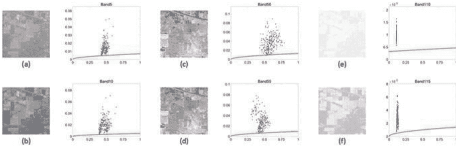

图 3.27 Indian Pine 的六个波段和 ENL 函数

为了评估所选择通道的可行性，应用循环置信传播和主动学习 [22] 对高光谱图像进行特征化分析，并作为分类器。

在每次实验中，每个分类的$10\%$样本被用作训练集。采用著名的整体准确率 (OA) 指标对分类结果进行定量评估。

##### 3.2.7.1 分类结果分析

印度松和萨利纳斯数据集包含 16 个类别，分别在表 3.2 和表 3.3 中进行了研究。在图 3.28 和图 3.29 中，记录了萨利纳斯和印度松图像上五种算法的平均 OA 结果，选择的组数从 10 增加到 190，间隔为 20。所有组的 OA 曲线保持稳定，因为它使用了预定义数据集中的所有组。从图表中可以看出，OA 准确率先大幅上升，然后达到最大值，最后持续下降。这种观察表明，选择的特定组合通道可以为分类提供相关数据。这个结果显示了很多组可能包含大量重复数据，很少提供特定有价值的分类数据。相比之下，当选择的组数量在 [30, 190] 范围内时，$AB^3C$的排列结果更好。

**表 3.2**

| 类别编号 | 类别 | 样本 | 类别编号 | 类别 | 样本 |
|---|---|---|---|---|---|
| 1 | 苜蓿 | 54 | 9 | 燕麦 | 20 |
| 2 | 玉米 - 非耕地 | 1434 | 10 | 大豆 - 非耕地 | 968 |
| 3 | 玉米 - 少耕地 | 834 | 11 | 大豆 - 少耕地 | 2468 |
| 4 | 玉米 | 234 | 12 | 大豆 - 清洁地 | 614 |
| 5 | 草地 - 牧场 | 497 | 13 | 小麦 | 212 |
| 6 | 草地 - 树木 | 747 | 14 | 森林 | 1294 |
| 7 | 草地 - 牧场 - 修剪 | 26 | 15 | 建筑物 - 草地 - 树木 | 380 |
| 8 | 干草 - 风吹 | 489 | 16 | 石头 - 钢铁 - 塔 | 95 |

**表 3.3**

| 类别编号 | 类别 | 样本 | 类别编号 | 类别 | 样本 |
|---|---|---|---|---|---|
| 1 | 绿色西兰花杂草 1 | 2009 | 9 | 土壤葡萄园发展 | 6203 |
| 2 | 绿色西兰花杂草 2 | 3726 | 10 | 玉米枯萎绿色 | 3278 |
| 3 | 休耕地 | 1976 | 11 | 莴苣罗曼 4 周 | 1068 |
| 4 | 粗糙的休耕地枕头 | 1394 | 12 | 莴苣罗曼 5 周 | 1927 |
| 5 | 休耕平滑 | 2318 | 13 | 生菜罗曼尼 6 周 | 916 |
| 6 | 残株 | 3959 | 14 | 莴苣罗曼尼 7 周 | 1070 |
| 7 | 芹菜 | 3579 | 15 | 葡萄园未训练 | 7268 |
| 8 | 葡萄未训练 | 11271 | 16 | 葡萄园垂直 | 1807 |

图 3.28 印度松数据集上的方法平均准确率

图 3.29 萨利纳斯数据集上的方法平均准确率

### 3.3 提出的无监督高光谱图像噪声降低和波段分类方法的总结

在这项研究中，我们提出了一种新的$AB^3C$结构，用于基于数据/质量水平对高光谱图像$BC$进行有效分类，从而使得这些组在后续的应用/研究中可用，这可以被视为一个重要的预处理步骤。根据提出的策略和新的噪声模型，对每个通道进行噪声水平评估，进一步证实了该系统的有效性。为了实现对纹理和均匀区域数据的高精度水平，我们的技术利用了空间和光谱关系。基于自适应边界变化/发展的估计系统考虑了带内和带间的关系。在实际应用中，由一系列传感器获得的高光谱图像不可避免地受到噪声的影响，这可能导致大量重复的组中夹杂着重要的数据。每个高光谱图像波段包含不同程度的信息，因此$BC$过程根据每个波段中的数据质量进行自适应调整，以量化数据水平。$BC$是在处理 HSI 信息的结果应用之前，需要进行重要的预处理步骤。在这里，我们提出了一种新颖而多功能的 HSI BC 方法，同时考虑了各个组之间的噪声传递波动和带内的空间数据对比度。

在这种方法中，带倾斜度通过能够分离每个带和其数据内容来描述。基于组的$AB^3C$System 是新颖且计算有效的，使其在与高光谱图像相关的几乎所有结果应用中都具有价值，例如 HSI 去噪、功能、传输和显示。它也是后续实际应用的强大预处理过程，例如 HSI 分类、BS、分割和解混。为了展示其在后续应用中的有效性，还进行了基于$AB^3C$的 HSI 特征化和噪声估计。

### 参考文献

- 1. Goodenough DG, Han T (2009) 减少高光谱数据中的噪声——一种非线性数据序列分析方法。在：第一届高光谱图像和信号处理研讨会：遥感演变，2009 年。WHISPERS'09. IEEE，第 1-4 页。
- 2. Ghamisi P, Dalla Mura M, Benediktsson JA (2015) 基于属性特征的光谱 - 空间分类技术综述。IEEE Trans Geosci Remote Sens 53(5):2335–2353.
- 3. Bioucas-Dias JM, Nascimento JM (2008) 高光谱子空间识别。IEEE Trans Geosci Remote Sens 46(8):2435–2445.
- 4. Veganzones MA, Tochon G, Dalla-Mura M, Plaza AJ, Chanussot J (2014) 基于光谱解混的二叉分区树表示的高光谱图像分割。IEEE Trans Image Process 23(8):3574–3589.
- 5. Plaza A, Du Q, Bioucas-Dias JM, Jia X, Kruse FA (2011) 遥感数据光谱解混专题的前言。IEEE Trans Geosci Remote Sens 49(11):4103–4110.
- 6. Jia X, Kuo B-C, Crawford MM (2013) 高光谱图像分类的特征挖掘。Proc IEEE 101(3):676–697.
- 7. Acito N, Diani M, Corsini G (2011) 在高光谱图像中的信号相关噪声建模和模型参数估计。IEEE Trans Geosci Remote Sens 49(8):2957–2971.
- 8. Sun W, Zhang L, Du B, Li W, Lai YM (2015) 使用改进的稀疏子空间聚类进行波段选择，用于高光谱图像分类。IEEE J Sel Top Appl Earth Obs Remote Sens 8(6):2784–2797.
- 9. Wang J, Wang X (2012) VCells: 使用边缘加权重心泰森多边形分割的简单高效超像素。IEEE Trans Pattern Anal Mach Intell 34(6):1241–1247.
- 10. Wang J, Ju L, Wang X (2009) 用于图像分割的边缘加权重心泰森多边形分割模型。IEEE Trans Image Process 18(8):1844–1858.
- 11. Levinstein A, Stere A, Kutulakos KN, Fleet DJ, Dickinson SJ, Siddiqi K (2009) TurboPixels: 使用几何流进行快速超像素。IEEE Trans Pattern Anal Mach Intell 31(12):2290–2297.
- 12. Kerekes JP, Baum JE (2003) 高光谱成像系统建模。Linc Lab J 14(1):117–130.
- 13. 网站，howpublished = www.microimages.com/documentation/tutorials/hyprsspec.pdf，note = 2010 年 9 月 30 日访问.
- 14. Tsin Y, Ramesh V, Kanade T (2001) CCD 成像过程的统计校准。在：第八届 IEEE 国际计算机视觉会议，2001 年。ICCV 2001. Proceedings, vol 1. IEEE, pp 480–487.
- 15. 西班牙埃斯特雷马杜拉大学高光谱计算实验室，Cáceres, http://www.hypercomp.es/hypermix.
- 16. Karami A, Heylen R, Scheunders P (2015) 基于波段的剪切小波的高光谱图像噪声降低。IEEE Trans Geosci Remote Sens 53(9):5054–5066.
- 17. Plaza J, Hendrix EM, García I, Martín G, Plaza A (2012) 在高光谱图像中识别端元而不需要纯像素的算法比较。J Math Imaging Vis 42(2):163–175.
- 18. Liu C, Szeliski R, Kang SB, Zitnick CL, Freeman WT (2008) 从单张图像自动估计和去除噪声。IEEE Trans Pattern Anal Mach Intell 30(2):299–314.
- 19. Frey BJ, Dueck D (2007) 通过数据点之间传递消息进行聚类。Science 315(5814):972–976.
- 20. 彭 H, 龙 F, 丁 C (2005) 基于最大依赖性、最大相关性和最小冗余性的互信息准则的特征选择。IEEE Trans Pattern Anal Mach Intell 27(8): 1226-1238.
- 21. 赵 J, 卢 K, 何 X (2008) 局部敏感的半监督特征选择。Neurocomputing 71(10): 1842-1849.
- 22. 李 J, Bioucas-Dias JM, Plaza A (2013) 基于循环置信传播和主动学习的高光谱数据光谱 - 空间分类。IEEE Trans Geosci Remote Sens 51(2): 844-856.

## 第 4 章 通过分割提取高光谱图像的空间特征

在第二阶段，从高光谱图像（HSI）中提取空间信息，这是朝着有效分类任务的第二步，如图 4.1 所示。对所有 HSI 分类阶段的完整描述在第 1 章，图 1.3 中描绘。该阶段旨在开发一种新的无监督分割方法。还详细介绍了实验结果和与现有最先进的分割方法的比较。

高光谱场景处理的主要目标是在保持数据的重要细节完整的同时，有效地进行高光谱场景分割。高光谱图像分割过程被认为是遥感数据理解、研究和后续应用流程中的重要部分 [1]。光谱通道的大幅扩展和丰富的空间信息不仅带来了深入理解和可靠性，也使得分割算法的开发更加困难，因为大多数传统分割算法要么无法工作，要么由于光谱/空间分辨率的显著增加而导致计算复杂度大大增加。此外，现有的有监督分割技术需要大量的训练样本，这是 HSI 数据探索中的一个主要瓶颈。不幸的是，在模式分类中，训练样本的准备/存在是一个典型问题，但当涉及到 HSI 时，它成为一个主要限制，因为很难对 HSI 像素进行标记，这使得训练过程变得非常具有挑战性。此外，HSI 中光谱通道数量的增加也导致了许多其他重要问题和复杂性。休斯现象（可用训练数据与维度数量之间的不平衡）就是其中之一。在过去的 10 年里，HSI 分割的这一关键领域得到了大量的探索和实验，特别是在有监督的 HSI 分割和分析领域 [2-5]。在这些需要大量训练样本的分割方法中，各种基于机器学习的方法与之整合从传统算法中选择/提取的特征 [6]。最后，像支持向量机这样的基于机器学习的分类器需要训练样本进行分类。基于聚类的各种技术，特别是 k-means 和相关技术，依赖于最初给定的聚类数量，并不真正关心数据的空间特征，而这些特征在其中起着重要作用。近年来，对无监督高光谱分割算法的兴趣日益增加。

改进的高光谱图像分割技术在 [7] 中被提出。尽管分水岭方法通常会导致过分分割，一些研究人员探索了分层分割 [8-10]。在 [8, 9] 中的研究人员利用了最小生成树森林 (MSF)。在 [10] 中的作者探索了目标区域检测与目标区域聚类的集成，从而得到了一个分层的图像分割 (HSEG)。一些研究人员通过整合二进制分区树 (BPT) 的特征和光谱解混的理论背景来处理高光谱图像分割。然而，上述分割技术存在许多缺点。一个主要缺点是在监督分割中需要标记的训练样本，这是 HSI 分析中的一个重要限制。此外，基于降维的分割方法并没有完全探索 HSI 中存在的潜在特征。

为了解决上述问题，我们开发了一种创新的无监督 (根据光谱和空间信息自适应) HSI 分割算法，它对邻近波段之间的深层次关联和空间特征敏感，而不需要任何先验训练样本或标记数据。所开发算法的理论基础建立在基于物理的模型上，并且种子初始化过程嵌入在中心化的 Voronoi 图中。通过利用有限的结构一致性和自相似性，基于目标边缘移动 (位置变化) 的开发技术在效率上得到了提高。

图 4.2 基于边界调整的加权分割框架

高光谱图像的分割。该算法解决了高光谱图像分割领域的重要问题和限制，并且在分割高光谱图像和计算复杂性方面都是有效的。该技术的主要优点总结如下：

- 1. 该算法完全有效地探索了邻近通道中的光谱和空间特征以及光谱关系。此外，它保持了高光谱图像数据的维度完整，从而利用每个通道的有用相关性和空间依赖性。
- 2. 自动分割过程建立在高光谱图像对象边缘检测/移动特征上。HSI 中的每个光谱波段都包含每个地表材料的独特特征；我们将高光谱图像分成 B 组通道，并在每组通道上独立应用评估过程。基于许多边缘移动因素开发和使用加权标准来提取每个通道中的有价值信息，用于分割目的。
- 3. 还开发了四种不同的波段分组准则，可以显著提高性能。

该算法应用于现有的标准 HSI 数据。实验结果指定并展示了令人鼓舞的分割结果。此外，它为分割提供了新的理论思路。本章的其余部分详细介绍了所开发技术的方法论。第 4.1 节解释了所开发算法的理论，并详细阐述了技术的每个部分。第 4.2 节展示了详细的实验，以验证所开发框架的性能和效率。最后，在结尾处得出了结论性的意见。

### 4.1 提出的方法论

本节详细介绍了基于加权边界调整的 HSI 分割框架。该算法首先将场景划分为一个六边形结构的密集区域，通过在物理框架中对边界施加力的平衡概念，将种子放置在适应受限场景结构的位置上。加权边界准则使算法能够补偿和检测到锐利的强度梯度，从而实现有效的分割，并在场景中给予物体边缘高权重。在图像的均匀区域或噪声最多的图像中，所得到的分割类似于每个放置种子的 Voronoi 单元。我们已经证明，所开发的技术不仅适用于具有与现有算法相当准确度高光谱图像，而且还显著降低了计算复杂性。我们的方法基于以下原则：

- 加权分割应将 HSI 分割成紧凑的区域，即由形状和大小不变的区域组成，这降低了区域过度分割的可能性，因为最小的分割区域与目标区域的形状兼容。通过基于六边形的质心 Voronoi Delaunay 三角剖分初始化（CFCVDT），只有靠近实际边界的区域才会快速扭曲。另一方面，在每次重复过程中，其余区域保持不变。在图像的均匀区域中，大多数分割结果保持大致六边形的形状。
- 每个分割后的区域应该表示一个仅相关的像素集合。通过其物理力边界调整的扩张算法的开发证实了这一限制始终得到满足。
- 在没有局部对象边界信息的情况下，分割后的区域应保持紧凑。该方法从六边形初始化种子开始，并且不对对象边缘的位置有任何先前偏见。为了利用紧凑性，我们添加了一个边缘能量部分，在均匀强度区域中生成外法线路径的连续变化。
- 当基于边缘力的调整停止时，分割边缘应与场景中的实际物体边界匹配。这涉及到具有三个特点的算法设计：(1) 算法应该降低其在图像对象边界区域的边缘发展速度，(2) 它应该对图像边界敏感，(3) 它应该发展平面边缘。基于边缘决策的提出的公式为边缘发展引入了一种简单的方法，同时包含了吸引形状正则化的部分。因此，在我们提出的算法中，不存在边界增长过程中出现的物体边缘超越和碰撞等问题。
- 分割过程应将每个像素分配给唯一的分割区域。因此，当两个不同的膨胀种子即将碰撞时，边缘移动过程应该停止。这在我们的算法中是自动确保的。

上述考虑导致了一种基于边缘平衡的区域生长算法，该算法称为基于物理模型的高光谱图像分割，旨在维持和发展分配区域之间的边缘，直到遇到物体边界。所提出的方法可以在概念上分为以下主要步骤：

1. 将初始高光谱 M 通道图像分成 M/N 个通道组。
2. 对于每个通道组，执行以下步骤：
    a. 在图像中放置 m 个初始类的种子。
    b. 根据种子，将区域分成 m 个初始六边形片段/聚类。
    c. 重复以下基本阶段，直到不可能再有进一步的发展，即没有像素进入不同的片段。
    - 计算每个初始分割/聚类的类质心。
    - 计算每个分割/聚类的当前边界像素的梯度。
    - 计算每个聚类边界的直线度量。
    - 根据方程计算相似度测量，即每个类质心与其边缘部分之间的吸引/排斥力。
    - 根据相似度测量来改进边缘。
3. 对于每个波段聚类，根据一定的标准为每个边缘像素分配权重，以分配反映实际边缘的像素。
4. 将 N 个通道合并以获得 HSI 的加权分割。

我们将详细讨论每个过程。所开发算法的整体结构如图 4.2 所示，并在算法 1 和算法 2 中概念上呈现。

框架的每个部分如下所述。

#### 4.1.1 初始分割的预处理

为了检测物体的边界/边缘，将由 M 个波段组成的原始高光谱图像数据分组为 M/N 个通道组，然后对每个结果组分别评估算法 1，然后根据算法 2 合并每个组的结果。调整通道的分组过程起着重要作用。在没有分组的情况下，每个波段中存在的噪声可能会主导信号，从而忽略每个波段中的实际边界/边缘信息。因此，分组在抑制每个通道中存在的纯噪声方面起着重要作用。

HSI 数据由像素 $p_{i,j}$（其中 $i \in [1, \text{宽度}], j \in [1, \text{高度}]$）组成，并且被分成一组相似的像素（“单元”）$C_i \in C$，其中每个像素在一个特定的组中是 $p \in C_i$；一个单个像素的属性/特征被表示为一个实值高维归一化向量 $x_p \in [0, 1]$。给定一个波段组，我们将个别像素表示为 N 维向量，并应用上述算法 1 来发现给定高光谱图像中的所有分割区域。更准确地说，将获得近似相同大小和形状的六边形分割的聚类集合 $C = (C_1, ..., C_R)$ 和边界定义 $E = \{p | N(p) > 1\}$。对于步骤 1，我们选择了 Lloyd 的六边形算法 [11] 和 CFCVDT [12]。

##### 4.1.1.1 初始种子放置

拟议算法的第一阶段的目标是基于给定 HSI 中存在 k 个类的假设，放置 k 个初始种子，并生成近似均匀轮廓和大小的小六边形分割区域。图像中的类数主要取决于图像的复杂性。我们选择第一阶段基于 Lloyd 的六边形算法 [9] 和 CFCVDT [10]，这是一种活跃且高效的图像像素分割和聚类方法。基于 CFCVDT 的分割方法能够在不到一秒钟的时间内基于种子生成约 10,000 个小六边形图像段，并且其运行时间不依赖于图像的大小。因此，CFCVDT 可以有效应用于高光谱图像。总体而言，CFCVDT 生成的小六边形分割区域与图像的空间或光谱信息无关。

图 4.3 表示了考虑图像的光谱和空间信息的边界调整


具体而言，初始阶段是一个初始化过程，计算得到的分段被用作下一阶段的早期分段。通过选择六边形形状，与其他形状的分割相比，分割边界更加灵活，使得最终边界具有较强的水平/垂直倾向。

#### 4.1.2 边界模型

图 4.3 中给出了边界调整在物理模型中的直观解释。边界由一系列位于平面上的粒子组成，通过弹簧连接在一起，这些弹簧在多个方向上施加力（由于多个通道），以保持连接的直线。每个粒子都被吸引到相邻分割的类中心；力的大小与粒子位置与分割的空间信息之间的空间差异有关。表面具有可变的摩擦系数；某些具有较高空间梯度的区域被设置为更粗糙。

理想情况下，粒子将停留在位置上，使得它们的连接形成表面图像的完美分割，其中每个粒子位于较粗（边界）位置，并且每个分割中的空间信息是均匀的。通过模拟粒子的运动，我们可以确定底层 HSI 的适当分割。上述物理模型的一个示例平衡如图 4.4 所示。质量分割背后的初始概念是通过三因子的迭代优化来维持和演化边界，以与 HSI 中的对象边界相一致。

#### 图 4.4 力的平衡（通过分割提取 4 个高光谱图像空间特征）


##### 4.1.2.1 主要类别计算

主要地，在 HSI 场景上有 R 个聚类位置。这些聚类是六边形的形状。由于聚类是随机放置的，场景由可能包含多个段的随机段组成，因为初步聚类是独立于任何光谱特征或空间相关性的。因此，逻辑上，后续阶段是计算该特定聚类中存在的主要类别。主要类别是根据每个初步聚类中的空间 - 光谱上下文（SSC）值进行评估。对于每个分区 $P_k$，我们选择 $g_k$ 来表示其成员像素的主要类别。通过重复的删除过程来指定这个结果类别。主要地，$C_{k,0} = P_{k,0}$。计算六边形现有聚类 k 的空间 - 光谱上下文值和标准差（SD）：

$$
\begin{cases}
n_i = |C_{k,i}| \\
\overline{x_{k,i}} = \frac{1}{n_i} \sum_{p \in C_{k,i}} x_p \\
\sigma_{k,i} = \sqrt{\frac{\sum_{p \in C_{k,i}} (x_p - \overline{x_{k,i}})}{n_i}}
\end{cases}
$$

通过使用常数 $\varepsilon$，每个次要元素都被重复删除：

$$ C_{k,i+1} = \{ p \in C_{k,i} \mid |x_p - \overline{x_{k,i}}| > \varepsilon \times \sigma_{k,i} \} $$

通过重复使用常数 I，声明了主流类集合：$M_k = C_{k,I}$，并且主要类基于这些像素的平均值：

$$ g_k = \frac{1}{|M_k|} \sum_{p \in M_k} x_p $$

图 4.5 演示


这个完整的重复删除过程可以帮助识别未调整段中的原始边界对象。考虑以下示例。无论计算如何，分区 $P_1$ 的主要颜色 $g_1$ 都是紫色；然而，分区 $P_2$ 和 $P_3$ 覆盖了多个对象，而简单的平均颜色是两种颜色的混合。然而，少数颜色的像素逐渐从 $C_{k,i}$ 中被驱逐出去，最终 $M_2, M_3$ 只包含来自主要对象的像素，而主要颜色 $g_2, g_3$ 是纯绿色（图 4.5）。

请注意，边界像素应该远离均匀着色的分区，特别是当颜色 $g_k$ 接近于 $x'_p$ 时（因为这个特定的像素很可能是分区底层对象的一部分）；因此，我们让边界像素与主要颜色 $|x'_p - g_k|$ 之间的颜色差对分区对边界的吸引力做出贡献。

##### 4.1.2.2 梯度计算

在自然物体分割中，强度特征往往相似，这导致实际物体分割边界处的梯度值显著增大。这种现象可以在实验阶段观察到。这意味着更强的梯度值意味着存在潜在边界的可能性较高。像素 $p = p(i, j)$ 现在可以在场景像素上的笛卡尔坐标系中可视化。因此，特定强度现在对应于笛卡尔坐标系中的向量元素，$x(i, j) = x_{p(i, j)}$。有了这些数据，我们可以为每个像素值 $p(i, j)$ 提供一个梯度值。

$$ |\nabla x(i, j)| = | (\partial x(i, j)/\partial i, \partial x(i, j)/\partial j) | \quad (4.4) $$

由于像素是单独划分的，使用 4 路径核技术对像素位置的斜率进行额外定义是

$$ \text{grad}(p_{i, j}) = \frac{1}{4} \{ \| x_{p_{i, j}} - x_{p_{i+1, j}} \| + \| x_{p_{i, j}} - x_{p_{i, j+1}} \| + \| x_{p_{i, j}} - x_{p_{i-1, j}} \| + \| x_{p_{i, j}} - x_{p_{i, j-1}} \| \} $$

##### 4.1.2.3 直线度计算

边界方面的直线度 $\tilde{n}_{k}(p)$ 的特征如下，与 [13] 相同：

$$ \tilde{n}_{k}(p) = |B(p) \setminus (P_{k})| $$

在这里，$B(p)$ 是像素 $p$ 的邻域。通常，半径 $R$ 的常数值被用来描述一个球形邻域：

$$ B(p(i, j)) = \{p(i', j') \mid \sqrt{(i-i')^2 + (j-j')^2} \le R\} $$

在这里必须注意，两个相邻的六边形分区对相邻部分的贡献是相同的；这适用于直线因子对这两个部分都相等的事实 $\tilde{n}_{k}(p)$。如果这两个因素不同，则这个因素对具有较少相邻部分的扇区将具有更大的权重，换句话说，六边形段被曲线边缘（即 $P_2$）包围，因此，$\tilde{n}_{2}(p) > \tilde{n}_{1}(p)$。如果这个因素在吸引力后期有一些权重，边缘会更加直线。

##### 4.1.2.4 综合吸引力

因此，每个被处理像素与其相邻扇区的综合吸引力可以描述如下：

$$ A(p, P_K) = \sqrt{|x_p - g_k|^2 + \lambda \tilde{n}_k(p) |\text{Grad}(p)|} $$

其中，如前所述，
- $x_p$ 被定义为边缘像素的强度，
- $g_k$ 包含主要的强度值，
- $\tilde{n}_k(p)$ 是边缘直线性的权重因子，
- $|\text{Grad}(p)|$ 是指定像素 $p$ 处的强度梯度值，
- 而 $\lambda$ 是用于平滑边缘的自定义权重。

##### 4.1.2.5 调整和终止

如果给定了指定的扇区 $\{P_k\}$，则边缘像素可以被描述为那些具有适合于不同扇区的相邻像素的所有像素。对于边缘像素，

我们将“相邻扇区”定义为具有相邻像素的扇区。

$$ \text{Adj\_pixels}(p(i, j)) = \{p(i \pm 1, j \pm 1)\} $$

$$ \text{Adj\_partitions}(p) = \bigcup_{p_a \in \text{Adj\_pixels}(p)} \{P(p_a)\} $$

在每次重复过程中，根据吸引力评估，边缘像素被分配到不同的扇区，具体如下所示：

$$ P'(p) = \arg \max_{P_k \in \text{Adj\_partitions}(p)} A(p, P_k) $$

然后，根据每次重复后的扇区重新评估得到的边缘。如果边缘收敛，则重复修改过程终止。在每次重复后，如果没有调整边缘像素（所有分割相同，即 $P_k' = P_k, \forall k$），则我们推断这些是实际边界。

#### 4.1.3 通道 - 组合合并准则

最终评估的边界高度依赖于分割因素，即，簇的大小，簇的移动和光谱 - 空间上下文因素对最终分割的贡献。对于每个波段组，将所有结果的乘积 - 因子用于制定最终像素值 $W_m(i, j)$。我们有 $W = W_{\text{size}} \times W_{\text{shift}} \times W_{\text{ssc}}$，其中 $W_{\text{size}}$ 显示调整后的簇维度的方差，$W_{\text{shift}}$ 是簇在修改过程中移动的平均距离，$W_{\text{ssc}}$ 是簇边缘的 SSC 变化。最终的加权边界 $wb(i, j)$ 是来自不同波段组的所有权重的额外整合。

有几种可能的方法来实现这种合并：

1. **截止二进制**：只要一个通道组报告的权重大于阈值 $T$，这个像素就是边界像素，或者

$$ wb(i, j) = \begin{cases} 1, & \text{if } \exists m, W_m(i, j) > T \\ 0, & \text{其他} \end{cases} $$

```text
**Algorithm 2:** Hyper-Segmentation

**Input:** Hyperspectral image $\mathcal{I}$, with $M$ channels

**Output:** Final Segmentation Result after Merging

1 Divide $M$ channels into $\frac{M}{N}$ G-channel groups;
2 for $i \leftarrow 1$ to $G$ do
3 | Apply Algorithm 1 on each channel Group;
4 | save the result for each Channel Group;
5 end
6 Apply Merge criteria's defined in (12)-(14) on resulted G images;
```

2. **截止多数投票**：只要大多数通道组报告的权重大于阈值 $T$，这个像素就是边界像素，或者

$$ wb(i, j) = \begin{cases} 1, & \text{if } |\{m \mid W_{m}(i, j)>T\}| > \frac{N}{2M} \\ 0, & \text{其他} \end{cases} \quad (4.13) $$

3. **截止求和**：这个像素的通道组权重求和，归一化到 [0, 1]，以备后续截止使用。

$$ wb(i, j) = \sum_{m=0}^{N/M} W_{m}(i, j) \quad (4.14) $$

4. **阈值总和**：该像素具有所有通道组权重的总和，这些权重大于阈值 $T$，然后将其归一化为 [0, 1]。

$$ wb(i, j) = \sum_{m=0}^{N/M} \begin{cases} W_{m}(i, j), & \text{如果 } W_{m}(i, j) > T \\ 0, & \text{其他} \end{cases} \quad (4.15) $$

算法 2 总结了整个分割过程的实现。

### 4.2 实验方法和分析

本章的这一部分描述了开发的分割方法的实验设置和结果。还将分割的质量与名为光谱解混合二进制分区树（BPT）[14] 的现有技术进行比较。

#### 4.2.1 高光谱数据集

选择了两个著名且常规的 HSI 数据集 Pavia University 和 Indian Pine 来展示算法的性能。选择这些数据集是因为它们的复杂性和用途，这些 HSI 场景在过去 20 年中已被全球研究人员广泛使用来评估他们的算法。这些数据集已经成为 HSI 算法性能评估的基准。每个数据集的详细描述在第 2 章第 2.3 节中描述。

#### 4.2.2 权重因子的调整

本节简要介绍了通过整合每个波段组的权重因子的结果，然后将所有波段组的结果组合成一个单一的结果对象边界，来突出显示组合权重因子在每个波段组中的影响。

在这个过程中，其他标准被停用。还将对得到的加权分割结果与现有的最先进分割技术进行比较，以展示所开发方法的特点。表 4.1 的列展示了三个权重子因子之一的结果，只有一个权重子因子被启用，其余被停用。如表 4.1 所示，簇大小因子在 HSI Pavia University 的复杂平铺区域支持并显示最大响应。在具有大平铺的 Indian Pine 区域中，它也起到非常重要的作用，因为它允许簇灵活增长。

此外，位移因子在很大程度上支持消除在均匀区域产生的额外边缘。这些区域中的聚类无法进行任何移动。

最后，SSC 方差因子还支持纠正在均匀区域中形成的边缘，并加强实际物体的边缘。这种效果可以在 Pavia 图像的分割区域中看到，在左下方分割了建筑物。

必须注意，开发的分割算法是通用的，但为了分割包含某些特定属性的图像，可能需要微调一些算法参数。

**表 4.1 Pavia 和 Indian Pine 数据集在不同参数下的实验结果**

| SSC Sub-Factor only | Shift Sub-Factor only | Size Sub-Factor | Combined Factors | Original Image |
| :--- | :--- | :--- | :--- | :--- |
| <!-- Image (126, 578, 872, 838) --> | | | | |

#### 4.2.3 分组和合并方法

本节全面讨论和介绍了在上述 HSI 数据集上执行和研究分割结果的整个过程。准确地说，我们介绍了获取准确分割所遵循的阶段。首先，给定的 HSI 数据被分离，并且连通带被分组以形成一些分组带，其中每个组包含相等数量的带。我们对一组 5、10、15 和 20 进行了实验。进行了大量实验，并在每个带组上实施了算法，并通过四个开发的合并准则整合了每个带组的最终结果。实验证明，如果将 Pavia 的 103 个波段分为每组 7 个，总共 15 组，则我们的算法在 Pavia HSI 上提供了最佳结果。另一方面，将 Indian Pine 数据集中的每组 5 个波段进行分组可以得到良好的分割区域。如前所述，针对从多个带组得到的边界，开发了各种策略，从最简单的二进制截断到基于投票的技术。

天真的截止二进制合并技术无法产生与其他发展中的合并技术相关的显著分割结果。主要原因是在某些情况下，关于实际边界的信息不足，导致每个波段中边界的特征非常低。在合并时，每个波段中的弱边界特征信息会被集成到最终合并的边界中，从而引入了大量噪声。第二种提出的基于投票的技术也无法表现良好，因为在频谱的任何一个频率范围内，一个特征可能很强，但在另一个范围内却非常低，因此无法满足这种基于投票的标准。

另一方面，截止和阈值和 (TS) 技术在 HSI 场景中实现了增强的性能，并产生了质量较高的分割区域。

如果在应用 TS 之前应用截止和总和 (TS) 技术，可以进一步减少在均匀区域中生成的随机分割的影响。所提出的合并技术的结果在表 4.1 中进行了比较。

#### 4.2.4 实验结果和比较

在详细的实验阶段中，分析了每个分割标准（即聚类大小、聚类偏移和空间 - 光谱上下文 (SSC) 信息因素）的独特贡献，如表 4.1 所示。HSI 的分割区域在表 4.1 和图 4.7 中呈现。必须注意到，像建筑物、大学区域、停车位和其他明显的建筑物这样的空间重要区域被准确地分割，并显示清晰的边界指示。也能很好地检测到像素分配很少的小区域。

图 4.6 显示了对 Pavia 大学高光谱数据集进行现有著名 BPT 算法的评估。与现有的 BPT [14] 方法相比，从图 4.7 可以明显看出，由开发的方法完全而准确地分割了包含停车区域（中下部分）的 HSI 场景的一部分。然而，BPT 方法只能分割其中的一部分，并且无法分割小区域。同样，在场景的中左部分，开发的算法准确地给出了质量分割结果，甚至包括圆形部分在内的小区域。另一方面，BPT 算法无法很好地检测到这些区域。开发的方法在其他数据集上也表现出类似的性能。同样，所提出的技术还成功地在 Pavia 场景的一部分（不包括 Ground Truth）上给出了质量分割结果。例如，开发的方法在 Pavia 场景的中右部分有效地进行了质量分割。这部分不包括在地面真实数据中。

### 4.2 实验方法和分析


(a) Ground Truth (b) BPT Results[14] (c) Proposed Method

图 4.6 整个 Pavia 大学场景的比较

#### 4.2.5 评估指标

在需要根据场景中存在的对象对图像进行分类的情况下，分割是用于生成这些对象的工具，例如基于对象的图像分类和分割。过分分割是在分割过程中将单个对象分割成多个对象的结果。

当分割产生的对象包含多个验证对象时，发生欠分割。这两种情况，即过分分割和欠分割，被认为是分割领域中的主要错误之一。为了解决分割中的这两个问题，已经开发了基于度量的质量评估程序，以有效地显示分割结果的准确性。

过分割分割度量主要基于重叠区域与验证对象区域的比率。而欠分割度量主要基于重叠区域与分类对象区域的比率。直观的组合这两个度量的方法包括求和和均方根。F-度量也被用于这种组合。对分割结果的定量性能评估应用了以下标准。

### 通过分割提取 4 个高光谱图像空间特征

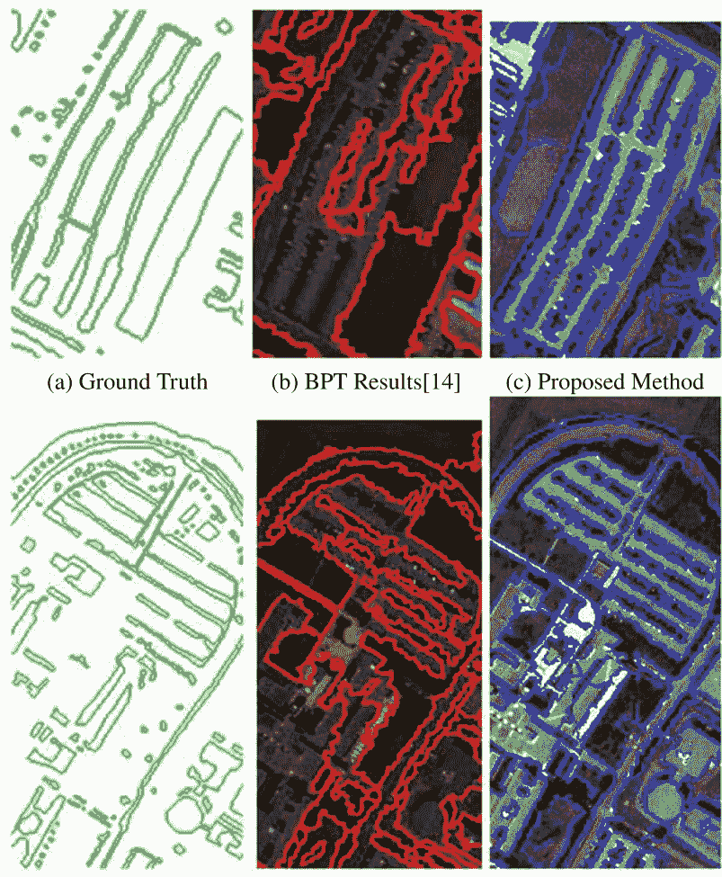

图 4.7 图 4.6 中分割结果的放大部分。下中部和左中部进行放大以进行比较。与现有方法相比，所提出的方法在这些区域中表现出色，并且对小区域进行了分割。

概率兰德指数 (RI)：它计算地面真实值和分割结果之间标签一致的像素对的比例 [15]。

信息变差度量 (VOI)：它描述了两个分割之间的距离，即给定另一个分割的条件熵的平均值 [16]，在我们的情况下是地面真实值。它计算了分割中无法通过其他方式解释的随机性的量。这两个评估标准必须一起测量，因为它们相互补充；RI 应该有一个较高的值，同时 VoI 应该有一个较小的值。

评估指标的输入是分割图像的选定类别。图 4.6 和真实情况。图 4.7 显示了结果指标，清楚地显示了所提出方法的准确性。

## 通过分割方法对提出的高光谱图像空间特征提取的总结

在本书的这一部分，设计了一个新颖的框架，并进行了详细讨论。

该开发的框架可以在不需要先验标记的训练样本的情况下，即无监督分割，对高光谱图像进行分割。它基于一种灵活的基于边缘移动的算法，利用所有可用的光谱通道的全部信息。该方法利用场景中可用的光谱和空间形态获得了充分的信息。根据三因子权重准则，提取了各个通道内的信息分布。这些准则根据边界的变化测量得出。通过将高光谱场景分割成多个通道组，根据每个通道中存在的信息，灵活调整场景分割过程。提供的框架以相互连接的方式讨论了 HSI 分割的重要问题，即结合了加权边缘移动框架的特点。

该开发的方法已在具有挑战性的 AVIRIS 和 ROSIS HSI 上进行了测试，代表了自然景观和城市场景的两个视角。两者都具有独特的光谱波段和空间分辨率。通常，场景的后续分割区域对于后续的调查和应用至关重要和关键。

四个设计的合并结果准则在最终确定分割结果并为最终分割结果提供最后的重要触感方面起着非常重要的作用。更具体地说，首先根据不同的光谱和空间信息从每个不同的通道组中使用三因子权重准则提取边缘信息，然后将这些信息从开发的 4 个合并准则的结果中整合到一个非常强大的边界中，该边界与实际对象边界非常匹配。此外，值得一提的是，即使在嘈杂的场景和高强度场景中，开发的方法也能很好地工作。

### 参考文献

- 1. Ghamisi P, Dalla Mura M, Benediktsson JA (2015) 基于属性概况的光谱 - 空间分类技术综述。IEEE Trans Geosci Remote Sens 53(5):2335-2352
- 2. Dópido I, Villa A, Plaza A, Gamba P (2012) 基于解混合的特征提取技术对高光谱图像分类的定量和比较评估。IEEE J Sel Top Appl Earth Obs Remote Sens 5(2):421-435
- 3. Guo B, Gunn SR, Damper RI, Nelson JD (2008) 为基于 SVM 的高光谱图像分类定制核函数。IEEE 图像处理期刊 17(4):622-629
- 4. Plaza A, Benediktsson JA, Boardman JW, Brazile J, Bruzzone L, Camps-Valls G, Chanussot J, Fauvel M, Gamba P, Gualtieri A 等 (2009) 高光谱图像处理技术的最新进展。遥感环境 113:S110-S122
- 5. Massoudifar P, Rangarajan A, Gader P (2014) 用于高光谱图像的超像素估计。在：2014 年 IEEE 计算机视觉和模式识别研讨会 (CVPRW). IEEE, 第 287-292 页
- 6. Serpico SB, Moser G (2007) 从高光谱图像中提取光谱通道用于分类目的。IEEE 地球科学遥感期刊 45(2):484-495
- 7. Tarabalka Y, Chanussot J, Benediktsson JA (2010) 使用分水岭变换对高光谱图像进行分割和分类。Pattern Recognit 43(7):2367-2379
- 8. Bernard K, Tarabalka Y, Angulo J, Chanussot J, Benediktsson JA (2012) 基于随机最小生成树方法的高光谱数据的光谱 - 空间分类。IEEE Trans Image Process 21(4):2008-2021
- 9. Tarabalka Y, Chanussot J, Benediktsson JA (2010) 使用从自动选择的标记点生长的最小生成树对高光谱图像进行分割和分类。IEEE Trans Syst Man Cybern Part B (Cybern) 40(5):1267-1279
- 10. Tarabalka Y, Tilton JC, Benediktsson JA, Chanussot J (2012) 一种基于标记点的方法，用于从分层图像分割集合中自动选择单个分割。IEEE J Sel Top Appl Earth Obs Remote Sens 5(1):262-272
- 11. Lloyd S (1982) 最小二乘量化在 PCM 中的应用。IEEE Trans Inf Theory 28(2):129-137
- 12. Vincent P, Larochelle H, Lajoie I, Bengio Y, Manzagol P-A (2010) 堆叠去噪自编码器：在具有局部去噪准则的深度网络中学习有用的表示。JMach Learn Res 11(Dec):3371-3408
- 13. Wang J, Wang X (2012) VCells：使用边缘加权重心泰森多边形进行简单高效的超像素分割。IEEE Trans Pattern Anal Mach Intell 34(6):1241-1247
- 14. Veganzones MA, Tochon G, Dalla-Mura M, Plaza AJ, Chanussot J (2014) 使用基于光谱解混的二叉分区树表示的高光谱图像分割。IEEE Trans Image Process 23(8):3574-3589
- 15. 杜 Q, 福勒 JE, 朱 W (2009 年) 大气校正对多光谱和高光谱图像有损压缩的影响。IEEE Trans Geosci Remote Sens 47 (1): 130-132
- 16. Meil`a M (2005 年) 比较聚类：公理观点。在：第 22 届国际机器学习大会论文集。ACM, pp 577-584

# 第 5 章 整合光谱 - 空间信息 基于深度学习的 HSI 分类


本章详细介绍了基于深度学习 (DL) 的高光谱图像分类技术的分析和开发。这是我们开发的框架中的第三阶段，如图 5.1 所示。每个阶段的完整解释在第 1 章，图 1.3 中有说明。在这个阶段，为 HSI 分类开发了三种不同的基于 DL 的算法。提出的基于 DL 的方法包括两个关键技术：首先，通过超分割提取空间特征，这是论文第二阶段开发的，其中可以根据实际对象级空间区域修改分割区域的维度和轮廓，并且还包括不仅在空间上连接而且具有相似光谱特征的像素，其次，通过利用基于 DL 架构的决策融合方法进行对象级分类。研究了三种不同的 DL 架构堆叠自动编码器，深度置信网络和 PCANet，并将算法的性能与现有的 HSI 分类技术进行了评估和比较。

如在第 1 章和第 2 章中详细讨论的那样，通过遥感技术的快速发展，操作和精确的高光谱图像 (HSI) 分析变得非常重要。更先进的遥感技术具有获取有用地表数据的能力，不仅包括数百个光谱波段，还具备了全面的空间分辨率。这些丰富的有趣光谱和空间数据可以实现对场景的精确分类和分析 [1]。此外，现代和最新的遥感传感器具备获取巨大空间分辨率的能力 [2]。这使得在 HSI 中可以识别小的空间区域和隐藏的物体成为可能。

上述发展使得 HSI 在监视 [3]、农业 [4]、矿物学 [5]、天文学 [6] 和环境科学 [7,8] 等许多领域中变得有效。然而，丰富的空间和光谱信息带来了实际和理论上的挑战，如维度灾难 [9]、休斯现象 [10]、有限的训练样本、复杂的统计特性和高计算问题。

## 5 将光谱 - 空间信息集成到深度学习中...

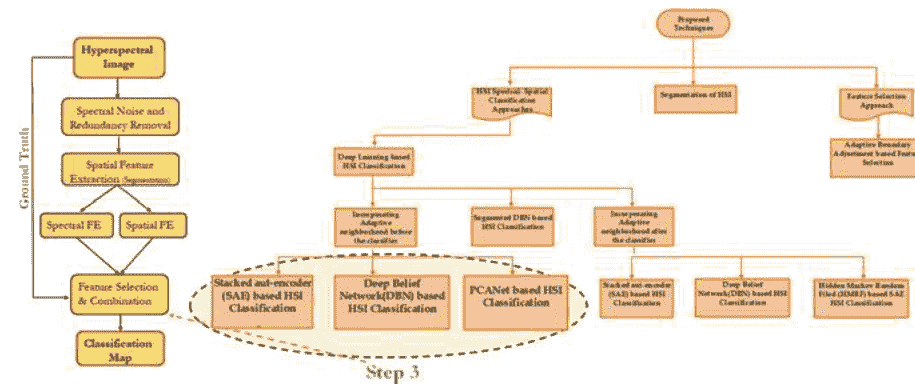

图 5.1 第三阶段与框架对齐，用于高光谱遥感图像的分类

为了解决维度问题，现有的 HSI 分类方法主要通过波段选择 (FS) 和/或波段提取 (FE) 来将指定的分类器作为输入 [11] 进行分类任务。在这两种特征选择/提取方法中，特征选择技术涉及根据一些预定义的标准选择最佳的通道子类，而特征提取方法将众多光谱通道转换为较少的维度，主要是 3 个通道。著名的分类器之一，支持向量机 (SVM) 在具有少量训练数据的 HSI 上给出了显著的分类结果 [11, 12]。主要基于特征提取/降维过程的技术，如主成分分析 (PCA) 和独立成分分析 (ICA)，最终会丢失宝贵的数据，这极大地损害了后续的分类结果。此外，这些 FE 方法也会丢失涉及局部对象边界的空间特征。

近年来，高光谱图像分析师和科学家已经认识到并赞赏将空间结构特征与光谱信息相结合，用于高光谱图像场景的有希望的分析和分类 [13, 14] 的重要性和关键作用。这是因为新近开发的遥感传感器不仅可以提供丰富的光谱数据，还可以捕捉到显著的空间结构。空间信息与光谱信息一样重要，因为在改进性能和准确性方面，空间 - 光谱分类具有显著优势 [8]。在这方面，研究人员提出了一些技术。第一组分类方法在进行分类之前探索空间 - 光谱信息。例如，使用复合核方法 [15-17]，特征向量 [18] 和基于形态学滤波器的特征提取 [19-22]。然而，所有这些空间特征都需要人类知识。一些高光谱图像分类方法在分类过程中将空间信息纳入分类器中。同样，一些分类技术试图包含空间 (例如 [23]) 对分类后的信息进行处理。

尽管上述技术提供了有希望的分类结果，但在遥感领域中，空间上下文部分的分析还不够充分，因为批准的空间区域的轮廓和大小不够灵活。例如，在 HSI 的空间均匀区域中，应选择较大的区域尺寸，而在异质区域中则需要较小的区域尺寸。因此，结构的框架应该根据 HSI 中的实际对象区域进行更改，如图 5.2 所示。近年来，深度学习在图像分类 [24, 25]、目标检测 [25, 26]、语言处理 [27] 和语音识别 [28] 等领域取得了成功。深度学习也已经在 HSI 分类 [2, 29] 中得到了应用。然而，深度学习中的固定大小扫描窗口是其中的一个主要限制，因为扫描窗口的大小是固定的，没有任何先验的光谱空间知识，因此它可能在窗口内具有多个类别或单个类别的子集，如图 5.2 所示。这最终导致了更复杂的问题，并影响了分类性能。此外，与典型的 RGB 图像不同，HSI 中可用的训练样本数量也是有限的，因此无法获得大量标记的训练数据。在现代，已经推荐了一些用于 HSI 处理的深度结构 [30]。基于深度学习的堆叠自编码器 (SAE) 已在 [29] 中实现。随后，在 [31] 中提出了改进版本。

此外，深度置信网络 (DBN) 也在 [32] 中提出。这些技术已被证明在提取稳健特征方面非常有用。然而，这些先前提到的模型存在一定的局限性：

- 在学习过程中，扫描窗口的大小是固定的，没有任何先验知识。因此，扫描窗口的大小可能包含多个类别或同一类别的一个子组。
- 由于固定的空间窗口大小，DL 架构无法提取 HSI 中的空间特征，因为静态大小的窗口不考虑任何空间信息。
- 使用传统的窗口扫描技术将每个目标像素作为 DL 与 HSI 数据的输入非常复杂，因为存在数百个光谱通道。
- 由于 DL 架构中不同层之间的完全连接，它们需要大量的采样训练标签来训练多个约束条件，这是 HSI 中的一个关键问题。

在本书的这个阶段，我们提出了三种基于空间自适应超分割的深度学习架构，以有效利用空间上下文数据，其中传统的逐像素扫描窗口被结构/体素信息所取代。本书的这一部分开发了基于三种深度学习架构的方法，即基于空间自适应超分割的 SAE（SAHS-SAE）模型，深度置信网络和 PCANet。在现有的训练标记数据不足时，所提出的方法利用了详细的可用光谱通道。场景的每个分割区域 [33] 可以被看作是一个有限的空间结构，其维度和形状可以灵活地适应各种对象结构。所提出的方法首先采用了一种高效的超分割方法 [33]，该方法在前一章中设计，将遥感场景分割成各种空间相关的结构。以前，预期每个分割区域中的像素也具有相同的光谱特征，并且它们的相关性通过上述 DL 架构 [29] 进行利用，其中像素扫描窗口被自适应的空间分割区域所取代。由于分割区域的大小不同，但 DL 采用固定大小作为输入，因此只选择最佳分割大小，并相应地调整每个分割区域的大小。所提出的技术分别利用多层 DL 架构来确定 HSI 的抽象表示。

此外，提出了一种整合光谱和空间特征的新方法。

本论文阶段的主要贡献可以总结如下：

- 传统的像素级扫描窗口在深度学习中被对象级特征取代，大大降低了复杂性，并提高了分类准确性。
- 通过自适应边界调整来利用空间特征，其中固定大小的窗口被自适应超段取代，根据 HSI 中的空间结构灵活地变化大小和形状，从而最大化不同类别之间的特征差异，并在类别内部最小化。

本工作的主要贡献在于如何捕捉和利用空间特征，并将光谱深度特征与 HSI 分类相结合。在这个方向上的剩余工作如下所示。在第二节中，带选择和分割预处理步骤被简要总结，因为这两个步骤已经在前几章中详细讨论过。下一节描述了设计的基于 SAE 的 HSI 分类框架。第 5.3 节介绍了 DBN，而第 5.4 节描述了基于 PCANet 的 HSI 分类。每个部分都包括三个真实且多样的高光谱数据集的实验结果，并与现有的最先进的分类技术进行比较，详细讨论参数，并在最后进行总结。

### 5.1 预处理

#### 5.1.1 波段选择

高光谱图像包含数百个光谱波段。然而，这些波段也包括大量冗余和噪声波段，这些波段可能会传播不利的统计和几何特征，从而导致高光谱图像分类的低效和不便。波段选择（BS）技术，如 $A^3BC$ [34]，可以在不损失原始内容的情况下，基于自适应边界调整的分组波段分类框架有效地选择最具有区分性和信息性的光谱波段子集。基于线性投影的主成分分析（PCA）会导致重要的空间和结构信息的丢失，从而影响分类准确性。之前的研究中，对 PCA 和基于波段选择的高光谱图像分类技术进行了调查 [35, 36]。结果证明，基于波段选择的技术优于 PCA，因为空间结构信息往往存在于较低的成分中，而不是主要成分中。因此，本方法使用了波段选择技术（即 $A^3BC$）。

$A^3BC$ 如在第 3 章中所示，是一种基于三因子权重模型的高效 BS 方法，该方法根据边缘的移动/调整测量来提取最具特色和信息量的波段。首先，HSI 被划分为 $R$ 个聚类集合，即 $C = (C_1, ..., C_R)$。计算聚类大小 $W_{size}$，聚类移动 $W_{shift}$ 和聚类光谱 - 空间上下文（SSC） $W_{ssc}$ 因子。

然后评估最终的波段选择因子

$$ W = W_{size} \times W_{shift} \times W_{ssc} \tag{5.1} $$

更详细的实现可以在第 3 章中找到。

#### 5.1.2 基于超分割的空间特征提取

为了有效地分割 HSI 中的空间相似结构，我们使用基于边界移动/调整的技术对 HSI 进行分割，该技术在我们之前的章节中提出，使用局部结构规律和自相似性对区域进行分割。每个区域的大小和形状根据三因子准则自适应变化。详细的分割过程如下所示：

1. 将初始高光谱 M 通道图像分成 N 个通道组。
2. 对于每组通道，执行以下步骤：
    - a. 将每个通道组分成 m 个初步的六边形结构/聚类。
    - b. 重复以下步骤，直到不再可能进一步演化，即没有像素进入不同的分段。
    - c. 计算每个初步分割/聚类的主要类别。
    - d. 计算每个分割/聚类的现有边缘像素的梯度。
    - e. 计算每个聚类边缘的直线度标准。
    - f. 根据计算结果，计算相似度度量，即每个类别质心与其边缘部分之间的引力/排斥力。
    - g. 基于相似度度量，发展边缘。
3. 对于每个波段组，根据预定义的标准为每个边缘像素分配权重，以获得真实的对象边界。
4. 合并 N 通道以获得加权分割的 HSI。

在之前的工作 [29] 中，作者利用空间信息来增强性能。然而，由于空间窗口的大小和形状是静态的，空间信息仍然可能没有得到适当的利用。例如，如果选择目标像素的窗口大小过大（图 5.2a 中的红色区域），可能会包含一些不相关的像素，从而导致分类性能下降。相反，平滑区域中窗口大小太小（图 5.2a 中的绿色区域）会导致对空间信息的利用不足。另一方面，每个超分割区域直观上是一个规则的区域，其形状和大小可以根据不同的空间结构自适应变化，如图 5.2b 所示。

### 5.2 基于 SAE 的自适应形状深度学习用于高光谱图像分类

在本章的这一部分，我们的重点是通过自适应边界分割来利用上下文特征，以增强 SAE 过程，其中像素级扫描窗口被对象级段作为 SAE 的输入替代。由于段的大小不同，但 SAE 采用固定大小作为输入，因此只选择最佳段大小，并相应地调整每个段的大小。框架的一般流程图如图 5.3 所示，包括三个主要阶段：首先，基于边界调整的波段选择方法用于选择最具区分性和信息性的波段。其次，采用自适应边界移动的分割方法将场景划分为空间相似的区域。

第三，所得到的分割边界被用作计算基于 SAE 的浅层和深层特征的自适应窗口。接下来，学习到的光谱空间特征被输入到多项式逻辑回归（MLR）进行分类。本节的其余部分详细描述了每个组件。

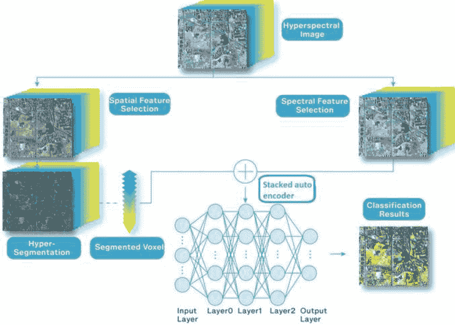

**图 5.3** SAHS-SAE 分类的框架

#### 5.2.1 特征提取

在这部分中，我们将更深入地了解自动编码器的工作原理，这将帮助您建立对该主题的坚实基础知识，所以让我们继续前进并看看它。自动编码器设计的一个主要目标是对数据进行压缩。数据压缩是我们都知道的一个重要主题。

自动编码器是一种无监督的深度学习架构，它通过压缩对其接收到的表示进行再生。自动编码器的目的是为给定的输入获取一个压缩的分布式表示，通常用于降维和特征提取的目的。

然而，当我们有 PCA 用于降维时，为什么还需要自动编码器呢？与 PCA 相反，自动编码器可以通过多个神经网络层的非线性函数学习非线性变换。它通过卷积层执行学习过程。卷积层被认为对图像、视频和时间序列数据有益。

使用卷积层学习多个参数更加有效和高效。自动编码器（AE）在确定高维表示的深层和变体特征方面起着非常重要的作用，而不需要训练样本 [25]。特别地，原始的高维数据被输入到自动编码器的第一个卷积层中，该层通过编码器函数将输入数据 x 转换为新的编码表示。这个新的转换后的第一层可以被看作是一个新的编码表示。

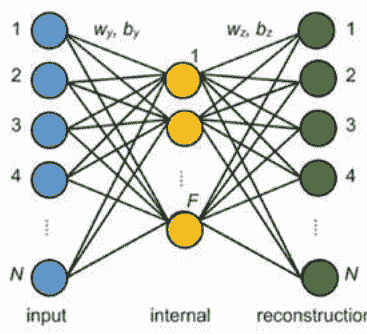

(a) 基本自编码器

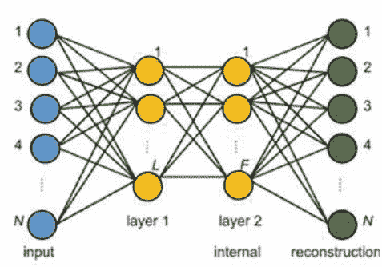

(b) 堆叠自编码器

**图 5.4** 通用 SAE 模型。它从输入数据中学习隐藏特征。

数据表示。然后，第二个隐藏层使用解码器函数将这个编码表示重新生成或重构为输入表示的近似，如图 5.4 所示。对于编码器和解码器的转换，非线性 sigmoid 函数是最常用的函数之一。这两个编码器和解码器的表示可以用数学形式定义为

```
$$ a = f(w_a x + b_a), b = f(w_b y + b_b) $$
```

其中 a 是通过输入数据 x 通过权重 $w_a$ 和偏置 $b_a$ 计算得出的。目标是通过计算改进的参数数量来训练自动编码器，以使 x 和 z 之间的误差最小化。

```
$$ \arg \operatorname*{min}_{w_a, w_b} [error(x, z)] $$
```

堆叠自动编码器（SAE）是自动编码器过程的扩展。AEs 一个接一个地连接起来，形成 SAE。SAE 已经成为一种有效提取深层特征的主要工具之一 [29]。用于 SAE 的成本函数之一是交叉熵 [29]。与 SAE 结合使用的 S 型激活函数如下所示

```
$$ c = - \frac{1}{p} \sum_{a=1}^{p} \sum_{q=1}^{d} [x_{aq} \log(z_{aq}) + (1 - x_{aq}) \log(1 - z_{aq})] $$
$$
```

其中 d 和 p 表示向量大小和小批量大小。采用小批量随机梯度下降法来优化这个方程 [29]。设 (X, Y) 表示训练集，其中 $x^n$ 是对应于 $y^n$ 的标签。完整的过程可以概括如下：

1. 每个训练样本 $x^n$ 通过编码器进行编码 $z^n=f(x^n)$，其中 $f(.)$ 是编码函数。
2. 将 $z^n$ 解码为重构结果 $h^n=g(z^n)$，其中 $g(.)$ 是解码函数。
3. 通过减小重构结果与输入之间的误差来优化编码和解码函数的参数，涵盖整个训练集。

为了监测从 SAE 隐藏层学习到的光谱 - 空间特征在不同类别中的表现，我们将 MLR 作为输出层添加进去。

#### 5.2.2 实验结果和性能比较

本节评估了设计技术在不同传感器捕获的真实航空 HSI 数据集上的成果。所提出的方法应用于包含城市和自然结构的多样化和复杂的数据集。我们使用了来自两个不同传感器的三个数据集。它们分别是 Indian Pine、Pavia University 和 Salinas Valley。每个数据集的详细规格在第 2 章第 2.3 节中描述。

##### 5.2.2.1 参数设置

基于超分割的堆叠自动编码器 SAHS-SAE 方法的性能与众所周知且广泛使用的 HSI 分类技术进行了比较。这些方法包括带有逻辑回归的堆叠自动编码器 (SAE-LR) [29]、增广拉格朗日多级逻辑 (LORSAL-MLL) [37]、带有 RBF 核的 SVM (SVM-RBF)、同时正交匹配追踪 (SOMP) [38]、(MPM-LBP) [39] 和 CNN [40]。对于每个图像，我们将可用的样本数据按 1:9 的比例划分为训练和测试数据。即 10% 作为训练数据，90% 作为测试数据。训练和测试样本分别显示在相应的表格中。本文使用了三个广泛使用的 HSI 分类测量矩阵来分析所有分类技术的性能。总体准确率 (Overall accuracy, OA) 表示在测试数据上被正确分类的数据。

平均准确率（AA）是指每个类别准确率的平均值。Kappa 系数是地面真实值和最终分类地图之间一致性程度的稳健度量。对每个测量矩阵的详细讨论在第 2 章第 2.3 节中介绍。

**表 5.1** 用于高光谱图像的参数

| 数据集 | 参数 | 值 |
| :--- | :--- | :--- |
| 印度松树 | 隐藏层数量 | 2 |
| | 输入层单元数量 | 选择的 HSI 波段数量 |
| | 隐藏层 0 的单元数量 | 180 |
| | 隐藏层 1 的单元数量 | 100 |
| | 输出层单元数量 | 16 |
| Pavia 大学 | 隐藏层数量 | 2 |
| | 输入层单元数量 | 选择的 HSI 波段数量 |
| | 隐藏层 0 的单元数量 | 180 |
| | 隐藏层 1 的单元数量 | 100 |
| | 输出层单元数量 | 9 |
| 萨利纳斯 | 隐藏层数量 | 2 |
| | 输入层单元数量 | 选择的 HSI 波段数量 |
| | 隐藏层 0 的单元数量 | 200 |
| | 隐藏层 1 的单元数量 | 120 |
| | 输出层单元数量 | 16 |


**图 5.5** 印度松树、Pavia 大学和 Salinas 数据集的分类结果及其 OA 曲线

##### 5.2.2.2 具有光谱 - 空间特征的分类

我们首先提取光谱和空间特征，然后使用 MLR 进行分类，以发掘所提方法的潜力。在每个数据集上运行多次实验后使用的参数在表 5.1 中描述。印度松树数据集在低空间分辨率下的分类具有较高的复杂性。结果证实，基于空间学习的特征表示具有很大的影响，因为空间/结构特征可以有效地防止盐和胡椒噪声，并为特征学习算法提供更强的区分能力，以有效地对像素进行分类。图 5.6 显示了可视化的分类结果。可以观察到，其他考虑固定大小窗口的空间信息的技术在地图中产生噪声估计。这些方法也不会产生在详细和近边缘区域中，存在分类不准确的问题。

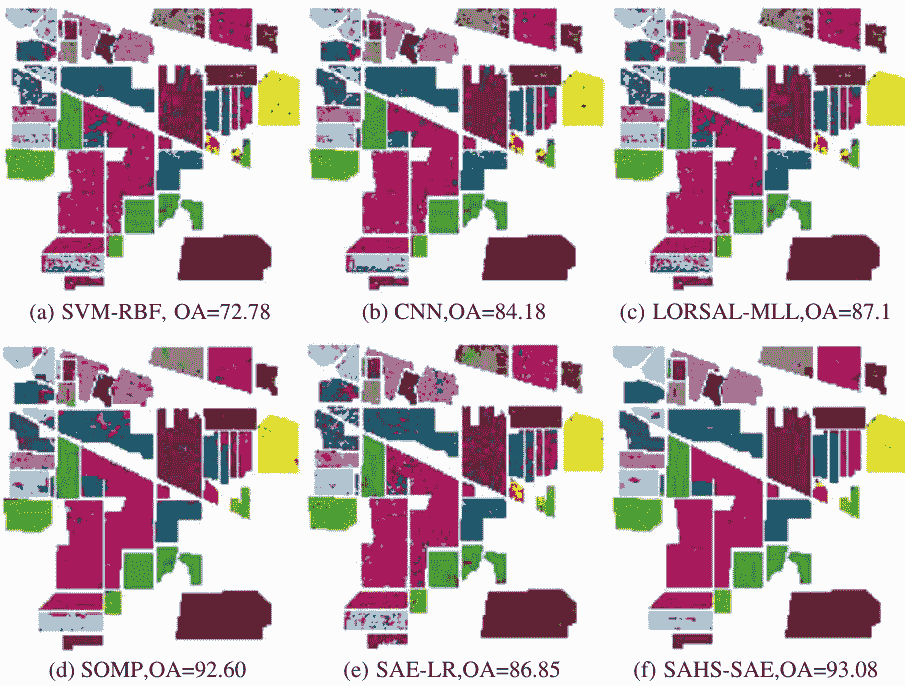

**图 5.6** 使用 10% 的训练样本对印度松树数据集进行分类结果及相应的 OA

另一方面，提出的 SAHS-SAE 方法不仅在详细区域提供准确的估计，而且具有更平滑的外观。表 5.2 显示了使用不同已知技术评估的所提出技术的定量结果。

从表中可以看出，设计的技术在这个具有挑战性的数据集上表现最好，具有 OA、AA 和 Kappa。我们还进行了实验来评估每个类别的训练数据数量的响应。在保持所有其他参数不变的情况下，我们将每个类别的标记数据数量从 10% 更改为 30%。图 5.5 显示了所有方法的准确性，其中 OA 根据不同的训练样本百分比绘制。可以注意到，随着训练样本的增加，准确性也增加。但是在 10% 的训练样本后，OA 趋于稳定。所提出的技术明显优于所有其他方法，更重要的是，即使使用较少的训练数据，它的性能也更好。

第二个实验在 Pavia 大学场景上实施，该场景包含多个不同大小的结构。每个类别的分类结果在表 5.3 中呈现，而视觉结果在图 5.7 中呈现。可以观察到，所提出的技术在视觉和数量上都优于其他现有技术。

Salinas 数据集相对而言包含较大的空间结构。Salinas 数据集的实验结果以及与现有技术的比较

**表 5.2** 印度松树数据集分类结果

| 类别 | 训练 | 测试 | SVM-RBF | CNN | LORSAL-MLL | SOMP | SAE-LR | SAHS-SAE |
| :--- | :--- | :--- | :--- | :--- | :--- | :--- | :--- | :--- |
| 1 | 5 | 49 | 60.77 | 56.79 | **100.0** | **100.0** | 93.33 | 98.81 |
| 2 | 143 | 1291 | 77.68 | 52.17 | 87.46 | 95.05 | 84.66 | **95.42** |
| 3 | 83 | 751 | 79.35 | 85.33 | 81.23 | 96.24 | 84.39 | **96.70** |
| 4 | 23 | 211 | 91.05 | 87.92 | 88.41 | 97.93 | 73.08 | **98.05** |
| 5 | 50 | 447 | 84.36 | 85.22 | 97.49 | **98.68** | 93.47 | 95.54 |
| 6 | 75 | 672 | 92.03 | 97.49 | 97.34 | 98.36 | 93.41 | **98.61** |
| 7 | 3 | 23 | 69.61 | 74.62 | **100.0** | **100.0** | **100.0** | **100.0** |
| 8 | 49 | 440 | 59.31 | 67.99 | 97.98 | **100.0** | 95.11 | **100.0** |
| 9 | 2 | 18 | 79.61 | 58.87 | **100.0** | **100.0** | **100.0** | **100.0** |
| 10 | 97 | 871 | 97.53 | 98.77 | 83.64 | 95.44 | 85.78 | **95.73** |
| 11 | 247 | 2221 | 85.21 | 87.62 | 86.31 | 91.80 | 83.46 | **92.11** |
| 12 | 61 | 553 | 63.64 | 72.42 | 91.79 | 91.71 | 81.62 | **92.27** |
| 13 | 21 | 191 | **100.0** | 93.33 | **100.0** | **100.0** | 98.52 | **100.0** |
| 14 | 129 | 1165 | 87.18 | 71.79 | 97.04 | **98.0** | 91.77 | 95.45 |
| 15 | 38 | 342 | 90.19 | 90.91 | 86.18 | 96.07 | 81.79 | **96.95** |
| 16 | 10 | 85 | **100.0** | **100.0** | **100.0** | **100.0** | 98.88 | **100.0** |
| **总体准确率** | | | 72.78 | 84.18 | 87.18 | 92.60 | 86.85 | **93.08** |
| **平均准确率** | | | 82.39 | 80.08 | 90.83 | 94.14 | 89.95 | **95.09** |
| ***Kappa*** 系数 | | | 0.6931 | 0.6852 | 0.8536 | 0.9155 | 0.8495 | **0.9275** |

**表 5.3** Pavia 大学数据集分类结果

| 类别 | 训练 | 测试 | SVM-RBF | CNN | LORSAL-MLL | SOMP | SAE-LR | SAHS-SAE |
| :--- | :--- | :--- | :--- | :--- | :--- | :--- | :--- | :--- |
| 1 | 597 | 6034 | 84.01 | 85.62 | **100.0** | **100.0** | 96.88 | 98.78 |
| 2 | 1081 | 16971 | 88.90 | 88.95 | 98.50 | 97.21 | 98.30 | **99.01** |
| 3 | 189 | 1910 | 87.57 | 80.15 | **96.27** | 92.47 | 91.09 | 94.50 |
| 4 | 276 | 2788 | 96.09 | 96.93 | 91.03 | 74.39 | 99.15 | **99.40** |
| 5 | 121 | 1224 | 99.91 | 99.30 | 98.45 | 93.36 | 99.85 | **99.89** |
| 6 | 453 | 4576 | 93.33 | 84.30 | 97.24 | **99.54** | 96.44 | 97.30 |
| 7 | 120 | 1210 | 93.98 | 92.39 | **97.94** | 96.76 | 94.12 | 96.96 |
| 8 | 331 | 3351 | 82.94 | 80.73 | **99.94** | 99.58 | 93.27 | 97.14 |
| 9 | 85 | 862 | 99.60 | 99.20 | **100.0** | **100.0** | **100.0** | **100.0** |
| **总体准确率** | | | 89.24 | 87.90 | 98.95 | 97.84 | 97.12 | **98.98** |
| **平均准确率** | | | 91.82 | 89.73 | 97.28 | 93.96 | 96.56 | **97.46** |
| ***Kappa*** 系数 | | | 0.8901 | 0.8720 | 0.9819 | 0.9628 | 0.9615 | **0.9875** |

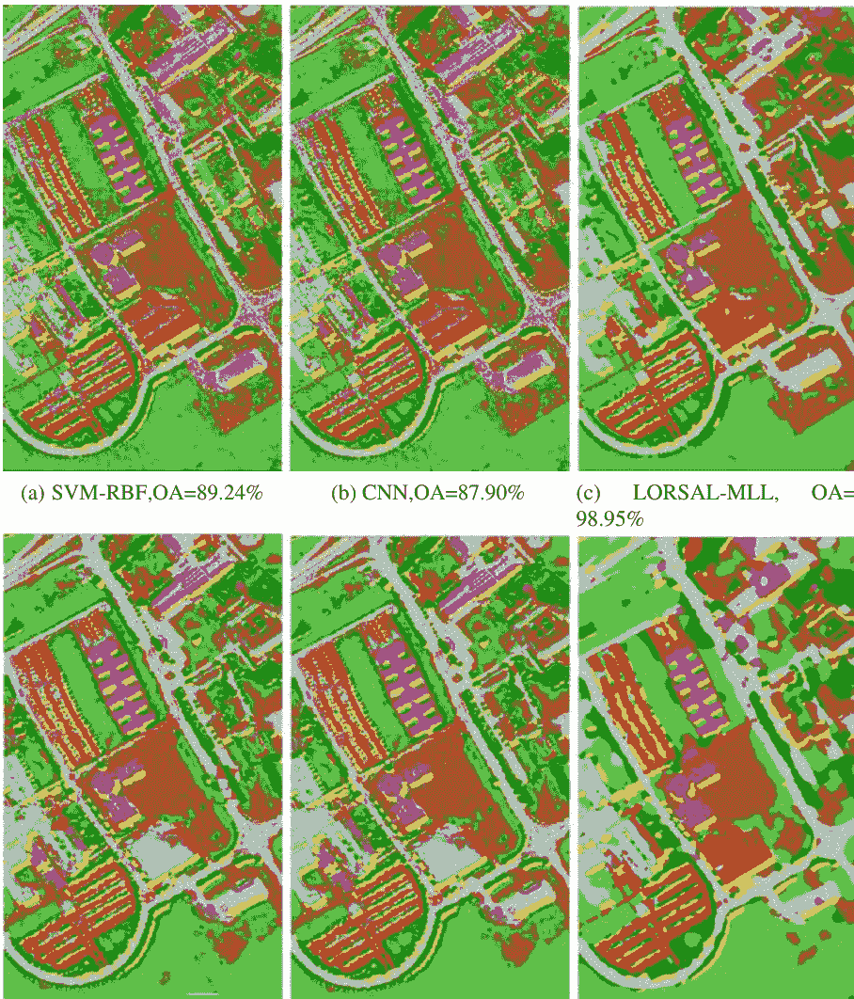

**图 5.7** Pavia 大学数据集的分类结果及相应的 OA，使用 10% 的训练样本

表 5.4 中给出了所提出技术在每个 16 个类别上的性能，包括 OA，AA，Kappa 以及各种现有技术的描述。图 5.8 中呈现了分类地图。从这些结果可以看出，所提出的技术明显优于现有技术。

对这些不同的数据集进行的实验表明，将空间信息纳入其中，并用分割的空间体素替代固定窗口在 SAE 的分类性能方面有很大的改进。每个之间和内部的相关性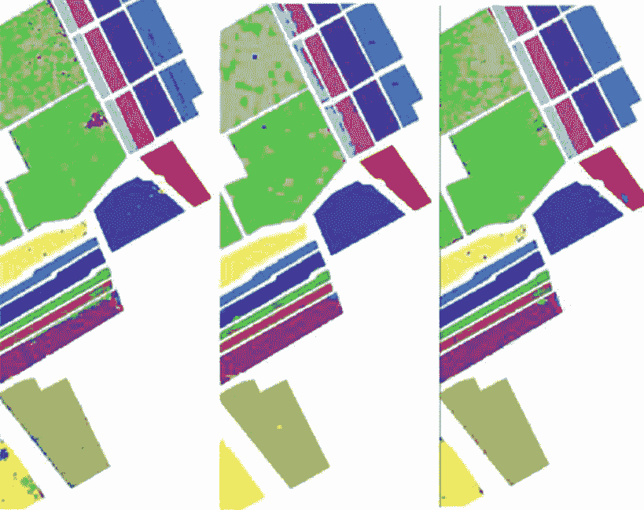

(a) SVM-RBF, OA=81.55%
(b) CNN, OA=90.25%
(c) LORSAL-MLL, OA=91.56%

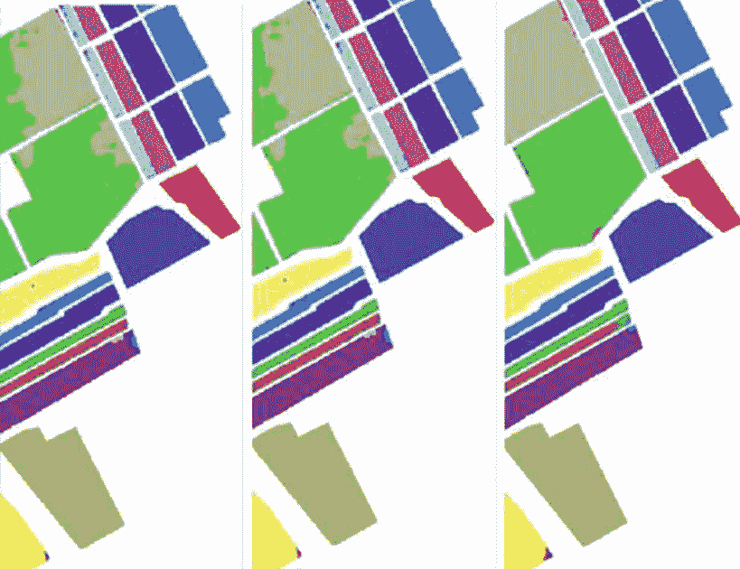

(d) SOMP, OA=92.0%
(e) SAE-LR, OA=95.12%
(f) SAHS-SAE, OA=96.08%

图 5.8 Salinas 数据集使用 10% 的训练样本的分类结果及其相应的 OA

表 5.4 通过 SVM-RBF [41], CNN [40], LORSAL-MLL [37], SOMP [38], SAE-LR [29] 和提出的 SAHS-SAE 获得的 Salinas 数据集每个类别的分类准确率

| 类别 | 训练 | 测试 | SVM-RBF | CNN | LORSAL-MLL | SOMP | SAE-LR | SAHS-SAE |
|---|---|---|---|---|---|---|---|---|
| 1 | 20 | 1989 | 96.81 | 98.37 | **100.0** | 99.90 | **100.0** | **100.0** |
| 2 | 37 | 3689 | 94.67 | 99.12 | 99.65 | **99.97** | 99.38 | 99.42 |
| 3 | 20 | 1956 | 90.27 | 96.08 | 95.56 | 92.77 | 92.61 | **94.70** |
| 4 | 14 | 1380 | 98.61 | 99.71 | 98.08 | 95.76 | 98.79 | **98.95** |
| 5 | 27 | 1651 | 94.82 | 97.04 | 96.82 | 99.49 | 97.86 | **99.54** |
| 6 | 40 | 3919 | 97.61 | 99.59 | **100.0** | 99.32 | 99.87 | 99.91 |
| 7 | 36 | 3543 | 99.24 | 99.33 | 99.94 | **100.0** | **99.38** | **100.0** |
| 8 | 113 | 11158 | 54.69 | 78.64 | **80.10** | 86.61 | 83.32 | **94.01** |
| 9 | 62 | 6141 | 98.32 | 98.04 | 98.94 | 98.81 | 99.37 | **99.41** |
| 10 | 33 | 3245 | 81.91 | 92.38 | 94.54 | 95.21 | 96.07 | **97.73** |
| 11 | 11 | 1057 | 90.57 | 99.14 | 89.83 | **97.53** | 95.86 | 96.11 |
| 12 | 19 | 1908 | 92.43 | 99.88 | 95.11 | 99.95 | 99.48 | **99.57** |
| 13 | 9 | 907 | 98.07 | 97.84 | 95.30 | 97.73 | 94.84 | **97.87** |
| 14 | 11 | 1059 | 90.39 | 96.17 | 96.45 | 95.0 | 98.37 | **98.45** |
| 15 | 73 | 7195 | 60.06 | 72.69 | 78.28 | 71.31 | 78.34 | **92.95** |
| 16 | 18 | 1789 | 90.87 | 98.59 | 99.20 | **99.94** | 97.85 | 99.05 |
| **总体准确率** | | | 81.55 | 90.25 | 91.56 | 92.0 | 95.12 | **96.08** |
| **平均准确率** | | | 89.33 | 95.19 | 94.86 | 95.58 | 96.94 | **97.92** |
| *Kappa 系数* | | | 0.8015 | 0.8995 | 0.9058 | 0.9456 | 0.9715 | **0.9875** |

利用空间分割的体素进行特征提取，极大地提高了 SAE 的性能。

#### 5.2.3 提出的光谱 - 空间信息方法的总结，用于基于深度学习的 HSI 分类

我们通过分析最先进的 SAE 模型并解决其问题，提出了一种 SAHS-SAE 技术。尽管 SAE 具有出色的学习能力，但逐像素扫描窗口可能限制了其在遥感环境中的能力。因此，我们提出了 SAHS-SAE，这是一种两步方法，它将空间特征的影响整合起来，并用自适应空间结构窗口取代了固定的逐像素扫描窗口，从而能够充分利用 SAE 的能力。在这项研究中，提出了一种创新的 SAHS-SAE 技术，通过超分割 (HS) 利用空间上下文特征，并将其融入到多用于高光谱图像分析和分类的深度学习与以前基于 SAE 的特征提取方法不同，SAHS-SAE 方法为每个样本像素开发了一个自适应形状邻域结构区域，而不是使用固定大小的正方形窗口。结构区域的大小和形状可以根据实际的 HSI 空间结构进行灵活调整，从而实现对空间上下文的有效和自适应利用。SAHS-SAE 然后使用多层 SAE 来有效地利用分割区域内部和之间的基于 HS 的空间特征和选择的光谱特征。此外，在特征提取之前，采用了基于 A³BC 的特征选择方法，以实现高效的 HSI 分类。基于不同的 HSI 数据集，对三个 AVIRIS 和 ROSIS 传感器进行的实验结果表明，所提出的 SAHS-SAE 方法在具有小空间结构的图像中产生了更好的性能，并且在性能上优于已知和广泛使用的 HSI 分类方法。此外，作为强大的特征提取器之一，SAHS-SAE 在异质区域中表现出色，特别适用于复杂的城市场景。

我们未来的研究方向之一是开发一种更系统的方法，根据不同的结构信息自适应地选择超级分割数目。此外，将 SAHS-SAE 方法应用于其他 HSI 领域，如变化检测、噪声检测和目标识别，具有很强的动力。

### 5.3 基于 DBN 的形状自适应深度学习用于高光谱图像分类

在本章的这一部分，我们主要关注基于深度置信网络的 HSI 分类。正如之前讨论的那样，随着遥感传感器的发展，成功和准确的高光谱图像（HSI）研究已经产生了越来越重要的影响。这些传感器现在通过多个光谱通道和明确的空间数据获取有用的信息。如果有效利用丰富的光谱和空间数据，可以提高分类的准确性。

HSI 分类主要集中在特征选择（FS）或特征提取（FE）上，作为一种促进分类器 [3] 的方法。FS 包括选择适合的光谱组子集，而 FE 则将信息转换为降维空间 [2]。支持向量机（SVM）分类器在高维信息上表现良好，几乎不需要训练样本 [3,4]。通常，特征提取/降维方法，如主成分分析（PCA）和独立成分分析（ICA），会导致不可避免地丢失明确的信息，从而影响分类的准确性。

此外，这些传统的有限元程序可能导致局部结构信息的丢失。

### 5.4 基于超光谱分割的 DBN 用于 HSI 分类

#### 5.4.1 通过 DBN 提取空间分段的光谱 - 空间信息

深度置信网络可以从一种生成性的神经网络层面来观察。每个部分都包含受限玻尔兹曼机（RBM）。它包括一个数据输入层和一个隐藏层。隐藏层学习参数以表征检测到的信息之间的更高阶关系，如图 5.10 所示。两个 RBM 层通过权重参数 w 连接。RBM 与内部 - 内部层之间的输入 - 输入层连接无关。这个限制使内部单元之间相互独立。内部单元 h 和输入数据单元 v 的能量函数的综合表述如下 [32]：

$$F(y, z, \theta) = - \sum_{l=1}^{n} \frac{(y_l - b_l)^2}{2\sigma^2} - \sum_{k=1}^{m} a_k z_k - \sum_{l=1}^{n} \sum_{k=1}^{m} w_{lk} \frac{y_l}{\sigma_l} z_k \quad (5.5)$$

概率分布由以下给出


图 5.10 通用 DBN 模型

$$P(h_j|v; \theta) = g \left( \sum_{i=1}^{n} w_{ij}v_i + a_j \right) \eqno{(5.6)}$$

$$P(v_j|h; \theta) = N \left( \sum_{j=1}^{m} w_{ij}h_j\sigma_i^2 + b_i \right) \eqno{(5.7)}$$

N(.)RBMs 相互连接并以这样的方式进行训练，以获得优化的参数以创建 DBN。整个过程可以解释为以下步骤：

- 1. 给定数据用于训练 DBN 的每个层。为了训练特定层，使用对比散度（CD）[43]。
- 2. 将主层的产量作为第二个连续层的输入。以类似的方式训练下一层。
- 3. 根据需要对 1 和 2 进行多层重复。
- 4. 所有得到的参数都应该通过现有的训练数据进行微调。任何分类器都可以用于给定的问题。我们使用逻辑回归（LR）作为分类器。

总结起来，首先，我们使用超分割的空间区域以及经过 FS 处理的光谱信息作为输入。然后，应用 DBN 从输入中获取深层和独特的特征，最后，使用 LR 根据学习特征对像素进行分组和标记。

#### 5.4.2 实验结果和性能比较

为了验证所提出方法的表现，我们对三个著名且具有挑战性的真实高光谱数据集进行了分析，这些数据集是通过不同的方式获取的。

传感器。这些数据集在前几章中已经详细解释过。在这里，它们再次被准确描述。

##### 5.4.2.1 高光谱图像数据集

这三个数据集包括印度松树、帕维亚大学和休斯顿大学数据集。每个数据集的详细描述在第 2 章第 2.3 节中有说明。为了评估分组的准确性，我们在所有数据集中随机选择了一半的样本用于训练和测试目的。

##### 5.4.2.2 参数设置

我们在 Windows 7 系统上进行了测试，使用了一个 4.0 GHz 处理器和 NVIDIA GeForce GTX 970。Theano 被用作编码工具。我们选择了一个具有 2 层的深度网络用于印度松树和休斯顿大学数据集。我们使用深度为 4 的神经网络用于帕维亚大学数据集，因为许多研究人员都采用了相同的做法并获得了最佳结果 [32]。每个特定的内部层包含 30 个神经元用于印度松树数据集。而对于帕维亚大学数据集，每个内部层保持 50 个神经元。类似地，休斯顿大学数据集采用了 100 个神经元。正如许多研究人员在这个领域所指出的，内部神经元的数量比内部层数更重要，因为内部神经元在特征提取中起着更关键的作用。将所提出的技术的结果与著名的现有系统进行比较。

这些现有技术包括具有逻辑回归的深度置信网络 (DBN-LR) [32] 和增广拉格朗日—多级逻辑回归 (LORSAL-MLL)[37]。

##### 5.4.2.3 光谱 - 空间分类结果

我们利用 PCA 的初始 6 个分量和 7x7 的窗口大小进行 DBN-LR。印度松树和帕维亚大学数据集的性能结果比较见表 5.5。而休斯顿大学的类别级别精度见表 5.6。印度松树中的混合像素是一个重要问题，因为其空间尺寸和大小较小。结果证实，利用逻辑特征提取的光谱 - 空间分类对准确性性能有重要影响。由于邻近数据在防止图像中典型存在的噪声的贡献方面起着重要作用。图 5.11 描述了三个数据集的排列。

一般来说，测试结果显示通过合并空间信息和光谱特征选择在 HSI 排列方面有很大的改进。该框架在低空间分辨率数据集上表现出色。

### 5.5 基于 PCANet 的边界自适应深度学习用于高光谱图像分类

表 5.5 印度松树和帕维亚大学数据集的分类准确率

| 数据集 | 测量 | LORSAL-ML | DBN-LR | SDBN |
| :--- | :--- | :--- | :--- | :--- |
| 印度松树 | 总体准确率 (%) | 87.18 | 95.95 | 96.87 |
| | 平均准确率 (%) | 90.83 | 95.45 | 96.75 |
| | Kappa 系数 (%) | 0.85 | 0.9539 | 0.9567 |
| 帕维亚大学 | 总体准确率 (%) | 98.95 | 99.05 | 99.18 |
| | 平均准确率 (%) | 97.28 | 98.48 | 98.75 |
| | Kappa 系数 (%) | 0.9819 | 0.9875 | 0.9895 |

#### 5.4.3 基于 DBN 的自适应形状深度学习方法对高光谱图像分类的总结

在本章的这一部分，通过超分割的方式设计了另一种新的 SDBN 方法，以实现对强大 HSI 分类的空间相关数据的利用。
每个超分割 (HS) 的大小和状态可以根据真实的 HSI 空间结构进行灵活调整，从而实现对空间上下文信息的强大利用。然后，SDBN 利用多层 DBN 在分割的超分割内部和之间有效地探索基于空间上下文和光谱特征的特性。探索性分类性能表明，所提出的方法在 HSI 分类中比其他现有方法表现更好。特别是在具有非常少空间结构的图像中。此外，作为重要的特征提取函数之一，SDBN 在异构数据中表现出色，特别适用于复杂的城市场景。我们未来研究的一个方向是基于不同的空间/基本数据自适应选择超区域的更精确的技术。此外，将基于超分割的 DBN 应用于其他 HSI 应用，如变化检测、噪声检测和目标识别，具有很强的动力。

## 5 将光谱 - 空间信息集成到深度学习中...

本章节介绍了另一种用于 HSI 分类的新技术。
高光谱图像 (HSI) 的分类在遥感图像分析中非常重要。由于遥感传感器光谱和空间分辨率的最新进展，为进一步改进铺平了许多道路。

应用范围已经扩大。许多应用现在都属于其范畴，包括地下矿产发现、城市发展规划、环境管理和监视。但是这些新应用的参与是有代价的。

表 5.6 休斯顿大学数据集的分类准确率

| 类别 | 训练 | 测试 | LORSAL-MLL | DBN-LR | SDBN |
| --- | --- | --- | --- | --- | --- |
| 1 | 626 | 627 | 97.68 | **99.20** | 99.0 |
| 2 | 627 | 627 | 96.97 | **99.60** | **99.20** |
| 3 | 348 | 349 | 99.97 | **100.0** | **100** |
| 4 | 622 | 622 | 97.59 | **99.60** | **99.60** |
| 5 | 621 | 621 | **99.95** | 99.60 | 99.60 |
| 6 | 162 | 163 | **98.15** | 97.2 | 98.05 |
| 7 | 634 | 634 | **98.42** | 97.0 | 98.16 |
| 8 | 622 | 622 | 88.18 | 97.8 | **98.0** |
| 9 | 626 | 626 | 90.42 | 94.0 | **95.25** |
| 10 | 613 | 614 | 90.79 | 97.4 | **97.95** |
| 11 | 617 | 618 | 91.26 | 97.3 | **98.1** |
| 12 | 616 | 617 | 91.32 | 95.2 | **96.26** |
| 13 | 234 | 235 | 81.45 | 88.0 | **91.1** |
| 14 | 214 | 214 | 99.86 | **100** | **100** |
| 15 | 330 | 330 | **100** | **100** | **100** |
| 总体准确率 | | | 94.64 | 97.70 | **98.98** |
| 平均准确率 | | | 94.82 | 97.50 | **98.46** |
| Kappa 系数 | | | 0.942 | 0.975 | **0.9875** |

以一种代价。精心捕捉的细节不仅包括复杂的空间结构，还包括由像素间关系产生的光谱区域。这个原因等等使得分类任务更加艰巨。近年来，已经创建了利用不同分类器和光谱 - 空间信息的新方法。

在人工智能中更深层次的架构取得成功后，它们也被用于高光谱图像分类。提高的准确性和性能可以归因于通过最小化来自不同类别的所有数据点的均方误差进行的顺序训练。在训练中，使用 SAE 来提取深层特征。除了 SAE 之外，还使用了深度置信网络（DBN）及其变体，这显著提高了准确性。此外，卷积神经网络（CNN）也用于分类任务。但是，在训练深层网络时，需要学习许多参数，当训练数据有限时，这变成了一项困难的任务，因此成为高光谱图像分类的瓶颈，因为数据稀缺。另一个限制是学习更深层网络所需的处理能力和资源的高需求。但是，即使在所有这些限制下，空间上下文信息在更深层次的架构中也会丢失。

## 5.5 基于 PCANet 的边界自适应深度学习用于高光谱图像分析...

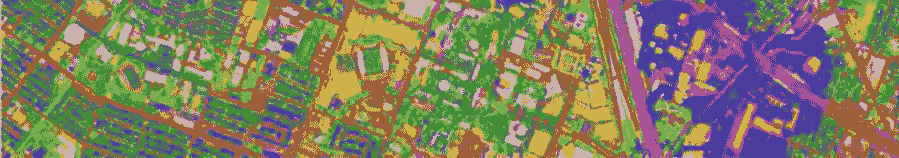

(a) 休斯顿大学

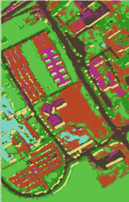

(c) 帕维亚大学

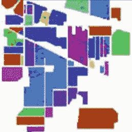

(b) 印度松树

图 5.11 使用提出的方法进行分类结果

实验证明，通过使用空间知识，分类性能可以得到改善。在本节中，介绍了一种利用深度学习技术和利用空间和光谱特征的空间自适应网络（SANet）。好处是，尽管训练数据有限，HSI 分类准确性不会受到影响。该方法受到主成分分析网络（PCANet）[44] 的启发。PCANet 在正常的 RGB 图像上表现良好 [44]。本节中使用了三种技术。

第一种是基于共享相同空间上下文的像素的超分割边界自适应。第二种是通过利用提取的特征来处理高维度。第三种是利用通过 PCANet 提取的空间和光谱特征。本节的其余部分结构化地介绍了详细的架构，然后是分类技术，最后是结果和结论。

#### 5.5.1 基于 SANet 的光谱 - 空间分类网络

SANet 基于 HSI 分类有两个并行步骤。在第一步中，采用特征选择方法仅获取最具贡献的波段，从而降低复杂性。然后使用自适应边界调整，并且将结果与光谱特征合并，并进行向量化以获取空间特征。在下一步中，利用提取的信息使用 PCANet 和支持向量机（SVM）获取分类结果。

图 5.12 显示了整个过程。现在将解释 PCANet，然后突出其适应 HSI 分类任务的修改；然后将提取的上下文特征用作 PCANet 的输入，以提高 HSI 性能。

##### 5.5.1.1 自适应超分割进行空间特征提取

特征提取是非常重要的一步。特征应该以这样的方式提取，以确保两个点被赋予重要性。第一个是当像素共享一个公共特征空间时，像素属于同一类的概率增加。另一个观点是，像素在空间上越接近，它们属于同一类的概率就越大。

当这两个观点同时使用时，PCANet 的判别能力得到改善。一个瓶颈是在 PCANet 中每个像素都被单独考虑，即不关注相邻像素。为了克服这个瓶颈，通过使用超分割选择具有空间特征强关联的相似像素。超分割通过将具有相同空间特征的相邻像素分组来工作。迭代地改变分割的维度，直到可以识别出真实的结构边界。以这种方式获得的分割满足所需的标准。通过将图像分成大小为 R 的 N 个段和网格为 S 来进行分割。获取所有段中的主要特征以及边界像素的直线度因子都是通过计算得出的。根据下面的公式计算每个段的相似度，然后根据这个相似度测量改进边界。直到不再发生进一步的变化为止进行迭代。在波段选择方面，采用了一种特定的方法，利用了信息丰富的波段并保留了区分信息。

##### 5.5.1.2 PCANet

对于单个图像分类，现在使用的是 PCANet [44]。PCANet 作为 CNN 的替代方案，用于减轻与 CNN 相关的复杂性。PCANet 所做的一个重要改变是将卷积滤波器转移到层之间应用的 PCA 滤波器上。通过这种方式，可以解决优化技术的复杂性问题。为了进一步减少这个问题，采用了二进制量化（哈希）、直方图特征和线性 SVM 来解决 CNN 和更深层网络通常需要复杂优化的问题。PCANet 主要由三部分组成——滤波器、哈希和直方图特征。有关概念参数的进一步解释可以参见 [44]。

使用 PCA 滤波器构建了一个分层网络。首先将所有矢量化的补丁累积在 PCANet 中。它们的大小相对于每个像素和图像 I 构建一个矩阵 Y 为 S1×S2。为每个图像形成这个矩阵，然后将结果合并成一个。N 包含了所有像素。通过使得结果误差最小化来得到最小误差。

其中 E 是大小为 M1×M1 的单位矩阵，V 是 YY^T 的主特征向量，M1 表示主特征向量的数量。滤波器可以表示为

其中 M1 表示输入层中的过滤器数量，mat(.) 将向量转换为矩阵。第一个 PCANet 层可以被捕捉为

PCANet 的第二层以相同的方式获得。M1M2 获得图像的数量而过滤器的数量为 M2。以相同的方式，可以构建多个 PCA 网络层。作者建议对于所有主流任务，四层已足够。

$$ \mathbf{Y} = [\mathbf{y}_1, \mathbf{y}_2, \dots, \mathbf{y}_N] \tag{5.8} $$

$$ \underset{V \in R^{(s_1, s_2) \times M_1}}{\arg \min} \left[ \mathbf{Y} - \mathbf{V}\mathbf{V}^T\mathbf{Y} \right]_F^2, s.t. \mathbf{V}^T\mathbf{V} = E_{M_1} \tag{5.9} $$

$$ \mathbf{W}_{\mathbf{m}}^1 \doteq mat_{(s_1 s_2)} \left( q_m (\mathbf{Y}\mathbf{Y}^T) \right) m = 1, 2, \dots, M_1 \tag{5.10} $$

$$ \mathbf{I}_{\mathbf{i}}^{\mathbf{m}} \doteq \mathbf{I}_{\mathbf{i}} * \mathbf{W}_{\mathbf{m}}^1, i = 1, 2, \dots, N. \tag{5.11} $$

##### 5.5.1.3 光谱 - 空间分类

PCANet 主要用于图像分类。通过使用前一步骤的连接向量来改变网络。将该向量重新塑造并通过数据成像过程转化为图像的形式。然后，使用 SVM 对获取的特征进行分类。假设 $Z_i$ 表示决定性的堆叠光谱 - 空间向量。

Z 可以用成像术语表示为

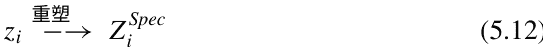

最后，为了对提取的特征进行分类，使用 SVM 分类器。

#### 5.5.2 实验分析和性能比较

使用两个数据集来评估该方法的分类准确性。为此，使用了两个不同的图像数据集：Indian Pine 和 Pavia University 数据集。选择这些数据集的原因是因为许多已提出的技术都已经在这些数据集上进行了验证 [39]。

数据集具有挑战性，不仅因为图像是在农村和城市环境中捕获的，还因为其中存在人工和自然结构。这两个数据集在第 2 章第 2.3 节中进一步描述。

### 5.5.2.1 印度松树：AVIRIS 数据集

通过空中可见红外成像光谱仪传感器，印度松树数据集是在印第安纳州西北部获得的。总共，它具有 17 米的地面分辨率和 145 ×145 的结构尺寸。其中有 224 个波段和 24 个水吸收波段，位于 1400 和 1900 纳米附近，其中保留了 200 个光谱通道。图 5.13 中的地面真实地图描述了 16 种不同作物的农业分类。它还描述了伪彩色排列和地面真实地图。空间分辨率、不同对象的微观组织以及各种像素的存在使得这个数据集具有挑战性。

图 5.13 印度松树数据集，共 16 个类别

图 5.14 帕维亚大学数据集，共 9 个类别

### 5.5.2.2 帕维亚大学:ROSIS 数据集

帕维亚大学数据集是由反射光学系统成像光谱仪传感器在意大利帕维亚大学上采集的。其空间尺寸为 610 行和 340 列的图像，具有 103 个光谱通道。实际上，考虑了 9 个结构类别，主要是合成结构。假彩色合成图像和真实值如图 5.14 所示。

| 类别 | 训练 | 测试 | CNN | RNN | SAE-LR | 提出的 SANet |
| :--- | :--- | :--- | :--- | :--- | :--- | :--- |
| 1 | 5 | 49 | 56.79 | 70.59 | 93.33 | **94.41** |
| 2 | 143 | 1291 | 52.17 | 70.28 | 84.66 | **91.15** |
| 3 | 83 | 751 | 85.33 | 81.52 | 84.39 | **92.70** |
| 4 | 23 | 211 | 87.92 | 90.16 | 73.08 | **94.05** |
| 5 | 50 | 447 | 85.22 | 91.97 | 93.47 | **95.54** |
| 6 | 75 | 672 | 97.49 | 96.13 | 93.41 | **98.61** |
| 7 | 3 | 23 | 74.62 | 84.75 | **100.0** | 96.95 |
| 8 | 49 | 440 | 67.99 | 59.64 | **95.11** | 93.21 |
| 9 | 2 | 18 | 58.87 | 86.17 | **100.0** | **100.0** |
| 10 | 97 | 871 | 98.77 | **99.38** | 85.78 | 95.73 |
| 11 | 247 | 2221 | 87.62 | 84.97 | 83.46 | **90.15** |
| 12 | 61 | 553 | 72.42 | 77.58 | 81.62 | **90.27** |
| 13 | 21 | 191 | 93.33 | 95.56 | 98.52 | **99.15** |
| 14 | 129 | 1165 | 71.79 | 84.62 | 91.77 | **95.45** |
| 15 | 38 | 342 | 90.91 | 90.91 | 81.79 | **91.95** |
| 16 | 10 | 85 | **100.0** | **100.0** | 98.88 | 99.01 |
| 总体准确率 | | | 84.18 | 88.63 | 86.85 | **91.48** |
| 平均准确率 | | | 80.08 | 85.26 | 89.95 | **93.09** |
| Kappa 系数 | | | 0.6852 | 0.7366 | 0.8495 | **0.9075** |

#### 5.5.3 参数设置

对于每个类别的平衡比例为 1:9，选择的数据是任意放置在训练和测试中的。然而，PCANet 网络参数设置受到 [44] 的启发。因此，SANet 包括 1×输入层和 1×输出层。此外，保持 2×卷积层。每个隐藏层包含 7×7 的补丁大小，包括 0.8 的重叠比例。这些参数的微小变化对分类结果影响不大 [44]。为了测试分类性能，采用以下标准：

- 1. 总体准确率（OA）：OA 表示在所有测试试验中正确分类的图像空间位置数量。
- 2. 平均准确率（AA）：AA 测量整个类别的分类效率的平均值。
- 3. Kappa 系数：它将最终效率结果与真实地面真实地图之间的一致性映射起来。该系数的测量是准确的，因为它考虑了偶然发生的一致性 [45]。

| 类别 | 训练 | 测试 | CNN | RNN | SAE-LR | 提出的 SANet |
| :--- | :--- | :--- | :--- | :--- | :--- | :--- |
| 1 | 597 | 6034 | 85.62 | 84.45 | 96.88 | **98.18** |
| 2 | 1081 | 16971 | 88.95 | 85.24 | **98.30** | 98.01 |
| 3 | 189 | 1910 | 80.15 | 54.31 | 91.09 | **92.50** |
| 4 | 276 | 2788 | 96.93 | 95.17 | **99.15** | 98.40 |
| 5 | 121 | 1224 | 99.30 | 99.93 | 99.85 | **99.89** |
| 6 | 453 | 4576 | 84.30 | 80.99 | 96.44 | **97.01** |
| 7 | 120 | 1210 | 92.39 | 88.35 | 94.12 | **96.16** |
| 8 | 331 | 3351 | 80.73 | 88.62 | 93.27 | **95.14** |
| 9 | 85 | 862 | 99.20 | 99.89 | **100.0** | **100.0** |
| 总体准确率 | | | 87.90 | 88.85 | 97.12 | **98.01** |
| 平均准确率 | | | 89.73 | 86.33 | 96.56 | **96.75** |
| Kappa 系数 | | | 0.872 | 0.8048 | 0.9615 | **0.9675** |

##### 5.5.3.1 比较的技术

将深度学习架构与现有的最先进技术 (如堆叠自动编码器 (SAE-LR)[29]、卷积神经网络 (CNN)[40] 和循环神经网络 (RNN)[46]) 进行比较。

##### 5.5.3.2 基于 SANet 的光谱 - 空间分类结果

在这里，我们检查了 SANet 的正确性，以提取 HSI 图像中存在的详细特征，然后进一步将它们分类到各自的类别中。

表 5.7 和 5.8 显示了 OA、AA 和 Kappa 的成果。这些评估指标是在开发的 SANet 专注于特征提取框架的两个可用数据集上进行评估的。通过利用 10 进行参数调优，该方法给出了公平的结果和最佳参数。在 Pavia 大学 HSI 图像中，像 SAE-LR 和 SANet 这样的方法具有类似的结果，但与 SAE-LR 相比，SANet 具有更大的数据集优势。因此，更大的数据集可以提高性能。低空间分辨率和混合像素使得 Indian Pine 数据集更具挑战性。表 5.7 显示了 Indian Pine 数据集与其他方法的每个类别的定量结果。

它还突出了光谱 - 空间特征提取技术对分类准确性的巨大影响。因此，它在 Indian Pine 和 Pavia 大学的 OA、AA 和 Kappa 以及可视化分类结果方面表现更好，如图 5.15 所示。

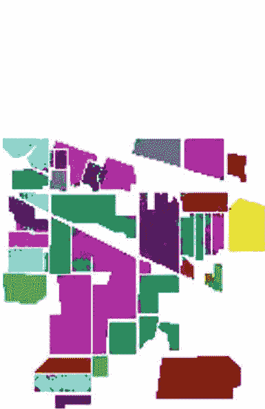

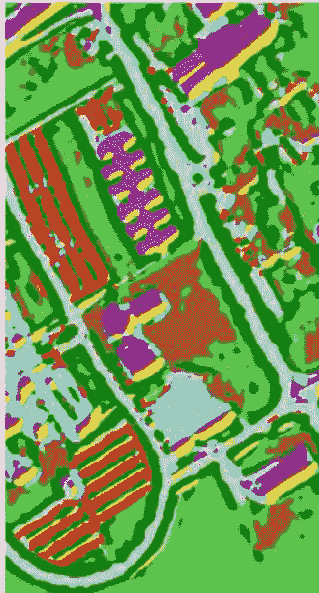

(a) 印度松树
(b) 帕维亚大学

图 5.15 印度松树和帕维亚大学数据集的分类结果

#### 5.5.4 基于 PCANet 的提议的边界自适应深度学习方法的摘要高光谱图像分类

本研究引入了一种新的简化的深度学习 SANet 技术，通过分析最先进的 DL 模型并通过构建来解决其问题。尽管其出色的学习能力，复杂的分层架构和忽视空间信息限制了深度学习在遥感环境中的能力。因此，我们提出了 SANet，一种基于深度网络的简化架构，它用 PCA 滤波器替换了内层卷积滤波器组，从而通过避免优化过程来降低复杂性。此外，通过超分割利用空间信息，并与光谱特征相结合。然后，SANet 利用多层深度学习网络有效地利用基于超分割的空间特征和选定的光谱特征，在分割区域内部和之间。基于两个 AVIRIS 和 ROSIS 传感器的具有挑战性的数据集的实验结果显示了改进的分类性能，特别是在小结构区域。未来的一个方向是减少训练样本并进一步提高性能。

### 5.6 基于深度学习的高光谱图像分类方法总结

本章介绍了三种基于深度学习的高光谱图像分类方法，其中在分类之前融合了空间特征。

首先，我们提出了基于自适应形状超分割堆叠自编码器（SAHS-SAE）的高光谱图像分类方法。所提出的 SAHS-SAE 是一个两步法，它整合了空间特征的影响，并用自适应的空间结构窗口替代了固定的像素扫描窗口，从而充分发挥了 SAE 的能力。首先，通过超分割（HS）利用空间上下文特征，并将其融入多层 SAE 进行高效的高光谱图像分类。与以往基于 SAE 的特征提取方法不同，SAHS-SAE 方法为每个样本像素开发了一个自适应的邻域结构区域，而不是使用固定大小的正方形窗口。结构区域的大小和形状可以根据实际的高光谱图像空间结构进行灵活调整，从而有效地利用空间上下文。

然后，SAHS-SAE 使用多层 SAE 来有效地利用分割区域内部和之间的基于 HS 的空间特征和选择的光谱特征。

在第二种提出的方法中，利用深度置信网络（DBN）对 HSI 分类进行自适应窗口的空间特征融合。在这种方法中，首先提取空间上下文特征，类似于上一种方法，然后将空间上相似的区域以及光谱特征输入到 DBN 网络中，以利用更有效的光谱空间特征进行 HSI 分类。

在第三种提出的 HSI 分类方法中，利用基于 PCANet 的深度学习模型和自适应形状的空间特征进行 HSI 分类。这种方法涉及到一个简化的深度学习 SANet 方法，用于研究最先进的深度学习模型及其相关问题。卓越的学习能力帮助我们忽略了复杂的分层架构和空间信息，这限制了深度学习在遥感情境中的能力。因此，SANet 是首选；在这个基于网络的架构中，PCA 滤波器接管了内层卷积滤波器，从而避免了优化过程并降低了复杂性。此外，空间信息被超分割整合，并与光谱特征合成。SANet 利用多层深度学习网络，有效地利用基于分割的空间特征和分割区域之间的选择的光谱特征。这些在具有挑战性的训练数据上进行的结果显示，在小区域的结构区域中表现出更好的性能。进一步的挑战是通过缩小训练样本来提高性能。

基于不同 HSI 数据集的 AVIRIS 和 ROSIS 传感器的大量实验分析表明，所提出的 DL 方法在小空间结构图像中表现出更好的性能，并且优于现有的知名和广泛使用的 HSI 分类方法。此外，作为强大的特征提取器之一，所提出的方法在异质区域，特别是复杂的城市场景中表现良好。

### 参考文献

- 1. Rajan S, Ghosh J, Crawford MM (2008) 一种用于高光谱数据分类的主动学习方法。 IEEE Trans Geosci Remote Sens 46(4):1231-1242
- 2. Chen Y, Jiang H, Li C, Jia X, Ghamisi P (2016) 基于卷积神经网络的高光谱图像深度特征提取和分类。 IEEE Trans Geosci Remote Sens 54(10):6232-6251
- 3. Yuen PW, Richardson M (2010) 高光谱成像及其在安全、监控和目标获取中的应用介绍。 Imaging Sci J 58(5):241-253
- 4. Lacar F, Lewis M, Grierson I (2001) 在南澳大利亚巴罗莎谷地图中使用高光谱图像进行葡萄品种分类。 IEEE 2001 国际地球科学与遥感研讨会，2001 年。IGARSS'01，第 6 卷。IEEE, pp 2875-2877
- 5. Van Der Meer F (2004) 对高光谱图像中的光谱吸收特征进行分析。 Int J Appl Earth Obs Geoinf 5(1):55-68
- 6. Hege EK, O'Connell D, Johnson W, Basty S, Dereniak EL (2004) 用于天文学和空间监视的高光谱成像。在：光学科学与技术，SPIE 第 48 届年会。国际光学与光子学学会，第 380-391 页
- 7. Malthus TJ, Mumby PJ (2003) 远程感知沿海区域：概述和未来研究的优先事项
- 8. Bioucas-Dias JM, Plaza A, Camps-Valls G, Scheunders P, Nasrabadi N, Chanussot J (2013) 高光谱遥感数据分析和未来挑战。 IEEE 地球科学遥感杂志 1(2):6-36
- 9. 休斯 G(1968 年) 关于统计模式识别器的平均准确性。 IEEE Trans Inf Theory 14(1):55-63
- 10. Landgrebe D (2002 年) 高光谱图像数据分析。 IEEE Signal Process Mag 19(1): 17-28
- 11. Kang X, Li S, Benediktsson JA (2014 年) 具有边缘保持滤波的光谱 - 空间高光谱图像分类。 IEEE Trans Geosci Remote Sens 52(5): 2666-2677
- 12. Pal M, Foody GM (2010 年) 通过 SVM 对高光谱数据进行特征选择。IEEE Trans Geosci Remote Sens 48 (5): 2297-2307
- 13. Plaza A, Plaza J, Martin G (2009 年) 将空间约束纳入遥感高光谱数据的光谱混合分析中。在：2009 年 IEEE 国际信号处理机器学习研讨会，2009 年。MLSP 2009. IEEE, pp 1-6
- 14. 钱 Y, 叶 M (2013 年) 使用非局部光谱空间结构稀疏表示进行高光谱图像恢复并进行噪声估计。 IEEE J Sel Top Appl Earth Obs Remote Sens 6(2):499-515
- 15. 李 J, Marpu PR, Plaza A, Bioucas-Dias JM, Benediktsson JA (2013 年) 用于高光谱图像分类的广义复合核框架。 IEEE Trans Geosci Remote Sens 51(9):4816-4829
- 16. 周 Y, 彭 J, 陈 CP(2015 年) 用于高光谱图像分类的复合核极限学习机。 IEEE J Sel Top Appl Earth Obs Remote Sens 8(6):2351-2360
- 17. 张 Y, 普拉萨德 S(2015 年) 用于多源地理空间图像分析的局部保持复合核特征提取。 IEEE J Sel Top Appl Earth Obs Remote Sens 8(3):1385-1392
- 18. 张 Q, 田 Y, 杨 Y, 潘 C(2015 年) 通过判别稀疏多模态学习自动选择高光谱图像的空间 - 光谱特征。 IEEE Trans Geosci Remote Sens 53(1):261-279
- 19. Ghamisi P, Benediktsson JA, Sveinsson JR (2014) 基于属性剖面和监督特征提取的自动光谱 - 空间分类框架。 IEEE Trans Geosci Remote Sens 52(9):5771-5782

### 参考文献

20. Ghamisi P, Benediktsson JA, Cavallaro G, Plaza A (2014) 基于监督特征提取和形态属性剖面的自动光谱 - 空间分类框架。IEEE J Sel Top Appl Earth Obs Remote Sens 7(6):2147–2160

21. Li J, Zhang H, Zhang L (2014) 通过扩展形态属性剖面和稀疏变换对高分辨率图像进行监督分割。IEEE Geosci Remote Sens Lett 11(8):1409–1413

22. Song B, Li J, Dalla Mura M, Li P, Plaza A, Bioucas-Dias JM, Benediktsson JA, Chanussot J (2014) 利用形态属性剖面的稀疏表示进行遥感图像分类。IEEE Trans Geosci Remote Sens 52(8):5122–5136

23. Fauvel M, Benediktsson JA, Chanussot J, Sveinsson JR (2008) 使用支持向量机和形态学特征对高光谱数据进行光谱和空间分类。IEEE Trans Geosci Remote Sens 46(11):3804–3814

24. Wang G, Hoiem D, Forsyth D (2012) 使用快速核机器从 Flickr 群组中学习图像相似性。IEEE Trans Pattern Anal Mach Intell 34(11):2177–2188

25. Hinton GE, Salakhutdinov R R (2006) 使用神经网络降低数据的维度。Science 313(5786):504–507

26. Krizhevsky A, Sutskever I, Hinton GE (2012) 使用深度卷积神经网络进行 ImageNet 分类。在：神经信息处理系统进展，第 1097–1105 页

27. Yu D, Deng L, Wang S (2009) 在深度结构化条件随机场中学习。在：NIPS 研讨会论文集，第 1–8 页

28. Mohamed AR, Dahl G, Hinton G (2009) 深度置信网络用于电话识别。在：NIPS 深度学习与语音识别及相关应用研讨会，卷 1，第 39 页

29. Chen Y, Lin Z, Zhao X, Wang G, Gu Y (2014) 基于深度学习的高光谱数据分类。IEEE J Sel Top Appl Earth Obs Remote Sens 7(6):2094–2107

30. Gómez-Chova L, Tuia D, Moser G, Camps-Valls G (2015) 遥感图像的多模态分类：回顾与未来方向。Proc IEEE 103(9):1560–1584

31. Tao C, Pan H, Li Y, Zou Z (2015) 用堆叠稀疏自编码器进行无监督光谱 - 空间特征学习的高光谱图像分类。IEEE Geosci Remote Sens Lett 12(12):2438–2442

32. Chen Y, Zhao X, Jia X (2015) 基于深度置信网络的高光谱图像分析和分类 IEEE J Sel Top Appl Earth Obs Remote Sens 8(6):2381–2392

33. Mughees A, Chen X, Tao L (2016) 无监督高光谱图像分割：边界调整中融合光谱和空间信息。In: 2016 55th annual conference of the society of instrument and control engineers of Japan (SICE). IEEE, pp 1466–1471

34. Mughees A, Chen X, Du R, Tao L (2016) Ab3c: 自适应基于边界的高光谱图像波段分类。J Appl Remote Sens 10(4):046009

35. Li W, Du Q (2014) 基于 Gabor 滤波的最近正则化子空间高光谱图像分类 IEEE J Sel Top Appl Earth Obs Remote Sens 7(4):1012–1022

36. Tan K, Li E, Du Q, Du P (2014) 使用波段选择和形态学特征的高光谱图像分类 IEEE J Sel Top Appl Earth Obs Remote Sens 7(1):40–48

37. Li J, Bioucas-Dias JM, Plaza A (2011) 使用新的贝叶斯方法和主动学习的高光谱图像分割 IEEE Trans Geosci Remote Sens 49(10):3947–3960

38. Chen Y, Nasrabadi NM, Tran TD (2013) 使用核稀疏表示的高光谱图像分类 IEEE Trans Geosci Remote Sens 51(1):217–231

39. Li J, Bioucas-Dias JM, Plaza A (2013) 使用循环置信传播和主动学习的高光谱数据的光谱 - 空间分类。IEEE Trans Geosci Remote Sens 51(2):844–856

40. Hu W, Huang Y, Wei L, Zhang F, Li H (2015) 用于高光谱图像分类的深度卷积神经网络。J Sens 2015

41. Melgani F, Bruzzone L (2004) 使用支持向量机对高光谱遥感图像进行分类。IEEE Trans Geosci Remote Sens 42(8):1778–1790

42. Ji R, Gao Y, Hong R, Liu Q, Tao D, Li X (2014) 光谱 - 空间约束高光谱图像分类。IEEE Trans Geosci Remote Sens 52(3):1811–1824

# 5 将光谱 - 空间信息集成到深度学习中...

43. Hinton GE (2002) 通过最小化对比散度训练专家产品。神经计算 14(8):1771–1800

44. Chan T-H, Jia K, Gao S, Lu J, Zeng Z, Ma Y (2015) PCANet: 一种简单的深度学习基准用于图像分类？IEEE Trans Image Process 24(12):5017–5032

45. Benediktsson JA, Ghamisi P (2015) 高光谱遥感图像的光谱空间分类。Artech House, Boston

46. Mou L, Ghamisi P, Zhu XX (2017) 用于高光谱图像分类的深度递归神经网络。IEEE Trans Geosci Remote Sens

## 第 6 章 基于多深度网络的高光谱图像分类

本章介绍了基于深度学习的高光谱图像 (HSI) 分类技术，以独特的方式解决了 HSI 的复杂性。这是我们开发的框架中的第 4 和第 5 阶段，如图 6.1 所示。每个阶段的完整描述在第 1 章，图 1.3 中描述。

HSI 分析可以分为两个部分。在第一部分中，提出了光谱分割以有效地减少和分布复杂性，并通过保持高光谱场景中可用的较少训练数据的稀缺性，高效地探索所呈现的光谱和空间数据以增强特征挖掘。本章介绍了分段 DBN 方法。在这里，每个光谱波段的局部深度置信网络被使用。该过程包括两个主要阶段。首先，执行灵活的边缘调节根据高光谱图像中存在的丰富空间分辨率进行分割。其次，执行光谱分割，将光谱上相似的相邻通道聚集在一起，并对每个分割的波段簇执行深度置信网络。在每个通道簇上局部应用 DBN 根据计算复杂性减少并同时产生更好的特征，从而获得比现有 HSI 分类技术更高的分类准确性。

在本章的第二部分中，我们开发了一些基于分类后空间信息融合的方法。为了达到这个目的，我们使用了两种主要的深度学习架构 SAE 和 DBN。本章的第二部分提供了详细的分析，实验结果和比较。在像素级别分类之后，主题分类方法利用空间信息，并在分辨率指令的帮助下进行。在这些技术中，利用了上下文数据和许多方法，例如形态学信息 [1]，属性概要 [2]，分割 [3,4] 和马尔可夫随机场 (MRFs)。最终探索的上下文数据和像素级分类的信息被集体整合以提供最终的分类性能。

在上述方法中，根据目标像素的像素级分类性能和通过分割获得的邻近上下文信息，确定了特定类别分配给各个像素。高光谱图像的精确区域检测使得该技术在性能方面成为改进的方法之一。该技术首先探索了用于挖掘高光谱场景特征表示的深度学习架构。随后，通过 HMRF-EM 根据提出的分割技术部署类似的细胞分割过程。

最后，采用多数投票（MV）技术，将基于像素的光谱分类的输出与基于空间相似区域的像素分组相结合，从而实现 HSI 的准确分类。通过准确的结果及与现有 HSI 分类技术的比较，验证了该方法的性能。

### 6.1 基于多深度信念网络的光谱 - 空间高光谱图像分类

如前几章所述，光学创新的进展使高光谱场景（HSI）获取传感器能够从地球表面获取许多不同波长的反射率，范围从可见光到红外线，以及几个连续的窄光谱带。HSI 中的每个波段都是一个具有不同光谱特征的 2D 空间图。因此，HSI 中的每个像素都是场景中特定空间位置的光谱属性值的向量 [6]。

这种广泛的光谱数据在许多应用中非常有价值，例如矿物探测 [7]、精确农业 [8]、城市规划、环境监测 [9] 以及目标识别和观测 [10]。

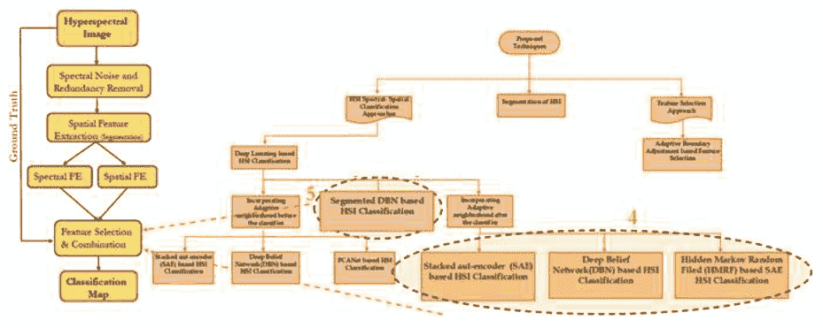
图 6.1 第四阶段与框架对齐，用于高光谱遥感图像的分类

然而，HSI 中的大量数据伴随着更多的困难，多样性的成本以及不需要的事实和几何属性 [11]，这需要先进的方法 [12]。光谱空间中的高维度 [13] 与维度诅咒 [14] 和受限的训练样本使 HSI 分析成为一个困难的问题 [14]。

高光谱信息的高维度是一个重要问题。同时处理众多光谱通道会导致复杂性、错误，并且使得深度置信网络无法从 HSI 中提取更加理论和深入的丰富特征。HSI 中存在超过 200 个光谱波段，因此在输入层执行相同数量的单元来处理这些丰富的信息。此外，内层涉及的参数由于输入单元的数量而变得更加复杂，从而使整个系统变得更加复杂。此外，光谱波段和丰富的光谱信息的增加也要求以相同的速率增加标记训练数据的检查准备。然而，在 HSI 中，训练数据的可用性是一个重要的瓶颈。高维信息和测试数据之间的不平衡导致了休斯现象的出现 [15]。通常，有效和稳健的 HSI 分析执行依赖于对高维信息的有效利用，同时保持在有限可用测试信息的处理范围内，因为 HSI 中的每个波段都展示了关于每个类别的重要数据。有两种主要的降维方法用于处理高维度，即特征选择（FS）和特征提取（FE）。特征选择也被称为波段选择策略，它从超立方体中选择出一些波段来代表整个 HSI 3D 立方体 [8, 26]。另一方面，特征提取方法通过将新数据投影到较低维度的特征空间中来实现维度的减少，例如通过主成分分析 [30]、独立成分分析 [3] 和最大噪声分离 [33] 等技术。特征提取过程将数据转换为特征空间，并在特征空间中寻找一组有效和合适的特征 [18, 27]。然而，降维方法的一个重要缺点是丢失了重要的数据，因为每个光谱通道都包含了关于许多通道的重要信息。

### 基于多深度网络的高光谱图像分类

因此，降维过程会在高光谱图像分类的准确性上产生一种权衡。

最近，深度学习设计在高光谱图像分析中展示了它们的能力，可以成功地进行特征提取。这些模型已经证明在场景、声音和语言处理方面具有强大的性能。正如前一章所提到的，深度学习架构是神经系统中的最新进展，具有许多处理层，能够提取更多独特和深入的不变特征，从而提高分类性能。最近，一些深度学习模型已经在高光谱图像上实现。基于深度学习的堆叠自编码器（SAE）在 [13] 中提出，深度置信网络（DBN）在 [24] 中提出。这些技术已经证明可以从高光谱场景中获取深度特征。最近，越来越多的人对将空间上下文信息与光谱数据相结合的兴趣增加，因为最近的研究表明，将光谱和空间信息结合起来可以显著提高性能结果。[1] 中通过形态学特征和独特光谱数据的融合进行了空间数据的整合。[25] 中使用循环置信传播来探索光谱和空间特征。[26] 中使用基于核的稀疏表示来处理高光谱图像。

在 HSI 分析中已经研究了许多分类器。传统的 HSI 分类策略以考虑光谱特性而闻名，例如逻辑回归 [27]、贝叶斯分类器、随机森林、神经系统、K 最近邻分类器（K-NN）、条件随机场（CRFs）、不充分编码和支持向量机（SVM）。由于其处理高维信息的能力，SVM 表现出色。然而，这些方法有一些限制。不同隐藏层之间的完全关联使得基于深度学习的 HSI 特征提取过程非常困难且耗时，因为 HSI 涉及许多光谱通道，需要许多神经元同时评估信息并近似参数值。这种复杂关联网络导致缺乏适当的抽象。

此外，层之间的完全关联需要更多的测试标记信息来准备参数，这在 HSI 中是一个重要的限制，因为 HSI 只能获得有限的标记数据。SAE 和 DBN 不能有效地提取空间数据，因为它们使用固定的估计窗口来分离空间数据，这可能包含多个类别或同一类别的子集。

在本章的这一部分中，介绍了一种光谱适应的分割深度置信网络（SAS-DBN），它通过光谱分割来有效地减少和分割数据的复杂性，并完全探索可用的光谱和空间数据，以更好地提取特征，同时保持算法在训练数据有限的情况下的限制。本章的这一部分介绍了分段 DBN 系统，其中每个部分的可用波段都应用了相邻的 DBN。它包括两个主要步骤：首先，进行基于灵活限制调整的分割，以探索空间数据；其次，进行光谱分割，将在光谱上相似的波段组合在一起，然后在每个波段上应用 DBN。

空间 - 光谱碎片化通道组独立。自主采用 DBN 根特征挖掘到每组通道，降低计算复杂性，同时导致改进的特征，从而获得准确的分类结果。这项研究的主要影响可以列举如下:

- 每个波段的光谱数据完全被探索。将光谱相邻通道组装起来，并使用 DBN 对结果片段进行有效特征提取，从而分割复杂性，并在较少的训练数据限制下允许附近提取光谱特征。因此，获得了改进的特征描述。
- 通过将固定大小的空间窗口与超分割区域进行交换，完全探索了空间数据，根据 HSI 中的原始结构灵活地改变范围和形成。

这项工作的主要焦点是探索在不降低高光谱信息波段的情况下，如何有效利用光谱中提供的所有重要数据，而不牺牲 HSI 的计算复杂性。

#### 6.1.1 光谱自适应分段 DBN 用于 HSI 分类

该开发技术利用灵活的光谱通道分组根深度置信网络来探索光谱特性，使特征提取过程更加准确。在这个过程中，高度相关和相关的 HSI 通道被集合在一起，并作为输入提供给众多 DBN 架构之一，以提取数据的额外深层特征。开发方法的完整流程图如图 6.2 所示。特征提取过程应考虑以下两个光谱 - 空间组成部分 [13]：

- 具有相似光谱特征的 HSI 像素很可能属于相同的类别。
- 在空间区域中具有重要空间特征的相邻像素也应属于相同的类别。

上述两个方面清楚地解释了在空间和光谱上具有很高关联性和相关性的像素属于相同类别的可能性非常高。为了有效应用上述方面，DBN 通过将传统的固定大小的上下文窗口替换为灵活的基于区域的窗口，来探索光谱和上下文特征。此外，对于 DBN 来说，将具有相似光谱特征的波段进行分组可以提高准确性性能。开发方法的完整图像如图 6.2 所示。在第一阶段，采用上下文灵活的基于区域的方法 [28] 对 HSI 场景进行分割。

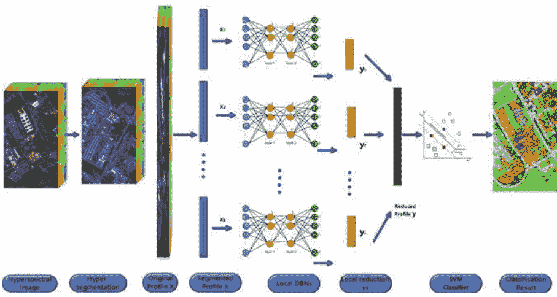

相同区域。随后，具有相同光谱特性的波段被组合成不同的光谱相关组，并且每个组被作为特征提取的输入传递给每个本地 DBN。

##### 6.1.1.1 基于超分割的空间特征提取

如上所述，在考虑空间信息的情况下，可能会得到准确的分类结果。过去的研究 [29] 表明，研究人员利用固定窗口形状来探索高光谱图像分类的上下文数据。然而，如前一章所讨论的，应用固定窗口形状会限制上下文特征的挖掘，从而降低准确性。由于特定大小的窗口可能包含多个对象，还有可能它只包含 HSI 场景中对象的子部分像素，如图 5.2 所示。在第 4 章设计的灵活边界根源区域分割技术中，将包含具有上下文相似特征的相邻空间数据集合在一起。在第 4 章设计的灵活边缘检测根源技术被应用于有效地将高光谱图像场景划分为上下文相似的区域。因此，通过利用上述基于区域边界演化技术 [28] 对高光谱场景进行划分，可以保证上下文的稳定性，其中对象的范围和轮廓是根据真实边缘灵活调整的。

以下是分割的主要阶段：

1. 将高光谱场景分割成 m 个起始六边形片段。
2. 循环遍历相邻像素，直到没有像素被分配到新的片段。
3. 对于每个通道聚合，根据特定标准为每个边界像素分配负载，以授予反映真实边界的像素。

超分割的详细方法如下图所示。


图 6.3 基于 DBN 的像素级分类框架

- 计算每个初始片段的主要类别。
- 计算每个片段当前边界像素的梯度。
- 计算每个片段边界的直线度因子。
- 根据方程，计算每个类别质心与其边界之间的相似度。
- 根据相似度推进边缘。

#### 6.1.2 通过分段 DBN 进行光谱 - 空间特征提取

##### 6.1.2.1 DBN 深度学习用于高光谱图像分析和分类

这个限制使得隐藏单元受限制地自由。一个隐藏神经元 $u$ 和输入神经元 $x$ 的函数组合由 [24] 提供:

$$ E(x, u, \theta) = - \sum_{j=1}^{n} \frac{(x_j - b_j)^2}{2\sigma^2} - \sum_{i=1}^{m} a_i u_i - \sum_{j=1}^{n} \sum_{i=1}^{m} w_{ji} \frac{x_j}{\sigma_i} u_i \tag{6.1} $$

其中 $\theta = b_j, a_i, w_{ji}$ 是权重单元， $b_j$和 $a_i$是偏置项。 联合分布可以描述为

$$ P(x, u, \theta) = \frac{a}{N(\theta)} \exp(-E(x, u, \theta)) \tag{6.2} $$

在这里，$N(\theta)$是归一化参数。 该框架为每个输入向量提供了一个概率参数，即 $E(x, u, \theta)$。 条件分布由以下方式提供

$$ P(u_i|x; \theta) = g \left( \sum_{j=1}^{n} w_{ji} x_j + a_i \right) \tag{6.3} $$

$$ P(x_i|u; \theta) = N \left( \sum_{i=1}^{m} w_{ji} u_i \sigma_j^2 + b_j \right) \tag{6.4} $$

其中 $\sigma$ 是可预测的误差， $N(.)$ 是高斯分布。 参数通过对比散度（CD）[30] 进行学习，并通过以下方式进行修改

$$ \Delta w_{ij} = \psi(x_i u_{j_\text{数据}} - x_i u_{j_\text{重建}}) \tag{6.5} $$

其中 $\psi$ 是学习率， $x_i$和 $u_j$分别是初始输入单元和内部层的神经元。

RBM 的力量在于对真实数据的重建。 在恢复阶段，通过训练学习到的内部神经元的有用信息被利用。 如果这个过程能够恢复原始的真实信息，则内部神经元的值被认为是有效的。 这表明内部神经元保存了关于给定真实数据的足够信息。

只有一个层不足以探索提供的高光谱通道中的有用信息。 因此，在训练后，第一个 RBM 层的输出可以通过将其作为输入传递给第二层来利用，因为这个输入是一组更精细和学习到的神经元，可以发挥更重要的作用，并且可以帮助系统进行更深入的特征挖掘。 因此，多个层被叠加在一起，并可以通过使用带标签的样本进行训练来构建深度置信网络。 完整的过程可以简要概括如下：- 特定高光谱场景的可用训练数据被用于训练深度置信网络的单层。对比散度（CD）[30] 被用于训练受限玻尔兹曼机。
- 第一个受限玻尔兹曼机层的结果被提供给下一层作为输入，该层独立地经历训练过程。
- 重复步骤 1 和 2，直到达到所需的层数。
- 调整所有学习到的值，并尽可能在可用的采样数据的情况下获得最好的值。
- 开发的框架利用支持向量机（SVM）作为算法，对从受限玻尔兹曼机的最终层获得的最终特征进行分类。

总结起来，首先进行基于超区域的分割，以获得上下文可比较的区域。将这些区域与光谱带数据一起提供给深度置信网络作为输入。然后，应用深度置信网络通过多层深度置信网络获取输入信息的独特特征。最后，利用逻辑回归（LR）根据学习特征对像素进行特征化和标记，如图 6.4 所示。这个过程对每个分组的光谱带都进行。

##### 6.1.2.2 分段 DBN

在传统的 HSI 中，所有的波段组都以相同的方式处理，同时处理。这导致了学习参数的急剧增加，也增加了复杂性。这种增加的复杂性的主要原因是，第一层的神经元受到成千上万个原始输入光谱值的攻击，在后续层中变得越来越复杂。除此之外，不同光谱通道之间的关联和关系也没有被纳入，通道光谱值被盲目地提供给这些基于深度学习的架构。因此，通过将深度置信网络应用于单个组装的相关光谱波段，可以解决这个领域中的这些漏洞。这样做有两个目的：首先，将存在高关联性和关系的波段组装起来，将关联和连接纳入其中。其次，复杂性和复杂性大大降低，因为现在只将总波段的子集作为本地 DBN 的输入。这种将特定的深度学习架构应用于不同部分的概念性想法已经在各种特征挖掘技术中尝试过，并且在 [31] 中以及在 [32] 的各种改进中表现良好。

这个发展的概念在图 6.2 中通过图像进行了全面和详细的解释。在这里，为了一个特定的高光谱场景提供了一定数量的波段，将其分成了 S 个不同的组 x_s, s∈[1,S]，然后深度置信网络自动应用于每个分区的波段区域。

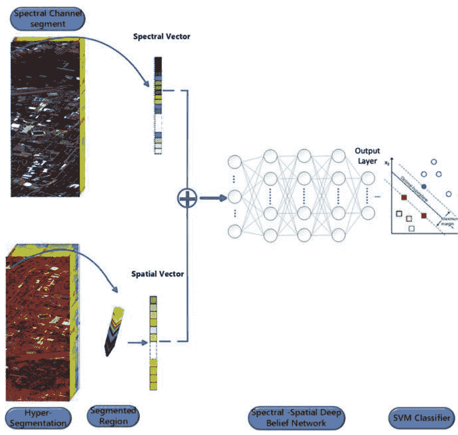

图 6.4 光谱 - 空间分类框架

由于每个个体 DBN 只用于很少数量的波段，这导致需要很少数量的隐藏神经元，从而导致需要学习的参数数量较少，因此需要较少的训练数据。整个过程导致 DBN 的使用更简单，与传统方式下使用的 DBN 相比。此外，由于每个个体 DBN 的波段较少，可以获得来自每组波段的不同和更有效的特征。最后，从每个 DBN 架构中获得的可区分特征被组合 (\sum_{s=1}^s F_s = F) 以形成最终的特征向量集。

为了评估关联度，即特定高光谱场景的光谱特征相似性的程度，计算了通道之间的相关矩阵。这个矩阵对于评估不同波段之间的连接程度非常有效。通过相关矩阵显示出最大相似度的通道被组合起来 [32]，形成一组相似的波段。这样，不同的组就形成了 SAS-DBN。

通过协方差矩阵评估这个相关矩阵。数学上，可以表示为

$$ Cov = E\{(p - E(p))(p - E(p))^T\} $$

这里， $E\{.\}$ 是期望函数。基于这个函数，可以计算关联矩阵中的每个值

$$ Corr (a, b) = \frac{Cov(a, b)}{\sqrt{Cov(a, a)Cov(b, b)}} $$

在这里， $Cov(a, a)$ 和 $Cov(b, b)$ 分别表示第 a 和第 b 波段之间的关联。因此， $Corr(a, b)$ 表示高光谱图像数据集中第 a 和第 b 光谱波段之间的关联。因此，整个关联矩阵描述了高光谱场景数据集中光谱波段之间的关联。因此，这证明了关联关系可以有效地用来构建相似波段的组。

#### 6.1.3 实验结果和性能比较

为了衡量和评估设计方法的性能，对包括基于 AVIRIS 传感器的自然图像、休斯顿大学和帕维亚大学高光谱场景数据集在内的各种实验进行了。每个使用的 HSI 场景的详细说明在第 2 章第 2.3 节中描述。

#### 6.1.4 实验设置

所开发方法的分析是在一台 4.0 GHz 处理器上进行的，配备了 NVIDIA GeForce GTX 970 和 Windows 7 操作系统。对于编码实现，采用了 Theano 框架。传统的 DBN 可以从多个角度利用，包括隐藏单元的数量和层数。根据 [24] 的建议，定制的 DBN 在 2-6 层和 20-6 个隐藏单元的情况下表现最佳。隐藏层神经元的数量等于所需特征的数量。根据这些结果，我们使用了一个由 40 个内部神经元组成的 4 层 DBN。总体而言，帕维亚大学和休斯顿大学数据集使用了 3 层，包括 1 个输入层和 2 个内部层，排列为 x40... ~ F。这里， $x$ 表示作为 DBN 输入的波段数量， $F$ 表示最后一层所需的特征数量。根据 [24] 的实验，增加隐藏神经元的数量或层数并不一定对性能和准确性产生积极影响。

##### 6.1.4.1 分段 DBN 的配置

所提出的技术首先将光谱波段划分为几个不同的组，然后将 DBN 应用于每个单独的组别的波段上。

光谱通道之间的关联可以通过利用关联矩阵 (相关矩阵 (CM)) [32] 来有效计算。这个关联矩阵是通过协方差矩阵计算得出的。关联矩阵中的任何特定值表示特定波段之间的关联程度。让我们举个例子：假设 CM(n,m) 表示特定高光谱图像的第 n 个和第 m 个通道之间的等价关系。完整的关联矩阵包含了 HSI 场景中所有通道对之间的相似度程度，可以有效地用来发现光谱通道组，如图 6.5 所示。根据 [32] 的建议，可以从关联矩阵得到划分的波段集合。随后，表 6.1 描述了得到的光谱波段集合。整个特征数量也在组之间保持一致 (5、10、15、20)。

| 数据集 | 分组 | 波段范围 | 隐藏层单元 | 特征 5 | 特征 10 | 特征 15 | 特征 20 |
| :--- | :--- | :--- | :--- | :--- | :--- | :--- | :--- |
| 帕维亚大学 | 分段 S1 | 1 - 22 | L1 = 13, L2 = F | 1 | 3 | 3 | 6 |
| | 分段 S2 | 23 - 60 | L1 = 13, L2 = F | 2 | 3 | 6 | 7 |
| | 分段 S3 | 61 - 103 | L1 = 14, L2 = F | 2 | 4 | 6 | 7 |
| | | | | 5 | 10 | 15 | 20 |
| 休斯顿大学 | 分段 S1 | 1 - 76 | L1 = 13, L2 = F | 2 | 4 | 7 | 6 |
| | 分段 S2 | 77 - 110 | L1 = 14, L2 = F | 1 | 3 | 7 | 6 |
| | 分段 S3 | 111 - 144 | L1 = 13, L2 = F | 2 | 3 | 6 | 3 |
| | | | | 5 | 10 | 15 | 20 |

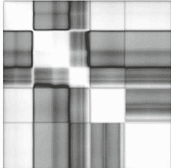

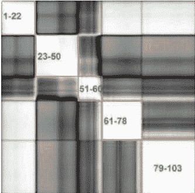

(a) 相关矩阵 (白色=1，黑色=0)

(b) 选定区域

图 6.5 Pavia 大学数据集的相关矩阵和相应的波段分组

Houston 大学的高光谱图像场景被认为是一个困难且复杂的场景，因为它包含了像素尺寸非常小的上下文区域。在与测试和训练相关的样本分布中，每个类别中仅随机选择了 10% 的数据用于训练数据，而每个场景中利用了 50 个特征进行分类。设计方法在 Houston 大学和 Pavia 大学场景的每个类别上的性能显示在表 6.2 和表 6.3 中。从表中可以清楚地看出，所提出的基于 SAS 的 DBN 相对于其他 4 种著名的方法在总体准确率、平均准确率和 Kappa 系数方面提供了改进的分类结果。同时，可以观察到 DBN-LR 技术在类别 1 和 2 上提供了相对较好的结果，可能的原因是主题案例的训练数据非常少。设计的方法在包含非常小的上下文对象的类别中提供了相对高效的结果。总体而言，该技术的分类结果在与其他技术相比表现出更好和改进的性能。

图 6.6 和 6.7 清楚地展示了两个已提到场景的几种比较方法的结果图，以帮助可视化性能。通过智能地整合上下文信息，并利用分组级别的光谱信息并在局部应用 DBN，可以清楚地观察到开发方法的视觉检查和按类别的性能，它在个体和整体分类准确性方面取得了更好的改进和提高的结果，并且在参数学习方面没有太大的负担，使其变得不那么复杂。此外，该方法在其他技术显示分散结果的地方也表现更好。

| 类别 | 训练 | 测试 | 支持向量机 | RNN | CNN | DBN-LR | SAS-DBN |
| :--- | :--- | :--- | :--- | :--- | :--- | :--- | :--- |
| 1 | 125 | 1126 | 97.47 | 82.53 | 81.20 | **99.20** | 98.80 |
| 2 | 125 | 1129 | 98.32 | 83.36 | 83.55 | **99.60** | 99.0 |
| 3 | 70 | 627 | 99.37 | **100.0** | 99.41 | **100.0** | **100.0** |
| 4 | 124 | 1120 | 98.01 | 90.53 | 91.57 | **99.60** | **99.60** |
| 5 | 124 | 1118 | 96.01 | 97.82 | 94.79 | **99.60** | **99.60** |
| 6 | 33 | 292 | **99.83** | 93.01 | 95.10 | 97.2 | 98.81 |
| 7 | 127 | 1141 | 91.23 | 75.37 | 63.53 | 97.0 | **98.11** |
| 8 | 124 | 1120 | 86.23 | 42.36 | 42.64 | 97.8 | **98.0** |
| 9 | 125 | 1127 | 86.99 | 77.62 | 58.17 | 94.0 | **95.11** |
| 10 | 123 | 1104 | 91.42 | 57.63 | 41.80 | 97.4 | **97.75** |
| 11 | 124 | 1111 | 91.67 | 77.42 | 75.71 | 97.3 | **97.95** |
| 12 | 123 | 1110 | 87.05 | 69.74 | 84.15 | 95.2 | **96.05** |
| 13 | 47 | 422 | 78.16 | 66.32 | 40.00 | 88.0 | **90.55** |
| 14 | 43 | 385 | 97.42 | **100.0** | 98.79 | **100.0** | **100.0** |
| 15 | 66 | 594 | 99.49 | 95.98 | 97.89 | **100.0** | **100.0** |
| **总体准确率** | | | 93.06 | 89.85 | 85.42 | 97.70 | **98.35** |
| **平均准确率** | | | 93.25 | 80.65 | 76.55 | 97.50 | **98.06** |
| ***Kappa* 系数** | | | 0.925 | 0.7606 | 0.7200 | 0.975 | **0.9805** |

| 类别 | 训练 | 测试 | 支持向量机 | RNN | CNN | DBN-LR | SAS-DBN |
| :--- | :--- | :--- | :--- | :--- | :--- | :--- | :--- |
| 1 | 597 | 6034 | **97.50** | 84.45 | 87.34 | 87.37 | 89.11 |
| 2 | 1681 | 16971 | **97.70** | 85.24 | 94.63 | 92.10 | 93.55 |
| 3 | 189 | 1910 | 78.53 | 54.31 | **86.47** | 85.57 | **87.50** |
| 4 | 276 | 2788 | 89.29 | 95.17 | 96.29 | 95.11 | **97.35** |
| 5 | 121 | 1224 | 98.77 | **99.93** | 99.65 | 99.74 | 99.19 |
| 6 | 453 | 4576 | 83.04 | 80.99 | 93.23 | 91.94 | **93.85** |
| 7 | 120 | 1210 | 64.58 | 88.35 | 93.19 | 92.21 | **93.55** |
| 8 | 331 | 3351 | 86.90 | **88.62** | 86.42 | 87.02 | 88.05 |
| 9 | 85 | 862 | 99.92 | 99.89 | **100.0** | **100.0** | **100.0** |
| **总体准确率** | | | 92.04 | 88.85 | 92.56 | 91.18 | **93.15** |
| **平均准确率** | | | 88.47 | 86.33 | 93.02 | 92.34 | **93.06** |
| ***Kappa* 系数** | | | 0.903 | 0.8048 | 0.9006 | 0.8828 | **0.9105** |

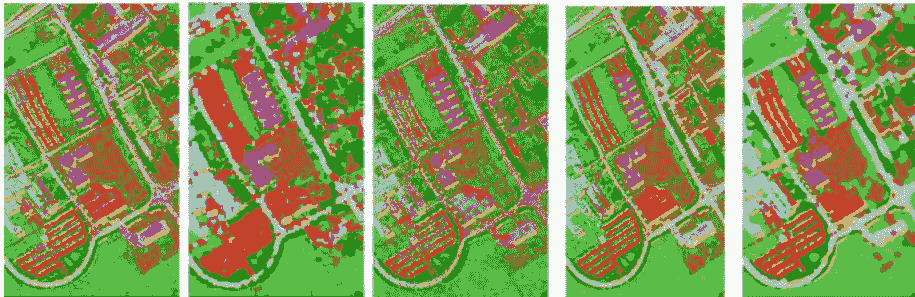

(a) SVM (b) RNN (c) CNN (d) DBN-LR (e) SAS-DBN

图 6.6 Pavia University 的各种技术的分类地图

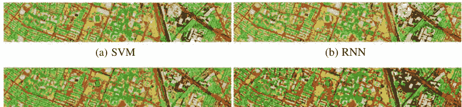

(a) SVM (b) RNN

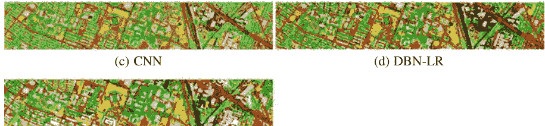

(c) CNN (d) DBN-LR

(e) SAS-DBN

图 6.7 Houston University 的各种技术的分类地图

## 6.1.6 提出的基于多深度网络的高光谱图像分类方法 总结

在本章的这一部分中，介绍了一个经过深入研究和设计的高光谱图像分类方法，解决了现有技术的两个主要缺点。首先，通过将固定大小的窗口替换为基于场景中实际对象边界的灵活窗口，解决了上下文信息的整合问题。其次，通过将具有相似光谱特性的波段进行分组，考虑光谱相似性，并使用基于本地 DBN 的深度学习架构进行特征挖掘，解决了输入到深度学习架构的许多光谱通道的复杂性问题，从而增加了复杂性。这两个因素不仅极大地提高了分类准确率，而且减少了参数数量，从而降低了复杂性。在这种方法中，通过使用灵活的基于边缘的方法，通过组装上下文相关的像素来收集上下文信息分割方法已经在之前的章节中开发出来。然后，通过利用关联矩阵来测量它们之间的关联度，将光谱通道也分组在一起。这些特征被输入到本地 DBN 中进行特征挖掘，然后将所有光谱组的结果特征集成在一起，并根据特征对每个像素进行标记。

建立了一个全面的实验设置，以展示开发框架的能力，并与众所周知的现有方法进行效率比较。实验设置的结果证明了该技术相对于现有方法的有效性和效率。

### 基于深度自动编码器和隐马尔可夫随机场的高光谱图像分类

目前高光谱设备的发展使得可以在数百个光谱波段中获取大量的数据。在足够的上下文分辨率下，增加了光谱波段的数量不仅提高了区分不同重要资源的能力，还能够在给定图像中对细微的上下文结构化对象进行精细的物理探索。

有效的高光谱图像分类（HSI）在科学和操作角度上具有兴趣。然而，有几个挑战需要考虑：（1）高光谱图像的多方面统计特征，（2）有限的训练样本数据量，以及（3）给定标记数据和波段数量之间的不平衡。由于其重要性，过去多年来已经设计了几种高光谱分类方法。在 HSI 场景分类的初始阶段，基于单个像素的机器学习概念的几种方法被设计出来。这些方法尝试独立地对指定场景的每个像素值进行分类，而不考虑像素的上下文邻近关联的权重，这在起着重要作用。传统的基于像素的方法包括逻辑回归（LR）、K 最近邻（KNN）和最大似然 [24]。其次，还提出了特征挖掘 [36] 和特征选择 [37] 技术来处理休斯现象。这包括一个利用紧凑特征进行分类的分类器，而不是处理实际的维度数据。

支持向量机（SVM）被认为是 HSI 分类的一种很好的分类器，因为它对数据的高维度不敏感，并且即使在较少的训练数据上也能产生良好的结果。然而，SVM 的一个很大限制是它无法考虑空间信息进行分类，只能基于光谱信息进行分类。近年来，基于深度学习的分类器 [38] 被引入到 HSI 分类中。

在意识到上下文信息与光谱数据的影响后，针对 HSI 场景分析的最新开发技术基于光谱和空间特征的融合。特征融合的最新开发技术已被证明非常有效，并在分析中取得了重大进展 [2 8, 39, 40]。这些方法基于不同的技术来整合高光谱场景的上下文和光谱特征 [4, 23, 41]。这些分类方法在像素级分类后利用上下文特征和决策规则进行分类。空间上下文特征可以通过多种方法进行挖掘，例如形态学处理 [1]、属性剖面 [2]、分割 [3, 4] 和马尔可夫随机场（MRFs）。最终挖掘到的上下文信息和基于像素的分类结果被整合以得出最终的分类结果。MRF 架构被认为是基于期望的架构 [42]，可以被描述为在不同像素框架上的 2D 随机过程 [42]。隐马尔可夫随机场（HMRF）已被证明是将上下文特征融入分类中的一种有效方法 [43]。

典型的分类器如 SVM 和 LR 由不同的层组成，尽管 SVM 由于核函数的存在最多只能有两层 [44]。在当前时代，多层次的深度学习根植于高光谱图像分析和分类已经取得了显著的进展 [13, 24]。为了挖掘高光谱场景的浅层特征，包括上下文特征以提高性能，关键是利用多个深度学习根植于模型与基于空间特征的方法（如分割）的组合 [38]。基于深度学习的模型由于其源自新皮层的普遍印象而被广泛应用。该领域的最新进展 [19] 已经验证和确认了其在许多领域的应用。

这项工作提供了一个框架，通过挖掘高光谱场景中存在的上下文和光谱特征，充分利用两端的特征，即通过深度学习根植的自编码器 [38] 挖掘光谱特征，通过 HMRF 基于分割挖掘上下文特征，从而得到一个强大的 SAE-HMRF 特征提取器，以实现准确的性能。为了提高所述方法的分类能力，合并这两种光谱和上下文邻近特征的趋势正在增加 [19, 45, 46]。在这些方法中，将特定的 HSI 像素与类的关联是基于两个因素决定的，即像素根据分类结果和基于上下文的分割结果。因此，适当的分割技术可以提高分类结果的质量。本章的这一部分开发的技术遵循这两个关键步骤。首先，它根据像素根据分类结果对场景进行分类，利用基于深度学习的堆叠自编码器架构进行特征挖掘。其次，利用 HMRF-EM [5] 批准的灵活边缘检测分割过程挖掘空间特征。

在挖掘这两种特征之后，采用多数投票（MV）过程来融合光谱和上下文结果（图 6.5）。

# 基于多深度网络的高光谱图像分类

### 6.3 提出的方法论

所开发方法的整体工作流程如图 6.8 所示。图 6.9 显示了分类的完整结构。本章的下一部分将对每个概念进行详细描述。

#### 6.3.1 HMRF-EM 分割

为了对高光谱图像进行准确的分割区域，有效的方法是采用主成分分析的第一分量 $y = (y_1, y_2, \dots y_n)^T$. 假设 HSI 场景 $H$ 包含分辨率 $R \times C$.


图 6.8 光谱 - 空间分类过程。I 光谱步骤; II 空间步骤; III 组合步骤


图 6.9 光谱 - 空间分类的提出方案

隐藏的马尔可夫随机场可以被形成为

$$p(x, y; \theta) = f(x) \prod_{b=1}^{N} p(y_b | a_b) \tag{6.8}$$

$$p(y_b | x_{N_b}; \theta) = \sum_{k \in K} g(y_b; \theta_k) q(k | x_{N_k})$$

其中 $f(x)$ 表示 $x$ 的概率分布函数（pdf），$g(y_b; \theta_k)$ 是一个由 $\theta_k = (\mu_k, \sigma_k^2), a = (a_1, \dots a_N)^T$ 和 $q(k|a_N)$ 表示 H 的概率质量函数。适当架构的微调方法包括 3 个初始阶段 [47]，在接下来的章节中将详细解释。

##### 6.3.1.1 初始化

ISODATA [48] 通过 ISODATA 生成主要的起始参数 $x^{(0)}$ 和 $\theta^{(0)}$，因为这些参数被同一过程使用。

##### 6.3.1.2 MAP

MAP 过程包括

$$\hat{x} = \arg \max_{x \in B} \{ p(y|x; \theta) f(x) \}$$

在这里， $p(y|x, \theta)$ 表示方程 1 中描述的相同表达式， $f(x)$ 由提供。

$$f(x) = \frac{1}{P} \exp(-W(x))$$

在这里， $P$ 是一个归一化常数， $W(x)$ 由提供。

$$W(x) = \sum_{Q \in q} R_q(x)$$

在这里， $R_q(x)$ 表示团势能 (CP)， $Q$ 表示所有可行团的集合 [49]。$Q$ 包括像素的子部分。在这个子部分中，每对不同的部分都是相邻的 [5]，除了单个位置团。在最近的研究中，考虑了相邻的 4 连通邻居。因此，$CP$ 被计算为

$$Q_q(a_i, a_j) = \frac{1}{2} (1 - H_{x_i, x_j})$$

MAP 也可以被认为是一个能量函数，用于最小化

$$\hat{x} = \arg \min_{x \in B} \{ W(y|x) + W(x) \}$$

其中 $W(y|x) = \sum_{j} [(y_j - \mu_{x_j})^2/2\sigma_j^2 + 1/2\log\sigma_{y_j}^2]$. $W(y|x)$ 计算拟合。另一方面，下一部分用于上下文的规律性。有几种精确的方法可以找到 MAP 的解决方案。我们使用了 [47] 中描述的方法。

##### 6.3.1.3 期望最大化算法

利用这个过程来估计因子 $\theta$。最初，使用以下方程估计“期望”阶段：

$$P(\theta|\theta^{(H)}) = E \times p \{ \log p(y, x; \theta) | y, \theta^{(H)} \} \tag{6.14}$$

为了计算下一个参数，最大化这个方程 [48]。

#### 6.3.2 保留边缘的最终分割

隐藏的马尔可夫随机场可能在场景中产生过度规则性。因此，为了解决这个问题，在对场景进行分割的过程中保持原始图像边界，采用了一种降维过程，通过主成分分析，选择了初始的 4 个成分，因为这些成分中包含了最大的变化信息。此外，为了获得更好的边界效果，对指定的主成分进行 Sobel 边缘检测，然后对 Sobel 步骤的结果进行求和。得到的分割结果转换为二进制形式，即最终的二进制分割图。

#### 6.3.3 SAE 像素级分类

如前几章所述，堆叠自动编码器（SAE）是一种基于深度学习的架构，用于对复杂数据中存在的显著、独特和深层特征进行挖掘。这个深度学习模型已经在计算机视觉、信号处理和语音识别等主要领域证明了其强大的特征挖掘能力。在本节中选择 SAE 进行特征挖掘，是因为它在 HSI 中具有非常强大的数据挖掘能力，这已经在之前的研究中得到了证明 [24]。SAE 深度学习模型包括多个编码器。编码器是一个单层的深度学习模型，包括输入层、隐藏层和输出层，如图 6.10 所示 [38]。编码器的责任是首先使用参数和隐藏神经元对给定的输入信息进行编码，然后在接下来的步骤中以接近原始的方式重新生成相同的信息。

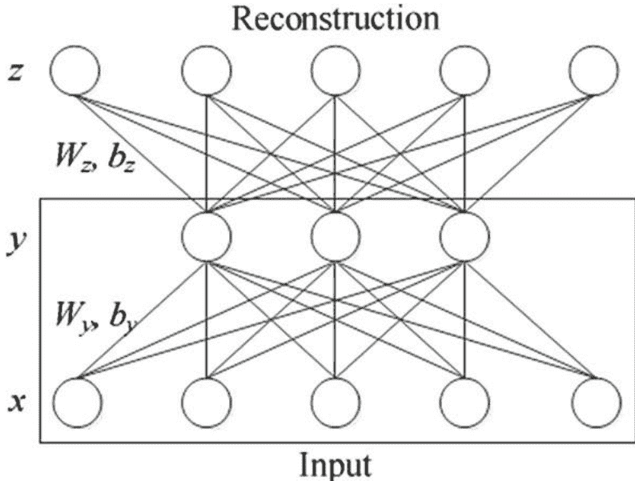

图 6.10 用于 HSI 分类的单层自编码器 [38]

数据被再生;这部分在 DL 世界中被称为解码。在这个过程中，模型试图通过它可以再生数据的值来学习，并且因此学习了存在于特定信息中的数据的区别特征。多个这样的编码器被放置在一起形成编码器堆栈。如果给定的数据具有复杂性，那么需要多个编码器进行特征挖掘。这种现象明显适用于高光谱场景的复杂和多维特性，因为该场景包含数百个光谱。详细内容可参考 [50]。这项工作源自 [38]，用于挖掘 HSI 的特征以进行后续分类。

这个过程可以用数学语言表示为

$$\phi=\sigma_{1}\left(w_{\phi} x+b_{\phi}\right), \psi=\sigma_{2}\left(w_{\psi} y+b_{\psi}\right)$$

其中 $w_{\phi}, w_{\psi}$ 表示权重，$\sigma_{1}(.)$ 表示 Sigmoid 激活函数，$\sigma_{2}(.)$ 表示 Sigmoid 激活函数。主要目标之一是减少再生误差。

整个过程需要有效的代价函数。通过交叉熵根据 CF[38] 完成了这一目标。除了 CF 之外，还考虑了 Sigmoid 根激活。CF 和激活函数可以用数学方式表示为

$$C F=-\frac{1}{c} \sum_{i=1}^{d} \sum_{j=1}^{m}\left[x_{i j} \log \left(\psi_{i j}\right)+\left(1-x_{i j}\right) \log \left(1-\psi_{i j}\right)\right]$$

图 6.11 深度光谱表示，每个输入和输出层各 1 层，4 个隐藏层，以及一个逻辑回归输出层 [38]


这里，$m$和$c$分别表示向量的高度和小批量的体积。此外，$x_{ij}(\psi_{ij})$ 显示了特定输入的指定分量。为了优化问题，利用小批量随机梯度下降来解决方程。

可以在 [38] 中找到从 HSI 角度对堆叠自编码器的全面研究以及其实现细节的详细描述。从 [38] 获得的图 6.11 清楚地描述了 SAE 的处理过程，包括逐层描述。在通过逐层模型挖掘特征之后，采用逻辑回归进行最终的基于像素的分类。

#### 6.3.4 多数投票

此时，获得了两种不同 HSI 分类算法的输出。HMRF 方法的输出包含场景的二值分割图，而基于 SAE 深度学习的分类方法的输出包含场景的基于像素的分类结果。作为最后一步，必须采用一些方法来融合两种方法的结果，以便每种方法都能克服另一种方法的弱点。为此，采用了作者在 [51] 中描述的多数投票 (MV) 投票技术，也在图 6.9 中描述。为了对每种技术的结果进行多数投票，计算属于每种技术的特定类别的像素体积。之后，如果大多数像素属于某个类别，则将所有像素归属于该类别。因此，按照这种方式，属于完全不同类别的算法的最强优点给出了它们的最佳结果，并且每种技术的最准确参与最终的结果。

### 6.4 实验结果和性能比较

在这项工作中，基于常规 AVIRIS 和 ROSIS 传感器的 Indian Pine 和 Pavia University 的 HSI 场景被用来评估所开发方法的性能，这些场景被认为是难以分类的。这些描述的场景已经被世界各地的研究人员广泛使用，以评估他们所开发方法的性能。由于其模糊性、多样性和现有采样数据的中断量，这些场景被认为是困难的。在第 2 章第 2.3 节中对每个场景进行了全面的解释，分析了所开发技术的性能，并与现有的支持向量机 (SVM) [33]、正交匹配追踪 (OMP) [52]、增广拉格朗日 - 多级逻辑 (LORSAL-MLL) [53] 和堆叠自编码器 (SAE-LR) [38] 等方法进行了比较。

如前所述，首先通过主成分分析降低了提供的 HSI 场景的维度，并且由于其中存在高变化数据，所以使用了初始的 4 个成分。随后，在每个 PCA 成分上计算 Sobel 边界检测方法，并使用 4 个成分的平均值。最后，将输出转换为场景的二进制形式，以计算如 [5] 所示的斜率。给定的场景通过 ISODATA 计算，并通过 HMRF-EM [5] 对该步骤和前一阶段的结果进行归一化处理。

还挖掘了光谱特征，并通过利用基于堆叠自编码器的逻辑回归进行像素级分类计算。最后，通过利用多数投票准则将上下文分割数据和光谱像素级分类结果融合在一起。这些阶段的结果显示在图 6.12 和 6.13 中。图 6.13 和表 6.4 和 6.5 清楚地展示了开发的 SAE-HMRF 方法与 SAE-LR 技术相比的改进性能，甚至在考虑上下文特征的情况下，其性能也优于其他已建立的方法。这也是显而易见的。

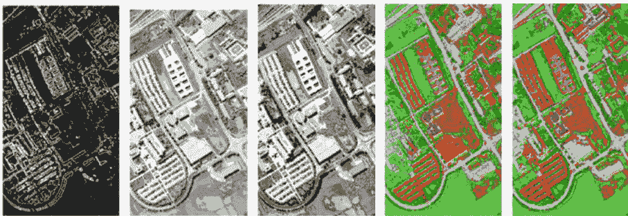

图 6.12 Pavia 大学数据集的光谱 - 空间相位 a 边缘检测阶段 b ISODATA c HMRF-EM d 基于 SAE-LR 的分类 e 基于 SAE-HMRF 的分类

图 6.13 Indian Pine 数据集的光谱 - 空间分类 a 边界检测阶段 b 基于 SAE-LR 的分类 c 基于 SAE-HMRF 的分类

表 6.4 使用 SVM [33]、OMP [52]、LORSAL-MLL [53]、SAE-LR [38] 和 SAE-HMRF 获得的 9% 训练样本的 Indian Pine 图像的每个类别的分类准确率

| 类别 | 训练 | 测试 | 支持向量机 | OMP | LORSAL-MLL | SAE-LR | SAE-HMRF |
|---|---|---|---|---|---|---|---|
| 1 | 5 | 49 | 77.73 | 55.12 | **100.0** | 93.33 | 94.11 |
| 2 | 143 | 1291 | 77.35 | 61.60 | 87.46 | 84.66 | **89.42** |
| 3 | 83 | 751 | 78.56 | 58.62 | 81.23 | 84.39 | **88.70** |
| 4 | 23 | 211 | 68.75 | 42.21 | 88.41 | 73.08 | **88.51** |
| 5 | 50 | 447 | 88.87 | 87.29 | **97.49** | 93.47 | 94.54 |
| 6 | 75 | 672 | 89.12 | 95.30 | **97.34** | 93.41 | 95.31 |
| 7 | 3 | 23 | 95.37 | 85.20 | **100.0** | **100.0** | **100.0** |
| 8 | 49 | 440 | 95.09 | 96.44 | **97.98** | 95.11 | 96.01 |
| 9 | 2 | 18 | 67.65 | 36.67 | **100.0** | **100.0** | **100.0** |
| 10 | 97 | 871 | 78.64 | 71.10 | 83.64 | 85.78 | **90.73** |
| 11 | 247 | 2221 | 81.19 | 74.11 | 86.31 | 83.46 | **89.11** |
| 12 | 61 | 553 | 79.74 | 51.05 | **91.79** | 81.62 | 85.27 |
| 13 | 21 | 191 | 92.26 | 96.85 | **100** | 98.52 | **98.87** |
| 14 | 129 | 1165 | 92.72 | 91.85 | **97.04** | 91.77 | 93.45 |
| 15 | 38 | 342 | | 69.79 | 41.67 | 86.18 | **89.95** |
| 16 | 10 | 85 | 97.96 | 91.90 | **100.0** | 97.96 | **99.05** |
| 总体准确率 | | | 82.91 | 73.38 | 87.18 | 86.85 | **90.08** |
| 平均准确率 | | | 83.17 | 71.06 | 90.83 | 89.95 | **93.09** |
| Kappa 系数 | | | 0.805 | 0.696 | 0.8536 | 0.8495 | **0.8875** |

从表 6.5 和 6.4 提供的结果可以看出，开发的方法在整体准确率计算和 kappa 常数方面也表现出了改进的性能。

表 6.5

| 类别 | 训练 | 测试 | 支持向量机 | OMP | LORSAL-MLL | SAE-LR | SAE-HMRF |
| :--- | :--- | :--- | :--- | :--- | :--- | :--- | :--- |
| 1 | 597 | 6034 | 97.50 | 64.16 | **100.0** | 96.88 | 97.18 |
| 2 | 1681 | 16971 | 97.70 | 82.23 | 98.50 | 98.30 | **99.01** |
| 3 | 189 | 1910 | 78.53 | 71.04 | **96.27** | 91.09 | 93.50 |
| 4 | 276 | 2788 | 89.29 | 93.43 | 91.03 | 99.15 | **99.40** |
| 5 | 121 | 1224 | 98.77 | **99.90** | 98.45 | 99.85 | 99.89 |
| 6 | 453 | 4576 | 83.04 | 69.47 | 97.24 | 96.44 | **97.51** |
| 7 | 120 | 1210 | 64.58 | 87.31 | 97.94 | 94.12 | **95.96** |
| 8 | 331 | 3351 | 86.90 | 71.57 | 99.94 | 93.27 | **95.14** |
| 9 | 85 | 862 | 99.92 | 97.27 | **100.0** | **100.0** | **100.0** |
| 总体准确率 | | | 92.04 | 78.07 | 98.59 | 97.12 | **98.72** |
| 平均准确率 | | | 88.47 | 81.82 | 97.28 | 96.56 | **97.46** |
| Kappa 系数 | | | 0.963 | 0.711 | 0.9719 | 0.9615 | **0.9746** |

### 6.5 基于深度自动编码器和隐马尔可夫随机场的提议高光谱图像分类方法总结

提出了一种基于 SAE 像素级分类和 HMRF 分割的新的分类框架。该方法对给定场景的光谱和空间特征都很敏感。在最后阶段，利用多数投票准则来整合提取的像素级结果和基于 HMRF 的分割结果。对 AVIRIS 和 ROSIS 基于数据集的实验结果证实了设计框架的有效性。

## 6.6 基于超分割和深度置信网络的高光谱图像分类

随着遥感技术的进步，成功而准确的高光谱图像 (HSI) 分析变得越来越重要，获取了具有多个光谱通道和场景的精确空间数据 [6]。如果有效利用丰富的光谱和空间数据，可以提高分类的准确性 [1]。

此外，遥感传感器的不断进步使得获取丰富的空间分辨率成为可能 [2]，从而评估 HSI 中的小空间地表覆盖。由于具有丰富的光谱 - 空间数据，HSI 表征成为一个活跃的研究领域。然而，它也面临着高维度、有限标记样本、休斯现象 [14] 和异质性 [54] 等巨大挑战。

大量的光谱通道但预定数量的样本导致了维度诅咒 [14]。因此，在 HSI 表征中，探索空间/结构特征与光谱特征和分类器的关系起着关键作用。迄今为止，已经开发出许多方法来处理 HSI 表征。传统的基于像素的分类器独立地处理每个像素，而不考虑空间数据。已经研究了 K 最近邻分类器（K-NN）、约束随机场 [55]、神经网络 [56] 和支持向量机 [33, 57]。在这些基于像素的分类器中，由于其处理高维数据的能力，支持向量机取得了改进的结果。绝大多数上述分类器都面临维度诅咒和有限的测试数据 [29]。此外，由于相邻像素之间存在强关联性 [6]，像素级分类器并不考虑空间数据。还提出了降维方法来处理高维度和有限的训练样本。主成分分析（PCA）[58] 和独立成分分析（ICA）[59] 是一些著名的方法。这些方法将光谱测量值从数百个缩减到仅几个波段（2 或 3），从而损害了光谱数据。波段选择决策是处理上述问题的另一种方法。

将上下文特征与光谱特征融合以获得所需的增强分类准确性是当前几年来引起关注的现实之一 [60]。近年来，人们越来越意识到上下文数据在 HSI 中的重要性，因为它对该主题任务的贡献很大，此外，HSI 获取传感器还包括具有收集场景能力的仪器，该场景不仅在光谱域中丰富，而且在空间域中具有可观的高分辨率。

因此，现在考虑到空间和光谱特征最终会产生增强的分类结果 [23]。因此，考虑上下文关联现在是必需的。

基于光谱和上下文特征的方法可以分为 3 组，其中包括除光谱特征外的上下文数据的融合。第一组包括在分类之前对上下文数据进行融合的技术，第二组考虑在分类过程中进行融合，而第三组考虑在分类之后进行融合。在第一组中，进行分类之前执行上下文特征的提取和集成；这些包括使用形态学特征挖掘上下文特征 [61-63]，以及通过灵活检测实际边缘 [23]。同样，基于多核的方法将上下文特征与光谱特性相结合 [64, 65]。相反，这些上下文特征挖掘方法涉及手动调整和信息，通常是手工制作的。分类方法的第二组包括通过分类过程将上下文特征添加到分类技术中；它包括统计可学习理论 (SLT)[54] 和并发子空间检测 (SSP)[66] 等方法。第三组方法是在独立分类过程之后添加上下文权重。例如，[67] 中的研究人员最初应用支持向量机进行基于像素的光谱分类。然后，应用分水岭分割进行上下文属性挖掘，然后对基于像素的光谱结果和分割结果进行多数投票以获得最终输出。例如，[53] 中的研究人员应用增广 Lagrangian 多级逻辑与多级逻辑 (LORSAL-MLL) 先验。同样，[4] 中的研究人员通过多数投票融合分割过程的结果和基于堆叠自编码器的分类结果。

近年来，神经网络对计算机视觉等许多领域产生了革命性的影响，深度学习在场景分类 [68]、通信识别 [69] 和语言处理 [70] 等方面展示了其有效性和价值。深度学习模型在高光谱场景分析中也有重要贡献 [71]。然而，将上下文影响纳入深度学习模型中是一个非常重要的问题。

在本章的这一部分中，我们开发并解释了一种新的方法，该方法基于深度置信网络 (DBN) 架构，用于光谱特征挖掘和基于灵活边缘检测的上下文特征挖掘；这两个光谱和上下文的结果在最后进行融合，以提高分类性能。光谱特征挖掘是通过 DL 根据 DBN 模型 [72] 和逻辑回归 (LR) 进行的，LR 被用作像素级分类器。另一方面，上下文特征挖掘是通过灵活的边缘评估根据分割进行的，该分割已在第 4 章中建立。这种开发的过程属于分类方法的第三组，光谱和上下文特征在最后进行组合。将特定像素分配给特定类别的最终决定取决于通过 DBN 进行的光谱分类的权重和通过基于边界检测的分割方法进行的上下文特征挖掘的权重。

### 6.6 基于超分割的高光谱图像分类

#### 6.6.1 提出的方法论

在 HSI 研究社区中，人们普遍认为加入上下文特征可以显著提高算法性能 [73]。该开发技术首先探索多层深度置信网络进行光谱特征挖掘，然后采用多元逻辑回归进行像素级分类。为了获得场景的有意义的上下文区域，采用了灵活的边缘检测根据分割。在第三阶段，采用多数选举 [74] 的根据程序来完全激活和组合光谱和上下文特征，以进行最终的光谱 - 上下文分类。每个阶段的详细解释见图 6.14、6.15 和 6.16。


图 6.14 光谱 - 空间分类框架

### 基于多深度网络的高光谱图像分类

- I. DBN-LR Pixel-wise classifier
  Input: hyperspectral dataset
  Output: HIS Classification
  1. Preprocessing stage.
  2. Training stage.
  3. Testing stage.
  4. Validation stage.
- II. Boundary Adjustment Based Segmentation
  Input: hyperspectral image
  Output: single band segmented map
  1. Band Grouping
  2. Boundary adjustment segmentation
  3. Merging
  4. Resulted output
- III. Combination of Maps
  Input: DBN classification map, segmentation map
  Output: spectral - spatial classification map
  1. Voting stage
  2. Winning stage
  3. Updating stage

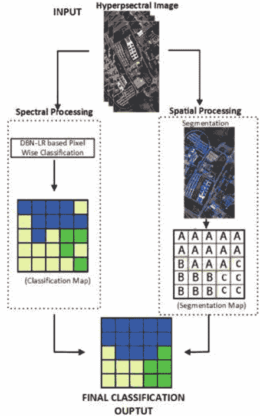

(a) 光谱阶段，空间阶段，组合阶段 (b) 光谱 - 空间分类框架

图 6.15 光谱 - 空间分类框架


图 6.16 基于 DBN 的像素级分类框架

##### 6.6.1.1 通过 DBN 进行光谱特征提取

深度置信网络由神经网络（NN）根据受限玻尔兹曼机（RBM）可学习模型组成，该模型首先包含可见层，用于接收输入的原始光谱数据 $x$，然后是下一层 $y$，该层通过参数学习保存与所提供的光谱信息中更高关联的区分特征，如图 6.15 所示。整体的功能形式可以解释为

$$E(x, y, \theta) = - \sum_{j=1}^{m} \frac{(x_j - b_j)^2}{2\sigma^2} - \sum_{i=1}^{n} a_i y_i - \sum_{j=1}^{m} \sum_{i=1}^{n} w_{ij} \frac{x_j}{\sigma_i} y_i \quad (6.17)$$

限制性分布由

$$P(y_j | x; \theta) = h \left( \sum_{i=1}^{m} w_{ji} x_j + a_i \right) \quad (6.18)$$

$$P(x_j | y; \theta) = V \left( \sum_{j=1}^{m} w_{ji} y_j \sigma_j^2 + b_j \right) \quad (6.19)$$

在这里，$\sigma$ 表示高斯可观测部分的标准差，$V(\cdot)$ 是高斯分布。

DBN 主要包括一个受限玻尔兹曼机，该机器叠放在一起，而 RBM 的训练则是 DBN 的一个关键部分。在学习阶段，提供可用的采样数据以对整个系统进行训练，并学习给定的参数以从 HSI 场景中获取上下文和光谱数据。该过程涉及参数的微调，其中包括反向传播过程。在分类阶段，使用训练好的网络模型对给定数据进行分类，从而得到独立的基于像素的分类结果。在这个过程中，使用 DBN-LR，它利用场景的光谱信息进行特征挖掘。

##### 6.6.1.2 通过超分割进行空间特征提取

在空间域中，研究界普遍认为有两个主要条件，在上一章节中已经解释过，在上下文特征挖掘过程中起着重要作用。第一个条件说明，具有相似光谱特征的像素值很可能具有相同的类别。

其次，从光谱角度来看，邻近且具有很强关联性的像素也可能具有相同的最终类别。因此，为了考虑这些上下文关联的特性，开发了灵活的边界检测过程并应用了它。


图 6.17 超分割过程的框架

为了考虑上下文关联的特性，开发了灵活的边界检测过程并应用了它。这种方法在第 4 章已经有更详细的解释。

存在一个平衡方程，它对于贡献至关重要，由 3 个主要因素组成，并可以用数学模型表示为

$$A(b, a_i) = \sqrt{|x_b - m_i|^2 + \lambda \tilde{n}_i(b) |Grad(b)|}$$

在这里，$x_b$ 被称为光谱向量，每个边缘像素都存在一个，$m_i$ 是主流向量，$n~_i(b)$ 被称为直线化函数，$|Grad(b)|$ 表示标记像素 $b$ 处的斜率。完整的上下文分割方法的执行在 [28] 中描述。

##### 6.6.1.3 多数投票

从 DBN-LR（基于光谱的分类）和基于边缘的灵活方法得到的各自结果通过多数投票 [74] 进行组合，以便能够容纳每个结果的最大权重，形成最终的分类地图。在所述的结果融合方法中，分割区域中的每个像素都被分配给由 DBN-LR 分类器分配的最大迭代类别。通过这种方式，可以容纳每个结果的最大响应，从而获得更改进的分类地图（图 6.17）。


图 6.18 高光谱图像数据集

#### 6.6.2 实验结果和性能比较

为了评估所开发方法的执行和输出，我们在著名、困难和复杂的 AVIRIS 和 ROSIS 传感器基于休斯顿大学和 Pavia 大学场景上进行了各种实验，如图 6.18 所示。这些场景被世界上大多数研究人员广泛应用于展示他们算法的结果。每个场景的详细解释见第 2 章第 2.3 节。

##### 6.6.2.1 光谱 - 空间 DBN-HS 分类

所使用的实验设置包括一个 Windows 10 系统，3.0 GHz 的计算机和 NVIDIA GeForce GTX 980 规格的显卡。所使用的实现编码语言是 Theano。网络中的内部层数量在特征挖掘过程中具有重要的权重，因为它决定了特征挖掘的质量和数量，从而影响了分类的性能。但是增加内部层数量并不会增加性能，即性能与隐藏层数量不成比例。对于每个 HSI 数据场景，只有现有标记数据的 10% 被随机选择并用于训练目的。对于 Pavia University 和 Houston University 数据集，内部层数量也被选择为两层，而每个内部层的神经元数量为 50，这是根据实验设置和建议选择的 [24]。开发的 DBN-HS 方法的准确性水平与著名的现有方法相关，例如支持向量机 (SVM) [33]、正交匹配追踪 (OMP) [52]、深度置信网络通过 LR (DBN-LR) [24] 以及最近建立的深度卷积神经网络 (CNN) [35]。在 DBN-LR 的情况下，考虑了光谱信息。

在表 6.6 和 6.7 中展示了开发方法的每个类别的单独性能以及对所描述的高光谱场景的现有技术。在这些 HSI 场景中面临的一项重要困难和复杂性首先是场景中最小物体的大小，其次是噪声，以及由于小的上下文特征而导致的各种像素数量。在休斯顿大学的场景中，开发的方法在具有最小上下文大小的结构上表现出色。我们相信，这是因为在上下文特征挖掘期间应用了有效的灵活边界检测分割方法，并且随后通过多数投票将其效果包含在最终的分类结果中。开发方法的高光谱场景分类结果的全面图像显示在图 6.19 中。场景中显示的每种颜色对应于地球表面区域的特定类别，与之前提到的真实场景完全相似。

最终的性能表明，通过实验证明了所开发的方法在概念上和实际上都得到了认可，上下文特征在改善性能方面也起到了至关重要的作用。此外，上下文特征还有助于消除和克服椒盐噪声。

总的来说，调查结果通过结合上下文数据和光谱特征混合，在高光谱场景分类方面取得了重要的发展。所开发的算法在小尺寸上下文区域上取得了显著的成果。

| 类别 | 训练 | 测试 | 支持向量机 | OMP | CNN | DBN-LR | DBN-HS |
|---|---|---|---|---|---|---|---|
| 1 | 125 | 1126 | 97.47 | 98.27 | 81.20 | **99.20** | 99.0 |
| 2 | 125 | 1129 | 98.32 | 98.10 | 83.55 | **99.60** | 99.20 |
| 3 | 70 | 627 | 99.37 | 99.68 | 99.41 | **100.0** | **100** |
| 4 | 124 | 1120 | 98.01 | 96.70 | 91.57 | **99.60** | **99.60** |
| 5 | 124 | 1118 | 96.01 | 98.48 | 94.79 | 99.60 | **99.60** |
| 6 | 33 | 292 | 99.83 | 97.95 | 95.10 | 97.2 | **98.05** |
| 7 | 127 | 1141 | 91.23 | 86.90 | 63.53 | 97.0 | **98.16** |
| 8 | 124 | 1120 | 86.23 | 89.82 | 42.64 | 97.8 | **98.0** |
| 9 | 125 | 1127 | 86.99 | 79.37 | 58.17 | 94.0 | **95.25** |
| 10 | 123 | 1104 | 91.42 | 89.68 | 41.80 | 97.4 | **97.95** |
| 11 | 124 | 1111 | 91.67 | 82.77 | 75.71 | 97.3 | **98.1** |
| 12 | 123 | 1110 | 87.05 | 81.94 | 84.15 | 95.2 | **96.26** |
| 13 | 47 | 422 | 78.16 | 35.55 | 40.00 | 88.0 | **91.1** |
| 14 | 43 | 385 | 97.42 | 98.18 | 98.79 | **100** | **100** |
| 15 | 66 | 594 | 99.49 | 98.40 | 97.89 | **100** | **100** |
| 总体准确率 | | | 93.06 | 89.70 | 85.42 | 97.70 | **98.98** |
| 平均准确率 | | | 93.25 | 88.78 | 76.55 | 97.50 | **98.46** |
| Kappa 系数 | | | 0.925 | 0.889 | 0.7200 | 0.975 | **0.9875** |

| 类别 | 训练 | 测试 | 支持向量机 | OMP | CNN | DBN-LR | DBN-HS |
|---|---|---|---|---|---|---|---|
| 1 | 597 | 6034 | 97.50 | 64.16 | 87.34 | 87.37 | **89.78** |
| 2 | 1681 | 16971 | 97.70 | 82.23 | **94.63** | 92.10 | 94.01 |
| 3 | 189 | 1910 | 78.53 | 71.04 | **86.47** | 85.57 | **88.50** |
| 4 | 276 | 2788 | 89.29 | 93.43 | 96.29 | 95.11 | **97.40** |
| 5 | 121 | 1224 | 98.77 | 99.90 | 99.65 | 99.74 | **99.89** |
| 6 | 453 | 4576 | 83.04 | 69.47 | 93.23 | 91.94 | **94.30** |
| 7 | 120 | 1210 | 64.58 | 87.31 | **93.19** | 92.21 | 93.96 |
| 8 | 331 | 3351 | 86.90 | 71.57 | 86.42 | 87.02 | **88.14** |
| 9 | 85 | 862 | 99.92 | 97.27 | **100** | **100** | **100** |
| 总体准确率 | | | 92.04 | 78.07 | 92.56 | 91.18 | **93.98** |
| 平均准确率 | | | 88.47 | 81.82 | 93.02 | 92.34 | **93.46** |
| Kappa 系数 | | | 0.903 | 0.711 | 0.9006 | 0.8828 | **0.9175** |


(a) 休斯顿大学


(b) 帕维亚大学

图 6.19 使用提出的方法对休斯顿大学和帕维亚大学数据集进行分类结果

### 6.7 基于深度学习的高光谱图像分类方法总结

本章介绍了基于深度学习的高光谱图像分类方法，在分类之后加入了空间特征。

在第一种提出的方法中，利用分割的深度置信网络 (DBN)，将光谱通道分割并分组成相似的波段，然后分别对每组波段应用 DBN，从而得到更稳健和抽象的特征。

同时管理大量特征会导致复杂性和复杂性，并损害 DBN 的准确性。因此，通过通过分割和光谱分割融合上下文属性的特征，将实际光谱区域划分为几个相关通道，然后对每个段落分别应用 DBN，开发了双相分类方法。

因此，降低学习过程的复杂性并挖掘本地特征使得 DBN 能够有效地挖掘光谱 - 空间特征变得更容易。

在本章的第二部分中，利用基于深度学习的技术，在分类阶段之后加入了空间上下文特征，从而提高了性能。两种主要的深度学习架构堆叠自动编码器 (SAE) 和 DBN

用于此目的。首先，利用深度学习架构提取抽象和代表性特征。其次，通过 HMRF-EM 技术和提出的分割技术进行空间分割过程。

最后，采用多数表决 (MV) 程序将光谱和空间结果整合，得到最终的分类结果。

对 AVIRIS 和 ROSIS 传感器基于不同 HSI 数据集进行了广泛的实验分析。提出的基于深度学习的方法产生了更好的分类结果，并超过了现有的知名和广泛使用的 HSI 分类方法。

### 参考文献

- 1. Fauvel M, Benediktsson JA, Chanussot J, Sveinsson JR (2008) 使用支持向量机和形态学特征对高光谱数据进行光谱和空间分类。IEEE Trans Geosci Remote Sens 46(11):3804–3814
- 2. Ghamisi P, Dalla Mura M, Benediktsson JA (2015) 基于属性特征的光谱 - 空间分类技术综述。IEEE Trans Geosci Remote Sens 53(5):2335–2353
- 3. Ghamisi P, Couceiro MS, Martins FM, Benediktsson JA (2014) 基于分数阶达尔文粒子群优化的多层次图像分割。IEEE Trans Geosci Remote Sens 52(5):2382–2394
- 4. Mughees A, Tao L (2016) 高光谱图像分类的高效深度自编码器学习。In: 2016 international conference on virtual reality and visualization (ICVRV), pp 44–51. IEEE
- 5. Ghamisi P, Benediktsson JA, Ulfarsson MO (2013) 基于隐马尔可夫随机场和期望最大化的 高光谱图像的光谱 - 空间分类。在：2013 年 IEEE 国际地球科学与遥感研讨会（IGARSS），第 1107-1110 页。IEEE
- 6. Willett RM, Duarte MF, Davenport MA, Baraniuk RG (2014) 高光谱成像中的稀疏性和结构：感知、重建和目标检测。IEEE 信号处理杂志 31(1):116-126
- 7. Van Der Meer F (2004) 高光谱图像中光谱吸收特征的分析。Int J Appl Earth Obs Geoinf 5(1):55-68
- 8. Lacar F, Lewis M, Grierson I (2001) 利用高光谱图像在南澳大利亚巴罗莎谷地区进行葡萄品种绘图。在：2001 年 IEEE 国际地球科学与遥感研讨会（IGARSS），第 6 卷，第 2875-2877 页。IGARSS'01, vol 6, pp 2875-2877, IEEE
- 9. Malthus TJ, Mumby PJ (2003) 沿海区域的遥感：概述和未来研究的优先事项
- 10. Yuen PW, Richardson M (2010) 高光谱成像及其在安全、监视和目标获取中的应用简介。成像科学杂志 58(5):241-253
- 11. Kuybeda O, Malah D, Barzohar M (2007) 高维噪声信号的秩估计和冗余减少，同时保留稀有向量。IEEE 信号处理交易 55(12):5579-5592
- 12. Jia X, Kuo B-C, Crawford MM (2013) 高光谱图像分类的特征挖掘。Proc IEEE 101(3):676–697
- 13. Chen Y, Lin Z, Zhao X, Wang G, Gu Y (2014) 基于深度学习的高光谱数据分类。IEEE 选择应用地球观测与遥感杂志 7(6):2094-2107
- 14. Hughes G (1968) 统计模式识别器的平均准确性。IEEE 信息论交易 14(1):55-63
- 15. Krizhevsky A, Sutskever I, Hinton GE (2012) 使用深度卷积神经网络进行图像分类。在：神经信息处理系统的进展，第 1097-1105 页

16. Yuan Z, Lu Y, Xue Y (2016) Droiddetector: 使用深度学习进行安卓恶意软件特征提取和检测。清华科技 21(1):114-123
17. Gao Y, Dai Q (2014) 通过超图学习实现高效的基于视图的三维物体检索。清华科技 19(3):250-256
18. Chen X, Huang H (2011) 用于故障检测的免疫前馈神经网络。清华科技 16(3):272-277
19. Fauvel M, Tarabalka Y, Benediktsson JA, Chanussot J, Tilton JC (2013) 高光谱图像的光谱 - 空间分类的进展。IEEE 会议论文 101(3):652-675
20. 赵 W, 杜 S (2016) 光谱 - 空间特征提取用于高光谱图像分类：降维和深度学习方法。IEEE Trans Geosci Remote Sens 54(8): 4544-4554
21. 赵 W, 杜 S (2016) 学习多尺度和深度表示用于遥感图像分类。ISPRS J Photogram Remote Sens 113: 155-165
22. Mughees A, Tao L (2017) 通过自适应形状深度学习进行高光谱图像分类。在：2017 年 IEEE 国际图像处理会议 (ICIP)
23. Mughees A, Tao L (2017) 基于超体素的深度学习用于高光谱图像分类。在：2017 年 IEEE 国际图像处理会议 (ICIP)
24. 陈 Y, 赵 X, 贾 X (2015) 基于深度置信网络的高光谱数据光谱 - 空间分类。IEEE J Sel Top Appl Earth Obs Remote Sens 8(6):2381-2392
25. 李 J, Bioucas-Dias JM, Plaza A (2013) 基于循环置信传播和主动学习的高光谱数据光谱 - 空间分类。IEEE Trans Geosci Remote Sens 51(2):844-856
26. 刘 J, 吴 Z, 魏 Z, 肖 L, 孙 L (2013) 用于高光谱图像分类的空间 - 光谱核稀疏表示。IEEE J Sel Top Appl Earth Obs Remote Sens 6(6):2462-2471
27. Foody GM, Mathur A (2004) 通过支持向量机对多类图像分类进行相对评估。IEEE Trans Geosci Remote Sens 42 (6): 1335-1343
28. Mughees A, Chen X, Tao L (2016) 无监督高光谱图像分割：在边界调整中融合光谱和空间信息。在：2016 年日本仪器与控制工程师学会 (SICE) 第 55 届年会，第 1466-1471 页。IEEE
29. Ambikapathi A, Chan T-H, Lin C-H, Chi C-Y (2012) 基于凸几何的对异常值不敏感的高光谱图像成分数估计。信号 1:1-20
30. Hinton GE (2002) 通过最小化对比散度训练专家产品。神经计算 14(8):1771-1800
31. 贾 X, Richards JA (1999) 分段主成分变换用于高效的高光谱遥感图像显示和分类。IEEE Trans Geosci Remote Sens 37 (1): 538-542
32. Zabalza J, Ren J, Yang M, Zhang Y, Wang J, Marshall S, Han J (2014) 用于改进高光谱成像和 SAR 中特征提取和数据降维的新型折叠 PCA。ISPRS J Photogram Remote Sens 93: 112-122
33. Melgani F, Bruzzone L (2004) 支持向量机用于高光谱遥感图像分类。IEEE Trans Geosci Remote Sens 42 (8): 1778-1790
34. Mou L, Ghamisi P, Zhu XX (2017) 用于高光谱图像分类的深度递归神经网络。IEEE Trans Geosci Remote Sens 55 (7): 3639-3655
35. 胡 W, 黄 Y, 魏 L, 张 F, 李 H (2015) 深度卷积神经网络用于高光谱图像分类。J Sens 2015
36. Jimenez LO, Landgrebe DA (1999) 通过投影追踪进行高光谱数据分析和监督特征降维。IEEE Trans Geosci Remote Sens 37 (6): 2653-2667
37. Chang C-I, Du Q, Sun T-L, Althouse ML (1999) 一种联合波段优先级和波段去相关方法用于高光谱图像分类。IEEE Trans Geosci Remote Sens 37 (6): 2631-2641
38. 林 Z, 陈 Y, 赵 X, 王 G (2013) 使用自动编码器进行高光谱图像的光谱 - 空间分类。在：2013 年第 9 届信息、通信和信号处理国际会议 (ICICS), 第 1-5 页。IEEE
39. Plaza A, Plaza J, Martin G (2009) 将空间约束纳入遥感高光谱数据的光谱混合分析。在：IEEE 国际机器学习信号处理研讨会，2009 年。MLSP 2009，第 1-6 页。IEEE
40. 钱勇，叶明（2013）使用非局部光谱空间结构稀疏表示和噪声估计进行高光谱图像恢复。IEEE J Sel Top Appl Earth Obs Remote Sens 6(2):499-515
41. Mughees A, Chen X, Du R, Tao L (2016) Ab3c：自适应基于边界的高光谱图像波段分类。J Appl Remote Sens 10(4):046009-046009
42. Derin H, Kelly PA (1989) 离散指数马尔可夫型随机过程。Proc IEEE 77(10):1485-1512
43. Ghamisi P, Benediktsson JA, Ulfarsson MO (2014) 基于隐马尔可夫随机场的高光谱图像光谱空间分类。IEEE Trans Geosci Remote Sens 52(5):2565-2574
44. Bengio Y, LeCun Y 等（2007）将学习算法扩展到人工智能。大规模核机器 34(5)：1-41
45. Camps-Valls G, Bruzzone L（2009）遥感数据分析的核方法。Wiley
46. López-Fandiño J, Quesada-Barriuso P, Heras DB, Argüello F（2015）基于高通量计算设备的高光谱遥感图像分类的高效 elm 技术。IEEE J Sel Top Appl Earth Obs Remote Sens 8（6）：2884-2893
47. Zhang Y, Brady M, Smith S（2001）通过隐马尔可夫随机场模型和期望最大化算法对脑 MR 图像进行分割。IEEE Trans Med Imaging 20（1）：45-57
48. Breiman L, Friedman J, Olshen R, Stone C（1965）Isodata，一种新的数据分析和分类方法。技术报告，斯坦福研究所
49. Geman S, Geman D（1984）随机松弛，Gibbs 分布和贝叶斯恢复 - 图像。IEEE Trans Pattern Anal Mach Intell 6：721-741
50. Vincent P, Larochelle H, Lajoie I, Bengio Y, Manzagol P-A (2010) 堆叠去噪自动编码器：使用局部去噪准则在深度网络中学习有用的表示。J Mach Learn Res 11(Dec):3371-3408
51. Tarabalka Y, Chanussot J, Benediktsson JA (2010) 使用分水岭变换进行高光谱图像的分割和分类。Pattern Recognit 43(7):2367-2379
52. Tropp JA, Gilbert AC (2007) 通过正交匹配追踪从随机测量中恢复信号。IEEE Trans Inf Theory 53(12):4655-4666
53. Li J, Bioucas-Dias JM, Plaza A (2011) 使用新的贝叶斯方法和主动学习进行高光谱图像分割。IEEE Trans Geosci Remote Sens 49(10):3947-3960
54. Camps-Valls G, Tuia D, Bruzzone L, Benediktsson JA (2013) 高光谱图像分类的进展：使用统计学习方法进行地球监测。IEEE Signal Process Mag 31(1):45-54
55. 钟 P, 王 R（2010）学习条件随机场用于高光谱图像的分类。IEEE 图像处理期刊 19（7）：1890-1907
56. Ratle F, Camps-Valls G, Weston J（2010）半监督神经网络用于高效的高光谱图像分类。IEEE 地球科学遥感期刊 48（5）：2271-2282
57. Gualtieri J, Chettri S（2000）支持向量机用于高光谱数据的分类。在：IEEE 2000 年国际地球科学和遥感研讨会，2000 年。会议论文。IGARSS 2000, 卷 2, 页 813-815. IEEE
58. Rodarmel C, Shan J（2002）用于高光谱图像分类的主成分分析。Surv Land Inf Sci 62(2):115
59. 王杰，张昌义（2006）基于独立分量分析的高光谱图像分析的降维方法。IEEE Trans Geosci Remote Sens 44(6):1586-1600
60. Bengio Y, Courville A, Vincent P (2013) 表示学习：综述与新视角。IEEE Trans Pattern Anal Mach Intell 35(8):1798-1828
61. Ghamisi P, Benediktsson JA, Sveinsson JR (2014) 基于属性特征和监督特征提取的自动光谱 - 空间分类框架。IEEE Trans Geosci Remote Sens 52(9):5771-5782
62. Ghamisi P, Benediktsson JA, Cavallaro G, Plaza A (2014) 基于监督特征提取和形态属性特征的自动光谱 - 空间分类框架。IEEE J Sel Top Appl Earth Obs Remote Sens 7(6):2147-2160
63. Li J, Zhang H, Zhang L (2014) 通过使用扩展形态属性概要和稀疏变换对超高分辨率图像进行监督分割。IEEE 地球科学遥感通信快报 11(8):1409-1413
64. Li J, Marpu PR, Plaza A, Bioucas-Dias JM, Benediktsson JA (2013) 用于高光谱图像分类的广义复合核框架。IEEE 地球科学遥感通信 51(9):4816-4829
65. Zhou Y, Peng J, Chen CP (2015) 用于高光谱图像分类的复合核极限学习机。IEEE 选择应用地球观测遥感杂志 8(6):2351-2360
66. Chen Y, Nasrabadi NM, Tran TD (2013) 通过核稀疏表示进行高光谱图像分类。IEEE 地球科学遥感通信 51(1):217-231
67. Tarabalka Y (2010) 使用光谱 - 空间方法对高光谱数据进行分类。博士论文，格勒诺布尔国立理工学院-INPG
68. Hinton GE, Salakhutdinov RR (2006) 用神经网络降低数据的维度。科学 313(5786):504-507
69. Yu D, Deng L, Wang S (2009) 在深度结构化条件随机场中学习。在：NIPS 研讨会论文集，第 1-8 页
70. Mohamed A-R, Dahl G, Hinton G (2009) 用于电话识别的深度信念网络。在：深度学习语音识别和相关应用的 NIPS 研讨会，卷 1，第 39 页
71. Zhang L, Zhang L, Du B (2016) 遥感数据的深度学习：关于现有技术的技术教程。IEEE Geosci Remote Sens Mag 4(2):22-40
72. Hinton GE, Osindero S, Teh Y-W (2006) 用于深度信念网络的快速学习算法。Neural Comput 18(7):1527-1554
73. Zhu Z, Woodcock CE, Rogan J, Kellndorfer J (2012) 利用 Landsat 和 SAR 数据评估城市和近郊土地覆盖分类的光谱、极化、时间和空间维度。Remote Sens Environ 117:72-82
74. Lam L, Suen S (1997) 将多数投票应用于模式识别：其行为和性能分析。IEEE Trans Syst Man Cybern Part A Syst Hum 27(5):553-567

## 第 7 章 基于稀疏的高光谱数据分类

在本节中，我们使用几何解释重新阐述了最稀疏解问题。找到最稀疏的解等价于在 Eq. 7.1 中的 l0-范数问题。不幸的是，这个 l0-最小化问题在计算上非常耗时，因此我们将证明以下在 Eq. 7.2 中的 l1-最小化方法是一个很好的近似方法。让我们首先定义一个单位多面体 P0 为

P0 = {α : ||α||1 ≤ 1} ⊂ R^n

通过进行线性变换 A，我们得到一个新的多面体 A(γP0)：

A(γP0) = {α : ||Aα||1 ≤ γ} ⊂ R^m

从这个意义上讲，l1 最小化问题等价于当我们将 γ从 0 缩放到找到第一个 γ*，使得 y ∈ A(γ*P0)。

请注意，这个线性变换具有以下特性：

- 边界保留性质：多面体 P0 的节点仍然是 A(P0) 的面。
- 缩放性质：如果我们缩放 P0，则 A 的图像也会以相同的比例缩放。

这两个属性直接推导出以下结论：l1-最小化恢复 - 稀疏解 α0 如果 A(α0/||α0||1) 是 A(P0)的一个节点，即 α0 只有一个非零项。

这个主张可以推广。如果是这样，我们可以得出结论：l1 只有在 A(P0) 是 t-近邻的情况下，才能正确地找到最稀疏的解，且非零项不超过 t 个。只有当 A(P0) 是 t-近邻的时候，才能正确地找到最稀疏的解，且非零项不超过 t 个。

请注意，这 t 应该是相当高的：即使是由随机系数（例如均匀和高斯）给出的多面体 P 也是高度邻近的。

高维数据的分类是模式识别中的一个重要问题。如果给定的训练数据与数据的维数之比有限，由于参数的值变得不可靠，估计参数变得越来越困难。因此，算法的分类准确性下降。在遥感中，通常很难获得大量标记的样本，因为这涉及到实地工作，并将标签分配给像素或将像素的光谱与光谱库进行匹配，这需要有经验的分析师。随着遥感中出现了新的传感器，即高光谱传感器，问题变得更加突出，因为传感器在大量波段上捕捉光线并因此产生高维数据。因此，这些传感器为地面上的许多材料的分类提供了异常信息，但同时为这些样本分配标签仍然困难且极其昂贵。在高维空间中工作的分类器非常理想，对于少数标记样本，因为它可以减少对大量标记样本的需求，最终减少了高光谱数据分类所需的成本和工作量。在本章中，提出了一种新的分类方法用于在高维空间中对少数标记样本的高光谱数据进行分类。

高维信息的分组与少量标记示例的结合是一个重要的挑战，除非可以利用数据的一些特殊属性来满足这个挑战。在遥感领域，这个问题尤为严重，因为标记高维数据的任务涉及到困难和成本因素。本章利用高光谱信息的某些独特属性，并提出了一种基于ℓ1 最小化的稀疏表示分类方法，以解决训练样本数量非常少与高光谱信息中可用光谱通道数量相比的约束问题。我们认为每个高光谱通道信息类别内的信息位于一个非常低维子空间中。与传统的有监督技术相比，所提出的方法不需要单独的训练和测试阶段，因此不需要模型创建的训练过程。

此外，为了展示高光谱信息的稀疏性并处理通用线性规划 (LP) 求解器的计算负担和时间开销，我们提出了一种基于同伦的稀疏顺序方法，该方法在信息非常有限的情况下工作高效。

这种方法不仅时间高效。而且还产生与传统方法相当的结果。对四个真实高光谱数据集进行了大量实验，结果表明高光谱数据非常稀疏，并且在大多数情况下，所提出的方法提供了比现有技术更高的分类准确性。对四个真实高光谱数据集进行了广泛研究，结果表明高光谱数据在本质上是非常稀疏的，并且所提出的方法在不同数据库上具有稳健性，提供了更高的准确性、精度和效率，比现有的尖端技术更加高效。

### 7.1 引言

在过去的十年中，高光谱传感器已经成为遥感领域的重要突破，为提供有价值且丰富的数据。这些传感器在非常多的连续通道中获取材料的亮度，因此提供了包含不同材料信息的优秀数据。由于传感器获取的丰富数据，高光谱分类已经应用于许多领域。

在遥感中，通常需要数百甚至数千个标记样本才能获得良好的分类结果，而这几乎是不可能的，由于光谱数据的大量，会出现休斯现象。

遗憾的是，在计算机视觉和图像处理中，获得足够数量的采样测试是一个普遍问题，而在遥感中，这是一个日益严重的问题，因为识别和标记训练样本非常困难和昂贵，有时甚至是不可行的。目前，在本章中，我们解决了在高维空间中利用少量采样的高光谱数据的重要问题。

尽管已经进行了大量的光谱数据分类研究，但利用有限的训练样本对高维高光谱信息进行分类仍然是一个开放的研究领域 [1, 2]。

对于高光谱数据分类，监督方法效果不错 [3]。虽然提出了人工神经网络来获得良好的分类结果，但需要大量标记的训练数据来熟悉模型，并且还需要适当的降维过程。Wright 等人 [4] 提出了基于稀疏聚类方法用于人脸识别，需要大量的训练样本。其他研究 [5, 6] 利用了基于稀疏聚类的方法进行高光谱信息分类，但这些方法需要大量标记数据才能发挥良好的作用。

在监督技术中 [7, 8]，支持向量机（SVM）是一种先进的方法，通过将自身限制在受限训练数据的范围内，并在高维信息（如高光谱图像）存在的情况下，能够很好地工作。然而，基于 SVM 的策略对模型选择非常敏感。请参阅第二节以获取更多细节。

另一种最近引入的方法是动态子空间方法 [9]，该方法成功地处理了少量训练数据的问题，通过引入不同的分类器系统来对高光谱信息进行分类。

尽管文献中提供了许多分类算法，但在高维空间中使用少量标记样本进行高光谱数据分类仍然是一项困难的任务。

解决高维数据分类中稀缺训练样本问题的另一种传统方法是通过特征提取或特征选择来降低维度。降维策略的一个重要缺点是它们只适用于特定情况，并没有通用的解决方案。

有一个适用于所有高光谱信息的可访问的过程。它需要相当多的时间、早期信息和实验来寻找一个合适的降维方法。

最近，来自过完备字典的稀疏表示已成为计算机视觉网络的焦点 [10]。稀疏性是一个强大的模型，试图将信息描述为较少数量的序列，这些序列是从信息本身中发现的。为了获得出色的表示，如离散余弦变换和离散小波变换在信号处理网络中已经使用了很长时间 [11]。最近的研究表明，使用过完备字典的稀疏表示可以通过线性规划来理解 [12]。

在 21 世纪第二个十年的早期，稀疏表示在数据分类场景中得到了成功的实验。因此，我们可以看到这个概念在许多计算机视觉领域的实现，包括人脸识别 [4, 13]、语音识别 [14] 和信号识别 [15]。类似地，当时在压缩感知方面的研究 [4, 7, 16-19] 经过详细的实验得出结论，如果潜在结果足够稀疏，那么在那个阶段，最小化 $\ell^1$ 将获得与最小化 $\ell^0$ 相似的结果。

高维度和稀缺的训练样本问题通常很难解决，除非信息包含一些独特的属性。在本章中，我们提出了一种利用高光谱信息的特殊属性的 $\ell^1$ 最小化-based 稀疏数据分类技术。该方法利用了少量可用样本进行高维数据处理，其中每个 HSI 图像的稀疏描述通过利用由所有类别的可用训练数据形成的字典进行评估。请注意，基于稀疏的方法并不是一种通用的解决方案，其性能取决于数据的特性。我们的方法依赖于训练数据样本属于特定类别的期望，即它们位于低维子空间中。此外，任何测试都可以表示为较少字典项的线性组合。因此，基于这个期望，我们推断通过使用较少的训练数据标签来获得良好的结果，我们可以利用 $\ell^1$ 最小化-focused 稀疏方法，因为它将在字典方面提供最稀疏的解决方案，即当前的训练数据。

在 [5, 20, 21] 中的作者提出了一种基于稀疏的 HSI 分类表示。然而，与他们的方法相反，我们提出了一种基于稀疏的 HSI 信息分类框架，利用较少的可用训练样本在高维空间中。沿着这些线路，我们展示了过度确定的情况，即 $d>n$ 作为欠确定的问题，即 $d<n$ 同时也对噪声进行建模。

根据 [22] 的记载，当使用极少量的训练样本对数据进行重构时，通过学习每个类别的词汇表可以获得高度准确的高光谱数据分类结果。本章重点介绍我们提出的方法，该方法依赖于全局稀疏表示而不是附近的每个类别的表示，其中包含了单词参考中所有类别的训练样本。

开发的技术在 HSI 的分类中具有更好的性能，因为稀疏方法具有判别特性，能够从给定的词汇参考中选择最少的参数（这意味着它具有给定类别的训练样本），从而有效地呈现训练数据。这种开发的算法框架甚至更具优势，因为它最适合 HSI 数据的要求。实验结果显示分类效果非常令人鼓舞。此外，与 typical 方法相比，需要对 HSI 进行降维和独立的训练和测试阶段，然后生成一个模型，之后再利用该模型生成结果，开发的方法不需要任何这样的步骤。

由于通用的线性规划（LP）求解器，即内点技术和单纯形法等，在计算上是昂贵的（$O(n^3)$）和繁琐的，它们不太适合快速处理。因此，我们进一步提出了一种基于 Homotopy[23-25] 的快速稀疏表示，用于高光谱数据的分类。Homotopy calculation 提供了首选解决方案，即如果隐藏的解具有 $k$ 个非零元素，则它在 $k$ 个迭代步骤中实现该解决方案。

换句话说，当且仅当问题是高度稀疏的时候，同伦计算才能有效地工作。将会证明同伦根据稀疏表示对 HSI 数据非常稀缺，并且比通用的 LP 解决方案更快，而精度仍然与通用的 LP 解决方案相当。

对四个真实的高光谱数据集进行广泛测试表明，高光谱数据非常稀疏，并且在大多数情况下，所提出的方法比现有的分类技术（如 SVM、半监督、特殊子空间、最近邻和最近子空间策略）具有更高的分类性能，即使在训练样本较少的情况下也是如此。

此外，我们还对同伦方法和通用 LP 求解器进行了时间对比，结果表明该方法速度更快。

剩余的章节按照这样的方式组织。第 7.2 节讨论相关技术。第 7.3 节介绍了推荐的技术。第 7.4 节讨论了实验及其结果。第 7.5.1 节介绍了求解器的稀疏性评估。最后，第 7.6 节总结了本章。

### 7.2 相关方法

本章的这部分介绍并简要描述了最近子空间和最近邻策略等相关技术。这些与基于稀缺策略的 $\ell^1$ 相关联。三种不同的技术，即动态子空间、SVM，并且半监督策略也被提出。这些是最先进的策略，用于利用较少的训练样本进行高光谱信息分类。

最近子空间方法（NS）和最近邻方法（NN）：NS [26] 假设特定类别的样本包含在一个子空间中，并且这些样本覆盖了子空间，即样本作为子空间的基础。任何新的测试向量都可以被视为基础向量的直接组合，即或者等价地描述为

$$ y = \sum_{j=1}^{n} \alpha_j a_j + \epsilon $$

或等效地

$$ y = B\alpha + \epsilon $$

解决方案可以表示为

$$ \hat{\alpha} = \arg\min_{\alpha} \|y - B\alpha\|_2^2 $$

它可以被设计为与 $\ell^1$ 最小化稀疏技术相关，因为当存在理想条件时，这两种方法都会选择相同的类别。因此，在这些条件下，确定的稀疏表示对于一个单独的类别具有非零项。NS 期望稀疏 - 地面架构 [27]，即，稀疏表示中的项与其组相比只有非零项。但实际上，这样的理想条件从未存在过。

神经网络技术将最接近的分类样本的标签与测试样本相关联。

$$ f(B, x) = \min \|x - b\|_2^2 $$

通过探索相似的技术，可以证明最近邻和 $\ell^1$ 基于分类器的选择在几乎存在 1-稀疏稀疏表示时选择相同的类别，即，大致只有一个非零项。NN 策略假设确定的稀疏表示是 1-稀疏的。然而，在真实情况下，这样的理想条件从未存在过。

支持向量机 (SVM)：SVM [7, 8] 是一种著名的基于监督学习的分类技术，通过以下方程进行预测：

$$ y(a, w) = \sum_{j=1}^{n} w_j L(a, a_j) + w_0 $$

在这里， $w_j$ 表示架构权重， $L(., .)$ 表示一个核函数，用于描述每个标记样本的前提工作。在 SVM 中，目标函数不仅试图限制标记集的误差，还试图增加两个类之间的边界，这些边界在元空间中由部分 L 定义。由于这个过程，得到了一个稀疏的架构，它依赖于与边界两侧的样本相关联的一组核方程。这些相关样本被称为支持向量。人们可以假设稀疏 [4] 在支持向量机中也是主要考虑因素。已知支持向量机 [28] 在使用较少标记样本的高光谱数据分类中具有出色的执行能力。然而，选择特定的核函数对其性能非常重要，这意味着它是核函数相关的。

此外，选择执行的最佳参数也非常重要。

动态子空间方法（DSM）：DSM 是由 [9] 提出的另一种在训练数据较少的情况下进行 HSI 分类的技术。它依赖于不规则子空间技术动态子空间方法（DSM），并利用一组分类器进行 HSI 分类。它利用了两个适应度。第一个用于展示波段选择的可能性，即它基于有用通道比 HSI 中的非有用通道具有更高的概率的规则。第二个分布用于选择子空间的维度，即通道的数量。然后，对于团队中的每个分类器，新的子空间维度和降维后的特征集从这两个分布中抽取。

最终选择取决于多数投票。在样本较少的情况下，它已经展示出了高光谱数据分类方面的良好结果。在 DSM 中，结果的准确性严重依赖于分布的估计。

半监督图基方法用于高光谱分类：半监督图基方法用于处理高光谱信息的特殊属性，即高维度和较少的训练数据。它利用核心技术来处理高维度。这是一种半监督策略，利用未标记的训练数据。最后，它利用复合核来补偿空间数据。在样本较少的情况下，该策略与非常著名的 SVM 技术进行结果分析。

### 7.3 提出的方法

基于稀疏表示结构的稀疏表示 [27] 利用训练样本本身来确定测试数据的表示。在本章的这一部分中，我们提出了一种在训练数据较少的情况下用于高光谱图像分类的稀疏表示。

#### 7.3.1 使用少量标记样本的高光谱数据的稀疏表示

在稀疏表示中，主要问题是拥有一组线性数学方程，其中未知参数的数量大于方程的数量。换句话说，这是一个参数不足的情况，即 $d<n$。对于这种情况可能有很多解决方案，然而，最有吸引力的安排是具有最少可能的非零元素 [12]。我们提出了一种用于高光谱图像分类的稀疏表示技术，以解决高维度和少量训练数据的重要问题。特别是，除非数据中存在一些有趣的属性，否则很难克服这个问题。

一般来说，基于稀疏表示的框架并没有特别发展用于分类。此外，该方法的准确性取决于数据的稀缺性。如果给定的数据非常稀疏，那么稀疏聚焦方法很可能会产生最佳结果。在这里，我们的技术正在探索 HSI 的独特特征。HSI 的每个类别都包含具有相同性质的样本。这是因为相同的材料在地球上反射。因此，HSI 数据在训练数据的光线下没有显著的变化。因此可以推断出，较少的标记样本足以弥补给定测试数据中的所有差异。因此，我们得出结论，实际上，HSI 光谱 - 空间信息在稀疏性方面非常丰富，因此，稀疏性基于的技术可以有效应用于高效的 HSI 分类。我们在这里考虑了一个假设，即每个类别对应于一个低维子空间。基于这个假设，我们可以进一步假设 HSI 的测试样本具有与字典项相对应的高稀疏表示。

我们进行了大量实验来证明这个假设。

假设我们有 C 个不同的类别，每个类别的每个标签 $c_{j}$ 在地球上显示特定的材料。根据猜测，每个类别的测试样本的分布形成一个低维线性子空间，可以由较少的基向量扩展，将所有基本项收集到一个称为字典的结构中。

测试样本是 $m$ 维向量，需要被分类到 $c_{j}$ 类别中。这个多维向量实际上表示了高光谱遥感传感器在不同波长范围内计算得到的反射值。

每个类别只有少量的训练样本 $(a_{j}, c_{j})$ 可用。在这里， $a_{j}$ 是可用的训练数据， $c_{j}$ 是指定的标签。所提供的训练项 $x$ 的稀疏表示的稀缺性被评估为 $B \alpha = x_{\circ}$。在这里， $\alpha$ 描述了向量 $x$ 的稀疏表示。现在，为了评估测试数据的稀疏表示，给定的标记数据被排列成一个二维矩阵 $B=[b_{1}, b_{2}, \ldots, b_{n}]$。

为了识别每个测试项的稀疏描述，需要计算向量 $\alpha$，使得 $x=B \alpha$。主题向量中非零的条目可以用于重构测试项，进而用于对 HSI 数据进行分类。为了识别包含稀缺值的向量，这成为一个优化场景：

$$ \alpha_{0}=\arg \min \|\alpha\|_{0} \text { subject to } x=B \alpha $$

这也可以被称为 $\ell^{0}$-范数，其责任是计算向量中非零元素的数量。最优化的 $\ell^{0}$-范数是 非确定性多项式时间 (NP-hard) 的。它非常困难，甚至无法近似优化值，如 [29] 所示。部分地，主要原因是优化场景中 $\ell^0$ 的非凸性质。然而，最近在压缩感知 [16, 17] 方面的进展使我们能够通过将 $\ell^0$-范数替换为 $\ell^1$-范数来解决或减少这个困难。

一个结果新方程是一个基于凸形式的公式，可以通过线性规划技术相对快速地解决和优化：

$$ \alpha_1 = \arg\min \| \alpha \|_1 \ \text{subject to} \ x = B\alpha \tag{7.2} $$

实际上，接收到的 HSI 像素 x 通常是一些噪声的混合物。存在许多类型的噪声，例如大气和传感器产生的噪声。因此，测试项 x 不能仅通过标记数据的线性集成来覆盖指定的主题类别。因此，我们在先前的公式中包含了噪声项 $\eta$

$$ x = B\alpha + \eta \quad \text{所以} \quad \| \eta \|_2 < \epsilon \tag{7.3} $$

因此，稀疏分辨率 $\alpha$ 可以通过利用 $\ell^1$ 最小化来构建

$$ \alpha_1 = \arg\min \| \alpha \|_1 \ \text{subject to} \ \| A\alpha - y \|_2 \ \le \epsilon \tag{7.4} $$

在这里， $\ell^1$-范数可以被形式化为

$$ \| \alpha \| = \sum_i | \alpha_i | $$

方程 7.4 与下面的优化问题密切相关：min

$$ \min_x \quad \frac{1}{2} \| x - B\alpha \|_2^2 + \lambda \| \alpha \|_1 \tag{7.5} $$

在这里， $\lambda$ 作为一个正则化器，在重建误差分辨率稀疏性之间起到了均衡器的作用。如果仔细观察我们在有限的训练数据和高维度下提出的高光谱图像分类方法，就可以很容易地推断出这个解决方案实际上是一个超定的情况。这意味着存在一个 $d$ 和一个 $n$，使得 $d > n$。然而，为了使我们的情况不确定，我们利用了压缩感知技术来增强 $B$ 的维度，同时引入 $M$。因此，方程 (7.2) 现在可以被形式化为

$$ x = [B \quad M] \begin{bmatrix} \alpha \ \eta \end{bmatrix} = Ah \tag{7.6} $$

在这里 $A=[B \ M] \in R^{d \times (n+d)}$ 和 $h=[\alpha^T \ \eta^T]^T \in R^{n+d}$ 因此，稀缺的表达可以通过下面的 $\ell^1$-范数场景来评估：

$$ \min_h \| h \|_1 \quad \text{subject to} \ Ah = x \tag{7.7} $$

这个方程式 7.6 考虑了两个目标。首先，它实现了使我们的技术欠定的任务。其次，它还处理了图像中存在的噪声。在指定的方程中， $\eta \in R^d$ 表示误差向量。这个向量实际上模拟了 HSI 图像通道中的主题噪声。随后，误差向量被整合到下面的目标函数中。

$$ f_j(x) = \| x - B \hat{\alpha}_j - \eta \|_2 \quad j=1, \ldots, m \tag{7.8} $$

这个 $\ell^1$-最小化问题可以通过内部点技术来解决，称为 $\ell^1$-魔术 [31]。通过利用每个类别的标记数据，计算每个训练数据 $x$ 的稀疏表示。通过利用特征向量 $\alpha_j$ 构建测试向量 $x$ 的估计 $B \hat{\alpha}_j$。该向量仅包含非零系数，并且与特定类别的核心索引相关联。对于每个类别，从真实测试向量中减去这个估计值。首先应用目标函数，并获得特定类别的最小化值。将这个特定类别标签附加到测试向量上。全面的实验表明，在有限的标记训练数据存在的情况下，我们的技术是有效的。提出的技术的完整框架在算法中呈现。

```text
Algorithm 1 Classification of Hyperspectral Data
Input: labeled samples, labels $(x_i, c_i) \ i=1, \cdots, n$ and test vector $y$.
1: Normalize all the labeled samples $x_i$ and test sample $y$.
2: Convert the case into underdetermined form using eq 7.3-7.5
3: Solve the $\ell^1$-minimization problem.
4: Compute $f_i(y), i=1, \cdots, n$.
Output: $\arg \min_i f_i(y)$.
```

#### 7.3.2 同伦

尽管稀疏表示计算已经成功地减少到 $\ell^1$-范数优化场景，然而，有效地解决它仍然是一个非常困难和复杂的问题。通常，检测稀疏解决方案一直被认为是一个组合优化问题，尽管方程 (7.2) 可以通过线性规划 (LP) 轻松解决。因此，从生产力角度来看，它在特定情况下更可控。然而，线性规划解决方案最终包括解决一组线性系统。它还需要许多形式的解决方案，其中每种形式的成本是立方阶的，即 $O(n^3)$ [24]。所提出的技术通过使用通用线性规划解算器来解决 $\ell^1$ 范数问题。这意味着一种非常简单和内部标记技术，可以解决整个线性方案的顺序为 $O(n^3)$。然而，这种优化解决方案的速度并不快，这一因素起着重要的作用。因此，已经提出了许多其他估计解决方案技术：例如，二次同向追踪技术 [32] 和变向技术 [33]。在这种情况下，我们开发了一种有效的稀疏解决方案，专注于一种快速而有力的技术，称为同伦。这种方法是专门针对期望包含稀疏解决方案的 $\ell^1$-范数优化场景而开发的 [34]。该主题设计的有希望的能力取决于解决方案的稀缺性。同伦技术是由 [24, 35] 正式开发的。它特别用于解决基于噪声的过度决策的 $\ell^1$-惩罚最小二乘问题（LSP）。我们在这里重新阐述了它，用于高光谱图像分类。此外，利用它来获得一个针对分类的稳健的 $\ell^1$-最小化解决方案。此外，它还用于展示高光谱图像的深度稀疏性质。

基于稀疏地假设 [27] 的理论，即通过利用来自特征库的较少原子，可以有效地生成对真实数据的估计。这意味着由于我们假设大部分数据存在于较低维子空间中，所以同伦路径证明是我们方法中非常有效的算法，这也得到了我们全面测试结果的证实。这个算法同伦路径可以总结为反复评估分辨率 $\alpha$，只要满足预定的基于精度的条件，重点是原始值 $\alpha=0$。还证明确了解决方程 (7.2) 与解决以下方程相同：

$$ (7.9) \min_{\alpha} f_{\lambda}(\alpha) = \min_{\alpha} \left\{ \|x - B\alpha\|_2^2 + \lambda\|\alpha\|_1 \right\} $$

明确地，当 $\lambda\to0$ 时，$f$ 的分辨率与方程 (7.2) 的分辨率 [34] 一致。因此，通过解决方程 (7.9)，可以减少方程 (7.2) 的问题。为了确定极小值，必须满足 $\partial_\alpha f_{\lambda(\alpha_\lambda)}=0$。$f$ 的分数差异可以评估为

$$ (7.10) \partial_\alpha f_{\lambda(\alpha_\lambda)} = -B^T(x-B\alpha_\lambda) + \lambda\mu_{(\alpha_\lambda)} $$

这里， $\mu(\alpha)=\partial\|\alpha\|_1\in R^n$，它的第 j 个元素被描述为

$$ \mu_j(\alpha) = \begin{cases} \text{sgn}(\alpha_j) & \alpha_j \neq 0 \\ \epsilon \in [-1, 1] & \alpha_j = 0 \end{cases} $$

为了简化和澄清方程（7.10），可以定义一个索引数组 $P = \{j : \alpha_\lambda(i) = 0\}$，即非零项，并且持久的相互关系 $d = B^P (x - B\alpha_\lambda)$。因此，根据这些线索，方程（7.10）可以重新表述为## 7 基于稀疏的高光谱数据分类

$$e(M) = \lambda \cdot \operatorname{sgn}(\alpha_{\lambda}(M)), |e(M^c)| \le \lambda$$ (7.11)

在第 p 阶段，同伦计算通过解决来计算新的控制 $f_p$:

$$B_M^P B_M f_p(M) = \operatorname{sgn}(e(M))$$ (7.12)

```
Algorithm 2 Homotopy Algorithm
1: initialize: \alpha \leftarrow 0, I \leftarrow \emptyset
2: {we can choose other termination condition:}
3: while \lambda > \lambda_0 do
4:     Compute r_l^+, r_l^-, i^+, i^-, r_l by equation (3-12), (3-13), (3-14)
5:     Compute d_l by equation (3-11)
6:     Update I by appending i^+ or i^-
7:     Update \lambda \leftarrow \lambda - r_l
8:     Update \alpha \leftarrow \alpha + r_l d_l
9: end while
```

因此，不在 $M$ 中的项目被赋予零值。方程 (7.11) 被认为是修正 $M$ 时的索引情况，当修改 $\alpha$ 时。很容易证明，这两个问题中的任何一个将导致对等式 (7.11) 的违反；如果发生这种情况，

$$s_P^+ = \min_{j \in M^c} \left\{ \frac{\lambda - e_P(j)}{1 - b_j^P w_P}, \frac{\lambda + e_P(j)}{1 + b^U w_P} \right\}$$ (7.13)

这里 $w_P = B_M f_P(M)$，或者

$$s_P^- = \min_{j \in M} \{-\frac{y_P(j)}{f_P(j)}\}$$ (7.14)

为了简化问题，定义

$$s_P = \min \{s_P^+, s_P^-\}$$ (7.15)

因此，通过堆叠索引 $j^+$ 来修改 $M$ 使得等式 (7.13) 成立如果 $s_P^+ \le s_P^-$；或者，我们堆叠 $j^-$ 到 $M$ 中。与此同时，可以通过使用方程 (7.16) 来修改 $\alpha$:

$$\alpha_P = \alpha_{P-1} + s_P f_P$$ (7.16)

最后，必须修改 $\lambda$，即 $\lambda_P = \lambda_{P-1} - s_P$。

### 7.3 提出的方法

同伦的终止条件可以通过几种方式来组织：
- 利用预先确定的阈值 $\lambda_0$，如果 $\lambda_P \le \lambda_0$，则算法停止；
- 如果我们控制 $f$ 在连续重复中的阈值变化，则算法停止。

所提出方法的逐步详细过程在算法 2 中呈现。通过利用算法 2 评估训练数据的同伦根稀疏表示。

```
Algorithm 3 Sparse representation based classification using Homotopy
Input: labeled samples, labels (xi, ci) i = 1, ···, n and test vector y.
1: Normalize all the labeled samples xi and test sample y.
2: Solve the ℓ¹-minimization problem using Homotopy algorithm 2.
3: Compute fi(y), i = 1, ···, n.
Output: arg mini fi(y).
```

上述算法的复杂度为 $O(u^3 + n)$。这里，$u$ 表示 $\alpha$ 中非零项的数量。因此，我们可以观察到这个过程大大降低了复杂度范围，从 $O(u^3)$ 降低到 $O(u)$；假设非零项的数量接近一个固定值，这意味着同伦将接近直接法的速度。通过利用同伦进行分类所消耗的时间与训练数据的数量呈线性增长，而基于重复的方法中时间的增长是指数级的。所提出技术在分类时间上的进展和减少并不是时间和准确性之间的权衡。同伦技术在理论上是准确的，这通过将等式 (7.9) 进行对比得到证明。此外，实际准确性取决于停止准则。可以手动调整它，即它不会自动调整到与内部点技术具有相同准确性的值。广泛的实验表明，该性能可以轻松与内部点技术进行比较。

#### 7.3.3 稀疏集成框架

将多个分类器集成到一起以实现有效的分类，通常被称为集成分类技术，在研究界中很常见，以获得更好的性能。该方法基于一个框架，接收来自每个不同分类器的预测，并根据所有分类器的输出进行最终的决策测量，通常基于多数投票。在提出的技术中，为了对每个像素进行分类，我们建立了一个独立的稀疏分类器集合，称为集成分类算法（算法 4）。

在提出的技术中，我们包含了一组 $Q$ 训练数据。假设 $S$ 是一组给定的训练数据。该技术包括 3 个完整的迭代。每个迭代包含 7 个子分类器，即每个单独的集合都有一个分类器。

### 7 基于稀疏的高光谱数据分类

分类器。每个集成分类器从给定的一组 $Q$ 训练数据中接收不规则的输入。在初始的完整迭代中，7 个独立的分类器为提供的训练数据 $x_j \in Q$ 生成其预测结果。此外，每个训练数据的预测结果保存为 $d_{j1}, d_{j2}, \dots, d_{j7}$。随后，在完成初始的完整迭代后，采用多数投票准则。这意味着从 7 个稀疏分类器接收的结果应用了投票。此外，阈值 $\beta$ 被用来计算主要投票。例如，对于给定的类标签 $d$，满足 $\{i: d_{ji}=d\}$ 至少包含 $\beta$ 个投票，这意味着分类器之间存在一致性。因此，我们将 $x_j$ 的类标记为 $d$，并从组 $Q$ 中删除 $x_j$。相反，如果没有达成一致，我们保留 $Q$ 中的数据。因此，按照这种技术，非一致数据获得更高的权重。


为了扩大训练数据并在后续迭代中引入数据的变化，以下测试被应用于扩展 $Q$ 和每个集成迭代。对于每个类别，可以用最少的杂质检测到 $d$ 分类项，即这里 $g_j(x)$ 已经在方程 (7.8) 中进行了描述。我们修改 $Q$。


因此，在每次迭代之后，训练数据中能够获得最大投票和最小剩余的特定类别的数据被包括在训练数据中。然后，这些扩展的训练数据可以被无差别地提取用于后续迭代的训练样本。在之前的迭代之后，每个后续迭代只处理之前迭代中每个特定分类器不同意的训练数据。

下面的段落是为了证明所提出的技术的有效性，特别是对于有限的训练数据。如前所述，通过应用该方法，我们拥有一组训练数据的集合 $Q$。每次，我们选择其中的 $c$ 个作为训练数据。假设选择是不加区分的，以便每次都能获得大致相等的准确性 $q$。分类器运行了 $(2L+1)$ 次以获得最大的投票数。为了简化问题，假设是 0/1 分类。因此，当前获得的准确性 $q'$ 可以写成


假设 $s = \frac{q}{1-q}$，可以假设真实的准确率可以获得一个效率为 $\frac{1}{2}$，因此 $s \ge 1$。此时，可以计算新的比率 $s' = \frac{q'}{1-q'}$:

### 7.3 提出的方法

| $q$ | $q'$ | $\Delta q$ | $q$ | $q'$ | $\Delta q$ |
|---|---|---|---|---|---|
| 0.50 | 0.5000 | 0.0000 | 0.55 | 0.6083 | 0.0583 |
| 0.60 | 0.7102 | 0.1102 | 0.65 | 0.8002 | 0.1502 |
| 0.70 | 0.8740 | 0.1740 | 0.75 | 0.9294 | 0.1794 |
| 0.80 | 0.9667 | 0.1667 | 0.85 | 0.9879 | 0.1379 |
| 0.90 | 0.9973 | 0.0973 | 0.95 | 0.9998 | 0.0398 |


图 7.1 理论改进

$$ s' = \frac{n_0 r^{L+1} + n_1 s^{L+2} + \cdots + n_{L-1} s^{2L} + n_L s^{2L+1}}{n_0 s^L + n_1 s^{L-1} + \cdots + n_{L-1} s^1 + n_L s^0} \quad (7.18) $$

这里，$n_j = \binom{2L+1}{L-j}$。由于 $s \ge 1$，我们可以很容易地观察到 $s' \ge s$，即有所提升。表 7.1 描述了通过使用七次迭代可以实现的理论界限。

图 7.1 展示了增益情况 $q' = q' - q$。可以观察到，当 $q$ 约等于 0.75 时，它达到最大值。这清楚地显示了集成技术对少量训练数据提高效率的原因。假设每次迭代中使用 80% 的训练数据，给定范围 $m=$，每个训练数据的范围为 4，$q \approx 0.75$，从 $q$ 到 $q'$ 的实际提升超过峰值。集成技术的整个过程在图 7.2 中说明。

##### 算法：集成分类

- 输入训练样本池 $(x_j) j=1, \dots, n$ 和测试向量 $y_j$
- 对所有训练样本 $x_i$ 和测试样本 $y$ 进行归一化。
- 从训练数据池中随机选择 $d$ 训练数据子集。
- 对每个测试样本使用稀疏分类器并存储每个分类器的预测结果。
- 如果个别分类器达成共识，则根据多数投票原则确定每个测试样本的类别，否则将测试样本标记为非一致。

### 7 基于稀疏的高光谱数据分类


图 7.2 集成算法的工作原理

- 将具有任何特定类别最小残差的新分类样本添加到训练样本池中，并仅使用非一致的测试样本重复整个过程。
- 输出：最终投票的测试样本标签。

```
**Algorithm 4** Ensemble Framework
**Input:** Collections of training samples P and test vectors S
1: **initialize:** Normalize all train and test vectors in P U S
2: **while** T ≠ ∅ **and** number of iterations ≤ 3 **do**
3:    **for** y ∈ T **do**
4:        **for** each sparse classifier 1 ≤ i ≤ 7 **do**
5:            randomly choose training set from P
6:            classify y to ci
7:        **end for**
8:        **if** vote(c1, ⋯ , c7) ≥ θ **then**
9:            Class(y) ← major(c1, ⋯ , c7)
10:        T ← T - {y}
11:    **end if**
12: **end for**
13: y(c) = arg min y∉T hi(y)
14: P ← P ∪c y(c)
15: **end while**
**Output:** Class(y)
```

### 7.4 实验结果和比较

本章的这一部分详细解释了进行的全面实验，以评估和展示开发框架的效率。实验在一台 Pentium-4 计算机上进行，包括 Intel 2.4G 中央处理单元和 2 Giga 字节的随机存取内存，运行 Windows XP。使用 MATLAB R14 进行稀疏和同伦算法实现。我们利用了 4 个著名的基于高光谱图像的数据集。其中包括基于 AVIRIS 传感器的印度松树数据集，基于 HYDICE 传感器的华盛顿特区购物中心 HSI 图像，肯尼迪航天中心，以及 Salinas Valley HSI。

被用于实验和与现有的最先进方法进行比较。每个最终结果都是基于进行了 10 次实验的平均值得出的，这些实验是为了得到特定结果而进行的。此外，每次实验都会随机选择训练数据。我们这样做是为了避免特定结果对训练数据的依赖。

所提出的技术在许多上述 HSI 图像中表现出了很好的性能和强大的效果。性能与现有的著名技术进行了比较，包括支持向量机（SVM）、半监督技术、动态子空间方法和基于神经网络和 NS 技术的方法。SVM 是一种著名的技术，因为它的结果在 HSI 分类中得到了很好的验证。个别技术的比较结果来自作者的研究论文：例如，动态子空间技术的发现来自 [9]，SVM 和 SSM 的发现来自 [28]。在其他 SVM 的发现中，探索了 RBF 核函数，而参数选择则利用了 9 倍交叉验证。参数收集过程可以在 [28] 中进行深入研究。所选核函数的范围在 $10^{-3}$ 到 $10^3$，而正则化项的范围为 $10^0$ 到 $10^3$。其余的参数是通过使用 [28] 提供的实现代码创建的。

本章的以下子部分研究了 HSI 稀疏表示分类性能中参数选择的功能。之后，对 4 个高光谱图像进行了全面的实验。

#### 7.4.1 参数选择对分类准确性的影响

稀疏表示分类的正确性取决于几个参数。这些参数包括基于稀疏表示的正则化参数 $\lambda$ 和容错度 $\epsilon$。正则化参数 $\lambda$ 确定了稀疏性和残余误差之间的权衡。提供的 $\lambda$ 很大，稀疏性将更高。然而，这种权衡会增加残余误差，导致真实结果不可见。如果 $\lambda$ 很小，细节将消失。这是因为这个原因，结果将被平滑。然而，较小的值会减少残余误差。

进行了全面而详细的实验来研究参数选择对 HSI 结果正确性的影响。在这些实验中，正确性是通过几个参数值 $\lambda$ 和 $\epsilon$ 来衡量的。这包括 $\lambda$ 和 $\epsilon$，即 $\epsilon = 10^{-1}, 10^{-2}, 10^{-3}, 10^{-4}, 10^{-5}$ 和 $10^{-6}$，而正则化参数的值从 0.001 变化到 0.15，增量为 0.01。性能准确度如图 7.3 所示。从图中可以观察到，当阈值较大时，性能下降。当阈值开始减小时，性能开始增加。在 $\epsilon = 10^{-1}, 10^{-2}$ 时，性能非常低，即性能约为 76%。当 $\epsilon$ 被赋予 $10^{-3}$ 时，性能显著提升。然而，性能并不是线性增加的，而是

### 7.4 实验结果和比较


图 7.3 参数对分类准确性的影响

| 1 | 2 | 3 | 4 | 5 | 6 | 7 | 8 | 9 |
|---|---|---|---|---|---|---|---|---|
| 0.9662 | 0.9453 | 0.9935 | 0.9725 | 0.8708 | 0.9606 | 0.9574 | 0.9761 | 0.9457 |

图 7.4 AVIRIS Indian Pines 数据集的 9 个类别中每个类别的 5 个主成分所覆盖的能量

它有一个变化。如果 $\epsilon$ 被分配为 $10^{-4}$ 和 $10^{-5}$，性能会达到最大值。之后，如果阈值进一步降低，不会影响性能。对于正则化器，当参数值在 0.009 到 0.03 的范围内时，性能达到最大值。之后，如果 $\lambda$ 的值进一步增加，性能开始下降。

为了对 AVIRIS HSI 的每个类别的性能进行进一步详细的研究，该数据集总共包含 9 个不同的类别，相对于稀疏 HSI 分类的众多参数组合，表 7.2 展示了在 0.006 到 0.06 的 $\lambda$ 范围内以及 $10^{-3}$、$10^{-4}$ 和 $10^{-5}$ 的容错能力下的性能。从表中可以清楚地看出，在组 25 中获得了 83.97% 的最大性能，其中 $\lambda$ 为 0.05，容错能力为 $10^{-5}$。同一组的混淆矩阵显示在表 7.3 中。这表明有多少数据被错误分类。例如，Corn-no-till 的 81 个数据值被错误地分类为 Corn-min (图 7.4)。

#### 7.4.2 AVIRIS 高光谱图像

用于分类任务的初始数据集是一个在 90 年代初通过 AVIRIS 传感器捕获的 HSI 图像，覆盖了印第安纳州的 Indian Pine 地区。它由 145 行和 145 列以及 220 个波段的光谱分辨率组成。由于吸收水分，完全由噪声组成的波段 (104-108, 150-163, 220) 被丢弃。因此，总共有 200 个波段用于该任务。这个 HSI 图像呈现了一个非常复杂和具有挑战性的土地分类问题，该地区的主要产量 (主要是玉米和大豆) 处于初始发展阶段，只有大约 5% 的阴影遮蔽。在这些条件下区分主要产量是非常具有挑战性和复杂的 (特别是在非常狭窄的空间范围内)。

### 7 基于稀疏的高光谱数据分类

| 批次# | 误差容限(ε) | 正则化参数(λ) | 类别 | | | | | | | | | 准确率(%) |
| :--- | :--- | :--- | :--- | :--- | :--- | :--- | :--- | :--- | :--- | :--- | :--- | :--- |
| | | | 玉米 - 不耕种 | 玉米 - 最小 | 草地/牧场 | 草地 - 树木 | 干草 - 风吹 | 大豆 - 不耕种 | 大豆 - 最小 | 大豆 - 清洁 | 森林 | |
| 1 | E-03 | .006 | 75.71% | 81.74% | 89.17% | 97.37% | 100% | 77.42% | 66.51% | 92.41% | 99.33% | 81.60% |
| 2 | | .007 | 74.44% | 81.47% | 95.21% | 98.92% | 100% | 79.15% | 69.89% | 90.47% | 98.49% | 82.66% |
| 3 | | .008 | 78.86% | 80.79% | 94.46% | 98.30% | 100% | 81.45% | 68.20% | 90.86% | 99.16% | 83.10% |
| 4 | | .009 | 78.71% | 84.47% | 92.44% | 98.92% | 100% | 77.30% | 69.81% | 89.49% | 99.75% | 83.37% |
| 5 | | .01 | 77.74% | 81.34% | 94.46% | 99.23% | 100% | 84.45% | 67.61% | 87.55% | 99.33% | 83.01% |
| 6 | | .02 | 75.86% | 80.52% | 92.19% | 99.69% | 100% | 83.06% | 71.37% | 89.69% | 98.66% | 83.52% |
| 7 | | .03 | 76.84% | 84.47% | 92.70% | 100.00% | 100% | 83.29% | 67.99% | 86.38% | 98.16% | 82.91% |
| 8 | | .04 | 75.11% | 78.07% | 93.70% | 98.92% | 100% | 77.53% | 70.73% | 86.58% | 98.07% | 82.13% |
| 9 | | .05 | 77.06% | 84.33% | 95.97% | 99.69% | 99.49% | 82.49% | 68.96% | 85.21% | 98.16% | 83.11% |
| 10 | | .06 | 72.49% | 80.11% | 94.71% | 99.07% | 100% | 83.87% | 68.88% | 88.13% | 98.41% | 82.27% |
| 11 | E-04 | .006 | 77.75% | 84.47% | 92.44% | 98.39% | 99.85% | 77.74% | 68.72% | 89.77% | 99.51% | 82.90% |
| 12 | | .007 | 77.75% | 82.07% | 93.30% | 99.29% | 99.90% | 78.85% | 69.83% | 90.16% | 98.99% | 83.18% |
| 13 | | .008 | 78.38% | 81.47% | 94.06% | 98.64% | 99.74% | 80.37% | 69.29% | 90.51% | 99.51% | 83.30% |
| 14 | | .009 | 79.04% | 81.61% | 94.81% | 98.86% | 99.85% | 79.40% | 69.05% | 90.97% | 99.13% | 83.28% |
| 15 | | .01 | 78.52% | 81.69% | 93.80% | 99.13% | 99.85% | 80.25% | 69.37% | 90.31% | 99.20% | 83.33% |
| 16 | | .02 | 77.77% | 79.92% | 94.46% | 99.44% | 99.74% | 82.67% | 70.17% | 90.16% | 99.25% | 83.58% |
| 17 | | .03 | 76.25% | 82.18% | 93.85% | 99.26% | 99.69% | 83.29% | 71.38% | 87.94% | 98.74% | 83.69% |
| 18 | | .04 | 76.52% | 81.91% | 95.72% | 98.61% | 99.59% | 85.92% | 67.81% | 88.40% | 98.71% | 83.03% |
| 19 | | .05 | 77.12% | 81.85% | 95.01% | 98.70% | 99.74% | 82.76% | 68.00% | 88.79% | 98.61% | 82.84% |
| 20 | | .06 | 74.56% | 83.11% | 94.81% | 99.04% | 99.74% | 85.32% | 67.63% | 88.21% | 98.59% | 82.68% |

### 7.4 实验结果和比较

| 批次# | 误差容限 (ε) | 正则化参数 (λ) | 玉米 - 不耕种 | 玉米 - 最小 | 草地/牧场 | 草地/树木 | 干草 - 风吹 | 大豆 - 不耕种 | 大豆 - 最小 | 大豆 - 清洁 | 森林 | 准确率 (%) |
| :--- | :--- | :--- | :--- | :--- | :--- | :--- | :--- | :--- | :--- | :--- | :--- | :--- |
| 21 | 1E-05 | 0.006 | 81.23% | 81.50% | 91.94% | 98.70% | 99.95% | 76.08% | 67.90% | 90.39% | 99.50% | 82.83% |
| 22 | | 0.007 | 77.54% | 82.78% | 94.01% | 98.95% | 99.90% | 78.99% | 69.91% | 89.81% | 99.41% | 83.29% |
| 23 | | 0.008 | 78.16% | 80.14% | 92.24% | 98.86% | 100% | 78.32% | 69.91% | 90.82% | 99.31% | 83.05% |
| 24 | | 0.009 | 78.68% | 82.07% | 94.51% | 99.32% | 99.85% | 78.87% | 69.49% | 91.71% | 99.25% | 83.42% |
| 25 | | 0.01 | 79.28% | 82.10% | 94.01% | 99.54% | 99.85% | 82.17% | 70.12% | 90.70% | 99.30% | 83.97% |
| 26 | | 0.02 | 78.35% | 82.48% | 95.37% | 99.20% | 99.79% | 81.68% | 68.77% | 90.12% | 99.26% | 83.42% |
| 27 | | 0.03 | 77.78% | 83.30% | 95.11% | 98.79% | 99.90% | 83.27% | 70.01% | 88.87% | 99.10% | 83.78% |
| 28 | | 0.04 | 76.01% | 83.87% | 94.66% | 98.89% | 99.90% | 83.23% | 70.09% | 89.57% | 99.13% | 83.60% |
| 29 | | 0.05 | 75.38% | 81.96% | 96.02% | 98.83% | 99.54% | 82.30% | 69.27% | 88.33% | 98.79% | 82.93% |
| 30 | | 0.06 | 74.93% | 81.50% | 95.37% | 98.76% | 99.69% | 83.02% | 70.95% | 87.94% | 98.78% | 83.31% |

| 类别 | 玉米 - 不耕种 | 玉米 - 最小 | 草地/牧场 | 草地/树木 | 干草 - 风吹 | 大豆 - 不耕种 | 大豆 - 最小 | 大豆 - 清洁 | 森林 |
| :--- | :--- | :--- | :--- | :--- | :--- | :--- | :--- | :--- | :--- |
| 玉米 - 不耕种 | 1057 | 48 | 2 | 0 | 0 | 34 | 233 | 10 | 0 |
| 玉米 - 最小 | 604 | 2 | 0 | 0 | 0 | 34 | 212 | 21 | 0 |
| 草地/牧场 | 2 | 0 | 374 | 10 | 2 | 0 | 0 | 0 | 0 |
| 草地/树木 | 0 | 0 | 0 | 644 | 0 | 0 | 0 | 0 | 0 |
| 干草 - 风吹 | 0 | 0 | 0 | 0 | 388 | 0 | 45 | 28 | 0 |
| 大豆 - 不耕种 | 34 | 0 | 0 | 10 | 0 | 713 | 45 | 28 | 0 |
| 大豆 - 最小 | 233 | 212 | 12 | 8 | 1 | 171 | 1660 | 66 | 5 |
| 大豆 - 清洁 | 10 | 21 | 1 | 1 | 0 | 7 | 8 | 466 | 0 |
| 森林 | 0 | 0 | 0 | 0 | 0 | 0 | 0 | 0 | 1186 |

提供了 20 米的分辨率) [36]。地面真实数据集的可访问性如图 7.5a 所示，使其成为研究社区中常用于分类的典型数据集之一。我们观察到这里存在两种情况以评估准确性。在初始情况下，我们使用完整的 HSI 图像进行评估，而在下一个情况下，我们使用完整图像的一个子部分。

##### 7.4.2.1 AVIRIS 全景图像

在初始阶段，采集了完整的 AVIRIS 高光谱图像。该图像具有 145 * 145 的空间分辨率，包含 9 个不同的类别。所提出技术的分类性能可见于表 7.4。它还包括与支持向量机、半监督方法、活跃子空间、神经网络和 NS 技术的评估。对于每个类别，随机选择的训练数据范围为 3-100，用于词汇原子的利用。与其他用于分类目的的数据集相比，这个 HSI 数据集被认为是非常复杂和困难的，因为它具有非常低的空间分辨率。结果展示在图 7.6 中，而分类地图展示在图 7.5 中。可以清楚地看到，通过稀缺的训练数据开发的方法的分类性能要比 NS、神经网络、SVM 和半监督方法好得多。如果我们为每个类别选择 3 个标记数据，总共为 9 个类别选择 27 个标记样本，那么所提出的通用 LP 稀缺和 Homotopy rooted 技术的分类性能分别为 57.67% 和 55.10%，而 NS、NN、半监督和 SVM 方法的精度分别为 51.27%、49.96%、46.76% 和 54.63%。正如可以清楚地观察到的，所提出技术的性能要比现有的相关技术好得多。

**表 7.4** 半监督学习、支持向量机、最近邻、最近子空间、稀疏和同伦在 AVIRIS 全景图像中的结果
| 标记的样本 | 半监督的 | 支持向量机 | 最近邻 | 最近子空间 | 稀疏 | 同伦 |
| :--- | :--- | :--- | :--- | :--- | :--- | :--- |
| 3 | 46.76% | 54.63% | 49.96% | 51.27% | **57.67%** | 55.10% |
| 5 | 50.45% | 60.49% | 54.08% | 59.2% | **64.56%** | 57.42% |
| 10 | 52.33% | 64.70% | 60.80% | 65.8% | **69.59%** | 67.32% |
| 15 | 51.05% | 68.45% | 64.47% | 68.46% | **72.11%** | 70.62% |
| 20 | 54.94% | 69.30% | 67.48% | 70.07% | **74.93%** | 73.51% |
| 25 | 54.46% | 69.61% | 67.81% | 69.77% | 75.25% | **75.28%** |
| 40 | 53.47% | 71.22% | 69.71% | 68.72% | 75.76% | **76.35%** |
| 100 | 57.26% | 76.21% | 75.89% | 62.85% | 81.07% | **83.71%** |

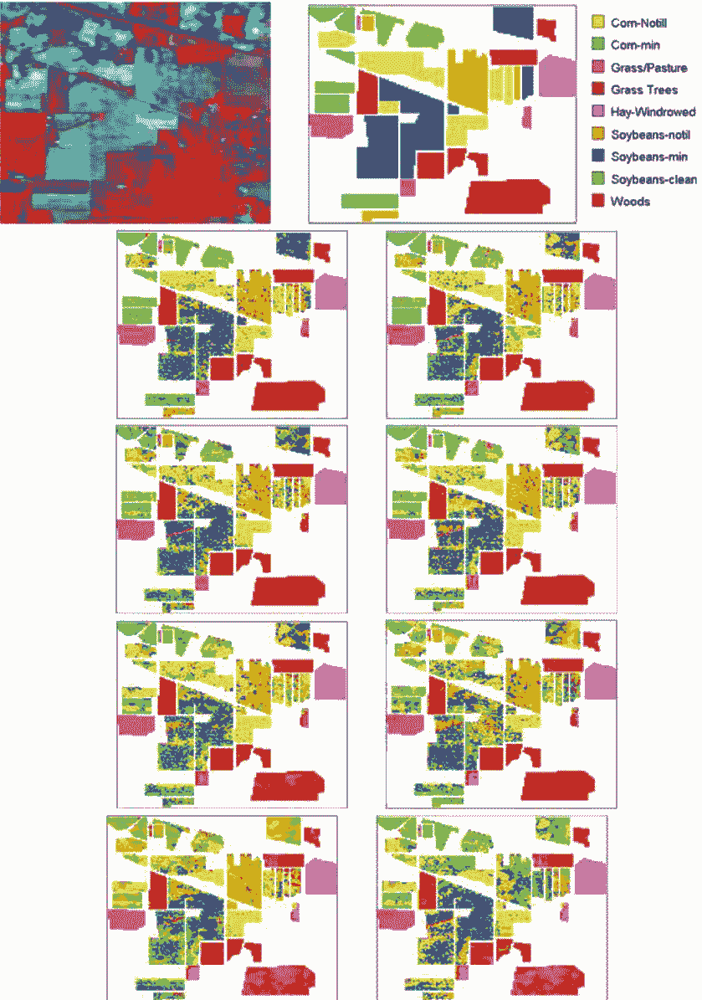

图 7.5 AVIRIS Indian Pines 数据集及其分类地图。a 原始 AVIRIS Indian Pines 图像。b 包含 9 个地表覆盖类别的地面真实地图。c-j 是使用每类 100、30、25、20、15、10、5 和 3 个标记样本生成的分类地图

### 7.4 实验结果和比较

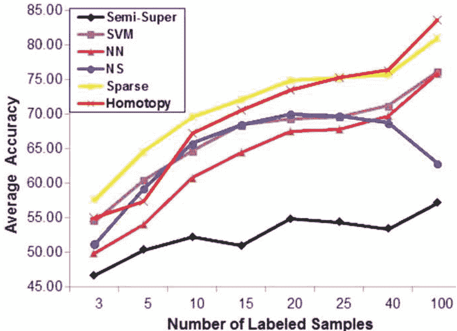

图 7.6 少量标记样本对分类准确性的影响

包含在方程式 7.6 中形成和解释的故障向量 η 对每个数据示例进行评估。然后，在结论阶段，它被减去以执行该特定示例的分类任务。对于基于 AVIRIS 传感器的 Indian Pines 数据集评估的故障矩阵显示在图 7.7 中。可以观察到表 7.4 中的准确性存在一个显著的趋势；当每个类别的训练数据在 3-20 的范围内时，NS 技术的性能在增长。然而，如果每个类别的训练数据在 25-100 的范围内进一步扩大，准确性性能开始下降，而不是呈现出积极的趋势。另一方面，开发的稀疏根技术的分类性能始终可以获得积极的增长。利用 NS 技术和同伦方法对 100 个训练数据的混淆矩阵呈现在图 7.8 中。从矩阵中可以清楚地看到，NS 和同伦技术一起对类别 1、2、6、7 和 8 产生了最大的错误性能。主要问题是这些类别的给定数据之间具有很大的相似性。然而，与 NS 技术的错误分类示例相比，同伦技术的错误分类示例比例要小得多。主要的论点是，在 NS 技术中，将测试数据 x 分配给一个类别，其中 x 和指定类别的训练数据所覆盖的子空间之间的空间最小，而与其他类别之间的空间最大。由于类别 1、2、6、7 和 8 之间存在很高的相似性比例，一旦每个类别的训练数据增加测量子空间的测量值，即增加子空间之间的空间，会导致减小值。因此，数据样本被错误地分类。尊重可观的性能的主要逻辑在于与 NS 技术相比，[37] 中描述的 $\ell^{1}$ 稀疏根技术具有逻辑偏见，即根技术。此外，所述技术不断计算训练示例的最好和最稀疏的表示形式，以词汇原子为单位。

# 7 基于稀疏的高光谱数据分类

图 7.7 误差向量 a-d
计算得出的 AVIRIS Indian Pines 数据集


### 7.4 实验结果和比较

| 类别 | 玉米 - 不耕种 | 玉米 - 最小 | 草地/牧场 | 草地/树木 | 干草 - 风吹 | 大豆 - 不耕种 | 大豆 - 最小 | 大豆 - 清洁 | 森林 |
| :--- | :--- | :--- | :--- | :--- | :--- | :--- | :--- | :--- | :--- |
| 玉米 - 不耕种 | 1010 | 121 | 1 | 6 | 0 | 60 | 87 | 49 | 0 |
| 玉米 - 最小 | 21 | 641 | 0 | 0 | 0 | 3 | 23 | 46 | 0 |
| 草地/牧场 | 3 | 1 | 369 | 13 | 4 | 0 | 0 | 6 | 1 |
| 草地/树木 | 0 | 0 | 1 | 643 | 1 | 0 | 0 | 2 | 0 |
| 干草 - 风吹 | 0 | 0 | 0 | 0 | 389 | 0 | 0 | 0 | 0 |
| 大豆 - 不耕种 | 44 | 12 | 1 | 15 | 0 | 717 | 54 | 25 | 0 |
| 大豆 - 最小 | 268 | 244 | 8 | 4 | 8 | 191 | 1599 | 45 | 1 |
| 大豆 - 清洁 | 1 | 16 | 1 | 4 | 5 | 2 | 14 | 471 | 0 |
| 森林 | 0 | 0 | 5 | 5 | 2 | 0 | 0 | 0 | 1182 |

| 类别 | 玉米 - 不耕种 | 玉米 - 最小 | 草地/牧场 | 草地/树木 | 干草 - 风吹 | 大豆 - 不耕种 | 大豆 - 最小 | 大豆 - 清洁 | 森林 |
| :--- | :--- | :--- | :--- | :--- | :--- | :--- | :--- | :--- | :--- |
| 玉米 - 不耕种 | 536 | 167 | 3 | 9 | 0 | 237 | 348 | 34 | 0 |
| 玉米 - 最小 | 94 | 321 | 4 | 0 | 0 | 53 | 174 | 88 | 0 |
| 草地/牧场 | 0 | 1 | 357 | 5 | 0 | 7 | 8 | 4 | 15 |
| 草地/树木 | 0 | 0 | 30 | 587 | 0 | 8 | 4 | 1 | 17 |
| 干草 - 风吹 | 0 | 0 | 2 | 1 | 385 | 0 | 0 | 1 | 0 |
| 大豆 - 不耕种 | 97 | 74 | 4 | 6 | 0 | 459 | 214 | 14 | 0 |
| 大豆 - 最小 | 286 | 374 | 24 | 8 | 0 | 349 | 1193 | 134 | 0 |
| 大豆 - 清洁 | 17 | 34 | 3 | 0 | 0 | 34 | 99 | 327 | 0 |
| 森林 | 0 | 0 | 15 | 6 | 0 | 0 | 0 | 0 | 1173 |

图 7.8 AVIRIS Indian Pines 数据集的混淆矩阵，每个类别有 100 个标记样本
使用 a Homotopy 算法 b NS 分类器

从上述性能结果可以观察到，在训练数据较少的情况下，Homotopy 根性能低于一般的 LP 稀疏根技术。然而，如果增加训练数据的数量，结果将与一般的 LP 稀疏根技术相当。

与一般的 LP 稀疏根源技术相比，这种技术源于同伦，在比较上更加稳健。

##### 7.4.2.2 AVIRIS 子图像

在另一种设置中，我们从整个 AVIRIS 图像中获取一个子部分，即宽度为 27-94，长度为 31-116，结果为 68*86，涵盖 4 个类别。这个子部分也被许多研究人员用作准确性估计的基准之一。表 7.5 显示了开发方法的分类结果，其中包括通用确定的线性规划解算器和基于同伦的过程，与 NS、神经网络、支持向量机和半监督技术进行比较。所使用的训练数据限制在每个类别的 3-100 之间。分类图在图 7.9 中描述。如表 7.5 所述，开发算法的整体准确性对于有限的可用训练数据非常有用。对于最少的训练数据，即每个类别 3 个示例，通用确定的 LP 稀疏根源演示达到了 71.59%，而同伦根源稀缺演示达到了 69.37%；这些结果比 NS、神经网络、支持向量机和半监督技术要好。综合考虑所有情况，开发技术的精度比现有的相关技术要高得多。正如预期的那样，如果训练数据在词汇上增加，它会极大地影响分类性能，因为准确性也会增加。对于每个类别的有限训练数据，即 3、6、12 等，与通用 LP 稀疏根源技术相比，同伦根源技术的性能略小，然而随着训练数据的增加，性能变得与通用 LP 稀疏根源技术相似。尽管与 BP 根源技术相比，同伦根源技术的精度稍小，但时间上有巨大的改进，因为它监控了 L 步特征。因此，它非常快速。人们可以在完整 AVIRIS 图像的一部分中检测到 NS 技术的类似性能。

也就是说，NS 的性能在每个类别的 30 个训练数据之前是逐渐提高的，然而，在此之后性能开始下降。这个像素集是一个子部分

**表 7.5** SVM、半监督、最近邻、最近子空间、稀疏、和同伦在 AVIRIS 子图像中的结果
| 训练样本 | 支持向量机 | 半监督 | NN | NS | 稀疏 | 同伦 |
| :--- | :--- | :--- | :--- | :--- | :--- | :--- |
| 3 | 58.95% | 60.59% | 66.95% | 65.98% | 71.59% | 69.37% |
| 5 | 60.63% | 62.42% | 71.75% | 70.87% | 78.28% | 73.65% |
| 10 | 67.59% | 69.15% | 75.22% | 78.13% | 82.65% | 78.82% |
| 15 | 74.24% | 75.75% | 78.77% | 80.8% | 84.82% | 82.83% |
| 20 | 75.35% | 76.93% | 81.28% | 82.3% | 85.88% | 85.61% |
| 25 | 78.32% | 79.85% | 80.93% | 83.41% | 86.83% | 86.06% |
| 30 | 78.90% | 80.68% | 81.10% | 83.73% | 87.96% | 86.25% |
| 100 | 84.50% | 84.83% | 86.67% | 74.79% | 90.13% | 90.55% |

### 7.4 实验结果和比较

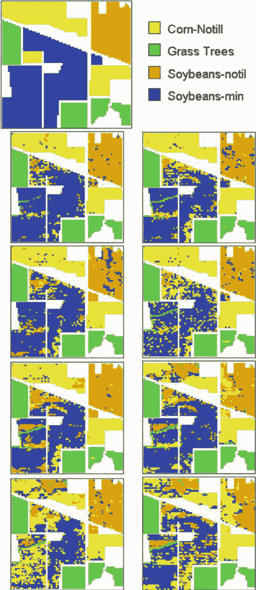

图 7.9 AVIRIS Indian Pines 子数据集以及分类地图。a 包含 4 个土地覆盖类别的真实地图。b-i 是使用每个类别 100、30、25、20、15、10、5 和 3 个标记样本的分类地图


图 7.10 华盛顿特区国家广场数据集以及分类地图。a 原始华盛顿特区国家广场图像。b 包含 7 个土地覆盖类别的真实地图。c-i 是使用每个类别 50、30、25、20、10、5 和 3 个标记样本的分类地图

在前面的小节中使用了整个图像的描述。因此，之前指定的等效描述在这里也适用。

#### 7.4.3 华盛顿特区购物中心图像

在这个实验阶段，使用了华盛顿特区购物中心的 HSI 图像进行分类，如图 7.10a 所示。该数据集是通过使用高光谱数字成像实验 (HYDICE) 传感器获取的。

### 7.4 实验结果和比较

**表 7.6** WDC 高光谱图像中 SVM、DSMw1、DSMw2、最近邻、最近子空间、稀疏和同伦算法的结果

| 标记的样本 | 支持向量机 | DSMw1 (svm) | DSMw2 (svm) | NN | NS | 稀疏 | 同伦 |
| :--- | :--- | :--- | :--- | :--- | :--- | :--- | :--- |
| 3 | 75.84% | | | 78.02% | 82.25% | 79.19% | **84.63%** |
| 5 | 80.80% | | | 82.94% | 84.34% | 84.18% | **86.85%** |
| 10 | 88.05% | | | 94.26% | 96.17% | 94.27% | **96.41%** |
| 20 | 92.48% | 81.90% | 87.80% | 96.15% | 97.01% | **98.72%** | 97.63% |
| 25 | 93.07% | | | 97.21% | **99.32%** | 98.93% | 99.13% |
| 40 | 94.62% | 84.60% | 92.50% | 97.98% | 99.31% | **99.49%** | 99.27% |
| 50 | 97.85% | | | 98.43% | 99.39% | **99.69%** | 99.33% |

它包括 210 个波长范围在 0.4-2.4 微米之间的光谱通道。然而，由于水吸收，有 19 个通道被排除在外。这个高光谱图像包括 1280 行和 307 列。在实验中，使用了 7 个材料类别，包括屋顶、道路、小径、草地、树木、水和阴影。就分类而言，这个 HSI 主题相对不像 AVIRIS 那样有问题。为了分析在有限的训练条件下开发的分类技术的准确性，每个类别使用了七个不同范围的训练数据，范围在 3-50 之间。分类结果如图 7.10 所示。开发的技术的分类性能，包括评估结果，可以在表 7.6 中找到。对于每个类别的 3 个训练数据，支持向量机、神经网络和 NS 的准确率分别为 75.84%、78.02% 和 82.25%，而通用 LP 稀疏根技术和同伦根技术的准确率分别为 79.19% 和 84.63%。对于每个类别的 3、5 和 10 个训练数据，DSM 技术的比较结果不可用。在每个类别有 20 个训练数据的实验中，DSM 技术，即 DSMw1(svm) 和 DSMw2(svm)，的准确率分别为 81.90% 和 87.80%。支持向量机的准确率为 92.48%，而开发的稀疏根技术和同伦根技术的准确率分别为 98.72% 和 97.63%。因此，在几乎所有使用的训练数据阶段，与现有技术相比，开发的技术在有限的训练数据条件下表现出更好的性能。当训练数据增加到 25 时，NS 略有改善。通过仅使用有限数量的训练数据，对比现有的知名技术，显示出了巨大的改进，这表明 HSI 的大部分信息存在于低维子空间中。还有一件事，可以看到 NS 技术的性能与训练数据的增加呈线性关系，与 AVIRIS 数据集的情况相反。这个事实的主要原因是每个类别中都不存在相似性（这在 AVIRIS 中是存在的）；即使增加了基底的维数，子空间之间的间隔也足够进行高效的分类。

### 7.4 实验结果和比较

#### 7.4.4 肯尼迪航天中心和 Salina A 高光谱数据集

用于实验和评估的另一个数据集是肯尼迪航天中心的 HSI，如图 7.11a 所示，该数据集是在 1996 年冬季获取的。它主要包括植被区域。该数据集包含 224 个光谱通道的光谱分辨率。在去除了 48 个充满噪声的水吸收波段后，使用的光谱通道总数约为 176 个。在相应的 HSI 图像中总共有 13 个不同的类别，总共约有 5211 个像素的标记训练样本用于这 13 个类别。表 7.7 描述了分类性能，图 7.11 显示了分类图。在 3-50 个训练数据的范围内，利用开发的技术检查准确性的训练数据非常有限。通过为每个类别使用 3-5 个训练样本，支持向量机分别达到了 61.09% 和 73.02% 的准确率，通用 LP 稀疏表示技术分别达到了 77.47% 和 81.22% 的准确率，而 Homotopy 算法分别达到了 77.91% 和 81.08% 的准确率。在所有不同的实验中，开发的技术与现有技术相比表现更好。

通过空中可见红外传感器（AVIRIS）在加利福尼亚州 Salina 山谷上获取的 Salina A 的高光谱图像。它由 224 个通道组成。它具有很高的空间分辨率，为 3.7 米。它包括 86 行 83 列。HSI 图像显示在图 7.12a 中。与 Indian Pines 和其他基于 AVIRIS 传感器的图像类似，大约有 20 个充满噪声的通道需要被移除。在这个图像中，这些通道包括 [108-112]，[154-167] 和 224。这个 HSI 图像包含多个类别，包括蔬菜、裸土、葡萄园等。分类图在图 7.12 中描述，而分类性能在表 7.8 中描述。在这个特定的图像中，所有的技术表现都非常好，所有技术的精度都非常高。

表 7.7 SVM、最近邻、最近子空间、稀疏和同伦算法在肯尼迪航天中心高光谱图像中的结果
| 标记的样本 | 支持向量机 | 最近邻 | 最近子空间 | 稀疏 | 同伦 |
| :--- | :--- | :--- | :--- | :--- | :--- |
| 3 | 61.09% | 70.72% | 71.52% | 77.47% | **77.91%** |
| 5 | 73.02% | 76.59% | 78.49% | **81.22%** | 81.08% |
| 10 | 80.83% | 80.48% | 84.53% | 84.98% | **85.14%** |
| 20 | 83.18% | 84.02% | 86.53% | **87.52%** | 87.36% |
| 25 | 85.20% | 84.48% | 87.41% | 87.88% | **88.24%** |
| 30 | 86.09% | 85.22% | 87.48% | 88.80% | **89.25%** |
| 50 | 87.55% | 87.03% | 87.63% | 90.46% | **90.96%** |


图 7.11 肯尼迪航天中心数据集及其分类地图。a 原始肯尼迪航天中心图像。b 包含 13 个土地覆盖类别的地面真实地图。c-i 使用每类 50、30、25、20、10、5 和 3 个标记样本的分类地图

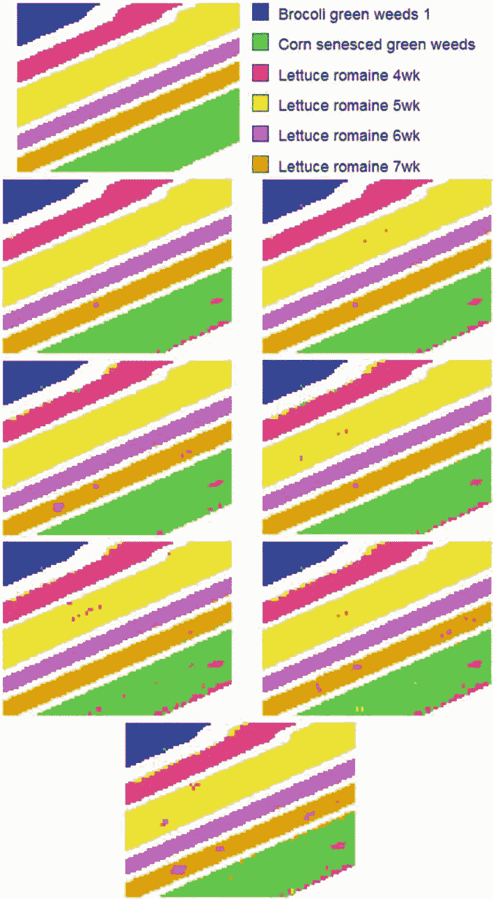

图 7.12 Salina A 数据集及其分类地图。a 原始 Salina 图像。b 包含 7 个土地覆盖类别的地面真实地图。c-i 使用每类 50、30、25、20、10、5 和 3 个标记样本的分类地图

#### 7.4.5 一般 LP 稀疏和 Homotopy 稀疏表示的时间比较

在本章的这个子部分中，执行分类任务所需的时间与基于 AVIRIS 传感器的 Indian Pines 子部分（如图 7.9 所示）和 AVIRIS Indian Pines 全 HSI（如图 7.8 所示）的数据集相关。这些图像从时间角度进行评估，利用通用的 LP 解算器和 Homotopy 稀疏表示。对于最终结果，进行了前十次实验，并将这十次实验的平均值作为最终结果。

AVIRIS 传感器数据集的时间消耗是将测试数据与词汇表中每个类别的训练数据进行分类的比较，如图 7.13 和 7.14 所示。从图中可以清楚地观察到，通用 LP 解算器对于分类测试示例的时间需求随着标记的训练数据的增加而迅速增加。因此，可以轻易得出结论，Homotopy 稀疏表示技术在时间方面比传统的通用 LP 解算器更加稳健。

### 7.5 讨论

在本节中，我们讨论了使用 $l_1$-最小化进行稀疏近似的各个方面。

#### 7.5.1 计算解的稀疏性

如果提供的数据稀缺，稀疏分类技术是有益的。在这种技术中，测试数据通过线性组合来估计字典项。此过程生成的参数在恢复和分类目标之后被利用。测试数据越稀疏，它们的估计就越稀疏。图 7.15 展示了基于 AVIRIS 的 Indian Pines HSI 的 Homotopy 技术的性能，以展示 HSI 数据的稀疏性。标记的训练数据在每个类别中的范围为 3-100 个数据。在图 7.15a 中，每个类别有 100 个标记的训练样本，同时使用了 Homotopy 技术来计算稀疏表示，即参数向量$\alpha$。在图 7.15b 中，展示了不同类别的重建残差。观察图 7.15a 中 Homotopy 技术计算的稀疏性。只有很少的稀疏向量元素不为 0。这证明了每个类别的样本中需要更少的向量参数来展示 Homotopy 技术对测试样例的表示。

对于同伦技术来说，最重要的约束是与测试数据的高稀疏分辨率一起工作 [4, 24]。同伦技术具有 L 步恢复特性。这意味着如果基本表示非常稀疏，并且仅包含 L 个非零元素，则该技术仅在 L 个重复阶段中实现最稀疏的表示 [24]。一旦存在这种特性，并且 L 非常小，这意味着可以以较低的成本解决具有 L 稀疏表示的$l_1$-最小化问题，而不必解决整个线性方案 [24]。从良好的分类性能来看，通过同伦技术的良好分类性能，可以轻松得出 HSI 空间像素在性质上非常稀疏的结论。

研究人员已经充分证实，任何算法在极高维度的情况下能够工作的主要原因是因为实际上给定的数据并不是真正的高维度 [38]。有点公平地说，它在一个相对较低维度的位置上欺骗了我们 [38]。主成分分析是一种非常著名的数据固有维度近似技术之一 [39]。图 7.4 中的实验结果表明，HSI 图像在一个较低维度的子空间中欺骗我们。此外，利用一种基于特征向量的固有维度近似技术 [39] 来近似 HSI 数据集的维度，并且 AVIRIS、华盛顿特区、肯尼迪航天中心和 Salina A 数据集的固有维度结果分别为 3、2、3 和 4 [39]。这些技术的结果证明了我们的假设，即 HSI 图像数据在一个较低维度中欺骗我们。此外，在 [40] 中还展示了 HSI 数据在较低维度子空间中的类似结果。

高光谱图像数据的极度稀疏分辨率揭示了关于 HSI 像素属性的额外组成部分，这些组成部分只有精确限定的训练数据才足以获取测试数据的变化。可以假设每个类别中包含的信息是完全类似的，这是由于其特征所决定的。

## 7 基于稀疏的高光谱数据分类


图 7.15 使用 Homotopy 算法计算的 AVIRIS Indian Pines 数据集的稀疏系数和残差，该数据集包含 9 个土地覆盖类别。a 每个类别 100 个训练样本的稀疏系数，平均准确率为 83.71%。b 每个类别的 9 个类别的 100 个训练样本的残差。c.d-k，和 I 是 9 个类别的稀疏系数和残差，每个类别有 30、15、10、5 和 3 个标记样本，平均准确率分别为 76.35%、70.62%、67.32%、57.42% 和 55.10%。

HSI 信息，因为每个类别都代表了外部存在的一种物质类别。因此，它们应该具有相关的反射特征。因此，测试数据与特定类别的标记训练数据非常相似的可能性非常高。因此，极少量的示例就足以适应测试示例的变化。

优秀的分类结果表明，我们的方法关于低维线性子空间的假设是准确的。准确的。基于这个假设，我们的稀疏表示技术可以通过利用字典中极少量的项目产生最少的表示。

#### 7.5.2 稀疏分类

图 7.16 建立了对测试 HSI 像素进行分类的性能。测试样例取自华盛顿特区国家广场 HSI 图像。首先，从 HSI 的全部七个类别中堆叠在一起形成一个矩阵 A 的五十个训练数据样例。然后，通过利用 $l_1$最小化计算稀疏表示。

稀疏表示中与 7 个类别的训练数据样例相匹配的参数随后被用于重构真实的测试样例。因此，我们得到 7 个估计值。可以从图 7.16 中观察到，最近的估计值是通过利用屋顶类别的训练样例和稀疏表示矩阵中的相关参数构建的，因为测试样例与屋顶类别相关。其余的估计值不可比较。不可比较的原因是这些估计值是通过利用与真实测试样例类别不同的类别的训练样例构建的。

#### 7.5.3 稀疏分析

本章节重点讨论了在 HSI 图像分类过程中遇到的问题、挑战和困难。这里要讨论的分类结果可以分为好的、最好的和稀疏的 HSI 结果。图 7.17 和表 7.9 展示了 HSI 像素稀疏表示分类的 3 种情况。接下来讨论第一种情况，图 7.17a 和表 7.9 的第一行，通过利用同伦算法计算得到的测试 HSI 像素的稀疏表示是改进版本，因为虽然稀疏表示中的参数适用于多个类别，但是其中一个类别的参数更多。通过利用公式 (7.8) 计算得到的类别一的剩余部分，如表 7.9 的第一行所示，明显较其他类别少，因此可以将测试像素分配给该类别。

表 7.9 稀疏分析
| 类别 | 1 | 2 | 3 | 4 | 5 | 6 | 7 | 8 |
| :--- | :--- | :--- | :--- | :--- | :--- | :--- | :--- | :--- |
| 残差 (a) | 0.23 | 0.92 | 1.0 | 1.0 | 1.0 | 1.0 | 0.90 | 0.94 |
| 残差 (b) | 1.0 | 1.0 | 1.0 | 0.01 | 1.0 | 1.0 | 1.0 | 1.0 |
| 残差 (c) | 0.81 | 0.695 | 1.0 | 1.0 | 1.0 | 0.697 | 1.0 | 0.80 |

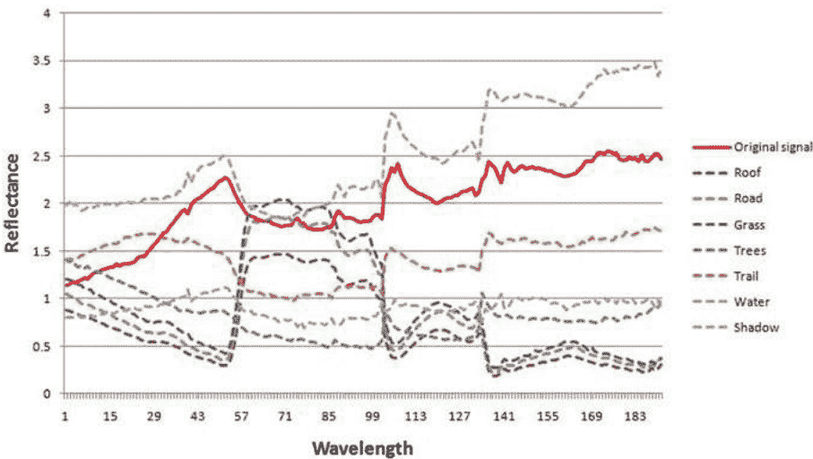

讨论第二种情况，图 7.17b 和表 7.9 的第二行，HSI 测试像素的稀疏表示非常好，可以被认为是完美的情况之一。在这里，稀疏表示中的参数仅适用于 A 类，而该类是第四类。如表 7.9 的第二行所示，特定类别 4 的剩余部分明显低于其他类别。因此，可以直接将测试像素分配给第四类。

讨论第三个和最后一个场景，图 7.17c 和表 7.9 的第三行，HSI 测试像素的稀疏表示是最差的情况。在这里，参数在稀疏表示中，不仅涉及到许多类别，而且对于许多类别也几乎相似。剩余部分在许多类别中也非常相似，正如表 7.9 的第三行中清楚地可以观察到的那样。因此，如果在这里分配最低剩余的度量，那么这个 HSI 像素将被分配给类别二。这将是不正确的，因为准确的类别分配是类别六。因此，在这种情况下，稀疏不起作用。这个问题场景的原因有很多，但是造成这种困难情况的主要原因是噪声。

#### 7.5.4 稀疏重建

图 7.18 展示了从华盛顿特区国家广场高光谱图像中恢复的 2 个 HSI 测试示例，包括利用 $l_1$-最小化计算得到的最佳估计。通过利用每个类别的一百个训练示例来实现恢复。实线是真实像素，虚线是利用 $l_1$-最小化计算得到的估计。从图中可以明显看出，$l_1$-最小化有效地计算了 HSI 测试示例的估计值。

### 7.6 总结

本书的这一章探讨了关于利用有限高维标记示例的$l_1$-最小化根据稀疏表示方法进行高光谱图像有效分类的全面研究工作。通过利用 HSI 信息的特殊特性，该技术在非常有限的可用训练数据样本和高维度的困扰下，解决了 HSI 图像分类中的一个主要挑战。已经证明，每个 HSI 图像类别的主要信息几乎都存在于一个较低维度的线性子空间中。为了满足实时应用的时间紧迫性，该工作还开发了一种基于 Homotopy 的高效稀疏表示方法，用于 HSI 图像的分类。与其他分类技术不同，该技术不需要进行任何维度降低过程，也不需要模型选择标准。这些开发的技术在 4 个真实的高光谱图像数据集上进行了验证。与现有的高度知名和发达的技术进行评估，证明了所提方法在分类、时间效率和鲁棒性方面的改进性能。

### 参考文献

1. Landgrebe DA (2003) 多光谱遥感中的信号理论方法。Wiley, Hoboken, NJ
2. Lu D, Weng Q (2007) 图像分类方法和技术的综述，以提高分类性能。Int J Remote Sens 28(5):823-870
3. Civco DL (1993) 用于土地覆盖分类和制图的人工神经网络。Int J Geophys Inf Syst 7(2):173-186
4. Wright J, Yang A, Ganesh A, Sastry S, Ma Y (2009) 通过稀疏表示实现鲁棒人脸识别。IEEE Trans Pattern Mach Intell 31(2):210-227
5. Chen Y, Nasrabadi NM, Tran TD (2010) 基于稀疏表示的高光谱图像分类。In: IEEE proceedings of the WHISPERS, vol 2, pp 1-46
6. ul Haq QS, Shi L, Tao L, Yang S (2010) 通过稀疏表示在同伦中进行高光谱数据分类。In: Proceedings of IEEE international conference on information science and engineering, pp 3748-3752
7. Gualtieri JA, Chettri SR, Cromp RF, Johnson LF (1999) 支持向量机分类器应用于 aviris 数据。在：第 8 届 JPL 空中地球科学研讨会论文集，pp 221-232, 1999 年 2 月
8. Scholkopf B, Smola A (2002) 基于核函数的学习支持向量机，正则化，优化等。MIT 出版社系列，马萨诸塞州剑桥市
9. Yang J-M, Kuo B-C, Yu P-T, Chuang C-H (2010) 一种用于高光谱图像分类的动态子空间方法。IEEE Trans Geosci Remote Sens 48(7):2840-2853
10. Cand'es EJ, Wakin M (2008) 压缩采样简介。IEEE 信号处理杂志 25(2):21-30
11. JingYu Y, YiGang P, WenLi X, QiongHai D (2009) 稀疏表示的方法：概述。中国科学 F 辑 - 信息科学 52(4):695-703
12. Donoho DL (2006) 对于大多数的欠定线性方程组，最小的 $L_1$-范数解也是最稀疏的解。Comm Pure Appl Math 59(6):797-822
13. Naseem I, Togneri R, Bennamoun M (2009) 基于视频的人脸识别的稀疏表示。Springer, Berlin, Heidelberg, pp 219-228
14. Gemmeke JF, Cranen B (2008) 通过压缩感知进行噪声降低。In: Proceedings of Interspeech, pp 1785-1788
15. Huang K, Aviyente S (2006) 用于信号分类的稀疏表示。神经信息处理系统
16. Candes EJ, Romberg J, Tao T (2006) 鲁棒性不确定原理：从高度不完整的频率信息中精确重建信号。IEEE Trans Inf Theory 52(2):489-509
17. Candes EJ, Tao T (2006) 从随机投影中近乎最优的信号恢复：通用编码策略？IEEE Trans s Inf Theory 52(12):5406-5425
18. Donoho DL (2006) 压缩感知。IEEE Trans Inf Theory 52(4):1289-1306
19. Tibshirani R (1996) 回收集缩和通过套索进行选择。J R Stat Soc Ser B 58(1):267-288
20. Chen Y, Nasrabadi NM, Tran TD (2010) 用于高光谱成像的稀疏子空间目标检测。在：S PIE 多光谱、高光谱和超光谱算法和技术的会议记录，第 3 页
21. Chen Y, Nasrabadi NM, Tran TD (2010) 基于稀疏性的高光谱成像分类。在：IEEE IGARSS 会议记录，pp 2796-2799
22. Castrodad A, Xing Z, Greer J, Bosch E, Carin L, Sapiro G (2010) 高光谱图像中的判别稀疏表示。在：2010 年第 17 届 IEEE 国际图像处理会议 (ICIP), 第 1313-1316 页，2010 年 9 月
23. Malioutov DM, Cetin M, Willsky AS (2005) 稀疏信号表示的同伦延续。在：IEEE 国际声学、语音和信号处理会议论文集，第 733-736 页
24. Donoho D, Tsaig Y (2006) 当解可能是稀疏时，$l_1$范数最小化问题的快速解决方案。技术报告，斯坦福大学统计学系
25. Plumbley MD (2005) $l_1$稀疏表示的几何和同伦。在：SPARS'05 会议论文集，法国雷恩，第 206-213 页，2005 年 11 月
26. Majumdar A, Ward RK。最近子空间分类器：字符识别应用。[在线] http://ubc.academia.edu/documents/0009/0488/NSC.pdf
27. Elad M, Aharon M (2006) 通过稀疏和冗余表示进行图像去噪。学习字典。IEEE 图像处理 15(12): 3736-3745
28. Camps-Valls G, Bandos T, Zhou D (2007) 半监督基于图的高光谱图像分类。IEEE 地球科学遥感 45(10): 2044-3054
29. Amaldi E, Kann V (1998) 关于在线性系统中最小化非零变量或不满足关系的近似性。理论计算科学 1: 209:237-260
30. Figueiredo MAT, Nowak RD, Wright SJ (2007) 梯度投影用于稀疏重建：应用于压缩感知和其他逆问题。IEEE 选择性信号 1: 586-597
31. Candes E, Romberg J (2006) $l_1$-magic: 用于解决凸优化程序的 Matlab 例程集与压缩采样相关。
32. Tropp JA, Gilbert AC (2007) 通过正交匹配追踪从随机测量中恢复信号。IEEE Trans Inf Theory 53(12):4655-4666
33. Yang J, Zhang Y (2009) 交替方向算法用于压缩感知中的 $l_1$问题。编号 TR09-37
34. Donoho DL, Tsaig Y (2006) 当解可能稀疏时，快速解决 $l_1$范数最小化问题。技术报告。斯坦福，加利福尼亚州，94305
35. Osborne MR, Presnell B, Turlach BA (2000) 在最小二乘问题中变量选择的新方法。IMA J Numer Anal 20(11):389-403
36. Plaza A, Benediktsson JA, Boardman JW, Brazile J, Bruzzone L, Camps-Valls G, Chanussot J, Fauvel M, Gamba P, Gualtieri A, Marconcini M, Tilton JC, Trianni G (2009) 高光谱图像处理技术的最新进展。Remote sensing of environment, vol 113, pp110-122, Sept 2009
37. Yang AY, Wright J, Ma Y, Sastry S (2007) 特征选择在人脸识别中的应用：稀疏表示的视角。技术报告。UCB/EECS-2007-99
38. Levina E, Bickel PJ (2004) 内在维度的最大似然估计。在：NIPS
39. van der Maaten L, Postma EO, van den Herik HJ (2008) 维度约简：一项比较性综述
40. Bioucas-Dias JM, Nascimento JMP (2008) 高光谱子空间识别。IEEE Trans Geosci Remote Sens 46(8):2435-2445

## 第 8 章 挑战与未来前景


由于遥感技术的最新进展，对于高光谱遥感图像分析的准确和稳健算法的需求显著增加。高光谱图像分类涉及到对地球表面上不同地物覆盖的目标检测和对主题地理区域的分类为不同的感兴趣类别。由于各种原因，高光谱遥感场景的分类是一项具有挑战性的任务。

首先，这是一个非常复杂的过程，涉及到不同的过程，旨在提取和分析高光谱图像中包含的丰富光谱和空间材料。其次，非常复杂的数据是光谱和空间信息与休斯现象、非常有限的标记样本以及固有传感器和环境噪声的集成。

考虑到上述挑战，本书侧重于开发用于分析详细的可用光谱和空间信息、提取有区别和不变的光谱和空间特征的技术。高光谱图像由数百个光谱波段组成，具有大量的冗余和噪声，这不仅使 HSI 的后续分析变得非常具有挑战性和困难，而且降低了后续分类算法的性能。

因此，分类的第一步（第 3 章）是通过详细分析光谱通道来执行的。我们通过自适应边界移动准则检测所有波段中的噪声和冗余，从而确定数据中存在的固有噪声和冗余。然后，根据其中包含的光谱信息，将每个波段分类为不同的类别。这是为了深入了解数据并应对高维度、冗余和噪声挑战的重要步骤。消除冗余和噪声是所有后续应用（如分割、特征选择、目标检测、分类和解混）的关键步骤。结果证明了识别的有效性。去噪和冗余的消除显著提高了后续分类算法的性能。

©作者（们），在 Springer Nature Singapore Pte Ltd.的独家许可下。2021 年 L. Tao 和 A. Mughees，深度学习用于高光谱图像分析和分类，工程应用中的计算方法 5，https://doi.org/10.1007/978-981-33-4420-4_8

最终，我们开发了基于准确的深度学习的 HSI 分类技术，用于土地覆盖类别。在利用高光谱图像提供的光谱信息之后，研究的重点转向了空间信息的利用（第 4 章）。近年来，研究人员已经开始关注将空间信息与光谱数据结合起来以提高性能在 HSI 分类过程中的重要性，因为最近的高光谱传感器可以提供出色的空间分辨率以及光谱通道。基于无监督自适应边界调整的新策略来提取基于空间信息的技术，通过自适应边界调整的准则将空间上相似的区域分组。该算法基于聚类方法构建，自适应调整边界，从而提取与场景中表达结构相关的几何特征。

在研究的下一阶段（第 5 章），上述发现被利用来开发一种方法，该方法充分利用了提取的光谱和空间特征，将光谱和空间特征合并到深度学习（DL）框架中。通过特征选择技术提取的最具有区分性和不变性的特征，以及通过空间特征提取技术识别出的有意义的几何结构，经过不同的深度学习架构进行处理和利用，以提高 HSI 分类准确性，即使只有少量可用样本。值得一提的是，通过融合光谱和空间特征，并在 DL 中采用自适应窗口大小而不是固定窗口大小，算法通过最小化上述挑战的影响，实现了更高的分类准确性。在分类过程之前，探索并开发了三种不同的深度学习架构，将空间 - 上下文特征整合到改进的 HSI 分类性能中。

在本书的下一阶段（第 6 章）中，通过光谱分割来解决高光谱波段的复杂性问题，将光谱相似的连续波段分组，并将基于深度学习的架构分别应用于每个空间 - 光谱分割组的波段。将基于深度学习的特征提取局部应用于每个波段组，可以降低计算复杂度，同时得到更好的特征，从而提高分类准确性。

在本书的第二部分中，通过研究基于多数投票决策规则的像素级分类后合并空间信息的方法来解决空间信息的整合问题。通过第 2 阶段（第 4 章）提取的空间信息和基于深度学习的像素级分类结果通过多数投票进行合并，得到最终的分类结果。在开发的方法中，针对目标类别的分类结果决定每个像素的标记类别，并通过分割获得空间数据。

在第 7 章中，我们将重点放在基于 HSI 数据的稀疏特性的无监督分类上。我们相信同时看到有监督和无监督的方法是有益的，希望能够拥有一个可以工作的分类器。

高维空间，并且只有少量标记样本。在本章中，与传统的监督方法不同，所提出的无监督分类方法没有单独的训练和测试阶段，因此不需要模型创建的训练过程。我们利用高光谱数据的某些特殊属性，并提出了一种基于稀疏表示分类的方法来克服高光谱数据中有限标记训练数据问题。我们假设每个高光谱数据类别内的数据位于一个非常低维子空间，并证明了高光谱数据的稀疏性。为了处理通用 LP 求解器的计算强度和时间需求，我们提出了一种基于 Homotopy 的稀疏分类方法，当数据高度稀疏时，它能够高效工作。这种方法不仅时间高效，而且产生的结果与传统方法相当。

### 8.1 未来前景

由于图像中包含的信息源非常丰富，HSI 分析是遥感数据分析中的热门领域。这在理解和分析地球表面的特性和特征方面非常有帮助，通过整合丰富的光谱和空间信息。然而，由于光谱通道的高维度和有限的可用训练样本，HSI 对于监督分类方法提出了重大挑战。研究人员通过实验数据证明了高维信息的一些独特的几何、统计和渐近特性，例如随着维度的增加，超立方体的体积集中在角落。信息获取和分类过程中的不确定性可能会严重影响分类性能。类似地，已经证明空间分辨率极大地影响分类准确性。有效的空间信息的融合不仅可以有效地检测小物体，还可以减少混合像素和噪声的影响。

本书通过解决上述挑战，提出了用于高光谱图像分析的创新方法。研究期间进行的实验确定了一系列潜在的改进方向，这些方向对未来的研究工作 是鼓舞人心的。

- 所提出的波段分类/噪声去除策略可以通过多种方式改进。首先，在开始时手动选择初始化的聚类数，基于图像的复杂程度。可以设计一种自动聚类选择准则，自动选择 HSI 场景中的聚类数。这种改进将使我们能够获得一种完全自动且无参数的方法。此外，噪声检测策略基于三个因素，即聚类大小因素、聚类偏移因素和聚类空间 - 光谱上下文差异因素；可以考虑更多因素以提高技术的准确性。

- 在空间信息提取阶段，根据图像中最小结构的大小手动调整每个聚类的大小。如果每个聚类的大小自动调整，小的空间结构通常无法被识别为独立的区域。这导致这些小区域与较大的相邻结构合并。因此，可以探索不同的方法来增强所提出的空间提取技术的这一领域。应自动选择聚类的大小，以包含场景中最小的空间结构。

- 在分类阶段，空间信息与光谱特征合并为一个向量。可以探索不同的合并准则来有效地合并空间和光谱特征。此外，还可以对光谱和空间特征进行深入研究，将其合并到分类/特征提取阶段的特征提取器中，以提高特征提取的稳定性，从而改善分类准确性。

- 近年来，基于稀疏表示的分类（SRC）方法在高光谱图像分类中也对处理小样本问题做出了贡献。SRC 的目标是用字典中的少量原子精确表示未知样本。将具有最小表示误差的类别标签分配给未标记的样本。通过对高光谱图像进行 SR-based 建模获得的稀疏系数具有可用于高光谱图像处理任务（如分类）的判别特征。此外，通过在稀疏系数域中结合上下文 - 空间信息，这些判别特征可以得到显著改善。为了进一步探索上下文信息并尽可能符合空间结构，本书中开发和介绍的自适应形状算法可以有效地用于为每个测试像素构建自适应形状区域。

高光谱遥感技术在当前时代取得了显著进展。无人机和航天平台上的传感器覆盖了地球表面的大片区域，具有前所未有的光谱、空间和时间分辨率。

高光谱成像（HSI）传感器的进步和可用性使得商业用途能够接触到这些传感器。这些特性使得需要对材料进行精细识别或估计物理参数的各种应用成为可能。这些应用往往依赖于复杂而复杂的数据分析技术。如何从数据中提取有价值的特征。多亏了深度学习理论，它具备从训练集中自动提取和学习有益特征的能力；从非常大的原始图像数据集中进行无监督特征学习已经成为可能。实际上，深度学习已经被证明是高光谱图像处理发展的新的令人兴奋的工具，可能成为下一个趋势。

尽管具有巨大的潜力，由于复杂的通道数量和其他统计和几何不确定性，深度学习不能直接应用于 HSI 分析。它包含了数百个波段，这可能导致一个小的补丁成为一个非常大的数据立方体，这对应于一个预训练网络中的大量神经元。除了每个波段内的视觉几何模式外，还有跨越光谱曲线向量，波段也是重要的信息。然而，如何利用这些信息仍然需要进一步研究。在越来越高的空间分辨率下，如何有意义地提取有用信息仍然存在问题。此外，不同传感器获取的图像存在较大差异。如何将预训练网络转移到其他图像上仍然未知。