# 面向高性能计算的深度学习和边缘计算解决方案

## 前言

高性能计算（HPC）意味着将高性能计算技术应用于边缘硬件系统，边缘环境通常是数据中心基础设施中常见的严酷条件。为了确保在广泛的温度范围和苛刻的冲击和振动环境中稳定连续运行，需要具有稳健且轻量级设计。

边缘计算和深度学习是一种新兴的工程领域。下一代基于人工智能（AI）、机器学习（ML）和其他高性能工作负载处理的综合智能边缘架构和系统是必需的。

高性能计算机具有各种开发和挑战的规格，涵盖硬件、软件、网络、平台集成和安全等方面。少数供应商有远见和愿景，多年前开始解决 HPC，并与主要应用和技术供应商塑造了一个合作生态系统。然而，那些有远见的人现在正在收获他们工作的成果，并且在争夺市场的几个不同领域中占据了重要份额。

在包括计算机视觉和自然语言处理在内的各种应用中，深度学习目前被广泛使用。终端设备，如智能手机和物联网传感器，产生的数据可以使用深度学习实时处理或用于训练深度学习模型。然而，深度学习的推理和准备需要大量的计算资源来快速运行。

本书提供了深度学习算法在边缘计算和高性能计算中取得成功的有力证据。这些技术现象的最重要限制和问题都得到了详细解决。这本编辑书籍为读者提供了一个良好且广泛的背景，快速让读者了解这些技术的广泛应用范围。

第一章强调了将深度物联网指标引入计算机环境中。由于可用带宽有限，作者们创建了一个单独的负载填充策略，以优化使用计算机的深度物联网学习系统的性能。在性能测试中，作者们测试了在最昂贵的计算机环境中执行深度学习任务的有效性使用我们的程序。研究结果表明，我们的方法超越了所有其他深度学习物联网系统的最佳解决方案。

第 2 章重点是识别未知模式和构建预测模型，可以帮助医学界发现疾病并提供可能的治疗方案。机器学习技术将研究强化学习在辅助制药行业进行药物开发和医疗团队生成治疗计划方面的可能性。

第 3 章讨论了登革热，这是一个全球现象，也是一个重要的公共卫生问题。印度的几个地区受到登革热的影响。西孟加拉邦是印度受登革热影响人数最多的邦之一。

第 4 章介绍了边缘计算生态系统的典型分层架构，并概述了每个层中存在的不同类型的组件。本章进一步描述了边缘计算的特点和不同类型的边缘计算设备。此外，它还简要解释了边缘计算的主要优势。最后，本章讨论了两个使用案例，即基于物联网的自动化辅助生活护理和非接触式医疗服务，边缘计算为社会带来了新的价值。

第 5 章讨论了社交网络网站、物联网和大量的电子交易，这些都导致了数据洪流。这些海量的数据结合云存储和图形处理单元（GPU）的普及，开启了机器学习（ML）和深度学习（DL）的新时代。这些技术在快速分析数据方面非常有用，广泛应用于自动驾驶汽车、虚拟现实、机器人技术、医疗保健等领域。第 6 章详细介绍了利用时间序列和时间相干性进行缺陷诊断的方法。

因此，完全忽视缺陷会导致显著的后果，无法达到故障分类的准确性。因此，本章确保了对缺陷系统的有效识别。

第 7 章介绍了一种新颖的模糊自适应智能控制器用于交流伺服电机。在周期性参考跟踪方面，与其他控制器相比，所提出的控制器在最小绝对跟踪误差（ATE）方面表现最佳。作者还测试了控制策略的鲁棒性。

第 8 章介绍了一些已知的技术，如人工智能、机器学习和深度学习，可以帮助最终用户分析和提供建议。通过这种创新技术的出现，层次学习或深度结构化学习将在现有的电子病历上进行，使用分层算法架构进行完整的数据分析，时间短。

第 9 章讨论了不同学科中重要的深度学习应用，它们对现实世界的贡献以及每个应用所使用的架构和方法的研究。本章还介绍了这些应用之间的区别、机器学习和深度学习之间的区别。最后，本章总结了未来的方向和结论。

第 10 章提供了一个概述，并侧重于深度学习在现实世界中的应用，涵盖了诸多领域，如语音识别、文本分类、文档摘要、欺诈检测、视觉识别和个性化。

第 11 章介绍了区块链在农业中的应用案例及其功能过程。它进一步探讨了区块链技术在农业领域的应用、挑战和机遇。

第 12 章介绍了大约有 150 个隐藏层的深度学习网络。深度学习网络的输出性能提升与输入样本数据大小成正比。本章回顾了关于深度学习在不同应用领域的文献。作者还进行了各种 DL 方法的比较研究，并突出了它们的结果。

第 13 章介绍了医疗信息学的技术方面，用于分析患者健康记录，以实现更好的临床决策和改善医疗结果。

第 14 章介绍了一种主要包括血液滑片的显微成像、噪声和光照调整、红细胞分割和形态学操作的方法。通过分割的插图，进行寄生虫密度估计和感染阶段的分类。

设计和测试了两种不同的分类技术 ANN 和 DCNN，用于将患病红细胞分组到相应的生长阶段。传统的神经网络 ANN 方法的准确率为 93%，而使用定制的深度卷积网络则达到了 95% 的准确率。

第 15 章是关于高性能计算的，它倾向于使用并行处理技术在更短的时间内高效地解决复杂问题。借助高性能计算，可以进行计算机建模和研究活动。它被用于解决当代问题。高性能计算充分利用可用资源，提供持续的性能。

高性能计算可以与深度学习技术结合，获得更优越的性能。本章讨论了分布式和并行深度学习及其在现实世界中的应用。

印度泰米尔纳德邦钦奈
维亚纳杜卡斯特洛，葡萄牙

A. 苏雷什
Sara Paiva

## 致谢

我，A.Suresh 博士：写一本书比我想象的要困难，但也比我想象的更有回报。没有上帝的祝福，我无法完成这本书的工作。这本书的完成离不开各个公司组织的支持，无论大小，它们允许我在过去二十多年的项目、研讨会和咨询中开发和测试与洞察力相关的想法。

我也非常感谢 SRM 科学与技术学院，校长 Dr.T.R.Paarivendhar，主席 Shri. Ravi Pachamoothoo，校长 Dr.P. Sathyanarayanan，副校长 Dr. R. Shivakumar，副校长 Dr. Sandeep Sancheti，副校长 Dr. T. P. Ganesan，副校长，规划与发展，以及注册处 Dr. N. Sethuraman，他们允许我将这个团队作为我的个人学习实验室，并且他们的简单、准备和支持倾向激发了我在采取理想步骤方面的信心，我对他们所提供的一切深表感激。我衷心感谢 C. Muthamizhchelvan 教授，副校长（E&T），T. V. Gopal 教授，院长，Revathi Venkataraman 教授，主席，以及 B. Amutha 博士，教授兼系主任，让我有幸和荣幸在我的管理之外展示技术工作，并在整个工作过程中提供宝贵的指导。我想向计算机科学与工程系的教师们表示衷心的感谢，感谢他们在我准备期间对工作分享的接受和耐心。我要向我的妻子 Priya N.表示深深的感激之情，感谢她在发布与深度学习和边缘计算解决方案相关的技术内容方面的动力和接受。我的儿子 Jeshwa S.和 Rithish S.，是我非常好的朋友，他们以同情、活力、支持和动力深深地激励着我。我对那些对一章或多章提出详细和建设性评论的人倾注了极大的感激之情。

最后，我要感谢 Sara Paiva 博士在出版这本书方面给予我的帮助。作为本书的合作编辑，她在与我合作方面付出了巨大的努力。我衷心感谢所有为本书做出贡献的人，他们为深度学习和边缘计算解决方案的基本概念提供了坚实的技术理解。

为了编写这本书，我对所有为之做出贡献的人表示衷心的感谢。我真诚地感谢 EAI 编辑、校对和出版团队的每一个人。我要感谢 Sara Paiva，她是我职业成就的主要灵感来源。我的女儿和儿子，Diana 和 Leonardo，是我生活中最伟大的老师，也给了我最美好的时刻。我的丈夫 Rogério在所有场合都支持我，并支持我在生活中的所有决定和选择。我的父母是我的坚强后盾，他们总是理解我未说出口的话。同时，我也感谢每一个进入我生活的人，因为他们都让我学到了一些东西。我还要感谢我在维亚纳多卡斯特洛理工学院工作了 15 年的所有同事，以及与我合作的世界各地的研究人员，比如 A. Suresh 教授。与他们一起工作和分享编辑这本书是一种愉快的经历。

最后但并非最不重要的是，我们对 EAI 团队在准备本书过程中的持续支持和合作表示衷心的感谢。


## 深度学习与边缘计算
## 高性能计算解决方案

Vikram Rajpoot, Aditya Patel, Praveen Kumar Manepalli 和 Akash Saxena

在性能测试中，我们使用我们的程序在最昂贵的计算机环境中测试执行深度学习任务的有效性。研究结果显示，我们的方法超越了所有其他深度学习物联网系统的最佳解决方案。

州级复杂平台面临一个挑战，即大量可用的群组数据和相关要求，其中包括定期学习计划。最近，边缘计算被提出作为减少资源使用的替代方案。在这方面，我们提出了一个基本的学习框架，通过介绍无限计算的概念，并展示了我们的框架在减少网络流量和时间方面的完整性 [1]。

最近，它被引入为多个应用程序的标准支付分类账簿，例如智能电网和物联网。然而，在移动环境中使用体积链的限制是因为挖掘过程需要移动设备上大量的计算和物质能量。

例如，由固定采购服务提供商（ECSP）提供的 EDGE 程序通常被视为从移动设备上传挖掘操作的最佳解决方案。然而，ECSP 有一种在边缘分配资源以最大化收入并确保激励和团结可持续性的方式 [2]。在这个概念的过程中，我们正在建立一个适当的拍卖，支持全面的资源分配研究。具体而言，我们开发了各种神经模型，支持线性拍卖的分析解。

神经网络已经开始影响单调竞标者的演变。后来，他们计算了对矿工的支付条件的分布。因此，用于控制神经网络边界的训练信息被应用于期望中被忽视的 ECSP 大小损失任务，并使用它们的值。

随着交通量和交通拥堵的增加，城市交通管理成为一个重大问题。在这方面，我们提出了一个利用 VANETs、5G 网络、软件定义网络和便携式计算机技术的城市交通管理四层架构 [2]。它在共享和动态能力期间提供了出色的通信和惊人的响应速度。紧急恢复的逻辑情况将大大减少恢复时间。

讨论了与车辆可用性、数据选择、交通信号灯控制和交通预测相关的主要技术。很明显，这部小说的设计者展示了减少交通拥堵和提高城市交通管理效率的惊人能力。

边缘计算通过将有限功能和系统功能转换为网络流量，有能力挑战移动应用网络。然而，优化系统设计和大型 IOV 系统的分布仍然是一个挑战 [3]。

在这方面，我们在整合内部系统和提出一个完全集成的联合车辆边缘计算框架（CVEC）之间进行合作。特别是，CVEC 可以支持许多危险车辆的服务，并密切合作。此外，我们讨论了可以支持 CVEC 的结构、政策、方法、特殊情况和技术提供者。最后，我们提出了未来方向的另一个研究挑战（图 1）。

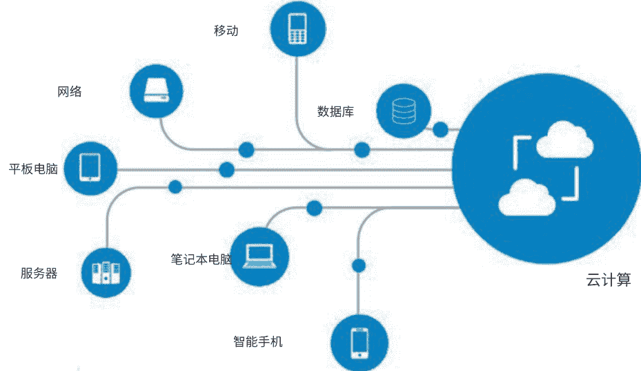

## 1 引言

许多云应用程序是用户驱动的，这为数据分析提供了更好的机会。然而，将云作为嵌入式服务器使用会增加用户设备（如智能手机、平板电脑、服装和小工具）之间的通信频率，感觉就像边缘设备和远程数据中心。这通常仅限于需要实时反馈的应用程序。因此，要访问网络，您需要查看“跨云”，请求计算资源有限的计算机，也称为 Cloud Compute 或 Cloud Complete [4]。我们的目标是测试在导航网络启用的区域（如路由器、交换机和变电站等默认位置）执行计算的可行性。

现在，我们可以对云数据从服务器集群传输到非公共计算机和智能手机以及物联网设备征税。计算机使用可能很无聊，计算机云服务从云到云流动，这与思科的发布 [1] 相吻合，到 2020 年，将有 5000 万物联网设备连接到互联网。根据思科在 2021 年的调查结果，每年将有大约 850 Exabytes 的数据没有云，全球数据流量将达到 20.6 ZB，这意味着大型数据源可以从最大的数据中心转换为最大的设备选择。因此，当前的计算能力正在逐渐无法管理大规模分布式计算和分析其数据，因此，必须在云中部署翻译工作流程。构建云基础设施的计算能力无疑是网络性能的一大挑战。正如它所是，计算机拥堵正在成为一个很好的选择，特别是用于管理围绕数据源和终端用户的计算机工作。当然，边缘计算和云计算不是单独选择的。相反，穿透云变得越来越浓，越来越宽。与单独的云计算相比，与云计算相关的最常见的好处是，分布式计算节点的骨干网络可以处理一定量的计算任务，而无需移动与云相关的数据，从而减轻网络负载。针对服务时代的需求，手机提供的服务可以显著减少交付延迟并提高响应速度。强大的云备份将在无法提供服务器时提供强大的云控制和更好的存储。由于深度学习在计算机视觉（CV）和自然语言处理（NLP）领域的优势，密集学习和专注于将人们生活的各个标准转化为一种新的广泛使用的系统。这些成就不仅仅存在于 DL 架构中，而且与不断增长的数据和集成能力密切相关。

因为边缘比云更接近用户，预测计算机手机将揭示许多这些问题。慢释放系统与人工智能集成，已被证明从人工智能的前沿和信心中受益。边缘智能和智能边缘不是彼此独立的 [6]。洞察力是目的，所以 DL 在线智能服务也是 AI 的邻居。另一方面，良好的边缘可以提供资源的最大利用和智能资源的使用。智能资源的使用。为了澄清，另一方面，边缘智能预测将从云中获得最高数量的 DL 统计数据，从而实现去中心化、低延迟、智能服务和效益。这大大减少了托管和处理。用户隐私保护得到改善，因为所需的 DL 服务信息存储在本地设备或云之外的设备上。分层系统的设计提供了高度的 DL 可靠性。凭借丰富的数据和操作条件，边缘计算机可以推动整个 DL 系统，并希望“在任何地方提供独特的 AI 和架构”，希望各种服务和 5G 服务可以增加数字计算机的价值并加速其部署和增长 [6]。

智能边缘旨在将 DL 与动态控制和自适应控制变量相结合。从电信技术的角度来看，接入网络的方式非常多样。同时，强大的计算基础设施充当一个焦点领域，连接智能终端设备，使云端可靠且安全。然而，管理和控制这样一个复杂的（社会）环境，包括电信、网络、计算机、存储等等，可能是一个重大挑战。因此，深入研究智能领域，例如边缘 5G，可能在许多方面都面临巨大挑战，处理重大挑战和实际问题 [7]。

## 2. 我们确定以下五个边缘 DL 技术

- 1. 复杂的 DL，用于优化云系统的技术框架，以及提供智能服务的能力。
- 2. 边缘的 5G 显示，专门进行逻辑操作并在设计过程中显示 DL，以满足各种要求。
- 3. 边缘深度学习系统允许依赖于规格、硬件和软件支持深度学习计算的最佳具体平台。
- 4. 边缘深度学习在隐私服务下分布式设备上对人工智能的深度学习模型进行训练（图 2）。

## 边缘计算的基础知识

云计算具有减少传输、提高服务延迟和减少云压缩的好处，已成为颠覆新兴技术加密的重要解决方案。云系统对云计算完全有益，在某些情况下改变了云的角色。

在计算机发展中，存在着计算机复合体的原型，一种在网络中工作的新技术，具有类似目的的架构 [7]，但也与云计算、微软数据中心 (MDC) 以及计算和移动计算平台 (即计算机的最可访问边缘) 相关。然而，计算机社区尚未就边缘计算的框架和结构达成一致。

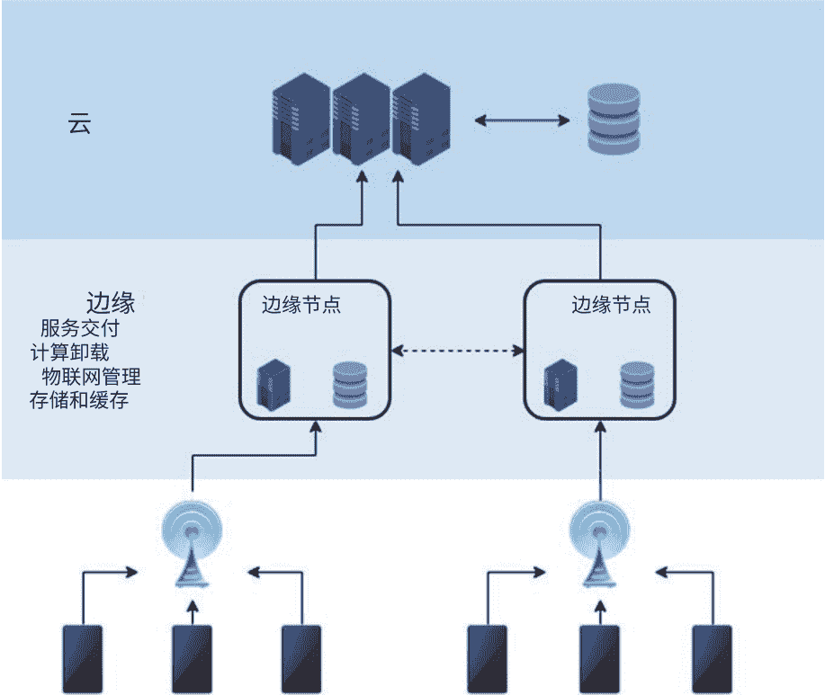

图 2 分布式设备的深度学习模型

计算机社区尚未就边缘计算的框架和结构达成一致。我们在新兴技术中使用通用的“边缘计算”[7]。目前，各种计算机概念被分割成不同的部分 (图 3)。

### 雾计算系统

雾计算的一个特点是它完全融合了云计算和成千上万的设备和大型数据中心。雾传输指的是分布式网络，就像云和雾共享相同的服务，如计算、存储和网络。此外，雾是为需要实时反馈和最小延迟的应用程序设计的，例如控制和物联网应用程序。

### 移动（多接入）边缘计算（MEC）

计算复合体进入系统的功率，并调整蜂窝网络相互作用的区域 [5]，并设计提供低延迟、内容和位置感知以及更好的带宽。将边缘服务器移动到蜂窝基站（BS）允许用户轻松快速地使用新的应用程序和服务 [8]。ETSI 还通过在多个出版物中将电信、云计算名称以及边缘设备的规范和分类纳入移动边缘计算到多接入计算的 MEC 组合中扩展了 MEC 组合（边界存储和存储之间）。

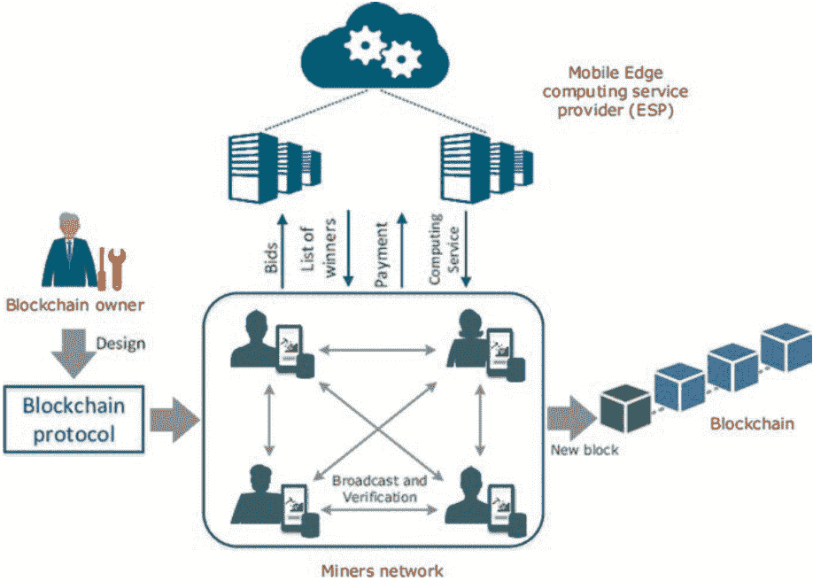

图 3 移动边缘计算服务器

我们区分普通设备和端到端设备，例如移动边缘设备，并使用“边缘设备”（存储）来对抗各种物联网设备，因此（我们改变类别），在网络故障时将单元道路故障（RSUs）、雾、边缘服务器和 MEC 服务器分布式部署 [9]。

此外，通过其计算能力、电力和瓶颈成本的减少，更多的独立处理或边缘设备被减少。因此，DL 云计算成为一种重要的计算实践。在这种新颖的计算范式中，通过低成本生产终端设备的辛勤工作通常直接在高质量设备上执行或加载到本地，从而避免了发送数据到云端所造成的延迟。对于最重要的任务，可以合理地分离并分别使用，围绕边缘和云端，以最小化任务延迟同时确保结果的准确性。这些合作的重点不仅在于成功的操作，还在于实现适当的套件使用、服务器负载、部署和实施延迟的平衡 [10]（图 4）。

### 3.1 边缘计算的硬件

AI 硬件无限计算组件：AI 硬件的最常用组件可分为三类，与其技术发展相关：(1) GPU 是一台构造良好、性能优越的机器，具有良好的性能优势。

## 边缘计算

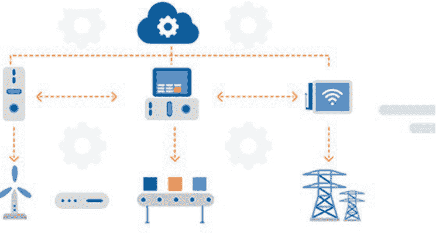

图 4 基本边缘计算结构

但是 GPU 通常消耗大量电力，Nvidia 支持可编程门阵列（FPGA）策略。CPU 节省能源，需要竞争资源，但与 GPU 相比，其编程能力有限，效率远低于 GPU；谷歌的 TPU 和海思的 Ascend，应用特定集成电路（ASIC）平台在性能和整体功耗方面具有定制化的优势。由于智能手机代表了最广泛分布的端到端设备，智能手机在 AI 系统的发展中，芯片的能力得到了快速增长和扩展 [11]。为了推动这一进程，高通首先将最新的硬件 AI 引入到骁龙处理器中，并发布了骁龙神经处理引擎（SNPE）软件开发工具包，支持 DL 构建的规模。与高通相比，海思的 600 系列和 900 系列芯片不依赖于 GPU。相反，他们添加了另一个神经调谐单元（NPU）来进行更快的向量和度量计算，从而大大提高了 DL 的性能。

除了使用海思和高通之外，联发科的 Helio P60 还引入了 AI 处理单元（APU）来加速神经计算的速度，此外还使用了 60 个 GPU [12]。

边缘计算的其他属性：预计大型站点将通过计算技术和计算服务提供高质量的网络连接，靠近报告和端到端。与许多存储设备相比，边缘节点具有更强大的处理能力来完成工作。另一方面，边缘节点可以比云更快地响应存储设备 [12]。因此，通过将节点发送到位置执行聚类操作，通常可以忽略分析任务，同时确保准确性。此外，具有缓存功能的边缘节点可以通过存储热门内容来提高响应时间。例如，实际解决方案包括华为 Atlas 模块和微软的 Azure Stack Edge 可以生成初始的深度学习指导并将其从云中移除 [11]。

边缘计算元素：云计算解决方案正在蓬勃发展。具有复杂配置和强大资源需求的 DL 操作是复杂计算机系统发展的长期指标，通过开发更先进和更好的微服务来实现。目前，Kubernetes 云是部署、存储和校准计算应用程序的基本中心系统。在 Kubernetes 的支持下，华为正在开发一种名为“Kube Edge”的云计算解决方案，用于网络通信、应用程序部署以及平台之间的云和元数据同步（还基于 Azure Edge train [45]）。“OpenEdge”专门用于保护计算机系统并协助产品开发。但是物联网、Azure IoT Edge [13] 和 Edge X 旨在通过将人工智能部署到云物联网平台来实现云智能化。

## 3.2 分布式云和低延迟计算

对于地理分布式应用程序来说，中型云计算并不总是最容易的策略。系统应围绕信息源构建，以改善所提供的服务。这个好处在任何基于 Web 的应用程序中都是必不可少的。视频流是移动 4G 流量的主要来源，也是一个挑战，满意的用户必须将大部分流量转化为相同的流量。同样，多媒体应用程序，如当前云基础设施上的游戏搜索，对游戏玩家的延迟施加类似的控制。在这里，本地化队列（例如，路由器或基本的单级跳站从物理设备）使用户能够频繁测量延迟，以改善云计算（图 5）。


图 5 云计算结构

## 3.3 实际设备资源的限制

与中央数据服务器相比，用户设备如智能手机存在硬件限制。这些预存储设备包括音频、音频、视频、触摸或运动传感器以及基于云的服务。由于中间件和硬件的限制，预先的设备无法执行复杂的计算。这有时会以牺牲电池为代价。因此，数据应该被传输到云端，以满足处理逻辑数据的综合要求，然后再传输到存储库。然而，并非所有来自前端设备的数据都被服务用于在云中执行分析负载。理想情况下，数据经常被过滤或部分分析，这可能具有足够的管理资源来包含数据管理功能 [14]。

## 3.4 持续能耗

有大量的研究探讨了云数据中心的功耗问题。在未来十年内，数据中心的能源消耗量将达到今天的三倍，因此迫切需要实施能源效率降低策略。越来越多在云中发生的应用程序将处于休眠状态，以满足额外的功率需求。与其将数据中心负载最小化，短期内可以通过将逻辑功率管理技术与不同的分析功能（如靠近数据源的关键通道或路由器）相结合来减少加速的挑战。它们创建了一个复杂的节点，但没有显著的能源影响 [15]。

## 3.5 处理数据爆炸和网络流量

边缘设备的数量正在急剧增加，预计到 2030 年，全球三分之一的人口将拥有智能手机。因此，需要准备的数据量将增加。预计到 2030 年，将产生 40 万亿 GB 的数据。这凸显了数据中心在支持监控和分析工作方面的额外需求，但也引发了对数据中心持续使用的担忧。有努力通过在边缘设备上执行计算来减少功耗挑战。然而，这通常仅限于边缘设备之间的带宽性能，并且大多数边缘设备上不会执行集成分析。数据加载的另一个问题是中央服务器或云上的网络流量量，这会降低边缘设备的响应时间。这暴露了利用网络上的远程跳跃来完成此站点或信息中心的安装，以解决信息增加和网络流量分布的能力。

## 3.6 智能计算策略

终端用户信息应发送到云服务器，以进行任何逻辑分析，并具有明显的影响和可视能力。然而，如果系统经常被定制，就有可能将资源集成到网络端点中。例如，静态设备管道可以处理在设备上生成的数据，然后在到达云服务器末端之前对数据进行传输位置的分析，以执行复杂任务。或者，数据中心通常可以拒绝需要第三方应用程序或使用自定义设备来增强计算能力的计算机。边缘节点可以在数据源（或数据源）附近创建数据捕获，并包括针对过时设备的远程感知策略 [17]。

## 4. 挑战——边缘计算

边缘系统始终很小，安装框架很少可用。这种框架必须满足应用程序开发等要求，以在真正糟糕的情况下处理应用程序。现有的计算平台如亚马逊网络服务、微软 Azure 和谷歌应用引擎可以支持强大的应用程序，但在网络稳定性中使用实时处理仍然是一个开放的研究领域。此外，还应理解以不满意的形式实施中断服务的需求。交付策略——在使用负载、集成策略——角度和不同功能时，需要考虑不同类型的表面如何受到药物的影响。通过采用这样的框架，我们认为硬件、中间件和软件层面上的以下五个研究挑战将得到解决 [18]。

### 4.1 挑战 1：边缘节点上的通用计算

理论上，笔记本电脑通常在位于板墙内的许多位置工作，包括接入点、站点、门、停车场、道路和交换机。

例如，基本站点包括为其执行的任务而设计的数字处理器（DSP）。在操作中，所使用的通道不适合处理分析负载，因为 DSP 不是为标准系统设计的。此外，很难确定这些组件是否能够计算其当前负载的一部分。OCTEON Fusion® Family 14 是 CAVIUM 的一种“芯片上的基站”系列产品，大小从 6 到 14，支持 32 到 300 个用户 [18]。这些通道可以在高频率下使用，以利用多个计算核心的计算能力。各种经济广告商采取了不同的步骤，使用软件解决方案来了解系统组合。例如，诺基亚 MEC 软件解决方案旨在在基本计算平台上运行平台。同样，思科的 IOx 提供了一个平台来创建自己的集成服务路由器。这些解决方案是硬件特定的，因此不适用于高温环境。软件领域的一个挑战是在不同环境中创建可用的解决方案。还有研究开发非技术资源来支持公共计算机。例如，无线家庭路由器始终会更新以支持额外的工作负载。英特尔的操作系统使用身份验证来支持额外的工作负载。用通用 CPU 替换专用 DSP 提供了一种替代方案，但需要大量投资 [19]。

### 4.2 挑战 2：资源发现

在计算机生成的环境中寻找资源和资源是一个受过良好教育的领域。通过引入包含在消费者监控和修复工具中的技术，它通常有助于在紧密集成和舒适的环境中。其中一个最先进的开发工具是策略，例如遵循图形编辑工作的决策过程。然而，为了使用网络的稳健性，在访问隔离云时需要找到适当的可用域。这些过程无法计算在这些层中找到的设备的总大小。此外，它们必须从许多世代中生产大型机器，并成为今天的承诺，例如机器学习的一部分，以前从未想象过。测量方法需要在链接服务交付和服务效率方面非常快速 [20]。这些过程应该在各个本地领导层级的工作流中实现无缝集成（和移除）站点，而不增加用户数据的轨迹或索引。可靠且正确地寻找和恢复节点错误是可取的。在这种情况下，云中使用的方法不适用于构建独立站点。

### 4.3 挑战 3：任务分割和卸载

由于计算机辅助站点的出现，已经开发出各种策略来促进在多站点环境中进行任务划分。例如，工作流被划分为多个任务。在语言或管理工具中通常清楚地指示执行一类任务。

然而，有限元计算的使用不仅节省能源效率，而且消除了在不需准确确定受限区域的强度或位置的情况下以自动化方式进行此操作的挑战。边缘扩展的语言可以期望用户具有定义集成流水线的灵活性——可以是在线的（首先在缓存信息中，然后在层中，或者首先在层中，然后在数据中），或者同时在多个节点中。如预期的那样，在偏远地区销售认证服务的程序规划师需要命名。

### 4.4 挑战 4：服务质量（QoS）和体验（QoE）

润滑剂提供的质量通常由 QoS 和 QoE 定义。在已完成的系统中，一个原则是释放未加载的组件。在传递负载时，无论整个负载来自数据中心还是高级设备，挑战在于确保节点实现最大性能和可靠性。无论边缘节点是否被利用，边缘服务或信息中心的用户都期望获得一定数量的资源。例如，当一个完整的信道满时，可能会影响连接到基站的连接设备上提供的服务。有必要对节点的过度使用进行混淆，以便功能经常是分散和可变的。管理框架的角色是可取的，但它也引发了与监控、重组和基础设施、平台和实施层面重组相关的问题 [22]。

### 4.5 挑战 5：将边缘作为通用平台使用

数据中心、大数据中心和可视化公司的硬件资源通常被调整为提供系统作为工具。提供商和用户的综合风险被披露，因此以基于收入的方式提供系统。这导致了一个竞争激烈的市场，有很多选择和选项来满足通过服务级别协议（SLA）满足程序买家的需求。然而，如果存在不同的设备，如交换机、路由器和工作站，它们应该被用作难以实现的可访问性挑战 [23]。首先，由设备组成的公共和私营公司形成的风险组织必须暴露出来。其次，设备的大小，例如，杂乱的互联网路由器，在非计算机环境中使用时无法激活。

第三，可以使用使安全成为重要问题的技术创建多个虚拟抖动节点。例如，容器是易于使用的提示，显示出强大的安全功能。第四，最低服务级别将与用户模式压力相关联。第五，我们需要考虑工作负载、计费、数据中心和传输、存储和维护成本，以创建成本效益模型来弥补无法访问的差距 [23]。

## 5. 边缘计算机遇

### 5.1 机遇 1：标准、基准和市场

边缘计算机通常可供使用，并公开了所有参与方的活动、关系和风险。已经有几次尝试解释云规模的增加，例如国家标准和技术组织 (NIST) 2021 年、IEEE 标准协会、国际标准化组织 (ISO) [13]、云标准客户委员会 (CC) 以及国际电信联盟 (ITU)。然而，这些术语现在即将进行修订，以考虑到其他利益相关者，如长期的公共和私营公司，以定义社会、法律和伦理方面的问题。这通常不是一项容易的任务，需要公共和私营机构以及教育机构的承诺和投资。

只要边缘区域的性能可靠地根据书面测量进行衡量，就可以使用标准。对云测试的尝试包括性能评估委员会 (SPEC) 的质量和许多受过教育的研究人员。在嘈杂的环境中，密封船体的形状是一个重大挑战。塔罗牌的当前状态尚未得到发展，需要进一步研究来提供良好收集的测量案例。因此，测量领域的测量可以很有力，但也为研究开辟了新的途径。使用入口壁垒是描述承诺、关系和风险的好方法。

类似于云市场，它是一个在线市场，以现金方式提供有限的位置。为了定义受限区域和定价模型的服务级别协议，应该创建这样一个市场 [24]。

### 5.2 机遇 2：结构和语言

在云范式内，有许多编程应用的选项。

除了良好的可编程语言外，还有一种很好的类型的应用程序可以在云中安装程序。当资源在云之外运行时，例如，在私有 - 公共云中使用生物信息学负载，工作流程通常在找到私有数据中的输入文件时使用。在分布式环境中规划大规模工作流程的软件组件和工具可以成为一个明确定义的学习过程 [24, 25]。然而，通过添加支持共同目的系统的边缘节点，将需要创建一个带有一组工具的框架。

分析的用例几乎完全不同于现有操作的流程，这些流程通常在生物信息学 [26] 或天文学 [27] 等科学领域进行研究。在边缘分析找到应用于用户驱动的应用程序之前，无法通过现有框架确定边缘分析的工作流程。系统模型旨在利用用于支持功能和数据集成的环境，并同时在多个级别上创建工作负载。

管理系统。支持规划模型的语言将考虑输入和输出的多样性。如果卖方事先指定了标记，则计算以下属性。这通常比云中可用的当前模型更复杂。

### 5.3 机遇 3：轻量级库和算法

与大型虚拟服务器组件不同，它不支持在硬件保管人上进行重型软件编译。例如，英特尔的 TX2 双模式系统芯片 (SoC) 具有 4 个基于 ARM 的 CPU 和有限的内存，具有八个核心和 CPU，可以补充开发诸如 Apache Spark 之类的复杂故障排除工具。8GB 的内存。边缘应用需要轻量级方法，以便促进机器学习或处理任务 [28]。

### 5.4 机遇 4：轻量级应用和虚拟化

研究在 Microsoft 或内核微系统上运行的应用程序可以通过动态远程环境提供处理应用程序挑战的方法。只要这些区域没有特定于服务器的资源，容器化系统的目的将达到一些资源。更快的分发、更多的安装时间和服务的分发是可取的好处。

有初步研究表明，使用硬件进行多设备的移动容器可以提供与传统设备类似的功能 [24]。像 Docker 这样的云技术可以让您快速部署应用程序到强大的平台上。需要进一步研究来接受容器作为恶意应用程序的另一个潜在选择。

### 5.5 机遇 5：产学合作

边缘计算为教师提供了将研究重点放在分布式计算，特别是计算机和云计算上的机会。在不与学术研究事实不一致的情况下，很难在规模上做到这一点。

这有时使得许多学者和研究人员能够在没有行业或政府基础设施的情况下整合他们的研究。与可信机构和政府关系密切的高等教育机构产生了令人兴奋和强大的研究。计算机领域的研究通常由行业合作伙伴（如移动用户）等开源组织进行。

开发人员、设备开发人员和云服务提供商，对于这两者的利益都感兴趣 [28]。

## 6. 深度学习优化边缘计算

DNN（标准化的深度学习模型）可以提取潜在数据的特征，而 DRL 可以通过与环境的交互来学习影响决策。计算机和端到端节点的能力，以及云计算，使得使用深度学习来扩展计算机网络和系统成为可能。通过研究边缘管理的各种问题，如边缘安全、重新加载、通信和安全性，DNN 可以在网络上处理用户信息和数据量，并且它是一个无线环境的有限空间，并支持这些信息 [29]。RL 经常用于推导长期资源管理和行动规划策略，以实现智能管理。

网络内部的缓存已经被研究了很多年，从网络交付内容（CDN）到移动网络的基于内容的缓存，影响了对 DL 的不断增长的需求，适应性边缘缓存的多媒体服务。结合完全抑制用户内容的想法，边缘缓存被认为是减少数据传输、减轻云数据中心压力和提高 QoE 的良好解决方案。边缘缓存面临着内容在节点卡上的传递的双重挑战，因为它们经常受到本地变化的操纵和修改，大规模计算设备、分层缓存和复杂网络特性进一步促进了内容规划。特别是当了解内容选项的分布时，保护思想的最佳策略才被消除。然而，由于移动性、偏好和链接的不同，用户对内容的配置是未知的 [30]。

DNN 的使用案例：传统的临时缓存系统往往更加棘手，因为它们需要大量的用户凭证和内容的在线处理，以及内容的放置和分发计划。对于主要目的，深度学习倾向于处理从用户移动设备收集的数据，这就是为什么它将用户的内容和内容分成基于内容的缓存矩阵的原因。

这表明主网络上的热门内容是通过认证矩阵中的交互特征过滤器进行评估的。对于第二个目的，在使用 DNN 扩展缓存策略时，通常会避免通过离线训练进行大量的在线计算迭代。DNN 通常在由高质量或启发式算法生成的解决方案上进行训练，并在应用缓存策略时将隐藏层数据加密并跟随分发，以避免在线验证。类似地，受到部分缓存复制问题的某种形式再现的启示，MLP 已经被训练接受现有的内容选项，以便它可以作为缓存更新策略的最终内容空间的输入 [29]。

DRL 功能事件：在本节中描述的 DNN 的功能通常被认为是全尺寸存储解决方案的基础，即DNN 不会影响整个优化问题。DNN 的一个安全边缘例外是，它是一个重要的优化程序，因为它可以从 DL 用户和网络的上下文中受益，并实施灵活的长期维护工作策略。RL 自定义算法受到手动计数器的限制，因此不再管理大规模查看的数据和功能的特性。与非 DL RL（如 Q-learning 和 Multi-Armed Banditry (MAB)）相比，DRL 可以从不稳定的源数据中学习重要特征。包括 RL 和 DL 的集成 DRL 代理可以直接从计算机系统中的大规模视觉数据中构建其缓存管理策略。

## 7 结论

作为关键的 AI 策略，DL 有望对底线产生益处。详细介绍了调查，并讨论了各种实际情境和策略，为边缘智能和理解提供了基础。简而言之，将 DL 从云端扩展到边缘的主要问题是如何在多个网络约束、电信、计算能力和功耗下计算、扩展和实现架构，以找出 DL 训练的简单任务 [28]。这是因为系统的容量增加，智能增加，边缘智能在支持本地智能系统的运行中起着重要作用。这个应用将通过集成 DL/Edge 来增强讨论和研究工作，我们希望这将改进未来的应用和通信。

## 参考文献

- 1. 世界卫生组织癫痫，[在线]http://www.who.int/mediacentre/factsheets/fs999/en/
- 2. M.-P. Hosseini, M.-R. Nazem-Zadeh, D. Pompili, K. Jafari-Khouzani, K. Elisevich, H. Soltanian-Zadeh，对颞叶癫痫患者磁共振图像中海马的自动分割方法的比较性能评估。医学物理学。43(1), 538-553 (2016)
- 3. M.-P. Hosseini, M. R. Nazem-Zadeh, D. Pompili, K. Jafari-Khouzani, K. Elisevich and H. Soltanian-Zadeh，癫痫患者脑部 MRI 中海马的自动和手动分割，在第六届纽约医学影像信息学研讨会 (NYMIS), 2015
- 4. B.M. Psaty, A. M. Breckenridge，Mini-sentinel 和监管科学 - 大数据的适应性和功能性。新英格兰医学杂志。370(23), 2165 (2014)
- 5. S. Schneeweiss，从大型医疗数据中学习。N. Engl. J. Med. 370(23), 2161-2163 (2014)
- 6. S. Vahidian, S. Aïssa, S. Hatamnia，在窃听者窃听和干扰存在的情况下，安全受限的合作通信中的中继选择。IEEE 无线通信快报 4(6), 577-580 (2015)
- 7. T.X. Tran, A. Hajisami, P. Pandey, D. Pompili，5G 网络中的协作移动边缘计算：新的范例、场景和挑战。IEEE Commun. Mag. 55(4), 54-61 (2017)
- 8. T.X. Tran 和 D. Pompili，多服务器移动边缘计算网络的联合任务卸载和资源分配，arXiv 预印本 arXiv:1705.00704 (2017)
- 9. M.-P. Hosseini, H. Soltanian-Zadeh, S. Akhlaghpoor，用于评估慢性阻塞性肺疾病的计算机辅助诊断系统在 CT 图像上。德黑兰大学医学杂志 TUMS Publ 68(12), 718-725 (2011)
- 10. M.-P. Hosseini, A. Hajisami 和 D. Pompili，通过随机子空间集成学习从脑电信号中实时检测癫痫发作，IEEE 国际自主计算会议 (ICAC) (2016)
- 11. N. Lu, T. Li, X. Ren 和 H. Miao，基于受限玻尔兹曼机的运动想象分类的深度学习方案，IEEE Trans Neural Syst Rehabil Eng, 25, 566 (2016)
- 12. X. An, D. Kuang, X. Guo, Y. Zhao 和 L. He，基于运动想象的脑电数据分类的深度学习方法，智能计算国际会议，pp. 203-210 (2014)
- 13. S.-M. Shams, B. Afshin-Pour, H. Soltanian-Zadeh, G. Zadeh, S.C. Strother，用于确定静息态功能网络的自动迭代重聚类框架，人脑映射。36 (9), 3303-3322 (2015)
- 14. Z.V. Freudenburg, N.F. Ramsey, M. Wronkiewicz, W.D. Smart, R. Pless, E.C. Leuthardt，实时的天真学习神经相关性与在 ECoG 电生理学中。Int J Mach Learn Comput 1(3), 269 (2011)
- 15. C.O. Rolim, F.L. Koch, C.B. Westphall, J. Werner, A. Fracalossi, G.S. Salvador，一种用于医疗机构患者数据收集的云计算解决方案。ETELEMED,
- 16. T.H. Laine, C. Lee and H. Suk，使用 Zigbee 和蓝牙的普适健康护理系统的移动网关，IEEE 国际创新移动和互联网无处不在计算会议 (IMIS), pp. 139-145, 2014
- 17. S. Yang and M. Gerla，移动健康监测中的个人网关，IEEE 国际计算和通信会议工作坊 (PERCOM Workshops), pp. 636-641 (2011)
- 18. M. Mousaei 和 B. Smida，优化超可靠短数据包传输的导频开销，arXiv 预印本 arXiv:1705.02753 (2017)
- 19. A. Sani, A. Vosoughi，用于功率和带宽受限的无线传感器网络的分布式向量估计。IEEE 信号处理交易。64 (15), 3879-3894 (2016)
- 20. A. Iragi, V.D. Calhoun, N.M. Wiseman, E. Davoodi-Bojd, M.R. Avanaki, E.M. Haacke 等，连接域：使用基于特征的数据驱动和基于模型的方法分析静息态 fMRI 数据。NeuroImage 134, 494-507 (2016)
- 21. D.S. Barron, P.T. Fox, H. Pardoe, J. Lancaster, L.R. Price 等，丘脑功能连接性预测个体癫痫侧化：生物标志物开发策略的应用。NeuroImage Clin 7, 273-280 (2015)
- 22. X. He, G.E. Doucet, M. Sperling, A. Sharan, J.I. Tracy，在颞叶癫痫中降低的丘脑皮层功能连接。癫痫 56(10), 1571-1579 (2015)
- 23. D. Meunier, R. Lambiotte, E.T. Bullmore，大脑网络的模块化和分层模块化组织。
- 24. G.J. Ortega, R.G. Sola, J. Pastor，人类 ECoG 数据的复杂网络分析。
- 25. G. Alarcon, J.G. Seoane, C. Binnie, M.M. Miguel, J. Juler, C. Polkey, 等，急性电皮层图中间歇性放电的起源和传播。对颞叶癫痫的病理生理学和手术治疗的影响。Brain 120(12), 2259-2282 (1997)
- 26. K. Deb，多目标进化算法：在帕累托最优解之间引入偏差，出版于进化计算的进展，(Springer, 2003), pp. 263-292
- 27. A. Rahimpour, A. Taalimi 和 H. Qi，在带限分布式监视系统中的特征编码，ICASSP 2017-IEEE 国际声学语音和信号处理会议 (2017)
- 28. M.-P. Hosseini, H. Soltanian-Zadeh, K. Elisevich 和 D. Pompili，基于云的深度学习大脑电数据用于癫痫发作预测，IEEE 全球信号和信息处理大会 (GlobalSIP) (2016)
- 29. S. Minaee 和 Y. Wang，使用平移不变散射网络的指纹识别，IEEE 信号处理在医学和生物学研讨会 2015 (2015)
- 30. M. Rahmani, G. Atia，高维低秩加稀疏矩阵分解。IEEE Trans. Signal Process. 2017 (2017)

# 医疗保健中的人工智能数据库

A. S. Keerthy 印度喀拉拉邦科钦的拉贾吉里社会科学学院计算机科学系

印度坎帕格姆高等教育学院计算机科学系，哥印拜陀

S. Manju Priya 印度坎帕格姆高等教育学院计算机科学系，哥印拜陀

## 1 引言

电子病历（EMR）系统导致全球医疗数据库中存储了大量的医疗信息 [1]。在医疗行业数据扩张的情况下，云计算被用于有效地维护医疗记录。当前对这些数据的使用可能导致疾病诊断、治疗计划、药物设计等方面的潜在增长。同时，由于这些数据包含个人的敏感私人信息，必须采取适当的安全措施进行保护。非法访问患者记录中的个人信息可能对试图使用数据进行分析的服务构成法律挑战。数据匿名化旨在隐藏这些对于科学数据分析来说无价值的敏感信息。匿名化过程防止了个人与其相应数据之间的关联建立。

尽管数据的匿名化确保了数据的安全性，但在处理过程中会丢失一些信息，因此被认为会影响数据的质量。数据的质量可能会影响从数据分析中得出的估计的统计可靠性。因此，为了保持数据的质量并保护机密性，建议使用数据加密。加密数据可以在不受信任的数据库中确保机密性，但在查询加密数据时具有挑战性。加密还可以防止技术专家进行推断攻击 [2]。

为了从医疗数据库的庞大数据存储库中挖掘出重要信息，开发了软件。它们旨在通过利用人类智能的前景进行推理、决策、强化学习等，帮助医生做出决策。基于人工智能的工具旨在帮助医生快速决策，而不需要花费时间咨询专家，而是借助“规则集”或“经验”。通过实施人工智能（AI）技术来建立“规则集”。预计先进技术的使用将减少医学诊断中的成本、时间、人力专长和错误。由于系统需要人类频繁监控和更新知识库，因此不会取代人类的熟练程度 [3]。

## 2 什么是人工智能？

如果一个系统能够感知环境并采取类似于人类认知行为的动作，则被定义为具有人工智能。基于人工智能的系统倾向于借助机器学习技术、自然语言处理等来模仿人类行为 [4]。基于人工智能的技术在商业环境中被广泛应用于决策制定以及服务行业。人工智能的应用包括人类语音识别、自动驾驶、模拟游戏等等。

随着医疗数据的日益丰富和分析技术的进步，医疗领域的数据分析正在不断发展。为了支持临床实践，人工智能可以用于处理可用数据，挖掘医疗数据库中隐藏的关系和模式，而不仅仅依靠患者出院摘要中的信息 [5]。人工智能的潜在用途不仅仅局限于诊断，还可以用于患者护理、行政流程、药物研发等等。

研究人员正在努力开发基于人工智能的系统，以取代昂贵的临床试验技术 [6]。

## 3 医疗数据库

医疗数据库中存储的信息包括各种组成部分，如数字化医疗记录、患者的临床试验数据、医院维护的记录以及医院管理部门维护的报告。这些数据库中的数据量和种类繁多，使其成为“数据丰富”但未被利用的信息使其成为“知识贫乏” [7]。从这些数据库中提取有价值的信息有助于理解数据中隐藏的模式，并将其用于预测它们在以后的时间段内的行为。

医疗数据库中的数据对于其所属的个人来说是敏感的，因此在进一步使用时需要严格的规定。

处理。在将这些数据用于改进医疗服务或任何其他公共利益的研究活动之前，对数据进行匿名化是强制性的。功能性匿名化试图以最佳方式隐藏数据中的敏感信息 [8]。

### 3.1 医疗数据库中的数据特征

- 异质性
  • 输入到患者档案中的数据包括医生的诊断、接受的治疗、服用的药物、扫描报告的图像等。这表明数据可能是文本、图像，甚至是某些时候的信号。因此，数据库需要根据需要在每条记录中存储异质数据。

- 不完整性
  • 如果完全存储，在患者观察期间生成的心脏超声信号等数据将占用大量存储空间。此外，医生或护士进行的临床观察可能无法及时输入到数据库中。这有时会导致数据库在进一步分析目的上不完整。

- 及时性和持久性
  • 临床报告生成和更新这些详细信息到数据库之间的时间间隔对于决策非常关键。除了及时更新，还需要将生成的报告存储足够长的时间。还需要考虑的另一个事实是将家庭成员的医疗记录链接起来，以便更容易发现遗传疾病的特征、发生的可能性以及可用的预防措施。

- 数据隐私。
  • 患者敏感数据的隐私和安全对政府和医疗行业来说至关重要。组织采用数据匿名化和加密来保护敏感数据，而全球各国政府也制定了严格的政策来保持机密性。

- 数据所有权。
  • 尽管人们被认为是其医疗数据的唯一所有者，但医院、制药公司、医生、政府机构、临床实验室等也可以访问患者信息。这总是使公民面临个人信息被用于研究和分析目的的威胁。

### 医疗数据库中的数据挖掘

电子健康记录为数据分析师提供了大量的患者数据存储库，以进行分析。为了有效利用这些数据中隐藏的信息，使用了数据挖掘技术。从健康保险欺诈检测到肿瘤的恶性与否的分类，都可以通过有效实施医疗数据上的数据挖掘技术来实现。通过这些先进的技术的使用，可以使医疗服务更加负担得起和更加有效，从而使患者和医生社区受益。挖掘技术有效地挖掘出数据中以前未知/隐藏的模式，这可能对疾病预测或治疗效果有用。

### 4.1 数据挖掘在医疗数据中的应用

在医疗数据中，有几种数据挖掘技术的应用。其中一些列举并解释如下。

- 1. 治疗效果
  关联分析等数据挖掘技术可以用于比较疾病状态的症状和原因，并识别其他医生和行业标准的实践模式。可以从数据中的潜在模式中识别出治疗的副作用、常见症状以帮助诊断、对过敏者有效的药物等。通过分析专家医生对类似情况的治疗过程，医生可以采用或根据自己的需求进行修改。

2. 医疗管理的辅助
  可以制定分类技术来为患者在医院就诊期间提供适当的辅助，减少临床并发症，跟踪慢性和高风险患者的治疗过程。使用分类技术，可以开发数据挖掘应用程序来实现这一目的。可以有效地跟踪患者的康复情况，并自动通知相关医生。使用数据挖掘工具可以辅助比较不同群体的医疗实践，包括治疗计划、住院时间、治疗费用、保险援助等方面。

3. 客户关系管理（CRM）
  数据挖掘应用程序的 CRM 模块使用聚类技术来识别哪种治疗方案最适合基于诊断输入到数据库中的患者，并鼓励最需要的患者充分利用它。他们试图组织为患者提供的服务，以减少医院的等待时间。制药公司使用 CRM 数据来跟踪医生对特定药物的使用情况及其对患者康复的有效性。

他们还利用这些数据来识别哪些医生的治疗方案最适合进行临床试验。

- 4. 检测欺诈和滥用
  异常值检测方法有助于识别医生、个人、实验室等在健康保险索赔中提出的任何异常模式。它们可以找出不适当/欺诈的处方或转诊，并确定此类医疗索赔。

### 4.2 在医疗保健中使用的数据挖掘技术

在分析医疗保健数据以发现数据中隐藏的模式和关系时，使用了不同的分类技术 [12]。

- 1. 规则集分类器：
  针对每个数据类别，制定了一组规则。数据值满足规则的类别。如果数据不满足任何规则，则属于默认类别。规则通常以以下格式编写：“如果 (P 和 Q) 或 R，则属于类别 A。”

  例如：高烧∧喉咙痛→病毒性发热

- 2. 决策树算法：
  决策树主要用于分类高维分类数据。如果包含连续数据，则必须将其转换为分类数据进行分析。基尼指数是构建树时选择正确属性的最常用的不纯度度量。构建树后，通过沿着树的分支走到叶子节点，可以制定用于构建树的数据的规则集。例如，图 1 中给出的简单决策树可以根据一个人的饮食习惯和锻炼模式确定他是否健康。

- 3. 神经网络：

图 1 一个示例决策树
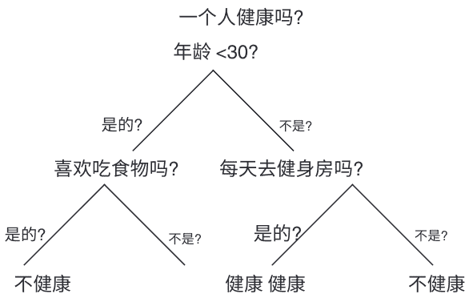


图 2 一个具有 5 个输入节点、2 个隐藏层和 5 个输出节点的样本神经网络

神经网络作为一个节点网络，模仿人脑中的神经元。一个样本的多层前馈神经网络可能有 20 个输入节点，15 个隐藏节点和 5 个输出节点。输入节点和输出节点的数量取决于输入数据，而隐藏节点的数量是通过对数据进行试验和错误来获得所需输出的。图 2 展示了一个具有五个输入节点、两个隐藏层和五个输出节点的前馈神经网络示例。隐藏层的数量和每个隐藏层中的节点数量由网络设计师自行决定。

在设计隐藏层时，将权重分配给内部连接，并在后续迭代中进行调整以减少成本函数的损失。成本或误差值是确定预测值和实际值之间接近程度的一种度量。

- 4. 神经模糊：
  基于模糊的网络是通过使用从神经网络派生的学习算法的随机反向传播算法构建的。最初，权重被赋予随机值。在下一步中，计算净输入、输出和误差值。在最后一步中，测量每个节点的确定性度量来处理不确定性，并基于确定性度量做出决策。

### 5. 贝叶斯网络 (BN)：

BN 使用概率相关性进行预测或分类。基于数据的概率分布和从数据中进行的统计估计，在 BN 中进行预测和异常检测。贝叶斯网络中的每个节点表示数据集的一个属性，可以是分类或连续值。属性之间的依赖关系被表示为属性之间的直接链接。用于建模时间序列数据和序列数据的动态贝叶斯网络。

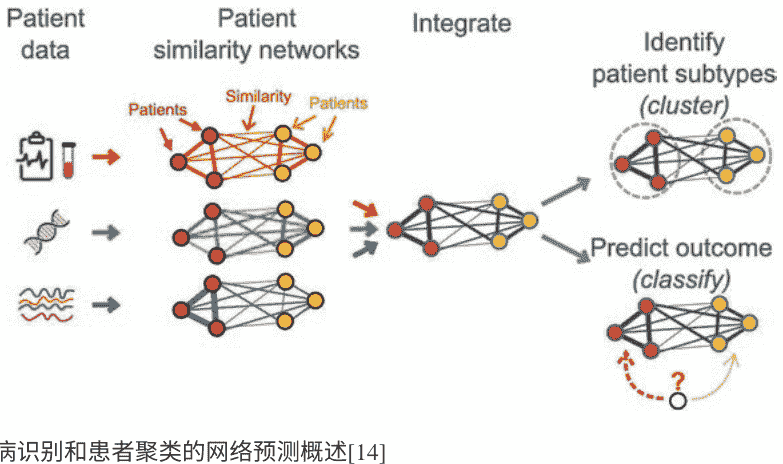

### 4.3 用于医学诊断和预测的基于 Web 的工具

在医疗保健工具的最新进展中，基于 Web 的医学诊断和预测开始在为医生和患者提供服务方面占主导地位。基于 Web 的系统由用户界面、诊断、预测和数据库模块构建。用户界面模块帮助医生和患者将详细信息输入系统。这些信息可以是患者的个人资料、临床报告或医生的发现。这些信息存储在系统的数据库中。为了高效检索数据和保护数据的安全性，数据库通常被分为存储学生个人资料的数据库和存储治疗详情和临床评估值的数据库。基于数据库中的临床数值和先前记录，使用神经网络构建的预测模块将预测患者的疾病状况。诊断模块作为专家系统，根据当前状况和症状制定一套规则。在诊断模块中，模糊逻辑被集成以提高处理模糊数据时的预测性能 [13]。图 3 展示了利用神经网络分析患者数据的概述，利用数据中的信息相似性进行聚类和预测。

### 医疗数据上的 5 种人工智能技术

人工智能系统的开发旨在通过提供来自文献和临床数据库的最新信息，为高效的患者护理提供帮助。它们可以用于取代人类判断或在放射学、癌症治疗、神经学、心脏病学等突出的医疗领域提出更好的临床决策 [4]。

在医疗保健中使用人工智能的相关方面可以总结为：- 1. 应用人工智能于医疗保健的动机。
- 2. 人工智能系统分析的数据类型。
- 3. 帮助人工智能系统开发有意义的临床结果的方法。
- 4. 人工智能社区关注的疾病类型。

基于人工智能的系统评估来自大量患者群体的数据，并帮助实时发出健康风险警报，同时预测未来的风险可能性。基于人工智能的系统通过从临床程序中输入的数据进行训练，这些数据包括监测、分析、治疗计划等。聚类技术可以用于将相似的患者群体分组，以学习其特征并制定规则来识别或分类新的数据项是否属于该群体。关联分析可以揭示症状和疾病结果之间的隐藏关系。在进一步分析之前，临床数据必须经过预处理，因为临床数据是异构的。它包括人口统计数据、医疗记录、电子设备记录、体格检查数据等。

人工智能应用使医生和研究人员能够浏览图像数据、实验室报告、疾病症状等，并获得最接近的可用诊断和成功的治疗方案，这些可以用于潜在的新患者。

这将减少识别和开始治疗的时间，同时减少患者的医疗费用。此外，如果患者在其他来源上的治疗细节可以在线获得，那么情况可以得到很好的处理，患者之前接受过治疗的任何其他来源都可以提供这些信息。

此外，技术可以用于分析患者家族的电子病历，以检测是否有其他患有类似疾病的患者，并使用这些信息来最终确定诊断和安排适当的治疗计划 [15]。整合来自多个来源的电子病历可以消除不必要的测试，减少治疗中的差距和分歧，尤其是在遗传因素决定治疗的疾病治疗中。

从数据库中发现数据模式的步骤可以总结如下 [16]：

- 1. 研究需要进行分析的数据领域。
- 2. 通过清洗、预处理和仓储将数据转换为所需的格式。
- 3. 使用适当的数据挖掘技术从数据中提取模式。
- 4. 对模式进行后处理，以辅助决策。
- 5. 选择适当的可视化技术，以展示发现的知识以供进一步使用。

### 5.1 在医疗保健领域实施人工智能的机会

人工智能使得从传统的纸质医疗记录向数字环境的过渡成为可能。这使得医生、药剂师和研究人员能够更快地访问数据。先进的计算技术使得能够从文献数据库中获取最新信息，从而使医疗界了解最新的研究成果。决策算法比人类同行更加一致地给出预测。尽管算法必须通过可用数据进行准确预测的训练，但从那时起它将准确预测。基于系统的数据维护减轻了维护硬拷贝文件以及在生成报告时查阅多个文件的工作量。

因此，使用 AI 技术的系统使数据的文档化变得简单。AI 技术的系统被用于培训医学研究人员，分析系统的工作情况以及对不同输入的预测输出。专家系统的使用在研究人员和普通人中变得非常普遍，并且被社会接受为专家意见的额外方法。基于 AI 的系统提高了迄今为止使用的预测技术的效率和准确性。

### 5.2 在医疗保健领域实施 AI 的挑战

由医院维护的大型数据存储库可能不愿意为研究目的或医生诊断提供信息，这引发了数据安全问题。由于基于 AI 的医学诊断成本高昂，除非保险公司报销，否则人们将不愿意投资这些技术，即使它们能够提供快速和准确的结果。对于 AI 系统的错误诊断或不正确预测提出法律挑战可能不明智，因为证明系统错误可能并不可靠。与人类专业知识相比，诊断和预测的准确性没有设置一个黄金标准。对于保护和未经授权使用患者信息的担忧限制了数据库所有者分享患者信息，即使是为了研究目的。将临床策略转化为机器可理解的形式是一项繁琐的工作，因此从临床试验中更新的值的数据库不能始终有效地用于进一步的分析。随着更多数据更新到数据库中，诊断系统的准确性提高，但同时预测时间也增加。这进一步导致在专家系统的帮助下评估患者情况的延迟。

## 6 用于医疗数据分析的机器学习

机器学习 (ML) 是一类基于人工智能系统，旨在从提供给它们的数据中学习并提高预测能力，而无需明确编程。ML 技术广泛分为监督学习和无监督学习。在监督学习中，基于已知的输入和输出值进行类别预测；而在无监督学习中，通过观察数据的性质和特征进行特征提取。半监督技术适用于某些输入数据缺失输出的情况。ML 技术用于结构化数据 (例如成像、遗传数据) 的分析，并尝试预测疾病概率并基于特征对患者进行聚类 [4]。利用 ML 的自然语言处理 (NLP) 特性，可以分析手写处方、出院摘要或医学期刊，以向结构化数据库添加信息。

这些转换后的结构化数据可以通过 ML 技术进行分析。

### 6.1 无监督学习

无监督学习技术在数据中没有给出任何输出信息，这意味着学习算法必须识别所考虑数据的特征，并根据其特征的相似性对数据项进行分组。

#### 6.1.1 聚类

在没有输出信息的情况下，聚类技术将具有相似特征的患者分组到同一组，并为这些组分配一个标签。形成的聚类尽量减小同一聚类中患者之间的差异，同时最大化不同聚类中患者之间的差异。每当接收到新的患者数据时，计算其与所有聚类之间的差异，并将新数据分配给具有最小差异的聚类。

聚类可以是 k 均值聚类、层次聚类和 高斯混合聚类之一。

#### 6.1.2 主成分分析 (PCA)

PCA 用作预处理技术，用于降低多维数据的维度并选择最显著的特征，而不会丢失太多特征，以便进一步分析数据。PCA 是一种统计方法，对一组可能相关的值进行正交变换，并将其转换为一组线性无关变量的数量。主成分分析主要用于探索性数据分析和构建预测模型。

### 6.2 监督学习

监督学习生成一组输入数据值与一组输出值之间的函数关系，其中包含输入 - 输出对。在医疗数据库中，监督学习广泛用于构建分类和预测模型。

#### 6.2.1 线性回归

线性回归选择依赖变量和独立变量之间的最佳拟合关系，以最小化误差值。误差值被计算为实际输出值与预测输出值之间的差的均方根。给出最小误差的模型被认为是给定数据的最佳拟合。线性回归已成功用于预测儿科急诊科的住院时间 [17]。

#### 6.2.2 逻辑回归

逻辑回归是一种使用概率函数的监督预测方法。在回归分析中的应用。它使用 sigmoid 函数 (f(x) = 1/(1+e^-x)) 用于模型化数据。逻辑回归在不同人群中的疾病诊断中被使用 [18]。

#### 6.2.3 支持向量机 (SVM)

SVM 是一种利用数据的统计特性来创建一个称为超平面的分离平面的预测/分类技术。它是一种广泛应用于包括心力衰竭预测在内的医疗系统中的数据驱动方法 [19]。

#### 6.2.4 神经网络

神经网络由通过可调节权重相互连接的处理单元组成，允许并行信号传输。节点网络由多个层组成，即用于读取输入数据的输入层，用于提取模式的隐藏层，以及用于提供输出值的输出层。神经网络的目标是估计隐藏层中的权重，以减少预测输出与实际输出之间的误差 [20]。

神经网络相对于传统的手动技术 [13] 在数据分析方面的优势如下所列：

- 1. 神经网络是数据驱动的，因此比起从数据中推导出的复杂规则更有效。
- 2. 数据泛化有助于自动处理数据中的噪声。
- 3. 未来值的预测是基于先前数据和趋势分析的。
- 4. 使用神经网络可以成功进行实时数据分析和诊断。
- 5. 使用神经网络可以快速识别和分类输入数据。
- 6. 人类推理受到处理大型数据集时的疲劳影响，而神经网络不受此影响。

#### 6.2.5 深度学习

深度学习是神经网络的扩展版本，具有多个隐藏层。深度学习算法具有从未标记、非结构化和无监督数据中学习的能力。它们主要用于医学图像分析中的医疗数据分析，因为图像数据非常复杂且数量庞大。深度学习算法通过卷积层形成卷积神经网络 (CNN) 来处理高度复杂的数据。CNN 的隐藏层设计有多个卷积层序列、激活函数 (例如 ReLU) 和池化层，这些层会重复多次 [21]。

在医疗数据分析中，利用不同的人工智能技术 (图 4) 结合数据挖掘技术的使用是可行的。通过对不同数据集上这些方法的分析，明显发现单一的数据挖掘算法不能在每个数据集上都可靠地进行预测或分类。

根据数据库的性质、相互依赖的特征和数据量，可以使用单一方法或技术组合来辅助医生进行决策支持 [22]。

## 7 基于人工智能的医疗数据分析应用

人工智能系统在医疗数据分析的许多场景中被使用，从医院等待时间预测到辅助诊断复杂的医疗情况，需要整合来自多个来源和异构格式的数据。在医疗领域，每天都有各种各样的应用案例涉及到人工智能。图 5 简要列举了人工智能在普通人日常健康领域的一些应用。

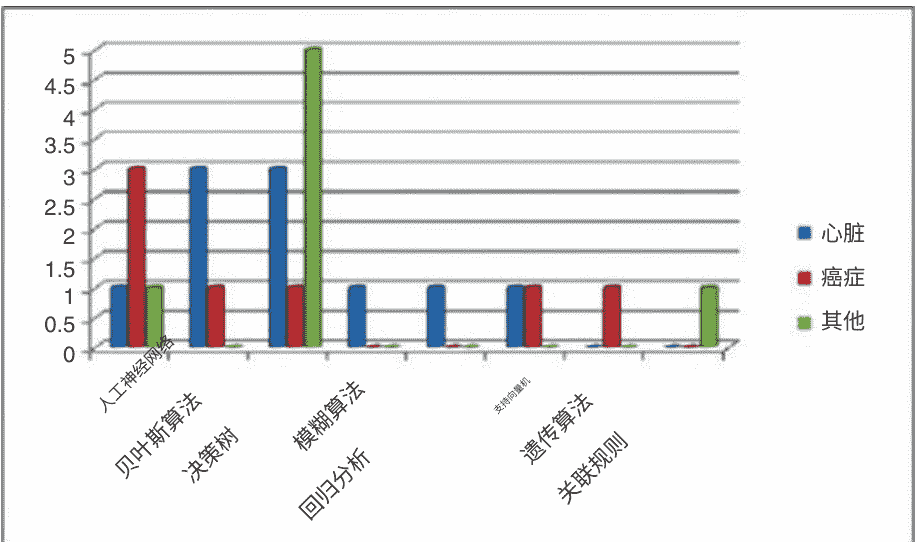

图 4 柱状图显示不同数据挖掘技术在分析医疗数据中的使用情况

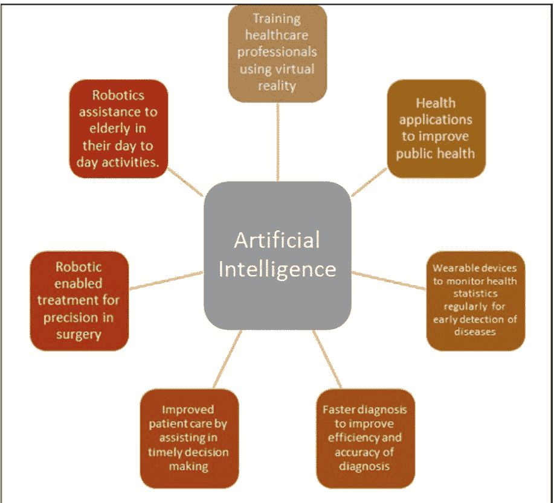

图 5 人工智能在医疗保健中的应用

### 7.1 中风预测应用

人工智能技术用于预测中风发生的可能性，以及为中风患者提供诊断和治疗建议。通过运动检测设备，可以实现早期中风检测，该设备基于遗传模糊有限状态机或主成分分析工作。运动检测设备能够检测人体活动，并将其分类为中风发作活动，并在这种情况下发出警报。运动检测设备通常是一种可穿戴设备，在中风发作时记录与正常情况明显不同的数据值。数据建模使用隐马尔可夫模型 (HMMs) 和支持向量机 (SVMs) [4]。进一步的神经影像数据分析由机器学习方法支持，以加快诊断并预测治疗效果。中风治疗模型设计采用贝叶斯信念网络。人们认识到，为了获得人工智能系统的好处，它必须具备处理结构化数据的机器学习组件和处理非结构化数据的自然语言处理组件。

### 7.2 应用于心血管治疗和预测

通过分析一个人的眼睛、年龄、血压、吸烟习惯等，可以预测一个人患心脏疾病的易感性。这使得医生可以在不进行血液测试的情况下验证一个人的心血管风险 [13]。使用前馈网络的人工神经网络也用于预测心脏病发生的可能性，包括年龄、血压等因素。从最初的监督数据中学到的信息进一步用于预测无监督数据。

神经网络通过梯度下降训练、模糊逻辑、遗传算法、贝叶斯方法等方法来提高其预测能力 [12]。

### 7.3 应用于 COVID-19 预测

在 COVID-19 爆发的情况下，使用长短期记忆 (LSTM) 模型设计了一种流行病学模型，用于预测感染率的传播速度。SEIR 模型通过将人口分为四个类别 (易感者 S、潜伏者 E、感染者 I、移除者 R) 来工作，根据其状态进行分类。LSTM 是一种递归神经网络 (RNN)，用于处理时间序列数据，以预测一段时间内新感染的可能性。由于可用数据集较小，使用 Adam 优化器优化的简单模型用于开发模型，参数包括传播概率、潜伏率、恢复率和接触人数 [23]。

## 8 结论与讨论

在所有层级的治理中，医疗数据已经准备好进行分析，挖掘隐藏的模式并识别其中的奥秘。与此同时，电子健康记录供应商对将高度敏感的数据共享给基于人工智能系统的第三方提供商的不愿意逐渐增加。人工智能在医疗数据中的主要目标是在决策过程中有效共享重要信息。

这些借助人工智能辅助和异构医疗数据开发的决策工具可以帮助医生快速诊断病情并提出治疗方案 [24]。

除了医生，制药行业也对庞大的医疗数据产生了兴趣。他们利用这些数据分析特定疾病的治疗计划，识别常用药物，在疾病状态恢复与非恢复的情况下跟踪药物的剂量和使用情况等。从数据库中收集到的这些信息可以进一步用于研究，以开发新药物和重组现有药物的剂量等方面 [12]。

大多数现代分析工具的使用并不排除医学法律问题的存在。在误诊导致错误或延误治疗的情况下，不良结果的责任将由谁承担——软件开发人员、医生还是决定实施它的医院？当医生决定违背决策支持系统的建议或选择不使用决策支持系统时，也可能引发医学法律问题。

通过克服采用基于人工智能的技术的障碍，人工智能、大数据和并行计算的结合旨在发展循证医疗、经济高效和个性化的医疗治疗实践。

## 参考文献

- 1. N. Mohammed, S. Barouti, D. Alhadidi and R. Chen, 安全和私密管理医疗数据库用于数据挖掘。在 2015 年 IEEE 第 28 届国际计算机医学系统研讨会（第 191-196 页）。IEEE（2015 年）
- 2. E. Moy, I.E. Arispe, J.S. Holmes, R.M. Andrews, 准备国家医疗不平等报告：评估健康护理中种族、民族和社会经济差异的数据缺口。医疗护理 43, 19-116（2005 年）
- 3. W.H.W. Ishak, F. Siraj, 医学应用中的人工智能：一次探索。Health Inform. Eur. J. 16(2002 年)
- 4. F. Jiang, Y. Jiang, H. Zhi, Y. Dong, H. Li, S. Ma, Y. Wang, Q. Dong, H. Shen, Y. Wang, 医疗保健中的人工智能：过去、现在和未来。Stroke Vasc. Neurol. 2(4), 230-243(2017 年)
- 5. C.Y. Hsieh, C.C. Su, S.C. Shao, S.F. Sung, S.J. Lin, Y.H.K. Yang, E.C.C. Lai, 台湾国家健康保险研究数据库：过去和未来。Clin. Epidemiol. 11, 349(2019 年)
- 6. T. Davenport, R. Kalakota, 人工智能在医疗保健中的潜力。Future Healthc. J. 6(2), 94(2019 年)
- 7. S.S.R. Abidi, 医疗保健中的知识管理：走向“知识驱动”的决策支持服务。国际医学信息学 63(1-2), 5-18 (2001 年)
- 8. T.Z. Gál, G. Kovács, Z.T. Kardkovács, 医疗保健数据库中隐私保护数据挖掘技术调查。Acta Universitatis Sapientiae, Informatica 6(1), 33-55 (2014 年)
- 9. L. Hong, M. Luo, R. Wang, P. Lu, W. Lu, L. Lu, 医疗保健中的大数据：应用与挑战。数据信息管理 2(3), 175-197 (2018 年)
- 10. H.C. Koh, G. Tan, 数据挖掘在医疗保健中的应用。健康信息管理杂志 19(2), 65 (2011 年)
- 11. C.S. Kumar, A. Govardhan, B.S. Srinivas, 数据挖掘在医疗保健领域的问题和挑战 Domian. Int. J. Eng. Res. 3(1) (2014)
- 12. K. Srinivas, B.K. Rani, A. Govrdhan, 数据挖掘技术在医疗保健和心脏病发作预测中的应用。Int. J. Comput.Sci. Eng. 2(02), 250–255 (2010)
- 13. K. Rabah, 人工智能、物联网、大数据和区块链的融合：一项综述。Lake Inst. J. 1(1), 1–18 (2018)
- 14. S. Pai, G.D. Bader, 用于精准医学的患者相似性网络。J. Mol. Biol. 430(18), 2924–2938 (2018)
- 15. S.E. Dilsizian, E.L. Siegel, 医学和心脏成像中的人工智能：利用大数据和先进计算提供个性化的医学诊断和治疗。Curr. Cardiol. Rep. 16(1), 441 (2014)
- 16. M.A. Mach and M.S. Abdel-Badeeh, 智能技术在医疗保健中的商业智能中的应用。在 2010 年第 10 届智能系统设计与应用国际会议 (pp. 545–550). IEEE (2010)
- 17. Combes, C., Kadri, F. and Chaabane, S., 使用回归模型预测医院住院时间：应用于急诊科。第 10 届法语建模、优化和模拟会议 MOSIM'14, Nancy, France (2014)
- 18. A. Yadav, L. Hui, M. Ali, M. Anis, 使用多项式逻辑回归模型分析尼泊尔医院的医疗数据。Int. J. Manag. Inf. Technol. 11(2), 2720–2730 (2016)
- 19. Y.J. Son, H.G. Kim, E.H. Kim, S. Choi, S.K. Lee, 应用支持向量机预测心力衰竭患者的用药依从性。Healthc. Inf. Res. 16(4), 253–259 (2010)
- 20. N. Shahid, T. Rappon, W. Berta, 人工神经网络在医疗保健组织决策中的应用：一项范围审查。PLoS One 14(2), e0212356 (2019)
- 21. J. Ker, L. Wang, J. Rao, T. Lim, 深度学习在医学图像分析中的应用。IEEEAccess 6, 9375–9389 (2017)
- 22. E. Kolçe 和 N. Frasheri，医疗数据库中使用的数据挖掘技术文献综述。ICT 创新 (2012 年)
- 23. Z. Yang, Z. Zeng, K. Wang，改进的 SEIR 和 AI 预测中国在公共卫生干预下的 COVID-19 流行趋势。J. Thorac. Dis. 12, 165 (2020 年)
- 24. J. Nealon, A. Moreno, 基于代理的健康护理应用，在健康护理领域中的软件代理技术应用，（Birkhäuser, 巴塞尔，2003 年），第 3-18 页

# 基于 GIS 的科尔卡塔市登革热疾病数据研究：医疗信息学方法

Sushobhan Majumdar

## 1 引言

在全球的疾病中，只有 17% 是虫媒疾病 [1]。其中，登革热和疟疾是一些主要的虫媒疾病，也是主要的公共卫生问题之一 [2]。登革热是一种虫媒疾病，因伊蚊叮咬而引起。根据世界卫生组织（WHO）的数据，登革热是一种以蚊子为媒介的病毒感染，主要在热带和温暖气候地区发现。在东南亚国家，虫媒疾病的影响在 11 个国家中很高。

2017 年，全球有一半的人口受到虫媒疾病的影响 [3]，全球五分之二的人口面临虫媒疾病的影响风险。印度也是虫媒疾病影响非常严重的国家之一。根据印度虫媒疾病的预测，到 2030 年将大幅增加 [3]。根据世界卫生组织（2017 年）的数据，登革热患者的比例在过去 50 年中大幅增加。2016 年，西孟加拉邦在印度经历了最多的疑似病例 [2,4,5]。在西孟加拉邦，有各种地区在过去几年中经历了高比例的登革热疑似病例。科尔卡塔是西孟加拉邦中一个小但非常重要的地区，因为有各种类型的活动。

在这项研究中，地理信息系统在健康科学研究或医学科学中被用作重要工具。地理信息系统在健康科学领域的应用是新的。但是在医学地理信息系统或健康地理信息系统领域的应用范围却日益扩大。它是研究人员可以在一个单一领域下轻松存储、处理和分析数据的重要工具之一。研究人员可以创建不同类型的分析，如热点图、疾病分析、爆发疫情图等 [6-9]。

S. Majumdar (✉)
地理学系，加尔各答大学，印度加尔各答


### 1.1 目标

本文试图利用地理信息系统找出加尔各答登革热疾病的时空模式，因为它是医疗信息学中的最新方法之一。本研究的目标是找出加尔各答登革热受影响区域的时空模式和热点识别。本研究使用了登革热受影响区域的热点识别进行分析。

### 1.2 研究区域

加尔各答市位于印度东部，也是西孟加拉邦的首府。它曾经是印度的首都，直到 1912 年。它是印度第三大人口城市，仅次于孟买和德里。它是印度东部各种行政工作的总部。印度东部的各个邦，如阿萨姆邦、锡金邦、奥里萨邦、贾坎德邦和比哈尔邦，都是加尔各答的总部，用于国防、通信和行政目的。加尔各答市隶属于加尔各答市政公司的管辖范围。它被划分为 144 个选区和 16 个行政区。根据 2011 年的人口普查，该市的总人口约为 440 万。在 2001 年至 2011 年期间，该市经历了负增长率，为 -0.38。该市位于胡格利河旁，位于胡格利河的濒临消亡的三角洲上。该市北部与西孟加拉邦的北 24 帕尔加纳斯县相邻，东部与南 24 帕尔加纳斯县的农村区块相邻，南部与南 24 帕尔加纳斯县相邻，西部与胡格利县的农村区块相邻。加尔各答市隶属于加尔各答都市发展局。该市的所有健康和医疗相关服务都由西孟加拉邦政府负责。该市的所有环境相关工作都由加尔各答改善信托负责。图 1 显示了加尔各答市政公司的地图。

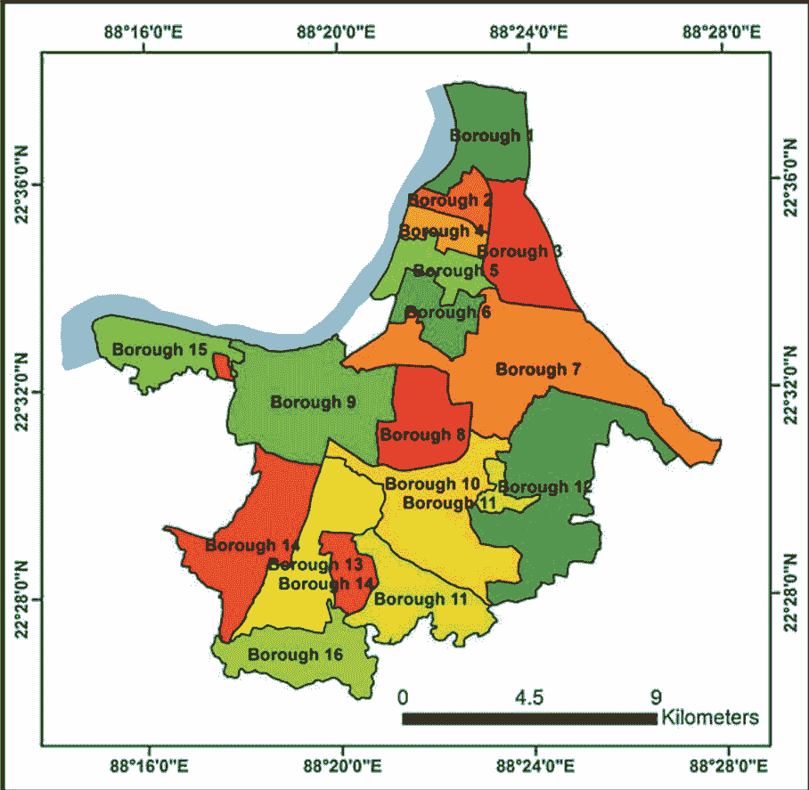

图 1 加尔各答市政公司的区级地图

## 2 数据和方法

### 2.1 数据

在这项研究中，使用了两种类型的数据，即原始数据和次要数据。通过结构化问卷调查从现场收集了原始数据。数据收集时间为上午 10 点至下午 4 点。在数据收集过程中，首先优先考虑了户主。如果户主不在，次要优先考虑家庭中最年长的人。从 KMC 地区收集了关于登革热的各种问题的原始数据。次要数据包括登革热的各种信息、地图、期刊和其他资料。收集了 Kolkata Municipal Corporation (KMC) 的地图，这些地图来自 KMC 的办公室和官方网站。关于登革热的各种信息，例如影响区域（年份），分布和受影响人数的总数已从各种旧书籍中收集，这些书籍是从加尔各答市的各个城镇图书馆收集来的。关于登革热爆发的数据已从加尔各答市政公司办公室收集。为了制图目的，使用了各种软件，如 Arc GIS 10.3 版本软件，Map info Professional 软件，Microsoft Excel 软件等（图 2）。有关方法的详细描述已在图 2 中描述。

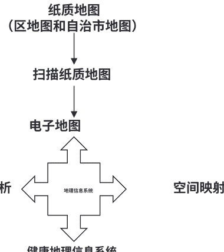

图 2 研究所使用的方法论框架

### 2.2 方法

分析数据已由 Excel 软件输入。从每个选区获得的数据已堆叠到其列出的区域。144 个选区的数据已分成 16 个区域。然后，从来源获取的地图已在大型滚筒扫描仪中扫描，以转换为软拷贝。扫描后，它已使用投影系统进行地理参考。在地理参考的情况下，使用了 45°北纬作为标准平行线的宇宙横轴墨卡托投影系统。然后，在每个区域中创建了形状文件，这些形状文件用于空间映射目的。然后，Excel 的数据已与相应的形状文件连接，用于空间映射和数据分析。为了对数据进行可视化分析，使用了制图技术，而对于人口统计分析，则使用了统计技术。

为了对不同时期的数据进行分析，使用了不同的统计技术，这些技术由世界卫生组织（WHO）定义。这些是由 WHO 操作的流行病学定义。用于研究的流行病学指标如下。

1.  年度血液检查率（ABER） = 年度检查涂片数 / 总人口 × 100
2.  年度恶性疟疾发病率 (AFI) = 年度阳性恶性疟疾病例数 × 1000 / 总人口
3.  年度寄生虫发病率 (API) = 一年内寄生虫阳性幻灯片的总数 × 1000 / 总人口
4.  疟原虫恶性疟原虫百分比 (PF%) = P 恶性疟原虫的总阳性 / MP 的总阳性 × 100
5.  涂片恶性疟原虫率 (SFR) = P 恶性疟原虫的总阳性 / 检查的涂片数 × 100
6.  涂片阳性率 (SPR) = 总阳性 / 检查的总涂片数 × 100

## 3 结果与分析

加尔各答市政公司是印度东部最古老的市政公司之一。由于其人口和面积，它在全球范围内具有重要性。为了行政目的，加尔各答市政公司的总面积被划分为 144 个选区。之后，又被细分为 16 个行政区。相比之下，一个行政区包含多个选区。

每个选区的行政负责人是一名顾问，所有顾问的负责人是加尔各答市政公司区的主席。加尔各答市政公司共有 144 个选区，被细分为 16 个行政区。该地区的所有工作都在加尔各答市政公司区的管辖范围内。该机构收取各种税款，如房产税、土地租金、停车税、水费等。在过去的几十年里，加尔各答市被发现是印度受登革热影响的城市之一。因此，选择了该城市进行登革热受影响区域的热点分析。出于这个原因，选择了各种指标，下面列出了这些指标。

为了找出加尔各答的登革热浓度，已经计算出了年度血液检查率 (ABER)。这是每年计算一次。在总人口中，一年中患登革热的人数是年度血液检查率。这里以百分比表示。根据加尔各答登革热病例的年度血液检查率，发现疑似登革热的人数在加尔各答市的北部和东北部较高。百分比在东北部，即 Belgachia 地区和 Saltlake 地区很高。在加尔各答市政公司区的东南部、南部和西南部，百分比非常低。年度血液检查率在第 2、4、5 和 6 区的百分比很高。

这个比率在第 11、13 和 14 区很低，即 Behala 地区。图 3 显示了加尔各答市区的年度血液检查率 (ABER)。

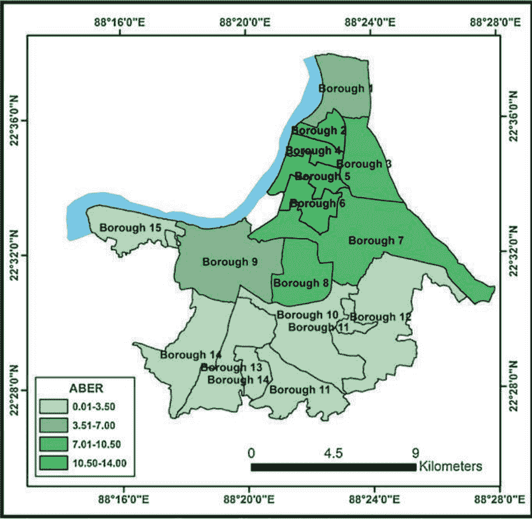

图 3 加尔各答市政公司的年度血液检查率

为了找出登革热受影响区域的热点，已经在加尔各答市政公司地区计算了年度恶性疟疾发病率 (AFI)。它是通过计算在 KMC 地区总人口中恶性疟原虫的百分比来得出的。它是以百分比值计算的。从登革热的恶性疟原虫发病率来看，发现该率在 KMC 地区的东北部，即巴格巴扎地区较高。它集中在第 2、4、5 和 6 区。这四个区域是登革热疾病的热点区域。除了这些区域，其他区域受影响较轻，KMC 的东部和南部的发病率较低。图 4 显示了 KMC 地区的年度恶性疟疾发病率。

API 指的是年寄生虫发病率 (API)。为了确定加尔各答市政公司地区的寄生虫发病率数量，使用了这个指标。它是根据一年内寄生虫发病次数与总人口的比例计算的。它以百分比形式计算。从加尔各答市政公司的年寄生虫发病率来看，这个比率在北部中心地区较高。

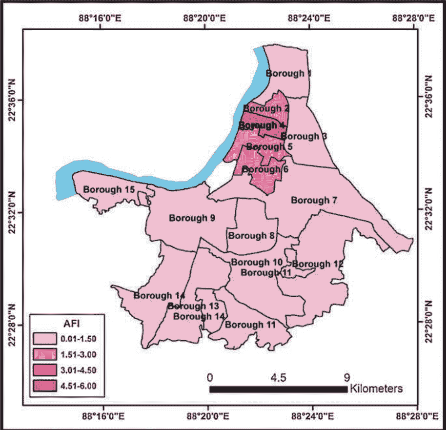

图 4 KMC 地区的年疟原虫发病率

API 比率最高的是第 4 个行政区，其次是 2、5、6 和 7。第 3 和第 8 个行政区的比率稍低。除了这些行政区，其他地区的比率都较低。这个比率在加尔各答市政公司地区的东南部非常低。图 5 显示了加尔各答市政公司地区的年寄生虫发病率 (API)。

图 6 显示疟原虫在 KMC 地区的发病率。从发病率来看，发现加尔各答市政公司地区有两个登革热疾病的热点。一个是极西北部，另一个是东南部。这两个地区是加尔各答市登革热疾病的热点。在 KMC 地区的东南部，即加尔各答市的贝哈拉地区，发病率较高。在 KMC 地区的东北部，即向盐湖地区，发病率较低。在加尔各答市的东南部，即主要是贾达普尔和桑托什普尔地区，这一比例稍高。

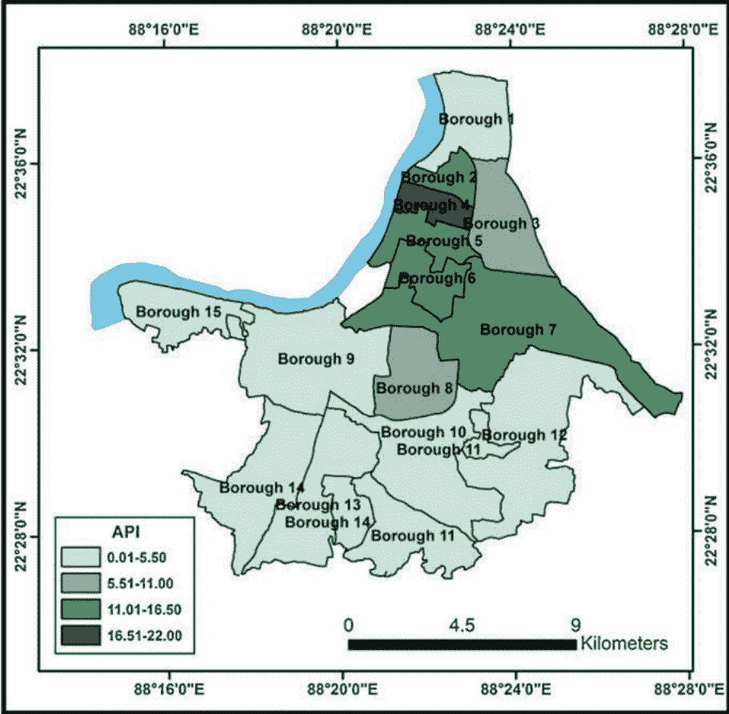

图 5 显示了 KMC 的年寄生虫发病率。

为了找出登革热的热点地区，在 KMC 地区计算了滑动疟原虫率 (SFR)。它是通过阳性病例数除以总样本率计算得出的。它以百分比的形式呈现。通过分析这一发病率，发现加尔各答市政公司地区的西北部发病率较高。它在第 4 区最高，而在第 2、5、6 和 8 区稍低。它逐渐降低到 KMC 地区的东南部和西南部。它在第 14 和 13 区最低，即向贝哈拉地区。图 7 显示了 KMC 地区的滑动疟原虫率。

图 8 显示了加尔各答市政公司区域登革热病例的滑动阳性率。它是通过在 KMC 地区的总人口中的阳性病例总数来计算的。它被计算为百分比值。从加尔各答市政公司区域的登革热病例滑动阳性率来看，发现这一比率在 KMC 地区的东北部较高，即 Belghachia、Shyambazar 和中央加尔各答，即 College Square 地区。


图 6 KMC 地区的疟原虫发病率

在 KMC 地区的南部，特别是在 KMC 地区的东南部，阳性率非常低。

## 4 讨论

从以上讨论中发现，加尔各答市是西孟加拉邦一个完全受登革热影响的地区，登革热发病率也很高。与南部相比，加尔各答市北部的各项指标 (如 ABER、API 等) 的发病率相对较高，主要原因是垃圾清理不定期、排水沟清洁不规范、老城区等。发病率在北部的第 2、4、6 和 8 区以及南部的第 14 区较高。

因此，这些地区可以被归类为加尔各答市登革热疾病的热点区域。由于这些地区，每年都有很多人患上登革热疾病。根据各种健康报告，发现加尔各答市及周边地区的登革热阳性或疑似病例相对较高，高于西孟加拉邦的其他地区。因此，加尔各答市可以被归类为西孟加拉邦登革热疾病的热点区域。

## 5 推荐

从上述讨论中发现，加尔各答市的登革热发病率非常高。为了预防加尔各答市的登革热疾病，应制定适当的计划。加尔各答的下水道系统非常古老，是由英国人批准的。为了预防登革热疾病，非常需要对下水道和排水系统进行翻新，这将减少积水。


图 8 KMC 中的阳性率

地下污水系统中的水。应该组织更多的意识活动，以增加居民的意识。一个适当的计划将最大限度地减少加尔各答市的不洁程度。这个城市的人口密度非常高。为了区域的适当管理和发展，应该将其最小化。

## 6 结论

这项研究是基于广泛的研究工作和大量的二次数据和实地实践的实证研究。这项研究是在受登革热影响的加尔各答市区进行的，旨在找出该市爆发的主要地区，并对其进行了热点分析。在分析了各种事件之后，发现加尔各答市登革热患者的比例非常高。与登革热疾病相比，该市的北部地区受到的影响更大，南部地区登革热的发病率在第 2、4、5、6 和 8 区非常高。随着距离增加，登革热的发病率逐渐降低，向城市的南部地区倾斜。通过区级分析，发现登革热疾病的爆发主要集中在加尔各答市的中部和北部地区。这项研究提供了有关加尔各答市登革热受影响地区的有用信息，对于西孟加拉邦的卫生部门和决策者制定预防这种疾病的策略也有帮助。本研究使用的方法也可以应用于其他研究，如疟疾、流感等。

## 参考文献

1.  世界卫生组织。媒介传播疾病。世界卫生组织（2017 年）。 http://www.who.int/news/room/fact/sheets/detail/vector/borne/diseases
2.  世界卫生组织。登革热和疟疾对社会经济增长的影响：世界卫生组织。世界卫生组织（2014 年）。 http://www.searo.who.int/mediacentre/releases/2014.
3.  世界卫生组织。世界疟疾报告。世界卫生组织（2018 年）。 https://www.who.int/malaria/publications/世界疟疾报告 2018
4.  世界卫生组织。被忽视的热带病。登革热。世界卫生组织。 http://www.searo.who.int/entity/vector_borne_tropical_diseases
5.  世界卫生组织。印度疟疾消除国家框架。2016 年 -2030 年。世界卫生组织（2016 年）。 https://apps.who.int/iris/handle/10665/246096。
6.  P. Elliott, D. Wartenberg, 空间流行病学：当前方法和未来挑战。环境健康展望。 112(9), 998-1006（2004 年）
7.  Elliott, P and Best, N. 疾病的地理模式—Wiley StatsRef：统计参考在线。（2014 年）。 http://onlinelibrary.wiley.com/. doi:https://doi.org/10.1002/9781118445112.stat06095/
8.  S.I. Hay, K.E. Battle, D.M. Pigott, D.L. Smith, C.L. Moyes, S. Bhatt, 传染病的全球映射。Philos Trans R Soc B BiolSci 368(1614), 2012-2050 (2013)
9.  C. Robertson, T.A. Nelson, 新兴传染病的空间分析概述。Prof. Geogr. 66(4), 579-588 (2014)

# 边缘计算：下一代计算

A. D. N. Sarma

## 目标

学习完本课程后，您将能够理解以下内容。

- 什么是计算？
- 什么是计算机环境？
- 计算技术的类型。
- 什么是边缘计算？
- 边缘计算的架构。
- 边缘计算的特点。
- 各种类型的边缘计算设备。
- 边缘计算的好处。

## 1 引言

日复一日，每个人都在享受计算设备的好处，如计算器、手机、智能手机、平板电脑、销售终端、个人数字助理手持设备、视频游戏机、数码相机、笔记本电脑、台式电脑等等。这些计算设备在我们的日常生活中常常被用来定期执行预定义的活动。如今，计算已经成为我们日常生活中不可或缺的一部分，没有它，生活变得难以按时完成事情。计算技术的创新在社会中提供了扩展其在日常需求和服务中使用的新方法。计算这个词指的是使用计算机。换句话说，它表示使用计算机来管理、处理和传递信息的活动。

处理器是计算机系统的核心，成为现代 IT 工业技术的一个组成部分。此外，处理器通过基本的计算机操作进行计算。计算机操作有五种基本类型：输入、处理、输出、存储和控制。换句话说，计算机系统被定义为一组集成的设备，如输入、输出、处理、存储数据和信息。计算机在我们的日常生活中的用途是无穷无尽的。计算机系统的主要目的之一是进行某种形式的数据处理和信息交换。

## 2 计算环境

计算机系统由一个使用特定硬件和软件配置的环境组成，用于执行特定应用程序的任务。因此，了解计算机环境以开发新的计算平台是必要的。因此，理解计算环境对于开发无缝集成系统的新的计算技术是至关重要的。计算环境 [1] 被定义为“计算机机器、数据存储设备、工作站、软件应用程序和网络的集合，支持软件解决方案所需的电子信息的处理和交换。”计算机解决方案是使用一系列信息技术产品和服务来解决问题的方法。这些解决方案将在不同的计算环境中运行，这取决于解决方案选择的需求和要求。图 1 显示了各种类型的计算环境。这可以分为两类：经典和现代。经典计算环境进一步分为三个子类：个人、时间共享和客户端服务器。从年复一年的计算技术演变中，发展出现代计算环境的技术。这些通常分为三个主要类别：集中式、分散式和分布式。


图 1 计算环境的类型

在个人计算环境中，有一个单一的计算机系统，其中包含所有的内部处理功能。这种类型的计算机系统更常被称为工作站、个人计算机或台式计算机。这些系统可以在没有使用任何外部计算资源的情况下运行计算机程序。大多数设备：笔记本电脑、平板电脑、手机、相机、扫描仪和打印机都可以拥有一个本地计算环境，用于运行应用程序。此外，这些设备还包括连接和传输数据到外部设备的功能。在时间共享环境中，处理器的时间被同时共享给多个用户。因此，每个用户在分配的时间段内连接到设备系统，并在该时间段内执行程序。

时间共享技术是一种访问计算机环境资源的一种方式，它是多道程序设计的一个逻辑扩展。在客户端 - 服务器计算中，有两种类型的计算机通过网络连接在一起进行应用程序处理。客户端和服务器通常通过计算机网络进行通信。客户端请求资源，服务器提供该资源。

在这种情况下，服务器系统通常具有比客户端更高的处理能力。因此，一个服务器可以同时为多个客户端的请求提供服务，而一个客户端只与一个服务器联系。

集中式计算环境由一个专用服务器和连接到网络上的多个设备组成，用于访问各种资源。这种环境只是客户端 - 服务器计算的延伸，其中客户端的计算能力低于集中式服务器。多个客户端同时连接到服务器，强调的是客户端 - 服务器模型的网络连接。在这种情况下，客户端系统的数量多于客户端 - 服务器计算系统。Web 计算变得更加普遍，这是集中式计算系统的一个例子。在这种情况下，客户端通过互联网或局域网连接到集中式系统，这些客户端通过一个轻量级接口称为浏览器连接到中央系统。

基于 Web 的系统由 Web 服务器和数据库服务器组成，以及部署在 Web 服务器上的应用程序。系统的用户可以通过称为浏览器的接口访问 Web 服务器。一些 Web 服务器的例子包括 Apache、Apache Tomcat、Microsoft Internet Information Server、NGINX 和 Node.js。

简单来说，分散式计算与集中式计算相反，它是在网络上的各个节点或设备上进行计算。在这种情况下，每个节点都是独立的，可以自行决策。系统的最终行为是各个节点决策的总和。需要注意的是，没有单个实体接收和响应请求。区块链是分布式计算的一个应用示例。分布式计算环境包含多个物理上分离但通过网络连接在一起的节点。在这个系统中，所有这些节点彼此通信，并协同处理进程。在这里，每个节点都包含分布式操作系统软件的一小部分。

云计算这个词在最近变得更加流行。云计算已经改变了计算方法，实现了对共享计算资源的按需网络访问。在过去的十年中，许多商业应用程序已经从现有的传统系统转移到基于云的平台，因为可以轻松访问和简单配置互联网上的计算和非计算资源。在云计算中，远程服务器托管在互联网上，用于处理、存储和管理计算机系统资源的按需可用性。这是通过对所有计算资源进行汇集，然后使用软件来管理这些资源来实现的，这意味着服务（数据或程序）可以通过互联网访问。云解决方案的实施可能因企业而异。一些企业可能选择实施软件即服务 (SaaS)，其中应用程序及其服务通过互联网访问。一些应用程序选择实施平台即服务 (PaaS)，其中企业可以创建自己的应用程序。第三种云实施类型提供端到端的基础设施即服务 (IaaS)。一些流行的 IaaS 提供商包括亚马逊网络服务 (AWS)、思科 Metapod、Digital Ocean、谷歌计算引擎 (GCE)、惠普企业 Converged、IBM Smart Cloud、Joyent、微软 Azure、Rackspace Open Cloud 和 SAP Cloud Platform。

一个集群计算环境由一组相互连接的计算机组成，它们一起工作，并且对外界可见，就像是一个单一的系统。这类似于一种并行计算。集中式和并行计算系统都用于实现类似的目标，并且两种系统都有多个 CPU，而集群计算不会在计算机之间共享内存。然而，一个主要的区别是集群系统是由两个或更多个独立计算机系统合并在一起，并且具有共同的存储，然后并行工作。为了获得集群计算的能力，需要采用并行编程技术，利用多个处理器同时解决复杂问题。

点对点 (P2P) 是分布式系统的另一种结构。在这种结构中，所有节点都被视为对等节点，并且任务在系统或节点之间进行分割，不使用任何集中式的计算概念。在这种结构中，对等节点是应用处理中平等特权的、具有相同能力的参与者。P2P 系统 [2] 允许系统之间直接交换计算资源，并且 P2P 系统的目标是在互联网边缘聚合可用资源，并在用户之间进行合作共享。在 P2P 中，没有像集中式系统那样的专用服务器可用。

边缘计算是最新的计算技术之一，它基于网络架构原理，相对于传统的计算技术和云计算，提供了几个优势。这种计算技术属于分布式计算框架。在这种技术中，计算资源和应用服务沿着通信路径分布，从数据源到云端。这种计算技术与企业应用程序紧密结合，意味着计算需求可以在数据收集的边缘或用户执行某些操作的地方得到满足。

## 边缘计算的市场规模和参与者

市场规模通过价值提供了对于市场机会的潜在增长的快速理解，包括新产品和服务的提供。通常，市场规模是基于数量或价值估计的，这是市场规划战略的关键组成部分。此外，市场规模确定了增长水平，适当的时间框架，关注各种市场机会扩展的地理位置，以及对市场中的关键参与者、公司如何分配预算、研发投资以及新产品和服务的支出的洞察水平。

根据 Grand View Research [3] 的报告，全球边缘计算市场规模预计将在 2027 年达到 434 亿美元，预计在 2019 年至 2025 年的预测期间以 37.4% 的复合年增长率增长。5G 技术预计将成为市场增长的催化剂 [4]，为边缘计算创建一个强大的基于网络的技术。预计电信公司的现有服务将转向 5G，并在多接入边缘计算 (MEC) 中开放新的产品机会，该技术允许高带宽、低延迟，并确保更高的应用性能。此外，边缘计算市场对微边缘数据中心 (EDC) 的需求大大增加，而不是集中式数据中心，因为它支持超大规模计算的集中化。由于全球连接设备数量的增加，边缘人工智能 (AI) 的发展将成为下一次革命。因此，边缘人工智能有望提供实时操作，不仅可以构建各种应用和服务，还可以满足物联网 (IoT) 领域的新兴需求。

边缘计算市场的关键市场参与者包括 ADLINK Technology、Amazon Web Services、Belden、Cisco Systems、ClearBlade、Dell Technologies、Digi International、EdgeConneX、Fujitsu、Hewlett Packard、Huawei Technologies、Intel、Microsoft Corporation、Nokia 和 IBM Corporation。NVIDIA Corporation、Google Inc.和 Intel Corporation 等公司正在开发专门为计算技术加速推理过程而设计的处理器 [5]。例如，Atos SE 推出了基于边缘计算技术的世界上性能最高的边缘计算 AI-enabled 高性能服务器，用于管理数据。

## 我们正在从今天的移动优先、云优先的世界转向一个由智能云和智能边缘构成的新世界

> 纳德拉 [6] 表示，全球科技社区正在经历一次重大转变，“即使是在云中构建的微服务、工作流和高级分析，都指向了我认为是应用程序范式的根本变革，是我们对世界观的改变。”

我们正在从今天的移动优先、云优先的世界转向一个由智能云和智能边缘构成的新世界。用户体验正在分布在各种设备上。换句话说，它不再仅仅是移动优先，不再只针对一种设备和应用模型。用户体验将跨越所有设备。

## 边缘计算

如今，企业需要连接数百万台设备，这些设备作为数据源。在物联网应用中，多个设备部署在多个位置，用于收集各种形式的数据，例如天气、土壤、空气污染水平、交通密度和患者数据等。这些设备持续感知和生成数据，并将这些数据发送到集中式服务器。在传统系统中，大量的数据将被发送到云端，这就需要更高的带宽来传输大量的数据。此外，云端和这些设备之间的请求和响应会引起更高的延迟，从而影响系统的可靠性。为了克服这些限制，计算能力可以尽可能地靠近设备。

此外，这些设备可以将计算后的数据智能化，以便用户可以方便地使用。因此，部分计算工作可以从集中式或云系统转移到网络中的设备上，这就是边缘计算。这种技术将工作负载从云端转移到边缘，即将计算推向网络边缘。

自计算机系统进化以来，计算中发生了一种范式转变。计算转变主要从大型机到微型计算机，从微型计算机到个人计算机，从客户端 - 服务器到集中式，从集中式到云端。边缘计算的原则是计算网络系统中的一个新概念，它打破了传统云计算的边界，开启了一个新的机遇时代。边缘计算使用分布式计算、对等网络等原则，可以看作是云计算的自然延伸，但在云计算概念上有几个不同之处。在边缘计算中，计算和数据存储都靠近设备的位置。因此，计算能力的提供已经扩展到通信网络中设备的边缘，并在本地处理数据。在这种情况下，原始信息的处理更接近网络中的数据源，从而减少了数据传输所需的距离。这有效地减少了延迟。因此，边缘计算解决方案超越了传统云计算的优势，并提供了实时数据处理、更高的性能和构建更大的生态系统等多个优点。

边缘计算可以用以下方程总结。

![边缘计算方程]

根据 IDC [7]，“边缘计算是一个网状网络数据中心，可以在本地处理或存储关键数据，并将所有接收到的数据推送到中央数据中心或云存储库，占地面积不超过 100 平方英尺。”在边缘计算，计算尽可能地靠近网络中的设备，在那里数据被创建并需要对数据采取行动。此外，它将智能与数据结合起来，结果以分析的形式输出，利用人工智能根据信息的模式、关系和预测提供数据洞察。

## 边缘计算的概念架构

边缘计算是一种新的范式，其中边缘服务器的资源被放置在互联网的边缘，靠近移动设备、传感器、终端用户和新兴的物联网设备 [8]。主要上，边缘计算可以被视为云的延伸，但在几个方面有所不同。在边缘系统中，计算发生在设备的边缘，这改变了数据处理、处理和信息传递的方式，与云相比。

这导致了一个新的计算架构系统，它提供了形成一个边缘生态系统的互连层，每个层都有自己的功能和设备类型。

图 2 显示了一个典型的边缘网络生态系统的网络架构，包括云、服务器边缘、网络边缘和设备边缘四个层次。设备层包括大量的传感器、控制器和设备执行器。这些设备将作为数据源生成大量的数据。此外，这些设备生成的数据会在网络边缘实时处理。网络层包括网关、交换机、路由器和无线接入点。服务器层包括边缘服务器和雾节点。云层包括大数据处理和业务逻辑处理。此外，大量的数据在设备边缘生成、处理并发送回云端进行存储。因此，云端充当数据仓库，为处理数据的边缘设备提供所需的智能。总之，边缘计算架构将应用程序和数据的执行移至靠近用户的网络边缘，从而使系统对用户的响应更快。

![图 2 边缘计算生态系统的典型网络分层架构]

## 边缘计算的 6 个特点

如今，边缘计算在市场上在工业、健康、政府、交通、教育和家庭等几乎所有业务领域都越来越受欢迎，因为它们具有独特的特点。边缘计算的主要特点如下：

- **(a) 本地存储器** - 边缘设备可以具有本地存储器，用于存储从传感器或执行器收集的数据，而非边缘设备的收集数据将在网络中传输到云端。
- **(b) 边缘计算** - 边缘计算中非常有趣的一点是数据处理可以发生的位置。设备与数据源非常接近，即在网络边缘，计算就在那里进行。一般来说，非边缘设备不包含任何本地计算功能和信息交换。
- **(c) 时间敏感数据** - 边缘计算的目的是处理时间敏感数据，而在云计算中处理的数据可能不是时间驱动的。边缘计算的一个关键特点是将时间敏感数据处理和传播给系统用户进行实时决策。
- **(d) 低延迟** - 在边缘计算中，不需要将数据传输到较远的位置，因为数据源保持在网络中与边缘设备尽可能接近的位置。因此，数据传输所需的旅行时间从数据源位置到计算环境的最小程度，这反过来导致数据延迟几乎可以忽略不计，从而实现数据的实时处理。
- **(e) 位置感知** - 边缘设备可以主动或被动地确定它们的位置。

## 7 种边缘计算设备类型

各种类型的边缘计算设备可以包括本地设备、本地化数据中心和区域数据中心，这取决于形成边缘计算生态系统所使用的架构类型。边缘计算系统可以根据边缘设备的数据处理能力进行广泛分类。

此外，边缘设备根据使用目的、距离、计算能力和连接设备数量进行分类。根据使用目的，边缘设备可以是通用目的或特定目的。通用目的的边缘计算系统主要用于执行一组常见功能，而特定目的边缘系统可以设计用于特定目的。特定目的边缘设备旨在处理特定问题或执行特定任务，例如工业物联网或国防应用。

此外，边缘设备根据计算能力和连接设备数量的不同而有所区别。因此，它们可以分为四种类型：小型、中型、大型和企业生态系统。在小型和中型边缘系统中，计算能力局限于本地且使用有限。覆盖的距离范围从几米到不到一公里，而连接的设备数量从十个到几百个不等。在这种情况下，连接的用户和设备数量有限，范围从几十到几百或几千。另一方面，大型和企业边缘系统具有更高的计算响应，并将其功能扩展到更长的距离以形成边缘生态系统。连接到网络的设备数量从几千个到更多不等，距离范围从一公里到几百公里甚至更远。这种计算技术将计算传递到网络的逻辑极限，以提供以下优势：加快应用需求、低延迟、实时分析、数据传输性能改善、减少带宽以及应用和服务的可靠性。

## 边缘计算的 8 个优势

边缘计算是基于网络架构的一种计算技术，相比传统计算技术和云计算，它提供了多个优势。以下是边缘计算平台的几个优势：

- (a) 实时数据处理 - 在边缘计算中，数据在网络中的设备边缘本地存储，并具有数据处理能力。因此，本地数据存储和数据处理的结合提供了实时数据处理能力。
- (b) 较低的延迟 - 延迟是衡量数据包从数据源到目的地所需时间的指标。随着源和目的地之间的距离增加，延迟也会增加。因此，距离成为数据延迟的关键因素。在边缘计算中，数据传输时间理想情况下可以忽略不计，因为它同时结合了数据源和存储，从而降低了延迟。
- (c) 通过边缘分析降低成本 - 在边缘设备上处理的数据可以提供分析，从而降低计算成本，提供接近实时的操作。
- (d) 隐私政策执行 - 它描述了我们如何收集数据和使用设备上的数据，以及如何通过所需的安全性来保护数据。
- (e) 应用程序和服务的可靠性 - 边缘计算技术减轻了今天互联网的延迟和带宽限制，相比之下，与云计算相比，应用程序和服务的性能和可靠性得到了改善。

简而言之，边缘计算的好处将为服务交付和终端用户提供广泛的选择，不仅适用于医疗领域，还适用于所有其他领域。边缘计算架构最重要的好处是将应用程序的执行移至网络边缘，使数据更接近设备和用户。因此，边缘计算作为下一代计算技术，将在未来几十年中继续保持需求。

## 边缘计算的 9 个应用案例

### 9.1 案例 1:基于物联网的自动化辅助生活护理 (ALC) 服务

在辅助生活护理 (ALC) 中协助和监控人们是医疗领域中最突出的边缘计算技术应用案例之一。辅助生活是为老年人和残疾人设计的家庭、场所或社区，他们需要各种级别的服务来生活。换句话说，辅助生活护理 (ALC) 意味着为老年人和其他无法独立进行日常生活活动的人提供更多的设施或服务。

辅助生活设施是为老年人和残疾人提供长期护理的连续护理。监控辅助生活中心中个人护理变得越来越困难。辅助生活服务通常包括住宿、个人、监督、医疗和继续护理等服务。高效监控辅助生活设施被发现是医疗领域中最突出的应用案例之一。管理 ALC 中每个人的设施非常困难，从个人醒来到上床睡觉，甚至在睡眠时。边缘计算技术在网络边缘提供数据处理，这一特性为基于物联网的辅助生活设施带来了新的设计。

图 3 展示了一个典型的基于物联网的辅助生活家庭，该家庭设计用于不需要紧急护理的人群。该模型还提供其他服务，包括对每个个体的人员、家庭护理和监测以及定期监测健康重要指标，提供轮椅、提醒用药时间和其他常规计划活动以及医疗咨询和辅导服务。这个模型提供了监测、辅助和通知个体在 24 小时内完成日常任务的多个功能。辅助生活家庭配备了靠近和周围个体的传感器。这些传感器充当数据源，连接到互联网并将数据传输到附近的边缘设备。

通常，边缘设备可以是一个网关。传感器收集的数据在连续基础上进行采样，并转发到网络的边缘设备上进行本地数据处理。此外，边缘设备将数据传输到云环境中。

![图 3 基于物联网的辅助生活家庭]

每个椅子都装有传感器，当人们坐在椅子上时，这些传感器会捕捉到他们的生命体征。这些生命体征数据包括温度、心率、呼吸率、血压和血糖等，将这些数据传输到网络的边缘进行处理，然后再发送到云端。一个控制中心与云端相连。

一个由非医疗和医疗人员组成的团队在控制中心对个人的日常活动和生命体征数据进行持续监测。控制中心的工作人员监测每个人的活动情况，并确定谁需要必要的帮助来进行基本活动。此外，支持人员每天都会通过电子方式与每个人联系，并记录这些细节。

最后，我们得出结论，所提出的辅助生活用例与由看护人员管理的传统辅助生活之间相比，具有几个优势。基于物联网的生活护理中心的主要优势包括较少的看护人员数量、每个人的低生活成本、更好的控制机制、医疗援助以及几乎实时的响应。此外，根据辅助生活护理中心的及时需求，还可以轻松扩展提供附近的养老院、临床中心、诊断中心、医院和其他咨询服务。

### 9.2 案例 2：非接触式医疗保健服务

在现代，为人们提供健康和护理服务变得越来越具有挑战性和复杂性，尤其是在传染季节和疾病传播期间。特别是，政府很难通过现有的医疗人员亲自为人民提供健康和护理服务。最近，世界上出现了大流行的冠状病毒疾病，简称 COVID-19，导致了巨大的打击和破坏人类生活。这给所有政府在最短的响应时间内找到保护全球人民健康和护理的方法带来了极其困难的局面。因此，这为医疗保健领域开辟了多种机会，可以为人们提供无接触的医疗保健服务，而不会失去人们渴望的个人关怀。这为医疗保健领域打开了一个全新的世界，更加注重以人为本的接触式人类数字医疗保健服务。

根据调查估计，超过 80% 的医疗行业可以进行数字化。这为健康数据的数字化转型提供了巨大机会，特别是电子健康记录、患者疾病记录、健康调查、临床试验数据、索赔数据和其他行政数据。在医疗保健领域，利用边缘计算、机器学习算法和大数据等新技术不仅可以构建更好、更快的健康服务，还可以最大限度地扩大其覆盖范围。这样可以实现政府、机构、医疗组织和医疗行业领导人为人民提供无接触数字医疗服务的方式。

基于边缘计算技术设计的医疗服务相比传统服务具有许多优势。这些优势包括及时提供服务、广泛的服务范围、高效和公平的医疗服务。此外，这些新设计的医疗服务以人为本。因此，数字医疗服务相比传统医疗服务能够更好地覆盖国家的偏远村庄。此外，借助现代人脸识别工具，从数字图像或视频帧中识别和识别一个人的面部更加容易。此外，这些工具将有助于发现个体面部外貌的细微差异。此外，面部识别有助于及早识别和检测人们面部症状，有助于及时诊断罕见疾病。

边缘计算技术能够更快地执行源数据，并向系统用户提供实时警报和数据分析。这些健康服务可以由以人为本的机构推动。此外，这些健康服务将以实时方式提供给最终用户，在最短的时间内覆盖更大范围。在此过程中，机构可以发布最新的健康相关指南、说明和短信，并将其推送到一个集中系统，该系统再连接到移动网络，将信息传播给用户。此外，这些消息是通过预装在移动设备中的移动应用程序，可以将这些指南下载到用户的手机上，只要移动设备连接到互联网。公民可以通过移动应用程序以多语言形式阅读/听取/观看这些机构发布的指南，这是一个持续的过程。同样，这些指令是为了在传播流行病（或大流行病）期间改善护理条件而遵循的。

图 4 展示了一个典型的非接触式医疗系统，利益相关方如政府、医院和控制中心通过雾层连接到云端，雾层又连接到连接到服务器物联网设备的设备层，该设备层在地面级别捕获数据。为了监测患者的一般临床状况，患者床位和附近位置覆盖了各种类型的传感器，并且这些传感器与相应的边缘设备连接。为了获取患者的必要生命体征（血压、体温和体重），患者床位和附近位置覆盖了各种类型的传感器。

此外，这些传感器连接到一个或多个边缘设备，实时捕获数据，其中包括患者的生命体征数据和身份信息。这些数据将立即发送到边缘设备进行处理。这不仅有助于监测患者的健康状况，还可以查看过去的数据。医护人员会及时收到有关活动的警报，以便按照医生的处方提供所需的医疗援助。此外，在医院层面上，可以为患者提供在线咨询服务，帮助他们提高士气、勇气，也是为了重拾失去的信心。一个连接到云端的控制中心可以监控和管理各种服务的能力，并及时向各种活动发送及时的警报。

此外，患者可以在线向医生表达他们的感受、症状和其他可观察到的观察结果。因此，患者和医生之间的通信是无接触的，这是安全的，并且通过使用边缘技术实现。所提出的使用案例提供了几个优势，包括在设备边缘本地处理大量数据、以低延迟传输处理后的数据到网络的其他部分、减少网络带宽。边缘设备不仅可以更快地处理大量数据，还可以提供基本的数据分析。处理后的信息将在云环境中提供，以进行进一步的处理、学习、推理和分析。

![图 4 一个典型的非接触式医疗系统]

## 10 总结

在本章中，我们简要讨论了计算这个术语及其在我们日常生活中的重要性。此外，我们解释了构成计算机环境的内容，并描述了各种类型的计算机环境。此外，我们还谈到了边缘计算平台的市场价值如何通过新产品和服务的提供来展示。此外，我们概述和介绍了边缘计算的演变，并解释了边缘计算生态系统的分层架构。此外，我们简要提及和解释了边缘计算的主要特点。此外，我们总结了边缘计算系统的各种好处。最后，在本章中介绍了边缘计算的使用案例——基于物联网的自动化辅助生活护理和非接触式医疗服务。

## 参考文献

- 1. F. Richard, Schmidt (2013) 软件工程架构驱动的软件开发，第 1 版，Morgan Kaufmann，美国，ISBN 978-0-12-407768-3，第 49 页。http://sd.blackball.lv/library/Software_Engineering_-_Architecture-_Driven_Software-_Development_(2013).pdf。访问日期：2020 年 3 月 26 日
- 2. J. Sen. (2012) Peer-to-Peer Networks: Architectures, Applications and Challenges. iv-v. https://doi.org/10.1109/NCETACS.2012.6203284. https://ieeexplore.ieee.org/stamp/stamp.jsp?arnumber=6203284
- 3. Edge Computing 市场到 2027 年将达到 434 亿美元 https://www.grandviewresearch.com/press-release/global-edge-computing-market 访问日期：2020 年 3 月 20 日
- 4. 物联网在行业垂直领域的广泛应用，智能应用数量的增加：Edge Computing 市场报告。https://www.dynamiccio.com/growing-adoption-of-iot-across-industry-verticals-increase-in-number-of-smart-apps-edge-computing-market-report/.访问日期：2020 年 3 月 25 日

## 参考文献

5. NVIDIA AI 接口平台，技术简介 https://www.nvidia.com/content/dam/en-us/Solutions/Data-Center/tesla-product-literature/t4-inference-print-update-inference-tech-overview-final.pdf. 于 2020 年 3 月 1 日访问
6. 纳德拉，跨国公司需要创造本地机会：纳德拉，http://www.ptinews.com/news/8693655_Multinationals-need-to-create-local-opportunities%2D%2DNadella, 访问日期 2020 年 3 月 17 日
7. 什么是边缘计算？ https://www.cbinsights.com/research/what-is-edge-computing/. 访问日期 2020 年 4 月 12 日
8. W. Shi, G. Pallis, Z. Xu (2019) 边缘计算，Proceedings of the IEEE, Vol. 107, No. 8, August 2019, https://doi.org/10.1109/JPROC.2019

# 医疗保健系统中的边缘计算


Madhura S. Mulimani 和 Rashmi R. Rachh

## 1 引言

在信息为中心的时代，一种新兴技术使得我们能够在任何时间、任何地点访问到无处不在的云资源，这就是云计算。

自从云计算问世以来，连接到云端的用户数量和各种类型的设备数量呈指数级增长。智能手机和物联网（IoT）传感器的普及使得这一趋势更加迅猛。这导致服务器和网络的延迟和负载增加。由于数十亿物联网设备产生和传输大量数据，云环境中的瓶颈问题变得不可避免。存储和处理如此庞大的数据量对云服务器来说是一项艰巨的任务。许多设备收集实时数据，需要实时处理以获得无延迟的结果，因为它们用于时间敏感的应用，如机器人技术、自动驾驶、增强现实、虚拟现实等。结果的延迟可能会对用户造成困扰，甚至对自动驾驶车辆等造成危险，因为它们需要数据在光速下被处理并发送回车辆。此外，从设备到云端传输大量数据会消耗大量带宽，并受到网络连接的限制。

除了延迟和带宽问题外，关于从这些设备发送到云端的数据的安全性和隐私问题也是主要关注点。数据的处理可以在生成数据的设备附近进行。这种方法可以减少连接到云端的设备数量，从而消除一些云计算问题。

这种方法被称为边缘计算。

边缘计算是一种新颖的范式，具有将应用程序和服务从云端带到数据生成源头的能力，即计算移动到数据所在的地方。这些边缘设备是机器学习和深度学习算法最好和最吸引人的目标。它们可以分析收集的数据并将结果发送回设备。边缘计算可以满足边缘设备上深度学习的低延迟和高计算需求 [1]。边缘计算与云计算不是互斥的，而是互补和扩展云计算。这些连接的数据源包括智能手机、配备传感器的设备（如无人机、汽车、机器人、可穿戴设备和智能家居设备），它们位于网络的边缘。

根据思科的一份白皮书，到 2020 年，大约会有 500 亿个物联网设备连接到互联网。此外，根据思科的估计，到 2021 年，每年将在云之外产生近 850 泽字节（ZB）的数据，而全球数据中心的流量仅为 20.6 泽字节。这表明数据源正在经历从云中使用的昂贵数据中心到日益增多的边缘设备的巨大转变，以应对大数据的需求。

不断增长的数据和计算能力导致了新的智能服务和应用的出现，这些服务和应用受到了很大的吸引力，并且丰富了人们的生活方式，提高了生产力，增强了社会效率。这得益于算法的数量增加、计算能力的提高和大数据的应用。

由于成本、延迟、可靠性和隐私问题，云只能提供有限数量的智能服务。与云相比，边缘计算更接近用户，因此预计能够解决大部分这些问题。事实上，它正在逐渐与人工智能（AI）集成。这对于实现智能边缘和边缘智能是互相有益的，如图 1 所示 [2]。智能边缘由不断增长的一组连接系统和设备组成，它从环境中收集数据并进行分析，使用高度响应和具有上下文意识的应用程序向用户提供实时体验和洞察。边缘计算和人工智能的结合产生了一个新兴的交叉学科，边缘智能，目前仍处于起步阶段 [3]。

虽然 AI 这个词在 1956 年被提出，但直到最近才引起了广泛关注。它是一种构建智能机器的方法，这些机器能够模拟人类的智能，如学习、推理、规划、知识表示、问题解决等。为了实现 AI 的目标，使用了一种有效的方法，即机器学习。为了训练机器进行数据挖掘任务，如分类和预测，正在开发许多机器学习方法。这些方法利用从现实世界中获得的数据来训练机器。在众多的机器学习方法中，深度学习是利用人工神经网络（ANN）来学习数据的深层表示，并在许多任务中取得了良好的性能的方法之一。

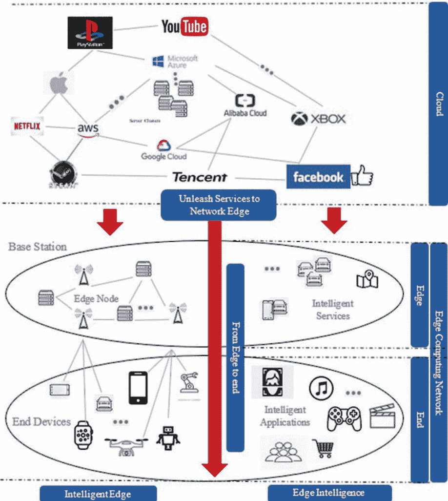
图 1 边缘智能和智能边缘 [2]

这种采用由一系列层组成的 ANN 的深度学习模型被称为深度神经网络（DNN），它在许多任务中包括人脸识别、图像分类等方面取得了良好的性能。在深度学习模型中加入更复杂和抽象的层使得 DNN 能够学习高级特征，从而在任务中实现高精度的推理。DNN 的流行结构包括多层感知器（MLPs）、卷积神经网络（CNNs）和循环神经网络（RNNs）等。

## 2 什么是边缘计算？

边缘计算是一种新兴技术，它使用云计算。它将更多的责任分配给边缘层，如数据处理、计算卸载、数据缓存/存储、物联网管理、安全和隐私保护、服务分发等。换句话说，边缘计算将计算应用和服务从集中式单元转移到逻辑极端或最接近数据源的位置，以提供数据处理能力 [4]。边缘计算是指允许在网络边缘执行计算的技术。对于云端的下行数据，边缘计算代表云端执行计算，而对于上行数据，边缘计算代表物联网服务执行计算。在这里，数据源和数据中心之间路径上的任何计算和网络资源都被称为“边缘”。例如，在智能家居中，家庭物品和云之间的网关，移动设备和云之间的微型数据中心和云集群，以及身体物品和云之间的智能手机，都是边缘的例子。

在边缘计算中，基本思想是在数据源附近执行计算，更加关注物体方面，而不是像雾计算那样关注基础设施方面。在边缘计算范式中，物体扮演着数据的生产者和消费者的角色，而不仅仅是数据的消费者，如图 2 所示 [5]。随着物联网成为推动边缘计算的力量，这项技术将在物联网之外的许多领域发挥更大的作用，因为它受到比 4G 网络快十倍的 5G 网络的推动 [6]。

边缘计算和云计算是两种互补的技术。边缘计算将用于它所能做的事情以及延迟很重要的地方，或者在广域网 (WAN) 上的回程流量可以限制回到大型数据中心的地方。

在边缘计算中，需要将来自多个供应商的硬件和软件组装成一个无缝运行的系统，以支持多个供应商、传统设备和协议，并避免供应商锁定。例如，传统系统可能包括使用多个协议的多个控制器和来自不同供应商的网关，所有这些都需要连接起来。图 3 显示了边缘计算中使用的网络拓扑。它使物联网系统能够使用边缘节点和网关层来互连物联网设备并将子系统与各种类型的数据中心连接起来，还包括网关、接入和城域边缘。“最高级别”的资源是云，它可以是公共的、私有的或混合的。它为特定的垂直应用程序处理和存储数据。所有数据的本地处理和存储操作都在边缘节点上执行 [7]。由于边缘计算，嵌入式系统的架构正在发生变化，从松散耦合的固定功能设备转变为真正分布式的系统 [8]。

边缘节点和传统物联网设备（如路由器、网关和防火墙）可以共同工作，也可以将这些功能合并到一个设备中，该设备能够进行计算和存储。层之间的连接由南北数据通信链路提供，而相似层上的节点使用东西通信相互连接。节点可以是公共和共享的，也可以是私有的，或者是两者的组合。根据应用的要求，处理和存储操作在能够高效满足这些要求的节点上进行。

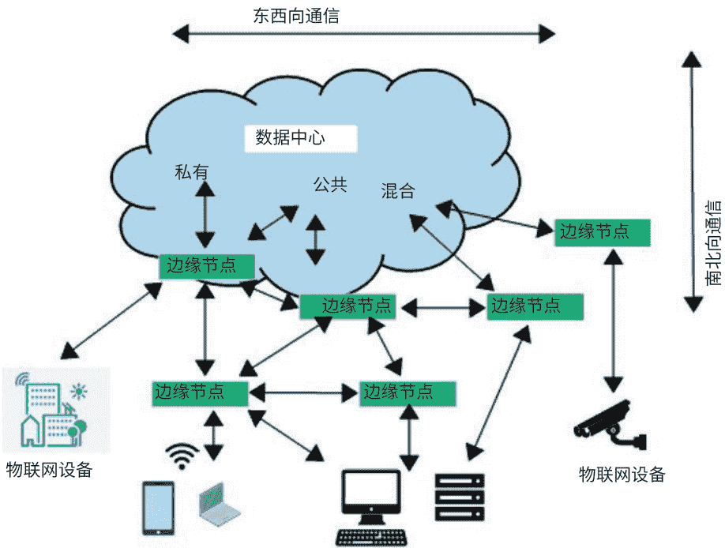
### 图 3 边缘计算架构

这有助于降低成本 [7]。

## 3 边缘计算的需求

物联网设备的普及和越来越多的电子和计算驱动设备连接到互联网，使得边缘计算的出现成为必然。除此之外，还有几个因素促使了边缘计算的广泛使用，如下所述：

- 从云服务到边缘：云具有超过边缘设备能力的计算能力。因此，为了有效利用云端，边缘设备传输到云端的大量数据。因此，网络带宽承受了很大的压力 [9]，数据传输速度也成为云计算范式的瓶颈。例如，波音 787 每秒产生约 5GB 的数据。然而，要传输如此大量的数据，无论是卫星还是地面基站与飞机之间的带宽都不足以支持实时传输。另一个例子是自动驾驶汽车每秒产生 1GB 的数据。当需要在远程云上进行分析时，无法做出实时正确的决策，因为会产生很长的响应时间 [10]。此外，网络带宽和可靠性将面临严重挑战，特别是在需要支持大量车辆的区域。在这种情况下，边缘处理数据将更加高效，因为它可以确保快速响应时间，减轻网络压力 [5]。
- 从物联网中获取数据：随着许多电气设备（如空气质量传感器、LED 灯条、街灯以及连接到互联网的微波炉）成为物联网的一部分，它们将充当生产者和消费者的角色。连接的设备数量不断增加，预计在未来几年将超过数十亿。因此，它们将产生大量数据，可能超出云计算有效处理数据的能力。在这种情况下，可以将大部分物联网设备产生的数据传输到网络边缘 [5]，在边缘设备上使用机器学习和深度学习算法进行处理和分析。
- 在这种情况下，与其将大部分物联网设备产生的数据传输到云端，不如在网络边缘消耗数据，然后使用部署在边缘设备上的机器学习和深度学习算法进行处理和分析。这些设备的硬件和中间件限制要求使用机器学习算法，原因有很多，例如减小输入的大小、聚类以及进行准确和实时的预测。

即使在物联网设备生成的大量数据的情况下，也可以使用深度学习算法 [11]。对于无法在边缘设备上完成的非常复杂的分析，将需要更多计算能力的数据发送到云端可能更合适。一旦云端使用深度学习算法处理数据，生成的有意义的数据将被传回设备。由于并非所有数据都会被服务使用，具有多余计算资源的边缘节点可以用于通过执行一些数据管理任务来过滤或分析数据 [10]。

- 从数据消费者变为数据生产者：在云计算范式中，终端设备通常是数据消费者，例如使用智能手机观看 YouTube 视频。然而，如今，由于成千上万的家庭中互联的大量移动设备也在产生数据，从仅仅成为数据消费者转变为数据生产者和消费者需要在边缘放置更多功能。例如，拍照、录制视频，然后在 Twitter、Facebook、YouTube 或 Instagram 等云服务上分享已经变得非常普遍。此外，每分钟都有大量数据被共享，这些数据与用户的生活密切相关。因此，对于所有用户，无论是大公司还是个人，都需要保护数据隐私并提供数据安全。例如，将家庭室内摄像头的视频数据传输到云端会增加泄露用户个人信息的风险 [9]。然而，上传大图像或视频剪辑时可能会消耗大量带宽。在这种情况下，在将视频剪辑上传到云端之前，可以在边缘调整其分辨率。可穿戴健康设备是另一个例子。所有这些设备都收集一个人的身体数据，这通常是私密的。因此，与其将原始数据上传到云端，将其在边缘进行处理有助于保护用户的隐私 [5]。

## 边缘计算的 4 个应用

由于在边缘产生了大量的数据，将其在网络边缘进行处理会更加高效。由于云计算在处理边缘产生的数据时并不总是高效的，因此引入了不同的计算技术，如移动边缘计算、雾计算和云端计算。

边缘计算作为一种比云计算更高效的计算技术出现了。它指的是允许在网络边缘对下行数据和上行数据进行计算的技术。分别代表云计算和物联网服务 [4]。边缘计算凭借其提供的诸多优势在众多技术中占据了一席之地，如降低运营成本、降低延迟、增加数据安全性和隐私性、提高服务质量 (QoS)、实时数据处理和无限可扩展性。由于这些优势，它在医疗保健、交通运输、教育、社交网络、制造业等领域被广泛应用。边缘计算的另一个显著特点是与其他无线网络 (如移动自组织网络 (MANs)、车辆自组织网络 (VANs)、物联网 (IoT) 和智能交通系统 (ITS)) 的轻松集成。这有助于解决与计算和网络相关的问题。与边缘计算的集成使这些应用能够快速做出决策，并避免在救生事件中出现任何延迟 [12]。

尽管连接在一个位置内的边缘节点数量可能会增加，但它会减少连接到云端的设备数量，从而消除了云计算的问题。在这种情况下，边缘计算可以使许多应用受益。边缘计算的示例包括智能城市、机器对机器通信、安全系统、增强现实、可穿戴医疗系统、视频分析、物联网、连接车辆和智能交通等应用。例如，当飞机每秒产生几千兆字节的数据时，由于带宽限制，单个基础设施无法处理这些数据。同样，当一辆方程式赛车每秒产生约 1.2 GB/s 的数据时，为了在比赛中保持竞争力，需要及时收集、分析和采取行动。为了解决这些问题，使用边缘计算在边缘聚合和预处理数据，然后再传输到云端，甚至在边缘决定下一步的步骤 [13](图 4)。


图 4 边缘计算应用场景

1. **智能家居：** 通过为智能电视、智能灯、机器人吸尘器等电器设备添加 Wi-Fi 模块，并将它们连接到云端，同时在房间、管道、地板和墙壁等地方部署廉价无线传感器和控制器，可以建立这样的环境。这些设备产生大量数据，由于隐私问题和数据传输压力，这些数据可能主要需要在家中使用。当智能家居需要提供这样的功能时，云计算变得不适用。在这种情况下，可以使用边缘计算，在家中运行专用的边缘操作系统的边缘网关，以便轻松连接和管理家中的设备。此外，数据可以在本地进行处理，从而减轻网络带宽的负担 [5]。在软件方面，可以使用机器学习技术、连接性、语音识别应用和大数据技术为智能家居环境中的用户提供个性化服务 [14]。

2. **智能城市：** 在智能城市应用中，使用各种类型的传感器嵌入式电子设备来收集对于高效资源管理和城市资产至关重要的信息，包括政府、医疗保健、交通、供水、图书馆、学校、执法和其他社区服务。为了解决停车、公共安全、照明和废物等地方社区问题，该应用程序执行各种功能 [14]。它可以利用边缘计算平台并从中受益，原因如下：
    - 大量数据：公共安全、金融、交通、健康、政府等许多领域为拥有百万人口的城市产生了大量数据。由于繁重的流量工作负载，一个集中式数据中心处理所有这些数据似乎是不现实的。在网络边缘处理数据的可行且高效的解决方案是边缘计算。
    - 低延迟：医疗保健或公共安全应用需要可预测且低延迟，只有通过边缘计算范式才能实现，因为它节省了传输数据的时间，简化了网络结构，并且有助于决策和诊断。
    - 位置感知：边缘计算在基于地理位置的应用中特别有用，例如公用事业管理和交通运输，这些应用使用基于地理位置的数据进行收集和处理 [5]。

3. **图像和视频分析：** 网络摄像头和移动电话的普及使用导致了另一种新兴技术，称为视频分析。需要视频分析的应用程序不能基于云，因为存在隐私问题和数据传输的长延迟。例如，在寻找失踪儿童时，边缘计算范式可以更高效，因为具有低延迟，同时也能保护隐私，而不是将孩子的照片上传到云端并在大量数据中进行耗时的搜索。

4. **云卸载：** 在内容传递网络（CDN）中，边缘服务器仅缓存数据，内容提供商可以决定放置数据的位置。另一方面，在物联网中，数据不仅产生，还在边缘消耗。边缘计算范式有助于在边缘服务器上缓存数据和应用于数据的操作。这显著提高了延迟和用户体验，在时间敏感的应用中起着重要作用。

5. **协作边缘：** 在云计算中，多个利益相关者无法协作和共享数据的主要原因是隐私问题和运输成本的威胁。另一方面，边缘计算在地理分布的多个利益相关者之间提供了一个协作边缘，使他们有机会共享数据并相互协作，无论他们的物理位置和网络基础设施如何。医疗应用是这种协作边缘的最佳例子 [5]。

6. **医疗设备和农村医疗：** 医疗领域有许多创新，医疗专业人员更容易访问患者的健康数据。远离医院或网络接入有限的人仍然无法享受医疗提供者提供的优质护理。因此，需要改进医疗行业以维持甚至提高服务质量，从而更好地利用资源并降低成本。在医疗行业，始终会产生大量数据，例如患者的病历、医疗账单、疾病检测报告等，这些数据存储在物联网设备上。所有这些数据都使用深度学习算法进行分析，以获得快速准确的分析结果。使用云计算和边缘计算开发和设计的智能医疗系统能够通过存储大量数据并执行复杂分析来提供可靠高效的系统，深度学习算法最适合这种情况。便携式物联网医疗设备和患者佩戴的物联网医疗设备能够在现场快速有效地收集、存储和分析关键患者数据，而无需不断与网络基础设施保持联系。它们在重新建立连接时将数据发送到中央服务器。通过将物联网医疗设备与边缘服务器接口连接，现有网络可以扩展，从而使医疗专业人员能够访问关键患者数据，以便在网络连接质量较差的地区提供医疗服务 [15]。

7. **智能交通系统：** 该系统也可以称为智能交通系统，旨在实现自主驾驶、先进交通模式、车载信息和娱乐服务以及创新的交通管理方案等多种服务 [16]。智能交通系统是智能城市的重要组成部分，致力于通过为车辆和交通基础设施配备智能传感器来收集和处理来自每辆车、乘客以及环境的数据，以实现安全的道路出行和有效的交通。由于智能交通系统需要支持自主驾驶车辆，因此需要可靠的通信和数据分析基础设施，以实时、超低延迟地收集和处理数据。

由于在智能交通系统中使用了大量的移动传感器，将各种设备的所有感知数据传输到云端进行分析可能会导致高延迟，在计算负载过重和网络拥塞严重的情况下，边缘计算可以通过在每个车辆级别上处理大部分数据并仅将计算结果发送到云端来解决这些问题。在这些系统中，诸如目标检测、语音识别、图像分类等任务非常频繁，并且基于它们的分析做出决策。这得益于在边缘设备和云端上部署了机器学习和深度学习算法 [11, 17]。

## 边缘计算中使用的 5 种架构

在云计算中，随着连接设备数量的增加，由于基础设施资源和带宽限制，服务质量（QoS）下降，延迟增加。云计算通过在设备附近执行计算来缓解这些问题。这种范式被称为边缘计算，它将计算从中央云服务器移动到最接近数据源的位置，并在那里执行处理。它形成了云和终端设备之间的一个额外层次，如图 5 所示。

计算资源从云端移动到边缘引发了其他计算技术，如移动边缘计算、雾计算和云端计算。

在移动边缘计算中，其节点能够使用无线接入网络（RAN）中的移动设备执行计算和存储任务。

移动边缘计算的用例包括主动缓存网站内容和使用容器进行资源虚拟化。

在雾计算中，地理区域的节点（例如接入点、交换机、路由器、机顶盒和物联网网关）提供计算资源。雾计算应用包括跌倒检测、紧急警报服务、智能停车、车载网络中的车道变换、智能交通信号灯和智能风力发电场。

在云端计算中，延迟敏感且计算密集的应用程序在本地区域网络中的服务器上运行。这些类似于面向边缘计算用户的小型数据中心资源。道路和交通状况监测、视频游戏、众包数据预处理和边缘视频分析是云端计算应用的一些示例 [18]。

在构建新技术的架构时，非常重要的是识别当前技术的问题，指定新技术的要求，列出支持技术，并定义概念。一旦一切就绪，可以将概念作为架构进行实施、验证和评估 [4]。

边缘计算有几种提出的架构，但没有社区或行业接受其中任何一种。关于边缘计算架构的物理结构缺乏一致性，导致提出了各种架构，每种架构都考虑了不同的方面以满足其需求。例如，IBM 考虑到生产现场的自治性和自给自足性，在三层架构中平衡边缘、工厂和企业的工作负载。

OpenFog Consortium 提出了一个用于工业用例的架构，将需求分组在其范围内，并称之为支柱，如安全性、可扩展性、开放性、自治性、灵活性和可编程性。在 Dell 的初步贡献下，Linux Foundation 推出了面向工业物联网边缘计算的 EdgeX Foundry，以构建一个共同平台。VMWare 也正在开发一个类似的框架，名为 Liota，并旨在易于使用、安装和修改。

在云计算中，基础设施与终端设备之间存在直接通信。然而，随着连接到云计算的设备数量增加，低 QoS 和高延迟成为云计算的主要问题。为了解决这些问题，实现高 QoS 并降低延迟，边缘计算被用作一种解决方案，在云和终端设备之间添加了一个额外的层用于通信，如图 6 所示 [4]。

边缘计算的架构包括云端、边缘层和设备层等组件。设备层中的终端设备可以位于相同位置或不同物理位置，如图 6 所示。边缘层由边缘服务器组成（在图 6 中显示为绿色块），它们是在数据被转移到云端之前进行数据收集、聚合、分析和计算的中间组件。当终端设备需要与云端通信时，请求首先发送到距离设备最近的边缘服务器。然后，如果任务可以由边缘服务器自行处理，它会自动处理数据并将结果返回给终端设备；否则，数据将被转移到同一层中的另一台服务器。否则，数据将被转移到云端。决策过程考虑了各种因素。

图 6 边缘计算的三层架构

如同一网络中其他可用服务器的资源可用性、物理距离和时间要求。

边缘计算使用了各种技术，如无线传感器网络（WSN）、移动数据采集、移动签名分析、雾/网格计算、分布式数据操作、远程云服务等。此外，它还结合了各种协议和术语，如 5G 通信、可编程逻辑控制器（PLC）协议、消息队列代理、事件处理器、虚拟化、超级监视器、OpenStack、人工智能平台、超级账本、Docker 等 [4]。

## 边缘计算的 7 个优势

边缘计算作为一种重要解决方案，以其众多的优势打破了新兴技术的瓶颈，具体列举如下：

- 1. 减轻流量负载：分布式边缘计算节点处理了大量的计算任务。由于与云端没有相应的数据交换，它有助于减少流量负载。

- 2. 快速服务响应：由于边缘主机将服务部署在靠近数据源的终端设备上，端到端延迟减少，数据传输延迟减少，响应速度提高。这使得实时服务成为可能 [1]。

- 3. 巨大的云备份：边缘计算利用云端的大容量存储和强大的处理能力，因为边缘设备的存储和处理能力有限。在边缘计算中，由终端设备、边缘计算节点和云数据中心组成的分层结构，进一步提供计算资源和可扩展性，避免了中心位置的网络瓶颈 [1,2]。

- 4. 增强的数据安全性：在边缘计算中，用户的私密数据存储和分析在边缘设备或接近数据源的地方进行，可能在边缘服务器上生成，而不是上传到云端。由于避免了数据通过公共互联网的传输，大大降低了网络数据泄露的风险，并有助于保持安全和隐私 [1,9]。

- 5. 更好的应用性能：边缘计算有助于减少对远程集中服务器或分布式本地服务器的依赖。由于本地边缘服务器靠近终端用户设备，它们与终端用户设备之间的网络延迟明显低于终端用户设备与云服务器之间的延迟。这在许多行业中非常有益，特别是在医疗保健行业中，因为他们将能够获得一个更敏捷和响应迅速的 IT 网络，该网络需要快速处理不断增长的患者数据 [19]。

- 6. 降低运营成本：并不是所有各种物联网设备生成的数据都需要存储在云上。云计算的一些昂贵特性包括与云的连接、数据迁移到云、高带宽利用率和高延迟。然而，边缘计算已经解决了这些问题，并且能够减少带宽和延迟。通过仅识别和存储相关数据，从而降低了基础设施成本以及公司的整体运营成本。通过仅在次要存储、离线备份或需要进行更复杂数据处理时将相关数据上传到云端，可以控制存储在昂贵集中位置的数据量。这是由于边缘计算可以帮助整个组织或系统节省成本，并将投资和资源用于关键任务领域，如人员、设备和物资 [20]。

- 7. 无限可扩展性：物联网边缘计算的最大特点是在需要时能够进行扩展。边缘网络可以添加无限数量的设备，只要它们添加了 Wi-Fi 模块，可以连接到云端，并在所需位置部署传感器。

## 边缘计算的 7 个缺点

任何提供好处的技术都会带来一些相关风险。边缘计算也不例外。因此，公司应该了解边缘计算中存在的概念和情况，以便对这些风险有所认识。

- 1. 安全问题：部署的移动设备和物联网设备数量不断增加，它们是智能应用（如智能交通、智能城市、智能家居等）的基本组成部分。它们用于感知、执行和控制。此外，越来越多的计算能力被转移到这些设备上，从而实现了边缘计算的目标。这是边缘计算的一部分，展示了边缘计算的好处。然而，边缘计算的阴暗面引入了许多安全威胁，因为随着越来越多的设备连接到边缘计算中，真实世界的攻击面也随之增加。这些攻击包括以下内容：
  - 计算能力较弱：边缘服务器的计算能力相对较弱，与云服务器相比。因此，它更容易受到现有攻击的影响。同样，边缘设备的防御系统比通用计算机更脆弱。因此，在这些情况下，对云服务器或台式计算机的攻击可能不再有效。
  - 攻击意识：许多物联网设备不使用用户界面。很少有设备使用发光二极管（LED）屏幕。因此，用户既无法了解设备的运行状态，也无法识别设备是否受到攻击。
  - 异构操作系统和协议：由于许多边缘设备具有不同的操作系统和协议，没有统一的规范，为边缘计算设计一个统一的保护机制非常困难。
  - 粗粒度访问控制：通用计算机在其访问控制模型中提供四种权限（只读、只写、读写、无读写）。然而，边缘计算无法支持这样的模型，因为系统复杂且启用了各种应用。因此，边缘计算系统倾向于采用细粒度访问控制，因为它们需要知道谁可以通过什么方式在何时以及如何访问哪个传感器 [21]。

- 2. 需要更多硬件：边缘计算通常需要更多的本地硬件。例如，为了通过互联网传输视频数据，物联网摄像头可能需要内置计算机，并且对于更复杂的处理应用程序，如面部识别或运动检测算法，还需要更复杂的计算过程。尽管边缘计算强调利用本地计算能力并使用不同类型的设备，但它仍然需要面对一些挑战，例如在分发和管理数据存储和计算方面的效率，与云计算合作提供更可扩展的服务，以及保护整个系统的安全和隐私。

- 3. 不完整的数据：只有一部分数据通过边缘计算进行处理和分析，而原始信息和不完整的见解被丢弃。因此，对于公司来说，考虑到信息损失的可接受程度非常重要 [22]。

使分布式网络变得安全一直是边缘计算的最大挑战。尽管边缘网络具有显著的安全优势，但实施不良的系统可能会使其易受攻击。

边缘计算主要依赖于小型数据中心和物联网设备，因此存在一系列与传统网络安全技术相比完全不同的安全问题。边缘计算框架的更广泛分布使其容易受到更多攻击者的利用。因此，那些考虑采用边缘计算解决方案的公司需要认真对待这些威胁，特别是如果他们的计划非常依赖于物联网边缘设备。

## 8 个深度学习和机器学习算法

大量物联网设备在智能城市、智能工厂、自动驾驶车辆、机器人、智能交通系统、智能家居、医疗保健、智能城市等各个领域的多个实时应用中产生了大量关键数据。快速准确地分析这些数据，提取有意义的信息并做出适当的决策，需要在边缘设备和云端中使用机器学习和深度学习算法。

### 8.1 机器学习算法

机器学习是人工智能的一个分支，它使计算机能够自主学习、分析数据、进行预测并做出正确的决策。ML 的先驱 Arthur Samuel 将其定义为“一门研究使计算机能够在没有明确编程的情况下学习的学科”。

ML 利用训练数据中已知的特征进行学习，在分类和回归中被广泛应用 [23]。

物联网传感器可以在许多场景中利用机器学习算法进行分类、回归和排序问题，并且机器学习模型可以部署在边缘设备上，并以适当的方式适应资源受限的边缘设备的部署 [24]。

机器学习提供了许多算法，根据训练阶段中标记数据的可用性，这些算法被分类为监督学习、无监督学习和强化学习。在机器学习中，训练数据集是用于实际训练模型执行各种操作的数据集。图 7 显示了各种机器学习算法的分类。


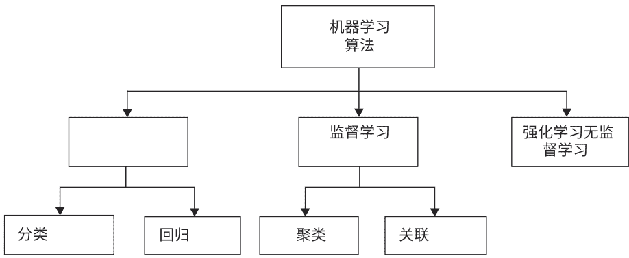

#### 8.1.1 监督学习

在监督学习中，算法通过一个监督员进行学习，该监督员通过使用每个训练样本的类成员信息来训练模型对示例或样本进行分类。换句话说，在监督学习中，样本与其标签一起提供给算法，算法学习输入和输出之间的模式。因此，当新的样本或示例被呈现给算法时，它将能够正确分类。因此，监督学习可以被称为使用带有标签数据的学习。

监督学习的例子包括朴素贝叶斯、决策树、随机森林、K 最近邻、线性回归等 [25]。

- 朴素贝叶斯：它是一个实现概率朴素贝叶斯分类器的贝叶斯分类器。它基于强独立性的假设，即一个属性的概率不会影响另一个属性的概率 [26]。如果整体正态性假设不正确，则它使用核密度估计器来改善性能。它使用有监督离散化来处理数值属性。作为一种基于概率的方法，它特别使用条件概率来创建分类器进行分类，并且在解决检测和预测性问题方面非常有用 [27]。
- 决策树：根据属性的值，递归地将输入空间划分为多个子空间，可以用一个称为决策树的分类器来表示。表示基于输入属性值的某个函数进行决策的内部节点，将实例空间划分为两个或多个子空间。叶节点表示类别。从根节点到叶节点的遍历有助于根据路径上内部测试节点的结果对实例进行分类。决策树可以通过连接路径上的测试来将树的每条路径转换为规则。ID3、C4.5 和 CART 是一些决策树的例子，它们有助于从给定的数据集中学习 [28]。
- 随机森林：这是一种集成分类技术，它创建两个或更多决策树。每棵树都是通过随机选择数据来准备的数据集。该算法对异常数据不太敏感，并有助于提高准确性和预测能力。它可以轻松处理高维数据 [29]。
- 线性回归：这种分析方法研究了自变量（预测或输入）与因变量（响应或输出）之间的关系。根据用于预测因变量的自变量数量，回归模型分为两种类型，即简单线性回归模型和多元线性回归模型，分别使用一个自变量和多个自变量 [30]。
- 支持向量机：这是一种线性分类方法，它使用决策边界来最小化经验分类误差并最大化几何间隔。它构建一个最大分离超平面，将输入向量映射到更高维空间。在分离数据的超平面的每一侧，它构建两个平行超平面，并通过分离超平面最大化它们之间的距离。它使用一个更大的边界或平行超平面之间的距离的假设，以更好地推广分类器的错误 [31]。

#### 8.1.2 无监督机器学习

在无监督学习中，缺乏监督者使得模型能够识别类别信息的模式并从中学习。算法接收没有任何相关输出的输入实例。然后将它们聚类成组，并在提供这样一个样本时能够确定该样本属于哪个聚类。一旦形成了聚类，它们可以被标记。同一聚类中的实例之间具有很多相似之处，但与另一个聚类中的实例非常不相似。一些无监督机器学习算法的例子包括 EM（期望最大化）、k 均值聚类、基于密度的聚类 [32]。

- k 均值聚类：作为最简单和最流行的聚类算法，它也非常容易实现。在这种方法中，具有 n 个样本的数据集被划分为 k 个聚类，每个样本属于与其最近的均值的聚类 [33]。
- 期望最大化算法：它是一种在存在潜在变量的情况下估计最大似然的方法。它包括两个模式或步骤，即 E 步和 M 步。E 步试图估计缺失或潜在变量，而 M 步试图优化模型的参数，以最佳方式解释数据。它们在密度估计和聚类问题中被广泛使用 [34]。
- 基于密度的聚类：它是最重要的聚类技术之一。根据密度估计将输入数据集点分组成簇。它主要用于具有随机形状和大小的空间数据集 [35]。
- 关联规则挖掘：它是一种描述倾向于一起发生的事件的数据挖掘技术。使用 Apriori 算法挖掘频繁项集有助于获得强布尔关联规则 [36]。

#### 8.1.3 强化学习 (RL)

这是一种不需要先前知识的机器学习方法。通过试错方法和与动态环境的持续交互获得的知识帮助它自主获取最佳策略。强化学习以其自我改进和在线学习能力而闻名，因此是智能代理的核心技术之一 [37]。

机器学习算法在许多应用中被使用，其中一些已经简要提到：

- 建筑自动化系统或智能建筑系统由许多子系统组成，如家电控制、安全控制、电力管理和操作流程，这些子系统集成在一起以相互操作，为用户提供各种服务。边缘节点可以通过部署为建筑自动化系统中的每个子系统开发的机器学习模型与管理不同服务的节点进行通信。例如，智能建筑的主配电板使用电力计来捕获数据，并使用分类算法 (如 k 最近邻算法) 开发模式识别模型，以显示不同家电连接对电流差异的影响 [24]。
- 大量的物联网设备被用于人体活动识别，以便远程监测生命体征。与人类不同活动相关的数据，如睡觉、走路、慢跑、坐着等，被捕获在这些具有远程监测组件的物联网设备中。对活动进行反馈，可以利用机器学习算法 [38] 来确定各种信息，例如已执行的活动、执行时间等。
- 关键任务系统，如自动驾驶车辆、安全摄像头、视觉障碍者的障碍物检测、外科手术设备、身份验证系统等，通常使用目标检测和图像分类等应用。为了有效利用物联网设备上的资源，正在使用可以帮助减少图像分辨率、减小数据集大小等的机器学习算法 [39]。
- 傅里叶变换和小波变换常用于去噪、信号范围缩减或执行其他类型的处理，以提取与每个活动相关的相关特征。一旦获得相关数据，可以开发决策树、神经网络、模糊逻辑等识别模型 [38]。通过执行机器学习算法来分析和可视化各种属性之间的关系。

例如支持向量机（SVM）、逻辑回归和 k 最近邻（KNN）等机器学习算法在物联网设备上的应用 [39]。为了减少发送到云端进行数据分析的数据量，边缘层使用了降维和实例选择技术。学习层次化数据表示可以利用自编码器和主成分分析技术（PCA）进行降维。降维后的数据集可以交给机器学习算法进行进一步处理。

### 8.2 深度学习算法

当有大量数据可用时，使用深度学习是进行数据分析的最佳方法，特别是在物联网的背景下，它可以通过表示学习将数据转化为层次化的抽象表示，从而实现学习良好的特征 [40]。

深度学习（DL）是一种新的机器学习研究领域。它建立了一个模拟人脑的神经网络，以进行分析学习和解释各种数据，如文本、图像和声音 [23]。深度学习模型需要高计算能力。因此，硬件架构和平台以及软件的改进迅速，以提高吞吐量和能量效率。这些因素促成了人工智能的成功和发展。近年来最流行的人工智能方法是深度学习方法及其变种，如卷积神经网络（CNNs）、循环神经网络（RNNs）和生成对抗网络（GANs）[41]。

边缘计算使用基于图形处理单元（GPU）、基于应用特定集成电路（ASIC）和基于现场可编程门阵列（FPGA）的硬件，这在处理深度学习服务请求时特别有用。与云端相比，边缘设备的计算能力有限。在设计深度学习和边缘计算的组合部署时，全面了解深度学习模型以及边缘计算特性非常重要。各种类型的深度神经网络属于深度学习模型的范畴。它们包括：

- 全连接神经网络（FCNN）：在这些模型中，每一层的输出作为下一层的输入。这些模型通常用于函数逼近和特征提取。
- 自编码器（AE）：它们可以通过学习低维度输入数据的有用特征来恢复输入数据，这使得这些模型适用于分类和存储高维数据。它们通过使用两个神经网络（NNs）的堆叠来实现这一点。第一个 NN 学习输入的代表性特征，而第二个 NN 将这些特征作为输入，并在匹配输入输出单元处恢复原始输入的近似输出。
- 卷积神经网络（CNN）：这些模型使用池化操作和一组不同的移动滤波器捕捉相邻数据之间的相关性，然后生成输入数据的逐渐更高级的抽象。这些模型在图像处理和结构化数据处理中找到应用。
- 生成对抗网络（GAN）：这些模型源自博弈论，由生成器和判别器组成。生成器用于学习真实数据分布，而判别器用于正确判断输入数据是来自真实数据还是生成器 [2]。它们经常用于图像超分辨率、图像生成、图像合成、图像转换等应用 [3]。
- 循环神经网络（RNN）：在这些模型中，每个神经元从上一层和前一層接收信息。因此，这些模型具有预测未来或恢复序列数据中缺失部分的能力。
- 迁移学习（TL）：在这些模型中，为了在目标领域获得更好的学习性能，从源领域转移知识到目标领域。它有助于降低模型开发成本并加速训练过程 [2]。
- 深度强化学习（DRL）：它将深度神经网络（DNN）和强化学习（RL）相结合，旨在创建一个能够执行高效策略以最大化长期任务奖励的智能代理，同时具备可控的行为。它主要用于解决各种调度问题，如视频传输速率选择、游戏中的决策问题等 [3]。

DL 方法通常在计算机视觉、自然语言处理、语音识别和象棋等棋盘游戏领域中被广泛使用 [41]。在边缘计算的背景下，有几个应用程序需要实时处理，并使用边缘设备上的深度学习来提供良好的性能。

- 计算机视觉：在视频监控摄像头中检测人脸，计数物体，并识别道路上不遵守交通规则的车辆，是一些使用基本任务（如图像分类和目标检测）的示例领域。这些任务使用深度学习来产生非常好的性能。边缘计算对于计算机视觉任务非常有用，特别是在大量摄像头上传大量视频流并导致网络带宽瓶颈的情况下，而且这些视频可能包含用户的敏感信息。在这种情况下，由于边缘计算使得这些视频的处理发生在边缘计算节点本身，它减少了带宽消耗，并且保持了数据隐私。
- 自然语言处理（NLP）：语音合成、命名实体识别和机器翻译是一些使用深度学习进行的 NLP 任务。例如，亚马逊 Alexa、苹果 Siri 等都是一些在边缘使用 NLP 的语音助手。这些语音助手在云端进行一些处理，但通常使用边缘计算进行处理。设备处理在边缘设备上检测唤醒词（例如，"Alexa"或"Hey Siri"）。语音助手仅在检测到唤醒词后将语音录音发送到云端。云端进一步解析、解释并发送查询响应。
- 网络功能：入侵检测、无线调度、网络缓存是驻留在网络边缘并需要满足严格延迟要求的网络功能。深度学习正在被用于这些任务。
- 物联网：许多物联网设备，如智能城市、医疗可穿戴设备和智能电网，正在产生大量的传感器数据，例如行人交通活动、人类活动和电力负荷预测，所有这些数据都需要根据特定的物联网领域进行分析和自动理解。为此，深度学习正在被使用，并在许多此类应用中证明其成功。
- 虚拟现实和增强现实：在 360°虚拟现实应用中，深度学习被用于预测用户的视野范围，因为确定从内容提供商获取的空间区域对于实时计算预测以最小化延迟并最大化用户体验质量非常重要。同样，在增强现实 (AR) 中，深度学习被用于实时检测用户视野中的感兴趣对象，然后在其上应用虚拟叠加层 [1]。

DL 模型的复杂性和资源受限设备上推理计算的困难迫使将 DL 服务部署在云端。由于许多 DL 服务需要实时处理，例如智能家居和城市、智能制造、自动驾驶车辆、实时视频分析等，边缘云架构无法满足这些服务的要求。因此，通过在边缘部署 DL 应用程序，可以进一步增加 DL 应用场景的数量 [2]。

深度学习技术广泛应用于边缘计算可穿戴系统，该系统已经开发出来用于检测老年人的意外摔倒并发送远程通知，以改善老年人的生活并降低医疗费用 [42]。一个由大量仪器和设备组成的智能工厂需要监控所有这些设施的状态，并在有故障时进行检测。这就需要计算资源能够处理从这些设备收集到的大量数据 [43]。长短期记忆（LSTM）被用于监控设备的状态，以便检测使用可穿戴设备的老年人的意外摔倒，并检测智能工厂中的仪器或设备的故障。

## 医疗保健中的 9 种边缘计算设备

计算能力、安全机制和分析方法的技术进步与人工智能、机器学习和深度学习的融合，使得能够分析使用医疗和非医疗设备并提取有意义的见解。这可以提供许多好处，例如基于数据的、以患者为中心的模型，既经济实惠又提供医疗系统的服务质量，提供更好的临床和患者体验，并确保患者的安全和提供优质护理。

在医疗系统中，许多医疗和非医疗设备的互联使得从所有这些设备生成的海量原始数据中提取临床上有意义的数据成为可能。这在当前基于主机和基于云的应用平台中是不可能的。

可以与边缘计算一起使用的应用程序涵盖了医疗保健的运营和诊断方面，例如资产跟踪、库存管理、患者监测、智能成像、深度分析等等 [44]。

将边缘计算概念应用于利用可穿戴传感器识别人体活动仍然相对较新。然而，随着许多标准化且易于访问的计算平台在人体活动识别的多学科研究中找到自己的位置，可穿戴传感器技术变得非常流行。它们在精确测量人体运动和数据采集的全面性方面变得更加强大。迅速处理和分析从可穿戴设备收集的传感器数据以进行本地决策对于康复、运动指导和工业环境中的人机协作等特定任务（如分类、预测和检测）非常重要。

专用计算基础设施的需求和物联网领域中基于人工智能的服务的发展导致了基于云的平台。为了在物联网领域特别是实现改进的延迟，边缘计算方法与机器学习任务结合使用以进行各种实现。采用边缘计算方法设计的物联网网络表现良好。

可穿戴系统可以利用电信、微电子、传感器技术和数据分析技术的不同进步来远程监测患者。图 8 展示了这样一个远程患者监测系统，患者在身上使用不同的设备，可以追踪他的心率、呼吸率和运动。在这些系统中，数据被感知、收集，传输到远程中心，然后进行分析以提取临床相关信息。这些系统还包括使用多个传感器的健康监测应用程序，这些传感器可以是身体佩戴传感器的一部分，也可以是将身体佩戴传感器和环境传感器集成到传感器网络中。通过依赖无线通信技术，可穿戴系统可以将个体传感器集成到传感器网络中 [45]。使用传感器网络收集的所有数据需要传输到远程站点，例如医院服务器，以供监测应用程序进行临床分析。数据被传输到诸如手机或个人电脑之类的信息网关。

图 9 展示了一个带有健康监测应用的手机，其几乎易于使用的平台记录数据并将其传输到远程服务器。这表明移动设备正在被用作信息门户和信息处理单元。由于这些袖珍设备具有重要的计算能力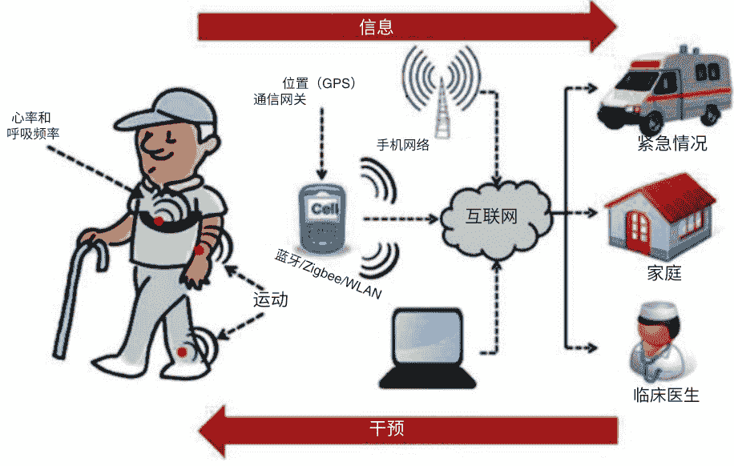

图 8 远程患者监测系统 [45]


图 9 手机用作数据记录仪 [45]

可以设想到无处不在的健康监测和干预应用。由于普遍的宽带连接和 4G 等移动通信标准的普及，内部监测和普遍连续健康监测已经成为可能。手机集成的 GPS 跟踪系统使得在紧急情况下能够定位患者 [45]。

- **感知技术**：通常，可穿戴传感器与环境传感器相结合，用于在患者需要在家庭环境中进行监测时普遍收集信息。这种传感器的组合在康复领域被广泛使用。例如，当成年人或老年人在部署改善平衡控制和减少跌倒的干预措施时，使用可穿戴传感器跟踪运动和生命体征将具有很高的兴趣，以便监测需要监测的患者。需要使用专门设计的数据分析技术通过处理运动和生命体征数据来检测跌倒。环境传感器和可穿戴传感器的组合不仅有助于提高跌倒检测的准确性，还能够在患者不佩戴传感器的情况下检测跌倒。

- **可穿戴传感器**：生理指标如呼吸频率、心率、血氧饱和度、肌肉活动和血压提供健康状态的测量，并具有很高的诊断价值。在可穿戴技术发展之前，所有这些参数只能在医院环境中监测。随着可穿戴技术的进步，现在可以实时、准确、连续地监测所有这些参数。
- **在将生理监测集成到可穿戴系统中时**，通常需要巧妙的设计和新颖的传感器位置。一些例子包括戒指传感器，设计用于戴在手指底部，用于测量心率和血氧饱和度；一种自包含的可穿戴式无袖光电容积描记 (PPG) 血压监测仪；一种迷你形式的可穿戴式声学传感器，如麦克风，用于测量呼吸频率等。

- **生化传感器**：可穿戴技术领域最新的传感器是生化传感器，用于监测大气中化学物质的水平以及生物化学，例如用于监测在危险环境中工作的人员。这些传感器通常需要收集、分析和处理体液，因此从设计角度来看它们很复杂。尽管这些生化传感器的发展进展缓慢，但随着微纳制造技术的发展，它们的进展速度已经加快 [45]。

## 10 个边缘计算用例

用例提供了一个描述，说明了用户如何使用一个过程或系统来实现目标。边缘计算旨在将计算从云的核心转移到网络边缘，以实现极低的延迟、灵活性、可扩展性等。利用边缘技术的一些主要用例包括以下内容：

- **自动驾驶车辆**：在智能交通系统中，自动驾驶车辆是重要的设备，配备了许多传感器。这些车辆具有感知环境并在几乎没有或没有人类干预的情况下安全行驶的能力。在驾驶过程中，它需要决定是否在人行横道或道路信号处停车。在这种情况下，无论是否有互联网连接，数据处理都需要在现场进行，以避免任何致命伤亡。将数据发送到云服务器，然后等待其响应可能非常危险。相反，边缘计算技术可以用于这些车辆，帮助它们快速而更高效地相互交互。此外，车辆可以通过使用深度学习技术准确评估当前情况而几乎可以安全驾驶 [46]，无需任何人为干预。如果没有边缘计算技术，自动驾驶车辆的可行性将在未来更遥远。这些自动驾驶车辆涉及多种技术的整合，如感知、定位、决策以及与云平台的平滑交互，以生成高清地图并存储数据 [46]，因此需要大量带宽和实时计算能力。

- **医疗设备**：通过健康监测器和其他医疗设备，可以始终监测患者的慢性病情况。这些设备主要使用物联网边缘计算，例如心率监测器可以帮助分析个体数据，远程医疗可以跟踪患者的慢性病情况等。边缘计算基础设施位于物联网设备和云计算之间。这确保了加速分析响应时间，并且优化了物联网资源利用率 [47]。
- **安全解决方案**：边缘计算技术对于安全监控系统非常有用，利用摄像头和智能移动设备的普遍连接，在边缘进行视频分析，使用人工智能（AI）和机器学习（ML）算法进行物体检测和跟踪。安全系统可以使用边缘计算进行设备上的视频处理，用于识别潜在威胁并在实时中提醒用户。对于这种情况，已经使用机器学习和统计分析方法来研究异常检测算法 [48]。
- **智能音箱**：这些设备具备识别和解释语音指令以执行基本命令的能力。即使互联网连接失败，也可以使用智能音箱打开或关闭灯光，或调节温度设置 [14]。
- **视频会议**：广泛分布的摄像头节点用于捕捉庞大的视频数据，可以借助视频分析来获取目标位置信息。然而，处理和传输视频数据到云服务器涉及高成本和时间，导致视频质量差、语音延迟、屏幕冻结等问题。因此，为了降低处理成本、传输时间，并避免所有这些困扰，边缘计算可以是最佳解决方案，它将计算任务从云端转移到边缘设备 [49]。
- **农业智能传感器**：农业是确保粮食安全的最关键领域。它需要进行许多活动，如土壤监测、环境监测、供应链管理、基础设施管理、运输、病虫害控制等。在该领域部署物联网设备可以帮助提高质量、增加产量，最重要的是减轻农民的负担。通过 GPS 和智能传感器生成的数据，农田可以与智能农业设备集成，用于数据分析。这种分析可以帮助农民提高作物产量，也可以有效利用水资源，从而大大减少任何形式的浪费 [50]。
- **零售广告**：边缘计算还可以在零售组织使用定向广告收集人口统计信息时保护用户隐私。在这些情况下，边缘计算会保留源数据并对其进行加密，然后再将其发送到云端。

### 10.1 边缘计算对医疗物联网的影响

具有不可预测行为的动态复杂医疗系统需要高效的资源管理和服务管理。由于人口增加和患者激增，对高效医疗的需求也增加了。这反过来推动了医疗系统向智能医疗转型，利用最新的技术进步。因此，医疗系统正在部署大量物联网设备，以实现资源更好的分配，并提高服务的性能指标。传统的医疗技术无法解决人口增加和慢性疾病带来的挑战。云计算被用来应对这些挑战，并利用其远程交付、灵活性和多租户等优势来增强医疗服务。

在医疗系统中，当收集某些医疗服务的患者数据时，使用大量资源进行信息收集、输入、共享和分析。传统的患者管理系统非常缓慢、容易出错，并且无法提供真正的实时可访问性。云计算和边缘计算的结合有助于将传统医疗系统转变为智能医疗系统。在这种情况下，边缘计算用于从物联网设备中收集传感器信息，而云计算用于存储和处理复杂数据。它还允许临床诊断信息和患者监测在医疗专业人员之间共享 [15]。

医疗系统的数字化转型和物联网设备的部署可以帮助实现诸如创造新的收入流、提高运营效率和降低成本以及增强患者体验等目标。基于边缘计算的医疗系统有助于提供更好的用户体验，并优化计算资源。

为了实现这些目标，数字化转型计划包括升级现有数字资产、添加新技术以及将它们连接在一起以产生业务成果等任务。医疗保健利用连接技术的领域众多。其中一些已经在下面提到：

- **患者记录保存**：患者的医疗记录以数字文档的形式电子化提供。
- **远程医疗**：用户可以通过语音、视频和数据系统与医生进行咨询。
- **手术室**：像机器人和视频设备这样的技术进步也可以用于协助医生进行手术。
- **患者监测**：可以使用心率监测器、起搏器、智能镜片、胰岛素泵等设备来传递患者的状况并帮助医生监测患者。
- **可穿戴设备**：可穿戴设备（如健身追踪器）和连接的应用程序可以帮助跟踪患者的各种健康指标，如步数、心率，以及水分摄入量，随着时间的推移，这些指标可以被医疗保健提供者用来观察重要的体征。
- **资产追踪**：它有助于追踪医务人员和设备的位置，例如使用手持设备读取病人手环上的条形码，使用 RFID 追踪轮椅和可移动床等资产，以及电子病历（EMR）。
- **设施追踪**：临床设施，如传感器、手术室和数据分析，可以高效利用 [51]。
- **农村医疗**：尽管远程医疗和健康数据方面有许多创新，但是为远离医院且网络接入有限的人们提供快速、高质量的护理仍然是一个巨大的挑战。通过物联网医疗设备和边缘计算应用的组合，这些困难很容易被克服。

边缘计算公司开发了便携式物联网医疗设备，能够生成、收集、存储甚至分析关键的病人数据，而无需不断与网络基础设施保持联系。从这些设备收集到的信息在重新建立连接时被反馈到中央服务器上。通过将物联网医疗设备与边缘中心接口连接，现有网络可以扩展，从而使医务人员能够在网络连接质量较差的地区访问关键的病人数据。这显示了边缘计算在扩大医疗服务范围方面的潜力。

- **患者生成的健康数据**：使用各种物联网设备（如血糖监测仪、可穿戴传感器和医疗应用程序）收集大量患者生成的健康数据（PGHD）已经变得非常普遍。这使得医疗专业人员能够在较长时间内监测患者健康状况，并更好地诊断问题。
- **改善患者体验**：人们可以使用智能设备方便地查看预约，并接收指导他们找到正确办公室的通知。这些智能设备是物联网医疗设备，它们将医疗行业中患者的体验转变为方便和舒适的体验，因为它们为患者提供了帮助。它们构成了边缘计算的关键用例。

边缘计算公司将在使用边缘启用的物联网设备的医疗 IT 基础设施中发挥重要作用。许多医院现在提供流媒体服务，为患者提供从电影和游戏到互动教育节目的一切。

时间序列数据的获取被视为检查。

- **供应链**：现代医院和医疗中心使用了许多尖端医疗设备和计算机硬件。它们是提供最佳护理的技术奇迹。不那么复杂但同样重要的医疗设备也被用于日常程序中以拯救生命。供应链管理负责确保这些设施正常运行，从机器人辅助手术工具的昂贵机械部件到最小的绷带都需要提供。任何对这个链条的干扰都会对健康结果产生重大风险。许多组织为了控制设备库存的不断上升的成本而苦苦挣扎，物联网医疗领域的供应链创新为他们提供了在边缘上获得运营效率的机会。例如，医疗机构可以使用传感器装备的物联网边缘设备通过收集使用模式数据并利用预测分析来确定硬件可能会故障的时间。同样，库存管理可以使用智能 RFID 标签来消除手动订购和耗时的文书工作。配备 GPS 和其他传感器的车队车辆正在实时跟踪关键货物的位置。
- **成本节约的物联网**：边缘设备已被广泛采用，分析师预测它们将帮助医疗机构节省高达 25% 的业务成本，其中一些成本来自日常应用，如安全监控或智能建筑控制。可穿戴物联网医疗设备、植入式传感器和基于大数据分析的简化物联网医疗服务是一些边缘计算应用案例，可以显著降低每位患者的护理成本。另一个潜在的成本节约来源是互连性。
- **这些连接技术**：这些连接技术在许多其他方面也很有帮助。例如，可摄入传感器正在进行测试，以验证患者是否服用药物。在这种情况下，一旦药丸在胃中溶解，身体上的传感器就会接收到一个更新智能手机应用程序的信号 [51]。

### 10.2 边缘计算中的医疗案例研究

医疗保健是一个非常重要的领域，每天为患者、医生、医学研究人员、医疗专业人员、医疗保险等产生大量数据。根据需求，各种应用程序可以使用这些数据。例如，医生可以使用患者的数据来诊断疾病，医疗保险公司可以使用患者的数据来告知他关于适合他的医疗计划的信息，基于他支付的保费，等等。数据可以以文本、图像、视频和声音的形式收集，使用物联网设备、手机、笔记本电脑、个人电脑甚至嵌入式传感器在物联网设备中。然而，所产生的数据需要进行分析，提取有意义的信息，并帮助做出正确的决策。为了实现这个目的，许多机器学习和深度学习算法正在被使用。

为了演示边缘计算如何与机器学习和深度学习算法在医疗系统中使用，我们选择了心血管疾病检测作为案例研究。这个过程中涉及的各个步骤如下所示：

1.  **数据收集**：为了收集患者的心脏健康数据，使用了许多设备，如起搏器、除颤器、心率监测器等。这些设备可以插入患者的胸部或腹部，也可以作为手环的一部分，或者放置在靠近胸部的位置。这些设备收集与心脏相关的数据，如心跳率、胆固醇水平、血压、空腹血糖、静息心电图（ECG）、胸痛类型、患者的最大心率等。收集到的数据可以存储在设备上，也可以发送到患者的手机甚至个人电脑上。
2.  **数据预处理**：收集到的数据是原始形式的。一些数据可能丢失，一些可能以错误的格式输入，一些属性的值可能具有较大的范围，一些属性值可能具有较小的范围，一些属性可能具有分类值。由于数据不适合进行处理，需要进行过滤和预处理，以处理丢失的值，将分类数据转换为数值格式，并进行归一化，使具有较大值的属性不会超过具有较小值的属性。经过所有这些步骤，数据变得适合机器学习和分析。
3.  **模型创建/选择模型**：在预处理数据并使其适合分析之后，下一步是选择一个可以帮助计算机从数据中学习并识别数据模式的模型。根据应用的要求，可以使用数据构建分类、回归或预测模型。模型可以使用监督机器学习或深度学习技术构建，例如朴素贝叶斯（NB）、决策树（DT）、K 最近邻（KNN）、支持向量机（SVM）、随机森林（RF）等，也可以使用无监督机器学习技术，例如聚类、神经网络（NN）等。选择使用监督学习还是无监督学习技术取决于可用数据是否有标签。

对于所考虑的案例研究，使用了分类。在这里，基于属性值，它会判断患者是否患有心脏病。

4.  **模型训练**：在训练阶段，收集到的数据被输入到所选的模型中，该模型可能使用了有监督或无监督的学习算法。训练数据集将包含大量的样本或实例。有监督学习模型是使用标记数据样本构建的，而无监督学习模型是通过从未标记的数据中推断得出的。
5.  **模型评估**：模型在评估阶段如何对新数据进行测试，可以使用保留集或交叉验证等方法。这些方法都使用测试集来评估模型的性能。
6.  **进行预测**：最后一步是进行正确的预测。预测可能是图像识别、预测分析、语义等任何其他类型的预测。对于心脏病案例研究，给定一个新样本，它会预测这个人是否患有心脏病。

基于对心脏病预测进行的案例研究，提出了图 10 中的架构。可穿戴设备生成的数据由移动设备、笔记本电脑或平板电脑等终端设备收集。它们可能只能根据其可用的计算能力处理数据的一小部分。数据将通过广域网 (WAN) 发送到边缘服务器进行复杂计算。由于这些边缘服务器有时也无法完成数据所需的所有复杂计算，在这种情况下，数据将上传到公共云进行非常复杂的计算并存储在云端。用户可能是医院员工、研究人员或其他人员可以从云端访问处理后的数据。复杂的计算可能会根据应用需求使用机器学习或深度学习算法。

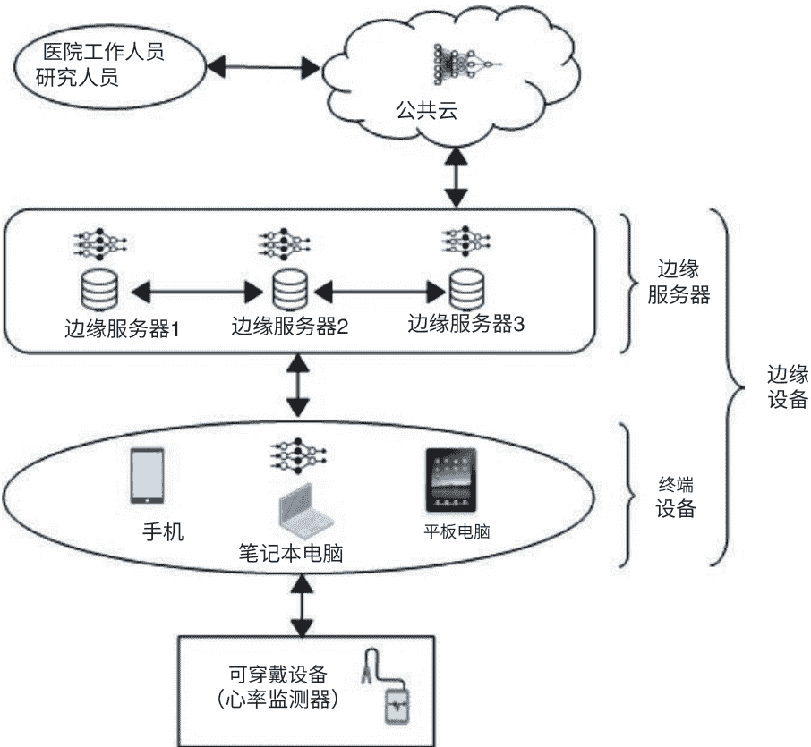

图 10 边缘计算心脏病预测案例研究的提议架构

## 边缘计算的 11 个挑战

边缘计算仍处于初级阶段，尚未拥有自己的框架。为了设计边缘计算的框架，需要考虑许多要求。然而，设计这样一个框架自然会涉及许多挑战 [10]，因为边缘计算是云计算和物联网等技术的结合，倾向于继承它们的特性和挑战 [30]。系统和网络社区共同努力的合作倡议有助于实现边缘计算的愿景，但也带来了一系列新的网络挑战，如下所述：

- **可编程性**：在边缘计算场景中，计算从云端转移到边缘节点。由于边缘节点的异构性质，这些节点具有不同的运行时间。因此，在边缘计算范式中编写应用程序时，程序员往往会面临许多困难。
- **命名**：与任何其他计算机系统一样，在边缘计算中也可以使用命名方案来识别事物、编程、寻址和数据通信，尽管尚未为其建立标准化的命名方案。边缘从业人员有必要学习各种网络和通信协议，以便能够与系统中的大量异构设备进行通信。边缘计算中的事物具有移动性、动态拓扑、隐私和安全保护以及可扩展性等特点，这些特点在开发命名方案时需要处理。
- **数据抽象**：物联网设备产生大量数据，将庞大的数据传输到云端会导致骨干网络拥塞，并且过度负担云数据中心。然而，从各种设备（监控摄像头、汽车等）收集到的所有数据都是原始形式，因此需要在边缘进行预处理和过滤，以去除噪声、低质量数据，并在涉及敏感信息（如用户凭据）的情况下保护隐私。数据抽象有助于准备适合上传到云端的数据。但是，这也带来了一个挑战。当数据被过度修剪时，可能会导致有用信息的丢失，从而降低数据的精度或准确性。但是，当数据被修剪得很少时，甚至会上传不需要的数据到云端，这会给云资源带来额外的负担 [5]。
- **服务质量（QoS）和容错性**：由于边缘计算具有分布式特性，云计算中使用的容错方法不适用于边缘计算。边缘计算主要设计用于实时应用程序，因此需要主动具备容错性，并能够自动从故障中恢复。在高峰时段避免检查边缘节点的使用情况可以保持可接受的服务质量水平。这样可以减轻边缘的负担，并有助于以灵活的方式对任务进行分区和调度 [30]。
- **优化指标**：边缘计算由多个层组成，每个层具有不同的计算能力。这使得在边缘计算中分配工作负载成为最大的问题。在选择最佳分配策略时，重要的是考虑能源、带宽、延迟和成本等优化指标 [5]。
- **服务管理**：边缘计算系统被认为是可靠的，前提是满足以下要求：
  - **差异化**：随着边缘计算的发展，许多服务正在部署到边缘设备上，以满足多个用户需求。这些多个服务的信息处理应该按照优先级进行排序，从高优先级的警报和医疗系统到低优先级的娱乐等。
  - **可扩展性**：在边缘计算中，经常会添加新的边缘设备或替换旧设备。因此，在生产过程中，该层的设计者必须考虑到事物的高度移动性和对用户的合理易用性。
  - **隔离性**：将边缘设备运行时与其上运行的故障应用程序分离开来是一项具有挑战性的任务。例如，如果一个可以控制灯的应用程序似乎没有响应，则运行时不应受到此行为的影响。相反，另一个也具有对灯资源的访问控制的应用程序应该继续工作。
- **隐私和安全性**：在边缘计算中，许多物联网设备和智能手机正在连接，这些设备在不同的位置生成数据。在边缘收集的数据需要按照现有的数据处理规则进行处理，因为不这样做可能会产生责任。最重要的服务，如数据安全保护和用户隐私，应该在网络边缘提供。通过使用数据感知和收集的设备，一个家庭部署了许多物联网设备，可以透露很多私人信息。例如，根据电力或水的使用情况读数，可以推测出房屋的空置情况。在视频的情况下，在处理数据之前，可以通过遮蔽所有人脸来删除一些私人信息。在这种情况下，挑战是在不损害隐私的情况下支持服务。在保护用户隐私和数据安全方面，网络边缘存在一些挑战，例如：
  - **对社区的隐私和安全意识**：对于终端用户、服务提供商和系统等不同利益相关者来说，意识到用户的隐私可能在网络边缘受到损害是非常重要的。应用开发人员需要意识到，在网络边缘，用户的隐私可能会受到损害，而不会得到通知。
  - **数据的所有权**：保护边缘收集的数据隐私的更好解决方案是将数据留在边缘，并让用户完全拥有所有权。
  - **缺少高效工具**：在边缘计算中，需要处理具有不同属性的数据。然而，目前还没有处理此类多样化数据属性的工具 [5]。
  - **应用分发**：由于边缘计算的发展，边缘节点的计算能力增加，因此在大多数情况下，应用程序是基于计算资源、能源效率和响应延迟分布到节点的。
  - **资源管理和分配**：根据边缘服务器的当前负载情况，计算延迟可能会增加。因此，拥有适当的资源管理和分配方案非常重要。实时系统和时间关键应用需要优先考虑计算。在这种情况下，延迟敏感任务被赋予高优先级，并且边缘节点需要立即处理此类请求。还需要制定和设计成本模型，在负载高的情况下，可以通过此成本模型从优先作业中获得额外收费。云服务提供商已经使用了这样的成本模型。根据成本模型，在高峰时段和非高峰时段产生的成本是不同的。边缘计算的主要挑战是确定边缘供应站点和工作负载分配，这需要考虑到用户数量和应用需求的动态变化，并且需要进行大量复杂的决策来确定每个边缘层上的工作负载量。这种工作负载分配需要平衡考虑延迟、带宽、能源和成本。此外，还需要对某些指标进行优先级排序，并进行动态优化，这也是非常具有挑战性的 [30]。

边缘计算面临的其他挑战包括计算和硬件限制、可访问性和操作限制、远程管理问题、连接问题和可扩展性。

## 12 边缘计算的未来

边缘计算将在几乎所有努力加快数字化转型的行业中发挥关键作用。早期采用边缘计算的行业包括制造商、零售商和医疗组织。

根据 Gartner 的数据，公司约有 10% 的数据在传统数据中心之外生成，但预计在接下来的 6 年左右将增长到 75%，这是由于边缘计算的快速增长，不同行业也可以采纳并从中受益 [52]。

### 12.1 未来研究方向

传统云的固有问题，如安全性不足和高延迟，正在通过当今新兴技术边缘计算来解决，它将云能力更接近最终用户。作为其结果，下一代蜂窝网络 5G 已经发展起来。它主要关注实现对高度交互式应用的支持，以实现极低的延迟和更高的吞吐量 [53]。边缘计算还需要支持软件定义网络（SDN），以及与边缘计算使用一些相同虚拟化基础设施的网络功能虚拟化（NFV）的相关概念。可穿戴设备、智能手机和其他移动设备代表了互联网的极端边缘。它们的计算能力应始终对任何新的改进开放，以便边缘计算可以更好地放大和利用即时移动设备和传感器的能力 [54]。

到 2022 年，全球边缘计算技术或市场预计将达到 67.2 亿美元，年增长率为 34%。在当前情况下，云外处理和生成的数据约占总量的 10%，预计到 2020 年将达到约 50%。根据当前物联网趋势，许多公司可能考虑利用边缘计算来开发他们的新产品，因为它们具有众多的优势 [55]。

随着许多公司专注于人工智能（AI）、云计算服务提供，一些主要公司如亚马逊、微软和谷歌已开始提供软件平台，如 Greengrass、Azure IoT Edge 和云 IoT Edge，以提供边缘计算服务，尽管它们目前被用作连接强大数据中心的流。

虽然作为服务的机器学习（MLaaS）侧重于在云中选择适当的服务器配置和 ML 框架以便以成本效益的方式训练模型，但边缘智能作为服务（EIaaS）的主要关注点是如何在注重隐私和资源受限的边缘计算环境中进行模型训练和推理。实现边缘智能（EI）的全部潜力需要克服一些挑战，包括：

- 1. EI 平台需要具备异构兼容性，以便用户能够在任何时间、任何地点享受无缝和流畅的服务。
- 2. 由于许多人工智能编程框架（如 Torch、Tensorflow 和 Caffe）可用，它们应该能够支持使用各种编程框架训练的边缘人工智能模型在异构分布的边缘节点上的可移植性。

尽管许多编程框架专门为边缘设备设计，但没有一个框架能够在所有指标上胜过其他框架。未来可以期望出现在更多指标上具有高效性能的框架。

期望。为了在资源受限的边缘环境中实现高效的 EI 服务部署和迁移，有必要进一步探索轻量级虚拟化和计算技术，如容器和函数计算 [3]。

## 参考文献

- 1. J. Chen 和 X. Ran，深度学习与边缘计算：综述，107(8)，IEEE 会议论文集（2019）
- 2. X. Wang 等人，边缘计算与深度学习的融合：综述，IEEE 通信调查与教程，22(2)，869-904（2020 年）
- 3. Z. Zhou 等人，边缘智能为人工智能的最后一英里铺路，IEEE 会议论文集，107，8（2019 年）
- 4. V. Gezer, J. Um, M. Ruskowski，可扩展的边缘计算架构：定义，需求和支持，UBICOM MM 2017：第十一届移动普适计算，系统，服务和技术国际会议（2017 年）
- 5. Shi 等人，边缘计算：愿景与挑战，IEEE 物联网杂志，3(5)，637-646（2016 年）
- 6. M.S. El bamby 等人，具有延迟和可靠性保证的无线边缘计算，IEEE 会议论文集预印本，2019 年 5 月（2019 年）https://doi.org/10.1109/JPROC.2019.2917084
- 7. 边缘计算优势，工业互联网联盟白皮书版本 1.0 2019-10-24
- 8. 边缘计算，NXP 安全连接为更智能的世界，文档编号：AWS GreenGrass A4FL REV 0
- 9. W. Shi 等人，边缘计算。IEEE 107(8)，1474-1481（2019 年）
- 10. B. Varghese 等人（2016 年）边缘计算的挑战与机遇会议论文·2016 年 11 月 https://doi.org/10.1109/SmartCloud.2016.18. 在线可用
- 11. M.G.S. Murshed 等人，网络边缘的机器学习：一项调查，ArXiv, abs/1908.00080（2020 年）
- 12. H. El-Sayed 等人，物联网边缘：边缘、物联网和云在分布式计算环境中的整体图景，IEEE Access 文章·2017 年 12 月。https://doi.org/10.1109/ACCESS.2017.2780087（2017 年）
- 13. 标题：今天使用的 5 个边缘计算解决方案示例 https://www.lanner-america.com
- 14. J.-H. Huh, Y.-S. Seo, 理解边缘计算：通过人工智能进行工程演进。IEEE Access (2019)。https://doi.org/10.1109/ACCESS.2019.2945338
- 15. S. Oueida 等，基于边缘计算的智能医疗框架用于资源管理。传感器 18，4307 (2018)。https://doi.org/10.3390/s18124307
- 16. L. Khan 等，边缘计算启用的智能城市综合调查，IEEE 物联网杂志，7(10)，10200-10232 (2020)
- 17. A. Ferdowski 等，可靠的移动边缘分析的深度学习在智能交通系统中的概述。IEEE 车载技术杂志，14(1)，62-70，(2019)
- 18. A.H. Shehab 和 S.T.F. Al-Janabi，边缘计算综述和未来方向，REVISTA AUS 26-2，pp. 368-380 (2019)
- 19. Y. Huang 等人，当深度学习遇上边缘计算，2017 年 IEEE (2017)
- 20. 关于边缘计算在工业物联网中的介绍，工业互联网联盟白皮书
- 21. Y.Xiao 等人，边缘计算安全性：现状与挑战。IEEE 会议论文 107(8) (2019)
- 22. C.H. Shoemaker，标题：边缘计算的优势、风险和不可避免性，https://it.toolbox.com
- 23. Y. Xin 等人，机器学习和深度学习方法在网络安全中的应用。IEEE Access 6, 35365-35381 (2018)
- 24. F.-J. Ferrández-Pastor 等人，部署物联网边缘和雾计算技术以开发智能建筑服务。可持续性 **10**, 3832 (2018). https://doi.org/10.3390/su10113832
- 25. S. Uddin 等人，比较不同的监督机器学习算法用于疾病预测。BMC 医学信息决策制定 (2019). https://doi.org/10.1186/s12911-019-1004-8
- 26. D. Xhemali 等人，朴素贝叶斯 vs. 决策树 vs. 神经网络在训练网页分类中的应用。国际计算机科学杂志 **4**(1), 16-23 (2009)
- 27. M. Panda, M.R. Patra, 使用朴素贝叶斯进行网络入侵检测. Int. J. Comput. Sci. Network Secur. **7**(12), 258-263 (2007)
- 28. A.F. Mashat 等，用于大学入学系统的决策树分类模型. Int. J. Adv. Comput. Sci. Appl. **3**(10), 17-21 (2012)
- 29. Chen 等，用于 Spark 云计算环境中的大数据并行随机森林算法. IEEE Trans. Parallel Distrib. Syst. **28**, 919 (2016)
- 30. S. Rong, Z. Bao-wen, 机器学习领域回归模型的研究，MATEC Web of Conferences, January 2018, (2018) doi:https://doi.org/10.1051/matecconf/201817601033, IFID 2018
- 31. D.K. Srivastava, L. Bhamhu, 使用支持向量机进行数据集分类，J. Theor. Appl. Inf. Technol. **12**, 1 (2010)
- 32. R. Sathya, A. Abraham, 督导和无监督学习算法在模式分类中的比较. Int. J. Adv. Res. Artif. Intell. **2**(2) (2013)
- 33. B.N. Patel, S.G. Prajapati, K.I. Lakhtaria, 使用决策树进行高效数据分类。Bonfring Int. J. Data Min. **2**(1), 6-11 (2012)
- 34. Greff K, Sjoerd van Steenkiste, Schmidhuber J. 神经期望最大化，第 31 届神经信息处理系统会议（NIPS 2017），加利福尼亚州长滩，美国（2017)
- 35. Singh P, Meshram PA, 基于密度的聚类算法及其变体的调查 2017 年国际计算与信息学会议 (ICICI) (2017)
- 36. P. Prasad, L. Malik, 使用关联规则挖掘提取零售店交易中的产品销售模式. Int. J. Comput. Sci. Eng., 2177-2182 (2011)
- 37. Q. Wang 和 Z. Zhongli, 强化学习模型、算法及其应用，2011 年机电科学、电气工程和计算机国际会议 (MEC) (2011)
- 38. D. Castro 等人，基于可穿戴设备的人体活动识别与物联网方法. J. Sens. Actuator Netw. **6**, 28 (2017). https://doi.org/10.3390/jsan6040028
- 39. S. A. Magid 等人，物联网边缘设备上的图像分类：分析和建模，Cluster Computing, **23**,1025-1043 (2020)
- 40. K. Grolinger, A.M. Ghosh, 深度学习：物联网的边缘云数据分析。电子计算工程出版社，164 (2019) https://ir.lib.uwo.ca/electricalpub/164
- 41. S. Deng et al., 边缘智能：边缘计算与人工智能的融合，IEEE 物联网杂志, **7**(8), 7457-7469 (2020)
- 42. E. Torti et al., 用于个人风险和警告情况的边缘监测的深度递归神经网络。Hindawi 科学编程 **2019**, 9135196 (2019). https://doi.org/10.1155/2019/9135196
- 43. D. Park et al., LiReD: 用于边缘计算的轻量级实时故障检测系统，使用 LSTM 递归神经网络。传感器 **18**, 2110 (2018). https://doi.org/10.3390/s18072110
- 44. 通过新的边缘计算改变护理交付，白皮书，物联网医疗边缘计算
- 45. S. Patel 等人，可穿戴传感器和系统在康复中的应用综述。J. Neuro Eng. Rehabil. **9**, 21 (2012)
- 46. S. Liu 等人，自动驾驶的边缘计算：机遇与挑战。Proc. IEEE **107**, 8 (2019)
- 47. A. Alabdulatif 等人，用于智能医疗监控的安全物联网边缘框架，7(2019) https://doi.org/10.1109/ACCESS.2019.2899323
- 48. S.Y. Nikouei 等人，智能监控作为边缘网络服务：从 Harr-Cascade，SVM to 轻量级 CNN (2018)
- 49. Y. Xie 等人，基于视频分析的智能室内定位系统，使用边缘计算为物联网提供支持，2018 年国际分布式计算和知识发现会议（CyberC）(2018)
- 50. A. Nayyar, V. Puri, 智能农业：基于 Arduino、云计算和太阳能技术的物联网智能传感器农业棒 (2016), https://doi.org/10.1201/9781315364094-121
- 51. P. Sharma, 标题：边缘计算在医疗保健中如何改变物联网的实施，https://community.connection.com
- 52. 标题：边缘计算是大多数行业的未来，https://www.networkworld.com
- 53. N. Hassan, K.A. Yau, C. Wu 边缘计算在 5G 中的应用综述，Digital Object Identifier (2017) https://doi.org/10.1109/ACCESS.2017
- 54. M. Satyanarayanan, 边缘计算的出现，COMPUTER, January 2017 IEEE (2017)
- 55. 标题：边缘计算技术为更好的物联网生态系统，https://www.letsnurture.com

# 基于深度堆叠神经网络的传感器数据故障检测和分类学习模型

M. Praneesh 和 R. Annamalai Saravanan

**M. Praneesh**
计算机科学系，Sri Ramakrishna 艺术与科学学院，Bharathiar 大学，印度科伊马托尔

**R. Annamalai Saravanan (✉)**
计算机科学系，Nehru 艺术与科学学院，Bharathiar 大学，印度科伊马托尔

© Springer Nature Switzerland AG 2021
A. Suresh, S. Paiva (eds.), 深度学习与边缘计算在高性能计算中的应用解决方案，EAI/Springer Innovations in Communication and Computing, https://doi.org/10.1007/978-3-030-60265-9_6


## 1 引言

观察机械的强度被视为一项关键任务，其正常任务，这种情况通过监测和识别机械的缺陷来控制。基于数据驱动的编译，会忽视不准确性。这是一种相当普遍的情况，它们不需要任何具体的能力，但同时它会传统地提供准确的缺陷识别，数据驱动编译与信号处理方法相关联。信号处理是一种用于矫正和消除图像噪声并提取未处理数据的现象。尽管上述方法存在一些缺点，但最初的过程是通过最小化噪声然后提取原始传感器数据 [1] 来启动的。

为了使信号处理方法更加一致和持久，需要数学的可行性。上述两个过程都是基于提取一系列包含时间的信号而导出的 [2]。最后，特征提取是最终的过程。当它被包含时，可能会导致某些信息的不可避免的丢失，例如与时间相关的时间序列数据的时间相干性。本书章节提供了一个基于深度学习的合理模型，适用于读取非线性数据。有一些优势可以提高模型的效率，如下所述：

- 1. 由于它能够提取未经处理的时域信号，因此不需要进行先前处理以减小噪音和特征提取。
- 2. 在提出的模型中，与传统方法不同，考虑了时序数据的连续性。
- 3. 通过高效的学习模型监测缺陷的识别和纠正。

简单模型和复杂模型都可以更高效地执行。它将包括对提取特征和数据的熟练理解 [3]。

## 2 方法和材料

### 2.1 故障类型

有几种故障分类技术：不同的故障分类组合采用不同的分类范式。它包括以下分类先例：（1）注释 - 指定故障原因，（2）范围 - 形式化对感知数据的影响。

故障有两种巨大的原型，即系统故障和数据故障。根据系统的关键视角，故障是由传感器的操作、低功率、数据的切割或环境因素引起的。相反，故障被归类为接地故障、抵消故障或回报故障。数据故障有三种类型，分别是断裂、一致性和噪声干扰 [4]。

### 2.2 故障模型

前述指出，习惯性分类是基于缺陷接合的频率和持续时间，以及故障对数据的可发现和可感知的影响。这种分类方法适用于广泛的传感器类别。错误的隐蔽发生不会影响这种分类，这将迫使我们仅处理故障，其中的概念基于每个传感器节点上的模式出现。需要注意的是，本文中的图示符号表示的值并没有得到一致的检查。

尽管理论上，传感器会定期而彻底地声明值，但实际上发现很多值都是缺失的。对于视觉来说，结果并不那么清晰 [3]。

- 不连续性——故障最终会周期性地发生，故障的表现是分离的。
- 故障——读数低于某个阈值似乎经常发生。故障的频繁性和普遍性高于阈值。
- 随机性 - 当故障读数出现杂乱无章时，故障的普遍性被认为小于阈值。
- 持续性 - 同时在考虑的时间内，传感器持续地提供不准确的读数。
- 偏差性 - 故障的功能被认为是一致和均匀的。
- 漂移性 - 数据的异常导致了诸如多项式变化之类的度量函数。

可以使用结果的综合来绘制和绘制分类。关于术语的一个主要事实是按顺序排列的。区分错误值和无缺陷值有点困难。最终，本文将把数据用户视为故障或异常来管理。随机故障经常发生作为限制 [2]。

### 2.3 构建提出的故障诊断模型

时间序列数据的获取被视为检查。关节大小被规定为一定的成本，并且被确定为深度神经网络的输入大小。关节的大小考虑了以 $t_1$ 表示的时间。并 $t_2$ 作为输入，并且它表示为 $t_2 - t_1$。保持这一点作为证词，非连续的一维时间序列数据被分离。所提出的模型依赖于深度结构的神经网络。为了激活输入和隐藏层，采用了一种策略性的逻辑函数。每个表达都得到一组输出值。与时间记忆相关的输出值根据以下公式 1 (图 1) 表示。

```
$$y(t) = \frac{1}{n} \sum_{n}^{T=0} \lambda_{T} y(t-T)$$
```

### 2.4 深度堆叠神经网络模型

这是一种可扩展的深度机器学习架构，逐层执行。
在标准 DSN 中，一个块是一个基本的多层感知器，具有一个独特的隐藏层。假设一个向量框的输入是 y，该块使用连接权重矩阵 W 来计算隐藏层向量 h，如下所示

```
$$h = Q(W^T y)$$
```

如图 2 所示，DSN 块的架构是逐层堆叠的。
对于这种方法，输入向量 y 包含有关未处理输入特征的信息。所有的输入层都与中间层连接在一起。最后，深度堆叠网络执行两个步骤，即块训练和微调。在块训练步骤中，DSN 块中的基本 SVM 被训练为常规 SVM 分类器。这一步的目标是生成重新采样的数据集。微调过程用于基于 SVM 分类器提高分类准确性 [5]。


图 2 DSN 架构


所提出的故障诊断方法的结构设计如图 3 所示。

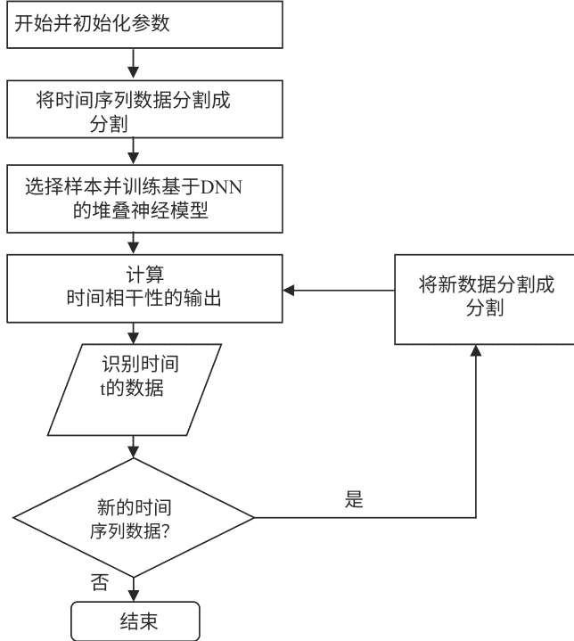

The proposed Algorithm consists of two parts such as training and testing. The detailed training steps are as follows:

- Step 1: Set the size of the segmentation and divide the time series data into segments.
- Step 2: Arbitrarily initialize the parameters of the Deep Stack neural network model including weights, vectors, and bias for every hidden and output layer.
- Step 3: Select the input (group of segments) from the DSN Blocks.
- Step 4: Perform the activation functions of input raw data, weights, vectors, and bias.
- Step 5: Use the back propagation algorithm to compute the error of every layer and the gradients of parameters.
- Step 6: Update the parameters value with learning rate.
- Step 7: Repeat Step 4 to 6 until attaining the maximum value.

The meticulous fault recognition steps are as follows.

- Step 1: Fixed the memory length and weights.
- Step 2: Split the time series data into segments and calculate the sample points.
- Step 3: Compute the outputs using Deep Stack Neural Networks Model based on DSN Block.
- Step 4: Compute the output layer of DSN from SVM classifier and recognize the data.

图 3 系统架构

## 3 实验和结果

### 3.1 智能保护方法轴承数据集

根据提出的方法，对数据的性能进行实验验证。根据描述，轴上安装了四个轴承。总体而言，有八个加速度计，这意味着每个轴承上都安装了两个加速度计，旋转速度保持在 2000 转/分钟的恒定圆周运动。它由一个不规则的最近的电机驱动，通过摩擦带与管道连接。一个 6000 磅的径向货物安装在轴承和轴上，与螺旋机构相连。这四个轴承都施加了良好的润滑。加速度计安装在轴承座上。此外，轴承上还安装了热电偶传感器。随后，100 次圆周运动发生以下故障：内圈故障、外圈故障和滚动体故障。上述效应是由于轴承的长时间运转引起的，超出了设计范围。20 kHz 是设置数据在 5 或 10 分钟的运转间隔中记录的采样率 [1]（图 4 和图 5）。

### 3.2 数据分割

直接使用各种类别的数据太复杂了。数据类型包括常规数据、内圈故障数据、外圈故障数据和球缺陷数据。选择了二十个文件来表示所有类型的数据。可以使用每分钟 2000 转的转速和每转 600 个数据点进行计算。文件被分成了 136 个片段。在每个片段中，有 10880 个样本，每个样本有 150 个数据点。这表明有 2720 个数据样本（图 6；表 1）。

### 3.3 训练阶段

有一些类别被合并在一起。DSN 块学习并提取原始时域信号的特征。原始数据被作为模型的输入，并得到数据分类作为输出。设置了神经元的独占边界，并建立了一个最优的神经网络结构，训练过程分为三个部分，即训练数据集、测试数据集和验证数据集。验证数据集用于选择最优的训练好的神经网络。测试数据集用于通过 DSN 模型验证准确性，通过数百个时期的训练，根据权重和偏差调整期望值。交叉熵用于减少和最小化错误，并且已经达到了目标。训练的目标是

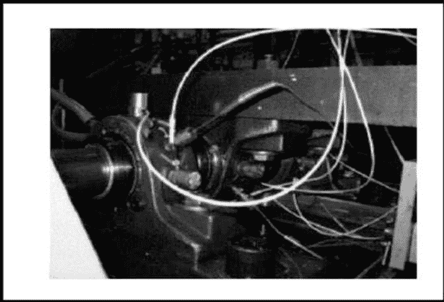

图 4 带传感器的照片轴承

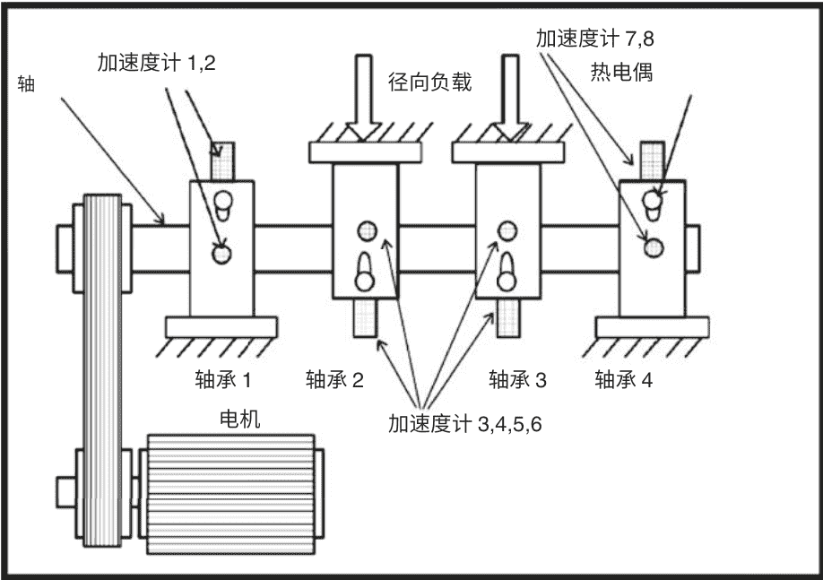

图 5 仪器结构图

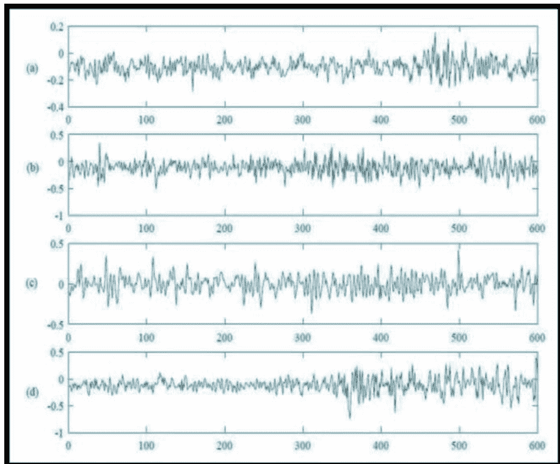

图 6 (a) 正常振动数据，(b) 内圈故障数据，(c) 外圈故障数据，以及 (d) 球缺陷数据

### 表 1 选定 IMS 数据集的描述

| 数据类型 | 样本数量 | 标签 |
| :--- | :--- | :--- |
| 正常 | 2720 | 1 |
| 内圈故障 | 2720 | 2 |
| 外圈故障 | 2720 | 3 |
| 球缺陷 | 2720 | 4 |

使交叉熵最小化的目标。训练后，准确率提高到 94.4%，在这种情况下，暂时的凝聚力被忽视。整个训练过程使用 MATLAB 实现。结果能够显示故障级别。最后提到并测量了四个类别的准确率。在不考虑暂时的凝聚力的情况下，测试数据集的准确率分别为 98.7%，91.7%，100%，91.4%，总准确率为 95.45%（图 7）。

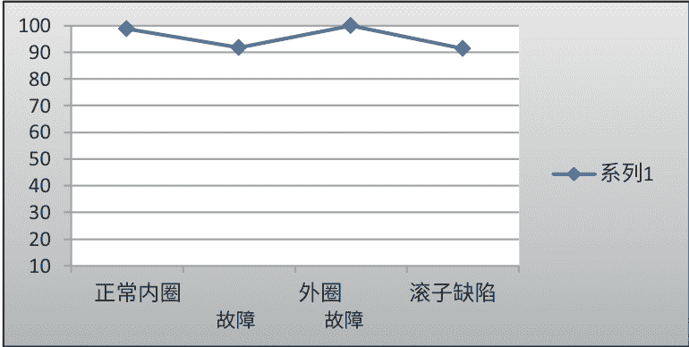

图 7 各种传感器数据的结果

## 4 结论

提出了基于上述 DSN 块模型来分离缺陷的方法。原始传感器数据被用作输入，因为 DSN 被认为是学习原始传感器数据特征的组件。习惯性的故障诊断系统通常集中于特征提取。它可以独立地获取作为故障分析辅助手段的特征，无需信号处理，但考虑到时间上的连贯性。

当考虑到故障诊断的提出方法和现有系统时，这成为了提出方法的一种满足。

## 参考文献

- 1. P. Baranyi, Y. Yeung, A.R. Varkonyi-Koczy, R.J. Patton, SVD-based reduction to MISO TS models. IEEE Trans. Ind. Electron. **50**(1), 232–242 (2003). https://doi.org/10.1109/TIE.2002.807673
- 2. A. Abdo, S. X. Ding, J. Saijai and W. Damlakhi, 基于确定性方法的开关系统故障检测，2012 年 IEEE 第 51 届决策与控制会议 (CDC)，夏威夷毛伊岛，2012 年，第 568-573 页，doi: https://doi.org/10.1109/CDC.2012.64266683
- 3. B. Jiang, K. Zhang, P. Shi, 集成故障估计和容错设计的离散时态 Takagi-Sugeno 模糊系统，IEEE Trans. Fuzzy Syst. **19**(2), 291-304 (2011). https://doi.org/10.1109/TFUZZ.2010.2095861
- 4. B.T. Thumati, S. Jagannathan, 一种基于模型的非线性多变量离散时间系统故障检测和预测方案，具有渐近稳定性保证。IEEE Trans. Neural Netw. **21**(3), 404-423 (2010). https://doi.org/10.1109/TNN.2009.2037498
- 5. P. Baranyi, A. R. Varkonyi-Koczy, Yeung Yam and P. Michelberger, 基于 HOSVD 的 TS 模糊模型计算复杂度降低，第 9 届 IFSA 世界大会和第 20 届 NAFIPS 国际会议论文集 (Cat. No. 01TH8569)，加拿大温哥华，2001 年，第 2482-2487 页，doi: https://doi.org/10.1109/NAFIPS.2001.943612

M. Praneesh 于 2010 年获得计算机科学硕士学位，2011 年获得计算机科学哲学硕士学位，均来自印度科伊马托尔的 Bharathiar 大学。目前在 Bharathiar 大学（大学部）攻读计算机科学的博士学位，研究方向是基于遥感的图像分类。目前他在 Sri Ramakrishna 艺术与科学学院（原 SNR Sons 学院）计算机科学系担任助理教授。他的研究兴趣包括医学图像处理、遥感、机器学习、自然语言处理、软件度量/可靠性和计算理论。他发表了 40 篇期刊论文（UGC 批准、Scopus、SCIE、UGC Care 名单），并在国内外会议上发表和出版了 100 多篇研究论文。他出版了两本书，分别是《计算机科学研究伦理》和《离散数学》，并在 Springer、IEEE 和 Excel Publishers 等知名出版物上发表了 16 篇书籍章节。他完成了由 NPTEL、Swayam、Open to Study、Cognitive class IBM、Testdome 和 Saylor Academy 举办的 37 门在线课程。他参加了 35 个国内外会议、研讨会和研讨会。他还组织了多次会议和研讨会。他指导了三位 M.Phil 学者。除此之外，他还是 ACM、IAENG、SDIWC、SCIIEI、IACSIT 和 ASR 的终身会员。他是各个国家国际会议的审稿人和程序委员会成员，包括澳大利亚、波兰、瑞士、印度尼西亚和迪拜。他因其在教学和研究方面的贡献而获得了“格拉布斯教育信托基金会最佳青年教师奖”（2017 年）、“巴普劳·德什穆克工程学院最佳论文奖”（2011 年）、“国际组织研究所新兴研究员奖”（2018 年）和“斯里·拉马克里希纳艺术与科学学院最佳教师奖”（2018 年）。他还获得了 2019 年格拉布斯教育信托基金会“最佳青年科学家奖”、德州仪器、DST、AICTE 和印度理工学院孟买分校颁发的“精英学者奖”（2019 年）以及 2019 年尼赫鲁教育集团计算机科学初级类别的“最佳青年教师奖”。

R. Annamalai Saravanan 于 1998 年从 Kongunadu Arts and Science College 获得计算机科学学士学位，于 2001 年从 Madurai Kamarajar University 获得 MCA 学位，于 2007 年从 Monomaniam Sundaranar University Tirunelveli 获得数据挖掘的 M.Phil 学位，并于 2019 年 12 月在 Bharathiar University 获得计算机科学博士学位。他于 2007 年成为 SNMV College of Arts and Science 的讲师、助理教授和计算机应用系主任。他于 2012 年成为 Sankara College of Arts and Science 的计算机科学与应用系主任。他目前在印度的 Nehru Arts and Science College 担任计算机应用系主任。他的研究兴趣包括文本挖掘和数据挖掘。他从事基于领域的文本分类技术。


# 用于交流伺服电机的模糊自适应智能控制器

## 1 引言

在工业中，对生产力的高需求导致在苛刻条件下工作，从而可能出现错误的可能性。如果出现任何故障，那是因为系统中的控制动作不当。例如，大多数工业机器人的机械臂都需要在特定位置进行重复相同的任务，这是非常严格的控制。如果没有及时检测到错误并采取适当的控制动作，工艺性能将变差，在严重情况下可能导致工厂和人员的安全问题。

精度和低偏移容差要求对传统控制器构成了挑战，尤其是在关键位置。Zadeh 成功地为智能控制领域设计了模糊集。此外，模糊智能系统在复杂的非线性过程中表现出色 [1]。

为了解决方案的改进，提出了模糊自适应智能控制器，并在非线性系统交流伺服电机系统中实施。传统的 PD 和模糊控制器不太适用于不断变化的操作环境。模糊算法在实际应用中存在许多限制。为了增强模糊技术算法在工业用途机器人臂位置控制中的应用，设计了基于模糊自适应的交流伺服电机系统位置控制器。

该工作的目的是快速准确地达到所需角度，在交流伺服电机中可以制定控制规则。然而，许多模糊控制策略的组合是在所需的位置目标中实现的。

[2-4]. 智能控制基于模糊推理系统已经应用于倒立摆 [5, 6]。

本研究重点介绍了模糊自适应智能控制器在两相交流伺服电机和跟踪分析中的实现。在实验基础上对数学模型进行了评估，详见第 2 节。第 3 节和第 4 节详细介绍了模糊逻辑控制器和模糊自适应 PD 控制器的设计和结构。第 5 节和第 6 节通过仿真展示了模糊自适应 PD 控制器的改进闭环性能。第 7 节总结了本研究的结论。

## 2 交流伺服电机模型

在系统模型中，带有齿轮箱的交流伺服电机刚性地连接着负载。电机的转矩（Tc）方程为

$$T_C = M_1 E(t) - M_2 \dot{\theta}(t)$$

其中 $T_c$ = 控制转矩（N-m）。

$M_1$ & $M_2$ = 电机常数（N-m/V，N-m/rad/s）。

$\dot{}$ = 角速度（rad/s）

$E$ = 额定电压（V）。

电机中机械部分的转矩方程描述为

$$T_C = J_m \ddot{\theta} + B_f \dot{\theta} + T_L$$

其中 $\theta$ = 弧度制的旋转位置。

$\ddot{}$ = 弧度制的旋转加速度。

$B_f$ = 摩擦系数。

$J_m$ = 千克厘米$^2$的转动惯量。

通过等式 (1) 和 (2) 相等

$$J_m \dot{\theta} + B\dot{\theta} + T_L = M_1 E(t) - M_2 \dot{\theta}(t)$$

对上述方程进行 LT 变换，我们得到

$$M_1 E(s) - M_2 s\Theta(s) = J_m s^2 \Theta(s) + B_f s\Theta(s) + T_L(s)$$

通过替换 $T_L(s) = 0$，得到 $\Theta(s)$ 和 $E(s)$ 之间的传递函数

$$\frac{\Theta(s)}{E(s)} = \frac{M_1}{J_m s^2 + M_2 S + B_f S} = \frac{K_m}{s(\tau_m s + 1)}$$

其中 $K_m$，电机增益 = $\frac{M_1}{M_2 + B_f}$ 和 $\tau_m$，电机时间常数 = $\frac{J_m}{M_2 + B_f}$


图 1 实验设置

### 2.1 确定 M1 和 M2

图 1 中构建的实验装置有助于确定参数 (M1 和 M2) 在这个 2 相交流伺服电机的模型中所需的。通过应用不同的由于电机负载和速度变化，这些值被列成表格，并绘制了特性曲线。从这些图中，通过计算得到关键参数 M1 和 M2

M1= 扭矩变化/控制电压变化
M2= 扭矩变化/速度变化

通过考虑这些规格和方程式 (5)，得到电机的线性化模型

$$G(s) = \frac{0.4}{s(2.7763s + 1)} \quad (6)$$

## 3 模糊逻辑控制器

模糊逻辑控制器既不依赖于确定为真的信息，也不依赖于确定为假的信息。它通过将输入数据集映射到标量输出数据集来描述。通过利用隶属函数，将输入的清晰值转换为其模糊集值。模糊逻辑控制器的输出是通过模糊化和去模糊化过程获得的。模糊逻辑控制器的设计如图 2 所示。

模糊逻辑控制器由一组 IF-THEN 规则描述，形式为 Rk: IF x1 是 $F_i^{k1}$ …… 并且 xn 是 $F_i^k$ 那么 y 就是 yk，其中 k=1，……,p。$p = \prod_n p_i$ 是模糊逻辑控制器中的总规则数。模糊系统的输出方程是

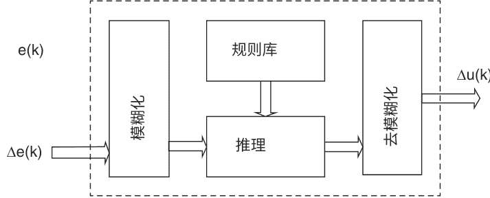

图 2 模糊逻辑控制器

$$ y(x) = \frac{\sum_{p}^{k-1} \mu_k(x) y^k}{\sum_{p}^{k-1} \mu_k(x)} $$

其中

$$ \mu_k(x) = \prod_{n}^{i-1} \mu_{F_i} k_i(x_i), k_i \in \{1, 2, \dots, p_i\} $$

给定输入的规则选择可以通过推理机制来决定。它提供了一个模糊集，表示了植物输入应该采用各种值的确信度。去模糊化过程用于将模糊集转换为一个清晰的输出。

### 3.1 模糊逻辑控制的需求

传统上，精确的基于数学模型的策略被应用于处理控制问题。然而，交流伺服电机是一个非常复杂的系统，因此传统的控制方法在解决这些困难时并不有效，因为电机的参数经常变化，保持恒定速度是困难的。模糊逻辑控制可以在不复杂的数学建模的情况下轻松实现，并处理与交流伺服电机系统相关的困难。

## 4 模糊自适应 PD 控制器

在设计自适应模糊 PD 控制器 [7, 8] 时，模糊和传统 PD 控制器被结合起来。该结构如图 3 所示。误差和误差变化是模糊逻辑控制器的输入，满足期望的自适应参数 Kc 和 Kd。目标是确定模糊关系


在 Kc、Kd、误差和误差变化之间建立良好的稳定性。为了实现良好的稳定性，两个输出参数在线连续调整。PD 控制器的在线调整是通过模糊输出参数完成的，并且适当的控制器输出由

$$ u(t) = K_{\mathrm{c}} e(t) + K_{\mathrm{d}} \frac{\mathrm{d} e(t)}{\mathrm{d} t} $$

## 5 结果与讨论

### 5.1 周期信号发生器

任何周期信号中的已知周期（L）可以通过具有正反馈回路的延迟项产生，如图 4 所示。如果将任何周期波的一个周期作为输入提供给信号发生器，则信号发生器可以生成连续的周期信号。

## 6 仿真研究

自适应模糊 PD 的交流伺服电机系统最初以稳态速度的 40% 运行。为了检验在该工作点（OP）上所提出的自适应模糊 PD 在直流电机系统中的跟踪性能，使用周期信号生成器产生一个已知周期和幅度的梯形波输入信号。

图 5 周期性输入梯形波

如前所述，使用生成器产生周期信号。周期信号生成器中的延迟项是一个周期的时间。图 5 显示了这样一个输入梯形波的轮廓。

生成的输入梯形波被馈送到带有交流伺服电机系统的自适应模糊 PD 中。根据时间记录周期跟踪响应，如图 6 所示。根据记录的数据，计算每次试验的绝对跟踪误差 (ATE) 作为性能指标。图 8 显示了 10 次试验的误差信号，并在表 1 中列出了数值。图 7 聚焦于所有三种控制策略的伺服响应的放大图。

同时，在相同的工作条件下，对预定义梯形波的交流伺服电机系统进行了传统模糊和传统 PD 的仿真运行，并绘制了其跟踪响应曲线在同一图表 6 中，并计算了相应的绝对跟踪误差并记录在同一图表 8 中。

从表 1 可以看出，自适应模糊-PD 在直流电机系统中的绝对跟踪误差在第二次迭代时达到了 13.26。同时，传统模糊和传统 PD 等其他两种控制策略表现不佳。

为了检验所提出的模糊自适应-PD 的适应性，还生成了另一个正弦形式的周期信号，并在以 40% 的速度运行的交流电机系统中使用了所有三种控制策略进行测试。所有情况下正弦周期参考轨迹的跟踪响应都记录在图表 9 和 10 中。三种控制器的绝对跟踪误差在表 2 中进行了汇总，并在图表 11 中绘制了它们的值。结果支持所提出的自适应模糊-PD。

图 6 三种控制策略下梯形输入周期信号（周期=50，幅值=5 OP=40% 速度）的伺服响应

图 7 三种控制策略下梯形输入周期信号（周期 =50，幅值 =5 OP=40% 速度）的放大响应

图 8 梯形周期参考输入的绝对跟踪误差响应 (周期=50，幅度=5，OP=40% 速度)

表 1 梯形输入的性能指标
ATE

| 控制策略 | 绝对跟踪误差 (ATE) |
| :--- | :--- |
| 自适应模糊-PD | 13.26 |
| 模糊 | 31.59 |
| PD | 29.91 |

图 9 三种控制策略下正弦输入周期信号 (周期=50，幅值=5 OP=40% 速度) 的伺服响应

# 用于交流伺服电机的模糊自适应智能控制器

图 10 三种控制策略下正弦输入周期信号的放大响应 (周期=50, 幅度=5, OP=40% 速度)

表 2 正弦波输入的绝对跟踪误差 (ATE) 性能指标

| 控制策略 | 绝对跟踪误差 (ATE) |
| :--- | :--- |
| 自适应模糊-PD | 15.47 |
| 模糊 | 103.62 |
| PD | 31.01 |

图 11 正弦周期参考输入的绝对跟踪误差响应 (周期=50, 幅度=5, OP=40% 速度)

## 7 结论

提出了一种模糊自适应智能 PD 控制器，以改善交流伺服电机中的跟踪性能和周期参考轨迹。

实验研究采用交流伺服电机系统进行过程动力学的识别。在模拟结果中，所提出的控制器比传统模糊控制器和传统 PD 控制器具有更好的精细跟踪性能。此外，相对于其他控制器，它展现出周期性参考跟踪的最小绝对跟踪误差 (ATE)。FAIC 的鲁棒性经过测试，发现处于较高水平。

## 参考文献

- 1. A. Al-Mahturi, F. Santoso, M. Garratt & S.G. Anavatti, 基于自适应区间类型 -2 模糊推理系统的倒立摆智能控制，IEEE 模糊系统国际会议论文集 (FUZZ-IEEE)，(2019)
- 2. L.B. Prasad, B. Tyagi, and H.O. Gupta, 使用 PID 控制器和 LQR 的非线性倒立摆动力学系统的最优控制，2011 年 IEEE 控制系统、计算和工程国际会议 (ICCSCE)，pp. 540–545, IEEE (2011)
- 3. M.S. Park, D. Chwa, 通过耦合滑模控制方法摆动和稳定控制倒立摆系统。IEEE Trans. Ind. Electron. 56(9), 3541–3555 (2009)
- 4. J. Huang, Z.H. Guan, T. Matsunao, T. Fukuda, K. Sekiyama, 移动轮式倒立摆系统的滑模速度控制。IEEE Trans. Robot. 26(4), 740–758 (2010)
- 5. S. Rudra, R.K. Baral, 倒立摆车系统的鲁棒自适应反馈控制。Int. J. Control Autom 5(1) (2012)
- 6. R. Arulmozhiyal, K. Baskaran, 使用 FPGA 实现模糊 PI 控制器对感应电动机的速度控制。J. Power Electron. 10(1), 65–70 (2010)
- 7. A.M. Mansourabad, M.T.H. Beheshti, M. Simab, 用于燃气轮机速度控制的混合 PSO_模糊_PID 控制器。Int. J. Control Autom. 6(1), 13–24 (2013)
- 8. H. Ying, TITO Mamdani 模糊 PI / PD 控制器作为非线性、可变增益 PI / PD 控制器。Int. J. Fuzzy Syst. 2(3), 191–196 (2000)

# 医疗保健中的深度学习

L. Priya，A. Sathya 和 S. ThangaRevathi

## 1 引言

电子病历（EHR）用于存储患者的详细信息，如姓名、人口统计信息、诊断信息、敏感级别等。它有助于以电子方式交换医疗记录，并提供关于患者的准确和更新的详细信息。该系统提高了医疗保健的效率，并为更好的临床决策提供了一种方式。随着深度学习的新方法的出现和大量的 EHR 数据，可以实现更好的临床决策。深度学习在 EHR 中的应用改善了早期疾病预测，并减少了预测所需的时间。但由于缺失和不同的数据类型，准确的预测更具挑战性。可以使用深度学习找到缺失的数据，并且它可以应用于特征识别、分类和语音识别等许多应用中。深度学习是机器学习算法的超集，可以产生优越的性能和对复杂数据集的有效训练。但要使深度学习有效，需要大量的数据集。

### 1.1 简介深度学习

深度学习使用分层算法架构来分析数据。在这里，数据通过多层折叠进行过滤。当前层使用前一层的输出。只有处理大量数据，主要来自过去，才能产生准确性。通过经验数据得出相关决策。在这里，每一层通过接收邻近节点的刺激来激活。每一层被分配一个特定的转换任务，数据在一层中可能会多次优化并优化所需的输出。隐藏层提供数据给数学转换，将原始未经处理的输入转换为有用的期望输出。可以从数据的多个转换中学习复杂函数。这些多层技术有助于识别医学数据中的异常，基于症状预测疾病，减少人为干预，提高准确性。由于层会处理数据的过滤和归一化，所以需要较少的预处理。

L. Priya · A. Sathya (✉) · S. ThangaRevathi IT 部，Rajalakshmi 工程学院，印度金奈 e-mail: Priya.l@rajalakshmi.edu.in; Sathya.a@rajalakshmi.edu.in; Thangarevathi.s@rajalakshmi.edu.in

© Springer Nature Switzerland AG 2021 A. Suresh, S. Paiva (编者), 深度学习与边缘计算在高性能计算中的应用解决方案，EAI/Springer 通信和计算创新，https://doi.org/10.1007/978-3-030-60265-9_8

### 1.2 电子病历中的深度学习

深度学习使用电子病历数据，并以两种方式预测疾病的概率。一种是静态预测，另一种方法是基于输入集合的预测。静态预测仅基于存储的电子病历患者数据。第二种方法基于包括电子病历数据和其他信息的输入集合。深度分析任务可以分为五个类别：(a) 疾病的分类/检测，(b) 基于过去数据预测未来后果，(c) 基于训练算法的特征提取，(d) 数据增强增加了用于训练模型的数据可用性，(e) 必须保护电子病历数据的隐私。

### 1.3 深度学习引领机器学习

在特征工程领域，深度学习超越了机器学习，后者需要人工干预并消耗更多时间。深度学习与机器学习的数据呈现形式不同。机器学习始终需要结构化数据；然而，深度学习依赖于多层次，从而也可能产生非结构化数据。其次，机器学习需要通过训练从数据中学习，并使用算法解析数据。决策是基于所学到的知识进行的。深度学习创建多个层次，从而创建了一个可以学习和做出决策的人工神经网络。深度学习中的不同算法包括深度神经网络、卷积神经网络、循环神经网络、深度置信网络和生成对抗网络。

本章更加关注使用深度学习的电子健康记录（EHR），以及它对医疗保健的重要性，以及它将如何改变未来的医疗保健行业。本章介绍了与医疗保健分析、数据安全和隐私保护相关的算法，并提供了工作示例和案例研究。

设计这种深度学习算法技术需要独特的需求分析、实施和通过一致的测试用例进行关键评估。因此，设计这种算法所涉及的挑战，以及它的类型也在本章中提出。

本章还介绍了开发和验证预测和隐私保护技术的策略，并提供了相应的案例研究。

### 1.4 研究问题

- 如何验证从深度学习算法获得的预测结果？
- 如何保护电子健康记录 (EHR) 数据的隐私和安全？
- 如何处理异构数据？

## 2 相关工作

深度学习使我们能够发现许多未被发现的输入模式，并且它引领了由手工特征提供的最新技术。

两种基本的深度学习方法是
- 卷积神经网络。
- 深度置信网络。

这两种技术在深度学习领域已经得到了很好的发展。如今，深度学习因其最佳性能而受到研究人员的吸引。

数据表示是深度学习中的关键概念。在过去的十年中，输入特征是由专家从原始数据中手动提取出来，并用于机器学习算法。这个提取过程不准确，并且耗时，因为专家需要负责特征的创建、分析、选择和评估。但是深度学习过程可以在没有人为干预的情况下发现特征、未知模式和关系。特征提取所需的时间较少，几乎是准确的。在深度学习中，复杂数据被表示为简单数据表示的集合。深度学习是建立在人工神经网络 [ANN] 框架 [1,2] 之上的。

深度患者 [3] 是使用深度学习从庞大的电子病历数据集中提取特征的框架。利用这些提取出的特征，可以通过考虑患者从当前疾病转移到其他疾病的概率来预测患者健康状况。使用三个级别的编码来确定数据的依赖关系和层次化表示。使用了总共 70 万条 MOUNT Sinai 数据集的记录。与从原始数据中提取的结果相比，结果更好。对于癌症、糖尿病等疾病的预测存在一些限制，因为必须考虑实验室结果。基于实验室结果和实验室测试的频率，可以预测出模式 [3]。

Doctor AI [4] 是一种预测工具，可以预测患者的未来事件，包括他们的诊断安排、药物详细信息、药物订单和预约看医生。该框架通过 8 年的记录为 260,000 名患者提供支持。最初，诊断代码和药物详细信息被输入到 RNN 中，以预测患者的未来就诊。在使用大量数据集进行测试时，该模型的准确率接近 79%，训练轮数约为 20 轮。经证实，该模型在诊断方面提供了更好的临床预测。

与医生 [4] 相比，Doctor AI 的平均性能水平较高。

DeepCare 框架 [5] 通过患者的医疗记录和历史来预测患者的未来医疗状况，这些记录被存储为医疗记录。在这里，事件被表示为向量。为每个患者生成代表患者诊断和干预代码的两个向量 [6, 7]。这些向量被用于 LSTM 网络中，以预测未来的患者诊断。该模型设计用于编码数据，包括药物记录和诊断细节。该模型不包括血压等数值数据。该框架对于具有长期患者事件的患者来说非常有效，可以预测未来的诊断 [8, 9]。

DeepCare 模型是一个使用 CNN 和深度学习来预测未来风险的预测框架。他们使用嵌入层将电子病历转换为包含多个短语的句子。这些短语代表患者的就诊事件，并在其间隔时间之后。下一个 CNN 层将预测未来事件。首先，将单词嵌入到向量空间中，然后将这些单词推入卷积活动中，以识别模式。然后，收集所有这些模式形成模式池，并将其输入分类器以预测未来。这个框架在汇集所有模式时存在困难，因为这些信息更具时间敏感性 [10, 11]。

### 2.1 医疗保健中的隐私问题和挑战

医疗保健数据通过现有结构与新兴技术更新。纸质数据被转换为电子格式并存储在一个地方，使患者可以根据需要跟踪他们的记录。这使得通过保留来自监测患者的传感器的许多特定数据，实现了对患者的远程监控。

在线访问数据或患者记录对医疗机构和专业人员都有很多好处。这可能通过提高医疗保健质量来降低医疗费用。但是，除了这些好处之外，该系统还存在与患者数据相关的安全和隐私问题，这使得该系统在社会上不被接受。例如，患者不愿意透露某些健康信息，因为这可能会对他们的职业生涯造成问题。

医疗信息系统中维护三种类型的记录 [12]，并分为三个主要类别：

- 个人健康记录（PHR）：由患者维护的记录，包含患者的详细病史。
- 电子病历（EMR）：这个记录由医疗从业者维护，用于管理患者的医疗数据。
- 电子健康记录（EHR）：这是由患者创建并由 CDO 维护的 EMR 记录的子集。该记录可以被指定社区内的多个医疗机构访问。

EHR 包含一个人的所有医疗信息。这些信息容易受到不同层面的威胁，包括患者护理中心、外部入侵、意外泄露、某些人对信息的好奇心和未经授权的访问。需要采取措施来提供对这些影响的保密性。

### 2.2 安全问题

对患者记录的安全性应该得到保证，针对以下问题。

- (a) 用户认证：数据只能由授权用户访问。在访问数据之前，必须对用户的真实性进行检查。已经提出了基于智能卡的解决方案来解决这个问题。
- (b) 机密性和完整性：只要访问电子病历数据，它就应该准确可靠。数据被黑客攻击可能导致数据的破坏。
- (c) 访问控制：电子病历数据通过不同的网络和文件系统进行访问和交换。根据访问记录的人员角色，访问数据的权限级别应该有所不同。因此，需要根据角色来管理用户的权限。可以通过基于角色的访问、密码和审计跟踪来实现。这是网络中非常重要的安全层。
- (d) 数据所有权：在考虑更改记录访问权限时，这一点非常重要。在委派访问数据权限时，应考虑人员的角色。
- (e) 数据保护政策：不同组织以不同的目的在不同的边界访问记录。因此，组织拥有自己的安全政策和程序来保护记录免受攻击。该组织持续监控和管理政策以确保数据的安全。
- (f) 用户配置文件：数据可被不同实体访问，包括患者、药剂师、医疗中心和从业人员。所有这些用户的功能责任和角色必须被定义，并且应该确定其功能所需的安全级别。
- (g) 健康记录的滥用：存储记录的中心可能在未经所有者许可的情况下将数据用于某些不需要的目的。这种滥用应避免使用该数据。组织应根据需要将记录分离并提供相关的安全级别。

### 在医疗保健领域使用的 3 种深度学习算法

深度学习被认为是传统神经网络技术的延伸，简单来说，深度学习是一个多层的神经网络。

与机器学习算法相比，它可以探索数据中更复杂的非线性模式。此外，它代表了一种可扩展的方法，可以自主做出决策。深度学习在医疗保健系统中的示意图如图 1 所示。

医疗保健系统中的深度学习系统主要包括数字知识库、人工智能分析和临床决策支持系统。患者数据和过去的临床决策和结果存储在知识库中。在人工智能部分进行计算机辅助诊断和治疗选择，并综合结果进行推荐。临床决策支持系统负责处理临床决策，并将其传达给医生和患者。

图 1 医疗保健中深度学习的示意图

在临床应用中，深度学习算法有效地解决了机器学习和自然语言处理任务。通常使用的深度学习算法包括卷积神经网络 (CNN)、循环神经网络、深度信念网络和多层感知器，其中 CNN 从 2016 年开始领先。

### 3.1 卷积神经网络

CNN 是为处理高维数据或具有大量属性 (例如图像) 而开发的。最初，如 LeCun 所建议的，CNN 的输入是图像上的标准化像素值。

卷积系统是由自然过程推动的，神经元之间的网络设计类似于动物视觉皮层的连接，每个皮层神经元只对有限区域内的刺激做出反应。然而，不同神经元的感受野有所重叠，以至于覆盖了整个视野。图 2 展示了一个用于分类手写数字的示例 CNN 框架。

CNN 通过在卷积层中加权像素值并在子采样层中进行测试来移动图像中的像素值。最后的输出是加权输入值的递归函数。最近，CNN 已经成功应用于临床领域，用于辅助疾病诊断，例如皮肤癌或白内障。

图 2 CNN 的示例序列

### 3.2 循环神经网络

在深度学习中，与医疗保健相关的第二种流行方法是 RNN。RNN 使用连续数据表示神经网络。RNN 被称为循环的原因是它们对序列的每个元素执行相同的任务，并且输出取决于先前的计算。RNN 具有“记忆”，可以捕捉到之前几个步骤的计算信息。在自然语言处理中非常流行，RNN 也是预测临床事件的强大方法。

RNN 框架如图 3 所示。

RNN 可以应用于各种应用领域。以下是 RNN 可以应用的一些领域。

- 对任何语言进行建模和文本生成，从一种语言翻译到另一种语言。
- 语音识别，特别是预测音素。
- 生成图像描述。
- 视频标记。

直到最近，医疗保健领域中的人工智能应用主要集中在几种疾病类型上：癌症、神经系统疾病和心血管疾病是最大的疾病类型。目前，人工智能和自然语言处理方面的进展，特别是深度学习算法的改进，已经使医疗保健行业在各个领域开始使用人工智能技术，从数据流管理到药物发现。

图 3 RNN 框架

## 4 案例研究

以下是使用案例研究详细说明的算法。

### 4.1 使用 CNN 预测心血管疾病

生物医学和医疗保健社区的数据增长以及对这些数据的分析在早期疾病检测方面具有更好的益处。如果收集到的数据质量不完整，分析的准确性就会很差。不同地区对某种地区性疾病表现出独特的特征，这削弱了对疾病预测的准确性。本文考虑使用机器学习算法，借助各种风险因素对慢性疾病进行有效预测，以提供一种解决方案。我们已经对实时医院数据进行了对地区慢性疾病的分析。通过构建潜在因素模型来处理不完整的数据。针对非结构化数据提出了基于卷积神经网络的多模态疾病风险算法，并针对结构化数据提出了决策树算法。一组 14 个参数相互关联，产生了对心血管疾病发生情况的高度准确的分析 (图 4)。

我们提出的系统是一个基于 Web 的应用程序，具有功能模块。需要一个本地服务器，并且使用 GlassFish 服务器进行部署。SqliYog 工具用于实现 MySQL 的后端目的。第一步是

图 4 系统架构

数据的提取并将数据加载到数据库中。在加载数据集时，已经存在的数据将被新数据替换。

数据集特征包括结构化和非结构化数据。结构化数据指的是不随时间变化的值。属于这一类别的属性有：id、姓名、年龄、性别。非结构化数据指的是随时间变化的值。属于这一类别的属性有：cp、trest-bps、chol、fbs、restecg、thalach、exang、oldpeak、slope、ca、thal、num。通过决策树和 CNN 算法对个人的数据进行搜索。结构化和非结构化数据通过决策树和 CNN 算法进行分类。

风险评估是根据各自条件分别对结构化和非结构化数据进行评估。只有当所有数据都存在时，才能评估风险。因此，如果有任何数据缺失，将会重定向到缺失数据页面，并且数据必须存在。

关于结构化和非结构化数据的整体风险预测如下：

- 1. 如果两个数据都具有高值，则整体结果为高，
- 2. 如果两个数据都具有低值，则整体结果为低。
- 3. 如果任何一个值为高，则结果为高 [h + h = h, l + l = l, h + l = h, l + h = h]。

我们的系统在更新自定义值和数据集时提供了灵活性。我们使用一个 ID 从数据集中检索所需的数据。由于数据分为结构化和非结构化数据，因此可以有效地使用风险因素预测心脏疾病。我们使用条形图对数据集的整体分析进行了可视化表示（图 5）。

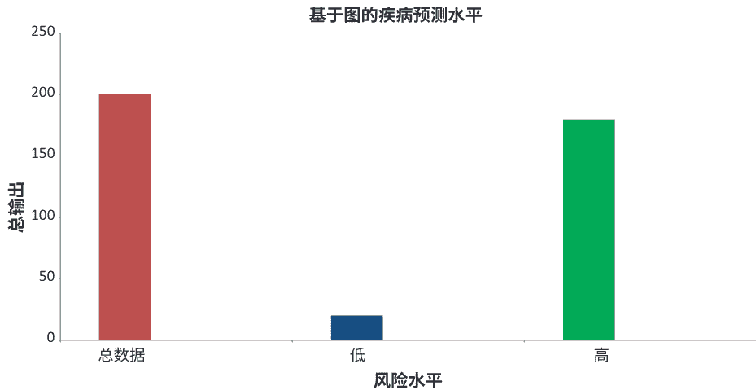

图 5 风险预测

### 4.2 COVID-19——使用 ANN 进行冠状病毒检测

COVID-19 最初出现在中国的武汉市，迅速在全球范围内传播，并造成了一场大流行。它对世界造成了巨大的变化；世界正在努力重置日常生活、公共卫生和全球经济。检测阳性病例非常困难，但同时，尽早检测到阳性病例可以防止这一流行病的进一步传播，并迅速治疗受影响的患者。由于没有特定的自动化工具包可用，对其他诊断工具的需求增加了。最近使用放射学成像技术获得的研究结果表明，这些图像包含有关 COVID-19 病毒的重要信息。结合图像放射学的先进人工智能 (AI) 技术可以帮助准确检测这种疾病。

该方法使用卷积神经网络开发的。它是使用 Python 和图像处理算法实现的。这些结果证明了使用 CT 和 X 射线进行 COVID-19 检测的概念验证。

所提出的系统架构如图 6 所示。COVID-19 检测算法如下所示。


图 6 COVID-19 检测系统架构

```
收集正常和 COVID-19 感染病例的图像
准备数据集
训练模型
获取输入图像 i(x, y)
转换为灰度图
应用相关采样
找到区域 i_x(x, y)
创建模板 i_tR(i_x(x, y))
构建模型
创建层
应用人工神经网络
构建 i_a(x(j), y(j))
对于 (j=0 到 n)
对于 t(x(j), y(j)) = i_a(x(j), y(j)) 应用模板匹配
COVID-19 检测
结束循环
```

我们收集了 2000 多张确诊的 42 例 COVID-19 病例的 CT 图像（325 张图像）。针对 COVID-19 检测，我们构建了一个改进的卷积神经网络模型，并进行了手动验证。我们使用 Python 和图像处理算法来提取特征，结果显示总准确率为 88.5%，特异度为 0.82，敏感度为 0.83。此外，在 42 张 COVID-19 图像中，算法预测 37 张为 COVID-19 阳性，准确率为 88.09%。这个算法需要在更多的 COVID-19 病例中进行测试，并通过进一步修改 CNN 来提高准确性。系统得到的结果如图 7 所示。

COVID-19 阳性

- A
- COVID-19 阴性


图 7 COVID-19 检测结果

## 5 结论

本章简要介绍了电子健康记录和医疗系统中使用的各种传感器。详细介绍了深度学习及其在医疗保健中的应用。通过传感器数据给出了案例研究，以更好地理解特征提取。

## 参考文献

- 1. 邱杰，吴琼，丁刚，徐阳，冯松，大数据处理的机器学习综述。EURASIP J. Adv. Signal Process. **2016**(1), 67 (2016)
- 2. 于德，邓力，深度学习及其在信号和信息处理中的应用 [探索性 DSP]。IEEE 信号处理杂志 **28**(1), 145–154 (2011)
- 3. Miotto R, Li L, Kidd BA, Dudley JT, 深度患者：一种无监督的电子健康记录表示预测患者未来的方法。科学报告 **6**, 26094 (2016)
- 4. Choi E, Bahadori MT, Schuetz A, Stewart WF, Sun J, 医生 AI：通过循环神经网络预测临床事件。在机器学习健康会议上 (2016) pp. 301–318
- 5. B. Shickel, P.J. Tighe, A. Bihorac, P. Rashidi, 深度 EHR：对电子健康记录（EHR）分析的最新深度学习技术进展的调查。IEEE J. Biomed. Health Inf. **22**(5), 1589–1604 (2018)
- 6. Z. Liang, J. Liu, A. Ou, H. Zhang, Z. Li, J.X. Huang, 深度生成学习用于传统中医自动化 EHR 诊断。计算方法程序生物医学。174–179 (2018)
- 7. 国际计算机科学新趋势与技术杂志（IJETTCS）网站：www.ijettcs.org 电子邮件：editor@ijettcs.org 2014 年 11 月至 12 月第 3 卷第 6 期 ISSN 2278–6856
- 8. T. Pham, T. Tran, D. Phung, S. Venkatesh, 从医疗记录中预测医疗轨迹：一种深度学习方法。J. Biomed. Inform. **69**, 218–229 (2017)
- 9. C. Xiao, E. Choi, J. Sun, 使用电子健康记录数据开发深度学习模型的机遇与挑战：一项系统综述。J. Am. Med. Inform. Assoc. (2018). https://doi.org/10.1093/jamia/ocy0686
- 10. P. Nguyen, T. Tran, N. Wickramasinghe, S. Venkatesh, Deepr: 用于医疗记录的卷积神经网络。IEEE J. Biomed. Health Inform. **21**(1), 22–30 (2017)
- 11. R. Miotto, F. Wang, S. Wang, X. Jiang, J.T. Dudley, 医疗保健中的深度学习：综述、机遇和挑战。Brief. Bioinform. (2017). https://doi.org/10.1093/bib/bbx044
- 12. R. Zhang, L. Liu, 医疗应用云的安全模型和要求”, IEEE 第三届云计算国际会议，2010

# 理解深度学习：基于案例研究的方法

Manisha Galphade, Nilkamal More, V. B. Nikam, Biplab Banerjee 和 Arvind W. Kiwelekar

## 1 引言

人工智能旨在使机器像人脑一样智能。因此，机器学习是人工智能的一个子领域。术语“人工智能”是指机器执行人类可以执行的操作，例如先学习然后使用该知识来解决问题。自 1950 年代以来，计算机科学家一直在机器学习领域努力。这导致了对学习机器的更高期望。由于深度学习在输出方面高效准确，它是使机器高度学习的一种尝试。

深度学习被认为是机器学习的专业组成部分。它由许多层组成，包括用于提取特征的非线性处理节点。架构的每一层都将前一层生成的结果作为输入。图 1 显示了神经网络的架构。输入层将输入数据提供给多个隐藏层，最终产生一些输出，可以是分类结果、回归结果等。罗森布拉特在 1958 年提出的一种更通用的计算模型称为感知器。它是神经网络的基本单元，接受加权输入，处理它们，并执行二进制分类。它只包含两层，一个输入层和一个输出层，如图 1a 所示。

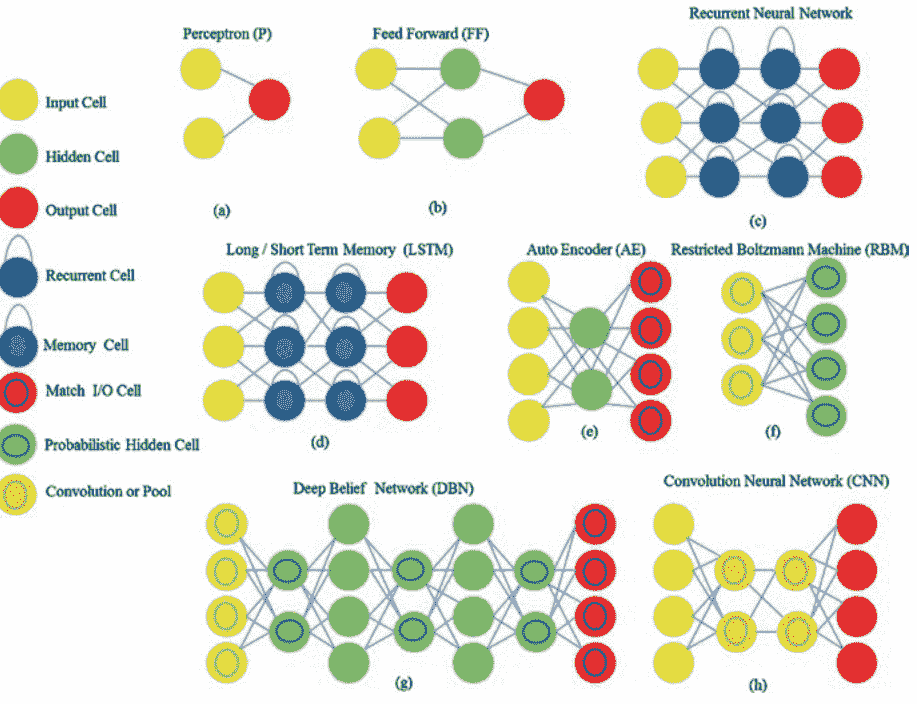

图 1 深度学习的架构

多层网络至少包含一个隐藏层，如图 1b 所示。

多层网络被称为前馈网络，因为信息只在正向方向传递。模型没有反馈连接，输出不会返回给自身。递归神经网络通过在前馈网络中包含反馈连接来扩展，如图 1c 所示。当需要预测下一个输出时，递归神经网络就会出现，这取决于先前的输入。递归神经网络的重要特征是隐藏状态，它记住关于序列的信息，称为“内存”，它存储了过去处理的所有计算信息。在处理时间序列数据时通常使用递归神经网络。递归神经网络的缺点是梯度消失和梯度爆炸问题，它不能使用 tanh 或 ReLu 处理长序列。这些缺点可以通过长短期记忆（LSTM）来克服，如图 1d 所示。它使用门来处理递归计算中的信息流动。LSTM 架构由一系列循环连接的块组成，称为内存块。

编码器部分接收输入并将其映射到潜在空间。解码器将该潜在空间映射到输出。

在无监督学习中，自编码器（AE）是该类算法中的一个重要算法之一。由于隐藏层的维度较小，比数据层小，它有助于发现数据的显著特征，如图 1e 所示。为了降低数据的维度，使用自编码器。RBM 是一个包含一个可见层和一个隐藏层的马尔可夫随机场，如图 1f 所示。它可以被表示为二分图，其中隐藏层和可见层相互连接。隐藏层和可见层之间相互连接。RBM 的应用包括降维、分类、特征学习等。堆叠的 RBM 形成 DBN，如图 1g 所示。训练分为两个阶段：（1）无监督预训练，用于进行自下而上的特征提取；（2）监督微调，使用基于上下算法的监督学习进行进一步调整网络参数。DBN 用于识别、聚类和生成视频序列、动作捕捉数据和图像。卷积神经网络（CNN）是一种重要的深度学习方法，在语音分析和图像识别领域广泛应用，如图 1h 所示。CNN 由卷积、池化和输出层组成。通常，在 CNN 中更喜欢使用全连接层。

## 2 深度学习与机器学习的区别

以下是这两种学习技术之间的一些区别：

| | 机器学习 | 深度学习 |
| :--- | :--- | :--- |
| 硬件依赖性 | 机器学习算法适用于低配置机器 | 深度学习算法严重依赖于高配置机器因为内部进行了大量的矩阵乘法运算。GPU 是为了这个目的而设计的，以便可以高效地执行不同的操作 |
| 数据依赖性 | 机器学习算法不需要大量的数据，因为它使用手工制作的规则 | 为了完美理解数据，深度学习架构需要大量的数据。当数据集很小的时候，它的性能不好 |
| 特征选择 | 在机器学习中，大多数使用的特征需要由专家进行识别，并通过应用领域和数据类型的知识手动输入 | 深度学习方法从数据中找到最佳特征。因此，对于每个问题，深度学习减少了寻找新特征的任务。 |
| 模型透明度 | 机器学习算法比深度学习算法更透明 | 深度学习网络是黑盒网络。由于复杂的网络架构和超参数，它们的功能非常难以理解 |
| 执行时间 | 机器学习算法训练模型所需的时间很短，从几秒钟到几小时不等。虽然测试机器学习模型需要更多时间，例如 k 最近邻算法，数据集大小越大，测试时间越长。 | 深度学习算法需要更多时间来训练网络，因为有很多参数。在测试过程中，深度学习网络所需的时间较短。 |

## 使用深度学习的三个动机

深度学习方法帮助系统更准确地理解复杂的函数。它在不同的应用领域取得了成功，如第 5 节所述。使用深度学习算法的动机如下所示：

- 在特征表示方面，深度学习模型更强大。
- 深度学习由于深层神经网络的应用而展现出令人难以置信的增长，以提高性能。
- 这些网络可以产生具有高级抽象的复杂特征。
- 能够提取高维数据特征。
- 它更有效地利用数据。
- 当模型使用大量数据进行训练时，深度学习技术更准确。
- 这取决于数据的性质、网络架构和激活函数。
- 预测性能得到了改善。
- 解决高度计算任务。

## 深度学习算法的四个类别

本节概述了深度学习架构的学习机制。有三种主要的学习技术。学习模式通常根据它们处理的输入类型进行分类。有监督学习使用带标签的训练数据集，无监督学习使用无标签的数据集，强化学习是其中使用的三种技术。输出结果包括预测、分类、聚类和降维 [1]。

### 4.1 有监督学习

这是一个整个过程都受控制的学习过程。这些学习算法的主要目标是在给定的一组训练样本和训练标签上预测输出。主要的有监督学习任务包括分类、回归等。分类主要预测一个项目的类别。分类器可以是二元的，即进行是/否决策，也可以是多类的，将项目分类到不同的类别中。分类算法用于解决垃圾邮件过滤、语音识别、文档分类、手写识别、图像识别等问题。回归是一种统计方法，试图确定一个因变量与一个或多个自变量之间的关系。回归分析可用于预测数值型数据，如房价、销售额等。

### 4.2 无监督学习

在无监督学习中，训练样本中没有训练标签。这些算法从数据中发现洞察力。一旦观察到这些可靠的模式，相似的数据点可以被聚类在一起，不同模式的数据点将被聚类在不同的簇中。它主要用于将高维数据转化为低维数据进行分析或可视化。最常用和高效的无监督学习模型包括 RBM、DBN、DBM 和广义去噪自编码器。无监督学习中的不同任务包括降维、聚类等。

多层神经网络将高维数据降低到低维数据。自编码器是一种可以将高维数据转化为低维数据的多层神经网络。深度置信网络也用于降低维度。聚类是基于相似度度量 (例如欧氏距离) 将相似的数据分组。通常，深度神经网络用于将数据转化为簇，因为它具有非线性转换特性。

### 4.3 强化学习

它介于有标记训练数据集的监督学习和无标记数据集上的无监督学习之间。虽然数据没有明确的标签，但在完成动作后会获得奖励。强化学习解决了将即时动作与延迟回报相关联的复杂问题。它们学习如何在少数步骤中最大化特定维度或实现复杂目标。以下是一些著名的强化学习算法：深度 Q 网络，深度确定性策略梯度 (DDPG)，Q 学习，状态动作回报状态动作 (SARSA) 等。

## 深度学习的 5 个应用

深度学习涵盖了从产品开发到生产新药，从医学诊断到生成假新闻、图像或音乐等各种应用。深度学习在工业界用于解决模式识别、图像/音频/视频分析、自然语言处理等问题。然而，由于其处理和理解大量数据的能力，它们正在用于解决这个困难的现实世界问题。以下是一些深度学习的应用：

### 5.1 医学诊断

由于深度学习的快速发展，医学诊断得到了显著的好处。已经进行了大量的工作来改进从 CT 扫描、MRI 图像等中检测疾病、异常和肿瘤的能力。深度学习可以应用于不同的应用领域，如大脑、眼睛、胸部、乳房、心脏等进行分类、检测、分割等任务。作者 [2] 总结了大约 300 篇关于医学图像深度学习的论文。作者发现，在医学图像分析中，卷积神经网络（CNN）和循环神经网络（RNN）是最常用的架构。图像分类是深度学习中起到重要作用的第一个领域。它以一张或多张图像作为输入，并提供一个唯一的变量作为输出。主要任务是在图像中检测感兴趣的对象。这是医生们最困难的任务之一。使用脑部磁共振成像（MRI）来检测阿尔茨海默病的方法中，使用了深度信念网络（DBNs）和稀疏自编码器（SAEs）[3]。大多数基于深度学习算法的出版物仍然使用 CNN 来进行像素分类。

多流卷积神经网络 [4] 用于整合正电子发射断层扫描（PET）数据和 CT 数据，而 3D 卷积神经网络 [5] 用于检测脑部 MRI 中的微出血。除了图像外，使用物联网设备的医疗应用可以自动诊断患者。这项技术提取了关于患者的有用信息。深度学习可以利用移动电话和可穿戴设备在运动期间通过光电容积描记法（PPG）改善心率估计的准确性 [6]。作者将加速度计和光电容积描记法数据作为输入提供给深度置信网络（DBN），其中还包括受限玻尔兹曼机（RBM）。实验旨在将 PPG 信号分类为不同的子类。PPG 信号经过处理以预测一段时间内的心率，结果误差率为 4.88%。此外，[7] 通过使用信号分析来研究深度学习以分类脑电图（EEG）病理。特别地，使用卷积神经网络（CNN）并通过顺序模型算法配置（SMAC）进行自动优化，从而提高了准确性并实现了透明的过程。

### 5.2 图像和视频识别/分类

图像分类是根据图像中的内容对图像进行分类的过程。动画分类算法可以用来检查图像是否包含车辆。图像分类任务将图像作为输入，使用特征提取器提取特征，然后使用不同的深度学习算法基于这些提取的特征对图像进行分类。与将整个图像作为神经网络的输入不同，图像被切割成几个块，以位数组的形式。机器试图预测每个块。与 CNN 方法类似，深度网络在图像识别和计算机视觉任务中非常有效。在执行区分时提取适当特征的能力。深度 CNN [8] 相较于之前的模型显示出显著较低的错误率。作者使用了由 650,000 个神经元、60,000,000 个权重、五个卷积层和最大池化层组成的非常大的深度 CNN。如上所述，在 CNN 的深层之上，还使用了 DNN 的其他三个全连接层。

视频分类只需要多一步。首先从给定的视频中提取帧，找到特征，然后对视频进行分类。作者提出了使用卷积神经网络进行人群视频事件分类 [9]。在其中，他们利用了深度学习、卷积神经网络、支持向量机和深度神经网络。他们提出，在基于计算机视觉的系统中，对视频中的群体场景进行分类是一个重要且具有挑战性的任务。它可以识别大量的视频事件。长短期记忆（LSTM）被应用于人际互动领域，用于预测分析，以识别观看广告的个体人的面部表情 [10]。作者训练了模型，用于提取一组帧中的表情，以了解广告对观众的影响。这些网络是以下成功的原因：

- Google 照片：它自动扫描和标记云端备份的照片，以便轻松访问。它使用了在强大的 Google 服务器上运行的使用 Tensorflow 开发的大规模卷积神经网络，并配备了张量处理单元（TPU）。
- Microsoft how-old: 扫描图像后，确定人的年龄和性别。
- 动作检测：主要用于游戏、安全、机场等领域。

### 5.3 音频处理

音频信号处理用于听力学领域的数据压缩和降噪。自编码器在这个领域表现出良好的结果。深度学习在从单个或多个麦克风输入中分离语言、声音和背景噪声方面取得了重大成就。有效的智能助手变得越来越复杂，翻译程序也变得越来越复杂。

最近，深度学习技术成功地应用于语音识别任务 [11]，通过将隐马尔可夫模型的序列建模能力与 DNN 的强大判别训练能力相结合。在对专门设计用于图像分析的 CNN 进行适当修改后，可以发现对语音识别是有效的。

声波可以表示为频谱图。频谱图是一个时空信号，它随时间变化，但典型的神经网络无法处理这样的输入。因此，需要一种更高级的神经网络来记住序列输入，称为长短期记忆（LSTM）。使用深度音频处理的实际系统有：

### 5.4 自然语言处理和文本分析

文本和语言处理的研究越来越受欢迎。自然语言处理（NLP）处理一系列单词或其他语言符号。不同的处理任务包括文本分类、解析、翻译等。如今，深度神经学习方法已经证明在各种 NLP 任务中表现良好，如情感分析、词性标注、机器翻译、语言建模和释义检测。深度学习网络的吸引人之处在于能够在没有任何外部手工制作或耗时的特征工程的情况下执行上述任务。

语言建模 [12] 是发现单词序列可能性的艺术。它在包括语音识别、手写识别、光学字符识别和拼写纠正在内的各个领域都很有用。卷积神经网络最近被用于语言建模，以取代池化层的全连接层。就像池化层一样，这些层将特征降维到较低的空间。全连接层在一定程度上保留了这些信息。有三种不同的架构，即多层感知机 CNN（MLPConv），多层 CNN（ML-CNN），以及 MLPConv 和 ML-CNN 的混合组合。

许多研究人员通过文本分析实现了情感分类。比如，深度学习情感分类器 [13]。为了在广泛使用的监督分类器之上抽象出基线分类器，作者提出了两种集成技术。作者结合了来自不同来源的信息，并通过合并表面特征和深度特征来评估性能。实验证明，所提出的架构的性能优于基线模型。作者 [14] 采用深度学习方法对文本对进行重新排序，以获得最佳表示，但没有使用特征工程来进行相似性近似。机器翻译（MT）[15] 是自然语言处理的重要应用之一。为了将文档从一种语言翻译成另一种语言，它使用数学和算法技术。即使对于人类来说，进行有效的翻译也很困难。这不仅需要对语法、形态和语义的专业知识，还需要对领域敏感性（如文化敏感性）的理解。前馈网络 [16] 已经用于七个单词的输入和输出。引入编码器解码器模型使得可以将句子从一个长度大小翻译到另一个长度大小的句子。以下是一些现实生活中使用自然语言处理的领域：

- 谷歌助手：由谷歌开发的人工智能助手。它可以与安卓手机互动并执行各种任务。
- 社交网络：例如 Facebook 的自动人脸标记功能，Twitter 使用深度神经网络进行情感分析。

### 5.5 时间序列分析

时间序列被定义为在连续的时间段内获得的一系列值，通常具有定义的间隔。它是从远距离测量的连续时间内获得的值的序列。时间序列分析包含用于分析时间序列数据以提取有意义的特征和统计数据以理解其推断的技术。多层感知器是一个简单的神经网络，包括输入层、输出层和隐藏层。作者得出结论，多层感知器是一种更准确的预测时间序列的方法。一些深度神经网络被训练和分析用于能源负荷需求预测 [17]。深度递归神经网络由两个隐藏层组成，性能通过均方根误差（RMSE）进行衡量。作者强调特征选择以充分利用神经网络的能力来拟合高度非线性模型。最后，提出了一个复杂的模型来编制股票组合 [18]，该模型由深度置信网络和多层感知器组成。在这项工作中，股票价值时间指数被精选为深度神经网络的输入。与逻辑回归网络相比，深度神经网络提供了有希望的结果并且表现良好。

## 6 深度学习案例研究

本节描述了一些实际案例研究，我们可以应用深度学习。主要分析了三个案例研究。其中两个使用 CNN 架构进行预测或分类。尽管使用了 CNN，但在处理输入数据时有所不同，而在使用卷积层和池化层概念时保持相同的步骤。

### 6.1 案例研究 1：DNA 分析（计算生物学）

图 2 显示了使用 CNN 分析 DNA 序列的深度学习架构。在第一步中，使用不同的编码技术对 DNA 序列进行编码。其中，研究了两种编码技术：（1）独热编码和（2）k-mer 嵌入用于计算 word2vec。卷积操作的目的是从输入数据中提取高级特征。卷积层计算公式为：

$$ \text{卷积} \quad X_{i,k} = \text{ReLU} \left( \sum_{m=0}^{M-1} \sum_{n=0}^{N-1} W_{mn}^k X_{i+mn} \right) $$

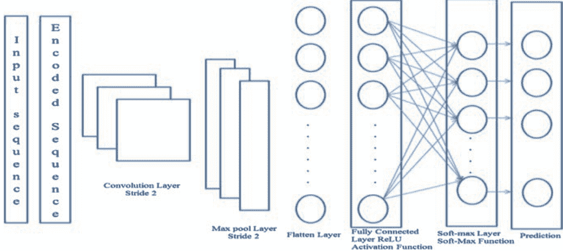

图 2 使用深度学习分析 DNA 序列

其中 X 是表示 DNA 的输入矩阵，i 是输出位置，k 是滤波器上的索引。W 是大小为（M，N）的评估滤波器矩阵，M 是窗口大小，N 是输入通道数。

卷积层后面跟着池化层。它对卷积层产生的输出进行操作，使其变小且更易处理。

$$ Y_{ik} = \max(Y_{ip,k}, Y_{ip+1,k}, \dots, Y_{ip+p-1,k}) $$

其中，p 是池化窗口的大小，k 是要进行池化的滤波器的索引，i 是输出位置，Y 是卷积层的输出。

最大池化是最常见的池化技术。第一阶段的输出被用于全连接层，并且为了得到最终输出，计算了权重向量和输入向量的点积。

### 6.2 案例研究 2：医学图像处理

图 3 所示的架构包含两个阶段 [19]。第一阶段对电子病历（EMR）进行预处理，以提取和选择特征。

第二阶段构建了 CNN 进行多类别分类。文本提取器提取了医学语言描述的内容。从提取的句子中清除噪音。样本被表示为标签对和一组词向量，例如，{1, wv_{i-2}, wv_{i-1}, wv_{i}, wv_{i+1}, wv_{i+2}}。基于一对一的方法，将样本分成子集，然后在这个子集上训练模型。对每个子集使用 CNN 进行多类别分类。

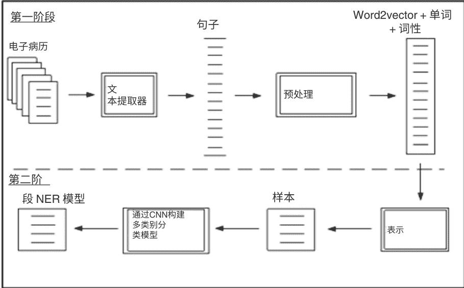

### 6.3 案例研究 3：风速预测

图 4 展示了风速预测的架构。风速数据是时间序列数据，在特定间隔后捕获。为了处理风速数据，通常使用 RNN/LSTM。隐藏状态是 RNN 的一个重要特征，它记住序列的信息。LSTM/RNN 具有一个“记忆”，可以记住已计算的信息和下一个输出所需的信息。

图 5 显示了 RNN 的详细架构。x 是一个输入，y 是时间 t 的隐藏状态。P, Q, R 是 RNN 的参数。隐藏状态 S_t 是从当前时刻 X_t 和上一个时刻的隐藏状态 S_{t-1} 计算得到的。公式如下：

$$ S_t = f (P_{x_t} + R S_{t-1} + b) $$

其中 b 为线性关系的偏移量，f 为激活函数。预测输出 y_t 在时间 t 时的表达式如下：

$$ \hat{y}_t = f (Q S_t + c) $$

其中，f 为激活函数，c 为线性关系的偏移量。不同的问题使用不同类型的激活函数。例如，对于分类类的问题通常选择 softmax 激活函数。

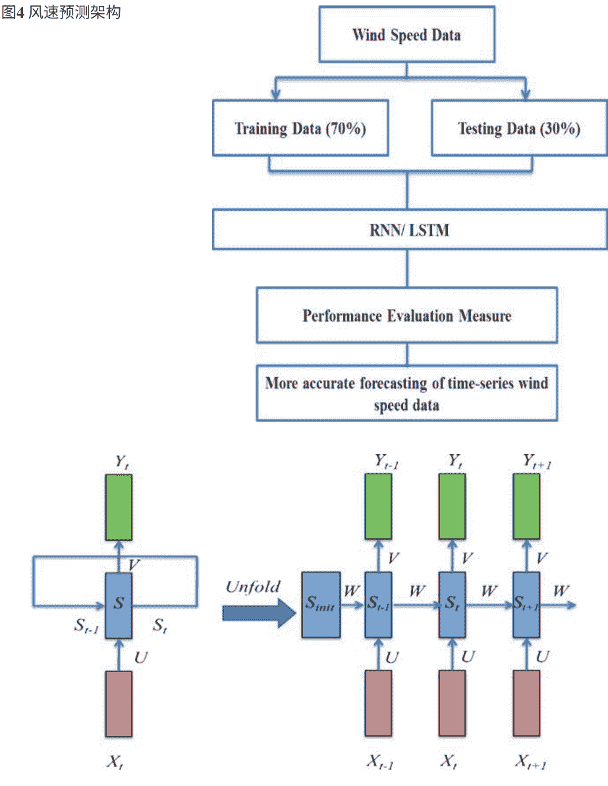

## 7 结论

深度学习是机器学习的扩展。它已经在许多应用领域中使用。本文重点介绍深度学习和了解深度学习架构的类别。综述了深度学习在六个广泛领域的应用，包括医学诊断、计算生物学、计算机视觉和视频信号识别或分类、语音处理、天气数据的时间序列分析、文本分析和自然语言情感分析。语言处理。深度学习有多种应用，但由于限制，本章未涵盖所有应用。最后，我们得出结论，每个应用领域都使用不同的架构，例如图像分析主要使用卷积神经网络，而对于序列数据分析，可以使用循环神经网络（RNN）来提高准确性和性能。在最后一节中，我们将从三个不同领域解释三个案例研究，以说明深度学习的应用。

致谢作者借此机会感谢印度政府新德里的 MHRD PMMNMTT 机构下的 Faculty Development Centre（VJTI-DBATU）在地理信息学、空间计算和大数据分析领域的能力建设，以及在地理信息学、人工智能和机器学习、大数据分析、深度学习等相关领域的能力建设，这些都帮助我们推进了这项研究。

## 参考文献

- 1. W.G. Hatcher, W. Yu, 深度学习综述：平台、应用和新兴研究趋势。IEEE Access 6, 2441–24432 (2018). https://doi.org/10.1109/access.2018.2830661
- 2. G. Litjens, T. Kooi, B.E. Bejnordi, A.A.A. Setio, F. Ciompi, M. Ghafoorian, C.I. Sánchez, 医学图像分析中的深度学习综述。Med. Image Anal. 42, 60–88 (2017). https://doi.org/10.1016/j.media.2017.07.005
- 3. T. Brosch, R. Tam, 深度学习在脑部 MRI 图像分析中的流形学习。Lect. Notes Comput. Sci, 633–640 (2013). https://doi.org/10.1007/978-3-642-40763-5_78
- 4. A. Teramoto, H. Fujita, O. Yamamuro, T. Tamaki, 使用卷积神经网络技术的 PET/CT 图像中肺结节的自动检测：集成假阳性减少。医学物理学 43(6 Part1), 2821–2827 (2016). https://doi.org/10.1118/1.4948498
- 5. Q. Dou, H. Chen, L. Yu, L. Zhao, J. Qin, D. Wang, P.-A. Heng, 通过 3D 卷积神经网络自动检测脑微出血。IEEE Trans. Med. Imaging 35(5), 1182–1195 (2016). https://doi.org/10.1109/tmi.2016.2528129
- 6. V. Jindal (2016). 将移动和云集成以选择 PPG 信号以监测强度体育锻炼期间的心率。国际移动软件工程和系统研讨会论文集—MOBILESoft ‘16. doi:https://doi.org/10.1145/2897073.2897132
- 7. D.R. Kelley, J. Snoek, J.L. Rinn, Basset: 使用深度卷积神经网络学习可访问基因组的调控代码。基因组研究 26(7), 990–999 (2016). https://doi.org/org/10.1101/gr.200535.115
- 8. Krizhevsky, I. Sutskever, and G. Hinton, 使用深度卷积神经网络进行 Imagenet 分类，神经信息处理系统（NIPS）会议论文集（2012）
- 9. E.-J. Ong, S. Husain, M. Bober-Irizar, M. Bober, 用于语义视频分类的深度架构和集成。IEEE 视频技术电路与系统交易 29, 1–1 (2018). https://doi.org/10.1109/tcsvt.2018.2881842
- 10. K.G. Srinivasa, S. Anupindi, R. Sharath, & S.K. Chaitanya, 对视频反应中捕捉到的面部表情的分析。2017 年 IEEE 第七届国际先进计算会议（IACC） （2017）https://doi.org/10.1109/iacc.2017.0140
- 11. T.N. Sainath, R.J. Weiss, K.W. Wilson, B. Li, A. Narayanan, E. Variani, 等，用于自动语音识别的深度神经网络的多通道信号处理。IEEE/ACM Trans. Audio Speech Lang. Process. 25(5), 965–979 (2017). https://doi.org/10.1109/taslp.2017.2672401
- 12. Y. N. Dauphin, A. Fan, M. Auli, 和 D. Grangier, 用门控卷积网络进行语言建模，在 arXiv 预印本中，arXiv:1612.08083 (2016)
- 13. O. Araque, I. Corcuera-Platas, J.F. Sánchez-Rada, C.A. Iglesias, 在社交应用中使用集成技术增强深度学习情感分析。Expert Syst. Appl. 77, 236-246 (2017). https://doi.org/10.1016/j.eswa.2017.02.002
- 14. A. Severyn 和 A. Moschitti, 使用卷积深度神经网络对短文本对进行排序学习。第 38 届国际 ACM SIGIR 会议研究与开发信息检索 - SIGIR'15（2015）doi:https://doi.org/10.1145/2766462.2767738
- 15. S. Liu, N. Yang, M. Li 和 M. Zhou, 用于统计机器翻译的递归循环神经网络，在第 52 届年会计算语言学协会会议上，第 1491-1500 页（2014）
- 16. H. Schwenk, 用于统计机器翻译的连续空间语言模型。Prague 数学语言学杂志 93 (1)（2010）。https://doi.org/10.2478/v10108-010-0014-617
- 17. E. Busseti, I. Osband 和 S. Wong, 用于时间序列建模的深度学习，技术报告，斯坦福大学（2012）
- 18. B. Batres-Estrada, 多元金融时间序列的深度学习（论文）(2015). http://urn.kb.se/resolve?urn=urn:nbn:se:kth:diva-168751
- 19. X. Dong, L. Qian, Y. Guan, L. Huang, Q. Yu and J. Yang, 基于深度学习的多类别分类方法用于电子病历中的命名实体识别，2016 纽约科学数据峰会（NYSDS）, 纽约，pp. 1-10 (2016). doi: https://doi.org/10.1109/NYSDS.2016.7747810

# 深度学习及其应用：现实世界的视角

Lakshmi Haritha Medida 和 Kasarapu Ramani

## 1 引言

本章主要关注 DL 的起源及其在日常生活中的应用。DL 正在改变技术的视角。人工智能（AI）及其子公司，即机器学习（ML）和深度学习（DL），目前非常令人兴奋。尽管 ML 和 DL 都是 AI 的子集（图 1），但 DL 代表了 ML 的下一次演进。DL 通过人工神经网络（ANN）进行学习，其工作原理与人脑非常相似，并帮助机器像人类一样分析数据。

### 1.1 历史

作为 ML 的一个分支，DL 使用层层算法来处理数据并复制自然人类的思维过程。信息在层之间传递，前一层的输出作为后续层的输入。网络的第一层是输入层，最后一层被称为输出层。这些输入层和输出层之间的所有层被称为隐藏层。通常，每一层都是一个简单、统一的算法，包含一种激活函数。1965 年，Alexey Grigoryevich Ivakhnenko 训练的第一个深度网络架构如图 2 所示 [1]。

L. H. Medida (✉)
CSE, JNTUA, Ananthapuramu, 印度

K. Ramani
软计算研究中心，信息技术系，Sree Vidyanikethan Engg College (Autonomous), Tirupati, 印度

© Springer Nature Switzerland AG 2021

A. Suresh, S. Paiva (eds.), 深度学习与边缘计算在高性能计算中的解决方案，EAI/Springer 通信与计算创新，https://doi.org/10.1007/978-3-030-60265-9_10

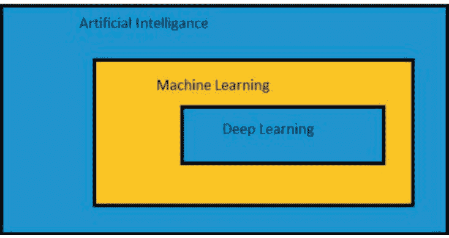

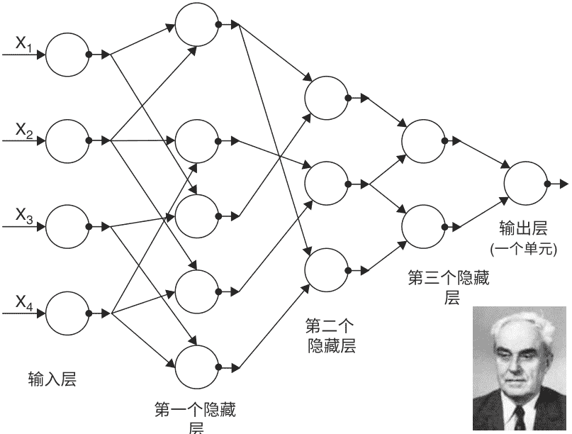

1960 年，Henry J. Kelley 因其在连续反向传播模型基础上的工作而受到荣誉。1962 年，Stuart Dreyfus 基于链式法则开发了一个简单的版本。然而，直到 1985 年 Seppo Linnainmaa 发表了他的硕士论文，并使用 FORTRAN 语言设计了反向传播的代码，该模型才能应用于神经网络。

在 1965 年左右，Alexey Grigoryevich Ivakhnenko 和 Valentin Grigor'evich Lapa 进行了最原始的 DL 算法开发尝试。1979 年，福岛开发了一种具有多层次分层设计的 ANN，称为 Neocognitron，用于识别视觉模式。在贝尔实验室，Yann LeCun。

1989 年，L. H. Medida 和 K. Ramani 展示了卷积神经网络 (CNN) 和反向传播算法来识别手写数字。

1995 年，Dana Cortes 和 Vladimir Vapnik 开发了支持向量机 (SVM)。1997 年，Sepp Hochreiter 和 Juergen Schmidhuber 开发了用于循环神经网络的长短时记忆 (LSTM)。1999 年后，随着图形处理单元 (GPU) 的发展，深度学习得到了显著的进步。

到 2011 年，GPU 的速度有了巨大的提升，可以直接训练卷积神经网络，无需逐层预训练。AlexNet 是卷积神经网络的一个例子，在 2011 年和 2012 年的许多全球竞赛中取得了胜利，而修正线性单元 (ReLU) 提高了速度和减少了过拟合。目前，大数据处理和人工智能的进展同样依赖于深度学习。深度学习仍在不断发展，并需要新的思路。

### 1.2 概述

提到 DL 在各个问题领域取得了最先进的结果是一个事实。DL 应用可能看起来令人沮丧，但通过了解 ML 的知识，我们意识到 DL 正在全球范围内探索解决人类在每个领域中的问题。在过去的几年中，DL 已经应用于数百个现实生活中的问题，从计算机视觉到自然语言处理。

DL 适用于新的应用领域的主要原因是数据依赖性、GPU 硬件和特征工程。DL 的应用似乎在无限领域中变化，包括欺诈检测、自动化、社交媒体、自然语言处理等。本章讨论了这些应用领域和子领域。

在未来的几年中，可能会出现更多 DL 实施的领域。对于深度学习的其他应用领域仍有很大的探索空间。这篇关于 DL 应用的综述提供了进一步研究 DL 新领域中任何一个的机会，这将带来更好的结果，并融入到这一领域的持续研究中。甚至有可能开发 DL 的新架构。

## 2 自然语言处理 (NLP)

从语言相关的复杂性的角度来看，无论是词汇、语法、音调的区别、词汇，甚至是讽刺，对人类来说都是最难学习的。自出生以来，不断接触和参与不同的社交活动将帮助人类建立适当的反应，并形成个性化的表达方式。通过深度学习的自然语言处理训练机器捕捉语言的语调，并构建适当的回应。语音识别、文本识别、机器翻译、文档摘要在更广泛的层面上是自然语言处理的子集，深度学习在其中正蓬勃发展。分布式架构卷积神经网络 (CNN)、循环神经网络 (RNN)、强化学习和记忆增强方法的应用有助于实现自然语言处理的卓越能力。特别是分布式架构有助于生成有用的线性语义关系，用于构建短语和句子，并提取与词嵌入相关的词语语义。

### 2.1 语音识别

语音识别正在征服我们的生活。语音识别是一种将语言转化为文本的技术，由计算机进行识别和翻译。它已经在我们的智能手机、在线游戏机和智能手表中占据了一席之地。它甚至通过自动化使我们的家变得更智能。亚马逊的 Echo Dot 是一个魔盒，它是基于语音识别构建的工具的一个例子，让你可以通过大声说话在线订购食物或获取天气预报。

语音识别已经存在了几十年。但是随着深度学习实现的高准确率，语音识别正在成为主流。安德鲁·吴早就预见到，语音识别从 95% 的准确率提高到 99%，它将成为与计算机交互的关键手段。

通过对神经网络进行声音录音的输入和训练，我们可以简单地猜测出生成的文本。这是对语音识别的一个轻量级视角。面临的主要挑战是语速的变化。例如，一个人可能会说“你好！”另一个人可能会说“喂喂喂”。生成一个更长的声音文件，用于相同的数据。这两个文件都应该准确地被识别为相同的单词“你好！”除此之外，语音识别还面临嘈杂的环境、不同的发音、不同的表达方式、人类语言理解、肢体语言、信道变异性、说话者的性别、方言等挑战。

图 3 显示了语音识别系统最常见的框架 [3]。预处理阶段被认为是语音识别中的第一步，区分信号是有声音的、无声音的还是噪声。预处理修改语音信号，使其最适合特征提取。特征提取旨在识别准确分类所需的相关信息。最常用的特征提取技术是梅尔频率倒谱系数（MFCC）、线性预测倒谱系数（LPCC）和 PLP [4]。

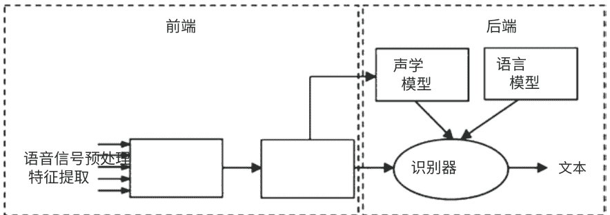

图 3 语音识别的通用框架 [3]

语言建模用于预测单词序列。语音识别在训练和测试阶段进行。这两个阶段的接近程度对系统的性能至关重要。大部分时间，语音识别模型使用独立的深度神经网络 (DNN) 实现，而混合模型只占研究的 25% [5]。目前对使用循环神经网络 (RNN) 进行语音识别的研究很少。

语音识别系统的性能通常以速度和准确性为衡量标准。系统的准确性以词错误率 (WER) 来衡量。因此，系统的性能以词识别率 (WRR) 来定义，它是 WER 的补充部分。尽管已经做了大量的工作，但目前的研究集中在开发对声学环境、说话人和语言特征等变化更具鲁棒性的系统。多语言是语音识别领域中一个快速发展的领域。以下是语音识别领域最近发表的几项研究成果。

在参考文献 [6] 中，Anirudh Raju 等人开发了一个用于自动语音识别的神经语言模型（NLM）。NLM 模型的架构是由长短期记忆投影循环神经网络（LSTMP）层组成的，每层由 1024 个隐藏单元投影到 512 个维度，并在层之间添加了一些额外的连接。该工作关注于在复合异构语料库上对 NLM 进行建模的挑战。NLM 模型的参数是基于随机梯度下降的变体进行调整的，用于从异构语料库中学习。这取决于从每个语料库中独立和相同的小批量样本，具有基于相关性的概率。第一遍 LM 的合成数据生成是通过 NLM 的 n-gram 近似实现的。进一步使用子词 NLM 创建合成数据，以确保生成的语料库不受当前版本的 ASR 系统限制。模型中使用的书面文本语料库包含超过 500 亿个单词。通过从 NLM 生成合成数据并将数据合并到 n-gram 模型中，可以得到相对 WER 为 1.6% 的结果。

在参考文献 [7] 中，Steffen Schneider 等人通过从原始音频中学习表示来探索无监督预训练用于语音识别。该模型被训练用于区分样本和干扰样本。

$$
\mathcal{L}_k = -\sum_{i=1}^{T-k} \left( \log\sigma\left(z_{i+k}^T h_k\left(c_i\right)\right) + \lambda\tilde{z}\mathbb{E} \sim p_n \left[ \log\sigma\left(-\tilde{z}^T h_k\left(c_i\right)\right) \right] \right) \tag{1}
$$

其中
$z_{i+k}=$ 一个在未来 $k$ 步的样本。
$k=1, \dots, K.$

$\tilde{z}=$ 提议分布 $p_n$ 的干扰样本。

$\sigma \left(z_{i+k}^{T} h_k\left(c_i\right)\right)=$ 样本 $z_{i+k}$ 的概率分布。

$h_k(c_i) = \text{Wk } c_i+\text{b}_k=$ 第 k 步的仿射变换。

因此，所得到的表示用于增强声学模型的训练。一个简单多层 CNN 模型被预训练用于从单个上下文中预测即将到来的样本。该模型建立在一个编码器网络和一个上下文网络上。编码器和上下文网络由具有 512 个通道的卷积层、组归一化层和 ReLU 非线性激活函数组成。通过噪声对比二元分类任务进行改进。输入到编码器网络的原始音频信号将音频信号嵌入到潜在空间中。上下文网络将编码器的输出信号绑定在多个时间步骤上，以获得上下文化的表示。通过训练生成的表示提供给声学模型。使用 wav2let-ter++ 工具包对声学模型进行训练和评估。使用 WSJ 语言模型数据集训练的词典和独立的语言模型进行解码。结果显示在 WSJ 测试数据集上实现了 2.43% 的错误率。

在参考文献 [8] 中，Daniel S Park 等人，Google Brain 的作者，指定了一种称为 Spec Augment 的语音识别数据增强的基本方法。经过训练的端到端 ASR 网络被称为 Listen, Attend, and Spell (LAS)。时间扭曲，频率遮蔽和时间遮蔽被用作数据增强的策略。对数梅尔频谱图是 LAS 网络的输入，由一个步长为 2 的两层 CNN 组成。CNN 的输出被传递给编码器以生成注意力向量序列。编码器具有一个 d 堆叠的双向 LSTMs，单元维度为 w。用于转录的标记是通过输入到具有单元维度 w 的 2 层 RNN 解码器的注意力向量生成的。文本标记化使用 16k Word Piece Model 进行 Libri Speech 词汇表和 1k 进行 Switchboard。使用波束搜索生成具有波束大小为 8 的最终文本转录。作者在 Libri Speech 测试集上发布的 WER 分别为 5.8% 和 6.8%，其中包括和不包括语言模型。

对于 Switchboard 来说，在没有语言模型的情况下，他们在 Switchboard/Call Home 部分上实现了 7.2%/14.6% 的准确率。

### 2.2 文本分类

文本分类是指根据其内容将预定义的标签或类别分配给文本的任务 [9]。文本分类是自然语言处理中的一项基本任务，具有广泛的应用，如主题标签、情感分析、垃圾邮件检测和意图检测。由于全球范围内大量的非结构化数据可用，对数据进行组织、排序或分析是繁琐的。这就是文本分类节省时间和精力的地方。

情感分析是文本分类的一个传统应用。它是一种自动化的过程，用于判断文本是积极的、中性的还是消极的。情感分析在更广泛的选择上应用于产品分析、品牌监测、客户支持、市场研究等方面。文本分类的另一个关键应用是主题标签。在大多数情况下，主题建模用于结构化和组织数据。例如，基于主题维护客户反馈表单，基于主题对新闻文章进行分组等。公司使用的意图检测自动检测客户评论背后的意图，有助于自动化业务目的或生成产品分析。

自动文本分类系统可以基于规则、基于机器学习/深度学习或混合方式。基于规则的系统根据预定义的规则对文本进行分类。基于规则的系统易于理解，但需要深入领域知识。此外，规则生成是一项具有挑战性且耗时的任务。基于规则的系统无法很好地扩展，因为添加新规则可能会影响现有规则。深度学习通过使用较少的特征实现了文本分类的高准确性。卷积神经网络 (CNN) 和循环神经网络 (RNN) 是广泛用于文本分类的深度学习架构。深度学习算法，如 Word2Vec 或 GloVe，用于改进单词的向量表示，从而提高传统机器学习算法训练的分类器的准确性。混合系统将训练好的基础分类器与基于规则的系统结合，以获得精细调整的结果。文本分类器的性能通过准确率、召回率、精确率和 F1 分数等指标进行评估。以下是文本分类领域的一些最新研究的提及。

在参考文献 [13] 中，鲍国等人解决了一个问题，即为一个术语分配一个单一的权重，尽管该术语在具有不同标签的多个文档中出现。他们提出了一种新颖的术语加权方法，为每个术语指定多个权重，以便每个权重都反映了它在与不同类别相关的文档中的重要性。因此，每个术语的权重计数等于类别的数量。


图 4 情感分析示例 [10]

图 5 主题建模示例 [11]

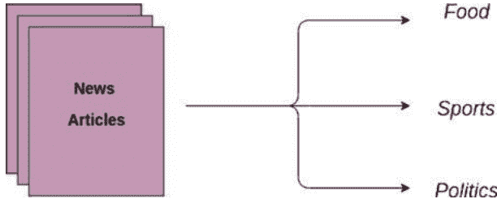

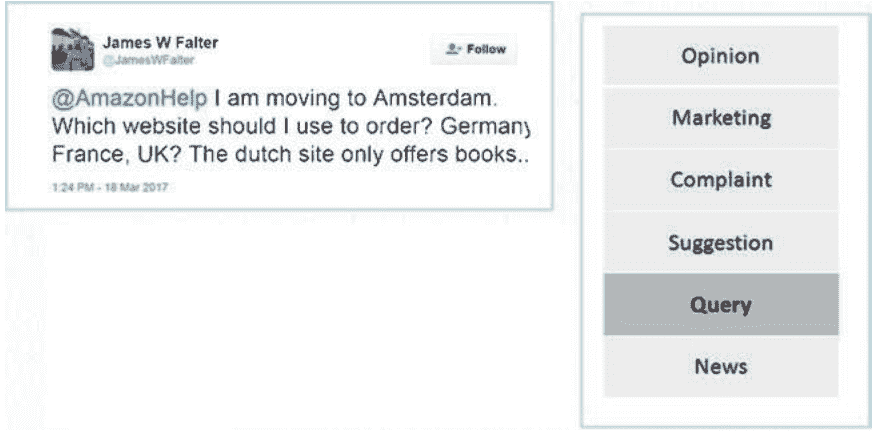

图 6 意图检测示例 [12]

多个词嵌入作为输入被馈送到多通道 CNN 模型中进行文本分类。他们的工作在与其他基准方法在不同的标准数据集上进行实验时展示了先进的性能。

在参考文献 [14] 中，兰振中等人专注于减少内存消耗和提高双向编码器表示来自变换器 (BERT) [15] 的训练速度的方法。BERT 是一个开发的深度学习模型，在 11 个不同的自然语言任务中已经证明取得了最先进的结果。

此外，通过引入自监督损失来改进 ALBERT 模型的性能，用于预测句子顺序。句子顺序的预测主要关注句子之间的连贯性，并解决了 BERT 最初提出的预测下一句损失的虚荣问题。在 GLUE、SQuAD 和 RACE 基准数据集上，ALBERT 的实验结果显示 GLUE 的准确率为 89.4%，SQuAD 2.0 的 F1 分数为 92.2，RACE 的准确率为 89.4%。

在参考文献 [16] 中，黄连哲等人探索了图神经网络 (GNN) 来解决高内存消耗和固定语料库级别图结构无法支持在线测试的挑战。他们提出了一个 GNN 模型，为每个输入文本构建图，共享全局参数，而不是为整个词库构建单个图。该工作声称在支持在线测试的同时保留全局信息。构建的图形窗口较小，旨在提取在边缘计算中更多地使用本地特征，同时显著减少内存消耗和边缘数量。

$$
N = \left\{ r_i \mid i \in [1, I] \right\},
$$

$$
E = \left\{ e_{ij} \mid i \in [1, I], j \in [i - p, i + p] \right\},
$$

其中
N= 图的节点集合。
E= 图的边集合。

实验结果表明，该模型在考虑的 R8、R52 和 Ohsumed 文本分类数据集上，无论是准确性还是减少内存消耗方面，都加强了性能。结果显示，所提出的模型在 R8、R52 和 Ohsumed 数据集上的准确率分别为 97.8 ± 0.2%、94.6 ± 0.3% 和 69.4 ± 0.6%。

### 2.3 文档摘要

自动生成文档摘要是再保留内容的关键要点和整体意义的同时生成简要摘要的任务 [17]。在这个信息过载的时代，对于文档摘要工具有很高的需求。随着深度学习的最新进展，文档摘要模型可以达到最先进的结果。文档摘要引起热潮的原因包括减少阅读时间，在文档研究中使选择过程更容易，提高索引的效果，减少偏见，被问答系统 [18] 等使用。

文档摘要可以是单个或多个文档摘要。一个文档可以通过两种主要方法进行摘要 (图 7)。抽取式摘要通过从实际文本中选择重要的单词或句子来进行摘要 (图 8)。这些抽取的句子将形成摘要。相比之下，生成式摘要从实际文本中生成新的句子以进行摘要 (图 8)。这些新的句子可能不在实际文本中存在。当然，生成式摘要提出了额外的挑战，因为它需要对主题和自然语言有很好的了解。在文档摘要领域的大部分工作更倾向于抽取式摘要。


图 7 文档摘要方法的类型

图 8 摘要提取和摘要生成的示例 [19]

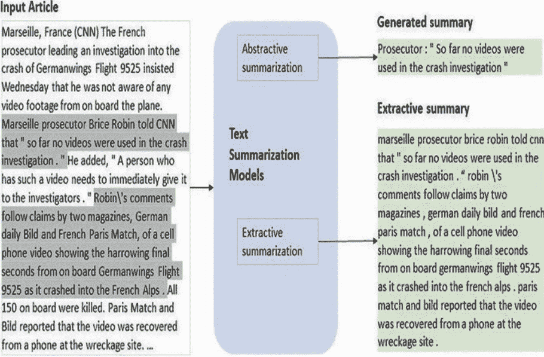

文本摘要的深度学习实现包括序列到序列模型，其中包括编码器和解码器组件，可能使用 LSTM，指针生成器，强化学习等。评估摘要的最常见指标是 BLEU，用于回忆导向的摘要评估（ROUGE）等。这些方法通过简单地评估输入和输出之间的共同单词来评分摘要。

由于 BERT 模型在各种自然语言处理任务上取得了开创性的性能，[20] 尝试开发了一种名为 BERTSUM 的 BERT 变体，用于提取式摘要任务。在 CNN/Dailymail 和 NYT 数据集上进行的实验表明，具有层间句子间 Transformer 的扁平架构在 ROUGE-L 上的表现优于先前最佳模型 1.65 个百分点。受 [12] 的工作启发，[21] 中的 Xingxing Zhang 提出了一种名为 Hierarchical Bidirectional Encoder Representations from Transformers (HIBERT) 的方法，用于文档编码，并使用无标签数据进行预训练。该工作提出了在无标签数据上预训练提取模型的分层编码器，然后使用预训练编码器加载的模型进行句子分类。HIBERT 模型在 CNN/DM 和 NYT 数据集上进行了提取式摘要任务的预训练。结果总结表明，HIBERT 在 CNN/DM 数据集上比其对应模型提升了 1.25 个 ROUGE，而在 NYT 数据集上提升了 2.0 个 ROUGE。

在参考文献 [22] 中，Hong Wang 专注于在文档级别上捕捉全局上下文，以进行摘要提取。他们引入了三个辅助预训练任务，即掩码、替换和切换，以自我监督的方式把握文档级上下文。掩码从候选池中预测被掩码的句子。替换任意地用其他文档中的句子替换文档中的几个句子，然后预测该句子是否被替换。切换的性能与替换类似，只是所选句子被同一文档中的句子填充，通过切换这些选定的句子。所提出的模型由一个双向 LSTM 作为句子编码器和一个文档级自注意模块组成。为了选择构成摘要的句子，最后应用了一个线性层。实验在 CNN/DM 数据集上进行，验证了该模型在学习摘要任务时，特别是在切换预训练任务上，表现更好且更接近收敛。结果显示，它甚至优于经过验证的 NEUSUM [23] 方法。

在参考文献 [24] 中，徐嘉诚提出了一种基于联合抽取和句法压缩的单篇文档摘要的神经网络模型。该模型被开发用于从文档中选择句子，基于组成句法分析识别可能的压缩，并最终使用神经模型对压缩进行评分以生成最终摘要。所提出的模型由抽取模块和压缩模块组成。抽取模块具有用于输入文档句子编码的双向 LSTM，两个卷积层用于句子表示和文档表示，最后是用于句子选择的注意力 LSTM 解码器。压缩模块是一个神经分类器，用于评估并决定是否保留或删除特定句子中的某些单词或短语。该模型在 CNN/DM 和 NYT50 数据集上进行训练，并在 ROUGE 指标上表现出优于抽取模型的 CNN/DM 数据集上的显著增益。经过人工评估，得到的摘要在语法上被证明是可接受的。

## 3 欺诈检测

在这个高度数字化的世界中，欺诈检测是受益于各个领域的领域。多年来，欺诈已成为银行、医疗、保险等不同领域的主要关注点。随着在线交易的不同支付选项的增加，欺诈活动也在增加。构建一个经过验证和安全的系统以防止欺诈活动已成为一项具有挑战性的任务。因此，欺诈检测算法已经出现，为金融机构节省了数十亿美元。

欺诈检测和预防基本上是通过识别客户的信用评分和交易中的异常来进行的。机器学习分类和回归技术用于检测异常值，而深度学习则努力减小规模。深度学习模型在性能方面面临挑战，因为大部分用于欺诈检测的数据都是以结构化格式存在的 [25]。深度学习框架，如自动编码器、自组织映射（SOMs）、受限玻尔兹曼机（RBM），用于检测欺诈交易。堆叠自动编码器（SAE）和 RBM 分类器因其对金融欺诈检测的满意性能而被提及 [26]。ANN，支持向量机（SVM）、人工免疫系统（AIS）、隐马尔可夫模型（HMM）、遗传算法、贝叶斯网络、基于模糊逻辑的系统等等，在文献中都被用于信用卡欺诈检测 [27]。下面列举了最近关于欺诈检测的研究成果。

在参考文献 [28] 中，郑龙飞尝试解决数据隔离场景中深度神经网络（DNNs）的可扩展性问题。他们提出了一个工业规模的隐私保护神经网络学习模型，可以抵御半诚实的对手。他们的提议将 DNN 的计算图分为两部分。第一部分使用密码技术执行与私有数据相关的计算。剩余的计算由中立服务器执行。还提供了一种防御机制，进一步确保隐私保护。该机制可以防止攻击者从 DNN 的隐藏层中恢复原始输入数据。实验使用了真实世界的欺诈检测数据集和财务困境预测数据集，并以接收者操作特征曲线下面积（AUC）曲线的形式发布了结果。

参考文献 [29] 中的工作解决了仅有少量标记数据对欺诈检测性能的影响问题。尝试从标记数据的社交关系中获取未标记数据。开发了一种半监督的注意力图神经网络（SemiGNN）来处理标记和未标记数据进行欺诈检测。这种分层注意力模型设计在图神经网络中，用于找到欺诈的相关性和解释关键因素。注意力模型设计用于从节点级别到视图级别的不同视图和邻域的融合。对中国支付平台支付宝的用户进行了预测实验，提出的模型在 AUC 等评估指标上表现出更好的性能，与 XGBoost、LINE、GCN、GAT 等基准方法相比。

参考文献 [30] 是关于医学领域图像欺诈检测的工作。开发了一种基于快速 RCNN 的网络用于测量乳腺癌进展水平的有丝分裂检测。该模型是一个基于区域的检测模型，结合了完全卷积区域建议网络和分类网络。卷积区域建议网络生成建议，分类网络将这些建议分类为持有有丝分裂或不持有有丝分裂的建议。两个类别的特征被合并到双线性汇聚层中，以保持空间上的并发性。在 ICPR 2014 MITOSIS 竞赛的数据集上进行了实验，得到的 F-measure 为 0.507，这是针对提出的模型的评估结果。

## 4 视觉识别

深度学习的另一个有趣应用是视觉识别。视觉识别基本上是根据照片中检测到的位置或人物组合、日期或事件等对图像进行分类。它无疑使生活更加便利。随着拍摄照片数量的增加，这变得更加容易。视觉识别对 DL 来说存在图像分辨率依赖的挑战 [31]。图像分辨率对基于视觉识别的应用非常重要。

先进的视觉识别系统由从基础到高级的多个层次组成，用于区分对象。DL CNN 模型通常用于处理图像。最近关于视觉识别的研究提到了 RNN 的实现 [32]。传统的 RNN 被用于语音和文本识别。

视觉识别中的大部分任务基于分类、分割和检测 [33]。用于分类任务的 DL 网络包括 AlexNet、VGGNet、GoogleNet、DenseNet、ResNet、CapsuleNet、FractalNet、DCRN、IRCNN、IRRCNN 等。分割任务基于 RefineNet、UNet、DeepLab、PSPNet、R2U-Net 等实现。基于区域的 CNN 及其各个版本，如 You only look once (YOLO)、SSD: Single Shot MultiBox Detector 等，是用于目标检测的 DL 网络实现。下面列举了一些最近的重要工作。

参考文献 [34] 中的作者试图说明，尽管从自下而上的方法转向自上而下的方法，但自下而上的方法仍然可以很好地解决目标识别问题。他们尝试使用标准的关键点估计网络来检测物体的四个极点，即最上方、最左方、最下方、最右方和一个中心点。所有这些关键点都被分组成一个边界框。然后，物体检测被作为一个纯外观基于关键点估计的问题进行。实验结果表明，所提出的方法在 COCO 测试集上的边界框平均精度（AP）为 43.7%，与经过验证的基于区域的检测方法相当。

此外，识别出的极点直接覆盖一个粗略的八边形掩膜，COCO 掩膜平均精度（AP）为 18.9%，比普通边界框的掩膜精度有很大提高。此外，还展示了极点引导分割进一步提高了掩膜的精度，达到 34.6% 的掩膜平均精度（AP）。

Yunpeng Chen 等人在参考文献 [35] 中发表了一种用于图像和视频计算机视觉任务的全局推理方法。所提出的方法全局聚合了一组坐标空间特征，并投影到一个交互空间中，从而可以有效地进行关系推理。一旦关系推理计算完成，与关系对应的特征将被分散回实际的坐标空间，用于执行下游任务。实现了一个称为全局推理单元（GloRe）的单元，用于坐标 - 交互空间映射。所提出的 GloRe 单元轻量级、易于训练，并且可以与现有的 CNN 结合使用进行各种任务。GloRe 单元包括五个卷积层，第一个用于降维，第二个用于双投影，第三和第四个用于全局推理，最后一个用于扩展。

实验结果表明，GloRe 单元稳定地提升了先进架构（如 ResNet [36, 37]、ResNeXt [38]、SE-Net [39] 和 DPN [40]）的性能。

在参考文献 [41] 中，作者们专注于用于目标检测和分类任务的特征金字塔架构。多级特征金字塔网络

## 5 个性化

MLFPN 被构建用于检测不同尺度的目标。最初，提取的多级特征被设置为基础特征。为了处理单个 U 形模块的解码器层，基础特征被输入到交替的联合稀疏 U 形模块和特征融合模块中作为目标检测的特征。最后，等效大小的解码器层被收集起来构建一个用于检测目标的特征金字塔，其中每个特征图包含来自多个层级的特征。MLFPN 集成到 SSD 架构中，称为 M2Det，在 MSCOCO 基准数据集上实现了更好的检测性能。M2Det 在 FPS 为 11.8 时实现了 41.0 的 AP，在单尺度多尺度推理策略下实现了 44.2 的 AP。

个性化是从电子商务到出版商和营销机构的企业关注领域，目的是通过整体提升用户体验来推动销售和增加用户参与度。个性化为企业和目标受众提供了机会。数据被认为是个性化的燃料。例如，电子商务网站如亚马逊、eBay、阿里巴巴等，通过向用户推荐产品、套餐和独家折扣，提供统一的个性化客户体验，这些网站变得越来越受欢迎。个性化的整个过程是通过收集用户与应用程序之间的先前交互数据来完成的。

深度学习模型如循环神经网络和迁移学习在个性化开发中被高度推荐。迁移学习旨在利用现有训练模型的特征来解决不同问题的不同模型。

其基本思想是通过对较小数据集进行额外训练来微调神经网络的一些或全部层 [42]。观察发现，样本加权方法似乎在准确性方面提供了最好的补偿。在早期训练中可用的数据量有限可能会对神经网络的整体性能产生不可逆转的负面影响。

在参考文献 [43] 中，Maxim Naumov 等人尝试开发了一个 DL 推荐模型 (DLRM)。设计了一种专门的并行化方案，以利用嵌入表中的模型并行性，以缓解内存限制，并通过操作数据并行性来扩展完全连接层的计算。个性化模型是嵌入和多层感知器 (MLP) 的组合。嵌入处理稀疏特征，而 MLP 处理密集特征。对于密集特征的处理，MLP 包括三个隐藏层，分别具有 512、256 和 64 个节点。这些特征是使用 [44] 中提出的统计技术明确地相互作用的。

事件发生的概率最终通过与另一个 MLP 的交互进行后处理来计算。通过改进的实验准确性，与 Criteo Ad Kaggle 数据集上没有进行广泛调整的深度和交叉网络（DCN）进行了 DLRM 模型的比较 [45]。

在参考文献 [46] 中，王朝阳专注于解决交互式推荐系统（IRSs）面临的离散动作空间问题和数据稀疏性问题。他们提出了一种基于文本的深度确定性策略梯度框架（TDDPG-Rec），用于基于多层感知器（MLP）的交互式推荐。该模型特别利用文本信息将物品和用户映射到特征空间，从而显著减少了稀疏性问题。

然后，使用 K 均值算法 [47] 将用户分类为几个簇。

基于协同过滤，构建了一个动作候选集，其中包括基于分类结果和用户历史日志选择的正面、负面和普通物品。通过从 TDDPG-Rec 学习的策略向量动态选择候选集中表达用户偏好的动作，该模型在三个公开可用的亚马逊数据集（数字音乐、美容和服装、鞋子和珠宝）上取得了显著的性能改进，且时间效率高。

在参考文献 [48] 中，Malte Ostendorf 等人关注数字图书馆推荐系统在建立两个文档之间关系方面的失败。

他们将找到两个文档之间的关联问题建模为一对一的文档分类任务。关系抽取、文档分类和文档相似度的概念被用来对文档对的语义关系进行分类。通过应用一系列技术（如 GloVe、段落向量、BERT 和 XLNet）以及不同的向量拼接方案、序列长度和基于 Transformer 的 Siamese 架构，获得了文档之间的语义关系。Siamese Transformer 系统是 BERT 和 XLNet 的组合。实验使用了由 32,168 个维基百科文章对和维基数据属性组成的数据集来定义语义文档关系。结果表明，普通的 BERT 模型在 F1 得分方面表现优异，达到了 0.93。

## 6 结论

与传统机器学习算法相比，深度学习具有潜在的优势，可以为日常生活中面临的不同问题提供解决方案。本章讨论了深度学习在统治世界的一些关键应用。讨论了深度学习在帮助解决人类实时问题方面的潜力。这有望让您更清楚地了解深度学习技术的现代和即将到来的能力。预计深度学习模型的进一步增长将在未来几年加速，并创造出更多的开创性应用。

## 参考文献

- 1. https://devblogs.nvidia.com/deep-learning-nutshell-history-training/
- 2. S.J. Arora, R. Singh, Automatic speech recognition: A review. Int. J. Comput. Appl. **60**(9), 34-44 (2012). https://doi.org/10.5120/9722-4190
- 3. V. Passricha and R.K. Aggarwal (2018). Convolutional Neural Networks for Raw Speech Recognition, From Natural to Artificial Intelligence—Algorithms and Applications, Ricardo Lopez-Ruiz, IntechOpen, DOI: https://doi.org/10.5772/intechopen.80026. https://www.intechopen.com/books/from-natural-to-artificial-intelligence-algorithms-and-applications/convolutional-neural-networks-for-raw-speech-recognition
- 4. D. Mayank, R.K. Aggarwal, 为印度语言实现语音识别系统接口，JCNLP-08 研讨会论文集，印度海得拉巴 (2008), 页码 105-112.
- 5. A.B. Nassif, I. Shahin, I. Attili, M. Azzeh, K. Shaalan, 使用深度神经网络的语音识别：一项系统性综述. IEEE Access **7**, 19143-19165 (2019). https://doi.org/10.1109/ACCESS.2019.2896880
- 6. A. Raju, D. Filimonov, G. Tiwari, G. Lan, and A. Rastrow, “Scalable Multi Corpora Neural Language Models for ASR,” in Proc. Interspeech (2019), pp. 3910-3914. arXiv:1907.01677
- 7. S. Schneider, A. Baevski, R. Collobert, and M. Auli. wav2vec: 无监督预训练用于语音识别. CoRR, abs/1904.05862 (2019). arXiv:1904.05862v4
- 8. D.S. Park, W. Chan, Y. Zhang, C.-C. Chiu, B. Zoph E.D. Cubuk, and Q.V. Le. Specaugment: A simple data augmentation method for automatic speech recognition (2019). arXiv:1904.08779v2
- 9. https://monkeylearn.com/text-classification/
- 10. 情感分析示例，数字图像，Monkey Learn, 2020 年 1 月 2 日。https://monkeylearn.com/sentiment-analysis/
- 11. 主题建模示例，数字图像，Analytics Vidhya, 2018 年 4 月 23 日，https://www.analyticsvidhya.com/blog/2018/04/a-comprehensive-guide-to-understand-and-implement-text-classification-in-python/
- 12. 意图检测示例，数字图像，Towards Data science, 2018 年 1 月 7 日。https://towardsdatascience.com/sentiment-analysis-concept-analysis-and-applications-6c94d6f58c17
- 13. B. Guo, C. Zhang, J. Liu, X. Ma, 通过多通道 TextCNN 模型改进加权词嵌入的文本分类。Neurocomputing **363**, 366-374 (2019). https://doi.org/10.1016/j.neucom.2019.07.052
- 14. Z. Lan, M. Chen, S. Goodman, K. Gimpel, P. Sharma, and R. Soricut, “ALBERT: A Lite BERT for Self-supervised Learning of Language Representations”, In International Conference on Learning Representations, 2020.arXiv:1909.11942v6
- 15. J. Devlin, M.-W. Chang, K. Lee, and K. Toutanova. “BERT: Pre-training of deep bidirectional transformers for language understanding”. 在 2019 年北美计算语言学协会会议论文集中的第 1 卷（长篇和短篇论文）中，第 4171-4186 页，明尼阿波利斯，明尼苏达州，2019 年 6 月。计算语言学协会。doi: https://doi.org/10.18653/v1/N19-1423
- 16. L. Huang, D. Ma, S. Li, X. Zhang, 和 H. Wang, 文本级图神经网络用于文本分类 (2019). arXiv:1910.02356
- 17. M. Allahyari, S. Pouriyeh, M. Assefi, S. Safaei, E.D. Trippe, J.B. Gutierrez 和 K. Kochut, 文本摘要技术：一个简要调查，(2017). arXiv:1707.02268
- 18. K. Chauhan, “无监督文本摘要使用句子嵌入” (2018). https://medium.com/jatana/unsupervised-text-summarization-using-sentence-embeddings-adb15ce83db1
- 19. “使用最新的 NLP-食谱从头开始构建您的文本摘要解决方案”, https://techcommunity.microsoft.com/t5/ai-customer-engineering-team/bootstrap-your-text-summarization-solution-with-the-latest/ba-p/1268809#
- 20. Y. Liu,“Fine-tune bert for extractive summarization”, (2019). arXiv 预印本 arXiv:1903.10318
- 21. X. Zhang, F. Wei 和 M. Zhou, “HIBERT: 用于文档摘要的分层双向变压器的文档级预训练”, 在第 57 届年会上计算语言学协会会议，ACL 2019, 意大利佛罗伦萨，2019 年 7 月 , Pp 5059–5069. 计算语言学会
- 22. H. Wang, X. Wang, W. Xiong, M. Yu, X. Guo, S. Chang 和 W.Y. Wang, “用于上下文文化摘要的自我监督学习”, 2019.arXiv:1906.04466v1
- 23. Q. Zhou, N. Yang, F. Wei , S. Huang, M. Zhou 和 T. Zhao, “通过联合学习评分和选择句子的神经文档摘要在计算语言学会第 56 届年会上，ACL 2018, 澳大利亚墨尔本，2018 年 7 月 15-20 日，卷 1: 长篇论文，Pp 654–663。计算语言学会
- 24. J. Xu 和 G. Durrett, “使用句法压缩的神经抽取文本摘要”, 在 EMNLP2019.arXiv:1902.00863v2 中
- 25. Z. Zhang 等人，基于卷积神经网络的在线交易欺诈检测模型，安全与通信网络，特刊：无线多媒体数据安全的机器学习，第 2018 卷，9 页。doi:https://doi.org/10.1155/2018/5680264
- 26. A.M. Mubalaike 和 E. Adali, "智能金融欺诈检测系统的深度学习方法", 2018 年第 3 届计算机科学与工程国际会议 (UBMK), 萨拉热窝，(2018), 页码 598-603
- 27. S. Sorournejad 等人，“信用卡欺诈检测技术综述：数据和技术导向的视角”, 2016 年 11 月.arXiv:1611.06439
- 28. L. Zheng, C. Chen, Y. Liu, B. Wu, X. Wu, L. Wang, L. Wang, J. Zhou 和 S. Yang, “工业规模的隐私保护深度神经网络”(2020). arXiv:2003.05198
- 29. D. Wang, J. Lin, P. Cui, Q. Jia, Z. Wang, Y. Fang, Q. Yu, J. Zhou, S. Yang and Y. Qi, “一种半监督的图注意力网络用于金融欺诈检测” (2020). arxiv:2003.01171v1
- 30. R.E. Yancey, “用于乳腺癌图像中的有丝分裂计数的多流 Faster RCNN” (2020). arxiv:2002.03781v1
- 31. D. Kanurakaran, “使用深度学习的简单图像分类 - 深度学习 系列 2”, 五月 2018. https://medium.com/intro-to-artificial-intelligence/simple-image-classification-using-deep-learning-deep-learning-series-2-5e5b89e97926
- 32. M.Z. Alom 等人，关于深度学习理论和架构的最新调查。电子 8(292), 1–67 (2019). https://doi.org/10.3390/electronics8030292
- 33. J. Schneider & M. Vlachos. 深度学习的大规模个性化 (2019). arXiv 预印本 arXiv:1909.02803
- 34. X. Zhou, J. Zhuo 和 P. Krähenbühl, “通过分组极端和中心点进行自底向上的目标检测”, 在 CVPR (2019)。arXiv:1901.08043v3
- 35. Y. Chen, M. Rohrbach, Z. Yan, S. Yan, J. Feng 和 Y. Kalantidis, “基于图的全局推理网络” , 在 CVPR (2019b)
- 36. K. He, X. Zhang, S. Ren 和 J. Sun, “深度残差学习用于图像识别”在 CVPR (2016)
- 37. K. He, X. Zhang, S. Ren, 和 J. Sun, “深度残差网络中的身份映射”, 在 ECCV 中，(2016)
- 38. S. Xie, C. Sun, J. Huang, Z. Tu, 和 K. Murphy, 重新思考视频理解的时空特征学习 (2017). arXiv:1712.04851
- 39. J. Hu, L. Shen, 和 G. Sun, 挤压激励网络，在 CVPR 中 (2018)
- 40. Y. Chen, J. Li, H. Xiao, X. Jin, S. Yan, 和 J. Feng, 双路径网络，在 NeurIPS 中 (2017)
- 41. Q. Zhao, T. Sheng, Y. Wang, Z. Tang, Y. Chen, L. Cai, & H. Ling, M2Det: 基于多级特征金字塔网络的单次目标检测器，在 AAAI 中 (2019)
- 42. N. Justesen 和 P. Bontrager 和 J. Togelius 和 S. Risi, 深度学习在视频游戏中的应用，IEEE Transactions on Games。https://doi.org/10.1109/TG.2019.2896986
- 43. M. Naumov, D. Mudigere 等，个性化和推荐系统的深度学习推荐模型 (2019)。arXiv: 1906.00091
- 44. S. Rendle, 因子分解机，在 2010 年 IEEE 国际数据挖掘会议上，Pp 995-1000, (2010)
- 45. R. Wang, B. Fu, G. Fu 和 M. Wang, 广告点击预测的深度和交叉网络，在 ADKDD 会议上，第 12 页 (2017)
- 46. C. Wang, Z. Guo, J. Li, P. Pan 和 G. Li, 用于交互式推荐的基于文本的深度强化学习框架，2020 年。arxiv:2004.06651v1
- 47. R. Agrawal, J. Gehrke, D. Gunopulos, P. Raghavan, 高维数据的自动子空间聚类在数据挖掘应用中的应用，在 Proceedings ACM SIGMOD InternationalConference on Management of Data (SIGMOD), 编辑 L. M. Haas, A. Tiwary, (1998),pp. 94-105
- 48. M. Ostendorff, T. Ruas, M. Schubotz, G. Rehm 和 B. Gipp, “用于维基百科文章之间语义关系的两两多类文档分类”, 2020. arxiv:2003.09881v1

# 应用区块链技术于农业：区块链技术、优势和挑战的研究

Sandeep Kumar M, Maheshwari V, Prabhu J, Prasanna M 和 R. Jothikumar


## 1 引言

### 1.1 区块链在农业革命中的应用

农业是人类发展的主要创新。在 18 世纪，英国的农业革命引发了工业革命，为我们提供了城市和城镇 [1]。通过与植物和动物的发展和帮助，它主要是稳定的增长。例如，澳大利亚的商业农业专注于引进的作物和动物物种。然而，技术仍然在农业中得到应用。Potts 和 Kastelle(2017) 提高了农业生产力 [2]。他们开发了农业的种子、资产、供应品等输入和小麦、羊毛、棉花等产出。技术的进步是通过改进安全性和专业知识的技术，将这些输入转化为结果的新输入或新方法。鉴于此，农业技术进步主要关注农场及其潜在生产力。然而，农场提供作物、牲畜，并且还产生可能的信息。这些数据包括创建对离开农场的产品有价值的信息记录。这些数据对于与每个农产品的中间商或主要客户签订、加工、运输和成为中介非常有价值。数据不仅需要生成和连接，还需要具有可信度才能具有意义。区块链是一种将农场与世界更紧密联系在一起的发明。它通过降低农场内生成的数据在农场外存储和使用的成本来做出贡献 [3, 4]。

Sandeep Kumar M (✉) · Maheshwari V · Prabhu J · Prasanna M 信息技术与工程学院，维洛尔理工学院，泰米尔纳德邦，印度

R. Jothikumar 沙丹工程与技术学院，特伦甘纳邦，印度

© Springer Nature Switzerland AG 2021 A. Suresh, S. Paiva (编者), 深度学习与边缘计算在高性能计算中的应用解决方案，EAI/Springer Innovations in Communicationand Computing, https://doi.org/10.1007/978-3-030-60265-9_11

## 2 区块链在农业中的应用案例

农业仍然是世界上数字化程度最低的行业之一。大部分农场上的数据在转移到农场外时存在问题，因为它们没有以支持可靠、经济和传输的方式生成或分析。现代农业中数字化程度较低对农业发展和从信息中获取价值的效率构成了重要限制。在所有行业中，数据都被收集，信息技术可以促进更好的农业管理流程，从而提高生产力和农场的绩效。此外，数字化和信息技术已经增加了农产品特定质量的价值方程式 [4]。

商品等级、数量和质量措施、符合标准和规则、安全信息、法律属性、来源和真实性是某种质量的特征。这些信息特征和特性对农产品价格产生影响。缺乏透明度会导致产品以完全信息价格上市，数据质量的不确定性也会产生同样的影响。创建和附加数据和信息是昂贵的。然而，对于下游用户和逐渐为客户识别产品属性而言，数据的有用性在经济上是有益的。建立信任或展示数据的性质是非常昂贵的。生成的数据量、与在现场处理数据的成本成比例给出的数据的可信度以及为下游客户支付的愿望。

农业供应链是最困难和复杂的，除了像本地农民市场这样的例外。农业是一个竞争激烈的领域，大部分生产都在工业水平上进行。由于各种合理性和季节性，农产品在全球市场上销售。农产品经常需要进行加工和组合，需要小心处理。由于小生产者的变化，大部分农产品是在不同地点生产的，质量存在显著差异。大多数农产品的价格可能会以难以分析的方式变动。因此，食品产品的信息、可追溯性、所有处理和加工的透明度，以及在供应链的所有阶段遵守一套规则和法规，对于证明农业产量的质量、安全性和价值至关重要。这些价值标准逐渐减少了数字信息、形成和信任的问题。因此，区块链技术可能成为未来农业供应链中的关键基础设施元素。

### 2.1 作物和食品生产

在人口增长的情况下，饮食需求与有限资源相匹配，同时减少对环境的影响，最大化消费者服务，确保供应链的责任，并为农民带来合理的利润。

尽管控制气候复杂性存在许多困难，如果受到青睐，就会有收入。区块链与物联网相结合，改变了食品加工行业，包括从生产者到制造商和食品产品分销商。区块链的建立是为了通过更好的解决方案利用农场服务，如水、工人和肥料，使农业具有竞争力 [3, 4]，如图 1 所示。

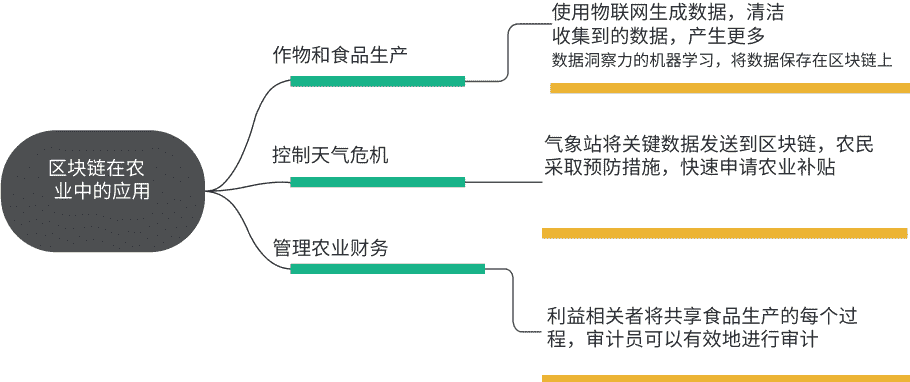

图 1 区块链转型

#### 2.1.1 基于四个步骤的区块链转型

- a) 使用物联网设备生成数据

到 2050 年，全球人口预计将达到 96 亿。农业行业采用物联网工具和传感器来支持不断增长的人口。设备内置物联网兼容的智能农业，通过传感器（湿度、光照、土壤湿度、pH 值和温度）密切关注农民的田地。物联网传感器和设备产生的数据可能有助于农民对作物生长情况有更好的了解。在保存数据之前，应首先处理从物联网设备获取的信息。

- b) 清洁和丰富收集到的数据

一旦累积的信息存储在账本上，就必须进行组织和识别。数据增强是为了增加额外的价值，提升所获得的知识来源。下面的两个步骤是对数据进行过滤，直到存储在分布式存储平台上。

通过添加元信息

时间戳、人口统计和类型细节应用于数据，使其更易访问。

使数据符合合规要求

将数据保存在区块链上并不意味着合规性。相反，它使执法监管变得更加透明。协议有助于确保与从物联网设备收集的数据相关联的个人信息得到安全保护并符合安全措施。

- c) 利用机器学习获得更多洞察力的数据

机器学习用于从传感器产生的数据中获取有价值的信息。预测模型可以控制多种罕见的用例，如作物质量推荐、识别、产量预测、需求预测和自动化作物生长因素。通过机器学习算法获得的知识，农民和投资者都可以在灌溉系统中实现增长。

- d) 数据保存在区块链上

从机器学习中收集的高价值数据存储在 IPFS（星际文件系统）中，这是一个分布式存储平台，将数据表示、哈希和存储在区块链上。与在集中式服务器上存储关键数据的先前方法相比，区块链将数据分散在网络中的每个节点中，阻止了中央机构对系统的监控。在区块链中捕获的数据推动智能合约制定已确定的准则。智能合约允许各个利益相关者在系统中交换和存储数据。尽管农业市场中的任何投资者都可以获得信息，但作物或食品生产的效率是透明的。

### 2.2 控制天气危机

农民在种植不同作物时通常会遇到不确定的天气条件。然而，天气预测和追踪对于蔬菜的保护至关重要。例如，美国种植的一些植物由于春季大雨导致的洪水无法承受。氧气含量超过零，使植物无法进行吸水、根系发育和呼吸等维持生命的活动。此外，缺乏透明度将导致当前食品链平台上的不确定和高涨的价格。消费者对于作物受到恶劣天气条件影响导致价格上涨毫无察觉。当区块链能够产生可追溯性时，农民和利益相关者可以了解食品分销行业中的价格变动情况。由于许可实体可以从区块链账本中监控气候条件，农民可以通过智能合约获得农作物保险赔偿。基于区块链的农业领域天气控制有三个重要的步骤过程。

#### 2.2.1 天气站将重要数据发送到区块链

智能农业允许农民通过应用传感器和绘制区域来识别作物的行为。农场中的农业气象站可以提供有价值的信息，如土壤温度、空气温度、叶子湿度、降雨量、风强度、相对湿度温度、大气压力、风速和风向。所有上述参数都经过计算、存储和保存在区块链中，这有助于农民和其他授权组织与之建立透明的联系。

#### 2.2.2 农民采取预防措施

通过收集气象站产生的数据，农民可以做出准确的农业决策。例如，如果你知道未来 2 天将有大雨，这将帮助你提前做好准备。

#### 2.2.3 农业补贴的快速申请

在天气灾害期间损失的情况下，农民可以通过区块链立即申请农作物保险。区块链的透明和不可变性使保险和其他经批准的实体能够安全地访问智能气象站捕获的数据。他们可以直接向区块链提出智能合约以获取相关数据。在确认保险索赔后，农民将自动收到所需金额。区块链技术可以支持农民快速、无缝地获得支付。

### 2.3 农业金融管理

正式可持续发展和小农户存在一些问题，包括透明度不足、信用历史和合同履行的复杂性。金融部门对农业价值链的帮助缺乏经济实惠；作为生产者，我们无法优化他们的供应。买家面临着承诺提供足够数量商品的困难。金融机构允许小规模农民在农业上投资，并帮助缓解资金限制。

区块链通过透明度和去中心化的规则，为农业金融周期增加了一致性和可访问性。

#### 2.3.1 利益相关者将共享食品生产的每个过程

每当发生合同时，都会在区块链中记录，这使得所有相关方都可以通过交易透明度进行访问。在食品加工的每个阶段共享有价值的信息将使整个过程公平和平等。

#### 2.3.2 审计员可以有效进行审计

区块链可以作为记录交易的身份验证形式，因为它可以安全地存储数据。审计员可以通过区块链账本直接验证交易，而不是要求农民或零售商提交审计财务报告。自动生成的审计过程提供了成本效益。

审计服务将不再只在年底进行评估，还可以在全年进行审计。区块链将使得随机分析取代审计师，从而更容易检查每一笔支付。

## 3 区块链技术在农业中的应用

基于经济增长阶段，全球人民对价值转移真正感兴趣。这种价值转移允许个人交换产品和服务，并为他们的福祉获取生产资产和储蓄。

分布式账本技术 (DLTs) 已经被实施以减少价值交换的波动性。DLTs 允许农业和食品行业在价值和资源转移方面实现更高的生产力、责任和质量控制。区块链是一个电子化的实时账本，用于特定数据包，可供所有利益相关者使用，并受到数据操纵的保护。区块链数据以块的形式存储。在整个农业和食品价值链中，区块链控制食品商品的起源，监控实时产品数据，并执行农业和食品转移。这些优势包括紧急情况下的简便、廉价的食品批次提示，整个产品状况记录的可靠性，增强的客户兴趣、满意度，更公平的价格，授权销售商以及卓越的合规管理。

如何在农业领域利用区块链技术？

区块链技术属于工业 4.0，适用于开发周期中的自动化和数据传输。工业 4.0 结合了物联网、云计算、物理系统和认知计算。比特币等加密货币的增长使得区块链技术变得越来越重要。尽管区块链最初用于加密货币，但它在其他交易中具有巨大潜力。在农业领域，区块链可以被用于多个方面。

### 3.1 农业领域中区块链的重要应用

#### 3.1.1 确保食品安全

利用区块链技术可以实现供应链中的食品安全。区块链技术加强了农业供应链中的可追溯性和责任追究，以识别薄弱环节 [5, 6]。它确保了从农场到商店的最佳标准得以维持。在食品安全危机的背景下，追溯食品来源的能力至关重要。行业监管机构可以快速确定污染源和受影响商品的含义 [6]。对潜在受污染源的早期识别将使食品行业能够迅速采取行动，预防疾病并挽救生命。这样的及时反应将有助于限制食品浪费，并通过减少财务影响来节省资金。农民、消费者和像 IBM、沃尔玛这样的企业已经开始利用区块链技术来确保食品安全。

#### 3.1.2 农产品可追溯性

可追溯性能够提升零售商和顾客对产品的信任和信心。当完整的农业供应链通过区块链进行产品注册、交易和运输的环境集成时，消费者可以验证他们所获得的物品是否准确无误，并且与他们支付的相符。每个交易阶段都会在区块链中注册。通过观察物品从农民到达库存的过程，可以验证供应商关于物品来源的每个声明，从而消除对物品性质的担忧。从消费者的角度来看，一个透明分布式账本将使他们对食品生产的来源和质量持乐观态度 [7]。通过观察食品供应链，消费者可以更多地了解产品的来源和生产日期。像 Provenance 这样的初创公司利用区块链来证明其食品供应链的来源。Provenance 利用区块链来保护和监控其食品供应链，并使其公开，以便供应链中的所有利益相关者都参与其中。Provenance 利用账本生成详细的材料、供应链和商品报告，从而为消费者提供更多关于质量和来源的清晰度。该初创公司提供以实时数据存储库的形式为客户提供完全透明的记录。它使得客户在产品的每一步都能参与其中。例如，我们可以看到当前位置、所有者以及特定人群的产品持续时间。

#### 3.1.3 防止食品欺诈

区块链模型的可追溯性和随后的问责制在防止食品欺诈方面起到了重要作用，这主要是因为不准确的标签。当抗生素、草药和转基因食品的需求增长时，误导性广告无处不在。然而，区块链技术和物联网可以有效地控制整个供应链。甚至在农场、工厂或仓库进行的小额支付也可以被追踪，并且信息可以通过物联网设备（如传感器和 RFID 标签）在供应链上共享 [8, 9]。通过确保生产力减少供应链中数百次互动中的欺诈案例，区块链将保护大型分销公司数百万美元的资金。

#### 3.1.4 管理交易成本和竞争营销

区块链技术降低交易成本并帮助以合理价格进行交易。它使产品买家能够直接与供应商进行协商，并通过移动转账进行交易。因此，买家和供应商更容易获得他们农产品的公平价格。农民获得合理的农产品回报，卖家支付合理的农产品价格。零售商节省了大量资金，因为该技术消除了中介和代理商。最终，区块链技术帮助农民和供应商验证其他农产品的激励措施 [10]。区块链技术有助于降低农产品交易成本，因为市场高度分散。农产品行业在供应链中依赖于一方的直接个人经验，直到您可以信任他们进行业务。账本提供了保证和透明度，所有参与方都可以访问，从而减少了每个参与方单独访问其价值和实施合同的需求。从事农产品交易的人可以在没有经纪人信任的情况下进行业务。

#### 3.1.5 最佳价格和付款选项

区块链技术的应用将使农业参与者能够以更低的成本提供快速付款选项。全球范围内，农民在向各国农业委员会申请产品付款时面临着重大延迟：农民因电汇等昂贵的付款方式而感到沮丧。区块链可以解决其中一些冗余问题。一些开发人员已经编写了基于区块链的点对点转账应用程序，确保安全、廉价且几乎即时。通过使用智能合约，一旦买方确定特定要求已满足，付款将自动激活 [11]。

### 3.2 食品行业中的区块链

实际上，信息和通信技术（ICT）在改善农业和食品行业的应用中起着重要作用。ICT 促进了电子农业，鼓励市场生产力、食品安全、健康，并减少了不确定性。电子农业依赖于赋予农业交换知识的能力，以使农场更好、更具竞争力、更安全，并防止潜在的后果。区块链在知识共享方面可能是一个更好的选择。

尝试将区块链应用于电子农业框架，支持建立贡献经验和使用电子农业服务器的利益相关者之间的信任 [12]。这些服务可以最大限度地提高成本效益；加强食品安全，并减少不确定性和风险。

与主要农业活动相比，密码协议可以在与养蜂业相关的领域中使用，以跟踪蜜蜂掺假行为，认可智能授粉合同，并加强蜂箱保险行业 [13]。区块链可以与信息通信技术在食品行业中用于保证食品安全。例如，射频识别技术被用于开发农食供应链的质量控制系统 [11]。

该系统可以在农业供应链的各个阶段提供可靠的敏感数据收集和交互程序的信息，以维护食品安全，包括分销、制造、储存、供应和营销。除了射频识别技术，区块链还可以与某些物联网技术和食品保护的先进理念相结合，如危害分析和关键控制点，以管理和保证供应链中的食品安全和质量 [14]。

### 3.3 使用区块链的食品行业挑战

- 1. 问题在于数据的准确性取决于数据提供者的提供。在特定的供应链中，可能会存在一个或多个“不可信任”的数据提供者。这表明，除非所有数据都得到适当的检查，否则区块链可能无法有效防止食品欺诈。区块链仍然远未成为必需品，但不完整或无控制的数据限制了其可行性。为了缓解这种限制，我们不应该孤立地构建物联网、区块链和智能合约，而应该建立一个社会技术背景。例如，当程序化食品检查受到持久的、局部的腐败影响时。
- 2. 像超市和酒店这样的工业部门在食品可追溯性计划中经常处于边缘化地位，而且似乎没有增加利润。因此，强烈的动机通常对投资这种先进技术并不重要。像 Walmart 这样的大型超市拥有与顾客和检查员互动的资源和能力。然而，除此之外，个别市场参与者经常构建旨在满足最低遵守要求的流程。

## 4 区块链在农业中的应用

### 4.1 智能农业

介绍和部署了几种以物联网和区块链技术相结合的智能农业模型。Lin 等人 (2018) 开发了一个基于区块链和物联网的智能农业系统。系统的关键部分是通过区块链在参与者之间建立信任的平台。代理商与产品从农场到销售的过程相关联，通过智能手机将数据存储在区块链中。基于区块链的 ICT 电子农业模型在当地和区域范围内使用，每个个体都有实时的水质数据存储在区块链中 [11]。大多数企业已经开始专注于智能农业的区块链应用。例如，Fliament 提供了与智能农业技术上的物理对象和节点进行交互的策略。它是基于以前的机器或设备使用的一种与 USB 端口连接的小硬件设计，用于与区块链高效交互。农田利用区块链来实现更智能和有效的农业实践。例如，在台湾，农田灌溉组织利用区块链收集数据并提供公共关系 [15]。每个组织都充当“公共法人”，将其关于灌溉管理的数据和信息公开到区块链中，公众使用这些数据。透明度传达了人们对灌溉管理的贡献，并提高了加强供水的决心。

区块链生成的统计数据库用于指导灌溉渠道的建设和维护 [11]。区块链智能农业不会减少，如果不是提高，农民参与的技术限制 [16]。它主要是通过从大规模农民那里积累准确的数据，而不是小农民，将其上传到区块链。

### 4.2 食品供应链

随着全球化的不断增长和市场竞争的加剧，食品供应链比以往任何时候都更加多样化和广泛。食品供应链仍然存在着食品追溯、质量、食品保证和食品安全方面的问题。

供应链中的低效率问题给社会、经济和食品安全带来了重大风险。从生产者的角度来看，区块链技术的实践支持与客户建立信任关系，并通过在区块链中透明地提供特定产品细节来加强产品的合法性。企业能够提高其商品的质量，从而提高其盈利能力。这将使低质量和欺诈供应商无法在市场上存活，并推动农业和食品行业的所有供应商提高商品的标准。

从客户的角度来看，区块链提供了关于食品生成和流通的准确和真实的知识。它将解决客户对食品安全、质量和环境友好性的担忧。使用区块链使客户能够作为消费者与生产者建立联系，通过详细信息更轻松地理解食品生产过程。它通过减少商品交易的限制来方便消费者，从而改善关系，增强消费者对食品安全的信心和信任。

从监管机构的角度来看，区块链为他们提供透明和一致的信息，以执行有效和积极的监管。区块链可以控制产品的详细信息，从起源到交易店。它提供了一种方便、不可逆的方式来加载从供应链开始获得的数据。例如，家畜的 DNA，谷物或蔬菜的农药残留。这些数据可以由参与产品供应链的任何个体进行验证和核实。获取所有产品的这些数据可能非常昂贵，但可以对样本进行检测。

通过区块链技术推动农产品溯源的几种方法被开发出来。Tian (2016) 提出了一种农业食品供应链的追溯系统，使用射频识别 (RFID) 作为一种非接触式自动识别系统 [10]。它可以通过准确的细节监控产品在供应链中的情况。使用区块链确保系统的输出、过程、存储和供应记录的准确和真实。基于区块链的追溯系统通过提供虚拟生产和消费数据直接连接到物联网设备。追溯是通过以太坊和超级账本 Sawtooth 区块链平台实现的 [19]。当前的区块链技术在食品供应链中仍处于早期发展阶段。与此同时，在部署区块链技术的实践中存在一些不稳定和不完整的问题。此外，区块链技术的应用涉及到食品供应链中利益相关者的重要参与和参与度，这对于发挥其功能作用是值得注意的。由于其功能性、可访问性、透明性和去中心化特性，区块链技术允许在供应链中控制食品质量信息。它支持防止食品采购欺诈，并降低维护食品供应链的成本。它有助于整个利益相关者，如制造商、客户和政府监管机构。

### 4.3 限制

区块链技术允许食品供应链的可追溯性，并加强食品安全。它保持安全的数据存储和管理，促进数据驱动技术在智能农业和基于指数的农业政策中的生产和应用。它还可以降低交易成本，提高农民进入市场并产生新的收入流。尽管区块链技术在农业企业部署方面具有重要潜在益处，但也存在关键限制。此外，需要对参与者提供合法准确信息的激励进行更多的分析。对于小农业来说可能至关重要。农业过程中产生的知识由个体农民分布和控制。区块链技术对农民的影响可能取决于农场的规模。一方面，较小的农场可能很快参与基于区块链的保险行业。另一方面，对于较大的农场来说，捕获和整合农场数据可能更加高效。

### 4.4 部署农业创新的挑战和克服这些挑战所需的具体步骤

农业供应链似乎比大多数其他供应链更加复杂和不稳定。相比之下，农业生产依赖于天气、疾病和农药，这些很难追踪和控制。农业供应链中缺乏可追溯性导致经济缓慢，交易过程常常复杂。此外，伪劣产品可能在供应链的任何环节出现，并对所有业务参与者、政府和客户造成有害后果；如图 2 所示。

区块链项目将通过确保透明度和消除农业价值链中的中间环节来降低伪劣产品的风险，并提高农业效率。此外，通过减少不确定性并允许零售投资者信任去中心化账本和智能合约，为小农户和中小企业（MSMEs）之间的竞争性业务参与提供了巨大机会。农业供应链面临的根本挑战发生在货物运输过程中。虽然可以从与每笔付款相关联的指纹中识别交易信息，但是从农场到消费者的实物产品在供应链中的传输需要经历一个不可改变的商品周期。基于 QR 码的农业供应链物流定位技术，包括产品包装上的 QR 码、先进的射频识别（RFID）芯片、RFID 应用和农业供应链中的 RFID 技术，以及农业的加密锚技术和近场通信技术（NFC）[20]。

## 区块链在农业中的未来

利用区块链，我们可以为无助的农民解决问题。根据世界银行的报告称，“农业有助于减轻饥饿，增加利润，并提高农村地区 80% 的贫困人口的食品健康状况，这些人主要从事农业。”组织、政府、非营利组织可以利用区块链技术来应对无助农业面临的全球挑战。最终，区块链是一种用于保留分散信息的数字账本，为平台上的众多实体提供访问权限。此账本中的数据具有时间戳，并且在任何情况下都不会被更改。信息是静态的。区块链最意想不到的特点是其能够通过农民和消费者之间建立直接的通信网络，防止代理商参与系统。

网络中缺乏代理商有很多好处，如农场收入更好、旅行支出更少、农业物流链更灵活和更具成本效益。为农民提供区块链平台来出口农产品将优化整个农业供应链，并将生产者纳入全球经济。该平台将赋予农民权力，使他们能够成为一个社区，并在没有任何中介参与的情况下进入市场。它扩大了通常是主要买家的跨国公司的影响力，固定价格，并建议农民在特定季节种植。

通过区块链，社区驱动的生产者和小公司可以通过在世界农业领域留下自己的印记而受益。智能合约 - 分配和代币化的股权将通过在农民和消费者之间创建直接沟通来提高社区农业的效率。加密货币交易的额外好处也将使无助的农民相对稳定。区块链的驱动力在于增强基本权利和创新。我们已经探索了解决农场肥料和农药监测不足以及农民或代理商商品价格欺诈的解决方案。

区块链与物联网发展相结合，可以成为从种子到食品供应的一站式解决方案。它可以用于追踪包括奶牛场上的个体牲畜在内的所有地区的一切，成本低廉。农民可以随时在区块链平台上跟踪他们的农场与湿度和温度等环境因素。此外，区块链可以用于农业供应链中复杂的土地登记程序，以帮助贫困农民。通常，小农户在处理财产时无力且易受欺诈。区块链可以在成本高昂的数据收集过程中带来革命性的变化。贫困无助的农民严重依赖补贴; 然而，到达个体无助农民手中的现金数量是一个真正的谜。区块链保证可靠的数据管理，确保指定数量到达急需的农民手中。

## 6 结论

区块链技术最初是为了生成互联网原生货币，即加密货币背后的技术，并且在农业贸易和全球供应链的下一代数字基础设施方面有许多全面的应用。区块链技术影响着包含数字数据的任何企业，农业也不例外。农业部门将受益于将区块链技术纳入其中，以便将运营和交易方面数字化，并将其作为数字基础设施整合进区块链技术中。

此外，这种好处在价值链上实现，并且要使个体农场在财务上盈利，将依赖于该部门内新技术的采用组织。在早期开发阶段的技术中，各方对技术的相对陌生以及需要协调采用是某些关键方面面临的重要挑战。新技术可能具有挑战性、复杂且具有颠覆性。它解决的可能问题是巨大的，如果解释清楚，它可以通过提高农业生产者的价格差距来做出重大贡献。这可能是建议农业部门投资区块链技术的一个重要原因。

## 参考文献

- 1. Russell, S. E. (1966). 大不列颠农业科学史，1620-1954 年.
- 2. J. Potts, T. Kastelle, 澳大利亚农业经济学和政策创新经济学。Econ Anal Pol 54, 96-104 (2017)
- 3. S.F. Papa, 区块链技术在农业商业中的应用：农业贸易的透明度和监控，在国际管理科学与管理创新会议 (MSMI 2017) 中，(Atlantis Press, 2017)
- 4. Potts, J. (2019). 农业中的区块链。可在 SSRN 3397786 上获取。
- 5. Anand, A., McKibbin, M., & Pichel, F. (2016). 彩色硬币：比特币，区块链和土地管理。在年度世界银行土地与贫困会议上。
- 6. Barbieri, M., & Gassen, D. (2017). 区块链 - 这项新技术真的能彻底改变土地登记系统吗？在负责任的土地治理：走向基于证据的方法：年度世界银行土地与贫困会议论文集（第 1-13 页）。
- 7. Chinaka, M. (2016). 区块链技术——在改善发展中经济体中的金融包容性方面的应用：以非洲小规模农业为例。
- 8. Deshpande, A., Stewart, K., Lepetit, L., & Gunashekar, S. (2017). 分布式账本技术/区块链：挑战、机遇和标准前景。概述报告英国标准协会 (BSI), 1-34.
- 9. Tian, F. (2017). 基于 HACCP、区块链和物联网的食品安全供应链追溯系统。在国际服务系统和服务管理会议上 (pp. 1-6)。
- 10. Tian, F. (2016). 基于 RFID 和区块链技术的中国农产品供应链追溯系统。在第 13 届国际服务系统和服务管理会议 (ICSSSM) 上 (pp. 1-6)。
- 11. Y.P. 林，J.R. Petway, J. Anthony, H. Mukhtar, S.W. Liao, C.F. Chou, Y.F. 何，区块链：ICT 电子农业的进化下一步。环境 4(3), 50 (2017)
- 12. A. Dobbins, A. Sprinkle, B. Hadley, J. Cazier, J. Wilkes, 区块链技术解决蜜蜂业务问题。商业学生个人品牌，实证研究 1, 11 (2018)
- 13. 林，J., 沈，Z., 张，A., & 柴，Y. (2018). 基于区块链和物联网的智能农业食品溯源。在第三届众包科学与工程国际会议论文集中 (pp. 1-6).
- 14. S. Mathivanan, P. Jayagopal, 农业中的大数据虚拟化角色：一项综合评估。Walailak J Sci Technol 16(2), 55–70 (2019)
- 15. Ge, L., Brewster, C., Spek, J., Smeenk, A., Top, J., van Diepen, F., ... & de Wildt, M. D. R. (2017). 农业和食品的区块链：来自试点研究的发现（编号 2017-112）。瓦赫宁根经济研究所。
- 16. H. Xiong, T. Dalhaus, P. Wang, J. Huang, 农业的区块链技术：应用和原理。Front Blockchain 3, 7 (2020)
- 17. D. Mao, F. Wang, Z. Hao, H. Li, 基于区块链的食品供应链多方利益相关者的信用评估系统。Int J Environ Res Public Health 15(8), 1627 (2018)
- 18. M. Montecchi, K. Plangger, M. Etter, 它是真实的，相信我！利用区块链建立供应链溯源。Bus Horiz 62(3), 283–293 (2019)
- 19. Caro, M. P., Ali, M. S., Vecchio, M., & Giaffreda, R. (2018). 基于区块链的农业食品供应链管理追溯：实际实施 物联网农业垂直和专题峰会 - 托斯卡纳（IOT Tuscany）（第 1-4 页）
- 20. 如何在农业供应链中应用区块链（2020），https://www.intellias.com/how-to-apply-the-blockchain-to-agricultural-supply-chains-while-avoiding-embarrassing-mistakes/.

# 深度学习技术在不同领域的异构应用：综述

Desai Karanam Sreekantha 和 R. V. Kulkarni

D. K. Sreekantha (✉)
NMAM 技术学院，尼特，乌迪皮地区，卡纳塔克邦，印度
e-mail: sreekantha@nitte.edu.in

R. V. Kulkarni
CSIBER，科尔哈普尔，马哈拉施特拉邦，印度
e-mail: drrvkulkarni@siberindia.edu.in

© Springer Nature Switzerland AG 2021
A. Suresh, S. Paiva (eds.), 深度学习与边缘计算在高性能计算中的解决方案，EAI/Springer 通信与计算创新，https://doi.org/10.1007/978-3-030-60265-9_12

## 1 引言

深度学习解决方案可以处理大规模多媒体数据并提供商业智能解决方案。深度学习革命的主要贡献来自于谷歌、Facebook、微软等大型 IT 巨头，以及 DeepMind 等许多初创公司。深度学习算法能够通过自学习和训练从大规模多媒体数据中提取内在特征。行业专家预测，到 2024 年，深度学习解决方案的市场份额将超过 180 亿美元，年复合增长率为 42%。深度学习技术的特殊优势在于处理大规模无监督数据并自动学习数据特征。

在深度学习网络中，一个隐藏层中的计算结果被作为下一个隐藏层的输入。深度神经网络的这种优势使我们能够用较少的权重和处理神经元来估计各种传统函数。具有更高泛化能力的深层网络模型可以增强具有恒定参数数量的函数的估计值，并能处理新的示例。深度学习网络使用系统化的学习方法从数据集中提取出优秀、复杂的特征。复杂特征的学习是通过增强网络架构中较早阶段开发的简单特征的学习来实现的。使用深度学习技术设计的解决方案在语音和视觉处理等各个领域取得了优秀的成果。有几种深度学习开源解决方案，如 Torch, Caffe, Theano, MXNet, DMTK, TensorFlow, Keras, Lasagne 和 Blocks。

## 2 最近文献综述

本文从 Springer, Elsevier 和 IEEE 出版物的高影响期刊中进行了详尽的文献调查。这项综述工作根据应用领域的性质分为各个子部分。本节末尾还对所审查的工作进行了比较分析。

### 2.1 DL 在教育中的应用

设计了一个基于 Web 的软件门户，以提高中国小学生的学习质量。该门户帮助教师提升课堂上学生的教学质量、学习质量和对深层次阅读状况的理解。大约有十所小学实施了这个软件。该软件具有标记文本、保存笔记、进行在线评论、交流感受、意见等功能。

这个软件的使用帮助学生和教师实现了探索阅读与思考之间关联的门户设计目标 [1]。关于博客中文学文本阅读反思的研究已经进行了。对 25 名英语语言教师进行了一项测试文学文本反思水平的调查，他们正在接受预备教育。对 189 个博客条目中的反思进行了分析，分为五个层次，包括识别、关联、整合、分析和转化。表面学习包括识别和关联层次的反思。深度学习的反思保留了三个层次的反思。这项调查显示反思水平的百分比是均匀分布的。约 70% 的博客被归类为深度学习的反思水平。剩下的 30% 的反思属于较低层次的学习，即表面学习 [2]。

为研究生学生开发了一个混合学习模型，以在学术上取得优异成绩。其中一些学生可能很快就会担任大学教职。该模型支持深入而有意义的学习。作者提出了一个混合学习案例，可以应对全球高等教育面临的当前挑战。在技术教育中需要设计以研究为重点的教学方法。这种学习方法应该使学生具备领导、实践执行和责任能力和素质。讨论了在云端实施混合学习概念的活动和时间表的蓝图，以获取竞争优势和学术利益。这项研究呼吁制定政策制造商致力于探索混合学习方法 [3]。对理解深层文本语义以提高网络服务、电子学习和网络搜索性能的工作进行了研究。作者们开发了一种激活算法来捕捉文本中固有的深层语义。该算法基于阅读认知机制和人类记忆。深层文本语义获取过程对于提高机器对文本的理解具有重要影响。即使文本具有很多深层语义，这些机器也可以通过使用领域知识更好地理解文本 [4]。

作者们提出了一种高性能引擎的设计，该引擎使用深层结构、语义和哈希技术搜索文本文档。该搜索引擎在训练过程中应用了强大的计算方法，如哈希文本、搜索表来对数据集进行排序。该算法在分析大数据方面具有广泛的应用前景。该设计中的顶层表示文档的语义搜索向量。使用这种设计进行的实验研究在大量数字数据上显示出了卓越的性能提升 [5]。通过深度学习对中文网络文本进行维度缩减的研究进行了。该研究提高了文本分类的准确性 [6]。对深度学习技术在提取输入数据集的复杂特征方面的发展进行了调查，通过生成多层表示来解决对象识别、处理自然语言文本、医学研究等领域的问题。作者还讨论了提高深度神经技术和混合深度神经网络技术在解决许多实际问题中的效率的挑战 [7]。

将模糊逻辑技术与深度学习网络集成，用于问题求解是一个有趣的研究领域。极限学习机（ELM）、正则化 ELM（RELM）和核 ELM 被用于提取大数据集的特征。CKELM 在卷积网络中应用了交替层和子采样层，以提取问题求解的特征。作者们在 MNIST、CKELMon 和 USPS 标准数据库上进行了实验，得到了比 KELM、ELM 和 RELM 更好的结果 [8]。对基于问题学习（PBL）方法的有效性进行了研究。学生们被激励在全球范围内采用 PBL，学习通过讨论他们专业领域的问题来进行。鼓励这些学生采用深度学习技术来解决问题。这种方法激发了学生对所学内容的理解和实验的兴趣。作者们对文献进行了综述，并研究了 PBL 对学生的深度学习能力、学习环境、国家和学生素质的影响。这项研究涉及了 21 个学生批次。这项研究的结果表明，PBL 对于 11 名学生的深度学习概念理解有积极的影响。有四个学生批次的深度学习在 PBL 的影响下有所降低。六个学生批次对 PBL 在深度学习方面没有任何影响 [9]。对支持设计和高效实现医学图像深度神经网络的库和工具集进行了调查。从零开始开发深度学习算法对于大多数医学图像研究人员来说，这是困难的，因此建议使用现成的深度学习工具包。作者们讨论了其中一些工具包。选择最佳的工具包取决于项目、技能、可用性和研究人员的背景。研究人员在开始使用工具之前应该花一些时间评估现有的工具。

使用基于 DBN 的 ELM 集成学习方法进行客户信用风险评估。这种集成学习模型有三个主要阶段：(1) 使用装袋算法生成训练子集，(2) 训练每个分类器，(3) 通过复杂的、多维的、非结构化的个人数据进行结果集成 [10]。个人数据基于实验室测试、心理健康、习惯、人口统计学、饮食、睡眠、医学成像、生命体征、药物等进行表示。从各个角度结合数据和信息可以推动医疗领域的有效决策 [11]。

### 2.2 深度学习在大数据分析中的应用

使用深度计算原型设计了一种用于大数据的无监督特征学习方法 使用张量对这种复杂的异构数据进行建模。使用张量学习数据的分布。该模型使用高阶反向传播算法（HBP）进行训练，这是传统反向传播算法（BPA）的扩展。研究表明，该模型在特征学习能力方面是有效的，并且使用 CUAVE、INEX、STL-10、SANE 和数据集 [11] 进行了验证。提出了用于获取患者医学图像数据的智能手机平台的深度学习技术。稀疏向量用于表示字典中的图像。作者讨论了字典设计和使用混合 L2 和 Lp 优化的综合问题形成。通过迭代应用算法规则来寻找局部最优结果。

这些实验得到的结果表明，数据获取的准确性更高 [12]。CNN 被应用于以词袋表示的文档中的向量。CNN 提供了一种有效地提取文档情感的机会。该方法利用文档中固有的数据结构，使用卷积层，其中每个处理单元对应于数据输入的一个小空间。与其他现有模型相比，CNN 提供了更高的准确性 [13]。

采用深度学习方法设计了一个语音识别系统，该系统具有特定的语音信号来控制系统的不同部分。这个系统专门为残疾人设计，以便他们可以轻松使用远程设备和家用电器。这些语音控制系统也可以用于保护智能手机、银行保险柜和智能家居系统。这种基于语音的系统的功能还可以进一步改进，以在股票市场、医疗辅助系统、用户身份验证的动态安全系统中使用。许多新颖的深度学习模型是由全球 IT 组织设计的，如谷歌、IBM、微软和 Facebook，它们具有实现了深度学习开发框架。深度学习框架包括 Caffe、MXNet、Tensor Flow、PyTorch、Microsoft CNTK 和 Torch。H2O、Chainer、Theano 和 Deeplearning4J 是深度学习框架和库的一些贡献。高级封装库工具如 Keras、Tensor Layer 和 Gluon。封装工具包括大数据生态系统，如 Cloudera Oryx-2、Apache Spark 和 Apache Flink，内置了机器学习和数据挖掘的库。机器学习的内置库仍在不断发展，并在整个深度学习生态系统中具有重要意义 [15]。DL 算法在大数据分析中的应用面临一些实施挑战，需要优先解决。本文对深度学习在各个问题领域的重要研究进行了重点回顾。作者发现，这个领域正在发展，并需要进行扩展研究以分析大数据。分布式计算、提取良好数据表示的标准、语义索引、DL 模型的可扩展性、改进数据抽象的表达方式、高维度性、流数据分析、数据标记、信息检索和领域适应性是需要研究人员关注的研究领域 [16]。

研究了使用深度学习技术预测智能家居中的人类行为。这项研究将促进智能家居服务提供商的市场机会。作者提出了两种基于深度学习的算法 DBN-R 和 DBN-ANN，用于预测家庭中的几种人类行为。作者提出了一种基于引导的成本效益在线学习算法。使用家庭活动数据集对该预测算法进行的实验表明，与目前的算法（如非线性支持向量机和 k-means）相比，其预测准确性非常高。

使用 MIT 数据集 -1（数据集 -2）提供的新型主动传感器，DBN-R 的预测准确率为 43.9%（51.8%），而早期的研究使用 n-gram 算法在相同的数据集上显示出 39%（43%）的准确率 [17]。

提出了使用深度学习框架进行旅游业需求预测。该框架应用于预测旅游需求的所有参数，并减少了所需的手动工作。作者利用一组权威因素在不同的时间步长上计算吸引力评级，通过训练深度神经网络架构。一组有影响力的数据指标值的激增可能表明未来几个月的游客到达量增加。通过添加社交媒体数据（如推文和博客）来扩展该框架，以更好地预测旅游业的需求 [18]。

作者讨论了使用强化学习（RL）技术构建控制系统的框架。作者提出了开发虚拟测试平台的想法，该平台允许使用最新的仿真模型对 RL 算法进行各种测试。本文还介绍了将领域知识整合到加速学习算法中的不同方法。研究表明，在专家适当的咨询下，政策变更将提供建筑物控制的改进执行 [19]。深度神经网络（DNN）用于估计车辆速度。DNN 可以在过去的驾驶数据中获取非常深的关联，并预测未来的驾驶行为。训练数据集是在 2014 年 9 月 19 日至 2016 年 11 月 2 日期间从北京市的五辆公共电动车中收集的。这些累积的数据在很大程度上是代表性的，因为它具有广泛的驾驶范围、随机的驾驶路线、不同的驾驶模式、长时间的聚合和大数据规模。研究了驾驶行为和驾驶参数对车辆速度估计的影响。应用了四个标准化驾驶循环来衡量预测车速的能力。研究结果表明，如果有历史车速和白天时间数据，则当前驾驶速度估计将更准确 [20]。

作者为 MIT 和 Caltech 的车辆设计了更好的模型并开发了数据集，并使用 ZF 和 VGG16 网络对车辆类型和交通状况进行训练。通过这个模型进行的实验结果显示出了改进的平均目标检测准确率和检测率。这个模型还适用于不同场景中的汽车、小型巴士和特种工具车等三种类型的车辆，能够提供良好的结果。

在意大利的公共地铁中，利用现有的监控机制进行了关于自动尖叫和喊叫语音识别的调查。该系统使用 DNN 对地铁车厢中录制的喊叫语音进行实时数据分析。DNN 被用于将声音分类为尖叫、喊叫和其他类别。本文报道了在地铁列车中存在过多噪音的困难问题的有希望的结果 [21]。

对人形机器人和老年人的行走和推动恢复特征进行了实验。作者的实验主要集中在三个基本身体参数上，即踝关节、膝关节和髋关节，这些是最重要的特征。基于 EMD 的特征提取技术在将推动恢复数据分类为四个不同组别方面效率高。选择这些基本身体特征值以获得与深度神经网络的最佳性能，并以 89.92% 的准确率获得结果。作者得出结论，这种技术适用于推动恢复数据的分类 [22]。

### 2.3 深度学习在安全领域的应用

医疗保健数据使用基于学习的深度 Q 网络 (LDQN) 方法和物联网 [23] 进行处理和保护。终端用户认证是访问敏感数据的第一步。对 LDQN 在检测恶意软件方面的效率进行了评估。考虑了恶意软件检测过程的参数，如错误率、寿命、吞吐量和能量，并实现了 98.79% 的准确率。

基于深度学习的框架被应用于发现顶级恶意软件/卡片销售者。使用从客户那里收到的反馈来评估卖家的产品或服务质量。这种评估采用雪球抽样方法进行基于深度学习的情感分析和主题分类。该方法已在俄罗斯卡片论坛和主要恶意软件/卡片销售者中实施。

# 深度学习技术在不同领域的异构应用：一项综述

这种深度学习框架帮助我们了解地下经济，可以作为一种通用方法来发现主要的网络犯罪支持者。主要的卡片产品或服务提供商也是网络安全领域的研究人员和从业者，他们对主要的卡片产品/服务表现出兴趣。目前没有自动发现卡片产品/服务提供商的方法 [24]。应用深度置信网络 (DBN) 来准确预测终端替换需求，以帮助电信运营商。预测终端替换模式以实现成功的营销增长，并精确分配资源的目标。利用大数据的终端利用率构建了 DBN。深度学习了影响终端替换的特征。该研究在真实数据集上进行，预测准确率超过 82% [25]。

### 2.4 DL 在处理多媒体数据方面的应用

通过应用基于深度学习的技术，对个人的静态面部图像进行准确年龄预测的研究进行了。CNN 方法应用于 VGG-16 图像集。该 CNN 使用 ImageNet 进行训练以分类图像。显著年龄标注图像的数量较少，因此作者在互联网上探索了具有已知年龄值的面部图像。

作者从 IMDB 和维基百科等公共数据库中整理了 50 万张名人的图像。本文介绍了使用深度神经网络从静态图像中进行年龄估计的分类问题，并使用 Softmax 进行年龄微调。该模型在实际老年预测的 Learn LAP 挑战中获得了第一名，比手动预测效果显著 [26]。尝试使用马尔可夫随机场 (MRF) 根据图像中所表示的内容进行图像分区的问题。作者使用深度解析网络 (DPN) 解决了 MRF 问题，该网络在前向传递中一次性提供已知的端到端计算。

一般来说，DPN 提供了现有 CNN 架构的扩展，包括一元项和额外的层，这些层被谨慎设计用于估计一对项的均场算法 (MF)。DPN 需要在 VOC12 上进行最佳演示，并通过大量实验揭示了有关有意义的图像分割的宝贵信息 [27]。通过应用深度卷积神经网络对口型轮廓进行强有力的表示，进行了手语识别。本文提出了一种在弱监督下获取 CNN 知识的策略，而无需明确的框架。作者在分类口型模式方面取得了迄今为止最好的改进。这种方法不需要进行特征预处理，可以直接通过一张图像以更高的准确性识别口型模式 [28]。本文回顾了 DL 技术及其在物体跟踪中的应用。作者使用了一种新的卷积深度置信网络 (CDBN)，其中包含少量因素用于池化、卷积和权重。

共享以追踪执行的优势。这个以数据为导向的评估证实了 CDBN（卷积深度置信网络）在开放式跟踪器标准上比许多最新技术更好。作者们在补充的小图像数据集上训练了一个 CDBN 框架，以获取内部表示的通用图像特征。与堆叠去噪自编码器相比，CDBN 在视觉应用中的跟踪能力得到了改善。

在 P300 分割中，使用深度学习方法对已识别属性进行视觉表示的工作已经完成。深度学习技术的应用在提取数据集特征方面表现出了有效性，尤其是在顶层。视觉图像的已识别特征表明，深度学习已经正确地识别了 P300 的属性，正如预期的那样。通过顶级 F-measure 的实验结果表明，深度学习能够比 SWLDA 和 BP 更好地区分 P300。计划使用基于人工神经网络的多因素敏感联合训练来提高强噪声语音识别的质量。这是一种将许多不同的功能模块组合成一个深度计算模型的系统化方法。作者们使用 DNN 从讲话者、电话和环境因素中提取语音，并将该系统与主要的 ASR DNN 相结合，以提高分类准确性。实验结果表明，该模型在最佳配置下可以将单词的错误率降低 15%。基于 Trelliscope 的深度分析，对大规模复杂数据集的可视化研究已经进行。

在 Trellis 显示框架中使用了分割和重组（D&R）方法来进行数据可视化。在 Trellis 框架中，数据被分割成子集。每个子集都被可视化。结果以面板数组的形式显示，每个子集一个面板，并进行重组。这是一种对小型和大型数据集进行可视化的高效解决方案。Trelliscope 是提供分布式计算功能的一种经济实惠的解决方案。有支持对数据进行摘要和详细分析的功能，以更细粒度的粒度 [32]。进行了使用 DNN 的自学习机器的研究。自学习机器学习，并不断感知和调整周围的环境。这项工作的目标是通过输入感知元素来模仿大脑学习从周围环境中获得的特征。DBN 在训练之前类似于人脑的无监督学习特性，相当于人类的观察。监督训练集用于微调该网络的因素。使用 MNIST 数据集进行的实验证明了通过适应环境学习的概念在分类准确性方面表现出了增强的性能。这种改进是因为在监督学习阶段对权重进行了初始微调 [33]。稀疏深度置信体系结构被应用于手写数字识别。本文将网络去噪自编码器应用于一个较新的数据集。这种方法在应用于流行的数字数据集时是一种具有挑战性的替代技术。目标是对这个新数据集进行一些探索，并确定进一步工作中出现的问题。

实验结果不如 MNIST 方法提供的结果。作者还在 ICDAR2013 手写数字竞赛中展示了这个模型。本文讨论了使用深度学习进行单声道语音分离的方法。

模型及其优化。使用额外的屏蔽层来强制执行重构约束。使用判别训练准则来增强神经网络的分离性能。该方法已经在 TIMIT 语音语料库上进行了单声道语音分离的评估 [34]。通过高效节能的方式，在 DSP 平台上实现了典型的 RBM 学习算法。RBM 学习整合了三种检测软件故障的技术。故障检测 RBM 学习应用了故障注入技术。结果表明，故障检测设计在减少计算复杂性方面对于检测 RBM 学习中的 SEU 诱导错误更加有效 [35]。合成孔径雷达（SAR）应用于使用 DL 进行目标识别。SAR 包括一个带有光学相机和微波的 CNN。在初始实验中，使用一层 CNN 来自动学习 SAR 图像的特征。使用无监督稀疏自编码器对随机图像样本进行训练 CNN。在卷积和池化之后，将 SAR 图像转换为一组特征图。最后，使用这些特征图对 Softmax 分类器进行训练。在 MSTAR 公共数据集上进行的初步试验显示，对于三种目标，准确率达到了 90.1%。对于十种目标类型，准确率达到了 84.7% [36]。设计了一个用于在现实场景中自动发现和删除阴影的框架。该框架可以使用卷积神经网络中的多个深层进行监督学习来学习最相关的特征。通过对图像的显著边界进行超像素级别的学习特征。这项研究工作是在这个框架上进行的，与其他不同条件下的对照组相比，结果更好且一致 [37]。这项工作对图像编辑和工作改进很有用。为常数点深度卷积神经网络设计了一种最优方法。从这个高精度和经过训练的卷积神经网络中提取的特征值最初是通过 L2 误差减少直接量化的。作者逐个量化了所有层，具有很高的精度。这个带有量化权重的网络再次进行了训练。作者提出了两个例子，如 MNIST 和 CIFAR-10。这种方法将内存需求降低了十倍，并且相比其他高精度网络提供了更好的结果 [38]。深度置信网络（DBN）学习模型适用于学习复杂特征和良好的分类应用。使用真实的 PolSAR 数据集进行了实验，使用了 DBN。结果表明，这种方法在分类准确性和视觉方面表现良好 [39]。设计了一个用于识别复杂心理状态的深度学习神经网络。该网络能够学习、提取、分类空间和时间的深层情感特征。CAM3D 语料库用于评估该系统。该数据集包含从各种室内主题拍摄的视频。记录了主体的上半身部分，以捕捉来自 12 种标准心理状态的表情。该系统能够从不同的受试者中识别复杂的瞬时心理状态。该方法在人机交互场景中有应用 [40]。

进行了使用深度学习网络进行人脸识别的研究。深度神经网络被改进以模仿人类数据处理过程。人工神经元的可能状态被用于表示人脑中自然神经元的状态，从高活跃度到最小活跃度的持久排列。隐藏层神经元的数量逐层递减，以消除输入数据中的重复信息，并通过与皮肤颜色感知相结合来增强发现率。实验结果表明，尽管检测率高，对于人脸旋转具有鲁棒性，但该方法显示出较低的错误和漏检率 [41]。研究了在电视剧中使用深度概念层次结构对社交网络进行分析和挖掘的方法。作者提出了将戏剧角色的视觉语言构造解释为异构概念思想的模型。这些模型使用了深度概念层次结构（DCH）和卷积递归神经网络（C-RNN）来分析社交媒体中的戏剧角色。DCH 应用了多层次结构，并使用马尔可夫链蒙特卡洛算法来提高处理抽象空间的获取比率。该模型使用了约 4400 分钟的电视剧《老友记》的多媒体数据，并使用从卷积递归深度学习得出的模型来识别角色的面部。这种方法能够使用连续的句子和情节进行自动知识构建，构建一个视觉语言概念网络 [42]。

讨论了卷积神经网络技术在人脸识别中的应用。这项工作是对公众利益上基于卷积神经网络的人脸识别系统（CNNFRS）的扩展，旨在使这个过程易于复制。作者使用 LFW（Labeled Faces in the Wild）公共数据库对模型进行了训练。作者比较了 CNN 架构，并评估了各种执行方案的影响。实验结果表明，提高 CNN-FRS 效率的重要因素是合并多个 CNN 和基于度量的认知过程。作者发现，合并来自不同 CNN 层的特征可以提高人脸识别活动的速度 [43]。研究了使用智能手表进行上下文和典型行为任务的识别（如交通方式、身体活动和室内/室外检测）。作者在这项研究中应用了 RBM，并发现即使是相对简单的基于 RBM 的活动识别流程也能在所有测试的活动类别中胜过各种常见的建模替代方案。作者研究了基于 RBM 活动的通用模型在典型智能手表组件（Snapdragon 400 SoC，在许多商用智能手表中）上的运行成本。这些结果显示，与预期相反，用于活动识别的 RBM 模型对于市场上已有的智能手表硬件（44）来说，资源使用水平是可接受的。研究了应用深度多视图模型（如规范相关分析（DCCA）和 DCCAE）进行诊断精神分裂症的方法。将 DCCA 和 DCCAE 与 DNN 结合起来进行规范相关分析，以使 DCCA 的非线性组织生成约束属性，并使 DCCAE 在两个输入之间展现最大的相关性。实验表明，与用于诊断精神分裂症的原始系统中应用的修剪特征相比，DCCA 和 DCCAE 方法中使用的约束属性效果更好。基于 ROC/AUC 评估 [45]。

在 P300 拼写器中，使用了一个名为 P300 的元素来解释脑电图 (EEG)。作者设计了深度学习加速器单元 (DLAU)，它可以作为大规模深度学习网络的加速器的可扩展架构，具有 FPGA 硬件模型。DLAU 加速器使用三个流水线处理单元来提高单位时间内的输出，并使用深度学习来研究邻域。在最新的 Xilinx FPGA 板上进行的实验表明，与英特尔的 Core2 处理器相比，DLAU 加速器可以实现高达 36.1 倍的加速，功耗为 234mW。这个结果令人印象深刻，并且还有一些未来的影响 (46)。

作者提出了一种用于非均匀人脸检测的深度迁移 NIR-VIS 网络，名为 TRI VET。本文使用了大量不匹配的 VIS 人脸图像，并采用了具有数值度量的深度 CNN 来获取有区别的模型。该模型在非常困难的 CASIA NIR-VIS 2.0 人脸数据库上进行人脸识别执行。在 FAR=0.001 的情况下，创造了一个新的第一名记录，准确率为 95.74%，交叉检查率为 91.03%。与高达 69% 准确率的高级别相比，这降低了错误率。DBNs 和无监督学习技术被应用于检测多光谱图像中的特征级别变化。DBN 将获取重要的区分内容，并克服不适当的变化。其次，将 2-D 极坐标域的双时序变化属性映射到区分变化内容。应用一种无监督的聚类算法来区分已修改和未修改的像素。进行的实验揭示了这种方法的效率和强大之处。在 Pap 涂片图像中，学习方法在单个细胞分割之前学习鲁棒形状是对宫颈癌原始发现的基本要求。作者的目标是自动化监测细胞的变化过程。作者将这项工作定义为对许多细胞进行标记的独特工作，并以数学关系的适当成本来完成。结果以动态多模板畸变原型的呈现，用于高级边界完美化。采用多尺度 DCNN 来获取不同细胞视觉特征。作者将优越的轮廓信息整合到分区中，其中细胞边界可能因细胞重叠而薄弱或缺失。通过对两个不同数据集进行评估，证明了该方法在分区准确性方面的优越性。应用联合深度玻尔兹曼机 (jDBM) 原型对细胞数据进行个体识别。使用 MOBIO 数据库和使用智能手机收集的视听数据进行的实验结果表明，该原型生成了更多对噪声降低具有容忍性且缺乏模态性的组合特征 [49]。

提出了使用 CNN 在 X 射线血管造影图中进行血管推导的方法。首先，对输入的血管植物进行预处理以提高其区分度，然后使用像素点进行图像评估，然后应用 CNN 来确定血管及其背景位置。使用一组 1,040,000 个补丁来训练深度 CNN。实验结果表明，该方法在检索血管区域方面具有高质量的实现。97% 的规范表明所有非血管区域都被正确地识别出来。被识别。93.5% 的准确率表明，使用 CNN 模型可以精确识别血管及其背景区域 [50]。研究了在不完整的组合 C 臂 X 射线图像上使用属性合并 DN 进行腰椎自动检测。作者提出了一种新的 CNN 原型，用于自动检测 C 臂 X 射线体部位椎骨图像。训练所使用的数据由 DRR 支持，并且自动分区投资回报可以减少程序的复杂性。通过结合腰椎 X 射线图像的两种属性，使用 Sobel 核和 Gabor 核分别获取腰椎的纹理和轮廓，提出了一种属性合并深度学习原型。进行的实验表明，该模型在不规则情况下对病理和医疗植入物的多角度视图更精确。对生物信息学领域中深度学习应用的调查已经进行。深度架构原型可以创建更复杂的变化，并且可以识别生物信息学中的有组织数据格式。这些原型在高速并行处理 GPU 上进行训练。作者预测深度学习在流行病预测、疾病预防和临床决策等领域将有更多应用 [51]。

探索了动态内存网络在涉及广泛推理能力的任务中的应用 [52]。应该专注于解决现实世界中的模糊问题。设计一个多语言问答系统使我们能够用多种语言回答问题 [53]。评估了基于深度学习的最新目标识别技术，并进行了特征比较。目前，目标识别系统具有 1-20 个 GPU 集群节点。全动态和实时视频每秒生成 30-60 帧，该系统应能够处理这些速度。使用数据融合技术将目标检测系统和其他不同工具合并，以实现这种性能 [54]。开发了一个用于分析阿拉伯推文情感的深度学习原型。该原型不使用任何特征工程技术来提取任何特定特征或任何复杂的组件，如情感树库。该原型依赖于表示预训练词向量。尽管阿拉伯语言非常复杂，但这个简单的原型在 F1 分数上提供了相当大的改进性能 [55]。

将脑部 MRI 分为健康和其他三种类型的癌性脑肿瘤：转移性支气管癌、肉瘤和胶质母细胞瘤。通过使用离散小波变换 (DWT) 和深度神经网络 (DNN) 实现了这种分类。这种新的架构类似于 CNN 的架构，但使用最少的硬件工作，并且需要足够的时间来计算大尺寸的图像。与传统分类器 [56] 相比，这种 DNN 分类显示出更高的精度。如今，全球范围内有很大一部分人患有可以治愈的糖尿病。使用深度学习技术和 HRV 数据集来检测糖尿病的存在。CNN 5-LSTM 与 SVM 网络在输入 HRV 数据集的自动糖尿病发现中实现了 95.7% 的最大准确率。这是可靠、灵活且能够无侵入地复制系统的方法，有助于临床医生检测糖尿病。稳定的操作对评估指标进行确定。该模型的操作可行性 [57]。开发了 301 家医院的最大糖尿病数据集。该数据集被用于分析糖尿病问题的深度学习方法进行文本特征提取 [58]。对监督学习、无监督学习技术以及卷积神经网络、循环神经网络和深度自编码器网络（DAENs）等最强大和主流的架构进行了研究。作者应用深度学习于典型的小分子药物设计应用 [59]。

对深度学习技术的优势、劣势以及主要面临的问题进行了解释。深度置信网络具有许多层，用于估计水溶性化合物的半监督学习原型。该网络可用于识别可溶性化合物。作者研究了预测药物水溶性的因素，并使用深度架构的机器学习设计了模型。该模型的结果以 85.9% 的准确率预测了水溶性。通过深度学习与自动推理相结合，这种强大的推导利用了情感支持网络的可靠性。作者使用 DCNN 进行人体姿势预测，提出了这种非均匀学习的框架。该框架包括三个任务：姿势固定、身体部位和关节点的发现，通过滑动窗口分类器实现。通过经验观察，作者表明通过发现任务来进行联合训练姿势固定，可以引导网络获取有意义的姿势预测特征，并使网络在测试数据上更好地推理。最后，作者通过回溯补丁来可视化中等和高级属性，这些补丁在神经元中产生最大的响应。作者发现这些神经元是基于与局部人体器官相对应的形状进行选择的。作者通过观察回溯补丁的偏差，确定了这些属性具有强烈的局部身体部位外观。

美国华盛顿特区的神经科学学会会议揭示了年轻人对深度学习技术和神经科学概念的着迷。一些帖子的标题中有迷人的词语，吸引了 20 多岁的参与者的注意。人们对深度学习与大脑工作之间的关系产生了兴趣。深度学习在图像和手写识别问题上的初步成功令人鼓舞。这引发了一个警告，即深度学习技术与大脑功能之间的任何关系可能不适用于所有深度学习。残差网络是深度学习技术的实例，实际上并不反映神经系统的功能性。对深度学习在医疗保健中的应用进行的调查显示出其优越的学习质量，使其成为分析医疗数据的重要技术。作者们将深度学习技术应用于公共信用数据集中的实验研究，并发现基于 DBN 的 ELM 集成学习方法的多个阶段超过了示例的单一分类方法。这种方法与集成学习范式中的阶段数相同，并在预测准确性方面表现更好。结果显示，预期的基于 DBN 的 ELM 原型可以应用于信用风险评估。

## 3 文献综述研究的比较研究

本节以表格 1 的形式，介绍了来自各种论文的调查结果的比较研究。

| 序号 | 作者 | 论文标题及方法论 | 结果亮点 |
| :--- | :--- | :--- | :--- |
| **I. 应用领域：学习与教育** | | | |
| 1 | 钟孙，和冼敏杨，2008 | 一种软件的设计和应用：促进基于网络的课堂中的深层阅读 | 基于网络的课堂中的深层阅读 | 超过 91% 的学生认为这些工具对学习数字课堂环境非常有用和棒 |
| 2 | Too 等人，2010 | 网络日志中文学文本的阅读反思 | 网络日志的研究 | 高层次的日志条目占 189 条的 67%，属于深度学习反思 |
| 3 | Archana Mantri，2015 | 混合学习模式以实现卓越学术成果，培养研究生工程师成为大学教师 | 混合学习学术优势和竞争优势的证据已经讨论过 |
| 4 | Xiangfeng Luo, Lei Lu 等，2011 | 基于领域知识激活的深度文本语义获取 | 深度文本语义处理 | 该过程可以获得 79.03% 的改进，比 PSR 方法多出 26.17%，从 64.58% 提高到 81.25% |
| 5 | Xiangfeng Luo 等，2011 | 基于领域知识激活的深度文本语义获取 | 基于领域知识的激活算法 | 显著改善了机器的文本理解过程 |
| 6 | Chiranjeevi H.S, 2016 | 用于大数据和数据分析的下一代搜索引擎中的文本哈希技术 | 具有独特文本哈希技术的深度结构化语义模型 | 在大规模计算中以定制搜索为文本数据集提供了卓越的操作性能增强 |
| 7 | 冯申，2013 | 基于深度学习的中文网页文本分类维度缩减算法 | 维度缩减方法 | 实验结果还表明，这种提出的维度缩减方法是有效的 |
| 8 | Soniya, Sandeep Paul | 关于深度学习学习进展的综述 | 深度学习技术 | 强调一些限制，限制了 DNN 的执行，以管理更多实际工作 |
| 9 | Ding, 2017 | 基于深度学习的核模型的极限学习机 | 基于深度学习的 CKELM | 在达到足够的结果时，进行了基于 ELM 的其他 DL 技术的比较 |
| 10 | Diana H. J. M. Dolmans, 2016 | 问题导向学习中的深度学习和表面学习：文献综述 | 问题导向学习 (PBL) | PBL 提高了深度学习的结果，并对学生的表面学习产生了小的影响 |
| 11 | Bradley, 2017 | 用于深度学习的工具包和库 | 医学影像工具包调查 | 研究人员在开始使用现有资源之前应花一些时间评估它们对项目的影响 |
| 12 | Lean Yu, 2015 | 基于 DBN 的 ELM 集成学习方法 | 信用风险评估 | 在单一分组技术中产生高预测准确性，并且支持相同类型的多个阶段的玩家学习模型 |

#### II. 应用领域：大数据分析
| 1 | Qingchen Zhang, 2016 | 用于大数据的无监督特征学习的深度计算模型 | 高阶反向传播算法 (HBP) | 实验结果表明，该原型在使用 STL-10、CUAVE、SANE 和 INEX 等数据集进行属性学习时是有效的 |
| 2 | Jing Su, 2015 | 基于移动设备的大数据设计专利图像检索系统通过 Lp 范数深度学习方法 | 迭代算法 | 实验结果显示，数据获取精度更高 |
| 3 | Sahar Sohangir, 2018 | 大数据：用于金融情感分析的深度学习 | 卷积神经网络 | 与其他原型相比，CNN 的结果和精度显著提高 |

## III. 应用领域：智能城市和工厂

| 序号 | 作者 | 论文标题 | 方法论 | 结果亮点 |
|---|---|---|---|---|
| 4 | Mohd Abdul Ahad, 2018 年 | 基于 IoE 的教育模型学习分析：深度学习技术的架构、挑战和应用 | 基于深度学习的语音识别系统 | 老年人和残障人士可以使用该系统来控制和监控设备、家电和系统。这些基于语音的系统可以用于为手机、安全柜、家庭安全系统等设计密码。 |
| 5 | Giang Nguyen, 2019 | 机器学习和深度学习框架以及库在大规模数据挖掘中的应用：一项调查 | 大数据工具和资源 | 深度学习解决方案和封装的比较研究 |
| 6 | Maryam M Najafabadi, 2015 | 深度学习在大数据分析中的应用和挑战 | 高维度、流式数据分析、深度学习模型的可扩展性 | 强调进一步研究的领域：信息检索、领域适应性、语义索引、分布式计算、数据标记的标准以及好数据的提取和表示 |

| 序号 | 作者 | 论文标题 | 方法论 | 结果亮点 |
|---|---|---|---|---|
| 1 | Sungjoon Choi, 2013 | 使用深度学习进行智能家居中的人类行为预测 | DBN-ANN 和 DBN-R | DBN-R 在 MIT 家庭数据集 -1(数据集 -2) 中估计最近激活的传感器的准确率为 43.9%(51.8%) |
| 2 | Rob Law, 2019 | 旅游需求和预测：一种深度学习方法 | 深度网络架构 | 深度学习在选择一组权威参数和决定其适当滞后阶数方面的能力 |
| 3 | Ruoxi Jiaa, 2019 | 通过深度强化学习实现先进的建筑控制 | 强化学习 | 适当的政策变更和专业咨询可以实现比当前最佳实践在土木工程结构中更好的运行 |
| 4 | Mei Yana, 2018 | 用于车速预测的深度学习 | 深度神经网络 | 如果过去的速度值和驾驶日期是训练集的一部分，则估计精度非常高，RMSE 为 1.52985 |
| 5 | Li Shuhao, 2018 | 基于深度学习的交通场景中的车辆类型检测 | 更快的 RCNN | 提高了平均目标发现准确率和识别率。高准确性的分组结果适用于在各种情况下检测车辆类型，如汽车、小型巴士和 SUV |

表 1 (继续)

| 序号 | 作者 | 论文标题 | 方法论 | 结果亮点 |
|---|---|---|---|---|
| 6 | Lille IFSTTAR, (2016) | 深度神经网络用于地铁列车上尖叫和喊叫语音的自动检测 | 深度神经网络 | 尽管周围噪音水平很高，但从这个困难任务中得出的实验结果令人鼓舞 |
| 7 | Semwal, V. B, 2017 | 鲁棒且准确的特征选择用于人形机器人推倒恢复和分类：一种深度学习方法 | 基于 EMD 的特征提取技术 | 结果中超过 89.92% 的准确率 |

## IV. 应用领域：安全与隐私

| 序号 | 作者 | 论文标题 | 方法论 | 结果亮点 |
|---|---|---|---|---|
| 1 | Mohamed Shakeel, 2018 | 基于学习的深度 Q 网络在移动和无线健康保健系统中维护安全和隐私 | 基于学习的深度 Q 网络 (LDQN) | LDQN 方法实现了 0.12 的较低错误率和 98.79% 的增强检测率的恶意软件 |
| 2 | Weifeng Li, 2014 | 识别热销商品。在地下经济中使用基于深度学习的情感分析 | 雪球抽样、主题分类和基于深度学习的情感分析 | 帮助我们理解在地下经济中生成可扩展、通用的自动模型以发现关键销售参数的经济研究 |

## V. 应用领域：预测

| 序号 | 作者 | 论文标题 | 方法论 | 结果亮点 |
|---|---|---|---|---|
| 1 | Enjie DING, 2015 | 基于深度置信网络的终端替换预测 | 深度置信网络 | 在真实数据集上进行实验，预测准确率超过 82% |
| 2 | Grigory Antipov, 2015 | 结合通用和儿童专用深度学习模型的面部图像表观年龄估计 | 卷积神经网络 (CNNs) 使用了 VGG-16 架构 | 该 DEX 模型在 Cha Learn LAP 2015 挑战赛中获得了明显年龄预测的第一名，超过了 115 个参赛团队，并且远远超过了人类参考的性能。 |

## VI. 应用领域：多媒体数据处理

| 序号 | 作者 | 论文标题 | 方法论 | 结果亮点 |
|---|---|---|---|---|
| 1 | Liu Ziwei, 2015 | 通过深度解析网络进行语义图像分割 | 深度解析网络 (DPN) | DPN 在 VOC12 上证明了最佳效率，并通过大量实验展示了基于语义的图像分割的真实性 |
| 2 | Oscar Koh, 2015 | 人类语言技术和模式识别 | 深度卷积神经网络 | 该方法不需要进行特征预处理，直接从一张图像中识别嘴部运动 |
| 3 | Hu Dan, 2015 | 深度学习及其在视觉跟踪中的应用研究 | 卷积深度置信网络 (CDBN) | 与堆叠去噪自编码器相比，CDBN 在视觉跟踪应用中显示出增强的能力 |
| 4 | Kawasaki Koki, Yoshihiro Kawasaki, 2015 | 通过学习在 P300 辨别任务中可视化提取的特征 | 深度学习 | 实验结果进行比较，发现 DL 能够比 SWLDA 更好地辨别 P300，并且 BP 具有最佳的 F-measure |
| 5 | Qian Yanmin, 2016 | 用于大词汇语音识别的上下文相关预训练深度神经网络 | 深度神经网络 (DNNs) | 预期的原型将显著降低错误率 (WER) 的单词。与这两个任务中 WER 的减少相比，最佳设置超过 15% |
| 6 | Ryan Hafen, 2013 | Trelliscope: 用于大型复杂数据深度分析的详细可视化系统 | 分割和重组 (D&R) 方法 | 使用 Trelliscope 进行的调查为领域专家提供了关于数据的宝贵理解，涵盖了许多重要方面。对关键蛋白质的可视化图像进行了分区共享测量的评估 |

## 4 结论

作者对深度学习文献进行了调查。该研究从 IEEE、Springer 和 Elsevier 出版物中整理了来自声誉高的高影响因子期刊的论文。作者研究了深度学习技术在各个领域的应用。本文讨论了不同的方法、应用以及每篇论文的亮点。这些应用被分类为六个领域。对工作的亮点和研究人员的成就进行了比较研究。本研究深入探讨了针对特定应用领域设计的各个版本的深度学习算法。

## 利益冲突

作者在此声明我们没有任何利益冲突。

## 参考文献

- 1. 钟思，洗敏，一种软件的设计和应用：促进中国小学网络课堂中的深层阅读，第二届智能信息技术应用国际研讨会，pp. 923-927, (2008)
- 2. 魏国强，M.E. Vethamani, F. Hassan, S.-L. Wong，网志中文学文本阅读的反思，第二届教育技术与计算机国际会议 (ICETC). 预备教师 (3), pp. 453-456, (2010)
- 3. M. Archana，一种混合学习模型，以实现准备研究生工程学生成为大学教师的学术卓越，IEEE 第三届国际会议 MOOCs，创新和教育技术 (MITE)，阿姆利则，第 9-14 页 (2019)
- 4. L. Xiangfeng, L. Lei, L. Weidongm, Z. Ju 和 X. Lingyu，基于领域知识激活的深层文本语义获取基于软计算和模式识别的国际会议 (SoCPaR)，第 284-294 页 (2011)
- 5. H.S. Chiranjeevi, K. Manjulam Shenoy, S. Prabhu 和 S. Sundhar, DSSM 与文本哈希技术用于大数据和数据分析的下一代搜索引擎中的文文档检索，IEEE 国际工程和技术会议 (ICE-TECH)，哥印拜陀，第 395-399 页 (2016)
- 6. 冯思，熊力，以及易超，基于深度学习的中文网页文本分类降维算法，第 451-456 页 (2013)
- 7. Soniya, S. Paul, 以及 L. Singh，深度学习进展综述，IEEE 计算智能工作坊：理论、应用与未来方向 (WCI)，坎普尔，第 1-6 页，(2015)
- 8. 丁丽丽，郭艳璐，以及侯林，基于深度学习的核模型的极限学习机，神经计算应用 28，第 1975-1984 页 (2017)
- 9. D.H.J.M. Dolmans, S.M.M. Loyens, H. Marcq, D. Gijbels，问题导向学习中的深度学习与表层学习：文献综述. Adv Health Sci Educ 21，第 1087-1112 页 (2016)
- 10. L. Yu, Z. Yang, L. Tang，一种基于多阶段深度置信网络的极限学习机集成学习范式用于信用风险评估。Flex. Serv. Manuf. J. (2015)
- 11. Z. Qingchen, L.T. Yang, Z. Chen，用于大数据无监督特征学习的深度计算模型。IEEE Trans. Serv. Comput. 9(1) (2016)
- 12. J. Su, B.W.K. Ling, Q. Dai, J. Xiao, 和 K.F. Tsang，基于 LP 范数深度学习方法的移动大数据设计专利图像检索系统，IECON，第 41 届 IEEE 工业电子学会年会 (2015)
- 13. S. Sahar, W. Dingding, P. Anna, T.M. Khoshgoftaar，大数据：金融情感分析的深度学习。J . Big Data 5, 3 (2018)
- 14. M.A. Ahad, G. Tripathi, P. Agarwal，使用深度学习技术的 IoE 基础教育模型的学习分析：架构、挑战和应用。智能学习环境。5, 7 (2018)
- 15. G. Nguyen, S. Dlugolinsky, M. Bobák, V. Tran, Á.L. García, I. Heredia, P. Malík, L. Hluchý，用于大规模数据挖掘的机器学习和深度学习框架和库：一项调查。人工智能评论。52(1)，第 77-124 页 (2019)
- 16. M.M. Najafabadi, F. Villanustre, T.M. Khoshgoftaar, N. Seliya, R. Wald, E. Muharemagic，大数据分析中的深度学习应用和挑战。大数据杂志。2，第 1 页 (2015)
- 17. C. Sungjoon, K. Eunwoo, and O. Songhwai，使用深度学习预测智能家居的人类行为，第 22nd IEEE 国际机器人与人类互动通信研讨会，韩国庆州 (2013)
- 18. R. Law, G. Li, D.K.C. Fong, X. Han，旅游需求预测：一种深度学习方法。Ann. Tour. Res., Elsevier 75，第 410-423 页 (2019)
- 19. J. Ruoxi, J. Ming, S. Kaiyu, H. Tianzhen, S. Costas，通过深度强化学习实现先进的建筑控制，第 10 届应用能源国际会议 (ICAE2018)，8 月 22 日至 25 日 (2018 年), 中国香港，能源学报，158: 第 6158-6106 页 (2018 年)
- 20. Y. Mei, L. Menglin, H. Hongwen, and P. Jiankun，用于车辆速度预测的深度学习，低碳城市和城市能源系统，能源学报，第 618-623 页，CUE, (2018)
- 21. I. Lille, L. Cosys, V. d'Ascq, G. Laurent，用于地铁列车中自动检测尖叫和喊叫语音的深度神经网络。J. Mach. Learn. Res. 15，第 3133-3181 页 (2016)
- 22. V.B. Semwal, K. Mondal, G.C. Nandi，人形机器人推动恢复和分类的稳健准确特征选择：深度学习方法。神经计算应用。28(3)，第 565-574 页 (2017)
- 23. P.M. Shakeel, S. Baskar, V.R.S. Dhulipala，使用基于学习的深度 Q 网络在医疗保健系统中维护安全性和隐私性。J. Med. Syst. 42(186), pp. 1-10 (2018)
- 24. L. Weifeng, and C. Hsinchun，通过深度学习基于情感分析在地下经济中识别热门销售者。IEEE 联合情报和安全信息学会议，基于深度学习的情感分析在地下经济中的应用，pp. 64-67, (2014)
- 25. D. Enjie, Z. Zongwei, and Z. Duan，基于深度置信网络的终端替换预测，计算机网络和信息系统国际会议，pp. 255-258 (2015)
- 26. A. Gregory, B. Moez, B. Sid-Ahmed, and D. Jean-Luc，结合通用和儿童专用深度学习模型的面部图像表观年龄估计，IEEE 计算机视觉国际会议研讨会 (ICCVW) (2015)
- 27. L. Ziwei, L. Xiaoxiao, L. Ping, C.C. Loy, and T. Xiaou，通过深度解析网络进行语义图像分割，计算机视觉和模式识别，arXiv:1509.02634v2 (2015)
- 28. K. Oscar，人类语言技术和模式识别，IEEE 计算机视觉研讨会深度学习口型手语形状，pp. 447-483, (2015)
- 29. H. Dan, X. An, and X. Yu，对深度学习及其在视觉跟踪中的应用的研究，IEEE 第 10 届宽带和无线计算、通信和应用国际会议，第 240-246 页 (2015)
- 30. K. Koki, and Y. Tomohiro，在 p300 辨别任务中通过深度学习可视化提取的特征，第七届软计算和模式识别国际会议，第 149-154 页 (2015)
- 31. Q. Yanmin, T. Tian, Y. Dong，用于大词汇语音识别的上下文相关预训练深度神经网络。IE/ACM 音频语音语言处理交易。第 24 卷 (12) (2016)
- 32. H. Ryan, G. Luke, and M. Jason，Trelliscope: 用于大规模复杂数据深度分析的可视化系统，10 月 13-14 日，IEEE 大数据分析和可视化研讨会，第 106-115 页，(2013)
- 33. A. Ahmad, S. Al Mohsen, and A. Rashwan，使用深度网络的自学习机器，Proc. 第 10 届认知信息学国际会议和认知，pp. 21-26 (2018)
- 34. W. Ragheb, and L. Ali，使用稀疏深度架构的手写数字识别，第 9 届智能系统理论与应用国际会议，(SITA-14), pp. 1-6, (2014)
- 35. S.L. Jian., J.F. Jiang, K. Lu., and Y.P. Zhang，基于 DSP 的容错限制玻尔兹曼机器故障检测学习，限制玻尔兹曼机器 (RBM) 论文集，pp. 1503-1506 (2014)
- 36. C. Sizhe, and W. Haipeng，基于深度学习的 SAR 目标识别，数据科学和高级分析国际会议 (DSAA) (2014)
- 37. S.H. Khan, M. Bennamoun, F. Sohel, R. Togneri，从单张图像中自动检测和去除阴影。J. Latex Class Files 6, 1 (2015)
- 38. A. Sajid, H. Kyuyeon, and S. Wonyong，用于目标识别的深度卷积神经网络的固定点优化，IEEE 国际声学、语音和信号处理会议 (ICASSP) (2015)
- 39. G. Yanhe, W. Shuang, G. Chenqiong, S. Dandong, Z. Donghui, and H. Biao，Wishart，基于 RBM 的 DBN 用于极化合成雷达数据分类，pp. 1841-1844 (2015)
- 40. B. Pablo, B. Emilia, and W. Stefan，情绪评估的深度神经模型，神经和进化计算，arXiv:1808.00252v (2018)
- 41. 薛义，徐婷，胡华华，雅峰，和邱云。深度学习网络用于人脸检测，ICCT 会议论文集 (2015)
- 42. H. 郭胜，IEEE 国际计算机视觉会议研讨会，第 384-392 页 (2015)
- 43. B. Sourav and N.D. Lane，从智能到深度：使用深度学习在智能手表上进行强大的活动识别，IEEE 国际普适计算和通信研讨会 (PerCom Workshops) (2016)
- 44. Q. Jun and T. Javier，用于多模态特征的精神分裂症和分裂情感障碍的深度多视图表示学习，第 952-956 页 (2016)
- 45. 王超，龚亮，于倩，李欣，谢燕和周旭，"DLAU: 一种可扩展的基于 FPGA 的深度学习加速器单元", 《IEEE 集成电路与系统计算机辅助设计交易》, 第 36 卷，第 3 期，第 513-517 页，2017 年 3 月，https://doi.org/10.1109/TCAD.2016.2587683
- 46. L. Xiaoxiang, S. Lingxiao, X. Wu, and T. Tan，将深度表示转移到 NIR-VIS 异构人脸识别中，国际生物特征学会议 (ICB); 哈尔姆斯塔德，第 1-8 页 (2016)
- 47. Z. Hui, G. Maoguo, Z. Puzhao, S. Linzhi, S. Jiao，使用深度表示进行特征级变化检测和多光谱图像特征变化分析，IEEE 地球科学与遥感通信学报，第 13 卷第 11 期 (2016)
- 48. S. Youyi, T. Ee-Leng, J. Xudong, C. Jie-Zhi, N. Dong, C. Siping, L. Baiying, and W. Tianfu. 从重叠的细胞团中准确分割宫颈细胞，IEEE 医学成像交易 36 288 (2016)
- 49. M.R. Alam，使用移动电话数据进行个人识别的联合深度玻尔兹曼机 (jDBM) 模型。IEEE Trans. Multimedia 19 (2016)
- 50. E. Nasr-Esfahani, S. Samavi, N. Karimi, S.M.R. Soroushmehr, K. Ward, M.H. Jafari, B. Feifeliyan, B. Nallamothu, K. Najarian，使用深度学习在 X 射线血管造影图中进行血管提取。Conf. Proc. IEEE Eng. Med. Biol. Soc. 2016, pp. 643-646 (2016)
- 51. L. Yang, L Wei, Z. Yin, A. Haibo, J. Tan，基于特征融合深度学习的部分遮挡 C 臂 X 射线图像的自动腰椎检测。Conf. Proc. IEEE Eng.Med. Biol. Soc. 2016, 647 (2016)
- 52. C. Chensi, L. Feng, T. Hai, D. Song, S. Wenji, L. Weizhong, Z. Yiming, B. Xiaochen, X. Zhi，深度学习及其在生物医学中的应用。基因组学蛋白质组学生物信息学 16(1), pp. 17-32 (2018)
- 53. S. Yashvardhan, G. Sahil，深度学习问答系统的方法，国际计算智能和数据科学会议 (IC CIDS 2018)。ProcediaComput. Sci. 132, pp. 785-794 (2019)
- 54. A.R. Pathaka, M. Pandeya, S. Rautaraya，深度学习在目标检测中的应用，国际计算智能和数据科学会议 (ICCIDS 2018)。Procedia Comput. Sci. 132, pp.1706-1717 (2018)
- 55. H. Maha, T. Marwan, E.-M. Nagwa，使用深度学习对阿拉伯推文进行情感分析，第 4 届阿拉伯计算语言学国际会议 (AC Ling 2018) , 2018 年 11 月 17-19 日，阿拉伯联合酋长国迪拜。Procedia Comput. Sci. 142, pp. 114-122 (2018)
- 56. M. Heba，使用深度学习神经网络进行脑肿瘤分类。Future Comput. Inf. J., pp. 68-71 (2018)
- 57. G. Swapna, R. Vinayakumar, K.P. Soman，使用深度学习算法进行糖尿病检测。ICT Express 4(4), 243-246 (2018)
- 58. J. Yankang, B. Yuemin, H. Ziheng, W. Lirong, X. Xiang-Qun，深度学习在药物设计中的纠错：大数据时代药物发现的人工智能范式。AAPS J. 20(4), 79 (2018)
- 59. L. Hong, Y. Long, T. Shengwei, L. Li, W. Mei, L. Xueyuan，深度学习在药学中的应用：基于深度置信网络的水溶性预测。自动控制与计算科学。51, pp. 97-107 (2017)
- 60. S. Li, Z.Q. Liu, Chan，基于深度卷积神经网络的人体姿势估计的异构多任务学习。计算机视觉国际期刊。113, 19 (2015)
- 61. Y. Zhen-Jie, B. Jie, C. Yi-Xin，将深度学习应用于个体和社区健康监测数据：一项调查。自动化与计算学报。15(6), pp. 643-655 (2018)

# 医疗信息工程技术用于分析患者健康记录，以促进更好的临床决策和改善医疗结果

S. Sobitha Ahila

计算机科学与工程系，Easwari 工程学院，印度钦奈

## 1 引言

深度学习是最近一个快速发展的领域，涉及到方法论的发展和应用领域。它由具有不同计算层的计算模型组成，以不同的抽象层次学习和展示数据。它可以捕捉到庞大信息量的复杂结构，并且适用于当今的硬件架构。尽管目前仍存在许多技术挑战，包括生成模型、参数优化和处理异构、多维数据以及缺失数据，但在生物医学和健康产业中的应用已经取得了成功的结果。例如，使用深度学习的图像处理算法，卷积网络的实现在分析性能方面显著提高，与现有技术相比。其他应用包括药物发现、蛋白质结构模拟和遗传变异的致病性确定。

最新的深度学习在生物医学和健康信息工程领域的进展列表，但不限于：

- 基于传感器信息学的行为/活动分析使用深度学习。
- 使用深度学习算法进行大规模分类以辅助成像信息工程。
- 使用深度学习在转化生物信息学中进行药物发现和增强。
- 医学信息工程。

### 1.1 信息工程的类型

1. 健康信息工程。
2. 临床信息工程。
3. 护理信息工程。
4. 生物医学信息工程。

#### 1.1.1 健康信息工程

它是对健康数据的获取和管理以及医学概念的应用的实际研究，同时结合信息技术来改善医疗保健。

#### 1.1.2 临床信息工程

它在直接患者护理中发挥作用，为医生和护理人员提供所需的必要信息，以制定定制的医疗计划。临床信息学家负责分析原始数据或医学图像。他们还负责开发 IT 解决方案，以便医疗保健提供者能够方便地表示、查看和使用健康数据。

#### 1.1.3 护理信息学

这是另一种健康信息学类型，包括护士与 IT 解决方案系统的互动。这个领域非常重要，因为大多数医疗保健系统和实践已经将他们的病人记录上传到了网上，并让护理人员负责每天的更新和维护电子病历。护理信息学专家试图记录一些对大多数医疗保险报销计划必要的情景。

#### 1.1.4 生物信息学

它可以定义为在细胞和分子生物学领域应用信息学，特别关注基因组科学。它也用于描述生物信息学在人类健康中的应用。

### 1.2 糖尿病视网膜病变

在西方工作成年人群体中，视力障碍主要是由于糖尿病视网膜病变引起的。这种眼病是糖尿病的微血管并发症。糖尿病对宏观和微观血管系统都有损害。

图 1 展示了人眼和视网膜的详细视图。色盲和视力丧失是眼部微血管系统逐渐受损导致的后果，视力障碍可能会发生。图 2 显示了它的图示表示。

尽管目前没有治愈糖尿病的方法，但激光手术和严格控制葡萄糖摄入可以用于治疗糖尿病视网膜病变。及早发现这种情况非常重要。糖尿病视网膜病变通常在糖尿病患者的后期阶段发展。该疾病的患病率取决于糖尿病的发病年龄和持续时间。根据糖尿病的发病年龄和持续时间，糖尿病视网膜病变普遍存在。

在 30 岁以下的糖尿病患者中，前 5 年的患病率超过 17%。15 年后，这一比例急剧增加到 97%。对于被诊断为糖尿病的 30 岁以上的人群，糖尿病视网膜病变的发展预计为 20%。15 年后，这一比例再次增加到 78%。通过检查视网膜可以检测到该疾病，而微小动脉瘤的存在是糖尿病视网膜病变的确切迹象。


图 1 (a) 右眼横截面视图 (b) 显示视网膜的一小部分的图像是视网膜的数字图片


图 2 (a) 正常视力 (b) 模拟患有糖尿病视网膜病变的患者视力

### 1.3 糖尿病视网膜病变鉴定

医学影像的准确诊断取决于两个主要因素。图像获取和解释构成了诊断的主要因素。这两个因素在任何医学影像系统中都是恒定的。它们负责控制硬件、重组和处理图像数据以及其存储。

相反，计算机在医学图像解释中的作用一直局限于人类领域。然而，最近开始出现了一些微小的变化。正在开发应用程序和系统，其中计算机系统用于帮助医生检测可能的异常和异常情况。

类似于拼写检查系统，这种医学图像分析系统可以向医生提供关于诊断的建议。计算机指示图像中需要医生重点关注的区域，因为它们可能是异常的。这种技术被称为计算机辅助诊断 (CAD)。CAD 应用程序在乳腺癌检测中得到广泛应用，通过自动分析乳房 X 光照片来帮助检测。其他经过医疗和监管机构批准的商业产品也可用。在开发 CAD 应用程序时，包括自动检测肠息肉和识别肺结节。本论文旨在描述一个可以检测糖尿病视网膜病变的系统。这种常见疾病影响全球数百万人，需要一种自动化方法及时检测。对视网膜膜各种数字图像的分析和解释需要系统中的计算机。在开发 CAD 技术中使用了自动筛查。在出现任何症状之前，对有患特定疾病风险的人进行检查，这个过程称为筛查。这样的筛查可以帮助早期发现并改善治疗。

所提出的系统解释和分析患者视网膜图像。在检测到异常情况时，会通知视网膜专家进行详细诊断。如果没有发现异常，记录将在没有人工评估的情况下存储。然而，自动化筛查是一个有争议的领域。对于筛查的自动化系统来说，非常敏感是至关重要的。

### 1.4 基于物联网的健康监测概述

自从几年前以来，物联网技术一直在不断流行。随着无线技术的发展，该领域取得了巨大的增长。基本思想是存在各种物体，如 RFID、近场通信传感器、执行器等。RFID 是一个重要的概念。机器间通信和车辆间通信等技术是通过物联网实现的。然而，限制物联网的主要问题是安全性问题。随时随地追踪物体的能力使公司变得高效，流程变得快速，错误减少。

基本上，物联网是指将日常物品网络化，并将其视为自主的可读取的可追踪的实体。这是通过使用 RFID 标签来实现的。物联网的要素包括感知、通信、基于云的存储和数据传输。感知是指收集数据。这可以是设备 (如家电或可穿戴设备) 捕获的数据。这种感知可以是生物特征、视觉、听觉等。

通信需要一种传输数据和信息的方式，这些数据和信息在感知过程中被捕获，并传输到基于云的服务中进行后续处理。这是物联网系统的重要组成部分。这可以通过使用 Wi-Fi 或广域网来实现。

基于云的捕获用于收集传输到云端的数据，然后将其与其他云端数据结合，提供有用且深入的信息给最终用户。被结合的数据可以来自各种互联网来源。

数据传递是向最终用户呈现所需信息的过程。最终用户可以是消费者，无论是商业还是工业。目标是以清晰简洁的方式提供信息。

云指的是通过互联网连接的多台服务器，可以作为软件或应用的一部分进行租用。基于云的服务包括数据共享、应用使用、存储等。计算在多台较小的机器之间分布。共享服务器意味着共享服务器的一部分或一部分。云服务提供商为最终用户分配。基本上，大量用户在其个性化的虚拟环境中使用相同的计算和存储资源。云具有节省管理和购买成本的优势，这将带来个人基础设施的成本。在这里，几个分布式资源作为一个整体，增加了容错能力。

图 3 显示了基于物联网的可穿戴传感器通过智能监测使用移动应用程序的架构。物联网在医疗保健领域的主要目的是通过智能设备连接患者和医生，没有任何限制。这样，患者可能更舒适，医生可能更容易进行诊断。这导致消费者设施的提升，没有低效率，医生可以根据增加的连接性、监测和信息收集做出明智的决策。


图 3 使用物联网进行健康监测的概述

物联网生态系统由两个重要元素组成，分别是传感器和执行器。传感器和网络用于收集信息。物联网的关键部分是网络连接和网关。传感器的目的是从环境中收集信息和数据。传感器经过转换和处理后直接或间接地连接到网络。并非所有传感器都相同，不同的应用需要不同的传感器。

## 2 相关工作和问题

### 2.1 糖尿病视网膜病变检测

现有系统能够自动检测糖尿病视网膜病变，但准确性较低。它不能在早期阶段识别糖尿病视网膜病变。由于其固有属性，它不能在比较不同类型的病变时显示准确的结果。

#### 2.1.1 挑战

数据库选择：有多个公共数据库存储着眼底图片。确定最合适的数据库，其中包含清晰的对象和糖尿病视网膜病变，将是第一个挑战。

通过移除物体并从图像中提取病变，成功检测到与病变非常相似的糖尿病视网膜病变物体。例如，白色血管以及某些出血呈现暗强度，而视盘具有明亮强度。目标是仅移除此类渗出物和出血，并减去所有其他剩余物体。

算法：由于 DR 病变和视网膜图像中的其他物体之间存在许多相似之处，因此发现并改进了各种算法以区分和移除图像中的病变以及其他不需要的物体。

特征定义：从选定的图像中，可以确定构成 DR 检测过程的大量特征。然而，为了减少检测时间，必须选择适当数量和类型的特征，这是非常具有挑战性的。因此，确定了将正常图像与异常图像分开的几个特征，并从中选择适当的一组特征。训练分类器模型时，会根据所选特征进行训练。

分类器的选择：有各种各样的数据分类器，我们选择了最合适的分类器来达到我们的目的。必须注意的是，所选的分类器经过训练后可以区分正常和异常图像。

#### 2.1.2 关于出血分割的文献调研

糖尿病视网膜病变中可能出现的一个重要异常是视网膜出血。因此，出血分割是一个重要的目标。例如，Kleaesirikul 等人 [1] 提出了一种利用形态学顶帽变换的算法来寻找这种类型的出血。该算法是对图像进行连续的闭运算和开运算。血管和出血由像素表示，图像的背景由黑色像素表示。然后，提取颜色、离心率和紧凑度等特征。使用基于规则的分类方法对出血进行分类。

这个分类的精确度达到了 99.12%。

这项工作记录了 80.37% 的敏感度，这使得它成为一个巨大的挑战。这项工作再次遭受了一个缺点，即它只考虑了 20 个图像。这项工作主要集中在分离图片和血管上。血管是通过包含多尺度结构元素的形态学开运算来检测的，因此这些血管从图片中被去除。通过这种方式，出血被分割出来。通过这种方法，敏感度达到了 87.69%。这种方法的优点是清晰地分割了微血管病变，这是糖尿病视网膜病变的早期指标。这项研究的一个主要缺点是它没有考虑准确性测试，但是为了验证算法的性能，准确性是一个重要因素。

#### 2.1.3 关于渗出物检测的文献调研

视网膜渗出物是糖尿病视网膜病变患者常见的异常。在彩色眼底图像中寻找吸引人物体的分类方法一直是一种主要方法。作为参考，Reza 等人 [2] 提出了一种算法，通过采用适当的图像处理技术（包括平均滤波器、对比度调整、形态学开运算和分水岭变换），成功地针对渗出物进行了分割。记录了相对较高的 96.7% 的敏感度。

他们的方法论。与这种方法相矛盾的是，Tripathi 等人提出了一种不同的技术，可以促进事故的自动分割。

在参考文献 [3] 中，作者们开发了一种基于灰度变化的自动事故分割技术。通过使用流行的 K-means 聚类算法，图像不再受到 OD 的限制。熵、平滑度、面积、强度观察肛门特征，并使用 SVM 算法将其分离，以识别 DR 的强度。类似的方法可以帮助检测 NPDR 的低、中等和极端状态。这里提出的分类测试达到了 94.17% 的准确率。但是敏感性没有记录。Kaur 和 Mittal [4] 设计了一种算法，该算法基于改变的动态区域生长技术分割渗出物。但是这项研究没有指出 NPDR 和 DR 之间的差异，也没有准确性记录。

#### 2.1.4 关于血管检测和分割的文献调研

出血和血管在颜色上有些接近；然而，它们在比例和形状上都有所变化。因此，已经提出了许多自动视网膜血管分割的观点。例如，Selvathi 等人 [5] 使用了 Gabor 小波变换方法，并提出了一种血管分割方法。每个像素根据像素的特征向量使用 SVM 和相关向量机 (RVM) 分类器进行血管或非血管的分类。这里的一个困难是血管分割的评估时间过长，其中 252 秒是最高的成就。

#### 2.1.5 关于视盘 (OD) 检测和滤波的文献调研

视网膜底图像中渗出物和视盘 (OD) 的颜色是黄色的。因此，为了更好地检测渗出物，算法的数量已经受到限制和消除了 OD。Dehghani 等人 [6] 提出了一种使用直方图匹配的 OD 消除算法。考虑了不同颜色的直方图的均值作为定位 OD 中点的模板。考虑了连接和阈值技术来分割 OD。这项工作完美地定位了 OD。然而，只有 91.36% 的 OD 像素被分割。Foracchia 等人 [7] 也提出了一种不同的方法来定位 OD，使用主要血管的检测，因为它们从 OD 中以相同的方向出现。然后，他们提出了几何参数模型，以详细描述视网膜血管的方向，并使用两个模型参数来识别 OD。然而，这种方法的一个缺点是它只能定位 OD。

#### 2.1.6 对糖尿病视网膜病变分类的文献调研

已经提出了许多算法来区分 DR 类型的视网膜底图像。Arvind 等人 [8] 提出了一种发现微小动脉瘤的技术，这是糖尿病视网膜病变的最重要的临床征象之一。形态学使用了操作来实现这个。一些选定和提取的特征有熵、相互关系、能量、面积、对比度等。支持向量机 (SVM) 算法被立即用于将每个图像分为正常标准、温和或极端 NPDR。研究中分别达到了 90% 和 92% 的准确度和敏感度。然而，该研究未能成功检测出轻度 NPDR。Sujith Kumar 等人提出了一种使用自适应直方图均衡化 (AHE) 的自动化算法来检测 MAs 的方法。该算法将每个输入图像分为正常视网膜或 NPDR。然后，进一步将 NPDR 分为轻度、中度和严重 NPDR。这是基于检测到的 MAs 数量来完成的。在这种方法中，可以区分中度和严重 NPDR。该工作的精确度记录为 94.44%。然而，该工作的敏感度未被记录。Tjandrada 等人专注于将其分为轻度或极端的组。使用 K 均值聚类算法来分割渗出物。在使用的三种分类器中，多层感知器和神经网络分类器产生了 91.07% 的最佳区分输出准确率。

### 2.2 冠心病检测系统 (表 I)

现有系统中的关键问题可以总结如下：

- 现有技术仅诊断心跳变化。
- 没有对特定心脏疾病进行监测。
- 没有准确的冠状动脉钙化 (CAC) 自动心血管风险评估技术。
- 正电子发射断层扫描 (PET) 成像可以用于性能比较，但对于阻塞性冠心病检测的结果不准确。
- 血液厚度测量不能仅通过血液中的脂肪沉积来进行，因为超声高频声波只能测量通过的血液流量。

| 方法 | 算法 | 优点 | 缺点 |
| :--- | :--- | :--- | :--- |
| 对比增强磁共振 PET 图像 | 遗传算法 (GA) | 改善诊断和化学评估护理 | 阻塞性冠状动脉疾病检测结果不准确 |
| 范围多普勒算法 | | 提高最大速度测量的准确性 | 3D 跟踪多普勒 |
| | 2D 圆检测算法 | 追踪升主动脉 | 分割是一个时间问题 |
| 低剂量胸部 CT 中 CAD 的自动检测 | 卷积神经网络 | 可靠的自动心血管风险评估 | 冠状动脉钙化 (CAC) 不准确 |
| | 随机森林算法 | 全自动心肌分割流水线 | 训练集的减少 |
| 预测冠心病患者高风险斑块的位置 | 支持向量机 | 预测更高风险的斑块 | 分辨率有限 |
| 从乳房 X 光片中检测心血管疾病 | 深度规划 | 实现检测刺激的水平 | 某些结果不明确 |
| 多层次建模批准 | 过程和估计算法 | 提高预测准确性 | 更易于斑块形成 |
| 时间概率图模型 | 动态贝叶斯网络 | 将抽象的时间数据转化为更高级别的间隔概念 | 选择的截断值较小 |
| 基于鲁棒优化的 CAD | 朴素贝叶斯 | 在 CAD 标记中获得的 150 秒测量值 | 低质量图像 |
| 半自动检测冠心病狭窄 | 学习向量量化 | 在 18 个真实数据上检测狭窄超过 50% | 在检测中使用了更多的特征，这对于不对称数据传输的时间同 |
| | 随机森林 | 优化的能量概念用于通信数据的纳米 DES | 变形需要论文 |
| CAD 的三维重建 | 深度学习算法 | 血管中心线的有效性和 | 鲁棒性非常大，用于 CAD 的声学特征进行 |
| 识别 | 神经网络 CAD 的诊断非常接近 ECG 运动测试 | | 为了临床相关性的必要增益，改进潜在心音 |
| 力学敏感性的快速计算 | 朴素贝叶斯 | 取得了良好的性能测量结果 | 血流和压力的不确定性在分叉处基于 X 射线的血压微传感 |
| | 卷积神经网络 | 压力降的评估 | 没有改进的受体 |
| 左心室的形态学分析 | 深度学习 | 用于指导诊断的潜在预测值 | 临床表现之前的复杂过程非钙化的冠状动脉疾病斑块 |
| | 随机森林 | 使用交叉验证来评估预测准确性 | 观察数量较少 |
| 舒张时定时振动器 | 支持向量任务 | 最小训练数据 | 可靠的生成振动同步基于成像的建模和 |
| 精度 | 振动图像基于模型 | 检测急性心血管事件 | 转化临床应用是一个挑战 |

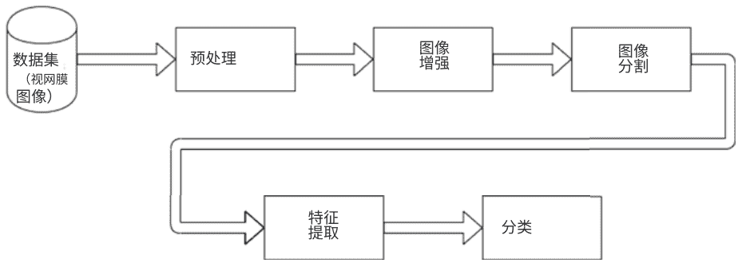

## 3 病例研究 1:糖尿病视网膜病变检测

### 3.1 系统架构

系统架构包括图像处理的不同阶段和用于提取和过滤视网膜病变的分割技术，具有显著的精度水平。系统的结构如图 4 所示。

#### 3.1.1 图像采集

本节中提到的方法应用于数据集。这正是研究人员用来确定其分割算法效率的技术。使用 450 FOV 佳能 3CCD 数码相机拍摄具有 40 个底片阴影的视网膜快照。图像以八位显示，包括颜色平面，并以 JPEG 格式存储。

#### 3.1.2 预处理和图像增强

首先，数据集中的快照同时调整大小为 720×576 像素。然后，绿色平面被修改并用于指示血管和视网膜之间的最佳质量对比度。灰度级别图像进行归一化拉伸，使用 CLAHE 对图像对比度进行拉伸，以规范化灰度图像。这样做是为了覆盖整个像素动态范围，同时包括暗边界像素以及任何照片标签。这限制了图像低级区域中任何噪声的放大。

#### 3.1.3 图像分割

必须注意绿色通道深度是倒置的。之后，检测到边界，并使用形态学开运算形成直径约为 8 毫米的圆盘形组件，该操作是一种腐蚀技术辅助膨胀。

从实际照片中减去腐蚀的照片，并获得边界。

在此 CLAHE 之后，为了增加原始图片的对比度并提高粗略插图的准确性，进行自适应直方图均衡化。然后，进行形态学的起始操作，使血管突出。在减法之后，将图像从灰度转换为二进制。进行中值滤波以去除“盐和胡椒”噪声。通过从图像中减去圆形组件的边界，使用中值滤波，获得图像边界。随后，填充未达到边缘的孔洞，以完成最终图片后，消除边界。通过反转最后一张照片的像素，找出黑色历史的血管。

明亮的病变分类渗出物通常在视网膜层呈现明亮的黄白色沉积物。这些病变的形式和周期因视网膜病变的范围而异。提取绿色通道的照片，并将其转换为灰度图像，然后对其进行预处理，使其达到统一的格式。然后进行形态学的最终操作，以去除血管。

这包括通过侵蚀的帮助发现的扩张。通过图像分割两次进行自适应直方图均衡化，以使渗出物可见。所得到的突出特征在视网膜底片上呈现为微小红点的形式，与图片高度不同。

#### 3.1.4 特征提取和分类

血管区域、渗出物和微小动脉瘤被提取为特征。这些测量结果被考虑用于准确分类快照。其中包括面积计算的七个特征和集中在纹理上的五个特征。

稀疏表示分类器（SRC）有助于将图像分类为正常和异常。含有病变的照片被标记为异常，没有病变的被标记为正常。SRC 的主要工作是找到最合适的超平面。它包括线性和非线性策略来创建这个超平面。这是一个在统计学中广泛使用的概念，经常与验证数据和识别模式的分析方法相关联。

### 3.2 模块化设计

#### 3.2.1 数据收集、预处理和图像增强

本研究使用的图像是通过互联网上的数据集获取的。系统需要视网膜底部照片，使用了近 20 张包含微小动脉瘤和出血的照片。为了进行比较、检测和分类，还考虑了正常、无病变的图像，这些图像的处理依赖于饱和度、光的反射和模糊度（图 5）。

在预处理过程中，首先应用缩放算法对视网膜底部图像进行处理，以确保没有任何困难。使用图片的绿色通道，即 RGB 通道，因为它可以在图片中高质量地显示病变（如果存在）。然后将图像转换为灰度图，并将其分割成 3×3 矩阵，计算出均值来代替旧值。除了均方误差（MSE），还计算了峰值信噪比（PSNR）。为了清晰地呈现图像，去除了椒盐噪声。

#### 3.2.2 图像分割和特征提取

在图像分割形态学算法中，将图像转换为二进制照片，其中 0 或 1（黑色或白色）代替图像中的每个像素。

为了提取特征，我们再次使用灰度图像，并查看诸如相关性、对比度、均匀性或能量等特征是否存在。

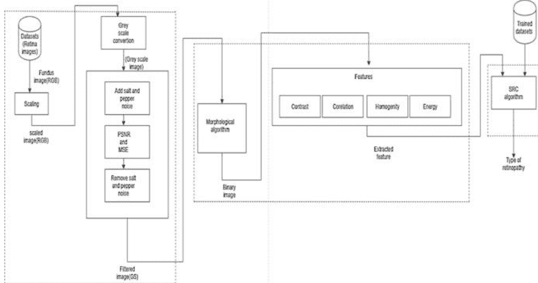

图 5 功能架构

对比度是亮度的变化，即有助于区分物体的阴影；相关性是从图像中获取信息的基本操作；纹理是使用能量和均匀性来找出图像中的纹理。借助灰度共生矩阵和平均值、标准差和差异等统计技术，完成了这一过程。

#### 3.2.3 分析和分类

提取的特征和标准视网膜图像被输入到稀疏代表分类器 (SRC) 中，以便比较两个图像，并识别和分类糖尿病视网膜病变为微小动脉瘤和出血。

## 4 结论

项目的重点是早期糖尿病视网膜病变的异常检测和诊断。渗出物提供了一些例证。在眼底黄斑附近检测到一个或两个渗出物就足以将该图像标记为可疑，即潜在的糖尿病视网膜病变眼。所提出的系统可以提供一定的诊断信息。结果表明，计算机系统能够区分不同的亮斑。这可以很容易地应用于检测红色病变，然后进一步分类为微小动脉瘤和出血。考虑到病变的位置和医疗紧急情况的解剖学，还可以确定病变类型。以血管弓为例，弓外形成的病变可以被分类为比弓内形成的病变具有较低的紧急性。因此，一个重要的参数将是紧急性度量或分数。因此，通过使用大量数据进行训练，将后验概率与紧急性分数进行映射。除了关于患者的信息外，位置、后验概率和病变类型将被选择为特征。必须注意的是，使用较小和少量的数据集会给人一种问题已解决的印象。但实际上，某些异常情况很少见，需要一个广泛的数据库。在筛查过程中，这些罕见的情况可能非常重要，对这些情况的识别对于成功的诊断和治疗至关重要。因此，一个大型数据库以及对评估的改进可以提高筛查性能。该模型使用监督学习方法进行训练，这意味着模型从示例中学习。

因此，提供系统更多的示例可以显著提高性能。需要大型数据库来存储这些示例，并且它们必须由医学专家进行注释。当进行这项研究时，糖尿病性视网膜病变是一种可预防的失明原因，但现在它是一种可以通过视网膜分析方法来识别的疾病。其他疾病包括与年龄相关的黄斑变性，一种导致中央视力丧失的疾病。

通过存在 Drusen 来检测这种疾病。结果显示系统能够检测到 Drusen 的存在。

## 案例研究 2：冠心病检测系统

### 5.1 系统架构

物联网技术在应用领域，特别是远程患者监测系统中，正得到推动。监测系统基于通过传感器连接的网络自动观察患者的心跳。该系统能够通过处理传感器获取的数据来检测患者的危急情况，并立即通知医生。医生可以从任何地方监测患者。患者配备传感器，并通过 Wi-Fi 将感测数据转发到服务器。医生可以轻松监测患者。在服务器端，可以定期感测患者的体温和心跳，并通过 Wi-Fi 进行更新。因此，医生可以随时监测患者。如果心跳过高，则会自动使用 GSM 模块向医生发送通知。

所提出的系统架构如图 6 所示。它由几个模块组成，其中采集模块配备了 Arduino 板、压电传感器、温湿度传感器以及蓝牙 4.0，用于将数据传输到具有蓝牙 4.0 版本的手机。蓝牙 4.0 能够提高兼容性，并有助于降低系统的功耗。随后，心脏跳动声音的数据被接收到安卓手机中，并绘制出实时信号曲线。该应用程序可以作为显示设备进行多重功能，并且可以将数据上传到云平台，负责整合数据进行处理和存储。因此，授权的心脏病专家可以通过任何具有特定软件的外围设备获取数据集和结果。用户可以获取诊断结果。

### 5.2 功能架构（图 7）

图片显示了所提出系统的功能架构。功能架构确定了系统的需求中各个功能及其相互作用。如图所示的系统功能设计揭示了异常波形分析的顺序过程，并向心脏病学家发出通知。


## 6 结果

移动应用程序设计了一个仪表板，包括动脉厚度和水平的读数，如葡萄糖、温度、湿度、日期和时间。

在不造成太大伤害的情况下，非临床研究在健康状况良好的受试者上进行。因此，这项研究的实施不需要任何伦理批准。通过将压电放置在拇指上并用胶带固定，然后使用 Arduino UNO 和 Arduino IDE 读取，可以获得受试者的动脉厚度。还生成了心电图波形。心脏病学家手动分析它是耗时的。基于高斯核的 SVM 分类被应用于健康受试者的长期心电图记录数据集。连续的心电图信号被获取。使用 QRS 检测间隔获得时间间隔内的心电图信号。可以使用公式 (1) 计算。

QRS = QT / C (1)

其中 C 是心脏周期的数量。然后还使用精确度和召回率参数来计算准确性，可以使用公式 (2) 和 (3) 计算。在对健康受试者样本进行测试时，精确度值显著提高。

召回率 = TP / (TP + FN) (2)

精确率 = TP / (TP + FP) (3)

其中 TP、FP 和 FN 分别代表健康样本的真正例、假正例和假负例分类结果。更具体地说，召回率显示了被检索到的真实结果的百分比，而精确率表示了相关结果的百分比。

准确率 = (TP + TN) / (TP + TN + FP + FN) (4)

通过使用公式（4）检查健康样本的数量，得到的准确率为 85%。图 8 表示准确率图，显示了不同相关工作算法与提出的算法的准确率。

图 9 基于给定参数条件的读数，表示动脉厚度图，其中数据来自压电传感器收集的数据。

图 10 基于给定参数条件的读数，表示温度图，其中数据来自温度/湿度传感器收集的数据。

图 11 基于给定参数条件的读数，表示湿度图，其中数据来自温度/湿度传感器收集的数据。

## 7 结论和未来工作

现有系统存在的问题是只使用心跳传感器监测患者的一般状况（心跳）。对于不同的心脏疾病，如冠心病，心脏远程监测是一项困难的任务。曾尝试使用不同的传感器，如心电图传感器进行心脏监测，但成本昂贵。因此，为了解决这个问题，提出的系统将使用压电传感器，这种传感器成本较低，用于通过物联网监测冠心病的动脉厚度。该系统已经实现，采集模块包括一个 Arduino 板，压电传感器，温度和湿度传感器以及蓝牙 4.0，将异常波形数据传输到手机。Android 应用程序开发模块接收异常波形数据，并绘制实时信号曲线，作为显示设备。数据检索和警报机制模块将数据发送到云平台进行深入分析。授权的心脏病专家可以通过云平台获取数据。

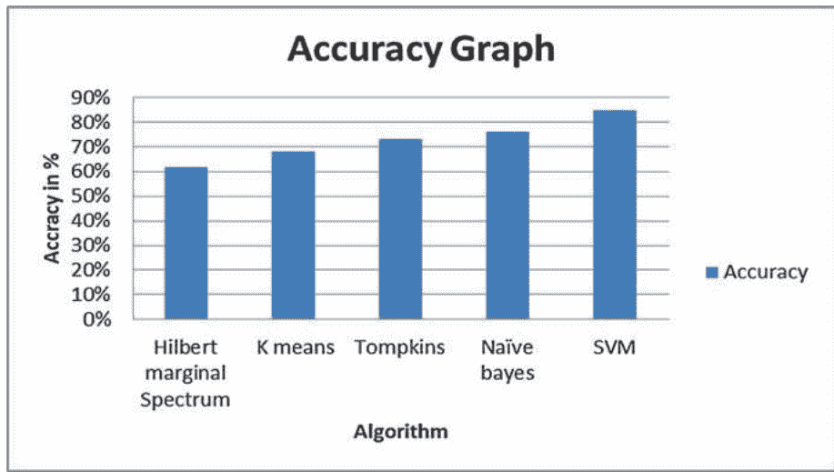

图 8 准确率图

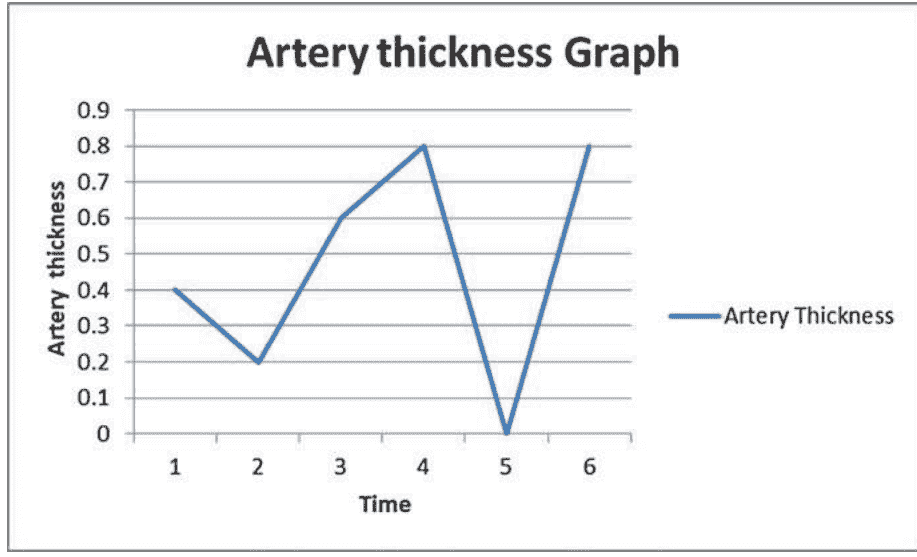

图 9 基于读数的动脉厚度

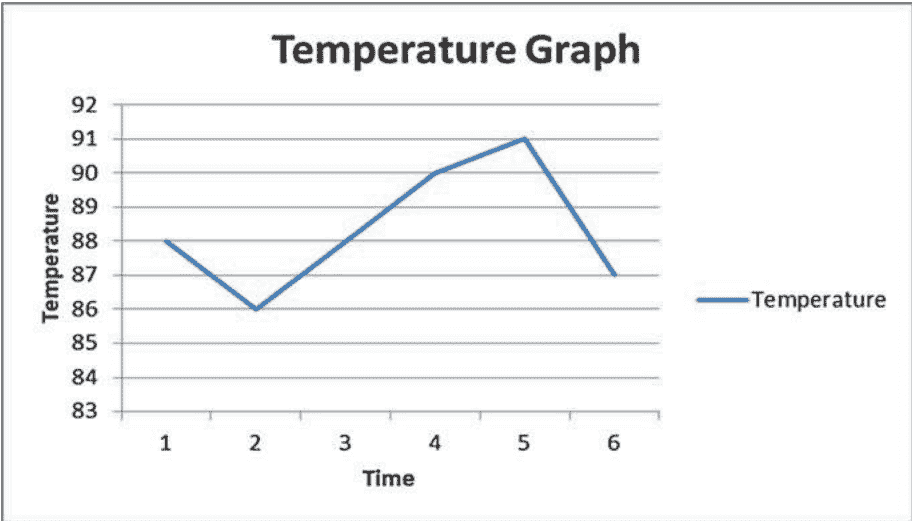

图 10 基于读数的温度图

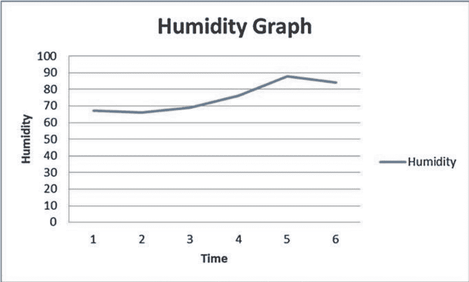

图 11 湿度图

外围设备。通过使用测量动脉厚度的压电传感器，可以定期监测心脏患者。可以进一步期望医疗系统在不同心脏疾病条件下执行。

## 参考文献

1. N. Kleawsirikul, S. Gulati, B. Uy yanonvara，使用形态学顶帽和基于规则的分类自动检测视网膜出血。在：第三届智能计算系统国际会议。第 39-43 页 (2013 年)
2. A.W. Reza, C. Eswaran, K. Dimyati，糖尿病视网膜病变的诊断：使用标记控制的分水岭变换从视网膜图像中自动提取视盘和渗出物，Springer. J. Med. Syst. (2010)
3. S. Tripathi, K.K. Singh, B.K. Singh, A. Mehrotra，使用差分形态学特征在视网膜底片图像中自动检测渗出物。Int. J. Eng. Technol. 5(3), 2024-2029 (2013)
4. J. Kaur, D. Mittal，一种从病理性视网膜底片图像中分割渗出物的广义方法。Integr. Med. Res. 38(1), 27-53 (2017)
5. Selvathi 等人，使用特征提取和支持向量机进行糖尿病视网膜病变的自动检测以进行早期诊断。Int. J. Emerging Technol. Adv. Eng. 2(11), 103-108 (2012)
6. A. Dehghani, H.A. Moghaddam, M.-S. Moin，使用直方图匹配在视网膜图像中定位视盘。EURASIP J. Image Video Process. 2012, 11 (2012) article 197.
7. M. Foracchia, E. Grisan, A. Ruggeri，通过血管结构的几何模型检测视盘在视网膜图像中。IEEE Trans. Med. Imaging 23(10), 1189-1195 (2004)
8. A.K. Dubey, P.N. Nagpal, S. Chawla, B. Dubey，一种用于糖尿病视网膜病变的新分类方法：原发性和继发性玻璃体病变的概念。Indian J. Ophthalmol. 56(1), 23-29 (2008)
9. S.B. Sujith Kumar, V. Singh，在非扩张的 RGB 视网膜底片图像中自动检测糖尿病视网膜病变。Int. J. Comput. Appl. 47, 19 (2012)
10. H. Tjandrasa, R.E. Putra, A.Y. Wijaya, I. Arieshanti，基于硬性渗出物使用软间隔支持向量机分类非增殖性糖尿病视网膜病变，2013 年 IEEE 国际控制系统、计算和工程会议，pp. 376-380, 29Nov.-1 Dec. (2013)


S. Sobitha Ahila 在 SRMEaswari Engineering College 担任副教授。她于 1997 年从马杜赖卡玛拉吉大学获得学士学位，2002 年从 Bharathidhasan 大学获得硕士学位，并于 2016 年 10 月从安娜大学获得博士学位。她拥有超过 16 年的教学经验，她的专业领域包括区块链技术、数据分析、云安全、网络挖掘和多智能体系统。她在研究领域有 26+ 篇论文发表和 16+ 篇会议论文。

# 利用卷积神经网络进行疟疾寄生虫计数和分类


S. Preethi, B. Arunadevi 和 V. Prasannadevi

## 1 引言

疟疾是一种在新兴人口中流行的严重疾病，是一种迫切需要解决的死亡和疾病原因。世界卫生组织估计每年有 3 亿至 5 亿例疟疾病例和数百万人死亡。疟原虫属的原虫寄生虫通过进入血液触发疟疾感染。它主要通过感染的雌性蚊子和输血 [1] 两种不同的方式传播。

这种寄生虫的潜伏期在一般情况下为 8-12 天，在某些异常的疟疾病例中，孕育期超过 10 个月。

疟原虫感染人类的四个模块分别是恶性疟原虫、间日疟原虫、卵形疟原虫和三日疟原虫。P. 恶性疟原虫是一种在热带和亚热带地区占主导地位的生物体。它是一种可能导致严重、潜在致命的疟疾的物种。间日疟原虫通常在亚洲、拉丁美洲和非洲的少数地区发现。卵形疟原虫和间日疟原虫较少见。

疟疾诊断程序通常根据成本和性能两个标准进行分类。聚合酶链反应（PCR）和第三次谐波产生（THG）被归类为高度复杂和昂贵的程序。

PCR 通过检测与疟疾感染相关的特定核酸序列工作，而 THG 则利用红外超快脉冲激光激发产生血红素的图像。上述程序非常精确，对于识别疟疾感染者具有更高的敏感性和特异性，但需要专门的结构计划，这非常昂贵且具有高度的处理复杂性。

S. Preethi (✉) · B. Arunadevi · V. Prasannadevi
ECE 部门，Dr. N.G.P 技术学院，泰米尔纳德邦，印度
电子邮件：preethi.s@drngpit.ac.in；arunadevi@drngpit.ac.in；prasannadevi@drngpit.ac.in

© Springer Nature Switzerland AG 2021
A. Suresh, S. Paiva (eds.), 深度学习与边缘计算在高性能计算中的应用解决方案，EAI/Springer 创新通信与计算，https://doi.org/10.1007/978-3-030-60265-9_14

快速诊断试验 (RDTs) 属于低成本的疟疾检测类别，它利用传统显微镜技术在检测的血液中识别出来自疟疾寄生虫的特定抗原。RDTs 在疟疾分析中相对广泛使用，而且可以由任何未经训练的人员进行操作，但是它们的结果可能不准确。此外，商业化的 RDT 测试套件只对特定类别的疟原虫准确，而在假设存在多种污染的情况下，应使用所有四种测试套件。

快速而准确地识别疟疾传染是调控和有效治疗这种疾病的关键机制。目前，对疟疾的商业化和一致性诊断主要基于对血浆载玻片的微小检查，特别是基于薄体液染色，这是金标准。专业的微生物学家使用光学显微镜手动执行这个过程，通过在血液载玻片中寻找寄生虫。尽管这些技术耗时较少，但所得结果不可靠。

这引发了建立快速而准确的分析技术的需求，其中在短时间内处理大量实例是一项具有挑战性的任务。由于许多新兴国家的微生物学家受过的培训有限，传统的程序不可靠。在普遍人口中，检测中心的专家对疟疾缺乏经验，因此他们往往会错误地判断感染程度 [2]。这促使自动化疟疾识别的需求，以便控制疟疾的激增和传播。

通过回顾以前的研究工作，可以明显看出，可靠的结果只能通过昂贵的复杂技术 [3] 产生。在需要进行大量试验的情况下，劳动密集型的识别过程耗时且不可靠。因此，需要高效、快速的程序来发现疟原虫，以防止对疟疾感染者的误导性识别。因此，我们根据检测和处理的复杂性开发了一种不同的疟疾分类背景。

自动化在疟疾感染血样的大规模测试问题中起着特别重要的作用 [4]。使用 ANN 和深度学习分类器设计了一种从血浆试验中获得的印象中挖掘细胞并对不同的疟原虫进行分类的先进过程。

基于显微镜血样的 Giemsa 染色薄片图像处理的系统。诊断过程主要分为三个部分：

-   鉴定感染疟原虫的红细胞。
-   计算感染疟原虫的红细胞数量和寄生虫密度。
-   将疟原虫分类为其感染阶段和相应的种类。

在疟疾流行的农村地区，许多现场调查表明，当未经训练的技术人员进行测试时，手工显微镜检查是一种不可靠的筛查方法。这种技术先进的系统通过训练人工神经网络和深度学习分类器使用适当的特征来诊断感染的阶段，具有高度复杂的特性。

使用卷积神经网络进行疟疾寄生虫计数和分类

本章的组织结构如下：首先进行了关于使用各种技术和算法对感染疟样本进行分割、计数和分类的文献调查；然后使用两种不同的技术对感染试验进行了测试，并讨论了相应的结果；最后讨论了使用自适应阈值分割进行分割和将感染的红细胞分类为不同阶段和种类的提出方法。

## 2 相关工作

对各种研究工作进行了调查，所有这些方法都清楚地揭示了如何使用不同的算法进行血涂片中寄生虫的分割。Kaewkamnerd 等人 [5] 为疟疾寄生虫识别和属的分类量身定制了一种直观的机制，该机制基于浓密的血浆膜。该技术采用以数字图像实验室分析为中心的电动台单元，旨在轻松安装在大多数传统轻型显微镜上，用于流行地区。为了有效采购特色图像以进行评估，构建了一个能够监控实际电子透镜和光学显微镜台活动的段，以提高精度。

评估系统可以根据染色质范围的分布将寄生虫形态准确分类为 Pf 或 Pv。

Diaz 等人 [6] 提出了另一种不同的方法，用于评估和分组受污染的薄片状血浆中的红细胞，这些血浆受到 P. falciparum 的污染。这项研究工作提出了一种亮度校正分割方法，该方法使用标准化的 RGB 颜色空间将像素分类为红细胞或红细胞，然后使用包含树表示将像素数据分离为对象，从中找到感染的红细胞。通过一个两步分类过程跟踪，该过程对受污染的红细胞进行分类，并使用经过训练的分类器区分感染阶段。该技术的主要限制是当方法无法达到适当的结果时需要用户参与。

Shruti Annaldas 等人 [7] 开发了一种用于分析薄片血浆中疟原虫感染性的算法。形态学和宏观级别的分类方法被用来确定红细胞和可能存在的传染性寄生虫在微小玻片上的位置。通过图像的不同阶段，使用 GLCM 特征如能量、偏度、峰度和标准差来检查血细胞图像的多个方面。这些研究有助于清晰计算 RBC 和 WBC 的数量，因为繁重的计数方法不可靠。

Muhammad Imran Razzak 等人 [8] 提出了一种计算机化发现恶性疟原虫和间日疟原虫的方法。尽管疟疾细胞分离和形态学分析是一个艰巨的挑战，因为两者都具有微小薄片中的复杂结构不确定性。为了提高疟原虫分割的实施，它们被分类为分割的 RBC 和 RNN。分割的 RBC 被进一步分类为正常的 RBC 和感染细胞的不同类型。

Fathima 等人 [9] 设计了一种直观的识别方案，用于在显微图像中分割细胞和背景中的其他物体，因为疟疾寄生虫会迅速影响红细胞。距离变换和分水岭变换结合使用，以识别和分离感染的红细胞，即使重叠也能清晰区分。寄生虫在红细胞中的检测诊断精度的进展可以从结果中看出，它还展示了感染寄生虫的生命周期阶段。

Stephen Bias 等人 [10] 提出了一种新颖且高效的算法，用于诊断感染的疟疾薄血涂片样本。该过程通过使用一种区分动态阈值技术来减少红细胞之间的干扰。在阈值处理之后，进行图像形态学操作，然后使用模糊逻辑进行基于边缘的感染红细胞检测。将此代码上传到 Raspberry PI 套件中，并进行产品开发。该研究的主要限制是从具有相似特征的重叠细胞中分离出感染细胞，并将其整合到机器学习概念中的可能性。

Yuhang Dong 等人 [11] 对从显微镜血浆薄膜中发现疟原虫进行了详细研究。为了识别感染的疟疾样本，使用了三个著名的卷积神经网络，分别是 AlexNet、LeNet 和 GoogLeNet。使用这些网络得到的结果与使用支持向量机得到的结果进行了对比，发现这种方法的准确率达到了 95%。这个准确率比旧的支持向量机方法更好。本文重点研究了从血浆薄膜中识别疟原虫，但没有关注疟疾的阶段和种类。

Divyansh Shah 等人 [12] 定制了一个级联三个卷积层的卷积网络，每个层都有多个滤波器。该模型使用近 18,000 个血涂片样本进行训练，并使用近 9000 个样本进行测试。该方法的有效性很高，在识别受污染的寄生虫方面达到了 95% 的准确率。该方法仅用于判断患者是否患有疟疾，不能可靠地计算受寄生虫感染的红细胞数量，也无法确定感染的阶段。

Jasman Pardede 等人 [13] 能够将感染的血细胞与正常的血细胞进行分类，并能够计算薄血涂片中的寄生虫感染率。RetinaNet 目标检测方法采用了 ResNet101，平均准确率为 0.73，精确度为 94%，而 ResNet50 的准确率为 0.71，精确度为 73%。该算法能够成功识别感染的细胞，但在标记感染的血细胞方面存在不准确的问题，导致感染细胞数量的不准确。

Vijayalakshmi 等人 [14] 提出了一种深度神经网络原型，利用迁移学习方法发现血涂片中的化脓性红细胞。迁移学习方法通过执行训练过的上层并停止其余层，将 Visual Geometry Group (VGG) 网络和支持向量机 (SVM) 相结合。该技术的精确度达到了 93.1%。

区分感染的疟原虫和正常的细胞。通过结合 VGG 和 SVM 技术，作者证明了与标准卷积神经网络相比，系统效率的提高。

该训练网络仅用于识别恶性疟原虫物种，这是该研究工作的显著不足之处。

Suriya 等人 [15] 针对检测感染的疟疾红细胞，使用高超参数调整来比较验证损失和准确性，定制了一个深度卷积网络。通过应用 Adam 和 Adagrad 优化器计算和优化 Kappa 系数和 Matthews 相关系数，以提高疟疾感染红细胞的查准率。通过更多地关注开发网络的超参数调整和优化，该方法在 98.9% 的准确率方面表现出色。

Traore 等人 [16] 提出了一个关于定制显微镜以识别疟疾感染血样的新方案。根据作者的说法，智能显微镜可以通过直接从血涂片图像中应用卷积神经网络来开发。训练数据集图像被输入显微镜并进行预先训练。这些经过训练的数据集通过包含健康和疟疾感染血涂片图像的混合样本进行测试和验证。定制显微镜的这种方法为实现 94% 的分类准确率带来了有趣的结果。

Feng Yang 等人 [17] 通过应用基于强度的迭代全局最小筛选 (IGMS) 和改进的卷积神经网络，研究了检测疟疾感染的血涂片的选项。IGMS 对血液试验进行快速筛选，并识别出感染疟疾的细胞，CNN 将从血液样本图像的背景中提取感染的细胞。该方法的准确率达到 93.46%。这可能为创建移动应用程序并区分疟疾的物种提供了一条自动化诊断的途径。

Qayyum 等人提出了一种基于核膨胀的创新和强大的卷积神经网络，可以不可避免地区分患病的细胞和未感染的血细胞。作者采用了三种不同的膨胀方法进行试错，其中斐波那契数列智能膨胀的 CNN 模型取得了有希望的结果，并在计算所有指标时表现良好，准确率为 96.05%，精确度为 95.80%，F1 得分为 96.06%。通过提出图像处理算法，可以自动化识别血浆图像中的疟疾寄生虫。目前还没有将寄生虫密度计算和生命阶段分类一起实现的设计。这将提高诊断过程的效率并提高准确性。

为了将寄生虫分类为它们的生命周期阶段，文献调查中使用了许多分类器。模糊和支持向量机神经网络等分类器对于更多的输入是复杂的。此外，这些算法非常耗时且难以理解算法。在这项研究工作中，我们打算使用传统神经网络和深度学习神经网络实现模糊 C 均值聚类和自适应阈值分割，然后对感染的红细胞进行分类。

## 3 基于边缘的 FCM 分割

数据集是从国家医学图书馆 -LHNCBC 收集的。原始图像展示了强度、对比度和色调等高级变化，而微小的图像则从 RGB 转换为灰度以减少处理时间。通过使用伽马均衡来增强图像的对比度，如图 1 所示。医学图像处理技术的性能受到许多医学成像设备引入的亮度非线性的影响。

在治疗图像检查中，噪声放大是一项挑战性任务之一。一种新颖的自适应中值滤波 (AMF) 技术，具有高度可调节的因子，用于脉冲噪声降低 [18]。由于图像事实的损坏会导致不准确的图像研究，可能对个体的生命造成致命的影响。图像增强是一种以处理图像的方式，使处理后的图像比原始图像更适合特定应用的过程。

边缘增强需要分析图像以提取其内容的特征。在各种技术中，选择了 Unsharp Masking 技术以获得较好的边缘增强效果。这些方法被用于视觉处理器或类似应用的预处理阶段。

该技术提供了疟疾和感染红细胞的分割，用于诊断。感染的红细胞被分类并从未感染的细胞中提取出来。图 2 描述了该技术的工作流程，并使用未经处理的显微镜染色血浆图像进行了实验，其中包括疟疾感染和健康血样。下面展示了结果，并进行了单独讨论。

通过考虑 R、G 和 B 三个分量，得到灰度图像，进行 RGB 到灰度的转换。对输入图像进行颜色空间转换，转换为灰度图像，并使用伽马均衡进行光照校正，如图 2 所示。

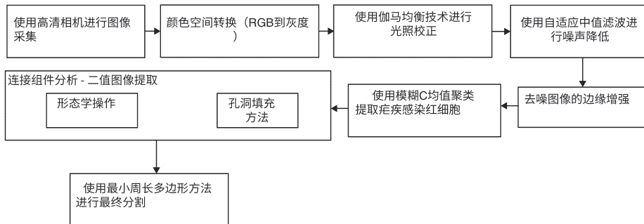

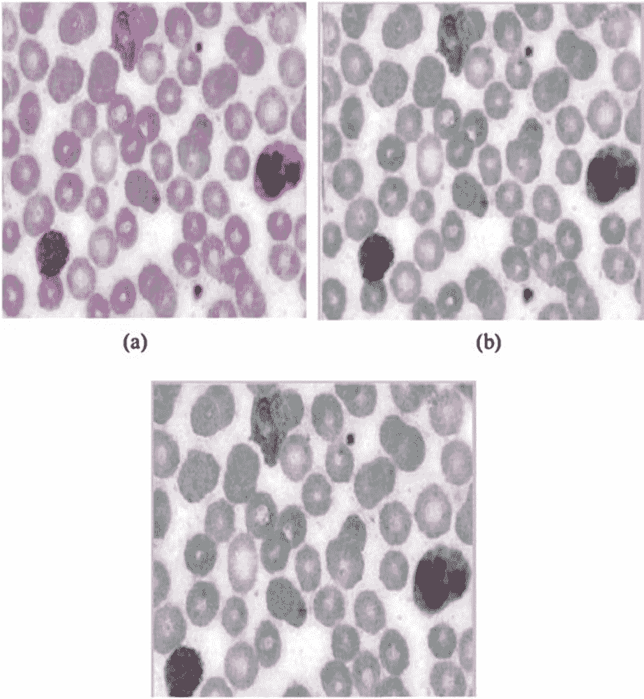

**图 2 (a) 原始图像，(b) 灰度图像，以及 (c) 光照校正后的图像**

使用自适应中值滤波器去除图像中的脉冲噪声。边缘增强后，通过模糊 C 均值聚类来提取疾病红细胞的抽象表示，如图 3 所示。

为了改善寄生虫特征的提取，通过应用连通组件分析处理从 FCM 方法得到的二值图像，并展示了腐蚀和填充孔洞的结果，如图 4 所示。

使用最小周长多边形方法对红细胞进行基于边缘的分割。通过图 5 所示的方式，对血样中的疾病寄生虫数量和总红细胞数量进行计数。

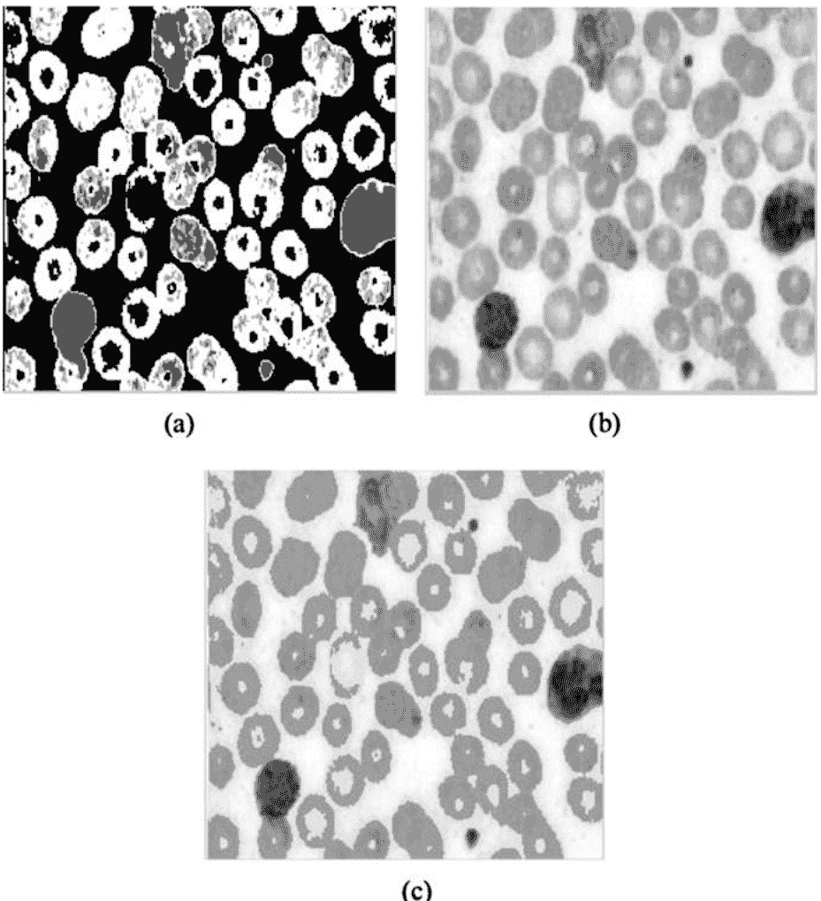

根据经历的寄生虫感染度估计过程，已经计数了 38 个感染细胞和 51 个总红细胞数量。因此，通过计算寄生虫感染度，可以看出在这个血样中，感染的百分比为 74.5%，如图 6（表 1）所示。

当通常使用传统显微镜进行寄生虫浓度近似时，会产生误差，并且除了可能导致对具有潜在重大意义的患者的管理之外，还会导致进一步的延迟。

## 4 自动枚举和分类疟原虫使用 ANN

所提出的方案应用了两种不同的分析方法，即疟原虫枚举和分类。第一种方法是找出患者中感染的百分比，即寄生虫感染率。其次，对寄生虫进行分类，以确定它们目前所处的阶段，以找到受害者的传染期。

所提出方法的块图如图 7 所示。

疟疾疫苗或预防药物的功效试验 [19]。此外，这种技术的时间消耗很高，还会导致进一步检查疾病的延迟。在数字计数方法的广泛应用下，我们能够对该研究中一系列寄生虫密度进行极其精确的手动计数。

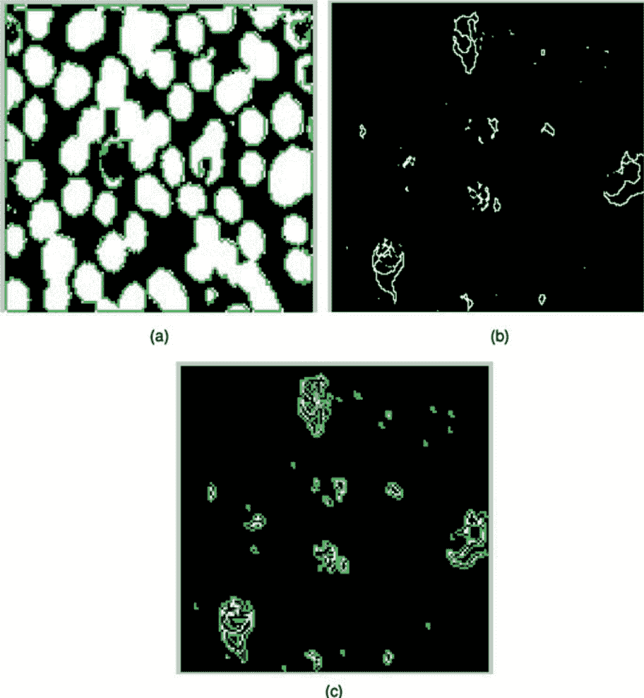

图 5 (a) 经过 MPP 算法处理后的最终分割图像，(b) 感染寄生虫的边界检测，以及 (c) 血样中存在的红细胞总数的边界检测

图 6 用于寄生虫感染度估计的 MATLAB 结果
```
30x1 struct array with fields:

Area
Centroid

centroid_10 =

13.5000  202.0000

74.509804 is the percentage of infection
```

**表 1 手动和现有方法对寄生虫感染度计算的比较结果总结**

| 图像 | 感染的红细胞的手动计数 | 我们的感染红细胞计数方法 | 总红细胞的手动计数 | 我们的总红细胞计数方法 | %寄生虫感染度 (手动) | %寄生虫感染度 (我们的) |
| :--- | :--- | :--- | :--- | :--- | :--- | :--- |
| 图像 1 | 38 | 55 | 51 | 50.90 | 74.50 | - |
| 图像 2 | 10 | 48 | 50 | 10.41 | 20.00 | - |
| 图像 3 | 14 | 45 | 47 | 15.55 | 29.78 | - |
| 图像 4 | 21 | 48 | 43 | 27.08 | 48.83 | - |
| 图像 5 | 25 | 43 | 46 | 41.86 | 54.35 | - |

### 4.1 图像预处理

来自国家医学图书馆 -LHNCBC 数据库的图像具有不同的空间分辨率，近 25,000 张不同的图片被用作分析的输入。这个输入的 RGB 彩色空间图像被转换为灰度图像，以便进行标量处理。RGB 到灰度图像的转换是使用 MATLAB 图像处理工具箱中的 `rgb2gray` 函数直接完成的。为了消除由于显微成像中的干扰而出现在图像中的噪声，使用了高斯滤波器。这种线性空间滤波器应用于大小为 m x m 的灰度图像，并使用大小为 m x n 的掩模，如下所示的函数所示：

$$g(a, b) = \sum_{x=-x}^{s} \sum_{y=-y}^{t} w(z, t) f(a+s, b+t)$$

其中 w 是掩模系数。此函数应迭代地应用于所有值 a=0, 1, 2, ..., M-1 和 b=0, 1, 2, ... N-1 其中 x=(m-1)/2 和 y=(n-1)/2。

此外，为了增加正常血液细胞和感染细胞之间的清晰度，我们采用了伽马均衡化方法进行图像增强。适当评估伽马值将改善图像的差异。在这种情况下，获取精确解剖病态红细胞的最佳γ值为 0.8。通过对伽马值进行多次实验，我们发现，对于γ=0.8，亮度改变图像的熵率与原始灰度图像相同。使用公式 2 进行均衡化处理。

$$f(a, b)=g_{\max }(a, b) * \frac{\left|\left(g(a b)-g_{\min }(a, b)\right)^{\gamma}\right|}{\left|\left(g_{\max }(a, b)-g_{\min }(a, b)\right)^{\gamma}\right|} \quad (2)$$

其中 0<γ<1，g(a,b) 是灰度图像像素 (a,b) 处的强度比率，g_max(a,b) 和 g_min(a,b) 是灰度图像的最大和最小强度比率。图像 g(a,b) 分别。


**图 4 (a) 最终的 FCM 分割图像，(b) 腐蚀后的图像，以及 (c) 中心位置定位后的图像**

### 4.2 感染红细胞的分割

首先，图像与均值滤波器 (15×15 掩模) 进行卷积。然后，将平均图像的每个单独像素与输入图像中的每个像素的比率进行匹配。因此，这里有两个选择:

- 如果初始图像中每个像素的数值大于平均图像中的像素的 T% ，则将该像素分类为 1，并且它随后属于背景。
- 如果初始图像中的像素小于平均图像中的像素的 T% ，则将该像素的新值分类为 0，并且将其标识为红细胞。

尽管参数 T 始终具有相同的值，但分割阈值随着每个图像的变化而变化，因为 T 是一个百分比，即取决于图像中像素的浓度。这就是这种方法非常有效的原因，因为它适应了每个图像的局部特征。因此，背景完全被替换为均匀的白色，而疟原虫和红细胞则被发现为黑色像素。

### 4.3 形态学操作

膨胀和腐蚀过程的组合给输入图像带来了复杂的滤波效果。假设 f(a,b) 是类似于输入二进制图像的欧几里德坐标集，s(a,b) 是结构元素的坐标集。令 f(a,b) x s(a,b) 表示 s(a,b) 的平移，使其原点位于 f(a,b)。那么 f(a,b) 通过 s(a,b) 的腐蚀仅仅是所有参数的集合，使得 f(a,b) x s(a,b) 是 f(x, y) 的子集。根据以下方程计算 g(a,b) 的速率：

```
g (a ,b )= AND {W [ f (a,b )]}
```

我们选择标记图像 h (a, b) 为普遍为黑色，排除图像边界，在此处它被确定为伴随图像 f(a, b)。占据孔洞的图像是一个二进制图像 G (a, b)，等价于所有孔洞被占据的图像 f(x, y)，并且可以通过以下方程给出：

```
G (a ,b )= 1- {R_{fe} [h (a b )]}
```

```
其中 h a (和 ) = { 1 - f(a,b) 如果 a,b 是在边界上 \ 0 否则 } f
```

### 4.4 连通分量分析

与白色颜色的强度相似的像素被标记为 1。这通过计算区域的属性来跟踪，从而进行分类和基于这个测量进行后续分类。为了获得积极的结果，一个基于运行长度编码的算法已经与标记过程类似地实施。

开放过程用于消除白细胞，仅产生具有传染性寄生虫的表示。基本组件的范围被选择为与典型的细胞范围相等，以便所有组件都被减少，然后被消除。通过计算两个描述之间的方差，得到了本研究的目标。

### 4.5 寄生虫的分类

被感染的分段红细胞经过特征选择，评估寄生虫的大小、形状、纹理、每个感染红细胞中核化物体的数量以及它们之间的分离距离。这些标准被用作特征向量，用于计算多层神经网络，将疟原虫分类为相应的生命周期阶段。为了避免过拟合，在测试会话中达到最大相关系数的值时，训练被阻止。

以下是用于这个分类任务的逐步程序:

- 使用自适应阈值分割方法，从感染红细胞中分割出疟原虫，得到疟原虫的二值图像。
- 从提取的物质中确定随后的特征，这些特征代表了寄生虫。
    - 寄生虫区域与患病红细胞区域的比例。
    - 相互考虑颜色和二值图像的七阶矩不变量。
- 利用病变细胞的强度和饱和度因子来判断以下特征。
    - R-测量。
    - 第三时刻，
    - 均匀性。
    - 熵。
- 从上述提取的表情中开发特征向量。
- 利用上述获得的特征向量训练多层神经网络，将病变细胞的图像分类为相应的生命阶段。
- 在重复步骤 6 时利用不同数量的隐藏神经元，当测试会话的相关系数开始减小而验证会话的相关系数增加时停止训练。
- 计算多层人工神经网络的分类器准确性。

用形态学、颜色和纹理特征训练的 ANN 分类器的改进性能表明，疟原虫的不同阶段可以通过寄生虫的形态、颜色和纹理来表示。因此，这种针对疟原虫的分类系统被采用在调查系统中。

在 150 张感染的薄血涂片图像中，24 张是环状期的疟原虫，32 个红细胞有成熟的滋养体，53 个有配子体，39 个有子囊体。疟原虫阶段分类的结果见图 8-10。

确定了红细胞总数和感染的红细胞数。接下来，对每个感染的红细胞子图像进行了计数。最后，计算了感染红细胞在图像中占总红细胞数的比例。这以百分比的形式表示。对几个图像计算了结果性能率，并在表 2 中给出。

在 150 个感染的薄血涂片图像中，有 24 个是环形期的疟原虫，32 个红细胞是成熟的滋养体，53 个是配子体，39 个是子孢体。关于疟原虫寄生虫阶段分类的性能记录在表 3 中。

开发了一种通过使用被 Giemsa 染色的薄血涂片图像来识别患病的疟原虫、对其生命周期进行分类并估计寄生虫密度的方法。该系统使用近 150 个薄血涂片图像样本进行训练，并进行了网络测试。


性能。该方法在检测疟原虫存在方面的准确性达到 95%，在识别阶段方面达到 92%，在估计寄生虫数量方面达到 90%。

## 5 使用深度卷积神经网络对寄生虫进行分类

在这项研究中，深度卷积神经网络被设计和训练用于对患病红细胞进行分类，并区分寄生虫的生长情况。图 11 显示了预期工作的配置设置的块图表示。在深度神经网络的每个训练层中，提取寄生虫的特征，如形状、生长阶段的强度，并与感染的血浆样本的类似特征集进行处理。使用 F-score、敏感性、特异性、准确性和精确度等指标对修改后的深度卷积神经网络进行评估和验证。


**表 2 手动和提出的方法对寄生虫计数的比较结果总结**

| 图像 | 感染的红细胞的手动计数 | 我们的感染红细胞计数方法 | 总红细胞的手动计数 | 我们的总红细胞计数方法 | %寄生虫感染度 (手动) | %寄生虫计数 (提出的方法) |
| :--- | :--- | :--- | :--- | :--- | :--- | :--- |
| 图像 1 | 55 | 12 | 54 | 16.36 | 22.22 | - |
| 图像 2 | 52 | 10 | 53 | 21.15 | 18.87 | - |
| 图像 3 | 55 | 6 | 52 | 3.64 | 11.54 | - |
| 图像 4 | 53 | 11 | 50 | 13.21 | 22.00 | - |
| 图像 5 | 100 | 5 | 109 | 2.00 | 4.59 | - |

DCNN 的结构设计有两种不同的方式：深度和更广泛的网络。预测的深度神经网络由 19 个卷积层构建，用于提取输入图像的特征要素，包括六个最大池化层以减少计算复杂性，并且具有三个批处理标准化层用于稳定经常修订的特征元素，原型包括四个全连接层和一个展平层。此外，定制的 CNN 性能与之前可用的默认网络（如 ResNet50、AlexNet 和 VGG19）进行了比较，并列在表 4 中。通过 MATLAB 工具对建立的系统进行了认证，如图 12 所示。

**表 3 疟疾诊断系统的分类阶段**

| 参数 | 环阶段 | 成熟滋养体 | 配子体裂殖体测试 |
| :--- | :--- | :--- | :--- |
| 图像总数 | 25 | 25 | 25 |
| 正确分类的感染图像数 (TP) | 24 | 20 | 24 |
| 错误分类的感染图像数 (FN) | 1 | 5 | 1 |
| 正确分类的非感染图像数 (TN) | 73 | 74 | 69 |
| 错误分类的非感染图像数 (FP) | 3 | 1 | 6 |
| 准确率 (%) | 92.85 | 89.28 | 87.50 |
| 敏感度 (%) | 81.30 | 90.00 | 68.40 |
| 特异度 (%) | 92.85 | 97.61 | 85.71 |

表 5 解释了 DCNN 架构原型的性能，通过计算网络的准确性和相应的参数来描述每个时期的性能。因此，从上表可以看出，在网络进行的几乎所有时期，准确性值保持不变。

**表 4 与最先进的方法性能比较**

| 网络 | 敏感性 (%) | 特异性 (%) | 精确度 (%) | F 分数 (%) | 准确率 (%) |
| :--- | :--- | :--- | :--- | :--- | :--- |
| ResNet50 | 85.92 | 86.91 | 81.56 | 83.68 | 86.27 |
| AlexNet | 77.69 | 85.19 | 78.04 | 77.84 | 82.15 |
| VGG19 | 88.83 | 87.17 | 82.43 | 85.50 | 87.84 |
| DCNN (自定义) | 93.99 | 92.11 | 89.52 | 91.69 | 95.47 |

## 6 结论

开发了一种通过 Giemsa 染色的薄层血浆涂片图像来识别感染寄生虫、它们的生命周期阶段和估计寄生虫数量的方法。这种方法在 5000 张用于训练和测试的图像中，对寄生虫存在的检测精度达到 95%，对阶段的识别精度达到 92%，对寄生虫数量的估计精度达到 90%。与 ANN 网络相比，使用 DCNN 网络可以显著提高准确性、敏感度、特异度和 F-score。

本工作建立了一种从染色薄血涂片图像中检测、计数和分类疟原虫种类的过程。

| 时期 | 准确率 | 损失 | 验证准确率 | 验证损失 |
|---|---|---|---|---|
| 0 | 0.712000 | 0.578520 | 0.8475 | 0.592166 |
| 1 | 0.8733735 | 0.349373 | 0.9100 | 0.229852 |
| 2 | 0.913000 | 0.265330 | 0.9380 | 0.37789 |
| 3 | 0.9297500 | 0.203314 | 0.9390 | 0.024114 |
| 4 | 0.939500 | 0.183099 | 0.9610 | 0.053621 |
| 5 | 0.948500 | 0.160007 | 0.9610 | 0.191077 |
| 6 | 0.951125 | 0.152722 | 0.9575 | 0.017607 |
| 7 | 0.950500 | 0.156431 | 0.9590 | 0.102460 |
| 8 | 0.951500 | 0.140521 | 0.9625 | 0.010689 |
| 9 | 0.9454500 | 0.1342991 | 0.9390 | 0.182639 |
| 10 | 0.955125 | 0.128412 | 0.9615 | 0.076045 |
| 11 | 0.955625 | 0.123483 | 0.9615 | 0.136788 |
| 12 | 0.957000 | 0.127172 | 0.9612 | 0.042004 |
| 13 | 0.953875 | 0.128704 | 0.9618 | 0.165423 |
| 14 | 0.958542 | 0.127127 | 0.9610 | 0.028344 |

进一步的工作必须强调改进图像获取过程的方法。光学显微镜相对昂贵、笨重，并需要人工操作员将图像调整到清晰焦点。此外，没有染色的血涂片几乎看不到寄生虫细节，这也是一个耗时的过程。

为了减少这些限制，应该探索改进的程序化图像获取系统。

## 参考文献

- 1. A.B.A. Qayyum, T. Islam and M. AynalHaque, Malaria Diagnosis with Dilated Convolutional Neural Network Based Image Analysis, IEEE International Conference on Biomedical Engineering, Computer and Information Technology for Health (BECITHCON), Dhaka, Bangladesh 978-1-7281-5389-6/19 (2019)
- 2. D. Anggraini, A.S. Nugroho, C. Pratama, I.E. Rozi, A.A. Iskandar, and A.A Hartono, 从疟疾薄血涂片中获取的显微图像的自动状态识别，在印度尼西亚电气工程和信息学国际会议论文集中，第 14 卷，第 4 期，第 28-31 页（2011 年）
- 3. D.K. Das, M. Ghosh, M. Pal, A.K. Maiti, C. Chakraborty, 机器学习方法用于使用光学显微图像自动筛查疟原虫，在印度图像信息处理国际会议论文集中，第 45 卷，(1997 年)，第 97-106 页
- 4. Y. Purwar, S.L. Shah, G. Clarke, 在显微图像中自动和无监督地检测疟原虫疟疾杂志 10, 364-365 页 (2011 年)
- 5. S. Kaewkamnerd, C. Uthaipibull, A. Intarapanich, M. Pannarut, S. Chaotheing, 一种用于检测和分类厚血涂片中疟原虫物种的自动设备。第十一届国际生物信息学会议 13, 1471-2051 (2012)

## 使用卷积神经网络进行疟疾寄生虫计数和分类

- 6. C.C. Diaz-Huerta, E.M. Felipe-Riveron, L.M.M. Zetina, 数字化乳腺 X 线照片中微钙化自动分类的形态学技术的定量分析。专家系统应用 41, 7361-7369 (2011)
- 7. S.S.S. ShrutiAnnaldas, 使用神经网络和支持向量机进行疟原虫的自动诊断。国际科学研究杂志 28, 38-45 (2015)
- 8. M.I. Razzak, 使用循环神经网络进行疟疾寄生虫分类。Int. J. Image Process. 9(2), 27-32 (2015)
- 9. A.-H. Fatimah, A.-M. Shiroq, HebaKurdi, “通过阈值分割和 Canny 检测器进行红细胞分割”，第 8 届国际会议 on current and future trends of information and communication Technologies in Healthcare (ICTH 2018)。Procedia Comput. Sci. 141(2018), 327-334 (2018). https://doi.org/10.1016/j.procs.2018.10.193
- 10. S. Bias, S. Reni, 和 I. Kale, 基于移动硬件的一种新颖、高效、模糊逻辑启发式边缘检测技术在疟疾感染的显微薄血图像分析中的实现，第 8 届国际会议 on Current and Future Trends of Information and Communication Technologies in Healthcare (ICTH 2018)，Procedia Computer Science 141 (2018) 374-381，https://doi.org/10.1016/j.procs.2018.10.187
- 11. Y. Dong, Z. Jiang, H. Shen, W.D. Pan, L.A. Williams, V.V.B. Reddy, W.H. Benjamin Jr, A.W. Bryan Jr, 对深度卷积神经网络在自动识别疟疾感染细胞方面的评估，978-1-5090-4179-4/17/©2017 IEEE (2017)
- 12. D. Shah, M.S. KhushbuKawale, S. Randive, 和 R. Mapari, 利用深度学习进行疟疾寄生虫检测 (有益于人类), 智能计算与控制系统国际会议 (ICICCS 2020), IEEE Xplore Part Number: CFP20K74-ART; ISBN:978-1-7281-4876-2 (2020)
- 13. J. Pardede, I.A. Dewi, R. Fadilah, Y. Triyani, 基于薄血涂片图像的目标检测 Retina-Net 自动疟疾诊断. J. Theor. Appl. Inf. Technol. 98(05) (2020)
- 14. A. Vijayalakshmi, B. Rajesh Kanna, 从显微图像中检测疟疾的深度学习方法。多媒体工具与应用 (2019 年)。https://doi.org/10.1007/s11042-019-7162-y
- 15. M. Suriya, V. Chandran, M.G. Sumithra, 用于疟疾寄生虫分类的增强深度卷积神经网络。https://doi.org/10.1080/1206212X.2019.1672277
- 16. B.B. Traore, B. Kamsu-Foguem, F. Tangara, 用于图像识别的深度卷积神经网络。https://doi.org/10.1016/j.ecoinf.2018.10.002
- 17. F. Yang, M. Poostchi, H. Yu, Z. Zhou, K. Silamut, J. Yu, R.J. Maude, S. Jaeger, S. Antani, 基于智能手机的厚血涂片疟疾寄生虫检测的深度学习。
- 18. V.V. Makkapati, R.M. Rao, 基于本体的疟疾寄生虫阶段和物种鉴定从外周血涂片图像。年度国际会议论文集。IEEE 工程医学与生物学学会，美国 33, 412-432 (2011)
- 19. V.V. Makkapati, R.M. Rao, 疟疾寄生虫在外周血涂片图像中的分割。声学、语音和信号处理杂志。56, 1361-1364 (2009)

# 高性能计算：深度学习视角

Nilkamal More, Manisha Galphade, V. B. Nikam 和 Biplab Banerjee

## 1 引言

高性能计算被定义为使用少数处理器作为单个计算机或少数个人计算机组成部分的处理系统。高性能计算之所以具有快速计算特性，是因为它具有处理大数据的能力。从根本上说，现在与精英形象相关联的基本理论是并行计算。简而言之，高性能计算在其处理能力方面非常强大。例如，最新的研究表明，机器每秒可以进行 $10^{15}$ 次浮点运算。尽管系统拓扑和硬件对于高性能计算具有重要影响，但操作系统和应用软件使系统变得如此强大和有效。控制中心是系统和客户端计算机之间的接口，负责管理分布式计算工作负载。

### 1.1 高性能计算的好处

HPC 系统可以为组织提供多种好处，包括:

- 多个并行处理器使您能够更快地处理数据集和执行实验。
- 聚合存储和内存使您能够执行更长时间的分析并处理更大量的数据。
- 汇集的资源使您能够分配工作负载并优化资源效率。
- 更高的资源效率和处理速度可提高投资回报率。

### 1.2 HPC 架构

HPC 系统包括五个组件:

- 处理器。
- 内存。
- 节点。
- 节点间通信网络。
- 二级存储。

图 1 说明了系统的五个部分，描述了它们之间的关系和功能。

单核 CPU（处理器）目前已经过时。到目前为止，所有 CPU（处理器）构成了在主板上使用的单元。更多“核心”每个单元的趋势将增长以应对现实世界的需求。节点在以物理方式连接处理器、内存、接口、设备和其他节点方面起着重要作用。高性能计算系统还需要分布式内存。

网状和交换机是高性能计算系统中常见的网络拓扑类型。图 1 展示了高性能计算系统的五个部分及其之间的关系 [1]。

有两种方法可以使用高性能计算来处理大数据:


图 1 高性能计算系统中的五个主要部分

- 通过并行计算实现高性能计算。
- 通过分布式计算实现高性能计算。

## 2 通过并行计算实现高性能计算

并行计算是使用多个计算资源来解决计算问题的计算方法。将大问题分解为小块并同时执行。每个小部分进一步分解为一组指令，每个部分在不同的处理器上同时执行。加速比应该是线性的；增加进程数量应该减少执行时间。然而，有些算法很难并行化。

例如，将一个任务分解并整合结果通常是一个线性任务，可以通过一个进程完成。如果分割和组合是整体执行时间的重要部分，那么加速比将低于线性，并且在最坏情况下，加速比只会比串行执行稍微快一点 [2, 3]。存在各种形式的并行性，但对于本论文所介绍的工作来说，最相关的是任务并行性。一个任务被分解为子任务，然后将每个子任务分配给专门设计的硬件进行执行 [4]。执行并行计算的硬件各不相同，从具有多个核心的单个处理器，到多个独立计算机通过网络连接共享任务，再到巨大的机架，每个机架都有专门的硬件和高速网络连接 [4]。并行计算使用一种称为 MPI 的通信标准，现在在高性能计算中广泛使用。在分布式内存系统中，MPI 定义了一种允许进程相互通信的系统，因为它们没有直接访问彼此的内存，所以不能直接通信。HPC 硬件的一个方面是，处理器不仅可以并行使用，而且输入输出也可以在并行系统上并行进行。这对于数据密集型应用程序非常重要，例如机器学习中使用的应用程序。

图 2 展示了并行计算的示意图。有几种不同类型的并行架构可用 [5]，然而，每种架构都可以


图 2 并行计算示意图

组合多种类型的特征和优势。本节介绍了并行架构家族的配置和同时控制并发处理组件。总结旨在给出可能的替代方案。有数据并行和任务并行的概念，稍后将详细介绍。它由四个字符组成，将计算机结构的宇宙划分为四个互斥、完全穷尽的组，可以用两个视角表示。一个视角涉及单一数据源，多个数据流。另一个方面涉及控制或指令源和单一或多个指令流。

### 2.1 并行架构

根据弗林的建议，这些是四个字符的缩写。

- 单一（控制）指令和单一数据流（SISD）。
- 单一（控制）指令和多个数据流（SIMD）。
- 多个（控制）指令和多个数据流（MIMD）和。
- 多个（控制）指令和单一数据流（MISD）。

单指令（控制）和单一数据流架构的示例是具有单个处理器的典型机器，例如个人计算机和大型机器。SIMD 的示例是数组处理器，流水线处理器和 GPU 处理，而 MIMD 的示例是天气预报和多核手机。图 3 显示了弗林分类法。

单程序，多数据（SPMD）：SPMD 并不严格属于弗林分类法。它与之相关并受到其激励。当然，它促进了并行性，并且是 MIMD 类别中的一个类别。分割任务同时在多个处理器上执行多个输入，从而产生高效的输出。SPMD 不是向类似 SIMD 的设备的所有简单处理设备发出和广播一个准备命令，而是发送一个要在并行机器的所有处理设备上完成的粗粒度方式的特征调用。与轻量级命令相比，优先调用重型任务可以分摊开销和延迟时间。


在小工具操作中，它允许运行一些现代计算系统的几种样式，包括图形处理单元（GPU）加速器。

存在多种不同形式的并行性以实现并行性。这里讨论了一些实现并行性的架构。

#### 2.1.1 多核架构

多核架构具有多个核心的处理器。它通常被称为芯片多处理器。可以使用这些核心实现并行处理。核心内部的线程以类似单处理器的时间片方式工作。操作系统负责将进程映射和调度到不同的核心上。多核架构可用于许多操作系统。多核处理器在多个数据流上执行多个指令（控制）。处理器中的核心执行不同的线程。多核架构共享内存。

内存同时可用于所有核心。多核架构的一个经典例子是英特尔 Itanium。

多核架构（图 4）的主要目标是减少使用单核时钟频率的困难。存在深度流水线电路，面临许多问题，如高温引起的加热、光速、设计和监控的困难、冷却等等。

**多核架构的局限性**

- 扩展性不完美。
- 根据阿姆达尔定律，性能取决于代码的顺序性质。
- 软件优化的困难。
- 随着新核心的添加，它变得混乱不堪。
- 软件无法利用多核架构。
- 在多个核心之间保持操作的并发性是困难的。


图 4 多核架构图

因此，众核处理器可以用来克服多核处理器的这些限制。

#### 2.1.2 众核架构

众核架构也被称为具有异常大量核心的多核架构 [6]。

图 5 显示了具有多个多处理器、设备内存、CPU 和主内存的众核架构。

由于计算能力强大且易于编程应用程序，GPU 已成为性能高效的通用计算平台的首选 [7]。如图 6 所示，GPU 是一种众核处理器架构。GPU 主要是一种众核 SIMD 多处理器架构，支持数千个轻量级并发线程，称为 GPU 核心。这些核心被组织成组，线程组后来被分组为多个调度单元，这些调度单元动态调度以并行处理分割任务。

表 1 显示了 CPU 和 GPU 之间的区别。下面列出了众核架构的应用：

- 为人机界面的系统设计提供更好的解决方案。
- 可以替代更多可编程单元，如 FPGA。
- 更多基于云的软件。

#### 2.1.3 可扩展计算架构

本节讨论可扩展的并行架构，并在表 2 [6] 中展示不同技术的比较。

- 大规模并行处理器（MPP）：它是一种共享无关架构。


图 5 具有多核 CPU 的图表

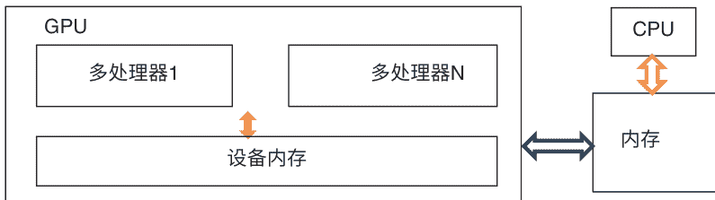

图 6 具有多核架构的 GPU

| | CPU | GPU |
| :--- | :--- | :--- |
| 并行类型 | 基于任务的并行 | 基于数据的并行 |
| 线程通信 | 多个任务映射到多个线程，任务在不同数据集上执行不同指令 | 单条指令控制多个数据流。SIMD 模型指令执行，相同指令在不同数据集上执行 |
| 核心数量 | 数十个相对较重的线程在数十个核心上执行 | 数千个轻量级线程在数百个核心上执行线程调度 |
| 调度管理 | 它是显式完成的 | 它是由硬件完成的 |
| 编程方式 | 线程的编程是单独完成的 | 它是批量完成的 |

| 特性 | 大规模并行处理 (MPP) | 对称多处理器 (SMP) | 集群 | 分布式 |
| :--- | :--- | :--- | :--- | :--- |
| 所有权 | 单一 | 组织或机构 | 单一组织或机构 | 需要：如果公开可用 |
| 安全性 | 可预防的 | 可预防的 | 需要：如果公开可用 | 需要 |
| 地址空间 | 多个、单个或分布式共享内存 | 单一 | 多个或单个 | 多个 |
| 节点数量 | 100-1000 | 10-100 | 100 或更少 | 10-1000 |
| 节点的复杂性 | 细粒度或中等粒度 | 分布式或集中式共享内存 | 消息传递 | 分片文件远程过程调用，消息传递和进程间通信（IPC）在机器上调度 |
| 执行队列 | | 单一执行队列 | 协调多个执行队列 | 隔离执行队列 |

图 7 显示了通过流水线处理实现的并行性的图表

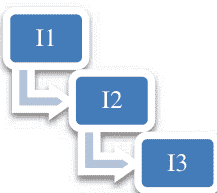

- 对称多处理器 (SMP) [6]: 它是一种共享一切的架构。
- 分布式计算系统。
- 用于计算的集群。
- 高速缓存一致的非一致内存访问 (CCNUMA)。

表 2 给出了可扩展架构之间的比较 [6]。

### 2.2 通过流水线并行，通过数据分区并行

流水线并行扩展了简单任务并行，将任务分解为一系列处理阶段。每个阶段将前一个阶段的结果作为输入，结果立即传递给下游。一个合适的类比是汽车装配线。每个工位执行一个独立的动作，例如焊接车架或安装挡风玻璃，但是它依赖于一些其他任务先完成。每个工位同时处理一个 (不同的) 部分组装的汽车，当所有工位完成时，汽车被发送到下一个工位。在最后一个工位之后，一个完全组装的汽车已经生产出来。类似地，在流水线中，每个数据片段从阶段到阶段传递，最终生成最终结果（图 7）。

### 3 个性能指标：扩展和加速比

本节讨论了借助高性能计算系统实现的扩展和加速比 [8]。

### 3.1 加速比

评估加速比的一种方法是在处理器和并行计算机上执行相同的程序。在这里我们假设:

$$P_{\mathrm{N}} = \text{执行过程中使用的处理器数量}$$

### 3.2 规模扩大

我们评论说，将给定问题分割到更多处理器上并不好：在某一点上，每个处理器都没有足够的工作来有效地工作。相反，代码的使用者要么选择处理器的数量来协调问题的规模，要么会在相应数量的处理器上解决一系列逐渐变大的问题。在这两种情况下，讨论加速是困难的。相反，使用可扩展计算的概念。

我们认识到两种类型的可扩展性。所谓的强可扩展性实际上等同于加速。我们说一个程序表现出强可扩展性，如果在越来越多的处理器上，它表现出良好或接近完美的加速，也就是说，执行时间与处理器的数量成反比。

通常，我们会遇到类似“这个模型可以扩展到 100 个处理器”的说法，这意味着在 1000 个处理器之前，加速不会明显下降。这个问题不一定要适应单个处理器：通常会使用较小的数量，例如 64 个处理器作为判断可扩展性的基准。更为重要的是，弱可扩展性是一个更加模糊定义的术语。它描述了执行的行为，随着问题规模和处理器数量的增长，但是每个处理器的数据量保持不变。例如，速度提升等指标很难报告，因为操作数量和数据量之间的关系可能很复杂。如果这种关系是线性的，可以说每个处理器的数据量保持不变，并报告随着处理器数量增加，执行时间保持稳定。

# 通过分布式计算实现的高性能计算

分布式计算是通过互联网络连接多个计算资源来解决特定问题的计算方法。分布式计算遵循松散耦合的场景，每个处理器都有自己的数据集和远程资源。图 8 解释了分布式计算的架构。

这增加了计算速度和效率。分布式计算在较短的时间内处理大量数据非常有用。分布式系统通过交换信息与网络中的其他系统进行对话和管理其活动。它还监视进程的状态。因此，分布式系统组织可以在网络中使用相对较小和更便宜的计算机，而不是维护一个具有更大容量的大型服务器。

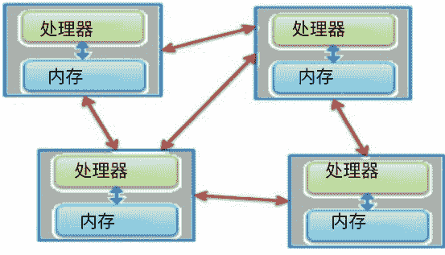

图 8 分布式计算的示意图

### 4.1 分布式可扩展平台

大数据平台广泛用于处理大量数据。一些常用的分布式计算平台可供选择。以下是一些处理大数据的平台：

#### 4.1.1 Hadoop

Hadoop 是一个开源软件程序。它用于存储数据。它在廉价硬件集群上执行程序。由于其强大的处理能力，它可以处理大数据。它具有处理并发作业的能力。Google 文件系统 (GFS) 被 Hadoop 使用。Hadoop 由各种组件组成，如：

- (a) HDFS：它代表 Hadoop 分布式文件系统。这在与数据的存储和管理相关的角色中起着重要作用。HDFS 将数据从文件中分割成块。然后将这些块传播到节点集群中。
- (b) 另一个资源协商器：这是第二个组件，负责计划任务和管理集群资源。
- (c) MapReduce 组件：Hadoop 的这个组件负责并行处理数据。

#### 4.1.2 Spark

Spark 支持对数据进行内存处理。它比其他用于处理大数据的框架更快。在 RAM 中处理数据使其速度更快。Spark[9] 具有弹性分布式磁盘 (RDD)。它是一个容错系统。Spark 包括 Spark SQL、MLib、Spark Streaming 和 Graph X 组件。这使其适用于使用数据库、机器学习、流处理或图形相关操作的应用程序。

#### 4.1.3 Flink

Flink [10] 也是与 Spark 有着密切学术渊源的。Apache Flink 起源于柏林工业大学。它也支持 Lambda 结构。然而，实现它与 Spark 正好相反。Flink 是一个完全流式引擎，将批处理视为独特的流式工具。Flink 提供了 reduce、map 和 filter 函数。它看起来像是 Storm 的继任者。

#### 4.1.4 Storm

Storm [10] 是 Hadoop 的流式世界。这是最古老的开源流式平台。它是一个成熟且安全的框架之一。它对于基于事件的框架非常有用。

#### 4.1.5 Samza

它与 Kafka 相似。相似之处很多。所有的大数据平台都类似于 Kafka。它从 Kafka 获取原始数据，并将处理后的数据返回给 Kafka。Samza 是一个扩展的 Kafka 流平台。Kafka 是一个微服务库。但是 Samza 是基于 Yarn 的集群处理平台（表 3）。

#### 4.1.6 选择分布式框架的标准

所有在这里讨论的框架都有其优点和缺点与之相关。很难为所有情况选择一个框架。但是通过研究不同框架提供的不同特性，我们可以决定选择一个特定的框架。大多数情况下，这取决于要开发的应用程序类型和现有的技术栈。

## 5 并行和分布式框架的比较

本节讨论了并行和分布式框架之间的差异，并借助表 4 进行说明。想要实现其中一种方法的人应该根据特性研究差异。

表 3 各种可用于分布式计算的框架 [9]

| 特性 | Hadoop | Apache-Spark | Apache-Storm | Apache-Flink | Apache-Samza |
| :--- | :--- | :--- | :--- | :--- | :--- |
| 应用领域 | 包括电子商务、社交网络推荐和物联网应用 | 地理空间数据分析应用、电子商务、推荐系统、医疗保健系统 | 事件警告系统 | 事件警告系统 | 社交网站数据分析，如 Twitter 数据分析 |
| 编程语言支持 | Java 语言支持 | Java 语言支持，Scala 语言支持和 Python 语言支持 | Java 语言支持 | Java 语言支持 | Java 语言支持和 Scala 语言支持，专门 |
| 功能 | HDFS 用于存储数据 | 提供 API 以开发交互式应用程序 | 可以开发实时应用程序 | 提供图形方法 | 结合了 Hadoop 和 Kafka 的特性，支持 |
| 迭代计算，机器学习 | 是的，通过 Mahout | 是的，通过 Spark MLlib | 是的，通过 Samoa API | 是的，通过 Flink | 是的，通过 Samza |
| 容错性 | 复制 | 通过 RDD 对象进行恢复 | 检查点数据 | 检查点数据 | 分区 |

## 6 并行和分布式深度学习

本节讨论了在深度学习实现中使用的并行和分布式技术。

### 6.1 深度学习中的并行架构 [11]

从神经网络/深度学习的角度来看，如图 9 所示，在 2010 年之前，大部分研究都是在单个节点上进行的。截至 2017 年，超过 50% 的研究是在多个节点上进行的。这两个研究信息表明，深度学习在现今主要是基于分布式内存的。在并行化的使用中，节点的数量和节点之间的互通在以下部分的调查中进行了讨论。

表 4 并行和分布式框架比较

| 特性 | 分布式框架 | 并行框架例子 |
| :--- | :--- | :--- |
| 典型框架 | Spark, Flink | MPI, HPX, charm++ |
| 数据访问策略 | 它是普遍和公开可用的 | 它适用于私人和安全的数据 |
| 容错系统的特点 | 开发人员不需要为了实现容错系统而负担过多的代码 | 开发人员需要额外的负担来确保容错系统 |
| 与集合的兼容性 | 对集合的支持非常有限 | 高效和优化的集合支持按需资源分配和利用 |
| 抽象层次 | 抽象层次较高，开发人员不需要担心抽象层次 | 抽象层次低于分布式框架内存使用 |
| 内存使用 | 内存使用较高。数据不可变性等约束是内存使用较高的主要原因 | 稍微不同的数据结构减少了对内存的使用 |
| CPU 的使用 | 容错框架模型的额外负担需要更高的 CPU 使用 | 由于这些系统具有优化的集体函数，CPU 负担较小 |
| I/O 的使用 | 执行全对全集合操作的限制是导致更大的 I/O 使用的主要因素之一 | 由于系统高度优化，I/O 使用较低 |
| 应用程序开发所需的时间 | 由于有简化的 API，开发所需的时间较少 | 由于代码稍微复杂一些，处理所需的时间更长 |
| 所需知识水平 | 开发所需的框架知识较少 | 需要更多关于技术的知识，因为它涉及到专门的数据结构和并行编程的知识来开发应用程序 |
| 优化水平 | 框架编程中的内在流出和寻找解决方案的时间较长，因此优化水平较低 | 开发所需的流出较少，增强的集合功能可以降低解决方案的时间，因此优化的水平较高 |

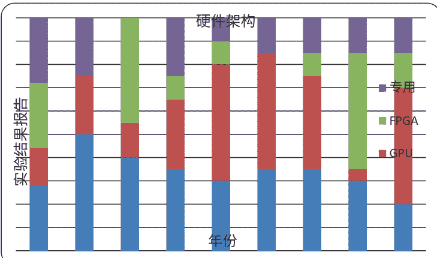

图 9 使用的硬件架构的演变

### 6.2 分布式深度学习

分布式深度学习使用数据分发的方法。在分布式实现深度学习应用程序中使用了三种并行化方法 [12]。通过使用计算较轻和可扩展的模型以及定义即运行的方法，可以加速分布式深度学习。

#### 6.2.1 数据并行性方法

在数据并行性方法中，数据被分割成多个部分。数据并行性是一种通过数据分割实现的并行化技术。数据被分割成多个分区。每个处理器将处理一个分区。因此，分区的数量将由计算机处理器的数量确定 [13, 14] (图 10)。

每个处理器将独立地处理每个分区中的数据。由于有多个计算节点同时扫描数据，因此可以搜索更多数据。这种技术提高了整体性能。在模型并行性中，神经网络将数学计算分布在多台机器上进行并行化。例如，Google 的深度学习系统 DistBelief [2] 就是基于这个原理工作的。

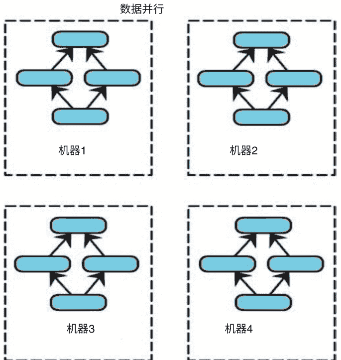

图 10 数据并行的示意图

#### 6.2.2 模型并行性方法

实现模型并行性是困难的。数据并行性可以很容易地获得。这是一个模糊而复杂的概念。顾名思义，这种技术将机器学习模型分割开来。在这个过程中，数据将保持完整。计算节点将并行地处理机器学习模型（图 11）。

例如，我们想要学习一个非常大的矩阵的特征，以解决矩阵分解问题。为了使用模型并行化解决这个问题，我们必须将矩阵分割成许多小的子矩阵。

每个节点将独立地处理这些子矩阵，并使用不同的操作集。由于节点具有独立的资源，因此可以观察到加速效果。

#### 6.2.3 混合并行性

混合方法充分利用了数据并行性和模型并行性的优势。在混合方法中，数据并行性用于部分任务，而模型分割用于其他部分。模型分割用于确保正确性。例如，当 AlexNet 神经网络在使用数据并行性或模型并行性的多个 GPU 节点上运行时，可以观察到大约 2.2 倍的加速效果 [13]。

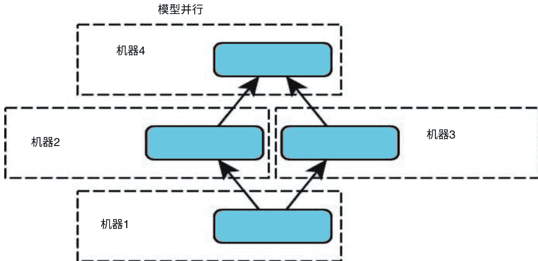

图 11 模型并行的示意图

## 7 应用

像 Spark 和 Flink 这样的著名分布式框架完全基于 MapReduce 模型。它们通过迭代 MapReduce 扩展了简单 MapReduce 模型的功能。内存处理和缓存是这些框架提供的额外功能，并且是围绕 MapReduce 模型构建的。MapReduce 模型实现了一个应用程序依赖于映射和归约阶段，由于不可能以这种方式减少大量的程序，因此不能使用分布式框架构建所有类型的应用程序。而其他并行框架如 Charm++、MPI 则更加灵活；这使得可以使用这些并行框架开发大量的应用程序。通过研究应用程序的多个功能，可以选择分布式或并行框架来使用。

### 7.1 适用于并行框架的应用程序

MPI、Charm++ 这些都是一些并行框架 [15]。它们非常灵活，可以有效地实现几乎任何应用领域。MPI 甚至可以用来实现上述应用程序。但容错性需要在实用级别上处理。并行框架可以用于包含过程间通信的大多数应用程序和算法。并行框架可以支持广泛的应用阶段，包括研究应用和复杂算法。这些算法可以充分利用并行框架中提供的全对全操作和其他优化。

### 7.2 适用于分布式框架的应用程序

研究论文 [16] 讨论了与分布式框架非常匹配的各种应用集合。分布式深度学习不仅限于此处未指定的应用程序。但这里进行了一次回顾。

- • 令人愉快的并行：在进程之间缺乏通信的令人愉快的并行应用非常适合分布式框架。由于任务可以并行执行而无需进行任何减少步骤，因此开销很小。分布式框架可以根据需要轻松扩展和缩小，适用于具有大量数据的应用程序。Spark 和 Flink 可以在系统中自动容错的情况下重新计算丢失的值，而不会影响当前正在执行的任务，因为单个节点的故障不会影响其他任务。

蛋白质对接、涉及本地分析的生物成像等都是这类应用的例子 [3]。

- • 标准 MapReduce：MapReduce 中涉及单个减少操作。由于仅涉及映射任务，分布式框架非常适合。分布式框架允许在容易出现故障的大规模通用集群上执行，因为它具有自动重新计算失败任务的能力。一些经典 MapReduce 应用的例子包括排序、搜索、索引和查询。

- • 迭代式 MapReduce：解决问题的时间、开发时间、数据通信模式是选择分布式框架而不是并行框架的因素。这是因为大多数迭代式 MapReduce 应用程序可以通过并行框架中可用的全对全操作 (如全局归约) 来更高效地实现。K-means、K-medoid 等机器学习应用属于这个类别。

### 7.3 案例研究：生物医学中的高性能计算

#### 7.3.1 生物医学

深度学习广泛应用于计算机视觉、语音/音频处理、医学图像处理、地理空间应用 (如地震检测) 和灾害管理等领域。深度学习在组织病理学领域有很大的发展空间。在另一篇论文 [17,18] 中，使用基于 CNN 的自动编码器来检测乳腺癌 [18]。CNN 被用于淋巴结，并努力使其涵盖所有肿瘤细胞群。但是，所有这些技术都无法在大规模数据集上标准化。因此，很难评估它们的重要性。针对脑卒中、皮肤癌和宫颈癌等各种疾病的生存和威胁预测方法非常高效和相关。深度学习方法在生物医学领域的这个领域尚未得到应用。通过最简单的方法，一些出色的研究论文正在关注深度生存问题。

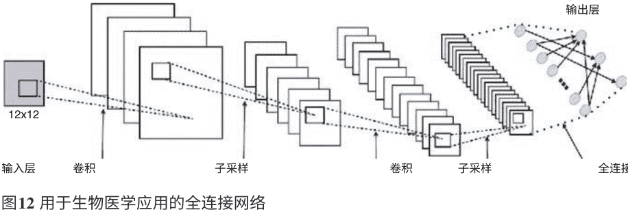

分析 [19]。生存分析中使用的一些属性包括个人年龄、婚姻状况和体重指数。由于医学成像领域的进步，它提供了二值图像来预测生存概率。最流行的特征是通过审查人类政策获得的（图 12）。

但科学家们面临的问题是这些技能在描绘具体数据方面提供了不完整的信息 [20]。对于生存评估，可以使用深度学习模型，包括 CNN，无缝地对这些摘要属性进行建模，并且它们可以有效地超越现有的基于风险的新设计框架。然而，在这些领域中存在无尽的限制和挑战 [21]。随着机器学习方法的最新进展，通过对这些技术的深入了解，可以实现更复杂的生物医学任务。更令人着迷的是，机器现在可以学习和展示人类无法察觉的事物。最近，斯坦福大学和谷歌的研究团队 [22] 利用深度学习从视网膜图像中获取了一些信息。

## 8 结论

本章提供了关于并行和分布式计算的基本信息。本章还讨论了使用并行和分布式计算处理大数据的各种框架。根据应用需求，可以使用其中一个框架来实现这些分布式计算。本章还关注使用分布式和并行系统进行深度学习的不同技术。通过讨论适用于并行和分布式计算的应用、在 Azure 上实现高性能计算以及计算生物学中的 HPC 系统案例研究，得出结论。

## 参考文献

1. L. Mike, 什么是数据科学。 [在线] 2010 年 6 月 2 日。 [引用日期：2018 年 9 月 5 日。] www.oreilly.com/ideas/what-is-data-science
2. C.L. Philip Chen, C.-Y. Zhang, 数据密集型应用程序，挑战，技术和技朮：大数据综述。Inf. Sci. **275**, 314–347 (2014)
3. S. Salehian 和 Y. Yan, Spark 资源管理器和分布式文件系统的比较。在大数据和云计算（BDCloud），社交计算和网络（SocialCom），可持续计算和通信（SustainCom）（BDCloudSocialCom-SustainCom）中，2016 年 IEEE 国际会议，页 567–572。IEEE（2016）
4. M.J. Flynn.计算机体系结构：流水线和并行处理器设计。Jones & BartlettLearning（1995）
5. T. Sterling, M. Brodowicz, M. Anderson, 高性能计算：现代系统和实践（Morgan Kaufmann，2017）
6. R. Buyya（编），高性能集群计算：架构和系统，卷 1 (Prentice hall, 1999)
7. B. He 等人。Mars: 一个基于图形处理器的 MapReduce 框架。第 17 届国际并行体系结构和编译技术会议论文集（2008 年）
8. 并行计算，https://pages.tacc.utexas.edu/~eijkhout/istc/html/parallel.html
9. N.P. More, V.B. Nikam 和 S.S. Sen，12 月。地理空间大数据平台的实验调查 2018 年 IEEE 第 25 届国际高性能计算研讨会论文集（HiPCW）（第 137-143 页）。IEEE（2018 年）
10. W. Inoubli 等人。关于大数据框架的实验调查。未来。Gener. Comput. Syst. （2018 年）。期刊 www.elsevier.com/locate/f
11. J.J. Dai, Y. Wang, X. Qiu, D. Ding, Y. Zhang, Y. Wang, X. Jia, C.L. Zhang, Y. Wan, Z. Li 和 J. Wang, Bigdl: 一个用于大数据的分布式深度学习框架。在 ACM 云计算研讨会论文集中（第 50-60 页）。ACM（2019 年）
12. J. Dean, G. Corrado, R. Monga, K. Chen, M. Devin, M. Mao, M.A. Ranzato, A. Senior, P. Tucker, K. Yang and Q.V. Le, 大规模分布式深度网络。在神经信息处理系统的进展中（2012 年），第 1223-1231 页
13. T. Ben-Nun, T. Hoefler, 解密并行和分布式深度学习：深入的并发分析。ACM 计算机调查（CSUR）**52** (4)，1-43（2019 年）
14. https://medium.com/@chandanbaranwal/spark-streaming-vs-flink-vs-storm-vs-kafka-streams-vs-samza-choose-your-stream-processing-91ea3f04675b
15. S. Pouyanfar, S. Sadiq, Y. Yan, H. Tian, Y. Tao, M.P. Reyes, M.L. Shyu, S.C. Chen, S.S. Iyengar, 关于深度学习的调查：算法、技术和应用。ACM 计算机调查（CSUR）**51** (5)，92（2019 年）
16. P. Wickramasinghe and G. Fox, 并行系统和分布式系统的相似性和差异，印第安纳大学信息学与计算学院，布卢明顿，IN 47408，美国
17. D.C.Cireșan, A. Giusti, L.M. Gambardella and J. Schmidhuber, 深度神经网络在乳腺癌组织学图像中的有丝分裂检测。在国际医学图像计算与计算辅助干预会议上。Springer, 411–418（2013）
18. G. Litjens, C.I. Sánchez, N. Timofeeva, M. Hermsen, I. Nagtgeaal, I. Kovacs, C.H. Van DeKaa, P. Bult, B. Van Ginneken, J. Van Der Laak, 深度学习作为增加组织病理学诊断准确性和效率的工具。Sci. Rep. **6**, 26286（2016）
19. G. Litjens, T. Kooi, B.E. Bejnordi, A.A.A. Setio, F. Ciompi, M. Ghafoorian, J.A.W.M. van de rLaak, B. van Ginneken, and C.I. Sánchez, 深度学习在医学图像分析中的调查。CoRR abs/ 1702.05747 (2017). http://arxiv.org/abs/1702.05747 (2017)
20. M. Lang, H. Kotthaus, P. Marwedel, C. Weihs, J. Rahnenführer, B. Bernd, 高维生存分析的自动模型选择。J. Stat. Comput. Simul. **85**(1), 62–76 (2015)
21. R. Ranganath, A.J. Perotte, N. Elhadad, and D.M. Blei. 深度生存分析。在健康护理中的机器学习。JMLR.org, 101–114 (2016)

> 22. R. Poplin, A.V. Varadarajan, K. Blumer, Y. Liu, M.V. McConnell, G.S. Corrado, L. Peng, R.W. Dale, 通过深度学习从视网膜底片中预测心血管风险因素。Nat. Biomed. Eng. 2(3), 158-164 (2018)


Nilkamal More 拥有博士学位，毕业于 Dr. Babasaheb Ambedkar Technological University, Lonere (Raigad)，拥有硕士学位（计算机工程）来自孟买大学，并在孟买 VJTI 的计算机工程与信息技术系攻读博士学位。她曾是 Dr. Babasaheb Ambedkar Technological University 的教师，拥有 18 年的教学经验。

目前，她是孟买维迪亚维哈尔 K. J. Somaiya 工程学院的助理教授。她的研究兴趣包括高性能计算、卫星图像处理、GIS、空间分析、深度学习、数据挖掘和大数据分析。

她是 ACM 和 ISTE 专业机构的成员。

她在计算机工程专业的文凭课程中获得了金牌奖。


Manisha Galphade 是 MBES 的工程学学士（计算机科学与工程）毕业生，来自 Ambejogai (Beed) 的工程学院，MGM 工程学院的计算机科学与工程硕士，目前正在 VJTI 的计算机系攻读博士学位。她有 10 年的教学经验。她是整个学术生涯中的全程学者。

她的研究兴趣包括机器学习、深度学习、GIS、地理空间分析、天气预测、风力发电预测建模和数据挖掘。她是 ACM 的成员。


V. B. Nikam 是 VJTI 孟买的计算机工程与信息技术副教授，拥有计算机工程的学士、硕士和博士学位。他有 25 年的工作经验，指导了 50 多个研究生项目和 25 多个本科项目，并正在指导四个博士项目。他曾获得 IBM 学术计划颁发的 IBM TGMC-2010 DRONA 奖。他是 CSI 的高级会员、IEEE 的高级会员和 ACM 的高级会员。他曾在 BARC ANUP AM 超级计算机上工作。他于 2013 年受邀参加了日本的 K-Supercomputer 研学之旅。他于 2013 年获得了 NVIDIA 的 CUDA 教学和研究拨款。目前，他是由印度政府教育部资助的地理信息、空间计算和大数据分析的教师发展中心（Faculty Development Center）的负责人和协调人。他的研究领域包括数据挖掘和数据仓库、机器学习、地理信息学、大数据分析、地理空间分析、云计算、GPU/高性能计算。您可以访问 www.drybnikam.in 了解详情。


Biplab Banerjee 从加尔各答大学获得计算机科学与工程的硕士学位，并从孟买的印度理工学院获得卫星图像分析的博士学位。Banerjee 博士因其博士论文在 IIT 孟买获得卓越博士论文奖。他是法国卡昂低地大学和意大利热那亚意大利技术研究所的博士后研究员。他参与了许多研究项目，包括国际合作项目。他的兴趣包括计算机视觉和机器学习。Biplab 博士目前指导着九名博士生，并迄今为止指导了超过 25 个硕士学位论文。他是 IEEE 期刊和图像处理、应用地球观测与遥感、神经计算与应用 (Springer)、印度遥感学会杂志 (Springer)、计算机视觉与图像理解 (Elsevier) 的审稿人。他是 IEEE 会员。

# 索引

## A
- 绝对跟踪误差 (ATE), 116
- 抽象摘要，157, 158
- 交流伺服电机
  - 控制规则，111
  - 传统控制器，111
  - M₁和 M₂的确定，113
  - 模糊算法，111
  - 工业机器人，111
  - 行业，111
- 非线性系统，111
- 仿真研究
  - 绝对跟踪误差响应，119
  - 周期性梯形波输入，116
  - 周期性信号发生器，115-116
  - 正弦波输入，119
  - 正弦输入周期性信号，118, 119
  - 梯形周期参考输入，117, 118
- 系统模型，112
- 转矩方程，112
- 执行器，210
- 自适应中值滤波 (AMF) 技术，230
- 农业
  - 假冒产品，178, 179
  - 数字化，168
  - 数字化部门，168
  - 基本挑战，178
  - 创新，167, 178
  - 管理过程，168
  - 处理，168
  - 供应链，178
  - 农学，168, 177
- 基于人工智能的医疗数据分析应用
  - 心血管治疗和预测，32
  - COVID-19 预测，32
  - 诊断，30
  - 中风预测，32
  - 基于人工智能的系统，20, 27
  - 基于人工智能的工具，20
  - AI 启用系统，27
  - AI 处理单元 (APU), 7
  - 医疗数据上的 AI 技术
    - 方面，25
    - 关联分析，26
    - 临床数据库，25
    - 聚类技术，26
    - 发现模式，26
    - 电子病历，26
    - 影像数据，26
    - 实施挑战，27
    - 实施机会，27
    - 患者人口，26
- 亚马逊网络服务 (AWS), 10, 50
- 年度血液检查率 (ABER), 39
- 年度恶性疟疾发病率 (AFI), 40
- 年度寄生虫发病率 (API), 40, 42
- 特定应用集成电路 (ASIC), 7
- Arc GIS 10.3 版本软件，38
- 基于 ARM 的 CPU, 14
- 人工智能 (AI), 64
  - 先进的，131
  - 应用，20
  - 定义，20
  - 描述，135
  - DL, 149
- 人工智能 (AI) (续) 医生 AI, 123
- 医疗数据库（见医疗数据库）
- 医疗数据，25-27
- 在医疗服务中，128
- 机器学习 (ML)（见机器学习 (ML)）
- 子公司，149
- 技术，20
- 人工神经网络 (ANN), 64, 149, 150, 159
- 架构，神经网络，135, 136
- 连接组件分析，237, 238
- 冠状病毒检测，131, 132
- 深度学习，123
- 图像预处理，235, 236
- 感染红细胞，236, 237
- 形态学操作，237
- 寄生虫计数和分类，236
- 寄生虫感染，234
- 寄生虫，238-240
- 提出的方法，234
- 辅助生活护理 (ALC), 56
- Atos SE, 51
- 音频信号处理，141
- 增强现实，84
- 澳大利亚商业农业，167
- 自动编码器 (AE), 82, 136, 139, 141, 159
- 自动文档摘要，157
- 自动文本分类系统，155
- 辅助预训练任务，158
- Azure IoT Edge, 8

## 农业中的区块链保证和透明度，174
- 作物和食品生产（见农作物种植）
- 加密货币，173
- 分布式账本技术，172
- 经济增长，172
- 食品安全，173
- 食品供应链，176, 177
- 未来，179
- 工业 4.0, 173
- 限制，178
- 减轻，食品欺诈，174
- 支付选项，174
- 革命，167
- 智能农业，176
- 可追溯性，173, 174
- 交易成本，174
- 亮斑，218
- 浏览器，49

## B
- 反向传播模型，150
- 贝叶斯信念网络，32
- 贝叶斯网络 (BN), 24
- 双向编码器表示来自变压器 (BERT), 156, 158, 163
- 大数据，186-189, 196, 197
- 生物信息学，206
- 生物医学，264, 265
- 混合学习模型，184, 196
- 区块链，49
  - 在食品行业
    - 挑战，175, 176
    - 加密协议，175
    - 电子农业框架，175
    - ICT, 175
- 发明，167
- 转型，169

## C
- CAVIUM, 10
- 蜂窝基础知识 (BS), 5
- 集中式计算环境，49
- 挑战 - 边缘计算
  - 寻找资源，11
  - 前沿边缘使用，12
  - 通用计算，10, 11
  - 分区和卸载任务，11
  - QoS 和 QoE, 12
- 中文网络文本分类，185
- 分类算法，138
- 客户端 - 服务器计算系统，49
- 临床信息学，206
- 云应用，3
- 云 Compaq/iCloud Complete, 3
- 云计算
  - 优势，3
  - 计算机网络，15
  - 计算方法，50
  - 加密技术，4
  - 雾计算，5
  - 地理分布式应用，8
  - MDC, 4
- 云标准客户委员会 (CSCC), 13
- 云结构，2
- 云系统，4
- 集群计算环境，50
- 聚类技术，26, 28
- 基于 CNN 的人脸识别系统 (CNNFRS), 192

# 索引
## 计算
- 计算生物学，143, 146
- 计算机会计服务，3
- 计算机辅助诊断（CAD）, 208
- 计算机平台，10
- 计算机解决方案，48
- 计算机系统，48, 50
- 计算机视觉（CV）, 3, 83

## 计算
- definition, 47
- devices, 47
- innovation, 47

## 计算环境
- centralized, 49
- 客户端和服务器通信，49
- 云计算，50
- 集群，50
- 计算技术，48
- 计算机解决方案，48
- decentralized, 49
- definition, 48
- distributed, 49
- 互联网，50
- 本地，49
- 并行编程技术，50
- 个人，49
- P2P 系统，50
- 时间共享技术，49
- types, 48
- 基于 Web 的系统，49

- 计算转变，52
- 机密性，19

## 非接触式医疗服务
- alerts, 59
- COVID-19 大流行，58
- 数据传输，60
- 数字化，58
- 边缘计算技术，58
- 医疗行业，58
- 移动设备，59
- observations, 60
- 以人为本的方法，58
- 公众外展能力，58
- 实时数据，59
- 利益相关者，59
- typical, 59

- 内容传递网络（CDN）, 71
- 传统云计算，52
- 传统系统，52
- 卷积深度置信网络（CDBN）, 189, 200
- 卷积神经网络（CNN）, 30, 65, 82, 83
  - AlexNet, 227
  - 算法规则，186
  - 算法，227
  - 自动化，226
  - 血细胞图像，227
  - 心血管疾病预测，129
  - 深度卷积网络，229
  - 深度学习神经网络，229
  - 深度神经网络，228
  - 诊断，226
  - 距离变换，228
  - DNN 分类，194
  - 有效性，228
  - 红细胞，227
  - 人脸识别，192
  - 实际电子透镜，227
  - 恶性疟原虫和间日疟原虫，227
  - IGMS, 229
  - 图像形态学操作，228
  - ImageNet, 189
  - 图像处理算法，229
  - 感染的血细胞，228
  - 本能机制，227
  - kappa 系数，229
  - 光学显微镜，227
  - 机器学习，228
  - 疟疾，225
  - 马修斯相关系数，229
  - 医学图像，140
  - 微生物学家，226
  - 显微镜，229
  - 显微镜图像，228
  - 显微等离子膜，228

### 形态学和宏观级别分类
- 实践，227
- 多个滤波器，228
- 带有数值测量的，193
- 寄生虫，229
- PCR, 225
- RDTs, 226
- 红细胞，228
- RetinaNet 目标检测方法，228
- 风险预测，130
- SAR 图像，191
- 分割，227
- SQLyog 工具，129
- SVM, 229
- 技术，227
- THG, 225
- 两步分类过程，227
- 非结构化数据，130
- X 射线血管造影中的血管推导，193
- VGG, 229
- 语音分析和图像识别，137
- 分水岭变换，228

## 卷积神经系统
- 卷积系统，127
- DeepCare 模型，124
- 深度学习方法，123
- 手写数字，127
- 图片，127
- 样本序列，127
- COVID-19, 131, 132
- 农作物种植
  - 农业金融
    - 审计过程，172
    - 财务帮助，171
    - 交易透明度，172
- 区块链转型
  - 合规性，170
  - 数据增强，169
  - 使用物联网设备的数据，169
  - 高价值数据，170
  - 机器学习，170
  - 迎合需求，168
  - 智能农业，169
- 天气预测和追踪，170
  - 农业气象站，171
  - 预防措施，171
  - 智能合约，171
- 加密货币，173
- 加密货币交易，179
- 客户关系管理 (CRM), 22
- 网络安全领域，189
- 决策树，23, 79
- 深度分析任务，122
- 深度交叉网络 (DCN), 163
- 深度置信网络 (DBNs), 137, 139, 140, 183, 189–191, 193, 195
- DeepCare 框架，124
- DeepCare 模型，124
- 深度卷积神经网络 (DCNN), 141
- 深度确定性策略梯度 (DDPG), 139
- 深度学习 (DL), 30, 82–84
  - 优势，3
  - 算法技术，122
  - ANN, 149, 150
  - 在电子健康记录 (EHR) 中的应用
    - （参见电子健康记录 (EHR)）
  - 应用，139, 146
  - 音频信号处理，141
  - 教育，184, 197
  - 图像分类，140, 141
  - 在工业中的应用，139
  - 医学诊断，140
  - NLP, 142
  - 时间序列分析，143
  - 视频分类，141
  - 架构，3, 136
- DNA 序列分析，144
- 高维数据，139
- 学习机制，138
- 使用动机，138
- 强化学习，139
- 监督学习，138
- 无监督学习，139
- 商业智能解决方案，18
- 3 分类，121, 161
- 临床应用，127
- 云计算，6
- CNN (卷积神经网络 (CNN)) DL 技术和结果的比较，196–200
- 复杂函数，122
- 数据依赖性，151
- 数据表示，123
- 深度置信网络，122, 123
- 深度患者，123
- DNA 序列分析，144
- 医生 AI, 123
- 边缘计算优化，15
- 效果，1
- 演化，151
- 特征工程，151
- 特征识别，121
- 第一个深度网络架构，149, 150

## D
- 数据匿名化，19
- 数据爆炸，19
- 数据挖掘技术
  - 应用
    - CRM, 22
    - 欺诈和滥用检测，23
    - 医疗管理辅助，22
    - 治疗效果，22
  - 医疗数据分析
    - BN, 24
    - 决策树算法，23
    - 医疗工具，25
    - 神经网络，24
    - 神经模糊，24
    - 规则集分类器，23
- 数据保护政策，125
- 数据表示，123
- 数据分割，106, 108
- DCNN, 240, 242
- 分散计算，49
- 决策算法，27
- 框架，187
- 具有模糊逻辑的，185
- GPU 硬件，151
- 在医疗系统中，126
- 历史，149
- 实现，151
- 行业专家，183
- 信息，149
- 机器学习，122, 137
- MOUNT Sinai 数据，123
- 网络，183
- 非线性处理节点，135
- 简而言之，121
- 在线智能服务，3
- 开源解决方案，184
- PBL, 185, 197
- 革命，183
- RNNs（见循环神经网络 (RNNs)）
- 服务信息，4
- 语音识别，121
- 技术挑战，205
- 传统神经网络技术，126
- 视觉表示，190
- 深度多视图模型，192
- 深度神经网络 (DNN), 65, 183, 187, 188, 190, 192, 194, 197, 200
- 深度患者，123
- 热点分析，35, 36, 39
- 发病率，46
- 加尔各答，36
- 蚊媒病毒感染，35
- 蚊媒传播疾病，35
- 糖尿病视网膜病变 (DR)
  - CAD, 208
  - 挑战，210, 211
  - 色盲和视力丧失，207
  - 检测，210
  - 渗出物检测，211, 212
  - 眼病，207
  - 出血和血管，212
  - 出血分割，211
  - 图像获取，215
  - 在医学成像中，208
  - 形态学操作，212-213
  - 视盘 (OD), 212
  - 预处理和图像增强，215
  - 图像分割，216
  - 拼写检查系统，208
  - 系统架构，213
- 糖尿病视网膜病变病灶，210
- 诊断模块，25
- 数字图书馆推荐系统，163
- 数字处理器 (DSP), 10
- 数字转型，89
- 维度缩减，185
- 离散小波变换 (DWT), 194

## 分布式计算
- 效率，256
- 环境，49
- Flink, 258
- Hadoop, 257
- Samza, 258
- spark, 257
- storm, 258
- 分布式端到端设备，7
- 分布式账本技术 (DLTs), 172
- 分布式操作系统软件，49
- DL 推荐模型 (DLRM), 162, 163
- DNA 分析，143, 144
- 医生 AI, 123
- 文档摘要，157-159
- 动态内存网络，194
- 动态安全系统，186
- 深度强化学习 (DRL), 83
- 深度堆叠神经网络 (DSNN)
  - 架构，103
  - 块训练，103
  - 数据驱动编译，101
  - 数据分割，106, 108
  - DSN 架构，104
  - 效率，101
  - 故障诊断模型，103
  - 故障模型，102, 103
  - 微调，104
  - 输入层，103
  - 智能保护方法，106, 107
  - 层，103
  - 信号处理，101
  - 结构设计，104
  - SVM  classifier, 104
  - 系统架构，105
  - 训练阶段，106, 108, 109
  - 故障类型，102
- 深度文本语义获取
  - 过程，185
- 交付策略，10
- 登革热
  - 受影响的人，35
  - GIS, 35

## E
- 早期中风检测，32

## 边缘计算
- 优势，55, 56
- 挑战（见挑战 - 边缘计算）
- 特点，54
- 云计算，50
- 公司，51
- 概念架构，53
- 持续能耗，9
- CVEC, 2
- 数据爆炸和网络流量，9
- 分散式云，8
- 定义，52
- 设备类型，54, 55
- 分布式计算原理，52
- 生态系统，60
- 元素，8
- 企业应用，50
- 方程，52
- 雾计算机，5
- 硬件，6-8
- 医疗保健服务（见非接触式医疗保健服务）
- 物联网应用，52
- 基于物联网的自动化 ALC, 56-57
- 市场参与者，51
- 市场价值规模，51
- MDC, 4
- MEC, 5
- 网状网络数据中心，52
- 移动服务器，6
- 机会（见机会 - 边缘计算）
- 目的，1
- 真实设备资源限制，9
- 智能计算策略，10
- 结构，7

## 边缘计算医疗设备
- 优势，75, 76
- 应用
  - 云卸载，71
  - 协同边缘，72
  - 计算技术，69
  - 数据安全，70
  - 医疗设备，72
  - 图像和视频分析，71
  - 基础设施，70
  - 物联网服务，70
  - 隐私，70
  - 农村医疗，72
  - 智能城市，71
  - 智能家居，71
  - 智能交通系统，72
  - 无线网络，70
- 架构，66, 73-75
- 自动驾驶车辆，87
- 生化传感器，87
- 案例研究，91-94
- 挑战，94-96
- 慢性病，88
- 云计算，63
- 深度学习，82-84
- 缺点，76-78
- 边缘智能 (EI), 97
- 因素，67-69
- 5G 网络，66
- 雾计算，66
- GPS 跟踪系统，86
- “最高级”资源，66
- 人工智能，64
- 影响，89-91
- 行业，96
- 信息中心时代，63
- 智能服务，64
- 内在问题，97
- 物联网设备，66
- 物联网服务，66
- 传统系统，66

## 机器学习和深度学习
- 算法，64
- 巨大转变，64
- 医疗和非医疗设备，84-85
- 机器学习，78
- 袖珍设备，85
- 主要公司，97
- 处理，63
- 实时体验，64
- 远程患者监测系统，86
- 要求，85
- 零售广告，89
- 强化学习，81, 82
- 安全解决方案，88
- 感知技术，86
- 敏感应用，63
- 传感器数据，85
- 传感器网络，85
- 智能传感器，88
- 智能音箱，88
- 存储，63
- 监督学习，79, 80
- 拓扑结构，66
- 无监督机器学习，80, 81
- 视频会议，88
- 可穿戴传感器，85, 87
- 可穿戴系统，85

- 边缘数据中心（EDC）, 51
- 边缘设备，54, 55, 60
- 边缘深度学习技术，4
- 边缘智能即服务（EIaaS）, 97
- 边缘网络生态系统，53
- 边缘节点，7, 10

# 索引

- EdgeX, 8
- 教育，196
- 电子农业，175
- 电子健康记录 (EHR)
  - 访问控制，125
  - 机密性和完整性，125
  - 数据所有权，125
  - 深度分析任务，122
  - 描述，121
  - 医疗保健，125
  - 医疗信息，125
  - 滥用，125
  - 静态预测，122
- 电子医疗记录 (EMR), 19, 90, 125, 144
- 端到端设备，6
- 磨损的照片，216
- 提取式摘要，157, 158
- 极限学习机 (ELM), 185, 186, 195, 197
- 渗出物，210–213, 216, 218

## E

## F

- 人脸识别，191
- FCM 分割
  - 组件，230
  - 数字计数方法，233
  - 边缘增强，230, 231
  - 腐蚀和孔填充，231
  - 红细胞，231
  - 伽马均衡，230
  - 图像增强，230
  - 感染的红细胞，230
  - 医学图像处理
    - 技术，230
    - 寄生虫感染估计，232, 235
    - 非锐化掩蔽，230
- 前馈网络，136, 142
- 现场可编程门阵列 (FPGA), 7
- 5G 技术，51
- 固定采集服务提供商 (ECSP), 1
- 雾系统，5
- 雾传输，5
- 食品供应链，176, 177
- 四层架构，2
- 欺诈检测，159, 160
- 全连接神经网络 (FCNN), 82
- 功能架构，219
- 眼底，210–212, 215–217
- 基于模糊的网络，24
- 模糊逻辑，25
- 模糊逻辑控制器
  - 传统控制方法，114
- 模糊化和去模糊化
  - 过程，113
  - IF-THEN 规则，113
  - 推理机制，114
  - 基于数学模型的策略，114
  - 在线调整，115
  - 周期信号发生器，115
  - 标量输出数据集，113
  - 自调参数，114

## G

- 生成对抗网络 (GANs), 82, 83
- 地理信息系统 (GIS), 35
- Google 计算引擎 (GCE), 50
- Google 文件系统 (GFS), 257
- Google 照片，141
- Grand View Research, 51
- 图神经网络 (GNN), 156

## H

- Hadoop, 257
- 医疗保健
  - 数据，188
  - 深度学习系统，126
  - 电子病历 (EHR), 125
  - 电子医疗记录 (EMR), 125
  - 在线访问，数据/患者记录，124
  - 纸质数据，124
  - 个人健康记录 (PHR), 125
  - 安全问题，125
  - 医疗保健数据库组成部分，20
  - 数据挖掘 (参见数据挖掘技术) 数据存储库，20
  - EMR, 19
  - 特征数据所有权，21
  - 数据隐私，21
  - 异构性，21
  - 不完整性，21
  - 及时性和持久性，21
  - 信息共享，33
  - 法规，20
  - 医疗信息学，36
  - 健康信息学，206
  - 健康监测，209, 210
  - 隐马尔可夫模型 (HMMs), 32
  - 层次双向编码器来自变压器的表示 (HIBERT), 158
- 高性能计算（HPC）
  - 应用
    - 分布式框架，264
    - 并行框架，263
  - 架构，248–249
  - 优势，248
  - 生物医学，264, 265
  - 控制中心，247
  - 数据并行性方法，261
  - 深度学习，259
  - 定义，247
  - 硬件架构，261
  - 混合并行性，262
  - 模型并行性方法，262
  - 并行和分布式框架，260
  - 并行注册，247
  - 华为 Atlas 模块，7
  - 混合系统，155
  - 基于物联网的自动化 (AL)
    - 优势，57
    - 中心，56
    - 控制中心，57
    - 传统的辅助生活设施，57
    - 数据处理，56
    - 设施/服务，56
    - 监测，56
    - 传感器，56, 57
    - 服务，56
    - 用例，56
    - IOV 系统，2
    - 灌溉管理，176
    - 迭代 MapReduce, 264
- 联合深度玻尔兹曼机 (jDBM) 原型，193
- 联合车辆边缘计算框架，2

## I

- IEEE 标准协会，13
- 图像增强，230
- 图像分类，140
- 图像分割，217
- 工业部门，176
- 工业 4.0, 173
- 信息学生物信息学，206
- 临床信息学，206
- 健康信息学，206
- 护理信息学，206
- 信息与通信技术 (ICT), 175
- 基础设施即服务 (IaaS), 50
- 基于强度的迭代全局最小筛选 (IGMS), 229
- 交互式推荐系统 (IRSs), 163
- 国际标准化组织 (ISO), 13
- 国际电信联盟 (ITU), 13
- 互联网，50
- 物联网 (IoT), 63, 84
  - 应用，5
  - 区块链技术，174
  - 云数据，3
  - 和认知计算，173
  - 设备，6
  - 食品加工行业，169
  - 健康监测，209, 210
  - 传感器和设备，169
  - 智能农业模型，176
  - 供应链，1
  - 星际文件系统 (IPFS), 170

## J

- 联合深度玻尔兹曼机 (jDBM) 原型，193 (Duplicate from H, kept as per text) -> 已移除，保留 H 节
- 联合车辆边缘计算框架，2 (Duplicate from H, kept as per text) -> 已移除，保留 H 节
- 注意：此部分在原文 J 节下重复出现，根据原文保留：
- 联合深度玻尔兹曼机 (jDBM) 原型，193
- 联合车辆边缘计算框架，2

## K

- 核心 ELM, 185
- 最近邻 (KNN), 81
- 加尔各答市政公司 (KMC)
  - ABER, 39
  - AFI, 40
  - API, 40
  - 数据，38
  - 管辖区，36, 39
  - 地图，36, 37
  - 恶性疟原虫率，41
  - SFR, 42
  - 幻灯片阳性率，42
- KubeEdge, 8
- Kubernetes Cloud, 8

## L

- 语言，151
  - 另请参阅自然语言处理 (NLP)
- 语言建模，142, 153
- 学习，196
- 基于学习的深度 Q 网络 (LDQN) 方法，188, 189, 199
- 损伤，210, 213, 216–218
- 发光二极管 (LED), 77
- 线性预测倒谱系数 (LPCC), 153
- 线性回归，29, 80
- 长短期记忆 (LSTM), 32, 84, 136, 141

## M

- 机器学习 (ML), 11, 14, 78, 122, 123, 126, 127, 129
- 基于 AI 的系统，28, 135
  - vs. 深度学习，137
  - NLP, 28
- 监督学习，29–30
- 无监督学习
  - 聚类技术，28
  - 学习算法，28
  - PCA, 28, 29
- 机器翻译 (MT), 142
- 疟疾，225
- 众核架构，252, 253
- 马尔可夫随机场 (MRF), 189
- 最大池化，144
- 医学诊断，140
- 医学图像处理，144–145
- 医疗记录
  - 电子健康记录 (EHR)
- 梅尔频率倒谱系数 (MFCC), 153
- 内存，136
- 微型计算机，52
- 微软数据中心 (MDC), 4
- 微软的 Box Edge, 7
- ML-as-a-service (MLaaS), 97
- 移动应用，220
- 移动 (多接入) 边缘计算 (MEC), 5
- 手机，140
- 现代分析工具，33
- 监控系统，219
- 多接入边缘计算 (MEC), 51
- 多核架构，251, 252
- 多层网络，136, 143
- 多层感知卷积神经网络 (MLPConv), 142
- 多层感知器 (MLPs), 65
- 多级特征金字塔网络 (MLFPN), 161–162
- 多尺度 DCNN, 193
- 文本识别，151
- 视觉识别，160–162
- Neocognitron, 150
- 网络功能，84
- 网络功能虚拟化 (NFV), 97
- 神经语言模型 (NLM), 153
- 神经网络，2, 24, 29, 30
- 神经调谐单元 (NPU), 7
- 神经模糊，24
- 护理信息学，206

## N

- OpenEdge, 8
- 操作点 (OP), 115
- 边缘计算的机遇
  - 应用和虚拟化，14
  - 产学合作，14, 15
  - 轻量级库和算法，14
  - 在线市场，13
  - 标准和基准，13
  - 结构和语言，13, 14
- 朴素贝叶斯，79
- 国家标准与技术组织 (NIST), 13
- 自然语言处理 (NLP), 3, 28, 83, 142
  - 文档摘要，151, 157–159
  - 欺诈检测，159, 160
  - 机器翻译，151
  - 语音识别，151–154
  - 文本分类，154, 155, 157
- 制药行业，33

## O

## P

- 并行计算，50
- 字符缩写，250
- 配置和同时控制，250
- HPC 硬件，249
- 机器学习，249
- 多核架构，252, 253
- MPI, 249
- 多核架构，251, 252
- 流水线处理，254
- 可扩展计算架构，252, 253
- 一组指令，249
- 单/多指令流，250
- 加速，249
- 任务并行，249
- 患者聚类，25
- 患者生成的健康数据 (PGHD), 90
- 患者监测，219
- PD 控制器，114, 115
- 点对点 (P2P), 50
- 感知器，135
- 性能评估委员会 (SPEC), 13
- 性能指标
  - 扩展，256
  - 加速，254, 255
- 周期信号发生器，115
- 个人计算环境，49
- 个人健康记录 (PHR), 125
- 个性化，162
- 光电容积描记法 (PPG), 140
- 压电传感器，219–221, 223
- Pillar Intelligence, 4
- 疟原虫感染率，41, 43
- 疟原虫属，225
- 平台即服务 (PaaS), 50
- 愉快并行，264
- 聚合酶链反应 (PCR), 225
- 主成分分析 (PCA), 28, 29, 32
- 隐私，199
- 基于问题的学习 (PBL), 185, 197

## Q

- Q 学习，139
- 体验质量 (QoE), 12
- 服务质量 (QoS), 12

## R

- 无线接入网络 (RAN), 73
- 射频识别 (RFID), 178
- 随机森林，79
- 快速诊断测试 (RDTs), 226
- 实时决策，54
- 循环神经网络 (RNNs), 32, 65, 82, 83
  - 应用，128
  - 架构，145, 146
  - 特点，136
  - 缺点，136
  - LSTM/RNN, 136, 145
  - 医学图像，140
  - 医疗服务，128
  - 内存，128
  - RNN/LSTM, 145
- 回归，138
- 正则化 ELM (RELM), 185
- 强化学习 (RL), 81, 82, 139, 187, 198
- 残差网络，195
- 受限玻尔兹曼机 (RBM), 136, 137, 140, 159, 191–193
- 视网膜渗出物，211
- RetinaNet 目标检测方法，228
- 右眼，207
- 均方根误差 (RMSE), 143
- 规则集分类器，23

## S

- Samza, 258
- 可扩展计算架构，252, 253
- 安全性，199
- 安全领域，189
- 安全问题，77
- SEIR 模型，32
- 自组织映射 (SOMs), 159
- 半监督注意力图神经网络 (SemiGNN), 160
- 传感器，210
- 情感分析，155
- 服务交付和效率，11
- 服务级别协议 (SLAs), 12
- Siamese 变压器系统，163
- 信号处理，101
- 单程序，多数据 (SPMD), 250
- 滑动恶性疟疾率 (SFR), 42, 44
- 滑动阳性率，42, 45
- 缓释系统，3
- 智能城市，71
- 智能边缘，4
- 智能农业，176
- 智能家居系统，186
- 智能手机，63
- 智能交通系统，72
- Snapdragon 神经处理引擎 (SNPE), 7
- 软件即服务 (SaaS), 50
- 软件组件，13
- 软件定义网络 (SDN), 97
- Spark, 257
- 稀疏深度置信体系结构，190
- 稀疏表示分类器 (SRC), 216
- 登革热的时空模式数据，37
- 数据分析，38
- 流行病学指标，38
- GIS, 36
- 发病率，43, 44
- KMC (请参阅 Kolkata Municipal Corporation (KMC)) 加尔各答市，36
- 地图，38
- 统计技术，38
- 语音识别，151–154
- 拼写检查系统，208
- SQLyog 工具，129
- 堆叠自动编码器 (SAE), 159
- 堆叠 RBM, 137
- Standard MapReduce, 264
- 状态行动奖励状态行动 (SARSA), 139
- 静态预测，122
- 风暴，258
- 中风治疗模型，32
- 监督微调，137
- 监督学习，79, 80
  - 深度学习，30
  - 功能关系，29
  - 线性回归，29
  - 逻辑回归，29
  - 神经网络，29, 30
- 结构化数据分析，28
- 支持向量机，29
- 供应链
  - 问责制，168
  - 农业，168
  - 区块链技术，173
  - 食品链，173
  - 物联网设备，174
- 支持向量机 (SVM), 29, 80, 82, 151, 213, 228
- 合成孔径雷达 (SAR), 187, 191, 198
- 基于系统的数据维护，27
- 片上系统 (SoC), 14

## T

- 技术教育，184
- 基于文本的深度确定性策略梯度框架 (TDDPG-Rec), 163
- 文本分类，154–157
- 文本摘要，158
- 第三次谐波产生 (THG), 225
- 时间序列，103, 143, 146
- 时态数据，54
- 分时技术，49
- 主题建模，156
- 训练阶段，106, 108, 109
- 迁移学习 (TL), 83
- Trelliscope, 190, 200

## U

- 地下排水系统，45
- 宇宙横轴墨卡托投影系统，38
- 无监督机器学习，80, 81, 136, 139
- 无监督预测，137

## V

- VANETs, 2
- 传媒病，35
- 视频分类，141
- 视频流媒体，8
- 虚拟现实，84
- 视觉几何组 (VGG) 网络，228
- 视觉识别，160–162
- 语音识别系统，186

## W

- 基于 Web 的软件，184
- 基于 Web 的系统，25, 49
- Web 服务器，49
- 湿地启用系统，14
- 广域网 (WAN), 66, 93
- Wi-Fi, 219
- 风速预测，145, 146
- 工作站，49