# 鲁棒语音识别的新时代：利用深度学习

**编辑：**
Shinji Watanabe, Marc Delcroix, Florian Metze, John R. Hershey

**Springer**

---

# 鲁棒语音识别的新时代：利用深度学习

**编辑：**

渡边真司（Shinji Watanabe）
三菱电机研究实验室 (MERL)
剑桥，马萨诸塞州，美国

马克·德尔克鲁瓦（Marc Delcroix）
NTT通信科学实验室，NTT公司
京都，日本

Florian Metze
语言技术研究所，卡内基梅隆大学
匹兹堡，宾夕法尼亚州，美国

约翰·R·赫尔希（John R. Hershey）
三菱电机研究实验室 (MERL)
剑桥，马萨诸塞州，美国

ISBN 978-3-319-64679-4
ISBN 978-3-319-64680-0 (电子书)
DOI 10.1007/978-3-319-64680-0
国会图书馆控制号: 2017955274

© Springer International Publishing AG 2017
本作品受版权保护。出版商保留全部或部分材料的翻译、再版、插图重用、朗诵、广播、微缩胶片复制或以任何其他实体方式复制、信息传输和检索、电子适应、计算机软件或类似或不同的方法，无论是现在已知还是今后开发的权利。

本出版物中使用的一般描述性名称、注册名称、商标、服务标志等，并不意味着即便在没有明确声明的情况下，这些名称不受相关保护法律和法规的约束，因此可以自由使用。

出版商、作者和编辑可以安全地假设本书中的建议和信息在出版日期被认为是真实和准确的。出版商、作者或编辑对本文所包含的材料不提供任何明示或暗示的保证，也不对可能存在的任何错误或遗漏承担责任。出版商在已发表的地图和机构隶属方面保持中立。

印刷在无酸纸上
本Springer印记由Springer Nature出版
注册公司是：Springer International Publishing AG
注册公司地址是：瑞士Cham市Gewerbestrasse 11号

---

本书献给了在编写本书期间不幸去世的 Yajie Miao (†2016) 的记忆。

---

## 前言

自从深度学习引入以来，自动语音识别领域取得了巨大的发展，这仅仅是在大约5年前开始的。特别是随着越来越多使用语音识别的产品的部署，对增加噪声鲁棒性的需求变得至关重要，而深度学习方法能够很好地满足这一需求。

本书涵盖了基于深度神经网络的语音识别中噪声鲁棒性的最新技术，重点关注远距离语音应用。在噪声鲁棒语音识别研究的前端和后端领域中，一些主要的研究人员在2015年的Jelinek Speech and Language Summer Workshop上聚集在西雅图。他们通过紧密结合这两个领域，首次显著推进了技术的发展。本书汇集了他们的见解，并详细描述了该领域的一些关键技术，包括语音增强、基于神经网络的降噪、鲁棒特征、声学模型自适应、训练数据增强、新型网络架构和训练准则。除了介绍这些技术外，本书还介绍了一些在该领域的研究中至关重要的基准工具和数据集，并展示了一些领先机构在噪声鲁棒语音识别领域的最新研究活动。

本书旨在为在自动语音识别领域工作并对提高噪声鲁棒性感兴趣的研究人员和从业人员提供帮助。本书还对电气工程或计算机科学的研究生具有吸引力，他们将发现它是这个研究领域的有用指南。

渡边真司
马克·德尔克鲁瓦
弗洛里安·梅策
约翰·R·赫尔希

美国马萨诸塞州剑桥
日本京都
美国宾夕法尼亚州匹兹堡
美国马萨诸塞州剑桥

---

## 致谢

本书中报告的大部分工作是在2015年Jelinek纪念夏季语音和语言技术研讨会（JSALT）期间开始的，该研讨会在华盛顿大学西雅图校区举行，并得到了约翰霍普金斯大学通过NSF Grant No. IIS 1005411以及Google、微软研究、亚马逊、三菱电机和MERL的赞助。我们要感谢这些赞助公司和JSALT组织委员会成员，特别是华盛顿大学的Les Atlas教授，约翰霍普金斯大学的Sanjeev Khudanpur教授，华盛顿大学的Mari Ostendorf教授以及微软研究的Geoffrey Zweig博士。感谢你们为我们提供了研究这些激动人心的课题的机会。

我们还要感谢微软研究院的Dong Yu博士和Mike Seltzer博士对本书初步设计的宝贵意见。

最后，编辑们特别感谢所有作者的辛勤工作和宝贵贡献。

---

## 目录

## 第一部分 引言

1. **初步** . . . . 3
   Shinji Watanabe, Marc Delcroix, Florian Metze 和 John R. Hershey

## 第二部分 鲁棒自动语音识别方法

2. **基于DNN的多通道语音增强方法用于远场语音识别** . . . . 21
   Marc Delcroix, Takuya Yoshioka, Nobutaka Ito, Atsunori Ogawa, Keisuke Kinoshita, Masakiyo Fujimoto, Takuya Higuchi, Shoko Araki 和 Tomohiro Nakatani

3. **基于模型的多通道空间聚类用于源分离** . . . . 51
   Michael I. Mandel 和 Jon P. Barker

4. **具有相位感知的判别波束形成神经网络用于语音增强和识别** . . . . 79
   熊晓, 渡边真司, 哈坎·埃尔多安, 迈克尔·曼德尔, 陆亮, 约翰·R·赫尔希, 迈克尔·L·塞尔泽, 陈国国, 张宇 和 俞东

5. **使用深度神经网络进行原始多通道处理** . . . . 105
   塔拉·N·赛纳斯, 罗恩·J·韦斯, 凯文·W·威尔逊, 阿伦·纳拉亚南, 米歇尔·巴基亚尼, 李波, 埃赛安·瓦里亚尼, 伊扎克·沙夫兰, 安德鲁·塞尼尔, 金建, 安雅·米斯拉 和 金灿宇

6. **语音处理中的新型深度架构** . . . . 135
   约翰·R·赫尔希, 乔纳森·勒鲁克斯, 渡边真司, 斯科特·智慧, 朱欧·陈 和 尤苏夫·伊西克

7. **用于分离和识别非平稳背景音频中单通道语音的深度递归网络** . . . . 165
   Hakan Erdogan, John R. Hershey, Shinji Watanabe 和 Jonathan Le Roux

8. **基于深度学习的鲁棒语音识别中的鲁棒特征** . . . . 187
   Vikramjit Mitra, Horacio Franco, Richard M. Stern, Julien van Hout, Luciana Ferrer, Martin Graciarena, Wen Wang, Dimitra Vergyri, Abeer Alwan 和 John H.L. Hansen

9. **深度神经网络声学模型的自适应用于鲁棒自动语音识别** . . . . 219
   Khe Chai Sim, Yanmin Qian, Gautam Mantena, Lahiru Samarakoon, Souvik Kundu 和 Tian Tan

10. **训练数据增强和数据选择** . . . . 245
    Martin Karafiat, Karel Veselý, Kateřina Smolková, Marc Delcroix, Shinji Watanabe, Lukáš Burget, Jan “Honza” Černocký 和 Igor Szőke

11. **用于自动语音识别的先进循环神经网络** . . . . 261
    张宇，俞东，和陈国国

12. **神经网络的序列判别训练** . . . . 281
    陈国国，张宇，和俞东

13. **端到端的语音识别架构** . . . . 299
    苗亚杰和弗洛里安·梅策

## 第三部分 资源

14. **CHiME挑战：在日常环境中的鲁棒语音识别** . . . . 327
    乔恩·P·巴克，里卡德·马克斯，埃曼纽尔·文森特 和 渡边真司

15. **REVERB挑战：一个用于去混响ASR技术的基准任务** . . . . 345
    木下圭介, 马克·德尔克鲁瓦, 沙龙·甘诺特, 埃马纽埃尔·A.P.哈贝茨, 莱因霍尔德·哈布-乌巴赫, 瓦尔特·凯勒曼, 沃尔克·劳特南特, 罗兰·马斯, 中谷智博, 比克莎·拉杰, 阿尔明·塞尔 和 吉冈拓也

16. **使用AMI语料库的远程语音识别实验** . . . . 355
    Steve Renals 和 Pawel Swietojanski

17. **用于鲁棒语音处理的工具包** . . . . 369
    Shinji Watanabe, Takaaki Hori, Yajie Miao, Marc Delcroix, Florian Metze 和 John R. Hershey

## 第四部分 应用

18. **谷歌的语音研究以实现通用语音界面** . . . . 385
    Michiel Bacchiani, Françoise Beaufays, Alexander Gruenstein, Pedro Moreno, Johan Schalkwyk, Trevor Strohman 和 Heiga Zen

19. **微软语音识别产品中的声学建模：挑战和解决方案** . . . . 401
    Yifan Gong, Yan Huang, Kshitiz Kumar, Jinyu Li, Chaojun Liu, Guoli Ye, Shixiong Zhang, Yong Zhao 和 Rui Zhao

20. **三菱电机高级ASR技术在语音应用中的应用** . . . . 419
    Yuuki Tachioka, Toshiyuki Hanazawa, Tomohiro Narita 和 Jun Ishii

**索引** . . . . 431

---

## 首字母缩略词

| 缩写 | 全称/含义 |
| :--- | :--- |
| AM | 声学模型; 声学建模; 幅度调制 |
| ASGD | 异步随机梯度下降 |
| ASR | 自动语音识别 |
| BLSTM | 双向长短期记忆 |
| BMMI | 增强的最大互信息 |
| BPTT | 通过时间的反向传播 |
| BRIR | 双耳室脉冲响应 |
| BSS | 盲源分离 |
| BSV | 瓶颈说话者向量 |
| CAT | 聚类自适应训练 |
| CLDNN | 卷积长短期记忆深度神经网络 |
| CLP | 复杂线性投影 |
| CMLLR | 约束最大似然线性回归 |
| CMN | 倒谱均值归一化 |
| CMVN | 倒谱均值/方差归一化 |
| CNN | 卷积神经网络 |
| CNTK | 计算网络工具包 |
| CTC | 连接时序分类 |
| DLSTM | 深度长短期记忆 |
| DNN | 深度神经网络 |
| DOC | 阻尼振荡器系数 |
| DS波束形成器 | 延迟和求和波束形成器 |
| EM算法 | 期望最大化算法 |
| FBANK | 对数梅尔滤波器组 |
| FDLP | 频域线性预测 |
| fDLR | 基于特征的判别线性回归 |
| FHL | 分解隐藏层 |
| fMLLR | 特征空间最大似然线性回归 |
| GCC-PHAT | 广义互相关相位变换 |
| GFB | 伽马音滤波器组 |
| GLSTM | 网格长短期记忆 |
| GMM | 高斯混合模型 |
| GPU | 图形处理单元 |
| HLSTM | 高速公路长短期记忆 |
| HMM | 隐马尔可夫模型 |
| IAF | 理想幅度滤波器 |
| ICA | 独立分量分析 |
| ILD | 双耳水平差异 |
| IPD | 双耳相位差 |
| IRM | 理想比例掩蔽 |
| ITD | 双耳时间差 |
| JTL | 联合任务学习 |
| KL | 库尔巴克-莱布勒 |
| KLD | 库尔巴克-莱布勒散度 |
| LCMV波束形成器 | 线性约束最小方差波束形成器 |
| LDA | 线性判别分析 |
| LHN | 线性隐藏网络 |
| LHUC | 学习隐藏单元贡献 |
| LIMABEAM | 最大似然波束形成 |
| LIN | 线性输入网络 |
| LM | 语言模型 |
| LON | 线性输出网络 |
| LSTM | 长短期记忆 |
| LSTMP | 带投影层的长短期记忆 |
| LVCSR | 大词汇连续语音识别 |
| MAP | 最大后验 |
| MBR | 最小贝叶斯风险 |
| MCGMM | 多通道高斯混合模型 |
| MCWF | 多通道Wiener滤波器 |
| MC-WSJ-AV | 多通道华尔街日报音频视觉语料库 |
| MESSL | 基于模型的期望最大化源分离和定位 |
| MFCC | 梅尔频率倒谱系数 |
| MLLR | 最大似然线性回归 |
| MLP | 多层感知器 |
| MMeDuSA | 中等时长语音振幅的调制 |
| MMI | 最大互信息 |
| MMSE | 最小均方误差 |
| MPE | 最小电话误差 |
| MSE | 均方误差 |
| MTL | 多任务学习 |
| MVDR | 最小方差无失真响应 |
| NAB | 神经网络自适应波束形成 |
| NaT | 噪声感知训练 |
| NMC | 归一化调制系数 |
| NMF | 非负矩阵分解 |
| NXT | NITE XML工具包 |
| OMLSA | 最优修改的对数谱幅度 |
| PAC-RNN | 预测-适应-校正递归神经网络 |
| PDF | 概率分布函数 |
| PESQ | 语音质量感知评估 |
| PLP | 感知线性预测 |
| PNCC | 功率归一化倒谱系数 |
| RASTA | 相对频谱 |
| RIR | 房间冲激响应 |
| RLSTM | 残差长短期记忆 |
| RNN | 循环神经网络 |
| RNNLM | 循环神经网络语言模型 |
| SAT | 说话人自适应训练 |
| SaT | 说话人感知训练 |
| SDR | 源到失真比 |
| SER | 句子错误率 |
| sMBR | 状态级别最小贝叶斯风险 |
| SNR | 信噪比 |
| SS | 频谱减法 |
| STFT | 短时傅里叶变换 |
| STOI | 短时客观可懂度 |
| SVD | 奇异值分解 |
| SWBD | 交换机板 (Switchboard) |
| TDNN | 时延神经网络 |
| TDOA | 到达时间差 |
| TRAPS | 时间模式 |
| TTS | 文本转语音 |
| UBM | 通用背景模型 |
| VAD | 语音活动检测 |
| VTLN | 声道长度归一化 |
| VTS | 向量泰勒级数 |
| WDAS | 加权延迟和求和 |
| WER | 词错率 |
| WFST | 加权有限状态转换器 |
| WPE | 加权预测误差 |
| WSJ | 华尔街日报 |

---

## 第一部分 引言

---

### 第1章 初步

Shinji Watanabe, Marc Delcroix, Florian Metze 和 John R. Hershey

**摘要**：由于深度学习的出现，鲁棒自动语音识别（ASR）技术得到了极大的发展。本章介绍了基于深度神经网络的ASR的鲁棒性问题的一般背景。它概述了鲁棒ASR研究的概况，包括深度学习时代之前的几项研究的简要历史，ASR的基本公式，信号处理和神经网络。本章还介绍了变量和方程的常见符号表示法，这些符号在后面的章节中扩展以处理更高级的主题。最后，本章通过总结各个章节的贡献并将其与鲁棒ASR系统的不同组成部分关联起来，提供了本书结构的概述。

#### 1.1 引言

##### 1.1.1 动机

自动语音识别 (ASR) 是一种通过人的声音将人类意图传达给机器的重要人机界面技术。该技术通过解决将麦克风捕捉到的语音信号转换为相应文本的问题来进行定义。在新兴的深度学习技术的帮助下，ASR最近在语音搜索、智能个人助理和汽车导航等各种应用中取得了巨大成功。

然而，由于所谓的噪声、房间环境、语言、说话者、说话风格的缺乏鲁棒性，ASR应用仍然受到限制。

---
*脚注/联系方式：*
S. Watanabe (✉) • J.R. Hershey
Mitsubishi Electric Research Laboratories (MERL), 马萨诸塞州剑桥市, 美国
e-mail: shinjiw@ieee.org

M. Delcroix
NTT Communication Science Laboratories, NTT Corporation, 光台2-4, 京都市, 日本

F. Metze
卡内基梅隆大学, 福布斯大道5000号, 匹兹堡, 宾夕法尼亚州, 美国等等。虽然通过使用涵盖许多声学条件（噪声、说话者等）和强大的深度学习技术的大型语料库，ASR系统的鲁棒性可以得到改善，但仍然有进一步改进的空间，可以使用专门的技术。

例如，远程自动语音识别是一种说话者和麦克风相距较远的情况，这种情况引入了由噪声、脉冲响应和麦克风配置变化引起的困难的鲁棒性问题。实际上，包括REVERB、CHiME和AMI在内的几个远程自动语音识别基准测试显示了在这种情况下语音识别性能的严重下降。在AMI基准测试中，由近距离话筒捕获的评估集得分为21.5%的词错误率（WER），而由远程话筒捕获的得分为32.7%的WER。¹WER是使用编辑距离（Levenshtein距离）来衡量语音识别性能的常见指标，当错误率超过30%时，很难将语音识别用于语音界面应用。最近，许多研究人员通过个人和公司的研究活动、共同的基准测试挑战和社区驱动的研究项目来解决鲁棒性问题，并在这些情况下取得了显著的改进。2015年Jelinek夏季语音和语言技术研讨会（JSALT）²是上述活动之一，该领域的20多名研究人员聚集在一起解决自动语音识别中的各个方面的鲁棒性问题，包括远程自动语音识别场景。这本书的想法起源于我们在JSALT研讨会期间的讨论，并扩展到包括该领域的一些主要参与者的贡献。

本书通过关注与鲁棒性相关的问题，介绍了ASR的最新进展，并由该领域的领先研究人员描述了最先进的技术。除了技术发展，它还涵盖了最近ASR研究的所有方面，包括数据和软件资源以及产品级应用。

¹WERs是指Kaldi AMI配方，2016年11月15日。https://github.com/kaldi-asr/kaldi/blob/master/egs/ami/s5b.
²http://www.clsp.jhu.edu/workshops/15-workshop/.

#### 1.1.2 在深度学习时代之前

ASR中的鲁棒性问题已经研究了很长时间。ASR中鲁棒性问题的主要关注点是说话人的变化。统计方法的使用和大量的训练语料库使我们能够实现具有足够准确性的说话人无关的ASR系统[18]。此外，说话人适应和归一化技术进一步减轻了由于说话人变化而引起的鲁棒性问题[7, 8, 12, 19, 20]。遵循这一趋势，许多研究人员将他们的研究方向扩展到其他主要由噪声、说话风格和环境引起的鲁棒性问题[21, 23]。值得注意的是，许多方法学在ASR中这些方向与传统的基于高斯的声学模型紧密集成在一起，而在深度学习技术引入之后发生了变化[13]。尽管本书主要关注于深度学习时代开发的新型鲁棒性技术，但本节简要回顾了深度学习出现之前的传统鲁棒性技术。

传统的鲁棒ASR技术高度依赖于基于高斯混合模型（GMM）和梅尔频率倒谱系数（MFCCs）的声学模型。这些技术可以分为特征空间和模型空间方法。

##### 1.1.2.1 特征空间方法

最基本的特征空间方法是基于倒谱均值/方差归一化（CMVN）的特征归一化。倒谱均值归一化对应于通过在对数频谱域中提取偏置分量来抑制时间域中的短期卷积失真。这样可以减少一些说话人的变异性和信道失真。此外，特征空间最大似然线性回归（fMLLR）[10]是另一种特征空间方法，它转换了MFCC特征，其中变换矩阵是通过使用基于GMM的声学模型的最大似然准则来估计的。这些特征变换和归一化技术是基于GMM的声学模型开发的，但可以轻松地纳入深度学习技术，并且仍然存在于许多基于深度神经网络（DNN）的ASR系统的特征提取或预处理模块中。

其他特征空间方法旨在抑制噪声信号中的噪声成分。它们被称为噪声降低或语音增强技术。频谱减法和维纳滤波器[2, 4, 9]是应用于噪声鲁棒ASR的一些最著名的信号处理技术。这些方法在运行时估计噪声成分，并在频谱域中从噪声语音信号中减去这些成分。然后将增强的语音信号转换为MFCC特征进行后端ASR处理。其他成功的方法包括使用在MFCC域中获得的噪声信号统计量的特征补偿技术，并抑制该域中的噪声成分。由于MFCC特征具有对数运算的非线性性，语音和噪声信号在时间短时傅里叶变换（STFT）域中的可加性特性不再保留。因此，为了在MFCC特征域中去除噪声信号成分，我们需要基于泰勒级数的近似。基于向量泰勒级数（VTS）的噪声补偿技术就是为此目的而开发的[22]。尽管这些噪声降低技术在基于GMM的ASR系统上显示出显著的改进，但对于基于DNN的ASR系统的效果有限。

这种有限的性能提升的一个可能原因是DNN的强大的表示学习能力，它可能已经在其非线性特征转换中包含了上述抑制和补偿功能。因此，通过直接应用噪声抑制和补偿技术到基于DNN的ASR系统中，只能获得有限的收益。请注意，上述特征空间技术仅使用单声道信号。最近在后面的章节中引入的一些先进技术充分利用多通道信号来开发鲁棒的ASR系统。

##### 1.1.2.2 模型空间方法

主要的模型空间方法是基于为说话人自适应开发的模型调整技术。最大后验（MAP）调整通过先验分布包括对通用GMM参数的正则化来估计GMM参数[12, 19]。基于高斯分布的指数族性质，对声学模型的MAP估计是高效的。最大似然线性回归（MLLR）基于最大似然估计来估计在多个高斯分布之间共享的仿射变换矩阵[7, 20]。与MAP估计类似，MLLR也是通过基于高斯分布的闭式解来高效执行的。

此外，针对噪声鲁棒性的不确定解码技术已经得到了发展[6, 16]。不确定解码表示来自噪声抑制技术的特征不确定性，采用高斯分布，并将特征分布与基于GMM的声学模型集成，以包括声学模型中的特征不确定性。上述模型空间方法在很大程度上依赖于基于GMM的ASR后端，而直接将这些方法应用于DNNs是困难的。³

总结起来，一些传统的特征空间鲁棒技术仍然应用于DNN声学模型，而模型空间技术必须用DNN特定的技术来替代。此外，最近已经开发和评估了许多新颖的语音增强前端，与基于DNNs的ASR系统相结合。

本书介绍了各种鲁棒ASR技术，这些技术是通过考虑与基于深度学习的ASR的集成而新开发或重新审视的。

³然而，这些概念也启发了基于DNN的声学模型的相关技术，例如基于L2范数和Kullback-Leibler（KL）散度的DNN参数正则化，可以被视为DNN上下文中MAP自适应的一种变体。

#### 1.2 基本公式和符号

本节首先提供一般的数学符号和本书中使用的典型问题的具体符号，其中我们遵循该领域教科书中使用的符号约定[3, 14, 24, 25]。我们还提供了语音识别、神经网络和信号处理的基本公式，这些公式在处理高级主题的后续章节中被省略。

由于本书涵盖了语音和语言处理的广泛主题，这些符号有时在不同问题之间存在冲突（例如，在隐藏马尔可夫模型（HMM）中，$a$ 被用作状态转移，而在DNN中则是预激活）。此外，后续章节中的一些表示并不严格遵循此处定义的符号，而是遵循其特定问题的符号约定。为了避免混淆，序列和张量通常会明确定义。例如，一个长度为 $N$ 的向量序列，维度为 $D$，可以通过具有域定义的元素来定义，即 $X \triangleq \{x_n \in \mathbb{R}^D \mid n=1, \dots, N\}$。这个序列也可以用矩阵表示，即 $X \in \mathbb{R}^{D \times N}$。当域定义是平凡的或已经定义时，一个序列可以简单地定义为 $X \triangleq \{x_1, \dots, x_N\}$ 或 $X \triangleq \{x_n\}_{n=1}^N$。

##### 1.2.1 通用符号（表1.1和1.2）

表1.1列出了用于描述一组变量的符号。我们使用黑板粗体字体或Fraktur字体来表示一组变量，用于定义变量的域。表1.2列出了标量、向量和矩阵变量的符号。

**表1.1 变量集合**

| 符号 | 描述 |
| :--- | :--- |
| $\mathbb{R}$ 或 $\mathfrak{R}$ | 实数 |
| $\mathbb{R}_{>0}$ 或 $\mathfrak{R}_{>0}$ | 正实数 |
| $\mathbb{R}^D$ 或 $\mathfrak{R}^D$ | $D$ 维实数 |
| $\mathbb{C}$ | 复数 |
| $\mathbb{C}^D$ | $D$ 维复数 |

**表1.2 变量**

| 符号 | 描述 |
| :--- | :--- |
| $a, \phi$ | 标量 |
| $A$ | 标量（用于常数值） |
| $\mathbf{a}, \boldsymbol{a}, \boldsymbol{\phi}$ | 向量 |
| $\mathbf{A}, \boldsymbol{A}, \boldsymbol{\Phi}$ | 矩阵 |
| $A$ | 序列，张量 |
| $\mathcal{A}, \Phi$ | 集合 |

##### 1.2.2 矩阵和向量运算（表1.3）

表1.3列出了主要用于信号处理和神经网络的矩阵和向量运算。

**表1.3 矩阵和向量运算**

| 符号 | 描述 |
| :--- | :--- |
| $[a]_d$ | 向量的第 $d$ 个元素 (即 $[a]_d = a_d$) |
| $I_D$ | $D \times D$ 单位矩阵 |
| $A^T$ | 转置 |
| $A^\dagger$ 或 $A^H$ | 共轭 (厄米) 转置 |
| $A \circ B$ 或 $A \otimes B$ | 逐元素乘法 |
| 对角线($v$) | 使用向量作为对角元素的对角矩阵 |

##### 1.2.3 概率分布函数（表1.4）

表1.4列出了通常用于信号处理和语音识别的概率分布函数（PDFs）。通用的PDF可以用 $p(\cdot)$ 或 $P(\cdot)$ 来表示。对于高斯分布，我们使用花体字母 $\mathcal{N}$ 来表示。

**表1.4 概率分布函数**

| 符号 | 描述 |
| :--- | :--- |
| $p(\cdot), P(\cdot)$ | 通用的PDF |
| $\mathcal{N}(\cdot \mid \boldsymbol{\mu}, \mathbf{\Sigma})$ | 实值高斯 (或正态) 分布 |
| $\mathcal{N}_{\mathbb{C}}(\cdot \mid \boldsymbol{\mu}, \mathbf{\Sigma})$ | 复数高斯分布 |

实值和复数高斯分布的定义如下：

$$\mathcal{N}(\mathbf{x}|\boldsymbol{\mu}, \mathbf{\Sigma}) \triangleq (2\pi)^{-D/2} |\mathbf{\Sigma}|^{-1/2} \exp \left( -\frac{1}{2}(\mathbf{x}-\boldsymbol{\mu})^\top \mathbf{\Sigma}^{-1}(\mathbf{x}-\boldsymbol{\mu}) \right) \qquad (1.1)$$

$$\mathcal{N}_{\mathbb{C}}(\mathbf{x}|\boldsymbol{\mu}, \mathbf{\Sigma}) \triangleq (\pi)^{-D} |\mathbf{\Sigma}|^{-1} \exp \left( -(\mathbf{x}-\boldsymbol{\mu})^\dagger \mathbf{\Sigma}^{-1}(\mathbf{x}-\boldsymbol{\mu}) \right) \qquad (1.2)$$

在这里，$\boldsymbol{\mu}$ 和 $\mathbf{\Sigma}$ 分别是高斯均值向量和协方差矩阵参数。

###### 1.2.3.1 期望

通过PDF $p(x)$，我们可以定义函数 $f(x)$ 关于 $x$ 的期望如下：

$$\mathbb{E}_{p(x)}[f(x)] \triangleq \begin{cases} \int f(x)p(x) dx & \text{对于 } x \in \mathbb{R} \\ \sum_x f(x)p(x) & \text{对于 } x \in \mathbb{Z} \end{cases}$$

###### 1.2.3.2 Kullback–Leibler 散度

连续和离散变量的 Kullback–Leibler 散度 (KLD) 定义如下：

$$D_{KL}(p(x)||p'(x)) \triangleq \begin{cases} \int p(x) \log \frac{p(x)}{p'(x)} dx & \text{对于 } x \in \mathbb{R} \\ \sum_x p(x) \log \frac{p(x)}{p'(x)} & \text{对于 } x \in \mathbb{Z} \end{cases}$$

KLD 被用作测量概率密度函数 $p(x)$ 与 $p'(x)$ 彼此接近程度的度量。

#### 1.2.4 信号处理

表1.5总结了用于信号处理的变量。使用这些符号，麦克风信号可以在时域中表示为：

$$y_j[n] = \sum_{i=1}^I \sum_{l=0}^{L-1} h_{ij}[l]x_i[n-l] + u_j[n] \qquad (1.3)$$
$$= \sum_{i=1}^I h_{ij}[n] * x_i[n] + u_j[n] \qquad (1.4)$$

其中 $I$ 是源的总数，$L$ 是房间冲激响应的长度，$*$ 表示卷积操作。在单麦克风且单一源的情况下，$x_i[n]$ 可以简化为 $x[n]$（干净语音），房间脉冲响应简化为 $h[n]$。

在频域中，公式 (1.4) 可以近似为：

$$Y_j(t, f) \approx \sum_{i=1}^I \sum_{m=1}^M H_{ij}(m, f) X_i(t - m, f) + U_j(t, f) \qquad (1.5)$$

语音增强技术旨在从麦克风信号 $y_j[n]$ 或 $Y_j(t, f)$ 中估计目标源信号 $x_i[n]$ 或 $X_i(t, f)$，增强后的语音表示为 $\hat{x}[n]$ 或 $\hat{X}_i(t, f)$。

**表1.5 信号处理相关符号**

| 符号 | 描述 |
| :--- | :--- |
| $x[n] \in \mathbb{R}$ | 样本 $n$ 的时域信号 |
| $X(t, f) \in \mathbb{C}$ | 帧 $t$ 和频率 $f$ 处的频域系数 |
| $\hat{x}[n] \in \mathbb{R}$ | 信号 $x[n]$ 的估计 |
| $x_i[n] \in \mathbb{R}$ | 第 $i$ 个源信号 |
| $X_i(t, f) \in \mathbb{C}$ | 源信号 $x_i[n]$ 在帧 $t$ 和频率 $f$ 处的频域系数 |
| $y_j[n] \in \mathbb{R}$ | 麦克风 $j$ 在第 $n$ 个样本处的时域观测信号 |
| $Y_j(t, f) \in \mathbb{C}$ | 麦克风 $j$ 在帧 $t$ 和频率 $f$ 处的频域观测信号系数 |
| $u_j[n] \in \mathbb{R}$ | 麦克风 $j$ 在第 $n$ 个样本处的噪声信号 |
| $U_j(t, f) \in \mathbb{C}$ | 麦克风 $j$ 在帧 $t$ 和频率 $f$ 处的频域噪声系数 |
| $h_{ij}[n] \in \mathbb{R}$ | 从源 $i$ 到麦克风 $j$ 的时域房间脉冲响应 |
| $H_{ij}(t, f) \in \mathbb{C}$ | 房间脉冲响应在帧 $t$ 和频率 $f$ 处的频域系数 |
| $*$ | 卷积运算 |

#### 1.2.5 自动语音识别

本节介绍了自动语音识别（ASR）的基本公式。相关符号见表1.6。基于贝叶斯决策理论，ASR的公式如下：

$$\hat{W} = \arg \max_{W \in \mathcal{W}} p(W | O) \qquad (1.6)$$

其中，$W$ 和 $O$ 分别表示单词序列和语音特征序列。ASR的一个主要问题是获取后验分布 $p(W | O)$。

**表1.6 自动语音识别相关符号**

| 符号 | 描述 |
| :--- | :--- |
| $\mathbf{o}_t \in \mathbb{R}^D$ | 帧 $t$ 的 $D$ 维语音特征向量 |
| $w_n \in \mathcal{V}$ | 词汇表 $\mathcal{V}$ 中第 $n$ 个位置的单词 |
| $O \triangleq \{\mathbf{o}_t \mid t = 1, \dots, T\}$ | 长度为 $T$ 的语音特征向量序列 |
| $W \triangleq \{w_n \mid n = 1, \dots, N\}$ | 长度为 $N$ 的单词序列 |
| $\hat{W}$ | 估计的单词序列 |
| $\mathcal{W}$ | 所有可能的单词序列的集合 |

由连续向量组成的序列和同时由离散符号组成的输出序列。$^4$而不是直接处理 $p(W|O)$，它被重新写成贝叶斯定理，分别考虑似然函数 $p(O|W)$ 和先验分布 $p(W)$，如下所示：

$$\hat{W} = \arg \max_{W \in \mathcal{W}} p(O|W)p(W). \quad (1.7)$$

$p(O|W)$ 和 $p(W)$ 分别被称为声学模型和语言模型。下面的章节主要处理声学模型 $p(O|W)$。

#### 1.2.6 隐马尔可夫模型

虽然似然函数 $p(O|W)$ 仍然很难处理，但通过概率链规则和条件独立性假设，$p(O|W)$ 被分解如下：

$$p(O|W) = \sum_{S \in \mathcal{S}} p(O|S)p(S|W) \quad (1.8)$$
$$= \sum_{S \in \mathcal{S}} \prod_{t=1}^T p(o_t|s_t)p(s_t|s_{t-1}, W), \quad (1.9)$$

我们在这里引入了 HMM 状态序列 $S = \{s_t|t = 1, \dots, T\}$。似然函数通过对所有可能的状态序列 $S$ 求和来分解。HMM 中使用的符号表示在表 1.7 中列出。

$p(o_t|s_t)$ 是帧 $t$ 的声学似然函数，$p(s_t|s_{t-1}, W)$ 是给定单词序列 $W$ 的 HMM 状态转移概率。HMM 状态转移概率通常针对每个音素或上下文相关音素进行定义，并且通过手工制作的发音字典将单词转换为音素序列。为简单起见，以下解释省略了对 $W$ 的依赖，即 $p(s_t|s_{t-1}, W) \rightarrow p(s_t|s_{t-1})$。

请注意 $p(o_t|s_t = j)$ 是一个在帧 $t$ 中的状态 $j$ 的帧级似然函数。它可以从 HMM-GMM 系统中的 GMM 似然或 HMM-DNN 混合系统中的伪似然获得。下一节将介绍 HMM-GMM 系统中的帧级似然函数。

表1.7 隐藏马尔可夫模型

| 符号 | 描述 |
|---|---|
| $s_t \in \{1, \dots, J\}$ | 帧 $t$ 的 HMM 状态变量 (不同 HMM 状态的数量为 $J$) |
| $S = \{s_t \| t = 1, \dots, T\}$ | $T$ 长度的 HMM 状态序列 |
| $\mathcal{S}$ | 所有可能的状态序列的集合 |
| $a_j \in \mathbb{R}_{\ge 0}$ | 状态 $s_1 = j$ 的初始权重 |
| $a_{ij} \in \mathbb{R}_{\ge 0}$ | 从状态 $s_{t-1} = i$ 到状态 $s_t = j$ 的转移权重 |
| $p(\mathbf{o}_t \| j)$ | 给定状态 $s_t = j$ 的似然 |

表1.8 高斯混合模型

| 符号 | 描述 |
|---|---|
| $k$ | 混合成分索引 |
| $K$ | 成分数量 |
| $w_k \in \mathbb{R}_{\ge 0}$ | 在 $k$ 处的权重参数 |
| $\mu_k \in \mathbb{R}^D$ | 在 $k$ 处的均值向量参数 |
| $\Sigma_k \in \mathbb{R}^{D \times D}$ | 在 $k$ 处的协方差矩阵参数 |

#### 1.2.7 高斯混合模型

对于一个 $D$ 维特征向量 $\mathbf{o}_t \in \mathbb{R}^D$ 在帧 $t$ 上，GMM 的似然表示如下：

$$p(\mathbf{o}_t | j) = \sum_{k=1}^K w_{jk} \mathcal{N}(\mathbf{o}_t | \boldsymbol{\mu}_{jk}, \boldsymbol{\Sigma}_{jk}). \hfill (1.10)$$

似然表示为 $K$ 个高斯分布的加权求和。GMM 中使用的变量总结在表 1.8 中，为简单起见省略了 HMM 的状态索引 $j$。GMM 被用作标准声学似然函数，因为它的参数与 HMM 参数一起，可以通过使用期望最大化算法高效地估计。

然而，由于维度灾难，它经常无法对高维特征进行建模。此外，GMM 的判别能力也不足够，通过判别式训练，GMM 已被神经网络取代。

表1.9 神经网络

| 符号 | 描述 |
| :--- | :--- |
| $\mathbf{a}_t^l \in \mathbb{R}^{D^l}$ | $D^l$ 维预激活向量在帧 $t$ 和层 $l$ |
| $\mathbf{h}_t^l \in [0, 1]^{D^l}$ | $D^l$ 维激活向量在帧 $t$ 和层 $l$ |
| $\mathbf{W}^l \in \mathbb{R}^{D^l \times D^{l-1}}$ | 第 $l$ 层变换矩阵 |
| $\mathbf{b}^l \in \mathbb{R}^{D^l}$ | 第 $l$ 层偏置向量 |
| $\text{sigmoid}(\mathbf{x})$ | 逐元素 sigmoid 函数 $1/(1+e^{-x_d})$ 对于 $d=1, \dots, D$ |
| $\text{softmax}(\mathbf{x})$ | 逐元素 softmax 函数 $e^{x_d} / (\sum_d e^{x_d})$ 对于 $d=1, \dots, D$ |

#### 1.2.8 神经网络

$p(\mathbf{o}_t|j)$ 的替代表示是通过神经网络获得的。使用贝叶斯定理，$p(\mathbf{o}_t|j)$ 由帧级后验概率密度函数 $p(j|\mathbf{o}_t)$ 表示如下：

$$p(\mathbf{o}_t|j) = \frac{p(j|\mathbf{o}_t)p(\mathbf{o}_t)}{p(j)}, \quad (1.11)$$ 

其中 $p(\mathbf{o}_t)$ 和 $p(j)$ 分别是特征向量 $\mathbf{o}$ 和 HMM 状态 $j$ 的先验分布。通过 (1.11) 获得的 $p(\mathbf{o}_t|j)$ 被称为伪似然。

标准前馈网络提供帧级后验概率密度函数如下：

$$p(j|\mathbf{o}_t) = [\text{softmax}(\mathbf{a}_t^L)]_j, \quad (1.12)$$ 

其中 $\mathbf{a}^L$ 是第 $L$ 层在第 $t$ 帧的预激活向量，$\text{softmax}()$ 是一个 softmax 函数。神经网络中使用的所有符号都列在表 1.9 中。预激活 $\mathbf{a}^L$ 通过递归地进行仿射变换和非线性操作在 $L-1$ 层中计算如下：

$$\begin{aligned} \mathbf{a}_t^l &= \mathbf{W}^l \mathbf{h}_t^{l-1} + \mathbf{b}^l \\ \mathbf{h}_t^l &= \text{sigmoid}(\mathbf{a}_t^l) \end{aligned} \quad \text{for } l = 1, \dots, L. \quad (1.13)$$

在这里，我们提供了一个带有 sigmoid 激活函数的 sigmoid 网络，但它可以被其他非线性激活函数替代。$h_t^l$ 是在层 $l$ 中的帧 $t$ 的激活向量。$h_t^0$ 被定义为原始观测向量 $\mathbf{o}_t$。特别是当我们考虑大量（超过一个）的隐藏层时，网络被称为深度神经网络。使用 DNN 获得的这种伪似然度的 HMM 的声学模型被称为混合 DNN-HMM 系统。混合 DNN-HMM 系统在各种任务中明显优于传统的 GMM-HMM，因为它具有强大的判别能力 [13]。除了上述的前馈网络之外，还有强大的神经网络体系结构，包括循环神经网络和卷积神经网络，在第 5、7、11 和 16 章中有详细解释。此外，本节所描述的 DNN 没有序列级别的判别能力，DNN 的序列级别判别训练在第 12 章中进行讨论。

#### 1.3 书籍组织

本书分为四个部分，如下所述。

在第一部分：介绍中，我们介绍了一些基础知识，并简要回顾了 ASR 的历史，介绍了 ASR 的基础知识，并总结了当前 ASR 系统的鲁棒性问题。

第二部分：鲁棒自动语音识别的方法由 11 章组成，每章都回顾了一些鲁棒 ASR 的关键技术。图 1.1 是一个典型鲁棒 ASR 系统的示意图。在图中，我们引用了本书第二部分的章节，以说明每个章节处理的系统的哪个部分。

- 第 2 章和第 3 章介绍了各种多通道语音增强技术。这些章节重点介绍了基于生成模型的多通道方法，并回顾了一些经典技术，如基于线性预测的去混响和波束成形。
- 第 4 章和第 5 章讨论了基于神经网络的降噪波束成形。这些章节还讨论了前端多通道语音增强与声学模型的联合训练，使用了声学模型训练准则。
- 第 6 章和第 7 章讨论了利用深度学习的单通道语音增强方法。
- 第 8 章介绍了关于噪声鲁棒特征设计的最新工作。
- 第 9 章回顾了适应说话人或环境的声学模型的关键方法。
- 第 10-12 章涉及声学建模的几个方面。第 10 章介绍了生成多条件训练数据和训练数据增强的方法。第 11 章回顾了用于声学建模的高级循环网络架构。第 12 章介绍了用于声学模型的序列训练方法。
- 第 13 章回顾了创建端到端 ASR 系统的最新努力，包括连接主义时间分类和编码器-解码器方法。它还介绍了用于开发端到端 ASR 系统的 EESEN 框架。

第三部分：资源回顾了一些重要的鲁棒 ASR 任务，如第 14 章讨论的 CHiME 挑战任务，第 15 章讨论的 REVERB 挑战任务以及第 16 章讨论的 AMI 会议语料库。我们还在第 17 章回顾了一些重要的 ASR 工具包，语音增强，深度学习和端到端 ASR。

第四部分：应用总结了该书中一些关键工业参与者在创建新型语音应用方面的最新活动。其中包括 Google 在第 18 章，Microsoft 在第 19 章，以及 Mitsubishi Electric 在第 20 章的贡献。

#### 参考文献

1. Barker, J., Marxer, R., Vincent, E., Watanabe, S.: 第三届“CHiME”语音分离和识别挑战：数据集、任务和基线。在：2015年IEEE自动语音识别和理解研讨会（ASRU），第504-511页（2015年）
2. Berouti, M., Schwartz, R., Makhoul, J.: 声音受到声学噪声干扰的语音增强。在：IEEE国际声学、语音和信号处理会议。ICASSP'79，第4卷，第208-211页。IEEE，纽约（1979年）
3. Bishop, C.M.：模式识别与机器学习。Springer，柏林（2006）
4. Boll, S.：使用频谱减法抑制语音中的声学噪声。IEEE Trans. Acoust. Speech Signal Process. 27(2), 113–120 (1979)
5. Carletta, J., Ashby, S., Bourban, S., Flynn, M., Guillemot, M., Hain, T., Kadlec, J., Karaiskos, V., Kraaij, W., Kronenthal, M.等：AMI会议语料库：预告。在：国际多模交互机器学习研讨会，第28–39页。Springer，柏林（2005）
6. Deng, L., Droppo, J., Acero, A.: 使用从语音失真的参数模型计算的特征增强不确定性动态补偿HMM方差。IEEE Trans. Speech Audio Process. 13(3), 412–421 (2005)
7. Digalakis, V.V., Rtischev, D., Neumeyer, L.G.: 使用受限估计的高斯混合物进行说话人自适应. IEEE Trans. Speech Audio Process. 3(5), 357–366 (1995)
8. Eide, E., Gish, H.: 一种基于参数的声道长度归一化方法. In: IEEE国际会议 on Acoustics, Speech, and Signal Processing, ICASSP 96, vol. 1, pp. 346–348. IEEE, 纽约 (1996)
9. ETSI: 语音处理、传输和质量方面 (STQ); 分布式语音识别; 先进的前端特征提取算法; 压缩算法. ETSI ES 202,050 (2002)
10. Gales, M.J.: 基于HMM的语音识别的最大似留线性变换. Comput. Speech Lang. 12(2), 75–98 (1998)
11. Gales, M.J., Young, S.J.: 使用并行模型组合的鲁棒连续语音识别. IEEE Trans. Speech Audio Process. 4(5), 352–366 (1996)
12. Gauvain, J.L., Lee, C.H.: 用于马尔可夫链的多元高斯混合观测的最大后验估计. IEEE Trans. Speech Audio Process. 2(2), 291–298 (1994)
13. Hinton, G., Deng, L., Yu, D., Dahl, G. E., Mohamed, A.R., Jaitly, N., Senior, A., Vanhoucke, V., Nguyen, P., Sainath, T.N., et al.: 深度神经网络在语音识别中的声学建模: 四个研究团队的共同观点. IEEE Signal Process. Mag. 29(6), 82–97 (2012)
14. Huang, X., Acero, A., Hon, H.W.: 口语语言处理: 理论、算法和系统开发指南. Prentice Hall, Englewood Cliffs, NJ (2001)
15. Kinoshita, K., Delcroix, M., Yoshioka, T., Nakatani, T., Sehr, A., Kellermann, W., Maas, R.: REVERB挑战: 混响和混响语音识别的共同评估框架. In: 2013 IEEE Workshop on Applications of Signal Processing to Audio and Acoustics, pp. 1–4. IEEE, New York (2013)
16. Kolossa, D., Haeb-Umbach, R.: 不确定或缺失数据的鲁棒语音识别: 理论与应用。Springer Science & Business Media, Berlin (2011)
17. Kullback, S., Leibler, R.A.: 关于信息和充分性。Ann. Math. Stat. 22(1), 79–86 (1951)
18. Lee, K.F., Hon, H.W.: 使用HMM的大词汇量无人机连续语音识别。In: IEEE International Conference on Acoustics, Speech, and Signal Processing. ICASSP 88, pp. 123–126. IEEE, New York (1988)
19. Lee, C.H., Lin, C.H., Juang, B.H.: 连续密度隐马尔可夫模型参数的说话人自适应研究。IEEE Trans. Signal Process. 39(4), 806–814 (1991)
20. Leggetter, C.J., Woodland, P.C.: 连续密度隐马尔可夫模型的最大似然线性回归说话人自适应。Comput. Speech Lang. 9(2), 171–185 (1995)
21. Li, J., Deng, L., Gong, Y., Haeb-Umbach, R.: 噪声鲁棒自动语音识别概述。IEEE/ACM Trans. Audio Speech Lang. Process. 22(4), 745–777 (2014)
22. Moreno, P.J., Raj, B., Stern, R.M.: 一种用于环境无关语音识别的向量泰勒级数方法。In: IEEE International Conference on Acoustics, Speech, and Signal Processing. ICASSP 96, vol. 2, pp. 733–736. IEEE, New York (1996)
23. Virtanen, T., Singh, R., Raj, B.: 自动语音识别中的噪声鲁棒技术。Wiley, New York (2012)
24. Watanabe, S., Chien, J.T.: 贝叶斯语音和语言处理. 剑桥大学出版社, 剑桥 (2015)
25. Yu, D., Deng, L.: 自动语音识别. 斯普林格, 柏林 (2012)

## 第二部分 鲁棒自动语音识别方法

## 第 2 章 基于 DNN 的远场语音识别的多通道语音增强方法

**Marc Delcroix, Takuya Yoshioka, Nobutaka Ito, Atsunori Ogawa, Keisuke Kinoshita, Masakiyo Fujimoto, Takuya Higuchi, Shoko Araki, and Tomohiro Nakatani**

**摘要** 在本章中，我们回顾了一些处理噪声和混响的有前途的语音增强前端技术。我们专注于基于信号处理的多通道方法，并描述了基于波束形成的降噪和基于线性预测的去混响技术。我们通过介绍在最近的 REVERB 和 CHiME-3 基准测试中取得顶尖表现的两个系统，展示了这些方法的潜力。

#### 2.1 引言

最近，使用装有麦克风阵列的设备进行远场自动语音识别 (ASR) 引起了行业（参见第 18-20 章）和学术界 [5, 10, 17, 26] 的广泛关注。使用远距离麦克风录制的语音信号受到噪声和混响的干扰，严重影响了识别性能。因此，如果要实现鲁棒的远场 ASR，就必须使 ASR 系统对这种声学失真具有鲁棒性。目前最先进的 ASR 系统通过采用基于深度神经网络 (DNN) 的声学模型并利用大量在各种噪声和混响条件下捕获的训练数据来实现噪声鲁棒性。此外，使用多麦克风语音增强前端在识别之前减少噪声或混响已被证明可以提高最先进的 ASR 后端的性能 [5, 17, 27, 33]。

##### 2.1.1 语音增强的类别

已经进行了大量关于语音增强算法的研究，旨在减少麦克风信号中的噪声和混响，包括单通道和多通道方法。大多数方法最初针对声学应用，但有些方法在作为 ASR 前端时也很有效。

语音增强技术可以分为基于线性和非线性处理的方法。线性处理方法使用恒定于整个信号或长信号段的线性滤波器来增强语音。

基于线性处理的语音增强方法的示例包括波束成形 [37] 和基于线性预测的去混响 [31]。非线性处理方法包括非线性滤波，如频谱减法 [7]、非负矩阵分解 (NMF) [38]、基于神经网络的语音增强 [42]，以及逐帧线性滤波，如维纳滤波。请注意，大多数单通道语音增强技术依赖于非线性处理。

基于非线性处理的语音增强已被证明可以显著降低噪声。然而，大多数方法也倾向于引入对 ASR 性能有很大影响的失真。$^1$ 相比之下，基于线性处理的方法倾向于在处理后的语音中引入较少的失真。

例如，基于多通道线性滤波的语音增强方法已被证明对 ASR 特别有效。在本章中，我们回顾了其中一些方法，包括基于线性预测的语音去混响和波束成形。我们在这里重点关注批处理方法，尽管我们提供了一些关于在线处理扩展的参考资料，以满足感兴趣的读者的需求。

##### 2.1.2 问题形式化

我们处理的情景是使用由 $J$ 个麦克风组成的远程麦克风阵列录制语音。麦克风信号由目标语音信号与其他源信号（如干扰说话者和噪声）的混合组成。

---
$^1$我们应该提到基于神经网络的语音增强是一个值得注意的例外，它可以与 ASR 后端联合优化，并且已经被证明可以提高 ASR 性能 [15, 32, 41, 42]。基于神经网络的增强也在第 4、5 和 7 章中进行了讨论。

噪声。第 $j$ 个麦克风信号 $y_j[n]$ 在时间采样 $n$ 时可以表示为

$$
\begin{aligned}
y_{j}[n] &=\sum_{l=0}^{L_{h}-1} h_{j}[l] x[n-l]+u_{j}[n] & (2.1) \\
&=h_{j}[n] * x[n]+u_{j}[n] & (2.2) \\
&=o_{j}[n]+u_{j}[n], & (2.3)
\end{aligned}
$$

其中 $h_j[n]$ 是目标说话人和麦克风之间的房间冲激响应，$x[n]$ 是目标语音信号，$u_j[n]$ 是麦克风 $j$ 处的噪声信号，$o_j[n] = h_j[n] * x[n]$ 是麦克风 $j$ 处的目标语音源图像，$L_h$ 是房间冲激响应的长度，$*$ 表示卷积运算。

在一般的配置中，可能会有几个活跃的说话者导致语音信号重叠。然而，在接下来的内容中，我们专注于对单个目标说话者的识别。因此，我们将所有其他潜在的来源视为干扰，并将它们包含在噪声项 $u_j[n]$ 中与多说话者情况相关的问题，如会议识别，在第16章中进行了讨论。

麦克风上的源图像与参考麦克风上的源图像相比存在时间延迟值，该值由源到各个麦克风的传播时间之差给出。此外，在大多数生活环境中，声音会被房间内的墙壁和物体反射，因此源图像通常会带有混响。房间冲激响应模拟了声音在源和麦克风之间的多路径传播，包括相对传播延迟。因此，源图像包括相对延迟和混响。

我们可以在短时傅里叶变换（STFT）域中近似表示 (2.3) 为 [46]

$$
\begin{aligned}
Y_{j}(t, f) &\approx \sum_{m=0}^{M-1} H_{j}(m, f) X(t-m, f)+U_{j}(t, f) & (2.4) \\
&=O_{j}(t, f)+U_{j}(t, f), & (2.5)
\end{aligned}
$$

其中 $Y_j(t, f)$、$H_j(m, f)$、$X(t, f)$、$U_j(t, f)$ 以及 $O_j(t, f)$ 分别是麦克风信号 $y_j[n]$、房间冲激响应 $h_j[n]$、目标语音信号 $x[n]$、噪声信号 $u_j[n]$ 以及目标源图像 $o_j[n]$ 在时间帧 $t$ 和频率分 bin $f$ 的 STFT。$M$ 是 STFT 域中房间冲激响应的长度。

我们进一步引入了信号的向量表示：

$$
\begin{aligned}
\mathbf{y}_{t, f} &=\sum_{m=0}^{M-1} \mathbf{h}_{m, f} X(t-m, f)+\mathbf{u}_{t, f} & (2.6) \\
&=\mathbf{o}_{t, f}+\mathbf{u}_{t, f}, & (2.7)
\end{aligned}
$$

其中 $\mathbf{y}_{t,f} = [Y_1(t, f), \dots, Y_J(t, f)]^T, \mathbf{h}_{m,f} = [H_1(m, f), \dots, H_J(m, f)]^T, \mathbf{u}_{t,f} = [U_1(t, f), \dots, U_J(t, f)]^T, \mathbf{o}_{t,f} = [O_1(t, f), \dots, O_J(t, f)]^T$，而 $(\cdot)^T$ 是转置操作；$|\cdot|, (\cdot)^*$ 以及 $(\cdot)^H$ 分别表示模、复共轭和共轭转置。在接下来的过程中，我们将独立处理每个频率 $f$。注意，在波束形成的上下文中，$\mathbf{h}_{0,f} = [H_1(0, f), \dots, H_J(0, f)]^T$ 也被称为指向向量，因为它包含了关于源的方向的信息，包括相对延迟。

语音增强旨在恢复目标语音信号 $x[n]$，同时抑制噪声和混响。这种处理可以盲目进行，意味着仅依赖于观察到的麦克风信号 $\mathbf{y}_{t,f}$。在本章的其余部分中，我们将回顾一些可以用于减少混响和噪声的主要方法。讨论的顺序遵循我们在第2.1节中描述的远程 ASR 系统的处理流程。因此，我们首先在第2.2节中回顾语音去混响，并重点介绍基于线性预测的多通道去混响和加权预测误差（WPE）算法。

然后，在第2.3节中介绍波束成形，并回顾了一些已被用作 ASR 前端的主要波束成形器类型。在第2.4节中，我们描述了两个远程 ASR 系统，它们在前端采用了去混响和波束成形技术，并展示了这些技术对识别性能的影响。最后，在第2.5节中总结本章并讨论未来的研究方向。

#### 2.2 消除混响

本节回顾了语音消除混响问题，并简要描述了一些现有方法。然后我们更详细地回顾了一种基于线性预测的方法，该方法使用了 WPE 算法。

##### 2.2.1 问题描述

为了简化推导，让我们考虑一种情况，即观测信号仅受到混响的污染，噪声可以忽略不计。在这种情况下，麦克风信号变为

$$Y_j(t,f) \approx \sum_{m=0}^{M-1} H_j(m,f)X(t-m,f). \quad (2.8)$$

忽略噪声当然是一个通常不成立的强假设。消除混响的方法需要对噪声具有鲁棒性才能在实践中使用。本节讨论的方法已经被证明在嘈杂的环境中也能有效。

图2.1 展示了在会议室中记录的一个房间冲激响应的示例。房间冲激响应的长度与房间的混响时间（RT60）有关，在典型的办公室和居住环境中，混响时间范围为 200 至 1000 毫秒。我们可以将房间冲激响应分为三个部分，即直接路径、早期反射和后期混响 [28]。早期反射是指在直接路径之后约 50 毫秒内到达麦克风的反射。后期混响包括所有剩余的反射。

早期反射可以提高人类听众的语音可懂度 [8]。此外，早期反射对 ASR 来说并不会造成严重问题，因为在处理 ASR 时可以通过语音段特征均值归一化来部分减轻其影响。实际上，由于早期反射可以表示为短冲激响应的卷积，可以通过对数频谱中的均值归一化来减少其影响 [23]。后期混响已被证实严重影响听觉质量、语音可懂度和 ASR 系统的性能。因此，语音去混响通常侧重于抑制后期混响，但可能保留早期反射在去混响后的语音中。因此，我们将去混响过程的目标信号表示为

$$D_j(t, f) = \sum_{m=0}^{\delta} H_j(m, f) X(t - m, f), \quad (2.9)$$

其中 $\delta$ 对应于与早期反射的持续时间相关联的时间帧的数量。

需要注意的是，混响由一个长时间的滤波操作组成，因此具有与加性噪声不同的特性。因此，去混响需要与用于降噪的方法不同的特定技术。

##### 2.2.2 现有混响消除方法概述

已经开发了几种处理混响的方法。[46] 提供了一些语音混响消除技术的综述。其中一些方法最近在 REVERB 挑战任务中进行了评估 [27]。

一种广泛使用的方法是将房间冲激响应建模为在时间域中由指数衰减包络调制的白噪声 [29]：

$$h[n] = e[n]e^{-\Delta n}, \quad (2.10)$$

其中 $e[n]$ 是一个零均值白噪声序列，而 $\Delta = -3 \ln(10)/RT_{60}$。通过这个模型，我们可以得到晚期混响的功率谱估计值 $\varPhi_{\text{晚期}}$：

$$\varPhi_{\text{晚期}} = e^{-2 \Delta \delta_t} |Y(t - \delta, f)|^2, \quad (2.11)$$

其中 $\delta_t$ 是设置为 50 毫秒的延迟。请注意，这里的 $\delta$ 表示的是 STFT 域中的延迟，而 $\delta_t$ 是相应的延迟值（以秒为单位）。

根据这个晚期混响模型，可以通过从观测信号的功率谱中减去晚期混响的功率谱来实现去混响。这种方法只需要估计一个参数，即混响时间。它基于一个简单的房间混响模型，该模型不允许精确的去混响，但已经证明可以提高 ASR 的性能 [36]。然而，这种方法使用了谱减法，这是一种非线性处理，可能会引入失真。此外，它是一种单通道方法，即使有多个麦克风信号可用，也无法利用。

基于神经网络的增强是另一种方法，已被用于去混响，并且已被证明在混响条件下作为 ASR 的前端是有效的。在这种方法中，使用一个干净和混响语音的平行语料库，训练一个神经网络来预测观察到的混响语音信号的干净语音 [40]。这种方法不仅适用于去混响，类似的神经网络也被用于降噪。基于神经网络的增强在第4、5和7章中有更详细的讨论。

最后，基于线性预测的语音去混响已被证明对于基于 DNN 的 ASR 系统的前端特别有效 [12, 21, 47, 48]。我们将在下面更详细地回顾这种方法。

##### 2.2.3 基于线性预测的去混响

我们可以使用自回归模型重写 (2.8)，从而得到多通道线性预测表达式 [31, 43]：

$$
\begin{aligned}
Y_1(t, f) &= D_1(t, f) + \sum_{j=1}^J \bar{\mathbf{g}}_{j,f}^H \bar{\mathbf{y}}_{j,t-\delta,f} & (2.12) \\
&= D_1(t, f) + \bar{\mathbf{g}}_f^H \bar{\mathbf{y}}_{t-\delta,f}, & (2.13)
\end{aligned}
$$

我们将麦克风 1 作为参考麦克风。在这里，我们使用向量运算来表示卷积操作，并定义向量为：

- $\bar{\mathbf{y}}_{j,t,f} = [Y_j(t, f), \dots, Y_j(t - L, f)]^T$
- $\bar{\mathbf{g}}_{j,f} = [G_j(1, f), \dots, G_j(L, f)]^T$
- $\bar{\mathbf{g}}_f = [\bar{\mathbf{g}}_{1,f}^T, \dots, \bar{\mathbf{g}}_{J,f}^T]^T$
- $\bar{\mathbf{y}}_{t,f} = [\bar{\mathbf{y}}_{1,t,f}^T, \dots, \bar{\mathbf{y}}_{J,t,f}^T]^T$

请注意，我们使用符号 $\bar{\mathbf{y}}_{t,f}$ 来强调与 $\mathbf{y}_{t,f}$ 不同之处，后者包含了一组麦克风信号观测值，用于时间帧 $t$，如 (2.7) 所示。

(2.13) 中的第二项，即 $\bar{\mathbf{g}}_f^H \bar{\mathbf{y}}_{t-\delta,f}$，对应于晚期混响。因此，如果我们知道预测滤波器 $\bar{\mathbf{g}}_f$，可以得到去混响信号：

$$D_1(t, f) = Y_1(t, f) - \bar{\mathbf{g}}_f^H \bar{\mathbf{y}}_{t-\delta,f}. \quad (2.14)$$

传统线性预测假设目标信号或预测残差服从稳态高斯分布，并且不包括预测延迟 $\delta$ [18]。然后，使用最大似然估计得到预测滤波器。然而，对于语音去混响，使用传统线性预测会破坏语音的时间结构，因为语音的功率密度在不同的时间帧之间可能会发生很大变化，因此不能很好地建模为稳态高斯信号。此外，线性预测还会导致过度白化，因为它均衡了语音的短期生成过程 [25]。因此，当使用传统线性预测进行语音去混响时，去混响语音信号的特性会被严重修改，ASR 性能下降。

这些问题可以通过引入一个更好地考虑语音信号动态特性的语音模型，并包括预测延迟 $\delta$ 来防止过度白化来解决。已经研究了几种模型 [24, 30]。在这里，我们将目标信号建模为均值为零、方差随时间变化的高斯分布 $\phi_D(t, f)$。方差 $\phi_D(t, f)$ 对应于目标语音的短时功率谱。利用这个模型，目标信号的分布 $D_1(t, f)$ 可以表示为：

$$
\begin{aligned}
p(D_1(t,f); \phi_D(t,f)) &= \mathcal{N}_C(D_1(t,f); 0, \phi_D(t,f)) \\
&= \frac{1}{\pi \phi_D(t,f)} e^{-|D_1(t,f)|^2 / \phi_D(t,f)} \\
&= \frac{1}{\pi \phi_D(t,f)} e^{-|Y_1(t,f) - \bar{\mathbf{g}}_f^H \bar{\mathbf{y}}_{t-\delta, f}|^2 / \phi_D(t,f)} \qquad (2.15)
\end{aligned}
$$

其中 $\mathcal{N}_C()$ 表示复高斯分布。让 $\Theta = \{\phi_D(t, f), \bar{\mathbf{g}}_f\}$ 是未知参数的集合。我们通过最大化对数似然函数来估计参数，该函数定义为：

$$
\begin{aligned}
\mathcal{L}(\Theta) &= \sum_t \log (p(D_1(t,f); \Theta)) \\
&= -\sum_t \left( \log(\pi \phi_D(t,f)) + \frac{|Y_1(t,f) - \bar{\mathbf{g}}_f^H \bar{\mathbf{y}}_{t-\delta, f}|^2}{\phi_D(t,f)} \right) \qquad (2.16)
\end{aligned}
$$

方程 (2.16) 无法通过解析的方式进行最大化。相反，我们通过递归优化的方式进行两步操作：

1. 首先，我们针对固定的 $\phi_D$ 优化 $\mathcal{L}(\Theta)$ 关于 $\bar{\mathbf{g}}_f$。这可以通过对 $\mathcal{L}(\Theta)$ 关于 $\bar{\mathbf{g}}_f$ 求导并令其等于零来解决，即：

$$
\frac{\partial \mathcal{L}(\Theta)}{\partial \bar{\mathbf{g}}_f} = \sum_t \frac{2 \bar{\mathbf{y}}_{t-\delta, f} Y_1^*(t,f) - 2 \bar{\mathbf{y}}_{t-\delta, f} \bar{\mathbf{y}}_{t-\delta, f}^H \bar{\mathbf{g}}_f}{\phi_D(t,f)} = 0. \qquad (2.17)
$$

解 (2.17) 得到了预测滤波器的表达式：

$$
\begin{aligned}
\bar{\mathbf{g}}_f &= \bar{\mathbf{R}}_f^{-1} \bar{\mathbf{r}}_{f, \delta} \qquad (2.18) \\
\bar{\mathbf{R}}_f &= \sum_t \frac{\bar{\mathbf{y}}_{t-\delta, f} \bar{\mathbf{y}}_{t-\delta, f}^H}{\phi_D(t,f)}, \qquad (2.19) \\
\bar{\mathbf{r}}_{f, \delta} &= \sum_t \frac{\bar{\mathbf{y}}_{t-\delta, f} Y_1^*(t,f)}{\phi_D(t,f)}, \qquad (2.20)
\end{aligned}
$$

其中 $\bar{\mathbf{R}}_f$ 是麦克风信号的协方差矩阵，而 $\bar{\mathbf{r}}_{f, \delta}$ 是延迟计算的协方差向量。

2. 然后，我们针对固定的 $\bar{\mathbf{g}}_f$ 优化 $\mathcal{L}(\Theta)$ 关于 $\phi_D(t, f)$。对 $\mathcal{L}(\Theta)$ 关于 $\phi_D(t, f)$ 的导数为：

$$\frac{\partial \mathcal{L}(\Theta)}{\partial \phi_D(t, f)} = -\frac{1}{\phi_D(t, f)} + \frac{|Y_1(t, f) - \bar{\mathbf{g}}_f^H \bar{\mathbf{y}}_{t-\delta, f}|^2}{\phi_D^2(t, f)} . \quad\quad (2.21)$$

将 (2.21) 等于零得到方差的以下表达式 $\phi_D(t, f)$：

$$\phi_D(t, f) = |Y_1(t, f) - \bar{\mathbf{g}}_f^H \bar{\mathbf{y}}_{t-\delta, f}|^2 . \quad\quad (2.22)$$

方程 (2.18)-(2.20) 与传统多通道线性预测的方程非常相似，除了延迟 $\delta$ 和方差的归一化 $\phi_D(t, f)$ [18]。由于这种归一化，该算法被称为 WPE。请注意，归一化倾向于强调 $\phi_D(t, f)$ 很小的时间帧的贡献，即可能被混响主导的时间帧。

可以证明 WPE 对处理后的信号几乎没有失真 [31]。此外，该算法可以扩展到在线处理 [44]。

请注意，尽管在讨论中我们假设没有添加噪声，但 WPE 算法已被证明在存在噪声的情况下表现良好 [12, 45, 48]，并且对于满足识别需求非常有效 [21, 47]。WPE 算法也可以用于单声道录音 [47]。此外，WPE 算法具有缩短房间冲激响应而保留早期反射的特性。这意味着经过去混响后，观测信号中包含的空间信息得到保留。因此，在去混响后可以采用利用空间信息的多通道降噪技术，如波束成形或基于聚类的方法来减少噪声。我们将在下一节讨论波束成形。

#### 2.3 波束成形

除了去混响之外，减少噪声在识别之前也非常重要。波束成形是一类非常有效的多通道降噪方法。波束成形器被设计用于捕捉来自目标说话者方向的声音，同时减少来自其他方向的干扰声音。

这是通过使用线性滤波器对麦克风信号进行处理来实现的，从而将波束成形器的波束引导到目标方向。波束成形器的输出 $\hat{x}[n]$ 可以表示为

$$\hat{x}[n] = \sum_{j=1}^J w_j[n] * y_j[n] , \quad\quad (2.23)$$

其中 $w_j[n]$ 是与麦克风 $j$ 相关联的滤波器。在 STFT 域中，(2.23) 变为

$$
\begin{aligned} 
\hat{X}(t, f) &= \sum_{j=1}^J W_j^*(f) Y_j(t, f) & (2.24) \\ 
&= \mathbf{w}_f^H \mathbf{y}_{t, f} & (2.25) \\ 
&= \mathbf{w}_f^H \mathbf{o}_{t, f} + \mathbf{w}_f^H \mathbf{u}_{t, f}, & (2.26) 
\end{aligned}
$$

其中 $\mathbf{w}_f = [W_1(f), \dots, W_J(f)]^T$ 是一个包含在 STFT 域中的波束形成滤波器系数的向量。一般来说，波束形成器的滤波器 $\mathbf{w}_f$ 是通过假设早期反射可以在 STFT 的分析帧内得到覆盖，而晚期混响与目标语音不相关，因此可以包含在噪声项中来获得的。因此，源图像的表达可以简化为

$$\mathbf{o}_{t, f} = \mathbf{h}_f X(t, f), \quad (2.27)$$

其中 $\mathbf{h}_f \triangleq \mathbf{h}_{0,f} = [H_1(0, f), \dots, H_J(0, f)]^T$ 是指向向量。波束形成器旨在减少其输出中的噪声项 $\mathbf{w}_f^H \mathbf{u}_{t, f}$。

##### 2.3.1 波束形成器的类型

波束形成和许多不同类型的波束形成器的研究已经进行了很多。我们的目的不是提供对现有波束形成器的广泛覆盖，而是专注于一些近期用于远程 ASR 的方法。这些方法包括延迟和求和 (DS) 波束形成器 [13, 33, 37]，最大信噪比波束形成器 [19, 37, 39]，最小方差无失真响应 (MVDR) 波束形成器 [16, 22, 48]，以及多通道 Wiener 滤波器 (MCWF) [14, 34]。首先，我们推导出这些波束形成器的滤波器表达式，其中包括关键量，如指向向量和/或信号的空间相关矩阵。然后，我们详细说明如何在第 2.3.2 节中估计这些量。

###### 2.3.1.1 延迟和求和波束形成器

DS 波束形成器是最简单的波束形成器，其功能是在将麦克风信号进行时间对齐后进行平均，以使目标语音信号在所有麦克风之间同步 [37]。如果我们假设语音信号的平面波传播（即远场）没有混响（即自由场），则房间冲激响应将减少到传播延迟和麦克风响应。

图2.2 示意图说明当将麦克风1作为参考麦克风时，麦克风$j$的TDOA

$$\Delta\tau_{1,1} = 0$$

信号可以表示为

$$\begin{aligned} \mathbf{y}_{t,f} &= \mathbf{h}_f X(t,f) + \mathbf{u}_{t,f} & (2.28) \\ &\approx [e^{-2\pi if \Delta\tau_{r,1}}, \dots, e^{-2\pi if \Delta\tau_{r,J}}]^T X(t,f) + \mathbf{u}_{t,f}, & (2.29) \end{aligned}$$

其中 $\mathbf{h}_f = [e^{-2\pi if \Delta\tau_{r,1}}, \dots, e^{-2\pi if \Delta\tau_{r,J}}]^T$ 在波束形成的背景下被称为指向矢量。在远场和自由场条件下，指向矢量完全由到达时间差（TDOAs） $\Delta\tau_{r,j}$定义，即麦克风信号的到达时间差。TDOAs $\Delta\tau_{r,j}$表示麦克风 $j$和参考麦克风 $r$之间的到达时间差，如图2.2所示。TDOAs可以通过麦克风信号的互相关来估计，如第2.3.2.1节所述。

DS波束形成器简单地将不同的麦克风信号在时间上对齐，使得目标方向上的信号叠加构造，干扰信号叠加破坏。这是通过设置滤波器系数来实现的：

$$\mathbf{w}_f^{\text{DS}} = \frac{1}{J} \mathbf{h}_f = \left[\frac{e^{-2\pi if \Delta\tau_{r,1}}}{J} \dots \frac{e^{-2\pi if \Delta\tau_{r,J}}}{J}\right], \quad (2.30)$$

这对应于将第$j$个麦克风信号提前了$\Delta\tau_{r,j}$个时刻，以便所有信号可以同步。因此，增强的语音信号可以得到如下：

$$\begin{aligned} \hat{X}(t,f) &= (\mathbf{w}_f^{\text{DS}})^H \mathbf{y}_{t,f} & (2.31) \\ &= \frac{1}{J} \sum_{j=1}^J e^{2\pi if \Delta\tau_{r,j}} Y_j(t,f) & (2.32) \end{aligned}$$

或者，在时域中：

$$\hat{x}[n] = \frac{1}{J} \sum_{j=1}^J y_j[n + \Delta\tau_{r,j}]. \quad (2.33)$$

请注意，给定滤波器的表达式，我们有：

$$(\mathbf{w}_{f}^{\text{DS}})^{H} \mathbf{h}_{f} = 1, \tag{2.34}$$

这意味着在上述假设下，目标语音可以在DS波束形成器的输出处无失真地恢复。这进一步被称为无失真约束。

传统DS波束形成器的一个变种是加权延迟和求和波束形成器，它为每个麦克风信号引入不同的权重。例如，在[2]中，权重与通过通道之间的互相关得到的麦克风信号质量的度量相关。与参考通道的互相关较低的通道被认为对波束形成器有害，并被赋予零权重，而其他麦克风则被赋予均匀权重。此外，可以对不同的麦克风信号进行加权处理以考虑不同的信号功率。这种方法在BeamformIt工具包[1]中实现，已成功用于不同的远程ASR任务[13, 33]。

###### 2.3.1.2 最小方差无失真响应波束形成器

MVDR波束形成器旨在最小化波束形成器输出处的噪声，同时对目标语音施加无失真约束[16]。因此，可以通过解决以下优化问题来获得滤波器：

$$\begin{aligned} \mathbf{w}_{f}^{\text{MVDR}} &= \operatorname{argmin}_{\mathbf{w}_{f}} E\{|\mathbf{w}_{f}^{H} \mathbf{u}_{t, f}|^{2}\}, \tag{2.35} \\ &\text{subject to } \mathbf{w}_{f}^{H} \mathbf{h}_{f} = 1, \end{aligned}$$

其中 $E\{|\mathbf{w}_{f}^{H} \mathbf{u}_{t, f}|^{2}\} = \mathbf{w}_{f}^{H} \mathbf{R}_{u, f} \mathbf{w}_{f}$ 是输出噪声信号的功率谱密度，而 $\mathbf{R}_{u, f} = E\{\mathbf{u}_{t, f} \mathbf{u}_{t, f}^{H}\}$ 是噪声信号的空间相关矩阵。如果我们假设目标语音和噪声信号是不相关的，我们可以表示输出噪声的功率谱密度为：

$$\begin{aligned} E\{|\mathbf{w}_{f}^{H} \mathbf{u}_{t, f}|^{2}\} &= \mathbf{w}_{f}^{H} \mathbf{R}_{y, f} \mathbf{w}_{f} - \mathbf{w}_{f}^{H} \mathbf{R}_{o, f} \mathbf{w}_{f} \tag{2.36} \\ &= \mathbf{w}_{f}^{H} \mathbf{R}_{y, f} \mathbf{w}_{f} - \mathbf{w}_{f}^{H} \mathbf{h}_{f} \Phi_{X} \mathbf{h}_{f}^{H} \mathbf{w}_{f} \tag{2.37} \\ &= \mathbf{w}_{f}^{H} \mathbf{R}_{y, f} \mathbf{w}_{f} - \Phi_{X}, \tag{2.38} \end{aligned}$$

其中 $\Phi_{X}$ 是目标语音的功率谱密度，而 $\mathbf{R}_{y, f} = E\{\mathbf{y}_{t, f} \mathbf{y}_{t, f}^{H}\}$ 和 $\mathbf{R}_{o, f} = E\{\mathbf{o}_{t, f} \mathbf{o}_{t, f}^{H}\}$ 分别是麦克风信号和源图像的空间相关矩阵。无失真约束意味着第二项不依赖于 $\mathbf{w}_{f}$。因此，优化问题 (2.36) 可以重新表述为：

$$\begin{aligned} \mathbf{w}_f^{\mathrm{MVDR}} &= \underset{\mathbf{w}_f}{\operatorname{argmin}} \mathbf{w}_f^H \mathbf{R}_{y, f} \mathbf{w}_f, & (2.39) \\ & \text{subject to } \mathbf{w}_f^H \mathbf{h}_f = 1, \end{aligned}$$

解决这个优化问题给出了最小方差无失真响应（MVDR）滤波器的以下表达式[16]:

$$\mathbf{w}_f^{\mathrm{MVDR}}=\frac{\mathbf{R}_{y, f}^{-1} \mathbf{h}_f}{\mathbf{h}_f^H \mathbf{R}_{y, f}^{-1} \mathbf{h}_f} . \quad (2.40)$$

请注意，为了计算滤波器，我们首先需要估计指向矢量 $\mathbf{h}_f$ 和麦克风信号的空间相关矩阵。这在第2.3.2.2节中讨论。

MVDR波束形成器在处理语音时优化降噪同时施加无失真约束，使其在ASR应用中特别有吸引力，因为声学模型通常对失真敏感。因此，MVDR波束形成器已被证明在许多任务中显著提高ASR性能[12, 22, 48]。

###### 2.3.1.3 最大信噪比波束形成器

最大信噪比（max-SNR）波束形成器或广义特征值波束形成器[3, 37, 39]是MVDR的另一种选择，其直接目的是优化输出信噪比而不施加无失真约束。max-SNR波束形成器的滤波器可以直接从噪声和麦克风信号的空间相关矩阵中获得，不需要先验知识或估计的指向向量。这可能是一个优势，因为在噪声和混响严重时，指向向量估计容易出错。

为了推导出最大信噪比波束形成器，我们首先介绍波束形成器输出的功率谱密度 $\Phi_{\hat{X}, f}$，其定义为：

$$\begin{aligned} \Phi_{\hat{X}, f} & =E\left\{|\hat{X}(t, f)|^2\right\} \\ & =\mathbf{w}_f^H \mathbf{R}_{o, f} \mathbf{w}_f+\mathbf{w}_f^H \mathbf{R}_{u, f} \mathbf{w}_f, & (2.41) \end{aligned}$$

假设目标语音源图像 $\mathbf{o}_{t, f}$ 和噪声信号 $\mathbf{u}_{t, f}$ 是独立的，即 $\mathbf{R}_{y, f}=\mathbf{R}_{o, f}+\mathbf{R}_{u, f}$。

最大信噪比波束形成器的滤波器通过最大化信噪比来获得，如下所示：

$$\mathbf{w}_f^{\operatorname{maxSNR}}=\underset{\mathbf{w}_f}{\operatorname{argmax}} \frac{\mathbf{w}_f^H \mathbf{R}_{o, f} \mathbf{w}_f}{\mathbf{w}_f^H \mathbf{R}_{u, f} \mathbf{w}_f}, \quad (2.42)$$

其中 $\mathbf{w}_f^H \mathbf{R}_{o,f} \mathbf{w}_f / \mathbf{w}_f^H \mathbf{R}_{u,f} \mathbf{w}_f$ 表示波束形成器输出的信噪比。
求解方程 (2.42) 得到以下关系：

$$\mathbf{R}_{o,f} \mathbf{w}_f = \lambda \mathbf{R}_{u,f} \mathbf{w}_f, \tag{2.43}$$

其中 $\lambda$ 是一个特征值。方程 (2.43) 等价于广义特征值问题，可以通过将两边乘以 $\mathbf{R}_{u,f}^{-1}$ 来解决。因此，max-SNR波束形成器的滤波器可以通过作为 $\mathbf{R}_{u,f}^{-1} \mathbf{R}_{o,f}$ 的主特征向量来获得：

$$\mathbf{w}_f^{\text{maxSNR}} = \mathscr{P}(\mathbf{R}_{u,f}^{-1} \mathbf{R}_{o,f}), \tag{2.44}$$

其中 $\mathscr{P}(\mathbf{A})$ 是矩阵 $\mathbf{A}$ 的主特征向量，它是与 $\mathbf{A}$ 的最大特征值相关联的特征向量，其中特征值 $\lambda$ 和特征向量 $\mathbf{x}$ 通过求解 $(\mathbf{A} - \lambda \mathbf{I}) \mathbf{x} = 0$ 得到，其中 $\mathbf{I}$ 是单位矩阵。
请注意，根据特征向量的定义，我们有 $\mathscr{P}(\mathbf{A} + \mathbf{I}) = \mathscr{P}(\mathbf{A})$。因此，假设语音源图像和噪声信号是独立的，我们可以很容易地看到 $\mathscr{P}(\mathbf{R}_{u,f}^{-1} \mathbf{R}_{o,f}) = \mathscr{P}(\mathbf{R}_{u,f}^{-1} \mathbf{R}_{y,f})$。因此，(2.44) 可以用麦克风信号空间相关矩阵等效表示为：

$$\mathbf{w}_f^{\text{maxSNR}} = \mathscr{P}(\mathbf{R}_{u,f}^{-1} \mathbf{R}_{y,f}). \tag{2.45}$$

方程(2.45)揭示了最大信噪比波束形成器不需要知道指向向量 $\mathbf{h}_f$，而是需要麦克风信号和噪声信号的空间相关矩阵。由于噪声不能直接观测到，后一个矩阵需要从观测信号中估计。

最大信噪比直接优化信噪比，而不对输出信号施加任何无失真约束。因此，尽管这种波束形成器在降噪方面可能是最优的，但它可能会导致输出增强语音中的失真，从而影响识别性能。已经提出使用后处理来施加无失真约束。然而，据报道，这种后处理并不总是能够提高自动语音识别性能[19]。

###### 2.3.1.4 多通道维纳滤波器

多通道维纳滤波器[14]可以被视为一种波束形成器，因为它实现了对麦克风信号的多通道滤波以降低噪声。在这里，我们专注于基于线性处理的多通道维纳滤波器，其中滤波器随时间保持不变，就像本章中的其他讨论一样。多通道维纳滤波器旨在在其输出中保留由指向向量表示的空间信息。因此，多通道维纳滤波器的输出由多通道源图像信号组成。多通道输出信号 $\hat{\mathbf{o}}_{t,f}$ 表示为：

$$\hat{\mathbf{o}}_{t,f} = \mathbf{W}_f^H \mathbf{y}_{t,f}, \tag{2.46}$$

其中 $\mathbf{W}_f$ 是一个大小为 $J \times J$ 的滤波器矩阵。滤波器矩阵通过最小化均方误差得到：

$$\mathbf{W}_f^{\text{MCWF}} = \mathop{\text{argmin}}_{\mathbf{W}_f} E\{||\mathcal{E}||^2\}, \tag{2.47}$$

其中误差信号 $\mathcal{E}$ 定义为输出信号和源图像之间的差异：

$$\mathcal{E} = \mathbf{o}_{t,f} - \hat{\mathbf{o}}_{t,f}. \tag{2.48}$$

解决方程(2.47)得到滤波器矩阵的表达式如下：

$$\mathbf{W}_f^{\text{MCWF}} = \mathbf{R}_{y,f}^{-1} \mathbf{R}_{y,o,f}, \tag{2.49}$$

其中 $\mathbf{R}_{y,o,f} = E\{ \mathbf{y}_{t,f} \mathbf{o}_{t,f}^H \}$ 是信号 $\mathbf{y}_{t,f}$ 和 $\mathbf{o}_{t,f}$ 之间的互相关矩阵。请注意，如果我们假设目标语音源图像 $\mathbf{o}_{t,f}$ 和噪声信号 $\mathbf{u}_{t,f}$ 不相关，则 $\mathbf{R}_{y,o,f} = \mathbf{R}_{o,f}$，滤波器矩阵变为：

$$\mathbf{W}_f^{\text{MCWF}} = \mathbf{R}_{y,f}^{-1} \mathbf{R}_{o,f}. \tag{2.50}$$

因此，MCWF可以从观察到的和源图像的空间相关矩阵中推导出来，而不需要估计定向矢量。请注意，由于MCWF保留了空间线索，因此它可以用作后续多通道处理步骤的预处理器[34]。

##### 2.3.2 参数估计

表2.1总结了不同类型的波束形成器，滤波器的表达式，它们的特性（无失真，多通道输出）以及计算其滤波器所需的关键数量。DS波束形成器需要TDOA估计 ($\Delta\tau_{r,1}, \dots, \Delta\tau_{r,J}$)；其他波束形成器需要估计空间相关矩阵 ($\mathbf{R}_{y,f}, \mathbf{R}_{u,f}$ 和 $\mathbf{R}_{o,f}$)。此外，MVDR波束形成器还需要估计定向矢量 ($\mathbf{h}_f$)，尽管它可以从 $\mathbf{R}_{y,f}$ 和 $\mathbf{R}_{u,f}$ 中推导出来。在本节中，我们简要回顾了计算这些数量的主要方法，并更详细地描述了一种基于时间-频率掩码的空间相关矩阵估计方法。

###### 表2.1 波束形成器的分类

| 波束形成器类型 | 滤波器表达式 | 无失真约束 | 多通道输出 | 关键量 |
| :--- | :--- | :--- | :--- | :--- |
| 延迟和求和 | $\mathbf{w}_f^{\text{DS}} = \frac{1}{J} \mathbf{h}_f = \left[ \frac{e^{-2\pi if \Delta \tau_{r,1}}}{J} \dots \frac{e^{-2\pi if \Delta \tau_{r,J}}}{J} \right]$ | 是 | 否 | $\Delta \tau_{r,1}, \dots, \Delta \tau_{r,J}$ |
| MVDR | $\mathbf{w}_f^{\text{MVDR}} = \frac{\mathbf{R}_{y,f}^{-1} \mathbf{h}_f}{\mathbf{h}_f^H \mathbf{R}_{y,f}^{-1} \mathbf{h}_f}$ | 是 | 否 | $\mathbf{R}_{y,f}, \mathbf{h}_f$ |
| 最大信噪比 | $\mathbf{w}_f^{\text{maxSNR}} = \mathscr{P} (\mathbf{R}_{u,f}^{-1} \mathbf{R}_{y,f})$ | 否 | 否 | $\mathbf{R}_{u,f}, \mathbf{R}_{y,f}$ |
| 多通道 WF | $\mathbf{W}_f^{\text{MCWF}} = \mathbf{R}_{y,f}^{-1} \mathbf{R}_{o,f}$ | 否 | 是 | $\mathbf{R}_{y,f}, \mathbf{R}_{o,f}$ |

###### 2.3.2.1 TDOA 估计

关于麦克风信号的TDOA估计已经进行了大量研究[9, 11]。一种常见的方法假设当信号对齐时，麦克风信号之间的互相关最大。因此，通过在麦克风信号的互相关中找到峰值的位置来获得TDOA。传统的互相关对噪声和混响非常敏感，会导致估计TDOA时出现错误的峰值。

因此，通常首选广义互相关相位变换（GCC-PHAT）系数[9]。这些系数定义为：

$$k_{k,l}(d) = \text{IFFT} \left[ \frac{X_k(f)X_l^*(f)}{|X_k(f)||X_l(f)|} \right]_d, \quad (2.51)$$

其中 $\text{IFFT}[\cdot]_d$ 是反傅里叶变换的第 $d$ 个系数，$X_k(f)$ 和 $X_l(f)$ 分别是麦克风信号 $k$ 和 $l$ 的傅里叶变换。GCC-PHAT系数是在一个相对较长的时间段内计算的。TDOAs是从GCC-PHAT系数中获得的：

$$\Delta \tau_{k,l} = \text{argmax}_d \quad k_{k,l}(d), \quad (2.52)$$

然后，相应的指向向量为 $\mathbf{h}_f = [e^{-2\pi if \Delta \tau_{r,1}}, \dots, e^{-2\pi if \Delta \tau_{r,J}}]$，其中 $r$ 是作为TDOA计算参考的麦克风的索引。

即使使用GCC-PHAT系数，TDOAs仍对噪声和混响敏感。例如，在CHiME-3任务的真实录音中，使用估计的TDOAs来设计MVDR波束形成器的指向向量表现出较差的性能[5]。通过过滤掉噪声占主导地位的信号区域的TDOA估计，并使用维特比搜索跟踪分段中的TDOA，可以进一步改进TDOA估计。这些改进已经在BeamformIt软件包[1, 2]中实现，该软件包使用这些TDOA估计来执行波束形成。

加权-DS波束成形。这些改进非常关键，可能解释了BeamformIt在许多任务中性能不断提高的事实[13, 33]。

另一种增强对噪声和混响鲁棒性的方法是直接从信号相关矩阵中估计指向向量，而不是依赖于容易出错的TDOA估计步骤。

###### 2.3.2.2 指向向量估计

可以将源图像的指向向量估计为源图像空间相关矩阵 $\mathbf{R}_{o,f}$ 的主特征向量，即：

$$\mathbf{h}_f = a_f \mathcal{P}(\mathbf{R}_{o,f}), \eqno(2.53)$$

其中 $a_f$ 是一个标量复系数，表示频率相关的增益。直观地，假设没有混响的远场条件，我们可以假设 $\mathbf{R}_{o,f} = \Phi_X \mathbf{h}_f \mathbf{h}_f^H$ 是秩为1的，其中 $\Phi_X$ 是表示目标语音功率谱密度的标量。因此，可以通过求解 $(\mathbf{R}_{o,f} - \tilde{\lambda} \mathbf{I})\mathbf{v} = 0$ 得到唯一的特征值。因此，主特征向量等于导向矢量，主特征值 $\tilde{\lambda}$ 等于目标语音的功率谱密度 $\Phi_X$（如果导向矢量和特征向量被归一化，即 $\tilde{\lambda} = \Phi_X$）。我们可以通过假设 $\mathbf{h}_f$ 的范数等于麦克风的数量 $J$ 来设置 $a_f$ 的值。

请注意，秩-1的假设并非必要。例如，如果源图像受到跨麦克风信号不相关的白噪声干扰，空间相关矩阵变为：

$$\tilde{\mathbf{R}}_o = \mathbf{R}_{o,f} + \nu_N \mathbf{I}, \eqno(2.54)$$

其中 $\nu_N$ 表示噪声功率谱。在这种情况下，由于 $\mathcal{P}(\mathbf{A} + c \mathbf{I}) = \mathcal{P}(\mathbf{A})$，主特征向量仍等于导向矢量，而主特征值变为 $\tilde{\lambda} = \Phi_X + \nu_N$。然而，如果噪声变得主导（$\nu_N > \Phi_X$），主特征值将为负，导向矢量估计可能变得不准确。

可以推导出导向矢量的另一种表达式。假设 $\mathbf{R}_{o,f}$ 的秩为1，$\mathbf{R}_{u,f}$ 为满秩，导向矢量也可以通过以下方式获得[39]：

$$\mathbf{h}_f = b_f \mathbf{R}_{u,f} \mathcal{P}(\mathbf{R}_{u,f}^{-1} \mathbf{R}_{y,f}), \eqno(2.55)$$

其中 $b_f$ 可以选择使得 $\mathbf{h}_f$ 的范数等于麦克风的数量 $J$。

在实践中，计算指向向量的这两种方法都需要源图像的空间相关矩阵，这些矩阵是未知的，必须进行估计。假设语音与噪声不相关，我们可以估计源图像空间相关矩阵为：

$$\mathbf{R}_{o,f} = \mathbf{R}_{y,f} - \mathbf{R}_{u,f} \eqno(2.56)$$

因此，我们只需要估计麦克风信号和噪声的空间相关矩阵来推导出指向向量。如果噪声是平稳的，$\mathbf{R}_{u,f}$ 可以在无语音的时段进行估计，例如从信号的前几帧开始。如果噪声是非平稳的，我们需要从观测到的麦克风信号中估计噪声。

在下面的小节中，我们讨论了如何使用基于时间-频率掩蔽的语音增强方案来实现这一目的。

###### 2.3.2.3 基于时间-频率掩蔽的空间相关矩阵估计

#### 原理

由于麦克风信号是直接观测到的，可以计算麦克风信号的空间相关矩阵：

$$\mathbf{R}_{y,f} = \sum_{t=1}^{T} \mathbf{y}_{t,f} \mathbf{y}_{t,f}^H \eqno(2.57)$$

然而，噪声的空间相关矩阵必须进行估计，因为它不能直接观测到。根据语音信号的稀疏性假设，目标语音只在观测信号的一些时间-频率区间内活跃，而一些时间-频率区间则被噪声主导。假设我们知道一个时间-频率掩蔽 $\Omega(t,f)$，它表示频率区间完全由噪声组成的概率。通过这样一个时间-频率掩蔽，我们可以通过对 $\mathbf{y}_{t,f} \mathbf{y}_{t,f}^H$ 求平均来估计噪声的空间相关矩阵：

$$\mathbf{R}_{u,f} = \frac{\sum_{t=1}^{T} \Omega(t,f) \mathbf{y}_{t,f} \mathbf{y}_{t,f}^H}{\sum_{t=1}^{T} \Omega(t,f)} \eqno(2.58)$$

最后，假设语音和噪声信号是独立的，目标源图像的空间相关矩阵可以计算为：

$$\mathbf{R}_{o,f} = \mathbf{R}_{y,f} - \mathbf{R}_{u,f} \eqno(2.59)$$

因此，如果我们可以计算时频掩码 $\Omega(t,f)$，我们就可以估计计算波束形成器所需的所有空间相关矩阵和定向矢量波束形成器滤波器。

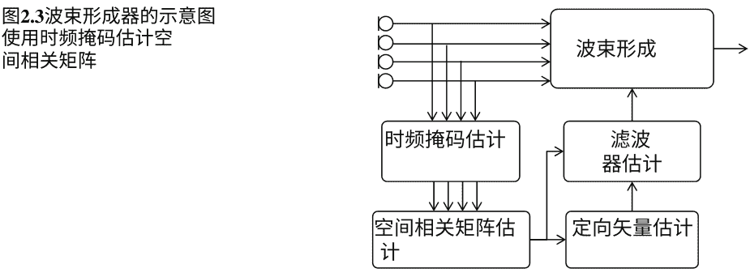

图2.3是使用时频掩码估计噪声空间相关矩阵的波束形成器的示意图。如图所示，首先估计时频掩码。然后使用掩码估计空间相关矩阵，随后用于估计定向矢量和计算波束形成器滤波器。

关于语音增强的时间-频率掩码估计已经有很多研究。在鲁棒ASR的背景下，基于神经网络的方法[19]和基于聚类的方法[20, 35, 48]在掩码估计方面最近引起了兴趣。相关方法也在第3章和第4章中进行了讨论。在本章中，为了说明基于掩码的空间统计估计，我们详细介绍了一种基于聚类的方法，该方法依赖于源的复高斯混合模型(CGMM)。

#### 用复高斯混合模型对源进行建模

利用语音信号的稀疏性，我们可以将(2.7)重写为：

$$\mathbf{y}_{t, f}=\mathbf{h}_{f}^{(k)} S^{(k)}(t, f), \quad(2.60)$$

其中 $k$ 是源的索引，即 $S^{(1)}(t, f)$ 对应于带噪语音，$S^{(2)}(t, f)$ 对应于噪声，而 $\mathbf{h}_{f}^{(k)}$ 是与带噪语音相关的伪指向矢量 $(k=1)$ 或者噪声 $(k=2)$。如果带噪语音和噪声可以被视为点源，伪指向向量对应于表示源方向信息的实际物理指向向量。一般来说，这并非真实情况（由于混响和噪声的扩散），但在这里并不是问题，因为我们不是估计指向向量，而是直接估计空间相关矩阵，并允许它们是满秩的。

为了推导出麦克风信号的模型，让我们假设源信号 $S^{(k)}(t, f)$ 服从零均值和方差为 $\Phi_{t, f}^{(k)}=\left|S^{(k)}(t, f)\right|^2$ 的复高斯分布：

$$p(S^{(k)}(t, f); \Phi_{t, f}^{(k)})=\mathcal{N}_{\mathbb{C}}(S^{(k)}(t, f) ; 0, \Phi_{t, f}^{(k)}) . \eqno(2.61)$$

从 (2.60) 和 (2.61) 我们可以将麦克风信号的分布表示为一个秩为1的复高斯分布，其协方差矩阵为 $\Phi_{t, f}^{(k)} \mathbf{h}_f^{(k)}(\mathbf{h}_f^{(k)})^H$。然而，为了使模型对扬声器或麦克风位置变化引起的波动更具鲁棒性，我们允许协方差矩阵具有满秩。因此，麦克风信号被建模为：

$$p(\mathbf{y}_{t, f} \mid C_{t, f}=k ; \Phi_{t, f}^{(k)})=\mathcal{N}_{\mathbb{C}}(\mathbf{y}_{t, f} ; 0, \Phi_{t, f}^{(k)} \mathbf{R}_f^{(k)}), \eqno(2.62)$$

其中 $C_{t, f}$ 是一个指示时间-频率区间 $(t, f)$ 是否对应于带噪语音 ($k=1$) 还是噪声 ($k=2$) 的随机变量，而 $\mathbf{R}_f^{(k)}$ 是源的空间相关矩阵。

给定上述源模型，麦克风信号的概率分布可以表示为：

$$p(\mathbf{y}_{t, f} ; \Theta)=\sum_k \alpha_f^{(k)} p(\mathbf{y}_{t, f} \mid C_{t, f}=k ; \Phi_{t, f}^{(k)}), \eqno(2.63)$$

$\alpha_f^{(k)}$ 是混合权重或先验概率，而 $\Theta = \{ \alpha_f^{(k)}, \Phi_{t, f}^{(k)}, \mathbf{R}_f^{(k)} \}$ 是一组模型参数。我们可以获得一个用于带噪语音的时频掩码 $\Omega^{(k)}(t, f)$ ($k=1$) 或噪声 ($k=2$)，如下所示的后验概率：

$$
\begin{aligned}
\Omega^{(k)}(t, f ; \Theta) &= p(C_{t, f}=k \mid \mathbf{y}_{t, f} ; \Theta) & (2.64) \\
&= \frac{\alpha_f^{(k)} p(\mathbf{y}_{t, f} \mid C_{t, f}=k ; \Phi_{t, f}^{(k)})}{\sum_{k^{\prime}} \alpha_f^{(k^{\prime})} p(\mathbf{y}_{t, f} \mid C_{t, f}=k^{\prime} ; \Phi_{t, f}^{(k^{\prime})})} . & (2.65)
\end{aligned}
$$

#### 基于期望最大化的参数估计

我们现在回顾一下如何估计混合模型 (2.63) 中的参数集合 $\Theta$。我们可以通过最大化对数似然函数来进行估计：

$$\mathscr{L}(\Theta)=\sum_t \sum_f \log (p(\mathbf{y}_{t, f} ; \Theta)) . \eqno(2.66)$$

这个优化问题可以用期望最大化 (EM) 算法来解决。让我们定义 $Q$ 函数为：

$$Q(\Theta, \Theta') = \sum_t \sum_f \sum_k \Omega^{(k)}(t, f; \Theta') \log(\alpha_f^{(k)} p(\mathbf{y}_{t,f} | C_{t,f} = k; \Theta_{t,f}^{(k)})), \quad (2.67)$$

其中 $\Theta'$ 是先前的估计。通过在期望步骤（E步骤）和最大化步骤（M步骤）之间进行迭代，最大化 $Q$ 函数，如下所示：

- **E步骤**：使用 (2.65) 计算后验概率 $\Omega^{(k)}(t, f; \Theta')$。
- **M步骤**：按照以下方式更新参数：

$$\begin{aligned} \Phi_{t,f}^{(k)} &= \frac{1}{M} \mathbf{y}_{t,f}^H (\mathbf{R}_f^{(k)})^{-1} \mathbf{y}_{t,f}, & (2.68) \\ \mathbf{R}_f^{(k)} &= \frac{\sum_t \Omega^{(k)}(t,f; \Theta') \mathbf{y}_{t,f} \mathbf{y}_{t,f}^H / \Phi_{t,f}^{(k)}}{\sum_t \Omega^{(k)}(t,f; \Theta')}, & (2.69) \\ \alpha_f^{(k)} &= \frac{1}{T} \sum_t \Omega^{(k)}(t,f; \Theta'). & (2.70) \end{aligned}$$

上述EM方程与估计高斯混合模型 (GMM) [6] 参数的方程非常相似，只是均值为零，相关矩阵采用 $\Phi_{t,f}^{(k)} \mathbf{R}_f^{(k)}$ 的形式。此外，由于我们处理的是复数，$\mathbf{R}_f^{(k)}$ 除对角线上的项外，可以取复数值。

请注意，此算法可用于分离多个源[4]。当只考虑单个目标说话者时，我们可以假设先验概率 $\alpha_f^{(k)}$ 均匀以简化计算。基于CGMM的掩码估计首先用于基于话语的批处理。然而，最近它被扩展到在线处理[20]。

#### 实际考虑

##### 噪声掩码的选择

在EM算法收敛之后，我们得到两个掩码，一个是与带噪语音相关，一个是与噪声相关。然而，我们事先不知道哪个掩码与噪声相关。我们可以使用这两个掩码来计算带噪语音和噪声的空间相关矩阵，并通过选择具有最高熵特征值的矩阵来确定噪声相关矩阵[20]。

直观地说，对于自由场条件，语音的空间相关性将具有秩1，意味着它将具有一个主导的非零特征值。相反，假设噪声来自多个方向，其空间相关矩阵可能呈现出更均匀的特征值分布。

##### 初始化

有几种方法可以用来初始化空间相关矩阵。例如，我们可以将噪声空间相关矩阵初始化为单位矩阵，将带噪语音相关矩阵初始化为观测到的麦克风信号的相关矩阵。如果有训练数据可用，还可以使用仅包含噪声和仅包含语音的训练数据计算的空间相关矩阵作为初始值。

##### 收敛

EM算法可以运行固定次数的迭代。在实践中，如果空间相关矩阵能够得到适当的初始化，大约20次EM迭代就足够了[20]。

#### 2.4 鲁棒前端的例子

在本节中，我们介绍了为最近的REVERB和CHiME-3挑战开发的两个ASR系统的示例。图2.4显示了远距离语音识别的ASR系统的示意图。它由一个语音增强前端组成，该前端使用WPE算法进行去混响处理，然后通过波束形成进行降噪，最后是一个ASR后端。我们在本节中描述的这两个系统具有相同的整体结构，但在实现细节和使用的ASR后端方面有所不同。

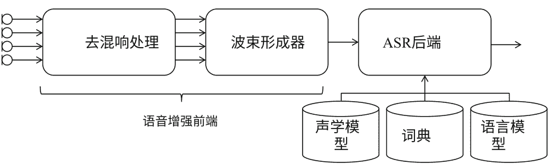
图2.4 使用去混响和波束形成的鲁棒ASR系统的示意图

### 2.4.1 一个抗混响的ASR系统

让我们首先介绍一下我们在REVERB挑战中使用的系统。REVERB挑战任务在第15章和[27]中有更详细的描述。这个系统展示了多通道去混响的能力。

###### 2.4.1.1 实验设置

我们使用了一个由七个隐藏层组成的DNN作为ASR后端。输入特征包括40个对数梅尔滤波器组系数，附加了五个左右上下文帧、$\Delta$ 和 $\Delta\Delta$ 系数。特征经过全局均值和方差归一化以及语音段均值归一化处理。初始实验结果是在REVERB挑战基线训练数据集上训练的声学模型获得的，该数据集由通过混响干扰和添加噪声生成的17小时多条件训练数据组成。后端使用了三元语言模型。实验设置和配置在[12]中有详细描述。

语音增强前端的参数详见表2.2。在所有实验中，我们使用了一个8通道的麦克风阵列设置。由于在这个任务中噪声相对稳定，MVDR参数是通过从每个话语的前几帧估计的噪声空间相关矩阵计算得出的。

| 表2.2 语音增强前端设置 | 参数内容 |
| :--- | :--- |
| **WPE** | $\delta = 3, L = 7$ |
| 窗口设置 | 窗口长度：32毫秒，帧移：8毫秒 |
| FFT点数 | 512（频带数：257） |
| **MVDR** | 窗口长度：32毫秒，帧移：8毫秒 |

###### 2.4.1.2 实验结果

图2.5展示了REVERB挑战任务开发集中不同前端配置下的词错误率（WER）。这些结果是在没有对增强后的语音重新训练后端声学模型的情况下获得的，因为我们确认在训练和测试条件不匹配时，使用在嘈杂和混响语音上训练的声学模型效果更好。

表2.3 REVERB挑战的Real Data评估集的平均词错误率

| 前端 | 词错误率 (%) |
| :--- | :--- |
| 无处理 | 19.2 |
| WPE（8通道） | 12.9 |
| WPE（8通道）+MVDR | 9.3 |

请注意，使用相同的后端解码耳机和领夹麦克风录音的词错误率分别为6.1%和7.3%。

图2.5的结果表明多通道去混响和波束成形的有效性。此外，从结果中我们清楚地看到，在进行波束成形之前进行去混响的性能明显更好。事实上，WPE算法保留了空间信息，但MVDR波束成形器没有。因此，当在MVDR之后进行去混响时，只能进行单通道去混响，效果要差得多。此外，指向矢量可能会受到混响效应的影响，使得波束成形效果较差，尽管在这种情况下这个问题可能不严重，因为噪声空间相关矩阵仅仅是从话语的前几帧估计得到的。

请注意，除了线性减法（2.14）之外，还可以使用谱减法来抑制使用WPE算法估计的后期混响。然而，这种方法的性能明显较差，可能是因为非线性处理对语音信号产生了有害的失真，对ASR不利[12]。

我们还使用了更先进的后端对我们提出的前端进行了测试，该后端使用了扩展的训练数据和无监督的环境适应，并采用了基于循环神经网络（RNN）的语言模型[12]。表2.3总结了结果。结果显示，使用SE前端带来了巨大的性能提升，并且使用WPE算法和MVDR时，WER接近于使用相同后端解码领夹式麦克风录音（WER为7.3%）或头戴式麦克风录音（WER为6.1%）时的结果。剩下的几个百分点的差异表明还有改进的空间。

### 2.4.2 面向移动设备的鲁棒ASR系统

在这里，我们讨论了我们为第三届CHiME挑战提出的ASR系统[48]。在这种情况中，噪声比混响更显著。然而，我们仍然使用去混响作为前端的第一个组件，因为它被证明在混响环境中有帮助。为了应对非平稳噪声，我们采用波束成形，并使用时间-频率掩蔽方案估计滤波器参数，该方案在第2.3.2.3节中描述。

###### 2.4.2.1 实验设置

对于SE前端，我们使用与第2.4.1节中相同配置的WPE算法。表2.4总结了波束成形器的设置。我们测试了不同类型的波束成形器，但是使用了与第2.3.2.3节中描述的相同的时间-频率掩蔽方案估计它们的统计信息。我们还与BeamformIt工具包[2]进行了比较。

ASR后端由深度卷积神经网络（CNN）架构组成，包括五个卷积层，接着是三个全连接层，最后是输出的softmax层。特征由40个对数梅尔滤波器系数组成，附加了 $\Delta$ 和 $\Delta\Delta$ 系数，以及五个左右上下文帧。特征经过全局均值和方差归一化以及话语级均值归一化处理。我们通过单独使用训练数据集中的所有麦克风信号来增强训练数据。我们使用基于RNN的语言模型进行解码。实验设置和配置详细描述在[20, 48]中。

表2.4 SE前端的设置

| 波束形成器参数 | 设置值 |
| :--- | :--- |
| 窗口长度 | 25毫秒 |
| 帧重叠 | 75% |

表2.5 第三届CHiME挑战赛真实数据评估集的平均识别错误率

| 前端 | | 词错误率 (%) |
| :--- | :--- | :--- |
| 无处理 | | 15.60 |
| WPE | | 14.66 |
| 掩蔽 | | 15.21 |
| 波束形成 | BeamformIt [2] | 10.29 |
| | 最大信噪比 | 9.43 |
| | MCWF | 8.63 |
| | MVDR | 8.03 |
| WPE + MVDR | | 7.60 |

结果是在四种录音条件下进行平均的，即公交车、咖啡馆、行人和街道。

###### 2.4.2.2 实验结果

表2.5显示了不同前端配置的识别错误率（WER）。我们确认WPE算法改善了混响环境下的识别效果（公交车和咖啡馆），并且不会对开放空间（行人和街道）的性能造成损害。我们比较了使用时频掩蔽（或者从噪声中计算空间相关矩阵，并从中导出不同的波束形成器）来直接增强信号的性能，或者使用空间相关矩阵计算不同的波束形成器。与我们的基准相比，基于掩蔽的方法并没有显著改善性能。相比之下，波束形成显示出非常有效的效果，相对识别错误率（WER）降低了高达50%。

MVDR优于其他波束形成方案，最可能是因为无失真约束，确保语音特征不受增强过程的影响。然而，在一些特定条件下，如咖啡馆等噪声非常不稳定的情况下，最大信噪比波束形成器优于MVDR。这似乎表明最佳波束形成器的选择可能取决于目标声学条件。请注意，通过更强大的后端（包括说话人自适应），我们可以进一步将识别错误率降低到5.83% [48]。

#### 2.5 结论和讨论

我们介绍了几种有效的语音增强方法，可以改善嘈杂和混响环境下的远距离语音识别性能。开发的前端的一个关键特点是它们依赖于线性滤波，因此在处理的语音中几乎不会引起失真。我们的讨论重点是批处理，并假设源的位置是固定的。

需要进一步研究来解决在线处理和移动说话者的问题。

在本章中，我们没有讨论另一类重要的前端，即依赖神经网络来减少声学干扰的前端，如第4、5和7章所讨论的。这种前端具有使能前端和ASR后端的联合优化，以实现最佳ASR性能的优势。然而，这也可能导致对训练期间观察到的声学条件过拟合。相比之下，我们在本章中描述的方法不使用任何训练模型，因此在训练期间未见过的条件下部署可能更合适。两种方案的结合构成了重要的未来研究方向。

#### 参考文献

- 1. Anguera, X.: BeamformIt. http://www.xavieranguera.com/beamformit/ (2014)
- 2. Anguera, X., Wooters, C., Hernando, J.: 会议演讲的声学波束成形. IEEE Trans. Audio Speech Lang. Process. **15(7)**, 2011–2023 (2007)
- 3. Araki, S., Sawada, H., Makino, S.: 在会议环境中的盲源分离与最大信噪比波束成形. In: ICASSP’07会议论文集, vol. 1, pp. I-41–I-44 (2007)
- 4. Araki, S., Okada, M., Higuchi, T., Ogawa, A., Nakatani, T.: 基于空间相关模型的观测向量聚类和MVDR波束成形的会议识别. In: ICASSP’16会议论文集, pp. 385–389 (2016)
- 5. Barker, J., Marxer, R., Vincent, E., Watanabe, S.: 第三届“CHiME”语音分离和识别挑战：数据集、任务和基线。在：ASRU'15会议论文集, 第504-511页 (2015)
- 6. Bishop, C.M.: 模式识别与机器学习。信息科学与统计学。Springer, 纽约 (2006)
- 7. Boll, S.: 使用频谱减法在语音中抑制声音噪声。IEEE Trans. Acoust. Speech Signal Process. **27(2)**, 113-120 (1979)
- 8. Bradley, J.S., Sato, H., Picard, M.: 关于房间中语音早期反射的重要性。J. Acoust. Soc. Am. **113(6)**, 3233-3244 (2003)
- 9. Brutti, A., Omologo, M., Svaizer, P.: 基于真实数据收集的不同声源定位技术的比较。在：无线免提语音通信和麦克风阵列，2008年，HSCMA 2008, 第69-72页 (2008)
- 10. Carletta, J., Ashby, S., Bourban, S., Flynn, M., Guillemot, M., Hain, T., Kadlec, J., Karaiskos, V., Kraaij, W., Kronenthal, M., et al.: AMI会议语料库：预告。Springer, Berlin (2005)
- 11. Chen, J., Benesty, J., Huang, Y.: 房间声学环境中的时延估计：概述。EURASIP J. Adv. Signal Process. **2006**, 170–170 (2006). doi:10.1155/ASP/2006/26503. http://dx.doi.org/10.1155/ASP/2006/26503
- 12. Delcroix, M., Yoshioka, T., Ogawa, A., Kubo, Y., Fujimoto, M., Ito, N., Kinoshita, K., Espi, M., Araki, S., Hori, T., Nakatani, T.: 混响环境中的远距离语音识别策略。EURASIP J. Adv. Signal Process. **2015**, 60 (2015). doi:10.1186/s13634-015-0245-7
- 13. Dennis, J., Dat, T.H.: 在嘈杂的混响环境下进行远距离语音识别的单通道和多通道方法: I2R对ASPiRE挑战的系统描述。在：ASRU'15会议论文集，第518-524页 (2015年)
- 14. Doclo, S., Moonen, M.: 基于GSVD的单麦克风和多麦克风语音增强的最优滤波。IEEE信号处理杂志 **50(9)**, 2230–2244页 (2002年)
- 15. Erdogan, H., Hershey, J.R., Watanabe, S., Le Roux, J.: 使用深度递归神经网络进行相位敏感和识别增强的语音分离。在：ICASSP'15会议论文集，第708-712页 (2015年)
- 16. Frost, O.L.: 一种线性约束自适应阵列处理算法。IEEE会议论文集 **60(8)**, 926-935页 (1972年)
- 17. Harper, M.: 在混响环境中的自动语音识别 (ASPiRE) 挑战。在：ASRU'15会议论文集, 第547-554页 (2015年)
- 18. Haykin, S.: 自适应滤波器理论，第3版。Prentice-Hall, Upper Saddle River, NJ (1996年)
- 19. Heymann, J., Drude, L., Chinaev, A., Haeb-Umbach, R.: BLSTM支持的GEV波束形成器前端用于第3届CHiME挑战。在：ASRU'15会议论文集，第444-451页。IEEE, 纽约 (2015年)
- 20. Higuchi, T., Ito, N., Yoshioka, T., Nakatani, T.: 在噪声中使用时频掩码进行在线/离线ASR的鲁棒MVDR波束形成。在：ICASSP'16会议论文集，第5210-5214页（2016年）
- 21. Hori, T., Araki, S., Yoshioka, T., Fujimoto, M., Watanabe, S., Oba, T., Ogawa, A., Otsuka, K., Mikami, D., Kinoshita, K., Nakatani, T., Nakamura, A., Yamato, J.: 低延迟实时会议识别和理解，使用远程麦克风和全向摄像头。IEEE Trans. Audio Speech Lang. Process. **20(2)**, 499-513 (2012)
- 22. Hori, T., Chen, Z., Erdogan, H., Hershey, J.R., Roux, J., Mitra, V., Watanabe, S.: MERL/SRI系统在第三届CHiME挑战中使用波束形成，鲁棒特征提取和先进语音识别。在：ASRU'15会议论文集，第475-481页（2015）
- 23. Huang, X., Acero, A., Hon, H.W.: 口语语言处理：理论，算法和系统开发指南，第一版。Prentice-Hall, Upper Saddle River, NJ (2001)
- 24. Jukic, A., Doclo, S.: 使用具有拉普拉斯模型的加权预测误差进行语音去混响。在：ICASSP'14会议论文集，第5172-5176页（2014）
- 25. Kinoshita, K., Delcroix, M., Nakatani, T., Miyoshi, M.: 使用长期多步线性预测抑制语音信号上的晚期混响效应。IEEE Trans. Audio Speech Lang. Process. **17(4)**, 534-545 (2009)
- 26. Kinoshita, K., Delcroix, M., Yoshioka, T., Nakatani, T., Habets, E., Sehr, A., Kellermann, W., Gannot, S., Maas, R., Haeb-Umbach, R., Leutnant, V., Raj, B.: REVERB挑战：混响和混响语音识别的共同评估框架。在：WASPAA'13会议论文集。纽帕尔茨，纽约（2013年）
- 27. Kinoshita, K., Delcroix, M., Gannot, S., Habets, E., Haeb-Umbach, R., Kellermann, W., Leutnant, V., Maas, R., Nakatani, T., Raj, B., Sehr, A., Yoshioka, T.: REVERB挑战的总结：混响语音处理研究中的最新技术和剩余挑战。EURASIP J. Adv. Signal Process. (2016). doi:10.1186/s13634-016-0306-6
- 28. Kuttruff, H.: Room Acoustics, 5th edn. Taylor & Francis, London (2009)
- 29. Lebart, K., Boucher, J.M., Denbigh, P.N.: 基于频谱减法的语音去混响新方法。Acta Acustica **87(3)**, 359-366 (2001)
- 30. Nakatani, T., Yoshioka, T., Kinoshita, K., Miyoshi, M., Juang, B.H.: 基于短时傅里叶变换的多通道线性预测的盲语音去混响方法。In: Proceedings of ICASSP’08, pp. 85-88 (2008)
- 31. Nakatani, T., Yoshioka, T., Kinoshita, K., Miyoshi, M., Juang, B.H.: 基于方差归一化延迟线性预测的语音去混响方法。IEEE Trans. Audio Speech Lang. Process. **18(7)**, 1717-1731 (2010)
- 32. Narayanan, A., Wang, D.: 使用深度神经网络进行鲁棒语音识别的理想比例掩码估计。在：ICASSP'13会议论文集，第7092-7096页。IEEE, 纽约（2013）
- 33. Renals, S., Swietojanski, P.: 远距离语音识别的神经网络。在：2014年第四届无线语音通信和麦克风阵列联合研讨会（HSCMA），第172-176页（2014年）
- 34. Sivasankaran, S., Nugraha, A.A., Vincent, E., Morales-Cordovilla, J.A., Dalmia, S., Illina, I., Liutkus, A.: 使用基于神经网络的语音增强和特征模拟的鲁棒ASR。在：ASRU'15会议论文集，第482-489页（2015年）
- 35. Souden, M., Araki, S., Kinoshita, K., Nakatani, T., Sawada, H.: 基于多通道MMSE的语音源分离和降噪框架。IEEE Trans. Audio Speech Lang. Process. **21(9)**, 1913-1928（2013年）
- 36. Tachioka, Y., Narita, T., Weninger, F., Watanabe, S.: 采用去混响技术的各种混响系统的双系统组合方法。在：REVERB'14会议论文集（2014年）
- 37. Van Trees, H.L.: 检测、估计和调制理论。第四部分，最优阵列处理。Wiley-Interscience, 纽约（2002年）
- 38. Virtanen, T.: 通过具有时间连续性和稀疏性准则的非负矩阵分解进行单声源分离。IEEE Trans. Audio Speech Lang. Process. **15(3)**, 1066-1074 (2007年)
- 39. Warsitz, E., Haeb-Umbach, R.: 基于广义特征值分解的盲声束形成。IEEE Trans. Audio Speech Lang. Process. **15(5)**, 1529-1539 (2007年)
- 40. Weninger, F., Watanabe, S., Roux, J.L., Hershey, J.R., Tachioka, Y., Geiger, J., Schuller, B., Rigoll, G.: MERL/MELCO/TUM system in the REVERB challenge using deep recurrent neural network feature enhancement. In: Proceedings of REVERB'14 (2014)
- 41. Weninger, F., Erdogan, H., Watanabe, S., Vincent, E., Le Roux, J., Hershey, J.R., Schuller, B.: 使用LSTM循环神经网络进行语音增强及其在抗噪声ASR中的应用。在：潜变量分析和信号分离会议论文集，第91-99页。Springer, 柏林 (2015年)
- 42. Xu, Y., Du, J., Dai, L.R., Lee, C.H.: 基于深度神经网络的语音增强的回归方法。IEEE/ACM Trans. Audio Speech Lang. Process. **23(1)**, 7-19 (2015)
- 43. Yoshioka, T., Nakatani, T.: 盲目MIMO脉冲响应缩短的多通道线性预测方法的推广. IEEE Trans. Audio Speech Lang. Process. **20(10)**, 2707-2720 (2012)
- 44. Yoshioka, T., Tachibana, H., Nakatani, T., Miyoshi, M.: 具有说话者位置变化检测的自适应去混响语音信号. 在: 2009 IEEE国际会议 on声学、语音和信号处理, pp. 3733-3736 (2009)
- 45. Yoshioka, T., Nakatani, T., Miyoshi, M.: 使用噪声抑制和去混响的综合语音增强方法. IEEE Trans. Audio Speech Lang. Process. **17(2)**, 231-246 (2009)
- 46. Yoshioka, T., Sehr, A., Delcroix, M., Kinoshita, K., Maas, R., Nakatani, T., Kellermann, W.: 在混响房间中使机器理解我们：对自动语音识别的混响鲁棒性。IEEE信号处理杂志。**29(6)**, 114-126 (2012)
- 47. Yoshioka, T., Chen, X., Gales, M.J.F.: 单麦克风去混响对基于DNN的会议转录系统的影响。在：ICASSP'14会议论文集 (2014)
- 48. Yoshioka, T., Ito, N., Delcroix, M., Ogawa, A., Kinoshita, K., Fujimoto, M., Yu, C., Fabian, W.J., Espi, M., Higuchi, T., Araki, S., Nakatani, T.: NTT CHiME-3系统：移动多麦克风设备的语音增强和识别的进展。在：ASRU'15会议论文集，第436-443页 (2015)

## 第三章 使用基于模型的源分离的多通道空间聚类

**Michael I. Mandel和Jon P. Barker**

**摘要** 最近的自动语音识别结果在训练数据与测试数据匹配时非常好，但在某些重要方面 (如麦克风的数量和排列方式，混响和噪声条件等) 不同的情况下则表现较差。由于这些配置很难预测且难以全面训练，使用无监督的空间聚类方法是很有吸引力的。这些方法利用空间特征的差异来分离源，但不需要完全建模声学场景的空间配置。本章将讨论几种无监督空间聚类的方法，重点介绍基于模型的期望最大化源分离和定位 (MESSL)。它将讨论基于两个麦克风的基本模型，该模型基于麦克风对之间的相位和电平差异对频谱图点进行聚类，以及其推广到多于两个麦克风的情况，并用于驱动最小方差无失真响应 (MVDR) 波束成形。这些系统在语音增强和自动语音识别方面进行评估，相对于标准的延迟和求和波束形成器，在不匹配的训练-测试条件下，它们能够将词错误率降低9.9%至17.1%。

#### 3.1 引言

尽管使用深度神经网络 (DNNs) 作为声学模型的自动语音识别 (ASR) 系统最近在识别性能方面取得了显著的改进 [23]，但它们的判别性质使它们容易过拟合用于训练它们的条件。例如，在最近的REVERB挑战中 [27]，远场多通道ASR系统在与其训练相匹配的模拟条件下表现更准确，而在不匹配的真实录音条件下表现较差。为了解决泛化问题，DNN声学模型需要更好的鲁棒性。

模型应该在反映模型将运行的条件下进行训练。对于这种训练的一种常见方法是使用多条件数据[32]，其中识别器在混合了许多不同种类噪声的语音上进行训练，希望测试时的噪声类似于训练噪声之一。多条件训练对于高斯混合模型(GMM)和基于DNN的声学模型[39]都有好处。DNN增强系统也可以明确地训练以在固定的麦克风阵列中横跨源位置进行泛化[24]，甚至可以在线性阵列中横跨麦克风间距进行泛化[47]。

虽然显式地推广到新的麦克风、音源和房间空间配置在判别式训练过程中是昂贵的，但通过波束成形可以自然地从数据中分解出来。传统的波束成形假设已知阵列几何，这限制了对新条件的推广，但无监督的基于定位的聚类避免了这个假设。

这种类型的成功系统已经应用于两个麦克风分离[37, 45, 61]，以及更大的自组织麦克风阵列用于定位[33]、校准[18]和构建时频(T-F)掩码[4]。它可以应用于分布式麦克风阵列[22]，但本章描述了三个类似的系统，用于执行紧凑麦克风阵列的无监督空间聚类和波束成形[29, 37, 49]。

这些空间聚类方法基于时频掩码的思想，这是一种通过在频谱图的不同T-F点上应用不同的衰减来抑制不需要的声源的技术[58]。时频掩码技术也在第2章中进行了讨论。聚类T-F点会导致具有相似空间特性的点的组合。调整每个T-F点在每个组中的成员权重会得到一个可以用来隔离单个源的T-F掩码。这种基于掩码的方法与传统的盲源分离(BSS)方法相反，传统方法旨在模拟所有时间-频率点上的所有源。在[57]中介绍了音频的BSS方法的概述，包括可以用于帮助源分离过程的各种类型的附加信息。

#### 3.2 多通道语音信号

假设在时域中感兴趣的信号用 $x_1[n]$ 表示。如果它与 $I-1$ 其他信号一起记录，其中 $x_i[n]$ 表示第 $i$ 个麦克风上的信号，则

$$y_j[n] = \sum_{i=1}^I \sum_{l=1}^L h_{ij}[l] x_i[n-l] + u_j[n] \qquad (3.1)$$
$$= \sum_{i=1}^I (h_{ij} * x_i)[n] + u_j[n] \qquad (3.2)$$

其中 $h_{ij}[n]$ 是源 $i$ 和麦克风 $j$ 之间的冲激响应，$u_j[n]$ 是噪声项。在时频域中，假设冲激响应比傅里叶变换分析窗口短，这个关系变为

$$Y_j(t,f) = \sum_{i=1}^{I} H_{ij}(f)X_i(t,f) + U_j(t,f), \quad (3.3)$$

其中 $Y_j(t,f), H_{ij}(f), X_i(t,f)$ 和 $U_j(t,f)$ 都是复数值。

冲激响应 $H_{ij}(f)$ 捕捉源和麦克风之间的通信通道，其中包括声音从源到麦克风的所有路径。这包括直接声音路径，从不同方向经过一次或多次镜面反射后到达麦克风的路径，以及从没有明确方向经过多面墙壁反射或散射后到达的路径，导致漫反射。一般来说，这个通道是时变的，但是包括下面描述的空间聚类方法在内的许多模型假设它是时不变的，即源、麦克风和反射器在空间中是固定的。

##### 3.2.1 人类听众使用的双耳线索

即使在与多个竞争说话者的语音同时出现时，人类听众也能够关注和理解感兴趣的说话者的语音。他们能够通过使用个体脉冲响应的某些线索，以及利用同一源在两只耳朵的脉冲响应之间的差异来实现这一点[38]。通过将两个观察到的信号相互比较，更容易区分原始声源和信道对观察结果的影响。在单声道观察中执行相同任务需要对声源、信道或两者都有强大的先验模型。

人类听众利用的两个麦克风通道之间的差异来自于两个复杂频谱图的比率：

$$C_{jj'}(t,f) = \frac{Y_j(t,f)}{Y_{j'}(t,f)}. \quad (3.4)$$

这个数量的对数幅度被称为双耳级差 (ILD)：

$$\alpha_{jj'}(t,f) = 20 \log_{10} |C_{jj'}(t,f)| = 20 \log_{10} |Y_j(t,f)| - 20 \log_{10} |Y_{j'}(t,f)|. \quad (3.5)$$

当 $Y_j(t, f)$ 和 $Y_{j'}(t, f)$ 被单一源 $X_{i^*}(t, f)$ 的贡献所主导时，其中 $i^*$ 是该 $(t, f)$ 点处主导源的索引：

$$\alpha_{jj'}(t, f) \approx 20 \log_{10} |H_{i^*j}(t, f)||X_{i^*}(t, f)| - 20 \log_{10} |H_{i^*j'}(t, f)||X_{i^*}(t, f)| \quad (3.6)$$
$$= 20 \log_{10} |H_{i^*j}(t, f)| - 20 \log_{10} |H_{i^*j'}(t, f)|. \quad (3.7)$$

请注意，这个数量完全独立于源信号 $X_{i^*}(t, f)$，因为它对两个通道都是共同的。单一源在每个时间-频率点上占主导地位的特性被称为W-不相交正交性[61]，并且已经在消声语音信号的双耳录音中观察到。此外，在单通道源分离系统中，信号混合的对数幅度通常被近似为最有能量的信号的对数幅度[46]，被称为对数最大近似。只要相同的源在所有通道中最响，这个近似也适用于多通道。这两个近似都支持一个单一源在每个时间-频率点上占主导地位的想法，这在本章的其余部分中将被广泛使用。请注意，不同的点可以被不同的源所主导，以至于每个源都有一组点，在这些点上它主导其他所有源，包括噪声。

$C_{jj'}(t, f)$ 的相位被称为双耳相位差 (IPD)。再次假设W-不相交正交性：

$$\phi_{jj'}(t, f) = \angle C_{jj'}(t, f) = \angle Y_j(t, f) - \angle Y_{j'}(t, f) + 2\ell\pi \quad (3.8)$$
$$\approx \angle H_{i^*j}(t, f)X_{i^*}(t, f) - \angle H_{i^*j'}(t, f)X_{i^*}(t, f) + 2\ell\pi \quad (3.9)$$
$$= \angle H_{i^*j}(t, f) - \angle H_{i^*j'}(t, f) + 2\ell'\pi, \quad (3.10)$$

其中 $\ell$ 和 $\ell'$ 是捕捉相位测量中的 $2\pi$ 歧义的整数。在这种情况下，$h_{j'}[n]$ 与 $h_j[n]$ 之间通过纯延迟 $\Delta_{\tau_{jj'}}$ 样本关联，根据基本傅里叶变换性质：

$$h_{ij'}[n] = h_{ij}[n] * \delta[n - \Delta_{\tau_{jj'}}], \quad (3.11)$$
$$\therefore \phi_{jj'}(t, f) = \angle \exp(j 2\pi f \Delta_{\tau_{jj'}} / f_s) = 2\pi f \Delta_{\tau_{jj'}} / f_s + 2\pi\ell, \quad (3.12)$$

其中 $j = \sqrt{-1}$ 是虚数单位，$\ell$ 是一个未知整数，而 $f_s$ 是采样率。这个纯延迟 $\Delta_{\tau_{jj'}}$ 被称为耳间时间差 (ITD)，模拟了声音在麦克风阵列中传播所需的非零时间。如 (3.12) 所示，这个ITD与频率成线性增长的IPD相对应。

对于两个麦克风之间的纯延迟，$\Delta_{\tau_{jj'}} = f_s d_{jj'} / c$，其中 $c$ 是空气中的声速，约为 340 m/s，而 $d_{jj'}$ 是麦克风 $j$ 和 $j'$ 之间的距离。当 $\ell=0$ 时，从观测到的IPD到未观测到的ITD的映射是微不足道的，使用 $\Delta_{\tau_{jj'}}$ 只有当 $f < c/2d_{jj'}$ 时才可能实现这一点。对于接近或超过这个临界值的频率，从IPD到ITD的映射就不那么直接了。

因为 $\ell$ 必须以某种方式进行估计，所以需要将其转换为ITD，这是一个被称为空间混叠的问题[16, 43]。在噪声和混响存在的情况下，这种估计变得更加困难。对于人类听众来说，可以在无混响的消声室中直接测量ITD以确定关键频率。对于一组45个受试者，[2]发现最大ITD的平均值为 646 $\mu$s，相当于22.0厘米的距离，在此距离上空间混叠开始于大约 800 Hz。因此，这个问题显然与人类的源定位和分离过程相关。

图3.1显示了来自CHiME-3数据集[6]的一个录音的示例双耳参数，该数据集在几个嘈杂的环境中收集了语音交互。顶部一行显示了各个通道 0-3 的对数幅度谱图。通道 0 的麦克风距离说话者的嘴非常近，因此信噪比比其他通道高得多。这可以从整个混合信号被衰减以保持一致的语音水平后的较低噪声水平中看出。通道 2 的麦克风面向平板设备的背面，因此信噪比比其他通道低得多。这可以从相对于通道 1 和 3 的较低语音水平中看出。

每个通道中语音和噪声信号的级别差异导致通道对之间的特征ILD。例如，在通道 1 和 2 之间，语音和噪声之间存在明显的ILD区别。另一方面，IPD不能区分它们。对于通道 1 和 3，到达时间的差异使得IPD在目标和噪声之间的区分比ILD更有用。空间聚类系统利用这些差异来识别来自同一源的时频点并将它们分组在一起。

##### 3.2.2 多于两个通道的参数

对于具有多个通道的录音，空间参数可以通过两种方式进行泛化。第一种是对双耳计算的直接泛化，将(3.4)中的 $C_{jj'}(t,f)$ 项排列成一个矩阵 $\mathbf{C}(t,f)$。在这个矩阵中，相位项是通道 $j$ 和 $j'$ 在时频点 $(t,f)$ 处的相位差，而对数幅度是该点处对数幅度之间的差异。

线性约束最小方差 (LCMV) 波束形成器[8]使用一个稍微不同的矩阵来描述麦克风通道之间的关系。特别地，它使用了空间协方差矩阵：

$$\Phi_{UU}(f) = \mathbb{E}_t[\mathbf{U}(t,f)\mathbf{U}^\dagger(t,f)], \quad \Phi_{YY}(f) = \mathbb{E}_t[\mathbf{Y}(t,f)\mathbf{Y}^\dagger(t,f)], \quad (3.13)$$

在这些计算中，元素 $j, j'$ 在时频点 $(t, f)$ 的相位再次是 $Y_j(t, f)$ 和 $Y_{j'}(t, f)$ 之间的相位差，但对数幅度是 $Y_j(t, f)$ 和 $Y_{j'}(t, f)$ 的对数幅度之和。然而，如果假设阵列中的任何麦克风之间没有声学障碍，并且源远离阵列（即与所有麦克风等距离），那么

$$|Y_j(t, f)| = |Y_{j'}(t, f)| = 1, \tag{3.14}$$
$$\therefore \left| \frac{Y_j(t, f)}{Y_{j'}(t, f)} \right| = |Y_j(t, f)Y_{j'}^*(t, f)| = 1, \tag{3.15}$$

两组提示是等效的。当幅度不是单位时，例如在CHiME-3的第2个通道设置中，感知动机的 $\mathbf{C}(t, f)$ 矩阵不是厄米对称的，因为它包含通道观测的比率，而LCMV相关的观测矩阵和参数是厄米对称的。

---
**图 3.1** 来自 CHiME-3 开发数据集的示例多通道录音 [6]。行人噪声中说话者 F01 的真实录音，说：“除了汽车外，销售额增长了百分之三。”
- 顶部行：通道 0 (近距离麦克风), 通道 1 (前置), 通道 2 (后置设备), 通道 3 (前置)。
- 底部行：通道 1 与通道 2 之间的 ILD, 通道 1 与通道 3 之间的 ILD, 通道 1 与通道 2 之间的 IPD, 通道 1 与通道 3 之间的 IPD。
---

#### 3.3 空间聚类方法

由于空间混叠，无法将噪声IPD估计准确地映射到各个时频点的ITD。可以使用空间聚类方法解决这种歧义。有两种主要方法：窄带和宽带。

窄带空间聚类（例如 [49]）利用了这样一个事实，即在几乎所有频率上，位于不同位置的两个源的声音将具有不同的双耳参数（相位和级别差异）。它通常不会对这些参数做出强烈的预测，只是它们对于不同的源将是不同的，从而允许包含空间混叠的混合物的分离。一旦在每个单独的频带中进行了分离，第二步就必须对每个频带中识别出的源进行排列以“匹配”。

相比之下，宽带模型（例如 [29] 和 [37]）对每个频率上的双耳参数之间的关系做出了更强的预测。通过这样做，它能够跨频率汇集信息并避免源对齐这一潜在容易出错的步骤。这种方法的代价是它必须对频率之间的关系形式做出一定的假设，而观察结果未满足这些假设可能导致分离过程失败。此外，在开发这个模型时必须注意使其对空间混叠具有鲁棒性。

所有这些算法（即 [29, 37, 49]）具有相似的结构。它们首先通过一组频率相关的模型参数来定义每个源 $\Theta_i(f)$。然后，它们在两个步骤之间交替进行：一个是使用软或硬掩模将各个时频点分配给源模型 $z_i(t, f)$，另一个是根据分配给该源的点的观测结果更新源模型参数 $\Theta_i(f)$。这遵循期望最大化步骤的准则。在软掩模的情况下，使用最大化 (EM) 算法 [15]；在硬掩模的情况下，使用两个交替步骤的 $k$-means 算法 [34]。

##### 3.3.1 逐频点聚类和对齐

窄带方法由 Sawada 等人 [49] 提出。不再对 ILD 和 IPD 测量向量进行聚类，而是直接对观测到的多通道谱图信号进行聚类。在每个时间-频率点上，基于 (3.3) 的符号表示进行矢量观测，令：

$$\begin{aligned} \mathbf{H}_{i^*}(f) &= [H_{i^*1}(f), \dots, H_{i^*J}(f)]^\top, & (3.16) \\ \mathbf{Y}(t, f) &= [Y_1(t, f), \dots, Y_J(t, f)]^\top & (3.17) \\ &\approx [H_{i^*1}(f) X_{i^*}(t, f), \dots, H_{i^*J}(f) X_{i^*}(t, f)]^\top = \mathbf{H}_{i^*}(f) X_{i^*}(t, f). & (3.18) \end{aligned}$$

在每个频率上进行独立处理，不依赖于频率本身，因此在本节的其余部分中，我们将从符号中省略 $f$ 索引。为了分离目标源的贡献和其空间特性，多通道观测在每个时频点上进行幅度归一化：

$$\tilde{\mathbf{Y}}(t) = \frac{\mathbf{Y}(t)}{\|\mathbf{Y}(t)\|} = \frac{\mathbf{H}_{i^*}}{\|\mathbf{H}_{i^*}\|} \frac{X_{i^*}(t)}{|X_{i^*}(t)|}. \quad (3.19)$$

这种归一化去除了源信号的幅度，但没有去除其相位 $X_{i^*}(t)/|X_{i^*}(t)|$，这在聚类过程中必须考虑。

然后，这些观察结果以类似于线性方向分离技术 (LOST) [40] 的方式进行聚类。在这个模型中，源对应于多维复数空间中的方向。这些方向由复数单位向量表示 $\mathbf{a}_i$，源和观察之间的距离通过将观察投影到源方向上来测量。假设这些距离服从具有标量方差 $\sigma_i^2$ 的圆形复数高斯分布：

$$p(\mathbf{Y}(t) \mid \mathbf{a}_i, \sigma_i) = \frac{1}{(\pi \sigma_i^2)^{J-1}} \exp \left( -\frac{1}{\sigma_i^2} \|\mathbf{Y}(t) - (\mathbf{a}_i^H \tilde{\mathbf{Y}}(t))\mathbf{a}_i\|^2 \right). \quad (3.20)$$

请注意，该似然函数对于应用于所有通道的标量相位是不变的，因为它被等同地应用于 $\tilde{\mathbf{Y}}(t)$ 和 $(\mathbf{a}_i^H \tilde{\mathbf{Y}}(t))\mathbf{a}_i$，然后通过幅度计算移除。因此，该似然函数对于源的原始相位 $X_{i^*}(t)/|X_{i^*}(t)|$ 是不变的。出于同样的原因，它对于冲激响应的附加标量相位也是不变的，因此不失一般性地，我们假设 $\angle H_{i^*1} = 0$。同样地，应用于 $\mathbf{a}_i$ 的标量相位也会被抵消，因此我们假设 $\angle [\mathbf{a}_i]_1 = 0$。

如果考虑与上述双耳参数的相关性，可以看出对于两个通道，$\angle H_{i^*2} = \phi_{i2}$，即该参数化等同于IPD。此外：

$$\frac{[\mathbf{H}_{i^*}]_1}{\|\mathbf{H}_{i^*}\|} = \frac{H_{i^*1}}{\sqrt{|H_{i^*1}|^2 + |H_{i^*2}|^2}} = \sqrt{\frac{|H_{i^*1}|^2}{|H_{i^*1}|^2 + |H_{i^*2}|^2}} \quad (3.21)$$
$$= \sqrt{\frac{1}{1 + |H_{i^*2}|^2/|H_{i^*1}|^2}} = \sqrt{\frac{1}{1 + 10^{\alpha_{i2}/10}}} \quad (3.22)$$ 

显示该参数化也等同于ILD的逐点变换。对于超过第二个通道的每个通道，该公式增加了一个相位的额外自由度和每个源模型的一个级别的自由度。这种线性增长与每个源的空间协方差矩阵中的自由度的二次增长不同。这种行为意味着这种参数化可以模拟点源，但可能不能模拟扩散源，后者需要完整的空间协方差。

###### 3.3.1.1 跨频率源对齐

在窄带聚类的形式化中，频率带独立处理，源聚类在每个频带中可以有不同的任意顺序。因此，需要进一步处理以在不同频率上以一致的方式分配聚类到源。早期的技术（例如 [48]）通过相关分析相邻频率带中提取的源的幅度来解决频域独立分量分析 (ICA) 的相同问题。然而，对于基于掩码的方法，[49] 发现使用掩码的后验概率 $z_i(t, f)$ 执行相同类型的相关对齐可以获得更好的对齐效果，从而获得更好的分离性能。

要完全执行这种对齐将需要 $O(J!F^2)$ 时间，其中 $J$ 是源数量，$F$ 是频带数量。这是非常昂贵的，但 [49] 中描述了几种减少成本的启发式方法。第一步是在频率上对源后验概率进行全局基于样本的聚类。与其将所有频率相互比较，不如将每个频率的后验概率与 $J$ 个样本进行比较，这样可以将成本降低到 $O(J!FJ)$。虽然 $J$ 和 $J!$ 相对较小（通常 $J < 5$），但 [49] 建议在给定的源集之间使用贪婪方法进行对齐计算，从而导致总成本为 $O(J^2FJ)$。然后，使用基于比较彼此接近或谐波相关的频带的精细对齐来进一步改进这种初始粗略对齐。

总的来说，作为一种窄带方法，该系统在建模频率上变化很大的脉冲响应方面非常灵活。然而，并不总是需要这种灵活性，因为这会牺牲一定程度的噪声鲁棒性，而噪声鲁棒性是通过在不同频率上汇集信息来实现的。相反，窄带方法往往需要更长的时间观测来处理静态源，以实现良好的分离性能。此外，解决对齐问题需要仔细调整上述启发式方法。这可能很困难，例如对于宽带语音，其中包含高达 4 kHz 的频率活动与包含阻塞音素的 4 kHz 以上频率的活动不相关甚至呈负相关，如图 3.1 所示。

##### 3.3.2 方位角的模糊 c 均值聚类

宽带方法的一个例子是 [29] 的方法，它结合了 [10, 28, 53] 的思想。该方法仅基于将 IPD 转换为 ITD 的 Stepwise Phase difference REstoration (SPIRE) 方法 [53] 进行聚类，该方法解决了某些类型的阵列的空间混叠问题。SPIRE 使用较大阵列中紧密间隔的麦克风对来估计 (3.12) 中的相位包裹项。具体而言，通过将麦克风对按最小间距到最大间距排序，SPIRE 识别出 (3.12) 中的未知 $\ell$ 项，展开为

$$\phi_k = 2\pi f \Delta_{\tau_k}/f_s + 2\pi\ell_k = 2\pi d_k f/c + 2\pi\ell_k, \quad (3.23)$$

其中 $k$ 索引了麦克风对，并且所有由 $k$ 索引的项都是特定于时间-频率点 $(t, f)$ 的。对于两个不同的麦克风对，大多数这些量是相同的，从而允许通过递归方式正确地识别 $\ell_k$：

$$(\phi_{k-1} + 2\pi\ell_{k-1})\frac{d_k}{d_{k-1}} - \pi \le \phi_k + 2\pi\ell_k \le (\phi_{k-1} + 2\pi\ell_{k-1})\frac{d_k}{d_{k-1}} + \pi. \quad (3.24)$$

一旦这些 IPD 项被识别出来，它们可以直接通过下式转换为 ITD：

$$\Delta_{\tau_k}(t,f) = \frac{f_s}{2\pi f} (\phi_k(t,f) - 2\pi \ell_k(t,f)). \quad (3.25)$$

最外层麦克风对的标量 ITDs，$\Delta_{\tau}(t,f)$，然后使用类似于 GMM 期望最大化的交替方法对其进行聚类。具体而言，此聚类中的参数是每个源的方向，表示为 $i$，以及每个时频点的软聚类分配 $z_i(t,f)$。这两个量使用以下方式进行更新：

$$z_i(t,f) = \frac{\|\Delta_{\tau_k}(t,f) - i\|^{2/(\gamma-1)}}{\sum_{i'} \|\Delta_{\tau_k}(t,f) - i'\|^{2/(\gamma-1)}}, \quad i = \frac{\sum_{t,f} z_i(t,f)\Delta_{\tau_k}(t,f)}{\sum_{t,f} z_i(t,f)}, \quad (3.26)$$

其中 $\gamma > 1$ 是一个用户定义的参数，用于控制似然的平滑度。除了这个 $\gamma$ 参数之外（它有效地缩放了对数似然），这些更新与具有球形单位方差的 GMM EM 等效。由于它是宽带的，这种方法能够跨频率汇集信息，并且比窄带方法需要更少的时间观测。

使用间距最大的麦克风对进行定位提供了最精确的估计。然而，为了这样做，它假设 ITD 是麦克风之间的纯延迟，以 (3.25) 的形式出现。当早期镜面反射破坏这种关系时，在多次反射环境中通常不是这种情况。它还意味着声音来自点源，并且没有扩散成分，在多次反射环境中也不太可能。

##### 3.3.3 基于双耳模型的 EM 源分离和定位（MESSL）

基于双耳模型的 EM 源分离和定位（MESSL）算法 [37] 使用高斯混合模型明确建模 IPD 和 ILD 观测。为了避免空间混叠，MESSL 将 ITD 建模为离散随机变量，将 IPD 建模为这些 ITD 的混合，通过计算源分配变量作为 $z_i(t,f) = \sum_{\tau} z_{i\tau}(t,f)$。

直观上，虽然在存在空间混叠的情况下，IPD 不对应唯一的 ITD，但每个 ITD 都对应唯一的 IPD，因此，通过比较一组 ITD 的似然度，可以找到一组观测到的 IPD 的最可能解释。对于源 $i$ 和离散延迟 $\Delta_{\tau}$ 的高斯观测的概率分布为：

$$p(\phi(t,f), \alpha(t,f) | i, \tau, \Theta) = p(\phi(t,f) | \tau, i_{\tau}(f), i_{\alpha}(f)) \cdot p(\alpha(t,f) | \mu_i(f), \eta_i(f)). \quad (3.27)$$

个体特征的分布由以下给出：

$$p(\phi(t,f) | \tau, i_{\tau}(f), i_{\alpha}(f)) = \mathcal{N}(\hat{\phi}(t,f; \tau, i_{\tau}(f)) | 0, \sigma^2(f)), \quad (3.28)$$
$$其中 \hat{\phi}(t,f; \tau, i_{\tau}(f)) = \angle \exp ( j ( \phi(t,f) - 2\pi f \Delta_{\tau}/f_s - i_{\tau}(f) ) ), \quad (3.29)$$
$$p(\alpha(t,f) | \mu_i(f), \eta_i(f)) = \mathcal{N}(\alpha(t,f) | \mu_i(f), \eta_i^2(f)). \quad (3.30)$$

相位残差 $\hat{\phi}(t, f ; \tau, i_{\tau}(f))$ 计算观测到的相位差异与应该从源 $i$ 在频率 $f$ 观察到的相位差异之间的距离 $2 \pi f \Delta_{\tau} / f_{s}+i_{\tau}(f)$。这个表达式中的第一项是由带有延迟 $\Delta_{\tau}$ 的 ITD 模型预测的频率 $f$ 的相位差异，第二项是一个频率相关的相位偏移参数，允许由早期回声引起的纯延迟模型的变化。此外，这个差异被限制在区间 $(-\pi, \pi]$。注意 $\Delta_{\tau}$ 必须在一个离散的延迟网格上进行评估，以便将它们的似然性相互比较。这一步骤在计算上是昂贵的，可以通过使用更复杂的优化方案来避免。

然后在 EM 算法的期望和最大化步骤中使用这些似然度。在期望步骤中，通过计算时间-频率点与源的分配来进行计算：

$$z_{i \tau}(t, f)=\frac{p(\phi(t, f), \alpha(t, f) \mid i, \tau, \Theta) p(i, \tau)}{\sum_{i^{\prime} \tau^{\prime}} p\left(\phi(t, f), \alpha(t, f) \mid i^{\prime}, \tau^{\prime}, \Theta\right) p\left(i^{\prime}, \tau^{\prime}\right)} \quad (3.31)$$

在最大化步骤中，通过使用分配作为权重，更新模型参数的加权和统计量。

详细信息请参见 [37]。作为一种宽带方法，MESSL 可以在频率上汇集定位信息，需要比窄带方法更短的时间观测。它的统计形式允许引入额外的参数，如 IPD 均值 $i_{\tau}(f)$，可以模拟除了直接路径纯延迟之外的早期回声。然而，由于模型非常灵活，需要仔细初始化以避免陷入局部最小值。它还允许在给定 ITD 的情况下对 ILD 均值使用先验知识。

这种灵活性促进了对 MESSL 的几个扩展。Weiss 等人 [59] 将 MESSL 的空间分离与概率源模型相结合。与其估计参数的单一最大似然设置不同，[14] 使用变分贝叶斯推断来估计 MESSL 参数的后验分布。与 ITD 网格不同，[54] 使用随机抽样来提取多通道配置的最佳 IPD-ILD 参数。

##### 3.3.4 多通道 MESSL

多通道 MESSL [5] 单独对每对麦克风使用在第 3.3.3 节中描述的双耳模型。这些模型通过每个源的全局 T-F 掩码进行协调。为了使空间聚类系统尽可能灵活，它不应该需要麦克风阵列的校准信息。这种灵活性将使其适用于从临时麦克风阵列到缺乏硬件规格的用户生成内容数据库等应用场景，在这些场景中无法识别产生录音的麦克风阵列几何形状。

在没有校准的情况下，模型参数在麦克风对之间很难进行转换，但是 T-F 掩码在对之间更加一致，并且可以用于协调源和模型。这是多通道 MESSL 采用的策略，它最大化了对于 $J$ 个麦克风的总对数似然：

$$\begin{aligned} \mathcal{L}(\Theta) &= \frac{2}{J} \sum_{j < j' = 1}^J \mathcal{L}(\Theta_{jj'}) \quad (3.32) \\ &= \frac{2}{J} \sum_{j < j' = 1}^J \sum_{tf} \log \sum_{i\tau} [p(z_{i\tau}(t,f) | \Theta_{jj'}) \cdot p(\phi_{jj'}(t,f), \alpha_{jj'}(t,f) | z_{i\tau}(t,f), \Theta_{jj'})]. \end{aligned}$$

通过对所有配对进行平均，假设所有麦克风配对都是独立的，而实际上只有 $J-1$ 是独立的。这个错误的假设导致对似然性的过度自信，而这种过度自信通过 $2/J$ 项来补偿。这个因子与 (3.26) 中模糊 c-means 聚类方法中的 $\gamma$ 系数具有相同的效果。初步实验表明，使用所有配对的麦克风并应用这个校正因子比指定单个麦克风作为参考并使用 $J-1$ 配对的分离效果更好。然后，模型的 E 步和 M 步几乎与双通道算法相同。在 E 步中，计算每个麦克风配对下观测值的似然度。然后，将这些似然度在麦克风配对之间相乘，并在源之间进行归一化，得到最终的全局后验掩码。在 M 步中，使用这些全局掩码重新估计每个配对模型的参数。

初始化多通道模型需要初始化成对模型，并协调跨麦克风对的源模型。我们探索了两种不同的初始化方法。第一种方法使用 PHAT-直方图方法 [1] 来找到通道对之间的互相关峰值，然后通过多次双耳 MESSL 迭代来估计每个源的掩码。然后使用这些掩码来对麦克风对之间的源进行对齐。这种方法的优点是自包含性。第二种初始化方法使用从波束成形器输出和参考麦克风之间的级别差异导出的 T-F 掩码。在下面的 CHiME-3 数据实验中，这是在 BeamformIt [3] 的输出和第 2 通道之间（即面向说话者的麦克风之间）进行的。然后，初始掩码是从波束成形器输出在能量上最大超过参考的 30% 点构建的。这种初始化方法的优点是自动对齐麦克风对之间的源模型，但如果基准波束成形器在定位或分离方面失败，则可能会失败。

多通道 MESSL 模型对所有麦克风对进行建模，具有足够的参数来建模点源和扩散源。这些模型可以排列成一个类似矩阵的 $J \times J$ 的形式，以反映观测 $\mathbf{C}(t,f)$，其中每对麦克风对应矩阵中的一个条目。这种参数化方法以麦克风数量的平方为代价增加运行时间。初步实验以减少这种计算复杂性表明，对麦克风对进行子采样可以在复杂性上进行分离性能的权衡。对于 CHiME-3 中的六个麦克风录音，这是不必要的，所以我们将把这个调查留给未来的工作。

#### 3.4 掩码平滑方法

基于掩码的分离中普遍存在的一个问题是由于掩码中孤立的假阳性 T-F 点而产生的音乐噪声。一些方法尝试通过在掩码估计之后应用单独的平滑过程来缓解这个问题 [13, 19, 35, 56]。本节讨论了将这些平滑过程纳入空间聚类过程本身的方法。

##### 3.4.1 带上下文信息的模糊聚类

[29] 引入了一种基于启发式修改源分配 $z_i(t, f)$ 的掩码平滑方法，在每次期望步骤之后，按照首次应用于图像分割的方法 [12] 进行处理。特别地，他们定义了：

$$\bar{z}_i(t, f) = \frac{1}{|N(t, f)|} \sum_{t', f' \in N(t, f)} z_i(t', f'), \quad (3.33)$$

其中 $N(t, f)$ 是一组邻近点的时频索引，这些点邻近于点 $(t, f)$。在 [30] 中，$N$ 是一个以目标点为中心的 15 个频带和 9 个时间帧的矩形邻域，相当于一个大小为 118 Hz 乘以 90 ms 的矩形。这个平均掩码应用于源成员更新的表达式中：

$$\tilde{z}_i(t, f) = \frac{z_i^\gamma(t, f) \bar{z}_i^\beta(t, f)}{\sum_{i'} z_{i'}^\gamma(t, f) \bar{z}_{i'}^\beta(t, f)}, \quad (3.34)$$

其中 $\beta$ 是控制平滑掩码相对贡献的参数。[29] 在分离过程的初始迭代中使用 $\beta = 0$ 以提供一个无偏估计的 $z_i$，然后使用 $\beta = 10$ 进行五次迭代，以提供对噪声和混响的鲁棒性。迭代后，对掩码进行中值滤波以进一步减少虚假分类和音乐噪声。

##### 3.4.2 MESSL 在马尔可夫随机场中

出于同样的动机，[36] 提出将 MESSL 算法嵌入到网格状的成对马尔可夫随机场（MRF）中，同时估计模型参数和平滑 T-F 掩码。这个 MRF 惩罚了将相邻的 T-F 点分配给不同源的情况，平滑了掩码并减少了音乐噪声。这个组合模型被称为 MESSL-MRF。在图像分割应用中，这些模型已被证明在组合相邻像素的证据方面是有效的。虽然在这些模型中进行精确推理是困难的，但已经证明了一些近似方法的有效性，包括图割和循环置信传播（LBP）[52]。此外，学习 MRF 模型的参数通常也是困难的，但已经证明使用期望最大化进行近似学习可以在实践中提供合理的近似结果。最近在单声道 [25, 31] 和多通道方法 [26] 中已经使用 MRF 在几个语音分离系统中。

###### 3.4.2.1 两两马尔可夫随机场

MRF 是一种无向图模型，将多个随机变量的联合概率表示为这些变量子集上潜在函数的乘积 [7]。根据图的结构，由于这种因子分解，某些数量可以更高效地估计。本节重点介绍两两 MRF，其中只有变量之间的两两交互为非零，因此只需要两两潜在函数。在这种模型中，随机变量 $z_1, z_2, \dots, z_N$ 的联合分布可以写成：

$$p(z_1, z_2, \dots, z_N) = \frac{1}{Z} \prod_{kk'} \psi_{kk'}(z_k, z_{k'}) \prod_k \psi_k(z_k), \quad (3.35)$$

其中 $\psi_k(z_k)$ 是变量 $z_k$ 本身的潜在函数，可能是由相应的观测引起的，而 $\psi_{kk'}(z_k, z_{k'})$ 是 $z_k$ 和 $z_{k'}$ 之间的两两潜在函数，表示它们不同配置之间的兼容性。使用置信传播算法的求和-乘积变体 [41]，可以在将其他所有变量边际化的情况下估计每个单独变量的分布。对于具有循环的图，置信传播只能近似计算这些数量，但实践证明这种近似效果良好 [60]。

###### 3.4.2.2 MESSL-MRF

我们提出使用 MESSL 似然作为网格状成对 MRF 中的局部势能，来平滑 MESSL 掩模。在这样一个模型的背景下，$z_k$ 是代表在时间-频率点 $k$ 上负责大部分能量的源编号的随机变量。如果由 $I$ 个声源，则 $z_k$ 是一个离散的 $I$ 维多项式随机变量。在下面的实验中，$I$ 是 2。网格状 MRF 然后在时间和频率上与每个 T-F 点及其四个直接邻居之间具有势能。因此，势能函数 $\psi_{kk'}(z_k, z_{k'})$ 表示主导 T-F 点 $k$ 的源 $z_k$ 与主导 T-F 点 $k'$ 的源 $z_{k'}$ 之间的兼容性。我们将兼容性势能设置为：

$$\psi_{kk'} (z_k, z_{k'}) = \exp(-\beta \delta(z_k, z_{k'})), \quad (3.36)$$

其中 $\delta(z_k, z_{k'})$ 是离散的 Dirac delta 函数，在 $z_k = z_{k'}$ 时为 1，在其他情况下为 0，而 $\beta$ 是我们在单独的验证数据集上调整的参数。更复杂的兼容性潜力是可能的，并且可以从训练数据中学习。特别是在低频率下，地面真实掩模往往在时间上更相关；在高频率下，它们在频率上更相关。因此，一个频率相关的兼容性潜力可能是有用的，但我们将这个方法留给未来的工作。

在 MESSL-MRF 中，局部潜力被定义为：

$$l_{tf}(z_{tf}) = \sum_{\tau} z_{i\tau}(t, f), \quad (3.37)$$

我们使用 EM 算法从测试数据中找到最大似然参数 $\Theta$。尽管在这个 MRF 中学习是困难的，但可以通过在标准 EM 算法的 E 和 M 步骤之间插入 MRF 信念传播步骤来近似。在 MESSL 中，它变成了一个掩模平滑步骤。MESSL 的 E 步计算 $z_{i\tau}(t, f)$，它定义了 (3.37) 中的局部势函数 $l_{tf}(z_{tf})$。从这些中，运行 LBP 直到收敛以计算关于 $z_{tf}$ 的软掩模 $b_{tf}(\cdot)$。这些用于更新后验概率：

$$\bar{z}_{i\tau}(t, f) = z_{i\tau}(t, f) \frac{b_{tf}(z_{tf})}{\sum_{\tau'} z_{i\tau'}(t, f)}. \quad (3.38)$$

这些用于标准 MESSL M 步更新。

这种方法与第 3.4.1 节中描述的上下文融合具有类似的效果，即鼓励相邻点属于同一源。MESSL-MRF 的概率形式允许它轻松地融入关于相邻点之间关系的先验信息。它还清楚地说明了所做的近似以及对解决方案的影响。然而，这种方法的代价是为了保持这些理想的特性，它不能使用太大的邻域进行平滑处理。

#### 3.5 从空间聚类中驱动波束成形

波束成形是将从麦克风阵列记录的信号组合成目标信号的过程。这个估计通常由一个最优性准则驱动。对于固定（非自适应）滤波器和求和波束成形，一种流行的准则是最小方差无失真响应（MVDR），它旨在最小化波束成形器的输出功率，同时保留来自目标“观测”方向的信号。对于如 (3.3) 中记录的信号，一个滤波器和求和波束成形器可以表示为一个频率相关的向量 $\mathbf{w}(f)$，而波束成形器估计的信号为：

$$\hat{X}_1(t, f) = \mathbf{w}^H(f) \mathbf{Y}(t, f). \quad (3.39)$$

对于一个具有单位增益的导向矢量 $\mathbf{d}(f)$，MVDR 波束形成器满足：

$$\mathbf{w}^*(f) = \min_{\mathbf{w}} E \{|\mathbf{w}^H \mathbf{X}(t, f)|^2\} \quad \text{s.t.} \quad \mathbf{w}^H \mathbf{d}(f) = 1. \quad (3.40)$$

最近，[50] 表明可以在不使用显式导向矢量的情况下解决这个问题：

$$\mathbf{w}^*(f) = \frac{\Phi_{UU}^{-1}(f) \Phi_{XX}(f) \mathbf{e}_{ref}}{\text{tr}\left(\Phi_{UU}^{-1}(f) \Phi_{XX}(f)\right)}, \quad (3.41)$$

其中 $\Phi_{UU}(f)$ 是噪声空间协方差，$\Phi_{XX}(f)$ 是目标源空间协方差，$\mathbf{e}_{ref}$ 是参考麦克风的选择向量。这种方法允许估计 MVDR 波束形成器，而不需要使用显式的指向矢量，但仍然需要估计噪声和混合的空间协方差。在我们的实验中，这些表达式的分母有时接近零甚至为负数。

---
$^1$对于 MESSL-MRF 讨论的目的，指数 $k$ 和 $k'$ 是 T-F 坐标的简写 $(t_k, f_k)$ 和 $(t_{k'}, f_{k'})$。

图3.2 空间聚类输出驱动最小方差无失真响应波束形成的三种方式：用于查找方向的IPD参数，用于噪声估计和/或非线性后处理的掩码。

一小部分频率引起输出在这些频率上的大增益，导致整体音质差。我们通过强制它至少为1来解决了这个问题。

在下面讨论的实验中，我们探索了空间聚类，特别是MESSL在驱动MVDR波束形成中的应用，如图3.2所示。空间聚类的掩码可以用来估计噪声的空间协方差 $\Phi_{UU}$。从空间聚类中的模型参数可以用来计算一个指向向量 $\mathbf{d}$。掩码也可以作为非线性后处理器应用于波束形成器的输出。Cermak等人 [10], [11] 和 Kühne等人 [29] 建议使用空间聚类来驱动MVDR波束形成。

对于单个源的掩码的补集 $z_i(t, f)$，可以用作频率相关的噪声活动检测器来估计 $\Phi_{UU}(f)$：

$$\Phi_{UU}(f) \approx \frac{\sum_{t=1}^T (1 - z_i(t, f)) \mathbf{X}(t, f) \mathbf{X}^H(t, f)}{\sum_{t=1}^T (1 - z_i(t, f))}. \qquad (3.42)$$

或者，[10] 模型和分离 $I - 1$ 噪声源，然后计算 $\Phi_{UU}(f)$ 从这些噪声源的总和中减去。为了避免语音损坏，可以从预测将有超过40%的频率是语音的帧中排除这个总和中的观测。为了确保 $\Phi_{UU}(f)$ 是可逆的，可以在估计中包括信号开头和结尾的一定数量的帧。我们经验上发现，一个话语的前 $M$ 帧和后 $2M$ 帧效果很好。

转向矢量也可以从空间聚类的输出中计算得出。根据估计的ITD，假设一个纯延迟：

$$\mathbf{d}^{(i)}(f) = [1, \exp(- 2\pi f \Delta_{\tau_{12}^{(i)}}(f)/f_s), \dots, \exp(- 2\pi f \Delta_{\tau_{1J}^{(i)}}(f)/f_s)]. \qquad (3.43)$$

另一种可能性 [11] 是找到产生最佳重合的 $\mathbf{d}^{(i)}(f)$，从目标信号的估计中捕获的观察结果，由成本函数捕获：

$$\mathcal{L}(\mathbf{d}) = \mathbb{E}_{t} \left[ (\mathbf{x}(t, f) - \mathbf{d}(f)z_{i}(t, f)y_{1}(t, f))^{2} \right], \quad (3.44)$$

这个问题通过解决：

$$\mathbf{d}^{(i)}(f) = \frac{\sum_{t} \mathbf{x}(t, f)z_{i}(t, f)y_{1}^{*}(t, f)}{\sum_{t} |z_{i}(t, f)y_{1}(t, f)|^{2}}. \quad (3.45)$$

最后，可以使用多通道MESSL的IPD估计直接计算用于 (3.41) 的全秩 $\Phi_{HH}$。虽然ILD对于波束成形没有用处，如 (3.15) 所示，但在没有麦克风之间存在声学障碍的阵列中，它接近于1。仅使用IPD：

$$\Phi_{H_{j}H_{j'}}^{(i)}(f) = \frac{\phi_{ijj'f}}{|\phi_{ijj'f}|} \text{ for } \phi_{ijj'f} = \mathbb{E}_{\tau} \left[ \exp(-2\pi f(\Delta_{\tau} + \hat{\tau}_{jj'}^{(i)}(f))/f_{s}) \right], \quad (3.46)$$

其中 $\Delta_{\tau} + \hat{\tau}$ 是IPD高斯在麦克风 $j$ 和 $j'$ 之间的细粒度均值，对于ITD索引为的源 $i$。这种方法利用了MESSL的频率变化的IPD估计，不假设麦克风之间存在纯延迟，与第一个声源定位向量公式不同。

最后，通过空间滤波估计的掩码可以用作MVDR波束形成器的输出的非线性后滤波器。抑制那些 $z_{i}(t, f) = 0$ 为静音的点会产生音乐噪声，可以通过以某个最大值抑制它们来避免。我们发现，使用最大抑制为 $-9\text{dB} = 0.355$ 可以很好地抑制噪声，而不会引起明显的音乐噪声。

#### 3.6 自动语音识别实验

本节描述了通过空间聚类驱动的MVDR波束形成来适应不匹配条件的远场DNN自动语音识别的性能实验。具体而言，它使用了AMI会议语料库 [9, 44] 中的基线识别器，并在CHiME-3语料库上进行测试。这两种条件在许多方面不匹配，包括信噪比、混响量、麦克风阵列的距离和数量以及排列方式。这些实验表明，空间聚类可以在克服不匹配的远场条件方面提供显著的识别性能提升。

识别器是在AMI会议语料库上训练的，该语料库包含在直径为10厘米的8麦克风圆形阵列上录制的语音。我们使用了BeamformIt工具 [3] 处理的多远场麦克风 (MDM) 条件，该工具使用时变源定位进行延迟和求和波束形成。我们使用了 [51] 提出的AMI全自动语音识别分区训练集（约78小时的语音）和相应的Kaldi配方，配方中提供了自动分割（版本1.6.1）。最终的声学模型是一个完全连接的DNN，其输入是具有第一和第二时间导数的40维对数梅尔滤波器组特征 [55]。该DNN是在由梅尔频率倒谱系数 (MFCC) 特征训练的GMM-隐马尔可夫模型 (HMM) 模型对齐的标签上训练的，随后使用线性判别分析 [21] 和半束缚协方差变换 [17] 进行鉴别训练，并使用增强的最大互信息 [42] 准则。绑定状态的数量大约为4000。

该识别器在CHiME-3 [6] 数据集的实时数据部分上进行了测试，该数据集记录了在嘈杂环境中对模拟平板设备的语音输入。它使用了一个围绕平板边缘构建的6麦克风矩形阵列，距离说话者的嘴巴约30-50厘米，从华尔街日报语料库 (WSJ0) 中读取句子。这些录音是在四个不同的嘈杂环境中进行的，估计的信噪比平均约为0 dB。上述声学模型与默认的CHiME-3语言模型一起使用。因此，训练集和测试集在麦克风数量、阵列几何形状、混响量、麦克风阵列距离、噪声类型和数量、说话风格以及词汇量方面存在显著差异。MESSL仅在开发和测试集上使用，而不用于训练。实验中使用的多通道MESSL变体具有完全频率相关的参数，并使用MESSL-MRF平滑其掩模。

为了估计噪声空间协方差矩阵 $\Phi_{UU}(f)$，我们将使用MESSL的掩码与使用每个话语之前的400-800毫秒音频进行比较，假设这段音频只包含噪声，这是基线CHiME-3系统采用的方法（参见 [6]）。为了估计指向向量，我们将基于MESSL的IPD参数的估计与基于 (3.41) 的推导进行比较 $\Phi_{HH}(f)$。对于非线性后滤波器，我们将使用MESSL的掩码来对波束形成信号的每个T-F点应用增益，与未修改的波束形成器输出进行比较。

##### 3.6.1 结果

表3.1显示了这些实验的结果。开发集上的最佳系统显示在第15行，并使用了MESSL噪声估计、MESSL后处理器、MESSL的交叉相关初始化以及混合空间协方差。

### 表3.1 在AMI数据上训练的识别器的词错误率，并在增强的CHiME-3真实录音上进行测试

| | 噪声估计 | 后处理 | MESSL初始化 | 查找方向 | 词错误率 (%) 开发集 | 词错误率 (%) 测试集 |
| :--- | :--- | :--- | :--- | :--- | :--- | :--- |
| 1 | 之前 | 无 | – | 混合 | 29.2 | 48.6 |
| 2 | 之前 | 无 | BeamformIt | MESSL | 26.1 | 39.7 |
| 3 | 之前 | 无 | 互相关 | MESSL | 24.6 | 40.2 |
| 4 | 之前 | MESSL | BeamformIt | MESSL | 22.8 | 35.4 |
| 5 | 之前 | MESSL | BeamformIt | 混合 | 23.2 | 39.5 |
| 6 | 之前 | MESSL | 互相关 | MESSL | 20.8 | 35.6 |
| 7 | 之前 | MESSL | 互相关 | 混合 | 22.5 | 40.1 |
| 8 | MESSL | 无 | BeamformIt | MESSL | 26.7 | 43.9 |
| 9 | MESSL | 无 | BeamformIt | 混合 | 22.4 | 32.4 |
| 10 | MESSL | 无 | 互相关 | MESSL | 23.1 | 41.3 |
| 11 | MESSL | 无 | 互相关 | 混合 | 22.1 | 34.8 |
| 12 | MESSL | MESSL | BeamformIt | MESSL | 23.9 | 39.5 |
| 13 | MESSL | MESSL | BeamformIt | 混合 | 20.8 | **30.0** |
| 14 | MESSL | MESSL | 互相关 | MESSL | 20.4 | 36.1 |
| 15 | MESSL | MESSL | 互相关 | 混合 | **19.7** | 32.6 |
| 16 | – | 无 | – | – | 22.7 | 36.2 |
| 17 | – | MESSL | – | – | 20.6 | 31.0 |

- **关键**：来自前400-800毫秒的噪声估计（之前）或MESSL掩码。
- 未使用后处理（无）或MESSL掩码。
- MESSL从BeamformIt或互相关（Xcorr）初始化。
- 从混合物（Mix）或从MESSL IPD的查找方向。
- 底部：BeamformIt基线。
- 在文本中讨论的行用 $N = 27,119$，系统15在开发集上明显优于系统14（$p < 0.05$），系统13在测试集上明显优于系统17（$p < 0.01$），根据单侧二项式检验。

对于 (3.41)，分析如下：
- 表的列按照改变其中一个参数导致开发集中单词错误率（WER）增加的顺序排序。
- 表的行按照每列的设置顺序排序。
- 对于该系统影响最大的参数是噪声估计。使用前面的800毫秒而不是MESSL掩码来估计噪声，导致开发集WER增加了2.75%的绝对值（14.0%的相对值）（第7行对比第15行）。
- 第二大的影响来自后处理器。去除后处理器导致WER增加了2.4%的绝对值（12.2%的相对值）（第11行对比第15行）。
- 最后两个参数对开发集的影响较小。从BeamformIt初始化MESSL而不是使用交叉相关导致WER增加了1.1%的绝对值（5.4%的相对值）（第13行对比第15行）。
- 使用MESSL IPD的观察方向而不是混合物导致WER增加了0.7%的绝对值（3.7%的相对值）（第14行对比第15行）。

使用BeamformIt的基准系统显示在底部的两行中。MESSL后处理器将WER降低了2.1%绝对值（相对值为9.3%）（第16行与第17行）。没有后处理器，两个MESSL-MVDR系统（第9行和第11行）在开发和测试WER方面都比相应的基准系统（第16行）表现更好，表明MESSL可以有效地驱动波束形成。

有了后处理器，相同的两个系统（第13行和第15行）的性能与基准系统（第17行）相当。在开发集上表现最好的MESSL-MVDR系统（第15行）相对于普通的BeamformIt基准系统将测试集上的WER降低了3.6%绝对值（9.9%相对值）。在CHiME-3的测试集和开发集上一直存在着一致的性能差异 [6]，这可能表明直接寻找测试集上的最佳系统，这种情况下，最佳的MESSL-MVDR系统（第13行）将WER降低了6.2%绝对值（17.1%相对值）。

##### 3.6.2 示例分离

图3.3显示了几个上述系统的示例输出，用于图3.1中显示的混合输入。最左列显示了一个嘈杂的输入通道（通道1）和参考的近距离麦克风录音。其余的图表显示了系统的输出。图的顶部一行显示了后滤波器掩码的效果，系统11不使用后滤波器，系统15使用最大抑制为9 dB的后滤波器，而最右边的图中的无编号系统显示了最大抑制为40 dB。

系统15在开发集上表现最好，可以看出使用过少的后滤波器抑制会在输出中保留太多噪音，而使用过多的抑制会导致音乐噪声等伪音。这些伪音，包括在最低频率上缺乏噪声抑制，是由于后滤波器仅基于录音的空间特性而产生的。将一个语音感知模型纳入到掩码估计过程中可以减轻这些伪音，使得可以在后滤波器中使用更大的最大抑制。

图3.3中的底部行显示了与最佳系统（编号15）在单个组件上有所不同的系统的输出，与第3.6.1节的讨论相呼应。系统14与系统15相同，只是使用了MESSL的方向估计，基于其IPD模型。可以看出，在这种分离中，MESSL的方向估计导致了在语音不活跃的频率上更均匀的残余噪声，尽管在500至1000 Hz之间的频率上略微更多的噪声。系统13使用BeamformIt来初始化MESSL，而不是通道之间的互相关。对于这种分离，它的性能看起来与系统15非常相似。系统7使用语音之前400-800毫秒的噪声来估计噪声参数。在这个例子中，它的输出比系统15的残余噪声稍微多一些，比如在1200 Hz左右。

图3.3 在表3.1中描述的几个系统中显示的录音的增强版本。每个图上方的数字对应表3.1中的行。具体子图标题如下：
- 嘈杂的麦克风 1
- 11: 无后处理滤波器
- 15: 9 dB 后处理滤波器
- 40 dB 后处理滤波器
- 近距离麦克风
- 14: MESSL 查找方向
- 13: Beamformit 初始化
- 7: 前一个噪声

#### 3.7 结论

本章描述了使用多通道空间聚类来驱动最小方差无失真响应波束形成的方法。通过根据其空间特性对时间-频率点进行聚类，这些系统能够适应相当不同的录音条件。使用在AMI上训练的识别器识别来自CHiME-3的数据的实验表明，利用空间聚类与MVDR波束形成的输出有几种方式，包括将其掩码合并到噪声空间协方差估计中，将掩码用作后处理滤波器，或使用估计的耳间相位差形成目标空间协方差矩阵。未来，将 [59] 的语音模型从双耳扩展到多通道录音可能进一步提高性能。

**致谢**：本研究是在2015年杰林尼克纪念夏季工作坊上进行的，该工作坊是在华盛顿大学举办的语音和语言技术研讨会上进行的，该研究得到了约翰霍普金斯大学通过NSF Grant No. IIS 1005411的支持，以及来自谷歌、微软研究、亚马逊、三菱电机和MERL的赞助。该研究还基于NSF Grant No. IIS 1409431的支持。本材料中表达的任何观点、发现和结论或建议均为作者个人观点，不一定反映国家科学基金会的观点。

#### 参考文献

- 1. Aarabi, P.: 自定位动态麦克风阵列. IEEE Trans. Syst. Man Cybern. C **32**(4), 474–484 (2002)
- 2. Algazi, V.R., Duda, R.O., Thompson, D.M., Avendano, C.: CIPIC HRTF数据库. In: WASPAA会议论文集, pp. 99–102 (2001)
- 3. Anguera, X., Wooters, C., Hernando, J.: 用于会议发言人分离的声学波束形成。IEEE Trans. Audio Speech Language Process. **15**(7), 2011–2022 (2007)
- 4. Araki, S., Sawada, H., Mukai, R., Makino, S.: 任意排列的多个传感器的未确定性盲稀疏源分离。信号处理。**87**, 1833–1847 (2007)
- 5. Bagchi, D., Mandel, M.I., Wang, Z., He, Y., Plummer, A., Fosler-Lussier, E.: 结合光谱特征映射和多通道基于模型的源分离，用于抗噪自动语音识别。在：ASRU会议论文集 (2015年)
- 6. Barker, J., Marxer, R., Vincent, E., Watanabe, S.: 第三届“CHiME”语音分离和识别挑战：数据集、任务和基线。在：ASRU会议论文集 (2015年)
- 7. Besag, J.: 关于脏图片的统计分析 (附讨论) 。J. R. Stat. Soc. B **48**(3), 259–302 (1986)
- 8. Capon, J.: 高分辨率频率-波数谱分析。IEEE会议记录 **57**(8), 1408–1418 (1969)
- 9. Carletta, J.: 发布杀手语料库：创建多功能AMI会议语料库的经验。语言资源评估 **41**(2), 181–190 (2007)
- 10. Cermak, J., Araki, S., Sawada, H., Makino, S.: 通过组合波束形成器和时频二进制掩码进行盲源分离。在：IWAENC会议记录, 巴黎 (2006)
- 11. Cermak, J., Araki, S., Sawada, H., Makino, S.: 基于波束形成器阵列和时频二进制掩码的盲源分离。在：ICASSP会议记录， 卷1，第145–148页。IEEE，纽约 (2007)
- 12. Chuang, K.S., Tzeng, H.L., Chen, S., Wu, J., Chen, T.J.: 带有空间信息的模糊c均值聚类用于图像分割。计算机医学成像图形学。30(1), 9–15 (2006)
- 13. Cobos, M., Lopez, J.: 使用平滑后验概率的最大后验二进制掩码估计进行欠定源分离。IEEE音频语音语言处理。 20(7), 2059–2064 (2012)
- 14. Deleforge, A., Forbes, F., Horaud, R.: 变分EM用于双耳声源分离和定位。在: ICASSP会议论文集, 第76–79页 (2013年)
- 15. Dempster, A., Laird, N., Rubin, D.: 通过EM算法从不完全数据中获得最大似然估计。J. R. Stat. Soc. B 39, 1–38 (1977)
- 16. Dmochowski, J., Benesty, J., Affes, S.: 关于麦克风阵列中的空间混叠问题。IEEE信号处理杂志 57(4), 1383-1395 (2009年)
- 17. Gales, M.: 用于隐马尔可夫模型的半绑定协方差矩阵。IEEE音频语音语言处理杂志 7(3), 272-281 (1999年)
- 18. Gaubitch, N.D., Kleijn, W.B., Heusdens, R.: 自适应麦克风阵列中的自动定位。在ICASSP会议论文集中, 第106-110页。IEEE, 纽约 (2013年)
- 19. Grais, E., Erdogan, H.: 基于NMF的单通道源分离中的频谱时域后平滑。在EUSIPCO会议论文集中, 第584-588页 (2012年)
- 20. Gu, D.B., Sun, J.: 基于非均匀隐藏MRF模型的EM图像分割算法。IEEE视觉图像信号处理杂志 152(2), 184-190 (2004年)
- 21. Haeb-Umbach, R., Ney, H.: 用于改进大词汇连续语音识别的线性判别分析。In: ICASSP会议论文集, 第13-16页 (1992)
- 22. Himawan, I., McCowan, I., Sridharan, S.: 从自组织麦克风阵列中进行聚类盲波束形成。IEEE Trans. Audio Speech Language Process. 19(4), 661–676 (2011)
- 23. Hinton, G., Deng, L., Yu, D., Dahl, G.E., Mohamed, A., Jaitly, N., Senior, A., Vanhoucke, V., Nguyen, P., Sainath, T.N., Kingsbury, B.: 深度神经网络在语音识别中的声学建模: 四个研究小组的共同观点。IEEE Signal Process. Mag. 29(6), 82–97 (2012)
- 24. Jiang, Y., Wang, D., Liu, R.: 用于混响语音分离的双耳深度神经网络分类。In: Interspeech会议论文集, 第2400-2403页 (2014)
- 25. Kim, M., Smaragdis, P.: 使用具有马尔可夫随机场的平滑非负矩阵分解进行单通道源分离。在: MLSP会议论文集, 第1-6页 (2013)
- 26. Kim, M., Smaragdis, P., Ko, G.G., Rutenbar, R.A.: 使用马尔可夫随机场的立体声频谱分割。在: MLSP会议论文集, 第1-6页 (2012)
- 27. Kinoshita, K., Delcroix, M., Yoshioka, T., Nakatani, T., Habets, E., Sehr, A., Kellermann, W., Gannot, S., Maas, R., Haeb-Umbach, R., Leutnant, V., Raj, B.: REVERB挑战: 混响和混响语音识别的共同评估框架。在: WASPAA会议论文集, 纽帕尔茨, 纽约 (2013)
- 28. Kühne, M., Togneri, R., Nordholm, S.: 基于盲稀疏源分离的平滑软梅尔频谱掩码。在: Interspeech会议论文集 (2007年)
- 29. Kühne, M., Togneri, R., Nordholm, S.: 适应性波束形成和软缺失数据解码用于混响环境中的鲁棒语音识别。在: Interspeech会议论文集, pp. 976–979 (2008年)
- 30. Kühne, M., Togneri, R., Nordholm, S.: 一种新颖的模糊聚类算法, 利用观测加权和上下文信息进行混响盲分离。信号处理。90 (2) , 653–669 (2010年)
- 31. Liang, S., Liu, W., Jiang, W.: 将二进制掩码估计与耳蜗图的MRF先验相结合, 用于语音分离。IEEE信号处理通信。19 (10) , 627–630 (2012年)
- 32. Lippmann, R., Martin, E., Paul, D.: 用于鲁棒孤立词语音识别的多样式训练。在: ICASSP会议论文集, 卷12, pp. 705–708 (1987年)
- 33. 刘, Z., 张, Z., 何, L.W., 周, P.: 基于能量的自组织麦克风阵列声源定位和增益归一化。在: ICASSP会议论文集, 第2卷, 第761-764页。IEEE, 纽约 (2007年)

34. 劳埃德, S.P.: PCM中的最小二乘量化。IEEE信息理论 28 (2), 129–137 (1982年)

35. Madhu, N., Breithaupt, C., Martin, R.: 语音分离中倒谱域的时域平滑谱掩模。在: ICASSP会议论文集, 第45–48页 (2008年)

36. Mandel, M.I., Roman, N.: 使用马尔可夫随机场强制一致性的谱掩模。在: EUSIPCO会议论文集 (2015年)

37. Mandel, M.I., Weiss, R.J., Ellis, D.P.W.: 基于模型的期望最大化源分离和定位。IEEE音频语音语言处理 18 (2), 382–394 (2010年)

38. Middlebrooks, J.C., Green, D.M.: 人类听众的声音定位. 年度心理学评论. 42, 135–159 (1991)

39. Narayanan, A., Wang, D.: 将语音分离作为噪声鲁棒前端的研究语音识别. IEEE Trans. Audio Speech Language Process. 22(4), 826–835 (2014)

40. O'Grady, P.D., Pearlmutter, B.A.: Soft-LOST: EM on a mixture of oriented lines. 在: 独立成分分析和盲信号分离, vol. 3195, 1270 pp. Springer, Berlin (2004)

41. Pearl, J.: 智能系统中的概率推理: 可信推理网络. Morgan Kaufmann, San Francisco, CA (1988)

42. Povey, D., Kanevsky, D., Kingsbury, B., Ramabhadran, B., Saon, G., Visweswariah, K.: 增强的MMI模型和特征空间判别式训练. 在: ICASSP会议论文集, pp. 4057–4060 (2008)

43. Rafaely, B., Weiss, B., Bachmat, E.: 球形麦克风阵列中的空间混叠. IEEE 信号处理 55(3), 1003–1010 (2007)

44. Renals, S., Hain, T., Bourlard, H.: 会议的识别和理解: AMI和 AMIDA项目. 在: ASRU会议录, 京都 (2007)

45. Roman, N., Wang, D.L., Brown, G.J.: 基于声音定位的语音分离. J. Acoust. Soc. Am. 114, 2236–2252 (2003)

46. Roweis, S.: 因子模型和重滤波用于语音分离和降噪. 在: Eurospeech会议录, 日内瓦, pp. 1009–1012 (2003)

47. Sainath, T.N., Weiss, R.J., Senior, A., Wilson, K.W., Vinyals, O.: 用原始波形CLDNNS学习语音前端. 在: Interspeech会议录 (2015)

48. Sawada, H., Mukai, R., Araki, S., Makino, S.: 一种解决频域盲源分离排列问题的鲁棒且精确的方法。IEEE Trans. Audio Speech Audio Process. 12(5), 530–538 (2004)

49. Sawada, H., Araki, S., Makino, S.: 通过频率分bin聚类和排列对齐进行欠定卷积盲源分离。IEEE Trans. Audio Speech Language Process. 19(3), 516–527 (2011)

50. Souden, M., Benesty, J., Affes, S.: 关于噪声降低的最优频域多通道线性滤波方法。IEEE Trans. Audio Speech Language Process. 18(2), 260–276 (2010)

51. Swietojanski, P., Ghoshal, A., Renals, S.: 远距离和多通道大词汇语音识别的混合声学模型。在ASRU会议论文集中 (2013)

52. Szeliski, R., Zabih, R., Scharstein, D., Veksler, O., Kolmogorov, V., Agarwala, A., Tappen, M., Rother, C.: 基于平滑先验的马尔可夫随机场能量最小化方法的比较研究. IEEE Trans. Pattern Anal. Mach. Intell. 30(6), 1068–1080 (2008)

53. Togami, M., Sumiyoshi, T., Amano, A.: 使用多个麦克风对进行声源定位的逐步相位差恢复方法. In: ICASSP会议论文集 (2007)

54. Traa, J., Kim, M., Smaragdis, P.: 用于鲁棒多通道源分离的相位和级别差融合. In: ICASSP会议论文集, pp. 6687–6690 (2014)

55. Vesel, K., Ghoshal, A., Burget, L., Povey, D.: 深度神经网络的序列判别式训练。在: Interspeech会议录, pp. 2345–2349 (2013年)

56. Vincent, E.: 对欠定音频源分离应用维纳滤波平滑技术的实验评估。在: 潜变量分析和信号分离国际会议论文集, pp. 157–164。Springer, 柏林, 海德堡 (2010年)

57. Vincent, E., Bertin, N., Gribonval, R., Bimbot, F.: 从盲目到有导向的音频源分离：模型和辅助信息如何改善声音分离。IEEE信号处理杂志。31（3），107–115 (2014年)

58. Wang, D.: 关于理想二进制掩码作为听觉场景分析的计算目标。在：Divenyi, P.（编）人类和机器的语音分离，pp. 181–197。Springer US，波士顿，马萨诸塞州（2005年）

59. Weiss, R., Mandel, M.I., Ellis, D.W.P.: 结合定位线索和源模型约束的双耳源分离。语音通信。53(5), 606–621 (2011)

60. Yedidia, J., Freeman, W., Weiss, Y.: 广义置信传播。在：神经信息处理系统的进展，pp. 689–695。麻省理工学院，剑桥（2000年）

61. Yilmaz, O., Rickard, S.: 通过时频掩蔽盲分离语音混合物。IEEE Trans. Audio Speech Language Process. 52(7), 1830–1847 (2004)

62. Zhang, Y., Brady, M., Smith, S.: 通过隐马尔可夫随机场模型和期望最大化算法对脑MR图像进行分割。IEEE Trans. Med. Imaging 20(1), 45–57 (2001)

## 第四章
### 基于相位感知神经网络的判别波束形成用于语音增强和识别

熊晓, 渡边真司, 哈坎·埃尔多安, 迈克尔·曼德尔, 陆亮, 约翰·R·赫尔希, 迈克尔·L·塞尔策, 陈国国, 张宇和俞东

**摘要** 语音处理系统（如自动语音识别（ASR））通常由大量步骤组成以完成其任务。由于长的处理流程，处理步骤通常被设计为优化与任务无直接关系的成本函数，从而导致次优性能。

在本章中，我们介绍了一种波束形成（BF）网络，用于执行最优的空间滤波，以适应ASR任务。BF网络接收阵列信号，并在频域中预测最优的波束形成参数，假设阵列几何不变。该网络由确定性和随机性部分组成，其中确定性部分用于学习波束形成参数的映射，而随机性部分用于引入噪声以增强模型的鲁棒性。由神经网络实现的处理步骤和可训练步骤，并通过训练来最小化ASR的交叉熵损失函数。在我们的实验中，BF网络使用人工生成的和真实的麦克风阵列信号进行训练。在AMI会议转录中，我们发现训练的BF网络在未见过的阵列信号上与传统的延迟和求和波束成形相比产生了有竞争力的ASR结果。

X. Xiao (✉)
新加坡南洋理工大学淡马锡实验室, 边界X大楼, 研究技术广场, 南洋大道50号, 邮编637553, 新加坡
e-mail: xiaoxiong@ntu.edu.sg

S. 渡边
三菱电机研究实验室 (MERL) , 马萨诸塞州剑桥市, 美国

H. Erdogan
微软研究, 市中心广场, 贝尔维尤, 华盛顿州98004, 美国

M. Mandel
布鲁克林学院 (CUNY) , 贝尔德福德大道2900号, 布鲁克林, 纽约11210, 美国

L. 卢
芝加哥丰田技术研究所, 肯伍德大道6045号, 芝加哥, 伊利诺伊州60637, 美国

J.R. Hershey
三菱电机研究实验室 (MERL) , 马萨诸塞州剑桥市, 美国

M.L. Seltzer
微软研究, 市中心广场, 贝尔维尤, 华盛顿州98004, 美国

G. 陈
美国马里兰州巴尔的摩市约翰霍普金斯大学

Y. 张
美国马萨诸塞州剑桥市麻省理工学院

D. 于
美国华盛顿州贝尔维尤市NE 8th街10900号腾讯AI实验室

#### 4.1 引言

波束成形算法将在略有不同位置记录的多个麦克风信号以一种方式组合起来，以强调感兴趣的信号，同时减弱所有其他信号。通道的空间多样性使得这种选择可以基于源的空间特性进行，除了它们在时间和频率上的特性。波束成形算法的发展通常遵循一条轨迹，从基于麦克风阵列和信号的空间位置的几何考虑的方法，到基于数据驱动的麦克风、信号及其空间特性的方法。本章介绍了一种新方法，调整波束成形滤波器以直接最大化自动语音识别（ASR）性能，并允许ASR声学模型同时调整以适应波束形成器的输出。

在本章的其余部分中，我们首先回顾多通道语音处理技术在ASR中的应用。回顾包括经典的几何和统计波束成形方法，以及近年来发展起来的基于学习的方法。然后，我们将在第4.3节中描述一种新的基于学习的方法，称为波束成形网络。该网络预测波束成形权重，并可以通过使用ASR的成本函数进行训练，因此对ASR任务进行了优化。波束成形网络在第4.4节进行了实验研究，我们分析了它在未见过的阵列数据上的行为，并呈现了ASR的结果。最后，在第4.5节中，我们总结了研究结果并讨论了未来的研究方向。

### 4.2 ASR的波束成形

在本节中，我们回顾了波束成形和相关方法，并以ASR作为预期应用。我们将波束成形方法分为三类。第一类是几何波束成形，主要依赖于阵列几何和源的空间位置来确定波束成形的参数。这个类别的一个例子是延迟和求和（DS）波束成形[29]，它不考虑目标信号或噪声的频谱特性。第二类是统计方法，除了几何信息外，还依赖于目标信号和噪声的特性。示例方法包括线性约束最小方差 (LCMV) 波束成形器 [9] 和最小方差无畸变响应 (MVDR) 波束成形器 [6, 11]。这些方法在很大程度上依赖于目标导向矢量/空间协方差矩阵和噪声空间协方差矩阵的估计, 以达到良好的性能。第三类是称为基于学习的方法, 这是近年来用于语音识别的方法。这个类别的主要特点是除了使用前面提到的信息源外, 还训练了一个模型来捕捉关于感兴趣信号的先验知识, 本章中的感兴趣信号是人类语音。一般来说, 从几何到基于学习的方法, 越来越多的信息被用于最优地确定 ASR 任务的波束成形参数。在下文中, 将详细描述这三类方法。

##### 4.2.1 几何波束成形

由单个方向的麦克风阵列录制的声音会在每个麦克风上稍微有所不同的时间到达。如果原始信号在时间域中是 $x_1[n]$, 并且它与 $I-1$ 其他信号一起在 $J$ 个麦克风上录制, 则在第 $j$ 个麦克风上录制的信号为

$$y_j[n] = \sum_{i=1}^I \sum_{l=1}^L h_{ij}[l]x_i[n-l] + u_j[n] \eqno(4.1)$$
$$= \sum_{i=1}^I h_{ij} * x_i + u_j[n] \eqno(4.2)$$

$u_j[n]$ 是第 $j$ 个噪声项, $L$ 是脉冲响应的长度。在无反射的情况下, 脉冲响应 $h_{ij}[l]$ 是纯延迟, 可以通过相反方向的适当延迟来抵消。然后估计的信号为

$$\hat{x}_1[n] = \sum_{j=1}^J \sum_{l=1}^L w_j[l]y_j[n-l] \eqno(4.3)$$

其中 $w_j[l] = \delta_{j, \hat{l}_j}$ 当 $l = \hat{l}_j$ 等于 1, 否则等于 0。$\hat{l}_j$ 是通道的估计延迟。方程 (4.3) 应该有助于增强感兴趣的信号。来自大多数其他方向的信号增强较少, 导致目标信号的相对放大。这种方法称为延迟和求和波束成形。在已知阵列几何形状的情况下, 可以根据到达方向解析地计算所需的延迟。对于某些阵列几何形状, 如均匀间隔的线性、平面、圆形和球形阵列, 这特别简单。然而，其他几何形状也可以通过校准程序进行适应。由于影响麦克风放置和灵敏度的制造过程的可变性，校准在所有几何方法中都很有帮助。

在存在不相关噪声的情况下，延迟和求和波束形成在最大化输出信噪比（SNR）方面是最优的，当目标信号从单个已知方向到达时[12]。然而，在实践中，到达方向并不完全已知，噪声也不是不相关的。此外，多径传播导致目标信号的回声从多个方向到达。

然而，考虑到最优性准则、麦克风阵列配置和声源配置，思考寻找最优波束形成器是有用的。一个更一般的优化问题是考虑滤波和求和波束形成器，其形式与（4.3）相同，但允许 $w_i[l]$ 是任意滤波器，而不仅仅是纯延迟。方程（4.3）也可以在频域中表示，对于比分析帧长度更短的滤波器 $w_i[l]$，如下所示：

$$\hat{X}(t, f) = \sum_{j=1}^J W_j(f) Y_j(t, f) \eqno(4.4)$$

在延迟和求和波束形成器的情况下，

$$W_j(f) = \exp\left( \frac{2\pi j f \tau_j}{f_s} \right) \eqno(4.5)$$

其中 $f_s$ 是采样频率，$\tau_j$ 是麦克风 $j$ 的补偿延迟，并且 $j = \sqrt{-1}$。

超指向性波束形成器[5]是一种简单的几何滤波器和求和波束形成器，通过在纯粹扩散噪声存在的情况下，实现从单一已知方向到达的声音的最大输出信噪比。它在低频下也具有比延迟和求和波束形成器更好的空间选择性，并且在频率上具有更均匀的空间选择性。如果我们将延迟和求和波束形成器的频率相关系数表示为向量 $d(f)$，那么滤波器和求和波束形成器就是：

$$w(f) = \frac{\Phi^{-1}(f)d(f)}{d^H(f)\Phi^{-1}(f)d(f)} \eqno(4.6)$$

在扩散噪声下，$\Phi$ 是麦克风之间的空间相关矩阵，即：

$$\phi_{ij}(f) = \text{sinc}\left( \frac{2\pi f d_{ij}}{c} \right) \eqno(4.7)$$

其中 $c$ 是声速，$d_{ij}$ 是麦克风 $i$ 和 $j$ 之间的距离。扩散噪声是来自所有方向的噪声，可以是二维或三维的（也称为圆柱或球形各向同性噪声）[8]。这是一个适用于不来自点源的噪声或经过反射和衍射后的噪声的良好模型。在高频率下，麦克风之间是不相关的，但在低频率下（波长大于麦克风间距的情况下），麦克风之间是相关的。纯粹不相关的噪声，正如延迟和求和波束形成器所假设的那样，是对来自传感器和录音设备内部的噪声的更准确的模型，但不适用于实际声学测量中的噪声。

##### 4.2.2 统计方法

然而，通常干扰信号并不完全由漫射源组成，因此从录音中估计噪声的空间统计数据驱动方法比纯几何考虑的方法能提供更好的性能。一个滤波器和求和波束形成器，作为各种输入项的求和而没有反馈，充当空间有限冲激响应滤波器，并且其传递函数仅由（空间）零点组成。虽然这些零点可以用来塑造一个在目标信号方向上具有合理增益的波束形状，但它们在消除不想要的信号方面更加有效。使用测量的噪声统计数据相对于理论推导的噪声统计数据更容易实现这种消除。测量的噪声统计数据包含有关噪声的点源和漫射噪声的信息，并且可以有效地取消它们。

一种流行的基于统计的波束形成器是LCMV波束形成器[9]，它在一个或多个线性约束条件下最小化输出功率。MVDR波束形成器[11]是一种特殊的LCMV波束形成器，其约束条件是在目标信号方向上具有单位增益。MVDR波束形成器的解实际上与（4.6）相同，其中 $\phi$ 来自噪声的空间相关性的估计：

$$\phi_{ij}(f) = \mathbb{E} [U_i^*(t, f) U_j(t, f)] \eqno(4.8)$$

其中 $U_i(t, f)$ 是麦克风 $i$ 接收到的噪声的傅里叶系数在帧 $t$ 和频率bin $f$ 上。其他LCMV波束形成器可以包括对多个目标和噪声方向的约束。在目标信号不受波束形成器影响的约束下，最小化输出功率对应于最小化输出中的非目标能量量。为了推导到目前为止讨论的波束形成器，必须指定一个目标方向。这个方向通常来自一个定位算法，有时可能不可靠。为了避免单独的定位步骤，[27]表明这个信息可以从噪声空间统计的估计和混合空间统计中提取出来。

另一个重要的统计波束形成器是多通道Wiener滤波器(MWF) [7]。MWF使用与MVDR不同的最优准则，即最小均方误差 (MMSE) 准则。这样做会导致非常类似的滤波器权重的表达式，需要对相同的空间统计量进行估计。然而，两种表达式之间的细微差异表明两种最优准则在优先考虑的特性上略有不同。MVDR准则在提供目标信号的最大保留的同时，牺牲了一些噪声抑制性能。MWF在提供最大噪声抑制的同时，牺牲了一些目标信号的保留。通过改变 [7]中方程（30）中定义的参数，可以实现中间的权衡。通过操纵MWF的定义，可以将其分解为MVDR波束形成器后跟单通道Wiener滤波器后处理。

##### 4.2.3 基于学习的方法

由于传统的ASR系统受到信号处理伪影的严重影响，在语音到达方向上的无失真响应对于保持良好的ASR性能非常有用。然而，如果语音识别性能是多麦克风系统的期望目标，那么最好选择直接优化该指标的波束形成滤波器权重。然而，过去由于计算和系统设计的原因，这一直是困难的，但是最近的工具，如计算网络工具包（CNTK）[33]，使得可以从数据中构建和训练一个组合的波束形成和ASR声学模型。

因此，近年来对于波束形成的其他最优性准则引起了越来越多的兴趣。在本节中，我们将回顾基于学习的波束形成方法。通过学习，我们指的是系统首先从大量的单声道/多声道语音信号中学习一些知识，然后在运行时应用这些知识进行波束形成。学习系统的另一个特点是波束形成模块和ASR的声学建模模块通常可以集成到一个单一的计算网络中，并在训练数据上进行联合优化。

###### 4.2.3.1 最大似然方法

基于学习的波束形成的其中一种方法是最大似然波束形成（LIMABEAM），该方法针对隐马尔可夫模型（HMM）/高斯混合模型（GMM）声学模型提出[26]。LIMABEAM的基本概念是调整波束形成权重，以生成与语音识别的声学模型相匹配的特征向量序列。在训练阶段，声学模型被训练以捕捉（干净的）语音信号的特征分布。在运行时，使用时域或频域的滤波器和求和波束形成器。将多通道输入结合到一个增强通道中的领域，用于特征提取。由于特征提取过程中涉及非线性，因此不存在闭合形式的解决方案，使用反向传播来估计波束形成权重。据报道[26]，在语音识别任务中，LIMABEAM优于经典的DS波束形成器。

LIMABEAM可以被看作是一种非线性特征适应方法，并且与其单通道和线性对应物（如特征空间最大似然线性回归 (fMLLR) [10]）相似。在给定多通道训练数据的情况下，可以实现LIMABEAM滤波器和声学模型的联合训练，就像使用fMLLR的说话者自适应训练 (SAT) 一样。该模型由一个规范的声学模型和多组波束形成滤波器权重组成，每个训练语音对应一组权重。联合训练将交替估计规范的声学模型和波束形成权重的估计。还可以同时进行最大似然线性回归 (MLLR) 声学模型自适应来处理说话人变化[26]。

###### 4.2.3.2 带有多通道输入的神经网络方法

在过去的几年中，已经进行了使用多通道输入直接进行基于神经网络的声学建模的研究，而不明确使用波束形成。早期的工作在[18]中有所报道，其中所有通道的特征被简单地连接并用于深度神经网络 (DNN) 声学模型。这种方法优于单通道的DNN声学模型。当通道数量较少（两到四个通道）时，它的性能与在特征提取声学模型之前应用波束成形相当或稍微更好。在其他早期的工作中[28]，卷积神经网络 (CNN) 与DNN一起作为声学模型使用。研究发现，在滤波器组特征上，在频率带最大池化之前使用跨通道最大池化有助于通过选择信息丰富的通道来提高性能。尽管可以通过[18]和[28]中提出的方法获得比单麦克风性能更好的结果，但这些改进并不来自波束成形，因为网络没有使用相位信息。

最近，Google进行了几项关于使用原始波形作为输入的多通道声学建模的研究（见第5章）[14, 24, 25]。[14]中首先对多通道（两个通道）的波形应用了一个时间卷积层，以学习空间和频谱滤波器组。卷积滤波器的输出使用25毫秒窗口和10毫秒移位进行最大池化，然后经过自然对数函数进行整流和压缩，以模拟滤波器组能量特征。然后将这些特征用作前馈DNN声学模型的输入。时间卷积滤波器和DNN声学模型在ASR成本函数上进行联合训练。据报道，学习到的卷积滤波器既具有频谱选择性又具有空间选择性，即每个滤波器都有一个或者更多固定的方向，并在特定频率范围内提取语音能量。通过采用卷积长短时记忆深度神经网络 (CLDNN) 架构，该工作得到了改进，该架构具有长短时记忆 (LSTM) 层，可以更好地处理时间变化[24]。

[14, 24]中的工作的局限性在于时域卷积滤波器既具有空间选择性又具有频谱选择性；因此，需要大量这样的滤波器来覆盖空间方向和频带的组合。为了缓解这个问题，[25]提出了一个分解模型。在分解模型中，使用了两个时域卷积层。第一个时域卷积使用了少量（最多10个）多通道滤波器，长度为5毫秒（对于16 kHz采样率，80个采样点）。这些滤波器的预期处理方式类似于滤波和求和波束形成，并将多通道波形转换为单通道，而不进行池化和非线性处理。第二个时域卷积层使用了128个单通道滤波器（每个滤波器的长度远远超过第一层的多通道滤波器），从第一个卷积层的输出中提取类似滤波器组的特征，用于语音识别。这两个卷积层与声学模型一起进行联合训练。据报道，[25]中的分解模型在一个带有两个麦克风的语音搜索数据库上的词错误率 (WER) 方面优于[24]中的非分解模型。然而，第一个卷积层中学到的滤波器仍然具有频谱和空间选择性，这表明空间滤波和频谱滤波的分解并不完全。

###### 4.2.3.3 神经网络用于更好的空间统计估计

传统波束成形的性能通常取决于对语音和噪声统计量的准确估计。这些统计量通常是目标源导向矢量，以及不同频率下的语音和噪声空间协方差矩阵。最近的研究[13, 15]使用神经网络对统计量进行更准确的估计。在这项工作中，使用双向LSTM来预测一个时频 (TF) 区域是由语音还是噪声主导。语音主导的TF区域用于估计语音空间协方差矩阵，而噪声主导的TF区域用于估计噪声协方差矩阵。然后，这两种协方差矩阵用于构建统计波束成形器，如MVDR或广义特征值 (GEV) 波束成形器。在CHiME-3任务[4]上已经报道了良好的性能。掩码预测网络也可以与ASR任务联合优化，如[19]中的单通道情况和[31]中的多通道情况所示。在[31]中，掩码预测LSTM（基于单通道）与声学模型连接在一起形成一个全局计算网络。掩码预测LSTM and 声学模型DNN都经过联合优化，以减少音素分类的交叉熵。在CHiME-4上的结果证实了联合训练方法相对于分开训练方法的优势。

#### 4.3 波束形成网络

##### 4.3.1 动机

学习方法的主要动机是通过使用大量的训练样本，直接为最终的ASR任务优化波束形成。谷歌的方法[14, 24, 25]可以被认为是一种“黑盒”方法，让网络确定所有的处理步骤，包括空间滤波、特征学习和声学建模，几乎没有人为干预。随着时态卷积层的引入，这种方法变得更加“透明”，网络的不同层具有更明确的功能。随着越来越多的领域知识融入到网络设计中，我们预计这种方法会变得越来越“透明”。另一方面，第4.2.3.3节中描述的掩码估计方法[13, 15]仅使用神经网络预测空间协方差估计的语音掩码，并且仍然使用传统的GEV或MVDR规则来确定波束形成参数。因此，这种方法可以被认为是一种更“透明”的方法。

在本章中，我们提出了一种新的基于学习的波束成形方法。我们相信，实现最佳的多通道ASR需要同时具备阵列处理领域知识和神经网络的学习能力。因此，我们采取了一种相反的方法，而不是从“黑盒”方法开始，然后通过融入领域知识使其越来越“透明”。

具体而言，我们从传统的波束成形方法开始，逐渐用神经网络替换适当的处理步骤。随着研究的继续，我们将了解传统阵列信号处理中哪些要素对于实现良好性能至关重要，哪些可以被神经网络替代。

本章介绍的工作是实现我们目标的第一步。我们保留了传统波束成形和声学建模流程中的大部分模块，只用神经网络实现了波束成形权重确定模块，称为波束形成网络。波束形成网络和声学模型网络与确定性处理模块一起构成一个计算网络，将多通道波形转换为用于语音识别的音素后验概率。ASR成本函数的梯度可以回传到波束形成网络，并优化其用于ASR任务。在本节的剩余部分，我们将详细描述所提出的方法。

##### 4.3.2 系统概述

图4.1展示了波束形成和声学模型网络的联合训练。系统的输入是时域中的多通道语音信号。

在网络的左分支中，使用DNN（或其他类型的网络，如LSTM）用于在频域中预测复值波束形成权重。

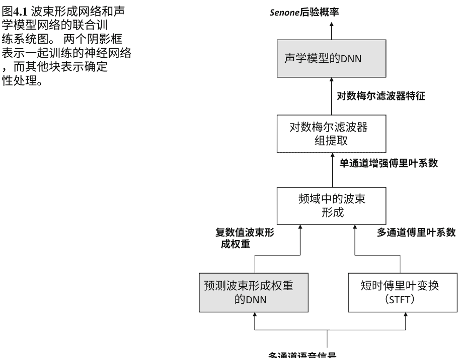

在网络的右分支中，通过使用短时傅里叶变换 (STFT) 将时域信号转换为频域。然后，预测的波束形成权重以与传统频域波束形成器相同的方式应用于多通道傅里叶系数。增强的单通道傅里叶系数然后被馈送到特征提取模块，以生成用于声学建模的对数梅尔滤波器组。声学模型网络将滤波器组映射到音素后验概率。在本节的其余部分，我们将详细解释每个模块。

与传统方法相比，如图4.1所示的联合波束形成-声学建模方法的主要区别在于波束形成权重的估计现在由具有可训练参数的神经网络实现。因此，该系统能够通过在多通道语音信号上训练其参数来自动学习如何进行波束形成。此外，权重预测DNN可以与声学模型DNN一起使用ASR成本函数（如交叉熵）进行训练。这允许两个DNN之间的交互，并在理论上可以实现比传统波束形成更优化的ASR。

图4.2 本章中使用的阵列几何图示

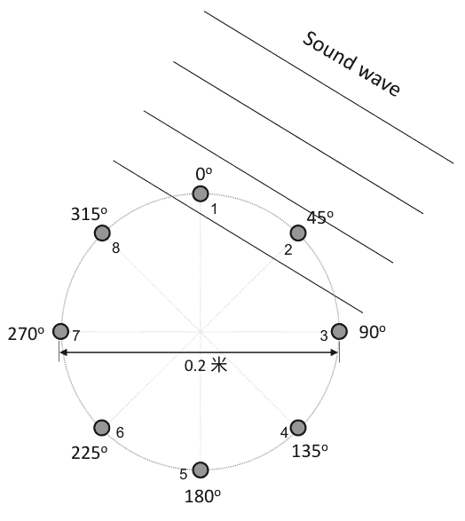

尽管本章研究的联合波束形成-声学建模方法理论上可以应用于任何麦克风阵列几何，但我们需要选择一个几何图示进行说明和实验。我们选择使用一个由八个全向麦克风组成的圆形阵列，如图4.2所示。阵列的直径为0.2米。该阵列旨在用于远场场景，如会议室。这种阵列几何图示也在几个鲁棒ASR语料库中使用，包括REVERB挑战赛[16]和AMI会议语料库[22]。在本章中，我们将使用这些语料库来训练和评估所提出的方法。

### 4.3.3 通过DNN预测波束形成权重

给定多通道语音信号，使用前馈DNN在频域中确定波束形成权重（滤波器和求和波束形成）。我们假设只有一个目标语音源，波束形成器将从目标方向检索语音，同时减弱其他方向的干扰。

预测波束形成权重的过程如图4.3所示。从多通道语音信号中，我们首先提取每帧的广义互相关 (GCC) 特征，得到编码有关通道相位延迟信息的588维特征向量。DNN将每个GCC特征向量映射到一个4112维的波束形成权重向量。最后，通过对话语进行平均，得到平均波束形成权重。在接下来的两节中，我们将描述GCC特征提取和波束形成权重向量的详细信息。

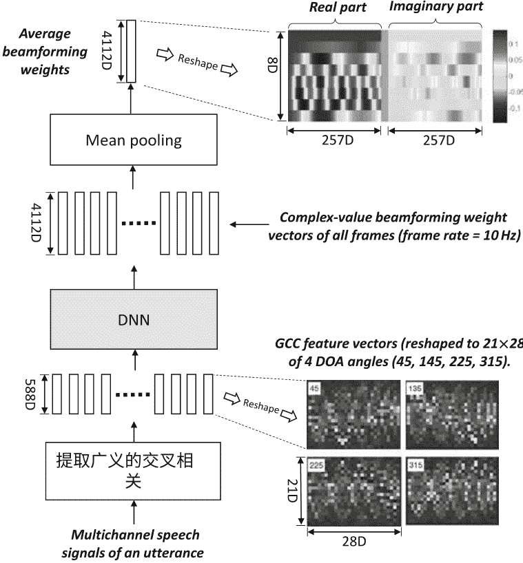

图4.3 波束形成权重预测网络的块图

#### 4.3.3.1 提取GCC特征

波束形成需要目标方向的信息。对于远场场景，这导致在时域中确定到达时间差 (TDOA) 或在频域中的相位差的问题。与传统波束形成方法类似，DNN还需要关于TDOA或相位差的信息来预测波束形成权重。

理论上，DNN应该能够直接从原始波形中学习相位信息。我们还可以利用已被证明有效的现有方法，例如广义交叉相关相位变换 (GCC-PHAT) 方法[17]。对于由两个麦克风通道 $y_i[n]$ 和 $y_j[n]$ 记录的信号，可以使用GCC-PHAT方法计算频域中的交叉相关，方法如下：

$$G_{ij}(f) = \frac{Y_i(f) Y_j^*(f)}{|Y_i(f) Y_j^*(f)|}, \qquad (4.9)$$

$Y_i(f)$ 是 $y_i[n]$ 的傅里叶变换结果，在频率 $f$ 处。$G_{ij}(f)$ 测量了两个通道之间的相位差。时域中的互相关可以通过以下方式获得：

$$R_{i,j}(\tau) = \text{IFT}(G_{i,j}(f)), \quad (4.10)$$

其中 IFT() 表示逆傅里叶变换。在经典方法中，我们可以通过找到互相关函数的峰值来估计麦克风 $i$ 和 $j$ 之间的 TDOA：

$$\hat{\tau}_{ij} = \arg \max_\tau R_{ij}(\tau). \quad (4.11)$$

然而，由于两个原因，使用估计的TDOA作为预测波束形成权重的特征是不合适的。首先，如果在估计TDOA时出现错误，该错误将传播到波束形成网络中，并且无法纠正。其次，单个TDOA估计包含的信息远少于整个相关函数 $R_{i,j}(\tau)$。出于这些原因，我们使用整个相关函数作为输入特征。

在实践中，不需要使用整个相关函数作为输入，因为对于正常麦克风阵列的TDOA估计或预测波束形成权重，大部分元素都没有信息。让我们用一个例子来说明。假设语音信号采样率为16,000 Hz，我们使用0.2秒的窗口（即3200个样本）来估计相关函数。得到的相关函数将有3200个元素的长度。假设阵列中两个麦克风之间的最大距离为0.2米；麦克风之间的最大时间延迟为 (0.2 m / 340 m/s) × 16,000 sample/s ≈ 9.4 samples。

因此，只需保留与时间延迟的相关函数高达 $\pm10$ samples，即每个麦克风对提取一个由21个元素组成的特征向量。

为了提高波束形成权重预测的鲁棒性，有必要使用所有麦克风对的相关函数，即使对于已知的阵列几何形状也是如此。例如，如果有八个麦克风，将会有 $C(8, 2) = 28$ 个麦克风组合。我们的初步研究表明，使用所有麦克风对的相关性优于仅使用参考麦克风和其他麦克风之间的相关性。这可能是因为使用所有麦克风对时存在互补信息，可以帮助预测。由于发言者可能移动，GCC特征是在每个0.2秒长的窗口中提取的，移动步长为0.1秒。

总之，我们将GCC函数用作波束形成权重预测的特征。对于一个直径为0.2米的圆形阵列，有八个通道，我们将有28个相关向量，每个向量包含21个元素。如果我们将这28个向量作为矩阵的列，我们将发现不同的DOA角度对应不同的模式，如图4.3底部所示。这表明了GCC特征对于确定源的DOA以及确定波束形成权重非常有信息量。有关使用GCC特征进行DOA估计的更多细节可以在[30]中找到。

###### 4.3.3.2 波束形成权重向量

对于每个GCC特征向量，波束形成DNN预测一组频域波束形成权重，如图4.3所示。如果FFT长度为512，则有257个频率bin覆盖0到8000 Hz。每个频率bin有八个复数值权重，每个通道一个。由于标准DNN不能直接处理复数，波束形成DNN独立地预测权重的实部和虚部。因此，权重向量包含 257 × 8 × 2 = 4112 个实数元素。

如果说话人在一段话中是静止的，我们可以通过对一段话中的权重向量进行平均来实现更稳定的权重预测。由于AMI语料库中的说话者大部分时间都是静止的，我们在实验中使用了均值池化。如果说话者在一个话语中有明显的移动，我们可以使用平滑而不是均值池化来跟踪缓慢的说话者移动。另一种选择是使用具有时间记忆的循环神经网络，如LSTMs。

图4.3顶部显示了由DNN预测的波束形成权重的示例。实部和虚部分别显示，并且每个部分都被重新整形为一个 8×257 矩阵。从图中可以看出，尽管它们是独立预测的，但预测的权重非常稳定。在实验部分中，将展示预测的权重在不同频率下大部分时间具有一致的方向。请注意，由于我们选择第一个麦克风作为参考麦克风，它的虚部始终为零。

##### 4.3.4 对数梅尔滤波器组的提取

在波束形成模块之后，使用一系列步骤来实现典型的语音识别特征提取。在本章中，我们选择使用对数梅尔滤波器组能量作为自动语音识别的特征。我们将在下面详细介绍所有的特征提取模块。特征提取模块也在图4.4中进行了说明。

- **功率谱**。给定增强的复值谱 $X(t,f)$，计算功率谱为 $\|X(t, f)\|^2 = X(t, f)X^*(t, f)$。
- **梅尔滤波器组**。将功率谱分组成在梅尔频率尺度上具有相等带宽的梅尔滤波器组。这一步骤是通过使用线性变换 $\mathbf{x}_{\text{mel}}(t) = \mathbf{Mx}(t)$，其中 $\mathbf{M}$ 是一个大小为 $40 \times 257$ 的矩阵，其中 40 和 257 分别是滤波器组和频率 bin 的数量。$\mathbf{x}(t) = [\|X(t, 1)\|^2, \dots, \|X(t, K)\|^2]^T$ 是帧 $t$ 的功率谱系数向量，$\mathbf{x}_{\text{mel}}(t)$ 是其在梅尔频率尺度上的转换版本。变换 $\mathbf{M}$ 的参数是预先计算的（如图 4.5 所示），在网络训练期间不会更新。

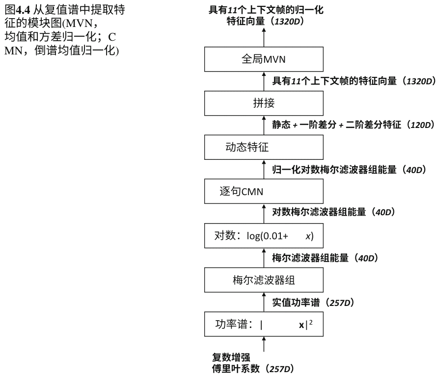

- **对数**。将自然对数应用于每个梅尔滤波器组能量，以压缩其动态范围，即 $\mathbf{x}_{\text{lm}}(t) = \log(\mathbf{x}_{\text{mel}}(t))$。作为对数函数的梯度 $\partial \log(x)/\partial x = 1/x$ 在 $x$ 接近 0 时数值上不稳定，因此我们向函数中添加一个小常数，$\log(\mathbf{x}_{\text{mel}}(t) + const)$，其中 $const$ 在我们的实验中设置为 0.01。为了确保大部分时频区间的语音滤波器能量大于 $const$ 且未被掩盖，我们将输入波形乘以一个像 $10^4$ 这样的大数。
- **逐句均值归一化**。对每个句子独立应用均值归一化，以减少通道效应。对于每个句子，归一化的特征向量可表示为 $\hat{\mathbf{x}}_{\text{lm}}(t) = \mathbf{x}_{\text{lm}}(t) - \bar{\mathbf{x}}_{\text{lm}}$，其中 $\bar{\mathbf{x}}_{\text{lm}}$ 是当前句子的均值向量。

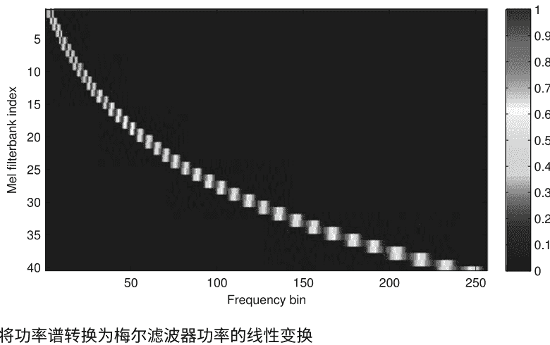

- **动态特征**。使用方程（5.16）[32]计算得到增量和加速度特征，窗口大小为 2。这些动态特征被附加到40D的对数滤波器组上。因此，用于声学建模的最终特征维度为120D。
- **连接上下文帧**。将11帧的上下文帧（左边5帧和右边5帧）连接起来形成声学模型网络的最终输入。
- **全局均值和方差归一化（MVN）**。在训练语料库上应用全局MVN，确保每个特征维度的均值为零，方差为单位。MVN被实现为一个对角仿射变换，在联合网络训练期间保持不变。在测试中也使用相同的变换。

##### 4.3.5 训练过程

如图4.1所示，波束形成和声学模型的联合训练同时优化ASR的两个网络。然而，从随机初始化开始训练网络可能会很困难或者收敛速度较慢。在实践中，我们可以分别初始化波束形成权重预测网络和声学模型网络，然后将它们放在一起进行联合训练。在实验中，我们遵循以下训练过程：

1. 通过学习DS波束形成的行为来初始化图4.3中的波束形成网络。这一步骤在模拟阵列数据上进行，我们知道真实的DOA，因此也知道DS波束形成权重。网络参数通过最小化预测权重和DS波束形成权重之间的均方误差（MSE）进行训练。在这一步骤中，平均池化被移除。
2. (可选) 通过最小化增强后的对数频谱和清晰的对数频谱之间的均方误差 (MSE) 来优化波束形成网络。这一步骤可以在模拟数据上进行，其中有清晰的语音信号，也可以在真实数据上进行，其中可以使用近距离话筒信号作为清晰的语音。
3. 通过使用来自步骤1或2的波束形成的对数梅尔滤波器组初始化声学模型网络。如果我们想要优化波束形成网络以与现有的声学模型一起使用，我们还可以使用在单声道语料库上训练的现有声学模型。
4. 同时进一步优化波束形成和声学模型网络，以最小化ASR成本函数，如交叉熵。在步骤2中，还可以使用多任务学习，例如优化ASR成本函数和语音增强成本函数。请注意，在步骤2和4中，由于使用了均值池化和动态特征计算等操作，需要基于句子进行训练。这意味着训练网络时使用的是逐句小批量而不是逐帧小批量。

#### 4.4 实验

##### 4.4.1 设置

###### 4.4.1.1 语料库

我们使用模拟和真实的阵列信号来训练波束成形和声学模型网络。阵列几何图形如图4.2所示，采样率为16 kHz。模拟阵列信号是通过将单声道清晰语音与人工房间冲激响应 (RIRs) 进行卷积生成的。清晰的语音来自WSJCAM0训练集[23]，其中包含7861个句子。RIRs是使用图像方法[2]生成的，使用了不同的房间尺寸和T60混响时间。使用了三种房间尺寸，包括小型、中型和大型房间。T60混响时间从0.1秒到1.0秒之间进行随机采样。在模拟的阵列信号中，从REVERB Challenge语料库[16]中随机选择的SNR级别添加了附加噪声样本。总共生成了90小时的模拟阵列数据，用于第1步和第2步，如第4.3.5节所列。真实的阵列信号来自AMI会议语料库[22]的多个远程麦克风 (MDM) 场景。训练集包含约75小时的数据，评估集包含约8小时的数据。训练集用于联合优化波束成形和声学模型网络，如第4.3.5节的第3步和第4步所描述。除了阵列信号，AMI语料库还包含与阵列信号并行录制的近距离麦克风数据。近距离麦克风数据用于训练和测试另一个声学模型，以展示波束成形和其他语音增强技术的上限。

波束形成和声学模型网络的联合训练是通过使用基于帧的交叉熵代价函数在MATLAB中实现的。在训练过程中，对于静音帧没有进行特殊处理。一旦网络训练完成，它们可以用于生成增强的语音，可以是波形或者滤波器组特征。然后，使用这些特征来从头开始训练DNN声学模型，使用Kaldi语音识别工具包[21]。LSTM声学模型是使用CNTK[1]进行训练的。DNN和LSTM声学模型都是首先使用交叉熵代价函数进行训练，然后使用顺序代价函数进行训练。对于ASR解码，使用训练数据中75小时的单词标签训练的三元语言模型被使用。

###### 4.4.1.2 网络配置

虽然波束形成网络可以使用更高级的网络类型来实现，但在本研究中我们使用了一个简单的前馈DNN。DNN中有两个隐藏层，每个隐藏层有1024个sigmoid隐藏节点。如前所述，网络的输入和输出维度分别为588和4112。输出层使用线性激活函数。

使用了两种类型的声学模型网络。为了联合交叉熵 (CE) 训练波束形成和声学模型网络，我们使用了一个前馈DNN作为声学模型，其中包含六个隐藏层，每个隐藏层有2048个sigmoid隐藏节点。输入和输出维度分别为1320和3968。为了实现更好的ASR性能，我们还使用波束形成网络处理的特征联合训练了基于LSTM的声学模型。之所以使用前馈DNN作为声学模型，主要是因为我们的实现方式，而不是因为所提出的波束形成网络的任何限制。我们将将来研究在波束形成和声学模型网络中同时使用LSTM的方法。

##### 4.4.2 波束形成图案

为了了解波束形成网络的行为，我们研究了它们预测的波束形成权重并分析了波束形成图案。在图4.6中，我们展示了在训练过程中未见过的一个模拟句子的四个不同频率下的波束形成图案。比较了四个波束形成图案，即给定真实DOA的DS波束形成器的波束形成图案（由红色方框标记），以及通过步骤1、2和4训练的网络生成的波束形成图案（在第4.3.5节中列出）。从图中可以观察到，除了在1250和2500 Hz频率下的第4步（联合训练）存在空间混叠外，所有波束形成图案都在真实DOA方向附近具有最大增益。在高频率（如3750和5000 Hz）下存在空间混叠。步骤1的波束形成图案非常接近DS波束形成器的波束形成图案。这是合理的，因为DS波束形成器被用于在训练步骤1中教授网络。步骤2和4的波束图案与DS波束形成器的波束图案偏离，因为它们分别经过语音增强和ASR成本函数的改进。

在图4.7中，我们展示了来自AMI语料库评估集的真实句子的波束图案。由于我们不知道AMI数据的真实DOA，因此我们只展示在训练步骤1、2和4中获得的波束形成网络生成的波束图案。可以观察到波束图案彼此相似。在所有频率上，有一个指向大约120°方向的波束，这可能是语音源的方向。请注意波束形成网络步骤1和步骤2仅在模拟数据上进行了训练，它们仍然可以为AMI数据产生合理的波束图。

从模拟和真实阵列数据的波束图中，我们可以得出结论，只要阵列几何不变，波束形成网络能够为未知数据预测合理的权重。3个训练步骤的波束图之间的视觉差异不显著。我们将使用ASR结果来评估它们的性能，在下面的章节中。

##### 4.4.3 语音增强结果

我们还研究了波束形成网络产生的增强频谱图，如图4.8所示。与远距离麦克风的频谱图（SDM1）相比，波束形成网络显著减少了混响和噪声，例如在第140帧之后的帧中。然而，通过三个训练步骤的网络增强的频谱图之间的差异并不明显。通过非正式的听力测试，我们注意到步骤1、2和4的增强语音质量明显更好。

##### 4.4.4 语音识别结果

ASR的WER结果显示在表4.1中。为了比较，还显示了几个其他系统的结果，包括近距离话筒（个人耳机话筒或IHM），单个远程话筒（SDM1，圆形阵列的第一个话筒），以及应用DS进行语音增强的结果。

#### 表4.1 AMI语料库评估集上的ASR结果

| 行号 | 方法 | 训练步骤 | 使用波形 | 特征类型 | 声学模型 DNN (WER%) | 声学模型 LSTM (WER%) |
| :--- | :--- | :--- | :--- | :--- | :--- | :--- |
| 1 | IHM | — | — | MFCC (CMNspk+LDA+MLLT+fMLLR) | 25.5 | — |
| 2 | SDM1 | — | — | — | 53.8 | — |
| 3 | DSB | — | 是 | — | 47.9 | — |
| 4 | BF网络 | 步骤1 | 是 | — | 47.2 | — |
| 5 | BF网络 | 步骤2 | 是 | — | 45.7 | — |
| 6 | BF网络 | 步骤2 | 是 | fbank (CMNspk) | 46.1 | — |
| 7 | BF网络 | 步骤2 | 是 | fbank (CMNutt) | 45.3 | — |
| 8 | BF网络 | 步骤2 | 否 | fbank (CMNutt) | 45.7 | — |
| 9 | BF网络 | 步骤4 | 否 | fbank (CMNutt) | 44.7 | 42.2 |
| 10 | DSB | — | 是 | fbank (CMNutt) | — | 44.8 |

对于每一行，声学模型都是从相应的特征上从头开始训练的。“使用波形”指定了我们是否从增强的频谱中重新合成波形。“fbank”指的是对数梅尔滤波器组特征。“CMNspk”和“CMNutt”分别是依赖于说话人和语音的CMN。“LDA”，“MLLT”和“fMLLR”通常与梅尔频率倒谱系数（MFCC）特征一起使用的特征投影/变换。

将波束形成器（由BeamformIt工具包[3]实现）应用于八通道阵列信号。DS波束形成器将SDM1的WER从53.8%降低到47.9%，显示了波束形成在改善远场ASR性能方面的有效性。

如果我们使用在第一步训练中训练的波束形成网络来处理阵列信号（第4行），我们可以获得与DS波束形成器类似的性能。这是合理的，因为波束形成网络在训练的第一步中被训练来近似DS波束形成器。值得注意的是，BF网络独立地应用于每个片段（由AMI语料库的Kaldi配方定义，平均几秒钟长），而DS波束形成则应用于整个音频文件，并且权重每隔几百毫秒更新一次。因此，这两个系统之间存在一些细微差别。

如果波束形成网络训练到第二步（第5行），即优化语音增强的波束形成网络，WER进一步降低到45.7%。与训练步骤1（第4行）和DS波束形成器（第3行）相比，这是一个显著的改进。到目前为止，波束形成网络尚未使用AMI语料库进行训练。这表明，如果测试数据的阵列几何与模拟训练数据的阵列几何相同，波束形成网络能够很好地推广到未见过的房间类型和说话者。

到目前为止，我们从增强频谱重新合成的波形中提取特征。在联合波束形成和声学模型训练中，增强频谱直接用于生成对数梅尔滤波器组特征，而无需重新合成波形。在表格的接下来的三行（第6-8行），我们逐渐开始使用从增强频谱生成的滤波器组特征，以便结果与联合训练可比较。在第6行，我们使用从增强频谱生成的滤波器组特征替换从重新合成的波形中提取的特征。通过与第5行进行比较，我们观察到在没有特征投影/变换LDA+MLLT+fMLLR的情况下，WER从45.7%增加到46.1%。然后，我们用语句相关的均值归一化（CMNutt）替换说话人相关的均值归一化（CMNspk），并观察到0.8%的绝对WER降低。最后，我们直接从增强的频谱中提取滤波器组，并观察到0.4%的WER增加。对于重新合成的波形（第7行），稍微更好的性能可能是因为波形重新合成中使用的重叠和求和（OLS）操作可能具有平滑效果，减少了处理变化。

使用AMI数据对波束形成和声学模型网络进行联合训练，如第9行所示。获得了1.0%的绝对WER降低，证明了联合优化波束形成网络和声学模型的好处。最后，我们用LSTM替换了DNN声学模型。第9行和第10行的结果表明，LSTM在性能上优于DNN声学模型，并且联合训练的波束形成网络比DS波束形成器的WER绝对值提高了2.6%。

#### 4.5 总结与未来方向

在本章中，我们回顾了语音识别的波束成形方法，重点关注了基于学习的方法。我们还详细描述了我们最近的工作，该工作使用深度神经网络来预测波束成形权重，并与声学模型联合训练以获得最佳性能。从实验结果中，我们得出了两个主要观察结果：

- 1. 前馈深度神经网络（或更一般地说，神经网络）能够学习从GCC特征到频域波束成形权重的映射关系。这种映射关系相对稳定，正如增强和语音识别结果所观察到的，使用模拟数据训练的深度神经网络在未见过的真实录音上表现良好。这种映射关系只要求训练和测试中的阵列几何形状相同即可发挥作用。
- 2. 如果我们使用语音识别成本函数联合训练声学模型和波束形成网络，波束成形网络可以针对语音识别任务进行优化。表4.1的实验结果，第8行和第9行，证明了这个假设。在当前版本的联合训练中，我们只使用滤波器组特征，然后从头开始重新训练声学模型。这表明改进仅来自于改进的波束成形网络，而不是声学模型。

本章所提出的工作可以在几个方面进一步改进。我们在下面列出了一些：

- 更好的网络结构用于波束形成权重预测。例如，可以使用LSTM来预测波束形成权重。由于LSTM能够捕捉输入的长期时间动态，因此它可能能够产生更好的预测，特别是当语音源移动时。
- 除了GCC之外，还有更适合的输入。GCC是提取波束形成所需的相位信息的经典方法。相位信息也可以通过网络提取。可以将其他类型的输入映射到波束形成权重，例如原始波形或多通道复值频谱。
- 更好的目标权重。在本章中，我们使用了DS波束形成器来教授网络。DS波束形成器仅使用几何信息，而不使用噪声信息。可以使用其他类型的波束形成器，如MVDR，来教授网络。
- 多任务学习。我们可以训练波束形成和声学模型网络，同时最小化多个成本函数。例如，一个成本函数可以与自动语音识别相关（如交叉熵），另一个可以与语音增强相关（在适当领域中增强语音和清晰语音之间的均方误差）。不同的成本函数从不同的角度提供训练信号，可能提高网络的鲁棒性。
- 用于语音分离的波束形成。在这项工作中，我们专注于单源场景，假设能量最高的源是目标。在实际应用中，多个说话者同时说话很常见。使用基于学习的波束形成方法解决语音分离任务是一项具有挑战性和有前景的方向。
- 与阵列几何无关的波束形成。当前的工作假设阵列几何是固定的。尽管这个假设在许多实际应用中是成立的，但有趣的是研究一个单一的网络是否能够预测多个阵列几何的波束形成权重。

#### 参考文献

- 1. Agarwal, A., Akchurin, E., Basoglu, C., Chen, G., Cyphers, S., Droppo, J., Eversole, A., Guenter, B., Hillebrand, M., Hoens, R., 等: 计算网络和计算网络工具包简介。微软技术报告，MSR-TR-2014-112 (2014)
- 2. Allen, J., Berkley, D.: 用于高效模拟小房间声学的图像方法。J. Acoust. Soc. Am. 65(4), 943–950 (1979)
- 3. Anguera, X., Wooters, C., Hernando, J.: 用于会议发言人分离的声学波束形成。IEEE Trans. Audio Speech Lang. Process. 15(7), 2011–2022 (2007)
- 4. Barker, J., Marxer, R., Vincent, E., Watanabe, S.: 第三届“CHiME”语音分离和识别挑战：数据集、任务和基线。在：2015年IEEE自动语音识别和理解研讨会 (ASRU 2015) (2015)
- 5. Bitzer, J., Simmer, K.U.: 超指向性麦克风阵列。在: Brandstein, M.S., Ward, D. (eds.) 麦克风阵列: 信号处理技术和应用, 第2章, 第19-38页。Springer, Berlin (2001)
- 6. Capon, J.: 高分辨率频率-波谱分析。IEEE 57(8), 1408-1418 (1969)
- 7. Doclo, S., Moonen, M.: 基于GSVD的单麦克风和多麦克风语音增强的最优滤波。IEEE信号处理 50(9), 2230-2244 (2002)
- 8. Elko, G.W.: 同向性噪声场中差分麦克风的空间相干函数。在: Brandstein, M.S., Ward, D. (eds.) 麦克风阵列: 信号处理技术和应用, 第4章, 第61-85页。Springer, Berlin (2001)
- 9. Er, M., Cantoni, A.: 太阳风监测卫星: 宽带元空间天线阵列处理器的导数约束。IEEE Trans. Audio Speech Lang. Process. 31(6), 1378–1393 (1983)
- 10. Gales, M.J.: 基于HMM的语音识别的最大似然线性变换. Comput. Speech Lang. 12(2), 75–98 (1998)
- 11. Griffiths, L.J., Jim, C.W.: 线性约束自适应波束形成的另一种方法。IEEE Trans. Antennas Propag. 30(1), 27–34 (1982)
- 12. Haeb-Umbach, R., Warsitz, E.: 空间相关噪声中的自适应滤波器和求和波束形成。在: 国际声学回声和噪声控制研讨会 (IWAENC 2005) (2005)
- 13. Heymann, J., Drude, L., Chinaev, A., Haeb-Umbach, R.: BLSTM支持的GEV波束形成器前端用于第三届CHiME挑战。在: 2015年IEEE自动语音识别和理解研讨会 (ASRU), 第444-451页。IEEE, 纽约 (2015)
- 14. Hoshen, Y., Weiss, R.J., Wilson, K.W.: 从原始多通道波形进行语音声学建模。在: IEEE国际声学、语音和信号处理会议, 第4624-4628页。IEEE, 纽约 (2015)
- 15. Jahn Heymann, L.D., Haeb-Umbach, R.: 基于神经网络的声谱掩码估计用于声学波束形成。在: IEEE国际会议论文集, 声学、语音和信号处理。IEEE, 纽约 (2016年)
- 16. Kinoshita, K., Delcroix, M., Yoshioka, T., Nakatani, T., Sehr, A., Kellermann, W., Maas, R.: REVERB挑战: 混响消除和混响语音识别的共同评估框架。在: IEEE信号处理应用于音频和声学的研讨会 (WASPAA), 第1-4页。IEEE, 纽约 (2013年)
- 17. Knapp, C.H., Carter, G.C.: 时间延迟估计的广义相关方法。IEEE Trans. Acoust. Speech Signal Process. 24(4), 320-327 (1976年)
- 18. 刘, Y., 张, P., Hain, T.: 在远场多麦克风基于语音识别中使用神经网络前端。在: 2014年IEEE国际会议上, 声学, 语音和信号处理 (ICASSP), 第5542-5546页。IEEE, 纽约 (2014年)
- 19. Narayanan, A., Wang, D.: 用于鲁棒自动语音识别的联合噪声自适应训练。在: 2014年IEEE国际会议上, 声学, 语音和信号处理 (ICASSP), 第2504-2508页。IEEE, 纽约 (2014年)
- 20. Picone, J.W.: 语音识别中的信号建模技术。IEEE 81 (9), 1215-1247 (1993年)
- 21. Povey, D., Ghoshal, A., Boulianne, G., Burget, L., Glembek, O., Goel, N., Hannemann, M., Motlicek, P., Qian, Y., Schwarz, P., Silovsky, J., Stemmer, G., Vesely, K.: Kaldi 语音识别工具包。在: IEEE 2011年自动语音识别和理解研讨会。IEEE信号处理学会 (2011年)。IEEE目录号: CFP11SRW-USB
- 22. Renals, S., Hain, T., Bourlard, H.: 会议的识别和理解: AMI和AMIDA项目。在: IEEE自动语音识别和理解研讨会, ASRU, 京都 (2007年)。IDIAP-RR 07-46
- 23. Robinson, T., Fransen, J., Pye, D., Foote, J., Renals, S.: WSJCAM0: 一种用于大词汇连续语音识别的英国英语语音语料库。在: IEEE国际会议声学、语音和信号处理 (ICASSP), 第81-84页 (1995年)
- 24. Sainath, T.N., Weiss, R.J., Wilson, K.W., Narayanan, A., Bacchiani, M., Senior, A.: 从原始多通道波形中实现说话人位置和麦克风间距不变的声学建模。在: IEEE自动语音识别和理解研讨会 (ASRU)，第30-36页（2015年）
- 25. Sainath, T.N., Weiss, R.J., Wilson, K.W., Narayanan, A., Bacchiani, M.: 因素化的空间和谱多通道原始波形CLDNNs。在: IEEE国际会议声学、语音和信号处理（2016年）
- 26. Seltzer, M.L., Raj, B., Stern, R.M.: 用于鲁棒免提语音识别的最大似然波束成形。IEEE Trans. Speech Audio Process. 12(5), 489–498 (2004)
- 27. Souden, M., Benesty, J., Affes, S.: 关于噪声降低的最优频域多通道线性滤波。IEEE Trans. Audio Speech Lang. Process. 18(2), 260–276 (2010)
- 28. Swietojanski, P., Ghoshal, A., Renals, S.: 用于远距离语音识别的卷积神经网络。IEEE Signal Process Lett. 21(9), 1120–1124 (2014)
- 29. Van Veen, B.D., Buckley, K.M.: 波束成形：一种多功能的空间滤波方法。IEEE ASSP Mag. 5(2), 4–24 (1988)
- 30. 肖, X., 赵, S., 钟, X., 琼斯, D.L., 庄, E.S., 李, H.: 一种基于学习的方法用于在嘈杂和混响环境中估计到达方向。在: IEEE国际会议声学、语音和信号处理（ICASSP），第2814-2818页。IEEE, 纽约（2015年）
- 31. 肖, X., 徐, C., 张, Z., 赵, S., 孙, S., 渡边, S., 王, L., 谢, L., 琼斯, D.L., 庄, E.S., 李, H.: 基于神经网络的波束形成方法在语音识别中的研究: CHiME-4评估的NTU system。在: CHiME 4研讨会（2016年）
- 32. 杨, S., 埃弗曼, G., 盖尔斯, M., 海恩, T., 科尔肖, D., 刘, X., 摩尔, G., 奥德尔, J., 奥拉森, D., 波维, D., 等: HTK书, 第3.4版。剑桥大学工程学院，剑桥（2006年）
- 33. Yu, D., Eversole, A., Seltzer, M., Yao, K., Huang, Z., Guenter, B., Kuchaiev, O., Zhang, Y., Seide, F., Wang, H., 等: 计算网络和计算网络工具包简介。微软研究技术报告, 微软研究院（2014年）

## 第五章 使用深度神经网络进行原始多通道处理

**Tara N. Sainath, Ron J. Weiss, Kevin W. Wilson, Arun Narayanan, Michiel Bacchiani, Bo Li, Ehsan Variani, Izhak Shafran, Andrew Senior, Kean Chin, Ananya Misra和Chanwoo Kim**

**摘要**

多通道自动语音识别（ASR）系统通常将语音增强（包括定位、波束形成和后处理）与声学建模分开。在本章中，我们在深度神经网络框架中同时进行多通道增强和声学建模。受波束形成的启发（波束形成利用不同麦克风上信号的细微时间结构差异来过滤来自不同方向的能量），我们探索直接对原始时域波形进行建模。我们引入了一个神经网络架构，在网络的第一层进行多通道滤波，并且证明该网络学习对不同目标说话者方向的到达具有鲁棒性，表现与具有真实目标说话者方向的模型一样好。接下来，我们展示了如何通过将第一层分解为多通道空间滤波操作和计算频率分解的单通道滤波器组件来提高性能。我们还介绍了一种自适应变体，它根据先前的输入在每个时间帧上更新空间滤波器系数。最后，我们证明这些方法在频域中可以更高效地实现。

总体而言，我们发现这种多通道神经网络相对于传统的波束形成多通道ASR系统和单通道波形模型，其相对词错误率提高了超过5%，甚至超过10%。

#### 5.1 引言

尽管最先进的自动语音识别（ASR）系统在近距离话筒条件下表现得相当好，但在话筒远离用户的情况下，性能会下降。在这种远场情况下，语音信号会受到混响和加性噪声的影响。为了改善这种情况下的识别，ASR系统通常使用多个麦克风的信号来增强语音信号并减少混响和噪声的影响[2, 6, 10]。

多通道ASR系统通常使用单独的模块进行识别。首先，应用麦克风阵列语音增强，通常分为定位、波束形成和后处理阶段。得到的单通道增强信号传递给传统的声学模型[15, 35]。常用的增强技术是滤波和求和波束形成[2]，它首先通过定位将来自不同麦克风的信号在时间上对齐，以调整从目标说话者到每个麦克风的传播延迟。然后，将时间对齐的信号通过每个麦克风的滤波器并求和，以增强来自目标方向的信号并衰减来自其他方向的噪声。常用的滤波器设计准则基于最小方差无失真响应（MVDR）[10, 39]或多通道Wiener滤波（MWF）[6]。

当最终目标是提高ASR性能时，独立于声学模型调整增强模型可能不是最佳选择。为了解决这个问题，[34]提出了最大似然波束形成（LIMABEAM）方法，该方法将波束形成器参数与声学模型参数一起进行优化。研究表明，这种技术优于传统技术，如延迟和求和波束形成（即滤波和求和，其中滤波器由脉冲组成）。与大多数增强技术一样，LIMABEAM是一种基于模型的方案，需要一个交替进行声学模型推断和增强模型参数优化的迭代算法。现代声学模型通常基于神经网络，使用梯度学习算法进行优化。

将基于模型的增强与使用梯度学习的声学模型相结合可能会导致相当复杂的情况，例如[17]。在本章中，我们扩展了[34]中将波束形成与声学建模同时进行的思想，但是在深度神经网络（DNN）框架中进行，通过直接在原始信号上训练声学模型。DNN具有吸引力，因为已经证明它们能够同时进行特征提取和分类[23]。先前的研究已经证明了直接在原始的单声道时域波形样本上训练深度网络的可能性[11, 18, 19, 24, 30, 37]。本章的目标是探索多种不同的联合增强/声学建模DNN架构，用于处理多通道信号。我们将展示同时优化两个阶段比独立调整增强算法和声学模型级联的技术更有效。

由于波束形成利用了不同麦克风上的信号的细微时间结构，我们首先直接对原始时域波形进行建模。在这个模型中，引入了[18, 29]中的第一层由多个时间卷积滤波器组成，将多个麦克风信号映射到一个单一的时频表示。正如我们将展示的那样，这一层学习了空间选择性的带通滤波器，通常学习了几个具有几乎相同频率响应但零点指向不同到达方向的滤波器。这个频谱滤波层的输出被传递给声学模型，例如卷积长短期记忆深度神经网络 (CLDNN) 声学模型[28]。网络的所有层都是联合训练的。

如上所述，多通道语音识别系统通常会独立于单通道特征提取进行空间滤波。基于此，我们接下来将明确分解这两个操作，使其成为独立的神经网络层。这个“分解”的原始波形模型的第一层由短时多通道时间卷积滤波器组成，将多通道输入映射到单通道，这样网络可能会在这一层学习执行宽带空间滤波。通过在这个“空间滤波层”学习多个滤波器，我们假设网络可以学习多个不同的空间观察方向的滤波器。每个空间滤波器的单通道波形输出被传递到一个更长时的时间卷积“频谱滤波层”，旨在执行类似于[30]中的时域听觉滤波器组的更细频率分解。这个频谱滤波层的输出也被传递到一个声学模型。

上述两种架构的一个问题是，一旦在训练过程中学习到权重，它们就会对每个测试语音保持不变。相比之下，一些波束形成技术，如广义旁瓣抵消器[14]，在每个语音中自适应地更新权重。我们探索了一种自适应神经网络架构，其中使用长短期记忆(LSTM)来预测每帧更新的空间滤波器系数。这些滤波器用于对多通道输入进行滤波和求和，在将增强的单通道输出传递给波形声学模型之前，替代了上述分解模型中的“空间滤波层”。

最后，由于两个时域信号之间的卷积等效于它们频域对应部分的逐元素乘积，我们通过使用原始输入的复数快速傅里叶变换并在频域中实现滤波器来研究加速上述原始波形神经网络架构的方法。

#### 5.2 实验细节

##### 5.2.1 数据

我们在一个包含大约2000小时嘈杂训练数据的数据集上进行了实验，该数据集包含300万个英语话语。这个数据集是通过人工损坏干净的话语，使用房间模拟器添加不同程度的噪声和混响来创建的。干净的话语是匿名的，并且是手动转录的语音搜索查询，代表了Google的语音搜索流量，如第18章所述。噪声信号包括从YouTube采样的音乐和环境噪声以及“日常生活”环境的录音，这些信号以信噪比（SNR）从0到20 dB的范围内添加到干净的话语中，平均约为12 dB。混响使用图像法模拟[1]，房间尺寸和麦克风阵列位置从100个可能的房间配置中随机采样，$T_{60}$ 范围从400到900 ms，平均约为600 ms。模拟使用了一个八通道均匀线性麦克风阵列，麦克风间距为2 cm。噪声源位置和目标说话者位置在话语之间发生变化；声源与麦克风阵列之间的距离在1到4 m之间变化。

主要评估集由一个单独的约30,000个话语（超过20小时）的集合组成，通过模拟类似的信噪比和混响设置来创建，以训练集为基础。我们注意确保评估集中的房间配置、信噪比值、$T_{60}$ 时间以及目标说话人和噪声位置与训练集中的不同。训练集和模拟测试集中的麦克风阵列几何形状是相同的。

我们通过使用嘴模拟器和扬声器分别播放评估集和噪声，在客厅环境中获得了第二个“重新录制”的测试集。信号使用半径为3.75厘米的七通道圆形麦克风阵列进行录制。假设通过阵列周围对角线相对的两个麦克风的 $x$ 轴，目标说话人的到达角度范围从0°到180°。噪声来自与目标说话人不同的位置。源到目标的距离范围从1到6米。为了创建带噪声的重新录制评估集，重新录制的语音和噪声信号在将噪声缩放以获得0到20 dB的信噪比后进行人工混合。信噪比的分布与生成模拟评估集时使用的分布相匹配。我们创建了四个版本的重新录制集来衡量我们模型的泛化性能。前两个版本的重新录制语音没有添加任何噪声。麦克风阵列分别放置在房间的中心和靠近墙壁的位置，以捕捉相对不同的混响特性。剩下的两个子集对应于这些集合的带噪声版本。

##### 5.2.2 基准声学模型

我们将本章提出的模型与基准CLDNN声学模型进行比较，基准模型使用对数梅尔特征[28]，窗口大小为25毫秒，步长为10毫秒进行训练。单声道模型使用来自通道1的信号，双声道模型使用通道1和8（间距为14厘米），四声道模型使用通道1、3、6和8（阵列跨度为14厘米，麦克风间距为4厘米-6厘米）。

基准CLDNN架构显示在图5.1的CLDNN模块中。首先，fConv层在频率维度上进行卷积。输入对数梅尔频率特征以获得一定的音高和声道长度不变性。用于这个卷积层的架构与[25]中提出的类似。具体来说，使用一个256个大小为1×8的时间-频率卷积层。我们的池化策略是在频率轴上使用非重叠的最大池化，池化大小为3。池化后的输出输入到一个256维的线性低秩层。

频率卷积的输出传递给一堆LSTM层，这些层对长时间尺度上的信号进行建模。我们使用了三个LSTM层，每个层包含832个单元，并且使用了一个512单元的投影层进行降维，参考文献[33]。最后，我们将最终的LSTM输出传递给一个包含1024个隐藏单元的全连接DNN层。由于语言模型使用的13,522个上下文相关状态输出目标的高维度，在softmax层之前使用了一个512维的线性输出低秩投影层，以减少整个模型中的参数数量，参考文献[27]。本章中的一些实验没有使用频率卷积层，我们将这样的声学模型称为LDNNs。

在训练过程中，CLDNN在20个时间步骤上展开，并使用截断的时间反向传播（BPTT）进行训练。此外，输出状态标签被延迟了五帧，因为我们观察到未来帧的信息有助于更好地预测当前帧，参考文献[28]。

除非另有说明，所有神经网络都是使用异步随机梯度下降（ASGD）优化[9]来优化交叉熵（CE）准则进行训练的。附加的序列训练实验也使用了分布式ASGD [16]。所有网络都有13,522个上下文相关（CD）输出目标。

所有卷积神经网络（CNN）和DNN层的权重都使用Glorot-Bengio策略[13]进行初始化，而所有LSTM层的权重都是在均匀分布的随机初始化下在-0.02和0.02之间。我们使用指数衰减的学习率，初始值为0.004，在150亿帧内衰减0.1。

#### 5.3 多通道原始波形神经网络

##### 5.3.1 动机

提出的多通道原始波形CLDNN与滤波和求和波束形成有关，滤波和求和波束形成是延迟和求和波束形成的一种推广，在对每个麦克风的信号进行求和之前使用有限冲激响应（FIR）滤波器进行滤波。使用类似于[34]的符号表示，滤波和求和增强可以写成以下形式：

$$y[t] = \sum_{c=0}^{C-1} \sum_{n=0}^{N-1} h_c[n]x_c[t - n - \tau_c], \qquad (5.1)$$

其中 $h_c[n]$ 是与麦克风 $c$ 相关的滤波器的第 $n$ 个延迟，$x_c[t]$ 是麦克风 $c$ 接收到的信号，在时间 $t$ 时，$\tau_c$ 是用于对麦克风 $c$ 接收到的信号进行对齐的定向到达时间差，而 $y[t]$ 是输出信号。$C$ 是阵列中的麦克风数量，而 $N$ 是FIR滤波器系数的数量。

##### 5.3.2 时域中的多通道滤波

实现(5.1)的增强算法通常依赖于对定位模型的定位延迟 $\tau_c$ 的估计，并通过优化MVDR等目标来计算滤波器参数 $h_c[n]$。相反，我们的目标是允许网络通过优化声学建模分类目标来联合估计定位延迟和滤波器参数。该模型使用一组 $P$ 多通道滤波器来捕捉不同的定位延迟。滤波器的输出 $p \in \{0, \dots, P - 1\}$ 可以写成如下形式：

$$y^p[t] = \sum_{c=0}^{C-1} \sum_{n=0}^{N-1} h^p_c[n]x_c[t - n] = \sum_{c=0}^{C-1} x_c[t] * h^p_c, \quad (5.2)$$

其中，转向延迟隐含地吸收到滤波器参数 $h^p_c[n]$ 中。在这个方程中，“*”表示卷积操作。

我们原始波形架构中的第一层实现了 (5.2) 作为一个多通道卷积（在时间上）与一个FIR空间滤波器组 $h_c = \{h^1_c, h^2_c, \dots, h^P_c\}$，其中 $h_c \in \Re^{N \times P}$，对于 $c \in \{0, \dots, C - 1\}$。每个滤波器 $h^p_c$ 与相应的输入通道 $x_c$ 进行卷积，对于滤波器 $p$ 的整体输出通过对所有通道 $c \in \{0, \dots, C - 1\}$ 的卷积结果求和来计算。每个滤波器内部的操作等效于一个FIR滤波器和求和波束形成器，只是它不会显式地通过估计到达的时间差来移动每个通道中的信号。正如我们将展示的那样，网络会隐式地学习到转向延迟和滤波器参数。

输出信号的采样率与输入信号保持一致，其中包含的信息通常比声学建模所需的信息更多。为了产生一个对在不同时间偏移下出现的感知上和语义上相同的声音具有不变性的输出，我们在滤波之后对输出进行时间池化操作[18, 30]，这个操作的效果类似于在短时傅里叶变换中丢弃相位。具体来说，滤波器组的输出在时间上进行最大池化，以获得一定程度的短期偏移不变性，然后通过一个压缩非线性函数。

如[18, 30]所示，类似于上述描述的单通道时间卷积层实现了传统的时域滤波器组。这样的层可以实现标准的伽马音滤波器组，该组由一组时域滤波器、整流和平均化组成。在一个小窗口上。给定一个足够大的 $P$，相应的多通道层可以实现频率分解以及空间滤波。因此，我们随后将这一层的输出称为“时频”特征表示。

多通道时间卷积层的示意图如图5.1中的 tConv 块所示。首先，我们对每个通道 $C$ 的原始波形取长度为 $M$ 的小窗口，表示为 $\{x_0[t], x_1[t], \dots, x_{C-1}[t]\}$ 对于 $t \in 1, \dots, M$。每个通道 $x_c$ 的信号与一组带有 $N$ 个延迟的 $P$ 个滤波器进行卷积 $h_c = \{h_c^1, h_c^2, \dots, h_c^P\}$。当卷积在时间上以1的步长跨越 $M$ 个样本时，每个通道的卷积输出为 $y[t] \in \Re^{(M-N+1) \times P}$。在通道 $c$ 上求和后，我们在时间上对滤波器输出进行最大池化（从而丢弃短期相位信息），在整个输出信号的时间长度 $M-N+1$ 上，产生 $y[t] \in \Re^{1 \times P}$。最后，我们应用一个修正的非线性函数，然后进行稳定的对数压缩¹，产生 $z[l]$，一个在帧 $l$ 上的 $P$ 维帧级特征向量。然后，我们将窗口向前移动10毫秒，并重复这个时间卷积，产生一个以10毫秒间隔的特征帧序列。

为了与对数梅尔特征的时间尺度匹配，原始波形特征是以相同的滤波器大小25毫秒计算的，或者以采样率16 kHz计算 $N = 400$。输入窗口大小为35毫秒（$M = 560$），给出一个10毫秒完全重叠的池化窗口。我们的实验探索了时间卷积滤波器的数量 $P$ 的变化。

如图5.1所示的CLDNN块中，时间卷积层（tConv）的输出产生了一个帧级特征，表示为 $z[l] \in \Re^{1 \times P}$。然后将该特征传递给在第5.2节中描述的CLDNN模型[28]，该模型预测上下文相关的状态输出目标。

##### 5.3.3 滤波器组的空间多样性

图5.2绘制了训练了 tConv 后的示例多通道滤波器系数及其相应的空间响应或波束图。波束图显示了以dB为单位的幅度响应随频率和到达方向的变化情况，即波束图的每个水平切片对应于来自特定方向的信号的滤波器幅度响应，每个垂直切片对应于特定频带中所有空间方向上的滤波器响应。较浅的颜色表示通过滤波器的频率-方向空间的区域，较深的颜色表示被滤波器滤除的区域。在给定的波束图中，我们将包含最大总响应的频带称为滤波器的中心频率。由于滤波器主要是频率带通滤波器，并且与该频率对应的方向为滤波器的零方向。

网络倾向于学习每个通道中具有非常相似形状的滤波器系数，除了它们在相对位置上稍微偏移，与第5.3节中描述的延迟调整的概念一致。大多数滤波器在频率上具有带通响应，带宽随中心频率增加而增加，并且许多滤波器被定向以对从特定方向到达的信号具有更强的响应。在图5.2中显示的模型中，大约三分之二的滤波器表现出显著的空间响应，即在滤波器中心频率处的最小响应方向和最大响应方向之间至少有6 dB的差异。这种强烈的空间响应在第二个滤波器中的120°附近的零点和图5.2中显示的第四个滤波器中的60°附近的类似零点中清晰可见。

图5.3绘制了单通道和双通道网络训练的滤波器组的峰值响应频率。这两个网络收敛到类似的频率尺度，都在低频率上分配了更多的滤波器（相比梅尔尺度）。例如，学习到的滤波器组大约有80个峰值响应频率低于1000 Hz的滤波器，而在128个频带的梅尔尺度中只有40个中心频率低于1000 Hz的频带。网络还学习到具有相同整体形状和频率响应但调谐到不同方向零点的滤波器子集，如图5.2中的前两个示例滤波器所示。这种空间响应的多样性为上游层提供了可以用来区分来自不同方向信号的信息。

因为每个滤波器都有固定的方向响应，网络利用方向性信息的能力受到所使用滤波器数量的限制。通过增加滤波器的数量，我们可以潜在地改善学习滤波器的空间多样性，从而使网络更好地利用方向性。表5.1展示了增加滤波器数量对总体词错误率（WER）的影响。对于两个通道输入的网络，改进在128个滤波器时达到饱和，而四通道和八通道网络在256个滤波器时继续改进。通过额外的输入通道，tConv滤波器能够学习更复杂的空间响应（即使总体阵列跨度不变），从而使网络能够利用额外的滤波器组容量来提高性能。

##### 5.3.4 与对数梅尔的比较

我们通过计算每个通道的对数梅尔特征，并将其作为独立的特征图输入到CLDNN中，来训练基准多通道对数梅尔CLDNN模型。由于原始波形模型在增加滤波器数量时有所改善，我们对对数梅尔进行了相同的实验。值得注意的是，将来自不同通道的基于幅度的特征（即对数梅尔）连接到神经网络中已被证明比单通道更好[22, 36]。

表5.1 不同输入通道的原始波形多通道CLDNN的WER

| 滤波器数量 | 2通道 (14厘米) | 4通道 (4-6-4厘米) | 8通道 (2厘米) |
| :--- | :--- | :--- | :--- |
| 128 | 21.8 | 21.3 | 21.1 |
| 256 | 21.7 | 20.8 | 20.6 |
| 512 | - | 20.8 | 20.6 |

*括号中给出了麦克风间距*

表5.2 对数梅尔多通道CLDNN的WER

| 滤波器数量 | 2通道 (14厘米) | 4通道 (4-6-4厘米) | 8通道 (2厘米) |
| :--- | :--- | :--- | :--- |
| 128 | 22.0 | 21.7 | 22.0 |
| 256 | 21.8 | 21.6 | 21.7 |

表5.2显示，对于对数梅尔特征，增加滤波器数量（频带）或增加麦克风通道数量对词错误率没有明显影响。由于对数梅尔特征是从快速傅里叶变换（FFT）幅度计算得出的，因此丢弃了细微的时间结构（存储在相位中）以及关于麦克风之间延迟的信息。因此，对数梅尔模型只能利用较弱的麦克风级别差异线索。

然而，原始波形模型中的多通道时域滤波器组利用了细微的时间结构，并且随着滤波器数量的增加，显示出更大的改进。

***

¹ 我们使用一个小的添加偏移量来截断输出范围，避免在非常小的输入时出现数值不稳定性：log(· + 0.01)。

比较表5.1和5.2，我们可以看到原始波形模型在更多通道的情况下始终优于对数梅尔，这样更多的空间多样性就有可能。

### 5.3.5 与语音TDOA的Oracle知识比较

请注意，前一小节中介绍的模型并没有明确估计目标源在不同麦克风上的到达时间差异，这在波束成形中通常会进行。到达时间差异（TDOA）估计非常有用，因为时间对齐和合并信号会使阵列朝着增强目标语音信号相对于来自其他方向的噪声源的方向转动。

在本节中，我们分析了在使用真实的房间几何计算得到的真实TDOA对齐信号时，原始波形CLDNN的行为。

在延迟和求和（D+S）方法中，我们通过对应的TDOA将每个通道中的信号进行平移，将它们平均在一起，并将结果传递到一个单通道的原始波形CLDNN中。在时间对齐的多通道（TAM）方法中，我们将信号在时间上进行对齐，并将它们作为单独的通道输入传递到多通道的原始波形CLDNN中。因此，多通道原始波形CLDNN和TAM之间的区别仅在于数据如何呈现给网络（是否首先明确对齐以“引导”到目标说话者方向）；网络架构是相同的。表5.3比较了D+S、TAM和原始波形模型在不通过TDOA平移信号时的WER。

首先，注意随着通道数的增加，D+S的性能持续提高，因为更细的空间采样减小了空间响应的旁瓣，从而增加了对来自其他方向的噪声和混响能量的抑制。其次，注意TAM始终比D+S具有更好的性能，因为TAM比D+S更通用，允许在组合之前对各个通道进行滤波。但是请注意，没有任何明确的时间对齐或定位（TDOA估计）的原始波形CLDNN与具有时间对齐的TAM一样表现出色。这表明经过训练的未对齐网络对不同的TDOA具有隐式的鲁棒性。

**表5.3 具有真实目标TDOA的oracle知识的WER**

| 特征 | 1通道 | 2通道 (14 厘米) | 4通道 (4-6-4 厘米) | 8通道 (2 厘米) |
| :--- | :--- | :--- | :--- | :--- |
| Oracle D+S | 23.5 | 22.8 | 22.5 | 22.4 |
| Oracle TAM | 23.5 | 21.7 | 21.3 | 21.3 |
| 原始，无TDOA | 23.5 | 21.8 | 21.3 | 21.1 |

*所有模型使用128个滤波器*

**表5.4 经过序列训练后的原始波形模型WER**

| 模型 | WER-CE | WER-Seq |
| :--- | :--- | :--- |
| 原始, 1通道 | 23.5 | 19.3 |
| D+S, 8 通道, oracle | 22.4 | 18.8 |
| MVDR, 8 通道, oracle | 22.5 | 18.7 |
| 原始, 未分解, 2 通道 | 21.8 | 18.2 |
| 原始, 未分解, 4 通道 | 20.8 | 17.2 |
| 原始, 未分解, 8 通道 | 20.6 | 17.2 |

*所有模型使用128个滤波器*

##### 5.3.6 总结

在本节中，我们在表5.4中展示了序列训练后的结果。我们还包括了八通道Oracle D+S的结果，其中真实的目标语音TDOA是已知的，以及Oracle MVDR [39]的结果，其中除了目标TDOA外，真实的语音和噪声估计也是已知的。表5.4显示，即使只使用两个通道输入和没有Oracle信息，原始未分解模型的性能也优于单通道和Oracle信号处理方法。使用四个通道输入，原始波形未分解模型相对于单通道、D+S和MVDR实现了8-10%的相对改进。

#### 5.4 空间和频谱选择性分解

##### 5.4.1 架构

在多通道语音识别系统中，多通道空间滤波通常与单通道特征提取分开进行。然而，在未分解的原始波形模型中，空间和频谱滤波在网络的一层中完成。在本节中，我们将空间和频谱滤波分解为不同的层，如图5.4所示。

这种架构的动机是设计第一层具有空间选择性，同时在第二层实现跨所有空间滤波器的频率分解。因此，第二层的组合输出是将所有空间和频谱滤波器的笛卡尔积。

第一层，在图中表示为 Conv1，再次模拟 (5.2) 并使用FIR空间滤波器进行多通道时间卷积。每个滤波器 $p \in \{0, \dots, P-1\}$ 的操作，在因子模型中我们将共称为空间观测方向，可以再次解释为滤波器和求和波束形成器，只是任何整体时间偏移都隐含在滤波器系数中，而不是像 (5.1) 中明确表示的那样。未因子化方法和因子化方法之间的主要区别如下。首先，为了鼓励网络，滤波器的大小 $N$ 和滤波器的数量 $P$ 都要小得多。

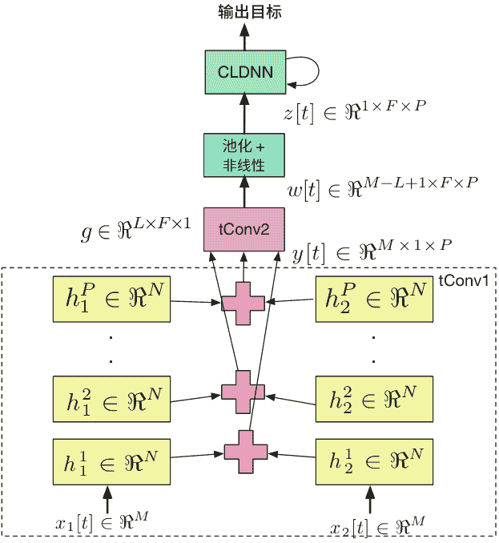
图5.4 分解的多通道原始波形CLDNN架构，用于 $P$ 个查找方向。为了简单起见，图中只显示了两个通道。

以学习具有宽频响应的滤波器，这些滤波器跨越了一小部分空间查找方向，以覆盖所有可能的目标说话者位置。该层中较短的滤波器的频率分辨率将比未分解的模型中的滤波器差，但这将在下一层中处理。我们希望这种较差的频率分辨率能够鼓励网络将第一层用于空间滤波，具有有限的频谱响应。为了使分解模型的前两层在概念上类似于未分解模型的第一层（即一组带通波束形成器），多通道（第一层）滤波器层不会在任何非线性压缩（即ReLU，log）之后，并且我们不会在第一层和第二层之间执行任何池化操作。

第二个时域卷积层，在图中表示为 tConv2，由更长持续时间的单声道滤波器组成。因此，它可以学习比第一层更好的频率分辨率的分解，但无法进行任何空间滤波。给定第一层的 $P$ 个特征图，我们对每个信号进行时间卷积，与 [30] 中描述的单声道时间卷积层非常相似，只是时间卷积在所有 $P$ 个特征图或“观察方向”之间共享。我们将这一层的滤波器表示为 $g \in \mathbb{R}^{L \times F \times 1}$，其中 1 表示在 $P$ 个输入特征图之间共享。“valid”卷积产生一个输出 $w[t] \in \mathbb{R}^{(M-L+1) \times F \times P}$。频谱卷积的输出，每个方向的每个滤波器的层次，由公式 (5.3) 给出：

$$w_f^p[t] = y^p[t] * g_f. \quad\quad (5.3)$$

接下来，我们通过在时间上汇总滤波器组的输出来丢弃短时（即相位）信息，覆盖整个输出信号的时间长度，以产生一个维度为 $1 \times F \times P$ 的输出。最后，我们应用一个修正的非线性函数，然后进行稳定的对数压缩，以产生一个帧级特征向量，在帧 $l$ 处，即 $z_l \in \mathbb{R}^{1 \times F \times P}$，然后将其传递给CLDNN模型。然后，我们将原始波形的窗口向右移动一个小的（10毫秒）跳跃，并重复这个时间卷积，以产生一组10毫秒间隔的时频方向帧。

##### 5.4.2 空间滤波器的数量

我们首先探索了所提出的分解多通道架构在空间滤波器数量 $P$ 变化时的行为。表5.5显示，我们在十个空间滤波器上获得了良好的改进。由于将十个特征图传递给 tConv2 层的计算复杂性，我们没有探索超过十个滤波器。

具有10个空间滤波器的分解网络相对于两通道未分解多通道原始波形CLDNN实现了20.4%的WER，相对改进了6%。需要注意的是，由于 tConv2 层在所有观察方向上共享，实际上参数的总数比未分解模型少。

##### 5.4.3 滤波器分析

为了更好地理解 tConv1 层学习到的内容，图5.5绘制了训练后的两通道滤波器系数和相应的空间响应或波束图。尽管在第5.4.1节中描述的直觉，第一层滤波器似乎同时进行空间和频谱滤波。然而，波束图仍然可以被分为几个广泛的类别。

**表5.5 在空间滤波器大小变化时的WER (tConv1)**

| # 空间滤波器 $P$ | WER |
| :--- | :--- |
| 基准2通道，原始[29] | 21.8 |
| 1 | 23.6 |
| 3 | 21.6 |
| 5 | 20.7 |
| 10 | 20.4 |

*所有模型都使用128个滤波器进行 tConv2，结果基于两个通道*

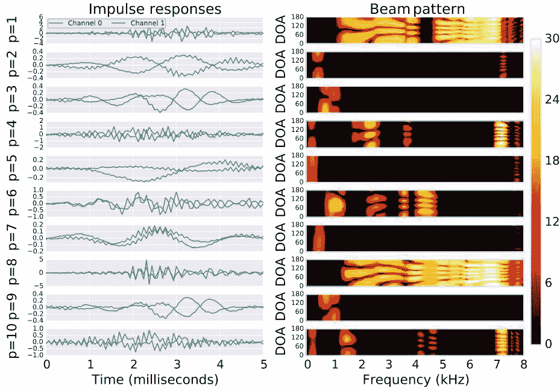
图5.5 训练后的滤波器和十个空间方向的空间响应

**表5.6 训练与固定 tConv1 层的WER，两个通道**

| # 空间滤波器 $P$ | tConv1 层 | WER |
| :--- | :--- | :--- |
| 5 | 固定 | 21.9 |
| 5 | 训练 | 20.9 |

例如，在图5.5中的滤波器2、3、5、7和9只通过一些低频子带，大约在1.5 kHz以下，大部分元音能量发生的地方，但是被导向在不同的方向上具有零点。在高频区域，很少进行空间滤波，而这里有很多摩擦音和塞音。低频信号对于定位最有用，因为它们不受空间混叠的影响，并且包含了语音信号中大部分的能量；也许这就是为什么网络展现出这种结构的原因。

为了进一步了解 tConv1 中空间和频谱滤波的好处，我们强制该层仅执行空间滤波，通过将滤波器初始化为以零延迟为中心的冲激响应（通道0上的冲激响应，以及在每个滤波器上通道1以不同的延迟偏移）。通过不对该层进行训练，相当于在一组固定的观察方向上执行延迟求和滤波。

表5.6比较了固定和训练 tConv1 层时的性能。结果表明，学习滤波器参数，从而进行一定的频谱分解，可以提高性能，而不是保持该层固定。

**表5.7 序列训练后的因子模型WER（模拟）**

| 方法 | WER-CE | WER-Seq |
| :--- | :--- | :--- |
| 原始，未因子化，2通道 | 21.8 | 18.2 |
| 原始，因子化，2通道 | 20.4 | 17.2 |
| 原始，未因子化，4通道 | 20.8 | 17.2 |
| 原始，因子化，4通道 | 19.6 | 16.3 |

##### 5.4.4 结果总结

在本节中，我们在表5.7中展示了序列训练后的结果，比较了因子化和未因子化的模型。请注意，两通道因子化模型相对于未因子化模型提供了6%的相对改进，而四通道模型提供了5%的相对改进。我们不会超过四个通道，因为表5.4中第5.3.6节的结果表明4个通道和8个通道之间没有显著区别。

#### 5.5 自适应波束形成

虽然未经因子化的模型改善了因子化模型，但该模型也存在一些缺点。首先，该模型中学习到的滤波器在解码过程中是固定的，这可能限制了适应以前未见过或变化的条件的能力。此外，由于因子化模型必须对每个方向进行频谱滤波，这会带来很大的计算复杂性。

##### 5.5.1 NAB 模型

为了解决模型 [29, 32] 的有限适应性和降低计算复杂性的问题，我们提出了一种神经网络自适应波束形成（NAB）模型 [21]，该模型在每个输入帧上重新估计一组空间滤波器系数。

NAB 模型如图5.6所示。在每个时间帧 $l$，它从 $C$ 个通道输入中接收每个通道 $c$ 的一小窗口 $M$ 个波形样本，表示为 $x_0(l)[t], x_1(l)[t], \dots, x_{C-1}(l)[t]$，$t \in \{0, \dots, M-1\}$。 除了之前的符号表示，本节还明确使用了帧索引 $l$ 来强调与帧相关的滤波器系数。为简单起见，图中显示了一个具有 $C = 2$ 个通道的 NAB 模型。

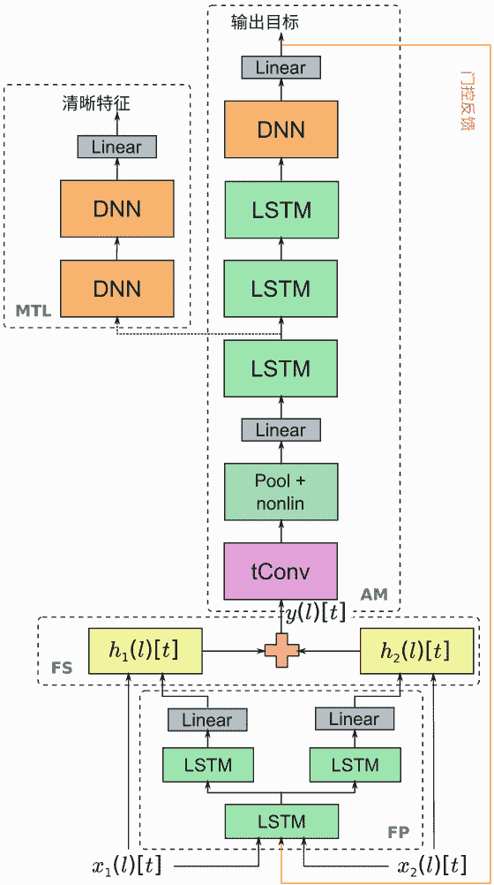
图5.6 神经网络自适应波束形成 (NAB) 模型架构。它由滤波器预测 (FP)、滤波器求和 (FS) 波束形成、声学建模 (AM) 和多任务学习 (MTL) 组成。图中为了简单起见显示了两个通道。

###### 5.5.1.1 自适应滤波器

自适应滤波层由公式 (5.4) 给出，其中 $h_c(l)[n]$ 是通道 $c$ 在时间帧 $l$ 上的估计滤波器。这个模型与 (5.1) 中的FS模型非常相似，只是现在方向延迟 $\tau_c$ 隐含地吸收到估计的滤波器参数中：

$$y(l)[t] = \sum_{c=0}^{C-1} \sum_{n=0}^{N-1} h_c(l)[n] x_c(l)[t-n]. \quad (5.4)$$

为了估计 $h_c(l)[t]$，我们使用一个共享的LSTM层，一个通道相关的LSTM层和线性输出来训练一个滤波器预测 (FP) 模块。投影层用于预测每个通道的 $N_{filter}$ 系数。$FP$ 模块的输入是来自所有通道的原始输入样本帧 $x_c(l)[t]$ 的串联，还可以包括通常用于定位的特征，如交叉相关特征 [20, 40, 41]。$FP$ 模块参数的估计与声学建模（AM）参数一起通过直接最小化交叉熵或序列损失函数来完成。根据 (5.4)，估计的滤波器系数 $h_c(l)[t]$ 与各通道的输入样本 $x_c(l)[t]$ 进行卷积。卷积的输出在通道上求和，产生单通道信号 $y(l)[t]$。

自适应FS之后，单声道增强信号 $y(l)[t]$ 传递给 AM 模块（图5.6）。我们采用了单声道原始波形CLDNN模型 [30] 进行声学建模，只是现在跳过了频率卷积层，因为最近的研究 [26] 表明它对于噪声更多的任务没有帮助。在训练过程中，AM 和 FP 同时进行训练。

###### 5.5.1.2 门控反馈

在每一帧上，将网络输入与上一帧的预测相结合已被证明可以提高性能 [4]。为了研究 NAB 模型中反馈的好处，我们将帧 $l-1$ 的 AM 预测传递回 FP 模型的时间帧 $l$（在图5.6中标记为“门控反馈”）。由于 softmax 预测是非常高维的，我们将 softmax 之前的低秩激活反馈给 FP 模块，以限制模型参数的增加 [42]。

这种反馈连接为 FP 模块提供了关于信号音素内容的高级信息，以帮助估计波束形成滤波器系数。这种反馈可能包含错误的模型预测，特别是在训练初期，因此可能导致模型训练不佳 [4]。因此，引入了一个门控机制来调节反馈的程度。与传统的 LSTM 门独立地控制每个维度不同，我们使用一个全局标量门 $g^{fb}(l)$ 来调节反馈。该门在时间帧 $l$ 处通过输入波形样本 $\mathbf{x}$、第一个 FP LSTM 层的状态 $\mathbf{s}$ 和反馈向量 $\mathbf{v}$ 计算得到：

$$g^{fb}(l) = \sigma(\mathbf{w}_x^T \mathbf{x}(l) + \mathbf{w}_s^T \mathbf{s}(l) + \mathbf{w}_v^T \mathbf{v}(l-1)) \quad (5.5)$$

其中 $\mathbf{w}_x, \mathbf{w}_s$ 和 $\mathbf{w}_v$ 是相应的权重向量，$\sigma$ 是一个逻辑函数，其输出值在范围 [0, 1] 内，其中 0 截断了反馈连接，1 直接通过反馈传递。因此，有效的 FP 输入是：

$$ [x(l), \quad g^{fb}(l)v(l-1)] $$

#### 5.5.1.3 MTL的正则化

多任务学习已被证明可以提高鲁棒性 [7, 12, 32]。我们在训练过程中采用了类似于 [32] 的 MTL 模块，通过配置网络具有两个输出：一个识别输出用于预测 CD 状态，第二个去噪输出用于重构从底层干净信号中得到的 128 个对数梅尔特征。去噪输出仅在训练过程中用于正则化模型参数；在推理过程中，相关层被丢弃。在 NAB 模型中，MTL 模块从 AM 模块的第一个 LSTM 层分支出来，如图 5.6 所示。MTL 模块由两个全连接的 DNN 层组成，后面是一个线性输出层。在训练过程中，从两个输出反向传播的梯度被加权 $\alpha$ 和 $1 - \alpha$ 分别用于识别和去噪输出。

##### 5.5.2 NAB 滤波器分析

在 [21] 中找到的最佳 NAB 模型具有以下配置：

- 1. FP 模块在通道之间有一个共享的 512 个单元的 LSTM 层，一个通道相关的 256 个单元的 LSTM 层，以及一个通道相关的 25 维线性投影层。
- 2. FP 模块接收每个通道的原始波形样本的串联。
- 3. FP 模块为每个通道输出一个 1.5 毫秒的滤波器（25 维向量）。
- 4. AM 模块是一个单通道的原始波形LDNN模型 [30]，具有 256 个 tConv 滤波器，并且没有频率卷积层 [26]。
- 5. 使用 128 维干净的对数梅尔特征作为次要重建目标，权重为 0.1。
- 6. 在 AM 模块的 softmax 层之前，从瓶颈层到 FP 模块的输入添加了一个逐帧门控反馈连接。

图 5.7 展示了目标语音和干扰噪声方向上预测波束形成滤波器的频率响应。这个话语的信噪比为 12 dB。目标语音方向上的响应相对于噪声方向上的响应具有更多与语音相关的变化。这可能表明预测的滤波器正在关注语音信号。此外，高语音能量区域的响应通常较低，这表明预测的滤波器具有自动增益控制效果。

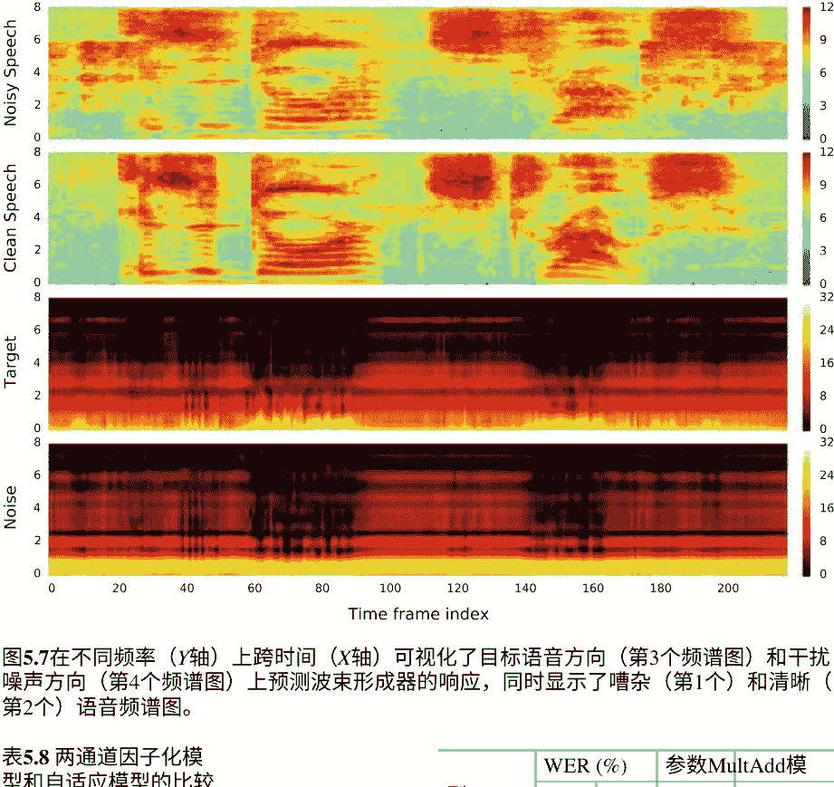
图 5.7 在不同频率（Y轴）上跨时间（X轴）可视化了目标语音方向（第3个频谱图）和干扰噪声方向（第4个频谱图）上预测波束形成器的响应，同时显示了嘈杂（第1个）和清晰（第2个）语音频谱图。

**表5.8 两通道因子化模型和自适应模型的比较**

| 模型 | WER-CE (%) | WER-Seq (%) | 参数 (M) | MultAdd (M) |
| :--- | :--- | :--- | :--- | :--- |
| 因子化 | 20.4 | 17.1 | 18.9 | 35.1 |
| NAB | 20.5 | 17.2 | 24.0 | 28.8 |

##### 5.5.3 结果总结

最后，为了总结本节，我们展示了序列训练与因子化模型相比的结果。由于 NAB 模型是没有进行频率卷积训练的（即 LDNN），我们对因子化模型也是同样的处理。表 5.8 显示，虽然因子化模型可以通过在空间滤波层中枚举许多方向来处理不同的方向，但自适应模型可以以更少的计算复杂度达到类似的性能，这可以从模型的参数和乘加（M+A）的数量来衡量。

#### 5.6 在频域中的滤波

到目前为止，我们在时域中提出了三种多通道模型。然而，众所周知，两个时域信号之间的卷积等同于它们频域对应部分的逐元素乘积 [3, 5]。在复数 FFT 空间中操作的好处是，逐元素乘积的计算速度比卷积要快得多，特别是当卷积滤波器和输入大小像我们的多通道原始波形模型一样大时。在本节中，我们将描述如何在频域中实现第 5.4 节的分解模型和第 5.5 节的 NAB 模型。

##### 5.6.1 分解模型

在本节中，我们将描述频域中的分解模型。

###### 5.6.1.1 空间滤波

对于帧索引 $l$ 和通道 $c$，我们用 $X_c[l] \in \mathbb{C}^K$ 表示对 $x_c[t]$ 的 $M$ 点 FFT 的结果，并用 $H_c^p \in \mathbb{C}^K$ 表示 $h_c^p$ 的 FFT。请注意，我们忽略负频率，因为时域输入是实数，因此我们的频域表示中的 $M$ 点 FFT 仅包含 $K = M/2 + 1$ 个独特的复数频带。式 (5.2) 中的空间卷积层可以用频域中的式 (5.6) 表示，其中 $\cdot$ 表示逐元素乘积。我们用 $Y^p[l] \in \mathbb{C}^K$ 表示该层的输出，对于每个观测方向 $p$：

$$Y^p[l] = \sum_{c=0}^{C} X_c[l] \cdot H_c^p. \quad (5.6)$$

在频域中，有许多不同的算法可以实现“频谱滤波”层。为了给读者一个“频谱滤波”的高级概述，在本章中我们选择只描述复线性投影 [38] 方法。

###### 5.6.1.2 频谱滤波：复线性投影

对于每个滤波器 $f$ 和查找方向 $p$，将 (5.3) 中的卷积直接重写为频率上的逐元素乘积是直接的：

$$W_f^p[l] = Y^p[l] \cdot G_f. \quad (5.7)$$

在上述方程中，$W_f^p[l] \in \mathbb{C}^K$ 和 $G_f \in \mathbb{C}^K$ 是 (5.3) 中时域滤波器 $g_f$ 的 FFT。在时域中，没有频域等效的最大池化操作。因此，要完全模拟最大池化，需要对 $W_f^p[l]$ 进行逆 FFT，并在时域中执行池化操作，这对于每个查找方向 $p$ 和滤波器输出 $f$ 来说计算成本很高。

作为一种替代方案，[38] 最近提出了复杂线性投影（CLP）模型，该模型在频域中执行平均池化，并且结果与单通道原始波形模型相似。与波形模型类似，池化操作后跟着逐点绝对值非线性性和对数压缩。查找方向 $p$ 和滤波器 $f$ 的一维输出为：

$$Z_f^p[l] = \log \left| \sum_{k=1}^N W_f^p[l, k] \right| \eqno{(5.8)}$$

### 5.6.2 NAB模型

在频域 NAB 设置中，我们有一个 LSTM，它预测两个通道的复杂 FFT（CFFT）输入。给定一个 512 点 FFT 输入，这相当于在时域中预测 $4 \times 257$ 个频率点，每个通道有实部和虚部，这比时域中预测的滤波器大小要多得多（即 1.5ms = 25 个采样点）。在为每个通道预测复杂滤波器之后，对每个通道的输入 FFT 进行逐元素乘积，模拟了频域中的卷积 (5.4)。这个输出被送入频域中的单通道 LDNN，该模型使用 CLP 方法进行谱分解，然后进行声学建模。

##### 5.6.3 结果：分解模型

###### 5.6.3.1 性能

首先，我们探索了频域分解模型的性能。注意：该模型没有任何频率卷积层。我们在空间层使用了与大多数高效原始波形分解设置 [31] 相似的设置，即 $P=5$ 个查找方向，在频谱层使用了 $F=128$ 个滤波器。输入长度为 32 毫秒，而不是原始波形的 35 毫秒，因为这样可以在 16 kHz 的采样率下进行 512 点的 FFT 转换而无需零填充。对于原始波形，35 毫秒的输入将需要我们进行 1024 点的 FFT 转换，但我们发现在 32 毫秒和 35 毫秒的输入之间在性能上没有太大差异。

表 5.9 频域分解模型性能

| 模型 | 空间 M+A | 频谱 M+A | 总计 M+A | WER CE | WER ST |
| :--- | :--- | :--- | :--- | :--- | :--- |
| 时间 | 525.6 千 | 15.71 百万 | 35.1 百万 | 20.4 | 17.1 |
| CLP | 10.3 千 | 655.4 千 | 19.6 百万 | 20.5 | 17.2 |

表 5.10 使用 64 毫秒窗口大小的结果

| 特征 | 空间 M+A | 频谱 M+A | 总计 M+A | WER ST |
| :--- | :--- | :--- | :--- | :--- |
| 时间 | 906.1 千 | 33.81 百万 | 53.6 百万 | 17.1 |
| CLP | 20.5 千 | 1.3 百万 | 20.2 百万 | 17.1 |

表 5.9 显示了时域和频域分解模型的性能，以及模型不同层的乘法和加法运算（M+A）的总数。表格显示，CLP 分解模型相对于最佳波形模型将操作数量减少了 1.9$\times$，并在 WER 上略有降低。

然而，考虑到频率模型更具计算效率，我们探索了通过增加因子模型的窗口大小（从而增加计算复杂度）来改善词错误率（WER）的方法。具体而言，由于较长的窗口通常有助于定位 [39]，我们尝试使用 64 毫秒的输入窗口来训练这两个模型。在 64 毫秒的输入窗口下，频率模型需要进行 1024 点的快速傅里叶变换（FFT）。表 5.10 显示，与较小的 32 毫秒输入相比，频率模型改善了词错误率（WER），并且性能基本相当。然而，与时域模型相比，频率模型的计算复杂度节约更大，达到了 2.7$\times$。

###### 5.6.3.2 在时域和频域学习的比较

图 5.8a 显示了时域和频域空间层的空间响应（即波束图）。波束图显示了以频率和到达方向为函数的幅度响应（以分贝为单位），即波束图的每个水平切片对应于来自特定方向的信号的滤波器幅度响应。在每个频带（垂直切片）中，较浅的色调表示通过了来自这些方向的声音，而较深的色调表示衰减了能量的方向。该图表明，时域学习的空间滤波器是带限的，而频域学习的滤波器则不是。此外，时域滤波器在不同频率上的峰值和零点对齐得很好。

这些模型之间的差异可以进一步从光谱层滤波器的幅度响应以及不同方向上的光谱层输出观察到，这些输出是为一个示例信号绘制的。图 5.8b 说明了时间模型和 CLP 模型的幅度响应在质量上看起来相似，并且学习具有逐渐增加的中心频率的带通滤波器。

(b) 分解模型, 频率
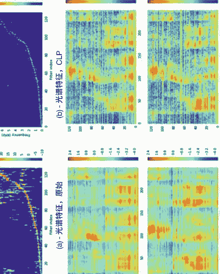
- 光谱层, CLP

- 光谱特征, CLP
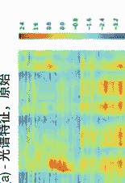

(a) 分解模型, 时间
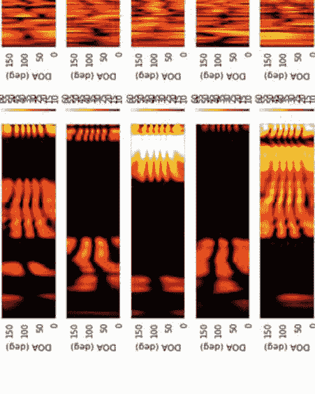
- 光谱层, 原始

- 光谱特征, 原始
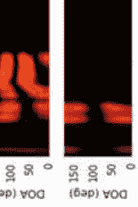

图 5.8 (a) 时间和频率模型的波束图。(b) 时间和频率域空间响应

表 5.11 时间和频率 NAB 模型的比较

| 模型 | WER (%) | 参数 (M) | 乘法加法 (M) |
| :--- | :--- | :--- | :--- |
| 原始 | 20.5 | 24.6 | 35.3 |
| CLP | 21.0 | 24.7 | 25.1 |

然而，由于时间和频率上的空间层面有很大的差异，我们可以看到与 CLP 模型相比，时间上的频谱层输出在不同的空间方向上更加多样化。

在某种程度上，时域和频域的表示是可以互换的，但它们会导致参数化非常不同的网络。尽管时间和频率模型都学习了不同的空间滤波器，但它们似乎都具有相似的识别错误率（WER）。在空间/频谱层上方的 LDNN 模型中大约有 1800 万个参数，占模型参数的 90% 以上。时间和频率上的空间层之间的任何差异可能都在网络的 LDNN 部分中得到解释。

##### 5.6.4 结果：自适应模型

接下来，我们将探讨频域 NAB 模型的性能。表 5.11 显示了原始波形和 CLP NAB 模型的识别错误率（WER）和计算复杂度。虽然使用 CLP 特征大大降低了计算复杂度，但性能却比原始波形模型差。我们的一个假设是频域处理需要预测更高维度的滤波器，从表中可以看出这导致了性能的下降。

#### 5.7 最终比较，重新录制的数据

最后，我们还评估了本章介绍的不同多通道模型在真实的“重新录制”测试集上的性能。Reverberation-I 是当麦克风放在咖啡桌上时，而 Reverberation-II 是当麦克风放在电视柜上时。由于该集合包含一个圆形麦克风几何结构，但我们的模型是在线性麦克风几何结构上训练的，因此我们只报告了使用两个通道形成线性阵列的结果，间距为 7.5 厘米。然而，模型是使用 14 厘米间距进行训练的。

表 5.12 显示了不同多通道模型的结果。所有原始波形模型都是使用 35 毫秒的输入和 128 个频谱分解滤波器进行训练的。分解模型有 5 个视角。CLP 分解模型是使用 64 毫秒的输入、5 个视角和 256 个频谱分解滤波器进行训练的。所有前端在网络的上层使用了 LDNN 架构。

表 5.12 “重新录制”集上的 WER

| 模型 | Rev-I | Rev-II | Rev-I 嘈杂 | Rev-II 嘈杂 | 平均 |
| :--- | :--- | :--- | :--- | :--- | :--- |
| 1通道原始 | 18.6 | 18.5 | 27.8 | 26.7 | 22.9 |
| 2通道原始，未分解 | 17.9 | 17.6 | 25.9 | 24.7 | 21.5 |
| 2通道原始，分解 | 17.1 | 16.9 | 24.6 | 24.2 | 20.7 |
| 2通道CLP, 分解 | 17.4 | 17.1 | 25.7 | 24.4 | 21.2 |
| 2通道原始, NAB | 17.8 | 18.1 | 27.1 | 26.1 | 22.3 |

注意到两通道原始分解模型相对于单通道有 13% 的相对改进，对于噪声更大的测试集有更大的改进，这是可以预期的。此外，CLP 分解模型在这个测试集上的表现略差于原始分解模型。一个假设是 CLP 分解模型捕捉到的空间多样性比原始波形模型要少，如图 5.8 所示。最后，NAB 模型的表现比分解模型要差得多。

也许是因为 NAB 模型学习了一组自适应滤波器，所以它对训练和测试条件之间的不匹配更敏感。

#### 5.8 结论和未来工作

在本章中，我们介绍了一种在神经网络框架内同时进行多通道增强和声学建模的方法。首先，我们开发了一个未分解的原始波形多通道模型，并展示了该模型与真实位置的理论知识相比表现出色。接下来，我们引入了一个分解的多通道模型，将空间和频谱滤波操作分离出来，并发现这比未分解模型有所改进。接下来，我们介绍了一种自适应波束形成方法，发现它在计算量较少的情况下与多通道模型的性能相匹配。

最后，我们展示了在计算量较少的情况下，我们可以与频域分解模型相匹配，达到与原始波形分解模型相近的性能。总体而言，分解模型相对于单通道和传统信号处理技术提供了 5-13% 的相对改进，无论是在模拟还是重新录制的数据集上。

#### 参考文献

- 1. Allen, J.B., Berkley, D.A.: 用于高效模拟小空间声学的图像方法。J. 声学学会 65(4), 943-950 (1979)
- 2. Benesty, J., Chen, J., Huang, Y.: 麦克风阵列信号处理。Springer, Berlin (2009)
- 3. Bengio, Y., Lecun, Y.: 将学习算法扩展到人工智能。大规模模拟机器。MIT 出版社, Cambridge (2007)
- 4. Bengio, S., Vinyals, O., Jaitly, N., Shazeer, N.: 用于序列预测的定期抽样与递归神经网络。在: 神经信息处理系统的进展, pp. 1171–1179 (2015)
- 5. Bracewell, R.: 傅里叶变换及其应用, 第3版。麦格劳-希尔, 纽约 (1999)
- 6. Brandstein, M., Ward, D.: 麦克风阵列: 信号处理技术和应用。Springer, 柏林 (2001年)
- 7. Chen, Z., Watanabe, S., Erdoğan, H., Hershey, J.R.: 使用多任务学习的长短期记忆递归神经网络进行语音增强和识别。在: Interspeech 会议论文集, 第 3274-3278 页。ISCA (2015年)
- 8. Chung, J., Gulcehre, C., Cho, K., Bengio, Y.: 门控反馈循环神经网络。arXiv 预印本。arXiv:1502.02367 (2015年)
- 9. Dean, J., Corrado, G., Monga, R., Chen, K., Devin, M., Le, Q., Mao, M., Ranzato, M., Senior, A., Tucker, P., Yang, K., Ng, A.: 大规模分布式深度网络。在: NIPS 会议论文集 (2012年)
- 10. Delcroix, M., Yoshioka, T., Ogawa, A., Kubo, Y., Fujimoto, M., Ito, N., Kinoshita, K., Espi, M., Hori, T., Nakatani, T., Nakamura, A.: 基于线性预测的去混响技术与先进的语音增强和识别技术在 REVERB 挑战中的应用。In: REVERB Workshop (2014)
- 11. Dieleman, S., Schrauwen, B.: 音乐音频的端到端学习。In: 2014 IEEE International Conference on Acoustics, Speech and Signal Processing (ICASSP), pp. 6964–6968. IEEE (2014)
- 12. Giri, R., Seltzer, M.L., Droppo, J., Yu, D.: 利用具备房间感知的深度神经网络和多任务学习改善混响中的语音识别。In: Proceedings of ICASSP, pp. 5014–5018. IEEE (2015)
- 13. Glorot, X., Bengio, Y.: 理解深度前馈神经网络训练的困难。在: AISTATS 会议论文集 (2014年)
- 14. Griffiths, L.J., Jim, C.W.: 一种线性约束自适应波束形成的替代方法。IEEE Trans. Antennas Propag. 30(1), 27–34 (1982)
- 15. Hain, T., Burget, L., Dines, J., Garner, P., Grezl, F., Hannani, A., Huijbregts, M., Karafiat, M., Lincoln, M., Wan, V.: 使用 AMIDA 系统转录会议。IEEE Trans. Audio Speech Lang. Process. 20(2), 486–498 (2012)
- 16. Heigold, G., McDermott, E., Vanhoucke, V., Senior, A., Bacchiani, M.: 异步随机优化用于深度神经网络序列训练。在: ICASSP 会议论文集 (2014年)
- 17. Hershey, J.R., Roux, J.L., Weninger, F.: 深度展开: 基于模型的新型深度架构的灵感。CoRR abs/1409.2574 (2014)
- 18. Hoshen, Y., Weiss, R.J., Wilson, K.W.: 从原始多通道波形进行语音声学建模。在: ICASSP 会议论文集 (2015年)
- 19. Jaitly, N., Hinton, G.: 使用受限 Boltzmann 机器学习更好的语音声波表示。在: ICASSP 会议论文集 (2011年)
- 20. Knapp, C.H., Carter, G.C.: 用于时间延迟估计的广义相关方法。IEEE Trans. Acoust. Speech Signal Process. 24(4), 320–327 (1976年)
- 21. Li, B., Sainath, T.N., Weiss, R.J., Wilson, K.W., Bacchiani, M.: 用于鲁棒多通道语音识别的神经网络自适应波束形成。在: Interspeech 会议论文集 (2016年)
- 22. 刘, Y., 张, P., Hain, T.: 在基于远场多麦克风的语音识别中使用神经网络前端。在: ICASSP 会议论文集 (2014年)
- 23. Mohamed, A., Hinton, G., Penn, G.: 理解深度置信网络在声学建模中的表现。在: ICASSP 会议论文集 (2012年)
- 24. Palaz, D., Collobert, R., Doss, M.: 使用卷积神经网络从原始语音信号中估计音素类别条件概率。在: Interspeech 会议论文集 (2014年)
- 25. Sainath, T.N., Kingsbury, B., Mohamed, A., Dahl, G., Saon, G., Soltau, H., Beran, T., Aravkin, A., Ramabhadran, B.: 改进深度卷积神经网络用于 LVCSR。在：ASRU 会议论文集（2013年）
- 26. Sainath, T.N., Li, B.: 使用 LSTM 与卷积架构对 LVCSR 任务进行时间-频率模式建模。在：Interspeech 会议论文集（2016年）
- 27. Sainath, T.N., Kingsbury, B., Sindhwani, V., Arisoy, E., Ramabhadran, B.: 用于高维输出目标的深度神经网络训练的低秩矩阵分解。在：ICASSP 会议论文集（2013年）
- 28. Sainath, T.N., Vinyals, O., Senior, A., Sak, H.: 卷积、长短期记忆、全连接的深度神经网络。在：ICASSP 会议论文集（2015年）
- 29. Sainath, T.N., Weiss, R.J., Wilson, K.W., Narayanan, A., Bacchiani, M., Senior, A.: 从原始多通道波形中实现说话人定位和麦克风间距不变的声学建模。在：ASRU 会议论文集（2015年）
- 30. Sainath, T.N., Weiss, R.J., Wilson, K.W., Senior, A., Vinyals, O.: 使用原始波形 CLDNNs 学习语音前端。在：Interspeech 会议论文集（2015年）
- 31. Sainath, T.N., Narayanan, A., Weiss, R.J., Wilson, K.W., Bacchiani, M., Shafran, I.: 减少多麦克风声学模型的计算复杂性与集成特征提取。在：Interspeech 会议论文集（2016年）
- 32. Sainath, T.N., Weiss, R.J., Wilson, K.W., Narayanan, A., Bacchiani, M.: 因子化的空间和谱多通道原始波形 CLDNNs。在：ICASSP 会议论文集（2016年）
- 33. Sak, H., Senior, A., Beaufays, F.: 用于大规模声学建模的长短期记忆循环神经网络架构。在：Interspeech 会议论文集（2014年）
- 34. Seltzer, M., Raj, B., Stern, R.M.: 用于鲁棒免提语音识别的最大似然波束成形。IEEE 音频语音语言处理杂志 12 (5)，489-498 (2004年)
- 35. Stolcke, A., Anguera, X., Boakye, K., Çetin, O., Janin, A., Magimai-Doss, M., Wooters, C., Zheng, J.: SRI-ICSI Spring 2007 会议和讲座识别系统。在：人类感知的多模态技术。计算机科学讲义，第 2 卷，第 450-463 页。Springer, 柏林 (2008年)
- 36. Swietojanski, P., Ghoshal, A., Renals, S.: 远距离和多通道大词汇语音识别的混合声学模型。在：ASRU 会议论文集（2013年）
- 37. Tüske, Z., Golik, P., Schlüter, R., Ney, H.: 使用原始时间信号进行 LVCSR 的深度神经网络声学建模。在：Interspeech 会议论文集（2014年）
- 38. Variani, E., Sainath, T.N., Shafran, I.: 复杂线性投影（CLP）：一种联合特征提取和声学建模的判别方法。在：Interspeech 会议论文集（2016年）
- 39. Veen, B.D., Buckley, K.M.: 波束形成：一种多功能的空间滤波方法。IEEE ASSP 杂志 5(2), 4-24 (1988)
- 40. Xiao, X., Watanabe, S., Erdogan, H., Lu, L., Hershey, J., Seltzer, M.L., Chen, G., Zhang, Y., Mandel, M., Yu, D.: 用于多通道语音识别的深度波束形成网络。在：ICASSP 会议论文集（2016年）
- 41. 肖，X.，赵，S.，钟，X.，琼斯，D.L.，庄，E.S.，李，H.：一种基于学习的方法用于在嘈杂和混响环境中估计到达方向。在：2015 年 IEEE 国际声学、语音和信号处理会议 (ICASSP)，第 2814-2818 页。IEEE (2015年)
- 42. 张, Y., 庄素万, E., 格拉斯, J.R.: 使用低秩矩阵分解提取深度神经网络瓶颈特征。在：ICASSP，第 185-189 页 (2014年)

### 第6章 语音处理中的新型深度架构

**约翰·R·赫尔希，乔纳森·勒鲁克斯，渡边真司，斯科特·智慧，朱欧·陈和尤苏夫·伊西克**

**摘要** 基于模型的方法和深度神经网络都是机器学习中非常成功的范例。在基于模型的方法中，问题领域的知识可以构建到模型的约束中。此外，自适应和聚类等无监督推理任务可以以自然的方式处理。然而，这些优势通常是以推理过程中的困难为代价的。相比之下，确定性的深度神经网络是一种以直接的方式构建的，而且判别式训练相对容易。然而，它们通常具有通用的架构，往往不清楚如何结合具体的问题知识或执行灵活的任务，如无监督推理。本章介绍了提供两种方法优势的框架。为此，我们从基于模型的方法和相关的推理算法开始，并将推理迭代解释为深度网络中的层，同时将其参数化地推广为更强大的网络。我们展示了这样的框架如何产生对传统网络的新理解，并如何产生用于语音处理的新型网络，包括基于非负矩阵分解、复杂高斯麦克风阵列信号处理和受高效谱聚类启发的网络。然后，我们讨论了最近的研究成果和未来研究的前景。

J.R. Hershey (✉) • J. Le Roux • S. Watanabe
Mitsubishi Electric Research Laboratories (MERL), Cambridge, MA, USA
e-mail: hershey@merl.com

S. Wisdom
华盛顿大学, 西雅图, 美国

Z. Chen
哥伦比亚大学, 纽约, 美国

Y. Isik
Sabanci大学, 伊斯坦布尔, 土耳其

#### 6.1 引言

机器学习中最成功的两个框架是基于模型的方法和深度神经网络 (DNNs)。每个方法都有其重要的优点和缺点。本章的目标是提供一种通用的策略，以获取这两种方法的优点，同时避免它们的许多缺点。总体思路可以概括如下：给定一个需要迭代推理方法的模型化方法，我们将迭代展开为类似神经网络的逐层结构。然后，我们解开层间的模型参数，得到可以使用基于梯度的方法进行判别式训练的新颖神经网络架构。得到的公式将传统深度网络的表达能力与模型化方法的内部结构相结合，同时允许在固定层数内进行推理，以获得最佳性能优化。

这种方法在 [19] 中被引入为深度展开。

基于生成模型的方法（如概率图模型）的一个优点是，它们允许我们在设计推理算法时利用先验知识和直觉来进行问题层面的推理，或者是 David Marr 所称的“计算理论”层面的分析 [18, 36]。关于问题约束的重要假设通常可以以一种直接的方式纳入基于模型的方法中。例如，来自现实世界的约束，如信号的线性可加性、视觉遮挡和三维几何，以及更微妙的统计假设，如条件独立性、潜在变量结构、稀疏性、低秩协方差等等。当然，假设错误会限制性能，但通过假设和测试不同的问题层面约束，可以获得对问题性质的洞察，并用作改进建模假设的灵感 [18]。

不幸的是，在复杂的概率模型中进行推断既在数学上又在计算上是棘手的。近似方法，如信念传播和变分近似，使我们能够推导出迭代算法来推断感兴趣的潜在变量。然而，这些近似进一步削弱了模型的约束，并且迭代方法对于时间敏感的应用来说仍然太慢。在这种情况下，对这些模型进行严格的判别优化可能具有挑战性，因为它们可能涉及双层优化，其中参数优化反过来又依赖于迭代推断算法 [6]。

确定性深度神经网络最近在许多应用中成为最先进的技术，其推断是通过一个封闭形式的表达式计算的，这些表达式被组织成层，通常按顺序执行。网络的判别性训练可用于优化速度与准确性的权衡，并且在产生在特定应用中表现非常好的系统方面已经变得不可或缺。然而，传统的 DNN 更接近于“黑盒”机制而不是问题级的表述，很难将先验知识纳入问题中。即使有一个工作的 DNN 系统，它到底是如何工作的并不清楚。它实现了它的结果，因此发现如何修改其架构以获得更好的结果可以被视为一门艺术和科学。

在本章中，我们提出了一个通用框架，通过将基于模型的方法的问题级别表述引入到设计深度神经网络架构的任务中来解决这些问题。深度展开框架的每个步骤都使用了众所周知的方法：为给定的概率模型推导迭代推理方法遵循了长期以来使用许多标准工具的传统，并且展开迭代并应用基于梯度的链式规则进行训练也很直接。我们首先展示了如何将传统的 Sigmoid 神经网络理解为在马尔可夫随机场 (MRFs) 中的均值场推理的深度展开应用。用信念传播替代均值场推理是深度展开可以导致替代神经网络架构的示例。

本章的其余部分重点讨论了体现在音频中遇到的问题级别假设的特定生成模型，例如线性混合和混响，并讨论了如何从中导出用于源分离的深度学习架构。我们首先将深度展开应用于非负矩阵分解 (NMF) [31, 47, 58]。NMF 没有闭合解，依赖于迭代推断方法，通常被制定为乘法更新。我们展开这些迭代，得到了一种新颖的非负深度网络架构，介绍在 [30] 中，它可以比 NMF 更强大，同时仍然包含其基本的可加性假设。我们还将深度展开应用于一种用于信道和源估计的生成模型，介绍在 [61] 中。最后，我们展示了如何展开聚类算法，以实现端到端训练语音分离系统，称为深度聚类 [21, 25]。

##### 6.1.1 与文献的关系

最近的一些工作已经解决了展开推理算法的思想，并在各种模型和推理方法的背景下使用梯度下降对其进行优化。稀疏编码 [16, 49] 和非负矩阵分解 [50, 63] 都已经使用展开和反向传播或其他优化方法进行了研究。在 [51] 中，基于梯度的优化被应用于二元成对马尔可夫随机场的循环置信传播。在 [7, 8] 中，树重新加权的置信传播和均值场推理被展开并通过梯度下降进行训练 Borisov。在 [14] 中，通过一组展开的推理算法来实现图模型中的推理，这些算法被训练用于预测一个保留变量在给定其他变量的情况下。在所有这些工作中，展开都是在不解开参数的情况下进行的，因此只对原始模型进行了近似优化。

在我们看来，解开参数是创建能够与传统深度网络竞争的新深度架构的重要一步。最近的一些工作已经开始解决马尔可夫随机场推理算法参数的解开问题。信念传播式推理是在 [43] 中学习的，使用了具有非绑定参数的逻辑回归。与我们的工作同时，[32] 引入了展开均值场推理和非绑定参数。然而，在这两种方法中，只有传统的 sigmoid 网络是非绑定的结果。

#### 6.2 深度展开的一般形式

在一般情况下，我们考虑生成模型，其中推理是一个优化问题。一个例子是变分推理，其中优化数据似然的下界以估计近似后验概率，然后可以用于计算隐藏变量的条件期望值。

在这里，我们提出了一个基于模型的一般形式，由参数 $\Theta$ 确定，它指定了隐藏的感兴趣的量 $y_i$ 和观察到的变量 $x_i$ 之间的关系，对于每个数据实例 $i$。参数集合 $\Theta$ 包含了模型中使用的所有参数：对于马尔可夫随机场，包含了潜在函数；对于基于高斯的模型，包含了均值和方差；对于基函数扩展模型，包含了基函数。感兴趣的量 $y_i$ 通常是对于特定任务重要的潜在变量的估计。例如，在场景标记任务中，$y_i$ 可能是像素的标签；在去噪中，$y_i$ 可能是潜在干净信号的后验均值。在测试时，估计这些感兴趣的量涉及优化推理目标函数 $\mathcal{F}(x_i, \phi_i)$，其中 $\phi_i$ 是可以计算 $y_i$ 的中间变量（被视为向量）：

$$\hat{\phi}_i(x_i | \Theta) = \arg \min_{\phi_i} \mathcal{F}(x_i, \phi_i), \quad \hat{y}_i(x_i | \Theta) = g(x_i, \hat{\phi}_i(x_i | \Theta)), \quad (6.1)$$

其中 $g$ 是 $y_i$ 的估计器。对于许多有趣的情况，这种优化不能轻易完成，而且会导致迭代推理算法。在概率生成模型中，$\mathcal{F}$ 可能是负对数似然的近似值，$y_i$ 可以表示隐藏变量，$\phi_i$ 表示它们后验分布的估计。例如，在变分推理算法中，$\phi_i$ 可以被视为变分参数。在和积循环置信传播中，$\phi_i$ 将是后验边际概率。另一方面，对于非概率性的 NMF 公式，$\phi_i$ 可以被视为在推理时更新的基函数的激活系数。请注意，$x_i, y_i$ 都可以是序列或具有其他底层结构，但为了简单起见，我们忽略了它们的结构。

在训练时，我们可以使用一个判别性目标函数来优化参数 $\Theta$：

$$\mathcal{E} \overset{\text{定义}}{=} \sum_i \mathcal{D}(y^*_i, \hat{y}_i(x_i | \Theta)), \quad (6.2)$$

其中 $\mathcal{D}$ 是一个损失函数，而 $y^*_i$ 是一个参考值。在一般情况下，最小化 (6.2) 是一个双层优化问题，因为 $\hat{y}(x_i | \Theta)$ 本身是由一个依赖于参数的优化问题 (6.1) 决定的。

我们假设中间变量 $\phi_i$ 在 (6.1) 中可以通过迭代地使用更新步骤 $k \in \{1, \dots, K\}$ 来进行优化，形式为[^1]：

$$\phi_i^k = f\left(x_i, \phi_i^{k-1}\right), \quad (6.3)$$

从 $\phi_i^0$ 开始。考虑优化参数 $\Theta$ 关于我们的损失使用基于梯度的方法，如随机梯度下降。高效地计算梯度需要反向传播：在前向传播中，每次迭代的中间值都存储在内存中，并且在后向传播中使用链式法则在存储的值上计算导数。因此，我们得到了一个类似于神经网络的架构，每个迭代都有一层。中间变量 $\phi^1, \dots, \phi^K$ 是层 1 到 $K$ 的节点，(6.3) 确定了层之间的变换和激活函数。最后，$y^K_i$ 是输出层的节点，并且通过 $y^K_i = g\left(x_i, \phi_i^K\right)$ 获得。

如果参数 $\Theta$ 在所有层中都相同，则相当于在固定迭代次数下对原始模型进行判别式优化。将每次迭代视为神经网络层，可以将其视为在层与层之间的循环网络。这种网络被称为深度递归网络 (DRNs)，以区别于普通的递归神经网络 (RNNs)。

一般来说，深度网络没有这种结构，并且已经注意到 DRNs 可能更难学习 [27]。此外，非递归深度网络似乎通过从早期层的原始感知表示到后期层的更复杂和抽象表示的渐进细化来实现功能。

在深度展开框架中，我们假设允许各个层/迭代之间的差异可能使网络能够实现更复杂的推理过程。因此，我们考虑解开跨层的参数。

为了制定这个解绑定，我们为每一层定义参数 $\theta^k \stackrel{\text{def}}{=} \{ f_k \}_{k=0}^K$，以便 $\phi_i^k = f_{k-1}(x_i, \phi_i^{k-1})$ 和 $y_i^K = g_K(x_i, \phi_i^K)$。然后我们可以像反向传播一样递归地计算导数：

$$\begin{aligned} \frac{\partial \mathcal{E}}{\partial \phi_{i}^{K}} &= \frac{\partial \mathcal{D}}{\partial y_{i}^{K}} \frac{\partial y_{i}^{K}}{\partial \phi_{i}^{K}}, & \frac{\partial \mathcal{E}}{\partial \theta^{K}} &= \sum_{i} \frac{\partial \mathcal{D}}{\partial y_{i}^{K}} \frac{\partial y_{i}^{K}}{\partial \theta^{K}}, & (6.4) \\ \frac{\partial \mathcal{E}}{\partial \phi_{i}^{k}} &= \frac{\partial \mathcal{E}}{\partial \phi_{i}^{k+1}} \frac{\partial \phi_{i}^{k+1}}{\partial \phi_{i}^{k}}, & \frac{\partial \mathcal{E}}{\partial \theta^{k}} &= \sum_{i} \frac{\partial \mathcal{E}}{\partial \phi_{i}^{k+1}} \frac{\partial \phi_{i}^{k+1}}{\partial \theta^{k}}, & (6.5) \end{aligned}$$

其中 $k < K$，并且我们对所有导数的中间索引求和。具体的推导当然取决于 $f, g$ 和 $\mathcal{D}$ 的形式，我们在下面给出例子。

[^1]: 指标 $k$ 上标总是指迭代索引（类似地，对于后面定义的 $l$ 源索引也是如此）。

#### 6.3 展开马尔可夫随机场

很容易证明，传统的 Sigmoid 网络可以通过展开和解开离散状态的成对马尔可夫随机场的均场推断得到。尽管通用的 MRFs 不是将问题级别的知识纳入的好例子，但考虑它们是有益的，无论是为了理解将 MRFs 展开为传统网络，还是在展开之前通过改变模型或推断算法来推广传统的深度网络。

在这里，我们首先回顾一下均场更新如何导致传统的 Sigmoid 网络。然后，我们展示了信念传播如何导致不同的深度架构。最后，我们使用一般的幂均值公式统一了这两种架构。

为了简单起见，我们将讨论限制在成对的 MRFs 上。更一般的具有高阶因子的 MRFs 可以通过为每个高阶因子创建一个辅助随机变量来轻松表示为成对的 MRFs。我们首先给出一个具有任意状态空间的一般公式，然后讨论导致 Sigmoid 网络的二进制 MRFs 的特殊情况。此外，为了简单起见，我们将变量分为隐藏变量和观测变量，并省略观测变量之间的连接，因为这些连接不会影响推理。

成对的 MRF 在这里由一个无向图表示，其顶点索引隐藏随机变量 $h_i$ 在 $\mathscr{H}_i$ 中取值，其中 $i$ 在 $\mathscr{I}_h = \{1, \dots, N_h\}$ 中取值，并且观测变量 $v_l$ 在 $\mathscr{V}_l$ 中取值，其中 $l$ 在 $\mathscr{I}_v = \{1, \dots, N_v\}$ 中取值。我们滥用符号，通过在求和中省略它们的范围，使用 $h_i, v_l$ 来同时指代随机变量及其值。概率分布的因子与图的边相关联。隐藏变量之间的边由无序的索引对 $(i, j) \equiv (j, i)$ 在边集 $\mathscr{E}_{hh}$ 中标识。隐藏变量和观测变量之间的边集 $(i, l)$ 由 $\mathscr{E}_{hv}$ 定义。

节点 $i$ 的邻域定义为：
- $\mathscr{N}_i^{hh} \overset{\text{def}}{=} \{j | (i, j) \in \mathscr{E}_{hh}\}$ 用于隐藏节点的索引集
- $\mathscr{N}_i^{hv} \overset{\text{def}}{=} \{l | (i, l) \in \mathscr{E}_{hv}\}$ 用于可见节点的索引集

隐藏变量之间的边缘因子由对数势函数参数化 $\Psi(h_i, h_j) \overset{\text{def}}{=} \Psi_{h, i, j}(h_i, h_j)$，隐藏到可见节点的势函数由 $\Psi(h_i, v_l) \overset{\text{def}}{=} \Psi_{h, i, v_l}(h_i, v_l)$。我们再次滥用符号，通过索引函数来表示它们的参数。

然后可以将 MRF 后验概率分布写为：

$$p(h|v) = \frac{1}{z(\Psi, v)} \prod_{(i,j) \in \mathscr{E}_{hh}} e^{\Psi(h_i, h_j)} \prod_{(i,l) \in \mathscr{E}_{hv}} e^{\Psi(h_i, v_l)} \quad (6.6)$$
$$\propto \exp \left( \sum_{(i,j) \in \mathscr{E}_{hh}} \Psi(h_i, h_j) + \sum_{(i,l) \in \mathscr{E}_{hv}} \Psi(h_i, v_l) \right), \quad (6.7)$$

其中 $z(\Psi, v) = \sum_h p(h, v)$ 是一个依赖于参数和可见状态组合的归一化器。对于离散的 $h_i$ 和 $v_l$，通常使用标量参数表示对其参数取值组合的对数潜力函数，并且可以使用指示函数作为特征将 MRF 建模为指数族模型。值得注意的是，在完全连接的 MRF 中计算 $z(\Psi, v)$ 通常是不可解的，因为需要评估指数数量的隐藏状态组合；因此需要使用近似推断方法。

##### 6.3.1 均场推断

在变分方法中，其中均场近似是一种特殊情况，我们通过最小化近似后验分布 $q(h)$ 和真实后验分布之间的 Kullback–Leibler (KL) 散度来进行可行的近似推断。等价地，我们通过 Jensen 不等式来最大化似然的下界：

$$\arg \min_{q(h)} D_{KL}(q(h) || p(h|v)) = \arg \max_{q(h)} \mathcal{L}(q(h), p(h,v)), \quad (6.8)$$
$$\mathcal{L}(q(h), p(h,v)) \stackrel{\text{def}}{=} \sum_h q(h) \log \frac{p(h, v)}{q(h)} \le \log p(v). \quad (6.9)$$

在均场近似中，后验分布在变量上完全分解，使得 $q(h) = \prod_i q(h_i)$，这是边缘后验的乘积。这导致了保持界限的更新方程形式：

$$q(h_i) \propto \exp \left( \sum_{j \in \mathscr{N}_i^{hh}} \sum_{h_j} q(h_j) \Psi(h_i, h_j) + \sum_{l \in \mathscr{N}_i^{hv}} \Psi(h_i, v_l^*) \right), \quad (6.10)$$

其中 $\sum_{h_i} q(h_i) = 1$，并且 $v_l^*$ 是观测值 $v_l$ 的归一化。$q(h_i)$ 导致多元逻辑或 “sigmoid” 函数：

$$q(h_i) = \frac{\exp \left( \sum_{j \in \mathscr{N}_i^{hh}} \sum_{h_j} q(h_j) \Psi(h_i, h_j) + \sum_{l \in \mathscr{N}_i^{hv}} \Psi(h_i, v_l^*) \right)}{\sum_{h_i'} \exp \left( \sum_{j \in \mathscr{N}_i^{hh}} \sum_{h_j} q(h_j) \Psi(h_i', h_j) + \sum_{l \in \mathscr{N}_i^{hv}} \Psi(h_i', v_l^*) \right)} \quad (6.11)$$

在这里，我们以消息的形式来表达更新，以便与置信传播进行比较：

$$q(h_i) \propto \exp \left( \sum_{j \in \mathscr{N}_i^{hh}} \log m_{j \to i}(h_i) + \sum_{l \in \mathscr{N}_i^{hv}} \Psi(h_i, v_l^*) \right), \quad (6.12)$$

其中消息 $m_{j \to i}(h_i)$ 从 $j$ 到 $i$ 的值为 $h_i$ 给出：

$$m_{j \to i}(h_i) \propto \exp \left( \sum_{h_j} q(h_j) \Psi(h_i, h_j) \right). \quad (6.13)$$

两个更新 (6.12) 和 (6.13) 共同构成了展开的 MRF 网络中一层的激活函数。为了保持变分界限，更新必须根据避免直接相互依赖的函数的同步更新的更新计划进行。然而，在使用展开模型进行判别式训练的情况下，保持界限可能并不是必要的。然而，更新的具体顺序可能对推理的收敛速度产生很大影响，并且可以像 [19] 中的模型参数一样进行优化。

为了与传统的 Sigmoid 神经网络进行比较，我们考虑一个具有二进制随机变量的 MRF，$h_i, v_l \in \{0, 1\}$。MRF 后验分布可以写成：

$$p(h|v) \propto \exp \left( \sum_{i,j \in \mathscr{I}_h} \frac{1}{2} a_{i,j} h_i h_j + \sum_{i \in \mathscr{I}_h} b_i h_i + \sum_{i \in \mathscr{I}_h, l \in \mathscr{I}_v} c_{i,l} h_i v_l^* \right), \quad (6.14)$$

通过从 $\Psi$ 中选择适当的值来得到 $a_{i,j}, b_i$ 和 $c_{i,l}$。因为 $a_{i,j} = a_{j,i}$，每个边缘势函数在求和中被计算两次，所以 $1/2$ 的因子来自于这个事实。在矩阵表示中，$A = \{a_{i,j}\}_{i,j \in \mathscr{I}_h}$，其中 $a_{i,j} = 0$ 对于 $(i,j) \notin \mathscr{E}_{hh}$，类似地，矩阵 $C$ 和向量 $b = \{b_i\}_{i \in \mathscr{I}_h}$，我们可以将所需的后验概率写成：

$$p(h|v) \propto \exp \left( \frac{1}{2} h^T A h + h^T b + h^T C v^* \right). \quad (6.15)$$

请注意，在原始模型中没有自环，因此 $a_{i,i} = 0$。展开和解开参数，并使用同步更新，然后导致传统的sigmoid网络结构：

$$\mu^k = \sigma (A^k \mu^{k-1} + b^k + C^k v^*), \quad (6.16)$$

其中 $\mu^k$ 是第 $k$ 层激活的集合向量 $[\mu_i^k]_{i \in \mathcal{S}_h}$，以及 $\mu_{i,t}^k \overset{\text{def}}{=} q(h_{i,t}=1 | v, h_{<i})$。这可以被认为是一个具有特殊结构的sigmoid网络，其中输入连接到所有层。这种结构是展开模型的结果，其中任何隐藏变量都可以直接连接到观测值。然而，由于我们可以任意解开参数，以模拟传统情况（即第一层仅依赖于输入，每个后续层仅依赖于前一层），我们可以仅允许 $C_{i,l}^k$ 在第一层中非零（$k=0$）。初始分布 $\mu_i^k = 0$，以及相关权重 $a_{ij}^k$，可以设置为零。我们还可以放宽原始模型中的约束条件 $a_{i,i} = 0$，以达到传统sigmoid网络的完全普遍性。

值得注意的是，传统的前馈Sigmoid网络也可以通过从输入开始，以输入和最后一层结束的均值场更新的单次前向传递来更简单地推导出来，这是一个深层、逐层二进制MRF的特例。这对应于我们框架中MRF结构和更新计划的一个特殊情况。当我们观察一个给定的传统神经网络时，我们可以以两种不同的方式解释它：一种是将其实视为具有与神经网络相同结构的MRF中的近似均值场（MF）推理，另一种是将其实视为具有更紧凑结构的模型的深度展开。

所有这些的主要观点是，一旦我们有了与给定神经网络相对应的模型和推理算法，我们可以考虑改变推理算法或模型结构，以生成替代的神经网络架构。例如，可以使用信念传播展开模型，而不是使用均值场推理。

##### 6.3.2 信念传播

信念传播（BP）是一种计算后验概率的算法，可以得到树状图模型的精确解 [39]。当应用于具有循环的图时，它被称为循环信念传播（Loopy BP）。它可以被解释为贝特自由能（Bethe free energy）的定点算法 [64]，而贝特自由能可以被看作是近似后验分布与真实后验分布之间的Kullback-Leibler散度的近似。信念传播风格的算法被认为在一般的马尔可夫随机场（MRF）问题上产生更好的结果 [57]，因此有动机基于BP来研究深度网络架构。一些先前的工作已经探索了不解开参数的BP展开 [7, 8]，这些工作侧重于基于树重新加权BP方法的循环BP的扩展 [55]，但为了简单起见，我们从标准的求和-乘积版本的BP开始。

在BP和MF方法中，更新方程式是根据消息的边际后验概率（也称为信念）来制定的：

$$q(h_i) \propto \prod_{j \in \mathcal{N}_i^{hh}} m_{j \rightarrow i}(h_i) \prod_{l \in \mathcal{N}_i^{hv}} e^{\Psi(h_i, v_l^*)}, \quad (6.17)$$

其中 $\sum_{h_i} q(h_i) = 1$，消息的定义如下：

$$m_{j \rightarrow i}(h_i) \propto \sum_{h_j} \frac{q(h_j)}{m_{i \rightarrow j}(h_j)} e^{\Psi(h_i, h_j)}. \quad (6.18)$$

与MF更新相似，消息的归一化是可选的。然而，与MF不同的是，在BP中，信念的归一化是可选的，并且可以在任何时候进行，以便出于数值原因或者用于计算输出预测。为了与MF方程式进行比较，我们将 (6.17) 制定为：

$$q(h_i) \propto \exp \left( \sum_{j \in \mathcal{N}_i^{hh}} \log m_{j \rightarrow i}(h_i) + \sum_{l \in \mathcal{N}_i^{hv}} \Psi(h_i, v_l^*) \right). \quad (6.19)$$

可以看到 (6.19) 与 (6.12) 是相同的，所以只有消息在MF (6.13) 和BP (6.18) 之间有所不同。

对于树状图，排除传入消息 $m_{i \rightarrow j}$（在 (6.18) 中），通过确保每个消息只被一个给定的信念所包含，排除了“反馈”，并且更新得到了精确的边际概率，从而可以计算出完整的后验概率。

在MRF可能存在循环的一般情况下，排除传入消息不再完全阻止反馈，并且近似边际概率不再保证收敛到真实的边际概率。然而，对于某些问题，循环BP在实践中表现良好，具有适当的消息传递计划，这也可以作为模型的一部分进行优化，如 [19] 中所述。与MF情况类似，我们可以通过从逐层图结构开始，使用顺序通过层的更新计划，类似于前馈神经网络的方式，获得类似的更新。在这种情况下，传入消息 $m_{i \rightarrow j}$（在 (6.18) 中对于 $h_j$）可以被认为是均匀的并且可以被忽略，从而导致更简单的消息：$m_{j \rightarrow i}^k(h_i) \propto \sum_{h_j} q^{k-1}(h_j) e^{\Psi^{k-1}(h_i, h_j)}$。

在 [19] 中，推导出了广义消息，以得到一个能够包含MF和BP消息作为特殊情况的架构，以及推广了BP的和-乘积变种的公式。将后者在对数域中表示为 $u(h_i) = \log q(h_i)$，使用一个软最大参数 $\kappa$，得到：

$$u^k(h_i) = \sum_{j \in \mathcal{N}_i^{hh}} \frac{1}{\kappa} \log \sum_{h_j} \frac{1}{N_{h_j}} \exp \left( \kappa u^{k-1}(h_j) + \kappa \Psi^k(h_i, h_j) \right) + \sum_{l \in \mathcal{N}_i^{hv}} \Psi^k(h_i, v_l^*). \quad (6.20)$$

这与 softmaxout [66] 的精神类似。最大-乘积消息 ($\kappa \to \infty$) 产生了一种特别简单和易于处理的形式：

$$u^k(h_i) = \sum_{j \in \mathcal{N}_i^{hh}} \max_{h_j} (u^{k-1}(h_j) + \Psi^k(h_i, h_j)) + \sum_{l \in \mathcal{N}_i^{hv}} \Psi^k(h_i, v_l^*), \quad (6.21)$$

这似乎与 maxout [15] 的精神相似。

最后，我们得到了各种不同的非线性激活函数，这些函数通过其他方式很难推导出来。在最初的概念验证实验中，我们发现这个系列的架构在MNIST上的性能与现有技术相当。然而，我们将其他关于MRFs的实验留给其他工作，在本章的其余部分，我们转向了结合了特定问题领域知识的模型。

#### 6.4 深度非负矩阵分解

虽然离散MRFs是一个有趣的一般情况，但本工作的一个重点是将问题级别的知识纳入到一种新颖的深度架构中。为此，我们将所提出的深度展开框架应用于非负矩阵分解（NMF）模型，该模型可应用于任何非负信号。NMF [31] 是一种常用的算法，常用于具有挑战性的单声道音频源分离任务，例如在困难的非平稳噪声（例如音乐和其他语音）存在的情况下的语音增强。NMF模型包含了简单的问题级别假设，即不同源的功率谱近似相加。基本思想是通过一组基函数及其激活系数来表示源的特征，每个源对应一个集合。

然后，使用连接的基函数集合分析信号的混合，并使用其相应的激活和基函数集合重建每个源。然而，NMF的训练时间和测试时间目标不同：参数被优化以最佳地表示单个源，但在测试时，NMF用于分离混合物。训练NMF参数以提高分离性能（称为判别性NMF）涉及一种通常困难的双层优化，其中顶层优化寻求最佳的基函数参数，底层优化寻求给定基函数的最佳NMF激活值。这是具有挑战性的，因为评估更改顶层参数的效果需要优化底层。解决这个问题的一种方法是首先找到底层的最优解，然后在解决方案上隐式地对参数进行微分 [50]。在这里，我们展示了深度展开如何导致一个不同的解决方案，可以解释为一种新颖的深度网络架构。

NMF在一个 $F$ 维非负谱特征的矩阵上操作，通常是混合音频的功率或幅度谱图，$\mathbf{M} = [\mathbf{m}_1, \dots, \mathbf{m}_T]$，其中 $T$ 是帧的数量，$\mathbf{m}_t \in \mathbb{R}^F_+$ ($t=1, \dots, T$) 是通过时域信号的短时傅里叶变换获得的。对于 $L$ 个源，每个源 $l \in \{1, \dots, L\}$ 使用包含 $R_l$ 个非负基向量的矩阵来表示 $\mathbf{W}^l = [\mathbf{w}^l_r]_{r=1}^{R_l}$，乘以一个包含激活列向量的矩阵 $\mathbf{H}^l = [\mathbf{h}^l_t]_{t=1}^T$。矩阵 $\mathbf{H}^l$ 的第 $r$ 行包含了相应基向量 $\mathbf{w}^l_r$ 在每个时间 $t$ 的激活值。可以使用按列归一化的矩阵 $\widetilde{\mathbf{W}}$ 来避免尺度不确定性。然后可以将基本假设写成：

$$\mathbf{M} \approx \sum_{l} \mathbf{S}^{l} \approx \sum_{l} \widetilde{\mathbf{W}}^{l} \mathbf{H}^{l} = \widetilde{\mathbf{W}} \mathbf{H}, \quad (6.22)$$

$\beta$-散度 $D_\beta$ 是这个近似的适当代价函数 [12]，它将推理视为 $\hat{\mathbf{H}}$ 的优化：

$$\hat{\mathbf{H}} = \arg \min_{\mathbf{H}} D_{\beta} (\mathbf{M} \parallel \widetilde{\mathbf{W}} \mathbf{H} ) + \mu \|\mathbf{H}\|_1. \quad (6.23)$$

对于 $\beta = 1$，$D_\beta$ 是广义KL散度，而 $\beta = 2$ 产生了平方误差。具有权重 $\mu$ 的 L1 稀疏约束偏好于一次只有少数基向量处于活动状态的解。

以下的乘法更新最小化 (6.23)，受非负约束条件限制 [12]：

$$\mathbf{H}^k = \mathbf{H}^{k-1} \circ \frac{\widetilde{\mathbf{W}}^T \mathbf{M} \circ (\widetilde{\mathbf{W}} \mathbf{H}^{k-1})^{\beta-2}}{\widetilde{\mathbf{W}}^T (\widetilde{\mathbf{W}} \mathbf{H}^{k-1})^{\beta-1} + \mu}, \quad (6.24)$$

对于迭代 $k \in \{1, \dots, K\}$，其中 $\circ$ 表示逐元素相乘，矩阵商是逐元素的，$\mathbf{H}^0$ 是随机初始化的。

经过 $K$ 次迭代，通常使用类似维纳滤波的方法来重构每个源信号，该方法强制约束所有源信号估计值的和等于混合信号：

$$\widetilde{\mathbf{S}}^{l, K} = \frac{\mathbf{W}^l \mathbf{H}^{l, K}}{\sum_{l'} \mathbf{W}^{l'} \mathbf{H}^{l', K}} \circ \mathbf{M}. \quad (6.25)$$

虽然通常情况下，NMF基向量在合并之前是独立训练的，但是这种组合并没有经过有益于分离性能的判别式训练。最近，判别式方法已经被应用于基于稀疏字典的方法中，以在特定任务中获得更好的性能 [34]。判别式NMF (DNMF) 在 [50, 58] 中提出，以判别式为目标的以下优化问题用于训练基向量：

$$\mathbf{\hat{W}} = \arg \min_{\mathbf{W}} \sum_l \gamma_l D_{\beta_2} \left( \mathbf{S}^l \parallel \tilde{\mathbf{S}}^{l,K} (\mathbf{M}, \mathbf{W}) \right), \quad (6.26)$$

$$\mathbf{\hat{H}}(\mathbf{M}, \mathbf{W}) = \arg \min_{\mathbf{H}} D_{\beta_1} (\mathbf{M} \parallel \tilde{\mathbf{W}} \mathbf{H}) + \mu \|\mathbf{H}\|_1, \quad (6.27)$$

其中 $\beta_1$ 控制底层分析目标中使用的差异，而 $\beta_2$ 控制顶层重构目标中使用的差异。权重 $\gamma_l$ 考虑到源 $l$ 的应用相关重要性；例如，在语音去噪中，我们专注于重建语音信号。第一部分 (6.26) 最小化给定 $\mathbf{\hat{H}}$ 的重构误差。第二部分确保 $\mathbf{\hat{H}}$ 是测试时推理目标产生的激活。给定基 $\mathbf{W}$，激活 $\mathbf{\hat{H}}(\mathbf{M}, \mathbf{W})$ 是唯一确定的，这是由于 (6.27) 的凸性。尽管如此，上述仍然是一个困难的双层优化问题，因为基 $\mathbf{W}$ 出现在两个层级中。

在 [50] 中，双层问题是通过在收敛后直接求解下层问题的导数来解决的。在这里，基于我们的框架，我们将整个模型展开为一个深度非负神经网络，并且解开层间的参数作为 $\mathbf{W}^k$ ($k = 1, \dots, K$)。我们将这个新模型称为深度NMF。此外，(6.25) 被纳入到判别准则中：

$$\mathbf{\hat{W}} = \arg \min_{\mathbf{W}} \sum_l \gamma_l D_{\beta_2} \left( \mathbf{S}^l \parallel \tilde{\mathbf{S}}^{l,K} (\mathbf{M}, \mathbf{W}) \right). \quad (6.28)$$

在NMF中，通常使用一种启发式方法来导出乘法更新，该方法将梯度分为正部分和负部分，并使用它们的比率作为乘法因子来更新感兴趣变量的值。在这里，我们使用类似的方法来训练展开的网络，同时遵守非负约束：

$$\mathbf{W}^k \Leftarrow \mathbf{W}^k \circ \frac{[\nabla_{\mathbf{W}^k} \mathcal{E}]_-}{[\nabla_{\mathbf{W}^k} \mathcal{E}]_+} \quad (6.29)$$

我们需要在梯度的正负部分之间进行反向传播的分割，这可以通过链式法则来实现。例如，我们可以使用：

$$\left[ \frac{\partial \mathcal{E}}{\partial h^k} \right]_\pm = \left[ \frac{\partial \mathcal{E}}{\partial h^{k+1}} \right]_+ \left[ \frac{\partial h^{k+1}}{\partial h^k} \right]_\pm + \left[ \frac{\partial \mathcal{E}}{\partial h^{k+1}} \right]_- \left[ \frac{\partial h^{k+1}}{\partial h^k} \right]_\mp,$$

其中 $a = [a]_+ - [a]_-$ 是 $a \in \mathbb{R}$ 的一个分割，具有 $[a]_\pm \ge 0$。

在第二届 CHiME 语音分离和识别挑战语料库 [54] 上报告了稀疏NMF (SNMF) [10] 的深度展开结果 [30]。该任务是在混响噪声混合物中进行说话人无关的语音增强。来自华尔街日报 (WSJ-0) 语料库的语音与在家庭环境中录制的大多数非平稳噪声源混合，信噪比 (SNR) 从 -6 到 9 dB。深度NMF架构与两个基准模型进行了比较：稀疏NMF和标准前馈Sigmoid DNN。输入特征由 $T = 9$ 个连续的左上下文帧组成，以目标帧结束，如 [30] 中所述，以短时傅里叶谱幅为基础获取。对于DNN，幅度谱被替换为对数幅度谱。

DNN的输出是一个掩蔽函数，训练时，当将该掩蔽函数应用于混合语音时，能够最好地重建出清晰的语音。DNNs在CHiME训练集上进行训练，使用反向传播、带动量的随机梯度下降和判别式逐层预训练。基于CHiME开发集的交叉验证和高斯输入噪声（标准差为0.1）用于防止过拟合训练集的情况。

深度展开在最后两层解开参数，使得性能从 SNMF 的 9.2 dB 提高到深度NMF的 10.2 dB（以信号失真比 SDR 衡量 [53]），使用了 4.8M 参数。在这些实验中，最好的DNN使用超过 5M 参数，达到了 9.6 dB。然而，在后续改进的优化实验中，DNN的性能提高到了 11.2 dB 的 SDR，使用了 4.1M 参数。紧随其后的是使用 2M 参数的深度NMF，达到了 10.7 dB 的 SDR，而另一个使用 5M 参数的示例在后续实验中达到了 10.9 dB 的 SDR。

这些实验对于DNN与深度NMF之间的比较并不具有决定性，但是深度NMF明显优于SNMF。此外，生成模型形式主义还提供了一些额外的好处。例如，可以直接使用缺失数据进行推断，而无需重新训练模型，就像普通的NMF一样。当然，DNN也可以看作是概率模型的深度展开，因此我们还可以从深度展开框架中推导出适用于DNN的适当的测试时缺失数据公式。在这两种情况下，深度展开使我们能够考虑在生成模型框架中容易的操作，并以适当的方式将它们转移到相应的深度网络架构中。

#### 6.5 多通道深度展开

虽然NMF是一种特别简单的单通道声学数据模型，但在这里我们考虑将深度展开应用于更复杂的多通道源分离模型。众所周知，利用多个麦克风可以极大地提高在噪声、其他说话者和混响存在的情况下的语音增强和识别性能。多个麦克风可以实现波束成形 [17]、多通道滤波 [48] 和空间特征聚类 [9, 35] 的使用。

在本节中，我们按照[61]的方法展开多通道高斯混合模型（MCGMM），从而得到一个直接处理复数频域多通道音频的深度MCGMM计算网络，并且其架构由生成模型明确定义，从而结合了深度网络和基于模型的方法的优势。

传统的语音声学模型以前已经被用于优化波束成形器，例如通过最大化似然性[44]。然而，DNN语音模型最近在单通道语音增强[11, 23, 38, 59]和识别[33, 45]方面取得了很大成功。它们与多通道方法的结合并不那么直接，因为缺乏似然函数，但在那个方向上已经有了一些进展。Swietojanski等人[52]提出了一种用于自动语音识别（ASR）的卷积神经网络（CNN）架构，使用多通道音频，其中不同的麦克风通道被汇集在一起。Hoshen等人[22]在原始时域多通道音频上使用了CNN-DNN进行声学建模。然而，虽然基于DNN的方法是有效的，但它们需要经验性的探索来确定最佳的网络架构。此外，将领域知识直接纳入通用网络中是困难的。

作为这些方法的替代方案，我们考虑从Attias [1]的生成模型开始推导网络架构。我们展示了如何在该模型中展开推理，从而改善多通道两个同时说话者混合音频的源分离性能。由此产生的深度MCGMM计算网络直接处理复值频域多通道音频，并且其架构由生成模型明确定义。我们进一步扩展了深度MCGMM，将状态建模为MRF，其展开的均场推理更新提供了额外的上下文。

##### 6.5.1 使用多通道高斯混合模型进行源分离

我们假设 $J$ 个声源由 $I$ 个麦克风录制。令 $Y_{f,t} \in \mathbb{C}^I$ 为帧 $t \in [0, T-1]$ 和频率 $f \in [0, F-1]$ 的复值短时傅里叶变换（STFT）系数。STFT窗口和FFT长度都取为 $N_w = 2(F - 1)$。第 $i$ 个麦克风信号为

$$Y_{f,t}^i = \sum_j B_f^{i,j} X_{f,t}^j + V_{f,t}^i, \quad (6.30)$$

其中 $X_{f,t}^j$ 是第 $j$ 个源的STFT系数，$V_{f,t}^i$ 是加性、零均值、循环、复数噪声，$B_f^{i,j}$ 是FFT频率 $f$ 处的值。从源 $j$ 到麦克风 $i$ 的信道 $b^{i,j}$，我们假设是窄带信道模型：即信道冲击响应 $b^{i,j}$ 比分析窗口长度 $N_w$ 要短。通过使用窄带假设，信道的影响是每个频率bin $f$ 上的复数增益 $B_f^{i,j}$，对于每个麦克风-源对 $(i,j)$。

我们将每个源建模为零均值、循环、复数高斯混合模型，具有混合状态 $z_t^j \in [1, Z]$：

$$X_{f,t}^j | z_t^j \sim \mathcal{N}_\mathbb{C}(0, 1/\gamma_f^{j,z}), \quad (6.31)$$

其中 $\gamma_f^{j,z}$ 是状态相关的精度。假设每个通道都有一小部分添加的、独立的、零均值的、循环的、复数值的高斯噪声。因此观测值的分布如下：

$$Y_{f,t}^i | X_{f,t}^{1:J} \sim \mathcal{N}_\mathbb{C} \left( \sum_j B_f^{i,j} X_{f,t}^j, 1 / \Psi_f^i \right), \quad (6.32)$$

其中 $\Psi_f^i$ 是传感器噪声 $V_{f,t}^i$ 的精度。源 $j$ 的状态 $z^j$ 具有先验概率 $\pi^{j,z} := p(z^j = z)$，其中 $z$ 是 $[1, Z]$ 范围内的值。通道模型 $B_f$ 在这里被视为一个参数。模型的图示如图6.1所示。在这个模型中，精确推断是不可行的，因为E步骤需要对指数数量的项进行求和（$\mathcal{O}(Z^J)$）在状态边缘化中。

图6.1 MCGMM的图模型

然而，可以推出一种近似变分算法[26]，这是由Attias [1]完成的。近似推理算法使用变分近似：

$$q(X_{f,t}^{1:J}, z_{t}^{1:J}) = \left[ \prod_f \prod_j q(X_{f,t}^j | z_t^j) \right] \left[ \prod_j q(z_t^j) \right], \quad (6.33)$$

其中 $q(X_{f,t}^j|z_{f,t}^j) = \mathcal{N}_{\mathbb{C}}(X_{f,t}^j; \bar{\mu}_{f,t}^{j,z}, \bar{\gamma}_{f}^{j,z})$，并且 $q(z_{f,t}^j) = \bar{\pi}_t^{j,z}$。在这个变分近似中，$\bar{\mu}_{f,t}^{j,z}$ 是状态相关的变分后验均值，$\bar{\gamma}_{f}^{j,z}$ 是源 $j$ 在时频域 $(t, f)$ 的状态相关的变分后验精度。变分更新详见Attias [1, 公式(10)–(15)]。

深度展开框架应用于变分期望最大化（EM）更新的MCGMM。一个潜在的挑战是，复值展开的MCGMM中的几个更新涉及到复值变量的非全纯函数。由于这些非全纯函数，通常的复梯度不足以进行梯度下降。一种可能的方法是分别对实部和虚部求导。然而，这些实部-虚部导数在代数上可能很繁琐，并且它们不符合全纯函数的标准复导数定义[29]。幸运的是，我们可以通过使用Wirtinger微积分定义的复梯度的推广来避开这些问题[29]。

##### 6.5.2 展开多通道高斯混合模型

MCGMM中的变分推断使用以下更新[60, 61]。对于每次迭代 $k$，E步骤包括以下更新，这些更新在所有时间 $t$ 上独立进行：

$$\bar{\gamma}_f^{j,z,(k)} = [B_f^{(k-1)}]_{:,j}^H [B_f^{(k-1)}]_{:,j} + \gamma_f^{j,z,(k)}, \quad (6.34)$$
$$\bar{\mu}_{f,t}^{j,z,(k)} = \frac{[B_f^{(k-1)}]_{:,j}^H}{\bar{\gamma}_f^{j,z,(k)}} Y_{f,t} - [B_f^{(k-1)}]_{:,\backslash j} \hat{X}_{f,t}^{\backslash j,(k-1)}, \quad (6.35)$$
$$L_t^{j,z,(k)} = \log \pi^{j,z} + \sum_f \log \frac{\bar{\gamma}_f^{j,z,(k)}}{\gamma_f^{j,z,(k)}} + \sum_f \bar{\gamma}_f^{j,z,(k)} \left| \bar{\mu}_{f,t}^{j,z,(k)} \right|^2, \quad (6.36)$$
$$\bar{\pi}_t^{j,z,(k)} = \text{softmax}(L_t^{j,1:Z,(k)}), \quad (6.37)$$
$$\hat{X}_{f,t}^{j,(k)} = \sum_z \bar{\pi}_t^{j,z,(k)} \bar{\mu}_{f,t}^{j,z,(k)}. \quad (6.38)$$

然后，M步更新了时间不变的信道参数 $B_f^{(k)}$：

$$\hat{\Sigma}_f^{YX} = \left\langle Y_{f,t} (\hat{X}_{f,t}^{(k)})^H \right\rangle_t \quad (6.39)$$

$$[\hat{\Sigma}_f^{\hat{X}\hat{X}}]_{jj} = \left\langle \sum_z \bar{\pi}_t^{j,z,(k)} \left( \frac{1}{\bar{\gamma}_f^{j,z,(k)}} + |\bar{\mu}_{f,t}^{j,z,(k)}|^2 \right) \right\rangle_t \quad (6.40)$$

$$B_f^{(k)} = \hat{\Sigma}_f^{YX} (\hat{\Sigma}_f^{\hat{X}\hat{X}})^{-1} \quad (6.41)$$

为了展开Attias [1]的变分EM算法，我们进行了一些简化。例如，该算法需要在每次迭代中解决一个 $J \times J$ 线性方程组，以保持对数似然的变分界。

为了避免这个问题，我们可以分别更新每个 $J$ 独立的状态相关后验源均值，但代价是进行顺序更新以保持变分界。在这里，我们选择同步执行各个更新，这会破坏界限。实际上，我们观察到只要同步更新之前至少进行几次原始变分更新，分离性能不会下降。

结果网络的计算图如图6.2所示。请注意，这导致了一个相对复杂的计算架构，与传统的神经网络有很大的不同，但仍保留了一些类似的层类型，如softmax和线性计算。

## 6.5.3 MRF扩展的MCGMM

我们希望改进深度MCGMM网络对每个源在输出中估计正确状态的能力。一种实现这一目标的方法是向网络中添加反馈，使得第 $k$ 层估计的后验对数似然 $L_t^{j,z,k}$ 使用关于前一层 $k-1$ 估计的后验状态似然 $\pi_t^{j,z,(k-1)}$ 的信息。

图6.2 展开的深度MCGMM的最后两层。双线框表示经过区分训练的源参数，阴影框表示观测数据。

在该模型中，我们可以通过用MRF替换混合模型来将结构纳入状态。在第6.3节中，我们展示了在二元MRF中展开均场推断会导致一个深度前馈Sigmoid网络。给定一个具有 $M$ 个隐藏二元随机变量 $s_{1:M}$，对数势能 $\Psi_{SS}$ 和观测数据的对数似然 $L_{obs}$，后验分布可以写成：

$$p(s|v) \propto \exp \left(\frac{1}{2} s^T A s + s^T b + s^T L_{obs} \right), \quad (6.42)$$

其中 $s := s_{1:M}, A \in \mathbb{R}^{M \times M}, A_{m,m} = 0$ 对于所有的 $m, A_{m_2, m_1} = A_{m_1, m_2}$ 对于 $m_1, m_2$, $b \in \mathbb{R}^M$ 是由对数势 $\Psi_{ss}$ 导出的，以及 $L_{obs} \in \mathbb{R}^M$。

变分后验概率 $\bar{\pi}^{(k)} := \{q^{(k)}\}$。在迭代 $k$ 的均场推断算法中：

$$\bar{\pi}^{(k)} = \sigma (A \bar{\pi}^{(k-1)} + b + L_{obs}), \quad (6.43)$$

其中 $\sigma$ 是sigmoid函数。请注意，如果这些参数在层间是解耦的，$A^{(k)}$ 和 $b^{(k)}$，那么（6.43）等价于一个深度前馈sigmoid网络的一层。

通过判别式训练 $A^{(k)}$ 和 $b^{(k)}$ 等价于为每次迭代的MRF找到一组不同的对数势函数，使得推理的 $K$ 次迭代结果最小化判别代价函数。表达式 $A^{(k)}\bar{\pi}^{(k-1)} + b^{(k)}$ 本质上是状态对数似然的先验，从迭代到迭代变化，并从先前估计的状态似然 $\bar{\pi}^{(k-1)}$ 中获得反馈。

为了在我们的模型中应用这一方法，我们可以将源的多项式状态 $z_t^{j} \in [1, Z]$ 替换为上述的MRF，使得深度MCGMM更加强大。

为了实现这一点，让每个多项式状态 $z_t^{j}$ 映射到 $Z$ 个二进制随机变量 $s_t^{j, 1:Z}$。在完全连接的MRF中，$s_t^{j, 1:Z}$ 被限制为one-hot编码。我们使用变分近似 $q(s_t^{j, 1:Z}) = \prod_z \pi_t^{j, z}$，对于二进制随机变量 $s$ 具有变分概率 $\bar{\pi}_t^{j, z} := q(s_t^{j, z} = 1, s_{t}^{j, z'} = 0, \forall z' \neq z)$。与其使用二进制随机变量的常规均值场分布，我们在这里约束变分后验分布的行为类似于我们的多项式高斯混合模型（GMM）状态。因此，$\bar{\pi}_t^{j, z}$ 是变分概率，表示 $s_{t}^{j, 1:Z}$ 中的第 $z$ 个元素被设置为1，其他元素被设置为0。然后，如果我们展开对隐藏二进制状态 $z_t^{j}$ 的均值场推断，我们将在更新（6.36）中用以下公式对多项式先验对数 $\pi^{j, z}$ 进行替换：

$$L_{\text{先验}, t}^{j, z, (k)} = A^{(k)} \bar{\pi}_t^{j, 1:Z, (k-1)} + b^{(k)}, \quad (6.44)$$

其中参数 $A^{(k)} \in \mathbb{R}^{Z \times Z}$ 和 $b^{(k)} \in \mathbb{R}^Z$ 可以是层相关的。当 $A^{(k)} = 0$ 和 $b^{(k)} = \log \pi^{j,z}$ 对于所有层时，新的更新（6.45）简化为原始的MCGMM变分更新。对于 $L_t^{j,z,(k)}$ 的新更新替代（6.36）为：

$$L_t^{j,z,(k)} = L_{\text{先验}, t}^{j,z,(k)} + \alpha L_{\text{声学}, t}^{j,z,(k)}, \quad (6.45)$$

其中

$$L_{\text{声学}, t}^{j,z,(k)} = \sum_f \log \frac{\gamma_f^{j,z,(k)}}{\bar{\gamma}_f^{j,z,(k)}} + \sum_f \bar{\gamma}_f^{j,z,(k)} \left| \bar{\mu}_{f,t}^{j,z,(k)} \right|^2. \quad (6.46)$$

方程（6.46）是对应于声学信息的对数似然的一部分，$\alpha$ 是一个表达声学证据重要性的“声学权重”。因此，我们得到了一个混合模型，它具有标准的Sigmoid神经网络作为子组件，从一个连贯的图模型框架中派生出来。这使得例如通过连接MRFs来添加时间上下文变得容易，并且通过实验使用不同的概率关系和推理算法来获得一族相关的深度网络，从而形成卷积网络或循环网络，取决于我们用于推理的消息传递计划。

##### 6.5.4 实验和讨论

我们使用了REVERB挑战数据集[28]的SimData和多条件训练(mcTrain)数据集组件的修改版本。每个信号都由WSJCAM0数据集[41]中的单声道语音话语通过在不同房间中测量的8通道房间脉冲响应(RIRs)进行混响而成。

SimData使用了来自三个不同房间的RIRs，而mcTrain使用了来自六个不同房间呈现的RIRs。在每个特定房间中录制的静态噪声以20 dB的信噪比添加。为了创建重叠语音的数据集，我们在每个已经通过测量的RIR进行混响的信号中添加了第二个语音信号，该信号对应于同一房间中的不同位置。为了测试真实条件，没有对混响语音源的功率进行归一化处理。说话人1和说话人2之间的功率比大约在 -10 到 +10 dB 之间变化。

最初的源精度 $\gamma_f^{j,z,(0)}$ 在WSJCAM0训练集的性别特定拆分上进行了训练。也就是说，为男性和女性说话者分别训练了两个独立的 256组分GMM。然后这些性别特定的GMM被连接成一个 512组分的GMM。首先对对数幅度STFT进行了GMM训练。然后，使用结果的标签 $\ell$，GMM精度 $\gamma_f^z$ 被设置为 $1/\Sigma$。MRF参数初始化为 $A^{(0)} = 0$ 和 $b^{(0)} = \log \pi^z$。两个源都使用相同的源模型进行初始化。由于我们主要关注的是深度MCGMM相对于传统MCGMM的性能改进，因此我们对每个文件的信道模型使用了一个oracle最小二乘初始化：

$$B_f^{i,j,(0)} = \hat{\Sigma}_f^{YX} \left(\hat{\Sigma}_f^{XX}\right)^{-1}, \quad (6.47)$$

其中 $\hat{\Sigma}_f^{YX}$ 是麦克风观测 $Y_{f,t}$ 和参考源 $X_{f,t}$ 之间的频域交叉协方差，$\hat{\Sigma}_f^{XX}$ 是参考源 $X_{f,t}$ 之间的协方差。

对于每个文件，运行了十次变分更新，如第6.5.1节所述。这些迭代的输出被馈送到一个由 $K = 5$ 简化的更新层组成的网络，如第6.5.2节所述。参数 $\Theta^{(k)} = \{A^{(k)}, b^{(k)}, \gamma_f^{j,z,(k)}\}$ 在层之间解开并进行区分训练。我们使用了一个“误差到源”（ESR）成本函数，如下所示：

$$\mathcal{D}_{\text{ESR}}(X_{f,t}, \hat{X}_{f,t}^{(K)}) = \sum_j \frac{\sum_{f,t} | \hat{X}_{f,t}^j - X_{f,t}^j |^2}{\sum_{f,t} | X_{f,t}^j |^2}, \quad (6.48)$$

其中 $\hat{X}_{f,t}^{(K)}$ 是从最后一层 $K$ 得到的估计源STFT系数，而 $X_{f,t}$ 是干净的单声道参考。通过最小化（6.48），两个源的信噪比被最大化。由于许多更新包含复变量的非全纯函数，我们使用Wirtinger微积分来推导广义梯度。有关梯度及其推导的详细描述，请参阅补充材料[60]。为了确保GMM源精度 $\gamma_f^{j,z,(k)}$ 保持非负，我们优化了 $\bar{\gamma}_f^{j,z,(k)} := \log \gamma_f^{j,z,(k)}$，并在更新中用 $\exp \bar{\gamma}_f^{j,z,(k)}$ 替换了所有的 $\gamma_f^{j,z,(k)}$。

随机梯度下降用于反向传播，每次使用一个混合信号进行梯度步骤。初始学习率设置为 $\eta = 0.02$，并使用退火计划，使第 $n$ 个信号的学习率为：

$$\eta^{(n)} = \frac{\eta^{(0)}}{1 + dn}, \quad (6.49)$$

其中 $d$ 是一个确定衰减速率的常数。对于我们的实验，我们设置 $d = 1/(20 \cdot 780)$。我们使用动量 0.9。从SimData开发集中随机选择了65个文件构建了一个验证集，并在每78个梯度步骤后测量其错误。MATLAB被用来实现MCGMM变分推理算法，深度MCGMM的前向传递，以及梯度计算用于区分训练。

### 表6.1 深度MCGMM的源分离结果

| MCGMM变分EM层 | DMCGMM层 | 训练层 | 信噪比 (dB) |
| :--- | :--- | :--- | :--- |
| 无处理 | — | — | -0.78 |
| 10 | 0 | 0 | 4.33 |
| 15 | 0 | 0 | 4.31 |
| 10 | 1 | 0/1 | 4.33/4.47 |
| 10 | 2 | 0/2 | 4.57/4.75 |
| 10 | 3 | 0/3 | 4.20/4.59 |
| 10 | 4 | 0/4 | 4.30/4.70 |

创新性训练。所有计算都是在Nvidia Titan X图形处理单元 (GPU) 上使用MATLAB并行处理工具箱进行的。使用这个实现，对于一个10秒的音频文件，执行MCGMM变分算法大约需要5秒，执行深度MCGMM的前向传递和反向传播梯度计算大约需要10秒。

表6.1显示了不同数量的区分性训练的深度MCGMM层和训练数据量的验证集上源的结果SNR的平均值，其中时间域估计的SNR $\hat{x}$ 与参考 $x$ 定义为：

$$\text{信噪比(dB)} = 10\log_{10} \frac{\sum_n x_n^2}{\sum_n (\hat{x}_n - x_n)^2} \qquad (6.50)$$

我们可以看到，在判别式训练后，信噪比的改善随着训练层数的增加而增加。在未来的工作中，我们将探索其他的增强和推广网络的方法，包括引入循环和长短期记忆 (LSTM)，更复杂的模型版本和扩展，基于源状态的交叉熵等其他类型的代价函数，以及与自动语音识别系统的结合。

#### 6.6 端到端深度聚类

当不知道多个说话者的个体特征时，分离多个说话者是一个特别具有挑战性的问题。这种所谓的鸡尾酒会问题[5]对于计算机来说极具挑战性，在这种条件下分离和识别语音已经是语音处理领域的圣杯已经超过50年了。

最近，深度学习方法已经应用于更简单的增强任务[24, 56, 59, 62]。然而，这些方法将掩码推断视为一个分类问题，因此在源信号属于同一类别时被认为是不足够的，因为哪个输出属于哪个目标信号存在任意的歧义。我们称之为排列问题：多个有效的输出掩码只有源的顺序的排列不同，因此需要全局决策来选择排列。

在[21]的基准方法中，通过使用一种排列不变的训练方法来解决排列问题，即在训练过程中选择网络输出与参考信号之间的最佳一对一分配。尽管[21]中的初步尝试失败了，但在添加信号估计目标函数[65]后，这种方法随后被证明是有效的。

然而，深度聚类[21, 25]通过使用与源标签的排列无关的表示来解决排列问题。它为频谱图中的每个时频元素生成一个嵌入，使得不同时频区间之间的嵌入之间的成对亲和性表示所需的分割。对嵌入进行聚类，然后产生分割，可以用来提取每个源的掩码。由于基于嵌入的表示可以灵活地表示任意数量的源，因此可以在测试时决定推断源的数量。

在本节中，我们展示了如何将深度聚类模型扩展到允许信号估计的端到端训练，就像[25]中所示。原始的深度聚类系统只旨在为每个源恢复一个二进制掩码，而将缺失特征的恢复留给后续阶段。在[25]中，增强层被纳入以改进信号估计。在这里，我们展示了如何将深度展开应用于软聚类推断算法的迭代过程。这使我们能够通过深度聚类嵌入、聚类和增强阶段的联合训练来训练整个系统的端到端。因此，我们可以使用更直接的信号逼近目标，而不是原始的基于掩码的目标。

##### 6.6.1 深度聚类模型

在这里，我们回顾了[20, 21]中介绍的深度聚类形式化。我们将 $x$ 定义为原始输入信号，将 $X_i$ 定义为由元素 $i$ 索引的特征向量。在音频信号中，$i$ 通常是一个时间-频率 (TF) 索引。其中 $t$ 索引信号的帧，$f$ 索引频率，$X_i$ 是相应TF频段处复数谱图的值。我们假设TF频段可以划分为一组源主导的TF频段集合。

一旦估计出来，每个源的分区就作为一个应用于 $X_i$ 的TF掩码，从而得到每个源的未被其他源污染的TF分量。然后可以反演STFT以获得每个隔离源的估计值。

给定混合物中的目标分区由指示器 $Y = \{y_{i,c}\}$ 表示，将每个元素 $i$ 映射到混合物的每个 $C$ 组件，以便如果元素 $i$ 在群集 $c$ 中，则 $Y_{i,c} = 1$。 然后 $A = YY^T$ 是一个二进制亲和性矩阵，以排列无关的方式表示群集分配：如果 $i$ 和 $j$ 属于同一个群集，则 $A_{i,j} = 1$，否则 $A_{i,j} = 0$。 对于任何排列矩阵 $P$，$(YP)(YP)^T = YY^T$。

为了估计分区，我们寻求 $D$ 维嵌入 $V = f_\theta(x) \in \mathbb{R}^{N \times D}$，由参数 $\theta$ 化，使得对嵌入进行聚类得到的分区 $\{1, \dots, N\}$ 接近目标。在[21]和本文中，$V$ 是基于整个输入信号 $x$ 的全局函数的深度神经网络。每个嵌入 $v_i \in \mathbb{R}^D$ 具有单位范数，即 $|v_i|^2 = 1$。我们认为嵌入 $V$ 隐式地表示一个估计的亲和性矩阵 $\hat{A} = VV^T$，并且我们优化嵌入，使得对于输入 $X$，$\hat{A}$ 与理想的亲和性 $A$ 相匹配。这通过最小化关于 $V = f_\theta(x)$ 的训练成本函数来完成。

训练成本函数：
$$\mathcal{C}_Y(V) = \|\hat{A} - A\|_F^2 = \|VV^T - YY^T\|_F^2 \qquad (6.51)$$

在训练示例上求和，其中 $\| \cdot \|_F^2$ 是平方 Frobenius 范数。由于其低秩性质，可以制定目标函数及其梯度，以避免对所有元素进行操作，从而实现高效的实现。

在测试时，嵌入 $V$ 在测试信号 $X$ 上计算，并使用 $K$-means 对行 $v_i \in \mathbb{R}^D$ 进行聚类。得到的聚类分配 $\hat{Y}$ 用作混合物的复杂谱图上的二进制掩码，以估计源。

##### 6.6.2 优化信号重建

深度聚类解决了将谱图分割为每个源主导区域的困难问题。然而，它并没有解决在其他源强烈主导的区域中恢复源的问题。我们建议使用第二阶段的增强网络来获得更好的源估计，特别是对于缺失的区域。对于每个源 $c$，增强网络首先处理混合物的幅度谱图 $x_{tf}$ 和深度聚类估计的 $\hat{s}_{c, tf}$ 的串联，通过双向长短期记忆 (BLSTM) 层和前向线性层产生输出 $z_{c, tf}$。对输入进行序列级均值和方差归一化，并且网络参数在所有源之间共享。然后使用软最大值 (softmax) 将输出 $z_{c, tf}$ 在源之间进行组合，形成掩码 $m_{c, i} = e^{z_{c, i}} / \sum_{c'} e^{z_{c', i}}$ 在每个TF频率 $i$ 上。这个掩码应用于混合信号，得到最终估计 $\tilde{s}_{c, i} = m_{c, i} x_i$。在训练过程中，我们优化增强成本函数 $\mathcal{C}_E = \min_{\pi \in \mathcal{P}} \sum_{c, i} (s_{c, i} - \tilde{s}_{\pi(c), i})^2$，其中 $\mathcal{P}$ 是 $\{1, \dots, C\}$ 的排列集合。由于增强网络是直接改善信号重构的训练，它可能在信号被其他源主导的区域改善深度聚类。

##### 6.6.3 端到端训练

为了考虑端到端训练，即联合训练深度聚类和增强阶段，我们需要计算聚类步骤的梯度。在[21]中，使用了硬 $K$ 均值聚类来聚类嵌入。由于最优掩码通常是连续的，并且硬聚类不可微分，因此无法直接优化得到改善信号保真度的二进制掩码。在这里，我们提出了一种软 $K$ 均值算法，使我们能够直接优化估计的语音以提高信号保真度。

在[21]中，聚类是在TF嵌入上使用相等权重进行的，尽管在训练目标中使用了权重，以便仅在具有显著能量的TF元素上进行训练。在这里，我们引入类似的权重 $w_i$ 用于将聚类集中在具有显著能量的TF元素上。主要目标是避免聚类静音区域，这些区域可能具有噪声嵌入，并且掩码估计误差不重要。软加权 $K$ 均值算法可以解释为具有相互关联的圆形协方差的高斯混合模型的加权EM算法。它在计算每个嵌入到每个质心的分配和更新质心之间交替进行：

$$\mu_c = \frac{\sum_i w_i \gamma_{i,c} v_i}{\sum_i w_i \gamma_{i,c}}, \quad \gamma_{i,c} = \frac{e^{\alpha v_i^T \mu_c}}{\sum_{c'} e^{\alpha v_i^T \mu_{c'}}} \qquad (6.52)$$

其中 $\mu_c$ 是聚类的估计均值，$\gamma_{i,c}$ 是嵌入 $i$ 到聚类 $c$ 的估计分配。参数 $\alpha$ 控制聚类的难度。随着 $\alpha$ 值的增加，算法逼近 $K$ 均值。权重 $w_i$ 可以以多种方式设置。一个合理的选择可能是根据每个TF频率箱中混合物的功率来设置权重。在沉默的TF频率箱中，我们将权重设置为 0，其他情况下权重设置为 1。通过与混合物最大能量的相对能量阈值来定义沉默。

通过展开 (6.52) 的步骤并将其视为聚类网络中的层，进行端到端训练，这是一种称为深度展开的通用框架[19]。每个步骤的梯度都通过标准反向传播传递给前面的层。

将展开的聚类算法与注意力和分割模型[2, 3, 37, 42]进行比较也很有趣。在 (6.52) 中，$\gamma_{i,c}$ 对应于注意力掩码，$\mu_c$ 可以被视为定义该掩码的注意力向量库。在这里，$\mu_c$ 被重新计算为平均值，但也可以由网络生成，例如在[3]中。深度展开方法的一个优点是我们可以考虑更丰富的现有聚类模型类来扩展我们的架构，例如通过添加各种先验[4, 13]或使用成对的MRF [46]，这可以以类似的方式展开以产生替代架构。

##### 6.6.4 实验

表6.2 SDR/幅度信噪比改进（dB）和词错误率（WER）与增强网络

| 模型 | 同性别 | 异性别 | 总体 | WER (%) |
| :--- | :--- | :--- | :--- | :--- |
| dpcl | 8.6/8.9 | 11.7/11.4 | 10.3/10.2 | 87.9 |
| dpcl + enh | 9.1/10.7 | 11.9/13.6 | 10.6/12.3 | 32.8 |
| 端到端 | 9.4/11.1 | 12.0/13.7 | 10.8/12.5 | 30.8 |

端到端深度聚类在单通道说话人无关的语音分离任务上进行评估，考虑两个和三个说话人的混合，包括所有性别组合。数据是从华尔街日报（WSJ0）语料库中得到的混合物，通过随机选择不同说话人的话语从WSJ0训练集中选择，并以 0 到 10 dB 之间的随机选择的各种信噪比进行混合。实验设置的详细信息请参见[25]。

在基线深度聚类（“dpcl”）模型之上使用了第二阶段的增强网络。增强网络具有两个 BLSTM 层，每个 LSTM 层有 300 个单元，每个源实例后跟一个 softmax 层以形成掩蔽函数。我们首先单独训练了增强网络（“dpcl + enh”），然后通过展开迭代聚类算法与 dpcl 模型（“端到端”）进行端到端微调。表 6.2 显示了 SDR 和幅度信噪比（从幅度谱图计算得到的 SNR）的改进。

幅度信噪比对于由噪声相位引入的相位估计误差不敏感，而信号失真比可能会变差，即使幅度是准确的。语音识别使用基于幅度的特征，因此幅度信噪比的改善似乎可以预测由于增强和端到端训练而导致的词错误率的改善。端到端模型在几乎所有的双说话者测试混合中都有持续良好的信号失真比改善。

###### 6.6.4.1 自动语音识别性能

我们使用基于 GMM 的干净语音 WSJ 模型通过标准的 Kaldi 配方[40]评估了自动语音识别性能（词错误率）。在混合语音上的噪声基准结果为 89.1%，而在干净语音上的结果为 19.9%。尽管 dpcl 的原始输出具有良好的感知质量，但由于掩蔽频谱中的接近零值的影响，可能会导致 ASR 性能下降。然而，增强网络显著减轻了这种退化，并最终通过端到端网络获得了 30.8% 的结果。

#### 6.7 结论

总之，引入了一个通用框架，允许基于模型的方法指导深度网络架构的探索，否则将很难进行。我们展示了如何将传统的 sigmoid 网络视为展开的均场推断在马尔可夫随机场中，从而可以推广到其他推断算法，如信念传播及其变种。我们演示了如何通过深度展开将基于模型的非负矩阵分解问题约束融入到新颖的深度架构中。我们通过区分性训练生成模型推断算法并以新颖的方式扩展，实现了一种新颖的复杂麦克风阵列适应网络。最后，我们展示了如何通过展开聚类算法来实现端到端训练语音分离算法。

通过在问题层面上进行推理和基于模型的方法，我们的方法论使我们能够得出架构和训练方法，否则将很难获得。我们希望这个框架能够在深度网络的背景下实现一些概率模型的好处，比如能够整合问题领域知识的能力。

#### 参考文献

- 1. Attias, H.: 带有麦克风阵列的源分离和去卷积的新EM算法。在: ICASSP会议论文集, 卷5, 第297-300页 (2003年)
- 2. Ba, J., Mnih, V., Kavukcuoglu, K.: 带有视觉注意力的多目标识别 (2014年)。arXiv:1412.7755
- 3. Bahdanau, D., Cho, K., Bengio, Y.: 通过联合学习对齐和翻译的神经网络机器翻译 (2014年)。 arXiv:1409.0473
- 4. Blei, D.M., Jordan, M.I.: 变分推理用于狄利克雷过程混合模型。 Bayesian Anal. 1(1), 121–144 (2006)
- 5. Bregman, A.S.: 听觉场景分析：声音的知觉组织。麻省理工学院出版社, 剑桥 (1990)
- 6. Colson, B., Marcotte, P., Savard, G.: 双层优化概述。Ann. Oper. Res. 153(1), 235–256 (2007)
- 7. Domke, J.: 截断传递消息的参数学习。 In: IEEE Conference on Computer Vision and Pattern Recognition (CVPR), pp. 2937–2943 (2011)
- 8. Domke, J.: 使用近似边际推理学习图模型参数。IEEE Trans. Pattern Anal. Mach. Intell. 35(10), 2454 (2013)
- 9. Duong, N., Vincent, E., Gribonval, R.: 使用全秩空间协方差模型的欠定混响音频源分离。 IEEE Trans. Audio Speech Lang. Process. 18(7), 1830–1840 (2010)
- 10. Eggert, J., Körner, E.: 稀疏编码和NMF. 在: 神经网络会议论文集, vol. 4, pp. 2529–2533 (2004)
- 11. Erdogan, H., Hershey, J.R., Watanabe, S., Le Roux, J.: 基于深度递归神经网络的相位敏感和识别增强语音分离. 在: ICASSP会议论文集 (2015)
- 12. Févotte, C., Bertin, N., Durrieu, J.L.: 具有Itakura-Saito散度的非负矩阵分解：在音乐分析中的应用. 神经计算. 21(3), 793–830 (2009)
- 13. Figueiredo, M.A.T., Jain, A.K.: 有限混合模型的无监督学习. IEEE Trans. Pattern Anal. Mach. Intell. 24(3), 381–396 (2002)
- 14. Goodfellow, I.J., Mirza, M., Courville, A., Bengio, Y.: 多预测深度Boltzmann机器. 在: Advances in Neural Information Processing Systems, pp. 548–556 (2013)
- 15. Goodfellow, I.J., Warde-Farley, D., Mirza, M., Courville, A., Bengio, Y.: Maxout网络 (2013). arXiv:1302.4389
- 16. Gregor, K., LeCun, Y.: 学习稀疏编码的快速近似. 在: ICML, pp. 399–406 (2010)
- 17. Habets, E., Benesty, J., Cohen, I., Gannot, S., Dmochowski, J.: 关于MVDR波束形成器在室内声学中的新见解. IEEE Trans. Audio Speech Lang. Process. 18(1), 158–170 (2010)
- 18. Hershey, J.R.: 感知推理在生成模型中的应用. 加利福尼亚大学圣地亚哥分校博士论文 (2005)
- 19. Hershey, J.R., Le Roux, J., Weninger, F.: 深度展开: 基于模型的新颖深度架构 (2014). arXiv:1409.2574
- 20. Hershey, J.R., Chen, Z., Le Roux, J., Watanabe, S.: 深度聚类: 用于分割和分离的判别嵌入 (2015). arXiv:1508.04306
- 21. Hershey, J.R., Chen, Z., Le Roux, J., Watanabe, S.: 深度聚类: 用于分割和分离的判别嵌入. 在: ICASSP会议论文集 (2016)
- 22. Hoshen, Y., Weiss, R.J., Wilson, K.W.: 从原始多通道波形进行语音声学建模. 在: ICASSP会议论文集 (2015)
- 23. Huang, P.S., Kim, M., Hasegawa-Johnson, M., Smaragdis, P.: 单声道深度学习语音分离. In: ICASSP会议论文集, pp. 1562–1566 (2014)
- 24. Huang, P.S., Kim, M., Hasegawa-Johnson, M., Smaragdis, P.: 单声道源分离的掩码和深度递归神经网络的联合优化 (2015). arXiv:1502.04149
- 25. Isik, Y., Le Roux, J., Chen, Z., Watanabe, S., Hershey, J.R.: 使用深度聚类进行单声道多说话人分离. In: ISCA Interspeech会议论文集 (2016)
- 26. Jordan, M.I., Ghahramani, Z., Jaakkola, T.S., Saul, L.K.: 图模型变分方法简介. 机器学习. 37(2), 183–233 (1999)
- 27. Kaiser, L., Sutskever, I.: 神经GPU学习算法 (2015). arXiv:1511.08228

28. Kinoshita, K., Delcroix, M., Yoshioka, T., Nakatani, T., Habets, E., Haeb-Umbach, R., Leutnant, V., Sehr, A., Kellermann, W., Maas, R.: REVERB挑战：混响语音的去混响和识别的共同评估框架。在: WASPAA会议记录（2013年）

29. Kreutz-Delgado, K.: 复梯度算子和CR-微积分（2009年）。arXiv:0906.4835

30. Le Roux, J., Hershey, J.R., Weninger, F.J.: 用于语音增强的深度NMF。在：ICASSP会议记录（2015年）

31. Lee, D.D., Seung, H.S.: 非负矩阵分解算法。在：NIPS，第556-562页（2001年）

32. 李，Y., 泽梅尔，R.: 均值场网络。在：学习可处理的概率模型（2014年）

33. 李，J., 邓，L., 龚，Y., 哈布-恩巴赫，R.: 噪声鲁棒自动语音识别概述。IEEE/ACM Trans. Audio Speech Lang. Process. 22 (4), 745-777 (2014)

34. Mairal, J., Bach, F., Ponce, J.: 任务驱动的字典学习。IEEE Trans. Pattern Anal. Mach. Intell. 34 (4), 791-804 (2012)

35. Mandel, M.I., Weiss, R.J., Ellis, D.P.: 基于模型的期望最大化源分离和定位。IEEE Trans. Audio Speech Lang. Process. 18 (2), 382-394 (2010)

36. 马尔, D.: 视觉：对人类视觉信息的计算研究。H. Freeman, 旧金山（1982年）

37. Mnih, V., Heess, N., Graves, A., 等: 视觉注意力的循环模型。在：神经信息处理系统进展，第2204-2212页（2014年）

38. Narayanan, A., Wang, D.: 使用深度神经网络进行鲁棒语音识别的理想比例掩码估计。在：ICASSP会议论文集, 第7092-7096页 (2013年)

39. Pearl, J.: 智能系统中的概率推理：合理推断网络。

40. Povey, D., Ghoshal, A., Boulianne, G., Burget, L., Glembek, O., Goel, N., Hannemann, M., Motlicek, P., Qian, Y., Schwarz, P., Silovsky, J., Stemmer, G., Vesely, K.: Kaldi语音识别工具包。在：ASRU会议论文集 (2011年)

41. Robinson, T., Fransen, J., Pye, D., Foote, J., Renals, S.: WSJCAM0: 用于大词汇连续语音识别的英国英语语音语料库。In: ICASSP会议论文集, 第81-84页 (1995年)

42. Romera-Paredes, B., Torr, P.H.: 循环实例分割（2015年）。 arXiv:1511.08250

43. Ross, S., Munoz, D., Hebert, M., Bagnell, J.A.: 用于结构化预测的学习消息传递理机。In: IEEE计算机视觉和模式识别会议（CVPR），第2737-2744页 (2011年)

44. Seltzer, M.L., Raj, B., Stern, R.M.: 用于鲁棒先提语音识别的似然最大化波束形成。IEEE Trans. Audio Speech Process. 12(5), 489-498 (2004年)

45. Seltzer, M.L., Yu, D., Wang, Y.: 关于噪声鲁棒语音识别的深度神经网络研究。In: ICASSP会议论文集, 第7398-7402页 (2013年)

46. Shental, N., Zomet, A., Hertz, T., Weiss, Y.: 两两聚类和图模型。在：神经信息处理系统进展, 第185-192页 (2004年)

47. Smaragdis, P., Raj, B., Shashanka, M.: 从单声道混合中分离声音的监督和半监督方法。在：ICA会议论文集, 第414-421页 (2007年)

48. Souden, M., Araki, S., Kinoshita, K., Nakatani, T., Sawada, H.: 基于多通道MMSE的语音源分离和降噪框架。IEEE Trans. Audio Speech Lang. Process. 21(9), 1913-1928 (2013年)

49. Sprechmann, P., Litman, R., Yakar, T.B., Bronstein, A.M., Sapiro, G.: 监督稀疏分析和合成算子。在：NIPS，第908-916页（2013年）

50. Sprechmann, P., Bronstein, A.M., Sapiro, G.: 通过双层优化在语音增强中应用的监督非欧几里德稀疏NMF。在：HSCMA会议论文集(2014)

51. Stoyanov, V., Ropson, A., Eisner, J.: 在给定近似推理、解码和模型结构的图模型参数上进行经验风险最小化。在：人工智能与统计学国际会议, 第725-733页 (2011)

52. Swietojanski, P., Ghoshal, A., Renals, S.: 远距离语音识别的卷积神经网络. IEEE Signal Process. Lett. 21(9), 1120-1124 (2014)

53. Vincent, E., Gribonval, R., Fevotte, C.: 盲音频源分离中的性能测量. IEEE Trans. Audio Speech Lang. Process. 14(4), 1462-1469 (2006)

54. Vincent, E., Barker, J., Watanabe, S., Le Roux, J., Nesta, F., Matassoni, M.: 第二届“CHiME”语音分离和识别挑战：数据集、任务和基线. 在: ICASSP会议论文集, 第126-130页 (2013)

55. Wainwright, M.J., Jaakkola, T.S., Willsky, A.S.: 一类新的对数分区函数上界. IEEE Trans. Inf. Theory 51(7), 2313–2335 (2005)

56. Wang, Y., Narayanan, A., Wang, D.: 关于监督语音分离的训练目标. IEEE/ACM Trans. Audio Speech Lang. Process. 22(12), 1849–1858 (2014)

57. Weiss, Y.: 比较均场方法和信念传播在MRF近似推断中的应用. In: Advanced Mean Field Methods Theory and Practice, pp. 229–240 (2001)

58. Weninger, F., Le Roux, J., Hershey, J.R., Watanabe, S.: 判别性NMF及其在单声道源分离中的应用. In: ISCA Interspeech会议论文集 (2014)

59. Weninger, F., Erdogan, H., Watanabe, S., Vincent, E., Le Roux, J., Hershey, J.R., Schuller, B.: LSTM循环神经网络的语音增强及其在抗噪声ASR中的应用. In: Latent Variable Analysis and Signal Separation (LVA), pp. 91–99 (2015)

60. Wisdom, S., Hershey, J.R., Le Roux, J., Watanabe, S.: 多通道源分离的深度展开: 附加材料. http://www.merl.com/demos/deep-MCGMM (2015)

61. Wisdom, S., Hershey, J., Le Roux, J., Watanabe, S.: 多通道源分离的深度展开. In: ICASSP会议论文集, pp. 121–125 (2016)

62. Xu, Y., Du, J., Dai, L.R., Lee, C.H.: 基于深度神经网络的语音增强实验研究. IEEE Signal Process. Lett. 21(1), 65–68 (2014)

63. Yakar, T.B., Litman, R., Sprechmann, P., Bronstein, A., Sapiro, G.: 用于多音乐转录的双层稀疏模型. In: ISMIR会议论文集 (2013)

64. Yedidia, J.S., Freeman, W.T., Weiss, Y.: 构建自由能近似和广义置信传播算法. IEEE Trans. Inf. Theory 51(7), 2282–2312 (2005)

65. Yu, D., Kolbæk, M., Tan, Z.H., Jensen, J.: 用于说话人无关多说话人语音分离的深度模型的置换不变训练 (2016). arXiv:1607.00325

66. Zhang, X., Trmal, J., Povey, D., Khudanpur, S.: 使用广义maxout网络改进深度神经网络声学模型. In: ICASSP会议论文集 (2014)

### 第7章 用于非平稳背景音频中单声道语音分离和识别的深度递归网络

Hakan Erdogan, John R. Hershey, Shinji Watanabe和Jonathan Le Roux

#### 摘要
我们研究了在具有挑战性环境中分离和识别语音时使用深度神经网络和深度递归神经网络的方法。最近，掩蔽预测网络在背景信号非平稳和具有挑战性的语音分离和语音增强问题中引起了相当大的兴趣。在这些环境中，使用深度神经网络进行初始信号级增强也被证明是有用的，以实现抗噪声的语音识别。我们考虑使用各种损失函数来训练网络，并展示它们之间的差异。我们将深度计算架构与传统统计技术以及非负矩阵分解的变体进行了性能比较，并确定在这个问题上，使用基于深度学习的技术可以取得令人印象深刻的优越结果。

#### 7.1 引言

语音增强是一个经典的信号处理研究领域，旨在去噪和可能的去混响语音信号 [1, 17]。我们可以找到这个领域的出版物追溯到20世纪70年代。经典的无学习方法使用统计建模和估计给定话语的噪声参数，并使用这些模型来增强嘈杂的语音。维纳滤波器和频谱减法可能是语音增强方法的最早例子。

这项工作主要是在第一作者从Sabanci大学（伊斯坦布尔）教职期间在MERL休假期间完成的。

H. Erdogan (✉)
微软研究院，雷德蒙德，华盛顿州，美国
电子邮件：hakan.erdogan@microsoft.com

J.R. Hershey • S. Watanabe • J. Le Roux
三菱电机研究实验室 (MERL)，马萨诸塞州剑桥市，美国

然而，源分离是一个较新的研究领域，试图解决音频信号的“鸡尾酒会”问题，即分离使用单个或多个麦克风录制的个别信号。将语音与背景噪声分离可以称为语音增强或语音-背景分离，而将语音与另一个语音信号分离可以称为语音分离、语音-语音分离或简单地称为语音分离。

本章重点研究单声道的语音和背景噪声混合问题。最新的语音-背景分离方法利用学习技术从一组训练数据中学习语音和噪声的特征，并在测试时使用这些信息。最早使用训练数据的技术之一是非负矩阵分解 (NMF) [16]。在NMF中，可以分别从语音和噪声数据中训练字典，并将它们组合成一个连接字典，在测试时使用[23]。在对测试数据进行矩阵分解后，可以得到每个源的估计。

最近，深度学习模型已经被用于构建具有显著成功的语音背景分离系统 [18-20, 30, 31, 35]。深度学习仅仅被用作一种去噪自编码器的类型，我们将噪声数据作为输入，期望网络输出增强的语音。为此，我们在训练过程中提供干净的语音作为目标。

循环神经网络 (RNNs) 可能是最适合处理时间序列数据的，因为它们可以记住与当前预测相关的过去事件。这种有效利用上下文信息有助于获得更好的预测结果。虽然深度神经网络需要通过将邻近帧的特征向量拼接在一起来明确提供上下文信息，但在循环网络中，这种明确的输入是不必要的，因为过去的输入已经在预测中使用。在双向RNNs中，我们还从未来的邻居那里获取输入，这可以进一步改善预测结果。

在本章中，我们重点回顾了基于神经网络的语音背景分离方法，并报告了我们在CHiME-2数据集 [26] 上的实验结果。

#### 7.2 问题描述

单通道语音背景分离问题如图7.1所示，可以简单地解释为：给定一个观测到的混合信号 $y[n] = x[n] + u[n]$，估计原始语音信号 $x[n]$。由于这个问题的不确定性，从 $y[n]$ 中估计 $x[n]$ 并不容易。我们需要同时拥有 $x[n]$ 和 $u[n]$ 的训练数据，以便我们可以对源信号有一些了解，并从观测到的混合信号中分离它们。在实践中，源信号也会经过混响处理，这意味着在混合信号中观测到之前，存在一个底层的干净信号经过滤波器处理。然而，在本章中，我们不希望对信号进行去混响处理，我们只希望尽可能准确地获取源信号，不关心源信号是否经过混响处理。这是因为适度程度的混响对于人类和机器语音识别来说都是无害的。然而，去除噪声对于提高自动语音识别（ASR）性能非常重要。

该问题可以在短时傅里叶变换（STFT）域中表述如下：

$$Y(t, f) = X(t, f) + U(t, f), \quad (7.1)$$

其中，$Y(t, f)$，$X(t, f)$ 和 $U(t, f)$ 分别是混合信号、语音信号和噪声的STFT。我们将STFT定义为：

$$Y(t, f) = \sum_{n=0}^{N-1} y[n + tL]w_a[n]e^{-j2\pi nf/N}. \quad (7.2)$$

分析窗口函数 $w_a[n]$ 的长度为 $N$，信号每帧移动 $L$ 个样本。这里 $t = 0, 1, \dots, N_t - 1$ 和 $f = 0, 1, \dots, N - 1$ 是表示帧索引和频率索引的整数，我们可以将整数频率索引 $f$ 解释为连续频率 $(f/N)f_s$，其中 $f_s$ 是采样率。

通常，我们尝试从观测数据 $Y(t, f)$ 中获得估计值 $\hat{X}(t, f)$，并使用逆STFT回到时域。逆STFT包括逆傅里叶变换和重叠相加操作，如下所示：

$$\hat{x}_t[n] = \frac{1}{N} \sum_{f=0}^{N-1} X(t, f)e^{j2\pi nf/N}, \quad (7.3)$$

$$\hat{x}[n] = \sum_{t=0}^{N_t-1} w_s[n - tL]\hat{x}_t[n - tL], \quad (7.4)$$

其中 $w_s[n]$ 是合成窗口。当逆STFT应用于任何信号的未修改STFT时，我们可以找到分析和合成窗口对，从而实现完美重建。

#### 7.3 无需学习的方法

语音增强的无需学习方法通常如图7.2所示进行操作。噪声方差是根据当前话语估计的。关键参数是这个方差（或者可以从中推导出的先验信噪比（SNR）），对于其估计已经有了各种建议，例如使用最小能量帧 [3] 或者假设没有语音存在的话语的初始或最终帧。

可以使用维纳滤波器或频谱减法来找到增益或掩码参数。增强的标准可以是最小均方误差 (MMSE) [4], 对数幅度域中的MMSE [5], 或其他类似的标准。最好的无需学习的语音增强算法之一是最优修改的对数幅度 (OMLSA) 算法 [2], 它使用改进的噪声统计预测技术在对数幅度域中使用MMSE。这些研究不使用训练数据，并尝试在给定的话语范围内运行。

一旦获得了真实的增益参数(或掩码) $\hat{M}(t, f)$, 通过伪STFT $\hat{X}(t, f) = \hat{M}(t, f) Y(t, f)$ 的逆STFT获得增强信号。我们使用“伪STFT”这个术语，因为它可能不对应于时域信号的STFT [14]。然而，仍然可以执行逆STFT返回到时域以获得增强信号。因此，我们可以看到语音增强方法的一个目标是获得“真实”的增益/掩码函数。

理想情况下，我们可以计算出理想的或者神谕掩码，从混合信号数据中实现几乎完美的语音重建。我们将在第7.5.2.1节中讨论这些理想的掩码。

无需学习的方法不使用训练数据进行增强，而是仅在测试时依赖于统计模型。然而，最近清楚地认识到学习源特性对于更好地分离混合信号是有益的。接下来，我们将回顾使用NMF和深度学习架构来解决源分离问题的方法。

图7.2 学习无关方法中基本步骤的示意图

#### 7.4 非负矩阵分解

NMF已广泛用于源分离或语音增强问题。使用NMF的典型方法是为每种源类型（例如语音和噪声）构建字典，并在测试时使用这些字典一起估计每个源的混合数据。

NMF用于寻找能够解释非负数据的非负字典和非负系数。幅度STFT（或幅度谱图）或功率谱图可以被视为一个数据/观测矩阵，其中每一列对应一个帧，每一行对应一个频率。然后，我们可以找到一个解释观测数据每一帧的非负字典。

$$Y \approx BG,$$

其中，$Y$ 是幅度或功率谱图矩阵，$B$ 是一个具有较少列的字典矩阵。这类似于主成分分析（PCA），但字典 $B$ 和增益或时间激活 $G$ 上都施加了非负性 [16]。NMF可以用于获取字典 $B$ 和 $G$ 的两个矩阵，但我们也可以使用固定矩阵中的任意一个，因为对于 $B$ 和 $G$ 的更新是串行的。这种分解在图7.3中有所说明。训练后，我们将字典 $B$ 用作训练数据的模型。

让我们假设第一个源是语音，第二个源是背景噪声。在源分离问题中，在训练模型 $B_1$ 和 $B_2$ 两个源之后，我们在测试时将它们连接起来，得到一个新的 $B = [B_1 \ B_2]$。这个新的字典用于分解混合信号的频谱图，从而将其分离成两部分：

$$Y = [B_1 \ B_2] \begin{bmatrix} G_1 \\ G_2 \end{bmatrix} = B_1G_1 + B_2G_2.$$

图7.3 NMF用于谱字典学习的示意图，其中一百个字典条目按照峰值位置排序，频谱图显示幅度的三次方根

这两部分可以被解释为矩阵 $Y$ 在由 $B_1$ 和 $B_2$ 非负张成的凸锥上的“投影”，分别可以用来通过 NMF 从混合信号中得到的每个源的估计。为了获得更好的结果 [8]，我们可以从中估计一个掩模矩阵，方法如下：

$$\hat{M} = \frac{B_1 G_1}{B_1 G_1 + B_2 G_2}, \quad (7.5)$$

其中除法是逐元素的（即 Hadamard 除法）。这个掩码矩阵始终在 0 和 1 之间，并且可以用于通过在 $\hat{M}$ 上进行逆 STFT 来重构第一个源 $Y(t, f)$。这与自适应 Wiener 滤波器类似，我们将每个分量视为每个源的功率谱预测。

存在许多变种的 NMF，例如稀疏 NMF [15, 27]，基于示例的 NMF [7]，判别 NMF [32] 等等。

#### 7.5 深度学习用于源分离

深度学习是一个蓬勃发展的研究领域，似乎在几乎所有基于学习的问题中都很有用。如果有大量的训练数据可用，深度学习似乎可以胜过任何其他学习技术。在源分离问题中，如果有足够的训练数据，深度学习技术很可能会导致性能更优越的系统。

计算网络可以用于从混合信号中预测源。使用网络的直接方法是将混合信号作为输入，并期望网络在输出中产生感兴趣的源 [12, 29, 35]。这需要使用模拟混合物来训练网络，因为我们在训练过程中需要知道干净的源。

图 7.4 展示了使用深度网络进行增强的示例。网络的参数集由变量 $w$ 表示。需要学习的参数数量可能高达数百万，特别是对于更深的网络。网络的输出可以直接是增强信号，也可以是一个掩码函数。掩码函数在学习无关方法和 NMF 中的作用相同。训练过程使用模拟混合的相关源。

使用深度学习进行分离的另一种可能方式是使用网络作为分类器，可以用于检查源估计的保真度，如 [9] 中提出的。然而，这需要在测试时解决一个优化问题，这是缓慢的，并且需要良好的初始化才能正常工作。

##### 7.5.1 循环和长短期记忆网络

深度循环网络是可以用于从序列数据中学习的学习机器。在 RNN 中，我们利用隐藏节点，通过计算来自较低层和其自身在序列的先前步骤的输出值的输入来计算激活。这种递归性质使得网络能够利用过去的输入来对当前的输出进行决策。反向定向 RNN 以类似于常规 RNN 利用过去上下文的方式利用未来上下文。通过结合这两者，我们得到了一个双向 RNN。这些 RNN 架构在图 7.5 中有所说明。

由于所谓的梯度消失或梯度爆炸问题，循环神经网络很难训练：梯度在时间上的反向传播时往往要么消失，要么爆炸。这导致网络无法从数据中学习。解决这个梯度反向传播问题的一种方法是使用长短期记忆 (LSTM) 网络 [10]。这些是特殊的循环神经网络，利用具有一或零的时间权重的记忆单元，从而实现良好的梯度传播。

图 7.5 (a) RNN 和 (b) 双向 RNN 的示意图，左侧没有明确的时间展开，右侧有明确的时间展开，输入序列为 $x_1, \dots, x_T$ 和输出序列为 $y_1, \dots, y_T$。

##### 7.5.2 掩码与信号预测

正如我们在第 7.5 节开头提到的，语音信号的预测可以通过直接预测或通过掩码来实现。当网络用于推断掩码时，其输出可以与噪声输入相乘以实现信号预测。网络的其他替代预测目标包括干净信号的幅度 STFT、功率谱和对数功率谱。

###### 7.5.2.1 理想掩码和相位敏感掩码

由于源 STFT 是复值的，为了完美重构源，我们需要预测源的相位。然而，相位预测非常困难，在源分离问题中，使用混合信号的相位通常效果很好。例如，在语音增强中，已经证明噪声相位是相位的 MMSE 估计器 [4]。

直观上讲，这也是有道理的，因为当一个时间-频率区间被一个源主导时，该区间的幅度和相位将接近于该源的幅度和相位。因此，使用噪声相位是有意义的，因为它将非常接近主导该时间-频率区间的原始源的相位，并且其在其他时间-频率区间的值不会有很大影响，因为相应的幅度将相对较小。

在真实的掩模中，没有关于“最佳”或“理想”掩模的唯一定义。实际上，由于相位不匹配，没有真实的掩模能够完全重构语音信号。为了简化符号表示，我们可以将混合方程写成每个时频点的形式 $Y = X + U$。

$$|Y|e^{j\theta_y} = |X|e^{j\theta_x} + |U|e^{j\theta_u}. \quad (7.6)$$

在表 7.1 中，我们列出了这个问题各种可能的“理想”掩模定义，每个定义在特定假设下是理想的。几乎所有这些掩模都在文献中被考虑过。如果我们假设语音和噪声的相位相同，那么理想比率掩模（IRM）是最优的，但在实践中通常是错误的。

类似地，理想幅度滤波器（IAF）可以正确预测语音信号的幅度，但由于相位错误，最终结果可能是一个错误的预测，因为考虑了目标语音信号的幅度和相位。考虑到其他理想实际滤波器的这些问题，我们在 [6] 中引入了相位敏感滤波器（PSF），它考虑了混合信号和感兴趣源之间的相位差异 $\theta_y - \theta_x$。PSF 不会完全重构信号，因为相位仍然是错误的，但与其他理想实际滤波器相比，误差将最小化。我们推测 PSF 是以改善信噪比或其他类似信号级指标（如源-失真比）为基础定义的最佳实际掩模。

表 7.1 各种遮蔽函数 $M$ 用于计算语音估计 $\hat{X} = MY$，它们的公式以及在特定条件下的最优性

| 目标遮蔽/滤波器 | 公式 | 最优性原则 |
| :--- | :--- | :--- |
| 理想二进制遮蔽 (IBM) | $M^{ibm} = \delta(|X| > |U|)$ | 最大信噪比 $M \in \{0, 1\}$ |
| 理想比例遮蔽 (IRM) | $M^{irm} = \frac{|X|}{|X| + |U|}$ | 最大信噪比 $x = u$ |
| 维纳样式 | $M^{wf} = \frac{|X|^2}{|X|^2 + |U|^2}$ | 最大信噪比，期望功率 |
| 理想幅度 | $M^{iaf} = |X|/|Y|$ | 准确 $|X|$, 最大信噪比 $x = y$ |
| 相位敏感滤波器 | $M^{psf} = \frac{|X|}{|Y|} \cos(\theta_y - \theta_x)$ | 给定最大信噪比 $M \in \mathbb{R}$ |
| 理想复滤波器 | $M^{icf} = X/Y$ | 给定最大信噪比 $M \in \mathbb{C}$ |

注：在 IBM 中 $\delta(p)$ 为 1（如果表达式 $p$ 为真），否则为 0。

图 7.6 理想幅度滤波器 (IAF)、理想比例掩蔽 (IRM) 和相位敏感滤波器 (PSF) 对于三种几何排列 $Y = X + U$ 的示意图。这个图清楚地显示，使用 PSF 会比使用 IRM 或 IAF 在幅度上产生更小的误差 $|MY - X|$。

###### 7.5.2.2 评估理想掩蔽

我们在 CHiME-2 开发集上评估了每个理想滤波器。表 7.2 显示，使用相位敏感的理想滤波器可以获得更好的 SDR 值。SDR 是一种盲源分离评估指标 [25]，与 SNR 密切相关。相位敏感的理想滤波器可以取任意实数值。即使将其截断为 0 到 1 之间，使用 PSF 相比其他理想滤波器也可以获得更好的 SDR 值。

在训练时，由于我们使用模拟混合进行训练，我们也知道相位差异。因此，我们可以使用考虑相位差异的损失函数。这个损失函数在复数域中计算误差，被称为相位敏感逼近 (PSA) 损失函数，并将在下一节介绍。

表 7.2 在 CHiME-2 开发集上左声道不同 SNR 水平下的 SDR 结果（以 dB 为单位），使用每个 oracle 掩码的数据。

| 开发集指标 | -6 dB | 9 dB | 平均 |
| :--- | :--- | :--- | :--- |
| IBM | 14.56 | 20.89 | 17.59 |
| IRM | 14.13 | 20.69 | 17.29 |
| 维纳样式 | 15.20 | 21.49 | 18.21 |
| 理想幅度 | 13.97 | 21.35 | 17.52 |
| 相位敏感滤波器 | 17.74 | 24.09 | 20.76 |
| 截断 PSF | 16.13 | 22.49 | 19.17 |

##### 7.5.3 损失函数和输入

在训练深度学习系统进行源分离或语音增强时，可以考虑多种损失函数。让我们将网络的输出定义为当网络预测幅度 STFT、对数幅度 STFT 和时频掩码时的 $\hat{X}_w$、$\hat{L}_w$ 和 $\hat{M}_w$。对于直接预测幅度谱，可以使用均方误差作为损失函数：

$$D_{\text{MSE}}(w) = \sum_{t,f} \left| |X(t,f)| - \hat{X}_w(t,f) \right|^2, \quad (7.7)$$

或者可以使用对数谱误差，即在对数幅度谱域中的平方误差：

$$D_{\text{LMSE}}(w) = \sum_{t,f} \left| \log |X(t,f)| - \hat{L}_w(t,f) \right|^2. \quad (7.8)$$

对于一个掩码预测网络，相应的损失可以类似地定义。例如，给定一个理想的掩码 $M^*(t,f)$，我们可以在掩码域中定义一个平方误差损失，我们称之为掩码近似 (MA) 损失：

$$D_{\text{MA}}(w) = \sum_{t,f} \left| M^*(t,f) - \hat{M}_w(t,f) \right|^2, \quad (7.9)$$

或者我们可以在信号幅度域中定义误差，我们称之为幅度谱近似 (MSA) 损失：

$$D_{\text{MSA}}(w) = \sum_{t,f} \left| |X(t,f)| - \hat{M}_w(t,f)|Y(t,f)| \right|^2. \quad (7.10)$$

预测掩码可能比直接预测频谱或对数频谱更容易。其中一个原因可能是我们可以使用一个始终在 0 和 1 之间的 Sigmoid 输出层，并且适用于掩码，而对于幅度频谱，我们需要一个具有无限范围的修正线性输出层。另一个原因可能是当掩码对于一个时频点等于 1 时，即该点由语音主导，网络不需要学习将输入本身复制到输出中；它只需要为掩码输出一个值为 1。最后，我们可以说掩码比幅度频谱更平滑且更容易预测。我们可以在图 7.7 中看到清晰的频谱图和相应的掩码之间的差异。

图 7.7 嘈杂和清晰的频谱图以及相应的理想幅度滤波器/掩码的示例信号。频谱图显示 0.3 次方的绝对值。

##### 7.5.4 相位敏感逼近损失函数

相位敏感理想滤波器（PSF）的相应损失函数在第 7.5.2.1 节中定义，称为 PSA 损失，定义如下：

$$D_{\text{PSA}}(w) = \sum_{t,f} \left| X(t,f) - M_w(t,f)Y(t,f) \right|^2 . \quad (7.11)$$

请注意，误差是使用语音和混合信号的复数 STFT 值来定义的。这相当于以下损失：

$$D_{\text{PSA}}(w) = \sum_{t,f} \left| |X(t,f)| \cos(\theta(t,f)) - M_w(t,f)|Y(t,f)| \right|^2 , \quad (7.12)$$

其中 $\theta(t,f) = \theta_y(t,f) - \theta_x(t,f)$ 是 $X(t,f)$ 和 $Y(t,f)$ 之间的相位角。请注意，使用 PSA 损失时，网络仍然预测一个实数掩码 $\hat{M}(t,f)$，并且完全不进行任何相位预测。只有在训练过程中，网络才会利用相位差。相位敏感理想滤波器与 PSA 损失函数之间的关系是，当混合成分的幅度和相位已知时，PSF 理想滤波器是 PSA 损失函数在实际掩模中的最小化器。

那么，如果 PSA 损失函数和 MSA 损失函数都预测实际掩模，网络学习的内容有什么不同？基本上，网络通过一个量 $\cos(\theta(t, f))$ (在训练期间已知，但在测试时必须隐式猜测) 来缩小掩模估计的大小。由于当存在大量噪声 $U(t, f)$ 时，$X(t, f)$ 和 $Y(t, f)$ 之间的相位差很大，我们可以说网络需要评估噪声的数量是否足够大，如果是这样，它需要比（非相位敏感的）比例掩模更多地缩小掩模估计。

##### 7.5.5 网络的输入

用于分离或增强的神经网络通常使用从混合信号中提取的特征作为输入，并旨在输出增强的目标信号。有趣的是，可以尝试使用混合信号的各种特征作为输入进行实验。

###### 7.5.5.1 频谱特征

在语音识别的神经网络中，通常使用 40 维的对数梅尔滤波器组特征。对于降噪，可以直接使用幅度谱图作为输入，或者尝试使用各种对数梅尔滤波器组特征。在 [31] 中，比较了具有 40、60 和 100 个特征的完整幅度 STFT 对数梅尔滤波器组特征的输入，并发现 100 个对数梅尔滤波器组特征在从背景噪声中分离语音方面效果最好。因此，在本章中，我们使用从混合信号中提取的 100 个对数梅尔滤波器组特征。我们使用“MFB”这个简称来指代这 100 个对数梅尔滤波器组特征。

###### 7.5.5.2 语音状态信息

除了频谱特征外，还可以从其他信息源添加额外的输入来提高性能。在 [6] 中，我们介绍了将语音识别状态作为网络输入的想法。ASR 系统利用包含单词上下文信息的语言模型来帮助提高语音识别准确性。很难让 RNN 仅通过声学数据推断出单词级别的信息，而 ASR 语言模型是通过大量的文本数据进行训练的。ASR 系统可以用于提取每个输入帧的预测语音状态，并且这些额外的信息可以潜在地被神经网络利用来提高其增强能力。基本假设是如果网络知道说话者在说什么，它可以更好地增强嘈杂的语音。这种直觉证明是正确的，我们展示了通过使用从 ASR 假设中派生的额外输入特征可以获得性能的改进。

从 ASR 假设中获取输入特征的方法如下。首先，在嘈杂的数据上进行语音识别并获得一个假设。然后，将嘈杂的信号与该假设对齐，并确定每个帧的对齐状态。最后，我们不直接将状态信息作为一个独热向量输入，而是将与该语音状态在训练数据中对齐的对数梅尔滤波器特征的平均值输入。也就是说，添加的特征向量与原始嘈杂特征向量具有相同的维度，并指示训练数据中该状态的平均特征值。在我们的实验中，我们使用“SSI”来指代这些特征。

###### 7.5.5.3 增强特征

另一种额外信息的类型是来自先前增强轮次的频谱信息。因此，在第一轮使用深度学习系统增强信号后，我们还可以将增强后的信号作为额外输入来进一步改善结果。这里的一种解释是网络可能会检测到可以从先前增强轮次和嘈杂数据中推导出的不确定性，并使用这些不确定性的信息。另一种解释是，这可能是构建一个更深层次的网络的一种方式，该网络可以使用从较低层次网络中提取的信息作为输入。我们已经证明，使用这种额外信息也可以提高性能。这种额外输入的维度与嘈杂数据特征向量相同。在我们的实验中，我们使用简写“ENH”来指代这些特征。

增强网络的各种输入类型如图 7.8 所示。

#### 7.6 实验和结果

我们在 CHiME-2 数据集 [26] 上进行了实验，以衡量递归神经网络在语音-背景分离方面的有效性，与文献中介绍的其他技术相比。

CHiME-2 数据集包括语音加背景音频的双通道录音。语音部分是在模拟环境中生成的，噪声部分是从真实录音中获取的，录音环境为客厅。客厅的噪声包括孩子们的玩耍和交谈声，电视声以及其他家庭噪声。这些噪声是用两个麦克风录制的。语音信号是来自华尔街日报语音数据库 [21] 的话语，使用适当的房间脉冲响应进行混响，假设说话者与麦克风等距离 [26]。

CHiME-2 的挑战在于背景音频中也包含了语音（尽管是儿童的语音），并且与来自静止噪声源的音频非常不同。

##### 7.6.1 神经网络训练

有一些行业内的技巧可以有效地训练循环神经网络。我们在这里使用了其中一些技巧来获得一个合适的掩码预测神经网络。

我们进行了逐层预训练的监督版本。我们首先训练了一个单层的双向 LSTM (BLSTM)，然后从第一层的 BLSTM 开始，忽略输出层的权重，我们添加了一个新的 BLSTM 层，进一步改善了结果。输入数据在训练数据中进行了均值和方差归一化，使其均值为零，方差为单位。我们在输入中添加了方差为 0.1 的零均值高斯噪声，以帮助改善泛化能力。我们尚未包含 Dropout 和批归一化（Batch Normalization），这些是较新的技术，但预计它们可能有助于改善性能。我们在本章中使用了带有动量的随机梯度下降法来训练神经网络。学习率为 $10^{-6}$，动量系数为 0.9。验证成本被用作停止准则：当连续十个时期验证成本不再下降时，训练停止。

我们最初使用一个掩码预测网络进行训练，使用掩码域的平方误差损失函数，其中目标掩码是一个 100 维的 Mel 变换的理想比例掩码。然后，我们在之前的网络之上添加了另一层，该层的初始化使用了 Mel 变换矩阵的转置或伪逆，并将其输入映射到全频谱域。然后，我们继续使用掩码域的平方误差损失函数进行训练，在全频谱域中称之为掩码逼近（MA）损失，再次以理想比例掩码为目标。在这些初始训练步骤之后，我们切换到了信号域的损失函数，例如在第 7.5.3 节中介绍的 MSA 损失函数。这种策略结果表明，对于掩码预测网络 [31]，性能更好。

对于 PSA 损失函数，我们始终从使用上述步骤训练的网络进行初始化，用于 MSA 损失函数。如果我们已经有一个好的网络进行初始化，我们就不需要为每个训练的网络重复初始步骤。请注意，最近在 [34] 中显示，使用 PSF 作为掩码域 (MA) 损失（参见 (7.9)）的训练目标比使用 IRM 获得更好的结果。然而，由于我们确定 MSA 损失比 MA 损失产生更好的结果，我们没有回到 MA 损失并修改它以使用 PSF 作为理想掩码目标。相反，我们直接比较了 MSA 和 PSA 信号域损失的性能。

此外，当训练一个具有新添加输入维度的网络时，我们通常从先前训练过的网络开始，将新输入对应的权重设置为零。这样，我们可以确保网络从先前的损失值开始，并且可以使用新的输入进一步减小该损失值。

##### 7.6.2 CHiME-2 的结果

我们在 CHiME-2 数据上进行了单通道增强和双通道增强的实验。在两个通道的情况下，我们只是取两个麦克风的平均值，因为这相当于假设说话者与麦克风等距离。我们在平均信号之后应用增强技术。

我们使用各种指标来比较深度递归网络与其他早期提议的性能，其中一些指标不需要任何训练数据。我们的初步结果如表 7.3 所示。使用的指标包括 SDR [25]、信源干扰比 (SIR) [25]、语音质量的感知评估 (PESQ) 等。

表 7.3 在只有左声道音频的 CHiME-2 评估数据集上的评估结果

| 方法 | 损失 | 输入 | SDR | SIR | PESQ | STOI | CEPD |
| :--- | :--- | :--- | :--- | :--- | :--- | :--- | :--- |
| 无增强 | | | 2.34 | 2.34 | 1.55 | 0.82 | 42.16 |
| Log-MMSE | | | 3.53 | 4.04 | 1.54 | 0.80 | 44.15 |
| VTS | | | 2.84 | 5.02 | 1.53 | 0.80 | 45.90 |
| OMLSA | | | 5.97 | 6.46 | 1.54 | 0.82 | 44.48 |
| 稀疏 NMF | | | 10.10 | 12.33 | 1.94 | 0.85 | 25.24 |
| DNN 3 × 1024 | MA | 幅度-STFT | 11.43 | 14.17 | 2.28 | 0.88 | 20.34 |
| DNN 3 × 1024 | MSA | 幅度-STFT | 12.16 | 15.53 | 2.36 | 0.89 | 17.44 |
| DNN 3 × 1024 | MA | MFB | 12.02 | 14.89 | 2.31 | 0.88 | 20.01 |
| DNN 3 × 1024 | MSA | MFB | 12.50 | 16.01 | 2.40 | 0.89 | 17.61 |
| LSTM 2 × 256 | MA | 幅度-STFT | 13.19 | 16.50 | 2.59 | 0.90 | 15.61 |
| LSTM 2 × 256 | MSA | 幅度-STFT | 13.59 | 17.46 | 2.63 | **0.91** | 14.27 |
| LSTM 2 × 256 | MA | MFB | 13.69 | 17.62 | 2.60 | **0.91** | 15.45 |
| LSTM 2 × 256 | MSA | MFB | **13.91** | **17.97** | **2.67** | **0.91** | **13.95** |

(PESQ) [11]、短时客观可懂度 (STOI) [24] 和倒谱距离 (CEPD) [13]。对于前四个度量指标，数值越高表示性能越好，而对于倒谱距离，数值越低表示性能越好。粗体数值表示每列中的最佳数值。

这些初步结果表明，基于学习的系统在 CHiME-2 数据上的性能要比无学习的系统好得多。这可能是因为 CHiME-2 中的背景噪声不是稳定的，而且具有类似语音的元素。传统方法无法应对这种非稳定和类似语音的噪声特性，因此性能要低得多。与稀疏 NMF 相比，基于神经网络的系统在这个任务上表现更好。我们还可以清楚地看到，每层有 2 个 LSTM 网络、每层有 256 个节点的性能要比每层有 3 个 DNN 网络、每层有 1024 个节点的性能更好，这可能是因为它们更好地利用了上下文数据。每层的层数和节点数在验证数据上进行了部分优化 [31]。DNN 系统使用了十个上下文连接的帧特征作为输入，而 LSTM 系统使用了单个帧特征作为输入。此外，很明显，信号域损失函数 (MSA) 比掩蔽域损失函数 (MA) 能够得到更好的结果。最后，我们可以看到，使用具有 100 个滤波器的对数梅尔滤波器组特征要比直接使用幅度 STFT 特征更好。

总的来说，一个使用真实掩码预测的 2 层 LSTM 网络，使用幅度谱近似损失函数和 100 个对数梅尔滤波器组成的特征作为输入，在这个任务上已经取得了非常好的结果。然而，仍然有改进的空间，我们接下来将进行调查。

我们考虑的改进有：(1) 使用双向 LSTM，(2) 使用 PSA 损失函数，以及 (3) 额外使用语音状态信息 (SSI) 作为输入。对于 BLSTM 网络，我们将每层的总节点数从 256 增加到 384，因为有前向和后向的节点，而且与 256 个节点相比，我们得到了更好的结果。这些改进的结果在表 7.4 中提供。它们表明使用相位敏感损失函数有助于改善信号级别的度量，如 SDR 和 SIR。它可能并不总是有助于改善 PESQ、STOI 和 CEPD 的度量，但也不会使它们变差。

我们在图 7.9 中展示了使用各种方法增强信号的谱图。很明显，基于学习的方法尤其是基于 LSTM 和 BLSTM 的模型相比于其他模型，取得了更好的结果。

## 表 7.4 在仅使用左声道音频的 CHiME-2 评估数据集上进行评估，使用进一步改进的增强网络

| 方法 | 损失 | 输入 | SDR | SIR | PESQ | STOI | CEPD |
| :--- | :--- | :--- | :--- | :--- | :--- | :--- | :--- |
| 无增强 | | | 2.34 | 2.34 | 1.55 | 0.82 | 42.16 |
| LSTM 2 × 256 | MSA | MFB | 13.91 | 17.97 | 2.67 | 0.91 | 13.95 |
| LSTM 2 × 256 | PSA | MFB | 14.14 | 19.20 | 2.64 | 0.91 | 13.85 |
| BLSTM 2 × 384 | PSA | MFB | 14.51 | 19.78 | 2.78 | 0.91 | 12.77 |
| BLSTM 2 × 384 | PSA | MFB+SSI | **14.75** | **20.45** | **2.86** | **0.92** | **12.52** |

图 7.9 在 −6dB SNR 下的一个示例话语的谱图。(a) 嘈杂的，(b) 清晰的谱图。使用 (c) OMLSA，(d) NMF，(e) LSTM-MSA，(f) BLSTM-PSA-SSI 方法获得的增强谱图。每个谱图图像都单独进行归一化。

我们还进行了一些使用双通道数据的实验。结果见表 7.5。在这个表格中，除了之前的方法，我们还考虑了向网络中添加第三种类型的输入，即来自前一轮增强的增强特征 (ENH)。这种增强是之前方法中最好的，使用了 BF+BLSTM、PSA 和 MFB+SSI 输入。请注意，由于基准不同，这些结果与前两个表格的结果不能直接进行比较。干净信号是通过对混响干净信号的两个通道平均得到的。

我们观察到，与 MSA 损失相比， PSA 损失函数在 SDR、SIR、PESQ 和 CEPD 指标上有所改善，尽管改善可能不是很大。

## 表 7.5 使用双通道数据在 CHiME-2 评估数据集上的评估结果

| 方法 | 损失 | 输入 | SDR | SIR | PESQ | STOI | CEPD |
| :--- | :--- | :--- | :--- | :--- | :--- | :--- | :--- |
| 波束成形 (BF) | | | 1.74 | 1.74 | 1.53 | 0.83 | 41.83 |
| BF+LSTM 2 × 256 | MSA | MFB | 14.17 | 18.03 | 2.63 | 0.92 | 13.55 |
| BF+LSTM 2 × 256 | PSA | MFB | 14.49 | 19.66 | 2.67 | 0.92 | 12.77 |
| BF+BLSTM 2 × 384 | MSA | MFB | 14.46 | 18.31 | 2.73 | **0.93** | 12.50 |
| BF+BLSTM 2 × 384 | PSA | MFB | 14.88 | 20.23 | 2.80 | **0.93** | 11.78 |
| BF+BLSTM 2 × 384 | MSA | MFB+SSI | 14.67 | 18.61 | 2.82 | **0.93** | 12.26 |
| BF+BLSTM 2 × 384 | PSA | MFB+SSI | 15.07 | 20.40 | 2.86 | **0.93** | 11.46 |
| BF+BLSTM 2 × 384 | MSA | MFB+SSI+ENH | 14.71 | 18.66 | 2.82 | **0.93** | 12.20 |
| BF+BLSTM 2 × 384 | PSA | MFB+SSI+ENH | **15.13** | **20.55** | **2.90** | **0.93** | **11.28** |

对于 PESQ 和 CEPD 来说改进是显著的，同样对于 SIR 度量来说也是显著的。STOI 度量在先进方法中似乎没有太大变化，因为数据的可懂性已经相当高了。我们观察到使用 ENH 特征相对于之前的最佳结果进一步改善了结果。

在表 7.6 中，我们报告了 CHiME-2 开发和评估集上的语音识别词错误率 (WER)。识别实验使用 DNN + 隐马尔可夫模型 (HMM) 系统进行语音识别，并且进行了序列判别式训练而没有进行适应。这些系统是使用增强的训练数据进行训练的。虽然我们的主要目的不是直接提高 ASR 准确性，但我们观察到使用提出的语音增强方法可以显著提高识别准确性。在 WER 的情况下，相位敏感逼近损失函数并不总是明显优于幅度信号逼近损失函数。这可能是因为 ASR 系统只关心幅度谱的准确性，因此训练增强网络只关注这一点可能就足够了。这些结果表明，当语音信号中的背景噪声明显消除时，识别率也显著提高。如果我们考虑到语音识别，我们可以构建网络来尝试重建清晰的特征，甚至直接最小化语音识别损失，如交叉熵，然后再进行序列判别损失。然而，由于掩蔽的好处，我们相信先训练一个增强网络，然后继续训练一个联合神经网络进行识别会有所帮助。这些想法留作将来的工作。

我们早期的一篇论文表明，我们可以通过使用带有噪声和增强堆叠特征的判别式训练将 WER 进一步降低到 13.76% [33]。自那时以来，在 [28] 中已经表明，使用掩蔽/特征提取/识别联合网络进行序列判别式训练和说话人自适应可以将 WER 提高到 11.23%，仅使用联合训练的类似 Mel-滤波器组的特征，通过多个鲁棒特征的特征级组合可以实现 10.63% 的 WER。

## 表 7.6 使用 DNN-HMM 声学模型在 CHiME-2 数据集上进行立体训练和序列判别式训练的 WER 结果

| 方法 | 损失 | 输入 | 词错率(开发)平均 | -6dB | -3dB | 0dB | 3dB | 6dB | 9dB | 评估平均 |
| :--- | :--- | :--- | :--- | :--- | :--- | :--- | :--- | :--- | :--- | :--- |
| **单通道系统** | | | | | | | | | | |
| 无 | | | 29.39 | 40.31 | 30.00 | 23.37 | 17.88 | 15.02 | 13.86 | 23.41 |
| NMF-SA [32] | | | 28.38 | 37.57 | 28.88 | 22.23 | 16.25 | 14.55 | 12.63 | 22.02 |
| LSTM 2 × 256 | MSA | MFB | 23.99 | 30.92 | 23.26 | 18.72 | 14.35 | 12.85 | 11.68 | 18.63 |
| LSTM 2 × 256 | PSA | MFB | 23.72 | 30.90 | 22.34 | 18.77 | 14.12 | 12.40 | 11.34 | 18.31 |
| BLSTM 2 × 384 | PSA | MFB | 22.87 | 29.20 | 23.11 | 17.11 | 13.99 | 11.75 | 11.26 | 17.74 |
| BLSTM 2 × 384 | PSA | MFB+SSI | **21.54** | **28.04** | **20.03** | **16.05** | **13.04** | **11.38** | **10.97** | **16.58** |
| **双通道系统** | | | | | | | | | | |
| BF | | | 25.64 | 35.55 | 26.88 | 21.60 | 16.61 | 13.90 | 12.16 | 21.12 |
| 2通道NMF | | | 25.13 | 32.19 | 23.05 | 20.04 | 15.54 | 13.19 | 12.72 | 19.46 |
| BF+LSTM 2 × 256 | MSA | MFB | 19.03 | 24.86 | 17.65 | 15.11 | 11.41 | 10.20 | 9.68 | 14.82 |
| BF+LSTM 2 × 256 | PSA | MFB | 19.20 | 24.15 | 17.63 | 14.91 | 11.73 | 9.75 | 9.58 | 14.63 |
| BF+BLSTM 2 × 384 | MSA | MFB | 18.35 | 23.76 | 17.92 | 14.48 | 11.58 | 9.86 | 9.19 | 14.47 |
| BF+BLSTM 2 × 384 | MSA | MFB+SSI | 18.41 | 24.38 | **16.74** | 14.80 | 11.06 | **9.23** | 9.32 | 14.25 |
| BF+BLSTM 2 × 384 | PSA | MFB+SSI | 18.19 | 23.97 | 16.81 | 14.42 | 11.19 | 9.64 | 9.40 | 14.24 |
| BF+BLSTM 2 × 384 | MSA | MFB+SSI+ENH | **18.16** | **23.03** | 17.21 | 14.16 | **10.61** | 9.25 | 9.45 | **13.95** |
| BF+BLSTM 2 × 384 | PSA | MFB+SSI+ENH | 18.28 | 23.54 | 16.81 | **14.07** | 10.78 | 9.32 | **9.17** | **13.95** |

##### 7.6.3 结果讨论

我们的实验表明，循环网络，特别是长短期记忆变体，在单通道源分离问题上非常有效，与之前的方法（包括 NMF）相比。我们使用各种指标评估了增强结果，在所有指标中，我们都看到了分离质量的大幅提升。相位敏感的损失函数在提高 SDR 和特别是 SIR 指标方面非常有效。就词错误率而言，相位敏感和幅度信号域损失产生了接近的结果。

#### 7.7 结论

我们在分离语音和背景噪声的背景下进行了单声道源分离的实验，其中背景噪声是在现实生活中的客厅中录制的。混音是模拟的，以便能够计算客观指标。未来的工作应该解决真实混音并找到评估基于真实混音的方法的方式。最好开发出不需要基准参考的度量标准来实现这个目的。当 ASR 准确性是最终目标时，我们可以使用 WER 作为度量标准，但语音分离的目标并不总是局限于 ASR。最终目标可能是改善人对人之间的感知质量和/或可理解性，或者改善助听器的分离效果以及其他潜在目的。

#### 参考文献

- 1. Benesty, J., Makino, S., Chen, J.: 语音增强. Springer Science & Business Media, 纽约 (2005)
- 2. Cohen, I.: 在信号存在不确定性下的最佳语音增强，使用对数谱估计器. IEEE Signal Process. Lett. 9(4), 113–116 (2002)
- 3. Cohen, I., Berdugo, B.: 通过最小控制递归平均进行噪声估计以实现鲁棒语音增强. IEEE信号处理通信. 9(1), 12–15 (2002)
- 4. Ephraim, Y., Malah, D.: 使用最小均方误差短时谱估计器进行语音增强. IEEE声学. 语音信号处理. 32(6), 1109–1121 (1984)
- 5. Ephraim, Y., Malah, D.: 使用最小均方误差对数谱估计器进行语音增强. IEEE声学. 语音信号处理. 33(2), 443–445 (1985)
- 6. Erdogan, H., Hershey, J.R., Watanabe, S., Le Roux, J.: 使用深度递归神经网络进行相位敏感和识别增强的语音分离. 在: 2015年IEEE国际声学、语音和信号处理会议(ICASSP)论文集, 布里斯班
- 7. Gemmeke, J.F., Virtanen, T., Hurmalainen, A.: 基于示例的稀疏表示用于噪声鲁棒的自动语音识别。IEEE Trans. Audio Speech Lang. Process. 19(7), 2067–2080 (2011)
- 8. Grais, E.M., Erdogan, H.: 使用非负矩阵分解和频谱掩码进行单通道语音音乐分离。In: Proceedings of the International Conference on Digital Signal Processing (DSP), pp. 1–6 (2011)
- 9. Grais, E.M., Sen, M.U., Erdogan, H.: 用于单通道源分离的深度神经网络。In: Proceedings of the IEEE International Conference on Acoustics, Speech, and Signal Processing (ICASSP), Florence (2014)
- 10. Hochreiter, S., Schmidhuber, J.: 长短期记忆。神经计算。9(8), 1735–1780 (1997)
- 11. 胡, Y., 洛伊佐, P.C.: 对语音增强的客观质量评估方法的评估。IEEE Trans.音频语音语言处理。16(1), 229-238 (2008年)
- 12. 黄, P.S., 金, M., 长谷川-约翰逊, M., 斯马拉吉斯, P.: 单通道语音分离的深度学习。在: IEEE国际会议论文集声学、语音和信号处理 (ICASSP), 佛罗伦萨, 第1581-1585页 (2014年)
- 13. Kubichek, R.: 用于客观语音质量评估的Mel-cepstral距离度量。在: IEEE太平洋地区通信、计算机和信号处理会议, 卷1, 第125-128页 (1993年)
- 14. Le Roux, J., Vincent, E., Mizuno, Y., Kameoka, H., Ono, N., Sagayama, S.: 一致的维纳滤波：尊重频谱图一致性的广义时频掩蔽。在: 潜在变量分析和信号分离国际会议论文集, 第89-96页 (2010年)
- 15. Le Roux, J., Weninger, F.J., Hershey, J.R.: 稀疏NMF-半熟还是熟透了？技术报告, TR2015-023, 三菱电机研究实验室 (MERL), 剑桥, 马萨诸塞州 (2015年)
- 16. Lee, D.D., Seung, H.S.: 非负矩阵分解算法。在: 神经信息处理系统 (NIPS) 进展, 第556-562页 (2001年)
- 17. Loizou, P.C.: 语音增强：理论与实践。CRC出版社, 博卡拉顿, 佛罗里达州 (2013年)
- 18. Lu, X., Tsao, Y., Matsuda, S., Hori, C.: 基于深度去噪自编码器的语音增强。在: Interspeech会议论文集, 里昂, 第3444-3448页 (2013年) 
- 19. Maas, A.L., O’Neil, T.M., Hannun, A.Y., Ng, A.Y.: 循环神经网络特征增强：第二届CHiME挑战。在: CHiME多源环境机器听觉研讨会论文集, 温哥华, 第79-80页 (2013年)
- 20. Narayanan, A., Wang, D.: 使用深度神经网络进行鲁棒语音识别的理想比例掩蔽估计。在: IEEE国际会议论文集, 温哥华, 第7092-7096页 (2013) 
- 21. Paul, D.B., Baker, J.M.: 基于华尔街日报的CSR语料库设计。在: 语音和自然语言研讨会论文集, 第357-362页 (1992) 
- 22. Schmidt, M.N., Olsson, R.K.: 使用稀疏非负矩阵分解进行单通道语音分离。在: Interspeech会议论文集, 匹兹堡, 宾夕法尼亚州, 第1652-55页 (2006)
- 23. Smaragdis, P.: 卷积语音基底及其在监督语音分离中的应用。IEEE Trans. Audio Speech Lang. Process. 15(1), 1-14页 (2007)
- 24. Taal, C.H., Hendriks, R.C., Heusdens, R., Jensen, J.: 一种用于时间-频率加权噪声语音可懂度预测的算法。IEEE Trans. Audio Speech Lang. Process. 19(7), 2125–2136 (2011)
- 25. Vincent, E., Gribonval, R., Fevotte, C.: 盲音频源分离中的性能测量。IEEE Trans. Audio Speech Lang. Process. 14(4), 1462–1469 (2006) 
- 26. Vincent, E., Barker, J., Watanabe, S., Le Roux, J., Nesta, F., Matassoni, M.: 第二届“CHiME”语音分离和识别挑战：数据集、任务和基线。在: IEEE国际会议论文集，声学、语音和信号处理(ICASSP)，温哥华，第126-130页 (2013)
- 27. Virtanen, T.: 通过具有时间连续性和稀疏性准则的非负矩阵分解进行单声源分离。IEEE Trans. Audio Speech Lang. Process. 15(3), 1066–1074 (2007)
- 28. Wang, Z.Q., Wang, D.: 用于鲁棒自动语音识别的联合训练框架。IEEE/ACM Trans. Audio Speech Lang. Process. 24(4), 796–806 (2016)

- 29. Wang, Y., Narayanan, A., Wang, D.: 关于监督语音分离的训练目标。IEEE/ACM Trans. Audio Speech Lang. Process. **22**(12), 1849–58 (2014)
- 30. Weninger, F., Geiger, J., Wöllmer, M., Schuller, B., Rigoll, G.: 慕尼黑特征增强方法在2013 CHiME挑战中使用BLSTM循环神经网络。在: 2013年与ICASSP 2013会议同时举行的第二届CHiME语音分离和识别挑战赛论文集中，温哥华，第86-90页 (2013年)
- 31. Weninger, F., Hershey, J.R., Le Roux, J., Schuller, B.: 用于单通道语音分离的判别式训练循环神经网络 在: 2014年IEEE全球信号与信息处理大会论文集中，第577-581页 (2014年)
- 32. Weninger, F., Le Roux, J., Hershey, J., Watanabe, S.: 判别式NMF及其在单通道源分离中的应用 在: 2014年Interspeech会议论文集中，新加坡 (2014年)
- 33. Weninger, F., Erdogan, H., Watanabe, S., Vincent, E., Le Roux, J., Hershey, J.R., Schuller, B.: 用LSTM循环神经网络进行语音增强及其在噪声鲁棒ASR中的应用，在: 国际潜在变量分析和信号分离会议论文集中 (LVA/ICA) (2015年)
- 34. Williamson, D.S., Wang, Y., Wang, D.: 单声道语音分离的复杂比掩蔽方法. IEEE/ACM Trans. Audio Speech Lang. Process. **24**(3), 483–492 (2016)
- 35. Xu, Y., Du, J., Dai, L.R., Lee, C.H.: 基于深度神经网络的语音增强的实验研究. Signal Process. Lett. **21**(1), 65–68 (2014)

### 第8章 基于深度学习的鲁棒特征语音识别

**Vikramjit Mitra, Horacio Franco, Richard M. Stern, Julien van Hout, Luciana Ferrer, Martin Graciarena, Wen Wang, Dimitra Vergyri, Abeer Alwan, 和John H.L. Hansen**

摘要 深度学习的最新进展已经彻底改变了语音识别研究，深度神经网络（DNNs）已成为声学建模的新的最先进技术。与以前使用的高斯混合模型（GMMs）相比，DNNs提供了显著更低的语音识别错误率。不幸的是，DNNs对数据敏感，未知的数据条件可能会降低它们的性能。噪声、混响、通道差异等声学失真会给语音信号增加变化，从而影响DNN声学模型的性能。解决这个问题的一个简单方法是使用这些类型的变化来训练DNN模型，通常可以提供相当令人印象深刻的性能。然而，不总是能够预见到这种变化；在这些情况下，DNN识别性能可能会急剧下降。

V. Mitra (✉) • H. Franco • J. van Hout • M. Graciarena • W. Wang • D. Vergyri
SRI国际公司, 333 Ravenswood Ave., Menlo Park, CA 94025-3493, 美国的语音技术和研究 (STAR) 实验室。
电子邮件: vikramjitmitra@gmail.com; horacio.franco@sri.com; julien.vanhout@sri.com; martin.graciarena@sri.com; wen.wang@sri.com; dimitra.vergyri@sri.com

R.M. Stern
电气与计算机工程系和语言技术研究所, 卡内基梅隆大学, 5000 Forbes Avenue, 匹兹堡, PA 15123, 美国
电子邮件: rms@cmu.edu

L. Ferrer
计算机科学研究所, CONICET-UBA, 办公室15, Pabellón I, Ciudad Universitaria, C1428EGA, 布宜诺斯艾利斯, 阿根廷
电子邮件: lferrer@dc.uba.ar

A. Alwan
加利福尼亚大学洛杉矶分校电气工程系, 405 Hilgard Ave., 洛杉矶, CA 90095, 美国
电子邮件: alwan@ee.ucla.edu

J.H.L. Hansen
德克萨斯大学达拉斯分校鲁棒语音系统中心, 800 W Campbell Road, 理查森, TX 75080-3021, 美国
电子邮件: John.Hansen@utdallas.edu

为了避免声学模型受到这种变化的影响，传统上使用鲁棒特征来创建声学空间的不变表示。最常见的鲁棒特征提取策略主要探索了三个主要领域：
- (a) 增强语音信号，目标是提高语音的感知质量；
- (b) 减少失真足迹，使用信号理论技术学习失真特性，并将其滤除语音信号；
- (c) 利用听觉神经科学和心理声学的知识，使用受听觉感知启发的鲁棒特征。

在本章中，我们介绍了语音识别研究探索的突出鲁棒特征提取策略，并讨论了它们在基于深度神经网络的声学建模中应对数据不匹配问题的相关性。

我们展示了鲁棒特征在DNN声学模型的新范式中的有效性。我们还讨论了未来在特征设计方面的发展，以使语音识别系统对未知声学条件更具鲁棒性。请注意，本章讨论的方法主要集中在单声道数据上。

#### 8.1 引言

在深度学习出现之前，基于高斯混合模型（GMM）的隐马尔可夫模型（HMM）是自动语音识别（ASR）系统的最先进声学模型。然而，GMM-HMM系统容易受到背景噪声和信道失真的影响，训练和测试条件之间的小差异可能导致语音识别无效。为了解决这个问题，语音研究界付出了大量努力，通过处理语音信号，通过语音增强[106, 115]或使用鲁棒信号处理技术[28, 62, 77, 112]来减少训练和测试条件之间的不匹配。研究还探索了通过数据增强或引入可靠性掩码[18, 29, 65]来使声学模型更具鲁棒性。

深度神经网络（DNN）架构的出现显著提高了语音识别性能。几项研究[66, 85, 102]表明，与GMM-HMM相比，DNN在语音识别性能方面有显著改进。最近的研究[23, 103]表明，DNN在嘈杂的语音环境中表现良好，并且在这些条件下显著提高了性能。鉴于DNN系统的多功能性，有人指出[120]，诸如声道长度归一化（VTLN）[122]之类的说话人归一化技术并没有显著提高语音识别准确性，因为DNN架构通过多个隐藏层的多重投影能够学习到一种与说话人无关的数据表示。

最先进的DNN架构还放弃了传统的倒谱表示法，而是采用了更简单的频谱表示法。虽然GMM-HMM架构由于其广泛使用的对角协方差设计而需要无关观测值（这又要求观测值经过流行的离散余弦变换（DCT）进行去相关处理），但DNN架构不需要这样的要求。相反，神经网络架构已知受益于交叉相关性[76]，因此在使用频谱特征而不是倒谱特征[103]时表现出类似或更好的性能。

卷积神经网络 (CNN) [1, 50]通常表现优于全连接的DNN架构[2]。CNN在噪声或失真局部化在频谱中时也被认为具有噪声鲁棒性[1]。与DNN相比，CNN对说话人归一化技术（如VTLN [122]）的影响较小。使用CNN，频率上的局部卷积滤波器倾向于归一化由于声道长度差异而产生的语音频谱变化，从而使CNN能够学习说话人无关的数据表示。最近的研究结果[80–82]证实CNN对噪声和信道退化的鲁棒性更强于DNN。通常，对于语音识别，将单层卷积滤波器用于输入上下文的特征空间，以创建多个特征图，然后将其馈送到全连接的DNN中。然而，在[96]中，添加多个卷积层（通常最多两个）被证明可以提高CNN系统的性能，超过单层的对应系统。最近的研究[74]观察到，在时间和频率维度上进行卷积比CNN在反射语音方面提供更好的性能。

通过使用时间延迟神经网络 (TDNNs) 进行时间处理，在处理混响语音时取得了令人印象深刻的结果[91]。

DNN模型对数据不匹配非常敏感，背景声学条件的变化可能导致这些模型的灾难性失败。此外，DNN输入层引入的任何未见失真都会通过DNN产生连锁反应的失真传播。通常情况下，对于已见数据条件，更深的神经网络提供更好的语音识别性能，而较浅的神经网络对于未见数据条件相对稳健[75]。这一观察结果是神经网络隐藏层中失真传播的直接结果，更深的神经网络通常在其输出激活水平上具有更多失真信息，相比之下，较浅的神经网络则较少[11]。文献报道称，数据增强以匹配评估条件[61, 90]可以提高DNN声学模型的鲁棒性并解决数据不匹配问题。所有这些条件都假设我们对模型将遇到的失真类型有先验知识，这通常是非常困难，甚至是不可能实现的。例如，在野外部署的ASR系统会遇到不可预测且高度动态的声学条件，这些条件是独特的，因此很难进行增强。

一系列的语音识别挑战 (MGB [9]，CHiME-3 [6]，ASpIRE [45]，REVERB-2014 [67]等) 揭示了DNN系统对现实声学条件和变化的脆弱性，并导致了创新的方法，使基于DNN的声学模型对未知数据条件更加鲁棒。

通常，在处理噪声和信道退化的声学数据时，会使用鲁棒的声学特征来改善声学模型[80–82]。最近的一项研究[97]表明，与通常为了进行特定信号处理而进行的临时处理相比，通过鲁棒特征生成，可以直接使用原始信号，并使用长短期记忆（LSTM）神经网络对DNN声学模型进行信号处理，其中特征提取步骤的参数与声学模型参数联合优化。尽管这种方法对于未来的语音识别研究具有吸引力，但目前尚不清楚有限的训练数据是否会影响声学模型的行为，以及这种系统在未知数据条件下的泛化能力如何，其中以数据驱动方式学习的特征变换可能无法很好地泛化到领域外的声学数据。

模型适应是处理未知声学数据的另一种选择。一些研究探索了执行无监督适应的新方法[88, 98, 118]，其中基于最大似利用线性回归（MLLR）变换、i-vectors等技术相对于未适应模型显示出令人印象深刻的性能提升。有限的转录目标领域数据的监督适应通常是有帮助的[7]，这些方法主要涉及使用有监督适应数据对DNN参数进行更新，并加入一些正则化。这种方法的有效性通常与可用适应数据的数量成正比；然而，这些系统通常会偏离原始训练数据，并学习目标适应数据的细节。在[121]中提出了解决这个问题的方法，该方法提出了一种Kullback-Leibler散度（KLD）正则化用于DNN适应，与通常使用的L2正则化[68]不同，它约束的是模型参数本身而不是输出概率。

在接下来的章节中，我们首先提供了关于声学特征在ASR系统中的历史背景的简要介绍，介绍了一些在文献中使用的突出的鲁棒特征提取策略，并讨论了一些这些特征在当前基于DNN的声学模型中的使用方式。

#### 8.2 背景

语音技术的研究始于18世纪下半叶，当时试图创建模仿人类语音产生过程的机器[59]。声学语音学主导了现代语音识别研究的早期，对口语表达中语音元素的声学实现进行分析是主要关注点。广泛研究了语音中持续元音环境下的声道共振或共振结构，并定义了与共振峰频率值相关的元音空间[20, 40]。

在20世纪60年代末，引入了线性预测编码（LPC）[3, 56]，它使得可以从语音波形中估计声道响应。LPC的引入进一步使得可以使用基于LPC信息的模式识别方法来识别语音[55, 93]。1980年，Davis和Mermelstein [19]首次引入了梅尔频率倒谱系数（MFCCs），自那时以来一直作为所有语音应用程序中的声学特征选择。

MFCC特征计算涉及以下步骤：
- (1) 使用汉明窗进行短时傅里叶分析；
- (2) 通过一系列频率按照梅尔刻度等间距排列的三角形滤波器组对短时幅度谱进行加权；
- (3) 计算加权谱中总能量的对数；
- (4) 计算每个通道的对数功率系数的反离散余弦变换的相对较少数量的系数。

梅尔滤波器组粗略地模拟人类听觉滤波；对数压缩模拟了非线性的心理物理强度传递函数；反离散余弦变换提供了频率扭曲对数值的低通傅里叶级数表示，其中与源信息对应的细节结构被滤除，主要保留了语音的内容。

感知线性预测（PLP）特征与MFCC特征有些不同，但两种特征背后的动机原则是相似的。PLP特征提取的步骤如下：
- (1) 使用汉明窗进行短时傅里叶分析（与MFCC处理相同）；
- (2) 通过一组根据巴克刻度间隔排列并基于[99]的听觉掩蔽曲线的非对称函数对功率谱进行加权；
- (3) 预加重以模拟Makhoul和Cosell [70]建议的等响度曲线，以模拟Fletcher和Munson的响度轮廓；
- (4) 使用指数为0.33的幂律非线性，如Stevens等人[107]建议的强度传递函数描述；
- (5) 通过全极建模获得的频率响应的平滑近似；
- (6) 应用线性递归将全极模型的系数转换为倒谱系数。

在本节中，我们简要讨论了语音科学的发展以及传统特征提取技术背后的动机，并描述了所涉及的步骤。接下来，我们描述了已经探索的各种语音信号处理方面，以提高自动语音识别系统的性能和鲁棒性。

#### 8.3 方法

自从ASR系统引入以来，人们在理解语音识别问题并使这类系统更加鲁棒方面做出了巨大努力，实现在真实背景条件下ASR系统的可靠性成为一个关键的研究课题。数字化音频信号作为ASR系统的输入，因此信号处理方法已经被广泛研究，以应对背景条件，旨在产生对ASR声学模型性能影响最小的不变语音表示，从而提高语音识别质量。鲁棒特征的研究探索了不同的信号处理技术，产生可靠且不变的语音表示，使语音类别更容易识别，背景扭曲最小化。在本节中，我们讨论了在ASR研究文献中已经研究的鲁棒特征提取技术。

##### 8.3.1 语音增强

语音增强在过去几十年中受到了极大的关注。关于不同语音增强技术的详细探索可以在[10]中找到。大多数语音增强技术旨在修改嘈杂语音信号的短时谱振幅（STSA）。

减法型语音增强技术假设背景噪声在局部上是平稳的，因此可以从无语音/暂停区域估计噪声特性。自从引入谱减法算法[13]以来，已经提出了几种变体/增强的减法算法[8, 44]。在[115]中，对各种减法参数进行了详细分析，并提出了一种基于人类视觉系统掩蔽特性自适应其参数的广义谱减法算法。

在[31]中，研究了ASR系统的鲁棒性，考虑了加性噪声条件下的语音。ETSI (欧洲电信标准化协会) 提出了用于分布式语音识别 (DSR) 的基本[27]和高级[28]前端。这些前端在提取声学模型训练所需的谱特征之前进行语音增强以减弱背景噪声。ETSI高级前端有两个阶段，第一个阶段包括语音活动检测 (VAD)，用于检测无语音区域以估计语音增强所需的噪声谱特性，第二个阶段进行语音增强，然后进行声学特征提取。在嘈杂环境中，ETSI 高级前端通常比ETSI基本前端表现更好。

听觉场景分析 (ASA) 通常被认为是人类在不同声学环境中稳健地感知语音的关键因素[14]。ASA帮助人类听者将音频混合物组织成对应于混合物中不同声源的流[14]。在[105]中提出了一种基于特征的计算听觉场景分析 (CASA) 系统，该系统对混合物中的各种声源做出了较弱的假设。在[116]中，提出了一个理想的二进制时频掩码作为CASA的主要计算目标，其中二进制掩码是根据目标和干扰的先验知识构建的。使用时频掩码的动机是听觉掩蔽现象，即较弱的信号在临界带内被较强的信号掩蔽[86]。基于软掩码的方法已成功应用于小词汇量和大词汇量的噪声鲁棒ASR任务。在[113]中，提出了一种称为对数谱增强 (LSEN) 的技术，其中减少了对数谱中噪声引起的变异性，同时保留了语音能量的变异性。首先，在梅尔频谱域中计算基于信噪比的软决策掩码作为语音存在的指示器。

然后，通过将语音的已知时频相关性视为图像，并进行中值滤波和模糊处理来去除异常值并平滑决策区域，利用这个掩码。最后，对幅度谱进行对数修正。对于干净语音和噪声语音的提升谱进行对数修正，以匹配它们各自的动态范围并强调谱峰的信息。

##### 8.3.2 信号理论技术

信号理论方法利用信号特性对语音信号进行滤波或变换，生成能够改善语音识别系统对不同声学环境的鲁棒特征表示的方法。

通常，预期声学特征在不同语音单元之间呈现不同的分布。众所周知，噪声、信道、混响等会导致与不同声学单元的通常分布有显著偏差。这种偏差通常导致声学条件不匹配，即训练数据和测试数据的统计信息不匹配，在测试数据解码过程中会产生显著错误。

最直接的鲁棒性技术是基于特征的各种统计量的归一化。最简单的方法是倒谱均值归一化 (CMN)，在这种方法中，句子中的倒谱均值在训练和测试语音识别系统时逐帧逐句减去。CMN非常成功，以至于在语音识别中无论如何都会使用它 (或类似的技术)。CMN的成功可以从两个角度理解。首先，如果语音信号经过未知的线性滤波，只要滤波器的冲激响应比分析窗口的持续时间更短，就很容易显示出滤波器对倒谱系数的加性偏移。

因此，减去均值倒谱值可以消除由静态线性滤波引入的任何影响。其次，通过使特征的句子级均值相等，可以减少训练和测试数据之间的变异性。这个原则很容易扩展到特征的其他属性，例如均值方差归一化 (MVN, 在训练和测试中通常将均值设为零，方差设为一) 和直方图均衡化 (HEQ, 将特征的值单调地扭曲以匹配标准分布) [46]。MVN和HEQ通常可以提供对许多类型的失真额外的鲁棒性，通过减少训练和测试样本之间的统计差异。

##### 8.3.3 感知动机特征

众所周知，人类的语音处理能力超过了当前自动语音识别和相关技术的能力。自从20世纪80年代初以来，这一观察结果激发了基于听觉生理学的语音识别系统的特征提取方法的发展和感知。早期有影响力的例子包括Seneff [104]、Lyon [69]、Ghitza [37]和Cohen [17]的听觉模型。通常，这些特征对于识别清晰的语音几乎没有或没有什么好处，但在识别受损的语音方面它们往往是有帮助的。

研究人员对于在特征提取方案中保留哪些听觉处理方面的意见不一。最成功的听觉建模方案包括以下一些组成部分：

- 外周频率选择性，通常包括一组滤波器，模拟单个听觉神经纤维和更中心结构的频率选择性响应的形状。伽马音滤波器组[89]经常用于实现这个处理阶段。
- 速率级响应通常采用S形函数的形式（如sigmoid或反正切函数），将给定频率通道中的信号强度与输出级别相关联，而不是在MFCC和类似表示中输入和输出之间的严格对数关系。
- 与低频细结构同步，以一种与低频声音的细结构同步响应的机制的形式。（有人认为这个组件可以提高在嘈杂环境中的识别准确性。）
- 强调起始和抑制稳态成分，如相对谱（RASTA）处理。实际上，这增强了时间对比度并提高了在混响环境中的识别准确性。
- 侧向抑制，增强了信号内容与频率的对比度。有人认为这在区分复杂声场的组成部分方面特别有用。
- 调制谱分析，在嘈杂环境中分离语音和非语音成分时非常有用。

近年来，计算和统计建模的进展使得通过听觉模型产生的特征更加实用，从而在生理和知觉上激发了更多的特征。成功系统的例子包括RASTA-PLP、TRAPS、PNCC、FDLP、MHEC、NMC、DOC等等。

时间处理在人类语音感知和自动语音识别中起着关键作用[26, 60]。例如，短时谱特征（如MFCC）通常与它们的一阶和二阶时间导数连接在一起。($\delta$) 和双重增量 ($\delta^2$) 特征系数捕捉了声学特征的时间动态，并在语音识别、说话人识别、语言识别等语音任务中被广泛使用。一种广泛流行且经常使用的基于调制的声学特征是经过RASTA处理的PLP特征[48]，它使用了一个无限冲激响应 (IIR) 滤波器，强调了1到12 Hz之间的调制频率。RASTA处理的目标是保留与语言相关的感知调制频带，同时丢弃无关的调制频带。

过滤掉外部信息[26, 60]。RASTA处理有效地在PLP特征的中间阶段对压缩谱振幅应用带通滤波器，旨在模拟传入信号的瞬态部分的强调，这被认为是以人类听觉处理的一个属性。

PLP特征[47]的开发目的是获得与MFCC特征类似的表示，但以对外周听觉生理和知觉的更详细属性进行注意的方式实现。有关PLP处理的详细信息请参见第8.2节。许多研究人员使用PLP特征比MFCC特征更频繁，且PLP特征提取经常与RASTA算法相结合，以获得更好的识别准确性。

生理学和心理物理学数据表明，哺乳动物的听觉系统包括对调幅信号的特定调制频率敏感的脑干单元，与载波频率无关[58]。同样，心理声学研究结果也表明人类对调制频率[114, 119]敏感，时间调制传递函数显示出对大约相同频率的时间调制最敏感，尽管明显存在物种差异。

这些信息已被用于实现基于频率组成的带通滤波语音信号的时间包络的特征，Kingsbury和其他人称之为调制谱[64]。通常，调制谱是通过将语音信号通过带通外周听觉滤波器，计算滤波器输出的包络，并将这些包络通过第二组中心频率在2至16 Hz之间的并行带通调制滤波器进行处理获得的。因此，调制谱是初始外周听觉滤波器的中心频率（涵盖了有用的语音频率范围）和调制滤波器的中心频率的联合函数。这是一个有用的表示，因为语音信号通常在此处理中通过具有调制频率范围的时间调制，而噪声成分通常在此范围之外具有幅度调制的频率。Tchorz和Kollmeier等研究人员观察到调制频率约为6 Hz时的最大时间调制量，并且低通滤波每个通道输出的包络通常会减少背景噪声引入的变异性。

###### 8.3.3.1 时间模式 (TRAPS)

Hermansky 和 Sharma [49] 开发了 TRAPS 表示，它在每个 15 个关键带滤波器的对数谱能量的一秒段上运行。在原始实现中，这些输出直接由多层感知器 (MLP) 进行分类。朱等人 [123] 扩展了这项工作，开发了 HATS (用于隐藏激活 TRAPS)，它训练了一个在每个关键频带滤波器的层级上增加了一个额外的MLP层，以提供一组基本函数，优化以最大化待分类数据的可辨识性。

TRAP-DCT特征是在[100]中提出的，是之前提出的TRAP特征的一种变体，其中对关键频谱能量的310毫秒长的片段应用了DCT。TRAP-DCT特征可以降低噪声条件下ASR任务的词错误率（WER）[100]。

###### 8.3.3.2 频域线性预测 (FDLP)

Athineos和Ellis [4] 开发了FDLP，其中临界带滤波器的输出的时域包络由线性预测表示。就像从时间域信号中计算出的线性预测参数在短分析窗口内（例如25毫秒）表示了时间片段内的短时频谱的包络一样，FDLP参数表示了频谱切片内的时域序列的希尔伯特包络。这种方法被纳入了一种称为LP-TRAPs [5] 的方法中，其中FDLP导出的希尔伯特包络被用作MLPs的输入，MLPs学习了以后在语音识别中使用的与语音相关的转换。可以认为LP-TRAPs是一种参数估计方法，用于表征时域包络的轨迹，而传统的TRAPS则是非参数化的。

传统的FDLP [5, 33] 特征通过对一秒钟长的余弦变换音频片段进行线性预测来近似表示频谱子带内的时域希尔伯特包络。派生的时域子带包络集合形成了一个二维表示，该表示在重新采样为100 Hz的帧速率之前通过一个25毫秒的积分窗口进行卷积。此外，使用梅尔滤波器组对频谱带进行积分，并通过应用DCT来导出倒谱系数。FDLP特征在使用会话电话语音进行音素识别任务时，对抗信道噪声、加性噪声和房间混响表现出改进的鲁棒性。

自从它们被引入以来，Mel滤波器一直是语音处理任务中最先进的光谱分析滤波器。最近，随着计算资源的增加，更精确的滤波器，如GammaTone滤波器，被更频繁地使用。GammaTone滤波器解决了Mel滤波器的局限性，前者使用非对称滤波器替代了后者的计算效率三角滤波器[39]。GammaTone滤波器是人耳中发现的听觉滤波器组的线性近似。GammaTone滤波器组（GFB）能量已用于DNN声学模型训练[81]。对于GFB特征提取，通常在26毫秒的分析窗口内计算40个滤波器中的带限时间信号的功率，帧率为10毫秒。然后使用15次方根对40个子带的功率进行根压缩。

###### 8.3.3.3 功率归一化倒谱系数 (PNCC)

PNCC [62, 63] 是一种代表性的特征集，试图以计算效率高的方式包含许多听觉处理属性。PNCC 处理以传统方式开始，通过短时傅里叶变换，在每个帧中的输出乘以伽马音频率权重，经过幂函数非线性化，并使用离散余弦变换和均值归一化生成类似倒谱的系数。在很大程度上，噪声和混响抑制是通过一系列非线性操作完成的，这些操作在中程时间上执行运行噪声抑制和时间对比度增强，分析间隔大约为50-150毫秒。（这种较长时间的分析结果应用于传统的20-35毫秒语音识别分析帧提取的信号表示。）多个研究小组发现，PNCC 处理提供了有效的噪声鲁棒性以及混响效果的抑制，所需的计算量与MFCC和PLP特征提取中使用的计算量相当。

###### 8.3.3.4 调制谱特征

调制谱特征结合了临界带的低通滤波，截止频率为28 Hz，并进行后续的AM带通滤波步骤[64]。带通滤波器由复指数函数组成，由汉明窗口加窗，并在4 Hz处具有峰值灵敏度，与音节的时间特性相匹配。该滤波器强调了大约0到8 Hz之间的AM频率（即语音的主导AM范围）[36]。在[112]中提出了一种使用Hilbert包络以非参数化方式估计语音信号调制谱的方法，其中从梅尔滤波器组中提取的调制谱特征在ASR任务中被使用。该研究表明，相比较较短的窗口长度，使用100 ms的分析窗口内特定梅尔滤波器的Hilbert包络的对数产生了更好的子带信号的AM估计。

将AM信号的较低DCT系数（在0-25 Hz范围内）用作声学特征，被称为fepstrum特征。在Switchboard (SWB) 语料库上的对话电话语音 (CTS) 识别实验中评估了fepstrum特征的性能，在1.5小时的SWB测试集上，结果表明这些特征与短时特征（如MFCC）相结合，电话识别准确率提高了2.5%绝对值，单词识别准确率提高了2.5-3.5%绝对值[112]。

###### 8.3.3.5 归一化调制系数 (NMC)

研究[25, 38]表明，语音信号的幅度调制在语音感知和识别中起着重要作用。因此，最近的研究[92, 112]将语音信号视为幅度调制的窄带信号的总和。通过使用离散能量分离算法 (DESA) [71]，可以将窄带信号解调为其幅度调制 (AM) 和频率调制 (FM) 成分。该算法使用非线性的 Teager 能量算子 (TEO) 进行解调操作。TEO 已经在[57]中被用于创建鲁棒性强的梅尔倒谱特征，提高了语音识别性能。非线性的 DESA 可以可靠地跟踪瞬时的 AM 能量[71]，从而提供比传统的功率谱方法更好的共振峰信息[57]。

NMC 在[77]中提出，使用 DESA 算法提取瞬时的 AM 估计值来生成声学特征。DESA 的重要性有两个方面：(a) 它不对语音进行线性建模，(b) 它在样本级别跟踪频率和幅度变化，而不像线性预测或傅里叶变换那样施加任何平稳性假设。为了使 DESA 能够给出良好的 AM/FM 估计值，输入信号必须具有足够的带宽限制[92]，因此在 NMC 特征提取中使用了伽马音滤波器组。

DESA中使用的TEO首次在[109]中作为非线性能量运算符引入，用于跟踪信号的瞬时能量，其中信号的能量定义为其幅度和频率的函数。考虑一个离散正弦波 $x[n]$，其中 $A$ 为振幅，$\Omega$ 为数字频率，$\Omega = 2\pi(f/f_s)$，其中 $f$ 为赫兹频率，$f_s$ 为采样频率，$\phi$ 为初始相位角度：

$$x[n] = A \cos [\Omega n + \phi]; \qquad (8.1)$$

如果 $\Omega \le \pi/4$，则 $\Psi$ 的形式为：

$$\Psi \{x[n]\} = x^2[n] - x[n - 1]x[n + 1] \approx A^2\Omega^2, \qquad (8.2)$$

DESA是在[71]中提出的，其中 $\Psi$ 被用来制定一种可以瞬间分离窄带信号的AM/FM分量的解调算法，使用以下一组方程：

$$\Omega [n] \approx \cos^{-1} \left[ 1 - \frac{\Psi(x[n]) + \Psi(x[n - 1])}{4\Psi(x[n])} \right], \qquad (8.3)$$

$$|a[n]| \approx \sqrt{\frac{\Psi \{x[n]\}}{1 - \cos(\Omega[n])^2}}. \qquad (8.4)$$

请注意，在(8.2)中，$x^2[n] - x[n - 1]x[n + 1]$ 可能小于零，如果 $x^2[n] < x[n - 1]x[n + 1]$，而右边是严格非负的；因此，在[77]中，(8.2)中的TEO被修改为：

$$\Psi \{x[n]\} = |x^2[n] - x[n - 1]x[n + 1]| \approx A^2\Omega^2, \quad (8.5)$$

它跟踪能量变化的幅度。此外，从(8.3)和(8.4)计算得到的AM/FM信号可能包含不连续性。为了防止这种不连续性，AM估计方程(8.4)被修改为NMC特征提取中的特定形式。

关于TEO对噪声的鲁棒性，考虑一个有噪声的带限信号 $s[n] = x[n] + v[n]$。TEO $\Psi\{s[n]\}$ 定义为：

$$\Psi \{s[n]\} = \Psi \{x[n]\} + \Psi \{v[n]\} + \widetilde{\Psi} \{x[n], v[n]\}, \quad (8.6)$$

其中 $\widetilde{\Psi}\{x[n], v[n]\} = x[n]v[n] - (1/2)x[n - 1]v[n + 1] - (1/2)v[n - 1]x[n + 1]$ 是 $x[n]$ 和 $v[n]$ 的交叉TEO。如果子带噪声 $v[n]$ 为零均值且可加，则交叉项的期望值为零，得到：

$$E[\Psi \{s[n]\}] = E[\Psi \{x[n]\}] + E[\Psi \{v[n]\}]. \quad (8.7)$$

如果我们假设噪声在每个子带中相对于信号较弱，且 $\Omega^2$ 在窄带信号中几乎是恒定的，则：

$$E[\Psi\{s[n]\}] \approx E[\Psi\{x[n]\}], \text{ 因此 } E[A_s^2] \approx E[A_x^2], \qquad (8.8)$$

其中 $A_s$ 表示噪声信号的瞬时幅度，$A_x$ 表示干净信号的瞬时幅度。这表明估计的 AM 信号对噪声干扰具有鲁棒性。

获取 NMCC 特征的步骤如图 8.2 所示。首先，语音信号经过预加重，然后使用 26 毫秒的汉明窗口和 10 毫秒的帧率进行分析。经过窗口处理的语音信号 $s^w[n]$ 通过一个伽马音滤波器组（频率范围 200 到 7500 Hz）。对于 40 个通道中的每一个，使用改进的 DESA 算法获取 AM 时间信号 $a_{k,j}[n]$，其中 $k$ 表示通道，$j$ 表示帧。标准化的AM功率使用类似[63]所述的方法进行偏差减法。对偏差减法的AM功率谱进行15次根号压缩，生成NMC特征集。

### 8.3.3.6 中等时长语音振幅的调制（MMeDuSA）

在第8.3.3.5节中给出的(8.5)式中，可以通过假设瞬时FM信号在子带信号足够带宽受限时近似等于分析伽马音滤波器组的中心频率，从而设计一种更简单的估计瞬时AM信号的方法：

$$\Omega_i \approx f_c. \qquad (8.9)$$

根据(8.9)，从(8.5)估计瞬时AM信号变得非常简单：

$$A_i \approx \sqrt{\frac{|x^2[n] - x[n-1]x[n+1]|}{\Omega_i^2}}. \qquad (8.10)$$

这种简化在获取MMeDuSA特征[79]中被广泛使用。在MMeDuSA流程中，语音信号经过预加重，使用51毫秒的汉明窗口进行分析，帧率为10毫秒。窗口化信号通过包含40个临界带的伽马音滤波器组（中心频率在150至7400 Hz之间，按ERB尺度分布）。使用(8.10)计算AM信号功率，并进行15次方根压缩。这些系数被标识为MMeDuSA1特征。

同时，使用DCT对40个估计的AM信号进行带通滤波，仅保留5-350 Hz范围内的信息。这些是中等持续时间的调制（表示为 $a_{mod_{k,j}}[n]$），在频率上求和以获得中等持续时间的时间调制摘要：

$$\overline{a_{mod_j}} = \sum_{k=1}^N a_{mod_{k,j}}[n]. \quad (8.11)$$

获得该摘要的功率信号后，进行15次根压缩并应用DCT，保留前 $n$ 个系数（通常为50%）。这些系数与MMeDuSA1特征结合，生成MMeDuSA2组合特征集。

### 8.3.3.7 二维调制提取：Gabor特征

到目前为止，大多数讨论的方法仅在时间上提取调制信息；在[73]中，提取了跨时间和频率尺度的调制信息。该方法使用了2D Gabor滤波器从语音的光谱时域信息中提取特定的调制频率。Gabor特征的设计受到了光谱时域感受野（STRFs）的启发。观察到大部分STRFs的模式跨越了200毫秒的持续时间，远长于传统语音特征。Gabor/串联后验特征使用MLP来预测每帧的单音类后验概率，将后验概率进行Karhunen-Loeve变换为22维，并与标准的39维MFCC连接，得到64维特征。[15]中提出的Gabor卷积神经网络（GCNN）将Gabor函数融入卷积核中，在噪声和信道退化语音上相比MFCC、PNCC等显示出显著性能提升。

###### 8.3.3.8 阻尼振荡器系数 (DOC)

研究表明，听觉毛细胞对外部刺激呈现阻尼振荡[87]，这种振荡导致了增强的敏感性和更锐利的频率响应。为了模拟这种振荡，[78]提出了一种强迫阻尼振荡器，用于生成ASR系统的声学特征。最简单的振荡器是简谐振荡器，由以下方程定义：

$$m \frac{d^2 x}{dt^2} + 2\zeta\omega_0 m \frac{dx}{dt} + \omega_0^2 mx = F_e(t), \quad (8.12)$$

其中，$m$ 是振荡器的质量，$x$ 是位置，$\omega_0$ 是无阻尼角频率，$\zeta$ 是阻尼比。假设力可以表示为脉冲的总和，方程可以写为：

$$m \frac{d^2 z(t)}{dt^2} + 2\zeta\omega_0 m \frac{dz(t)}{dt} + \omega_0^2 mz(t) = F_e e^{j\omega t}, \quad (8.13)$$

利用欧拉公式 $\cos \omega t + j \sin \omega t = e^{j\omega t}$，方程(8.13)表明存在形式为 $z(t) = z_0 e^{j\omega t}$ 的解。如果 $z(t)$ 是一个与施加力具有相同频率的复指数，则位移 $x(t)$ 也将随着频率 $\omega$ 变化。可以证明，响应振荡的振幅为：

$$|z_0| = \frac{F_e / m}{\sqrt{(\omega_0^2 - \omega^2)^2 + (2\zeta\omega_0\omega)^2}}. \quad (8.14)$$

在共振时（即 $\omega_0 = \omega$），$|z_0|$ 变为：

$$|z_0| = \frac{F_e}{2m\zeta\omega_0^2}, \quad (8.15)$$

这表明振荡器组成的滤波器行为类似于低通滤波器。为了抵消这种效应，选择 $m$ 如下：

$$m = \frac{1}{2\zeta\omega_0^2}. \quad (8.16)$$

**图8.5 (a)** 受到3 dB噪声干扰的信号的频谱图和 **(b)** 经过伽马音滤波的阻尼振荡器响应的频谱表示

请注意！$\Omega_0$ 和 $\zeta$ 可以由用户定义，并且对于欠阻尼振荡 $\zeta < 1$。在离散时间中建模阻尼振荡方程 (8.12) 的结果是

$$x[n] = \frac{(2\zeta\Omega_0^2) F_e[n] + 2(1 + \zeta\Omega_0)x[n - 1] - x[n - 2]}{(1 + 2\zeta\Omega_0 + \Omega_0^2)}, \quad (8.17)$$

其中 $\Omega_0 = \omega_0 T$ 和 $T = 1/f_s$。

使用 (8.17) 获得强迫阻尼振荡器的时间响应，并计算其在汉明分析窗口 (25.6毫秒) 上的功率。图8.5显示了语音信号的频谱图和阻尼振荡器响应，其中振荡器模型成功保留了语音的谐波结构，同时抑制了背景噪声。

DOC特征提取模块的框图如图8.6所示，其中阻尼振荡器响应使用伽马音滤波器输出作为强制函数计算。在DOC处理中，语音信号经过预加重，然后使用25.6毫秒的汉明窗口进行分析，帧率为10毫秒。窗口化的语音信号通过具有40个通道的伽马音滤波器，截止频率为200-7000 Hz（对于16 kHz）。阻尼振荡器响应使用调制滤波器进行平滑处理，截止频率为0.9和100 Hz，有助于降低背景子带噪声。计算得到的时间功率信号被计算出来，然后进行根压缩（15次方根），得到的40维特征被用作DOC特征。

##### 8.3.4 当前趋势

深度学习技术的最新进展重新定义了ASR系统中声学建模的常用策略，GMM模型已被DNN模型取代与GMM-HMM相比，DNNs [66, 85, 102] 在语音识别性能方面取得了显著改进。鉴于DNN系统的多功能性，[120] 表示说话人归一化技术（如VTLN [122]）对语音识别准确性的提升不显著，因为DNN架构通过多个隐藏层的多重投影能够学习到与说话人无关的数据表示。

目前最先进的架构与传统的倒谱表示方式有很大不同，MFCC通常被mel-滤波器组能量（MFB）特征取代。虽然GMM-HMM架构中的基本假设要求特征不相关，因为它们广泛使用对角协方差设计（这反过来又迫使观测值经过广泛流行的DCT进行去相关处理），但当前的范式不做此假设。相反，神经网络架构已被证明受益于交叉相关性 [76]，因此通过使用频谱特征而不是倒谱版本 [103]，可以展现更好的性能。最近的研究 [23, 103] 表明，DNNs对于嘈杂的语音表现出很好的效果，并且与GMM-HMM系统相比，性能有显著提升。

- CNNs [1, 50] 被发现与全连接的DNN架构表现一样好，甚至有时更好 [2]。
- CNNs被认为在噪声/失真局部化在频谱中的情况下具有噪声鲁棒性 [1]。

通过CNNs，频率上的局部卷积滤波器倾向于归一化语音中由于声道长度差异引起的频谱变化，使得CNNs能够学习到与说话人无关的数据表示。最近的研究结果 [74, 80, 81] 还表明CNNs比DNNs更能抵抗噪声和信道退化。

在基于CNN/DNN的ASR系统中，说话人自适应通常通过使用生成框架来完成，该框架涉及将特征转换到不同的空间，通过使用诸如特征空间最大似然线性回归（fMLLR）[32] 之类的变换，或者通过附加特征（如i-vectors [21, 98]）来应用说话人相关偏差。然而，在不匹配条件下使用i-vectors通常存在问题 [90]，在这种情况下，可能需要进行仔细的预处理，例如分割和额外的架构增强 [34]。i-vector框架最初是为说话人验证而开发的，它将可变长度的话语信息总结为一个固定长度的向量。

已经进行了大量研究，探索和推进特征空间自适应方法，例如GMM-HMM模型的fMLLR方法。fMLLR对于每个帧的特征向量应用线性变换，其中变换参数通过优化辅助Q函数来估计。通常通过将fMLLR转换后的特征作为输入来适应DNN模型。使用fMLLR特征具有几个优点：首先，它是高效的，通常只需要几次迭代的期望最大化；其次，即使在非常有限的自适应数据下，fMLLR变换的估计也非常稳健；第三，它非常灵活，既可以应用于有监督的设置，对于使用判别准则的情况比较稳健，也可以应用于无监督的设置，其中没有参考转录可用。

Seide等人 [101] 研究了将为GMM-HMM开发的特征变换（包括HLDA、VTLN和fMLLR）应用于上下文相关深度神经网络HMM（CD-DNN-HMM）的有效性。作者观察到，使用鉴别性估计的类fMLLR变换进行无监督说话人自适应的效果几乎与GMM-HMM的fMLLR相当。Rath等人 [94] 探索了将高维特征提供给DNN的各种方法，同时仍然使用低维度的fMLLR进行说话人自适应。最佳观察到的特征包括基线40维说话人自适应特征再次拼接，然后使用另一种线性判别分析（LDA）进行去相关和降维。作者认为LDA对特征进行的白化变换对DNN训练有利，因为LDA可以作为数据的预处理器，使得可以设置更高的学习率，从而加快学习速度（特别是在没有预训练的情况下）[94]。Parthasarathi等人 [88] 研究了DNN自适应的fMLLR，并提出了早期融合和后期融合来改善fMLLR的性能，其中早期融合与瓶颈可以作为强正则化器，后期融合可以在fMLLR估计存在噪声时提供显著的鲁棒性。

在 [43] 中，提出了堆叠瓶颈（SBN）神经网络架构，以应对目标领域中的有限数据，其中SBN网络被用作特征提取器。SBN系统在 [43] 中用于处理未知语言，在 [61] 中扩展到处理未知混响条件。未知数据条件可以显著影响DNN ASR系统的性能，通常使用有监督或无监督数据自适应来克服这些问题。在大多数这种情况情况下，使用标记的自适应数据来调整声学模型（即DNN），通常采用L2 [68] 正则化。然而，这种方法可能使声学模型偏离初始训练声学条件；因此，在 [121] 中，提出了一种用于DNN模型参数自适应的KLD正则化。与通常使用的L2正则化不同，它约束模型参数本身而不是输出概率。使用这种方法，模型可以学习新的声学条件，而不偏离其从初始训练数据中学到的知识。

最近的研究结果 [95] 表明，可以训练一个单一的深度神经网络 (DNN) 来学习特征提取和音素分类。Tüske等人 [111] 提出直接使用原始时间信号作为 DNN 的输入，还有其他一些研究 [12, 53, 97] 探索了处理原始波形和训练声学模型的不同方法。在 [97] 中，使用原始信号比使用传统的声学特征获得了更好的识别性能。在另一项研究中 [12]，传统的声学特征与从原始波形中生成的 DNN 特征相结合，产生了比单独使用传统声学特征更好的性能。虽然有几项研究努力提出了不同的方法来通过 DNN 训练学习数据驱动的特征提取过程，但如何对未知数据条件具有鲁棒性仍然是一个开放的问题。

#### 8.4 案例研究

##### 8.4.1 噪声和信道退化音频的语音处理

VAD 是任何 ASR 系统的重要阶段。如果 VAD 未检测到一个片段，则该片段将不会被 ASR 处理，从而导致词语删除错误。这个阶段的性能极大地影响最终 ASR 假设的质量 [35]。近年来，针对语音活动检测（即 VAD）的鲁棒特征已经得到了探索，其中很大一部分动机来自于嘈杂数据集所带来的挑战 [41]。

在 [42] 中，探索了几种鲁棒特征（如 PNCC、NMC 等）用于 VAD 的 DNN 框架，并观察到所有这些特征的融合在不同条件下表现出最佳性能。在 [110] 中，FDLP 速率-尺度特征在噪声和信道退化数据上展示出了显著的鲁棒性，用于 VAD 任务。

当评估数据与训练数据不同时，使用传统的 MFB 或 MFCC 特征的 DNN 声学模型观察到性能下降 [81]。通常发现鲁棒特征可以提高 DNN/CNN 声学模型的性能 [15, 81]。在 [74] 中，基线 MFB 特征与 MMeDuSA、NMC 和 DOC 特征在基于时间-频率 CNN (TFCNN) 声学模型的 Aurora-4 嘈杂词语识别任务 [51] 中进行了比较，结果（见表 8.1）显示相对于基线 MFB 特征，WER 相对减少了 5%。多个鲁棒特征可以组合使用，提供声学信号的多视图表示，这些组合通常可以提高识别性能 [75, 84]。

**表8.1 在多条件训练任务的Aurora-4 (16 kHz) 上的WER (平均在所有条件下) 使用不同的特征**

| 特征 | 平均WER (%) |
| :--- | :--- |
| MFB | 9.4 |
| NMC | 9.0 |
| DOC | 8.9 |
| MMeDuSA | 9.2 |

**表8.2 来自SRI的Farsi KWS系统的不同特征集的性能DARPA RATS提交**

| 特征 | P(fa) | P(miss) = 15-50% | P(miss) = 15% |
| :--- | :--- | :--- | :--- |
| MFB | 0.060 | - | 0.675 |
| NMC | 0.057 | - | 0.474 |
| DOC | **0.054** | - | 0.413 |
| MMeDuSA | 0.057 | - | **0.389** |

在不匹配的训练-测试条件下，鲁棒特征在执行关键词检测 (KWS) 方面非常有用。表 8.2 显示了基于 CNN 的面向关键词的 KWS 系统在 Farsi 数据集上的性能，来自 DARPA-RATS KWS 评估条件。性能以误报概率 [$P$(fa)] 的平均值给出，对于 15% 至 50% 的错过概率 [$P$(miss)]。从表 8.2 可以明显看出，鲁棒特征的性能比 MFB 特征要好得多。除了鲁棒特征在 KWS 方面的良好个体性能外，多个特征的可用性还可以创建潜在捕捉互补信息的系统，从而通过系统融合 [30] 提供更好的结果。

除了 KWS 中鲁棒特征的良好个体性能外，多个特征的可用性为创建多个系统打开了机会，这些系统有可能捕捉互补信息，从而通过系统融合 [30] 提供更好的结果。

##### 8.4.2 反射条件下的语音处理

对抗混响伪影的鲁棒声学特征在 DNN 声学模型中显示出显著的潜力。混响主要引入时间失真，信息的时间模糊发生在录制语音的房间的脉冲响应的持续时间上。REVERB-2014 挑战 [67] 展示了多个研究团队使用逆滤波、非负矩阵分解 (NMF)、基于调制的特征、i-vectors 和其他方法在反射条件下显著提高 DNN 声学模型性能的结果 [22, 117]。REVERB-2014 的结果表明，通过在训练数据中充分增加与评估条件相似的反射条件，可以显著改善性能。

**表8.3 使用GFB和DOC特征从ASpIRE开发集得到的WER，使用不同的声学模型**

| 特征 | 声学模型 | 平均WER (%) |
| :--- | :--- | :--- |
| GFB | DNN | 47.3 |
| DOC | DNN | 42.6 |
| DOC | 卷积神经网络 | 41.4 |
| DOC | 时频卷积神经网络 | 40.7 |

语音识别性能（例如，[22] 显示通过数据增强 WER 平均相对减少 20%）在 ASpIRE [45] 评估中研究了训练-测试数据条件不匹配的影响，其中训练数据包括完整的 Fisher 训练数据 [16]，评估数据包含由远场麦克风录制的混响语音。ASpIRE 是一个大词汇连续语音识别 (LVCSR) 评估，研究了各种声学环境和录制场景下的语音识别鲁棒性，而没有关于训练和开发数据中的这些条件的任何知识 [45]。

在 ASpIRE 中，参与者被允许通过人为地向训练数据中引入混响和/或噪声来增强训练数据。数据增强被发现对所有参与挑战的系统都有用 [54, 83, 90]。使用最大峭度去混响的语音增强将 WER 绝对值降低了 2.3% [24]。在 [90] 中提出了一种使用梅尔倒谱特征和 i-vectors 的 TDNN，通过时延层的长时信息处理被发现对处理混响至关重要。在 [83] 中提出了一种时频 CNN，其性能优于传统 CNN 和 DNN，使用鲁棒特征被发现是有用的。表 8.3 显示了基线 GFB 特征和 DOC 特征的结果，其中由于其长时记忆，DOC 特征被发现对抗混响污染具有鲁棒性。

在 [54, 61] 中，提出了一种基于自编码器的增强方法，其中自编码器的作用是去噪和去混响的降级语音。此外，在 [54] 中还使用了 FDLP 和堆叠瓶颈特征，以及 DNN 自适应和数据增强，与基线系统相比，取得了显著的改进。在最近的一项研究中 [52]，在 CHiME-3 挑战中，基于多麦克风波束成形的去混响上使用了鲁棒特征，与使用梅尔滤波器组特征相比，错误率显著降低。

加权延迟和求和 (WDAS) 和最小方差无失真响应 (MVDR) 等波束成形技术是利用多麦克风数据应对混响伪迹的流行方法，研究 [22, 24] 表明，在使用波束成形时，ASR 在混响条件下的性能令人印象深刻。在 [52] 中，波束成形后的鲁棒特征的增益非常令人鼓舞（见表 8.4），结果表明，使用基于多麦克风波束成形的解决方案时，可以进一步提高性能。

**表8.4 使用基线和噪声鲁棒特征训练的DNN声学模型WER使用WDAS波束形成信号用于CHIME-3真实评估数据**

| 特征 | 真实测试WER (%) |
| :--- | :--- |
| MFB | 20.17 |
| DOC | 18.53 |
| MMeDuSA | 18.27 |
| DOC+fMLLR | 15.28 |
| MMeDuSA+fMLLR | 14.96 |

#### 8.5 结论

鲁棒特征的使用有助于改善不匹配训练-测试条件下不同深度学习架构的声学模型性能。在最近的语音识别评估中，人们普遍观察到，虽然 DNN 模型在匹配的训练-测试条件下产生了最先进的结果，但在测试条件与训练条件严重不匹配时，它们容易出现性能下降。传统方法，如数据增强和自适应，在数据不匹配的情况下非常有用，使模型能够处理未见过的数据条件。鲁棒特征通常旨在创建语音的不变表示，使数据扰动对其特征空间的影响最小，从而为声学模型提供可靠的特征表示。

在数据增强和自适应步骤之上使用鲁棒特征是有益的。声学特征工程中信号处理步骤的设计主要受到信号理论方法或语音知觉研究的启发，已经探索和评估了几种不同的语音信号处理实现。人类听觉处理是几个非线性过程的复杂交互，如听觉注意、时间滤波、掩蔽等，并且在此基础上允许信息以自下而上和自上而下的方式流动，为人类听众提供了处理不同声学条件和极快的适应能力的能力。听觉神经科学和心理声学领域的研究人员一直在积极研究人类听觉感知的不同机制及其相互作用；这些观察结果可能为语音特征工程提供有希望的未来方向，从而潜在地实现更多样化和鲁棒的声学特征。

近年来原始信号处理的激增彻底改变了语音科学家和技术人员对语音系统的思考方式。当前的趋势是用集成的声学建模步骤取代临时的信号处理前端，通过共同的客观标准，使神经网络在一个步骤中学习信号分解和语音辨别。基于原始信号的方法通常需要大量的数据，通常需要数百（最好是一千或更多）小时的训练才能可靠地学习当前端转换。这种系统的缺点是对计算资源的要求，因为传统的声学模型不再使用编码/压缩的特征形式，而是使用信息尺寸增加了五到十倍以上。此外，以数据驱动的方式学习前端可能导致模型过拟合训练声学条件；因此，可能需要大量多样化的声学数据来训练能够在未知声学条件下很好地泛化的声学模型。鉴于最近基于原始信号的系统取得的令人印象深刻的结果，越来越多的研究人员正在研究基于原始信号的声学建模的替代模型，这使得我们对未来能够解决原始信号处理系统的一些缺点充满了希望，使得这些系统成为我们语音识别系统中不可或缺的一部分。

#### 参考文献

- 1. Abdel-Hamid, O., Mohamed, A.R., Jiang, H., Penn, G.: 将卷积神经网络概念应用于混合NN-HMM模型的语音识别。在：2012年IEEE国际会议上，声学、语音和信号处理 (ICASSP)，第4277-4280页。IEEE (2012年)
- 2. Abdel-Hamid, O., Deng, L., Yu, D.: 探索卷积神经网络结构和优化技术在语音识别中的应用。在：Interspeech，第3366-3370页（2013年）
- 3. Atal, B.S., Hanauer, S.L.: 通过线性预测语音波形进行语音分析和合成。J. Acoust. Soc. Am. **50**(2B), 637-655页（1971年）
- 4. Athineos, M., Ellis, D.P.: 频域线性预测用于时域特征。在：2003年IEEE自动语音识别和理解研讨会 (ASRU'03)，第261-266页。IEEE (2003年)
- 5. Athineos, M., Hermansky, H., Ellis, D.P.: LP-TRAP: 线性预测时间模式。技术报告, IDIAP (2004)
- 6. Barker, J., Marxer, R., Vincent, E., Watanabe, S.: 第三届“CHiME”语音分离和识别挑战：数据集，任务和基线。在：2015年IEEE自动语音识别和理解研讨会 (ASRU 2015) (2015)
- 7. Bartels, C., Wang, W., Mitra, V., Richey, C., Kathol, A., Vergyri, D., Bratt, H., Hung, C.: 朝着无需文本资源的人工辅助词汇单元发现。在：SLT (2016)
- 8. Beh, J., Ko, H.: 一种用于鲁棒语音识别的新频谱减法方案：使用语音谐波的谱减法。在：2003年IEEE国际会议on声学，语音和信号处理, ICASSP’03, vol. 1, pp. I–648. IEEE (2003)
- 9. Bell, P., Gales, M., Hain, T., Kilgour, J., Lanchantin, P., Liu, X., McParland, A., Renals, S., Saz, O., Wester, M., et al.: MGB挑战: 评估多种类型广播媒体识别。在：2015年自动语音识别和理解研讨会 (ASRU2013) (2015)
- 10. Benesty, J., Makino, S.: 语音增强. Springer Science & Business Media, 纽约 (2005)
- 11. Bengio, Y.: 无监督和迁移学习的深度表示学习. 在: 无监督和迁移学习中的机器学习挑战, vol. 7, p. 19 (2012)
- 12. Bhargava, M., Rose, R.: 基于窗口化语音波形的深度神经网络声学模型架构. 在: 国际语音通信协会第16届年会 (2015)
- 13. Boll, S.F.: 用频谱减法抑制语音中的声学噪声. IEEE Trans. Acoust. Speech Signal Process. **27**(2), 113–120 (1979)
- 14. Bregman, A.S.: 听觉场景分析: 声音的知觉组织. MIT Press, 剑桥, 麻省 (1994)

15. Chang, S.Y., Morgan, N.: 基于Gabor滤波器核的鲁棒CNN语音识别。在: Interspeech, 第905-909页 (2014年)

16. Cieri, C., Miller, D., Walker, K.: Fisher语料库: 下一代语音转文本的资源。在: LREC, 卷4, 第69-71页 (2004年)

17. Cohen, J.R.: 将听觉模型应用于语音识别。J. Acoust. Soc. Am. 85(6), 2623-2629页 (1989年)

18. Cooke, M., Green, P., Josifovski, L., Vizinho, A.: 具有缺失和不可靠声学数据的鲁棒自动语音识别。Speech Commun. 34(3), 267-285页 (2001年)

19. Davis, S.B., Mermelstein, P.: 连续语音句子中单音节词识别的参数表示比较。IEEE Trans. Acoust. Speech Signal Process. 28(4), 357-366页 (1980年)

20. Davis, K., Biddulph, R., Balashek, S.: 口语数字的自动识别。美国声学学会 (J. Acoust. Soc. Am.) 24 (6), 637-642 (1952年)

21. Dehak, N., Kenny, P., Dehak, R., Dumouchel, P., Ouellet, P.: 前端因子分析用于说话人验证。IEEE Trans. 音频语音语言处理。19 (4), 788-798 (2011年)

22. Delcroix, M., Yoshioka, T., Ogawa, A., Kubo, Y., Fujimoto, M., Ito, N., Kinoshita, K., Espi, M., Hori, T., Nakatani, T., 等: 基于线性预测的去混响技术与先进的语音增强和识别技术用于REVERB挑战。在: REVERB研讨会论文集 (2014年)

23. 邓, L., 辛顿, G., 金斯伯里, B.: 语音识别和相关应用的新型深度神经网络学习方法概述。在: 2013年IEEE国际会议声学、语音和信号处理 (ICASSP), 第8599-8603页。IEEE (2013)

24. Dennis, J., Dat, T.H.: 在嘈杂的混响环境下远距离语音识别的单通道和多通道方法: I2R对ASpIRE挑战的系统描述。在: 2015年IEEE自动语音识别和理解研讨会 (ASRU), 第518-524页。IEEE (2015)

25. Drullman, R., Festen, J.M., Plomp, R.: 减少慢时间调制对语音接收的影响。J. Acoust. Soc. Am. 95 (5), 2670-2680 (1994)

26. Elliott, T.M., Theunissen, F.E.: 语音可懂性的调制传递函数。PLoS Comput. Biol. 5(3), e1000302 (2009)

27. ETSI: 语音处理、传输和质量方面 (STQ); 分布式语音识别; 前端特征提取算法; 压缩算法。ETSI ES 21 108, 版本1.1.3 (2003)

28. ETSI: 语音处理、传输和质量方面 (STQ); 分布式语音识别; 先进的前端特征提取算法; 压缩算法。ETSI ES 202 050, 版本 1.1.5 (2007)

29. Fine, S., Saon, G., Gopinath, R.A.: 通过顺序GMM/SVM系统在嘈杂环境中进行数字识别。在: 2002年IEEE国际声学、语音和信号处理会议 (ICASSP), 卷1, 第I–49页。IEEE (2002)

30. Fiscus, J.G.: 一个后处理系统以获得降低词错误率: 识别器输出投票错误减少 (ROVER)。在: 1997年IEEE自动语音识别和理解研讨会, 第347-354页。IEEE (1997年)

31. Flynn, R., Jones, E.: 结合语音增强和听觉建模以实现鲁棒分布式语音识别。语音通信。50 (10), 797-809 (2008)

32. Gales, M.J., Woodland, P.C.: 在MLLR框架内的均值和方差自适应。计算机语音语言。10 (4), 249-264 (1996)

33. Ganapathy, S., Thomas, S., Hermansky, H.: 使用调制谱进行鲁棒音素识别的时域包络补偿。美国声学学会。128 (6), 3769-3780 (2010年)

34. Garimella, S., Mandal, A., Strom, N., Hoffmeister, B., Matsoukas, S., Parthasarathi, S.H.K.: 基于鲁棒i-vector的DNN声学模型自适应语音识别。在: Interspeech (2015年)

35. Gelly, G., Gauvain, J.-L.: 基于RNN的最小词错误训练语音活动检测。在: Interspeech, pp. 2650–2654 (2015年)

36. Gemmeke, J.F., Virtanen, T.: 噪声鲁棒的基于示例的连续数字识别。在：2010年IEEE国际声学语音和信号处理会议 (ICASSP)，pp. 4546–4549. IEEE (2010年)

37. Ghitza, O.: 作为噪声环境中语音识别前端的听觉神经表示。计算机语音语言。1 (2)，109–130 (1986年)

38. Ghitza, O.: 在语音感知的背景下，关于听觉临界带包络检测器的上截止频率。J. Acoust. Soc. Am. 110(3), 1628–1640 (2001)

39. Gibson, J., Van Segbroeck, M., Narayanan, S.S.: 比较时频表示的方向导数特征。在: Interspeech, pp. 612–615 (2014)

40. Giegerich, H.J.: 英语音韵学导论。剑桥大学出版社，剑桥 (1992)

41. Graciarena, M., Alwan, A., Ellis, D., Franco, H., Ferrer, L., Hansen, J.H., Janin, A., Lee, B.S., Lei, Y., Mitra, V., et al.: 为高度信道退化的语音活动检测进行特征组合。在: Interspeech, pp. 709–713 (2013)

42. Graciarena, M., Ferrer, L., Mitra, V.: SRI系统用于NIST开放SAD 2015语音活动检测评估。在: Interspeech, pp. 3673–3677 (2016)

43. Grezl, F., Egorova, E., Karafiat, M.: 进一步研究多语言训练和堆叠瓶颈神经网络结构的适应。在: 2014 IEEE口语语言技术研讨会 (SLT)，pp. 48–53. IEEE (2014)

44. Gustafsson, H., Nordholm, S.E., Claesson, I.: 使用减少延迟卷积和自适应平均的谱减法。IEEE Trans. Speech Audio Process. 9 (8)，799–807 (2001)

45. Harper, M.: 反射环境中的自动语音识别 (ASpiRE) 挑战。在: ASRU (2015)

46. Harvilla, M.J., Stern, R.M.: 基于直方图的子带功率扭曲和谱平均用于匹配和多样式训练下的鲁棒语音识别。在: 2012年IEEE国际会议-声学、语音和信号处理 (ICASSP)，第4697-4700页。IEEE (2012年)

47. Hermansky, H.: 语音的感知线性预测 (PLP) 分析。J. Acoust. Soc. Am. 87(4), 1738-1752 (1990年)

48. Hermansky, H., Morgan, N.: RASTA处理语音。IEEE Trans. Speech Audio Process. 2(4), 578-589 (1994年)

49. Hermansky, H., Sharma, S.: 噪声语音的时域模式 (TRAPS) 在ASR中。在: 1999年IEEE国际会议声学、语音和信号处理，卷1, 第289-292页。IEEE (1999年)

50. Hinton, G., Deng, L., Yu, D., Dahl, G.E., Mohamed, A.R., Jaitly, N., Senior, A., Vanhoucke, V., Nguyen, P., Sainath, T.N., 等: 深度神经网络在语音识别中的声学建模: 四个研究小组的共同观点。IEEE信号处理杂志。29(6), 82–97 (2012)

51. Hirsch, G.: 用于大词汇任务的语音识别前端性能评估的实验框架。ETSI STQ Aurora DSR Working Group (2002)

52. Hori, T., Chen, Z., Erdogan, H., Hershey, J.R., Roux, J., Mitra, V., Watanabe, S.: MERL/SRI系统在第三届CHiME挑战中使用波束成形、鲁棒特征提取和先进语音识别。In: IEEE ASRU会议论文集 (2015)

53. Hoshen, Y., Weiss, R.J., Wilson, K.W.: 从原始多通道波形进行语音声学建模。In: 2015 IEEE国际声学、语音和信号处理会议论文集 (ICASSP)，第4624–4628页。IEEE (2015)

54. Hsiao, R., Ma, J., Hartmann, W., Karafiat, M., Grezl, F., Burget, L., Szoke, I., Cernocky, J., Watanabe, S., Chen, Z., 等: 在未知的混响和噪声条件下的鲁棒语音识别。在: IEEE自动语音识别和理解研讨会论文集 (2015年)

55. Itakura, F.: 应用于语音识别的最小预测残差原理。IEEE Trans. Acoust. Speech Signal Process. 23(1), 67-72 (1975年)

56. Itakura, F., Saito, S.: 用于估计语音谱密度和共振峰频率的统计方法。Electronics and Communications in Japan (电子通信日本). 53(1), 36 (1970年)

57. Jabloun, F., Cetin, A.E., Erzin, E.: 基于Teager能量的车内噪声下的语音识别特征参数。IEEE Signal Process. Lett. 6(10), 259-261 (1999年)

58. Joris, P., Schreiner, C., Rees, A.: 调幅声音的神经处理。Physiol. Rev. 84(2), 541-577 (2004年)

59. Juang, B.H., Rabiner, L.R.: 自动语音识别技术发展的简史。在：语言和语言学百科全书。爱思唯尔，阿姆斯特丹 (2005)

60. Kanedera, N., Arai, T., Hermansky, H., Pavel, M.: 对于语音识别来说，各种调制频率的重要性。在：第五届欧洲语音通信和技术会议 (1997年)

61. Karafiat, M., Grezl, F., Burget, L., Szoke, I., Černocký, J.: 将CTS识别器适应到BUT系统中看不见的混响语音的三种方法，用于ASpIRE挑战。在：第16届国际语音通信协会年会 (2015年)

62. Kim, C., Stern, R.M.: 基于最大功率分布的尖锐度和功率地板的鲁棒语音识别特征提取。在：ICASSP, 第4574-4577页 (2010年)

63. Kim, C., Stern, R.M.: 用于鲁棒语音识别的功率倒谱系数（PNCC）。IEEE/ACM Trans. Audio, Speech, and Language Process. 24(7), 1315–1329 (2016)

64. Kingsbury, B.E., Morgan, N., Greenberg, S.: 使用调制谱图的鲁棒语音识别。Speech Commun. 25(1), 117–132 (1998)

65. Kingsbury, B., Saon, G., Mangu, L., Padmanabhan, M., Sarikaya, R.: 在嘈杂环境中的鲁棒语音识别：2001年IBM脊柱评估系统。In: 2002 IEEE International Conference on Acoustics, Speech, and Signal Processing (ICASSP), vol. 1, pp. I–53. IEEE (2002)

66. Kingsbury, B., Sainath, T.N., Soltau, H.: 使用分布式无Hessian优化的可扩展最小贝叶斯风险训练深度神经网络声学模型。In: 13th Annual Conference of the International Speech Communication Association (2012)

67. Kinoshita, K., Delcroix, M., Yoshioka, T., Nakatani, T., Sehr, A., Kellermann, W., Maas, R.: REVERB挑战：混响和混响语音识别的通用评估框架。In: 2013 IEEE Workshop on Applications of Signal Processing to Audio and Acoustics (WASPAA), pp. 1–4. IEEE (2013)

68. Li, X., Bilmes, J.: 正则化的判别式分类器自适应。在：2006年IEEE国际会议声学、语音和信号处理, ICASSP 2006, 卷1, 页I-237–I-240。IEEE (2006年)

69. Lyon, R.F.: 耳蜗中的滤波、检测和压缩的计算模型。在：IEEE国际会议声学、语音和信号处理, ICASSP’82, 卷7, 页1282–1285。IEEE (1982年)

70. Makhoul, J., Cosell, L.: LPCW: 具有线性预测谱变形的LPC声码器。在：IEEE国际会议声学、语音和信号处理, ICASSP’76, 卷1, 页466–469。IEEE (1976年)

71. Maragos, P., Kaiser, J.F., Quatieri, T.F.: 信号调制中的能量分离及其在语音分析中的应用。IEEE信号处理杂志 41(10), 3024–3051 (1993)

72. Mesgarani, N., David, S., Shamma, S.: 主要听觉皮层中的音素表示：大脑如何分析语音. In: 2007 IEEE国际声学、语音和信号处理会议, ICASSP 2007, vol. 4, pp. IV–765. IEEE (2007)

73. Meyer, B.T., Ravuri, S.V., Schädler, M.R., Morgan, N.: 比较不同类型的声谱时域特征在自动语音识别中的效果. In: Interspeech, pp. 1269–1272 (2011)

74. Mitra, V., Franco, H.: 用于鲁棒语音识别的时频卷积网络。在：2015年IEEE自动语音识别和理解研讨会（ASRU）, pp. 317–323. IEEE (2015)

75. Mitra, V., Franco, H.: 应对未知数据条件：研究神经网络架构, 鲁棒特征和信息融合用于鲁棒语音识别。在：Interspeech, pp. 3783–3787 (2016)

76. Mitra, V., Nam, H., Espy-Wilson, C.Y., Saltzman, E., Goldstein, L.: 从声学中检索道路变量：不同机器学习策略的比较。IEEE J. Sel. Top. Signal Process. 4(6), 1027-1045 (2010)

77. Mitra, V., Franco, H., Graciarena, M., Mandal, A.: 用于大词汇量噪声鲁棒语音识别的归一化幅度调制特征。在：2012年IEEE国际会议 on Acoustics, Speech and Signal Processing (ICASSP), pp. 4117-4120. IEEE (2012)

78. Mitra, V., Franco, H., Graciarena, M.: 用于鲁棒语音识别的阻尼振荡器倒谱系数。在：Interspeech, pp. 886-890 (2013)

79. Mitra, V., Franco, H., Graciarena, M., Vergyri, D.: 用于鲁棒语音识别的中等时长调制倒谱特征。在：2014年IEEE国际声学、语音和信号处理会议 (ICASSP) ，第1749-1753页。IEEE (2014年)

80. Mitra, V., Wang, W., Franco, H.: 用于消除混响的深度卷积网络和鲁棒特征的语音识别。在：口语技术研讨会 (SLT) ，第548-553页。IEEE (2014年)

81. Mitra, V., Wang, W., Franco, H., Lei, Y., Bartels, C., Graciarena, M.: 在嘈杂和通道不匹配的条件下评估深度神经网络上的鲁棒特征用于语音识别。在：Interspeech, 第895-899页 (2014年)

82. Mitra, V., Hout, J.V., McLaren, M., Wang, W., Graciarena, M., Vergyri, D., Franco, H.: 在大词汇连续语音识别中对抗混响。在：国际语音通信协会第16届年会 (2015)

83. Mitra, V., Van Hout, J., Wang, W., Graciarena, M., McLaren, M., Franco, H., Vergyri, D.: 改善自动语音识别对混响的鲁棒性。在：2015年IEEE自动语音识别和理解研讨会 (ASRU) ，第525-532页。IEEE (2015)

84. Mitra, V., van Hout, J., Wang, W., Bartels, C., Franco, H., Vergyri, D., et al.: 强化语音识别和关键词检测的融合策略，用于信道和噪声受损的语音。In: Interspeech, 2016 (2016)

85. Mohamed, A.R., Dahl, G.E., Hinton, G.: 使用深度置信网络进行声学建模。IEEE Trans. Audio Speech Lang. Process. 20(1), 14-22 (2012)

86. Moore, B.: 听觉心理学导论。Emerald Group Publishing Ltd., Bingley (1989)

87. Neiman, A.B., Dierkes, K., Lindner, B., Han, L., Shilnikov, A.L., et al.: 感觉毛细胞的霍奇金-赫胥黎模型的自发电压振荡和响应动力学。J. Math. Neurosci. 1(11), 11 (2011)

88. Parthasarathi, S.H.K., Hoffmeister, B., Matsoukas, S., Mandal, A., Strom, N., Garimella, S.: fMLLR基于特征空间的DNN声学模型说话人自适应。在：国际语音通信协会第16届年会 (2015)

89. Patterson, R.D., Robinson, K., Holdsworth, J., McKeown, D., Zhang, C., Allerhand, M.: 复杂声音和听觉图像。听觉生理与感知 (Auditory Physiology and Perception). 83, 429-446 (1992)

90. Peddinti, V., Chen, G., Manohar, V., Ko, T., Povey, D., Khudanpur, S.: JHU ASPIRE系统：具有TDNNs、i-vector自适应和RNN-LMs的鲁棒LVCSR。在：IEEE自动语音识别和理解研讨会论文集 (2015)

91. Peddinti, V., Povey, D., Khudanpur, S.: 一种用于高效建模长时间上下文的时延神经网络架构。在：Interspeech (2015)

92. Potamianos, A., Maragos, P.: 用于自动语音识别的时频分布。IEEE Trans. Speech Audio Process. 9(3), 196-200 (2001)

93. Rabiner, L.R., Levinson, S.E., Rosenberg, A.E., Wilpon, J.G.: 使用聚类技术的独立于说话人的孤立词识别。IEEE Trans. Acoust. Speech Signal Process. 27(4), 336-349 (1979)

94. Rath, S.P., Povey, D., Veselý, K., Černocký, J.: 改进的深度神经网络特征处理。在：Interspeech, pp. 109-113 (2013)

95. Sainath, T.N., Kingsbury, B., Mohamed, A.R., Ramabhadran, B.: 在深度神经网络框架内学习滤波器组。在：2013 IEEE Workshop on Automatic Speech Recognition and Understanding (ASRU), pp. 297-302. IEEE (2013)

96. Sainath, T.N., Mohamed, A.R., Kingsbury, B., Ramabhadran, B.: 深度卷积神经网络用于LVCSR. 在: 2013年IEEE国际声学、语音和信号处理会议(ICASSP), pp. 8614–8618. IEEE (2013)
97. Sainath, T.N., Weiss, R.J., Senior, A., Wilson, K.W., Vinyals, O.: 用原始波形CLDNNs学习语音前端. 在: Interspeech会议论文集 (2015)
98. Saon, G., Soltau, H., Nahamoo, D., Picheny, M.: 使用i-vectors进行神经网络声学模型的说话人自适应. 在: ASRU会议, pp. 55–59 (2013)
99. Schroeder, M.R.: 复杂声学信号的识别. 生命科学研究报告 5(324), 130 (1977)
100. Schwarz, P.: 基于长时态上下文的音素识别. 博士论文, Brno 科技大学 (2009)
101. Seide, F., Li, G., Chen, X., Yu, D.: 会话语音转录中的上下文相关深度神经网络中的特征工程. 在: 2011年IEEE自动语音识别和理解研讨会(ASRU), pp. 24–29. IEEE (2011)
102. Seide, F., Li, G., Yu, D.: 使用上下文相关深度神经网络的会话语音转录. 在: Interspeech, pp. 437–440 (2011)
103. Seltzer, M.L., Yu, D., Wang, Y.: 噪声鲁棒语音识别的深度神经网络研究. 在: 2013年IEEE国际会议声学、语音和信号处理(ICASSP), pp. 7398–7402. IEEE (2013)
104. Seneff, S.: 一个联合同步/平均速率模型的听觉语音处理。在: Waibel, A., Lee, K.-F. (eds.) 语音识别读物, 第101-111页。Morgan Kaufmann, Burlington, MA (1990)
105. Shao, Y., Srinivasan, S., Jin, Z., Wang, D.: 一个用于语音分离和鲁棒语音识别的计算听觉场景分析系统。计算机语音语言 24(1), 77-93 (2010)
106. Srinivasan, S., Wang, D.: 将二进制不确定性转化为鲁棒语音识别。IEEE Trans. Audio Speech Lang. Process. 15(7), 2130-2140 (2007)
107. Stevens, S.S., Volkmann, J., Newman, E.B.: 一种用于心理音高测量的刻度。J. Acoust. Soc. Am. 8(3), 185-190 (1937)
108. Tchorz, J., Kollmeier, B.: 作为自动语音识别前端的听觉感知模型. J. Acoust. Soc. Am. 106(4), 2040–2050 (1999)
109. Teager, H.M.: 关于发音过程中口腔气流的一些观察. IEEE Trans. Acoust. Speech Signal Process. 28(5), 599–601 (1980)
110. Thomas, S., Saon, G., Van Segbroeck, M., Narayanan, S.S.: 改进IBM语音活动检测系统用于DARPA RATS计划. In: 2015 IEEE International Conference on Acoustics, Speech and Signal Processing (ICASSP), pp. 4500–4504. IEEE (2015)
111. Tüske, Z., Golik, P., Schlüter, R., Ney, H.: 使用原始时间信号进行深度神经网络的声学建模. In: Interspeech, pp. 890–894 (2014)
112. Tyagi, V.: Fepstrum特征: 设计和应用于会话语音识别. 技术报告, IBM研究报告 (2011)
113. Van Hout, J.: 用于噪声鲁棒语音识别的低复杂度谱填充. M.S. 论文, UCLA (2012)
114. Viemeister, N.F.: 基于调制阈值的时间调制传递函数. J. Acoust. Soc. Am. 66(5), 1364–1380 (1979)
115. Virag, N.: 基于人类听觉系统掩蔽特性的单通道语音增强. IEEE Trans. Speech Audio Process. 7(2), 126–137 (1999)
116. Wang, D.: 关于理想二进制掩蔽作为听觉场景分析的计算目标. 在: Divenyi, P. (ed.) Speech Separation by Humans and Machines, pp. 181–197. Kluwer Academic, Dordrecht (2005)
117. Weninger, F., Watanabe, S., Le Roux, J., Hershey, J., Tachioka, Y., Geiger, J., Schuller, B., Rigoll, G.: 使用深度循环神经网络特征增强的MERL/MELCO/TUM系统在REVERB挑战中的表现。 在: REVERB研讨会论文集 (2014年)
118. Yoshioka, T., Ragni, A., Gales, M.J.: 探索使用滤波器组输入的DNN声学模型的无监督自适应。在：2014年IEEE国际声学、语音和信号处理会议 (ICASSP)，第6344-6348页。IEEE (2014年)
119. Yost, W.A., Moore, M.: 复杂频谱轮廓的时间变化。J. Acoust. Soc. Am. 81 (6), 1896-1905 (1987年)
120. Yu, D., Seltzer, M.L., Li, J., Huang, J.T., Seide, F.: 深度神经网络中的特征学习 - 对语音识别任务的研究。arXiv:1301.3605 (2013, arXiv预印本)
121. Yu, D., Yao, K., Su, H., Li, G., Seide, F.: KL散度正则化的深度神经网络适应性用于改进大词汇量语音识别。在：2013年IEEE国际会议上，声学、语音和信号处理 (ICASSP)，第7893-7897页。IEEE (2013年)
122. Zhan, P., Waibel, A.: 用于LVCSR的声道长度归一化。技术报告, CMU-LTI-97-150, 卡内基梅隆大学 (1997年)
123. Zhu, Q., Stolcke, A., Chen, B.Y., Morgan, N.: 将串联/HATS MLP特征纳入SRIS会话语音识别系统。在：DARPA Rich Transcription Workshop会议论文集 (2004年)

### 第9章 深度神经网络声学模型的鲁棒自动语音识别的适应性模型

Khe Chai Sim, Yanmin Qian, Gautam Mantena, Lahiru Samarakoon, Souvik Kundu, 和Tian Tan

**摘要** 深度神经网络（DNN）已成功应用于许多模式分类问题，包括自动语音识别（ASR）的声学建模。然而，DNN的适应仍然是一个具有挑战性的任务。近年来提出了许多方法来改善DNN的适应性，以实现鲁棒的ASR。本章将综述最近的DNN适应方法，将其广泛分类为约束适应、特征归一化、特征增强和结构化DNN参数化。具体而言，我们将描述各种方法来估计特征增强的可靠表示，主要关注i-vectors和其他瓶颈特征的比较。此外，我们还将提出一种基于线性插值结构的可调节 DNN 层参数化方案。插值权重可以可靠地调整以适应不同的条件。这种通用方案包括许多现有的DNN适应方法，包括说话人编码适应、学习隐藏单元贡献因子化隐藏层和聚类自适应训练DNNs。

#### 9.1 引言

深度神经网络（DNN）是一种强大的声学模型，在许多自动语音识别（ASR）任务中相对于传统的基于高斯混合模型（GMM）的ASR系统[6, 21, 59]取得了更好的性能。

然而，DNN适应仍然是一个具有挑战性的问题。与传统的基于连续密度隐马尔可夫模型(CDHMMs) [52]的方法不同，如何系统地适应其通用的多层架构则不太明显。这主要是由于模型参数中缺乏可解释的结构。典型CDHMM系统的参数由GMM参数给出，对每个隐藏马尔可夫模型（HMM）状态进行定义。因此，更容易理解模型参数的含义并建立有意义的关系。例如，均值向量接近的高斯分布具有相似的声学属性，可以使用共享的转换来描述说话人对模型参数的影响。

这允许构建回归类树来动态控制众所周知的最大似然线性回归（MLLR）[33]自适应方法的复杂性。最大后验（MAP）[13]自适应方法通过为GMM参数定义适当的先验分布来推导GMM分布。不幸的是，DNN没有对模型参数进行明确定义，这使得进行DNN自适应变得困难。近年来提出了许多方法来改善DNN的适应性，以实现鲁棒的ASR。在本章节中，我们将回顾这些方法，重点关注DNN的说话人、噪声和房间自适应。在描述各种DNN自适应方法之前，我们将根据两个标准对这些方法进行表征：自适应策略和自适应方法，如表9.1所总结。

### 表9.1 DNN适应方法的常见策略和方法比较

| 方法 | 策略：测试时间适应 | 策略：属性感知训练 | 策略：自适应训练 |
| :--- | :--- | :--- | :--- |
| 约束适应 | KL散度正则化[90] | 多任务学习 (MTL) [49, 50] | - |
| 特征归一化 | LIN [2] | CMLLR [58] | fDLR [58] |
| 特征增强 | - | i-vector [57, 61], BSV [24, 32], NaT [60] | 说话者编码 [1, 83] |
| 结构化参数化 | LHUC [67], LHN [14], LON [34] | FHL [54] | CAT [3, 9, 71, 72], FHL [54], SAT LHUC [68] |

### 9.1.1 DNN适应策略

DNN适应方法可以广泛分为三种常见策略：测试时适应、属性感知训练和自适应训练。这些策略通过使用说话者信息的方式不同（是否仅在训练和测试期间使用说话者标签），以及如何估计说话者参数（作为统一模型的一部分或使用单独的模型）而有所不同。

###### 9.1.1.1 测试时适应

测试时适应策略不涉及对DNN模型参数化和训练过程的任何修改。在适应过程中，可以更新所有或部分模型参数，例如，在测试期间通过适应隐藏层中的偏置向量来进行适应[54]。因此，在训练期间不需要说话者标签。在某些情况下，还可以引入其他参数来在测试时进行适应。例如，可以将条件相关的转换插入到DNN的不同部分，以产生线性输入网络 (LIN) [2]、线性隐藏网络 (LHN) [14]和线性输出网络 (LON) [34]。

这些方法的比较研究可以在[34, 36]中找到。类似地，学习隐藏单元贡献(LHUC) [67]在测试时为每个隐藏单元引入一个缩放因子，以适应模型。

###### 9.1.1.2 属性感知训练

属性感知训练策略用于描述依赖于将属性特定信息纳入DNN的DNN自适应方法，通过特征转换或特征增强实现。属性特定信息是使用单独的系统获取的，使得DNN在训练时意识到该信息的存在，但对估计该信息的方式没有直接影响。例如，[7]的说话者是使用与DNN模型分离的通用背景模型(UBM)估计的。然后，这些说话者i向量被附加到声学特征上，以得到说话者感知训练方法[57, 61]。类似地，通过对每个话语的开头和结尾的声学特征帧进行平均得到的噪声向量用于噪声感知训练(NaT) [60]。

属性感知训练的基本假设是在训练和部署过程中可以可靠地估计属性特定的信息。这种策略需要大量不同属性的样本，以便训练深度神经网络对这些属性具有足够的“意识”。如果测试时的属性特定信息与训练时的信息差异很大，这种策略可能无法很好地推广。如[55]所示，通过在测试时对属性特定信息进行微调，可以进一步提高性能。

###### 9.1.1.3 自适应训练

自适应训练策略要求DNN模型由全局参数和相对较少的属性特定参数进行参数化。这些参数可以同时或交错地进行估计。例如，说话人代码自适应方法定义了一组说话人相关参数（称为说话人代码）和一组全局权重，以在DNN隐藏层中得到说话人相关的偏差。

自适应训练通常比属性感知训练策略产生更准确的模型。这是因为自适应训练策略能够学习到更好的规范化模型，从而在部署时能够更可靠地估计属性特定参数。

### 9.1.2 DNN自适应方法概述

现有的DNN自适应方法可以广泛分为约束自适应、特征归一化、特征增强和结构化DNN参数化。接下来，我们将对这些类别进行概述。

###### 9.1.2.1 约束自适应

约束自适应技术的重点是在自适应准则中添加正则化，以避免由于DNN中大量参数而导致的过拟合问题。一种直接的方法是仅调整选定的权重，例如在自适应数据上计算的具有最大方差的权重[66]。使用非常小的学习率和提前停止进行自适应也可以被视为正则化。在Kullback-Leibler（KL）散度正则化自适应[90]中，其基本思想是自适应模型和未自适应模型的输出不应该有太大差异，因此将KL散度作为正则化项添加到自适应准则中。多任务学习是另一种通过将多个任务嵌入到DNN中来提高泛化性能的方法。这种方法也可以被视为对参数的软约束。例如，在[49, 50]中，同时训练语音增强和识别的DNN可以提高识别性能；在[51, 86]中，将多个因素嵌入到DNN中可以进一步提高远场语音识别的准确性。

###### 9.1.2.2 特征归一化

另一方面，特征归一化技术通常将DNN视为黑盒，并利用独立的特征处理技术来抑制不匹配问题。这使得现有的特征增强和归一化技术可以用于DNN自适应。例如，从单独的GMM/HMM系统估计得到的全局约束最大似然线性回归（CMLLR）[11]变换在减少声纹变异性以改善基于DNN的声学特征方面非常有效。

ASR性能[58]。此外，基于特征的判别线性回归(fDLR) [58, 87]，它以判别性方式估计类似CMLLR的仿射变换，也成功应用于大规模DNN系统的无监督说话人自适应。基于特征的向量泰勒级数(VTS) [44]，它使用高斯混合模型对噪声声学特征进行非线性映射，成功应用于改善DNN声学模型的噪声鲁棒性[35]。此外，利用立体声数据，基于深度学习的先进特征归一化技术，如去噪自编码器[25, 40]和基于DNN呈现的语音增强[79, 80]，也成功应用于嘈杂语音识别。

###### 9.1.2.3 特征增强

特征增强技术包括对说话人和噪声信息进行紧凑表示，例如说话人i向量[57, 61]，瓶颈说话人向量(BSVs)[24, 32]和噪声向量[60]，以减轻不匹配问题。这些技术不需要对DNN进行显式适应，只需要估计说话人或噪声表示。

#### 9.1.2.4 结构化DNN参数化

DNN适应方法的最后一类是在DNN隐藏层上施加可适应结构，与说话人和/或噪声类型相关联的适应参数数量相对较小。我们将这些方法称为结构化DNN参数化。全局参数和可适应参数可以在训练过程中同时学习，而只有适应参数在识别过程中进行更新。在这个类别中有许多现有的DNN适应技术，包括LIN [2]，LHN [14]，LON [34]，说话人编码适应[1, 83]，LHUC [67]，用于DNN的聚类自适应训练(CAT) [3, 9, 71, 72]和分解隐藏层(FHL) [54]。

##### 9.1.3 章节组织

本书章节的其余部分包括两个主要部分。第一部分将提供属于特征增强家族的DNN适应方法的详细描述。我们将描述各种估计可靠辅助信息用于特征增强的方法，比较从神经网络中提取的i-向量和其他判别特征，这些特征可以与主要识别DNN分别训练或联合训练。我们还将介绍用于估计多个声学因素（如说话人、噪声和电话）的紧凑表示的多任务和联合任务学习方法。

第二部分将重点介绍结构化DNN参数化。我们将详细回顾和比较使用特殊参数化结构来建模具有紧凑表示的说话人相关 DNN 的 DNN 适应方法，以实现稳健估计。我们将描述说话人编码适应方法作为学习隐藏层中结构化形式的说话人相关偏差的一种方式，以及它与LHUC和特征增强方法的密切关系。我们还将讨论如何通过使用FHL结构或CAT模型来扩展该方法，以建模结构化的说话者相关的仿射变换。

#### 9.2 特征增强

一种常见的属性感知训练方法是明确向DNN提供属性特定的信息，并让DNN学习必要的变换以补偿变异性。在[89]中，已经证明通过这种方法训练的DNN能够更好地推广到未知条件。如果目标是补偿由说话者引起的变异性，那么在训练过程中明确提供捕捉说话者变异性的特征给DNN，并将这种方法称为说话者感知训练。例如，典型DNN的第一隐藏层的激活函数如下所示：

$$h_t^1 = \text{sigmoid} (\mathbf{W}^1 h_t^0 + \mathbf{b}^1), \quad (9.1)$$

其中DNN的输入，$h_t^0$，由声学特征，$\mathbf{o}_t$，给出。特征增强通过将输入扩展为包括额外的属性特定表示向量，$\mathbf{v}_t$，来实现，使得 $h_t^0 = [\mathbf{o}_t^\top \ \mathbf{v}_t^\top]^\top$。相应的转换矩阵可以表示为 $\mathbf{W}^1 = [\mathbf{A}^1 \ \mathbf{B}^1]$。为了明确地表示与 $\mathbf{o}_t$ 和 $\mathbf{v}_t$ 相关的术语，新的方程现在可以表示为[39, 89]：

$$h_t^1 = \text{sigmoid} \left( \mathbf{A}^1 \mathbf{o}_t + \underbrace{\mathbf{b}^1 + \mathbf{B}^1 \mathbf{v}_t}_{\text{有效的偏差}} \right), \quad (9.2)$$

增加属性特定向量 $\mathbf{v}_t$ 的结果是有效地引入了一个属性相关的偏差，$\mathbf{b}^1 + \mathbf{B}^1 \mathbf{v}_t$，到第一个隐藏层。在训练过程中，$\mathbf{B}^1$ 学习将 $\mathbf{v}_t$ 映射到每个隐藏层中的适当属性相关偏差。这个偏差减少了由于属性（如说话人、噪声和房间条件）引起的变异性。

属性表示向量 $\mathbf{v}_t$ 可以在DNN训练过程中估计。在[1, 83]中，一个说话者代码与DNN参数一起进行了联合学习。

对于每个说话者，在解码过程中，学习了说话者代码，并将其作为DNN的输入。说话者特征也可以独立于DNN训练获得。在[19, 43, 57]中，使用了i-vectors来表示说话者。在[24]中，使用了瓶颈（BN）特征。这些瓶颈特征是通过训练一个单独的瓶颈DNN来对说话者进行分类获得的。在[32]中，探索了各种学习技术来提取瓶颈特征。

##### 9.2.1 说话者感知训练

已经有许多成功的尝试将特征增强应用于自动语音识别中处理说话者变异性。i-vector [8]已被发现是一种有效的说话者表示方法，用于说话者感知训练[19, 43, 57]。它是一种用于说话者验证和识别的流行技术。受到联合因子分析（JFA）[28]的启发，i-vector是说话者特征的低维表示。通常，在JFA中，说话者和噪声子空间分别建模。然而，在i-vector方法中，所有变异性都被一起建模，并且子空间被称为总变异性子空间。说话者超级向量¹ $\mu_s$被分解为两部分：

$$\mu_s = \mu_b + T v_s, \quad (9.3)$$

其中 $\mu_b$ 是与说话人和通道无关的超级向量，可以从通用背景模型中获得。$T$是总变异矩阵，$v_s$ 是i-向量。通过最大似然估计得到(9.3)的参数。在[26]中，证明了i-向量的表达式等价于CAT [12]，其中 $T$的列是聚类均值，可以加入适当的先验知识以更好地估计i-向量[27]。

另外，也可以通过训练一个独立的瓶颈深度神经网络来获得说话人表示向量。使用这个深度神经网络提取的BN特征用于构建说话人向量。BN特征在多语言ASR中被广泛使用，并且已经证明可以提高词错误率(WER) [16, 18, 75, 76]。BN特征的优点如下[17]：(a)它们是具有较低维度的压缩特征，(b)目标类别的分类特性在BN特征中得到反映。

在[24]中，研究了用于训练具有说话者感知能力的瓶颈特征。在这项工作中，首先从每帧的瓶颈层提取了BN特征。然后通过对获得的BN特征进行平均，计算了每个说话者的BSV。从属于该说话者的所有特征中计算BSV。BSV的计算如下：

$$\mathbf{v}_s = \frac{1}{T_s} \sum_{t \in T_s} \mathbf{b}_t \qquad (9.4)$$

其中，$T_s$是给定说话者的总帧数，$\mathbf{b}_t$是在时间$t$获得的瓶颈特征。此外，为了捕捉每个说话者的电话特定特征，BN特征还可以投影到超向量空间中。这些超向量也被称为瓶颈说话者超向量（BSSV$_s$）[24]，计算方法如下：

$$s = [\mathbf{v}_s(1)^\top, \mathbf{v}_s(2)^\top, \dots, \mathbf{v}_s(c)^\top, \dots, \mathbf{v}_s(C)^\top], \qquad (9.5)$$

其中$\mathbf{v}_s(c)$如下所示：

$$\mathbf{v}_s(c) = \frac{\sum_{t \in T_s} \gamma_c(t)\mathbf{b}_t}{\sum_{t \in T_s} \gamma_c(t)} \qquad (9.6)$$

$\gamma_c(t)$是时间为$t$的语音帧与音素类$c$相关的概率。获得BSSV的一个缺点是维度很大。为了克服这个问题，在[32]中，探索了两种类型的学习方法，即多任务学习和联合任务学习。这将在第9.2.4节中详细描述。

> ¹ 说话者超级向量是高斯混合模型的均值向量的串联，表示每个说话者的特征分布。

##### 9.2.2 噪声感知训练

与说话者感知训练类似，NaT在[60]中提出用于处理DNN的噪声变异性。在这项工作中，使用每个说话者的头部和尾部帧估计噪声向量，并在DNN训练过程中将其与常规声学特征进行增强。发现DNN很难从这种噪声向量中学习如何处理噪声变异性，因此在Aurora 4数据集[23]上使用了与NaT结合使用的dropout [22]来提高性能。同样，也可以训练一个带有噪声类别的瓶颈DNN，将其作为NaT的输出目标，以提取噪声相关的瓶颈特征。这个想法在[32]中进行了探索。发现这在Aurora 4上取得了一些改进，但不如说话者感知训练（SaT）所取得的改进明显。

##### 9.2.3 室内感知训练

基于DNN的声学模型已将词错误率降低到了许多近距离交谈场景（例如智能手机上的语音搜索）可接受的水平。然而，自动语音识别系统在远场对话条件下仍然表现不佳[20]，在这种条件下，语音信号由一个或多个距离说话者更远的麦克风捕获。低信号强度是这种情况下的主要问题，因为它导致了低信噪比（SNR），并使系统容易受到混响和环境中的加性噪声的影响。远场语音识别是鲁棒语音识别的另一个主要关注场景。

已经提出了许多技术[15, 69, 88]来解决远场语音识别问题，而房间感知训练是一种有效的声学模型自适应方法。作为一种特征增强自适应方法，生成一个代表性的房间代码来编码与房间相关的信息。目前还没有标准的方法来编码房间的重要特征；然而，有一些描述混响各个方面的度量标准[46]，其中一些已经被证实对语音识别有效，下面列出了其中一些：

- **T60**：这是房间混响时间，反映了一个脉冲能量衰减60 dB所需的时间。混响时间通常表示为 *T60*，可以通过绘制测量得到的房间脉冲响应的能量衰减曲线（EDC）来计算。有几项工作提出了估计 *T60*[30]的方法，并且在[15]中提到了使用非负矩阵分解估计的更精细的子带 *T60*。
- **DDR**：这是直达-混响比，是直达路径能量与引起混响的所有反射路径能量之间的比值。 *T60*可以描述混响的一些特性，但它不能提供捕获信号中混响能量与期望的直达路径信号相比的任何指示，因此DDR用于描述这种知识。详细的实现请参考[15]，通常随着用户离麦克风的距离增加，DDR会降低。
- **GCC**：这是阵列中麦克风之间的广义互相关[29]。GCC编码了麦克风对之间的时延信息，对于确定波束形成器的指向矢量至关重要。因此，GCC包含不同麦克风对之间的时延知识，被认为反映了房间的某些特性。
- **Distance**：说话者与麦克风之间的距离将直接影响混响强度和最终信噪比。大多数当前的方法假设说话者-麦克风距离在录制过程中保持不变；然而，在实际应用中，考虑到说话者可能在说话时四处走动，距离更有可能发生变化。在这种情况下，如果能提前估计距离，对于声学建模应该是有帮助的。

当提取这些与房间相关的代码时，它们可以作为常量增强的辅助特征输入到DNN中进行房间感知训练。最近，还提出了一些基于神经网络的因子提取器来表示房间信息，例如距离判别DNN的瓶颈特征[41]或干净特征预测DNN[50, 51]，它们在混响场景中显示出有希望的改进。更多细节可以在[41, 50, 51]中找到。

##### 9.2.4 多属性感知训练

特征增强方法使得容易将多个因素纳入到多属性感知训练中。例如，可以估计两种类型的i向量，一种用于说话者，另一种用于噪声条件。对于每个话语，将与该话语的说话者和噪声条件相对应的两个i向量附加到标准声学特征上。在[26]中，提出了一种分解的i向量，通过施加正交约束来共同学习说话者和噪声i向量，以确保说话者和噪声子空间是独立的。与单独训练的说话者和噪声i向量附加的简单情况相比，发现这种方法能够取得更好的性能。

Kundu等人[32]研究了使用瓶颈DNN共同提取编码多个属性（说话者、噪声和电话）的单一瓶颈向量。瓶颈DNN通过使用MTL方法或联合任务学习(JTL)方法来训练，以分类多个属性类别。对于MTL，训练一个单一的DNN来预测多个属性（任务）的类别。在这种情况下，输出目标简单地是所有属性类别的连接，如图9.1所示。另一方面，对于JTL，DNN被训练来预测多个属性的类别的交叉乘积，如图9.2所示。如[32]所示，MTL和JTL都取得了类似的性能。然而，随着属性数量和每个属性的类别数量的增加，交叉乘积空间中的类别数量急剧增加。总体上，发现从MTL和JTL获得的瓶颈向量相比传统的单任务学习(STL)设置[32]表现更好。

表9.2显示了i向量和BN向量在多属性感知训练中的性能。用于评估的数据库是Aurora 4 [23]，使用CMLLR转换的特征作为语音信号的特征表示。在表9.2中，BN向量是从一个使用单一任务（也称为STL）和MTL以及JTL训练的瓶颈DNN中得出的。在所有的实验中，发言人（SP）被视为主要任务。使用的辅助信息包括噪声(NS)，独立于上下文的(CI)音素，上下文相关的(CD)音素和语音的发音类别(AR)。在[32]中，提供了更详细的实验设置描述。

从表9.2可以看出，（a）BN向量可以用于提高ASR的性能，（b）使用SP-AR BN向量可以获得最佳性能，（c）噪声（NS）属性不如其他次要属性（CI，CD和AR）有帮助。

![图9.1 具有多任务学习输出目标的瓶颈深度神经网络。$a_i$和 $b_i$表示不同属性类别的输出目标]

![图9.2 具有联合任务学习输出目标的瓶颈深度神经网络。$a_i$和 $b_i$表示不同属性类别的输出目标]

表9.2 在Aurora 4上使用CMLLR与i-vectors和其他瓶颈特征获得的WER

| 特征 | WER (%) MTL | WER (%) JTL |
| :--- | :--- | :--- |
| CMLLR | 9.6 | |
| + i-向量 | 9.0 | |
| + SP BN | 9.3 | |
| + SP-NS BN | 9.2 | 9.2 |
| + SP-CI BN | 8.9 | 9.0 |
| + SP-AR BN | 8.9 | **8.8** |
| + SP-CD BN | 8.9 | -- |

*请注意，由于交叉乘积空间中的联合类别数量较大，未使用JTL进行SP-CD BN向量。粗体数字表示表格中的最佳结果。*

##### 9.2.5 增强特征的改进

特征增强方法的性能在很大程度上取决于追加到声学特征的表示向量的质量。如果测试条件与训练条件差异很大（例如具有不同特征或未见噪声条件的说话人），则DNN可能无法利用增强特征。解决这个问题的一种方法是改进表示向量以抑制不匹配问题。接下来，我们将描述几种包括表示改进的特征增强方法：

- 一种简单的改进方法是在测试时直接微调属性特定的参数。在[55]中发现，通过在测试时更新i向量可以提高性能。
- 与使用i向量作为说话人表示不同，[1, 84]中提出的说话人代码DNN适应方法通过直接优化与DNN相关的交叉熵损失函数来学习训练和测试说话人的说话人代码。
- 还可以使用其他转换来改进i向量，以获得更好的表示[42, 43]。
- 在预测-适应-校正循环神经网络（PAC-RNN）[91]中，使用两个额外的DNN，一个用于预测辅助信息（用于特征增强），另一个用于生成预测DNN的校正，从而实现了适应的反馈循环。

## 9.3 结构化DNN参数化

DNN具有通用的架构，其参数没有明确的含义，这使得适应性变得困难，因为有太多可学习的参数。基于模型的DNN适应的一般目标是可靠地估计每个隐藏层的条件相关仿射变换，以此来：

$$h_t^l = \text{sigmoid}\left(W_t^l h_t^{l-1} + b_t^l\right), \quad (9.7)$$

其中，$W_t^l$ 和 $b_t^l$ 是条件相关的权重矩阵和偏置向量。在不失一般性的情况下，我们将重点放在说话者适应上，在本节中指出，这里讨论的方法也可以扩展到其他条件。

为了在少量数据的情况下可靠地进行基于模型的DNN适应，有必要在DNN中引入一种系统结构，以便可以调整相对较少的参数来适应DNN。许多现有的基于模型的DNN适应方法采用线性插值结构来模拟每个隐藏层中的仿射变换。这种结构化DNN参数化的一般形式可以写成如下形式：

$$W_s^l = W^l + \sum_{i=1}^n \alpha_{s,i}^l W_i^l, \quad (9.8)$$
$$b_s^l = b^l + \sum_{j=1}^m \beta_{s,j}^l b_j^l = b^l + B^l \beta_s^l, \quad (9.9)$$

在这里 $W^l, W_i^l \in \mathbb{R}^{k \times d}$ 其中 $l$ 是层的索引。$B^l$ 是一个矩阵其列由 $b_j^l$ 给出，而 $\beta_s^l$ 是一个列向量其元素由 $\beta_{s,j}^l$ 给出。除了全局变换权重矩阵 $W^l$ 和偏置向量 $b^l$ 之外，使用线性插值表示说话人相关（SD）变换权重矩阵的基矩阵集合 $W_i^l$。

同样，SD偏置向量由基向量 $b_j^l$ 线性插值形成。$\alpha_{s,i}^l$ 和 $\beta_{s,j}^l$ 是可以调整的插值权重，以适应不同的说话者。基数的数量可以调整以控制适应的复杂性，这取决于可用的适应数据量。方程 (9.8) 是指DNN的CAT公式[3, 9, 71, 72]，稍后在第9.3.6节中描述。

##### 9.3.1 结构化偏置向量

前一节中描述的特征增强方法也可以看作是一种特殊形式的结构化参数化，仅应用于第一个隐藏层的偏置。注意 (9.9) 和 (9.2) 中的有效偏置项之间的相似性。此外，说话者代码自适应方法[1, 62, 63]也可以看作是特征增强方法的扩展。该方法使用 (9.9) 估计一个单独的低维参数空间，用于对偏置项进行说话者可变性建模。主要区别是 (1) 说话者代码附加到几个或所有隐藏层，而特征增强方法仅适用于第一个隐藏层； (2) 说话者代码与DNN参数一起联合估计。

##### 9.3.2 结构化线性变换自适应

有几种DNN自适应方法将一个额外的线性变换层引入到DNN中，例如LIN [2, 34, 47, 73, 78]，LHN [14]和LON [34]。特别是对于LIN和LHN，额外的线性变换层连同后续的隐藏层可以被视为具有以下结构化参数化的单个隐藏层：

$$h_t^l = \text{sigmoid } \mathbf{W}^l \left( \mathbf{A}_s^l \mathbf{h}_t^{l-1} + \mathbf{k}_s^l \right) + \mathbf{b}^l. \qquad (9.10)$$

因此，得到的与说话者相关的变换权重矩阵和偏置向量为：

$$\begin{aligned} \mathbf{W}_s^l &= \mathbf{W}^l \mathbf{A}_s^l & (9.11) \\ \mathbf{b}_s^l &= \mathbf{W}^l \mathbf{k}_s^l + \mathbf{b}^l. & (9.12) \end{aligned}$$

在[34]中，变换矩阵 $\mathbf{A}_s^l$ 被表示为线性基插值：

$$\mathbf{A}_s^l = \sum_{i=1}^n \lambda_{s,i}^l \bar{\mathbf{A}}_i^l, \qquad (9.13)$$

其中基础矩阵 $\bar{\mathbf{A}}_i^l$ 是基于训练说话者的线性变换的主成分估计得到的，说话者相关的插值权重 $\lambda_{s,i}^l$ 在测试时进行估计。有效的转换权重矩阵变为：

$$\mathbf{W}_s^l = \sum_{i=1}^n \lambda_{s,i}^l \mathbf{W}^l \bar{\mathbf{A}}_i^l. \qquad (9.14)$$

注意(9.8)和(9.14)之间的结构相似性，以及(9.9)和(9.12)之间的相似性。虽然不太明显，(9.11)也可以通过以下方式重写为 (9.8) 的形式：

$$\mathbf{W}_{s}^{l}=\mathbf{W}^{l} \mathbf{A}_{s}^{l} \mathbf{I}=\sum_{i, j} \mathbf{A}_{s}^{l}(i, j) \mathbf{w}_{i}^{l} \mathbf{e}_{j}^{\top}, \quad(9.15)$$

其中 $\mathbf{A}_{s}^{l}(i, j)$ 是 $\mathbf{A}_{s}^{l}$ 的第 $i, j$ 个元素, $\mathbf{w}_{i}^{l}$ 是 $\mathbf{W}^{l}$ 的第 $i$ 个列向量, $\mathbf{e}_{j}$ 是单位矩阵 $\mathbf{I}$ 的第 $j$ 个列向量。

##### 9.3.3 学习隐藏单元贡献

LHUC [67, 68] 是另一种成功应用于大词汇连续语音识别的DNN适应方法。LHUC通过引入一个与说话人相关的缩放因子 $\alpha_{s, i}^{l} \in[0,2]$ 来修改隐藏单元 $i$ 在层 $l$ 的输出激活。事实上，这个缩放因子可以被看作是一个没有偏置的对角变换矩阵的LHN。也就是说：

$$\begin{aligned} \mathbf{A}_{s}^{l} &=\operatorname{diag}\left(\alpha_{s, i}^{l}\right), & (9.16) \\ \mathbf{k}_{s}^{l} &=\mathbf{0} . & (9.17) \end{aligned}$$

因此，LHUC也可以被看作是一个结构化参数化的DNN，具有线性基插值结构，其插值权重受到约束在 $[0, 2]$ 之间。

### 9.3.4 基于SVD的结构

使用转换权重矩阵 $\mathbf{W}^{l}$ 的低秩表示已经被用来实现紧凑的模型表示和提高计算效率 [53, 82]。通过奇异值分解 (SVD) 可以近似表示 $\mathbf{W}^{l}$ 的低秩表示：

$$\mathbf{W}_{s}^{l} \approx \mathbf{U}^{l} \boldsymbol{\Sigma}_{s}^{l} \mathbf{V}^{l \top}, \quad(9.18)$$

其中 $\mathbf{W}^{l} \in \mathbb{R}^{|l| \times|l-1|}, \mathbf{U}^{l} \in \mathbb{R}^{|l| \times k}, \boldsymbol{\Sigma}^{l} \in \mathbb{R}^{k \times k}, \mathbf{V}^{l \top} \in \mathbb{R}^{k \times|l-1|}$。这样的分解可以方便地表示为一系列线性插值的秩-1矩阵：

$$\mathbf{W}_{s}^{l} \approx \mathbf{U}^{l} \boldsymbol{\Sigma}_{s}^{l} \mathbf{V}^{l \top}=\sum_{i=1}^{n} \alpha_{s, i}^{l} \mathbf{u}_{i}^{l} \mathbf{v}_{i}^{l \top}, \quad(9.19)$$在这里 $\Sigma_s^l = \text{diag}(\boldsymbol{\alpha}_s^l)$。将此与 (9.8) 进行比较，基础矩阵 $\mathbf{W}_{s,i}^l = \mathbf{u}_i^l \mathbf{v}_i^{l\top}$ 是秩-1矩阵。这种低秩表示提供了一种方便的结构来进行适应。这在 [81] 中已经得到了探索，其中奇异值以监督方式进行了调整。此外，一些方法 [31, 82, 85] 在适应过程中也将 $\Sigma_s^l$ 视为完整矩阵：

$$\mathbf{W}_s^l \approx \mathbf{U}^l \Sigma_s^l \mathbf{V}^{l\top} = \sum_{i=1}^n \sum_{j=1}^n \alpha_{s,i,j} \mathbf{u}_i^l \mathbf{v}_j^{l\top} \qquad (9.20)$$

##### 9.3.5 分解隐藏层自适应

FHL DNN自适应方法，如 [54] 中所提出的，使用通用基线性插值结构 (9.8) 和 (9.9) 表示隐藏层的仿射变换，约束条件是基矩阵 ($\mathbf{W}_{s,i}^l$) 是秩-1的。得到的FHL公式为

$$\begin{aligned} \mathbf{W}_s^l &= \mathbf{W}^l + \mathbf{U}^l \Sigma_s^l \mathbf{V}^{l\top}, & (9.21) \\ \mathbf{b}_s^l &= \mathbf{W}^l \mathbf{k}_s^l + \mathbf{b}^l. & (9.22) \end{aligned}$$

FHL与之前描述的基于SVD的结构有两个不同之处：（1）FHL使用线性插值表示变换权重矩阵和偏置向量；（2）FHL有一个额外的全秩项 $\mathbf{W}^l$。拥有 $\mathbf{W}^l$ 的理由是确保执行说话人自适应所需的子空间与DNN执行分类所需的规范变换矩阵分离。

表9.3显示了使用三个任务（即 Aurora 4, AMI IHM 和 AMI SDM1）进行无监督说话人自适应的各种DNN结构参数化方案的有效性。

**表9.3 各种结构参数化自适应方法在LDA+STC特征上对Aurora 4以及在CMLLR特征上对AMI IHM和SDM1任务的WER（%）**

| 模型 | 细化 | Aurora 4评估 | AMI评估集 IHM | AMI评估集 SDM1 |
| :--- | :--- | :--- | :--- | :--- |
| 基线 | 否 | 11.9 | 26.3 | 53.2 |
| SaT (i-vector) | 否 | 11.2 | 26.0 | 52.8 |
| 说话人代码 | 是 | 10.1 | 25.4 | 52.5 |
| LHUC | 是 | 10.0 | 24.9 | 52.6 |
| 4个FHLs | 否 | 10.6 | 25.7 | 52.9 |
| 4个FHLs + 对角线自适应 | 是 | 9.0 | **24.4** | **51.6** |
| 4个FHLs + 约束全自适应 | 是 | **8.4** | 24.7 | 52.2 |

*表中加粗的数字表示相应测试集中的最佳数字*

所有的DNN自适应方法都提高了来自自适应的基线DNN系统的性能。特别是FHL系统的表现优于其他系统。4个FHLs指的是将FHL自适应应用于前4个隐藏层的系统。i-vectors被用作说话人参数（插值权重）。测试时不对说话人参数进行细化。对于 4个FHLs + 对角线自适应系统，在测试时对说话人参数进行自适应，将 $\Sigma_s^{\prime}$ 视为对角矩阵。对于 4个FHLs + 约束全自适应系统，$\Sigma_s^{\prime}$ 的非对角元素在4个层之间共享，并在测试时进行细化。总体而言，4个FHLs + 对角线自适应系统在AMI评估集上取得了最佳性能，而4个FHLs + 约束全自适应系统在Aurora 4测试集上表现最佳。总体而言，自适应选择取决于每个说话人的占用空间要求，自适应数据的可用性以及自适应假设的质量。

### 9.3.6 面向DNN的集群自适应训练

CAT是最初提出用于GMM-HMM系统的自适应技术 [12]。最近，CAT也被应用于DNN进行说话人自适应 [3, 9, 71, 72]。变换权重矩阵由下式给出：

$$\mathbf{W}_s^l = \mathbf{W}_{nc}^l + \sum_{i=1}^n \alpha_{s,i}^l \mathbf{W}_i^l \quad (9.23)$$

CAT层的架构如图9.3所示，其中层 $l$ 的权重矩阵基础由基础矩阵 $\mathbf{W}_i^l, 1 \le i \le n$ 和 $\mathbf{W}_{nc}^l$ 组成，其中 $\mathbf{W}_{nc}^l$ 是中性簇的权重矩阵（中性簇的插值系数始终为1）。$\alpha_{s,i}^l$ 是说话人相关的插值权重，用于训练和测试说话人。

作为一种说话人自适应训练技术，DNN的CAT也有两组参数：规范模型参数和说话人相关参数。

*图9.3 CAT层架构*

**表9.4 在310小时的Switchboard数据集上训练的CAT-DNN的WER (%)**

| 系统 | # 群集 | WER swb | WER fsh |
| :--- | :--- | :--- | :--- |
| SI | — | 15.8 | 19.9 |
| i-向量 | 100 | 14.8 | 18.3 |
| spk-代码 | 100 | **14.3** | **17.5** |
| H1 | 2 | 15.2 | 18.8 |
| | 5 | 15.0 | 18.7 |
| | 10 | 14.6 | 17.8 |

*‘# 群集’表示‘i-向量’或‘spk-代码’的维度。表中加粗的数字表示相应测试集中的最佳数字*

- **规范参数：权重基础**。由于基础可以应用于多个层，因此CAT中用于DNN的规范模型的参数集可以写成
$$M = \{ \{\mathbf{M}^{l_1}, \dots, \mathbf{M}^{l_L}\}, \{\mathbf{W}^{k_1}, \dots, \mathbf{W}^{k_K}\} \}, \quad (9.24)$$
其中 $\mathbf{M}^l = [\mathbf{W}^l_1 \dots \mathbf{W}^l_n]$ 是第 $l$ 层的权重矩阵基础，$L$ 是CAT层的总数，$\mathbf{W}^k$ 是非CAT层 $k$ 的权重矩阵，$K$ 是非CAT层的总数。

- **说话者参数：说话者相关的插值权重向量**
$$\mathbf{\alpha}^l_s = [\alpha^l_{s,1} \dots \alpha^l_{s,n}]^{\mathrm{T}}, \quad (9.25)$$
其中 $\mathbf{\alpha}^l_s$ 表示层 $l$ 和说话者 $s$ 的说话者相关插值向量。

使用反向传播 (BP) 算法优化CAT参数，详细的更新公式可以在 [72] 中找到。插值向量可以从 i-vector [9] 中估计，也可以与规范模型 [3, 72] 一起进行训练。最近，在 [4, 10] 中，插值权重也通过使用 i-vector 作为输入特征的DNN进行预测。

在Switchboard任务中使用CAT-DNN的一些结果如表9.4所示。H1表示在第一层应用CAT。为了比较，还列出了使用 i-vector [57] 和说话者代码 [63] 的自适应系统的结果。

尽管表中显示的各种模型的自由参数数量不可比较，但已经证明增加层数或每层神经元数量到传统的DNN结构只会带来小幅改进 [59]。因此，CAT-DNN和其他说话人自适应方法所获得的性能改进确实是新参数化结构的结果。观察发现，与使用100维说话人相关表示的 i-vector 或说话人代码方法相比，CAT-DNN仅使用十个聚类就能达到可比较的性能。更多细节请参阅 [72]。

#### 9.4 总结与未来方向

对于深度神经网络声学模型来说，不匹配问题仍然是一个巨大的挑战，训练和部署条件差异巨大。与许多机器学习技术一样，深度神经网络通过标记的训练数据来学习预测电话类别。当特征数据的分布与训练数据显著偏离时，语音识别性能可能会受到很大影响。对于语音识别的不匹配问题，有许多因素可以导致，包括说话者特征和说话风格，环境变化（如背景噪声和房间条件），以及录音条件（如麦克风类型、传输通道和说话者与麦克风的距离）。

虽然还有其他改善深度神经网络对未知数据泛化能力的方法，比如多样式训练 [37]、数据增强 [5] 和 dropout [22, 60]，但是将深度神经网络适应技术结合起来以更好地解决不匹配问题仍然是有益的。正如本章所述，许多最新的深度神经网络适应技术在语音识别系统的最新技术上取得了有希望的改进。然而，这些技术仍有改进的空间。例如，如何获得可靠的条件表示向量以进行感知训练方法仍不清楚。虽然 i-vector [57, 61] 和瓶颈说话者向量 [24, 32] 已经被发现在未适应模型上取得了改进，但是在 [55] 中已经证明，在测试时进一步优化 i-vector 可以获得更好的性能提升。问题在于这些向量是从一个单独的系统中提取和优化的，因此它们并不总是最适合深度神经网络的。解决这个问题的一种尝试是 PAC-RNN 方法 [91]，它将条件向量（辅助信息）的预测、RNN 的适应和预测器的优化整合到一个统一的网络中。

另一个尚未广泛探索的方面是快速适应。现有的无监督说话人适应研究工作中，许多是基于说话人级批量适应的，其中每个说话人的多个话语被用于适应。当适应数据量有限时，由于过度拟合适应数据的倾向，对用于执行无监督适应的监督错误的敏感性增加以及其他干扰因素的放大，可靠地适应DNN变得更加困难。快速DNN适应的一些最新工作包括在线 i-vector 估计 [48] 和子空间 LHUC [56]。

适应DNN的主要困难之一是DNN参数的可解释性不足。与它们的生成模型对应物不同，生成模型参数的角色和含义通常是明确定义的（例如 GMM 分布的均值向量和协方差矩阵），而DNN通常被用作黑盒，使它们对模型适应性较差。正如本章所讨论的那样，许多基于模型的DNN适应方法使用结构化参数化来分离负责音素分类的全局参数和可以根据特定条件进行调整的适应参数。然而，这些适应参数通常不直接可解释。有一些方法将生成组件纳入DNN中，允许应用传统的适应技术进行适应。例如，Liu和Sim提出使用时变权重回归 (TVWR) 框架 [38] 将DNN和GMM [64] 结合起来，以利用DNN的高质量判别能力和GMM的适应性。Variani等人的工作将GMM层纳入DNN中 [74]，可以潜在地用于进行适应。

最近，Nagamine等人 [45] 和 Sim [65] 研究了分析DNN隐藏单元的激活模式，以将隐藏单元的角色与音素类别关联起来。这些信息对于解释DNN参数非常有用，并可以用于推导出更好的DNN适应技术。此外，Tan等人提出了刺激性深度学习 [70]，以明确约束DNN训练过程，使网络的隐藏单元显示可解释的激活模式。这些约束被发现对于正则化和适应性 [77] 非常有效。

#### 参考文献

- 1. Abdel-Hamid, O., Jiang, H.: 基于辨别性说话人编码学习的混合NN/HMM模型的快速说话人适应。在: IEEE国际会议论文集, ICASSP, pp. 7942–7946 (2013)
- 2. Abrash, V., Franco, H., Sankar, A., Cohen, M.: 连接主义说话人归一化和适应。在: Eurospeech, pp. 2183–2186. ISCA (1995)
- 3. Chunyang, W., Gales, M.J.: 用于语音识别中快速适应的多基础自适应神经网络。在: IEEE国际声学、语音和信号处理会议(ICASSP)论文集, 第4315-4319页。IEEE (2015)
- 4. Chunyang, W., Karanasou, P., Gales, M.J.: 结合i-vector表示和结构化神经网络进行快速适应。在: IEEE国际声学、语音和信号处理会议(ICASSP)论文集, 第5000-5004页。IEEE (2016)
- 5. Cui, X., Goel, V., Kingsbury, B.: 深度神经网络声学建模的数据增强。IEEE/ACM音频语音语言处理交易. 23(9), 1469-1477 (2015)
- 6. Dahl, G., Yu, D., Deng, L., Acero, A.: 大词汇语音识别的上下文相关预训练深度神经网络。IEEE音频语音语言处理交易. 20(1), 30-42 (2012)
- 7. Dehak, N., Dehak, R., Kenny, P., Brümmer, N., Ouellet, P., Dumouchel, P.: 在低维总变异空间中，支持向量机与快速评分在说话人验证中的比较。在: Interspeech会议论文集, 第9卷, 第1559-1562页 (2009年)
- 8. Dehak, N., Kenny, P., Dehak, R., Dumouchel, P., Ouellet, P.: 用于说话人验证的前端因子分析。IEEE Trans. Audio Speech Lang. Process. 19(4), 788–798 (2011)
- 9. Delcroix, M., Kinoshita, K., Hori, T., Nakatani, T.: 用于快速声学模型自适应的上下文自适应深度神经网络。在: IEEE国际会议论文集声学、语音和信号处理, ICASSP, 第4535-4539页。IEEE (2015)
- 10. Delcroix, M., Kinoshita, K., Chengzhu, Y., Atsunori, O.: 在噪声条件下用于快速声学模型自适应的上下文自适应深度神经网络。在: IEEE国际会议论文集, ICASSP, 第5270-5274页。IEEE (2016年)
- 11. Gales, M.J.F.: 基于HMM的语音识别的最大似然线性变换。Comput. Speech Lang. 12(2), 75–98 (1998)
- 12. Gales, M.J.: 隐藏马尔可夫模型的聚类自适应训练。IEEE Trans. Speech Audio Process. 8(4), 417–428 (2000)
- 13. Gauvain, J.L., Lee, C.H.: 马尔可夫链的多元高斯混合观测的最大后验估计。IEEE Trans. Speech Audio Process. 2(2), 291–298 (1994)
- 14. Gemello, R., Mana, F., Scanzio, S., Laface, P., Mori, R.D.: 使用线性隐藏变换和保守训练的混合ANN/HMM模型的自适应。在: IEEE国际会议论文集, ICASSP, 第1189-1192页。IEEE (2006年)
- 15. Giri, R., Seltzer, M.L., Droppo, J., Yu, D.: 使用具有房间感知的深度神经网络和多任务学习改进混响环境下的语音识别。In: IEEE国际声学、语音和信号处理会议论文集, ICASSP, pp. 5014–5018 (2015)
- 16. Grezl, F., Fousek, P.: 优化瓶颈特征用于LVCSR。In: IEEE国际声学、语音和信号处理会议论文集, ICASSP, pp. 4729–4732 (2008)
- 17. Grezl, F., Karafiat, M., Kontar, S., Cernocky, J.: 用于会议LVCSR的概率和瓶颈特征。In: IEEE国际声学、语音和信号处理会议论文集, ICASSP, vol. 4, pp. 757–760 (2007)
- 18. Grezl, F., Karafiat, M., Janda, M.: 在多语言环境中研究概率和瓶颈特征。在: IEEE自动语音识别和理解研讨会(ASRU)论文集, 第359-364页 (2011)
- 19. Gupta, V., Kenny, P., Ouellet, P., Stafylakis, T.: 基于i-vector的深度神经网络对法语广播音频转录的说话人自适应。在: IEEE国际会议论文集, ICASSP, 第6334-6338页 (2014)
- 20. Hain, T., Burget, L., Dines, J., Garner, P.N., Grezl, F., Hannani, A.E., Huijbregts, M., Karafiat, M., Lincoln, M., Wan, V.: 使用AMIDA系统记录会议。IEEE Trans. Audio Speech Lang. Process. 20(2), 486–498 (2012)
- 21. Hinton, G., Deng, L., Yu, D., Dahl, G., Mohamed, A., Jaitly, N., Senior, A., Vanhoucke, V., Nguyen, P., Sainath, T.N., Kingsbury, B.: 深度神经网络在语音识别中的声学建模. IEEE信号处理杂志. 29, 82–97 (2012)
- 22. Hinton, G.E., Srivastava, N., Krizhevsky, A., Sutskever, I., Salakhutdinov, R.R.: 通过防止特征检测器的共适应来改善神经网络。arXiv:1207.0580 (2012, arXiv预印本)
- 23. Hirsch, G.: 大词汇任务上语音识别前端性能评估的实验框架，版本2.0。ETSI STQ-Aurora DSR工作组 (2002)
- 24. Huang, H., Sim, K.C.: 通过增强说话人表示来改善基于DNN的语音识别中的说话人归一化的研究。在: IEEE国际会议论文集, ICASSP, 第4610-4613页 (2015年)
- 25. Ishii, T., Komiyama, H., Shinozaki, T., Horiuchi, Y., Kuroiwa, S.: 基于去噪自编码器的混响语音识别。在: Interspeech会议论文集, 第3512-3516页 (2013年)
- 26. Karanasou, P., Wang, Y., Gales, M.J.F., Woodland, P.C.: 使用分解的i-vectors对深度神经网络声学模型进行自适应。在: Interspeech会议论文集, 第2180-2184页 (2014年)
- 27. Karanasou, P., Gales, M.J.F., Woodland, P.C.: 使用信息先验估计i-vector以适应深度神经网络。在: Interspeech, 第2872-2876页 (2015年)

28. Kenny, P., Ouellet, P., Dehak, N., Gupta, V., Dumouchel, P.: 说话人验证中的说话人间变异性研究. IEEE Trans. Audio Speech Lang. Process. 16(5), 980–988 (2008)

29. Knapp, C. H., Carter, G. C.: 用于时间延迟估计的广义相关方法. IEEE Trans. Acoust. Speech Signal Process. 24(4), 320-327 (1976)

30. Kumar, K., Singh, R., Raj, B., Stern, R.: 用于ASR的伽马音子带幅度域去混响方法. In: Proceedings of IEEE International Conference on Acoustics, Speech and Signal Processing, ICASSP, pp. 4604–4607. IEEE (2011)

31. Kumar, K., Liu, C., Yao, K., Gong, Y.: 离线和基于会话的迭代说话人自适应的中间层DNN调整. In: Proceedings of Interspeech. ISCA (2015)

32. Kundu, S., Mantena, G., Qian, Y., Tan, T., Delcroix, M., Sim, K. C.: 用于鲁棒深度神经网络自动语音识别的联合声学因子学习. In: Proceedings of IEEE International Conference on Acoustics, Speech and Signal Processing, ICASSP (2016)

33. Leggetter, C. J., Woodland, P. C.: 用于连续 density 隐马尔可夫模型说话人自适应的最大似然线性回归. Comput. Speech Lang. 9(2), 171–185 (1995)

34. Li, B., Sim, K.: 混合NN/HMM系统中的辨别性输入和输出转换的说话人自适应比较. In: Proceedings of Interspeech, pp. 526–529. ISCA (2010)

35. 李, B., Sim, K. C.: 基于向量泰勒级数的噪声自适应前端归一化在鲁棒语音识别中的应用于深度神经网络。在: IEEE国际会议论文集声学、语音和信号处理, ICASSP, 第7408-7412页。IEEE (2013年)

36. 廖, H.: 上下文相关深度神经网络的说话人自适应。在: IEEE国际会议论文集声学、语音和信号处理, ICASSP, 第7947-7951页。IEEE (2013年)

37. Lippman, R. P., Martin, E. A., Paul, D. B.: 用于鲁棒孤立词语音识别的多样式训练。在: IEEE国际会议论文集声学、语音和信号处理, ICASSP, 第12卷, 第705-708页。IEEE (1987年)

38. 刘, S., Sim, K. C.: 时间变化的权重回归: 自动语音识别的半参数轨迹模型。IEEE/ACM Trans. Audio Speech Lang. Process. 22 (1), 151-160 (2014年)

39. 刘, Y., Karanasou, P., Hain, T.: 关于说话人信息的DNN前端对LVCSR的研究。在: IEEE国际会议论文集, ICASSP, 第4300-4304页 (2015年)

40. 卢, X., 曹, Y., 松田, S., 堀, C.: 基于深度降噪自编码器的语音增强。在: Interspeech会议论文集, 第436-440页 (2013年)

41. 苗, Y., Metze, F.: 用于鲁棒语音识别的距离感知DNNs。在: Interspeech会议论文集 (2015年)

42. 苗, Y., 江, L., 张, H., Metze, F.: 改进深度神经网络的说话人自适应训练。在: IEEE口语语言技术研讨会 (SLT), 2014年, 第165-170页。IEEE (2014年)

43. 苗, Y., 张, H., Metze, F.: 朝着深度神经网络说话者自适应训练声学模型。在: Interspeech会议论文集, 第2189-2193页 (2014年)

44. Moreno, P. J., Raj, B., Stern, R. M.: 一种面向环境无关语音识别的矢量泰勒级数方法。在: IEEE国际会议论文集声学、语音和信号处理, ICASSP, 第2卷, 第733-736页。IEEE (1996年)

45. Nagamine, T., Seltzer, M. L., Mesgarani, N.: 探索深度神经网络如何形成音素类别。在: Interspeech会议论文集 (2015年)

46. Naylor, P. A., Gaubitch, N. D.: 语音去混响。Springer Science & Business Media, 伦敦 (2010年)

47. Neto, J., Almeida, L., Hochberg, M., Martins, C., Nunes, L., Renals, S., Robinson, T.: 用于混合HMM-ANN连续语音识别系统的说话者自适应。在: Interspeech会议论文集。ISCA (1995年)

48. Peddinti, V., Chen, G., Povey, D., Khudanpur, S.: 使用时间延迟神经网络的i-向量进行混响鲁棒声学建模。在: Interspeech会议论文集 (2015年)

49. Qian, Y., Yin, M., You, Y., Yu, K.: 多任务联合学习深度神经网络进行鲁棒语音识别。在：IEEE自动语音识别和理解研讨会（ASRU）论文集，斯科茨代尔，亚利桑那州，第310-316页（2015年）

50. Qian, Y., Tan, T., Yu, D.: 探索使用并行数据进行远场语音识别。在：IEEE国际声学、语音和信号处理会议（ICASSP），上海，中国，第5725-5729页（2016年）

51. Qian, Y., Tan, T., Yu, D., Zhang, Y.: 集成多因素联合学习进行远场语音识别的适应。在：IEEE国际声学、语音和信号处理会议（ICASSP），上海，第5770-5774页（2016年）

52. Rabiner, L. R.: 关于隐马尔可夫模型和语音识别中的一些应用的教程。IEEE会议记录 77 (2)，257-286 (1989年)

53. Sainath, T. N., Kingsbury, B., Sindhwani, V., Arisoy, E., Ramabhadran, B.: 用于深度神经网络训练的低秩矩阵分解和高维输出目标。在：2013年IEEE国际声学、语音和信号处理会议（ICASSP），pp. 6655-6659. IEEE（2013年）

54. Samarakoon, L., Sim, K. C.: 基于深度神经网络的分解隐藏层自适应用于声学建模。IEEE/ACM音频语音语言处理交易 24(12), 2241-2250（2016年）

55. Samarakoon, L., Sim, K. C.: 关于将i-向量和判别式自适应方法结合用于DNN声学模型中的无监督说话人归一化。在：IEEE国际声学、语音和信号处理会议（ICASSP）论文集（2016年）

56. Samarakoon, L., Sim, K. C.: 用于快速自适应深度神经网络声学模型的子空间LHUC。在：Interspeech (2016年)

57. Saon, G., Soltau, H., Nahamoo, D., Picheny, M.: 使用i-vectors进行神经网络声学模型的说话人自适应。在：IEEE自动语音识别和理解研讨会(ASRU)论文集, 第55-59页(2013)

58. Seide, F., Li, G., Chen, X., Yu, D.: 上下文相关深度神经网络中的特征工程用于会话式语音转录。在：IEEE自动语音识别和理解研讨会(ASRU)论文集, 第24-29页. IEEE (2011)

59. Seide, F., Li, G., Yu, D.: 使用上下文相关深度神经网络进行会话式语音转录。在：Interspeech论文集, 第437-440页(2011)

60. Seltzer, M. L., Yu, D., Wang, Y.: 深度神经网络在噪声鲁棒语音识别中的研究。在：IEEE国际声学、语音和信号处理会议(ICASSP)论文集, 第7398-7402页(2013)

61. Senior, A., Moreno, I. L.: 通过i-vector input改善DNN的说话人独立性。在：IEEE国际会议论文集，ICASSP，第225-229页（2014年）

62. Shaofei, X., Abdel-Hamid, O., Hui, J., Lirong, D.: 基于说话人代码的混合DNN/HMM模型的直接适应，用于LVCSR中的快速说话人适应。在：IEEE国际会议论文集，ICASSP，第6339-6343页。IEEE（2014年）

63. Shaofei, X., Abdel-Hamid, O., Hui, J., Lirong, D., Qingfeng, L.: 基于判别码的深度神经网络快速适应语音识别。IEEE/ACM音频语音语言处理杂志 22（12），1713-1725页（2014年）

64. Shilin, L., Sim, K. C.: 鲁棒自动语音识别的联合适应和自适应训练. 在: Interspeech会议论文集 (2014)

65. Sim, K. C.: 基于隐藏活动模式构建和分析可解释的深度神经网络模型. 在: 自动语音识别与理解会议论文集 (ASRU), pp. 22-29 (2015)

66. Stadermann, J., Rigoll, G.: 混合绑定后验声学模型的两阶段说话人自适应. 在: IEEE国际声学、语音和信号处理会议论文集, ICASSP, pp. 977-980 (2005)

67. Swietojanski, P., Renals, S.: 学习无监督说话人自适应的神经网络声学模型的隐藏单元贡献. 在: IEEE口语语言技术研讨会论文集 (SLT), pp. 171-176. IEEE (2014)

68. Swietojanski, P., Renals, S.: SAT-LHUC: 适应性训练用于学习隐藏单元贡献. In: IEEE国际会议论文集, ICASSP. IEEE (2016)

69. Swietojanski, P., Ghoshal, A., Renals, S.: 远距离和多通道大词汇语音识别的混合声学模型. In: IEEE自动语音识别和理解研讨会论文集(ASRU), 第285-290页 (2013)

70. Tan, S., Sim, K. C., Gales, M.: 通过刺激学习提高深度神经网络的可解释性. In: 自动语音识别和理解研讨会论文集(ASRU), 第617-623页 (2015)

71. Tan, T., Qian, Y., Yin, M., Zhuang, Y., Yu, K.: 深度神经网络的聚类自适应训练. 在: IEEE国际会议论文集, 声学、语音和信号处理, ICASSP, 布里斯班, 第4325-4329页 (2015年)

72. 谭, T., 钱, Y., 于, K.: 基于深度神经网络的声学模型的聚类自适应训练。IEEE/ACM Trans. Audio Speech Lang. Process. 24(03), 459-468 (2016年)

73. Trmal, J., Zelinka, J., Müller, L.: 使用线性变换调整前馈人工神经网络。在: Sojka, P., 等人 (编) Text, Speech and Dialogue, 第423-430页。 Springer, 柏林/海德堡 (2010年)

74. Variani, E., McDermott, E., Heigold, G.: 在深度神经网络架构中与判别特征联合优化的高斯混合模型层。在: IEEE国际会议论文集, 声学、语音和信号处理, ICASSP, 第4270-4274页。IEEE (2015年)

75. Vesely, K., Karafiát, M., Grezl, F., Janda, M., Egorova, E.: 无语言限制的瓶颈特征。In: IEEE口语语言技术研讨会论文集(SLT), 第336-341页(2012)

76. Vu, N. T., Metze, F., Schultz, T.: 多语言瓶颈特征及其在资源匮乏语言中的应用。In: 语音语言技术研讨会论文集(SLTU), 第90-93页(2012)

77. Wu, C., Karanasou, P., Gales, M. J., Sim, K. C.: 刺激性深度神经网络用于语音识别。In: Interspeech论文集, 第400-404页。ISCA (2016)

78. Xiao, Y., Zhang, Z., Cai, S., Pan, J., Yan, Y.: 基于深度神经网络的大词汇连续语音识别的任务特定适应的初步尝试。In: Interspeech论文集。ISCA (2012)

79. 徐, Y., 杜, J., 戴, L. R., 李, C. H.: 基于深度神经网络的语音增强的实验研究。IEEE信号处理通信 (Signal Process. Lett.), 21 (1), 65-68 (2014年)

80. 徐, Y., 杜, J., 戴, L. R., 李, C. H.: 基于深度神经网络的语音增强的回归方法。IEEE/ACM交易。音频语音语言处理 (Trans. Audio Speech Lang. Process.), 23 (1), 7-19 (2015年)

81. 薛, J., 李, J., 龚, Y.: 基于奇异值分解的深度神经网络声学模型重构。在: Interspeech会议论文集, pp. 2365-2369. ISCA (2013年)

82. 薛, J., 李, J., 于, D., Seltzer, M., 龚, Y.: 基于奇异值分解的低占用脚印说话人适应和个性化的深度神经网络。在: IEEE国际会议论文集, 语音和信号处理 ICASSP, pp. 6359-6363。IEEE (2014年)

83. 薛, S., 阿卜杜勒-哈米德, O., 江, H., 戴, L.: 基于说话人代码的LVCSR中混合 DNN/HMM 模型的直接适应快速说话人适应。在: IEEE国际会议论文集上的声学、语音和信号处理, ICASSP, pp. 6339–6343 (2014)

84. 薛, S., 阿卜杜勒-哈米德, O., 江, H., 戴, L., 刘, Q.: 基于判别码的深度神经网络快速适应语音识别。IEEE/ACM音频语音语言处理交易。 22(12), 1713–1725 (2014)

85. 薛, S., 江, H., 戴, L.: 基于奇异值分解的语音识别中混合 NN/HMM 模型的说话人适应。在: ISCSLP, pp. 1–5. IEEE (2014)

86. 钱燕民, T. T., 于, D.: 基于神经网络的多因素感知联合训练用于鲁棒语音识别。IEEE/ACM音频语音语言处理交易。 24(12), 2231–2240 (2016)

87. 姚, K., 于, D., 塞德, F., 苏, H., 邓, L., 龚, Y.: 上下文相关深度神经网络在自动语音识别中的适应。在: IEEE口语技术研讨会 (SLT), 2012年, 第366-369页。IEEE (2012年)

88. Yoshioka, T., Sehr, A., Delcroix, M., Kinoshita, K., Maas, R., Nakatani, T., Kellermann, W.: 使机器在混响的房间中理解我们：对自动语音识别的混响鲁棒性。IEEE信号处理杂志。29 (6), 114-126 (2012)

89. 于, D., 邓, L.: 自动语音识别：一种深度学习方法。Springer, 伦敦 (2014年)

90. 于, D., 姚, K., 苏, H., 李, G., 塞德, F.: KL散度正则化的深度神经网络适应以改善大词汇语音识别。在: IEEE国际会议论文集，声学，语音和信号处理, ICASSP, 第7893-7897页。IEEE (2013年)

91. 张, Y., 于, D., Seltzer, M. L., Droppo, J.: 具有预测-适应-校正循环神经网络的语音识别。在: IEEE国际会议论文集, ICASSP, 第5004-5008页 (2015年)

### 第10章 训练数据增强和数据选择

Martin Karafiát, Karel Veselý, Kateřina Smolková, Marc Delcroix, Shinji Watanabe, Lukáš Burget, Jan “Honza” Černocký 和 Igor Szőke

**摘要**
数据增强是一种简单而有效的技术，可以在不匹配的训练-测试条件下提高语音识别器的鲁棒性。我们的工作是在JSALT 2015研讨会期间进行的，旨在开发：
(1) 包括噪声和混响的数据增强策略。它们与两种信号增强方法结合使用进行测试：精心设计的WPE去混响和基于学习的DNN去噪自编码器。
(2) 提出了一种从序列总结神经网络（SSNN）中提取信息向量的新技术。与i-向量提取器类似，SSNN产生一个“摘要向量”，表示一个话语的声学摘要。这样的向量可以直接用于适应，但本章的主要用途是用于选择增强的训练数据。

所有技术都在AMI训练集和CHiME3测试集上进行了测试。

#### 10.1 引言

在统计机器学习中，训练（或“源”）数据与评估（“目标”）数据的匹配或不匹配是一个众所周知的问题。研究表明[1]，在干净的测试数据上训练的自动语音识别器在干净的测试数据上表现准确，但在嘈杂的数据上表现不佳。但反之亦然——在嘈杂的数据上训练的识别器在嘈杂的数据上表现准确，但在干净的评估数据上表现不佳。

不幸的是，“干净”和“嘈杂”只是非常宽泛的分类；源数据与目标数据的不匹配可以有很多形式，并且可能取决于说话者、声学条件和许多其他因素。

处理数据不匹配的典型解决方案包括语音增强，其中我们修改（可能是嘈杂的）目标数据以适应在干净源数据上训练的系统[13, 33]，以及模型自适应，试图调整/适应模型以处理不匹配条件[10, 15, 30]。本章研究的第三种技术是数据增强。在这里，我们试图改变源数据，以获得具有与目标数据类似特征的数据。这样生成的数据（通常比原始数据量更大，因为我们试图涵盖各种目标条件）被称为“增强数据”。

请注意，文献中通常使用两个术语：数据增强通常意味着通过借用丰富的源数据来填充稀疏的目标数据，而数据扰动意味着仅使用目标数据来为目标数据添加更多变化。在我们的数据增强方法中，我们通常将两者结合起来，即我们从源数据中借用并修改它以适应目标数据的特征。

##### 10.1.1 文献中的数据增强

Bellegarda等人是最早尝试通过增加源数据来适应目标数据的人之一[4]。在对华尔街日报语料库进行的实验中，目标是使用来自源说话者的转换数据填充目标说话者特征空间。使用特征旋转（“变形”）算法[3]：首先通过音素相关的归一化将源说话者特征和目标说话者特征转换到单位球上，然后估计一种变换将源特征映射到目标特征。对于目标说话者，可以使用球面上音素簇之间的距离度量找到最接近的源说话者。当找到这些源说话者时，可以将它们的特征重新映射到目标说话者空间，从而增加用于说话者相关模型训练的数据。结论是，通过1500个源说话者的句子增强100个目标说话者的句子，得到的说话者相关模型的准确性与仅使用600个目标说话者句子训练的模型相同。

更近期的方法可以根据数据增强的级别分为不同的类别：

在音频级别上，目标是扰动音频以最小化源/目标数据不匹配。原始语音没有被修改，而是通过使用人工混响、加噪声或其他源数据的扰动来忽略不同的声学环境。在这种情况下，我们通常有足够的源说话者，但声学环境不匹配（例如安静的地方与拥挤的公共场所）。

通常的过程包括添加人工[17]或真实[18]的噪声。混响也可以使用真实或人工的房间冲激响应来模拟混响[18]，或者两种方法可以结合使用。

音频本身也可以被修改。[20]中涵盖的方法包括使用适当的音频编辑器对音频进行上采样和下采样，同时更改参考标签的时间，或者改变原始音频的音调或节奏。[20]的结果表明，混响/加噪声和重新采样/音高修改并不完全互补。

最后，可以使用统计或拼接的文本到语音（TTS）合成人工生成新的语音数据。这种方法可能不能生成大量不同的说话者，但仍然可以生成未见过的句子，以增加对较少频繁音素上下文的训练数据。后一种技术更常用，它使用隐马尔可夫模型[27]生成说话者和韵律参数。用于自动语音识别（ASR）训练时，可以跳过音频生成，直接使用统计语音合成生成感知线性预测（PLP）或梅尔频率倒谱系数（MFCC）特征[22, 34]。

在特征级别上，增强是在提取特征的级别上进行的：低级别（Mel滤波器组，PLP）或高级别（神经网络瓶颈特征）。

典型的例子是声道长度扰动（VTLP）[14]，通过频谱偏移修改说话者的声道形状。这是一种与常用的声道长度归一化（VTLN）相反的技术，其目标是将不同的说话者归一化为通用说话者。在VTLP中，通过改变真实的VTLN因子生成新的数据；例如，[14]的作者生成了五个版本的数据，并在TIMIT音素识别上进行了测试。观察到了一个很好的改进；此外，他们发现在解码之前，用几个变形因子扰动测试数据并对声学模型（深度神经网络，DNN）得分进行平均，可以产生积极的效果。

随机特征映射（SFM）[5]属于特征级数据增强。在这里，使用特征变换来创建人工说话者。这种方法在某种程度上是与VTLP互补的，但其主要优点是特征可以很容易地实时生成。

##### 10.1.2 互补方法

从更广泛的意义上来说[23]，数据增强也可以从不同的角度来看待：我们可以用目标语言的未转录数据、合成的目标语言数据或其他语言数据来“填充”实际训练数据的稀疏性。

在只有少量转录资源但有大量未转录数据（例如来自互联网来源）的情况下，可以使用未转录数据。在所谓的自训练[39]（无监督或半监督训练的一种变体）中，首先使用少量可用的转录数据引导语音识别系统，然后用于标记未转录数据。使用置信度测量来选择可靠的转录片段，然后将其添加到训练集中，并重新训练系统。这个过程可以迭代进行。

可以使用来自其他语言的数据，这具有使用真实数据而不是人工准备数据的巨大优势。然而，由于语言不匹配，这变得更加复杂，可以通过使用通用音素集、音素到音素映射或多层感知机中的隐藏层单元到目标映射来部分克服[9]。然而，请注意，多语言训练仍然是一个非常活跃的研究课题，正在多个项目中进行研究，例如美国IARPA赞助的Babel。¹

本章的实验部分仅集中在第10.1.1节中描述的信号处理方法上。

#### 10.2 不匹配环境中的数据增强

##### 10.2.1 数据生成

在本节中，我们描述了使用的噪声和混响技术以及构建训练数据集的策略。

- **噪声**：我们的训练数据通过人工添加两种类型的噪声进行处理，真实的背景噪声是从各种来源下载的，例如Freesound，²而“嘈杂的噪声”是通过合并来自随机说话者的语音创建的。
- **混响**：我们使用E. Habets的“房间冲激响应生成器”工具生成了人工的房间冲激响应（RIRs）。³该工具可以模拟房间的大小（三个维度），每面墙的反射性，麦克风的类型，源和麦克风的位置，麦克风朝向音频源的方向以及信号的反射次数。在每个房间中，我们创建了一对RIRs：一个用于通过与RIR的卷积来混响语音信号，另一个用于混响噪声。然后将两个信号混合成一条录音。每对RIRs仅在音频源（语音/噪声）的坐标上有所不同。我们随机设置了每个房间模型的所有参数。
- **数据增强策略**：对于AMI语料库中的每个原始清晰话语（独立耳机麦克风 - IHM），通过随机选择以下四种语音损坏方法之一，创建了一个损坏的话语版本：
    1. 从上述中随机选择一个真实的背景噪声，并将其添加到语音信号中，信噪比（SNR）随机选择自值：$-5, 0, 5, 10$ 和 $15\ \text{dB}$。
    2. 随机选择一个RIR，并用其对语音信号进行混响处理。在这种情况下，不添加噪声。请注意，在添加混响时，我们补偿了引起的延迟，以与原始信号的时序匹配。
    3. 第三个选项是前两个选项的组合。添加了随机静态噪声和随机混响。语音和噪声通过两个不同的RIR进行混响，如上所述。然后将这两个信号以与之前相同的范围内的随机选择的SNR级别混合。
    4. 与前一个选项相同，但使用的是婴儿啼哭噪声而不是静态噪声。

¹ https://www.iarpa.gov/index.php/research-programs/babel.
² www.freesound.org.
³ https://github.com/ehabets/RIR-Generator.

##### 10.2.2 语音增强

除了上述的数据增强之外，我们还研究了两种前端方法来处理由噪声和混响引起的源数据和目标数据不匹配问题。在这里，我们比较了两种主要方法：基于神经网络（NN）的自编码器进行降噪和使用加权预测误差（WPE）进行信号处理增强。

#### 10.2.2.1 基于WPE的去混响

混响是与语音信号相关的非平稳失真的原因，因此无法使用传统的降噪方法来抑制。因此，我们使用了WPE去混响方法[35, 36]，该方法已经在多个任务的混响条件下极大地改善了ASR的性能[7, 37]。WPE的详细讨论请参见第2章。

WPE基于长期线性预测（LP），但对传统LP进行了修改，使其对去混响有效。众所周知，多通道LP可用于信道均衡[11]；然而，使用传统LP对语音信号进行处理会导致过度退化，因为LP不仅均衡了房间冲激响应，还均衡了（有用的）语音产生过程。

为了解决这个问题，WPE以两种方式修改传统LP算法：通过使用具有有时变方差的短期高斯分布对语音进行建模[21]，并通过在LP滤波器中引入短时间延迟来防止语音产生的均衡[19]。

WPE具有一些特点，使其特别适用于远距离语音识别：它基于线性滤波，可以确保处理后的语音失真较低。WPE可以针对单通道或多通道情况进行公式化。研究还表明，WPE对环境噪声相对稳健。请注意，WPE算法不需要预训练的语音模型，并且以逐句方式运行。有关该技术的更多细节，请参阅第2章。

###### 10.2.2.2 降噪自编码器

还使用了人工神经网络作为降噪自编码器来增强（降噪和去混响）语音信号。它是在人工创建的平行干净-噪声AMI语料库上进行训练的。上述描述的混响和噪声数据（选项三）被用于此目的。

NN的输入由31帧上叠加的257维对数频谱向量（即7967维向量）组成。期望的输出是一个257维向量（再次是对数频谱），对应于中心输入帧的干净版本。使用了标准的前馈架构：7967个输入，每个隐藏层有1500个神经元，257个输出，并且隐藏层中使用tanh非线性函数。NN的初始化方式是（近似地）将其输入复制到输出，并使用传统的随机梯度下降法来最小化均方误差（MSE）目标进行训练。

我们尝试了不同的策略来规范化神经网络的输入和输出。为了获得良好的性能，我们对神经网络的输入和期望的输出进行了话语级的均值和方差归一化。为了合成清晰的语音频谱，我们根据干净语音的全局均值和方差对神经网络的输出进行了回归一化。

##### 10.2.3 测试数据上的语音增强结果

在接下来的实验中，我们比较了前面两节中描述的两种语音增强技术的有效性：去噪自编码器和WPE [7] 去混响。表10.1显示了在嘈杂的CHiME-3数据上使用基线 DNN-based ASR 系统在干净的独立耳机麦克风（IHM）AMI数据上训练的结果。该表比较了在原始未经处理的嘈杂测试数据上和经过这两种技术增强后的数据上获得的结果。还比较了训练系统使用逐帧交叉熵 (XE) 目标进行训练的结果，并进一步使用状态级最小贝叶斯风险 (sMBR) 判别式训练 [28]。

**表10.1 CHiME-3上语音增强技术的性能**

| 测试数据增强 | XE (%WER) | sMBR (%WER) |
| :--- | :--- | :--- |
| 无 | 48.86 | 46.99 |
| WPE | 45.36 | 43.63 |
| 自编码器 | **30.58** | **30.5** |

使用WPE只能获得相对较小的改进。这很容易解释，因为WPE的目标仅仅是去混响信号，而CHiME-3数据中存在的混响相对较低，这是由于说话者与麦克风之间的距离很小。然而，这种趋势在其他测试数据中可能会有所不同。相反，去噪自编码器提供了显著的增益，因为它被训练用于减少噪声和混响。

通过sMBR训练没有获得改进。一个可能的原因是，在训练过程中只使用了IHM数据，因此没有看到由数据中存在的噪声引起的新类型错误。请注意，在接下来的章节中将报告从sMBR获得的更大相对增益，其中训练数据使用了人工损坏的语音数据 (例如，请参见表10.2) 。

##### 10.2.4 使用训练数据增强的结果

表10.2展示了在训练数据中添加不同类型噪声时得到的结果 (婴儿声与静态噪声) 。我们还测试了在训练数据中添加混响是否有帮助，或者仅通过添加噪声来破坏训练数据是否足够。有趣的是，最好的结果是在训练数据中没有添加混响的情况下，但是使用WPE去混响技术增强了测试数据。WPE增强带来了近1.5%的绝对改善。这表明信号级别的去混响比在混响语音上训练声学模型更有效。

表10.2还展示了使用sMBR序列训练重新训练DNNs的良好改善 (超过3%的绝对改善) 。将表10.1和10.2中的结果进行比较，我们观察到通过在相同数据上训练一个识别器来获得比使用同样数据上训练的去噪自编码器减少噪声更好的性能。

**表10.2 CHiME-3上不同数据增强变体的结果**

| DNN 训练数据噪声类型 | DNN 训练数据混响 | 测试数据增强 | XE (%WER) | sMBR (%WER) |
| :--- | :--- | :--- | :--- | :--- |
| 无 | 无 | 无 | 48.86 | 46.99 |
| 稳态 | 无 | 无 | 26.41 | - |
| 稳态 | 人工 | 无 | 25.8 | - |
| 稳态 | 无 | 无 | 24.26 | 20.47 |
| 稳态 | 无 | WPE | **22.72** | **19.2** |

表10.3显示了在REVERB开发集上获得的不同训练数据集的结果。至于CHiME-3实验，我们观察到将噪声添加到训练数据中极大地提高了性能。毫不奇怪，在REVERB数据的情况下，将混响添加到训练数据中也显著改善了性能。然而，当使用去混响前端时，混响训练数据带来的改进显著减少。

**表10.3 不同数据增强变体（sMBR模型）在REVERB开发集上的结果**

| DNN 训练数据噪声类型 | DNN 训练数据混响 | 测试数据增强 | 开发（近）(%WER) | 开发（远）(%WER) |
| :--- | :--- | :--- | :--- | :--- |
| 无 | 无 | 无 | 92.48 | 90.89 |
| 静止 | 无 | 无 | 52.49 | 49.72 |
| 静止 | 人工 | 无 | 40.33 | 37.93 |
| 无 | 无 | WPE | 56.19 | 49.28 |
| 静止 | 无 | WPE | 19.75 | 22.52 |
| 静止 | 人工 | WPE | **19.75** | **20.7** |

在CHiME-3测试中，我们发现将混响添加到声学模型训练的训练数据中没有效果。相反，WPE去混响技术被发现是有效的。我们还表明，通过在人工损坏的语音上重新训练声学模型，可以实现更大的性能改进，而不是使用在相同训练数据上训练的去噪自动编码器来去除噪声。在REVERB测试中，添加混响被发现是有益的，但是当使用WPE去混响前端时，收益变小。另一方面，添加噪声训练数据的影响仍然存在。将来，我们希望在其他数据库上验证我们的发现。

最后，当系统在有噪声的数据上训练时，sMBR被发现是有效的，与基于增强自动编码器的系统相比，没有观察到区分性训练的增益。

请注意，数据增强的效果也在[8]中对REVERB任务进行了研究，但他们使用的是REVERB训练数据（而不是AMI语料库），并将其与噪声和各种信噪比进行了增强。此外，在CHiME-3和AMI中，还通过将每个麦克风信号记录视为独立的训练样本来进行数据增强。研究还发现，这种简单的方法也能提高性能[26, 38]。

#### 10.3 数据选择

##### 10.3.1 引言

使用上述方法，我们可以生成大量的增强数据，然后从中选择训练集。过去已经探索了不同的数据选择方法。许多现有方法是基于检查语音单元的频率来评估将一句话添加到训练中的好处。在[32]中，数据选择策略旨在选择具有音素或单词均匀分布的子集。类似地，在[31]中的选择方法是根据词频和逆文档频率（TF-IDF）来引导的三音素。然而，这些方法对于人工噪声创建的数据并不是很适用，因为它们没有探索声学多样性。

在[2]中采用了一种不同的方法，其目的是选择与目标领域具有最相似声学特征的数据子集。为了实现这一点，使用了高斯混合模型中各组分的后验概率向量来表示每个话语。在[25]中也利用了使用固定长度向量来表征话语的思想，其中选择是基于i-vector的分布。

在这里，我们研究了使用表示声学条件的固定长度“摘要向量”来选择与测试条件最相似的训练话语。与现有的数据选择方法不同，所提出的摘要向量提取利用了神经网络框架。使用了一个特殊的神经网络来弥补清洁和噪声条件之间的不匹配。这通过将一个在清洁语音上训练的神经网络附加到一个补偿网络上来实现。补偿网络被训练用于执行话语级别的偏置补偿。

因此，补偿网络的输出总结了整个话语的噪声条件信息，因此可以用来选择有用的训练数据。提取的“摘要向量”具有区分特定噪声类型的期望属性，可以通过可视化向量来证明。此外，我们还通过实验证实了所提出的“摘要向量”可以用于选择训练数据，并且优于随机训练数据选择和基于i-vector的数据选择。

##### 10.3.2 序列摘要神经网络

我们使用一个固定长度的向量描述每个话语的声学条件。换句话说，从每个话语中提取出一个在某种意义上类似于说话人识别中已知的i-vector的向量。然而，我们不依赖于传统的i-vector提取，而是训练了一个特殊的神经网络能够“摘要每个话语”。

为了提取摘要向量，我们训练了一个组合架构，结合了两个神经网络，如图10.1所示。它由主神经网络和序列摘要神经网络（SSNN）组成，两者共享相同的输入特征。为了训练这个方案以提取摘要向量，我们按照以下步骤进行：

1. 首先，主网络（$\text{DNN}(\cdot)$）在干净数据 $\mathcal{X}^{\text{clean}}$ 上作为标准DNN分类器进行训练，使用三音素状态目标 $\mathcal{Y}$ 和交叉熵准则（XE）：
   $$\hat{\Theta}^{\text{clean}} = \arg \max_{\Theta} \text{XE} [\mathcal{Y}, \text{DNN} (\mathcal{X}^{\text{clean}}; \Theta)]. \quad (10.1)$$
2. 主网络的估计参数 $\hat{\Theta}^{\text{clean}}$ 后保持不变在训练的其余部分。
3. 序列总结神经网络（$\text{SSNN}(\cdot)$）被添加到方案中，它还接收逐帧语音特征（与主网络相同）作为输入。SSNN的最后一层涉及对帧进行平均（全局池化）并为每个话语生成一个固定长度的摘要向量，然后将其添加到主网络的隐藏层激活中。整个架构现在在嘈杂的数据 $\mathcal{X}^{\text{noisy}}$ 上进行训练，使用与第一步相同的目标：
   $$\arg \max_{\Phi} \text{XE} \left[ \mathcal{Y}, \text{DNN}(\mathcal{X}^{\text{noisy}}, \overline{\text{SSNN}(\mathcal{X}^{\text{noisy}}; \Phi)}; \hat{\Theta}^{\text{clean}}) \right]. \quad (10.2)$$

请注意，此时仅训练序列总结神经网络 $\Phi$ 的参数。训练过程的思想是，SSNN应该学会补偿由于将嘈杂的数据 $\mathcal{X}^{\text{noisy}}$ 呈现给主网络而引起的不匹配，而主网络之前只在干净的数据 $\mathcal{X}^{\text{clean}}$ 上进行训练。因此，由SSNN提取的摘要向量应该包含关于声学条件的重要信息，以表征话语的噪声成分。在最终的应用程序（数据选择）中，我们丢弃了主网络，只使用SSNN来提取摘要向量。

##### 10.3.3 神经网络的配置

为了找到摘要神经网络的最佳配置，我们进行了一系列实验，改变了添加摘要向量的隐藏层（连接层），该层的大小（因此提取的向量的大小），以及用于训练网络的数据量。尽管整个复合网络并不打算在最终的应用程序中用于解码，但在这些实验中，我们直接使用它来测试嘈杂的数据。这种情况下的信道自适应使我们能够找到最佳配置，而无需进行最终耗时的过程——数据选择和系统重建。

首先，评估了最优连接层。在这些实验中，DNN和SSNN中所有隐藏层的大小都为2048，并且噪声训练数据的数量与原始干净数据集相等。CHiME-3的结果显示在表10.4中。似乎将摘要向量添加到第二个隐藏层对于将干净DNN适应噪声数据最有效。此外，通过将摘要向量提取器添加到干净DNN中，结果显示绝对WER降低了8%以上。这是一个很好的改进，考虑到提取器仅在干净DNN分类器的隐藏层中执行简单的逐句偏置补偿。

**表10.4 最佳连接层用于摘要向量提取器的训练 (CHiME-3)**

| 连接层 | XE (%WER) |
| :--- | :--- |
| 无 | 47.72 |
| 1 | 39.89 |
| 2 | **39.32** |
| 3 | 40.09 |
| 4 | 41.08 |
| 5 | 40.70 |

将第二个隐藏层作为连接层，并评估了摘要向量的最佳大小。为了能够训练不同大小的摘要向量提取器，我们不得不使用各种大小的第二个隐藏层在干净数据上重新训练原始DNN分类器。表10.5显示了摘要向量维度的WER降低情况。随着维度的减小，WER会降低；因此我们决定保持其原始维度为2048。最后，评估了为摘要网络训练添加数据的效果。我们生成了几个随机选择的噪声数据并进行了训练。

**表10.5 摘要向量提取器的维度 (CHiME-3 %WER)**

| 第二层大小 | 256 | 512 | 1024 | 2048 |
| :--- | :--- | :--- | :--- | :--- |
| 干净的DNN | 49.03 | 48.41 | 47.83 | 47.72 |
| 联合NN | 49.39 | 42.70 | 40.15 | 39.32 |
| 绝对改善 | -0.36 | 5.71 | 7.68 | **8.40** |

表10.6 摘要向量提取器的训练数据大小 (CHiME-3 %WER)

| 摘要向量数据大小维度 | 1×训练 | 2×训练 | 3×训练 |
| :--- | :--- | :--- | :--- |
| 1024 | 40.15 | 38.99 | 37.30 |
| 2048 | 39.32 | 40.24 | **37.1** |

粗体数字表示表中的最佳值，有助于定位。

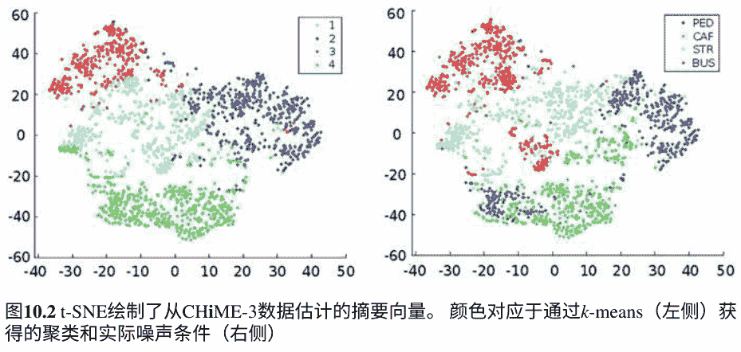

对它们进行了SSNN处理。表10.6显示了足够数量的训练数据（3×原始干净集）的积极影响。

##### 10.3.4 提取向量的属性

为了查看该方法是否生成反映数据中噪声条件的向量，我们提取了CHiME-3话语的向量并观察了它们的属性。CHiME-3测试集包含四个不同的录音环境——公交车（BUS）、咖啡馆（CAF）、街道（STR）和行人区域（PED）。我们使用k-means对提取的向量进行了四个聚类，并将得到的聚类与数据中的真实环境进行了比较。图10.2显示了由t-SNE [12]创建的两个图——右侧的图显示了数据中的四个真实环境，左侧的图显示了由k-means创建的聚类。尽管这些聚类是通过无监督技术创建的，但与真实环境存在明显的相似之处。

值得注意的是，新提出的摘要向量与i-向量 [6]进行比较也是有意义的，因为众所周知i-向量能够捕捉到关于信道的信息。请注意，最近也有人在语音识别任务中使用i-向量来调整深度神经网络 [16, 24]。图10.3显示了从CHiME-3中提取的i-向量和摘要向量在第一和第二线性判别分析（LDA）基上的投影。录音环境标签被用作LDA的类别。看起来环境在摘要向量空间中，环境之间的分离程度比i-向量空间更好。$^4$这表明摘要向量包含适用于CHiME-3录音环境聚类的信息，即使提取器是在不同的数据（受损的AMI语料库）上进行训练的。

图10.3 显示了i-向量（左）和摘要向量（右）在CHiME-3数据上的第一和第二LDA基的绘图。

##### 10.3.5 数据选择的结果

为了进行数据选择，我们提取每个生成的训练语音和每个测试语音的摘要向量。我们通过选择与测试集条件最接近的语音来选择生成的训练数据的子集。为此，我们计算测试集所有摘要向量的平均值，并测量其与训练数据每个语音的摘要向量之间的距离。只有最接近的语音被保留在训练子集中。通过这样做，我们的目标是选择与测试数据中的噪声最匹配的噪声类型。选择的数据量等于干净训练集的大小。

由于测试数据中存在少量不同类型的噪声，计算整个测试集的摘要向量的平均值可能不是表示它的最佳方式。因此，进一步的实验通过对测试集的摘要向量进行聚类，并计算这些聚类的平均值来进行。然后选择训练语音，使其与一个聚类的摘要向量中心的距离最短。

为了测量向量之间的距离，我们使用了余弦和欧氏距离。表10.7显示了使用这两种度量和不同数量的测试数据簇获得的结果。结果表明，使用余弦距离更有效。最佳结果是使用四个测试数据簇获得的，这与测试集中存在四个真实录音环境的事实相对应。

这些实验使用了布尔诺理工大学开放的i-向量提取器（参见 http://voicebiometry.org）。

表10.7 不同选择方法的比较 (CHiME-3 %WER)

| 距离度量/#簇 | 1 | 4 | 10 |
|---|---|---|---|
| 余弦 | 25.09 | 24.72 | 24.98 |
| 欧氏 | 26.75 | 26.55 | 26.59 |

表10.8 随机选择与自动选择结果的比较 (CHiME-3 %WER)

| 数据集 | 随机 | i-向量 | 摘要向量 |
|---|---|---|---|
| dev | 25.8 | 25.61 | **24.72** |
| eval | 45.58 | 44.02 | **43.23** |

数字表示表格中有助于定位的最佳值。

表10.8显示了使用摘要向量数据选择相对于随机数据选择和使用i-向量选择获得的最佳结果。与随机数据选择相比，所提出的数据选择方法在开发集上获得了约1%的绝对改善，在评估集上获得了约2%的改善，显示出所提出的数据选择方法的有效性。

#### 10.4 结论

我们已经证明，尽管简单，数据增强是在训练-测试条件不匹配时提高语音识别器鲁棒性的有效技术。与基于神经网络的降噪策略相比，数据加噪被发现更加有效。我们还提出了一种新的有前途的方法，用于在增强集中选择数据，该方法基于一个能够为每个话语生成一个固定维度向量的摘要神经网络。

在CHiME-3测试集上，我们观察到相对于随机数据选择的1%绝对改进，并且该技术与基于i-向量的数据选择相比也表现出优势。

致谢：除了JSALT 2015研讨会的资助外，BUT研究人员还得到了捷克内政部项目编号VI20152020025“DRAPAK”的支持，以及捷克教育、青年和体育部的国家可持续发展计划（NPU II）项目“IT4 Innovations Excellence in Science—LQ1602”的支持。

#### 参考文献

- 1. Ager, M., Cvetkovic, Z., Sollich, P., Bin, Y.: 迈向鲁棒音素分类：用声学波形增强PLP模型。在：第16届欧洲信号处理会议，2008年，第1-5页 (2008)
- 2. Beaufays, F., Vanhoucke, V., Strope, B.: 无监督发现和训练最大不相似聚类模型。在: Interspeech会议论文集 (2010)
- 3. Bellegarda, J.R., de Souza, P.V., Nadas, A., Nahamoo, D., Picheny, M.A., Bahl, L.R.: The metamorphic algorithm: a speaker mapping approach to data augmentation. IEEE Trans. Speech Audio Process. 2(3), 413–420 (1994). doi:10.1109/89.294355
- 4. Bellegarda, J., de Souza, P., Nahamoo, D., Padmanabhan, M., Picheny, M., Bahl, L.: Experiments using data augmentation for speaker adaptation. In: International Conference on Acoustics, Speech, and Signal Processing, 1995, ICSSP-95, vol. 1, pp. 692–695 (1995). doi:10.1109/ICASSP.1995.479788
- 5. Cui, X., Goel, V., Kingsbury, B.: Data augmentation for deep neural network acoustic modeling. IEEE/ACM Trans. Audio Speech Lang. Process. 23(9), 1469–1477 (2015). doi:10.1109/TASLP.2015.2438544
- 6. Dehak, N., Kenny, P., Dehak, R., Dumouchel, P., Ouellet, P.: 前端因子分析用于说话人验证。 IEEE Trans. Audio Speech Lang. Process. 19(4), 788–798 (2011). doi:10.1109/TASLP.2010.2064307.
- 7. Delcroix, M., Yoshioka, T., Ogawa, A., Kubo, Y., Fujimoto, M., Ito, N., Kinoshita, K., Espi, M., Hori, T., Nakatani, T., Nakamura, A.: 基于线性预测的去混响技术与先进的语音增强和识别技术在REVERB挑战中的应用。 In: REVERB’14会议论文集 (2014)
- 8. Delcroix, M., Yoshioka, T., Ogawa, A., Kubo, Y., Fujimoto, M., Ito, N., Kinoshita, K., Espi, M., Araki, S., Hori, T., Nakatani, T.: 在混响环境中进行远距离语音识别的策略。 EURASIP J. Adv. Signal Process. 2015, 文章编号60, 15页。 (2015)
- 9. Egorova, E., Veselý, K., Karafiát, M., Janda, M., Černocký, J.: 构建多语言音素集的手动和半自动方法。 ICASSP 2013会议论文集, pp. 7324–7328。 IEEE信号处理学会, 皮斯卡塔韦 (2013)
- 10. Gales, M.J.F., College, C.: 用于噪声鲁棒语音识别的基于模型的技术。 剑桥大学, 剑桥 (1995年)
- 11. Haykin, S.: 自适应滤波器理论, 第3版。 普林斯顿大学出版社, 上萨德尔河, 新泽西州 (1996年)
- 12. Hinton, G., Bengio, Y.: 使用t-SNE可视化数据。 在: 成本敏感的机器学习用于信息检索33 (2008年)
- 13. Hu, Y., Loizou, P.C.: 语音增强算法的主观比较。 在: IEEE国际会议论文集, 第153-156页 (2006年)
- 14. Jaitly, N., Hinton, G.E.: 声道长度扰动 (VTLP) 改善语音识别。 在: 第30届国际机器学习大会, 亚特兰大, 乔治亚州 (2013年)
- 15. Kalinli, O., Seltzer, M.L., Acero, A.: 使用矢量泰勒级数的噪声自适应训练方法用于噪声鲁棒自动语音识别。 在: 2009年IEEE国际会议论文集, ICASSP’09, 第3825-3828页 (2009)
- 16. Karafiát, M., Burget, L., Matějka, P., Glembek, O., Černocký, J.: 基于i-Vector的判别性自适应用于自动语音识别。 在: ASRU 2011年论文集, 第152-157页 (2011)
- 17. Karafiát, M., Veselý, K., Szőke, I., Burget, L., Grézl, F., Hannemann, M., Černocký, J.: BUT ASR系统用于BABEL惊喜评估2014年。 在: 2014年口语技术研讨会论文集, 第501-506页 (2014)
- 18. Karafiát, M., Grézl, F., Burget, L., Szőke, I., Černocký, J.: 将CTS识别器适应到BUT系统中看不见的混响语音的三种方法, 用于ASPiRE挑战。 在:Interspeech 2015年论文集, 第2454-2458页 (2015)
- 19. Kinoshita, K., Delcroix, M., Nakatani, T., Miyoshi, M.: 使用长期多步线性预测抑制语音信号上的后期混响效应。 IEEE Trans. Audio Speech Lang. Process. 17(4), 534–545 (2009)
- 20. Ko, T., Peddinti, V., Povey, D., Khudanpur, S.: 语音识别的音频增强。 在：INTERSPEECH, 第3586-3589页。 ISCA，格勒诺布尔 (2015年)
- 21. Nakatani, T., Yoshioka, T., Kinoshita, K., Miyoshi, M., Juang, B.H.: 基于短时傅里叶变换表示的多通道线性预测的盲语音去混响。 In: Proceedings of ICASSP’08, pp. 85–88 (2008)
- 22. Ogata, K., Tachibana, M., Yamagishi, J., Kobayashi, T.: 基于非线性变换和MAP修改的HSMM语音合成的声学模型训练。
- 23. Ragni, A., Knill, K.M., Rath, S.P., Gales, M.J.F.: 低资源语言的数据增强。 In: 2014年国际语音通信协会第15届年会，第810-814页 (2014)
- 24. Saon, G., Soltau, H., Nahamoo, D., Picheny, M.: 使用i-vectors对神经网络声学模型进行说话人自适应。In: 2013年IEEE自动语音识别和理解研讨会（ASRU），第55-59页 (2013)
- 25. Siohan, O., Bacchiani, M.: 基于iVector的声学数据选择。在： INTERSPEECH会议论文集，第657-661页（2013年）
- 26. Swietojanski, P., Ghoshal, A., Renals, S.: 远距离和多通道大词汇语音识别的混合声学模型。 在： 2013年IEEE自动语音识别和理解研讨会（ASRU） (2013)
- 27. Tokuda, K., Zen, H., Black, A.: 基于HMM的多语言语音合成方法。 在： 文本到语音合成：新范式和进展，第135-153页 (2004)
- 28. Veselý, K., Ghoshal, A., Burget, L., Povey, D.: 深度神经网络的序列判别训练。 在： INTERSPEECH 2013会议论文集，第2345-2349页 (2013)
- 29. Veselý, K., Watanabe, S., Molková, K., Karafiát, M., Burget, L., Černocký, J.: 序列总结神经网络用于说话人自适应。In: ICASSP会议论文集 (2016)
- 30. Wang, Y., Gales, M.J.F.: 用于鲁棒语音识别的说话人和噪声分解。 IEEE Trans. Audio Speech Lang. Process. 20(7), 2149–2158 (2012)
- 31. Wei, K., Liu, Y., Kirchhoff, K., Bartels, C., Bilmes, J.: 用于大规模语音训练数据的子集选择。In: ICASSP会议论文集, pp. 3311–3315 (2014)
- 32. Wu, Y., Zhang, R., Rudnicky, A.: 语音识别的数据选择。In: ASRU会议论文集, pp. 562–565 (2007)
- 33. 徐, Y., 杜, J., 戴, L.R., 李, C.H.: 基于深度神经网络的语音增强的实验研究。 IEEE信号处理通信 21(1), 65-68 (2014年)
- 34. 吉村, T., 增子, T., 德田, K., 小林, T., 北村, T.: 基于HMM的语音合成系统中的说话人插值。在: Eurospeech, pp. 2523-2526 (1997年)
- 35. 吉冈, T., 中谷, T.: 用于盲目MIMO脉冲响应缩短的多通道线性预测方法的泛化。IEEE Trans.音频语音语言处理。20(10), 2707-2720 (2012年)
- 36. 吉冈, T., 中谷, T., 三好, M., 奥野, H.G.: 通过联合优化对混合语音进行盲分离和去混响。IEEE Trans.音频语音语言处理。19(1), 69-84 (2011年)
- 37. Yoshioka, T., Chen, X., Gales, M.J.F.: 单麦克风去混响对基于DNN的会议转录系统的影响。 In: ICASSP’14会议论文集 (2014)
- 38. Yoshioka, T., Ito, N., Delcroix, M., Ogawa, A., Kinoshita, K., Fujimoto, M., Yu, C., Fabian, W.J., Espi, M., Higuchi, T., Araki, S., Nakatani, T.: NTT CHiME-3系统：移动多麦克风设备上的语音增强和识别的进展。In: ASRU’15会议论文集, 第436-443页 (2015)
- 39. Zavaliagkos, G., Siu, M.-H., Colthurst, T., Billa, J.: 使用未转录的训练数据来提高性能。 In: 第5届国际口语语言处理会议 (1998)

### 第11章 用于自动语音识别的高级递归神经网络

张宇，俞东，和陈国国

**摘要** 递归神经网络（RNN）是一类神经网络模型，其神经元之间的连接形成一个有向循环。这样就创建了网络的内部状态，使其能够展现出动态的时间行为。在本章中，我们描述了几种用于远程语音识别（DSR）的高级RNN模型。第一组模型是预测-自适应-校正RNN（PAC-RNN）的扩展。这些模型受到了人类语音识别中预测、适应和校正的广泛观察行为的启发。第二组模型包括高速公路长短期记忆（LSTM）RNN、延迟控制的双向LSTM RNN、网格LSTM RNN和残差LSTM RNN，都是深度LSTM RNN的扩展。这些模型的优化效果比基本的深度LSTM RNN更有效。我们使用AMI语料库对这些高级RNN模型进行评估和比较。

#### 11.1 引言

基于深度神经网络（DNN）的声学模型（AMs）在许多任务上极大地提高了自动语音识别（ASR）的准确性 [7, 15, 24, 25]。使用更先进的模型，如卷积神经网络（CNNs） [1, 3, 28, 32]和循环神经网络（RNNs）如长短期记忆（LSTM）网络 [10, 11, 22]，进一步改进了性能。

尽管这些新技术有助于降低远距离语音识别（DSR） [27]任务的词错误率（WER），但DSR仍然是一个具有挑战性的问题。

Y. Zhang (✉)
麻省理工学院，剑桥，美国
e-mail: yzhang87@csail.mit.edu

D. Yu
腾讯AI实验室，西雅图，美国
e-mail: dyu@tencent.com

G. 陈
约翰霍普金斯大学，巴尔的摩，马里兰州，美国

由于混响和重叠的声学信号，即使使用复杂的前端处理技术[12, 20, 26]和多通道解码方案，也会导致鲁棒性下降。

在本章中，我们探讨了几种基于循环神经网络的高级后端技术。这些技术都是建立在递归神经网络的基础上的。

第一组模型是在[33]中提出的预测-适应-校正循环神经网络 (PAC-RNN) 的扩展。这些模型受到了人类语音识别中预测、适应和校正的广泛观察行为的启发。在本章中，我们通过引入更先进的预测组件对PAC-RNN进行了扩展，并在使用Babel和AMI语料库的大词汇连续语音识别 (LVCSR) 任务中对其进行了评估。

第二组模型是深度LSTM (DLSTM) RNN的扩展。DLSTM RNN有助于改善泛化性能，并且通常优于单层LSTM RNN [22]。然而，当模型变得更深时，它们更难训练且收敛速度更慢。在本章中，我们在几个方向上扩展了DLSTM RNN。首先，我们引入了门控直接连接，称为高速公路连接，用于形成高速公路LSTM (HLSTM) RNN [34]。高速公路连接提供了一条在层之间信息流动更直接、不衰减的路径。它们缓解了梯度消失问题并使DLSTM RNN能够更深入，尤其是在利用dropout控制高速公路连接时。HLSTM RNN可以很容易地从单向扩展到双向。为了加快训练速度和减少双向HLSTM (BHLSTM) RNN中的延迟，我们进一步引入了延迟控制的BHLSTM RNN，利用了整个过去的历史和一段未来上下文的窗口。

我们进一步提出了DLSTM RNN的另外两个扩展。网格LSTM (GLSTM) [19] 在时间和深度轴上使用单独的LSTM块来提高建模能力。受线性增强的DNNs [9] 和残差CNNs [13] 的启发，残差LSTM (RLSTM) RNNs在DLSTM RNNs中的较低层输出和较高层输入之间包含直接连接。GLSTM和RLSTM RNNs都使我们能够训练更深的模型并获得更好的准确性。

## 11.2 基本的深度长短期记忆RNNs

在本节中，我们回顾了基本的单层LSTM RNNs及其深层版本。

### 11.2.1 长短期记忆RNNs

LSTM RNN最初在[17]中提出，用于解决训练RNNs时经常发生的梯度消失和梯度爆炸问题。它引入了一个线性依赖关系，即时间 $t$ 的记忆单元状态 $c_t$ 和相同单元在 $t-1$ 时的状态 $c_{t-1}$。引入非线性门来控制信息流动。网络的运行遵循以下方程式：

$$\mathbf{i}_t = \sigma(\mathbf{W}_{xi}\mathbf{x}_t + \mathbf{W}_{mi}\mathbf{m}_{t-1} + \mathbf{W}_{ci}\mathbf{c}_{t-1} + \mathbf{b}_i) \quad (11.1)$$
$$\mathbf{f}_t = \sigma(\mathbf{W}_{xf}\mathbf{x}_t + \mathbf{W}_{mf}\mathbf{m}_{t-1} + \mathbf{W}_{cf}\mathbf{c}_{t-1} + \mathbf{b}_f) \quad (11.2)$$
$$\tilde{\mathbf{c}}_t = \tanh(\mathbf{W}_{xc}\mathbf{x}_t + \mathbf{W}_{mc}\mathbf{m}_{t-1} + \mathbf{b}_c) \quad (11.3)$$
$$\mathbf{o}_t = \sigma(\mathbf{W}_{xo}\mathbf{x}_t + \mathbf{W}_{mo}\mathbf{m}_{t-1} + \mathbf{W}_{co}\mathbf{c}_t + \mathbf{b}_o) \quad (11.4)$$
$$\mathbf{m}_t = \mathbf{o}_t \odot \tanh(\mathbf{c}_t) \quad (11.5)$$

从 $t = 1$ 到 $t = T$ 进行迭代，其中 $\sigma()$ 是逻辑sigmoid函数，而 $\mathbf{i}_t, \mathbf{f}_t, \mathbf{o}_t, \mathbf{c}_t$ 和 $\mathbf{m}_t$ 是向量，分别表示 $t$ 时刻的输入门、遗忘门、输出门、细胞激活和细胞输出激活。$\odot$ 表示向量的逐元素乘积。$\mathbf{W}_*$ 是连接不同门的权重矩阵，而 $\mathbf{b}_*$ 是相应的偏置向量。所有这些矩阵都是满的，除了连接细胞和门的矩阵 $\mathbf{W}_{ci}, \mathbf{W}_{cf}$ 和 $\mathbf{W}_{co}$，它们是对角矩阵。

### 11.2.2 深度LSTM RNNs

深度LSTM RNNs由多个LSTM单元的多层堆叠形成。具体来说，较低层LSTM单元的输出 $\mathbf{y}_t^l$ 被作为输入传递给上一层作为输入 $\mathbf{x}_t^{l+1}$。尽管每个LSTM层在时间上是深度的，因为它可以展开成一个前馈神经网络，其中每一层共享相同的权重，但深度LSTM RNNs仍然明显优于单层LSTM RNNs。据推测[22]，DLSTM RNN可以通过在多个层之间分布参数来更好地利用它们。请注意，在传统的DLSTM RNN中，不同层的单元之间没有直接的交互。

#### 11.3 预测-适应-校正递归神经网络

在本节中，我们介绍了PAC-RNN，它将预测、适应和校正的能力结合在同一个模型中，这在人类语音识别中经常观察到。

PAC-RNN最初由张等人在[33]中提出。它有两个主要组成部分：一个校正DNN和一个预测DNN。校正DNN估计状态后验概率 $p_{corr}$，在给定观测特征向量 $\mathbf{x}_t$ 和来自预测DNN的信息 $\mathbf{x}_{t-1}$ 的情况下，估计时间 $t$ 的状态 $s_t$。预测DNN预测未来的辅助信息 $l_{t+n}$，其中 $l$ 可以是一个状态 $s$、一个音素、一个噪声表示或其他辅助信息，而 $n$ 是我们向前查看的帧数。请注意，由于来自纠正DNN的信息 $y_t$ 取决于来自预测DNN的信息，反之亦然，形成了一个循环。

从预测DNN中提取的信息 $\mathbf{x}_t$ 是从一个瓶颈隐藏层 $h_{t-1}^{\text{pred}}$ 中提取的。为了利用额外的先前预测，我们将多个隐藏层的值堆叠起来：

$$\mathbf{x}_t = [h_{t-T^{\text{corr}}}^{\text{pred}}, \dots, h_{t-1}^{\text{pred}}]^T, \quad (11.6)$$

其中 $T^{\text{corr}}$ 是纠正DNN使用的上下文窗口大小，在我们的研究中设置为10。同样，我们可以堆叠多个帧来形成来自纠正DNN的信息 $\mathbf{y}_t$：

$$\mathbf{y}_t = [h_{t-T^{\text{pred}}-1}^{\text{corr}}, \dots, h_t^{\text{corr}}]^T, \quad (11.7)$$

其中 $T^{\text{pred}}$ 是预测DNN使用的上下文窗口大小，在我们的研究中设置为1。此外，在图11.1中显示的具体示例中，隐藏层输出 $h_t^{\text{corr}}$ 在输入预测DNN之前被投影到较低的维度。

为了训练PAC-RNN，我们需要为预测和修正的DNN提供监督信息。正如我们所提到的，修正的DNN估计状态后验概率，因此我们提供状态标签，并使用帧交叉熵 (CE) 准则对其进行训练。对于预测的DNN，我们遵循[33]，将音素标签作为预测目标。

PAC-RNN的训练是一个类似于[2, 29]的多任务学习问题，除了状态目标外，还使用音素目标。这两个训练目标可以合并为一个：

$$J = \sum_{t=1}^{T}(\alpha * \ln p^{\text{corr}}(s_t | \mathbf{o}_t, \mathbf{x}_t) + (1 - \alpha) * \ln p^{\text{pred}}(l_{t+n} | \mathbf{o}_t, \mathbf{y}_t)), \quad (11.8)$$

其中 $\alpha$ 是插值权重，在我们的研究中设置为0.8，除非另有说明，$T$ 是训练话语中的总帧数。请注意，在标准的PAC-RNN中，纠正模型和预测模型都是DNNs。从这一点开始，我们将称之为PAC-RNN-DNN。LSTMs在许多任务上比DNNs提高了语音识别准确性[10, 11, 22]。为了进一步增强PAC-RNN模型，我们使用LSTM替换了纠正模型中使用的DNN。这个LSTM的输入是声学特征 $\mathbf{o}_t$ 与预测组件的信息 $\mathbf{x}_t$ 的连接。预测组件也可以是LSTM，但在实验中我们没有观察到性能提升。为了保持简单，我们使用与[33]相同的DNN预测模型。

#### 11.4 深度长短期记忆循环神经网络扩展

在本节中，我们介绍了几种DLSTM RNN的扩展，可以提供更多的建模能力，同时可以有效地进行训练。这些模型包括：
- **高速公路LSTM RNN**：使用门控函数来控制低层内存单元与高层内存单元之间的直接信息流动。
- **网格LSTM RNN**：使用两个（或更多）独立的LSTM RNN（具有独立的内存状态）来建模不同轴上的信息流动（例如，深度和时间）。
- **残差LSTM RNN**：将低层的输出直接传递给跳过的高层。

### 11.4.1 高速公路RNN

当网络变得更深或更复杂时，通常会观察到准确性下降。这种下降不是由于过拟合引起的[13]，因为这种下降也发生在训练集上。例如，在许多ASR任务中，深度LSTM的最佳层数为三到五层。增加深度会导致更高的词错误率。解决这个下降问题有两种可能的方法：(1) 逐层预训练网络；(2) 修改网络结构，使其优化更容易和更有效。在本小节中，我们将专注于第二种方法，并提出了HLSTM，它可以直接将信息从低层传递到高层。

HLSTM [34] 改进了DLSTM循环神经网络。它在下层的记忆单元（标记为“Highway block”的块）与上层的记忆单元（标记为 $l+1$）之间有直接连接。传送门控制着从下层单元直接流向上层单元的信息量。时间 $t$ 时，第 $l+1$ 层的门函数为：

$$\mathbf{d}_t^{(l+1)} = \sigma( \mathbf{b}_d^{(l+1)} + \mathbf{W}_{xd}^{l+1} \mathbf{x}_t^{(l+1)} + \mathbf{w}_{cd}^{l+1} \odot \mathbf{c}_{t-1}^{(l+1)} + \mathbf{w}_{ld}^{(l+1)} \odot \mathbf{c}_t^l ), \quad (11.9)$$

其中 $\mathbf{b}_d^{(l+1)}$ 是一个偏置项，$\mathbf{W}_{xd}^{(l+1)}$ 是连接进位门到该层输入的权重矩阵，$\mathbf{w}_{cd}^{(l+1)}$ 是连接进位门到当前层过去细胞状态的权重向量，$\mathbf{w}_{ld}^{(l+1)}$ 是连接进位门到较低层记忆细胞的权重向量，$\mathbf{d}_t^{(l+1)}$ 是第 $l+1$ 层的进位门激活向量。使用进位门，HLSTM RNN计算第 $l+1$ 层细胞状态如下：

$$\begin{aligned} \mathbf{c}_t^{l+1} = & \mathbf{d}_t^{(l+1)} \odot \mathbf{c}_t^l + \mathbf{f}_t^{(l+1)} \odot \mathbf{c}_{t-1}^{(l+1)} \\ & + \mathbf{i}_t^{(l+1)} \odot \tanh(\mathbf{W}_{xc}^{(l+1)} \mathbf{x}_t^{(l+1)} + \mathbf{W}_{hc}^{(l+1)} \mathbf{m}_{t-1}^{(l+1)} + \mathbf{b}_c), \quad (11.10) \end{aligned}$$

而其他方程与标准LSTM RNN中的方程相同，如 (11.1)、(11.2)、(11.4) 和 (11.5) 所述。从概念上讲，高速公路连接是一种类似于遗忘门的乘法修改。根据传送门的输出，高速公路连接在行为上平滑地变化，介于普通LSTM层（无连接）和直接连接（即直接传递细胞记忆）之间。不同层中细胞之间的高速公路连接使得一层中的细胞对另一层的影响更直接，并且可以在训练更深的LSTM RNN时缓解梯度消失问题。

##### 11.4.2 双向高速公路 LSTM RNNs

我们上面描述的单向 LSTM RNNs 只能利用过去的历史。然而，在语音识别中，未来的上下文也携带信息，并且应该被用来进一步增强声学模型。双向 RNNs 通过在两个方向上处理数据并使用两个独立的隐藏层，利用了过去和未来的上下文。在[5, 10, 11]中已经证明，双向 LSTM RNNs 确实可以提高语音识别的准确性。在本章中，我们将 HLSTM RNNs 从单向扩展到双向。请注意，后向层使用与前向层相同的方程，只是将 $t-1$ 替换为 $t+1$ 以利用未来的帧，模型从 $t=T$ 到 1 运行。前向和后向层的输出被连接起来形成下一层的输入。

### 11.4.3 延迟控制的双向高速公路LSTM RNNs

如今，由于其强大的并行计算能力，图形处理单元（GPUs）在深度学习中被广泛使用。对于单向RNN模型，通常将多个序列（例如40个）打包到同一个小批次中以更好地利用GPUs。当使用截断的反向传播算法（BPTT）进行参数更新时，这可以很容易地完成。然而，当使用整个基于序列的BPTT时（例如在进行序列判别式训练或使用双向LSTMs时），GPU的有限内存限制了可以打包到小批次中的序列数量，从而显著降低了训练和评估速度。

为了加快双向RNN的训练速度，文献[5]提出了上下文敏感块BPTT（CSC-BPTT）方法。在这种方法中，首先将序列分割成固定长度的块 $N_{co}$。然后，取过去 $N_l$ 帧和未来 $N_r$ 帧在每个块的前后连接在一起作为左右上下文。附加的帧仅用于提供上下文信息，在训练过程中不生成错误信号。

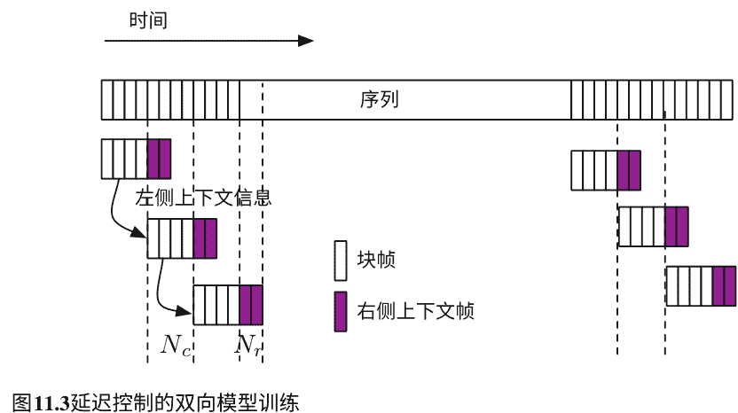

不幸的是，使用CSC-BPTT训练的模型不再是真正的双向RNN，因为它可以利用的历史受限于左右上下文。图11.3中的延迟控制双向RNN借鉴了CSC-BPTT的思想，并在其基础上进行了改进。在我们的新模型中，我们在仍然使用截断的未来上下文的同时，保留了整个过去的历史。我们不再将每个块的左上下文帧进行重新计算，而是直接将同一句话的前一个块的左上下文信息传递过来。对于每个块，训练和解码的计算成本都减少了一个因子 $N_c / (N_c + N_r)$。此外，从上一个小批量加载历史记录使得上下文更加准确。在延迟控制的BLSTM RNN中，延迟被限制为用户设置的 $N_r$。在我们的实验中，并行处理40个话语比处理整个话语要快十倍，且不损失性能。

### 11.4.4 网格LSTM RNNs

网格LSTM是在[19]中提出的，它使用通用形式沿深度轴添加单元。一个网格LSTM块接收 $N$ 个隐藏向量 $\mathbf{m}_1, \dots, \mathbf{m}_N$ 和 $N$ 个细胞向量 $\mathbf{c}_1, \dots, \mathbf{c}_N$。该块对每个轴计算由LSTM表示的 $N$ 个变换，并输出 $N$ 个隐藏向量和记忆向量：

$$\begin{aligned} (\mathbf{m}'_1, \mathbf{c}'_1) &= \text{LSTM}(\mathbf{H}, \mathbf{c}_1; \mathbf{W}_1) \\ &\dots \\ (\mathbf{m}'_N, \mathbf{c}'_N) &= \text{LSTM}(\mathbf{H}, \mathbf{c}_N; \mathbf{W}_N) \\ \mathbf{H} &= [\mathbf{m}_1, \dots, \mathbf{m}_N]^T \end{aligned} \quad (11.11)$$

其中 $\mathbf{W}_i$ 是每个轴的权重矩阵，$\mathbf{H}$ 是隐藏输出的串联，$\mathbf{c}_i$ 是每个轴的细胞输出。在我们的实验中，我们发现窥视连接（peephole connections）总是很有用的。

在ASR的深度神经网络模型中，有两个轴：时间（时间域中的样本）和深度（多层）。对于每个块，我们可以定义LSTM参数为：

$$\{(\mathbf{W}^{\text{时间}}_{(t,d)}, \mathbf{W}^{\text{深度}}_{(t,d)}) | t = 1, \dots, T, d = 1, \dots, D\} \quad (11.12)$$

在我们的实验中，我们总是将所有时间轴上的权重矩阵绑定在一起：

$$\begin{aligned} &\forall d \in \{1, \dots, D\}: \\ &\mathbf{W}^{\text{时间}}_{d} = \mathbf{W}^{\text{时间}}_{(1,d)} = \dots = \mathbf{W}^{\text{时间}}_{(T,d)}, \\ &\mathbf{W}^{\text{深度}}_{(.,d)} = \mathbf{W}^{\text{深度}}_{(1,d)} = \dots = \mathbf{W}^{\text{深度}}_{(T,d)}. \end{aligned} \quad (11.13)$$

对于深度轴，我们尝试了绑定的方式和非绑定版本。与[19]中的观察结果不同，非绑定版本总是给我们带来更好的性能。

### 11.4.5 残差LSTM RNNs

残差网络是在[13]中提出的，是[9]中描述的线性增强模型的特例。它定义了一个构建块：

$$y = \mathcal{F}(\mathbf{x}, \mathbf{W}_i) + \mathbf{x}, \quad (11.14)$$

其中 $\mathbf{x}$ 和 $\mathbf{y}$ 是考虑的层的输入和输出向量。在这项研究中，我们用LSTM块替换了卷积和整流线性层：

$$\mathbf{m}_{l+1} = \text{LSTM}'(\mathbf{m}_l) + \mathbf{m}_l. \quad (11.15)$$

这里的 $r$ 表示我们要跳过的层数。在[13]中，有报道说跳过多个层是重要的。然而，在我们的研究中，我们并没有发现这是必要的。

#### 11.5 实验设置

##### 11.5.1 语料库

#### 11.5.1.1 IARPA-Babel语料库

IARPA-Babel计划专注于低资源语言的ASR和口语检测[18]。该计划的目标是减少开发新语言的ASR和口语检测能力所需的时间。

Babel计划的数据包括来自不断增长的语言列表的语音集合。对于这项工作，我们将考虑前两年发布的11种语言的完整数据包（60-80小时的训练数据）作为源语言，而第三年的语言则是目标语言[6]。一些语言还包含在训练和测试语句中以48 kHz录制的麦克风数据的混合。

为了本文的目的，我们将所有宽带数据降采样到8 kHz，并将其与其他录音一样处理。对于目标语言，我们将重点关注非常有限语言包（VLLP）条件，其中只包括3小时的转录训练数据。该条件不包括使用人工发音词典。与该计划前两年不同，允许使用网络数据进行语言模型和词汇扩展。

###### 11.5.1.2 AMI 会议语料库

AMI语料库[4]包括约100小时的会议录音，记录在设备化的会议室中。使用了多个麦克风，包括个别的耳机麦克风（IHMs），领夹麦克风和一个或多个麦克风阵列。在这项工作中，我们在实验中使用了单一远程麦克风（SDM）条件。我们的系统是根据语料库发布的推荐分割进行训练和测试的：80小时的训练集，以及每个9小时的开发集和测试集。对于我们的训练，我们使用了语料库提供的所有片段，包括那些有重叠语音的片段。我们的模型仅在评估集上进行评估。使用NIST的asclite工具[8]进行评分。

##### 11.5.2 系统描述

Kaldi [21] 用于特征提取和早期三音素训练，以及解码。使用最大似然声学训练配方来训练高斯混合模型-隐马尔可夫模型 (GMM-HMM) 三音素系统。通过该三音素系统对训练数据进行强制对齐，以生成进一步的神经网络训练标签。

计算网络工具包 (CNTK) [31] 用于神经网络训练。我们首先训练了一个六层的DNN，每层有2048个sigmoid单元。使用40维滤波器组特征，以及它们对应的delta和delta-delta特征作为原始特征向量。对于我们的DNN训练，我们连接了15帧的原始特征向量，导致维度为1800。再次使用该DNN对训练数据进行强制对齐，以生成进一步的LSTM训练标签。

在PAC-RNN模型中，预测DNN具有一个2048单元的隐藏层和一个80单元的瓶颈层。纠错模型有两种变体：一个具有几个2048单元隐藏层的DNN，或者一个具有1024个记忆单元的LSTM（带有512个节点的投影层）。纠错模型的投影层包含500个单元。对于Babel实验，我们使用瓶颈特征而不是原始滤波器组特征作为系统的输入。

除非另有明确说明，我们的 (H)LSTM模型在每个层的输出上添加了一个投影层（我们在这里称之为LSTMP），如[22]中所提出的，并使用80维对数梅尔滤波器组 (FBANK) 特征进行训练。对于LSTMP模型，每个隐藏层由1024个记忆单元和一个512节点的投影层组成。对于BLSTMP模型，每个隐藏层由1024个记忆单元（前向512个和后向512个）和一个300节点的投影层组成。它们的高速公路伴侣具有相同的网络结构，除了额外的高速公路连接。

所有模型都是随机初始化的，没有进行生成或判别式的预训练[23]。使用验证集来控制学习率，当没有观察到收益时，学习率减半。为了训练单向模型，使用了截断的BPTT [30] 来更新模型参数。每个BPTT段包含20帧，我们同时处理40个话语。为了训练延迟控制的双向模型，我们设置了 $N_c = 22$ 和 $N_r = 21$，并且同时处理40个话语。每个小批次使用0.2的初始学习率，然后学习率调度器采取行动。对于帧级交叉熵训练，使用了 $L2$ 约束正则化[16]。

#### 11.6 评估

使用WER百分比评估各种模型的性能。对于在AMI上进行的实验，如果没有特别说明，使用SDM评估集。由于在模型训练过程中没有排除重叠的语音片段，除了完整的评估集结果，我们还展示了仅包含非重叠语音片段的子集结果，如[28]所示。

##### 11.6.1 PAC-RNN

我们使用IARPA-Babel语料库评估了PAC-RNN在两个不同任务上的性能：使用低资源语言的LVCSR和使用AMI语料库的远距离语音识别。

###### 11.6.1.1 低资源语言

表11.1总结了在低资源语言设置上评估的不同模型的WER。前三行是堆叠瓶颈（SBN）系统的结果；详细信息可以在[35]中找到。多语言和最接近语言系统都被适应到目标语言的整个堆叠网络中。对于混合系统，输入是从适应的多语言SBN第一个DNN中提取的BN特征。

DNN混合系统的性能优于多语言SBN，但与最接近语言系统非常相似。LSTM在DNN的基础上提高了约1%的性能。PAC-RNN-DNN在所有语言上比LSTM提高了另外1%的性能。通过简单地用单层LSTM替换校正模型，我们观察到进一步的改进。

我们还研究了每个模型的多语言迁移学习效果。我们首先使用最接近的富资源语言（根据表中的语言识别（LID）预测）来训练DNN、LSTM和PAC-RNN模型，然后将它们适应到目标语言。表11.1的下半部分总结了ASR结果。如图所示，LSTM模型的性能明显优于基线SBN系统。使用PAC-RNN模型会产生明显的效果。

**表11.1 每个ASR系统的WER (%) 结果**

| 目标语言 | 宿务语 | 库尔曼吉语 | 斯瓦希里语 |
| :--- | :--- | :--- | :--- |
| 最接近的语言 | 塔加洛语 | 土耳其语 | 祖鲁语 |
| **SBN模型** | | | |
| 单语 | 73.5 | 86.2 | 65.8 |
| 适应的多语言 | 65.0 | 75.5 | 54.9 |
| 最接近的语言 | 63.7 | 75.0 | 54.2 |
| **混合模型** | | | |
| DNN | 63.9 | 74.9 | 54.0 |
| LSTM | 63.0 | 74.0 | 53.0 |
| PAC-RNN-DNN | 62.1 | 72.9 | 52.1 |
| PAC-RNN-LSTM | 60.6 | 72.5 | 51.4 |
| **具有最接近语言初始化的混合模型** | | | |
| DNN | 62.7 | 73.1 | 52.4 |
| LSTM | 61.3 | 72.5 | 52.2 |
| PAC-RNN-DNN | 60.8 | 71.8 | 51.6 |
| PAC-RNN-LSTM | 59.7 | 71.4 | 50.4 |

注：SBN是堆叠瓶颈系统。更多细节（例如如何训练多语言系统）可以在[35]中找到。

###### 11.6.1.2 远距离语音识别

表11.2总结了在AMI语料库上评估的PAC-RNN模型的WER。对于PAC-RNN模型，我们始终将预测模型固定为单层DNN，表11.2中的“层数”仅表示校正组件。PAC-RNN-DNN比LSTM模型差得多。

我们推测性能较差的原因有两个：(1) 当增加更多层时，PAC-RNN更难优化，因为递归循环包含了预测和修正组件。第5行显示，当我们将层数增加到5时，结果变得更糟。(2) 当我们拥有比Babel中更强的语言模型时，收益会更大，预测模型变得更小。第三行显示，如果我们只是移除预测的softmax操作，但保持网络的其他部分不变，我们只会得到0.7%的退化，这比在TIMIT上的退化要小得多[33]。

**表11.2 PAC-RNN在AMI上的WER (%) 结果**

| 系统 | #层数 | 有重叠 | 无重叠 |
| :--- | :--- | :--- | :--- |
| DNN | 6 | 57.5 | 48.4 |
| LSTMP | 3 | 50.7 | 41.7 |
| PAC-RNN-DNN (无预测) | 3 | 54.6 | 45.3 |
| PAC-RNN-DNN | 3 | 53.7 | 44.6 |
| PAC-RNN-DNN | 5 | 56.8 | 47.7 |
| PAC-RNN-LSTMP | 3 | 49.5 | 40.5 |
注：采用了SDM设置。

通过简单地用一个三层LSTM替换校正组件，我们观察到PAC-RNN-LSTMP在LSTMP的基础上提高了约1.2%。然而，我们注意到PAC-RNN对学习率调度比简单的深度LSTMP更敏感。我们目前正在研究一种更好的PAC-RNN结构，可以更容易地进行优化。

### 11.6.2 高速公路LSTMP

下面评估了不同的RNN结构的性能，这些结构可以帮助训练更深的网络。

###### 11.6.2.1 三层高速公路(B)LSTMP

表11.3给出了三层LSTMP和BLSTMP RNN以及它们的高速公路版本在AMI语料库上的WER性能。为了比较，还列出了DNN网络的性能。从表中可以清楚地看出，LSTM RNN的高速公路版本始终优于它们的非高速公路版本，尽管差距很小。

**表11.3 AMI语料库上高速公路(B)LSTMP RNN的WER(%)结果**

| 系统 | #层 | 有重叠 | 无重叠 |
| :--- | :--- | :--- | :--- |
| DNN | 6 | 57.5 | 48.4 |
| LSTMP | 3 | 50.7 | 41.7 |
| HLSTMP | 3 | 50.4 | 41.2 |
| BLSTMP | 3 | 48.5 | 38.9 |
| BHLSTMP | 3 | 48.3 | 38.5 |
注：采用了SDM设置。

#### 11.6.2.2 带有Dropout的高速公路(B)LSTMP

Dropout可以应用于高速公路连接以控制其流动：高的dropout率基本上关闭了高速公路连接，而较小的dropout率则保持连接活跃。在我们的实验中，在早期训练阶段，我们使用了小的dropout率为0.1。在训练五个时期后，我们将其增加到0.8。表11.4显示了带有dropout的高速公路(B)LSTMP网络的性能；正如我们所看到的，dropout有助于进一步降低高速公路网络的WER。

**表11.4 AMI语料库上带有dropout的高速公路(B)LSTMP RNN的WER(%)结果**

| 系统 | #层 | 有重叠 | 无重叠 |
| :--- | :--- | :--- | :--- |
| LSTMP | 3 | 50.7 | 41.7 |
| HLSTMP + dropout | 3 | 49.7 | 40.5 |
| BLSTMP | 3 | 48.5 | 38.9 |
| BHLSTMP + dropout | 3 | 47.5 | 37.9 |
注：采用了SDM设置。

#### 11.6.2.3 更深的高速公路LSTMP

当网络变得更深时，训练通常变得更困难。表11.5比较了浅层和深层网络的性能。从表中我们可以看到，对于普通的LSTMP网络，当它从三层变为八层时，识别性能会大幅下降。然而，对于高速公路网络，WER只会稍微增加一点。如果我们进一步加深，例如到16层，普通的LSTMP训练会发散，但高速公路网络仍然可以训练得很好。

这表明，LSTM层之间的高速公路连接使得网络能够比普通的LSTM网络更深。这也表明，当我们有更多的数据时，HLSTMP可能会获得更多的收益，因为我们可以训练更深的模型。

**表11.5 AMI语料库上浅层和深层网络的比较**

| 系统 | #层 | 有重叠 | 无重叠 |
| :--- | :--- | :--- | :--- |
| LSTMP | 3 | 50.7 | 41.7 |
| LSTMP | 8 | 52.6 | 43.8 |
| LSTMP | 16 | 无 | 无 |
| HLSTMP | 3 | 50.4 | 41.2 |
| HLSTMP | 8 | 50.7 | 41.3 |
| HLSTMP | 16 | 50.7 | 41.2 |
注：采用了SDM设置。

#### 11.6.2.4 网格LSTMP

第11.6.2.2节显示，在高速公路连接之上使用dropout可以进一步降低WER。网格LSTMP (GLSTMP) 可以被看作是一种特殊的高速公路块，其中在深度轴上使用LSTM来进一步控制高速公路连接，从而有可能表现更好。

表11.6比较了不同变种的网格LSTM RNN。普通的三层网格LSTM已经超过了带有dropout的HLSTM。通过将层数从三增加到八，我们获得了额外的1%的改进。可以观察到，以深度为主轴比以时间为主轴更有效。这与LSTM-DNN结构一致，在softmax操作之前在LSTM之上添加了一个DNN。它还表明，参数共享会损害性能，无论是深度中的参数还是所有参数在不同层之间共享。

**表11.6 不同网格LSTMP变体在AMI语料库上的WER (%) 结果**

| 系统 | 优先级 | 共享 | #层数 | 有重叠 | 无重叠 |
| :--- | :--- | :--- | :--- | :--- | :--- |
| GLSTMP | 深度 | 否 | 3 | 49.8 | 40.5 |
| GLSTMP | 深度 | 否 | 8 | 49.0 | 39.6 |
| GLSTMP | 时间 | 否 | 8 | 51.8 | 42.8 |
| GLSTMP | 深度 | 深度 | 3 | 50.0 | 40.5 |
| GLSTMP | 深度 | 深度 | 8 | 52.0 | 42.8 |
| GLSTMP | 深度 | 两者 | 8 | 53.1 | 44.0 |
注：采用了SDM设置。

#### 11.6.2.5 残差LSTMP

表11.7总结了残差LSTMP (RLSTMP) RNN的结果。虽然三层RLSTMP的性能比基准 (41.7%) 差，但随着层数的增加，准确性有所提高。我们还比较了跳过和非跳过版本的RLSTMP RNN。可以观察到跳过一层的性能要比普通版本差得多。此外，在AMI语料库上，当我们进一步加深模型，例如到24层时，我们没有观察到进一步的收益，可能是因为它只包含80小时的训练数据。计划将更深的模型在更大的语料库上进行评估，作为未来的工作。

**表11.7 不同残差LSTMP变体在AMI语料库上的WER (%) 结果**

| 系统 | 跳过 | #层 | 有重叠 | 无重叠 |
| :--- | :--- | :--- | :--- | :--- |
| RLSTMP | 否 | 3 | 51.3 | 42.0 |
| RLSTMP | 否 | 8 | 50.5 | 40.8 |
| RLSTMP | 是 | 16 | 52.3 | 43.1 |
| RLSTMP | 否 | 16 | 49.9 | 40.4 |
| RLSTMP | 否 | 24 | 50.3 | 41.1 |
注：采用了SDM设置。

###### 11.6.2.6 结果总结

表11.8总结了所有不同模型的WER。当我们解开深度LSTM时，GLSTMP在三层和八层条件下的表现明显优于HLSTMP和RLSTMP。在这种情况下，GLSTMP可以被视为使用LSTM块来控制高速公路连接。然而，当我们增加到16层时，GLSTMP无法很好地训练。我们将这归因于两个可能的原因：不同轴的内存具有不同的属性，超参数可能没有正确设置。

**表11.8 高速公路、网格和残差LSTMP的比较**

| 系统 | #层 | 有重叠 | 无重叠 |
| :--- | :--- | :--- | :--- |
| LSTMP | 3 | 50.7 | 41.7 |
| LSTMP | 8 | 52.6 | 43.8 |
| HLSTMP | 3 | 50.4 | 41.2 |
| HLSTMP (dr) | 3 | 49.7 | 40.5 |
| HLSTMP | 8 | 50.7 | 41.3 |
| HLSTMP | 16 | 50.7 | 41.2 |
| GLSTMP | 3 | 49.8 | 40.5 |
| GLSTMP | 8 | 49.0 | 39.6 |
| GLSTMP | 16 | 无 | 不适用 |
| RLSTMP | 3 | 51.3 | 42.0 |
| RLSTMP | 8 | 50.5 | 40.8 |
| RLSTMP | 16 | 49.9 | 40.4 |

在更深的设置中，RLSTMP是比HLSTMP和GLSTMP更好的选择：它训练速度更快，在这个小语料库上的性能下降较少。在实践中，我们还发现，与HLSTMP和GLSTMP相比，RLSTMP的学习率更稳定。对于HLSTMP和GLSTMP，如果我们深入研究，通常需要降低学习率。

#### 11.7 结论

在本章中，我们回顾了几种用于ASR的先进RNN模型，重点关注更深层次的结构。我们首先将PAC-RNN应用于LVCSR任务，并分析了与相对较小任务相比，收益较小的原因。受最近更深层次架构的启发，我们还探索了不同版本的“高速公路”网络。AMI语料库的初步实验结果显示：

- DSR可以从更先进的递归神经网络架构中受益。
- 如果我们不需要深入研究，GLSTMP是最佳选择。
- RLSTMP在非常深层次的设置中具有更大的潜力，尽管在浅层配置中表现不佳。

我们展示了深层模型在AMI SDM任务中的有效性。评估它在更大的任务上也很有趣，通常可以从更多的非线性（更多层）和参数中受益。

#### 参考文献

- 1. Abdel-Hamid, O., Mohamed, A., Jiang, H., Deng, L., Penn, G., Yu, D.: 用于语音识别的卷积神经网络。IEEE Trans. Audio Speech Lang. Process. **22**, 1533–1545(2014). doi:10.1109/TASLP.2014.2339736
- 2. Bell, P., Renals, S.: 上下文无关多任务训练对上下文相关深度神经网络的正则化。In: ICASSP会议论文集 (2015)
- 3. Bi, M., Qian, Y., Yu, K.: 用于LVCSR的非常深的卷积神经网络。In: 国际语音通信协会年会论文集 (INTERSPEECH) (2015)
- 4. Carletta, J.: 发布杀手语料库：创建多功能AMI会议语料库的经验。语言资源评估杂志 **41**(2), 181-190 (2007)
- 5. Chen, K., Yan, Z.J., Huo, Q.: 通过上下文敏感块BPTT方法训练深度双向LSTM声学模型用于LVCSR。在: INTERSPEECH (2015)
- 6. Chuangsuwanich, E., Zhang, Y., Glass, J.: 用于训练堆叠瓶颈特征的多语言数据选择。在: ICASSP会议论文集 (2016)
- 7. Dahl, G.E., Yu, D., Deng, L., Acero, A.: 基于上下文的预训练深度神经网络用于大词汇量语音识别。IEEE Trans. Audio Speech Lang. Process. **20**(1), 30–42 (2012)
- 8. Fiscus, J., Ajot, J., Radde, N., Laprun, C.: 用于同时语音评估ASR系统的多维Levenshtein编辑距离计算。在: LREC (2006)
- 9. Ghahremani, P., Droppo, J., Seltzer, M.L.: 线性增强的深度神经网络。在: 国际声学、语音和信号处理会议 (ICASSP) (2016)
- 10. Graves, A., Jaitly, N., Mohamed, A.: 混合语音识别与深度双向LSTM。在: IEEE自动语音识别和理解研讨会(ASRU)论文集, pp. 273–278 (2013)
- 11. Graves, A., Mohamed, A., Hinton, G.: 深度递归神经网络的语音识别。在: 国际声学、语音和信号处理会议(ICASSP)论文集 (2013)
- 12. Hain, T., Burget, L., Dines, J., Garner, P.N., Grzl, F., Hannani, A.E., Huijbregts, M., Karafit, M., Lincoln, M., Wan, V.: 使用AMIDA系统转录会议。IEEE音频语音语言处理杂志 **20**(2), 486–498 (2012)
- 13. He, K., Zhang, X., Ren, S., Sun, J.: 深度残差学习用于图像识别。CoRR abs/1512.03385 (2015). http://arxiv.org/abs/1512.03385
- 14. Heigold, G., McDermott, E., Vanhoucke, V., Senior, A., Bacchiani, M.: 异步随机优化用于深度神经网络的序列训练。在: ICASSP (2014)
- 15. Hinton, G., Deng, L., Yu, D., Dahl, G., Mohamed, A., Jaitly, N., Senior, A., Vanhoucke, V., Nguyen, P., Sainath, T., Kingsbury, B.: 深度神经网络在语音识别中的声学建模：四个研究小组的共同观点。IEEE信号处理杂志 **29**(6), 82–97(2012)
- 16. Hinton, G.E., Srivastava, N., Krizhevsky, A., Sutskever, I., Salakhutdinov, R.: 通过防止特征检测器的共适应来改进神经网络。 http://arxiv.org/abs/1207.0580(2012)
- 17. Hochreiter, S., Schmidhuber, J.: 长短期记忆。神经计算 **9**(8), 1735-1438 (1997)
- 18. IARPA: Babel计划广泛的机构公告, IARPA-BAA-11-02 (2011)
- 19. Kalchbrenner, N., Danihelka, I., Graves, A.: 网格长短期记忆。http://arXiv.org/abs/1507.01526 (2015)
- 20. Kumatani, K., McDonough, J.W., Raj, B.: 远距离语音识别的麦克风阵列处理：从近距离麦克风到远场传感器。IEEE信号处理杂志 **29**(6), 127–140 (2012)

21. Povey, D., Ghoshal, A., Boulianne, G., Burget, L., Glembek, O., Goel, N., Hannemann, M., Motlíček, P., Qian, Y., Schwarz, P., Silovský, J., Stemmer, G., Veselý, K.: Kaldi语音识别工具包。在: ASRU (2011)

22. Sak, H., Senior, A., Beaufays, F.: 用于大规模声学建模的长短期记忆循环神经网络架构。在: 国际语音通信协会第十五届年会 (2014年)

23. Seide, F., Li, G., Chen, X., Yu, D.: 上下文相关深度神经网络中的特征工程，用于会话式语音转录。在: IEEE自动语音识别和理解研讨会 (ASRU) 论文集，第24-29页 (2011年)

24. Seide, F., Li, G., Yu, D.: 使用上下文相关深度神经网络进行会话式语音转录。在: 国际语音通信协会年会 (INTERSPEECH) 论文集，第437-440页 (2011年)

25. Seltzer, M., Yu, D., Wang, Y. Q.: 深度神经网络在噪声鲁棒语音识别中的研究。在: 国际会议声学、语音和信号处理 (ICASSP) 论文集 (2013年)

26. Stolcke, A.: 在会议识别中充分利用多个麦克风。在: ICASSP (2011年)

27. Swietojanski, P., Ghoshal, A., Renals, S.: 用于远程和多通道大词汇语音识别的混合声学模型。在: ASRU (2013年)

28. Swietojanski, P., Ghoshal, A., Renals, S.: 用于远程语音识别的卷积神经网络。IEEE信号处理通信, 21(9), 1120-1124 (2014年). doi:10.1109/LSP.2014.2325781

29. Swietojanski, P., Bell, P., Renals, S.: 具有辅助目标的结构化输出层用于上下文相关声学建模。在: INTERSPEECH会议论文集 (2015年)

30. Williams, R., Peng, J.: 用于在线训练循环网络轨迹的高效基于梯度的算法。神经计算, 2, 490-501 (1990年)

31. Yu, D., Eversole, A., Seltzer, M., Yao, K., Guenter, B., Kuchaiev, O., Zhang, Y., Seide, F., Chen, G., Wang, H., Droppo, J., Agarwal, A., Basoglu, C., Padmilac, M., Kamenev, A., Ivanov, V., Cyphers, S., Parthasarathi, H., Mitra, B., Huang, Z., Zweig, G., Rossbach, C., Currey, J., Gao, J., May, A., Peng, B., Stolcke, A., Slaney, M., Huang, X.: 计算网络和计算网络工具包简介。Microsoft技术报告 (2014)

32. Yu, D., Xiong, W., Droppo, J., Stolcke, A., Ye, G., Li, J., Zweig, G.: 具有逐层上下文扩展和注意力的深度卷积神经网络。在: 国际语音通信协会年会论文集 (2016)

33. Zhang, Y., Yu, D., Seltzer, M., Droppo, J.: 具有预测-适应-校正循环神经网络的语音识别。在: ICASSP会议论文集 (2015)

34. Zhang, Y., Chen, G., Yu, D., Yao, K., Khudanpur, S., Glass, J.: 高速公路长短期记忆循环神经网络用于远程语音识别。在: 国际会议论文集声学、语音和信号处理 (ICASSP) (2016年)

35. Zhang, Y., Chuangsuwanich, E., Glass, J., Yu, D.: 预测-适应-校正循环神经网络用于低资源语音识别。在: 国际会议论文集声学、语音和信号处理 (ICASSP) (2016年)

### 第12章 神经网络的序列判别训练

陈国国，张宇，和俞东

**摘要** 在本章中，我们探讨了用于神经网络-隐马尔可夫模型（NN-HMM）混合语音识别系统的序列判别训练技术。我们首先回顾了用于NN-HMM混合系统的不同序列判别训练准则，包括最大互信息（MMI）、增强型MMI（BMMI）、最小音素错误（MPE）和状态级最小贝叶斯风险（sMBR）。然后，我们重点关注sMBR准则，并演示了一些启发式方法，如分母语言模型阶数和帧平滑，可以提高识别性能。当内存是主要约束条件时，我们进一步提出了一种两次前向传递的过程来加速序列判别训练。实验在AMI会议语料库上进行。

#### 12.1 引言

我们现在处于自动语音识别的神经网络（NN）时代。基本的深度神经网络-隐马尔可夫模型（DNN-HMM）大词汇连续语音识别（LVCSR）系统涉及使用深度神经网络（DNNs）对HMM状态分布进行建模 [6]。在这种系统中，DNNs通常被优化为根据交叉熵（CE）准则将每个帧分类为其中一个状态，该准则最小化了预期的帧错误率 [29]。然而，语音识别本质上是一个序列分类问题。因此，用CE准则训练的DNNs对于LVCSR任务来说是次优的。

研究人员自高斯混合模型（GMM）时代的自动语音识别以来一直在研究序列判别式训练技术。例如，在 [2, 13, 25] 中，最大互信息（MMI）准则被提出并研究以提高识别器的准确性。提出了增强MMI (BMMI)，它是MMI的改进，在 [19] 中提出，并进一步提高了识别性能。其他序列判别式训练准则，如最小音素错误 (MPE) [16] 和最小贝叶斯风险 (MBR) [8, 12, 14, 17]，也在20世纪90年代末和21世纪初为语音识别赢得了声誉。在那个时期，最先进的LVCSR系统通常由GMM-HMM架构组成，使用上述任一准则之一高效训练，统计数据来自格子。

序列判别式训练在前馈NN-HMM语音识别系统中有着悠久的历史，早在DNN在语音识别系统中复兴之前。在 [26] 中指出，“固定”和“自由”后验概率在 [3] 中描述的实际上与 [25] 中描述的分子和分母占有率是相同的，其中作者探索了基于MMI的GMM-HMM语音识别系统的序列判别式训练技术。在 [14] 中，Kingsbury表明，基于格的序列判别式训练技术最初用于GMM-HMM系统，可以提高使用CE准则训练的DNN-HMM系统的识别准确性。随后的研究作品证实了这一点。例如，在 [27] 和 [15] 中报告说，经过判别式训练的DNN在语音识别准确性方面一直有所提高，尽管准则和实现细节的差异可能导致略微不同的实证改进。

最近在自动语音识别系统中使用循环神经网络 (RNNs) 的复兴，例如长短期记忆 (LSTM) 网络 [10, 21, 30]，也激发了基于序列判别的RNN语音识别系统的发展。在 [22] 中，Sak等人比较了用于训练基于LSTM的声学模型的MMI和状态级最小贝叶斯风险 (sMBR) 准则。他们报告了在语音搜索任务中相对词错误率 (WER) 的降低为8.4%。这种相对改进与基于DNN的模型相当。在 [30] 中，Zhang等人将sMBR训练准则应用于一种名为高速公路长短期记忆 (HLSTM) 网络的新型RNN。在远距离语音识别任务中也观察到了类似的WER降低。

虽然对神经网络进行序列判别训练乍一看起来似乎很简单，只需要将帧级交叉熵 (CE) 训练准则更改为序列判别训练准则，但实际上需要一些技术来使其正常工作。这些技术包括准则选择、帧平滑、语言模型选择等。这些技术的最佳配置取决于实现细节 [26] 以及用于训练和评估的数据集，并且在构建最先进的判别训练的NN-HMM系统时需要进行优化。

在本章中，我们首先在第12.2节中回顾了各种序列判别训练准则，包括MMI、BMMI、MPE和sMBR。然后我们在第12.3节中讨论了几种可能影响序列判别训练性能的技术。在第12.4节中，我们进一步提出了一种两次前向传递的过程，以增加在内存是主要约束条件下的单个图形处理单元 (GPU) 上的序列判别训练的并行化。最后，我们在第12.6节中展示了这些技术在远程语音识别任务中的性能。

#### 12.2 训练准则

基于神经网络的语音识别系统中最常用的序列判别训练准则包括MMI [2, 13, 25]、BMMI [19]、MPE [16]和sMBR [8, 12, 14, 17]。在详细描述这些技术之前，我们首先定义了以下小节中使用的一些符号：

- $T_m$: 第 $m$ 个话语中的总帧数；
- $N_m$: 第 $m$ 个话语中的总词数；
- $\theta$: 模型参数；
- $\kappa$: 声学缩放因子；
- $\mathbb{S} = \{(\mathbf{o}^m, \mathbf{w}^m) | 0 \le m < M \}$: 训练集；
- $\mathbf{o}^m = \mathbf{o}_1^m, \dots, \mathbf{o}_t^m, \dots, \mathbf{o}_{T_m}^m$: 第 $m$ 个话语的观察序列；
- $\mathbf{w}^m = \mathbf{w}_1^m, \dots, \mathbf{w}_t^m, \dots, \mathbf{w}_{N_m}^m$: 第 $m$ 个话语的正确词转录；
- $\mathbf{s}^m = s_1^m, \dots, s_t^m, \dots, s_{T_m}^m$: 与 $\mathbf{w}^m$ 相对应的状态序列。

##### 12.2.1 最大互信息

MMI准则 [2, 13] 用于自动语音识别系统，旨在最大化观察序列和词序列之间的互信息，这与最小化期望句子错误高度相关。MMI目标函数可以写成如下形式：

$$J_{\text{MMI}} (\theta; \mathbb{S}) = \sum_{m=1}^{M} \log P(\mathbf{w}^m | \mathbf{o}^m; \theta) = \sum_{m=1}^{M} \log \frac{p(\mathbf{o}^m | \mathbf{s}^m; \theta)^\kappa P(\mathbf{w}^m)}{\sum_{\mathbf{w}} p(\mathbf{o}^m | \mathbf{s}^{\mathbf{w}}; \theta)^\kappa P(\mathbf{w})} \qquad (12.1)$$

分母中的求和应该遍历所有可能的单词序列。当然，枚举所有可能的单词序列是不切实际的。因此，在实践中，通过使用模型对第 $m$ 个话语进行解码生成的格子（lattices）中的所有可能的单词序列进行求和。在神经网络的情况下，计算 (12.1) 相对于模型参数的梯度给出：

$$\nabla J_{\text{MMI}}(\theta; \mathbf{o}^m, \mathbf{w}^m) = \sum_m \sum_t \nabla_{\mathbf{z}_{mt}^L} J_{\text{MMI}}(\theta; \mathbf{o}^m, \mathbf{w}^m) \frac{\partial \mathbf{z}_{mt}^L}{\partial \theta} = \sum_m \sum_t \ddot{\mathbf{e}}_{mt}^L \frac{\partial \mathbf{z}_{mt}^L}{\partial \theta}, \qquad (12.2)$$

其中 $\mathbf{z}_{mt}^L$ 是在帧 $t$ 上第 $m$ 个话语的 pre-softmax 激活，而 $\ddot{\mathbf{e}}_{mt}^L$ 是错误信号，可以进一步计算如下：

$$\ddot{\mathbf{e}}_{mt}^L(i) = \nabla_{\mathbf{z}_{mt}^L(i)} J_{\text{MMI}}(\theta; \mathbf{o}^m, \mathbf{w}^m) = \kappa\left(\delta(i=s_t^m) - \ddot{\gamma}_{mt}^{\text{DEN}}(i)\right), \qquad (12.3)$$

其中 $\ddot{\mathbf{e}}_{mt}^L(i)$ 是错误信号的第 $i$ 个元素，而 $\ddot{\gamma}_{mt}^{\text{DEN}}(i)$ 是在时间 $t$ 上处于状态 $i$ 的后验概率，计算在第 $m$ 个话语的分母格子（denominator lattices）上。

##### 12.2.2 提升的最大互信息

MMI准则的一个著名变体是BMMI准则，[19] 中描述了 Povey 等人引入了一个提升项来增加具有更多错误路径的可能性。BMMI准则可以写成如下形式：

$$J_{\text{BMMI}}(\theta; \mathbb{S}) = \sum_{m=1}^M \log \frac{p(\mathbf{o}^m | \mathbf{s}^m)^\kappa P(\mathbf{w}^m)}{\sum_{\mathbf{w}} p(\mathbf{o}^m | \mathbf{s}^{\mathbf{w}})^\kappa P(\mathbf{w}) e^{-b A(\mathbf{w}, \mathbf{w}^m)}}, \qquad (12.4)$$

其中 $e^{-bA(\mathbf{w}, \mathbf{w}^m)}$ 是提升项。将 (12.1) 与 (12.4) 进行比较，我们可以看到 MMI 和 BMMI 之间唯一的区别就是分母中的提升项。现在让我们更仔细地看一下增强项。增强项中的 $b$ 被称为增强因子，它控制增强的强度。准确度项 $A(\mathbf{w}, \mathbf{w}^m)$ 定义了两个序列 $\mathbf{w}$ 和 $\mathbf{w}^m$ 之间的准确性。计算准确性的序列有几种选择，例如可以是单词序列、音素序列，甚至是状态序列。与 MMI 类似，BMMI 目标的误差信号可以推导为：

$$\ddot{\mathbf{e}}_{mt}^{L}(i) = \nabla_{\mathbf{z}_{mt}^{L}(i)} J_{\text{BMMI}}(\theta; \mathbf{o}^m, \mathbf{w}^m) = \kappa (\delta(i=s_t^m) - \ddot{\gamma}_{mt}^{\text{DEN}}(i)), \qquad (12.5)$$

在 BMMI 的情况下，$\ddot{\gamma}_{mt}^{\text{DEN}}(i)$ 的计算还包含增强项 $e^{-b A(\mathbf{w}, \mathbf{w}^m)}$。

##### 12.2.3 最小音素错误/状态级最小贝叶斯风险

MPE 准则 [17]，顾名思义，旨在最小化预期音素错误率。同样，sMBR 准则 [14] 旨在最小化 HMM 状态错误率。这两个准则属于更一般的 MBR 目标函数家族 [8, 12]，可以写成：

$$J_{\text{MBR}}(\theta; \mathbb{S}) = \sum_{m=1}^{M} \frac{\sum_{\mathbf{w}} p(\mathbf{o}^m | \mathbf{s}^{\mathbf{w}})^{\kappa} P(\mathbf{w}) A(\mathbf{w}, \mathbf{w}^m)}{\sum_{\mathbf{w}'} p(\mathbf{o}^m | \mathbf{s}^{\mathbf{w}'})^{\kappa} P(\mathbf{w}')}, \qquad (12.6)$$

其中 $A(\mathbf{w}, \mathbf{w}^m)$ 是 MBR 家族中的区分因素。它是相对于 $\mathbf{w}^m$ 测量的准确性，并且基本上定义了目标函数试图最小化的“错误”类型。对于 MPE，$\mathbf{w}$ 和 $\mathbf{w}^m$ 应该是正确的和观察到的音素序列，而对于 sMBR，它们对应于状态序列。一般 MBR 目标的误差信号是：

$$\ddot{\mathbf{e}}_{mt}^{L}(i) = \nabla_{\mathbf{z}_{mt}^{L}(i)} J_{\text{MBR}}(\theta; \mathbf{o}^m, \mathbf{w}^m) = \sum_r \frac{\partial J_{\text{MBR}}(\theta; \mathbf{o}^m, \mathbf{w}^m)}{\partial \log p(\mathbf{o}_t^m | r)} \frac{\partial \log p(\mathbf{o}_t^m | r)}{\partial \mathbf{z}_{mt}^{L}(i)}$$$$ \begin{aligned} &= \sum_r \kappa \gamma_{mt}^{\text{DEN}}(r) \left(\bar{A}^m\left(r=s_t^m\right)-A^m\right) \frac{\partial \log v_{mt}^L(r)}{\partial \mathbf{z}_{mt}^L(i)} \\ &= \kappa \gamma_{mt}^{\text{DEN}}(i) \left(\bar{A}^m\left(i=s_t^m\right)-A^m\right), \quad (12.7) \end{aligned} $$

其中 $\bar{A}^m$ 是格子中所有路径的平均准确率，$\bar{A}^m(r=s_t^m)$ 是在时间 $t$ 通过状态 $r$ 的路径在格子中的平均准确率，$z^L_{mt}$ 是话语 $m$ 在帧 $t$ 的预 softmax 激活，$\gamma_{mt}^{\text{DEN}}(r)$ 是 MBR 后验概率。

#### 12.3 实用的训练策略

在构建最先进的判别式训练的 NN-HMM 语音识别系统时，需要在训练过程中优化各种配置，如准则选择、帧平滑和格子生成。虽然其中一些技术只对特定任务或数据集有帮助，但是其他技术，例如帧平滑，通常有助于稳定训练，从而提高识别准确率。我们在本节中回顾了几种实践中有效的训练策略。

##### 12.3.1 准则选择

对于不同的语音识别任务，关于各种序列判别式训练准则的相对有效性已经有了不同的观察结果。例如，在 [14] 和 [15] 中，sMBR 准则被证明优于其他准则，而 [27] 的作者则认为在他们的特定任务中 MMI 准则优于 MPE 准则。总的来说，大多数观察结果似乎表明 sMBR 训练准则通常提供最佳性能。

表 12.1 总结自 [26]，Veselý 等人比较了 DNNs 在 300 小时 Switchboard 电话会话语音转录任务中提到的所有序列判别训练准则，在评估中使用了不同的噪声鲁棒性。从这个表中可以清楚地看出，使用 sMBR 准则训练的 DNNs 效果最好。

**表 12.1 性能 (% WER) 比较：使用不同序列判别训练准则训练的 DNNs，在 300 小时 Switchboard 电话会话任务中 (总结自 [26])**

| 系统 | Hub5’00 SWB | Hub5’01 SWB |
| :--- | :--- | :--- |
| DNN CE | 14.2 | 14.5 |
| DNN MMI | 12.9 | 13.3 |
| DNN BMMI | 12.9 | 13.2 |
| DNN sMBR | 12.6 | 13.0 |
| DNN MPE | 12.9 | 13.2 |

表 12.2 总结自 [22]，Sak 等人开发了用于声学建模的判别式训练 LSTM。他们比较了在不同阶段训练的 CE LSTM 模型上的 MMI 和 sMBR 序列判别式训练，并显示 sMBR 标准在他们的内部语音搜索任务中始终优于 MMI 标准，特别是当 CE 模型具有较低的错误率时。

**表 12.2 性能 (% WER) 比较：使用不同序列判别训练准则训练的 LSTMs，从不同的 CE 模型开始，在语音搜索任务中（总结自 [22]）**

| 系统 | 模型 1 | 模型 2 | 模型 3 | 模型 4 | 模型 5 |
| :--- | :--- | :--- | :--- | :--- | :--- |
| DNN CE | 15.9 | 14.9 | 12.0 | 11.2 | 10.7 |
| DNN MMI | 13.8 | 12.0 | 10.8 | 10.8 | 10.5 |
| DNN sMBR | - | - | 10.7 | 10.3 | 9.8 |

尽管不同标准之间的性能差异很小，但在两个评估集上的性能都很好。由于大多数观察结果似乎表明 sMBR 标准优于其他标准，我们建议在资源允许的情况下将 sMBR 标准作为默认标准，并将其与 MMI 标准在您的特定任务上进行比较。出于同样的原因，我们在后面的章节中主要使用 sMBR 训练标准报告结果。

##### 12.3.2 帧平滑

在使用序列判别式训练准则训练神经网络时，经常出现过拟合问题。通常表现为改进的序列判别式训练目标和显著降低的帧准确率。

在 [24] 中，苏等观察到即使最大的格子也只能在每帧中生成约 300 个音素的监督。这表明过拟合问题可能是由于稀疏的格子引起的。然而，在 [29] 中，于和邓认为问题可能源于序列在高维空间中而帧在低维空间中，这使得从训练集估计的后验分布偏离了测试集的后验分布。无论如何，为了缓解这个问题，可以使序列判别式训练准则更接近交叉熵训练准则，例如，在生成格子时使用较弱的语言模型，如一元语言模型。在 [24] 中，苏等提出了一个称为帧平滑（F-smoothing）的技术，它本质上引入了一种新的训练目标，将序列判别式训练目标与交叉熵相互插值。

其目标如下：

$$J_{\text{FS-SEQ}} ( \cdot ; \mathbb{S} ) = ( 1 - \alpha ) J_{\text{CE}} ( \cdot ; \mathbb{S} ) + \alpha J_{\text{SEQ}} ( \cdot ; \mathbb{S} ) , \quad (12.8)$$

其中 $\alpha$ 是平滑因子。类似的思想也已经用于 GMM 模型的判别式训练，例如 [9] 中的 H 准则技术和 [18] 中的 I 平滑技术。

表 12.3 总结自 [24]，在 300 小时的 Switchboard 电话会话语音训练集和 Hub5'00 评估集上，作者比较了带有帧平滑和不带帧平滑的 MMI 训练。从表中可以清楚地看出，帧平滑有助于提高语音识别性能。在 [24] 中，苏等人发现使用帧/序列比率为 1:4 或 1:10 是有帮助的。在后面的部分中，我们将帧/序列比率设置为 1:10，因为在我们的实验中，这给出了最佳的性能。

**表 12.3 使用 MMI 准则训练的 DNN 在 300-h Switchboard 电话会话语音训练集和 Hub5'00 评估集上的性能 (% WER) 比较，包括帧平滑 (F-smoothing) 和不包括帧平滑 (从 [24] 总结)**

| 系统 | MMI 迭代 1 | MMI 迭代 2 | MMI 迭代 3 | MMI 迭代 4 | MMI 迭代 5 |
| :--- | :--- | :--- | :--- | :--- | :--- |
| DNN CE | 15.6 | - | - | - | - |
| DNN MMI | 14.4 | 14.3 | 14.3 | 14.2 | 14.3 |
| DNN MMI + F-smoothing | 13.9 | 13.7 | 13.8 | 13.6 | 13.8 |

##### 12.3.3 格子生成

格子生成过程在序列判别式神经网络训练中起着重要作用。传统的做法是使用最好的 CE 神经网络模型生成分子格和分母格，然后使用序列判别式训练准则对 CE 模型进行训练 [24]。

###### 12.3.3.1 分子格

在实践中，分子格通常简化为训练转录的强制对齐。已经多次证明，CE 训练和序列判别训练都可以从使用更好的对齐中受益。

表 12.4 摘自 [24]，其中作者比较了不同质量的对齐对序列判别训练性能的影响。在这个表格中，“DNN1 CE”表示使用 GMM 模型对齐训练的 DNN CE 模型，“DNN2 CE”表示使用 DNN1 CE 模型生成的对齐训练的 DNN CE 模型。“DNN1 MMI”模型是使用 DNN1 CE 模型作为分子格生成对齐的 MMI 准则训练的模型，“DNN2 MMI”模型是使用 DNN2 CE 模型作为对齐的 MMI 准则训练的模型。从表中可以明显看出，CE 和 MMI 训练都受益于使用更好的声学模型生成的强制对齐。

**表 12.4 性能 (% WER) 比较：DNN CE 和 MMI 模型使用不同的对齐训练，在 300 小时 Switchboard 电话会话语音任务上 (摘自 [24])**

| 系统 | WER |
|---|---|
| GMM | - |
| DNN1 CE (由 GMM 生成的对齐) | 16.2 |
| DNN2 CE (由 DNN1 CE 生成的对齐) | 15.6 |
| DNN1 MMI (由 DNN1 CE 生成的对齐) | 14.1 |
| DNN2 MMI (由 DNN2 CE 生成的对齐) | 13.5 |

表 12.5 总结自 [22]，Sak 等人进行了一系列类似的实验，但这次是针对 LSTMs 而不是 DNNs。由于作者实现了一个异步随机梯度下降框架用于参数更新，他们在线生成了分子格（对齐）并进行了格子计算和参数更新。观察结果与作者在 [24] 中报告的类似，即 sMBR 训练受益于使用更好的声学模型生成的强制对齐，但收益非常微小。

**表 12.5 性能 (% WER) 比较：LSTM CE 和 sMBR 模型使用不同的对齐训练，在语音搜索任务上 (摘自 [22])**

| 系统 | WER |
|---|---|
| DNN CE | - |
| LSTM1 CE (由 DNN CE 生成的对齐) | 10.7 |
| LSTM2 CE (由 LSTM1 CE 生成的对齐) | 10.7 |
| LSTM1 sMBR (在线生成的对齐) | 10.1 |
| LSTM2 sMBR (在线生成的对齐) | 10.0 |

###### 12.3.3.2 分母格

在 [16] 中建议使用在训练转录中训练的 unigram 语言模型生成用于 GMM-HMM 系统的序列判别训练的分母格非常重要。在 [29] 中再次强调，在序列判别训练神经网络的情况下，应该使用相同的弱语言模型生成分母格。然而，最近文献中的研究表明，生成分母格的语言模型的选择也与任务相关。

表 12.6 总结自 [22]，在生成序列判别训练的分母格点时，作者探索了具有不同建模能力的语言模型。结果表明在他们的特定任务中，二元语言模型表现最佳。在后面的实验中，我们还将探索具有不同建模能力的语言模型用于分母格点生成。

**表 12.6 LSTMs 使用 sMBR 准则训练，在生成使用不同语言模型的分母格点时的性能比较，用于语音搜索任务（总结自 [22]）**

| 系统 | 分母语言模型：一元 | 分母语言模型：二元 | 分母语言模型：三元 |
| :--- | :--- | :--- | :--- |
| LSTM CE | 10.7 | - | - |
| LSTM sMBR | 10.9 | 10.0 | 10.1 |

在大多数序列判别训练设置中，分母格点只生成一次，并在训练周期中重复使用，因为生成格点相对较昂贵。在 [26] 中，作者指出在一两个序列判别训练周期后重新生成格点可以进一步提高性能。在后面的实验中，我们还探索了重新生成格点的好处。

#### 12.4 用于序列训练的双向前向传递方法

如今，由于其巨大的并行计算能力，GPU 在深度学习中被广泛使用。对于基本 DNN 模型的交叉熵训练，由于反向传播不依赖于未来或过去的数据样本，GPU 的并行化能力可以得到充分利用。对于单向 RNN，常用的参数更新方法是截断的反向传播通过时间（BPTT）算法，并且通常将多个（例如 40 个）序列打包到同一个小批量中，以更好地利用 GPU 的并行化能力。这是可能的，因为每个序列只需要将一个小片段（例如 20 帧）打包到同一个小批量中。然而，对于训练双向 RNN 或内存需求较高的神经网络的序列判别训练，由于通常使用基于整个序列的 BPTT，受限于 GPU 的内存，可以打包到同一个小批量中的序列数量通常非常有限。这显著降低了训练和评估速度。

在这种情况下，加速训练的一种方法是在 GPU/CPU 农场上使用异步 SGD [11]，但每个 GPU/CPU 的计算资源利用率较低。当然，这种解决方案并不理想，而且构建和维护 GPU/CPU 农场可能非常昂贵。

对于双向 RNN，已经提出了各种技术来改善 GPU 上的资源利用率，例如 [5] 中提出的上下文敏感块 BPTT (CSC-BPTT) 和 [30] 中提出的延迟控制方法。然而，这些技术不能直接应用于 RNN 和其他内存密集型模型（如深度卷积神经网络 CNN）的序列判别训练，因为信号计算本身需要整个序列的后验概率。

**算法 1 双向前向传递序列训练**
1: 过程 **双向前向传递序列训练**()
2: $\mathcal{S}$ 序列
3: $\mathcal{A}$ 对应于 $\mathcal{S}$ 的对齐
4: $\mathcal{D}$ 对应于 $\mathcal{U}$ 的分母格
5: $M$ 小批量读取器 ($\mathcal{S}$)  ▷ (例如，40个序列，每个序列有20帧)
6: $P$ 序列池 ($\mathcal{S}, \mathcal{A}, \mathcal{D}$)
7: 对于所有 $m \in M$ do
8: 如果 $P$.有梯度($m$) 则
9: $g \leftarrow P$.梯度 ($m$)
10: 前向传递($m$)
11: 设置输出节点梯度($g$)
12: 反向传递($m$)
13: 参数更新()
14: 否则
15: $m_p \leftarrow M$.当前小批量指针 ()
16: 当 $P$.需要更多小批量()时
17: $m_l \leftarrow m_p$.读取小批量 ()
18: $p \leftarrow 前向传递(m_l)$  ▷ 前向传递的后验概率
19: $P$.计算梯度 ($m_l, p$)
20: $M$.重置小批量指针 ($m_p$)

在本节中，我们提出了一种用于内存占用模型的高效率序列判别训练的双向前向传递方法。算法 1 展示了所提出方法的伪代码。总体思路是在序列判别训练中允许每个小批量中的部分序列。为了实现这一点，我们需要维护一个序列池，并提前从相应的格子中计算这些序列的梯度。这需要额外的前向传递，以便可以在序列级别上计算来自格子的梯度，并将其存储在序列池中，因此被称为“双向前向传递”。在准备好序列池中的梯度后，序列可以再次分割成小的片段（例如，20 帧），并且来自多个序列（例如，40 个）的片段可以打包到同一个小批量中，以实现高效的参数更新。

#### 12.5 实验设置

我们在所有实验中使用了 AMI [4] 语料库，并使用 Kaldi [20] 和计算网络工具包 (CNTK) [1] 进行系统构建。语料库和系统描述的详细信息如下。

##### 12.5.1 语料库

AMI 语料库包括约 100 小时的会议录音，录制在设备化的会议室中。使用了多个麦克风，包括个人耳机麦克风 (IHMs)，领夹麦克风和一个或多个麦克风阵列。在这项工作中，我们在实验中使用了单一远程麦克风 (SDM) 条件。我们的系统使用语料库发布中推荐的分割进行训练和测试：80 小时的训练集，以及每个 9 小时的开发集和测试集。对于我们的训练，我们使用了语料库提供的所有片段，包括有重叠语音的片段。我们的模型仅在评估集上进行了评估。使用 NIST 的 asclite 工具 [7] 进行评分。

##### 12.5.2 系统描述

Kaldi [20] 用于特征提取和早期三音素训练以及解码。我们使用了最大似然声学训练方法来训练一个 GMM-HMM 三音素系统。通过这个三音素系统对训练数据进行了强制对齐，生成了进一步神经网络训练所需的标签。

CNTK [1] 用于神经网络训练。我们首先训练了一个 6 层的 DNN，每层有 2048 个 sigmoid 单元。使用了 40 维的滤波器组特征，以及它们对应的 delta 和 delta-delta 特征作为原始特征向量。对于我们的 DNN 训练，我们将 15 帧原始特征向量进行了串联，导致维度为 1800。这个 DNN 再次被用于强制对齐训练数据，生成了进一步 LSTM 训练所需的标签。

除非另有说明，我们的 (H)LSTM 模型在每个层的输出上都添加了一个投影层（我们在这里称之为 LSTMP），并使用了 80 维的对数梅尔滤波器组 (FBANK) 特征进行训练。对于 LSTMP 模型，每个隐藏层由 1024 个记忆单元和一个 512 节点的投影层组成。对于双向 LSTMP (BLSTMP) 模型，每个隐藏层由 1024 个记忆单元（前向 512 个，后向 512 个）和一个 300 节点的投影层组成。它们的高速公路伴侣与相同的网络结构共享，除了额外的高速公路连接，如 [30, 31] 中所提出的。

所有模型都是随机初始化的，没有进行生成或判别式的预训练 [23]。使用验证集来控制学习率，当没有收益时，学习率减半。为了训练单向循环模型，使用了截断的 BPTT [28] 来更新模型参数。每个 BPTT 段包含 20 帧，我们同时处理 40 个语音。为了训练双向模型，采用了 [30] 中提出的延迟控制方法。

我们设置 $N_c$ 为 22，$N_r$ 为 21，并同时处理 40 个语音。为了使用 sMBR 准则训练循环模型，采用了 12.4 节中描述的双向前向传递方法，并同时处理 40 个语音。

#### 12.6 评估

使用 WER 百分比评估了各种模型的性能。实验在完整的评估集上进行，包括具有重叠语音片段的语音。

##### 12.6.1 实用策略

我们评估了第 12.3 节中描述的不同策略，用于 DNN 声学模型的训练，使用 sMBR 准则。表 12.7 展示了在 AMI SDM 任务上各种技术的词错误率性能。从这个表中，我们可以看到通过将 F-smoothing 添加到 sMBR 训练目标中，相对词错误率额外减少了 3.9%。这与 Su 等人在 [24] 中观察到的结果一致。当生成分母格时，我们还通过从 unigram 语言模型切换到 bigram 语言模型实现了另外 2% 的词错误率减少。这与 [22] 中的结果相呼应，尽管 [16] 和 [29] 中建议使用 unigram 语言模型。

在表中，“realign”指的是我们将训练转录与 DNN CE 模型重新对齐，并在 sMBR 训练之前进行进一步的 CE 训练，如第 12.3.3.1 节所述。“regenerate”指的是在数据扫描后，sMBR 模型重新生成分母格，如第 12.3.3.2 节所述。不幸的是，这两种策略只在词错误率减少方面带来了轻微的改进。

**表 12.7 不同技术在 AMI SDM 任务上训练的 DNN sMBR 模型的性能比较 (% WER)**

| 系统 | WER |
| :--- | :--- |
| DNN CE | 55.9 |
| DNN + sMBR + 一元语言模型 | 54.4 |
| DNN + sMBR + 一元语言模型 + F-平滑 | 52.4 |
| DNN + sMBR + 二元语言模型 + F-平滑 | 51.3 |
| DNN + sMBR + 二元语言模型 + F-平滑 + 重新对齐 | 51.2 |
| DNN + sMBR + 二元语言模型 + F-平滑 + 重新对齐 + 重新生成 | 51.2 |

*注：LM 表示语言模型*

##### 12.6.2 双向前向传递方法

我们评估了提出的双向前向传递方法对 (B)LSTMP 和 (B)HLSTMP 循环神经网络进行 sMBR 训练的效果。

###### 12.6.2.1 速度

双向前向传递方法的动机是在为循环神经网络执行序列判别训练时，允许在每个小批量中进行更多的话语并行化。传统的全话语方法通常限制了可以在同一小批量中处理的话语数量，这是由于 GPU 的内存限制所致。例如，在 NVIDIA Grid K520 GPU 上，对于给定的 LSTMP 网络结构，我们最多只能将四个话语并行化处理在同一小批量中。

表 12.8 比较了传统的全话语方法（没有多话语并行化）的训练时间，以及我们提出的双向前向传递方法（在同一小批量中处理 40 个话语）的情况。由于传统的全话语方法训练非常耗时，我们在 SDM 任务的一个包含 10K 个话语的子集上进行了比较。从表中可以看出，通过使用双向前向传递方法，我们可以获得 18 倍的加速。通过增加相同小批量中处理的话语数量，可以进一步提高速度。例如，在我们的实验中，我们在相同的小批量中处理了 80 个话语，而不会影响性能。

**表 12.8 速度性能 (每个 epoch 的小时数)：LSTMP sMBR 训练与每个小批量中的并行化比较**

| 系统 | 每个小批量中的话语数量 (1) | 每个小批量中的话语数量 (40) |
| :--- | :---: | :---: |
| LSTMP sMBR | 13.7 | 0.75 |
*注：该实验在 AMI SDM 任务的一个 10K utterance 子集上进行，使用了 NVIDIA Grid K520 GPU*

###### 12.6.2.2 性能

表 12.9 报告了使用提出的双向前向传递方法训练的 sMBR 模型的 WER。表中的“LSTMP”指的是带有投影层的 LSTM 模型，“BLSTMP”是其双向版本。“HLSTMP”表示 [30] 中提出的 Highway LSTMP 模型，“BHLSTMP”是其双向版本。

表12.9 性能 (% WER) 比较使用 Sect. 12.3 中描述的不同技术训练的 DNN sMBR 模型，在 AMI SDM 任务上

| 系统 | WER |
| :--- | :--- |
| LSTMP CE | 50.7 |
| LSTMP sMBR | 49.3 |
| BLSTMP CE | 47.3ᵃ |
| BLSTMP sMBR | 45.6ᵃ |
| HLSTMP CE | 49.7 |
| HLSTMP sMBR | 47.7 |
| BHLSTMP CE | 47.9ᵃ |
| BHLSTMP sMBR | 45.4 |

ᵃ在 JSALT15 研讨会之后进行了实验，使用最新的 CNTK，可能比研讨会上获得的结果稍好。

从表中可以清楚地看出，sMBR 序列判别式训练准则始终优于交叉熵模型。

#### 12.7 结论

在本章中，我们回顾了几个用于序列鉴别性训练的标准。我们还进行了一项关于可能有助于实践中改进序列训练的实用策略的调查。从我们在 AMI SDM 任务上的实验中观察到的调查结果似乎表明：

- 序列鉴别性训练通常受益于帧平滑，因为它有助于防止过拟合并稳定训练。
- 用于生成分母格的语言模型可能会对性能产生影响，但这通常取决于任务。

我们进一步提出了一种用于内存占用大的神经网络序列鉴别性训练的两次前向传递方法，这种方法可以在每个小批量中实现更多的话语并行化，并大大减少训练时间。我们在 AMI SDM 任务中使用各种递归神经网络进行 sMBR 训练，证明了这种方法的有效性。

#### 参考文献

1. Agarwal, A., Akchurin, E., Basoglu, C., Chen, G., Cyphers, S., Droppo, J., Eversole, A., Guenter, B., Hillebrand, M., Hoens, R., Huang, X., Huang, Z., Ivanov, V., Kamenev, A., Kranen, P., Kuchaiev, O., Manousek, W., May, A., Mitra, B., Nano, O., Navarro, G., Orlov, A., Parthasarathi, H., Peng, B., Padmilac, M., Reznichenko, A., Seide, F., Seltzer, M.L., Slaney, M., Stolcke, A., Wang, Y., Wang, H., Yao, K., Yu, D., Zhang, Y., Zweig, G.: 计算网络和计算网络工具包简介。技术报告 MSR-TR-2014-112，微软研究院 (2014年)
2. Bahl, L., Brown, P.F., De Souza, P.V., Mercer, R.L.: 语音识别中隐藏马尔可夫模型参数的最大互信息估计。在：国际会议论文集《声学、语音和信号处理国际会议 (ICASSP) 》第86卷，第49-52页 (1986年)
3. Bridle, J., Dodd, L.: 优化连续语音识别输入转换的 AlphaNet 方法。在：国际会议论文集《声学、语音和信号处理国际会议 (ICASSP) 》，第277-280页。IEEE (1991年)
4. Carletta, J.: 发布多功能 AMI 会议语料库的经验。语言资源评估。41(2), 181-190页 (2007年)
5. Chen, K., Huo, Q.: 通过上下文敏感块 BPTT 方法训练深度双向 LSTM 声学模型用于 LVCSR。IEEE/ACM音频语音语言处理交易。24(7), 1185-1193页 (2016年)
6. Dahl, G.E., Yu, D., Deng, L., Acero, A.: 基于上下文的预训练深度神经网络用于大词汇语音识别。IEEE Trans. Audio Speech Lang. Process. 20(1), 30–42 (2012)
7. Fiscus, J.G., Ajot, J., Radde, N., Laprun, C.: 用于同时语音的多维 Levenshtein 编辑距离计算评估自动语音识别系统. In: 国际语言资源和评估会议 (LERC) (2006)
8. Gibson, M., Hain, T.: 大词汇语音识别中的最小贝叶斯风险训练的假设空间. In: INTERSPEECH 会议论文集 (2006)
9. Gopalakrishnan, P., Kanevsky, D., Nadas, A., Nahamoo, D., Picheny, M.: 基于交叉熵的解码器选择. In: 国际声学、语音和信号处理会议论文集 (ICASSP), pp. 20–23. IEEE, 纽约 (1988)
10. Graves, A., Jaitly, N., Mohamed, A.R.: 具有深度双向 LSTM 的混合语音识别。在：自动语音识别和理解 (ASRU) 的论文集，273-278页。IEEE，纽约 (2013年)
11. Heigold, G., McDermott, E., Vanhoucke, V., Senior, A., Bacchiani, M.: 用于深度神经网络序列训练的异步随机优化。在：国际声学、语音和信号处理会议 (ICASSP) 的论文集，5587-5591页。IEEE，纽约 (2014年)
12. Kaiser, J., Horvat, B., Kacic, Z.: 基于整体风险准则的 HMM 模型判别式训练的新型损失函数。在：第六届国际口语语言处理会议 (2000年)
13. Kapadia, S., Valtchev, V., Young, S.: 在 TIMIT 数据库上进行连续音素识别的 MMI 训练。在：国际声学、语音和信号处理会议 (ICASSP) 的论文集，第2卷，491-494页。IEEE，纽约 (1993年)
14. Kingsbury, B.: 基于格的序列分类准则优化用于神经网络声学建模。在：国际声学、语音和信号处理会议 (ICASSP) 的论文集，3761-3764页。IEEE，纽约 (2009年)
15. Kingsbury, B., Sainath, T.N., Soltau, H.: 使用分布式无 Hessian 优化的可扩展最小贝叶斯风险训练深度神经网络声学模型。在：INTERSPEECH 会议论文集 (2012年)
16. Povey, D.: 大词汇语音识别的判别式训练。剑桥大学博士学位论文（2005年）
17. Povey, D., Kingsbury, B.: 对大规模判别式训练的 MPE 改进方法的评估。在：国际声学、语音和信号处理会议 (ICASSP) 论文集，卷4，第IV-321页。IEEE，纽约 (2007年)
18. Povey, D., Woodland, P.C.: 用于改进判别式训练的最小音素错误和 I 平滑。在：国际声学、语音和信号处理会议 (ICASSP) 论文集，卷1，第I-105页。IEEE，纽约 (2002年)
19. Povey, D., Kanevsky, D., Kingsbury, B., Ramabhadran, B., Saon, G., Visweswariah, K.: 通过模型和特征空间的辨别性训练提升 MMI。在：国际声学、语音和信号处理会议 (ICASSP) 论文集，第4057-4060页。IEEE，纽约 (2008)
20. Povey, D., Ghoshal, A., Boulianne, G., Burget, L., Glembek, O., Goel, N., Hannemann, M., Motlicek, P., Qian, Y., Schwarz, P., 等：Kaldi 语音识别工具包。在：自动语音识别和理解 (ASRU) 会议论文集，EPFL-CONF-192584。IEEE信号处理学会，皮斯卡特维 (2011)
21. Sak, H., Senior, A., Beaufays, F.: 基于长短期记忆的大词汇语音识别循环神经网络架构 (2014)。 arXiv 预印本 arXiv:1402.1128
22. Sak, H., Vinyals, O., Heigold, G., Senior, A., McDermott, E., Monga, R., Mao, M.: 序列辨别性分布式训练长短期记忆循环神经网络。在：INTERSPEECH 会议论文集 (2014)
23. Seide, F., Li, G., Chen, X., Yu, D.: 在上下文相关的深度神经网络中的特征工程用于会话式语音转录。在：自动语音识别和理解 (ASRU) 会议论文集，第24-29页。IEEE，纽约 (2011)
24. Su, H., Li, G., Yu, D., Seide, F.: 用于会话式语音转录的上下文相关深度网络的序列训练的误差反向传播。在：国际声学、语音和信号处理会议 (ICASSP) 论文集，第6664-6668页。IEEE，纽约 (2013)
25. Valtchev, V., Odell, J., Woodland, P.C., Young, S.J.: 大词汇量识别系统的 MMIE 训练。语音通信。 22 (4), 303-314 (1997)
26. Veselý, K., Ghoshal, A., Burget, L., Povey, D.: 深度神经网络的序列判别式训练。在：INTERSPEECH 会议论文集, 第2345-2349页 (2013)
27. Wang, G., Sim, K.C.: 用于自动语音识别中的顺序分类准则的 NNs。 在：INTERSPEECH 会议论文集 (2011)
28. Williams, R.J., Peng, J.: 一种用于在线训练循环神经网络轨迹的高效基于梯度的算法。 神经计算。 2 (4), 490-501 (1990)
29. Yu, D., Deng, L.: 自动语音识别，第137-153页。Springer，伦敦 (2015)
30. Zhang, Y., Chen, G., Yu, D., Yao, K., Khudanpur, S., Glass, J.: 用于远程语音识别的高速长短时记忆循环神经网络。在：国际声学、语音和信号处理会议 (ICASSP) 论文集。IEEE，纽约 (2016)
31. Zilly, J.G., Srivastava, R.K., Koutník, J., Schmidhuber, J.: 循环高速公路网络 (2016)。 arXiv 预印本 arXiv:1607.03474

### 第13章 端到端架构用于语音识别

苗亚杰和弗洛里安·梅策

**摘要** 自动语音识别 (ASR) 传统上整合了许多不同领域的思想，例如信号处理（梅尔频率倒谱系数特征），自然语言处理 ($n$-gram 语言模型) 或统计学（隐马尔可夫模型）。由于这种“分隔”，广泛认为 ASR 系统的组件将在很大程度上被单独和孤立地优化，这将对整体性能产生负面影响。

端到端方法试图通过联合优化组件并使用单一标准来解决这个问题。这也可以减少人工专家设计和构建语音识别系统的需求，他们需要费力地找到几个资源的最佳组合，这在某种程度上仍然是一种“黑魔法”。本章首先讨论了几种最近的基于深度学习的端到端语音识别方法。接下来，我们将介绍 EESEN 框架，它将基于连接主义时序分类的声学模型与加权有限状态转换器解码设置相结合。EESEN 实现了最先进的词错误率，同时极大地简化了 ASR 流水线。

#### 13.1 引言

问题的核心在于在系统开发过程中使用的不同优化标准。在语音识别问题的标准表述中 [6]，对于观测 $\mathbf{X} = \{\mathbf{x}_1, \mathbf{x}_2, \mathbf{x}_3, \ldots, \mathbf{x}_T\}$ 的“最佳”单词序列 $W$ 的搜索被分解如下（语音识别的“基本方程”）：

$$W' = \arg \max_{W} P(W|O) \equiv \arg \max_{W} p(O|W)P(W). \quad (13.1)$$

Y. Miao • F. Metze (✉)
卡内基梅隆大学，5000 Forbes Ave，匹兹堡，宾夕法尼亚州，美国
电子邮件：fmetze@cs.cmu.edu

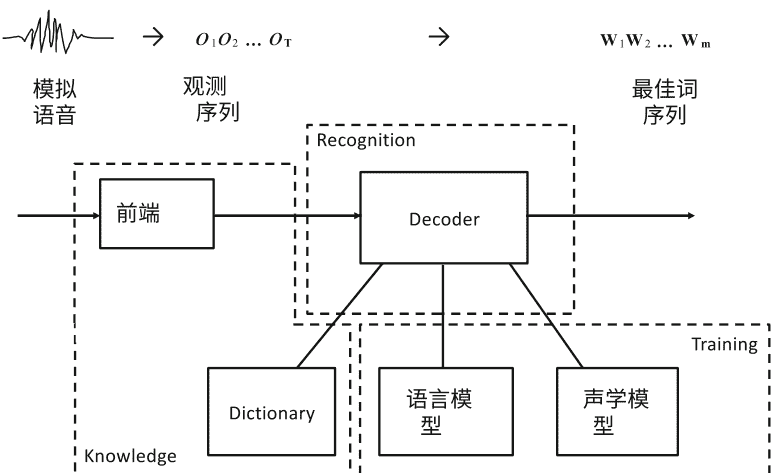

图13.1 传统语音转文本系统的典型组件。在大多数情况下，预处理和词典是基于知识的，没有接受任何训练。声学模型通常经过训练以优化似然、帧交叉熵或某些判别准则。语言模型优化困惑度。标准的维特比解码优化句子错误率，而评估则基于单词错误率。

先验 $P_{\theta}(W)$ 和似然 $p_{\theta}(O|W)$ 分别称为语言模型和声学模型。请注意，这个公式旨在最小化“句子”错误率（SER），即描述单词序列 $W'$ 具有最高正确性期望的整体。然而，大多数语音转文本系统使用单词错误率（WER）进行评估，该错误率对应于具有最高正确性期望的单词序列 $\{w_1, w_2, \dots, w_m\}$，这是一个不同且可能更“宽容”的准则。实际上，SER 和 WER 通常是相关的，改善其中一个也往往会改善另一个。然而，我们选择如何设置语音识别问题的这个看似小的差异，正是共识解码 [47]、序列训练 [37] 和许多其他（判别性）技术需要实现最先进的自动语音识别（ASR）结果的原因之一，这些技术带来了大量的参数、调整因子和启发式方法。

图13.1 显示了这样一个标准 ASR 流水线的主要组成部分。请注意，系统的并非所有部分都在进行训练，并且使用不同的标准来优化每个部分。

##### 13.1.1 传统 ASR 流水线的复杂性和次优性

图13.2 展示了这样一个传统的、最先进的“混合”ASR 系统的开发过程。它由三种不同类型的声学模型组成，最终只使用最后一个模型。这样的流水线本质上是复杂的，即使没有错误地构建，由于多种原因，在优化过程中也容易陷入局部最小值：

- **多个训练阶段**。通过构建一个隐马尔可夫模型/高斯混合模型（HMM/GMM）来初始化流水线。它生成训练数据的帧级别对齐，这些对齐用作深度神经网络（DNN）训练的目标。只有在完全构建了 HMM/GMM 模型之后，才能训练深度学习模型。不幸的是，训练一个好的 HMM/GMM 本身需要执行一系列步骤，通常从一个上下文无关（CI）模型开始，然后转向一个上下文相关（CD）模型，其中 HMM 状态为 senones。在实践中，每个步骤通常重复多次，逐渐增加参数的数量，更新对齐，并经常整合更高级的训练技术，如说话者自适应训练（SAT）和判别性训练（DT）。
- **各种类型的资源**。传统的流水线需要仔细准备字典和通常的音素信息，以进行声学建模。这些资源并不总是可用的，特别是对于资源匮乏的语言/条件。缺乏这些资源可能会妨碍在这些场景中部署 ASR 系统。使用预先存在的对齐或其他可用的资源可以加快开发速度，但会引入额外的依赖关系，使得很难从头开始重现训练。
- **超参数调整**。另一个复杂性层面在于超参数调整的努力。在流程中存在相当多的超参数，例如 HMM 状态的数量和每个状态内部的高斯组件数量。决定这些超参数的值需要进行大量的经验调整，并依赖于 ASR 专家的知识和经验。
- **多个优化函数**。传统 ASR 流程的主要缺点是各个组件朝着不同的目标函数进行单独优化。在语音识别社区中，获取适当的特征表示和学习有效的模型通常被视为两个独立的问题。语音特征设计遵循人类感知语音信号的听觉机制（例如，梅尔频率尺度），但这种受听觉启发的特征提取不一定最适合声学模型的训练。

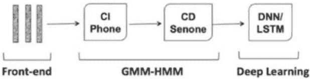

图13.2 使用深度学习声学建模构建最先进的 ASR 系统的流水线。通过一系列高斯混合模型（GMMs）学习上下文相关的（CD）子音素状态（senones），这些模型仅用于对齐和聚类。

优化目标的不一致性在声学建模中更加明显。例如，HMM/GMM 模型通常通过最大似然估计（MLE）或各种判别准则进行训练，而深度学习模型则通过优化交叉熵（CE）等判别目标进行训练。几乎所有情况下，这些准则都是基于帧分类，而单词识别是一个序列分类问题。此外，在解码过程中，语言模型被调整以获得更低的困惑度，但这并不能保证对应更低的词错误率（WER）。这些不一致组件的独立优化无疑会影响最终 ASR 系统的性能。

- **模型不匹配**。早在 [57] 就已经认识到隐马尔可夫模型不能很好地适应观察到的音素持续时间。虽然第一阶段隐马尔可夫模型中保持在给定状态的概率随着 $t > 0$ 的增加呈指数衰减，但是观察到的音素持续时间分布在 $t > 0$ 时有一个明显的峰值，因此可以用伽马分布来近似。使用亚音素单元作为 HMM 的状态在一定程度上缓解了这个基本问题，但是大多数最先进的 ASR 系统简单地忽略了音素持续时间，并将所有状态转移概率设置为固定值，通常为1。虽然这在实践中似乎工作得不错，但是这种对概率守恒的微不足道的违反表明模型在根本上不匹配，应该研究替代解决方案。

##### 13.1.2 传统 ASR 流程的简化

传统 ASR 流程的复杂性激发了研究人员提出各种简化方法。一个主要的复杂性涉及对训练良好的 HMM/GMM 模型的依赖。因此，直接去除 GMM 构建阶段并直接使用平坦启动的深度学习模型是有利的。在 [69] 中，作者提出了一种无需依赖 HMM/GMM 的 DNN 声学模型训练方法。他们的方法从初始均匀对齐开始（每个状态在话语中被分配相等的持续时间），通过多次网络训练和对齐重建逐步改进对齐。然后，在经过训练的网络的隐藏激活空间中执行语音状态绑定。同时，在 [62] 中还开发了另一个类似的提案，研究了其他类型的网络输出在上下文相关状态聚类中的应用。提出的无 GMM 的 DNN 训练方法进一步扩展到分布式异步训练基础设施和更大的数据集 [2]。

然而，这些方法仍然继承了基于 HMM 的方法的根本缺点，而“端到端”系统试图避免这些缺点。

##### 13.1.3 端到端学习

近年来，随着深度学习的进步，端到端解决方案在许多领域中出现了。一个显著的例子是深度卷积神经网络（CNN）在图像分类任务中的广泛应用。传统上，图像分类从提取手工设计的特征（例如 SIFT [42]）开始，然后应用分类器（如支持向量机（SVM））对提取的特征进行分类。通过深度 CNN，图像分类可以以纯粹的端到端方式进行。输入到 CNN 中的仅仅是经过适当预处理的原始像素值。在经过标记数据的训练后，CNN 直接从其 softmax 层生成分类结果。这种端到端范式已经进一步应用到各种计算机视觉任务中，例如目标检测 [22]，人脸识别 [39]，场景标注 [70] 和视频分类 [34]。另一个端到端方法取得巨大成功的领域是机器翻译（MT）。构建传统的统计 MT 系统 [38] 包含一系列中间步骤，可能会受到单独优化的影响。提出了一种编码器-解码器架构 [12, 63] 来实现端到端机器翻译。在 [3] 中开发了一种优雅的编码器-解码器变体，称为注意力模型。除了机器翻译，这种编码器-解码器范式已经在图像字幕生成 [67]，视频字幕生成 [68] 和许多其他任务中使用。

使用基于注意力的编码器-解码器模型，端到端的思想可以自然地应用于语音识别 [9, 14, 43]。原则上，构建一个自动语音识别系统涉及学习从语音特征向量到转录文本（例如，单词、音素、字符等）的映射，两者都是序列，因此不会发生重新排序。如果我们可以直接学习这样的映射，所有组件都在统一的目标下进行优化，这可以提高最终的识别性能，消除了独立的声学模型和语言模型的需求。

然而，在实践中，保持语言模型（描述“说了什么”）和声学模型（描述“怎么说”）的分离可能是务实的。尽管这种分离违背了端到端学习的初衷，但这些方法，尤其是基于连接主义时间分类（CTC, [26]）的方法，已被社区接受为“端到端”，因为它们的目标函数本质上是基于序列的。

#### 13.2 端到端自动语音识别架构

目前，两种主要的端到端方法主导着语音处理领域。它们在观察和输出符号之间的对齐方式上有所不同，并且在输出符号之间的依赖关系排序上也有所不同。第一类示例通过创建明确的对齐并将符号视为独立单元来使用 CTC 等算法，将在第 13.2.1 节中讨论。编码器-解码器模型主导第二类，并计算没有任何对齐，除非使用注意机制；请参阅第13.2.2节。在第13.2.4节中，我们将讨论其他端到端方法，用于除了语音转文本之外的任务，而第13.2.3节介绍了学习识别器前端的努力。

##### 13.2.1 连接主义时间分类

基于帧的神经网络需要为输入序列中的每个段或时间步提供训练目标，并产生同样“密集”的输出。这两个重要的后果：训练数据必须预先分段以提供目标，并且必须在外部建模连续标签之间的任何依赖关系。然而，在ASR中，我们的目标不一定是对数据进行分割，而是对数据中的状态序列进行标记，这使我们能够定义和训练一个可以直接优化以预测标签序列并对该标签序列与观测值的所有可能对齐进行边缘化的网络结构。

CTC [26] 损失函数定义在目标符号上，并引入了一个额外的“空白”标签，网络可以在任何时间点预测该标签，而不会影响输出序列。空白标签的引入使得标签序列能够投影到帧级独立标签上。CTC训练的一个重要结果是标签序列单调地映射到观测值（即语音帧），从而消除了额外的约束需求（例如[13]中施加的单调对齐约束）。重要的是，CTC损失函数假设相邻的符号彼此独立，因此可以将其用作输入特征的“标记化”，并且可以轻松应用语言模型。

大多数经过CTC训练的ASR系统使用堆叠的长短期记忆网络 (LSTM) [30] 构建，例如在 [25, 26, 61] 中。其他工作使用其他类型的循环神经网络 [28]，包括在 [27] 中使用修正线性单元 (ReLUs [53]) 等简化方法，或者使用在线学习 [32] 或更复杂的结构 [58] 进行改进。

最近，[71] 引入了几项改进的“全神经网络”端到端语音识别技术，包括迭代CTC方法，将基于CTC的无词典系统的性能提升到了Switchboard 300小时设置下的约10%的词错误率（WER）。CTC训练将在第13.3.2节中详细讨论。

##### 13.2.2 编码器-解码器范式

另外，还可以将整个序列（即值和顺序）压缩成一个单一向量，从而将所有输入信息“编码”成一个实体。这是通过使用编码器循环神经网络 (RNN) 实现的。

RNN 逐个时间步骤读取输入序列，以获得一个固定的 $d$ 维向量表示。然后，使用解码器 RNN 从该向量表示生成输出序列。解码器 RNN 本质上是一个基于 RNN 的语言模型 [8]，只是它是根据输入序列进行条件化的。在许多实际实现中，LSTM 网络 (LSTMs, [30]) 充当编码器/解码器网络的构建块。LSTM 成功学习长程依赖性的能力 [35] 使其成为这个应用的自然选择，尽管其他单元，如门控循环单元 (GRUs) [11]，也可以使用。图 13.3 说明了编码器-解码器的思想，其中编码器将三个输入符号编码为一个固定长度的表示。然后，将这个输入表示传播到解码器，解码器按顺序发出四个输出符号。

将整个输入序列映射到一个向量的思想首次在 [33] 中提出。机器翻译是这个思想的明显扩展 [12]。

通过引入一种机制 [3]，这个简单而优雅的模型的性能可以进一步提高，该机制使模型能够依赖于预测目标输出符号相关的输入序列的部分，而无需将这些部分明确地标识为硬分段。这种注意力方法似乎更好地允许网络在生成步骤中从错误中恢复，但并不意味着像 CTC 那样的单调性。

这种技术首次应用于语音识别是在 [13, 14] 中报道的，作者发现只需要对注意力机制进行轻微修改就能在 TIMIT 任务 [18] 上取得最先进的结果。尽管未经修改的 MT 模型的总体音素错误率（PER）达到了 18.7%，但其性能在更长或连接的话语中迅速下降。这个模型似乎跟踪输入序列中帧的绝对位置，这在像 TIMIT 这样的小任务上可能有帮助，但不会很好地推广。

所提出的修改明确考虑了前一时间步的焦点位置和输入特征序列。这是通过将上一步的注意力权重与可训练滤波器卷积提取的辅助卷积特征作为输入添加到注意力机制中来实现的。除了其他次要修改以更好地应对语音数据的噪声和基于帧的特性外，该模型在 17.6% 的错误率下表现出显著改进。此外，几乎没有在连接的话语中观察到退化。在后续的工作中，作者们应用了一个深度双向 RNN 编码器和基于注意力的循环序列生成器（ARSG）[5] 作为解码器网络，用于英语华尔街日报（WSJ）任务 [55]。他们报告说，在使用字符作为单位并包括三元语言模型时，WER 为 10.8%。值得注意的是，当不使用语言模型时，ARSG 方法的表现优于 CTC 方法，主要是因为解码器 RNN 已经隐式地学习了一个语言模型。

一种类似的方法，名为“听、关注和拼写”（LAS），已经在大规模语音搜索语料库上实现 [10]，在没有语言模型的情况下达到了 14.1% 的词错误率（WER），并且在语言模型重新评分的情况下达到了 10.3% 的 WER。这些结果接近于 8.0% 的 WER 基准，该基准由卷积和（单向）LSTM 网络的组合构成 [58]。LAS 系统不使用发音词典，而是直接对字符进行建模。监听器是一个 3 层循环网络编码器，接受滤波器组谱作为输入。堆叠的双向 LSTM 编码器的每一层将时间分辨率降低了 2 倍。这种金字塔结构的架构被发现可以加快训练速度并获得更好的识别结果。拼写器是一个基于注意力机制的循环网络解码器，根据所有先前字符和整个声学序列来生成每个字符。类似于 [63]，使用波束搜索，并且可以对前 N 个（通常为 32 个）假设进行语言模型重新评分，在此时还会对较短的话语有一定的偏差修正。LAS 实现的一个特殊属性是它可以为相同的声学数据产生多个拼写变体：例如，模型可以同时产生“三个A”和“AAA”（在前四个波束中）。

由于与 CTC 不同，输出符号之间没有条件独立性假设，解码器会对匹配声学的两个变体都给予高分。相比之下，传统的 HMM/DNN 系统需要发音词典中同时包含这两种拼写才能生成两种转录。

最近，卢等人 [45] 研究了端到端系统在 Switchboard 任务上的训练策略，并使用 GRU 作为网络构建模块，取得了合理的整体准确性。采用了多层解码器模型，显示出改进的长期记忆行为。这项工作还证实了在学习编码器-解码器模型时，对输入帧进行分层子采样的益处。

##### 13.2.3 学习前端

另一种方法是尝试去除特征提取，使用时间样本进行神经网络训练。标准的深度学习模型以手工设计的特征作为输入，例如对数梅尔滤波器组的幅度。现在已经进行了各种尝试，直接在原始语音波形上训练 DNN 或 CNN 模型 [31, 54, 64]。除了网络之外，还在原始波形上放置了滤波器，并与网络的其余部分一起进行学习。这样做的好处是可以将特征提取优化为所需的目标（网络训练）并统一整个训练过程。在 [59] 中，与强大的深度学习模型 [58] 一起使用，观察到应用滤波器学习的原始波形特征与对数梅尔滤波器的性能相匹配。

很容易将 CTC 或编码器-解码器模型与学习的前端结合起来，但我们还不知道是否有任何已经实现了这一点的工作。

##### 13.2.4 其他想法

在 [24] 中，提出了 CTC 向所谓的递归神经网络转录器的扩展，并在 TIMIT 上进行了评估。这种方法定义了一个分布，涵盖了所有长度的输出序列，并同时建模了输入-输出和输出-输出的依赖关系。最近的一篇论文 [44] 引入了 CTC 的分段版本，通过添加另一个对所有可能分割的边缘化步骤，从而在 TIMIT 数据集上获得了目前最佳的 PER。

关键词检测是另一个可能受益于端到端方法的任务。Fernández 等人 [17] 使用 LSTMs 和 CTC 实现了一个端到端的关键词检测系统，但缺点是不能轻松添加新的关键词。这个限制在 [66] 中得到了部分解决，该论文应用了动态贝叶斯网络（DBNs）并依赖于 CTC 检测到的音素。[36] 中提出了一种相关方法，试图使用神经网络在输入或模型级别优化多个信息源的融合。它展示了神经网络如何将声学模型和语言模型结合起来，或者如何优化多个输入特征的组合。

“Wav2Letter” [15] 是另一种最近的方法，它直接从波形转换为字母，只使用卷积神经网络。这种方法的优点是只使用非递归模型，训练和评估速度更快。目前，完全端到端（即从波形到字母）的方法的结果稍逊于基于梅尔频率倒谱系数（MFCC）或功率谱特征训练的系统。

#### 13.3 EESEN 框架

在本节中，我们使用“EESEN”工具包 [50] 来举例说明端到端的 ASR。我们将描述模型结构和训练目标，以及基于加权有限状态转换器（WFSTs）的解码方法。EESEN 与流行的“Kaldi”工具包 [56] 共享数据准备脚本和其他基础设施，并且已经以 Apache 许可证的形式作为开源发布。更多相关工具包可以在第 17 章中找到。

##### 13.3.1 模型结构

EESEN 中的声学模型是深度双向 RNN 网络。基本的 RNN 模型及其 LSTM 变体已在第 7 章和第 11 章中介绍过。在这里，我们重新阐述它们的原理以完整地表述。与标准的前馈网络相比，RNN 在序列上具有学习复杂时间动态的优势。给定一个输入序列 $X = (x_1, \dots, x_T)$ 总共包含 $T$ 帧，一个循环层计算前向隐藏状态的序列 $\vec{H} = (\vec{h}_1, \dots, \vec{h}_T)$，通过从 $t = 1$ 迭代到 $T$:

$$\vec{h}_t = \sigma(\vec{W}_{hx} x_t + \vec{W}_{hh} \vec{h}_{t-1} + \vec{b}_h) \qquad (13.2)$$

其中 $t$ 表示当前的语音帧，$\vec{W}_{hx}$ 是输入到隐藏层的权重矩阵，$\vec{W}_{hh}$ 是隐藏层到隐藏层的权重矩阵。除了输入 $x_t$ 之外，来自上一个时间步的隐藏激活 $\vec{h}_{t-1}$ 也被用来影响当前时间步的隐藏输出。在双向循环神经网络中，额外的循环层计算从 $t = T$ 到 1 的隐藏输出序列 $\bar{H}$：

$$\bar{h}_t = \sigma(\bar{W}_{hx} x_t + \bar{W}_{hh} \bar{h}_{t-1} + \bar{b}_h). \qquad (13.3)$$

声学模型是一个深度架构，我们在其中堆叠多个双向循环层。在每一帧 $t$，当前层的前向和后向隐藏输出 $[\vec{h}_t, \bar{h}_t]$ 的串联被视为输入进入下一个循环层。

通过时间反向传播（BPTT）可以实现 RNN 的学习。在实践中，由于梯度消失问题 [7]，训练 RNN 学习长期时间依赖关系可能会很困难。为了克服这个问题，我们将 LSTM 单元 [30] 应用于 RNN 的构建模块。LSTM 包含具有自连接的记忆单元，用于存储网络的时间状态。此外，还添加了乘法门来控制信息的流动。图 13.4 描述了我们使用的 LSTM 单元的结构。浅灰色表示连接到门的窥视孔连接 (peephole connections) [20]，用于学习输出的精确时机。

在时间步骤 $t$ 的计算可以形式化地写成如下形式，我们省略了用于简洁表述的偏置项：

$$i_t = \sigma(W_{ix}x_t + W_{ih}h_{t-1} + W_{ic}c_{t-1} + b_i), \tag{13.4a}$$
$$f_t = \sigma(W_{fx}x_t + W_{fh}h_{t-1} + W_{fc}c_{t-1} + b_f), \tag{13.4b}$$
$$c_t = f_t \odot c_{t-1} + i_t \odot \tanh(W_{cx}x_t + W_{ch}h_{t-1} + b_c), \tag{13.4c}$$
$$o_t = \sigma(W_{ox}x_t + W_{oh}h_{t-1} + W_{oc}c_t + b_o), \tag{13.4d}$$
$$h_t = o_t \odot \phi(c_t), \tag{13.4e}$$

其中，$i$、$o$、$f$、$c$ 分别是输入门、输出门、遗忘门和记忆单元的激活值。$W_{\cdot x}$ 是连接输入和单元的权重矩阵，而 $W_{\cdot h}$ 是连接前一个隐藏状态和单元的权重矩阵。$W_{\cdot c}$ 是用于窥视孔连接的对角权重矩阵。此外，$\sigma$ 是逻辑 sigmoid 非线性函数，$\phi$ 或 $\tanh$ 是双曲正切非线性函数。反向 LSTM 层的计算可以类似地表示。

##### 13.3.2 模型训练

与混合方法不同，EESEN 框架中的 RNN 模型不是使用基于 CE 准则的帧级标签进行训练。相反，根据 [25, 28, 46]，采用 CTC 目标函数 [26] 自动学习语音帧与标签序列（如音素或字符）之间的对齐关系。

假设训练数据中的标签序列包含 $K$ 个唯一的标签。通常 $K$ 是一个相对较小的数字，例如，当标签为音素时，英语的标签数量大约为 45 个。在标签中还添加了一个额外的空白标签 $\emptyset$，表示没有发射任何标签。为了简化公式，我们用标签集中的索引来表示每个标签。给定一个话语 $O = (x_1, \ldots, x_T)$，它的标签序列被表示为 $z = (z_1, \ldots, z_U)$。空白标签的索引始终为 0。因此 $z_u$ 是一个从 1 到 $K$ 的整数。标签 $z$ 的长度受限于话语的长度，即 $U \leq T$。CTC 的目标是最大化 $\ln p(z|O)$，即通过优化 RNN 模型参数，给定输入的标签序列的对数似然。

RNN 的最后一层是一个 softmax 层，它有 $K + 1$ 个节点，对应于 $K + 1$ 个标签（包括 $\emptyset$）。在每一帧 $t$，我们得到输出向量 $y_t$，其中第 $k$ 个元素 $y_t^k$ 是标签 $k$ 的后验概率。然而，由于标签 $z$ 与帧不对齐，很难评估给定 RNN 输出的 $z$ 的可能性。为了将 RNN 输出与标签序列联系起来，引入了中间表示 CTC 路径。

CTC 路径 $\mathbf{p} = (p_1, \dots, p_T)$ 是帧级别上的标签序列。它与 $z$ 的不同之处在于 CTC 路径允许空白标签的出现和非空白标签的重复。CTC 路径的总概率被分解为每一帧上标签 $p_t$ 的概率：

$$p(\mathbf{p}|O) = \prod_{t=1}^T y_t^{p_t}. \eqno(13.5)$$

标签序列 $z$ 然后可以映射到相应的 CTC 路径。这是一个一对多的映射，因为多个 CTC 路径可以对应相同的标签序列。例如，“$A A \emptyset \emptyset B C \emptyset$”和“$\emptyset A A B \emptyset C C$”都被映射到标签序列“A B C”。我们用 $\Phi(z)$ 表示 CTC 路径的集合。然后，标签序列 $z$ 的可能性可以作为其 CTC 路径的概率之和来评估：

$$p(z|O) = \sum_{p \in \Phi(z)} p(\mathbf{p}|O). \eqno(13.6)$$

然而，对所有 CTC 路径求和在计算上是不可行的。一种解决方案是将可能的 CTC 路径紧凑地表示为一个网格。为了允许 CTC 路径中存在空白，我们在 $z$ 的开头和结尾添加“0”（$\emptyset$ 的索引），并在 $z$ 的每对原始标签之间插入“0”。结果得到的增强标签序列 $\mathbf{l} = (l_1, \dots, l_{2U+1})$ 在前向-后向算法中用于高效的可能性评估。具体而言，在前向传递中，变量 $\alpha_t^u$ 表示以标签 $l_u$ 结尾的所有 CTC 路径的总概率。与 HMM 类似 [57]，$\alpha_t^u$ 可以从先前帧 $t-1$ 中获得的变量值递归计算得出。类似地，后向变量 $\beta_t^u$ 表示以标签 $l_u$ 开始并达到最终帧 $T$ 的所有 CTC 路径的总概率。标签序列 $z$ 的可能性然后可以计算为：

$$p(z|O) = \sum_{u=1}^{2U+1} \alpha_t^u \beta_t^u, \eqno(13.7)$$

其中 $t$ 可以是任意帧 $1 \le t \le T$。目标 $\ln p(z|O)$ 现在对于 RNN 输出 $y_t$ 是可微的。我们定义了一个操作，增强的标签序列 $\varUpsilon(\boldsymbol{l},k) = \{u|l_u = k\}$ 返回 $\boldsymbol{l}$ 中值为 $k$ 的元素。目标函数对于 $y^k_t$ 的导数可以推导为：

$$\frac{\partial \ln p(\mathbf{z}|\mathbf{O})}{\partial y^k_t} = \frac{1}{p(\mathbf{z}|\mathbf{O})} \frac{1}{y^k_t} \sum_{u \in \varUpsilon(\boldsymbol{l},k)} \alpha^u_t \beta^u_t. \quad (13.8)$$

这些错误通过 softmax 层反向传播，并进一步更新 RNN 的模型参数。

EESEN 在图形处理单元（GPU）设备上实现了这个模型训练阶段。为了充分利用 GPU 的能力，多个语音同时并行处理。这种并行处理通过将单帧的矩阵-向量乘法替换为多帧的矩阵-矩阵乘法来加快模型训练速度。在一组并行语音中，每个语音都被填充到组中最长语音的长度。这些填充帧不参与梯度计算和参数更新。为了进一步加速，训练语音按长度从短到长进行排序。同一组中的语音长度大致相同，这样可以最小化填充帧的数量。CTC 评估也很昂贵，因为前向和后向向量（$\alpha_t$ 和 $\beta_t$）必须按顺序计算，要么从 $t=1$ 到 $T$，要么从 $t=T$ 到 $1$。与 RNN 类似，EESEN 中的 CTC 实现也同时处理多个语音。此外，在特定的帧 $t$，$\alpha_t$ 的元素是独立的，因此可以并行计算。

##### 13.3.3 解码

先前的工作引入了各种方法 [25, 28, 46] 来解码 CTC 训练的模型。然而，这些方法要么无法集成单词级别的语言模型 [46]，要么在受限条件下实现集成（例如，在 [25] 中的 $n$ 最佳列表重排序）。EESEN 的一个独特特点是基于 WFSTs [52, 56] 的广义解码方法。WFST 是一个有限状态接受器（FSA），其中每个转换都有一个输入符号、一个输出符号和一个权重。通过 WFST 的路径接受一系列输入符号并发出一系列输出符号。EESEN 的解码方法将 CTC 标签、词典和语言模型表示为单独的 WFSTs。使用高度优化的 FST 库（如 OpenFst [1]），WFSTs 被高效地融合合成一个单一的搜索图。构建各个 WFST 的过程如下所述。

###### 13.3.3.1 语法

一个语法 WFST 编码了一个语言/领域中允许的单词序列。图 13.5 中显示的 WFST 代表了一个玩具语言模型，它允许两个句子，“你好吗”和“它是怎么样的”。WFST 的符号是单词，弧权重是语言模型的概率。通过这种 WFST 表示，CTC 解码原则上可以利用任何可以转换为 WFST 的语言模型。根据文献 [56] 中的约定，语言模型 WFST 被表示为 $G$。

###### 13.3.3.2 词典

一个词典 WFST 编码了从词典单元序列到单词的映射。根据我们的 RNN 建模的标签，有两种情况需要考虑。

如果标签是音素，词典就是一个标准字典，就像我们在混合方法中通常使用的那样。当标签是字符时，词典只包含单词的拼写。这两种情况之间的一个关键区别是，拼写词典可以很容易地扩展以包括任何词汇外 (OOV) 的单词。相比之下，扩展音素词典并不那么直接。它依赖于一些字素到音素的规则/模型，并且可能存在错误。词典 WFST 被表示为 $L$。

对于拼写词典，还有另一个要处理的复杂情况。使用字符作为 CTC 标签时，在原始转录中通常在每对单词之间插入一个额外的空格字符，以建模单词的分隔。解码允许空格字符可选择地出现在单词的开头和结尾。这个复杂情况可以很容易地通过图 13.7 中的 WFST 处理。

- 图 13.5 语法（语言模型）WFST 的一个玩具示例。弧的权重是给定前一个单词时发射下一个单词的概率。节点 0 是起始节点，双圈节点是结束节点。
- 图 13.6 电话词典条目“is IH Z”的 WFST。符号“<eps>”表示没有输入被消耗或没有输出被发射。

图13.7 单词“is”的拼写的WFST。我们允许单词可选择地以空格字符“<space>”开头和结尾。

图13.8 一个描述音素“IH”的令牌WFST的示例。我们允许出现空白标签“<blank>”，以及非空白标签“IH”的重复。

###### 13.3.3.3 令牌

第三个WFST组件将帧级CTC标签序列映射到单个词典单元（音素或字符）。对于一个词典单元，它的令牌WFST被设计为在帧级别上包含其所有可能的标签序列。因此，这个WFST允许出现空白标签 $\varnothing$，以及任何非空白标签的重复。例如，在处理五帧之后，RNN模型可能生成三个可能的标签序列，“AAAAA”，“$\varnothing\varnothing AA\varnothing$”，“$\varnothing AAA\varnothing$”。令牌WFST将这三个序列映射到一个单一的词典单元“A”。图13.8显示了电话“IH”的WFST结构。令牌WFST表示为 $T$。

###### 13.3.3.4 搜索图

在编译三个独立的WFST之后，我们将它们组合成一个全面的搜索图。首先组合词典和语法WFST。然后对它们的组合进行两个特殊的WFST操作，确定化和最小化，以压缩搜索空间，从而加快解码速度。然后将生成的WFST $LG$ 与令牌WFST组合，最终生成搜索图。总体而言，FST操作的顺序是

$$S = T \circ \min(\det(L \circ G)), \quad (13.9)$$

其中，$\circ$、$\det$和$\min$分别表示组合、确定化和最小化。搜索图$S$将从语音帧上发射的CTC标签序列编码为单词序列。

在使用传统ASR流水线进行解码时，深度学习模型的状态后验通常会使用状态先验进行缩放。先验是从训练数据的强制对齐中估计得出的。相比之下，CTC解码的过程训练模型不需要后验缩放，因为可以直接评估整个标签序列的后验概率。然而，在实践中，观察到后验缩放仍然有助于EESEN的解码。EESEN不是从帧级对齐中收集统计信息，而是从训练数据的标签序列中估计更健壮的标签先验。正如第13.3.2节所述，CTC训练中实际使用的是增强的标签序列，在原始标签序列的每个标签之间插入一个空白。先验是从增强的标签序列（例如，“∅IH ∅ Z ∅”）而不是原始标签序列（例如，“IH Z”）中通过简单计数来计算的。经验上发现，这种简单方法比使用从帧级对齐导出的先验和[61]中描述的提议更能提高识别准确性。

##### 13.3.4 实验和分析

在本节中，我们展示了在各种基准ASR任务上进行的实验，并对EESEN的优缺点进行了分析。

###### 13.3.4.1 华尔街日报

首先，我们在WSJ语料库[55]上验证了EESEN框架，该语料库可以从LDC获取，目录号为LDC93S6B和LDC94S13B。数据准备过程中，我们获得了81小时的转录语音，其中95%用作训练集，剩余的5%用于交叉验证。正如第13.3节中讨论的那样，我们将深度RNN应用于声学模型。RNN的输入是40维的滤波器组特征以及它们的一阶和二阶导数。这些特征通过基于说话者的均值减法和方差归一化进行了标准化。

RNN模型有四个双向LSTM层。在每一层中，正向和反向子层都包含320个记忆单元。模型参数的初始值是从均匀分布的范围[−0.1, 0.1]中随机抽取的。模型使用BPTT进行训练，其中错误从CTC反向传播。训练集中的话语按长度排序，每次同时处理十个话语。模型训练采用了初始学习率为0.00004的方法，并根据假设标签的准确性与参考标签序列的变化进行衰减。

我们的解码遵循第13.3.3节中基于WFST的方法。我们应用了WSJ标准的修剪的三元语言模型，格式为ARPA（我们将一致地称之为标准）。 为了与之前的工作[25, 28]保持一致，我们在 eval92 数据集上报告了我们的结果。我们的实验设置已经与EESEN一起发布，读者可以使用它来重现这里报告的结果。

当电话被视为CTC标签时，我们采用了CMU字典[^2]作为词典。从词典中，我们提取了72个标签，包括电话、噪声标记和空白。在eval92测试集上，EESEN端到端系统最终实现了7.87%的WER。作为对比，我们还使用Kaldi工具包[56]构建了一个传统的ASR系统。该系统采用了混合HMM/DNN作为其声学模型，其参数稍微多一些（920万对850万）。DNN被微调以优化与3421个聚类上下文相关状态相关的CE目标。从表13.1中，可以看到EESEN系统的性能仍然落后于传统系统。正如将在第13.3.4.2节中讨论的那样，EESEN能够在更大规模的任务上胜过传统的流水线。

[^2]: http://www.speech.cs.cmu.edu/cgi-bin/cmudict.

当切换到以字符为CTC标签时，我们从CMU词典中获取了单词列表作为我们的词汇表，忽略了单词的发音。CTC训练处理了包括字母、数字、标点符号等在内的59个标签。表13.1显示，使用标准语言模型，基于字符的系统的词错误率为9.07%。过去的工作[25]中的CTC实验采用了一个扩展的词汇表，并使用与WSJ语料库一起发布的文本数据重新训练了语言模型。

为了公平比较，我们采用了相同的配置。在语言模型训练文本中至少出现两次的OOV词被添加到词汇表中。使用语言模型训练文本构建了一个新的三元语言模型（然后进行了修剪）。在这种设置下，EESEN基于字符的系统的词错误率降低到了7.34%。

在表13.1中，我们还列出了在相同数据集上先前工作[25, 28]报告的端到端ASR系统的结果。EESEN在测试集上的词错误率优于[25]和[28]。值得指出的是，[25]中报告的8.7%词错误率并不是纯粹的端到端方式获得的。相反，[25]的作者从传统系统中生成了一个$n$个最佳候选假设列表，并应用CTC模型对候选假设进行重新评分。这里显示的EESEN数字与任何现有系统的依赖无关。

##### 表13.1 EESEN系统的性能以及与使用Kaldi构建的传统系统和以前工作中报告的结果进行比较

| 目标类型 | 语言模型设置 | 模型 | # 参数 | 词错误率 (%) |
| :--- | :--- | :--- | :--- | :--- |
| 基于音素 | 标准 | EESEN | 850万 | 7.87 |
| 基于音素 | 标准 | Kaldi HMM/DNN | 920万 | 7.14 |
| 基于字符 | 标准 | EESEN | 850万 | 9.07 |
| 基于字符 | 扩展 | EESEN | 850万 | 7.34 |
| 基于字符 | 扩展 | Graves等人[25] | - | 8.7 |
| 基于字符 | 标准 | Hannun等人[28] | - | 14.1 |
| 基于字符 | 标准 | ARSG [5] | - | 10.8 |

此外，在表13.1的最后一行中，我们展示了ARSG的结果，这是一种基于注意力的编码器-解码器模型，报告在[5]中。我们可以看到，在相同的配置下，我们EESEN框架中构建的CTC模型优于编码器-解码器模型。

###### 13.3.4.2 Switchboard

EESEN应用于Switchboard电话对话转录任务[23]。我们使用Switchboard-1 Release 2（LDC97S62）作为训练集，其中包含超过300小时的语音。为了快速反馈，我们还从训练集中选择了110小时，并创建了一个较轻的设置。在110小时和300小时的设置中，LSTM网络分别由四层和五层双向LSTM组成。

其他训练配置（层大小、学习率等）与WSJ相同，CTC训练模型了46个标签，包括音素、噪声标记和空白。解码时，使用了一个三元语言模型对训练转录进行训练，并与另一个训练于Fisher英语第一部分转录（LDC2004T19）的语言模型进行插值。我们在Hub5'00（LDC2002S09）测试集的Switchboard部分报告了词错误率（WER）。

我们的基准系统是传统的Kaldi系统，其中同时使用了DNN和LSTM作为声学模型。对于110小时的设置，DNN有五个隐藏层，每个隐藏层包含1200个神经元。LSTM模型有两个单向LSTM层，其中线性投影层应用于隐藏输出[60]。每个LSTM层有800个记忆单元和512个输出单元。

DNN和LSTM模型的参数是随机初始化的。对于300小时的设置，DNN模型有6个隐藏层，每个隐藏层包含2048个神经元。LSTM模型有2个投影LSTM层，每个LSTM层有1024个记忆单元和512个输出单元。DNN是用受限玻尔兹曼机（RBM）[29]进行初始化的，而LSTM模型是随机初始化的。关于这些混合模型的更多细节可以在[49]中找到。

表13.2显示，在110小时的设置中，EESEN系统的性能略优于传统的HMM/DNN系统，但比HMM/LSTM系统差[^3]。相反，当我们切换到300小时的设置时，EESEN的性能超过了传统系统。这个比较表明，当训练数据量增加时，CTC训练变得更有优势。这个观察结果是可以理解的，因为在传统系统中，深度学习模型（DNN或LSTM）被训练为帧级分类器，将语音帧分类为相应的状态标签。EESEN中基于CTC的训练旨在进行序列到序列的学习，显然比帧级别的学习更复杂。

[^3]: 请注意，HMM/LSTM系统采用了单向LSTM，而EESEN系统采用了双向LSTM。读者在评估结果时应考虑到这种差异。

##### 表13.2 EESEN和传统基线系统在Switchboard 110小时和300小时设置上的比较

| 数据集 | 模型 | # 参数 | WER (%) |
| :--- | :--- | :--- | :--- |
| 110小时 | EESEN | 800万 | 19.9 |
| 110小时 | Kaldi HMM/DNN | 1200万 | 20.2 |
| 110小时 | Kaldi HMM/LSTM | 800万 | 19.2 |
| 300小时 | EESEN | 1100万 | 15.0 |
| 300小时 | Kaldi HMM/DNN | 4000万 | 16.9 |
| 300小时 | Kaldi HMM/LSTM | 1200万 | 15.8 |

##### 表13.3 EESEN和传统系统在Switchboard 300小时设置上的解码速度比较

| 模型 | 解码图 | 解码图大小 | 实时因子 |
| :--- | :--- | :--- | :--- |
| EESEN | TLG | 123百万 | 0.71 |
| Kaldi DNN-HMM | HCLG | 216百万 | 1.43 |
| Kaldi LSTM-HMM | HCLG | 216百万 | 1.12 |

注：解码图的大小以兆字节为单位衡量。实时因子是解码所消耗的时间与测试语音持续时间的比率。例如，实时因子为1.5表示解码1小时的语音需要1.5小时的解码时间。

因此，为了学习高质量的CTC模型，我们需要将更多的训练序列汇集到训练数据中。

与传统的ASR系统相比，EESEN的一个主要优势在于解码速度。加速来自于状态数量的大幅减少，即从数千个聚类上下文相关状态到几十个纯上下文无关的音素/字符。为了验证这一点，表13.3比较了EESEN和传统系统在最佳解码设置下的解码速度。由于状态的减少，EESEN中的解码图比传统系统使用的图要小得多，这为存储图节省了磁盘空间。从表13.3中的实时因子可以看出，EESEN的解码速度几乎是传统系统的两倍。

###### 13.3.4.3 香港科技大学普通话

到目前为止，我们已经在英语上评估了EESEN。在这里，我们继续将其应用于香港科技大学普通话会话电话ASR任务[41]。训练和测试集分别包含174小时和5小时的语音。声学模型包含五个双向LSTM层，每个层都有320个内存单元，分别位于前向和后向子层中。在这个设置中，CTC直接对字符进行建模，而不是音素。数据准备给我们提供了3667个标签，包括英文字符、普通话字符、噪声标记和空白标记。WFST解码中采用了三元语言模型。

##### 表13.4 EESEN和传统的Kaldi DNN-HMM系统在香港科技大学普通话语料库上的比较

| 模型 | 特征 | CER (%) |
| :--- | :--- | :--- |
| Kaldi DNN-HMM | 滤波器组 | 39.42 |
| EESEN | 滤波器组 + 语调 | 39.70 |
| EESEN | 滤波器组+音高 | 38.67 |

注：评估指标是字符错误率 (CER)。

从表13.4可以看出，我们可以看到EESEN的字符错误率 (CER) 为39.70%。这个数字与Kaldi HMM/DNN系统 (39.42%) 相当，该系统是在Kaldi存储库[56]中报告的使用说话者自适应 (SA) 特征训练的竞争系统。这一观察结果与[40]相反，在[40]中发现CTC的性能远远不及混合模型，这是因为解码中缺乏词语语言模型。最后，我们使用音高特征丰富了语音前端，这已经被观察到对音调语言的ASR有益。音高特征的提取遵循Kaldi [21]采用的实现方式。我们观察到，如预期的那样，添加音高特征对EESEN系统带来了额外的收益。

#### 13.4 总结与未来方向

本章从端到端的角度介绍了几种自动语音识别的方法。端到端ASR旨在学习从语音到转录 (或任何“意义表示”) 的直接映射，而不需要组合各个组件并使用中间优化函数，这是传统流程中的情况。使用诸如连接主义时间分类和基于注意力的编码器-解码器模型等方法，语音识别成为一个联合学习过程，概念上是一个非常简单的任务。我们使用“EESEN”开源框架[50]展示了端到端ASR的简单性，该框架将CTC目标函数与基于WFST的解码相结合。这保留了声学模型和语言模型的有用分离，并能够有效地将词典和语言模型纳入解码中。EESEN框架在保持竞争性识别准确性的同时，极大地简化了现有的ASR流程。

现有的端到端方法的一个限制是仍然需要预先指定一些超参数 (例如网络架构、学习率调度等)。我们期待未来的工作能够使这成为一个更容易的任务 (特别是对于非ASR专家[48]) 或者一个可以完全自动化的任务[65]。此外，为了限制计算复杂性，大多数当前实际工作仍然使用传统的声学特征 (例如滤波器组)。

可以预测，我们很快将会看到利用多任务学习的端到端方法的研究，例如多语言语音识别。一个自然的扩展是将模型学习和特征学习结合起来，这使我们能够直接从原始波形学习到转录的映射。

此外，让人兴奋的是看到端到端方法如何扩展到更大规模的任务，其中语音识别只是一个子任务。这些任务的例子包括对话系统、对话状态跟踪、解析和槽填充、语音摘要、讲座字幕、语音翻译等。这些任务目前被视为独立模块的级联。因此，它们应该从与语音识别器的联合优化中获益良多。

不同任务的不同形式的损失函数已经被提出[4]。此外，尽管大多数当前关于端到端自动语音识别的工作都使用了某种形式的循环神经网络，但目前还不清楚是否需要循环和长期记忆，至少对于严格的线性语音转文本任务来说。一些研究表明这可能并非如此[19, 51]。

事实上，鉴于许多这些任务的当前进展速度，很有可能在本章节出版时，许多这些想法已经被实现。对于这些情况，我们提前为提供过时的讨论而道歉。

#### 参考文献

- 1. Allauzen, C., Riley, M., Schalkwyk, J., Skut, W., Mohri, M.: OpenFST: 一个通用且高效的加权有限状态转换器库。在: Holub, J.、d vn, J. (eds.) Implementation and Application of Automata, pp. 11–23. Springer, Heidelberg (2007)
- 2. Bacchiani, M., Senior, A., Heigold, G.: 异步、在线、无GMM的语音识别上下文相关声学模型训练。在: 国际语音通信协会 (INTERSPEECH) 第十五届年会。ISCA, 新加坡 (2014)
- 3. Bahdanau, D., Cho, K., Bengio, Y.: 通过联合学习对齐和翻译的神经机器翻译 (2014)。 arXiv预印本 arXiv:1409.0473
- 4. Bahdanau, D., Serdyuk, D., Brakel, P., Ke, N.R., Chorowski, J., Courville, A.C., Bengio, Y.: 用于序列预测的任务损失估计。CoRR abs/1511.06456 (2015)。 http://arxiv.org/abs/1511.06456
- 5. Bahdanau, D., Chorowski, J., Serdyuk, D., Brakel, P., Bengio, Y.: 基于端到端注意力的大词汇语音识别。在: 国际语音通信协会 (INTERSPEECH) 第十七届年会 (2016)
- 6. Bahl, L.R., Jelinek, F., Mercer, R.L.: 连续语音识别的最大似然方法. IEEE Trans. Pattern Anal. Mach. Intell. 5(2), 179–190 (1983)
- 7. Bengio, Y., Simard, P., Frasconi, P.: 用梯度下降学习长期依赖关系是困难的。IEEE Trans. Neural Netw. 5(2), 157–166 (1994)
- 8. Bengio, Y., Ducharme, R., Vincent, P., Jauvin, C.: 一种神经概率语言模型. J. Mach. Learn. Res. 3, 1137–1155 (2003)
- 9. Chan, W., Jaitly, N., Le, Q.V., Vinyals, O.: 听、关注和拼写 (2015). arXiv预印本 arXiv:1508.01211
- 10. Chan, W., Jaitly, N., Le, Q.V., Vinyals, O.: 听、关注和拼写: 用于大词汇量对话语音识别的神经网络。在: 2016年IEEE国际会议声学、语音和信号处理 (ICASSP)。IEEE, 纽约 (2016年)
- 11. Cho, K., van Merrienboer, B., Bahdanau, D., Bengio, Y.: 关于神经机器翻译的性质: 编码器-解码器方法。CoRR abs/1409.1259 (2014年)。 http://arxiv.org/abs/1409.1259
- 12. Cho, K., Van Merri nboer, B., Gulcehre, C., Bahdanau, D., Bougares, F., Schwenk, H., Bengio, Y.: 使用RNN编码器-解码器学习短语表示用于统计机器翻译 (2014年)。 arXiv预印本arXiv:1406.1078

13. Chorowski, J., Bahdanau, D., Cho, K., Bengio, Y.: 基于注意力的循环神经网络端到端连续语音识别: 首次结果 (2014). arXiv预印本 arXiv:1412.1602
14. Chorowski, J.K., Bahdanau, D., Serdyuk, D., Cho, K., Bengio, Y.: 基于注意力的语音识别模型. 在: 神经信息处理系统进展, 第577-585页 (2015)
15. Collobert, R., Puhrsch, C., Synnaeve, G.: Wav2Letter: 一种基于端到端卷积神经网络的语音识别系统. CoRR abs/1609.03193 (2016). http://arxiv.org/abs/1609.03193
16. Dahl, G. E., Yu, D., Deng, L., Acero, A.: 大词汇量语音识别的上下文相关预训练深度神经网络. IEEE Trans. Audio Speech Lang. Process. 20(1), 30–42 (2012)
17. Fernández, S., Graves, A., Schmidhuber, J.: 递归神经网络在区分性关键词检测中的应用。在: 人工神经网络-ICANN 2007年, 第220-229页。Springer, 海德堡 (2007)
18. Garofolo, J.S., Lamel, L.F., Fisher, W.M., Fiscus, J.G., Pallett, D.S.: DARPA TIMIT声学-音素连续语音语料库CD-ROM。NIST语音光盘1-1.1。NASA STI/Recon技术报告N 93 (1993)
19. Geras, K.J., Mohamed, A.R., Caruana, R., Urban, G., Wang, S., Aslan, O., Philipose, M., Richardson, M., Sutton, C.: 将LSTMS融入CNNS (2015) 。arXiv预印本 arXiv:1511.06433
20. Gers, F.A., Schraudolph, N.N., Schmidhuber, J.: 使用LSTM循环神经网络学习精确的时间。J. Mach. Learn. Res. 3, 115–143 (2003)
21. Ghahremani, P., BabaAli, B., Povey, D., 等: 用于自动语音识别的音高提取算法。In: 2014年IEEE国际声学、语音和信号处理会议 (ICASSP), 第2494–2498页。IEEE, 纽约 (2014)
22. Girshick, R., Donahue, J., Darrell, T., Malik, J.: 用于准确目标检测和语义分割的丰富特征层次结构。In: IEEE计算机视觉和模式识别会议论文集, 第580–587页 (2014)
23. Godfrey, J.J., Holliman, E.C., McDaniel, J.: Switchboard: 用于研究和开发的电话语音语料库。In: 1992年IEEE国际声学、语音和信号处理会议 (ICASSP-92), 第1卷, 第517–520页。IEEE, 纽约 (1992)
24. Graves, A.: 序列转导与递归神经网络 (2012). arXiv预印本 arXiv:1211.3711
25. Graves, A., Jaitly, N.: 迈向端到端语音识别的递归神经网络. 在: 第31届国际机器学习大会 (ICML-14) 论文集, pp. 1764–1772 (2014)
26. Graves, A., Fernández, S., Gomez, F., Schmidhuber, J.: 连接主义时间分类:用递归神经网络对未分段的序列数据进行标记. 在: 第23届国际机器学习大会 (ICML-06) 论文集, pp. 369–376 (2006)
27. Hannun, A., Case, C., Casper, J., Catanzaro, B., Diamos, G., Elsen, E., Prenger, R., Satheesh, S., Sengupta, S., Coates, A., et al.: 深度语音识别: 扩展端到端语音识别 (2014). arXiv预印本 arXiv:1412.5567
28. Hannun, A.Y., Maas, A.L., Jurafsky, D., Ng, A.Y.: 使用双向递归 DNN 进行首次大词汇连续语音识别。arXiv预印本 arXiv:1408.2873 (2014)
29. Hinton, G.E.: 训练受限玻尔兹曼机的实用指南。在: Montavon, G., Orr, G., Müller, K.R. (eds.) 神经网络: 行业内的技巧, 第599-619页。Springer, Heidelberg (2012)
30. Hochreiter, S., Schmidhuber, J.: 长短期记忆。神经计算。 9(8), 1735-1780 (1997)
31. Hoshen, Y., Weiss, R.J., Wilson, K.W.: 从原始多通道波形进行语音声学建模。在: 2015年IEEE国际声学、语音和信号处理会议 (ICASSP), 第4624-4628页。IEEE, 纽约 (2015)
32. Hwang, K., Sung, W.: 使用连接主义时间分类的递归神经网络的在线序列训练 (2015). arXiv预印本 arXiv:1511.06841
33. Kalchbrenner, N., Blunsom, P.: 用于语篇组合性的递归卷积神经网络. CoRR abs/1306.3584 (2013). http://arxiv.org/abs/1306.3584
34. Karpathy, A., Toderici, G., Shetty, S., Leung, T., Sukthankar, R., Fei-Fei, L.: 使用卷积神经网络进行大规模视频分类. 在: IEEE计算机视觉和模式识别会议论文集, pp. 1725-1732 (2014)
35. Karpathy, A., Johnson, J., Li, F.F.: 可视化和理解递归网络 (2015). arXiv预印本 arXiv:1506.02078
36. Kilgour, K.: 大词汇连续语音识别中的模块化和神经集成. 博士论文, 卡尔斯鲁厄理工学院 (2015)
37. Kingsbury, B.: 基于格的序列分类准则优化用于神经网络声学建模. 在: 2009年IEEE国际声学、语音和信号处理会议, pp. 3761–3764. IEEE, 纽约 (2009)
38. Koehn, P., Och, F.J., Marcu, D.: 统计基于短语的翻译. 在: 2003年北美计算语言学协会人类语言技术会议论文集, vol. 1, pp. 48–54. 计算语言学协会, 斯特劳兹堡 (2003)
39. Li, H., Lin, Z., Shen, X., Brandt, J., Hua, G.: 用于人脸检测的卷积神经网络级联. 在: IEEE计算机视觉和模式识别会议论文集, pp. 5325–5334 (2015)
40. 李, J., 张, H., 蔡, X., 徐, B.: 基于长短期记忆循环神经网络的中文普通话端到端语音识别的研究。在: 国际语音通信协会 (INTERSPEECH) 第十六届年会。ISCA, 德累斯顿 (2015)
41. 刘, Y., 冯, P., 杨, Y., Cieri, C., 黄, S., Graff, D.: 香港科技大学/MTS: 一个非常大规模的普通话电话语音语料库。在: 中文口语处理, 第724-735页 (2006)
42. Lowe, D.G.: 基于局部尺度不变特征的物体识别。在: 第七届IEEE国际计算机视觉会议论文集, 1999年, 卷2, 第1150-1157页。IEEE, 纽约 (1999)
43. 卢, L., 张, X., Cho, K., Renals, S.: 用于大词汇量语音识别的循环神经网络编码器-解码器的研究。在: 国际语音通信协会 (2015) 第十六届年会
44. Lu, L., Kong, L., Dyer, C., Smith, N.A., Renals, S.: 分段循环神经网络用于端到端语音识别. CoRR abs/1603.00223 (2016). http://arxiv.org/abs/1603.00223
45. Lu, L., Zhang, X., Renals, S.: 关于训练循环神经网络编码器-解码器用于大词汇端到端语音识别。在: 2016年IEEE国际声学、语音和信号处理会议 (ICASSP)。IEEE, 纽约 (2016)
46. Maas, A.L., Xie, Z., Jurafsky, D., Ng, A.Y.: 无词典对话语音识别与神经网络。在: 2015年北美计算语言学协会分会年会论文集: 人类语言技术 (2015)
47. Mangu, L., Brill, E., Stolcke, A.: 在语音识别中找到共识: 词错误最小化和其他混淆网络应用。计算机语音语言。14 (4), 373-400 (2000)
48. Metze, F., Fosler-Lussier, E., Bates, R.: 语音识别虚拟厨房。在: INTERSPEECH 论文集。ISCA, 法国里昂 (2013). https://github.com/srvk/eesen-transcriber
49. Miao, Y., Metze, F.: 关于长短期记忆递归神经网络的说话人自适应。在: 第十六届国际语音通信协会年会 (INTERSPEECH)。ISCA, 德累斯顿 (2015)
50. Miao, Y., Gowayyed, M., Metze, F.: 使用深度 RNN 模型和基于 WFST 的解码的端到端语音识别。在: 2015年IEEE自动语音识别和理解研讨会 (ASRU)。IEEE, 纽约 (2015)
51. Mohamed, A.R., Seide, F., Yu, D., Droppo, J., Stolcke, A., Zweig, G., Penn, G.: 在频谱窗口上的深度双向递归网络。在: 2015年IEEE自动语音识别和理解研讨会 (ASRU), 第78-83页。IEEE, 纽约 (2015)
52. Mohri, M., Pereira, F., Riley, M.: 在语音识别中的加权有限状态转换器。Comput. Speech Lang. 16(1), 69–88 (2002)
53. Nair, V., Hinton, G.E.: Rectified linear units improve restricted Boltzmann machines. In: Proceedings of the 27th International Conference on Machine Learning (ICML-10), pp. 807–814 (2010)
54. Palaz, D., Collobert, R., Doss, M.M.: Estimating phoneme class conditional probabilities from raw speech signal using convolutional neural networks (2013). arXiv preprint arXiv:1304.1018
55. Paul, D.B., Baker, J.M.: The design for the wall street journal-based CSR corpus. In: Proceedings of the Workshop on Speech and Natural Language, pp. 357–362. Association for Computational Linguistics, Morristown (1992)
56. Povey, D., Ghoshal, A., Boulianne, G., Burget, L., Glembek, O., Goel, N., Hannemann, M., Motlček, P., Qian, Y., Schwarz, P., Silovský, J., Stemmer, G., Veselý, K.: The Kaldi speech recognition toolkit. In: 2011 IEEE Workshop on Automatic Speech Recognition and Understanding (ASRU), pp. 1–4. IEEE, New York (2011)
57. Rabiner, L.R.： 关于隐马尔可夫模型和语音识别中的应用的教程。IEEE会议记录 77(2), 257–286 (1989)
58. Sainath, T.N., Vinyals, O., Senior, A., Sak, H.：卷积，长短期记忆，全连接深度神经网络。在：2015年IEEE国际声学、语音和信号处理会议 (ICASSP), 第4580–4584页。IEEE, 纽约 (2015)
59. Sainath, T.N., Weiss, R.J., Senior, A., Wilson, K.W., Vinyals, O.： 用原始波形 CLDNN 学习语音前端。在：国际语音通信协会第16届年会 (INTERSPEECH)。 ISCA, 德累斯顿 (2015)
60. Sak, H., Senior, A., Beaufays, F.: 用于大规模声学建模的长短期记忆递归神经网络架构。在：国际语音通信协会第15届年会 (INTERSPEECH)。 ISCA, 新加坡 (2014)
61. Sak, H., Senior, A., Rao, K., Irsoy, O., Graves, A., Beaufays, F., Schalkwyk, J.: 用于语音识别的学习声学帧标签的循环神经网络。在：2015年IEEE国际声学、语音和信号处理会议 (ICASSP), 第4280–4284页。IEEE, 纽约 (2015)
62. Senior, A., Heigold, G., Bacchiani, M., Liao, H.: 无GMM的DNN训练。在：2014年IEEE国际声学、语音和信号处理会议 (ICASSP)，第5639–5643页。IEEE, 纽约 (2014)
63. Sutskever, I., Vinyals, O., Le, Q.V.: 序列到序列的神经网络学习。在：神经信息处理系统进展，第3104–3112页 (2014)
64. Tüske, Z., Golik, P., Schlüter, R., Ney, H.: 使用原始时间信号进行深度神经网络的声学建模的 LVCSR。在：国际语音通信协会 (ISCA) 第十五届年会 (INTERSPEECH)，第890–894页。新加坡 (ISCA) (2014)
65. Watanabe, S., Le Roux, J.: 用于自动语音识别的黑盒优化。在：2014年IEEE国际声学、语音和信号处理会议 (ICASSP)，第3256–3260页。IEEE, 纽约 (2014)
66. Wöllmer, M., Eyben, F., Schuller, B., Rigoll, G.: 基于连接主义时间分类的口语词检测：一种新颖的混合 CTC-DBN 解码器。在：2010年IEEE国际会议论文集，第5274-5277页。IEEE, 纽约 (2010)
67. Xu, K., Ba, J., Kiros, R., Courville, A., Salakhutdinov, R., Zemel, R., Bengio, Y.: 展示、关注和描述：具有视觉注意力的神经网络图像字幕生成 (2015) 。 arXiv预印本 arXiv:1502.03044
68. Yao, L., Torabi, A., Cho, K., Ballas, N., Pal, C., Larochelle, H., Courville, A.: 利用时间结构描述视频。在：IEEE国际计算机视觉会议论文集，第4507-4515页 (2015)
69. Zhang, C., Woodland, P.C.: 上下文相关深度神经网络独立训练声学模型. 在：2014年IEEE国际声学、语音和信号处理会议 (ICASSP), 第5597-5601页。IEEE, 纽约 (2014)
70. Zhou, B., Lapedriza, A., Xiao, J., Torralba, A., Oliva, A.: 使用场所数据库学习场景识别的深度特征. 在：神经信息处理系统进展, 第487-495页 (2014)
71. Zweig, G., Yu, C., Droppo, J., Stolcke, A.: 全神经网络语音识别的进展 (2016) 。arXiv:1609.05935

## 第三部分 资源

## 第14章 CHiME挑战：在日常环境中的鲁棒语音识别

Jon P. Barker, Ricard Marxer, Emmanuel Vincent, and Shinji Watanabe

**摘要** CHiME挑战系列一直致力于推动在日常环境中使用的鲁棒自动语音识别的发展，通过鼓励在信号处理和统计建模的接口上进行研究。

该系列活动自2011年开始，并即将进入第四轮。本章概述了CHiME系列，包括已收集的数据集的描述和为每个版本定义的任务。特别是，本章描述了为系统训练和评估生成模拟数据的新方法，并对使用模拟数据进行鲁棒语音识别开发的有效性进行了结论。我们还简要介绍了对每个任务取得成功的系统和具体技术。这些系统通过训练数据模拟和多条件训练、精心设计的多通道增强以及最先进的判别式声学和语言建模技术的结合，展示了令人瞩目的鲁棒性。

#### 14.1 引言

语音识别技术正在变得越来越普遍。特别是，它现在被部署在家庭和移动消费设备中，在嘈杂的日常听觉环境中可靠地工作。在许多这些应用中，麦克风与用户之间存在相当大的距离，因此捕获的语音信号会受到干扰噪声和混响的影响。

J.P. Barker (✉) • R. Marxer  
英国谢菲尔德大学，Regent Court，211 Portobello，Sheffield S1 4DP，英国  
电子邮件：j.p.barker@sheffield.ac.uk; r.marxer@sheffield.ac.uk

E. Vincent  
法国 Inria，615 rue du Jardin Botanique 54600 Villers-lès-Nancy，法国  
电子邮件：emmanuel.vincent@inria.fr

S. 渡边  
三菱电机研究实验室 (MERL)，马萨诸塞州剑桥市，美国

在这些条件下提供可靠的识别性能仍然是一个具有挑战性的工程问题。

远距离语音识别最常见的方法之一是使用多通道麦克风阵列。然后可以使用波束形成算法来捕获目标说话者方向的信号，同时抑制空间上不同的噪声干扰。尽管波束形成是一种成熟的技术，但算法的设计和评估通常由信号处理研究人员进行，以优化语音增强目标。相反，语音识别系统的构建者在尝试使用波束形成算法时通常会感到失望，因为他们对如何正确优化这些算法进行识别几乎没有任何了解。

CHiME挑战的目标是建立一个研究人员社区，涵盖信号处理和统计语音识别，并通过更紧密的合作在远距离麦克风语音识别方面取得进展。这也是因为在语音识别挑战领域存在一个被认为存在的差距。大多数挑战都是围绕讲堂或会议室场景设计的，虽然可能存在相当多的混响，但环境基本上是安静的，例如[18, 23, 24]。其他挑战模拟更极端的噪声水平，但通常使用人工混入的噪声和预分段的测试话语，因此无法学习噪声背景的结构或在话语之前观察噪声上下文，例如[14, 20, 25]。相比之下，CHiME挑战旨在通过提供嵌入在连续录音中的语音，并附带大量匹配的仅噪声训练材料，引起对噪声背景的关注。第一届CHiME挑战于2011年启动，该系列现在进入第四届。在这段时间里，挑战从小型高度受控的任务发展为具有多个难度维度和更大商业现实主义的复杂场景。本章对这一发展进行了描述，提供了每个迭代的任务设计的完整描述，并概述了对挑战系统分析的结果。

## 14.2 第一和第二届CHiME挑战 (CHiME-1和CHiME-2)

第一和第二届CHiME挑战[4, 31]分别在2011年和2013年进行，都基于一个“家庭自动化”场景，在嘈杂的家庭环境中使用远程麦克风识别类似命令的话语。它们都使用了模拟混音，允许分别控制语音和背景材料的选择。

##### 14.2.1 家庭噪声背景

第一和第二届CHiME挑战的噪声背景来自CHiME家庭音频数据集[6]。该数据集是在一个家庭中使用B＆K头部和躯干模拟器4128 C进行录制的。头部内置了模拟耳模拟器，记录了左耳和右耳的信号，这些信号近似于一个普通成年听众接收到的信号。

CHiME挑战使用了从一个房间中获取的录音——一个家庭客厅——在几个星期的时间里。客厅的录音是在22个独立的早晨和晚上的会话中进行的，通常每次持续约1小时，总计超过20小时。模型在整个过程中保持在同一位置。主要的噪声源是家庭中典型的噪声：电视、电子游戏机、孩子们的游戏、对话、外面的街道噪声以及相邻房间的噪声，包括洗衣机噪声和厨房的一般噪声。

Domestic Audio数据集还附带了在同一录音室中进行的双耳室内冲激响应（BRIR）测量数据。BRIR是使用正弦扫频方法[11]从多个位置相对于模型进行估计的。对于每个位置，进行了多次BRIR估计。对于模型正前方2米的特定位置（即方位角为 0°），使用不同的“房间设置”进行了估计：带有一组落地窗帘的打开或关闭，以及与相邻走廊的门打开或关闭。

##### 14.2.2 语音识别任务设计

第一届和第二届CHiME挑战赛（CHiME-1和CHiME-2）都采用了人工混合语音和噪声背景，以便精确控制目标信噪比。CHiME-1使用了一个小词汇量的任务和一个固定的说话人位置。CHiME-2在两个不同的方向上扩展了CHiME-1：说话人运动和词汇量大小。在所有任务中，话语都嵌入在完整的未分段的CHiME国内音频录音会话中。参与者被提供了每个测试话语的开始和结束时间（即语音活动检测不是任务的一部分），他们还被允许利用话语前后的环境音频的知识（例如，帮助估计语音和噪声混合物的噪声成分）。

###### 14.2.2.1 CHiME-1: 小词汇量

CHiME-1基于小词汇量的Grid语料库任务[7]。这是一个简单的命令句子任务，最初设计用于测量在嘈杂环境中人类语音识别的鲁棒性。该语料库由34位发言人（18位男性和16位女性）组成，每个人发出1000个独特的6个单词的命令，具有简单的固定语法。每个话语包含一个字母-数字网格参考。这两个词被视为目标关键词，并且性能以关键词正确性来报告。

Grid数据被分割，每个发言人的500个话语被指定为训练数据，其余的话语被设置为测试数据。从测试数据中，定义了包含600个话语的测试集（每个发言人约20个话语）。

为了形成嘈杂的测试话语，Grid测试集的语音与CHiME BRIRs混合，并添加到CHiME背景音频的14小时子集中。选择了时间位置，使得600个话语不重叠，并且混合物具有固定的目标信噪比（SNR）。通过改变时间位置，可以实现具有SNR为 $-6, -3, 0, 3$ 和 $6$ dB的测试集。为开发和最终评估分别生成了不同的测试集。最终评估测试集在提交最终结果的截止日期前发布。

为了训练目的，参与者们被提供了一个经过混响处理的版本共有17,000个句子的CHiME训练集，以及额外的6小时背景录音。背景音频来自同一个房间，但是由于不同的录音会话而组成，与测试数据使用的录音不同。同样地，使用了另一个2米和 0°的BRIR实例。对于如何使用这些数据进行系统训练没有任何限制。

###### 14.2.2.2 CHiME-2 第一轨道：模拟运动

CHiME-2 第一轨道是为了回应CHiME-1中使用固定脉冲响应导致任务过于人工的批评而设计的。为了测试这一说法，训练集和测试集的BRIR引入了变化。具体而言，模拟了小型扬声器的移动效果。为了实现这一点，我们在距离CHiME-1使用的2米和 0°位置周围的网格上录制了一组新的BRIR。该网格的尺寸为20厘米乘以20厘米，分辨率为2厘米，共需要121个（即 $11 \times 11$）BRIR测量值。

为了模拟运动，首先使用插值方法将BRIR网格在左右方向上的分辨率增加到2.5毫米的步长。然后，对于每个话语，产生一个随机的直线轨迹，使得说话者在网格内以最多15厘米/秒的恒定速度移动，距离不超过5厘米。然后，将干净话语的每个样本与最接近说话者的网格位置的脉冲响应进行卷积。

与CHiME-1一样，提供了一个由17,000个话语组成的训练集，以及独立的600个话语的开发集和最终测试集。所有话语都经过了模拟运动处理。测试集的信噪比范围与CHiME-1相同。

### 14.2.2.3 CHiME-2第二轨道：中等词汇量

CHiME-2第二轨道通过用中等词汇量的5000个单词的华尔街日报（WSJ）任务替换小词汇量的网格任务来扩展CHiME-1。数据的混合方式与CHiME-1相同，使用一个固定的BRIR放置在人体模型正前方的2米处。与CHiME-1一样，训练、开发和最终测试集使用了不同的BRIR实例。信噪比被定义为在200毫秒窗口上计算的分段信噪比的中值，以与其他WSJ任务中使用的信噪比兼容。研究发现，由于WSJ话语比网格话语更长，CHiME背景中可以维持低信噪比的时间段较少。因此，必须采用一些信号重新缩放方法来获得最低信噪比。此外，无法遵循时间位置应选择的规则，以使测试话语不共享背景的某些部分。

训练数据包括来自83位发言人的7138个混响话语，形成了WSJ0 SI-84训练集。开发数据是来自10位发言人的409个话语，形成了WSJ0独立的5k开发集中的“无口头标点符号”部分。最终测试集包括来自12位不同发言人的330个话语，形成了Nov92 ARPA WSJ评估集。

##### 14.2.3 系统性能概述

CHiME-1挑战吸引了13个团队的参与。采用了广泛的策略，可以归为目标增强、鲁棒特征提取和鲁棒解码。有关系统的完整审查可在[4]中找到。通常，提供最佳性能的系统成功地结合了增强阶段（利用空间和频谱多样性）和鲁棒解码器，使用不确定性传播的某种形式、调整的训练目标（例如MLLR、MAP、bMMI）或仅仅使用语音加背景混合的多条件训练策略。

为了比较，该挑战使用了一个基于“香草”隐马尔可夫模型/高斯混合模型（HMM/GMM）的基准系统，该系统使用了经过混响处理的语音和梅尔频率倒谱系数（MFCC）特征进行训练。这个非鲁棒系统在 9 dB 时的关键词正确率为 82%，在 -6 dB 时下降到 30%。听力测试表明，人类在 9 dB 时的正确率为 98 %，在 -6 dB 时下降到 90%。提交的系统的得分在非鲁棒基准系统和人类表现之间有很大的差异。整体表现最好的系统[8]与人类相比只多出了 57% 的错误，正确率在信噪比范围内在 86% 到 96% 之间变化。对表现最好的系统的分析表明，最重要的策略是多条件训练、基于空间多样性的增强和鲁棒训练。

CHiME-2的结果在[30]中进行了回顾。CHiME-2第一赛道吸引了11支团队的参与，其中与之前的CHiME-1挑战有一些重叠。表现最好的团队在CHiME-1上取得了非常相似的分数。此外，对CHiME-1和CHiME-2进行直接比较的团队在两个任务上都取得了相等的分数。结论是模拟的小型扬声器运动对增加困难几乎没有影响。第二赛道只有四个参赛者，其中一个明显的最佳表现者[27]在 9 到 −6 dB SNR的范围内实现了 14.8% 到 44.1% 的词错误率（WER）。要达到这种性能，需要使用空间增强、一系列特征空间转换、采用判别性声学和语言模型的解码器，以及系统变体的ROVER组合的高度优化系统。在第二赛道中，基于谱多样性的增强在效果上不如第一赛道好。

##### 14.2.4 临时结论

CHiME-1和CHiME-2挑战清楚地表明，远距离麦克风自动语音识别（ASR）系统需要仔细优化信号处理和统计后端。然而，挑战设计留下了一些问题没有答案。

在人工混合语音上获得的结果是否代表实际任务的性能？人工混合在允许仔细控制信噪比方面很有用，但它对数据的真实性提出了疑问。首先，挑战使用了来自Grid和WSJ语料库的录音室录制的语音。尽管这段语音经过了房间冲激响应的卷积以模拟混响效果，但在录音室环境中朗读的语音在其他重要方面与在噪声中实时发音和录制的语音不同。其次，使用的信噪比范围可能不代表实际远距离麦克风语音应用中观察到的信噪比。第三，模拟无法捕捉真实声学混合的信道变化，许多因素将对BRIRs产生影响。如何设计评估以实现更公平的团队间比较？

CHiME-1和CHiME-2都存在一个问题，即缺乏最先进的基准系统，这使得每个团队都需要从零开始开发系统。这导致了各种不同的方法，但减少了科学比较的机会。此外，虽然噪声背景训练数据已经指定，但对其使用没有任何限制。采用多条件训练并生成更大的噪声训练数据集的系统具有更高的性能。对训练条件的更严格控制可能会导致更有意义的比较。

## 14.3 CHiME挑战赛（CHiME-3）

第三届CHiME挑战赛是根据之前挑战赛的反馈意见设计的。确定了几个优先事项。首先，之前挑战赛的国内环境被认为相对狭窄，希望扩大噪声环境的范围。其次，决定放弃双耳麦克风配置，转向更传统的麦克风阵列设置，这将具有更大的商业相关性。因此，CHiME-3的场景被选择为在嘈杂的日常环境中运行的自动语音识别应用程序在移动设备上使用。为了使任务具有挑战性，选择了一台手持平板电脑作为目标设备，估计麦克风距离将在30-40厘米的范围内（即远远大于手机使用的典型距离）。最后，为了回答关于使用模拟混音进行训练和测试系统的有效性的问题，任务设计中引入了直接的“模拟对比真实”数据比较。

##### 14.3.1 移动平板记录

CHiME-3语音记录是使用一个6通道麦克风阵列进行的。该阵列是通过将Audio-Technica ATR3350全向麦克风嵌入到一个设计用于固定三星Galaxy平板电脑的框架的边缘而构建的。该阵列设计为横向持握，顶部和底部边缘上分别放置了三个麦克风。除了顶部中央的麦克风朝后方并与框架后部平齐外，所有麦克风都朝前方。

麦克风信号是使用一个6通道的TASCAM DR-680便携式数字录音机同步采集的。第二个TASCAM DR-680用于记录来自Beyerdynamic电容近距离麦克风(CTM)的信号。这些录音机通过串联连接在一起，以便通过共同接口控制它们的传输。单位之间存在最多20毫秒的可变延迟。所有录音均以16位48 kHz进行，并在后期降采样至16 kHz。

语音被记录用于训练、开发和测试集。每个集合都招募了四名美国本土说话者（两名男性和两名女性）。说话者被要求在平板电脑上阅读呈现的句子，同时以任何感觉自然的方式握住设备。每个说话者首先在一个IAC单层隔音隔间中录制话语，然后在以下每个环境中录制：公交车上（BUS），街道交叉口（STR），咖啡馆（CAF）和行人区域（PED）。说话者被提示在每个十话语后改变他们的坐姿/站姿。被错误读取或读取不流畅的话语将被重新读取，直到录制到满意的版本为止。

### 14.3.2 CHiME-3任务设计：真实和模拟数据

该任务基于WSJ0 5K ASR任务，即与CHiME-2 Track 2保持可比性。对于训练数据，每个环境中每个说话人都录制了100个话语，总共从完整的7138个WSJ0 SI-84训练集中随机选择了1600个话语。分配给409个话语开发集或330个话语最终测试集的说话人在每个环境中分别说了每个集合的1/4，结果为开发集和最终测试集分别得到了1636个（4 × 409）和1320个（4 × 330）话语。

实时录制的训练数据还补充了7138个模拟噪声话语，这些话语是通过将WSJ训练集人工添加到单独录制的8小时噪声背景（每个环境2小时）中构建的。模拟技术是作为下一节中描述的基线的一部分。

鼓励参与者尝试并改进基线模拟技术，假设减少模拟训练数据与真实测试数据之间的不匹配将导致更好的ASR性能。为了扩展挑战的科学成果，还制作了一个模拟的开发和测试集。考虑到以前的CHiME挑战只使用模拟数据，了解使用模拟数据评估系统性能是否是对真实数据性能的良好预测是很重要的。

为了保持系统的可比性，引入了额外的规则：
- 主要要求参与者仅使用开发数据来调整系统参数，并在最终测试数据上报告结果。
- 只要它是使用官方WSJ语言模型训练数据进行训练的，任何语言模型都是允许的。
- 不允许使用新的模拟技术来扩展训练数据。
- 训练数据的数量不能增加，并且必须保持话语和噪声背景片段之间的配对关系不变。
- 在话语之前使用的音频上下文的时间限制为5秒。

### 14.3.3 CHiME-3基准系统

CHiME-3挑战与训练数据模拟、多通道语音增强和自动语音识别的基准系统一起发布。下面概述了这些系统，并在[5]中详细描述。

###### 14.3.3.1 模拟

模拟基准软件旨在以一种模拟说话人和平板电脑运动效果的方式，将清晰的WSJ语音添加到麦克风阵列噪声录音中。混合过程分为两个阶段进行。

首先，以最小二乘的方式估计了近距离话筒（被认为是清晰语音）与其他每个话筒之间的短时傅里叶变换（STFT）域时变脉冲响应（IRs）。估计是在每个频率段和帧块的分区中进行的，以使每个分区包含相似数量的语音。然后可以估计每个平板电脑麦克风的信噪比（SNR）。

在第二阶段，每个CHiME训练数据记录中跟踪了说话者的空间位置。为了做到这一点，首先使用1024个样本、重叠一半的正弦窗口将信号表示为复值STFT域。说话者的位置由非线性的SRP-PHAT伪谱编码。使用维特比算法跟踪伪谱的峰值。然后构建了一个时变滤波器，模拟说话者与麦克风之间的直接声音。

然后，使用从CHiME训练语音中估计的滤波器对原始的WSJ训练语音进行卷积。然后应用了一个额外的均衡滤波器，该滤波器被估计为CHiME展台录音的平均功率谱与WSJ训练数据的平均功率谱之比。最后，经过均衡处理的录音被重新缩放以匹配估计的真实训练数据的信噪比，并与从单独的8小时噪声录音中提取的噪声背景混合。

###### 14.3.3.2 增强

基线增强系统旨在接收6通道阵列录音，并产生一个降低背景噪音的单通道输出，适用于输入到ASR系统。

基线系统基于最小方差无失真响应 (MVDR) 波束成形方法。目标说话者使用非线性 SRP-PHAT 伪谱中的峰值进行跟踪 (与模拟组件中使用的方法相同)。多通道噪声协方差矩阵是从话语之前的 400 到 800 毫秒的上下文中估计得出的。然后使用带对角加载的 MVDR 方法估计目标语音频谱。

一些 CHiME 测试录音可能存在麦克风故障。这可能是由于处理过程中的麦克风遮挡，或者振动导致间歇性连接故障 (尤其是在 BUS 环境中)。基线系统应用了一个简单的基于能量的准则来检测麦克风故障并忽略故障通道。

###### 14.3.3.3 ASR

提供了两个基于Kaldi的ASR基准系统：一个轻量级的GMM/HMM系统用于快速实验，一个最先进的深度神经网络 (DNN) 基准用于最终基准测试。

GMM/HMM系统使用 13 阶 MFCC 表示单个帧。然后通过连接左右上下文三个帧并使用线性判别分析将其压缩为 40 维的特征向量，类别是 2500 个绑定的三音素 HMM 状态之一。使用了 15000 个高斯模型来建模绑定状态。该系统还使用了最大似然线性变换和特征空间最大似然线性回归进行说话者自适应训练。

DNN基准使用了一个具有 7 层和每个隐藏层 2048 个单元的网络。输入基于 40 维的滤波器组帧，左右上下文各 5 帧 (即总共 $11 \times 40 = 440$ 输入单元)。DNN使用了[29]中描述的标准过程进行训练：使用受限玻尔兹曼机进行预训练，使用交叉熵训练和使用状态级别最小贝叶斯风险准则进行序列判别训练。

## 14.4 CHiME-3评估

共有 26 个系统提交给 CHiME-3 挑战赛，所有系统在测试集上的词错误率都低于基线 DNN 系统的 33.4%。本节介绍了排名前几的系统的性能，并概述了降低词错误率最有效的策略。

### 表14.1 CHiME-3挑战赛提交的前十个系统概述

| 系统 | Tr | ME | SE | FE | FT | AM | LM | SC | BUS | CAF | PED | STR | 平均 |
| :--- | :---: | :---: | :---: | :---: | :---: | :---: | :---: | :---: | :---: | :---: | :---: | :---: | :---: |
| Yoshioka等人[34] | X | X | | | X | | X | X | 7.4 | 4.5 | 6.2 | 5.2 | 5.8 |
| Hori等人[15] | | X | X | X | X | | | X | X | 13.5 | 7.7 | 7.1 | 8.1 | 9.1 |
| Du等人[9] | | X | | X | X | X | | | X | 13.8 | 11.4 | 9.3 | 7.8 | 10.6 |
| Sivasankaran等人[26] | X | X | | | X | X | | X | | 16.2 | 9.6 | 12.3 | 7.2 | 11.3 |
| Moritz等人[17] | X | | | | X | X | | X | | 13.5 | 13.5 | 10.6 | 9.2 | 11.7 |
| Fujita等人[12] | | X | X | X | X | | | | X | 16.6 | 11.8 | 10.0 | 8.8 | 11.8 |
| 赵等人[35] | X | X | | | X | X | | | | 14.5 | 11.7 | 11.5 | 10.0 | 11.9 |
| Vu等人[32] | | X | X | | | X | | X | | 17.6 | 12.1 | 8.5 | 9.6 | 11.9 |
| Tran等人 | X | X | | | X | X | | X | | 18.6 | 10.7 | 9.7 | 9.6 | 12.1 |
| Heymann等人[13] | X | X | | | | | | X | | 17.5 | 10.5 | 11.0 | 10.0 | 12.3 |
| DNN基准v2 | | X | | | | X | | X | | 19.1 | 11.4 | 10.3 | 10.3 | 12.8 |
| DNN基准 | | | | | | | | | | 51.8 | 34.7 | 27.2 | 20.1 | 33.4 |

表的左侧总结了每个系统的关键特征，指出了这些系统与基准训练（Tr），多通道增强（ME），单通道增强（SE），特征提取（FE），特征转换（FT），声学建模（AM），语言建模（LM）和系统组合（SC）方面的差异。右侧报告了整体（Ave.）和每个环境的最终测试集的词错误率（WERs）。结果仅显示了真实数据测试集的结果。有关模拟数据性能，请参见[5]。

### 14.4.1 CHiME-3系统性能概述

表14.1呈现了前十个最佳系统的结果。大多数最佳系统的识别错误率在13%至10%之间。最佳系统的识别错误率仅为5.8%，明显优于第二名系统。该表还显示了不同噪声环境下的识别错误率。对于大多数系统来说，BUS环境下的识别错误率最高，而STR环境下最低，CAF和PED环境则介于两者之间。然而，也有明显的例外；例如，最佳系统在CAF环境下的识别错误率仅为4.5%。

##### 14.4.2 成功策略概述

结果分析表明，没有单一技术足以取得成功。表中靠前的系统修改了多个组件，而改进了一两个组件的系统表现一直较差。取得最佳性能需要改进多通道处理、良好的特征归一化和基线语言模型的改进的组合。下面简要回顾了最常用的策略。

###### 14.4.2.1 改进信号增强的策略

良好的目标增强对于成功至关重要，几乎所有团队都试图改进基线的这一部分。许多团队用传统的延迟和求和波束形成器（例如 [15, 22, 26]）替换了基线的超指向性 MVDR 波束形成器。其他团队保持了 MVDR 框架，但试图改进指向矢量的估计 [34]，或者改进语音和噪声协方差 [13]。

另一种流行的策略是添加后处理滤波器阶段，例如空间相干性滤波 [3, 19] 或去混响 [10, 34]。较少数量的团队在阵列处理之后使用了额外的单通道增强阶段，例如基于 NMF 的源分离 [2, 32]，但这些方法被发现具有较小的效益。

###### 14.4.2.2 改进统计建模的策略

大多数团队采用了与基准设计相同的特征设计，即在初始对齐阶段使用 MFCC 特征，然后在 DNN 传递中使用滤波器组特征。然而，良好的说话者/环境归一化被发现是重要的。

而基准设计仅在 HMM/GMM 训练中应用了显式的说话者归一化变换，发现在 DNN 训练中改进归一化也是有优势的。策略包括基于语句的特征均值和方差归一化 [9, 12, 33, 35]，以及使用基于音高的特征增强 DNN 输入 [9, 16, 33]。最成功的策略包括特征空间最大似然线性回归 (fMLLR) [15, 17, 26, 32]，以及使用 i-vectors [17, 36] 或从说话者分类 DNN 中提取的瓶颈特征增强 DNN 输入 [28]。同时使用 fMLLR 和特征向量增强提供了附加的好处 [19, 28, 36]。

对于声学建模，大多数团队采用了基线系统提供的 DNN 架构。值得注意的替代方案包括卷积神经网络（例如 [2, 16, 33]）以及长短时记忆 (LSTM) 网络（例如 [2, 19]）。提交性能的比较并未显示出任何特定架构的明显优势，事实上，一些最佳系统采用了基线架构。在采用替代架构的情况下，通常会将它们结合使用，例如 [9, 34, 36]。

大多数团队在在线解码器之外实施了语言模型重新评分阶段，使用了比 3-gram 模型更复杂的模型。所有这样做的团队都能够实现显著的性能提升。用于重新评分的语言模型包括 DNN-LMs [32]，LSTM-LMs [10] 或者最常见的递归神经网络语言模型 (RNN-LMs) [21, 26, 28, 34]。

###### 14.4.2.3 改进系统训练的策略

CHiME-3 挑战的设计是为了让团队能够进行训练和数据模拟实验。强调使用的模拟训练数据技术应被视为基准，并且 MATLAB 源代码对所有参与者都可用。规则允许 WSJ 和噪声背景进行混合，只要每个训练语句仍与相同的噪声背景片段配对。

尽管鼓励，但很少有团队尝试对训练数据进行修改实验。唯一的例外是 [13] 和 [33]，他们通过在一系列 SNR 下混合训练数据取得了显著的性能改进。虽然符合规则，但这增加了训练数据的数量而不仅仅是质量。另一个团队 [26] 使用受条件限制的玻尔兹曼机在特征域中生成模拟训练数据，但未能取得更好的结果。许多团队通过直接对各个通道应用特征提取（而不是首先将它们合并为单个增强信号）来生成扩展的训练集 [17, 34–36]。令人惊讶的是，尽管各个通道与用于测试的增强信号不匹配，但这产生了一致的性能改进。

改进训练数据模拟的技术在很大程度上尚未得到探索。考虑到基线模拟的相对简单性，这个领域有潜力取得重大进展。

##### 14.4.3 主要发现

对 CHiME-3 系统的分析表明，要达到最高分数，需要应用多个识别步骤和可能的多个特征提取器和分类器的复杂系统。然而，与基线相比，最大且一致的增益来自于三种常用技术。首先，用延迟和求和波束形成器替换 MVDR 波束形成器。（采取这一步骤的团队使用了 BeamformIt 工具包的波束形成器实现 [1]，因此 WER 的改善可能部分归功于 BeamformIt 根据麦克风之间的相关性隐式加权，从而使其对麦克风故障具有鲁棒性，以及 MVDR 和延迟和求和之间的差异。）其次，通过使用 fMLLR 转换特征来提供更好的说话人和环境归一化，用于训练 DNN。第三，使用更复杂的语言模型，例如 5-gram 模型或 RNN 语言模型，添加语言模型重新评分阶段。

挑战结束后，建立了一个新的基准系统，其中包括了这三个变化。这将基准的错误率从 33.4% 降低到 12.8%，使其与前十名系统竞争力相当（请参见表 14.1 中标记为 'DNN Baseline v2' 的行）。该系统现已取代原始基准系统，成为 Kaldi 官方发布的 CHiME-3 基准系统。

挑战的一个次要目标是研究模拟多通道数据在训练系统或评估中的实用性。关于噪声数据的声学建模，比较结果表明，使用模拟数据始终比仅使用真实数据获得更好的结果，尽管可能存在不匹配。然而，对于模拟数据的麦克风阵列处理需要谨慎。混合的简单性意味着为模拟数据优化的阵列处理可能会产生过于乐观的增强效果，即增强效果与实际数据增强时的信噪比不符。这种不匹配可能导致系统性能下降，也可能解释了为什么将模拟训练数据与更广泛范围的信噪比混合是有益的。可以通过改进模拟本身来更加规范地解决这个问题；然而，很少有团队尝试这样做，因此在得出结论之前还有更多工作要做。

最后，考虑到模拟测试数据，Barker 等人 [5] 提出了在挑战中提交的 26 个系统在真实和模拟测试集上的系统性能之间的相关性。尽管相关性很强，但观察到许多异常系统，特别是在模拟数据上取得非常低的词错误率 (WER)，但在真实数据上的词错误率相对较高。这个结果表明，在完全模拟的挑战结果解释时需要极度谨慎。

#### 14.5 未来方向：CHiME-4 及其后续

尽管取得了显著进展，远场麦克风语音识别仍然是一个重大挑战。对于现代日常应用程序来说，在各种噪声环境中都能正常工作，问题的根源在于训练数据和测试数据之间的潜在不匹配：在训练系统时无法预测设备将在哪种声学环境中使用。本章回顾的 CHiME 挑战突出了两种关键的远场麦克风自动语音识别 (ASR) 策略，可以解决这种不匹配问题。

首先，麦克风阵列处理可以减少信号中的噪声，从而降低不匹配的可能性。其次，多条件训练可以减少噪声环境引起的不匹配。

##### 表 14.2 CHiME 挑战任务总结

| 版本 | 通道/噪声 | 任务 | 混合 | 信噪比 (dB) | 距离 |
| :--- | :--- | :--- | :--- | :--- | :--- |
| CHiME-1 | 双耳/国内网格 | - | 模拟静态 | -6 到 9 | 2米 |
| CHiME-2 | 第1轨：双耳/国内网格 | - | 模拟移动 | -6 到 9 | 2米 |
| | 第2轨：双耳/国内 WSJ 5K | - | 模拟静态 | -6 到 9 | 2米 |
| CHiME-3 | 6 通道/城市 | WSJ 5K 真实/模拟 | 真实/模拟 | -5 到 0 | 30-40厘米 |
| CHiME-4 | 1-CH | 1 通道 | 城市 WSJ 5K | 真实/模拟 | -5 到 0 | 30-40厘米 |
| | 2-CH | 2 通道 | 城市 WSJ 5K | 真实/模拟 | -5 到 0 | 30-40厘米 |
| | 6-CH | 6 通道 | 城市 WSJ 5K | 真实/模拟 | -5 到 0 | 30-40厘米 |

CHiME 系统中的不匹配问题的解决方案在 CHiME-3 中表现出色。然而，尽管努力增加了评估的真实性，但挑战设计在很大程度上低估了真实系统需要处理的不匹配程度。首先，训练和测试语音都来自于同一个狭窄且充分代表的领域，可以构建匹配良好的语言和声学模型。其次，训练数据是在与测试使用的设备上录制的。这意味着不仅麦克风阵列的几何形状匹配，而且每个麦克风通道也匹配。第三，噪声环境虽然比许多挑战中使用的更多样化，但仍然只代表了四种相对狭窄的情况。同样的噪声环境被用于训练和测试数据。

弗雷德·杰林克研讨会在本书中提出的一个目标是开发解决不匹配问题的新颖解决方案。为了强调不匹配，开发了新的评估协议，特别是跨语料库评估，其中一个语料库（例如 AMI）的训练数据将用于构建将在另一个语料库（例如 CHiME-3）的数据上进行测试的系统。受到这项工作的启发， CHiME 挑战的新一轮 (CHiME-4) 正在进行中。这一轮将使用为 CHiME-3 构建的相同数据集，但在增加不匹配挑战方面迈出了两步。首先，引入了 1 通道和 2 通道的轨道，这将减少增强阶段的噪声去除机会。其次， 1 通道和 2 通道的任务将使用不同的通道子集进行训练和测试。

总结了包括完整的 CHiME 挑战系列中的所有数据集和任务的表 14.2。所有 CHiME 版本的数据集都是公开可用的，并且最先进的基准系统已经与 Kaldi 语音识别工具包一起分发。¹

¹ 获取 CHiME 数据集的说明可以在 http://spandh.dcs.shef.ac.uk/chime 找到。

#### 参考文献

- 1. Anguera, X., Wooters, C., Hernando, J.: 会议的说话人日程安排的声学波束形成。IEEE Trans. Audio Speech Lang. Process. 15(7), 2011–2023 (2007)
- 2. Baby, D., Virtanen, T., Van Hamme, H.: CHiME-3挑战的耦合字典基础的语音增强。KU Leuven, ESAT, Leuven的技术报告KUL/ESAT/PSI/1503 (2015)
- 3. Barfuss, H., Huemmer, C., Schwarz, A., Kellermann, W.: 远距离语音识别的鲁棒性基于相干性的频谱增强 (2015). arXiv:1509.06882
- 4. Barker, J., Vincent, E., Ma, N., Christensen, H., Green, P.: PASCAL CHiME语音分离和识别挑战。计算机语言与语音 27(3), 621–633 (2013)
- 5. Barker, J., Marxer, R., Vincent, E., Watanabe, S.: 第三届‘CHiME’语音分离和识别挑战：数据集、任务和基线。在: 2015年IEEE自动语音识别和理解研讨会, ASRU 2015, 亚利桑那州斯科茨代尔, 2015年12月13日至17日, pp. 504–511 (2015). doi:10.1109/ASRU.2015.7404837
- 6. Christensen, H., Barker, J., Ma, N., Green, P.: CHiME语料库：多源环境中计算听觉的资源和挑战。在: 第11届国际语音通信协会年会 (Interspeech 2010) 论文集, 幕张 (2010)
- 7. Cooke, M., Barker, J., Cunningham, S., Shao, X.: 用于语音感知和自动语音识别的音频-视觉语料库。J. Acoust. Soc. Am. 120(5), 2421–2424 (2006). doi:10.1121/1.2229005
- 8. Delcroix, M., Kinoshita, K., Nakatani, T., Araki, S., Ogawa, A., Hori, T., Watanabe, S., Fujimoto, M., Yoshioka, T., Oba, T., Kubo, Y., Souden, M., Hahm, S.J., Nakamura, A.: 基于空间、频谱和时间的语音/噪声建模与动态方差自适应相结合的高度非平稳噪声下的语音识别。在：第1届CHiME多源环境机器听觉研讨会论文集，佛罗伦萨, pp. 12–17 (2011)
- 9. 杜, J., 王, Q., 涂, Y.H., 包, X., 戴, L.R., 李, C.H.: 基于深度学习框架的CHiME-3挑战中识别麦克风阵列语音的信息融合方法。在：2015年IEEE自动语音识别和理解研讨会, ASRU 2015, 亚利桑那州斯科茨代尔, 2015年12月13日至17日, 第430-435页 (2015年)
- 10. El-Desoky Mousa, A., Marchi, E., Schuller, B.: ICSTM+TUM+UP方法应对第三个CHiME挑战：单通道LSTM语音增强与多通道相关性塑形去混响和LSTM语言模型 (2015年)。arXiv:1510.00268
- 11. Farina, A.: 用扫频正弦技术同时测量脉冲响应和失真。在: 第108届AES大会论文集, 巴黎 (2000年)
- 12. 藤田, Y., 高岛, R., 本间, T., 池下, R., 川口, Y., 住吉, T., 遠藤, T., 戸上, M.: 基于LGM的源分离、抗噪特征提取和词假设选择的统一ASR系统。在: 2015年IEEE自动语音识别和理解研讨会ASRU 2015年, 斯科茨代尔, 亚利桑那州, 2015年12月13日至17日, 第416–422页 (2015年)
- 13. Heymann, J., Drude, L., Chinaev, A., Haeb-Umbach, R.: 支持BLSTM的GEV波束形成器前端用于第三届CHiME挑战。在: 2015年IEEE自动语音识别和理解研讨ASRU 2015年, 斯科茨代尔, 亚利桑那州, 2015年12月13日至17日, 第444–451页 (2015年)
- 14. Hirsch, H.G., Pearce, D.: The Aurora experimental framework for the performance evaluation of speech recognition systems under noisy conditions. In: Proceedings of the 6th International Conference on Spoken Language Processing (ICSLP), vol. 4, pp. 29–32 (2000)
- 15. Hori, T., Chen, Z., Erdogan, H., Hershey, J.R., Le Roux, J., Mitra, V., Watanabe, S.: The MERL/SRI system for the 3rd CHiME challenge using beamforming, robust feature extraction, and advanced speech recognition. In: 2015 IEEE Workshop on Automatic Speech Recognition and Understanding ASRU 2015, Scottsdale, AZ, December 13–17, 2015, pp. 475–481 (2015)
- 16. Ma, N., Marxer, R., Barker, J., Brown, G.J.: Exploiting synchrony spectra and deep neural networks for noise-robust automatic speech recognition. In: 2015 IEEE Workshop on Automatic Speech Recognition and Understanding ASRU 2015, Scottsdale, AZ, December 13–17, 2015, pp. 490–495 (2015)
- 17. Moritz, N., Gerlach, S., Adiloglu, K., Anemüller, J., Kollmeier, B., Goetze, S.: 一种用于噪声鲁棒自动语音识别的长期声学特征的CHiME-3挑战系统。在：2015年IEEE自动语音识别和理解ASRU 2015研讨会上，斯科茨代尔，亚利桑那州，2015年12月13日至17日，第468-474页 (2015年)
- 18. Mostefa, D., Moreau, N., Choukri, K., Potamianos, G., Chu, S.M., Tyagi, A., Casas, J.R., Turmo, J., Cristoforetti, L., Tobia, F., Pnevmatikakis, A., Mylonakis, V., Talantzis, F., Burger, S., Stiefelhagen, R., Bernardin, K., Rochet, C.: 用于智能房间内讲座和会议分析的CHIL音频视觉语料库。语言资源评估。41 (3-4)，389-407 (2007)
- 19. 庞, Z., 朱, F.: 利用基于时间-频率掩蔽的多通道语音增强和循环神经网络的第三个“CHiME”挑战的噪声鲁棒ASR (2015年)。arXiv:1509.07211
- 20. Parihar, N., Picone, J., Pearce, D., Hirsch, H.G.: Aurora大词汇基线系统的性能分析。在：2004年欧洲信号处理会议 (EUSIPCO) 论文集，维也纳，第553-556页 (2004)
- 21. Pfeifenberger, L., Schrank, T., Zöhrer, M., Hagmüller, M., Pernkopf, F.: 针对噪声鲁棒语音识别的多通道语音处理架构：第三届CHiME挑战结果。在：2015年IEEE自动语音识别和理解研讨会 (ASRU 2015)，亚利桑那州斯科茨代尔，2015年12月13日至17日，第452-459页 (2015)
- 22. Prudnikov, A., Korenevsky, M., Aleinik, S.: 用于增强多通道噪声语音识别的自适应波束形成和自适应训练的DNN声学模型。在：2015年IEEE自动语音识别和理解研讨会 (ASRU 2015)，亚利桑那州斯科茨代尔，2015年12月13日至17日，第401-408页 (2015)
- 23. Renals, S., Hain, T., Bourlard, H.: 多方会议的解释：AMI和AMIDA项目。在：第2届无线语音通信和麦克风阵列联合研讨会论文集，第115-118页 (2008年)
- 24. RWCP会议语音语料库 (RWCP-SP01) (2001年)。http://research.nii.ac.jp/src/en/RWCP-SP01.html
- 25. Segura, J.C., Ehrette, T., Potamianos, A., Fohr, D., Illina, I., Breton, P.A., Clot, V., Gemello, R., Matassoni, M., Maragos, P.: HIWIRE数据库，一个用于驾驶舱通信的嘈杂和非母语英语语音语料库 (2007年)。http://islrn.org/resources/934-733-835-065-0/
- 26. Sivasankaran, S., Nugraha, A.A., Vincent, E., Morales-Cordovilla, J.A., Dalmia, S., Illina, I.: 使用基于神经网络的语音增强和特征模拟的鲁棒ASR。在：2015年IEEE自动语音识别和理解研讨会，ASRU 2015，斯科茨代尔，亚利桑那州，2015年12月13日至17日，第482-489页 (2015年)
- 27. Tachioka, Y., Watanabe, S., Le Roux, J., Hershey, J.R.: 噪声鲁棒语音识别的判别方法：CHiME挑战基准。在：第二届CHiME多源环境机器听觉研讨会论文集，温哥华 (2013年)
- 28. Tachioka, Y., Kanagawa, H., Ishii, J.: 第三届CHiME挑战的MELCO ASR系统概述。技术报告SVAN154551, 三菱电机 (2015年)
- 29. Veselý, K., Ghoshal, A., Burget, L., Povey, D.: 深度神经网络的序列判别训练。在：INTERSPEECH会议论文集，第2345-2349页 (2013年)
- 30. 文森特，E.，巴克，J.，渡边，S.，勒鲁克斯，J.，内斯塔，F.，马塔索尼，M.：第二届“CHiME”语音分离和识别挑战：挑战系统和结果概述。在：2013年IEEE自动语音识别和理解研讨会论文集，第162-167页 (2013年)
- 31. 文森特，E.，巴克，J.，渡边，S.，勒鲁克斯，J.，内斯塔，F.，马塔索尼，M.：第二届“CHiME”语音分离和识别挑战：数据集、任务和基线。在：ICASSP会议论文集 (2013年)
- 32. Vu, T.T., Bigot, B., Chng, E.S.: 使用波束成形和非负矩阵分解进行鲁棒语音识别的语音增强在CHiME-3挑战中。在：2015年IEEE自动语音识别和理解研讨会 (ASRU 2015), 斯科茨代尔, pp. 460–467 (2015)

2015年自动语音识别和理解研讨会, ASRU 2015, 斯科茨代尔, 亚利桑那州, 2015年1月13日至17日, 第423-429页 (2015年)

33. 王, X., 吴, C., 张, P., 王, Z., 刘, Y., 李, X., 付, Q., 严, Y.: 第三届 “CHiME” 挑战的噪声鲁棒IOA/CAS语音分离和识别系统 (2015年)。arXiv:1509.06103

34. 吉冈, T., 伊藤, N., 德克罗瓦, M., 小川, A., 木下, K., 藤本, M., 于, C., 法比安, W.J., 埃斯皮, M., 樋口, T., 荒木, S., 中谷, T.: NTT CHiME-3系统：移动多麦克风设备的语音增强和识别的进展。在：2015年IEEE自动语音识别和理解研讨会, ASRU 2015, 斯科茨代尔, 亚利桑那州, 2015年12月13日至17日, 第436-443页 (2015年)

35. 赵, S., 肖, X., 张, Z., 阮, T.N.T., 钟, X., 任, B., 王, L., 琼斯, D.L., 庄, E. S., 李, H.: 使用自适应麦克风增益和多通道降噪的波束形成的鲁棒语音识别。在：2015年IEEE自动语音识别和理解研讨会, ASRU 2015, 斯科茨代尔, 亚利桑那州, 2015年12月13日至17日, 第460-467页 (2015年)

36. 庄, Y., 尤, Y., 谭, T., 毕, M., 卜, S., 邓, W., 钱, Y., 尹, M., 于, K.: 多通道噪声鲁棒ASR的系统组合。上海交通大学计算机科学与工程系技术报告SP2015-07, 上海 (2015年)

## 第15章 REVERB挑战：混响鲁棒ASR技术的基准任务

**Keisuke Kinoshita, Marc Delcroix, Sharon Gannot, Emanuel A.P. Habets, Reinhold Haeb-Umbach, Walter Kellermann, Volker Leutnant, Roland Maas, Tomohiro Nakatani, Bhiksha Raj, Armin Sehr和Takuya Yoshioka**

摘要：REVERB挑战是一个旨在评估各种条件下的混响鲁棒自动语音识别技术的基准任务。REVERB挑战数据库的一个特别创新之处在于它包括真实的混响语音录音和模拟的混响语音，两者都包括评估1、2和8麦克风情况下的技术的任务。

在本章中，我们描述了混响问题和REVERB挑战数据的特点，并简要介绍了当前深度神经网络时代对混响语音处理有用的一些结果和发现。

K. Kinoshita (✉) • M. Delcroix • T. Nakatani • T. Yoshioka
NTT通信科学实验室，NTT株式会社，京都府精华町光台2-4号，日本
电子邮件: kinoshita.k@lab.ntt.co.jp

S. Gannot
巴伊兰大学，拉马特甘，以色列

E.A.P. Habets
国际音频实验室，埃尔朗根，德国

R. Haeb-Umbach
帕德博恩大学，帕德博恩，德国

W. Kellermann • R. Maas
弗里德里希-亚历山大大学，埃尔朗根-纽伦堡，德国

V. Leutnant
亚马逊德国开发中心，亚琛，德国

B. Raj
卡内基梅隆大学，匹兹堡，宾夕法尼亚州，美国

A. Sehr
东巴伐利亚技术高等学院，雷根斯堡，德国

#### 15.1 引言

语音信号处理技术在过去几十年中取得了显著进展，并在我们的日常生活中扮演着各种重要角色。特别是，语音识别技术发展迅速，并越来越多地被实际应用，为各种创新和令人兴奋的语音驱动应用提供支持。然而，大多数应用都认为靠近说话者的麦克风是可靠性能的先决条件，这限制了自动语音识别（ASR）应用的进一步发展。

远距离麦克风捕捉的语音信号不可避免地包含干扰噪声和混响，这严重降低了捕捉信号的语音可懂度 [16] 和ASR系统的性能 [4, 18]。一个带噪声和混响的观测语音信号 $y_o(t)$ 在时间 $t$ 可以表示为：

$$y_o(t) = h_o(t) * s_o(t) + n_o(t), \quad (15.1)$$

其中 $h(t)$ 对应于说话者和麦克风之间的房间冲激响应，$s(t)$ 为干净的语音信号，$n(t)$ 为背景噪声，$*$ 为卷积运算符。请注意，REVERB挑战的主要关注点是混响，即 $h(t)$ 对 $s(t)$ 的影响，以及解决它的技术。

近年来，对混响语音处理的研究取得了显著进展 [11, 19]，主要是通过多学科的方法，结合了房间声学、最优滤波、机器学习、语音建模、增强和识别的思想。REVERB挑战的动机是提供一个共同的评估框架，即任务和数据库，以评估和共同比较算法，并获得有关混响语音处理技术未来潜在研究方向的新见解。

本章总结了2014年举行的REVERB挑战赛，该挑战赛是一个针对语音增强（SE）和ASR技术的社区范围评估活动 [6, 7, 13]。尽管其他基准任务和挑战 [1, 12, 17] 主要关注噪声鲁棒性问题，有时仅关注单通道场景，但REVERB挑战旨在测试在中度噪声环境下对混响的鲁棒性。挑战的评估数据包含单通道和多通道录音，两者都包括真实录音和模拟数据，模拟数据具有类似于真实录音的特征。尽管REVERB挑战包含两个任务，即SE任务和ASR任务，但本章只关注后者。

本章的其余部分组织如下。在第15.2节中，我们描述了挑战中假设的场景和挑战数据的详细信息。第15.3节介绍了基线系统和表现最佳系统的结果。第15.4节总结了本章内容，并提出了进一步发展混响鲁棒ASR技术的潜在研究方向。

图15.1 REVERB挑战中的场景假设

#### 15.2 挑战场景、数据和规则

##### 15.2.1 挑战中的场景假设

图15.1展示了本次挑战中考虑的三种场景 [6, 7]，其中一个空间静止说话者的话语通过单通道（1-ch）、双通道（2-ch）或八通道（8-ch）的圆形麦克风阵列在一个噪声适中的多次反射房间中捕获。实际上，在实践中，我们经常遇到这种声学情况，例如我们参加在小型讲堂或会议室中举行的演讲。事实上，挑战中使用的真实录音是在一个实际的大学会议室中录制的，密切模拟了讲堂的声学条件 [10]。1-ch和2-ch数据只是8-ch圆形麦克风阵列数据的一个子集。1-ch数据是通过随机选择八个麦克风中的一个生成的，而2-ch数据是通过随机选择八个麦克风中相邻的两个生成的。有关录音设置的更多详细信息，请参阅挑战网页的“下载”部分中的文档 [13]。

##### 15.2.2 数据

对于挑战，组织者提供了一个数据集，其中包括训练数据和测试数据。测试数据包括开发（Dev）测试集和评估（Eval）测试集。所有数据以16 kHz的采样频率提供，通过挑战网页 [13] 的“下载”部分可获得。图15.2给出了所有数据集的概述。测试和训练数据的详细信息在下面的小节中给出。

图15.2 REVERB挑战中使用的数据集概述

#### 15.2.2.1 测试数据：Dev和Eval测试集

通过将测试数据（即Dev和Eval测试集）包括真实录音（RealData）和模拟数据（SimData），REVERB挑战为研究人员提供了一个机会，彻底评估他们的算法在实际条件下的实用性和对广泛的混响条件的鲁棒性。

- **SimData**：由基于WSJ-CAM0英语语音库 [9, 14] 生成的混响语音组成。这些语音通过将干净的WSJ-CAM0信号与测量得到的房间冲激响应（RIRs）卷积，并随后添加信噪比（SNR）为20 dB的测量得到的静态环境噪声信号来人为地失真。SimData模拟了六种不同的混响条件：三个不同音量的房间（小、中、大）和扬声器与麦克风阵列之间的两个距离（近 = 50 cm 和 远 = 200 cm）。此后，这些房间被称为SimData-room1、-room2和-room3。SimData-room1、-room2和-room3的混响时间（即T60）分别约为0.3、0.6和0.7秒。RIR和添加的噪声是在相应的多反射房间中使用直径为20厘米的8通道圆形阵列录制的。录制的噪声是静态扩散的背景噪声，主要由房间内的空调系统引起，因此在较低频率上具有相对较大的能量。

- **RealData**：由MC-WSJ-AV英国英语语料库 [8, 10] 中的话语组成，包括在嘈杂和多反射的会议室中由人类发言者发出的话语。RealData包含两种多反射条件：一个房间和扬声器与麦克风阵列之间的两个距离（近距离，即约100厘米，和远距离，即约250厘米）。房间的多反射时间约为0.7秒 [10]。根据多反射时间和麦克风阵列与扬声器之间的距离判断，RealData的特性类似于SimData-room3-far条件。用于RealData和部分SimData的话语提示相同。因此，我们可以对SimData和RealData使用相同的语言和声学模型。对于RealData的录音，使用了与SimData相同的阵列几何结构的麦克风阵列。

对于SimData和RealData，我们假设说话者在每个测试条件下都待在同一个房间。然而，在每个条件下，说话者与麦克风的相对位置在每个话语之间都会改变。本章中的“测试条件”是指由两个RealData条件和六个SimData条件组成的八个混响条件之一（见图15.2）。

###### 15.2.2.2 训练数据

如图15.2所示，训练数据包括（1）从原始WSJ-CAM0训练集中提取的干净训练集和（2）多条件（MC）训练集。MC训练集是通过将干净话语与24个测量的房间冲激响应卷积，并在20 dB的信噪比下添加录制的背景噪声来生成的。该数据集的24个测量冲激响应的混响时间大致范围从0.2到0.8秒。测试数据和训练数据使用不同的录音房间，而训练数据和SimData使用相同的麦克风阵列。

##### 15.2.3 规定

REVERB挑战中的ASR任务是在没有关于说话者身份/标签、房间参数（如混响时间、说话者-麦克风距离和说话者位置）以及正确转录的先验信息的情况下，识别每个嘈杂的混响测试语音。因此，系统必须在不知道哪个说话者在哪种声学条件下说话的情况下进行识别。

尽管相对的说话者-麦克风位置在每个语音中随机变化，但允许使用来自单个测试条件的所有语音，并进行全批处理，如声学模型（AM）的环境适应。这个规定是为了主要关注环境适应的效果，而不是说话者适应。

#### 15.3 基线系统和最佳系统的性能

为了大致了解REVERB挑战数据的难度程度，本节总结了基线系统和一些值得注意的最佳系统所达到的性能。

#### 15.3.1 GMM-HMM和DNN-HMM的基准结果系统

首先，让我们介绍一下在没有前端处理的情况下可以获得的性能，即高斯混合模型-隐马尔可夫模型（GMM-HMM）识别器和深度神经网络-隐马尔可夫模型（DNN-HMM）识别器。表15.1显示了两个基于Kaldi的基准GMM-HMM识别器 [5] 的结果，以及由两个不同的研究机构独立准备的两个简单DNN-HMM识别器的版本 [2, 3]。表格显示，即使是非常复杂的GMM-HMM系统（表中的第二个系统），也被简单的全连接DNN-HMM系统在SimData和RealData上表现出色，这清楚地表明了DNN-AM相对于GMM-AM的优越性。然而，尽管这些改进是显著的，并且可能支持DNN在恶劣环境中的鲁棒性，但实际上所达到的性能仍然远远落后于干净语音的识别错误率（WER），SimData对应于3.5%，RealData对应于6.1%。混响鲁棒ASR技术的目标是缩小干净语音识别和混响语音识别之间的性能差距。请注意，表15.1中SimData和RealData性能之间的巨大差距部分是由于许多SimData设置比RealData设置的混响程度较低。

**表15.1 基于基准GMM-HMM系统和简单DNN系统的字错误率（WER）（评估集）（%）**

| 系统 | 模拟数据 WER (%) | 真实数据 WER (%) |
| :--- | :---: | :---: |
| 基准多条件GMM-HMM系统使用双字母LM [5] | 28.8 | 54.1 |
| 基准多条件GMM-HMM系统使用MMI AM训练, 三字母LM, fMLLR, MBR解码 [5] | 12.2 | 30.9 |
| 具有完全连接的七个隐藏层的DNN系统 [2] 使用三字母LM | 8.6 | 28.5 |
| 具有完全连接的五个隐藏层的DNN系统 [3] 使用三字母LM | 8.9 | 28.2 |

*LM: 语言模型*

#### 15.3.2 最佳1通道和8通道系统

接下来，让我们介绍最佳1通道系统的性能，以展示它们目前如何实现其目标。在本小节中，为了简单起见，我们只展示基于话语批处理的结果，这通常适用于在线ASR应用。此外，本小节的结果基于基准多条件训练数据集和传统的三字母LM，不包括数据增强和LM的高级技术的影响。虽然有许多提出的系统来改进1通道ASR性能，但其中 [2, 3, 15] 提出的系统在表15.2中表现良好。Delcroix等人 [2] 通过采用基于线性预测的去混响技术（在第2章介绍）和简单的基于DNN的AM，在SimData上实现了7.7%的WER，在RealData上实现了25.2%的WER。另一方面，Giri等人 [3] 通过采用完全不同的方法，即不使用前端增强技术，而是充分扩展了基于DNN的AM的能力，使用多任务学习和表示混响时间的辅助输入特征，实现了类似的性能，即SimData上的7.7%的WER和RealData上的27.5%的WER。Tachioka等人 [15] 采用了一种相对传统的方法，即基于谱减法的去混响技术（在第20章介绍）和基于许多GMM-SGMM AM系统和DNN AM系统的系统组合，并在SimData上实现了8.5%的WER，在RealData上实现了23.7%的WER。

现在，让我们介绍最佳多通道（这里是8通道）系统的性能。Tachioka等人 [15] 在其1通道系统之上额外采用了8通道延迟-求和波束形成器，实现了SimData上的6.7%的WER和RealData上的18.6%的WER。Delcroix等人 [2] 通过采用8通道基于线性预测的去混响技术（在第2章介绍），一个8通道最小方差无失真响应（MVDR）波束形成器和一个简单的DNN-based AM，在SimData上实现了6.7%的WER，在RealData上实现了15.6%的WER。这些结果清楚地显示了多通道线性滤波增强处理的优越性和重要性。请注意，REVERB挑战中提出的其他贡献的详细信息及其有效性在 [7] 中总结。

总之，基于这些结果，我们确认了多通道线性滤波增强、先进的DNN-based AM以及辅助输入特征等DNN相关技术的重要性。此外，与其他ASR任务一样，系统组合始终提供了显著的性能提升。

**表15.2 由最佳表现的1通道和8通道基于话语的批处理系统获得的WER（%）**

| 系统 | 模拟数据 WER (%) | 真实数据 WER (%) |
| :--- | :---: | :---: |
| **1通道** | | |
| 基于线性预测的去混响 + DNN [2] | 7.7 | 25.2 |
| 具有多任务学习的DNN 和辅助混响时间信息 [3] | 7.7 | 27.5 |
| 频谱减法去混响 + GMM和DNN识别器的系统组合 [15] | 8.5 | 23.7 |
| **8通道** | | |
| 基于线性预测的去混响 + MVDR波束形成器 + DNN [2] | 6.7 | 15.6 |
| 延迟-求和波束形成器 + 频谱减法去混响 + GMM和DNN识别器的系统组合 [15] | 6.7 | 18.6 |

##### 15.3.3 当前最先进的性能

表15.3作为当前挑战数据的最先进性能的参考。所有这些结果都是使用全批处理系统获得的，这些系统通常包括环境适应，并且通常只适用于离线ASR应用。这些结果与表15.2中的结果之间的主要区别在于后端技术。具体而言，表15.3中显示的系统还额外采用了 (a) 人工增强的AM训练数据，(b) 用于环境适应的全批AM自适应，即使来自测试条件的测试数据进行额外的反向传播训练，以及 (c) 最先进的LM，即循环神经网络（RNN）LM。

**表15.3 1通道、2通道和8通道场景（评估集）的当前最先进性能（%）**

| 系统 | SimData WER (%) | 真实数据 WER (%) |
| :--- | :---: | :---: |
| **1通道** | | |
| 基于1-ch线性预测的去混响 + 基于DNN的AM + DNN自适应 + 数据增强 + RNN LM [2] | 5.0 | 15.9 |
| **2-ch** | | |
| 基于2-ch线性预测的去混响 + 2-ch MVDR波束形成器 + 基于1-ch模型的增强 + 基于DNN的AM + DNN自适应 + 数据增强 + RNN LM [2] | 4.4 | 11.9 |
| **8通道** | | |
| 基于8-ch线性预测的去混响 + 8-ch MVDR波束形成器 + 基于1-ch模型的增强 + 基于DNN的AM + DNN自适应 + 数据增强 + RNN LM [2] | 4.1 | 9.1 |

#### 15.4 混响语音识别的总结和未解决的挑战

本章介绍了REVERB挑战赛的场景、数据和结果，这是一个精心设计的基准任务，用于评估抗混响的ASR技术。挑战的结果表明，使用基于线性预测的去混响和基于DNN的声学建模等算法可以显著提高性能。然而，同时也发现在混响语音识别领域仍存在许多挑战。例如，目前在1-ch场景下获得的最佳性能与多通道场景相比仍有很大差距。部分原因是没有一种1-ch增强技术能够在多条件DNN AM中显著降低WER。寻找一种在DNN时代中有效工作的1-ch增强算法是追求的关键研究方向之一。还需要注意的是，即使对于多通道系统，尤其是对于RealData，仍有很大的改进空间。REVERB挑战赛是一个在相对中等环境噪声下评估混响环境中技术的基准任务。

然而，如果未来进一步的研究解决了上述剩余的问题，我们应该将场景扩展到除了混响之外还包括更多噪声，以更真实地模拟远距离语音识别的挑战。

#### 参考文献

- 1. Barker, J., Vincent, E., Ma, N., Christensen, C., Green, P.: PASCAL CHiME语音分离和识别挑战。计算机语言与语音 27(3), 621-633 (2013)
- 2. Delcroix, M., Yoshioka, T., Ogawa, A., Kubo, Y., Fujimoto, M., Nobutaka, I., Kinoshita, K., Espi, M., Araki, S., Hori, T., Nakatani, T.: 混响环境下远距离语音识别的策略。计算机语言与语音 (2015)。doi:10.1186/s13634-015-0245-7
- 3. Giri, R., Seltzer, M., Droppo, J., Yu, D.: 利用具有房间感知的深度神经网络和多任务学习改善混响中的语音识别。在：国际声学、语音和信号处理会议(ICASSP)论文集，5014-5018页 (2015)
- 4. Huang, X., Acero, A., Hong, H.W.: 口语语言处理：理论、算法和系统开发指南。Prentice Hall, Upper Saddle River, NJ (2001)
- 5. 基于Kaldi的REVERB挑战基线系统。https://github.com/kaldi-asr/kaldi/tree/master/egs/reverb
- 6. Kinoshita, K., Delcroix, M., Yoshioka, T., Nakatani, T., Habets, E., Haeb-Umbach, R., Leutnant, V., Sehr, A., Kellermann, W., Maas, R., Gannot, S., Raj, B.: REVERB挑战：混响语音的去混响和识别的共同评估框架。在：信号处理应用于音频和声学的研讨会论文集 (WASPAA) (2013)
- 7. Kinoshita, K., Delcroix, M., Gannot, S., Habets, E., Haeb-Umbach, R., Kellermann, W., Leutnant, V., Maas, R., Nakatani, T., Raj, B., Sehr, A., Yoshioka, T.: REVERB挑战的总结：混响语音处理研究中的最新技术和未解决的挑战。EURASIP J. Adv. Signal Process. (2016). doi:10.1186/s13634-016-0306-6

- 8. LDC: 多通道WSJ音频. https://catalog.ldc.upenn.edu/LDC2014S03
- 9. LDC: WSJCAM0剑桥新闻朗读. https://catalog.ldc.upenn.edu/LDC95S24
- 10. Lincoln, M., McCowan, I., Vepa, J., Maganti, H.K.: 多通道华尔街日报音频视觉语料库 (MC-WSJ-AV)：规范和初步实验. In: IEEE自动语音识别和理解研讨会 (ASRU) 论文集, 第357-362页 (2005)
- 11. Naylor, P.A., Gaubitch, N.D.: 语音去混响. Springer, Berlin (2010)
- 12. Pearce, D., Hirsch, H.G.: 用于在嘈杂环境下评估语音识别系统性能的Aurora实验框架. In: 国际口语处理会议 (ICSLP) 论文集, 第29-32页 (2000)
- 13. REVERB挑战赛. http://reverb2014.dereverberation.com/
- 14. Robinson, T., Fransen, J., Pye, D., Foote, J., Renals, S.: WSJCAM0: 用于大词汇连续语音识别的英国英语语音语料库. 在：国际声学、语音和信号处理会议 (ICASSP) 论文集, 第81-84页 (1995)
- 15. Tachioka, Y., Narita, T., Weninger, F.J., Watanabe, S.: 用于各种混响环境的双系统组合方法与去混响技术. 在：REVERB挑战赛研讨会论文集, 第1-3页 (2014)
- 16. Tashev, I.: 声音捕捉和处理. Wiley, Hoboken, NJ (2009)
- 17. Vincent, E., Araki, S., Theis, F.J., Nolte, G., Bofill, P., Sawada, H., Ozerov, A., Gowreesunker, B.V., Lutter, D.: 信号分离评估活动 (2007-2010)：成就和剩余挑战。信号处理。 92, 1928-1936 (2012)
- 18. Wölfel, M., McDonough, J.: 远距离语音识别. Wiley, Hoboken, NJ (2009)
- 19. Yoshioka, T., Sehr, A., Delcroix, M., Kinoshita, K., Maas, R., Nakatani, T., Kellermann, W.: 在多次反射的房间中让机器理解我们：对自动语音识别的多次反射鲁棒性. IEEE Signal Process. Mag. 29(6), 114–126 (2012)

## 第16章 使用AMI语料库进行远距离语音识别实验

Steve Renals和Pawel Swietojanski

**摘要** 本章回顾了使用AMI多方会议语料库进行远距离语音识别实验的情况。本章比较了传统方法，即使用麦克风阵列波束形成，然后进行单通道声学建模的方法，与将多通道信号处理与声学建模相结合的方法在卷积网络的背景下。

### 16.1 节

远距离对话语音识别[30]面临许多技术挑战，如多个重叠的声源（包括多个说话者），混响环境和高度对话式的说话风格。自从20世纪90年代初以来，基于麦克风阵列的方法已被用于解决这一任务[3, 20, 29]，从2004年开始，已经有了各种评估框架用于远距离语音识别，包括多通道华尔街日报音频视觉语料库（MC-WSJ-AV）[18]，NIST丰富转录（RT）系列评估[9]，REVERB挑战（第15章）和CHiME挑战（第14章）。

从2004年到2009年，NIST RT评估（http://www.itl.nist.gov/iad/mig/tests/rt）专注于满足转录问题，并实现了各种自动会议转录系统的比较（例如[14, 26]）。这些对多方对话语音识别的评估主要关注会议转录。声学数据按录音条件进行分类：个人耳机麦克风（IHM），单个远程麦克风（SDM）和多个远程麦克风（MDM）。MDM条件通常使用桌面麦克风阵列，而SDM条件则从阵列中选择单个麦克风。

对于MDM系统来说，麦克风阵列处理通常与语音识别不同。例如，Hain等人的AMIDA MDM系统[14]使用Wiener噪声滤波器处理多通道麦克风阵列数据，然后基于到达时间延迟（TDOA）估计的加权滤波器-求和波束形成进行后处理，再使用Viterbi平滑器进行后处理。在实践中，波束形成器跟踪最大能量的方向，将波束形成的信号传递给传统的自动语音识别（ASR）系统——在[14]的情况下，使用了高斯混合模型/隐马尔可夫模型（GMM/HMM），该模型使用了区分性最小电话错误（MPE）准则[21]、说话人自适应训练[4]以及从神经网络训练的瓶颈特征[12]作为电话分类器。最终的系统采用了复杂的多通道解码方案，包括大量的交叉自适应和模型组合。

“深度学习”的一个主要原则之一是可以通过使用共同的目标函数对多个模块进行优化来构建用于分类和回归的系统[17]。在远距离语音识别的背景下，这可能导致诸如LIMABEAM [24, 25]的方法，其中麦克风阵列波束形成器的参数被估计为最大化正确语音模型的可能性。Marino和Hain [19]探索了完全去除波束形成组件，并直接将不同麦克风的特征向量连接作为HMM/GMM语音识别系统的输入特征。与保留显式波束形成参数但根据语音识别准确性相关的标准进行优化的LIMABEAM方法相比，连接方法使波束形成参数变得隐式。最近，肖等人（第4章）引入了一种神经网络方法来优化波束形成，以最大化语音识别性能，同时还允许波束形成和声学模型同时进行优化，而Sainath等人引入了一种在原始波形上操作的多通道神经网络架构（第5章）。

本章主要研究基于AMI语料库（第16.2节）的会议记录的远程语音识别。我们提出了使用波束形成麦克风阵列特征作为基线的实验（第16.3节），并将其与使用多个通道的串联特征的系统（第16.4节）以及使用跨通道卷积网络的系统（第16.5节）进行了比较。

#### 16.2 会议语料库

会议转录的工作主要依赖于两个语料库：ICSI会议语料库和AMI语料库。ICSI会议语料库（http://www.icsi.berkeley.edu/Speech/mr/）包含约75小时的会议录音，参与者为3-15人，使用IHMs进行捕捉，还包括一个MDM条件，其中四个边界麦克风放置在桌面上相距约1米[15]。该语料库的一个限制是远程麦克风的间距较大且位置不确定。

图16.1 AMI语料库录制设置

AMI语料库（http://corpus.amiproject.org）包括超过100小时的多方会议录音。这些会议是作为AMI/AMIDA项目（http://www.amiproject.org）的一部分录制的，使用了位于爱丁堡大学、Idiap研究所和TNO人因研究所的共同“仪器化会议室”（IMR）环境（图16.1）。语料库的设计和录制方法是由AMI/AMIDA项目的多学科性质驱动的，其中包括计算机视觉、多模态处理、自然语言处理、人机交互和社会心理学以及语音识别的研究[6, 7]。IMR录制环境中至少包括六个摄像头（个人和全景视图），MDMs配置为放置在会议桌上的八元素圆形麦克风阵列，以及每个参与者的IHM，还使用数字笔、智能白板、共享笔记本空间、数据投影仪和视频会议进行信息捕获（如果使用）。不同的录音流被同步到一个共同的时间轴上。

在最初的录音（2005年），通过硬件实现了帧级同步。后来的会议录制实验使用了高分辨率的球形数字摄像系统和一个20元素的麦克风阵列，以及使用数字MEMS麦克风阵列的进一步实验[31]。该语料库还包含与相同时间轴同步的逐字逐句的转录。其他的注释包括对话行为、主题分割、摘要和提取摘要、命名实体、有限形式的头部和手势、凝视方向、房间内的移动以及头部姿势信息。NXT（NITE XML Toolkit，一个基于XML的开源软件基础设施，网址：http://groups.inf.ed.ac.uk/nxt/）被用于进行和管理注释。

AMI语料库的约三分之二是由四名参与者在四次会议中扮演角色而产生的“情景会议”，每个IMR中录制了十个副本，共计三十个副本。剩余的语料库包括“真实”会议的录音，这些会议无论是否录音都会发生。在语料库产生的项目的跨学科性质背景下，使用情景会议有几个优点：它允许将首选的会议结果设计到过程中，从而允许定义群体结果和生产力指标；参与者的知识和动机是可控的，从而消除了一组真实会议中存在的混淆因素（例如参与者之间的关系历史和组织背景）；会议情景可以复制，从而实现基于任务的评估。使用情景会议的主要缺点是多样性和自然性的减少。尽管录制的语音是自发和对话的，但整体对话不太真实。此外，复制情景会显著减少了语言变异性：例如，在AMI语料库的100小时中，大约有8000个独特的词汇，约为其他语料库（如《华尔街日报》和《交换机板》语料库）中相同持续时间内观察到的数量的一半。

#### 16.3 基准语音识别实验

在本文中，我们专注于使用AMI语料库进行远程语音识别。与NIST RT评估不同，AMI数据与其他会议语料库（例如[12, 14]）一起使用，我们根据AMI语料库的三划分精心定义了训练、开发和测试集，从而确保我们的远程语音识别实验在三个不同的声学环境中使用相同的麦克风阵列配置。训练、开发和测试集都包含了基于场景和非场景的会议混合，并且设计得使得没有一个说话者出现在多个集合中。这些集合的定义也已经在AMI语料库网站上提供，并在相关的Kaldi配方（https://github.com/kaldi-asr/kaldi/tree/master/egs/ami/）中使用。我们使用了AMI语料库注释（版本1.6.1）提供的分割。在这项工作中，我们考虑了所有片段（包括有重叠语音的片段），并且使用asclite工具[9]根据NIST RT关于同时语音评分的建议进行了语音识别输出的评分（http://www.itl.nist.gov/iad/mig/tests/rt/2009/）。

- *IHM录音*. 我们的基准声学模型使用了13维的梅尔频率倒谱系数（MFCCs）（C0-C12），将七帧拼接在一起，使用线性判别分析（LDA）[13]将其从91维降至40维，并使用单一半饱和协方差（STC）变换[10]（也称为最大似联线性变换，MLLT）进行去相关化。这些特征被称为LDA/STC。GMM-HMM和人工神经网络 (ANN)-HMM声学模型通过使用每个说话者估计的单一约束最大似然线性回归 (CMLLR) 变换对这些LDA/STC特征进行说话者自适应训练 (SAT)。GMM-HMM系统为训练ANN提供了状态对齐。此外，我们还使用附加了第一和第二时间导数的40维对数梅尔滤波器组 (FBANK) 特征训练了ANN系统。使用LDA/STC特征获得的状态对齐用于训练FBANK特征上的ANN。

- *SDM/MDM录音*. 我们使用麦克风阵列的单个元素(SDM)，或者在2、4或8个均匀间隔的阵列通道上使用延迟和总和波束成形（在2麦克风情况下使用麦克风1和5；在4麦克风情况下使用麦克风1、3、5和7）使用 *BeamformIt* 工具包 [5] (MDM)；然后以与 IHM 配置类似的方式处理音频。IHM 和 SDM/MDM 配置之间的主要区别在于，当使用远程麦克风捕捉音频时，不可能真实地将语音片段归属于特定的说话人，除非进行说话人分离。因此，在 SDM/MDM 实验中，除非另有说明，我们没有使用任何形式的说话人自适应或自适应训练。

对于所有声学条件，我们使用 LDA/STC 特征（在 IHM 情况下进行说话人自适应）训练了 (1) 使用增强最大互信息 (BMMI) 准则优化的 GMM-HMM 系统，(2) 使用交叉熵准则优化的 ANN 系统，以及 (3) 使用交叉熵准则优化的 FBANK 特征的 ANN 系统。在每个配置中，我们使用约4000个绑定状态，在每个基于 GMM 的系统中使用约80000个高斯分量。GMM-based 系统用于为训练相应的 ANN 提供状态对齐。ANN 系统是前馈网络，每个网络有六个隐藏层，每层有2048个单元，使用 sigmoid 转移函数。基准实验结果总结在表16.1中。

**表16.1 GMM和ANN声学模型在不同麦克风配置下的词错误率 (%)**

| 系统 | IHM | MDM8 | MDM4 | MDM2 | SDM |
| :--- | :--- | :--- | :--- | :--- | :--- |
| **AMI开发集** | | | | | |
| 基于LDA/STC的GMM BMMI | 30.2 (SAT) | 54.8 | 56.5 | 58.0 | 62.3 (LDA/STC) |
| ANN | 26.8 (SAT) | 49.5 | 50.3 | 51.6 | 54.0 (FBANK) |
| ANN | 26.8 | 49.2 | -- | 50.1 | 53.1 |
| **AMI评估集** | | | | | |
| 基于LDA/STC的GMM BMMI | 31.7 (SAT) | 59.4 | 61.2 | 62.9 | 67.2 (LDA/STC) |
| ANN | 28.1 (SAT) | 52.4 | 52.6 | 52.8 | 59.0 (FBANK) |
| ANN | 29.6 | 52.0 | -- | 52.4 | 57.9 |

图16.2 具有1、2、3和4个重叠说话者的开发集WER。声学模型是基于MFCC LDA/STC特征训练的。该图最初来自[27]，与表16.1中报告的结果不直接可比，因为后者从配方中获得了更多的改进。该图用于可视化不同系统中的重叠说话者问题。

表16.1展示了所有片段的词错误率（WER），包括那些有重叠语音的片段，图16.2显示了得分具有不同数量重叠说话者的片段的WER。正如预期的那样，重叠的片段更难识别。实际上，即使波束形成器可以完美选择主导源，它仍然无法解决识别重叠语音的问题，这需要对每个已识别源进行源分离和独立解码。图16.2以片段中重叠说话者的数量为指标，展示了不同系统的结果。仅考虑没有重叠语音的片段时，WER减少了8-12%。人们还可以注意到，在存在重叠语音的情况下，ANNs的WER相对恶化更多。例如，在SDM情况下，GMM-HMM的WER相对下降了12%，而ANN-HMM系统的WER相对下降了19%以上。这可能是因为人工神经网络更准确地建模了非重叠的片段，而对于包含重叠语音的片段，这种优势的一部分会减弱。我们在本章中不进一步讨论重叠说话者的问题，并且为了保持阐述的简单性，我们报告了所有片段的识别错误率（包括重叠说话者）。

#### 16.4 通道串联实验

作为波束成形的替代方法，可以通过串联多个通道将它们纳入到人工神经网络声学模型中，从而提供一系列更高维度的声学向量。我们进行了一系列实验，以评估人工神经网络能够通过将从多个麦克风提取的特征作为网络的输入来学习前端处理（包括噪声抵消和波束成形）的程度（参见[19]）。在这些实验中，网络再次具有六个隐藏层（由于网络被要求进行额外的处理，更深层的架构可能更合适），具有更宽的输入层，用于串联通道。与基准实验有一些差异，因为维纳滤波和波束成形是时域操作，而在串联特征上训练的人工神经网络完全在倒谱或对数谱域中操作。然而，结果表明了来自不同通道的信息的互补性。结果在表16.2中列出，并且表明在串联输入上训练的人工神经网络比SDM情况下表现得更好，接近使用波束成形获得的结果。

由于在训练过程中，基于连接特征的人工神经网络不使用任何关于阵列几何的知识，因此该技术适用于任意配置的麦克风。

为了进一步了解人工神经网络在多通道输入中学习到的补偿特性的本质，我们进行了额外的对照实验。人工神经网络的输入来自单个通道，在测试时与SDM情况完全相同。然而，在训练过程中，来自其他通道的数据也被呈现给了网络。

**表16.2 多通道训练的人工神经网络的识别错误率**

| 组合方法 | 识别通道 | AMI开发集 |
| :--- | :--- | :--- |
| SDM（无组合） | 1 | 53.1 |
| SDM（无组合） | 2 | 52.9 |
| 连接1+5 | 3, 7 | 51.8 |
| 连接1+3+5+7 | 2, 4, 6, 8 | 51.7 |
| 多样式1+3+5+7 | 1 | 51.8 |
| 多样式1+3+5+7 | 2 | 51.7 |

注：SDM模型是在通道1上训练的。

尽管不是同时进行，但网络仍然可以工作。换句话说，ANN在训练时使用了来自多个通道的数据，而在测试时只使用了单个通道的数据。我们称之为多样式训练，它与我们在低资源声学建模[11]方面的工作相关，该工作使用类似的概念以多语言方式训练 ANN。从表16.2中我们可以看到，这种方法与使用连接输入的ANN表现相似，在识别阶段不需要多个通道。在未进行多样式训练的通道2上的识别结果显示出类似的趋势。这些结果强烈表明，单个通道中有足够的信息可以实现准确的识别。然而，数据中的外部因素可能会使仅基于单个通道的数据进行训练的学习者产生混淆。通过被迫使用相同的共享表示（即隐藏层）对来自多个通道的数据进行分类，网络学会忽略通道特定的协变量。据我们所知，这是第一个结果表明通过使用来自其他空间位置的麦克风的数据来指导训练，可以改善使用单个远程麦克风捕获的音频的识别。

#### 16.5 卷积神经网络

一个通道连接网络可以通过约束一个或多个较低层具有局部连接性和共享参数来丰富，即卷积神经网络（CNN）。CNN在许多视觉任务上定义了最先进的技术[17]，并且在应用于声学建模时可以降低语音识别错误率[1, 23]。最近的CNN结构与以前的尝试形式（包括CNN和密切相关的时延神经网络[16]）之间的主要概念差异在于执行卷积和/或在频率上共享参数，而不是在时间上（另请参见第5章）。

CNN的输入包括在声学上下文窗口内重新排序的FBANK特征，使得每个频带包含所有相关的静态和动态系数。然后，通过对局部频率区域进行线性有效卷积（大小为 $X$ 和 $Y$ 的两个向量的卷积可能会得到一个大小为 $X+Y-1$ 的向量，用于在非重叠区域进行全卷积并进行零填充，或者得到一个大小为 $X-Y+1$ 的向量，用于进行有效卷积，只考虑完全重叠的点）生成隐藏激活。然后，相同的一组滤波器应用于不同的频率区域，形成完整的卷积激活集，可以通过使用最大池化运算符进行子采样，以进一步限制不同频率之间的变异性。

由于通道包含相似的信息（时间上偏移的声学特征），我们推测滤波器权重可以在不同的通道之间共享。然而，这种表述和实现允许每个通道中有不同的滤波器权重。同样，每个卷积带可能具有一个而不是仅在带间共享偏置，可以使用单独的可学习偏置参数 [1, 23]。

通过在整个（多通道）输入空间上应用（共享的）一组滤波器来获得完整的卷积层激活（如图16.3顶部所示）。在这项工作中，权重在输入空间上是绑定的；或者，权重可以部分共享，只绑定那些跨越相邻频带的权重。虽然有限的权重共享被报道对于电话分类 [1] 和小规模任务 [2] 带来了改进，但最近对于更大规模任务的研究 [23] 表明，具有足够数量的滤波器的完全权重共享同样有效，并且更容易实现。

多通道卷积与LeNet-5模型 [17] 类似地构建特征图，其中每个卷积带由滤波器激活组成。

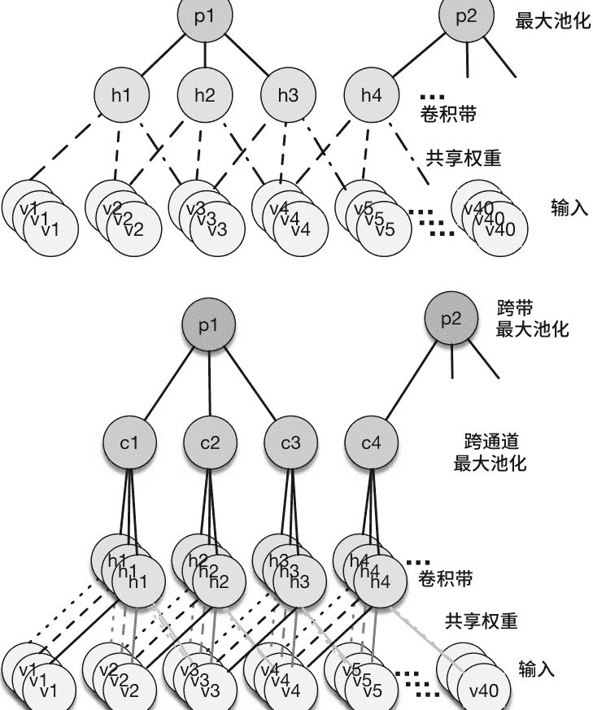

图16.3 卷积网络层，包括（顶部）跨带最大池化，涵盖所有输入通道，以及（底部）每个带内的跨通道最大池化，然后是跨带最大池化涵盖所有输入通道。我们还使用跨通道最大池化构建特征图，其中激活以通道方式生成，然后进行最大池化以形成单个跨通道卷积带。随后，可以进一步对跨通道激活进行最大池化（图16.3，底部）。通道卷积可以看作是二维卷积的特殊情况，其中有效的池化区域在频率上确定，但在时间上根据麦克风之间的实际时间延迟而变化。这种基于CNN的多通道语音识别方法首次在 [22, 28] 中提出。

本节中的CNN / ANN模型是在附加了第一和第二时间导数的FBANK特征上进行训练的，这些特征在一个11帧的窗口中呈现。

##### 16.5.1 SDM 录音

可以在表16.3中找到单通道CNN的结果，前两行是表16.1中的GMM和ANN基线结果。接下来的三行是使用最大池化大小为 $R = N = 1, 2, 3$ 的CNN的结果。通过使用CNN，我们能够相对于最佳ANN模型减少3.4%的WER，并与区分性训练的GMM-HMM相比减少19%的WER（基线数据来自表16.1）。CNN模型的总参数数量因 $R = N$ 而变化，而 $J$ 在实验中保持不变。然而，表现最佳的模型既不具有最高参数数量，也不具有最低参数数量，这表明这是由于最佳池化设置造成的。

##### 16.5.2 MDM 录音

对于 MDM 情况，我们将延迟-和波束形成器与直接使用多个麦克风通道作为网络输入进行了比较。对于波束形成实验，我们使用 BeamformIt 在八个均匀间隔的阵列通道上使用延迟-和波束形成进行了噪声抵消。

表16.3 AMI-SDM 上的词错误率(%)，其中 $R$ 是池大小

| 系统 | AMI 开发集 |
| :--- | :--- |
| BMMI GMM-HMM (LDA/STC) | 63.2 |
| ANN (FBANK) | 53.1 |
| CNN ($R = 3$) | 51.4 |
| CNN ($R = 2$) | 51.3 |
| CNN ($R = 1$) | 52.5 |

表16.4 AMI-MDM 上的词错误率(%)

| 系统 | AMI 开发集 |
| :--- | :--- |
| **使用波束形成的 MDM (八个麦克风)** | |
| BMMI GMM-HMM | 54.8 |
| 人工神经网络 | 49.5 |
| 卷积神经网络 | 46.8 |
| **无波束形成的多通道匹配滤波器** | |
| 人工神经网络 4 通道串联 | 51.2 |
| 卷积神经网络 2 通道传统 | 50.5 |
| 卷积神经网络 4 通道传统 | 50.4 |
| 卷积神经网络 2 通道逐通道 | 50.0 |
| 卷积神经网络 4 通道逐通道 | 49.4 |

工具包 [5]。结果总结在表16.4中。表16.4的第一个块展示了模型在从八个麦克风接收到的波束形成信号上训练的情况下的结果。前两行显示了基准的GMM和ANN声学模型的WER，如表16.1所示。接下来的一行包含了在八个波束形成通道上训练的CNN模型，相对于ANN获得了2.7%的绝对改进（相对改进为5.5%）。MDM CNN的配置与最佳SDM CNN相同 ($R=N=2$)。

表16.4的第二部分显示了直接利用多通道特征的WER。第一行是基准ANN变体，训练了来自表16.2的四个连接通道。然后我们介绍了CNN模型，其MDM输入卷积与图16.3（顶部）中所示相同，并且池化大小为2，这对于SDM实验来说是最佳的。相对于使用连接通道的ANN结构，这种情况将WER降低了1.6%（这种方法可以看作是CNN模型的通道连接）。应用通道卷积和双向池化（图16.3，底部）进一步提高了3.5%的WER。此外，对于更多的输入通道，通道池化效果更好：四个通道上的传统卷积实现了50.4%的WER，几乎与2通道网络相同，而四个通道上的通道卷积实现了49.5%的WER，而2通道情况下为50.0%。这些结果表明，在进行基于模型的多麦克风组合时，选择最佳信息（选择具有最大激活的特征受体）在通道内是至关重要的。

##### 16.5.3 IHM 录音

我们观察到在近距离语音录音（表16.5）中，ANN和CNN之间的相对识别错误率改善类似于MDM和SDM实验中观察到的情况。相对于ANN，CNN实现了3.6%的识别错误率降低模型。

表16.5 词错误率(%) 在AMI Dev集上——IHM

| 系统 | 识别错误率 (%) |
|---|---|
| BMMI GMM-HMM (SAT) | 29.4 |
| ANN | 26.6 |
| 卷积神经网络 | 25.6 |

相对于以说话人自适应方式训练的BMMI-GMM系统，ANN和CNN系统分别提高了9.4%和12.9%的识别错误率。我们没有看到增加池化大小会带来任何改进。Sainath等人 [23] 之前曾建议池化可能与任务相关。

#### 16.6 讨论与结论

在本章中，我们使用AMI语料库对多方会议的远距离语音识别进行了一些基准实验。与基于GMM的系统相比，基于ANN的系统提供了识别错误率的降低，并且使用卷积隐藏层和最大池化进一步降低了错误率。我们展示了一系列实验，探索了用ANN和CNN架构替代麦克风阵列波束形成对多通道输入的影响。

尽管多通道CNN在AMI语料库上表现不如波束形成方法，但我们的结果表明这些CNN架构能够从多通道信号中学习。我们已经将这些方法应用于ICSI语料库，其中麦克风阵列的校准程度较低，我们的结果表明，跨通道CNN架构在一定程度上优于波束形成方法 [22]。

我们目前的实验并没有明确尝试优化声学模型以适应重叠说话者或混响。使用原始多通道输入特征代替波束形成的有希望的结果打开了考虑重叠语音等方面的表示学习可能性。

一个有趣的研究方向是在多通道环境中使用原始波形特征，如第5章所讨论的。

#### 参考文献

1. Abdel-Hamid, O., Mohamed, A.R., Hui, J., Penn, G.: 将卷积神经网络概念应用于混合NN-HMM模型的语音识别。 In: Proceedings of the IEEE ICASSP, pp. 4277–4280 (2012)
2. Abdel-Hamid, O., Deng, L., Yu, D.: 探索卷积神经网络结构和优化技术用于语音识别。 In: ICSA Interspeech会议论文集 (2013)
3. Adcock, J., Gotoh, Y., Mashao, D., Silverman, H.: 通过增量MAP训练实现麦克风阵列语音识别。 In: IEEE ICASSP会议论文集, pp. 897–900 (1996)
4. Anastasakos, T., McDonough, J., Schwartz, R., Makhoul, J.: 一种用于说话者自适应训练的紧凑模型。 In: ICSLP会议论文集, pp. 1137–1140 (1996)
5. Anguera, X., Wooters, C., Hernando, J.: 用于会议说话者分离的声学波束成形。 IEEE Trans. Audio Speech Lang. Process. 15, 2011–2021 (2007)
6. Carletta, J., Lincoln, M.: 数据收集。 In: Renals, S., Bourlard, H., Carletta, J., Popescu-Belis, A. (eds.) 多模态信号处理: 会议中的人际交互, 第2章, pp. 11–27. 剑桥大学出版社, 剑桥 (2012)
7. Carletta, J., Ashby, S., Bourban, S., Flynn, M., Guillemot, M., Hain, T., Kadlec, J., Karaiskos, V., Kraaij, W., Kronenthal, M., Lathoud, G., Lincoln, M., Lisowska, A., McCowan, I., Post, W., Reidsma, D., Wellner, P.: AMI会议语料库：预告。 In: 机器学习与多模态交互 (MLMI) 论文集, 第28-39页 (2005)
8. Carletta, J., Evert, S., Heid, U., Kilgour, J.: NITE XML 工具包：数据模型和查询语言。 语言资源与评估 39, 313-334页 (2005)
9. Fiscus, J., Ajot, J., Radde, N., Laprun, C.: 用于同时语音评估ASR系统的多维Levenshtein编辑距离计算。 In: LREC (2006) 论文集
10. Gales, M.: 用于隐马尔可夫模型的半绑定协方差矩阵。IEEE Trans. Speech Audio Process. 7(3), 272–281 (1999)
11. Ghoshal, A., Swietojanski, P., Renals, S.: 深度神经网络的多语言训练. In: Proceedings of the IEEE ICASSP (2013)
12. Grezl, F., Karafiat, M., Kontar, S., Cernocky, J.: 用于会议的概率和瓶颈特征的大词汇连续语音识别。In: Proceedings of IEEE ICASSP, pp. IV-757–IV-760 (2007)
13. Haeb-Umbach, R., Ney, H.: 用于改进大词汇连续语音识别的线性判别分析。In: Proceedings of the IEEE ICASSP, pp. 13–16 (1992). http://dl.acm.org/citation.cfm?id=1895550.1895555
14. Hain, T., Burget, L., Dines, J., Garner, P., Grezl, F., El Hannani, A., Karafiat, M., Lincoln, M., Wan, V.: 使用AMIDA系统转录会议。 IEEE Trans. Audio Speech Lang. Process. 20, 486–498 (2012)
15. Janin, A., Baron, D., Edwards, J., Ellis, D., Gelbart, D., Morgan, N., Peskin, B., Pfau, T., Shriberg, E., Stolcke, A., Wooters, C.: ICSI会议语料库。 In: IEEE ICASSP会议论文集, pp. I-364–I-367 (2003)
16. Lang, K., Waibel, A., Hinton, G.: 用于孤立词识别的时延神经网络架构。神经网络。 3, 23–43 (1990)
17. LeCun, Y., Bottou, L., Bengio, Y., Haffner, P.: 基于梯度的学习应用于文档识别。 IEEE 86, 2278–2324 (1998)
18. Lincoln, M., McCowan, I., Vepa, J., Maganti, H.: 多通道华尔街日报音频视觉语料库 (MC-WSJ-AV) ：规范和初步实验。在：IEEE ASRU会议记录 (2005)
19. Marino, D., Hain, T.: 多麦克风自动语音识别的分析。 在：Interspeech会议记录, 第1281–1284页 (2011)
20. Omologo, M., Matassoni, M., Svaizer, P., Giuliani, D.: 基于麦克风阵列的语音识别与不同说话者-阵列位置。在：IEEE ICASSP会议记录, 第227–230页 (1997)
21. Povey, D., Woodland, P.: 最小电话错误和I平滑以改善辨别性训练。在：IEEE ICASSP会议论文集, 第105-108页 (2002年)
22. Renals, S., Swietojanski, P.: 远距离语音识别的神经网络。在：HSCMA会议论文集 (2014年)
23. Sainath, T., Kingsbury, B., Mohamed, A., Dahl, G., Saon, G., Soltau, H., Beran, T., Aravkin, A., Ramabhadran, B.: 改进深度卷积神经网络用于LVCSR。在：IEEE ASRU会议论文集（2013年）
24. Seltzer, M., Stern, R.: 用于混响环境中的语音识别的子带似然最大化波束形成。IEEE Trans. Audio Speech Lang. Process. 14, 2109-2121 (2006年)
25. Seltzer, M., Raj, B., Stern, R.: 用于稳健免提语音识别的似然最大化波束形成。IEEE Trans. Speech Audio Process. 12, 489-498 (2004年)
26. Stolcke, A., Anguera, X., Boakye, K., Cetin, O., Janin, A., Magimai-Doss, M., Wooters, C., Zheng, J.: SRI-ICSI 2007年春季会议和讲座识别系统。在: Stiefelhagen, R., Bowers, R., Fiscus, J. (eds.) 人类感知的多模态技术。计算机科学讲座笔记，第4625卷，第373-389页。Springer, 纽约 (2008)
27. Swietojanski, P., Ghoshal, A., Renals, S.: 用于远程和多通道大词汇语音识别的混合声学模型。在: IEEE ASRU会议论文集 (2013年)。 doi:10.1109/ASRU.2013.6707744
28. Swietojanski, P., Ghoshal, A., Renals, S.: 用于远程语音识别的卷积神经网络。IEEE信号处理通信。21, 1120-1124 (2014年)
29. Van Compernolle, D., Ma, W., Xie, F., Van Diest, M.: 在噪声环境中利用麦克风阵列进行语音识别。语音通信 9, 433–442 (1990)
30. Wölfel, M., McDonough, J.: 远程语音识别。Wiley, Chichester (2009)
31. Zwyssig, E., Lincoln, M., Renals, S.: 用于远程语音识别的数字麦克风阵列。在: IEEE ICASSP会议论文集, pp. 5106–5109 (2010). doi:10.1109/ICASSP.2010.5495040

### 第17章 用于鲁棒语音处理的工具包

Shinji Watanabe, Takaaki Hori, Yajie Miao, Marc Delcroix, Florian Metze, 和 John R. Hershey

**摘要** 最近，由于在真实环境中对ASR应用的需求，鲁棒自动语音识别（ASR）技术得到了快速发展，并借助社区开发的公开可用工具的帮助。

本章概述了可用于鲁棒ASR的主要工具包，包括通用ASR工具包、语言模型工具包、语音增强/麦克风阵列前端工具包、深度学习工具包和新兴的端到端ASR工具包。本章的目的是提供有关功能（特性、功能、平台和语言）、许可证和源代码位置的信息，以便读者可以轻松访问这些工具，构建自己的鲁棒ASR系统。其中一些工具包实际上已被用于构建各种具有挑战性任务的最先进的ASR系统。本章的参考文献还包括资源网页的URL。

S. Watanabe (✉) T. Hori • J.R. Hershey
Mitsubishi Electric Research Laboratories (MERL), Cambridge, MA, USA
e-mail: shinjiw@ieee.org

Y. Miao • F. Metze
卡内基梅隆大学，福布斯大道5000号，匹兹堡，宾夕法尼亚州，美国

M. Delcroix
NTT公司，日本京都市精华町光台2-4号

#### 17.1 引言

语音识别技术包括许多不同的组件，如语音增强、特征提取、声学建模、语言建模和解码，这些组件对于实现其功能至关重要，需要足够的准确性。因此，创建一个新的自动语音识别（ASR）系统非常耗时，并且需要对每个组件有特定的技术知识。这种复杂性使得在最先进的ASR技术中引入新思想并验证其有效性变得困难。此外，这也阻止人们利用尖端语音技术快速开发新应用。

最近，公开可用的工具包在克服上述问题方面发挥了重要作用。尽管 these 工具包长期以来一直对ASR技术的进展做出了贡献，但目前它们正在变得更加易于使用和开发，并且正在加速社区中的研究和开发。

在接下来的几节中，我们将介绍用于鲁棒语音识别的公开可用工具包。一般来说，ASR工具包包括特征提取、声学模型训练和解码。语音增强的信号处理和语言建模通常是单独的工具包，因为它们设计用于更通用的目的，例如，语言模型工具包可用于其他应用，如统计机器翻译和光学字符识别。

此外，一些工具包使用OpenFst [3] 构建解码图，该图未包含在本章节中。

#### 17.2 通用语音识别工具包

表17.1显示了主要公开可用的ASR工具包及其功能。这些工具通常包括特征提取、声学模型训练器和大词汇连续语音识别（LVCSR）解码器：

- HTK [38]：用于构建和操作隐马尔可夫模型的便携式工具包。HTK主要用于语音识别研究，但也被用于许多其他应用，包括语音合成、字符识别和DNA测序的研究。
- Julius [22]：高性能、小体积的LVCSR解码器软件。
- Kaldi [30]：用C++编写的语音识别工具包，根据Apache License v2.0许可。Kaldi旨在供语音识别研究人员使用。
- RASR [31]：一个包含语音识别解码器和用于开发声学模型的工具的软件包，用于语音识别系统。
- Sphinx [21]：一个包含语音识别算法的工具包，用于高效的语音识别。它包括各种解码器（完整版、轻量级版和可调整/可修改版本），以及声学模型训练器。

HTK是最著名的工具包之一，因其长期支持完整的ASR工具集而闻名，包括特征提取、声学模型训练器和LVCSR解码器。事实上，HTK中开发的几种格式被用作事实上的标准，特别是特征文件格式（HTK格式），可以被上述许多其他工具支持。CMU Sphinx也有着悠久的历史，并具有支持各种平台和各种实现的独特特性，包括轻量级版本（PocketSphinx）、普通版本和可调整/可修改版本。

## 表17.1 ASR工具包

| 工具包 | 所属 | 功能 | 接口 | 平台 | 实现 | GPU | 许可证 | 例子 | 开源 |
| :--- | :--- | :--- | :--- | :--- | :--- | :--- | :--- | :--- | :--- |
| HTK | 剑桥 | AM训练器 + 解码器 | C++ | Unix | C++/Cuda | 是 | 自有许可证 | RM | 不适用 |
| Julius | Nitech | 解码器 | C | Unix/Windows | C | 不适用 | 自有许可证 | JNAS | GitHub |
| Kaldi | JHU | AM训练器 + 解码器 | C++ | Unix/Windows | C++/Cuda | 是 | Apache v2.0 | >40个配方 | GitHub |
| RASR | RWTH | AM训练器 + 解码器 | C++ | Unix | C++/Cuda | 是 | 自有许可证 | AN4 | 不适用 |
| Sphinx | CMU | AM训练器 + 解码器 | C/C++/Java/Python | Unix/Windows | C/C++/Java/Python | 是 | 多个许可证 | AN4 | GitHub |

版本（Sphinx 4）。Julius专门将其功能定位为LVCSR解码器，并且可以使用其他工具包训练的声学模型，包括HTK格式的声学模型。与上述工具包相比，RASR和Kaldi相对较新。请注意，除了Julius之外，所有工具包现在都支持图形处理单元（GPU）计算，并在其声学模型训练器中提供快速深度网络训练功能。

其中，Kaldi通过充分利用开源优势，在ASR社区中越来越受欢迎。也就是说，与其他主要由一个研究小组维护的工具包相比，Kaldi有许多来自多个研究小组的贡献者，这使得Kaldi能够在主要源代码库中积极实现新技术。此外，Kaldi有许多ASR示例（称为recipes），可以为许多ASR基准任务提供端到端系统构建，包括数据预处理、声学和语言建模、解码和评分。对于研究人员来说，能够以与最先进的ASR技术完全相同的结果进行复现非常重要，而Kaldi recipes在可复现性和最新ASR技术的传播方面对社区做出了巨大贡献。

#### 17.3 语言模型工具包

与语音识别工具包类似，表17.2显示了主要的公开可用的语言模型（LM）工具包及其功能。我们从各个工具包的网页上参考了每个工具包的特性，如下所示：

- CSLM [32]: 一个包括神经网络语言模型的连续空间LM工具包。
- CUED-RNNLM [9]: 高效训练和评估递归神经网络语言模型（RNNLMs）。
- IRSTLM [13]: 适用于估计、存储和访问非常大的n-gram语言模型的工具。
- KENLM [16]: 高效的n-gram语言模型查询，减少时间和内存开销。
- MITLM [17]: 使用高效的数据结构和算法训练和评估n-gram语言模型。
- RNNLM TOOLKIT [27]: 基于循环神经网络的语言建模工具包。
- RWTHLM [34]: 训练前馈、递归和长短期记忆（LSTM）语言模型。
- SRILM [33]: 训练和评估带有许多扩展的n-gram语言模型。

与表17.1中的语音识别工具包相比，这些语言模型工具包基于主要的自由软件许可证，其中许多是宽松或弱保护性的许可证，并且这些工具包被广泛用于各种应用，不仅限于ASR。我们可以根据这些语言模型工具包大致分类在 $n$-gram LMs（IRSTLM、KENLM、MITLM、SRILM）或神经网络LMs（CSLM、CUED-RNNLM、RNNLM TOOLKIT、RWTHLM）上。如果使用基于 $n$-gram 的 toolkits，语言模型格式与ARPA格式或其变体统一。由于所有语音识别工具包都支持ARPA格式的语言模型，因此它们生成的语言模型基本上可以应用于所有语音识别工具包。在基于 $n$-gram 的工具包中，由于其许多功能（包括大多数主要的 $n$-gram 平滑技术和 $n$-gram 剪枝技术）以及各种ASR应用示例，SRILM经常用于ASR实验，包括格子重评分。

##### 表17.2 语言建模工具

| 工具 | 隶属 | 接口 | 平台 | 实现 | GPU | 许可证 | 例子 | 开源 |
| :--- | :--- | :--- | :--- | :--- | :--- | :--- | :--- | :--- |
| CSLM | LIUM | C++ | Unix/Windows | C++(+Cuda) | 是的 | LGPLv3 | 训练和重新评分脚本 | 是的 |
| CUED-RNNLM | 剑桥 | Shell/C++ | Unix | C++(+Cuda) | 是的 | BSD3 | 训练和重新评分脚本 | 是的 |
| IRSTLM | FBK | | Unix | C++ | 否 | LGPLv2 | 命令行示例 | GitHub |
| KENLM | CMU | C++/Java/Python | Unix/Windows | C++ | 否 | LGPLv2 | 命令行示例 | GitHub |
| MITLM | MIT | Shell/C++ | Unix | C++ | 否 | MIT | 一个测试脚本 | GitHub |
| RNNLM TOOLKIT | BUT | Shell/C++ | Unix | C++ | 否 | BSD3 | 训练和重新评分脚本 | 是的 |
| RWTHLM | RWTH | Shell/C++ | Unix | C++ (+OpenMP) | 否 | 自有许可证 | 命令行示例 | 是的 |
| SRILM | SRI | Shell/C++ | Unix/Windows | C++ | 否 | 自有许可证 | 命令行示例 | 是 |

另一方面，神经网络语言模型的模型结构取决于网络架构，它们的模型格式通常彼此不同。例如，最著名的工具包是RNNLM TOOLKIT，由T. Mikolov开发。它支持递归神经网络架构。CUED-RNNLM也基于相同的RNN，它是RNNLM TOOLKIT的扩展，并支持基于GPU的并行计算。另一方面，CSLM和RWTHLM分别基于前馈神经网络和LSTM，并且与RNNLM具有不同的模型结构。因此，与 $n$-gram 语言模型相比，基于神经网络的语言模型工具包不具有统一的模型格式，并且它们的模型不能与各种LVCSR解码器轻松集成，不像 $n$-gram 语言模型。相反，每个工具包都为语音识别工具包中的主要格子格式提供了格子重评分脚本。请注意，第17.5节讨论的一些通用深度学习工具包（例如Chainer、CNTK、Theano、TensorFlow和Torch）也包括RNNLM/LSTMLM函数作为其工具包的示例。

#### 17.4 语音增强工具包

我们列出以下语音增强软件：

- BeamformIT [5]: 一种声学波束成形工具，可以接受可变数量 of 输入通道，并通过滤波器和求和波束成形技术计算输出。
- BTK [20]: 实现语音处理和麦克风阵列技术的C++和Python库。
- FASST [29]: 一种灵活的音频源分离工具箱，旨在加快新型基于模型的音频源分离算法的构思和自动化实现。
- HARK [28]: 开源机器人听觉软件，包括声源定位模块、声源分离模块和用于分离语音信号的自动语音识别模块，适用于任何具有任意麦克风配置的机器人。
- ManyEars [15]: 实时麦克风阵列处理，用于进行声源定位、跟踪和分离。它专为动态环境中的移动机器人听觉设计。
- WPE [37]: 一种用于单声道和多声道录音的语音去混响工具。

许多工具通过使用多声道输入来处理声学波束成形，而WPE则处理去混响，这在第2章中有描述。这些工具已经在几个远距离语音识别挑战中证明了它们的有效性。

尽管这些工具是公开可用的，但与其他工具包相比，几个语音增强工具包是在封闭社区中开发的。这是因为语音增强技术不需要大型复杂的程序，开发可以在没有开源社区的情况下进行。

此外，MATLAB¹（带有信号处理工具箱）提供了一个强大的研究平台。然而，随着噪声鲁棒语音识别的重要性日益增加，这些增强工具包正引起语音识别社区的关注。因此，语音增强工具包的开源活动在与ASR工具包或其他语音相关应用的集成中更加活跃。

#### 17.5 深度学习工具包

深度学习现在在大多数ASR系统中起着重要作用，直接导致了识别准确性的大幅提升。最近，许多研究团队发布了用于处理通用机器学习问题的深度学习工具包。其中，本节列出了以下用于鲁棒语音处理的工具包，以及它们的功能，表17.3提供了有关这些工具的详细信息。

- Caffe [19]: 一个具有表达力、速度和模块化的深度学习框架。
- Chainer [35]: 一个灵活、直观和强大的架构。
- CNTK [2]: 一个将神经网络描述为通过有向图的一系列计算步骤的统一深度学习工具包。
- CURRENNT [36]: 一个用于RNN/LSTM的机器学习库，支持GPU。
- Mxnet [8]: 轻量级、便捷、灵活的分布式/移动深度学习，具有动态、变异感知的数据流依赖调度器。
- TensorFlow [1]: 一个使用数据流图进行数值计算的库。
- Theano [7]: Python中的符号脚本，动态生成C代码。
- TORCH [10]: 支持神经网络和基于能量的模型等。

所有这些工具包都有一组内置函数，用于深度学习，包括仿射变换、sigmoid和softmax操作，以及交叉熵和均值平方误差成本函数。因此，用户可以通过组合这些函数来实现自己的网络。此外，许多这些工具包支持GPU计算，并且可扩展到大量数据；因此，这些工具包被广泛用于鲁棒语音处理。

此外，这些工具包对于将深度学习的新技术应用于语音识别非常有用，因为大多数工具包开发人员都在尽快实现新技术并利用新的GPU功能，而许多用户编写的示例代码也通过源代码共享网站提供。

##### 表17.3 深度学习工具包

| 工具 | 作者/隶属机构 | 应用 | 接口 | 平台 | 实现 | GPU | 许可证 |
| :--- | :--- | :--- | :--- | :--- | :--- | :--- | :--- |
| Caffe | 加州大学伯克利分校 | 计算机视觉 | C++ | Unix/Win | C++/Cuda | 是 | BSD 2-clause |
| Chainer | Preferred Networks, Inc. | 通用 | Python | Unix/Win | 基于CuPy的Python | 是 | MIT许可证 |
| CNTK | 微软 | 通用 | C++ | Unix/Win | C++/Cuda | 是 | 微软定制 |
| CURRENNT | TUM | 序列识别/卷积 | C++ | Unix/Win | C++/Cuda | 是 | GPLv3 |
| MxNet | Tianqi Chen等人 | 通用 | Python/MATLAB/R等 | Unix/Win | C++/Cuda | 是 | Apache v2.0 |
| TensorFlow | Google Brain | 通用 | Python/C++ | Unix | C++/Cuda | 是 | Apache v2.0 |
| Theano | 蒙特利尔大学 | 通用 | Python | Unix/Mac/Win | Python/C++/Cuda | 是 | BSD 3-clause |
| Torch | Facebook, Google+DeepMind | 通用 | C + LuaJIT | 几乎任何 | C++/Cuda | 是 | MIT开源 |

#### 17.6 端到端语音识别工具包

最近，出现了一种新的ASR研究领域，被称为端到端语音识别。这种方法的目标是构建一个没有任何关于语音的内部知识（如音素集和发音词典）的ASR系统。
尽管这项技术仍处于研究的早期阶段，但已经有几个公开可用的端到端ASR工具包。表17.4总结了端到端语音识别软件，旨在构建没有复杂流程的ASR：

- ATTENTION-LVCSR [6]：基于注意力的大词汇量端到端语音识别。
- EESEN [26]：使用深度RNN模型和WFST解码的端到端语音识别。
- stanford-ctc [24]：用于无词典语音识别的神经网络代码，使用连接主义时间分类（CTC）。
- warp-ctc [4]：CTC的快速并行实现，可在CPU and GPU上运行。

大多数工具可以训练处理直接从输入特征到输出字符序列的ASR模型，而无需隐藏马尔可夫模型状态绑定模块、词典和语言模型。与传统ASR工具包相比，这显著简化了它们的代码。在解码阶段，通过使用语言模型，性能接近于最先进的ASR，具有非常复杂的流程。ATTENTION-LVCSR使用了注意机制，而其他工具包使用CTC [14]。

EESEN [26]利用了许多Kaldi基础设施，并提供了一个基于CTC的简单而强大的声学模型，用于端到端语音识别。它在第13.3节中介绍。

##### 表17.4 端到端语音识别工具包

| 工具 | 作者/隶属机构 | 接口 | 平台 | 实现 | GPU | 许可证 | 示例/配方 | 开源 |
| :--- | :--- | :--- | :--- | :--- | :--- | :--- | :--- | :--- |
| ATTENTION-LVCSR | Dzmitry Bahdanau | Python | Unix/Windows | Python | 是 | MIT | WSJ/TIMIT | GitHub |
| EESEN | Yajie Miao, CMU | C++ | Unix | C++/Cuda | 是 | Apache v2.0 | 四个配方 | GitHub |
| stanford-ctc | Andrew Maas/Stanford | Python | Unix/Windows | Python | 是 | Apache v2.0 | 三个配方 | GitHub |
| warp-ctc | 百度研究 | C | Unix | C/Lua | 是 | Apache v2.0 | | GitHub |

#### 17.7 语音技术的其他资源

除了上述提到的工具包之外，还有另一种活动可以通过提供协作存储库来帮助语音技术的研究、开发和教育的进展。

COVAREP [11] 是一个高级语音处理算法的开源存储库，存储在一个 GitHub 项目中，语音处理研究人员可以在其中存储已发表算法的原始实现。该框架加速了可重复研究，并使其他研究人员能够进行公平比较，而无需重新实现研究。

语音识别虚拟厨房 [25] 提供了一个环境，促进研究技术的社区共享，促进创新实验，并作为教育、研究和评估工具提供可靠的参考系统。该网站的特点是它托管了提供一致实验环境的虚拟机（VMs），无需安装其他软件或数据，并处理它们的不兼容性和特殊性。

Bob [18] 是一个由相当多的包组成的免费信号处理和机器学习工具箱，它实现了图像、音频和视频处理、机器学习和模式识别工具。

另一方面，语音和语言语料库在ASR技术的研究和开发中也至关重要。训练高准确度模型和进行有效评估需要大量带有正确注释的语音数据。

然而，收集和注释语音数据非常昂贵。因此，一些机构承担了托管不同研究项目中生成的个体语料库的任务，并向需要数据的人提供每个语料库的许可和提供。语言数据联盟 (LDC) [23]是一个主要机构，提供知名的语料库，如WSJ、TIMIT、ATIS和Switchboard。欧洲语言资源协会 (ELRA) [12]是另一个位于欧洲的机构，提供不同欧洲语言的语音和语言语料库，如AURORA、CHIL和TC-STAR。

#### 17.8 结论

我们总结了在鲁棒ASR中使用的工具包，包括通用ASR工具包、语言模型工具包、语音增强/麦克风阵列前端工具包、深度学习工具包和端到端ASR工具包。我们还介绍了一些协作存储库和管理语音和语言语料库的主要机构。这些工具包中的许多实际上在其他章节中用于实现最先进的系统，包括Kaldi、SRILM、WPE、BeamformIt、Theano、CNTK和EESEN。我们希望本章能帮助读者借助本章列出的现有工具包加速自己的研究和开发。

#### 参考文献

1. Abadi, M., Agarwal, A., Barham, P., Brevdo, E., Chen, Z., Citro, C., Corrado, G.S., Davis, A., Dean, J., Devin, M., et al.: TensorFlow: 大规模机器学习在异构分布式系统上的应用 (2016). arXiv预印本 arXiv:1603.04467. https://www.tensorflow.org/
2. Agarwal, A., Akchurin, E., Basoglu, C., Chen, G., Cyphers, S., Droppo, J., Eversole, A., Guenter, B., Hillebrand, M., Hoens, T.R., et al.: 计算网络和计算网络工具包简介。Microsoft技术报告 MSR-TR-2014-112 (2014). https://github.com/Microsoft/CNTK
3. Allauzen, C., Riley, M., Schalkwyk, J., Skut, W., Mohri, M.: OpenFst: 一个通用且高效的加权有限状态转换器库。In: 国际自动机实现与应用会议, 第11-23页。Springer, 纽约 (2007). http://www.openfst.org/
4. Amodei, D., Anubhai, R., Battenberg, E., Case, C., Casper, J., Catanzaro, B., Chen, J., Chrzanowski, M., Coates, A., Diamos, G., et al.: 深度语音2: 英语和普通话的端到端语音识别 (2015). arXiv预印本 arXiv:1512.02595. https://github.com/baidu-research/warp-ctc
5. Anguera, X., Wooters, C., Hernando, J.: 会议的说话人分离的声学波束形成。IEEE Trans. Audio Speech Lang. Process. 15(7), 2011–2022 (2007). http://www.xavieranguera.com/beamformit/
6. Bahdanau, D., Chorowski, J., Serdyuk, D., Brakel, P., Bengio, Y.: 基于注意力的端到端大词汇语音识别。在: 2016年IEEE国际声学、语音和信号处理会议 (ICASSP), pp. 4945–4949 (2016). https://github.com/rizar/attention-lvcsr
7. Bergstra, J., Breuleux, O., Bastien, F., Lamblin, P., Pascanu, R., Desjardins, G., Turian, J., Warde-Farley, D., Bengio, Y.: Theano: 一个Python中的CPU和GPU数学编译器。在: 第9届Python科学会议论文集, pp. 1–7 (2010). http://deeplearning.net/software/theano/
8. 陈, T., 李, M., 李, Y., 林, M., 王, N., 王, M., 肖, T., 徐, B., 张, C., 张, Z.: Mxnet: 一个灵活高效的用于异构分布式系统的机器学习库。在: 机器学习系统研讨会 (LearningSys) 第29届神经信息处理系统年会 (NIPS) (2015). http://mxnet-mli.readthedocs.io/en/latest/
9. 陈, X., 刘, X., 钱, Y., Gales, M., Woodland, P.: CUED-RNNLM: 一个用于高效训练和评估循环神经网络语言模型的开源工具包。在: IEEE国际会议 on 声学、语音和信号处理 (ICASSP), pp. 6000–6004. IEEE, 纽约 (2016). http://mi.eng.cam.ac.uk/projects/cued-rnnlm/
10. Collobert, R., Kavukcuoglu, K., Farabet, C.: Torch7: 一个类似于MATLAB的机器学习环境。在: BigLearn, NIPS Workshop, EPFL-CONF-192376 (2011). http://torch.ch/
11. Degottex, G., Kane, J., Drugman, T., Raitio, T., Scherer, S.: COVAREP: 一个用于语音技术的协作语音分析存储库。在: 2014 IEEE International Conference on Acoustics, Speech and Signal Processing (ICASSP), pp. 960–964. IEEE, 纽约 (2014). http://covarep.github.io/covarep/
12. ELRA: ELDA门户网站。http://www.elra.info/en/
13. Federico, M., Bertoldi, N., Cettolo, M.: IRSTLM: 一个用于处理大规模语言模型的开源工具包。在: Interspeech, pp. 1618–1621 (2008). http://hlt-mt.fbk.eu/technologies/irstlm
14. Graves, A., Jaitly, N.: 朝着端到端语音识别的方向发展的循环神经网络。在: ICML, vol. 14, pp. 1764–1772 (2014)
15. Grondin, F., Létourneau, D., Ferland, F., Rousseau, V., Michaud, F.: ManyEars开放框架。Auton. Robot. 34(3), 217–232 (2013). https://sourceforge.net/projects/manyears/
16. Heafield, K.: KenLM: 更快、更小的语言模型查询。在: 第六届统计机器翻译研讨会论文集, pp. 187–197. 计算语言学协会 (2011). http://kheafield.com/code/kenlm/

17. Hsu, B.J.P., Glass, J.R.: 迭代语言模型估计：高效的数据结构和算法。在: INTERSPEECH, pp. 841–844 (2008). https://github.com/mitlm/mitlm

18. Idiap研究所: Bob 2.4.0文档. https://pythonhosted.org/bob/

19. Jia, Y., Shelhamer, E., Donahue, J., Karayev, S., Long, J., Girshick, R., Guadarrama, S., Darrell, T.: Caffe: 快速特征嵌入的卷积架构。在: 第22届ACM国际多媒体会议, pp. 675–678. ACM (2014). http://caffe.berkeleyvision.org/

20. Kumatani, K., McDonough, J., Schacht, S., Klakow, D., Garner, P.N., Li, W.: 基于最小互信息的最小混叠项滤波器设计子带自适应波束形成. 在: IEEE国际声学、语音和信号处理会议(ICASSP), pp. 1609–1612. IEEE (2008). http://distantspeechrecognition.sourceforge.net/

21. 李开复, 洪文伟, 雷迪：SPHINX语音识别系统概述。IEEE Trans. Acoust. Speech Signal Process. 38(1), 35-45 (1990). http://cmusphinx.sourceforge.net/

22. 李安, 河原隆夫, 鹿野健：Julius—一个开源的实时大词汇量识别引擎。在: Interspeech, pp. 1691-1694 (2001). http://julius.osdn.jp/en_index.php

23. 语言数据联盟：https://www.ldc.upenn.edu/

24. Maas, A.L., Xie, Z., Jurafsky, D., Ng, A.Y.: 无词典对话语音识别与神经网络。在：北美计算语言学协会（NAACL）会议论文集（2015）。https://github.com/amaas/stanford-ctc

25. Metze, F., Fosler-Lussier, E.: 语音识别虚拟厨房：一个初始原型。在：Interspeech, pp. 1872-1873 (2012)。http://speechkitchen.org/

26. Miao, Y., Gowayyed, M., Metze, F.: 使用深度RNN模型和基于WFST的解码的端到端语音识别。在：2015年IEEE自动语音识别和理解研讨会（ASRU），第167-174页（2015年）。https://github.com/srvk/eesen

27. Mikolov, T., Karafiat, M., Burget, L., Černocký, J., Khudanpur, S.: 基于循环神经网络的语言模型。在: Interspeech, 第1045-1048页 (2010年). http://www.rnnlm.org/

28. Nakadai, K., Takahashi, T., Okuno, H.G., Nakajima, H., Hasegawa, Y., Tsujino, H.: 用于同时听取三个说话者的机器人听觉系统“HARK”的设计和实现开源软件。Adv. Robot. 24(5–6), 739-761页（2010年）。http://www.hark.jp/

29. Ozerov, A., Vincent, E., Bimbot, F.: 用于音频源分离中先验信息处理的通用灵活框架。IEEE Trans. Audio Speech Lang. Process. 20(4), 1118-1133页（2012年）。http://bass-db.gforge.inria.fr/fasst/

30. Povey, D., Ghoshal, A., Boulianne, G., Burget, L., Glembek, O., Goel, N., Hannemann, M., Motlicek, P., Qian, Y., Schwarz, P., Silovsky, J., Stemmer, G., Vesely, K.: Kaldi语音识别工具包。在：IEEE 2011年自动语音识别和理解研讨会（2011年）。http://kaldi-asr.org/

31. Rybach, D., Gollan, C., Heigold, G., Hoffmeister, B., Lööf, J., Schlüter, R., Ney, H.: RWTH Aachen University开源语音识别系统。在：Interspeech, pp. 2111–2114 (2009年). https://www-i6.informatik.rwth-aachen.de/rwth-asr/

32. Schwenk, H.: CSLM – 一个模块化的开源连续空间语言建模工具包。在：INTERSPEECH, 第1198-1202页（2013年）。http://www-lium.univ-lemans.fr/cslm/

33. Stolcke, A.等: SRILM--一个可扩展的语言建模工具包。在: Interspeech, vol. 2002, 第901-904页 (2002年)。http://www.speech.sri.com/projects/srilm/

34. Sundermeyer, M., Schlüter, R., Ney, H.: RWTHLM- RWTH Aachen大学神经网络语言建模工具包。在：INTERSPEECH, 第2093-2097页（2014年）。https://www-i6.informatik.rwth-aachen.de/web/Software/rwthlm.php

35. Tokui, S., Oono, K., Hido, S., Clayton, J.: Chainer: 下一代开源深度学习框架。在：机器学习系统研讨会 (LearningSys) 第29届神经信息处理系统年会 (NIPS) （2015年）。http://chainer.org/

36. Weninger, F., Bergmann, J., Schuller, B.: 引入CURRENNT - 慕尼黑开源 CUDA RecurREnt神经网络工具包。J. Mach. Learn. Res. **16**(3), 547–551 (2015). https://sourceforge.net/projects/currennt/

37. Yoshioka, T., Nakatani, T., Miyoshi, M., Okuno, H.G.: 通过联合优化对混合语音进行盲分离和去混响。IEEE Trans. Audio Speech Lang. Process. **19**(1), 69–84 (2011). http://www.kecl.ntt.co.jp/icl/signal/wpe/

38. Young, S., Evermann, G., Gales, M., Hain, T., Kershaw, D., Liu, X., Moore, G., Odell, J., Ollason, D., Povey, D., et al.: *HTK书*, vol. 3, p. 175. 剑桥大学工程系 (2002). http://htk.eng.cam.ac.uk/

## 第四部分 应用

### 第18章 谷歌的语音研究以实现普适语音界面

Michiel Bacchiani, Françoise Beaufays, Alexander Gruenstein, Pedro Moreno, Johan Schalkwyk, Trevor Strohman和Heiga Zen

**摘要**

自智能手机的广泛应用以来，语音作为一种输入方式已经从科幻梦想发展成为一种广泛接受的技术。对这项技术的质量要求推动了其广泛应用，并且一直是谷歌研究活动的重点。通过早期采用大型神经网络模型部署和在大型数据集上训练这些模型，核心识别准确性得到了显著提高。采用了长短期记忆模型和连接主义时间分类等新方法，进一步提高了准确性并降低了延迟。此外，允许自适应语言建模的算法可以根据语音输入的上下文提高准确性。在语言和说话者特征（例如儿童语音）方面扩大用户群体的覆盖范围，已经产生了进一步推动普适语音输入愿景的新算法。继续这一趋势，我们最近的研究重点是噪声和远场鲁棒性。解决这些环境中的语音处理问题将实现车载、可穿戴和家庭场景等应用，从而进一步实现真正的普适语音输入。本章将简要描述谷歌在过去十年中的算法发展，这些算法使得语音处理达到了今天的水平。

#### 18.1 早期发展

虽然谷歌中有一些语音活动，但直到2005年，语音开发才得到更加重视。当时做出了一个决定，即语音是一项关键技术，谷歌应该获得自己的实现。

M. Bacchiani (✉) • P. Moreno • J. Schalkwyk
Google Inc., 76 Ninth Ave, New York, NY 10011, USA
e-mail: michiel@google.com

F. Beaufays • A. Gruenstein • T. Strohman
Google Inc., 1600 Amphitheatre Parkway, Mountain View, CA 94043, USA

H. Zen
Google Inc., 1-13 Saint Giles High Street, London WC2H 8AG, USA

© Springer International Publishing AG 2017
S. Watanabe et al. (eds.), 鲁棒语音识别的新纪元,
DOI 10.1007/978-3-319-64680-0_18

将该技术应用于即将到来的项目中支持语音模态。尽管在这一点上听起来很合乎逻辑，但重要的是要意识到当时技术的状态。作为一个搜索引擎公司，谷歌非常有名，并且被广泛使用，但大部分使用是来自桌面计算机，用户通过键入搜索框来进行交互。手机也是无处不在的，但它们只能作为电话使用；我们现在所知道的智能手机尚未出现。因此，建立语音基础设施的投资是探索性的，虽然有潜力，但并没有明显的用途。在应用方面，我们主要关注一个名为GOOG411的应用。这个应用是当时在美国常见的电话号码查询服务的自动化。当外出只带着一部手机时，联系一个商家需要知道电话号码。由于智能手机模式尚未出现，用户会联系电话服务获取感兴趣的商家的电话号码。GOOG411服务自动化了这个过程，展示了大词汇量语音识别的可行性。这项相当可靠的服务，加上经济激励（该服务是免费的），使其成为一个相当受欢迎的服务。这项服务产生的大量数据以及应用特定的建模挑战，既是一个有趣的应用，也是帮助我们建立基础设施的强大模型。早期开发的详细信息在[10]中有详细描述。

其他早期的研究是在语音识别的转录应用中进行的。应用的两个领域受到了相当多的关注，一个是语音邮件的转录，这项服务在Google Voice中仍然存在，另一个是YouTube视频内容的自动字幕。后者始于对选举周期内一个小众领域的探索。

从算法上讲，我们建立基础设施的早期工作并不是非常创新，因为这是一个大规模的“追赶”努力。尽管如此，工程方面还是很有趣的，因为我们的实现是基于核心的Google基础设施，特别是MapReduce，这使我们能够扩展到非常大的数据库。

我们在另一个领域进行了大量投资，即使用加权有限状态转换器 (WFSTs) 构建基础。为了在本章的其余部分建立使用的符号，我们的模型通常使用一个接受器 *WFST G* 来编码语言模型，一个词典转换器 *L* 将单词映射到音素字符串，以及一个转换器 *C* 来实现音素上下文依赖模型。优化后的组合图通常被称为 *CLG*。拥有流行的GOOG411应用程序的基础设施使我们能够快速增强核心平台的能力。

转录工作虽然在应用方面受到了较少的接受，但却提供了有趣的研究挑战，如语音识别[2]和标点恢复[23, 60]。后一主题在后来的转录系统中受到了更多的关注，这些系统在第18.4节中有所描述。

谷歌在语音开发方面的早期努力取得了一定的进展，但没有像我们的语音搜索应用程序那样被广泛采用，这成为我们努力的重点，随着智能手机的出现，我们在第18.2节中对此进行了更详细的描述。

#### 18.2 语音搜索

自从Captain Kirk与Star Trek计算机交谈以来，使用我们的声音来获取信息就一直是科幻小说的一部分。随着互联网智能手机的出现，信息获取成为我们日常生活中无处不在的一部分。随之而来的是用户期望的显著转变，以及他们期望的服务的性质，例如新类型的即时信息（最近的停车位在哪里？）或通信（例如，“将我的Facebook状态更新为'寻找巧克力'”）。

还有普遍可用性的不断增长期望。用户越来越期望能够随时访问网络的信息和服务。多年来，这些期望已经发展到许多新设备上。今天，你可以和你的手机、汽车、手表、电视、家庭以及更多的设备交流。你可以使用这些设备导航、听音乐、询问天气、换台、给你的妻子打电话、提醒你在回家的路上买牛奶、预订Uber等等。这些设备已经成为我们日常生活的一部分，帮助我们满足日常需求。

鉴于交付设备的性质和使用场景的增加范围，语音技术在适应用户对普遍访问的需求方面变得越来越重要——任何时间、任何地点、任何场景。Google的目标是使口语访问普遍可用。用户应该能够认为你可以随时通过语音表达自己的需求。实现普遍性需要两个条件：可用性（即在每个可能的交互中都内置了语音输入或输出的意义），以及性能（即工作得非常好，以至于该模式对交互没有任何阻碍）。

性能有两个主要方面，构成了我们算法投资的核心。显而易见的是核心识别质量：我们是否准确地转录了每一个听到的单词？然而，第二个同样重要的方面是延迟。交互需要非常快速。这是使交互无摩擦的另一个重要方面。在[55]中，我们描述了我们开发的各种技术挑战和算法解决方案。这项工作展示了使用大量训练数据构建准确模型的好处。但它也关注了语音搜索特定的挑战。它描述了文本规范化、语料库时效性、围绕多模态应用的用户界面设计以及错误处理等一些独特的挑战。

#### 18.3 文本到语音

谷歌在早期的服务中使用了第三方提供的文本到语音 (TTS) 系统，例如GOOG411。然而，随着语音模态在谷歌内部变得越来越重要，拥有自己的TTS实现变得合理。2010年，谷歌收购了Phonetic Arts，这是一一家初创公司。在英国提供TTS，并开始基于所获得的技术开发自己的TTS系统。谷歌已经发布了30多种语言的TTS。它已经在谷歌的各种服务中使用，如谷歌地图，谷歌翻译和安卓。

一个典型的TTS系统由文本分析和语音合成模块组成。文本分析模块包括许多自然语言处理（NLP）子模块，例如句子分割，词分割，词性标注，文本规范化和字素到音素（G2P）预测。谷歌开发了一个灵活的文本规范化系统称为“Kestrel”[20]。在Kestrel的核心，文本规范化语法被编译成WFST库。这个工具已经开源 [62]。

实现语音合成模块有两种主要方法：连接单元选择和统计参数方法。前一种方法从语音数据库中连接实际语音单元（例如二音节）以根据文本合成语音。后一种方法使用统计声学模型来预测给定文本的一系列声学特征，然后使用语音分析/合成技术（也称为声码器）从预测的声学特征中重建语音。连接方法可以合成具有高分段质量的语音，但需要大量的磁盘空间和内存。另一方面，统计参数方法紧凑但其分段质量受到声码器的限制。谷歌在服务器上的TTS服务中使用连接方法 [22]，在移动设备上的TTS服务中使用统计参数方法 [73]。

谷歌一直在积极开发语音合成领域的新技术。例如，谷歌是在统计参数方法中利用深度学习的先驱之一，例如基于深度神经网络的声学建模 [72]，混合密度网络 [71] 和长短期记忆循环神经网络 [70]。这些基于神经网络的TTS系统已经投入使用 [73]。语音合成中声学建模的进展可以在 [69] 中找到。由于统计参数方法得到的分段质量受到声码器的限制，改进声码器本身也很重要。谷歌还开发了新的语音分析 [31] 和合成 [1] 技术。将声学建模和声码器集成到一个统一的框架中以消除限制也已经得到探索 [63, 64]。

#### 18.4 口述/输入法/转录

在推出语音搜索后不久，我们意识到我们的用户不仅希望用语音识别与机器交流，还希望用语音识别来口述消息给朋友。这给技术带来了新的限制：如果你在google.com上输入“imags ofelefnats”，它不会介意并返回所需的结果，但如果语音识别器以这种方式拼写你的语音消息，你的对话者可能会感到惊讶。此外，对于较长的消息，还需要推断大写和标点符号。需要改善可读性。更重要的是，较长的语音输入有更高的错误识别概率，并被认为是不完美的，这增加了对原始准确性的要求。我们解决了所有这些问题。

语音识别结果的格式可以用不同的方式处理。例如，语言模型可以全部小写，不需要显式支持实体渲染，例如“seventy six ninth avenue new york”。基于规则的语法可以编译成有限状态转换器（FSTs），然后将字符串后处理为“76 9th Ave, New York”[23, 60]。我们后来研究的另一种方法是格式化用于构建系统语言模型的训练语料库，并依赖于较高阶的n-gram语言模型来保持大写信息[13]。在这里，我们不依赖规则，而是从一个格式良好的辅助训练集中学习大写模式，例如打字文件。

我们后来将我们的格式化工作扩展到了实体上，比如“七十六”或“第九大道”。提出的解决方案是在CLG解码器图中组合中插入一个“语音化器”FST，以将短语“七十六”的“口语形式”发音与其在G转换器中的“书面形式”“76”[49]进行连接。这种方法极大地改善了我们对字母数字实体的表达，因为语言模型上下文现在参与了消歧义选择，比如“7-Eleven” vs. “Boeing 711” vs. “7:11”。

提高长篇转录的原始准确性是复杂的。在开车时口述的短信听起来不像家里留下的语音邮件，更不像私人用户或新闻机构上传的YouTube视频。然而，我们的目标是以极高的准确性识别所有这些。贝叶斯插值技术帮助我们在模型中利用不同的数据源[6]，但当原始数据源本身就是语音识别结果时，我们最匹配的数据，它们可能会受到之前识别错误的污染，比如来自我们词典中的错误发音。

我们开发了先进的技术，从音频数据中学习单词的发音（参见[39, 42]），同时还学会了如何迭代地重新识别我们的数据，以逐步消除错误。这可以通过在更干净的数据上训练的模型来实现，就像我们之前提到的大写工作和[12]中详细介绍的那样，通过半监督学习利用“置信岛”概念，即仅在可能没有错误的数据上进行训练[34]，或者在某些情况下通过主要无监督技术实现。在我们对Google Voice的工作中，这些技术以及声学建模技术的改进使我们的词错误率（WER）相对于之前的最先进基线[11]减少了一半。

#### 18.5 国际化

谷歌在2008年开始进入更多语言领域，最初是推出不同方言版本的英语，首先是英式英语，然后是澳大利亚英语，然后是印度英语。2009年推出了普通话语音搜索。

自从那时起，Google语音搜索已经在50多种语言中公开提供。

我们开发新的语音搜索系统的方法是基于快速数据收集，如[30]所述，一旦真实数据流进入我们的服务器，我们就会进行快速迭代。通常在发布几个月后，我们会“更新”声学模型、词典和语言模型。

我们在语音识别方面的核心研究是在美式英语上进行的，一旦新的技术得到充分验证，我们就会将它们转移到我们的所有语言中。虽然我们努力实现所有语言的自动化，但每种新语言都会带来不同的挑战，这些挑战在英语中并不存在。一些例子包括文本分割（例如，中文）、音调建模（例如，泰语）、高度屈折语言中的词汇大小控制（例如，俄语）以及正写法中的歧义（例如，阿拉伯语，其中省略了短元音）。

这些问题都需要具体的解决方案；然而，我们始终试图将这些解决方案转化为通用的语言处理模块，可以应用于展现类似现象的其他语言。总的目标是为这些问题构建数据驱动的通用解决方案，然后重复部署它们。例如，我们广泛使用条件随机场（CRFs）来构建分词器，我们已经完全应用于多种语言。类似地，音调建模是通过扩展音素库以涵盖所有元音-音调对来完成的，这个简单的想法已经成功应用于普通话、粤语和泰语[59]。

我们将我们的55种语言分为不同的兴趣层次，对一些语言（如法语、德语、韩语、日语、普通话）进行更多的研究工作，而对其他语言进行较少的研究工作。对于一些语言，我们广泛使用无监督或半监督的数据提取技术来改进声学模型和词典。

自2009年以来，我们已经推出了越来越多的语言，并根据我们自己的估计，为了覆盖99%的世界人口，我们需要达到200种语言和方言。随着我们接触到说话人数较少的语言，或者在网络上有较少文本来源的语言，构建声学模型、词典和语言模型的数据获取挑战显著增加。此外，许多人口通常会说多种语言，因此自动识别所说的语言变得非常有用。因此，我们已经研究并在生产中部署了语言识别技术[21]。

尽管投资了语言识别等技术，但一些现象如代码切换（code-switching）仍然难以解决，需要进一步的研究投资。总之，虽然我们的多语言努力始于2009年，但我们仍然面临着许多挑战，以实现我们在200种语言中实现无缝语音搜索的最终目标。

#### 18.6 基于神经网络的声学建模

几十年来，语音识别的声学建模一直由三音素状态高斯混合模型（GMM）主导，其似然估计被馈入一个隐马尔可夫模型（HMM）骨干。这些简单模型有很多优点，包括它们的数学优雅性，这使得研究人员能够提出针对实际问题（如说话人或任务适应）的有原则的解决方案。GMM训练非常适合并行化，因为每个模型都是在给定状态假设下训练数据似然的模型，并且在运行时评估速度也很快。

大约在1990年，以区分训练三音素状态的想法开始流行起来，出现了新的混合神经网络架构[14, 68]，甚至包括循环神经网络（RNN）[41]。这些架构用单个神经网络取代了成千上万个独立的GMM，该网络评估整个状态空间的后验概率。然而，这些模型在计算上非常昂贵，并且在学术研究领域中保持了20年。

神经网络声学模型真正开始在2012年[28, 65]变得活跃起来，当时更强大的计算机和工程能力使它们足够快速地为实际流量提供服务。承诺的准确性提升终于实现了，跨语言的相对词错误率（WER）降低幅度在20%到30%之间。但这也是技术革命的开始。

在Google，开发了一种新的训练基础设施DistBelief，以促进深度神经网络（DNNs）的开发。DistBelief实现了Hog-wild!算法[40]，其中使用参数服务器来聚合和分发梯度更新，并且模型副本在训练数据的子集上操作[19]。最初用于初始化DNN模型和三音素状态定义的GMM逐渐被淘汰[9, 57]。有趣的是，长期使用的前端处理来创建倒谱向量也被放弃，取而代之的是简单的对数滤波能量和后来的直接波形处理[29, 46]。

首先，DNNs通过帧级交叉熵（CE）优化进行训练。不久之后，句子级序列判别准则，如最大互信息（MMI）和状态级最小贝叶斯风险（sMBR），被引入到DistBelief中，使得与仅使用CE训练的模型相比，WER提高了15% [25]。

同年，前馈神经网络被递归神经网络（RNNs）超越。由于梯度传播的不稳定性，传统的RNNs训练非常困难，因此被长短期记忆（LSTM）RNNs取代，类似于基于晶体管的电子电路，引入了门来存储、刷新和传播内部信号。通过引入循环和非循环投影层，将LSTMs扩展到大型输出层（数万个状态）成为可能。有了这些，经过CE训练的LSTMs的性能超过了经过CE训练的DNNs [50]，而经过序列训练的LSTMs的性能比经过序列训练的DNNs提高了10% [51]。

在不到一年的时间内，级联的卷积、LSTM和DNN层被证明相对于LSTMs又提高了5%的识别错误率[44]。在卷积层中，长短期记忆深度神经网络（CLDNN）首先通过两个卷积层进行最大池化，以减少信号中的频率变化。然后，线性层降低信号的维度，然后通过几个LSTM层和几个DNN层进行处理。

与此同时，人们认识到在HMM中进行音素状态建模是过时的：LSTMs具有保持时间上下文所需的所有记忆能力，并且用整个音素模型替换了三音素状态而不会损失准确性[58]。这可能是朝着一个新方向迈出的第一步：连接主义时间分类（CTC）。

CTC，首次在[24]中引入，通过将“空白”（blank）标签添加到所需输出分类标签列表中，允许异步序列到序列建模。在运行时，模型可以为输入数据的每个帧预测一个真实标签，或者在这种情况下是一个上下文相关的音素，或者是空白标签。这鼓励模型提供尖锐的输出：在许多帧中没有任何内容（空白），然后在积累足够的证据后提供一个音素标签。输入流中声学事件和输出标签之间的异步性意味着不需要对齐来引导模型，也不需要HMM来编排输出序列。

然而，CTC在生产约束方面证明是困难的。早期的结果显示，双向单音素模型取得了成功，并且结果令人鼓舞[54]，但不允许流式识别。上下文相关的单向模型提供了更好的准确性，但相当不稳定，这个问题通过堆叠多个帧并以较低的帧率对输入流进行采样来解决[53]。这也大大减少了计算和运行时延迟。通过缩放训练集的多样式训练（MTR）来解决过拟合问题，这也增加了其对噪声的鲁棒性。总的来说，CTC与CLDNN HMM模型一样准确，但识别延迟减少了一半[52]。

回顾过去，将神经网络用于声学建模是语音识别历史上的一个决定性转折点，它使得该领域取得了巨大的改进，并加速了语音作为移动设备的关键输入方式的采用。

#### 18.7 自适应语言建模

传统的语言建模方法主要是基于构建静态语言模型。在这种方法中，多个文本来源（如之前的搜索查询、网络文档、报纸等）被挖掘，然后构建和部署基于n-gram的语言模型。这些语言模型每周或每两周刷新一次，但这仍然远远不及真正动态和上下文相关的语言模型。在过去的几年中，我们开始通过使语言模型对用户的上下文变化更加响应来彻底改变我们的生产语言模型的性质。我们通过使用两种基本技术，即动态类和语言模型（LM）偏置（或调整），实现了这一目标。

动态类的概念在语言建模社区中是众所周知的。简单来说，它包括在基于n-gram的语言模型中引入非终结符标签，并在运行时动态地用包含类别元素的小型语言模型替换这些非终结符。其中许多新元素可能是语言模型词汇表中以前未知的单词。我们目前通过这种方式来提高Google语音搜索中的名称识别性能。在我们的研究中，我们证明从用户联系人列表中挖掘用户联系人可以显著降低词错误率。

我们在联系人识别方面的经验激发我们探索其他动态调整语言模型的方法。在[5]中，我们引入了语言模型偏置或微调的概念。这使我们能够利用上下文信息，这些信息可能对用户接下来可能说的内容非常准确。这种上下文线索的例子包括对话状态、用户先前的查询或当前显示在手机屏幕上的文本。

同时，上下文信息可能可靠程度不一；例如，如果用户处于确认状态，Google语音会要求“是/否/取消”，这些知识可以编码到语言模型中，以强烈“偏向”于增加与“是/否/取消”相关的n-gram在语言模型中的概率。或者，用户可能在屏幕上看到一些文本字符串，这可能会对识别器产生一些影响，但可能不像前面的例子那样强烈。

这种偏向的实现是通过将所有上下文信息编码到WFST中，然后将其发送到服务器并与静态服务器LM进行插值。这种方法使我们能够控制偏向的强度，并且还允许引入新的词汇。我们的最终目标是将Google语音搜索语言模型转化为动态和上下文数据结构，以准确地模拟用户预期行为，并显著降低词错误率。

#### 18.8 移动设备特定技术

大多数语音识别研究集中在“云端”进行，通过移动设备通过网络访问。然而，语音识别技术在移动设备本身上有关键的用例。许多任务可以在移动设备上执行，无需网络连接，或者在网络连接缓慢或不稳定的情况下执行：如发送短信，设置闹钟和定时器。此外，关键词检测等算法必须在设备本身上运行，并且如果要在执行命令或搜索之前用于唤醒设备（如“好的谷歌，设置一个5分钟的定时器”），则必须消耗极少的资源。

在[32, 35]中，我们概述了我们开发的大词汇量自动语音识别（ASR）系统，这些系统能够在大多数Android手机上实时运行，内存占用约为20-30 MB，并且在口述和语音命令的准确性方面与“云端”ASR相竞争。我们已经探索了GMM、DNN和LSTM声学模型，并通过使用CTC直接预测音素目标的LSTM获得了最佳结果。通过对当前和层间权重矩阵进行联合分解，我们能够将LSTM压缩到原来的三分之一大小，同时保持相同的准确性。将权重矩阵从浮点数量化为8位整数进一步减小了模型大小4倍，并显著减少了计算量。当训练过程中进行量化感知时，准确率损失很小[8]。

我们采用了多种技术来减少在基于FST的解码过程中的内存使用。首先，我们将词汇表大小限制为64K，以便将弧标签（arc labels）存储为16位整数。其次，在CTC LSTM与上下文无关音素目标的情况下，我们只需要使用 LG 进行解码，而不是 CLG，大大减小了FST的大小。第三，在解码过程中我们采用了即时重评分的方法：LG 是由一个经过大幅修剪的语言模型构建的，而较大的语言模型用于重评分。较大的语言模型使用LOUDS [61]进行压缩。此外，我们可以使用贝叶斯插值将听写和口语命令的领域合并为一个语言模型[6]。

个性化支持通过适应性来实现，如第18.7节所述。除了大词汇ASR外，我们还开发了一个嵌入式关键词检测器，其内存和计算能力要少一个数量级，总内存占用不到500 KB。[15]描述了整体架构，其中一个DNN被训练成在一个对数滤波器组的窗口上滑动，并识别出个别单词。一个简单的算法平滑了每个单词的后验概率随时间变化，这些概率被组合起来形成一个整体的置信度分数。

准确性可以通过使用卷积神经网络[43]以及多样式训练[37]来提高，特别是在噪声环境中。我们发现，受限神经网络是一种有效的方法，可以将DNN的大小减小75%，而不会损失准确性[36]。最后，我们提出了一种新颖的方法使用LSTMs进行基于示例的关键词检测[16]。

虽然关键词检测器是与说话人无关的，但我们已经构建了一个相似大小的嵌入式说话人验证器，可以用来验证已知用户是否说了关键词。在这里，我们再次开创了使用深度神经网络进行这项任务的先河，开发了一种基于d-vector的算法，其性能优于传统的i-vector方法[66]。我们训练一个神经网络来预测说话人标签，然后丢弃最后一层，使用倒数第二层进行特征提取，为每个话语生成一个“d-vector”。在[17]中，已经证明使用局部连接和卷积网络可以进一步提高准确性。[26]描述了一种端到端的方法来训练算法，并证明它改进了用于这项任务的DNN和LSTM的性能。

#### 18.9 鲁棒性

鉴于语音识别在智能手机输入方面的最近成功，并且被公众广泛采用，这种输入方式自然而然地发展到在嘈杂和远场条件下允许使用。这种要求在助手、可穿戴设备或汽车等应用中出现。这种上下文转变所带来的技术复杂性是显著的，但用户认为它是微不足道的，因此他们期望能够享受与使用手机时相同的体验。

多年的语音增强研究已经产生了各种算法，以实现在远场和/或嘈杂环境下的自动语音识别。尽管应用了先进的算法，但解决环境引起的问题仍然具有挑战性。特别关注多麦克风（或多通道）系统，它们通常将语音增强技术应用于多通道输入，将其转换为单通道信号。这种转换的目标是减少混响和噪声对识别准确性的负面影响。增强过程可以分为三个阶段：定位、波束成形和后滤波。波束成形实现了空间滤波，放大了来自特定方向的信号，并抑制了来自其他方向的输入。这需要一个定位模型，即估计空间滤波应该强调或减弱的方向。滤波器设计通常使用最小方差无失真响应（MVDR）或多通道Wiener滤波来定义增强信号的优势。

在现实 worlds 的环境中，多通道处理的实际应用具有挑战性。如果定位估计存在误差，后续的波束形成将主动降低性能，因为它会增强噪声并抑制语音。另一个挑战在于优化。定位、空间滤波和后滤波是通过代理优化指标进行优化的。最终目标是提高识别准确性，但在子部分优化中使用的目标与该目标不同。因此，即使各个子部分在优化其目标时取得成功，联合系统可能也无法受益。

联合优化已经引起了一些关注，其中增强和识别模型是联合生成的，例如在[5, 6]中。然而，基于神经网络的新型ASR系统通常通过梯度下降进行训练，因此这样的系统与生成性增强模型进行联合优化是非常复杂的（例如，请参阅[27]）。为了保持联合优化范式并使其与我们基于神经网络的模型兼容，我们扩展了我们的神经网络架构。

首先，独立于多通道处理，我们展示了我们可以直接将识别系统的前端处理纳入神经网络架构中。在[29, 46]中，我们展示了通过使用卷积输入层，我们可以直接从波形信号进行语音识别。该基础架构可以通过复制输入层来适应多通道处理，因此将增强处理直接与识别模型集成。正如我们在[45]中所展示的，这种联合模型在网络中隐式地进行定位和波束成形非常成功。由于它是作为一个单一的联合网络实现的，增强和识别模型是共同优化的，具有相同的目标。将输入层分解为更具体的形式，以进一步优化查找方向，可以进一步提高该模型的性能[48]。

鉴于这种方法的成功，我们进一步研究了适合于该框架的建模选择。在[33]中，我们展示了与查找方向分解不同的自适应方法，在推理时计算波束形成网络参数也是成功的。最后，我们在[47, 67]中展示了当我们利用时间和（复数）频域处理的对偶性时，联合处理模型还提供了另一种选择。这种实现选项的范围在提供增强识别增益方面几乎都是同样有效的，但这些选项在计算成本和其他建模细微差别方面有所不同。关于这个主题的我们的贡献在第5章中描述了这些联合建模方法的更多细节。

#### 参考文献

- 1. Agiomyrgiannakis, Y.: Vocaine the vocoder and applications in speech synthesis. In: Proceedings of ICASSP (2015)
- 2. Alberti, C., Bacchiani, M.: Discriminative features for language identification. In: Proceeding of Interspeech (2011)
- 3. Alberti, C., Bacchiani, M., Bezman, A., Chelba, C., Drofa, A., Liao, H., Moreno, P., Power, T., Sahuguet, A., Shugrina, M., Siohan, O.: An audio indexing system for election video material. In: Proceedings of ICASSP (2009)
- 4. Aleksic, P., Allauzen, C., Elson, D., Kracun, A., Casado, D.M., Moreno, P.J.: Improved recognition of contact names in voice commands. In: Proceedings of ICASSP, pp. 4441–4444 (2015)
- 5. Aleksic, P., Ghodsi, M., Michaely, A., Allauzen, C., Hall, K., Roark, B., Rybach, D., Moreno, P.: 将上下文信息引入Google语音识别。 In: Interspeech会议论文集 (2015)
- 6. Allauzen, C., Riley, M.: 移动语音输入的贝叶斯语言模型插值。 In: Interspeech会议论文集, pp. 1429–1432 (2011)
- 7. Allauzen, C., Riley, M., Schalkwyk, J., Skut, W., Mohri, M.: OpenFst: 一个通用且高效的加权有限状态转换器库。 In: 第12届自动机实现与应用国际会议论文集 (2007)
- 8. Alvarez, R., Prabhavalkar, R., Bakhtin, A.: 关于深度声学模型的高效表示和执行。 In: Interspeech会议论文集 (2016)
- 9. Bacchiani, M., Rybach, D.: 使用深度神经网络声学模型的上下文相关状态绑定语音识别。 在: ICASSP会议论文集 (2014年)
- 10. Bacchiani, M., Beaufays, F., Schalkwyk, J., Schuster, M., Strope, B.: 部署GOOG-411: 数据、测量和测试的早期经验。在: ICASSP会议论文集 (2008年)
- 11. Beaufays, F.: Google语音转录背后的神经网络。 在: Google研究博客 (2015年)。
- 12. Beaufays, F.: 语音识别梦想如何成为现实. 在: Google (2016年)。
- 13. Beaufays, F., Strope, B.: 大写字母的语言建模. In: ICASSP会议论文集 (2013)
- 14. Bourlard, H., Morgan, N.: 连接主义语音识别：混合方法. Kluwer Academic, Dordrecht (1993)
- 15. Chen, G., Parada, C., Heigold, G.: 使用深度神经网络的小型关键词检测. In: ICASSP会议论文集 (2014)
- 16. Chen, G., Parada, C., Sainath, T.N.: 使用长短期记忆网络的基于示例的关键词检测. In: ICASSP会议论文集 (2015)
- 17. Chen, Y.H., Lopez-Moreno, I., Sainath, T., Visontai, M., Alvarez, R., Parada, C.: 用于小型足迹说话人识别的局部连接和卷积神经网络. In: Interspeech会议论文集 (2015)
- 18. Dean, J., Ghemawat, S.: MapReduce: 简化大规模集群上的数据处理。在: OSDI'04, 第六届操作系统设计与实现研讨会 (2004)
- 19. Dean, J., Corrado, G.S., Monga, R., Chen, K., Devin, M., Le, Q.V., Mao, M.Z., Ranzato, M., Senior, A., Tucker, P., Yang, K., Ng, A.Y.: 大规模分布式深度网络。在: 神经信息处理系统 (NIPS) 会议论文集 (2012)
- 20. Ebden, P., Sproat, R.: Kestrel TTS文本规范化系统。J. Nat. Lang. Eng. 21(3), 333–353 (2014)
- 21. Gonzalez-Dominguez, J., Lopez-Moreno, I., Moreno, P.J., Gonzalez-Rodriguez, J.: 使用深度神经网络在短语音中逐帧语言识别。在: 神经网络，特刊: 大数据中的神经网络学习，第49-58页 (2014)
- 22. Gonzalvo, X., Tazari, S., Chan, C.A., Becker, M., Gutkin, A., Silen, H.: 谷歌实时基于HMM的单元选择合成器的最新进展。在: Interspeech会议论文集 (2016)
- 23. Gravano, A., Jansche, M., Bacchiani, M.: 恢复转录语音中的标点和大写字母。在: ICASSP会议论文集 (2009)
- 24. Graves, A.: 用循环神经网络进行监督序列标注. 计算智能研究, vol. 385. Springer, 纽约 (2012)
- 25. Heigold, G., McDermott, E., Vanhoucke, V., Senior, A., Bacchiani, M.: 异步随机优化用于深度神经网络的序列训练. In: ICASSP会议论文集 (2014)
- 26. Heigold, G., Moreno, I., Bengio, S., Shazeer, N.M.: 端到端的文本相关说话人验证. In: ICASSP会议论文集 (2016)
- 27. Hershey, J.R., Roux, J.L., Weninger, F.: 深度展开: 基于模型的新型深度架构启示. CoRR abs/1409.2574 (2014)
- 28. Hinton, G., Deng, L., Yu, D., Dahl, G., Rahman Mohamed, A., Jaitly, N., Senior, A., Vanhoucke, V., Nguyen, P., Sainath, T., Kingsbury, B.: 用于语音识别中声学建模的深度神经网络. 信号处理杂志. 29(6), 82–97 (2012)
- 29. Hoshen, Y., Weiss, R.J., Wilson, K.W.: 从原始多通道波形进行语音声学建模. In: ICASSP会议论文集 (2015)
- 30. Hughes, T., Nakajima, K., Ha, L., Vasu, A., Moreno, P., LeBeau, M.: 快速廉价地为多种语言构建转录语音语料库。在: Interspeech会议论文集 (2010)
- 31. Kawahara, H., Agiomygiannakis, Y., Zen, H.: 使用瞬时频率和非周期性检测来估计高质量语音合成的f0。在: ISCA SSW9会议 (2016)
- 32. Lei, X., Senior, A., Gruenstein, A., Sorensen, J.: 移动设备上准确紧凑的大词汇语音识别。在: Interspeech会议论文集 (2013)
- 33. Li, B., Sainath, T.N., Weiss, R.J., Wilson, K.W., Bacchiani, M.: 用于鲁棒多通道语音识别的神经网络自适应波束形成。在: Interspeech会议 (2016)
- 34. Liao, H., McDermott, E., Senior, A.: 使用半监督训练数据进行YouTube视频转录的大规模深度神经网络声学建模。在: IEEE自动语音识别和理解研讨会 (ASRU) 论文集 (2013)

35. 麦格劳, I., 普拉巴瓦尔卡尔, R., 阿尔瓦雷斯, R., 阿雷纳斯, M.G., 拉奥, K., 赖巴赫, D., 阿尔沙里夫, O., 萨克, H., 格鲁恩斯坦, A., 博菲斯, F., 帕拉达, C.: 移动设备上的个性化语音识别。在: ICASSP会议论文集 (2016年)

36. 纳基兰, P., 阿尔瓦雷斯, R., 普拉巴瓦尔卡尔, R., 帕拉达, C.: 使用受限拓扑压缩深度神经网络。在: Interspeech会议论文集, 第1473-1477页 (2015年)

37. 普拉巴瓦尔卡尔, R., 阿尔瓦雷斯, R., 帕拉达, C., 纳基兰, P., 赛纳兰, P., 赛纳斯, T.: 深度神经网络的自动增益控制和多样式训练, 用于鲁棒小型关键词检测。在: ICASSP会议论文集, 第4704-4708页 (2015年)

38. Prabhavalkar, R., Alsharif, O., Bruguier, A., McGraw, I.: 关于递归神经网络压缩的研究, 以嵌入式语音识别的LVSR声学建模为例。In: ICASSP会议论文集 (2016)

39. Rao, K., Peng, F., Beaufays, F.: 使用长短期记忆递归神经网络进行字素到音素转换。In: ICASSP会议论文集 (2016)

40. Recht, B., Re, C., Wright, S., Feng, N.: Hogwild: 一种无锁并行随机梯度下降方法。In: Shawe-Taylor, J., Zemel, R.S., Bartlett, P.L., Pereira, F., Weinberger, K.Q. (eds.) Advances in Neural Information Processing Systems, vol. 24, pp. 693–701. Curran Associates, Red Hook (2011)

41. Robinson, T., Hochberg, M., Renals, S.: The Use of Recurrent Neural Networks in Continuous Speech Recognition. Springer, New York (1995)

42. Rutherford, A., Peng, F., Beaufays, F.: Pronunciation learning for named-entities through crowd-sourcing. In: Proceedings of Interspeech (2014)

43. Sainath, T., Parada, C.: Convolutional neural networks for small-footprint keyword spotting. In: Proceedings of Interspeech (2015)

44. Sainath, T., Vinyals, O., Senior, A., Sak, H.: Convolutional, long short-term memory, fully connected deep neural networks. In: Proceedings of ICASSP (2015)

45. Sainath, T.N., Weiss, R.J., Wilson, K.W., Narayanan, A., Bacchiani, M., Senior, A.: Speaker localization and microphone spacing invariant acoustic modeling from raw multichannel waveforms. In: Proceedings of IEEE Workshop on Automatic Speech Recognition and Understanding (ASRU) (2015)

46. Sainath, T.N., Weiss, R.J., Wilson, K.W., Senior, A., Vinyals, O.: 用原始波形CLDNNs学习语音前端。在: Interspeech会议论文集 (2015年)

47. Sainath, T.N., Narayanan, A., Weiss, R.J., Wilson, K.W., Bacchiani, M., Shafran, I.: 改进因子化神经网络多通道模型。在: Interspeech会议论文集 (2016年)

48. Sainath, T.N., Weiss, R.J., Wilson, K.W., Narayanan, A., Bacchiani, M.: 因子化空间和谱多通道原始波形CLDNNs。在: ICASSP会议论文集 (2016年)

49. Sak, H., Sung, Y., Beaufays, F., Allauzen, C.: 用于自动语音识别的书面领域语言建模。在: Interspeech会议论文集 (2013年)

50. Sak, H., Senior, A.W., Beaufays, F.: 用于大规模声学建模的长短期记忆循环神经网络架构。在: Interspeech会议论文集, 第338-342页 (2014年)

51. Sak, H., Vinyals, O., Heigold, G., Senior, A., McDermott, E., Monga, R., Mao, M.: 序列鉴别式分布式训练长短期记忆循环神经网络。在: Interspeech会议论文集 (2014年)

52. Sak, H., Senior, A., Rao, K., Beaufays, F., Schalkwyk, J.: 谷歌语音搜索：更快更准确。在：谷歌研究博客 (2015年)。https://research.googleblog.com/2015/09/google-voice-search-faster-and-more.html

53. Sak, H., Senior, A.W., Rao, K., Beaufays, F.: 快速准确的循环神经网络声学模型用于语音识别。CoRR abs/1507.06947 (2015)

54. Sak, H., Senior, A.W., Rao, K., Irsoy, O., Graves, A., Beaufays, F., Schalkwyk, J.: 使用循环神经网络学习语音识别的声学帧标签. In: ICASSP会议论文集, 第4280-4284页 (2015)

55. Schalkwyk, J., Beeferman, D., Beaufays, F., Byrne, B., Chelba, C., Cohen, M., Garrett, M., Strope, B.: Google语音搜索: 一个案例研究. Springer, 纽约 (2010)

56. Seltzer, M., Raj, B., Stern, R.M.: 最大似然波束成形用于鲁棒免提语音识别. IEEE Trans. Audio Speech Lang. Process. 12(5), 489–498 (2004)

57. Senior, A., Heigold, G., Bacchiani, M., Liao, H.: 无GMM的DNN训练. In: ICASSP会议论文集 (2014)

58. Senior, A.W., Sak, H., Shafran, I.: LSTM RNN声学建模的上下文相关电话模型。在：ICASSP会议论文集，第4585-4589页（2015年）

59. Shan, J., Wu, G., Hu, Z., Tang, X., Jansche, M., Moreno, P.J.: 在普通话中通过语音搜索。在：Interspeech会议论文集，第354-357页（2010年）

60. Shugrina, M.: 为了可读性格式化时间对齐的ASR转录。在：北美计算语言学协会年会论文集（2010年）

61. Sorensen, J., Allauzen, C.: 用于语言模型的一元数据结构。在：Interspeech会议论文集（2011年）

62. Sparrowhawk. https://github.com/google/sparrowhawk （2016年）

63. 德田，K.，禅，H.：通过神经网络直接对语音波形进行统计参数语音合成。在：ICASSP会议论文集，第4215-4219页（2015） 

64. 德田，K.，禅，H.：通过神经网络直接对语音波形中的有声和无声成分进行建模。在：ICASSP会议论文集 (2015)

65. Vanhoucke, V.：语音识别和深度学习。在：Google研究博客 (2012) 。 https://research.googleblog.com/2012/08/speech-recognition-and-deep-learning.html

66. Variani, E., Lei, X., McDermott, E., Moreno, I.L., Gonzalez-Dominguez, J.: 用于小尺寸文本相关说话人验证的深度神经网络。在：ICASSP会议论文集 (2014)

67. Variani, E., Sainath, T.N., Shafran, I., Bacchiani, M.：复杂线性预测（CLP）：一种联合特征提取和声学建模的判别方法。在：Interspeech会议论文集 (2016)

68. Waibel, A., Hanazawa, T., Hinton, G., Shikano, K., Lang, K.: 使用时间延迟神经网络进行音素识别。在：ICASSP会议论文集，第37卷，第328-339页 (1989) 

69. Zen, H.: 语音合成的声学建模 - 从HMM到RNN。特邀报告。在：ASRU会议 (2015)

70. Zen, H., Sak, H.: 具有循环输出层的单向长短期记忆递归神经网络用于低延迟语音合成。在：ICASSP会议论文集，第4470-4474页 (2015)

71. Zen, H., Senior, A.: 深度混合密度网络用于统计参数语音合成中的声学建模。在：ICASSP会议论文集，第3872-3876页 (2014) 

72. Zen, H., Senior, A., Schuster, M.: 使用深度神经网络的统计参数语音合成。在：ICASSP会议论文集，第7962-7966页 (2013)

73. Zen, H., Agiomyrgiannakis, Y., Egberts, N., Henderson, F., Szczepaniak, P.: 快速、紧凑和高质量的基于LSTM-RNN的统计参数语音合成器适用于移动设备。在：Interspeech (2016)

### 第19章 微软语音识别产品中深度学习网络声学建模的挑战和解决方案

Yifan Gong, Yan Huang, Kshitiz Kumar, Jinyu Li, Chaojun Liu, Guoli Ye, Shixiong Zhang, Yong Zhao, and Rui Zhao

**摘要**：深度学习 (DL) 网络声学建模已广泛应用于实际的语音识别产品和服务，使数百万用户受益。除了学术界研究的一般建模研究外，行业还面临着特殊的约束和挑战，例如系统部署的运行约束、对声学环境、口音、缺乏手动转录等变化的鲁棒性。对于大规模自动语音识别应用，本章简要描述了微软在生产环境中使深度学习网络更加有效的一些发展和研究，包括使用基于奇异值分解的训练来降低运行时成本，使用教师-学生训练来提高小型深度神经网络 (DNNs) 的准确性，使用少量参数进行说话人自适应声学模型，使用可变组件DNN建模提高对声学环境的鲁棒性，使用模型自适应和口音相关建模提高对口音/方言的鲁棒性，使用时间-频率长短期记忆循环神经网络引入时间和频率不变性，使用最大边界序列训练来探索对未见数据的泛化能力，使用无监督数据来提高语音识别准确性，以及通过在语言之间重用语音训练材料来增加语言能力。这一成果使得微软的DL声学模型能够在Windows 10桌面/笔记本电脑/手机、Xbox和Skype语音到语音翻译等产品线上进行部署。

#### 19.1 引言

近年来，深度学习 (DL) 已成为语音识别界的主流，无论是在工业界还是学术界。在与学术界分享研究课题的同时，微软致力于在实际约束和要求下提供快速、可扩展和准确的自动语音识别 (ASR) 系统的许多专业课题。

对于高效的DL模型，一个要求是当将声学模型从高斯混合模型 (GMMs) 切换到深度神经网络 (DNNs) 时，用户感知到的ASR系统既更快又更准确。

声学模型个性化有益于个人用户体验，而在微软，我们正在密切研究如何在有限的用户数据下进行说话者适应，因为我们只能根据有限的用户数据进行少量参数的调整。由于占用空间的限制，设备上的声学模型通常比基于服务器的声学模型具有更少的参数。如何在有限的建模能力下提高设备的ASR准确性是语音识别 (SR) 产品的关键。

ASR系统的鲁棒性一直是一个非常重要的话题。鉴于移动设备在各种环境中使用，并且用户具有不同的口音和方言，如何使识别准确性对噪声环境和说话者的口音和方言不变是该行业面临的主要挑战。

此外，我们希望ASR性能对时间和频率的不利变化具有不变性，并且对未知数据具有鲁棒性。

最后但并非最不重要的是，与仅有数千小时的转录数据相比，实时的SR服务提供了无限量的未转录数据。有效利用无监督数据可以提高ASR的准确性和开发速度。我们总是需要在少量训练数据的新场景中开发新的语言，而对于其他语言，有大量的数据可用。如何利用资源丰富的语言为资源有限的语言开发高质量的ASR是一个有趣的话题。

在接下来的内容中，我们详细介绍了微软在解决上述挑战方面所开发的技术。

#### 19.2 有效和高效的深度学习建模

与传统的GMM-隐马尔可夫模型 (HMM) 框架相比，CD-DNN-HMM具有更多的参数，但其出色的性能也伴随着巨大的计算成本。显著的运行时间成本增加对于系统来说是非常具有挑战性的，因为用户可能会感觉系统运行变慢，尽管更准确。

当部署到移动设备时，由于功耗的原因，这个问题变得更加具有挑战性，因为移动设备只能承受非常小的占用空间和CPU成本。此外，大量的DNN参数也限制了使用的范围。由于大规模部署中存储成本巨大，这个问题限制了说话人个性化的应用。本节介绍了微软提出的有效和高效的深度学习模型技术来应对这些挑战。

#### 19.2.1 使用基于SVD的训练来降低运行时间成本

为了降低运行时间成本，我们提出了基于奇异值分解（SVD）的模型重构。原始的全秩DNN模型被转换为一个更小的低秩DNN模型，而不会丢失准确性。

在DNN中，一个权重矩阵 $\mathbf{A}$ 可以近似表示为两个低秩矩阵的乘积：
$$\mathbf{A} \approx \mathbf{U}\mathbf{N} \quad (19.1)$$

如果 $\mathbf{A}$ 是一个低秩矩阵，$\mathbf{K}$ 将远小于 $\mathbf{N}$，因此矩阵 $\mathbf{U}$ 和 $\mathbf{N}$ 的参数数量要比矩阵 $\mathbf{A}$ 的参数数量要小得多。将这种分解应用于DNN模型时，它起到了在原始层之间添加少量单元的线性瓶颈层的作用。如果参数数量被过度减少，可以使用基于随机梯度下降的微调来恢复准确性。通过这种基于SVD的模型重构方法，我们可以将模型大小和运行时间CPU成本减少75%，而不会丢失任何准确性。基于SVD的DNN建模现在被应用于微软的所有语音识别产品中。

##### 19.2.2 小参数上的说话者自适应

说话者自适应是一个已经建立的领域，它寻求对说话者独立（SI）ASR组件之一，如声学模型（AM），进行说话者相关的个性化。通常，SI模型是在大型数据集上进行训练的，目标是为所有说话者提供最佳效果。虽然在平均水平上工作良好，但它错过了很多机会来更好地适应不同的口音、语音内容、说话速度等。个性化方法将SI模型调整到最适合目标说话者的状态。

我们专注于在数百万说话者的生产场景中进行AM自适应。通常情况下，我们只有有限的自适应数据，并且由于转录成本过高，我们使用生产日志中的无监督数据。由于调整后的模型是说话者相关的（SD），当我们扩展到数百万说话者时，SD参数的大小是一个关键挑战。我们还提供了解决方案，以最小化SD模型参数，同时保留自适应的好处。

**19.2.2.1 SVD瓶颈自适应**

我们在中提出了SVD瓶颈自适应方法，通过利用SVD重构的拓扑结构来生成低占用空间的SD模型。线性变换被应用于每个瓶颈层，通过添加一个额外的 $k$ 单元的层。我们有：

$$\mathbf{A}_{s,m \times n} = \mathbf{U}_{m \times k}\mathbf{S}_{s,k \times k}\mathbf{N}_{k \times n}, \quad\quad (19.2)$$

其中 $\mathbf{S}_{s,k \times k}$ 是说话人 $s$ 的变换矩阵，并且初始化为单位矩阵 $\mathbf{I}_{k \times k}$。这种方法的优势在于每个说话人只需要更新几个小矩阵。以 $k = 256$ 和 $m = n = 2048$ 为例。直接调整初始矩阵 $\mathbf{A}$ 需要更新 $2048 \times 2048 = 4M$ 个参数，而调整 $\mathbf{S}$ 只需要更新 $256 \times 256 = 64K$ 个参数，将占用空间减少到1.6%。这大大降低了说话人个性化的部署成本，同时产生了更可靠的自适应模型估计。

鉴于说话人个性化的限制和挑战，我们之前的工作提出了一种中间层适应方案。这显著减少了需要适应的参数数量，并起到了正则化的作用。

我们通过额外限制插入层系数为非负来扩展这项工作。非负约束已经应用于许多语音应用，如语音分解、去混响等。这导致了一组稀疏且稳健的模型参数，因为非必要参数被保留为0。DNN层系数不一定是非负的；然而，我们鼓励插入层使用非负性来约束SD参数中的非零系数。

基于SVD的工作应用于具有1000小时转录SI训练数据的Windows Phone en-US服务器任务。基线模型具有66维动态对数梅尔特征，以及11帧的上下文。我们考虑了50-300个说话人，50个未转录的句子（4-5分钟）用于适应和每个说话人的50个测试句子。SI DNN具有五个非线性隐藏层，每个隐藏层有2k个节点，SVD层有200-300个节点，输出层有6k个单元。我们适应了插入在第四个SVD层的一层。SI基线的词错误率（WER）为14.15%，没有非负性约束的适应的WER为12.55%，因此相对减少了11.3%的WER。通过对SD参数应用非负性约束，我们只保留了原始参数的72.1%，相对减少了11.17%的WER。在这个想法的基础上，我们选择了一个小的正值作为阈值，将小于阈值的值截断为0。对于阈值为0.0005，我们只保留了原始参数的13.8%，相对减少了10.46%的WER，证明了SD参数可以减少约86%，而适应效果损失很小。

### 19.2.2.2 通过激活函数进行DNN适应

上述适应方法要么适应目标说话人，要么添加转换矩阵 $\mathbf{T}$ 来描述目标说话人。DNN模型也可以通过调整节点激活函数来进行适应 [32]。我们以一般的方式修改了sigmoid函数形式：

$$\tilde{\sigma}(v) = 1/(1 + e^{-(\alpha v + \beta)}), \quad (19.3)$$

其中 $\alpha$ 是斜率，$\beta$ 是偏置，分别初始化为1和0，并为每个说话人进行更新。通过激活函数进行适应的主要优势在于适应参数的总数较小，仅为隐藏单元总数的两倍。

可以证明通过调整斜率和偏置来适应激活函数相当于在激活函数之前添加一个线性层，具有一对一的对应关系。

###### 19.2.2.3 低秩加对角线 (LRPD) 适应

为了使模型具有可扩展性，希望模型的占用空间可以根据可用的自适应数据量进行调整。我们提出了LRPD自适应方法，以灵活的方式控制自适应参数的数量，同时保持建模准确性 [33]。

一种简单的启发式方法是重新应用SVD对自适应矩阵 $\mathbf{S}_s$ 进行分解（见 19.2 节）。观察到自适应矩阵非常接近于单位矩阵，这是预期的，因为在有限的自适应数据量下，适应模型不应该偏离SI模型太远。由于 $\mathbf{S}_s$ 接近于单位矩阵，$\mathbf{S}_s$ 的奇异值接近于1并且缓慢减小。对于这样一个高秩矩阵，SVD不会产生很高的压缩率。相反，$(\mathbf{S}_s - \mathbf{I})$ 稳定减小并趋近于零，这表明我们应该对 $(\mathbf{S}_s - \mathbf{I})$ 应用SVD以减小与说话人相关的占用空间。

给定一个适应矩阵 $\mathbf{S}_{s, k \times k}$，我们将其近似为一个对角矩阵 $\mathbf{D}_{s, k \times k}$ 和两个较小矩阵 $\mathbf{P}_{s, k \times c}$ 和 $\mathbf{Q}_{s, c \times k}$ 的乘积。因此：

$$\mathbf{S}_{s, k \times k} \approx \mathbf{D}_{s, k \times k} + \mathbf{P}_{s, k \times c} \mathbf{Q}_{s, c \times k} \quad (19.4)$$

LRPD分解的元素数量为 $k(2c + 1)$，而原始的 $\mathbf{S}_s$ 有 $k^2$ 个元素。如果 $c \ll k$，这可以显著减少适应模型的占用空间。

LRPD填补了完全变换矩阵和对角变换矩阵之间的差距。当 $c = 0$ 时，LRPD被简化为对角矩阵的适应。具体来说，如果我们在所有非线性层之前或之后应用对角变换，我们可以实现类似于第19.2.2.2节 [32] 中描述的sigmoid适应，或者LHUC [22] 适应。

### 19.2.3 通过师生训练提高小型DNN的准确性

基于SVD的DNN建模方法使我们能够部署准确且快速的DNN服务器模型。然而，当我们在计算和存储资源非常有限的移动设备上部署DNN时，这远远不够。一种常见的做法是使用标准训练过程训练具有少量隐藏节点的DNN，导致显著的准确性损失。在 [14] 中，我们提出了一个新的DNN训练准则，通过利用DNN输出分布来更好地解决这个问题，如图19.1所示。

为了使小型（学生）DNN能够复制较大（教师）DNN的输出分布，我们通过利用大量未转录数据来最小化小型DNN和标准大型DNN之间的Kullback-Leibler散度。通过这种师生学习方法，我们可以减少小型和大型DNN之间75%的准确性差距。结合无损SVD模型压缩，我们可以将DNN模型参数数量从3000万减少到200万，从而实现在高准确性设备上部署DNN。

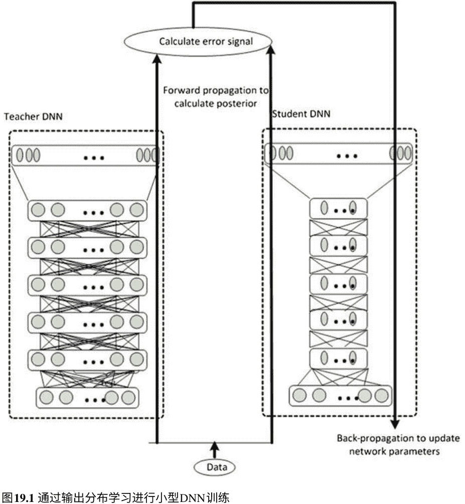

#### 19.3 不变性建模

一个好的模型应该对与音素建模目标无关的所有干扰因素具有不变性。这些干扰因素可以是说话者的口音或方言，嘈杂的环境，来自不同说话者的时间和频率扭曲，甚至是测试时未见过的样本。本节重点是开发使模型对这些干扰因素更具不变性的方法。

##### 19.3.1 改善对口音/方言的鲁棒性与模型适应

外语口音的语音，以与母语语音有系统的音段和/或超音段上的偏差为特征，会降低可理解性并可能导致语音识别性能差。母语和外语口音之间存在较大的语音识别准确性差距。例如，在实际语音服务系统中，我们观察到外语口音的词错误率（WER）几乎翻倍。

为了实现更好的用户体验，我们提出了一个模块化的多口音DNN声学模型 [7]，其中一组口音特定的子神经网络模块被训练用于建模口音特定的模式。DNN的其余部分在母语和外语口音之间共享，以实现最大的知识传递和数据共享。对于口音特定的模块，其大小由口音训练数据的数量确定，其放置位置基于不同网络位置上的口音模块化的有效性。我们的研究表明，在顶部神经网络层进行口音模块化比在底部层效果更好。因此，我们认为口音特定的模式主要由顶部神经网络层的抽象语音特征捕捉到。

可以使用Kullback-Leibler散度（KLD）正则化模型适应 [4, 21] 来优化口音特定模块。在这种方法中，将基准模型和适应模型之间的KLD ($\mathcal{F}_{\text{KLD}}$) 添加到标准的交叉熵目标函数 ($\mathcal{F}_{\text{CE}}$) 或从最大互信息（MMI）中减去。目标函数 ($\mathcal{F}_{\text{MMI}}$) 形成新的正则化目标函数 ($\hat{\mathcal{F}}_{\text{CE}}$ 和 $\hat{\mathcal{F}}_{\text{MMI}}$)：

$$\begin{cases} \hat{\mathcal{F}}_{\text{CE}} = (1 - \rho)\mathcal{F}_{\text{CE}} + \rho \mathcal{F}_{\text{KLD}}, \\ \hat{\mathcal{F}}_{\text{MMI}} = (1 - \rho)\mathcal{F}_{\text{MMI}} - \rho \mathcal{F}_{\text{KLD}}. \end{cases} \quad (19.5)$$

这里 $\rho$ 是KLD正则化的权重。由于MMI目标函数是要最大化的，所以在 (19.5) 中引入了带有负号的KLD正则化项。可以通过标准的反向传播来优化新的正则化目标函数。$f$-平滑是MMI序列训练实现中使用的一种帧级正则化方法 [27]。我们进一步推导了带有 $f$-平滑 ($\hat{\mathcal{F}}_{\text{MMI}}^{(f)}$) 的KLD正则化MMI适应作为一般公式 [4]：

$$\hat{\mathcal{F}}_{\text{MMI}}^{(f)} = (1 - \rho)\mathcal{F}_{\text{MMI}}^{(f)} + \rho [\mathcal{F}_{\text{KLD}} - \rho_F \mathcal{F}_{\text{CE}}] + \rho \mathcal{F}_{\text{KLD}}, \quad (19.6)$$

其中 $\rho_F$ 是 $f$-平滑的权重。当 $\rho_F$ 等于1时，$\hat{\mathcal{F}}_{\text{MMI}}^{(f)}$ 变成了KLD正则化的交叉熵自适应；当 $\rho_F$ 等于0时，它变成了KLD正则化的MMI自适应。

在一个移动短信口述任务中，使用1K、10K和100K的英国或印度口音自适应语音，KLD正则化自适应相对于400小时的基线EN-US本地DNN分别实现了18.1%、26.0%和28.5%（英国口音）或16.1%、25.4%和30.6%（印度口音）的WER降低。与基线模型相比，使用2000小时的EN-US本地语音训练的模型也取得了可比较的性能。

口音建模依赖于获取可靠的口音信号。获取口音信号的一种方法是在使用应用程序时要求用户指定他们的口音，这需要用户的合作。一种更可行的方法是自动识别用户的口音 [1]，这会引入额外的运行时成本，并且结果并不总是正确的。此外，训练一个鲁棒的识别模块需要昂贵的带有口音标签的数据。

受到用户来自相同地理位置区域可能共享相似口音的事实的启发，我们提出直接利用用户所在的省份（州）作为口音信号 [26]。使用从GPS推断出的用户当前所在的省份作为口音信号。由于大多数商业语音服务都提供GPS信号，所以这种方法在运行时和口音标记方面都是零成本的。

首先，将训练数据根据每个话语的省份标签进行分组。然后，为每个省份训练一个DNN。在运行时，使用从GPS推断出的用户当前所在的省份作为信号来选择正确的DNN来识别用户的声音。

### 19.3.2 通过可变组件DNN建模提高对声学环境的鲁棒性

为了提高对声学环境的鲁棒性，我们可以将DNN模型适应新环境，或者使DNN模型本身对新环境具有鲁棒性。在 [13] 中，我们提出了一种新颖的分解适应方法，通过考虑潜在的失真因素来适应仅具有有限参数的DNN。为了提高在训练时不可用的数据类型的性能，希望DNN组件可以建模为连续环境相关变量的函数。在识别时，根据给定的环境变量值实例化一组特定于该值的DNN组件，并用于识别。即使测试环境在训练中没有见过，DNN组件的值仍然可以通过环境相关变量进行预测。为此，已经提出了可变组件DNN（VCDNN）[30, 31]。

在VCDNN方法中，DNN中的任何组件都可以被建模为环境变量的一组多项式函数。例如，DNN的权重矩阵和偏置可以依赖于环境变量，如图19.2所示，我们将这样的DNN称为变参数DNN（VPDNN），其中第 $l$ 层的权重矩阵 $\mathbf{A}^l$ 和偏置 $\mathbf{b}^l$ 被建模为环境变量 $v$（例如，信噪比）的函数：

$$\mathbf{A}^l = \sum_{j=0}^{J} \mathbf{H}_j^l v^j, \quad (19.7)$$
$$\mathbf{b}^l = \sum_{j=0}^{J} \mathbf{p}_j^l v^j, \quad (19.8)$$

$J$ 是多项式函数的阶数。$\mathbf{H}_j^l$ 是与 $\mathbf{A}^l$ 具有相同维度的矩阵，而 $\mathbf{p}_j^l$ 是与 $\mathbf{b}^l$ 具有相同维度的向量。赵等人 [30, 31] 展示了VCDNN的优势，相对WER分别降低了3.8%和8.5%。在已知条件和未知条件下，与标准DNN相比，这表明标准DNN在建模各种环境方面具有很强的能力，并且在未知环境中还有改进的空间。

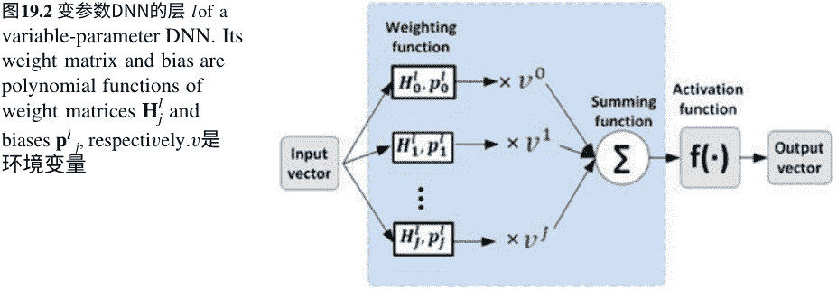

### 19.3.3 使用时间-频率长短期记忆RNN改善时间和频率不变性

DNN只考虑了一个固定长度的滑动窗口内的信息，因此无法利用信号中的长程相关性。另一方面，循环神经网络（RNN）可以在其内部状态中编码序列历史，因此有可能基于当前帧之前观察到的所有语音特征来预测音素。为了解决RNN中的梯度消失问题，发展了长短期记忆（LSTM）RNN [3]，并且已经证明在各种ASR任务 [2, 20] 上胜过了DNN。在 [18] 中，我们通过模型简化和跳帧评估来减少了LSTM的运行时间成本。所有先前提出的LSTM都使用时间轴上的循环来建模语音信号的时间模式，我们在本章中称之为T-LSTM。

通常，对数滤波器组特征经常被用作神经网络声学模型的输入 [11, 19]。交换两个滤波器组的频率不会影响DNN或LSTM的性能。然而，当人类阅读频谱图时情况并非如此：人类依赖于随时间和频率演变的模式来预测音素。这激发了我们提出了一个二维的时间-频率（TF）LSTM [16, 17]，如图19.3所示，它在时间和频率轴上联合扫描输入，以建模光谱时频弯曲，然后将输出激活作为T-LSTM的输入。联合的时间-频率建模更好地对上层T-LSTM进行特征归一化。在一个375小时的短信口述任务上评估，提出的TF-LSTM相对于最佳T-LSTM获得了3.4%的相对WERR（词错误率减少率）。通过联合的时间-频率分析实现的不变性特性在一个不匹配的测试集上得到了证明，TF-LSTM相对于最佳T-LSTM获得了14.2%的相对WERR。

##### 19.3.4 通过最大边界序列训练探索对未知数据的泛化能力

传统的DNNs/RNNs在顶层使用多项式逻辑回归（softmax激活）进行分类。新的DNN/RNN在顶层使用SVM（见图19.4）。SVM具有几个显著特点。首先，已经证明最大化边界等价于最小化泛化误差的上界 [23]。其次，SVM的优化问题是凸的，它保证产生一个全局最优解。第三，SVM模型的大小由支持向量的数量 [23] 决定，这些支持向量是从训练数据中学习得到的，而不是在DNNs/RNNs中固定设计的。因此得到的模型分别被称为神经SVM和循环SVM [28, 29]。

该算法迭代执行两个步骤。第一步估计最后一层SVM的参数，保持前面层的DNN/RNN参数不变。这一步相当于使用DNN瓶颈特征进行结构化SVM的训练 [28, 29]。第二步更新所有前面层的DNN/RNN参数，保持SVM参数不变。这种联合训练使用DNN/RNN学习特征空间，同时使用SVM（在最后一层）进行序列分类。我们已经验证了它在大词汇连续语音识别的Windows Phone任务中的有效性 [28, 29]。

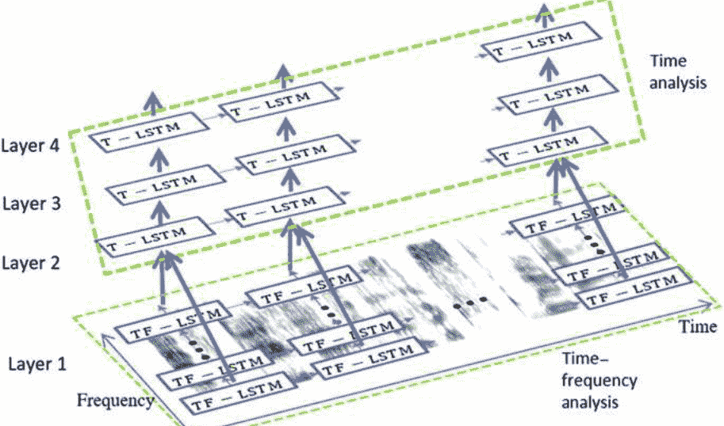
图19.3 一个在底层使用TF-LSTM同时扫描时间和频率轴，并在上层使用T-LSTM扫描时间轴的时间-频率LSTM-RNN示例

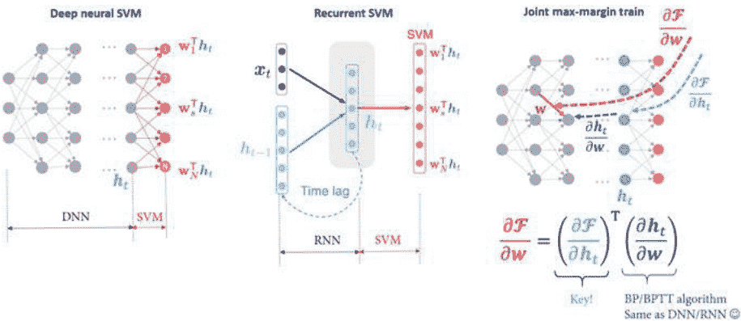
图19.4 深度神经SVM和循环SVM的架构。SVM和DNN/RNN的参数是联合训练的

#### 19.4 有效的训练数据使用

来自实时语音服务流量的未转录数据是无限的，而且完全免费。使用未转录数据来提高声学模型的准确性是一种理想的经济模型开发策略。在新型的深度学习声学模型中，这变得更加重要，因为模型容量不断增大。

此外，由于频繁进行模型更新并使用新数据来提高准确性或仅出于法律原因的常见做法，开发利用未转录数据的技术具有极大的吸引力和价值。还有一个常见的要求是为一种新的资源有限语言部署ASR系统，而我们没有足够的实时数据来训练准确的声学模型。另一方面，我们可能拥有大量的资源丰富语言（如美式英语）的训练数据。一个挑战是如何利用资源丰富语言的训练数据来生成适用于资源有限语言的良好声学模型。在本节中，我们将重点介绍如何利用跨语言的未转录数据和训练数据。

##### 19.4.1 使用无监督数据提高语音识别准确性

高质量的转录推断、有效的重要数据采样和对转录错误具有鲁棒性的模型训练是使用未转录数据进行声学模型训练成功的关键。对于转录推断，我们使用基于多视图学习的系统组合和置信度校准来生成准确的推断转录并拒绝错误的转录 [6]。

用户点击和纠正信息进一步用于提高转录质量。由于未转录数据实际上是无限的，有效的重要数据采样优化每个添加数据的准确性增益，并有助于控制模型训练成本。最后，由于机器推断的转录永远不完美，有必要开发具有对转录错误具有鲁棒性的半监督训练。

我们研究了全连接DNN、展开的RNN和LSTM-RNN的半监督训练，以及转录质量、基于重要性的数据采样和训练数据量 [8]。我们发现DNN、展开的RNN和LSTM-RNN对标注错误越来越敏感，如图19.5（左）所示。例如，使用训练转录模拟的5%、10%或15% WER水平，半监督DNN相对于使用人工转录进行训练的基准模型，WER增加了2.37%、4.84%或7.46%。相比之下，对于展开的RNN，WER增加了2.53%、4.89%或8.85%，对于LSTM-RNN，WER增加了4.47%、9.38%或14.01%。

我们进一步发现，基于重要性的采样对这三个模型的影响相似，相对于随机采样，相对WERR增加了2-3%。最后，我们在图19.5（右侧）中比较了模型在增加训练数据后的能力。实验结果表明，在受监督训练下，LSTM-RNN从增加的训练数据量中获益更多。在移动语音识别任务中，使用2600小时转录和10000小时未转录数据的半监督LSTM-RNN相对于受监督基准模型获得了6.56%的相对WERR。

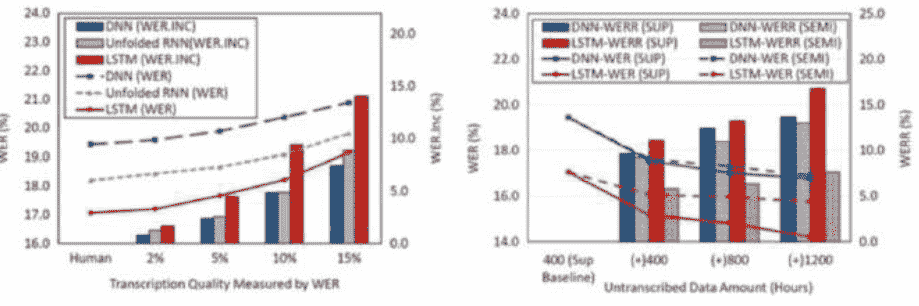
图19.5 左：半监督DNN、展开的RNN和LSTM-RNN的性能比较（在不同WER水平的模拟转录下）。右：使用增加的训练数据的监督和半监督DNN和LSTM-RNN的性能。

##### 19.4.2 通过在语音训练材料之间重复使用，扩展了语言能力

为了在多种语言之间重复使用语音训练材料，我们提出了一种共享隐藏层多语言DNN（SHL-MDNN）架构 [5]，其中输入层和隐藏层在多种语言之间共享，并作为通用特征转换，如图19.6所示。在这种架构中，输入层和隐藏层在所有语言之间共享，并且可以被视为通用特征转换。相比之下，每种语言都有自己的输出层，用于估计特定语言的senones的后验概率。

共享的隐藏层与来自多个源语言的数据一起进行联合训练。因此，它们携带丰富的信息，可以区分多种语言中的音素类别，并且可以用于区分新语言中的音素。有了这样的结构，我们可以首先使用资源丰富的语言的数据训练SHL-MDNN，然后通过在共享的隐藏层之上添加一个新的softmax层来进行跨语言模型转移，该层专门针对资源有限的语言。来自这种新语言的有限训练数据被用来训练顶级语言特定的softmax层。

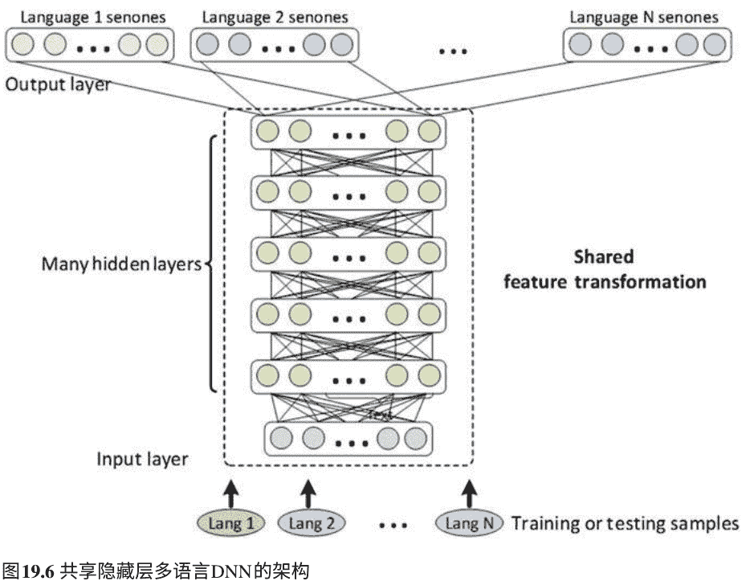

在 [5] 中，我们证明SHL-MDNN可以通过相对3-5%的误差减少来降低仅使用语言特定数据训练的单语DNN的错误。此外，我们还展示了跨语言共享的学习隐藏层可以转移，以提高新语言的识别准确性，相对误差降低范围为6%至28%，而没有利用转移的隐藏层进行训练的DNN。因此，这种SHL-MDNN已被证明是有效的，并被许多研究机构广泛采用。

#### 19.5 结论

在本章中，我们介绍了微软开发的一些深度学习技术，以解决SR产品和服务部署中的挑战：

- 为了满足运行时的计算要求，我们提出了基于SVD的训练方法，它显著降低了DNN的运行时间成本，并保持了与全尺寸DNN相同的准确性。
- 为了在有限的自适应数据上进行更好的个性化，我们开发了一系列方法，如基于SVD的自适应和通过激活函数适应的方法。

激活函数和LRPD只需要适应非常少量的参数，与DNN中的大量参数相比。

- 为了提高深度学习建模能力，我们设计了一种师生学习策略，用于利用潜在无限量的未转录数据，并使基于设备的DNN能够逐渐地逼近基于服务器的DNN的准确性。
- 我们开发了一种时频LSTM来提取频谱图中的时频模式，以改善时频不变性的表示。
- 我们设计了模块化的多口音DNN，其中口音特定模块可以使用KLD正则化进行优化。我们还利用地理位置信息在运行时零成本确定口音聚类。
- 为了解决噪声鲁棒性问题，我们提出了一种变量组件的DNN，在运行时通过使用连续函数的环境变量来实例化DNN组件，从而使估计的DNN组件即使在训练时未见过的测试环境下也能很好地工作。
- 为了提高使用未转录数据的效果，我们设计了一个与DNN和LSTM-RNN都很好配合的过程。通过共享隐藏层的迁移学习，我们可以利用资源丰富的语言来构建资源有限的语言的高质量模型。
- 为了提高对未见数据的泛化能力，我们研究了用最大间隔序列训练优化的SVM替换DNNs/RNNs顶层的多项式逻辑回归。

上述技术使我们能够为所有微软SR产品提供高质量的模型，无论是在服务器还是设备上，无论是资源丰富的语言还是资源有限的语言。

#### 参考文献

1. Chen, T., Huang, C., Chang, E., Wang, J.: 使用高斯混合模型的自动口音识别。在：自动语音识别和理解研讨会论文集（2001年）
2. Graves, A., Mohamed, A., Hinton, G.: 深度递归神经网络的语音识别. In: IEEE国际声学、语音和信号处理会议论文集，第6645-6649页（2013年）
3. Hochreiter, S., Schmidhuber, J.: 长短期记忆. 神经计算 9(8), 1735-1780 (1997年)
4. Huang, Y., Gong, Y.: 正则化的序列级深度神经网络模型自适应. In: Interspeech会议论文集（2015年）
5. Huang, J.T., Li, J., Yu, D., Deng, L., Gong, Y.: 使用多语言共享隐藏层的多语言深度神经网络进行跨语言知识转移. In: IEEE国际声学、语音和信号处理会议论文集，第7304-7308页（2013年）
6. Huang, Y., Yu, D., Gong, Y., Liu, C.: 半监督GMM和DNN声学模型训练与多系统组合和置信度重新校准. In: Interspeech会议论文集（2013年）
7. 黄, Y., 于, D., 刘, C., 龚, Y.: 使用KLD正则化模型自适应的多口音深度神经网络声学模型。在：Interspeech会议论文集（2014年）
8. 黄, Y., 王, Y., 龚, Y.: 深度学习声学模型中的半监督训练。在: Interspeech会议论文集 (2016年)
9. 库马尔, K., 刘, C., 姚, K., 龚, Y.: 离线和基于会话的迭代说话人自适应的中间层DNN自适应。在: 国际语音通信协会第十六届年会会议 (2015年)
10. 库马尔, K., 刘, C., 龚, Y.: 非负中间层DNN自适应用于10 kb说话人自适应配置文件。在: IEEE国际声学、语音和信号处理会议 (ICASSP) 论文集 (2016年)
11. 李, J., 于, D., 黄, J.T., 龚, Y.: 使用混合带宽训练数据在CD-DNN-HMM中改进宽带语音识别。在: IEEE口语语言技术研讨会论文集, 第131-136页 (2012年)
12. 李, J., 邓, L., 龚, Y., Haeb-Umbach, R.: 噪声鲁棒自动语音识别概述。IEEE/ACM音频语音语言处理交易。22 (4), 745-777页 (2014年)
13. 李, J., 黄, J.T., 龚, Y.: 深度神经网络的分解适应。在: IEEE国际会议论文集上的声学、语音和信号处理 (2014年)
14. 李, J., 赵, R., 黄, J.T., 龚, Y.: 基于输出分布的准则学习小型DNN。在: Interspeech会议论文集 (2014年)
15. 李, J., 邓, L., 哈布-恩巴赫, R., 龚, Y.: 鲁棒自动语音识别：通往实际应用的桥梁。学术出版社, 伦敦 (2015年)
16. 李, J., 穆罕默德, A., 齐格, G., 龚, Y.: LSTM时间和频率循环用于自动语音识别。在: 自动语音识别和理解研讨会论文集 (2015年)
17. 李, J., 穆罕默德, A., 齐格, G., 龚, Y.: 探索多维LSTM用于大词汇ASR。在: IEEE国际会议论文集上的声学、语音和信号处理 (2016年)
18. 苗, Y., 李, J., 王, Y., 张, S., 龚, Y.: 简化长短期记忆声学模型以实现快速训练和解码。在: IEEE国际会议论文集上的声学、语音和信号处理 (2016年)
19. Mohamed, A., Hinton, G., Penn, G.: 理解深度置信网络如何执行声学建模。在: 2012年IEEE国际会议论文集上, 第4273-4276页
20. Sak, H., Senior, A., Beaufays, F.: 用于大规模声学建模的长短期记忆循环神经网络架构。在: INTERSPEECH, 第338-342页 (2014年)
21. Su, H., Li, G., Yu, D., Seide, F.: 用于对话式语音转录的上下文相关深度网络的序列训练的误差反向传播。在: 2013年IEEE国际会议论文集上, 第22页
22. Swietojanski, P., Renals, S.: 学习无监督说话人适应的隐藏单元贡献的神经网络声学模型。在: SLT会议论文集上, 第171-176页 (2014年)
23. Vapnik, V.N.: 统计学习理论的本质。Springer, 纽约 (1995年)
24. 薛, J., 李, J., 龚, Y.: 利用奇异值分解重构深度神经网络声学模型。在: Interspeech会议论文集, pp. 2365–2369 (2013)
25. 薛, J., 李, J., 于, D., Seltzer, M., 龚, Y.: 基于奇异值分解的低占用空间说话人自适应和个性化深度神经网络。在: IEEE国际会议论文集, pp. 6359–6363 (2014)
26. 叶, G., 刘, C., 龚, Y.: 地理位置相关的深度神经网络声学模型用于语音识别。在: IEEE国际会议论文集, pp. 5870–5874 (2016)
27. 于, D., 姚, K., 苏, H., 李, G., Seide, F.: KL散度正则化的深度神经网络自适应以改善大词汇语音识别。在: IEEE国际会议论文集 (2013)
28. 张, S.X., 刘, C., 姚, K., 龚, Y.: 用于语音识别的深度神经支持向量机。在: ICASSP, pp. 4275–4279. IEEE, 纽约 (2015)
29. Zhang, S.X., Zhao, R., Liu, C., Li, J., Gong, Y.: 用于语音识别的循环支持向量机。在: ICASSP. IEEE, 纽约 (2016)
30. Zhao, R., Li, J., Gong, Y.: 用于鲁棒语音识别的可变激活和可变输入深度神经网络. 在: IEEE口语语言技术研讨会论文集 (2014)
31. Zhao, R., Li, J., Gong, Y.: 用于鲁棒语音识别的可变组件深度神经网络. 在: Interspeech会议论文集 (2014)
32. Zhao, Y., Li, J., Xue, J., Gong, Y.: 使用广义线性回归和点击数据研究在线低占用扬声器自适应. 在: ICASSP会议论文集, 第4310–4314页 (2015)
33. Zhao, Y., Li, J., Gong, Y.: 用于深度神经网络的低秩加对角线自适应. 在: ICASSP会议论文集 (2016)

## 第20章 三菱电机语音应用的先进ASR技术

Yuuki Tachioka, Toshiyuki Hanazawa, Tomohiro Narita和Jun Ishii

**摘要** 三菱电机公司已经开发语音应用20年了。我们的主要目标是汽车导航系统、电梯控制系统和其他工业设备。本章介绍了为这些应用开发的自动语音识别技术。为了实现实时处理和小资源消耗，提出了基于音节 $N$-gram 的文本搜索方法。为了应对电梯中的混响环境，使用了基于频谱减法的混响时间估计技术。此外，还开发了用于声学模型和语言模型的判别方法。

#### 20.1 引言

首先，我们描述了远场嘈杂和混响自动语音识别（ASR）在我们应用中的问题。许多应用在远程场景中使用。我们这里的主要目标是汽车导航和免提电梯ASR系统。在汽车中，需要在有限的计算资源下进行ASR，因为没有连接到互联网的情况下无法使用基于服务器的ASR系统。然而，目标词汇量很大，因为有很多兴趣点（POIs）。第20.2节介绍了一种可以在有限资源下高效进行大词汇量ASR的方法。在电梯中，噪声相对较小，但混响会降低ASR性能。针对有限的计算资源，本节提出了一种简单的混响消除方法。我们已经开发了几种用于声学模型和语言模型的判别方法。这些先进技术在第20.4节中进行了描述。

### 20.2 用于汽车导航系统的ASR

本节介绍了汽车导航系统的灵活POI搜索, 该系统使用统计ASR和后处理, 如基于音节 $N$-gram 的文本搜索。

##### 20.2.1 引言

三菱电机正在努力提高车载导航系统的ASR能力。遇到的一个关键问题是用户发出了一个不在可识别词汇中的单词。为了解决这个问题, ASR系统配备了智能POI搜索功能，它会自动生成可识别词汇中每个单词的变体。然而, 随着词汇量的增加, 更新单词变体列表的成本和计算量也增加。此外, 由于操作命令的单词限制在命令列表中列出的单词, 无法识别任何变体。因此, 我们将系统分为两个部分：将输入语音转换为字符字符串的ASR部分, 以及执行文本匹配处理的后处理部分。我们开发了一种新的ASR系统, 避免了词汇量增加时计算资源的增加。本节介绍了新开发的ASR和后处理技术, 以及商业产品中安装的语音界面。

#### 20.2.2 ASR和后处理技术

##### 20.2.2.1 使用统计语言模型的ASR

图20.1显示了一个由ASR和文本匹配过程组成的新的POI名称搜索系统。LM是一个包含词组或三元组的数据集, 用于识别词汇。ASR过程的输出是一个序列。从LM中选择词汇中的单词，使得单词字符串具有与输入语音最高可能性（识别分数）的匹配。

因此，如果LM只包含POI的确切名称，例如“东京国立现代美术馆”，则不会识别省略了“国立”的“东京现代美术馆”。因此，在上述智能POI搜索中，POI的确切名称被分成单独的单词：“东京”，“国立”，“博物馆”，“现代”和“艺术”，然后将这些单词及其连接规则注册到LM中。例如，通过注册“国立”可以省略的规则，现在可以识别不准确的名称“东京现代美术馆”。

这种方法的缺点是涉及构建覆盖大量POI名称变体的规则的困难以及由此产生的高成本。相比之下，新开发的ASR系统采用统计语言模型，其中二元组的可能性被表示为称为语言分数的数值。对于上述POI名称的情况，例如，“东京”后跟“国立”和“现代”的词组的语言分数被注册为数值，并且这些语言分数被求和以确定候选识别输出的识别分数。与手工制作的规则相比，LM的构建工作量要小得多，因为语言分数可以从大量POI名称中自动计算得出。然而，在实际情况下，当POI名称列表有几十万个条目时，用于构建POI名称的词汇量超过了十万个，这对于资源受限的车载导航系统来说是不可行的。

因此，每个单词被分割成较小的元素单词。例如，“美术馆”通过元素单词“美术”和“馆”的组合来表示。元素单词限制在POI名称中出现频率最高的约5000个单词左右。如果一个词无法用单词 $N$-gram 表示，则用音节 $N$-gram 表示。例如，“现代”通过音节 $N$-gram “ki”，“n”，“da”和“i”来表示。因此，通过将音节作为LM的基本单位，即使要识别的POI数量增加，词汇量也可以限制在一定水平以下。

##### 20.2.2.2 使用高速文本搜索技术进行POI名称搜索

如图20.1所示，新的POI名称搜索系统由ASR和文本匹配过程组成。在ASR部分中，如第20.2.2.1节所述，要搜索的每个单词被识别为分段单词和音节的序列。识别的结果在注册的词汇表中可能没有完全匹配。在这种情况下，文本匹配过程会搜索与识别过程给出的音节字符串最接近的POI名称。还开发了一种额外的方法，用于为包含不包含在确切主题名称中的单词的单词连接生成近似语言分数，从而实现对不精确名称的识别。匹配的分数是匹配的音节 $N$-gram 的数量。使用音节 $N$-gram 作为基本单位的优点是，与使用单词的系统相比，该系统对ASR错误更具鲁棒性。

例如，如果“美术馆”被错误地识别为“武术馆”，基于单词的匹配过程将不会得到任何匹配结果或分数，而基于音节的匹配过程将找到三个匹配的音节 $N$-gram，“ju-tsu”，“tsu-ka”和“ka-n”，它们包含在包括“美术馆”在内的POI名称中，并因此对分数有贡献。这个分数可以通过参考预先确定的倒排索引来高速计算。

###### 20.2.2.3 应用于商用汽车导航系统

上述POI名称搜索已经在商用汽车导航系统中实现。该系统可以快速输入任何POI名称，并与逐字输入使用假名键盘相比，极大地提高用户便利性。

该系统的操作如下：例如，用户通过触摸“语音输入”按钮说出“天空大厦”，搜索系统将被激活。ASR结果“天空大厦”将被显示出来（同时也提供语音输出）。从POI中检索到包含“天空大厦”在其名称中的48个设施，并在屏幕上列出其中一些设施，例如“基吉天空大厦”，“天空大厦停车场”等。在这个阶段，用户可以手动选择所请求的POI，也可以通过说“下一个”或“上一个”来选择；此外，用户还可以说出其他POI名称以缩小候选范围。

#### 20.3 无线话筒的消除混响

##### 20.3.1 简介

电梯是我们公司最重要的产品之一。为了让残疾人能够控制电梯，我们开发了电梯的ASR系统。由于电梯呈矩形形状，具有坚固的墙壁，因此具有很高的混响。在这种环境中，混响成分会降低ASR的性能。一些研究人员提出了基于混响统计模型的低计算负载的消除混响方法。使用统计模型进行消除混响的关键是限制参数数量并进行稳健估计。Lebart等人提出了一种消除混响的方法，使用了Polack的统计模型，其参数是混响时间（RT）。

这种方法是有效的，计算负载相对较低；然而，由于它仅从话语的末尾估计 RT，其性能不稳定。我们提出了一种去混响的方法，其中使用了频谱减法（SS）。我们还使用了Polack的统计模型，并利用频率区间内话语的末尾和整个话语的衰减特性提出了一种RT估计方法。

#### 20.3.2 使用SS的去混响方法

当混响时间 $T_r$ 远远大于帧大小时，观测到的功率谱 $|\mathbf{x}|^2$ 被建模为源功率谱 $|\mathbf{\hat{y}}|^2$ 的加权和，该源功率谱需要用静态噪声功率谱 $|\mathbf{n}|^2$ 进行估计。

$$|\mathbf{x}_t|^2 = \sum_{\mu=0}^{t} w_\mu |\mathbf{\hat{y}}_{t-\mu}|^2 + |\mathbf{n}|^2, \quad (20.1)$$

其中 $\mu$ 和 $w$ 分别是延迟帧和权重系数。源信号的功率谱 $|\mathbf{\hat{y}}|^2$ 与 $|\mathbf{x}|^2$ 有关：

$$\eta(T_r)|\mathbf{x}_{t-\mu}|^2 - |\mathbf{n}|^2, \quad (20.2)$$

其中 $\eta$ 是直接声音分量与直接声音分量和反射声音分量之和的比值，它是 $T_r$ 的递减函数，因为对于较长的 $T_r$，反射声音分量的能量增加。假设 $w_0$ 为单位，(20.3)可以从上述关系中推导出：

$$|\mathbf{\hat{y}}_t|^2 = |\mathbf{x}_t|^2 - \sum_{\mu=1}^{t} w_\mu [\eta(T_r)|\mathbf{x}_{t-\mu}|^2 - |\mathbf{n}|^2] - |\mathbf{n}|^2. \quad (20.3)$$

混响分为两个阶段：早期混响和晚期混响。在直接声音到达后，它们之间的阈值由 $D$ （以帧为单位）表示。早期混响很复杂，但可以忽略，因为ASR性能主要受到晚期混响的影响。所提出的方法侧重于晚期混响，其中声能密度随时间按照Polack的统计模型呈指数衰减。因此，$w$ 被确定为：

$$w_\mu = \begin{cases} 0 & (1 \le \mu \le D) \\ \frac{\alpha_s}{\eta(T_r)} e^{-2\Delta\varphi\mu} & (D < \mu) \end{cases} \quad (20.4)$$

其中，$\varphi$ 是帧移，$\alpha_s$ 是要设置的减法参数。上限条件和下限条件分别对应早期和晚期混响。假设 $\eta$ 是常数，(20.3) 是类似于频谱减法的过程。

如果减去的功率谱 $|\mathbf{\hat{y}}|^2$ 小于 $\beta |\mathbf{x}|^2$, 则用 $\beta |\mathbf{x}|^2$ 替换，其中 $\beta$ 是一个地板参数。我们定义地板比率 $r$ 为地板的时间频率格子数与总格子数的比率。

我们利用两个观察结果来估计 $T_r$ 的地板比率 $r$。首先，当假设一些任意的混响时间 ($T_a$) 时，$r$ 随着 $T_a$ 单调递增。这被建模为具有倾斜度 $\Delta_r$ 的线性关系。其次，$r$ 随着 $T_r$ 的增加而增加。在相同的 $T_a$ 下，由于实际的 $\eta(T_r)$ 随着 $T_r$ 的增加而减少，去混响后的功率谱更有可能在较长的 $T_r$ 下被地板化，因为 (20.3) 式的第二项大于在较长的 $T_r$ 条件下的实际值。因此，$T_r$ 与 $\Delta_r$ 有正相关关系，我们将其建模为 $T_r = a\Delta_r - b$，其中 $a$ 和 $b$ 是两个常数。$T_r$ 的估计过程总结如下：对于一些 $T_a$ 的值，通过最小二乘回归计算 $a$ 和倾斜度 $\Delta_r$，并估计 $T_{r0}$。

##### 20.3.3 实验

我们使用JEIDA-JCSD（B集）和CENSREC-4评估了单词识别率，其中准备了八个不同的混响环境。我们将所提出的方法与Lebart的方法进行了比较。

图20.2显示了以RT为单位的识别率。所提出的方法改善了所有情况下的识别率，并且在三个RT超过0.5秒的环境中改善显著。在这三个环境中，所提出的方法分别提高了9.9%，11.0%和13.7%的识别率，而Lebart的方法分别提高了7.5%，7.1%和7.3%的识别率。所提出的方法将平均识别率提高了5.0%，而Lebart的方法将其提高了3.6%。所提出的方法给出的识别率在几乎所有情况下都优于Lebart的方法。所提出的方法和Lebart的方法在计算时间上是等效的。

图20.2 所提出的方法和Lebart方法对混响语音的识别率

#### 20.4 辨别方法

本节介绍我们的先进技术，特别是关注声学模型 (AM) 和语言模型 (LM) 的辨别方法。AM的辨别训练在第20.4.2节中描述，此外，循环神经网络语言模型 (RNN-LMs) 的辨别训练在第20.4.3节中描述。

##### 20.4.1 引言

许多研究人员指出，有效地组合不同的系统可以提高性能 (例如，识别器输出投票误差减小 (ROVER) [3])，即使补充系统的性能低于基准系统。因为有效的系统组合依赖于具有不同趋势的假设的组合，当补充系统的假设具有类似趋势或产生过多错误时，系统组合不一定能提高性能。经典的系统组合方法需要反复试错，因为它们不依赖于像辨别训练中的目标函数这样的一般理论背景。

为了解决这个问题，提出了一种基于最小音素错误 (MPE) 准则的声学模型的系统组合的互补系统训练算法 [2]。这种基于格的方法为训练互补系统提供了理论背景，并且非常有前景，因为传统的判别式训练方法可以很容易地应用。我们提出了一个通用的顺序判别式训练框架，用于系统组合，包括各种用于AM的模型训练方法。我们的方法推广了判别式训练的目标函数，以平衡由正确标签给出的目标函数和由基础系统的假设给出的目标函数。我们提出的方法的优点是它导致了传统基于格的判别式训练的简单扩展，并且与判别式训练方法非常相似。此外，由于我们提出的方法的公式包括基于边界的判别式训练，可以调整互补系统输出与基础系统输出之间的偏差程度。

除了对AM进行判别训练外，还提出了对RNN-LM进行判别训练。神经网络最近被引入并用于语言处理。其中，由于其高性能，RNN-LM变得流行起来 [7]。RNN是一个包含一个或多个隐藏层的神经网络，具有递归输入。尽管它们的计算成本很高，但RNN-LM极大地提高了ASR的性能。RNN-LM与传统的 $n$-gram 模型之间最大的区别是可用的单词上下文长度。

上下文提供了很多信息，但传统的 $n$-gram LM的简单使用会遇到数据稀疏性问题。为了解决这些问题，RNN-LM首先将目标单词的高维 1-of-$N$ 表示映射到隐藏层的低维连续空间，并直接估计目标单词的后验概率。上一帧的隐藏层单元然后连接到下一帧的输入向量中。这些递归输入收集低维隐藏层单元中的单词历史。RNN-LM通常用于后处理，如 $N$-best 或格子重评分。

然而，RNN-LM的训练标准是基于预测和参考词之间的交叉熵 (CE)。也就是说，CE标准并没有明确考虑从ASR假设和参考中计算出的判别标准。

RNN-LM的CE标准在考虑给定历史情况下目标词的后验分布方面是判别性的，但是考虑ASR假设的RNN-LM的判别标准可以进一步纠正ASR错误。我们提出的方法基于RNN-LM框架，并且可以考虑ASR假设的长上下文。

### 20.4.2 AMs的判别性训练

我们描述了一种判别性方法，用于构建适当的系统组合的互补系统 [10, 12]。通过从初始模型开始进行判别性训练，可以构建互补系统。假设已经构建了 $Q$ 个基本系统，判别性训练目标函数 $\mathscr{F}$ 被推广为以下提出的目标函数 $\mathscr{F}^c$，该函数从涉及正确标签 $s_{\text{tr}}$ 的原始目标函数中减去涉及第 $q$ 个基本系统的 1-best 假设（lattice）$s_q$ 的目标函数：

$$\mathscr{F}^c(\varphi, s_{\text{r}}) = (1 + \alpha_c)\mathscr{F}(\varphi, s_{\text{r}}) - \frac{\alpha_c}{Q} \sum_{q=1}^Q \mathscr{F}(\varphi, s_{q, 1}), \quad (20.5)$$

其中 $\varphi$ 是要优化的互补系统的模型参数集，而 $\alpha_c$ 是一个缩放因子。选择判别准则 $\mathscr{F}$ 作为最大互信息 (MMI) 或 MPE。如果 $\alpha_c$ 等于零，这个目标函数与原始 $\mathscr{F}$ 匹配。(20.5) 中的第一项根据判别训练准则促进良好性能，而第二项使目标系统生成与原始基础模型有不同倾向的假设。

我们在第二届CHiME挑战赛的第二轨道 [13] 上评估了这些系统组合技术所提供的性能改进。尽管数据库提供了双通道数据，我们使用基于先验的二进制掩蔽 [11] 得到的抑噪单通道数据。梅尔频率倒谱系数 (MFCC) 作为声学特征，使用线性判别分析 (LDA)、最大似然线性变换 (MLLT)、说话人自适应训练 (SAT) 和特征空间最大似然线性回归 (fMLLR)。我们使用ROVER来合并多个系统的输出假设。基线词错误率 (WER) 为 29.46% (评估集)，使用MMI高斯混合模型。提出的互补系统将WER提高了 0.66% (28.80%)。

### 20.4.3 RNN-LM的判别式训练

为了将判别式训练引入 RNN-LM，我们从单词级别的似然比目标函数 $\mathcal{F}^{LR}$ 开始：

$$\mathcal{F}^{LR}(C(H)) = -\sum_{t} \log \frac{y_t(c_t)}{y_t(h_t)^\beta}, \quad (20.6)$$

其中 $h_t$ 是与参考序列 $C$ 对齐的第 $t$ 个单词的 1-best ASR 假设的索引，$H$ 表示 1-best ASR 序列。$\beta$ 是一个缩放因子。

方程 (20.6) 也可以重写为：

$$\begin{aligned} \mathcal{F}^{LR}(C(H)) &= -\sum_{n} \sum_{t} \delta(n, c_t) \log y_t(n) - \beta \delta(n, h_t) \log y_t(n) \\ &= \mathcal{F}^{CE}(C) - \beta \mathcal{F}^{CE}(H), \end{aligned} \quad (20.7)$$

其中 $n$ 是输出层中元素的索引。因此，(20.6) 可以被解释为正确标签和 ASR 假设之间的加权差异。

对于我们提出的模型，更新规则是从 (20.7) 的微分导出的，使得 $\partial \mathcal{F}^{LR}(C, H) / \partial a_t(n)$ 为：

$$\frac{\partial \mathcal{F}^{LR}(C, H)}{\partial a_t(n)} = -[\delta(n, c_t) - \beta \delta(n, h_t) - (1 - \beta) y_t(n)], \quad (20.8)$$

其中 $a_t$ 是第 $n$ 个单词的激活。在我们的实现中，为了简单起见，我们假设 $(1 - \beta)y_t(n) \approx y_t(n)$，我们得到：

$$\frac{\partial \mathcal{F}^{LR}(C, H)}{\partial a_t(n)} \approx -[\delta(n, c_t) - \beta \delta(n, h_t) - y_t(n)]. \quad (20.9)$$

首先，使用动态规划修正正确的单词序列和 ASR 假设的对齐。其次，对于正确的标签，权重进行折扣（即 $1 - \beta$），并使用这些折扣权重重新训练模型。请注意，我们假设为了避免目标参考词的值变为负数，当 $\delta(n, c_t) - \beta\delta(n, h_t) = 0$ 时，将其设置为小于 0 的值。最后，通过将提出的判别方法 $W^{LR}$ 的权重与原始 CE 模型 $W^{CE}$ 的权重进行插值，平滑了 RNN-LM 模型 $W$ 的权重：

$$\{U, V\} = \tau \{U^{CE}, V^{CE}\} + (1 - \tau) \{U^{LR}, V^{LR}\}, \quad (20.10)$$

其中 $\tau$ 是一个平滑因子。这样可以避免过度训练。

表 20.1 CSJ上使用深度神经网络声学模型的WER（%），使用传统的 $n$-gram 重新评分，使用 RNN-LM 重新评分，以及使用提出的 dRNN-LM 重新评分

| 评估方法 | E1 | E2 | E3 | 平均值 |
| :--- | :--- | :--- | :--- | :--- |
| 基准 | 12.81 | 10.64 | 11.13 | 11.53 |
| +RNN-LM | 11.97 | 10.18 | 10.51 | 10.89 |
| +dRNN-LM | 11.84 | 10.02 | 10.39 | 10.75 |

我们在日语自发语料库 (CSJ) 上评估了观察到的性能改进，该语料库是构建日语 ASR 系统所使用的最常用的大词汇连续语音识别 (LVCSR) 任务之一。词汇量约为 70k。尽管原始语言模型的大小为 70k，但 RNN-LM 的词汇量被限制在 10k，这对应于输入层的维度。隐藏层单元的数量为 30。

通过线性插值得到 LM 得分和原始 $n$-gram 模型得分的插值得分。插值的权重为 0.5，并且对于每个话语，使用了 100 个最佳假设进行重新评分。我们使用了三种类型的测试集，每个集合包含来自十个演讲者的演讲样例。测试集 E1、E2 和 E3 分别包含 22,682、23,226 和 14,896 个单词。我们使用了 DNN 和隐马尔可夫模型进行声学建模。

表 20.1 显示了词错率 (WER)。对于所有情况，RNN-LM 都改善了基线的 WER。此外，提出的判别性 RNN-LM (dRNN-LM) 进一步改善了 WER。

#### 20.5 结论

我们的主要目标是在嘈杂和混响环境中使用有限的计算资源。我们已经开发了一个搜索系统和去混响方法，适用于嵌入式系统等小型计算资源系统。

还介绍了与 AM 和 LM 的判别式训练相关的先进技术。这些方法提高了在嘈杂和混响环境中的 ASR 的鲁棒性。

#### 参考文献

- 1. Boll, S.: 使用频谱减法抑制语音中的声学噪声。IEEE Trans. Acoust. Speech Signal Process. 27(2), 113–120 (1979)
- 2. Diehl, F., Woodland, P.: 互补电话错误训练。In: INTERSPEECH会议论文集 (2012)
- 3. Fiscus, J.: 一个后处理系统以获得降低错误词率：识别器输出投票错误减少 (ROVER)。In: ASRU会议论文集, pp. 347–354 (1997)
- 4. Hanazawa, T., Okato, Y., Iwasaki, T.: 使用统计语言模型和基于文本匹配的大词汇搜索进行语音识别。在: 2009年日本声学学会秋季会议论文集, 第61-62页 (2009年)
- 5. Iwasaki, T., Kosaka, M., Nanba, T., Narita, T.: 汽车导航系统的语音界面-当前技术和未来。在: 三菱电机技术报告, 第51-54页 (2004年)
- 6. Lebart, K., Boucher, J.M., Denbigh, P.N.: 基于谱减法的语音去混响新方法。Acta Acustica 87, 359-366页 (2001年)
- 7. Mikolov, T., Karafiat, M., Burget, L., Cernocky, J., Khudanpur, S.: 基于循环神经网络的语言模型。在: INTERSPEECH会议论文集, 第1045-1048页 (2010年)
- 8. Nakayama, M., Nishiura, T., Denda, Y., Kitaoka, N., Yamamoto, K., Yamada, T., Tsuge, S., Miyajima, C., Fujimoto, M., Takiguchi, T., Tamura, S., Ogawa, T., Matsuda, S., Kuroiwa, S., Takeda, K., Nakamura, S.: CENSREC-4: 用于混响环境下远距离语音识别评估框架的开发。在: Interspeech会议论文集, 第968-971页 (2008年)
- 9. Naylor, P., Gaubitch, N.: 语音去混响。Springer, 纽约 (2010)
- 10. Tachioka, Y., Watanabe, S.: 用于系统组合的声学模型判别式训练。在: INTERSPEECH会议论文集, pp. 2355–2359 (2013)
- 11. Tachioka, Y., Watanabe, S., Hershey, J.: 用于混响和噪声语音的判别式训练和特征转换的有效性. 在: ICASSP会议论文集, pp. 6935–6939(2013)
- 12. Tachioka, Y., Watanabe, S., Le Roux, J., Hershey, J.: 用于系统组合的判别式训练的广义框架. 在: ASRU会议论文集, pp. 43–48 (2013)
- 13. Vincent, E., Barker, J., Watanabe, S., Le Roux, J., Nesta, F., Matassoni, M.: 第二届“CHiME”语音分离和识别挑战: 数据集, 任务和基准. 在: ICASSP会议论文集, pp. 126–130 (2013)

## 索引

- 口音建模, 408
- 声学模型, 12, 21, 123, 149, 223, 252, 261, 282, 300, 338, 353, 358, 370, 388, 425
- 声学模型适应, 227
- 声学模型自适应, 85, 190, 352
- 自适应波束形成, 121
- 自适应语言建模, 392
- 自适应训练, 221
- 环境噪声, 108, 249, 348
- AMI语料库, 70, 95, 248, 270, 291, 356
- 人工神经网络。见深度神经网络
- ASGD。见异步随机梯度下降
- AsPIRE, 209
- 异步随机梯度下降, 110, 267, 290, 391
- 注意力, 305, 377
- 基于注意力的编码器-解码器, 303
- 基于注意力的循环序列生成器, 306
- 属性感知训练, 221
- Aurora-4, 207, 230
- 辅助特征, 228, 351, 352
- 通过时间的反向传播, 267, 290, 308
- 批处理, 349
- 贝叶斯决策理论, 11
- 波束图案, 96, 113
- 波束形成器, 22, 29, 45, 52, 63, 67, 87, 106, 148, 179, 209, 227, 338, 350, 356, 374, 395
- 波束形成。见波束形成器
- 波束形成网络, 80
- BeamformIt, 32, 36, 46, 63, 100, 339, 359, 365, 374
- 信念传播, 65, 137
- 双向长短期记忆, 182, 267, 268, 294
- 双向递归神经网络, 166, 267, 308
- 双耳室脉冲响应, 329
- 盲源分离, 52
- BLSTM。见双向长短期记忆
- BMMI。查看增强的最大互信息
- 增强的最大互信息, 284, 331, 359
- 瓶颈层, 206, 225, 271, 403
- 瓶颈说话者向量, 223, 225
- BPTT。参见时间反向传播
- BRIR。参见双耳室脉冲响应
- BSS。参见盲源分离
- BSV。参见瓶颈说话者向量
- CAT。参见聚类自适应训练
- CAT-DNN。参见聚类自适应训练用于DNN
- 细胞激活, 263
- 细胞输出激活, 263
- 倒谱距离, 180
- 倒谱均值归一化, 5, 100, 193
- 倒谱均值/方差归一化, 5
- 通道串联, 361
- CHiME挑战, 328
- CHiME国内音频数据集, 329
- CHiME-1任务, 328
- CHiME-2任务, 178, 328, 426
- CHiME-3任务, 45, 70, 86, 209, 250, 256, 333
- CHiME-4任务, 86, 340
- 循环复高斯分布, 58
- CLDNN。见卷积长短期记忆深度神经网络
- CLP。见复线性投影
- 集群自适应训练, 223, 231
- 用于DNN的集群自适应训练, 223, 235
- CMLLR。见约束最大似然线性回归
- CMN。见倒谱均值归一化
- CMVN。见倒谱均值/方差归一化
- CNN。见卷积神经网络
- CNTK。见计算网络工具包
- 复高斯, 9, 28, 58
- 复高斯混合模型, 39
- 复线性投影, 127
- 计算网络, 170
- 计算网络工具包, 271, 290–292
- 连接主义时间分类, 300, 303, 304, 309, 377, 392
- 约束适应, 222
- 约束最大似然线性回归, 222
- 卷积长短期记忆深度神经网络, 107, 109
- 卷积神经网络, 15, 45, 85, 110, 149, 189, 205, 261, 290, 303, 338, 362, 391
- 修正DNN, 263
- 交叉熵, 86, 287, 300, 336, 377, 391, 408, 426
- CTC。看连接主义时间分类
- 阻尼振荡器系数, 203, 207-209
- DARPA-RATS, 208
- 数据增强, 246, 352
- 数据不匹配, 189
- 数据选择, 252
- 数据模拟, 334, 335
- 解码, 311
- 深度长短期记忆, 262, 263, 265
- 深度神经网络, 5, 15, 43, 51, 85, 110, 137, 180, 188, 220, 247, 261, 281, 300, 336, 352, 359, 375, 391, 428
- 延迟求和波束形成器, 30, 70, 80, 110, 209
- 去噪自编码器, 166, 250
- 分母格子, 28, 9
- 去混响, 22, 24, 44, 209, 249, 338, 353, 374, 404, 422
- 说话人分离, 359
- 口述, 388, 408
- 扩散噪声, 82, 348
- 直接声音, 25, 53, 335, 423
- DNN方向估计, 92
- 判别式训练。查看序列-判别式训练
- 远程麦克风, 22, 95, 271, 292, 328, 346, 357
- 远程语音识别, 46, 227, 249, 261, 273, 282, 328, 353, 375
- DistBelief, 391
- 无失真约束, 32, 46
- DLSTM。查看深度长短期记忆
- DNN。查看深度神经网络
- DOC。查看阻尼振子系数
- DS波束形成器。查看延迟和求和波束形成器
- 早期反射, 25, 423
- EESEN工具包, 307, 377
- 特征值, 34, 41
- 特征向量, 34, 37
- EM算法。见期望最大化算法
- 编码器-解码器, 303, 304
- 端到端, 160, 303, 377
- 端到端语音识别, 303, 377
- 环境适应, 44, 352
- 期望最大化算法, 13, 40, 41, 62, 159
- 分解的多通道原始波形神经网络, 117
- 分解的隐藏层, 223, 224, 234, 235
- 远场条件, 30, 106, 395, 419
- 远场语音识别, 106, 227, 419
- FBANK。见对数梅尔滤波器组
- FDLP。见频域线性预测
- fDLR。见基于特征的判别线性回归
- 特征增强, 222-224
- 基于特征的判别线性回归, 223
- 特征提取, 92, 106, 195, 247, 306, 331, 370
- 特征归一化, 5, 222
- 特征空间最大似然线性回归, 5, 85, 206, 338, 427

- FHL。见分解隐藏层
- 滤波器和求和波束形成器, 111
- 有限状态接受器, 311
- fMLLR。见特征空间最大似然线性回归
- 遗忘门, 263, 309
- 格式化, 389
- 帧平滑, 287, 295
- 自由场条件, 30
- 频域线性预测, 196
- 模糊 c-均值聚类, 60
- 理想幅度滤波器, 172
- 理想比例掩蔽, 172
- ILD。参见双耳水平差异
- 脉冲响应。参见房间脉冲响应
- 独立成分分析, 59
- 输入门, 263, 309
- 双耳水平差异, 53
- 双耳相位差异, 54
- 双耳时间差异, 54
- 国际化, 389
- IPD。参见双耳相位差异
- IRM。参见理想比例掩蔽
- ITD。参见双耳时间差异
- Gabor 滤波器, 202
- Gammatone 滤波器组, 111, 194, 198, 201, 204
- 高斯混合模型, 5, 13, 60, 188, 220, 253, 281, 300, 336, 350, 356, 391, 402
- GCC-PHAT。见广义互相关相位变换
- 广义互相关特征, 89
- 广义互相关相位变换, 36, 90, 227
- 几何波束成形, 82
- 地理特定口音建模, 408
- GFB。见 Gammatone 滤波器组
- GLSTM。见网格长短期记忆
- GMM。见高斯混合模型
- Google, 386
- GPU。见图形处理单元
- 语法, 312, 388
- 联合 ASR 和增强优化, 395
- 联合波束形成和声学模型训练, 87
- 联合任务学习, 228
- JTL。参见联合任务学习
- Kaldi, 291, 307, 336, 340, 350, 358, 372
- 关键词检测, 208, 307, 394
- KL 散度正则化适应, 222, 407
- KLD。见 Kullback-Leibler 散度
- Kullback-Leibler 散度, 9, 141, 206, 222, 407
- 图形处理单元, 267, 294, 311, 372, 377
- 网格语料库, 330
- 网格长短期记忆, 262, 269, 275
- 语言模型, 12, 287, 311, 338, 372, 392, 425
- 晚期混响, 25, 423
- 格子, 288, 295, 374, 425
- LCMV 波束形成器。见线性约束最小方差波束形成器
- LDA。见线性判别分析
- 学习隐藏单元贡献, 221, 224, 233, 237
- 词典, 312
- LHN。见线性隐藏网络
- LHUC。见学习隐藏单元贡献
- 最大似然波束形成, 85, 106, 356
- 耳机麦克风, 356
- 隐马尔可夫模型, 12, 220, 281, 300, 301, 336, 350, 356, 391, 402
- 高速公路连接, 266, 292
- 高速公路长短期记忆, 262, 265, 274, 294
- 香港科技大学普通话, 317
- HLSTM。见高速公路长短期记忆
- HMM。见隐马尔可夫模型
- LIMABEAM。见最大似然波束成形
- LIN。见线性输入网络
- 线性判别分析, 206, 256, 358, 427
- 线性滤波, 46, 193, 249, 352
- 线性隐藏网络, 221, 223, 232
- 线性隐藏单元贡献, 223
- 线性输入网络, 221, 223, 232
- I-vector, 206, 223, 228, 230, 235-237, 253, 338, 394
- IAF。参见理想幅度滤波器
- IARPA Babel 计划, 248, 270
- ICA。参见独立成分分析
- 线性输出网络, 223, 232
- 线性预测, 24, 27, 190, 351
- 线性处理, 22
- 线性约束最小方差波束形成器, 55
- 定位, 52, 83, 106, 396
- 对数最大似然逼近, 54
- 对数梅尔滤波器组, 43, 88, 109, 115, 176, 271
- LON。见线性输出网络
- 长短期记忆, 96, 110, 123, 156, 171, 262, 289, 308, 338, 377, 391, 410
- 带投影层的长短期记忆, 271, 292
- 损失函数, 139, 174
- 低秩加对角线自适应, 405
- LSTM。见长短期记忆
- LSTMP。见带投影层的长短期记忆
- 最小电话误差, 282, 285, 356, 425
- 最小方差无失真响应, 30, 32, 44, 46, 67, 83, 117, 209, 336, 352
- MLLR。参见最大似然线性回归
- MMeDuSA。参见中等时长语音振幅调制
- MMI。参见最大互信息
- MMSE。参见最小均方误差
- 移动设备, 4, 5, 393, 402
- 基于模型的期望最大化源分离和定位, 61
- 中等时长语音振幅调制, 200, 207-209
- 调制谱特征, 197
- MPE。参见最小电话误差
- MTL。参见多任务学习
- 多属性感知训练, 228
- 多通道, 22, 29, 80, 110, 249, 356
- 多通道高斯混合模型, 149
- 多通道原始波形神经网络, 110
- 机器翻译, 303
- 幅度谱, 174, 191
- MAP。见最大后验
- 马尔可夫随机场, 65, 137
- 掩码预测, 86, 172
- 掩码平滑, 64
- 最大信噪比波束形成器, 30, 33, 46
- 最大后验, 6, 220, 331
- 最大似然线性回归, 6, 331
- 最大互信息, 281, 283, 288, 359, 391, 408, 427
- 最大池化, 362
- MBR。见最小贝叶斯风险
- MC-WSJ-AV。见多通道华尔街日报音频视觉语料库
- MCGMM。见多通道高斯混合模型
- MCWF。见多通道 Wiener 滤波器
- 均方误差。见最小均方误差
- 会议室, 25, 347, 357
- 梅尔滤波器组, 196, 205
- 梅尔频率倒谱系数, 5, 190
- 存储单元, 262, 292, 309
- MESSL。见基于模型的期望最大化源分离和定位
- MFCC。见梅尔频率倒谱系数
- 麦克风阵列, 21, 52, 81, 106, 271, 333, 347, 355, 374
- 麦克风信号, 22
- 最小贝叶斯风险, 282
- 最小均方误差, 84, 168, 250
- 多通道华尔街日报音频视觉语料库, 355
- 多通道 Wiener 滤波器, 30, 34, 46
- 多条件训练, 332
- 多条件训练数据, 349, 351
- 多语言训练, 248
- 多麦克风, 21, 395
- 多风格训练, 362, 392
- 多任务学习, 124, 228, 264, 351
- MVDR。见最小方差无失真响应
- N-gram, 374, 420
- NAB。见神经网络自适应波束形成
- 窄带, 57
- NAT。见噪声感知训练
- 神经网络。见深度神经网络
- 神经网络自适应波束形成, 121
- 神经网络增强, 22, 395
- 神经网络语言模型, 374
- 神经 SVM, 411
- NIST 丰富转录, 355
- NITE XML 工具包, 357
- NMC。见归一化调制系数
- NMF。见非负矩阵分解
- 噪声感知训练, 226
- 非线性处理, 22
- 非负矩阵分解, 166, 169, 338
- 归一化调制系数, 198, 207, 208
- 分子格, 288
- NXT。见 NITE XML 工具包
- OMLSA。见优化修改的对数谱振幅
- 设备上, 402
- 最佳修改的对数谱振幅, 168
- 输出门, 263, 309
- 过拟合, 265, 287, 295
- 重叠相加, 101
- PAC-RNN。见预测-适应-纠正递归神经网络
- 并行化, 290, 294, 391
- PDF。见概率分布函数
- 窥视孔连接, 269
- 语音质量的感知评估, 180
- 感知线性预测, 191, 195
- 感知驱动特征, 193
- 个性化, 394, 402
- PESQ。见语音感知评估质量
- 相位敏感近似, 175
- 相位敏感滤波器, 172
- PLP。见感知线性预测
- PNCC。见功率归一化倒谱系数
- 后滤波器, 34, 69, 395
- 功率归一化倒谱系数, 197
- 功率谱, 26, 92, 169, 198, 423
- 预测 DNN, 263
- 预测-适应-校正循环神经网络, 262, 263, 272
- 预训练, 178
- 概率分布函数, 8
- 伪似然, 14
- RASTA。见相对谱
- 循环神经网络, 166, 171, 262, 282, 305, 374, 391, 410, 425
- 循环神经网络语言模型, 338, 374, 425
- 循环 SVM, 411
- 相对谱, 194
- 重新评分, 306, 338, 374, 394, 428
- 残差长短时记忆, 262, 270, 276
- 残差网络, 270
- REVERB 挑战, 43, 95, 208, 251, 346, 353
- 混响, 24, 44, 246, 248, 332, 346, 350, 422
- 混响时间, 25, 348, 423
- 丰富的转录, 355
- RIR。见房间冲激响应
- RLSTM。见残差长短时记忆
- RNN。见循环神经网络
- RNNLM。见循环神经网络语言模型
- 鲁棒特征, 187
- 鲁棒性, 4
- 房间感知训练, 227
- 房间冲激响应, 23, 25, 53, 247, 248, 346, 348, 349
- SAT。查看自适应说话人训练
- SaT。查看说话人感知训练
- SDR。查看源-失真比
- 搜索图, 313
- 自训练, 247
- 半监督训练, 389, 412
- 句子错误率, 300
- 序列判别式训练, 251, 281, 391, 425
- 序列判别式训练准则, 286
- SER。查看句子错误率
- 共享隐藏层多语言 DNN, 413
- 短时傅里叶变换, 5, 23, 88, 167
- 短时客观可懂性, 180
- Sigmoid 自适应, 405
- 信号增强, 335, 338
- 信噪比, 33, 108, 172, 227, 330, 348
- 单通道, 22
- 单通道增强, 338
- 奇异值分解, 233, 403
- 智能手机, 395
- sMBR。查看状态级最小贝叶斯风险
- SNR。查看信噪比
- 源图像, 23, 32, 34
- 源排列, 57
- 源分离, 52, 58, 170, 374
- 源失真比, 172
- 稀疏性假设, 38
- 空间混叠, 55, 57, 96, 120
- 空间聚类, 52, 57
- 空间相关矩阵, 32, 34, 35, 37, 38, 45, 82
- 空间滤波, 86, 111, 117, 119, 126, 395
- 说话人自适应, 4, 205, 231, 403
- 说话人移动, 332
- 说话人自适应训练, 235, 336, 427
- 说话人代码, 222, 223, 236
- 说话人感知训练, 225
- 频谱滤波, 86, 107, 126
- 频谱减法, 5, 22, 165, 192, 351, 422
- 语音-背景分离, 166
- 语音增强, 11, 22, 24, 106, 165, 192, 223, 246, 249, 346, 374
- 语音转文本, 300
- SS。查看频谱减法
- 状态级最小贝叶斯风险, 251, 282, 285, 287, 294, 336, 391
- 导向矢量, 24, 33, 37, 68, 81, 227
- STFT。查看短时傅里叶变换
- 刺激深度学习, 238
- STOI。查看短时客观可懂性
- 结构化偏置向量, 231
- 结构化线性变换, 232
- 结构化参数化, 222-224, 231
- 摘要向量, 253
- 超指向性波束成形, 82
- SVD。查看奇异值分解
- 基于 SVD 的模型重构, 403
- SVD 瓶颈自适应, 404
- SWBD。查看交换机板 (Switchboard)
- 交换机板, 197, 236, 286, 316, 379
- 系统组合, 337, 351, 425
- 平板电脑, 333
- TDNN。见时间延迟神经网络
- TDOA。见到达时间差
- 师生学习, 407
- 时间模式, 195
- 测试时适应, 221
- 文本到语音, 247, 387
- 时间延迟神经网络, 209, 362
- 到达时间差, 31, 36, 91, 116
- 时间-频率 LSTM, 410
- 时间-频率掩蔽, 38, 39, 45, 52
- TIMIT, 247, 305
- 分词, 304
- TRAPS。见时间模式
- 截断的时间反向传播, 110, 267, 290
- TTS。见文本到语音
- 两阶段频域盲源分离, 58
- 不确定性技术, 6, 331
- 无监督适应, 190, 223
- 无监督训练, 247, 389, 402
- 未转录数据, 247, 402
- VAD。见语音活动检测
- 可变组件 DNN, 409
- 可变参数 DNN, 409
- 矢量泰勒级数, 5, 223
- 声道长度归一化, 205, 247
- 语音活动检测, 207
- 语音搜索, 108, 287, 306, 387
- VTLN。见声道长度归一化
- VTS。见矢量泰勒级数
- W-不相交正交性, 54
- 唤醒词, 393
- 华尔街日报, 70, 246, 306, 314, 331, 379
- WDAS。见加权延迟和和波束形成器
- 可穿戴设备, 395
- 加权延迟和和波束形成器, 32, 209
- 加权有限状态转换器, 299, 311-314, 317, 377, 386
- 加权预测误差, 24, 29, 44-46, 245, 249-252, 351, 375, 379
- WER。见词错误率
- WFST。见加权有限状态转换器
- 宽带, 57
- Wiener filter, 5, 34, 146, 165, 168, 361, 364
- 词错误率, 4
- WPE。见加权预测误差
- WSJ。见华尔街日报
- WSJCAM0, 95, 154, 348