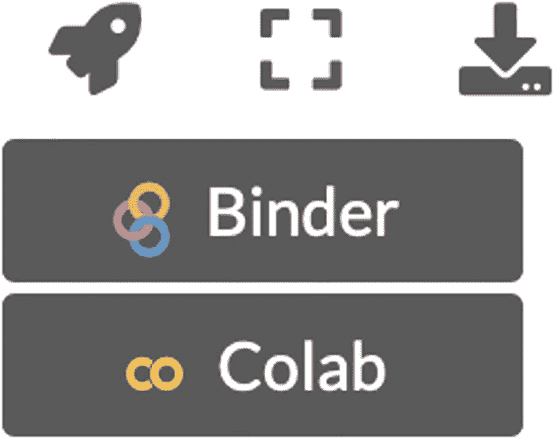

Umberto Michelucci

# 使用 TensorFlow 2 进行应用深度学习

## 学习使用 Python 实现高级深度学习技术

第二版

ISBN 978-1-4842-8019-5e-ISBN 978-1-4842-8020-1[`doi.org/10.1007/978-1-4842-8020-1`](https://doi.org/10.1007/978-1-4842-8020-1)© Umberto Michelucci 2022Apress Standard

Apress 品牌由注册公司 APress Media, LLC 出版，是 Springer Nature 的一部分。

注册公司地址为：1 New York Plaza, New York, NY 10004, U.S.A.

*致我女儿 Caterina 和我的妻子 Francesca。你们是我所做一切的原因。*

前言

在没有意识到的情况下，我们已经淹没在我们每天产生的数据中，这些数据涵盖了技术应用的各个领域、社会生活和健康。在这庞大数量的数据中，这些数据以最不同的格式和方式存储了多年，其中包含了我们渴望但尚未发现的知识。

经过几年的初步谨慎阶段后，今天我们所有人都同意，人工智能是一种非常强大的方法，可以从数据中提取这种知识。

例如，在我作为都灵理工大学生物医学工程教授的日常活动中，我经常发现自己处理与健康世界相关的话题。我意识到临床世界是多么着迷于这些新技术的潜力，有时甚至把它们看作是神秘的东西。在医疗保健领域，人工智能、机器学习和深度学习因其预测疾病风险的能力和在自动化生物医学图像或信号调查阶段以及支持临床决策的步骤中的效率而备受关注。

然而，将这些技术作为临床实践中的决定性支持的道路仍然漫长而曲折，这包括对生物系统功能的更好理解，尽管在医学、生物学、生物化学和生物物理学中已经有了无数的发现，但其中许多仍未得到明确。尽管这些方法在日常生活中产生了不可思议的影响，但大多数人工智能技术的使用者并不知道这些技术是如何工作的，即使是许多科学学科也是如此。

因此，有必要从不同深度的层次上教育社会关于人工智能技术，以确保未来的专业人士，至少是那些涉及科学学科的，能够积极使用这些方法。换句话说，机器学习技术，或者说深度学习，不应被视为解决特定问题的方案，而应被视为实现特定问题解决方案的工具或工具集。

在这种背景下，本书提出了一种方法，通过提供原创的应用示例，这些示例逐渐变得更加复杂，更接近真实问题，同时保持学术性质，帮助读者与复杂的方法进行交互。Michelucci 博士在这本书中倾注了他作为一名杰出培训师的所有技能，结合了他以清晰易懂的方式解释非常复杂概念的能力，同时保持良好的数学形式主义程度，以及通过发展实际问题来激发批判性思维的能力。本书还提供了使用 Jupyter Notebooks 等工作环境创建和共享包含方程、代码和文本的文档的快速指南。

从单个神经元开始的旅程教导读者如何构建神经网络，训练技术，测试和验证，通过适当的指标，调整超参数以及更多。

所有这些主题都通过提供代码示例来涵盖，这些示例帮助读者将概念和方法据为己有，以便他们可以根据特定问题进行定制。

因此，本书对于那些不仅想了解深度学习，还想将其作为他们方法论背景的一部分的人来说是一种宝贵的辅助工具。

我认为 Michelucci 博士的工作将对工程师、物理学家和数学家有用，他们对创建与深度神经网络相关的自己概念和方法感兴趣。我与 Umberto Michelucci 进行的多年合作对我研究小组的专业成长至关重要，我确信这本书将对许多其他热情的科学家有所帮助。

> 诚挚地，
> 
> Marco A. Deriu，博士

引言

这是《应用深度学习》的第二版，它已经更新为 TensorFlow 2.X，并扩展以涵盖额外的先进材料，例如自编码器和生成对抗网络（GANs）。这本书的目标是教你神经网络如何工作、如何训练它们以及如何使用 Keras 实现它们的必要基础知识。我们首先讨论神经元是什么以及你只用一个神经元能实现什么，然后转向前馈神经网络中的多层。你将学习正则化是什么以及如何使用它，高级优化器（如 Adam）是如何工作的，以及如何进行超参数调整。在书的最后，我们探讨一些高级主题，例如自编码器、度量分析和 GANs。

如果你对这个主题是新手，我建议你按顺序阅读章节，但如果你已经有一些经验，并且想了解特定主题，你可以直接跳到相关章节。这些章节大多是自包含的，尽管每个章节都提到了前几章中解释的概念，所以如果你不知道某个特定符号或概念的含义，你可以参考前几章。我努力使数学符号和编程风格尽可能一致，以便更容易地跟随书籍。我只讨论非常短的代码片段（我认为相关的），所以你不会找到可以复制和使用的完整代码，但不用担心。这本书有一个在线网站，你可以找到许多定期更新新示例和主题的 Jupyter Notebooks。你可以在[`https://adl.toelt.ai`](https://adl.toelt.ai)找到它们。

每次你想看到完整的代码在实际中的应用，就去那个网站，你将找到可以下载或打开在 Google Colab 中尝试的完整示例。TensorFlow 经常更新，所以在书中提供代码示例会使书籍很快过时！我的建议是先在书中学习概念，然后去在线网站尝试完整的代码，看看你学到的在实际中是如何工作的。

每个章节的结尾都有一些练习，目的是让你思考你学到了什么，并给你一些有趣的见解。

## 这本书面向谁

为了从这本书中受益，你应该有中级 Python 编程经验。如果你了解 NumPy 库的工作方式，这会有帮助，因为 TensorFlow 广泛使用它。你还应该对代数和微积分有基本的了解。你应该至少理解以下概念：

+   矩阵是什么。

+   如何在矩阵上进行基本操作，例如乘法、求逆等。

+   导数（以及偏导数）是什么。

+   如何计算简单的导数。

+   函数是什么以及最小化一个函数的含义。

如果你理解了这些概念，你应该能够理解书中的解释。我在书中总是给出许多实用提示，以阐明理论概念在实际中的含义。我希望这能帮助你处理现实生活中的项目。

## 你是否需要了解 TensorFlow/Keras？

这是一个棘手的问题。你知道得越多，你就能从这本书中获得更多的益处。本书的主要目标不是教你 Keras，而是教你神经网络是如何工作的，并在 Keras 中提供实现示例。让我再次强调：重点是理解神经网络是如何工作的，而不是 Keras 是如何工作的。这不是一本关于 Keras 的书。了解 Keras 所有特定性的最佳方式是查看官方文档([`https://www.tensorflow.org/learn`](https://www.tensorflow.org/learn))。它总是最新的，包含许多示例。本书涵盖了理解基本示例所需的必要技能，但如果你想要理解所有细微差别，你应该研究官方文档。

注意

即使不了解 Keras 的工作原理，你可能也能理解大部分的概念，但你在 Keras 方面的经验越多，理解解释就会越容易。

## 本书使用的是哪个版本的 TensorFlow？

本书开发的代码已在 TensorFlow 2.5 上进行了测试。我尽量只使用基本的 Keras 功能，使其尽可能与较旧和未来的版本兼容。如果你使用的是不同的 TensorFlow 版本，你可能会发现一些代码无法运行。如果你从[`https://adl.toelt.ai`](https://adl.toelt.ai)本地运行代码并遇到这个问题，我建议你创建一个带有 TensorFlow 2.5 的虚拟环境^(1)。其他包的版本，如 NumPy 或 Pandas，不应有很大影响。任何相对现代的（让我们说从 2020 或 2021 年开始）版本都应该工作得很好。

## 如何尝试本书中的代码

有几种方法可以尝试本书中讨论的代码。我非常努力确保你可以在 Google Colab([`https://colab.research.google.com/`](https://colab.research.google.com/))上运行本书中的所有示例，这样你就不需要在你的个人笔记本电脑或 PC 上安装任何东西。如果你访问[`https://adl.toelt.ai`](https://adl.toelt.ai)，你可以直接在 Google Colab 中打开所有示例。如果你在[`https://adl.toelt.ai`](https://adl.toelt.ai)的页面上，只需将鼠标悬停在示例右上角的小火箭图标上（见图 I-1）。你有几种选项可以打开笔记本来尝试它。

图 I-1

通过将鼠标悬停在页面右上角的火箭图标上，您可以直接在 Google Colab 中打开笔记本，无需在您的机器上安装任何东西。[`adl.toelt.ai`](https://adl.toelt.ai)

您只需从下拉列表中选择 Google Colab。笔记本将在 Google Colab 的浏览器中打开，以便您可以直接测试代码。此外，通过点击右侧显示的指向下箭头的图标图 I-1，您还可以在笔记本电脑上下载代码并本地运行^(2)。

注意

您可以在 Google Colab 中运行本书中讨论的所有示例。您可以通过访问[`adl.toelt.ai`](https://adl.toelt.ai)并悬停在页面右上角的火箭图标上，找到打开笔记本的链接。

如果您不知道 Google Colab 是如何工作的，我建议您观看非常简短的介绍视频[`www.youtube.com/watch?v=inN8seMm7UI`](https://www.youtube.com/watch%253Fv%253DinN8seMm7UI)。基本上，Google Colab 是一个运行在 Google 服务器上的带有 Python 引擎的在线 Jupyter Notebook。如果您之前使用过 Jupyter Notebook，那么您应该没问题。如果没有，我建议您访问官方项目页面[`jupyter.org`](https://jupyter.org)并学习许多可用的教程。Jupyter Notebook 环境被广泛用于数据科学，这是每个从业者都应该了解的内容。

## 书籍内容

第一章讨论了优化的一般问题以及它与神经网络的关系。我们探讨了最重要的最小化算法——梯度下降的工作原理以及其小批量和小批量随机变体是如何工作的。

第二章探讨了单个神经元的结构和最常用的激活函数。然后它涵盖了如何使用 Keras 实现单个神经元的神经网络以及如何使用它进行线性回归和逻辑回归（分类）。我们讨论了任何神经网络模型的基本三个组成部分：网络架构、损失函数和优化器。

第三章讨论了多层和许多神经元的神经网络。我们讨论了过拟合的概念以及如何进行基本的错误分析。然后我们探讨如何使用 Keras 实现多层神经网络。此外，我们还探讨了权重初始化及其各种方法。最后，我们讨论了如何估计使用 Keras 实现的神经网络模型所需的内存量。

在第四章中，我们讨论了正则化的概念。我们探讨了 *l*[*p*] 范数以及 *l*[2] 和 *l*[1] 正则化。然后我们讨论了 dropout 的工作原理以及如何在 Keras 中实现它。最后，我们探讨了早停的工作原理。

在第五章，讨论了 Adam、动量优化器和 RMSProp 优化器，从指数加权平均的概念开始，这是理解高级优化器所必需的。

在第六章，我们讨论了超参数调整。我们讨论了网格搜索和随机搜索以及从粗到精的优化。然后详细解释和讨论了贝叶斯优化。最后，我们讨论了对数尺度上的采样。在第七章，我们讨论了卷积神经网络以及如何在 Keras 中实现它们。

第八章是一个非常简短的章节，对循环神经网络进行了非常基础的介绍。在第九章，我们讨论了自编码器及其应用。第十章包含了对度量误差分析的讨论。

第十一章是对生成对抗网络的简要介绍。在附录 A 和 B 中，简要介绍了 Keras 以及如何对其进行定制的讨论。

## 最后的话

我希望这本书能给你提供一个清晰的课程，以便以最结构化和最简单的方式学习神经网络。这些主题并不容易，需要努力和时间。因此，你不应该气馁。不幸的是，真实的机器学习项目涉及的不仅仅是简单地从互联网上的博客中复制粘贴。编程只是其中的一部分，如果不了解算法是如何工作的，编写代码将是无用的，在最坏的情况下甚至会得到错误的结果。

我希望你会觉得这本书有用，并且能在你的职业和研究项目中从中受益。

> 杜本多夫，2022 年 1 月 1 日

致谢

没有众多阅读草稿并给予我反馈的人的帮助，这本书是不可能完成的。Marco Deriu 教授在许多项目、想法和讨论中给予了极大的帮助。Piga 博士阅读了草稿并给了我关于如何使章节更好的反馈和想法。特别是，我对 Michela Sperti 深感感激。她不懈地工作，几乎更新了书中所有代码到 TensorFlow 2。不仅如此，她还阅读了所有章节，并给了我重要的反馈，使这本书变得更好。没有她，这本书就不会像现在这样好。当然，书中所有的错误都是完全我的责任。

我也非常感谢 Aditee Mirashi，一位不知疲倦的编辑，Jojo John Moolayil，一位出色的技术编辑，以及 Celestin John Suresh，可能是最出色的收购编辑。感谢一个出色的 Apress 编辑团队。

但更重要的是，我对我的女儿 Caterina 和我的妻子 Francesca 无限感激，他们在整个过程中支持我，在我写作和更新这本书时对我有着无限的耐心。你们是我所做一切的原因。

最后，我要向第一版的所有读者表示衷心的感谢。感谢你们对我的作品的信任和兴趣。你们是我将这本书更新到第二版的主要动力。

目录第一章：优化和神经网络 1 对神经网络的基本理解 1 学习问题 3 学习的第一个定义 3 神经网络学习的定义 4 约束优化与非约束优化 5 函数的绝对最小值和局部最小值 7 优化算法 8 选择合适的学习率 13GD 的变体 15 如何选择合适的迷你批大小 18[[高级部分] SGD 和分形](463356_2_En_1_Chapter.xhtml#Sec18)20 练习 21 结论 25 第二章：单神经元的实践 27 神经元结构的简要概述 27 矩阵表示法的简要介绍 30 最常见激活函数的概述 31 如何在 Keras 中实现神经元 40Python 实现技巧：循环和 NumPy41 单神经元的线性回归 43 现实世界示例的数据集 43 线性回归模型 46Keras 实现 47 模型的学习阶段 49 在未见数据上评估模型的性能 51 单神经元的逻辑回归 51 分类问题的数据集 52 数据集分割 54 逻辑回归模型 55 模型的学习阶段 57 模型性能评估 58 结论 58 练习 59 参考文献 60 第三章：前馈神经网络 61 网络架构和矩阵表示法的简要回顾 62 神经元的输出 65 矩阵维度的简要总结 66 全连接网络中的超参数 67 多类分类的 Softmax 激活函数的简要回顾 68 关于过拟合的简要讨论 69 过拟合的实用示例 69 基本误差分析 76 在 Keras 中实现前馈神经网络 78 使用前馈神经网络进行多类分类 78 现实世界示例的 Zalando 数据集 79 为 Softmax 函数修改标签：独热编码 83 前馈网络模型 85 梯度下降变体的性能 89 错误预测的示例 93 权重初始化 94 高效地添加多层 97 比较不同的网络 100 估计模型的内存需求 105 内存占用的一般公式 107 练习 108 参考文献 109 第四章：正则化 111 复杂网络和过拟合 111 什么是正则化 116 关于网络复杂度 117[**ℓ**[***p***] **范数**](463356_2_En_4_Chapter.xhtml#Sec4)118[**ℓ**[**2**] **正则化**](463356_2_En_4_Chapter.xhtml#Sec5)118[**ℓ**[**1**] **正则化**](463356_2_En_4_Chapter.xhtml#Sec8)131 权重真的会归零吗？135Dropout137 早期停止 141 其他方法 142 练习 143 参考文献 144 第五章：高级优化器 145 在 TensorFlow 2.5 中 Keras 的可用优化器 145 高级优化器 145 指数加权平均值 146 动量 150RMSProp152Adam153 优化器性能比较 154 小段代码讨论 158 你应该使用哪个优化器？159 第六章：超参数调整 161 黑盒优化 161 关于黑盒函数的注意事项 163 超参数调整问题 164 样本黑盒问题 166 网格搜索 167 随机搜索 172 从粗到细的优化 176 贝叶斯优化 180 对数尺度上的采样 201 使用 Zalando 数据集进行超参数调整 203 关于径向基函数的简要说明 210 练习 211 参考文献 211 第七章：卷积神经网络 213 核和滤波器 213 卷积 214 池化 231 填充 234CNN 的构建块 235 卷积层 235 池化层 237 堆叠层 238CNN 的一个示例 239 结论 243 练习 243 参考文献 244 第八章：循环神经网络简介 245 循环神经网络简介 245 符号 247 循环神经网络的基本思想 248 为什么叫循环 249 学习计数 249 结论 254 进一步阅读 255 第九章：自编码器 257 介绍 257 自编码器中的正则化 260 前馈自编码器 260 输出层的激活函数 262 损失函数 263 重建误差 267 示例：重建手写数字 268 自编码器应用 270 降维 270 分类 272 异常检测 275 去噪自编码器 278 超越 FFA：具有卷积层的自编码器 280Keras 中的实现 281 练习 283 进一步阅读 283 第十章：度量分析 285 人类水平的表现和贝叶斯误差 286 关于人类水平表现的短篇故事 289 在 MNIST 上的人类水平表现 291 偏差 291 度量分析图 293 训练集过拟合 294 测试集 295 如何分割你的数据集 297 不平衡类别分布：可能发生什么 300 具有不同分布的数据集 306k 折交叉验证 312 手动度量分析：示例 319 练习 329 参考文献 329 第十一章：生成对抗网络（GANs）331 生成对抗网络简介 331GANs 的训练算法 332 使用 Keras 和 MNIST 的实用示例 333 条件 GANs341 结论 346 附录 A：Keras 简介 347 一些历史 347 理解序列模型 348 理解 Keras 层 349 设置激活函数 350 使用功能 API350 指定损失函数和度量 352 整合一切并进行训练 352 模型评估和预测 354 使用回调函数 354 保存和加载模型 355 手动保存权重 360[
