# 1. 优化与神经网络

本章包含了对优化最重要概念的基本介绍，并解释了它们与神经网络的关系。本章没有深入探讨，将更长的讨论留给后续章节。但本章结束时，你应该对与神经网络相关的重要概念和挑战有一个基本的理解。本章涵盖了学习问题、约束和非约束优化问题、优化算法以及梯度下降算法及其变体（小批量梯度下降和随机梯度下降）。

## 神经网络的基本理解

了解什么是神经网络（NN）以及它是如何学习的非常有用。在本介绍性章节中，我们只考虑所谓的监督学习.^(1) 假设你有一个包含 *M* 个元组 (*x*[*i*], *y*[*i*]) 的数据集，其中 *i* = 1, …, *M*。*x*[*i*]，称为输入观测或简单地称为输入，可以是图像、多维数组、一维数组，甚至是简单的数字。*y*[*i*] 是输出（也称为目标变量或有时称为标签），可以是多维数组、数字（例如，输入观测 *x*[*i*] 属于特定类别的概率），甚至是图像。在最基本的表述中，神经网络是一个数学函数（有时称为 *网络函数*），它接受某种类型的输入（通常是多维的）称为 *x*[*i*]，并生成某种输出。下标 *i* 表示从你拥有的观测数据集中的一组输入中的一个。网络函数生成的输出称为 。网络函数通常依赖于一定数量的 *N* 个参数，我们将用 *θ*[*i*] 表示。我们可以用数学公式表示为

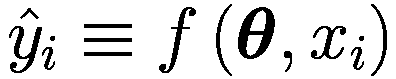

在这里，我们以向量形式表示了参数：***θ*** = (*θ*[1], …, *θ*[*N*]) ∈ *ℝ*^(*N*). 图 1-1 展示了这个想法的示意图。中间的块代表网络函数 *f*，它将输入 *x*[*i*] 映射到输出。自然地，输出将取决于参数。学习背后的想法是改变参数，直到  尽可能接近 *y*[*i*]。最后一句中有两个非常重要的未定义概念：首先，“接近”是什么意思，其次，如何以智能的方式更新参数，使  和 *y*[*i*] “接近”。我们在这本书中深入回答了这两个问题。

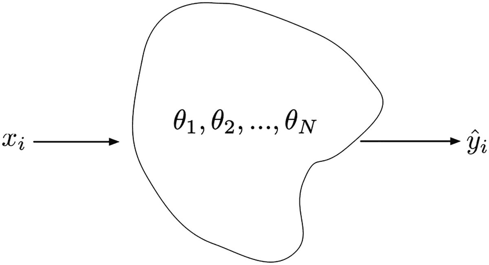

图 1-1

神经网络的直观图示。*x*[*i*] 是输入（对于 *i* = 1, …, *M*），*θ*[*i*] 是参数（对于 *i* = 1, …, *N*），而  是网络的输出。网络函数由中间的不规则形状表示

总结来说，神经网络不过是一个依赖于一系列可调参数的数学函数，希望以某种智能的方式调整这些参数，使得网络输出尽可能接近某个期望的输出。这里的“接近”概念没有定义，但为了本节的讨论，基本理解就足够了。到本书结束时，你将对其含义有更完整的理解。

注意

神经网络不过是一个依赖于一系列可调参数的数学函数，希望以某种智能的方式调整这些参数，使得网络输出尽可能接近某个期望的输出。

## 学习的问题

### 学习的第一个定义

现在我们来看一下在神经网络背景下“学习”的更数学化的表述。为了简化符号，我们假设每个输入是一维数组，*x*[*i*] ∈ *ℝ*^(*n*)，其中 *i* = 1, …, *M*。同样地，我们将假设输出是一维数组，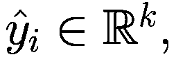，其中 *k* 是某个整数。我们假设我们有一组 *M* 个输入观测值，以及期望的目标变量 *y*[*i*] ∈ *ℝ*^(*k*)。我们还假设我们有一个数学函数 ，称为 *损失函数*，其中我们使用了向量符号 *y* ***=*** (*y*[1], …, *y*[*M*])，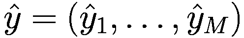 和 *θ* = (*θ*[1], …, *θ*[*N*])。这个函数衡量了在给定的参数 *θ*[*i*] 的特定值下，期望的 (*y*) 和预测的 () 值的“接近程度”。我们尚未定义这个函数的外观，因为这与本次讨论无关。让我们总结一下我们迄今为止定义的符号：

+   *x*[*i*] ∈ *ℝ*^(*n*): 输入观测值（对于这次讨论，我们假设它们是一维数组，维度为 *n* ∈ *ℕ*）。例如可以是人的年龄、体重和身高，图像中像素的灰度值，等等。

+   *y*[*i*] ∈ *ℝ*^(*k*): 目标变量（我们希望神经网络预测的内容）。例如可以是图像的类别，为特定观众推荐的电影，不同语言中句子的翻译版本，等等。

+   *f*(*θ*, *x*[*i*]): 网络函数。这个函数是用神经网络构建的，并依赖于所使用的特定架构（前馈、卷积、循环等）。

+   *θ* = (*θ*[1], …, *θ*[*N*]): 一组实数，也称为参数或权重。

+   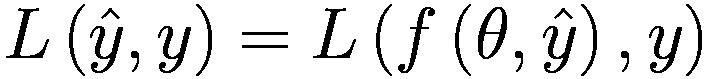: 损失或代价函数。这个函数衡量了 *y* 和  之间的“接近程度”。换句话说，就是神经网络预测的好坏程度。

这些是我们理解神经网络所需的基本要素。

#### [高级章节] 公式中的假设

如果你已经对神经网络有一些经验，那么讨论我们默默做出的一个重要假设是很重要的。请注意，在第一次阅读本书时跳过这个简短的章节不会影响对其他内容的理解。如果你不理解这里讨论的点，请随意跳过这部分，稍后再回来。

这里最重要的假设可以从损失函数 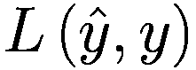 的写法中找到。实际上，按照目前的写法，它是以两个向量  和 *y* 的所有 *M* 个分量作为函数的。这导致在训练过程中不使用小批量。这里的假设是我们将通过同时考虑所有输入和输出，来衡量网络预测的好坏。在接下来的章节中，这个假设将被放宽，并详细讨论。有经验的读者可能会注意到，这将导致高级优化技术——随机梯度下降和小批量概念。使用两个向量  和 *y* 的所有 *M* 个分量会使学习过程通常更慢，尽管在某些情况下它更稳定。

### 神经网络的学习定义

在之前定义的符号基础上，我们现在可以正式地在神经网络的环境中定义学习。

**定义** 给定一组元组 (*x*[*i*], *y*[*i*])，其中 *i* = 1, …*M*，一个数学函数 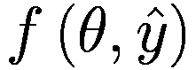（网络函数）和一个函数（损失函数）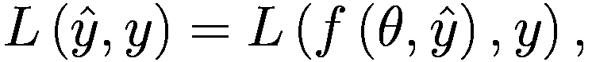，学习过程等同于最小化损失函数相对于参数 ***θ*** 的过程。或者用数学符号表示

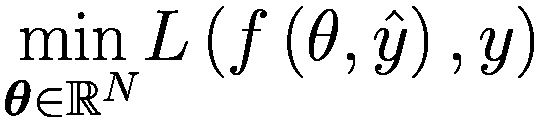

备注

**学习**等同于在给定一系列元组 (*x*[*i*], *y*[*i*])（*i* = 1, …*M*）的情况下，相对于参数 *θ* 最小化损失函数。

学习的典型术语是**训练**，这也是本书中我们将使用的术语。基本上，训练神经网络不过是最小化一个依赖于大量参数（有时是数十亿）的非常复杂的函数。这提出了非常困难的技术和数学挑战，我们将在本书中详细讨论。但就目前而言，这种理解足以开始了解如何解决这个问题。

以下章节将讨论如何解决最小化函数的问题，并解释理解更高级主题所必需的基本理论概念。请注意，最小化函数的问题被称为**优化问题****。

### **约束优化**与**无约束优化**

如前所述，最小化一个函数的问题被称为**无约束优化问题**。

通过向问题添加约束，可以泛化最小化函数的问题。这可以表述如下：我们希望最小化一个通用的函数 *g*(*x*)，同时满足一系列约束

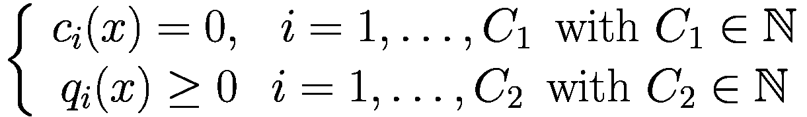

其中，*c**i* 和 *q**i* 是约束函数，它们定义了一些需要满足的方程和不等式。在神经网络的情况下，你可能会有这样的约束，即输出（假设一下， 只是一个数字）必须位于区间 [0, 1] 内。或者它必须始终大于零或小于某个特定值。或者你可能会遇到的另一个典型约束是，当你想让网络只输出有限数量的输出时，例如，在分类问题中。

让我们考虑一个例子。假设我们希望我们的网络输出 ![$$ {\hat{y}}_i\in \left[0,1\right] $$](../images/463356_2_En_1_Chapter/463356_2_En_1_Chapter_TeX_IEq17.png)。我们的学习问题可以表述如下

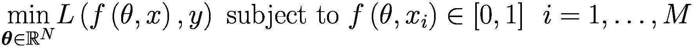

或者甚至更一般地

![最小化 $L\left(f\left(\theta, x\right),y\right)$，其中 $\theta \in {\mathbb{R}}^N$，且 $f\left(\theta, x\right)\in \left[0,1\right]$，对所有 $\theta, x$ 成立](../images/463356_2_En_1_Chapter/463356_2_En_1_Chapter_TeX_Eque.png)

这显然是一个 *约束优化* 问题。在处理神经网络时，这个问题通常通过设计神经网络使其自动满足约束条件，并将学习重新带回无约束优化问题。

#### [高级章节] 将约束问题简化为无约束优化问题

你可能会被上一节的内容所困惑，想知道如何将约束集成到网络架构设计中。这种情况通常发生在网络的输出层。例如，在上一节讨论的例子中，为了确保 $f\left(\theta, {\hat{y}}_{\boldsymbol{i}}\right)\in \left[0,1\right]$，$i=1,\dots, M$，使用 sigmoid 函数 *σ*(*s*) 作为输出神经元的激活函数就足够了。这将保证网络输出始终在 0 和 1 之间，因为 sigmoid 函数将任何实数映射到开区间 (0, 1)。如果神经网络的输出应该始终为 0 或更大，则可以使用 ReLU 激活函数作为输出神经元的激活函数。

注意

在处理神经网络时，约束通常被集成到网络架构中，从而将原始的约束优化问题重新构造成无约束问题。

将约束集成到网络架构中非常有用，并且通常会使学习过程更加高效。约束通常来自对数据和你试图解决的问题的深入了解。找到尽可能多的约束并将其集成到网络架构中是值得的。

另一个约束优化问题的例子是当你有一个具有 *k* 个类别的分类问题时。通常，你希望你的网络输出 *k* 个实数 *p*[*i*]，其中 *i* = 1, …, *k*，每个 *p*[*i*] 可以解释为输入观察值属于特定类别的概率。如果我们想将 *p*[*i*] 解释为概率，必须满足以下方程

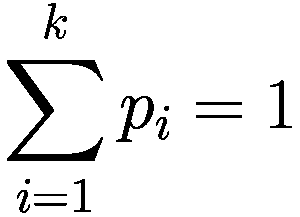

这通过在输出层有 *k* 个神经元并使用 *softmax* 激活函数来实现。这一步将问题重新构造成无约束优化问题，因为之前的方程将由网络架构满足。如果你不知道 softmax 激活函数是什么，不要担心。我们将在接下来的章节中讨论它。记住这个例子，因为它是一切神经网络分类问题的关键。

### 函数的绝对和局部最小值

许多最小化函数的算法，按设计，只能找到所谓的“局部”最小值，换句话说，是一个点 *x*[0]，在这个点上，要最小化的函数值比在 *x*[0] 任何**邻近**点都要小。从数学上讲，如果以下条件满足（在一维情况下），*x*[0] 是 *f* 的局部最小值

![$$ \exists \eta \in \mathbb{R}\ \mathrm{such}\ \mathrm{that}\ f(x)\le f\left({x}_0\right)\kern0.5em \forall x\in \left[{x}_0-\eta, {x}_0+\eta \right] $$](../images/463356_2_En_1_Chapter/463356_2_En_1_Chapter_TeX_Equg.png)

从原则上讲，我们希望找到**全局最小值**，换句话说，就是函数值在所有可能点中最小的点。在神经网络的情况下，由于网络函数的复杂性，确定最小值是局部还是全局最小值是不可能的。这是（尽管不是唯一一个）训练大型神经网络如此具有挑战性的数值问题之一。在下一章中，我们将详细讨论哪些因素^(2)可能会使找到全局最小值更容易或更具挑战性。

### 优化算法

到目前为止，我们讨论了学习就是最小化特定函数的想法，但我们还没有触及到这种“最小化”是如何发生的这个问题。这是通过所谓的“优化算法”实现的，其目标是找到（希望是）绝对最小值的位置。实际上，所有无约束的最小化算法都需要选择一个起点，你用 *x*[0] 表示它。在神经网络示例中，这个初始点将是权重的初始值。通常从 *x*[0] 开始，优化算法将生成一系列迭代值 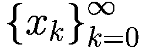，这些迭代值将收敛到全局最小值。

在所有实际应用中，只能生成有限个项，因为我们当然不能生成无限多个 *x*[*k*]。当无法取得进一步进展（*x*[*k*] 的值将不再改变^(3)) 或达到足够精确的特定解时，序列将停止。通常，生成新的 *x*[*k*] 的规则将使用要最小化的函数 *f* 的信息以及一个或多个先前值（通常是适当加权的）的 *x*[*k*]。一般来说，优化算法有两种主要策略：线搜索和信任域。神经网络优化器使用所有线搜索方法。

#### 线搜索和信任域

在**线搜索**方法中，算法选择一个方向 *p*[*k*] 并沿着这个方向搜索新的值 *x*[*k* + 1]，在尝试最小化一个通用的函数 *L*(*x*) 时。一般来说，一旦选择了方向 *p*[*k*]，这种方法就包括求解

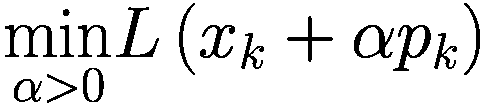

每一次迭代。换句话说，你需要沿着方向*p*[*k*]选择最优的*α*。一般来说，这不能精确求解，因此在实际应用中（你稍后会看到），这种方法通过选择一个固定的*α*，或者以易于计算的方式（独立于*L*）减小它来使用。*α*在处理神经网络时被称为*学习率*，是训练网络时最重要的超参数之一^(4)。在你确定*α*的值之后，新的*x*[*k* + 1]可以通过以下方程确定

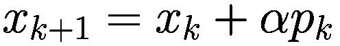

在*信任域*方法中，关于*L*的信息被用来构建一个模型函数*m*[*k*]（通常是二次函数）来近似*x*[*k*]附近足够小的区域内的*f*。然后，这个近似被用来选择新的*x*[*k* + 1]。本书不涵盖信任域方法，但感兴趣的读者可以在 J. Nocedal 和 S.J. Wright 所著的*数值优化，第 2 版*中找到一个非常完整的介绍，由 Springer 出版。

#### 最速下降法

对于线搜索方法，最明显且最常用的搜索方向是最速方向*p*[*k*] =  −  ∇*L*(*x*[*k*])。毕竟，这是函数*f*下降最快的方向。为了证明这一点，我们可以使用*L*(*x*[*k*] + *αp*)的泰勒展开，并尝试确定函数下降最快的方向。我们将停留在一次项，并写为

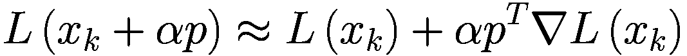

假设*α*足够小。我们的问题（函数*L*沿哪个方向下降更快？）可以表述为求解

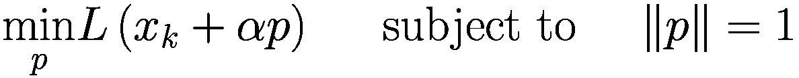

其中，‖*p*‖ = 1 是向量*p*的范数（或者说，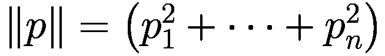）。使用泰勒展开并注意到*f*(*x*[*k*])是一个常数，我们只需解出

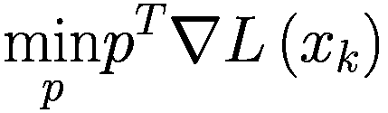

总是满足‖*p*‖ = 1。现在，用*θ*表示方向*p*与∇*L*(*x*[*k*])之间的角度，我们可以写出

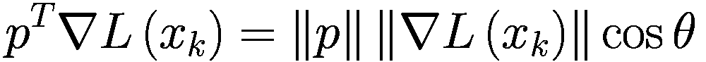

很容易看出，当余弦 *θ* = -1 时，这个值达到最小，换句话说，通过选择与损失函数梯度平行的搜索方向，但指向相反方向。换句话说

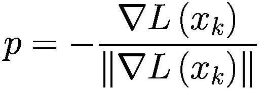

正如我们最初所声称的。

注意

最速下降法是一种线搜索方法，它沿着方向搜索更好的最小值近似，每一步都减去函数的梯度。这种方法是梯度下降优化器的基础。

当然，还有其他可能使用的方向，但对于神经网络来说，这些可以忽略不计。仅举一个例子，可能最重要的是牛顿方向，它可以从 *f*(*x*[*k*] + *p*) 的二阶泰勒展开中导出，但它要求你了解 Hessian ∇²*L*(*x*)。

#### 梯度下降算法

梯度下降（GD）优化器通过使用函数 *L* 的梯度根据公式找到 *x*[*k* + 1]

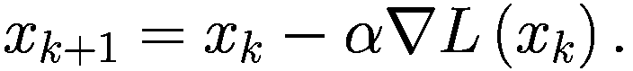

因此，GD 算法实际上是一个线搜索算法，它沿着最速下降方向搜索更好的近似。我们可以创建一个简单的一维示例 (*x* ∈ *ℝ*) 并尝试该算法。假设我们想要最小化函数

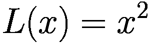

这个函数在 *x* = 0 处有一个明显的最小值，因为这是一个简单的二次形式。如果你知道如何使用微积分找到函数的最小值，那么很容易看出

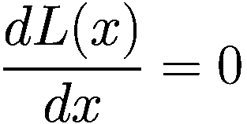

表示 2*x* = 0 → *x* = 0。这确实是一个最小值，因为

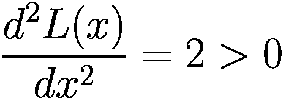

GD 算法在这种情况下是如何工作的？该算法将通过使用公式 *x*[*k* + 1] = *x*[*k*] - 2*α*x*[*k*]（记住我们正在尝试最小化 *f*(*x*) = *x*²）生成一系列的 *x*[*k*]。当然，我们需要选择一个初始值 *x*[0] 和一个步长 *α*。为了第一次尝试，让我们选择 *x*[0] = 1 和 *α* = 0.1。序列可以在表 1-1 中看到。

表 1-1

对于函数 *L*(*x*) = *x*²，使用参数 *x*[0] = 1 和 *α* = 0.1 生成的 *x*[*k*] 序列

| ***k*** | ***x***[***k***] ***x***[**0**] ***=*** **1** |
| --- | --- |
| **0** | 1 |
| **1** | 0.8 |
| **2** | 0.64 |
| **3** | 0.512 |
| **…** | … |
| **40** | 0.00013 |
| **…** | … |
| **500** | 3.5·10^(−49) |

从表 1-1 可以明显看出，尽管速度较慢，GD 算法仍然会收敛到正确的答案，*x* = 0。听起来不错，对吧？会出什么问题呢？并不是所有的事情都这么简单，在 GD 中有一个惊人的隐藏复杂性。让我们重新写一下用于生成序列 *x*[*k*] 的公式：

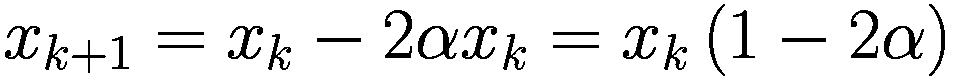

例如，考虑 *α* = 1 的值。在这种情况下，*x*[*k* + 1] =  − *x*[*k*]。很容易看出这会生成一个振荡序列，而这个序列永远不会收敛。实际上，很容易计算出 *x*[1] =  − 1, *x*[2] = 1，依此类推。对于所有 1 − 2*α* < 0 的值，或者对于 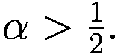，总会生成一个振荡序列。在图 1-2 中，你可以看到参数 *α* 的各种值对应的序列 *x*[*k*] 的绘制。

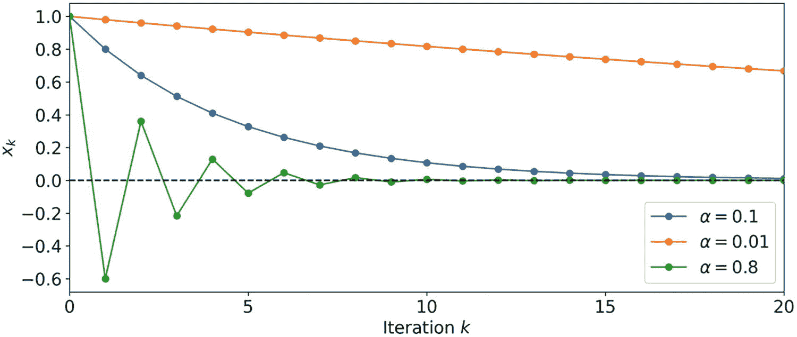

图 1-2

为函数 *L*(*x*) = *x*² 生成序列 *x*[*k*] 的各种 *α* 值

从图 1-2 可以看出，当 *α* 较小时，收敛非常小（橙色线），正如我们讨论的那样，对于值 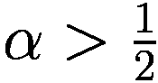（绿色线），会生成一个振荡序列。值得注意的是，这个振荡序列的收敛速度比其他序列要快得多。*α* = 1 生成的序列不会收敛。但对于 *α* > 1 呢？这是一个非常有趣的情况，因为结果证明序列会发散（尽管在正负值之间振荡）。在图 1-3 中，你可以看到 *α* = 1.01 的序列绘制。 

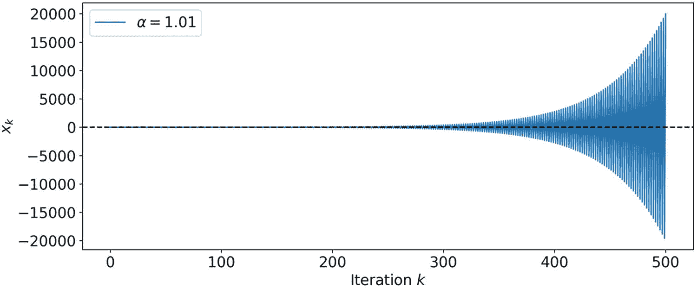

图 1-3

参数 *α* = 1.01 的序列 *x*[*k*]。序列在发散的过程中从正值振荡到负值

你可以清楚地看到它如何发散。请注意，从数值的角度来看，很容易得到 NaN（如果你使用 Python 的话）或错误。如果你在尝试神经网络并且你的损失函数（例如）得到 NaN，一个可能的原因可能是一个太大的学习率。

注意

学习率可能是你在训练神经网络时必须决定的最重要超参数之一。选择一个太小，训练会非常缓慢；但选择一个太大，训练将不会收敛！更先进的优化器（例如 Adam）试图通过动态有效地变化学习率^(6) 来补偿这一不足，但初始值仍然很重要。

现在我必须承认这是一个非常简单的情况。实际上，*x*[*k*] 的公式也可以写成

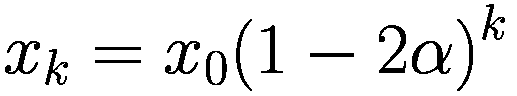

因此，很容易看出，当 \(|1 - 2\alpha| < 1\) 时，这个序列收敛，而当 \(|1 - 2\alpha| > 1\) 时，它发散。当 \(|1 - 2\alpha| = 1\) 时，它保持在 1，如果 \(1 - 2\alpha = -1\)，它将在 1 和 -1 之间振荡。尽管如此，看到学习率在 GD 中的重要作用仍然是有教育意义的。

### 选择合适的学习率

此时，你可能想知道如何选择合适的 \(*\alpha*\)。这是一个好问题，但不幸的是，并没有真正的精确答案，需要一些澄清。在所有实际情况下，你都不会使用普通的 GD 算法。例如，在 TensorFlow 2.X 中，由于效率低下，GD 甚至不是开箱即用的。但一般来说，为了检查（在某些情况下只是初始的）学习率是否最优，你可以遵循以下步骤，假设你正在尝试最小化函数 \(*L*(x*)\):

1.  选择一个初始学习率。典型的值^(7)是 \(10^{-2}\) 或 \(10^{-3}\)。

1.  让你的优化器运行一定次数的迭代，每次迭代保存 \(*L*(x*)[*k*]\)。

1.  绘制序列 \(*L*(x*)[*k*]\)。这个序列应该显示出收敛的行为。从图中，你可以得到一个想法，学习率是否太小（收敛慢）或太大（发散）。例如，图 1-4 显示了我们之前章节中讨论的示例的序列 \(*L*(x*)[*k*]\)。这张图告诉我们，使用 \(*\alpha* = 0.01\)（橙色线）非常慢。尝试更大的 \(*\alpha*\) 值显示了收敛可以有多快（蓝色和绿色）。对于 \(*\alpha* = 0.1\)，在 12-13 次迭代后，你已经得到了最小值的一个很好的近似，而对于 \(*\alpha* = 0.01\)，你仍然离解决方案很远。

备注

在训练神经网络时，始终检查你的损失函数的行为。这将为你提供有关训练过程进展的重要信息。

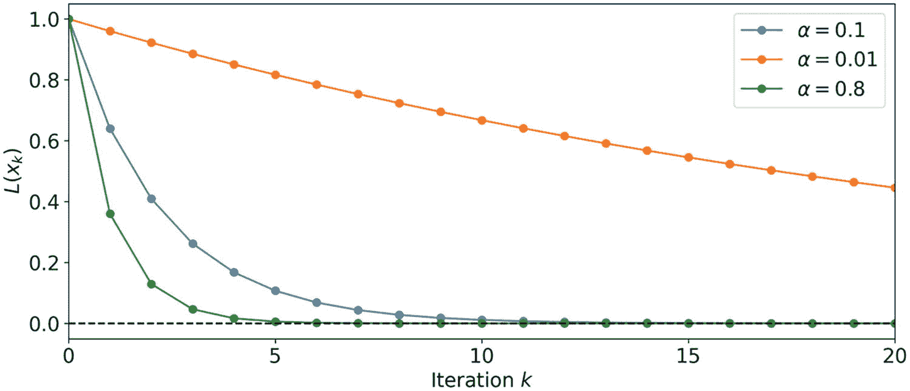

图 1-4

对于函数 \(*L*(x*) = x²\) 的各种 \(*\alpha*\) 值，序列 \(*L*(x*)[*k*]\)

这就是为什么在训练神经网络时，检查你试图最小化的损失函数的行为^(8)非常重要。永远不要假设你的模型正在收敛，而不检查序列 \(*L*(x*)[*k*]\)。

### GD 的变体

要理解 GD 的变体，最简单的方法是从损失函数开始。如本章开头在“学习问题”部分所述，目标是最小化损失函数 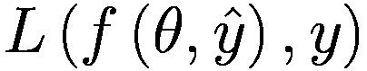，其中我们使用了向量符号 *y* ***=*** (*y*[1], …, *y*[*M*])， 和 *θ* = (*θ*[1], …, *θ*[*N*])。换句话说，我们有 *M* 个输入元组可供使用。在 GD 的普通版本中，损失函数被写成

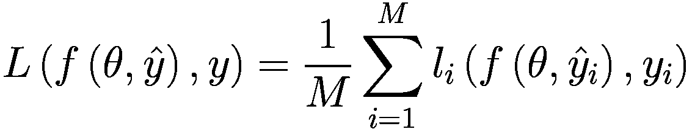

其中 *l*[*i*] 是对单个观察值评估的损失函数。例如，我们可能有一个一维回归问题，其中我们的损失函数是均方误差（MSE）。在这种情况下，我们会有

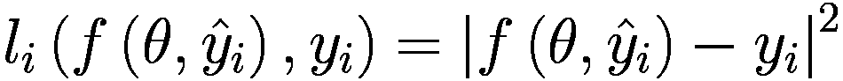

因此

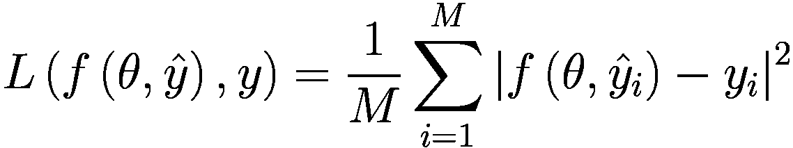

这就是你可能已经见过的经典均方误差（MSE）公式。在普通梯度下降（GD）中，我们会使用这个公式来评估我们需要最小化的 *L* 的梯度。使用所有 *M* 个观察值既有优点也有缺点。

优点：

+   普通梯度下降（GD）显示出稳定的收敛行为

缺点：

+   通常，这个算法的实现方式是所有数据集都必须在内存中；因此，它计算密集。

+   这个算法在处理非常大的数据集时通常非常慢。

梯度下降（GD）的变体基于这样的想法：在前面方程中的求和中只考虑一些观察值，而不是所有 *M* 个。两种最重要的变体被称为 *小批量梯度下降*（MBGD，其中考虑的观察值数量 *m* < *M*）和 *随机梯度下降*（SGD，其中每次只考虑一个观察值）。让我们详细看看这两种方法，从小批量梯度下降开始。

#### 小批量梯度下降（Mini-Batch GD）

为了阐明该方法背后的思想，我们可以将损失函数写成

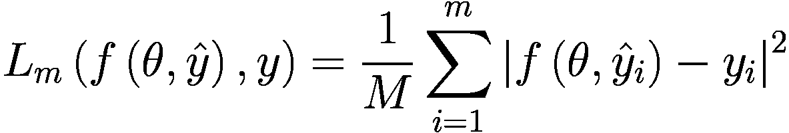

其中我们引入了 *m* ∈ *ℕ* 且 *m* < *M*，称为 *批量大小*。L*[*m*] 是通过对从初始数据集中采样的 *m* 个观察值求和来定义的。

小批量梯度下降（Mini-Batch GD）的实现如下算法：

1.  选择一个迷你批大小 *m*。典型值是 32、64、128 或 256（注意，迷你批大小 *m* 不一定是 2 的幂，它可以是一个任何数字，例如 137 或 17）。

1.  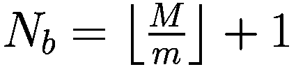 通过从初始数据集 *S* 中每次采样 *m* 个观察值而不重复，创建了观察值的子集^(9)。我们用 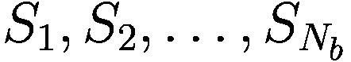 来表示它们。请注意，在一般情况下，如果 *M* 不是 *m* 的倍数，最后一个批次 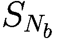 可能包含的观察值数量小于 *m*。

1.  使用 GD 算法，参数 *θ* 将被更新 *N*[*b*] 次，其中 *L*[*m*] 的梯度在 *S*[*i*] 的观察值上评估，对于 *i* = 1, …, *N*[*b*]。

1.  重复步骤 3，直到达到期望的结果（例如，损失函数变化不大）。

在训练神经网络时，你可能听到的是“epoch”这个词而不是迭代。在先前的算法中，当所有数据都已被使用后，一个 epoch 才会结束。让我们来看一个例子。假设我们有 *M* = 1000，我们选择 *m* = 100。每次参数 *θ* 的更新将使用 100 个输入观察值。经过十次迭代 (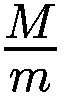)，网络将已使用所有 *M* 个观察值进行训练。此时，我们说一个 epoch 已经完成。在这个例子中，一个 epoch 由参数更新十次（或十次迭代）组成。以下是其优势和劣势。

优点：

+   参数更新的频率高于普通梯度下降，但低于 SGD，因此比 SGD 具有更稳健的收敛性。

+   这种方法在计算上比普通的梯度下降或随机梯度下降（SGD）要高效得多，因为需要的计算（如 SGD）和资源（如普通 GD）更少。

+   这种变化是三种方法中速度最快、最常用的。

缺点：

+   使用这种变化引入了一个新的超参数，需要调整：批大小（迷你批次的观察值数量）。

注意

在所有输入数据被用来更新神经网络参数后，一个 epoch 才会结束。记住在一个 epoch 中，网络的参数可能被更新多次。

#### 随机梯度下降（Stochastic GD）

SGD 是 GD 的一个非常常见的版本，它简单地是 *m* = 1 的迷你批次版本。这涉及到通过每次使用一个观察值来更新网络的参数，用于损失函数。这也具有优势和劣势。

优点：

+   频繁的更新提供了一个简单的方法来检查模型学习的情况（你不需要等到所有数据集都被考虑）。

+   在一些问题中，这个算法可能比普通的梯度下降法更快。

+   模型本质上是有噪声的，这可能在尝试找到成本函数的绝对最小值时帮助模型避免局部最小值。

缺点：

+   在大型数据集上，这种方法相当慢，因为它由于连续更新而非常计算密集。

+   该算法的噪声特性可能会使算法难以在成本函数的极小值上稳定下来，其收敛性可能不如预期稳定。

### 如何选择正确的迷你批大小

那么，正确的迷你批大小*m*是多少？从业者使用的典型值在 100 或更少。例如，TensorFlow 的标准值（如果你没有指定其他值）是 32。为什么这个值如此特殊？为了理解为什么，你需要研究不同*m*选择的 MBGD 行为。为了使其类似于实际情况，考虑 MNIST 数据集。你可能已经见过它了。这是一个包含 0 到 9 的手写数字的 70,000 个数据集。图像是灰度 28x28 像素图像。我们将使用 ReLU 激活函数和 Adam 优化器构建一个具有 16 个神经元的分类器。请注意，如果你不知道我在说什么，你可以跳过这些细节。即使不理解网络设计的细节，也可以继续下面的讨论。

其次，使用 Adam 仅出于实际原因，因为在 TensorFlow 中 MBGD 不是默认可用的。但结论仍然有效。我们在 60,000 个训练图像上训练了网络十个 epoch，然后测量了所需的运行时间^(10)、达到的损失函数值以及训练结束时的准确率。我们使用的迷你批大小*m*的值如下：60000（实际上使用所有数据，因此没有迷你批），20000，5000，500，50，10 和 1。请注意，当*m* = 10 时，所需时间为 2.34 分钟，而当使用*m* = 1 时，十个 epoch 需要 19.18 分钟！

图 1-4 显示了这项研究的结果。

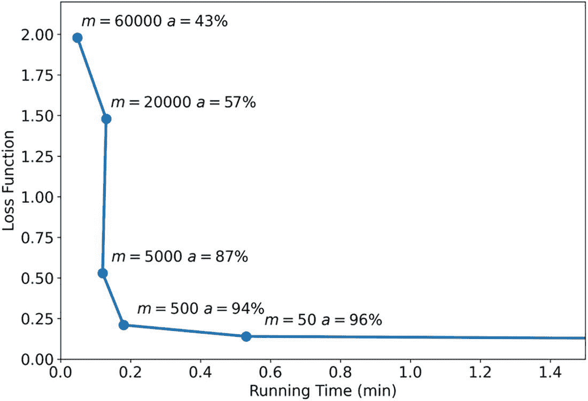

图 1-5

在 MNIST 数据集上经过十个 epoch 后，损失函数的图像与所需运行时间的关系图。*a*表示达到的准确率

让我们看看图 1-5 在告诉我们什么。当我们使用 *m* = 60000 时，十个 epoch 所需的运行时间最低，但准确度相当低。减小 *m* 可以相当快速地提高准确度，直到我们达到“拐点”。在 *m* = 500 和 *m* = 50 之间，行为发生变化。减小 *m* 并没有显著提高准确度，但运行时间变得越来越大。因此，当我们达到拐点时，减小 *m* 就不再有利。您会注意到，在拐点附近，*m* 大约是 100 的数量级。图 1-5 展示了为什么 *m* 的典型值大约是 100 的原因。当然，最佳值取决于数据，并且需要进行一些测试，但在大多数情况下，一个大约 100 的值是一个非常好的起点。

注意

对于小批量大小的一个好的起点是 100 的数量级。最佳值取决于你使用的数据以及你训练的神经网络架构，并且需要测试以找到最佳值。

### [高级章节] SGD 和分形

在前面的章节中，我们讨论了选择错误的学习率如何使收敛速度变慢甚至发散。但讨论的是一维情况，因此非常简单。本节将向您展示使用 SGD 时隐藏的复杂性。您将看到特定范围的学习率如何使收敛变得混沌（在数学意义上的词）。这是在处理优化问题时可以找到的许多隐藏的宝石之一。让我们考虑一个问题^(11)，其中 *M* 个输入 *x*^([*i*]) 是二维的，换句话说 ![$$ {x}^{\left[i\right]}=\left({x}_1^{\left[i\right]},{x}_2^{\left[i\right]}\right)\in {\mathbb{R}}² $$](../images/463356_2_En_1_Chapter/463356_2_En_1_Chapter_TeX_IEq29.png)。我们称目标变量为 *y*^([*i*])。我们试图解决的优化问题涉及最小化这个函数

![损失函数 \( L=\frac{1}{2}\sum \limits_{i=1}^M{\left(f\left({x}_1^{\left[i\right]},{x}_2^{\left[i\right]}\right)-{y}^{\left[i\right]}\right)}² \)](../images/463356_2_En_1_Chapter/463356_2_En_1_Chapter_TeX_Equy.png)

与

![函数 \( f\left({x}_1^{\left[i\right]},{x}_2^{\left[i\right]}\right)={w}_1{x}_1^{\left[i\right]}+{w}_2\ {x}_2^{\left[i\right]} \)](../images/463356_2_En_1_Chapter/463356_2_En_1_Chapter_TeX_Equz.png)

这是对输入的简单线性组合。问题很简单，对吧？我们最小化均方误差（MSE）并尝试找到最小化 *L* 的最佳参数 *w*[1] 和 *w*[2]。考虑 *M* = 3 个输入。特别是，为了使其更具体，考虑以下输入矩阵^(12)。

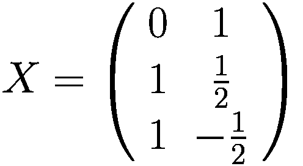

我们也将我们的标签写成矩阵形式

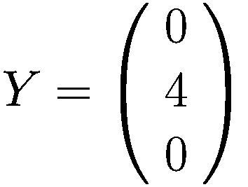

注意，我们在这里展示的内容不依赖于数值。你可以用不同的值重现结果而不会有问题。让我们首先精确地找到 *L* 的最小值（因为在这个简单的情况下，我们可以做到这一点）。要做到这一点，我们需要简单地推导 *L* 并解这两个方程

计算虽然无聊但并不过于复杂。通过解这两个方程，你会发现最小值在 。

## 练习

练习 1

解这两个方程

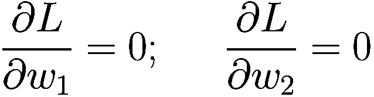

并且证明 *L* 在 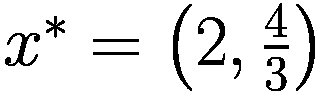 处有全局最小值。

要实现一个 SGD 优化器，可以遵循以下算法：

1.  选择一个学习率 *α*。

1.  在{1,2,3}之间选择一个随机值并将其分配给 *i*。

1.  通过使用 ![$$ {l}_i=\frac{1}{2}{\left(f\left({x}_1^{\left[i\right]},{x}_2^{\left[i\right]}\right)-{y}^{\left[i\right]}\right)}² $$](../images/463356_2_En_1_Chapter/463356_2_En_1_Chapter_TeX_IEq32.png) 更新参数 *w*[1], *w*[2]；换句话说，使用 *l*[*i*] 来计算导数，并根据梯度下降规则更新权重 *w*[*j*] → *w*[*j*] − *α∂l*[*i*]/*∂w*[*j*] 对于 *j* = 1, 2。每次，保存 *w*[1], *w*[2] 的值，例如在一个 Python 列表中。

1.  重复步骤 2 和 3 一定次数，*N*。

通过遵循前面的算法，你可以在 (*w*[1], *w*[2]) 空间中绘制在步骤 3 中获得的并保存的所有点。这些就是两个参数 *w*[1] 和 *w*[2] 在优化过程中将采取的所有值。图 1-6 显示了 *α* = 0.65 的结果。结果是令人惊叹的。

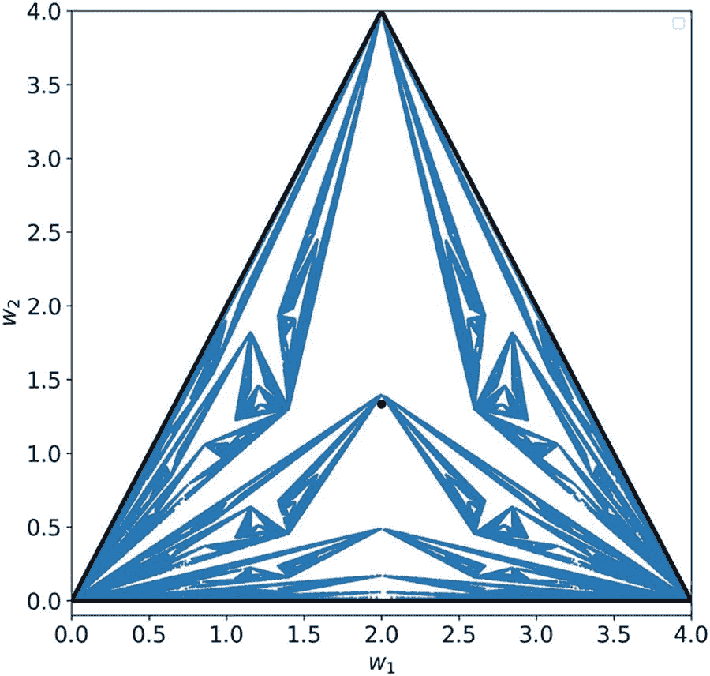

图 1-6

每个蓝色点都是一个由 SGD（随机梯度下降）生成，如学习率*α* = 0.65 所描述的值的元组 (*w*[1], *w*[2])。该图是通过 4 · 10⁵次迭代获得的

练习 2（难度：困难）

你能从输入矩阵 *X* 推导出界定三角形的直线的方程吗？

练习 3

尝试从头开始实现本节所述的 SGD 算法来重现该图像。如果你遇到了困难，可以在书籍的在线版本中找到一个完整的实现。

可以证明，图 1-6 中你所看到的确是一个分形。数学证明超出了本书的范围，但如果你感兴趣，可以查阅由 Dover 出版的 M.F. Barnsley 所著的书籍*Fractals Everywhere****,***。分形的一个主要特性是，当你放大时，你会找到你在更大尺度上观察到的相同结构。为了让你相信这是真的，图 1-7 展示了图 1-6 的一个细节。在放大的区域中，你可以观察到你在更大尺度上看到的相同类型的结构。

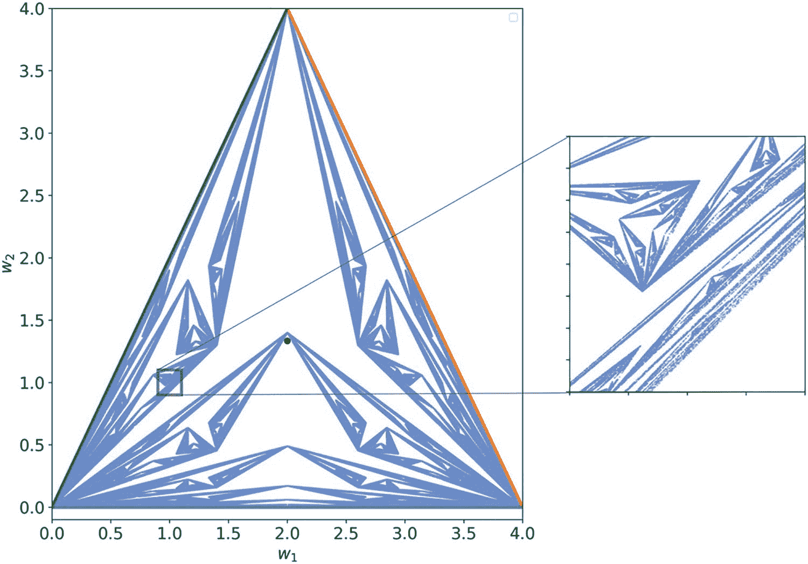

图 1-7

一个放大的区域，展示了 SGD 算法可以生成的分形特性。这张图片是用学习率*α* = 0.65 和 10⁷次迭代生成的。在放大的区域中，你可以清楚地看到你在左边更大尺度上观察到的相同类型的结构。由于只有 10⁷个点中的一小部分恰好在被放大的小区域内，所以放大的区域比左边的区域要模糊。

分形的具体结构取决于学习率。在图 1-8 中，你可以看到从 0.65 到 1.0 的不同学习率下的分形结构。看到结构如何变化，展示了在 SGD 中使用时隐藏的巨大复杂性，这是非常迷人的。

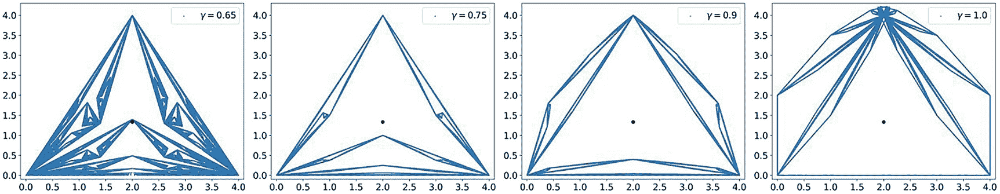

图 1-8

通过 SGD 在不同学习率下获得分形形状。注意在图中学习率用*γ*表示。

当使用较小的学习率时，在某个点上，分形结构会突然完全消失，留下一个无结构的点云，如图 1-9 所示。学习率越小，点云越小。

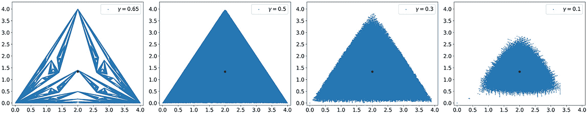

图 1-9

通过选择越来越小的学习率，分形结构会完全消失，留下一个以*L*的全局最小值*x*^∗为中心的无结构点云。

最后，通过选择一个非常小的学习率，例如*α* = 5 · 10^(−4)，SGD 会朝着预期的全局最小值*x*^∗移动并保持在它的附近，如图 1-10 所示。

图 1-10

通过选择一个非常小的学习率*α* = 5 · 10^(−4)，SGD 会朝着预期的全局最小值*x*^∗移动并保持在它的附近，如图中放大的区域所示。尽管如此，SGD 仍然继续提供围绕*x*^∗的点，但从未收敛到它。学习率越小，围绕*x*^∗的点云越小。

练习 4（难度：困难）

证明在上一节中描述的每次使用随机梯度下降（SGD）进行的更新，都会将参数空间中的点移动到与之前图中描述的三角形的三条线之一垂直的方向。换句话说，参数的两个后续更新（*w*[1]，*w*[2]）和  之间的方向与之前图中界定三角形的三条线之一垂直。请注意，这并不是一个简单的练习，如果你遇到困难，可以在书籍的在线版本中找到一些提示。

注意

梯度下降算法，尤其是在其随机版本中，具有难以置信的隐藏复杂性，即使是对于前一小节中描述的简单情况也是如此。这就是训练神经网络可能如此困难且棘手的原因，以及为什么选择合适的学习率和优化器如此重要的原因。

## 结论

你现在应该已经拥有了（至少在基本层面上）理解神经网络学习含义的所有成分。我们还没有涵盖如何构建神经网络，除了它是一个非常复杂的输入函数 *f*，这个函数依赖于大量参数。我们将更深入地探讨神经元的工作方式、非线性如何引入，以及更多内容。

现在我们来总结本章所讨论的内容。要训练神经网络，你需要以下主要成分：

+   神经网络架构，即从输入 *x* 到答案 （记住函数 *f* 吗？）的一种方式，可以通过改变大量参数进行调整。

+   一组输入观测值 *x*[*k*]（可能有很多）以及我们想要预测的期望值（我们处理的是监督学习）。

+   优化器，或者说，一种可以找到网络最佳参数的算法，以使输出尽可能接近你期望的结果。

本章以基本的方式讨论了这些观点。理解训练神经网络背后的主要思想非常重要。下一章将更详细地讨论这三个观点，并包含大量示例，以使讨论尽可能清晰。我们基于这里讨论的内容，带你到一个可以开始使用这些更高级技术进行项目的地方。
