# 3. 前馈神经网络

在上一章中，我们使用一个神经元完成了一些令人惊叹的事情，但这几乎不足以应对更复杂的案例。神经网络真正的力量在于当数千（甚至数百万）个神经元相互交互以解决特定问题时才显现出来。网络架构（神经元如何相互连接，它们如何表现，等等）在网络的效率、预测的准确性以及它能解决的问题类型中起着至关重要的作用。已经有许多种架构被广泛研究，并且非常复杂，但从学习的角度来看，从最简单的多神经元神经网络开始是很重要的。从*前馈神经网络*开始是有意义的，在这种网络中，数据从输入层进入，逐层通过网络，直到到达输出层（这也给网络命名：前馈神经网络）。

本章讨论的是那些每一层的神经元都从前一层的所有神经元获取输入并将输出馈送到下一层每个神经元的网络。正如你可以想象的，随着复杂性的增加，挑战也越来越多。由于网络复杂性的增加，可用的超参数数量增加，因此快速学习和良好的准确性变得更加困难。当处理大型数据集时，简单的梯度下降算法并不高效。在开发具有许多神经元的模型时，我们需要拥有一套扩展的工具，使我们能够应对这些网络提出的所有挑战。

本章开始探讨一些更高级的方法和算法，这些方法和算法将使你能够有效地处理大型数据集和大型网络。这些复杂的网络可以进行一些有趣的多元分类，这是大型网络最常被要求执行的任务之一（例如，手写识别、面部识别、图像识别等），因此我们将使用一个数据集，使我们能够执行多元分类并研究其困难。

我们从网络架构和所需的矩阵形式开始本章。接下来是关于这种新类型网络带来的新超参数的简要概述。你将学习如何使用 softmax 函数进行多类分类以及需要什么样的输出层。然后，在开始 Python 代码之前，我们将简要地偏离主题，用一个简单的例子解释什么是过度拟合，以及如何对复杂网络进行基本的错误分析。

然后，我们将开始使用 Keras 构建更大的网络，将它们应用于基于服装物品图像的 MNIST 类似数据集（Fashion-MNIST 数据集，来自 Zalando）。然后我们将探讨如何以高效的方式添加许多层，以及如何以最佳方式初始化权重和偏差，以使训练快速且稳定。我们将探讨 sigmoid 和 ReLU 激活函数的 Xavier 和 He 初始化。最后，我们描述了一个比较网络复杂性的经验法则，该法则超越了仅神经元数量的范畴。本章以一些关于如何选择合适的网络以及根据架构估计内存占用大小的技巧结束。

## 网络架构和矩阵表示的简要回顾

网络架构非常容易理解。它由一个 *输入层*（输入 *x*[*i*, *j*]）、几个层（称为 *隐藏层*，因为它们被输入层和输出层夹在中间，所以从外面看是“看不见”的，换句话说），然后是一个 *输出层*。在每个层中，你可能有一个或多个神经元。此类网络的主要特性是每个神经元都从前一层的每个神经元接收输入，并将其输出馈送到下一层的每个神经元。图 3-1 展示了此类网络的图形表示（为了清晰起见，在输入中省略了表示观察索引的第一个索引）。

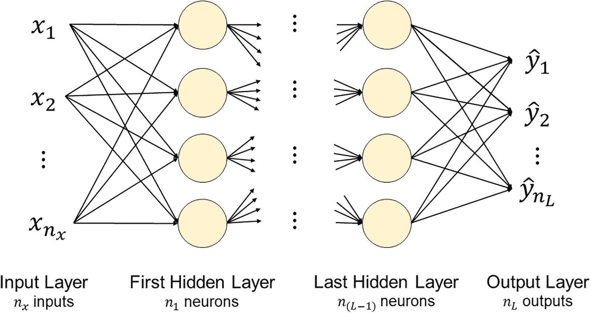

图 3-1

深度前馈神经网络的示意图，具有许多隐藏层，其中每个神经元都从前一层的每个神经元接收输入，并将输出馈送到下一层的每个神经元

从一个神经元跳到这一点是一个相当大的步骤。为了构建模型，我们需要使用矩阵形式，因此我们需要正确地确定所有矩阵维度。让我们首先讨论一些新的符号：

+   *L* 是隐藏层的数量，不包括输入层但包括输出层

+   *n*[*l*] 是层 *l* 中的神经元数量

在如图 3-1 所示的网络中，我们用 *N*[*神经元*] 表示神经元的总数，可以表示如下

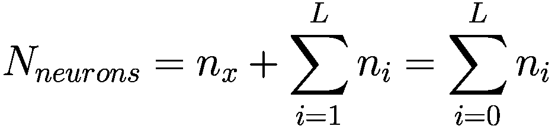

其中，按照惯例，我们定义 *n*[0] = *n*[*x*]。两个神经元之间的每个连接都将有自己的权重。让我们用 ![$$ {w}_{ij}^{\left[l\right]} $$](../images/463356_2_En_3_Chapter/463356_2_En_3_Chapter_TeX_IEq1.png) 表示层 *l* 中神经元 *i* 和层 *l* − 1 中神经元 *j* 之间的权重。图 3-2 仅显示了图 3-1 中通用网络的前两层（输入层和层 1），以及输入层第一个神经元和层 1 中所有其他神经元之间的权重。为了清晰起见，其他神经元都被灰色化。

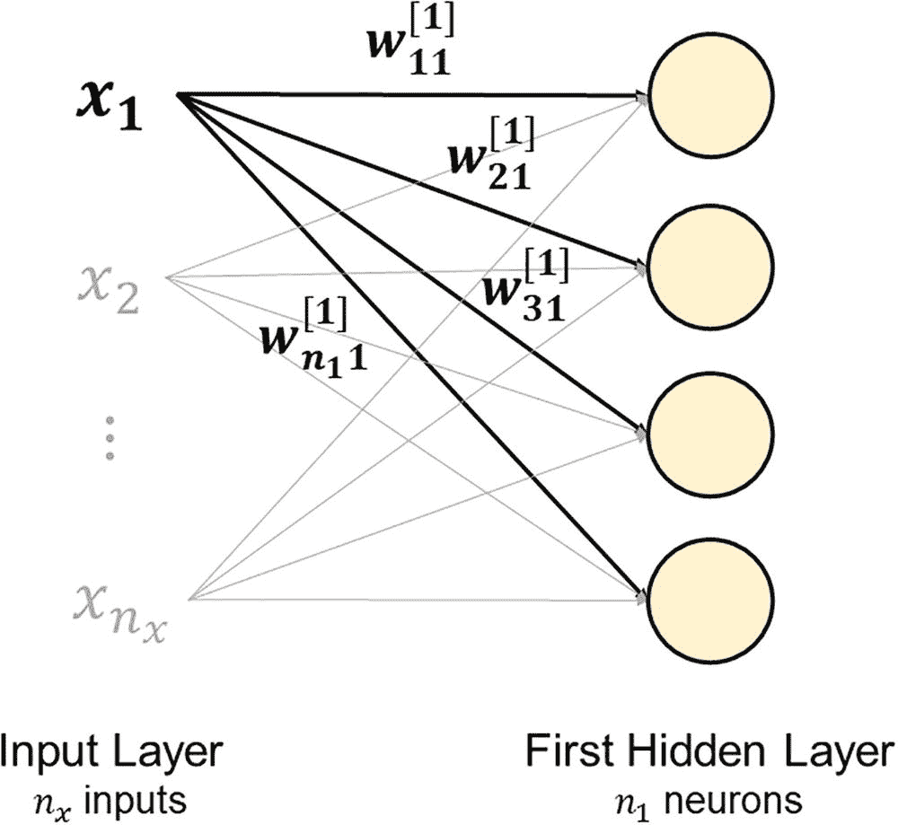

图 3-2

一个通用神经网络的头两层，包括输入层第一个神经元与其他第二层神经元之间的连接权重。所有其他神经元和连接都以浅灰色绘制，以使图更清晰

输入层和层 1 之间的权重可以写成如下矩阵

![$$ {W}^{\left[1\right]}=\left(\begin{array}{ccc}{w}_{11}^{\left[1\right]}&amp; \dots &amp; {w}_{1{n}_x}^{\left[1\right]}\ \\ {}\vdots &amp; \ddots &amp; \vdots \\ {}{w}_{n_11}^{\left[1\right]}&amp; \dots &amp; {w^{\left[1\right]}}_{n_1{n}_x}\end{array}\right) $$](../images/463356_2_En_3_Chapter/463356_2_En_3_Chapter_TeX_Equb.png)

这意味着矩阵*W*^([1])的维度是*n*[1] × *n*[x*]。这当然可以推广到任何两层*l*和*l* − 1 之间。这意味着我们用*W*^([*l*])表示的两个相邻层*l*和*l* − 1 之间的权重矩阵将具有*n*[l*] × *n*[l* − 1]的维度。按照惯例，*n*[0] = *n*[x*]是输入特征的数目（不是观察数目，我们用*m*表示）。

注意

两个相邻层*l*和*l* − 1 之间的权重矩阵，我们用*W*^([*l*])表示，它将有*n*[l*] × *n*[l* − 1]的维度，其中，按照惯例，*n*[0] = *n*[x*]是输入特征的数目。

偏置（用*b*表示）这次将是一个矩阵。请记住，每个接收输入的神经元都将有自己的偏置，因此当我们考虑我们的两层*l*和*l* − 1 时，我们需要*n*[l*]个不同的*b*值。我们用*b*^([l*])表示这个矩阵，它将有*n*[l*] × 1 的维度。

注意

两个相邻层*l*和*l* − 1 的偏置矩阵，我们用*b*^([l*])表示，它将有*n*[l*] × 1 的维度。

### 神经元的输出

现在，让我们考虑神经元的输出。首先，我们将考虑第一层的*i*^(*th*)个神经元（记住我们的输入层按定义是层 0）。让我们用![$$ {\hat{y}}_i^{\left[1\right]} $$](../images/463356_2_En_3_Chapter/463356_2_En_3_Chapter_TeX_IEq2.png)来表示它的输出，并假设层*l*中的所有神经元都使用我们用*g*^([l*])表示的相同的激活函数。那么我们将有

![$$ {\hat{y}}_i^{\left[1\right]}={g}^{\left[1\right]}\left({z}_i^{\left[1\right]}\right)={g}^{\left[i\right]}\kern0.75em \left(\sum \limits_{j=1}^{n_x}\left({w}_{ij}^{\left[1\right]}\ {x}_{i,j}+{b}_i^{\left[1\right]}\right)\right) $$](../images/463356_2_En_3_Chapter/463356_2_En_3_Chapter_TeX_Equc.png)

其中，我们用*z*[*i*]表示

![$$ {z}_i^{\left[1\right]}=\sum \limits_{j=1}^{n_x}\left({w}_{ij}^{\left[1\right]}\ {x}_{i,j}+{b}_i^{\left[1\right]}\right) $$](../images/463356_2_En_3_Chapter/463356_2_En_3_Chapter_TeX_Equd.png)

如您所想象，我们希望对于层 1 的所有输出都有一个矩阵，因此我们将使用这种表示法

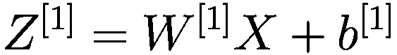

其中 *Z*^([1]) 将具有 *n*[1] × 1 的维度，并且我们用 *X* 表示包含所有观察值的矩阵（行表示特征，列表示观察）。我们假设层 *l* 中的所有神经元都使用相同的激活函数，我们将用 *g*^([*l*]) 表示。

我们可以轻松地将前一个方程推广到层 *l*：

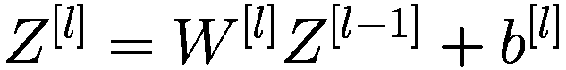

由于层 *l* 将从层 *l* − 1 获取其输入，我们只需将 *X* 替换为 *Z*^([*l* − 1])。*Z*^([*l*]) 将具有 *n*[*l*] × 1 的维度。我们的输出将以矩阵形式如下

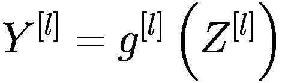

其中激活函数通常按元素逐个作用。

### 矩阵维度的简要概述

让我们总结一下我们迄今为止所描述的所有矩阵的维度

+   *W*^([*l*]) 的维度为 *n*[*l*] × *n*[*l* − 1]（其中我们根据定义有 *n*[0] = *n*[*x*]）

+   *b*^([*l*]) 的维度为 *n*[*l*] × 1

+   *Z*^([*l* − 1]) 的维度为 *n*[*l* − 1] × 1

+   *Z*^([*l*]) 的维度为 *n*[*l*] × 1

+   *Y*^([*l*]) 的维度为 *n*[*l*] × 1

在每种情况下，*l* 从 1 到 *L*。

#### 示例：三层网络的方程

为了使所有这些讨论更加具体，让我们考虑一个具有三层网络（因此 *L* = 3）的例子，其中 *n*[1] = 3, *n*[2] = 2, 和 *n*[3] = 1，如图 3-3 所示。

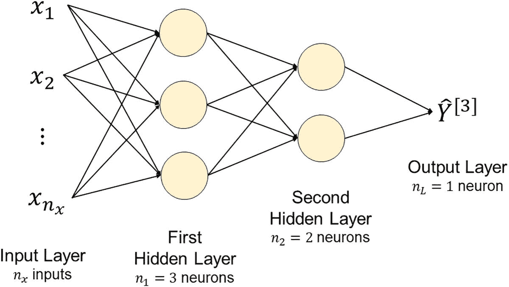

图 3-3

前馈神经网络的实际例子

在这种情况下，我们需要计算以下量

+   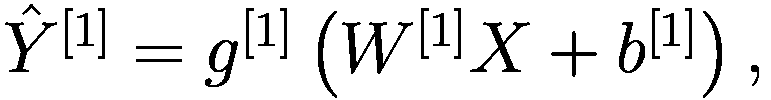 其中 *W*^([1]) 的维度为 3 × *n*[*x*]，*b* 的维度为 3 × 1，而 *X* 的维度为 *n*[*x*] × *m*

+   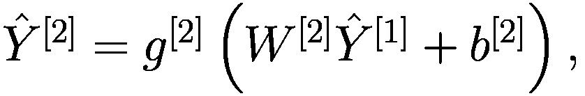 其中 *W*^([2]) 的维度为 2 × 3，*b* 的维度为 2 × 1，而 ![$$ {\hat{Y}}^{\left[1\right]} $$](../images/463356_2_En_3_Chapter/463356_2_En_3_Chapter_TeX_IEq5.png) 的维度为 3 × *m*

+   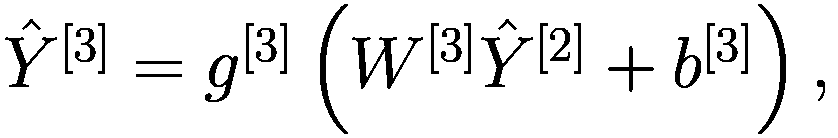，其中 *W*^([3]) 的维度为 1 × 2，*b* 的维度为 1 × 1，而 ![$$ {\hat{Y}}^{\left[2\right]} $$](../images/463356_2_En_3_Chapter/463356_2_En_3_Chapter_TeX_IEq7.png) 的维度为 2 × *m*

网络输出 ![$$ {\hat{Y}}^{\left[3\right]} $$](../images/463356_2_En_3_Chapter/463356_2_En_3_Chapter_TeX_IEq8.png) 将会有，正如预期的那样，维度为 1 × *m*。

所有这些可能看起来相当抽象（事实上也是如此）。你将在本章后面看到，在 Keras 中，仅通过构建正确的架构，就可以很容易地实现这些步骤。

### 全连接网络中的超参数

在刚刚讨论过的网络中，有相当多的参数你可以调整以找到最适合你问题的最佳模型。

注意

在训练阶段开始时固定并在此期间不改变的参数被称为超参数（如时代的数量）。

对于前馈网络，你需要调整以下额外的超参数：

+   层数，*L*

+   每层的神经元数量 *n*[*i*] 对于 *i*，从 1 到 L

+   每层的激活函数选择 *g*^([*l*])

当然，你仍然有以下超参数：

+   迭代次数（或时代）

+   学习率

### 多类分类的 softmax 激活函数简评

在接触到一些 TensorFlow 代码之前，你仍然需要学习一些理论知识。这类网络开始变得足够复杂，能够以合理的结果执行多类分类。为了做到这一点，我们必须引入 softmax 函数。

从数学的角度讲，softmax 函数 *S* 将一个 *k* 维向量转换成另一个 *k* 维的实值向量，每个值介于 0 和 1 之间，且这些值之和为 1。给定 *k* 个实值 *z*[*i*] 对于 *i* = 1, …, *k*，我们定义向量 ***z =*** (*z*[1], …, *z*[*k*])，并定义 softmax 向量函数 ***S***(***z***) = (*S*(***z***)[1] *S*(***z***)[2]… *S*(***z***)[*k*]) 如下

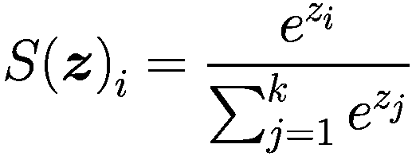

由于分母总是大于分子 *S*(***z***)[*i*] < 1。此外，我们还有

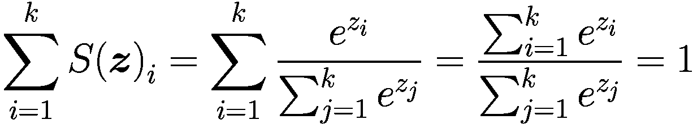

因此，*S*(***z***)[*i*] 的行为类似于概率，因为其 *i* 的和为 1，且其元素都小于 1。我们将把 *S*(***z***)[*i*] 视为 *k* 个可能结果上的概率分布。对于这个例子，*S*(***z***)[*i*] 将简单地表示我们的输入观察属于类别 *i* 的概率。假设我们正在尝试将一个观察结果分类到三个类别中。我们可能会得到以下输出：*S*(***z***)[1] = 0.1, *S*(***z***)[2] = 0.6, 和 *S*(***z***)[3] = 0.3。这意味着该观察结果有 10% 的概率属于类别 1，60% 的概率属于类别 2，30% 的概率属于类别 3。通常，你会选择将输入观察结果分类到概率较高的类别中——在这个例子中，概率为 60% 的类别 2。

注意

我们将把 *S*(***z***)[*i*]（其中 *i* = 1, …, *k*）视为 *k* 个可能结果上的概率分布。对于这个例子，*S*(***z***)[*i*] 将简单地表示我们的输入观察属于类别 *i* 的概率。

为了能够使用 softmax 函数进行分类，我们需要使用特定的输出层。我们需要使用十个神经元（在十个类别的多类分类问题中，如本章后面所看到的），每个神经元将输出 ***z***[*i*]，然后一个神经元将输出 ***S***(***z***)。这个神经元将使用 softmax 函数作为激活函数，并将输入设置为最后层的十个神经元的十个输出 ***z***[*i*]。在 Keras 中，你使用 `tf.keras.activations.softmax` 函数应用于具有十个神经元的最后层。记住，这个 Keras 函数将逐元素操作。你将在本章后面从始至终看到一个具体的实现例子。

## 简短插叙：过拟合

在训练深度神经网络时，你可能会遇到的最常见问题之一是 *过拟合*。由于网络的灵活性，你的网络可能会学习到由于噪声、错误或仅仅是错误数据而产生的模式。理解过拟合是什么非常重要，因此现在我们将通过一个实际例子来了解可能发生的情况，以便对它有一个基本的理解。为了更容易可视化，我们将使用为这个目的创建的简单二维数据集进行操作。

### 过拟合的实用示例

为了理解过拟合，考虑以下问题：找到最佳的多项式来逼近给定的数据集。给定一组二维点 (*x*[*i*], *y*[*i*])，我们希望找到形式为^(1) 的最佳多项式度 *K*：

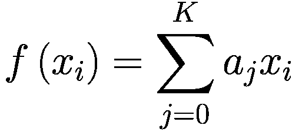

这最小化了均方误差

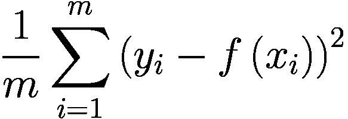

其中，通常 *m* 表示我们拥有的数据点的数量。我们不仅想要确定所有参数 *a*[*j*]，还要确定最佳逼近数据的 *K* 值。在这种情况下，*K* 衡量我们的模型复杂度。例如，对于 *K* = 0，我们简单地有 *f*(*x*[*i*]) = *a*[0]（一个常数），这是我们能够想到的最简单的多项式。对于更高的 *K*，我们有更高阶的多项式，这意味着我们的函数更复杂，有更多的参数可用于训练。这里是一个 *K* = 3 的函数示例

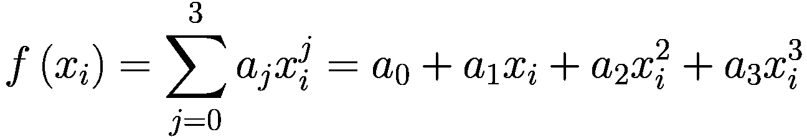

其中，我们有四个参数可以在模型训练过程中进行调整。让我们从二次多项式（*K* = 2）开始生成一些数据

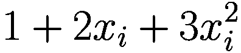

我们正在添加一些随机误差（这将使过拟合变得明显）。让我们首先导入我们的标准库，并添加 `curve_fit` 函数，该函数将自动最小化标准误差并找到最佳参数。不要过于担心这个函数；这里的目的是向您展示当您使用过于复杂的模型时可能会发生什么。

```py
import numpy as np
import matplotlib.pyplot as plt
from scipy.optimize import curve_fit
```

让我们定义一个二次多项式的函数

```py
def func_2(p, a, b, c):
return a + b*p + c*p**2
```

然后让我们生成数据集

```py
x = np.arange(-5.0, 5.0, 0.05, dtype = np.float64)
y = func_2(x, 1, 2, 3) + 18.0 * np.random.normal(0, 1, size = len(x))
```

为了给函数添加一些随机噪声，我们使用了 `np.random.normal(0, 1, size = len(x))` 函数，它生成一个长度为 `len(x)`、平均值为 0、标准差为 1 的正态分布的 NumPy 数组。

图 3-4 展示了 *a* = 1, *b* = 2, 和 *c* = 3 的数据。

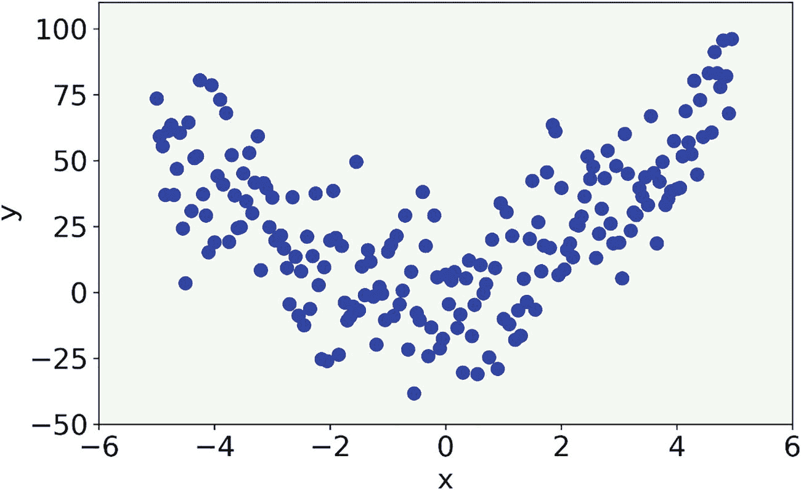

图 3-4

我们生成的数据，*a* = 1, *b* = 2, 和 *c* = 3

现在让我们考虑一个过于简单以捕捉数据特征的模型，这意味着我们将看到具有高偏差^(2)的模型能做什么。考虑一个线性模型（*K* = 1）。代码将是

```py
def func_1(p, a, b):
return a + b*p
popt, pcov = curve_fit(func_1, x, y)
```

这将给出使标准误差最小的 *a* 和 *b* 的最佳值。在图 3-5 中，很明显这个模型完全错过了数据的主要特征，因为它过于简单。

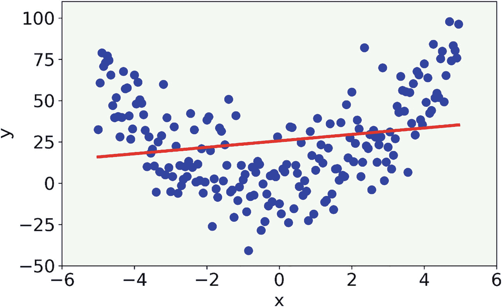

图 3-5

线性模型因为过于简单而错过了数据的主要特征。在这种情况下，模型具有高偏差

让我们尝试拟合一个二次多项式（*K* = 2）。结果如图 3-6 所示。

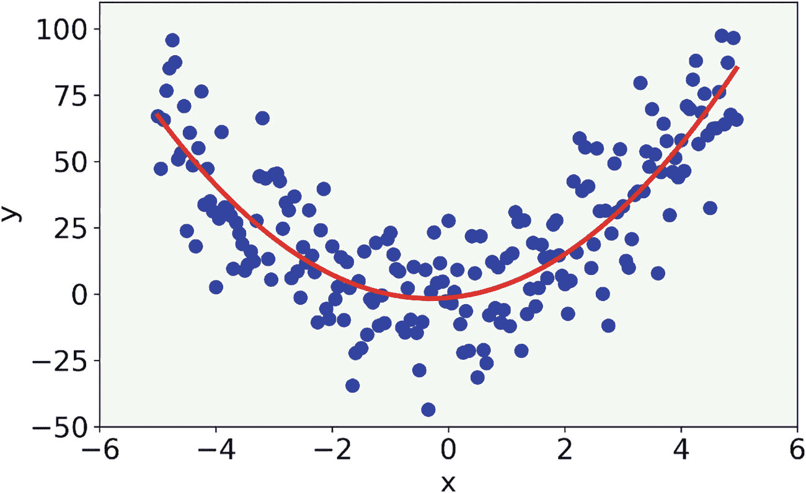

图 3-6

二次多项式的结果（红色线）

这样更好。这个模型似乎捕捉到了数据的主要特征，忽略了随机噪声。现在让我们尝试一个非常复杂的模型，一个 21 次多项式（*K* = 21）。结果如图 3-7 所示。

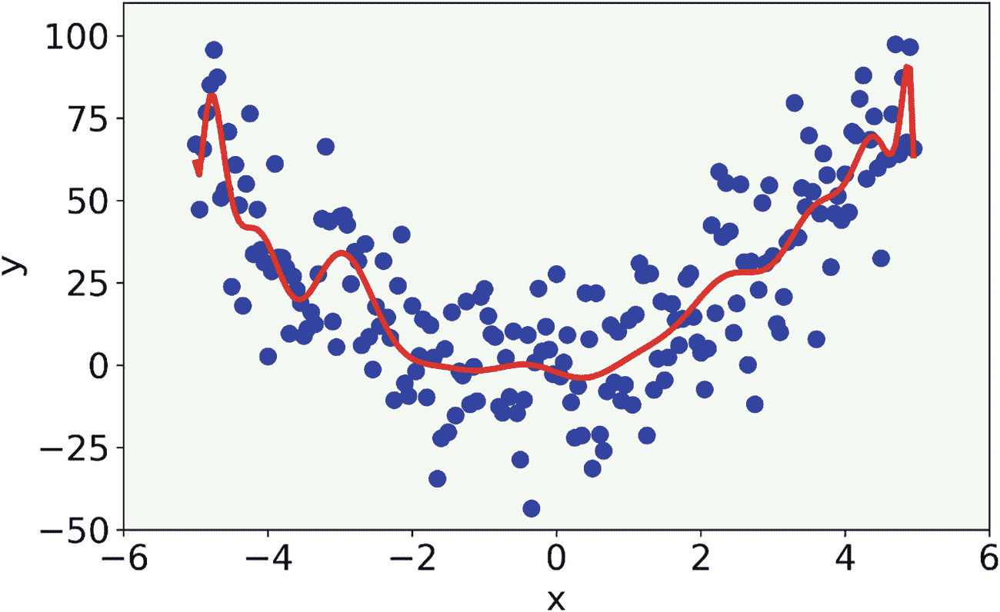

图 3-7

21 次多项式模型的结果

该模型显示了我们所知是错误的特点（因为我们创建了我们的数据）。这些特点并不存在，但模型非常灵活，能够捕捉到我们通过噪声引入的随机变异性。使用这种高阶多项式出现振荡是错误的，并且不能正确描述数据。

在这种情况下，我们谈论的是*过拟合*，这意味着我们开始用我们的模型捕捉到由于随机误差而产生的特征。很容易理解这很糟糕地泛化。如果我们将这个 21 次多项式模型应用于新数据，它将不起作用，因为新数据中的随机噪声将不同，所以图 3-7 中代表的振荡将没有意义。

图 3-8 显示了使用十个不同随机噪声值生成的数据拟合得到的最佳 21 次多项式模型。您可以清楚地看到它的变化有多大。它并不稳定，并且强烈依赖于随机噪声。振荡总是不同的！在这种情况下，我们谈论的是高方差*.*

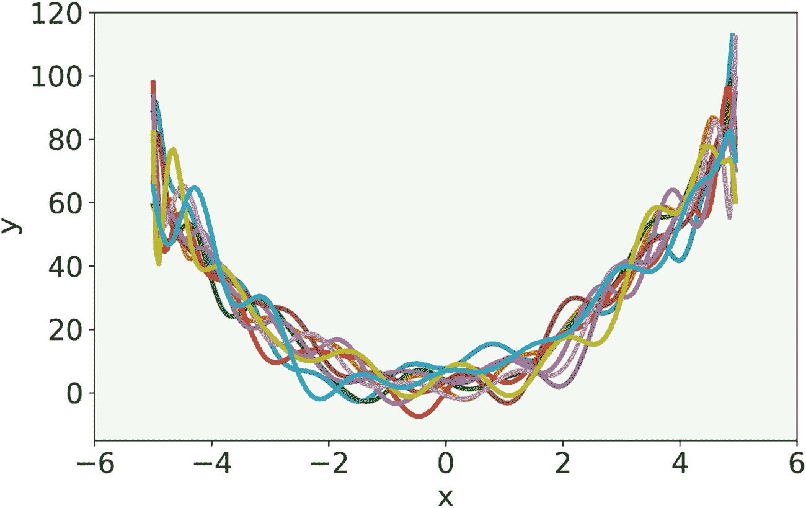

图 3-8

我们将 21 次多项式拟合到使用不同随机噪声值生成的十个不同数据集上的模型的结果

现在，让我们用这个线性模型运行相同的图表，同时像图 3-8 中那样改变随机噪声。您可以在图 3-9 中看到结果。

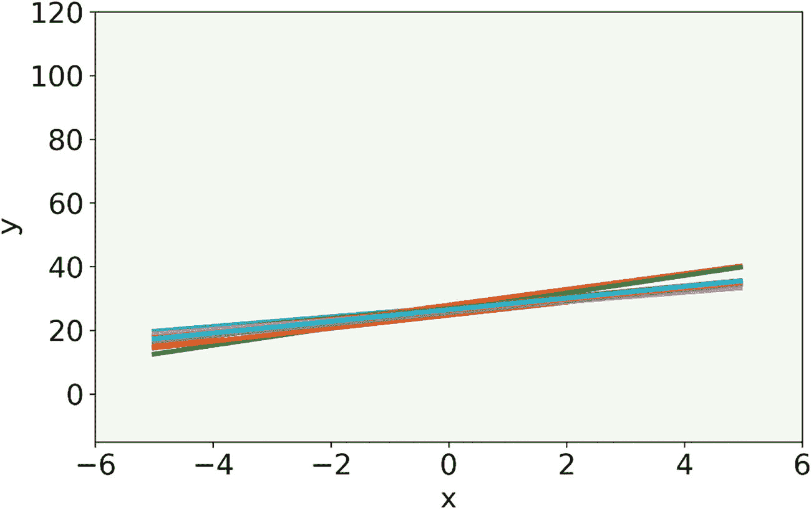

图 3-9

将线性模型应用于我们随机改变随机噪声的数据的结果。为了更容易与图 3-8 进行比较，我们使用了相同的刻度

您可以看到模型要稳定得多。线性模型没有捕捉到依赖于噪声的特点，但它错过了数据的主要特点（凹性质）。我们在这里谈论的是高偏差*.*

图 3-10 说明了偏差和方差的定义。

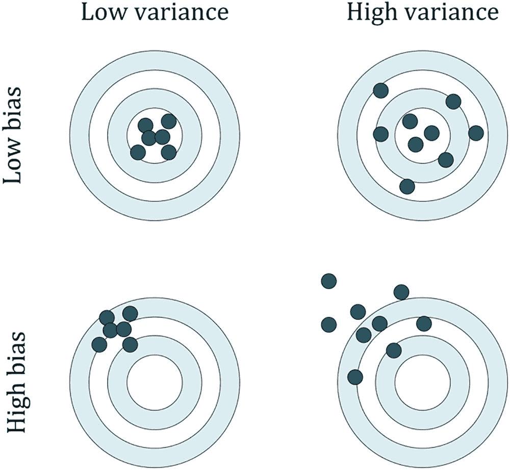

图 3-10

偏差是衡量测量值与真实值（图中的中心）接近程度的指标，方差是衡量测量值围绕平均值（不一定是真实值，如您在左侧所看到的）分散程度的指标

在神经网络的情况下，我们有许多超参数（层数、每层的神经元数量、激活函数等），很难知道我们处于哪种状态。我们如何判断我们的模型是否有高方差或高偏差，例如？整章内容都致力于这个主题，但进行这种错误分析的第一步是将数据集分成两个不同的子集。让我们看看这意味着什么，以及为什么我们必须这样做。

注意

*过度拟合*的本质是无意中提取了一些残留变异（即噪声），好像这种变异代表了潜在模型结构[1]。相反的是*欠拟合*，当模型无法捕捉数据的结构时。

过度拟合和深度神经网络的问题在于无法轻易可视化结果。因此，我们需要不同的方法来确定我们的模型是否过度拟合、欠拟合，或者恰到好处。这可以通过将数据集分成不同的部分并比较各部分的指标来实现。你将在下一节中了解基本思想。

### 基本错误分析

要检查你的模型表现如何并执行适当的错误分析，你需要将你的数据集分成两部分^(3)：

+   训练集：模型使用这个数据集、输入和相对标签以及梯度下降等优化算法进行训练。通常这被称为训练集。

+   开发（或验证）集：训练好的模型将用于这个数据集来检查其表现。在这个数据集上，我们将测试不同的超参数。例如，我们可以在训练数据集上训练两个具有不同层数的不同模型，并在该数据集上测试它们，以检查它们的表现。通常这被称为开发集。

整整一章都致力于错误分析，但了解为什么分割数据集很重要是个好主意。假设我们正在处理分类，我们用来判断模型好坏的指标是准确率减一，换句话说，是错误分类的案例百分比。

表 3-1

高偏差模型与高方差模型之间差异的示例

| 错误 | 案例 A | 案例 B | 案例 C | 案例 D |
| --- | --- | --- | --- | --- |
| 训练集错误率 | 1% | 15% | 14% | 0.3% |
| 开发集错误率 | 11% | 16% | 32% | 1.1% |

让我们考虑表 3-1 中报告的三个案例：

+   **案例 A**：我们过度拟合（高方差），因为我们训练集上的表现非常好，但我们的模型对开发集的泛化能力非常差（再次查看图 3-8）。

+   **案例 B**：我们看到了高偏差的问题，这意味着我们的模型在两个数据集上总体表现不佳（再次查看图 3-9）。

+   **案例 C**：我们有一个高偏差（模型无法很好地预测训练集）和高方差（模型在开发集上泛化能力不佳）。

+   **案例 D**：一切看起来都很正常。训练集上的错误率很好，开发集上的数据也很好。这是我们最佳模型的良好候选。

我们将在本书的后面部分更好地解释所有这些概念，并提供如何解决高偏差、高方差、两者以及更复杂情况的问题的配方。

为了回顾，要进行非常基本的错误分析，你需要将你的数据集分成至少两个集合：训练集和开发集。然后你应该在这两个集合上计算你的指标并比较它们。你希望有一个在训练集上错误率低、在开发集上错误率也低（如前一个例子中的案例 D）的模型，并且这两个值应该是可比较的。

注意

你从这个部分的主要收获应该是两方面的：**1)** 你需要一套食谱和指南来理解你的模型表现如何：它是过拟合、欠拟合，还是恰到好处？**2)** 为了回答问题 1 并进行分析，你需要将数据集分成两部分（在本书的后面，你还将看到你可以如何使用分成三部分甚至四部分的数据集）。

## 在 Keras 中实现前馈神经网络

在 Keras 中构建前馈神经网络非常简单，它只是你在上一章构建的单神经元模型的推广。让我们比较一下这两种情况。这里是你所拥有的单神经元模型 Keras 实现图

```py
model = keras.Sequential([
layers.Dense(1, input_shape = [...])
])
```

以下是一个包含 15 个神经元（我们将用于在 Zalando 数据集上的多类分类任务）的单隐藏层前馈网络模型：

```py
model = keras.Sequential([
layers.Dense(15, input_shape = [...])
layers.Dense(10)
])
```

如你所见，我们在隐藏层（在单神经元模型中已经是输出层）中添加了更多的神经元（15 个），并且添加了输出层，由十个神经元组成，因为我们有十个类别。如你所注意到的，你可以通过简单地一层层添加到堆栈中轻松创建非常复杂的模型。

在接下来的段落中，你将看到一个关于如何使用此模型的实际例子，选择正确的激活函数和正确的损失函数（作为附加参数）来解决多类分类任务。

## 使用前馈神经网络进行多类分类

我们将要一起解决的任务是 Zalando 数据集上的多类分类问题。它包括预测十个可能案例（十种不同的服装）中的相应标签。为了解决这个问题，我们将使用前馈网络架构并尝试不同的配置（不同的优化器和架构），进行一些错误分析以查看哪种情况更好。让我们先看看数据。

### Zalando 数据集的实例

Zalando SE 是一家总部位于柏林的德国商业公司。该公司维护一个跨平台商店，销售鞋子、服装和其他时尚商品 [2]。为了参加 Kaggle 比赛，他们准备了一个与 MNIST 类似的 Zalando 服装图像数据集 [4]，其中他们提供了 60000 张训练图像和 10000 张测试图像。（如果你不知道 Kaggle 是什么，可以查看他们的网站 [3]，在那里你可以参加许多比赛，目标是使用数据科学解决问题。）与 MNIST 一样，每个图像都是 28x28 像素的灰度图。他们将所有图像分为十个不同的类别，并为每个图像提供了标签。数据集有 785 列，其中第一列是类别标签（一个从 0 到 9 的整数）和剩余的 784 列包含图像的像素灰度值（你可以计算出 28x28=784）。

每个训练和测试示例都被分配到以下标签之一（如文档中所述）：

+   0: T 恤/上衣

+   1: 裤子

+   2: 开衫

+   3: 裙子

+   4: 外套

+   5: 凉鞋

+   6: 衬衫

+   7: 运动鞋

+   8: 背包

+   9: 袜靴

图 3-11 显示了从数据集中随机选择的每个类别的示例。


图 3-11

Zalando 数据集中每个类别的示例之一

该数据集是在 MIT 许可证下提供的 4。数据文件可以从 Kaggle（[`https://www.kaggle.com/zalando-research/fashionmnist/data`](https://www.kaggle.com/zalando-research/fashionmnist/data)）或直接从 GitHub（[`https://github.com/zalandoresearch/fashion-mnist`](https://github.com/zalandoresearch/fashion-mnist)）下载。如果你选择第二种选项，你需要准备一下数据（你可以使用位于 [`https://pjreddie.com/projects/mnist-in-csv/`](https://pjreddie.com/projects/mnist-in-csv/) 的脚本将其转换为 CSV 格式）。如果你从 Kaggle 下载，你将获得所有正确格式的数据。你将在 Kaggle 网站上找到两个压缩的 CSV 文件。ZIP 文件包含 `fashion-mnist_train.csv`，有 60000 张图像（大约 130 MB）和 `fashion-mnist_test.csv`，有 10000 张（大约 21 MB）。

在我们的例子中，我们将以第三种方式检索数据集：从 TensorFlow 数据集目录（[`https://www.tensorflow.org/datasets/catalog/fashion_mnist`](https://www.tensorflow.org/datasets/catalog/fashion_mnist)），因为这样我们就不必执行任何预处理步骤，并且可以自动将数据导入我们的笔记本中。现在，让我们开始编写代码吧！

我们需要在代码中导入以下内容

```py
# general libraries
import pandas as pd
import numpy as np
import matplotlib
import matplotlib.pyplot as plt
import matplotlib.font_manager as fm
from random import *
import time
# tensorflow libraries
from tensorflow.keras.datasets import fashion_mnist
import tensorflow as tf
from tensorflow import keras
from tensorflow.keras import layers
import tensorflow_docs as tfdocs
import tensorflow_docs.modeling
```

然后，为了检索数据集，我们可以简单地运行以下命令

```py
((trainX, trainY), (testX, testY)) = fashion_mnist.load_data()
```

非常简单！现在我们有了两个 NumPy 矩阵（`trainX` 和 `testX`），它们包含描述每个训练和测试图像的所有像素值，以及两个 NumPy 数组（`trainY` 和 `testY`），它们包含相关的标签。

让我们打印数据集的维度

```py
print('Dimensions of the training dataset: ', trainX.shape)
print('Dimensions of the test dataset: ', testX.shape)
print('Dimensions of the training labels: ', trainY.shape)
print('Dimensions of the test labels: ', testY.shape)
```

这将返回以下输出

```py
Dimensions of the training dataset:  (60000, 28, 28)
Dimensions of the test dataset:  (10000, 28, 28)
Dimensions of the training labels:  (60000,)
Dimensions of the test labels:  (10000,)
```

小贴士

记住，你不应该关注 Python 的实现。关注模型，关注实现背后的概念。你可以使用 pandas、NumPy 或甚至 C 来实现相同的结果。尽量集中精力准备数据，如何归一化数据，如何检查训练，等等。

如你所见，我们有一个由 60000 个项目组成的训练数据集，每个项目存储为 28x28 像素的图像，以及一个由 10000 个项目组成的测试数据集，以相同的方式存储。然后，与每个数据集相关联的标签数组。

现在我们需要修改我们的数据以获得图像的“展平”版本，即一个包含 754 个像素的数组，而不是 28x28 像素的矩阵。这一步是必要的，因为我们讨论前馈网络架构时已经看到，它接收所有特征作为单独的值作为输入。因此，我们需要将所有像素存储在同一个数组中。相反，卷积神经网络（CNNs）不处理图像的展平版本，但这将是第七章节的内容。现在，请记住这一点。

以下行将矩阵维度进行重塑

```py
data_train = trainX.reshape(60000, 784)
data_test = testX.reshape(10000, 784)
```

让我们总结到目前为止的数据

+   `labels`：具有 (60000) 维度，包含类别标签（从 0 到 9 的整数）

+   `train`：具有 *m* × *n*[*x*] (60000x784) 维度，包含特征，其中每一列包含图像中单个像素的灰度值（记住 28x28=784）

再次查看图 3-11 以了解图像的外观。最后，让我们将输入归一化，使其值从 0 到 255（灰度值）变为仅介于 0 和 1 之间。这可以通过代码轻松实现

```py
data_train_norm = np.array(data_train/255.0)
data_test_norm = np.array(data_test/255.0)
```

在开发网络之前，我们需要解决另一个问题。在执行多类分类任务时，标签必须以不同的形式提供。

### 调整 Softmax 函数的标签：One-Hot 编码

在分类中，我们使用以下代价函数（称为交叉熵）

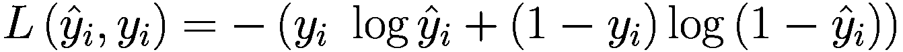

其中 *y*[*i*] 包含我们的标签，而  是我们网络的结果。因此，这两个元素必须具有相同的维度。在我们的例子中，我们看到我们的网络将输出一个包含十个元素的向量，而数据集中的标签只是一个标量。因此，我们有一个  向量，其维度为 (10,1)，而 *y*[*i*] 的维度为 (1,1)。如果我们不做些聪明的事情，这将不起作用。我们需要将标签转换为一个维度为 (10,1) 的向量。一个包含每个类值的向量，但我们应该使用什么值呢？

我们需要做的是所谓的独热编码^(5)。这意味着我们将使用此算法将我们的标签（从 0 到 9 的整数）转换为维度为 (1,10) 的向量：我们的独热编码向量除了标签的索引处外，其余都是零。例如，对于标签 2，我们的 1x10 向量除了索引为 2 的位置外，其余都是零，换句话说，它将是 (0,0,1,0,0,0,0,0,0,0)。让我们看看其他一些例子（见表 3-2)。

表 3-2

独热编码工作原理的示例。记住标签从 0 到 9，作为索引

| 标签 | 独热编码标签 |
| --- | --- |
| 0 | (1,0,0,0,0,0,0,0,0,0) |
| 2 | (0,0,1,0,0,0,0,0,0,0) |
| 5 | (0,0,0,0,0,1,0,0,0,0) |
| 7 | (0,0,0,0,0,0,0,1,0,0) |

图 3-12 显示了标签独热编码过程的图形表示。

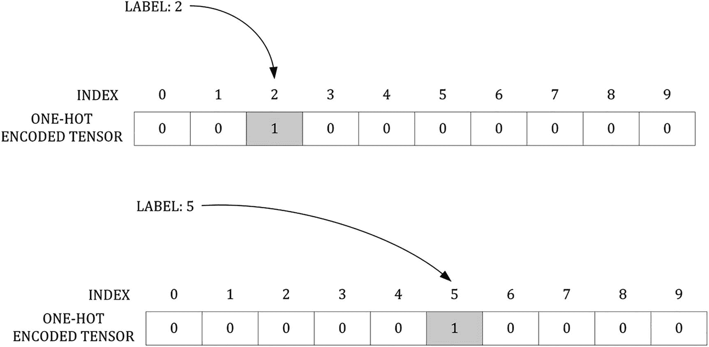

图 3-12

标签独热编码过程的图形表示。两个标签（2 和 5）在两个向量中进行了独热编码。向量中的灰色元素是变为 1 的元素，而白色标记的元素保持为 0

Sklearn 有几种自动执行此操作的方法（例如，检查 `OneHotEncoder()` 函数）。但我认为手动执行是有教育意义的，以便真正看到它是如何完成的。一旦你理解了为什么需要它，以及你需要它的格式，你就可以使用你最喜欢的函数。执行此操作的 Python 代码非常简单：

```py
labels_train = np.zeros((60000, 10))
labels_train[np.arange(60000), trainY] = 1
labels_test = np.zeros((10000, 10))
labels_test[np.arange(10000), testY] = 1
```

首先，你创建一个具有正确维度的新的数组：(60000,10)，然后使用 NumPy 函数 `np.zeros((60000,10))` 在其中填充零。然后，使用 pandas 功能仅将 1 设置到与标签本身相关的列中，使用切片数据框的行 `labels_train[np.arange(60000), trainY] = 1`（当然，测试数据集的情况也是如此）。最后，你获得维度为 (60000,10) 的数组，其中每一行表示一个不同的观察值。

现在，我们可以比较 *y*[*i*] 和 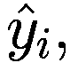，因为它们对于单个观察值或当考虑整个测试数据集（10000,10）时，都具有 (10,1) 的维度。当然，对于训练数据集也可以做出同样的断言。中的每一列将代表我们的观察值属于特定类别的概率。在最后计算我们模型的准确率时，我们将具有最高概率的类别分配给每个观察值。

注意

我们的网络将为我们提供每个观察值属于十个类别之一的十个概率。最后，我们将具有最高概率的类别分配给观察值。

### 前馈网络模型

我们将从只有一个隐藏层的网络开始。我们将有一个包含 784 个特征的输入层，然后是一个隐藏层（我们将改变神经元的数量），然后是一个有十个神经元的输出层，这些神经元将输出输入到一个具有 softmax 函数作为激活函数的神经元。图 3-13 展示了网络的图形表示。我们将花一些时间来查看各个部分，特别是输出层。

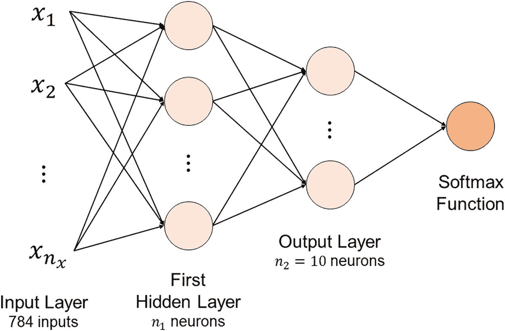

图 3-13

具有单个隐藏层的网络架构。在分析过程中，我们将改变隐藏层中的神经元数量 *n*[1]。

让我们看看为什么这个奇怪的输出层有十个神经元，以及为什么我们需要一个额外的神经元来执行 softmax 函数。记住，我们希望能够告诉每个图像属于哪个类别。为此，正如在讨论 softmax 函数时解释的那样，我们需要为每个观察结果获得十个输出：每个输出是图像属于每个类别的概率。所以给定输入 ***x***^((*i*))，我们需要十个值：*P*(*y*[*i*] = 1| *x*[*i*])，*P*(*y*[*i*] = 2| *x*[*i*]) …，*P*(*y*[*i*] = 10| *x*[*i*])（观察类别 *y*^((*i*)) 是输入 *x*[*i*] 给定的十个可能性中的一个的概率）。或者，换句话说，我们的输出应该是一个 1x10 维的向量，形式如下

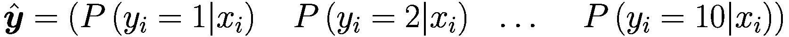

由于观察结果必须是单个类别，因此必须满足此条件

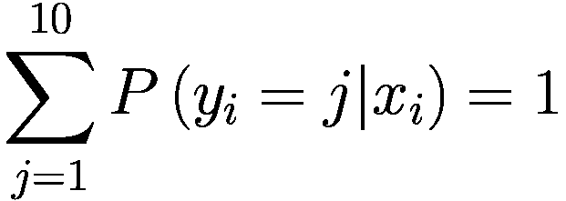

这可以理解为：观察结果有 100% 的概率属于十个类别之一。或者，换句话说，所有概率的总和必须为 1。我们通过两个步骤解决这个问题：

+   我们创建了一个包含十个神经元的输出层，这样我们就会得到十个输出值。

+   然后，我们将十个值输入到一个新的神经元（让我们称它为“softmax 神经元”）中，该神经元将接受十个输入并输出十个值，这些值都小于 1，总和为 1。

将 *z*[*i*] 称为最后一层中 *i*^(*th*) 个神经元的输出（其中 *i* 从 1 到 10），我们将有

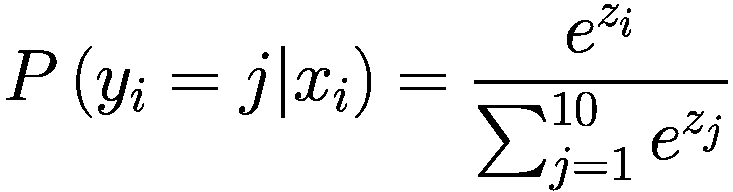

在 Keras 中，这很简单。但了解每一行代码的确切作用是有教育意义的。这就是 Keras 函数`model.add(Dense(10, activation = '`**softmax**`'))`的作用。它接受一个向量作为输入，并返回一个与输入具有相同维度的向量，但“归一化”，如上所述。换句话说，如果我们把***z =*** (*z*[1]  *z*[2] …  *z*[10])输入到函数中，它将返回一个与***z***具有相同维度的向量，即 1x10，其中每个元素加到其他元素上等于 1。

#### Keras 实现

现在是时候用 Keras 构建我们的模型了。以下代码将完成这项工作

```py
def build_model(opt):
# create model
model = Sequential()
# add first hidden layer and set input dimensions
model.add(Dense(15, input_dim = 784, activation = 'relu'))
# add output layer
model.add(Dense(10, activation = 'softmax'))
# compile model
model.compile(loss = 'categorical_crossentropy',
optimizer = opt,
metrics = ['categorical_accuracy'])
return model
```

现在，我们不会逐行分析代码，因为你现在应该已经理解了如何构建基本的 Keras 模型（记得我们在第二章中的简单单神经元模型）。但代码中还有一些细节需要强调：

+   我们的最后层将使用 softmax 函数：`model.add(Dense(10, activation = 'softmax'))`。

+   这两个参数——15 (*n*[1]) 和 10 (*n*[2])——定义了不同层的神经元数量。记住，第二个（输出）层必须有十个神经元才能使用 softmax 函数。但我们将玩弄*n*[1]的值。增加*n*[1]将增加网络的复杂性。

+   我们将分类交叉熵(`loss = 'categorical_crossentropy'`)设置为损失函数，将分类准确率(`metrics = ['categorical_accuracy']`)设置为度量标准。选择这个的原因是我们已经对标签进行了热编码，因此需要这些函数的分类版本。

现在，让我们尝试像上一章中为单神经元模型所做的那样进行训练。代码结构始终相同。尝试在你的笔记本电脑上运行以下代码：

```py
model = build_model(tf.keras.optimizers.SGD(momentum = 0.0, learning_rate = 0.01))
EPOCHS = 1000
history = model.fit(
data_train_norm, labels_train,
epochs = EPOCHS, verbose = 0,
batch_size = data_train_norm.shape[0]
)
```

我们将标准版本的梯度下降设置为优化器。最大的问题是，按照我们编写的代码，模型将为所有观测值（共 60,000 个）创建一个巨大的矩阵，然后在遍历所有观测值之后才会修改权重和偏差。这需要大量的资源、内存和 CPU。如果这是我们唯一的选择，我们就会陷入困境。记住，在深度学习领域，784 个特征的 60,000 个示例根本不是一个大数据集。我们需要找到一种让这个模型更快学习的方法。

此外，请注意，在训练模型时，我们在 Keras 的`fit`方法中设置了`batch_size = data_train_norm.shape[0]`。Keras 默认将批大小设置为 32 个观测值[5]，但批梯度下降在所有训练观测值都被网络看到之后才会更新权重和偏差。因此，我们需要更改此参数以获得基本梯度下降版本。

同样，我们还需要在`tf.keras.optimizers.SGD`方法内部设置`momentum = 0.0`。总结一下，由于 Keras 没有包含执行标准梯度下降的功能，我们使用了随机梯度下降函数，将动量设置为 0，并将批量大小设置为观测值的总数。

为了进行一些基本的错误分析，你还需要开发数据集，我们在前面的段落中已经加载并准备好了。

不要因为文件名中包含单词 test 而感到困惑。有时开发数据集也被称为测试数据集。当我们在本书的后面讨论错误分析时，我们使用三个数据集：训练集、开发集和测试集。为了保持书中的连贯性，我们在这里也使用名称*dev*，以免你在不同章节中因为不同的名称而混淆。

要计算开发数据集上的准确度，我们使用`model.evaluate()`函数并将构建的模型应用于开发数据集。

```py
test_loss, test_accuracy = model.evaluate(data_test_norm, labels_test, verbose = 0)
print('The accuracy on the test set is equal to: ', int(test_accuracy*100), '%.')
```

返回

```py
The accuracy on the test set is equal to:  74 %.
```

回顾一下，我们将训练在 60,000 个观测值上的模型应用于开发测试集（由 10,000 个观测值组成），然后计算了两个数据集上的准确度。

一个好的练习是将这个计算包含在你的模型中，这样你的`build_model()`函数会自动返回两个值。

### 梯度下降变体性能

在第二章中，我们研究了不同的 GD 变体，并讨论了它们的优缺点。现在让我们看看它们在实际案例中的区别。

#### 比较变体

让我们总结一下对梯度下降的三个变体在 100 个 epoch（见表 3-3）的发现。

表 3-3

比较三种梯度下降变体的性能

| 梯度下降变体 | 运行时间 | 成本函数的最终值 | 准确度 |
| --- | --- | --- | --- |
| 批量梯度下降 | 0.35 min | 1.86 | 43% |
| 随机梯度下降 | 60.23 min | 0.26 | 91% |
| 小批量梯度下降（小批量大小 = 50） | 1.70 min | 0.26 | 90% |

现在你可以看到，在小批量梯度下降在执行时间和分类性能方面确实是最佳折衷方案。现在你应该相信，在所有梯度下降类型中，它目前是作为深度神经网络优化器的首选方法，因为它可以达到高性能，同时在性能和执行时间之间保持良好的权衡。

图 3-14 展示了成本函数如何随着不同的批量大小而降低。注意，与 epoch 数量相比，较小的批量大小意味着更快的（不是时间上的）降低。

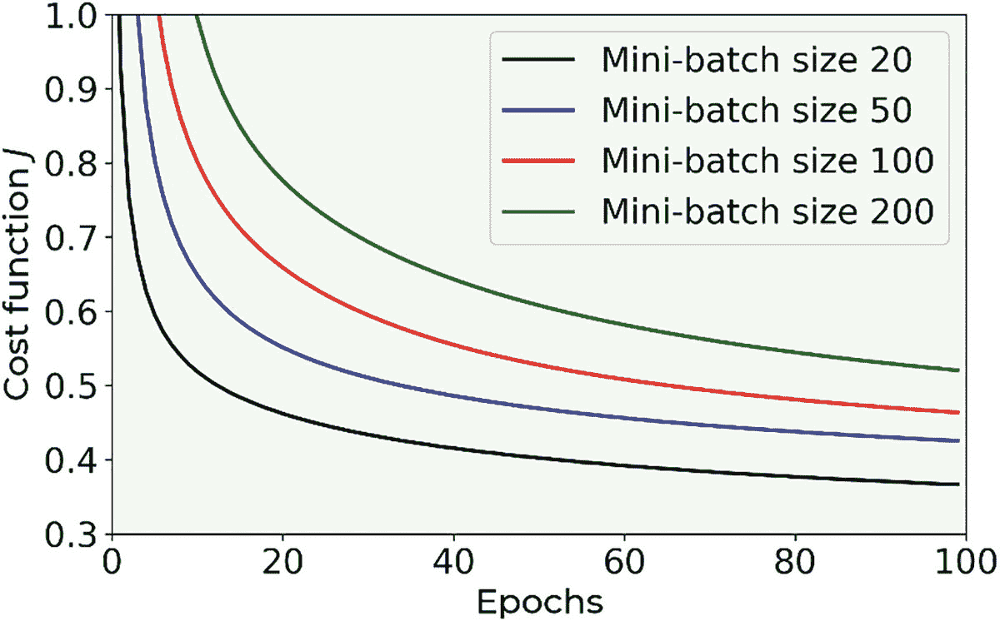

图 3-14

比较不同批量大小的小批量梯度下降算法的收敛速度。此图使用的学习率为*γ* = 0.0001。请注意，每种情况所需的时间并不相同。批量大小越小，算法需要的时间越多。

提示

在运行时间和收敛速度（相对于 epoch 数量）之间取得最佳折衷方案是通过使用 mini-batch 梯度下降实现的。mini-batch 的大小取决于你的问题，但像 30 或 50 这样的小数字是一个好的起点。你将找到一个运行时间和收敛速度之间的折衷方案。

要了解运行时间如何取决于成本函数在 100 个 epoch 后可以达到的值，请参阅图 3-15（与第二章相比，时间是用真实数据集评估的）。每个点都标有该次运行使用的 mini-batch 大小。你可以看到，减小 mini-batch 大小会快速降低 100 个 epoch 后*J*的值，而不会显著增加运行时间，直到你达到大约 20 的 mini-batch 大小值。在这个点上，时间开始快速增加，而 100 个 epoch 后的*J*值不再降低并趋于平稳。

最佳折衷方案是选择一个使曲线更接近零（运行时间短且成本函数值小）的 mini-batch 大小值，在这个特定情况下是 20。这就是为什么这些值是最常见的。从那时起，运行时间的增加变得非常快，而且没有帮助。请注意，对于其他数据集，最佳值可能非常不同。因此，尝试不同的值以查看哪个效果最好是值得的。在非常大的数据集中，你可能想尝试更大的值，例如 200、300 或 500。在这种情况下，我们有 60,000 个观测值和 50 的 mini-batch 大小，这意味着有 1200 个批次。如果你有更多的数据，例如 1e6 个观测值，50 的 mini-batch 大小将给出 20,000 个批次。所以，请记住这一点，并尝试不同的值以查看哪个效果最好。

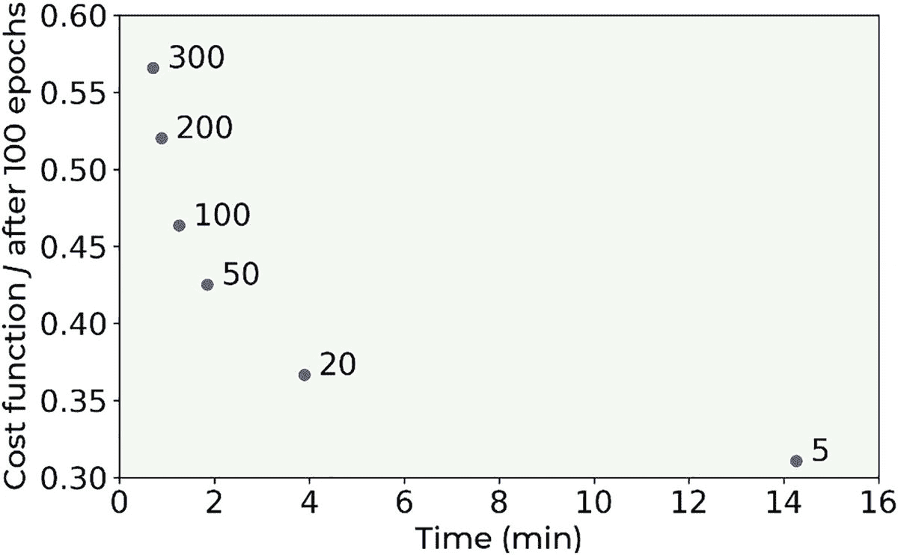

图 3-15

图表显示了 Zalando 数据集在 100 个 epoch 后成本函数的值与运行 100 个 epoch 所需的运行时间。请注意，这些点是单次运行，图表仅指示依赖关系。在多次运行中评估时，运行时间和成本函数有很小的变化。这种变化在图表中没有显示

作为一个小贴士，编写一个运行评估的函数是良好的编程实践。这样，你可以调整超参数（如 mini-batch 大小），而无需反复复制粘贴相同的代码块。以下是一个你可以用来用不同的 mini-batch 大小（当然，你可以添加更多要优化的参数，如 epoch 数量、学习率等）来训练我们的模型的函数：

```py
def mini_batch_gradient_descent(mb_size):
# build model
model_mbgd = build_model(tf.keras.optimizers.SGD(momentum = 0.9, learning_rate = 0.0001))
# set number of epochs
EPOCHS = 100
# train model
history_mbgd = model_mbgd.fit(
data_train_norm, labels_train,
epochs = EPOCHS, verbose = 0,
batch_size = mb_size,
callbacks = [tfdocs.modeling.EpochDots()])
# save performances
hist_mbgd = pd.DataFrame(history_mbgd.history)
hist_mbgd['epoch'] = history_mbgd.epoch
return hist_mbgd
```

小贴士

将超参数作为输入编写函数是常见的做法。这允许你使用不同的超参数值测试不同的模型，并检查哪个更好。

### 错误预测的例子

使用批量梯度下降运行模型——一个包含 15 个神经元的隐藏层，运行 1000 个周期，学习率为 0.0001——将在训练集上给出 86% 的准确率。你可以通过在隐藏层中使用更多的神经元来提高准确率。例如，使用 50 个神经元，1000 个周期，学习率为 0.0001，你可以在训练集上达到 87%，在测试集上达到 85%。检查一些错误分类图像的几个例子，看看你是否可以从这些错误中学习到一些东西。图 3-16 展示了每个类别的错误分类图像的例子。


图 3-16

每个类别的错误分类图像的一个例子。在每个图像上，报告真实类别（标记为“True”）和预测类别（标记为“Pred”）。此模型有一个包含 15 个神经元的隐藏层，已经运行了 1000 个周期，学习率为 0.0001

一些错误是可以理解的，例如将外套错误地分类为开衫。我们很容易犯同样的错误。另一方面，错误分类的连衣裙对人类来说很容易判断正确。

### 权重初始化

如果你尝试运行代码，你会意识到算法的收敛性非常不稳定，并且它取决于你初始化权重的的方式。在前面的章节中，我们专注于理解这样一个网络是如何工作的，以避免被额外的信息分散注意力，但现在我们有必要更仔细地研究这个问题，因为它在许多层中起着基本的作用。

基本上，我们想要避免梯度下降算法爆炸并开始返回 nan。例如，对于第一层的第 *i* 个神经元，我们需要计算该量的 ReLU 激活函数（如果你忘记了为什么，请参阅本章开头进行解释）：

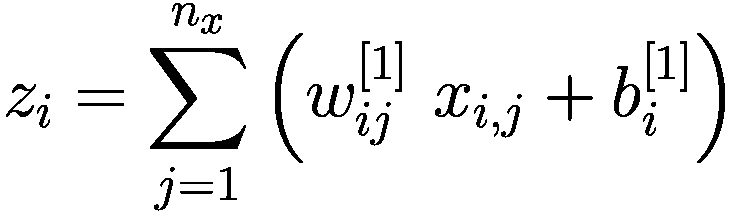

通常，在深度网络中，权重的数量相当大，所以你可以想象如果 ![$$ {w}_{ij}^{\left[1\right]} $$](../images/463356_2_En_3_Chapter/463356_2_En_3_Chapter_TeX_IEq13.png) 很大，那么 *z*[*i*] 的值可以相当大，然后 ReLU 激活函数会返回一个 nan 值，因为参数太大，Python 无法正确计算（记住，在分类问题中，你有一个 log() 函数，因此参数为零等值是不被接受的）。所以，你希望 *z*[*i*] 足够小以避免神经元输出的爆炸，同时足够大以避免输出死亡，使收敛过程非常缓慢。

该问题已被广泛研究[6]，根据你使用的激活函数，存在不同的初始化策略。让我们在表 3-4 中概述其中的一些，我们假设权重将以均值为 0，标准差如表中所示的正态分布进行初始化（请注意，标准差将取决于你想要使用的激活函数）。

表 3-4

深度神经网络权重初始化的一些示例

| 激活函数 | 给定层的标准差 σ |
| --- | --- |
| Sigmoid | 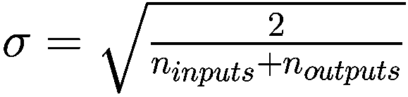 通常称为 Xavier 初始化 |
| ReLU | 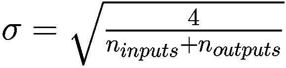 通常称为 He 初始化 |

在层 *l* 中，输入的数量将是前一层的神经元数量 *l* − 1，输出的数量将是下一层的神经元数量 *l* + 1。因此，我们将有

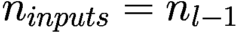

并且

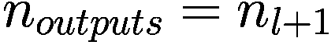

非常常见的是，深度网络，就像我们之前讨论的那样，将具有多个具有相同数量的神经元层。因此，对于大多数层，*n*[*l* − 1] = *n*[*l* + 1]，因此对于 Xavier 初始化

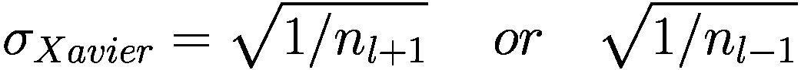

对于 ReLU 激活函数，He 初始化将是

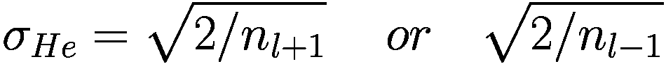

让我们考虑 ReLU 激活函数（我们在本章中使用的激活函数）。正如我们讨论的那样，每一层都将有 *n*[*l*] 个神经元。例如，为我们的单个隐藏层初始化权重的一种方法将是

```py
initializer = tf.keras.initializers.HeNormal()
layer = tf.keras.layers.Dense(15, kernel_initializer = initializer)
```

通常，为了更容易评估和构建网络，最典型的初始化形式用于 ReLU 激活函数

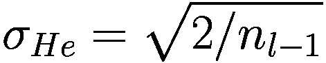

并且

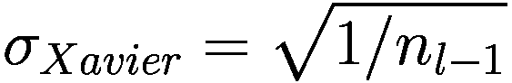

对于 Sigmoid 激活函数。

使用这种初始化方法可以显著加快训练速度，并且是许多库初始化权重（例如，Caffe 库）的标准方式。

在 Keras 中，通过`tf.keras.initializers`函数可以简单地初始化权重。查看 Keras 文档以了解哪些初始化策略可用[7]。

### 高效地添加多层

每次键入所有这些代码都有些繁琐且容易出错。你可以定义一个函数来创建一个层。这可以通过以下代码轻松完成

```py
def model_nlayers(num_neurons, num_layers):
# build model
inputs = keras.Input(shape = 784) # input layer
# first hidden layer
dense = layers.Dense(num_neurons,
activation = 'relu')(inputs)
# customized number of layers and neurons per layer
for i in range(num_layers - 1):
dense = layers.Dense(num_neurons,
activation = 'relu')(dense)
# output layer
outputs = layers.Dense(10, activation = 'softmax')(dense)
model = keras.Model(inputs = inputs,
outputs = outputs,
name = 'model')
# set optimizer and loss
opt = tf.keras.optimizers.SGD(momentum = 0.9,
learning_rate = 0.0001)
model.compile(loss = 'categorical_crossentropy',
optimizer = opt,
metrics = ['categorical_accuracy'])
# train model
history = model.fit(
data_train_norm, labels_train,
epochs = 200, verbose = 0,
batch_size = 20,
callbacks = [tfdocs.modeling.EpochDots()])
# save performances
hist = pd.DataFrame(history.history)
hist['epoch'] = history.epoch
return hist
```

让我们来看看代码：

+   首先，我们定义输入层的维度。

+   然后我们定义第一个隐藏层（神经元数量作为函数的输入给出）。

+   然后我们一次添加一个其他隐藏层。层数作为函数的输入给出。

+   然后，我们添加输出层，并将所有层堆叠在模型内部。

+   然后，我们编译并训练模型，返回其性能。

注意，在之前的代码中，我们使用了 Keras 功能 API（如果你不确定它是如何工作的，请参阅附录 A），这是一个提供创建模型比`tf.keras.Sequential` API 更灵活的功能。使用此功能，我们很容易创建一个具有可定制层数和每层神经元的模型。

要创建网络，我们可以简单地应用一个函数，该函数以不同的神经元和层数作为输入：

```py
res_10_1 = model_nlayers(10, 1)
res_10_2 = model_nlayers(10, 2)
res_10_3 = model_nlayers(10, 3)
res_10_4 = model_nlayers(10, 4)
res_100_4 = model_nlayers(100, 4)
```

代码现在更容易理解，你可以用它来创建你想要的任意大小的网络。

函数定义后，很容易运行多个模型并比较它们，就像我们在图 3-17 中所做的那样，在那里我们测试了五个不同的模型：

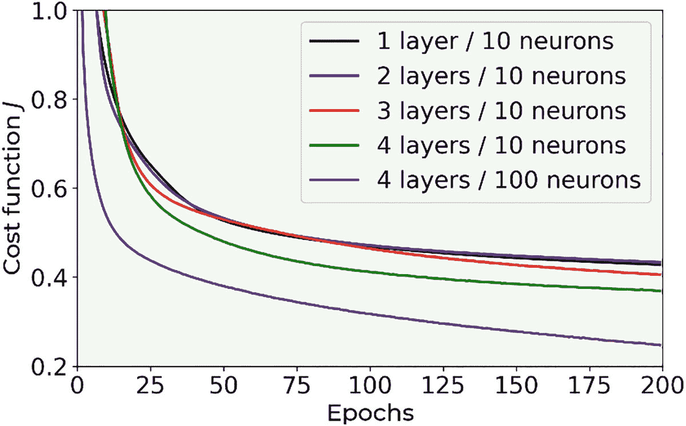

图 3-17

五个模型的成本函数与迭代次数的关系

+   一层，每层十个神经元

+   两层，每层十个神经元

+   三层，每层十个神经元

+   四层，每层十个神经元

+   四层，每层 100 个神经元

如果你有所疑问，具有四层、每层 100 个神经元的模型，看起来比其他模型好得多，开始进入过拟合状态，训练集准确率为 91%，开发集准确率为 87%（仅经过 200 个迭代次数）。

#### 额外隐藏层的优势

玩转模型是有教育意义的。尝试改变层数、神经元数量、如何初始化权重等。如果你投入一些时间，你可以在几分钟的运行时间内达到超过 90%的准确率，但这需要一些工作。如果你尝试了几个模型，你可能会意识到在这种情况下，使用多层似乎并不比只有一个网络带来好处。这通常是情况。

从理论上讲，一层网络可以近似你所能想象到的每一个函数，但所需的神经元数量可能非常大，因此模型变得不那么有用。现在的问题是，近似函数的能力并不意味着网络能够做到这一点，例如，由于涉及的神经元数量庞大或所需时间过长。

实际上已经证明，具有更多层的网络需要更少的神经元就能达到相同的结果，并且通常对未知数据的泛化能力更好。

注意

从理论上讲，您不需要在您的网络中拥有多个层，但在实践中通常应该这样做。尝试具有几个层和每个层中只有几个神经元的网络几乎总是个好主意，而不是一个由大量神经元组成的单层网络。没有关于最佳神经元或层数的固定规则。您应该从低层和神经元数量开始尝试，然后逐渐增加，直到您的结果不再变得更好。

此外，拥有更多的层可能允许您的网络学习到输入的不同方面。例如，一层可能学习识别图像的垂直边缘，另一层则识别水平边缘。记住，在本章中，我们讨论了每一层都与所有其他层相同（直到神经元数量）的网络。您将在第七章中学习如何构建网络，其中层执行非常不同的任务，并且彼此之间结构差异很大，这使得这种网络对于本章讨论的某些任务来说要强大得多。

作为一个简单的例子，想象一下预测房屋的销售价格。在这种情况下，具有多个层的网络可能能够学习到更多关于特征与价格之间关系的信息。例如，第一层可能学习到基本的关系，比如房子越大价格越高。但第二层可能学习到更复杂的特征，比如一个大房子但卫生间数量少意味着销售价格较低。

### 比较不同的网络

现在您应该知道如何构建具有大量层或神经元的神经网络。但是，如果您不知道哪些模型值得尝试，很容易迷失在可能的模型森林中。假设您从一个网络（如我们在前面的章节中所做的那样）开始，这个网络有一个包含五个神经元的隐藏层，一个包含十个神经元的层（用于我们的 softmax 函数），以及我们的 softmax 神经元。现在假设您已经达到了一定的准确度，并且想要尝试不同的模型。首先，您应该尝试增加隐藏层中的神经元数量，看看您能取得什么成果。图 3-18 显示了随着神经元数量的不同而下降的成本函数。计算使用的是批量大小为 50 的迷你批量梯度下降，一个包含 1、5、15 和 30 个神经元的隐藏层，以及学习率为 0.0001。您可以看到从单个神经元增加到五个神经元会立即加快收敛速度。但进一步增加神经元数量并不会带来太大的改进。例如，从 15 增加到 30 没有任何改进。

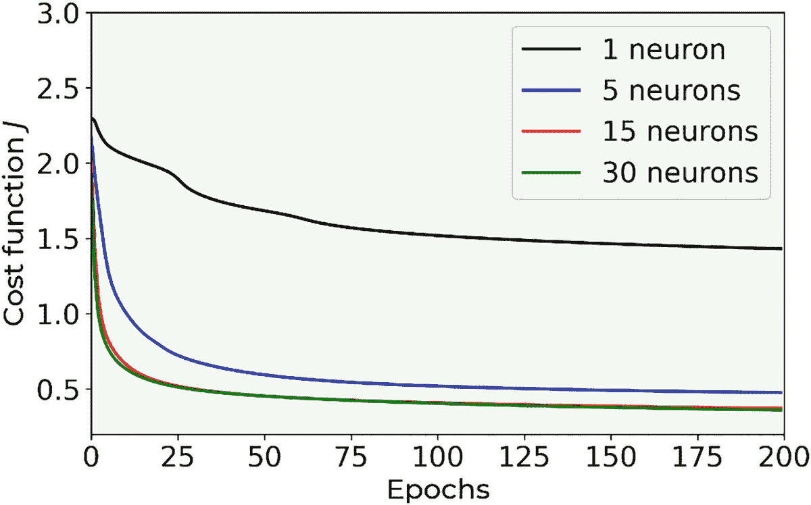

图 3-18

成本函数随神经网络中隐藏层和 1、5、15、30 个神经元的变化而下降。计算使用的是批量大小为 50 的迷你批量梯度下降，学习率为 0.0001。

让我们先尝试找到一种比较这些网络的方法。仅仅比较神经元的数量可能会非常误导，正如你很快就会看到的。记住，你的算法正在尝试找到最佳权重和偏差组合以最小化你的成本函数。但我们在模型中有多少可学习的参数呢？我们有权重和偏差。你会记得从理论讨论中，我们可以将一定数量的权重与每一层关联起来，我们将在 *l* 层中指示的可学习参数数量 *Q*^([*l*]) 由矩阵 *W*^([*l*]) 中的元素总数给出，即 *n*[*l*]*n*[*l* − 1]（其中我们通过定义有 *n*[0] = *n*[*x*]）。此外，我们还有偏差的数量（在每个层中我们将有 *n*[*l*] 个偏差）。*Q*^([*l*]) 可以写成以下形式

![$$ {Q}^{\left[l\right]}={n}_l{n}_{l-1}+{n}_l={n}_l\left({n}_{l-1}+1\right) $$](../images/463356_2_En_3_Chapter/463356_2_En_3_Chapter_TeX_Equy.png)

因此，我们网络中的可学习参数总数（在此用 *Q* 表示）可以写成以下形式

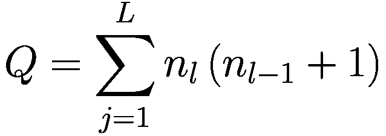

其中，通过定义 *n*[0] = *n*[*x*]。请注意，我们网络的 *Q* 参数强烈依赖于架构。让我们通过一些实际例子来计算它（见表 3-5）。

表 3-5

不同网络架构及其对应的 *Q* 参数示例

| 网络架构 | 参数 ***Q***（可学习参数数量） | 神经元数量 |
| --- | --- | --- |
| **网络 A**: 784 个特征，2 层：*n*[1] = 15, *n*[2] = 10 | *Q*[*A*] = 15(784 + 1) + 10 ∗ (15 + 1) = 11935 | 25 |
| **网络 B**: 784 个特征，16 层：*n*[1] = *n*[2] = … = *n*[15] = 1, *n*[16] = 10 | *Q*[*B*] = 1 ∗ (784 + 1) + 1 ∗ (1 + 1) + … + 10 ∗ (1 + 1) = 923 | 25 |
| **网络 C**: 784 个特征，3 层：*n*[1] = 10, *n*[2] = 10, *n*[3] = 10 | *Q*[*C*] = 10 ∗ (784 + 1) + 10 ∗ (10 + 1) + 10 ∗ (10 + 1) = 8070 | 30 |

请注意网络 A 和 B。它们都有 25 个神经元，但 *Q*[*A*] 参数比 *Q*[*B*] 大得多（超过十倍）。你可以想象，即使神经元的数量相同，网络 A 在学习上也会比网络 B 更灵活。

注意

实际上，*Q* 并不是衡量网络复杂度或好坏的指标。可能发生的情况是，在所有神经元中，只有少数会发挥作用，因此以这种方式计算 *Q* 并不能完全说明问题。关于深度神经网络所谓的有效自由度的研究有很多，但这会远远超出本书的范围。但这个参数为决定你想要测试的模型集是否在合理的复杂度递增中提供了一个很好的经验法则。

尽管如此，检查你想要测试的模型的 *Q* 参数可能会给你一些提示，关于你应该忽略什么，以及你应该尝试什么。例如，让我们考虑我们在图 3-18 中测试的案例，并计算每个网络的 *Q* 参数（见表 3-6)。

表 3-6

图 3-18 中测试的与它们相应的 *Q* 参数的网络架构

| 网络架构 | 参数 ***Q***（可学习参数的数量） | 神经元数量 |
| --- | --- | --- |
| 784 个特征，1 层有 1 个神经元，1 层有 10 个神经元 | *Q* = 1 * (784 + 1) + 10 * (1 + 1) = 895 | 11 |
| 784 个特征，1 层有 5 个神经元，1 层有 10 个神经元 | *Q* = 5 * (784 + 1) + 10 * (5 + 1) = 3985 | 15 |
| 784 个特征，1 层有 15 个神经元，1 层有 10 个神经元 | *Q* = 15 * (784 + 1) + 10 * (15 + 1) = 11935 | 25 |
| 784 个特征，1 层有 30 个神经元，1 层有 10 个神经元 | *Q* = 30 * (784 + 1) + 10 * (30 + 1) = 23860 | 40 |

从图 3-18 中，假设我们选择具有 15 个神经元的模型作为最佳模型的候选者。现在假设我们想要尝试一个具有三层，每层具有相同数量的神经元，这些神经元应该能够竞争（并且可能优于）我们（目前）的候选模型，其中一层有 15 个神经元。我们应该选择什么作为三层中神经元数量的起点？让我们用模型 A 表示一层有 15 个神经元的模型，用模型 B 表示具有三层且每层神经元数量未知的模型，用 *n*[*B*] 表示。我们可以轻松地计算两个网络的 *Q* 参数

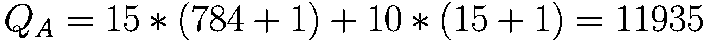

然后

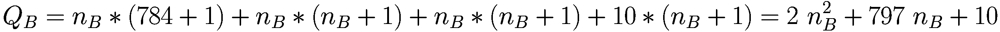

对于什么值的 *n*[*B*] 会使得 *Q*[*B*] ≈ *Q*[*A*]？我们可以解这个方程

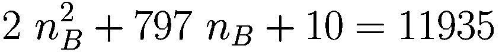

你应该能够解一个二次方程，所以我们只看这里的解。这个方程解出的 *n*[*B*] 值为 14.4，但由于我们不能有 14.4 个神经元，我们需要使用最接近的整数，即 *n*[*B*] = 14。对于 *n*[*B*] = 14，我们将有 *Q*[*B*] = 11560，这个值非常接近 11935。

注

两个网络具有相同数量的可学习参数这一事实并不意味着它们可以达到相同的准确度，甚至并不意味着如果一个学习得非常快，第二个是否也会学习！

具有三个层，每层有 14 个神经元的模型可能是进一步测试的一个好的起点。

让我们讨论另一个在处理复杂数据集时非常重要的点。考虑第一层。假设我们考虑 Zalando 数据集，并创建一个包含两层网络：第一层有一个神经元，第二层有多个神经元。你的数据集可能包含的所有复杂特征可能会在你的单个第一个神经元中丢失，因为它会将所有特征组合成一个单一值，并将相同的值传递给第二层的所有其他神经元。

#### 选择正确网络的建议

你已经讨论了很多案例，看到了很多公式，但你怎么决定如何设计你的网络？

不幸的是，没有固定的规则。但你可以考虑以下建议：

+   当考虑你想要测试的一组模型（或网络架构）时，一个好的经验法则是从一个较简单的开始，然后逐渐过渡到更复杂的。一个估计相对复杂性的经验法则是*Q*参数。

+   如果你的任何一层具有特定数量的神经元太少，那么你无法达到良好的准确度。这个层可能会降低你的网络从复杂数据集中学习有效能力。例如，考虑图 3-18 中只有一个神经元的情况。由于网络太简单，无法从像 Zalando 这样的复杂数据集中学习，因此模型无法达到成本函数的低值。

+   记住，神经元数量低或高总是相对于你拥有的特征数量而言的。如果你的数据集中只有两个特征，一个神经元可能就足够了，但如果你有几百个（比如 Zalando 数据集中，*n*[*x*] = 784），你不应该期望一个神经元就足够了。

+   你需要的架构也取决于你想要做什么。始终检查在线文献，看看别人已经发现了关于特定问题的什么。例如，众所周知，对于图像识别，卷积网络非常好，所以它们是一个很好的选择。

最后的建议

当从一个具有*L*层的模型移动到一个具有*L*+1 层的模型时，始终从新模型开始，并在每一层使用稍微少一点的神经元，然后逐步增加。记住，更多的层有更有效地学习复杂特征的机会，所以如果你很幸运，可能更少的神经元就足够了。这是值得一试的事情。始终跟踪你所有模型的优化指标。当你不再获得很大改进时，尝试完全不同的架构（比如卷积神经网络等）可能是有价值的。

## 估算模型的内存需求

对于计算，让我们考虑一个具有 *N*[*L*] 个隐藏层的前馈神经网络，每个隐藏层有 *n* 个神经元。让我们考虑一个具体的例子来使事情更清晰。假设我们正在处理 MNIST 数据集。在这种情况下，输入数据由图像的 784 个灰度值向量组成（每个图像的灰度值为 28 × 28 像素）。用于分类的网络输出层将由十个神经元组成（模型试图将这些图像分类的十个类别）。总权重数 *N*[*W*] 可以很容易地计算出来，可以写成以下形式

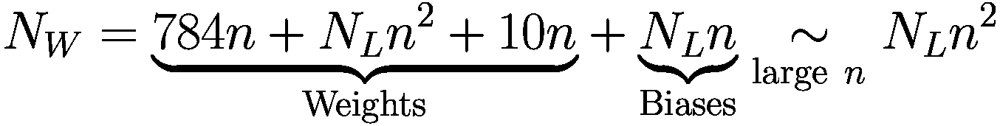

方程式的第二部分意味着，对于大的 *n*，*N*[*W*] 将在 *n*（每层的神经元数量）中呈二次增长，这是通常需要考虑的三个组成部分。

+   **参数**：在内存中，你需要保留参数、反向传播期间的梯度，以及如果优化使用动量、Adagrad、Adam 或 RMSProp 优化器时需要的一些附加信息。为了考虑到所有这些因素^(6)，一个很好的经验法则是将仅由权重占用的内存乘以大约 3。使用我们迄今为止使用的符号，参数（用 *M*[*W*] 表示）在 Gb 中使用的内存将是

    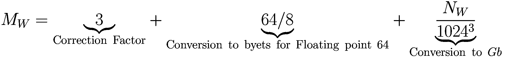

+   **激活**：每个神经元的输出必须被存储，通常与它们的梯度一起用于反向传播。保守起见，只需要在内存中保留一个小的批量。将小批量大小称为 *S*[*MB*]，激活所需的内存 *M*[*A*] 在 Gb 中可以写成

    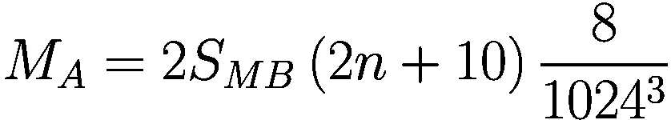

+   **杂项**：这部分包括必须加载到内存中的数据等。为了粗略估计，这里使用的内存大小 *M*[*M*] 将仅根据数据集大小进行估计。在 MNIST 的情况下，它将（以 Gb 计）由以下公式给出。每个像素值，尽管最初是 INT8，但必须转换为浮点 64 数据类型以进行训练

    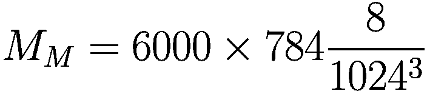

例如，为了确定一个模型是否能在具有*N*[*D*] GB 空闲内存的受限内存设备上运行，只需检查以下方程在*n*或*N*[*L*]中是否有解

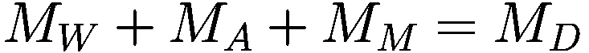

注意，这只是一个粗略的指示，不会非常精确，因为模型占用的内存量可能取决于软件版本、操作系统以及许多其他因素。如果我们解最后一个方程中的*n*，例如，我们可以得到在应用于 MNIST 时，在这样一个设备上可以运行的最大的 FFNN 网络的一个非常好的估计。例如，考虑一个具有 2 GB 内存的 Raspberry Pi 4 的情况。通常，这样的系统在任何时候大约有*M*[*D*] = 1.7 GB 的空闲内存。所以对于*N*[*L*] = 2 和*S*[*MB*] = 128 的网络，最后一个方程将给出*n* ≈ 8200 的解。确实，尝试在这样一个设备上训练超过 8200 个神经元的网络将导致设备上的内存错误，因为内存不足以在 RAM 中保留所有内容。（如果你测试它，你的结果可能会有所不同，取决于你拥有的 Raspberry Pi 版本、你使用的 TensorFlow 版本等等。）

为了得到一个更粗略的估计，在实际应用中可以忽略最后一个方程中*n*的线性项，仍然可以得到一个有用的指导。例如，在前面讨论的例子中，忽略线性项将给出*n* ≈ 8700 的估计。这个估计比实际的高，但可以提供有关最大可用神经元的数量的一些有用的粗略信息。最后，请记住，只有实际测试才能保证特定的模型可以在低内存设备上运行。

## 内存占用的一般公式

通常，当处理大小为*n*[*x*]的数据集时，参数数量的公式可以写成以下形式

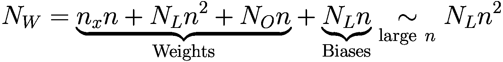

当我们表示输出层中的神经元数量为*N*[*O*]时。如果你参考了上一节，你可以看到*M*[*W*]和*M*[*A*]的公式没有变化，而*M*[*M*]需要写成

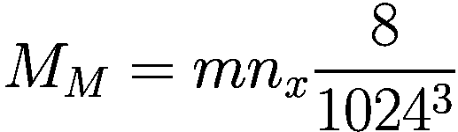

这考虑到数据集大小不是 60000 而是*m*，输入维度不是 784 而是*n*[*x*]。

## 练习

练习 1（难度：简单）

尝试构建一个类似于本章中看到的多类分类模型，但使用不同的数据集，即手写数字的 MNIST 数据库([`http://yann.lecun.com/exdb/mnist/`](http://yann.lecun.com/exdb/mnist/))。要从 TensorFlow 下载数据集，请使用以下代码：

```py
from tensorflow import keras
(x_train, y_train), (x_test, y_test) = keras.datasets.mnist.load_data()
```

练习 2（难度：中等）

将本章中看到的多元分类问题应用 He 权重初始化，看看你是否能加快学习阶段。

练习 3（难度：困难）

尝试优化本章中构建的前馈神经网络，以达到最佳可能的准确率（不要过度拟合训练数据集！）调整训练轮数、学习率、优化器、神经元数量、层数和迷你批处理。*提示*：编写一个类似于我们用来测试不同层数和神经元数量的函数，并将所有可调整的参数作为输入。

练习 4（难度：困难）

考虑我们使用单个神经元构建的模型解决的回归问题（预测美国房屋中的氡活动）。尝试构建一个前馈神经网络来解决相同的回归任务。看看你是否能获得更好的预测性能。*提示*：你需要更改损失函数和评估结果的标准，并且不再需要独热编码。作为起点，你可以在书籍的在线版本中找到整个代码，网址为 [`adl.toelt.ai`](https://adl.toelt.ai).

## 参考文献

+   [1] Burnham, K. P.; Anderson, D. R. (2002), *模型选择与多模型推断*（第 2 版），Springer-Verlag.

+   [2] [`en.wikipedia.org/wiki/Zalando`](https://en.wikipedia.org/wiki/Zalando), 最后访问日期 16.02.2021.

+   [3] [`www.kaggle.com`](http://www.kaggle.com), 最后访问日期 16.02.2021.

+   [4] Xiao, Han, Kashif Rasul, and Roland Vollgraf. “Fashion-mnist: a novel image dataset for benchmarking machine learning algorithms.” arXiv preprint arXiv:1708.07747 (2017).

+   [5] [`keras.io/api/models/model_training_apis/#fit-method`](https://keras.io/api/models/model_training_apis/%2523fit-method), 最后访问日期 14/03/2021.

+   [6] “理解训练深度前馈神经网络的难度”，X. Glorot, Y. Bengio (2010)，[`goo.gl/bHB5BM`](https://goo.gl/bHB5BM).

+   [7] [`www.tensorflow.org/api_docs/python/tf/keras/initializers`](https://www.tensorflow.org/api_docs/python/tf/keras/initializers), 最后访问日期 23.02.2021.
