# 6. 超参数调优

超参数可以松散地定义为在训练过程中不发生变化的参数。例如，FFNN 中的层数、每层的神经元数量、激活函数、学习率^(1)等等。

本章探讨了寻找最佳超参数以从模型中获得最佳结果的问题。进行这一过程被称为超参数调优。我们首先描述什么是黑盒优化问题，以及这些类别的问题如何与超参数调优相关。我们探讨了处理这类问题的三种最常见方法：*网格搜索、随机搜索*和*贝叶斯优化*。通过示例，你将了解在什么条件下哪种方法有效。本章结束时，你将看到如何使用这些技术使用真实世界数据集（Zalando 数据集）来调整深度模型。本章的目标不是给你一个所有可能的 Python 库的概述，以帮助你进行超参数调优，但到本章结束时，你应该知道什么是超参数调优，为什么它很重要，以及它是如何工作的，至少在其最基本的形式上。

## 黑盒优化

超参数调优的问题只是更一般类型问题的一个子类：*黑盒优化*。一个黑盒函数 *f*(*x*) 是一个

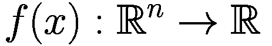

是一个解析形式未知的函数。黑盒函数可以评估以获得其定义的所有 *x* 值的值，但无法获得其他信息，如梯度。通常，当我们试图在给定某些约束的情况下找到 *f*(*x*) 的最大值或最小值时，我们谈论黑盒函数的全局优化（有时称为黑盒问题）。以下是一些这类问题的例子：

+   寻找给定机器学习模型的最佳超参数，以最大化所选优化指标

+   寻找一个函数的最大值或最小值，这个函数只能通过数值或我们无法查看的代码来评估。在某些行业环境中，存在非常复杂的遗留代码，有一些函数必须基于其结果进行最大化。

+   寻找最佳的石油钻探地点。你的函数是你能找到多少石油，而你的 *x* 是你的位置。

+   在难以建模的情况下寻找最佳参数组合，例如在太空中发射火箭时。如何优化燃料量、火箭每个阶段的直径、精确轨迹等等。

这是一个非常迷人的问题类别，它产生了智能的解决方案。我们将探讨其中的三个：网格搜索、随机搜索和贝叶斯优化。

为什么寻找神经网络最佳超参数是一个黑盒问题？因为我们无法计算网络输出相对于超参数的信息，例如 FFNN 中的层数，尤其是在使用复杂优化器或自定义函数时。我们需要其他方法来找到最佳超参数，以最大化选择的优化指标。请注意，如果我们能获得梯度，我们可以使用梯度下降等算法来找到最大值或最小值。

注意

我们的黑盒函数 *f* 将是我们的神经网络模型（包括优化器、成本函数形式等），它以超参数作为输入，输出我们的优化指标。在这种情况下，*x* 将是包含超参数的数组。

问题可能看起来相当简单，为什么不尝试所有可能性呢？好吧，这可能在我们在过去章节中看到的例子中是可能的，但如果你正在处理一个问题，并且训练模型需要一周时间，这可能是一个挑战。由于通常你会有几个超参数，尝试所有可能性将不可行。让我们通过一个例子来更好地理解它。假设我们正在训练一个具有多个层的神经网络模型。我们可能决定考虑以下超参数，以查看哪种组合效果最好：

+   学习率：假设我们想尝试 *n* · 10^(−4) 的值，其中 *n* = 1, …, 10²（100 个值）

+   正则化参数：0，0.1，0.2，0.3，0.4 和 0.5（六个值）

+   优化器选择：GD，RMSProp 或 Adam（三个值）

+   隐藏层数量：1，2，3，5 和 10（五个值）

+   隐藏层中的神经元数量：100，200 和 300（三个值）

考虑你将需要训练你的网络

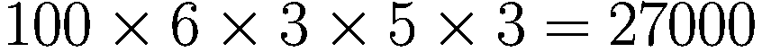

如果你想测试所有可能的组合。如果你的训练需要五分钟，你将需要 13.4 周的计算时间。如果训练需要数小时或数天，这变得不可能。如果训练需要一天，例如，你需要 73.9 年才能尝试所有可能性。大多数超参数的选择将来自经验；例如，你可以安全地始终使用 Adam，因为它是更好的优化器（在几乎所有情况下）。但你将无法避免尝试调整其他参数，如隐藏层的数量或学习率。你可以通过经验（就像优化器一样）或一些聪明的算法来减少你需要组合的数量，正如你将在本章后面看到的。

### 关于黑盒函数的注意事项

黑盒函数通常分为两大类：

+   **廉价函数**：可以评估数千次的函数

+   **昂贵函数**：通常只能评估几次的函数，通常少于 100 次

如果黑盒函数成本低，那么优化方法的选择并不关键。例如，我们可以通过数值计算来评估与*x*相关的梯度，或者简单地通过在大量点上评估函数来搜索最大值。如果函数成本高，我们需要更智能的方法。其中之一是*贝叶斯优化*，我们将在本章后面讨论，以给你一个关于这些方法如何工作以及它们复杂性的概念。

注意

神经网络几乎总是，尤其是在深度学习领域，是成本较高的函数。

对于成本较高的函数，我们需要找到用尽可能少的评估次数解决问题的方法。

## 超参数调整问题

在我们探讨如何找到最佳超参数之前，我们需要快速回顾一下神经网络，并讨论在深度模型中我们可以调整什么。通常，当谈到超参数时，初学者只会想到数值参数，例如学习率或正则化参数。记住，以下也可以调整以查看是否能得到更好的结果：

+   **训练轮数**：有时简单地延长网络的训练时间会得到更好的结果。

+   **优化器的选择**：你可以尝试选择不同的优化器。如果你使用的是普通梯度下降，你可以尝试 Adam，看看是否能得到更好的结果。

+   **正则化方法的选择**：如前所述，有几种应用正则化的方法。尝试不同的方法可能值得尝试。

+   **激活函数的选择**：尽管过去章节中用于隐藏层神经元的激活函数是 ReLU，但其他函数可能效果更好。例如尝试 sigmoid 或 Swish 可能会帮助你获得更好的结果。

+   **层数和每层的神经元数量**：尝试不同的配置。例如尝试具有不同神经元数量的层。

+   **学习率衰减方法**：尝试不同的学习率衰减方法（如果你没有使用已经具备这种功能的优化器）。

+   **小批量大小**：调整小批量的大小。当你有少量数据时，可以使用批量梯度下降。当你有大量数据时，小批量更有效率。

+   权重初始化方法。

让我们将我们可以在模型中调整的参数分为以下三个类别：

1.  参数是连续的实数，换句话说，可以假设任何值。例如：学习率和正则化参数。

1.  参数是离散的，但理论上可以假设无限多个值。例如：隐藏层的数量、每层的神经元数量或训练轮数。

1.  参数是离散的，只能假设有限的可能值。例如：优化器、激活函数和学习率衰减方法。

对于类别 3，除了尝试所有可能性之外，没有太多可做的事情。它们通常会完全改变模型，因此无法模拟它们的影响，因此测试成为唯一的选择。这也是经验可能最有帮助的类别。众所周知，Adam 优化器几乎是最佳选择，因此您可以在一开始就将精力集中在其他地方。对于类别 1 和 2，这要困难一些，您需要使用一些智能方法来找到最佳值。

## 样本黑盒问题

为了尝试解决一个黑盒问题，让我们创建一个“假”的黑盒问题。给定公式，找到函数 *f*(*x*) 的最大值


假装不知道公式本身。公式将让您看到结果，但让我们假装它们是未知的。您可能会想知道为什么我们使用如此复杂的公式。我们想要有一个具有几个极大值和极小值的函数，以展示方法在非平凡示例上的工作方式。*f*(*x*) 可以使用以下 Python 代码实现

```py
def f(x):
tmp1 = -np.cos(x/4.0)-np.sin(x/4.0)
-2.5*np.cos(2.0*x/4.0)+0.5*np.sin(2.0*x/4.0)
tmp2 = -np.cos(x/3.0)-np.sin(x/3.0)
-2.5*np.cos(2.0*x/3.0)+0.5*np.sin(2.0*x/3.0)
return 10.0+tmp1+0.5*tmp2
```

图 6-1 展示了 *f*(*x*) 的样子。

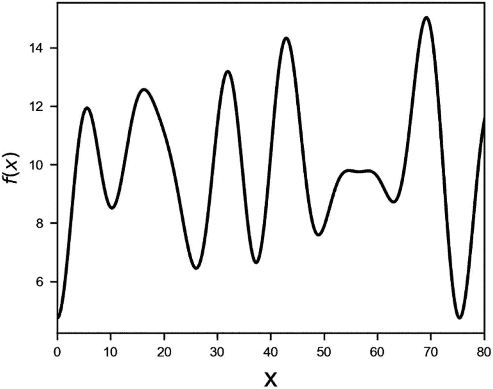

图 6-1

文中描述的函数 *f*(*x*) 的图像

最大值大约在 *x* = 69.18 处，其值为 15.027。我们的挑战是以最有效的方式找到这个最大值，而对 *f*(*x*) 除了其在任何点的值外，我们一无所知。当我们说“有效”时，意味着以尽可能少的评估次数来完成。

### 网格搜索

我们首先考虑的方法是网格搜索，这也是最不“智能”的方法。网格搜索只是简单地以固定间隔尝试函数，并查看对于哪个 *x*，函数 *f*(*x*) 取得最高值。在这个例子中，我们想要找到在两个 *x* 值 *x*[*min*] 和 *x*[*max*] 之间的函数 *f*(*x*) 的最大值。我们做的只是取 *x*[*min*] 和 *x*[*max*] 之间等间距的 *n* 个点，并在这些点上评估函数。我们定义一个点向量

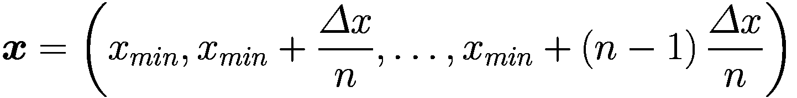

其中我们定义 Δ*x* = *x*[*max*] - *x*[*min*]。然后我们在这些点上评估函数 *f*(*x*)，得到一个包含值的向量 ***f***

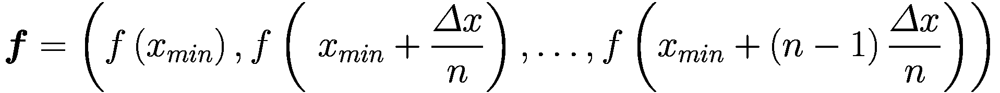

最大值 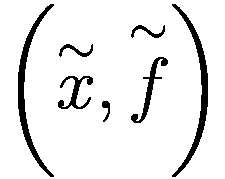 的估计将如下：

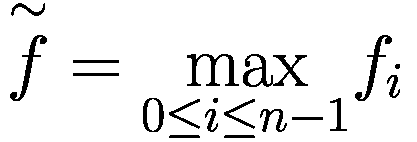

假设最大值在 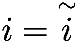 处找到，我们也将有

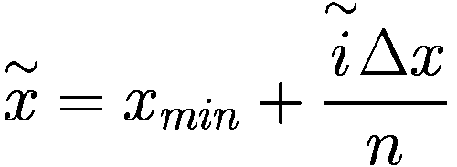

现在，正如您可能想象的那样，您使用的点越多，您的最大值估计就越准确。问题是，如果 *f*(*x*) 的评估成本很高，您将无法测试您可能想要的那么多点。您需要在点数和精度之间找到一个平衡。让我们考虑一个使用我们之前描述的函数 *f*(*x*) 的例子。让我们考虑 *x*[*max*] = 80 和 *x*[*min*] = 0，并取 *n* = 40 个点。我们将有 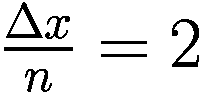。我们可以用以下代码在 Python 中轻松创建向量 ***x***：

```py
gridsearch = np.arange(0,80,2)
```

数组 `gridsearch` 将看起来像这样

```py
array([ 0, 2, 4, 6, 8, 10, 12, 14, 16, 18, 20, 22, 24, 26, 28, 30, 32, 34, 36, 38, 40, 42, 44, 46, 48, 50, 52, 54, 56, 58, 60, 62, 64, 66, 68, 70, 72, 74, 76, 78])
```

图 6-2 显示了函数 *f*(*x*) 作为连续线，交叉点标记了我们在网格搜索中采样的点，黑色方块标记了函数的精确最大值。右侧的图显示了最大值周围的放大图。

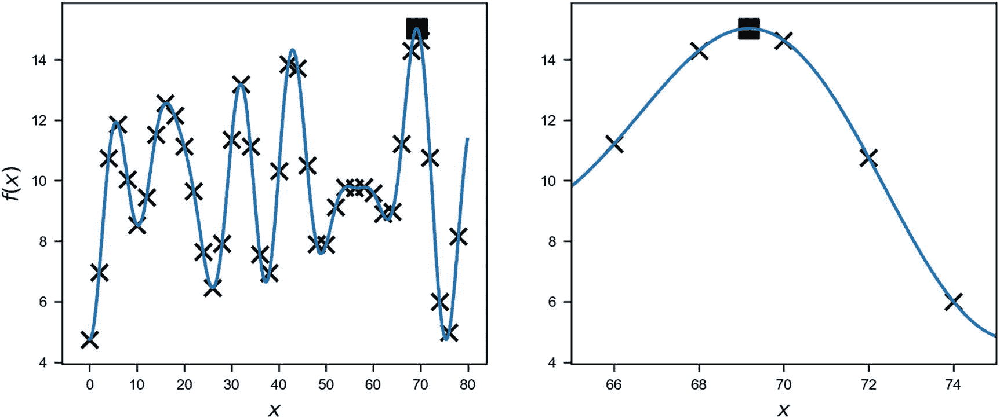

图 6-2

函数 *f*(*x*) 在范围 [0, 80] 上。交叉点标记了我们在网格搜索中采样的点，黑色方块标记了最大值。

您可以看到我们在图 6-2 中采样的点如何接近最大值，但并不完全达到。当然，采样更多的点会让我们更接近最大值，但会花费我们更多对 *f*(*x*) 的评估。我们可以用简单的代码轻松找到最大值 。

```py
x = 0
m = 0.0
for i, val in np.ndenumerate(f(gridsearch)):
if (val > m):
m = val
x = gridsearch[i]
print(x)
print(m)
```

这给出了

```py
70
14.6335957578
```

接近实际最大值（69.18, 15.027），但并不完全准确。让我们尝试先前的例子，并改变我们采样的点数。我们将从 4 到 160 变化采样的点数 *n*。对于每种情况，我们将找到最大值及其位置，如前所述。我们可以用以下代码来完成：

```py
xlistg = []
flistg = []
for step in np.arange(1,20,0.5):
gridsearch = np.arange(0,80,step)
x = 0
m = 0.0
for i, val in np.ndenumerate(maxim(gridsearch)):
if (val > m):
m = val
x = gridsearch[i]
xlistg.append(x)
flistg.append(m)
```

在列表 `xlistg` 和 `flistg` 中，我们将找到找到的最大值的位置和最大值的各种值。

图 6-3 显示了结果的分布图。黑色垂直线是最大值的正确值。

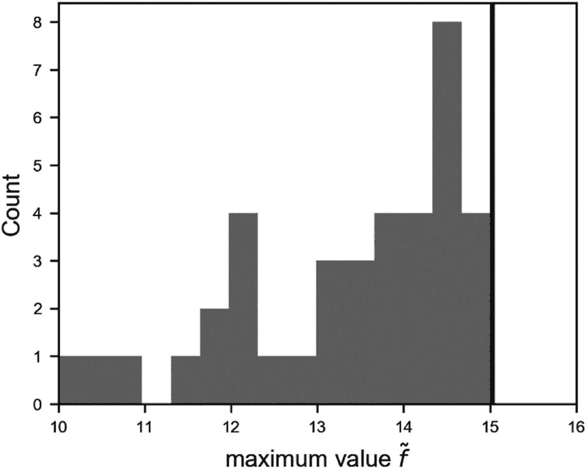

图 6-3

通过改变在网格搜索中采样的点数 *n* 获得的  的结果分布。黑色垂直线表示 *f*(*x*) 的真实最大值

如您所见，结果差异很大，可能非常远离正确值，甚至高达 10。这告诉我们，使用错误数量的点可能会导致非常错误的结果。正如您所想象的那样，最佳结果是最小步长 Δ*x* 的结果，因为它更有可能接近最大值。图 6-4 显示了找到的最大值随步长 Δ*x* 的变化。

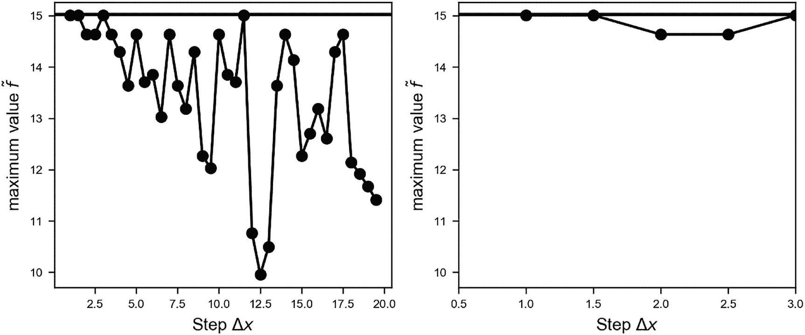

图 6-4

找到的最大值与 *x* 步 *Δx* 的关系

在图 6-4 右侧的放大图中，很明显，较小的 Δ*x* 值可以得到更好的  值。请注意，步长为 1.0 意味着采样 80 个 *f*(*x*) 的值。例如，如果评估需要一天时间，您将需要等待 80 天才能获得所需的全部测量值。

小贴士

网格搜索仅在黑盒函数便宜时才有效。为了获得好的结果，通常需要大量的采样点。

为了确保您真的得到了最大值，您应该减小步长 Δ*x*，或者增加采样点的数量，直到找到的最大值不再显著变化。在先前的例子中，如图 6-4 右侧的图所示，当我们的步长 Δ*x* 小于大约 2.0 时，或者换句话说，当采样点的数量大于或大约等于 40 时，我们确信我们接近最大值。请记住，40 在一开始看起来可能是一个小数字，但如果 *f*(*x*) 评估您深度学习模型的指标，并且训练需要例如两小时，您将需要 3.3 天的计算机时间。

在深度学习领域，通常两小时并不足以训练一个模型，因此在开始长时间网格搜索之前进行快速计算。此外，请注意，在进行超参数调整时，您是在一个多维空间中移动（您不是只优化一个参数，而是许多参数），因此所需的评估数量会迅速增加。

让我们来看一个快速示例。假设您决定可以承担 50 次对您的黑盒函数的评估。如果您决定想要尝试以下超参数：

+   优化器（RMSProp、Adam 或普通 GD）（三个值）

+   训练轮数（1000、5000 或 10000）（三个值）

您已经看到了九个评估。那么您能尝试多少个学习率的值呢？只有五个！并且只有五个值，您不太可能接近最优值。这表明网格搜索仅适用于成本较低的黑盒函数是可行的。记住，时间往往不是唯一的问题。例如，如果您正在使用 Google Cloud 平台来训练您的网络，您将按秒支付您使用的硬件。也许您有很多时间可用，但成本可能会很快超出预算。

### 随机搜索

一种与网格搜索一样“愚蠢”的策略，但效果却出奇地好，那就是随机搜索。您不是在范围(*x*[*min*], *x*[*max*])中均匀地采样*x*个点，而是随机采样点。我们可以用以下代码来实现

```py
import numpy as np
randomsearch = np.random.random([40])*80.0
```

`randomsearch`数组看起来是这样的

```py
array([ 0.84639256, 66.45122608, 74.12903502, 36.68827838, 61.71538757, 69.29592273, 48.76918387, 69.81017465, 1.91224209, 21.72761762, 22.17756662, 9.65059426, 72.85707634, 2.43514133, 53.80488236, 5.70717498, 28.8624395 , 33.44796341, 14.51234312, 41.68112826, 42.79934087, 25.36351055, 58.96704476, 12.81619285, 15.40065752, 28.36088144, 30.27009067, 16.50286852, 73.49673641, 66.24748556, 8.55013954, 29.55887325, 18.61368765, 36.08628824, 22.1053749 , 40.14455129, 73.80825225, 30.60089111, 52.01026629, 47.64968904])
```

根据你使用的种子，你得到的具体数字可能不同。正如我们为网格搜索所做的那样，图 6-5 显示了*f*(*x*)的图像，其中交叉点标记了采样点，黑色方块表示最大值。在右侧的图像中，您可以看到最大值周围的放大图。

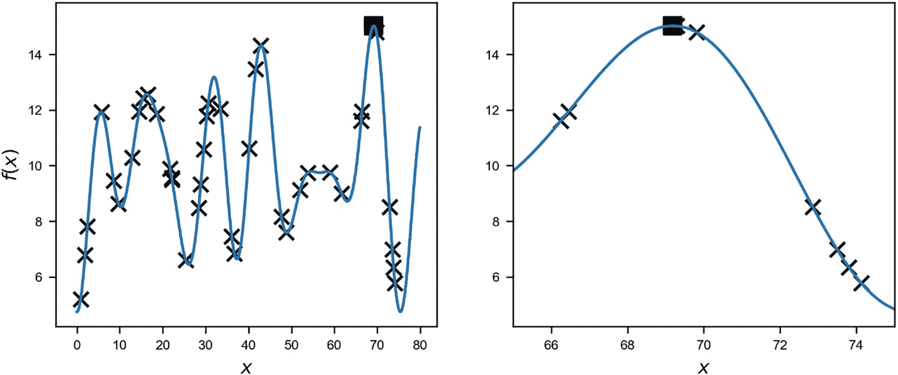

图 6-5

函数*f*(*x*)在范围[0, 80]上的图像。交叉点标记了我们通过随机搜索采样的点，黑色方块标记最大值

使用这种方法的风险在于，如果你非常不幸，你随机选择的点离真实最大值非常远。但这种情况的概率相当低。请注意，如果你为你的随机点选择一个恒定的概率分布，你得到任何地方的点的概率是相同的。现在很有趣的是看看这种方法的表现如何。让我们考虑 200 个不同的随机点集，每个集包含 40 个点，通过改变代码中使用的随机种子来获得。图 6-6 展示了找到的最大值分布。

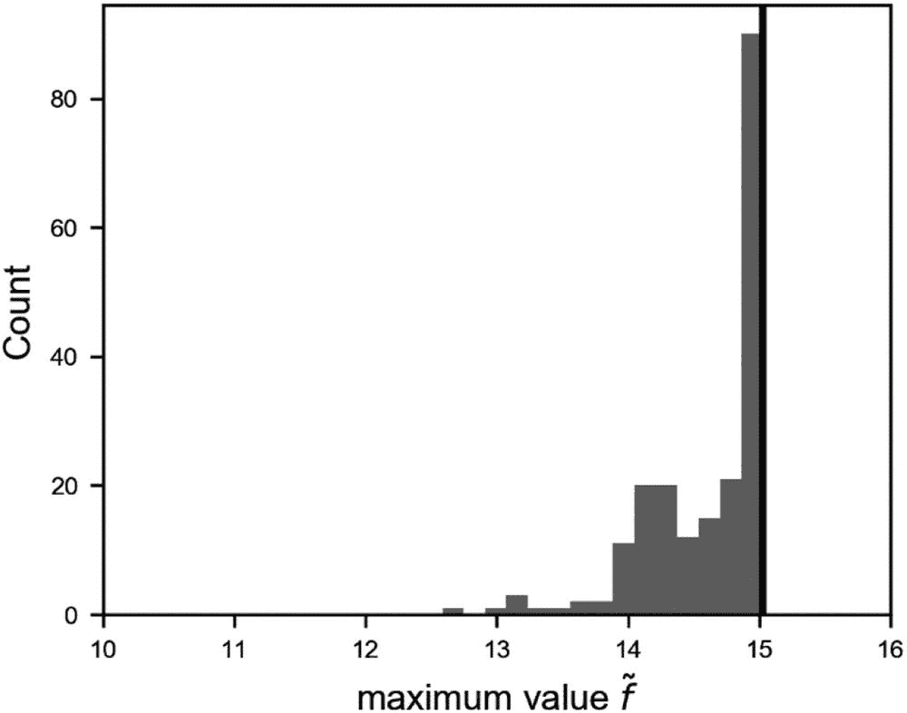

图 6-6

通过 200 个不同的随机点集（每个集包含 40 个点）在随机搜索中采样得到的的结果分布。黑色垂直线表示函数*f*(*x*)的真实最大值

如您所见，无论使用哪种随机集，您都接近真实最大值。图 6-7 展示了通过随机搜索和改变从 10 到 80 个点的采样数量找到的最大值分布。

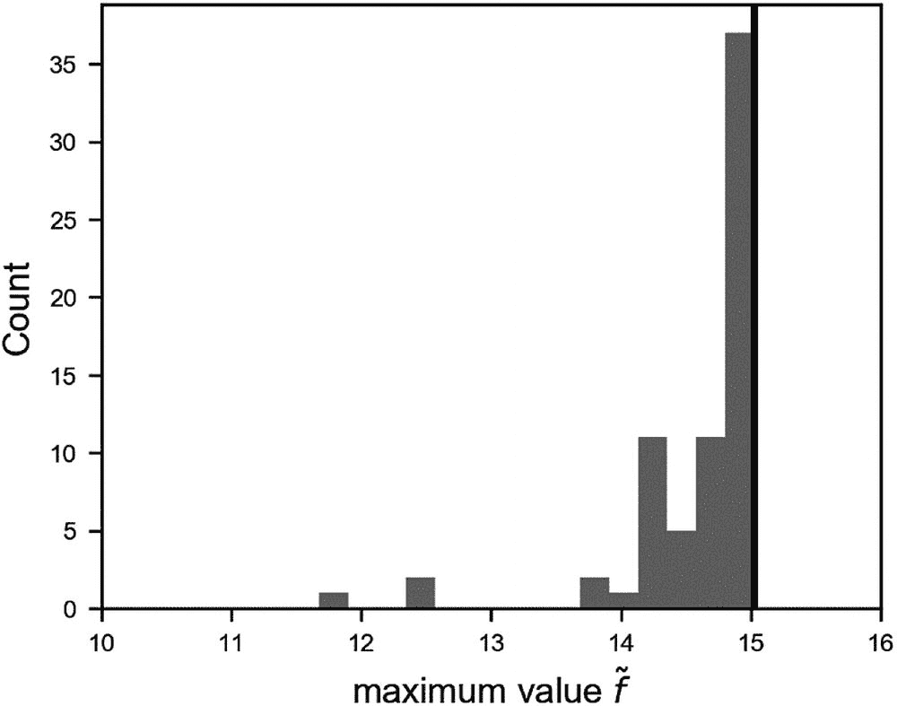

图 6-7

通过改变随机搜索中采样的点数*n*（从 10 到 80）得到的的结果分布。黑色垂直线表示函数*f*(*x*)的真实最大值

如果你将此与网格搜索进行比较，你可以看到随机搜索在持续获得接近真实最大值的结果方面表现得更好。图 6-8 比较了使用随机搜索和网格搜索时，使用不同数量的采样点 *n* 得到的最大值  的分布。在这两种情况下，图表都是用 38 个不同的集合生成的，所以总数是相同的。

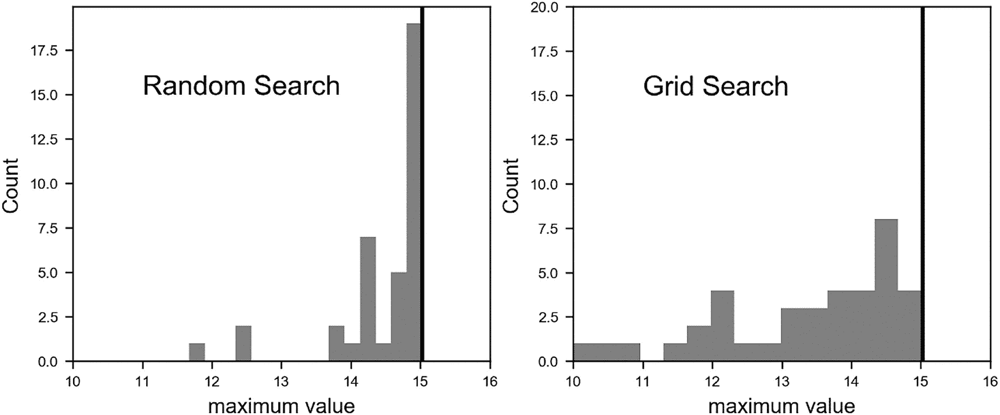

图 6-8

在网格搜索（右）和随机搜索（左）之间比较采样点 *n* 变化时 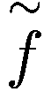 的分布。在这两个图表中，点的总数都是 38，这是使用不同数量采样点的数量。两个图表中最大值的正确值都用垂直的黑线标记。

很容易看出，平均而言，随机搜索比网格搜索更好。你得到的结果始终更接近正确的最大值。

小贴士

随机搜索始终优于网格搜索，每次可能的情况下都应该使用它。当处理变量 *x* 的多维空间时，随机搜索和网格搜索之间的差异变得更加明显。超参数调整几乎总是多维优化问题。

如果你对关于高维问题随机搜索尺度的优秀论文感兴趣，你可以阅读 J. Bergstra 和 Y. Bengio 的论文，“随机搜索用于超参数优化” [1]。

### 粗到细优化

仍然有一个优化技巧可以帮助网格或随机搜索。它被称为“粗到细优化”。假设我们想在 *x*[*min*] 和 *x*[*max*] 之间找到 *f*(*x*) 的最大值。我们将探讨随机搜索的想法，但它与网格搜索以相同的方式工作。以下步骤提供了你需要遵循的算法。

1.  在区域 *R*[1] = (*x*[*min*], *x*[*max*]) 中进行随机搜索。用 (*x*[1], *f*[1]) 标记找到的最大值。

1.  考虑围绕 *x*[1]，*R*[2] = (*x*[1] − *δx*[1]，*x*[1] + *δx*[1]) 的较小区域（其中 *δx*[1] 我们稍后讨论），并在该区域内进行随机搜索。当然，假设真实最大值位于该区域内。用 (*x*[2], *f*[2]) 标记你在这里找到的最大值。

1.  在 *x*[2] 附近重复步骤 2，在用 *R*[3] 标记的区域，*δx*[2] 小于 *δx*[1]，并在此步骤中用 (*x*[3], *f*[3]) 标记你找到的最大值。

1.  再次在 *x*[3] 附近重复步骤 2，在我们用 *R*[4] 标记的区域，*δx*[3] 小于 *δx*[2]。

1.  按照相同的方式继续进行，直到区域 *R*[*i* + 1] 中的最大值 (*x*[*i*], *f*[*i*]) 不再发生变化。

通常只需要一两次迭代，但理论上你可以进行大量的迭代。这个方法的问题是你不能确定你的真实最大值实际上位于你的区域 *R*[*i*] 中。但如果它确实如此，这种优化有一个很大的优点。

让我们考虑我们进行标准随机搜索的情况。如果我们想使采样点之间的平均距离为 *x*[*max*] - *x*[*min*] 的 1%，如果我们决定只进行一次随机搜索，我们就需要大约 100 个点，因此我们必须进行 100 次评估。现在让我们考虑我们刚才描述的算法。我们可以从区域 *R*[1] = (*x*[*min*], *x*[*max*]) 中的十个点开始，其中我们用 (*x*[1], *f*[1]) 标记我们找到的最大值。然后让我们取 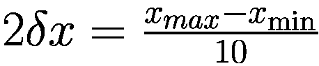 并在区域 *R*[2] = (*x*[1] - *δx*, *x*[1] + *δx*) 中使用十个点。在 (*x*[1] - *δx*, *x*[1] + *δx*) 区间内，我们将有平均距离为 *x*[*max*] - *x*[*min*] 的 1%，但我们只采样了函数 20 次，而不是 100 次，所以减少了五倍！例如，让我们用以下代码在 *x*[*min*] = 0 和 *x*[*max*] = 80 之间用十个点采样我们之前使用的函数

```py
np.random.seed(5)
randomsearch = np.random.random([10])*80
x = 0
m = 0.0
for i, val in np.ndenumerate(f(randomsearch)):
if (val > m):
m = val
x = randomsearch[i]
```

这给我们提供了最大位置和值 *x*[1] = 69.65 和 *f*[1] = 14.89，所以还不错，但不如真实的精确——69.18 和 15.027。现在让我们在区域 *R*[2] = (*x*[1] - 4, *x*[1] + 4) 附近采样十个点。

```py
randomsearch = x + (np.random.random([10])-0.5)*8
x = 0
m = 0.0
for i, val in np.ndenumerate(maxim(randomsearch)):
if (val > m):
m = val
x = randomsearch[i]
```

这给我们提供了结果 69.189 和 15.027。仅用函数的 20 次评估就得到了相当精确的结果。如果我们用 500 个（比我们刚才做的多 25 倍）采样点进行简单的随机搜索，我们得到 *x*[1] = 69.08 和 *f*[1] = 15.022。这个结果展示了这个技巧如何真正有用。但记住风险：如果你的最大值不在你的区域 *R*[*i*] 中，你将永远找不到它，因为你仍在处理随机数。所以，总是选择相对较大的区域 (*x*[*i*] - *δx*[*i*], *x*[*i*] + *δx*[*i*]) 来确保它们包含你的最大值是一个好主意。

它们需要多大取决于，就像深度学习世界中的几乎所有事情一样，你的数据集和手头的问题，可能事先无法知道。不幸的是，测试是必需的。图 6-9 显示了函数 *f*(*x*) 上的采样点。在左边的图中，你可以看到前十个点，在右边是带有额外十个点的区域 *R*[2]。左图中的小矩形标记了 *x* 区域 *R*[2]。

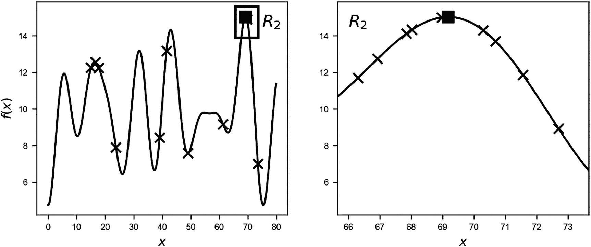

图 6-9

函数*f*(*x*)。十字标记了采样点。在左边，采样了区域*R*[1]（整个范围）中的十个点，在右边，采样了*R*[2]中的十个点。黑色方块标记了真实最大值。右边的图是区域*R*[2]的放大图。

决定一开始应该采样多少个点至关重要。在这里我们很幸运。让我们考虑在选择初始十个随机点时使用不同的种子，看看会发生什么。如图 6-10 所示，选择错误的初始点会导致灾难！

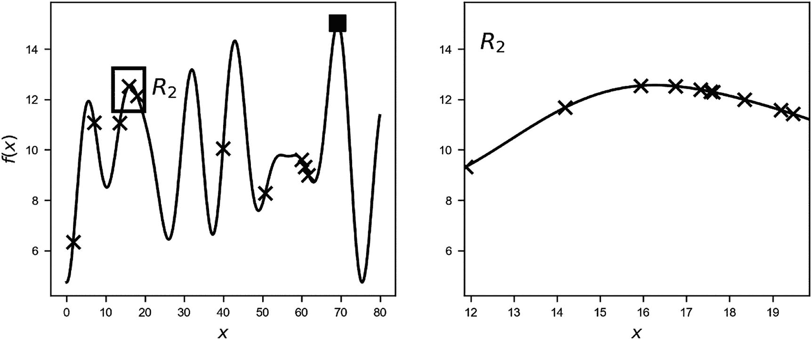

图 6-10

函数*f*(*x*)。十字标记了采样点。在左边，采样了区域*R*[1]（整个范围）中的十个点，在右边，采样了*R*[2]中的十个点。黑色方块标记了真实最大值。算法在 16 附近很好地找到了最大值，但并不是绝对最大值。左边的矩形标记了区域*R*[2]。右边的图是区域*R*[2]的放大图。

在图 6-10 中，注意算法如何在约 16 的位置找到最大值，因为在初始采样点中最大值大约在*x* = 16，如图 6-10 左边的图中所示。没有点接近*x* = 69 处的真实最大值。算法确实找到了一个最大值，但并不是绝对最大值。这就是使用这个技巧面临的风险。情况甚至可能更糟。考虑图 6-11，我们在一开始只采样了一个点。你可以在图 6-11 左边的图中看到，算法完全错过了任何最大值。它简单地给出了右图中标记十字的点中的最高值：(58.4, 9.78)。

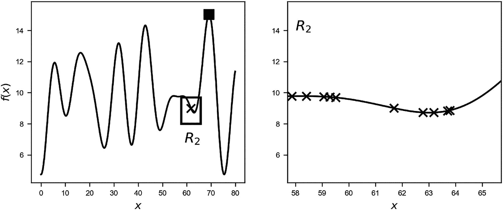

图 6-11

函数*f*(*x*)。十字标记了采样点。在左边，采样点位于区域*R*[1]（整个范围），在右边，采样点位于*R*[2]。黑色方块标记了真实最大值。算法没有找到最大值，因为区域*R*[2]中没有最大值。右边的图是区域*R*[2]的放大图。

如果你决定使用这种方法，请记住，你仍然需要在开始时拥有足够多的点来接近最大值，然后再细化搜索。在你相对确定有围绕最大值的点之后，你可以使用这种技术来细化你的搜索。

### 贝叶斯优化

#### Nadaraya-Watson 回归

要理解贝叶斯优化，我们必须看看一些新的数学概念。让我们从 1964 年的 Nadaraya-Watson 回归开始，这是一个想法[2]。基本思想相当简单。给定一个未知的函数 *y*(*x*) 和给定 *N* 个点 *x*[*i*] = 1, …, *N*，我们用 *y*[*i*] = *f*(*x*[*i*]) 表示 *i* = 1, …, *N* 时函数在不同 *x*[*i*] 处的值。Nadaraya-Watson 回归的思想是，我们可以使用以下公式在未知点 *x* 上评估未知函数 *f*：

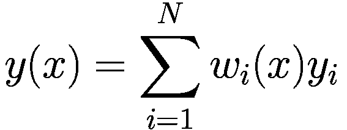

其中 *w**i* 是根据以下公式计算的权重

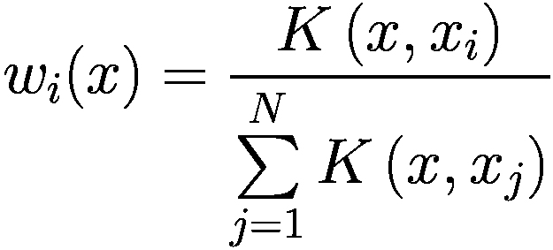

其中 *K*(*x*, *x*[*i*]) 被称为 ***核函数***。请注意，根据权重的定义，我们有

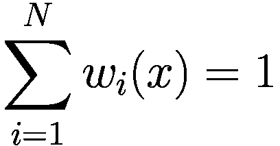

在文献中，你可以找到几个核函数，但我们感兴趣的是高斯核，通常称为 *径向基函数* (RBF)

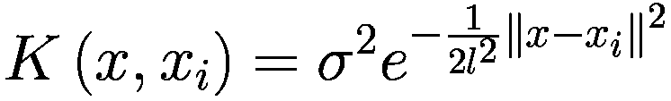

参数 *l* 使高斯形状更宽或更窄。*σ* 通常是你数据的方差，但在这个情况下，它不起作用，因为权重被归一化到 1。这是贝叶斯优化的基础，你将在后面看到。

#### 高斯过程

在讨论高斯过程之前，我们必须定义什么是随机过程。当我们为任何点 *x* ∈ *ℝ*^(*d*) 分配一个随机变量 *f*(*x*) ∈ *ℝ* 时，我们称之为 *随机过程*。如果一个随机过程对于任何有限数量的点，它们的联合分布是正态的，那么它就是高斯过程。这意味着对于 ∀*n* ∈ *ℕ*，以及对于 ∀*x*[1]，…，*x*[*n*] ∈ *ℝ*^(*d*)，那么向量

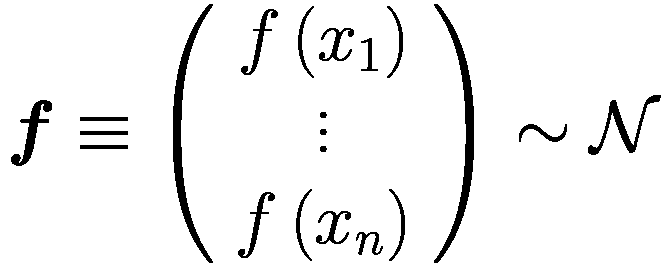

其中，我们用符号表示向量分量遵循正态分布，用 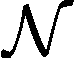 表示。记住，具有高斯分布的随机变量被称为正态分布。正态分布的概率分布由以下函数给出

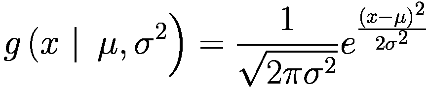

其中 *μ* 是分布的均值或期望，*σ* 是标准差。从现在开始，我们将使用以下符号

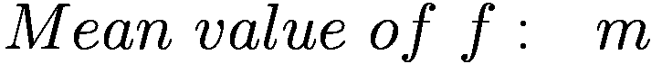

并且随机值的协方差将由 *K* 表示

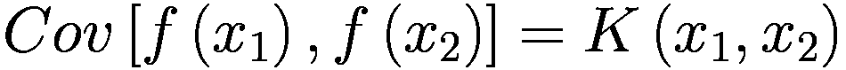

字母 *K* 的选择是有目的的。在以下内容中，我们将假设协方差将具有高斯形状，并且我们将使用之前定义的径向基函数（RBF）作为 *K*。

#### 稳定过程

为了简化，我们只考虑稳定过程。一个随机过程是稳定的，如果其联合概率分布不随时间变化。这意味着均值和方差在时间上的平移也不会改变。我们还将考虑一个其分布只依赖于点之间相对位置的过程。这导致以下条件

![K(x1,x2) 和 Var[f(x)] 的公式](../images/463356_2_En_6_Chapter/463356_2_En_6_Chapter_TeX_Equp.png)

*请注意，为了应用我们描述的方法，您必须将数据转换为稳定状态，例如消除时间序列中的季节性或趋势。*

#### 高斯过程预测

现在我们已经到达了有趣的部分：给定向量 ***f***，我们如何估计任意点 *x* 处的 *f*(*x*)？由于我们处理的是随机过程，我们将估计未知函数取给定值 *f*(*x*) 的概率。从数学上讲，我们将预测以下量

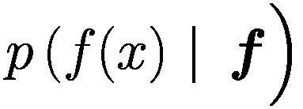

或者换句话说，给定由所有点 *f*(*x*[1])，…，*f*(*x*[*n*]) 组成的向量 ***f***，得到值 *f*(*x*) 的概率。

假设 *f*(*x*) 是一个具有 *m* = 0 的平稳高斯过程，预测可以表示为

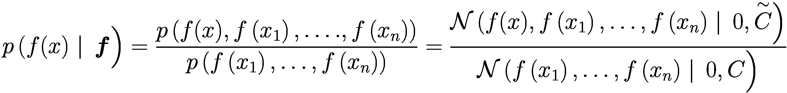

其中，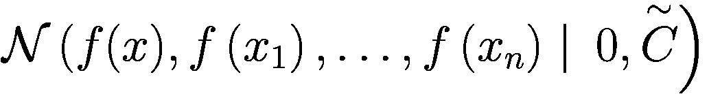 表示在平均值为 0 且协方差矩阵  的 *n* + 1 × *n* + 1 维度上计算的正态分布，因为我们有 *n* + 1 个点在分子中。推导过程较为复杂，基于几个定理，例如贝叶斯定理。更多细节可以参考 C.B. Do [3] 的（高级）解释。为了理解贝叶斯优化是什么，我们可以简单地使用公式而不进行推导。*C* 将具有 *n* × *n* 的维度，因为我们只有 *n* 个点在分母中。

我们有

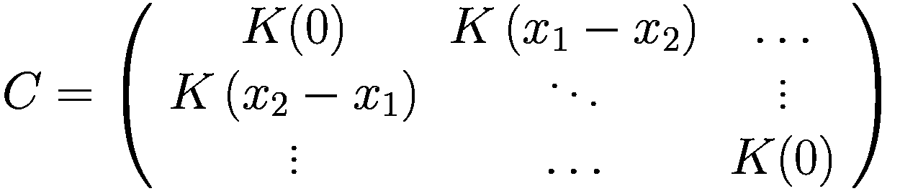

And

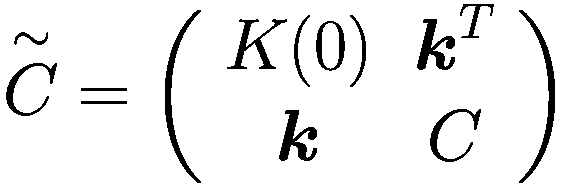

其中我们定义了

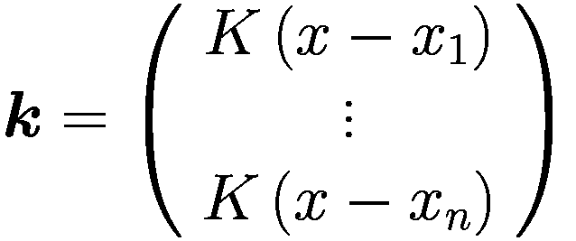

可以证明^(2)，两个正态分布的比值仍然是一个正态分布，这意味着我们可以写出

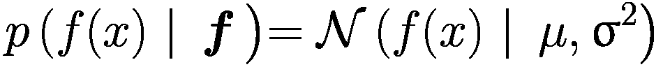

With

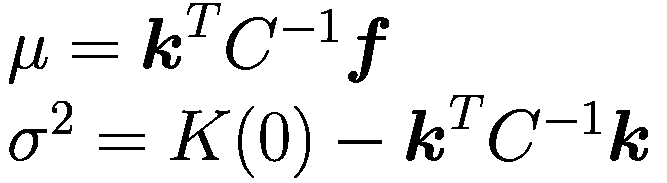

*μ* 和 *σ* 的确切形式的推导相当长，超出了本书的范围。基本上，现在我们知道，平均而言，我们的未知函数将在 *x* 处取 *μ* 的值，具有 *σ* 的方差。现在让我们看看这种方法在 Python 中的实际应用。让我们定义我们的核 *K*(*x*)

```py
def K(x, l, sigm = 1):
return sigm**2*np.exp(-1.0/2.0/l**2*(x**2))
```

让我们用一个简单的函数来模拟我们的未知函数

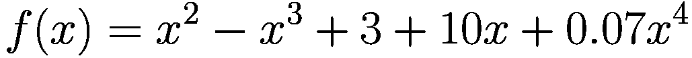

这可以如下实现

```py
def f(x):
return x**2-x**3+3+10*x+0.07*x**4
```

让我们考虑范围在 (0, 12) 内的函数。图 6-12 展示了函数的形状。

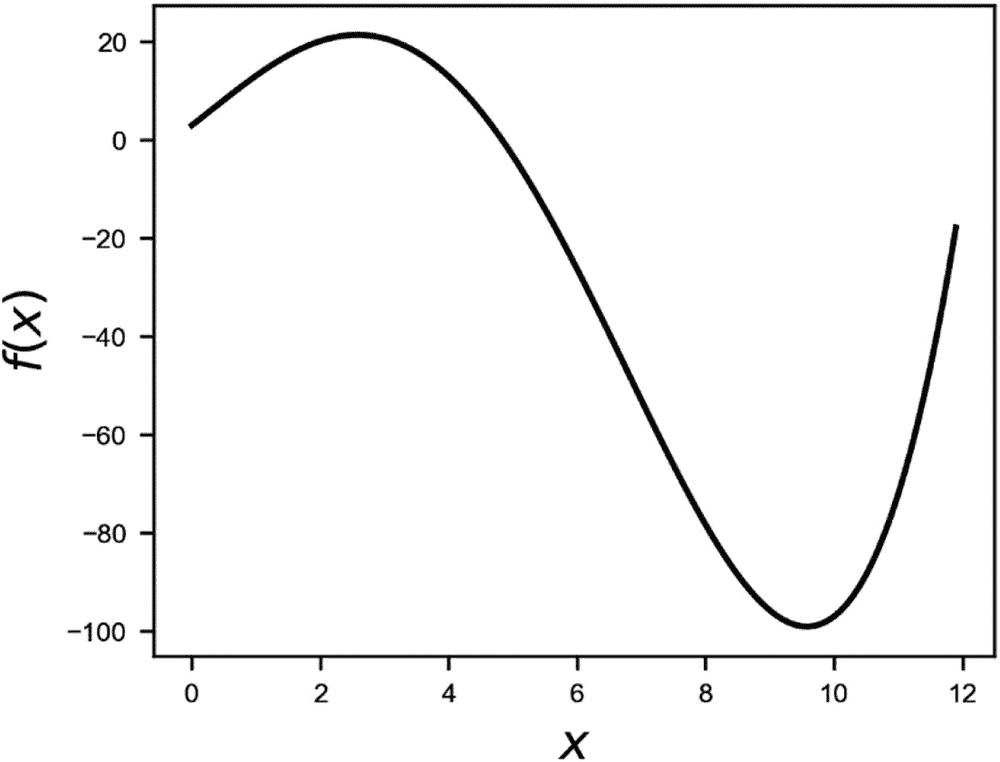

图 6-12

文中描述的未知测试函数的图形

让我们首先构建我们的 ***f*** 向量，包含五个点

```py
randompoints = np.random.random([5])*12.0
f_ = f(randompoints)
```

其中我们使用了随机数种子 42：`np.random.seed(42)`。图 6-13 显示了在图上用十字标记的随机点。

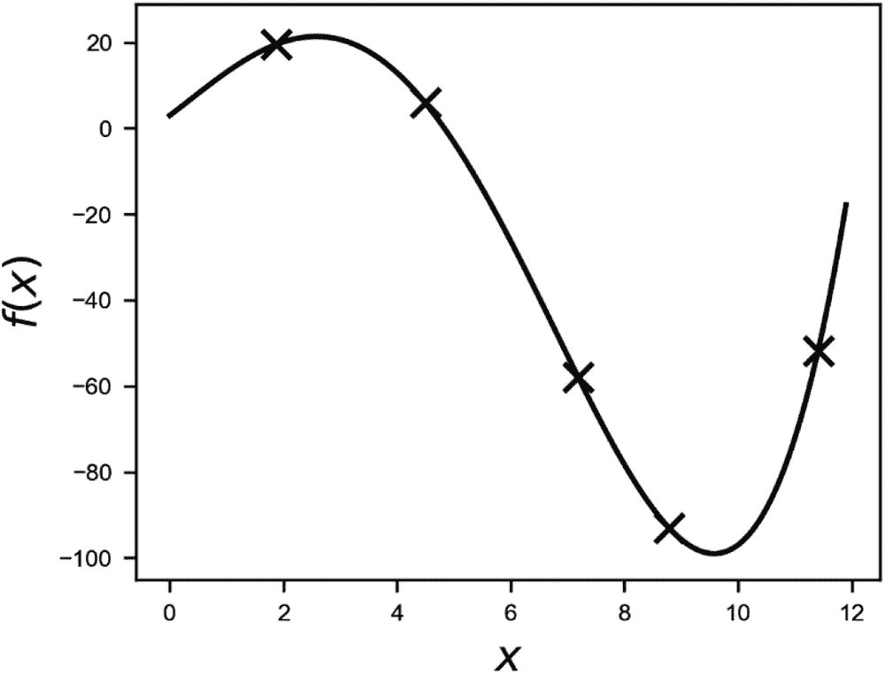

图 6-13

一个未知函数的图。十字标记的是在文本中选择的随机点。

我们可以使用前面描述的方法，以下代码

```py
xsampling = np.arange(0,14,0.2)
ybayes_ = []
sigmabayes_ = []
for x in xsampling:
f1 = f(randompoints)
sigm_ = np.std(f1)**2
f_ = (f1-np.average(f1))
k = K(x-randompoints, 2 , sigm_)
C = np.zeros([randompoints.shape[0],
randompoints.shape[0]])
Ctilde = np.zeros([randompoints.shape[0]+1,
randompoints.shape[0]+1])
for i1,x1_ in np.ndenumerate(randompoints):
for i2,x2_ in np.ndenumerate(randompoints):
C[i1,i2] = K(x1_-x2_, 2.0, sigm_)
Ctilde[0,0] = K(0, 2.0, sigm_)
Ctilde[0,1:randompoints.shape[0]+1] = k.T
Ctilde[1:,1:] = C
Ctilde[1:randompoints.shape[0]+1,0] = k
mu = np.dot(np.dot(np.transpose(k), np.linalg.inv(C)), f_)
sigma2 = K(0, 2.0,sigm_)-
np.dot(np.dot(np.transpose(k),
np.linalg.inv(C)), k)
ybayes.append(mu)
sigmabayes_.append(np.abs(sigma2))
ybayes = np.asarray(ybayes_)+np.average(f1)
sigmabayes = np.asarray(sigmabayes_)
```

花些时间研究它，以便理解它。在 `ybayes` 列表中，我们将找到在 `xsampling` 数组中评估的 *μ*(*x*) 的值。以下是一些有助于理解代码的提示：

+   我们遍历一系列我们想要评估函数的 *x* 点，使用代码 `for x in xsampling`。

+   我们使用代码为向量的每个元素构建 ***k*** 和 ***f*** 向量：`k = K(x-randompoints, 2, sigm_)` 和 `f1 = f(randompoints)`。对于核，我们选择了函数 2.中定义的参数 `l` 的一个值。我们在向量 ***f*** 中减去平均值以获得 *m*(*x*) = 0，以便能够应用推导出的公式。

+   我们构建矩阵 *C* 和 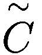。

+   我们使用 `mu = np.dot(np.dot(np.transpose(k), np.linalg.inv(C)), f_)` 和标准差来计算 *μ*。

+   我们以相反的顺序重新应用我们为了使我们的过程平稳所做的所有转换，简单地将 *f*(*x*) 的平均值加回到评估的代理函数 `ybayes = np.asarray(ybayes_)+np.average(f1)`。

图 6-14 显示了这种方法是如何工作的。虚线是使用代码中计算的 *μ*(*x*) 绘制得到的预测函数，当我们有五个点时 (*n* = 5)。灰色区域是估计函数与 +/- *σ* 之间的区域。

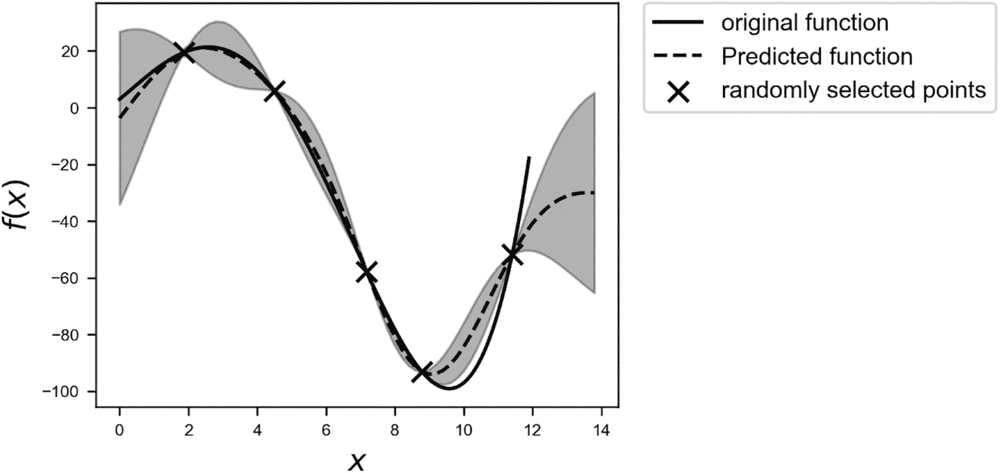

图 6-14

预测函数，虚线，评估 *μ*(*x*)。灰色区域是估计函数与 +/- *σ* 之间的区域。

由于我们只有很少的点，这实际上是一个不错的结果。记住，你仍然需要一些点才能得到合理的近似。图 6-15 显示了我们只有两个点时的结果。结果并不那么好。灰色区域是估计函数和 +/- *σ* 附近的区域。你可以看到，你离点越远，预测函数的不确定性或方差就越高。

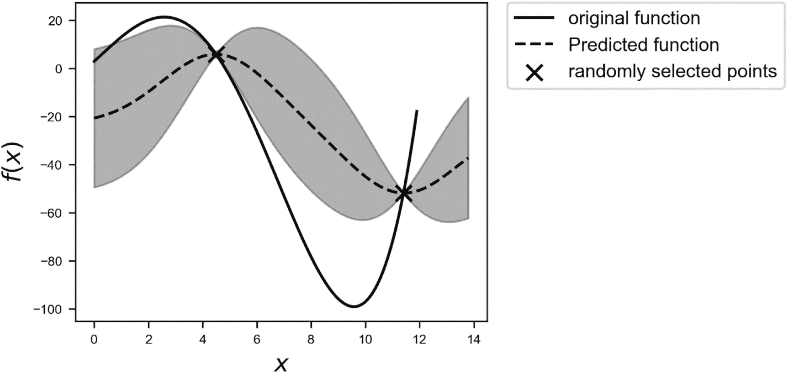

图 6-15

当我们只有两个点时，预测函数，虚线。灰色区域是估计函数与 +/- *σ* 之间的区域。

让我们停下来思考一下为什么我们要做所有这些。其背后的想法是找到一个 *代理函数* ，它近似我们的函数 *f*，并且具有以下性质

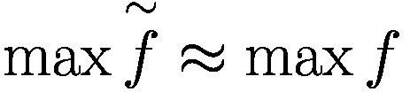

*这个代理函数必须具有另一个非常重要的属性：它必须易于评估。这样，我们就可以轻松地找到*  *的最大值，通过使用前面的属性，我们将得到 f 的最大值，根据假设这是昂贵的。*

正如你所看到的，知道我们是否有足够的数据点来找到最大值的正确值可能非常困难。毕竟，根据定义，我们对我们黑盒函数的外观没有任何想法。那么我们如何解决这个问题呢？

该方法背后的主要思想可以通过以下算法来描述：

1.  从少量随机选择的样本点开始（点的数量将取决于你的问题）。

1.  使用这组点来获取一个代理函数，如前所述。

1.  使用我们稍后讨论的特定方法向集合中添加一个点，并重新评估代理函数。

1.  如果使用代理函数找到的最大值继续变化，继续添加点，如步骤 3 中所述，直到最大值不再变化或你用完时间或预算，无法进行更多评估。

如果步骤 3 中提到的这种方法足够聪明，你将能够相对快速和准确地找到最大值。

#### 获取函数

如何选择前一小节中提到的步骤 3 中的附加点？想法是使用一个获取函数。算法以这种方式工作：

1.  选择一个函数（我们稍后会看到一些可能性），称为“获取函数”。

1.  然后选择一个附加点 *x*，在该点获取函数达到最大值。

我们可以使用几种获取函数。我们只描述我们将使用的一个，以了解这种方法是如何工作的，但还有几个你可能想检查的，包括熵搜索、改进概率、期望改进和上界置信度。

##### 上界置信度（Upper Confidence Bound, UCB）

在文献中，你可以找到这种获取函数的两个变体。我们可以将函数写成

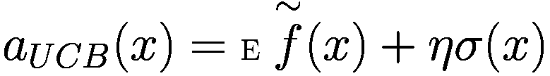

其中我们用 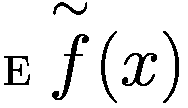 表示我们在问题中具有的 *x*-范围上代理函数的“期望”值。期望值不过是函数在给定 *x* 范围内的平均值。*σ*(*x*) 是我们在点 *x* 处使用我们的方法计算的代理函数的方差。我们选择的新点是 *a**UCB* 最大的点。*η* > 0 是一个权衡参数。*此获取函数基本上选择方差最大的点*。再次查看图 6-15。该方法会选择方差较大的点，因此尽可能远离我们已有的点。这样，近似通常会越来越好。UCB 获取函数的另一种变体如下

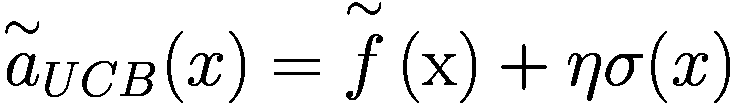

这次，获取函数将在选择代理函数最大值周围的点和其方差最大的点之间进行权衡。第二种方法最适合快速找到 *f* 的良好近似，而第一种方法则倾向于在整个 *x* 范围内给出 *f* 的良好近似。下一节将解释这些方法是如何工作的。

##### 示例

让我们从本章开头描述的复杂三角函数开始，考虑 *x* 范围 [0, 40]。我们的目标是找到其最大值并近似该函数。为了方便代码，让我们定义两个函数：一个用于评估代理函数，另一个用于评估新点。为了评估代理函数，我们可以使用以下函数

```py
def get_surrogate(randompoints):
ybayes_ = []
sigmabayes_ = []
for x in xsampling:
f1 = f(randompoints)
sigm_ = np.std(f_)**2
f_ = (f1-np.average(f1))
k = K(x-randompoints, 2.0, sigm_ )
C = np.zeros([randompoints.shape[0],
randompoints.shape[0]])
Ctilde = np.zeros([randompoints.shape[0]+1,
randompoints.shape[0]+1])
for i1,x1_ in np.ndenumerate(randompoints):
for i2,x2_ in np.ndenumerate(randompoints):
C[i1,i2] = K(x1_-x2_, 2.0, sigm_)
Ctilde[0,0] = K(0, 2.0)
Ctilde[0,1:randompoints.shape[0]+1] = k.T
Ctilde[1:,1:] = C
Ctilde[1:randompoints.shape[0]+1,0] = k
mu = np.dot(np.dot(np.transpose(k),
np.linalg.inv(C)), f_)
sigma2 = K(0, 2.0, sigm_)
- np.dot(np.dot(np.transpose(k),
np.linalg.inv(C)), k)
ybayes_.append(mu)
sigmabayes_.append(np.abs(sigma2))
ybayes = np.asarray(ybayes_)+np.average(f1)
sigmabayes = np.asarray(sigmabayes_)
return ybayes, sigmabayes
```

此函数的代码与我们之前章节中的示例相同，但它被封装在一个函数中，该函数返回包含在 `ybayes` 数组中的代理函数，以及包含在 `sigmabayes` 数组中的 *σ*²。此外，我们还需要一个函数来使用获取函数 *a**UCB* 评估新点。我们可以通过以下函数获得它

```py
def get_new_point(ybayes, sigmabayes, eta):
idxmax = np.argmax(np.average(ybayes)
+eta*np.sqrt(sigmabayes))
newpoint = xsampling[idxmax]
return newpoint
```

为了使事情更简单，我们在函数外部定义包含我们想要的所有 *x* 值的数组。让我们从六个随机选择的点开始。为了了解这种方法的表现，让我们先定义一些东西

```py
xmax = 40.0
numpoints = 6
xsampling = np.arange(0,xmax,0.2)
eta = 1.0
np.random.seed(8)
randompoints1 = np.random.random([numpoints])*xmax
```

在 `randompoints1` 数组中，我们有我们前六个选定的随机点。我们可以通过我们的函数轻松地获取代理函数

```py
ybayes1, sigmabayes1 = get_surrogate(randompoints1)
```

图 6-16 展示了结果。虚线是获取函数 *a**UCB* 标准化以适应图中的结果。

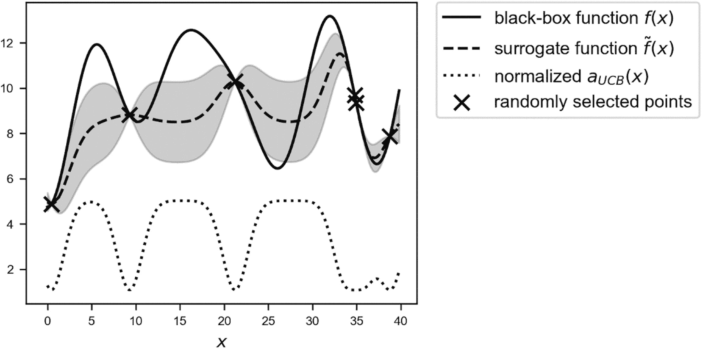

图 6-16

对黑盒函数 *f*(*x*)（实线）、随机选取的点（用十字标记）、代理函数（虚线）以及获取函数 *a**UCB*（点线，已调整以适应图表）的概述。灰色区域是位于线条  和  之间的区域。

由于我们没有足够的数据点，代理函数还不是很好，而且大的方差（灰色区域）使得这一点很明显。唯一被很好地近似的是 *x* ≳ 35 的区域。你可以看到，当代理函数没有很好地近似黑盒函数时，获取函数的值会很大，而当它做到了，例如在 *x* ≳ 35 时，获取函数的值会很小。因此，选择 *a**UCB* 达到最大值的新点，等同于选择函数近似得不太好的点，或者说，在数学上，方差较大的点。为了比较，图 6-17 显示了与图 6-16 相同的图表，但使用了获取函数  并且 *η* = 3.0。

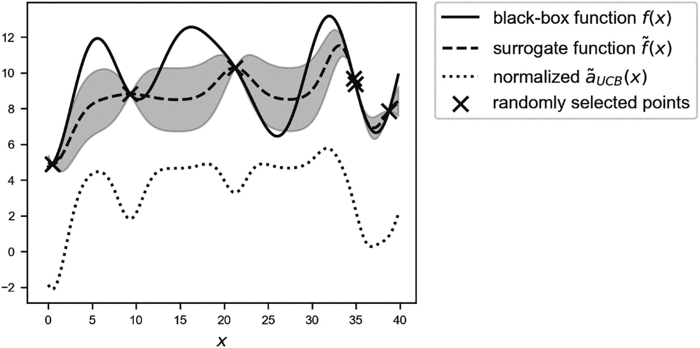

图 6-17

对黑盒函数 *f*(*x*)（实线）、随机选取的点（用十字标记）、代理函数（虚线）以及获取函数 （点线，已调整以适应图表）的概述。灰色区域是位于线条  和  之间的区域。

如你所见， 倾向于在代理函数的最大值附近达到最大值。记住，如果 *η* 很大，那么获取函数的最大值将向高方差区域移动。但这个获取函数倾向于更快地找到“一个”最大值。我说“一个”，因为它取决于代理函数的最大值在哪里，而不是黑盒函数的最大值在哪里。

现在我们来看看使用 *a**UCB* 且 *η* = 1.0 时会发生什么。对于第一个额外的点，我们需要运行以下三行代码

```py
newpoint = get_new_point(ybayes1, sigmabayes1, eta)
randompoints2 = np.append(randompoints1, newpoint)
ybayes2, sigmabayes2 = get_surrogate(randompoints2)
```

为了简化，我们为每一步的每个数组使用不同的名称，而不是创建一个列表。但通常，你应该使这些迭代自动化。图 6-18 显示了添加额外点（用黑色圆圈标记）的结果。

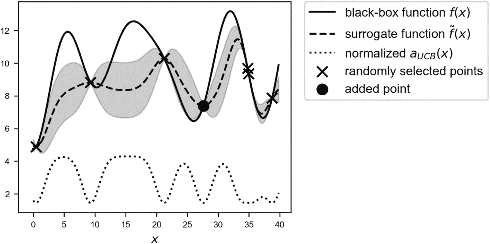

图 6-18

黑盒函数 *f*(*x*)（实线），随机选择的点（用十字标记），以及新选择的点在 *x* ≈ 27 附近（用圆圈标记），代理函数（虚线），以及获取函数 *a**UCB*（点线，已调整以适应图表）。灰色区域是位于线  和  之间的区域。

新点位于 *x* ≈ 27 附近。让我们继续添加点。图 6-19 显示了添加五个点后的结果。

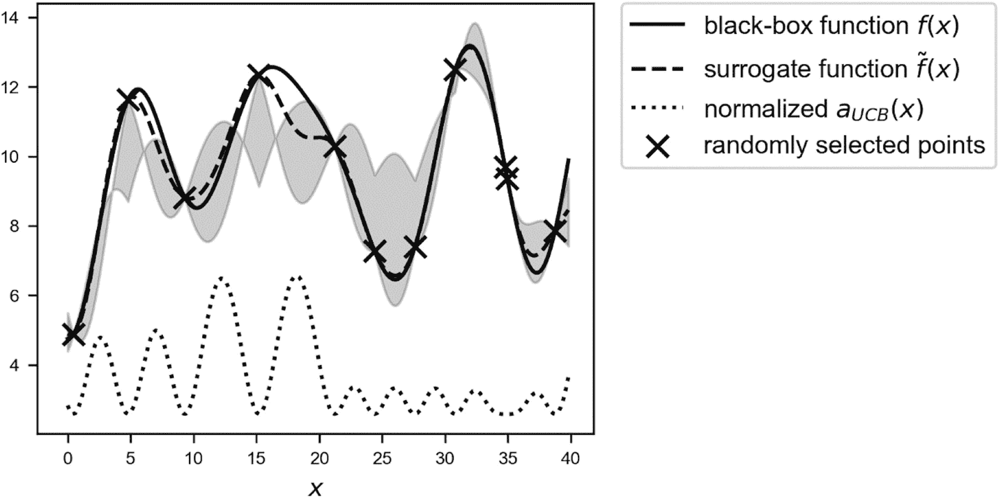

图 6-19

黑盒函数 *f*(*x*)，随机选择的点（包括新增加的六个点），代理函数，以及获取函数 。灰色区域是位于线  和  之间的区域。

看看虚线。代理函数现在对黑盒函数的近似相当好，尤其是在真实最大值附近。使用这个代理函数，我们只需总共进行 11 次评估就能找到原始函数的一个非常好的近似！记住，我们除了这 11 次评估外，没有关于 *f* 的任何其他信息。

现在，让我们看看获取函数 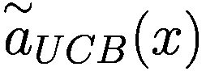 会发生什么，并检查我们能够多快找到最大值。在这种情况下，让我们使用 *η* = 3.0，以获得代理函数的最大值和其方差之间的更好平衡。图 6-20 显示了添加一个额外点（用黑色圆圈标记）后的结果。我们已经有了一个关于真实最大值的好近似！

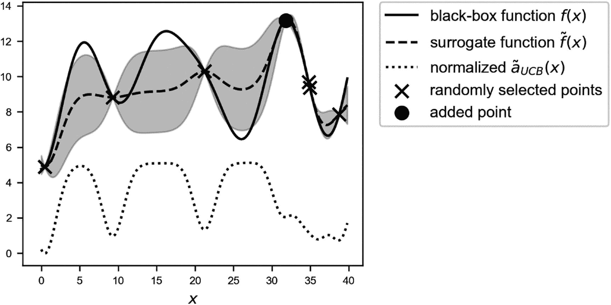

图 6-20

黑盒函数 *f*(*x*) 的概述，包括随机选择的点以及额外选择的点，代理函数和获取函数 。灰色区域是位于线条  和  之间的区域。

现在让我们再添加一个点。图 6-21 显示，额外添加的点仍然接近最大值，但已经向具有高方差区域 30 的方向移动。

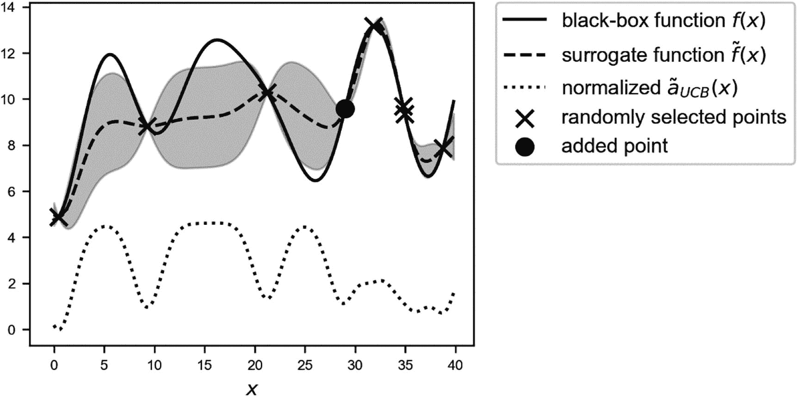

图 6-21

黑盒函数 *f*(*x*) 的概述，包括随机选择的点以及额外选择的点，代理函数和获取函数 。灰色区域是位于线条 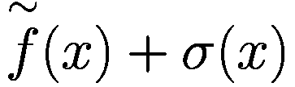 和  之间的区域。

如果我们选择一个较小的 *η*，点将更接近最大值，如果我们选择一个较大的值，点将更接近 25 和大约 32 之间具有最高方差的位置。让我们再添加一个点，看看会发生什么。图 6-22 显示了方法现在如何选择接近另一个具有高方差区域的点，即在 10 和大约 22 之间，再次用黑色圆圈标记。


图 6-22

黑盒函数 *f*(*x*) 的概述，包括随机选择的点，代理函数和获取函数 。额外选择的点用黑色圆圈标记。灰色区域是位于线条  和 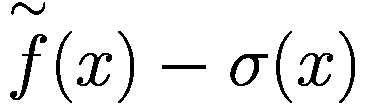 之间的区域。

最后，方法在 15 附近细化了最大区域，如图 6-23 所示，在 14 附近添加了一个点，用黑色圆圈标记。

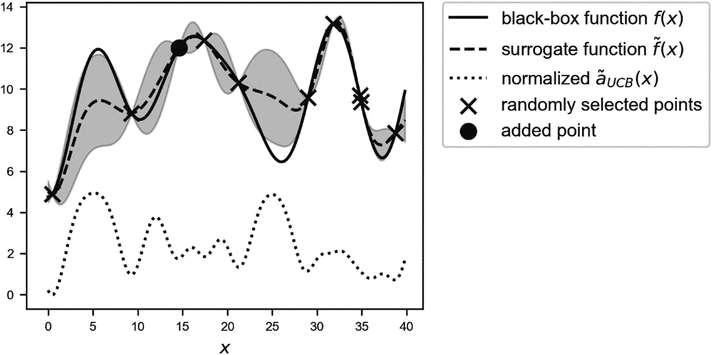

图 6-23

黑盒函数*f*(x)，随机选择的点以及额外选择的点，代理函数，以及获取函数的概述。灰色区域是位于和线之间的区域

如此至今，通过讨论和比较两种类型获取函数的行为，应该已经清楚，选择合适的获取函数取决于你想要应用哪种策略来近似你的黑盒函数。

注意

不同的获取函数类型会在近似黑盒函数时给出不同的策略。例如，*UCB*(*x*)会在方差最高的区域添加点，而则会通过*η*调节，在代理函数的最大值和具有高方差区域之间找到一个平衡点。

对所有不同类型的获取函数进行分析将远远超出本书的范围。需要大量的研究和阅读已发表的论文，以获得足够的经验并理解不同的获取函数是如何工作和表现的。

如果你想在 TensorFlow 模型中使用贝叶斯优化，你不需要完全从头开始开发该方法。你可以尝试 N. Knudde 等人提供的名为`GPflowOpt`的库[4]。

### 对数尺度上的采样

有一个最后的微小细节需要讨论。有时你可能会发现自己处于想要尝试一个参数可能值的大范围的情况，但你从经验中知道，最佳值可能在一个特定的范围内。假设你想要找到你模型的学习率最佳值，你决定测试从 10^(-4)到 1 的值，但你知道，或者至少期望，你的最佳值位于 10^(-3)和 10^(-4)之间。现在假设你正在使用网格搜索，并且采样了 1,000 个点。你可能认为你有足够的点，但你将会得到

+   在 10^(-4)和 10^(-3)之间没有 0 个点

+   在 10^(-3)和 10^(-2)之间有 8 个点

+   在 10^(-1)和 10^(-2)之间有 89 个点

+   在 1 和 10^(-1)之间有 899 个点

你在不太有趣的范围内得到很多点，而在你想要的地方却没有。图 6-24 显示了点的分布。注意，*x*轴使用了对数尺度。你可以清楚地看到，对于学习率更大的值，你得到的点更多。

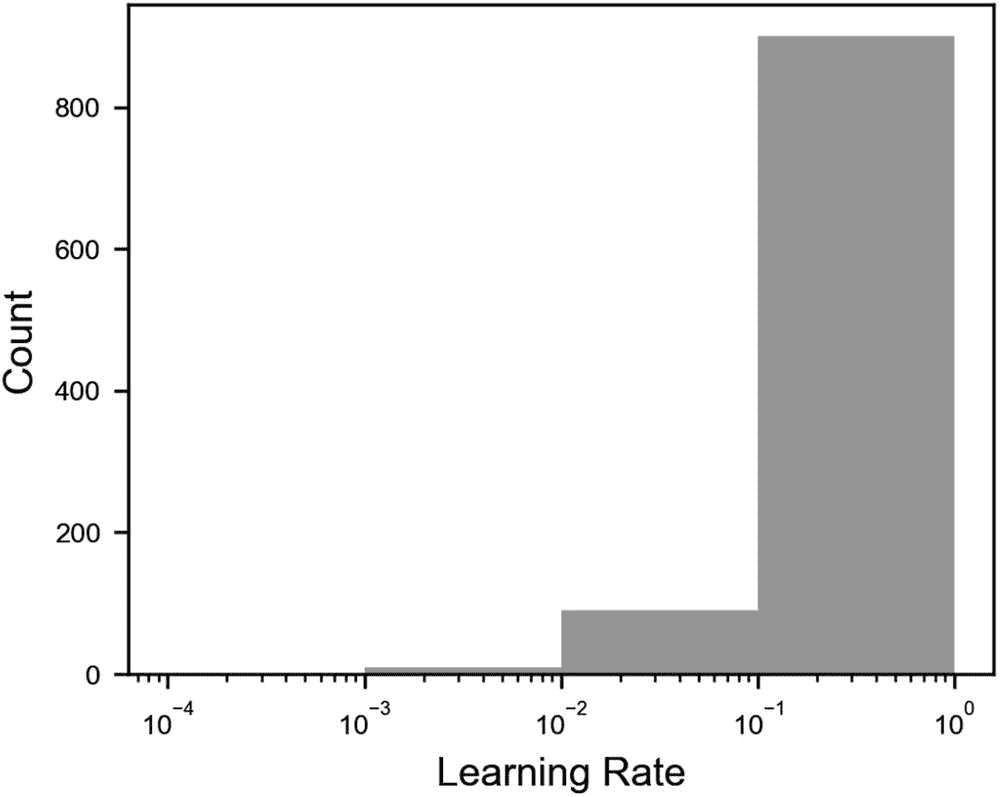

图 6-24

在对数 x 尺度上通过网格搜索选择的 1,000 个点的分布

你可能希望对于学习率较小的值以更细的方式采样，而不是对于较大的值。你应该在对数尺度上采样你的点。基本思想是，你希望在 10^(−4)和 10^(−3)，10^(−3)和 10^(−2)，10^(−1)和 10^(−2)，以及 10^(−1)和 1 之间采样相同数量的点。为此，你可以使用以下 Python 代码。首先选择一个介于 0 和最高十的幂次绝对值的负数之间的随机数；在这种情况下是-4。

```py
r = - np.arange(0,1,0.001)*4.0
```

然后，你可以使用以下方式创建包含所选点的数组

```py
points2 = 10**r
```

图 6-25 显示了数组`points2`中点的分布现在完全平坦，正如我们想要的。

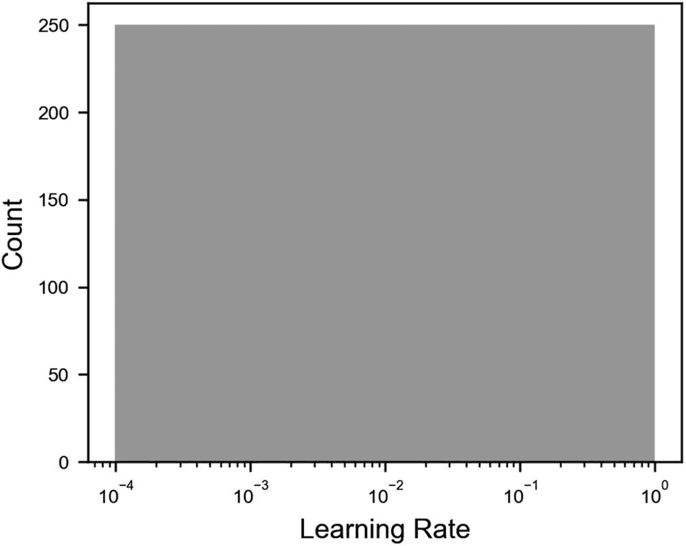

图 6-25

使用网格搜索在以对数 x 尺度修改后的选择方法下选择的 1,000 个点的分布

你在每个区域得到 250 个点，你可以轻松地检查代码中的 10^(−3)和 10^(−4)范围。对于其他范围，只需更改代码中的数字。

```py
print(np.sum((alpha  1e-4)))
```

现在，你可以看到在不同十的幂次之间，你拥有相同数量的点。通过这个简单的技巧，你可以确保在所选范围区域获得足够的点，否则你几乎得不到任何点。记住，在这个例子中，使用 1,000 个点，我们使用标准方法在 10^(−3)和 10^(−4)之间得到零点。这个范围对于学习率来说是最有趣的，所以你希望在这个范围内有足够的点来优化你的模型。注意，这同样适用于随机搜索。它以完全相同的方式工作。

## 使用 Zalando 数据集进行超参数调整

为了给你一个超参数调整如何工作的具体例子，让我们应用你所学到的知识在一个简单的案例中。让我们从数据开始，像往常一样。让我们使用第三章中的 Zalando 数据集。关于完整的讨论，请参阅该章节。让我们快速加载数据并准备，然后讨论调整。

首先，像往常一样，我们需要必要的库

```py
# general libraries
import pandas as pd
import numpy as np
import matplotlib
import matplotlib.pyplot as plt
import matplotlib.font_manager as fm
from random import *
import time
# tensorflow libraries
from tensorflow.keras.datasets import fashion_mnist
import tensorflow as tf
from tensorflow import keras
from tensorflow.keras import layers
import tensorflow_docs as tfdocs
import tensorflow_docs.modeling
```

然后，为了检索数据集，我们可以简单地运行以下命令

```py
((trainX, trainY), (testX, testY)) = fashion_mnist.load_data()
```

记住，我们在训练数据集中有 60,000 个观测值，在 dev 数据集中有 10,000 个。执行命令后，我们有两个 NumPy 矩阵（`trainX`和`testX`），包含描述每个训练和测试图像的所有像素值，以及两个 NumPy 数组（`trainY`和`testY`），包含相关的标签。

让我们打印训练数据集的维度，作为一个例子

```py
print('Dimensions of the training dataset: ', trainX.shape)
print('Dimensions of the training labels: ', trainY.shape)
```

这将返回以下输出

```py
Dimensions of the training dataset:  (60000, 28, 28)
Dimensions of the training labels:  (60000,)
```

记住，784 代表图像像素的灰度值（像素大小为 28 × 28 像素）。

现在我们需要修改数据以获得每个图像的“平坦化”版本，这意味着一个包含 754 个像素的数组，而不是 28x28 像素的矩阵。

以下行调整矩阵的维度

```py
data_train = trainX.reshape(60000, 784)
data_test = testX.reshape(10000, 784)
```

最后，让我们将输入归一化，以便它不是从 0 到 255（灰度值）的值，而是只有从 0 到 1 的值。使用这段代码做这个非常简单

```py
data_train_norm = np.array(data_train/255.0)
data_test_norm = np.array(data_test/255.0)
```

在我们开始开发我们的网络之前，我们需要解决一个最终问题。在执行多类分类任务时，标签必须以不同的形式提供。执行此操作的 Python 代码非常简单：

```py
labels_train = np.zeros((60000, 10))
labels_train[np.arange(60000), trainY] = 1
labels_test = np.zeros((10000, 10))
labels_test[np.arange(10000), testY] = 1
```

现在我们已经准备好了所需的数据。关于完整的讨论，请参阅第三章，在那里我们花费了大量时间准备这个数据集的数据。现在让我们继续到模型部分。让我们从简单的事情开始。作为一个指标，让我们在这个例子中使用准确率，因为数据集是平衡的。让我们考虑一个只有一层的网络，看看有多少个神经元能提供最佳的准确率。

在这个例子中，我们的超参数将是隐藏层中的神经元数量。基本上，我们需要为超参数（隐藏层中的神经元数量）的每个值构建一个新的网络并对其进行训练。我们需要两个函数：一个用于构建网络，另一个用于训练它。为了构建模型，我们可以定义以下函数

```py
def build_model(number_neurons, learning_rate):
# create model
model = keras.Sequential()
# add first hidden layer and set input dimensions
model.add(layers.Dense(number_neurons, input_dim = 784,
activation = 'relu'))
# add output layer
model.add(layers.Dense(10, activation = 'softmax'))
# compile model
model.compile(loss = 'categorical_crossentropy',
optimizer = tf.keras.optimizers.SGD(
learning_rate = learning_rate),
metrics = ['categorical_accuracy'])
return model
```

你应该理解这个函数，因为我们已经在书中多次使用了这段代码。这个函数有一个输入参数，`number_neurons`，它将包含，正如其名称所示，隐藏层中的神经元数量。训练模型的函数看起来像这样

```py
def train_model(number_neurons, learning_rate, number_epochs,
mb_size):
# build model
model = build_model(number_neurons, learning_rate)
# train model
history = model.fit(
data_train_norm, labels_train,
epochs = number_epochs, verbose = 0,
batch_size = mb_size,
callbacks = [tfdocs.modeling.EpochDots()])
# test model
train_loss, train_accuracy = model.evaluate(
data_train_norm, labels_train,
verbose = 0)
test_loss, test_accuracy = model.evaluate(
data_test_norm, labels_test,
verbose = 0)
return train_accuracy, test_accuracy
```

你已经多次看到一个非常类似的功能。主要部分应该是清晰的。你将发现一些新的东西。首先，我们在函数内部构建模型，使用

```py
model = build_model(number_neurons, learning_rate)
```

此外，我们还评估了训练集和开发集上的准确率，并将这些值返回给调用者。这样我们就可以为隐藏层中神经元数量的几个值运行循环，并得到准确率。请注意，这次函数有一个额外的输入参数：`number_neurons`。我们需要将这个数字传递给构建模型的函数。

假设我们选择了以下参数：批量大小 = 50，训练 100 个周期，学习率 *λ* = 0.001，并在隐藏层中使用 15 个神经元构建我们的模型。

然后我们运行模型

```py
train_accuracy, test_accuracy = train_model(15, 0.001, 100, 50)
print(train_accuracy)
print(test_accuracy)
```

对于训练集，我们得到 0.8549 的准确率，对于开发集，我们得到 0.8396 的准确率。我们能做得更好吗？嗯，我们可以从网格搜索开始

```py
nn = [1, 5, 10, 15, 25, 30, 50, 150, 300, 1000, 3000]
for nn_ in nn:
train_accuracy, test_accuracy = train_model(nn_, 0.001, 100, 50)
print('Number of neurons:', nn_, 'Acc. Train:', acc_train, 'Acc. Test', acc_test)
```

请记住，这将会花费很多时间。3000 个神经元是一个很大的数字，所以如果你想要尝试，请提前警告。我们将得到表 6-1 中所示的结果。

表 6-1

不同神经元数量下训练集和测试集准确率概述

| 神经元数量 | 训练集准确率 | 测试集准确率 |
| --- | --- | --- |
| 1 | 0.1000 | 0.1000 |
| 5 | 0.8242 | 0.8123 |
| 10 | 0.8476 | 0.8323 |
| 15 | 0.8549 | 0.8373 |
| 25 | 0.8604 | 0.8444 |
| 30 | 0.8577 | 0.8413 |
| 50 | 0.8661 | 0.8470 |
| 150 | 0.8677 | 0.8513 |
| 300 | 0.8694 | 0.8512 |
| 1000 | 0.8740 | 0.8555 |
| 3000 | 0.8754 | 0.8569 |

并不出奇，更多的神经元带来了更高的准确率，没有迹象表明训练数据集过拟合，因为开发数据集上的准确率几乎等于训练数据集上的准确率。图 6-26 显示了测试数据集上的准确率与隐藏层神经元数量的关系图。注意，x 轴使用对数尺度，以便更明显地显示变化。

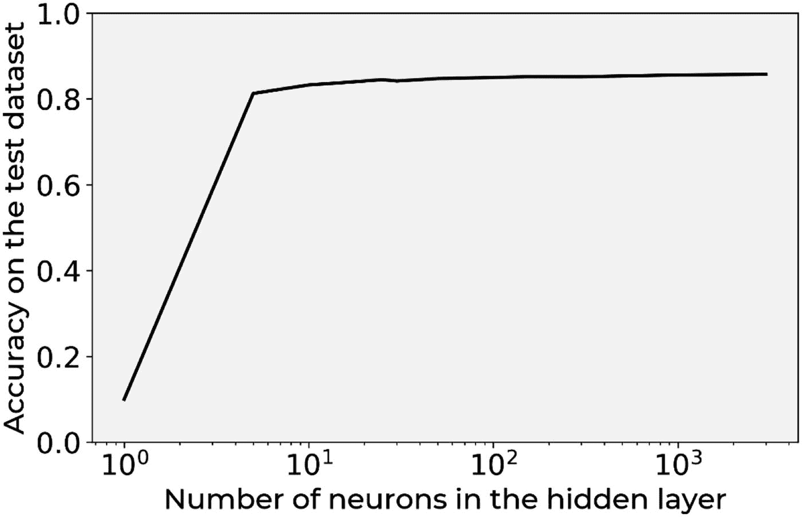

图 6-26

测试数据集上的准确率与隐藏层神经元数量的关系

如果你的目标是达到 80%的准确率，你完全可以在这里停止。但还有一些事情需要考虑：首先，我们可能做得更好，其次，用 3000 个神经元训练网络需要花费很多时间。在中等性能的笔记本电脑上大约需要 35 分钟。我们应该看看我们是否能在更短的时间内得到相同的结果。我们想要一个尽可能快训练的模型！让我们尝试一种稍微不同的方法。由于我们想要更快，让我们考虑一个有四层的模型。我们也可以调整层数，但在这个例子中，我们保持四层并调整其他参数。我们将尝试找到学习率、批大小、每层的神经元数量和训练轮数的最佳值。我们将使用随机搜索。对于每个参数，我们将随机选择十个值：

+   神经元数量：介于 35 到 60 之间

+   学习率：我们将使用对数尺度在 10^(-1)和 10^(-3)之间的搜索

+   批大小：介于 20 到 80 之间

+   训练轮数：介于 40 到 100 之间

我们可以使用以下代码创建包含可能值的数组

```py
neurons_ = np.random.randint(low = 35, high = 60.0, size = (10))
r = - np.random.random([10])*3.0 - 1
learning_ = 10**r
mb_size_ = np.random.randint(low = 20, high = 80, size = 10)
epochs_ = np.random.randint(low = 40, high = 100, size = (10))
```

注意，我们不会尝试所有可能的组合。我们只考虑十种可能的组合：每个数组的第一个值，每个数组的第二个值，以此类推。让我们看看随机搜索在只有十次评估的情况下能有多高效。我们可以用以下循环测试这个模型

```py
for i in range(len(neurons_)):
train_accuracy, test_accuracy = train_model(neurons_[i], learning_[i], epochs_[i], mb_size_[i])
print()
print('Epochs:', epochs_[i], 'Number of neurons:', neurons_[i], 'Learning rate:', learning_[i], 'Minibatch size', mb_size_[i],
'Training accuracy:', train_accuracy, 'Test Accuracy', test_accuracy)
```

你会发现，具有 44 个训练轮数、每层 36 个神经元、学习率为 0.07537 和批大小为 54 的组合在开发数据集上的准确率为 0.86。考虑到这次运行只用了 1.5 分钟，所以比只有一个层和 3000 个神经元的模型快了 23 倍。而且它提高了 2%。我们的初始测试给出了 0.84 的准确率，所以通过超参数调整，我们比初始猜测提高了 2%。在深度学习中，这被认为是一个很好的结果。我们所做的工作应该能给你一个关于如果做得好的话超参数调整有多强大的概念。请记住，你应该花相当多的时间来做这件事，特别是思考如何做这件事。

备注

总是思考你想要如何进行超参数调整，并利用你的经验或向有经验的人寻求帮助。尝试那些你知道不会成功的参数组合是浪费时间和资源。例如，测试非常小的学习率比测试接近 1 的学习率更有意义。记住，即使结果没有用，你的网络每轮训练也会花费时间！

这最后一部分的目的不是得到最好的模型，而是让你了解调整过程可能如何进行。你可以继续尝试不同的优化器（例如 Adam），考虑更广泛的参数范围、更多参数组合等。

## 关于径向基函数的简要说明

在结束本章之前，让我们讨论一下关于径向基函数的一个小问题


理解参数 *l* 的作用非常重要。在我们的例子中，我们选择了 *l* = 2，但我们没有讨论为什么。选择一个过小的 *l* 将使获取函数在已有点周围形成非常狭窄的峰值，正如你在图 6-27 的左侧图中可以看到。大的 *l* 值将对获取函数产生平滑效果，正如你在图 6-27 的中间和右侧图中可以看到。

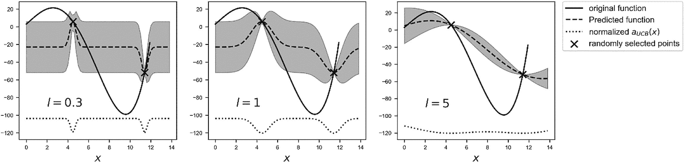

图 6-27

改变径向基函数中的 *l* 参数的影响

通常，避免过小或过大的 *l* 值是一个好的实践，以便能够使方差在已知点之间平滑变化，如图 6-27 中 *l* = 1 的情况。一个非常小的 *l* 将使点之间的方差几乎保持不变，因此算法几乎总是选择点之间的中间点，正如你可以从获取函数中检查的那样。而选择一个过大的 *l* 将使方差变小，因此难以使用。正如你在图 6-27 中 *l* = 5 所见，获取函数几乎保持不变。典型值大约是 1 或 2。

## 练习

练习 1（难度：简单）

尝试为本章中的示例使用不同的优化器（例如，Adam），并考虑更广泛的参数范围、更多参数组合等。看看结果如何变化。

练习 2（难度：困难）

尝试从头实现本章中描述的贝叶斯优化。

练习 3（难度：中等）

尝试优化一个多分类模型，例如本章中看到的模型，但使用手写数字的 MNIST 数据库([`http://yann.lecun.com/exdb/mnist/`](http://yann.lecun.com/exdb/mnist/))。要从 TensorFlow 下载数据集，请使用以下代码行：

```py
from tensorflow import keras
(x_train, y_train), (x_test, y_test) = keras.datasets.mnist.load_data()
```

## 参考文献

+   [1] 伯格斯特拉，詹姆斯，和约舒亚·本吉奥。 “超参数优化中的随机搜索。” *机器学习研究杂志*，第 13 卷第 2 期 (2012).

+   [2] 纳达拉亚，埃尔扎巴·A. “关于回归估计。” *概率论及其应用理论*，第 9 卷第 1 期 (1964): 141-142.

+   [3] 杜，钟博·B. “高斯过程。” 斯坦福大学，加利福尼亚州斯坦福，访问日期：2007 年 12 月 5 日：2017.

+   [4] 克努德，尼古拉斯，等人。 “GPflowOpt：一个使用 TensorFlow 的贝叶斯优化库。” *arXiv 预印本 arXiv:1711.03845* (2017).
