# 9. 自动编码器

在本章中，我们将探讨自动编码器。本章是一个理论性的章节，涵盖了自动编码器的数学和基本概念。我们讨论了它们是什么，它们的局限性是什么，典型的用例，然后查看一些示例。我们从一个关于自动编码器的一般介绍开始，并讨论输出层中的激活函数和损失函数的作用。然后我们讨论重建误差是什么。最后，我们查看典型的应用，例如降维、分类、去噪和异常检测。

## 引言

正如你在许多前几章中看到的，神经网络通常在监督设置中使用。这意味着对于每个训练观察值 ***x***[*i*]，我们有一个标签或期望值，***y***[*i*]。在训练过程中，神经网络模型将学习输入数据和期望标签之间的关系。现在假设我们只有未标记的观察值，这意味着我们只有我们的训练数据集 *S*[*T*]，由 *M* 个观察值 ***x***[*i*] 组成，其中 *i* = 1, …, *M*

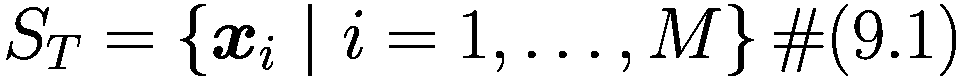

(9.1)

一般情况下 ***x***[*i*] ∈ ℝ^(*n*) with *n* ∈ ℕ。自动编码器是由 Rumelhart、Hinton 和 Williams 在 1986 年引入的^(1)，目的是“以尽可能低的误差学习重建输入观察值 ***x***[*i*]”。^(2)

为什么你想学习重建输入观察值？如果你难以想象这意味着什么，想想由图像组成的数据库。自动编码器是一种算法，可以输出与输入图像尽可能相似的画面。你可能感到困惑，因为没有明显的理由去做这件事。为了更好地理解自动编码器的有用性，我们需要一个更信息化的（尽管不是完全无歧义的）定义。

自动编码器是一种算法，其主要目的是通过学习足够好地重建一组输入观察值的方式来学习数据的“信息性”表示，以便用于不同的应用^(3)。

为了更好地理解自动编码器，我们需要参考它们的典型架构，如图 9-1 所示。自动编码器的主要组件包括一个编码器、一个潜在特征表示和一个解码器。编码器和解码器仅仅是函数，而*潜在特征表示*通常意味着一个实数张量（关于这一点稍后会有更多介绍）。一般来说，我们希望自动编码器能够很好地重建输入。同时，它应该创建一个有用的和有意义的潜在表示（如图 9-1 中编码器部分的输出）。

例如，手写数字上的潜在特征^(4)可能是写每个数字所需的线条数量或每条线的角度以及它们如何连接。学习如何写数字当然不需要学习输入图像中每个像素的灰度值。我们人类不是通过填充像素的灰度值来学习写字的。在学习过程中，我们提取出将允许我们解决问题（例如写数字）的基本信息。这种潜在表示（*如何*写每个数字）对于各种任务（例如，可以用于分类或聚类的特征提取）或简单地理解数据集的基本特征非常有用。

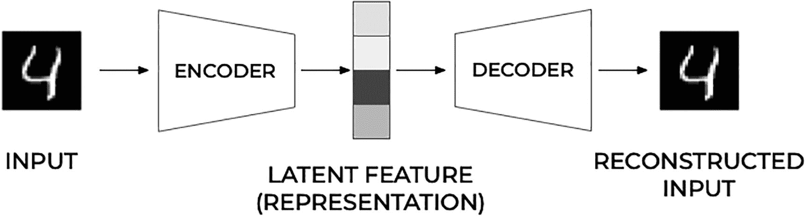

图 9-1

自动编码器的一般结构

在大多数典型架构中，编码器和解码器都是神经网络^(5)（这是我们将在本章详细讨论的情况），因为它们可以用现有的软件库（如 TensorFlow 或 PyTorch）通过反向传播轻松训练。

通常，编码器可以表示为一个依赖于某些参数的函数 *g*。

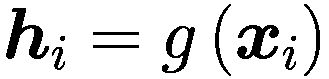

其中 ***h***[*i*] ∈ ℝ^(*q*)（潜在特征表示）是图 9-1 中编码器块在评估输入 ***x***[*i*] 时的输出。请注意，我们将有 *g* : ℝ^(*n*) → ℝ^(*q*)。

解码器（以及我们用  表示的网络输出）可以表示为潜在特征的第二个通用函数 *f*。

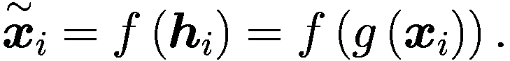

其中 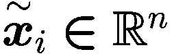。训练自动编码器简单地说就是找到满足以下条件的函数 *g*(·) 和 *f*(·)。

![arg min_f,g<Δ[({x}_i,f(g({x}_i)))]](../images/463356_2_En_9_Chapter/463356_2_En_9_Chapter_TeX_Equd.png)

其中 Δ 表示自编码器的输入和输出之间的差异程度（基本上我们的损失函数将惩罚输入和输出之间的差异）并且 < · > 表示对所有观察值的平均。根据你如何设计自编码器，可能找到 *f* 和 *g* 使得自编码器能够完美地重建输出，从而学习到恒等函数。这并不很有用，正如我们在本章开头所讨论的，为了避免这种情况，可以使用两种主要策略：创建瓶颈和以某种形式添加正则化。

注意

我们希望自编码器能够很好地重建输入。同时，它应该创建一个有用的潜在表示（编码器的输出），并且是有意义的。

添加一个“瓶颈”（关于这一点稍后会有更多讨论）是通过使潜在特征的维度低于输入的维度来实现的（通常要低得多）。这就是我们在本章中详细探讨的情况。但在探讨这个情况之前，让我们简要地讨论一下正则化。

### 自编码器中的正则化

我们在本章中不会详细讨论正则化，但我们至少应该提到它。这意味着强制潜在特征输出稀疏。实现这一点的最简单方法是在损失函数中添加一个 *ℓ*[1] 或 *ℓ*[2] 正则化项。对于 *ℓ*[2] 正则化项，它看起来是这样的：

![$$ \arg {\min}_{f,g}\left(\mathbbm{E}\left[\Delta \Big({\boldsymbol{x}}_i,g\left(f\left({\boldsymbol{x}}_i\right)\right)\right]+\lambda \sum \limits_i{\theta}_i²\right) $$](../images/463356_2_En_9_Chapter/463356_2_En_9_Chapter_TeX_Eque.png)

在公式中，*θ*[*i*] 是函数 *f*(·) 和 *g*(·) 中的参数（你可以想象，在函数是神经网络的情况下，参数将是权重）。这通常很容易实现，因为相对于参数的导数很容易计算。另一个值得提到的技巧是将编码器的权重与解码器的权重^(6) 相关联（换句话说，使它们相等）。这些技术，以及一些超出本书范围的其它技术，具有根本相同的效果：向潜在特征表示中添加稀疏性。

我们现在转向一种特定的自编码器类型：那些使用具有瓶颈的前馈网络来构建 *f* 和 *g* 的自编码器。选择这种方案的原因是它们非常容易实现，并且非常有效。

## 前馈自编码器

前馈自编码器（FFA）是一种具有特定架构的神经网络，由密集层^(7) 组成，如图 9-2 所示。

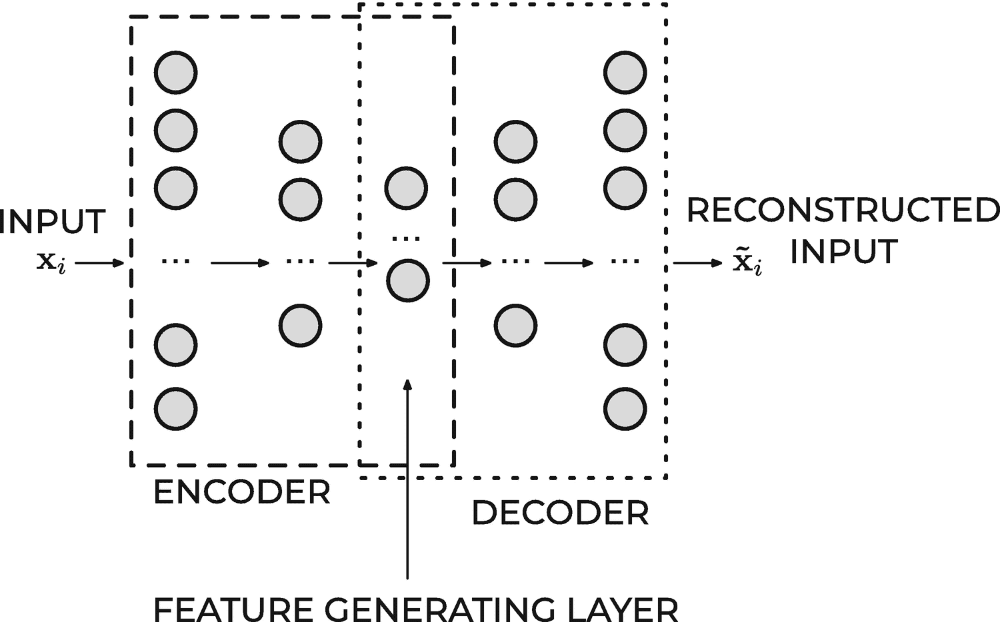

图 9-2

前馈自动编码器的典型架构。随着我们通过网络移动，层的神经元数量最初会减少，直到达到中间层然后再次开始增加，直到最后一层具有与输入维度相同的神经元数量

典型的 FFA 架构（尽管不是强制性的）具有奇数个层，并且相对于中间层是对称的。通常，第一层具有的神经元数量 *n*[1] = *n*（输入观察 ***x***[***i***] 的大小）。当我们向网络的中心移动时，每层的神经元数量在某种程度上会减少。中间层（记住我们有一个奇数个层）通常具有最少的神经元数量。这个层中神经元数量小于输入大小的事实是前面提到的 *瓶颈*。

在几乎所有实际应用中，中间层之后的层是中间层之前层的镜像版本。例如，一个具有三层自动编码器可能具有以下神经元数量：*n*[1] = 10, *n*[2] = 5，然后 *n*[3] = *n*[1] = 10（假设我们在处理一个输入维度为 *n* = 10 的问题）。所有这些层，包括中间层，构成了所谓的 *编码器*，而从中间层开始（包括输出层）的所有层构成了所谓的 ***解码器***，如图 9-2 所示。如果 FFA 训练成功，结果将是对输入的良好近似，换句话说 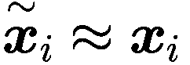。重要的是要注意，解码器可以使用比初始观察到的输入特征数量（*n*）少得多的特征数量（*q*）来重建输入。中间层的输出 ***h***[***i***] 也被称为输入观察 ***x***[*i*] 的 *学习表示*。

注意

*编码器* 可以减少输入观察的维度 (*n*) 并创建一个较小的维度 *q* < *n* 的输入学习表示（***h***[***i***]）。这个学习表示足以让解码器准确地重建输入（如果自动编码器训练按预期成功）。

### 输出层的激活函数

在基于神经网络的自动编码器中，输出层的激活函数起着特别重要的作用。最常用的函数是 ReLU 和 sigmoid。让我们看看这两个函数，并了解何时使用哪一个以及为什么应该选择一个而不是另一个。

#### ReLU

*ReLU* 激活函数可以取 [0, ∞] 范围内的所有值。作为提醒，其公式是

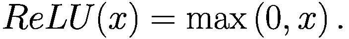

当输入观察 ***x***[*i*] 假设一个广泛的正值范围时，这是一个好的选择。

如果输入 ***x***[*i*] 可以取负值，ReLU 激活函数是一个糟糕的选择，而恒等函数则是一个更好的选择。

注意

对于输出层，ReLU 激活函数非常适合输入观测值 ***x***[*i*] 假设了广泛的正实数值范围的情况。

#### Sigmoid

Sigmoid 函数 *σ* 可以取 ]0, 1 范围内的所有值。作为提醒，它的公式是

![$$ \sigma (x)=\frac{1}{1+{e}^{-x}}. $$

这个激活函数只能在输入观测值 ***x***[*i*] 都在 ]0, 1[ 范围内，或者如果你已经将它们归一化到这个范围内时使用。以 MNIST 数据集为例。输入观测值 ***x***[*i*]（一个图像）的每个值代表像素的灰度值，这些像素可以取从 0 到 255 的任何值。通过将像素值除以 255 归一化数据，会使每个观测值（每个图像）只有像素值在 0 到 1 之间。在这种情况下，Sigmoid 将是输出层激活函数的一个很好的选择。

注意

对于输出层，使用 Sigmoid 激活函数在所有情况下都是一个好的选择，其中输入观测值只取 0 到 1 之间的值，或者如果你已经将它们归一化，使其取值在 ]0, 1[ 范围内。

### 损失函数

与任何神经网络模型一样，我们需要最小化损失函数。这个损失函数应该衡量输入 ***x***[*i*] 和输出  之间的差异。如果你还记得开头的解释，你会意识到这个损失函数将是

![$$ \mathbbm{E}\left[\Delta \Big({\boldsymbol{x}}_i,g\left(f\left({\boldsymbol{x}}_i\right)\right)\right]. $$](../images/463356_2_En_9_Chapter/463356_2_En_9_Chapter_TeX_Equh.png)

对于全连接神经网络（FFAs），*g* 和 *f* 将是前几节讨论中获得的密集层函数。记住，自动编码器试图学习恒等函数的近似；因此，你希望找到网络中的权重，使得根据某些度量（Δ(·)）在 ***x***[*i*] 和  之间的差异最小。自动编码器广泛使用的两个损失函数是均方误差（MSE）和二元交叉熵（BCE）。让我们更深入地了解这两个函数，因为它们只能在满足特定要求时使用。

#### 均方误差

由于自动编码器试图解决回归问题，最常用的损失函数是均方误差（MSE）：

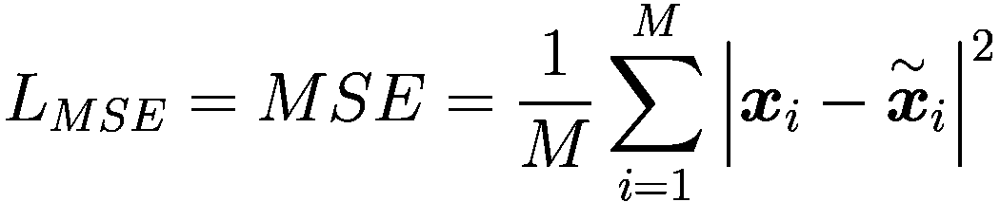

符号 ∣ · ∣ 表示向量的范数^(8)，而 *M* 是训练数据集中观测值的数量。它几乎可以用在所有情况下，独立于你如何选择输出层激活函数或如何归一化输入数据。

很容易证明 *L*[*MSE*] 的最小值是在 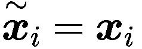 时找到的。为了证明这一点，让我们计算 *L*[*MSE*] 关于特定观测值 *j* 的导数。记住，当这个条件

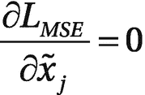

是满足的。为了简化计算，让我们假设输入是一维的^(9)，并用 *x*[*i*] 来表示它们。我们可以写出

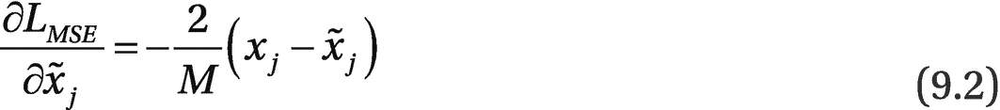

当  时，方程 (9.2) 成立，这很容易看出，正如我们想要证明的那样。为了更精确，我们还需要证明对于所有 *i* = 1, …, *M*，条件

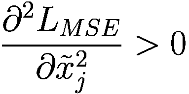

这很容易证明，因为我们有

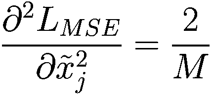

这大于零，因此证实了我们的假设，即对于  我们确实有一个最小值。

#### 二进制交叉熵

如果 FFA 输出层的激活函数是 sigmoid 函数，从而限制神经元输出在 0 和 1 之间，并且输入特征被归一化到 0 和 1 之间，我们可以使用二进制交叉熵作为损失函数，这里用 *L*[*CE*] 表示。请注意，这个损失函数通常用于分类问题，但它对于自编码器工作得非常好。它的公式是

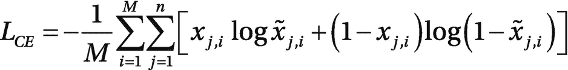

其中 *x*[*j*, *i*] 是 *i*^(*th*) 次观察的 *j*^(*th*) 个分量。求和是整个观察集以及向量的所有分量。我们能否证明最小化这个损失函数等同于尽可能重建输入？让我们计算 *L*[*CE*] 关于  的最小值。换句话说，我们需要找出 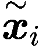 应该取哪些值以最小化 *L*[*CE*]。正如我们对 MSE 所做的那样，为了使计算更简单，让我们考虑 ***x***[*i*] 和  是一维的情况，并用 *x*[*i*] 和 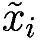 来表示它们。

要找到函数的最小值，正如你应该从微积分中知道的，我们需要 *L*[*CE*] 的一阶导数。特别是，我们需要解 M 个方程组

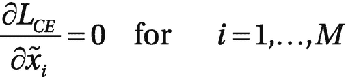

在这种情况下，很容易证明当 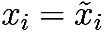 对于 *i* = 1, …, *M* 时，二元交叉熵 *L*[*CE*] 达到最小。请注意，严格来说，这只有在 *x*[*i*] 不同于 0 或 1 时才成立，因为  既不能是 0 也不能是 1。

要找到 *L*[*CE*] 最小化时的时间，我们可以对特定输入 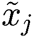 对 *L*[*CE*] 求导

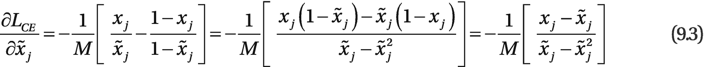

现在请记住，我们需要满足以下条件

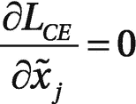

这只会在  的情况下发生，正如方程 (9.3) 所示。为了确保这是一个最小值，我们需要评估二阶导数。由于一阶导数为零的点只有在

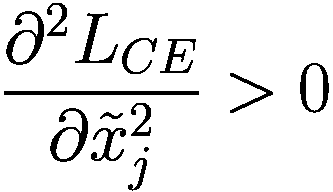

我们可以轻松地计算在最小点 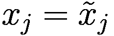 的二阶导数

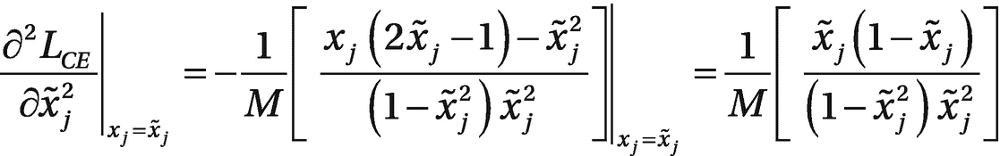

现在请记住 ![x̃j 属于[0,1]](../images/463356_2_En_9_Chapter/463356_2_En_9_Chapter_TeX_IEq18.png)。我们可以立即看出，前面公式的分母大于零。分子也显然大于零，因为 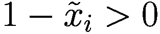。两个正数相除得到一个正数，因此我们刚刚证明了

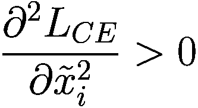

当输出与输入完全相等时，成本函数达到最小值，正如我们想要证明的那样。

注意

使用二元交叉熵损失函数的一个基本前提是输入*必须*在 0 到 1 之间归一化，并且最后一层的激活函数必须是*sigmoid*或*softmax*函数。

### 重建误差

重建误差（RE）是一个指标，它告诉你自编码器能够多准确地（或不好地）重建输入观察值 ***x***[*i*]。最典型的 RE 是均方误差（MSE）。

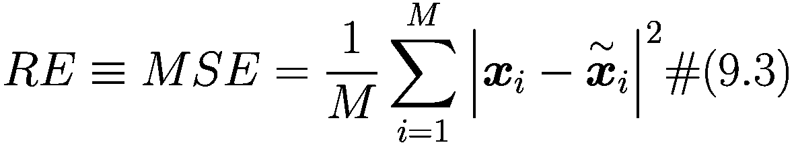

(9.4)

这可以很容易地计算。在用自编码器进行异常检测时，经常使用 RE，正如我们后面解释的那样。重建误差有一个简单的解释。当 RE 很大时，自编码器无法很好地重建输入，而当它很小时，重建是成功的。图 9-3 展示了当自编码器尝试重建图像时，大和小重建误差的例子。

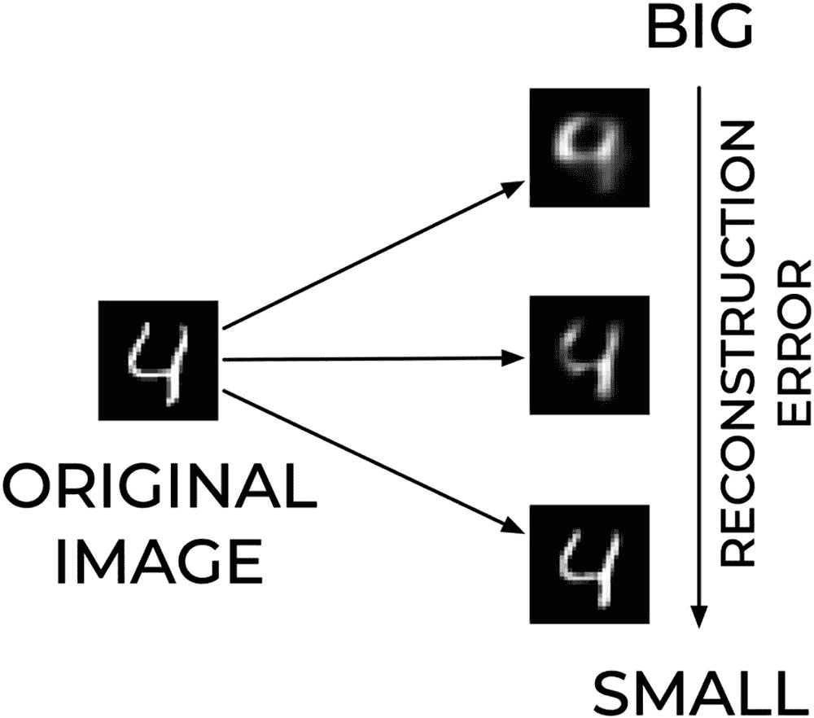

图 9-3

当自编码器尝试重建图像时，大和小重建误差的例子

### 示例：重建手写数字

让我们通过一个真实示例来看看自编码器的表现，使用 MNIST 数据集。这个数据集^(10)包含从 0 到 9 的 70000 个手写数字。每个图像是 28×28 像素，只有灰度值，这意味着我们输入有 784 个特征（像素灰度值）。让我们从一个具有三层且每层神经元数量分别为(784,16,784)的自编码器开始。请注意，第一层和最后一层*必须*与输入维度相等。在这个例子中，我们使用了 Adam 优化器^(11)作为损失函数的交叉熵^(12)，并且以 256 个批次的规模训练了模型 30 个 epoch。图 9-4 显示了数字的两行图像。顶部的行包含原始数据集中十张随机图像，而底部的图像是自编码器重建的图像。

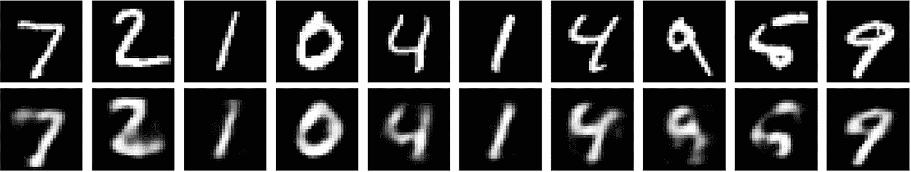

图 9-4

在最上面一行，你可以看到 MNIST 数据集中的原始数字。相比之下，下面一行包含由具有（784, 16, 784）神经元数量的自动编码器重建的数字。

令人印象深刻的是，为了重建一个具有 784 像素、十个类别和 70,000 张图像的图像，只需要 16 个特征。虽然结果并不完美，但它使我们几乎完全理解了作为输入使用的数字。将中间层的大小增加到 64（并保持所有其他参数不变）可以得到更好的结果，如图 9-5 所示。

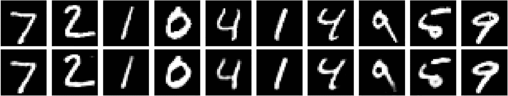

图 9-5

在最上面一行，你可以看到 MNIST 数据集中的原始数字。下面一行显示了由具有（784, 64, 784）神经元数量的自动编码器重建的数字。

这告诉我们，关于如何书写数字的相关信息包含在比 784 更少的特征中。

注意

一个中间层小于输入维度的自动编码器（瓶颈）可以用来提取输入数据集的基本特征。这通过函数 *g*(***x***[*i*]) 给出了输入的学习表示。实际上，一个前馈神经网络（FFA）可以被用来执行 *降维*。

如果中间层的神经元数量减少太多（如果瓶颈太极端），FFA 将无法很好地重建输入数字。图 9-6 展示了使用只有八个中间层神经元的自动编码器重建相同数字的情况。你可以看到，只有八个中间层神经元时，一些重建的数字是错误的。如图 9-6 所示，数字 4 被重建为 9，数字 2 被重建为类似于 3 的形状。

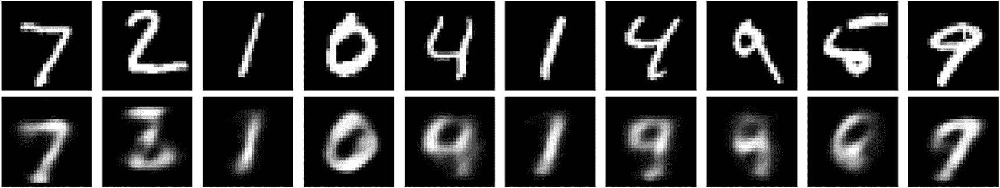

图 9-6

在最上面一行，你可以看到 MNIST 数据集中的原始数字。相比之下，下面一行包含由具有（784, 8, 784）神经元数量的自动编码器重建的数字。

在图 9-7 中，你可以比较我们讨论过的所有 FFAs 的重建数字。

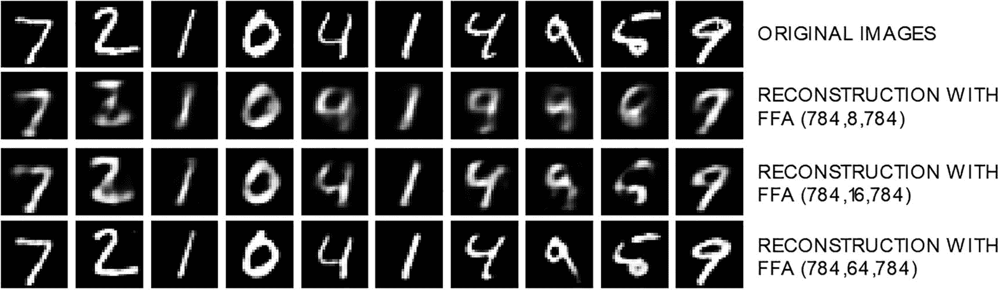

图 9-7

在最上面一行，你可以看到 MNIST 数据集中的原始数字。第二行数字包含由（784,8,784）的 FFA 重建的数字。第三行是由（784,16,784）的 FFA 重建的，最后一行是由（784,64,784）的 FFA 重建的。

从图 9-7 中你可以看到，通过增加中间层的大小，重建效果越来越好，正如我们所预期的。

对于这些示例，我们使用了二元交叉熵作为损失函数。但均方误差（MSE）也可以工作，结果可以在图 9-8 中看到。

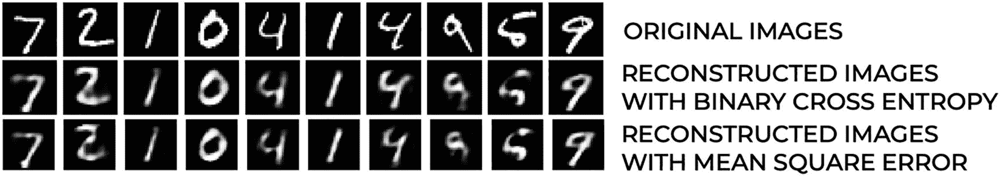

图 9-8

在最上面一行，您可以看到来自 MNIST 数据集的十个随机原始数字。第二行数字包含使用具有中间层 16 个神经元的 FFA 和二元交叉熵作为损失函数重建的数字。最后一行包含使用均方误差作为损失函数重建的图像。

## 自动编码器应用

### 维度约简

如本章所述，使用瓶颈方法，潜在特征将具有一个维度 *q*，该维度小于输入观测值 *n* 的维度。*编码器*部分（一旦训练完成）会自然地进行（按设计）降维，从而产生 *q* 个实数。您可以使用潜在特征来完成各种任务，例如分类（您将在下一节中看到）或聚类。

我们想指出使用自动编码器进行维度约简与更传统的 PCA 方法相比的一些优点。从计算角度来看，自动编码器的主要优点是：它可以高效地处理大量数据，因为其训练可以使用小批量进行，而 PCA（最常用的维度约简算法之一）需要使用整个数据集进行计算。PCA 是一种将数据集投影到其协方差矩阵特征向量上的算法，^(13)从而提供特征的线性变换。自动编码器更加灵活，并考虑特征的非线性变换。默认的 PCA 方法使用 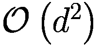 空间来处理 *ℝ*^(*d*) 中的数据。在许多情况下，这从计算角度来看是不可行的，并且算法不会随着数据集大小的增加而扩展。这看起来可能无关紧要，但在许多实际应用中，数据量和特征数量如此之大，以至于从计算角度来看 PCA 不是一个实用的解决方案。

注意

从计算角度来看，使用自动编码器进行维度约简的主要优点是：它可以高效地处理大量数据，因为其训练可以使用小批量进行。

#### 与主成分分析（PCA）的等价性

这可能不是广为人知的事实，但仍值得提及。如果满足以下条件，FFA 与 PCA 等价：

+   您使用线性函数作为编码器 *g*(·)

+   您使用线性函数作为解码器 *f*(·)

+   您使用均方误差（MSE）作为损失函数

+   您将输入归一化到

    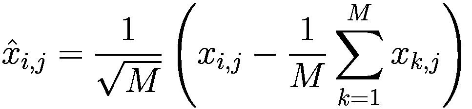

证明过程较长，可以在 M.M. Kahpra 为印度理工学院马德拉斯分校 CS7015 课程准备的笔记中找到，链接为[`http://toe.lt/1a`](http://toe.lt/1a)。

### 分类

#### 基于潜在特征的分类

现在假设我们想要对 MNIST 数据集的输入图像进行分类。我们可以简单地使用所有特征，在我们的例子中，是图像的 784 个像素值。为了说明，我们可以使用一个算法，比如 kNN。在训练 MNIST 数据集（包含 60,000 张图像）上使用七个最近邻将花费大约 16.6 分钟^(14)（1000 秒）并在测试数据集的 10,000 张图像上获得 96.4% 的准确率。然而，如果我们使用这个算法不是在原始数据集上，而是在潜在特征 *g*(***x***[*i*]) 上，会发生什么呢？例如，假设我们考虑中间层有八个神经元的 FFA，并在潜在特征 *g*(***x***[*i*]) ∈ *ℝ*⁸ 上再次训练 kNN 算法。在这种情况下，我们得到 89% 的准确率，耗时 1.1 秒。我们获得了运行时间因子 1,000 的提升，但准确率下降了 7.4%。^(15) 见表 9-1。

表 9-1

当将 kNN 算法应用于 MNIST 数据集的原始 784 个特征或八个潜在特征时的不同准确率和运行时间

| 输入数据 | 准确率 | 运行时间 |
| --- | --- | --- |
| 原始数据***x***[*i*] ∈ *ℝ*⁷⁸⁴ | 96.4% | 1000 秒 ≈ 16.6 分钟 |
| 潜在特征 g(***x***[*i*]) ∈ *ℝ*⁸ | 89% | 1.1 秒 |

使用八个特征使我们能够在仅一秒钟内获得非常好的准确率。

我们可以用另一个数据集，即 Fashion MNIST^(16) 数据集（来自 Zalando 的一个与 MNIST 非常相似的数据集，只是包含服装图像而不是手写数字）来进行同样的分析。该数据集与 MNIST 一样，有 60,000 张训练图像和 10,000 张测试图像。表 9-2 展示了将 kNN 应用于该数据集测试部分的总结结果。

表 9-2

在 Fashion MNIST 数据集上应用 kNN 算法对原始 784 个特征与使用八个神经元和 16 个神经元的 FFA 的准确率和运行时间差异

| 输入数据 | 准确率 | 运行时间 |
| --- | --- | --- |
| 原始数据 ***x***[*i*] ∈ *ℝ*⁷⁸⁴ | 85.4% | 1040 秒 ≈ 16.6 分钟 |
| 潜在特征 *enc*(***x***[*i*]) ∈ *ℝ*⁸ | 79.9% | 1.2 秒 |
| 潜在特征 *enc*(***x***[*i*]) ∈ *ℝ*¹⁶ | 83.6% | 3.0 秒 |

值得注意的是，使用中间层有 16 个神经元的 FFA，我们只需三秒钟就达到了 83.6% 的准确率。当将 kNN 算法应用于原始特征（784）时，我们只能获得 1.8% 更高的准确率，但运行时间大约是 330 倍更长。

备注

使用自动编码器和用潜在特征进行分类是减少训练时间几个数量级的好方法，同时准确率略有下降。

#### 维度诅咒：一个小插曲

在进行分类之前，你有什么其他原因想要进行降维吗？减少运行时间是其中一个原因，但另一个重要的原因在输入维度非常大时扮演着重要角色，即具有非常大量特征的数集：维度灾难。为了理解这一点，我们需要快速绕道看看高维分类问题，并讨论 *维度灾难*。让我们考虑一个单位立方体 [0, 1]^(*d*)，其中 *d* 是一个整数，并且有 *m* 个点在其中随机分布。最小的超立方体的长度 *l* 应该有多大才能包含至少一个点？我们可以很容易地计算出如下

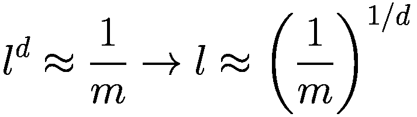

我们可以轻松计算出 *l* 的这个值，对于各种 *d* 的值。假设我们考虑 *m* = 1000，并将结果总结在表 9-3 中。

表 9-3

包含来自随机分布的 *m* 个点的最小超立方体的长度 *l*

| d | l |
| --- | --- |
| 2 | 0.003 |
| 10 | 0.50 |
| 100 | 0.93 |
| 1000 | 0.99 |

此外，正如你所见，在高维中数据变得非常稀疏，以至于你需要考虑整个超立方体来捕捉一个单独的观察。当数据变得如此稀疏时，你需要用于训练算法的观察数量将远远大于现有数据集的大小。

我们可以换一个角度来看这个问题。让我们考虑一个边长为 *l* = 1/10 的小超立方体。在这个超立方体的小部分中，我们平均能找到多少个观察数据？这是很容易计算的，如下所示

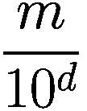

你可以看到，对于高值的 *d*，这个数字非常小。例如，如果我们考虑 *d* = 100，很容易看出我们需要比宇宙中的原子数量还要多的观察数据，才能在这个超立方体的小部分中找到至少一个观察数据。

注意

执行降维是一种在运行时间显著减少的同时，只造成精度小幅下降的有效方法。在高维数据集中，这成为了解决维度灾难的基本方法。

### 异常检测

自编码器通常用于在不同数据集上执行异常检测。要理解自编码器如何进行异常检测的最佳方式是查看一个实际例子。让我们考虑一个只有三层，第一层有 784 个神经元，潜在特征生成层有 64 个神经元，输出层有 784 个神经元的自编码器。我们将使用 MNIST 数据集来训练它，特别是使用之前章节中提到的 60,000 个训练样本。现在让我们考虑 Fashion MNIST 数据集。让我们从这个数据集中选择一张鞋子的图片（见图 9-9）。

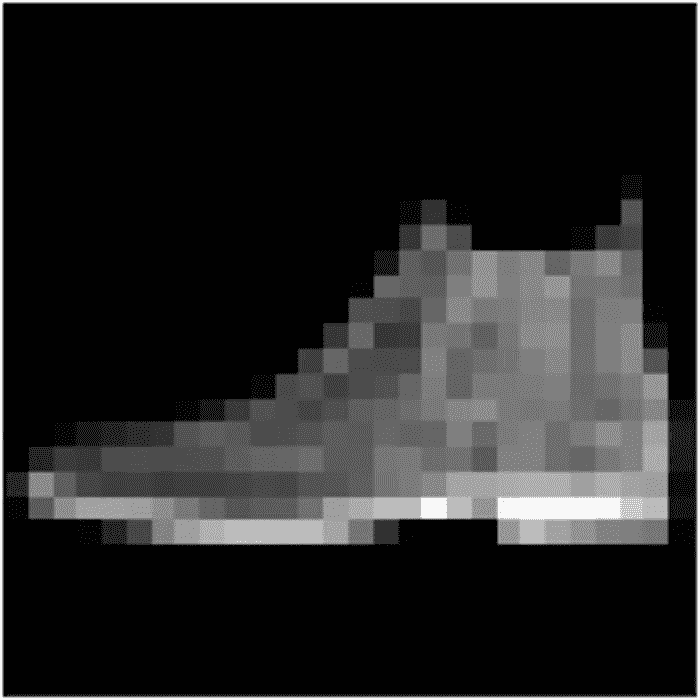

图 9-9

Zalando MNIST 数据集的一个随机图像。

让我们将它添加到 MNIST 数据集的测试部分。MNIST 原始测试部分有 10,000 个图像。加上鞋子，我们将有 10,001 个图像。我们如何使用自编码器在这 10,001 个图像中自动找到鞋子？请注意，鞋子是一个“异常值”，它是一个“异常”，因为它与手写数字完全不同的图像类别。为了做到这一点，我们将使用 60,000 个 MNIST 手写图像训练的自编码器，并计算 10,001 个测试图像的重建误差。

主要思想是，由于自编码器只看到手写数字图像，它将无法重建鞋子的图像。因此，我们预计这张图像将具有最大的重建误差。我们可以通过查看前两个重建误差来验证这一点。对于这个例子，我们使用了均方误差（MSE）作为重建误差。您可以在[`https://adl.toelt.ai`](https://adl.toelt.ai)查看代码。鞋子具有最高的重建误差：0.062。如图 9-10 所示，自编码器无法重建图像。

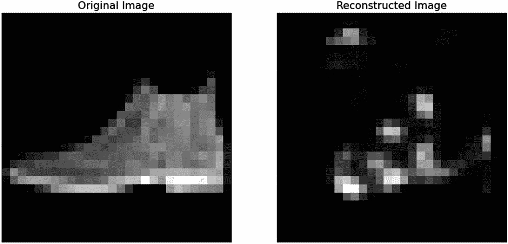

图 9-10

鞋子和在 MNIST 数据集的 60,000 个手写图像上训练的自编码器的重建。这张图像在我们构建的整个 10,001 个测试数据集中具有最大的 RE，其值为 0.062。

第二大的 RE（重建误差）略小于鞋子的三分之一：0.022。这表明自编码器在理解如何重建手写数字方面做得很好。您可以在图 9-11 中看到具有第二大的 RE 的图像。这张图像也可以被分类为异常值，因为它不完全清楚是 4 还是不完整的 9。

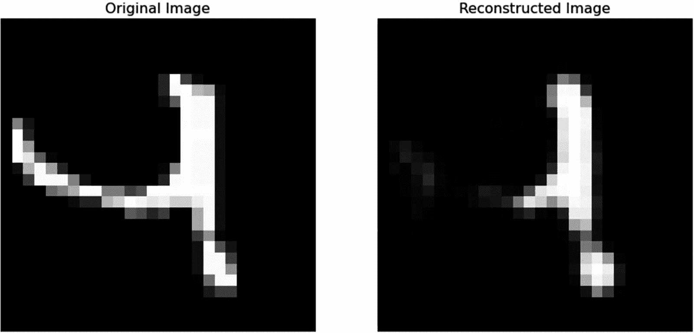

图 9-11

10,001 个测试数据集中第二大的 RE 的图像：0.022

最有经验的读者可能已经注意到，我们在没有异常值的数据集上训练了自动编码器，并将其应用于有异常值的第二个数据集。这并不总是可能的，因为异常值往往不知道，并且在大数据集中丢失。一般来说，你希望在没有任何关于异常值数量或外观信息的情况下，在一个大数据集中找到异常值。一般来说，异常检测可以按照以下主要步骤进行。

1.  在整个数据集（或如果可能，在已知没有异常值的数据集部分）上训练自动编码器。

1.  对于已知包含所需异常值的数据集部分的每个观测值（或输入），计算 RE。

1.  按照 RE（相对误差）对观测值进行排序。

1.  将 RE 值最高的观测值分类为异常值。被分类为异常值的观测值数量将取决于具体问题，并需要对结果进行分析（通常需要大量关于数据和问题的知识）。

注意，如果你在全部数据集上训练自动编码器，有一个基本假设：异常值是数据集的一个可忽略部分，它们的出现不会影响自动编码器学习重建观测值的方式。这是正则化之所以至关重要的原因之一。如果自动编码器能够学习恒等函数，则无法进行异常检测。

异常检测的一个经典例子是寻找欺诈信用卡交易（异常值）。这种情况通常呈现大约 0.1%的欺诈交易，因此这将是一个允许我们在整个数据集上训练自动编码器的案例。另一个例子是在工业环境中的故障检测。

注意

如果你将自动编码器训练在可用的整个数据集上，有一个基本假设：异常值是数据集的一个可忽略部分，它们的出现不会影响自动编码器学习重建观测值的方式。

#### 模型稳定性：简短说明

注意，按照前述章节所述的方法进行异常检测看似简单，但这些方法容易过拟合，并且经常给出不一致的结果。这意味着使用不同架构训练自动编码器可能会得到不同的 RE 值，因此可能会有其他异常值。有几种方法可以解决这个问题，但处理结果不稳定性的最简单方法之一是训练不同的模型，然后取 RE 值的平均值。另一种常用的技术是取几个模型评估的 RE 值的最大值。这类方法被称为集成方法，但超出了本书的范围。

注意

使用自动编码器进行的异常检测容易受到过拟合和结果不稳定的问题。了解这些问题并检查来自不同模型的结果，以正确解释结果至关重要。

注意，本节旨在为您提供一些指导，而不是全面概述如何解决这个问题。

类似于自编码器集成^(18)，也使用更高级的技术来处理不稳定的结果问题，例如来自小数据集的问题。

### 去噪自编码器

去噪自编码器^(19)是为了自动纠正输入观测中的错误（噪声）而开发的。例如，想象一下我们之前考虑的手写数字，我们在像素的灰度值上添加了一些噪声（例如，高斯噪声）。在这种情况下，自编码器应该学会重建图像，而不添加噪声。作为一个具体的例子，考虑 MNIST 数据集。我们可以在每个像素上添加一个由正态分布生成的随机值，该值乘以一个因子（你可以在[`https://adl.toelt.ai`](https://adl.toelt.ai)查看代码）。我们可以使用带噪声的图像作为输入，原始图像作为输出来训练一个自编码器。该模型应该学会去除噪声，因为它是随机的，并且与图像没有关系。

图 9-12 显示了结果。在左侧列中，你可以看到带噪声的图像；在中间，是原始图像；在右侧是去噪图像。它的工作效果非常好，令人印象深刻。图 9-12 是通过训练具有三层和中间层 32 个神经元的 FFA 自编码器生成的。

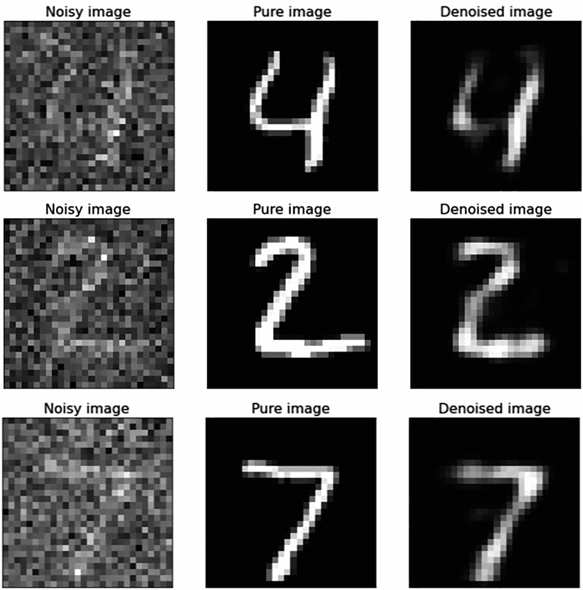

图 9-12

使用三层和中间层 32 个神经元去噪 FFA 自编码器的结果。噪声是通过添加从正态分布中取出的介于 0 和 1 之间的实数生成的。有关详细信息，请参阅[`adl.toelt.ai`](https://adl.toelt.ai)中的代码。

## 超越 FFA：具有卷积层的自编码器

本章已描述了具有前馈架构的自编码器。但是，具有卷积层的自编码器同样有效，并且通常效率更高（尤其是在处理图像时）。例如，在图 9-13 中，你可以看到具有架构 784,32,784 的 FAA（前馈自编码器）和具有架构(28x28), (26x26x64), (24x24,32), (26x26x64), (28x28)的卷积自编码器（CA）的结果比较。请注意，层是卷积层，所以前两个数字表示张量维度，第三个表示核的数量，在这个例子中大小为 3x3。这两个自编码器使用相同的参数（周期数、小批量大小等）进行训练。你可以看到 CA 由于我们处理的是图像，所以给出了比 FAA 更好的结果。为了公平起见，请注意，在这个例子中，特征生成层仅略小于输入层。这个例子的目的是向您展示卷积自编码器是一个可行的解决方案，因为它们在许多实际应用中工作得非常好。

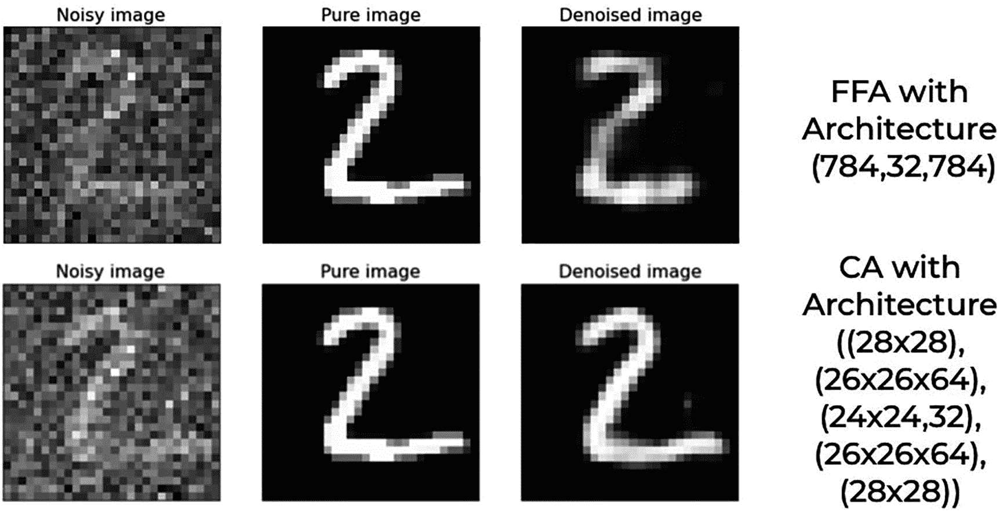

图 9-13

784,32,784 架构的 FAA（自动编码器）和具有架构(28x28), (26x26x64), (24x24,32), (26x26x64), (28x28)的卷积自动编码器（CA）的结果比较

另一个重要的方面是，特征生成层可以是卷积层，也可以是密集层。没有固定的规则，需要测试以找到最适合你问题的架构。它还取决于你如何想要建模你的潜在特征：作为一个张量（多维数组）或作为一个实数的一维数组。

## Keras 实现

现在我们简要地看看如何在 Keras 中实现自动编码器。这相当简单，所以不要担心。你可以在书的在线版本中找到许多示例，网址为[`https://adl.toelt.ai`](https://adl.toelt.ai)。实现自动编码器最简单的方法是使用 Keras 功能 API。作为一个例子，我们将以 MNIST 数据集作为输入，换句话说，网络的输入形状将是`(784,)`（记住 MNIST 图像是 28x28 像素，因此当展平时是具有 784 个值的向量）。网络将包含两个部分：编码器和解码器（如果你不记得确切的部分是做什么的，可以查看图 9-2）。让我们看看代码，然后讨论它。

```py
def create_autoencoders(feature_layer_dim = 16):
input_img = Input(shape = (784,), name = 'Input_Layer')
# 784 is the total number of pixels of MNIST images
encoded = Dense(feature_layer_dim, activation = 'relu', name = 'Encoded_Features')(input_img)
decoded = Dense(784, activation = 'sigmoid', name = 'Decoded_Input')(encoded)
autoencoder = Model(input_img, decoded)
encoder = Model(input_img, encoded)
encoded_input = Input(shape = (feature_layer_dim,))
decoder = autoencoder.layers[-1] # Get the last layer
decoder = Model(encoded_input, decoder(encoded_input))
return autoencoder, encoder, decoder
```

这是你能创建的最小自动编码器（至少在层数方面）。它包含输入层（784 个输入值），潜在特征层（你通过将`feature_layer_dim`参数传递给函数来决定其维度），然后是输出层，当然输出层的维度必须与输入层相同（784）。如果你想使网络更大，当然可以添加任意多的层。但最重要的两个特性是输入层和输出层必须具有相同的维度，并且潜在特征层的维度应该比输入/输出层小。一旦定义了这个函数，你就可以轻松地使用它来获取三个模型：自动编码器、编码器和解码器。

```py
autoencoder, encoder, decoder = create_autoencoders(16)
```

你可以使用`.fit()`调用，就像用 Keras 训练其他任何神经网络一样来训练自动编码器。

```py
history = autoencoder.fit(mnist_x_train, mnist_x_train,
epochs = 30,
batch_size = 256,
shuffle = True,
validation_data = (mnist_x_test, mnist_x_test),
verbose = 0)
```

在这里，你可以想象`mnist_x_train`和`mnist_x_test`是两个由多个展平的 MNIST 手写数字组成的数据集。重要的是要注意，我们已经将数据集`mnist_x_train`作为网络的输入和输出。换句话说，这里没有标签。标签是数据集本身，因为我们希望输出尽可能接近输入（还记得前面的章节吗？）。

你可以轻松地对图像进行编码，或者说获取一组输入的潜在特征，通过调用`predict()`

```py
encoded_imgs = encoder.predict(mnist_x_test)
```

其中`mnist_x_test`是你想要编码的假设数据集。你可以使用这些`encoded_imgs`值来做你需要的事情，例如执行分类或回归。通过调用`encoder.predict`，你基本上已经对输入数据集进行了降维，正如我们在本章前面的部分所讨论的。解码也可以同样容易地完成

```py
decoded_imgs = decoder.predict(encoded_imgs)
```

在[《https://adl.toelt.ai》](https://adl.toelt.ai)你可以找到本章描述的自编码器示例、使用自编码器的异常检测和去噪示例。

## 练习

练习 1

列出你可以使用自编码器完成的最有用的任务。你能想到在你的工作领域中的应用吗？

练习 2

你能简要解释一下稀疏自编码器是什么吗？它与瓶颈自编码器有何相似之处？

练习 3

你如何衡量自编码器的性能（你使用哪些指标）？列出你可以使用的最常用指标。你能想到除了本章讨论的指标之外的任何其他指标吗？

练习 4

描述如何使用自编码器进行异常检测。

## 进一步阅读

斯坦福大学深度学习教程

[《http://ufldl.stanford.edu/tutorial/unsupervised/Autoencoders/》](http://ufldl.stanford.edu/tutorial/unsupervised/Autoencoders/)

在 Keras 中构建自编码器

[《https://blog.keras.io/building-autoencoders-in-keras.html》](https://blog.keras.io/building-autoencoders-in-keras.html)

TensorFlow 中自编码器的介绍

[《https://www.tensorflow.org/tutorials/generative/autoencoder》](https://www.tensorflow.org/tutorials/generative/autoencoder)

Bank, D., Koenigstein, N., and Giryes, R., “Autoencoders”, arXiv e-prints, 2020,

[《https://arxiv.org/abs/2003.05991》](https://arxiv.org/abs/2003.05991)

R. Grosse，多伦多大学，关于自编码器的讲座

[《http://www.cs.toronto.edu/~rgrosse/courses/csc321_2017/slides/lec20.pdf》](http://www.cs.toronto.edu/%257Ergrosse/courses/csc321_2017/slides/lec20.pdf)
