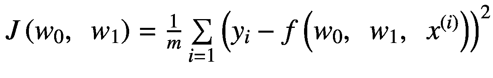

Umberto Michelucci《应用深度学习》基于案例理解深度神经网络的方法

ISBN 978-1-4842-3789-2e-ISBN 978-1-4842-3790-8[`doi.org/10.1007/978-1-4842-3790-8`](https://doi.org/10.1007/978-1-4842-3790-8)国会图书馆控制编号：2018955206© Umberto Michelucci 2018 本作品受版权保护。无论整个作品还是部分内容，所有权利均由出版社保留，具体包括翻译权、重印权、插图的重用权、朗诵权、广播权、在胶片或任何其他物理方式上的复制权，以及传输或信息存储和检索权、电子适配、计算机软件或通过类似或不同的方法现在已知或将来开发的方法。在本书中可能出现的商标名称、标志和图像受商标保护。我们不会在每个商标名称、标志或图像出现时使用商标符号，我们仅以编辑方式使用这些名称、标志和图像，以商标所有者的利益为出发点，无意侵犯商标权。在本出版物中使用贸易名称、商标、服务标志和类似术语，即使它们没有被标识为这样的，也不应被视为对它们是否受专有权利约束的意见表达。虽然本书中的建议和信息在出版日期被认为是真实和准确的，但作者、编辑或出版社不能对可能出现的任何错误或遗漏承担任何法律责任。出版社不对本出版物中包含的材料做出任何明示或暗示的保证。本书由 Springer Science+Business Media New York 通过全球书店发行，地址：纽约市 Spring Street 233，第 6 层，邮编 10013。电话：1-800-SPRINGER，传真：(201) 348-4505，电子邮件订单：ny@springer-sbm.com，或访问 www.springeronline.com。Apress Media, LLC 是加利福尼亚州有限责任公司，唯一成员（所有者）是 Springer Science+Business Media Finance Inc (SSBM Finance Inc)。SSBM Finance Inc 是特拉华州公司。

*我将此书献给我的女儿，凯特琳娜，以及我的妻子，弗朗切斯卡。感谢你们给我的灵感、动力和每天带给我的快乐。没有你们，这一切都不可能实现。*

引言

为什么又要写一本关于应用深度学习的书？这是我开始撰写这本书之前问自己的问题。毕竟，在谷歌上搜索这个主题，你会被大量结果所淹没。然而，我遇到的问题是，我只能找到用于在非常简单的数据集上实现非常基础模型的材料。一次又一次，同样的问题、同样的提示和同样的建议被提供出来。如果你想学习如何对修改后的国家标准与技术研究院（MNIST）的手写数字数据集进行分类，你很幸运。（几乎每个有博客的人都已经做过这件事，大多数情况下是复制 TensorFlow 网站上可用的代码）。想要寻找其他内容来学习逻辑回归的工作原理？并不容易。如何准备一个数据集来进行有趣的二分类？那就更难了。我觉得有必要填补这个空白。我花了很多小时试图调试模型，原因竟然是如此愚蠢，比如标签错误。例如，我应该用 0 和 1，但我用了 1 和 2，但没有任何博客提醒我这一点。在开发模型时进行适当的度量分析是很重要的，但没有人教你如何做（至少不是在容易获取的材料中）。这个空白需要被填补。我发现，通过涵盖更复杂的内容，从数据准备到错误分析，是一种非常高效且有趣的学习正确技术的方法。在这本书中，我一直试图涵盖完整且复杂的内容，以解释那些用其他方式难以理解的概念。如果你没有看到选择错误值时可能发生的情况，你就无法理解为什么选择正确的学习率很重要。因此，我总是用真实示例和经过充分测试且可重用的 Python 代码来解释概念。请注意，这本书的目标不是让你成为 Python 或 TensorFlow 专家，或者能够开发新的复杂算法的人。Python 和 TensorFlow 只是非常适合快速开发模型和获取结果的工具。因此，我使用了它们。我本可以使用其他工具，但那些是实践者最常使用的工具，所以选择它们是有意义的。如果你必须学习，最好是学习那些你可以用于自己的项目和职业的东西。

本书的目标是让你用新的视角看到更高级的材料。我会尽可能多地涵盖数学背景，因为我感觉这对于完全理解许多概念背后的困难和推理是必要的。如果你不知道梯度下降算法在数学上的工作原理，你就无法理解为什么大的学习率会使你的模型（严格来说，是损失函数）发散。在所有实际项目中，你不需要计算偏导数或复杂的求和，但你必须理解它们，以便能够评估什么可以工作，什么不可以（尤其是为什么）。只有尝试从头开始用单个神经元开发一个简单的模型，你才能欣赏到像 TensorFlow 这样的库如何使你的生活变得更轻松。这是一件非常有教育意义的事情，我将在第十章中向你展示如何做。一旦你这样做了一次，你将永远记住它，你也会真正欣赏像 TensorFlow 这样的库。

我建议你真正尝试去理解数学基础（尽管这并不是从书中获益的必要条件），因为这将使你能够完全理解许多否则无法完全理解的概念。机器学习是一个非常复杂的话题，认为没有良好的数学或 Python 基础就能彻底理解它是乌托邦式的想法。在每一章中，我都会强调一些重要的提示，帮助你高效地在 Python 中实现这些功能。本书中的每一个陈述都有具体的例子和可复现的代码作为支撑。我不会在没有提供相关现实生活例子的情况下讨论任何事情。这样，一切都会立即变得有意义，你也会记得它。

请花时间研究本书中找到的代码，并亲自尝试。正如每位优秀的老师都知道的，当学生尝试自己解决问题时，学习效果最好。尝试，犯错误，学习。阅读一章，输入代码，并尝试修改它。例如，在第二章中，我将向你展示如何对两个手写数字（1 和 2）进行二分类识别。拿走代码，尝试两个不同的数字。玩转代码，享受乐趣。

按照设计，本书中的代码尽可能简单。它没有经过优化，我知道可以写出性能更好的代码，但这样做会牺牲清晰度和可读性。本书的目标不是教你编写高度优化的 Python 代码；而是让你理解算法的基本概念及其局限性，并为你在这个领域继续学习提供一个坚实的基础。当然，我会指出重要的 Python 实现细节，例如，例如，你应该尽可能避免使用标准的 Python 循环。

这本书中的所有代码都是编写来支持我为每个章节设定的学习目标的。推荐了如 NumPy 和 TensorFlow 这样的库，因为它们允许将数学公式直接转换为 Python。我了解其他软件库，如 TensorFlow Lite、Keras 等，这些可能会使你的生活变得更轻松，但那些只是工具。显著的区别在于你理解方法背后概念的能力。如果你理解正确，你可以选择任何你想要的工具，并且你将能够实现良好的实现。如果你不理解算法是如何工作的，无论是什么工具，你都将无法进行适当的实现或适当的错误分析。我是一个数据科学普及概念的强烈反对者。数据科学和机器学习是困难和复杂的主题，需要深入了解其背后的数学和微妙之处。

我希望你会喜欢阅读这本书（我在写作时确实有很多乐趣）并且你会发现示例和代码很有用。我也希望你会有很多“啊哈！”的时刻，那时你最终会理解为什么某物以你期望的方式工作（或者为什么它不工作）。我希望你会发现完整的示例既有趣又实用。如果我能帮助你理解你之前不清楚的一个概念，我将感到非常高兴。

这本书中有些章节在数学上更为复杂。例如，在第二章 2 中，我计算了偏导数。但别担心，如果你不理解它们，你可以简单地跳过这些方程。我确保了即使没有大多数数学细节，主要概念也是可以理解的。然而，你确实应该知道什么是矩阵，如何乘以矩阵，什么是矩阵的转置，等等。基本上，你需要对线性代数有一个很好的掌握。如果你没有，我建议你在阅读这本书之前先复习一下基本的线性代数书籍。如果你有扎实的线性代数和微积分背景，我强烈建议你不要跳过数学部分。它们真的可以帮助你理解为什么我们以特定的方式做事。例如，这将在理解学习率的怪异之处或梯度下降算法的工作原理方面给你带来极大的帮助。你也不要被更复杂的数学符号吓倒，对于如下复杂程度的方程也要有信心（这是我们将用于线性回归算法的均方误差，将在后面详细解释，所以如果你现在不知道这些符号的含义，请不要担心）：

你应该理解和自信地掌握诸如和、数学级数等概念。如果你对这些概念感到不确定，请在开始阅读本书之前复习它们；否则，你可能会错过一些重要的概念，这些概念是你深入学习深度学习职业生涯所必须牢固掌握的。本书的目标不是为你提供一个数学基础。我假设你已经有了。深度学习和神经网络（一般而言，机器学习）是复杂的，任何试图说服你它们不复杂的人都在撒谎或者不理解它们。

我不会花费时间去证明或推导算法或方程。你必须在那里信任我。此外，我也不会讨论特定方程的应用性。例如，对于那些对微积分有良好理解的人，我不会讨论我们计算导数的函数的可微性问题。简单地假设你可以应用我给出的公式。多年的实际应用已经向深度学习社区表明，那些方法和方程按预期工作，并且可以在实践中使用。提到的这类高级主题需要单独的书籍来讨论。

在第一章，你将学习如何设置你的 Python 环境，以及什么是计算图。我将讨论使用 TensorFlow 执行的一些基本数学计算示例。在第二章，我们将探讨你可以用单个神经元做什么。我将介绍什么是激活函数，以及最常用的类型，例如 sigmoid、ReLU 或 tanh。我会向你展示梯度下降是如何工作的，以及如何使用单个神经元和 TensorFlow 实现逻辑回归和线性回归。在第三章，我们将探讨全连接网络。我将讨论矩阵维度，什么是过拟合，并介绍 Zalando 数据集。然后我们将使用 TensorFlow 构建我们的第一个真实网络，并开始研究梯度下降算法的更复杂变体，例如小批量梯度下降。我们还将探讨不同的权重初始化方法以及如何比较不同的网络架构。在第四章，我们将探讨动态学习率衰减算法，例如阶梯、步进或指数衰减，然后我将讨论高级优化器，如动量、RMSProp 和 Adam。我还会给你一些关于如何使用 TensorFlow 开发自定义优化器的提示。在第五章，我将讨论正则化，包括诸如 *l* [1]、*l* [2]、dropout 和早停等众所周知的方法。我们将探讨这些方法背后的数学原理以及如何在 TensorFlow 中实现它们。在第六章，我们将探讨诸如人类水平性能和贝叶斯误差等概念。接下来，我将介绍一个度量分析工作流程，这将允许你识别与你的数据集相关的问题。此外，我们还将探讨 k 折交叉验证作为验证你结果的一种工具。在第七章，我们将探讨黑盒问题类别以及超参数调整是什么。我们将探讨诸如网格搜索和随机搜索等算法，并探讨哪种更有效以及为什么。然后我们将探讨一些技巧，例如从粗到精的优化。我将在本章的大部分内容中介绍贝叶斯优化——如何使用它以及什么是获取函数。我将提供一些提示，例如如何在对数尺度上调整超参数，然后我们将在 Zalando 数据集上进行超参数调整，以展示它可能的工作方式。在第八章，我们将探讨卷积神经网络和循环神经网络。我将向你展示执行卷积和池化的含义，并展示 TensorFlow 中这两种架构的基本实现。在第九章，我将向你透露一个与瑞士应用科学大学苏黎世分校、温特图尔合作进行的实际研究项目，以及深度学习如何以非标准方式使用。最后，在第十章，我将向你展示如何在 Python 中使用单个神经元执行逻辑回归——完全不使用 TensorFlow——从头开始。

我希望你喜欢这本书，并享受阅读的乐趣。

致谢

如果我没有感谢所有帮助我完成这本书的人，那将是不公平的。在写作过程中，我发现我对书籍出版一无所知，我还发现，即使你认为你对某件事非常了解，将其写下来却完全是另一回事。一个人在将思想写下来时，原本清晰的大脑变得混乱，这是难以置信的。这是我做过的最困难的事情之一，但也是我一生中最有回报的经历之一。

首先，我必须感谢我深爱的妻子，弗朗切斯卡·文图里尼，她花费无数个夜晚和周末阅读文本。没有她，这本书就不会像现在这样清晰。我还要感谢塞莱斯廷·苏雷什·约翰，他相信我的想法，并给了我写这本书的机会。阿迪蒂·米拉希是我遇到的最有耐心的编辑。她总是随时准备回答我所有的问题，我有很多问题，而且并非都是好问题。我特别想感谢马修·穆迪，他耐心地阅读了每一章。我从未遇到过能提供如此多良好建议的人。谢谢，马特；我欠你一个人情。乔乔·穆拉伊有耐心测试每一行代码并检查每个解释的正确性。当我说是每一行时，我真的是指每一行。不，真的，我是认真的。感谢乔乔，感谢你的反馈和鼓励。这对我来说意义重大。

最后，我对我的爱女卡特琳娜无比感激，感谢她在写作时的耐心，以及她每天提醒我追随梦想的重要性。当然，我还要感谢我的父母，他们一直支持我的决定，无论这些决定是什么。

### 目录

第一章：计算图和 TensorFlow 1 如何设置 Python 环境 1 创建环境 3 安装 TensorFlow 9 Jupyter 笔记本 11 TensorFlow 的基本介绍 14 计算图 14 张量 17 创建和运行计算图 19 使用 tf.constant 的计算图 19 使用 tf.Variable 的计算图 20 使用 tf.placeholder 的计算图 22 run 和 eval 之间的区别 25 节点之间的依赖关系 26 如何创建和关闭会话的技巧 27 第二章：单神经元 31 神经元的结构 31 矩阵表示 35 Python 实现技巧：循环和 NumPy 36 激活函数 38 成本函数和梯度下降：学习率的怪癖 47 实际例子中的学习率 50 TensorFlow 中的线性回归示例 57 逻辑回归示例 70 成本函数 70 激活函数 71 数据集 71 TensorFlow 实现 75 参考文献 80 第三章：前馈神经网络 83 网络架构 84 神经元的输出 87 矩阵维度的总结 88 三层网络的方程示例 88 全连接网络中的超参数 90 多类分类的 softmax 函数 90 关于过拟合的简要讨论 91 过拟合的实际例子 92 基本错误分析 99 Zalando 数据集 100 使用 TensorFlow 构建模型 105 网络架构 106 为 softmax 函数修改标签——独热编码 108 TensorFlow 模型 110 梯度下降的变体 114 批量梯度下降 114 随机梯度下降 116 小批量梯度下降 117 变体的比较 119 错误预测的例子 123 权重初始化 125 高效添加多层 127 额外隐藏层的优势 130 比较不同的网络 131 选择正确网络的技巧 135 第四章：训练神经网络 137 动态学习率衰减 137 迭代或周期？ 139 阶梯衰减 140 步长衰减 142 倒数时间衰减 145 指数衰减 148 自然指数衰减 150 TensorFlow 实现 158 将方法应用于 Zalando 数据集 162 常见优化器 163 指数加权平均值 163 动量 167 RMSProp 172 Adam 175 我应该使用哪个优化器？ 177 自开发优化器示例 179 第五章：正则化 185 复杂网络和过拟合 185 什么是正则化？ 190 关于网络复杂度的说明 191 [ℓ [***p***] 范数](463356_1_En_5_Chapter.xhtml#Sec4) 192 [ℓ [**2**] 正则化](463356_1_En_5_Chapter.xhtml#Sec5) 192 [ℓ [**2**] 正则化理论](463356_1_En_5_Chapter.xhtml#Sec6) 192 TensorFlow 实现 194 [ℓ [**1**] 正则化](463356_1_En_5_Chapter.xhtml#Sec8) 205 [ℓ [**1**] 正则化理论和 TensorFlow 实现](463356_1_En_5_Chapter.xhtml#Sec9) 206 权重真的会归零吗？ 208 Dropout 211 早停 215 其他方法 216 第六章：度量分析 217 人类水平的表现和贝叶斯误差 218 关于人类水平表现的短篇故事 221 MNIST 上的人类水平表现 223 偏差 223 度量分析图 225 训练集过拟合 225 测试集 228 如何划分你的数据集 230 不平衡类别分布：可能发生什么 234 精确度、召回率和 F1 度量 239 不同分布的数据集 245 K 折交叉验证 253 手动度量分析示例 263 第七章：超参数调整 271 黑盒优化 271 关于黑盒函数的说明 273 超参数调整的问题 274 样本黑盒问题 275 网格搜索 277 随机搜索 282 粗到细优化 285 贝叶斯优化 289 Nadaraya-Watson 回归 290 高斯过程 291 平稳过程 292 使用高斯过程进行预测 292 获取函数 298 上置信界（UCB） 299 示例 300 对数尺度上的采样 310 使用 Zalando 数据集进行超参数调整 312 关于径向基函数的简要说明 321 第八章：卷积神经网络和循环神经网络 323 核和滤波器 323 卷积 325 卷积示例 334 池化 342 填充 345 CNN 的构建块 346 卷积层 347 池化层 349 堆叠层 349 CNN 示例 350 RNN 简介 355 符号 357 RNN 的基本思想 358 为什么叫“循环”？ 359 学习计数 359 第九章：研究项目 365 问题描述 365 数学模型 369 回归问题 369 数据集准备 375 模型训练 384 第十章：从头开始实现逻辑回归 391 逻辑回归背后的数学 392 Python 实现 395 模型测试 398 数据集准备 398 运行测试 400 结论 401 索引 403

### 关于作者和关于技术审稿人

### 关于作者

### 关于技术审稿人
