# 1. 计算图和 TensorFlow

在我们深入探讨本书后面的扩展示例之前，您需要准备一个 Python 环境并对 TensorFlow 有一定的了解。因此，本章将向您展示如何安装一个可以运行本书代码的 Python 环境。一旦设置好，我将介绍 TensorFlow 机器学习库的基础知识。

## 如何设置您的 Python 环境

本书中的所有代码都是使用 Anaconda Python 发行版和 Jupyter 笔记本开发的。要设置 Anaconda，首先为您的操作系统下载并安装它。（我使用了 Windows 10，但代码并不依赖于这个系统。如果您愿意，可以使用 Mac 版本。）您可以通过访问 [`anaconda.org/`](https://anaconda.org/) 来获取 Anaconda。

在网页的右侧，您将找到一个下载 Anaconda 的链接，如图 1-1（右上角所示）。


图 1-1

在 Anaconda 网站上，您可以在页面右上角找到一个下载所需软件的链接

简单地按照说明进行安装。安装完成后启动它，您将看到图 1-2 中所示的屏幕。如果您没有看到这个屏幕，只需在左侧导航面板上点击“主页”链接。


图 1-2

启动 Anaconda 时您看到的屏幕

Python 包（如 NumPy）会定期更新，而且非常频繁。可能会发生新版本的包使您的代码停止工作。函数被弃用和移除，新的函数被添加。为了解决这个问题，在 Anaconda 中，您可以创建一个所谓的环境。这基本上是一个容器，它包含您决定安装的特定 Python 版本和特定版本的包。有了这个，您可以为 Python 2.7 和 NumPy 1.10 创建一个容器，例如，还可以为 Python 3.6 和 NumPy 1.13 创建另一个容器。您可能需要使用用 Python 2.7 开发的现有代码，因此您必须有一个包含正确 Python 版本的容器。但是，同时，您可能还需要 Python 3.6 来进行您的项目。使用容器，您可以确保所有这些同时进行。有时不同的包之间可能会发生冲突，因此您必须小心，避免在环境中安装所有您感兴趣的包，尤其是如果您在截止日期下开发包的话。没有什么比发现您的代码不再工作，而且您不知道为什么更糟糕的了。

### 注意

当您定义一个环境时，尽量只安装您真正需要的包，并且在更新它们时请注意，以确保任何升级都不会破坏您的代码。（记住：函数可能会被弃用、删除、添加或频繁更改。）在升级之前检查更新文档，并且只有在您确实需要更新的功能时才进行升级。

您可以从命令行使用 `conda` 命令创建一个环境，但为了使环境为我们的代码运行起来，所有操作都可以通过图形界面完成。这就是我将在这里解释的方法，因为它是最简单的。我建议您阅读 Anaconda 文档中的以下页面，以详细了解如何在环境中工作：[`https://conda.io/docs/user-guide/tasks/manage-environments.html`](https://conda.io/docs/user-guide/tasks/manage-environments.html)。

### 创建环境

让我们开始吧。首先，从左侧导航面板（图 1-3）中点击环境链接（带有表示盒子的图标的小图标）。

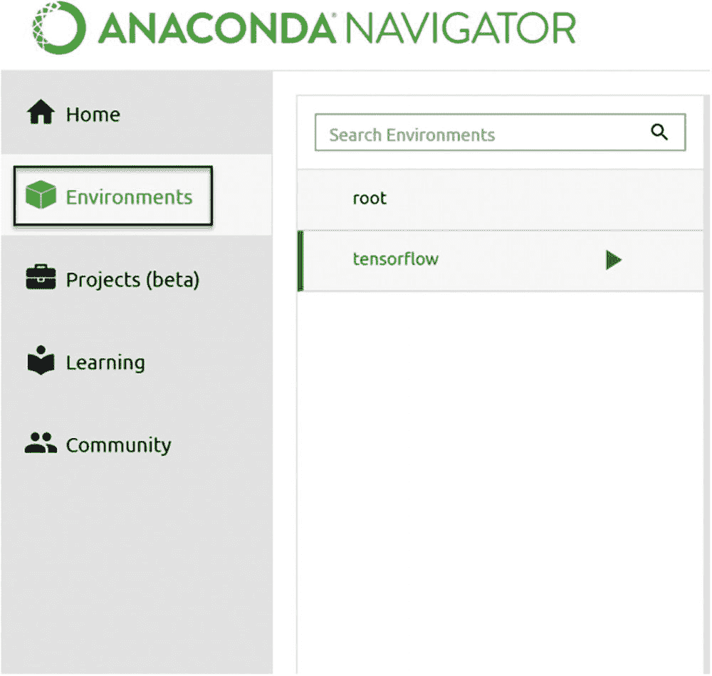

图 1-3

要创建一个新环境，您首先必须通过点击左侧导航面板中的相关链接（图中的黑色矩形所示）进入应用程序的环境部分。

然后点击中间导航面板中的创建按钮（如图 1-4 所示）。

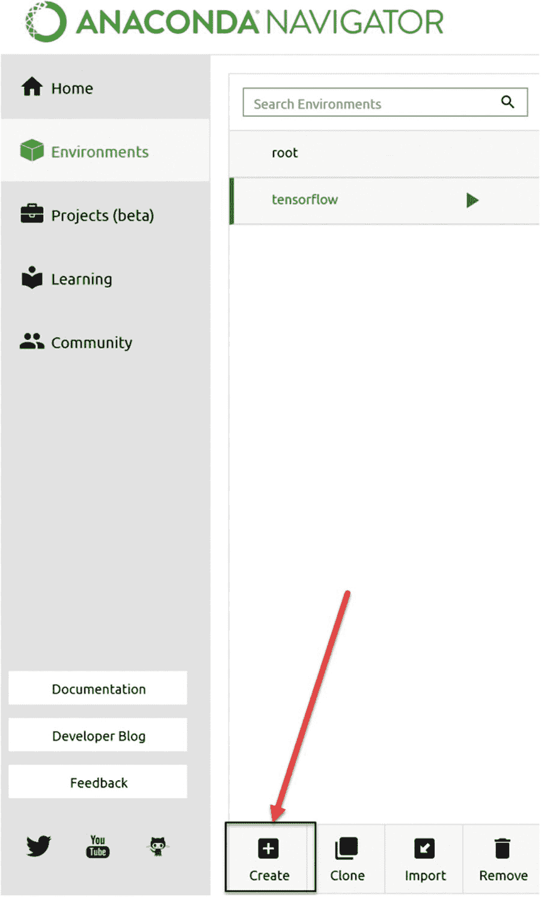

图 1-4

要创建一个新的环境，您必须从中间导航面板中点击创建按钮（在图中用红色箭头指示按钮的位置）。

当您点击创建按钮时，会弹出一个小的窗口（见图 1-5）。

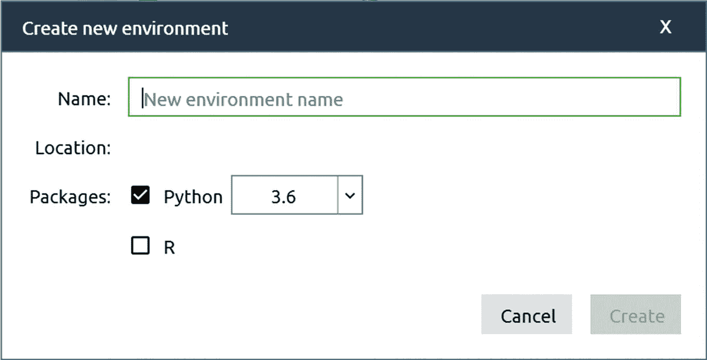

图 1-5

当您点击图 1-4 中指示的创建按钮时，您将看到的窗口

您可以选择任何名称。在这本书中，我使用了名称 *tensorflow*。一旦您输入一个名称，创建按钮就会变为激活状态（并且是绿色的）。点击它，等待几分钟，直到所有必要的包都安装完成。有时，您可能会收到一个弹出窗口，告诉您 Anaconda 有一个新版本可用，并询问您是否想要升级。请随意点击“是”。按照屏幕上的说明操作，直到 Anaconda 导航器再次启动，如果您收到此消息并点击了“是”。

我们还没有完成。再次点击左侧导航面板上的“环境”链接（如图 1-3 所示），然后点击新创建的环境名称。如果您到目前为止都遵循了指示，您应该看到一个名为“tensorflow”的环境。几秒钟后，您将在右侧面板看到一个列表，其中包含您将在环境中可用的所有已安装的 Python 包。现在我们必须安装一些额外的包：NumPy、matplotlib、TensorFlow 和 Jupyter。为此，首先从下拉菜单中选择“未安装”，如图 1-6 所示。

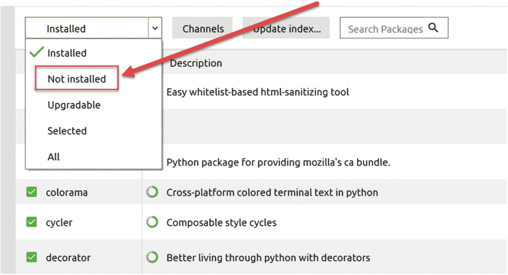

图 1-6

从下拉菜单中选择“未安装”值

接下来，在“搜索包”字段中输入您想要安装的包名（图 1-7 显示已选择了 `numpy`）。

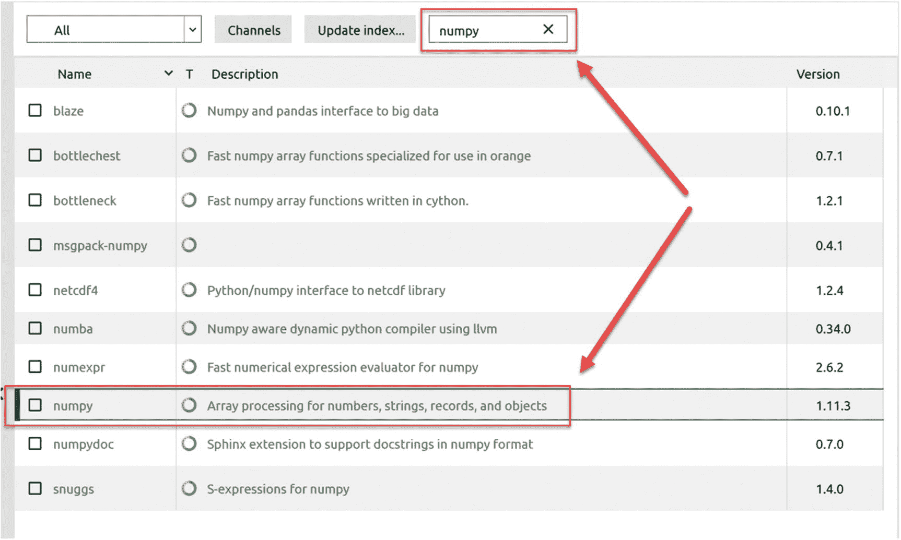

图 1-7

在搜索字段中输入“numpy”，以便将其包含在包存储库中

Anaconda 导航器将自动显示所有标题或描述中包含单词 *numpy* 的包。点击名称为 *numpy* 的包名称左侧的小方块。它将变成一个小向下箭头（表示已标记为安装）。然后您可以在界面的右下角点击绿色的“应用”按钮（见图 1-8）。

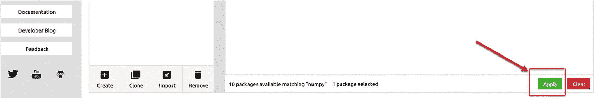

图 1-8

在您选择了要安装的 `numpy` 包之后，点击界面右下角的绿色“应用”按钮。按钮位于界面底部右侧。

Anaconda 导航器足够智能，可以确定 `numpy` 是否需要其他包。您可能会得到一个额外的窗口，询问是否可以安装附加包。只需点击“应用”。图 1-9 显示了这个窗口的外观。

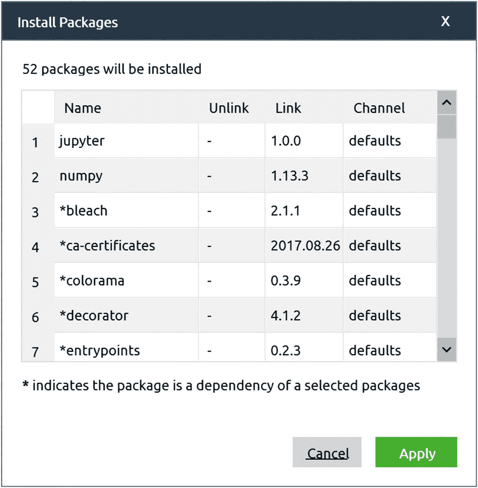

图 1-9

在安装一个包时，Anaconda 导航器会检查您想要安装的包是否依赖于尚未安装的其他包。在这种情况下，它将建议您从额外的窗口中安装缺失的（但必需的）包。在我们的例子中，新安装的系统需要 NumPy 库的 52 个附加包。只需点击“应用”即可安装所有这些包。

您必须安装以下包才能运行本书中的代码。（我在括号中添加了我在本书中测试代码时使用的版本；后续版本也可以。）

+   `numpy` (1.13.3)：用于进行数值计算

+   `matplotlib` (2.1.1)：为了生成漂亮的图表，就像您将在本书中看到的那样

+   `scikit-learn`（0.19.1）：此包包含所有与机器学习相关的库，我们使用这些库，例如，来加载数据集。

+   `jupyter`（1.0.0）：为了能够使用 Jupyter 笔记本

### 安装 TensorFlow

安装 TensorFlow 稍微复杂一些。最好的方法是遵循 TensorFlow 团队提供的说明，这些说明可在以下地址找到：[`www.tensorflow.org/install/`](http://www.tensorflow.org/install/)。

在此页面上，点击您的操作系统，您将获得所需的所有信息。我将在此提供 Windows 的说明，但同样可以使用 macOS 或 Ubuntu（Linux）系统完成。使用 Anaconda 的安装不受官方支持，但运行完美（由社区支持）并且是启动和运行以及检查本书中代码的最简单方法。对于更高级的应用，您可能需要考虑其他安装选项。（为此，您需要检查 TensorFlow 网站。）首先，在 Windows 的开始菜单中输入“anaconda”。在“应用”下，您应该看到 Anaconda Prompt 项，如图 1-10 所示。

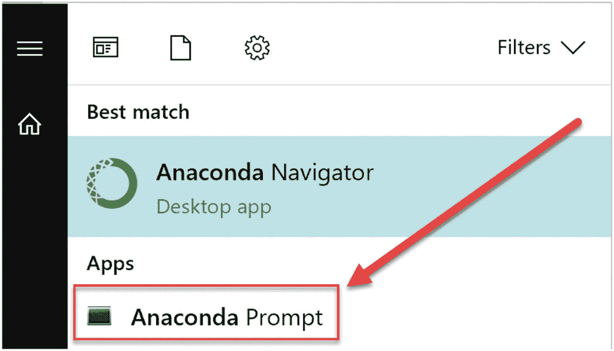

图 1-10

如果您在 Windows 10 的开始菜单搜索字段中输入“anaconda”，您应该至少看到两个条目：Anaconda Navigator，您在其中创建了 TensorFlow 环境，以及 Anaconda Prompt。

启动 Anaconda Prompt。应该会出现一个命令行界面（见图 1-11）。与简单的`cmd.exe`命令提示符不同的是，在这里，所有 Anaconda 命令都被识别，无需设置任何 Windows 环境变量。

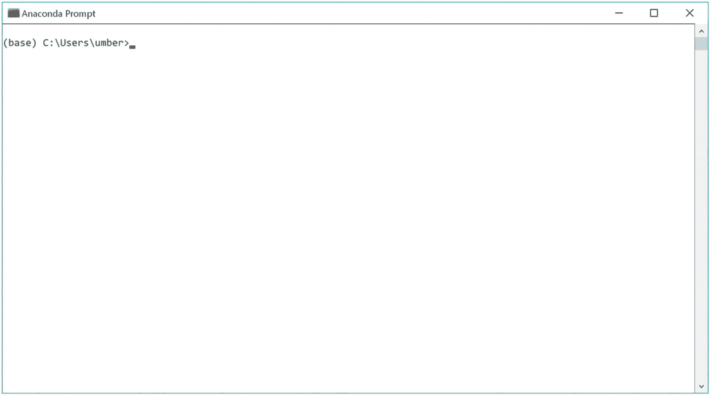

图 1-11

选择 Anaconda Prompt 时，您应该看到的是这个。请注意，用户名将不同。您将看到不是`umber`（我的用户名）而是您的用户名。

在命令提示符中，您首先必须激活您的新“tensorflow”环境。这是必要的，以便让 Python 安装知道您想在哪个环境中安装 TensorFlow。为此，只需输入以下命令：`activate tensorflow`。您的提示符应更改为：`(tensorflow) C:\Users\umber>`。

记住：您的用户名将不同（您在提示中看到的不是数字，而是用户名）。在此，我将假设您将安装仅使用 CPU（而不是 GPU）的标准 TensorFlow 版本。只需输入以下命令：`pip install --ignore-installed --upgrade tensorflow`。

现在让系统安装所有必要的包。这可能需要几分钟（取决于多个因素，例如您的计算机速度或您的互联网连接）。您不应收到任何错误消息。恭喜！现在您有一个可以在其中使用 TensorFlow 运行代码的环境。

### Jupyter Notebooks

能够输入代码并运行的最后一步是启动 Jupyter 笔记本。Jupyter 笔记本可以（根据官方网站的描述）描述如下：

> *Jupyter Notebook 是一个开源的 Web 应用程序，它允许你创建和分享包含实时代码、方程、可视化以及叙述性文本的文档。其用途包括：数据清洗和转换、数值模拟、统计建模、数据可视化、机器学习等。*

它在机器学习社区中得到了广泛的应用，学习如何使用它是件好事。请检查[`http://jupyter.org/`](http://jupyter.org/)上的 Jupyter 项目网站。

该网站非常具有指导性，并包含了许多可能的示例。本书中找到的所有代码都是使用 Jupyter 笔记本开发和测试的。我假设你已经对这个基于 Web 的开发环境有一些经验。如果你需要复习，我建议你查看以下地址上 Jupyter 项目网站上的文档：[`http://jupyter.org/documentation.html`](http://jupyter.org/documentation.html)。

要在你的新环境中启动笔记本，你必须回到 Anaconda 导航器中的“环境”部分（见图 1-3）。点击“tensorflow”环境右侧的三角形（如果你使用了不同的名称，你必须点击新环境右侧的三角形），如图 1-12 所示。然后点击“使用 Jupyter Notebook 打开”。

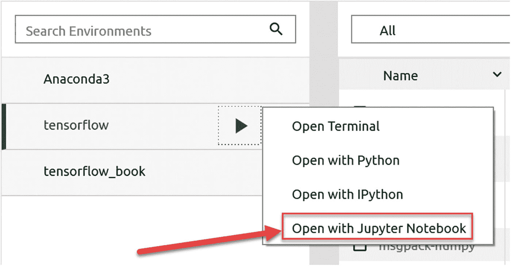

图 1-12

要在你的新环境中启动 Jupyter 笔记本，点击“tensorflow”环境名称右侧的三角形，然后点击“使用 Jupyter Notebook 打开”。

浏览器将启动一个列表，显示你用户文件夹中的所有文件夹。（如果你使用的是 Windows，通常位于`c:\Users\<YOUR USER NAME>`下，其中你必须将`<YOUR USER NAME>`替换为你的用户名。）从那里，你应该导航到你想要保存笔记本文件的文件夹，并从该文件夹创建一个新的笔记本，点击“新建”按钮，如图 1-13 所示。

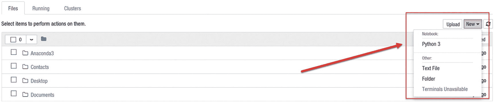

图 1-13

要创建一个新的笔记本，点击页面右上角的“新建”按钮，并选择 Python 3。

将会打开一个新页面，它应该看起来像图 1-14 中的那样。

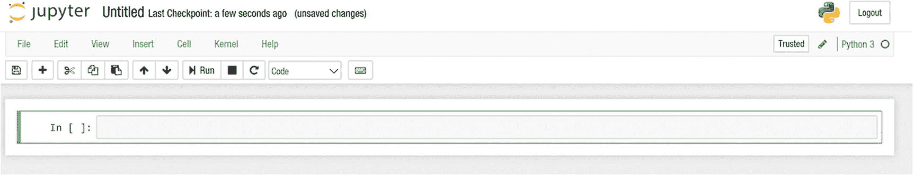

图 1-14

当你创建一个空白的笔记本时，将打开一个空白的页面，它应该看起来像这样。

例如，你可以在第一个“单元”中输入以下代码（你可以输入的矩形框）。

```py
a=1
b=2
print(a+b)
```

要评估代码，只需按 Shift+Enter，您应该会立即看到结果（3）（图 1-15）。

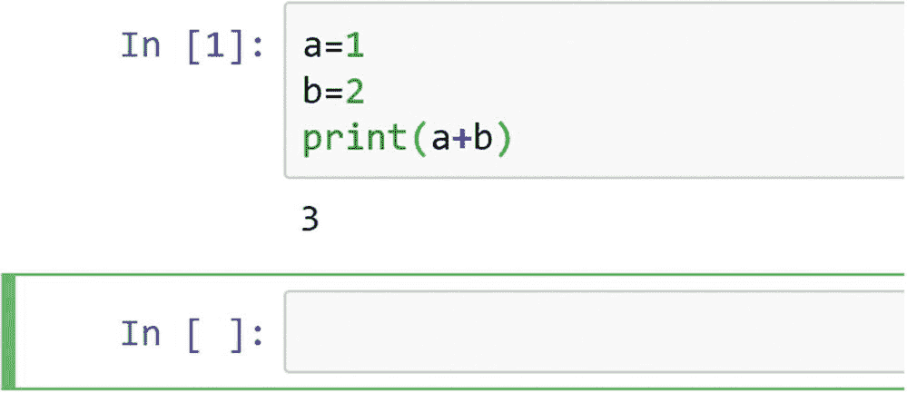

图 1-15

在单元格中输入一些代码后，按 Shift+Enter 将评估单元格中的代码

上述代码给出了`a+b`的结果，即`3`。在给出结果后，会自动为你创建一个新空单元格用于输入。有关如何添加注释、方程、内联图表等更多信息，我建议您访问 Jupyter 网站，并查看提供的文档。

### 注意

如果您忘记了笔记本所在的文件夹，您可以检查页面的 URL。例如，在我的情况下，我有 `http://localhost:8888/notebooks/Documents/Data%20Science/Projects/Applied%20advanced%20deep%20learning%20(book)/chapter%201/AADL%20-%20Chapter%201%20-%20Introduction.ipynb`。您会注意到 URL 只是笔记本所在文件夹的简单连接，由正斜杠分隔。一个 `%20` 字符简单地表示一个空格。在这种情况下，我的笔记本位于文件夹：`Documents/Data Science/Projects/…` 等等。我经常同时使用几个笔记本，知道每个笔记本的位置很有用，以防您忘记（我有时会忘记）。

## TensorFlow 基本介绍

在开始使用 TensorFlow 之前，您必须理解其背后的哲学。该库高度基于计算图的概念，除非您理解这些是如何工作的，否则您无法理解如何使用该库。我将为您快速介绍计算图，并展示如何使用 TensorFlow 实现简单的计算。在下一节的末尾，您应该理解库的工作原理以及我们将在本书中如何使用它。

### 计算图

要理解 TensorFlow 的工作原理，您必须理解什么是计算图。计算图是一个图，其中每个节点对应一个操作或一个变量。变量可以将它们的值输入到操作中，而操作可以将它们的输出结果输入到其他操作中。通常，节点被绘制为一个圆圈（或省略号），其中包含变量名或操作，当一个节点的值是另一个节点的输入时，从一端指向另一端有一条箭头。可以存在的最简单的图只是一个包含单个节点的图，该节点只是一个变量。（记住：节点可以是变量或操作。）图 1-16 简单地计算了变量 *x* 的值。

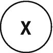

图 1-16

我们可以构建的最简单的图，显示了一个简单的变量

没那么有趣！现在让我们考虑一个稍微复杂一点的情况，比如两个变量 *x* 和 *y* 的和：*z* = *x* + *y*。它可以像以下图（图 1-17）那样完成：

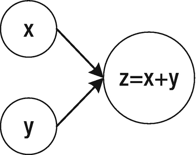

图 1-17

两个变量的和的基本计算图

图 1-17 左侧的节点（包含 *x* 和 *y* 的节点）是变量，而较大的节点表示两个变量的和。箭头显示变量 *x* 和 *y* 是第三个节点的输入。图应按拓扑顺序阅读（和计算），这意味着你应该遵循箭头来指示计算不同节点的顺序。箭头还会告诉你节点之间的依赖关系。要评估 *z*，你首先必须评估 *x* 和 *y*。我们也可以说执行求和的节点依赖于输入节点。

一个重要的理解方面是，这样的图只定义了对两个输入值（在这种情况下，*x* 和 *y*）执行的操作（在这种情况下，求和）以获得一个结果（在这种情况下，*z*）。它基本上定义了“如何”。你必须为输入 *x* 和 *y* 分配值，然后执行求和以获得 *z*。只有当你评估所有节点时，图才会给出结果。

### 注意

在本书中，我将指代图的“构建”阶段，即定义每个节点的作用，以及“评估”阶段，即我们实际评估相关操作的时候。

这是一个非常重要的理解方面。请注意，输入变量不需要是实数。它们可以是矩阵、向量等等。（本书中我们主要使用矩阵。）一个稍微复杂一点的例子可以在图 1-18 中找到，它使用一个图来计算三个输入量：*x*、*y* 和 *A* 给定的量 *A*(*x* + *y*)。

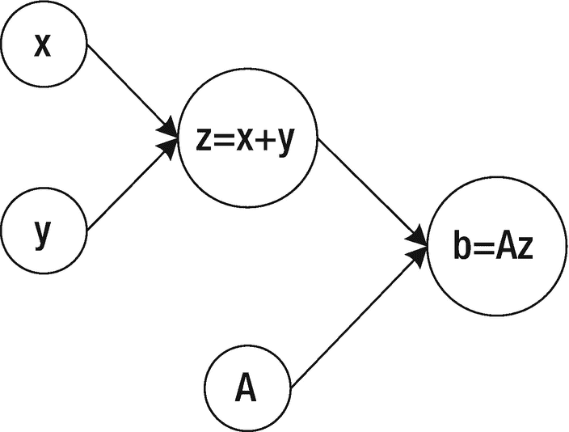

图 1-18

*计算量* *A*(*x* + *y*)的*计算图，给定三个输入量：*x*、*y* 和 *A*

我们可以通过为输入节点（在这种情况下，*x*、*y* 和 *A*）分配值并通过图评估节点来评估这个图。例如，如果你考虑图 1-18 并将值 *x* = 1、*y* = 3 和 *A* = 5 分配给它们，我们将得到结果 *b* = 20（如图 1-19 所示）。

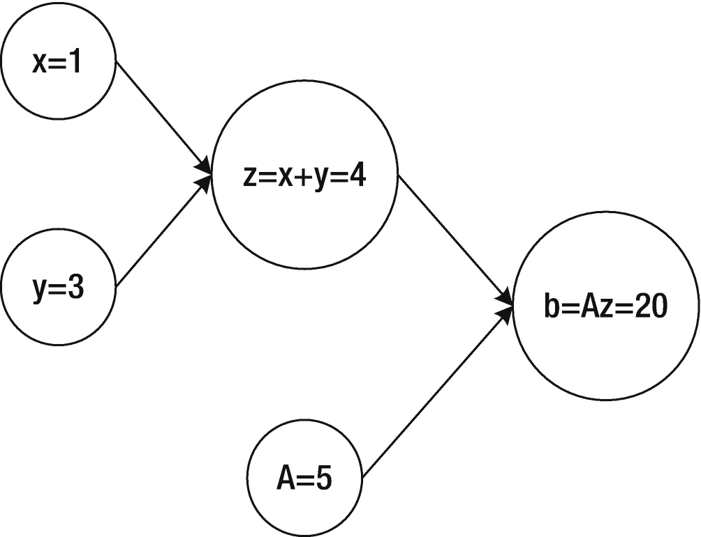

图 1-19

要评估图 1-18，我们必须为输入节点 x、y 和 A 分配值，然后通过图评估节点

神经网络基本上是一个非常复杂的计算图，其中每个神经元由图中的一些节点组成，这些节点将它们的输出馈送到一定数量的其他神经元，直到达到某个输出。在下一节中，我们将构建最简单的神经网络：只有一个神经元的网络。即使这样的简单网络，我们也能做一些相当有趣的事情。

`TensorFlow` 允许你非常容易地构建非常复杂的计算图。并且通过构造，它将它们的评估与构建分离。（记住，为了计算结果，你必须分配值并评估所有节点。）在下一节中，我将向你展示它是如何工作的：如何构建计算图以及如何评估它们。

### 注意

记住，`tensorflow` 首先构建一个计算图（在所谓的构建阶段），但不会自动评估它。库将这两个步骤分开，这样你就可以用不同的输入多次计算你的图，例如。

### 张量

`tensorflow` 处理数据的基本单位——从其名称中尝试猜测——是一个张量。张量简单地是一个原始类型（例如，浮点数）的集合，形状为一个 *n*-维数组。以下是一些张量的示例（带有相应的 Python 定义）：

+   1 → 一个标量

+   [1,2,3] → 一个向量

+   [[1,2,3], [4,5,6]] → 一个矩阵或一个二维数组

张量有一个静态类型和动态维度。在评估时你不能改变它的类型，但在评估之前可以动态地改变它的维度。（基本上，你声明张量时不指定一些维度，`tensorflow` 将从输入值中推断维度。）通常，人们会谈论张量的秩，它简单地是张量的维度数（而标量被期望具有 0 阶）。表 1-1 可能有助于理解张量的不同秩是什么。

表 1-1

0 阶、1 阶、2 阶和 3 阶张量的示例

| 秩 | 数学实体 | Python 示例 |
| --- | --- | --- |
| 0 | 标量（例如，长度或重量） | L=30 |
| 1 | 一个向量（例如，一个物体在二维平面上的速度） | S=[10.2,12.6] |
| 2 | 矩阵 | M=[[23.2, 44.2], [12.2, 55.6]] |
| 3 | 3D 矩阵（有三个维度） | C = [[[1],[2]],[[3],[4]], [[5], [6]]] |

假设你使用语句 `import tensorflow as tf` 导入 `tensorflow`，基本对象，张量，是 `tf.tensor` 类。一个 `tf.tensor` 有两个属性：

+   数据类型（例如，float32）

+   形状（例如，[2,3]，表示一个有两行三列的张量）

一个重要的方面是张量的每个元素总是具有相同的数据类型，而形状在声明时不必定义。（这将在下一章的实践示例中更加清晰。）本书中我们将看到的张量主要类型（还有更多）包括：

+   `tf.Variable`

+   `tf.constant`

+   `tf.placeholder`

在单次会话运行期间（关于这一点稍后会有更多说明），`tf.constant` 和 `tf.placeholder` 的值是不可变的。一旦它们有了值，就不会改变。例如，一个 `tf.placeholder` 可能包含你想要用于训练神经网络的训练数据集。一旦分配，它将在评估阶段保持不变。一个 `tf.Variable` 可能包含你神经网络的权重。它们将在训练过程中改变，以找到针对你特定问题的最优值。最后，`tf.constant` 永远不会改变。我将在下一节中向你展示如何使用三种不同类型的张量，以及你在开发模型时应考虑哪些方面。

### 创建和运行计算图

让我们开始使用 `tensorflow` 创建一个计算图。

### 注意

记住：我们始终将构建阶段（我们定义图应该做什么的阶段）和其评估（我们执行计算的阶段）分开。`tensorflow` 遵循相同的理念：首先构建一个图，然后评估它。

让我们考虑一个非常简单的事情：两个张量的和

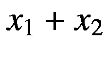

可以通过图 1-20 所示的计算图来计算。

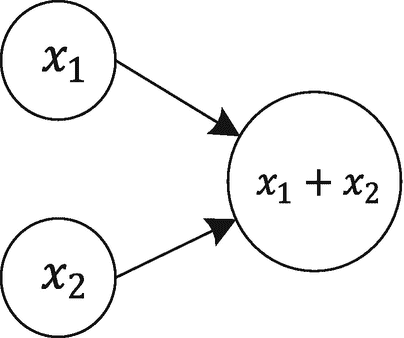

图 1-20

两个张量之和的计算图

### 使用 tf.constant 的计算图

如前所述，首先我们必须使用 `tensorflow` 创建这个计算图。（记住：我们是从构建阶段开始的。）让我们开始使用 `tf.constant` 张量类型。我们需要三个节点：两个用于输入变量，一个用于求和。这可以通过以下代码实现：

```py
x1 = tf.constant(1)
x2 = tf.constant(2)
z = tf.add(x1, x2)
```

上述代码创建了图 1-20 中的计算图，并且同时告诉 `tensorflow`，`x1` 应该具有括号中声明的值 `1`，而 `x2` 应该具有值 `2`。现在，为了评估代码，我们必须创建 `tensorflow` 所称的会话（其中可以进行实际评估），然后我们可以要求会话类使用以下代码运行我们的图：

```py
sess = tf.Session()
print(sess.run(z))
```

这将简单地给出 `z` 的评估结果，正如预期的那样，是 `3`。这个版本的代码相当简单，不需要太多，但它不够灵活。例如，`x1` 和 `x2` 是固定的，在评估期间不能改变。

### 注意

在 `TensorFlow` 中，你必须首先创建一个计算图，然后创建一个会话，最后运行你的图。这三个步骤必须始终遵循以评估你的图。

记住：你也可以要求 `tensorflow` 只评估一个中间步骤。例如，你可能想评估 `x1`（不太有趣，但有许多情况下它将非常有用，例如，当你想评估你的图，同时评估模型的准确性和损失函数时），如下所示：`sess.run(x1)`。

你将得到预期的结果 1（你预期到了，对吧？）。最后，记得使用 `sess.close()` 关闭会话以释放使用的资源。

### 使用 tf.Variable 的计算图

同样的计算图（如图 1-20 所示）可以用变量创建，但这需要更多的工作。让我们重新创建我们的计算图。

```py
x1 = tf.Variable(1)
x2 = tf.Variable(2)
z = tf.add(x1,x2)
```

我们希望用之前的值 `1` 和 `2` 初始化变量，正如之前所做的那样.^(1) 问题在于当你像之前那样运行图时，使用以下代码

```py
sess = tf.Session()
print(sess.run(z))
```

你将收到一个错误消息。这是一个非常长的错误消息，但接近结尾时，你会找到以下消息：

```py
FailedPreconditionError (see above for traceback): Attempting to use uninitialized value Variable
```

这发生是因为 `tensorflow` 并没有自动初始化变量。为了做到这一点，你可以使用以下方法：

```py
sess = tf.Session()
sess.run(x1.initializer)
sess.run(x2.initializer)
print(sess.run(z))
```

现在它没有错误地工作了。行 `sess.run(x1.initializer)` 将用值 `1` 初始化变量 `x1`，而行 `sess.run(x2.initializer)` 将用值 `2` 初始化变量 `x2`。但这相当繁琐。（你不想为每个需要初始化的变量写一行代码。）一个更好的方法是向你的计算图中添加一个节点，其目的是用以下代码初始化你在图中定义的所有变量

```py
init = tf.global_variables_initializer()
```

然后再创建并运行你的会话，在评估 `z` 之前先运行这个节点（`init`）。

```py
sess = tf.Session()
sess.run(init)
print(sess.run(z))
sess.close()
```

这将按预期工作，并给出结果 `3`。

### 注意

当使用变量时，请始终记得添加一个全局初始化器（`tf.global_variables_initializer()`），并在会话中运行节点，在评估任何其他内容之前。在本书的许多示例中，我们将看到这是如何工作的。

### 使用 tf.placeholder 的计算图

让我们声明 `x1` 和 `x2` 为占位符。

```py
x1 = tf.placeholder(tf.float32, 1)
x2 = tf.placeholder(tf.float32, 1)
```

注意，我在声明中并没有提供任何值.^(2) 我们将在评估时给 `x1` 和 `x2` 赋值。这就是占位符与其他两种张量类型的主要区别。然后，总和再次由

```py
z = tf.add(x1,x2)
```

注意，如果你尝试使用例如 `print(z)` 来查看 `z` 中的内容，你会得到

```py
Tensor("Add:0", shape=(1,), dtype=float32)
```

为什么会有这个奇怪的结果？首先，我们没有给 `tensorflow` 提供 `x1` 和 `x2` 的值，其次，`TensorFlow` 还没有运行任何计算。记住：图构建和评估是独立的步骤。现在让我们在 `TensorFlow` 中创建一个会话，就像之前一样。

```py
sess = tf.Session()
```

现在我们可以运行实际的计算，但要做到这一点，我们首先必须有一种方法来为两个输入`x1`和`x2`分配值。这可以通过使用一个包含所有占位符名称作为键的 Python 字典来实现，并将值分配给它们。在这个例子中，我们将`1`的值分配给`x1`，将`2`的值分配给`x2`。

```py
feed_dict={ x1: [1], x2: [2]}
```

将此代码输入到`TensorFlow`会话中可以使用以下命令：

```py
print(sess.run(z, feed_dict))
```

你最终得到了预期的结果：`3`。请注意，`tensorflow`相当智能，可以处理更复杂的输入。让我们重新定义我们的占位符，以便能够使用包含两个元素的数组。（在这里，我们报告整个代码，以便更容易地跟随示例。）

```py
x1 = tf.placeholder(tf.float32, [2])
x2 = tf.placeholder(tf.float32, [2])
z = tf.add(x1,x2)
feed_dict={ x1: [1,5], x2: [1,1]}
sess = tf.Session()
sess.run(z, feed_dict)
```

这一次，你会得到一个包含两个元素的数组作为输出。

```py
array([ 2., 6.], dtype=float32)
```

记住`x1=[1,5]`和`x2=[1,1]`意味着`z=x1+x2=[1,5]+[1,1]=[2,6]`，因为求和是逐元素进行的。

总结来说，以下是一些关于何时使用哪种张量类型的指南：

+   对于在每个评估阶段不会改变的实体，请使用`tf.placeholder`。通常，这些是输入值或参数，你希望在评估期间保持固定，但可能随着每次运行而改变。（你将在本书后面的内容中看到几个例子。）包括输入数据集、学习率等。

+   对于在计算过程中会改变的实体，请使用`tf.Variable`，例如，你将在本书后面的内容中看到的神经网络权重。

+   对于永远不会改变的实体，请使用`tf.constant`，例如，在模型中固定那些你不再想更改的值。

图 1-21 展示了稍微复杂一些的例子：计算*x*[1]*w*[1] + *x*[2]*w*[2]的计算图。

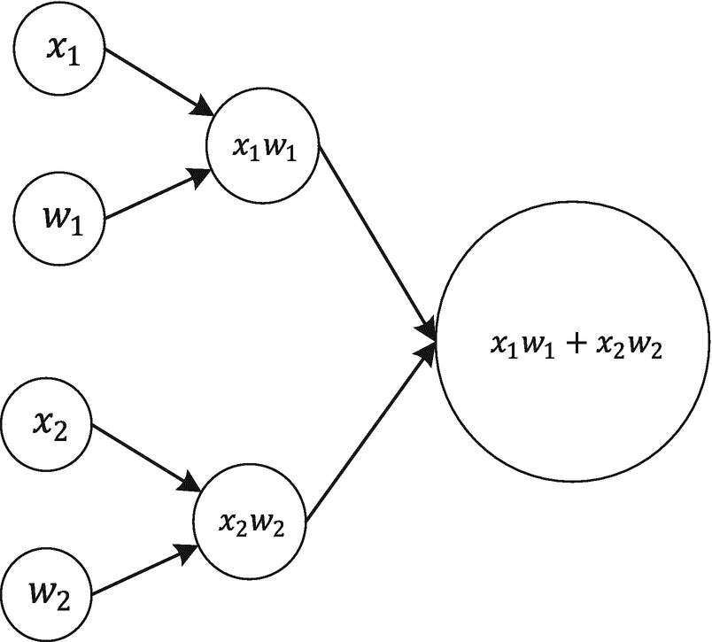

图 1-21

计算 x[1]w[1] + x[2]w[2]的计算图

在这种情况下，我将*x*[1]、*x*[2]、*w*[1]和*w*[2]定义为占位符（它们将是我们的输入），包含标量（记住：在定义占位符时，你必须始终传递维度作为第二个输入参数，在这种情况下，是`1`）。

```py
x1 = tf.placeholder(tf.float32, 1)
w1 = tf.placeholder(tf.float32, 1)
x2 = tf.placeholder(tf.float32, 1)
w2 = tf.placeholder(tf.float32, 1)
z1 = tf.multiply(x1,w1)
z2 = tf.multiply(x2,w2)
z3 = tf.add(z1,z2)
```

运行计算简单地说（就像之前一样）是定义包含输入值的字典，创建一个会话，然后运行它。

```py
feed_dict={ x1: [1], w1:[2], x2:[3], w2:[4]}
sess = tf.Session()
sess.run(z3, feed_dict)
```

如预期，你会得到以下结果：

```py
array([ 14.], dtype=float32)
```

这只是 1×2 + 3×4 = 2 + 12 = 14（记住，我们在上一步的`feed_dict`中输入了值`1`、`2`、`3`和`4`）。在第二章中，我们将绘制单个神经元的计算图，并将本章学到的知识应用到一个非常实际的案例中。使用该图，我们能够在真实数据集上进行线性回归和逻辑回归。一如既往，记得在完成后使用`sess.close()`关闭会话。

### 注意

在 `TensorFlow` 中，可能会发生相同代码运行多次的情况，你最终可能会得到一个包含相同节点多个副本的计算图。避免这种问题的一个非常常见的方法是在构建图的代码之前运行代码 `tf.reset_default_graph()`。请注意，如果你适当地将你的构建代码与你的评估代码分开，你应该能够避免这种问题。我们将在本书后面的许多示例中看到这一点是如何工作的。

### run 和 eval 的区别

如果你查看博客和书籍，你可能会发现两种使用 `tensorflow` 评估计算图的方法。我们到目前为止使用的是 `sess.run()`，其中该函数需要作为参数传入你想要评估的节点的名称。我们选择这种方法是因为它有一个很好的优点。为了理解它，考虑以下代码（你之前已经见过）

```py
x1 = tf.constant(1)
x2 = tf.constant(2)
z = tf.add(x1, x2)
init = tf.global_variables_initializer()
sess = tf.Session()
sess.run(init)
sess.run(z)
```

这只会给你评估后的节点 z，但你也可以同时评估多个节点，使用以下代码：

```py
sess.run([x1,x2,z])
```

这将给你

```py
[1, 2, 3]
```

这非常有用，这一点将在下一节关于节点生命周期的内容中变得清晰。此外，同时评估多个节点将使你的代码更短、更易读。

在图中评估一个节点的第二种方法是使用 `eval()` 调用。此代码

```py
z.eval(session=sess)
```

将评估 `z`。但这次，你必须明确告诉 `TensorFlow` 你想要使用哪个会话（你可能已经定义了多个）。这并不太实用，我更喜欢使用 `run()` 方法同时获取多个结果（例如，损失函数、准确率和 F1 分数）。还有其他性能原因更喜欢第一种方法，这将在下一节中解释。

### 节点之间的依赖关系

如我之前提到的，`TensorFlow` 以拓扑顺序评估图，这意味着当你要求它评估一个节点时，它会自动确定所有需要评估以评估你所请求的内容的节点，并首先评估它们。问题是 `TensorFlow` 可能会多次评估某些节点。例如，考虑以下代码：

```py
c = tf.constant(5)
x = c + 1
y = x + 1
z = x + 2
sess = tf.Session()
print(sess.run(y))
print(sess.run(z))
sess.close()
```

此代码将构建并评估图 1-22 中的计算图。

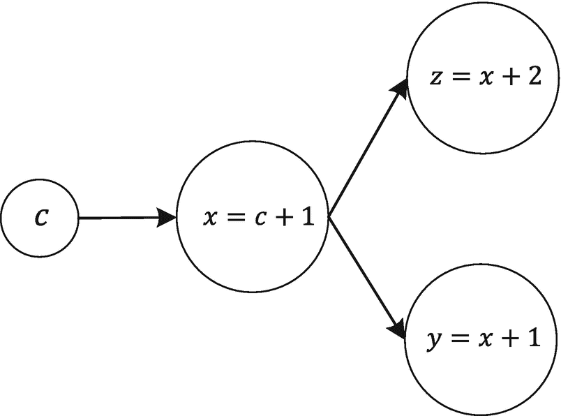

图 1-22

该节开头引用的代码构建的计算图

如您所见，*z* 和 *y* 都依赖于 *x*。我们编写的代码存在的问题是，`TensorFlow` 不会重用 *c* 和 *x* 上一次评估的结果。这意味着当评估 *z* 时，它将只对 *x* 进行一次评估，而当评估 *y* 时，它将再次对 *x* 进行评估。在这种情况下，例如，使用代码 `yy, zz = sess.run([y,z])` 将在一次运行中评估 *y* 和 *z*，而 *x* 只评估一次。

### 如何创建和关闭会话的技巧

我向您展示了如何使用模板创建会话

```py
sess = tf.Session()
# Code that does something
```

最后，你应该始终关闭会话，以释放使用的资源。语法相当简单：

```py
sess.close()
```

请记住，一旦关闭会话，你就无法评估任何其他内容。你必须创建一个新的会话并再次进行评估。在 Jupyter 环境中，这种方法的优势在于允许你将评估代码拆分到多个单元格中，然后在最后关闭会话。但了解有一种稍微紧凑一些的方式来打开和使用会话，可以使用以下模板：

```py
With tf.Session() as sess:
# code that does something
```

例如，以下代码

```py
sess = tf.Session()
print(sess.run(y))
print(sess.run(z))
sess.close()
```

上一节中的内容可以写成

```py
with tf.Session() as sess:
print(sess.run(y))
print(sess.run(z))
```

在这种情况下，会话将在 `with` 语句结束时自动关闭。使用这种方法使使用 `eval()` 更加容易。例如，以下代码

```py
sess = tf.Session()
print(z.eval(session=sess))
sess.close()
```

使用 `with` 语句时，它将看起来像这样

```py
with tf.Session() as sess:
print(z.eval())
```

有一些情况下，显式声明会话是首选的。例如，编写一个执行实际图评估并返回会话的函数是很常见的，这样就可以在主要训练完成后进行额外的评估（例如，准确度或其他类似指标）。在这种情况下，你不能使用第二种版本，因为它会在评估完成后立即关闭会话，因此使得使用会话结果进行额外评估变得不可能。

### 注意

如果你在一个交互式环境，如 Jupyter 笔记本中工作，并且想在多个笔记本单元格中拆分你的评估代码，将 `sess = tf.Session()` 声明会话、执行所需的计算，然后在最后关闭它会更简单。这样，你可以交替评估、图表和文本。如果你正在编写不会交互的代码，有时使用第二种版本更可取（且更不容易出错），以确保会话在最后关闭。此外，使用第二种方法，在使用 `eval()` 方法时，你不需要指定会话。

本章涵盖的材料应该为你构建使用 `tensorflow` 的神经网络提供所有你需要的内容。我在这里解释的绝对不是完整或详尽的。你应该真的花些时间，访问官方 TensorFlow 网站，并研究那里的教程和其他材料。

### 注意

在这本书中，我使用了一种*懒惰的编程方法*。这意味着我只解释我想让你理解的内容，没有更多。原因是我想让你专注于每一章的学习目标，我不想让你被方法或编程函数背后的复杂性所分散。一旦你理解了我试图解释的内容，你应该投入一些时间，深入到方法和库中，使用官方文档。
