# 3. 前馈神经网络

在第二章 2 中，我们使用一个神经元完成了一些令人惊叹的事情，但这几乎不足以应对更复杂的案例。神经网络的真实力量在于当数千（甚至数百万）个神经元相互交互以解决特定问题时才显现出来。网络架构（神经元如何相互连接，它们如何行为等）在网络学习的效率、预测的准确性以及它能解决的问题类型方面起着至关重要的作用。

已经有大量被广泛研究且非常复杂的架构，但从学习角度来看，从最简单的多神经元神经网络开始是很重要的。从所谓的前馈神经网络开始是有意义的，在这种网络中，数据从输入层进入，逐层通过网络，直到到达输出层。（这赋予了网络其名称：前馈神经网络。）在本章中，我们将考虑这样的网络，其中每一层的每个神经元都从前一层的所有神经元那里获取输入，并将它们的输出馈送到下一层的每个神经元。

如同容易想象的那样，随着复杂性的增加，挑战也越来越多。实现快速学习和良好的准确性变得更加困难；由于网络复杂性的增加，可用的超参数数量也在增长；当处理大数据集时，简单的梯度下降算法将不再适用。在开发包含许多神经元的模型时，我们需要拥有一套更广泛的工具，以便应对这些网络带来的所有挑战。在本章中，我们将开始探讨一些更高级的方法和算法，这些方法和算法将使我们能够有效地处理大数据集和大型网络。这些复杂的网络足够强大，可以进行一些有趣的多类分类，这是大型网络通常需要执行的最常见任务之一（例如，手写识别、面部识别、图像识别等），因此我选择了一个数据集，使我们能够进行一些有趣的多类分类并研究其困难。

我将本章的开头讨论网络架构和所需的矩阵形式。然后简要概述随这种新型网络而来的新超参数。接下来解释如何使用 `softmax` 函数实现多类分类，以及需要什么样的输出层。然后，在开始编写 Python 代码之前，简要地偏离主题，详细解释什么是过拟合，用一个简单的例子来说明，以及如何对复杂网络进行基本的错误分析。然后我们将开始使用 TensorFlow 构建更大的网络，将它们应用于基于服装物品图像的 MNIST 类似数据集（这将非常有趣）。我们将探讨如何使第二章中介绍的梯度下降算法更快，引入两种新的变化：随机和批量梯度下降。然后我们将探讨如何以高效的方式添加许多层，以及如何以最佳方式初始化权重和偏差，以使训练快速且稳定。特别是，我们将探讨 sigmoid 和 ReLU 激活函数的 Xavier 和 He 初始化。最后，提供一条关于如何比较网络复杂性的经验法则，本章以一些关于如何选择正确网络的提示结束。

## 网络架构

神经网络架构相当容易理解。它由一个输入层（输入 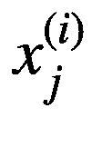）、几个层（称为隐藏层，因为它们被输入层和输出层夹在中间，所以从外面看是“看不见”的，换句话说）和一个输出层组成。在每个层中，你可能有一个或几个神经元。这种网络的主要特性是每个神经元都从前一层的每个神经元接收输入，并将它的输出馈送到下一层的每个神经元。在图 3-1 中，你可以看到这种网络的图形表示。

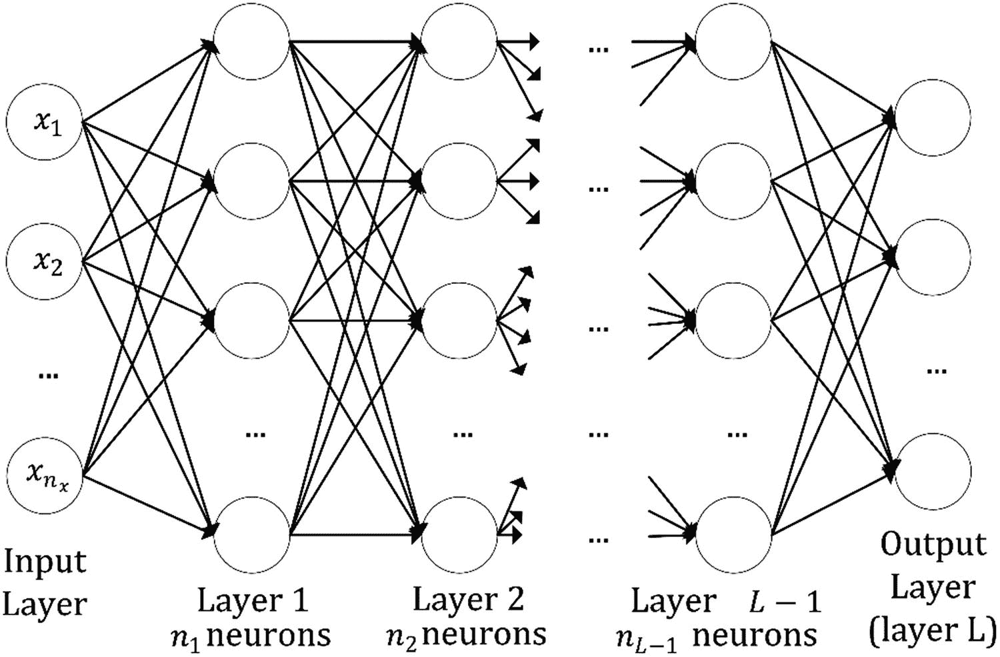

图 3-1

多层深度前馈神经网络图，其中每个神经元都从前一层的每个神经元接收输入，并将它的输出馈送到后续层的每个神经元

从第二章中的一个神经元跳到这个，是一个相当大的步骤。为了构建模型，我们必须使用矩阵形式，因此我们必须正确地确定所有矩阵维度。首先，我将讨论一些新的符号。

+   *L*: 隐藏层数量，不包括输入层但包括输出层

+   *n*[*l*]: 层 *l* 中的神经元数量

在图 3-1 中所示的这种网络中，我们将用 *N*[*神经元*] 表示神经元的总数，它可以写成

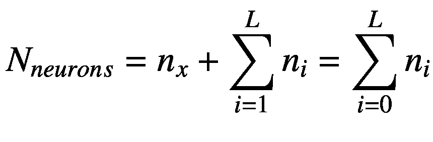

其中，按照惯例，我们定义 *n*[0] = *n*[*x*]。两个神经元之间的每个连接都将有自己的权重。让我们用 ![$$ {w}_{i\kern0.125em j}^{\left[l\right]} $$](../images/463356_1_En_3_Chapter/463356_1_En_3_Chapter_TeX_IEq2.png) 表示层 *l* 中神经元 *i* 和层 *l* − 1 中神经元 *j* 之间的权重。在图 3-2 中，我只画出了我们的通用网络图 3-1 的前两层（输入层和层 1），包括输入层中第一个神经元与层 1 中所有其他神经元之间的权重。所有其他神经元都为了清晰而用灰色表示。

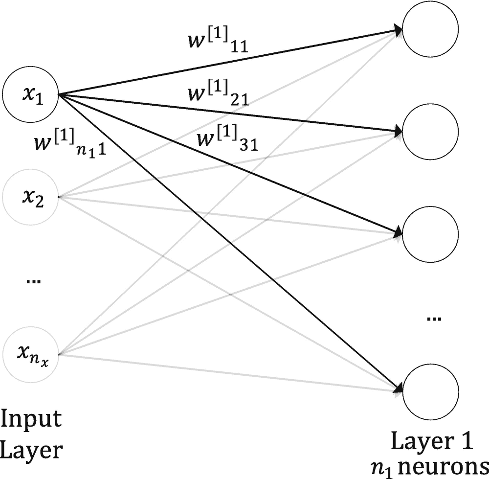

图 3-2

一个通用神经网络的头两层，包括输入层中第一个神经元与其他第二层神经元之间的连接权重。所有其他神经元和连接都以浅灰色绘制，以使图更清晰。

输入层和层 1 之间的权重可以写成如下矩阵：

![$$ {W}^{\left[1\right]}=\left(\begin{array}{ccc}{w}_{11}^{\left[1\right]}&amp; \dots &amp; {w}_{1{n}_x}^{\left[1\right]}\ \\ {}\vdots &amp; \ddots &amp; \vdots \\ {}{w}_{n_11}^{\left[1\right]}&amp; \dots &amp; {w^{\left[1\right]}}_{n_1{n}_x}\end{array}\right) $$](../images/463356_1_En_3_Chapter/463356_1_En_3_Chapter_TeX_Equb.png)

这意味着我们的矩阵 *W*^([1]) 具有维度 *n*[1] × *n*[*x*]。当然，这可以推广到任何两个层 *l* 和 *l* − 1 之间，这意味着两个相邻层 *l* 和 *l* − 1 之间的权重矩阵，用 *W*^([*l*]) 表示，将具有 *n*[*l*] × *n*[*l* − 1] 的维度。按照惯例，*n*[0] = *n*[*x*] 是输入特征的数量（不是用 *m* 表示的观察数量）。

### 注意

两个相邻层 *l* 和 *l* − 1 之间的权重矩阵，我们用 *W*^([*l* ]), 表示，将具有 *n*[*l*] × *n*[*l* − 1] 的维度，其中，按照惯例，*n*[0] = *n*[*x*] 是输入特征的数量。

偏置（在第二章节中用 *b* 表示）这次将是一个矩阵。记住，每个接收输入的神经元都将有自己的偏置，因此当我们考虑我们的两层，*l* 和 *l* − 1 时，我们将需要 *n*[*l*] 个不同的 *b* 值。我们将用 *b*^([*l*]) 表示这个矩阵，它将具有 *n*[*l*] × 1 的维度。

### 注意

两个相邻层 *l* 和 *l* − 1 的偏置矩阵，我们用 *b*^([*l*]) 表示，将具有 *n*[*l*] × 1 的维度。

### 神经元的输出

现在，让我们开始考虑我们神经元的输出。首先，我们将考虑第一层的第 *i* 个神经元（记住，我们的输入层按定义是层 0）。让我们用 ![$$ {\widehat{y}}_i^{\left[1\right]} $$](../images/463356_1_En_3_Chapter/463356_1_En_3_Chapter_TeX_IEq3.png) 表示其输出，并假设层 *l* 中的所有神经元都使用相同的激活函数，我们将用 *g*^([*l*]) 表示。然后我们将有

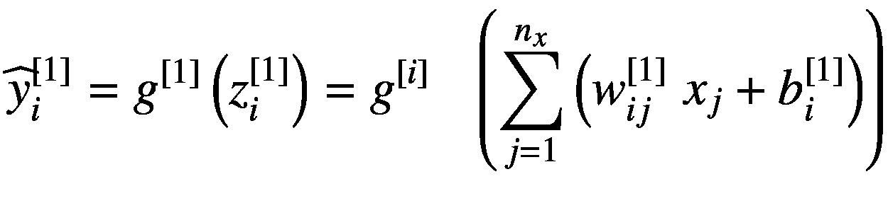

其中，我们指出了，如您从第二章所记得的，*z*[*i*] 作为

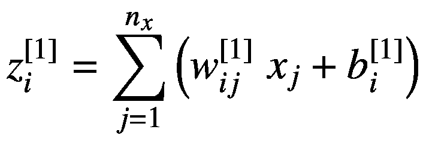

如您所想象，我们希望有一个矩阵来表示第一层的所有输出，因此我们将使用以下符号

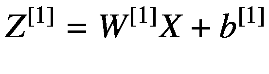

其中 *Z*^([1]) 将具有 *n*[1] × 1 的维度，并且我们用 *X* 表示包含所有观察值的矩阵（行表示特征，列表示观察值），正如我在第二章中已经讨论过的。我们假设在这里层 *l* 中的所有神经元都将使用我们将用 *g*^([*l*]) 表示的相同的激活函数。

我们可以很容易地将前面的方程推广到层 *l*

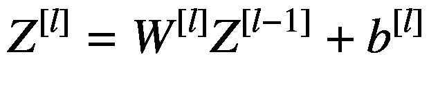

因为层 *l* 将从层 *l* − 1 获取其输入。我们只需要将 *X* 替换为 *Z*^([*l* − 1])。*Z*^([*l*]) 将具有 *n*[*l*] × 1 的维度。然后我们的输出将以矩阵形式表示

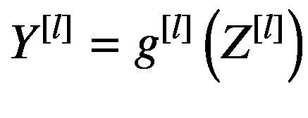

其中激活函数通常按元素操作。

### 矩阵维度总结

以下是迄今为止我们描述的所有矩阵的维度的总结。

+   *W*^([*l*]) 的维度为 *n*[*l*] × *n*[*l* − 1]（根据定义，我们有 *n*[0] = *n*[*x*]）

+   *b*^([*l*]) 的维度为 *n*[*l*] × 1

+   *Z*^([*l* − 1]) 的维度为 *n*[*l* − 1] × 1

+   *Z*^([*l*]) 的维度为 *n*[*l*] × 1

+   *Y*^([*l*]) 的维度为 *n*[*l*] × 1

在每种情况下，*l* 从 1 到 *L*。

### 示例：三层网络的方程

为了使这次讨论更加具体，让我们考虑一个具有三层（因此 *L* = 3）的网络示例，其中 *n*[1] = 3，*n*[2] = 2，*n*[3] = 1，如图 3-3 所示。

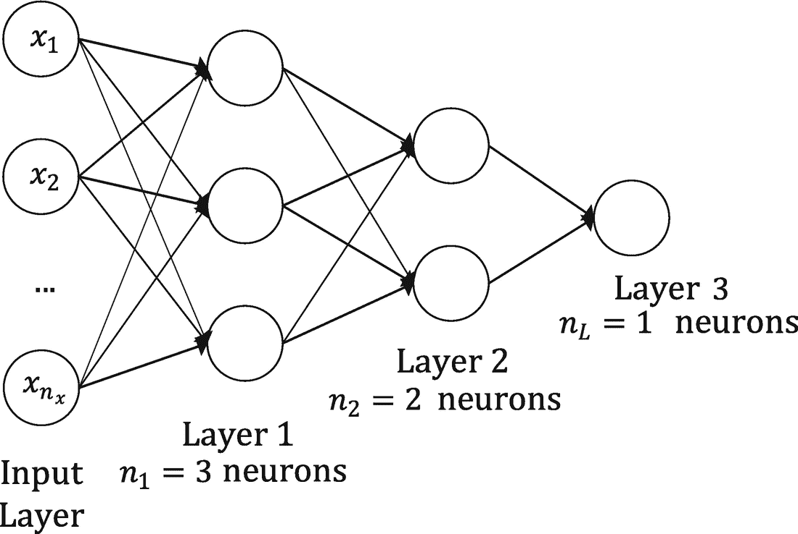

图 3-3

前馈神经网络的实际例子

在这种情况下，我们必须计算以下量：

+   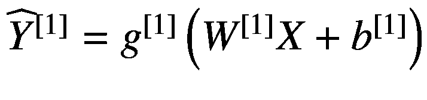，其中*W*¹的维度为 3 × *n*[*x*]，*b*的维度为 3 × 1，而*X*的维度为*n*[*x*] × *m*

+   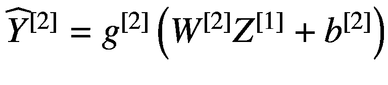，其中*W*²的维度为 2 × 3，*b*的维度为 2 × 1，而*Z*¹的维度为 3 × *m*

+   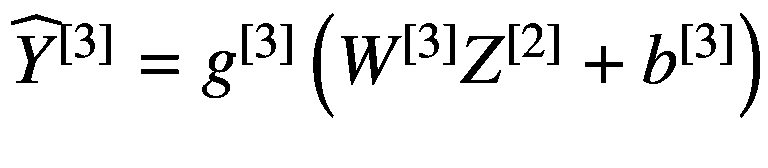，其中*W*³的维度为 1 × 2，*b*的维度为 1 × 1，而*Z*²的维度为 2 × *m*

你的网络输出，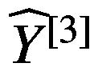，将如预期的那样，具有 1 × *m*的维度。

所有这些可能看起来相当抽象（实际上也是如此）。你将在本章后面看到，在 TensorFlow 中实现它非常简单，只需根据刚才讨论的步骤构建正确的计算图即可。

### 全连接网络中的超参数

在刚刚讨论的网络中，有相当多的参数可以调整以找到最适合你问题的最佳模型。你将记得从第二章中，那些在开始时固定并在训练阶段不改变的参数被称为超参数。对于前馈网络，你将不得不调整以下额外的超参数：

+   层数数：*L*

+   每层的神经元数量：*n*[*i*]对于*i*从 1 到*L*

+   每层的激活函数选择：*g*^([*l*])

然后，当然，你仍然会遇到第二章中遇到的下述超参数：

+   迭代次数（或周期）

+   学习率

## 多类分类的 softmax 函数

在看到一些 TensorFlow 代码之前，你还得忍受一点理论。本章中描述的网络开始变得足够复杂，能够以合理的结果执行多类分类。为了做到这一点，我们首先必须介绍`softmax`函数。

从数学上讲，`softmax` 函数 *S* 是将一个 *k* 维向量转换成另一个 *k* 维向量，该向量包含介于 0 和 1 之间的实数值，并且这些值加起来等于 1。给定 *k* 个实数值 *z*[*i*] 对于 *i* = 1, …, *k*，我们定义向量 ***z*** = (*z*[1], …, *z*[*k*])，并定义 `softmax` 向量函数 ***S***(***z***) = (*S*(***z***)[1] *S*(***z***)[2]… *S*(***z***)[*k*]) 如下：

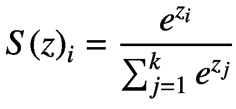

因为分母总是大于分子，所以 *S*(***z***)[*i*] < 1。此外，我们还有

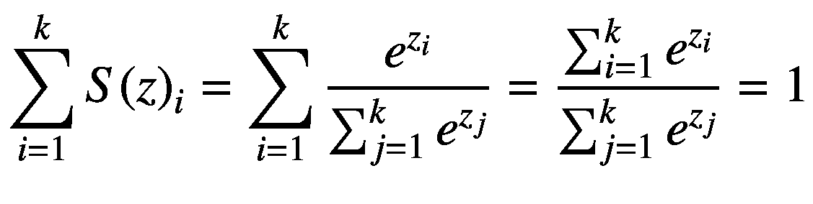

因此，*S*(***z***)[*i*] 的行为就像一个概率，因为其 *i* 的总和为 1，且其元素都小于 1。我们将把 *S*(***z***)[*i*] 视为在 *k* 个可能结果上的概率分布。对我们来说，*S*(***z***)[*i*] 将简单地是我们输入观察属于类别 *i* 的概率。假设我们正在尝试将一个观察结果分类到三个类别中。我们可能会得到以下输出：*S*(***z***)[1] = 0.1, *S*(***z***)[2] = 0.6, 和 *S*(***z***)[3] = 0.3。这意味着我们的观察结果有 10% 的概率属于类别 1，60% 的概率属于类别 2，30% 的概率属于类别 3。通常，人们会选择将输入观察结果分类到概率较高的类别，在这个例子中，类别 2，概率为 60%。

### 注意

我们将把 *S*(***z*** )[*i*] 视为在 *k* 个可能结果上的概率分布，其中 *i* = 1, …, *k*。对我们来说，*S*(***z*** )[*i*] 将简单地是我们输入观察属于类别 *i* 的概率。

为了能够使用 `softmax` 函数进行分类，我们不得不使用一个特定的输出层。我们需要使用十个神经元，每个神经元将输出 ***z***[*i*]，然后一个神经元将输出 ***S***(***z***)。这个神经元将使用 `softmax` 函数作为激活函数，并将输入设置为最后层的 10 个输出，即 ***z***[*i*]。在 TensorFlow 中，你将对最后层的 10 个神经元应用 `tf.nn.softmax` 函数。请记住，这个 `tensorflow` 函数将逐元素操作。在章节的后面，你会找到一个从开始到结束的具体示例，展示如何实现这一点。

## 简短插叙：过拟合

当训练深度神经网络时，您将遇到的最常见问题之一将是过拟合。可能发生的情况是，由于网络的灵活性，它可能会学习到由于噪声、错误或仅仅是错误数据而产生的模式。理解过拟合是什么非常重要，因此我将给出一个实际例子，以帮助您直观地理解它。为了更容易可视化，我将使用一个简单的二维数据集，我将为此创建它。我希望在下一节的末尾，您对过拟合有一个清晰的概念。

### 过拟合的实际例子

前几节中描述的网络相当复杂，很容易导致数据集过拟合。让我简要解释一下过拟合的概念。为了理解它，考虑以下问题：找到最佳的多项式来逼近给定的数据集。给定一组二维点 (*x*^((*i*)), *y*^((*i*))), 我们希望找到最佳的多项式，其阶数为 *K*，形式如下

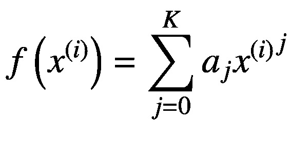

以最小化均方误差

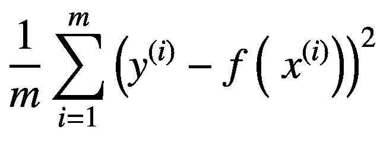

其中，通常，*m* 表示我们拥有的数据点的数量。我不仅想确定所有参数 *a*[*j*]，还想确定最佳逼近我们数据的 *K* 的值。在这种情况下，*K* 衡量我们的模型复杂度。例如，对于 *K* = 0，我们仅仅有 *f* (*x*^((*i*))) = *a*[0]（一个常数），这是我们能够想到的最简单的多项式。对于更高的 *K*，我们有更高阶的多项式，这意味着我们的函数更复杂，有更多的参数可用于训练。

这里是当 *K* = 3 时我们函数的一个例子：

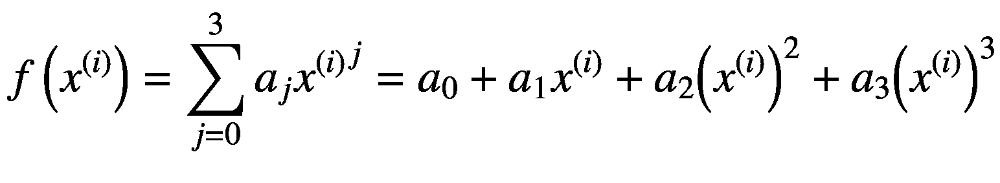

其中我们拥有四个参数，这些参数可以在我们的训练模型过程中进行调整。让我们生成一些数据，从一个二次多项式（*K* = 2）开始

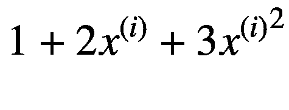

并添加一些随机误差（这将使过拟合变得明显）。让我们首先导入我们的标准库，并添加`curve_fit`函数，该函数将自动最小化标准误差并找到最佳参数。不必过于担心这个函数。这里的目的是向您展示当您使用过于复杂的模型时可能会发生什么。

```py
import numpy as np
import matplotlib.pyplot as plt
from scipy.optimize import curve_fit
```

让我们定义一个用于二次多项式的函数

```py
def func_2(p, a, b, c):
return a+b*p + c*p**2
```

然后让我们生成我们的数据集

```py
x = np.arange(-5.0, 5.0, 0.05, dtype = np.float64)
y = func_2(x, 1,2,3)+18.0*np.random.normal(0, 1, size=len(x))
```

为了向函数添加一些随机噪声，我们使用了函数 `np.random.normal(0, 1, size=len(x))`，它生成一个长度为 `len(x)` 的 `numpy` 数组，其值为从均值为 `0` 和标准差为 `1` 的正态分布中抽取的随机值。

在图 3-4 中，你可以看到 *a* = 1, *b* = 2, 和 *c* = 3 的数据看起来是什么样子。

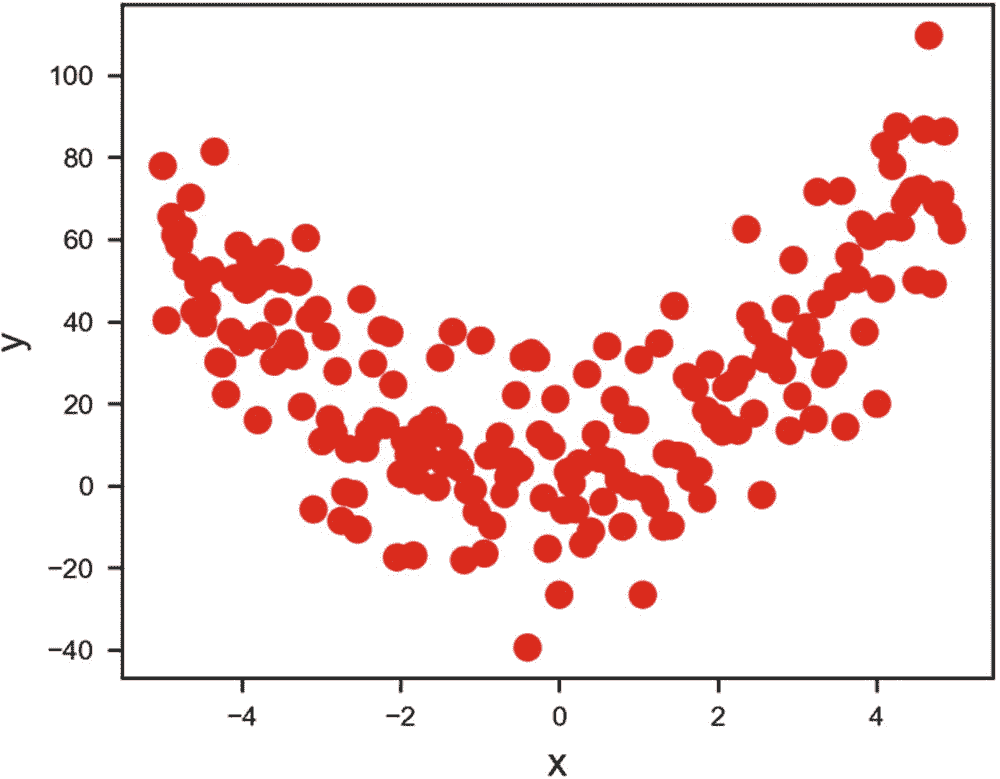

图 3-4

我们使用 a = 1, b = 2, 和 c = 3 生成的数据，如文本中所述

现在，让我们考虑一个过于简单以至于无法捕捉数据特征的模型，这意味着我们将看到具有高偏差^(1)的模型能做什么。让我们考虑一个线性模型 (*K* = 1)。代码将是

```py
def func_1(p, a, b):
return a+b*p
popt, pcov = curve_fit(func_1, x, y)
```

这将给出使标准误差最小化的 *a* 和 *b* 的最佳值。在图 3-5 中，很明显这个模型完全忽略了数据的主要特征，因为它过于简单。

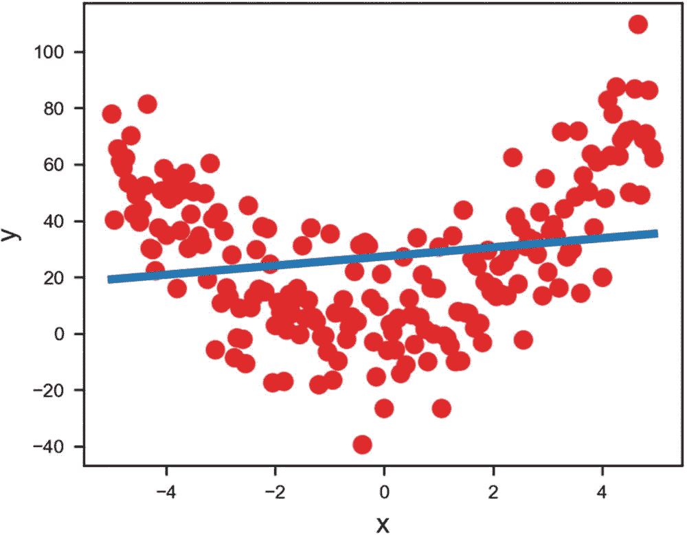

图 3-5

线性模型没有捕捉到数据的主要特征，过于简单。在这种情况下，模型具有高偏差。

让我们尝试拟合一个二次多项式 (*K* = 2)。结果如图 3-6 所示。

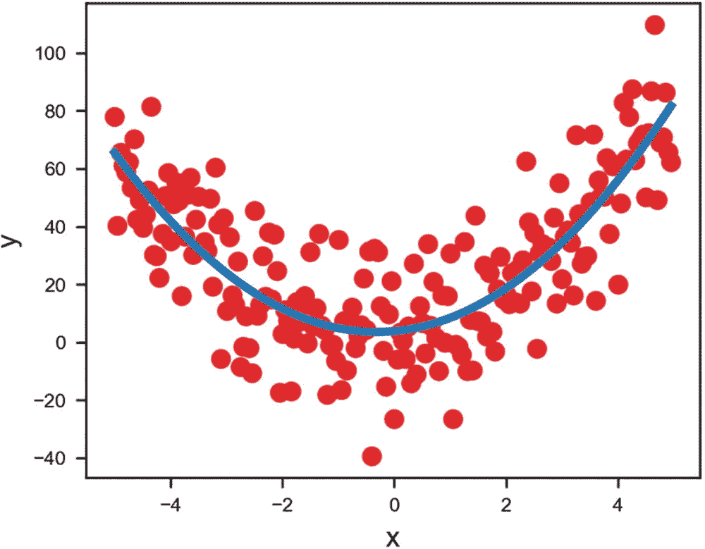

图 3-6

二次多项式的结果

这样更好。这个模型似乎捕捉到了模型的主要特征，忽略了随机噪声。现在让我们尝试一个非常复杂的模型——一个 21 次多项式 (*K* = 21)。结果如图 3-7 所示。

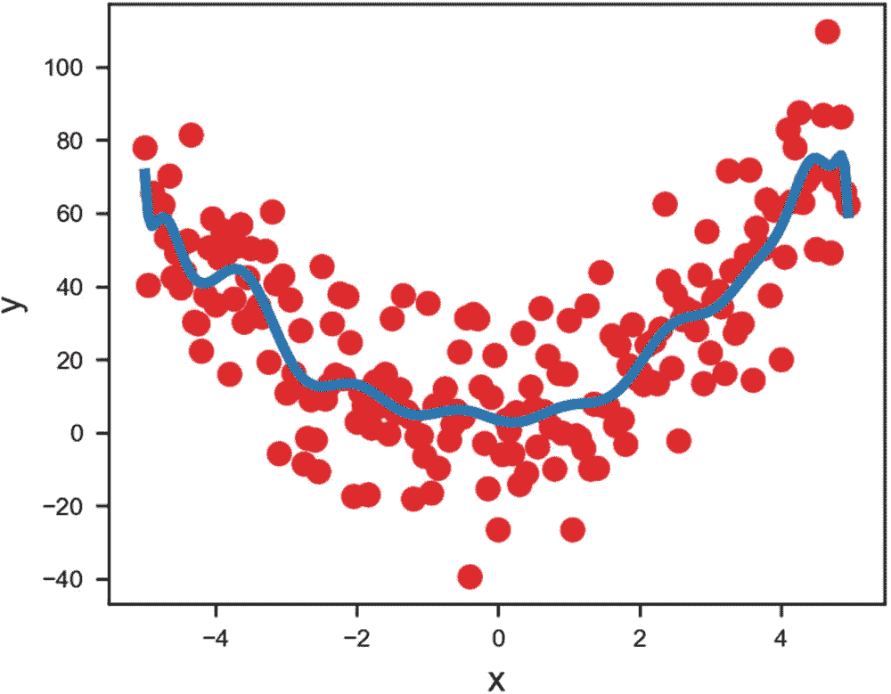

图 3-7

21 次多项式模型的结果

现在，这个模型显示了我们所知道的是错误的特征，因为我们创建了我们的数据。这些特征不存在，但模型非常灵活，能够捕捉到我们通过噪声引入的随机变异性。这里，我指的是使用这个高阶多项式出现的振荡。

在这种情况下，我们谈论的是过拟合，意味着我们开始用我们的模型捕捉到由于随机误差等原因的特征。很容易理解这会非常糟糕。如果我们将这个 21 次多项式模型应用于新数据，它将不会很好地工作，因为新数据中的随机噪声将不同，因此图 3-7 中看到的振荡在新数据上就没有意义。在图 3-8 中，我绘制了通过拟合使用 10 个不同随机噪声值生成的数据得到的最佳 21 次多项式模型。你可以清楚地看到它的变化有多大。它并不稳定，并且强烈依赖于存在的随机噪声。振荡总是不同的！在这种情况下，我们谈论的是 *高方差*。

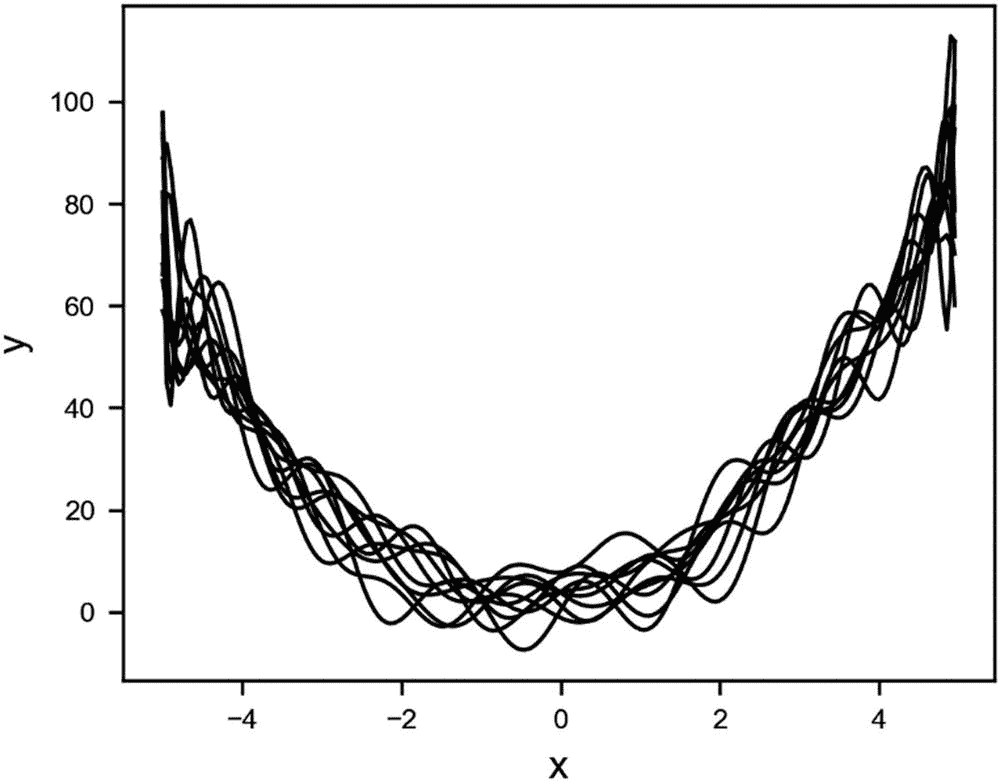

图 3-8

我们模型的成果，通过一个 21 次多项式拟合了 10 个不同数据集，这些数据集是通过添加不同的随机噪声值生成的

现在，让我们创建与图 3-8 中相同的图表，同时改变我们的随机噪声，就像我们在图 3-9 中所做的那样。你可以在图 3-9 中查看结果。

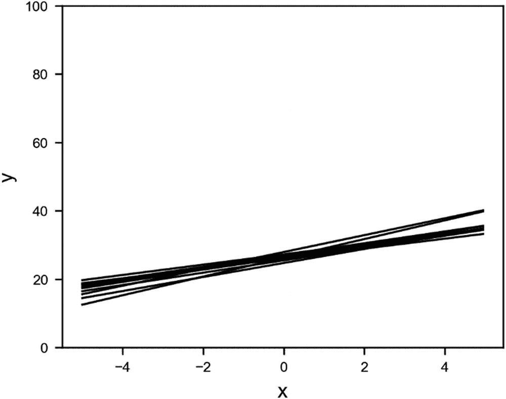

图 3-9

我们将线性模型应用于随机改变随机噪声的数据的结果。为了更容易与图 3-8 进行比较，我使用了相同的刻度。

你可以看到我们的模型要稳定得多。我们的线性模型没有捕捉到任何依赖于我们的噪声的特征，但它错过了我们数据的主要特征（凹性质）。我们在这里谈论的是*高偏差*。

图 3-10 应该能帮助你直观地理解偏差和方差。偏差是衡量我们的测量值与真实值（图中心的中心）有多接近的指标，而方差是衡量测量值围绕平均值（不一定是真实值，如你可以在右侧看到）的分布程度的指标。

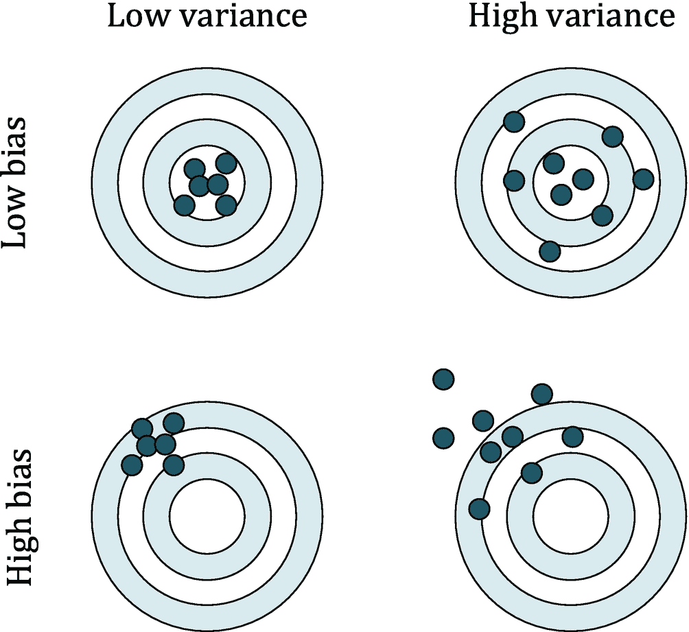

图 3-10

偏差和方差

在神经网络的情况下，我们有许多超参数（层数、每层的神经元数量、激活函数等），很难知道我们处于哪种状态。我们如何判断我们的模型是否有高方差或高偏差，例如？我将专门用一章来讨论这个问题，但进行这种误差分析的第一步是将我们的数据集分成两个不同的部分。让我们看看这意味着什么，以及为什么我们要这样做。

### 注意

过拟合的本质是无意中提取了一些残差变化（即噪声），好像这种变化代表了潜在模型结构（参见 Burnham, K. P.；Anderson, D. R.，*模型选择和多模型推断*，第 2 版，纽约；Springer-Verlag，2002）。相反的是欠拟合——当模型无法捕捉数据的结构时。

过拟合和深度神经网络的问题在于，没有简单的方法来可视化结果，因此我们需要不同的方法来确定我们的模型是否过拟合、欠拟合，或者恰到好处。这可以通过将我们的数据集分成不同的部分，并评估和比较所有部分的指标来实现。让我们在下一节中探讨这个基本思想。

### 基本误差分析

为了检查我们的模型表现如何，并进行适当的误差分析，我们必须将我们的数据集分成以下两个部分：^(2)

+   *训练集*: 模型在这个数据集上通过优化算法（如梯度下降）使用输入和相应的标签进行训练，正如我们在第二章中所做的那样。通常，这个集被称为“train 集”。

+   *开发（或验证）集*: 训练好的模型将应用于这个数据集，以检查其表现。在这个数据集上，我们将测试不同的超参数。例如，我们可以在训练数据集上训练两个具有不同层数的不同模型，并在该数据集上测试它们，以检查它们的表现。通常，这个集被称为“dev 集”。

我将专门用一章来讲解错误分析，但了解为什么将数据集分割开来很重要是个好主意。假设我们正在处理分类，并且假设我们用来判断模型质量的标准是 1 减去准确率，换句话说，就是错误分类的案例百分比。让我们考虑以下三种情况（表 3-1）：

表 3-1

展示如何从训练集和开发集错误中识别过度拟合的四种不同情况

| 错误 | 案例 A | 案例 B | 案例 C | 案例 D |
| --- | --- | --- | --- | --- |
| 训练集错误 | 1% | 15% | 14% | 0.3% |
| 开发集错误 | 11% | 16% | 32% | 1.1% |

+   *案例 A*: 在这里，我们过度拟合（高方差），因为我们训练集上的表现非常好，但我们的模型在开发集上的泛化非常差（再次参考图 3-8）。

+   *案例 B*: 在这里，我们看到一个高偏差的问题，这意味着我们的模型在两个数据集上总体表现都不好（再次参考图 3-9）。

+   *案例 C*: 在这里，我们有一个高偏差（模型无法很好地预测训练集）和高方差（模型在开发集上泛化不好）。

+   *案例 D*: 这里，一切似乎都很好。训练集和开发集上的错误率都很低。这是我们最佳模型的良好候选。

我将在本书的后面部分更详细地解释所有这些概念，届时我将提供如何解决高偏差、高方差、两者兼而有之或更复杂情况的方法。

回顾：为了进行基本的错误分析，你必须将你的数据集至少分成两个集合：训练集和开发集。然后你应该在这两个集合上计算你的指标并比较它们。你希望有一个在训练集和开发集上错误率都很低的模型（如前例中的案例 D），并且这两个值应该是可比较的。

### 注意

你从这个部分应该得到的要点是（1）需要一套食谱和指南来了解你的模型表现如何（它是过度拟合、欠拟合，还是恰到好处？）；（2）为了回答前面的问题，你必须将数据集分成两部分，以进行相关分析。本书后面，你将看到如何使用分成三部分或四部分的数据集。

## Zalando 数据集

Zalando SE 是一家总部位于柏林的德国电子商务公司。该公司维护一个跨平台商店，销售鞋子、服装和其他时尚商品。3 对于 Kaggle 比赛（如果你不知道这是什么，请查看网站 [www.kaggle.com](http://www.kaggle.com) ，你可以参加许多以解决数据科学问题为目标的各种比赛），Zalando 准备了一个类似于 MNIST 的服装图像数据集，他们提供了 60,000 张训练图像和 10,000 张测试图像。与 MNIST 一样，每张图像都是 28 × 28 像素的灰度图。Zalando 将所有图像分为十个不同的类别，并为每个图像提供了标签。数据集有 785 列。第一列是类别标签（一个从 0 到 9 的整数），其余 784 列包含图像的像素灰度值（你可以计算为 28 × 28 = 784），正如我们在第二章中讨论 MNIST 手写数字数据集时所见。

每个训练和测试样本都被分配了以下标签之一（根据文档所述）：

+   0: T 恤/上衣

+   1: 裤子

+   2: 高领毛衣

+   3: 裙子

+   4: 外套

+   5: 凉鞋

+   6: 衬衫

+   7: 运动鞋

+   8: 背包

+   9: 及踝靴

在图 3-11 中，你可以看到从数据集中随机选择的每个类别的示例。


图 3-11

Zalando 数据集中的十个类别各取一个示例

该数据集是在 MIT 许可证下提供的。4 数据文件可以从 Kaggle（[www.kaggle.com/zalando-research/fashionmnist/data](http://www.kaggle.com/zalando-research/fashionmnist/data)）或直接从 GitHub（[`github.com/zalandoresearch/fashion-mnist`](https://github.com/zalandoresearch/fashion-mnist)）下载。如果你选择第二种方式，你将需要准备一些数据。（你可以使用位于 [`pjreddie.com/projects/mnist-in-csv/`](https://pjreddie.com/projects/mnist-in-csv/) 的脚本将其转换为 CSV 格式。）如果你从 Kaggle 下载，数据将已经是正确的格式。你将在 Kaggle 网站上找到两个压缩的 CSV 文件。解压后，你会得到 `fashion-mnist_train.csv`，包含 60,000 张图像（大约 130MB），以及 `fashion-mnist_test.csv`，包含 10,000 张（大约 21MB）。让我们启动一个 Jupyter 笔记本并开始编码！

我们需要在我们的代码中导入以下内容：

```py
import pandas as pd
import numpy as np
import tensorflow as tf
%matplotlib inline
import matplotlib
import matplotlib.pyplot as plt
from random import *
```

将 CSV 文件放在与你的笔记本相同的目录中。然后，你可以简单地使用 `pandas` 函数加载这些文件。

```py
data_train = pd.read_csv('fashion-mnist_train.csv', header = 0)
```

你也可以使用标准的 NumPy 函数（如 `loadtxt()`）来读取文件，但使用 pandas 的 `read_csv()` 提供了在切片和分析数据方面的很多灵活性。此外，它要快得多。使用 pandas 读取文件（即大约 130MB）大约需要 10 秒，而在我笔记本电脑上使用 NumPy，则需要 1 分钟 20 秒。所以，如果你正在处理大型数据集，请记住这一点。使用 pandas 读取和准备数据是一种常见的做法。如果你不熟悉 pandas，不要担心。你需要了解的所有内容都将被详细解释。

### 注意

记住：你不应该专注于 Python 实现。专注于模型，以及实现背后的概念。你可以使用 pandas、NumPy，甚至 C 来实现相同的结果。尽量集中精力准备数据，如何归一化它，如何检查训练，等等。

使用命令

```py
data_train.head()
```

你可以看到你的数据集的前五行，如图 3-12 所示。

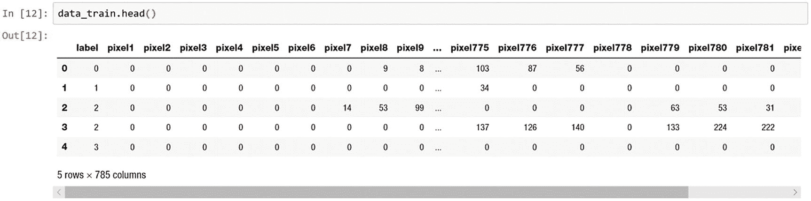

图 3-12

使用 `data_train.head()` 命令，你可以检查你的数据集的前五行

你会看到每一列都有一个名称。pandas 从文件的第一行检索它。检查列名，你可以立即知道哪个列有什么内容。例如，在第一个中，我们有类别标签。现在我们必须创建一个包含标签的数组和一个包含 784 个特征的数组（记住我们所有的像素灰度值都是特征）。为此，我们可以简单地写下以下内容：

```py
labels = data_train['label'].values.reshape(1, 60000)
train = data_train.drop('label', axis=1).transpose()
```

让我们简要讨论一下代码的功能，从标签开始。在 pandas 中，每一列都有一个名称（如图 3-12 所示），在我们的例子中，它是从 CSV 文件的第一个行自动推断出来的。第一列（“label”）包含类别标签，一个从 0 到 9 的整数。在 pandas 中，要仅选择此列，我们可以简单地使用以下语法：

```py
data_train['label']
```

在方括号中给出列名。

如果你使用以下命令检查这个数组的形状

```py
data_train['label'].shape
```

你会得到 `(60000)` 的值，正如预期的那样。正如我们在第二章节中已经看到的，我们想要一个维度为 1 × *m* 的标签张量，其中 *m* 是观测数（在这种情况下为 60000）。因此，我们必须使用命令

```py
labels = data_train['label'].values.reshape(1, 60000)
```

现在，标签张量的维度是 (1, 60000)，正如我们想要的。

应该包含特征的张量应该包含所有列，除了标签。因此，我们只需使用 `drop('label', axis=1)` 删除标签列，取所有其他列，然后转置张量。实际上，`data_train.drop('label', axis=1)` 的维度是 (60000, 784)，而我们想要一个维度为 *n*[*x*] × *m* 的张量，其中在这里 *n*[*x*] = 784 是特征的数量。以下是我们到目前为止的张量总结。

+   *标签*：它具有 1 × *m*（1 × 60000）的维度，包含类别标签（从 0 到 9 的整数）。

+   *训练*: 这具有维度 *n*[*x*] × *m*（784 × 60000）并包含特征，其中每一行包含图像中单个像素的灰度值（记住 28 × 28 = 784）。

再次参考图 3-11 以了解图像的外观。最后，让我们对输入进行归一化，使其值从 0 到 255（灰度值）变为仅介于 0 和 1 之间。这可以通过以下代码轻松实现：

```py
train = np.array(train / 255.0)
```

## 使用 tensorflow 构建模型

现在是时候扩展我们在第二章中用 TensorFlow 实现的单神经元到多层和神经元网络了。让我们首先讨论网络架构和我们需要什么样的输出层，然后我们将使用 TensorFlow 构建我们的模型。

### 网络架构

我们将从只有一个隐藏层的网络开始。我们将有一个包含 784 个特征的输入层，然后是一个隐藏层（其中我们将改变神经元的数量），然后是一个有十个神经元的输出层，这些神经元将输出输入到一个具有`softmax`函数作为激活函数的神经元。参见第一个图 3-13，以了解网络的图形表示，然后我将花一些时间解释各个部分，特别是输出层。

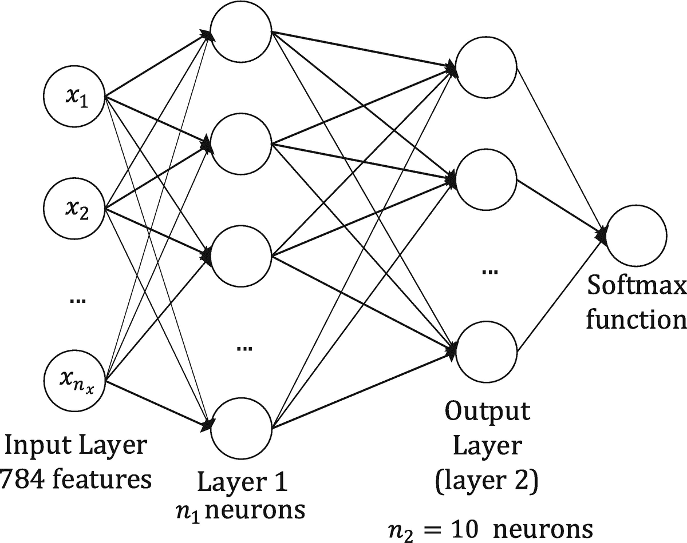

图 3-13

具有单个隐藏层的网络架构。在分析过程中，我们将改变隐藏层中的神经元数量，n[1]。

让我解释为什么会有这个奇怪的十个神经元的输出层以及为什么需要额外的神经元来实现`softmax`函数。记住，对于每张图像，我们希望能够确定它属于哪个类别。为此，正如在讨论`softmax`函数时解释的那样，我们需要为每个观察结果获得十个输出：每个输出是图像属于每个类别的概率。所以，给定输入 ***x***^((*i*))，我们需要十个值：*P*( *y*^((*i*)) = 1| ***x***^((*i*))), *P*( *y*^((*i*)) = 2| ***x***^((*i*))), ……，*P*( *y*^((*i*)) = 10| ***x***^((*i*)))（观察类 *y*^((*i*)) 是十个可能之一，给定输入 ***x***^((*i*)))的概率，或者换句话说，我们的输出应该是一个 1 × 10 维度的张量

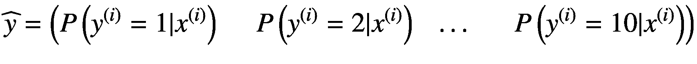

由于观察必须属于单个类别，因此条件

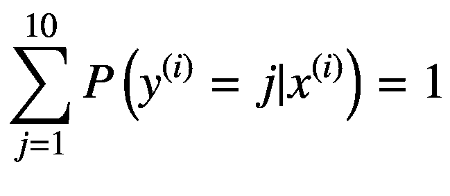

必须满足。这可以理解为：观察结果有 100% 的概率属于十个类别之一，换句话说，所有概率的总和必须为 1。我们分两步解决这个问题：

+   我们创建一个具有十个神经元的输出层。这样，我们将有十个输出值。

+   然后我们将十个值输入到一个新的神经元（让我们称它为“softmax”神经元）中，该神经元将接受十个输入，并输出十个值，这些值都小于 1 且总和为 1。

图 3-14 详细展示了我们的“softmax”神经元。

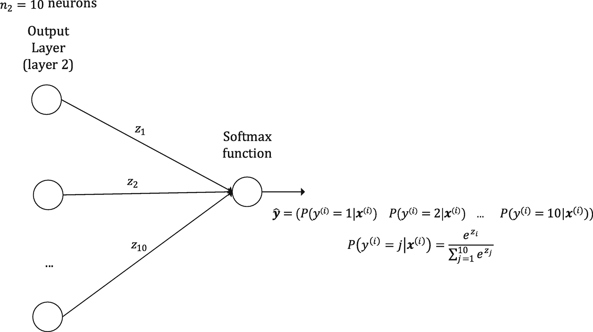

图 3-14

我们网络中最后一个将十个输入转换为概率的神经元

将 *z*[*i*] 定义为最后一层中第 *i* 个神经元的输出（其中 *i* 从 1 到 10），我们将有

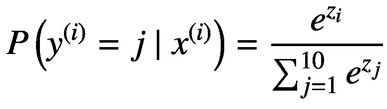

这正是 `tensorflow` 函数 `tf.nn.softmax()` 所做的。它接受一个张量作为输入，并返回一个与输入具有相同维度的张量，但“归一化”，正如之前所讨论的。换句话说，如果我们向该函数提供 ***z =*** (*z*[1]  *z*[2] …  *z*[10])，它将返回一个与 ***z*** 具有相同维度的张量，即 1 × 10，其中每个元素是最后一个方程。

### 为 softmax 函数修改标签——One-Hot 编码

在开发我们的网络之前，首先我们必须解决另一个问题。您会记得从第二章节中，在分类中，我们将使用以下损失函数：

```py
cost = - tf.reduce_mean(Y * tf.log(y_)+(1-Y) * tf.log(1-y_))
```

其中 `Y` 包含我们的标签，`y_` 是我们网络的输出。因此，这两个张量必须具有相同的维度。在我们的情况下，我向您解释说，我们的网络将输出一个包含十个元素的向量，而我们的数据集中的标签只是一个标量。因此，我们有一个维度为 (10,1) 的 `y_`，而 `Y` 的维度为 (1,1)。如果我们不做些聪明的事情，这是不会工作的。我们必须将标签转换为具有 (10,1) 维度的张量。还需要一个包含每个类值的向量，但我们应该使用什么值呢？

我们必须执行称为 *one-hot 编码* 的操作。这意味着我们将我们的标签（从 0 到 9 的整数）转换为具有 (1,10) 维度的张量，以下算法：我们的 one-hot 编码向量将全部为零，除了标签的索引位置。例如，对于标签 2，我们的 1 × 10 张量将全部为零，除了索引 2 的位置，换句话说，它将是 (0,0,1,0,0,0,0,0,0,0)。尝试一些其他示例（见表 3-2），这个概念会立即变得清晰。

表 3-2

One-Hot 编码的工作示例（记住标签从 0 到 9 作为索引。）

| 标签 | One-Hot 编码标签 |
| --- | --- |
| 0 | (1,0,0,0,0,0,0,0,0,0) |
| 2 | (0,0,1,0,0,0,0,0,0,0) |
| 5 | (0,0,0,0,0,1,0,0,0,0) |
| 7 | (0,0,0,0,0,0,0,1,0,0) |

在图 3-15 中，你可以看到一热编码标签过程的图形表示。在图中，两个标签（2 和 5）在两个张量中进行了编码。张量中的灰色元素（在这种情况下，一个一维向量）是变为 1 的元素，而白色元素保持为零。

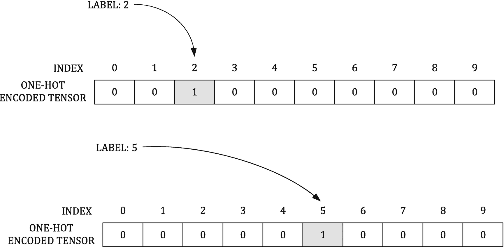

图 3-15

一热编码标签过程的图形表示

Sklearn 有几种自动执行此操作的方法（例如，检查函数 `OneHotEncoder()`），但我认为手动执行此过程是有教育意义的，以便真正看到它是如何完成的。一旦你理解了为什么需要它，以及你需要它的格式，你就可以使用你最喜欢的函数。执行此操作的 Python 代码非常简单（最后一行只是将 pandas 数据框转换为 NumPy 数组）：

```py
labels_ = np.zeros((60000, 10))
labels_[np.arange(60000), labels] = 1
labels_ = labels_.transpose()
labels_ = np.array(labels_)
```

首先，你创建一个具有正确维度的新的数组：(60000,10)，然后使用 NumPy 函数 `np.zeros((60000,10))` 用零填充它。接下来，使用 pandas 功能仅将 1 设置到与标签本身相关的列，使用切片数据框的行 `labels_[np.arange(60000), labels] = 1`。然后将其转置，以获得我们想要的最终维度：(10, 60000)，其中每一列表示一个不同的观察。

现在在我们的代码中，我们终于可以比较 `Y` 和 `y_`，因为它们现在都具有一个观察值的维度 (10,1)，或者当考虑整个训练数据集时为 (10, 60000)。y_ 中的每一行现在将代表我们的观察属于特定类别的概率。在最后，当计算我们模型的准确率时，我们将把具有最高概率的类别分配给每个观察。

### 注意

我们的网络将为我们提供观察属于十个类别之一的十个概率。最后，我们将把具有最高概率的类别分配给观察。

### 张量流模型

现在是时候使用 `tensorflow` 构建我们的模型了。以下代码将完成这项工作：

```py
n_dim = 784
tf.reset_default_graph()
# Number of neurons in the layers
n1 = 5 # Number of neurons in layer 1
n2 = 10 # Number of neurons in output layer
cost_history = np.empty(shape=[1], dtype = float)
learning_rate = tf.placeholder(tf.float32, shape=())
X = tf.placeholder(tf.float32, [n_dim, None])
Y = tf.placeholder(tf.float32, [10, None])
W1 = tf.Variable(tf. truncated_normal ([n1, n_dim], stddev=.1))
b1 = tf.Variable(tf.zeros([n1,1]))
W2 = tf.Variable(tf. truncated_normal ([n2, n1], stddev=.1))
b2 = tf.Variable(tf.zeros([n2,1]))
# Let's build our network...
Z1 = tf.nn.relu(tf.matmul(W1, X) + b1)
Z2 = tf.nn.relu(tf.matmul(W2, Z1) + b2)
y_ = tf.nn.softmax(Z2,0)
cost = - tf.reduce_mean(Y * tf.log(y_)+(1-Y) * tf.log(1-y_))
optimizer = tf.train.AdamOptimizer(learning_rate).minimize(cost)
init = tf.global_variables_initializer()
```

我不会逐行解释代码，因为你现在应该已经理解了占位符或变量的概念。但有一些代码的细节我想让你注意。

+   当我们初始化权重时，使用以下代码 `tf.Variable(tf.truncated_normal([n1, n_dim], stddev=.1))`。`truncated_normal()` 函数将返回来自正态分布的值，其特殊性在于，距离平均值超过 2 个标准差的值将被丢弃并重新选择。选择较小的 `stddev` 值为 0.1 的原因是避免 ReLU 激活函数的输出变得过大，因此，由于 Python 无法正确计算过大的数字，`nan` 开始出现。我将在本章后面讨论选择合适的 `stddev` 的更好方法。

+   我们最后的神经元将使用 `softmax` 函数：`y_ = tf.nn.softmax(Z2,0)`。请记住，`y_` 不会是一个标量，而是一个与 `Z2` 相同维度的张量。第二个参数 `0` 告诉 `tensorflow` 我们想要沿着垂直轴（行）应用 `softmax` 函数。

+   两个参数 `n1` 和 `n2` 定义了不同层的神经元数量。请记住，第二个（输出）层必须要有十个神经元才能使用 `softmax` 函数。但我们将调整 `n1` 的值。增加 `n1` 将会增加网络的复杂性。

现在，让我们尝试进行训练，就像我们在第二章中所做的那样。我们可以重用我们已经编写的代码。尝试在你的笔记本电脑上运行以下代码：

```py
sess = tf.Session()
sess.run(tf.global_variables_initializer())
training_epochs = 5000
cost_history = []
for epoch in range(training_epochs+1):
sess.run(optimizer, feed_dict = {X: train, Y: labels_, learning_rate: 0.001})
cost_ = sess.run(cost, feed_dict={ X:train, Y: labels_, learning_rate: 0.001})
cost_history = np.append(cost_history, cost_)
if (epoch % 20 == 0):
print("Reached epoch",epoch,"cost J =", cost_)
```

你应该立即注意到一件事：它非常慢。除非你有一个非常强大的 CPU 或者安装了带有 GPU 支持的 TensorFlow，并且你有一个强大的显卡，否则这段代码在 2017 年的笔记本电脑上需要几个小时（从几个到几个小时不等，取决于你的硬件）。问题在于，我们编写的模型将创建一个巨大的矩阵来处理所有观察值（即 60,000 个），然后在遍历所有观察值之后才会修改权重和偏差。这需要相当多的资源，包括内存和 CPU。如果这是我们唯一的选择，我们就会陷入困境。请记住，在深度学习领域，784 个特征的 60,000 个示例根本不是一个大数据集。因此，我们必须找到一种让我们的模型更快学习的方法。

你需要的最后一部分代码是用来计算你模型准确度的。你可以使用以下代码轻松完成：

```py
correct_predictions = tf.equal(tf.argmax(y_,0), tf.argmax(Y,0))
accuracy = tf.reduce_mean(tf.cast(correct_predictions, "float"))
print ("Accuracy:", accuracy.eval({X: train, Y: labels_, learning_rate: 0.001}, session = sess))
```

`tf.argmax()` 函数返回张量轴上的最大值的索引。当你讨论 `softmax` 函数时，你会记得我说过我们将把一个观察值分配给具有最高概率的类别（`y_` 是一个包含十个值的张量，每个值包含观察值属于每个类别的概率）。所以，`tf.argmax(y_,0)` 将给我们每个观察值的最可能类别。`tf.argmax(Y,0)` 将为我们标签做同样的事情。记住，我们使用 one-hot 编码了我们的标签，所以，例如，类别 2 现在将是 (0,0,2,0,0,0,0,0,0)。因此，`tf.argmax([0,0,2,0,0,0,0,0,0],0)` 将返回 2（具有最高值的索引，在这种情况下，唯一一个不同于零的值）。

我已经向你展示了如何加载和准备训练数据集。为了进行一些基本的错误分析，你还需要开发数据集。以下是你可以使用代码。我不会对其进行讨论，因为它与我们用于训练数据集的代码完全相同。

```py
data_dev = pd.read_csv('fashion-mnist_test.csv', header = 0)
labels_dev = data_test['label'].values.reshape(1, 10000)
labels_dev_ = np.zeros((10000, 10))
labels_dev_[np.arange(10000), labels_dev] = 1
labels_dev_ = labels_dev_.transpose()
dev = data_dev.drop('label', axis=1).transpose()
```

不要被文件名中包含的单词 *test* 所迷惑。有时，开发数据集被称为测试数据集。在本书的后面，当我讨论错误分析时，我们将使用三个数据集：训练集、开发集和测试集。为了在整个书中保持一致性，我更喜欢坚持使用 dev 这个名字，以免你在不同章节中因为不同的名字而感到困惑。

最后，为了在开发数据集上计算准确率，你只需重新使用我之前提供的相同代码。

```py
correct_predictions = tf.equal(tf.argmax(y_,0), tf.argmax(Y,0))
accuracy = tf.reduce_mean(tf.cast(correct_predictions, "float"))
print ("Accuracy:", accuracy.eval({X: dev, Y: labels_dev_, learning_rate: 0.001}, session = sess))
```

一个好的练习是将这个计算包含到你的模型中，这样你的 `model()` 函数可以自动返回两个值。

## 梯度下降变体

在第二章中，我 描述了非常基本的梯度下降算法（也称为批量梯度下降）。这不是找到成本函数最小值的最聪明的方法。让我们看看你需要了解的变体，并比较它们使用 Zalando 数据集的效率。

### 批量梯度下降

第二章中描述的梯度下降算法计算每个观察值的权重和偏差变化，但仅在所有观察值都被评估后，或者换句话说，在一个所谓的周期之后，才执行学习（权重和偏差更新）。(记住，整个数据集的一次遍历被称为一个周期。)

以下是一个优点：

+   较少的权重和偏差更新意味着更稳定的梯度，这通常会导致更稳定的收敛。

这里有一些缺点：

+   通常，这个算法的实现方式是所有数据集都必须在内存中，这在计算上相当密集。

+   这个算法对于非常大的数据集通常非常慢。

一种可能的实现方式可能如下所示：

```py
sess = tf.Session()
sess.run(tf.global_variables_initializer())
training_epochs = 100
cost_history = []
for epoch in range(training_epochs+1):
sess.run(optimizer, feed_dict = {X: train, Y: labels_, learning_rate: 0.01})
cost_ = sess.run(cost, feed_dict={ X:train, Y: labels_, learning_rate: 0.01})
cost_history = np.append(cost_history, cost_)
if (epoch % 50 == 0):
print("Reached epoch",epoch,"cost J =", cost_)
```

运行 100 个周期的代码将得到以下类似的结果：

```py
Reached epoch 0 cost J = 0.331401
Reached epoch 50 cost J = 0.329093
Reached epoch 100 cost J = 0.327383
```

这段代码运行了大约 2.5 分钟，但成本函数几乎没有变化。要看到成本函数开始下降，您必须运行训练几千个 epoch，这将需要相当长的时间。以下代码可以计算准确率：

```py
correct_predictions = tf.equal(tf.argmax(y_,0), tf.argmax(Y,0))
accuracy = tf.reduce_mean(tf.cast(correct_predictions, "float"))
print ("Accuracy:", accuracy.eval({X: train, Y: labels_, learning_rate: 0.001}, session = sess))
```

经过 100 个 epoch 后，我们在训练集上的准确率只有 16%！

### 随机梯度下降

随机梯度下降（简称为 SGD）计算成本函数的梯度，然后更新数据集中每个观测的权重和偏差。

其优点是

+   频繁的更新使得可以轻松检查模型学习的情况。（您不必等到所有数据集都被考虑。）

+   在少数问题上，这个算法可能比批量梯度下降更快。

+   模型本质上是噪声的，这可能会使其在尝试找到成本函数的绝对最小值时避开局部最小值。

其缺点包括

+   在大数据集上，这种方法相当慢，因为它非常计算密集，归因于持续的更新。

+   由于算法本身有噪声，这可能会使其在尝试找到成本函数的绝对最小值时避开局部最小值，从而使得算法难以在成本函数上找到一个最小值，并且收敛可能不如预期稳定。

一种可能的实现可能如下所示：

```py
sess = tf.Session()
sess.run(tf.global_variables_initializer())
cost_history = []
for epoch in range(100+1):
for i in range(0, features.shape[1], 1):
X_train_mini = features[:,i:i + 1]
y_train_mini = classes[:,i:i + 1]
sess.run(optimizer, feed_dict = {X: X_train_mini,
Y: y_train_mini,
learning_rate: 0.0001})
cost_ = sess.run(cost, feed_dict={ X:features,
Y: classes,
learning_rate: 0.0001})
cost_history = np.append(cost_history, cost_)
if (epoch % 50 == 0):
print("Reached epoch",epoch,"cost J =", cost_)
```

如果您让代码运行，您将得到一个结果，应该看起来像以下这样（每次的确切数字都会不同，因为我们随机初始化权重和偏差，但下降速度应该是相同的）：

```py
Reached epoch 0 cost J = 0.31713
Reached epoch 50 cost J = 0.108148
Reached epoch 100 cost J = 0.0945182
```

如前所述，这种方法可能相当不稳定。例如，使用学习率`1e-3`会在达到 100 个 epoch 之前出现`nan`。尝试调整学习率并看看会发生什么。为了使方法收敛良好，您需要一个相当小的值。相比之下，使用较大的学习率（例如，0.05），批量梯度下降方法可以无问题收敛。如我之前提到的，这种方法计算量相当大，对于 100 个 epoch，在我的笔记本电脑上大约需要 35 分钟。使用这种变化，在只有 100 个 epoch 后，我们就已经达到了 80%的准确率。使用这种变化，从 epoch 的角度来看，学习非常高效，但也非常慢。

### 小批量梯度下降

在这种梯度下降的变化中，数据集被分成一定数量的小的（从这里使用术语*mini*）观测组（称为批次），并且只有当每个批次被输入到模型中后，才会更新权重和偏差。这是在深度学习领域中迄今为止最常用的方法。

其优点是

+   模型更新频率高于批量梯度下降但低于 SGD。因此，允许更稳健的收敛。

+   与批量梯度下降或 SGD 相比，这种方法在计算上要高效得多，因为需要的计算和资源更少。

+   这种变体（正如我们稍后将看到的）是三种中最快的。

其缺点包括

+   使用这种变体引入了一个新的超参数，必须对其进行调整：批大小（微批中的观察值数量）。

对于批大小为 50 的情况，可能的实现如下：

```py
sess = tf.Session()
sess.run(tf.global_variables_initializer())
cost_history = []
for epoch in range(100+1):
for i in range(0, features.shape[1], 50):
X_train_mini = features[:,i:i + 50]
y_train_mini = classes[:,i:i + 50]
sess.run(optimizer, feed_dict = {X: X_train_mini,
Y: y_train_mini,
learning_rate: 0.001})
cost_ = sess.run(cost, feed_dict={ X:features,
Y: classes,
learning_rate: 0.001})
cost_history = np.append(cost_history, cost_)
if (epoch % 50 == 0):
print("Reached epoch",epoch,"cost J =", cost_)
```

注意，代码与随机梯度下降的代码相同。唯一的区别是批次的尺寸。在这个例子中，我们在更新权重和偏差之前每次使用 50 个观察值。运行它将给出一个类似这样的结果（记住，由于权重和偏差的随机初始化，你的数字将不同）：

```py
Reached epoch 0 cost J = 0.322747
Reached epoch 50 cost J = 0.193713
Reached epoch 100 cost J = 0.141135
```

在这个例子中，我们使用了学习率 `1e-3`——比 SGD 中的学习率大得多——达到了成本函数值为 0.14——比 SGD 达到的 0.094 更大，但比批梯度下降达到的 0.32 值小得多——并且只需要 2.5 分钟。因此，以 14 倍的因子，它比 SGD 快。在 100 个周期后，我们达到了 66% 的准确率。

### 变体比较

以下是针对我们三种梯度下降方法在 100 个周期内的发现总结（表 3-3）。

表 3-3

100 个周期内三种梯度下降变体的发现总结

| 梯度下降变体 | 运行时间 | 成本函数最终值 | 准确率 |
| --- | --- | --- | --- |
| 批梯度下降 | 2.5 min | 0.323 | 16% |
| 微批梯度下降 | 2.5 min | 0.14 | 66% |
| 随机梯度下降 (SGD) | 35 min | 0.094 | 80% |

现在，你可以看到 SGD 是在相同周期数下实现成本函数最低值的算法，尽管它是最慢的。对于微批梯度下降达到成本函数的 0.094 值，需要 450 个周期和大约 11 分钟。尽管如此，这比 SGD 有巨大的改进——相同结果的时间减少了 31%。

在图 3-16 中，你可以看到成本函数随着不同的微批大小下降的差异。很明显，从周期数来看，微批大小越小，下降越快（尽管不是在时间上）。这个图使用的学习率是 γ=0.001。请注意，每种情况下所需的时间并不相同，微批大小越小，算法所需的时间越多。

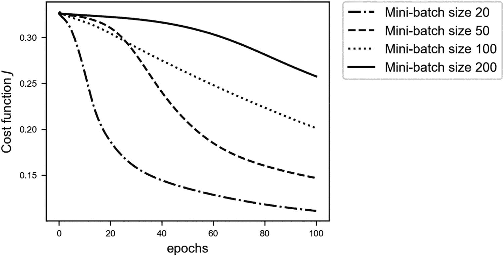

图 3-16

比较不同微批大小下微批梯度下降算法的收敛速度

### 注意

在运行时间和收敛速度（相对于 epoch 数量）之间达到最佳折衷的是通过小批量梯度下降。小批量的大小取决于你的问题，但通常，如 30 或 50 这样的小数字是一个不错的选择。你将找到一个在运行时间和收敛速度之间的折衷。

为了让你了解运行时间如何依赖于成本函数在 100 个 epoch 后可以达到的值，请参见图 3-17 。每个点都标有该次运行中使用的 mini-batch 的大小。请注意，这些点是单次运行，该图仅指示依赖关系。在多次运行中评估运行时间和成本函数值时，会有小幅波动。这种波动在图中没有显示。你可以看到，将 mini-batch 的大小从 300 减少，在 100 个 epoch 后，*J*的值会迅速下降，而运行时间不会显著增加，直到你达到大约 50 的 mini-batch 大小值。在那个点上，时间开始迅速增加，100 个 epoch 后*J*的值不再迅速下降并趋于平稳。直观地说，最佳折衷是在曲线接近零（小的运行时间和小的成本函数值）时选择 mini-batch 的大小值，这在大约 50 到 30 之间。这就是为什么这些值被最频繁选择的原因。从那个点开始，运行时间的增加变得非常快，不再值得减小 mini-batch 的大小。请注意，对于其他数据集，最佳值可能非常不同。因此，尝试不同的值是值得的，以查看哪个效果最好。在非常大的数据集中，你可能想尝试更大的值，例如 200、300 或 500。在我们的案例中，我们有 60,000 个观测值和 50 的 mini-batch 大小，这给出了 1200 个批次。如果你有更多的数据，例如`1e-6`个观测值，50 的 mini-batch 大小将给出 20,000 个批次。请记住这一点，并尝试不同的值，以查看哪个效果最好。

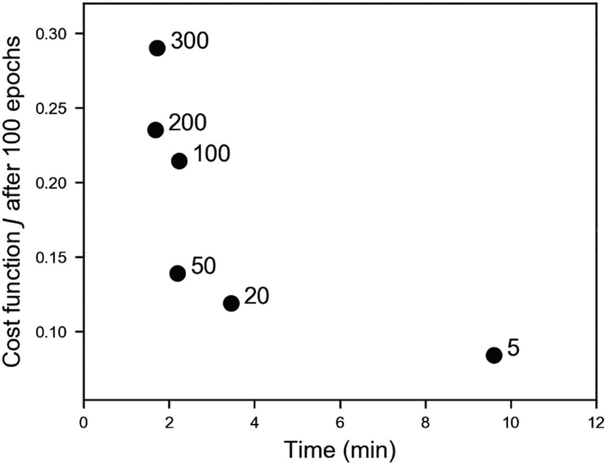

图 3-17

Zalando 数据集的绘图，显示 100 个 epoch 后成本函数的值与运行 100 个 epoch 所需的运行时间

编写一个运行评估的函数是良好的编程实践。这样，你可以调整超参数（如 mini-batch 的大小）而无需反复复制粘贴相同的代码块。以下是一个你可以用来训练我们模型的函数：

```py
def model(minibatch_size, training_epochs, features, classes, logging_step = 100, learning_r = 0.001):
sess = tf.Session()
sess.run(tf.global_variables_initializer())
cost_history = []
for epoch in range(training_epochs+1):
for i in range(0, features.shape[1], minibatch_size):
X_train_mini = features[:,i:i + minibatch_size]
y_train_mini = classes[:,i:i + minibatch_size]
sess.run(optimizer, feed_dict = {X: X_train_mini,
Y: y_train_mini,
learning_rate: learning_r})
cost_ = sess.run(cost, feed_dict={ X:features, Y: classes, learning_rate: learning_r})
cost_history = np.append(cost_history, cost_)
if (epoch % logging_step == 0):
print("Reached epoch",epoch,"cost J =", cost_)
return sess, cost_history
```

`model()` 函数将接受以下参数：

+   `minibatch_size`: 我们希望在每一批次中包含的观察数量。注意，如果我们选择一个不是观察数量 *m* 的约数 *q* 作为这个超参数的值，换句话说，*m*/*q* 不是一个整数，那么最后一个 mini-batch 将会有与所有其他不同的观察数量。但这不会对训练造成问题。例如，假设我们有一个假设的数据集，m=100，你决定使用 32 个观察值的 mini-batch 大小。那么，在 m=100 的情况下，你将会有 3 个完整的包含 32 个观察值的 mini-batch 和 1 个只有 4 个观察值的，因为 100 = 3*32+4。现在你可能想知道以下这样的行会发生什么

    `X_train_mini = features[:,i:i + 32]`

    当 i=96 且 `features` 只包含 100 个元素时。我们不是超出了数组的界限吗？幸运的是，Python 对程序员很友好，并处理了这个问题。考虑以下代码：

    `l = np.arange(0,100)`

    `for i in range (0, 100, 32):`

    `print (l[i:i+32])`

    结果是

    `[ 0 1 2 3 4 5 6 7 8 9 10 11 12 13 14 15 16 17 18 19 20 21 22 23 24 25 26 27 28 29 30 31]`

    `[32 33 34 35 36 37 38 39 40 41 42 43 44 45 46 47 48 49 50 51 52 53 54 55 56 57 58 59 60 61 62 63]`

    `[64 65 66 67 68 69 70 71 72 73 74 75 76 77 78 79 80 81 82 83 84 85 86 87 88 89 90 91 92 93 94 95]`

    `[96 97 98 99]`

    正如你所见，最后一个批次只有四个元素，我们没有得到任何错误。所以，你不必担心这个问题，你可以选择任何更适合你问题的 mini-batch 大小。

+   `training_epochs`: 我们想要的周期数

+   `features`: 包含我们特征的张量

+   `classes`: 包含我们标签的张量

+   `logging_step`: 这告诉函数在每`logging_step`个周期打印成本函数的值

+   `learning_r`: 我们想要使用的学习率

### 注意

将超参数作为输入编写函数是常见的做法。这允许你测试具有不同超参数值的不同的模型，并检查哪个更好。

## 错误预测的例子

使用批量梯度下降法运行模型，一个包含 5 个神经元的隐藏层，1000 个周期，学习率为 0.001，将在训练集上给出 82.3%的准确率。你可以通过在隐藏层中使用更多的神经元来提高准确率。例如，使用 50 个神经元，1000 个周期和 0.001 的学习率，你可以在训练集上达到 86.4%的准确率，在测试集上达到 86.1%的准确率。检查一些错误分类的图像的例子，看看我们是否能从错误中理解到一些东西，这是很有趣的。图 3-18 显示了每个类别的错误分类图像的例子。在每个图像上，报告了`True`类（标记为“True:”）和预测的（标记为“Pred:”）类别。这里使用的模型有一个包含五个神经元的隐藏层，并且已经以 0.001 的学习率运行了 1000 个周期。

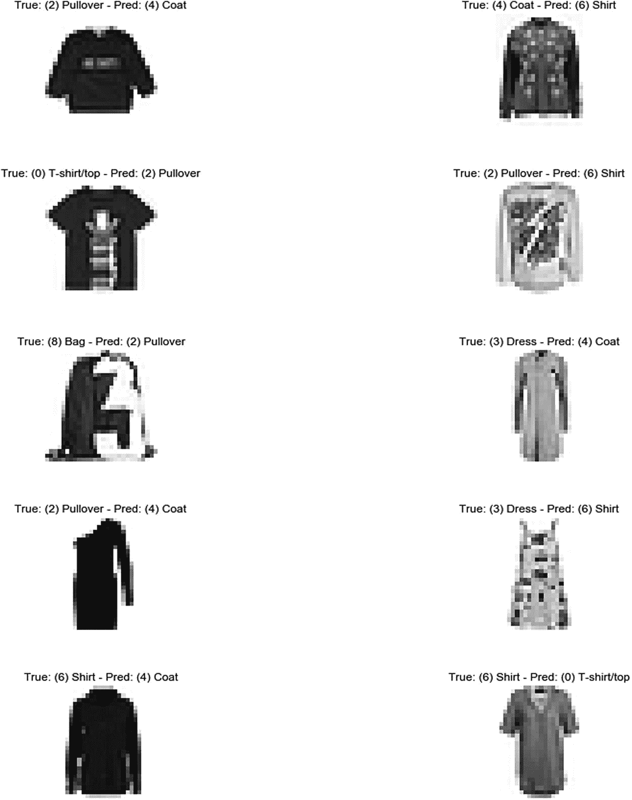

图 3-18

每个类别的错误分类图像示例

一些错误是可以理解的，例如，比如图的下左角。一件衬衫被错误地分类为外套。也很难确定哪个物品是哪个，我很容易犯同样的错误。另一方面，错误分类的包对人类来说很容易分类。

## 权重初始化

如果你尝试运行过代码，你就会意识到算法的收敛性强烈依赖于你初始化权重的方式。你会记得我们使用以下行来初始化权重：

```py
W1 = tf.Variable(tf.truncated_normal([n1, n_dim], stddev=.1))
```

但为什么选择标准差为 0.1 呢？

你肯定已经想知道为什么。在前面的章节中，我希望你专注于理解这样一个网络是如何工作的，而不受额外信息的干扰，但现在我们有必要更仔细地看看这个问题，因为它在多层中起着根本的作用。基本上，我们使用小的标准差初始化权重，以防止梯度下降算法爆炸并开始返回`nan`。例如，在我们的第一层中，对于*i*^(*th*)个神经元，我们需要计算该量的 ReLU 激活函数（如果你忘记了原因，请参考章节开头进行解释），如下所示：

![z_i=∑_{j=1}^{n_x}(w_{ij}^{\left[1\right]} x_j+b_i^{\left[1\right]})](../images/463356_1_En_3_Chapter/463356_1_En_3_Chapter_TeX_Equq.png)

通常在一个深度网络中，权重的数量相当大，所以你可以很容易地想象，如果![w_{i\kern0.125em j}^{\left[1\right]}](../images/463356_1_En_3_Chapter/463356_1_En_3_Chapter_TeX_IEq8.png)很大，那么*z*[*i*]的值也可能相当大，ReLU 激活函数可能会返回一个`nan`值，因为参数太大，Python 无法正确计算它。所以，你希望*z*[*i*]足够小，以避免神经元输出的爆炸，同时足够大，以防止输出死亡，从而使得收敛过程非常缓慢。

该问题已被广泛研究，^(7) 并且根据你使用的激活函数，有不同的初始化策略。其中一些在表 3-4 中概述，其中假设权重将以均值为 0 和标准差进行正态分布初始化。（注意，标准差将取决于你想要使用的激活函数。）

表 3-4

不同的初始化策略，取决于激活函数

| 激活函数 | 给定层的标准差 ***σ*** |
| --- | --- |
| Sigmoid | 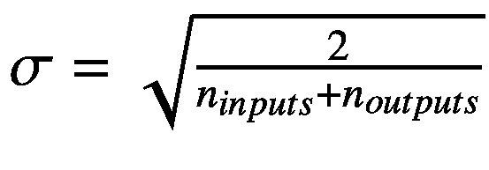  通常称为 Xavier 初始化 |
| ReLU | 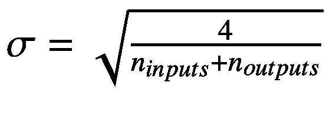  通常称为 He 初始化 |

在层 *l* 中，输入的数量将是前一层的神经元数量 *l* − 1，输出的数量将是下一层的神经元数量：*l* + 1。因此，我们将有

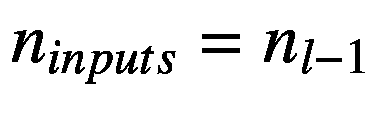

和

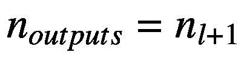

很常见，如之前讨论的深度网络将会有几个层，所有层都有相同数量的神经元。因此，对于大多数层，将有 *n*[*l* − 1] = *n*[*l* + 1]，因此，对于 Xavier 初始化，将有以下内容：

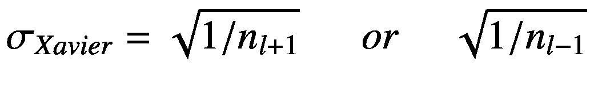

对于 ReLU 激活函数，He 初始化将是

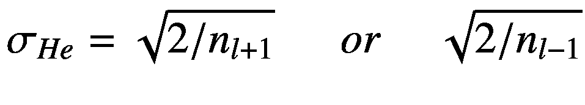

让我们考虑 ReLU 激活函数（我们在本章中使用的那个）。正如所讨论的，每一层都将有 *n*[*l*] 个神经元。例如，初始化层 3 的权重的一种方法将是

```py
stddev = 2 / np.sqrt(n4+n2)
W3=tf.Variable(tf.truncated_normal([n3,n2], stddev = stddev)
```

或者，如果所有层都有相同数量的神经元，并且因此 `n2=n3=n4`，你可以简单地使用以下内容：

```py
stddev = 2 / np.sqrt(2.0*n2)
W3=tf.Variable(tf.truncated_normal([n3,n2], stddev = stddev)
```

通常，为了使网络的评估和构建更容易，最典型的初始化形式用于 ReLU 激活函数

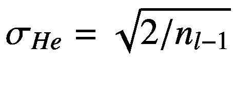

和

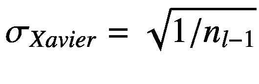

例如，对于 sigmoid 激活函数，我们之前使用的一层的权重初始化代码将看起来像这样：

```py
W1 = tf.Variable(tf.random_normal([n1, n_dim], stddev= 2.0 / np.sqrt(2.0*n_dim)))
b1 = tf.Variable(tf.ones([n1,1]))
W2 = tf.Variable(tf.random_normal([n2, n1], stddev= 2.0 / np.sqrt(2.0*n1)))
b2 = tf.Variable(tf.ones([n2,1]))
```

使用这种初始化可以显著加快训练速度，并且是许多库初始化权重时的标准方式（例如，Caffe 库）。

## 高效地添加多层

每次都重复输入所有这些代码有点繁琐且容易出错。通常，人们会定义一个函数来创建一个层。这可以通过以下代码轻松完成：

```py
def create_layer (X, n, activation):
ndim = int(X.shape[0])
stddev = 2 / np.sqrt(ndim)
initialization = tf.truncated_normal((n, ndim), stddev = stddev)
W = tf.Variable(init)
b = tf.Variable(tf.zeros([n,1]))
Z = tf.matmul(W,X)+b
return activation(Z)
```

让我们通过代码来分析：

+   首先，我们获取输入的维度，以便定义正确的权重矩阵。

+   然后，我们使用上一节中讨论的 He 初始化来初始化权重。

+   接下来，我们创建权重 `W` 和偏置 `b`。

+   然后，我们评估数量 `Z` 并返回在 `Z` 上评估的激活函数。（注意，在 Python 中，你可以将函数作为参数传递给其他函数。在这种情况下，`activation` 可能是 `tf.nn.relu`。）

因此，要创建我们的网络，我们可以简单地编写我们的构建代码（在这个例子中，有两个层），如下所示：

```py
n_dim = 784
n1 = 300
n2 = 300
n_outputs = 10
X = tf.placeholder(tf.float32, [n_dim, None])
Y = tf.placeholder(tf.float32, [10, None])
learning_rate = tf.placeholder(tf.float32, shape=())
hidden1 = create_layer (X, n1, activation = tf.nn.relu)
hidden2 = create_layer (hidden1, n2, activation = tf.nn.relu)
outputs = create_layer (hidden2, n3, activation = tf.identity)
y_ = tf.nn.softmax(outputs)
cost = - tf.reduce_mean(Y * tf.log(y_)+(1-Y) * tf.log(1-y_))
optimizer = tf.train.GradientDescentOptimizer(learning_rate).minimize(cost)
```

要运行我们的模型，我们再次定义一个`a model()`函数，如前所述。

```py
def model(minibatch_size, training_epochs, features, classes, logging_step = 100, learning_r = 0.001):
sess = tf.Session()
sess.run(tf.global_variables_initializer())
cost_history = []
for epoch in range(training_epochs+1):
for i in range(0, features.shape[1], minibatch_size):
X_train_mini = features[:,i:i + minibatch_size]
y_train_mini = classes[:,i:i + minibatch_size]
sess.run(optimizer, feed_dict = {X: X_train_mini, Y: y_train_mini, learning_rate: learning_r})
cost_ = sess.run(cost, feed_dict={ X:features, Y: classes, learning_rate: learning_r})
cost_history = np.append(cost_history, cost_)
if (epoch % logging_step == 0):
print("Reached epoch",epoch,"cost J =", cost_)
return sess, cost_history
```

现在代码更容易理解，你可以用它来创建你想要的任何大小的网络。

使用前面的函数，运行多个模型并比较它们非常容易，正如我在图 3-19 中所做的那样，该图展示了五个不同的测试模型。

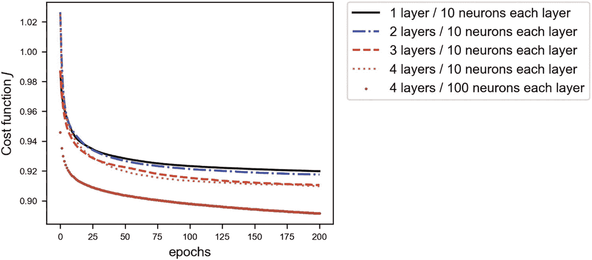

图 3-19

如图例所述，五个模型的成本函数与训练轮数的关系

+   一层，每层十个神经元

+   两层，每层十个神经元

+   三层，每层十个神经元

+   四层，每层十个神经元

+   四层，每层 100 个神经元

如果你有所怀疑，具有四层、每层 100 个神经元的模型，看起来比其他模型好得多，开始进入过拟合状态，训练集准确率为 94%，开发集准确率为 88%（仅经过 200 个训练轮数）。

## 额外隐藏层的优势

我建议你玩玩这些模型。尝试改变层数、神经元数、如何初始化权重等。如果你投入一些时间，你可以在几分钟的运行时间内实现超过 90%的准确率，但这需要一些工作。如果你尝试了几个模型，你可能会发现在这种情况下，使用多层似乎并没有比只有一个层的网络带来更多的好处。这通常是情况。

从理论上讲，一层网络可以近似你所能想象到的每一个函数，但所需的神经元数量可能非常大，因此模型变得不那么有用。问题在于，近似函数的能力并不意味着网络能够学会这样做，这可能是由于涉及的神经元数量巨大或所需时间过长。

经验表明，具有更多层的网络需要更少的神经元数量来达到相同的结果，并且通常对未知数据具有更好的泛化能力。

### 注意

从理论上讲，你不需要在网络上有多层，但在实践中，通常应该这样做。尝试一个具有几个层和每个层中几个神经元的网络，而不是一个由大量神经元组成的一层网络，这几乎总是一个好主意。没有固定的规则来决定多少神经元或层是最好的。你应该从较低的层数和神经元数开始，然后逐渐增加，直到你的结果不再改善。

此外，拥有更多层可能允许您的网络学习输入的不同方面。例如，一层可能学会识别图像的垂直边缘，而另一层则可能识别水平边缘。请记住，在本章中，我讨论了每一层都与所有其他层相同（直到神经元数量）的网络。您将在第四章中看到，您可以构建每一层执行非常不同任务且结构也与其他层非常不同的网络，这使得这类网络对于本章先前讨论的某些任务来说要强大得多。

您可能记得，在第二章中，我们试图预测波士顿地区的房价。在这种情况下，具有多个层的网络可能揭示更多关于特征与价格之间关系的信息。例如，第一层可能揭示基本关系，如房子越大价格越高。但第二层可能揭示更复杂的关系，如大房子但浴室数量较少的售价较低。

## 比较不同的网络

现在您应该知道如何构建具有大量层或神经元的神经网络。但是，如果您不知道哪些模型值得尝试，很容易迷失在可能的模型森林中。假设您从一个网络（如我在前几节中所做的那样）开始，这个网络有一个包含五个神经元的隐藏层，一个包含十个神经元的层（用于我们的“softmax”函数）以及我们的“softmax”神经元。假设您已经达到了一定的准确度，并想尝试不同的模型。最初，您应该尝试增加隐藏层中的神经元数量，看看您能取得什么成果。在图 3-20 中，我绘制了不同神经元数量下成本函数随时间下降的情况。计算使用的是批量大小为 50 的迷你批量梯度下降，一个包含 1、5、15 和 30 个神经元的隐藏层，以及学习率为 0.05。您可以看到从单个神经元增加到五个神经元立即加快了收敛速度。但进一步增加神经元数量并没有带来很大的改进。例如，将神经元从 15 增加到 30 几乎没有任何改进。

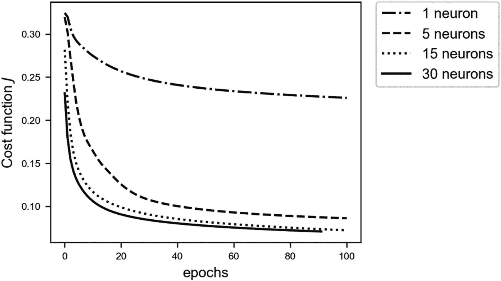

图 3-20

对于具有 1、5、15 和 30 个神经元的单隐藏层神经网络，成本函数随时间下降与时间步的关系，如图例所示。计算使用的是批量大小为 50 的迷你批量梯度下降，学习率为 0.05。

让我们首先尝试找到比较这些网络的方法。仅仅比较神经元的数量可能会非常误导，我很快就会向你展示。记住，你的算法试图找到最佳权重和偏差组合以最小化你的损失函数。但我们在模型中有多少可学习的参数呢？我们有权重和偏差。你可能会记得，从我们的理论讨论中，我们可以将一定数量的权重与每一层关联起来，我们将在层 *l* 中的可学习参数数量用 *Q*^([*l*]) 表示，它等于矩阵 *W*^([*l*]) 中的元素总数，即 *n*[*l*]*n*[*l* − 1]（其中我们根据定义有 *n*[0] = *n*[*x*]），加上我们拥有的偏差数量（在每个层中我们将有 *n*[*l*] 个偏差）。因此，*Q*^([*l*]) 可以写成

![$$ {Q}^{\left[l\right]}={n}_l{n}_{l-1}+{n}_l={n}_l\left({n}_{l-1}+1\right) $$](../images/463356_1_En_3_Chapter/463356_1_En_3_Chapter_TeX_Equx.png)

因此，我们网络中可学习的参数总数（在此用 *Q* 表示）可以写成

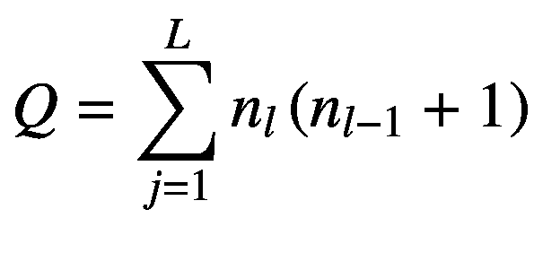

其中，根据定义 *n*[0] = *n*[*x*]。请注意，我们网络的参数 *Q* 强烈依赖于网络架构。让我们通过一些例子来计算它，以便你理解我的意思（表 3-5）。

表 3-5

不同网络架构的 Q 值比较

| 网络架构 | 参数 ***Q***（可学习参数数量） | 神经元数量 |
| --- | --- | --- |
| **网络 A**：784 个特征，2 层：*n*[1] = 15, *n*[2] = 10 | *Q*[*A*] = 15(784 + 1) + 10 ∗ (15 + 1) = 11935 | 25 |
| **网络 B**：784 个特征，16 层：*n*[1] = *n*[2] = … = *n*[15] = 1, *n*[16] = 10 | *Q*[*B*] = 1 ∗ (784 + 1) + 1 ∗ (1 + 1) + … + 10 ∗ (1 + 1) = 923 | 25 |
| **网络 C**：784 个特征，3 层：*n*[1] = 10, *n*[2] = 10, *n*[3] = 10 | *Q*[*C*] = 10 ∗ (784 + 1) + 10 ∗ (10 + 1) + 10 ∗ (10 + 1) = 8070 | 30 |

我想提醒大家注意网络 A 和 B。它们都有 25 个神经元，但参数 *Q*[*A*] 比参数 *Q*[*B*] 大得多（超过十倍）。你可以很容易地想象，即使神经元数量相同，网络 A 在学习和适应方面的灵活性将远大于网络 B。

### 注意

如果我告诉你这个数字 *Q* 是衡量网络复杂度或好坏的一个指标，那将是误导你的。情况并非如此，实际上可能只有少数神经元发挥作用。因此，仅仅按照我所说的计算并不能完全说明问题。关于深度神经网络所谓的有效自由度的研究有很多，但这超出了本书的范围。尽管如此，这个参数在决定你想要测试的模型集是否在合理的复杂度递增方面将提供一个很好的经验法则。

检查你想要测试的模型的 *Q* 可能会给你一些提示，哪些应该忽略，哪些应该尝试。例如，让我们考虑图 3-20 中测试的案例，并计算每个网络的参数 *Q*（见表 3-6）。

表 3-6

不同网络架构的 Q 值比较

| 网络架构 | 参数 ***Q*** | 神经元数量 |
| --- | --- | --- |
| 784 个特征，1 层 1 个神经元，1 层 10 个神经元 | *Q* = 1 ∗ (784 + 1) + 10 ∗ (1 + 1) = 895 | 11 |
| 784 个特征，1 层 5 个神经元，1 层 10 个神经元 | *Q* = 5 ∗ (784 + 1) + 10 ∗ (5 + 1) = 3985 | 15 |
| 784 个特征，1 层 15 个神经元，1 层 10 个神经元 | *Q* = 15 ∗ (784 + 1) + 10 ∗ (15 + 1) = 11935 | 25 |
| 784 个特征，1 层 30 个神经元，1 层 10 个神经元 | *Q* = 30 ∗ (784 + 1) + 10 ∗ (30 + 1) = 23860 | 40 |

从图 3-20 中，我们假设选择具有 15 个神经元的模型作为我们的候选最佳模型。现在假设我们想要尝试一个具有 3 层的模型，每层具有相同数量的神经元，这应该（可能）比我们（目前）的具有 1 层和 15 个神经元的候选模型更具竞争力。我们应该选择多少个神经元作为三层模型的起始点？让我们将具有 1 层 15 个神经元的模型表示为 A，将具有 3 层且每层（目前）未知数量的神经元的模型表示为 B，用 *n*[*B*] 表示。我们可以轻松地计算两个网络的参数 *Q*。

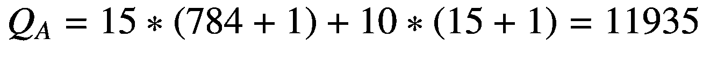

和

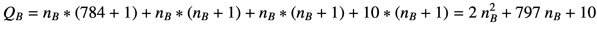

对于 *n*[*B*] 的哪个值将给出 *Q*[*B*] ≈ *Q*[*A*]？我们可以轻松地解这个方程。

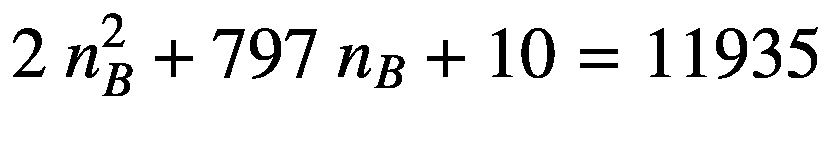

你应该能够解二次方程，所以我只会在这里给出解（提示：尝试解它）。这个方程解出的 *n*[*B*] = 14.4，但由于我们不能有 14.4 个神经元，我们将不得不使用最接近的整数，即 *n*[*B*] = 14。对于 *n*[*B*] = 14，我们将有 *Q*[*B*] = 11560，这是一个非常接近 11935 的值。

### 注释

请让我再重复一遍。两个网络具有相同数量的可学习参数并不意味着它们可以达到相同的准确度。甚至并不意味着如果一个学习得非常快，第二个是否能够学习！

然而，具有 3 层且每层 14 个神经元的模型可能是一个进一步测试的良好起点。

让我们讨论另一个在处理复杂数据集时很重要的问题。考虑我们的第一层。假设我们考虑 Zalando 数据集，并创建一个包含两层网络：第一层有一个神经元，第二层有多个。你的数据集中可能所有的复杂特征都可能在你的单个第一个神经元中丢失，因为它将所有特征组合成一个单一的价值，并将相同的精确值传递给第二层的所有其他神经元。

## 选择正确网络架构的技巧

我听到你在哭喊，“你已经讨论了很多案例，给了我们很多公式，但我们如何决定如何设计我们的网络？”

很遗憾，没有一套固定的规则。但你可以考虑以下建议：

+   当考虑要测试的一组模型（或网络架构）时，一个好的经验法则是从较简单的开始，逐步过渡到更复杂的。另一个建议是估计参数 *Q* 的相对复杂性（以确保你朝着正确的方向前进）。

+   如果你不能达到良好的准确度，检查是否有任何层特别少有神经元。这个层可能会杀死从复杂数据集中学习网络的有效容量。例如，考虑图 3-20 中只有一个神经元的情况。模型无法达到成本函数的低值，因为网络太简单，无法从像 Zalando 这样的复杂数据集中学习。

+   记住，神经元的数量总是相对于你拥有的特征数量而言的。如果你在数据集中只有两个特征，一个神经元可能就足够了，但如果你有几百个特征（就像在 Zalando 数据集中 *n*[*x*] = 784 那样），你不应该期望一个神经元就足够。

+   你需要哪种架构也取决于你想要做什么。查看在线文献，看看别人已经对特定问题发现了什么，总是值得的。例如，众所周知，对于图像识别，卷积网络非常好，所以它们是一个很好的选择。

### 注意

当从一个有 *L* 层的网络模型转移到有 *L* + 1 层的网络模型时，始终从新模型开始，每个层使用稍微少一些的神经元，然后逐步增加。记住，更多的层有更好地学习复杂特征的机会，所以如果你幸运，可能需要的神经元会更少。这是值得一试的事情。始终跟踪你所有模型的优化指标（记得从第二章学到的这一点？）。当你不再获得很大改进时，尝试完全不同的架构（比如卷积神经网络等）可能是有价值的。
