# 7. 超参数调整

在本章中，你将了解如何找到最佳超参数以从你的模型中获得最佳结果的问题。首先，我将描述什么是黑盒优化问题，以及这类问题与超参数调整有何关联。你将看到解决这类问题的三种最知名的方法：网格搜索、随机搜索和贝叶斯优化。我将通过示例展示在什么条件下哪种方法有效，并给你一些在对数尺度上改进优化和采样的非常有用的技巧。在本章的结尾，我将展示如何使用这些技术来调整深度模型，使用 Zalando 数据集。

## 黑盒优化

超参数调整问题只是更一般类型问题的一个子类：黑盒优化。一个黑盒函数 *f* (*x*)

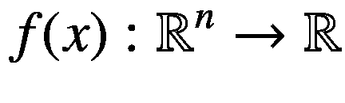

是一个解析形式未知的函数。黑盒函数可以评估以获得其定义的所有 *x* 值的值，但无法获得其他信息（例如其梯度）。通常，通过术语“黑盒函数的全局优化”（有时称为黑盒问题），我们是指我们试图找到 *f* (*x*) 的最大值或最小值，有时在一定的约束条件下。以下是一些这类问题的例子：

+   寻找给定机器学习模型的最大化所选优化指标的超参数

+   寻找只能通过数值或我们无法查看的代码评估的函数的最大值或最小值。在某些行业环境中，可能存在非常复杂的遗留代码，并且有一些函数必须基于其结果进行最大化。

+   寻找最佳的石油钻井位置。在这种情况下，你的函数将是你可以找到的石油量，而 *x* 是你的位置。

+   寻找过于复杂以至于无法建模的情况的最佳参数组合，例如，在太空中发射火箭时，如何优化燃料量、火箭各阶段的直径、精确轨迹等。

这是一个非常迷人的问题类别，它产生了智能的解决方案。你将看到其中的三个：网格搜索、随机搜索和贝叶斯优化。如果你对这个主题感兴趣，可以查看黑盒优化竞赛[`goo.gl/LY7huY`](https://goo.gl/LY7huY)。竞赛的规则反映了现实生活中的问题。为这个问题设定了一个场景，你必须通过黑盒接口优化一个函数（找到最大值或最小值）。你可以得到函数在所有 *x* 值下的值，但你无法获取任何其他信息，例如其梯度。

为什么寻找神经网络最佳超参数构成一个黑盒问题？因为我们无法计算关于超参数的信息，例如网络输出的梯度，特别是当使用复杂优化器或自定义函数时，我们需要其他方法，以便找到最佳超参数，以最大化选择的优化指标。请注意，如果我们能够获得梯度，我们可以使用梯度下降等算法来找到最大值或最小值。

### 注意

我们的黑盒函数*f*将是我们的神经网络模型（包括优化器、损失函数形式等），它以优化指标作为输出，以超参数作为输入，而*x*将是包含超参数的数组。

问题可能看起来相当简单。为什么不尝试所有可能性呢？好吧，这可能在你之前章节中看到的例子中是可能的，但如果你正在处理一个问题，并且训练模型需要一周时间，这可能是一个挑战。因为，通常情况下，你将有几个超参数，尝试所有可能性将不可行。让我们通过一个例子来更好地理解这一点。假设我们正在训练一个具有多个层的神经网络模型。我们可能决定考虑以下超参数，以查看哪种组合效果更好：

+   *学习率*：假设我们想尝试*n*·10^(-4)的值，其中*n* = 1, …, 10²。（100 个值）

+   *正则化参数*：0、0.1、0.2、0.3、0.4 和 0.5（6 个值）

+   *优化器选择*：GD、RMSProp 或 Adam（3 个值）

+   *隐藏层数量*：1、2、3、5 和 10（5 个值）

+   *隐藏层中的神经元数量*：100、200 和 300（3 个值）

考虑到你将需要训练你的网络

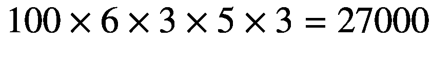

如果你想测试所有可能的组合，那么需要多次尝试。如果你的训练需要 5 分钟，你将需要 13.4 周的计算机时间。如果训练需要数小时或数天，你将没有机会。例如，如果训练需要一天，你将需要 73.9 年才能尝试所有可能性。大多数超参数的选择将来自经验。例如，你总是可以安全地使用 Adam，因为它是可用的更好优化器（在几乎所有情况下）。但你将无法避免尝试调整其他参数，例如隐藏层的数量或学习率。你可以通过经验（就像优化器一样）或一些智能算法来减少你需要尝试的组合数量，正如你将在本章后面看到的。

## 黑盒函数注意事项

黑盒函数通常分为两大类：

+   *低成本函数*：可以评估数千次的函数

+   *高成本函数*：只能评估几次的函数，通常少于 100 次

如果黑盒函数便宜，优化方法的选择并不关键。例如，我们可以通过数值计算相对于*x*的梯度，或者简单地通过在大量点上评估函数来搜索最大值。如果函数昂贵，我们需要更智能的方法。其中之一是贝叶斯优化，我将在本章后面讨论，以给您一个了解这些方法如何工作以及它们有多复杂的概念。

### 备注

尤其是在深度学习领域，神经网络几乎总是昂贵的函数。

对于昂贵的函数，我们必须找到用尽可能少的评估次数解决我们问题的方法。

## 超参数调整问题

在探讨如何找到最佳超参数之前，我想快速回顾一下神经网络，并讨论我们可以在深度模型中调整什么。通常，当谈到超参数时，初学者只会想到数值参数，例如学习率或正则化参数，例如。记住，以下也可以变化，看看您是否能得到更好的结果：

+   *训练轮数*：有时，简单地训练您的网络更长一些会得到更好的结果。

+   *优化器选择*：您可以尝试选择不同的优化器。如果您正在使用普通的梯度下降，您可以尝试使用 Adam，看看是否能得到更好的结果。

+   *调整正则化方法*：如前所述，有几种应用正则化的方法。尝试改变方法可能值得尝试。

+   *激活函数选择*：尽管之前章节中用于隐藏层神经元的激活函数一直是 ReLU，但其他函数可能效果更好。尝试 sigmoid 或 Swish，例如，可能有助于您得到更好的结果。

+   *层数和每层的神经元数量*：尝试不同的配置：尝试具有不同神经元数量的层，例如。

+   *学习率衰减方法*：尝试（如果您没有使用已经执行此操作的优化器）不同的学习率衰减方法。

+   *小批量大小*：调整小批量的大小。当您数据量较少时，可以使用批量梯度下降。当您数据量较多时，小批量更有效率。

+   *权重初始化方法*

让我们将我们可以在模型中调整的参数分为以下三个类别：

+   可以是连续实数或换句话说，可以假设任何值的参数。例如：学习率、正则化参数

+   可以离散但理论上可以假设无限数量的值的参数。例如：隐藏层的数量、每层的神经元数量或训练轮数

+   可以离散且只能假设有限数量的可能性的参数。例如：优化器、激活函数、学习率衰减方法。

对于类别 3，除了尝试所有可能性之外，没有太多可做的事情。通常，这些参数将完全改变模型本身，因此无法模拟它们的影响，这使得测试成为唯一的选择。这也是经验可能最有帮助的类别。众所周知，Adam 优化器几乎是最佳选择，例如，因此你可以在一开始就集中精力在其他地方。对于类别 1 和 2，这要困难一些，我们不得不想出一些聪明的想法来找到最佳值。

## 样本黑盒问题

为了尝试解决一个黑盒问题，让我们创建一个“假”的黑盒问题。问题是这样的：给定公式，找到函数 *f*(*x*) 的最大值


假装不知道公式本身。这个公式将允许我们检查我们的结果，但我们将假装它们是未知的。你可能想知道为什么我们使用如此复杂的公式。我想有一个带有几个极大值和极小值的函数，以便给你一个关于方法如何在非平凡示例上工作的概念。*f*(*x*) 可以用以下 Python 代码实现

```py
def f(x):
tmp1 = -np.cos(x/4.0)-np.sin(x/4.0)-2.5*np.cos(2.0*x/4.0)+0.5*np.sin(2.0*x/4.0)
tmp2 = -np.cos(x/3.0)-np.sin(x/3.0)-2.5*np.cos(2.0*x/3.0)+0.5*np.sin(2.0*x/3.0)
return 10.0+tmp1+0.5*tmp2
```

在图 7-1 中，你可以看到 *f*(*x*) 的样子。

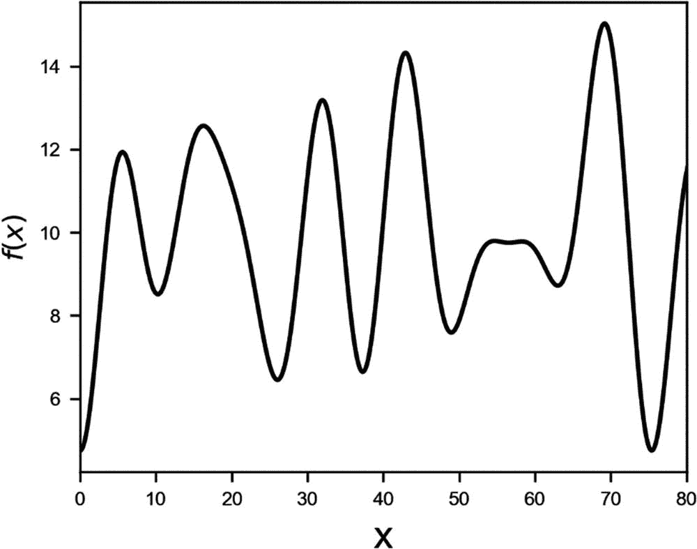

图 7-1

函数 f(x) 的图像，如文本所述

最大值大约在 *x* = 69.18 处，其值为 15.027。我们的挑战是以最有效的方式找到这个最大值，而不了解 *f*(*x*) 的任何信息，除了我们想要点的值。当我们说“有效”时，当然是指尽可能少的评估次数。

## 网格搜索

我们首先考虑的方法是网格搜索，也是最不“智能”的方法。网格搜索只是简单地尝试在规则间隔处尝试函数，并查看对于哪个 *x*，函数 *f*(*x*) 取得最高值。在这个例子中，我们想要找到在两个 *x* 值 *x*[*min*] 和 *x*[*max*] 之间的函数 *f*(*x*) 的最大值。我们将做的是简单地取 *x*[*min*] 和 *x*[*max*] 之间等间距的 *n* 个点，并在这些点上评估函数。我们将定义一个点向量

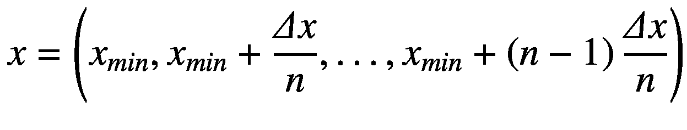

其中我们定义 Δ*x* = *x*[*max*] - *x*[*min*]。然后我们在这些点上评估函数 *f*(*x*)，得到一个包含值的向量 ***f***

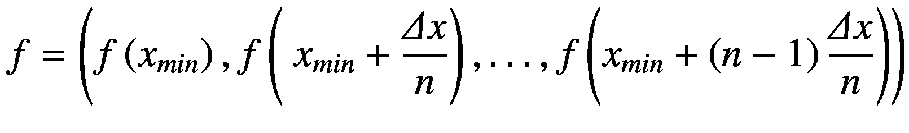

对最大值  的估计如下

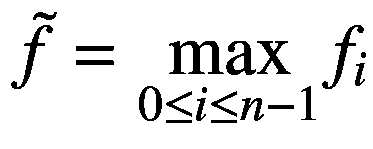

并且，假设最大值在 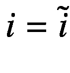 处找到，我们还将有

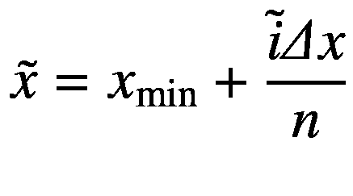

现在，正如您可能想象的那样，您使用的点越多，您的最大估计值就越准确。问题是，如果对 *f*(*x*) 的评估代价高昂，您将无法像您希望的那样使用那么多点。您需要在点数和精度之间找到一个平衡。让我们通过我之前描述的函数 *f*(*x*) 来探索一个例子。让我们考虑 *x*[*max*] = 80 和 *x*[*min*] = 0，并且让我们取 *n* = 40 个点。我们将有 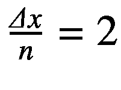。我们可以用以下代码轻松地在 Python 中创建 ***x*** 向量：

```py
gridsearch = np.arange(0,80,2)
```

数组 `gridsearch` 将看起来像这样：

```py
array([ 0, 2, 4, 6, 8, 10, 12, 14, 16, 18, 20, 22, 24, 26, 28, 30, 32, 34, 36, 38, 40, 42, 44, 46, 48, 50, 52, 54, 56, 58, 60, 62, 64, 66, 68, 70, 72, 74, 76, 78])
```

在图 7-2 中，您可以看到函数 *f*(*x*) 作为一条连续线；交叉点标记了我们在网格搜索中采样的点；黑色方块标记了函数的精确最大值。右侧的图显示了最大值周围的放大视图。

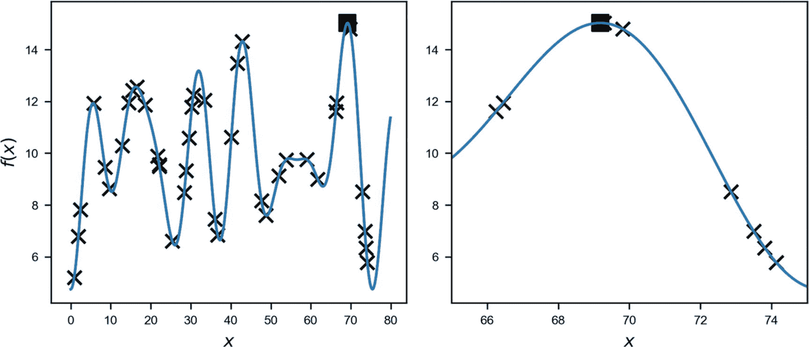

图 7-2

函数 f(x) 在范围 [0, 80] 上。交叉点标记了我们在网格搜索中采样的点，黑色方块标记了最大值。

您可以看到我们在图 7-2 中采样的点如何接近最大值但并不完全达到。当然，采样更多的点会使我们更接近最大值，但会花费我们更多对 *f*(*x*) 的评估。我们可以通过简单的代码轻松找到最大值 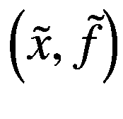

```py
x = 0
m = 0.0
for i, val in np.ndenumerate(f(gridsearch)):
if (val > m):
m = val
x = gridsearch[i]
print(x)
print(m)
```

这给我们

```py
70
14.6335957578
```

这接近实际的最大值（69.18, 15.027），但并不完全准确。让我们尝试先前的例子，改变我们采样的点数，然后看看我们得到什么结果。我们将从 4 到 160 变化采样的点数 *n*。对于每种情况，我们将找到最大值及其位置，如前所述。我们可以用以下代码来完成

```py
xlistg = []
flistg = []
for step in np.arange(1,20,0.5):
gridsearch = np.arange(0,80,step)
x = 0
m = 0.0
for i, val in np.ndenumerate(maxim(gridsearch)):
if (val > m):
m = val
x = gridsearch[i]
xlistg.append(x)
flistg.append(m)
```

在列表 `xlistg` 和 `flistg` 中，我们将找到最大值的位置和最大值的各种 *n* 值。

在图 7-3 中，我们绘制了结果分布。黑色垂直线是最大值的正确值。

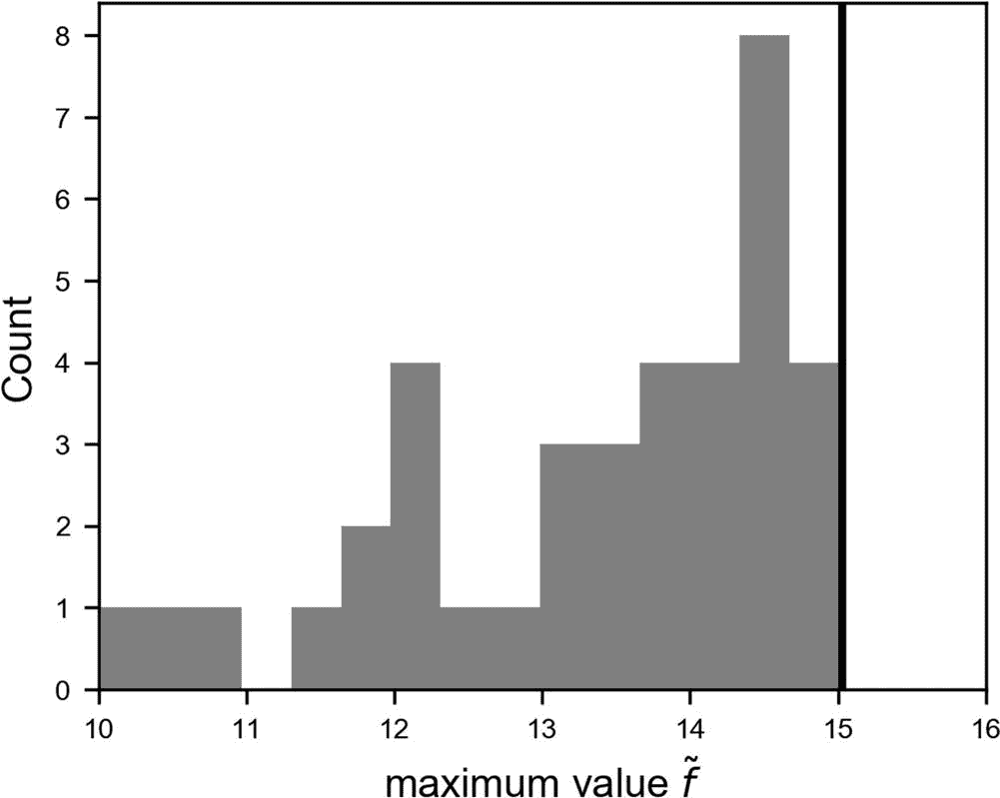

图 7-3

通过改变网格搜索中采样的点数 n 得到的 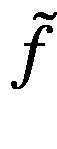 的结果分布。黑色垂直线表示 f(x) 的真实最大值。

如你所见，结果差异很大，可能非常远离正确值，甚至达到 10。这告诉我们，使用错误数量的点可能会导致非常错误的结果。正如你可以想象的那样，最好的结果是步长 Δ*x* 最小的结果，因为它更有可能接近最大值。在图 7-4 中，你可以看到找到的最大值如何随着步长 Δ*x* 的变化而变化。

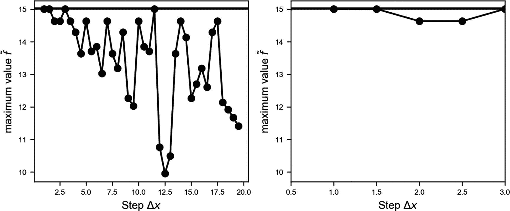

图 7-4

最大值找到的值与 x 步 Δx 的关系

在图 7-4 右侧的放大图中，很明显，较小的 Δ*x* 值可以得到更好的  值。注意，步长为 1.0 意味着采样 80 个 *f*(*x*) 的值。例如，如果评估需要 1 天，你将需要等待 80 天才能得到所需的全部测量值。

### 注意

网格搜索是一种在黑盒函数便宜时才有效的方法。为了得到好的结果，通常需要大量的采样点。

为了确保你真的得到了最大值，你应该减小步长 Δ*x*，或者增加采样点的数量，直到你找到的最大值不再明显变化。在先前的例子中，如图 7-4 右侧的图所示，当我们的步长 Δ*x* 小于大约 2.0 时，或者换句话说，当采样点的数量大于或大约等于 40 时，我们确信我们已经接近最大值。记住：一开始 40 可能看起来相当少，但如果 *f*(*x*) 评估的是你的深度学习模型的度量标准，并且训练需要 2 小时，例如，你就是在查看 3.3 天的计算机时间。通常，在深度学习领域，2 小时对于训练一个模型来说并不多，所以在开始长时间网格搜索之前，先快速计算一下。此外，请记住，在进行超参数调整时，你是在一个多维空间中移动（你不仅仅是在优化一个参数，而是许多参数），所以所需的评估数量会迅速增加。

让我们快速举一个例子。假设你决定你可以承担 50 次你的黑盒函数的评估。如果你决定你想尝试以下超参数：

+   优化器（RMSProp、Adam 或普通 GD）（3 个值）

+   迭代次数（1000、5000 或 10,000）（3 个值）

您现在已经看到了九个评估结果。那么您能尝试多少个学习率的值呢？只有五个！而且只有五个值，您不太可能接近最优值。这个例子旨在帮助您理解网格搜索仅适用于成本较低的黑盒函数。请记住，时间往往不是唯一的问题。例如，如果您正在使用 Google 云平台来训练您的网络，您将按秒支付您使用的硬件费用。也许您有很多时间可以利用，但成本可能会很快超过您的预算。

## 随机搜索

一种与网格搜索一样“愚蠢”的策略，但效果却好得多的是随机搜索。您不是在 (*x*[*min*], *x*[*max*]) 范围内定期采样 *x* 个点，而是随机采样点。我们可以用以下代码来实现：

```py
Import numpy as np
randomsearch = np.random.random([40])*80.0
```

`randomsearch` 数组看起来是这样的：

```py
array([ 0.84639256, 66.45122608, 74.12903502, 36.68827838, 61.71538757, 69.29592273, 48.76918387, 69.81017465, 1.91224209, 21.72761762, 22.17756662, 9.65059426, 72.85707634, 2.43514133, 53.80488236, 5.70717498, 28.8624395 , 33.44796341, 14.51234312, 41.68112826, 42.79934087, 25.36351055, 58.96704476, 12.81619285, 15.40065752, 28.36088144, 30.27009067, 16.50286852, 73.49673641, 66.24748556, 8.55013954, 29.55887325, 18.61368765, 36.08628824, 22.1053749 , 40.14455129, 73.80825225, 30.60089111, 52.01026629, 47.64968904])
```

根据您使用的种子，您得到的确切数字可能会有所不同。正如我们在网格搜索中所做的，您可以在图 7-5 中看到 *f*(*x*) 的图像，其中交叉点标记了采样点，黑色方块标记了最大值。在右侧的图像中，您可以看到围绕最大值的放大图。

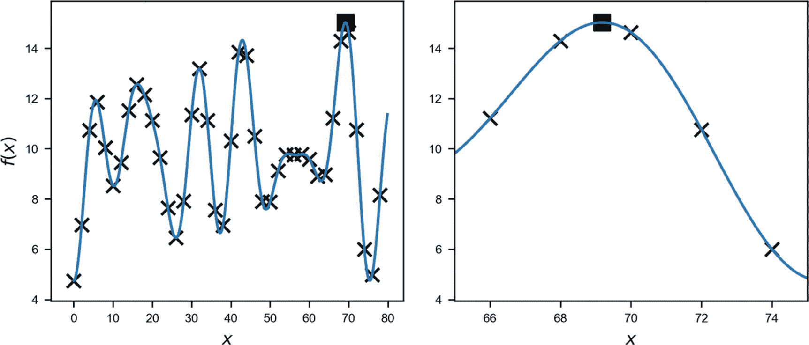

图 7-5

函数 f(x) 在范围 [0, 80] 上的图像。交叉点标记了我们用随机搜索采样的点，黑色方块标记了最大值。

这种方法的潜在风险是，如果您非常不幸，随机选择的点与真实最大值相去甚远。但这种概率相当低。请注意，如果您为随机点选择一个恒定的概率分布，那么在各个地方得到点的概率是相同的。看看这种方法的表现很有趣。让我们考虑 200 个不同的随机集合，每个集合包含 40 个点，这些点是通过在代码中改变随机种子获得的。最大值  的分布绘制在图 7-6 中。

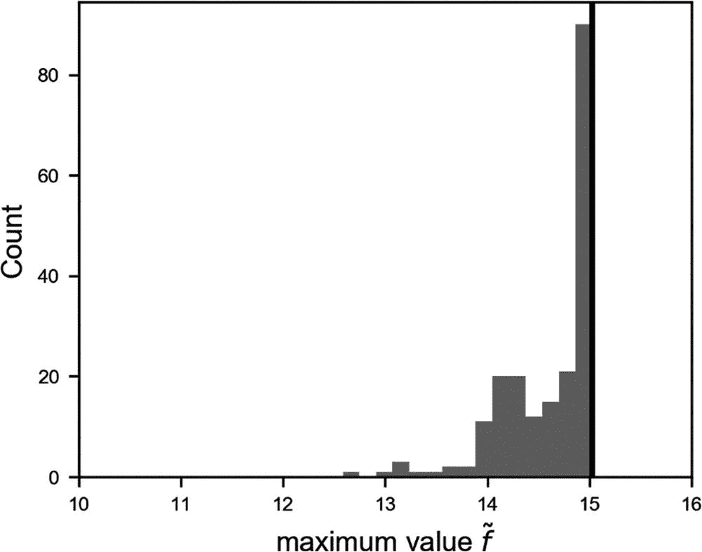

图 7-6

通过在随机搜索中采样 200 个不同的 40 点随机集合获得  的结果分布。黑色垂直线表示 f(x) 的真实最大值。

正如您所看到的，无论使用的是哪种随机集合，在大多数情况下，您得到的值都非常接近真实最大值。在图 7-7 中，您可以看到通过随机搜索找到的最大值的分布，样本点数量从 10 到 80 变化。

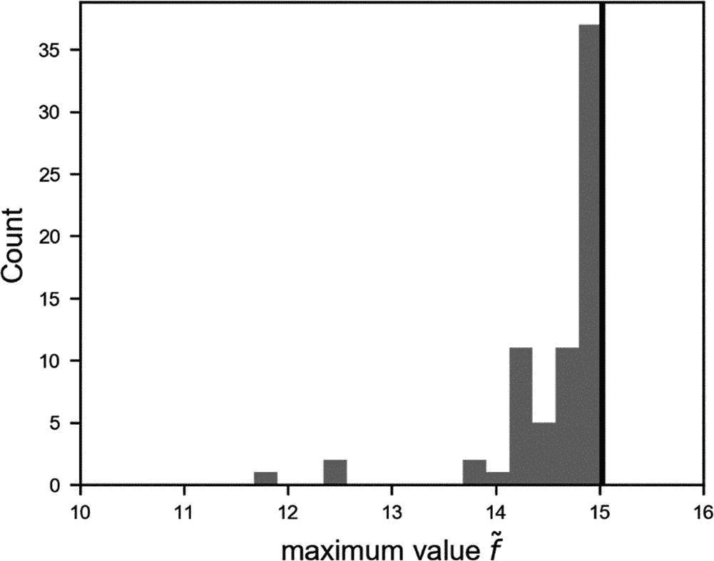

图 7-7

通过改变随机搜索中采样的点数 n（从 10 到 80），得到的  结果分布。黑色垂直线表示 f(x) 的真实最大值。

如果你将其与网格搜索进行比较，你可以看到随机搜索始终能更好地得到接近真实最大值的结果。在图 7-8 中，你可以看到使用随机和网格搜索时，使用不同数量的采样点 *n* 得到的最大值  的分布比较。在两种情况下，图表都是使用 38 个不同的集合生成的，因此总计数相同。

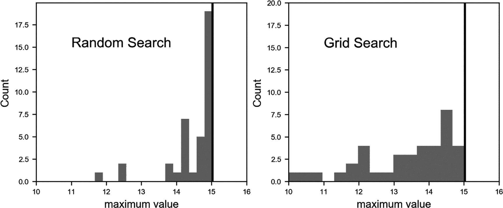

图 7-8

在改变采样点数量 n 的同时，比较网格（右侧）和随机（左侧）搜索中 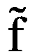 的分布，两个图表的总和均为 38，这是使用不同数量采样点的次数。两个图表中最大值的正确值均由垂直的黑线标记。

很容易看出，平均而言，随机搜索比网格搜索更好。你得到的结果始终更接近正确的最大值。

### 注意

随机搜索始终优于网格搜索，你应该尽可能使用它。当处理变量 *x* 的多维空间时，随机搜索和网格搜索之间的差异变得更加明显。超参数调整实际上始终是一个多维优化问题。

如果你感兴趣的是一篇关于如何为高维问题进行随机搜索缩放的非常好的论文，请阅读 James Bergstra 和 Yoshua Bengio 的 *Random Search for Hyper-Parameter Optimization*，可在[`https://goo.gl/efc8Qv`](https://goo.gl/efc8Qv)找到。

## 粗到细优化

仍然有一个优化技巧可以帮助网格或随机搜索。它被称为粗到细优化。假设我们想在 *x*[*min*] 和 *x*[*max*] 之间找到 *f*(*x*) 的最大值。我将解释随机搜索背后的概念，但这也适用于网格搜索。以下步骤为你提供了进行此优化的算法。

1.  在区域 *R*[1] = (*x*[*min*], *x*[*max*]) 中进行随机搜索。让我们用 (*x*[1], *f*[1]) 表示找到的最大值。

1.  现在考虑一个围绕 *x*[1] 的较小区域 *R*[2] = (*x*[1] − *δx*[1], *x*[1] + *δx*[1])，其中 *δx*[1] 我稍后会讨论，并在该区域再次进行随机搜索。假设，当然，真实最大值位于这个区域。我们将用 (*x*[2], *f*[2]) 表示在这里找到的最大值。

1.  在 *x*[2] 附近重复步骤 2，在我们将用 *R*[3] 表示的区域，使用比 *δx*[1] 更小的 *δx*[2]，并在此步骤中找到的最大值用 (*x*[3], *f*[3]) 表示。

1.  现在重复步骤 2，在 *x*[3] 附近，在我们将用 *R*[4] 表示的区域，使用比 *δx*[2] 更小的 *δx*[3]。

1.  按照这种方式，根据需要重复进行，直到区域 *R*[*i* + 1] 中的最大值 (*x*[*i*], *f*[*i*]) 不再改变。

通常情况下，只需要进行一到两次迭代，但理论上，你可以进行大量的迭代。这种方法的问题在于，你无法真正确定你的真实最大值是否位于你的区域 *R*[*i*] 中。但如果这种方法有效，它有一个很大的优点。让我们考虑我们进行标准随机搜索的情况。如果我们想要样本点之间的平均距离为 *x*[*max*] − *x*[*min*] 的 1%，那么如果我们只进行一次随机搜索，就需要大约 100 个点，因此我们必须进行 100 次评估。现在让我们考虑我刚才描述的算法。我们可以从区域 *R*[1] = (*x*[*min*],  *x*[*max*]) 中的 10 个点开始。在这里，我们将用 (*x*[1], *f*[1]) 表示我们找到的最大值。然后让我们取 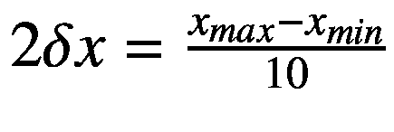 并再次在区域 *R*[2] = (*x*[1] − *δx*, *x*[1] + *δx*) 中取 10 个点。在 (*x*[1] − *δx*, *x*[1] + *δx*) 区间内，我们将有平均距离为 *x*[*max*] − *x*[*min*] 的 1%，但我们只采样了函数 20 次，而不是 100 次，所以减少了 5 倍！例如，让我们用 10 个点在 *x*[*min*] = 0 和 *x*[*max*] = 80 之间采样我们之前使用的函数，代码如下

```py
np.random.seed(5)
randomsearch = np.random.random([10])*80
x = 0
m = 0.0
for i, val in np.ndenumerate(f(randomsearch)):
if (val > m):
m = val
x = randomsearch[i]
```

这给我们提供了 *x*[1] = 69.65 和 *f*[1] = 14.89 的最大位置和值，还不错，但还没有像真实值 69.18 和 15.027 那样精确。现在让我们再次在区域 *R*[2] = (*x*[1] − 4, *x*[1] + 4) 附近对找到的最大值进行采样。

```py
randomsearch = x + (np.random.random([10])-0.5)*8
x = 0
m = 0.0
for i, val in np.ndenumerate(maxim(randomsearch)):
if (val > m):
m = val
x = randomsearch[i]
```

这给出了结果 69.189 和 15.027。相当精确的结果，只对函数进行了 20 次评估。如果我们用 *500*（比我们刚才做的多 25 倍）个采样点进行简单的随机搜索，我们得到 *x*[1] = 69.08 和 *f*[1] = 15.022。这个结果展示了这个技巧如何真正有用。但记住风险：如果你的最大值不在你的区域 *R*[*i*] 中，你将永远找不到它，因为你仍在处理随机数。所以，总是选择相对较大的区域 (*x*[*i*] − *δx*[*i*]，*x*[*i*] + *δx*[*i*]) 是一个好主意，以确保它们包含你的最大值。大小取决于，就像深度学习世界中的几乎所有事情一样，你的数据集和问题，这些可能事先无法知道。不幸的是，需要进行测试。在图 7-9 中，你可以看到函数 *f*(*x*) 上的采样点。在左侧的图中，你可以看到前 10 个点，在右侧，有额外的 10 个点的区域 *R*[2]。左侧图中的小矩形标记了 *x* 区域 *R*[2]。

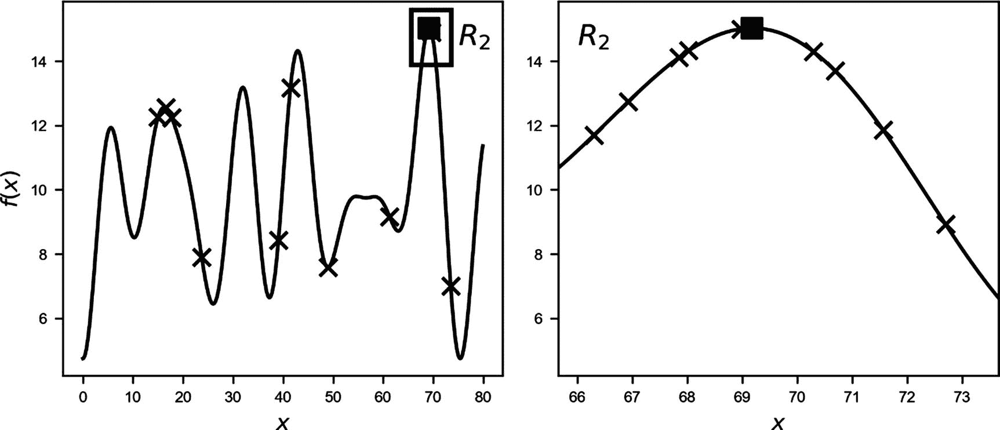

图 7-9

函数 f(x)。交叉点标记了采样点：在左侧，标记了在区域 R[1]（整个范围）中采样的 10 个点，在右侧，标记了在 R[2] 中采样的 10 个点。黑色方块标记了实际的最大值。右侧的图是区域 R[2] 的放大图。

现在选择最初应该采样多少个点至关重要。在这里我们很幸运。让我们考虑在选择最初的 10 个随机点时使用不同的种子，然后看看会发生什么（见图 7-10）。选择错误的初始点会导致灾难！

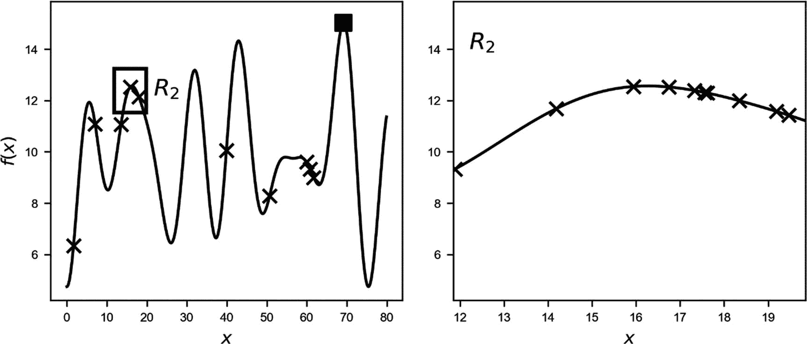

图 7-10

函数 f(x)。交叉点标记了采样点：在左侧，标记了在区域 R[1]（整个范围）中采样的 10 个点，在右侧，标记了在 R[2] 中采样的 10 个点。黑色方块标记了实际的最大值。算法在 16 附近找到了一个非常好的最大值，但不是绝对最大值。左侧图中的小矩形标记了区域 R[2]。右侧图是区域 R[2] 的放大图。

注意，在图 7-10 中，算法是如何在约 16 处找到最大值的，因为在初始采样点中，最大值大约是 *x* = 16，如图 7-10 左边的图中所示。没有点接近实际的最大值，大约是 *x* = 69。算法非常成功地找到了一个最大值，只是不是绝对最大值。这就是使用这个技巧时面临的风险。事情甚至可能比这更糟。考虑图 7-11，其中最初只采样了一个点。你可以在图[7-11]左边的图中看到算法是如何完全错过任何最大值的。它只是给出了右侧图中标记交叉点的点的最高值：(58.4, 9.78)。

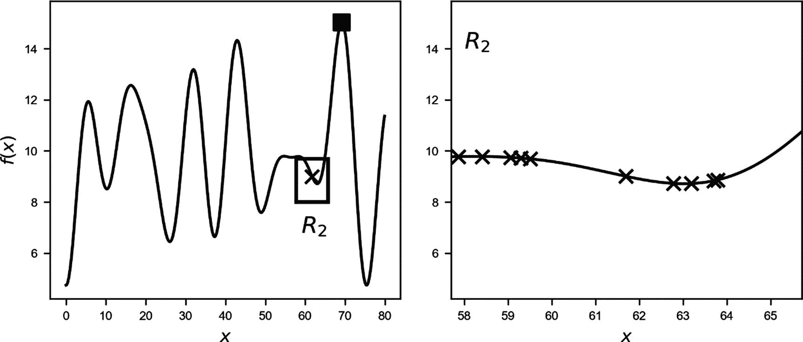

图 7-11

函数 f(x)。交叉点标记了采样点：在左侧，1 个点在 R[1]（整个范围）内采样，在右侧，10 个点在 R[2]内采样。黑色方块标记了实际的最大值。算法没有找到任何最大值，因为在该区域 R[2]内没有最大值。右侧的图是区域 R[2]的放大图。

如果你决定使用这种方法，请记住，你仍然需要在开始时拥有足够多的点，以便接近最大值，然后再细化你的搜索。在你相对有把握地找到最大值附近的点之后，你可以使用这种技术来细化你的搜索。

## 贝叶斯优化

在本节中，我们将探讨一种寻找黑盒函数最小值（或最大值）的具体且有效的方法。这是一个相当巧妙的算法，基本上包括以比随机选择或网格选择更智能的方式选择采样点来评估函数。要理解它是如何工作的，你必须首先了解一些新的数学概念，因为这种方法并不简单，需要理解一些更高级的概念。让我们从 Nadaraya-Watson 回归开始。

### Nadaraya-Watson 回归

这种方法是在 1964 年由Èlizbar Akakevič (E. A.) Nadaraya 在《关于回归估计》一文中提出的，该文发表在俄罗斯期刊《概率论及其应用理论》上。基本思想相当简单。给定一个未知的函数 *y*(*x*)，以及给定的 *N* 个点 *x*[*i*] = 1, …, *N*，我们用 *y*[*i*] = *f*(*x*[*i*]) 表示在不同的 *x*[*i*] 处计算的函数值，其中 *i* = 1, …, *N*。Nadaraya-Watson 回归的思想是，我们可以使用以下公式在未知点 *x* 处评估未知函数：

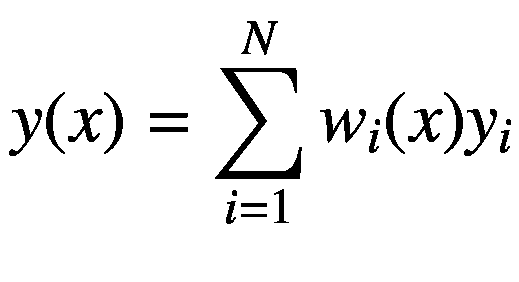

其中 *w**i* 是根据公式计算的权重

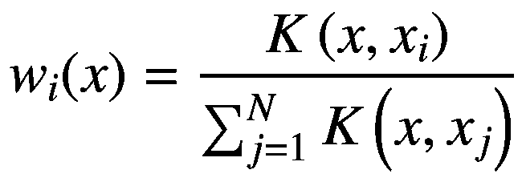

其中 *K*(*x*, *x*[*i*]) 被称为核。请注意，根据权重的定义，我们有

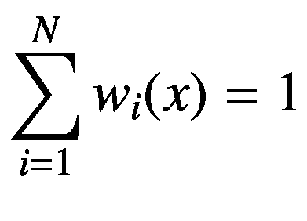

在文献中，你可以找到几个核，但我们感兴趣的是高斯核，通常称为**径向基函数**（RBF）

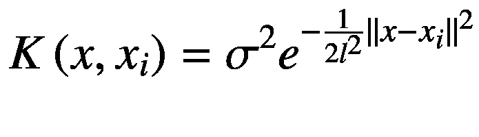

参数 *l* 使得高斯形状更宽或更窄。*σ* 通常是你数据的方差，但在这个例子中，它不起作用，因为权重被归一化到 1。这是贝叶斯优化的基础，你稍后会看到。

### 高斯过程

在讨论高斯过程之前，首先我必须定义什么是随机过程。一个**随机过程**指的是任何属于 *ℝ*^(*d*) 的点 *x*，我们为其分配一个随机变量 *f*(*x*) ∈ *ℝ*。如果一个随机过程对于任意有限数量的点，它们的联合分布是正态的，那么它就是高斯过程。这意味着对于 ∀*n* ∈ *ℕ*，以及对于 ∀*x*[1]，…*x*[*n*] ∈ *ℝ*^(*d*)，向量是

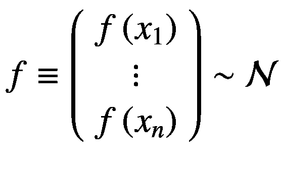

其中，我们用符号表示向量分量遵循正态分布，用 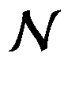 表示。记住，具有高斯分布的随机变量被称为正态分布。由此得名高斯过程。正态分布的概率分布由以下函数给出

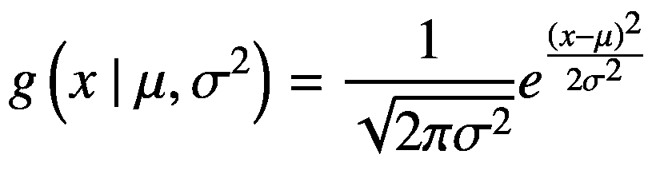

其中 *μ* 是分布的均值或期望，*σ* 是标准差。从现在开始，我将使用以下符号：

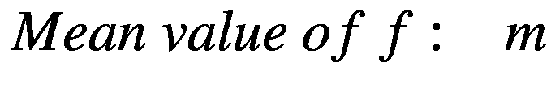

并且随机值的协方差将用 *K* 表示。

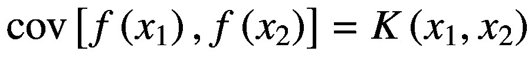

字母 *K* 的选择有原因。在以下内容中，我们将假设协方差将具有高斯形状，我们将使用之前定义的径向基函数（RBF）作为 *K*。

### 静态过程

为了简化，我们在这里只考虑平稳过程。一个随机过程是平稳的，如果其联合概率分布不随时间变化。这也意味着均值和方差在时间平移时不会改变。我们还将考虑一个其分布只依赖于点之间相对位置的进程。这导致以下条件

![$$ {\displaystyle \begin{array}{l}K\left({x}_1,{x}_2\right)=\tilde{K}\left({x}_1-{x}_2\right)\\ {} Var\left[f(x)\right]=\tilde{K}(0)\end{array}} $$](../images/463356_1_En_7_Chapter/463356_1_En_7_Chapter_TeX_Equp.png)

注意，要应用我们描述的方法，首先您必须将数据转换为平稳的，如果尚未这样做，则消除时间序列中的季节性或趋势，例如。

### 高斯过程预测

现在我们已经到达了有趣的部分：给定向量 ***f***，我们如何估计任意点 *x* 处的 *f*(*x*)？因为我们处理的是随机过程，我们将估计未知函数取给定值 *f*(*x*) 的概率。从数学上讲，我们将预测以下量：

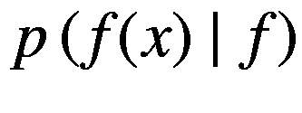

或者换句话说，给定由所有点 *f*(*x*[1])，…，*f*(*x*[*n*])组成的向量 ***f***，得到值 *f*(*x*) 的概率。

假设 *f*(*x*) 是一个平稳高斯过程，其 *m* = 0，预测可以证明由以下公式给出


在这里，我们用 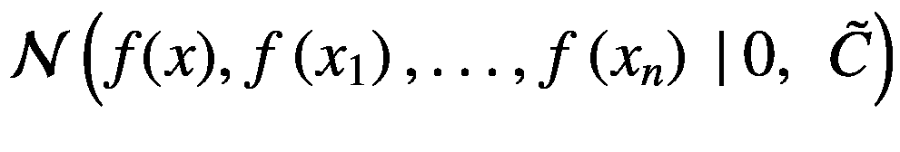 表示在平均值为 0 且协方差矩阵为  的 *n* + 1 × *n* + 1 维度上计算的正态分布，因为我们分子中有 *n* + 1 个点。推导过程相对复杂，基于几个定理，例如贝叶斯定理。更多信息，您可以参考 Chuong B. Do 在“高斯过程”（2007 年）中的（高级）解释，可在[`https://goo.gl/cEPYwX`](https://goo.gl/cEPYwX)找到，其中所有内容都进行了详细的解释。为了理解贝叶斯优化是什么，我们可以简单地使用公式而不进行推导。*C* 将具有 *n* × *n* 维度，因为我们只有 *n* 个点在分母中。

我们有

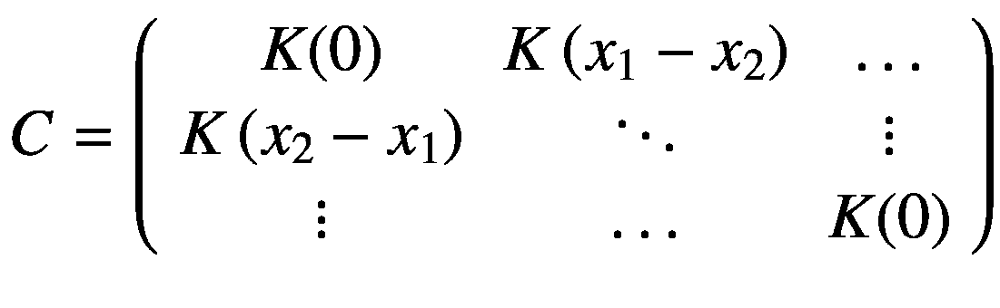

并且

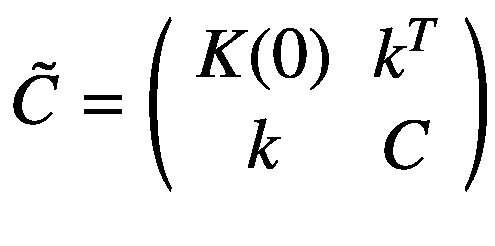

其中我们定义了

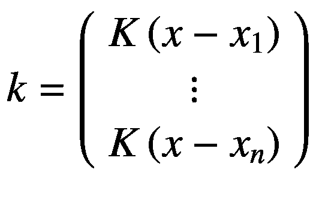

可以证明^(1)，两个正态分布的比值仍然是一个正态分布，因此我们可以写成

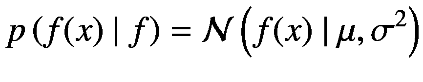

与

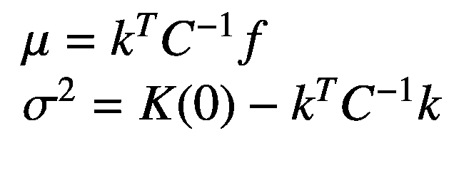

对于*μ*和*σ*的精确形式的推导相当长，并且超出了本书的范围。基本上，我们现在知道，平均而言，我们的未知函数将在*x*处取值为*μ*，具有方差*σ*。现在让我们看看这种方法在 Python 中的实际应用。首先，让我们定义我们的核*K*(*x*)。

```py
def K(x, l, sigm = 1):
return sigm**2*np.exp(-1.0/2.0/l**2*(x**2))
```

让我们用一个简单的函数来模拟我们的未知函数

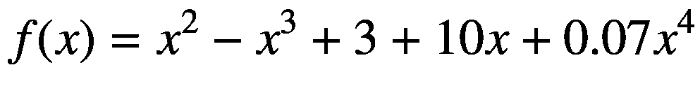

这可以实施为

```py
def f(x):
return x**2-x**3+3+10*x+0.07*x**4
```

让我们考虑范围(0, 12)内的函数。在图 7-12 中，你可以看到函数的外观。

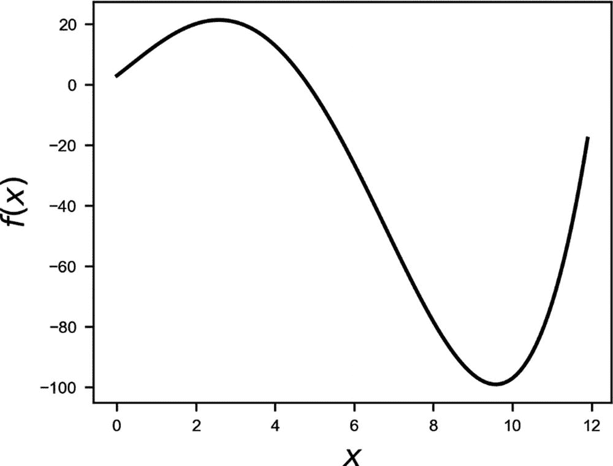

图 7-12

如文本所述，我们的未知测试函数的图像

让我们先构建一个包含五个点的***f***向量，如下所示：

```py
randompoints = np.random.random([5])*12.0
f_ = f(randompoints)
```

其中我们使用了随机数种子 42：`np.random.seed(42)`。在图 7-13 中，你可以看到用十字标记的随机点。

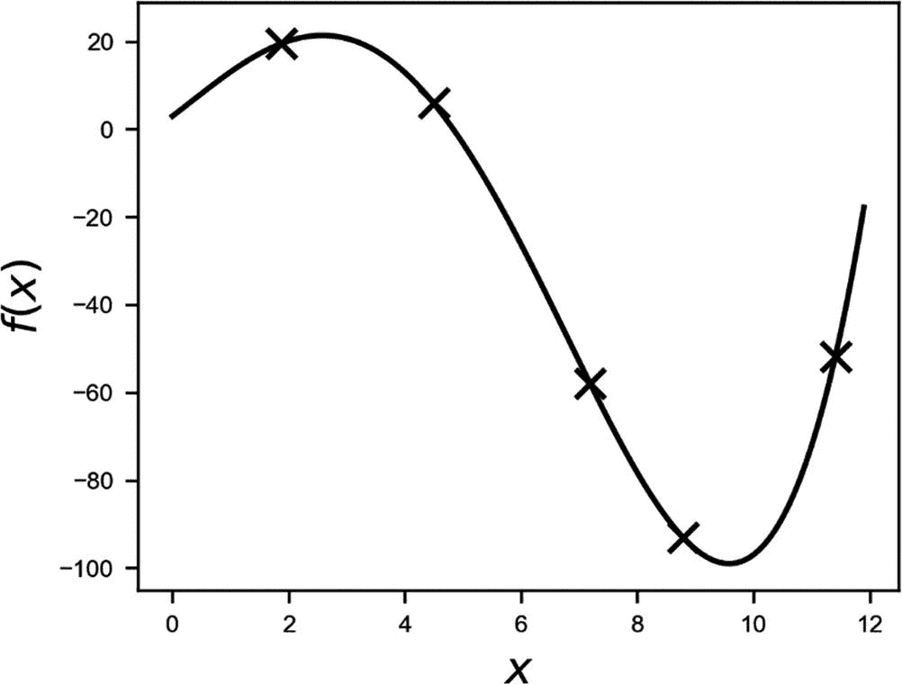

图 7-13

未知函数的图像。十字标记在文本中选择的随机点。

我们可以使用以下代码应用前面描述的方法：

```py
xsampling = np.arange(0,14,0.2)
ybayes_ = []
sigmabayes_ = []
for x in xsampling:
f1 = f(randompoints)
sigm_ = np.std(f1)**2
f_ = (f1-np.average(f1))
k = K(x-randompoints, 2 , sigm_)
C = np.zeros([randompoints.shape[0], randompoints.shape[0]])
Ctilde = np.zeros([randompoints.shape[0]+1, randompoints.shape[0]+1])
for i1,x1_ in np.ndenumerate(randompoints):
for i2,x2_ in np.ndenumerate(randompoints):
C[i1,i2] = K(x1_-x2_, 2.0, sigm_)
Ctilde[0,0] = K(0, 2.0, sigm_)
Ctilde[0,1:randompoints.shape[0]+1] = k.T
Ctilde[1:,1:] = C
Ctilde[1:randompoints.shape[0]+1,0] = k
mu = np.dot(np.dot(np.transpose(k), np.linalg.inv(C)), f_)
sigma2 = K(0, 2.0,sigm_)- np.dot(np.dot(np.transpose(k), np.linalg.inv(C)), k)
ybayes.append(mu)
sigmabayes_.append(np.abs(sigma2))
ybayes = np.asarray(ybayes_)+np.average(f1)
sigmabayes = np.asarray(sigmabayes_)
```

现在请花些时间来理解它。在`ybayes`列表中，我们将找到在`xsampling`数组中的值上评估的*μ*(*x*)的值。以下是一些有助于你理解代码的提示：

+   我们在一个*x*点的范围内进行循环，其中我们想要评估我们的函数，使用代码`for x in xsampling:`。

+   我们使用代码为向量的每个元素构建 ***k*** 和 ***f*** 向量：`k = K(x-randompoints, 2 , sigm_)` 和 `f1 = f(randompoints)`。对于核，我们为参数 `l` 选择了一个值，如函数 `2` 中定义的那样。我们在向量 ***f*** 中减去平均值，以获得 *m*(*x*) = 0，以便能够应用推导出的公式。

+   我们构建矩阵 *C* 和 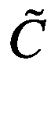。

+   我们使用 `mu = np.dot(np.dot(np.transpose(k), np.linalg.inv(C)), f_)` 和标准差来计算 *μ*。

+   最后，我们以相反的顺序重新应用我们为使过程平稳所做的所有转换，简单地将 *f*(*x*) 的平均值再次添加到评估的代理函数 `ybayes = np.asarray(ybayes_)+np.average(f1)` 中。

在图 7-14 中，你可以看到这种方法是如何工作的。虚线是预测函数，通过绘制 *μ*(*x*) 得到，如代码中计算的那样，当我们有五个可用点时 (*n* = 5)。灰色区域是估计函数和 +/- *σ* 之间的区域。

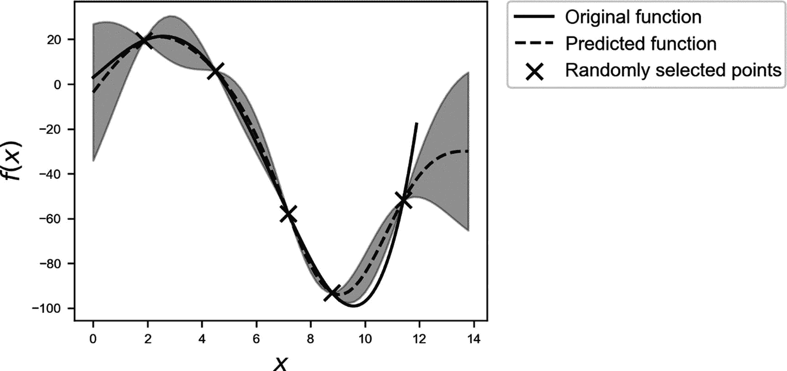

图 7-14

通过评估 μ(x) 计算得到的预测函数（虚线），灰色区域是估计函数和 +/- σ 之间的区域。

考虑到我们拥有的点很少，这不是一个坏的结果。现在请记住，你仍然需要一些点，才能得到一个合理的近似。在图 7-15 中，你可以看到如果我们只有两个可用点时的结果。结果并不那么好。灰色区域是估计函数周围的区域和 +/- *σ*。你可以看到，我们离我们拥有的点越远，预测函数的不确定性或方差就越高。

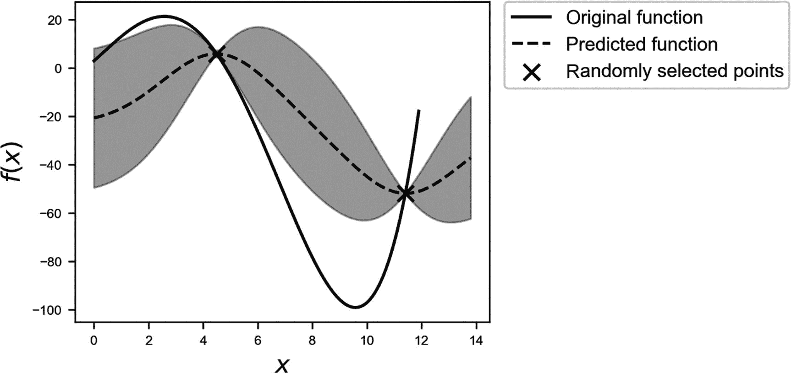

图 7-15

当我们只有两个可用点时，预测函数（虚线），灰色区域是估计函数和 +/- σ 之间的区域。

让我们暂停一下，思考一下我们为什么要做所有这些。目的是找到一个所谓的代理函数 ，它近似我们的函数 *f* 并具有以下属性

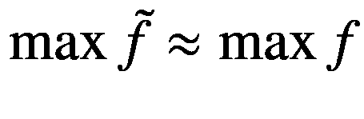

这个代理函数必须具有另一个非常重要的属性：它必须易于评估。这样，我们就可以轻松找到  的最大值，并且，使用前面的属性，我们将得到 *f* 的最大值，根据假设，这是昂贵的。

但正如你所看到的，知道我们是否有足够的数据点来找到最大值的正确值可能非常困难。毕竟，根据定义，我们根本不知道我们的黑盒函数看起来像什么。那么，如何解决这个问题呢？

该方法背后的主要思想可以通过以下算法来描述：

1.  我们从一个小的样本点集合开始，这些点随机选择（它应该有多小将取决于你的问题）。

1.  我们使用这个点集来获取一个代理函数，如描述的那样。

1.  我们使用一种特定的方法（我将在稍后讨论）向我们的集合中添加一个额外的点，并重新评估代理函数。

1.  如果我们用代理函数找到的最大值继续变化，我们将继续添加点，就像步骤 3 中那样，直到最大值不再变化，或者我们耗尽时间或预算，无法进行任何进一步的评估。

如果我在步骤 3 中暗示的方法足够聪明，我们将能够相对快速和准确地找到我们的最大值。

### 获取函数

但如何在上一节步骤 3 中提到的附加点中进行选择呢？思路是使用所谓的获取函数。算法以这种方式工作：

1.  我们选择一个函数（我们将在一会儿看到一些可能性），称为获取函数。

1.  然后我们选择，作为额外的点 *x*，获取函数达到最大值的位置。

我们可以使用几种获取函数。在这里，我将只描述我们将使用的一个来了解这种方法是如何工作的，但还有几个你可能想检查的，例如熵搜索、改进概率、期望改进和上置信界。

### 上置信界 (UCB)

在文献中，你可以找到这种获取函数的两个变体。我们可以将函数写成

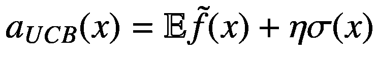

其中，我们用 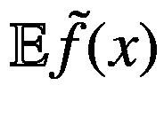 表示代理函数在我们问题中的 *x* 范围内的“期望”值。期望值不过是函数在给定 *x* 范围内的平均值。*σ*(*x*) 是我们在点 *x* 处使用我们的方法计算的代理函数的方差。我们选择的新点是 *a**UCB* 最大的点。*η* > 0 是一个权衡参数。这个获取函数基本上选择方差最大的点。请参阅图 7-15。该方法选择方差较大的点，因此尽可能远离我们已有的点。这样，近似值往往会变得越来越好。

UCB 获取函数的另一种变体如下：

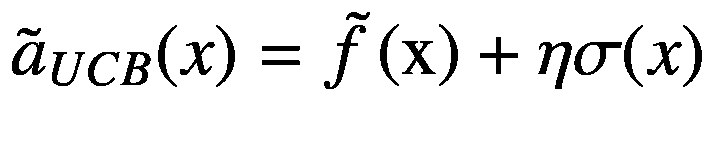

这次，获取函数将在选择代理函数最大值周围的点和其方差最大的点之间进行权衡。第二种方法最适合快速找到*f*的最大值的良好近似，而第一种方法则倾向于在整个*x*范围内给出*f*的良好近似。在下一节中，我们将看到这些方法是如何工作的。

### 示例

让我们从本章开头描述的复杂三角函数开始，并考虑*x*的范围[0, 40]。我们的目标是找到它的最大值并近似该函数。为了方便我们的编码，让我们定义两个函数：一个用于评估代理函数，另一个用于评估新点。为了评估代理函数，我们可以使用以下函数：

```py
def get_surrogate(randompoints):
ybayes_ = []
sigmabayes_ = []
for x in xsampling:
f1 = f(randompoints)
sigm_ = np.std(f_)**2
f_ = (f1-np.average(f1))
k = K(x-randompoints, 2.0, sigm_ )
C = np.zeros([randompoints.shape[0], randompoints.shape[0]])
Ctilde = np.zeros([randompoints.shape[0]+1, randompoints.shape[0]+1])
for i1,x1_ in np.ndenumerate(randompoints):
for i2,x2_ in np.ndenumerate(randompoints):
C[i1,i2] = K(x1_-x2_, 2.0, sigm_)
Ctilde[0,0] = K(0, 2.0)
Ctilde[0,1:randompoints.shape[0]+1] = k.T
Ctilde[1:,1:] = C
Ctilde[1:randompoints.shape[0]+1,0] = k
mu = np.dot(np.dot(np.transpose(k), np.linalg.inv(C)), f_)
sigma2 = K(0, 2.0, sigm_)- np.dot(np.dot(np.transpose(k), np.linalg.inv(C)), k)
ybayes_.append(mu)
sigmabayes_.append(np.abs(sigma2))
ybayes = np.asarray(ybayes_)+np.average(f1)
sigmabayes = np.asarray(sigmabayes_)
return ybayes, sigmabayes
```

此函数与我们在前几节示例中已经讨论过的代码相同，但它被封装在一个函数中，该函数返回包含在数组`ybayes`中的代理函数，以及包含在数组`sigmabayes`中的*σ*²。此外，我们还需要一个函数来评估新点，使用获取函数*a**UCB*。我们可以很容易地用以下函数得到它

```py
def get_new_point(ybayes, sigmabayes, eta):
idxmax = np.argmax(np.average(ybayes)+eta*np.sqrt(sigmabayes))
newpoint = xsampling[idxmax]
return newpoint
```

为了使事情更简单，我决定在函数外部定义包含所有我们想要*x*值的数组。让我们从六个随机选择的点开始。为了检查我们的方法表现如何，让我们先定义一些东西。

```py
xmax = 40.0
numpoints = 6
xsampling = np.arange(0,xmax,0.2)
eta = 1.0
np.random.seed(8)
randompoints1 = np.random.random([numpoints])*xmax
```

在数组`randompoints1`中，我们将有我们首先选择的六个随机点。我们可以轻松地用以下方法得到我们函数的代理函数

```py
ybayes1, sigmabayes1 = get_surrogate(randompoints1)
```

在图 7-16 中，你可以看到结果。虚线是获取函数*a**UCB*，已归一化以适应图表。


图 7-16

黑盒函数 f(x)（实线）、随机选择的点（用十字标记）、代理函数（虚线）和获取函数 aUCB（虚线），已移位以适应图表。灰色区域是位于线条  和  之间的区域。

代理函数还不够好，因为我们没有足够的数据点，大的方差（灰色区域）使得这一点很明显。唯一被很好地近似的是*x* ≳ 35 的区域。你可以看到当代理函数没有很好地近似黑盒函数时，获取函数很大，而当它做到了，例如*x* ≳ 35 时，获取函数很小。所以，直观地选择*a**UCB*最大的点作为新点，相当于选择函数被较差近似的点，或者说，用更数学的语言来说，方差较大的点。相比之下，在图 7-17 中，你可以看到与图 7-16 相同的图表，但带有获取函数和*η* = 3.0。

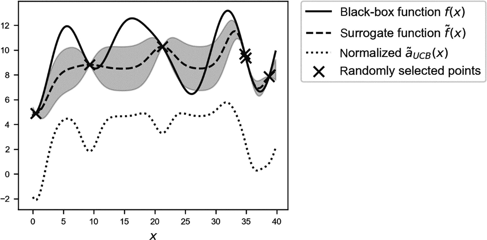

图 7-17

黑盒函数 f(x)（实线）、随机选择的点（用十字标记）、代理函数（虚线）和获取函数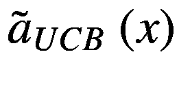（点线），已调整以适应图表。灰色区域是位于和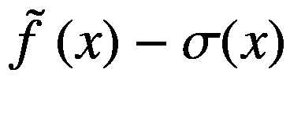之间的区域。

如您所见，倾向于在代理函数的最大值附近达到最大值。请记住，如果*η*很大，获取函数的最大值将向高方差区域移动。但这个获取函数往往能更快地找到“一个”最大值。我说“一个”，因为这与代理函数的最大值位置有关，而不是黑盒函数的最大值位置。

现在我们来看看使用*η* = 1.0 时，*a**UCB*会发生什么。对于第一个额外的点，我们只需简单地运行以下三行代码：

```py
newpoint = get_new_point(ybayes1, sigmabayes1, eta)
randompoints2 = np.append(randompoints1, newpoint)
ybayes2, sigmabayes2 = get_surrogate(randompoints2)
```

为了简化，我为每个步骤分别命名了每个数组，而不是创建一个列表。但，通常，你应该使这些迭代自动进行。在图 7-18 中，你可以看到带有额外点的结果，用黑色圆圈标记。

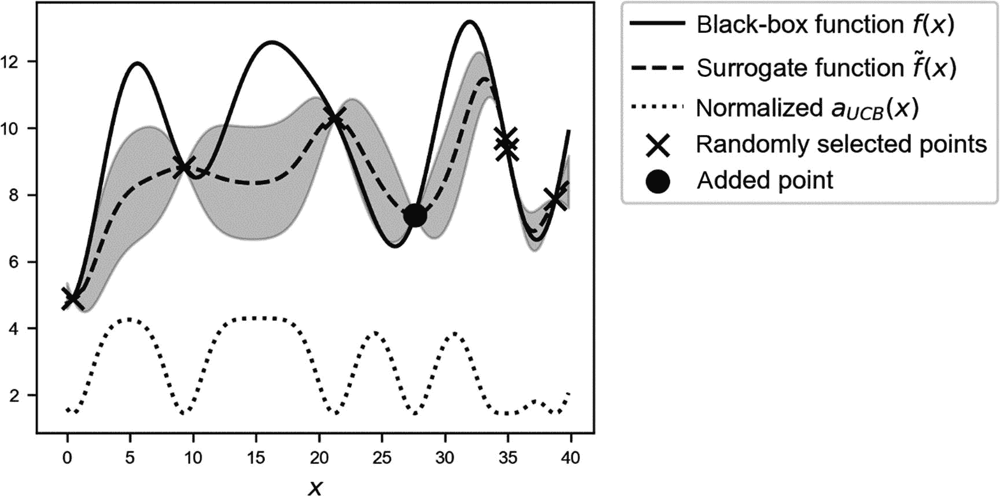

图 7-18

黑盒函数 f(x)（实线）、随机选择的点（用十字标记），以及新选择的点位于 x ≈ 27 附近（用圆圈标记），代理函数（虚线），以及获取函数 aUCB（点线），调整以适应图表。灰色区域是位于线  和  之间的区域。

新点位于 *x* ≈ 27 附近。让我们继续添加点。在图 7-19 中，你可以看到添加五个点后的结果。

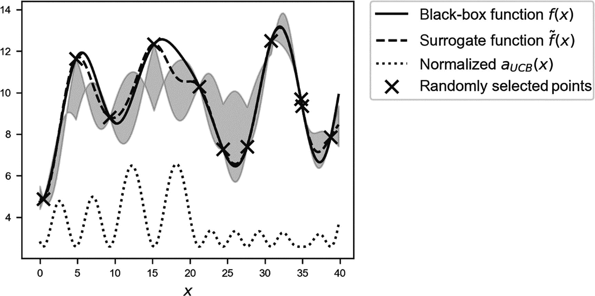

图 7-19

黑盒函数 f(x)（实线）、随机选择的点（用十字标记）以及六个新选择的点（用十字标记），代理函数（虚线），以及获取函数 （点线），调整以适应图表。灰色区域是位于线 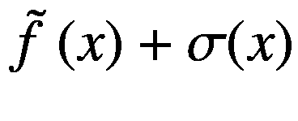 和  之间的区域。

注意虚线。现在我们的代理函数很好地逼近了黑盒函数，尤其是在真实最大值附近。使用这个代理函数，我们只需总共 11 次评估就能找到原始函数的一个非常好的近似！记住，我们除了这 11 次评估外，没有关于*f*的任何额外信息。

现在我们来看看获取函数  会发生什么，并检查我们多快能找到最大值。在这种情况下，我们将使用 *η* = 3.0，以获得代理函数最大值和其方差之间的更好平衡。在图 7-20 中，你可以看到仅添加一个额外点（用黑色圆圈标记）后的结果。我们已经得到了一个相当好的真实最大值的近似！

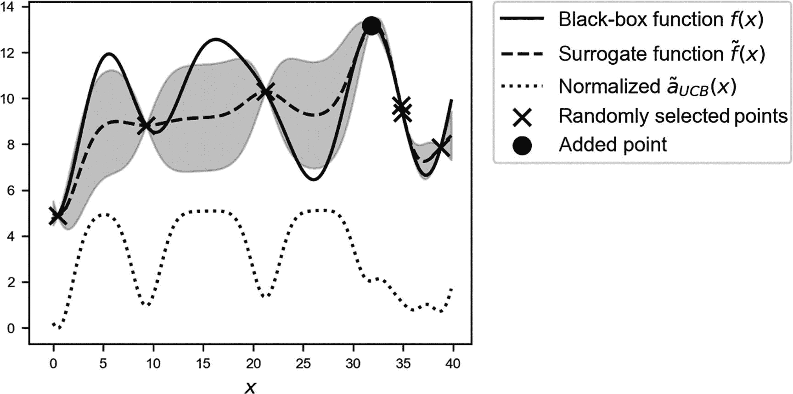

图 7-20

黑盒函数 f(x)（实线）、随机选择的点以及额外选择的点（用十字标记）、代理函数（虚线）和获取函数 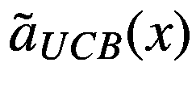（点线），调整以适应图表。灰色区域是位于线  和  之间的区域。

现在让我们再添加一个额外的点。你可以在图 7-21 中看到，额外的点现在仍然接近最大值，但方向上偏向于 30 附近具有高方差的区域。

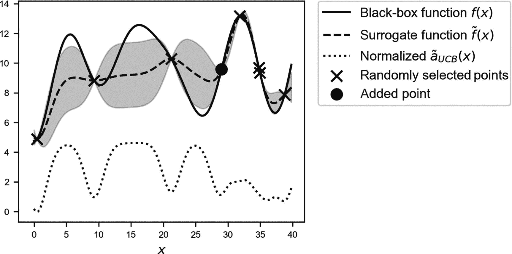

图 7-21

黑盒函数 f(x)（实线）、随机选择的点以及额外选择的点（用十字标记）、代理函数（虚线）和获取函数 （点线），调整以适应图表。灰色区域是位于线  和  之间的区域。

如果我们选择使 *η* 更小，点会更接近最大值，如果我们选择使其更大，点会更接近具有最高方差（大约在 25 到 32 之间）的点。现在让我们添加一个额外的点，看看会发生什么。在图 7-22 中，你可以看到方法现在选择了一个接近另一个具有高方差区域（大约在 10 到 22 之间）的点，同样用黑色圆圈标记。

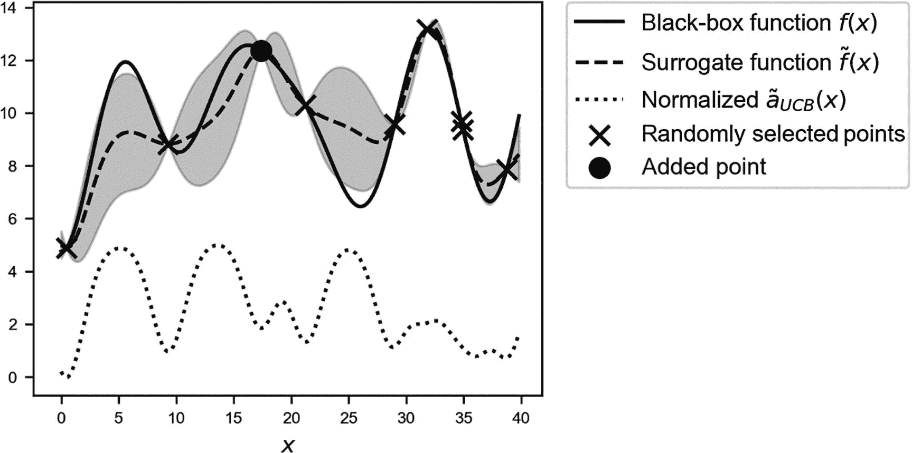

图 7-22

黑盒函数 f(x)（实线）、随机选择的点（用十字标记）、额外选择的点（用黑色圆圈标记）、代理函数（虚线）和获取函数 （点线），调整以适应图表。灰色区域是位于线  和  之间的区域。

最后，方法在 15 附近细化了最大区域，如图 7-23 所示，添加了一个标记为黑色圆圈的点。

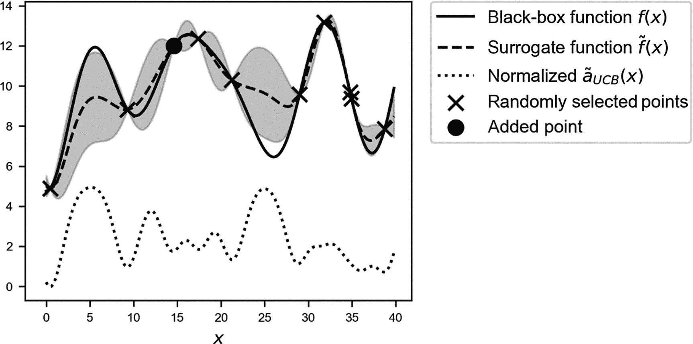

图 7-23

黑盒函数 f(x)（实线），随机选择的点以及额外选择的点（用十字标记），代理函数（虚线），以及获取函数 （点线），已移动以适应图表。灰色区域是位于线  和  之间的区域。

前面的讨论和比较两种类型获取函数的行为应该已经清楚地说明了，根据你想应用什么策略来近似你的黑盒函数，你应该选择合适的获取函数。

### 注意

不同的获取函数类型在近似黑盒函数时将给出不同的策略。例如，*a**UCB* 将在方差最高的区域添加点，而  将通过 *η* 调节代理函数的最大值和具有高方差区域之间的平衡来添加点。

对所有不同类型的获取函数的分析将超出本书的范围。要获得足够的经验并了解不同的获取函数如何工作和表现，需要进行大量的研究和阅读已发表的论文。

如果你想在 TensorFlow 模型中使用贝叶斯优化，你不必完全从头开始开发该方法。你可以尝试由 Nicolas Knudde 等人描述的库 GPflowOpt，该库在论文“GPflowOpt: A Bayesian Optimization Library using TensorFlow”中有描述，可在 [`goo.gl/um4LSy`](https://goo.gl/um4LSy) 或 [arXiv.org](http://arxiv.org) 上找到。

## 对数尺度上的采样

有一个最后的微小细节我想讨论一下。有时，你可能会发现自己处于想要尝试一个参数可能值的广泛范围的情况，但你根据经验知道最佳值可能在一个特定的范围内。假设你想找到你模型的学习率最佳值，你决定测试从 10^(-4) 到 1 的值，但你知道，或者至少怀疑，最佳值可能位于 10^(-3) 和 10^(-4) 之间。现在假设你正在使用网格搜索，并采样 1000 个点。你可能认为你有了足够的点，但你将会得到

+   介于 10^(-4) 和 10^(-3) 之间的 0 个点

+   介于 10^(-3) 和 10^(-2) 之间的 8 个点

+   介于 10^(-1) 和 10^(-2) 之间的 89 个点

+   介于 1 和 10^(-1) 之间的 899 个点

在不太有趣的范围内，你得到了更多的点，而在你想要的地方得到零点。在图 7-24 中，你可以看到点的分布。请注意，在*x*轴上，我使用了对数刻度。你可以清楚地看到，对于较大的学习率值，你得到了更多的点。

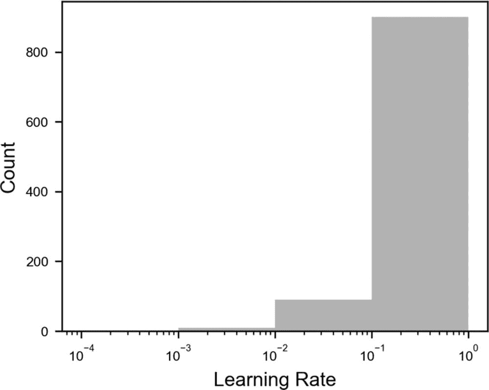

图 7-24

使用网格搜索在以对数 x 轴选择的 1000 个点上的分布

你可能希望对于学习率较小的值以更细的方式采样，而不是对于较大的值。你应该在以对数刻度上采样你的点。让我来解释一下。基本思想是，你希望在 10^(−4)和 10^(−3)、10^(−3)和 10^(−2)、10^(−1)和 10^(−2)、10^(−1)和 1 之间采样相同数量的点。为此，你可以使用以下 Python 代码。首先，选择一个介于 0 和减去 10 的幂的最高绝对值之间的随机数，在这个例子中是-4。

```py
r = - np.arange(0,1,0.001)*4.0
```

然后你可以创建包含所选点的数组

```py
points2 = 10**r
```

在图 7-25 中，你现在可以看到包含在数组`points2`中的点的分布是完全平坦的，正如我们希望的那样。

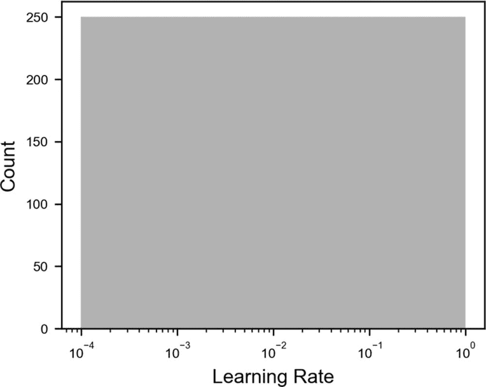

图 7-25

使用网格搜索在以对数 x 轴选择的 1000 个点上的分布，使用修改后的选择方法

你在每个区域都得到 250 个点，你可以通过这段代码很容易地检查范围 10^(−3)和 10^(−4)（对于其他范围只需更改代码中的数字）：

```py
print(np.sum((alpha  1e-4)))
```

现在，你可以看到在 10 的不同幂之间，你得到了相同数量的点。通过这个简单的技巧，你可以确保在所选范围的区域也得到足够多的点，否则你几乎得不到任何点。记住，在这个例子中，有 1000 个点，使用标准方法，我们在 10^(−3)和 10^(−4)之间得到零点。这个范围对于学习率来说是最有趣的，所以你希望在这个范围内有足够的点来优化你的模型。请注意，这同样适用于随机搜索。它以完全相同的方式工作。

## 使用 Zalando 数据集进行超参数调整

为了给你一个超参数调整如何工作的具体例子，让我们应用我们所学到的知识在一个简单的案例中。让我们从数据开始，像往常一样。我们将使用第三章中的 Zalando 数据集。关于完整的讨论，请参阅该章节。让我们快速加载数据并准备，然后讨论调整。

首先，像往常一样，加载必要的库。

```py
import pandas as pd
import numpy as np
import tensorflow as tf
%matplotlib inline
import matplotlib
import matplotlib.pyplot as plt
from random import *
```

你将需要在你的 Jupyter 笔记本所在的文件夹中提供必要的 CSV 文件。要获取它们，请再次参考第三章。一旦你将文件放在与你的笔记本相同的文件夹中，你就可以简单地使用以下方式加载数据：

```py
data_train = pd.read_csv('fashion-mnist_train.csv', header = 0)
data_dev = pd.read_csv('fashion-mnist_test.csv', header = 0)
```

记住：我们在训练数据集中有 60,000 个观测值，在 dev 数据集中有 10,000 个。例如，使用以下代码打印`data_train`数组的形状

```py
print(data_train.shape)
```

将给出 (60000, 785)。记住，`data_train`数组中的一列包含标签，784 是图像像素的灰度值（大小为 28 × 28 像素）。我们必须将标签从特征（像素的灰度值）中分离出来，然后我们需要重塑数组。

```py
labels = data_train['label'].values.reshape(1, 60000)
labels_ = np.zeros((60000, 10))
labels_[np.arange(60000), labels] = 1
labels_ = labels_.transpose()
train = data_train.drop('label', axis=1).transpose()
```

使用以下代码检查维度

```py
print(labels_.shape)
print(train.shape)
```

将给出

```py
(10, 60000)
(784, 60000)
```

如需。 (有关此数据集数据准备的详细讨论，请参阅第三章。)当然，我们必须对 dev 数据集做同样的处理。

```py
labels_dev = data_test['label'].values.reshape(1, 10000)
labels_dev_ = np.zeros((10000, 10))
labels_dev_[np.arange(10000), labels_test] = 1
labels_dev_ = labels_test_.transpose()
dev = data_dev.drop('label', axis=1).transpose()
```

现在，让我们将特征归一化，并将所有内容转换成`numpy`数组。

```py
train = np.array(train / 255.0)
dev = np.array(dev / 255.0)
labels_ = np.array(labels_)
labels_dev_ = np.array(labels_dev_)
```

我们已经按要求准备好了数据。现在让我们转向模型。让我们从简单的事情开始。在这个例子中，我们将使用准确率作为度量标准，因为数据集是平衡的。让我们考虑一个只有一层的网络，看看哪个神经元数量能给我们带来最佳的准确率。在这个例子中，我们的超参数将是隐藏层中的神经元数量。基本上，我们将不得不为超参数（隐藏层中的神经元数量）的每个值构建一个新的网络并对其进行训练。我们需要两个函数：一个用于构建网络，一个用于训练它。为了构建模型，我们可以定义以下函数：

```py
def build_model(number_neurons):
n_dim = 784
tf.reset_default_graph()
# Number of neurons in the layers
n1 = number_neurons # Number of neurons in the hidden layer
n2 = 10 # Number of neurons in output layer
cost_history = np.empty(shape=[1], dtype = float)
learning_rate = tf.placeholder(tf.float32, shape=())
X = tf.placeholder(tf.float32, [n_dim, None])
Y = tf.placeholder(tf.float32, [10, None])
W1 = tf.Variable(tf.truncated_normal([n1, n_dim], stddev=.1))
b1 = tf.Variable(tf.constant(0.1, shape = [n1,1]) )
W2 = tf.Variable(tf.truncated_normal([n2, n1], stddev=.1))
b2 = tf.Variable(tf.constant(0.1, shape = [n2,1]))
# Let's build our network...
Z1 = tf.nn.relu(tf.matmul(W1, X) + b1) # n1 x n_dim * n_dim x n_obs = n1 x n_obs
Z2 = tf.matmul(W2, Z1) + b2 # n2 x n1 * n1 * n_obs = n2 x n_obs
y_ = tf.nn.softmax(Z2,0) # n2 x n_obs (10 x None)
cost = - tf.reduce_mean(Y * tf.log(y_)+(1-Y) * tf.log(1-y_))
optimizer = tf.train.GradientDescentOptimizer(learning_rate).minimize(cost)
init = tf.global_variables_initializer()
return optimizer, cost, y_, X, Y, learning_rate
```

你应该理解这个函数，因为我们已经在书中多次使用过这段代码。这个函数有一个输入参数：`number_neurons`，它将包含隐藏层中的神经元数量。但有一个小的区别：函数返回我们在训练期间必须引用的张量，例如，当我们想要在训练期间评估`cost`张量时。如果我们不将它们返回给调用者，它们将只在这个函数内部可见，我们将无法训练这个模型。训练模型的函数看起来像这样：

```py
def model(minibatch_size, training_epochs, features, classes, logging_step = 100, learning_r = 0.001, number_neurons = 15):
opt, c, y_, X, Y, learning_rate = build_model(number_neurons)
sess = tf.Session()
sess.run(tf.global_variables_initializer())
cost_history = []
for epoch in range(training_epochs+1):
for i in range(0, features.shape[1], minibatch_size):
X_train_mini = features[:,i:i + minibatch_size]
y_train_mini = classes[:,i:i + minibatch_size]
sess.run(opt, feed_dict = {X: X_train_mini, Y: y_train_mini, learning_rate: learning_r})
cost_ = sess.run(c, feed_dict={ X:features, Y: classes, learning_rate: learning_r})
cost_history = np.append(cost_history, cost_)
if (epoch % logging_step == 0):
print("Reached epoch",epoch,"cost J =", cost_)
correct_predictions = tf.equal(tf.argmax(y_,0), tf.argmax(Y,0))
accuracy = tf.reduce_mean(tf.cast(correct_predictions, "float"))
accuracy_train = accuracy.eval({X: train, Y: labels_, learning_rate: learning_r}, session = sess)
accuracy_dev = accuracy.eval({X: dev, Y: labels_dev_, learning_rate: learning_r}, session = sess)
return accuracy_train, accuracy_dev, sess, cost_history
```

你已经多次看到过与这个非常相似的功能。主要部分应该是清晰的。你将发现一些新的东西。首先，我们在函数内部本身构建模型，

```py
opt, c, y_, X, Y, learning_rate = build_model(number_neurons)
```

此外，我们还在训练数据集和 dev 数据集上评估了准确率，并将这些值返回给调用者。这样，我们可以为隐藏层中神经元数量的几个值运行循环，并获取准确率。注意，这次函数有一个额外的输入参数：`number_neurons`。我们必须将这个数字传递给构建模型的函数。

假设我们选择了以下参数：批大小 = 50，训练 100 个 epoch，学习率 = 0.00，并在隐藏层中使用 15 个神经元来构建我们的模型。

然后我们运行模型。

```py
acc_train, acc_test, sess, cost_history = model(minibatch_size = 50,
training_epochs = 100,
features = train,
classes = labels_,
logging_step = 10,
learning_r = 0.001,
number_neurons = 15)
print(acc_train)
print(acc_test)
```

对于训练数据集，我们得到了 0.75755 的准确率，对于 dev 数据集是 0.754 的准确率。我们能做得更好吗？当然，我们可以从网格搜索开始。

```py
nn = [1,5,10,15,25,30, 50, 150, 300, 1000, 3000]
for nn_ in nn:
acc_train, acc_test, sess, cost_history = model(minibatch_size = 50,
training_epochs = 50,
features = train,
classes = labels_,
logging_step = 50,
learning_r = 0.001,
number_neurons = nn_)
print('Number of neurons:',nn_,'Acc. Train:', acc_train, 'Acc. Test', acc_test)
```

请记住，这将花费相当长的时间。3000 个神经元是一个相当高的数字，所以如果你想要尝试这个，请小心。我们得到了如表 7-1 所示的结果。

表 7-1

不同神经元数量下训练和测试数据集准确率的概述

| 神经元数量 | 训练数据集准确率 | 测试数据集准确率 |
| --- | --- | --- |
| 1 | 0.201383 | 0.2042 |
| 5 | 0.639417 | 0.6377 |
| 10 | 0.639183 | 0.6348 |
| 15 | 0.687183 | 0.6815 |
| 25 | 0.690917 | 0.6917 |
| 30 | 0.6965 | 0.6887 |
| 50 | 0.73665 | 0.7369 |
| 150 | 0.78545 | 0.7848 |
| 300 | 0.806267 | 0.8067 |
| 1000 | 0.828117 | 0.8316 |
| 3000 | 0.8468 | 0.8416 |

并不出奇，更多的神经元可以提供更好的准确率，没有训练数据集过拟合的迹象，因为开发数据集的准确率几乎等于训练数据集。在图 7-26 中，你可以看到测试数据集准确率与隐藏层中神经元数量关系的图表。注意，x 轴使用对数尺度，以便更明显地显示变化。

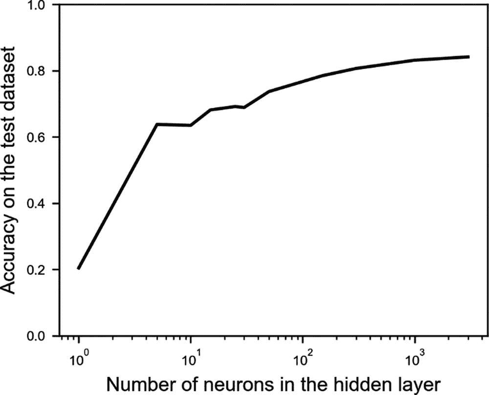

图 7-26

测试数据集上的准确率与隐藏层中神经元数量的关系

如果你的目标是达到 80%的准确率，你完全可以在这里停止。但是，还有一些事情需要考虑。首先，我们可能做得更好，其次，使用 3000 个神经元的网络训练需要相当长的时间——在我的笔记本电脑上，大约 35 分钟。我们应该看看是否能在更短的时间内得到相同的结果。我们希望模型训练得尽可能快。让我们尝试一种稍微不同的方法。因为我们想更快，所以让我们考虑一个有四层的模型。实际上，我们也可以调整层数，但为了这个例子，我们还是坚持四层，并调整其他参数。我们将尝试找到学习率、批量大小、每层神经元数量和训练轮数的最佳值。我们将使用随机搜索。对于每个参数，我们将随机选择 10 个值。

+   *神经元数量*：介于 35 到 60 之间

+   *学习率*：我们将使用对数尺度在 10^(-1)和 10^(-3)之间的搜索。

+   *批量大小*：介于 20 到 80 之间

+   *训练轮数*：介于 40 到 100 之间

我们可以使用以下代码创建包含可能值的数组：

```py
neurons_ = np.random.randint(low=35, high=60.0, size=(10))
r = -np.random.random([10])*3.0-1
learning_ = 10**r
mb_size_ = np.random.randint(low=20, high=80, size = 10)
epochs_ = np.random.randint(low = 40, high = 100, size = (10))
```

注意，我们不会尝试所有可能的组合，但我们会考虑仅十种可能的组合：每个数组的第一值，每个数组的第二值，依此类推。我想向你展示随机搜索在仅十次评估中可以有多高效！我们可以使用以下循环测试我们的模型：

```py
for i in range(len(neurons_)):
acc_train, acc_test, sess, cost_history = model_layers(minibatch_size = mb_size_[i],
training_epochs = epochs_[i],
features = train,
classes = labels_,
logging_step = 50,
learning_r = learning_[i],
number_neurons = neurons_[i], debug = False)
print('Epochs:', epochs_[i], 'Number of neurons:',neurons_[i],'learning rate:', learning_[i], 'mb size',mb_size_[i],
'Acc. Train:', acc_train, 'Acc. Test', acc_test)
```

如果你运行这段代码，你将得到一些以 `nan` 结束的组合，因此你的准确率是 0.1（基本上是随机的，因为我们有十个类别）和一些好的组合。你会发现，具有 41 个 epoch、每层 41 个神经元、学习率为 0.0286 和批量大小为 61 的组合在开发数据集上的准确率为 0.86。考虑到这次运行花费了 2.5 分钟，所以比只有一层、3000 个神经元和 6%更好的模型快了 14 倍。我们的初始测试给出了 0.75 的准确率，所以通过超参数调整，我们比初始猜测提高了 11%。在深度学习中，11%的准确率增加是一个令人难以置信的结果。通常，即使是 1%或 2%的提高也被认为是很好的结果。我们所做的工作应该给你一个关于如果做得好的话，超参数调整可以多么强大的想法。请记住，你应该花相当多的时间来做这件事，特别是要考虑*如何*来做。

### 注意

总是先思考你想要如何进行超参数调整，并利用你的经验，或者向有经验的人寻求帮助。尝试那些你知道不会工作的参数组合，浪费时间和资源是毫无意义的。例如，测试非常小的学习率比测试接近 1 的学习率更有意义。记住，你网络的每一次训练轮都会消耗时间，即使结果没有用！

这一部分的目的不是得到最好的模型，而是给你一个关于调整过程可能如何进行的想法。你可以继续尝试不同的优化器（例如 Adam），考虑更宽的参数范围，更多的参数组合等等。

## 关于径向基函数的简要说明

在完成本章之前，我想讨论一下关于径向基函数的一个小问题

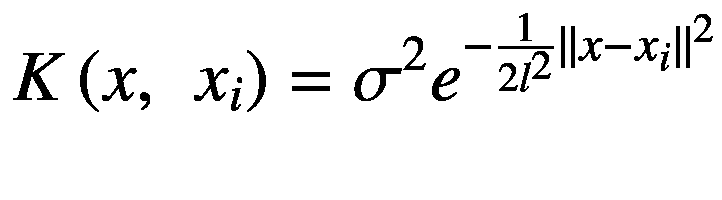

理解参数 *l* 的作用非常重要。在示例中，我选择了 *l* = 2，但我没有讨论为什么这样做。原因是这样的。选择过小的 *l* 将会使获取函数在已有的点周围形成非常狭窄的峰值，如图 7-27 左边的图所示。大的 *l* 值将对获取函数产生平滑效果，如图 7-27 中间和右边的图所示。

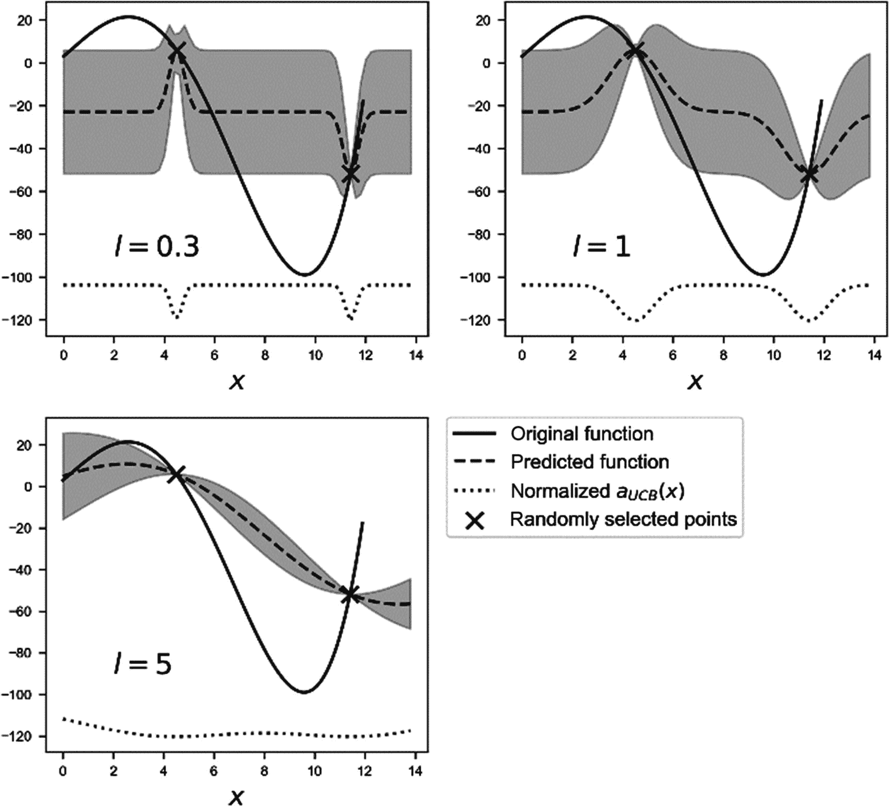

图 7-27

改变径向基函数中的参数 *l* 的影响

通常，避免使用过小或过大的 *l* 值是一个好的实践，以便能够使方差在已知点之间以平滑的方式变化，如图 7-27 所示，对于 *l* = 1。一个非常小的 *l* 将会使点之间的方差几乎保持不变，因此，算法几乎总是选择点之间的中点，正如你可以从获取函数中看到的那样。选择一个大的 *l* 将会使方差变小，因此，对于某些获取函数来说，可能难以使用。如图 7-27 中 *l* = 5 所示，获取函数几乎保持不变。常用的典型值大约是 1 或 2。
