# 8. 卷积神经网络和循环神经网络

在前面的章节中，你已经看到了全连接网络及其训练过程中遇到的所有问题。我们使用的网络架构，其中每一层的每个神经元都与前一层和后一层的所有神经元相连，实际上并不擅长许多基本任务，如图像识别、语音识别、时间序列预测等等。卷积神经网络（CNN）和循环神经网络（RNN）是目前最常用的先进架构。在本章中，你将了解卷积和池化，这是 CNN 的基本构建块。然后你将检查 RNN 在高层次上的工作方式，并查看一些应用示例。我还会讨论 TensorFlow 中 CNN 和 RNN 的完整、尽管是基本的实现。CNN 和 RNN 的主题过于广泛，无法在一个章节中涵盖。因此，在这里，我将仅涵盖基本概念，以展示这些架构是如何工作的，但完整的处理需要单独的书籍。

## 核和滤波器

卷积神经网络（CNN）的主要组成部分之一是滤波器——具有 *n*[*K*] × *n*[*K*] 维度的正方形矩阵，其中，通常 *n*[*K*] 是一个较小的数字，例如 3 或 5。有时，滤波器也被称为核。让我们定义四个不同的滤波器，并在本章后面它们在卷积操作中使用时检查它们的效果。对于这些示例，我们将使用 3 × 3 滤波器。目前，请将这些定义仅作为参考；你将在本章后面看到如何使用它们。

+   以下核将允许检测水平边缘：

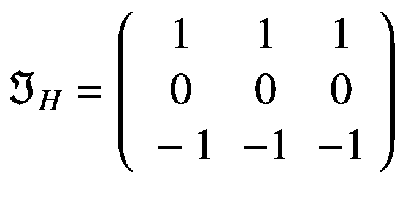

+   以下核将允许检测垂直边缘：

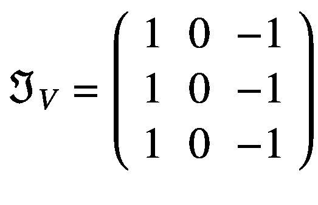

+   以下核将允许在亮度发生剧烈变化时检测边缘：

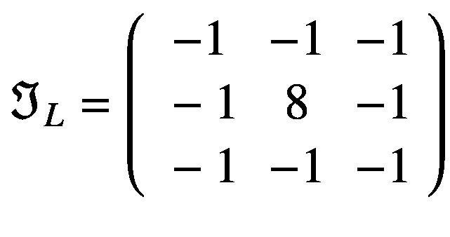

+   以下核将使图像边缘模糊：

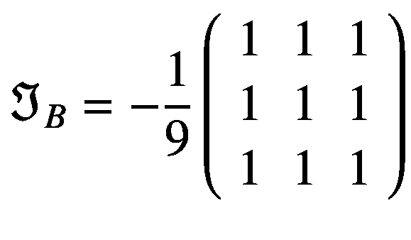

在下一节中，我们将使用这些滤波器对一个测试图像进行卷积，你将看到它的效果。

## 卷积

理解卷积是理解卷积神经网络的第一步。最简单的方法是看几个简单的例子。首先，在神经网络的环境中，卷积是在张量之间进行的。这个操作接收两个张量作为输入，并产生一个张量作为输出。这个操作通常用运算符 ∗ 表示。让我们看看它是如何工作的。让我们取两个维度都是 3 × 3 的张量。卷积操作是通过应用以下公式来执行的：

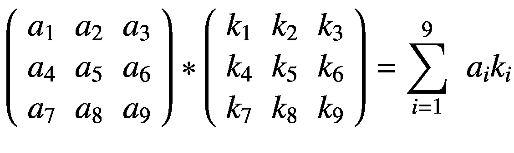

在这种情况下，结果仅仅是每个元素 *a*[*i*] 与相应的元素 *k*[*i*] 的乘积之和。在一个更典型的矩阵形式中，这个公式可以用双重求和来表示

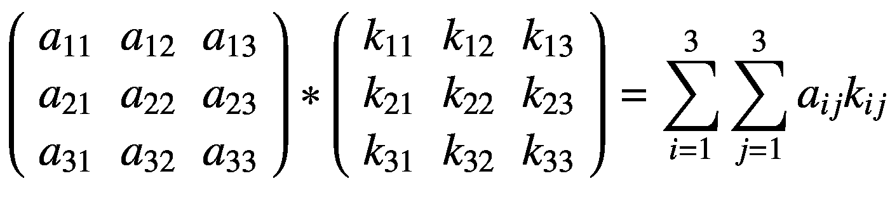

但第一个版本的优势在于它使基本思想非常清晰：一个张量中的每个元素都与第二个张量中相应元素（相同位置的元素）相乘，然后将所有值相加得到结果。

在上一节中，我提到了核，原因在于卷积通常是在一个张量（我们在这里可以用 *A* 来表示）和一个核之间进行的。通常，核很小，例如 3 × 3 或 5 × 5，而输入张量 *A* 通常更大。例如，在图像识别中，输入张量 *A* 是可能具有高达 1024 × 1024 × 3 维度的图像，其中 1024 × 1024 是分辨率，最后一个维度（3）是颜色通道的数量，即 RGB（红色、绿色、蓝色）值。在高级应用中，图像的分辨率可能更高。当我们有不同维度的矩阵时，我们如何应用卷积？为了理解这一点，让我们考虑一个 4 × 4 的矩阵 *A*。

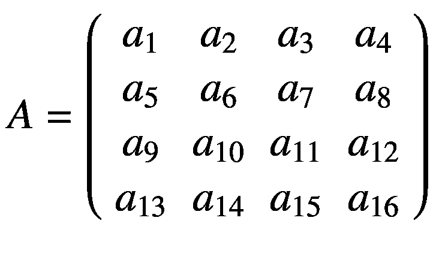

现在我们来看如何使用核 *K* 进行卷积，在这个例子中，我们将它取为 3 × 3。

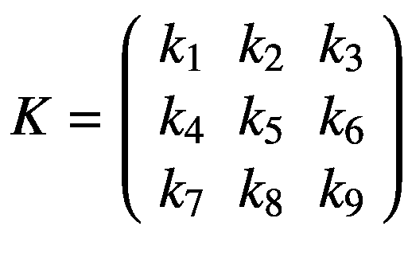

策略是从矩阵 *A* 的左上角开始，选择一个 3×3 的区域。在我们的例子中，这将是这样

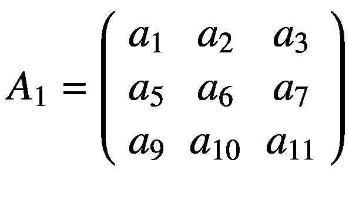

或者以下标记为粗体的元素。


然后我们按照前面解释的方法，对这个较小的矩阵 *A*[1] 和 *K* 进行卷积，得到（我们将结果用 *B*[1] 表示）

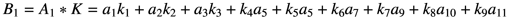

然后我们必须将矩阵 *A* 中选定的 3×3 区域向右移动一列，并选择以下标记为粗体的元素。


这将给出第二个子矩阵 *A*[2]

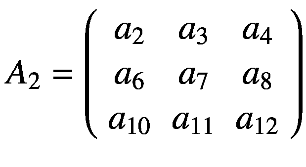

然后我们再次对这个较小的矩阵 *A*[2] 和 *K* 进行卷积

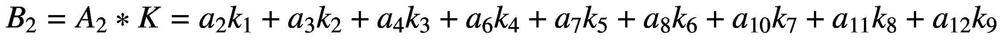

现在我们不能再将 3×3 的区域向右移动了，因为我们已经到达了矩阵 *A* 的末尾，所以我们将其向下移动一行，并从左侧重新开始。下一个选定的区域将是

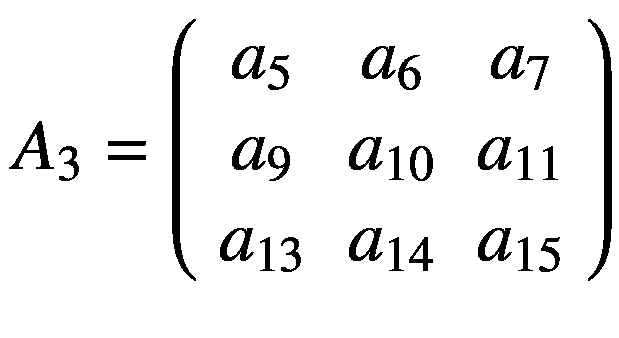

再次，我们执行 *A*[3] 与 *K* 的卷积

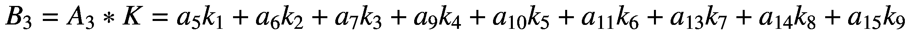

如此一来，你可能已经猜到了，最后一步是将我们选定的 3×3 区域向右移动一列，并再次进行卷积。我们的选定区域现在将是

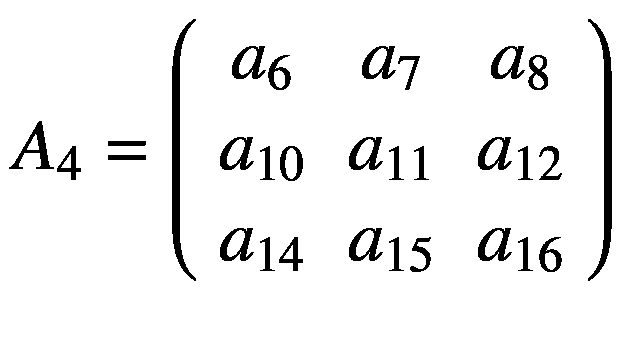

并且卷积将给出结果

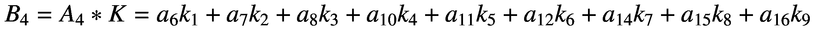

现在我们不能再将我们的 3×3 区域向右或向下移动了。我们已经计算了 4 个值：*B*[1]，*B*[2]，*B*[3]和*B*[4]。这些元素将形成卷积操作的结果张量，给我们提供张量*B*。

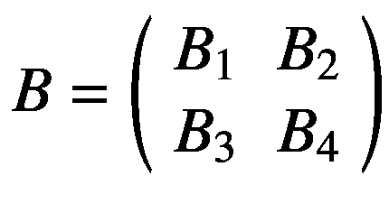

当张量*A*更大时，也可以应用相同的过程。你将简单地得到更大的结果*B*张量，但获取元素*B*[i]的算法是相同的。在继续之前，还有一个小的细节我必须讨论，那就是步长的概念。在先前的过程中，我们总是将 3×3 区域向右移动一列，向下移动一行。在这个例子中，行数和列数（1）被称为步长，通常用*s*表示。步长*s* = 2 意味着我们只需将 3×3 区域向右移动两列，向下移动两行。我还必须讨论的另一件事是输入矩阵*A*中选定区域的大小。在过程中移动的选定区域的维度必须与使用的核相同。如果你使用 5×5 核，那么你必须从*A*中选择一个 5×5 区域。一般来说，给定一个*n*[*K*]×*n*[*K*]核，你将在*A*中选择一个*n*[*K*]×*n*[*K*]区域。

更正式的定义是，在神经网络背景下，步长为*s*的卷积是一个过程，它接受维度为*n*[*A*]×*n*[*A*]的张量*A*和维度为*n*[*K*]×*n*[*K*]的核*K*，并输出一个维度为*n*[*B*]×*n*[*B*]的矩阵*B*，其中

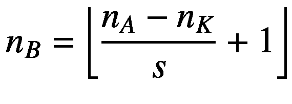

我们用⌊*x*⌋表示*x*的整数部分（在编程领域，这通常被称为*x*的向下取整）。这个公式的证明过于冗长，不便在此展开讨论，但很容易理解其为何成立（尝试推导它）。为了使问题稍微简单一些，我们假设*n*[*K*]是奇数。你很快就会明白这为什么很重要（尽管不是根本性的）。让我正式解释步长*s* = 1 的情况。该算法根据以下公式从一个输入张量*A*和一个核*K*生成一个新的张量*B*：

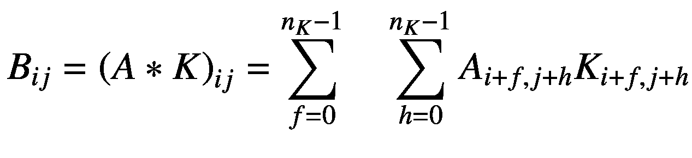

这个公式很晦涩，很难理解。让我们看一些更多的例子，以便更好地理解其含义。在图 8-1 中，你可以看到卷积是如何工作的视觉解释。假设你有一个 3 × 3 的滤波器。然后，在图中，你可以看到矩阵*A*的左上角九个元素，用黑色连续线画出的正方形标记，是用于生成矩阵*B*[1]的第一个元素，根据前面的公式。用虚线画出的正方形标记的元素是用于生成第二个元素*B*[2]，以此类推。为了重申我在开头例子中讨论的内容，基本思想是矩阵*A*中的 3 × 3 正方形中的每个元素都与核*K*中相应的元素相乘，所有数字相加。然后，这个和就是新矩阵*B*的元素。在计算出*B*[1]的值之后，你将原始矩阵中考虑的区域向右移动一列（图 8-1 中用虚线表示的正方形），并重复操作。你继续将区域向右移动，直到达到边界，然后向下移动一个元素，并从左侧开始再次重复这个过程，直到达到矩阵的右下角。对于原始矩阵中的所有区域都使用相同的核。

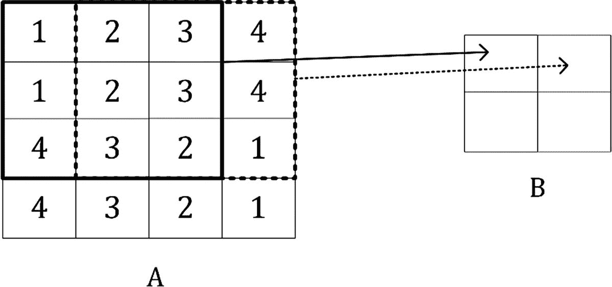

图 8-1

卷积的视觉解释

给定核，例如，你可以在图 8-2 中看到*A*的哪个元素与中的哪个元素相乘，以及元素*B*[1]的结果，这实际上就是所有乘积的总和

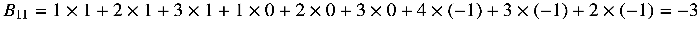

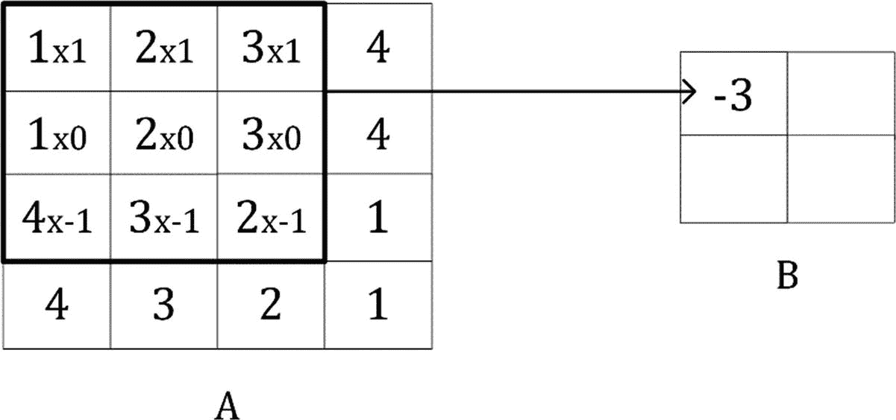

图 8-2

使用核  的卷积的可视化

在图 8-3 中，你可以看到一个步长 *s* = 2 的卷积的示例。

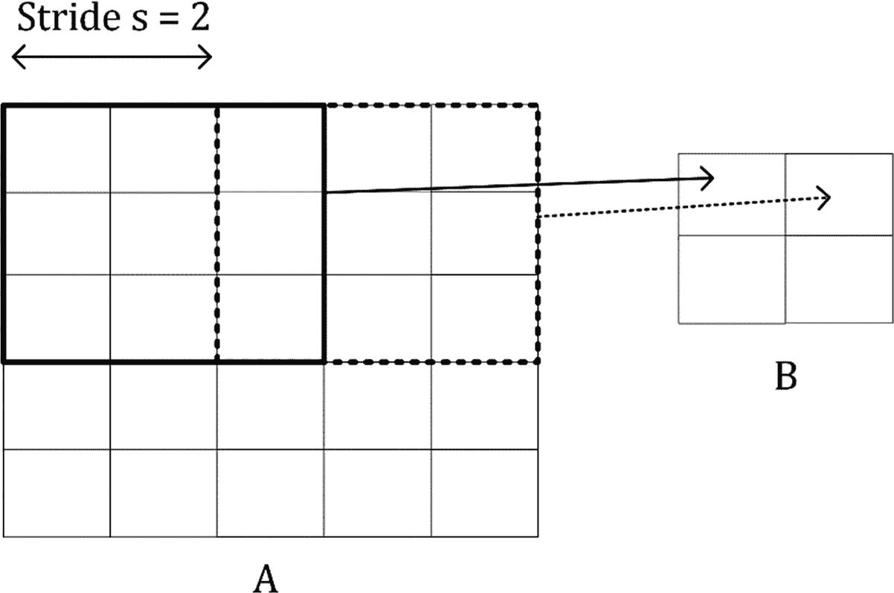

图 8-3

步长 *s* = 2 和步长 *s* = 1 的卷积的视觉解释

输出矩阵的维度只取 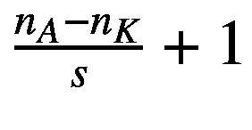 的下取整（即整数部分）的原因，可以从图 8-4 中直观地看出。如果 *s* > 1，那么根据 *A* 的维度，在某个点上，你不能再在矩阵 *A* 上移动窗口（例如图 8-3 中的黑色方块），并且你无法完全覆盖矩阵 *A*。在图 8-4 中，你可以看到你需要矩阵 *A* 右侧额外的一列（由许多 X 标记），才能执行卷积操作。在图 8-4 中，*s* = 3，由于我们有的 *n*[*A*] = 5 和 *n*[*K*] = 3，因此 *B* 将是一个标量。

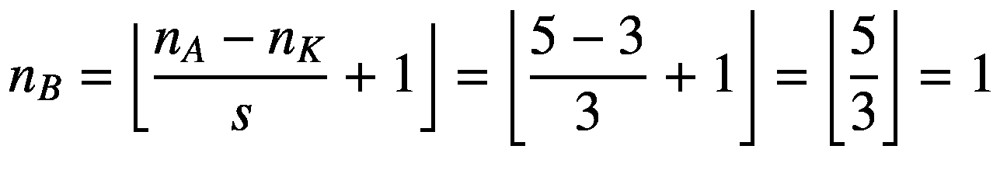

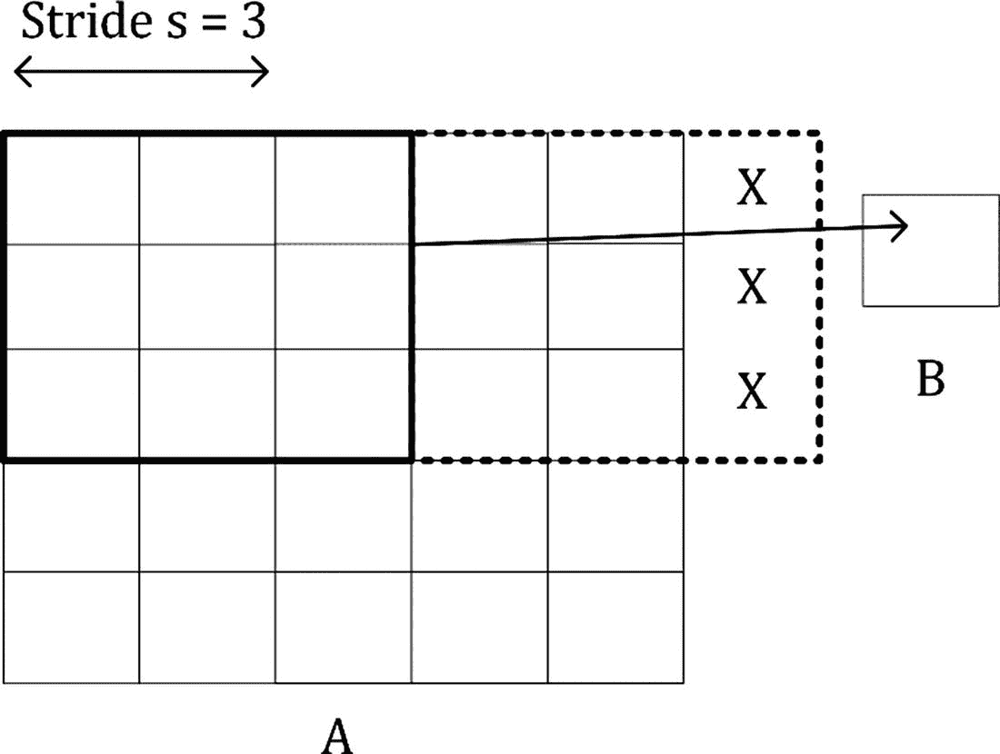

图 8-4

评估结果矩阵 *B* 的维度时为什么需要下取整函数的视觉解释

你可以从图 8-4 中轻松地看出，使用一个 3×3 区域，你只能覆盖 *A* 的左上角区域，因为步长 *s* = 3，你最终会超出 *A* 的范围，因此只能考虑一个区域进行卷积操作，从而得到一个标量的结果张量 *B*。

现在让我们考虑一些额外的例子，以便使这个公式更加清晰。让我们从一个小的 3×3 矩阵开始。

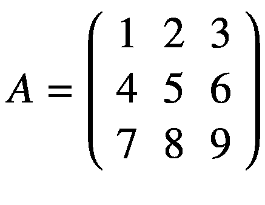

让我们考虑核


卷积将由以下公式给出

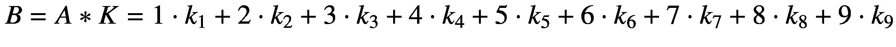

以及结果 *B* 将是一个标量，因为 *n*[*A*] = 3，*n*[*K*] = 3，因此

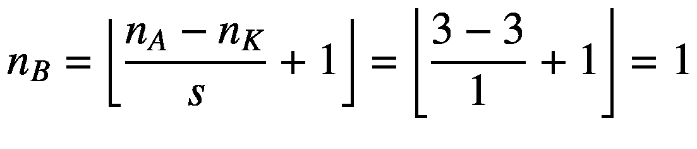

如果你现在考虑一个维度为 4×4 的矩阵 *A*，或者 *n*[*A*] = 4，*n*[*K*] = 3 和 *s* = 1，你将得到一个维度为 2×2 的矩阵 *B*，因为

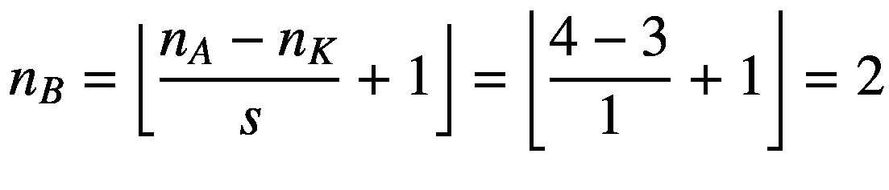

例如，你可以验证给定

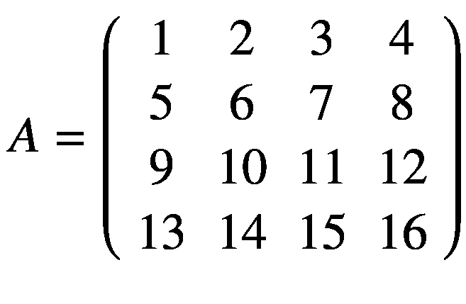

和

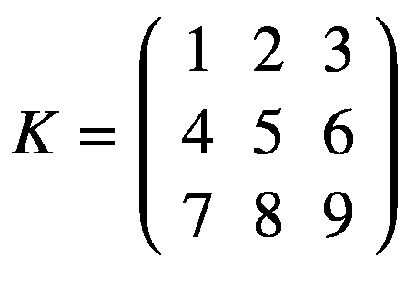

我们有步长 *s* = 1

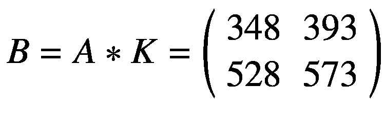

让我们用我给出的公式来验证其中一个元素，*B*[11]。我们有

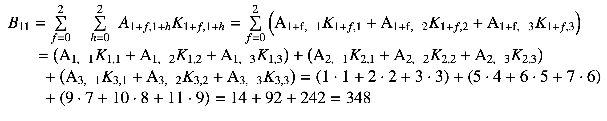

注意，我给出的卷积公式只适用于步长 *s* = 1，但可以很容易地推广到其他 *s* 的值。

这种计算在 Python 中很容易实现。以下函数可以很容易地评估步长 *s* = 1 时的两个矩阵的卷积。（你可以在 Python 中使用现有的函数来做这件事，但我认为看到从头开始怎么做是有教育意义的。）

```py
import numpy as np
def conv_2d(A, kernel):
output = np.zeros([A.shape[0]-(kernel.shape[0]-1), A.shape[1]-(kernel.shape[0]-1)])
for row in range(1,A.shape[0]-1):
for column in range(1, A.shape[1]-1):
output[row-1, column-1] = np.tensordot(A[row-1:row+2, column-1:column+2], kernel)
return output
```

注意，输入矩阵 *A* 不一定需要是方阵，但假设核是方阵，并且其维度 *n*[*K*] 是奇数。上一个例子可以用以下代码来评估：

```py
A = np.array([[1,2,3,4],[5,6,7,8],[9,10,11,12],[13,14,15,16]])
K = np.array([[1,2,3],[4,5,6],[7,8,9]])
print(conv_2d(A,K))
```

这给出了以下结果

```py
[[ 348\. 393.]
[ 528\. 573.]]
```

## 卷积的例子

现在我们尝试将我们最初定义的核应用到测试图像上，并查看结果。作为一个测试图像，让我们创建一个 160 × 160 像素的棋盘，代码如下

```py
chessboard = np.zeros([8*20, 8*20])
for row in range(0, 8):
for column in range (0, 8):
if ((column+8*row) % 2 == 1) and (row % 2 == 0):
chessboard[row*20:row*20+20, column*20:column*20+20] = 1
elif ((column+8*row) % 2 == 0) and (row % 2 == 1):
chessboard[row*20:row*20+20, column*20:column*20+20] = 1
```

在图 8-5 中，你可以看到棋盘的样子。

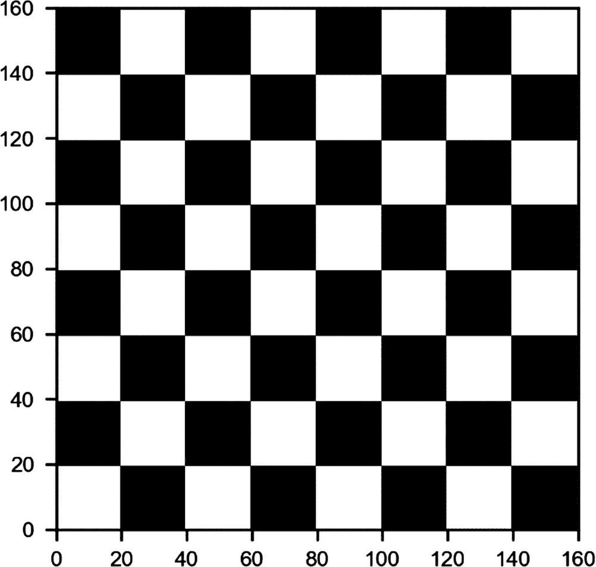

图 8-5

使用代码生成的棋盘图像

现在我们尝试用不同的核和步长 *s* = 1 对这张图片进行卷积。

使用核 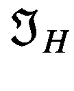 将检测水平边缘。这可以通过代码实现

```py
edgeh = np.matrix('1 1 1; 0 0 0; -1 -1 -1')
outputh = conv_2d (chessboard, edgeh)
```

在图 8-6 中，你可以看到输出是什么样的。

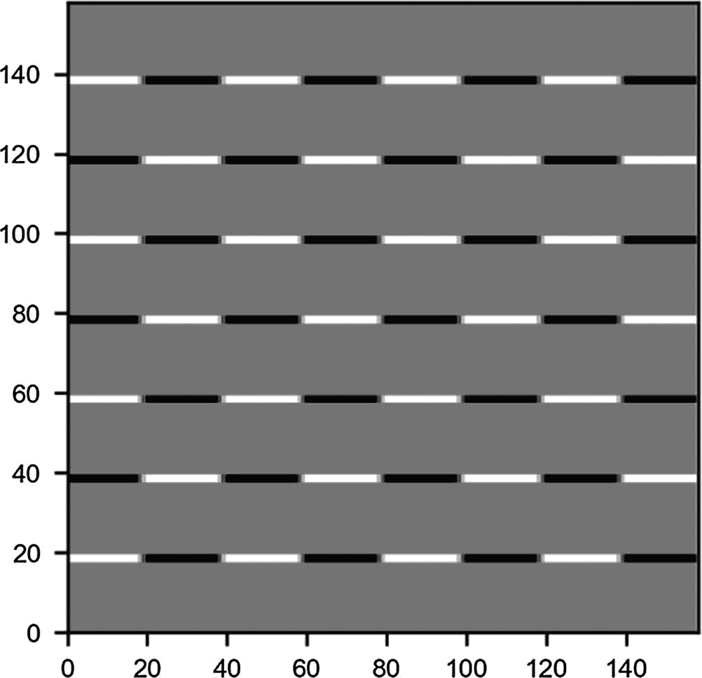

图 8-6

核  与棋盘图像进行卷积的结果

现在你可以理解我为什么说这个核检测水平边缘了。此外，这个核还能检测从亮到暗或相反的情况。请注意，这张图片只有 158 × 158 像素，正如预期的那样，因为

![$$ {n}_B=\left[\frac{n_A-{n}_K}{s}+1\right]=\left[\frac{160-3}{1}+1\right]=\left[\frac{157}{1}+1\right]=\left[158\right]=158 $$](../images/463356_1_En_8_Chapter/463356_1_En_8_Chapter_TeX_Equag.png)

现在我们用代码应用 

```py
edgev = np.matrix('1 0 -1; 1 0 -1; 1 0 -1')
outputv = conv_2d (chessboard, edgev)
```

这给出了图 8-7 中所示的结果。

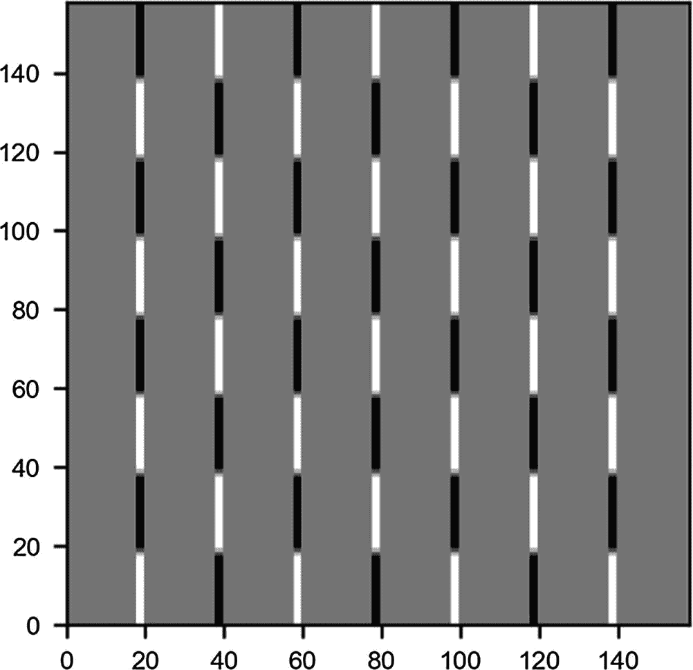

图 8-7

核  与棋盘图像进行卷积的结果

现在我们可以使用核 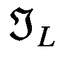

```py
edgel = np.matrix ('-1 -1 -1; -1 8 -1; -1 -1 -1')
outputl = conv_2d (chessboard, edgel)
```

这给出了图 8-8 中所示的结果。

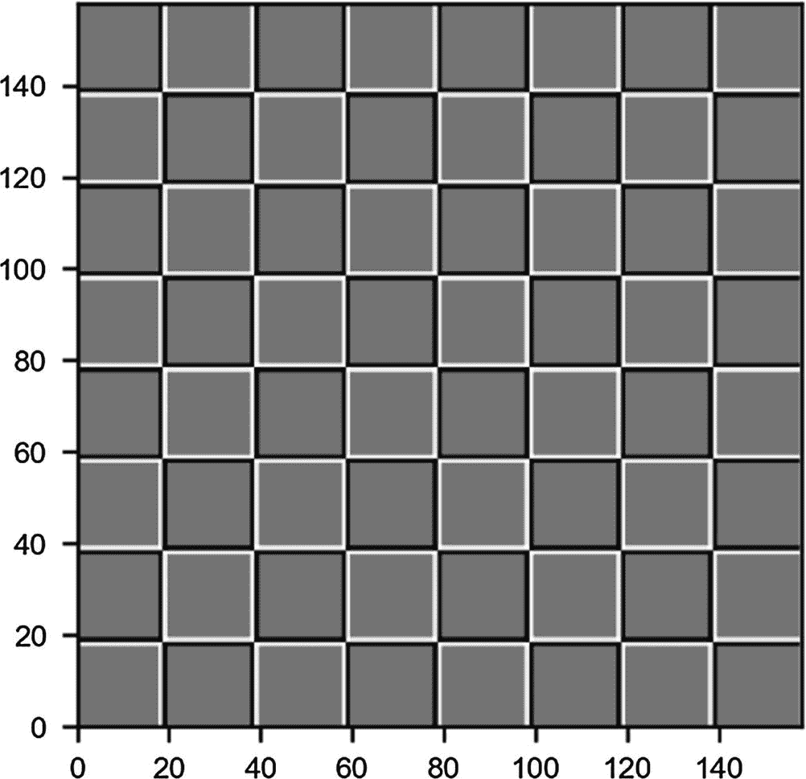

图 8-8

核  与棋盘图像进行卷积的结果

最后，我们可以应用模糊核 。

```py
edge_blur = -1.0/9.0*np.matrix('1 1 1; 1 1 1; 1 1 1')
output_blur = conv_2d (chessboard, edge_blur)
```

在图 8-9 中，你可以看到两个图表：左边是模糊后的图像，右边是原始图像。这些图像只显示了原始棋盘的一小部分，以便更清晰地展示模糊效果。

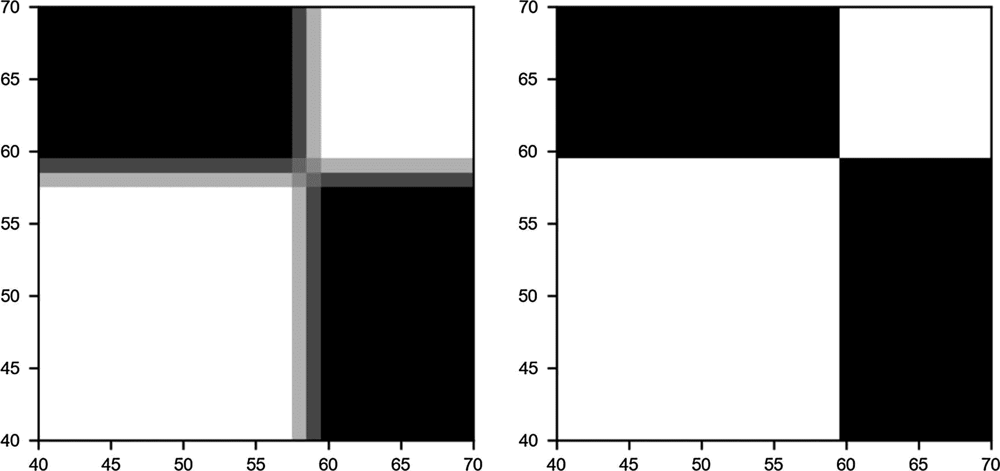

图 8-9

模糊核 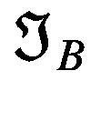 的影响。左侧是模糊图像，右侧是原始图像。

为了完成这一部分，让我们尝试更好地理解边缘检测是如何进行的。让我们考虑以下具有尖锐垂直过渡的矩阵，因为左侧充满了十，而右侧充满了零。

```py
ex_mat = np.matrix('10 10 10 10 0 0 0 0; 10 10 10 10 0 0 0 0; 10 10 10 10 0 0 0 0; 10 10 10 10 0 0 0 0; 10 10 10 10 0 0 0 0; 10 10 10 10 0 0 0 0; 10 10 10 10 0 0 0 0; 10 10 10 10 0 0 0 0')
```

结果看起来是这样的。

```py
matrix([[10, 10, 10, 10, 0, 0, 0, 0],
[10, 10, 10, 10, 0, 0, 0, 0],
[10, 10, 10, 10, 0, 0, 0, 0],
[10, 10, 10, 10, 0, 0, 0, 0],
[10, 10, 10, 10, 0, 0, 0, 0],
[10, 10, 10, 10, 0, 0, 0, 0],
[10, 10, 10, 10, 0, 0, 0, 0],
[10, 10, 10, 10, 0, 0, 0, 0]])
```

现在让我们考虑核 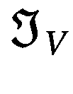。我们可以使用以下代码进行卷积

```py
ex_out = conv_2d (ex_mat, edgev)
```

结果是

```py
array([[ 0., 0., 30., 30., 0., 0.],
[ 0., 0., 30., 30., 0., 0.],
[ 0., 0., 30., 30., 0., 0.],
[ 0., 0., 30., 30., 0., 0.],
[ 0., 0., 30., 30., 0., 0.],
[ 0., 0., 30., 30., 0., 0.]])
```

在图 8-10 中，你可以看到原始矩阵（在左侧）和卷积的输出（在右侧）。使用核  的卷积清楚地检测到了原始矩阵中的尖锐过渡，用一条垂直的黑线标记了从黑色到白色的过渡位置。例如，考虑 *B*[11] = 0。


注意，在输入矩阵

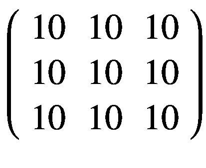

中没有过渡，因为所有值都是相同的。相反，如果你考虑 *B*[13]，你必须考虑输入矩阵的这个区域

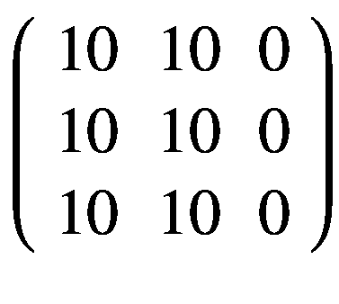

其中有一个清晰的过渡，因为最右侧的列由零组成，其余的是十。你现在得到了一个不同的结果。


这正是当水平方向上的值发生大幅变化时，卷积会返回高值的原因，因为核中 1 所在的列乘以的值会更大。相反，当水平轴上从低值过渡到高值时，乘以-1 的元素会给出绝对值更大的结果，因此最终结果将是负数且绝对值较大。这就是为什么这个核也可以检测到你从浅色过渡到深色或反之亦然的原因。实际上，如果你考虑一个假设的不同矩阵*A*中从 0 到 10 的相反过渡，你会得到


因为，这次，我们在水平方向上从 0 移动到 10。

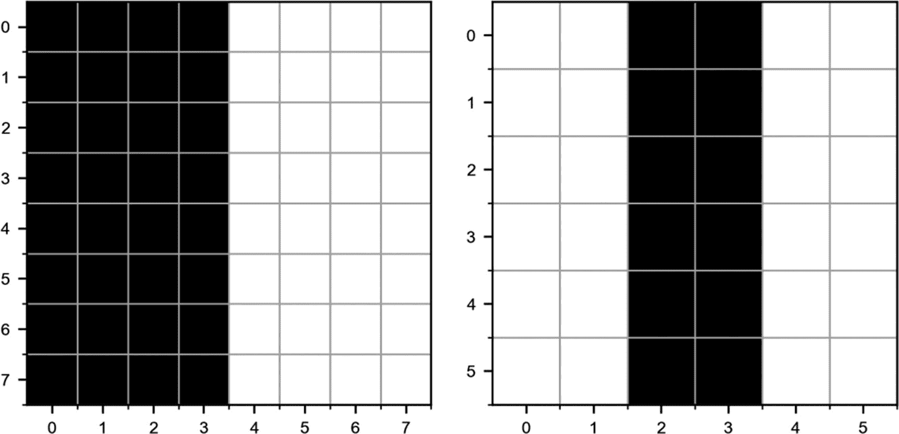

图 8-10

矩阵`ex_mat`与核卷积的结果，如文中所述

注意，正如预期的那样，输出矩阵的维度是 5 × 5，因为原始矩阵的维度是 7 × 7，而核是 3 × 3。

## 池化

池化是 CNN 中第二个基本操作。这个操作比卷积更容易理解。为了理解它，我们再次考虑一个具体的例子，以及所谓的最大池化。我们再次使用我们讨论卷积时提到的 4 × 4 矩阵。


要执行最大池化，我们必须定义一个大小为*n*[*K*] × *n*[*K*]的区域，类似于我们为卷积所做的。让我们考虑*n*[*K*] = 2。我们必须做的是从矩阵*A*的左上角开始，选择一个*n*[*K*] × *n*[*K*]的区域，在我们的例子中，是 2 × 2 的区域从*A*中。在这里，我们选择


或者矩阵*A*中用粗体标记的元素，如下所示：

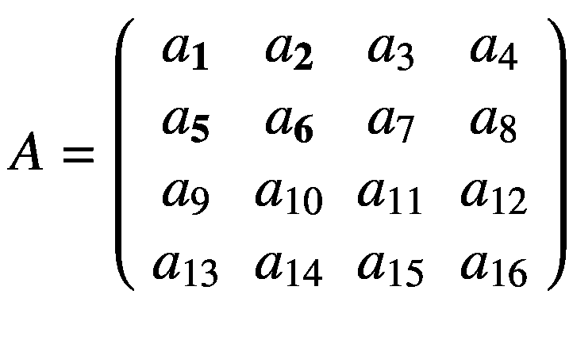

从选定的元素中，*a*[1]，*a*[2]，*a*[5] 和 *a*[6]，最大池化操作选择最大值，我们将这个结果表示为 *B*[1]。

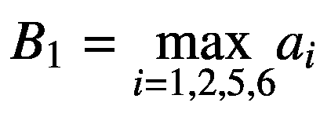

现在，我们必须将我们的 2×2 窗口向右移动两列，通常是所选区域列数的相同数量，并选择加粗的元素

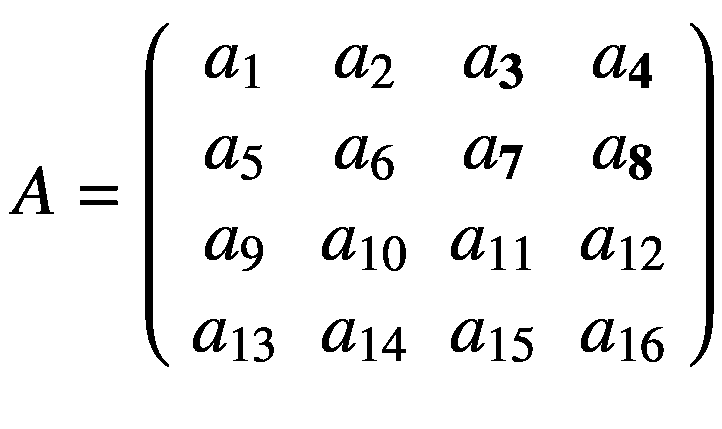

或者换句话说，是较小的矩阵。

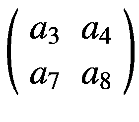

随后，最大池化算法将选择这些值中的最大值，我们将这个结果表示为 *B*[2]。

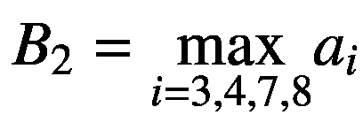

在这一点上，我们不能再将 2×2 的区域向右移动了，所以我们将其向下移动两行，并从 *A* 的左侧开始，选择加粗的元素，得到最大值，并将其称为 *B*[3]，如下所示：

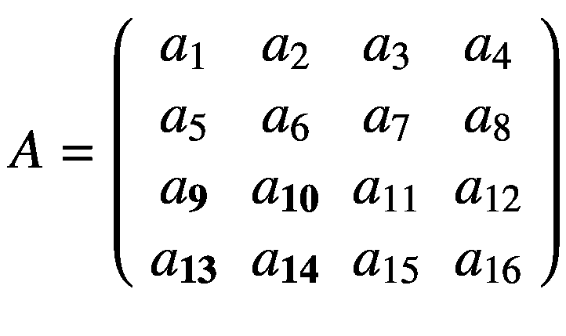

在这个上下文中，步长 *s* 与在卷积讨论中已经覆盖的含义相同。它只是你在选择元素时移动区域行或列的数量。最后，我们在 *A* 的底部左下角选择最后一个 2×2 区域，选择元素 *a*[11]，*a*[12]，*a*[15] 和 *a*[16]。然后我们得到最大值，并将其称为 *B*[4]。通过在这个过程中获得的价值，在我们的例子中，四个值 *B*[1]，*B*[2]，*B*[3] 和 *B*[4]，我们将构建一个输出张量。


在这个例子中，我们设 *s* = 2。基本上，这个操作以矩阵 *A*、步长 *s* 和核大小 *n*[*K*]（我们在上一个例子中选择的区域的尺寸）作为输入，并返回一个新的矩阵 *B*，其尺寸由我们在卷积讨论中应用的相同公式给出。

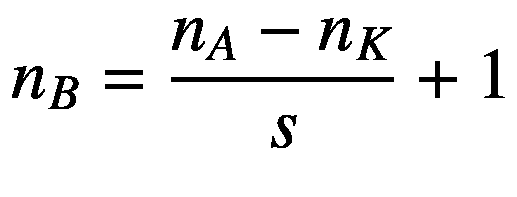

再次强调，这个想法是从矩阵 *A* 的左上角开始，取一个尺寸为 *n*[*K*] × *n*[*K*] 的区域，对选定的元素应用最大函数，然后将 *s* 个元素的区域向右移动，选择一个新的区域——同样尺寸为 *n*[*K*] × *n*[*K*]——对其值应用函数，依此类推。在图 8-11 中，你可以看到如何从一个矩阵 *A* 中选择元素，步长 *s* = 2

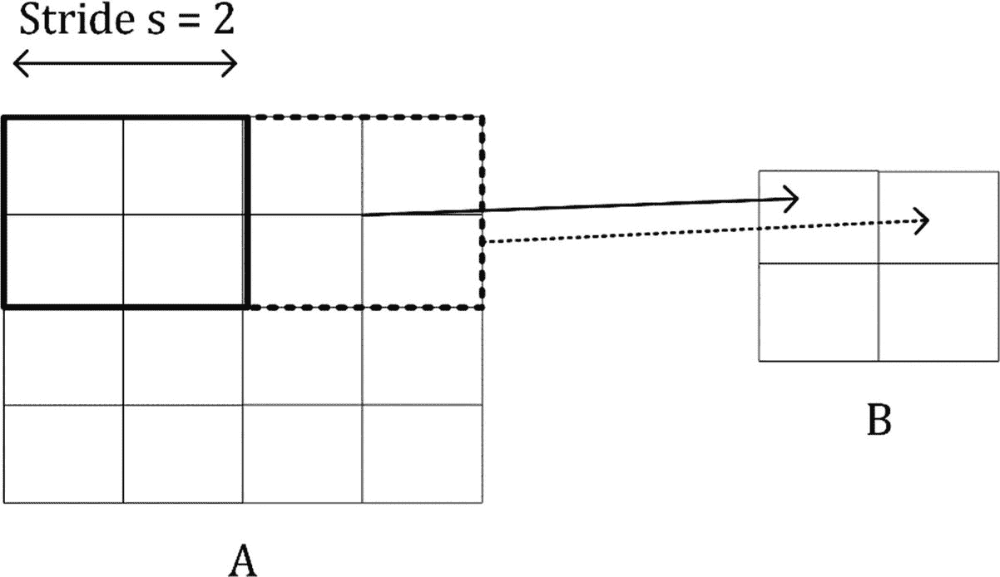

图 8-11

步长 *s* = 2 的池化可视化

例如，对输入 *A* 应用最大池化

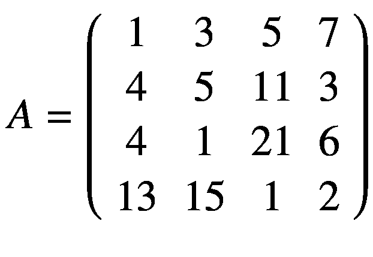

将得到结果（很容易验证）

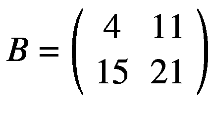

因为 4 是加粗标记的值中的最大值

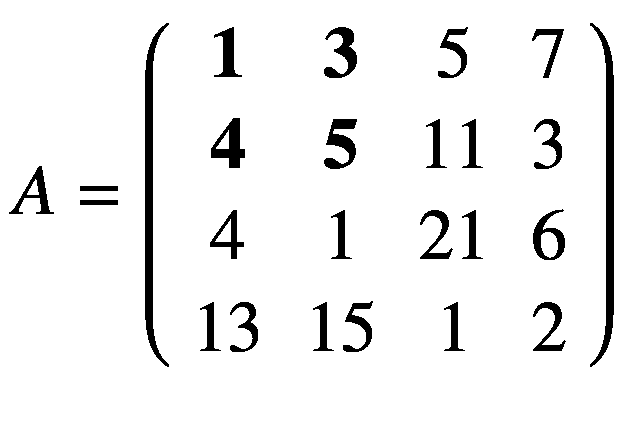

11 是加粗标记的值中的最大值，如下所示：

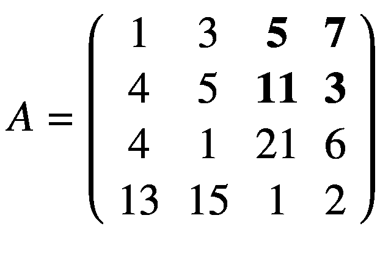

等等。值得一提的是另一种池化方法，尽管不如最大池化常用：*平均池化*。它不是返回选定值的最大值，而是返回平均值。

### 注意

最常用的池化操作是 *最大池化*。*平均池化* 不太常用，但可以在特定的网络架构中找到。

### 填充

值得一提的是填充的概念。有时，在处理图像时，从卷积操作得到的结果维度与原始图像不同并不总是最优的。因此，有时你会做所谓的*填充*。基本上，这个想法非常简单：它包括在最终图像的顶部、底部添加像素行，在右侧和左侧添加像素列，并用一些值填充，以使结果矩阵与原始矩阵大小相同。一些策略是用零填充添加的像素，用最接近像素的值填充，等等。在我们的例子中，我们的`ex_out`矩阵使用零填充将看起来像这样：

```py
array([[ 0., 0., 0., 0., 0., 0., 0., 0.],
[ 0., 0., 0., 30., 30., 0., 0., 0.],
[ 0., 0., 0., 30., 30., 0., 0., 0.],
[ 0., 0., 0., 30., 30., 0., 0., 0.],
[ 0., 0., 0., 30., 30., 0., 0., 0.],
[ 0., 0., 0., 30., 30., 0., 0., 0.],
[ 0., 0., 0., 30., 30., 0., 0., 0.],
[ 0., 0., 0., 0., 0., 0., 0., 0.]])
```

使用填充的原因超出了本书的范围，但重要的是要知道它存在。仅作为一个参考，如果你使用填充*p*（你用作填充的行和列的宽度），在卷积和池化的情况下，矩阵*B*的最终维度由以下公式给出：

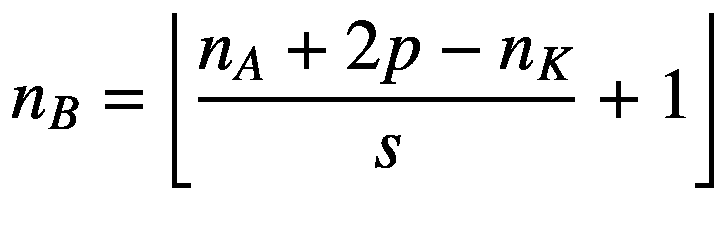

### 备注

在处理真实图像时，你总是用三个通道来编码彩色图像：RGB。这意味着你必须执行三维的卷积和池化：宽度、高度和颜色通道。这将给算法增加一个复杂性层。

## CNN 的构建块

基本上，卷积和池化操作用于构建 CNN 中使用的层。通常在 CNN 中，你可以找到以下层：

+   卷积层

+   池化层

+   完全连接层

完全连接层正是你在所有前几章中看到的那样：一个层，其中的神经元连接到前一层和后一层的所有神经元。你已经熟悉列出的层，但前两层需要一些额外的解释。

### 卷积层

卷积层将张量（由于有三个颜色通道，它可以三维）作为输入，例如，一定尺寸的图像；应用一定数量的核，通常是 10、16 甚至更多；添加偏差；应用 ReLU 激活函数（例如），以向卷积的结果引入非线性；并产生输出矩阵*B*。如果你还记得我们在前几章中使用的符号，卷积的结果将扮演*W*^([*l*])*Z*^([*l* − 1])的角色，这在第三章中讨论过。

在前面的章节中，我已经向你展示了仅使用一个核进行卷积的一些示例。你如何同时应用多个核呢？答案非常简单。最终的张量（我现在使用单词 *tenso*r，因为它将不再是一个简单的矩阵）*B* 现在将不是 2 维，而是 3 维。让我们用 *n*[*c*] 来表示你想要应用核的数量（*c* 被使用，因为人们有时将这些称为通道）。你只需独立地将每个过滤器应用于输入，并将结果堆叠起来。因此，你得到的最终张量 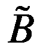 的维度将是 *n*[*B*] × *n*[*B*] × *n*[*c*]。这意味着

![$$ {\tilde{B}}_{i,j,1}\kern1em \forall i,j\in \left[1,{n}_B\right] $$](../images/463356_1_En_8_Chapter/463356_1_En_8_Chapter_TeX_Equbb.png)

将是输入图像与第一个核的卷积输出，

![$$ {\tilde{B}}_{i,j,2}\kern1em \forall i,j\in \left[1,{n}_B\right] $$](../images/463356_1_En_8_Chapter/463356_1_En_8_Chapter_TeX_Equbc.png)

将是第二个核的卷积输出，依此类推。卷积层不过是将输入转换为输出张量的东西。但这个层中的权重是什么呢？网络在训练阶段学习的权重，或参数，就是核本身的元素。我们已经讨论过，我们有 *n*[*c*] 个核，每个核的维度是 *n*[*K*] × *n*[*K*]。这意味着卷积层中有  个参数。

### 注意

在卷积层中你拥有的参数数量，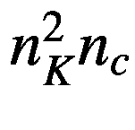，与输入图像的大小无关。这个事实有助于减少过拟合，尤其是在处理大尺寸输入图像时。

有时，这个层会用 *POOL* 和一个数字来表示。在我们的例子中，我们可以用 POOL1 来表示这个层。在图 8-12 中，你可以看到一个卷积层的表示。输入图像通过应用 *n*[*c*] 个核在维度为 *n*[*A*] × *n*[*A*] × *n*[*c*] 的张量中进行变换。

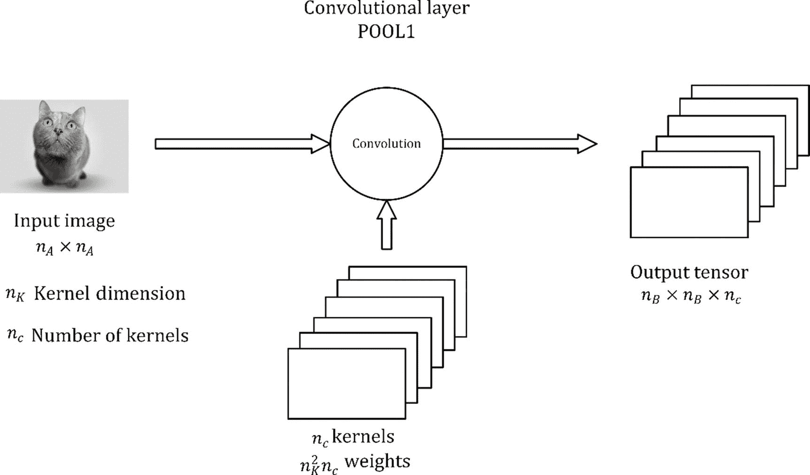

图 8-12

卷积层的表示^(1)

卷积层不一定必须紧跟在输入之后。卷积层可以接受任何其他层的输出作为输入。记住，通常你的输入图像将具有维度 *n*[*A*] × *n*[*A*] × 3，因为彩色图像有三个通道：RGB。在考虑彩色图像时，CNN 中涉及的张量的完整分析超出了本书的范围。在图中，层通常简单地表示为一个立方体或正方形。

.

### 池化层

池化层通常用 *POOL* 和一个数字表示：例如，POOL1。它接受一个张量作为输入，并在对输入应用池化后输出另一个张量。

### 注意

池化层没有参数可以学习，但它引入了额外的超参数：*n*[*K*] 和步长 *s*。通常，在池化层中，你不会使用任何填充，因为使用池化通常是为了减少张量的维度。

### 层的堆叠

在 CNN 中，你通常会依次堆叠卷积层和池化层。在图 8-13 中，你可以看到一个卷积层和一个池化层的堆叠。卷积层总是紧跟着一个池化层。有时，这两个层一起被称为一个层。原因是池化层没有可学习的权重，因此它被视为与卷积层相关联的简单操作。所以，当你阅读论文或博客时，要注意这一点，并验证他们的意图。

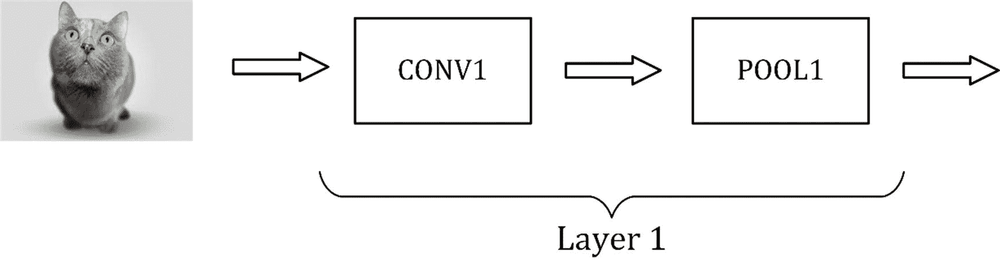

图 8-13

如何堆叠卷积层和池化层的表示

为了结束对 CNN 的讨论，在图 8-14 中，你可以看到一个 CNN 的示例。它与非常著名的 LeNet-5 网络相似，你可以在这里了解更多信息：[`https://goo.gl/hM1kAL`](https://goo.gl/hM1kAL)。你有输入，然后是两次卷积-池化层，三次全连接层，以及一个输出层，其中你可能有一个 `softmax` 函数，例如，如果你执行多类分类。我在图中放入了一些任意数字，以给你一个不同层大小的概念。

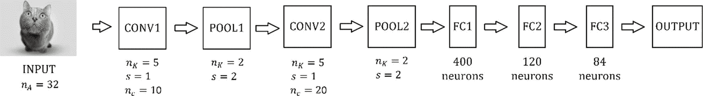

图 8-14

类似于著名 LeNet-5 网络的 CNN 表示

### CNN 的示例

让我们尝试构建这样一个网络，以便让你了解这个过程的工作方式以及代码的样子。我们将不会进行任何超参数调整或优化，以保持本节的可理解性。我们将按照以下顺序构建以下架构，包含以下层：

+   卷积层 1，有六个 5 × 5 的过滤器，步长 *s* = 1

+   最大池化层 1，窗口大小 2 × 2，步长 *s* = 2

+   然后我们将 ReLU 应用于前一层的输出。

+   卷积层 2，使用 16 个 5 × 5 的过滤器，步长 *s* = 1

+   最大池化层 2，窗口大小 2 × 2，步长 *s* = 2

+   我们然后将 ReLU 应用于前一层的结果。

+   完全连接层，包含 128 个神经元和 ReLU 激活函数

+   完全连接层，用于 Zalando 数据集的分类，包含 10 个神经元

+   软 max 输出神经元

我们将导入 Zalando 数据集，就像在第三章中所做的那样，如下所示：

```py
data_train = pd.read_csv('fashion-mnist_train.csv', header = 0)
data_test = pd.read_csv('fashion-mnist_test.csv', header = 0)
```

有关如何获取文件的详细说明，请参阅第三章。接下来，让我们准备数据。

```py
labels = data_train['label'].values.reshape(1, 60000)
labels_ = np.zeros((60000, 10))
labels_[np.arange(60000), labels] = 1
labels_ = labels_.transpose()
train = data_train.drop('label', axis=1)
```

和

```py
labels_dev = data_test['label'].values.reshape(1, 10000)
labels_dev_ = np.zeros((10000, 10))
labels_dev_[np.arange(10000), labels_dev] = 1
test = data_dev.drop('label', axis=1)
```

注意，在这种情况下，与第三章不同，我们将使用所有张量的转置，这意味着在每个行中，我们将有一个观测值。在第三章中，每个观测值都在列中。如果您使用代码检查维度，您将得到以下结果：

```py
print(labels_.shape)
print(labels_dev_.shape)
```

您将得到以下结果：

```py
(60000, 10)
(10000, 10)
```

在第三章中，维度被交换了。原因是为了开发卷积和池化层，我们将使用 TensorFlow 提供的函数，因为从头开始开发它们会花费太多时间。此外，对于某些 TensorFlow 函数，如果张量在行上有不同的观测值，使用起来会更简单。正如第三章中所述，我们必须对数据进行归一化。

```py
train = np.array(train / 255.0)
dev = np.array(dev / 255.0)
labels_ = np.array(labels_)
labels_test_ = np.array(labels_test_)
```

我们现在可以开始构建我们的网络了。

```py
x = tf.placeholder(tf.float32, shape=[None, 28*28])
x_image = tf.reshape(x, [-1, 28, 28, 1])
y_true = tf.placeholder(tf.float32, shape=[None, 10])
y_true_scalar = tf.argmax(y_true, axis=1)
```

需要解释的一行是第二行：`x_image = tf.reshape(x, [-1, 28, 28, 1])`。请记住，卷积层需要二维图像，而不是像素灰度值的扁平列表，正如第三章中的情况，我们的输入是一个包含 784（28 × 28）个元素的向量。

### 注意

CNN 最大的优点之一是它们使用了输入图像中包含的二维信息。这就是为什么卷积层的输入是二维图像，而不是像素灰度值的扁平向量。

在构建 CNN 时，通常定义函数来构建不同的层。这样，之后的超参数调整会更简单，正如我们之前所看到的。另一个原因是，当我们使用函数将所有部分组合在一起时，代码将更容易阅读。函数名应该是自解释的。让我们从一个用于构建卷积层的函数开始。请注意，TensorFlow 文档使用术语*filter*，因此我们在代码中将使用它。

```py
def new_conv_layer(input, num_input_channels, filter_size, num_filters):
shape = [filter_size, filter_size, num_input_channels, num_filters]
weights = tf.Variable(tf.truncated_normal(shape, stddev=0.05))
biases = tf.Variable(tf.constant(0.05, shape=[num_filters]))
layer = tf.nn.conv2d(input=input, filter=weights, strides=[1, 1, 1, 1], padding="SAME")
layer += biases
return layer, weights
```

在这个阶段，我们将从截断正态分布初始化权重，将偏差设为常数，然后我们将使用步长 *s* = 1。步长是一个列表，因为它给出了不同维度上的步长。在我们的例子中，我们有灰度图像，但也可以是 RGB，例如，这样就有更多的维度：三个颜色通道。

池化层比较简单，因为它没有权重。

```py
def new_pool_layer(input):
layer = tf.nn.max_pool(value=input, ksize=[1, 2, 2, 1], strides=[1, 2, 2, 1], padding="SAME")
return layer
```

现在让我们定义一个函数，该函数将激活函数（在我们的情况下是 ReLU）应用于前一层。

```py
def new_relu_layer(input_layer):
layer = tf.nn.relu(input_layer)
return layer
```

最后，我们需要一个函数来构建全连接层。

```py
def new_fc_layer(input, num_inputs, num_outputs):
weights = tf.Variable(tf.truncated_normal([num_inputs, num_outputs], stddev=0.05))
biases = tf.Variable(tf.constant(0.05, shape=[num_outputs]))
layer = tf.matmul(input, weights) + biases
return layer
```

我们使用的新 TensorFlow 函数是 `tf.nn.conv2d`，它构建一个卷积层，以及 `tf.nn.max_pool`，它构建一个带有最大池化的池化层，正如你可以从其名称中想象的那样。我们在这里没有空间详细说明每个函数的功能，但你可以在官方文档中找到大量信息。现在让我们把所有东西放在一起，并实际构建最初描述的网络。

```py
layer_conv1, weights_conv1 = new_conv_layer(input=x_image, num_input_channels=1, filter_size=5, num_filters=6)
layer_pool1 = new_pool_layer(layer_conv1)
layer_relu1 = new_relu_layer(layer_pool1)
layer_conv2, weights_conv2 = new_conv_layer(input=layer_relu1, num_input_channels=6, filter_size=5, num_filters=16)
layer_pool2 = new_pool_layer(layer_conv2)
layer_relu2 = new_relu_layer(layer_pool2)
```

我们必须创建全连接层，但为了使用 `layer_relu2` 作为输入，我们首先必须将其展平，因为它仍然是二维的。

```py
num_features = layer_relu2.get_shape()[1:4].num_elements()
layer_flat = tf.reshape(layer_relu2, [-1, num_features])
```

然后，我们可以创建最终的层。

```py
layer_fc1 = new_fc_layer(layer_flat, num_inputs=num_features, num_outputs=128)
layer_relu3 = new_relu_layer(layer_fc1)
layer_fc2 = new_fc_layer(input=layer_relu3, num_inputs=128, num_outputs=10)
```

现在，让我们评估预测，以便能够稍后评估准确率。

```py
y_pred = tf.nn.softmax(layer_fc2)
y_pred_scalar = tf.argmax(y_pred, axis=1)
```

数组 `y_pred_scalar` 将包含作为标量的类别编号。现在我们需要定义损失函数，并且，再次，我们将使用现有的 TensorFlow 函数来简化我们的工作，并保持本章的长度合理。

```py
cost = tf.reduce_mean(tf.nn.softmax_cross_entropy_with_logits(logits=layer_fc2, labels=y_true))
```

如同往常，我们需要一个优化器。

```py
optimizer = tf.train.AdamOptimizer(learning_rate=1e-4).minimize(cost)
```

现在，我们可以最终定义评估准确率的操作。

```py
correct_prediction = tf.equal(y_pred_scalar, y_true_scalar)
accuracy = tf.reduce_mean(tf.cast(correct_prediction, tf.float32))
```

是时候训练我们的网络了。我们将使用批量大小为 100 的迷你批量梯度下降，并且仅训练网络十个周期。我们可以定义变量如下：

```py
num_epochs = 10
batch_size = 100
```

训练可以通过以下方式实现

```py
with tf.Session() as sess:
sess.run(tf.global_variables_initializer())
for epoch in range(num_epochs):
train_accuracy = 0
for i in range(0, train.shape[0], batch_size):
x_batch = train[i:i + batch_size,:]
y_true_batch = labels_[i:i + batch_size,:]
sess.run(optimizer, feed_dict={x: x_batch, y_true: y_true_batch})
train_accuracy += sess.run(accuracy, feed_dict={x: x_batch, y_true: y_true_batch})
train_accuracy /= int(len(labels_)/batch_size)
dev_accuracy = sess.run(accuracy, feed_dict={x:dev, y_true:labels_dev_})
```

如果你运行此代码（在我的笔记本电脑上大约需要十分钟左右），它将在仅仅一个周期后开始，训练准确率为 63.7%，在十个周期后，它将达到 86% 的训练准确率（也在开发集上）。记住，在第三章中我们开发的第一个简单的网络中，我们使用一个层中的五个神经元，通过迷你批量梯度下降达到了 66% 的准确率。我们在这里只训练了网络十个周期。如果你训练时间更长，你可以获得更高的准确率。此外，请注意，我们没有进行任何超参数调整，所以如果你花时间调整参数，这将得到更好的结果。

正如你可能已经注意到的，每次你引入一个卷积层，你将为每个层引入新的超参数。

+   核大小

+   步长

+   填充

这些层需要调整，以获得最佳结果。通常，研究人员倾向于使用已经由其他从业者优化并已在论文中良好记录的现有架构来完成特定任务。

## RNN 简介

RNN 与 CNN 非常不同，通常在处理顺序信息时使用，换句话说，对于顺序重要的数据。典型的例子是一个句子中的单词序列。你可以很容易地理解句子中单词的顺序如何产生重大差异。例如，“the man ate the rabbit”与“the rabbit ate the man”有不同的含义，唯一的区别是单词的顺序，以及谁被谁吃掉。你可以使用 RNN 来预测，例如，句子中的下一个单词。以短语“Paris is the capital of.”为例，很容易用“France”来完成这个句子，这意味着句子中关于最后一个单词的信息已经编码在前面的单词中，这就是 RNN 利用来预测序列中后续术语的信息。名称*递归*来自这些网络的工作方式：它们对序列中的每个元素应用相同的操作，积累关于先前术语的信息。为了总结

+   RNN 利用序列数据，并使用序列中术语的顺序编码的信息。

+   RNN 对序列中的所有术语应用相同的操作，并构建序列中先前术语的记忆，以预测下一个术语。

在尝试更好地理解 RNN 的工作原理之前，让我们考虑一些它们可以应用的重要用例，以给你一个潜在应用范围的印象。

+   *生成文本*：给定一组先前单词，预测单词的概率。例如，你可以很容易地使用 RNN 生成类似莎士比亚风格的文本，就像 A. Karpathy 在他的博客上所做的那样，博客地址为[`https://goo.gl/FodLp5`](https://goo.gl/FodLp5)。

+   *翻译*：给定一种语言中的单词集，你可以得到另一种语言中的单词。

+   *语音识别*：给定一系列音频信号（单词），我们可以预测形成单词的字母序列。

+   *生成图像标签*：使用 CNN，RNN 可以用来为图像生成标签。参考 A. Karpathy 关于这个主题的论文：“Deep Visual-Semantic Alignments for Generating Image Descriptions”，论文地址为[`https://goo.gl/8Ja3n2`](https://goo.gl/8Ja3n2)。请注意，这是一篇相当高级的论文，需要广泛的数学背景。

+   *聊天机器人*：给定一个单词序列作为输入，RNN 试图生成对输入的答案。

如你所想，要实现上述功能，你需要复杂的架构，这些架构不容易用几句话描述，并且需要对 RNN 的工作方式有更深入的理解（这里是一个双关语），这超出了本章和本书的范围。

### 符号

让我们考虑序列“巴黎是法国的首都。”这个句子将被逐个单词地输入到 RNN 中：首先“巴黎”，然后“是”，接着“the”，以此类推。在我们的例子中，

+   “Paris”将是序列的第一个单词：`w1 = 'Paris'`

+   “is” 将是序列的第二个单词：`w2 = 'is'`

+   “the” 将是序列的第三个单词：`w3 = 'the'`

+   “capital” 将是序列的第四个单词：`w4 = 'capital'`

+   “of” 将是序列的第五个单词：`w5 = 'of'`

+   “France” 将是序列的第六个单词：`w6 = 'France'`

单词将按照以下顺序输入到 RNN 中：`w1`，`w2`，`w3`，`w4`，`w5`，和 `w6`。不同的单词将依次由网络处理，或者说，如有些人所说，在不同的时间点处理。通常，如果单词 `w1` 在时间 *t* 处理，那么 `w2` 就在时间 *t* + 1 处理，`w3` 在时间 *t* + 2 处理，以此类推。时间 *t* 与真实时间无关，它旨在表明序列中的每个元素都是顺序处理，而不是并行处理。时间 *t* 也不与计算时间或与之相关的东西有关。*t* + 1 中 1 的增加没有任何意义。它仅仅意味着我们在谈论序列中的下一个元素。您在阅读论文、博客或书籍时可能会遇到以下符号：

+   *x*[*t*]：时间 *t* 的输入。例如，`w1` 可能是时间 1 的输入 *x*[1]，`w2` 是时间 2 的输入 *x*[2]，以此类推。

+   *s*[*t*]：这是表示时间 *t* 的内部记忆（我们尚未定义）的符号。这个量 *s*[*t*] 包含了之前讨论的序列中前几项的累积信息。对其的直观理解就足够了，因为更数学化的定义需要过于详细的解释。

+   *o*[*t*] 是网络在时间 *t* 的输出，或者换句话说，在将序列中直到 *t* 的所有元素，包括元素 *x*[*t*]，都输入到网络之后。

### RNN 的基本思想

通常，在文献中，RNN 被表示为图 8-15 中所示内容的左侧部分。所使用的符号是指示性的——它仅仅表示网络的不同元素：*x* 指的是输入，*s* 指的是内部记忆，*W* 指的是一组权重，而 *U* 指的是另一组权重。实际上，这种示意图仅仅是一种描述网络真实结构的方式，您可以在图 8-15 的右侧看到这种结构。有时，这被称为网络的展开版本。

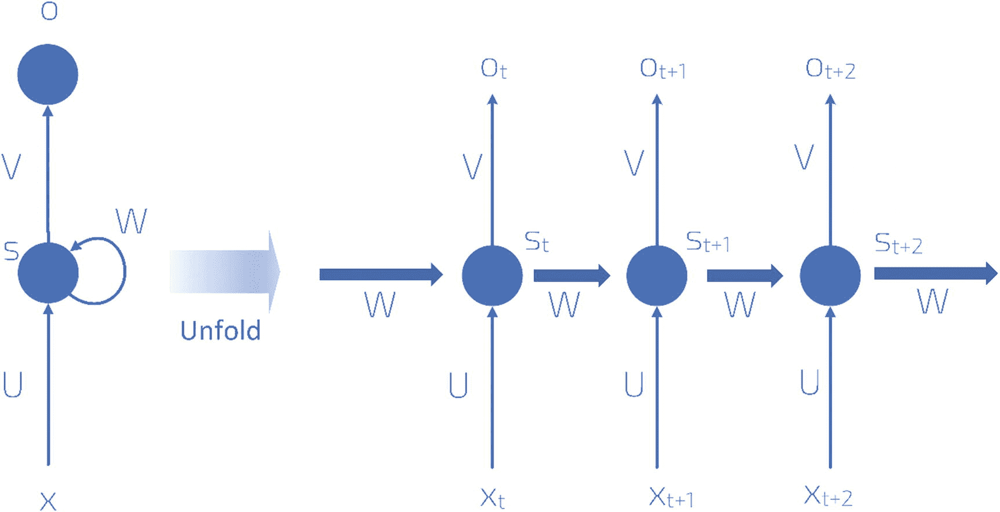

图 8-15

RNN 的示意图

图 8-15 的右侧应该从左到右阅读。图中的第一个神经元在指示的时间 *t* 进行评估，产生输出 *o*[*t*]，并创建一个内部记忆状态 *s*[*t*]。第二个神经元在第一个神经元之后，在时间 *t* + 1 进行评估，得到序列中的下一个元素 *x*[*t* + 1] 和先前的记忆状态 *s*[*t*] 作为输入。第二个神经元然后生成输出 *o*[*t* + 1] 和一个新的内部记忆状态 *s*[*t* + 1]。图 8-15 中最右侧的第三个神经元然后得到序列的新元素 *x*[*t* + 2] 和先前的内部记忆状态 *s*[*t* + 1] 作为输入，这个过程以有限数量的神经元继续进行。你可以在图 8-15 中看到有两套权重：*W* 和 *U*。一套（用 *W* 表示）用于内部记忆状态，另一套 *U* 用于序列元素。通常，每个神经元将使用一个类似于以下公式的公式来生成新的内部记忆状态：

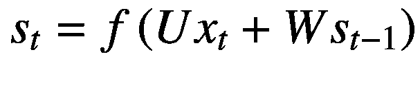

其中，我们用 *f*() 表示一个激活函数，我们已经看到过，如 ReLU 或 tanh。此外，当然，这个公式将是多维的。*s*[*t*] 可以理解为时间 *t* 的网络记忆。可以使用的神经元数量（或时间步长）是一个新的超参数，必须根据问题进行调整。研究表明，当这个数字太大时，网络在训练过程中会遇到大问题。

需要注意的一个重要问题是，在每一个时间步长，权重不会改变。每次评估时，都在执行相同的操作，只是每次评估时简单地改变输入。此外，在图 8-15 中，我为每个步骤都有一个输出（*o*[*t*]，*o*[*t* + 1] 和 *o*[*t* + 2]），但通常这并不是必要的。在我们的例子中，我们想要预测句子中的最后一个单词，我们可能只需要最终的输出。

### 为什么叫“循环”？

我非常简要地讨论一下为什么这些网络被称为循环。我说过，在时间 *t* 的内部记忆状态是由以下给出的


在时间 *t* 的内部记忆状态是通过使用时间 *t* - 1 的相同记忆状态，时间 *t* - 1 的值是时间 *t* - 2 的值，以此类推来评估的。这就是“循环”这个名字的由来。

### 学习计数

为了让你了解它们的强大功能，我想给你一个非常基本的例子，这是 RNN 非常擅长而标准全连接网络，如你在前几章中看到的，却真的很差的情况。让我们尝试教一个网络计数。我们想要解决的问题如下：给定一个向量，我们假设它由 15 个元素组成，只包含 0 和 1，我们想要构建一个神经网络，能够计算向量中 1 的数量。这对标准网络来说是一个难题，但为什么？为了直观地理解为什么，让我们考虑我们在 MNIST 数据集中分析的一个问题，即区分一和二这两个数字。

如果你记得关于度量分析的那次讨论，你会回想起学习发生的原因是因为一和二这两个数字在基本位置上有黑色像素的不同。一个数字一（至少在 MNIST 数据集中）总是以与数字二相同的方式不同，因此网络识别这些差异，一旦检测到，就可以做出明确的识别。在我们的情况下，这不再可能。例如，考虑一个只有五个元素的向量的简单情况。

在这种情况下，1 恰好出现一次。我们有五种可能的情况：`[1,0,0,0,0]`、`[0,1,0,0,0]`、`[0,0,1,0,0]`、`[0,0,0,1,0]`和`[0,0,0,0,1]`。这里没有可识别的模式。没有简单的权重配置可以同时覆盖这些情况。在图像的情况下，这个问题类似于在白色图像中检测黑色方块位置的问题。我们可以在 TensorFlow 中构建一个网络并检查这种网络的效果如何。然而，由于本章的入门性质，我不会花时间讨论超参数、度量分析等内容。我将简单地给你一个基本的网络，它可以计数。

让我们首先创建我们的向量。我们将创建 10 的 5 次方个向量，并将它们分成训练集和开发集。

```py
import numpy as np
import tensorflow as tf
from random import shuffle
```

现在我们来创建我们的向量列表。代码稍微复杂一些，我们将会更详细地看看它。

```py
nn = 15
ll = 2**15
train_input = ['{0:015b}'.format(i) for i in range(ll)]
shuffle(train_input)
train_input = [map(int,i) for i in train_input]
temp  = []
for i in train_input:
temp_list = []
for j in i:
temp_list.append([j])
temp.append(np.array(temp_list))
train_input = temp
```

我们希望在 15 个元素的向量中拥有所有可能的 1 和 0 的组合。所以，一个简单的方法是取所有以 2 的 15 次方为上限的二进制格式的数字。为了理解为什么，让我们假设我们只想用四个元素来做这件事：我们想要所有可能的四个 0 和 1 的组合。考虑所有可以用这个代码得到的 2 的 4 次方以内的二进制数：

```py
['{0:04b}'.format(i) for i in range(2**4)]
```

代码只是将`range(2**4)`函数得到的从`0`到`2**4`的所有数字以二进制格式格式化，格式为`{0:04b}`，限制数字的位数为 4。结果是以下内容：

```py
['0000',
'0001',
'0010',
'0011',
'0100',
'0101',
'0110',
'0111',
'1000',
'1001',
'1010',
'1011',
'1100',
'1101',
'1110',
'1111']
```

如你容易验证的那样，所有可能的组合都被列出来了。你有了出现一次的所有可能的组合（`[0001]`、`[0010]`、`[0100]`和`[1000]`），以及出现两次的，以此类推。对于我们的例子，我们将简单地使用 15 位数字，这意味着我们将使用 2 的 15 次方以内的数字。前面的代码的其余部分只是为了简单地将字符串（如`'0100'`）转换为列表`[0,1,0,0]`，然后将所有可能的组合的列表连接起来。如果你检查输出数组的维度，你会注意到你得到的是(32768, 15, 1)。每个观察值都是一个维度为(15, 1)的数组。然后我们准备目标变量，这是计数的 one-hot 编码版本。这意味着如果我们有一个向量中有四个 1，我们的目标向量将看起来像`[0,0,0,0,1,0,0,0,0,0,0,0,0,0,0,0]`。正如预期的那样，`train_output`数组将具有维度`(32768, 16)`。现在让我们构建我们的目标变量。

```py
train_output = []
for i in train_input:
count = 0
for j in i:
if j[0] == 1:
count+=1
temp_list = ([0]*(nn+1))
temp_list[count]=1
train_output.append(temp_list)
```

现在，让我们将我们的数据集分成训练集和开发集，就像我们之前已经多次做的那样。我们在这里将以一种“简单”的方式进行。

```py
train_obs = ll-2000
dev_input = train_input[train_obs:]
dev_output = train_output[train_obs:]
train_input = train_input[:train_obs]
train_output = train_output[:train_obs]
```

记住，这将有效，因为我们一开始就打乱了向量，所以我们应该有一个随机的案例分布。我们将使用 2000 个案例作为开发集，其余的（大约 30,000 个）作为训练集。`train_input`将具有维度`(30768, 15, 1)`，而`dev_input`将具有维度`(2000, 15,1)`。

现在你可以用这段代码构建一个网络，你应该能够理解几乎所有的内容。

```py
tf.reset_default_graph()
data = tf.placeholder(tf.float32, [None, nn,1])
target = tf.placeholder(tf.float32, [None, (nn+1)])
num_hidden_el = 24
RNN_cell = tf.nn.rnn_cell.LSTMCell(num_hidden_el, state_is_tuple=True)
val, state = tf.nn.dynamic_rnn(RNN_cell, data, dtype=tf.float32)
val = tf.transpose(val, [1, 0, 2])
last = tf.gather(val, int(val.get_shape()[0]) - 1)
W = tf.Variable(tf.truncated_normal([num_hidden, int(target.get_shape()[1])]))
b = tf.Variable(tf.constant(0.1, shape=[target.get_shape()[1]]))
prediction = tf.nn.softmax(tf.matmul(last, W) + b)
cross_entropy = -tf.reduce_sum(target * tf.log(tf.clip_by_value(prediction,1e-10,1.0)))
optimizer = tf.train.AdamOptimizer()
minimize = optimizer.minimize(cross_entropy)
errors = tf.not_equal(tf.argmax(target, 1), tf.argmax(prediction, 1))
error = tf.reduce_mean(tf.cast(errors, tf.float32))
```

然后让我们训练这个网络。

```py
init_op = tf.global_variables_initializer()
sess = tf.Session()
sess.run(init_op)
mb_size = 1000
no_of_batches = int(len(train_input)/mb_size)
epoch = 50
for i in range(epoch):
ptr = 0
for j in range(no_of_batches):
train, output = train_input[ptr:ptr+mb_size], train_output[ptr:ptr+mb_size]
ptr+=mb_size
sess.run(minimize,{data: train, target: output})
incorrect = sess.run(error,{data: test_input, target: test_output})
print('Epoch {:2d} error {:3.1f}%'.format(i + 1, 100 * incorrect))
```

你可能不会注意到的新部分是以下这段代码：

```py
num_hidden_el = 24
RNN_cell = tf.nn.rnn_cell.LSTMCell(num_hidden_el,state_is_tuple=True)
val, state = tf.nn.dynamic_rnn(RNN_cell, data, dtype=tf.float32)
val = tf.transpose(val, [1, 0, 2])
last = tf.gather(val, int(val.get_shape()[0]) - 1)
```

由于性能原因，并且让你意识到循环神经网络（RNNs）的效率，我在这里使用了一种长短期记忆（LSTM）类型的神经元。它有一种特殊的计算内部状态的方式。关于 LSTMs 的讨论远远超出了本书的范围。目前，你应该专注于结果而不是代码。如果你运行代码，你会得到以下结果：

```py
Epoch 0 error 80.1%
Epoch 10 error 27.5%
Epoch 20 error 8.2%
Epoch 30 error 3.8%
Epoch 40 error 3.1%
Epoch 50 error 2.0%
```

只需 50 个 epoch，网络就能在 98%的情况下正确运行。只需让它运行更多的 epoch，你就可以达到令人难以置信的精度。在 100 个 epoch 之后，你可以达到 0.5%的错误率。一个有教育意义的练习是尝试训练一个全连接网络（就像我们之前讨论过的那样）来进行计数。你会看到这是不可能的。

你现在应该对卷积神经网络（CNNs）和循环神经网络（RNNs）的工作原理以及它们运作的原则有一个基本的理解。对这些网络的研究非常广泛，因为它们确实非常灵活，但前几节中的讨论应该已经给你提供了足够的信息来理解这些架构是如何工作的。
