# 第五部分 介绍深度学习

# 27. 深度学习是什么？

深度学习是一类称为神经网络的机器学习算法。神经网络是受大脑结构启发的数学模型。深度学习使神经网络算法在构建复杂问题（如计算机视觉和语言建模）的预测模型方面表现出色。自动驾驶汽车和自动语音翻译等，只是深度学习进步带来的技术进步的几个例子。

## 表示挑战

学习是一个非平凡的任务。大脑学习复杂任务的能力尚未被神经科学、心理学和其他脑相关领域的研究社区完全理解。我们认为微不足道，而对某些人来说则是自然的，是一套复杂而精致的过程，使我们作为智能生物与其他生命形式区分开来。

人类大脑执行复杂任务的能力包括在百万分之一秒内识别面孔（可能更快），以及学习和理解深层语言表示的非凡能力，以及形成用于智能通信的符号。此外，创作和演奏精湛音乐作品的高超技巧也是自然智能奇迹的例证。

人工智能研究和工程面临的挑战是构建能够理解和分解复杂问题内在结构模式的机器，以模仿自然智能。深度学习作为一种人工智能技术，通过学习数据集中固有的基本结构来接近表示问题。深度学习也被称为表示学习。

## 来自大脑的灵感

科学家们在执行非凡壮举时常常从自然界中寻找灵感。值得注意的是，鸟类启发了飞机。在这方面，没有比人类大脑更好的研究对象来作为智能的反面典型了。

我们可以将大脑视为一个由智能代理组成的社团，这些代理通过网络连接在一起，并通过从一代理到另一代理传递电信号来通信。这些代理被称为神经元。我们在这里的主要兴趣是窥见神经元是什么，它们的组成部分是什么，以及它们如何传递信息以创造智能。

神经元是大脑中的自主代理，是神经系统的重要组成部分。神经元负责根据外部或内部刺激接收和向体内其他细胞传递信息。神经元通过在刺激源处产生电脉冲，将其传递到大脑和其他细胞，以产生适当的反应。神经元的复杂和协调作用是人类智能的核心。

以下是我们最感兴趣的神经元三个最重要的组成部分：

+   轴突

+   树突

+   突触

轴突是连接到神经元核的一个长尾巴，如图 27-1 所示。轴突负责通过轴突末端将电信号从核传输到其他神经元细胞。另一方面，树突通过突触从其他神经元细胞接收信息，作为电脉冲传递到神经元细胞的核。

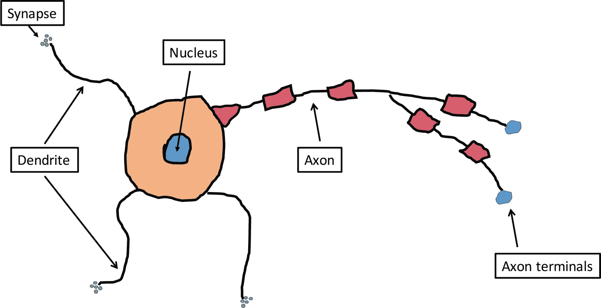

图 27-1

神经元

通过模仿神经元的这三个生物组成部分，科学家们开发了一个人工神经网络（ANN）的核心设计和结构，这使得我们能够构建能够学习的机器。我们将在下一章中更详细地讨论 ANN。如果从科学和工程的角度模仿大脑的能力，我们有望构建出能够从复杂的领域用例中学习层次特征的机器。

本章介绍了深度学习领域，作为对大脑如何学习构建人工神经网络的工程模拟。在下一章中，我们将更深入地讨论神经网络算法。

# 28. 神经网络基础

建立在生物神经元的启发之上，人工神经网络（ANN）是一个连接主义代理的社会，它们从一个人工神经元学习并传递信息到另一个人工神经元。随着数据在神经元之间传输，学习到表示或特征的层次结构，因此得名深度表示学习或深度学习。

## 架构

人工神经网络由

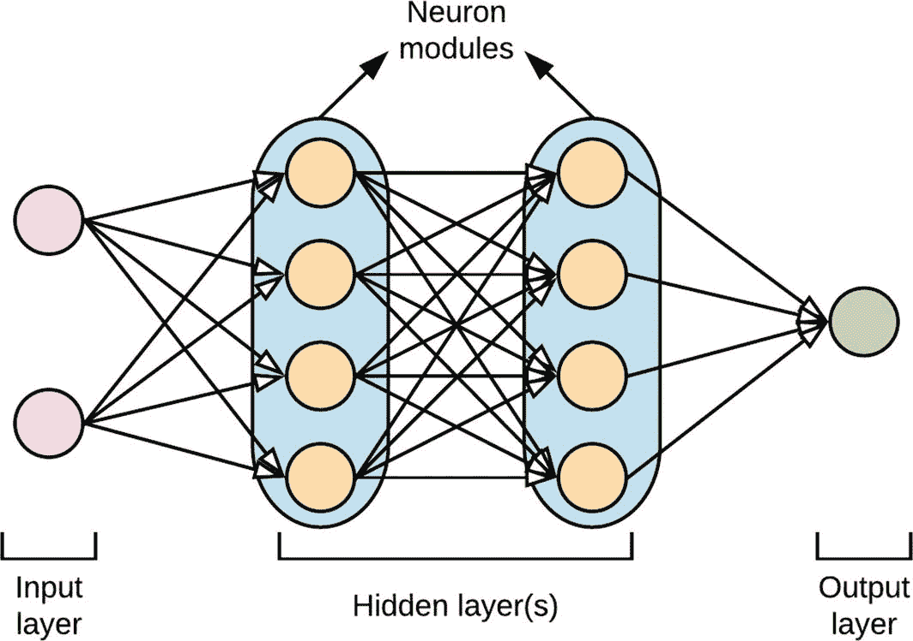

图 28-1

神经网络架构

+   输入层

+   隐藏层（s）

+   输出层

输入层接收来自数据集特征的信息，之后进行一些计算，并传播捕获数据学习模式的信

隐藏层（s）是深度学习的主要工作场所。隐藏层可以由多个神经元模块组成，如图 28-1 所示。每个隐藏网络层学习一组更复杂的特征表示。在训练深度学习网络时，关于一个层（网络宽度）中神经元数量的决定以及隐藏层（网络深度）的数量，即形成网络拓扑结构的设计选择。

# 29. 训练神经网络

本章概述了训练深度神经网络的技术。在这里，我们简要讨论

+   学习信息如何在神经网络中流动

+   网络输出层中成本函数的作用

+   用于确定分类问题输出层类别成员的一热编码和 softmax 激活函数

+   用于改进网络学习参数的反向传播算法

+   能够使神经网络学习非线性模式的激活函数

在本章中，当我们讨论训练神经网络涉及的方法时，我们将使用具有两个可能输出的分类问题的例子。在设计神经网络时，输入层的神经元数量通常是数据集的特征数量，而输出层的神经元数量是神经网络正在学习的目标变量中的类别数量。

如图 29-1 所示，数据集特征是神经网络的输入，而目标变量中的类别决定了输出神经元的数量。在这个例子中，网络学习两个类别，0 和 1。

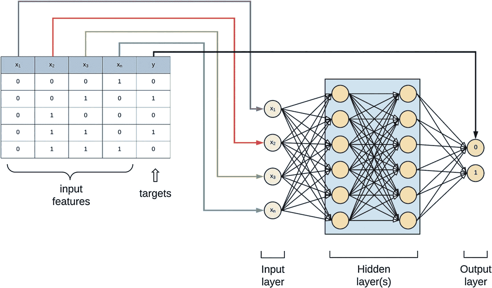

图 29-1

从数据集中定义神经网络

每个神经元都分配了一个权重（也称为参数）。神经网络中神经元的权重乘以其输入，然后通过一个激活函数（将在本章中讨论），其输出是网络下一个神经层的神经元的输入（见图 29-2）。随着神经网络试图学习的信息从网络的一层移动到另一层，这个过程会重复进行。每个神经元层还有一个偏置神经元（通常设置为 1），它控制加权总和。这与逻辑回归模型中的偏置项类似。

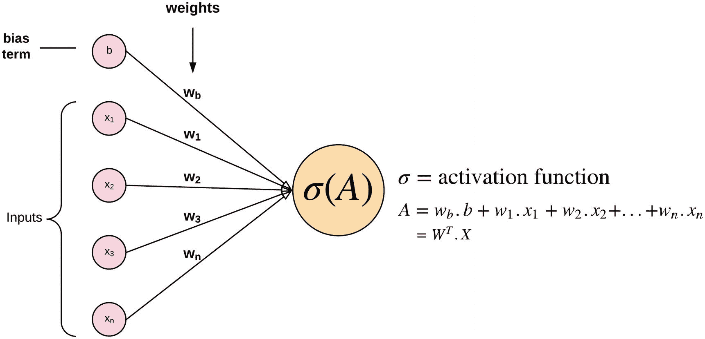

图 29-2

从前一神经层流向下一层神经元的信

权重被初始化为随机值，随后在神经网络开始使用反向传播算法（将在本章中讨论）学习时进行调整。总之，神经网络层中神经元的输出（或激活）由权重乘以输出加上前一层神经元的偏置项的总和决定，这些偏置项作用于一个非线性的*激活函数*（见图 29-2）。这一步骤被称为前馈学习算法。

然而，通过网络的前馈传递的输出很可能会导致错误的分类。前馈过程中产生的错误随后会使用反向传播算法（将在本章中讨论）进行调整。为了评估神经网络的性能，我们定义了一个成本函数或损失函数（类似于其他机器学习算法），它捕捉了网络做出的预测的质量。

神经网络的目标是最小化代价函数。两种常用的代价函数是回归问题的平方误差代价函数和分类问题的 softmax 交叉熵代价函数。

## 代价函数或损失函数

平方误差代价函数（也称为均方误差）找到估计目标与实际目标之间平方差的和，对于实值问题，而交叉熵代价函数找到分类问题中从实际类别标签的概率估计中预测的类别的差异。

无论使用哪种代价函数，当误差损失较小时，我们说代价是最小的。在图 29-3 中，网络输入的示例的正确输出是**2.3**。在评估前向训练的输出值后，使用平方误差代价函数来评估网络输出的质量。

记住，MSE 找到训练数据集中所有数据样本的平均代价。在图 29-3 中所示的示例中，我们只使用了一个数据样本来演示代价函数的工作原理。

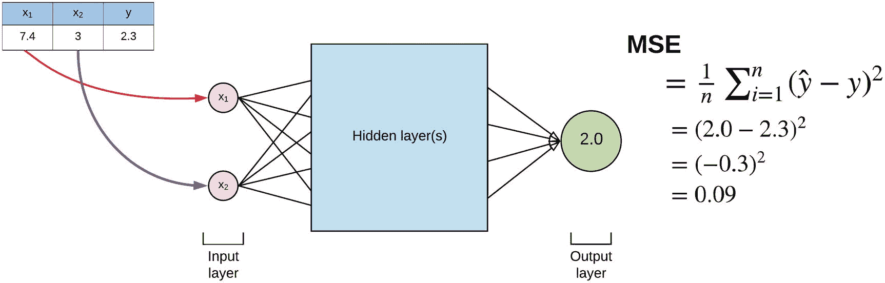

图 29-3

神经网络的 MSE 估计

## 独热编码

在分类问题中，独热编码是将目标变量的类别标签转换成二进制变量矩阵的过程。独热编码器在输出属于特定类别时分配 1，否则分配 0。独热编码的示例如图 29-4 所示。

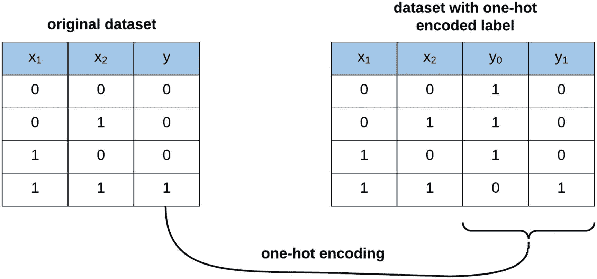

图 29-4

独热编码

在神经网络的最末层，即在输出层之前，应用了一个称为 softmax 的激活函数（与“逻辑回归”下讨论的相同）来将激活值转换为示例属于输出类别的概率。

将独热编码应用于数据集的标签的目的是将输出表示为具有示例属于输出类别之一概率的独立类别向量。

## 反向传播算法

反向传播是我们训练神经网络以改进其预测准确度的过程。为了训练神经网络，我们需要找到一种调整网络权重的机制；这反过来又影响每个神经元中激活值的值，从而更新预测输出层的值。第一次运行前向算法时，输出层的激活值很可能是错误的，具有高误差估计或代价函数。

反向传播的目标是反复回溯并调整每个前向神经层的权重，并再次执行前向算法，直到我们最小化网络在输出层产生的错误（见图 29-5）。

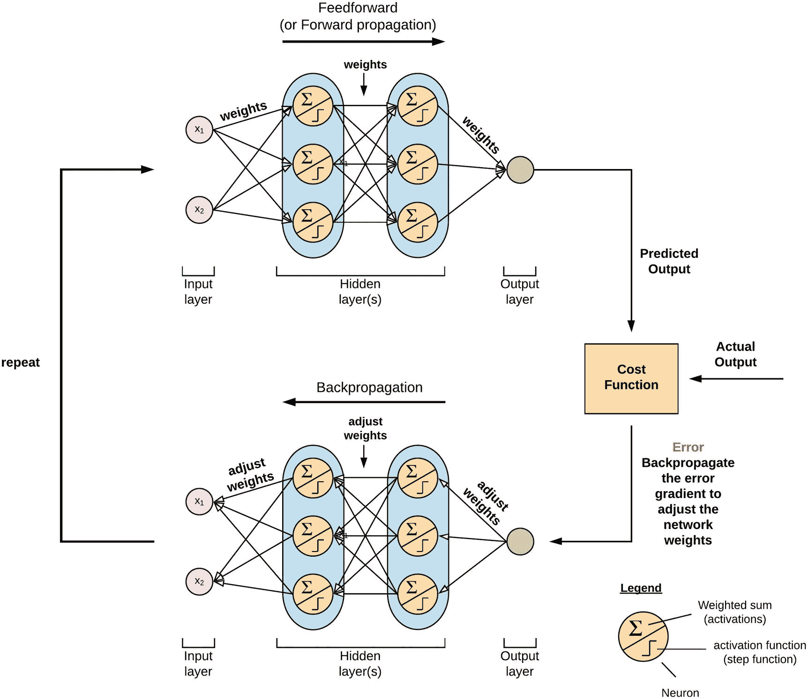

图 29-5

反向传播

反向传播算法通过在输出层计算成本函数，将神经网络的预测输出与数据集的实际输出进行比较来工作。然后它使用梯度下降（在第十六章节中讨论过）来计算成本函数的梯度，使用每个连续层的神经元权重，并通过网络传播更新权重。

## 激活函数

到目前为止，我们已经提到了激活函数。现在让我们更深入地了解一下激活函数是什么以及为什么我们需要它们。

激活函数通过将加权求和传递给神经元（这仅仅是权重和它们的加权和）并通过一个非线性函数来决定该神经元是否应该触发（传播）其信息到后续的神经网络层。

换句话说，激活函数决定了特定神经元是否具有在训练数据集中的观察结果在输出层产生正确预测所需的信息。激活函数类似于大脑中神经元如何通过在激活超过特定阈值时触发来通信和传递信息。

这些激活函数也被称为非线性，因为它们为我们的网络注入了非线性能力，并且可以学习从输入到输出的映射，对于基本结构是非线性的数据集。图 29-6 展示了通过激活函数传递权重和偏差加权和的过程。

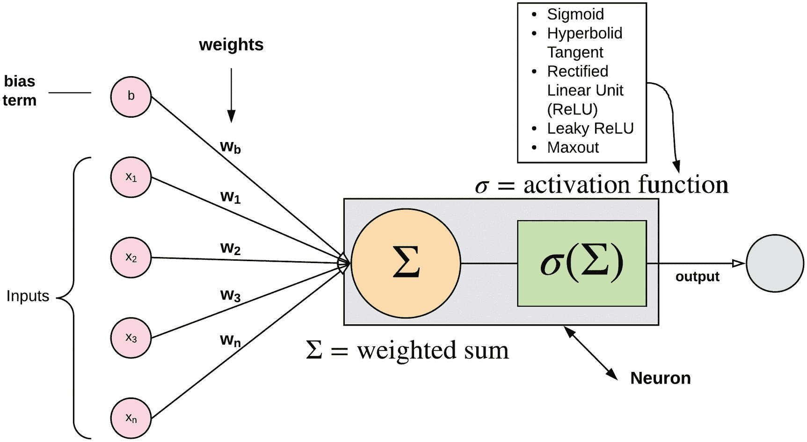

图 29-6

激活函数

以下是一些在神经网络中使用的激活函数的例子：

+   Sigmoid

+   双曲正切（tanh）

+   线性整流单元（ReLU）

+   Leaky ReLU

+   Maxout

让我们简要地考察它们。

### Sigmoid

图 29-7 中所示的 sigmoid 函数是一个非线性函数，它将激活值压缩到 0 和 1 的范围内。这把大的负数和正数分别压缩到 0 和 1。神经元通常在函数输出超过 0.5 的阈值时开始触发。

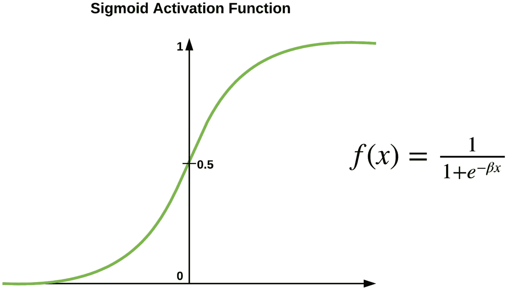

图 29-7

Sigmoid 激活函数

然而，sigmoid 函数的一个显著缺点是它容易受到爆炸和消失梯度现象的影响。在网络权重优化过程中，反向传播过程中梯度可能变得不成比例地小或大，其激活值集中在 0 或 1。当这种情况发生时，我们说梯度已经饱和。因此，通过反向传播的进一步乘法会导致梯度消失或爆炸；结果，受影响的神经元变得死亡，无法在网络中传递信息，从而对训练产生负面影响。

另一个缺点是函数的输出不是零中心化的。因此，在反向传播过程中，梯度可能全部变为正值或全部变为负值。这会对最小化函数目标（即损失函数）产生负面影响。

### 双曲正切 (tanh)

图 29-8 中所示的双曲正切函数通过将输出限制在 -1 和 1 的范围内来改进 sigmoid 函数。因此，尽管它仍然受到爆炸和消失梯度问题的影响，但它的输出现在是零中心化的。从公式中，读者将观察到 tanh 只是一个缩放后的 sigmoid 函数。

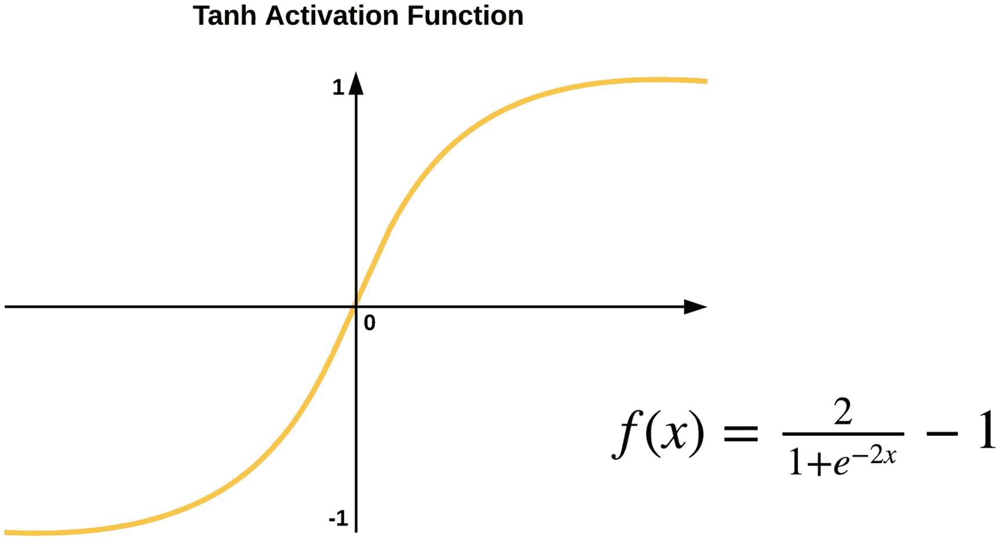

图 29-8

双曲正切激活函数

### 矩形线性单元 (ReLU)

矩形线性单元或 ReLU 激活函数如图 29-9 所示，其工作原理是将激活值设置为 0，当值 *x* 小于 0 时，而当值 *x* 大于 0 时，激活值具有线性斜率 1。

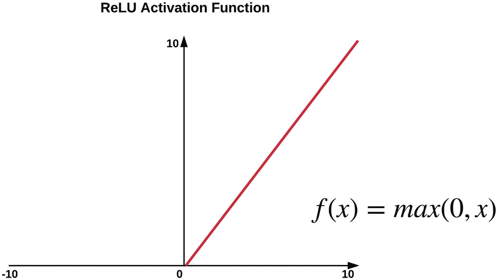

图 29-9

ReLU 激活函数

ReLU 通过极大地减轻消失和爆炸梯度问题，在 tanh 和 sigmoid 激活函数上提供了巨大的改进。然而，在反向传播过程中，即使学习率很大，一些梯度仍然可能消失。然而，只要学习率定义良好，我们就应该没有问题。

### Leaky ReLU

Leaky ReLU 是另一种激活函数，它通过避免零梯度来解决这个问题，即 ReLU 中某些神经元完全死亡。Leaky ReLU 如图 29-10 所示。该函数通过在值 *x* < 0 时将激活值设置为小的负斜率来工作。

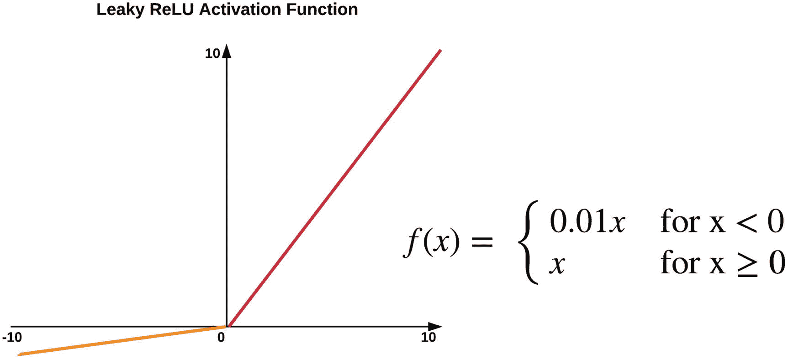

图 29-10

Leaky ReLU 激活函数

### Maxout

Maxout 激活函数是 ReLU 和 leaky ReLU 函数的推广，因此它利用了 ReLU 的效率，同时避免了某些神经元死亡的问题。无论如何，都需要做出权衡，因为 Maxout 在训练过程中增加了每个神经元的参数大小。

按照惯例，同一网络中不混合不同类型的激活函数。此外，ReLU 通常用于隐藏层，而在输出层用于分类问题，因为这一层返回特定类别的成员概率，所以 softmax 激活函数被用于分类问题。

本章概述了如何使用神经网络训练预测模型。本章结束了第五部分关于介绍深度学习的内容。第六部分将涵盖深度学习算法及其在 TensorFlow 和 Keras 中的实现。
