# 第八部分：在 GCP 上生产化机器学习解决方案

# 45. 容器和 Google Kubernetes Engine

微服务架构是一种开发和企业级云原生软件应用的方法，它涉及将应用程序的核心业务能力分解为解耦的组件。每个业务能力代表应用程序提供给最终用户的一些功能。微服务理念与单体架构相对立，单体架构涉及将应用程序构建为其“个体”能力的组合。请参见图 45-1 中的说明。

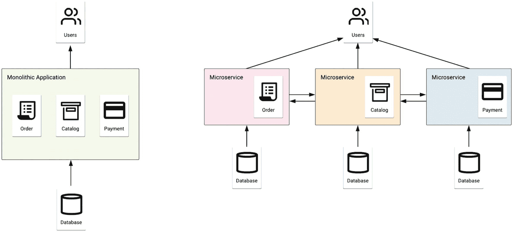

图 45-1

微服务应用程序（右）与单体应用程序（左）的比较

微服务通过表示状态转移（REST）通信进行交互，以实现无状态互操作性。这里的“无状态”意味着“服务器不存储客户端会话的状态。”这些协议可以是 HTTP 请求/响应 API 或异步消息队列。这种灵活性使得微服务可以轻松扩展并响应请求，即使另一个微服务失败。

**微服务的优势**

+   松散耦合的组件使应用程序具有容错性。

+   能够扩展，使每个组件都具有高度可用性。

+   组件的模块化使得扩展现有功能变得更容易。

**微服务的挑战**

+   软件架构的复杂性在增加。

+   微服务管理和编排的开销。然而，在接下来的几节课中，我们将看到 Docker 和 Kubernetes 如何共同努力来减轻这一挑战。

## Docker

Docker 是一种虚拟化应用程序，它将应用程序抽象为称为容器的隔离环境。容器背后的理念是提供一个统一的平台，包括开发和应用部署所需的软件工具和依赖项。

传统的应用程序开发方式是将应用程序设计并托管在单个服务器上。这如图 45-2 所示。这种配置容易遇到几个问题，包括著名的“在我的机器上运行正常，但在你的机器上不正常”。此外，在这种架构中，应用程序难以扩展和迁移，导致成本高昂和部署缓慢。

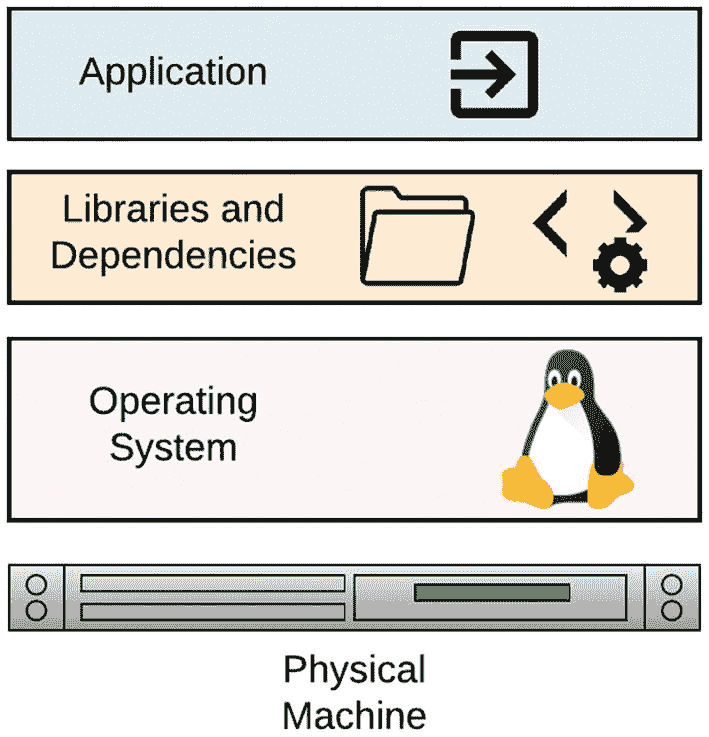

图 45-2

单服务器上运行的应用程序

## 虚拟机与容器

虚拟机（VM），如图 45-3 所示，模拟了物理机的功能，使得可以通过使用虚拟化软件（即管理程序）安装和运行操作系统。管理程序是物理机（即主机）上的软件，它使得在主机机器管理多个客户机时能够实现虚拟化。

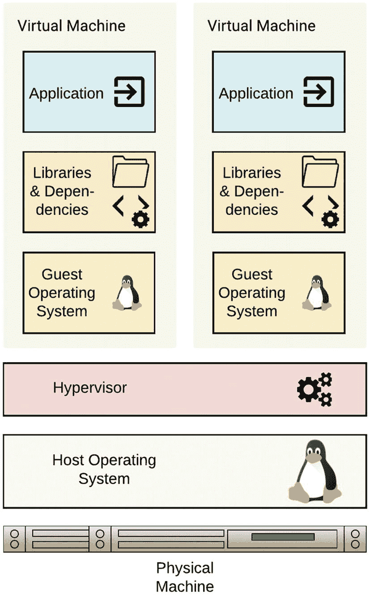

图 45-3

虚拟机

另一方面，容器为托管具有自己的库和软件依赖项的应用程序提供了隔离的环境；然而，与 VM 不同，机器上的所有容器都共享相同的操作系统内核。Docker 是容器的一个例子。这如图 45-4 所示。

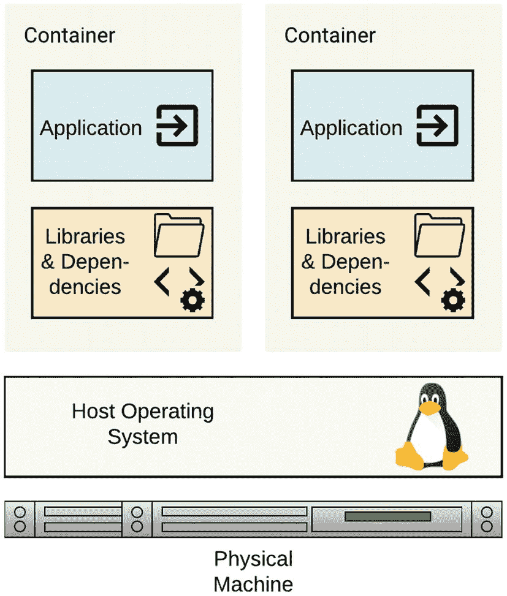

图 45-4

容器

## 使用 Docker

Google Cloud Shell 默认配置了 Docker。

需要注意的关键概念是

+   Dockerfile：Dockerfile 是一个文本文件，它指定了如何创建镜像。

+   Docker 镜像：镜像是通过构建 Dockerfile 创建的。

+   Docker 容器：Docker 容器是镜像的运行实例。

图 45-5 强调了构建镜像和运行 Docker 容器的过程。

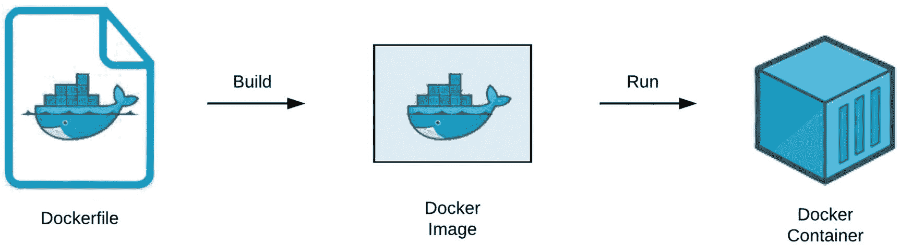

图 45-5

部署 Docker 容器的步骤

表 45-1 展示了创建 Dockerfile 时的关键命令。

表 45-1

创建 Dockerfile 的命令

| 命令 | 描述 |
| --- | --- |
| **FROM** | Dockerfile 的基 Docker 镜像。 |
| **LABEL** | 用于指定镜像元数据的键值对。 |
| **RUN** | 它在当前镜像之上执行命令作为新层。 |
| **COPY** | 从本地机器复制文件到容器文件系统。 |
| **EXPOSE** | 对 Docker 容器公开运行时端口。 |
| **CMD** | 指定在运行容器时执行的命令。如果运行时指定了另一个命令，则此命令将被覆盖。 |
| **ENTRYPOINT** | 指定在运行容器时执行的命令。Entrypoint 命令不会被在运行时指定的命令覆盖。 |
| **WORKDIR** | 设置容器的当前工作目录。 |
| **VOLUME** | 从本地机器文件系统挂载卷到 Docker 容器。 |
| **ARG** | 在构建镜像时设置环境变量作为键值对。 |
| **ENV** | 设置环境变量作为键值对，该键值对将在构建后可用于容器。 |

## 构建和运行简单的 Docker 容器

将本书的仓库克隆到 Cloud Shell 中以运行此示例；我们在章节文件夹中有一个名为**date-script.sh**的 bash 脚本。该脚本将当前日期赋值给一个变量，然后将其打印到控制台。Dockerfile 会将脚本从本地机器复制到 docker 容器文件系统，并在运行容器时执行 shell 脚本。用于构建容器的 Dockerfile 存储在**docker-intro/hello-world**。

```py
# navigate to the folder with images
cd docker-intro/hello-world
```

让我们查看 bash 脚本。

```py
cat date-script.sh
#! /bin/sh
DATE="$(date)"
echo "Todays date is $DATE"
```

让我们查看 Dockerfile。

```py
# view the Dockerfile
cat Dockerfile
# base image for building container
FROM docker.io/alpine
# add maintainer label
LABEL maintainer="dvdbisong@gmail.com"
# copy script from local machine to container file system
COPY date-script.sh /date-script.sh
# execute script
CMD sh date-script.sh
```

Docker 镜像将基于 Alpine Linux 包构建。请参阅[`hub.docker.com/_/alpine`](https://hub.docker.com/_/alpine)。`CMD`例程在容器运行时执行脚本。

### 构建镜像

运行以下命令来构建 Docker 镜像。

```py
# build the image
docker build -t ekababisong.org/first_image .
```

构建输出

```py
Sending build context to Docker daemon  2.048kB
Step 1/4 : FROM docker.io/alpine
latest: Pulling from library/alpine
6c40cc604d8e: Pull complete
Digest: sha256:b3dbf31b77fd99d9c08f780ce6f5282aba076d70a513a8be859d8d3a4d0c92b8
Status: Downloaded newer image for alpine:latest
---> caf27325b298
Step 2/4 : LABEL maintainer="dvdbisong@gmail.com"
---> Running in 306600656ab4
Removing intermediate container 306600656ab4
---> 33beb1ebcb3c
Step 3/4 : COPY date-script.sh /date-script.sh
---> Running in 688dc55c502a
Removing intermediate container 688dc55c502a
---> dfd6517a0635
Step 4/4 : CMD sh date-script.sh
---> Running in eb80136161fe
Removing intermediate container eb80136161fe
---> e97c75dcc5ba
Successfully built e97c75dcc5ba
Successfully tagged ekababisong.org/first_image:latest
```

### 运行容器

执行以下命令以运行 Docker 容器。

```py
# show the images on the image
docker images
# run the docker container from the image
docker run ekababisong.org/first_image
Todays date is Sun Feb 24 04:45:08 UTC 2019
```

### 重要的 Docker 命令

在本节中，让我们回顾一些重要的 Docker 命令。

#### 管理镜像的命令

表 45-2 包含管理 Docker 镜像的命令。

表 45-2

Docker 管理镜像的命令

| 命令 | 描述 |
| --- | --- |
| `docker images` | 列出机器上的所有镜像。 |
| `docker rmi [IMAGE_NAME]` | 从机器上删除名为 `IMAGE_NAME` 的镜像。 |
| `docker rmi $(docker images -q)` | 从机器上删除所有镜像。 |

#### 管理容器的命令

表 45-3 包含管理 Docker 容器的命令。

表 45-3

Docker 管理容器的命令

| 命令 | 描述 |
| --- | --- |
| `docker ps` | 列出所有容器。追加 `–a` 也可以列出未运行的容器。 |
| `docker stop [CONTAINER_ID]` | 在机器上优雅地停止具有 `[CONTAINER_ID]` 的容器。 |
| `docker kill CONTAINER_ID` | 在机器上强制停止具有 `[CONTAINER_ID]` 的容器。 |
| `docker rm [CONTAINER_ID]` | 从机器上删除具有 `[CONTAINER_ID]` 的容器。 |
| `docker rm $(docker ps -a -q)` | 从机器上删除所有容器。 |

#### 运行 Docker 容器

让我们分解以下运行 Docker 容器的命令：

```py
docker run -d -it --rm --name [CONTAINER_NAME] -p 8081:80 [IMAGE_NAME]
```

其中

+   `-d` 以分离模式运行容器。此模式在后台运行容器。

+   `-it` 以交互模式运行，并附加一个终端会话。

+   `--rm` 在容器退出时删除容器。

+   `--name` 为容器指定一个名称。

+   `-p` 从主机到容器进行端口转发（即，主机:容器）。

## Kubernetes

当微服务应用程序在生产中部署时，它通常有许多正在运行的容器，需要根据用户需求分配正确的资源量。此外，还需要确保容器在线、正在运行并且相互通信。高效管理和协调容器化应用程序集群的需求催生了 Kubernetes。

Kubernetes 是一个软件系统，它解决了部署、扩展和监控容器的问题。因此，它被称为容器编排器。野外的其他容器编排器示例包括 Docker Swarm、Mesos Marathon 和 HashiCorp Nomad。

Kubernetes 是由谷歌开发和发布的开源软件，现在由云原生计算基金会（CNCF）管理。谷歌云平台提供了一个名为谷歌容器引擎（GKE）的托管 Kubernetes 服务。亚马逊弹性容器服务（EKS）也提供了一个托管的 Kubernetes 服务。

### Kubernetes 的功能

以下是一些 Kubernetes 的特性：

+   `水平自动扩展:` 根据资源需求动态扩展容器

+   `自我修复:` 响应健康检查重新部署失败的节点

+   `负载均衡:` 在 Pod 中的容器之间高效地分配请求

+   `回滚和更新:` 无需停机即可轻松更新或回滚到以前的容器部署

+   `DNS 服务发现:` 使用域名系统（DNS）将容器组作为 Kubernetes 服务管理

### Kubernetes 的组件

Kubernetes 引擎的主要组件包括

+   `主节点(s):` 管理 Kubernetes 集群。在高可用性模式下可能有多个主节点以实现容错。在这种情况下，只有一个主节点，其他节点跟随。

+   `工作节点(s):` 运行作为 Pod(s)调度的容器化应用的机器。

图 45-6 展示了 Kubernetes 架构的概述。

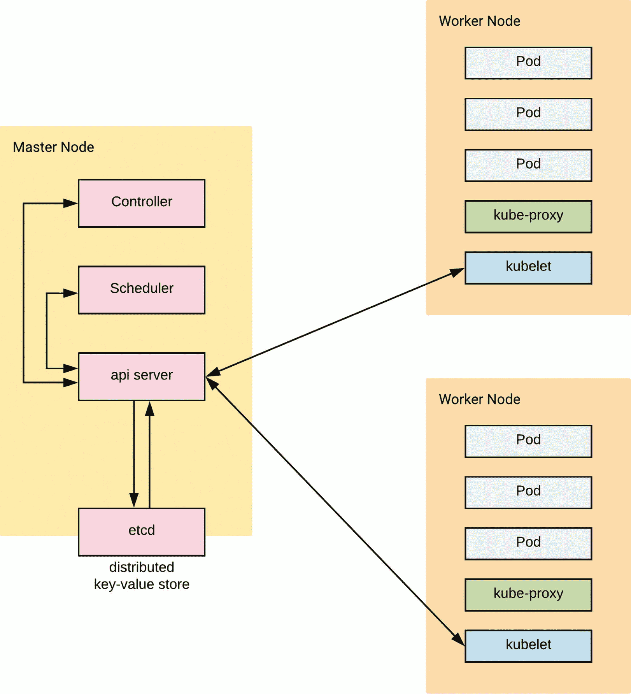

图 45-6

Kubernetes 组件的高级概述

#### 主节点(s)

主节点由以下组成

+   **etcd (分布式键存储):** 它管理 Kubernetes 集群状态。这个分布式键存储可以是主节点的一部分，也可以是外部。然而，所有主节点都连接到它。

+   **API 服务器:** 管理所有管理任务。`API 服务器`从用户（`kubectl` cli、REST 或 GUI）接收命令；这些命令被执行，新的集群状态存储在分布式键存储中。

+   **调度器:** 通过分配 Pod 来调度工作到工作节点。它负责资源分配。

+   **控制器:** 确保 Kubernetes 集群的期望状态得到维护。期望状态包含在 JSON 或 YAML 部署文件中。

#### 工作节点(s)

工作节点(s)由以下组成

+   **kubelet:** `kubelet`代理在每个工作节点上运行。它将工作节点连接到主节点上的`api server`，并从中接收指令。它确保节点上的 Pod 保持健康。

+   **kube-proxy:** 它是运行在每个工作节点上的 Kubernetes 网络代理。它监听`API 服务器`并将请求转发到适当的 Pod。对于负载均衡非常重要。

+   **Pod(s):** 它由一个或多个容器组成，这些容器共享网络和存储资源以及容器运行时指令。Pod 是 Kubernetes 中最小的可部署单元。

### 编写 Kubernetes 部署文件

Kubernetes 部署文件定义了各种 Kubernetes 对象所需的状态。Kubernetes 对象的示例包括

+   **Pods:** 它是一组一个或多个容器。

+   **ReplicaSets:** 它是主节点控制器的一部分。它指定在任何给定时间应该运行的 Pod 副本数。它确保在集群中保持指定数量的 Pod。

+   **部署（Deployments）**：它自动创建 `ReplicaSets`。它也是主节点中的 `controller` 的一部分。它确保集群的当前状态与期望状态相匹配。

+   **命名空间（Namespaces）**：它将集群划分为子集群，以将用户组织到组中。

+   **服务（Service）**：它是一个逻辑组，包含一组具有访问策略的 pod。

    +   *服务类型（ServiceTypes）*：它指定了服务的类型，例如，ClusterIP、NodePort、LoadBalancer 和 ExternalName。例如，LoadBalancer 使用云提供商的负载均衡器公开服务。

编写 Kubernetes 部署文件时的其他重要标签

+   **规范（spec）**：它描述了集群的期望状态。

+   **元数据（metadata）**：它包含对象的信息。

+   **标签（labels）**：它用于以键值对的形式指定对象属性。

+   **选择器（selector）**：它用于根据对象的标签值选择对象的一个子集。

部署文件指定为 yaml 文件。

### 在 Google Kubernetes Engine 上部署 Kubernetes

Google Kubernetes Engine (GKE) 为部署应用程序容器提供了一个托管环境。要从本地 shell 在 GCP 上创建和部署资源，必须安装和配置 Google 命令行 SDK gcloud。如果您的机器上没有这样做，请按照 `https://cloud.google.com/sdk/gcloud/` 上的说明操作。否则，一个更简单的选项是使用已经安装了 gcloud 和 kubectl（Kubernetes 命令行界面）的 Google Cloud Shell。

#### 创建 GKE 集群

运行以下命令以在 GKE 上创建一个容器集群。指定集群名称。

```py
# create a GKE cluster
gcloud container clusters create my-gke-cluster-name
```

在 GCP 上创建了一个具有三个节点（默认）的 Kubernetes 集群。GCP 上的 GKE 仪表板如图 45-7 所示。

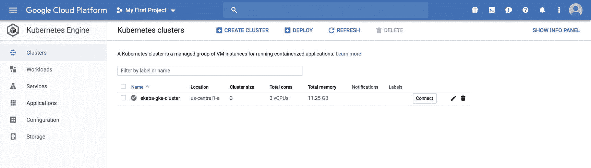

图 45-7

Google Kubernetes Engine 仪表板

```py
Creating cluster ekaba-gke-cluster in us-central1-a... Cluster is being deployed...done.
Created [https://container.googleapis.com/v1/projects/oceanic-sky-230504/zones/us-central1-a/clusters/ekaba-gke-cluster].
To inspect the contents of your cluster, go to: https://console.cloud.google.com/kubernetes/workload_/gcloud/us-central1-a/ekaba-gke-cluster?project=oceanic-sky-230504
kubeconfig entry generated for ekaba-gke-cluster.
NAME               LOCATION       MASTER_VERSION  MASTER_IP     MACHINE_TYPE   NODE_VERSION  NUM_NODES  STATUS
ekaba-gke-cluster  us-central1-a  1.11.7-gke.4    35.226.72.40  n1-standard-1  1.11.7-gke.4  3          RUNNING
```

要了解更多关于使用 Google Kubernetes Engine 创建集群的信息，请访问 `https://cloud.google.com/kubernetes-engine/docs/how-to/creating-a-cluster`。

运行以下命令以显示 GKE 上已配置集群的节点。

```py
# get the nodes of the kubernetes cluster on GKE
kubectl get nodes
NAME                                               STATUS    ROLES     AGE       VERSION
gke-ekaba-gke-cluster-default-pool-e28c64e0-8fk1   Ready         45m       v1.11.7-gke.4
gke-ekaba-gke-cluster-default-pool-e28c64e0-fmck   Ready         45m       v1.11.7-gke.4
gke-ekaba-gke-cluster-default-pool-e28c64e0-zzz1   Ready         45m       v1.11.7-gke.4
```

#### 删除 GKE 上的 Kubernetes 集群

运行以下命令以在 GKE 上删除一个集群。

```py
# delete the kubernetes cluster
gcloud container clusters delete my-gke-cluster-name
```

### 注意

总是记得在不再需要时清理云资源。

本章介绍了微服务架构的概念，并概述了在隔离环境/沙盒中构建应用程序时使用 Docker 容器的工作方式。如果在生产中部署了许多这样的容器，本章介绍了 Kubernetes 作为容器编排器，用于管理部署、扩展和监控容器的相关问题。

下一章将讨论如何在 Kubernetes 上部署机器学习组件到生产环境中的 Kubeflow 和 Kubeflow Pipelines。

# 46. Kubeflow 和 Kubeflow Pipelines

机器学习通常且正确地被视为使用数学算法教会计算机学习那些作为一组指定指令难以编程的任务。然而，从工程角度来看，这些算法仅占整体学习流程的一小部分。构建高性能和动态的学习模型包括许多其他关键组件。这些组件实际上主导了交付端到端机器学习产品的关注点空间。

典型的机器学习生产流程看起来就像图 46-1 中的插图。

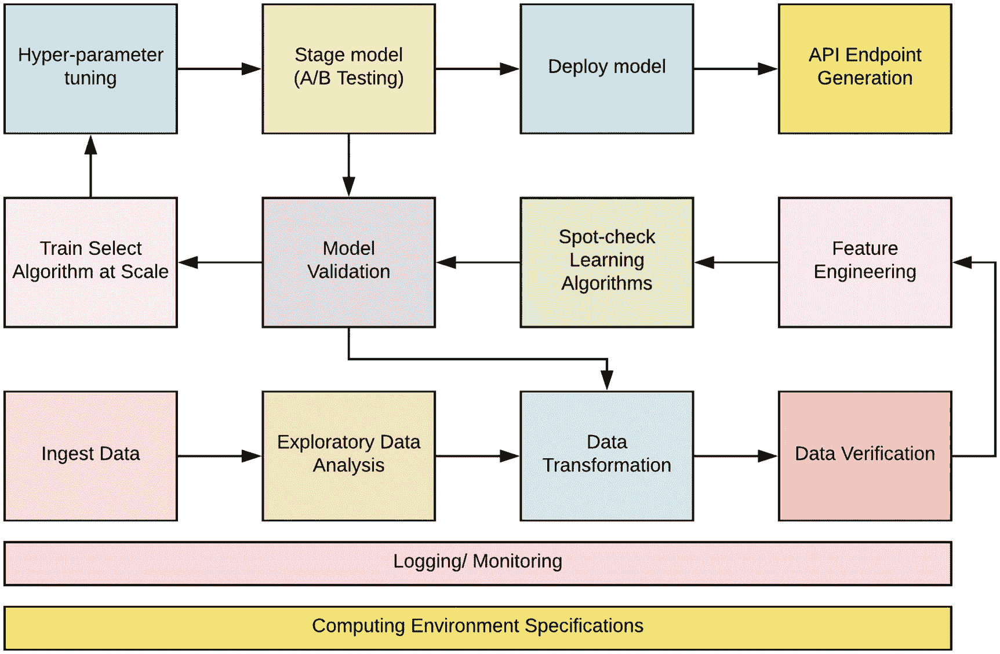

图 46-1

机器学习生产流程

从前面的图中可以看出，管道中的流程是迭代的。这种重复的模式是机器学习实验、设计和部署的核心。

## 效率挑战

容易认识到，在构建学习模型时，管道需要大量的开发操作，以便在组件之间实现无缝过渡。这种部件的互操作性催生了机器学习运维，也称为 MLOps。该术语是机器学习和 DevOps 的结合体。

传统上，机器学习的方法是在 Jupyter 笔记本中执行所有实验和开发工作，然后将模型导出并发送给软件开发团队进行部署和端点生成，以便集成到下游软件产品中，而 DevOps 团队则负责模型开发的基础设施和配置。这种单体式的工作方式导致机器学习过程不可重用，难以扩展和维护，甚至更难以审计和进行模型改进，并且容易充满错误和不必要的复杂性。

然而，通过将微服务设计模式融入机器学习开发中，我们可以解决这些众多问题，并真正简化生产过程。

## Kubeflow

Kubeflow 是一个旨在增强和简化在 Kubernetes 上部署机器学习工作流程的平台。使用 Kubeflow，通过将训练、服务、监控和日志组件等组件放置在 Kubernetes 集群上的容器中，可以更容易地管理分布式机器学习部署。

Kubeflow 的目标是抽象化管理 Kubernetes 集群的复杂性，以便机器学习从业者可以快速利用 Kubernetes 的强大功能和在微服务框架中部署产品的优势。Kubeflow 最初是作为 Google 内部用于在 Kubernetes 上实现机器学习管道的框架，于 2017 年晚些时候开源。

表 46-1 是在 Kubeflow 上运行的一些组件的示例。

表 46-1

Kubeflow 组件示例

| 组件 | 描述 |
| --- | --- |
| **Chainer** | **Chainer** 是一个定义-by-run 的深度学习神经网络框架。它还支持多节点分布式深度学习和深度强化学习算法。 |
| **Jupyter** | **Jupyter** 提供了一个快速原型设计和易于共享可重复代码、方程和可视化的平台。 |
| **ksonnet** | **ksonnet** 提供了一种简单的方式来创建和编辑 Kubernetes 配置文件。Kubeflow 利用 ksonnet 来帮助管理部署。 |
| **Istio** | **Istio** 通过提供一种统一的方式来连接、安全、控制和观察服务，简化了微服务的部署。 |
| **Katib** | **Katib** 是一个深度学习无关的超参数调整框架。它受到 Google Vizier 的启发。 |
| **MXNet** | **MXNet** 是一个可移植和可扩展的深度学习库，使用多种前端语言，如 Python、Julia、MATLAB 和 JavaScript。 |
| **PyTorch** | **PyTorch** 是由 Facebook 开发的基于 Lua 编程语言的 Torch 库的 Python 深度学习库。 |
| **NVIDIA TensorRT** | **TensorRT** 是一个用于高性能和可扩展部署深度学习模型进行推理的平台。 |
| **Seldon** | **Seldon**是一个开源平台，用于在 Kubernetes 上部署机器学习模型。 |
| **TensorFlow** | **TensorFlow**提供了一个用于大规模生产化深度学习模型的生态系统。这包括使用 TFJob 进行分布式训练，使用 TF Serving 进行服务，以及其他 Tensorflow Extended 组件，如 TensorFlow 模型分析（TFMA）和 TensorFlow 转换（TFT）。 |

### 与 Kubeflow 一起工作

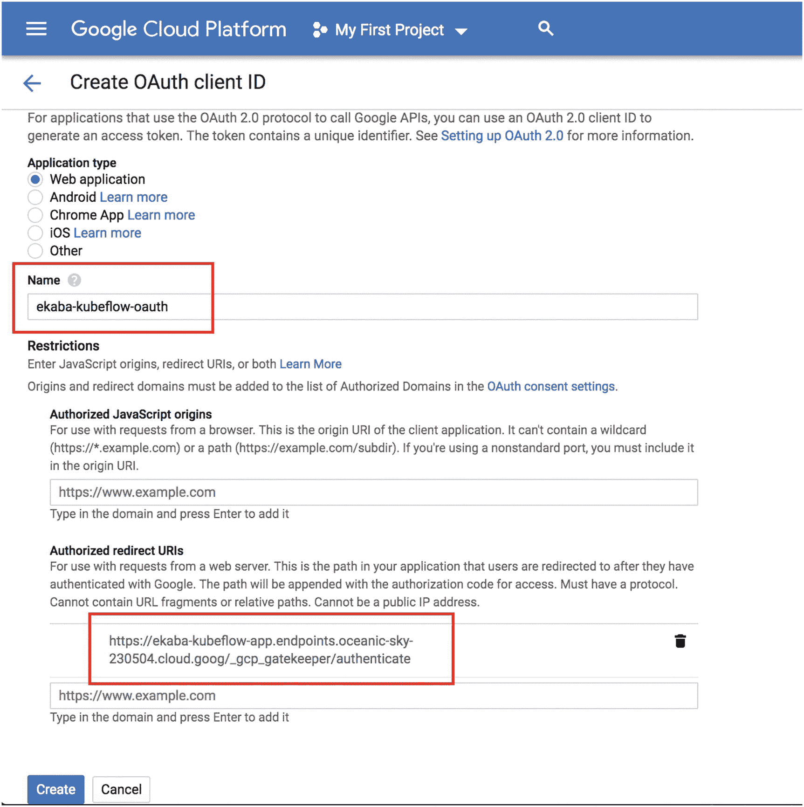

图 46-4

创建 OAuth 客户端 ID

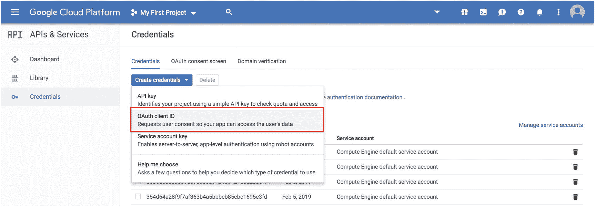

图 46-3

GCP 凭证选项卡

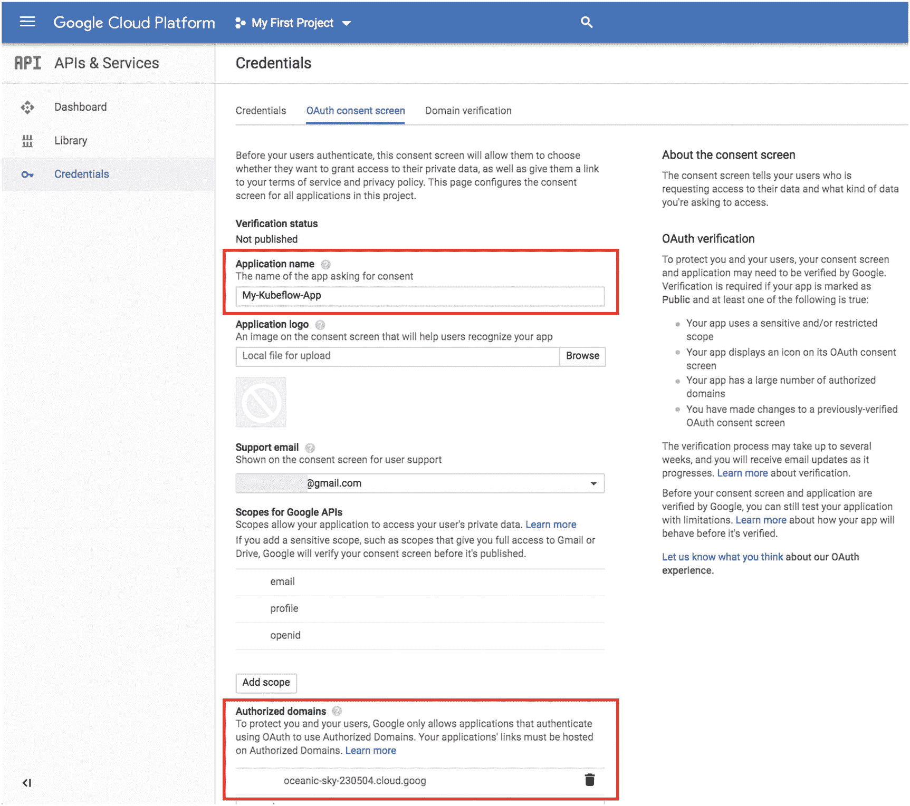

图 46-2

OAuth 同意屏幕

1.  **在 GKE 上设置 Kubernetes 集群。**

    ```py
    # create a GKE cluster
    gcloud container clusters create ekaba-gke-cluster
    # view the nodes of the kubernetes cluster on GKE
    kubectl get nodes
    ```

1.  **创建 OAuth 客户端 ID 以标识 Cloud IAP：**Kubeflow 使用 Cloud Identity-Aware Proxy (Cloud IAP)安全地连接到 Jupyter 和其他运行中的 Web 应用程序。Kubeflow 使用电子邮件地址进行身份验证。在本节中，我们将创建一个 OAuth 客户端 ID，该 ID 将用于在请求访问用户的电子邮件账户时标识 Cloud IAP：

    +   前往 GCP 控制台中的[APIs & Services](https://console.cloud.google.com/apis/credentials) ➤ [Credentials](https://console.cloud.google.com/apis/credentials)页面。

    +   前往 OAuth 同意屏幕（见图 46-2）。

        +   分配一个应用程序名称，例如，My-Kubeflow-App。

        +   对于授权域，使用[YOUR_PRODJECT_ID].cloud.goog。

    +   前往凭证选项卡（见图 46-3）。

        +   点击创建凭证，然后点击 OAuth 客户端 ID。

        +   在“应用程序类型”下，选择 Web 应用程序。

    +   选择一个**名称**来标识 OAuth 客户端 ID（见图 46-4）。

    +   在“授权重定向 URI”框中，输入以下内容：

        `https://<deployment_name>.endpoints.<project>.cloud.goog/_gcp_gatekeeper/authenticate`

    +   <deployment_name>必须是 Kubeflow 部署的名称。

    +   <project>是 GCP 项目 ID。

    +   在这种情况下，它将是

        [GCP 端点认证](https://ekaba-kubeflow-app.endpoints.oceanic-sky-230504.cloud.goog/_gcp_gatekeeper/authenticate)

    +   注意 OAuth 客户端窗口中出现的客户端 ID 和客户端密钥。这需要启用 Cloud IAP。

        ```py
        # Create environment variables from the OAuth client ID and secret earlier obtained.
        export CLIENT_ID=506126439013-drbrj036hihvdolgki6lflovm4bjb6c1.apps.googleusercontent.com
        export CLIENT_SECRET=bACWJuojIVm7PIMphzTOYz9D
        export PROJECT=oceanic-sky-230504
        ```

#### 下载 kfctl.sh

文件 kfctl.sh 是 Kubeflow 安装的 shell 脚本。截至撰写本文时，最新的 Kubeflow 标签是 0.5.0。

```py
# create a folder on the local machine
mkdir kubeflow
# move to created folder
cd kubeflow
# save folder path as a variable
export KUBEFLOW_SRC=$(pwd)
# download kubeflow `kfctl.sh`
export KUBEFLOW_TAG=v0.5.0
curl https://raw.githubusercontent.com/kubeflow/kubeflow/${KUBEFLOW_TAG}/scripts/download.sh | bash
# list directory elements
ls -la
drwxr-xr-x   6 ekababisong  staff   204 17 Mar 04:15 .
drwxr-xr-x  25 ekababisong  staff   850 17 Mar 04:09 ..
drwxr-xr-x   4 ekababisong  staff   136 17 Mar 04:18 deployment
drwxr-xr-x  36 ekababisong  staff  1224 17 Mar 04:14 kubeflow
drwxr-xr-x  16 ekababisong  staff   544 17 Mar 04:14 scripts
```

#### 部署 Kubeflow

运行以下代码块以部署 Kubeflow。

```py
# assign the name for the Kubeflow deployment
# The ksonnet app is created in the directory ${KFAPP}/ks_app
export KFAPP=ekaba-kubeflow-app
# run setup script
${KUBEFLOW_SRC}/scripts/kfctl.sh init ${KFAPP} --platform gcp --project ${PROJECT}
# navigate to the deployment directory
cd ${KFAPP}
# creates config files defining the various resources for gcp
${KUBEFLOW_SRC}/scripts/kfctl.sh generate platform
# creates or updates gcp resources
${KUBEFLOW_SRC}/scripts/kfctl.sh apply platform
# creates config files defining the various resources for gke
${KUBEFLOW_SRC}/scripts/kfctl.sh generate k8s
# creates or updates gke resources
${KUBEFLOW_SRC}/scripts/kfctl.sh apply k8s
# view resources deployed in namespace kubeflow
kubectl -n kubeflow get  all
```

Kubeflow 可在唯一的 URL 上访问。在这种情况下，Kubeflow 可在我这里通过以下 URL 访问[`https://ekaba-kubeflow-app.endpoints.oceanic-sky-230504.cloud.goog/`](https://ekaba-kubeflow-app.endpoints.oceanic-sky-230504.cloud.goog/)（见图 46-5）。再次强调，此 URL 对您的部署是唯一的。

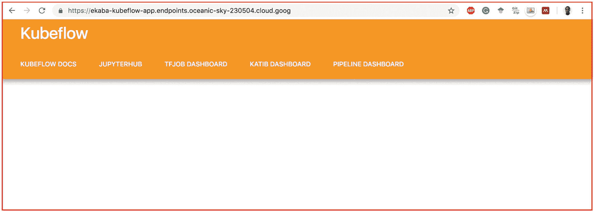

图 46-5

Kubeflow 主页

### 注意

URI 可用可能需要 10-15 分钟。Kubeflow 需要提供已签名的 SSL 证书并注册 DNS 名称。

## Kubeflow Pipelines – 诗人的 Kubeflow

Kubeflow 流水线是一个简单的平台，用于在 Kubernetes 上构建和部署容器化的机器学习工作流程。Kubeflow 流水线使得实现生产级机器学习流水线变得容易，无需担心管理 Kubernetes 集群的底层细节。

Kubeflow 流水线是 Kubeflow 的核心组件，当部署 Kubeflow 时也会部署。流水线仪表板如图 46-6 所示。

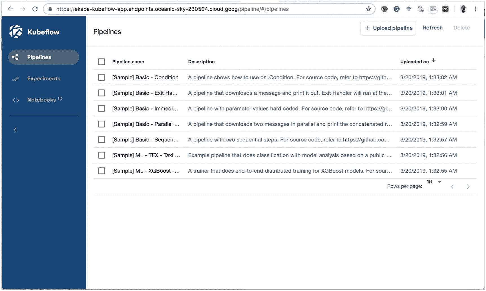

图 46-6

Kubeflow 流水线仪表板

### Kubeflow 流水线的组件

流水线描述了一个机器学习工作流程，其中流水线的每个组件都是一个自包含的代码集合，这些代码被打包成 Docker 镜像。每个流水线都可以单独上传并在 Kubeflow 流水线用户界面（UI）上共享。流水线需要输入（参数）来运行流水线以及每个组件的输入和输出。

Kubeflow 流水线平台由以下部分组成

+   用于管理和跟踪实验、作业和运行的用户界面（UI）

+   用于调度多步骤机器学习工作流程的引擎

+   用于定义和操作流水线和组件的 SDK

+   使用 SDK 与系统交互的笔记本（摘自[`www.kubeflow.org/docs/pipelines/pipelines-overview/`](http://www.kubeflow.org/docs/pipelines/pipelines-overview/)）

### 执行一个示例流水线

1.  点击名称 **[Sample] 基本条件 - 条件**（见图 46-7）。

    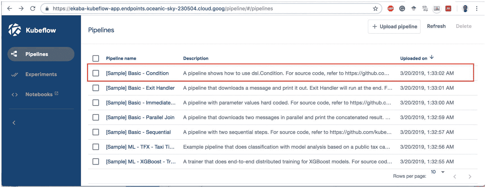

    图 46-7

    选择一个流水线

1.  点击 **启动实验**（见图 46-8）。

    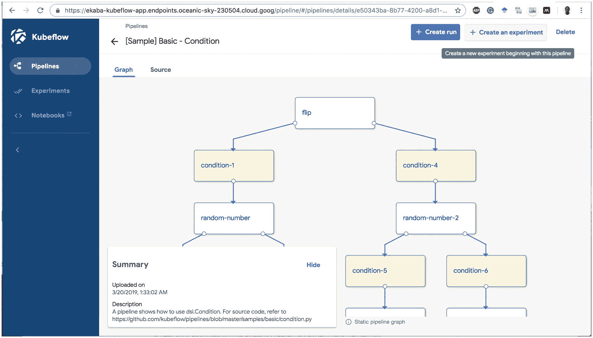

    图 46-8

    创建一个新的实验

1.  给实验起一个名字（见图 46-9）。

    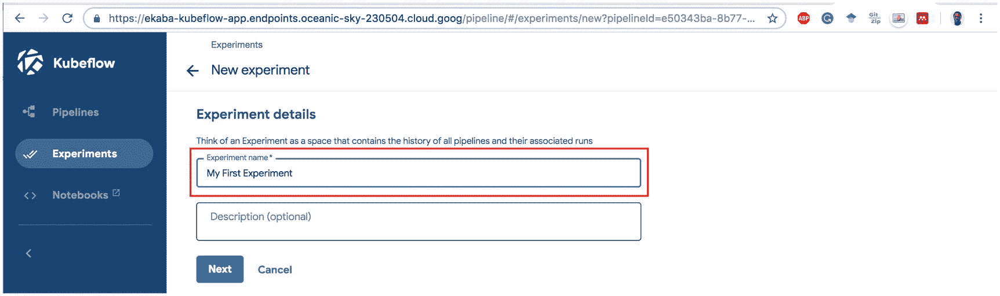

    图 46-9

    为实验分配一个名称

1.  给运行起一个名字（见图 46-10）。

    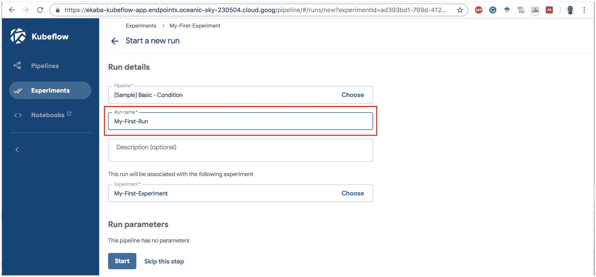

    图 46-10

    为运行分配一个名称

1.  点击**运行名称**以启动运行（见图 46-11）。

    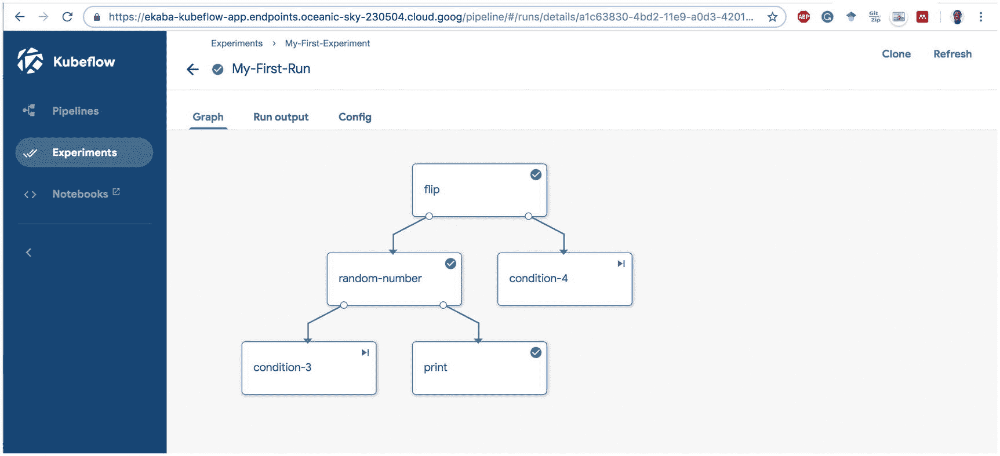

    图 46-11

    运行管道

### 注意

总是记得在不再需要时清理云资源。

本章介绍了在 Kubernetes 上设置 Kubeflow 以及介绍使用 Kubeflow Pipelines 管理容器化机器学习工作流程。下一章将使用 Kubeflow Pipelines 部署端到端机器学习解决方案。

# 47. 在 Kubeflow Pipelines 上部署端到端机器学习解决方案

Kubeflow 管道组件是管道任务的实现。组件是工作流程中的一步。每个任务接受一个或多个工件作为输入，并可能产生一个或多个工件作为输出。

每个组件通常包括两个部分：

+   客户端代码：与端点通信以提交作业的代码，例如，与 Google Cloud Machine Learning Engine 连接的代码。

+   运行时代码：执行实际工作的代码，通常在集群中运行，例如，为在 Cloud MLE 上训练准备模型的代码。

一个组件由一个接口（输入/输出）、实现（一个 Docker 容器镜像和命令行参数）以及元数据（名称、描述）组成。

## 简单端到端解决方案管道概述

在这个简单的示例中，我们将实现一个深度神经网络回归器来预测比特币加密货币的收盘价。机器学习代码本身相当基础，因为这不是本文的重点。这里的目的是使用 Kubeflow Pipelines 在 Kubernetes 上通过微服务架构编排机器学习工程解决方案。本章的代码在书中的代码仓库中。从 GCP Cloud Shell 克隆仓库。

管道由以下组件组成：

1.  将托管在 GitHub 上的原始数据移动到存储桶中。

1.  使用 Google Dataflow 转换数据集。

1.  在 Cloud Machine Learning Engine 上执行超参数训练。

1.  使用优化超参数训练模型。

1.  在 Cloud MLE 上部署模型以进行服务。

## 为每个组件创建容器镜像

首先，我们将客户端和运行时代码打包成一个 Docker 镜像。此镜像还包含用于对 GCP 进行身份验证的安全服务账户密钥。例如，使用 Dataflow 转换数据集的组件在其镜像中包含以下文件：

+   `__ Dockerfile`：用于构建 Docker 镜像的 Dockerfile。

+   `__ build.sh`：用于启动容器构建并将其上传到 Google Container Registry 的脚本。

+   `__ dataflow_transform.py`：在 Cloud Dataflow 上运行 beam 管道的代码。

+   `__ service_account.json`：用于在 GCP 上对容器进行身份验证的安全密钥。

+   `__ local_test.sh`：用于在本地运行镜像管道组件的脚本。

## 在上传到 Kubeflow Pipelines 之前构建容器

在将管道上传到 Kubeflow Pipelines 之前，请确保构建组件容器，以便将最新版本的代码打包并作为镜像上传到容器注册库。代码提供了一个方便的`bash`脚本来构建所有容器。

## 使用 Kubeflow Pipelines DSL 语言编译管道

管道代码包含组件之间如何相互作用的规范。每个组件都有一个输出，作为管道中下一个组件的输入。Kubeflow Pipelines SDK 中的 Kubeflow pipeline DSL 语言`dsl-compile`用于将管道代码编译成 Python 代码，以便上传到 Kubeflow Pipelines。

通过运行来确保本地机器上安装了 Kubeflow Pipelines SDK

```py
# install kubeflow pipeline sdk
pip install https://storage.googleapis.com/ml-pipeline/release/0.1.12/kfp.tar.gz --upgrade
# verify the install
which dsl-compile
```

通过运行来编译管道

```py
# compile the pipeline
python3 [path/to/python/file.py] [path/to/output/tar.gz]
```

对于示例代码，我们使用了

```py
python3 crypto_pipeline.py crypto_pipeline.tar.gz
```

## 将管道上传并执行到 Kubeflow Pipelines

以下步骤将上传并执行在 Kubeflow Pipelines 上编译的管道：

1.  将管道上传到 Kubeflow Pipelines（图 47-1）。

    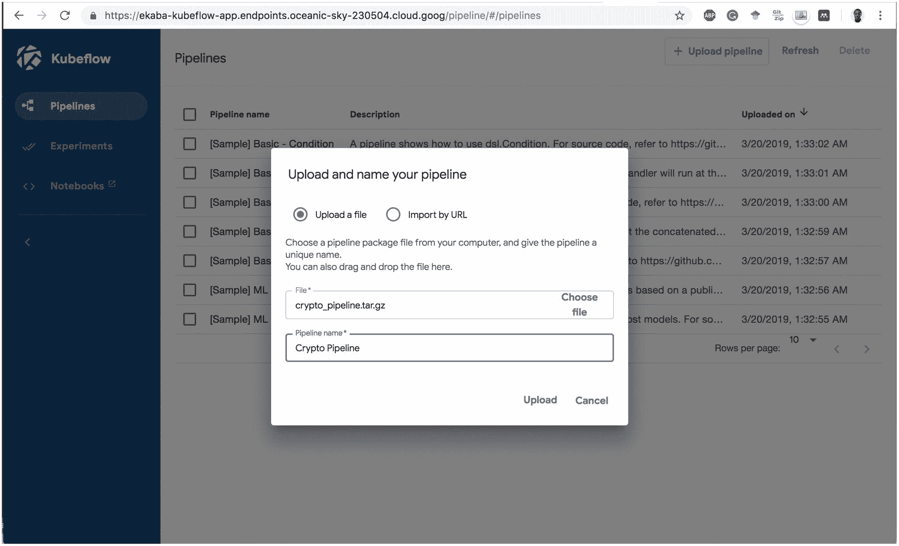

    图 47-1

    将编译后的管道上传到 Kubeflow Pipelines

1.  点击管道以查看流程的静态图（图 47-2）。

    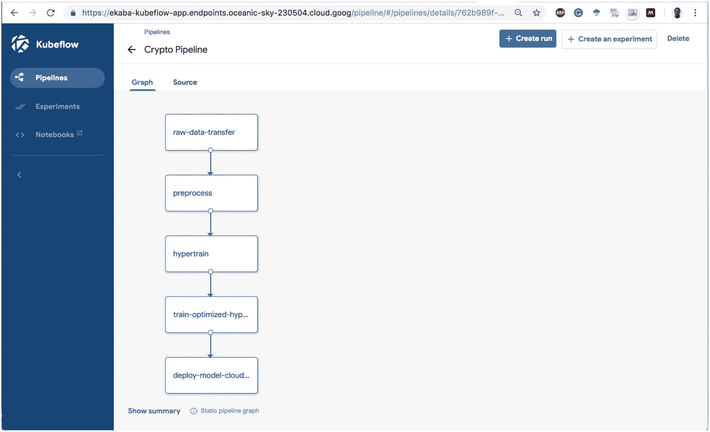

    图 47-2

    管道摘要图

1.  创建实验并运行以执行管道（图 47-3）。

    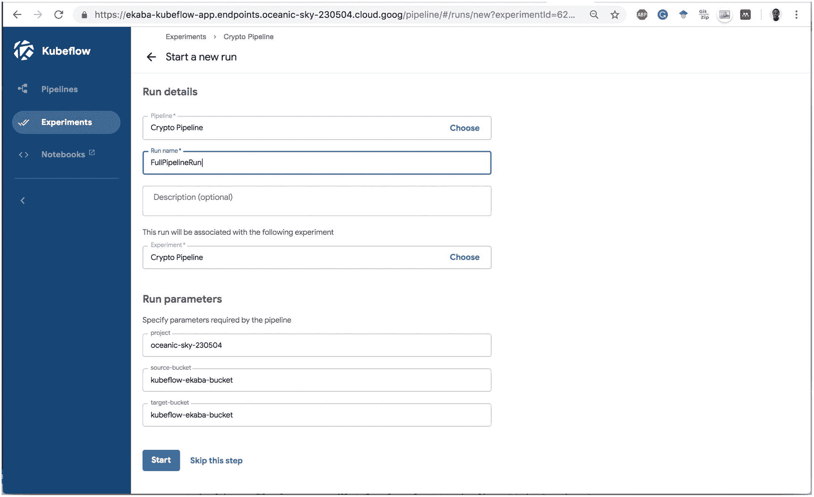

    图 47-3

    创建并运行实验

1.  完成的管道运行（图 47-4）。

    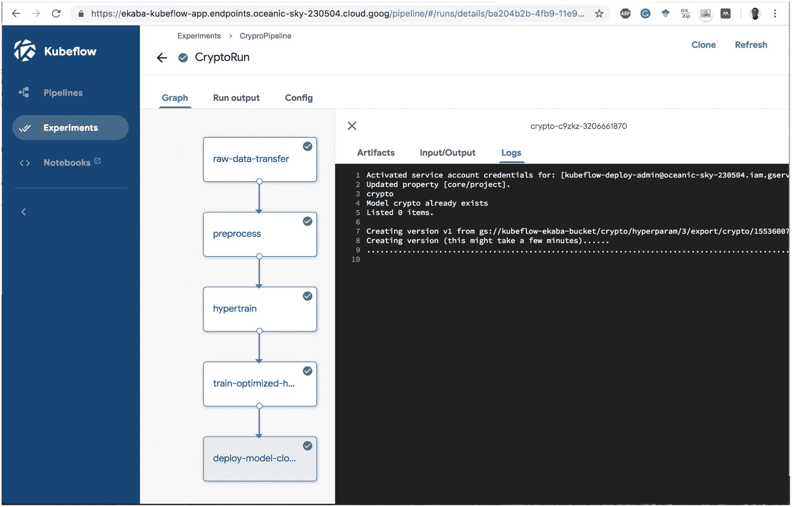

    图 47-4

    完成的管道运行

完成的数据流管道：图 47-5 展示了管道第二个组件的完成运行，该组件是用 Cloud Dataflow 转换数据集。

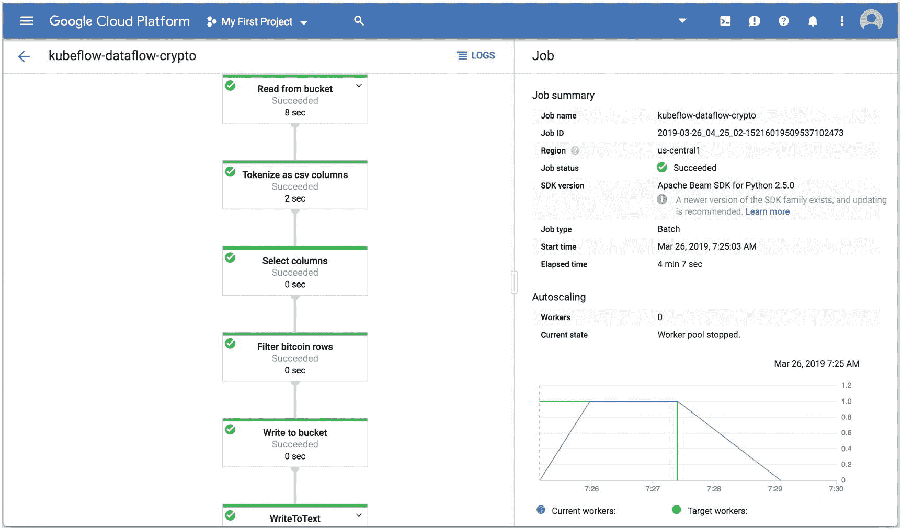

图 47-5

完成数据流运行

在 Cloud MLE 上部署模型：图 47-6 展示了作为管道第五个组件的已部署模型。

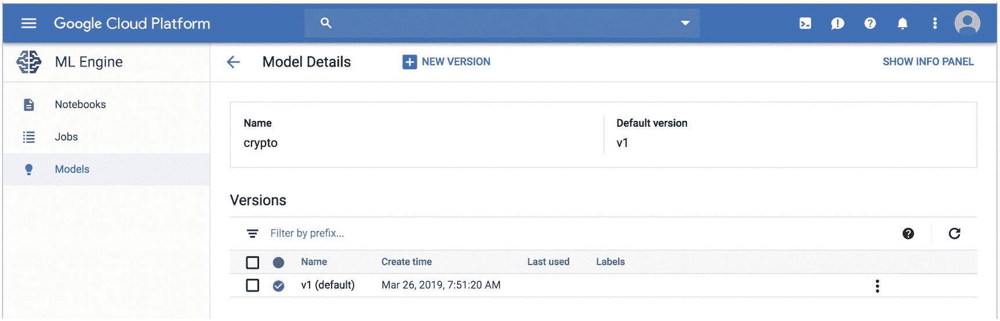

图 47-6

在 Cloud MLE 上部署模型

### 注意

总是记得在不再需要时清理云资源。

删除 Kubeflow：运行脚本以删除部署。

```py
# navigate to kubeflow app
cd ${KFAPP}
# run script to delete the deployment
${KUBEFLOW_SRC}/scripts/kfctl.sh delete all
```

删除 Kubernetes 集群：将名称替换为您的集群名称。

```py
# delete the kubernetes cluster
gcloud container clusters delete ekaba-gke-cluster
```

本章介绍了如何在 Kubernetes 上使用 Kubeflow 和 Kubeflow 管道构建一个端到端的机器学习产品作为容器化应用。同样，本章的代码可以通过将本书的代码仓库克隆到 Cloud Shell 中来获取。

这本书到此结束。
