# 3. Wit.ai 和 Dialogflow

本章介绍了 Google 提供的两个聊天机器人界面 [Wit.ai](https://wit.ai/) 和 [Dialogflow](https://dialogflow.com/) 的基础知识，这两个界面提供了有用的功能。您将首先使用 Wit.ai 探索一个简单的机器人流程，然后转向 Dialogflow 创建一个完整的机器人以部署到 Web 上。

## 开始使用 Wit.ai

*Wit.ai* 是一个基于网络的 IDE，用于创建机器人。要启动 Wit.ai，您必须访问 [`wit.ai/`](https://wit.ai/) 。

在本节中，您将创建一个新应用，然后向其中添加意图。接下来，您将添加文本和关键词来修改机器人。在本章的后面部分，您将实现 Dialogflow 工具以部署机器人。

### 创建新应用

在本节中，您将创建您的第一个应用。从 Wit.ai 网站，点击快速开始，如图 3-1 所示。

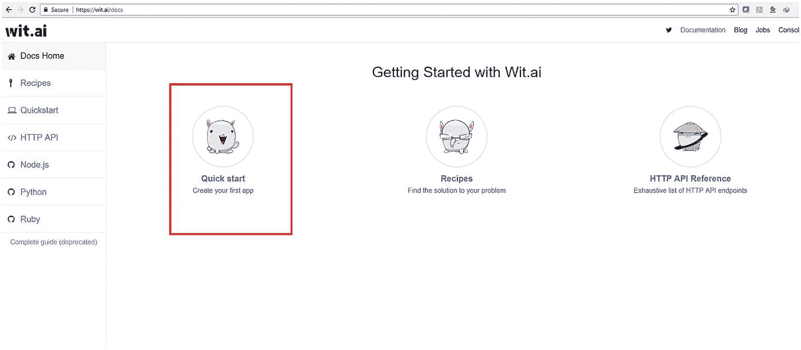

图 3-1

选择快速开始选项创建应用

这将打开一个页面，展示使用 GitHub 或 Facebook 创建第一个应用的选项，如图 3-2 所示。

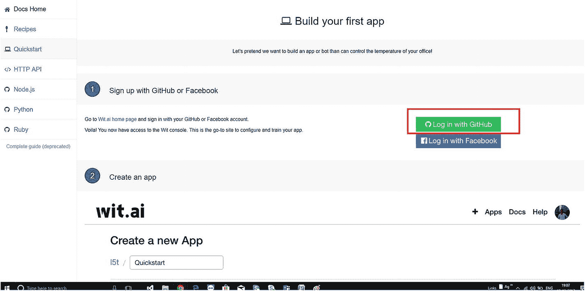

图 3-2

使用 GitHub 登录

登录后，您将可以选择创建您的新应用，如图 3-3 所示。

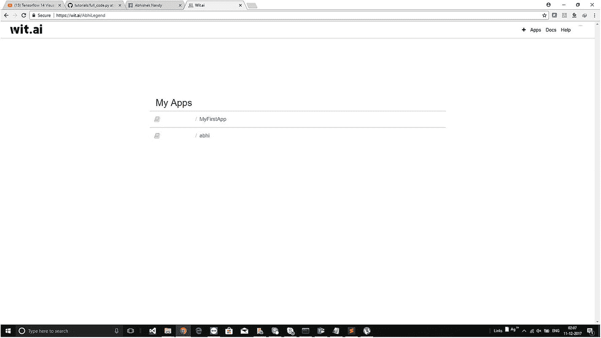

图 3-3

创建新应用

让我们创建一个简单的应用。您可以将应用命名为 *TestStories*。在应用描述部分，输入 *Demo*。为应用数据选择私有选项。然后点击创建应用按钮，如图 3-4 所示。

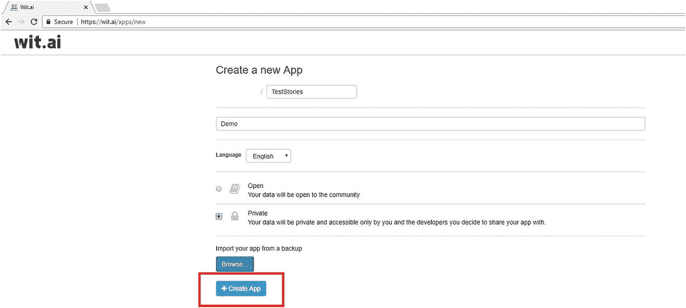

图 3-4

设置您新应用的详细信息

### 添加意图

点击创建应用按钮将打开下一页，该页面提供了“故事”选项。随后，您将转到“理解”选项；此页面如图 3-5 所示。

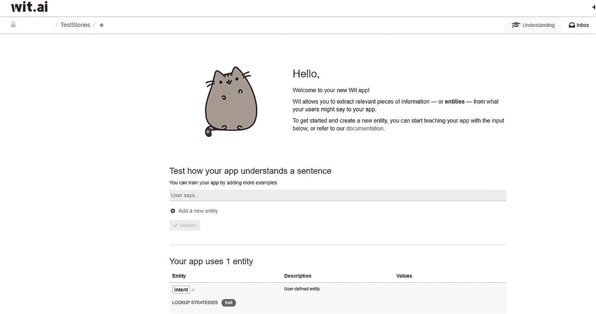

图 3-5

理解 Wit.ai 网站上的选项

让我们用一个披萨的例子来创建新应用。

在“用户说”文本框中，输入*I want some cheese pizza*，如图 3-6 所示。

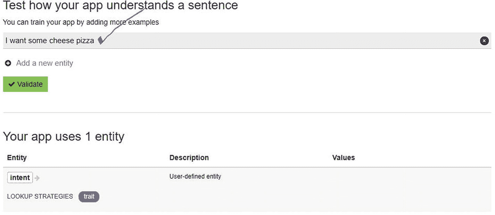

图 3-6

添加我们正在努力订购披萨的详细信息，因此我们正在构建开始对话的方式

现在，您已准备好创建一个意图。您将意图的值添加为 pizza，如图 3-7 所示。

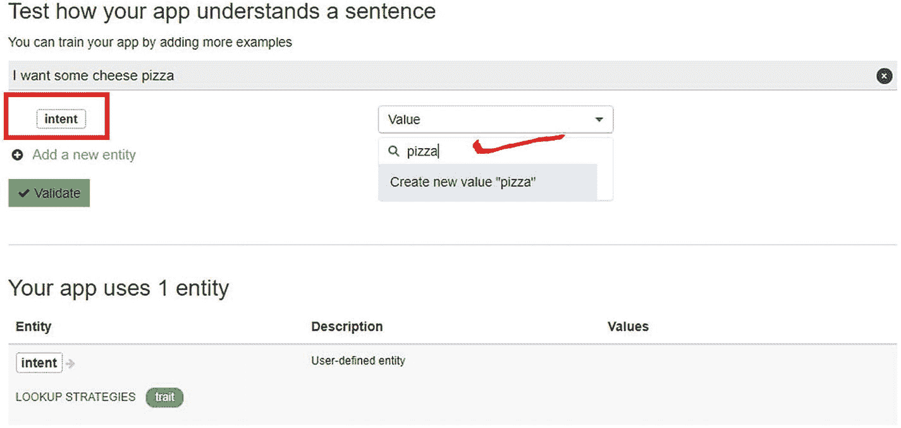

图 3-7

创建一个新的意图。在这里需要一个意图，以便在对话中能够找到正确的通信顺序。

你添加了一个带有奶酪的披萨选项，然后点击验证按钮，如图 3-8 所示。

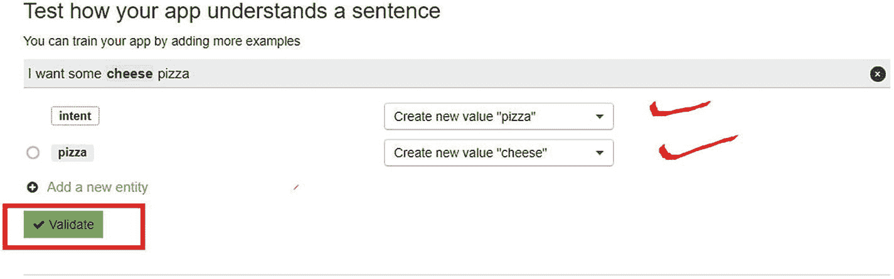

图 3-8

创建一个意图并验证它。我们正在创建不同的意图，以便用户可以选择他们想要哪种类型的披萨。

在验证了创建实体选项之后，现在你有两个实体被创建，如图 3-9 所示被突出显示。

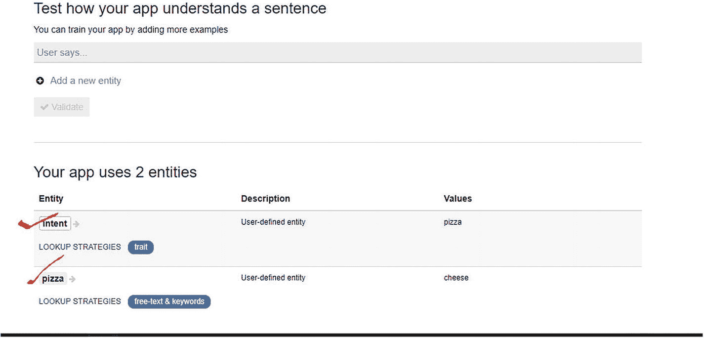

图 3-9

应用程序显示了两个意图

### 添加文本和关键词

让我们修改这个机器人。我们现在将创建聊天机器人的流程，以便用户能够订购不同类型的披萨。

在本节中，你将尝试添加一个句子。图 3-10 展示了如何添加一个用于识别的句子。

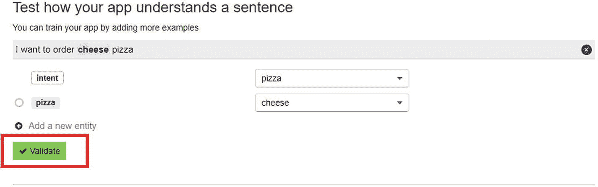

图 3-10

应用程序正在尝试理解一个句子。在这里，我们正在研究聊天机器人如何能够发现用户正在输入的内容，以便创建的句子对机器人来说是可理解的。

接下来，点击验证。现在你需要选择一个实体。选择披萨并点击与之相关的箭头（见图 3-11）。

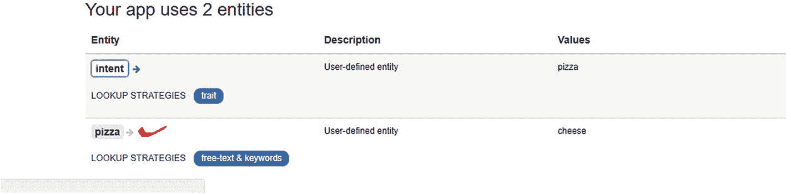

图 3-11

选择一个实体及其相关的箭头

当你点击披萨箭头时，你会进入包含关键词和同义词的页面，如图 3-12 所示。

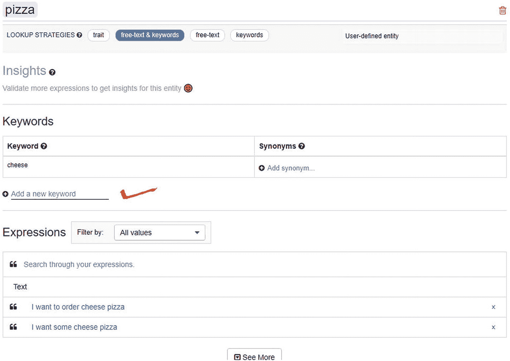

图 3-12

添加新关键词的页面

在这里，你将添加新关键词。结果如图 3-13 所示。

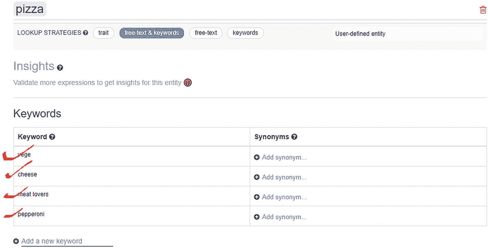

图 3-13

添加关键词，以便我们精确地创建不同类型披萨的订购方式

现在点击理解选项，以训练机器人识别你添加的新关键词。它位于底部。

让我们从辣味披萨开始。为了理解辣味披萨的意图流程，输入 *我想吃辣味披萨*，我们展示了如何使机器人能够按照图 3-14 所示订购特定的披萨。然后点击验证。

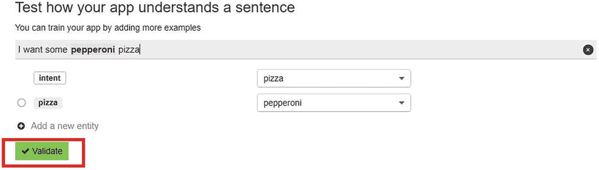

图 3-14

添加辣味披萨选项

现在你将添加蔬菜披萨，如图 3-15 所示。

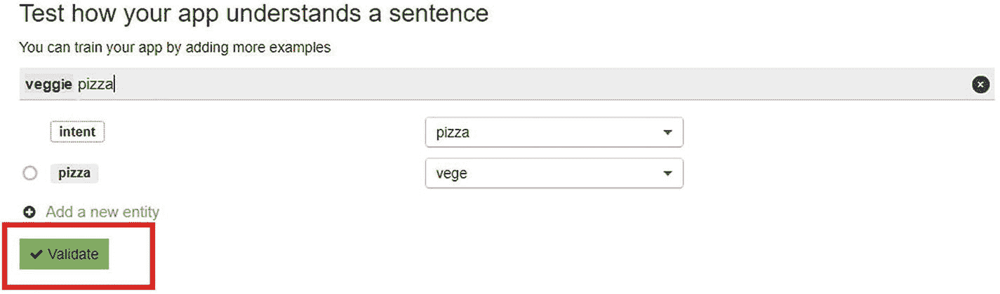

图 3-15

添加素食披萨选项

现在添加一个大型披萨选项。为此，您需要进行一些更改，如图 3-16 所示。

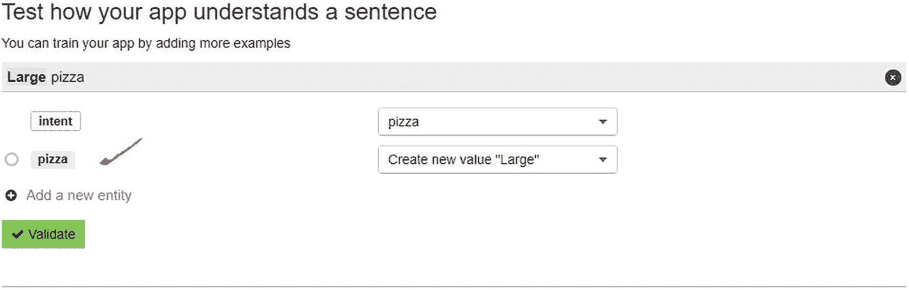

图 3-16

您需要更改披萨选项

删除披萨选项，因为你想要调整披萨的大小。点击交叉选项来删除披萨值，如图 3-17 所示。

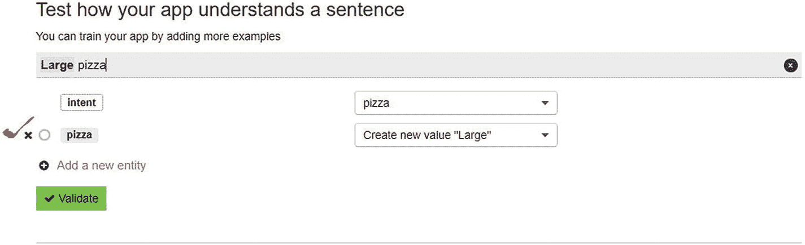

图 3-17

删除披萨选项

### 创建新实体

在本节中，您将创建一个名为*pizzaSize*的实体，如图 3-18 所示。

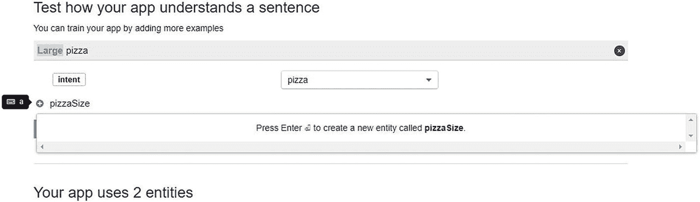

图 3-18

创建 pizzaSize 实体

创建意图后，机器人页面看起来如图 3-19 所示。

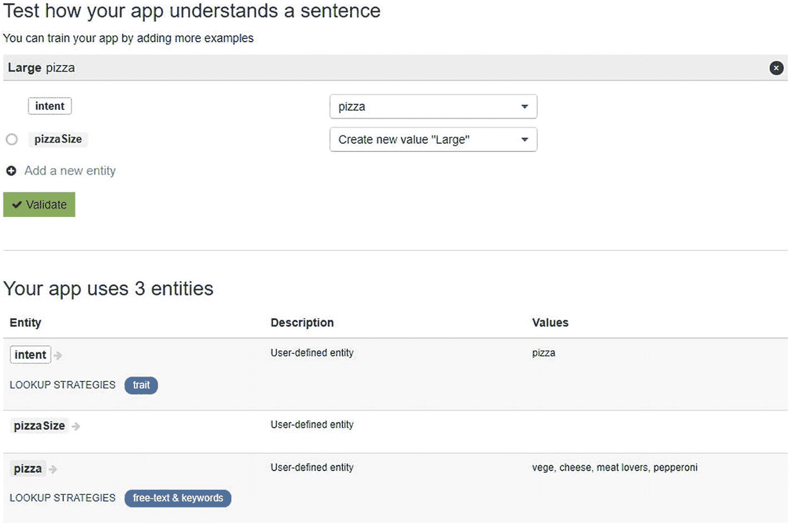

图 3-19

添加新的意图

## 在 Facebook 中实现 Wit.ai

您已经完成了创建一个使用 Wit.ai 一些功能的简单应用的过程。在本节中，您将实现 Wit.ai 与 Facebook 的结合。Facebook API 可在`developers.facebook.com`找到。您将为官方 Facebook 页面或任何 Facebook 页面创建一个聊天机器人。这个聊天机器人将添加到 Facebook Messenger 中。您需要相应地设置 webhooks。为了使 webhooks 正常工作，您需要设置 ngrock。

首先，创建一个新的应用，就像您之前做的那样。这次，将其命名为 Test1，如图 3-20 所示。

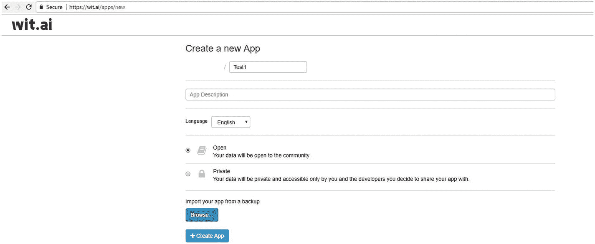

图 3-20

添加新的名称

现在回到 Facebook 开发者网站[`developers.facebook.com/`](https://developers.facebook.com/)。您需要使用您的 Facebook 凭据登录。页面如图 3-21 所示。

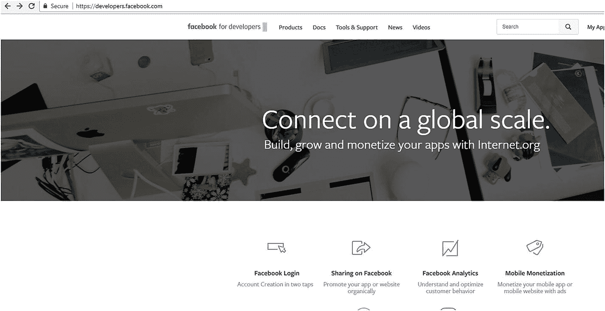

图 3-21

Facebook 开发者页面

现在您需要创建一个新的应用。点击右上角的“我的应用”选项，以访问创建新应用的下拉菜单，如图 3-22 所示。

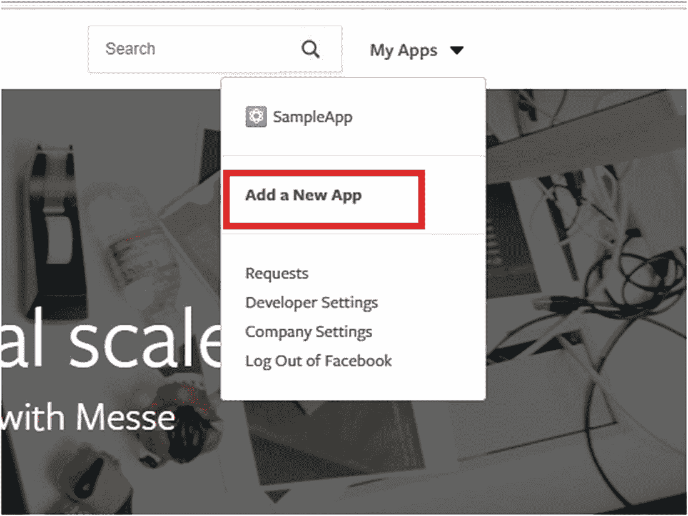

图 3-22

添加新的应用

命名为*SampleApp*，并通过点击“添加产品”按钮添加一个产品，如图 3-23 所示。

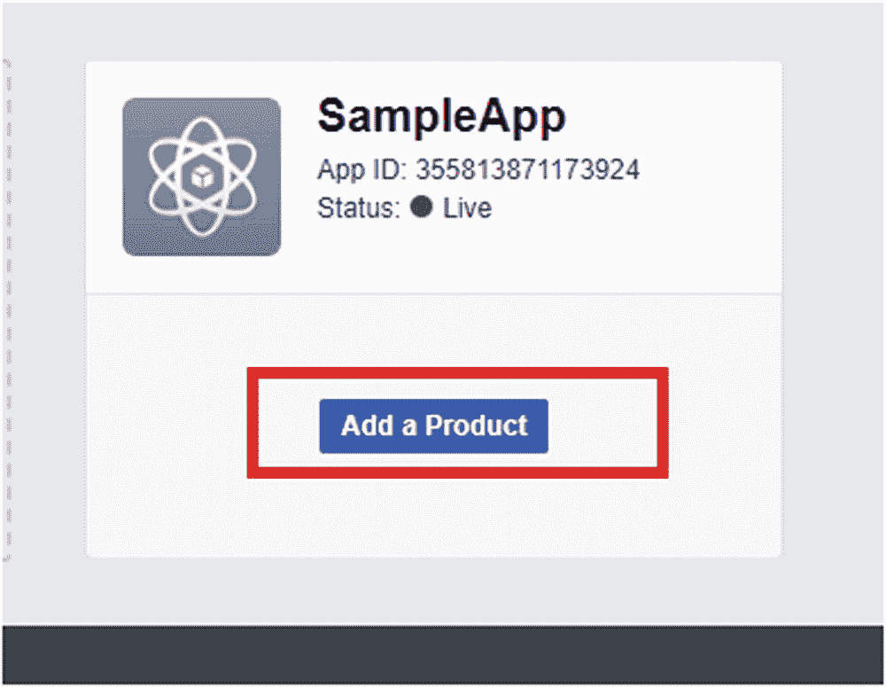

图 3-23

添加一个示例应用

对于一个产品，您需要添加一个消息传递者，如图 3-24 所示。

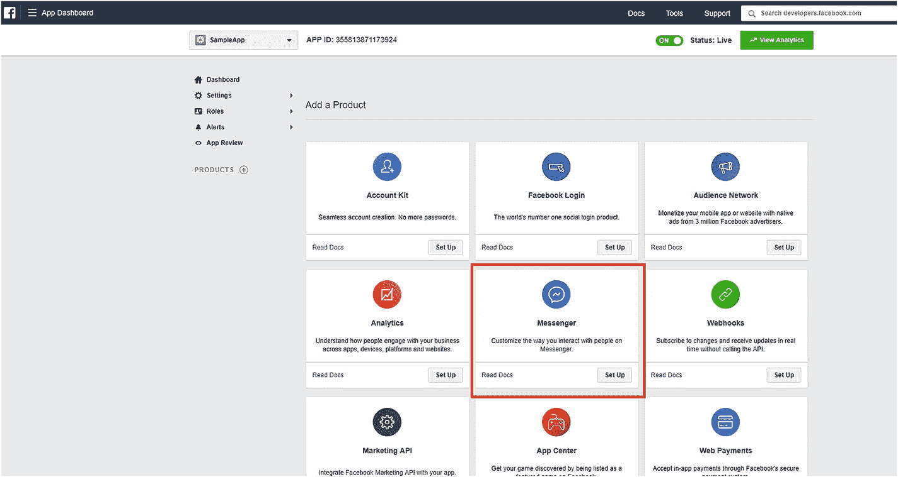

图 3-24

选择“消息传递者”选项

在“消息传递者”选项中点击“设置”按钮。您将使用 Wit.ai 的自然语言处理 (NLP) 而不是 Facebook 的（这非常基础），尽管它们两者可以完美地一起工作。现在您必须设置一个带有创建的应用名称的页面；xxxxxx，如图 3-25 所示。您的目标是创建一个官方 Facebook 页面的聊天机器人。

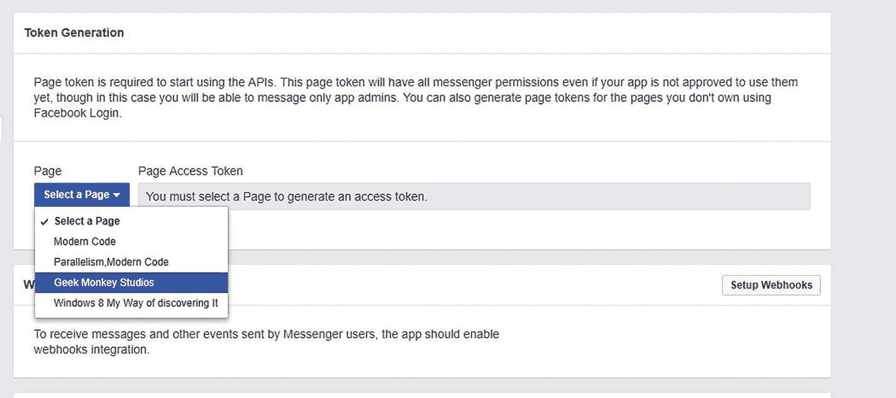

图 3-25

在 Facebook 中选择网页

网站将要求进行身份验证，然后创建令牌。现在您需要快速设置 Webhooks。点击图 3-26 所示的“设置 Webhooks”按钮。

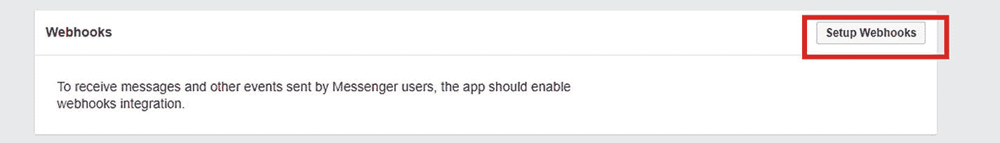

图 3-26

设置 Webhooks

点击此选项将打开一个分配详细信息的页面。在使用 Webhooks 之前，您需要配置 ngrock。转到图 3-27 所示的 ngrock 网站 `https://ngrok.com/`。

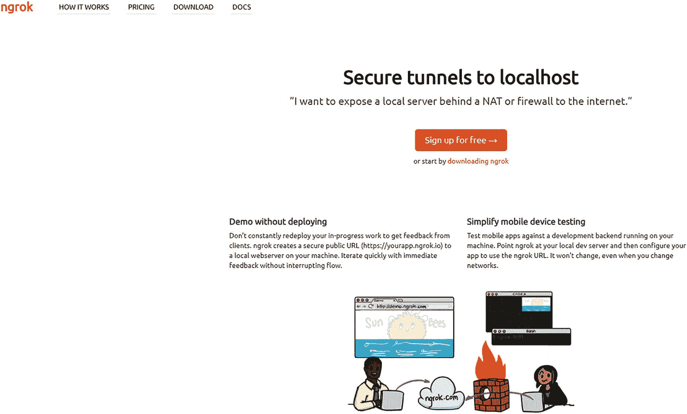

图 3-27

ngrock 网站

通过点击“下载 Ngrok”链接来下载 ngrock，访问图 3-28 所示的下载选项。

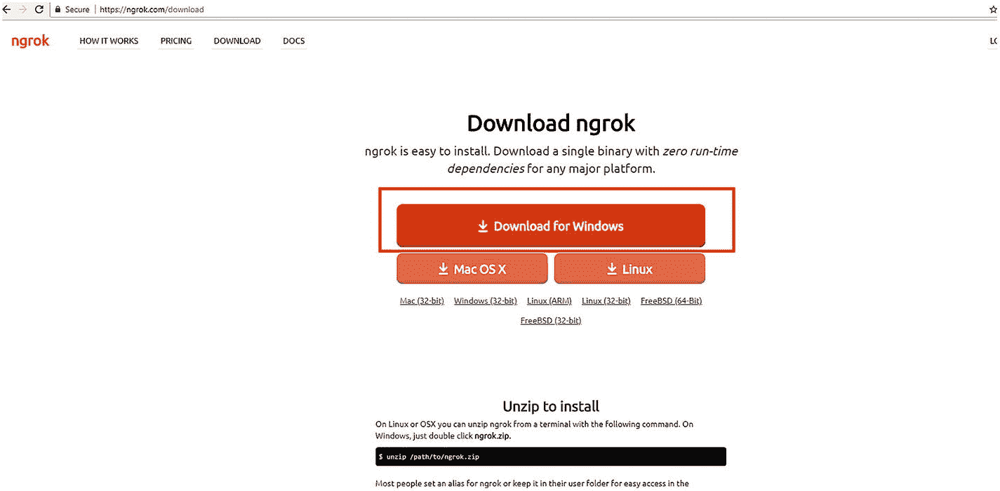

图 3-28

为 Windows 下载 ngrock

下载 ngrock 后，从命令提示符中启动 `ngrok.exe`。您必须打开命令提示符并转到本地主机页面。在我的端，本地主机是 4040。在命令提示符中输入以下详细信息：

```py
F:\ngrock>ngrok.exe http -host-header=rewrite localhost:4040
```

如果 ngrock 的网络服务器正在运行，您将看到图 3-29 所示的窗口。

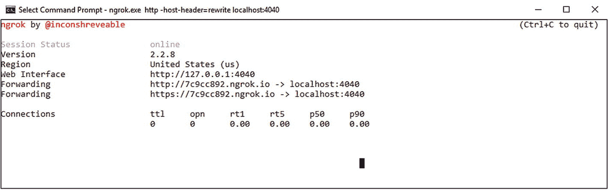

图 3-29

ngrock 的状态

让我们转到图 3-30 所示的本地主机页面，网址为 `http://7c9cc892.ngrok.io/inspect/http` *.*

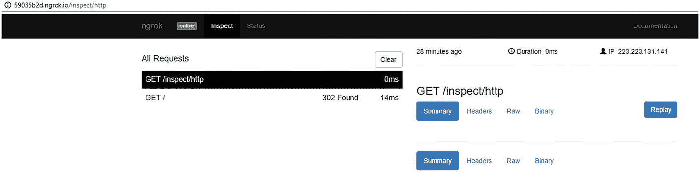

图 3-30

检查页面反映了本地主机页面的信息

当页面启动时，您可以在命令提示符窗口中看到统计信息，如图 3-31 所示。

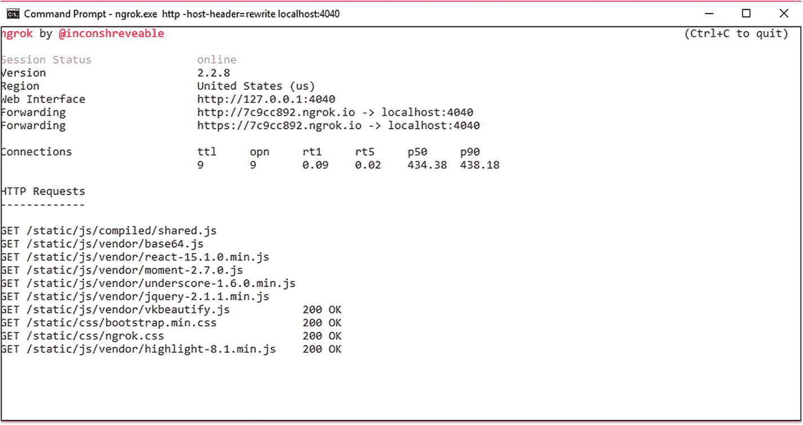

图 3-31

您已设置好 ngrok 环境

在设置好 ngrok 环境以及 webhook 的自然语言处理部分之后，部署 Wit.ai 机器人变得简单。接下来，你将使用 Dialogflow 创建一个可以部署到 Web 的完整机器人。

## 与 Dialogflow 合作

在本节中，你将使用 Dialogflow（以前称为 Api.ai）创建一个机器人。首先，你将通过你的 Google 账户访问网络控制台。然后你将创建一个披萨机器人。最后，你将使用 Small Talk 来进行交互，并将机器人链接到一个 Google 项目。小对话是一种访问预构建 API 以正确进行对话的方式。

现在让我们开始吧。

### 访问 Dialogflow

本节将介绍 Dialogflow 并通过你的 Google 账户帮助你登录。

访问 Dialogflow 网站 [`dialogflow.com/`](https://dialogflow.com/) *.*

创建聊天机器人的 Dialogflow 网站如图 3-32 所示。

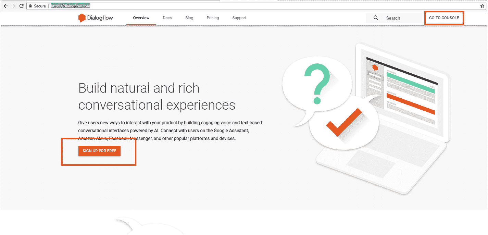

图 3-32

Dialogflow 网站

从这个 Dialogflow 页面，你可以免费注册，或者如果你已经有了账户，你可以进入控制台。如果你有 Google 账户，你需要验证它并登录，如图 3-33 所示。

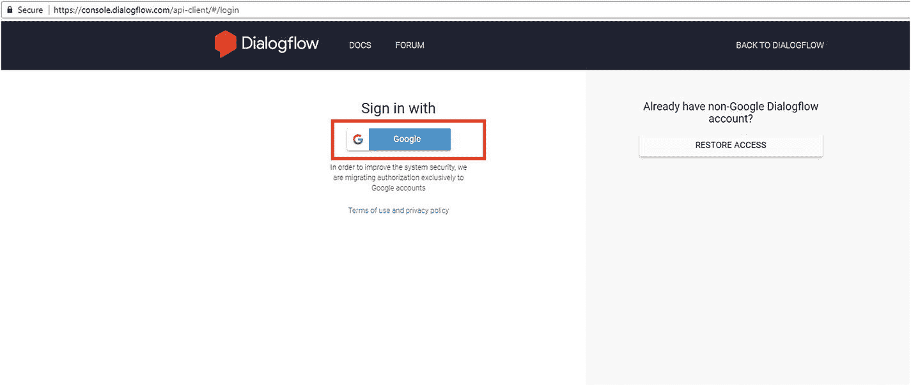

图 3-33

使用 Google 账户登录

允许访问，如图 3-34 所示。

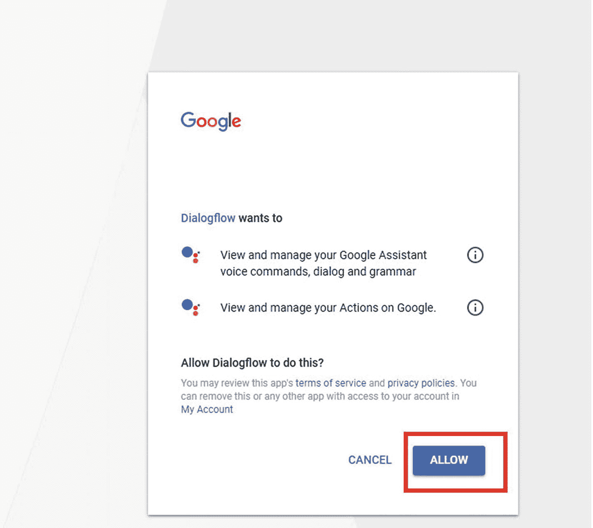

图 3-34

允许 Dialogflow 访问 Goggle Assistant

下一页是一个欢迎屏幕。Dialogflow 中的应用程序被称为 *代理*。你将需要通过点击创建代理，如图 3-35 所示来创建一个。

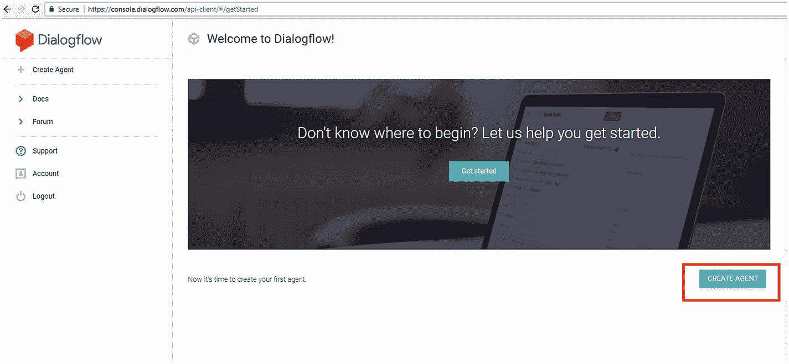

图 3-35

登录后的 Dialogflow 欢迎页面

### 创建披萨机器人

在本节中，你将使用 Dialogflow 创建一个简单的披萨机器人。命名为 PizzaBot，如图 3-36 所示。

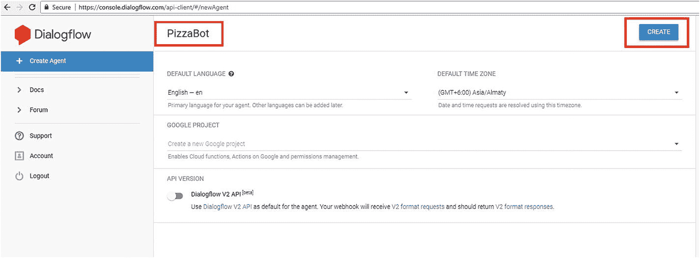

图 3-36

创建披萨机器人

现在你需要弄清楚你需要用这个应用程序做什么。

### 使用 Small Talk

你将为机器人的交互使用 Small Talk。你将使用 Small Talk 进行类似 Hi、Hello 等交互。然后你将允许用户订购披萨。Dialogflow 有一个很棒的内置 API，可以为我们完成所有的小对话。你只需要像图 3-37 所示那样启用它。

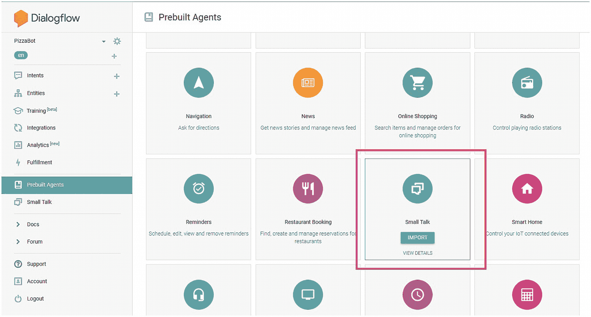

图 3-37

启用 Small Talk 预构建代理。用户选择 Small Talk 选项，以便我们导入基本的沟通方式。

然后相应地导入 Small Talk。

### 链接到 Google 项目

在本节中，您将了解如何将您的机器人集成到 Google 项目中。您可以链接到 Google 项目或创建一个新的项目，如图 3-38 所示。

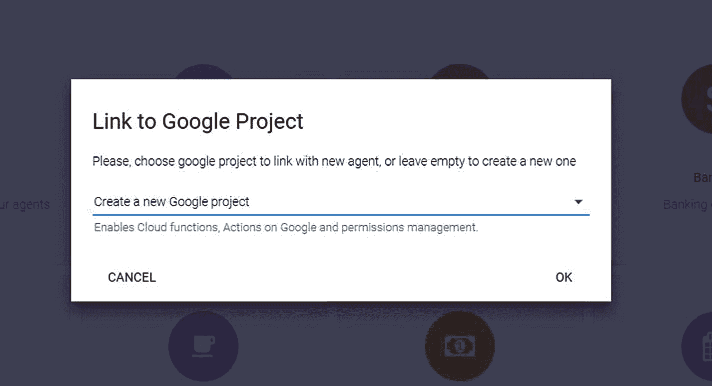

图 3-38

链接到一个 Google 项目

在链接到 Google 项目或命名一个新的项目之后，为 PizzaBot 应用程序启用 Small Talk，如图 3-39 所示。Small Talk 将极大地帮助我们。Small Talk 为我们提供了所有基本的对话流程，并使我们更容易进行沟通。

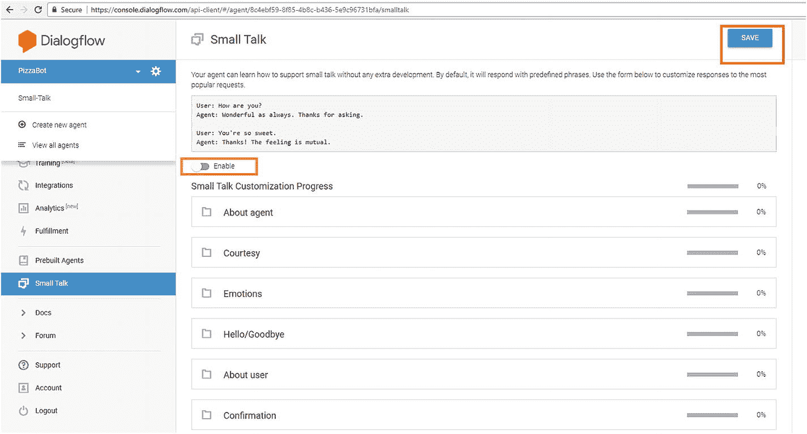

图 3-39

启用 Small Talk 并保存

在下一步中，您需要为应用程序创建一个新的实体。

### 添加一个意图

现在您将创建一个意图。现在用户可能会想到的一个参数是饥饿。所以您将添加一个名为 Hungry 的意图。我们将创建一个新的意图，如图 3-40 所示。

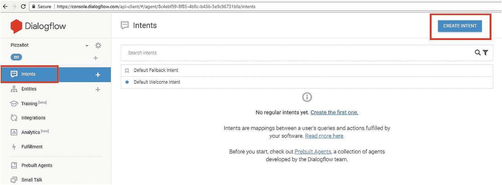

图 3-40

创建一个新的意图。我们将为聊天机器人创建一个新的意图。

然后添加训练参数或示例，如图 3-41 所示。

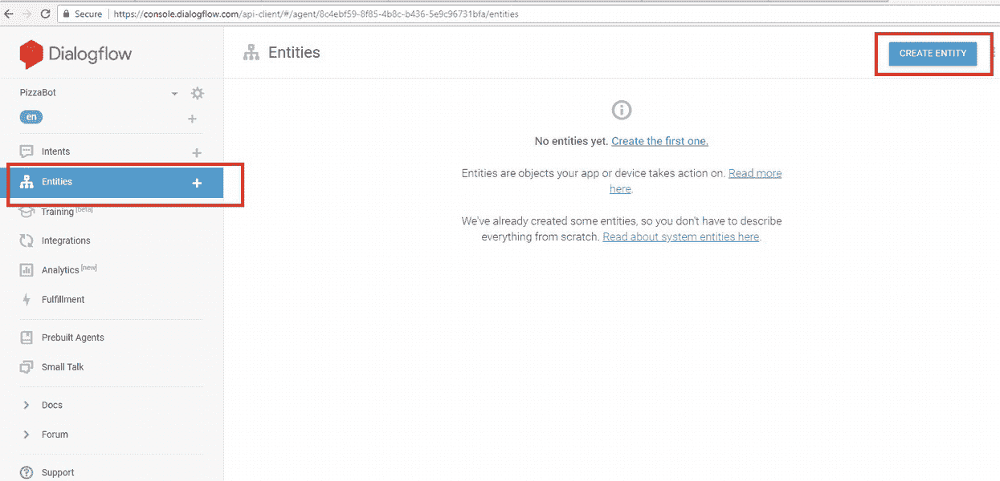

图 3-41

添加参数

您已为机器人创建了一个简单的流程。现在您将为它创建新的实体。

### 创建一个新的实体

在本节中，您将在创建新实体的同时构建机器人。点击“实体”选项，然后点击“创建实体”，如图 3-42 所示。

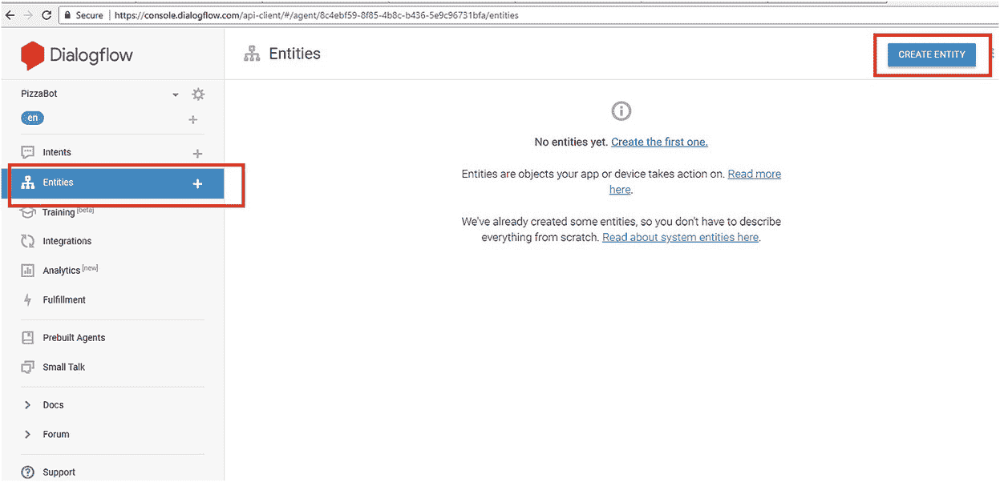

图 3-42

选择“实体”选项

这为您创建了一个包含所需详细信息的字段。对于披萨，实体将是 Topping，如图 3-43 所示。

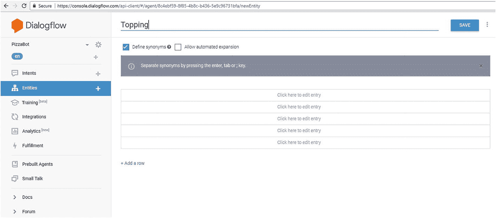

图 3-43

声明一个名为 Topping 的实体

您将为这个示例添加四个配料：

+   洋葱

+   蘑菇

+   辣椒

+   菠萝

现在保存 Topping 参数..然后机器人 UI 将看起来如图 3-44 所示。

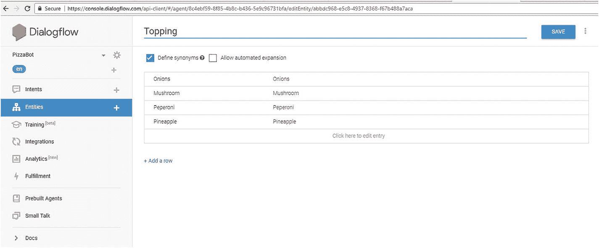

图 3-44

Topping 选项

### 部署机器人

你已经导入了 Small Talk 代理。现在你将导入一个新的代理。让我们将代理命名为 Questionbot。添加的代理越多，对话流程就越容易。你创建了一个 Questionbot，现在你将尝试在其中使用预构建的代理，如图 3-45 所示。

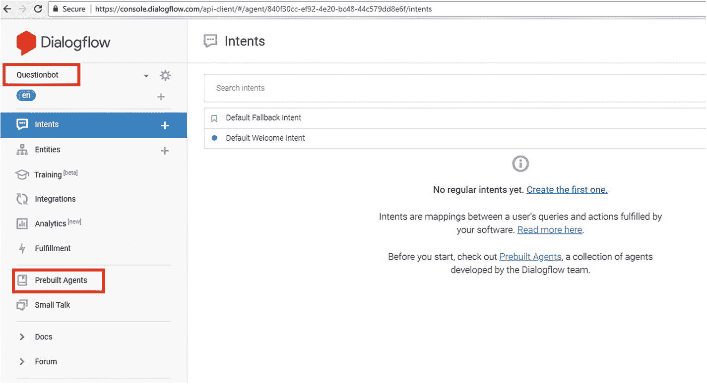

图 3-45

添加预构建的代理

你必须选择所有可用的意图，以便机器人流程完美；见图 3-46。

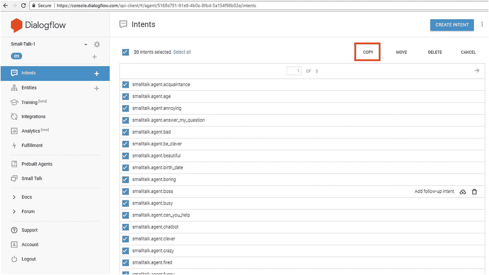

图 3-46

Small Talk 代理

然后你需要通过点击来复制意图，在复制相关实体上放置勾选标记，并命名目标代理（在这种情况下，它是 Questionbot）。然后点击开始，如图 3-47 所示。

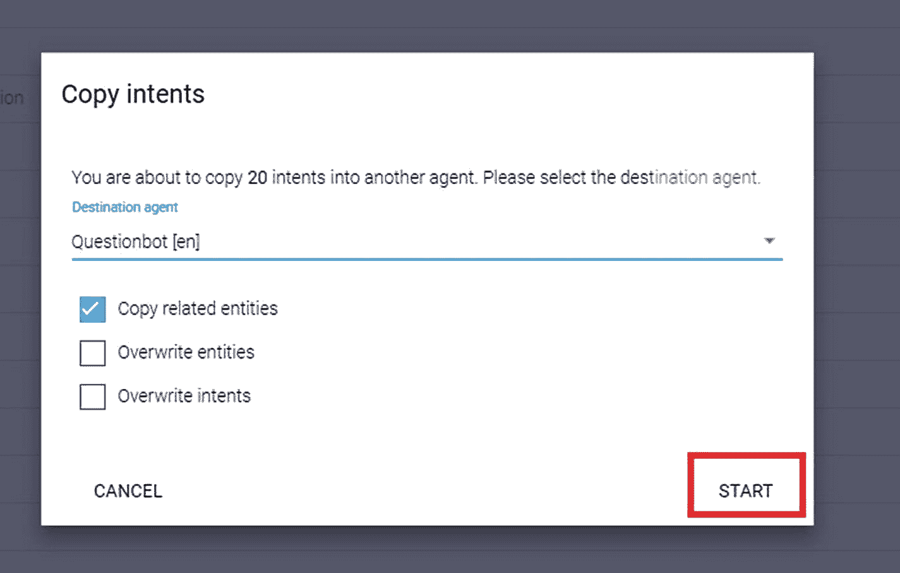

图 3-47

复制相关实体

如果你现在访问 Questionbot，你会看到所有的意图和机器人中的所有内容。尝试将*are you a bot*作为参数，如图 3-48 所示。

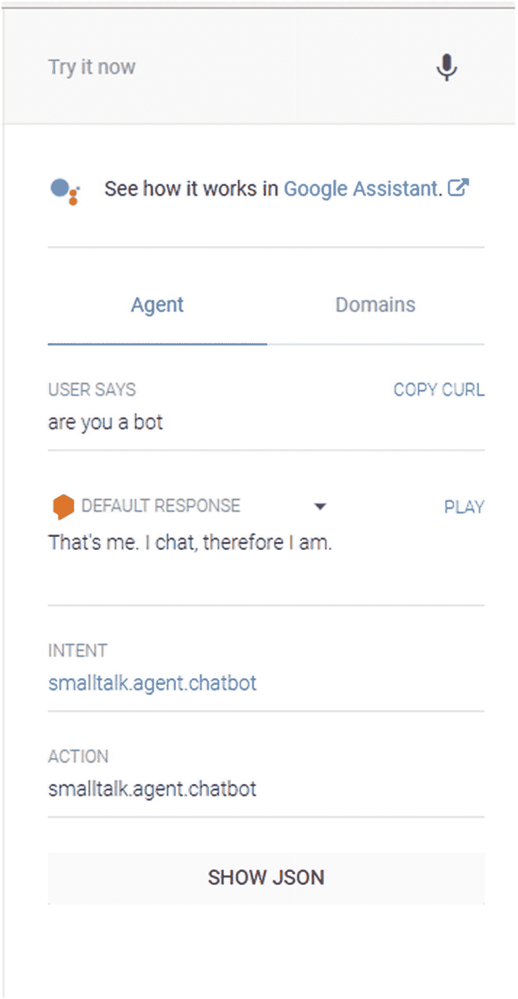

图 3-48

你提出一个问题，机器人就会回答

### 与 Web 实例集成

在本节中，你将致力于实现 Web 的集成。我们现在将尝试将应用集成到某些平台，让我们在 Web 演示中尝试。

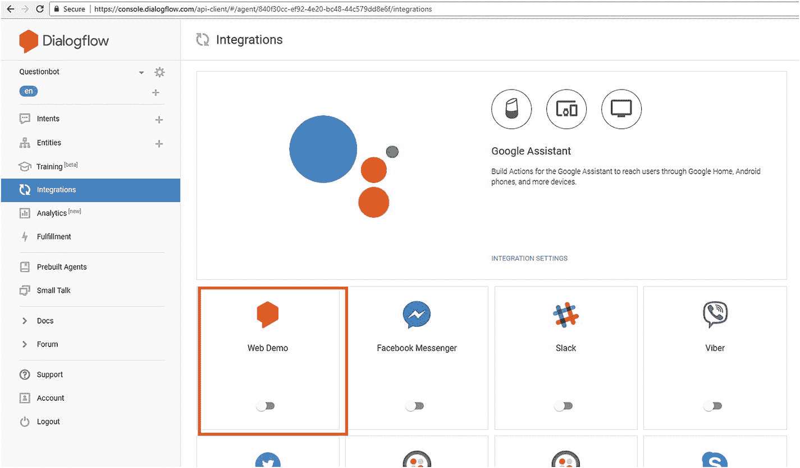

图 3-49

选择 Web 演示集成选项。我们正在将机器人集成以启用网页版对话。

将滑块向右移动以测试链接，如图 3-50 所示。

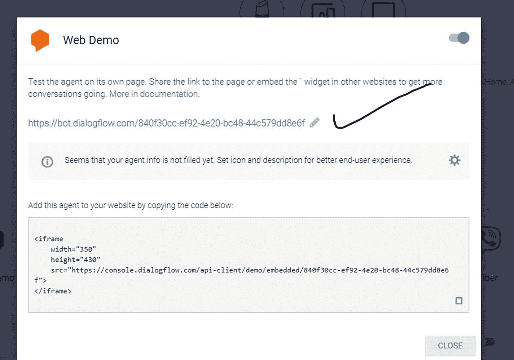

图 3-50

测试链接

通过在 HTML 页面中使用 iframe 来集成机器人的 Web 链接，以便机器人按预期工作，如图 3-51 所示。

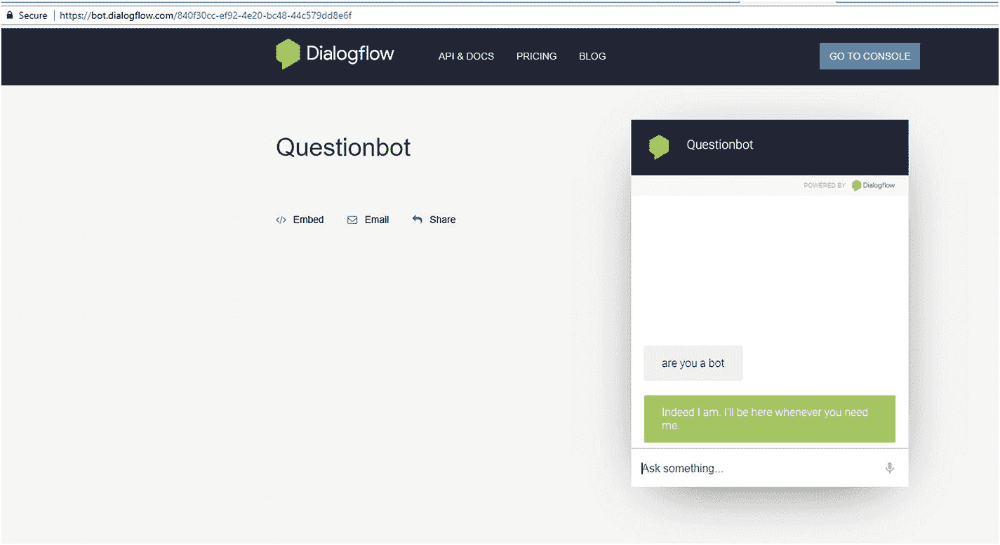

图 3-51

为机器人集成 Web 链接

## 结论

在本章中，你处理了两个机器人框架，并了解了它们的工作原理。你使用 Dialogflow 创建了一个完整的可部署机器人，并看到了其结果。本章提供了简单的示例、集成以及机器人的用例。
