# 5. TensorFlow 聊天机器人

在本章中，您将通过使用 TensorFlow 来创建聊天机器人。您将从学习一些 TensorFlow 基础知识开始。

您将使用开源模型进行工作。然后，您将转向创建聊天机器人的不同方法。您将设置一个具有 NVDIA CUDA 访问权限的 TensorFlow GPU。您将仔细检查 CUDA，然后创建聊天机器人。

## TensorFlow 基础

*TensorFlow* 是一个主要用于数据流工作的数据科学框架。它有效地使用张量和它们对节点的处理方法，以便我们可以在机器学习和深度学习中轻松实现它，张量是一个通用的矩阵，可能是 1 维、2 维或更高阶。

本节介绍了张量以及设置适当工作环境的基础知识。在本章的后面部分，您将从头开始使用 TensorFlow 构建神经网络，然后使用 TensorBoard 功能来查看 TensorFlow 图的运行情况。

### 设置工作环境

本节概述了 Python 的 Anaconda 发行版如何设置 GPU 版本。

您将激活 Anaconda 环境，并从这里开始您的 TensorFlow 基础学习。

您将使用 Python 的 Anaconda 发行版，并使用它安装 TensorFlow。您将使用 GPU 版本。首先，您激活 Anaconda 环境，如图 5-1 所示。

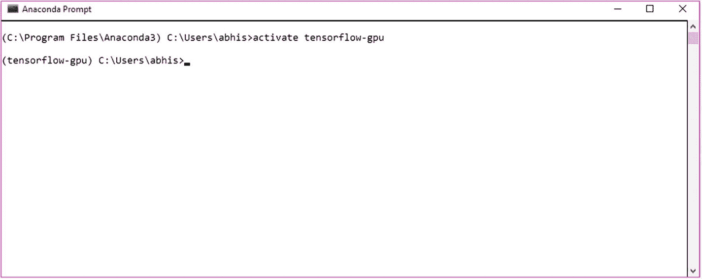

图 5-1

激活 TensorFlow 环境

您将使用英特尔优化的 Python 编写 Python 代码。模式如图 5-2 所示。

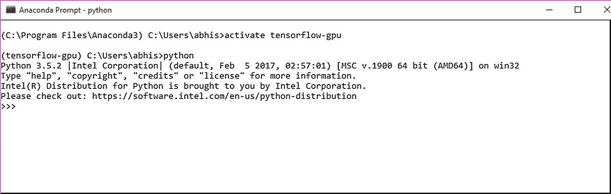

图 5-2

英特尔优化的 Python

现在我们来检查我们的 TensorFlow 版本，如图 5-3 所示。

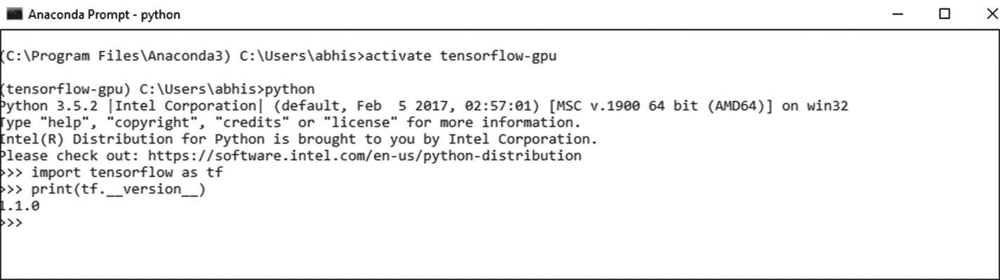

图 5-3

检查 TensorFlow 版本

要检查版本，首先导入 TensorFlow：

```py
>>> import tensorflow as tf
>>> print(tf.__version__)
1.1.0
```

让我们分解一下单词“tensor”，它的意思是 n 维数组。

您将在 TensorFlow 中创建最基本的东西，即常量。您将创建一个名为 `hello` 的变量。工作过程如图 5-4 所示：

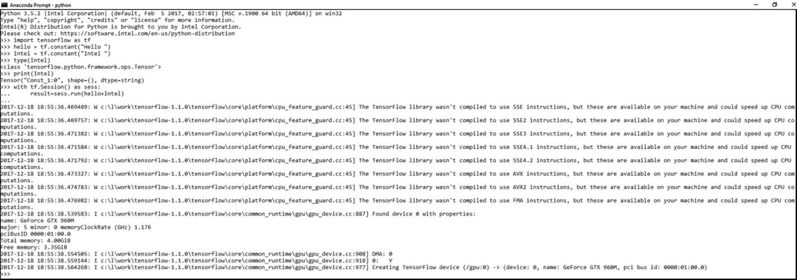

图 5-4

使用 TensorFlow 进行操作

```py
>>> import tensorflow as tf
>>> hello = tf.constant("Hello")
>>> Intel = tf.constant("Intel")
>>> type(Intel)

>>> print(Intel)
Tensor("Const_1:0", shape=(), dtype=string)
>>> with tf.Session() as sess:
...      result=sess.run(hello+Intel)
Now we print the result.
>>> print(result)
b'Hello Intel '
>>>
```

现在我们来在 TensorFlow 中添加两个数字。首先，您声明两个变量：

```py
>>> a =tf.constant(50)
>>> b =tf.constant(70)
```

您检查一个变量的类型：

```py
>>> type(a)

```

在这里，您可以看到对象类型为 `Tensor`。

要添加两个变量，您必须创建一个会话：

```py
>>> with tf.Session() as sess:
...     result = sess.run(a+b)
```

要查看结果，只需输入 `result`：

```py
>>> result
120
>>>
```

## 创建神经网络

在本节中，你将创建一个神经网络，它对某些 2D 数据执行简单的线性拟合。你将使用 TensorFlow 创建图。你将初始化会话，将数据输入 TensorFlow，并获取输出。

图 5-5 展示了 TensorFlow 中工作流程。

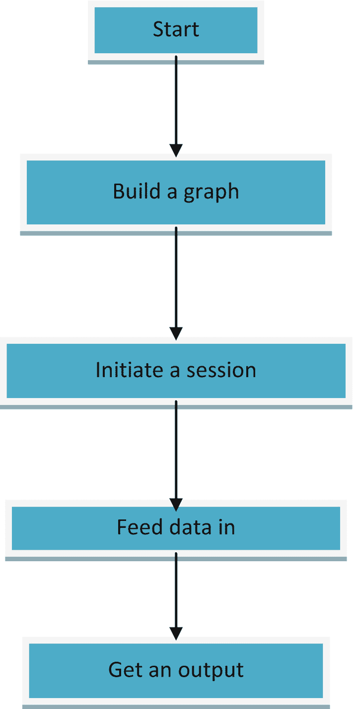

图 5-5

TensorFlow 流程

图 5-6 展示了你将创建的神经网络结构。

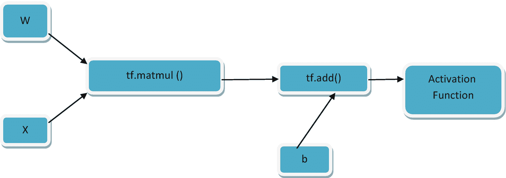

图 5-6

构建神经网络

你使用以下线性方程来实现神经网络：

```py
WX + b = Z
```

你将添加一个成本函数来训练网络以优化参数。

首先，导入 NumPy 和 TensorFlow：

```py
(C:\Program Files\Anaconda3) C:\Users\abhis>activate tensorflow-gpu
(tensorflow-gpu) C:\Users\abhis>python
Python 3.5.2 |Intel Corporation| (default, Feb  5 2017, 02:57:01) [MSC v.1900 64 bit (AMD64)] on win32
Type "help", "copyright", "credits" or "license" for more information.
Intel(R) Distribution for Python is brought to you by Intel Corporation.
Please check out: https://software.intel.com/en-us/python-distribution
>>> import numpy as np
>>> import tensorflow as tf
>>>
```

你需要为我们的过程设置随机种子值：

```py
>>> np.random.seed(101)
>>> tf.set_random_seed(101)
```

添加一些随机数据：

```py
Using rand_a =np.random.uniform(0,100(5,5))
```

你添加从 0 到 100 的随机数据点，然后要求操作逻辑的形状为 (5,5)。对于 `b` 也做同样的操作：

```py
>>> rand_a =np.random.uniform(0,100,(5,5))
>>> rand_a
array([[ 51.63986277,  57.06675869,   2.84742265,  17.15216562,
68.52769817],
[ 83.38968626,  30.69662197,  89.36130797,  72.15438618,
18.99389542],
[ 55.42275911,  35.2131954 ,  18.18924027,  78.56017619,
96.54832224],
[ 23.23536618,   8.35614337,  60.35484223,  72.89927573,
27.62388285],
[ 68.53063288,  51.78674742,   4.84845374,  13.78692376,
18.69674261]])
>>> rand_b
array([[ 99.43179012],
[ 52.06653967],
[ 57.87895355],
[ 73.48190583],
[ 54.19617722]])
```

为这些均匀对象创建占位符：

```py
>>> a = tf.placeholder(tf.float32)
>>> b = tf.placeholder(tf.float32)
```

你使用 TensorFlow，因为它理解正常的 Python 操作：

```py
>>> add_op = a + b
>>> mul_op = a * b
```

现在，你将创建使用图来向 TensorFlow 提供字典以获取结果的会话。首先声明会话，然后获取 `add` 操作的结果。传递操作和 feed 字典。对于占位符对象，你需要提供数据；你将通过使用 feed 字典来完成。

将数据传递给键 A 和 B：

```py
add_result = sess.run(add_op,feed_dict={a:10,b:20})
>>> with tf.Session() as sess:
...      add_result = sess.run(add_op,feed_dict={a:10,b:20})
...      print(add_result)
```

由于你创建了随机结果，你将把它传递到 feed 字典中：

```py
>>> with tf.Session() as sess:
...      add_result = sess.run(add_op,feed_dict={a:rand_a,b:rand_b})
```

打印 `add_result` 的值：

```py
>>> print(add_result)
[[ 151.07165527  156.49855042  102.27921295  116.58396149  167.95948792]
[ 135.45622253   82.76316071  141.42784119  124.22093201   71.06043243]
[ 113.30171204   93.09214783   76.06819153  136.43911743  154.42727661]
[  96.7172699    81.83804321  133.83674622  146.38117981  101.10578918]
[ 122.72680664  105.98292542   59.04463196   67.98310089   72.89292145]]
```

创建一个用于乘法的矩阵：

```py
>>> with tf.Session() as sess:
...      mul_result = sess.run(mul_op,feed_dict={a:10,b:20})
print(mul_result)
200
```

使用以下随机值：

```py
>>> with tf.Session() as sess:
...      mul_result = sess.run(mul_op,feed_dict={a:rand_a,b:rand_b})
>>> print(mul_result)
[[ 5134.64404297  5674.25         283.12432861  1705.47070312
6813.83154297]
[ 4341.8125      1598.26696777  4652.73388672  3756.8293457    988.9463501 ]
[ 3207.8112793   2038.10290527  1052.77416992  4546.98046875
5588.11572266]
[ 1707.37902832   614.02526855  4434.98876953  5356.77734375
2029.85546875]
[ 3714.09838867  2806.64379883   262.76763916   747.19854736
1013.29199219]]
```

从我们获得的结果创建一个神经网络。让我们向数据添加一些特征：

```py
>>> n_features =10
```

声明神经元的层数。在这种情况下，你有三个：

```py
>>> n_dense_neurons = 3
```

让我们为 `x` 创建一个占位符并添加数据类型，它是 `float`。然后你必须找到形状。首先，你将其视为 `None`，因为它取决于你提供给神经网络的批次数据。列将是特征的数量。

```py
>>> x = tf.placeholder(tf.float32,(None,n_features))
```

现在你有了其他变量。`W` 是权重变量，你用某种随机性初始化它；然后根据特征的数量和层的神经元数量确定它的形状：

```py
>>> W = tf.Variable(tf.random_normal([n_features,n_dense_neurons]))
```

声明偏差。

你声明变量，可以使用 TensorFlow 中的函数将其设置为 1 或 0。记住，`W` 将与 `x` 相乘，所以你需要保持列的维度与行的维度以进行矩阵乘法：

```py
>>> b = tf.Variable(tf.ones([n_dense_neurons])
...
...
...
... )
>>>
```

创建一个操作和激活函数：

```py
>>> xW = tf.matmul(x,W)
```

创建输出 `z`：

```py
>>> z = tf.add(xW,b)
```

创建激活函数：

```py
>>> a = tf.sigmoid(z)
```

要完成图或流程，在一个简单的会话中运行它们：

```py
>>> init = tf.global_variables_initializer()
```

最后，传递一个 feed 字典来创建会话：

```py
>>> with tf.Session() as sess:
...      sess.run(init)
...      layer_out = sess.run(a,feed_dict={x:np.random.random([1,n_features])})
>>> print(layer_out)
[[ 0.19592889  0.84230143  0.36188066]]
```

你现在已经创建了一个神经网络并打印了最终的输出层。

## 与激活函数一起工作

你现在将开始使用激活函数，并在 TensorFlow 中实现它，以查看任何你想要的层。你相应地获得 Intel 优化的 Python 模式。你需要再次启用环境，如图 5-7 所示。

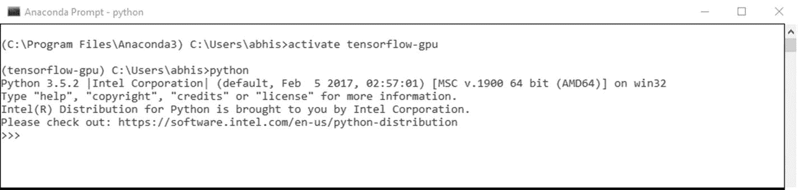

图 5-7

再次启用环境

现在你导入以进入 TensorFlow：

```py
>>> import TensorFlow as tf
```

接下来，你实现层函数。

对于层，你应该有输入；这是从最后一层处理的信息。使用`in_size`确定输入的大小；这也描述了最后一层的隐藏神经元的数量。使用`out_layer`显示这一层的神经元数量。然后你声明激活函数，它是`None`——也就是说，你正在使用线性激活函数。

你必须定义基于输入和输出大小的权重。

你将必须使用随机正态分布来生成权重。然后你将传递输入和输出大小。最初，你使用随机值，因为它可以提高神经网络。

你声明一维偏差。你将偏差初始化为零，并将所有变量初始化为 0.1。它的维度是 1 行和`out_size`列数。因为你想要将权重加到偏差上，所以形状应该是相同的，因此你使用`out_size`。

对于操作或计算过程，你使用矩阵乘法：

```py
def add_layer(inputs, in_size, out_size, activation_function=None):
Weights = tf.Variable(tf.random_normal([in_size, out_size]))
biases = tf.Variable(tf.zeros([1, out_size]) + 0.1)
Wx_plus_b = tf.matmul(inputs, Weights) + biases
if activation_function is None:
outputs = Wx_plus_b
else:
outputs = activation_function(Wx_plus_b)
print(outputs)
return outputs
```

在下一节中，你将回顾 TensorFlow 的一个重要特性，即 TensorBoard，它用于查看图以及调试。

### TensorBoard

让我们来谈谈 TensorBoard。*TensorBoard*是一个数据可视化工具，它包含在 TensorFlow 中。当你处理在 TensorFlow 中创建网络时，它由操作和张量组成。当你将数据输入到神经网络中，数据通过执行操作的张量流动，最终得到输出。

TensorBoard 是为了了解模型中张量的流动而创建的。它有助于调试和优化。让我们创建一些图表，然后在 TensorBoard 中显示它们。基本操作是加法和乘法。

图 5-8 展示了 TensorFlow 中会话的工作方式。

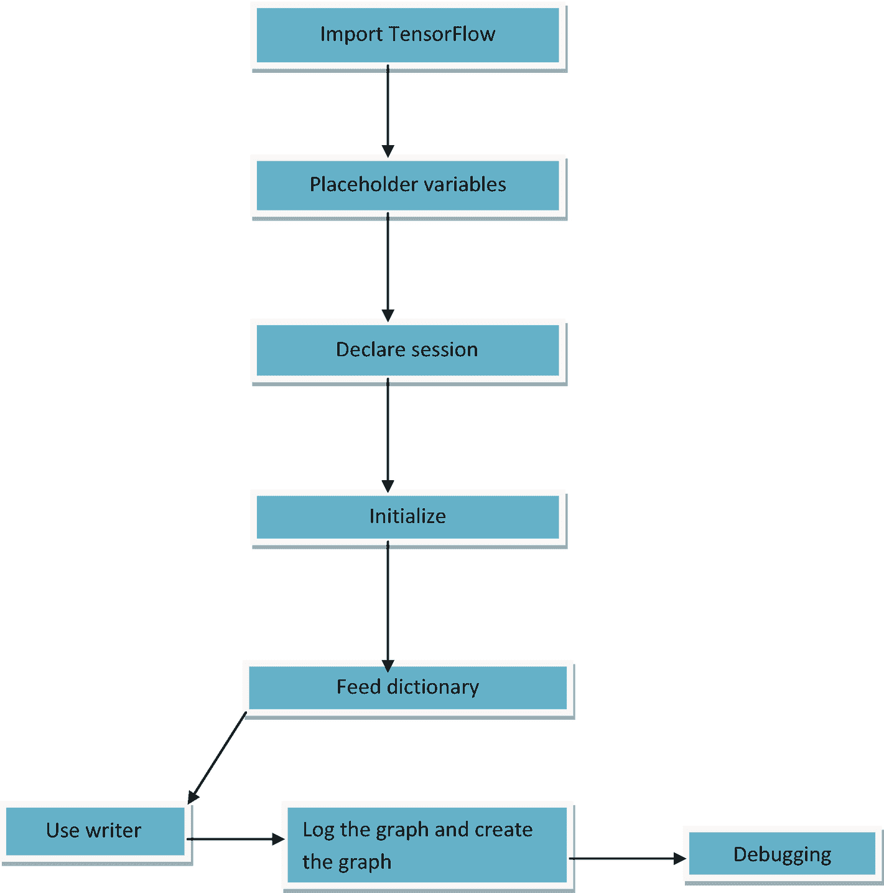

图 5-8

使用 TensorFlow 创建会话

按如下方式导入 TensorFlow：

```py
Import tensorflow as tf
```

我们展示了一个加法操作，并在 tensorboard 中显示结果。

然后声明占位符变量：

```py
X = tf.placeholder(tf.float32, name="X")
Y = tf.placeholder(tf.float32, name="Y")
```

接下来，你需要声明你需要执行的操作：

```py
addition = tf.add(X, Y, name="addition")
```

在下一步中，你必须声明会话。你想要执行操作，并且需要在会话中执行这些操作。你必须使用`init`初始化变量。然后我们必须在`init`中运行`sess`：

```py
sess = tf.Session()
# tf.initialize_all_variables() no long valid from
# 2017-03-02 if using tensorflow >= 0.12
if int((tf.__version__).split('.')[1]) < 12 and int((tf.__version__).split('.')[0]) < 1:
init = tf.initialize_all_variables()
else:
init = tf.global_variables_initializer()
sess.run(init)
```

当你使用 feed 字典运行会话时，你初始化变量的值：

```py
result = sess.run(addition, feed_dict ={X: [5,2,1], Y: [10,6,1]})
```

最后，使用 summary writer，你可以获取图的调试日志：

```py
if int((tf.__version__).split('.')[1]) = 0.12
writer = tf.summary.FileWriter("logs/nono", sess.graph)
```

Python 中的整个代码库以单流程方式如下所示：

```py
import tensorflow as tf
X = tf.placeholder(tf.float32, name="X")
Y = tf.placeholder(tf.float32, name="Y")
addition = tf.add(X, Y, name="addition")
sess = tf.Session()
# tf.initialize_all_variables() no long valid from
# 2017-03-02 if using tensorflow >= 0.12
if int((tf.__version__).split('.')[1]) = 0.12
writer = tf.summary.FileWriter("logs/nono", sess.graph)
```

现在我们来可视化生成的图。转到 Anaconda 命令提示符。激活环境并转到运行 Python 文件的文件夹。在图 5-9 中，你再次启用了 Intel 优化的 Python 模式。

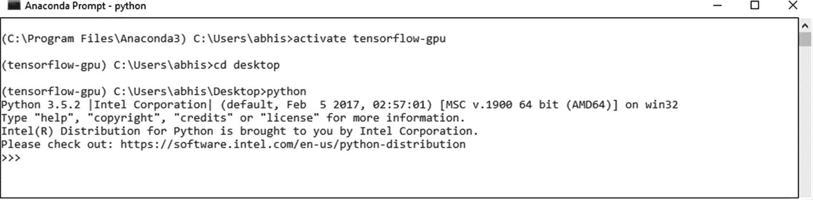

图 5-9

启用 Python 模式

现在需要运行 Python 文件。使用以下命令获取图 5-10 中显示的输出：

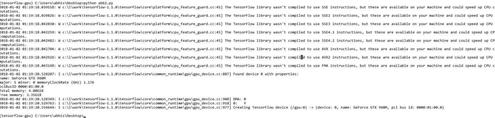

图 5-10

运行代码

```py
(tensorflow-gpu) C:\Users\abhis\Desktop>python abb2.py
```

现在打开 TensorBoard：

```py
(tensorflow-gpu) C:\Users\abhis\Desktop>tensorboard --logdir=logs/nono
WARNING:tensorflow:Found more than one graph event per run, or there was a metagraph containing a graph_def, as well as one or more graph events.  Overwriting the graph with the newest event.
Starting TensorBoard b'47' at http://0.0.0.0:6006
(Press CTRL+C to quit)
```

现在让我们打开浏览器以访问 TensorBoard。

需要打开以下链接：

```py
http://localhost:6006/
```

图 5-11 显示了 TensorBoard 中的加法操作。

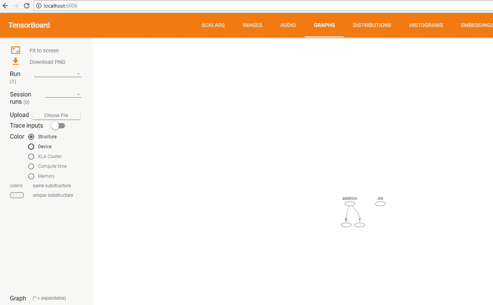

图 5-11

TensorBoard 输出

对于乘法，遵循相同的流程，以下代码库在此共享：

```py
import tensorflow as tf
X = tf.placeholder(tf.float32, name="X")
Y = tf.placeholder(tf.float32, name="Y")
multiplication = tf.multiply(X, Y, name="multiplication")
sess = tf.Session()
# tf.initialize_all_variables() no long valid from
# 2017-03-02 if using tensorflow >= 0.12
if int((tf.__version__).split('.')[1]) = 0.12
writer = tf.summary.FileWriter("logs/no1", sess.graph)
```

图 5-12 显示了乘法图。

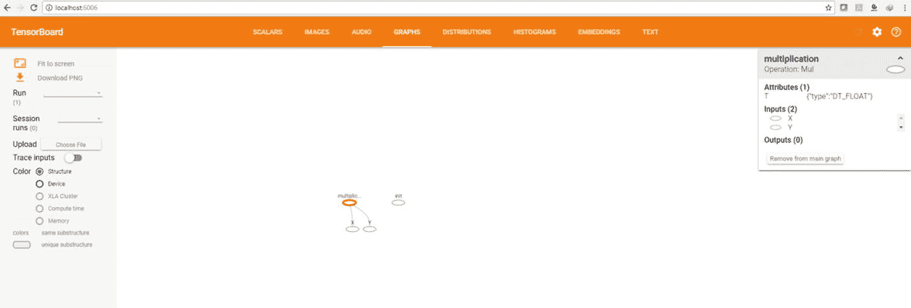

图 5-12

TensorBoard 中的乘法分析

让我们使用一个更复杂的教程来了解 TensorBoard 可视化是如何工作的。你将使用之前显示的激活函数定义。

声明占位符：

```py
xs = tf.placeholder(tf.float32, [None, 1], name="x_input")
ys = tf.placeholder(tf.float32, [None, 1], name="y_input")
```

添加具有 `relu` 激活函数的隐藏层：

```py
l1 = add_layer(xs, 1, 10, activation_function=tf.nn.relu)
```

添加输出层：

```py
prediction = add_layer(l1, 10, 1, activation_function=None)
```

计算误差：

```py
with tf.name_scope('loss'):
loss = tf.reduce_mean(tf.reduce_sum(tf.square(ys - prediction),
reduction_indices=[1]))
```

接下来你需要训练网络。你将使用梯度下降优化器：

```py
train_step = tf.train.GradientDescentOptimizer(0.1).minimize(loss)
```

### TensorFlow 的版本

可用的当前 TensorFlow 版本如下：

+   r1.8

+   r1.7

+   r1.6

+   r1.5

+   r1.4

+   r1.3

+   r1.2

+   r1.1

TensorFlow 分支提供了各种版本的 TensorFlow，请参阅 [www.tensorflow.org/versions/](https://www.tensorflow.org/versions/) 。

## Keras 概述

本节介绍了一个名为 Keras 的深度学习框架的前端包装器。然后我们将一起探讨如何使用 Jupyter Notebook 实现 Keras 并用它创建聊天机器人。

Keras 是一个前端包装器，可以与许多后端深度学习框架一起使用。

Keras 已经构建了神经网络函数，你可以用它轻松快速地获取神经网络。它维护以下内容：

+   模块化

+   极简主义

+   可扩展性

+   Python 本地化

作为 Keras 的基本起点，你将运行一个“Hello World”示例。与机器学习和深度学习相比，“Hello World”示例有所不同。

在本例中，你将使用 `iris` 数据集。你需要检查以下库是否已安装：

+   `seaborn`

+   `numpy`

+   `sklearn`

+   `keras`

+   `tensorflow`

TensorFlow 将作为 Keras 包装器的背景。

您将同步一个 GitHub 项目：

[Keras Hello World 仓库](https://github.com/fastforwardlabs/keras-hello-world)

重要文件将通过`requirements.txt`文件下载。

让我们打开 Anaconda 提示符并进入 Tensorflow-gpu 环境：

```py
(C:\Users\abhis\Anaconda3) C:\Users\abhis>activate tensorflow-gpu
```

现在您将克隆项目文件，这将复制必要文件到文件夹中，并在机器上创建一个本地副本：

```py
(tensorflow-gpu) F:\>git clone https://github.com/fastforwardlabs/keras-hello-world.git
Cloning into 'keras-hello-world'...
remote: Counting objects: 94, done.
remote: Total 94 (delta 0), reused 0 (delta 0), pack-reused 94
Unpacking objects: 100% (94/94), done.
```

现在您可以使用以下代码安装必要的文件：

```py
(tensorflow-gpu) F:\keras-hello-world>pip install requirements
```

您将启动 Jupyter Notebook。但首先，让我们导入库，如图 5-13 所示。

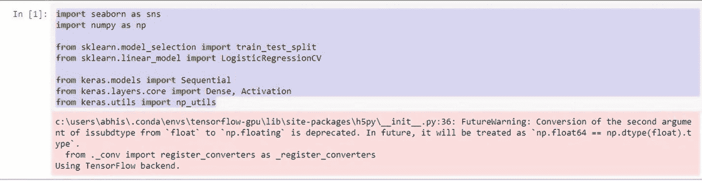

图 5-13

导入库

程序开始使用 TensorFlow 后端。

`iris` 数据集确实对机器学习很有用，您首先加载它：

```py
iris = sns.load_dataset("iris")
iris.head()
```

图 5-14 展示了如何加载 `iris` 数据集。

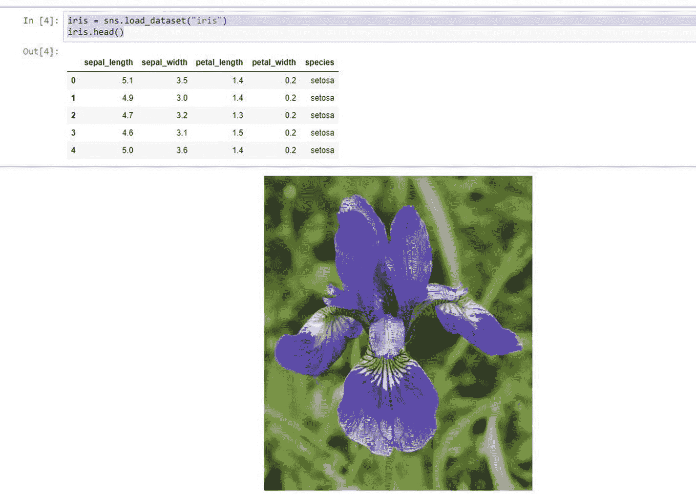

图 5-14

使用鸢尾花数据集

现在您可视化数据集：

```py
sns.pairplot(iris, hue="species");
```

在图 5-15 中，您正在绘制物种。

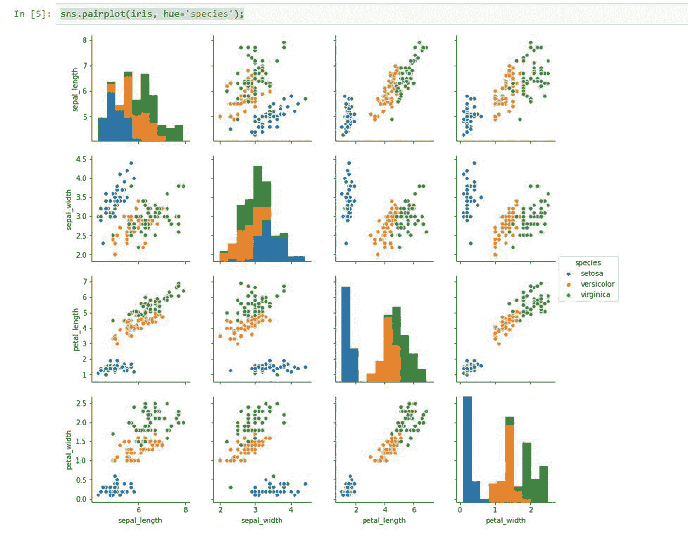

图 5-15

绘制物种

现在您将数据分割为训练集和测试集。

首先拉取原始数据框：

```py
X = iris.values[:, :4]
y = iris.values[:, 4]
```

然后分割数据：

```py
train_X, test_X, train_y, test_y = train_test_split(X, y, train_size=0.5, test_size=0.5, random_state=0)
```

现在您使用 Scikit 分类器进行训练，如图 5-16 所示。

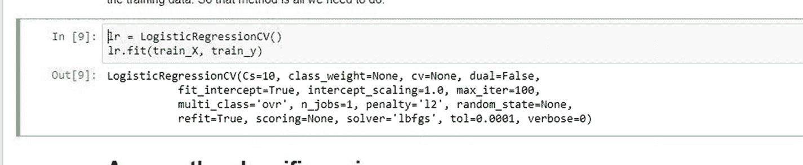

图 5-16

使用逻辑回归

现在您检查分类器的准确率：

```py
print("Accuracy = {:.2f}".format(lr.score(test_X, test_y)))
```

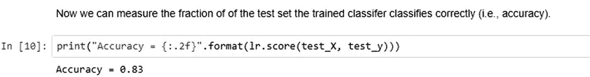

### Keras 聊天机器人入门

在本节中，您将使用 Keras 创建一个聊天机器人。下载仓库并执行以下步骤：

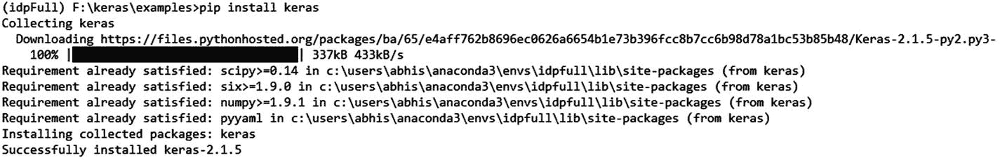

图 5-17

下载 Keras

1.  在您的项目目录中创建一个数据文件夹，并从以下网站下载 Cornell Movie-Dialogs 语料库：

    [Cornell Movie-Dialogs 语料库](http://www.cs.cornell.edu/%257Ecristian/Cornell_Movie-Dialogs_Corpus.html)

1.  解压文件并更新`config.py`文件<br>。将`DATA_PATH`更改为您存储数据的位置。

1.  `python3 data.py<br>s`将为康奈尔数据集执行所有预处理。使用以下方式下载 Keras，如图 5-17 所示：

    ```py
    Pip install keras
    ```

现在您准备训练集和测试集。在图 5-18 中，您正在为机器人积累数据。

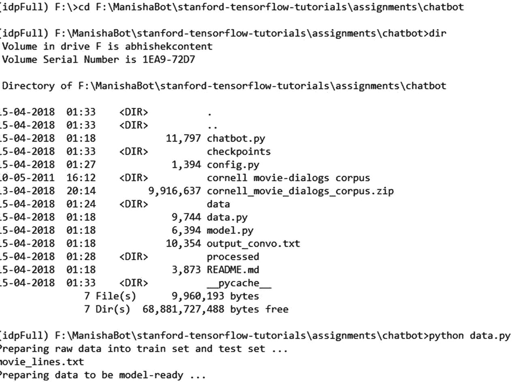

图 5-18

数据积累

1.  输入以下内容：

    ```py
    python3 chatbot.py --mode [train/chat]
    ```

在图 5-19 中，我们正在训练数据。

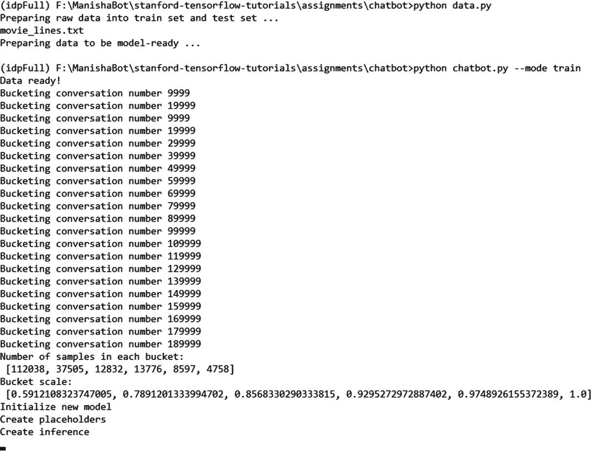

图 5-19

训练数据

如果模式是 `train`，您将训练聊天机器人。默认情况下，模型将恢复之前训练的权重（如果有）并继续在该权重上训练。创建优化器如图 5-20 所示。

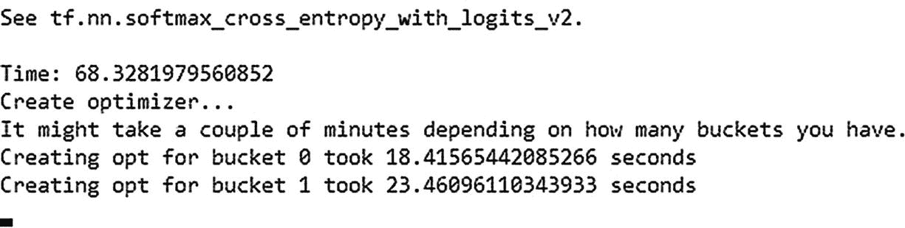

图 5-20

创建优化器

现在，让我们使用聊天选项测试机器人，如图 5-21 所示。

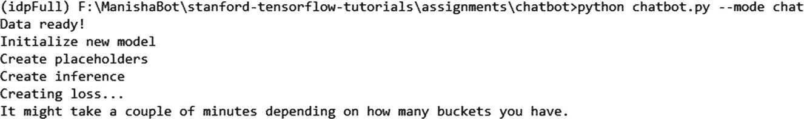

图 5-21

我们正在启用聊天模式

```py
(idpFull) F:\ManishaBot\stanford-tensorflow-tutorials\assignments\chatbot>python chatbot.py --mode chat
```

现在，机器人将使用优化器。图 5-22 展示了您如何与机器人交互。

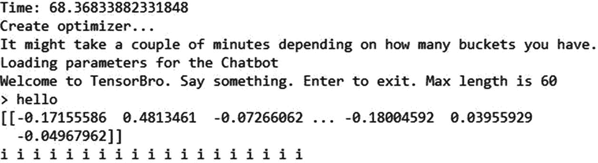

图 5-22

与聊天机器人交互

您已使用 Keras 创建了一个聊天机器人。您已经看到了与聊天机器人的交互方式。在下一节中，您将处理另一个聊天机器人应用。

## 介绍 nmt-chatbot

本节介绍了 nmt-chatbot。此聊天机器人按以下顺序工作：

1.  使用输入和输出编码器进行翻译。

1.  NMT-Bot 首先通过编码器读取句子。

1.  解码器处理句子向量。

1.  聊天机器人使用 LSTM 方法。

1.  对输入进行分词。

您将使用 Anaconda 创建一个环境，所以让我们先获取 Anaconda。Anaconda 是一个开源的 Python 发行版，通常用于管理不同的包。

让我们为 Anaconda 创建一个环境，并将其命名为 Manisha。

Anaconda 可从 [www.anaconda.com/download/](https://www.anaconda.com/download/) 获取 *.*

图 5-23 展示了 Anaconda 的不同版本。

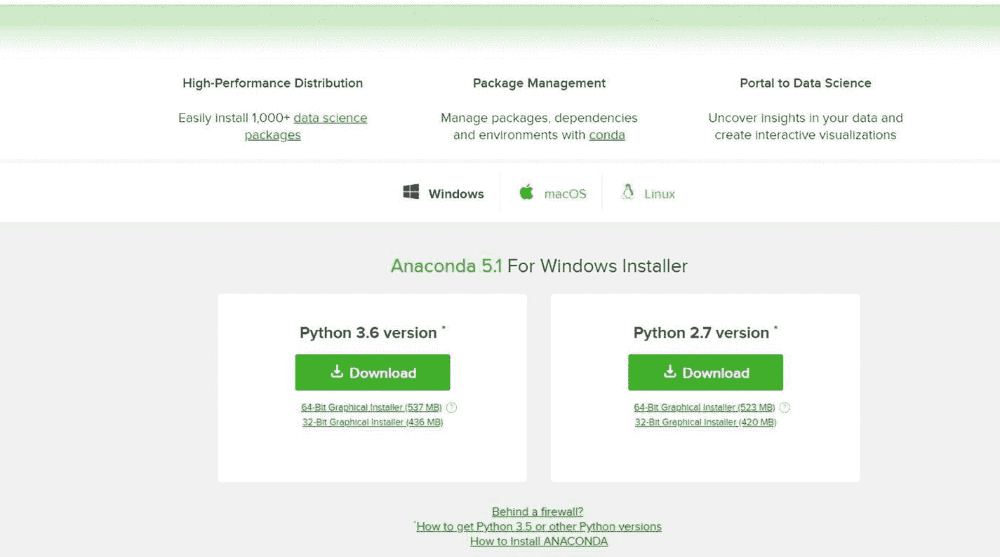

图 5-23

可用的不同 Anaconda 版本

下载 Anaconda 后，您就可以创建环境了。

在 Windows 中，创建环境的步骤如下：

```py
conda create -n yourenvname python=x.x anaconda
```

然后，您进入环境并安装 TensorFlow 的 GPU 版本，如图 5-24 所示。

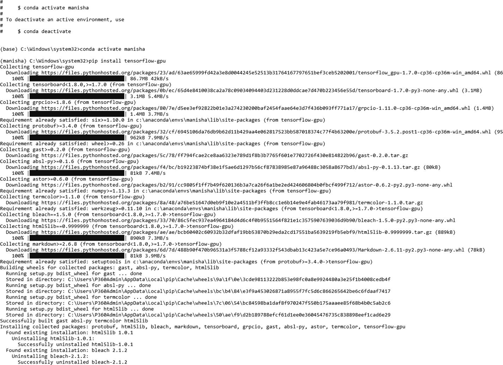

图 5-24

安装 Tensorflow-gpu

导入 TensorFlow 以检查一切是否正常，然后开始克隆仓库（nmt-chatbot 的本地副本）：

```py
git clone --recursive https://github.com/daniel-kukiela/nmt-chatbot
```

图 5-25 展示了克隆仓库。

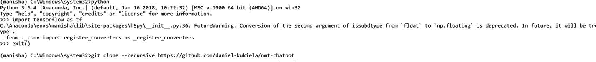

图 5-25

克隆仓库

在命令窗口中使用以下命令进入本地复制的文件夹，即你克隆的 github 复制：

```py
cd nmt-chatbot
```

在图 5-26 中，你正在安装需求。

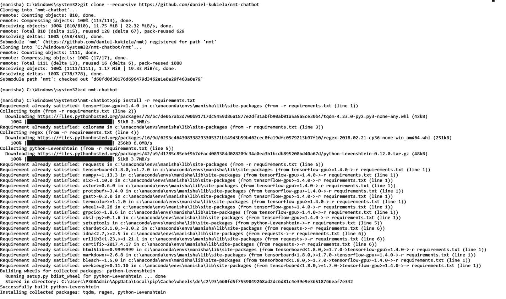

图 5-26

安装需求

你还需要管理需求：

```py
pip install -r requirements.txt
```

现在打开 `set up` 文件夹：

```py
cd setup
```

然后开始准备数据：

```py
python prepare_data.py
```

准备数据后，你将在文件夹中接近根目录：

```py
cd ..
```

现在开始训练：

```py
python train.py
```

图 5-27 展示了训练过程。

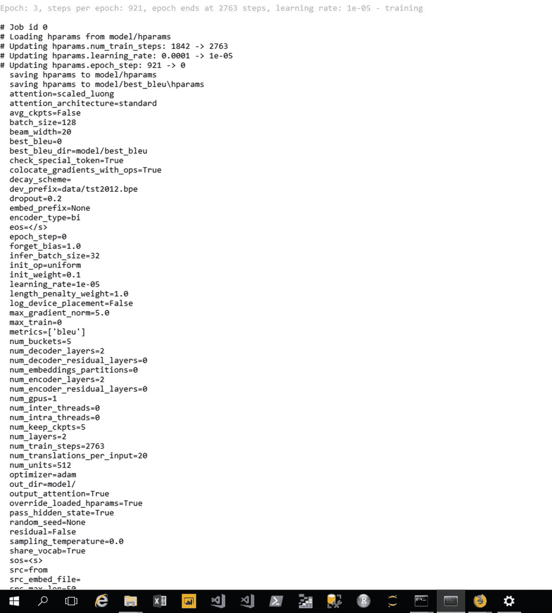

图 5-27

训练过程

训练完成后，你将收到一条消息。图 5-28 显示训练过程已完成。

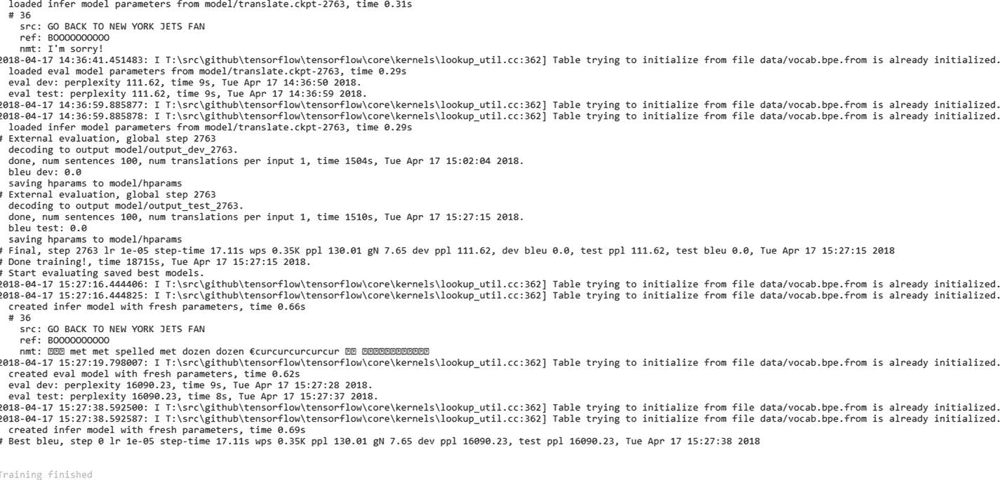

图 5-28

训练过程已完成

使用 `inference.py` 直接与机器人交互：

```py
python inference.py
```

图 5-29 展示了推理模型。

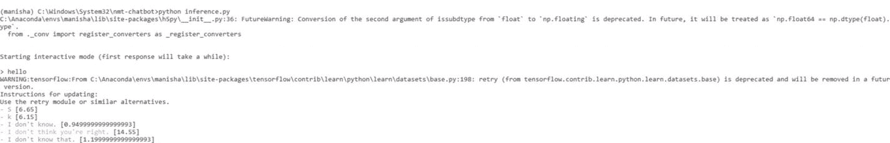

图 5-29

推理模型

## 端到端系统

端到端机器学习是聊天机器人的最佳方法，因为我们通过聊天机器人摄取数据，然后对测试数据进行评分。这种类型的机器学习有助于快速做出响应决策，以便用户和机器人之间快速通信。一个系统在一个数据集上训练。聊天机器人不假设用例和对话，它基于相关数据训练，并与用户进行数据对话。使用前馈神经网络在深度学习中实现它。

在进一步解释之前，你需要了解循环神经网络。

### 循环神经网络

*循环神经网络*（RNNs）在基于自然语言处理的学习场景中非常有用。

预测序列中的下一个单词是困难的。这就是为什么我们需要知道预测之前的单词序列。

RNN 被称为 *循环*，因为相同的原理应用于序列中的每个元素（短语或单词），其中输出基于之前的计算。

为了更好地理解 RNNs，考虑以下示例。假设你有一个包含七个单词的句子。在 RNN 中，你需要将神经网络分解成七个不同的层，每个单词对应一层。

最常见的 RNN 是长短期记忆网络（LSTMs）。

#### LSTM

为了解决 RNN 中的长期依赖，你需要 LSTM。这些网络能够学习序列中的长期短期依赖，以更好地预测输出。图 5-30 展示了一个具有一层标准 RNN。

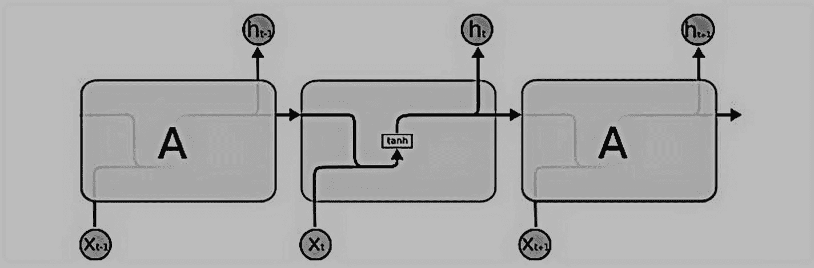

图 5-30

RNN

如图 5-31 所示，LSTMs 在网络中包含四个神经网络层。

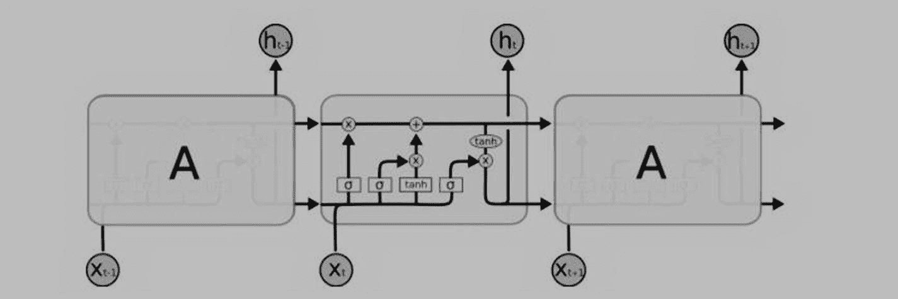

图 5-31

带有神经网络层的 LSTM

LSTM 的关键概念是单元格状态。图 5-32 展示了单元格的使用。

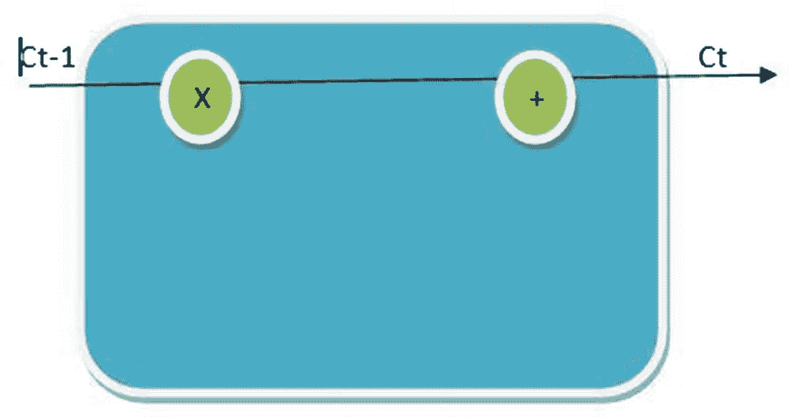

图 5-32

使用单元格。单元格状态定义了通信的方式

LSTM 输出的 Sigmoid 层在 0 和 1 之间输出一个值。值为 1 表示您让所有信息通过它。值为 0 表示没有任何信息通过它。了解这些概念后，您可以继续了解 Seq2seq 模型。

Seq2seq 模型具有

```py
i)Encoder
ii)Decoder
iii)Intermediate State
```

流程如图 5-33 所示。

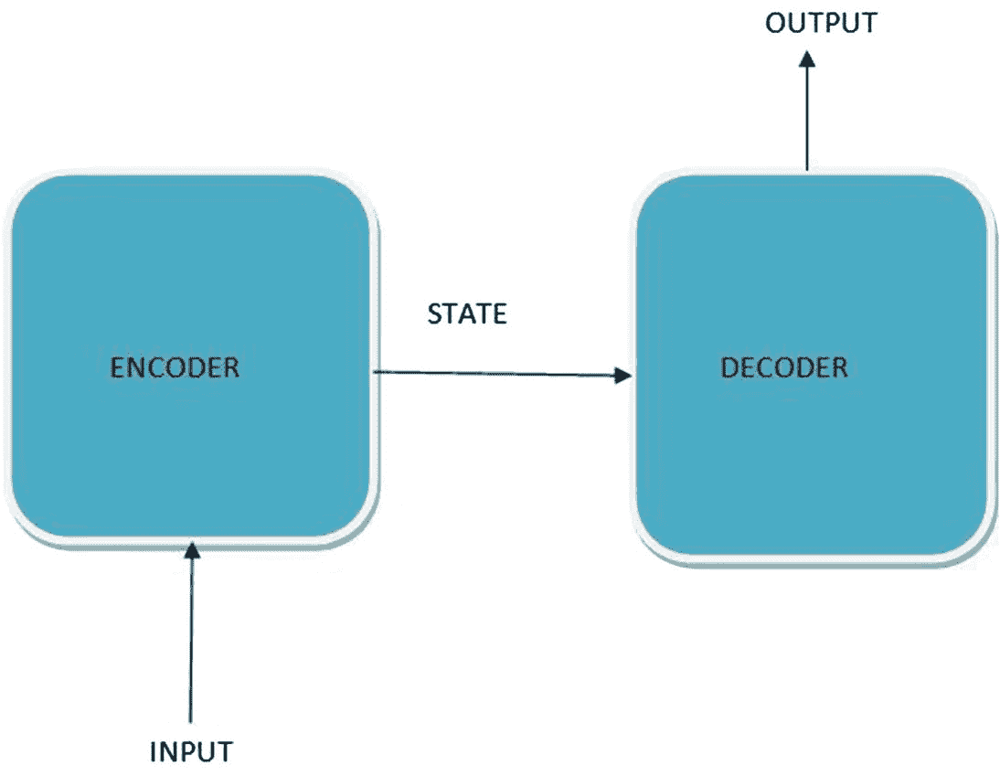

图 5-33

编码器-解码器模型

我们通常使用嵌入。因此，为了在预测后识别句子，我们必须创建一个词汇表，将单词输入到模型中进行读取。图 5-34 展示了消息处理过程。

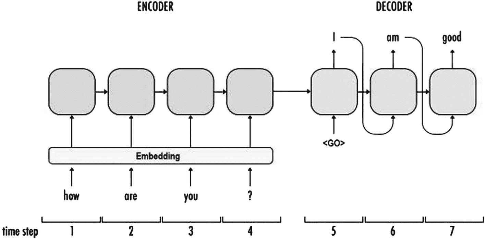

图 5-34

消息输出过程

Seq2seq 词汇表按以下方式工作：

+   `<PAD>`：在训练过程中，您需要将示例批量输入到网络中。这些批量中的所有输入都需要与网络的计算宽度相同。然而，我们的示例长度并不相同。这就是为什么您需要填充较短的输入，以使它们达到与批量相同的宽度。

+   `<EOS>`：这是批处理过程中的另一个必要性，但更多地是在解码器一侧。它允许我们告诉解码器句子在哪里结束，并允许解码器在其输出中指示相同的事情。

+   `<UNK>`：如果您在真实数据上训练模型，您会发现通过忽略在词汇表中出现频率不够高的单词，可以大大提高模型的资源效率。我们将这些替换为 `<UNK>`。

+   `<GO>`：这是解码器第一个时间步的输入，让解码器知道何时开始生成输出。

## 与 Seq2seq 机器人一起工作

在本节中，您将了解如何与 Seq2seq 机器人一起工作。我们将克隆或复制 GitHub 仓库中的一个，然后在本地运行该机器人。

首先，您需要克隆仓库以进入文件夹：

[`https://github.com/llSourcell/tensorflow_chatbot`](https://github.com/llSourcell/tensorflow_chatbot)

使用此命令准备数据：

```py
Python prepare_data.py
```

然后打开 `seq2seq.ini` 文件，将模式更改为 `training as`。使用此命令：

```py
python execute.py
```

图 5-35 显示了训练过程。

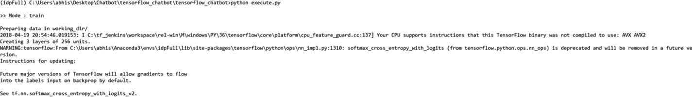

图 5-35

训练过程

训练后，返回到`seq2seq.ini 文件`并更新模式为测试。

当你开始测试时，机器人将绕过找到训练中的检查点并开始通信，如图 5-36 所示：

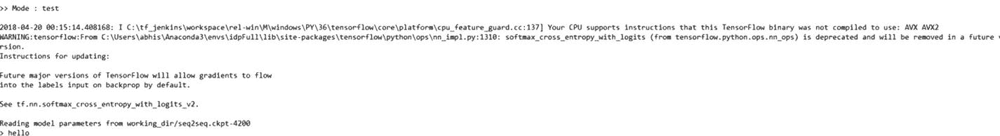

图 5-36

测试机器人

```py
>> Mode : test
2018-04-20 00:15:14.408168: I C:\tf_jenkins\workspace\rel-win\M\windows\PY\36\tensorflow\core\platform\cpu_feature_guard.cc:137] Your CPU supports instructions that this TensorFlow binary was not compiled to use: AVX AVX2
WARNING:tensorflow:From C:\Users\abhis\Anaconda3\envs\idpFull\lib\site-packages\tensorflow\python\ops\nn_impl.py:1310: softmax_cross_entropy_with_logits (from tensorflow.python.ops.nn_ops) is deprecated and will be removed in a future version.
```

## 更新说明

未来 TensorFlow 的主要版本将默认允许梯度在反向传播时流入标签输入。Tensorflow 的后续版本中可能会有一些预期的变化。

查看`tf.nn.softmax_cross_entropy_with_logits_v2`。

从`working_dir/seq2seq.ckpt-4200`读取模型参数。我们使用训练后创建的`ckpt`文件来查看训练好的模型如何工作。

```py
> hello
```

在你的计算机上安装 NVIDIA 的显卡及其驱动程序。

1.  下载并安装 CUDA。

1.  下载并“安装”cuDNN。

1.  卸载 TensorFlow，并安装 Tensorflow GPU。

1.  更新系统的`%PATH%`。

1.  验证安装。

### 下载并安装 CUDA

CUDA 有不同的版本。你需要 CUDA 版本 8.0。我安装了 8.0、9.0 和 9.1，并且为每个版本都按照本指南进行了设置。现在坚持使用 8.0 以使其工作。我设置了其他版本以备 TensorFlow GPU 支持其他 CUDA 版本的可能性。

以下是从下载和安装 CUDA 的步骤：

前往[CUDA Toolkit 下载](https://developer.nvidia.com/cuda-downloads)。

1.  在 CUDA 下载后，运行下载的文件，并使用 Express Settings 安装它。这可能需要一段时间，并且屏幕可能会闪烁（因为显卡）。

1.  验证你的系统上是否有以下路径：

    ```py
    C:\Program Files\NVIDIA GPU Computing Toolkit\CUDA\v8.0
    ```

+   操作系统：Windows

+   架构：x86_64

+   版本：10

1.  滚动到 Legacy Releases。

1.  点击你想要的版本（CUDA Toolkit X.Y）：

    +   对于 8.0，你会看到 CUDA Toolkit 8.0 GA，所以将*<Z>*替换为可用的最高版本号。Z 是可用的版本号。我下载了 CUDA Toolkit 8.0 GA2。

    +   对于 9.0，文件是 CUDA Toolkit 9.0

    +   对于 9.1，文件是 CUDA Toolkit 9.1。

1.  选择你的操作系统。我的如下所示：

### 下载并安装 cuDNN

要安装 Cuda 深度神经网络库（cuDNN），你需要一个 NVIDIA 开发者账户。这是免费的。

在[这里](https://developer.nvidia.com/developer-program/signup)创建一个免费的 NVIDIA 开发者会员资格：

在你注册后，前往[`https://developer.nvidia.com/cudnn`](https://developer.nvidia.com/cudnn) 。然后按照以下步骤操作：

1.  点击下载 cuDNN 按钮（现在忽略当前列出的版本）。同意条款。

1.  记得我们上面需要从上面获取 cuDNN v6.0 吗？你可能会在这里看到它列出，或者可能不会。如果没有，只需选择存档的 cuDNN 版本。

1.  点击你需要的版本以及所需的系统。

1.  下载 CUDA 8.0 版本的 cuDNN v6.0（2017 年 4 月 27 日），然后下载 Windows 10 的 cuDNN v6.0 库。解压你最近下载的 zip 文件，例如：

    ```py
    C:\Users\teamcfe\Downloads\cudnn-8.0-windows10-x64-v6.0.zip
    ```

1.  打开`cuda`，你应该看到以下内容：

    ```py
    bin/
    include/
    lib/
    ```

1.  将`C:\Users\j\Downloads\cudnn-8.0-windows10-x64-v6.0.zip\cuda`中的三个文件夹复制并粘贴到`C:\Program Files\NVIDIA GPU Computing Toolkit\CUDA\v8.0`。

注意，拖放会合并文件夹而不是替换它们；我不相信 Mac/Linux 的情况相同。如果 Cuda 要求你替换任何内容，请说“不”，只需将每个文件夹的内容从 cuDNN 拖放到 Cuda。Cuda 可能会要求管理员权限，在这种情况下，你应该只说“是”。

1.  验证你是否正确完成了上一步。如果你完成了，你应该能够找到以下路径：

    ```py
    C:\Program Files\NVIDIA GPU Computing Toolkit\CUDA\v8.0\lib\x64\cudnn.lib
    ```

### 卸载 TensorFlow，安装 TensorFlow GPU

如果你当前已安装 TensorFlow，可以使用此命令将其从系统中移除：

```py
pip uninstall tensorflow
```

你希望使用支持 GPU 的 TensorFlow，这样做很简单：

```py
pip install tensorflow-gpu
```

我很高兴这很简单。 :)

### 更新系统的%PATH%

更新你的系统环境变量中的`PATH`，使其具有以下内容：

```py
C:\Program Files\NVIDIA GPU Computing Toolkit\CUDA\v8.0\bin
C:\Program Files\NVIDIA GPU Computing Toolkit\CUDA\v8.0\libnvvp
```

## 结论

在本章中，你使用了 TensorFlow 来创建聊天机器人。你发现对于深度学习聊天机器人来说，LSTM 是最优的技术。本章还介绍了 Keras，你使用 Keras 包装器和 TensorFlow 作为后端构建了一个聊天机器人。最后，你查看了一些常见的聊天机器人，并回顾了创建聊天机器人的 Seq2seq 模型方法。
