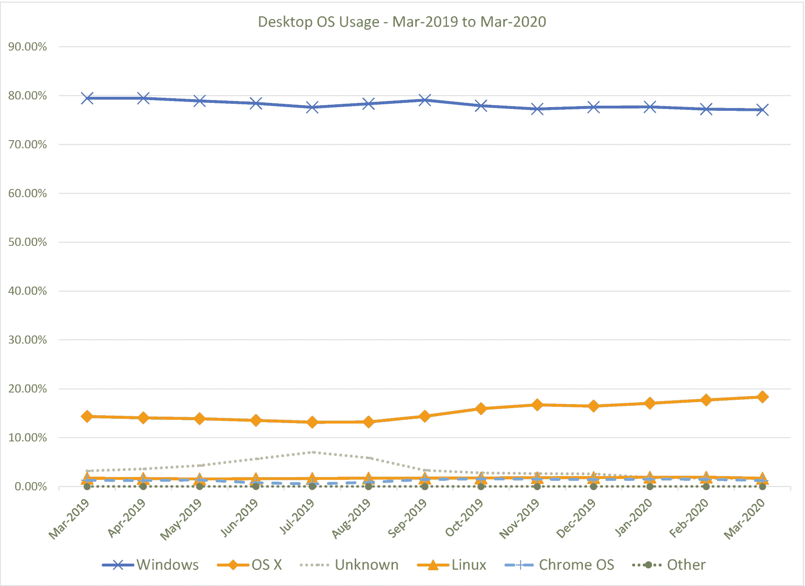
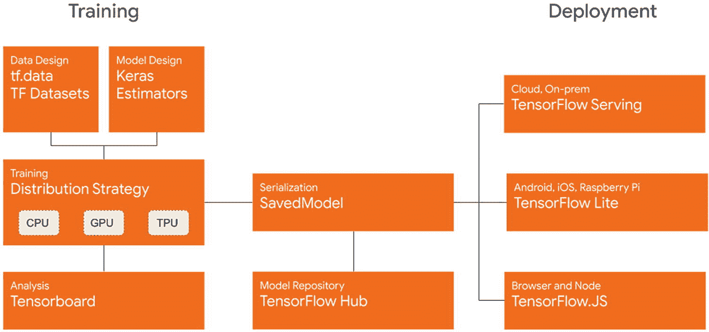
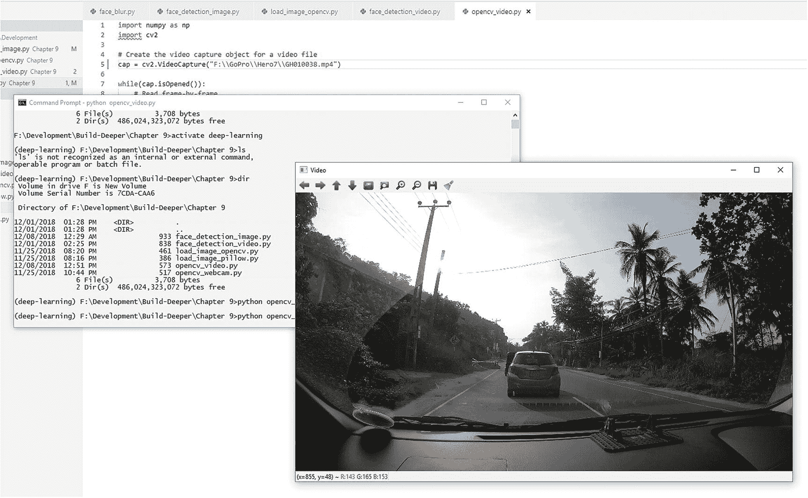
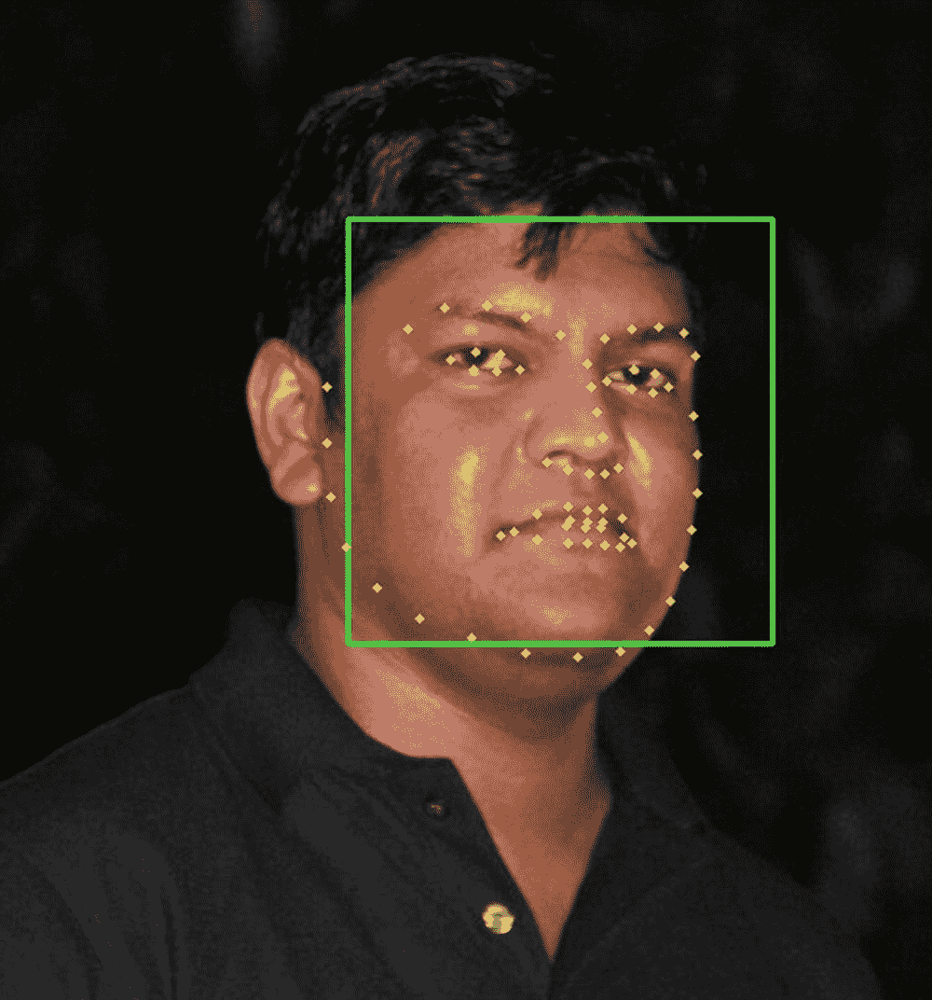

# 2. 从哪里开始你的深度学习之旅

欢迎来到深度学习、人工智能和计算机视觉的激动人心世界。

在上一章中对深度学习及其能力有了高级理解之后，你可能渴望学习如何构建实用的深度学习和计算机视觉系统。

但你是否不愿意切换到 Linux 进行开发？你是否觉得你对 Windows 更熟悉，并希望能够在 Windows 上构建一切？

好吧，你不必再担心了。最新的深度学习和计算机视觉库已经成熟到几乎可以在 Windows 上无缝工作的地步。

我们将逐步查看如何在 Windows 上构建深度学习系统。

但首先，让我们回答你可能有的一个担忧。

## 我们能否在 Windows 上构建深度学习模型？

如果你已经是一名开发者很长时间了，你可能已经注意到 Windows 过去并不擅长与前沿的开发工作兼容，尤其是开源项目。

虽然深度学习和计算机视觉框架并不一定局限于特定的操作系统，但在 Linux 或 Unix 系统上开发的便利性以及开发的速度意味着最新的特性和选项要么被延迟，要么在 Windows 上不可用。因此，在一段时间内，如果你想要进行任何严肃的机器学习、人工智能或计算机视觉模型的开发，似乎你不得不坚持使用 Linux 或基于 Unix 的系统。

但幸运的是，近年来 Windows 的情况有了极大的改善。

像 TensorFlow 和 Keras 这样的前沿深度学习框架，以及像 OpenCV 和 Dlib 这样的计算机视觉库，现在都有它们的新版本可以在 Windows 上原生运行。驱动支持以及 GPU 加速现在在 Windows 上也能无缝工作。

实际上，在某些情况下，在 Windows 上获取 GPU 加速（如 NVIDIA CUDA 支持）比在 Linux 上更容易。Windows 对消费级显卡的驱动支持已经领先多年。

### 使用 Windows 的优势

Windows 是全球最受欢迎的操作系统，超过 70%的台式电脑使用它的某个版本（见图 2-1）。^(1)

图 2-1

桌面电脑上的 Windows 使用情况¹

在大多数情况下，除非你是专门的 DL/ML 研究人员，如果你已经拥有一台相当强大的通用 PC，或者正在考虑购买或构建一台——你往往会在这台电脑上使用 Windows。可能你更熟悉将 Windows 作为家用电脑的操作系统，并在你的电脑上使用仅在 Windows 上可用的其他软件。

所以，如果你打算学习构建深度学习模型，那么当你不需要切换操作系统时，这会更容易。

如果你计划在你的模型上使用 GPU 加速——我们将在本章后面讨论这一点——那么由于更好的驱动程序支持（尽管 Linux 的 GPU 驱动程序支持现在也在改善），在 Windows 上使它们工作比在其他操作系统上要容易得多。

如果你电脑里有一个好的 GPU，那么你可能会想用它来玩游戏或者提高生产力，而不是专门用于深度学习。坚持使用 Windows，你可以享受到两者的最佳结合。

### 使用 Windows 的限制

除了我们讨论的优点之外，使用 Windows 还有一些限制，你应该知道。

虽然大多数深度学习和计算机视觉的框架和库现在都可在 Windows 上使用，但你可能会发现它们的最新版本通常比 Linux 版本延迟更久。

如果你尝试自定义或从源代码构建库，你可能会发现，在 Windows 上构建它们的要求要严格一些。这也是原生包通常对 Windows 延迟发布的主要原因。

由于 Windows 的支持是最近才出现的，你也可能会发现，对于 Windows 的问题，社区支持也比 Linux 少。希望将来会有更多的人开始在 Windows 上进行深度学习开发，从而改善这一状况。

事实上，如果你不想的话，你不必从 Windows 切换到像 Linux 这样的操作系统来学习深度学习。在这本书中，我们将看到如何在 Windows 上构建深度学习系统所需的一切。

Linux 是一个非常适合开发者的操作系统。如果你愿意，你绝对应该尝试在 Linux 上进行开发。深度学习和计算机视觉的严肃研究人员确实倾向于使用 Linux 系统进行开发，因为它们提供了灵活性。但开始学习并不一定需要使用 Linux。

你可以直接在 Windows 上开始构建实用的深度学习系统。一旦你学会了如何操作，如果你愿意，你以后可以切换到任何操作系统进行开发。

那么，你该从哪里开始呢？

你需要选择一种编程语言来编写代码，并为该语言选择几个深度学习框架，再加上一些帮助你的实用库和工具，然后就可以开始编码了。

这听起来是不是有点令人望而却步？

让我们逐一看看这些要求。

## 编程语言：Python

你可能会想知道，为什么是 Python？它是深度学习的唯一语言吗？当然不是。

当你理解了这些概念后，你可以使用几乎任何语言来实现深度学习。但有些语言已经建立了支持机器学习和深度学习任务的工具、库和框架。为了避免重复发明已经存在的元素，我们选择了一种拥有大量预先存在的支持的编程语言。

Python 是深度学习的最佳语言吗？这是一个棘手的问题。

当我们寻找机器学习中最受欢迎的语言时，有几门语言脱颖而出：Python、R、C++、C 和 MATLAB。它们各自都有其优势和劣势。

我们选择 Python 有几个原因，这些原因在您刚开始学习深度学习时尤为重要。

对于深度学习的初学者——尤其是对于有编程背景的人来说——用 Python 编写代码会更加自然。你可以使用大多数熟悉的面向对象和函数式编程概念。虽然性能可能不如 C 或 C++，但 Python 仍然相当快。能够在多个 CPU 和 GPU 上运行代码也很有帮助。另一个加分项是，大多数 C 和 C++库都有 Python 接口（例如，OpenCV、Dlib、Caffe）。与 R 和 MATLAB 相比，Python 中深度学习和机器学习库的可用性相似。但考虑到库的成熟度，Python 库似乎更加前沿。大多数最新的深度学习框架目前主要针对 Python 进行开发（例如，TensorFlow）。

使用 Python 的最大优势之一是其可部署性。比如说，你构建了一个出色的深度学习程序，并希望将其作为 Web 服务部署。使用 Python，这相当直接。而使用 R、MATLAB 或 C/C++，则需要相当多的努力。

考虑到所有这些优势，我们将使用 Python 进行我们的深度学习实验。

## 软件包和环境管理：Anaconda

Anaconda 是一个开源平台，用于 Python 和 R 语言，旨在用于机器学习、数据科学、大规模数据处理和科学计算。Anaconda 包含针对许多平台和架构优化的 Python 版本。

Anaconda 不仅是一个 Python 发行版，还是一个 Python 的包、依赖和环境管理器。通过其 conda 包管理器，Anaconda 允许轻松创建虚拟隔离环境——包括其 Python 二进制文件和包——以便进行实验。您可以根据需要创建多个独立的多版本 Python 环境，以及它们各自独立的已安装包。

Anaconda 还包含数百个预构建和测试的机器学习、科学计算和数据处理包，您可以直接通过 conda 包管理器安装它们。它消除了寻找、构建、安装和依赖关系管理的麻烦。

## Python 深度学习和计算机视觉实用库

当使用 Python 和深度学习框架（我们将在稍后讨论）工作时，拥有以下实用库将使许多任务变得更加容易：

+   **NumPy**：为 Python 添加了处理大型多维数组的功能，以及可以应用于数组的集合高级数学函数。

+   **SciPy**：NumPy 的科学兄弟。SciPy 为 Python 添加了对数学优化、线性代数、积分和微分方程、插值、特殊函数、傅里叶变换和信号处理的支持。

+   **Pillow**：Pillow 是 PIL（Python Image Library）的分支，它为 Python 添加了图像处理功能。它为图像添加了广泛的文件格式支持，并具有高效的内部表示机制。

+   **Scikit-Image**：为 Python 添加了一组高级图像处理功能，如边缘检测、均衡化、特征检测和分割。

+   **h5py**：为 Python 添加了对 HDF5 二进制数据格式的支持。HDF5 格式被许多机器学习框架使用，因为它允许轻松存储和处理大型、千兆级数据，就像它们是内部数据数组一样。

+   **Matplotlib**：Matplotlib 是一个复杂的 2D 和 3D 绘图及数据可视化库，用于 Python，允许您在各种平台上创建高质量的图表和图形。

注意

这些只是我们需要使代码正常工作的几个实用库中的几个。随着我们的深入，我们还需要更多。但拥有这些将有助于从一开始就使事情变得更容易。

使用 Anaconda，我们也不需要逐个安装它们。Anaconda 具有快速安装这些（以及更多）实用函数的功能，我们将在下一章中探讨。

## 深度学习框架

### TensorFlow

TensorFlow 目前是世界上发展最活跃的机器学习库之一。其核心是一个符号数学库，专注于神经网络等应用。

TensorFlow 是 Google Brain 团队开发的第二代机器学习库，由于其深度学习功能，近年来获得了巨大的流行度。首次发布于 2015 年 11 月，作为 DistBelief（Google Brain 第一代机器学习库）的继任者，TensorFlow 最初仅支持 Linux 上的 Python 和 C。从那时起，它增加了对 C++、Java、Go、JavaScript 的支持，并对 Swift 提供了实验性支持。第三方支持还包括 C#、Haskell、Julia、MATLAB、R、Scala、Rust、OCaml 和 Crystal。现在 TensorFlow 可以在 Windows 和 Mac OS 上原生运行。

TensorFlow 能够在 CPU 或 GPU（配备 NVIDIA CUDA）上运行。它还可以在 Google 的专有 Tensor Processing Units（TPUs）上运行——专为机器学习构建的应用特定集成电路（ASIC）单元，针对 TensorFlow 进行了优化。TensorFlow 还可以在运行推理时在低端设备上运行，如手机（Android 和 iOS）以及树莓派设备。

TensorFlow 使用有状态的数据流图进行其数值计算，其中图中的节点代表数学运算，而图的边代表通过节点的数据。数据表示为多维数组（张量），因此得名“TensorFlow”。

TensorFlow 1.0 版本于 2017 年 2 月发布。

TensorFlow.js 1.0 于 2018 年 3 月发布。

TensorFlow 2.0 于 2019 年 1 月发布，2.1 版本于 2020 年 1 月发布，2.2 版本于 2020 年 5 月发布。

2.x 版本带来了许多新功能和改进，例如即时执行、多 GPU 支持、更紧密的 Keras 集成以及新的部署选项，如 TensorFlow Serving（图 2-2）。

图 2-2

TensorFlow 2.0 生态系统^(2)

### Keras

Keras 是一个用于 Python 的高级神经网络库，可以在 TensorFlow、CNTK（微软认知工具包）或 Theano 上运行，并有限支持 MXNet 和 Deeplearning4j。Keras 的重点是通过对用户友好、最小化、模块化和可扩展性来允许快速实验和代码原型设计。Keras 提供的代码比直接使用后端库更干净、更有结构。

Keras 支持卷积网络和循环网络，以及两者的组合，并且可以根据后端的能力在 CPU 和 GPU 上运行。

随着 TensorFlow v1.0 在 2017 年 2 月的发布，TensorFlow 团队为 TensorFlow 库添加了对 Keras 的专用支持。

随着 TensorFlow 2.0 在 2019 年 1 月的发布，Keras 库被完全集成到 TensorFlow 库中，并通过 tf.keras 接口提供。多后端 Keras 实现也作为单独的分支维护，但现在主要开发集中在 tf.keras 上。

### 其他框架

#### Scikit-Learn

Scikit-Learn（以前称为 scikits.learn）是一个用于机器学习、数据挖掘和数据分析的库。它提供了分类、回归、聚类、降维、模型选择和预处理（特征提取和归一化）等功能。Scikit-Learn 拥有数据处理的机器学习和实用算法的最佳集合之一。

#### Theano

Theano 是由蒙特利尔大学的研究人员开发的一个机器学习和数值计算库。Theano 的理念是允许开发者编写符号表达式，然后动态编译以在各种架构上运行。Theano 的动态 C 代码生成功能允许程序高效运行并利用不同的 CPU 或 GPU 架构。Theano 与 NumPy 紧密集成，它使用 NumPy 来表示其多维数据结构。

Theano 自 2007 年以来一直在积极开发，被认为是 TensorFlow 的良好替代品，因为两者都支持类似的功能。

## 计算机视觉库

我们为什么需要计算机视觉库？

正如我们在上一章讨论的那样，当进行深度学习时，你将遇到许多需要计算机视觉和图像处理的任务。

拥有这些库会使事情变得更容易。

### OpenCV

OpenCV（开源计算机视觉）是计算机视觉事实上的标准库。旨在实时计算机视觉应用，OpenCV 充满了视觉和图像处理算法。它还内置了一些机器学习功能，以帮助构建计算机视觉应用。

OpenCV 最初由英特尔开发，并于 2000 年 6 月首次发布，此后已开源，现在在 BSD 许可下发布。OpenCV 的当前版本主要用 C++编写，但也包含一些遗留的 C 组件以及 C 接口。OpenCV 为 C、C++、Python、MATLAB 和 Java 提供了接口。它可以在 Windows、Linux、Mac OS、iOS 和 Android 上运行。

除了计算机视觉方面，OpenCV 还提供了优秀的图像处理和操作选项，如裁剪、调整大小、变换、颜色通道操作等，以及许多其他图像类型上的选项。这使得它在许多使用图像的应用中变得至关重要，例如使用 TensorFlow 等框架构建深度学习计算机视觉模型。OpenCV 还能够处理来自摄像头的视频流以及视频文件（图 2-3）。

图 2-3

OpenCV 处理视频文件

目前 OpenCV 有两个主要分支：v3.x 和 v4.x。4.x 分支包含最新的开发内容，并且优化得更好。然而，3.x 版本可能与其他我们使用的库具有更好的跨兼容性。

### Dlib

Dlib 是一个包含机器学习算法和工具的 C++和 Python 工具包，用于创建解决现实世界问题的复杂软件。Dlib 提供了机器学习和深度学习算法、多类分类和聚类模型、支持向量机、回归模型、大量用于矩阵操作和线性代数等领域的数值算法、图形模型推理算法，以及用于计算机视觉和图像处理的实用算法。由于大多数实现都基于 C++实现，它们被优化到可以在某些实时应用中使用。

如果你对手部识别模型或面部表情处理感兴趣，那么 Dlib 是一个你应该尝试的库，因为 Dlib 拥有一些最优化且开箱即用的面部检测和面部特征点检测模型（图 2-4）。

图 2-4

Dlib 面部特征点检测应用实例

Dlib 还提供了易于使用的功能来训练自己的目标检测器、形状预测器以及基于深度学习的图像语义分割。

## 优化器和加速器

构建和训练深度学习模型是计算密集型任务，通常需要大量的系统处理能力和时间。优化器和加速器是帮助更快执行这些步骤的库和工具。大多数优化器和加速器工具通过直接提供你的深度学习代码对系统硬件能力的访问来工作，使它们能够充分利用硬件的潜力。

### NVIDIA CUDA 和 cuDNN

CUDA 是由 NVIDIA 发明的并行计算平台和编程模型。它通过利用 GPU 的能力，实现了计算性能的显著提升。cuDNN——CUDA 深度神经网络库——是一个用于深度神经网络的 GPU 加速库，它为标准例程如前向和反向卷积、池化、归一化和激活层提供了高度优化的实现。

使用 CUDA 和 cuDNN 以及 Theano 或 TensorFlow 可以极大地加速你的神经网络（原本需要数小时训练的网络可能只需几分钟，但这完全取决于你的模型）。唯一的要求是，你的系统中需要有支持 CUDA 的 NVIDIA GPU。

### OpenBLAS

OpenBLAS 是 BLAS（基本线性代数子程序）的开源实现，包含针对许多特定处理器类型的优化。机器学习库如 Theano 可以通过利用 BLAS 库来加速某些例程。当你在 CPU 上使用 OpenBLAS 运行模型时，你会看到明显的速度差异。然而，一些库，如 TensorFlow，有它们自己的内部优化器，使用 OpenBLAS 不会看到任何改进。

## 关于硬件的问题是什么？

接下来可能会让你想到的问题可能是：我需要什么样的硬件来做深度学习实验？

这是一个棘手的问题，因为我们需要考虑深度学习系统的两个阶段：*训练*和*推理*。

要构建一个深度学习系统——或者任何机器学习系统——我们首先需要收集一些数据来训练系统。然后我们构建一个深度学习模型，并在训练数据集上运行它。这就是我们的模型“学习”数据特征的地方。一旦系统运行完训练数据集，我们通常会进行一些验证步骤，以确保它已经被正确训练。这些步骤被称为系统的*训练阶段*。

一旦系统完成训练阶段，它就准备好投入实际使用了。这就是系统被呈现新的、真实世界的数据，并利用它所学到的东西。系统将使用它所学到的东西，来推断关于它所呈现的新数据的某些信息。这被称为系统的*推理阶段*。

那么，这与我们关于硬件的问题有什么关系？

训练阶段是两个阶段中最资源密集的。它需要高计算能力（无论是 CPU 还是 GPU）来通过深度学习模型运行训练，并且需要大量内存来存储训练所需的数据。因此，为了训练深度学习模型，你需要一台具有足够计算能力和内存的机器。你的计算能力越强，你能够训练的模型就越快、越复杂。拥有具备 GPU 计算能力的显卡（例如，具有启用 NVIDIA CUDA 的 GPU）将是一个加分项。

但请记住，即使是中等配置的 PC 也能够训练足够大的深度学习模型。你可以使用一些技术来处理有限内存中的大数据集。所以，不要让你的 PC 配置阻止你进行实验。本书中讨论的所有代码都可以在标准 PC 或笔记本电脑上运行。

如果你觉得你本地的计算能力不足以满足你的实验需求，你可以轻松地使用云计算服务来训练你的深度学习模型。亚马逊网络服务提供了他们的 P3 GPU 计算实例，这些实例由 NVIDIA Tesla GPU 支持（见 AWS P3 实例^(3))，应该能够处理大规模的深度学习模型，或者使用 Google Colab 笔记本（见 Google Colaboratory^(4)）。

推理阶段怎么样？

一个经过适当优化的深度学习模型能够在资源有限的设备上运行推理，例如 Raspberry Pi 设备或智能手机。这通常取决于最终训练模型的尺寸。有一些深度学习架构——如 MobileNet 和 SqueezeNet，它们被特别设计为快速且尺寸小，因此可以适应移动设备。

## 推荐的 PC 硬件配置

如果你正在考虑构建（或升级）或购买一台计划用于深度学习、机器学习或计算机视觉任务的 PC，以下是一些硬件推荐。

注意

请注意，这只是一些建议。本书中提到的库和框架可以在各种硬件配置上设置并运行。

如前所述，针对深度学习和计算机视觉的机器的主要要求是处理能力和内存。处理能力决定了所需的计算可以多快完成，这取决于你的 CPU 和 GPU 的速度。你的 CPU 拥有的处理器核心数量也会影响速度，因为它决定了操作可以多并行。内存决定了你的模型可以有多复杂（因为它们需要加载到内存中），以及一次可以加载到内存中的训练数据量，这间接影响了训练速度。你能够训练的模型的复杂性将由机器的 RAM 量和 GPU 的 VRAM 量共同决定。

因此，理想的深度学习 PC 应包括一个更快、更强大的 CPU，具有高核心数，大量 RAM，以及一个更快、VRAM 更高的 GPU。

但除非您有无限的金钱可以用于购买最高端的 PC，否则您必须平衡这些需求。那么让我们看看我们应该实际考虑什么。

对于 CPU，平衡功率和性价比。例如，Intel Core-i5 或 AMD Ryzen 5 作为最低配置是足够的。如果可以的话，Intel 的 Core-i7 或更高（第八代或更高）或 AMD 的 Ryzen 7 或更高（第二代或更高）将是更好的选择。在选择时，考虑核心数量以及单核性能。如果您对超频有经验，建议选择可超频的处理器（即解锁倍数的处理器，如 Intel K 系列），因为我们更倾向于深度学习工作负载的稳定性而非原始速度。通过选择非超频处理器，您通常可以节省数百美元。

将处理器与一个不错的母板搭配。您不需要一个带有花哨游戏功能的母板。但寻找一个具有良好电源分配、VRM（电压调节模块）数量较多的产品。在深度学习工作流程中，CPU 和 GPU 都会以最大能力运行，因此更好的电源传输将保持它们的稳定性。同时，也要寻找母板的扩展性。拥有更多的 RAM 插槽将允许您以后添加更多 RAM，而更多的 PCIe 16x 插槽将允许您以后选择多 GPU 选项。然而，如果您只是刚开始，这些是可选功能。

选择您能负担的最高内存容量。建议至少拥有 16GB 的 RAM。同时，注意您的处理器和母板支持的 RAM 推荐速度。如果您不熟悉它们的工作方式，具有 XMP 配置文件的更高速度 RAM 可能会引入不稳定性。

如同主板一样，稳定的电源对于系统的稳定性至关重要。一些深度学习训练任务可能需要数小时，甚至数天。因此，稳定的电源供应是必不可少的。在选择电源时，寻找具有“80+ Gold”或更高能效等级的产品。根据您选择的处理器和显卡，通常 500W 的电源就足够了。但如果您计划将来使用多个 GPU，您可以选择更高功率的电源。

选择 GPU 可能有些棘手，因为它们通常是 PC 构建中最昂贵的组件。由于大多数深度学习和机器学习框架和库使用 NVIDIA CUDA 进行 GPU 处理，因此我们需要选择 NVIDIA 显卡。

注意

虽然 AMD 有一些优秀的显卡型号，但它们与 ML 任务的兼容性和支持仍然是实验性的。因此，我们需要坚持使用 NVIDIA。

在考虑用于深度学习、机器学习或计算机视觉任务的显卡时，需要考虑的几个因素包括：

+   **CUDA 核心数量**：核心数量越高，越能有效地并行处理。

+   **内存**：更高的内存允许你一次处理更多的训练数据。（如果你的数据集大于可用的 GPU 内存，你将不得不将其分块并执行增量学习。）

+   **时钟速度**：通常，时钟速度越高，性能越好（如果你是初学者，不必过多考虑“基础时钟”和“提升时钟”等数字，因为还有其他因素会影响显卡的速度）。

+   **其他特性**：拥有像 NVIDIA Turing 微架构（GeForce RTX 20 系列或更新版本）中的 GPU 所具有的 Tensor Core 等额外特性，可能会帮助提高你模型训练的速度。但你可能需要调整你的模型以利用这些特性。

基于这些因素，以下显卡系列可以推荐：

+   **GeForce 10 系列**：这是一款较老的产品，但性能仍然相当不错。如果你对购买二手 GPU 感到舒适，你可能在二手市场上以非常便宜的价格找到这些显卡。推荐显卡：GTX 1070Ti 或更好（1070Ti、1080、1080Ti）。

+   **GeForce 16 系列**：与 20 系列相同的 Turing 架构，但没有 Tensor Core 和 RT Core（光线追踪）。推荐显卡：GTX 1660 或更好（1660、1660Ti）。

+   **GeForce 20 系列**：NVIDIA GeForce 的最新一代（截至本文撰写时）。具有 Tensor Core 和 RT Core 的 Turing 架构。推荐显卡：RTX 2060 Super 或更好（2060 Super、2070 Super、2080 Super、2080Ti、Titan RTX）。

+   **GeForce 30 系列**：关于下一代 NVIDIA GeForce 的深度学习性能还为时尚早。但凭借新的 Ampere 微架构，预计其性能将优于前几代。

NVIDIA 显卡可以通过 NVIDIA 直接销售——“创始人版”显卡，或者通过 NVIDIA 的合作伙伴，如 ASUS、MSI、EVGA、Gigabyte 等许多其他公司。在选择显卡时，最好选择知名品牌的显卡，因为这些显卡通常具有更好的制造质量、更好的稳定供电和更好的散热。深度学习任务会对你的 GPU 造成压力，并且比任何游戏或应用程序更能持续这种压力。

此外，更快的存储设备，如 SSD，也有助于加快你的系统速度。

我们在这里讨论的只是一些建议；使用比这更老或更慢的硬件构建深度学习模型是可能的。因此，如果你的当前机器不符合这些建议，请不要气馁。正如前文所述，优化你的模型比你在其上训练的硬件速度更重要。所以开始学习，开始构建。
