# 3. 设置您的工具

现在我们知道了我们需要什么来开始，让我们开始设置我们的工具。

由于我们将使用来自多个不同来源的软件包——从 Anaconda 软件包通道、pip 软件包等——安装它们的顺序对于获得更平滑的安装体验且无冲突来说很重要。我们建议以下操作顺序：

1.  安装支持 C++ 的 Visual Studio

1.  安装 CMake

1.  安装 Anaconda Python

1.  设置 Conda 环境和 Python 库

1.  安装 TensorFlow

1.  （可选）安装 Keras 多后端版本

1.  安装 OpenCV

1.  安装 Dlib

1.  验证安装

让我们看看如何设置每一个。

## 第 1 步：安装支持 C++ 的 Visual Studio

我们需要做的第一步是安装一个 C++ 编译器。

我们为什么需要 C++？我们不是要使用 Python 编码吗？

是的，我们将使用 Python。而且，学习深度学习不需要学习 C++（尽管 C++ 是一种很棒的语言）。

但是一些更高级的 Python 库的部分是用 C++ 编写的，以提高其性能。因此，为了安装一些库，我们需要在我们的系统中安装一个 C++ 编译器。

在 Windows 上，我们使用 Visual Studio 作为编译器。

由于不同版本的 Visual Studio 与各种软件包存在各种兼容性问题，建议我们坚持使用较旧版本的 Visual Studio 而不是最新版本。这个较旧的版本可以从 Visual Studio 旧版本页面下载。1 Visual Studio 2015 是一个不错的选择（图 3-1）。免费的社区版就足够我们使用了。

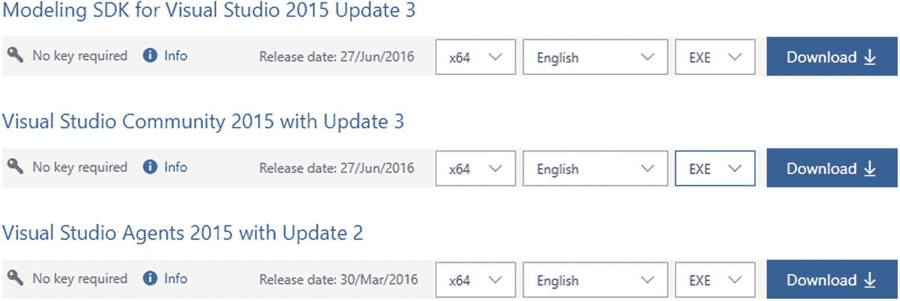

图 3-1

从 Visual Studio 旧版本页面选择下载“visual studio community 2015 with update 3”

在安装 VS 2015 时，请确保选择“自定义”安装选项（图 3-2）。

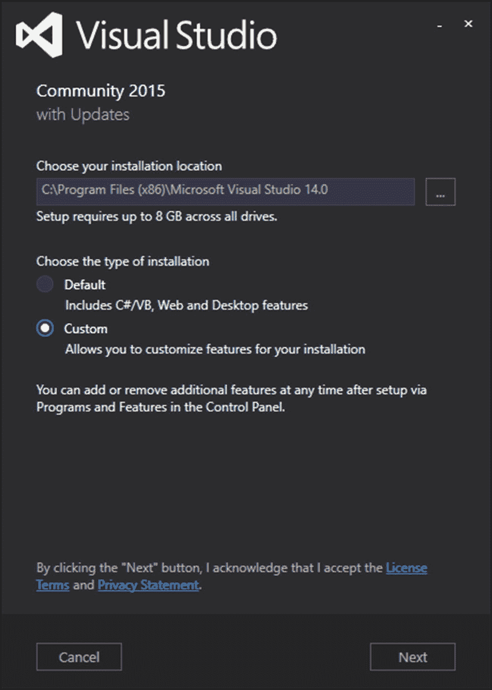

图 3-2

Visual Studio 自定义安装

在下一屏中选择安装“Visual C++”选项（图 3-3）。

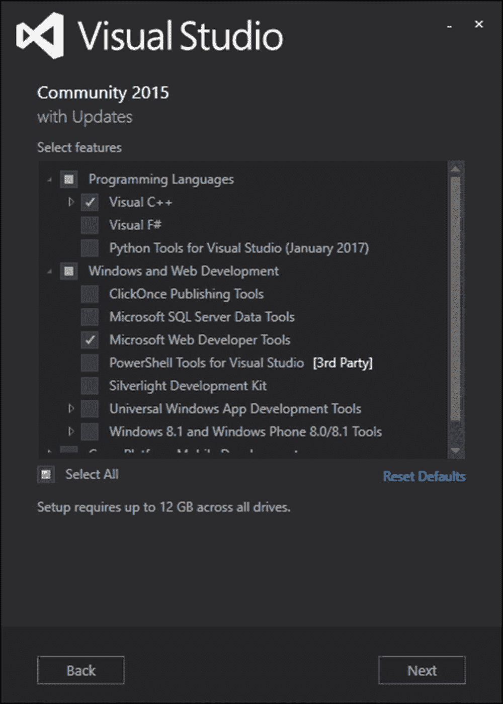

图 3-3

选择安装 Visual C++

安装完成后，你可以通过启动 Visual Studio 并检查是否出现“Visual C++”选项来验证 C++ 是否可用（图 3-4）。

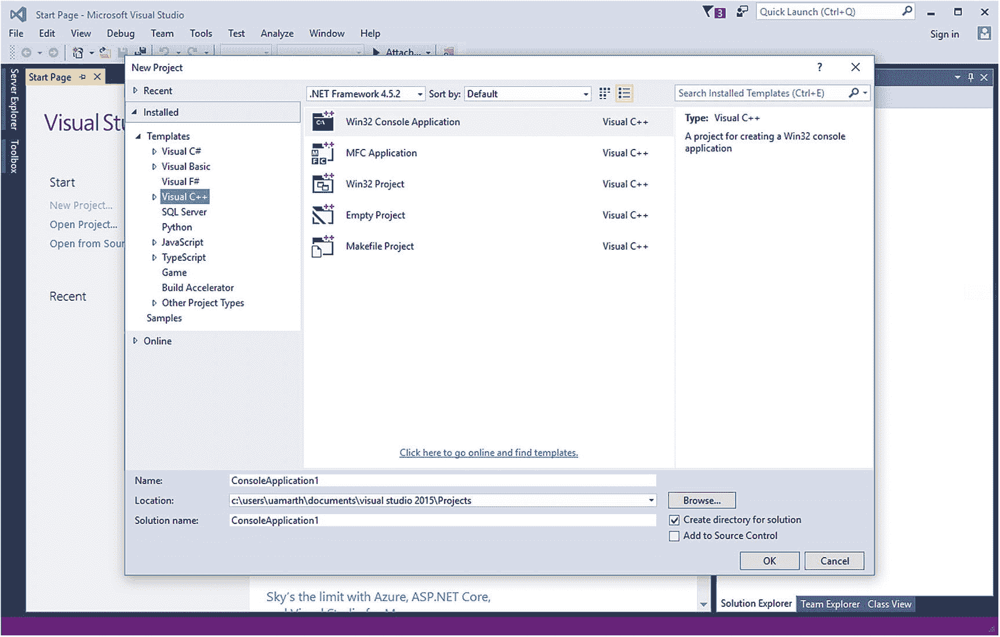

图 3-4

带有 Visual C++ 的 Visual Studio 2015

## 第 2 步：安装 CMake

CMake 是一个跨平台构建工具，用于编译、测试和打包软件项目。CMake 被用作许多具有 C++ 库的开源项目的构建工具，例如 Dlib。CMake 需要在系统上安装 C++ 编译器，这就是为什么我们在安装 CMake 之前安装了带有 C++ 工具的 Visual Studio。

为了安装 CMake，请转到 CMake 下载页面^(2) 并下载最新的 Windows win64-x64 安装程序包（图 3-5）并运行安装。

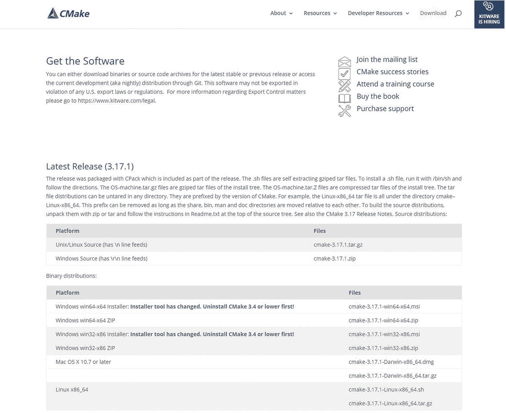

图 3-5

下载最新的 CMake 包

在安装时，请确保将 CMake 添加到系统路径（图 3-6）。

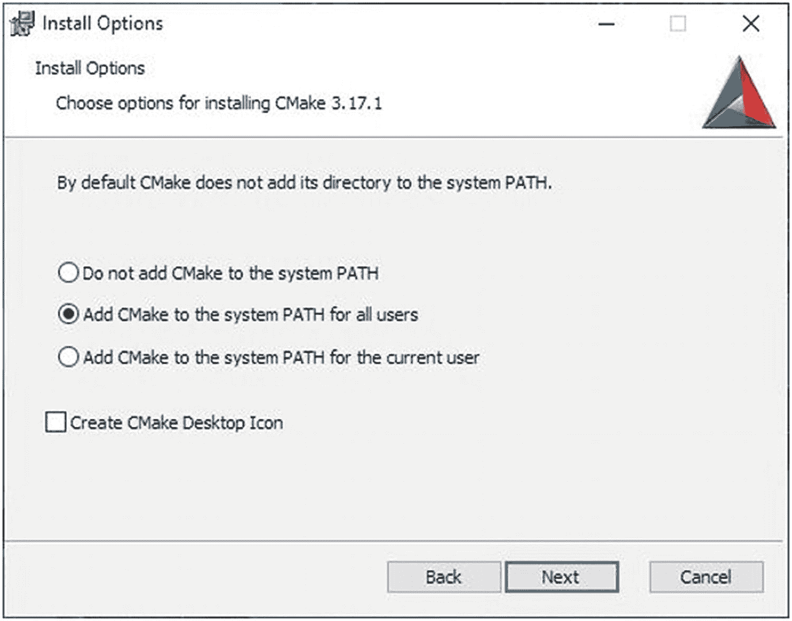

图 3-6

将 CMake 添加到系统路径

安装完成后，你可以在 Windows 命令提示符中运行以下命令来验证安装（图 3-7）。

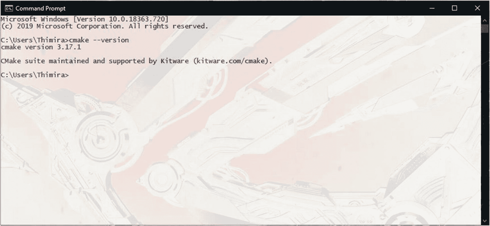

图 3-7

验证 CMake 版本

```py
cmake --version
```

## 步骤 3：安装 Anaconda Python

安装 Anaconda 很简单：只需转到 Anaconda 个人版下载页面^(3) 并下载最新的 Windows 64 位 Python 3.x 包（图 3-8）。完整安装程序大小约为 470MB，包含 conda 包管理器、Python 3.8 以及一系列预捆绑的常用包。虽然基本安装程序包含 Python 3.8，但我们在创建 conda 虚拟环境时将能够使用其他 Python 版本。

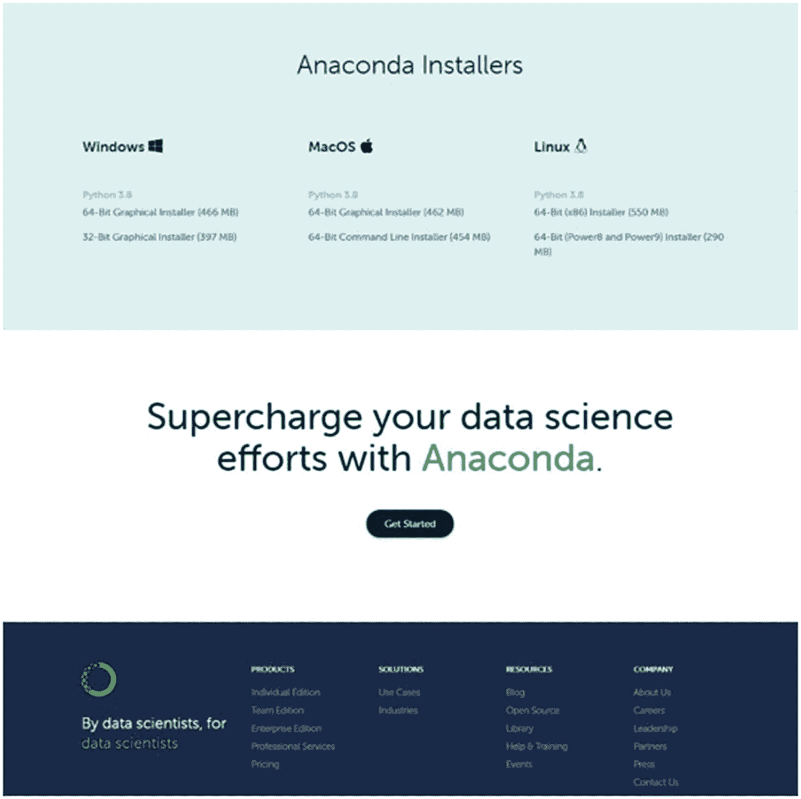

图 3-8

Anaconda 个人版下载页面

安装程序中捆绑的包列表以及可供安装的 conda 包的完整列表可以在 Anaconda 包列表中找到.^(4)

小贴士

如果你不需要带有预捆绑包的完整安装程序，而只需要 conda 包管理器和 Python，你可以获取 **Miniconda** 发行版，^(5) 它的大小要小得多（约 60MB）。Miniconda 安装程序包也适用于 Python 3.8，但它允许我们使用其他 Python 版本设置虚拟环境。

安装过程就像运行下载的图形安装程序一样简单。

小贴士

在图形安装程序中，“将 Anaconda 添加到我的 PATH 环境变量”选项默认可能未勾选（图 3-9）。最好勾选此选项，因为它允许我们从 Windows 命令提示符运行 conda 命令。

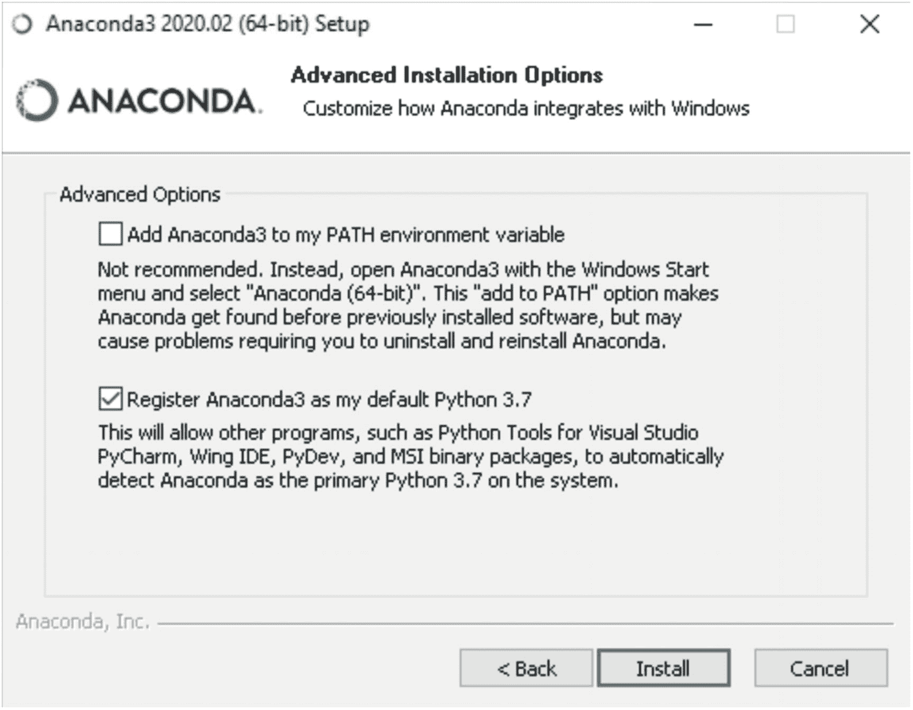

图 3-9

Anaconda 安装程序中的“将 Anaconda 添加到我的 PATH 环境变量”选项

如果你忘记检查这个选项，不要担心。你可以通过将以下内容添加到系统 PATH 变量中来手动将 Anaconda 添加到 PATH（其中 \path\to\anaconda3 是 Anaconda 的安装目录）：

`\path\to\anaconda\path\to\anaconda\Library\mingw-w64\bin\path\to\anaconda\Library\usr\bin\path\to\anaconda\Library\bin\path\to\anaconda\Scripts`

例如，如果用户配置文件位于 C:\Users\Thimira\，则路径应该是：

`C:\Users\Thimira\Anaconda3C:\Users\Thimira\Anaconda3\Library\mingw-w64\binC:\Users\Thimira\Anaconda3\Library\usr\binC:\Users\Thimira\Anaconda3\Library\binC:\Users\Thimira\Anaconda3\Scripts`

安装完成后，打开 Windows 命令提示符并运行以下命令：

```py
conda list
```

如果你得到了已安装的 conda 软件包列表，那么 Anaconda 已经安装并且运行正常。

注意

如果你收到错误消息，请确保在安装后关闭并重新打开终端窗口，或者现在就做。然后验证你是否登录了用于安装 Anaconda 的同一用户账户。

在这个阶段，如果你之前没有使用过 Anaconda Python，最好先通过“开始使用 conda”指南进行学习.^(6) 这是一个少于 30 分钟的教程，可以帮助你熟悉 Anaconda 的命令和功能。

## 第 4 步：设置 Conda 环境和 Python 库

一旦你熟悉了 conda，就是时候创建 conda 环境并安装必要的软件包了。

注意

确保在继续之前，你已经按照入门指南中提到的执行了“`conda update conda`”命令。

在创建 conda 环境时，我们还需要安装我们在上一章中讨论的实用库。我们可以逐个安装它们。但使用 conda，我们不必这样做。

Conda 有一个名为“anaconda”的元包，它捆绑了许多常用的实用软件包。

因此，我们只需要运行以下命令来创建 conda 虚拟环境并安装我们想要在其中安装的所有实用软件包（这是一个单独的命令；见图 3-10）。

+   **--name deep-learning:** 我们将环境的名称设置为“deep-learning”。你可以将其更改为任何你喜欢的名称。

+   **python=3.7:** 我们告诉 conda 创建一个使用 Python 3.7 的新环境。如果你想指定其他版本，也可以。但现在推荐使用 3.7。

+   **Anaconda:** 我们告诉 conda 在创建的环境中安装 anaconda 元包。这将安装常用实用软件包的捆绑包，包括我们之前讨论过的实用库集合。

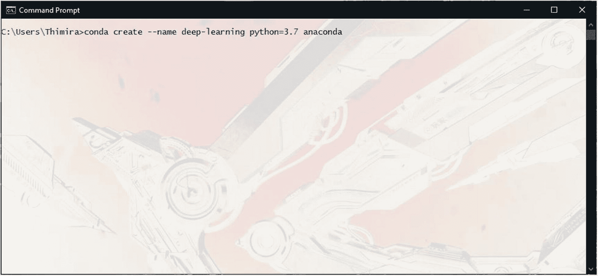

图 3-10

创建 Conda 环境

```py
conda create --name deep-learning python=3.7 anaconda
```

注意

你可以选择不使用元包——它会安装很多你可能不需要的软件包——在创建环境时也可以指定要安装的软件包列表：

`conda create --name deep-learning python=3.7 numpy scipy scikit-learn scikit-image pillow h5py matplotlib`

一旦创建环境（可能需要几分钟来下载和安装所有必需的包；图 3-11），您可以通过运行以下命令来激活它：

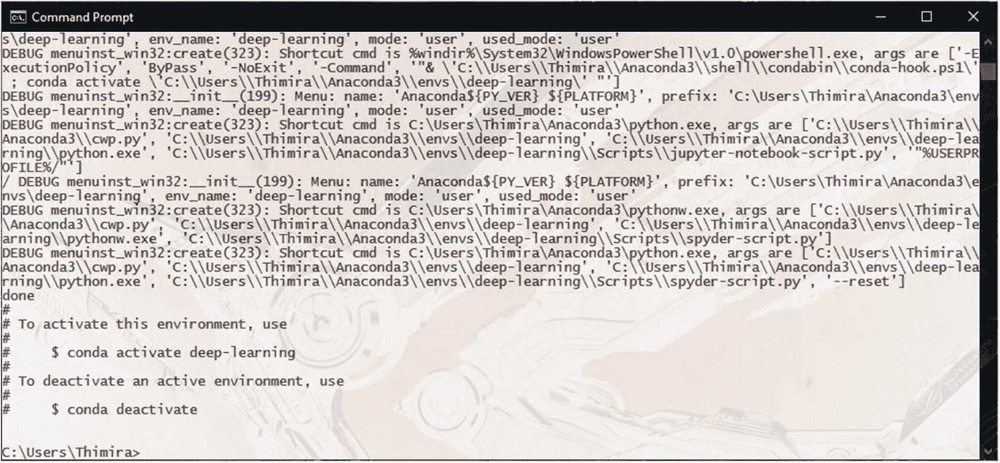

图 3-11

环境创建完成

```py
conda activate deep-learning
```

当激活 Anaconda 环境时，环境名称将添加到命令提示符前（图 3-12）。

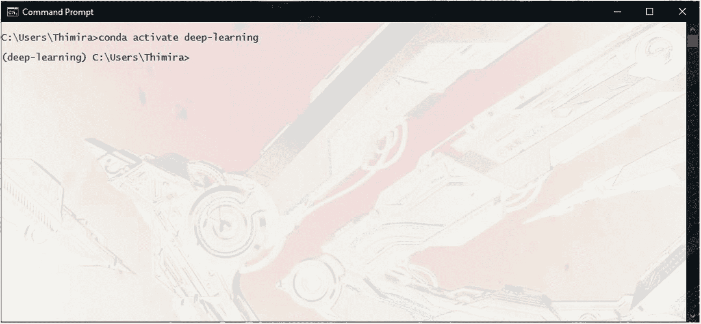

图 3-12

Conda 环境已激活

您可以使用此方法来验证您是否正在正确的环境中工作。始终确保您已激活并正在使用正确的环境进行所有后续步骤。

## 第 5 步：安装 TensorFlow

TensorFlow 有 CPU 版本和 GPU 版本。如果您的系统已安装具备 CUDA 功能的 NVIDIA GPU，TensorFlow GPU 版本能够利用该 GPU 的处理能力来加速您模型的训练。

如果您拥有具备 CUDA 功能的 NVIDIA GPU，我强烈建议安装 GPU 版本，因为它可以为您的深度学习实验带来巨大的速度提升。

小贴士

您可以从 NVIDIA 开发者网站上支持的 CUDA GPU 列表中检查您的 NVIDIA GPU 是否具备 CUDA 功能.^(7) 为了运行 TensorFlow GPU，您需要一个具备 CUDA Compute Capability 3.5 或更高版本的 GPU。

由于 TensorFlow 现在有一个 Anaconda 原生包，我们将使用它来安装 TensorFlow，因为它简化了其依赖项（如 CUDA 工具包和 cuDNN 库）的安装。

要安装 TensorFlow 的 GPU 版本，请运行以下命令（确保您处于我们之前创建的已激活的 conda 环境中）：

```py
conda install tensorflow-gpu==2.1.0
```

注意

我们还指定了包的版本号，即 tensorflow-gpu**==2.1.0**，因为 anaconda 倾向于安装较旧版本。希望这将在未来得到修复，但在此之前，指定包版本会更好。

小贴士

总是检查 Anaconda 包列表中可用的最新 TensorFlow 包版本^(8) 并安装该版本。在撰写本文时，Anaconda 包列表显示 2.2.0 版本为最新的 TensorFlow 版本。然而，如果您尝试安装它，可能会因为 conda 包注册表的问题而遇到“PackagesNotFoundError”。直到这个问题得到解决，我们将坚持使用 TensorFlow 2.1.0。

对于 CPU 版本：

```py
conda install tensorflow==2.1.0
```

注意

不要尝试在同一 conda 环境中安装 GPU 和 CPU 版本。如果您想切换版本，请先卸载其他版本，或者使用不同的 conda 环境。

Conda 将为您安装所有依赖项。如果您选择安装 GPU 版本，这还将包括 CUDA Toolkit 和 cuDNN 库（图 3-13）。

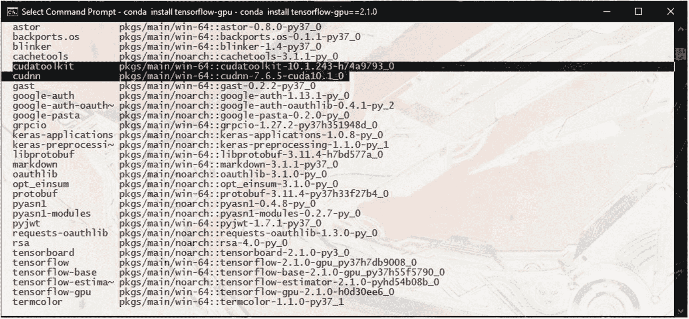

图 3-13

CUDA-toolkit 和 cuDNN 库正在安装

## 步骤 6：（可选）安装 Keras 多后端版本

这是一个可选步骤。

在 TensorFlow 2.0 及以上版本中，Keras 已集成到 TensorFlow 库中，并通过其 tf.keras Python 接口提供。

但如果您需要安装 Keras 的多后端版本以进行与其他后端（如 Theano）的实验，您可以使用 pip 进行安装：

```py
pip install keras
```

切换 Keras 的后端是在 keras.json 文件中完成的，该文件位于 Windows 的 *%USERPROFILE%\.keras\keras.json*。默认的 keras.json 文件看起来像这样：

```py
{
"floatx": "float32",
"epsilon": 1e-07,
"backend": "tensorflow",
"image_data_format": "channels_last"
}
```

在切换后端时，您还需要注意 Keras 的 `image_data_format` 参数。您可以在附录 2 中了解更多信息。

如果您坚持使用 TensorFlow，Keras 的默认设置将工作得很好。

## 步骤 7：安装 OpenCV

OpenCV 为 Windows 提供了预构建的二进制文件，可以从其官方网站下载。但您可能会遇到与 64 位 Python 3.7 一起使用 Python 绑定时的问题。

在 Windows 上使用 64 位 Python 3.7 使 OpenCV 工作的最简单方法是使用 Anaconda 包（图 3-14）。与 TensorFlow 一样，conda 将处理所有依赖项管理。

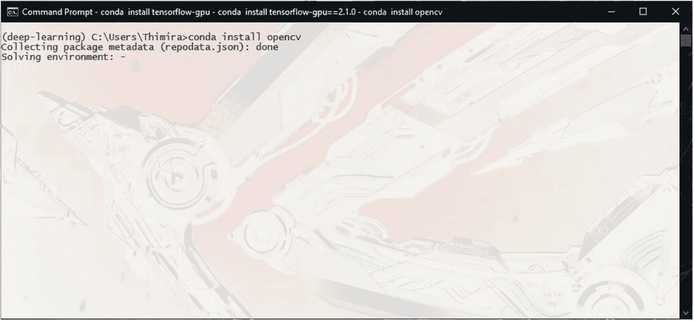

图 3-14

OpenCV 已安装

```py
conda install opencv
```

## 步骤 8：安装 Dlib

由于 Dlib 需要一些特定的依赖项要求，这些依赖项几乎总是与您的其他库冲突，因此尽管 Dlib 具有所有这些优秀功能，安装它一直有点麻烦。然而，在最新版本中，安装 Dlib 已经变得相对简单。

如果您想安装 Dlib 的最新官方包，那么使用 pip 包是最佳选择。

注意

在尝试安装 Dlib 之前，您需要安装 Visual Studio 和 CMake。确保通过运行 `cmake --version` 来确认 CMake 可在系统路径中可用。

您可以使用以下方式安装 Dlib pip 包：

```py
pip install dlib
```

它将收集包，使用 CMake 构建轮子，然后将其安装到您的 conda 环境中（图 3-15）。

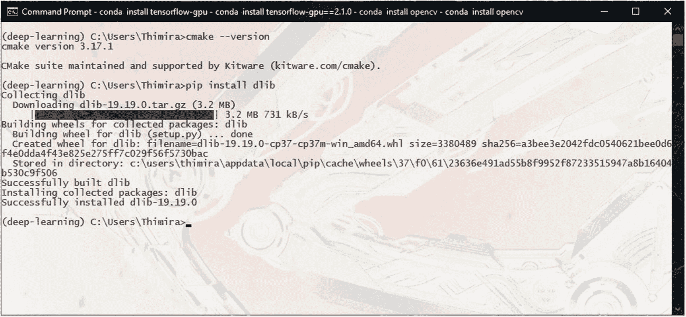

图 3-15

Dlib PIP 安装成功

## 步骤 9：验证安装

在安装所有必需的包和库之后，最好进行一些初步检查，以确保一切安装正确。否则，在运行代码时可能会遇到问题，而且你将不知道是代码中存在错误，还是安装存在问题。

如果不尝试运行几个深度学习模型，我们将无法测试所有内容。但这些步骤将帮助你确保一切准备就绪。

首先，确保你已经激活了我们之前创建的 conda 环境：

```py
conda activate deep-learning
```

你可以通过查看命令提示符（图 3-16）来验证环境是否正确激活。

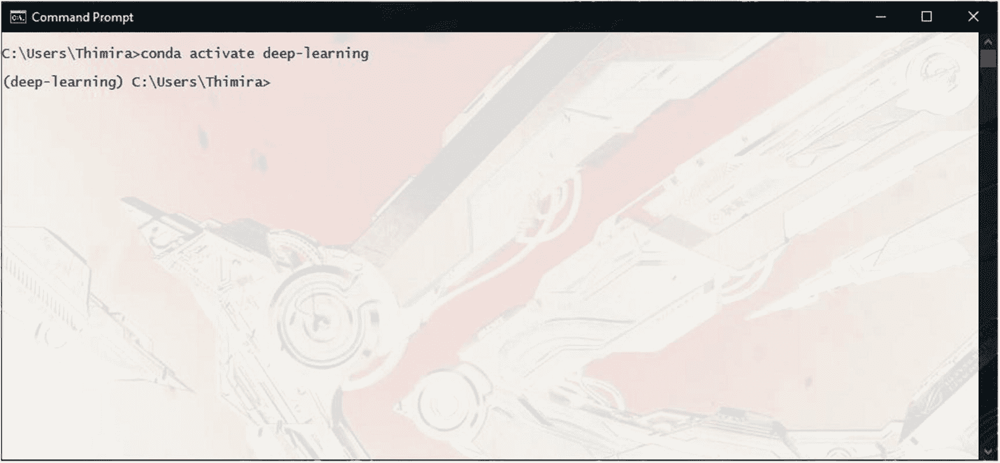

图 3-16

Conda 环境已激活

运行以下命令以查看所有已安装包的列表：

```py
conda list
```

你将得到一个像以下这样的长列表（图 3-17）：

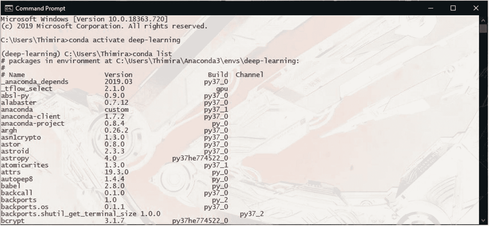

图 3-17

列出我们 Conda 环境中的已安装包

快速浏览列表，查看我们安装的所有包是否都在那里。

然后运行 Python 解释器，查看它是否具有正确的 Python 版本（3.7.*）和架构（64 位）。

```py
(deep-learning) C:\Users\Thimira>python
Python 3.7.6 (default, Jan  8 2020, 20:23:39) [MSC v.1916 64 bit (AMD64)] :: Anaconda, Inc. on win32
Type "help," "copyright," "credits" or "license" for more information.
>>>
```

接下来，在 Python 解释器中，逐个导入我们安装的每个包：

+   TensorFlow

+   OpenCV

```py
import tensorflow as tf
```

+   Dlib

```py
import cv2
```

+   多后端 Keras（如果你已安装）

```py
import dlib
```

```py
import keras
```

如果一切设置正确，所有这些导入应该会顺利完成，不会出现任何错误。一些包，例如 TensorFlow 和 Keras，在导入时可能会显示一些信息消息（图 3-18）。

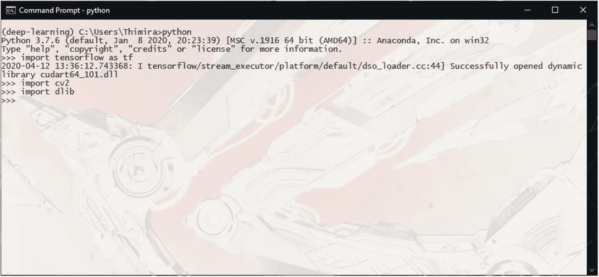

图 3-18

测试导入已安装的包

最后，让我们检查 TensorFlow 的功能。在 Python 解释器中依次运行以下命令：

```py
import tensorflow as tf
x = [[2.]]
print('tensorflow version', tf.__version__)
print('hello, {}'.format(tf.matmul(x, x)))
```

如果你已经安装了 TensorFlow GPU 版本，你可能会看到一些关于 CUDA 库加载的信息消息（图 3-19）。

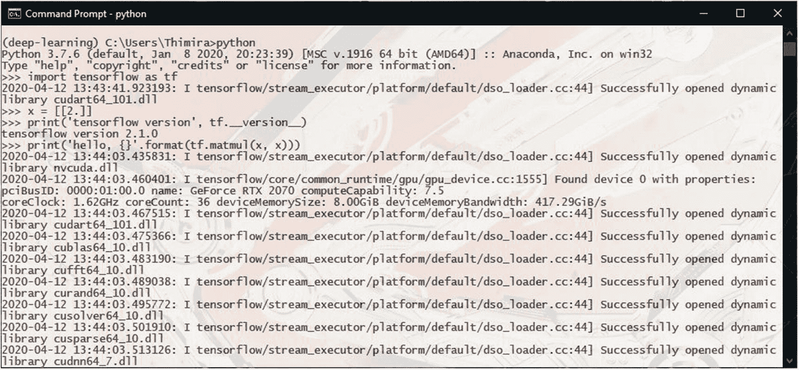

图 3-19

TensorFlow GPU 版本加载 CUDA 库

最终结果应显示为 `hello, [[4.]]`（图 3-20）：

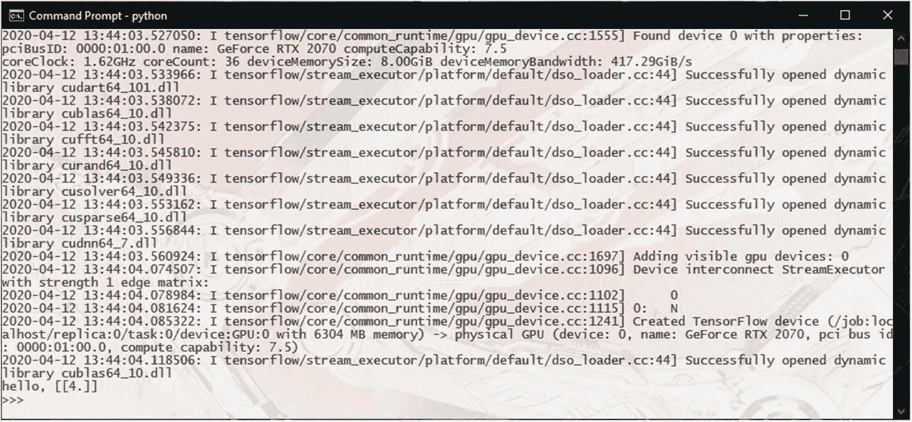

图 3-20

TensorFlow 测试成功

如果所有命令都运行无误，那么我们就可以继续了。

你可以运行 `quit()` 来退出 Python 解释器。

## 第 10 步：（可选）手动安装 CUDA 工具包和 cuDNN

当我们通过 conda 包安装 TensorFlow GPU 版本时，您会注意到 CUDA 工具包和 cuDNN 库也被作为 conda 依赖项安装。虽然这对于 TensorFlow conda 包（以及少数其他 conda 包）是有效的，但对于可能需要 CUDA 功能的其他库，您可能需要全局安装 CUDA 工具包。

您可以从 NVIDIA CUDA 下载页面下载 CUDA 工具包，^(9) 其中列出了最新的 CUDA 工具包二进制文件。旧版本的 CUDA 可以从 CUDA 工具包存档页面下载.^(10) 选择您需要的工具包版本，然后选择适合您 Windows 版本的相应包（图 3-21）。

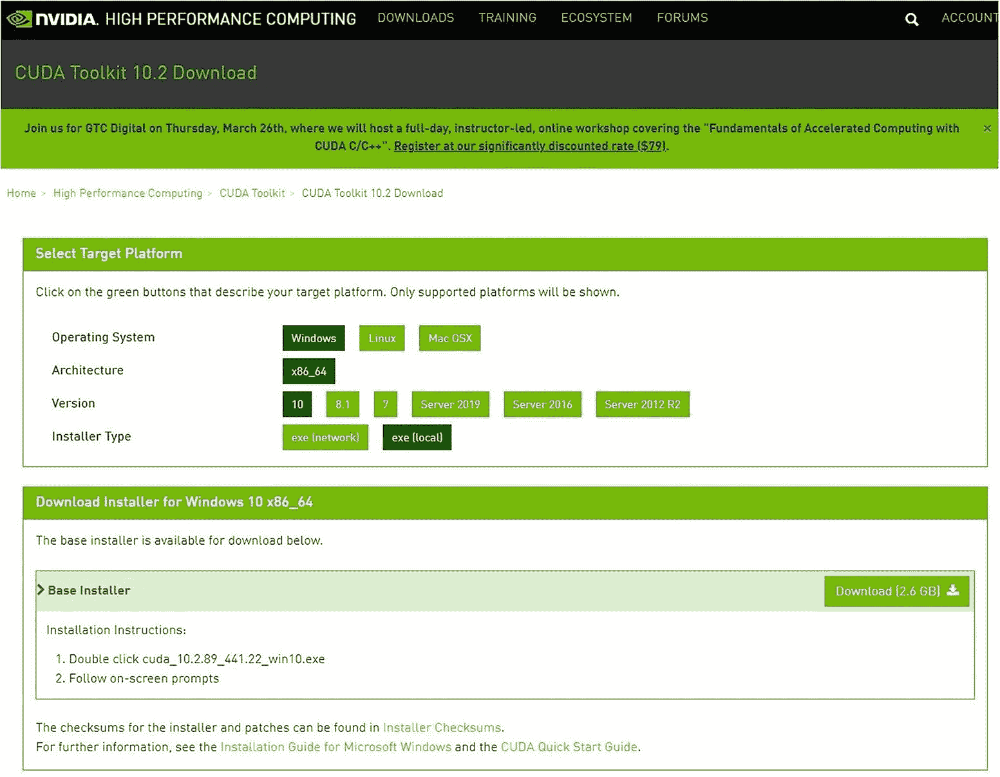

图 3-21

NVIDIA CUDA 工具包下载页面

注意

选择 exe（本地）安装程序将大大减少安装时间，如果您的互联网连接速度慢或不稳定，这是一个更好的选择。此外，如果安装过程中出现问题，您还可以使用相同的安装包重新开始安装。请注意，最新版本的下载大小约为 2.6GB。

接下来，您需要通过访问 NVIDIA cuDNN 页面下载 cuDNN.^(11) cuDNN 的下载页面将列出多个 cuDNN 版本。您必须确保下载与您使用的 CUDA 工具包版本兼容的最新 cuDNN 版本。例如，如果我们选择了 CUDA 工具包 v10.2，那么我们需要选择下载 cuDNN v7.6.5（2019 年 11 月 18 日），适用于 CUDA 10.2 或任何最新版本。下载大小约为 280MB（图 3-22）。

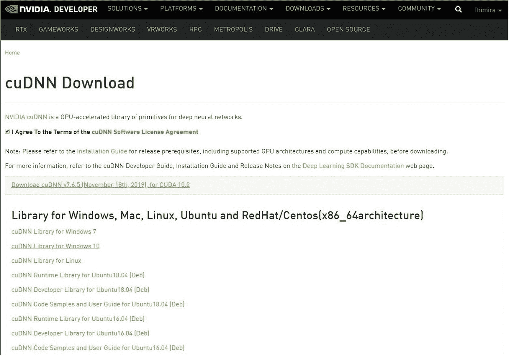

图 3-22

cuDNN 下载页面

下载完这两个包后，首先运行 CUDA 工具包的安装程序。在安装选项中选择 **自定义安装** 选项（图 3-23）。在自定义安装选项页中，**取消选择** GeForce Experience、显示驱动（图 3-24）和 Visual Studio 集成（图 3-25）的选项。

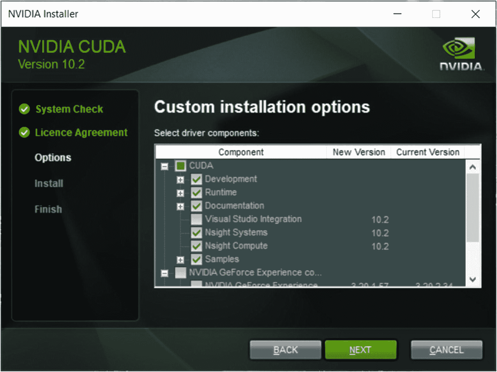

图 3-25

在 CUDA 下取消选择 Visual Studio 集成选项

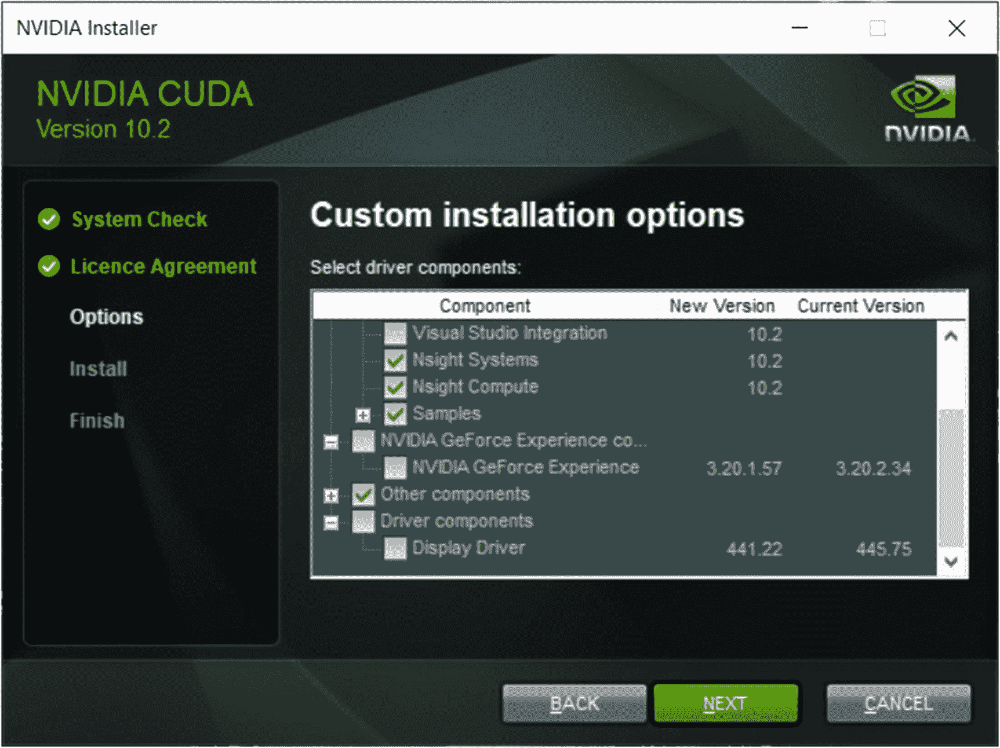

图 3-24

取消选择 GeForce 经验和驱动组件

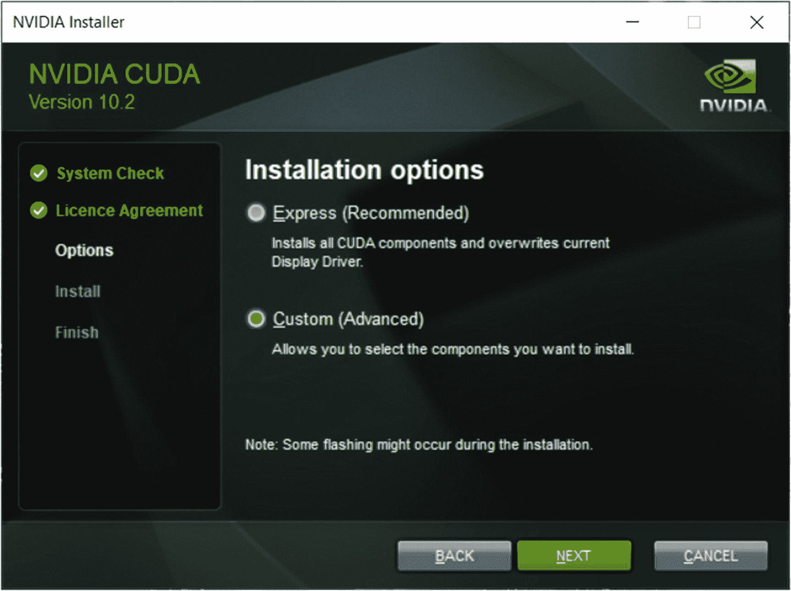

图 3-23

在 CUDA 工具包安装程序中选择自定义安装选项

警告

如果您选择 *Express Installation* 选项，并且您已经安装了最新的 GPU 显示驱动程序，安装程序可能会尝试用较旧的驱动程序版本覆盖已安装的驱动程序。因此，如果您已经安装了最新的驱动程序（以及 GeForce Experience），最好选择 *Custom Installation* 路径。

已知 *Visual Studio Integration* 选项会导致某些版本的 Visual Studio 出现问题。因此，如果您不打算构建 Visual C++ CUDA 应用程序，最好取消选中它。

您可以为 CUDA 安装程序中的其他所有内容保留默认设置。

CUDA 安装完成后，您可以通过在命令提示符中运行以下命令来验证安装：

```py
nvcc -V
```

（注意大写“V.”）

这将输出类似（图 3-26）的内容：

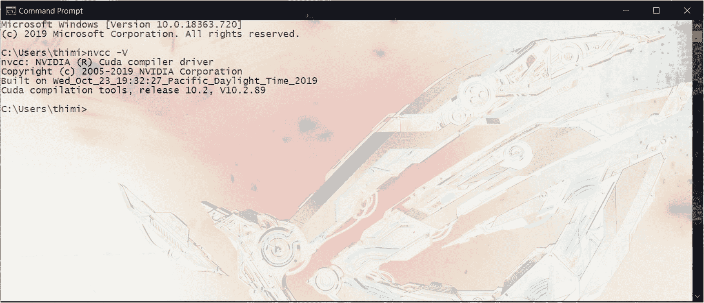

图 3-26

CUDA 工具包安装验证

```py
nvcc: NVIDIA (R) Cuda compiler driver
Copyright (c) 2005-2019 NVIDIA Corporation
Built on Wed_Oct_23_19:32:27_Pacific_Daylight_Time_2019
Cuda compilation tools, release 10.2, V10.2.89
```

CUDA 工具包安装完成后，您可以安装 cuDNN。

cuDNN 不是一个安装程序。它是一个压缩文件。您通过提取它并将其内容复制到 CUDA 安装目录来 *安装* 它。当您提取 cuDNN 时，您会得到一个 cuda 目录，其中包含 3 个子目录：bin、include 和 lib（图 3-27）。

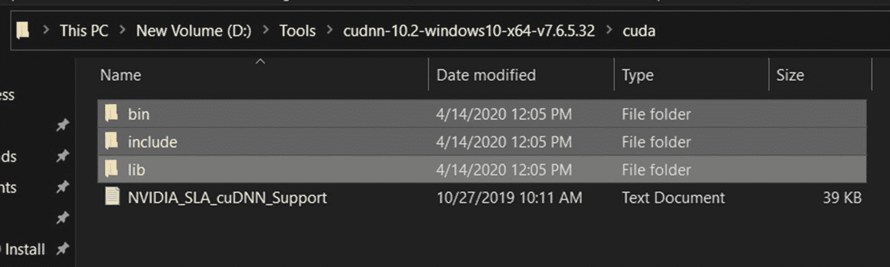

图 3-27

cuDNN 压缩文件已提取

如果您访问您的 CUDA 安装目录（默认情况下是 `C:\Program Files\NVIDIA GPU Computing Toolkit\CUDA\vx.x`，其中 x.x 是您安装的版本），您会看到它还包含名为 bin、include 和 lib 的目录，以及几个其他目录。

您需要将 cuDNN 中每个目录的内容复制到 CUDA 安装目录中相应的目录（图 3-28）。换句话说，将 cuDNN 的 bin 目录内容复制到 CUDA 的 bin 目录；将 cuDNN 的 lib 目录内容复制到 CUDA 的 lib 目录；将 cuDNN 的 include 目录内容复制到 CUDA 的 include 目录。

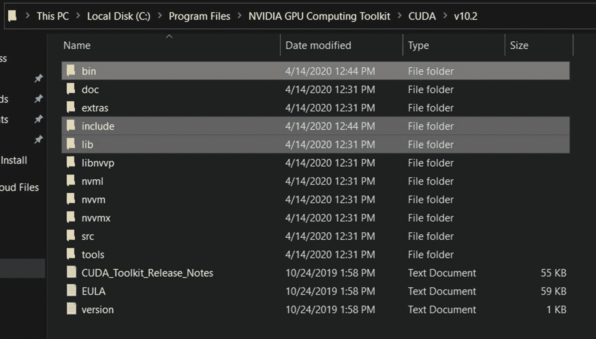

图 3-28

cuDNN 文件已提取到 CUDA 工具包安装目录

一切复制完成后，CUDA 工具包和 cuDNN 将为您的 CUDA 实验做好准备。

## 故障排除

为了避免大多数安装错误，确保在安装任何软件包之前执行 conda 升级步骤（图 3-29）。

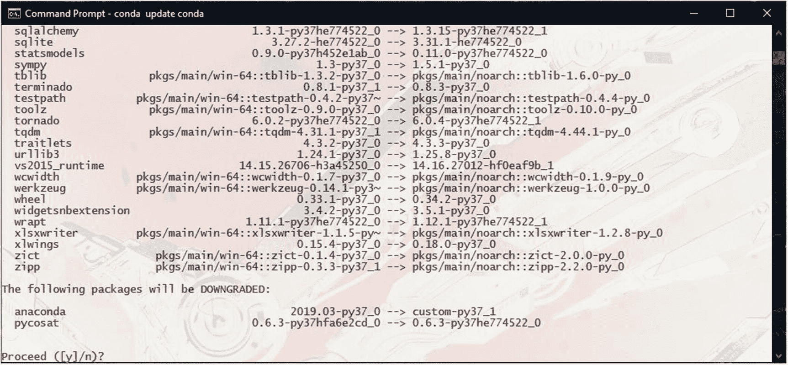

图 3-29

Conda 升级步骤正在运行

```py
conda update conda
```

下面是一系列您可能会遇到的问题以及如何解决它们。

### Matplotlib Pyplot 错误

在撰写本文时，conda 上可用的 Matplotlib 库的一个特定版本存在问题。您可以通过在 Python 解释器中运行以下命令来检查它。

首先，尝试导入 Matplotlib 包。它不应该产生任何错误：

```py
import matplotlib
```

接下来，尝试导入 matplotlib.pyplot 包：

```py
import matplotlib.pyplot as plt
```

如果存在这个问题，它将导致你的 Python 解释器崩溃。

如果你遇到这个问题，为了解决这个问题，你需要从 conda 中卸载 Matplotlib 库，并使用 pip 重新安装它：

```py
conda remove matplotlib
pip install matplotlib
```

只有在你有那个错误时才需要这样做；有可能在你阅读这段内容的时候，有问题的构建已经被修复。

### 无法获取最新版本

当你在 conda 中安装包时，你可能注意到你并没有获得这些包的最新版本。这可能是由于以下几种原因之一。

Conda 包管理器在安装时会考虑环境中所有包之间的互操作性，并可能出于兼容性原因决定使用包的较旧版本。

Conda 也会缓存它下载和安装的包。因此，有时它可能会使用较旧的缓存版本而不是获取最新版本。你可以使用以下命令来清理缓存：

```py
conda clean –all
```

清理缓存可能允许 conda 获取新版本。

如果不是这样，你可以通过在安装命令中指定版本来强制 conda 安装特定版本的包（你可以从 Anaconda 包列表中找到可用的包版本）:^(12)。

```py
conda install tensorflow-gpu==2.1.0
```

Conda 将分析指定的包版本，并会告诉你它是否与 conda 环境中已安装的包兼容，以及是否需要升级或降级任何包。它将等待你确认是否继续安装，这样你可以安全地检查你想要的特定版本是否可以工作。

### 未使用 OpenCV 的最新版本

如果你记得，当我们安装 OpenCV 时，我们没有使用最新版本，而是让 conda 安装了一个较旧的版本（在这个例子中是版本 3.4.1）。为什么我们没有像前一小节讨论的那样强制 conda 安装最新版本呢？

嗯，如果你尝试使用以下命令安装 OpenCV v4：

```py
conda install opencv==4.0.1
```

你将得到如图 3-30 所示的错误。

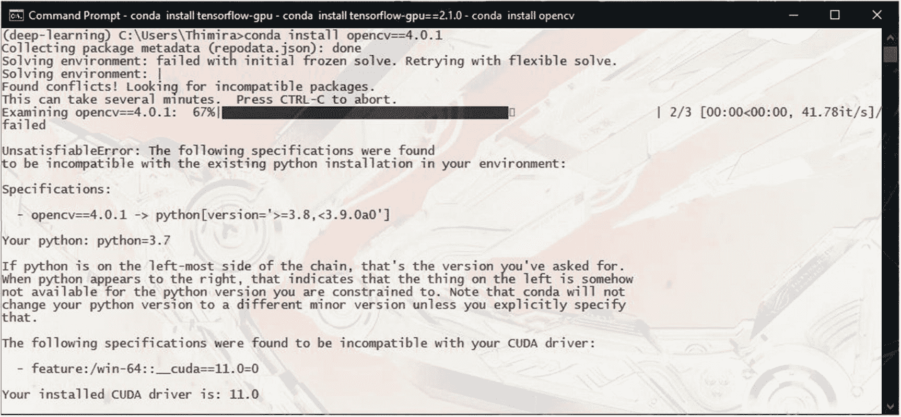

图 3-30

OpenCV v4 Conda 安装错误

基本上，OpenCV v4 conda 包需要 Python 3.8 或更高版本以及 CUDA 版本 11.0，这与我们使用的其他库（如 TensorFlow）不兼容。

因此，我们现在将坚持使用 3.4.x 版本，这个版本包含了本书将要探索的所有功能。

### Dlib 构建错误

当你安装 Dlib pip 包时，你可能会遇到如下错误（如图 3-31）：

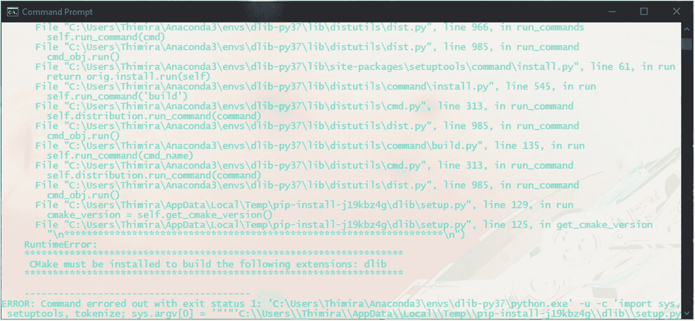

图 3-31

Dlib 构建错误

这种情况发生在 CMake 没有正确安装，或者没有正确添加到系统路径中，或者当 CMake 安装后 Windows 命令提示符窗口没有关闭并重新打开时。

如果您遇到这种情况，请确保 CMake 已正确安装并添加到路径中，并且确保在安装后关闭并重新打开命令提示符窗口。

您可以通过运行以下命令来验证 CMake 是否正确安装：

```py
cmake --version
```

## 摘要

在本章中，我们学习了如何设置所有开始构建深度学习模型所需的工具。

您需要安装 Visual Studio、CMake 和 Anaconda Python 作为先决条件。以下是安装 Windows 上 Anaconda Python 环境中所有内容的所需命令：

```py
# create the conda environment
conda create --name deep-learning python=3.7 anaconda
# activate the conda environment
conda activate deep-learning
# install tensorflow (GPU version)
conda install tensorflow-gpu==2.1.0
# install opencv
conda install opencv
# install dlib
pip install dlib
```

这些只是学习构建深度学习模型所需的核心工具集。随着您开始构建，您将安装更多工具。
