# 4. 构建您的第一个深度学习模型

我们现在准备开始构建我们的第一个深度学习模型。

但我们从哪里开始呢？

要看到深度学习的实际应用，让我们从深度学习系统非常擅长的东西开始：一个用于图像分类的卷积神经网络。为此，我们将构建通常被认为是深度学习“hello world”程序的程序——即编写一个程序来分类手写数字图像。把它想象成一个简单的 OCR 系统。

但我们不是需要大量的数据来训练系统吗？

好吧，幸运的是，由于手写数字分类是一个非常受欢迎的问题（甚至在深度学习之前），有一个公开可用的数据集叫做 *MNIST 数据集*。

## 什么是 MNIST 数据集？

回到 1995 年，美国国家标准与技术研究院（NIST）创建了一个用于机器学习和图像处理系统的手写字符数据集。虽然这个数据集大部分是有效的，但由于训练集和验证集并非来自同一来源，以及图像上的一些预处理，因此在机器学习环境中对数据集的有效性存在一些担忧。

1998 年，NIST 数据集的数据被清理、归一化和重新组织，以解决其问题，从而创建了 MNIST 数据集（修改后的国家标准与技术研究院数据集）。MNIST 包含 70,000 张图像——60,000 张训练图像和 10,000 张测试/验证图像，分辨率为 28x28 像素。

MNIST 数据集可以从其官方网站公开获取。1 然而，由于其受欢迎程度，许多机器学习和深度学习框架要么内置了它，要么提供了获取和读取数据集的实用方法。Keras、Scikit-Learn 和 TensorFlow 都提供了这样的内置方法，这使我们免去了自己检索、读取和格式化数据的工作。MNIST 数据集的一些样本如图 4-1 所示。

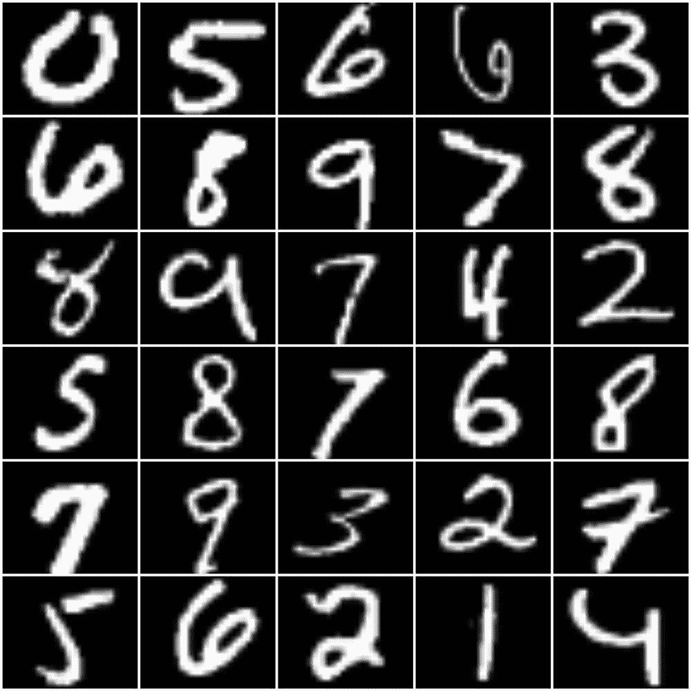

图 4-1

MNIST 数据集的一些样本

拥有了数据集，我们现在需要决定我们将要构建的卷积神经网络架构。在深度学习中，由于我们可以以多种方式构建模型，通常最好从一个已知且经过验证的深度学习模型开始，然后对其进行调整。因此，对于我们的任务，我们将选择 **LeNet** 架构。

## LeNet 模型

LeNet 是由 Y. LeCun、L. Bottou、Y. Bengio 和 P. Haffner 提出的 7 层卷积神经网络（CNN）。他们在 1998 年推出了 LeNet-5，这是该架构的第五次成功迭代。2 它专门为手写和印刷字符识别而设计，因此非常适合我们的需求。

LeNet 使用两组卷积操作（图 4-2）。第一组使用 20 个卷积滤波器，并使用 ReLU（修正线性单元）作为非线性函数（1998 年论文中的原始 LeNet 架构使用 Tanh 作为非线性函数而不是 ReLU），然后是一个最大池化层。第二组使用 50 个卷积滤波器，同样后面跟着 ReLU 和最大池化。然后输出被展平，并通过两个全连接（密集）层来获取输出预测。

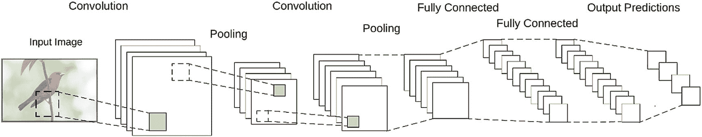

图 4-2

LeNet 架构

LeNet 架构简单，但为小图像分类任务提供了出色的准确性。由于它体积小，可以很容易地在 CPU 上训练。

## 让我们构建我们的第一个模型

我们现在有了数据，并为我们的第一个深度学习模型选择了一个架构。那么，让我们开始构建。

我们将使用 TensorFlow 2.1 和 tf.keras（Keras 的 TensorFlow 版本），在之前创建的 Python 3.7 环境中。

创建一个新的 Python 文件，并将其命名为`lenet_mnist_tf_keras.py`。

在这个新文件中，我们将首先导入必要的包：

```py
14:
15: # first, let's import tensorFlow
16: import tensorflow as tf
17: import numpy as np
18:
19: # import the mnist dataset
20: from tensorflow.keras.datasets import mnist
21:
22: # imports used to build the deep learning model
23: from tensorflow.keras.optimizers import SGD
24: from tensorflow.keras.models import Sequential
25: from tensorflow.keras.layers import Conv2D
26: from tensorflow.keras.layers import MaxPooling2D
27: from tensorflow.keras.layers import Activation
28: from tensorflow.keras.layers import Flatten
29: from tensorflow.keras.layers import Dense
30:
31: # import the keras util functions
32: import tensorflow.keras.utils as np_utils
33:
34: import argparse
35: import cv2
36: import matplotlib.pyplot as plt
37:
```

我们从导入 TensorFlow 开始，这是我们需要使用 tf.keras 函数的。

`tensorflow.keras.datasets`包包含几个 Keras 常用的内置数据集。我们从其中导入 MNIST 数据集。

`tensorflow.keras.optimizers`、`tensorflow.keras.models`和`tensorflow.keras.layers`包含了构建深度学习模型所需的核心函数集。

`tensorflow.keras.utils`包有几个实用函数，可以帮助我们构建模型。

我们导入`argparse`包来处理命令行参数，这允许我们训练和评估模型。

OpenCV（导入为`cv2`）用于显示评估训练模型的结果。

`matplotlib`包用于可视化/绘图模型的训练性能，因为总是看到模型训练得有多好会更好。

我们的数字分类系统将有两个阶段：训练和评估（对于这个应用，我们不需要构建推理阶段）。训练阶段需要时间，通常是资源最密集的阶段。我们当然不希望每次运行程序时都运行训练。因此，我们定义了一些命令行参数来触发这两个阶段：

```py
37:
38: # Setup the argument parser to parse out command line arguments
39: ap = argparse.ArgumentParser()
40: ap.add_argument("-t", "--train-model", type=int, default=-1,
41:                 help="(optional) Whether the model should be trained on the MNIST dataset. Defaults to no")
42: ap.add_argument("-s", "--save-trained", type=int, default=-1,
43:                 help="(optional) Whether the trained models weights should be saved." +
44:                 "Overwrites existing weights file with the same name. Use with caution. Defaults to no")
45: ap.add_argument("-w", "--weights", type=str, default="data/lenet_weights.hdf5",
46:                 help="(optional) Path to the weights file. Defaults to 'data/lenet_weights.hdf5'")
47: args = vars(ap.parse_args())
48:
```

我们定义了三个参数：

+   **--train-model:** 表示模型是否应该被训练。将其传递 1 以训练模型。

+   **--save-trained:** 当模型训练时，我们有保存模型权重到文件以便稍后加载的选项。将 1 传递给此参数，以指示保存权重。

+   **--weights:** 默认情况下，我们将保存模型权重到`data/lenet_weights.hdf5`（由该参数的默认值设置）。如果您想覆盖该路径，可以向该参数传递一个自定义路径。

现在，我们加载并预处理我们的数据集：

```py
49:
50: # Get the MNIST dataset from Keras datasets
51: # If this is the first time you are fetching the dataset, it will be downloaded
52: # File size will be ~10MB, and will placed at ~/.keras/datasets/mnist.npz
53: print("[INFO] Loading the MNIST dataset...")
54: (trainData, trainLabels), (testData, testLabels) = mnist.load_data()
55: # The data is already in the form of numpy arrays,
56: # and already split to training and testing datasets
57:
58: # Reshape the data matrix from (samples, height, width) to (samples, height, width, depth)
59: # Depth (i.e. channels) is 1 since MNIST only has grayscale images
60: trainData = trainData[:, :, :, np.newaxis]
61: testData = testData[:, :, :, np.newaxis]
62:
63: # Rescale the data from values between [0 - 255] to [0 - 1.0]
64: trainData = trainData / 255.0
65: testData = testData / 255.0
66:
67: # The labels come as a single digit, indicating the class.
68: # But we need a categorical vector as the label. So we transform it.
69: # So that,
70: # '0' will become [1, 0, 0, 0, 0, 0, 0, 0, 0, 0]
71: # '1' will become [0, 1, 0, 0, 0, 0, 0, 0, 0, 0]
72: # '2' will become [0, 0, 1, 0, 0, 0, 0, 0, 0, 0]
73: # and so on...
74: trainLabels = np_utils.to_categorical(trainLabels, 10)
75: testLabels = np_utils.to_categorical(testLabels, 10)
76:
```

大多数数据集的清理工作已经由 Keras 为我们完成。它已经以 NumPy 数组的格式存在，并且已经分割为训练数据和测试数据。

如果这是您第一次从 Keras 使用 MNIST 数据集，它将被下载（大约 10MB 的文件大小），并放置在`%USERPROFILE%/.keras/datasets/mnist.npz`。

NumPy 数组以**[样本，高度，宽度]**的格式存在。但 Keras（和 TensorFlow）期望数据数组中有一个额外的维度，即**深度**维度——或通道。在彩色图像中，会有三个通道——红色、绿色和蓝色。但鉴于我们的数字图像是灰度图像，将只有一个通道。因此，我们将数组重塑以添加一个额外的轴，使得数组变为**[样本，高度，宽度，深度]**的形状。

由于这些是图像数据——每个值都是一个像素的灰度值——因此值在 0–255 的范围内。但对于神经网络来说，最好始终将值保持在 0–1 的范围内。因此，我们将整个数组除以 255 以将其转换为该范围。

数据集的标签以单个数字的形式出现。但为了训练神经网络模型，我们需要它们作为分类向量。我们使用`to_categorical`实用函数将它们转换，以便：

+   '0'将变为[1, 0, 0, 0, 0, 0, 0, 0, 0, 0]

+   '1'将变为[0, 1, 0, 0, 0, 0, 0, 0, 0, 0]

+   '2'将变为[0, 0, 1, 0, 0, 0, 0, 0, 0, 0]

+   等等。

现在我们来到代码的核心部分，定义我们模型的架构。我们将为此定义一个名为**build_lenet()**的函数：

```py
077:
078: # a function to build the LeNet model
079: def build_lenet(width, height, depth, classes, weightsPath=None):
080:     # Initialize the model
081:     model = Sequential()
082:
083:     # The first set of CONV => RELU => POOL layers
084:     model.add(Conv2D(20, (5, 5), padding="same",
085:                      input_shape=(height, width, depth)))
086:     model.add(Activation("relu"))
087:     model.add(MaxPooling2D(pool_size=(2, 2), strides=(2, 2)))
088:
089:     # The second set of CONV => RELU => POOL layers
090:     model.add(Conv2D(50, (5, 5), padding="same"))
091:     model.add(Activation("relu"))
092:     model.add(MaxPooling2D(pool_size=(2, 2), strides=(2, 2)))
093:
094:     # The set of FC => RELU layers
095:     model.add(Flatten())
096:     model.add(Dense(500))
097:     model.add(Activation("relu"))
098:
099:     # The softmax classifier
100:     model.add(Dense(classes))
101:     model.add(Activation("softmax"))
102:
103:     # If a weights path is supplied, then load the weights
104:     if weightsPath is not None:
105:         model.load_weights(weightsPath)
106:
107:     # Return the constructed network architecture
108:     return model
109:
```

我们的功能函数接受五个参数：输入的宽度、高度和深度；类别的数量；如果提供，则模型权重文件的路径，并返回模型结构（如果通过 weightsPath 参数传递，则加载模型权重）。

我们使用 Keras 的**Sequential**模型来构建我们的网络。Keras Sequential 模型使得构建顺序网络架构（所有层按顺序堆叠）变得非常简单。对于更复杂、非顺序架构（如 Inception 模块），Keras 提供了**功能 API**。但对于简单的顺序架构，如 LeNet，Sequential 模型是最容易的。

我们从第一个卷积、ReLU 和池化层集开始。在顺序模型中，第一层需要知道期望输入的形状，所以我们通过**input_shape**参数传递它。后续层可以自行推断形状。我们首先定义了 20 个 5x5 大小的卷积滤波器，然后是一个**ReLU**激活，以及一个 2x2 的**Max-Pooling**层。strides 参数定义了池化窗口在每次池化操作中应该在特征图上滑动多少。我们将在下一章中详细介绍这些操作是如何工作的。

第二组卷积、ReLU 和池化层几乎相同，卷积滤波器的数量增加到 50。

然后我们展平输入，并添加一个 500 个单元的**Dense**（全连接）层。

最后一个层再次是一个 Dense 层，其中单元的数量等于我们数据集的输出类别数。我们设置了一个**Softmax**分类器作为其激活函数。

如果传递了模型权重文件的路径，我们将权重加载到构建的模型中。否则，我们只返回模型。

注意

如果你现在还不理解这些层类型和参数是什么以及它们是如何工作的，不要担心。我们将在本书的后面更详细地研究它们。

一旦我们有了构建模型的函数，我们就可以指定模型的优化器，然后编译它：

```py
142:
143: # Build and Compile the model
144: print("[INFO] Building and compiling the LeNet model...")
145: opt = SGD(lr=0.01)
146: model = build_lenet(width=28, height=28, depth=1, classes=10,
147:                     weightsPath=args["weights"] \
148:                     if args["train_model"] <= 0 else None)
149: model.compile(loss="categorical_crossentropy",
150:               optimizer=opt, metrics=["accuracy"])
151:
```

在这里，我们使用**SGD**优化器（随机梯度下降），学习率为 0.01（由**lr**参数设置）。

我们指定输入的宽度和高度为 28x28，因为这些是 MNIST 数据集中图像的维度。深度参数设置为 1，因为我们处理的是只有单色通道的灰度图像。

模型编译完成后，我们开始训练模型：

```py
152: # Check the argument whether to train the model
153: if args["train_model"] > 0:
154:     print("[INFO] Training the model...")
155:
156:     history = model.fit(trainData, trainLabels,
157:                         batch_size=128,
158:                         epochs=20,
159:                         validation_data=(testData, testLabels),
160:                         verbose=1)
161:
162:     # Use the test data to evaluate the model
163:     print("[INFO] Evaluating the model...")
164:
165:     (loss, accuracy) = model.evaluate(
166:         testData, testLabels, batch_size=128, verbose=1)
167:
168:     print("[INFO] accuracy: {:.2f}%".format(accuracy * 100))
169:
```

我们检查命令行参数（通过 argparse 处理）以确定是否应该运行训练。

我们将预处理/清理过的 trainData 和 trainLabels（我们之前预处理/清理过的）传递到**model.fit()**函数中。

我们将批大小设置为 128，这意味着模型将一次训练 128 个图像的批次。批量训练可以显著减少训练时间。批大小也控制了使用梯度下降训练时误差梯度的估计精度。因此，深度学习模型几乎总是批量训练。对于我们的数据集，128 个批大小应该足够好。你可以稍后更改它以查看它对训练的影响。

一个 epoch 是对整个数据集的一次迭代。epochs 参数告诉模型需要在整个数据集上训练多少次。我们将 epoch 计数设置为 20。

除了我们的 trainData 和 trainLabels，我们还传递 testData 和 testLabels（使用 validation_data 参数）。这允许我们在多个 epoch 中验证模型性能。

训练完成后，我们使用**model.evaluate()**函数，用完整的测试数据集评估训练好的模型，以获取模型的最终损失和准确率。

你可能已经注意到，model.fit()函数返回一个值，我们将其捕获在**history**变量中。这个历史值包含了模型训练过程中每个 epoch 的训练和验证的准确率和损失值。使用这个值，我们可以绘制一个图表来展示模型的训练效果。让我们定义一个新的函数——**graph_training_history()**——来接受这个历史对象并绘制图表：

```py
109:
110: # a function to graph the training history of the model
111: def graph_training_history(history):
112:     plt.rcParams["figure.figsize"] = (12, 9)
113:
114:     plt.style.use('ggplot')
115:
116:     plt.figure(1)
117:
118:     # summarize history for accuracy
119:
120:     plt.subplot(211)
121:     plt.plot(history.history['accuracy'])
122:     plt.plot(history.history['val_accuracy'])
123:     plt.title('Model Accuracy')
124:     plt.ylabel('Accuracy')
125:     plt.xlabel('Epoch')
126:     plt.legend(['Training', 'Validation'], loc='lower right')
127:
128:     # summarize history for loss
129:
130:     plt.subplot(212)
131:     plt.plot(history.history['loss'])
132:     plt.plot(history.history['val_loss'])
133:     plt.title('Model Loss')
134:     plt.ylabel('Loss')
135:     plt.xlabel('Epoch')
136:     plt.legend(['Training', 'Validation'], loc='upper right')
137:
138:     plt.tight_layout()
139:
140:     plt.show()
141:
```

历史对象包含四个键：**[acc, loss, val_acc, val_loss]**。

我们使用**matplotlib**来绘制图表。

我们首先指定图形大小（12, 9）和样式（ggplot）。

我们定义了两个子图来分别绘制训练和验证的准确率矩阵和损失矩阵。每个子图将显示训练和验证的矩阵。

模型训练完成后，在行 168 的打印模型准确率语句之后，我们将历史对象传递给这个函数。

```py
169:
170:     # Visualize the training history
171:     graph_training_history(history)
172:
```

一旦所有训练和验证完成，我们将模型权重保存到文件中：

```py
172:
173: # Check the argument on whether to save the model weights to file
174: if args["save_trained"] > 0:
175:     print("[INFO] Saving the model weights to file...")
176:     model.save_weights(args["weights"], overwrite=True)
177:
178: # Training of the model is now complete
179:
```

我们使用**weights**命令行参数的值作为路径，默认设置为`data/lenet_weights.hdf5`，除非你覆盖了它。如果指定位置已经存在同名文件，则默认情况下 save_weights()函数不会覆盖它。这是为了避免意外覆盖你的训练模型。在这里，我们通过设置`overwrite=True`允许它覆盖文件。

现在我们已经构建、编译、训练并评估了我们的模型。我们可以使用这个训练好的模型来测试一些随机的数字：

```py
179:
180: # Randomly select a few samples from the test dataset to evaluate
181: for i in np.random.choice(np.arange(0, len(testLabels)), size=(10,)):
182:     # Use the model to classify the digit
183:     probs = model.predict(testData[np.newaxis, i])
184:     prediction = probs.argmax(axis=1)
185:
186:     # Convert the digit data to a color image
187:     image = (testData[i] * 255).astype("uint8")
188:     image = cv2.cvtColor(image, cv2.COLOR_GRAY2RGB)
189:
190:     # The images are in 28x28 size. Much too small to see properly
191:     # So, we resize them to 280x280 for viewing
192:     image = cv2.resize(image, (280, 280), interpolation=cv2.INTER_LINEAR)
193:
194:     # Add the predicted value on to the image
195:     cv2.putText(image, str(prediction[0]), (20, 40),
196:                 cv2.FONT_HERSHEY_DUPLEX, 1.5, (0, 255, 0), 1)
197:
198:     # Show the image and prediction
199:     print("[INFO] Predicted: {}, Actual: {}".format(
200:         prediction[0], np.argmax(testLabels[i])))
201:     cv2.imshow("Digit", image)
202:     cv2.waitKey(0)
203:
204: # close all OpenCV windows
205: cv2.destroyAllWindows()
```

我们从测试数据集中随机选择 10 个数字。

然后，我们将这些图像中的每一个传递给**model.predict()**函数，以预测该数字是什么。model.predict()函数——就像 model.fit()函数一样——期望输入作为预测的批次。由于我们一次只传递一个样本，我们在数据数组中添加一个新轴——testData[np.newaxis, i]——以指示这个输入中只有一个样本。

预测结果是以数据中每个类的概率向量形式出现的。因此，我们使用**argmax**函数来获取具有最高概率的类的数组索引。由于我们的类别是数字 0 到 9，数组索引就是数字的类别标签。

现在我们有了预测结果。但不仅仅是在控制台打印出来，我们还想将它与数字一起显示。我们将使用 OpenCV 来实现这一点。但在我们可以在 OpenCV 上显示它们之前，需要对数据进行一些轻微的调整/后处理。

记得我们之前将所有数据缩放到[0.0–1.0]的范围内。现在我们需要将其重新缩放到[0–255]，所以我们将所有东西乘以 255。

OpenCV 期望图像数据是无符号的 8 位整数。这意味着我们需要使用 astype("uint8")将整个数组转换为 uint8 格式。

现在图像是灰度格式。我们通过调用 cv2.cvtColor(image, cv2.COLOR_GRAY2RGB)将其转换为彩色图像。图像看起来仍然是灰度的。但现在，我们可以在上面用颜色绘制文本。

最后，由于图像大小仅为 28x28 像素，所以太小了。因此，我们需要使用 cv2.resize()函数将它们调整到 280x280 的大小。

当图像数据准备就绪后，我们将预测的数字值放在图像的左上角，并显示它。通过指定 cv2.waitKey(0)，我们保持窗口打开，直到按下任何键。由于我们处于循环中，我们可以通过测试数据集中的 10 个随机数字进行切换。

除了显示数字，我们还将在控制台打印出样本的实际值和预测的数字。

最后，作为一个良好的编码实践，我们还将添加一些注释在文件顶部说明如何运行代码：

```py
01: # How to use
02: #
03: # Train the model and save the model weights
04: # python lenet_mnist_tf_keras.py --train-model 1 --save-trained 1
05: #
06: # Train the model and save the model weights to a give directory
07: # python lenet_mnist_tf_keras.py --train-model 1 --save-trained 1 --weights data/lenet_weights.hdf5
08: #
09: # Evaluate the model from pre-trained model weights
10: # python lenet_mnist_tf_keras.py
11: #
12: # Evaluate the model from pre-trained model weights from a give directory
13: # python lenet_mnist_tf_keras.py --weights data/lenet_weights.hdf5
14:
```

这完成了我们第一个深度学习模型的编码。

## 运行我们的模型

我们现在可以运行我们的第一个深度学习模型了。在运行之前，让我们进行一些预检查，以确保它能够顺利运行：

1.  确保你已经安装了上一章中提到的所有必需的库。TensorFlow、OpenCV 和 Matplotlib 是这个示例的主要要求。

1.  确保你已经激活了安装所有库的 conda 环境。你可以通过查看命令提示符来双重检查是否显示了激活环境的名称。

1.  在你存放`lenet_mnist_tf_keras.py`文件的目录中，如果你还没有创建，请创建一个名为`data`的目录。默认情况下，模型权重将保存在这个目录中。请确保这个数据目录是可写的。

如果所有预检查都正常，我们可以运行我们的代码。

由于这是我们模型的第一次运行，我们需要训练模型。因此，我们将命令行参数设置为训练模型，并保存训练模型的权重：

```py
python lenet_mnist_tf_keras.py --train-model 1 --save-trained 1
```

如果你之前没有使用过 MNIST 数据集，Keras 将自动下载 MNIST 数据集。下载大约 10MB，所以不会花费很长时间。

一旦数据下载完成，我们的代码将构建深度学习模型，编译它，并开始训练（图 4-3）。

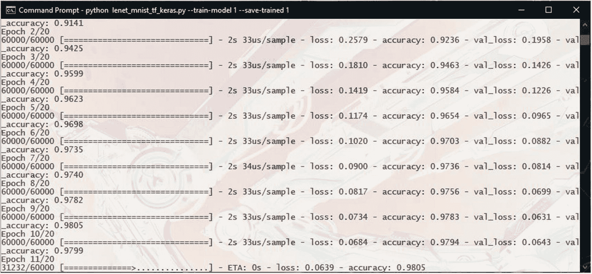

图 4-3

我们的模型正在训练

训练将运行 20 个 epoch，正如我们指定的那样。

如果你使用的是 TensorFlow GPU 版本，训练将少于两分钟。然而，在 CPU 上，它可能需要长达 30 分钟。

控制台将显示训练进度、训练和验证的准确率和损失。

一旦训练完成，它将在测试数据集上评估模型，并给出最终的准确率值（图 4-4）。

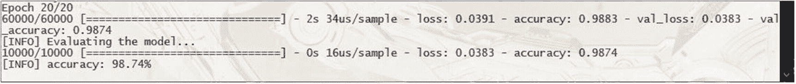

图 4-4

训练完成，评估运行中

深度学习在分类简单图像方面非常出色。我们应该能够达到大约 98-99% 的准确率。

评估步骤完成后，代码将使用 Matplotlib 打开一个窗口以显示模型的训练历史（图 4-5）。

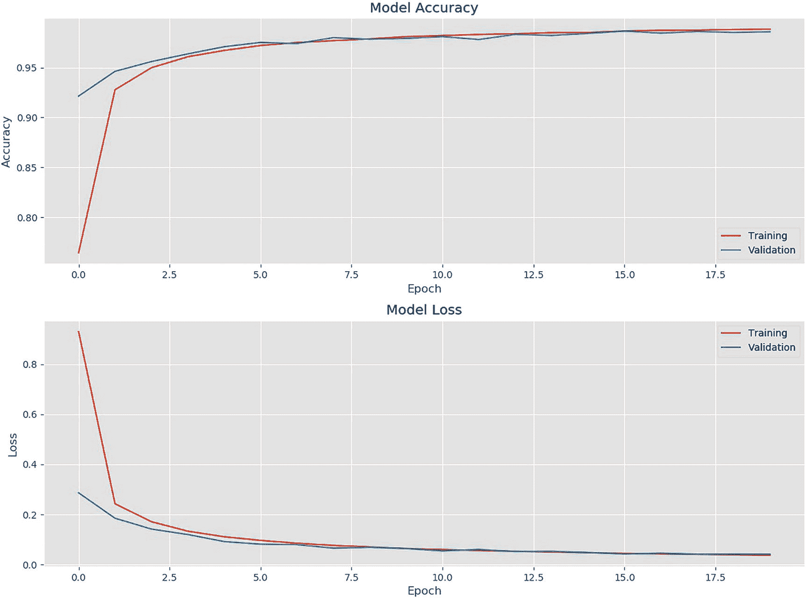

图 4-5

模型训练历史

验证矩阵遵循训练趋势，这是一个好迹象，因为它看起来模型并没有在训练数据上过度拟合。

注意

代码执行将在你关闭 Matplotlib 窗口之前暂停。所以记得在查看完图表后关闭它。你还可以从 Matplotlib 窗口中将图表保存为图像。

现在，有趣的部分来了。OpenCV 将逐个打开 10 个随机测试数字，以及数字的预测值（在图像的左上角以绿色显示）。以下是一些示例（图 4-6，4-7 和 4-8）：

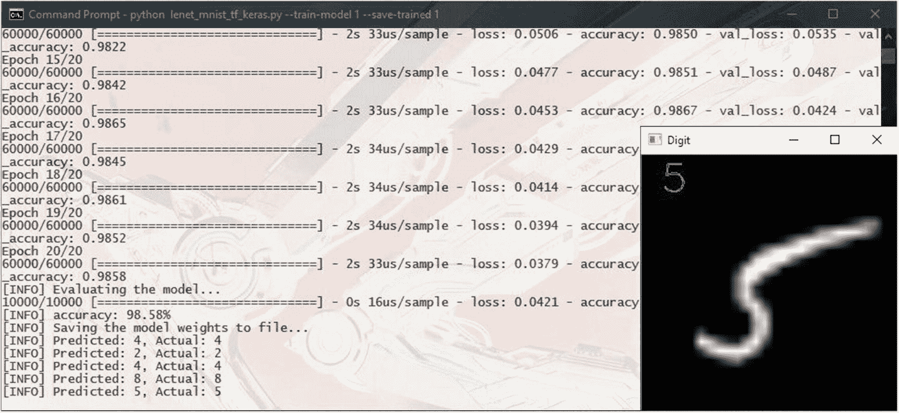

图 4-8

模型预测：数字 5

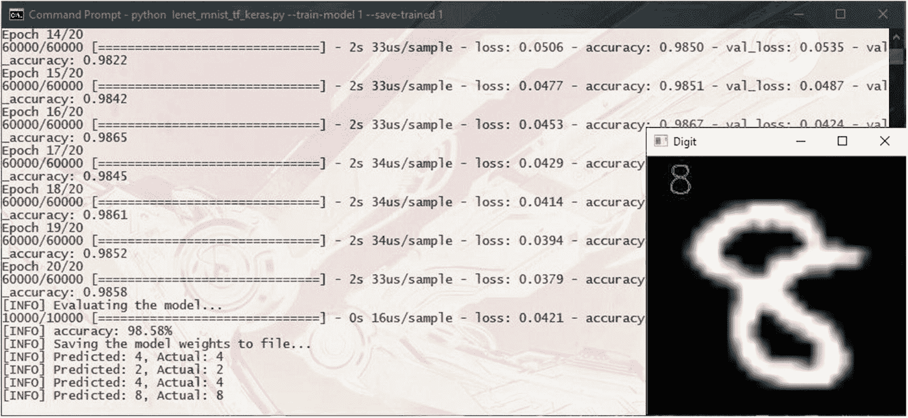

图 4-7

模型预测：数字 8

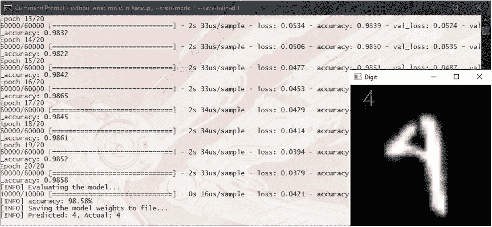

图 4-6

模型预测：数字 4

您可以通过按任意键在数字之间切换。

注意

在某些 Windows 版本的 OpenCV 中，存在一个打开图像窗口的代码错误，如果你尝试手动关闭窗口（通过点击窗口关闭按钮），代码执行会卡住。所以最好通过按任意键在结果之间切换来让代码正确关闭窗口。

除了显示数字，我们还把预测值和实际值打印到控制台上（图 4-9）。

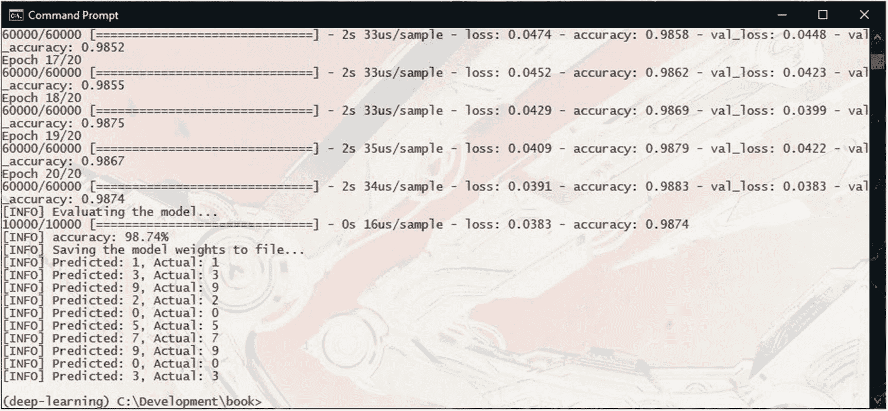

图 4-9

测试数字预测和实际值打印在控制台上

训练我们的模型后，模型权重将被保存到 `data/lenet_weights.hdf5`。你可以通过运行以下命令再次运行模型而不进行训练：

```py
python lenet_mnist_tf_keras.py
```

## 尝试不同的数据集

当你对 LeNet 模型从 MNIST 数据集中对数字进行分类的方式感到满意后，你可能想尝试一个稍微复杂一点的不同数据集。

Fashion-MNIST 数据集将是下一个最佳选择。

Fashion-MNIST 包含 10 类服装图像。图像为 28x28 像素的灰度格式，并以下列 10 个类别标记 0 到 9：

+   0: T-shirt/top

+   1: 裤子

+   2: 高领毛衣

+   3: 晚礼服

+   4: 外套

+   5: 凉鞋

+   6: 衬衫

+   7: 运动鞋

+   8: 背包

+   9: 袜靴

下面是数据集的一些示例（图 4-10）：


图 4-10

Fashion-MNIST 数据集的样本

与 MNIST 数据集类似，Fashion-MNIST 包含 70,000 张图片——其中 60,000 张用于训练，10,000 张用于测试。由于这两个数据集之间的相似性，Fashion-MNIST 可以替代任何使用 MNIST 数据集的模型。

你可以从其官方网站下载 Fashion-MNIST.^(3) 但是，与 MNIST 一样，由于数据集的流行，许多机器学习和深度学习框架都内置了它。

## 使用 Fashion-MNIST 进行服装图像分类

让我们构建一个深度学习模型来对 Fashion-MNIST 数据集中的服装图片进行分类。

正如我们之前讨论的，Fashion-MNIST 被设计成可以在 MNIST 可以使用的任何地方直接替换。因此，我们可以从相同的 LeNet 模型结构和之前使用的代码开始。

让我们为它创建一个新的 Python 文件，并将其命名为`lenet_fashion_mnist_tf_keras.py`。

我们将首先导入必要的包：

```py
01: # How to use
02: #
03: # Train the model and save the model weights
04: # python lenet_fashion_mnist_tf_keras.py --train-model 1 --save-trained 1
05: #
06: # Train the model and save the model weights to a give directory
07: # python lenet_fashion_mnist_tf_keras.py --train-model 1 --save-trained 1 --weights data/lenet_fashion_weights.hdf5
08: #
09: # Evaluate the model from pre-trained model weights
10: # python lenet_fashion_mnist_tf_keras.py
11: #
12: # Evaluate the model from pre-trained model weights from a give directory
13: # python lenet_fashion_mnist_tf_keras.py --weights data/lenet_fashion_weights.hdf5
14:
15: # first, let's import tensorFlow
16: import tensorflow as tf
17: import numpy as np
18:
19: # import the FASHION_MNIST dataset
20: from tensorflow.keras.datasets import fashion_mnist
21:
22: # imports used to build the deep learning model
23: from tensorflow.keras.optimizers import SGD
24: from tensorflow.keras.models import Sequential
25: from tensorflow.keras.layers import Conv2D
26: from tensorflow.keras.layers import MaxPooling2D
27: from tensorflow.keras.layers import Activation
28: from tensorflow.keras.layers import Flatten
29: from tensorflow.keras.layers import Dense
30:
31: # import the keras util functions
32: import tensorflow.keras.utils as np_utils
33:
34: import argparse
35: import cv2
36: import matplotlib.pyplot as plt
```

我们将定义命令行参数：

```py
38: # Setup the argument parser to parse out command line arguments
39: ap = argparse.ArgumentParser()
40: ap.add_argument("-t", "--train-model", type=int, default=-1,
41:                 help="(optional) Whether the model should be trained on the MNIST dataset. Defaults to no")
42: ap.add_argument("-s", "--save-trained", type=int, default=-1,
43:                 help="(optional) Whether the trained models weights should be saved." +
44:                 "Overwrites existing weights file with the same name. Use with caution. Defaults to no")
45: ap.add_argument("-w", "--weights", type=str, default="data/lenet_fashion_weights.hdf5",
46:                 help="(optional) Path to the weights file. Defaults to 'data/lenet_fashion_weights.hdf5'")
47: args = vars(ap.parse_args())
```

然后我们将加载数据集并进行预处理：

```py
50: # Getting the FASHION_MNIST dataset from Keras datasets
51: print("[INFO] Loading the FASHION_MNIST dataset...")
52: (trainData, trainLabels), (testData, testLabels) = fashion_mnist.load_data()
53: # The data is already in the form of numpy arrays,
54: # and already split to training and testing datasets
55:
56: # Rescale the data from values between [0 - 255] to [0 - 1.0]
57: trainData = trainData / 255.0
58: testData = testData / 255.0
59:
60: # Defining the string labels for the classes
61: class_names = ['T-shirt/top', 'Trouser', 'Pullover', 'Dress', 'Coat',
62:                'Sandal', 'Shirt', 'Sneaker', 'Bag', 'Ankle boot']
63:
64: # Display a sample from the FASHION_MNIST dataset
65: plt.figure(figsize=(16,16))
66: for i in range(25):
67:     plt.subplot(5,5, i+1)
68:     plt.xticks([])
69:     plt.yticks([])
70:     plt.grid(False)
71:     plt.imshow(trainData[i], cmap=plt.cm.binary)
72:     plt.xlabel(class_names[trainLabels[i]])
73: plt.show()
74:
75: # Reshape the data matrix from (samples, height, width) to (samples, height, width, depth)
76: # Depth (i.e. channels) is 1 since MNIST only has grayscale images
77: trainData = trainData[:, :, :, np.newaxis]
78: testData = testData[:, :, :, np.newaxis]
79:
80: # The labels comes as a single digit, indicating the class.
81: # But we need a categorical vector as the label. So we transform it.
82: # So that,
83: # '0' will become [1, 0, 0, 0, 0, 0, 0, 0, 0, 0]
84: # '1' will become [0, 1, 0, 0, 0, 0, 0, 0, 0, 0]
85: # '2' will become [0, 0, 1, 0, 0, 0, 0, 0, 0, 0]
86: # and so on...
87: trainLabels = np_utils.to_categorical(trainLabels, 10)
88: testLabels = np_utils.to_categorical(testLabels, 10)
```

在这里，我们定义了一个名为`class_names`的列表来存储 Fashion-MNIST 数据集 10 个类别的文本标签（第 61 行）。列表中每个元素的索引是类别 ID。

我们还加载了数据集中的 25 个样本并显示（第 65-73 行）。

现在我们构建模型结构。这是我们之前用于 MNIST 数据集的相同 LeNet 模型：

```py
091: def build_lenet(width, height, depth, classes, weightsPath=None):
092:     # Initialize the model
093:     model = Sequential()
094:
095:     # The first set of CONV => RELU => POOL layers
096:     model.add(Conv2D(20, (5, 5), padding="same",
097:                      input_shape=(height, width, depth)))
098:     model.add(Activation("relu"))
099:     model.add(MaxPooling2D(pool_size=(2, 2), strides=(2, 2)))
100:
101:     # The second set of CONV => RELU => POOL layers
102:     model.add(Conv2D(50, (5, 5), padding="same"))
103:     model.add(Activation("relu"))
104:     model.add(MaxPooling2D(pool_size=(2, 2), strides=(2, 2)))
105:
106:     # The set of FC => RELU layers
107:     model.add(Flatten())
108:     model.add(Dense(500))
109:     model.add(Activation("relu"))
110:
111:     # The softmax classifier
112:     model.add(Dense(classes))
113:     model.add(Activation("softmax"))
114:
115:     # If a weights path is supplied, then load the weights
116:     if weightsPath is not None:
117:         model.load_weights(weightsPath)
118:
119:     # Return the constructed network architecture
120:     return model
```

我们还定义了`graph_training_history()`函数，与之前完全相同：

```py
123: def graph_training_history(history):
124:     plt.rcParams["figure.figsize"] = (12, 9)
125:
126:     plt.style.use('ggplot')
127:
128:     plt.figure(1)
129:
130:     # summarize history for accuracy
131:
132:     plt.subplot(211)
133:     plt.plot(history.history['accuracy'])
134:     plt.plot(history.history['val_accuracy'])
135:     plt.title('Model Accuracy')
136:     plt.ylabel('Accuracy')
137:     plt.xlabel('Epoch')
138:     plt.legend(['Training', 'Validation'], loc='lower right')
139:
140:     # summarize history for loss
141:
142:     plt.subplot(212)
143:     plt.plot(history.history['loss'])
144:     plt.plot(history.history['val_loss'])
145:     plt.title('Model Loss')
146:     plt.ylabel('Loss')
147:     plt.xlabel('Epoch')
148:     plt.legend(['Training', 'Validation'], loc='upper right')
149:
150:     plt.tight_layout()
151:
152:     plt.show()
Also like we did before, we build, compile, and run the training:
155: # Build and Compile the model
156: print("[INFO] Building and compiling the LeNet model...")
157: opt = SGD(lr=0.01)
158: model = build_lenet(width=28, height=28, depth=1, classes=10,
159:                     weightsPath=args["weights"] if args["train_model"]  0:
165:     print("[INFO] Training the model...")
166:
167:     history = model.fit(trainData, trainLabels,
168:                         batch_size=128,
169:                         epochs=50,
170:                         validation_data=(testData, testLabels),
171:                         verbose=1)
172:
173:     # Use the test data to evaluate the model
174:     print("[INFO] Evaluating the model...")
175:
176:     (loss, accuracy) = model.evaluate(
177:         testData, testLabels, batch_size=128, verbose=1)
178:
179:     print("[INFO] accuracy: {:.2f}%".format(accuracy * 100))
180:
181:     # Visualize the training history
182:     graph_training_history(history)
```

在这里，我们将训练轮数设置为 50（第 169 行）。

训练完成后，我们将模型权重保存到文件中，并从测试数据集中选择一些随机图像来评估训练好的模型：

```py
184: # Check the argument on whether to save the model weights to file
185: if args["save_trained"] > 0:
186:     print("[INFO] Saving the model weights to file...")
187:     model.save_weights(args["weights"], overwrite=True)
188:
189: # Training of the model is now complete
190:
191: # Randomly select a few samples from the test dataset to evaluate
192: for i in np.random.choice(np.arange(0, len(testLabels)), size=(10,)):
193:     # Use the model to classify the digit
194:     probs = model.predict(testData[np.newaxis, i])
195:     prediction = probs.argmax(axis=1)
196:
197:     # Convert the digit data to a color image
198:     image = (testData[i] * 255).astype("uint8")
199:     image = cv2.cvtColor(image, cv2.COLOR_GRAY2RGB)
200:
201:     # The images are in 28x28 size. Much too small to see properly
202:     # So, we resize them to 280x280 for viewing
203:     image = cv2.resize(image, (280, 280), interpolation=cv2.INTER_LINEAR)
204:
205:     # Add the predicted value on to the image
206:     cv2.putText(image, str(class_names[prediction[0]]), (20, 40),
207:                 cv2.FONT_HERSHEY_DUPLEX, 1.5, (0, 255, 0), 1)
208:
209:     # Show the image and prediction
210:     print("[INFO] Predicted: \"{}\", Actual: \"{}\"".format(
211:         class_names[prediction[0]], class_names[np.argmax(testLabels[i])]))
212:     cv2.imshow("Digit", image)
213:     cv2.waitKey(0)
214:
215: cv2.destroyAllWindows()
```

我们使用之前定义的`class_names`列表从预测中获取文本类别名称（第 206 行和第 210 行）。

## 运行我们的 Fashion-MNIST 模型

当我们的代码准备就绪，并且我们也完成了与 MNIST 相同的预检查后，我们可以运行我们的新模型：

```py
python lenet_fashion_mnist_tf_keras.py --train-model 1 --save-trained 1
```

如果你之前没有使用过 Fashion-MNIST 数据集，Keras 将自动下载它。一旦数据集加载完成，我们的代码将显示数据集的一些样本（图 4-11）。

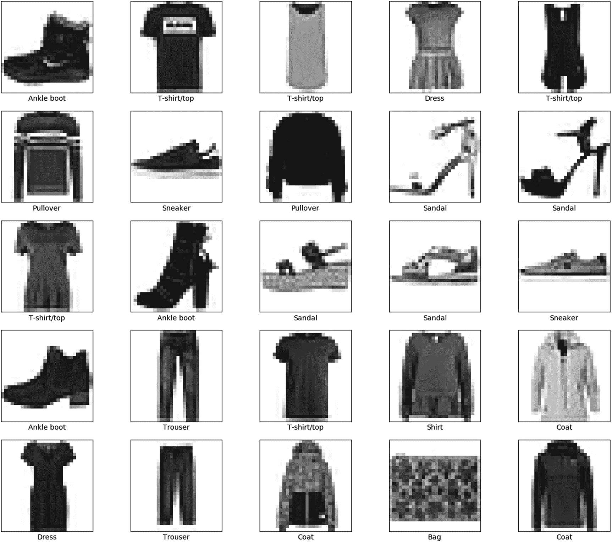

图 4-11

数据集的一些样本

训练将运行 50 个轮次，在 GPU 上运行时将花费几分钟。

使用我们的 LeNet 模型，你将获得大约 90%的准确率（图 4-12）。

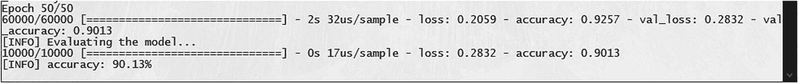

图 4-12

我们模型在 Fashion-MNIST 上的准确率

训练历史图将看起来像图 4-13 中的那样。

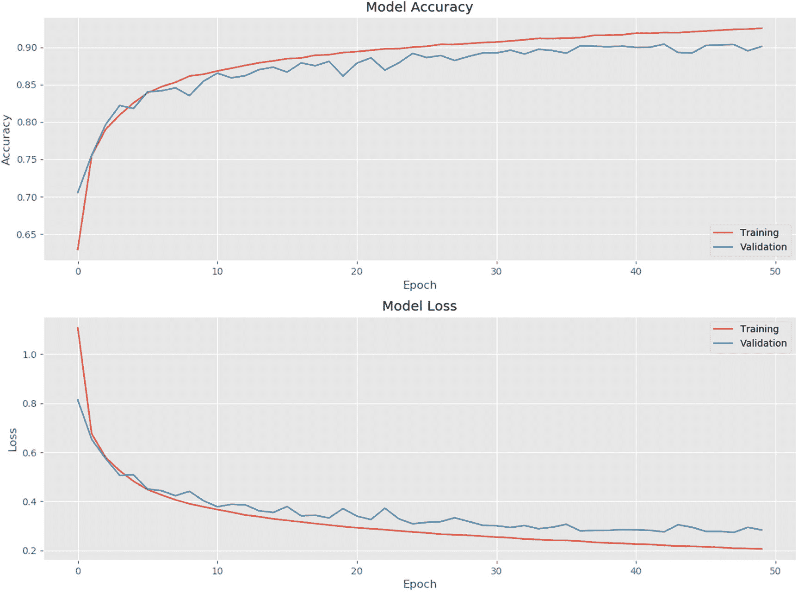

图 4-13

我们的模型训练历史图

我们的代码将显示测试数据集中 10 个随机样本及其模型预测的类别（图 4-14、4-15、4-16）。

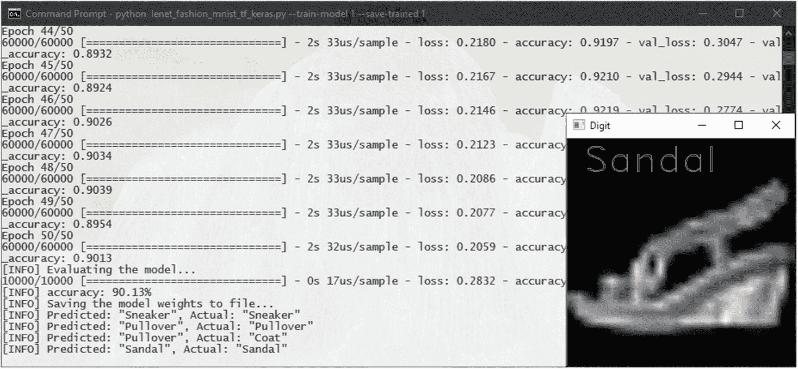

图 4-16

模型预测：凉鞋

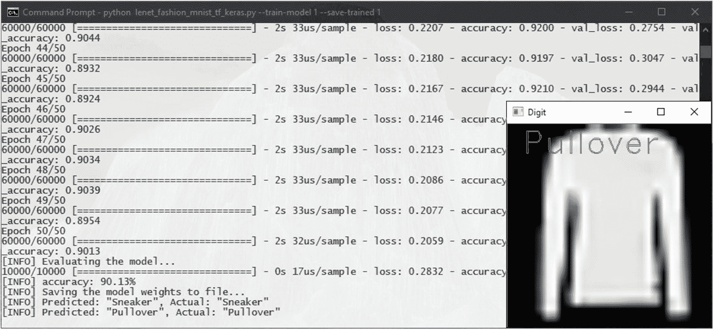

图 4-15

模型预测：套头衫

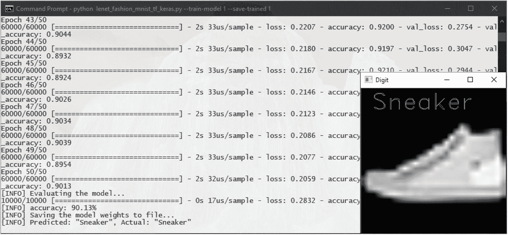

图 4-14

模型预测：运动鞋

除了显示样本的结果外，代码还会将预测值和实际值打印到控制台（图 4-17）。

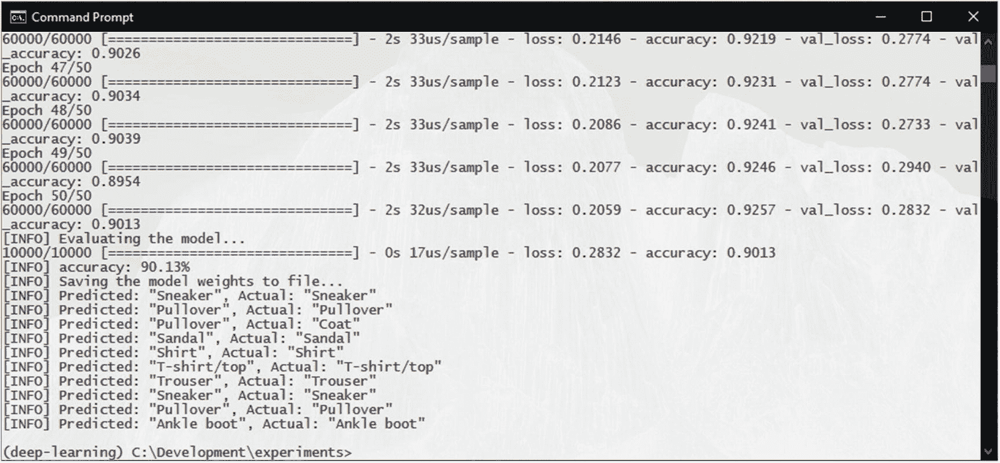

图 4-17

打印在控制台上的预测值和实际值

训练完成后，模型权重将被保存到 data/ lenet_fashion_weights.hdf5，就像之前一样。

## 你接下来可以做什么？

在 Fashion-MNIST 数据集上获得 90% 的准确率是不错的——但你绝对可以尝试提高这个结果。你可以尝试调整模型，看看是否提高了结果。以下是一些你可以尝试的事情：

+   改变卷积滤波器的数量，看看它如何影响训练（通过训练历史图）。

+   添加更多的卷积层，看看是否提高了模型。看看它如何影响训练时间。并且看看在模型开始变差之前你能添加多少层。

+   添加更多的密集层。模型是否开始过拟合？

你可以通过查看损失指标来检测模型是否过拟合。如果在训练过程中验证损失停止下降，而训练损失继续下降，那么模型就是过拟合的。这意味着模型基本上“记忆”了我们的训练样本，但没有学会泛化问题，导致它在未见过的样本（在这种情况下，验证样本）上失败。

我们将在后面的章节中讨论如何处理更复杂的数据集和模型。
