# 5. 理解我们构建的内容

运行我们的第一个深度学习模型让我们对深度学习能做什么有了一个小小的了解。我们可以用深度学习构建许多令人兴奋的项目。

但首先，更好地了解我们构建了什么，以及它是如何工作的。

让我们回顾一下我们构建的模型。我们使用了 LeNet 架构，它看起来是这样的（图 5-1）：

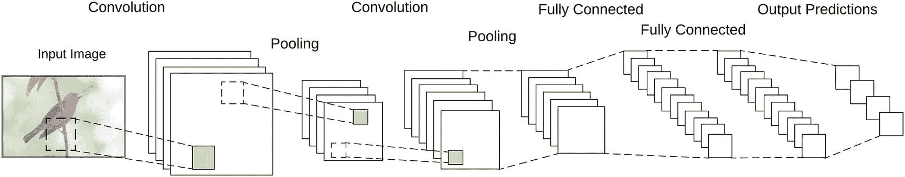

图 5-1

LeNet 模型

通过查看模型架构并运行我们的代码，我们发现我们模型的运作基于几个函数：

1.  输入：数字图像

1.  卷积

1.  非线性函数（ReLU）

1.  池化

1.  分类器（全连接层）

让我们看看这些函数是如何工作的，以及它们是如何贡献到我们的模型的。

## 数字图像

我们的输入图像是这个过程的第一部分。

尽管我们根据我们的感知将它们视为图像，但对于机器来说，图像只是另一种数字数据形式。

数字图像由像素集合组成。每个像素由一个或多个颜色通道的颜色值定义。灰度图像只有一个通道。图像中的每个像素都有一个从 0 到 255 的值，其中 0 表示黑色，255 表示白色（图 5-2）。

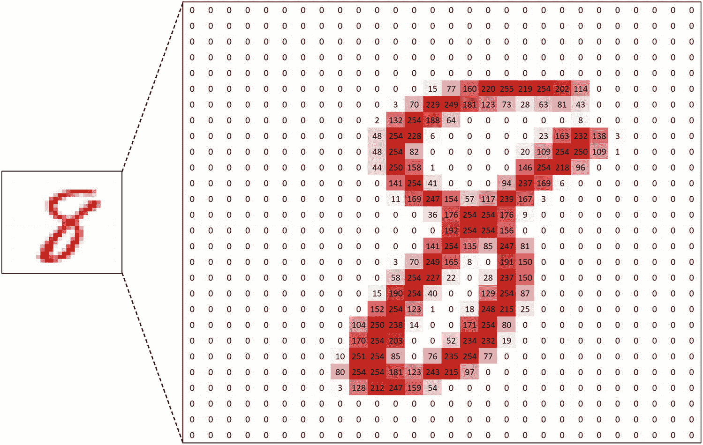

图 5-2

图像只是像素值的矩阵

彩色图像有三个通道——红色、绿色和蓝色，对于 RGB 图像（图 5-3）。

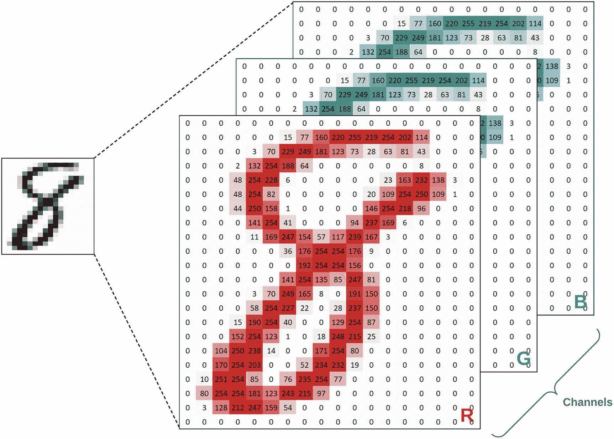

图 5-3

彩色图像是每个通道的像素值集合

因此，从数学的角度来看，图像是像素值的矩阵。

深度学习模型（以及一般神经网络）中的操作是在这些值矩阵上执行的。

## 卷积

矩阵上的数学卷积操作能够从矩阵（如图像）中提取特征，因为它保留了矩阵元素之间的空间关系。卷积神经网络广泛使用卷积操作，这也是它们得名的原因。正如我们在第一章中讨论的，图像上的数学卷积工作原理类似于人类和动物的视觉皮层的感受野。像感受野一样，卷积通过一次处理输入的小方块来工作。

注意

你可以在维基百科的“卷积”页面了解更多关于数学卷积操作的性质：[`en.wikipedia.org/wiki/Convolution`](https://en.wikipedia.org/wiki/Convolution)。

为了简单理解卷积是如何工作的，可以想象两个矩阵：输入矩阵和卷积矩阵（图 5-4）。

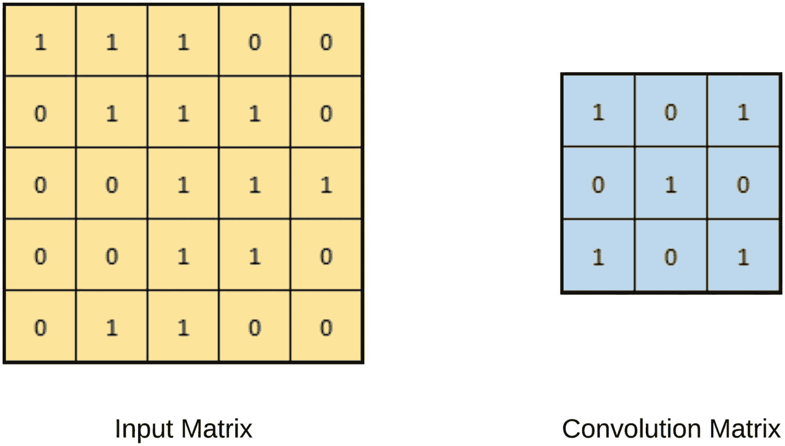

图 5-4

输入和卷积矩阵

卷积操作是通过卷积矩阵“滑动”在输入矩阵上实现的，从而产生卷积输出（图 5-5）。

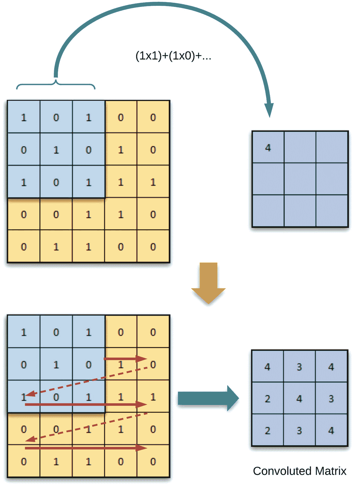

图 5-5

卷积操作

当卷积操作发生时，卷积矩阵只能看到输入矩阵的一部分，但它保持了所看到的空间关系。不同的卷积矩阵从输入中产生不同的输出。

如果我们将相同的操作应用于图像会怎样？

正如我们讨论的那样，数字图像是像素值的矩阵。

因此，我们应该能够在图像上执行相同的卷积操作。

如果我们尝试使用不同的卷积矩阵进行相同的操作——输入是图像——它们的输出将展示图像特征的多种表示。以下是一些示例（图 5-6）。

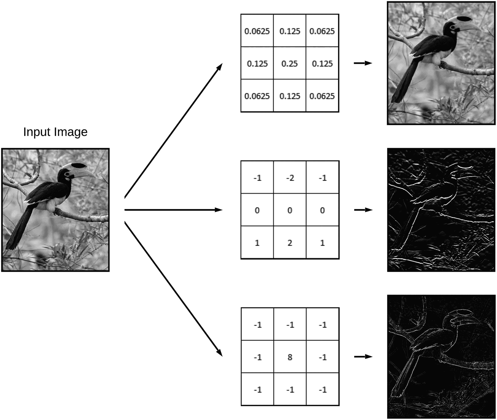

图 5-6

不同卷积对图像的影响

由于这些不同的卷积操作过滤和提取图像的不同特征，它们通常被称为“滤波器”。

在 CNN 中，使用许多滤波器从输入图像中提取和学习不同的特征。当使用 TensorFlow 或 Keras 等深度学习库时，我们不需要指定每个滤波器应该是什么。相反，我们只需指定滤波器的数量和大小。库的训练过程将确定哪些滤波器被使用。通常，网络中的滤波器越多，它从输入中学习模式的能力就越强。

## 非线性函数

一旦卷积步骤完成，并且输入图像的各种特征图已经生成，CNN 就会在特征图上应用非线性函数。非线性是必需的，因为现实世界的数据是非线性的，而卷积函数是线性操作。因此，为了处理现实世界数据的表示，我们需要应用非线性函数。

矩形线性单元，或 ReLU，是一个常用的非线性函数。其他函数如 tanh 或 sigmoid 也可以用作非线性函数。使用哪个函数将取决于你模型的架构。ReLU 在大多数通用情况下使用反向传播进行训练时表现更好。在大多数情况下，ReLU 与 sigmoid 和 tanh 相比，在更深层的模型架构中表现也更好。因此，ReLU 是开发新模型架构时的一个良好起点。

ReLU 函数可以在图 5-7 中看到。

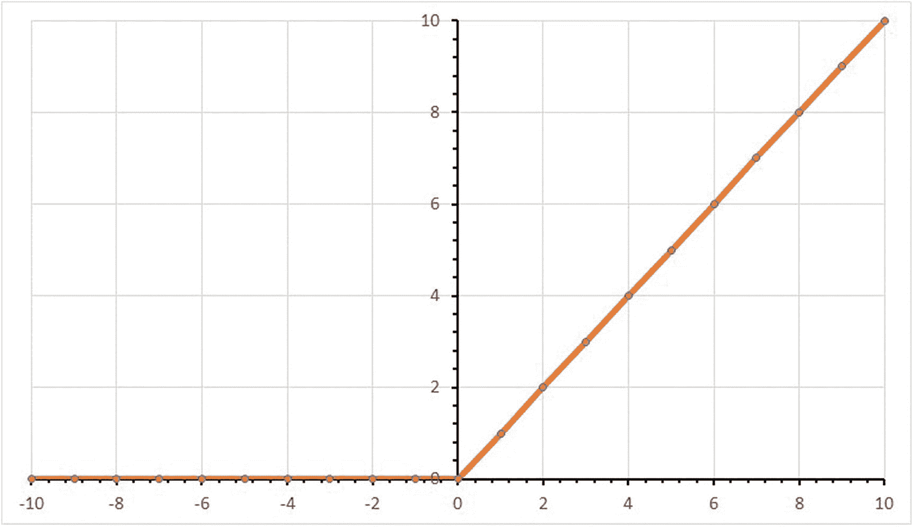

图 5-7

ReLU 函数

这可能看起来很复杂，但 ReLU 非常简单。它遍历每个像素，将负值设置为零，并保留正像素值不变。

该函数也可以表示为：

```py
Output = max(0, Input)
```

当应用于特征图时，ReLU 的结果看起来像这样（图 5-8）：

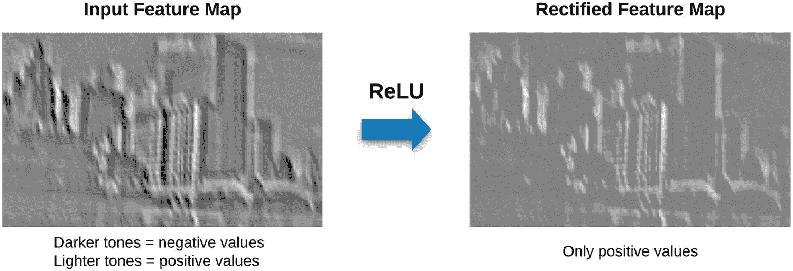

图 5-8

应用到特征图的 ReLU

## 池化

在非线性应用之后，卷积神经网络（CNN）执行一个池化步骤（也称为空间池化、子采样或下采样）。池化通过仅保留最重要的信息来降低每个特征图的维度。它可以以多种方式完成，例如最大池化、平均池化和求和池化。在这些方法中，最大池化通常显示出更好的结果。

在最大池化中，我们定义一个窗口（特征图的一个区域）并从该区域的像素中获取最大值（图 5-9）。

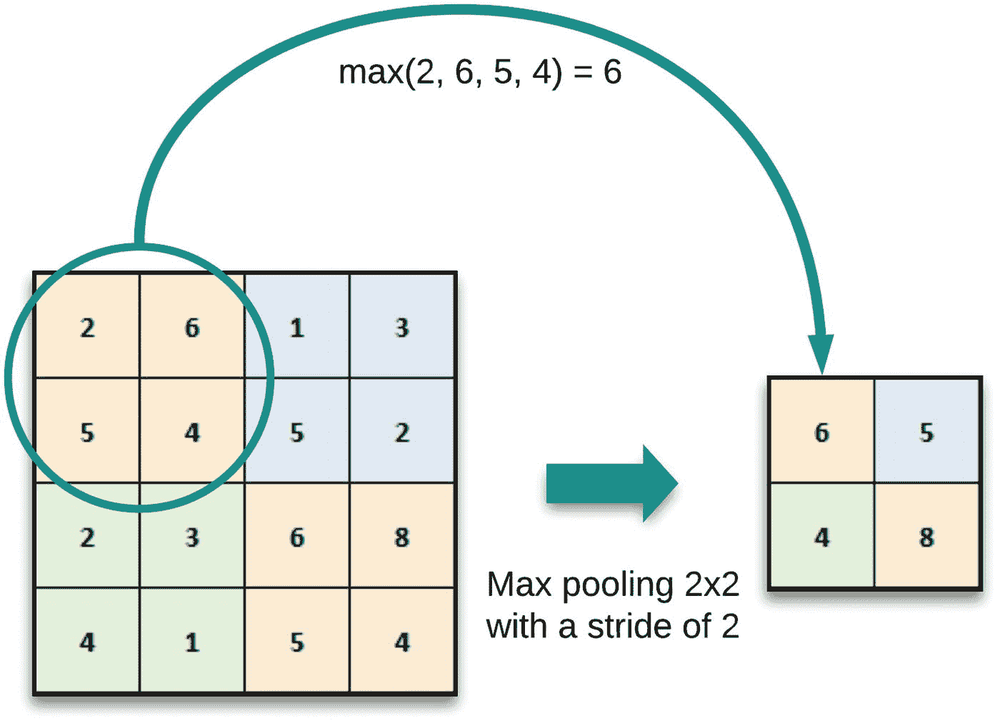

图 5-9

最大池化

池化给 CNN 带来几个好处：

1.  它使特征维度更小，更易于管理。

1.  通过减少网络中所需的参数和计算量，它减少了过拟合的可能性。

1.  它使网络对输入中的小变换、扭曲和平移不变，这意味着输入中的小变化不会显著影响输出。这允许网络更好地泛化。

1.  它使网络对尺度不变，允许在输入图像的任何位置检测到对象。

到这一点，CNN 的单个卷积层的工作就完成了。下一个卷积层将使用前一个层的输出特征图作为输入，并继续相同的操作，直到达到全连接层。

## 分类器（全连接层）

分类器（也称为全连接层或密集层）是一个传统的多层感知器网络。分类器中每一层的每个神经元都与下一层的每个神经元相连。分类器的最终输出层通常使用 softmax 激活函数。对于不同的场景，也可以使用 sigmoid 等其他激活函数。sigmoid 通常在二分类问题中表现良好，而 softmax 在多分类中表现良好。

分类器的目的是将卷积和池化层提取的高级特征结合起来，以便进行最终分类（图 5-10）。

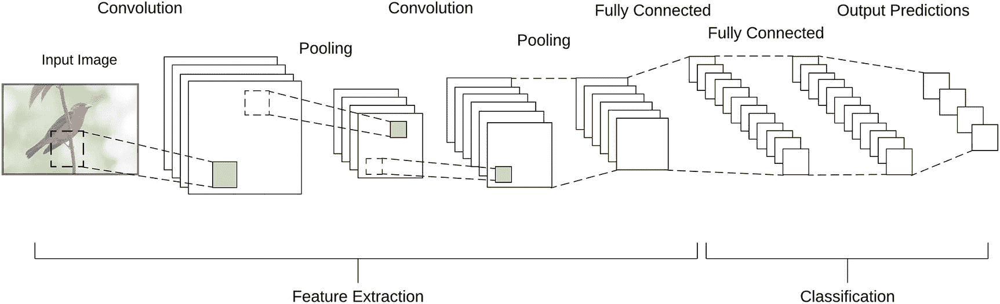

图 5-10

特征提取和分类

## 所有这些是如何结合在一起的？

我们讨论的这些元素——卷积、ReLU、池化和分类器——是如何一起工作来理解图像的？

为了理解这一点，让我们用一个极其简化的例子来分析：让我们看看神经网络是如何学习识别正方形形状的。

与任何其他训练任务一样，神经网络需要通过数百甚至数千张训练图像。

它需要学习的是正方形的定义特征。

对于我们人类来说，因为我们掌握了视觉元素，正方形的定义特征将是“线条”、“长度”和“角度”。我们知道——也就是说，我们的思维已经被训练去知道——哪些特征的组合会导致正方形，以及识别正方形时应该寻找什么（图 5-11）。

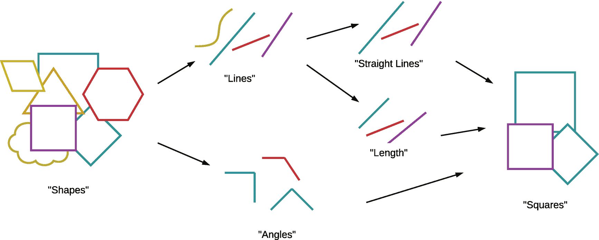

图 5-11

识别正方形的一个可能思维过程

但机器（或未训练的 AI）没有线条、长度或角度的概念。AI（在这种情况下是神经网络）会试图寻找在提供的训练集中可以看到的任何共同特征。

通过使用如卷积这样的特征提取方法，可以大大提高“看到”神经网络特征的能力。

如您在先前的图表（图 5-12）中看到的，卷积过滤器允许从图像中提取出一些独特的元素。

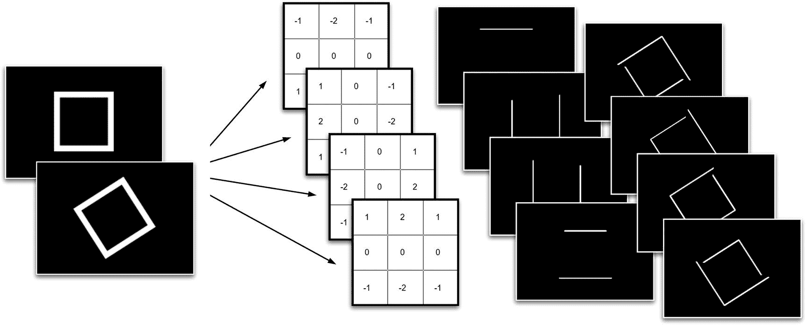

图 5-12

使用卷积学习到的可能特征

使用这样的特征提取流程（包括卷积、ReLU 和池化），神经网络能够更好地泛化从输入图像中识别出的特征。因此，它能够更容易地缩小给定数据集的共同特征。

我们的手写数字分类器以相同的方式工作。

我们构建的模型使用了多个卷积过滤器来识别数字的共同特征，并试图识别哪些特征的组合有助于哪个数字类别（图 5-13）。

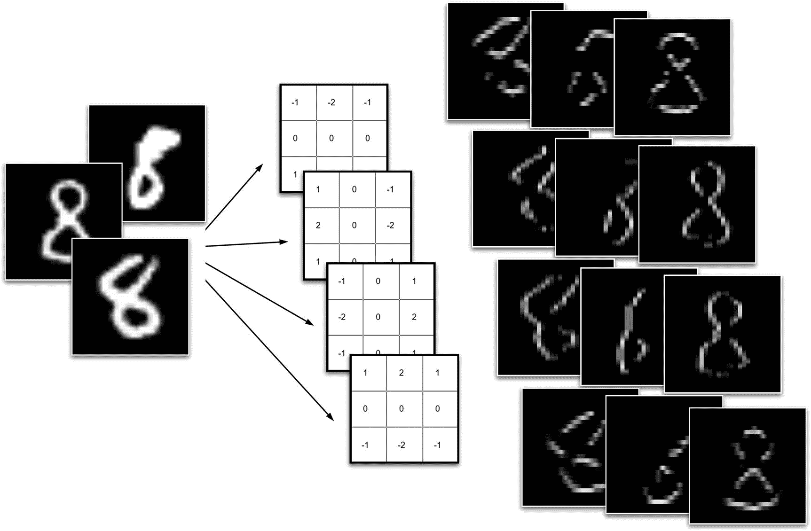

图 5-13

MNIST 数据集数字上的可能学习到的特征

同样的概念也可以应用于识别更复杂的输入，例如更真实的图像。以下图表显示了如何通过 CNN 中的特征提取来识别汽车图像（图 5-14）。

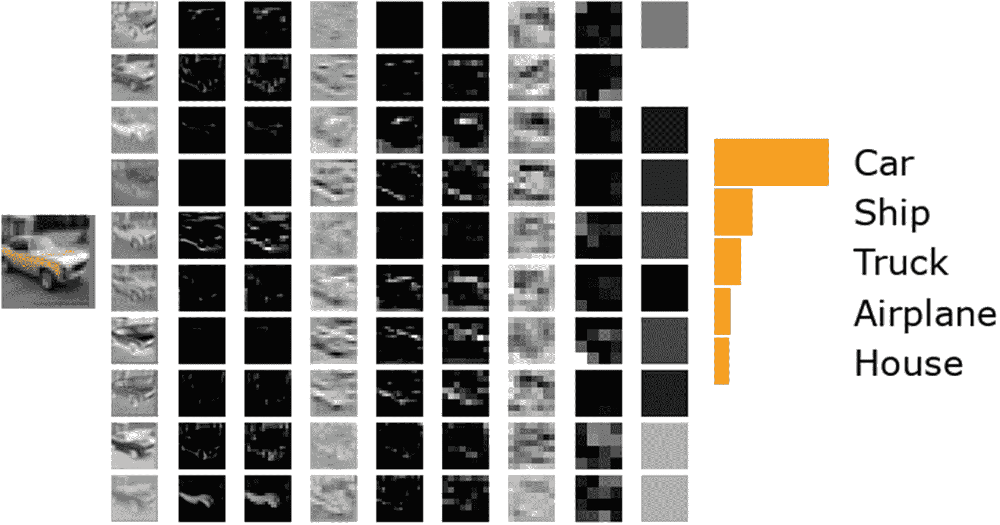

图 5-14

过滤器如何提取特征

我们在这里讨论的是我们这个只有几层的简单卷积神经网络的流程。但这个模型中的概念——卷积、正则化、池化等等——同样也用于更复杂的模型中。随着我们开始构建更大、更复杂的模型，你们会发现这些相同的概念组合被应用于其中。
