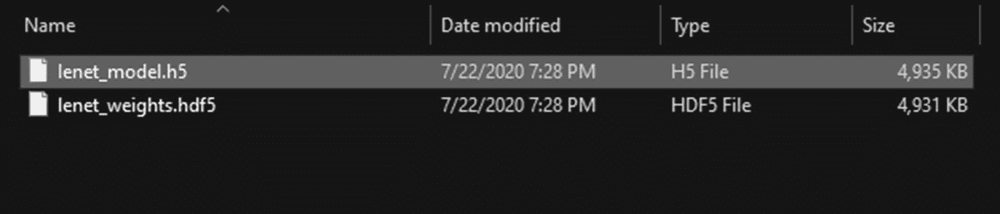
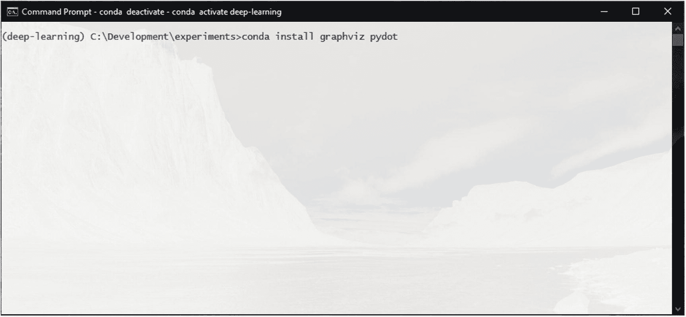
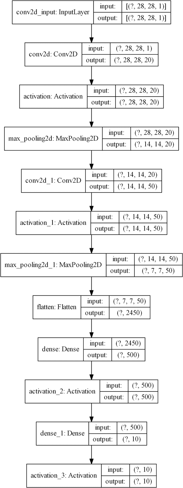
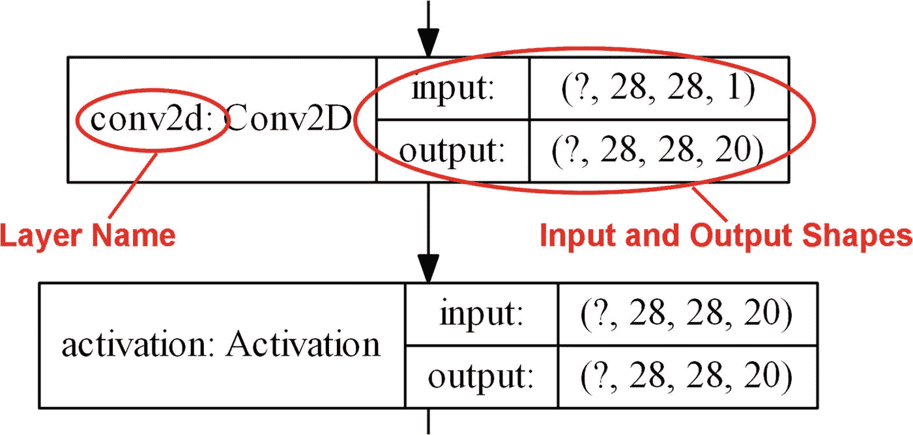
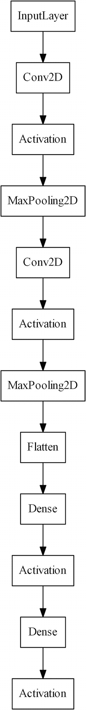
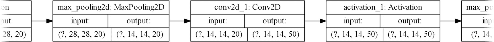
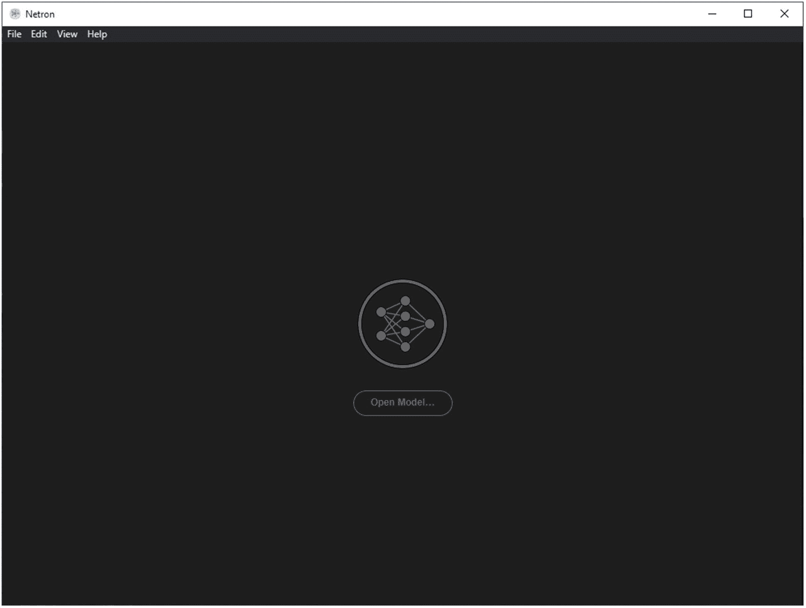
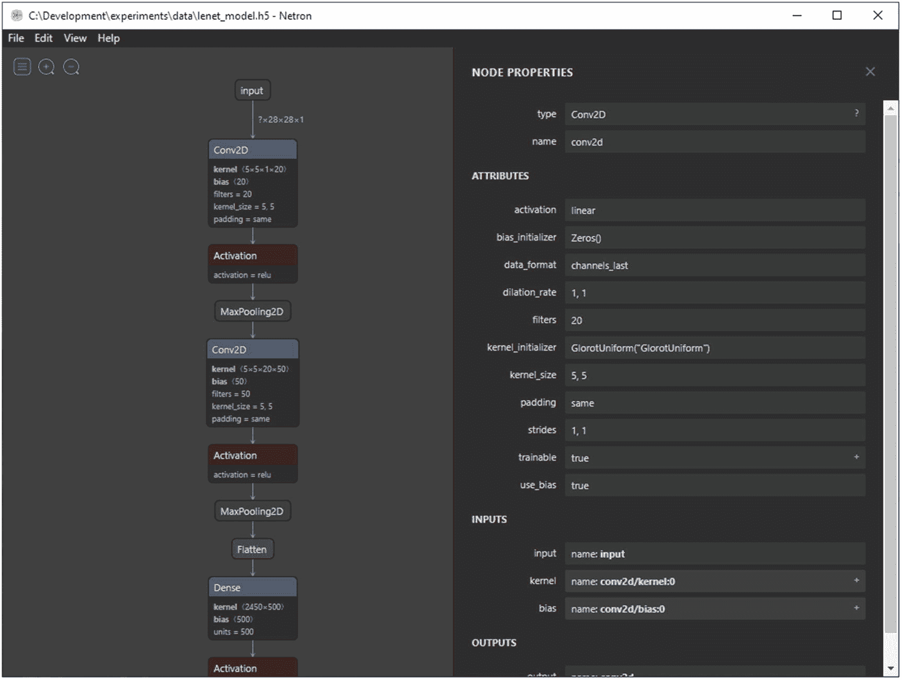
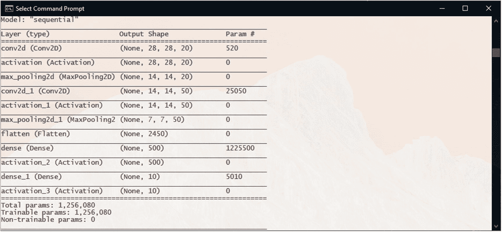
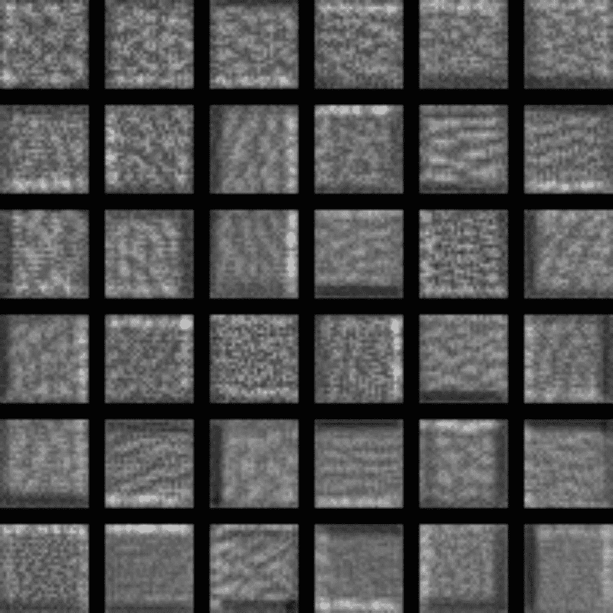

# 6. 可视化模型

当构建深度学习模型时，能够可视化模型通常更好。虽然我们创建的模型——LeNet 模型——很简单，但如果能看到其结构会更好。尤其是在我们调整或修改模型时，可以轻松比较它们的结构。当与更复杂的模型（我们将在下一章中探讨）一起工作时，如果你能从视觉上看到它们的结构，那么理解它们会更容易。

但如果有一种方法可以自动绘制模型的结构会更好吗？

恰好，TensorFlow/Keras 正好有这样一个方法。但首先，我们首先需要学习如何正确地保存我们的模型。

## 在 Keras 中保存模型

在第四章中，当我们构建我们的第一个深度学习模型时，我们了解到一种保存 Keras 模型的方法，即使用`model.save_weights()`函数。正如其名称所暗示的，这种方法只保存模型神经元的权重。模型的权重是模型通过训练所学习到的。

但模型不仅仅是其权重。

为了使用保存的权重，我们必须在代码中重建模型结构，并将权重加载到其中。此外，`save_weights()`函数不会保存模型的优化器状态。因此，我们无法使用它从先前的训练状态恢复模型的训练。

对于这些需求，Keras 提供了另一个保存选项：`model.save()`。

当使用 model.save()时，它将以下所有内容保存为单个文件：

+   模型的结构、架构和配置

+   模型的学习权重

+   模型的编译信息（与 model.compile()一起使用的配置）

+   优化器和模型的状态（允许你恢复训练）

这为保存的模型提供了更多的灵活性。

注意

`model.save_weights()`函数也有其自身的用途。在更高级的情况下，例如当一个模型的学习权重需要转移到不同的模型架构时，`save_weights()`函数非常有用。

让我们给 LeNet 模型添加 model.save()函数。我们将修改以下代码段（原始代码的第 178 行和第 179 行）：

```py
173: # Check the argument on whether to save the model weights to file
174: if args["save_trained"] > 0:
175:     print("[INFO] Saving the model weights to file...")
176:     model.save_weights(args["weights"], overwrite=True)
177:
178:     # Save the entire model
179:     model.save('data/lenet_model.h5')
```

现在，如果我们对我们的模型进行训练，它将在数据目录中保存完整的模型为`lenet_model.h5`（图 6-1）。



图 6-1

保存的模型文件

在保存了完整的模型之后，我们现在可以使用 Keras 的内置函数来可视化模型。

## 使用 Keras 的 plot_model 函数

我们可以使用`tf.keras.utils`包中的`plot_model`函数来绘制 Keras 或 tf.keras 模型的结构。

然而，为了使 plot_model 函数正常工作，我们需要安装一些额外的包：

+   **Graphviz 库**：一个开源的图形可视化库

+   **Pydot:** Graphviz 使用的 Dot 语言的 Python 绑定

我们可以通过运行以下命令将这两个包安装到我们的 conda 环境中（见图 6-2）：



图 6-2

安装 Graphviz 和 Pydot 包

```py
conda install graphviz pydot
```

一旦安装了这些包，我们就可以开始创建一个新的代码文件来添加我们的可视化代码。我们将将其命名为 model_visualization.py。

在这个新文件中，我们将首先导入必要的包：

```py
1: # Import the packages
2: import tensorflow as tf
3: import numpy as np
4:
5: from tensorflow.keras.models import load_model
6: from tensorflow.keras.utils import plot_model
```

我们将使用`load_model`函数来加载我们在之前步骤中保存的 LeNet 模型。

`plot_model`函数是我们将用于可视化的函数。

然后，我们可以通过将保存的模型文件的路径传递给`load_model`函数来加载我们的模型：

```py
8: # Loading the model from saved model file
9: model = load_model('data/lenet_model.h5')
```

最后，我们可以通过使用`plot_model`函数来生成模型结构可视化：

```py
11: # Visualizing the model
12: plot_model(
13:     model,
14:     to_file='model.png',
15:     show_shapes=True,
16:     show_layer_names=True,
17:     rankdir='TB',
18:     expand_nested=False,
19:     dpi=96
20: )
```

`plot_model`函数的参数如下：

+   **model:** 我们想要可视化的模型对象

+   **to_file:** 生成图像的文件名

+   **show_shapes:** 是否显示层的输入和输出形状

+   **show_layer_names:** 是否显示模型的层名称

+   **rankdir:** 这是传递给 PyDot 的参数，用于确定生成的图表格式。rankdir 是图表的方向。TB 或 Top-to-Bottom 将生成垂直图表，而 LR 或 Left-to-Right 将生成水平图表。

+   **expand_nested:** 如果你的模型有嵌套模型，这将指定是否在图表中展开它们

+   **dpi:** 生成的图表的分辨率，以每英寸点数表示

当我们运行我们的代码时，可视化将保存为 model.png，位于代码文件相同的文件夹中，看起来像这样（见图 6-3）：



图 6-3

使用`plot_model`可视化的 LeNet 模型结构

`show_shapes`和`show_layer_names`参数允许你控制将在生成的图表中显示的详细程度（见图 6-4）。



图 6-4

可视化图中层的名称和形状

你可以尝试将它们关闭：

```py
11: # Visualizing the model
12: plot_model(
13:     model,
14:     to_file='model_no_layer_details.png',
15:     show_shapes=False,
16:     show_layer_names=False,
17:     rankdir='TB',
18:     expand_nested=False,
19:     dpi=96
20: )
```

这将导致（见图 6-5）：



图 6-5

关闭 show_shapes 和 show_layer_names 的绘图

最后，通过 rankdir 参数，你可以切换到生成水平图表：

```py
11: # Visualizing the model
12: plot_model(
13:     model,
14:     to_file='model_horizontal.png',
15:     show_shapes=True,
16:     show_layer_names=True,
17:     rankdir='LR',
18:     expand_nested=False,
19:     dpi=96
20: )
```

这将生成一个水平图表（见图 6-6）。



图 6-6

水平图表

由于 plot_model 函数的这些灵活性，它在你构建更复杂的模型时可以成为一个出色的工具。

## 使用开源工具可视化模型结构：Netron

Netron 是一个开源的神经网络、深度学习和机器学习模型可视化工具。Netron 由 Lutz Roeder 创建，^(1)并且可以通过其 GitHub 页面获取.^(2)

在撰写本文时，Netron 支持以下模型文件格式：ONNX (.onnx, .pb, .pbtxt), Keras (.h5, .keras), Core ML (.mlmodel), Caffe (.caffemodel, .prototxt), Caffe2 (predict_net.pb), Darknet (.cfg), MXNet (.model, -symbol.json), Barracuda (.nn), ncnn (.param), Tengine (.tmfile), TNN (.tnnproto), UFF (.uff), 和 TensorFlow Lite (.tflite)。它还实验性地支持许多其他格式，并且正在积极开发以不断添加对更多格式的支持。

Netron 为 MacOS、Linux 和 Windows 提供了独立的安装包.^(3) 它还有一个浏览器版本.^(4)

一旦安装（或使用浏览器版本），你只需从其 UI 打开保存的模型文件（图 6-7）。



图 6-7

Netron 用户界面

当模型加载时，你可以从可视化的图中选择节点/层来查看它们的属性（图 6-8）。



图 6-8

Netron 显示层的属性

Netron 还提供了许多其他可视化属性，以及导出可视化图表的能力。

## 可视化卷积滤波器学习到的特征

在过去的几章中，我们一直在探讨构建我们的第一个深度学习模型，并学习它如何使用卷积滤波器从输入中提取特征，并“学习”如何使用这些特征来解释输入。

但卷积滤波器看到了什么？它们学习了哪些特征？

我们可以通过最大化滤波器的激活来尝试查看它们学习到的特征。

让我们在我们的 LeNet 模型上尝试一下。我们将从一个新的代码文件开始，我们将将其命名为`lenet_filter_visualization.py`。

我们首先导入必要的包：

```py
1: # importing the necessary packages
2: import tensorflow as tf
3: import numpy as np
4: import time
5: import cv2
6:
7: from tensorflow.keras.preprocessing.image import save_img
8: from tensorflow.keras import backend as K
9: from tensorflow.keras.models import load_model
```

对于我们将要使用的技巧，我们需要禁用 TensorFlow v2.x 中的 eager execution：

```py
11: # we disable eager execution of TensorFlow v2.x
12: # Ref: https://github.com/tensorflow/tensorflow/issues/33135
13: tf.compat.v1.disable_eager_execution()
```

然后，我们设置生成图像的参数，并从我们将要可视化的模型中选择层：

```py
15: # dimensions of the generated pictures for each filter.
16: img_width = 28
17: img_height = 28
18:
19: # the name of the layer we want to visualize
20: # (check the model.summary())
21: layer_name = 'conv2d_1'
```

作为层名，我们需要选择一个卷积层。如果我们回顾一下我们之前可视化的模型结构，我们可以看到我们的 LeNet 模型有两个卷积层：conv2d 和 conv2d_1。在这里我们将选择 conv2d_1。

然后，我们使用本章中保存的模型文件加载我们的模型：

```py
23: # Loading the model from saved model file
24: model = load_model('data/lenet_model.h5')
25:
26: print('Model loaded.')
27:
28: # get the summary of the model
29: model.summary()
```

`model.summary()` 函数将给出模型结构的文本表示。输出将类似于这样（图 6-9）：



图 6-9

LeNet 模型的摘要

我们首先定义输入数据和层及其名称的字典：

```py
31: # this is the placeholder for the input images
32: input_img = model.input
33:
34: # get the symbolic outputs of each "key" layer (we gave them unique names).
35: layer_dict = dict([(layer.name, layer) for layer in model.layers[1:]])
```

然后，我们定义了两个实用函数：

```py
37: # utility function to normalize a tensor by its L2 norm
38: def normalize(x):
39:     return x / (K.sqrt(K.mean(K.square(x))) + 1e-5)
40:
41: # util function to convert a tensor into a valid image
42: def deprocess_image(x):
43:     # normalize tensor: center on 0., ensure std is 0.1
44:     x -= x.mean()
45:     x /= (x.std() + 1e-5)
46:     x *= 0.1
47:
48:     # clip to [0, 1]
49:     x += 0.5
50:     x = np.clip(x, 0, 1)
51:
52:     # convert to RGB array
53:     x *= 255
54:     if K.image_data_format() == 'channels_first':
55:         x = x.transpose((1, 2, 0))
56:     x = np.clip(x, 0, 255).astype('uint8')
57:     return x
```

正则化函数通过其 L2-范数对给定的张量进行归一化，以允许平滑的梯度上升。`deprocess_image` 函数将给定的张量转换成有效的图像。

接下来是代码的主要部分。我们遍历 conv2d_1 层的 50 个过滤器，获取每个过滤器的损失和梯度，并使用之前定义的正则化函数对梯度进行归一化。然后，我们从一张带有随机噪声的灰色图像开始，进行 20 步的梯度上升。这里选择 20 作为周期数是基于过去实验的结果，这些实验产生了更清晰的可视化。你可以尝试更改周期数并看看它如何影响输出。

最后，将处理过的过滤器转换为图像（使用之前定义的 `deprocess_image` 函数）并添加到名为 `kept_filters` 的列表中：

```py
059: kept_filters = []
060: for filter_index in range(0, 50):
061:     # we scan through the 50 filters in our model
062:     print('Processing filter %d' % filter_index)
063:     start_time = time.time()
064:
065:     # we build a loss function that maximizes the activation
066:     # of the nth filter of the layer considered
067:     layer_output = layer_dict[layer_name].output
068:     if K.image_data_format() == 'channels_first':
069:         loss = K.mean(layer_output[:, filter_index, :, :])
070:     else:
071:         loss = K.mean(layer_output[:, :, :, filter_index])
072:
073:     # we compute the gradient of the input picture wrt this loss
074:     grads = K.gradients(loss, input_img)[0]
075:
076:     # normalization trick: we normalize the gradient
077:     grads = normalize(grads)
078:
079:     # this function returns the loss and grads given the input picture
080:     iterate = K.function([input_img], [loss, grads])
081:
082:     # step size for gradient ascent
083:     step = 1.
084:
085:     # we start from a gray image with some random noise
086:     input_img_data = np.random.random((1, img_width, img_height, 1))
087:     input_img_data = (input_img_data - 0.5) * 20 + 128
088:
089:     # we run gradient ascent for 20 steps
090:     for i in range(20):
091:         loss_value, grads_value = iterate([input_img_data])
092:         input_img_data += grads_value * step
093:
094:         print('Current loss value:', loss_value)
095:         if loss_value  0:
101:         img = deprocess_image(input_img_data[0])
102:         kept_filters.append((img, loss_value))
103:     end_time = time.time()
104:     print('Filter %d processed in %ds' % (filter_index, end_time - start_time))
```

当过滤器的图像准备就绪后，我们可以将它们拼接成一个 6x6 的网格图像并放大以使其更明显：

```py
106: # we will stich the best 36 filters on a 6 x 6 grid.
107: n = 6
108:
109: # the filters that have the highest loss are assumed to be better-looking.
110: # we will only keep the top 36 filters.
111: kept_filters.sort(key=lambda x: x[1], reverse=True)
112: kept_filters = kept_filters[:n * n]
113:
114: # build a black picture with enough space for
115: # our 8 x 8 filters of size 28 x 28, with a 5px margin in between
116: margin = 5
117: width = n * img_width + (n - 1) * margin
118: height = n * img_height + (n - 1) * margin
119: stitched_filters = np.zeros((width, height, 3))
120:
121: # fill the picture with our saved filters
122: for i in range(n):
123:     for j in range(n):
124:         img, loss = kept_filters[i * n + j]
125:         stitched_filters[(img_width + margin) * i: (img_width + margin) * i + img_width,
126:                          (img_height + margin) * j: (img_height + margin) * j + img_height, :] = img
127:
128: # enlarge the resulting image to make it more visible
129: stitched_filters = cv2.resize(stitched_filters, (579, 579), interpolation=cv2.INTER_LINEAR)
130:
131: # save the result to disk
132: save_img('lenet_filters_%dx%d.png' % (n, n), stitched_filters)
```

生成的图像，命名为 lenet_filters_6x6.png，将被保存在代码文件相同的文件夹中，看起来可能像这样（图 6-10）：



图 6-10

LeNet 模型卷积过滤器的可视化激活

虽然乍一看这可能看起来像是随机噪声，但如果你仔细观察，你可以在输出中看到一些微妙的模式。这些模式代表了从不同方向尝试匹配输入图像的线条、边缘和纹理。正如我们在上一章中讨论的，不同的过滤器从图像中提取不同的特征。一旦过滤器“学习”了这些特征，这些特征的组合就被用来匹配输入图像以确定图像的内容。
