# 7. 转移学习

我们看到深度学习模型在应用于计算机视觉和分类任务时表现得非常出色。我们的 LeNet 模型在 MNIST 和 Fashion-MNIST 数据集上能够以非常合理的训练时间达到 90%–99%的准确率。我们也看到了 ImageNet 模型在更复杂的数据集中实现了创纪录的准确率水平。

现在你可能急于尝试将我们学到的知识应用到更复杂、更实际的分类任务中。但当我们打算从零开始训练自己的图像分类模型时，我们应该考虑哪些因素？

## 少量数据的问题

如果你尝试构建这样的系统，你可能会发现从头开始构建分类系统——即使使用深度学习——也不是一件容易的事情。要获得模型足够的准确度而不过拟合，需要大量的训练数据。ImageNet 有数百万个数据样本，这就是为什么在这些数据上训练的模型表现如此之好。但对我们来说，为了找到或构建一个用于我们计划构建的分类任务的同等水平的训练数据集，实际上是不切实际的。

使用小数据集训练模型的问题在于，当模型在训练过程中反复看到相同的几个样本时，它往往会过拟合到这些特定的样本。而且没有足够大的验证数据集会使问题变得更糟。

但我们真的需要那么多的数据来让图像分类模型工作吗？我们用少量数据能做些什么？

我们可以尝试的一种方法是使用数据增强。

## 使用数据增强

增强数据的思想很简单：我们对输入数据进行随机变换和归一化，这样正在训练的模型永远不会看到相同的输入两次。

当处理有限数量的训练数据时，这种方法可以显著减少模型过拟合的机会。

但手动对输入数据进行这样的变换将是一项繁琐的任务，这就是为什么 TensorFlow/Keras 内置了帮助完成这项任务的函数。

tf.keras 的图像预处理包中包含 ImageDataGenerator 函数，该函数可以根据需要配置以执行输入图像的随机变换和归一化。然后，可以将这个 ImageDataGenerator 与`flow()`和`flow_from_directory()`函数结合使用，以自动加载数据、应用增强并输入到模型中。

注意

当使用 tf.keras 的 ImageDataGenerator 时，其输出将是增强数据集。因此，当使用 ImageDataGenerator 向模型提供数据时，模型将只看到增强数据集。这是许多情况下推荐的方法。还有其他技术将增强数据集与原始数据集结合，但它们使用得较少。

让我们编写一个小脚本来看看 ImageDataGenerator 的数据增强功能。

我们将使用以下图像作为我们的输入图像（图 7-1）。在脚本相同的目录下创建一个名为 data 的目录，并将此输入图像放在其中。同时，在数据目录内创建一个名为 augmented 的子目录。生成的增强图像将被保存在这里。


图 7-1

输入图像 bird.jpg

我们将使用以下脚本加载图像，对它使用 ImageDataGenerator 进行 20 次数据增强，并将生成的增强图像保存：

```py
01: from tensorflow.keras.preprocessing.image import ImageDataGenerator, img_to_array, load_img
02:
03: # define the parameters for the ImageDataGenerator
04: datagen = ImageDataGenerator(
05:     rotation_range=40,
06:     width_shift_range=0.2,
07:     height_shift_range=0.2,
08:     shear_range=0.2,
09:     zoom_range=0.2,
10:     horizontal_flip=True,
11:     fill_mode='nearest')
12:
13: img = load_img('data/Bird.jpg')  # this is a PIL image
14:
15: # convert image to numpy array with shape (3, width, height)
16: img_arr = img_to_array(img)
17:
18: # convert to numpy array with shape (1, 3, width, height)
19: img_arr = img_arr.reshape((1,) + img_arr.shape)
20:
21: # the .flow() command below generates batches of randomly transformed images
22: # and saves the results to the `data/augmented` directory
23: i = 0
24: for batch in datagen.flow(
25:         img_arr,
26:         batch_size=1,
27:         save_to_dir='data/augmented',
28:         save_prefix='Bird_A',
29:         save_format='jpeg'):
30:     i += 1
31:     if i > 20:
32:         break  # otherwise the generator would loop indefinitely
```

在这里，我们为我们的增强使用了以下参数：

+   **rotation_range:** 应用随机旋转的图像的范围（度数）。

+   **width_shift_range:** 应用随机水平平移的范围。

+   **height_shift_range:** 应用随机垂直平移的范围。

+   **shear_range:** 应用随机剪切变换的范围。

+   **zoom_range:** 应用随机缩放的图像的范围。

+   **horizontal_flip:** 是否对图像应用随机水平翻转。

+   **fill_mode='nearest’**：新创建的像素填充的方法。指定为 nearest 将使用输入图像最近的像素值填充新像素。

ImageDataGenerator 有更多用于增强的参数。您可以在官方文档页面中了解它们.^(1)

ImageDataGenerator 的 `flow()` 函数能够接收输入图像，应用我们定义的增强，并在循环中无限期地产生增强数据的批次。虽然在这个例子中我们只有一个输入图像，但 `flow()` 函数实际上是为了与图像批次一起使用。

生成的增强图像被保存在 `data/augmented` 目录中，看起来可能像这样（图 7-2）：

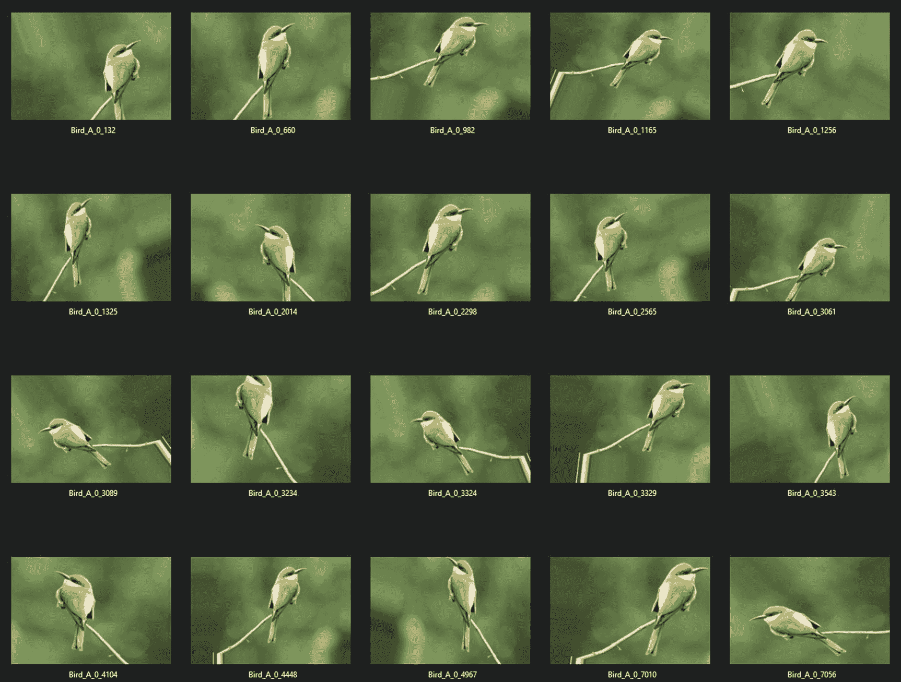

图 7-2

一些增强图像

通过使用这样的数据增强，我们应该能够在小数据集上训练深度学习模型时减少过拟合的风险。

## 使用数据增强构建图像分类模型

在我们对数据增强的理解基础上，让我们将其应用于构建一个实用的模型。

但首先，我们需要一个图像数据集。为此，我们将使用 Kaggle 上的鸟类图像数据集。

Kaggle 是一个数据科学家和机器学习爱好者的社区，让您可以找到并发布数据集，在 Jupyter notebook 环境中进行实验和构建模型，并参与数据科学和机器学习竞赛。

在 Kaggle 的庞大数据集目录中，我们将使用 225 种鸟类数据集.^(2) 该数据集大小约为 1.4GB，可以下载为 zip 文件（图 7-3）。


图 7-3

来自 Kaggle 的 225 种鸟类数据集

注意

与 Kaggle 中的许多其他数据集一样，这个数据集正在积极维护。在撰写本文时，有 225 种鸟类的图像，但在您阅读本文时，可能已经添加了更多物种和类别。您也可以选择具有类似结构的其他数据集。

下载完成后，您可以解压 zip 文件的内容。在解压的目录中，您将得到 4 个子目录：consolidated、train、test 和 valid（图 7-4）。

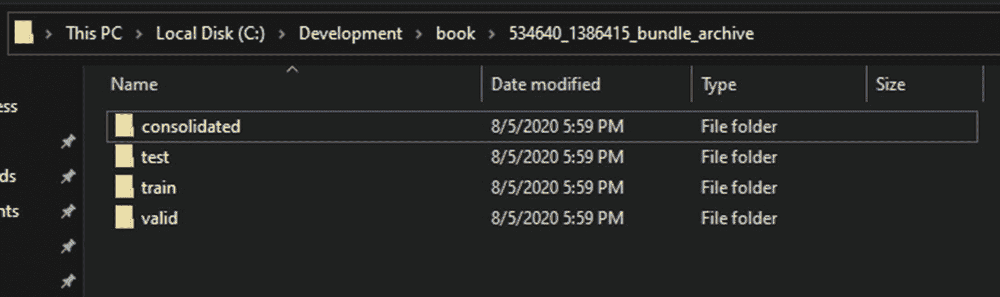

图 7-4

提取的数据集

整合目录包含完整的数据集，按每个物种/类别组织到子目录中。训练、测试和验证子目录包含相同的数据集，分为训练、测试和验证集，具有相同的子目录结构。

对于我们的实验，最初我们将从 225 个类别中仅选择 10 个。我们将从以下 10 个类别开始选择：

+   信天翁

+   香蕉 quit

+   黑喉雀麦

+   鹦鹉

+   暗眼金莺

+   D-ARNAUDS BARBET

+   金鸡

+   家麻雀

+   知更鸟

+   SORA

注意

这 10 个类别被选中是因为它们每个类别包含的样本数量不同。我们将看到这如何影响训练精度，以及如何克服其负面影响。

在名为 data 的新目录中创建两个子目录，分别命名为 train 和 validation。将先前选择的类别从提取数据集的训练和验证目录复制到您创建的训练和验证目录中。最终的目录结构应如下所示（图 7-5）：

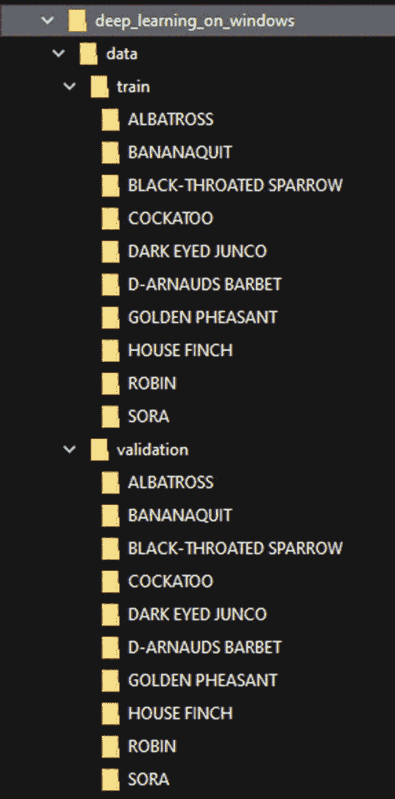

图 7-5

数据集的目录结构

注意

在创建目录结构时，请确保验证目录的子目录结构与训练目录相同。

让我们从数据增强开始构建我们的鸟类分类模型，创建一个新的代码文件。我们将命名为`bird_classify_augmented.py`。

我们将从导入必要的包开始：

```py
1: from tensorflow.keras.preprocessing.image import ImageDataGenerator
2: from tensorflow.keras.models import Sequential
3: from tensorflow.keras.layers import Conv2D, MaxPooling2D
4: from tensorflow.keras.layers import Activation, Dropout, Flatten, Dense
5: from tensorflow.keras import backend as K
6: import matplotlib.pyplot as plt
7: import math
```

然后，我们定义我们的效用函数，使用 Matplotlib 绘制训练历史：

```py
09: # utility functions
10: def graph_training_history(history):
11:     plt.rcParams["figure.figsize"] = (12, 9)
12:
13:     plt.style.use('ggplot')
14:
15:     plt.figure(1)
16:
17:     # summarize history for accuracy
18:
19:     plt.subplot(211)
20:     plt.plot(history.history['accuracy'])
21:     plt.plot(history.history['val_accuracy'])
22:     plt.title('Model Accuracy')
23:     plt.ylabel('Accuracy')
24:     plt.xlabel('Epoch')
25:     plt.legend(['Training', 'Validation'], loc='lower right')
26:
27:     # summarize history for loss
28:
29:     plt.subplot(212)
30:     plt.plot(history.history['loss'])
31:     plt.plot(history.history['val_loss'])
32:     plt.title('Model Loss')
33:     plt.ylabel('Loss')
34:     plt.xlabel('Epoch')
35:     plt.legend(['Training', 'Validation'], loc='upper right')
36:
37:     plt.tight_layout()
38:
39:     plt.show()
```

然后，我们定义一些训练参数：

```py
41: # dimensions of our images.
42: img_width, img_height = 224, 224
43:
44: train_data_dir = 'data/train'
45: validation_data_dir = 'data/validation'
46:
47: # number of epochs to train
48: epochs = 50
49:
50: # batch size used by flow_from_directory
51: batch_size = 16
```

224x224 像素是大型图像分类模型（如 ImageNet）中使用的标准尺寸之一。我们在这里也使用它，因为它允许我们在以后有一些灵活性。

要在我们的模型训练中使用自动数据增强，我们需要定义数据生成器函数，就像我们在之前的数据增强示例中所做的那样。使用数据生成器给我们带来了额外的优势，即能够使用`flow_from_directory()`函数，该函数从我们的目录结构中加载数据，并使用子目录名称提供类别标签。在这里，我们定义了两个数据生成器：一个用于训练，一个用于验证：

```py
53: # this is the augmentation configuration we will use for training
54: train_datagen = ImageDataGenerator(
55:     rescale=1\. / 255,
56:     shear_range=0.2,
57:     zoom_range=0.2,
58:     horizontal_flip=True)
59:
60: # this is the augmentation configuration we will use for testing:
61: # only rescaling
62: test_datagen = ImageDataGenerator(rescale=1\. / 255)
63:
64: train_generator = train_datagen.flow_from_directory(
65:     train_data_dir,
66:     target_size=(img_width, img_height),
67:     batch_size=batch_size,
68:     class_mode='categorical')
69:
70: validation_generator = test_datagen.flow_from_directory(
71:     validation_data_dir,
72:     target_size=(img_width, img_height),
73:     batch_size=batch_size,
74:     class_mode='categorical')
75:
76: # print the number of training samples
77: print(len(train_generator.filenames))
78:
79: # print the category/class labal map
80: print(train_generator.class_indices)
81:
82: # print the number of classes
83: print(len(train_generator.class_indices))
```

我们正在构建一个多类图像分类模型，class_mode 设置为分类模式。

`<generator>.filenames` 包含训练集的所有文件名。通过获取其长度，我们可以得到训练集的大小。

同样，`<generator>.class_indices` 是类别名称及其索引的映射/字典。获取其长度给我们提供了类别的数量。

我们使用这些值来计算所需的训练和验证步骤：

```py
85: # the number of classes/categories
86: num_classes = len(train_generator.class_indices)
87:
88: # calculate the training steps
89: nb_train_samples = len(train_generator.filenames)
90: train_steps = int(math.ceil(nb_train_samples / batch_size))
91:
92: # calculate the validation steps
93: nb_validation_samples = len(validation_generator.filenames)
94: validation_steps = int(math.ceil(nb_validation_samples / batch_size))
```

现在，我们可以定义我们的模型：

```py
097: # build the model
098: input_shape = (img_width, img_height, 3)
099:
100: model = Sequential()
101: model.add(Conv2D(32, (3, 3), input_shape=input_shape))
102: model.add(Activation('relu'))
103: model.add(MaxPooling2D(pool_size=(2, 2)))
104:
105: model.add(Conv2D(32, (3, 3)))
106: model.add(Activation('relu'))
107: model.add(MaxPooling2D(pool_size=(2, 2)))
108:
109: model.add(Conv2D(64, (3, 3)))
110: model.add(Activation('relu'))
111: model.add(MaxPooling2D(pool_size=(2, 2)))
112:
113: model.add(Flatten())
114: model.add(Dense(64))
115: model.add(Activation('relu'))
116: model.add(Dropout(0.5))
117: model.add(Dense(num_classes))
118: model.add(Activation('softmax'))
```

这是一个比我们的 LeNet 模型稍深一些的模型，但使用了相同的概念。它使用三组 CONV => RELU => POOL 层。之后是一个密集层和一个 softmax 分类器。

一旦我们定义了模型结构，我们就可以编译它并运行训练。`model.fit()`函数接受数据生成器，就像它接受训练数据的数组（以及几种其他数据格式）一样。3

```py
120: model.compile(loss='categorical_crossentropy',
121:               optimizer='rmsprop',
122:               metrics=['accuracy'])
123:
124: history = model.fit(
125:     train_generator,
126:     steps_per_epoch=train_steps,
127:     epochs=epochs,
128:     validation_data=validation_generator,
129:     validation_steps=validation_steps
130:     )
```

训练步骤完成后，我们可以保存训练好的模型，评估它，并使用我们在开始时定义的函数绘制训练历史：

```py
132: model.save('bird_classify_augmented.h5')
133:
134: (eval_loss, eval_accuracy) = model.evaluate(
135:     validation_generator, steps=validation_steps)
136:
137: print("\n")
138:
139: print("[INFO] accuracy: {:.2f}%".format(eval_accuracy * 100))
140: print("[INFO] Loss: {}".format(eval_loss))
141:
142: # visualize the training history
143: graph_training_history(history)
```

如果我们现在运行这段代码，我们应该得到一个介于 70%到 85%之间的准确率值。你得到的准确率可能会因为应用的数据增强的随机性以及数据集极其小而有所不同。例如，在下面的实例中，我们达到了 82%的准确率（图 7-6）。

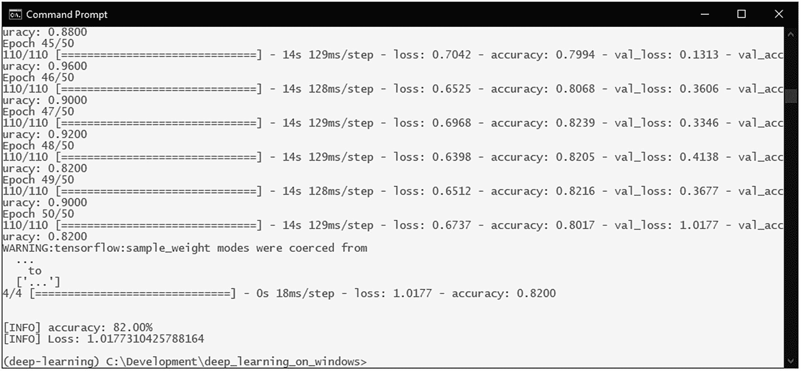

图 7-6

使用数据增强的模型准确率

如果我们查看训练历史图，我们可以看到准确率和损失曲线已经达到平台期（图 7-7）。

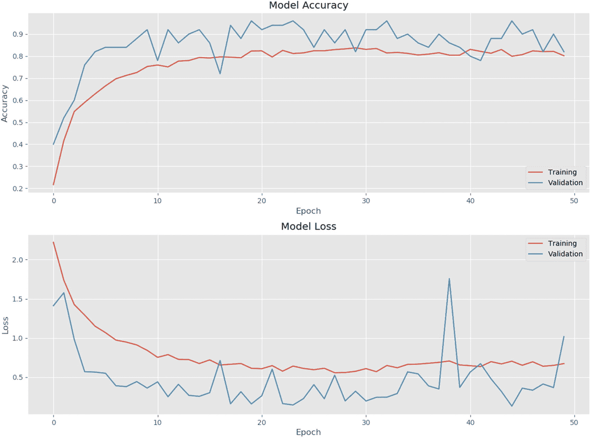

图 7-7

使用数据增强的模型训练历史图

这通常表明模型在没有更多数据的情况下无法进一步发展。你也许还会注意到验证准确率高于训练准确率。这通常也是一个数据不足的迹象。

虽然 82%的准确率并不糟糕，但很明显，为了使用给定数据达到更好的准确率，我们需要使用更高级的技术。

## 瓶颈特征

我们应该接受我们达到的 82%准确率，还是放弃尝试构建我们自己的鸟类图像分类器？

不。因为深度学习有解决方案。

深度学习支持一种极其有用的技术，称为**迁移学习**。这意味着你可以使用一个预训练的深度学习模型——在大型数据集（如 ImageNet）上训练的模型——并将其重新用于处理完全不同的任务。由于该模型已经从大型数据集中学习到某些特征（回想一下层次特征学习），它将能够使用这些特征作为基础来学习我们向其展示的新分类问题。

使迁移学习生效的基本技术是获取一个预训练模型（加载了训练模型权重）并从该模型中移除最终的完全连接层。然后，我们将模型的剩余部分用作我们较小数据集的特征提取器。这些提取的特征被称为**瓶颈特征**，是原始模型中完全连接层之前的最后激活图。然后，我们在这些提取的瓶颈特征之上训练一个小型模型，并添加完全连接层，以获得我们新分类任务所需的输出类别。此工作流程如图 7-8 所示。

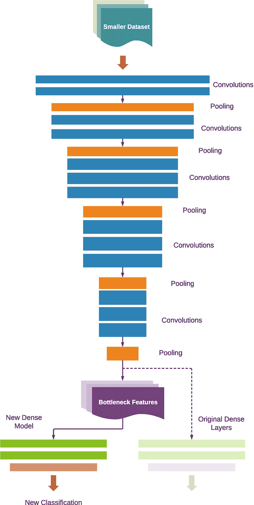

图 7-8

瓶颈特征提取的工作原理

由于迁移学习是构建深度学习模型中广泛使用的技术之一，因此像 TensorFlow 和 Keras 这样的框架提供了简化其实施的方法。TensorFlow 和 Keras 内置了许多带有其训练权重的 ImageNet 模型。它们内置的实现还提供了实用函数来移除原始顶层，并围绕它们构建新的模型以进行迁移学习。

## 使用预训练的 VGG16 模型和瓶颈特征

让我们在我们的鸟类图像分类模型中利用瓶颈特征。

我们将使用带有其 ImageNet 训练权重的 VGG16 模型作为我们的基础模型。你可以在附录 1 中了解更多关于 VGG16 模型和其他 ImageNet 模型的信息。

要使用瓶颈特征训练我们的鸟类图像分类器，我们将采取以下步骤：

1.  使用内置的预训练 ImageNet 模型之一创建一个基础模型，不包含其最终的密集层。我们将使用 VGG16 模型作为我们的示例。

1.  定义一组新的密集层用于分类（我们将其称为顶层）并通过结合基础模型和顶层创建一个新的模型。

1.  “冻结”基础模型的层。也就是说，基础模型中层的权重将不会进行训练，因为我们不希望在基础模型在 ImageNet 数据集上训练时破坏其已经学习到的特征。这允许基础模型重用这些学习，并将激活——瓶颈特征——输出到我们添加在上面的新密集层。

1.  使用我们的新类别训练所得的新模型。

让我们通过启动一个新的代码文件来开始使用瓶颈特征进行鸟类分类模型，我们将该文件命名为 bird_classify_bottleneck.py，并导入必要的包：

```py
01: import tensorflow as tf
02: import numpy as np
03: from tensorflow.keras.preprocessing.image import ImageDataGenerator, img_to_array, load_img
04: from tensorflow.keras.models import Sequential, Model, load_model
05: from tensorflow.keras.layers import Dropout, Flatten, Dense, GlobalAveragePooling2D, Input
06: from tensorflow.keras.applications.vgg16 import VGG16
07: from tensorflow.keras.applications.inception_v3 import InceptionV3
08: from tensorflow.keras import optimizers
09: import matplotlib.pyplot as plt
10: import math
```

和之前一样，我们将定义我们的效用函数：

```py
12: # utility functions
13: def graph_training_history(history):
14:     plt.rcParams["figure.figsize"] = (12, 9)
15:
16:     plt.style.use('ggplot')
17:
18:     plt.figure(1)
19:
20:     # summarize history for accuracy
21:
22:     plt.subplot(211)
23:     plt.plot(history.history['accuracy'])
24:     plt.plot(history.history['val_accuracy'])
25:     plt.title('Model Accuracy')
26:     plt.ylabel('Accuracy')
27:     plt.xlabel('Epoch')
28:     plt.legend(['Training', 'Validation'], loc='lower right')
29:
30:     # summarize history for loss
31:
32:     plt.subplot(212)
33:     plt.plot(history.history['loss'])
34:     plt.plot(history.history['val_loss'])
35:     plt.title('Model Loss')
36:     plt.ylabel('Loss')
37:     plt.xlabel('Epoch')
38:     plt.legend(['Training', 'Validation'], loc='upper right')
39:
40:     plt.tight_layout()
41:
42:     plt.show()
```

训练参数和数据生成器定义也将与之前相同：

```py
44: # dimensions of our images.
45: img_width, img_height = 224, 224
46:
47: train_data_dir = 'data/train'
48: validation_data_dir = 'data/validation'
49:
50: # number of epochs to train
51: epochs = 50
52:
53: # batch size used by flow_from_directory
54: batch_size = 16
55:
56: # this is the augmentation configuration we will use for training
57: train_datagen = ImageDataGenerator(
58:     rescale=1\. / 255,
59:     shear_range=0.2,
60:     zoom_range=0.2,
61:     horizontal_flip=True)
62:
63: # this is the augmentation configuration we will use for testing:
64: # only rescaling
65: test_datagen = ImageDataGenerator(rescale=1\. / 255)
66:
67: train_generator = train_datagen.flow_from_directory(
68:     train_data_dir,
69:     target_size=(img_width, img_height),
70:     batch_size=batch_size,
71:     class_mode='categorical')
72:
73: validation_generator = test_datagen.flow_from_directory(
74:     validation_data_dir,
75:     target_size=(img_width, img_height),
76:     batch_size=batch_size,
77:     class_mode='categorical')
78:
79: # print the number of training samples
80: print(len(train_generator.filenames))
81:
82: # print the category/class labal map
83: print(train_generator.class_indices)
84:
85: # print the number of classes
86: print(len(train_generator.class_indices))
87:
88: # the number of classes/categories
89: num_classes = len(train_generator.class_indices)
90:
91: # calculate the training steps
92: nb_train_samples = len(train_generator.filenames)
93: train_steps = int(math.ceil(nb_train_samples / batch_size))
94:
95: # calculate the validation steps
96: nb_validation_samples = len(validation_generator.filenames)
97: validation_steps = int(math.ceil(nb_validation_samples / batch_size))
```

接下来，我们将定义基础模型。我们将使用 `include_top=False` 参数加载带有 ImageNet 权重的 VGG16 模型，但不包括顶层密集层：

```py
100: # create the base pre-trained model
101: base_model = VGG16(weights='imagenet', include_top=False, input_tensor=Input(shape=(img_width, img_height, 3)))
```

然后，我们定义顶层模型，即密集层和最终的分类层：

```py
103: # add a global spatial average pooling layer
104: x = base_model.output
105: x = GlobalAveragePooling2D()(x)
106: x = Dense(512, activation="relu")(x)
107: predictions = Dense(num_classes, activation="softmax")(x)
```

一旦定义了基础模型和顶层模型，我们将它们组合成一个单一模型：

```py
109: # this is the model we will train
110: model = Model(inputs=base_model.input, outputs=predictions)
```

然后，我们将基础模型的层设置为不可训练，并编译模型。模型的编译应该在标记层为不可训练之后进行：

```py
112: # train only the top layers (which were randomly initialized)
113: # i.e. freeze all convolutional layers
114: for layer in base_model.layers:
115:     layer.trainable = False
116:
117: # compile the model (should be done *after* setting layers to non-trainable)
118: model.compile(optimizer='rmsprop', loss="categorical_crossentropy", metrics=['accuracy'])
```

最后，我们运行训练，保存模型，评估，并绘制训练历史图：

```py
120: history = model.fit(
121:     train_generator,
122:     steps_per_epoch=train_steps,
123:     epochs=epochs,
124:     validation_data=validation_generator,
125:     validation_steps=validation_steps
126:     )
127:
128: model.save('bird_classify_bottleneck.h5')
129:
130: (eval_loss, eval_accuracy) = model.evaluate(
131:     validation_generator, steps=validation_steps)
132:
133: print("\n")
134:
135: print("[INFO] accuracy: {:.2f}%".format(eval_accuracy * 100))
136: print("[INFO] Loss: {}".format(eval_loss))
137:
138: # visualize the training history
139: graph_training_history(history)
```

现在，让我们运行训练，看看瓶颈模型与之前的简单模型相比如何。

准确率已提高到 94%（图 7-9）。

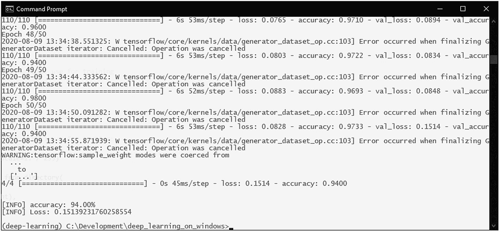

图 7-9

使用瓶颈特征的模型准确率

训练历史图也显示了改进。之前存在的数据不足的特征现在消失了（图 7-10）。

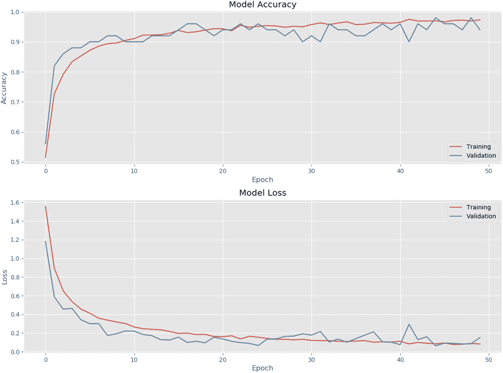

图 7-10

使用瓶颈特征的模型训练历史图

使用瓶颈特征，我们能够将同一数据集上的准确率从 82% 提高到 94%。

但我们能做得更好吗？

## 进一步使用模型微调

获得准确率为 94% 是很棒的。但我们已经看到深度学习模型实现了更加令人印象深刻的成果。

那么，我们如何进一步提高我们的结果呢？

当我们使用瓶颈特征时，我们做的是使用一个已经使用大型数据集（在我们的案例中是 ImageNet 数据集）进行训练的深度学习模型——VGG16 模型，并使用其中的瓶颈特征来训练一组密集层，以便将我们的数据分类到我们想要的类别中。我们确实从中得到了很好的结果。

但是，我们数据在这个方法中的分类效果仍然取决于预训练模型的瓶颈特征能否很好地代表我们的类别。

由于 ImageNet 已经使用代表 1,000 个类别的数百万张图像进行训练，它确实具有很好的特征泛化能力。在我们的案例中，由于原始的 1,000 个类别中包含一些鸟类图像类别，模型能够很好地适应我们的新类别。但它仍然受限于对原始 1,000 个类别的训练，而这些类别并不是我们想要的。

这就是为什么我们的准确率被限制在 94% 的原因。

但如果我们取那个预训练模型，并教它一些我们想要的类别呢？

这就是模型微调想法的来源。

在模型微调中，我们取一个训练好的模型，并使用一个非常小的学习率重新训练顶级分类器和最后几个卷积层。

我们仍然冻结了之前冻结的下层卷积层，这样在微调时它们就不会被重新训练。这将保留这些层学习到的通用、不太抽象的特征，并防止整个模型过拟合。

微调的工作流程如图 7-11 所示。

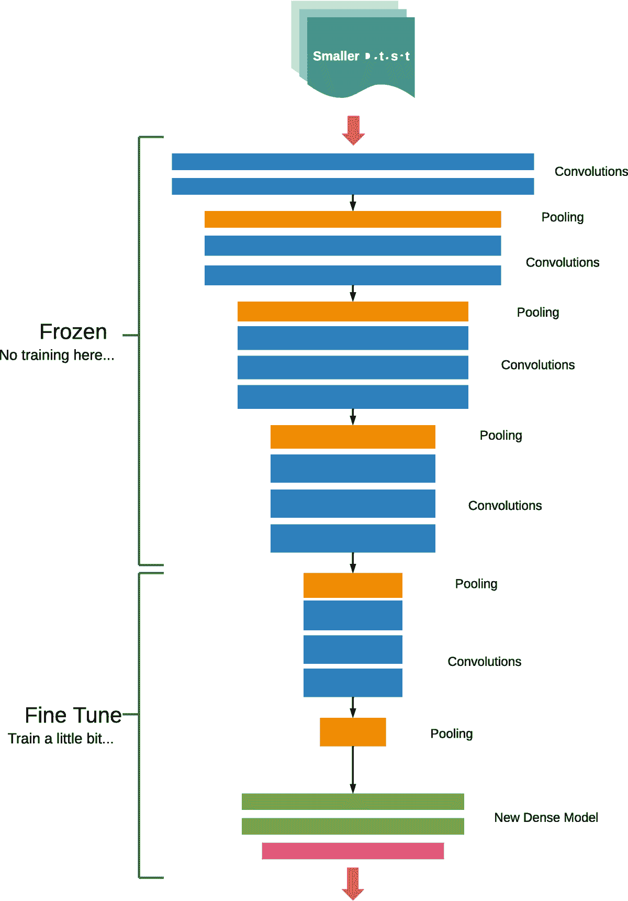

图 7-11

模型微调的概念

为了微调我们的模型，我们将采取以下步骤：

1.  定义与之前相同的基础模型（带有预训练权重）和顶级模型。

1.  使用我们在早期章节中使用的瓶颈特征重新训练整个模型。

1.  “解冻”基础模型的最后一个卷积块，即允许它被训练。

1.  再次使用一个非常小的学习率训练整个模型。

当微调一个模型时，你应该始终从一个已经训练好的模型开始。如果我们尝试在添加的顶级模型仍然未训练的情况下微调模型，由于这些层的初始权重是随机初始化的，它可能会因为反向传播而破坏基础模型已经学习到的特征。由于我们有限的数据不足以满足这样一个模型的高学习容量（记住，ImageNet 模型能够从数百万个训练样本和数千个类别中学习），这肯定会引起模型过拟合。

此外，在微调时，我们需要使用一个非常小的学习率——例如 0.0001——通常使用 SGD 优化器。使用如 RMSProp 这样的自适应学习率优化器可能会破坏模型已经学习到的特征。

## 微调我们的 VGG16 模型

让我们将微调添加到我们的鸟类图像分类模型中。

我们将开始一个新的代码文件，我们将将其命名为 bird_classify_finetune.py。

由于我们需要从一个训练好的模型开始微调，代码的第一部分几乎与我们在使用瓶颈特征进行训练时所做的相同。唯一的区别是在第 91 行，我们将 `class_indices` 字典保存到一个文件中。这个文件将在后面的章节中变得很有用：

```py
001: import tensorflow as tf
002: import numpy as np
003: from tensorflow.keras.preprocessing.image import ImageDataGenerator, img_to_array, load_img
004: from tensorflow.keras.models import Sequential, Model, load_model
005: from tensorflow.keras.layers import Dropout, Flatten, Dense, GlobalAveragePooling2D, Input
006: from tensorflow.keras.applications.vgg16 import VGG16
007: from tensorflow.keras import optimizers
008: from tensorflow.keras.optimizers import SGD
009: import matplotlib.pyplot as plt
010: import math
011:
012: # utility functions
013: def graph_training_history(history):
014:     plt.rcParams["figure.figsize"] = (12, 9)
015:
016:     plt.style.use('ggplot')
017:
018:     plt.figure(1)
019:
020:     # summarize history for accuracy
021:
022:     plt.subplot(211)
023:     plt.plot(history.history['accuracy'])
024:     plt.plot(history.history['val_accuracy'])
025:     plt.title('Model Accuracy')
026:     plt.ylabel('Accuracy')
027:     plt.xlabel('Epoch')
028:     plt.legend(['Training', 'Validation'], loc='lower right')
029:
030:     # summarize history for loss
031:
032:     plt.subplot(212)
033:     plt.plot(history.history['loss'])
034:     plt.plot(history.history['val_loss'])
035:     plt.title('Model Loss')
036:     plt.ylabel('Loss')
037:     plt.xlabel('Epoch')
038:     plt.legend(['Training', 'Validation'], loc='upper right')
039:
040:     plt.tight_layout()
041:
042:     plt.show()
043:
044: # dimensions of our images.
045: img_width, img_height = 224, 224
046:
047: train_data_dir = 'data/train'
048: validation_data_dir = 'data/validation'
049:
050: # number of epochs to train
051: epochs = 50
052:
053: # batch size used by flow_from_directory
054: batch_size = 16
055:
056: # this is the augmentation configuration we will use for training
057: train_datagen = ImageDataGenerator(
058:     rescale=1\. / 255,
059:     shear_range=0.2,
060:     zoom_range=0.2,
061:     horizontal_flip=True)
062:
063: # this is the augmentation configuration we will use for testing:
064: # only rescaling
065: test_datagen = ImageDataGenerator(rescale=1\. / 255)
066:
067: train_generator = train_datagen.flow_from_directory(
068:     train_data_dir,
069:     target_size=(img_width, img_height),
070:     batch_size=batch_size,
071:     class_mode='categorical')
072:
073: validation_generator = test_datagen.flow_from_directory(
074:     validation_data_dir,
075:     target_size=(img_width, img_height),
076:     batch_size=batch_size,
077:     class_mode='categorical')
078:
079: # print the number of training samples
080: print(len(train_generator.filenames))
081:
082: # print the category/class labal map
083: print(train_generator.class_indices)
084:
085: # print the number of classes
086: print(len(train_generator.class_indices))
087:
088: # the number of classes/categories
089: num_classes = len(train_generator.class_indices)
090:
091: # save the class indices for use in the predictions
092: np.save('class_indices.npy', train_generator.class_indices)
093:
094: # calculate the training steps
095: nb_train_samples = len(train_generator.filenames)
096: train_steps = int(math.ceil(nb_train_samples / batch_size))
097:
098: # calculate the validation steps
099: nb_validation_samples = len(validation_generator.filenames)
100: validation_steps = int(math.ceil(nb_validation_samples / batch_size))
101:
102:
103: # create the base pre-trained model
104: base_model = VGG16(weights='imagenet', include_top=False, input_tensor=Input(shape=(img_width, img_height, 3)))
105:
106: # add a global spatial average pooling layer
107: x = base_model.output
108: x = GlobalAveragePooling2D()(x)
109: x = Dense(512, activation="relu")(x)
110: predictions = Dense(num_classes, activation="softmax")(x)
111:
112: # this is the model we will train
113: model = Model(inputs=base_model.input, outputs=predictions)
114:
115: # first: train only the top layers (which were randomly initialized)
116: # i.e. freeze all convolutional layers
117: for layer in base_model.layers:
118:     layer.trainable = False
119:
120: # compile the model (should be done *after* setting layers to non-trainable)
121: model.compile(optimizer='rmsprop', loss="categorical_crossentropy", metrics=['accuracy'])
122:
123: history = model.fit(
124:     train_generator,
125:     steps_per_epoch=train_steps,
126:     epochs=epochs,
127:     validation_data=validation_generator,
128:     validation_steps=validation_steps,
129:     max_queue_size=10,
130:     workers=8
131:     )
132:
133: model.save('bird_classify_fine-tune_step_1.h5')
134:
135: (eval_loss, eval_accuracy) = model.evaluate(
136:     validation_generator, steps=validation_steps)
137:
138: print("\n")
139:
140: print("[INFO] accuracy: {:.2f}%".format(eval_accuracy * 100))
141: print("[INFO] Loss: {}".format(eval_loss))
```

一旦我们有了训练好的模型，我们将定义微调的参数，以及重置我们的数据生成器，这样我们就可以重用它们。我们将微调的轮数设置为 25：

```py
144: # Run Fine-tuning on our model
145:
146: # number of epochs to fine-tune
147: ft_epochs = 25
148:
149: # reset our data generators
150: train_generator.reset()
151: validation_generator.reset()
152:
153: # let's visualize layer names and layer indices to see how many layers
154: # we should freeze:
155: for i, layer in enumerate(base_model.layers):
156:    print(i, layer.name)
```

然后，我们将解冻基础模型从最后一个卷积块到分类层的所有层。基础模型中的其他所有层将保持冻结状态：

```py
158: # we chose to train the last convolution block from the base model
159: for layer in model.layers[:15]:
160:    layer.trainable = False
161: for layer in model.layers[15:]:
162:    layer.trainable = True
```

然后，我们重新编译模型，以使修改生效，并定义具有低学习率的 SGD 优化器：

```py
164: # we need to recompile the model for these modifications to take effect
165: # we use SGD with a low learning rate
166: model.compile(
167:     optimizer=optimizers.SGD(lr=0.0001, momentum=0.9),
168:     loss='categorical_crossentropy',
169:     metrics=['acc']
170:     )
```

最后，我们运行训练、评估和绘图训练历史：

```py
172: history = model.fit(
173:     train_generator,
174:     steps_per_epoch=train_steps,
175:     epochs=ft_epochs,
176:     validation_data=validation_generator,
177:     validation_steps=validation_steps,
178:     max_queue_size=10,
179:     workers=8
180:     )
181:
182: model.save('bird_classify_finetune.h5')
183:
184: (eval_loss, eval_accuracy) = model.evaluate(
185:     validation_generator, steps=validation_steps)
186:
187: print("\n")
188:
189: print("[INFO] accuracy: {:.2f}%".format(eval_accuracy * 100))
190: print("[INFO] Loss: {}".format(eval_loss))
191:
192: # visualize the training history
193: graph_training_history(history)
```

在这里，我们将最终训练和微调好的模型保存为`bird_classify_finetune.h5`。请保留此文件以及之前在代码中保存的`class_indices.npy`文件，因为它们将在后面的章节中需要。

让我们看看我们的微调模型的表现：我们的准确度已提高到 98%（图 7-12）。

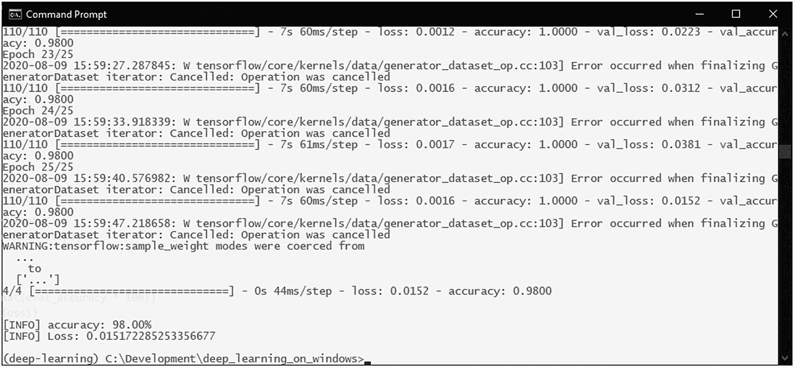

图 7-12。

微调模型的准确度。

微调的图形看起来也很好（图 7-13）。

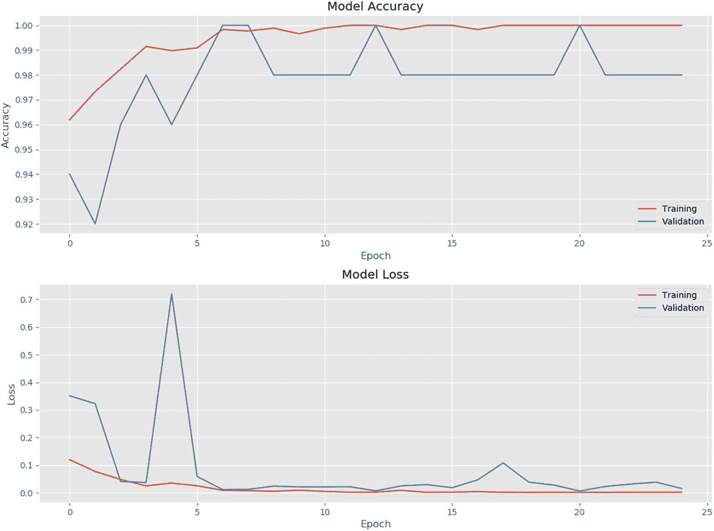

图 7-13。

模型微调的历史图。

我们以 98%的准确度，几乎达到了使用小数据集所能做到的极限。

## 使用我们的模型进行预测。

现在我们有一个准确度极高的训练模型。现在我们应该看看我们如何使用它来进行预测和图像分类。

记住，在我们的微调代码中，我们保存了两个文件：类别标签字典和训练好的模型文件。现在我们可以使用这两个文件来重建整个训练好的模型，而无需重新定义模型结构。

让我们开始一个新的代码文件。我们将将其命名为 bird_classify_predict.py。

我们首先导入必要的包，并定义测试图像的路径以及图像大小参数：

```py
1: import numpy as np
2: import tensorflow as tf
3: from tensorflow.keras.preprocessing.image import img_to_array, load_img
4: from tensorflow.keras.models import Model, load_model
5: from tensorflow.keras.utils import to_categorical
6: import cv2
7:
8: image_path = 'data/validation/ALBATROSS/1.jpg'
9: img_width, img_height = 224, 224
```

然后，我们加载保存的模型和类别标签字典。

```py
11: # load the trained model
12: model = load_model('bird_classify_finetune.h5')
13:
14: # load the class label dictionary
15: class_dictionary = np.load('class_indices.npy', allow_pickle=True).item()
```

然后，我们加载并预处理图像：

```py
17: # load the image and resize itto the size required by our model
18: image_orig = load_img(image_path, target_size=(img_width, img_height), interpolation="lanczos")
19: image = img_to_array(image_orig)
20:
21: # important! otherwise the predictions will be '0'
22: image = image / 255.0
23:
24: # add a new axis to make the image array confirm with
25: # the (samples, height, width, depth) structure
26: image = np.expand_dims(image, axis=0)
```

然后，我们将预处理后的图像数据通过加载的模型，解码预测结果，并将预测类别以及置信度打印到控制台：

```py
28: # get the probabilities for the prediction
29: probabilities = model.predict(image)
30:
31: # decode the prediction
32: prediction_probability = probabilities[0, probabilities.argmax(axis=1)][0]
33: class_predicted = np.argmax(probabilities, axis=1)
34: inID = class_predicted[0]
35:
36: # invert the class dictionary in order to get the label for the id
37: inv_map = {v: k for k, v in class_dictionary.items()}
38: label = inv_map[inID]
39:
40: print("[Info] Predicted: {}, Confidence: {:.5f}%".format(label, prediction_probability*100))
```

最后，我们使用 OpenCV 加载并显示图像，并在其上叠加标签和置信度：

```py
42: # display the image and the prediction using OpenCV
43: image_cv = cv2.imread(image_path)
44: image_cv = cv2.resize(image_cv, (600, 600), interpolation=cv2.INTER_LINEAR)
45:
46: cv2.putText(image_cv,
47:             "Predicted: {}".format(label),
48:             (20, 40), cv2.FONT_HERSHEY_DUPLEX, 1, (0, 0, 255), 2, cv2.LINE_AA)
49: cv2.putText(image_cv,
50:             "Confidence: {:.5f}%".format(prediction_probability*100),
51:             (20, 80), cv2.FONT_HERSHEY_DUPLEX, 1, (0, 0, 255), 2, cv2.LINE_AA)
52:
53: cv2.imshow("Prediction", image_cv)
54: cv2.waitKey(0)
55:
56: cv2.destroyAllWindows()
```

运行预测代码，我们会得到这样的结果（图 7-14）。如预期的那样，基于我们得到的验证准确度，预测的置信度为 99%以上。

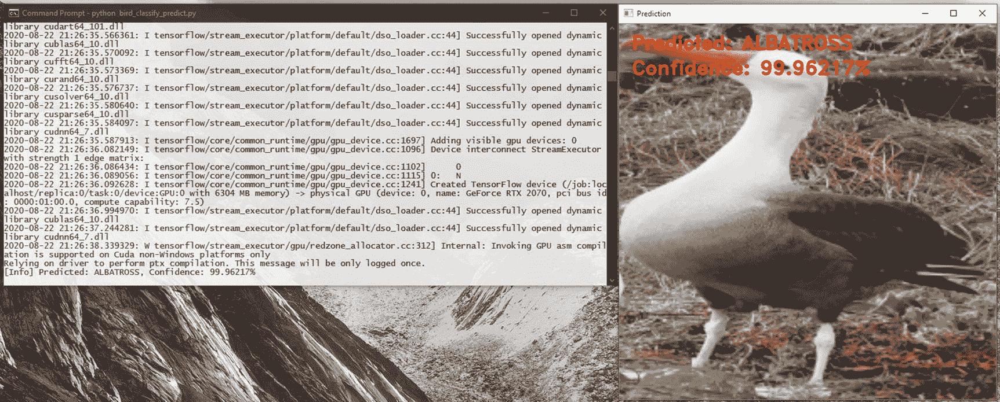

图 7-14。

飞行信天翁图像的模型预测和置信度。

以下是一些结果的更多示例（图 7-15 和图 7-16）。

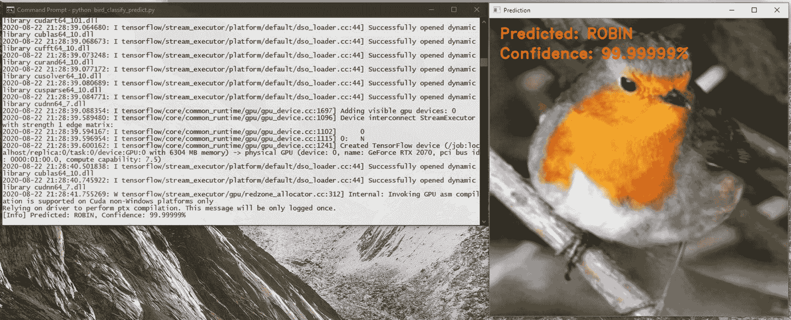

图 7-16。

鹦鹉图像的模型预测和置信度。

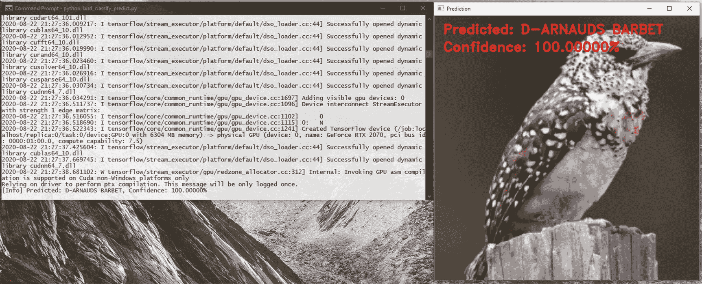

图 7-15。

鹦哥鸫图像的模型预测和置信度。

## 尝试更深的模型：InceptionV3

到目前为止，我们只尝试在章节开头从完整的鸟类图像数据集中选择的 10 个类别上运行我们的训练。

如果我们需要尝试为数据集的 50、100 或完整的 225 个类别构建模型呢？

我们在这里学到的所有迁移学习技术——瓶颈特征、微调——以及数据增强也可以应用于更大的类别集。

到目前为止，我们只尝试了 VGG16 模型。当处理更大的类别集和更大的数据集时，尝试不同的预训练模型作为基础以找到最优化模型结构会更好。

在这里，我们将探讨如何将相同的概念应用于 InceptionV3 ImageNet 模型。

除了使用 InceptionV3 模型外，我们还将看到如何减轻我们所选数据集的数据不平衡问题。

如果您还记得，当我们从完整的数据集中选择 10 个类别时，我们以某种方式选择了它们，其中一些类别的样本数量比其他类别多。这是我们在处理现实世界数据集时常见的问题。

当模型接收到的样本数量存在较大差异时，它可能会更熟悉样本数量较多的类别的特征，并可能削弱较少代表类别的特征。

一种减轻方法是通过根据每个类别的样本数量计算权重值（为样本数量较少的类别赋予更高的权重）并将该权重映射传递给正在训练的模型。这允许模型正确地学习样本数量较少的类别的特征。

当我们查看以下 InceptionV3 的代码时，我们将看到如何实现这一点。但请记住，这种技术可以用于任何模型。

我们将开始我们的新代码，我们将将其命名为 `bird_classify_inceptionV3.py`，通过导入必要的包：

```py
01: import tensorflow as tf
02: import numpy as np
03: from tensorflow.keras.preprocessing.image import ImageDataGenerator, img_to_array, load_img
04: from tensorflow.keras.models import Sequential, Model, load_model
05: from tensorflow.keras.layers import Dropout, Flatten, Dense, GlobalAveragePooling2D, Input
06: from tensorflow.keras.applications.inception_v3 import InceptionV3
07: from tensorflow.keras import optimizers
08: from tensorflow.keras.optimizers import SGD
09: import matplotlib.pyplot as plt
10: import math
11: import os
12: import os.path
```

在这里，我们已从内置模型中导入 InceptionV3 模型，而不是之前使用的 VGG16 模型。

我们将定义我们常用的效用函数来绘制训练历史：

```py
14: # utility functions
15: def graph_training_history(history):
16:     plt.rcParams["figure.figsize"] = (12, 9)
17:
18:     plt.style.use('ggplot')
19:
20:     plt.figure(1)
21:
22:     # summarize history for accuracy
23:
24:     plt.subplot(211)
25:     plt.plot(history.history['accuracy'])
26:     plt.plot(history.history['val_accuracy'])
27:     plt.title('Model Accuracy')
28:     plt.ylabel('Accuracy')
29:     plt.xlabel('Epoch')
30:     plt.legend(['Training', 'Validation'], loc='lower right')
31:
32:     # summarize history for loss
33:
34:     plt.subplot(212)
35:     plt.plot(history.history['loss'])
36:     plt.plot(history.history['val_loss'])
37:     plt.title('Model Loss')
38:     plt.ylabel('Loss')
39:     plt.xlabel('Epoch')
40:     plt.legend(['Training', 'Validation'], loc='upper right')
41:
42:     plt.tight_layout()
43:
44:     plt.show()
```

我们将定义一个新的效用函数来计算类别权重：

```py
46: # util function to calculate the class weights based on the number of samples on each class
47: # this is useful with datasets that are higly skewed (datasets where
48: # the number of samples in each class differs vastly)
49: def get_class_weights(class_data_dir):
50:     labels_count = dict()
51:     for img_class in [ic for ic in os.listdir(class_data_dir) if ic[0] != '.']:
52:         labels_count[img_class] = len(os.listdir(os.path.join(class_data_dir, img_class)))
53:     total_count = sum(labels_count.values())
54:     class_weights = {cls: total_count / count for cls, count in
55:                     enumerate(labels_count.values())}
56:     return class_weights
```

当被调用时，此函数将返回一个类似于以下映射的类别权重（图 7-17）：

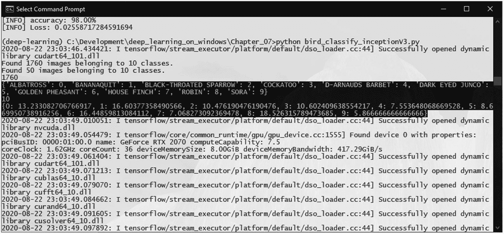

图 7-17

计算出的类别权重

然后，我们定义我们的训练参数和生成器，就像之前一样：

```py
058: # dimensions of our images.
059: img_width, img_height = 224, 224
060:
061: train_data_dir = 'data/train'
062: validation_data_dir = 'data/validation'
063:
064: # number of epochs to train
065: epochs = 50
066:
067: # batch size used by flow_from_directory
068: batch_size = 16
069:
070: # this is the augmentation configuration we will use for training
071: train_datagen = ImageDataGenerator(
072:     rescale=1\. / 255,
073:     shear_range=0.2,
074:     zoom_range=0.2,
075:     horizontal_flip=True)
076:
077: # this is the augmentation configuration we will use for testing:
078: # only rescaling
079: test_datagen = ImageDataGenerator(rescale=1\. / 255)
080:
081: train_generator = train_datagen.flow_from_directory(
082:     train_data_dir,
083:     target_size=(img_width, img_height),
084:     batch_size=batch_size,
085:     class_mode='categorical')
086:
087: validation_generator = test_datagen.flow_from_directory(
088:     validation_data_dir,
089:     target_size=(img_width, img_height),
090:     batch_size=batch_size,
091:     class_mode='categorical')
092:
093: # print the number of training samples
094: print(len(train_generator.filenames))
095:
096: # print the category/class labal map
097: print(train_generator.class_indices)
098:
099: # print the number of classes
100: print(len(train_generator.class_indices))
101:
102: # the number of classes/categories
103: num_classes = len(train_generator.class_indices)
104:
105: # calculate the training steps
106: nb_train_samples = len(train_generator.filenames)
107: train_steps = int(math.ceil(nb_train_samples / batch_size))
108:
109: # calculate the validation steps
110: nb_validation_samples = len(validation_generator.filenames)
111: validation_steps = int(math.ceil(nb_validation_samples / batch_size))
```

我们使用之前定义的函数通过传递训练目录的路径来加载类别权重：

```py
113: # get the class weights
114: class_weights = get_class_weights(train_data_dir)
115: print(class_weights)
```

在创建基础模型时，我们将使用 InceptionV3 而不是 VGG16：

```py
118: # create the base pre-trained model
119: base_model = InceptionV3(weights='imagenet', include_top=False, input_tensor=Input(shape=(img_width, img_height, 3)))
```

定义顶级模型和编译的代码保持不变：

```py
121: # add a global spatial average pooling layer
122: x = base_model.output
123: x = GlobalAveragePooling2D()(x)
124: x = Dense(512, activation="relu")(x)
125: predictions = Dense(num_classes, activation="softmax")(x)
126:
127: # this is the model we will train
128: model = Model(inputs=base_model.input, outputs=predictions)
129:
130: # first: train only the top layers (which were randomly initialized)
131: # i.e. freeze all convolutional layers
132: for layer in base_model.layers:
133:     layer.trainable = False
134:
135: # compile the model (should be done *after* setting layers to non-trainable)
136: model.compile(optimizer='rmsprop', loss="categorical_crossentropy", metrics=['accuracy'])
```

在模型训练步骤中，我们将之前计算的类别权重传递给 `model.fit()` 函数的 `class_weight` 参数：

```py
138: history = model.fit(
139:     train_generator,
140:     steps_per_epoch=train_steps,
141:     epochs=epochs,
142:     validation_data=validation_generator,
143:     validation_steps=validation_steps,
144:     class_weight=class_weights
145:     )
```

如前所述，训练好的模型被保存并评估，然后开始微调步骤：

```py
147: model.save('bird_classify_fine-tune_IV3_S1.h5')
148:
149: (eval_loss, eval_accuracy) = model.evaluate(
150:     validation_generator, steps=validation_steps)
151:
152: print("\n")
153:
154: print("[INFO] accuracy: {:.2f}%".format(eval_accuracy * 100))
155: print("[INFO] Loss: {}".format(eval_loss))
156:
157:
158: # Run Fine-tuning on our model
159:
160: # number of epochs to fine-tune
161: ft_epochs = 25
162:
163: # reset our data generators
164: train_generator.reset()
165: validation_generator.reset()
166:
167: # let's visualize layer names and layer indices to see how many layers
168: # we should freeze:
169: for i, layer in enumerate(base_model.layers):
170:    print(i, layer.name)
```

当微调 InceptionV3 时，冻结的层数与 VGG16 不同。我们将冻结到第 249 层而不是第 15 层：

```py
172: # we chose to train the last convolution block from the base model
173: for layer in model.layers[:249]:
174:    layer.trainable = False
175: for layer in model.layers[249:]:
176:    layer.trainable = True
```

模型随后被重新编译、训练和微调、评估，并保存。这里也将类别权重传递给`model.fit()`：

```py
178: # we need to recompile the model for these modifications to take effect
179: # we use SGD with a low learning rate
180: model.compile(
181:     optimizer=optimizers.SGD(lr=0.0001, momentum=0.9),
182:     loss='categorical_crossentropy',
183:     metrics=['accuracy']
184:     )
185:
186: history = model.fit(
187:     train_generator,
188:     steps_per_epoch=train_steps,
189:     epochs=ft_epochs,
190:     validation_data=validation_generator,
191:     validation_steps=validation_steps,
192:     class_weight=class_weights
193:     )
194:
195: model.save('bird_classify_finetune_IV3_final.h5')
196:
197: (eval_loss, eval_accuracy) = model.evaluate(
198:     validation_generator, steps=validation_steps)
199:
200: print("\n")
201:
202: print("[INFO] accuracy: {:.2f}%".format(eval_accuracy * 100))
203: print("[INFO] Loss: {}".format(eval_loss))
204:
205: # visualize the training history
206: graph_training_history(history)
```

如果我们像之前一样运行这 10 个类别，我们将看到几乎与之前相似的结果（图 7-18 和 7-19）。

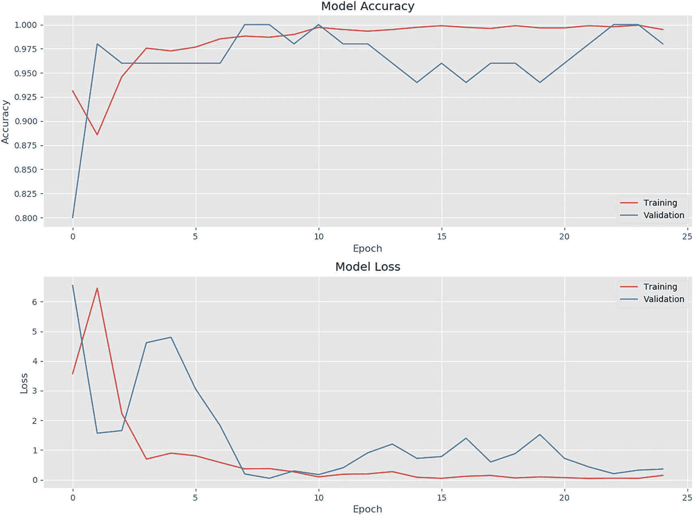

图 7-19

微调后的 InceptionV3 模型的训练历史图

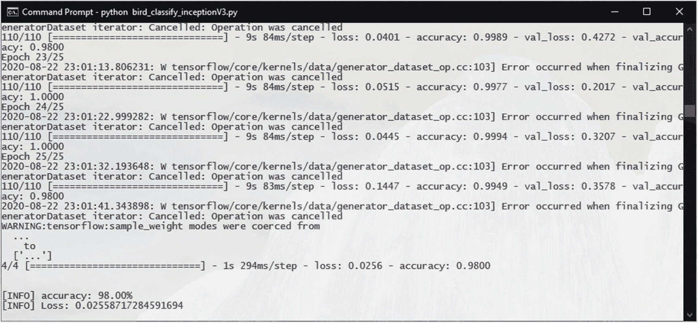

图 7-18

微调后的 InceptionV3 模型的准确率

然而，当你将此模型应用于更多类别或更大的数据集时，你将开始看到改进。

你现在可以尝试将其应用于完整的 225 种鸟类物种数据集。
