# 12. 强化学习基础

在第一章中，我们简要介绍了强化学习的概念。正如我们当时讨论的，强化学习是机器学习模型训练的方法之一。

强化学习是游戏人工智能编程和像 AlphaZero 和 OpenAI Five（见附录 1）这样的模型背后的主要概念，以及机器人领域的应用。

在强化学习中，AI 系统——通常被称为“智能体”——被引入到一个环境中，并被赋予一个要实现的目标。智能体还被赋予一组可以采取以改变环境状态的可能动作。智能体的任务是使用这些动作来实现期望的目标状态。智能体被允许采取任何这些可能动作。根据该动作对实现期望目标的相关性，智能体将获得奖励或惩罚。通过学习最大化奖励或最小化惩罚，智能体最终将学会实现目标所需的步骤（图 12-1）。

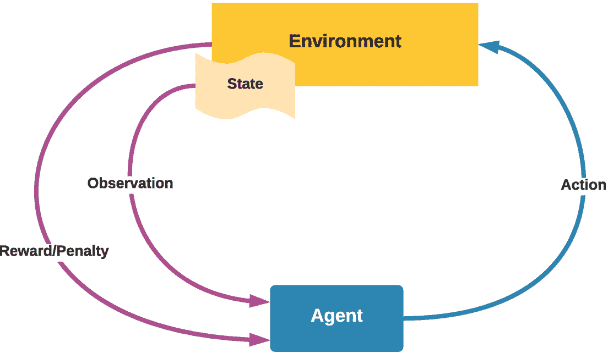

图 12-1

强化学习系统的流程

由于智能体没有获得用于训练的完整标签数据集，以及关于动作的一些反馈，因此强化学习介于监督学习和无监督学习之间。

如果我们要进行强化学习的实验，我们需要一个可以定义环境、要实现的目标、动作以及动作奖励机制的框架。

幸运的是，有一个专门为此开发的框架：OpenAI Gym。

## 什么是 OpenAI Gym？

OpenAI Gym 是由 OpenAI 开发的一个开源框架，旨在为训练强化学习算法提供工具。

OpenAI 提供了一套内置环境，其中包含经典的强化学习问题及其定义的动作、状态和奖励机制（图 12-2）。Gym 还允许您添加第三方或自定义环境。

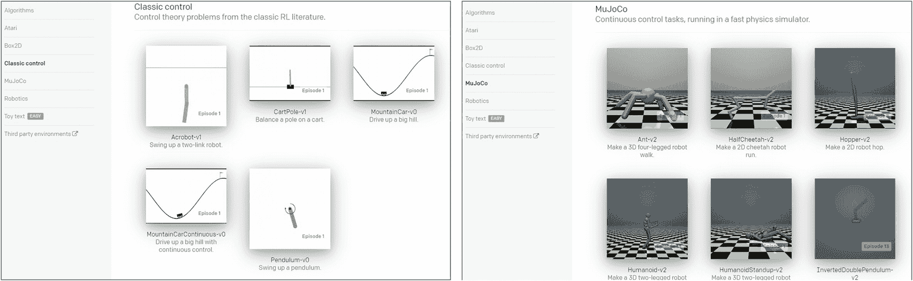

图 12-2

OpenAI Gym 中的一些可用环境

对于内置环境，Gym 也提供了环境、动作和结果的可视化/渲染（图 12-3）。

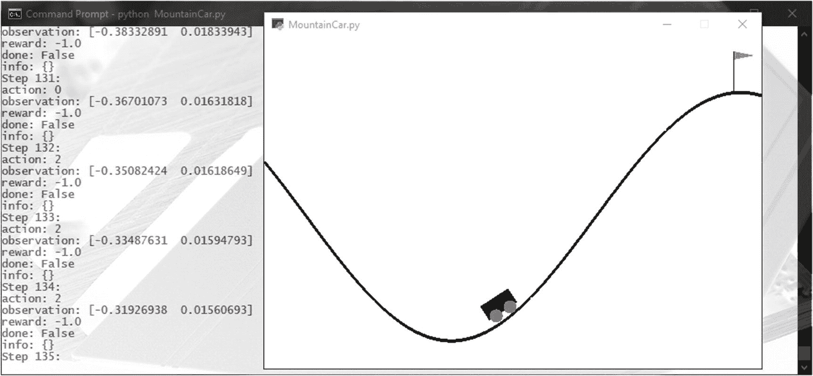

图 12-3

OpenAI 渲染 MountainCar 问题

在提供环境的同时，OpenAI Gym 并不限制您使用任何框架进行强化学习模型的实际训练。因此，您可以使用 TensorFlow/Keras 或您熟悉的任何其他机器学习框架来训练模型。

## 设置 OpenAI Gym

OpenAI Gym 可以作为一个 PIP 包使用。尽管最初 OpenAI Gym 只是为了支持 Linux 和 Mac OS 而设计的，但现在 Windows 的支持已经更好。大多数内置的 Gym 环境现在都可以在 Windows 上运行。

注意

一些高级环境，例如 MuJoCo（**Mu**lti-**Jo**int dynamics with **Co**ntact）环境，需要极其特定的依赖设置以及专有许可证才能使用。因此，我们在这里将跳过它们。

我们将首先使用 pip 安装最小包（图 12-4）：

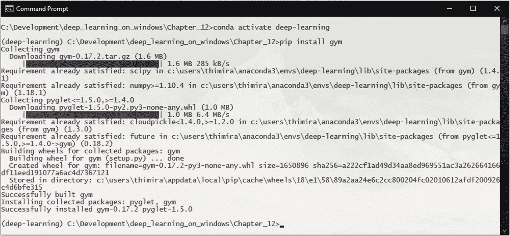

图 12-4

安装 Gym 的最小包

```py
pip install gym
```

这将为您提供访问算法、玩具文本和经典控制环境的机会。1

接下来，我们可以通过运行以下命令安装 Atari 环境（图 12-5）：

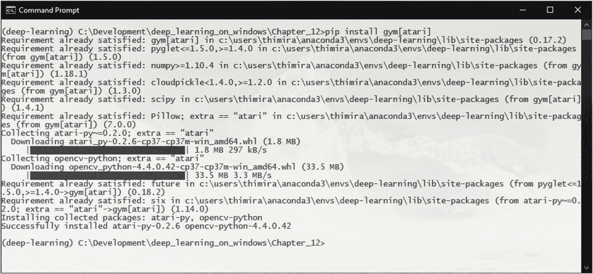

图 12-5

安装 Atari 环境

```py
pip install gym[atari]
```

最后，让我们安装 Box2D 环境。

要使 Box2D 运作，我们需要安装 Swig 二进制文件。我们可以使用 conda 安装它（图 12-6）：

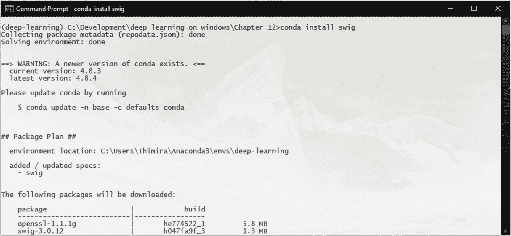

图 12-6

使用 Conda 安装 swig 二进制文件

```py
conda install swig
```

这允许我们安装 Box2D 环境（图 12-7）：

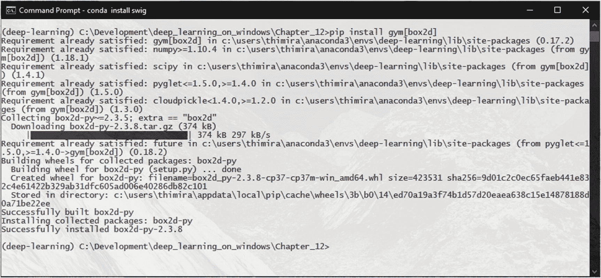

图 12-7

安装 Box2D 环境

```py
pip install gym[box2d]
```

我们现在可以通过启动其中一个环境来测试 OpenAI Gym 是否正确安装。我们将使用经典控制环境集中的 CartPole-v1 环境。

我们将创建一个名为 `CartPole.py` 的新代码文件，并添加以下代码：

```py
01: import gym
02: env = gym.make('CartPole-v1')
03: observation = env.reset()
04: for step_index in range(1000):
05:     env.render()
06:     action = env.action_space.sample() # take a random action
07:     observation, reward, done, info = env.step(action)
08:     print("Step {}:".format(step_index))
09:     print("Action: {}".format(action))
10:     print("Observation: {}".format(observation))
11:     print("Reward: {}".format(reward))
12:     print("Is Done?: {}".format(done))
13:     print("Info: {}".format(info))
14: observation = env.reset()
15: env.close()
```

在这里，我们正在初始化 CartPole-v1 环境，并运行 1,000 步。

`env.action_space.sample()` 函数将从该环境允许的动作列表中返回一个随机动作。我们通过将其传递给 `env.step()` 函数来执行此动作，该函数将返回四个参数：

+   **观察**：环境的当前状态

+   **奖励**：动作的奖励或惩罚

+   **完成**：模拟是否已达到完成状态；要么目标已达到，要么任务失败需要重新启动

+   **信息**：环境为调试目的提供的任何附加信息（代理不应使用此信息进行训练）

运行此代码将在控制台打印出 CartPole-v1 环境的渲染结果以及每一步的结果（图 12-8）。

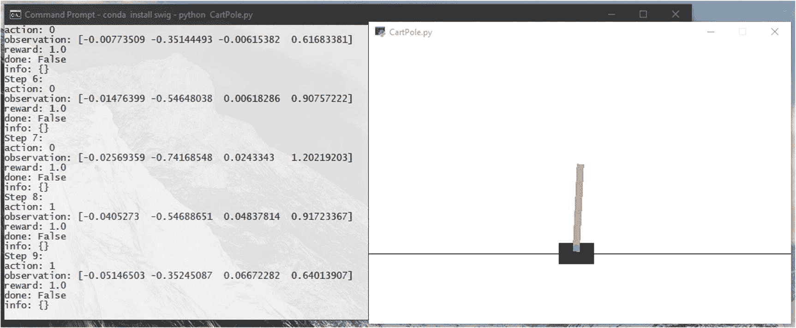

图 12-8

通过运行 CartPole 环境来测试 OpenAI Gym

## 解决 CartPole 问题

让我们现在更仔细地看看 CartPole 问题，并看看我们如何构建一个强化学习模型来解决这个问题。

在 CartPole 问题中，有一个无摩擦的轨道，并且在这个轨道上有一个小车。杆以这种方式连接到小车上，使得杆可以绕着连接到小车上的支点自由旋转。CartPole 问题的目标是通过对小车的速度进行改变，防止杆倒下（见图 12-9）。

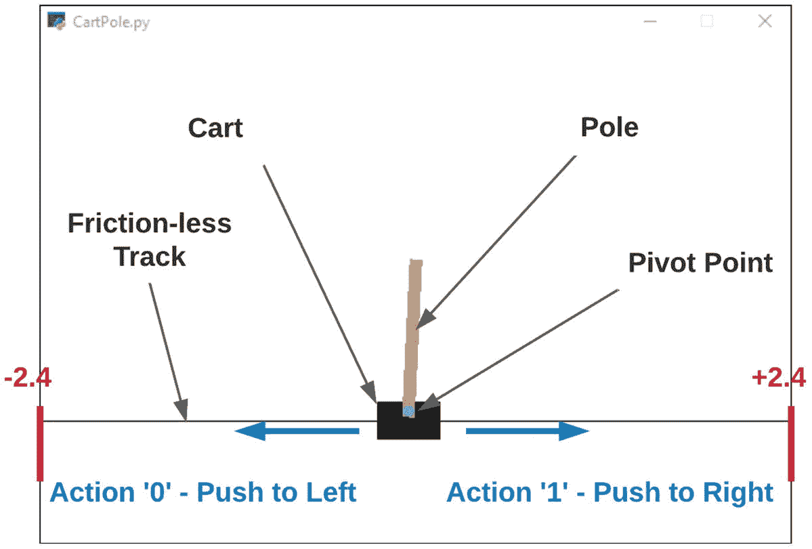

图 12-9

CartPole 环境的元素

在环境中你可以采取的唯一两个动作是 0（将小车推向左边）或 1（将小车推向右边）。

如果以下条件之一成立，则模拟将失败：^(2)

+   杆的角度超过`±`12`°`

+   小车的位置超出显示区域（位置超过±2.4）

+   步数超过 500。

观察结果返回一个包含四个值的数组，这些值是小车位置（-2.4 到+2.4）、小车速度（-无穷大到+无穷大）、杆角度（-41.8`°`到+41.8`°`）、杆顶端的杆速度（-无穷大到+无穷大）（见图 12-10）。

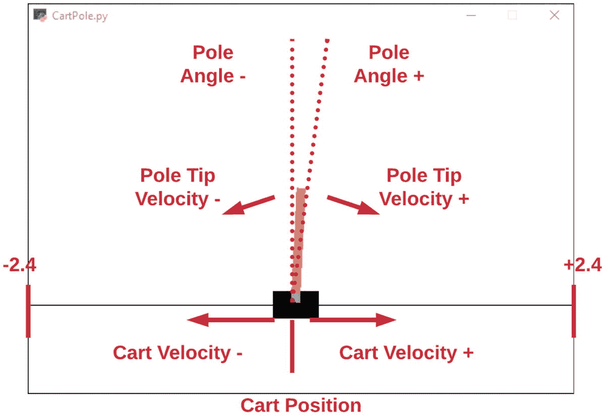

图 12-10

CartPole 环境的观察结果

每一步的奖励将是+1（即，你能够保持杆竖直的时间越长，越好）。

考虑到所有这些，让我们开始构建一个模型。

我们将从一个新的代码文件开始，我们将命名为`CartPole_Train.py`，并导入必要的包：

```py
1: import gym
2: import random
3: import numpy as np
4: import tensorflow as tf
5: from tensorflow.keras.models     import Sequential
6: from tensorflow.keras.layers     import Dense
7: from tensorflow.keras.optimizers import Adam
8: import tensorflow.keras.utils as np_utils
9: import matplotlib.pyplot as plt
```

然后，我们将定义我们的训练参数：

```py
11: env = gym.make('CartPole-v1')
12: env.reset()
13: goal_steps = 500
14: score_requirement = 50
15: intial_games = 20000
```

在这里，我们最初将玩 20,000 场比赛，并筛选出在模拟中至少有 50 步且在失败之前的结果。我们将定义一个函数`model_data_preparation()`来迭代并收集这些步骤数据：

```py
17: def model_data_preparation():
18:     training_data = []
19:     accepted_scores = []
20:     for game_index in range(intial_games):
21:         score = 0
22:         game_memory = []
23:         previous_observation = []
24:         for step_index in range(goal_steps):
25:             action = random.randrange(0, 2)
26:             observation, reward, done, info = env.step(action)
27:
28:             if len(previous_observation) > 0:
29:                 game_memory.append([previous_observation, action])
30:
31:             previous_observation = observation
32:             score += reward
33:             if done:
34:                 break
35:
36:         if score >= score_requirement:
37:             accepted_scores.append(score)
38:             for data in game_memory:
39:                 output = np_utils.to_categorical(data[1], 2)
40:                 training_data.append([data[0], output])
41:
42:         env.reset()
43:
44:     print(accepted_scores)
45:
46:     return training_data
47:
48: training_data = model_data_preparation()
```

然后，我们构建一个简单的模型，并使用那些成功初始游戏的步骤序列来训练它：

```py
50: def build_model(input_size, output_size):
51:     model = Sequential()
52:     model.add(Dense(128, input_dim=input_size, activation="relu"))
53:     model.add(Dense(52, activation="relu"))
54:     model.add(Dense(output_size, activation="linear"))
55:     model.compile(loss='mse', optimizer=Adam())
56:
57:     return model
58:
59: def train_model(training_data):
60:     data_x = np.array([i[0] for i in training_data]).reshape(-1, len(training_data[0][0]))
61:     data_y = np.array([i[1] for i in training_data]).reshape(-1, len(training_data[0][1]))
62:     model = build_model(input_size=len(data_x[0]), output_size=len(data_y[0]))
63:
64:     model.fit(data_x, data_y, epochs=20)
65:     return model
66:
67: trained_model = train_model(training_data)
```

当模型训练完成后，它将能够根据输入的先前步骤序列预测下一步要采取的行动。

然后，我们将在这个训练好的模型上运行 100 场比赛。如果模型能够在 400 步以内没有失败地运行游戏，我们将将其视为成功运行：

```py
069: scores = []
070: choices = []
071: success_count = 0
072: for each_game in range(100):
073:     score = 0
074:     prev_obs = []
075:     print('Game {} playing'.format(each_game))
076:     for step_index in range(goal_steps):
077:         # Keep the below line uncommented if you want to see how our bot is playing the game.
078:         env.render()
079:         if len(prev_obs)==0:
080:             action = random.randrange(0,2)
081:         else:
082:             action = np.argmax(trained_model.predict(prev_obs.reshape(-1, len(prev_obs)))[0])
083:
084:         choices.append(action)
085:         new_observation, reward, done, info = env.step(action)
086:         prev_obs = new_observation
087:         score += reward
088:         if done:
089:             print('Final step count: {}'.format(step_index + 1))
090:             if (step_index + 1) > 400:
091:                 # if achieved more than 400 steps, consider successful
092:                 success_count += 1
093:             break
094:
095:     env.reset()
096:     scores.append(score)
097: env.close()
098:
099: print(scores)
100: # since we ran 100 games, success count is equal to percentage
101: print('Success percentage: {}%'.format(success_count))
102:
103: print('Average Score:',sum(scores)/len(scores))
104: print('choice 1:{}  choice 0:{}'.format(choices.count(1)/len(choices),choices.count(0)/len(choices)))
105:
106: # draw the histogram of scores
107: plt.hist(scores, bins=5)
108: plt.show()
```

在 100 场游戏的运行结束时，我们将打印出成功率、平均分数，并显示 100 场比赛的分数直方图。

注意

使用`env.render()`会显著减慢模拟速度。因此，如果你不需要视觉检查模拟，最好不调用渲染方法。

运行我们的代码，我们将能够看到训练好的模型通过给小车应用适当的速度变化，保持杆竖直，从而实现目标（见图 12-11）。

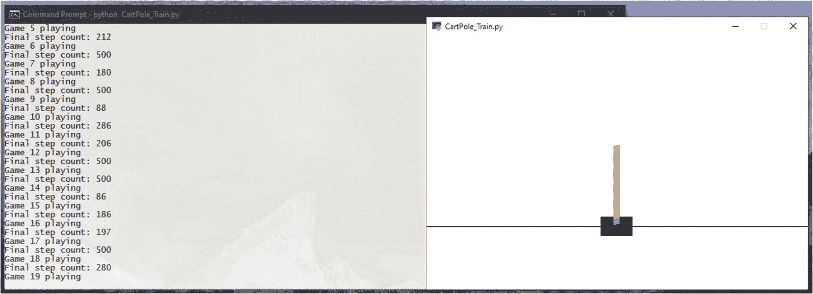

图 12-11

训练好的 CartPole 模型

在 100 场比赛中，51%达到了我们的成功条件，即 400 步或更多，平均得分为 351.77（图 12-12）。

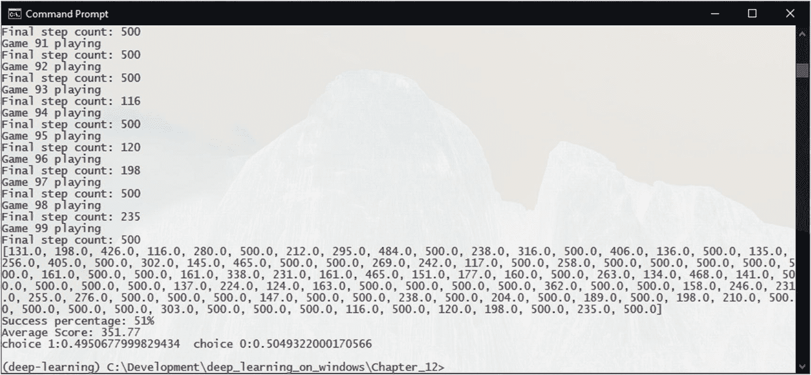

图 12-12

我们 CartPole 模型的成功率

虽然乍一看这似乎不是一个很好的结果，但查看分数直方图显示，我们的模型正在偏向成功标准（图 12-13）。

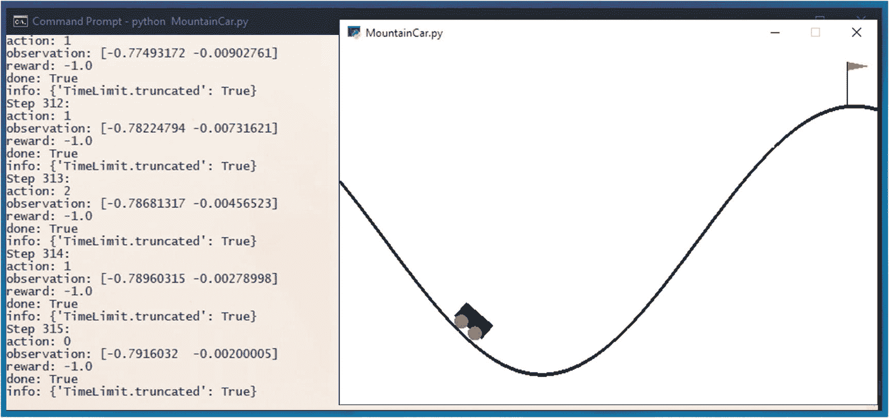

图 12-14

测试 MountainCar 环境

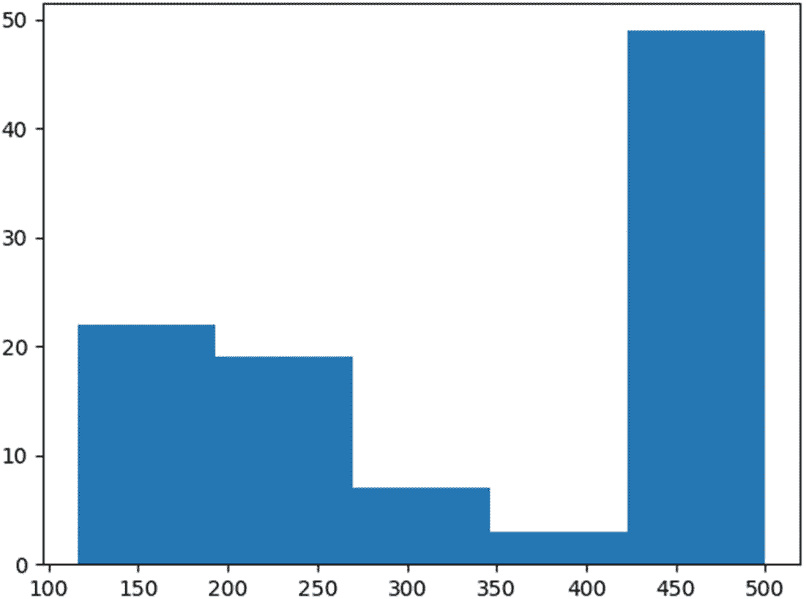

图 12-13

我们 CartPole 模型的分数直方图

由于我们使用了一组初始游戏来检索步序列作为训练数据，因此模型仅通过一轮训练就未能实现更高的成功率是正常的。你可以尝试使用几种不同的方法来提高成功率：

1.  增加用于收集训练数据的初始游戏数量

1.  调整初始训练数据的评分要求

1.  调整或尝试不同的模型结构

1.  使用第一轮训练的输出作为训练数据来训练一个新的模型

1.  通过多轮训练进一步改进。

## 解决 MountainCar 问题

我们刚刚解决的 CartPole 问题是在强化学习中 simplest 的问题之一。现在让我们稍微提高一点难度，尝试一个稍微复杂一点的问题：MountainCar 问题。

让我们创建一个脚本来首先查看 MountainCar 环境：

```py
01: import gym
02: env = gym.make('MountainCar-v0')
03: observation = env.reset()
04: for step_index in range(1000):
05:     env.render()
06:     action = env.action_space.sample()
07:     observation, reward, done, info = env.step(action)
08:     print("Step {}:".format(step_index))
09:     print("action: {}".format(action))
10:     print("observation: {}".format(observation))
11:     print("reward: {}".format(reward))
12:     print("done: {}".format(done))
13:     print("info: {}".format(info))
14:     if done:
15:         break
16: observation = env.reset()
17: env.close()
```

这就像我们为 CartPole 环境所做的那样，不同之处在于 MountainCar-v0 被用作环境名称。这将渲染出带有随机动作的 MountainCar 环境，就像我们之前做的那样（图 12-14）。

在 MountainCar 问题中，你需要推动一辆车爬上由旗帜标记的陡峭的山顶。汽车从山谷底部附近开始。环境左侧有一个较缓的小山，你可以用它来积累足够的动力爬上更陡峭的小山。

你可以采取的行动是向左推（0），向右推（2），或者不推（1）。目标位置是 0.5（图 12-15）。

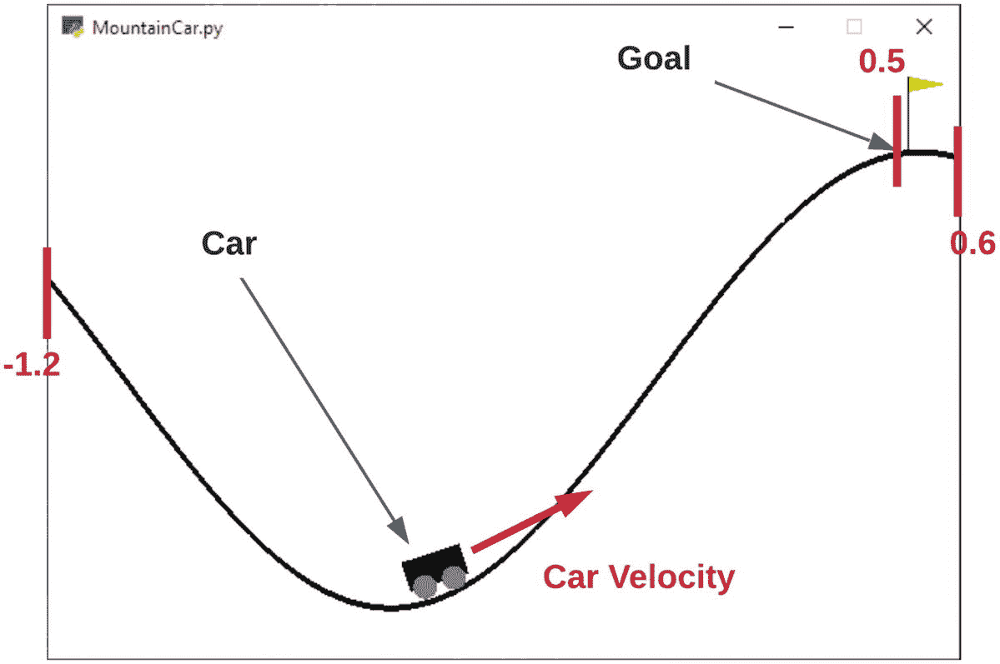

图 12-15

MountainCar 环境的元素

如果你用超过 200 步达到目标，模拟将失败.^(3)

观察返回一个包含 2 个值的数组，分别是汽车的位置（-1.2 到+0.6）和汽车的速度（-0.07 到+0.07）。

在模拟开始时，汽车将位于 -0.6 和 -0.4 之间的随机位置，且没有初始速度。

每一步的奖励将是 -1（即，达到目标所需的步数越少，越好）。爬左边的山不会有惩罚，因为有时这是达到目标所必需的。

让我们开始一个新的代码文件，我们将命名为 MountainCar_Train.py，并导入必要的包：

```py
1: import gym
2: import random
3: import numpy as np
4: import tensorflow as tf
5: from tensorflow.keras.models     import Sequential
6: from tensorflow.keras.layers     import Dense
7: from tensorflow.keras.optimizers import Adam
8: import tensorflow.keras.utils as np_utils
9: import matplotlib.pyplot as plt
```

我们的训练参数与用于 CartPole 问题的参数类似。但在这里，我们指定分数要求为 -198。我们将在下一步中看到原因：

```py
11: env = gym.make('MountainCar-v0')
12: env.reset()
13: goal_steps = 200
14: score_requirement = -198
15: intial_games = 20000
```

正如我们讨论的那样，MountainCar 问题中每一步的奖励值是 -1。因此，MountainCar 游戏可能的最小分数是 -199（因为如果达到 200 步，游戏将结束）。为了从初始游戏中筛选出向目标前进的游戏，我们需要一种方法来确定哪些游戏已经向目标前进。由于目标位置是 0.5，汽车的初始位置在 -0.6 和 -0.4 之间，我们选择了至少一次达到位置 -0.2（这是大山的中间部分）的游戏。这使得我们的分数要求为 -198 或更高。

因此，数据准备函数看起来是这样的：

```py
17: def model_data_preparation():
18:     training_data = []
19:     accepted_scores = []
20:     for game_index in range(intial_games):
21:         score = 0
22:         game_memory = []
23:         previous_observation = []
24:         for step_index in range(goal_steps):
25:             action = random.randrange(0, 3)
26:             observation, reward, done, info = env.step(action)
27:
28:             if len(previous_observation) > 0:
29:                 game_memory.append([previous_observation, action])
30:
31:             previous_observation = observation
32:
33:             if observation[0] > -0.2:
34:                 reward = 1
35:
36:             score += reward
37:             if done:
38:                 break
39:
40:         if score >= score_requirement:
41:             accepted_scores.append(score)
42:             for data in game_memory:
43:                 output = np_utils.to_categorical(data[1], 3)
44:                 training_data.append([data[0], output])
45:
46:         env.reset()
47:
48:     print(accepted_scores)
49:
50:     return training_data
51:
52: training_data = model_data_preparation()
```

模型构建和训练步骤与我们之前在 CartPole 问题中做的是一样的：

```py
54: def build_model(input_size, output_size):
55:     model = Sequential()
56:     model.add(Dense(128, input_dim=input_size, activation="relu"))
57:     model.add(Dense(52, activation="relu"))
58:     model.add(Dense(output_size, activation="linear"))
59:     model.compile(loss='mse', optimizer=Adam())
60:
61:     return model
62:
63: def train_model(training_data):
64:     data_x = np.array([i[0] for i in training_data]).reshape(-1, len(training_data[0][0]))
65:     data_y = np.array([i[1] for i in training_data]).reshape(-1, len(training_data[0][1]))
66:     model = build_model(input_size=len(data_x[0]), output_size=len(data_y[0]))
67:
68:     model.fit(data_x, data_y, epochs=20)
69:     return model
70:
71: trained_model = train_model(training_data)
```

与之前一样，我们使用训练模型的步数预测运行 100 场游戏。如果游戏能在 200 步内达到目标，我们就认为它是成功的：

```py
073: scores = []
074: choices = []
075: success_count = 0
076: for each_game in range(100):
077:     score = 0
078:     prev_obs = []
079:     print('Game {} playing'.format(each_game))
080:     for step_index in range(goal_steps):
081:         # Uncomment below line if you want to see how our bot is playing the game.
082:         # env.render()
083:         if len(prev_obs)==0:
084:             action = random.randrange(0, 3)
085:         else:
086:             action = np.argmax(trained_model.predict(prev_obs.reshape(-1, len(prev_obs)))[0])
087:
088:         choices.append(action)
089:         new_observation, reward, done, info = env.step(action)
090:         prev_obs = new_observation
091:         score += reward
092:         if done:
093:             print('Final step count: {}'.format(step_index + 1))
094:             if (step_index + 1) < 200:
095:                 # if goal achieved in less than 200 steps, consider successful
096:                 success_count += 1
097:             break
098:
099:     env.reset()
100:     scores.append(score)
101:
102: print(scores)
103:
104: # since we ran 100 games, success count is equal to percentage
105: print('Success percentage: {}%'.format(success_count))
106: print('Average Score:', sum(scores)/len(scores))
107: print('choice 0:{}  choice 1:{}  choice 2:{}'.format(choices.count(0)/len(choices), choices.count(1)/len(choices), choices.count(2)/len(choices)))
108:
109: # draw the histogram of scores
110: plt.hist(scores, bins=5)
111: plt.show()
```

如果我们运行我们的模型，你可以看到一旦训练完成，它可以将汽车推到期望的目标位置（图 12-16）。

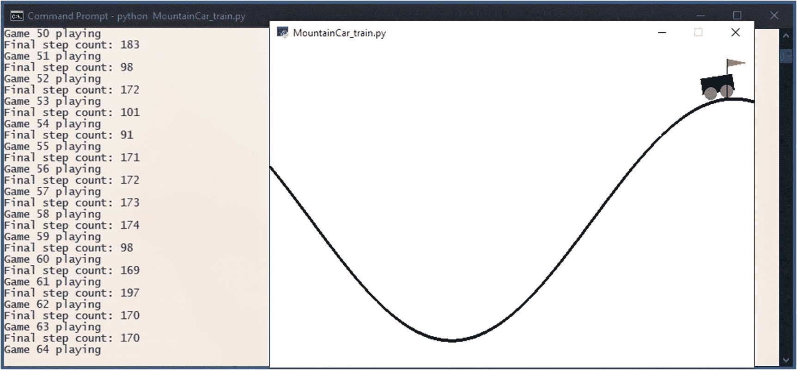

图 12-16

MountainCar 达到目标

分数直方图显示，在 120 步左右范围内，有相当一部分游戏达到了目标，这比我们的目标分数 198 要好得多（图 12-17）。

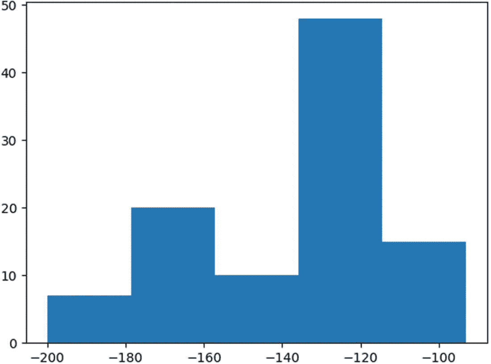

图 12-17

我们 MountainCar 模型的分数直方图

我们现在达到的成功率是 99%（图 12-18）。

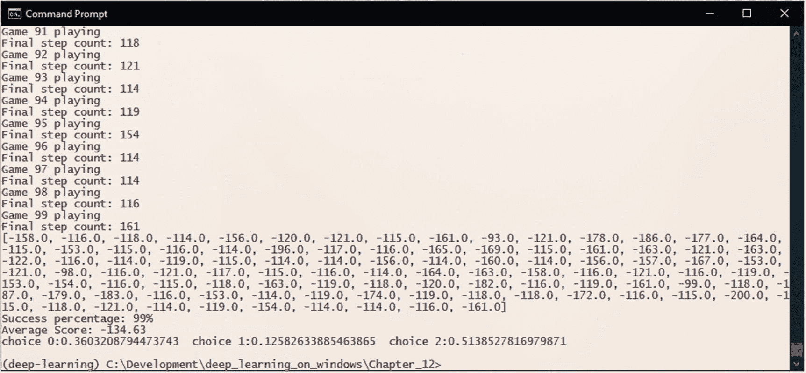

图 12-18

我们 MountainCar 模型的成功率

## 你接下来能做什么？

我们现在已经探索了如何在 OpenAI Gym 的两个环境中应用强化学习的基础：CartPole 和 MountainCar。尽管这两个问题是一些用强化学习解决的最简单的问题，但我们在这里学到的概念对于更复杂的问题也是相同的。像 OpenAI Five 这样的尖端模型（见附录 1）也是基于这些概念的。

OpenAI Gym 中还有许多其他环境可供选择。一旦您已经通过了经典控制环境，尝试一些我们安装的其他环境集，例如 Atari（图 12-19）。

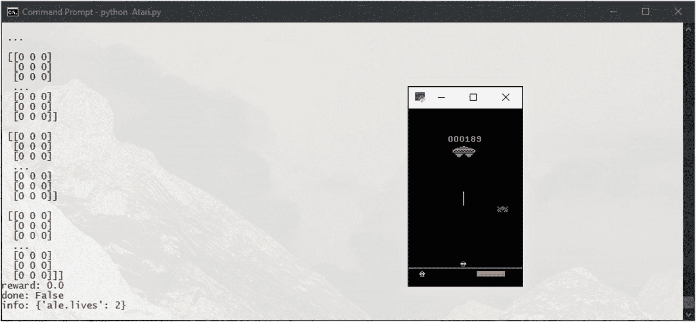

图 12-19

Atari Assault-v0 环境

另一个选择是 Box2D 环境之一（图 12-20）。

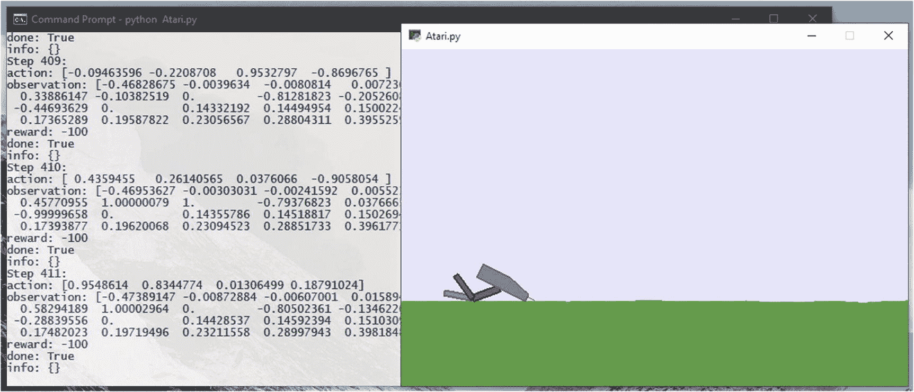

图 12-20

Box2D 双足步行者-v3 环境
