# 1. 强化学习简介

强化学习是一个快速发展的学科，它正在帮助使人工智能成为现实，尤其是在机器人自动驾驶车辆方面。将深度学习与强化学习相结合已经导致了许多重大进步，这些进步使机器越来越接近人类的行为方式。最近，深度强化学习已被应用于像 ChatGPT 这样的大型语言模型和其他模型，使它们能够遵循人类的指令并产生人类偏好的输出。这被称为*从人类反馈中进行强化学习*（RLHF）。

本书从基础知识开始，最后讨论了该领域的一些最新发展。其中包含了理论与实践（数学最少）以及使用 PyTorch 和其他库的代码实现的良好结合。

本章设定了背景，并为你在本书的其余部分跟随内容做好了准备。

## 强化学习

所有智能生命体都从一些知识开始。然而，随着它们与世界互动并获得经验，它们学会适应环境并变得擅长做事。引用 1994 年《华尔街日报》的一篇社论声明，^(1) 智能可以定义为如下：

> *一种非常普遍的心智能力，它包括推理、规划、解决问题、抽象思维、理解复杂概念、快速学习和从经验中学习的能力。它不仅仅是书本知识，一种狭窄的学术技能，或考试时的聪明。相反，它反映了一种更广泛、更深入的能力，即理解我们的周围环境——“理解”，“弄懂”事物，或“弄清楚”该做什么。”*

在机器的背景下，智能被称为*人工智能*。牛津语言词典将人工智能（AI）定义为如下：

> *计算机系统的理论和发展，能够执行通常需要人类智能的任务，如视觉感知、语音识别、决策和语言之间的翻译。*

这本书所研究的内容就是：帮助机器（代理）通过与环境交互并不断从成功、失败和奖励中学习来获得执行任务的能力的算法的理论和设计。最初，人工智能主要围绕设计解决方案，这些解决方案是一系列可以用逻辑和数学符号表达的形式规则。这些规则由一组编码到知识库中的信息组成。这些人工智能系统的设计还包括一个推理引擎，它使用户能够查询知识库并将单个规则/知识的线索结合起来进行推理。这些系统也被称为*专家系统*、*决策支持系统*等等。然而，很快人们意识到这些系统过于脆弱。随着问题复杂性的增加，将知识编码或构建有效的推理系统变得指数级困难。

强化学习的现代概念是两个不同思路通过它们各自的发展而结合起来的。首先是最优控制的概念。在众多解决最优控制问题的方法中，1950 年理查德·贝尔曼提出了*动态规划*这一学科，本书中广泛使用了这一学科。然而，动态规划并不涉及学习。它完全是关于通过贝尔曼递归方程在各种选项空间中进行规划。第二章和第三章对这些方程有很多讨论。

第二个思路是试错学习，它起源于动物训练心理学。爱德华·桑代克是第一个用明确术语表达*试错*概念的人。用他的话说：

> *在针对同一情况所做出的几种反应中，那些伴随着或紧随动物满意度的反应，在其他条件相同的情况下，将与该情况更加紧密地联系在一起，因此，当它再次出现时，它们更有可能再次出现；那些伴随着或紧随动物不适的反应，在其他条件相同的情况下，它们与该情况的联系将减弱，因此，当它再次出现时，它们出现的可能性更小。满足感或不适感越强，这种联系加强或减弱的程度就越大。*

提高好结果发生的频率和降低坏结果发生的频率的概念，你将在第八章中看到它的应用，该章讨论了策略梯度。

在 20 世纪 80 年代，这两个领域合并产生了现代强化学习的领域。在过去十年中，随着强大的深度学习方法的兴起，强化学习（与深度学习相结合）正在产生非常强大的算法，这些算法可能在未来的某个时刻使人工智能成为现实。今天的强化系统通过与世界的互动来获取经验，并通过概括经验来学习优化其行为，基于与世界互动的结果，没有显式编码专家知识。

## 机器学习分支

机器学习（ML）涉及从系统呈现的数据中学习，以便系统能够执行特定的任务。系统没有明确被告知如何完成任务。相反，它被提供数据，系统根据定义的目标学习执行任务。我不多加说明，因为我假设你熟悉机器学习的概念。机器学习方法传统上分为三大类，如图 1-1 所示。

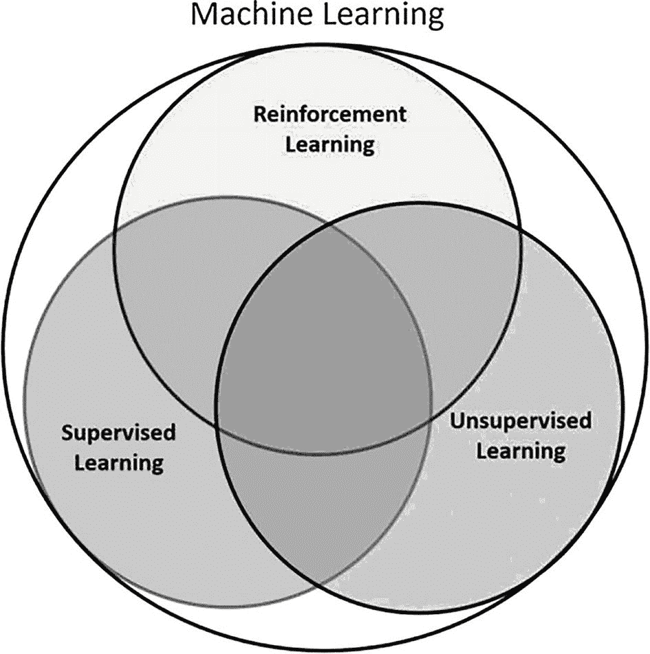

机器学习的维恩图表示了强化学习、无监督学习和监督学习。监督学习和无监督学习的圆圈被阴影覆盖。

图 1-1

机器学习的分支

机器学习的三个分支在“反馈”方面对学习系统的意义不同。它们将在以下章节中讨论。监督学习和无监督学习之间的区别正在变得模糊，出现了许多细微的方法，以不同的方式混合和匹配这两种范例。它催生了额外的子类别，如半监督学习、自监督学习和生成式 AI。

### 监督学习

在监督学习中，系统被提供带有标签的数据，目标是泛化知识，以便可以对新的、未标记的数据进行标记。考虑向系统展示的猫和狗的图像，以及指示图像是否显示猫或狗的标签。输入数据表示为数据集，*D* = (*x*[1], *y*[1]), (*x*[2], *y*[2]), …, (*x*[*n*], *y*[*n*])，其中 *x*[1], *x*[2], …, *x*[*n*] 是单个图像的像素值向量，*y*[1], *y*[2], …, *y*[*n*] 是相应图像的标签——例如，猫的值为 0，狗的值为 1。系统/模型接受这个输入，并学习从图像 *x*[*i*] 到标签 *y*[*i*] 的映射。一旦训练完成，系统就会遇到一个新的图像 *x*^′ 来预测标签 *y*^′ = 0 或 1，这取决于图像是否显示猫或狗。

这是一个分类问题，系统学习将输入分类到正确的类别。另一种问题类型是回归，例如当你想根据房屋的特征预测房价时。训练数据再次表示为 *D* = (*x*[1], *y*[1]), (*x*[2], *y*[2]), …, (*x*[*n*], *y*[*n*])。输入是 *x*[1], *x*[2], …, *x*[*n*]，其中每个输入 *x*[*i*] 是某些属性的向量——例如，房屋的房间数量、面积、前院的大小等等。系统被赋予一个标签 *y*[*i*]，它代表房屋的市场价值。系统使用来自许多房屋的输入数据来学习将输入特征 *x*[*i*] 映射到房屋的价值 *y*[*i*]。训练好的模型随后被展示一个由新房屋特征组成的向量 *x*^′，模型预测这所新房屋的市场价值 *y*^′。

### 无监督学习

无监督学习没有标签。它只有输入 *D* = *x*[1], *x*[2], …, *x*[*n*] 以及没有标签。系统使用这些数据来学习数据的隐藏结构，以便可以将数据聚类/分类到广泛的类别中。学习后，当系统遇到新的数据点 *x*^′ 时，它可以匹配新的数据点到已学习的某个簇中。与监督学习不同，每个类别都没有明确定义的意义。一旦数据被聚类到某个类别，基于簇内最常见的属性，你可以给它赋予一些意义。无监督学习的另一种用途是利用底层输入数据来学习数据分布，以便系统可以随后查询以生成新的合成数据点。这种后一种方法一直在推动图像和文本生成的增长。这种方法的新名字是生成式 AI。我将在接下来的部分详细阐述这一点。

许多时候，无监督学习用于特征提取，然后将这些特征输入到监督学习系统中。通过聚类数据，你可以首先识别隐藏结构，并将数据重新映射到低维形式。有了这种低维数据，监督学习可以更快地学习。在这种情况下，无监督学习被用作特征提取器。

还有另一种利用无监督学习方法的方式。考虑这样一个案例，你有一小部分标记数据和大量未标记数据。首先将标记数据和未标记数据聚类在一起。接下来，在每个这样的聚类中，根据该聚类中标记数据的强度，将未标记数据分配标签。你基本上是在利用标记数据来为未标记数据分配标签。接下来，将完全标记的数据输入到监督学习算法中，以训练一个分类系统。将监督学习和无监督学习结合在一起的方法称为“半监督学习”。当收集了大量未标记数据，而你又想避免对全部数据进行标记的额外工作量时，半监督学习是一个不错的选择。

### 强化学习

现在你已经了解了监督和无监督的方法，本节将转向机器学习的第三个广泛类别——强化学习。它与之前讨论的所有方法都不同。

首先，让我们来看一个例子。假设你正在尝试设计一辆能够自主驾驶的自动驾驶汽车。你有一辆叫做“代理”的车；也就是说，一个正在学习自主驾驶的系统或算法。它正在学习驾驶的行为。它的当前坐标、速度和运动方向，当它们组合成一个数字向量时，被称为其“当前状态”。代理使用其当前状态来做出决定，要么踩刹车，要么踩油门。它还使用这些信息来转动方向盘，改变汽车的运动方向。将“刹车/加速”和“转向汽车”的联合决策称为一个“动作”。将特定的当前状态映射到特定的动作称为一个“策略”。当代理的动作良好时，它将产生一个令人愉快的结局，而当动作不好时，它将导致一个不愉快的结局。代理使用这种结果的反馈来评估其动作的有效性。作为反馈的结果称为“奖励”，这是代理在特定状态下以特定方式行动所获得的。根据当前状态和其动作，汽车达到一组新的坐标、速度和方向。这是代理根据其在前一步中的行为而发现自己所处的“新状态”。谁提供这个结果并决定新的状态？是汽车的环境，这是汽车/代理无法控制的东西。代理无法控制的其他一切被称为“环境”。我在整本书中有很多关于这些术语要说的。

在这个设置中，系统以状态向量、采取的动作和获得的奖励的形式提供的数据是顺序相关联的。根据智能体采取的动作，从环境中获得的下一个状态和奖励可能会发生剧烈变化。在之前自动驾驶汽车的例子中，想象一下一辆汽车前方有行人正在过马路的情况。在这种情况下，加速与刹车的动作会有非常不同的结果。加速汽车可能会导致行人受伤，同时损坏汽车及其乘客。刹车则可能导致避免任何损坏，并在道路清晰后继续行驶。

在强化学习中，智能体对系统没有先验知识。它收集反馈并使用这些反馈来规划/学习动作以最大化特定的目标。由于它最初对环境的信息不足，它必须探索以收集洞察。一旦它收集了“足够”的知识，它就需要利用这些知识并调整其行为以最大化它追求的目标。困难的部分是不知道何时探索已经“足够”。如果智能体在拥有完美知识后仍然继续探索，它就是在浪费资源试图收集新的信息，而这些信息并不存在。另一方面，如果智能体过早地认为它已经收集了足够的知识，它最终可能会基于不完整的信息进行优化，并可能表现不佳。何时探索和何时利用的这种困境是强化学习算法的核心反复出现的主题。随着你在这本书中学习不同的行为优化算法，你将看到这个问题一次又一次地出现。

### 新兴子分支

随着机器学习学科快速进步，以及基于机器学习的解决方案变得越来越复杂，机器学习三个传统分支之间的界限变得模糊。在过去的四到五年里，这些三种方法的创新组合出现了，这产生了一些常见的模式，特别是那些涉及大量未标记数据，这些数据被用来开发作为监督模型行动的模型。我现在讨论最突出的子分支。

#### 自监督学习

自监督学习是机器学习的一个子分支，旨在在没有人类监督的情况下，从未标记的数据中学习有用的表示。与监督学习不同，在监督学习中，数据在事先被标记为正确的输出，而自监督学习则从数据中创建自己的标签。例如，一个自监督学习系统可以通过遮蔽数据的一些部分并尝试从其余数据中预测它们来生成标签。这样，系统可以学习到对各种下游任务有用的通用特征和模式。以下是一些自监督学习的例子：

+   *掩码语言模型*：这种方法随机掩盖句子中的某些单词，并试图从剩余的单词中预测它们。例如，给定句子“她昨天去了 _ 公园”，系统试图用最可能的单词填充空白。这样，系统可以学习自然语言的语法和语义以及单词之间的关系。使用这种方法的一个流行模型被称为 BERT（来自变换器的双向编码器表示）。

+   *下一句预测*：这种方法以两个句子作为输入，并试图预测它们是否连续。例如，给定句子“他买了一辆新车”和“它非常昂贵”，系统试图确定它们是否来自同一段落。这样，系统可以学习自然语言的连贯性和逻辑以及段落的结构。这种方法也被 BERT 使用，与掩码语言模型一起。

+   *去噪自编码*：这种方法随机损坏输入数据的一些部分，并试图从损坏的版本中重建原始数据。例如，给定句子“她昨天去公园了”（单词拼写错误），系统试图纠正拼写错误并输出句子“她昨天去了公园”。这样，系统可以学习恢复信息并减少数据中的噪声。使用这种方法的一个流行模型被称为 GPT-3（生成预训练变换器 3）。

另一个广泛使用自监督学习的领域是计算机视觉，在该领域中有大量的图像数据可用但未标记。自监督学习方法可以利用图像中的视觉特征和模式来学习鲁棒的图像表示，这些表示对于各种下游任务可能很有用。计算机视觉中一些自监督学习方法的例子包括：

+   *对比学习*：这种方法以成对的图像作为输入，并试图确定它们是否相似或不同。例如，给定两个从不同角度拍摄的同一样品的图像，系统试图识别它们之间的关系。相反，给定两个不同对象的图像，系统试图区分它们之间没有关系。这样，系统可以学习图像的不变性和判别性特征以及图像之间的相似性和差异。使用这种方法的一个流行模型被称为 SimCLR（简单视觉表示对比学习）。

+   *生成建模*：这种方法以图像作为输入，并试图生成一个与输入相似但又不完全相同的新图像。例如，给定一张人脸图像，系统试图生成一个具有不同面部特征但仍然看起来逼真的新面孔。这样，系统可以学习生成和创造性方面以及图像的多样性和可变性。使用这种方法的一个流行模型称为 StyleGAN（基于生成对抗网络的风格化生成器架构）。

+   *自蒸馏*：这种方法以一个大型且复杂的模型作为输入，并试图将其压缩成一个更小、更简单的模型，使其能够执行相同的任务。例如，给定一个能够识别数千类图像的大型图像分类模型，系统试图创建一个更小的模型，以更少的计算资源达到相同的准确率。这样，系统可以学会优化和简化模型，并保留模型的基本信息和功能。使用这种方法的一个流行模型称为 DistilBERT（蒸馏 BERT）。

自监督学习领域正在推动人工智能在 COVID-19 之后的爆炸式增长。在短短几年内，它开辟了几年前无法想象的人类高质量模型。基于指令和参考上下文生成新图像和文本的方法被纳入了一个新的类别，称为生成式 AI。

#### 生成式 AI

生成式 AI 是人工智能的一个子分支，专注于从头开始创建新颖的内容或数据，如图像、文本、音乐或语音。生成式 AI 模型从大量数据中学习，并使用统计技术生成新数据。这种新数据类似于原始数据分布，但不是任何现有样本的精确副本。生成式 AI 可用于各种目的，如数据增强、艺术表达、内容创作、数据合成和异常检测。

生成式 AI 中最受欢迎的技术之一是生成对抗网络（GANs），它由两个神经网络组成：一个生成器和判别器。生成器试图创建能够欺骗判别器的假数据，而判别器则试图区分真实和假数据。这两个网络相互竞争并随着时间的推移而改进，直到生成器能够产生能够欺骗判别器的逼真数据。GANs 已被用于生成高质量的人脸、动物、风景和物体图像，以及操纵和增强现有图像，如人脸老化、风格迁移、超分辨率和修复。

另一种生成式 AI 技术是变分自编码器（VAEs），这是一种学习将数据编码到潜在空间并解码回原始空间的自动编码器。潜在空间是数据的低维表示，它捕捉了数据的基本特征。VAEs 还在潜在空间上施加概率分布，例如高斯分布，然后从中采样以生成新数据。VAEs 可以生成多样化和平滑的数据，例如手写数字、人脸和花卉的图像，以及潜在空间中不同数据点之间的插值。

第三种生成式 AI 技术是自回归模型，这是一种通过根据前面的元素预测序列中的下一个元素来顺序生成数据的神经网络。自回归模型可以捕捉数据中的长期依赖性和复杂模式，例如自然语言、音乐和语音。自回归模型已被用于生成连贯流畅的文本，如故事、文章、摘要和翻译，以及生成逼真和富有表现力的音乐和语音，如歌曲、旋律和声音。文本生成大型语言模型的 GPT 系列遵循这一范式。

第四种生成式 AI 技术是深度学习扩散模型，这是一种学习反转向数据添加随机噪声过程的概率模型。想法是从数据的有噪声版本开始，逐渐去除噪声，直到恢复原始数据。通过这样做，模型学习捕捉数据的分布，并通过从中采样来生成新数据。深度学习扩散模型可以生成高保真和多样化的数据，例如人脸、动物和物体的图像，以及基于文本或类标签的条件生成。

#### 生成式 AI 与其他学习范式比较

对生成式 AI 模型进行分类的一种方法是基于它们如何从数据中学习。正如你所学的，主要有三种学习范式：监督学习、无监督学习和自监督学习。

*监督学习*是指模型从标记数据中学习，即与某些真实或期望输出相关联的数据。

*无监督学习*是指模型从未标记数据中学习，即根据某些相似性或差异性标准对数据进行分组。

*自监督学习*是指模型通过创建自己的标签或伪标签来从未标记的数据中学习，这些标签或伪标签基于某些先验任务或目标。自监督学习对于需要学习数据丰富和可泛化表示的任务很有用，这些表示可以用于下游任务。

另一种对生成式 AI 模型进行分类的方法是基于它们生成新数据或内容的方式。主要有两种生成模型：显式和隐式。

*显式生成模型*是那些明确地建模数据概率分布或生成给定数据点的可能性的模型。例如，变分自编码器（VAE）是一个显式生成模型，它学习将数据编码到潜在空间，并解码回数据空间，同时最大化给定潜在变量的数据可能性。显式生成模型可用于需要估计数据概率或从数据分布中采样的任务。

*隐式生成模型*是那些通过优化不同于似然函数的不同目标函数来隐式学习数据分布的模型。例如，生成对抗网络（GAN）是一个隐式生成模型，它通过在生成器和判别器之间进行最小-最大游戏来学习生成逼真的数据。

*半监督学习*是一种结合监督学习和无监督学习方法的混合方法。

总结来说，*生成式 AI*可以根据模型如何从数据中学习被视为无监督学习或自监督学习的一个子集。根据模型生成新数据或内容的方式，生成式 AI 也可以被视为一种不同的学习范式。生成式 AI 可以根据其目标、方法和应用与其他学习范式进行比较。

下一节将回到强化学习（RL）的主题。

## 强化学习（RL）的核心要素

一个强化学习系统可以分解为四个关键组件：策略、奖励、价值函数和环境模型。

*政策*是形成智能体智能的要素。智能体通过与环境的交互来感知环境的当前状态，例如，机器人从系统中获取视觉和其他感官输入，也称为环境的*当前状态*或机器人感知到的当前观测数据。机器人，作为一个智能实体，利用这些当前信息和可能的历史信息来决定下一步要做什么，即执行什么*动作*。*政策*将状态映射到智能体采取的动作。政策可以是*确定性的*。换句话说，对于给定的环境状态，智能体采取的是单一固定的动作。有时政策可以是*随机的*；换句话说，对于给定的状态，智能体可以采取多个可能的动作。

**奖励**指的是智能体试图实现的目标/目标。考虑一个试图从点 A 移动到点 B 的机器人。它感知当前位置并采取行动。如果该行动使其接近目标 B，则奖励应该是正的。如果它使机器人远离点 B，则是不利的结局，奖励应该是负的。换句话说，奖励是一个数值，表示智能体根据其试图实现的目标/目标采取的行动的“好坏”。奖励是智能体评估行动是好是坏的主要方式，并利用这些信息来调整其行为，从而优化它正在学习的策略。

奖励是环境的固有属性。获得的奖励是智能体当前状态和在该状态下采取的动作的函数。奖励和智能体遵循的策略定义了**价值函数**。

+   状态中的**价值**是指智能体根据其当前状态和遵循的策略预期获得的累积奖励总和。

+   **奖励**是基于状态和在该状态下采取的动作的环境的即时反馈。与价值不同，奖励不会根据智能体的动作而改变。在特定状态下采取特定动作将始终产生相同的奖励。

价值函数就像长期奖励，不仅受环境的影响，还受智能体遵循的策略的影响。价值的存在是因为奖励。智能体在遵循策略的过程中积累奖励，并使用这些累积奖励来评估状态的价值。然后，它调整其策略以增加状态的价值。

你可以将这个想法与之前讨论过的**探索-利用困境**联系起来。可能存在某些状态，其中最优动作可能会带来立即的负面奖励。然而，这样的动作仍然可能是最优的，因为它可能将智能体置于一个可以更快达到目标的新状态。一个例子是通过跨越一个包括较短路径的驼峰来达到目标，而不是通过较长路径绕行并避开驼峰。在许多情况下，虽然绕行路径更长，但整体上可能是一条更简单的路径。

除非智能体进行足够的探索，否则它可能无法发现这些最优路径，最终可能只能满足于次优路径。然而，一旦发现了更好的路径，它就无法知道是否还需要更多的探索来找到另一条更快达到目标的路，或者是否最好利用先前的知识来向目标冲刺。

第二章到 7 章专注于使用之前描述的价值函数来寻找最优行为/策略的算法。

最后一个组成部分是*环境*模型。在一些寻找最优行为的方法中，智能体通过与环境交互来形成对环境的内部模型。这样的内部模型有助于智能体进行规划，即考虑一个或多个动作链以评估最佳动作序列。这种方法被称为*基于模型的*学习。同时，还有其他完全基于试错的方法。这些方法不形成任何环境模型。因此，这些被称为*无模型的*方法。大多数智能体使用基于模型和无模型方法的组合来寻找最优策略。

## 深度学习与强化学习

近年来，一个涉及基于神经网络模型的机器学习子分支迅速发展。随着强大计算机的出现、数据的丰富以及新算法的诞生，现在可以训练模型根据原始输入如图像、文本和声音进行泛化，类似于人类操作的方式。在深度学习子分支下，训练模型所需的特定领域的手工特征正被强大的基于神经网络的模型所取代。

2014 年，DeepMind 成功地将深度学习技术与强化学习相结合，从环境中收集的原始数据中学习，而无需对原始输入进行任何特定领域的处理。它的第一个成功是将强化学习中的传统 Q 学习算法转换为名为深度 Q 网络（DQN）的深度 Q 学习方法。Q 学习涉及智能体遵循某些策略来收集其动作的经验，这些经验以当前状态、所采取的动作、所获得的奖励和智能体发现自己所在的下个状态组成的元组的形式。然后，智能体使用贝尔曼方程在迭代循环中使用这些经验，以找到最优策略，从而使每个状态的价值函数（如前所述）增加。

早期尝试将深度学习与强化学习相结合并不成功，因为结合方法的表现不稳定。DeepMind 对结合方法进行了一些有趣且聪明的改进，以克服不稳定性问题。它首先将传统的强化学习和深度学习的结合方法应用于开发用于 Atari 游戏的智能体。智能体会获得游戏的快照，并且对游戏的规则没有任何先验知识。智能体将使用这些原始视觉数据来学习玩 Atari 视频游戏。在许多情况下，它达到了人类水平的性能。该公司随后扩展了这种方法，开发了能够击败围棋冠军人类玩家的智能体。深度学习与强化学习的结合产生了更加智能的机器人，无需手工制作特定领域的知识。

最近，它被应用于大型语言模型（LLMs）的 RLHF（基于人类反馈的强化学习）形式，使 LLMs 能够遵循指令并根据提示生成人类质量的文本。这就是世界开始关注 ChatGPT3.5 以及由此产生的新机会的原因。

这是一个令人兴奋且快速发展的领域。第六章涵盖了带有强化学习的深度学习。从第六章开始的多数算法都涉及深度学习和强化学习的结合。

## 例子和案例研究

为了激励你，本节探讨了强化学习的各种应用，并解释了它如何帮助解决当今的一些现实世界问题。

### 自动驾驶汽车

本节探讨了自动驾驶汽车（AVs）这一领域。AVs 配备了如激光雷达、雷达、摄像头等传感器，用于感知其附近的环境。这些传感器随后被用来执行目标检测、车道检测等任务。原始的感官数据和目标检测被结合以获得统一的场景表示，该表示用于规划到达目的地的路径。规划的路径随后被用来向控制系统输入，使系统/代理遵循该路径。运动规划是规划轨迹的部分。

像逆向强化学习这样的概念，其中观察一个专家并根据专家的交互学习隐含的目标/奖励，可以用来优化成本函数，从而得出平滑的轨迹。如超车、换道和自动泊车等动作也利用了强化学习的各个部分来构建行为中的智能。另一种选择是手动编写各种规则，但这永远无法穷尽或灵活。

### 机器人

使用计算机视觉和自然语言处理或语音识别结合深度学习技术，已经为自主机器人增添了类似人类的感知能力。更进一步，结合深度学习和强化学习方法，使得机器人能够学习类似人类的步态行走、拾取和操作物体，或者通过摄像头观察人类行为并学习像人类一样执行任务。

### 推荐系统

今天，推荐系统无处不在。视频分享/托管应用、YouTube、TikTok 和 Facebook 根据你的观看历史向你推荐你可能想观看的视频。当你访问任何电子商务网站时，根据你当前查看的产品、你的过去购买模式，或者根据其他用户的行为方式，你会看到其他类似产品的推荐。

所有这些推荐引擎越来越多地由基于强化学习的系统驱动。这些系统不断地从用户对引擎提出的建议的反应中学习。用户根据推荐采取行动，根据上下文强化这些行动作为好的行动。

### 金融和交易

由于其关注于序列动作优化，其中过去的状态和动作影响未来结果，强化学习在时间序列分析中有着显著的应用，尤其是在金融和股票交易领域。许多自动交易策略使用强化学习方法，根据过去动作的反馈不断改进和微调交易算法。银行和金融机构使用与用户互动的聊天机器人提供有效、低成本的用户支持和参与。这些机器人再次使用强化学习来微调其行为。投资组合风险优化和信用评分系统也从基于 RL 的方法中受益。

### 医疗保健

强化学习在医疗保健领域有显著的应用，无论是生成预测信号和早期阶段实现医疗干预，还是机器人辅助手术或管理医疗和患者数据。它还被用于细化对动态性质的数据的解释。基于 RL 的系统提供从其经验中学习到的建议，并持续进化。

### 大型语言模型和生成式人工智能

强化学习在生成式人工智能中的应用之一是创建能够生成连贯且多样化的文本的大型语言模型。强化学习有助于针对特定目标优化语言模型，例如相关性、信息性或创造性。例如，RLHF（基于人类反馈的强化学习）是一种使用人类评分作为奖励来微调语言模型并提高其质量和流畅性的技术。RLHF 已被用于生成更具吸引力和个性化的对话、摘要和故事。

### 游戏玩法

最后，我无法强调基于 RL 的代理在许多棋类游戏中击败人类玩家的方式。虽然设计能够玩游戏的游戏代理可能看似浪费，但这是有原因的。游戏提供了一个更简单理想化的世界，使得设计、培训和比较方法变得更容易。在这样理想化的环境/设置下学习的方法可以随后得到增强，使代理在现实世界情况下表现良好。游戏提供了一个受控良好的环境，可以更深入地研究该领域。

正如所述，深度强化学习是一个令人着迷且快速发展的领域，我希望为你提供一个坚实的基础，以便你开始在这个领域的主修之旅。

## 库和环境设置

本书中的所有代码示例都是 Python 编写的，并使用了各种 Python 包/库，包括 PyTorch、TensorFlow、Gymnasium RL 环境、Stable Baselines 3 以及一些其他库。所有配套代码都已设置为 Jupyter 笔记本，以便代码执行具有交互性，并伴随详细的代码解释。Jupyter Notebook 是一种将代码和解释与丰富格式混合的绝佳方式。有许多设置环境的方法，我将介绍几种常见方法，并提供逐步说明。请注意，代码是自包含的，可以在任何类型的 Python 环境中运行，无论是本地还是云上。

由于本书涵盖了相当多的变体，读者应该能够使用这些说明作为指导，在其他平台设置代码执行环境。然而，除非有特殊原因，我建议您选择两种推荐方法之一来设置环境——要么是本地环境，要么是基于云的 Google Colab。大多数笔记本都设计为在仅使用 CPU 的本地计算机上运行。要利用 GPU，您可能需要进行一些特定平台的安装，并在需要 GPU 处理的相应笔记本中进行一些小的代码修改。

### 本地安装（推荐用于本地选项）

我首先介绍本地安装所需的步骤。这是在本地运行代码的首选方法。按照以下步骤操作：

1.  我推荐使用 Python 3.9 版本，因为代码已经在该特定版本的 Python 上进行了测试。话虽如此，代码应该能在大多数最新的 Python 版本上运行，包括 3.10 和 3.11。

    在 Windows 机器上，我推荐使用基于 WSL2 的 Ubuntu 发行版。在 Mac 或 Linux（尤其是最新的 Ubuntu 发行版）上，您应该已经一切准备就绪。如果您是 WSL2 的新手，请参考[`learn.microsoft.com/en-us/windows/wsl/install`](https://learn.microsoft.com/en-us/windows/wsl/install)链接来准备它。书中所有的代码都是使用 WSL2 和 Ubuntu 22.04 测试的。它也应该在其他大多数 Linux 版本上运行得非常流畅。

1.  确定了您将设置本地环境的平台后，下一步是安装特定版本的 Python。本节解释了两种方法。一种是基于`venv`创建虚拟环境，这是我在书中采用的方法。另一种是基于 Miniconda 设置虚拟环境。第 3 步将指导您进行`venv`设置，第 4 步将详细介绍基于`miniconda`的设置。

1.  基于`VENV`的虚拟环境：在 Windows WSL 和 Ubuntu 上，您可以在 WSL2/Ubuntu shell 中使用`apt-get`命令安装特定版本的 Python，在本例中为 3.9.x。运行以下命令集来完成此操作：

    ```py
    sudo add-apt-repository ppa:deadsnakes/ppa
    sudo apt-get update
    sudo apt-get install python3.9
    ```

    接下来，使用以下命令创建并激活基于 Python 3.9 的虚拟环境：

    ```py
    # Install venv package for python 3.9
    sudo apt install python3.9-venv
    # Make a folder for venv virtual environments
    mkdir ~/.venvs
    # Create a new virtual environment
    python3.9 -m venv ~/.venvs/drl
    # Activate the new venv
    source ~/.venvs/my-venv-name/bin/activate
    ```

    此时，shell 窗口中的提示符应该显示（`drl`）作为命令行的前缀。您可以使用以下命令在 shell 提示符中检查已安装的 Python 版本：`python -V`。它应该打印出类似：`Python 3.9.18`的信息，其中末尾的“18”将被您安装时的最新子版本 3.9 所替换。您还可以使用命令：`pip3 --version`来检查 pip 版本。这将打印出您刚刚安装的虚拟环境中链接的 pip 的版本号。

    要取消激活虚拟环境，您可以使用`deactivate`命令，这将取消激活虚拟环境，并返回到原始系统默认版本的 Python。现在请不要这样做，因为您需要处于激活 Python3.9.x 版本的状态，以便继续安装步骤。

    到目前为止，您可以转到第 5 步。第 4 步使用 Conda 环境管理来安装特定的 Python 版本，并为本书中代码的执行创建一个隔离的环境。

    确保您接下来要执行的命令都在您激活新`venv`环境时的同一终端中执行。

1.  基于 Conda 的环境：Conda 为任何语言提供包依赖和环境管理。您可以访问[`conda.io/projects/conda/en/latest/index.html`](https://conda.io/projects/conda/en/latest/index.html)链接，了解更多关于 Conda 解决的问题，以及其优缺点。本节将介绍在 WSL2/UNIX 上安装 Conda 的步骤。链接中也有在 macOS 上安装相同环境的具体说明，无论是原生方式还是借助 Homebrew（macOS 上流行的包管理器）。

    1.  访问[`docs.conda.io/en/latest/miniconda.html`](https://docs.conda.io/en/latest/miniconda.html)并下载适用于您平台的 Miniconda 安装程序。选择最新的 Python3.x 版本。如果您已经安装了 Anaconda 或 Miniconda，您可以跳过此步骤。运行下载的程序，在本地机器上安装 Miniconda。

    1.  使用以下命令打开一个 shell 窗口以创建具有 Python3.9 版本的特定环境：

    ```py
    conda create -n drl python=3.9
    ```

    其中 `drl` 是环境的名称。对所有提示回答“是”。

    1.  使用以下命令切换到您创建的新环境：

    ```py
    conda activate drl
    ```

    确保您接下来要执行的命令都在您激活新 Conda 环境时的同一终端中执行。

    安装了特定的 Python 版本后，您可以继续进行第 5 步。

1.  在激活了`venv`（第 3 步）或 Conda（第 4 步）后，继续完成剩余的步骤。创建一个本地文件夹，并下载或克隆链接到书中的源代码。作者维护的镜像仓库，包含最新的更新，可以在[`github.com/nsanghi/drl-2ed`](https://github.com/nsanghi/drl-2ed)找到。

    将目录（`cd`）更改为新创建的本地文件夹，并运行以下命令以制作与书籍配套的源代码的本地副本：

```py
git clone https://github.com/nsanghi/drl-2ed.git
```

+   此命令将在您运行命令的当前文件夹中创建一个名为 `drl-2ed` 的子文件夹。您还可以访问出版商的源代码链接以克隆存储库或下载并解压代码。

    1.  设置依赖项：您现在可以使用以下两个命令安装所有必需的库：

        ```py
        # First install some required packages - For Linux and Windows-wsl users
        apt-get install swig cmake ffmpeg freeglut3-dev xvfb \
        git-lfs
        git lfs install
        ```

        这些命令安装所需的系统包，这些包是您接下来将要安装的一些 Python 包所必需的。在 macOS 上，我建议使用 Homebrew 的 `brew` 命令来安装这些包。

        ```py
        # For mac-OS users
        brew install swig cmake ffmpeg freeglut3 git-lfs
        git lfs install
        ```

        接下来，安装所需的 Python 包。这些包已作为 `requirements.txt` 文件提供，这是在 Python 生态系统中共享环境的首选且可重复的方式。确保您目前位于 `drl-2ed` 子文件夹中，该文件夹是通过 `git clone` 命令或步骤 5 中的 `copy` 和 `unzip` 命令创建的。一旦确认无误，您就可以运行以下命令来安装所有必需的依赖项。请注意，安装可能需要五到十分钟。您可以在安装完成时喝杯咖啡。

        ```py
        # install python packages from requirements.txt file
        pip install -r requirements.txt
        ```

        在 macOS 上，如果您在运行上述命令时遇到安装或构建错误，请运行“pip install --use-pep517pymunk”，然后重新运行上述命令。在此命令执行并完成后，您将拥有探索和执行代码所需的一切。

        步骤 1 到 6 只需运行一次。在初始安装后，除非您想重新安装，否则不需要再次运行这些步骤。

    1.  作为 Python 安装的一部分，您还安装了 JupyterLab 包。JupyterLab 是最新基于网络的交互式开发环境，用于笔记本、代码和数据。其灵活的界面允许用户配置和安排数据科学、科学计算、计算新闻学和机器学习中的工作流程。您可以使用 JupyterLab 界面打开一个笔记本，甚至是一个命令行。

        确保您的 `venv` 或 Conda 环境处于活动状态，并且您目前位于 `drl-2ed` 目录中，您在该目录中克隆/复制了代码。您现在可以使用此命令启动 JupyterLab 会话：

```py
jupyter lab
```

它将启动 Jupyter 会话，并在该命令生成的输出中间某处打印以下指令：

```py
To access the server, open this file in a browser:
file:///home/nsanghi/.local/share/jupyter/runtime/jpserver-1608-open.html
Or copy and paste one of these URLs:
http://localhost:8888/lab?token=
http://127.0.0.1:8888/lab?token=
```

点击任何链接以打开您的默认浏览器。您应该会看到一个类似于图 1-2 的页面。您可以导航到任何特定章节的文件夹，并双击具有 `.ipynb` 扩展名的特定笔记本（文件）以打开它们。您现在可以遵循笔记本说明和代码执行。

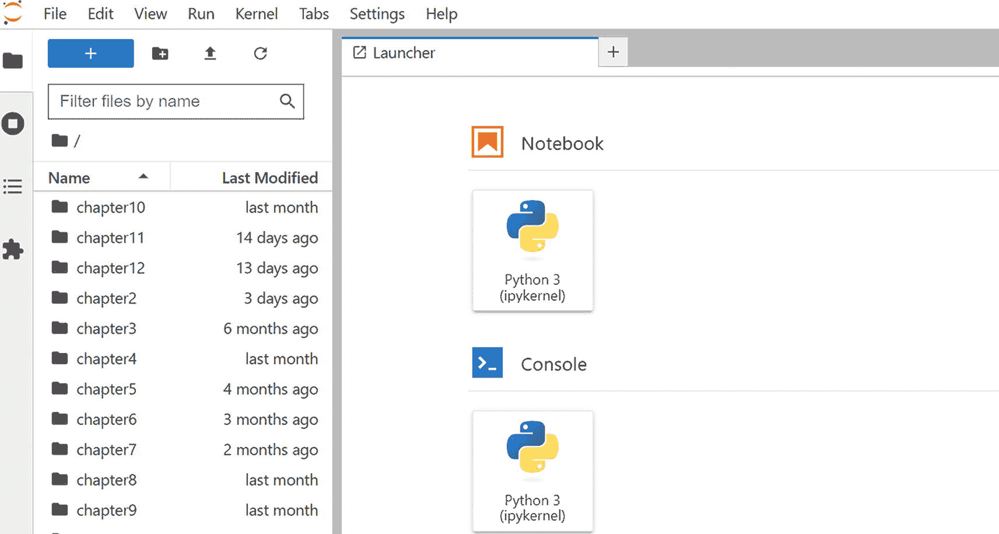

Jupyter lab 登录页面截图。菜单栏包括文件、编辑、查看、运行、内核、选项卡、设置和帮助。菜单栏下方选中了加号符号，左侧显示按名称筛选文件的搜索框。右侧是笔记本 Python 3 和控制台 Python 3 图标。

图 1-2

JupyterLab 登录页面

### 使用 VS Code 进行本地安装

如果您想使用 VS Code，您仍然可以按照“本地安装”的所有步骤进行，然后使用 VS Code 打开、运行和执行笔记本。它提供了与本地安装类似的经验，但有一些额外的功能。如果您更喜欢使用 VS Code 提供的更丰富的 GUI 体验，并且 VS Code 已经是您开发体验的一部分，您也可以使用它。要遵循的高级步骤如下：

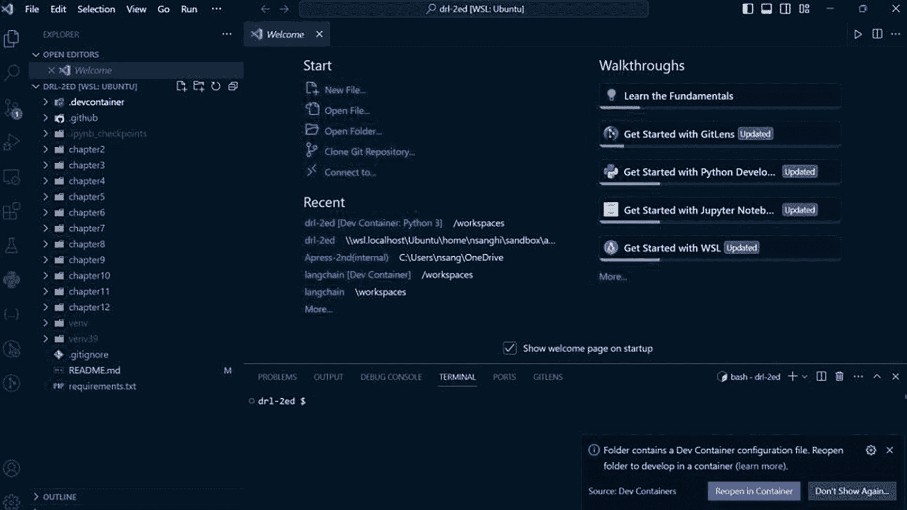

Ubuntu 页面截图。菜单栏包括文件、编辑、选择、查看、转到和运行。在资源管理器中的打开编辑器下选中了欢迎选项。欢迎屏幕包括开始和最近文件。右侧有浏览选项。选中了在容器中重新打开选项卡。

图 1-3

在 VS Code 中打开

1.  在您的本地机器上安装 VS Code。有关详细设置说明，请参阅[`code.visualstudio.com/`](https://code.visualstudio.com/)链接。

1.  接下来，您需要启用几个 Python 插件：Python、Python 调试器、PyLance、Jupyter、Jupyter Notebook 渲染器和 Jupyter 快捷键映射、Jupyter 单元标签和 Jupyter 幻灯片放映。其中一些是可选的，但安装所有这些将为您提供更丰富的体验。您可以阅读每个单独的插件并决定您想跳过的哪些。

1.  导航到您克隆/下载源代码的 `drl-2ed` 目录。运行以下命令：

    ```py
    code .
    ```

    不要忘记命令末尾的点（`.`）。此命令指示系统在当前文件夹中打开 VS Code。

1.  您可能在右下角看到一个弹出窗口，显示消息“文件夹包含 Dev Container 配置文件。重新打开文件夹以在容器中开发”。**不要点击**“在容器中重新打开”按钮。相反，点击弹出窗口右上角的叉号来关闭它。见图 1-3。

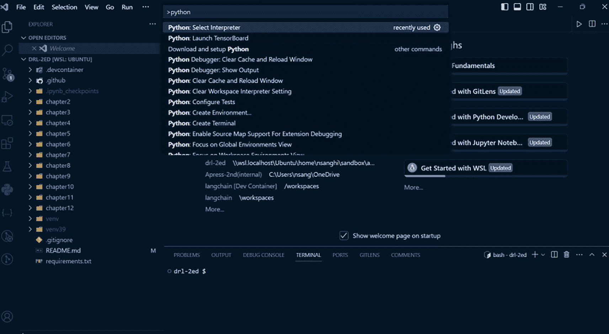

Python 环境屏幕截图。菜单栏包括文件、编辑、选择、查看、转到和运行。在资源管理器中的打开编辑器下选中了欢迎选项。从最近使用中选择 Python 选择解释器。右侧有浏览选项。

图 1-4

在 VS Code 中选择 Python 环境

1.  接下来，按 Control+Shift+P 或 Command+Shift+P 在 VS Code 中打开命令面板，并输入**Python**以查看适用于 VS Code 中 Python 的命令列表。选择“Python：选择解释器”选项，如图 1-4 所示。

    它将显示您系统中找到的所有 Python 环境。选择您为本地安装创建的 `venv` 或 Conda 环境。您可以在命令面板中找到此选项，或者使用“输入解释器路径…”选项添加它。

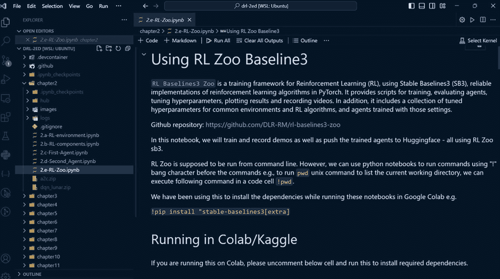

Python 环境屏幕截图。菜单栏包括文件、编辑、选择、查看、转到和运行。在资源管理器下的“打开编辑器”选项中选择了 Z e R L Zoo 第二章。使用 R L Zoo baselines 3 并在 Colab 或 Kaggle 屏幕上运行。

图 1-5

在 VS Code 中选择笔记本内核

1.  您现在可以打开任何笔记本。有时，即使在您在上一步选择了 Python 环境，您可能还需要再次选择相同的内核，才能在笔记本中执行代码。您将在笔记本的右上角找到此选项；它被称为“选择内核”。点击此选项，并选择您为本地安装创建的相同 Python 环境，以及您在步骤 5 中选择的 Python 解释器环境。见图 1-5。

您现在可以探索笔记本，并执行 Jupyter Notebook 中包含的代码单元。

### 在 Google Colab 上运行（推荐使用云选项）

Google Colab 是一个免费的在线平台，允许您在浏览器中编写和运行 Python 代码。它基于 Jupyter Notebook。与 Jupyter Notebook 相比，Google Colab 提供了一些优势，例如：

+   您可以通过任何有互联网连接的设备访问 Google Colab，无需在本地机器上安装任何软件。

+   您可以使用 Google 服务器的计算能力，包括 GPU 和 TPU，来加速您的代码执行，并在您的设备上节省资源。

+   您可以轻松地与他人共享您的笔记本，并实时协作。

+   您可以将您的笔记本与 Google Drive 和其他 Google 服务集成，例如 Google Sheets、Google Forms 和 Google Maps。

要使用 Google Colab，您需要一个 Google 账户和一个网络浏览器。您可以通过访问[`https://colab.research.google.com/`](https://colab.research.google.com/)创建一个新的笔记本，或者从 Google Drive 打开现有的笔记本。您还可以从本地机器上传笔记本文件，或者从 GitHub 或其他来源导入。一旦打开了一个笔记本，您就可以编写和执行代码单元，添加文本和图片，并使用 Google Colab 提供的各种工具和功能。您还可以自定义笔记本设置，例如运行类型、主题和快捷键。

本书使用 GitHub 选项直接从 GitHub 仓库打开笔记本。这只是一种个人偏好。如果您已将源代码仓库克隆到您的 GitHub 账户中，您也将能够对您的仓库进行更改和提交，从而在您的计算机上无需任何本地安装即可获得无缝的开发者体验。以下是步骤：

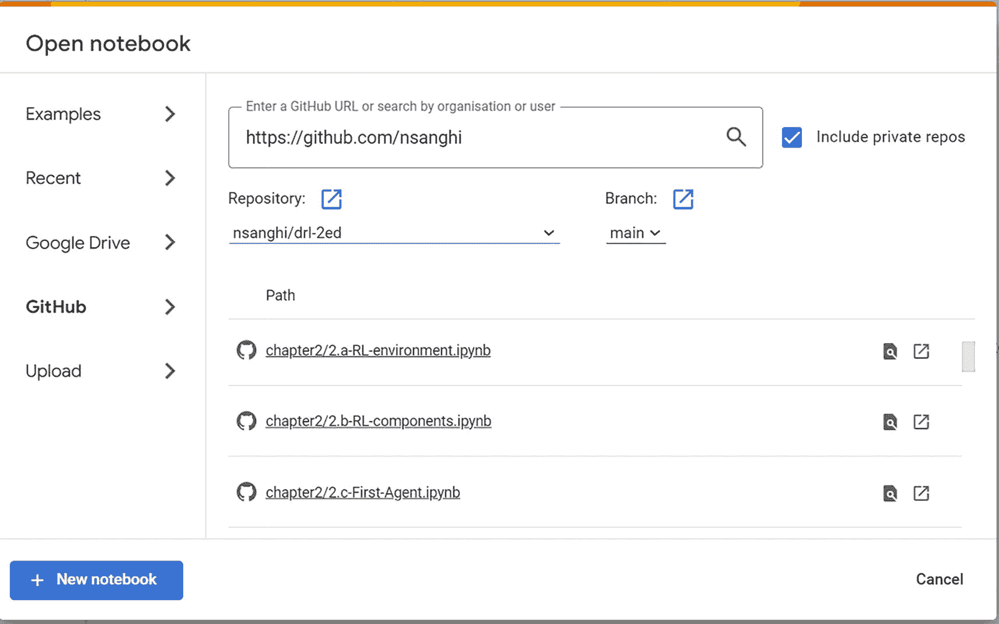

Google Colab 的屏幕截图。显示打开笔记本的屏幕。它包括示例、最近、Google Drive、GitHub 和上传。左下角有一个按钮用于添加新的笔记本。

图 1-6

在 Google Colab 中选择仓库和笔记本

1.  导航到 [`https://colab.research.google.com/`](https://colab.research.google.com/)，这将打开包含各种选项以打开笔记本的对话框。对于当前工作流程，请选择 GitHub 选项。

1.  如果这是您第一次在 Colaboratory（Google Colab）内部使用 GitHub，点击 GitHub 选项将引导您通过 OAuth 工作流程以授予 Google Colab 访问您的 GitHub 账户的权限。

1.  完成身份验证并将 Google Colab 连接到您的 GitHub 账户后，您可以使用对话框打开感兴趣的特定笔记本，或者您可以直接输入存放仓库的 GitHub 账户的 URL，例如 [`https://github.com/nsanghi/`](https://github.com/nsanghi/)。

1.  点击仓库下拉菜单以导航到仓库。保持分支选择为“main”或适用于您要打开的仓库的任何其他选项。此对话框的示例如图 1-6 所示。

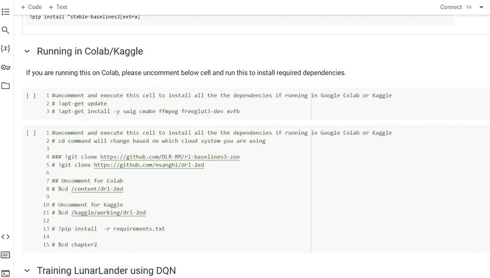

Google Colab 的屏幕截图。在 Colab 或 Kaggle 上的运行屏幕显示运行注释和执行程序，由 3 和 15 行代码组成，用于执行单元格以安装所有依赖项。

图 1-7

在 Google Colab 中运行包安装的代码单元格

1.  选择笔记本，例如 `chapter2/2.a-RL-envrionment.ipynb`。它将关闭对话框并在浏览器中打开笔记本，界面与 JupyterLab 非常相似。有一些 Google Colab 特定的增强功能，但大多数与此案例不相关。需要注意的是运行类型，您可以从 Colab 网页右上角的“连接”下拉菜单中选择。

    此示例主要使用 CPU 环境，因为 Google Colab 的免费层对 GPU/TPU 环境的访问有限。大多数笔记本可以在 CPU 环境下运行。然而，从第六章开始，一旦您进入深度强化学习的领域并开始在大文本数据（如 RLHF）或图像（如 Atari 游戏）上训练代理，您将使用启用 GPU 的笔记本运行这些笔记本。

1.  Google Colab 预装了大多数库。然而，我设计 notebooks 以便您可以从 notebook 内部运行一些额外的命令来安装系统级软件包和所需的 Python 库。一个例子是`2.e-RL-Zoo.ipynb`笔记本。按照步骤 4 中的说明在 Google Colab 中打开此笔记本。一旦打开，您将看到两个代码执行单元格，其中代码已被注释，如图 1-7 所示。

第一个单元格安装了 Ubuntu 系统级软件包。第二个单元格克隆了 GitHub 存储库，并从克隆的存储库中运行`requirements.txt`文件来安装所有依赖项。

在继续使用 notebook 之前，取消注释并运行这些单元格。

注意，您不需要运行任何基于本地安装执行的注释代码单元格。

### 在 Kaggle 上运行

您可以使用 Kaggle 提供的一种类似于 Google Colab 的功能。

Kaggle 托管数据科学和机器学习竞赛，您可以在那里找到并探索各种数据集，学习新技能，并与其他用户分享您的解决方案。Kaggle 还提供了一种名为 Kaggle Kernel 的基于云的服务，允许您在线运行 notebooks 而无需在本地机器上安装任何东西。您可以使用 Kaggle Kernel 访问竞赛中的数据集，用 Python 或 R 运行代码，并将您的结果发布为交互式网页。Kaggle Kernel 是实验不同模型和技术、与其他用户协作以及展示您工作的便捷方式。您还可以从其他用户那里 fork 和编辑现有的 notebooks，并将它们作为您自己项目的起点。

在 Kaggle 上运行本书中的 notebook 与在 Google Colab 上运行的方式非常相似。您可以在 Kaggle 文档中了解更多相关信息，并尝试一下。

### 使用基于 devcontainer 的环境

运行 notebooks 的另一种方式是使用*devcontainer*，它代表开发容器。一个`.devcontainer`是一个存储库中的文件夹，其中包含一个 Docker 文件和一个配置文件，该文件指定了开发环境所需的工具和设置。您可以使用`.devcontainer`创建一个一致且可重复的工作空间，该工作空间可以在支持 Docker 和 Visual Studio Code (VS Code)的任何机器上运行。

要使用 devcontainer，您需要在本地机器或云服务上安装 Docker 和 VS Code。您还需要安装 VS Code 的远程开发扩展包，这使您能够与远程环境一起工作。然后，您可以找到一个包含`.devcontainer`文件夹的存储库，这表明它支持 devcontainer。

一旦您有了 devcontainer 仓库，您可以将它克隆到您的本地机器或云服务中，并用 VS Code 打开它。VS Code 将检测到`.devcontainer`文件夹，并提示您在容器中重新打开文件夹。这将构建 Docker 镜像并启动带有指定工具和设置的容器。然后您可以在容器中打开笔记本文件并运行它。您还可以修改代码并将更改推送到仓库。

使用 devcontainer 是一种方便的方式，可以处理需要特定依赖项或配置的笔记本，而不会影响您的本地机器或云服务。您还可以与其他用户共享您的 devcontainer 设置，并确保他们拥有与您相同的开发环境。Devcontainer 是协作和部署代码的有用功能。您可以在 VS Code 文档中了解更多关于它的信息，并尝试使用它。

本书源代码库已启用此功能。本节将探讨两种使用方法。一种是使用本地系统，另一种是使用 GitHub 的 Codespaces，它提供了一个云环境来运行代码。

### 本地运行 devcontainer

如前所述，您需要在您的机器上本地安装 Docker 和 VS Code。要安装 Docker，请访问[`https://www.docker.com/products/docker-desktop/`](https://www.docker.com/products/docker-desktop/)链接，并安装适用于您系统的 Docker Desktop 版本。下载并运行您平台的二进制文件，并按照所有提示操作，选择推荐/默认选项。可以从[`https://code.visualstudio.com/`](https://code.visualstudio.com/)安装 VS Code。一旦安装了 VS Code，也请安装 VS Code 的远程开发扩展包。完成这些步骤后，您的本地机器将准备好本地部署 Docker 容器。这种方法的优势是您的开发环境位于 Docker 容器中，完全隔离了您的开发环境与本地机器。无论您的本地机器的操作系统如何，代码都将运行相同的 Docker 配置——在这种情况下，是一个包含所有必需依赖项的 Ubuntu 镜像。以下步骤将指导您下载源代码并在本地运行：

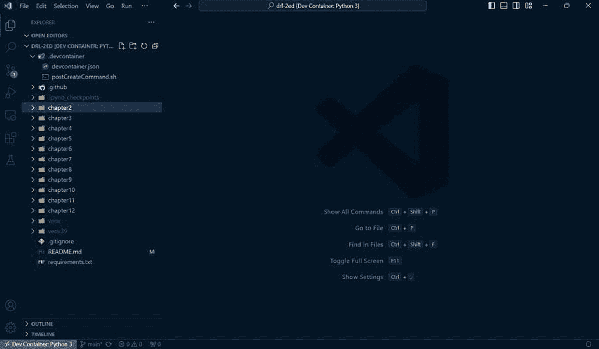

Docker 容器的截图。菜单栏包括文件、编辑、选择、查看、转到和运行。在资源管理器中的打开编辑器下选中了第二章选项。显示所有命令、转到文件、在过滤器中查找、切换全屏，并在屏幕右下角显示设置选项。

图 1-8

在 Docker 容器中运行

1.  导航到本地机器上您选择的文件夹。如果您使用的是 Windows 机器，可以选择 WSL2 或 Windows 子系统。

1.  使用此命令在本地克隆源代码库：

    ```py
    git clone https://github.com/nsanghi/drl-2ed.git
    ```

    此命令将在你运行此命令的当前文件夹中创建另一个名为 `drl-2ed` 的子文件夹。你也可以访问出版商的源代码链接来克隆存储库或下载并解压代码。

1.  导航到使用 `git` 命令创建的 `drl-2ed` 文件夹，并使用此命令从那里运行 VS Code：

    ```py
    code .
    ```

    不要忘记命令末尾的点号（`.`）。此命令指示系统在当前文件夹中打开 VS Code。

1.  你可能会在右下角看到一个弹出窗口，显示消息“文件夹包含 Dev 容器配置文件。重新打开文件夹以在容器中开发”。点击“在容器中重新打开”按钮以启动 Docker 构建。它将使用存储库 `.devcontainer` 文件夹中指定的开发环境镜像来创建和启动 Docker 容器。这与你在本地运行 VS Code 时的说明相反，当时你没有点击“在容器中重新打开”按钮。

    第一次这样做时，必须下载 Docker 镜像以及安装所需的 Ubuntu 软件包，并运行 `pip install requirements.txt` 命令来设置 Python 环境。这可能需要一些时间——比如说大约十分钟来运行整个设置过程。它将最终 Docker 容器保存在本地，并在你的 Docker 桌面上使其可见。

    后续运行将非常快，因为它们将使用保存的 Docker 容器。如果你需要重建 Docker 环境，VS Code 命令面板有选项可以这样做。

    当代码在指定的 `.devcontainer` Docker 镜像中打开时，你将在 VS Code 的左下角看到类似于“Dev Container: Python 3”的状态，如图 1-8 所示。这确认你现在正在 Docker 基础的 dev 容器内工作。

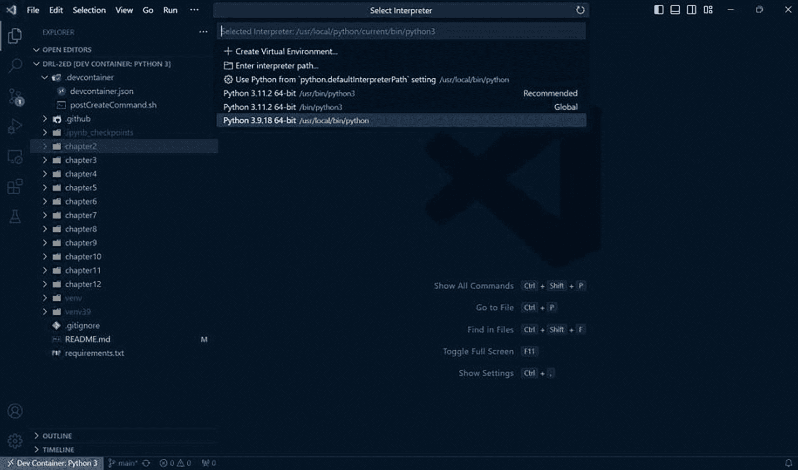

Docker 容器的截图。菜单栏包括文件、编辑、选择、查看、转到和运行。在资源管理器中打开编辑器下选择了第二章文件夹。显示所有命令、转到文件、在文件中查找、切换全屏和显示设置选项的快捷键在右侧。

图 1-9

在 VS Code 中选择 Python 环境

1.  接下来，按 Control+Shift+P 或 Command+Shift+P 打开 VS Code 的命令面板，并输入 **Python** 以查看 VS Code 中 Python 的命令列表。选择如图 1-9 所示的“Python: 选择解释器”选项。这次 Python 解释器选项将不同。选择如图 1-9 中突出显示的 Python 3.9.18 版本。

1.  你可以打开任何笔记本。在执行笔记本中的代码之前，你可能需要选择与笔记本内核相同的环境。你可以在笔记本右上角找到这个选项；它被称为“选择内核”。点击此选项并选择与 Python 3.9.18 相同的 Python 环境。

你现在可以像在 JupyterLab 环境中一样执行代码。

### 在 GitHub Codespaces 上运行

GitHub Codespaces 是一个基于云的开发环境，允许你从任何设备创建、编辑和运行代码。你可以通过 Visual Studio Code、基于浏览器的编辑器或 github.com 访问你的 codespaces。GitHub Codespaces 与 GitHub 功能无缝集成，如拉取请求、问题、操作和包。你还可以使用自己的 dotfiles、扩展和设置自定义你的 codespaces。使用类似 Codespaces 这样的工具的关键优势包括：

+   你可以快速开始编码，无需设置本地环境或安装依赖项。

+   你可以同时处理多个项目，并轻松地在它们之间切换，而不会使你的机器杂乱无章。

+   你可以实时与他人协作，并与队友或贡献者共享你的 codespaces。

+   你可以使用你熟悉的相同工具和工作流程，例如 VS Code、Git 和终端。

+   你可以借助云的力量和可扩展性，在快速且安全的服务器上运行你的代码。

你可以从免费层级的 Codespaces 开始，这将为你每月提供 60 小时的两核机器时间。以下是使用 Codespaces 的步骤：

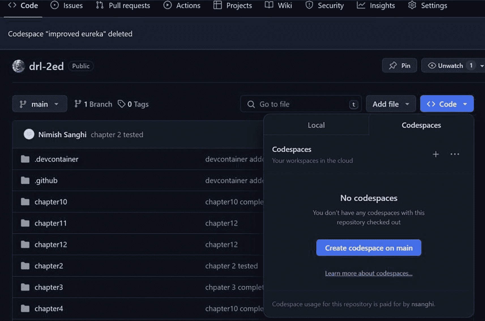

GitHub 代码空间的屏幕截图。菜单栏包括代码、问题、拉取请求、操作、项目、Wiki、安全、洞察和设置。第二章测试屏幕是打开的。代码选项被选中，主分支上的创建代码空间被突出显示。

图 1-10

设置 GitHub Codespaces

1.  导航到存储库，例如，[`https://github.com/nsanghi/drl-2ed/`](https://github.com/nsanghi/drl-2ed/)。

1.  确保你已经登录到你的 GitHub 账户，并点击蓝色“代码”按钮旁边的下拉箭头。接下来，点击“在主分支上创建 Codespace”按钮，如图 1-10 所示。这将打开一个新标签页，并开始使用存储库`.devcontainer`文件夹中提供的 Docker 容器规范设置 Codespaces。

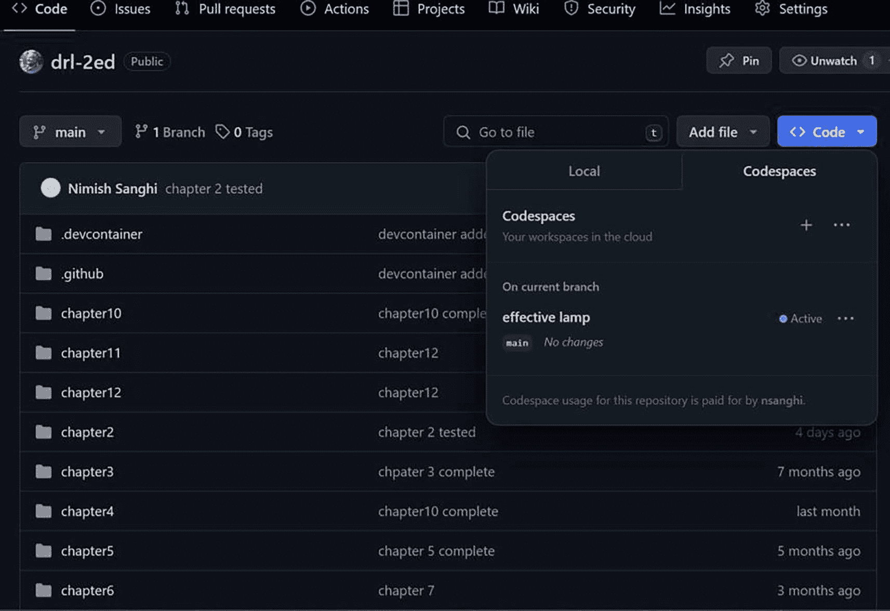

GitHub 代码空间的屏幕截图。菜单栏包括代码、问题、拉取请求、操作、项目、Wiki、安全、洞察和设置。第二章测试屏幕是打开的。代码选项被选中。它包括代码空间和一个有效的灯泡。

图 1-11

设置 GitHub Codespaces

1.  容器设置完成后，它将在 VS Code 的云版本中打开存储库，并运行 pip install 来安装所有 Python 包。就像本地 Docker 容器设置一样，第一次在 Codespaces 上设置时可能需要大约五到十分钟。然而，后续运行将会更快，因为它将重用第一次运行时在云中保存的 Docker 容器。

1.  与在本地 Docker 上运行选项类似，您需要选择带有 Python 3.9.18 的正确 Python 解释器，如图 1-9 所示。您还需要在运行笔记本时选择与内核相同的 Python 版本。

1.  现在，您已经准备好在 GitHub Codespaces 上运行代码。此选项提供了完整的开发体验，无需任何本地安装。

1.  由于 Docker 镜像存储在 Codespaces 中，并与您的 GitHub 账户相关联，因此您下次访问 GitHub 仓库并点击“代码”按钮旁边的下拉菜单时，将看到之前创建的 codespace，如图 1-11 所示。您可以使用该 codespace 在后续访问中运行代码。它将使用保存的 Docker 容器，并在几秒钟内启动您的环境。

1.  您可以点击容器名称右侧的三点并打开 codespace 容器。您还可以使用菜单在本地 VS Code 内部打开云托管的 codespace 容器。

### 在 AWS Studio Lab 上运行

AWS Studio Lab 是 AWS 的免费层版本，可以用作 Google Colab 的替代品。它为您提供一定小时的免费 CPU 和 GPU 访问。您需要通过访问[`https://studiolab.sagemaker.aws/`](https://studiolab.sagemaker.aws/)链接来创建账户。

一旦您创建了账户并登录，您就可以克隆 GitHub 仓库，创建 Conda 环境，并运行设置来安装 Ubuntu 软件包以及 `requirements.txt` 文件中指定的 Python 库。涉及的步骤如下：

1.  一旦登录，点击“启动运行时”按钮以启动一个 Jupyter 实例。

1.  当运行时正在运行时，点击“打开项目”圆形按钮。这将打开一个带有 JupyterLab 界面的新标签页。

1.  接下来，您需要克隆仓库。您可以从 JupyterLab 界面打开一个终端或选择 Git ➤ 克隆 Git 仓库菜单选项。按照对话框中给出的说明完成此步骤。

1.  下一步是创建一个使用 Python 3.9 的 Conda 环境，安装 Ubuntu 软件包，并运行 pip 安装。首先从 JupyterLab 界面打开一个终端并运行以下命令：

    ```py
    # create conda environment and activate it
    conda create -n drl python=3.9.18
    conda activate drl
    # install required Linux packages
    conda install -c conda-forge swig cmake ffmpeg
    conda install conda-forge::xvfbwrapper
    conda install conda-forge::freeglut
    # Navigate to the drl-2ed folder and
    # install the required Python libraries
    pip install requirements.txt
    ```

1.  现在，您可以从左侧的探索器中打开任何笔记本。当出现选择内核的选项时，选择 `drl`，这是在之前步骤中创建的 Conda 环境。如果您看不到该选项，您可能需要选择 Amazon SageMaker Studio Lab ➤ 重新启动 JupyterLab 菜单选项。

1.  选择正确的内核后，您就可以开始执行笔记本代码单元格了。您创建的 Conda 环境在会话之间持续存在，使得后续运行非常快速。

使用 SageMaker Studio Lab 允许您在云端运行代码，就像我在前面几节中提到的其他一些选项一样。它根本不需要本地安装。图 1-12 显示了 AWS Studio Lab 的操作截图。

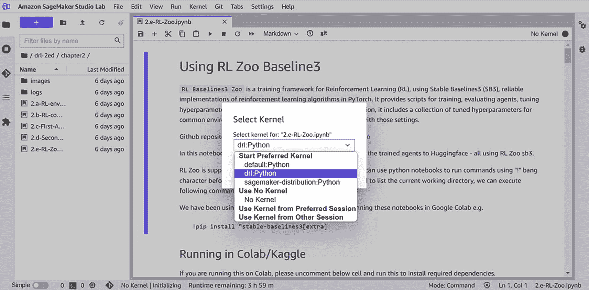

Amazon Sage Maker Studio Lab 的截图。菜单栏包括文件、编辑、查看、运行、内核、git、标签、设置和帮助。屏幕显示“使用 R L Zoo 基线 3”。从“选择内核”中选择了 d r l python。

图 1-12

AWS Studio Lab

### 使用 Lightning.ai 运行

Lightning AI Studio ([`https://lightning.ai/`](https://lightning.ai/))是一个基于云的 AI 开发平台（类似于 Google Colab 和 Amazon SageMaker Studio Lab），旨在消除为机器学习项目设置本地环境的麻烦。Lightning AI Studio 的一些关键特性包括：

+   它将流行的机器学习工具集成到一个单一界面中。这使得您更容易构建可扩展的 AI 应用和端点。

+   无需环境设置。您可以在浏览器中编码或连接您的本地 IDE（VS Code 或 PyCharm）。您还可以轻松地在 CPU 和 GPU 之间切换，无需更改环境。

+   它允许您托管和分享使用 Streamlit、Gradio、React JS 等构建的 AI 应用。它还通过共同编码实现多用户协作。

+   它提供无限存储空间，以及上传和共享文件以及连接 S3 存储桶的能力。

+   它允许在付费计划下使用数千个 GPU 进行大规模模型训练。

+   有越来越多的社区模板（工作室）可供不同用例和不同模型使用，可以作为您的起点。

在 Lightning.ai 工作室上运行代码的高级步骤如下：

1.  首先访问[`https://lightning.ai/`](https://lightning.ai/)链接并注册。

1.  接下来点击右上角的“新建工作室”按钮，在提示中选择默认设置，然后点击“开始”。

1.  一旦工作室启动，您可以在工作室右侧点击终端，并使用终端进行以下操作：a) 安装`apt-get`软件包 b) 克隆源代码仓库 c) 运行`pip install -r requirements.txt`来安装所需的 Python 软件包和库。

1.  到目前为止，您已准备好开始执行 Jupyter Notebook。在撰写本文时，免费层版本提供四核 CPU 配置，使其成为免费层提供中的强大实验平台。您还可以访问 GPU 资源。

### 其他运行代码的选项

有更多选择。如果您想在图形游戏或 3D 环境中运行代码，可以使用许多付费选项。其中一些列在这里。根据您的需求，您应参考相关平台的文档来设置它们以执行代码：

1.  Google Vertex AI Notebooks

1.  AWS SageMaker

1.  MS Azure ML Studio

1.  Paperspace

1.  Lambda Labs

1.  Jarvis Labs

深度学习工作负载的云 GPU 和 CPU 提供商列表正在不断增长。为了运行本书的源代码，任何入门级配置都足够好。

## 摘要

本章首先介绍了强化学习领域及其从严格的基于规则的决策系统发展到灵活的最优行为学习系统的发展历史。它是通过从先前经验中自主学习来做到这一点的。

本章解释了机器学习的三个子分支——监督学习、无监督学习和强化学习。在监督和无监督方法的背景下，本章还讨论了作为生成式 AI 的半监督学习和自监督学习等新兴混合方法。

我比较了监督学习、无监督学习和强化学习的三种核心方法，以阐述每种方法适用的上下文。我还讨论了构成强化学习设置的子组件和术语。这些是*代理、行为、状态、动作、策略、奖励*和*环境*。我通过汽车和机器人的例子展示了这些子组件如何相互作用以及每个术语的含义。

我还讨论了奖励和价值函数的概念。本章讨论了奖励是短期反馈，而价值函数是代理行为的长期反馈。最后，我介绍了基于模型和无模型的学习方法。接下来，我谈到了深度学习在强化学习领域的影响，并解释了 DQN 如何开启了将深度学习与强化学习相结合的趋势。我还讨论了这种结合方法如何导致可扩展的学习，包括从图像、文本和声音等非结构化输入中进行学习。

本章接着讨论了强化学习的各种应用案例，引用了来自自动驾驶汽车、智能机器人、推荐系统、大型语言模型和股票交易、医疗保健以及视频/桌面游戏的领域的例子。

最后，我介绍了各种设置 Python 环境的方法，以便能够运行本书附带的 Jupyter 笔记本。
