# 2. 基础：马尔可夫决策过程

如第一章所述，强化学习涉及序列决策。本章在概率论中关于模型序列决策行为的分支下，形式化了使用随机过程的概念。尽管你将在强化学习中研究的许多问题都被建模为 *马尔可夫决策过程* (MDP)，但本章首先介绍了马尔可夫链 (MC)，然后是马尔可夫奖励过程 (MRP)。接下来，本章深入讨论了 MDP，同时涵盖了模型设置和 MDP 背后的假设。

本章随后讨论了相关概念，例如状态值函数和状态-动作对的动作值函数。接着深入讨论了各种形式的贝尔曼方程，如贝尔曼期望方程和贝尔曼最优方程。还包括对各种学习算法的简要介绍。在 MDP 框架建立之后，本章转向训练几个智能体，同时概述了本书中将使用的软件库。虽然本章的重点是强化学习的理论基础，但它包括示例和练习来帮助巩固这些概念。没有比亲自编码更好的学习方法了，这是本书的一个反复出现的主题。

本章最后简要讨论了 RL 训练的不同方法。

## 强化学习的定义

上一章解释了智能体通过根据其当前状态采取动作、获得数值奖励并发现自己处于新状态来与环境交互的循环。图 2-1 阐述了这一概念。

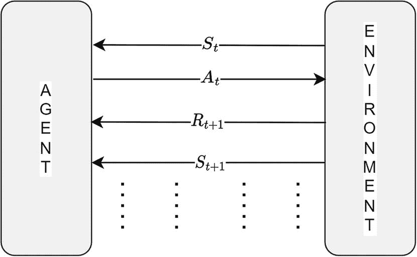

智能体和环境交互循环的方框图有两个标记为智能体和环境的方框。环境通过 S t, R t + 1, 和 S t + 1 引导智能体。智能体通过 A t 引导环境。

图 2-1

智能体-环境交互循环

在时间 *t* 的智能体处于状态 *S*[*t*]。从该状态可采取的动作集中，智能体选择一个特定的动作，*A*[*t*]。在此时刻，系统过渡到下一个时间刻度 (*t* + 1)。环境对智能体响应以数值奖励，*R*[*t* + 1]，并将智能体置于新的状态，*S*[*t* + 1]。这种“状态到动作到奖励和下一个状态”的循环会一直持续到智能体达到某个终止状态，例如游戏的结束、任务的完成或指定的时间步数的结束。

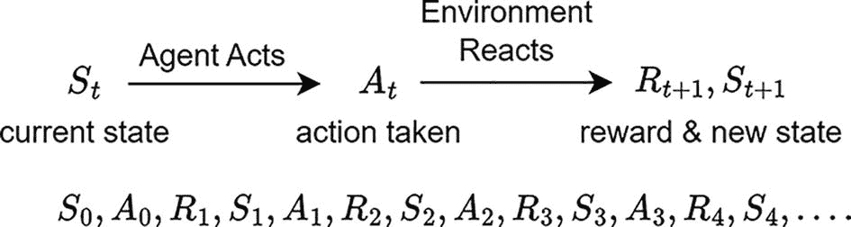

一个水平流程图。当前状态 S t 在智能体采取动作时导致动作 A t。当环境对智能体的动作做出反应时，A t 导致奖励和新的状态，R t + 1, S t + 1。一系列的 S 0, A 0, R 1, S 1, A 1, R 2, S 2, A 2, R 3, S 3, A 3, R 4, S 4，以及底部的省略号。

状态、动作、奖励和下一个状态（*S*[*t*], *A*[*t*], *R*[*t* + 1], *S*[*t* + 1]）之间存在一个循环。

智能体根据其所在的状态采取动作，也就是说，智能体通过采取动作来“行动”。环境通过给予智能体一些数值奖励并将智能体转移到新状态来对智能体的动作做出反应。智能体的目标是采取一系列动作，以最大化从环境中获得的奖励总和。

强化学习的目的是让智能体学习在它可能遇到的所有状态下可能采取的最佳动作，同时考虑到累积奖励最大化的目标。

以国际象棋为例。棋盘上棋子的位置可以形成当前状态（*S*[*t*]）。智能体（玩家）通过移动棋子来采取动作（*A*[*t*]）。智能体获得奖励（*R*[*t* + 1]）——比如说，安全移动得 0 分，导致将死的移动得-1 分。游戏也转移到新状态（*S*[*t* + 1]）。

在文献中，状态有时被称为 *观察*，以区分在某些情况下智能体可能只能看到实际状态的局部细节。这种部分可观察的状态被称为 *观察*。智能体使用可用的全部或部分状态信息，根据它应该采取的动作做出决策。在现实生活中的实现中，理解智能体将观察到什么以及观察的详细程度是一个重要的方面。学习算法的选择和理论保证可以受到部分可观察程度的影响。本章最初关注状态和观察结果相同的情况；换句话说，智能体知道当前状态的每一个可能的细节。但从第五章开始，你将开始研究状态可能不完全已知或即使完全已知，也需要使用某种近似方法进行总结的情况。

现在我们通过几个例子来深入理解状态/观察结果到动作再到奖励再到下一个状态的循环。这本书使用了一个名为 *Gymnasium* 的 Python 库，它是 OpenAI 的 *Gym* 库的维护分支。OpenAI 的 Gym 已经停止了新开发，所有新增内容现在都在 Gymnasium 库中。Gymnasium 实现了一些常见的简单环境。让我们看看 Gymnasium 库中的第一个环境，称为 `MountainCar-v0`。

第一步是启动你的 Jupyter Notebook 并导航到 `2.a-RL-environment.ipynb`，或者你也可以在 Google Colab 中打开笔记本。参考第一章，了解如何设置本地环境或直接在 Google Colab 上运行笔记本的步骤。

一旦你打开了笔记本，继续阅读以探索环境和相关代码。在 `MountainCar` 环境中，有一座山，汽车试图爬上这座山，最终目标是到达山右上方的旗帜。汽车不够强大，因此汽车需要向左摆动，然后向右加速以达到目标。这种来回摆动需要发生多次，以便汽车获得足够的动量，达到山谷右上方的旗帜。见图 2-2。

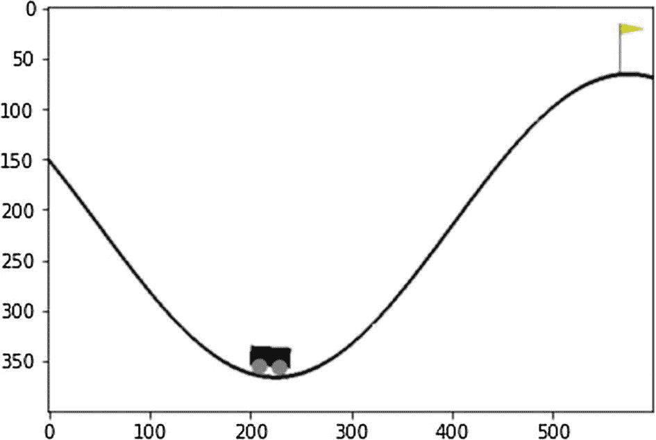

`MountainCar` 环境的线形图呈现一个顶点在 (220, 340) 的 U 形曲线。汽车和旗帜的位置分别标记在 (210, 340) 和 (560, 70)。这些值是近似值。

图 2-2

`MountainCar-v0` 环境。这个环境具有二维状态和一组三个离散动作。

列表 2-1 展示了测试 `MountainCar` 环境所需的代码。

```py
import gymnasium as gym
env = gym.make('MountainCar-v0', render_mode="rgb_array")
obs = env.reset()
# It is a random policy. As we progress
# we will use different RL algorithms
# to teach agent to take long-term reward
# maximizing actions
def policy(observation):
return env.action_space.sample()
# take steps
for _ in range(5):
# to render environment for visual inspection
# when you train, you can skip rendering to speed up
plt.imshow(env.render())
# policy – i.e. agent uses state to take an action
action = policy(obs)
# pass the action to env which will return back
# a set of values - new state, reward
# and a few other things
obs, reward, terminated, truncated, info = env.step(action)
# close the environment
env.close()
Listing 2-1
MountainCar Environment – “2.a-RL-environment.ipynb”
```

让我们逐行分析代码。首先，使用 `import gymnasium as gym` 导入 Gymnasium 库。Gymnasium 实现了多个用于强化学习的环境。你将在阅读本书的章节时使用其中的一些环境。

接下来，你使用 `env = gym.make('MountainCar-v0',...).` 实例化 `MountainCar` 环境。随后通过 `obs = env.reset()` 初始化环境，这会返回初始观察值。在 `MountainCar` 的例子中，观察值是一个包含两个值的元组：`(x-position, x-velocity)`。智能体使用观察值来找到最佳动作：`action = policy(obs)`。

在列表 2-1 中，智能体正在采取随机动作。然而，随着你阅读本书的进展，你将学习到不同的算法，这些算法可以用来找到奖励最大化的策略。对于 `MountainCar` 环境，有三种可能的行为：向左加速、不采取行动和向右加速。智能体将动作传递给环境。在这个时候，系统在概念上采取一个时间步，从时间 *t* 移动到时间 *t* + 1。

环境执行动作并返回五个值的元组：时间 (*t* + 1) 的 *新观察值*，*奖励值* (*r*[*t* + 1])，*终止* 标志，*截断* 标志，以及一些调试信息。请注意，OpenAI 的 Gym 环境有一个 *done* 标志，现在在 Gymnasium 库中已被拆分为两个标志——*截断* 和 *终止*。这种拆分的原因是为了提供更好的控制。目前，只需将旧的 done 标志视为截断和终止标志的组合，表达式为 (`done = terminated or truncated`)。

接下来，代理使用新的观察值来获取一个新的五个值的元组——*下一个状态，奖励，终止，截断，和调试* 信息。这个“状态到动作到奖励到新状态”的循环会一直进行，直到游戏结束（即终止）或超时（即截断）。在这个设置中，代理在每个时间步获得 -1 的奖励，游戏结束时获得 0 的奖励。因此，代理的目标是以尽可能少的步骤到达旗帜。

让我们再看看另一个环境。将 `line env = gym.make('MountainCar-v0', ...)` 替换为 `env = gym.make('CartPole-v1', render_mode="rgb_array")`，然后再次运行列表 2-1 中的代码。见图 2-3。

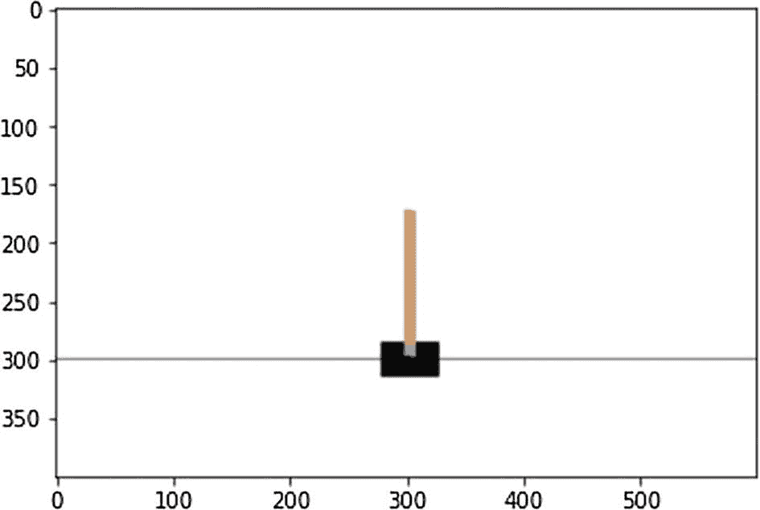

车杆 v 1 环境的线图在 (0, 300) 和 (600, 300) 之间有一条水平线。车杆的位置以符号形式表示在 (300, 300)。这些值是近似的。

图 2-3

CartPole-v1 环境的目标是尽可能长时间地保持杆竖直。

`CartPole` 环境的观察空间由四个值组成。车在 x 轴上的位置和沿 x 轴的速度是前两个值。杆的倾斜角度是观察元组中的第三个值，它必须在 -24° 到 24° 之间。观察元组中的第四个值是杆的角速度。

可能的动作是 0 和 1，分别将车推到左边或右边。代理在每个时间步都获得 1 的奖励，从而激励代理尽可能长时间地保持杆的平衡，并尽可能多地获得分数。如果杆倾斜超过 12^o 或车移动超过 2.4，游戏就结束了，即车到达两端或走了 200 步。

你可能已经注意到，在这两种情况下代码设置都是相同的。我只是改变了一行代码来实例化不同的环境。遍历环境和接收反馈的其余代码保持不变。Gymnasium 库提供的抽象使得在不同的环境中测试特定的算法变得更加容易。此外，你还可以根据手头的问题创建自己的自定义环境。

本节简要介绍了强化学习的定义以及你将使用的 Gymnasium 环境的基本知识。在接下来的章节中，你将详细了解作为强化学习（RL）问题设置的不同组件。

## 代理和环境

代理和环境设置是灵活的。代理是一个封闭系统，它从系统外部获取状态/观察细节。它使用可能是手工制作或学习到的策略，以实现最大化代理寻求的奖励为目标采取行动。代理根据当前的观察/状态和采取的行动从环境中获得奖励。代理无法直接控制这些奖励将是什么——相反，代理可以通过在当前状态下采取良好行动来间接影响它。代理也无法控制状态之间的转换。转换取决于环境，代理只能通过在每个状态下决定采取哪个行动来间接影响结果。

另一方面，环境是指代理之外的一切。换句话说，它可能是整个世界。然而，环境通常以更狭窄的方式定义：包括可能影响奖励的信息。环境接收代理想要采取的行动。它以奖励和基于代理采取的行动的新状态转换的形式向代理提供反馈。接下来，环境向代理提供部分/全部修订后的状态信息，这成为代理的新观察/状态。

代理和环境之间的边界是抽象的。它根据手头的任务和特定情况下你试图实现的目标来定义。让我们看看一些例子。

考虑自动驾驶汽车的情况。代理的状态可能是来自多个摄像头的视觉信息、光探测与测距（LiDAR）以及其他传感器的读数，以及地理坐标。虽然“环境”是代理之外的一切，即整个世界，但代理的相关状态/观察仅限于对代理采取行动相关的世界部分。两个街区外行人的位置和行动可能对自动驾驶汽车做出决策不相关，因此不需要成为代理的观察/状态的一部分。自动驾驶汽车的动作空间可以用油门值、刹车和转向控制来定义。车辆采取的行动导致汽车进入新的观察状态。这个过程不断循环。预期代理（即自动驾驶汽车）将根据特定目标采取最大化奖励的行动，例如，从点 A 到点 B。

让我们考虑另一个例子，一个机器人试图解决魔方。在这种情况下，观察/状态将是魔方六个面的配置，动作将是可以在魔方上执行的操作。奖励可以是每个时间步 -1，在成功解决后，即终止时为 0。这样的奖励设置将激励智能体找到解决谜题所需的最少操作数。

在你将使用 Gymnasium 环境的设置中，观察结果将始终是一系列值的元组，其确切组成取决于具体的 Gymnasium 环境。动作将取决于具体环境。奖励将由环境提供，具体数值取决于具体的 Gymnasium 环境。在这种情况下，智能体将是您编写的软件程序。智能体（软件程序）的主要任务是从 Gymnasium 环境接收观察结果，采取一个动作，并等待环境提供关于奖励和下一个状态的反馈。

尽管这描述了离散的步骤——即，处于状态 (*S*[*t*]) 的智能体采取一个动作 (*A*[*t*])，并在下一个时间步中接收一个奖励 (*R*[*t* + 1]) 和下一个状态 (*S*[*t* + 1])——但现实生活中许多问题往往是连续的。在这种情况下，你可以从概念上将时间划分为小的离散时间步，从而将问题建模回离散时间步环境，并使用前面展示的熟悉设置来解决它。

在最一般的情况下，当智能体发现自己处于状态 *S* 时，它可以以某种概率分布采取许多可能动作中的一个。这类策略被称为**随机策略**。此外，在某些情况下，智能体在每次发现自己处于该状态时可能只采取一个特定动作。这类策略被称为**确定性策略**。策略的定义如下：

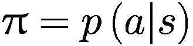

(2-1)

即，当智能体处于状态 *s* 时采取动作 *a* 的概率。

同样，在最一般的情况下，智能体收到的奖励和下一个状态将是对可能奖励值和下一个状态的概率分布。这被称为**转移动力学**。

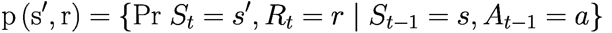

(2-2)

其中 *S*[*t*] 和 *S*[*t* − 1] 属于所有可能的状态，也称为状态/观察空间。*A*[*t*] 属于所有可能的行为，也称为行为空间，奖励 *r* 是一个数值。前面的方程定义了在最后状态为 *s* 且代理采取动作 *a* 时，下一个状态为 *s′* 和奖励为 *r* 的概率。图 2-4 展示了状态、动作和环境以下一个状态和奖励形式反馈之间的关系。

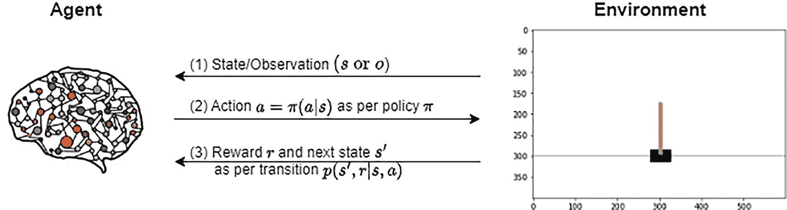

代理与环境之间的流程。大脑代表代理。代理根据策略π向环境发送动作，同时接收状态观察、奖励和下一个状态作为转换。环境图中在 300 处有一条水平线，中心有一个小车杆。

图 2-4

代理与环境交互

## 奖励

在强化学习中，奖励是环境向代理发送的信号，让代理知道动作的好坏。代理使用这种反馈来微调其知识，并学习采取能够最大化奖励的良好动作。这引发了一些重要问题，例如，你最大化的是什么，是最后动作的即时奖励还是整个生命历程中的奖励？当代理对环境了解不足时会发生什么？在开始之前，它应该通过采取一些随机步骤探索环境多少？这种困境被称为*探索与利用的困境*。随着我通过各种算法，我会不断回到这个点上。代理最大化累积总奖励的目标被称为*奖励假设*。

再次强调，奖励是一个信号，或者是一个环境发送回代理的标量数值，用来通知代理其动作的质量以及由于该动作而产生的状态/观察的质量。请注意，观察可能是多维的——例如，对于`MountainCar`是二维的，对于`CartPole`是四维的。同样，动作也可以是多维的，例如，对于自动驾驶汽车场景，是加速度值和转向角度。然而，在每种情况下，奖励始终是一个标量实数。只有单一值可能看起来有限制，但实际上并非如此。最终，代理被训练以达到目标，奖励编码了这种进步。

现在让我们来看一个迷宫示例，其中智能体试图找到出路。你可以将奖励设定为智能体在每个时间步获得-1 的奖励，并在剧集结束时获得 0 的奖励。这样的奖励配置激励智能体以尽可能少的步数走出迷宫并最小化负奖励的总和（-1）。另一种奖励配置可以是智能体在所有时间步获得 0 的奖励，当智能体走出迷宫时在剧集结束时获得 1 的奖励。你认为在后者配置中智能体的行为会发生什么？智能体有走出迷宫以收集+1 奖励的理由，但它并不着急。无论它是在 5 步后还是 500 步后出来，它都会得到相同的+1。你如何修改这种情况，以推动智能体不仅关注奖励收集，而且尽可能快地完成？

这个问题自然引出了**折现**的概念。哪个更有效用——5 个时间步后的奖励*x*还是 500 个时间步后的相同奖励*x*？当然，越早越好，因此 5 步后的+1 奖励比 500 步后的+1 奖励更有价值。你可以通过将未来的奖励折现到当前来诱导这种行为。下一个时间步的奖励*R*通过折现因子γ（伽马）折现到当前时间。折现因子是一个介于 0 和 1 之间的值。在迷宫示例中，五步完成迷宫的奖励意味着一个折现因子为γ⁵ 的奖励，与 500 步完成迷宫的折现因子为γ⁵⁰⁰ 的奖励相对比。时间*t*的“回报”定义为以下内容：


(2-3)

折现因子与你在金融世界中看到的是相似的。它与现在比未来更有价值的钱的概念相同。

折现因子还具有重要的数学作用，确保持续任务的总回报*G*[t*]是有界的。考虑一个持续任务的场景，其中每个状态都会给出一些正奖励。由于这是一个没有逻辑终点的持续任务，总奖励会持续增加并爆炸到无穷大。然而，有了折现因子，总累积奖励将被限制。因此，折现总是被引入到持续任务中，而在周期性任务中是可选的。

有趣的是要注意折现因子对代理试图最大化累积奖励的视野的影响。考虑一个折现因子为 0 的情况。如果你在方程 2-3 中使用这个折现值，你会看到累积奖励等于下一个即时奖励。这会导致代理变得短视和贪婪，只关注下一个时间步的奖励，而没有任何对未来奖励的关注。接下来，考虑折现因子接近 1 的另一个极端情况。在这种情况下，代理会变得越来越有远见，因为使用折现因子 1，你可以看到方程 2-3 中定义的累积奖励将给予所有未来奖励同等的重要性。从当前时间步到结束的整个动作序列变得重要，而不仅仅是下一个即时时间步的奖励。

前面的讨论应该强调根据代理需要优化的行为来设计适当奖励的重要性。奖励是代理用来决定是好是坏的状态和/或行动的信号。例如，在棋类游戏中，如果你将奖励设计为捕获对手棋子的数量，代理可能会学会只为了最大化即时行动的奖励而采取危险的动作，而不是牺牲自己的一个棋子来进入一个强势的位置，并在未来的走法中获得可能的胜利。奖励设计领域是一个开放的研究领域。话虽如此，本书中的例子使用了相当简单且直观的奖励定义。

奖励设计并非易事，尤其是在连续控制和机器人领域。考虑一个类人机器人的任务，其训练目标是让代理尽可能长时间地跑步。代理将如何知道手臂和腿部需要如何移动才能学习跑步的任务？将特定的措施，如代理重心与地面的距离、执行动作所消耗的能量以及躯干与地面的角度，结合试错来让代理学习一个好的策略。在没有良好的奖励信号塑造你希望代理学习的特定行为的情况下，代理的学习将需要很长时间。更糟糕的是，代理有时可能会学习到反直觉的行为。一个很好的例子是 OpenAI 的代理玩视频游戏 Coast-Runners，其目标是快速完成船赛并领先其他玩家。游戏提供了击中目标的分数，但没有明确完成游戏的分数。在这种奖励配置下，代理学习了一种滑稽且具有破坏性的行为，即反复击中一组目标，不通过比赛但得分比人类玩家高出 20%。你可以在 OpenAI 的博客^(1)上了解更多信息，并观看该行为实际操作的录像。需要仔细设计奖励，以确保自主强化学习代理不会学习到可能危险的行为。

在其他情况下，如何建模奖励函数并不总是很清楚。考虑一个试图学习类似人类行为的机器人，比如从一个水壶中往杯子里倒水，既不洒水也不因为握力过大而打碎玻璃杯。在这种情况下，一种称为**逆强化学习**的强化学习扩展被用来根据观察人类专家完成任务来学习隐含的奖励函数。第十三章简要介绍了这一点。然而，对奖励塑造和发现的详细研究可能需要一本书来阐述。

因此，简而言之，正如数据质量对于监督学习很重要一样，一个合适的奖励函数对于使算法训练代理以实现期望的行为也很重要。

强化学习（RL）最近在大型语言模型领域找到了有趣的应用。这种方法被称为 RLHF——基于人类反馈的强化学习。它由 OpenAI 于 2017 年引入，并于 2022 年由 OpenAI 首次用于使其 InstructGPT 模型中的大型语言模型更安全。要了解更多信息，您可以阅读 OpenAI 于 2022 年 1 月发表的论文“Training Language Models to Follow Instructions with Human Feedback”。^(2) 奖励是人对一句话比另一句话更安全的偏好。最近，Meta 使用两种奖励函数来引导 2023 年 7 月引入的 Llama2 模型。一个奖励函数模拟了人对安全的偏好，另一个奖励函数模拟了人对有用性的偏好。您可以在 Meta 的博客“Llama 2: Open Foundation and Fine-Tuned Chat Models”中了解更多信息.^(3) 该论文的第 3.2 节提到了 RLHF 的详细信息。

## 马尔可夫过程

强化学习领域基于马尔可夫过程的公理化。在深入研究学习（行为优化）算法之前，您需要很好地掌握马尔可夫过程的结构。本节将介绍马尔可夫链，然后是马尔可夫奖励过程，最后是马尔可夫决策过程。

### 马尔可夫链

让我们先谈谈什么是马尔可夫属性。考虑图 2-5。它试图模拟一个城市的日常降雨状况。它有两个状态——在任何给定的一天，是否下雨。从一个状态到另一个状态的有向箭头表示基于当天状态，下一天处于两个状态之一的概率。例如，如果今天下雨，明天下雨的概率是 0.3，而明天不下雨的概率是 0.7。同样，如果今天没有下雨，明天继续干燥的概率是 0.8，而明天下雨的概率是 0.2。

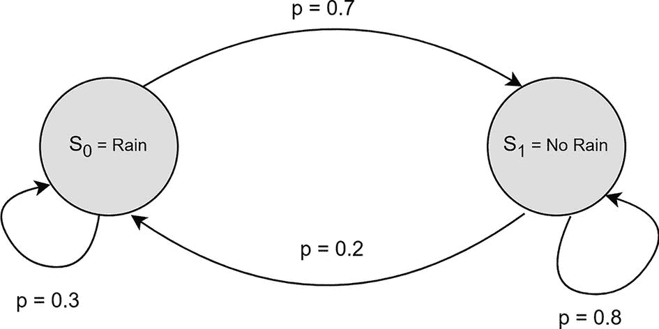

马尔可夫链的状态图包含两个状态，标记为 S0 = 下雨和 S1 = 不下雨。它还表明了值，从 S0 到 S1 的 p = 0.7，从 S1 到 S0 的 p = 0.2，S0 处的 p = 0.3，S1 处的 p = 0.8。

图 2-5

一个简单的双状态马尔可夫链。一个状态是“下雨”，第二个状态是“不下雨”

该模型假设某一天的下雨情况取决于前一天的状态，即如果今天下雨，明天下雨的概率是 0.3，如果今天没下雨，明天下雨的概率是 0.2。昨天或之前是否下雨对明天下雨的概率没有影响。这是一个重要的概念。它被称为*独立性*，即知道现在（时间*t*的当前状态）使得未来（时间*t*+1 的未来状态）与过去（时间 0，1，⋯，*t*−1 的所有过去状态）独立。数学上，你可以这样表达：

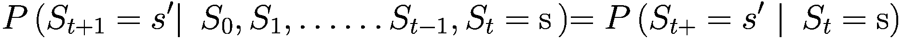

(2-4)

这仅仅意味着在时间 *t* + 1 处处于某个状态的概率只取决于时间 *t* 处的状态。时间 (*t* + 1) 的状态不依赖于时间 (*t*) 之前的状态，即不依赖于状态 *S*[0] 到 *S*[*t* − 1]。

如果环境提供给智能体的观察足够详细，智能体将知道从其当前状态需要知道什么，而无需记住过去为了达到现在所必须经历的状态/事件链。这种**马尔可夫独立性**是证明强化学习算法理论正确性的重要假设。在实践中，很多时候对于非马尔可夫系统，你仍然可以得到相当好的结果。然而，重要的是要记住，在没有马尔可夫属性的情况下，结果不能用于评估理论上的最坏情况界限。

回到图 2-5 中的马尔可夫链图，你可以定义转移概率为从先前的步骤状态 *S*[*t*] 转移到状态 *S*[*t* + 1] 的概率。如果一个系统有 *m* 个状态，转移概率将是一个具有 *m* 行和 *m* 列的方阵。图 2-5 的转移概率矩阵将看起来像这样：

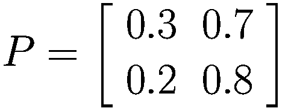

每一行的值之和将是 1。行值表示从一个给定的状态转移到系统中的所有状态的概率。例如，第 1 行表示从 *S*[1] 到 *S*[1] 的概率是 0.3，从 *S*[1] 到 *S*[2] 的概率是 0.7。

之前的马尔可夫链将有一个稳态，其中在给定的一天内处于两个状态之一的概率是确定的。比如说，处于状态 *S*[1] 和 *S*[2] 的概率由向量 *S* = [*S*[1] *S*[2]]^(*T*) 给出。从图 2-5 中，你可以看到

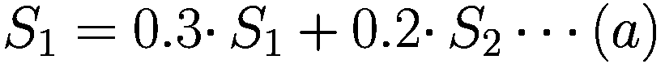

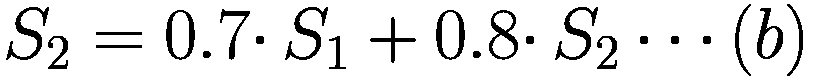

由于系统在任何时刻都必须处于两个状态之一，因此你还有：

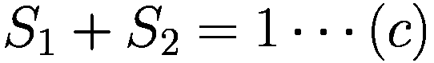

(*a*), (*b*), 和 (*c*) 中的方程构成一个一致且可解的方程组。从 (*a*)，

0.7 · *S*[1] = 0.2 · *S*[2] 或，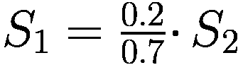

将 (*c*) 中的 s[1] 的值代入，你得到：

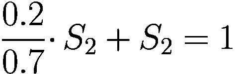

这给出了：

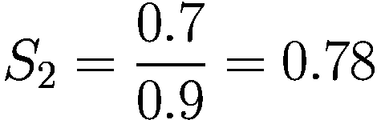

将其代入(*c*)中，得到

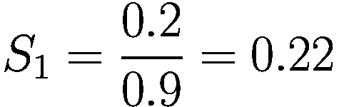

在向量代数表示法中，你可以如下指定稳态关系：

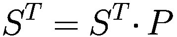

这种关系可以用来迭代求解稳态概率。列表 2-2 展示了相应的代码片段。

```py
# MC with no end
# import numpy library to do vector algebra
import numpy as np
# define transition matrix
P = np.array([[0.3, 0.7], [0.2, 0.8]])
print("Transition Matrix:\n", P)
# define a random starting solution for state probabilities
# Here we assume equal probabilities for all the states
S = np.array([0.5, 0.5])
# run through 10 iterations to calculate steady state
# transition probabilities
for i in range(10):
S = np.dot(S, P)
if i % 5 == 0:
print("\nIter {0}. State Probability vector S = {1}".format(i, S))
print("\nFinal Vector S={0}".format(S))
Listing 2-2
Markov Chain Example and Its Solution by Iterative Method-“2.b-RL-components.ipynb”
```

当你运行 Python 笔记本`2.b-RL-components.ipynb`时，产生的输出如下，这与你通过解方程(*a*)、(*b*)和(*c*)得到的值相匹配：

```py
Final Vector S=[0.22222222 0.77777778]
```

图 2-5 中的公式没有起始或结束状态。这是一个持续任务的例子。还有一种公式，它有一个或多个结束状态。看看图 2-6。这被称为*情景任务*，其中智能体从一个状态开始，经过许多转换最终达到一个结束状态。可能会有一个或多个结束状态，具有不同的结果。在图 2-6 中，结束状态是成功完成考试并获得证书。在棋类游戏中，可能有三种结束状态：胜利、失败或平局。

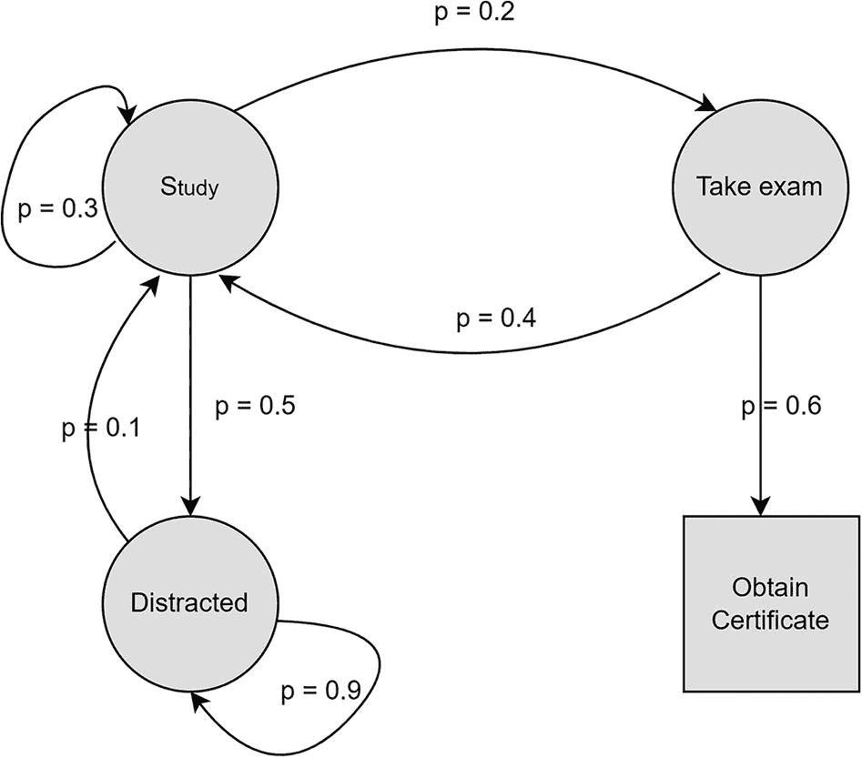

马尔可夫过程的州图。状态包括学习、参加考试、分心和获得证书。指示的值是：从学习到参加考试的概率为 p = 2，学习时的概率为 0.3，分心时的概率为 0.9，从参加考试到学习的概率为 0.4，从学习到分心的概率为 0.5，从参加考试到获得证书的概率为 0.6。

图 2-6

一个具有一个结束状态的情景马尔可夫链的例子，该结束状态通过一个方形框表示

与持续公式类似，存在一个转移概率矩阵的概念。首先，你用变量名定义状态：

*S*[1] = “学习”；*S*[2] = “分心”，*S*[3] = “参加考试”；*S*[4] = “获得证书”

转移矩阵看起来是这样的：

![P=[0.3 0.5 0.2 0; 0.1 0.9 0 0; 0.4 0 0 0.6; 0 0 0 1]](img/502835_2_En_2_Chapter/502835_2_En_2_Chapter_TeX_Equi.png)

在前面展示的情景任务中，你可以查看多个运行，每个运行称为一个*情景*。让起始状态始终是*S*[1]。由于你只有一个结束状态——“获得证书”，因此情景将始终以*S*[4]结束，如下所示：

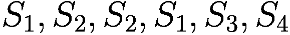

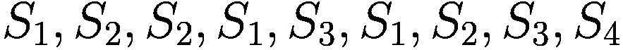

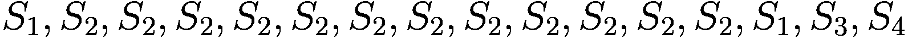

事件任务没有稳定状态。最终系统将过渡到其中一个终止状态。从状态到终止状态的路径/轨迹可能经过多个环和其他状态，但最终代理将找到一个终止状态，事件将结束。

### 马尔可夫奖励过程

接下来是马尔可夫奖励过程，我现在介绍奖励的概念。看看图 2-7 和 2-8 中修改后的状态图。它们是上一节（图 2-5 和 2-6）中的相同问题，增加了每个转换的奖励。

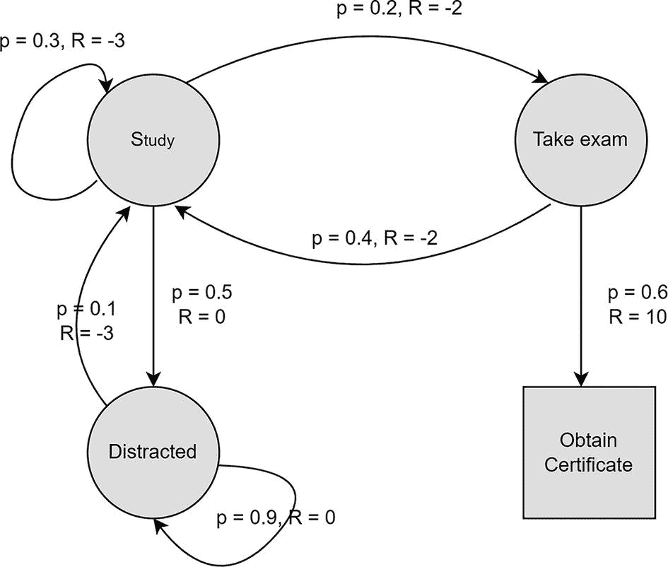

事件马尔可夫奖励过程的状态图有 4 个状态，学习、参加考试、分心、获得证书。P 和 R 的值包括从学习到考试为 0.2 和负 2，从考试到学习为 0.4 和负 2，学习时的 0.3 和负 3，以及从学习到分心的 0.5 和 0。

图 2-8

与图 2-6 类似的事件马尔可夫奖励过程，每个转换增加了奖励 R

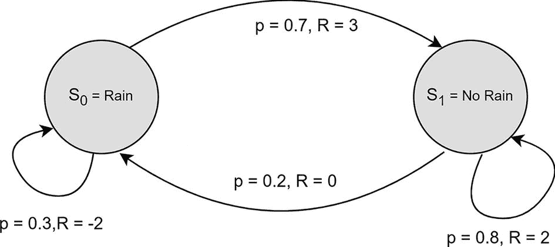

马尔可夫奖励过程的状态图有两个状态 S 0 = rain 和 S 1 = no rain。p 和 R 的值从 S 0 到 S 1 为 0.7 和 3，从 S 1 到 S 0 为 0.2 和 0，S 0 处的 0.3 和负 2，以及 S 1 处的 0.8 和 2。

图 2-7

继续马尔可夫奖励过程。这与图 2-5 中的马尔可夫链类似，每个转换箭头增加了奖励 R

在这两个马尔可夫奖励过程设置中，你可以计算与 MC 中类似的转换概率，如前节所述。此外，你可以计算状态 *V*(*S*) 的值，这是代理在时间 *t* 处于状态 *S* = *s* 时获得的累积奖励，然后它遵循系统的动力学。

![$$ V(s)=E\left[{G}_t\ \right|\ {S}_t=s\Big] $$](img/502835_2_En_2_Chapter/502835_2_En_2_Chapter_TeX_Equ5.png)

(2-5)

其中 *G*[*t*] 在方程 2-3 中定义：

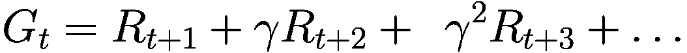

符号 *E*[*G*[*t*]| *S*[*t*] = *s*] 读作当时间 *t* 的起始状态为 *S*[*t*] = *s* 时，返回 *G*[*t*] 的期望。单词 *expectation* 暗示当模拟多次执行时，*G*[*t*] 的平均值。期望算子 (*E*[∙]) 用于推导公式和证明理论结果。然而，在实践中，它被许多样本模拟的平均值所取代，也被称为 *蒙特卡洛模拟*。在蒙特卡洛模拟中，代理从状态 *S*[*t*] = *s* 开始，遵循轨迹收集奖励，每次计算 *G*[*t*]，最后对这样的多次重复中的 *G*[*t*] 取平均值。这样计算出的平均值 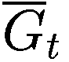 作为理论期望 *V*(*s*) = *E*[*G*[*t*] | *S*[*t*] = *s*] 的近似。

注意 γ 作为折扣因子的使用。如前所述，γ 捕捉了今天的奖励比明天的奖励更好的概念。在数学上，避免持续任务的无界回报也很重要。我这里不深入数学细节，只是提到这个事实。

γ = 1 的值表示没有折扣，并且代理是远见的。它对未来的奖励和立即的奖励同样关心。γ = 0 的值表示代理是短视的。它现在只关心下一个时间步的即时奖励。你可以通过将不同的 γ 值放入 *G*[*t*] = *R*[*t* + 1] + *γR*[*t* + 2] + *γ²R*[*t* + 3] + ... 方程来检查这个概念。

总结到目前为止，我已经介绍了过渡概率 *P*、回报 *G*[*t*] 和状态值 *V*(*s*) = *E*[*G*[*t*] | *S*[*t*] = *s*] 的概念。

### 马尔可夫决策过程

马尔可夫决策过程 (MDP) 通过引入“动作”这一附加概念来扩展奖励过程。在 MRP 中，代理对结果没有控制权。一切都是由环境控制的。然而，在 MDP 制度下，代理可以根据当前状态/观察选择动作。代理可以学习采取最大化累积奖励的动作，即总回报 *G*[*t*]。

例如，查看图 2-8 中周期性马尔可夫奖励过程的扩展。查看图 2-9，您可以看到在“学习”状态下，代理可以采取两种行动之一——学习更多或参加考试。代理以相等的概率 0.5 选择这两种行动。根据当前状态以一定概率选择行动被称为代理为了优化长期奖励而学习的*策略*。行动影响代理将看到的下一个状态的概率和奖励值。如果代理决定“学习”更多，有 0.7 的概率代理会变得“分心”并转向社交媒体，而有 0.3 的概率他们会继续专注于“学习”。如果代理在“学习”状态下决定“参加考试”而不是“学习”，那么“参加考试”行动的结果将导致两种结果——代理以 0.4 的概率失败，回到“学习”状态并获得-2 的奖励，或者（以 0.6 的概率）代理成功完成考试，从而获得证书并获得 10 的奖励。

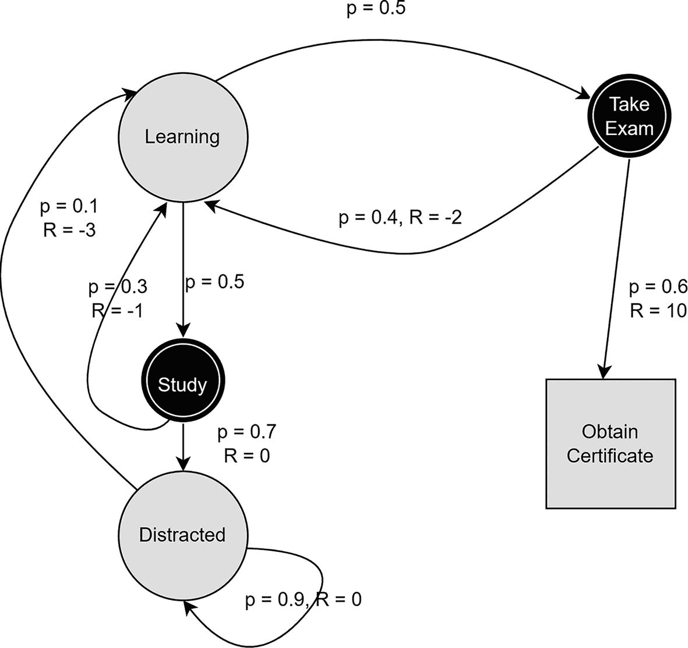

一个周期性马尔可夫决策过程的状态图有 5 个状态：学习、参加考试、分心、学习和获得证书。学习和参加考试状态被突出显示。P 的值标记为 0.1、0.3、0.4、0.5、0.6、0.7 和 0.9。p 和 R 的值沿着链接提供。

图 2-9

周期性马尔可夫决策过程作为图 2-8 中所示的马尔可夫奖励过程的扩展。黑色填充的圆圈是代理可以采取的决策。

转移函数现在是从当前状态和行动到下一个状态和奖励的映射。它定义了代理在状态 *s* 下采取行动 *a* 时，通过转移到下一个状态 *s*^′ 获得奖励 *r* 的概率。

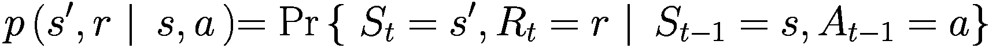

(2-6)

您可以使用方程式 2-6 推导出许多有用的关系。转移概率可以从先前的转移函数中推导出来。转移概率定义了代理在状态 *s* 下采取行动 *a* 时发现自己处于状态 *s*^′ 的概率。它被定义为如下：

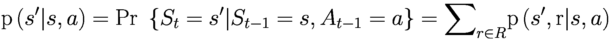

(2-7)

方程式 2-7 是通过对代理从 (*s*, *a*) 转移到 *s*^′ 所能获得的所有可能奖励的平均值推导出来的。

让我们来看一个不同的 MDP 例子，这是一个持续的任务。想象一下机场里的一辆电动手推车，它负责将乘客从一个航站楼运送到另一个航站楼。手推车有两个状态，“高电量”和“低电量”。在每个状态下，手推车可以保持空闲，通过连接充电站充电，或者运送乘客。如果手推车运送乘客，它会获得奖励 b，但存在一种可能性，在“低电量”状态下，运送乘客可能会耗尽电池电量，手推车需要被救援，从而产生奖励-10。图 2-10 展示了 MDP。

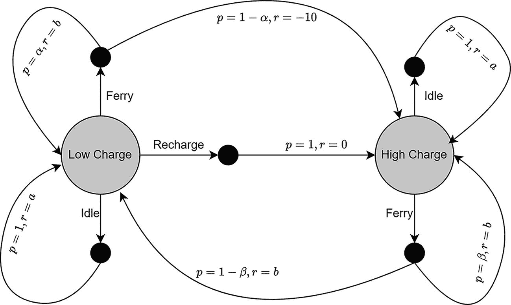

一个基于事件的马尔可夫决策过程的状态图有 2 个状态，低电量和高电量。低电量状态连接到 3 个标记为运送、空闲和充电的深色圆圈。高电量状态连接到 2 个圆圈，用于运送和空闲。p 和 r 的值在链接上提供。

图 2-10

电动手推车：一个具有两个状态的持续马尔可夫决策过程。每个状态有三种行动：空闲、运送或充电

在“低电量”状态下，手推车可以从可能的行动集合{充电、空闲、运送}中选择一个行动。在“高电量”状态下，手推车可以从{空闲、运送}中选择一个行动。所有其他转移都是 0。给定 *p*(*s*^′, *r* | *s*, *a*) 如前所述，*p*(*s*^′ | *s*, *a*) 可以被计算。在这种情况下，它与 *p*(*s*^′, *r* | *s*, *a*) 相同。这是因为对于从 (*s*, *a*) 到 (*s*^′) 的每个转移，只有一个固定的奖励。换句话说，在给定状态下采取行动后，奖励没有不确定性或概率分布。奖励是每次智能体在状态 *s* 采取行动 *a* 并发现自己处于下一个状态 *s′* 时相同的固定值。这是在实践问题中最常见的设置之一。然而，从理论上讲，在最一般的情况下，奖励可能是一个概率分布，例如“运送”行动奖励与手推车运送的乘客数量相关联。

本章的以下部分将继续使用这个例子。

## 策略和值函数

如前所述，MDP 有状态，智能体可以采取行动，将智能体从当前状态转移到下一个状态。此外，智能体从环境中获得反馈，形式为奖励。MDP 的动态定义为 *p*(*S*[*t*] = *s*^′, *R*[*t*] = *r*| *S*[*t* − 1] = *s*, *A*[*t* − 1] = *a*)。您也已经看到了“累积回报”，*G*[*t*]，它定义为从时间 *t* 收到的所有奖励的总和。智能体无法控制转移动态。这超出了智能体的控制范围。然而，智能体可以控制决策，即在不同状态下采取什么行动。

这正是代理根据系统的转换动态所学习的内容。代理的目标是最大化每个状态*S*[*t*]的*G*[*t*]（即回报），在多次运行的平均期望值（期望值）。状态到行为的映射称为*策略*。它正式定义为以下内容：

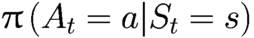

(2-8)

策略定义为在时间*t*代理处于状态*s*时采取行动*a*的概率。代理通过学习从状态到行为的映射函数，目标是最大化总回报。

策略可以分为两种类型。见图 2-11。第一种类型是*随机策略*，其中*π*(a|*s*)是一个概率函数。对于给定的状态，代理可以采取多种行动，每种行动的概率由*π*(a|*s*)定义。第二种类型是*确定性策略*，对于给定的状态只有一个唯一的行为。换句话说，概率函数*π*(A[*t*]=*a*| *S*[*t*]=*s*)变成一个简单的映射函数，对于某些行为*A*[*t*]=*a*，函数值为 1，对于所有其他行为*A*[*t*]为 0。

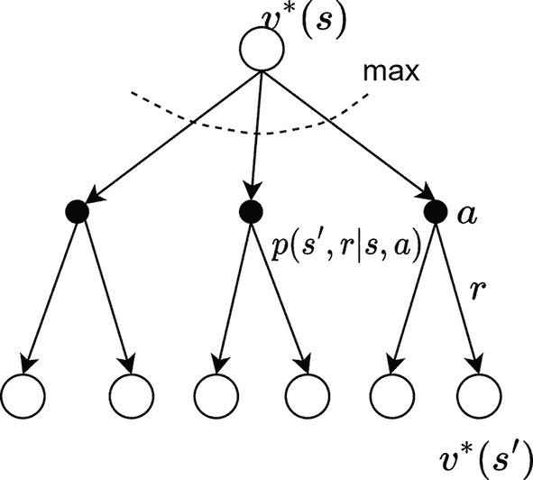

一个树状图。节点 v asterisk of s 连接到 3 个深色圆圈。中心和右侧圆圈分别标记为 p of s prime，r vertical bar s，a 和 a。每个圆圈进一步连接到 2 个圆圈。右侧的圆圈是 v asterisk of s prime，通过 r 连接。

图 2-12

从状态开始，采取行动的回溯图。空圆圈表示状态，深色圆圈表示行动

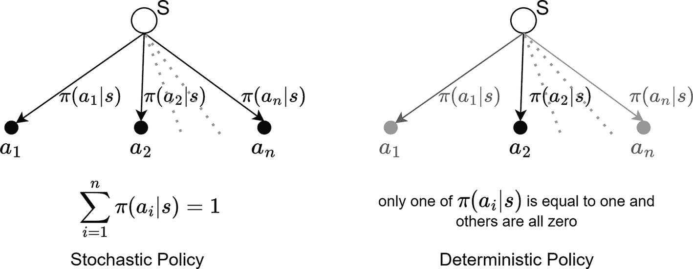

2 个随机策略和确定性策略的树状图。S 被分为 1、2，直到 n。确定性策略只提到当 S 等于 1 时 a 的 pi，其他都是 0。随机策略的表达式是求和 i=1 到 n 的 pi(a|s=1)。

图 2-11

策略类型。（a）随机策略，代理可以根据概率分布采取多种行动之一。（b）确定性策略，代理学习只采取一个最优的具体行动

代理在时间*t*处于状态*S*[*t*]时可以获得的累积奖励*G*[*t*]（即回报）取决于状态*S*[*t*]，策略代理如下。它被称为*状态值函数*。*G*[*t*]的值取决于代理在时间*t*之后将看到的州轨迹，而轨迹反过来又取决于代理将要遵循的策略。因此，值函数总是在代理遵循的策略的上下文中定义的。它也被称为代理的*行为*。它正式定义为以下内容：

![$$ {v}_{\uppi}(s)={E}_{\uppi}\left[{G}_t|{S}_t=s\right] $$](img/502835_2_En_2_Chapter/502835_2_En_2_Chapter_TeX_Equ9.png)

(2-9)

让我们尝试将其分解一下。*v**π* 指定了当代理遵循策略 *π* 时状态 *s* 的“状态值”。*E*[*π*][·] 表示方括号内的内容是许多样本的平均值。虽然从数学上讲，这是在策略 *π* 下方括号内表达式的*期望*，但在现实中，你通常会使用模拟来计算这些值。你进行多次迭代计算，然后取平均值。根据统计学的一条基本定律，在一般条件下，平均值收敛到期望。这个概念在计算机中估计期望时经常被使用，被称为*蒙特卡洛模拟*。至于最后一部分，方括号内的表达式是 (*G*[*t*] | *S*[*t*] = *s*). 那是代理在时间 *t* 时处于状态 *s* 并遵循策略 *π* 的行为下，在重复试验中可以看到的多次运行的平均回报 *G*[*t*]。

*备份图*展示了从时间 *t* 时代理处于状态 *S*[*t*] 到其在时间 *t* + 1 时可能处于的后继状态的路径。这取决于代理在时间 *t* 所采取的行动，即 *π*(*A*[*t*] = *a*| *S*[*t*] = *s*). 此外，它还取决于环境/模型转换函数 *Pr*{*S*[*t* + 1] = *s*^′, *R*[*t* + 1] = *r*| *S*[*t*] = *s*, *A*[*t*] = *a*}，该函数将代理从状态 *S*[*t*] 转换到状态 *S*[*t* + 1]，并基于代理在状态 *S*[*t*] 时采取的行动 *A*[*t*] 获得奖励 *R*[*t* + 1]。直观上，从当前状态到可能的后继状态的单步转换称为*备份图*，其外观如图 2-12 所示。

你将广泛使用备份图，特别是在下一节关于贝尔曼方程的部分。备份图有助于概念化和推理方程，以及解决各种强化学习算法的证明。它们还有助于推理训练代理所需的数据收集。

与*状态值函数*(*简称*值函数*)相关的另一个概念是*动作值函数*的概念。值函数是代理在特定状态下根据策略 *π* 采取行动时获得的期望累积奖励。然而，假设代理在第一次步骤 *t* 时可以自由采取任何行动，条件是它必须从 *t* + 1 开始的所有后续时间步骤上遵循策略 *π*。代理在时间 *t* 获得的期望回报现在被称为*动作值函数 q**π*。形式上，它被定义为以下内容：

![$$ {q}_{\pi}\left(s,a\right)={E}_{\pi }\ \left[\ {G}_t\ \right|\ {S}_t=s,{A}_t=a\ \Big] $$](img/502835_2_En_2_Chapter/502835_2_En_2_Chapter_TeX_Equ10.png)

(2-10)

价值 *v*-值（状态值）和 *q*-值（状态动作值）之间存在简单而微妙的关系，这在下一节中会详细探讨。

这基本上完成了马尔可夫决策过程（MDP）各个组成部分的定义。下一节将探讨状态 *v*-值和状态动作在时间 *t* 的 *q*-值与时间 *t* + 1 的后续值之间的递归关系。几乎所有的强化学习算法都利用这种递归关系。

## Bellman 方程

Bellman 方程是强化学习（RL）领域的一个基本概念。它们形式化了在强化学习等顺序决策设置中，当前值和后续值之间的递归关系。几乎所有的强化学习算法都是基于这些方程的变体，目的是在不同的假设和近似下最大化价值函数。Bellman 方程为理解和解决强化学习中的马尔可夫决策过程（MDP）提供了一个强大的工具。

让我们再次看看定义价值函数的方程 2-9，以及方程 2-3 中定义的 *G*[*t*] 的定义；两者在此处重述：

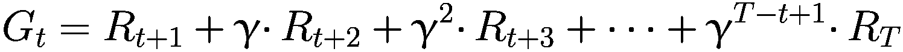

(2-11)

![$$ {v}_{\uppi}(s)={E}_{\uppi}\left[{G}_t|{S}_t=s\right] $$](img/502835_2_En_2_Chapter/502835_2_En_2_Chapter_TeX_Equ12.png)

(2-12)

比较这两个方程，你可以看到，如果一个智能体在状态 *S* 中遵循策略 *π*，那么状态的价值是该智能体从环境中获得的累积奖励的期望/平均值。智能体发现自己所处的状态以及它从环境中获得的奖励取决于它遵循的策略，即它在给定状态中采取的动作。存在一个递归关系，其中 *G*[*t*] 的表达式可以用 *G*[*t* + 1] 来表示。

![$$ {G}_t={R}_{t+1}+\upgamma \left[{R}_{t+2}+\upgamma {R}_{t+3}+{\upgamma}²{R}_{t+4}+\cdots +{\upgamma}^{T-t+1-1}{R}_T\right] $$](img/502835_2_En_2_Chapter/502835_2_En_2_Chapter_TeX_Equ13.png)

(2-13)

现在提取方括号内的表达式：

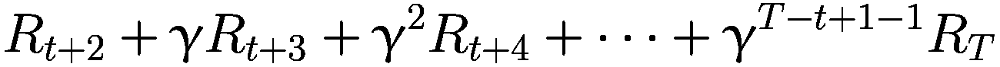

在这个表达式中，你进行变量替换 *t*^′ = *t* + 1，将上述表达式变为：

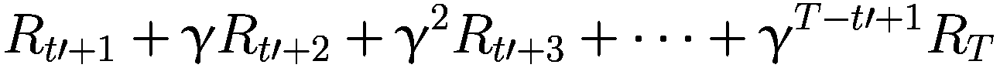

(2-14)

将方程 2-14 与方程 2-11 中给出的 *G*[*t*] 的表达式进行比较，你可以看到：

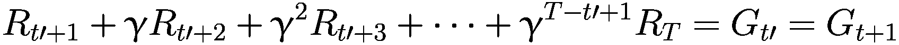

(2-15)

接下来，将方程 2-15 代入 2-13 中，得到：

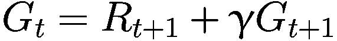

(2-16)

现在，您可以将 *G*[*t*] 的这个递归定义代入方程 2-12 中 *v**π* 的表达式中，得到：

![$$ {v}_{\uppi}(s)={E}_{\uppi}\left[{R}_{t+1}+\upgamma {G}_{t+1}|{S}_t=s\right] $$](img/502835_2_En_2_Chapter/502835_2_En_2_Chapter_TeX_Equ17.png)

(2-17)

期望 *E*[*π*] 是对所有可能的行为 *a*，该智能体在状态 *S*[*t*] = *s* 下可以采取的所有行为，以及所有由转移函数 *p*(*s*^′, *r* | *s*, *a*) 定义的智能体转移到的新状态进行求和。期望的展开形式导致 *v**π* 的修正表达式如下：

![$$ {v}_{\pi }(s)=\sum \limits_a\pi \left(a|s\right)\ \sum \limits_{s^{\prime },r}p\left({s}^{\prime },r\ \right|s,a\Big)\ \left[r+\gamma\ {v}_{\pi}\left({s}^{\prime}\right)\right] $$](img/502835_2_En_2_Chapter/502835_2_En_2_Chapter_TeX_Equ18.png)

(2-18)

解释这个方程的方法是，状态 *s* 的状态值是对所有后续状态 *s*^′ 的奖励和状态值的平均值。这种平均是基于在状态 *s* 中采取行为 *a* 的策略 *π*(*a*| *s*)，然后是智能体根据初始状态-动作对 (*s*, *a*) 将智能体移动到 *s*^′ 并获得奖励 *r* 的环境转移概率 *p*(*s*^′, *r* | *s*, *a*)。方程 2-18 展示了将当前状态 (*s*) 的状态值与后续状态 (*s*^′) 的状态值链接的递归性质。

对于动作值函数也存在类似的关系。让我们从方程 2-10 开始，并逐步推导 *q*-值之间的递归关系。

![$$ {q}_{\pi}\left(s,a\right)={E}_{\pi }\ \left[\ {G}_t\ \right|\ {S}_t=s,{A}_t=a\ \Big] $$](img/502835_2_En_2_Chapter/502835_2_En_2_Chapter_TeX_Equo.png)

![$$ =\kern0.5em {E}_{\pi }\ \left[\ {R}_t+\gamma\ {G}_{t+1}\ \right|\ {S}_t=s,{A}_t=a\ \Big] $$](img/502835_2_En_2_Chapter/502835_2_En_2_Chapter_TeX_Equp.png)

通过对所有可能性进行求和来展开期望，得到以下结果：

![$$ {q}_{\pi}\left(s,a\right)=\sum \limits_{s^{\prime },r}p\left({s}^{\prime },r\ \right|s,a\Big)\ \left[r+\gamma\ {v}_{\pi}\left({s}^{\prime}\right)\right] $$](img/502835_2_En_2_Chapter/502835_2_En_2_Chapter_TeX_Equ19.png)

(2-19)

比较方程 2-18 和 2-19，你会注意到对于*q*π的表达式，外层求和关于动作*a*缺失，而内层求和与方程 2-19 中的求和相匹配。这显示了*v*π和*q*π之间的关系。它们通过代理遵循的策略*π*(*s*| *a*)相关联。*q*-值是(*s*, *a*)元组的值，状态值是状态(*s*)的值。策略通过概率分布将状态与可能的动作集联系起来。处于状态*s*的代理使用策略π(*s*| *a*)采取动作*a*，该状态动作对的值由动作值函数*q*π定义：

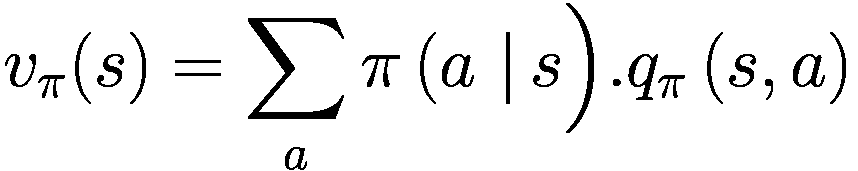

(2-20)

你也可以从方程 2-18 和 2-19 的视觉检查中推断出这种关系。你可以用*q*π来表示*v*π之间的关系，其中按照方程 2-19 将方程 2-18 右侧的内层求和替换为*q*π。

正如方程 2-18 给出了*v*π关于下一个状态*v*π的状态值的递归关系一样，你还可以用方程 2-19 中的对*q*π来表示*q*π。这是通过将方程 2-19 中的*v*π替换为方程 2-20 中的表达式来实现的。这种操作给出了*q*值的递归关系。

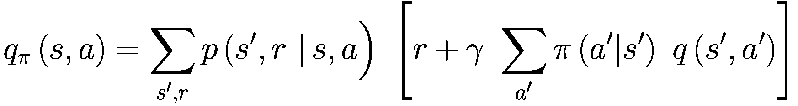

(2-21)

方程 2-18 和 2-21 将当前状态值/ *q*值与后续状态值/ *q*值联系起来，可以通过后备图来表示。为了清楚地显示这种关系，让我们将后备图扩展以覆盖 q 值转换，如图 2-13 所示。该图遵循标准惯例：状态*s*以轮廓圆圈表示，代表动作*a*的动作节点以填充黑色圆圈表示。

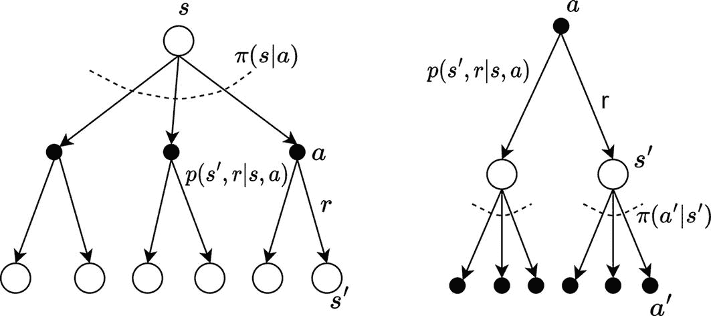

2 个树形图。左图：节点 s 分为 3 个深色圆圈，每个圆圈进一步分为 2 个圆圈。右下角的圆圈是 s'。右图：深色节点 a 分为 2 个圆圈，右侧是 s'。它们进一步分为每个 3 个深色圆圈，右侧有 a'。

图 2-13

状态价值和动作价值的备份图。轮廓圆圈代表状态，实心圆圈代表动作

方程式 2-18 是 *v**π* 的贝尔曼方程，它在图 2-13 的左侧得到反映。方程式 2-21 是 *q**π* 的贝尔曼方程，它在图 2-13 的右侧得到反映。这些方程式形式化了强化学习等顺序决策设置中的递归关系。强化学习中的所有算法都是基于这两个方程式的变体，目的是在不同的假设和近似下最大化价值函数。在我介绍这些算法的过程中，我会持续强调在特定假设下被近似的方程式的部分，以及个别方法的优缺点。

作为强化学习实践者的专业知识，大部分将首先围绕将现实生活中的问题转化为强化学习设置展开，包括选择状态是什么，如何定义动作，以及什么将构成奖励。其次，专业知识将涉及根据约束和假设选择正确的算法集。因此，本书的重点在于使技术发挥最佳效果所需的假设。在介绍不同算法时，我还会讨论根据问题陈述、数据可用性以及其他因素以及不同方法的优缺点来选择哪种技术的时间。我将展示数学方程式来形式化这种关系，但核心重点是帮助您获得对正在发生的事情以及给定方法/算法何时合理的直观感觉。

## 最优贝尔曼方程

解决强化学习问题意味着找到（学习）一个最大化状态价值函数的策略。假设你有一组策略。那么目标就是选择最大化状态价值 *v**π* 的策略。一个状态的最优价值函数定义为 *v*^∗(*s*)。最优状态价值的关系可以表述如下：

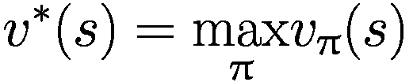

(2-22)

之前的方程式表明，最优状态价值是在所有可能的策略 π 中可以获得的最大状态价值。假设这个最优策略用策略的上方带星号(*)表示，即 π^∗。如果一个智能体遵循最优策略，那么该智能体在状态 (*s*) 将采取那个动作 (*a*)，该动作在最优策略下最大化 *q*(*s*, *a*)。换句话说，方程式 2-20 从期望值修改为最大化如下：

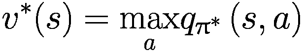

(2-23)

用方程 2-19 中的表达式 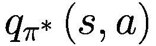 替换后，这里给出的 *v*^∗(*s*) 的修正表达式，其中 *v*^∗(*s*) 递归地与下一个状态的最优值相联系：

![$$ {\mathrm{v}}^{\ast}\left(\mathrm{s}\right)=\underset{\mathrm{a}}{\max }{\sum}_{\mathrm{s}\prime, r}\left[\mathrm{p}\left({\mathrm{s}}^{\prime },\mathrm{r}|\mathrm{s},\mathrm{a}\right)\left[\mathrm{r}+\upgamma \cdotp {\mathrm{v}}^{\ast}\left({\mathrm{s}}^{\prime}\right)\right]\right\} $$](img/502835_2_En_2_Chapter/502835_2_En_2_Chapter_TeX_Equ24.png)

(2-24)

方程 2-24 将状态 *s* 中的最优状态值与下一个时间步的最优状态值 *s*^′ 相联系。接下来，让我们推导出 *q*-值的递归关系。从方程 2-19 开始，用 2-23 中的表达式替换 *v*(*s*^′)，该表达式将 *v*^∗ 与 *q*^∗ 相联系。这种替换导致 *q*-值之间的修正递归关系：

![$$ {q}^{\ast}\left(s,a\right)={\sum}_{s\prime, r}p\left({s}^{\prime },r|s,a\right)\cdotp \left[r+\upgamma \cdotp \underset{a^{\prime }}{\max }{q}^{\ast}\left({s}^{\prime },{a}^{\prime}\right)\right] $$](img/502835_2_En_2_Chapter/502835_2_En_2_Chapter_TeX_Equ25.png)

(2-25)

你会注意到方程 2-24 中的状态值最优方程很难解决，因为最大值操作在求和符号的外面。同时，由于最大操作仅限于单个后续状态 *s*^′ 而不是求和的最大值，方程 2-25 中的 *q* 状态动作值的最优值要容易解决得多。这些最优方程可以用后备图表示，如图 2-14 所示，该图突出了当前值和后续值之间的递归关系。

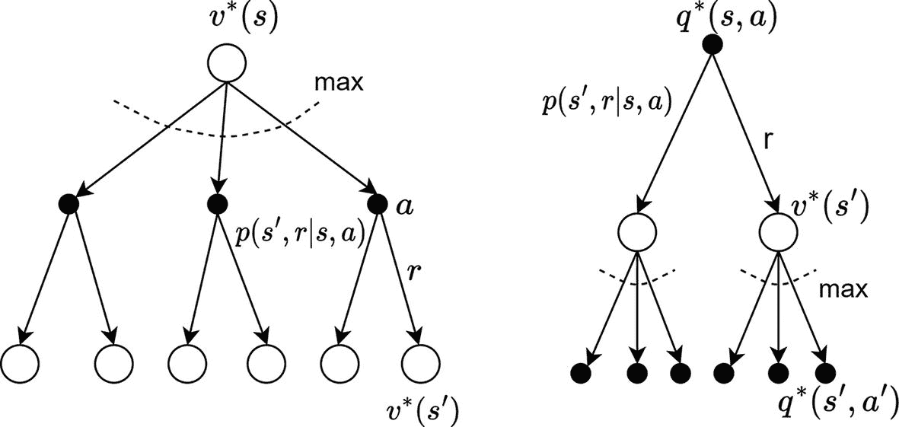

2 个树状图。左侧。节点 v asterisk of s 被分为 3 个深色圆圈，每个圆圈进一步分为 2 个圆圈。右侧。深色节点 q asterisk of s, a 被分为 2 个圆圈，v asterisk of s prime 在右侧。它们进一步分为 3 个深色圆圈，每个圆圈都有 q asterisk of s prime, a prime 在右侧。

图 2-14

最优状态值和动作值的后备图。策略 π 被替换为“最大”操作

一旦你使用方程 2-24 得到 *v*^∗(*s*)，推导最优策略就很简单了。你使用一步回溯图，如图 2-14 所示，来找到导致最优值 *v*^∗ 的 *a*^∗。这可以看作是一步搜索。一旦你使用方程 2-25 得到最优 *q*^∗(*s*, *a*)，找到最优策略就更加容易了。在状态 *s* 中，你只需选择具有最高 *q* 值的动作 *a*。这可以从图 2-14 中的右侧回溯图中看出。让我们将这些概念应用到图 2-10 中介绍的电动货车问题，该问题在图 2-15 中重现。

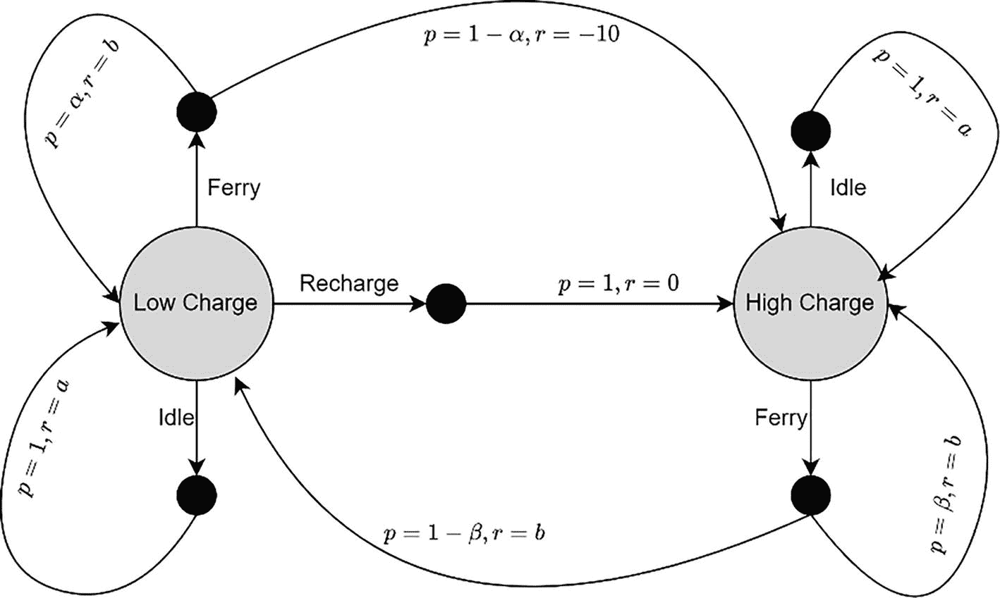

具有两个状态（低电量和高电量）的状态图。低电量状态连接到标记为渡轮、空转和充电的 3 个暗色圆圈。高电量状态连接到 2 个渡轮和空转的圆圈。p 和 r 的值在链接上提供。

图 2-15

电动货车：继续使用两个状态的马氏决策过程。每个状态有三个动作：空转、渡轮或充电。图 2-10 的重现

让我们绘制一个表格，展示各种值，如表 2-1 所示。此表列出了所有 (*s*, *a*, *s*′, *r*) 的可能组合以及概率 *p*(*s*′, *r* | *s*, *a*).

表 2-1

图 2-5 中的 MDP 系统动力学

| 状态 (***s***) | 动作 (***a***) | 新状态 (***s***^′) | 奖励 (***r***) | ***p***(***s***^′, ***r*** &#124;  ***s***, ***a***) |
| --- | --- | --- | --- | --- |
| 低电量 | 空转 | 低电量 | a | 1.0 |
| 低电量 | 充电 | 高电量 | 0 | 1.0 |
| 低电量 | 渡轮 | 低电量 | b | α |
| 低电量 | 渡轮 | 高电量 | -10 | 1- α |
| 高电量 | 空转 | 高电量 | a | 1.0 |
| 高电量 | 渡轮 | 高电量 | b | β |
| 高电量 | 渡轮 | 低电量 | b | 1-β |

你可以使用表 2-1 和方程 2-24 来计算最优状态值。

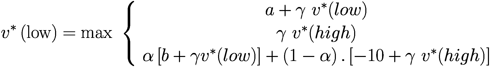

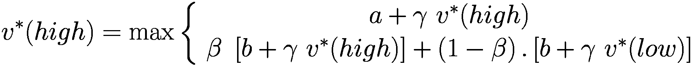

对于给定的*a*，*b*，*α*，*β*，*γ*的值，将有一个独特的解*v*^∗(*high*)和*v*^∗(*low*)，它将满足前面的方程。然而，显式求解方程仅适用于简单的玩具问题。现实生活中的更大问题需要使用其他可扩展的方法。这正是你将在本书的其余部分学习的内容：解决最优策略的 Bellman 方程的各种方法和相关算法。

## 训练你的第一个智能体

本节探讨了两个 Gymnasium 环境和两个算法，用于训练这两个环境的智能体。在这个过程中，你将了解 Python 中你将在整本书中使用的不同 RL 库。由于这是对 RL 训练的第一次介绍，你将把训练算法视为黑盒，重点是熟悉库和进行 RL 训练所需的不同组件。然而，随着你对本书的深入，你将打开黑盒，编写自己版本的这些算法，以获得更深入的理解。

### 第一个智能体

本节使用一个名为 LunarLander 的环境，这是一个经典的火箭轨迹优化问题（见图 2-16）。目标是让船体在两个标志标记的着陆台上着陆。有四种可能的行为（*a*）来控制船体：

+   0: 不做任何事情

+   1: 点火左侧方向引擎

+   2: 点火主引擎

+   3: 点火右侧方向引擎

观察结果（*o*），即暴露给智能体的状态环境的一部分，由一个八维向量组成：

+   着陆器的 x，y 坐标

+   x 和 y 方向上的线性速度

+   船体的角度及其角速度

+   两个标志分别表示左腿和右腿是否与地面接触

奖励在每个时间步根据船体与着陆台的距离、是否倾斜或直立、引擎是否点火以及是否有任何一条腿与地面接触来发放。安全着陆或坠毁会获得额外的正/负奖励。你可以在 Gymnasium 文档中了解更多信息.^(4)

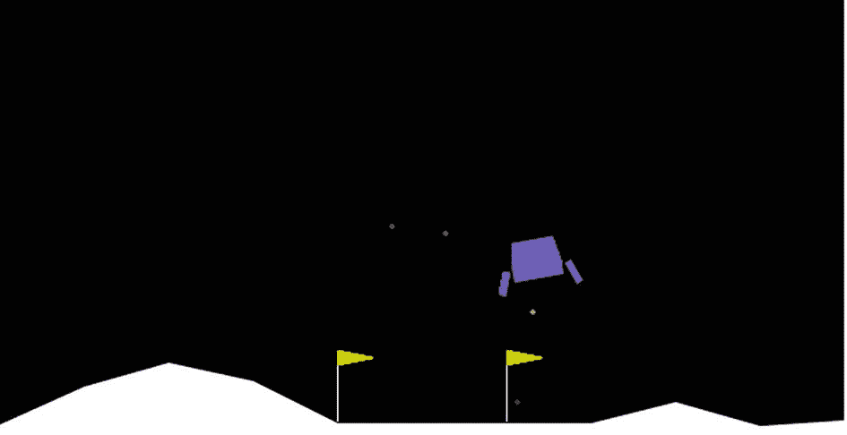

Lunar Lander 的插图显示了在明亮环境中，在两个标志之间着陆的月球。

图 2-16

来自 Gymnasium 库的 LunarLander 环境 - [LunarLander 环境](https://gymnasium.farama.org/environments/box2d/lunar_lander/)

此示例使用 DQN，或深度 Q 网络，这是一种结合了传统 Q 学习算法和深度神经网络能力的强化学习算法。它用于逼近最优动作值函数，该函数表示在给定状态下采取特定动作的最大期望未来奖励。DQN 已被成功应用于广泛的问题，包括游戏和控制任务，并且在许多情况下已显示出达到人类水平的表现。

第六章和第七章专注于对 DQN 及其变体的深入探讨。因此，本章仅展示一个示例，而不深入探讨 DQN 的工作原理的具体细节。

此示例使用另一个名为`stable_baseline3`的库来创建一个小型神经网络，该神经网络学习智能体的策略π(*a*| *s*)，即状态到动作的映射。网络的输入是八维观察向量，动作是从离散动作集{0, 1, 2, 3}中的一个值。DQN 智能体需要以随机方式探索环境，以获得可能的*(状态, 动作) ➤ 下一个动作*转换的良好覆盖。这通过设置`exploration_final_eps=0.1`来实现。日志详细程度定义为 1，以便获得适当的日志级别。有关详细信息，请参阅笔记本`2.c-First-Agent.ipynb`。请注意，您可以在遵循第一章中的说明创建的环境中本地运行笔记本，或者您可以直接在 Google Colab 上运行笔记本，Google Colab 是一个提供免费层和付费层的网络托管 Python 环境。对于本书，Colab 的免费层通常就足够了。DQN 实例化的摘录在列表 2-3 中显示。

```py
import gymnasium as gym
from stable_baselines3 import DQN
model = DQN(
"MlpPolicy", "LunarLander-v2",
verbose=1, exploration_final_eps=0.1,
target_update_interval=250)
Listing 2-3
Initializing DQN agent-“2.c-First-Agent.ipynb”
```

接下来，使用`stable_baselines3`库内置的 DQN 算法训练智能体并将其保存。通过调用`model.learn`函数，设置`total_timesteps=int(1e5)`以运行 10 万步的训练，`log_interval=400`以每 400 个回合（而不是 400 步）记录训练进度，并最终设置`progress_bar=True`以通过进度条观察训练进度。

```py
# Train the agent
model.learn(total_timesteps=int(1e5), log_interval=400, progress_bar=True)
# Save the agent
model.save("dqn_lunar")
Listing 2-4
Train the agent-“2.c-First-Agent.ipynb”
```

然后您可以使用以下代码评估训练好的智能体以检查其性能。在训练之前，智能体产生的平均奖励为-600，经过 10 万步的训练后，平均奖励提升到约+100。请参阅列表 2-5。

```py
# Evaluate the trained agent
mean_reward, std_reward = evaluate_policy(model, eval_env, n_eval_episodes=10, deterministic=True)
print(f"mean_reward={mean_reward:.2f} +/- {std_reward}")
-----------
Output:
mean_reward=94.54 +/- 87.28950452232776
Listing 2-5
Evaluate Trained Agent--“2.c-First-Agent.ipynb”
```

笔记本`2.c-First-Agent.ipynb`还展示了如何记录训练代理的视频。在你对训练结果满意后，你可以使用`huggingface`上传模型，然后可以与他人分享。为了将模型上传到`huggingface`，你需要生成一个令牌以启用笔记本访问你的`huggingface`账户。首先，如果你还没有账户，请在`huggingface.co`上创建一个账户。你可以在[`https://huggingface.co/settings/tokens`](https://huggingface.co/settings/tokens)创建/找到`huggingface`令牌。一旦你的模型被推送到`huggingface`，你可以导航到它托管的位置。URL 由用于将模型推送到`huggingface`枢纽的代码打印在最后。在我的情况下，它看起来像这样：[`https://huggingface.co/nsanghi/dqn-LunarLander-v2`](https://huggingface.co/nsanghi/dqn-LunarLander-v2)。`nsanghi`对应于我的`huggingface`登录，`dqn-LunarLander-v2`指的是我在账户下的`huggingface`空间/存储库，该模型基于我在笔记本中`package_to_hub()`函数调用中定义的名称被推送到。此函数的调用在列表 2-6 中显示。在运行此代码之前，将`repo_id`更改为指向你的`huggingface`账户登录。

```py
package_to_hub(model=model, # Our trained model
model_name="dqn-LunarLander-v2", # The name of our trained model
model_architecture="DQN", # The model architecture we used: in our case PPO
env_id="LunarLander-v2", # Name of the environment
eval_env=eval_env, # Evaluation Environment
# id of the model repository from the Hugging Face Hub
# (repo_id = {organization}/{repo_name} for instance
#nsanghi/dqn-LunarLander-v2
repo_id="nsanghi/dqn-LunarLander-v2",
commit_message="Push to Hub")
Listing 2-6
Package Trained Agent and Video to Hugging Face hub--“2.c-First-Agent.ipynb”
```

你可以将此链接与你的朋友和家人分享，以展示你仅用几行代码训练的代理的性能。

## 常用库的概述

本节简要介绍了在 LunarLander 环境中训练代理所使用的库，以及在其他章节中你将使用的一些其他常用库。

### 环境：Gymnasium 和 OpenAI Gym

如本章第一部分关于强化学习定义的描述，每个强化学习问题都必须有一个环境的概念，这涉及到状态、动作和奖励，即状态是什么，代理可以执行哪些动作，以及代理可以获得哪些类型的奖励。代理接收一个状态，使用它在环境外学习的策略采取一个动作，并将这个动作传递给环境。环境将动作作为输入，将代理推进到下一个时间实例，并返回一系列东西：下一个状态、奖励、终止标志、截断标志和一些调试信息。Gymnasium^(5)库，是 OpenAI Gym 库的移植，提供了一个标准接口来访问所有强化学习环境。这使得它模块化，学习算法代码被抽象化，与环境的动力学/模型代码分离。Gymnasium 除了提供标准接口外，还提供了一系列广泛的环境：

+   **经典控制**：这是基于现实世界问题和物理的经典强化学习。

+   **Box2D**：这些环境都涉及基于物理控制的玩具游戏，使用基于 Box2D 的物理和基于 PyGame 的渲染。

+   **玩具文本**：这些环境被设计得非常简单，具有小的离散状态和动作空间，因此易于学习。它们适合调试强化学习算法的实现。

+   **MuJoCo**：基于多关节控制的物理引擎环境，比 Box2D 环境更复杂。

+   **Atari**：通过 Stella 和 Arcade Learning Environment 模拟的 57 个 Atari 2600 环境，这些环境具有高复杂度，使智能体能够学习。

+   **第三方选项**：已创建了一些与 Gymnasium API 兼容的环境。

Gymnasium 是原始 OpenAI Gym 的新端口。虽然它主要保留了 OpenAI Gym 的功能签名，但也有一些细微的差异。流行的 RL 库仍在添加对 Gymnasium 的支持。在安装这些其他库时，请确保安装适用于 Gymnasium 端口的版本。

### 稳定基线 3 (SB3)

稳定基线 3^(6) (SB3) 是 PyTorch 中强化学习算法的可靠实现集合。它是稳定基线版本 2 的下一个主要版本。您可以在 JMLR 论文^(7)中阅读关于稳定基线 3 的详细介绍。它实现了七个常见算法：

+   优势演员评论家(A2C)

+   深度确定性策略梯度 (DDPG)

+   深度 Q 网络 (DQN)

+   后见之明经验回放 (HER)，与 DQN、SAC、TD3 和 DDPG 一起工作

+   近端策略优化 (PPO)

+   软演员评论家 (SAC)

+   双延迟 DDPG (TD3)

这些实现已经与参考代码库进行了基准测试，并且自动单元测试覆盖了 95%的代码。算法遵循一致的接口。

### RL Baselines3 池

RL Baselines3 池^(8) 是使用 Stable Baselines3 的强化学习训练框架。它提供了用于训练、评估智能体、调整超参数、绘制结果和录制视频的脚本。

此外，它还包括一组针对常见环境和 RL 算法的调优超参数，以及使用这些设置训练的智能体。

### Hugging Face

Hugging Face^(9)围绕 Transformers 提供了一套广泛的 Python 库，该库是在 2017 年一篇题为“Attention is all you need”^(10)的研讨会论文中引入的。这导致了各种基于这一想法的衍生方法爆炸式增长，用于解决自然语言处理（NLP）相关的学习方法。所有最新的语言模型都是基于这种架构的变体而增加的——包括 OpenAI 的 GPT 系列，Google 的 BERT 和 BARD，Meta 的 Llama 和 Llama2，以及许多其他模型。Hugging Face 的出现是为了提供这些语言模型的标准化、易于使用的实现——包括模型代码、基础设施（包括数据管理、训练运行和托管训练模型的空间）。它促进了开源社区的协作，现在它涵盖了所有其他类型的深度学习模型，包括与视觉、语音和强化学习相关的模型。当我涉及到 RLHF（基于人类反馈的强化学习）这一主题时，我会广泛使用这个库，这是 OpenAI 在开发 InstructGPT 和 ChatGPT 时引入的一种方法。从那时起，它几乎被所有基于 LLM 的聊天和指令遵循模型所采用。在后续章节中的一个部分专门介绍了 RLHF。

然而，即使在开始 RLHF 之前，我将会使用 Hugging Face hub 来托管训练好的模型，以便其他人也可以共享，包括训练后智能体动作的视频。这就是我在“首先训练智能体”这一节中所做的。

## 第二个智能体

现在你将看到如何训练一个智能体来玩 Atari 乒乓球游戏。这个例子使用的是 Atari 模拟器中的环境。Atari 环境通过 Arcade Learning Environment（ALE）^(11)通过 Stella 模拟.^(12)

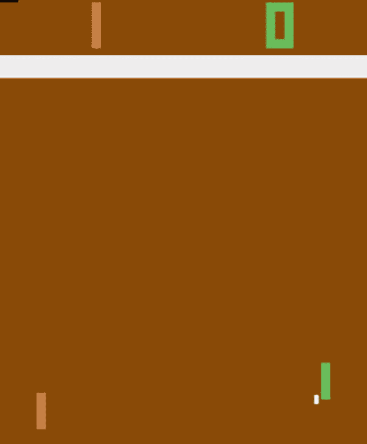

两个相同长度的矩形阴影区域的示意图。上方的矩形高度小于下方的矩形。上方矩形有一个垂直的阴影矩形和一个带有粗边的空心矩形。下方的矩形有两个随机位置的垂直矩形。

图 2-17

来自 Gymnasium 库的 Atari 乒乓球 - [`https://gymnasium.farama.org/environments/atari/pong/`](https://gymnasium.farama.org/environments/atari/pong/)

这个例子使用 Atari 游戏模拟器中的一个特定变体的 Pong，即`PongNoFrameskip-v4`。Atari 模拟器 1600 有 18 个动作，其中 Pong 使用了 6 个。观察空间是以 210x160x3 三个颜色通道像素值形式的游戏状态的 RGB 图像，每个值范围从 0 到 255，即 uint8 值。

由于单个桨和球的图像无法告诉你球运动的方向，你必须取四个连续的游戏图像并将它们堆叠在一起形成一个单一观察，以捕捉游戏中的动作。因此，观察是一个由四个图像组成的堆叠图像。智能体学习的策略是将这些堆叠的四图像观察向量作为输入，并产生执行六种可能动作之一的概率。这在数学上表示为学习策略 *p*π(θ)，其中策略是一个以堆叠图像向量 (*o*) 作为输入、六种动作 (*a*) 作为输出的神经网络 π(θ)。

本例使用神经网络策略的`CnnPolicy`类。输入是堆叠的图像，CNN 类网络最适合在神经网络中进行图像处理。

在之前的 LunarLander 案例中，智能体的策略基于 DQN。然而，对于 Pong 游戏，我使用了 A2C 算法。A2C 是异步优势演员评论家（A3C）的同步、确定性变体.^(13)

```py
env_id = "PongNoFrameskip-v4"
# `n_envs=4` enables multiworker training using 4 environments
vec_env = make_atari_env(env_id, n_envs=4, seed=0)
# `n_stack=4` - Frame-stacking with 4 frames
vec_env = VecFrameStack(vec_env, n_stack=4)
# instantiate the A2C based agent using stablebaselines3
model = A2C("CnnPolicy", vec_env, verbose=1)
# If you have a GPU, you can increase the `total_timesteps` to something like 1_000_000 i.e. one million and it would take about 45 mins to train
# Trian the agent i.e. the Neural network CNN based model which learns the policy
model.learn(total_timesteps=20_000, log_interval=500, progress_bar=True)
Listing 2-7
Train Atari Pong Using the A2C Algorithm-“2.d-Second-Agent.ipynb”
```

创建视频以检查性能并将训练好的模型推送到 Hugging Face 的其余步骤都与之前 LunarLander 示例中的步骤非常相似。你可以参考配套的 Python 笔记本`2.d-Second-Agent.ipynb`以获取详细信息。

## RL Zoo Baselines3

RL Baselines3 Zoo^(14) 是强化学习的一个训练框架。使用 Stable Baselines3 (SB3)，在这个库中提供了 PyTorch 中强化学习算法的可靠实现。它提供了用于训练、评估智能体、调整超参数、绘制结果和记录视频的脚本。此外，它还包括了针对常见环境和 RL 算法的调整好的超参数集合，以及使用这些设置训练的智能体。

RL Zoo 应该从命令行运行。然而，你可以使用 Python 笔记本通过在命令前使用`!`感叹号字符来运行命令。例如，要运行`pwd` UNIX 命令以列出当前工作目录，你可以在代码单元中执行`!pwd`命令。

在本节中，你将学习如何训练智能体，记录训练智能体的视频，以及将训练好的智能体推送到 Hugging Face——所有这些都可以使用 RL Zoo SB3 完成。你将首先使用 DQN 算法训练相同的`LunarLander`智能体。笔记本`2.e-RL-Zoo.ipynb`包含了运行 RL Zoo 命令的代码。

```py
!python -m rl_zoo3.train --algo dqn --env LunarLander-v2 --n-timesteps 100000 --log-interval 400 –progress
Listing 2-8
Using RL Zoo to Launch Training-“2.e-RL-Zoo.ipynb”
```

在脚本运行开始时，它会打印出控制训练的各种超参数。你可以参考 RL Zoo 文档以获取更多详细信息。例如，LunarLander 的 DQN 智能体的默认值位于该位置；参见脚注.^(15) 你可以在调用训练脚本时使用 RL Zoo SB3 文档中提供的扩展命令行参数列表来修改这些值，在“训练智能体”部分下.^(16)

一旦智能体被训练，你可以运行额外的命令行脚本来：a) 评估训练智能体的性能；b) 在本地机器上录制视频；c) 将训练的智能体模型、性能和视频推送到 Hugging Face 平台。这些额外的命令在列表 2-9 中展示。

```py
#evaluate trained agent
!python -m rl_zoo3.enjoy --algo dqn --env LunarLander-v2 --no-render --n-timesteps 5000 --folder logs/
#record a video
!python -m rl_zoo3.record_video --algo dqn --env LunarLander-v2 --exp-id 0 -f logs/ -n 1000
#push all artefacts to Hugging Face Hub
!python -m rl_zoo3.push_to_hub --algo dqn --env LunarLander-v2 -f logs/ -orga nsanghi -m "Initial commit"
Listing 2-9
Additional Commands in RL Zoo-“2.e-RL-Zoo.ipynb”
```

现在轮到你了，看看你是否能复制这些步骤来处理第二个智能体——使用 A2C 训练的 Atari Pong 游戏智能体。

这部分内容结束了对各种库和示例代码的探索，包括加载环境、训练智能体、记录性能以及将内容推送到 Hugging Face 进行分享。虽然这里采取的方法是对涉及库的高级概述，而许多关于实用强化学习的入门书籍都止步于此，但本书的目的是掌握两者——对强化学习中使用的各种训练算法的理论代码级理解，以及涉及强化学习的常见生产级库。因此，接下来的章节同样强调编写自己的工作算法。

## 带有思维导图的解决方案方法

现在你已经具备了强化学习配置、相关块、Bellman 方程和算法样本的背景知识，是时候看看强化学习世界中算法的完整图景了。OpenAI 的图 2-18 展示了 RL 空间中各种学习算法的高级图景。

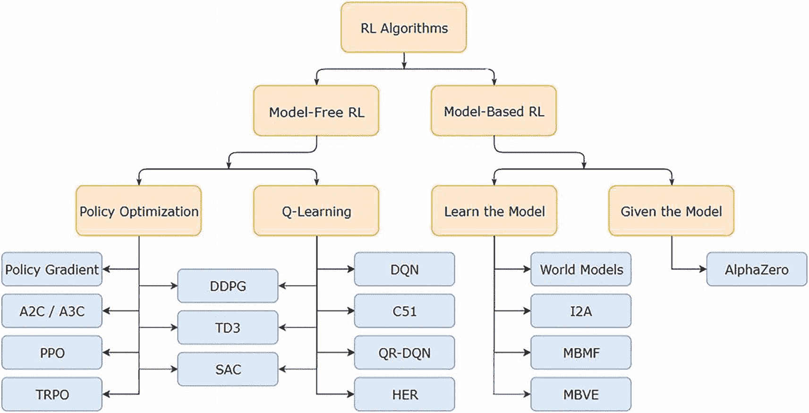

树形图。R L 算法分为无模型 R L 和基于模型的 R L。无模型 R L 分为策略优化和 Q 学习。基于模型的 R L 分为学习模型和给定模型。它们进一步被分类。给定模型导致 AlphaZero。

图 2-18

强化学习中算法的思维导图。这是一个高级地图，仅显示广泛的分类（参考[`https://spinningup.openai.com/en/latest/spinningup/rl_intro2.html`](https://spinningup.openai.com/en/latest/spinningup/rl_intro2.html)）。

如 Bellman 方程所示，系统状态转移动态 *p*(*s*^′, *r* | *s*, *a*) 是一个核心部分。状态转移动态描述了环境模型，即基于当前状态和智能体采取的动作，环境在奖励和智能体过渡到的新状态方面有何反应？然而，状态转移动态并不总是已知的。因此，学习算法的第一个广泛分类可以根据对这种转移模型的知识（或缺乏知识）来进行。其中状态转移动态已知或明确学习的算法被归类为*基于模型的算法*，而那些状态转移动态未知或未直接使用的算法被归类为*无模型算法*。

基于模型的算法可以进一步分为两类：一类是你被给予模型，例如围棋或象棋游戏，第二类是智能体需要探索和学习模型。在“学习模型”下的一些流行方法包括世界模型、想象增强智能体（I2A）、基于模型的强化学习带模型无关微调（MBMF）和基于模型的值探索（MBVE）。

回到模型无关设置，请注意，Bellman 方程为你提供了一种找到状态/动作值并使用它们来找到最优策略的方法。大多数这些算法采用迭代改进的方法。最终，你希望智能体拥有最优策略，而算法使用 Bellman 方程来评估策略的好坏，并指导改进的正确方向。然而，还有另一种方法。为什么不直接改进策略而不是通过值到策略的间接方式呢？这种直接策略改进的方法被称为*策略优化*。

将目光移至图 2-18 的左侧，模型无关类别中，*Q-learning*构成了模型无关 Bellman 驱动状态/动作值优化的主要部分。在此方法下流行的变体包括深度 Q 网络（DQN）以及 DQN 的各种变体，例如分类 51 原子 DQN（C51）、分位数回归 DQN（QR-DQN）和事后经验重放（HER）。

直接遵循策略优化路径的算法包括策略梯度、演员-评论家及其变体（A2C/A3C）、近端策略优化（PPO）和信任区域策略优化（TRPO）。在基于策略的算法中，PPO 是当前最先进的。最近，PPO 已经与大型语言模型如 GPT 系列、Llama 和其他变体结合使用，通过称为从人类反馈中强化学习（RLHF）的方法，使模型生成安全且有帮助的人类输出。

最后，有一组算法位于 Q-learning 和策略优化之间。这个类别中流行的算法包括深度确定性策略梯度（DDPG）、双延迟 DDPG（TD3）和软演员-评论家（SAC）。

这些分类只是为了帮助您欣赏不同的方法和流行算法。然而，这个列表和分类并不是详尽的。强化学习领域正在快速发展，新的方法正在不断加入。仅将之前的思维导图作为高级指导。

## 摘要

本章为强化学习是什么、设置和不同定义设定了背景。本章首先讨论了高级设置和各种马尔可夫公式的数学基础。随后是对 Bellman 方程的讨论，它们的递归性质的推导和最优性方程。状态/动作值函数和后备图形式化了这一概念。

本章随后探讨了使用 Stable Baselines3 的几个代理训练工作流程。它深入研究了强化学习（RL）中相关的库和软件框架，以及你在本书的学习过程中将显著使用的那些。本章最后总结了算法的概览。

在本书接下来的部分，我将更深入地探讨这些算法中的许多，从下一章的动态规划开始。
