# 3. 基于模型的策略

第二章讨论了构成智能体和环境的各个部分。为了回顾，智能体获取状态 *S*[*t*] = *s* 并遵循一个将状态映射到动作的策略 *π*(*s*| *a*)。智能体使用这个策略在状态 *S*[*t*] = *s* 时采取动作 *A*[*t*] = *a*。系统过渡到下一个时间点 *t* + 1。环境通过将智能体置于新的状态 *S*[*t* + 1] = *s*^′ 并提供奖励 *R*[*t* + 1] 作为反馈来响应动作 (*A*[*t*] = *a*)。智能体无法控制新的状态 *S*[*t* + 1] 和奖励 *R*[*t* + 1] 将会是什么。从 (*S*[*t*] = *s*, *A*[*t*] = *a*) → (*R*[*t* + 1] = *r*, *S*[*t* + 1] = *s*^′) 的转换由环境控制。这被称为 *转换动力学*。对于给定的 (*s*, *a*) 对，可能存在一个或多个 (*r*, *s*^′) 对。在确定性世界中，对于固定的 (*s*, *a*) 组合，你将有一个唯一的 (*r*, *s*^′) 对。然而，在具有不确定结果的随机环境中，对于给定的 (*s*, *a*)，你可能有多个 (*r*, *s*^′) 对。第二章还探讨了状态值 *V*(*s*) 和状态-动作值 *Q*(*s*, *a*) 的计算，以及当前状态/状态-动作值与下一个状态/状态-动作值之间的递归关系（在方程 2-19 和 2-21 中）。

强化学习智能体学习任何给定状态的最优动作，通过智能体从一个状态过渡到另一个状态时遵循最优动作集来最大化智能体获得的累积奖励。方程 2-19 和 2-21 清楚地表明 *V*(*s*) 和 *Q*(*s*, *a*) 依赖于两个组件，即转换动力学和下一个状态/状态-动作值。为了建立强化学习的基础，本章从最简单的设置开始——其中转换动力学 Pr{ *S*[*t* + 1] = *s*^′, *R*[*t* + 1] = *r* | *S*[*t*] = *s*, *A*[*t*] = *a*} 是已知的。它还假设在给定状态下可能的状态和动作的数量形成一个封闭的、小的离散值集合。这样的简化假设将有助于你建立强化学习算法的基础。

在现实生活中，这些假设并不成立。考虑一个机械臂（或任何物理系统）的例子。每次移动机械臂时，由于涉及的机械部件，移动可能不够精确，因此下一个状态在严格意义上只能近似定义。进一步考虑自动驾驶汽车的例子，下一个状态取决于许多其他随机元素，如另一辆车的突然移动或行人的移动，这些可能随时间而变化。这表明，在非常简单的场景中，对转移函数的先验知识是一个可以做出的假设。第二个假设是有限个离散状态和动作的集合，对于大多数存在于连续状态和动作世界中的物理系统来说并不成立。

因此，你将在后续章节中学习的算法使用各种技术，在基于模型的强化学习（*model-based RL*）下通过采样和其他相关方法来估计这些转移函数，或者在无模型强化学习（*model-Free RL*）下绕过显式估计转移函数的需要。我在第二章末尾的“带有思维导图的解决方案方法”部分讨论了这些内容。这些方法有助于消除这两个约束，随着你阅读本书的进展，我将详细讨论这些方法。

回到本章的重点，本章中的智能体使用转移知识来“规划”一个策略，该策略最大化状态值 *v*π 或 *q*π 的累积回报。所有这些算法都是基于动态规划的，这允许你将问题分解成更小的子问题，并使用第二章中解释的贝尔曼方程的递归关系。接下来，我将扩展这种方法，提出一个更通用的策略改进框架。

## 网格世界环境

编码练习基于一个简单的网格世界环境——一个理想化的 16 个方块组成的 4x4 格式迷宫世界，如图 3-1 所示。

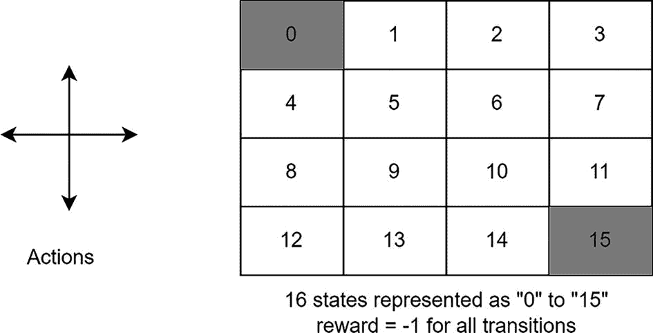

一个 4x4 网格的示意图。网格有 16 个方块，编号从 0 到 15。0 和 15 位于网格的对角端。

图 3-1

网格世界环境。它是一个 4x4 的网格，终端状态位于顶部左角和底部右角。网格中的数字代表状态 S

顶部左角和底部右角的位置是终端状态，在图中以阴影单元格表示。在给定的单元格中，智能体可以朝四个方向中的任何一个移动：`UP, RIGHT, DOWN` 和 `LEFT`。动作确定性地将智能体移动到动作的方向，除非有墙壁。在碰到墙壁的情况下，智能体保持在当前位置。智能体在达到终端状态之前，每一步都会获得 `-1` 的奖励。

我将保持网格世界环境的实现尽可能简单，只实现核心功能。有关在 Gymnasium 库中创建自定义环境的详细方法，请参阅 Gymnasium 的文档。

你将创建一个新的类`GridworldEnv`，该类实现转换动力学 Pr{ *S*[*t* + 1] = *s*^′, *R*[*t* + 1] = *r* | *S*[*t*] = *s*, *A*[*t*] = *a*}作为一个字典`P`，其中`P[s][a]`给出一个包含值`(probability, next_state, reward, done)`的元组列表。换句话说，对于给定的状态*s*和动作*a*，它给出一个由可能的下一个状态*s*^′、奖励*r*和概率*p*(*s*^′, *r*| *s*, *a*)组成的元组列表。元组中的第四个值是一个布尔标志`done`，表示下一个状态*s*^′是否为终止状态。

在基于模型的学习的当前设置下，转换动力学`P`是已知的，这是本章的重点。然而，在现实世界问题中，无论是基于模型还是无模型，`P`都是未知的。算法要么在没有模型（转换动力学）知识的情况下学习，要么构建模型动力学的近似来解决强化学习优化问题。你将在后续章节中学习这些算法。列表 3-1 显示了网格世界的转换函数实现，该实现包含在脚本文件`gridworld.py`中。

```py
def limit_coordinates(self, coord):
"""
Prevent the agent from falling out of the grid world
:param coord: a tuple(x,y) position on the grid
:return: new coordinates ensuring that they are within the grid world
"""
coord[0] = min(coord[0], self.shape[0] - 1)
coord[0] = max(coord[0], 0)
coord[1] = min(coord[1], self.shape[1] - 1)
coord[1] = max(coord[1], 0)
return coord
def transition_prob(self, current, delta):
"""
Model Transitions. Prob is always 1.0.
:param current: Current position on the grid as (row, col)
:param delta: Change in position for transition
:return: [(1.0, new_state, reward, done)]
"""
# if stuck in terminal state
current_state = np.ravel_multi_index(tuple(current), self.shape)
if current_state == 0 or current_state == self.nS - 1:
return [(1.0, current_state, 0, True)]
new_position = np.array(current) + np.array(delta)
new_position = self.limit_coordinates(new_position).astype(int)
new_state = np.ravel_multi_index(tuple(new_position), self.shape)
is_done = new_state == 0 or new_state == self.nS - 1
return [(1.0, new_state, -1, is_done)]
Listing 3-1
The Grid World Environment
```

`limit_coordinates`函数确保智能体不会使用整个网格。如果你位于最左边的单元格之一，向左移动的动作不会让智能体离开网格。在这种情况下，智能体保持不动，因为没有办法在左边的单元格中向左移动。

`transition_prob`函数接受智能体的当前位置和一个动作，如向上或向下。它根据动作移动智能体，同时注意不要让智能体掉出网格。它返回一个包含`prob_of_new_state, next state value, reward`和`done`标志的元组。在当前环境中，你正在模拟一个确定性世界，这意味着基于动作的移动是确定的，结果只有一个具有概率 1.0 的新状态。因此，返回元组中的`prob_of_new_state`始终为 1，并且对于每个状态-动作对只返回一个元组。然而，在随机世界中，对于每个状态-动作对都会得到一个元组列表，其中每个元组都指的是智能体在动作后可能发现自己处于的某个可能状态。

现在我们来关注基于模型的算法，这是本章的重点。我将首先解释动态规划的概念。

## 动态规划

动态规划是一种由理查德·贝尔曼在 20 世纪 50 年代开发的优化技术。在算法思维背景下，动态规划等同于通过记住部分结果来避免重复工作的概念。换句话说，它指的是以递归方式将复杂问题简化为更简单的子问题。这种递归分解到更简单的问题会在达到可以轻易解决问题的简化程度时停止。一个例子是计算斐波那契数列。

斐波那契数列定义为*F*[*i*] = *F*[*i* − 1] + *F*[*i* − 2]，其基本情况为*F*[1] = *F*[2] = 1。让我们看看如何计算*F*[51]。*F*[51] = *F*[50] + *F*[49]。但是，*F*[50]本身必须先计算，使用*F*[49] + *F*[48]。如您所见，为了计算*F*[51]，您需要计算*F*[49]两次，第一次作为*F*[50]的一部分，然后直接作为*F*[51]方程中的第二项。使用动态规划，您只需计算一次*F*[49]并将其存储在第一次计算时。任何后续调用计算*F*[49]都会返回之前存储的值，而不是再次计算。有两种实现方式。一种是从大问题开始，递归地将它分解为较小子问题的计算（如果以原始方式实现），这会导致子问题多次重复计算，从而导致运行时间的指数级增长，类似于我在*F*[49]的上下文中讨论的，并在图 3-2 中展示的情况。

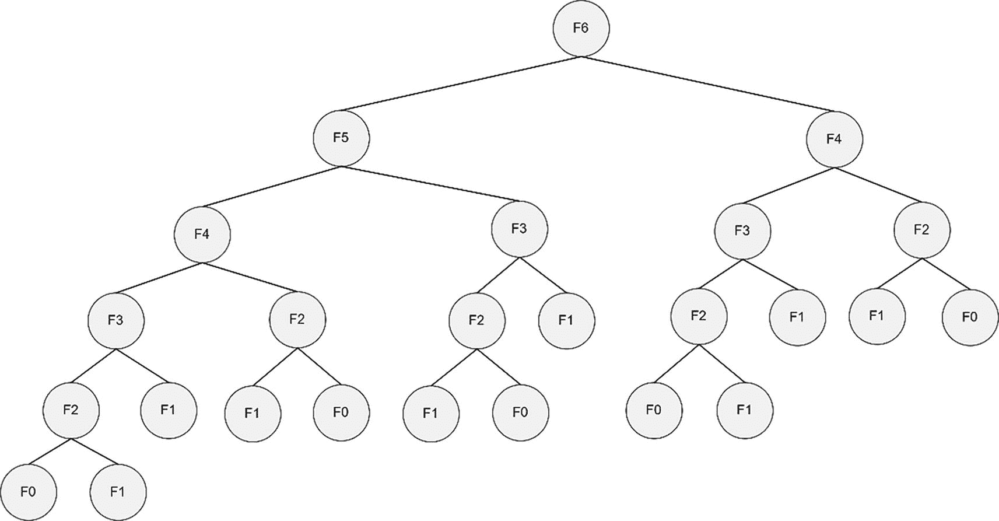

一个递归图。从顶部开始，F 6 分解为 F 5 和 F 4。同样，F 5 被分解为 F 4 和 F 3。F 4 被进一步分解为 F 2 和 F 3。F 4 还被分解为 F 3 和 F 2。

图 3-2

计算斐波那契*F*[6]的递归图

您可以从图 3-2 中看出，为了计算*F*[6]，您需要先计算*F*[5]一次，*F*[4]两次，*F*[3]三次，*F*[2]五次，以及*F*[1]七次。随着您计算更高数字的斐波那契值，较低数字的斐波那契值需要多次计算/访问。避免这种指数增长的方法是：a) 在从图 3-2 中的顶部节点到叶子节点的过程中存储值，采用*自顶向下*的方法；或者 b) 从叶子节点开始计算，然后向上爬树直到达到顶部的根节点，采用*自底向上*的方法。在计算过程中保存值并在下次需要时使用它们的技巧称为*记忆化*，不应与记忆混淆。

在数学优化领域，动态规划指的是将计算简化为一系列随时间进行的步骤——也就是说，从上一时间步的值计算当前时间步的值。这是您将用于构建计算状态值 *v*π 的时间索引递归的方法。看看贝尔曼方程，它用策略 π(*a*| *s*), 系统动力学 *p*(*s*^′, *r*| *s*, *a*), 和后续状态的状态值 *v*π 来表示状态 *v*π 的值。

![$$ {v}_{\pi }(s)=\sum \limits_a\pi \left(a|s\right)\ \sum \limits_{s^{\prime },r}p\left({s}^{\prime },r\ \right|s,a\Big)\ \left[r+\gamma\ {v}_{\pi}\left({s}^{\prime}\right)\right] $$](img/502835_2_En_3_Chapter/502835_2_En_3_Chapter_TeX_Equa.png)

这表示状态值 *v*π 是基于其他状态值 *v*π 的，所有这些值都是未知的。如果您能以某种方式获得当前状态的所有后续状态值，您就能计算出 *v*π。这显示了方程的递归性质。

注意，特定的值 *v*π 将会在 *s*^′ 是某些状态 *s* 的后续状态的地方被多次使用。因此，您可以缓存（即存储）值 *v*π 并多次使用它，以避免每次需要时都重新计算 *v*π。

动态规划是一种广泛使用的优化技术，适用于各种问题类别；它允许将复杂问题分解为更小的问题。一些常见应用包括调度算法、图算法如最短路径、图模型如维特比算法，以及生物信息学中的晶格模型。由于本书是关于强化学习的，我限制动态规划用于解决贝尔曼期望和贝尔曼最优方程，这些方程用于值函数和动作值函数。这些方程在第二章 2 中给出，在方程 2-18、2-21、2-24 和 2-25 中。

方程 2-18 展示了状态值 *v*π 的递归性质，它基于后续状态值 *v*π，如下所示：

![$$ {v}_{\pi }(s)=\sum \limits_a\pi \left(a|s\right)\ \sum \limits_{s^{\prime },r}p\left({s}^{\prime },r\ \right|s,a\Big)\ \left[r+\gamma\ {v}_{\pi}\left({s}^{\prime}\right)\right] $$](img/502835_2_En_3_Chapter/502835_2_En_3_Chapter_TeX_Equ1.png)

(3-1)

方程 2-21 展示了状态-动作值 *q*π 的递归性质，它基于后续状态-动作值 *q*π，如下所示：

![$$ {q}_{\pi}\left(s,a\right)=\sum \limits_{s^{\prime },r}p\left({s}^{\prime },r\ \right|s,a\Big)\ \left[r+\gamma\ \sum \limits_{a^{\prime }}\pi \left({a}^{\prime }|{s}^{\prime}\right)\ q\left({s}^{\prime },{a}^{\prime}\right)\right] $$](img/502835_2_En_3_Chapter/502835_2_En_3_Chapter_TeX_Equ2.png)

(3-2)

方程式 2-24 展示了状态值 *v*∗ 与后续状态值 *v*∗ 之间的递归关系，如方程式 3-3 所示。我在方程式 3-1 中移除了外层求和，并用一个 *max* 函数替换。这就是贝尔曼最优方程：

![$$ {v}_{\ast }(s)=\underset{a}{\max}\sum \limits_{s^{\prime },r}p\left({s}^{\prime },r\ \right|s,a\Big)\ \left[r+\gamma\ {v}_{\ast}\left({s}^{\prime}\right)\right] $$](img/502835_2_En_3_Chapter/502835_2_En_3_Chapter_TeX_Equ3.png)

(3-3)

方程式 2-25 展示了在贝尔曼最优构造下，状态动作值 *q*∗ 与后续状态动作值 *q*∗ 之间的递归关系，其中方程式 3-2 中的内层求和被 *max* 函数替换。

![$$ {q}_{\ast}\left(s,a\right)=\sum \limits_{s^{\prime },r}p\left({s}^{\prime },r\ \right|s,a\Big)\ \left[r+\gamma \underset{a^{\prime }}{\mathit{\max}}{q}_{\ast}\left({s}^{\prime },{a}^{\prime}\right)\right] $$](img/502835_2_En_3_Chapter/502835_2_En_3_Chapter_TeX_Equ4.png)

(3-4)

这四个方程中的每一个都代表了状态或状态动作对的 *v* 或 *q* 值，这是基于后续状态或状态动作的值，体现了动态规划的递归性质。

记住，这四个方程中的每一个求和实际上都是对所有可能的价值奖励和下一个时间段的下一个状态进行期望操作 *E*[·]，这是一个关于当前状态和在该状态下采取的动作的函数。

在接下来的章节中，你将首先使用方程式 3-1 和/或 3-2 中的期望来评估策略，这被称为 *评估* 或 *预测*。然后，你将使用最优方程式 3-3 和/或 3-4 来找到一个最优策略，该策略最大化状态值和状态动作值，这被称为 *策略改进*。

一旦你理解了这个概念，你将看到一种通用的设置，这是一种广泛使用的用于策略改进的通用框架。我通过讨论在大规模问题设置中的实际挑战以及在该背景下优化动态规划的多种方法来结束本章。

如本章开头所述，我主要关注一类问题，即代理可以发现自己处于有限状态集合中，每个状态也有一个有限动作集合。具有连续状态和连续动作的问题可以通过首先离散化状态和动作，然后使用动态规划技术来解决。你将在第四章的末尾看到一个这样的方法的例子。这构成了第五章的大部分内容。

## 政策评估/预测

本节使用方程 3-1 通过其迭代性质和动态规划的概念推导状态值。方程 3-1 以其后续状态为条件表示状态 *s* 的状态值。状态值还取决于代理遵循的策略，这在方程 3-1 中定义为策略 *π*(*a*| *s*)。正如你可能已经注意到的，由于值对策略的这种依赖性，所有状态值都带有下标 *π*，以表明方程 3-1 中的状态值是通过遵循特定策略 *π*(*a*| *s*) 获得的。再次强调策略 π 的重要性，请注意，改变策略 *π* 将产生不同的值集，*v**π* 和 *q**π*。

方程 3-1 中的关系可以通过回溯图来图形化表示，如图 3-3 所示。

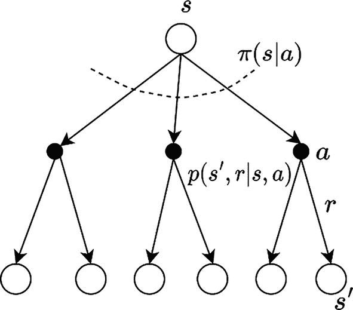

贝尔曼期望方程的回溯图的说明。深色圆圈表示动作，空圆圈表示状态。

图 3-3

状态值函数的贝尔曼期望方程的回溯图。空圆圈表示状态，深色圆圈表示动作

代理从状态 *s* 开始。根据其当前策略 *π*(*a*| *s*) 采取动作 *a*。由于这个动作，环境根据系统动力学 *p*(*s*^′, *r*| *s*, *a*) 将代理转移到新的状态 *s*^′ 并获得奖励 *r*。应该很明显，方程 3-1 形成了一个方程组，每个状态一个方程。如果有 *N* 个状态，你将会有 *N* 个这样的方程。方程的数量等于状态的总数，数学上表示为 *N* =  ∣ *S*∣，并且与每个状态 *S* = *s* 的未知状态值 *v*(*s*) 的数量相同。因此，方程 3-1 代表了一个包含 |*S*| 个方程和 |*S*| 个未知数的方程组。

你可以使用任何线性规划技术来解决这个方程组。这组 N 个递归方程可以用向量代数表示。虽然你不会在现实生活中的问题中使用这种方法，原因将在后面讨论，但我将介绍方程 3-1 的向量化方法。这是可选的，如果你不是非常倾向于数学，你可以跳过它。你首先通过合并两个单独的求和来重写方程 3-1：


(3-5)

现在将后继状态 *s*^′ 的求和从求和中提取出来：


右侧的第一个项——*π*(*a*| *s*). *p*(*s*^′, *r* |*s*, *a*)，其中对所有可能的 *s*^′, *a*, *r* 进行求和，实际上就是由于特定策略 π 的期望，*E*[.]。请注意，你将会有 *N* 个这样的方程，每个状态 *S* = *s* 对应一个。如果你将所有 *N* 个方程依次写出，你可以指定所有 *v*π，所有 *N* 个都作为一个大小为 1*xN* 的单个向量表示为 ***V***[**π**]。以类似的方式，右侧的第一个项可以表示为一个大小为 1*xN* 的奖励向量，表示为 *R*[π]，从而表示基于代理在每个状态下遵循的策略的每个状态的期望奖励。右侧第二个表达式的求和 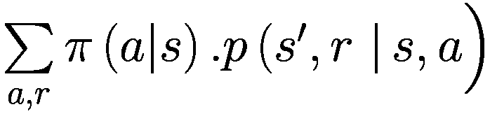 可以表示为 *P*[π]，这是在特定策略下的系统动态。这将是一个大小为 *NxN* 的矩阵，行数和列数等于总状态数 *N*。进行这些更改后，你可以将前面的方程表示如下：

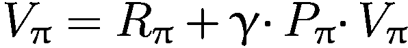

将所有包含 *V*[π] 的项收集到左边，你得到：

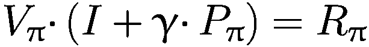

现在，你可以将向量方程重写如下：

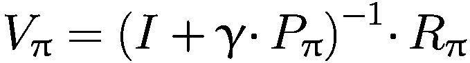

正如你所见，计算 *V*[*π*] 涉及到逆一个 *N* × *N* 矩阵 (*I* + *γ* · *P*[*π*])，这对于大的 *N* 值来说是不切实际的。这也是你不会使用线性代数方法来解决这个 *N* 个线性方程组的主要原因。

相反，我将求助于迭代解法。这是通过在第一次迭代 *k* = 0 时使用一些随机的状态值 *v*0 来实现的，并在方程 3-1 的右侧使用它们来获得下一迭代步骤的状态值。

![$$ {v}_{k+1}(s)\leftarrow \sum \limits_a\pi \left(a|s\right)\ \sum \limits_{s^{\prime },r}p\left({s}^{\prime },r\ \right|s,a\Big)\ \left[r+\gamma\ {v}_k\left({s}^{\prime}\right)\right] $$](img/502835_2_En_3_Chapter/502835_2_En_3_Chapter_TeX_Equ5.png)

(3-6)

注意下标从 *π* 到 (*k*) 和 (*k* + 1) 的变化。还要注意等号 (=) 到赋值 (←) 的变化。你现在正在用上一轮迭代的 *k* 中的状态值来表示迭代 (*k* + 1) 中的状态值，并且每个迭代中会有 *N*（状态总数）这样的更新。可以证明，随着迭代索引 *k* 的增加并趋向于无穷大 (∞)，*v*[*k*] 将收敛到 *v*[π]。这种为给定策略找到所有状态值的方法被称为 *策略评估*。你从 *k* = 0 时任意选择的 *v*[*o*] 值开始，使用方程 3-6 迭代状态值，直到状态值 *v*[*k*] 停止变化。策略评估的另一个名称是 *预测*——即预测给定策略的状态值。*v*[*k*] 收敛到 *v*[π] 是有保证的，因为 *v*[*k*] = *v*[π] 是一个不动点，并且它来自一个收缩映射定理，你可以在高级文本中查找。

在更新所有 *N* 个状态值 *v*[*k* + 1]，每个状态一个，从上一轮迭代的各个状态值（*N* 个 *v*[*k*] 值）中，有两种方法。第一种方法被称为 *同步版本*。在这种情况下，你维护两个数组来存储状态值——一个是上一轮迭代 *k* 的，用于更新第二个数组以在当前迭代 *k* + 1 中存储更新的状态值。在当前迭代结束时，将第二个数组的值复制到第一个数组，并开始从 *k* + 1 到 *k* + 2 的下一轮迭代。

第二种方法被称为 *异步版本*，因为只有一个数组，并且更新是在原地进行的。这表明它具有更快的收敛速度，同时只需要一个数组的内存。在这个方法中，有许多选择更新哪个状态值以及更新顺序的方法。我将在本章后续部分详细讨论这一点。

图 3-4 显示了迭代策略评估的伪代码。

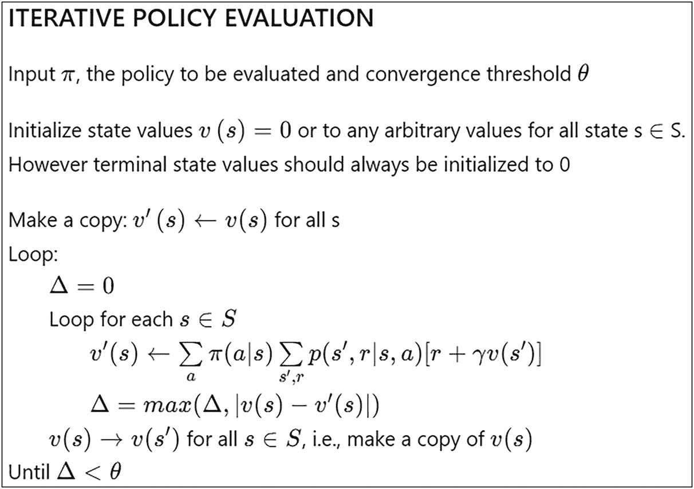

迭代策略评估的示意图。它接受策略值，要评估的策略。算法初始化状态值，进行复制，并运行循环，直到 delta 小于 theta。

图 3-4

迭代策略评估算法

现在我们将算法应用于图 3-1 中给出的网格世界。这假设有一个随机策略 *π*(*a*| *s*)，其中四个动作（`UP`，`RIGHT`，`DOWN`，`LEFT`）具有相等的概率 0.25。列表 3-2 显示了应用于网格世界的迭代策略评估的相关代码部分。这是来自文件 `3.a-policy-evaluation.ipynb`。

```py
# Start with a (all 0) value function
k = 0
V = np.zeros(env.nS)
V_new = np.copy(V)
while True:
k += 1
delta = 0
# For each state, perform a "backup"
for s in range(env.nS):
v = 0
# Look at the possible next actions
for a, pi_a in enumerate(policy[s]):
# For each action, look at the possible next states...
for prob, next_state, reward, done in env.P[s][a]:
# Calculate the expected value as per backup diagram
v += pi_a * prob * \
(reward + discount_factor * V[next_state])
# How much our value function changed (across any states)
V_new[s] = v
delta = max(delta, np.abs(V_new[s] - V[s]))
V = np.copy(V_new)
# print grid for specified iteration values
if k in print_at:
grid_print(V.reshape(env.shape), k=k)
# Stop if change is below a threshold
if delta < theta:
break
grid_print(V.reshape(env.shape), k=k)
return np.array(V)
Listing 3-2
Policy Evaluation/Policy Planning: “3.a-policy-evaluation.ipynb”
```

您从 k=0 开始，这是当前迭代的索引，以及两个数组 `V` 和 `V_new` 来存储网格中状态值。内部 `for` 循环 `for s in range(env.nS)` 遍历所有状态，使用方程式 3-1 更新数组 `V_new` 中的 *v**k* + 1，这些值包含在数组 `V` 中的先前状态值 *v**k*。在这个过程中，它记录了所有状态之间的最大值变化，并将这个最大变化存储在 `delta` 变量中。接下来，它将 `V_new` 中的值复制到 `V` 中，并检查当前迭代中存储在 `delta` 中的最大变化是否小于初始阈值，称为 `theta`。如果检查为真，程序终止，打印网格及其状态值。如果 `delta` 大于 `theta`，程序将回退到下一次迭代，迭代计数器 `k` 增加 1。程序产生的随机策略产生的网格中状态的最终值如图 3-5 所示。

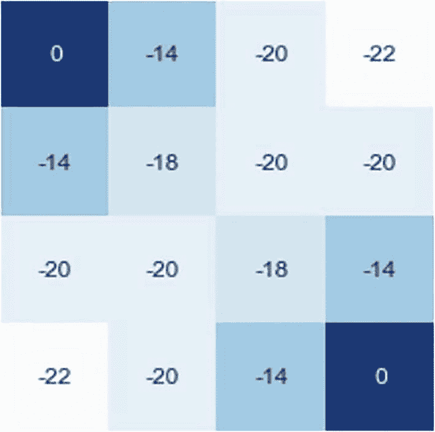

一个 4x4 网格的示意图。网格的对角端块标记为 0。从上到下标记的块为 0, -14, -20, -22, -14, -18, -20, -20, -20, -20, -18, -14, -22, -20, -14, 和 0。

图 3-5

策略评估：对于图 3-1 中的网格世界，智能体遵循随机策略的 *v**π*。四个动作（`UP`，`DOWN`，`LEFT` 和 `RIGHT`）具有相等的概率 `0.25`

注意值已经收敛。让我们看看最后一列的第三行，状态值为 *v**π* =  − 14。在这个状态下，`UP` 动作将智能体带到状态值为 -20 的单元格，`LEFT` 动作将智能体带到状态值为 -18 的单元格，`DOWN` 动作将智能体带到具有值为 0 的终端状态，而 `RIGHT` 动作撞到墙壁，使智能体保持在同一状态。让我们应用方程式 3-1。我将使用按顺序应用的行动——`TOP`，`RIGHT`，`DOWN` 和 `LEFT` 来展开方程式 3-1 的右侧：

+   -14 = 0.25*(-1+(-20)) + 0.25*(-1+(-14)) + 0.25*(-1+0) + 0.25*(-1+(-18))

+   -14 = -14

两边的值是一致的，这证实了收敛。因此，图 3-5 中显示的值是当智能体遵循随机策略时的状态值。请注意，这考虑了折扣因子 γ = 1.0。

本节考虑了一个在所有四个方向上具有相等动作概率的随机策略。然而，这可能不是一个最优的策略。可能存在一个或多个产生更高状态值的最优策略。下一节将探讨设计算法以找到更好策略的方法。

## 策略改进与迭代

上一节讨论了一个获取给定策略的状态值 *v**π* 的算法。你可以使用这些信息来改进策略。在网格世界中，你从任何状态都可以采取四种动作。现在，你将分别考虑采取所有四种动作的价值，然后在该步骤之后遵循策略 π。这将给出四个 *q*(*s*, *a*) 动作值，这些是网格世界中采取四个可能动作的动作值。

![ \( q(s,a) = \sum \limits_{s^{\prime },r}p(s^{\prime },r \ |s,a)\ \left[r+\gamma v_{\pi}(s^{\prime})\right] \)](img/502835_2_En_3_Chapter/502835_2_En_3_Chapter_TeX_Equg.png)

注意到 *q*(*s*, *a*) 没有下标 *π*。你在状态 *S* = *s* 下评估所有可能动作的 *q*(*s*, *a*) 值。如果任何 *q*(*s*, *a*) 值大于当前状态值 *v**π*，这意味着当前策略 *π*(*a*| *s*) 没有采取最优动作。你可以通过采取 *q*-值，最大化动作 *A* = *a* 并将其定义为状态 *S* = *s* 下的策略来改进当前状态 *S* = *s* 下的当前策略。这将给出比当前策略 *π*(*a*| *s*) 更高的状态值。这个新策略被定义为 *π*′(*a*| *s*)。换句话说，你定义以下内容：

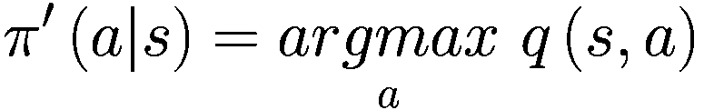

(3-7)

存在一个称为 *策略改进定理* 的一般结果，它指出：

设有两个确定性的策略 π 和 π′，使得对于所有 *s* ∈ *S*，

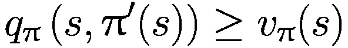

然后，策略 π′ 必须与 π 一样好或更好。换句话说：

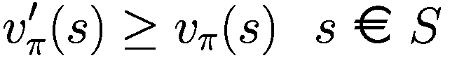

在新策略 π′ 下，所有状态的价值将等于或大于在先前策略 *π* 下的状态价值。

换句话说，在特定状态 *S* = *s* 中选择最大化动作可以提高该状态的状态值，但它不能降低其他状态的价值。它要么保持它们不变，要么提高依赖于 *S* = *s* 的其他状态。

基于当前的状态 *q* 值，前一个最大化步骤可以应用于所有状态。这可以被视为一个贪婪步骤，因为你是在最大化特定状态的状态值，而不考虑其他任何因素。将这个贪婪步骤动作扩展到 MDP 中的所有状态被称为 *贪婪策略*。递归状态值关系由贝尔曼最优方程 3-3 和 3-4 给出。

现在，你有一个框架来改进策略。对于一个给定的 MDP，你首先迭代地进行策略评估以获得状态值 *v*(*s*)，然后根据方程 3-7 通过最大化 *q* 值来应用贪婪选择动作。这导致状态值与贝尔曼方程不同步，因为最大化步骤应用于每个单独的状态，而没有通过所有后续状态流动。因此，你再次在新的策略 *π*^′ 下进行策略迭代，以找到改进策略下的状态/动作值。一旦获得这些值，就再次应用方程 3-7 中的最大化动作，以进一步改进策略到 *π*^″。这个过程会一直进行，直到没有观察到进一步的改进。这个动作序列可以表示如下：

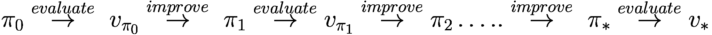

从贪婪改进和策略评估的定理中，你知道每次贪婪改进和策略评估 (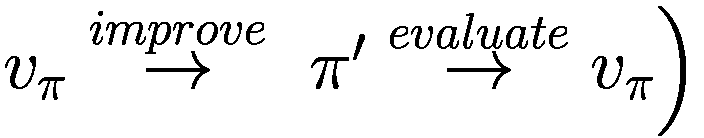) 都会给你一个比上一个更好的策略，其中 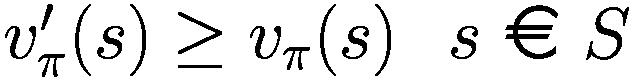。对于一个具有有限数量的离散状态和每个状态有限数量的动作的 MDP，以及每次改进都会导致改进的情况，一旦你停止观察到状态值的任何进一步改进，就会找到一个最优策略。这肯定会在有限次数的改进周期内发生。

这种寻找最优策略的方法被称为 *策略迭代*。图 3-6 展示了策略迭代的伪代码。

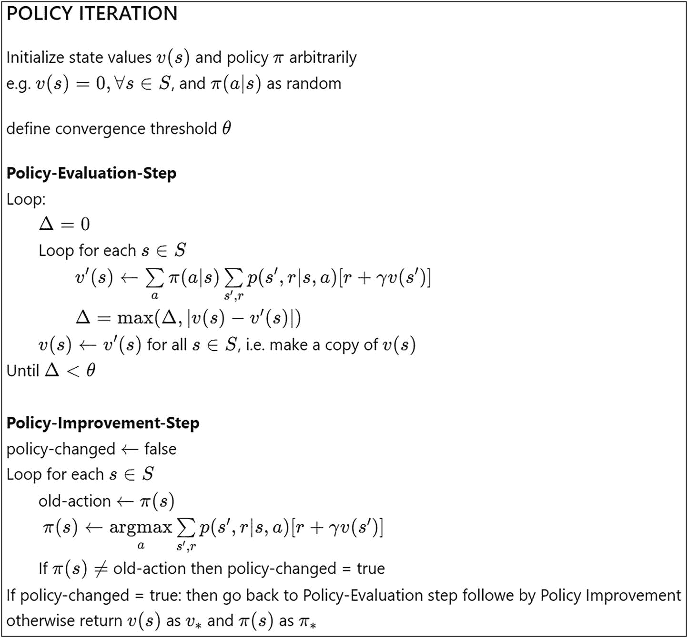

一个有限 MDP 的策略迭代算法的示意图。该算法包含两个步骤，策略评估步骤和策略改进步骤。

图 3-6

有限 MDP 的策略迭代算法

现在将策略迭代算法应用于图 3-1 中的网格世界。列表 3-3 显示了应用于网格世界的策略迭代的代码。完整的代码在`3-b-policy-iteration.ipynb`中给出。`policy_evaluation`函数与列表 3-2 中的相同。有一个新函数，称为`policy_improvement`，它应用贪婪最大化以返回一个优于现有策略的策略。`policy_iteration`是一个函数，它循环运行`policy_evaluation`和`policy_improvement`，直到状态值停止增加并收敛到一个固定点。

```py
def policy_improvement(policy, V, env, discount_factor=1.0):
def argmax_a(arr):
"""
Return idxs of all max values in an array.
"""
max_idx = []
max_val = float('-inf')
for idx, elem in enumerate(arr):
if elem == max_val:
max_idx.append(idx)
elif elem > max_val:
max_idx = [idx]
max_val = elem
return max_idx
policy_changed = False
Q = np.zeros([env.nS, env.nA])
new_policy = np.zeros([env.nS, env.nA])
# For each state, perform a "greedy improvement"
for s in range(env.nS):
old_action = np.array(policy[s])
for a in range(env.nA):
for prob, next_state, reward, done in env.P[s][a]:
# Calculate the expected value as per backup diagram
Q[s, a] += prob * (reward + discount_factor * V[next_state])
# get maximizing actions and set new policy for state s
best_actions = argmax_a(Q[s])
new_policy[s, best_actions] = 1.0 / len(best_actions)
if not np.allclose(new_policy[s], policy[s]):
policy_changed = True
return new_policy, policy_changed
Listing 3-3
Policy Improvement: 3-b-policy-iteration.ipynb
```

在策略改进中，你遍历所有状态并对每个状态进行贪婪最大化，如`for s in range(env.nS)`中的`for`循环所示。在给定状态`s`中，你首先计算当前状态动作值`Q[s,a]`并选择具有最大 Q 值的动作`a`。这个动作成为该给定状态的新策略。如果有多个动作具有相同的最优状态值，则将这些动作视为该状态的最佳动作集合，并且具有相等的概率。

策略迭代步骤，如列表 3-4 所示，循环遍历策略评估和策略改进，直到值收敛且没有观察到进一步的改进。

```py
def policy_iteration(env, discount_factor=1.0, theta=0.00001):
# initialize a random policy
policy = np.ones([env.nS, env.nA]) / env.nA
while True:
V = policy_evaluation(policy, env, discount_factor, theta)
policy, changed = policy_improvement(policy, V, env, discount_factor)
if not changed:  # terminate iteration once no improvement is observed
V_optimal = policy_evaluation(policy, env, discount_factor, theta)
print("Optimal Policy\n", policy)
return np.array(V_optimal)
Listing 3-4
Policy Iteration: 3-b-policy-iteration.ipynb
```

图 3-7 显示了在网格世界中运行`policy_iteration`后每个网格单元的状态值。

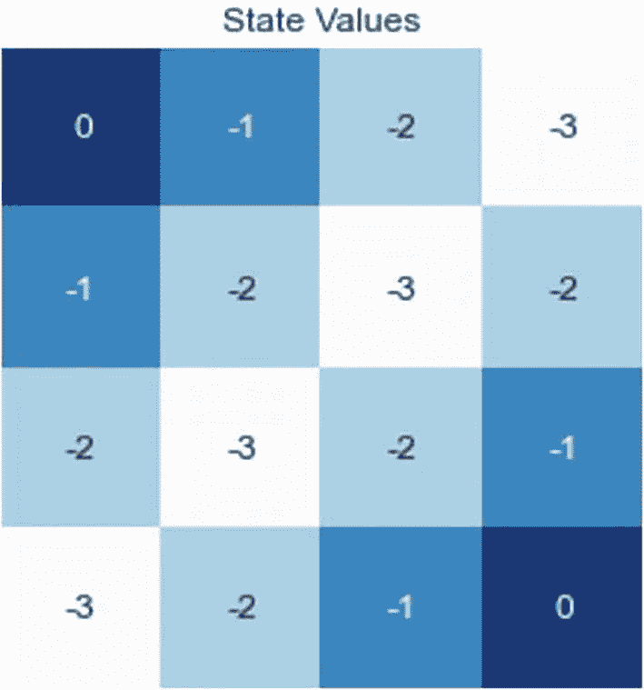

4x4 网格的示意图。网格的对角块具有 0 值。从上到下的值是 0, -1, -2, -3, -1, -2, -3, -2, -2, -3, -2, -1, -3, -2, -1, 和 0。

图 3-7

图 3-1 中网格世界的策略迭代*v*∗。智能体正在遵循通过应用列表 3-4 中的`policy_iteration`找到的最优策略。

注意，最优状态值是达到最近终端状态所需步数的数量。由于每个时间步的奖励是-1，直到智能体达到终端状态，因此最优策略将智能体引导到终端状态，步数尽可能少，乘以-1。对于某些状态，多个动作可能导致达到终端状态的步数相同。例如，查看状态值=-3 的右上角状态，到达左上角的终端状态需要三步，到达右下角的终端状态也需要三步。换句话说，状态值是状态与最近终端状态之间的曼哈顿距离的相反数。

你还可以提取最优策略，如图 3-8 所示。图的左侧显示了从列表 3-4 中的代码提取的策略，图的右侧显示了将相同的策略图形化叠加在网格上的策略图。

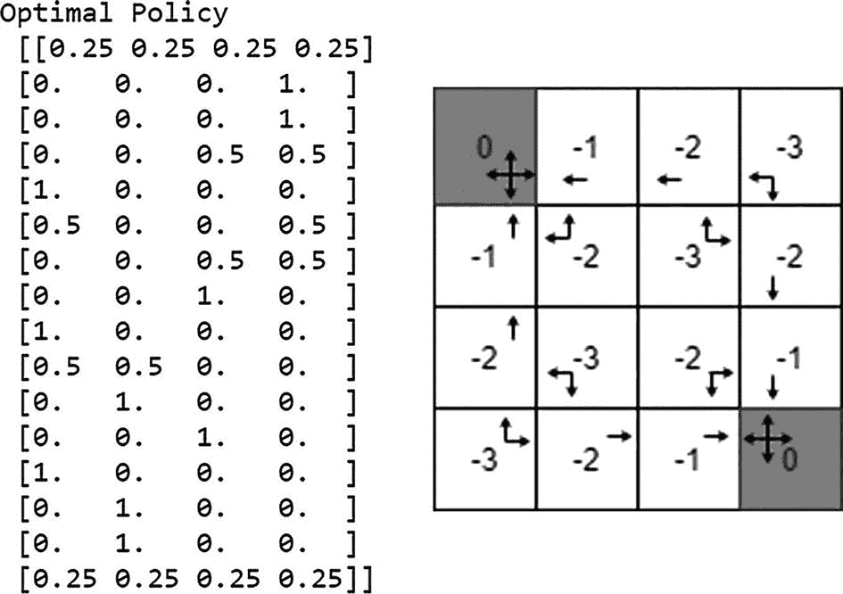

2 个插图。左。最优策略的插图，突出显示网格右侧每个单元格的动作概率。右。一个 4x4 网格的插图，值从-3 到 0。

图 3-8

如图 3-7 所示的网格世界中的最优状态值 v∗(s)。左：网格中每个单元格的动作概率的最优策略。右：最优策略叠加的网格

如前所述，策略评估也被称为*预测*，因为你正在尝试找到与智能体当前策略一致的状态值。同样，使用策略迭代来找到最优策略也被称为*控制*——控制智能体并找到最优策略。

## 值迭代

本节探讨了策略迭代并计算了找到最优策略所需的迭代次数。策略迭代有两个步骤。第一步是策略评估，它针对当前策略运行。它需要在状态空间中多次迭代，以便状态值收敛并符合当前策略。循环的第二部分是策略改进，它需要在状态空间中遍历一次，以找到每个状态的最佳动作——即相对于当前状态动作值的贪婪改进。由此可知，大部分时间都花在了策略评估和值收敛上。

另一种方法是，在状态值收敛之前很久就截断策略评估中的循环。当你将策略评估中的循环截断为仅一个循环时，你使用的方法被称为*值迭代*。类似于方程 3-6 的方法，你从方程 3-3 中取状态值的贝尔曼最优性，并将其转换为带有迭代的赋值。修改后的方程如下：

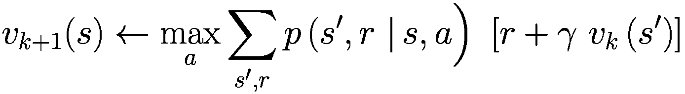

(3-8)

随着迭代的进行，状态值将不断改进并收敛到 v*，这些是最佳值。

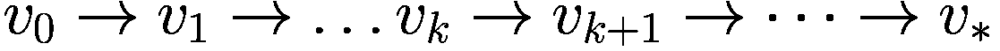

一旦值收敛到最优状态值，你可以使用一步回溯图来找到最优策略。

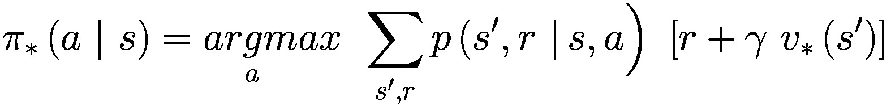

(3-9)

通过在每一步取最大值来迭代值的先前的过程被称为*值迭代*。图 3-9 展示了值迭代的伪代码。

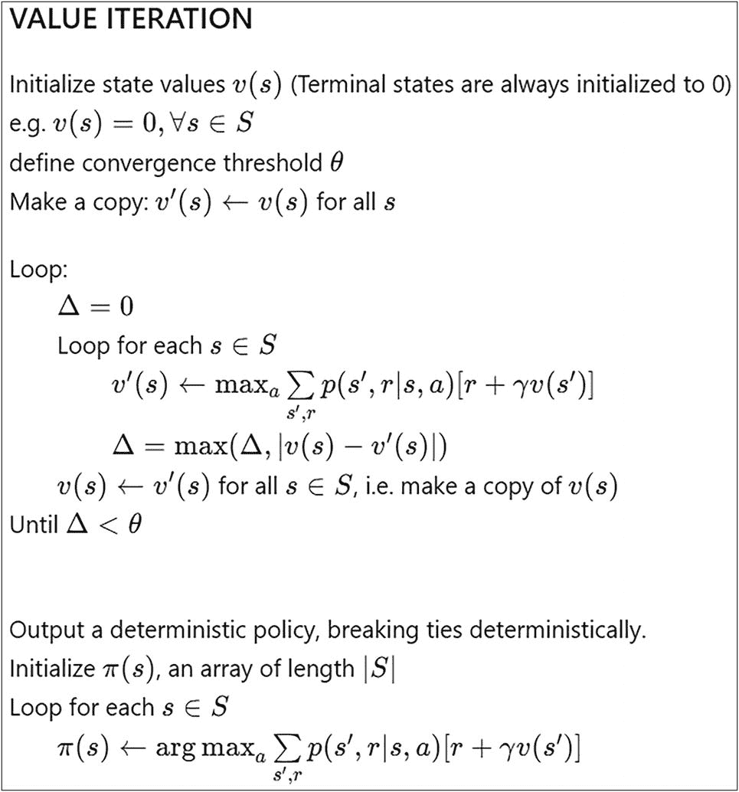

值迭代算法的示意图。它初始化状态值 v，创建一个副本，并运行一个循环，直到 theta 大于 delta。算法的输出说明了确定性策略。

图 3-9

有限 MDP 的值迭代算法

你现在可以将之前的价值迭代算法应用于图 3-1 中给出的网格世界。列表 3-5 包含了应用于网格世界价值迭代算法的代码。查看 `3.c-value-iteration.ipynb` 文件以获取详细实现。`value_iteration` 函数是图 3-9 中伪代码的直接实现。

```py
def value_iteration(env, discount_factor=1.0, theta=0.00001):
"""
Carry out Value iteration given an environment and a full description
of the environment's dynamics.
def argmax_a(arr):
# Return idx of max element in an array.
........ ........
return max_idx
optimal_policy = np.zeros([env.nS, env.nA])
V = np.zeros(env.nS)
V_new = np.copy(V)
while True:
delta = 0
for s in range(env.nS):
q = np.zeros(env.nA)
for a in range(env.nA):
for prob, next_state, reward, done in env.P[s][a]:
if not done:
q[a] += prob*(reward + discount_factor * V[next_state])
else:
q[a] += prob * reward
V_new[s] = q.max()
delta = max(delta, np.abs(V_new[s] - V[s]))
V = np.copy(V_new)
if delta < theta:
break
# V(s) has optimal values. Use these values and one step backup
# to calculate optimal policy
for s in range(env.nS):
q = np.zeros(env.nA)
for a in range(env.nA):
for prob, next_state, reward, done in env.P[s][a]:
if not done:
q[a] += prob * (reward + discount_factor * V[next_state])
else:
q[a] += prob * reward
# find the optimal actions
best_actions = argmax_a(q)
optimal_policy[s, best_actions] = 1.0 / len(best_actions)
return optimal_policy, V
Listing 3-5
Value Iteration: 3.c-value-iteration.ipynb
```

运行价值算法对网格世界进行操作将产生具有相同值和策略的最优状态值 *v*∗ 和最优策略 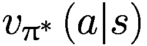，如图 3-7 和 3-8 所示。

在继续前进之前，让我们总结一下。到目前为止你所学的都被归类为 *同步动态规划算法*，如表 3-1 所总结。

表 3-1

同步动态规划算法

| 算法 | 贝尔曼方程 | 问题类型 |
| --- | --- | --- |
| 迭代策略评估 | 期望方程 | 预测 |
| 策略迭代 | 期望方程和贪婪改进 | 控制 |
| 值迭代 | 最优性方程 | 控制 |

## 广义策略迭代

之前描述的策略迭代有两个步骤。第一步是 *策略评估*，它使状态值与智能体当前遵循的策略同步。这需要多次遍历所有状态，使状态值收敛到 *v*[π]。第二步是贪婪动作选择，它改进策略。如前所述，改进的第二步会导致当前状态值与新的策略不同步。因此，你必须进行另一轮策略评估，以将状态值重新同步到新的策略。当状态值不再发生变化时，*评估* 后续 *改进* 的循环停止。这发生在智能体达到最优策略时，当状态值是最优的并且与最优策略同步时。最优策略（固定点）*v*[*π*] 的收敛可以直观地表示，如图 3-10 所示。

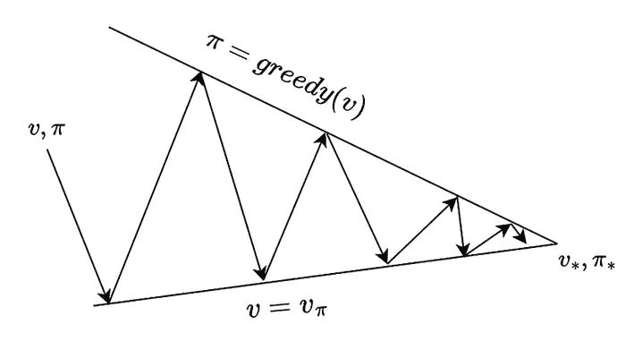

两个步骤之间的迭代示意图。一条线在标记为 pie = 贪婪和 v = v pie 的两个固定平面之间无限反射。第一步用于评估状态值同步，随后改进策略。

图 3-10

在两个步骤之间进行迭代。第一步是评估以使状态值与遵循的策略同步。第二步是改进策略以进行贪婪最大化动作。

你已经看到了策略评估步骤中循环次数的两个极端。此外，无论是策略评估还是策略改进，每次迭代都会覆盖模型中的所有状态。但可能会有很多变化。

首先，即使在单个 *评估 + 改进* 迭代中，你也只能访问部分状态进行评估，以及给定状态中部分状态动作进行贪婪最大化改进。*策略改进定理* 保证，即使是对状态或状态动作最大化的部分覆盖也将导致改进，除非代理已经遵循最优策略。

其次，你不必在状态值收敛之前进行多次迭代评估。你可以提前停止。状态值同步不需要完全完成。它可能在中途终止。

所有这些导致图 3-10 中的箭头在触及 *v* = *v*[π] 的底部线之前停止。此场景的箭头图如图 3-11 所示。

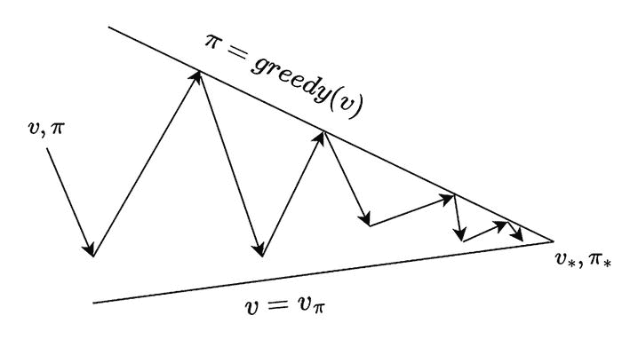

一个迭代示例，刚好覆盖所有状态。一条线在标记为 pie = greedy 和 v = v pie 的两个固定平面之间无限反射。第一步用于同步评估状态值，随后改进策略。线条触及平面的顶部。

图 3-11

仅在单次迭代中覆盖所有状态，导致没有触及 *v* = *v*[π] 的底部线。

类似地，策略改进的步骤可能不会对所有状态进行改进，这导致图 3-10 中的箭头在 π = *greedy*(*v*) 的上限处停止。图 3-12 展示了这种情况的箭头图。

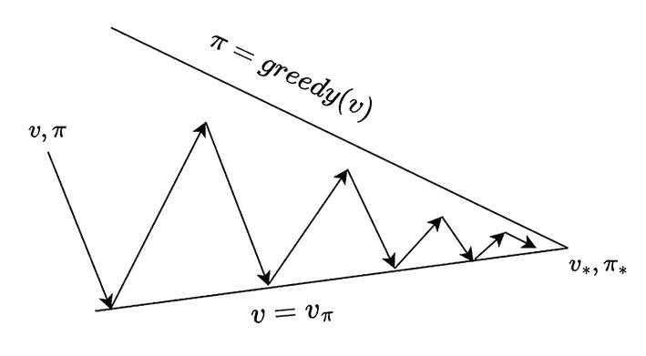

政策改进步骤中的迭代示例。一条线在标记为 pie = greedy 和 v = v pie 的两个固定平面之间无限反射。第一步用于评估状态值以同步，随后改进策略。线条触及平面的底部。

图 3-12

当策略改进步骤没有覆盖所有状态时进行迭代，导致没有触及 *π* = *greedy*(*v*) 的顶部线。

总结来说，只要在每个评估和改进中每个状态被访问足够多次，这两个步骤——策略评估和策略改进——及其所有变体都会导致收敛。这被称为 *广义策略迭代*（GPI）。本书中你将学习的绝大多数算法都可以归类为某种形式的 GPI。当你研究各种算法时，请记住图 3-10 到 3-12 中所示的形象。

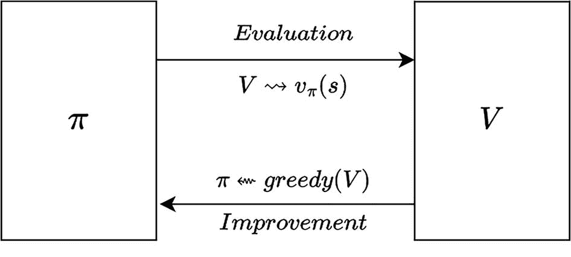

两个块被标记为 v 和 pie。它们通过评估和改进向量相互连接。评估方程是 v = v pie s。改进方程是 pie = greed V。

图 3-13

两个步骤之间的迭代。第一步是评估，以获取与遵循的策略同步的状态值。第二步是策略改进，进行贪婪最大化行为

## 异步回溯

基于动态规划的算法存在可扩展性问题。动态规划方法比直接解决方案方法（如线性规划，涉及解矩阵方程）更好且更可扩展。然而，动态规划在现实问题中仍然无法很好地扩展。考虑策略迭代下的单次遍历。它需要访问每个状态，并且在每个状态下，你需要考虑所有可能的行为。此外，每个行为都涉及一个计算，理论上可能再次涉及所有状态，这取决于状态转移函数 *p*(*s*^′, *r*| *s*, *a*）。换句话说，每次迭代的复杂度为 *O*(|*A*| ∗ |*S*|²)，其中 |*S*| 用于覆盖每个状态，|*A*| 用于访问给定状态中的每个行为，将计算复杂度提升到 *O*(|*A*| ∗ |*S*|)。然后由于回溯方程，再增加一个 |*S*|，对于给定状态和该状态中的一个特定行为，你需要访问系统可能因该行为而转换到的所有可能状态，从而使整体复杂度达到 *O*(|*A*| ∗ |*S*|²)。

你从策略迭代开始，在评估步骤中进行多次迭代，以使状态值收敛。第二种控制方法是值迭代。然后你通过利用贝尔曼最优方程将评估迭代减少到只有一步。所有这些都是同步动态规划算法，其中所有状态都使用贝尔曼回溯方程 3-1 到 3-4 进行更新。

然而，没有必要在每次迭代中更新每个状态。你可以按任何顺序更新和/或优化，只覆盖系统中的部分总状态。所有这些遍历状态的方法都能产生最优状态值和最优策略，只要每个状态被访问足够频繁。如图 3-2 所示，有各种方法进行遍历。

表 3-2

动态规划遍历的变种

| 方法 | 优点 | 缺点 |
| --- | --- | --- |
| 动态规划 | 比线性规划可扩展性更好 | 需要多次迭代才能收敛 |
| 就地动态规划 | 内存占用更低 | 与 DP 相同的缩放问题 |
| 带优先级扫描的动态规划 | 收敛更快 | 由于更新频率较低，某些状态可能需要更长的时间才能收敛 |
| 实时动态规划 | 最具可扩展性 | 如果每个状态更新足够多次（在渐近极限中为无限次），则仅提供渐近收敛 |

第一个方法是 *就地动态规划*。到目前为止，你一直维护着状态的两个副本。第一个副本包含现有的状态值，第二个副本包含更新后的新状态值。*就地*策略仅使用状态值数组的副本。相同的数组用于读取旧值和更新新状态值。例如，让我们看看方程 3-8 中的值迭代，并重写就地更新的版本。注意与就地版本相比，在原始值迭代方程的左右两侧状态值上的子索引的微妙差异。原始版本使用数组 *V*[*k*] 来更新新的数组 *V*[*k* + 1]，而就地编辑更新的是相同的数组。

这里是原始更新方程 3-8：

![$$ {v}_{k+1}(s)\leftarrow \underset{a}{\max}\sum \limits_{s^{\prime },r}p\left({s}^{\prime },r\ \right|s,a\Big)\ \left[r+\gamma\ {v}_k\left({s}^{\prime}\right)\right] $$](img/502835_2_En_3_Chapter/502835_2_En_3_Chapter_TeX_Equl.png)

这里展示了相同操作的就地版本。箭头两边的 *v*(*s*) 数组是相同的。

![$$ v(s)\leftarrow \underset{a}{\max}\sum \limits_{s^{\prime },r}p\left({s}^{\prime },r\ \right|s,a\Big)\ \left[r+\gamma\ v\left({s}^{\prime}\right)\right] $$](img/502835_2_En_3_Chapter/502835_2_En_3_Chapter_TeX_Equm.png)

实验表明，就地编辑在值在迭代中途移动时提供了更快的收敛。

第二个想法是关于状态更新的顺序。在同步编程中，你会在单次迭代中更新所有状态。然而，如果你使用 *优先级扫描*，值可能会更快地收敛。优先级扫描需要了解状态的前驱。假设你刚刚更新了状态 *S* = *s*，并且值改变了Δ量。所有状态 *S* = *s* 的前驱状态都会以Δ为优先级添加到优先队列中。如果特定前驱状态已经在优先队列中，并且优先级高于Δ，则保持不变。在下一次迭代中，从队列中取出具有最高优先级的新状态并更新，这将你带回到循环的开始。优先级扫描的策略 *需要了解反向动力学*——即给定状态的前驱。

第三个想法是**实时动态规划**。使用这种方法，你只更新智能体当前已看到的那些状态的价值——即与智能体相关的状态，并使用其当前的探索路径来优先更新。这种方法避免了更新那些不在智能体当前路径前景中的状态，因此这些状态大多是不相关的。

动态规划，无论是同步还是异步，都使用类似于图 3-3 中所示的全范围回溯。对于给定状态，你需要知道每个可能的行为以及每个后继状态 *S* = *s*^′。你还需要知道环境动态 *p*(*s*^′, *r*| *s*, *a*)。然而，使用异步方法并不能完全解决可扩展性问题。它只是稍微扩展了可扩展性。换句话说，即使使用异步更新，动态规划也仅适用于中等规模的问题。

对于大多数现实生活中的问题，一个重要的假设是拥有对转换函数或环境动态 *p*(*s*^′, *r*| *s*, *a*) 的先验知识。本章假设了解动态特性，以介绍贝尔曼方程和动态规划在强化学习问题中解决问题的核心基础。从下一章开始，我将解释一种更可扩展的基于样本方法的强化学习问题解决方案。在基于样本的方法中，你将放弃对环境和动态的先验和完全知识的假设。此外，为了构建可扩展性，你将找到有效的方法来避免执行全范围扫描。

## 摘要

本章介绍了动态规划的概念，并解释了它是如何应用于强化学习领域的。为了便于讨论，我假设已知系统的动态 *p*(*s*^′, *r*| *s*, *a*)。本章首先探讨了策略评估，即计算给定策略的状态值。接下来，本章探讨了策略迭代，即如果当前策略不是最优的，则寻找比当前策略更好的策略。随后，本章探讨了值迭代的理念，这是通过将评估和改进合并为一个单一方程获得的。

这些方法进而引出了广义策略迭代的话题。你研究了广义策略迭代遵循的收敛路径。在整个章节中，我使用了一个运行示例——网格世界，它有一个 4x4 的网格和简单的动态特性。最后，本章涵盖了在异步动态规划主题下可以采取的各种捷径，以加快算法的执行速度。
