# 4. 无模型方法

上一章介绍了动态规划，当你知道模型动态 *p*(*s*^′, *r*| *s*, *a*) 时使用，知识被用来“计划”最优动作。这也被称为*规划问题*。本章将重点转向*学习问题*——即模型动态（也称为转移动态）未知的情况。你将学习通过*采样*来计算/学习状态值和状态-动作值——也就是说，通过在现实世界中遵循某种策略或通过模拟中的策略运行代理来收集经验。还存在另一类问题，其中无模型方法更为适用。在某些问题中，采样比计算转移动态更容易，例如寻找最佳策略来玩类似黑杰克的游戏。有许多组合可以达到分数，这取决于迄今为止看到的牌和牌堆中剩余的牌。几乎不可能计算从一个状态到另一个状态的精确转移概率，但很容易从环境中采样状态。总之，当你不知道模型动态或者知道模型，但采样比计算转移动态更实际时，你使用无模型方法。

本章探讨了两种广泛的无模型学习方法：蒙特卡洛（MC）方法和时序差分（TD）方法。你将首先学习在无模型设置中策略评估是如何工作的，然后扩展这种理解来查看控制——即找到最优策略。我还简要提到了自举和探索与利用困境以及离线学习与在线学习等重要概念。最初，重点是单独查看 MC 和 TD 方法。随后，我介绍了诸如*步长回报*、重要性采样和资格痕迹等额外概念，旨在将 MC 和 TD 方法结合成一个更通用、更通用的方法，称为 TD(*λ*)。

## 使用蒙特卡洛进行估计/预测

当你不知道模型动力学时，你该怎么办？回想一下你不知道某个问题时的情况。在那个情况下你做了什么？你进行了实验。在强化学习的背景下，这可能意味着让智能体随机采取行动，并观察系统的响应。例如，假设你想知道一个骰子或硬币是否偏斜。你多次掷硬币或掷骰子，观察结果，并据此形成你的观点。换句话说，你进行了采样。以硬币为例，假设你掷硬币 10,000 次，并计算出现正面的频率。如果这个频率接近 0.5，你可以有很高的信心推断硬币是不偏斜的。如果实验进行 100,000 次，正面的频率仍然在 0.5 附近徘徊，你对硬币不偏斜的信心将会更高。为什么从样本结果中取平均值并用它作为估计是有效的？

统计学中的*大数定律（LLN）*告诉我们，样本的平均值是对实际未知数量的良好估计，并且随着实验（样本）次数的增加，这个估计会越来越好。进一步来说，由样本的平均值形成的估计，随着样本数量的增加而变得更好——用数学语言来说，即样本平均值与实际未观察值之间的方差误差，随着试验次数 n 的增加而减小，当 n 趋向于无穷大时，试验的估计值就等于实际未观察值。这条定律是统计学领域非常重要的定律之一。话虽如此，请记住，在某些情况下，这种收敛并不会发生。然而，幸运的是，在大多数现实世界的强化学习例子中，你不会遇到这样的病态情况。

如果你回顾上一章中的贝尔曼方程，你会注意到这些方程中有一个期望算子 *E*[·]；例如，状态值 *v*(*s*) = *E*[*G*[*t*]| *S*[*t*] = *s*]。进一步来说，为了计算 *v*(*s*)，你使用了动态规划，需要过渡动力学 *p*(*s*^′, *r* | *s*, *a*)。在没有模型动力学知识的情况下，你能做什么？

根据大数定律，你从模型中进行采样。你固定一个起始状态 *S*[*t*] = *s*，并固定一个你想要计算 *v*π 的策略 π。你让智能体从这个状态 *S*[*t*] = *s* 开始，遵循策略 π 进行行动，并持续这样做直到终止。你记录总的奖励总和——即智能体在当前单次序列/场景中获得的回报。这个从状态、行动、奖励直到终止的序列也被称为一个 *场景* 或策略的单个 *回放*。你重复这个实验，从每个这样的回放中收集单个回报，并将这些回报平均作为策略 *π* 对应于状态 *s* 的 *v**π* 的估计。简而言之，这就是 *蒙特卡洛（MC）方法* 的方法：用样本回报的平均值代替期望回报。

有几点需要注意。MC 方法不需要了解模型。唯一需要的是你应该能够从中采样。能否采样或模拟智能体在很大程度上取决于问题。如果是一个可以轻松在程序中建模的棋盘游戏，或者如果有一个真实世界系统的模拟器可用，你可以使用这样的程序或模拟器来快速且低成本地进行采样。然而，如果场景的回放将涉及与真实世界智能体的交互，并且如果真实世界的智能体类似于昂贵的机器人或自动驾驶汽车，这种交互可能不可行，尤其是在智能体训练不足且注定会犯错误的情况下。在某些情况下，错误可能非常昂贵，导致机器损坏或危害公共安全。因此，从完整的回放中采样回报的 MC 方法可能并不总是有效，尤其是如果它涉及真实世界的交互。还有另一种情况下 MC 可能不适用——在非终止环境中，没有终止状态。你需要知道从某个状态开始直到终止的回报，因此你只能在每个运行最终终止的情景式马尔可夫决策过程（MDP）中使用 MC 方法。它不适用于非终止环境。

第二点是，对于大型 MDP，你可以只关注采样与 MDP 相关的部分，避免探索 MDP 中不相关的部分。这种方法使得 MC 方法对于非常大的问题具有高度的可扩展性。如前所述，MC 方法对于一类问题是有用的，其中列出所有状态和/或状态中的所有行动会使问题变得不可处理，并且可能存在大量在特定上下文中不感兴趣的状态和状态-行动组合。OpenAI 展示的一个很好的例子是，他们使用了一种名为蒙特卡洛树搜索（MCTS）的 MC 方法的变体来训练围棋游戏智能体。

第三个要点是关于马尔可夫假设——也就是说，过去完全编码在当前状态中。换句话说，了解现在使未来与过去独立。更正式地说，在时间 *t* + 1 时刻从状态 *S*[*t*] 转移到状态 *S*[*t* + 1] 只依赖于当前状态 *S*[*t*] 和在时间 *t* 采取的动作 *A*[*t*]。这种转移与 *S*[*t*]，*A*[*t*] 之前的任何状态和动作完全独立。我在第二章[2](http://dx.doi.org/10.1007/978-1-4842-6809-4_2)中讨论了这一属性。马尔可夫独立性是贝尔曼方程递归性质的基础，其中状态只依赖于后续状态值。然而，在蒙特卡洛方法中，你从状态 *S* 开始观察完整的回报，直到终止。你以任何方式都不依赖于后续状态的价值来计算当前状态的价值。这里没有做出马尔可夫性质的假设。蒙特卡洛方法中缺乏马尔可夫假设使它们对称为 POMDPs（“部分可观察马尔可夫决策过程”）的 MDP 类更加可行。在 POMDP 环境中，你只能获得部分状态信息，这被称为观察。

我们一直在讨论使用蒙特卡洛（MC）方法来估计状态和状态-动作值，而不需要做出任何马尔可夫性质假设，也不必担心过渡动力学。然而，你也可以使用蒙特卡洛方法来展开多个剧集，然后依次使用这些展开来计算动力学 *p*(*s*^′, *r*| *s*, *a*)。这种方法将首先通过使用蒙特卡洛展开来估计系统动力学，然后使用这些系统动力学在动态规划（DP）设置中找到最优策略，带你回到基于模型的强化学习（RL）的世界。我将在未来的章节中详细讨论这些内容。现在，本章的重点是关注无模型方法。

接下来，让我们看看一种正式的方式来估计给定策略的状态值。你让智能体开始一个新的剧集，并观察从智能体第一次进入特定剧集中的状态 *S* = *s* 的时间点开始，直到剧集结束的逐步奖励。从第一次 *S* = *s* 到结束的累积奖励被称为奖励 *G*。执行许多剧集运行，每次都计算从 *S* = *s* 到结束的回报。将回报的平均值作为 *v**π* 的估计。这被称为*首次访问蒙特卡洛方法*。请注意，根据动力学，智能体可能在剧集结束前的一些后续步骤中再次访问相同的 *S* = *s* 状态。在首次访问蒙特卡洛方法中，你只从剧集开始的第一次访问到最后一次访问的总回报。还有一种变体，你从每次访问该状态到最后一次访问的平均回报。这被称为*每次访问蒙特卡洛*方法。

让我们看看在首次访问蒙特卡洛方法下如何估计特定策略下状态的价值。图 4-1 展示了蒙特卡洛方法的回溯图。在动态规划（DP）中，在给定状态，你进行一次完整的扫描以覆盖从该状态可能采取的所有动作以及从状态-动作对 (*S* = *s*, *A* = *a*) 到新状态的所有可能转移。你只从状态 *S* = *s* 深入一层到 *A* = *a*，然后到下一个状态 *S* = *s*^′。相比之下，在蒙特卡洛方法中，回溯覆盖了从当前状态 *S* = *s* 到终端状态的全样本轨迹。然而，它并不覆盖所有分支可能性；相反，它只覆盖从起始状态 *S* = *s* 到终端状态采样的一条路径。

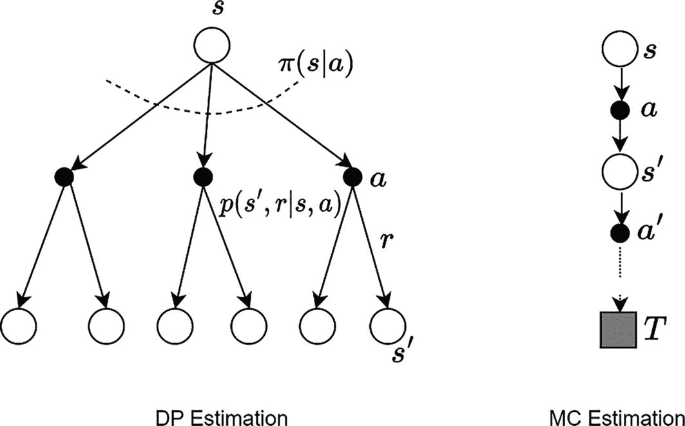

一组 2 个图表示 DP 估计和 MC 估计方法的比较。节点代表状态 S 和动作 A，箭头表示转移和奖励 R。

图 4-1

与基于贝尔曼方程的 DP 回溯相比的蒙特卡洛方法回溯图

现在看看首次访问版本的伪代码，如图 4-2 所示。你输入代理的当前策略 *π*。你初始化两个数组：一个用于存储当前对 *V*(*s*) 的估计，另一个用于存储到达状态 *S* = *s* 的访问次数 *N*(*s*)。执行多个剧集，并更新每个剧集代理访问的每个状态的 *V*(*s*) 以及 *N*(*s*)，注意在“首次访问”变体中更新首次访问，在“每次访问”变体中更新每次访问。伪代码仅涵盖“首次访问”变体。通过在伪代码末尾删除条件，可以轻松实现“每次访问”变体，该条件读作“`除非` *S*[*t*] 出现在 *S*[0]，*S*[1]，...`”。根据大数定律，蒙特卡洛模拟所基于的统计定律，*V*(*s*) 将在访问每个状态的次数接近无穷大的条件下收敛到所有状态下的真实 *v**π*。

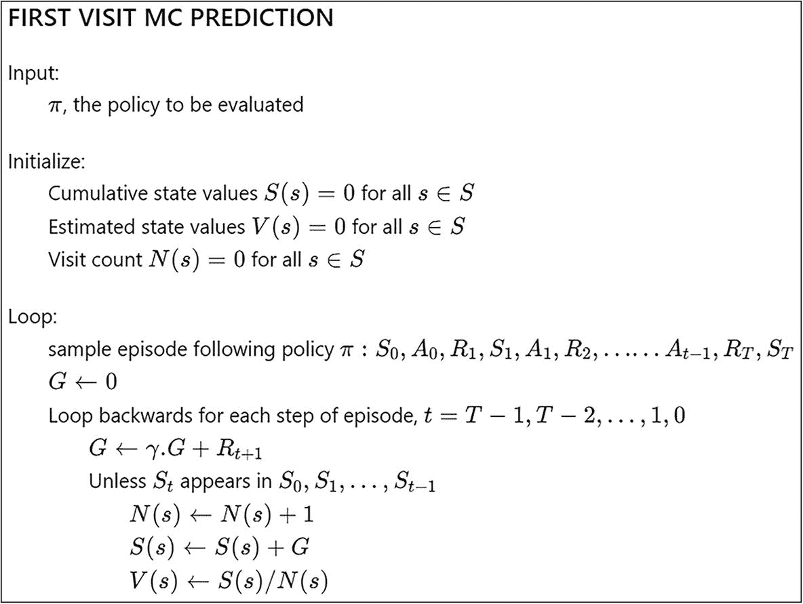

首次访问蒙特卡洛预测算法的屏幕截图。输入是 pi 和要评估的策略。它初始化状态值和访问计数为零。采样剧集并根据首次访问更新状态值。

图 4-2

首次访问蒙特卡洛预测用于估计 vπ(s)。伪代码使用在线版本在接收到样本时更新值

你存储到达一个状态的累积总和和首次访问的计数。通过将总和除以计数来计算平均值。每次访问状态时，都会执行以下更新：

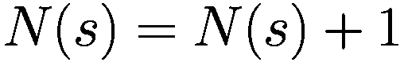

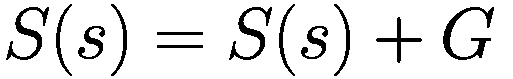

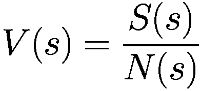

通过微小的变化，你可以从另一种方式来看待更新，而不需要累积总和 *S*(*s*)。在这种替代公式中，你只有一个数组 *V*(*s*)，它会在每次访问时直接更新，而不需要将总数除以计数。这是一个重要的计算优化，它会在你需要以某种在线方式逐个接收数字的运行平均时多次发生。如果你有两个数字，而不是记住它们所有，你只需保留平均值。当第三个数字到达时，你用第三个数字更新两个数字的平均值，使得新的平均值现在是三个数字的平均值。这个更新规则的推导如下。

在以下推导中，*N*(*s*) 是访问计数，这也是图 4-2 中使用的符号。S(s) 是代理在状态 *s* 中看到的回报累积总和，而 *V*(*s*) 是状态 *s* 的值函数。累积总和 *S*(*s*) 和状态值 *V*(*s*) 特定于代理遵循的策略，该策略是固定的，并在开始时作为输入提供，如图 4-2 所示。你还使用下标 *n* 或 *n* + 1 来表示对特定状态 *s* 的第 *n* 次或第 *n* + 1 次访问。

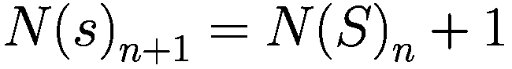

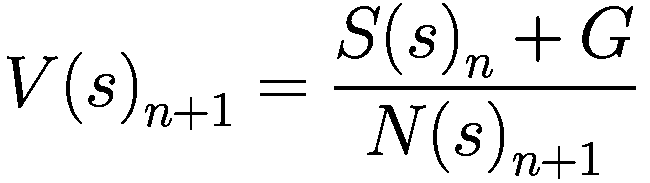

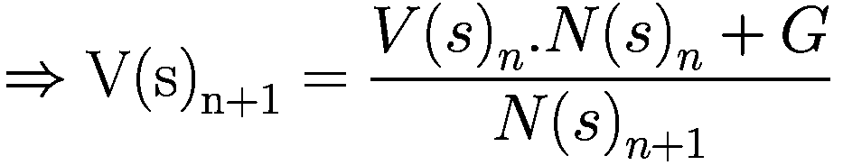

![$$ \Rightarrow \mathrm{V}{\left(\mathrm{s}\right)}_{\mathrm{n}+1}=\frac{V{(s)}_n.\left[N{(s)}_{n+1}-1\right]+G}{N{(s)}_{n+1}} $$](img/502835_2_En_4_Chapter/502835_2_En_4_Chapter_TeX_Equg.png)

![$$ \Rightarrow \mathrm{V}{\left(\mathrm{s}\right)}_{\mathrm{n}+1}=\frac{V{(s)}_n.N{(s)}_{n+1}+\left[G-V{(s)}_n\right]}{N{(s)}_{n+1}} $$](img/502835_2_En_4_Chapter/502835_2_En_4_Chapter_TeX_Equh.png)

![$$ \Rightarrow \mathrm{V}{\left(\mathrm{s}\right)}_{\mathrm{n}+1}=V{(s)}_n+\frac{1}{N{(s)}_{n+1}}.\left[G\hbox{--} V{(s)}_n\right] $$](img/502835_2_En_4_Chapter/502835_2_En_4_Chapter_TeX_Equi.png)

![$$ \Rightarrow \mathrm{V}{\left(\mathrm{s}\right)}_{\mathrm{n}+1}=V{(s)}_n+\frac{1}{N{(s)}_{n+1}}.\left[G\hbox{--} V{(s)}_n\right] $$](img/502835_2_En_4_Chapter/502835_2_En_4_Chapter_TeX_Equ1.png)

(4-1)

差值 [*G* – *V*(*s*)[*n*]] 可以看作是最新采样值 *G* 和当前估计值 *V*(*s*)[*n*] 之间的误差。然后，使用误差更新当前估计值，即将 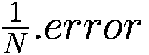 添加到当前估计值中。随着访问次数的增加，新的样本在修订 *V*(*s*) 估计值时的影响力越来越低。这是因为乘法因子 1/*N* 随 *N* 变得非常大而减少到零。

有时，你不必使用衰减因子 1/*N*，而可以使用常数 *α* 作为 [*G* – *V*(*s*)[*n*]] 前面的乘法因子。你特别使用这种方法来处理非平稳环境。由于环境可能会变化，你希望始终通过一个接触点 α，给予最新误差足够的重要性。

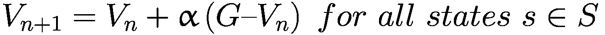

(4-2)

注意，在方程 4-2 中，我已经从 *V*[*n* + 1] 和 *V*[*n*] 中移除了函数参数 *s*。

常数乘法因子方法更适合于非平稳问题或当你想要对所有误差给予恒定权重的情况。当旧估计值 *V*[*n*] 可能不太准确时，这种情况可能会发生。

在查看伪代码之后，现在应该查看第一个访问蒙特卡洛的 Python 实现，并在与上一章相同的网格世界中运行逻辑。在第三章中，你学习了如何使用动态规划推导随机游走策略的状态值。现在，你将使用蒙特卡洛方法得到相同的状态值估计。记住，在蒙特卡洛方法中，你不知道或使用转移动态的知识。相反，你只是对多个剧集进行采样，并使用这些采样中收集到的奖励来估计网格中所有状态的状态值，对于随机游走策略的智能体所遵循的状态。

因此，你需要更新第三章中网格世界的实现。第四章代码中的 `gridworld.py` 包含了网格世界环境的修订代码。本章末尾有一个部分专门介绍你需要执行的操作来实现自己的 Gymnasium 环境。现在，只需知道你需要在你环境中实现两个新函数即可。

第一个函数是 `env.reset()`，它随机初始化环境并返回代理的起始状态以及一些关于环境的调试信息。第二个函数是 `env.step(action)`，它接受一个 `action` 作为输入，根据系统的内部动力学将代理转换到新的状态，并返回一个包含五个值的元组 `(new_state, reward, terminated, truncated, info)`。

现在我们来看 MC 值预测的实现。列表 4-1 展示了代码，完整的代码可以在 `4.a-mc_estimation.ipynb` 文件中找到。

```py
# MC Policy Evaluation
def mc_policy_eval(policy, env, discount_factor=1.0, episode_count=100):
"""
Evaluate a policy given an environment.
Args:
policy: [S, A] shaped matrix representing the policy. Random in our case
env: GridWorld env. use step(a) to take an action and receive
a tuple of (s', r, terminated, terminated, info)
env.nS is number of states in the environment.
env.nA is number of actions in the environment.
episode_count: Number of episodes:
discount_factor: Gamma discount factor.
Returns:
Vector of length env.nS representing the value function.
"""
# Start with (all 0) state value array and a visit count of zero
V = np.zeros(env.nS)
N = np.zeros(env.nS)
i = 0
# run multiple episodes
while i < episode_count:
# collect samples for one episode
episode_states = []
episode_returns = []
state, _ = env.reset()
episode_states.append(state)
while True:
action = np.random.choice(env.nA, p=policy[state])
state, reward, done, _, _ = env.step(action)
episode_returns.append(reward)
if not done:
episode_states.append(state)
else:
break
# update state values
G = 0
count = len(episode_states)
for t in range(count-1, -1, -1):
s, r = episode_states[t], episode_returns[t]
G = discount_factor * G + r
if s not in episode_states[:t]:
N[s] += 1
V[s] = V[s] + 1/N[s] * (G-V[s])
i = i+1
return np.array(V)
Listing 4-1
MC Value Prediction Algorithm for Estimation – “4.a-mc_estimation.ipynb”
```

列表 4-1 中的代码是图 4-2 中伪代码的直接实现。代码实现了在线版本的更新，如方程 4-1 所解释的——即 `N[s]+=1; V[s]=V[s]+1/N[s]*(G-V[s])`。代码还实现了“首次访问”版本，但可以通过非常小的调整转换为“每次访问”版本。你只需要删除 `if` 检查——即“`if s not in episode_states[:t]`”并将此条件下的代码作为无条件代码移动，以在每一步执行更新。

为了获得对真实状态值的收敛，你需要确保每个状态被访问足够的次数，理想情况下在极限情况下是无限次。如图 4-3 所示，对于 100 个回合，状态值并没有很好地收敛。然而，使用 10,000 个回合，值已经很好地收敛，并且与使用 DP 方法产生的值相匹配。

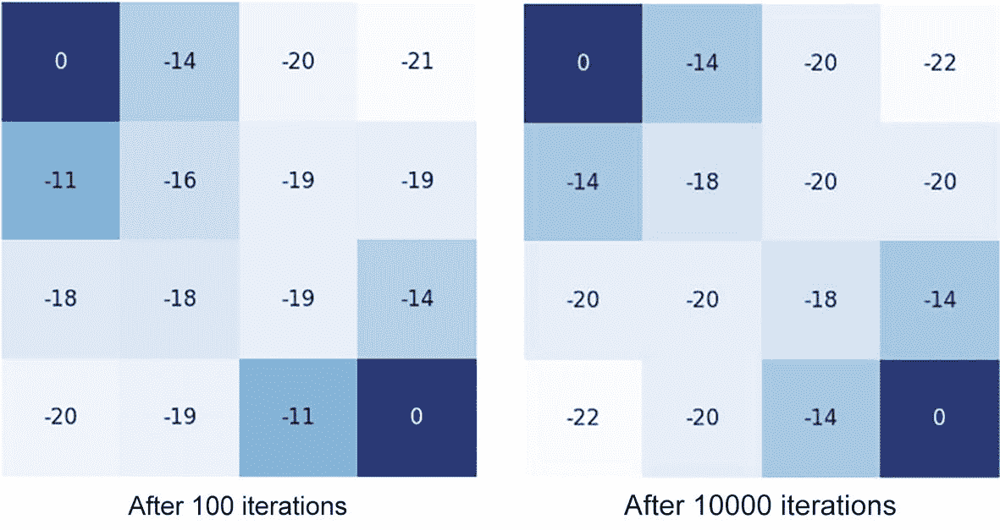

一组两个热图表示强化学习中的策略评估，描绘了在 100 次迭代和 10,000 次迭代后状态值函数估计的变化。

图 4-3

策略评估：使用 MC 方法在网格世界中当代理遵循随机策略时计算的 *v**π*。四个动作（`UP`，`DOWN`，`LEFT` 和 `RIGHT`）具有相等的概率 `0.25`。左图显示了 `100` 次迭代后的值，右图显示了 `10,000` 次迭代后的状态值。

Monte Carlo 技术的一个关键方面是每个状态的预测都是独立的。一个状态估计不依赖于另一个状态的估计，这与动态规划（DP）不同。简单来说，Monte Carlo 方法不使用前面章节中描述的 bootstrapping。

与此相关的是，在估计特定状态值时的计算成本。计算单个状态值的计算成本与状态总数无关，也与该特定状态下可能采取的行动的分支因子无关。在 DP 的情况下，您需要考虑特定状态中的所有行动以及每个行动的所有可能的后续状态。这由方程 3-6 中的两个求和符号表示。然而，在 MC 方法中，您只需考虑没有担心可能采取的行动和后续状态的回滚。因此，如果目的是计算特定状态的价值，您只需让智能体从该状态开始，并遵循正在评估的策略直到终止。您这样做是为了许多剧集，以每个剧集的回报的平均值作为特定起始状态价值的估计。在 MC 方法中，您不必担心样本回滚中看不到的所有其他状态和行动。

下一个子节深入探讨了 MC 方法的两种版本：*首次访问*与*每次访问*。

### MC 预测方法的偏差和方差

现在我们来看看“首次访问”与“每次访问”的优缺点。它们是否都会收敛到真实的潜在值*V*(*s*)？在收敛过程中它们波动很大吗？哪一个更快地收敛到真实值？在我回答这些问题之前，让我们首先回顾一下你在所有统计模型估计中看到的基本概念——偏差-方差权衡，例如，在监督学习中。

*偏差*指的是模型收敛到您试图估计的真实潜在值的性质——在这种情况下，*v**π*。一些估计量是有偏差的，这意味着由于它们固有的缺乏灵活性——即，估计方法对于给定的真实值来说过于简单或受限——它们无法收敛到真实值。随着您在估计中增加样本数量或使估计过程更加复杂和灵活，模型的偏差会降低。有偏差的估计方法或模型将始终高估或低估真实值。例如，倾向于预测更高值的模型将始终预测新数据点将具有比实际更高的值。

*方差*指的是模型估计对所使用的特定样本数据敏感。这意味着估计值可能会波动很大。大多数估计过程都会随着样本数量的增加而显示较低的方差。然而，对于给定的样本数量，某些方法可能具有较低的方差，而某些方法可能具有较高的方差。通常，更复杂的模型由于可以更好地适应给定的数据，因此会显示出较高的方差。因此，随着你通过多次实验运行收集不同的样本集，每次运行的估计值将很好地适应该运行中看到的数据。这反过来又导致这些估计值在多次运行中的方差更高。具有更高复杂度或灵活性的模型将显示出较低的偏差，但会显示出更多的方差。

在小数据集上训练的模型可能具有高方差，因为预测将敏感于训练集中包含的具体数据点。

如果你拥有无限的数据，你总是可以选择一个非常复杂的模型，并通过使用不断增加的数据量来形成估计，从而降低方差。然而，在所有实际问题上，你都没有无限的数据，或者计算资源，或者时间来处理无限的数据，即使数据是可用的。

偏差和方差之间的这种基本权衡是估计方法准确性和可变性之间的权衡，尤其是在给定和固定数据量的情况下。

偏差-方差权衡可以通过以下例子来说明。假设你试图估计世界上所有成年人的平均身高。你可以收集成年人的样本并测量他们的身高。然后，你可以使用样本均值来估计总体平均身高。“总体平均”指的是世界上所有成年人的真实平均身高，这是未知的，也是你试图通过样本的帮助来估计的。

样本均值是总体平均身高的无偏估计量。这意味着所有可能的样本均值的平均值将等于总体平均身高。然而，样本均值也是一个变量估计量。这意味着样本均值的值会随着样本的不同而变化。

样本均值的方差与样本大小成反比。这意味着样本大小越大，样本均值的方差就越小。换句话说，你拥有的数据越多，你对总体平均身高的估计就越准确。

然而，通过增加样本大小来降低样本均值方差的程度是有限的。这是因为样本均值仍然是总体平均身高的有偏估计量。样本均值的偏差是由于你只采样了人口的一小部分。

如果你想要降低样本均值的偏差，你需要使用一个更复杂的模型。例如，你可以使用回归模型根据个人的年龄、性别和其他因素预测其身高。回归模型通常比样本均值具有更低的偏差，但它也将具有更高的方差。

偏差-方差权衡非常重要，因为不可能有一个模型同时具有零偏差和零方差。如果一个模型具有零偏差，那么它将完美地拟合训练数据。然而，这意味着模型很可能会过拟合训练数据，并且对新数据泛化能力较差。另一方面，如果一个模型具有零方差，那么它将为所有数据点产生相同的预测。这意味着模型无法捕捉到数据中的任何复杂性。非常灵活的模型具有低偏差，因为它们可以适应数据集的任何配置。同时，由于灵活性，它们可能会过拟合数据，使得估计值随着训练数据的变化而大幅波动。另一方面，简单的模型具有高偏差。由于固有的简单性和限制，这些模型可能无法表示真实的潜在模型。但它们也将具有低方差，因为它们不会过拟合。

假设你有一些数据点（比如说 100 个）。你正在尝试拟合一个 n 次方的多项式回归模型，并假设数据点所在的潜在真实曲线遵循某个未知的方程。进一步假设，由于数据中的噪声，每个数据点可能不会完全位于这个未知的真实曲线上。如果你使用较低次数的多项式（较简单的模型），比如说一次方，它将进行较差的拟合，因此具有更高的偏差。然而，即使你使用另一组 100 个从真实曲线生成的数据点进行拟合，拟合的曲线也不会有太大变化——也就是说，它将显示出较低的方差。现在考虑使用次数=100 的多项式的另一极端。对于任何给定的 100 个数据点，曲线将精确地拟合所有数据点——也就是说，较低的偏差。然而，在这种情况下，另一组 100 个数据点可能会产生与前一个曲线非常不同的拟合曲线。换句话说，拟合曲线的形状将根据用于拟合曲线的 100 个样本点而剧烈波动。这种情况被称为高方差。随着模型复杂性的增加，偏差降低但方差增加。基于问题，存在一个中间范围，可以平衡偏差和方差。读者可以参考任何标准机器学习文本以进行深入讨论。

这种权衡，被称为**偏差-方差权衡**，在图 4-4 中展示。

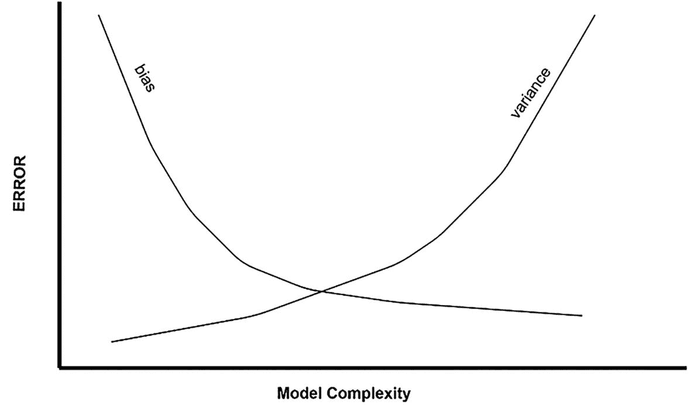

一张图说明了统计学习中的偏差-方差权衡。它描绘了误差与模型复杂度之间的关系。随着模型复杂度的增加，方差上升而偏差下降。

图 4-4

偏差-方差权衡。模型复杂度在 x 轴的右侧增加。当模型受到限制时，偏差开始较高，随着模型变得灵活而降低。方差显示出与模型复杂度相反的趋势。

在强化学习领域，直到某个点，你可以通过在时间域上简化模型来减少方差而不增加偏差。这是因为因果性。动作代理接受当前状态——即当前状态下遵循的策略不会影响过去过渡中看到的奖励。当前动作只能影响未来的奖励。当你学习后续章节中的策略梯度方法时，你会看到这些变化的变体。

在这个背景下，现在让我们将注意力转回到比较“首次访问”和“每次访问”。*首次访问*是无偏的，但方差较高。*每次访问*有偏差，但随着试验次数的增加，偏差会下降到零。此外，*每次访问*方差较低，通常比*首次访问*更快地收敛到真实值估计。

## 基于蒙特卡洛的控制

现在我们来讨论在无模型设置中的控制问题。在这个设置中，你需要找到最优策略，而无需了解模型动态。作为一个复习，让我们回顾一下在第三章中引入的广义策略迭代（GPI）。在 GPI 中，你会在两个步骤之间迭代。第一步是找到一个给定策略的状态值，第二步是使用贪婪优化来改进策略。你将遵循相同的 GPI 方法来处理 MC 下的控制。不过，你将有一些调整，以考虑到你处于一个无模型的世界，没有访问/了解过渡动态。

第三章探讨了状态值，*v*(*s*)。然而，在没有过渡动态的情况下，仅状态值是不够的。对于贪婪改进步骤，你需要访问动作值，*q*(*s*, *a*)。你需要知道所有可能动作的*q*值——即所有可能的动作*a*在状态*S* = *s*中的所有*q*(*S* = *s*, *a*)。只有有了这些信息，你才能应用贪婪最大化来选择最佳动作——即*argmax*[*a*]*q*(*s*, *a*)*。

与 DP 相比，还存在另一个复杂问题。在生成样本时，智能体遵循一个策略。然而，这样的策略可能导致许多状态-动作对从未被访问，如果策略是确定性的，则更是如此。如果智能体没有访问给定状态的状态-动作对，它就不知道该状态的所有*q*(*s*, *a*)。因此，它无法找到产生最大*q*值的动作。解决这个问题的方法之一是通过*探索开始*确保足够的探索——也就是说，确保智能体从一个随机的状态-动作对开始一个剧集，并在许多剧集的过程中足够多次地将每个状态-动作对作为起点*。*理想情况下，在极限情况下无限次。

图 4-5 显示了 GPI 图的一个变化，*v*值被*q*值所取代。评估步骤现在是我之前章节中提到的 MC 预测步骤。一旦 q 值稳定，就可以应用贪婪最大化来获得新的策略。策略改进定理确保新策略将比旧策略更好或至少一样好。

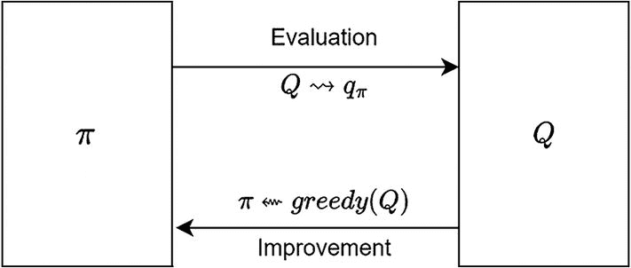

一个图示说明了包含两个步骤的迭代过程，这两个步骤分别标记为评估和改进。箭头表示这两个步骤之间的循环，其中 Q 在评估中导致π，而在改进中π返回到 Q，其中π受到一个贪婪 Q 函数的影响。

图 4-5

两个步骤之间的迭代。第一步评估以获得与正在遵循的策略同步的状态-动作值。第二步执行策略改进，对动作进行贪婪最大化。

这种 GPI 方法将是一个反复出现的主题。根据设置，评估步骤将改变，而改进步骤无疑将继续是贪婪最大化。

“探索开始”的假设并不非常实用和高效。它不实用，因为在许多场景中，因为智能体无法选择起始条件，例如，在训练自动驾驶汽车时。它可能不可行，并且智能体在极限情况下无限次访问每个状态-动作对可能也是浪费的。然而，为了使智能体访问当前策略访问过的状态中的所有动作，你仍然需要持续探索。这是通过使用*ε-贪婪策略*来实现的。

在*ε*-贪婪策略中，代理以 1 − ϵ的概率采取具有最大 q 值的动作，并以概率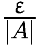随机采取任何动作。换句话说，剩余的ϵ概率被平均分配到所有动作上，以确保代理继续探索非最大化动作。换句话说，代理以概率 1-ε*利用*知识，并以概率ε*探索。您将在强化学习(RL)中看到探索和利用这一概念被反复提及。


(4-3)

具有最大*q*-值的动作以概率 1 − ϵ从贪婪最大值中选取。所有动作都以概率ϵ/|*A*|被选取。

虽然ϵ-贪婪解决了探索所有可能的*s*, *a*对的问题，但它是一种折衷方案。代理最终学习到的策略也是一个*ϵ*-贪婪策略。想象一下这样一个最终策略用于自主机器人。某些随机动作的概率ϵ/∣*A*∣可能会使机器人处于破坏状态，或者可能对其周围的物体/人造成伤害。那么如何解决这个问题呢？一个简单的解决方案是随着剧集数量的增加逐渐减少ϵ的值，并在极限情况下让ϵ → 0。这使代理能够在极限情况下学习到最优贪婪策略。

让我们对迭代中的估计/预测步骤进行进一步的细化。在前一节中，您看到即使是对于简单的 4×4 网格 MDP，也需要 10,000 个剧集的顺序才能使值收敛。参见图 3-10，它显示了 GPI 的收敛：MC 预测/评估步骤使*v*-值或*q*-值与当前策略同步。然而，在前一章中，您也看到不需要代理使值完全收敛。这如图 3-11 所示。同样，您可以在每个剧集的基础上运行 MC 预测，然后进行策略改进。这种方法将消除在估计/预测步骤中需要大量迭代的需求，从而使方法适用于大型 MDP。类似于图 3-11，这种方法将产生收敛，如图 4-6 所示。

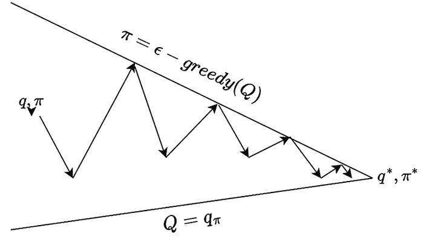

一个图表示了两个步骤之间的迭代过程，例如 pi 等于 epsilon 减去贪婪 Q 和 Q 等于 q pi。箭头表示优化步骤。

图 4-6

在这两个步骤之间进行迭代。第一步是对单步进行 MC 预测/评估，以使 q 值朝着当前策略的方向移动。第二步是策略改进，进行 ε-greedy 动作最大化。

结合这两个调整，你现在有一个基于蒙特卡洛控制的实际算法，用于最优策略学习。这被称为“极限贪婪，无限探索”（GLIE）。你将在 *q*-值预测步骤中使用“每次访问”版本。要使其成为“首次访问”，你只需要进行一些小的调整，就像你在图 4-2 中的 MC 预测中看到的那样。GLIE 伪代码在图 4-7 中给出。

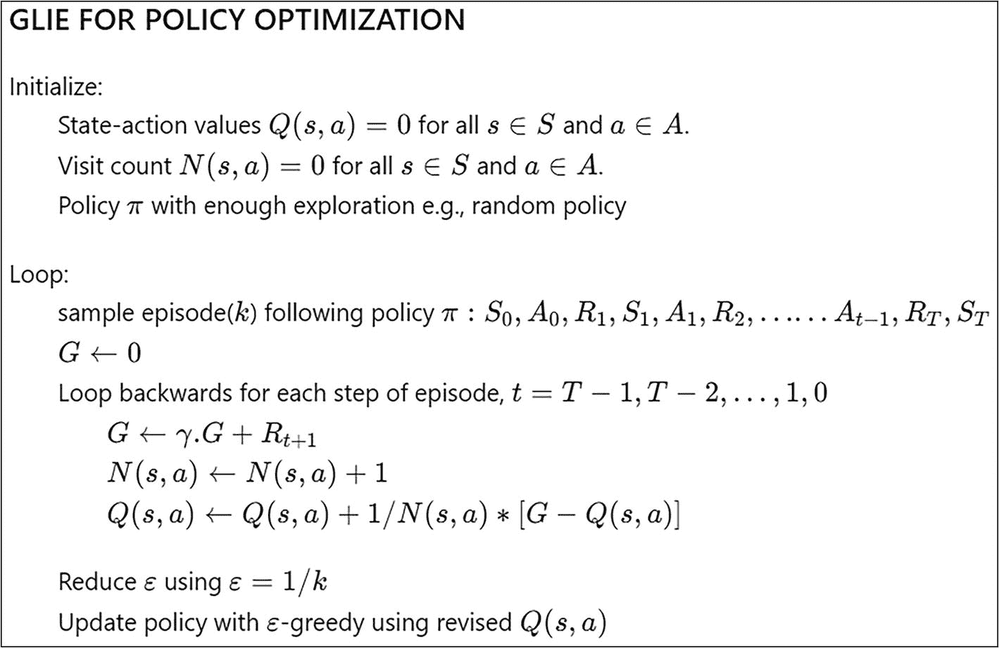

政策优化的伪代码截图，包括初始化、剧集采样和使用 ε-greedy 策略进行策略更新。

图 4-7

政策优化的每次访问（GLIE）MC 控制

从 *q*-值 *Q*(*s*, *a*) = 0 和访问计数 *N*(*s*, *a*) = 0 开始，对所有 (*s*, *a*) 对进行初始化。然后你初始化一个随机策略，例如在状态中所有动作具有相同概率的策略。需要注意的是，只要特定状态中的每个动作都有非零概率，你就可以使用任何随机策略。主循环是多次执行策略的回滚，并在循环的每次迭代中使用回滚出的状态、动作、奖励三元组，首先进行一步预测，然后进行贪婪最大化，如伪代码所示。

现在让我们看看在 `4.b-mc-control.ipynb` 中给出的实际实现。列表 4-2 展示了 GLIE 中主循环的 Python 代码实现。该实现遵循伪代码。`argmax_a()` 函数找到一个给定状态下的 `max Q(s,a)` 动作。另一个函数 `get_action(state)` 返回当前策略的 ϵ-greedy 动作。作为一个编码练习，你可能想要对其进行调整并将其转换为“首次访问”变体。你也可以比较“首次访问”与“每次访问”MC 控制的输出结果。

```py
# collect samples for one episode
episode_states = []
episode_actions = []
episode_returns = []
state,_ = env.reset()
episode_states.append(state)
while True:
action = get_action(state)
episode_actions.append(action)
state, reward, done, _, _ = env.step(action)
episode_returns.append(reward)
if not done:
episode_states.append(state)
else:
break
# update state-action values
G = 0
count = len(episode_states)
for t in range(count-1, -1, -1):
s, a, r = episode_states[t], episode_actions[t], episode_returns[t]
G = discount_factor * G + r
N[s, a] += 1
Q[s, a] = Q[s, a] + 1/N[s, a] * (G-Q[s, a])
# Update policy and optimal value
k = k+1
eps = 1/k
for s in range(env.nS):
best_action = argmax_a(Q[s])
policy[s] = best_action
Listing 4-2
GLIE MC Control Algorithm
```

到目前为止，在本章中，你已经研究了预测和控制方面的 on-policy 算法。换句话说，相同的策略既用于生成样本，也用于策略改进。策略改进是基于相同ε-greedy 策略的*Q*值进行的。你需要探索以找到所有状态-动作对的*Q*(*s*, *a*)，这通过使用ε-greedy 策略来实现。然而，随着你不断进步，极限下的ε-greedy 策略是次优的。随着你对环境的理解随着越来越多的剧集而增长，你需要更多地利用。你也看到，虽然从理论上讲，策略将收敛到最优策略，但有时需要仔细控制ε值。MC 方法的另一个大缺点是，你需要每个剧集完成之后才能更新*Q*值并执行策略优化。因此，MC 方法只能应用于周期性的环境，其中剧集会终止。从下一节开始，你将开始研究一类不同的算法，称为*时序差分*方法，它结合了 DP（单步更新）和 MC（即不需要知道系统动力学）的优点。然而，在我深入探讨 TD 方法之前，让我们通过一个简短的章节来介绍并比较 on-policy 与离政策学习。

## 离政策 MC 控制

在 GLIE 中，你看到为了充分探索，你需要使用ε-greedy 策略，以确保所有状态动作在极限情况下被频繁访问。循环结束时学习的策略用于生成下一次循环迭代的剧集。你正在使用与正在最大化的策略相同的策略来探索。这种做法被称为*on-policy*，其中样本是从正在优化的相同策略中生成的。

在许多情况下，这并不非常高效。你过去收集的剧集必须被丢弃，并必须生成一套新的剧集。在现实世界或生成剧集成本高昂的情况下，丢弃旧剧集会导致效率低下或训练过程缓慢。另一个问题是，探索未探索部分的能力取决于正在优化的策略。你没有单独控制探索的能力。即使是ε-greedy 策略中的ε也需要随着训练的进行而减少到零，这使得探索更加困难。

换句话说，最优策略控制方法试图从起始（状态，动作）对学习条件于最优行为的动作值，但代理也需要表现出次优行为，以便探索所有状态中的所有动作，以便在所有看到的滚动状态中找到最大化动作。

另一种方法是使用具有更高 ϵ 的更具探索性的策略来生成样本，而要优化的策略可能是具有更低 ϵ 或甚至完全确定性的策略。使用不同于正在优化的策略来学习的这种方法被称为 *离线学习*。用于生成样本的策略称为 *行为策略*，通常用下标“*b*”表示，而正在学习（最大化）的策略称为 *目标策略*，用下标“π”表示。这与在线策略方法形成对比，在线策略方法中，用于生成样本的策略与正在优化的策略相同。在线策略方法中，每次策略更新后都会丢弃样本，因为样本变得过时，在策略更新后不再符合在线策略。

这种方法使过程更加复杂，需要通过 *重要性采样** 来进行仔细的数学处理，这将在下文中讨论。你将首先推导出重要性采样的简洁表达式，然后看到其在离线策略方法中的应用。

### 重要性采样

从数学上讲，如果你想要估计函数 *f* 在分布 *p* 下的期望值，但你只有来自分布 *q* 的样本，那么重要性采样估计器如下所示：

![$$ {E}_p\left[f\right]\approx \frac{1}{N}{\sum}_{i=1}^N\frac{p\left({x}_i\right)}{q\left({x}_i\right)}f\left({x}_i\right) $$](img/502835_2_En_4_Chapter/502835_2_En_4_Chapter_TeX_Equj.png)

其中 *E*[*p*][ *f* ] 是函数 *f* 在分布 *p* 下的期望值。*x*[*i*] 是从分布 *q* 中抽取的样本，*N* 是样本数量。术语 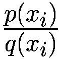 被称为重要性权重或重要性比率。

假设你是一名教师，你想知道全校所有学生的平均成绩。然而，你只能获取到数学俱乐部学生的成绩。数学俱乐部学生的数学可能比普通学生更好，因此他们的成绩可能更高。为了仅使用数学俱乐部学生的成绩来估计所有学生的平均成绩，你可以使用重要性采样。

在这里，*p* 是所有学生的成绩分布。*q* 是数学俱乐部学生的成绩分布。*f* 是成绩本身。你会根据随机学生得到该成绩的概率与数学俱乐部学生得到该成绩的概率的比率来权衡每位数学俱乐部学生的成绩。

在了解了这一介绍之后，现在让我们看看在强化学习中的蒙特卡洛采样上下文中的重要性采样。考虑一个起始状态 *S*t 和直到游戏结束的动作和状态序列轨迹，*A*t，*S*t+1，*A*t+1，⋯，*S*T。在策略 *π* 下观察到的序列的概率由以下表达式给出：

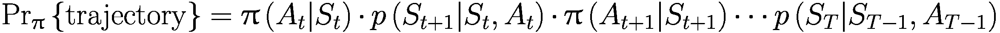

同样，在行为策略 *b* 下观察到的序列的概率由以下表达式给出：

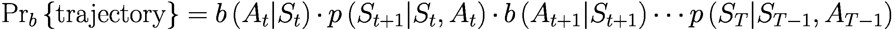

重要性采样比率是目标策略 *π* 下轨迹概率与行为策略 *b* 下轨迹概率的比率。

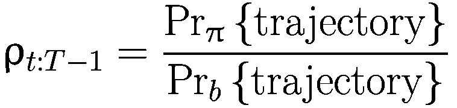

将目标策略 π 和行为策略 *b* 的轨迹概率表达式代入：

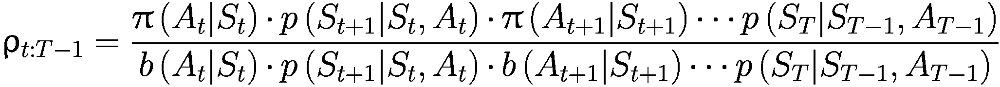

你可以看到，转移概率 *p*(*S*t+1| *S*t, *A*t*) 在分子和分母中都出现。此外，这些概率依赖于环境，与策略代理遵循的策略无关。你可以从分子和分母中消去它们。这给出了重要性采样比率的最终形式：

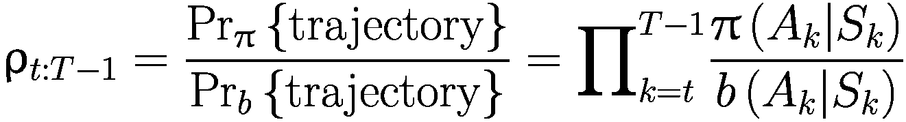

(4-4)

在轨迹展开的上下文中推导出重要性采样表达式后，让我们看看为什么你需要它。在蒙特卡洛方法中，你试图估计的是什么？你使用从起始状态/动作开始的样本展开的平均值，并且这些展开是在目标策略 π 下观察到的：

![$$ {Q}_{\uppi}\left(s,a\right)={E}_{\uppi}\left[{G}_t|{S}_t=s,{A}_T=a\right] $$](img/502835_2_En_4_Chapter/502835_2_En_4_Chapter_TeX_Equo.png)

记住 *G*[*t*] 是从 *S*[*t*]，*A*[*t*] 开始的回滚回报，并继续直到基于策略 *π* 执行动作终止。但是，当你使用行为策略 *b* 进行相同的回滚时，你不会以与目标策略 *π* 相同的频率看到这条特定的轨迹。在行为策略 *b* 下对所有回滚的回报进行简单平均将给出以下结果：

![$$ {Q}_{\mathrm{b}}\left(s,a\right)={E}_{\mathrm{b}}\left[{G}_t|{S}_t=s,{A}_T=a\right] $$](img/502835_2_En_4_Chapter/502835_2_En_4_Chapter_TeX_Equp.png)

当遵循策略 *b* 时得到的 *q* 值是适用于策略 *b* 的 *q* 值，而不是 *π*。重要性采样比率确保在行为策略下观察到的轨迹回报根据在目标策略下观察轨迹的相对概率与在行为策略下观察相同轨迹的概率进行调整。π 下 *Q*(*S*[*t*], *A*[*t*]) 的单个回滚估计如下：

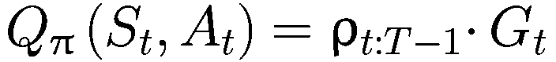

其中 *G*[*t*] 是当智能体在状态 *S*[*t*] 执行动作 *A*[*t*] 并遵循行为策略 *b* 直到终止时观察到的单个回滚的回报。

你从状态 (*S*[*t*], *A*[*t*]) 出发，根据策略 *b* 观察多个回滚，将每个回滚的回报乘以相关的权重采样比率 ρ[*t* : *T* − 1]，以将回报映射回目标策略，然后对所有调整后的回报取平均，以形成该策略下状态-动作价值的估计。

在取平均时，你有两种选择。第一种选择是将所有回报相加，然后除以回滚的数量。这种方法被称为 *普通重要性采样*。

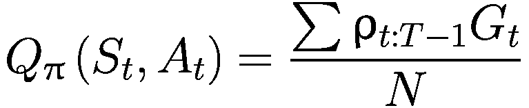

第二种选择是将所有回滚的重要性采样比率之和除以。这个版本被称为 *加权重要性采样*：

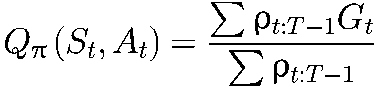

这两个版本都有优点和缺点。没有什么是免费的，重要性采样也是如此。重要性采样比率可能导致较大的方差。此外，这些方法在计算上并不高效。有许多高级技术，如*折扣感知重要性采样*和*按决策重要性采样*，它们以不同的方式看待重要性采样和奖励，以减少方差并使这些算法更高效。更多详情，请参阅 Sutton 和 Barto 的 RL 书籍.^(1)

需要记住的关键点是，当场景数量较小时，加权重要性采样方法具有更低的误差，而加权采样方法初始时的偏差较高，但随着场景数量的增加会趋于零。

与首次访问蒙特卡洛预测类似，你可以使用一个公式来计算运行平均值。假设你有一个序列的回报 *G*[1]，*G*[2]，⋯，*G*[*n* − 1]，它们都在相同的起始状态和动作下，并且每个都有相应的权重 *W*[*i*] (*W*[*i*] = ρ[*t* : *T* − 1])。加权平均的计算如下：

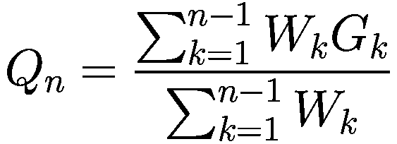

现在定义 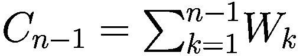。*Q*[*n*]的修正公式将是：

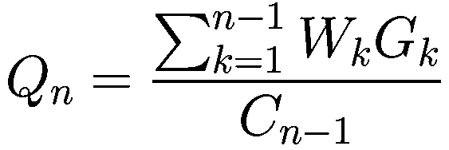

新的回报 *G*[*n*] 到达。更新的估计和权重总和将是：

![$$ {Q}_{n+1}=\frac{\sum_{k=1}^n{W}_k{G}_k}{{\mathrm{C}}_{\mathrm{n}}}={q}_n+\frac{W_n}{C_n}\left[{G}_n-{Q}_n\right] $$](img/502835_2_En_4_Chapter/502835_2_En_4_Chapter_TeX_Equv.png)

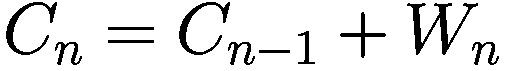

图 4-8 显示了使用先前想法的离线策略蒙特卡洛控制的伪代码。

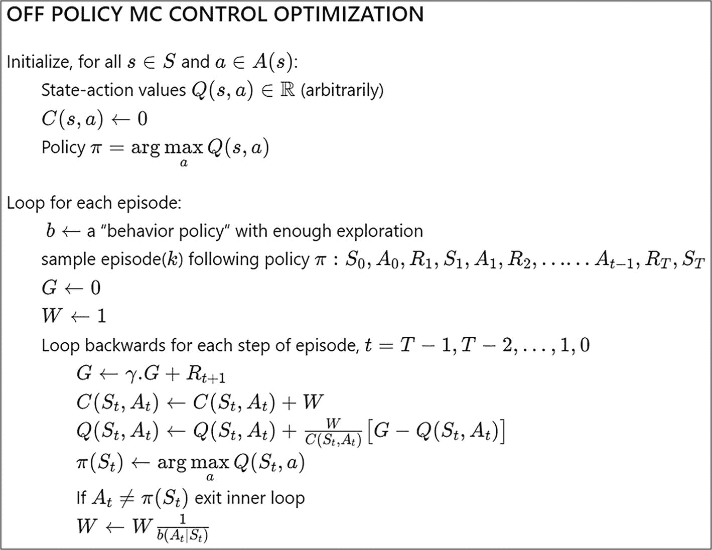

这是离线策略蒙特卡洛控制优化的算法截图。它包括初始化变量、根据行为策略生成场景，并使用加权重要性采样迭代更新状态-动作值以优化控制策略的步骤。

图 4-8

离线策略蒙特卡洛控制策略优化

这完成了蒙特卡洛方法的主题。蒙特卡洛方法最大的问题是，在更新 q 值之前，你需要等待一个场景终止。下一节将探讨另一种处理这个问题的方法。

## 时间差分学习方法

参考图 4-1 来研究 DP 和 MC 方法的回溯图。在 DP 中，你只使用后继状态的价值来估计当前状态的价值，并且只进行一步回溯。你还会根据遵循的策略对动作概率进行期望，然后从(*s*, *a*)对到所有可能的奖励和后继状态。这正如状态值计算方程所表达的那样：

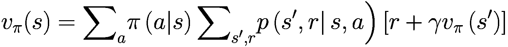

状态*v**π*的值是基于后继状态*v**π*的当前估计来估计的。这被称为引导。估计是基于另一组估计。这两个和是图 4-1 中 DP 回溯图中的分支节点所代表的。与 DP 相比，MC 是从一个状态开始，根据智能体当前遵循的策略来采样结果。状态值估计是*多次运行的平均值*。换句话说，模型转移概率的总和被替换为平均值，因此 MC 的回溯图是从一个状态到终端状态的单一路径。MC 方法允许你构建一个可扩展的学习方法，同时消除了需要知道精确模型动力学的需求。然而，它产生了两个问题：MC 方法只适用于回合式环境，并且更新只在回合终止时发生。DP 的优势在于使用后继状态的估计来更新当前状态的价值，而不必等待回合结束。

时间差分学习是一种结合了 DP 和 MC 优点的方法，它使用 DP 的引导和 MC 的基于样本的方法。TD 的更新方程如下：

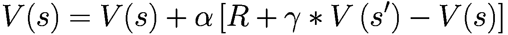

(4-5)

当前对状态*S* = *s*的总回报的估计，即*G*[*t*]，现在由从样本运行中显示的后继状态(*s*^′)的当前估计进行引导。换句话说，方程 4-2 中的*G*[*t*]被替换为*R* + γ · *V*(*s*^′)，一个估计值。与这个相比，在 MC 方法中，*G*[*t*]是整个回合中看到的奖励的折现总和。

本章所描述的 TD 方法被称为*TD*(0)，它是一种一步估计。为什么称之为*TD*(0)将在本章的末尾变得更加清晰，当你学习到*TD*(*λ*)并看到这一步方法对应于*λ* = 0 时。为了清晰起见，请查看图 4-9 中的*TD*(0)下的值估计方法的伪代码。

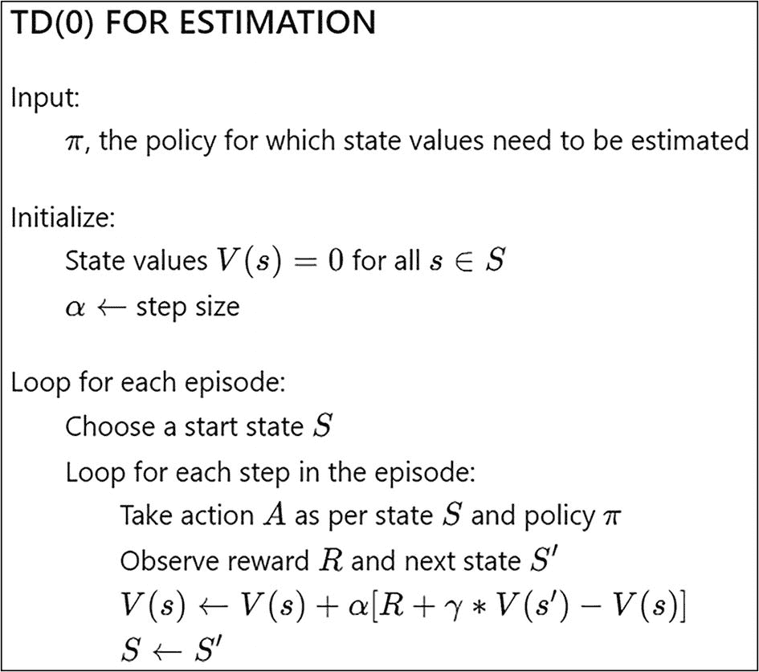

一张伪代码截图概述了在策略 pi 中估计状态值的策略优化算法。它包括状态值的初始化、动作采样的循环、奖励观察和利用剪枝代理目标函数进行的价值更新。

图 4-9

TD(0) 策略估计

在看到所有三种方法——DP、MC 和 TD 之后，考虑这三种方法的回溯图，如图 4-10 所示。如果你比较 DP 和 TD(0) 的起始和结束节点，你会注意到它们都从状态 *s* 开始，并在一次转换后到达下一个状态 *s*^′。它们都使用 *自举*，即使用下一个状态值的估计来估计当前状态值，这是一个通过使用另一个估计形成的估计。接下来，如果你比较 MC 和 TD(0) 的分支因子，你会注意到它们都没有分支。MC 从状态 *s* 开始，然后展开一条单一路径直到终止，而 TD(0) 也从 *s* 开始，但只展开一步，因此在下一个时间步停止在状态 *s*^′。TD(0) 和 MC 都采样剧集并使用观察到的奖励；MC 是从开始到终止所有奖励的总和，而 TD(0) 是即时奖励和下一个状态 *s*^′ 的价值估计的总和。

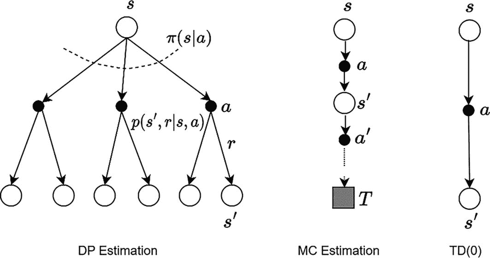

一组标记为 DP 估计、MC 估计和 TD 的三个图。每个图都通过箭头连接的一系列圆圈来表示回溯图中的状态和转换。

图 4-10

DP、MC 和 TD(0) 的回溯图比较

现在我介绍另一个你可能在强化学习文献中反复看到的量。在方程 4-5 中，量 [*R* + γ · *V*(*s*^′)] 是从状态 *S* = *s* 出发的总回报的修正估计，它基于从后续状态 *s*^′ 的一步自举回溯。此外，在方程 4-5 中，赋值右侧的 *V*(*s*) 是当前估计。有了这些见解，你可以将方程 4-5 解释为将估计从 *V*(*s*) 更新到 *V*(*s*) + α(差异) 的更新，其中差异 δ[*t*] 由以下表达式给出：

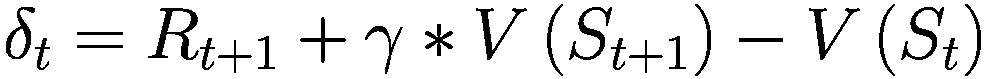

(4-6)

差分 *δ*[*t*] 被称为 *TD* *误差*。它表示基于奖励 *R*[*t* + 1] 以及折现后的下一个时间步状态值 *V*(*S*[*t* + 1]) 和当前状态值 *V*(*S*[*t*]) 的估计误差（差异）。状态值的变化由这个误差 δ[*t*] 的一个比例（即学习率或步长率 α）来决定。

与动态规划（DP）相比，时间差分（TD）方法的优势在于它不需要模型知识（转移函数）。此外，TD 方法在蒙特卡洛（MC）方法上也有优势。TD 方法可以在每一步更新状态值——也就是说，它们可以用于在线设置，通过这种方式，您可以在情况展开时学习，而无需等待剧集结束；它们也可以用于持续的任务，这些任务没有终止。

## 时间差分控制

本节开始您进入强化学习中实际使用的算法领域的旅程。在本章的剩余部分，您将了解在 TD 学习下使用的各种方法。我将从一个简单的单步在线策略学习方法开始，称为*SARSA*。这将随后是一个强大的离线策略技术，称为*Q-learning*。在本章中，您将学习 Q 学习的一些基础方面，在下一章中，您将集成深度学习与 Q 学习，这将给您一个强大的方法，称为深度 Q 网络（DQN）。使用 DQN，您将能够在 Atari 模拟器上训练游戏智能体。

在本章中，您还将涵盖 Q 学习的一个变体，称为*预期 SARSA*，另一个离线学习算法。然后，我将讨论 Q 学习中的最大化偏差问题，带您进入*双重 Q 学习*。本章后续部分将讨论*双重 Q 学习*的优势。当与深度学习结合以表示状态空间时，所有 Q 学习的变体都变得非常强大，这将是下一章的主要内容。在本章的末尾，我将介绍一些额外的概念，如*经验回放*，这些概念使得离线学习算法在需要学习最优策略的样本数量方面效率更高。然后，我将讨论一个强大且稍微复杂的方法，称为*TD*(*λ*)，它将 MC 和 TD 方法结合在一个由*λ*控制的连续体上，*λ*的范围在 0 到 1 之间。最后，您将查看一个具有连续状态空间的环境，以及为 TD 方法离散化状态值的方法。练习将证明您将在下一章中采用的方法的需求，包括功能逼近和深度学习用于状态表示。在 5 和 6 章关于深度学习和 DQN 之后，我将解释另一种方法，称为*策略优化*，该方法围绕直接学习策略而无需找到最优状态/动作值展开。

到目前为止，您一直在使用 4x4 网格世界。现在，您将查看本章剩余部分将使用的几个更多环境。您将以封装的方式编写智能体，以便相同的智能体/算法可以在各种环境中应用而无需任何更改。

### 断崖行走

你将使用的第一个环境是网格世界的变体；它是 Gymnasium 库的一部分，称为悬崖行走环境.^(2) 在这个环境中，你有一个 4×12 的网格世界，坐标[3,0]的左下角单元格是起始状态 *S*，坐标[3,11]的右下角状态是目标状态 *G*。底部剩余的行([3,1] ... [3,10])形成悬崖；踩到悬崖上会获得-100 的奖励，代理会被放回起始状态。

观察空间表示每次步骤获得-1 的奖励，直到代理达到目标状态。类似于 4×4 的网格世界，代理可以在任何方向上移动一步 `[0:UP, 1:RIGHT, 2:DOWN, 3:LEFT]`，这由一个形状为(1,)的元组表示，范围在{0,3}内。

有 3 x 12 + 1 种可能的状态。玩家不能站在悬崖上，也不能站在终点，因为后者会导致游戏结束。剩下的都是前三行的所有位置加上左下角的单元格。观察值是一个表示玩家当前位置的值，即`current_row * nrows + current_col`（其中`row`和`col`都是从 0 开始的）。例如，起始位置可以这样计算：3 * 12 + 0 = 36。观察值以`int()`的形式返回。当代理达到目标状态时，游戏结束。

图 4-11 展示了设置。

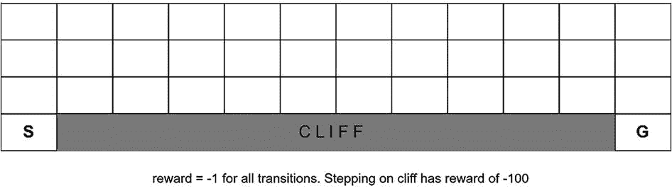

一个网格插图表示一个强化学习环境，其中有一个起始状态 S 和一个目标 G，由悬崖部分隔开。所有转换的奖励是-1，踩到悬崖会获得-100 的奖励。

图 4-11

一个 4×10 的悬崖世界。踩到悬崖的奖励是-100，其他转换的奖励是-1。目标是从小 S 开始，以最佳奖励达到 G。

### 出租车

你接下来要查看的环境是“出租车问题。”^(3) 在 5x5 的网格世界中，有四个指定的接载和放下位置（红色、绿色、黄色和蓝色）。出租车从随机的一个方块开始，乘客在指定的位置之一。四个方块中的一个被随机选择为目的地。

目标是将出租车移动到乘客的位置，接载乘客，移动到乘客希望的目的地，并放下乘客。一旦乘客被放下，游戏结束。

玩家在成功选择并放下乘客在正确的起始位置和终点时获得正奖励。对于尝试错误地接载/放下乘客以及每一步没有获得奖励的情况，存在负奖励。具体来说，每一步的奖励是-1，成功接载/放下奖励+20，从错误位置接载/放下奖励-10。

由于 5x5 网格中有 25 个出租车位置，五个可能的乘客位置（包括乘客在出租车中的情况），以及四个目的地位置，因此有 500 个离散状态。

观察结果以`int()`返回，它编码相应的状态，通过`((taxi_row * 5 + taxi_col) * 5 + passenger_location) * 4 + destination`计算得出。

注意，在回合中实际上可以到达 400 个状态。缺失的状态对应于乘客与目的地在同一位置的情况，因为这通常表示回合的结束。在成功回合之后，可以观察到四个额外的状态，此时乘客和出租车都在目的地。这总共给出了 404 个可达到的离散状态。

有六个可以采取的确定性动作。出租车可以向北、南、西、东移动，然后还有两个动作是接或送乘客。动作形状为(1,)，范围是{0, 5}。值 0 到 3 代表汽车在四个方向上移动的动作，类似于我们在悬崖行走环境中看到的动作值。值 4 是接乘客的动作，5 代表送乘客的动作。

如果发生以下情况，回合结束：a) 终止，出租车放下乘客，或 b) 截断（当使用`time_limit`包装器时），此时回合长度为 200。

图 4-12 显示了环境的示意图。

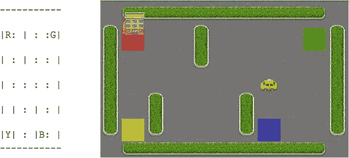

一幅插图展示了在 5x5 网格上设置的出租车问题的简化网格表示。该网格由垂直和水平的虚线组成，形成独立的方块。在右侧，有一个带有空格和彩色方块的街道布局。

图 4-12

5×5 出租车问题。所有转换的奖励为-1。当乘客被送到目的地时，一个回合结束。左图显示了内部使用的示意图，右图显示了使用 PyGame 库创建的视觉表示。

### 货车杆

你将要查看的第三个环境是`CartPole`^(4)。我在第二章中介绍了这个环境。一个杆子通过非驱动关节连接到一个货车上，货车沿着无摩擦的轨道移动。摆锤垂直放置在货车上，目标是通过对货车左右施加力来平衡杆子。

*动作空间*是一个形状为(1,)的 ndarray，可以取值{0, 1}，表示对货车施加的固定力的方向。0 是推动货车向左的动作，1 是推动货车向右的动作。

*观察空间*是一个形状为(4,)的 ndarray 数组，其值对应以下位置和速度：[滑车位置，车辆速度，杆角度，杆角速度]。您可以参考 Gymnasium 库的配套文档，以获取更多关于每个值操作的具体范围的信息。

每一步的奖励为+1，代理的目标是通过保持杆平衡最长时间来最大化奖励。一旦杆角度超过 12 度（无论是正向还是反向）或滑车位置超过中心 2.4 个单位——即小于-2.4 或大于 2.4，或者代理能够平衡杆 200 次或 500 步，则回合结束。图 4-13 显示了环境动作的快照。

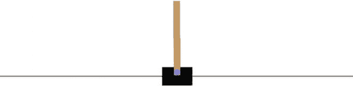

滑车杆问题的说明展示了一个垂直杆在轨道上可移动滑车上保持平衡。

图 4-13

滑车杆问题。目标是使杆在垂直方向上保持平衡，以获得最大步数，每一步奖励为+1。

解释了各种环境后，现在让我们跳入使用各种 TD 算法来解决这些问题，首先从 SARSA 开始，这是一种基于策略的方法。

## 基于策略的 SARSA

与 MC 控制方法一样，你将再次利用 GPI。你将使用 TD 驱动的策略值估计/预测步骤，并继续使用贪婪最大化来改进策略。就像 MC 一样，你需要探索足够多，并无限次访问所有状态以找到最优策略。因此，类似于 MC 方法，你可以使用ε-贪婪策略，并逐渐减少ε值到零——也就是说，随着回合数的增加，将探索降至零。

TD 设置是无模型的——也就是说，你没有关于转换的先验全面知识。因此，对于给定状态，为了能够通过在该状态下选择正确的动作来最大化回报，你需要知道该状态下所有动作的状态-动作值*Q*(*S*, *A*)。你需要对所有状态都这样做。因此，找到最优策略的最标准方式是找到所有状态/动作对的所有*Q*值。你可以将 TD 估计从方程 4-5 重新表述为方程 4-7，本质上用*Q*(*s*, *a*)替换*V*(*s*)。这两种设置都是马尔可夫过程，方程 4-5 关注状态到状态转换，而方程 4-7 将重点转向状态-动作到状态-动作。

![$$ Q\left({S}_t,{A}_t\right)\leftarrow Q\left({S}_t,{A}_t\right)+\upalpha \cdotp \left[{R}_{t+1}+\upgamma \cdotp Q\left({S}_{t+1},{A}_{t+1}\right)-Q\left({S}_t,{A}_t\right)\right] $$](img/502835_2_En_4_Chapter/502835_2_En_4_Chapter_TeX_Equ7.png)

(4-7)

与方程 4-6 类似，TD 误差现在是在*q*-值的环境中给出的。

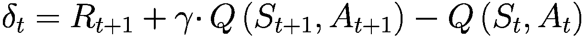

(4-8)

为了根据方程 4-7 进行更新，你需要所有五个值 *S*[*t*]，*A*[*t*]，*R*[*t* + 1]，*S*[*t* + 1]，和 *A*[*t* + 1]。这就是为什么这种方法被称为 SARSA。这是一个简写，用来表示五个值的元组——即，状态、动作、奖励、状态和动作。你将遵循 ϵ-greedy 策略来生成样本，使用方程 4-7 更新 *q*-值，然后基于更新的 *q*-值创建一个新的 ϵ-greedy。策略改进定理保证新策略将优于旧策略，除非旧策略已经是最优的。当然，为了使保证成立，你需要将探索概率 ε 降至零。

注意，对于所有基于事件的策略，终端状态下的 *Q*(*S*, *A*) 值等于零——也就是说，一旦进入终端状态，个人就无法再进行任何转换，并且会持续获得零奖励。这另一种说法是，事件结束，对于所有终端状态，*Q*(*S*, *A*) 值为零。因此，当 *S*[*t* + 1] 是终端状态时，方程 4-7 将有 *Q*(*S*[*t* + 1], *A*[*t* + 1]) = 0，更新方程将如下所示：

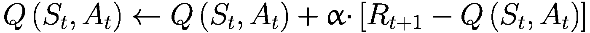

(4-9)

现在我们来看 SARSA 算法的伪代码；见图 4-14。

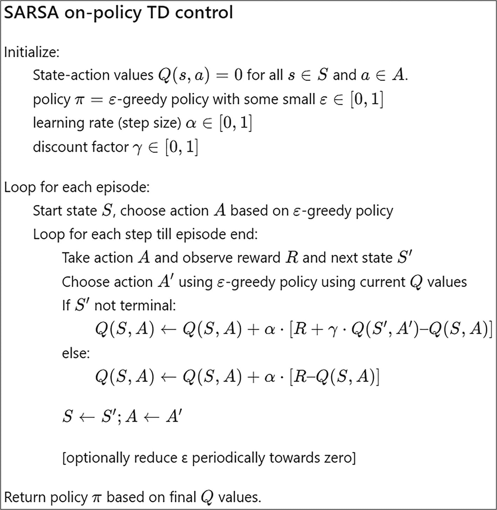

Sarsa、Q-learning 和预期 Sarsa 算法的强化学习伪代码截图。它包括初始化、策略定义和值更新规则。

图 4-14

SARSA，基于策略的 TD 控制

伪代码从将所有 *Q* 值初始化为零和一个 *ϵ*-greedy 策略 *π* 开始。你迭代多个事件，并在每个事件中的每一步，使用方程 4-7 或 4-9 对状态-动作 q 值进行更新。你也可以选择通过驱动 ϵ → 0 来减少探索。

在经过足够的迭代或 *q*-值的变化减少到阈值以下后，你可以通过为每个状态找到最大化动作来返回最终的策略。

现在我们来逐步分析`4.c-sarsa-on-policy.ipynb`中的代码，该代码实现了 SARSA 算法。代码中有一个名为`SARSAAgent`的类，它实现了 SARSA 学习智能体。它有两个关键函数——`update()`，它接受`state`、`action`、`reward`、`next_state`、`next_action`和`done`标志的元组。它使用 TD 更新方程 4-7 和 4-9 更新 q 值。另一个函数是`get_action(state)`，它以概率ϵ返回随机动作，以概率 1-ϵ返回`argmax Q(S,A)`。在类外部有一个通用函数`train_agent()`，用于在给定环境中训练智能体。有三个辅助函数：`plot_rewards()`用于在训练过程中绘制每集的奖励，`print_policy()`用于打印学习到的最优策略，以及`record_video()`用于记录训练智能体的视频。列表 4-3 显示了`SARSAAgent`的代码，它实现了图 4-14 中的内部循环中的更新。实现图 4-14 中的训练循环的代码在列表 4-4 中给出。对于其余的代码，请参阅笔记本。

```py
class SARSAAgent:
def __init__(self, alpha, epsilon, gamma, get_possible_actions):
self.get_possible_actions = get_possible_actions
self.alpha = alpha
self.epsilon = epsilon
self.gamma = gamma
self._Q = defaultdict(lambda: defaultdict(lambda: 0))
.....
# carryout SARSA updated based on the sample (S, A, R, S’, A’)
def update(self, state, action, reward, next_state, next_action, done):
if not done:
td_error = reward + \
self.gamma * self.get_Q(next_state, next_action) - \
self.get_Q(state, action)
else:
td_error = reward - self.get_Q(state, action)
new_value = self.get_Q(state, action) + self.alpha * td_error
self.set_Q(state, action, new_value)
# get argmax for q(s,a)
def max_action(self, state):
......
# choose action as per epsilon-greedy policy
def get_action(self, state):
actions = self.get_possible_actions(state)
if len(actions) == 0:
return None
if np.random.random() < self.epsilon:
a = np.random.choice(actions)
return a
else:
a = self.max_action(state)
return a
Listing 4-3
SARSA On-Policy TD Control
```

列表 4-4 包含了训练智能体的代码。它实现了完整的 SARSA 算法。外部循环遍历`range(episode_cnt)`并实现了从伪代码到运行智能体在`episode_cnt`个集数上的外部循环。在内循环中，智能体通过调用`env.reset()`从初始状态开始，然后使用ε-greedy 策略通过`action=agent.get_action(state)`调用遍历环境。`agent.update(...)`调用执行 SARSA 更新，如列表 4-3 所示。您还可以通过`agent.epsilon = agent.epsilon*0.99`在内部循环的末尾使用`agent.epsilon`减少 epsilon 探索。

```py
# training algorithm
def train_agent(env, agent, episode_cnt=10000, tmax=10000, anneal_eps=True):
episode_rewards = []
for i in range(episode_cnt):
G = 0
state, _ = env.reset()
action = agent.get_action(state)
for t in range(tmax):
next_state, reward, termination, _, _ = env.step(action)
next_action = agent.get_action(next_state)
agent.update(state, action, reward, next_state, next_action, termination)
G += reward
if termination:
episode_rewards.append(G)
# to reduce the exploration probability epsilon over the
# training period.
if anneal_eps:
agent.epsilon = agent.epsilon * 0.99
break
state = next_state
action = next_action
return np.array(episode_rewards)
Listing 4-4
SARSA Training Loop
```

图 4-15 显示了随着学习过程的进行，每集奖励的图表。您可以看到奖励很快就会接近最优值。图 4-15 还显示了学习到的最优策略。在`4.c-sarsa-on-policy.ipynb`笔记本中，还有一个代码用于回放训练智能体的视频，如列表 4-5 所示。这是通过使用`DummyVecEnv`和`VecVideoRecorder`环境类，该类位于`state-baseline-3`库下，将环境包装起来实现的。

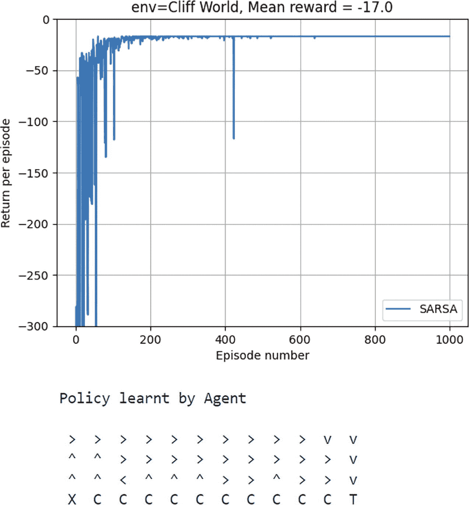

每一集的回报与集数之间的折线图。Sarsa 线波动上升。初始学习后，平均奖励稳定在约-17.0。列出了智能体学习的一系列策略。

图 4-15

在 SARSA 学习过程中，奖励图和智能体学习到的策略

```py
# Helper function to record videos
def record_video(env_id, video_folder, video_length, agent):
vec_env = DummyVecEnv([lambda: gym.make(env_id, render_mode="rgb_array")])
# Record the video starting at the first step
vec_env = VecVideoRecorder(vec_env, video_folder,
record_video_trigger=lambda x: x == 0, video_length=video_length,
name_prefix=f"{type(agent).__name__}-{env_id}")
obs = vec_env.reset()
for _ in range(video_length + 1):
action = agent.max_action(obs[0])
obs, _, _, _ = vec_env.step([action])
# video filename
file_path = "./"+video_folder+vec_env.video_recorder.path.split("/")[-1]
# Save the video
vec_env.close()
return file_path
Listing 4-5
Video Recording Code
```

学习到的策略是首先一直向上走，然后向右转，走向目标。这很令人惊讶，因为你可能会预期智能体学习到绕过悬崖并达到目标的策略，这相对于智能体学习到的策略来说，将会是四步的最短路径。

这可以通过在ε-greedy 策略中的探索来解释。随着策略继续使用ε-greedy 进行探索，总有一小部分概率，在悬崖旁边的任何状态下，它可能会以ε的概率采取随机动作。如果这个随机动作恰好是向下，智能体就会掉进悬崖。因此，在任意小随机探索下的最优策略是，通过一直爬上去，然后向右导航以达到目标，从而完全避开悬崖。这展示了即使在足够了解环境的情况下，仍然存在持续探索的问题——也就是说，当相同的ε-greedy 策略既用于采样也用于改进时。你将看到在 Q-learning 中如何避免这个问题，在 Q-learning 中，离策略学习是通过使用探索行为策略生成训练样本来进行的，并学习一个确定性策略作为最优目标策略。

在`4.c-sarsa-on-policy.ipynb`笔记本中，你也有运行 SARSA 在出租车环境中的代码。它还展示了一个训练智能体的视频。我认为现在是你向你的朋友、家人和同事分享你自己的智能体到 HuggingFace 的时候了。看看你是否能在 Gymnasium 库中的其他简单环境中训练 SARSA 智能体，并将训练智能体的视频和性能统计数据上传到 HuggingFace hub。请参考`2.c-First-Agent.ipynb`笔记本中的相关上传代码。如果你这样做，请务必@我。我的 HuggingFace ID 是`nsanghi`。

下一节研究第一个离策略 TD 算法，称为*Q-learning*。

## Q-Learning：离策略 TD 控制

在 SARSA 中，你使用了以下策略生成的带有值*S*，*A*，*R*，*S*′和*A*′的样本。从状态*S*′产生的动作*A*′使用的是ε-greedy 策略，这与在 GPI 的“改进”步骤中改进的策略相同。然而，如果你不是从策略中生成*A*′，而是查看所有*Q*(*S*′, *A*′)，并选择最大化状态*S*′中所有可用动作*A*′的*Q*(*S*′, *A*′)值的动作*A*′，会怎样呢？

您可以使用探索策略，如 *ϵ*-greedy，继续生成样本 (*S*, *A*, *R*, *S*^′)（注意在这个元组中没有 *A*^′，这是我们之前在 SARSA 中看到的第五个值）。您可以通过选择 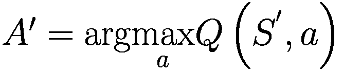 来改进策略。这种方法上的小变化创造了一种新的学习最优策略的方式，称为 *Q-learning*。它不再是按策略学习，而是一种离策略控制方法，其中样本 (*S*, *A*, *R*, *S*^′) 是由探索策略生成的，同时您通过最大化 *Q*(*S*^′, *A*^′) 来找到一个确定性的最优目标策略。

您正在使用带有 ϵ-greedy 策略的探索来生成样本 (*S*, *A*, *R*, *S*^′)。同时，您通过在状态 *S*^′ 中寻找最大化 Q 的动作 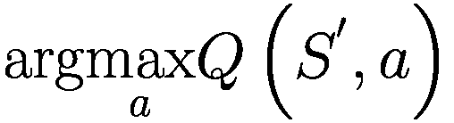 来利用现有知识。这样，Q(S,A) 的目标，即当前状态动作对，随着 Q 值收敛到其固定点而迭代到最优策略值。使用贪婪策略进行探索，然后利用知识来找到确定性策略是最佳的。

q 值的更新规则现在定义为如下：

![$$ Q\left({S}_t,{A}_t\right)\leftarrow Q\left({S}_t,{A}_t\right)+\upalpha \cdotp \left[{R}_{t+1}+\upgamma \cdotp \underset{A_{t+1}}{\mathit{\max}}Q\left({S}_{t+1},{A}_{t+1}\right)-Q\left({S}_t,{A}_t\right)\right] $$](img/502835_2_En_4_Chapter/502835_2_En_4_Chapter_TeX_Equ10.png)

(4-10)

将前一个方程与方程 4-7 进行比较，你会注意到两种方法之间的细微差别以及这如何使 Q-learning 成为一个离策略方法。Q-learning 的离策略行为很方便，并且使该方法样本效率更高。我将在稍后的部分讨论 *经验回放* 或 *回放缓冲区* 时提到这一点。图 4-16 列出了 Q-learning 的伪代码。

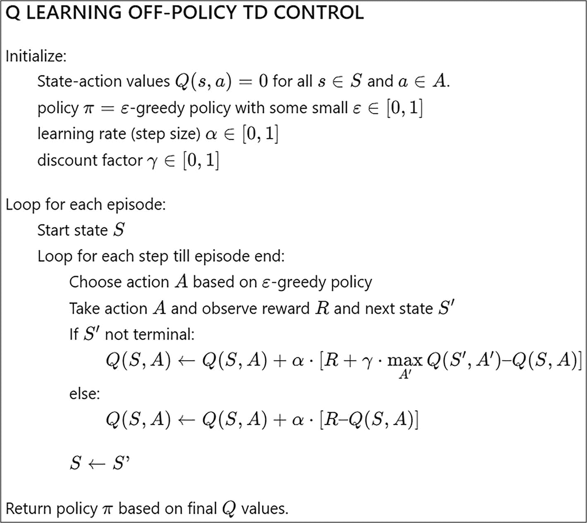

一张截图描述了实现 Q-learning 离策略 TD 控制算法的步骤。它包括初始化变量，设置参数，如折现因子 gamma、学习率 alpha、epsilon-greedy 策略 pi，其中 epsilon 在剧集上迭代。

图 4-16

Q-learning，离策略 TD 控制

如果您将图 4-14 中的 SARSA 伪代码与图 4-16 中的 Q-Learning 伪代码进行比较，您会注意到两个细微的差别。首先，您使用贪婪策略生成动作 *A*，并且不必太担心减少 ϵ，即探索因子。其次，您不选择后续状态动作 *A*^′，而是对后续状态 *S*^′ 中所有可能的 *A*^′ 取最大值，以在更新规则中定义目标。

接下来，让我们看看 Q-learning 的伪代码的 Python 实现，并观察它在之前相同环境（即 Cliff world 和 Taxi）上的表现。请转到 `4.d-qlearning.ipynb` 中的代码，其中展示了 Q-learning 的实现。

与 SARSA 类似，Q-learning 代理代码在列表 4-3 和 4-4 中与 SARSA 代理代码非常相似。Q-learning 代理代码在列表 4-6 中给出。大部分代码与列表 4-3 中的 SARSA 代理代码相似，除了更新规则。在 SARSA 更新中，您会得到一个包含五个值（*S*, *A*, *R*, *S*^′, *A*^′）的元组，并使用这个元组来执行 *Q*(*S*, *A*) 的 q-value 更新。而在 Q-learning 中，更新得到一个只包含 (*S*, *A*, *R*, *S*^′) 的元组，并通过从 *S*^′ 状态中适用于 *A*^′ 的当前 *Q*(*S*, *A*^′) 值中找到最佳 *A*^′ 来执行更新。

```py
# Q learning update step
def update(self, state, action, reward, next_state, done):
if not done:
best_next_action = self.max_action(next_state)
td_error = reward + \
self.gamma * self.get_Q(next_state, best_next_action) \
- self.get_Q(state, action)
else:
td_error = reward - self.get_Q(state, action)
new_value = self.get_Q(state, action) + self.alpha * td_error
self.set_Q(state, action, new_value)
Listing 4-6
Q-Learning Update Rule
```

图 4-16 中 Q-learning 伪代码剩余部分的训练代码实现见列表 4-7。同样，Q-learning 的训练循环与 SARSA 的训练循环非常相似，如列表 4-4 所示。与 SARSA 不同，在 Q-learning 中，您不使用代码 `next_action = agent.get_action(next_state).` 来生成下一个动作 *A*^′。Q-Learning 的更新规则只需要 `state, action, reward, next_state,` 和 `terminated`，如前所述。

```py
# training algorithm
def train_agent(env, agent, episode_cnt=10000, tmax=10000, anneal_eps=True):
episode_rewards = []
for i in range(episode_cnt):
G = 0
state, _ = env.reset()
action = agent.get_action(state)
for t in range(tmax):
next_state, reward, termination, _, _ = env.step(action)
next_action = agent.get_action(next_state)
agent.update(state, action, reward, next_state, next_action, termination)
G += reward
if termination:
episode_rewards.append(G)
# to reduce the exploration probability epsilon over the
# training period.
if anneal_eps:
agent.epsilon = agent.epsilon * 0.99
break
state = next_state
action = next_action
return np.array(episode_rewards)
Listing 4-7
Q-Learning Training Loop
```

让我们看看 Q-learning 在 cliff world 环境中的应用。每集的奖励随着训练而提高，与 SARSA 下的 -17 相比，达到最优值 -13。如图 4-17 所示，Q-learning 下的策略更好。在 Q-learning 下，代理通过悬崖上方第二行的单元格学习导航到目标。在 Q-learning 下，代理学习的是一个确定性策略，环境也是确定性的。换句话说，如果代理采取向右移动的动作，它肯定会向右移动，并且没有任何机会在其他方向上采取任何随机步骤。在代理学习的策略中没有探索成分。这是 Q-learning 与 SARSA 的关键区别。在 Q-learning 中，探索仅在用于生成样本的行为策略中使用，而代理最终学习到的策略是一个零探索的确定性策略。因此，代理通过仅在悬崖边缘徘徊，就学会了最优化策略，以向目标移动。

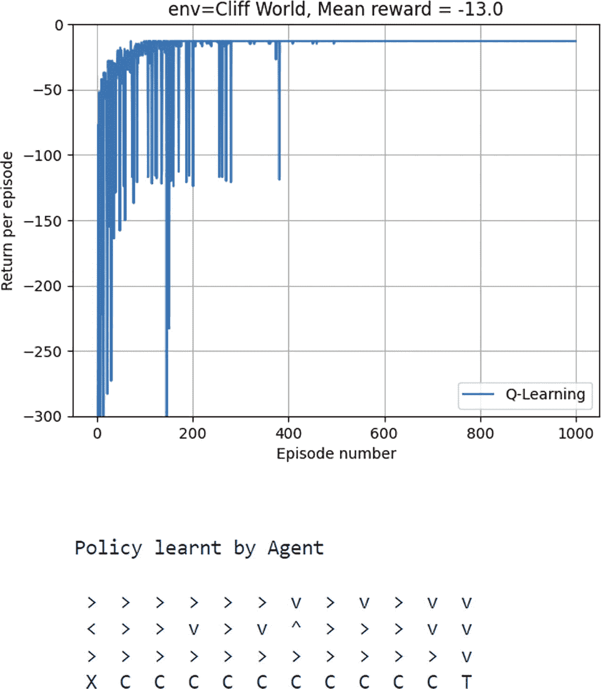

每集回报与集数之间的线图。Q-learning 线波动上升。初始学习后，平均奖励稳定在 -13.0 附近。列出代理学习的一组策略。

图 4-17

Q-learning 学习过程中的奖励图和代理学习的策略

`4.d-qlearning.ipynb` 笔记本也包含了在出租车环境中运行 Q-learning 的代码。像之前一样，它还显示了一个训练代理的视频。我再次鼓励你将 Q-learning 应用于 Gymnasium 中的其他环境，并将你的训练代理视频上传到 HuggingFace。

我将在下一章中重新探讨 Q-learning，该章讨论了深度学习状态值近似的方法。在该设置下，Q-learning 被称为 DQN。DQN 及其变体将被应用于训练在 Atari 游戏上玩游戏的代理。

为了总结 Q-learning 的讨论，让我们看看 Q-learning 可能引入的一个特定问题，即最大化偏差。

### 最大化偏差和双重学习

如果你回顾一下方程式 4-10，你会注意到你是在最大化 *A*^′ 以获得最大值 *Q*(*S*^′, *A*^′)。同样，在 SARSA 中，你找到一个新的 ϵ-greedy 策略，它也在状态上的 *Q* 值上最大化，以获得该状态下具有最高 q 值的动作。进一步，这些 q 值本身也是真实状态-动作值的估计。总之，你使用 q 估计的最大值作为最大值的“估计”。这种“估计的最大值”作为“最大估计”的方法引入了 +ve 偏差。

为了理解这一点，考虑一个场景，其中过渡中的奖励有三个值：5、0 和 +5，每个值的概率均为 1/3。期望奖励为 0，但当你看到 +5 时，将其视为最大化的一部分，然后它永远不会下降。因此，+5 成为真实奖励的估计，否则在期望中为 0。这是由于最大化步骤引入的正偏差。

消除 +ve 偏差的一种方法是用一组两个 *q* 值。一个 *q* 值用于找到最大化 q 值的动作，然后使用另一组 q 值来找到该最大动作的 q 值。数学上，它可以表示如下：

将 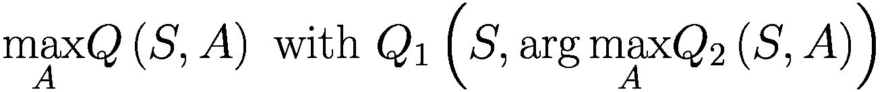 替换。

你使用 *Q*[2] 来找到最大化动作 *A*，然后使用 *Q*[1] 来找到之前选择的动作 A 的最大 q 值。可以证明，这种方法消除了 +ve 或最大化偏差。当我谈到 DQN 时，我会重新探讨这个概念。

## Expected SARSA 控制

本节探讨了另一种方法，它介于 Q-learning 和 SARSA 之间，被称为 *expected SARSA*。它与 Q-learning 类似，除了 4-10 中的“max”被期望值所取代，如下所示：

![Q({S}_t,{A}_t) \leftarrow Q({S}_t,{A}_t) + \alpha \left[{R}_{t+1} + \gamma \cdot \sum_{a \in {A}_{t+1}} \pi(a|{S}_{t+1}) \cdot Q({S}_{t+1},a) - Q({S}_t,{A}_t)\right]](img/502835_2_En_4_Chapter/502835_2_En_4_Chapter_TeX_Equ11.png)

(4-11)

与 SARSA 中由于随机选择 *A*[*t* + 1] 而看到的方差相比，期望 SARSA 具有更低的方差。在期望 SARSA 中，你不对所有可能动作进行采样，而是对所有可能动作取期望。

在悬崖世界问题中，你有确定性的动作，因此你可以将学习率 *α* = 1 设置，而不会对学习质量产生任何重大影响。以下伪代码是针对该算法的。它与 Q-learning 类似，只是在更新逻辑上，它使用的是 *期望* 而不是 *最大化*。你可以以策略的方式运行期望 SARSA，这就是你在测试悬崖世界和出租车环境时将要做的。见图 4-18。

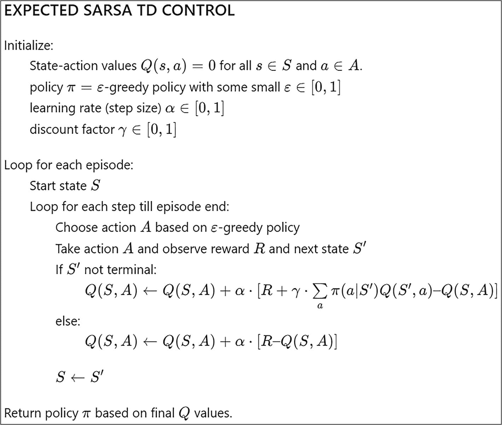

一张截图展示了期望 SARSA T D 控制算法。它初始化状态-动作值、策略、学习率和折扣因子。它遍历剧集，根据奖励和期望的未来奖励更新 Q 值。

图 4-18

期望 SARSA TD 控制

如图 4-18 所见，更新规则使用对所有动作的求和与 SARSA 中看到的动作最大值进行比较。`4.e-expected_sarsa.ipynb` 笔记本包含了运行期望 SARSA 代码的代码。代码与 SARSA 或 Q-learning 类似，只是在更新规则上有所变化，如前所述。列表 4-8 给出了在 `ExpectedSARSAAgent` 类内部的 `update(...)` 函数中实现的更新规则的代码。请参阅笔记本以获取完整的代码，包括训练智能体的视频和奖励轨迹。

```py
# Expected SARSA Update
def update(self, state, action, reward, next_state, done):
if not done:
best_next_action = self.max_action(next_state)
actions = self.get_possible_actions(next_state)
next_q = 0
for next_action in actions:
if next_action == best_next_action:
next_q += (1-self.epsilon+self.epsilon/len(actions)) * \
self.get_Q(next_state, next_action)
else:
next_q += (self.epsilon/len(actions)) * \
self.get_Q(next_state, next_action)
td_error = reward + self.gamma * next_q - self.get_Q(state, action)
else:
td_error = reward - self.get_Q(state, action)
new_value = self.get_Q(state, action) + self.alpha * td_error
self.set_Q(state, action, new_value)
Listing 4-8
Expected SARSA TD Control
```

图 4-19 展示了训练悬崖世界期望 SARSA 智能体的结果。引入期望——即对后续状态中所有动作的求和——略微增加了算法的计算复杂度，但比 SARSA 和 Q-learning 提供了更快的收敛速度。随着训练的进行，从剧集级别的回报中可以明显看出这一点。对于如图 4-15 所示的 SARSA，回报出现了下降尖峰，表明训练尚未完成。只有在大约 425 个剧集完成后，它才没有尖峰。对于 Q-Learning，下降尖峰在大约 400 个剧集时消失，如图 4-17 所示。而期望 SARSA 几乎从 200 个剧集开始就显示出稳定性，如图 4-19 所见。显然，期望 SARSA 的收敛速度是最快的。你可以进行实验并看到，变化的 学习率 α 在极限情况下对收敛没有重大影响。

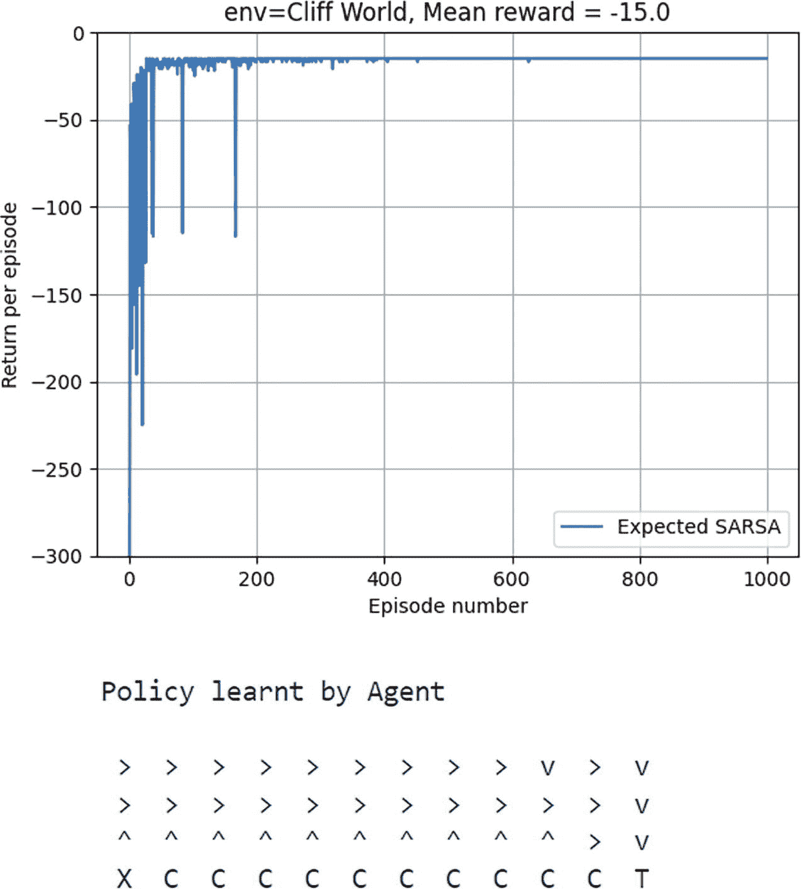

每个剧集的回报与剧集编号的线图。期望 Sarsa 的线波动上升。初始学习后，平均奖励稳定在约-15.0。列出了智能体学习的一系列策略。

图 4-19

带有期望 SARSA 的悬崖世界奖励图和智能体学习的策略

还值得注意的是，由期望 SARSA 学习得到的策略介于 Q-learning 和 SARSA 之间。在此策略下，智能体通过迷宫的中间行达到目标。在这种情况下，你使用期望 SARSA 作为离策略，即使用相同的ε-greedy 策略进行探索和改进。但由于期望的存在，它学会了从常规 SARSA 中改进，并认为通过中间行是足够安全的。在相同的笔记本（`4.e-expected_sarsa.ipynb`）中，你还可以看到在出租车环境中运行此算法的结果。

## 重放缓冲区和离策略学习

离策略学习涉及两个分离的策略：用于探索和生成示例的行为策略 *b*(*a*| *s*）和智能体试图学习的目标策略 π(*a*| *s*）。因此，你可以反复使用由行为策略生成的样本来训练智能体。这种方法使过程样本效率更高，因为智能体观察到的单个转换可以被多次使用。

这被称为*经验重放*。智能体从环境中收集经验，并将这些经验作为学习过程的一部分多次重放。在经验重放中，你将样本 `(s, a, r, s’，done)` 存储在缓冲区中。这些样本使用探索行为策略生成，同时你使用 *q*-值改进确定性目标策略。因此，你可以反复使用来自行为策略的旧样本。将缓冲区大小固定为某个预定的值，并在收集新样本时删除旧样本。这个过程通过多次重用样本使学习样本效率更高。其余的方法与离策略智能体相同。

让我们将这种方法应用于 Q-learning 智能体。Q-learning 智能体的代码保持不变。`4.f-qlearning-exp-replay.ipynb`笔记本包含对具有经验重放的 Q-learning 智能体的完整说明。更新规则或 Q-learning 智能体的任何内部逻辑都没有变化。改变的是智能体训练代码。你有两个变化。首先，你实现经验重放，如列表 4-9 所示，以存储智能体在行为策略下通过环境的所有转换。每个智能体转换生成一个状态、动作、奖励、下一个状态、完成的元组，该元组存储在由`add(self,...)`方法实现的固定长度列表中。一旦队列满，在列表末尾添加新项目会导致队列中最早的项目被移除。因此，队列保留最新的转换，直到一个固定的回溯期。在训练期间，你采样一批存储的转换用于 Q-learning 更新。这是通过`sample(self, batch_size)`方法实现的，其中`batch_size`定义了要采样的转换数量。

```py
class ReplayBuffer:
def __init__(self, size):
self.size = size  # max number of items in buffer
self.buffer = []   # array to hold buffer
def __len__(self):
return len(self.buffer)
def add(self, state, action, reward, next_state, done):
item = (state, action, reward, next_state, done)
self.buffer = self.buffer[-self.size:] + [item]
def sample(self, batch_size):
idxs = np.random.choice(len(self.buffer), batch_size)
samples = [self.buffer[i] for i in idxs]
states, actions, rewards, next_states, done_flags = list(zip(*samples))
return states, actions, rewards, next_states, done_flags
Listing 4-9
Replay Buffer
```

从纯 Q 学习到另一个变化是训练代码。这给出在列表 4-10。在纯 Q 学习中，q 值的更新是在你通过每个单独的转换时在线进行的。然而，在经验回放中，当代理采取一步时，转换被添加到经验回放缓冲区。随后从缓冲区中采样`batch_size`个转换，然后使用这些转换来更新目标策略的 q 值。存储在经验回放中的转换可能会被采样方法多次选中，直到这个转换达到队列的起点并被推出缓冲区。

```py
def train_agent(env, agent, episode_cnt=10000, tmax=10000,
anneal_eps=True, replay_buffer=None, batch_size=16):
episode_rewards = []
for i in range(episode_cnt):
G = 0
state, _ = env.reset()
for t in range(tmax):
action = agent.get_action(state)
next_state, reward, done, _, _ = env.step(action)
if replay_buffer:
replay_buffer.add(state, action, reward, next_state, done)
states, actions, rewards, next_states, done_flags = \
replay_buffer(batch_size)
for i in range(batch_size):
agent.update(states[i], actions[i], rewards[i],
next_states[i], done_flags[i])
else:
agent.update(state, action, reward, next_state, done)
G += reward
if done:
episode_rewards.append(G)
# to reduce the exploration probability epsilon over the
# training period.
if anneal_eps:
agent.epsilon = agent.epsilon * 0.99
break
state = next_state
return np.array(episode_rewards)
Listing 4-10
Q-learning Training Code Using Experience Replay
```

如前所述，使用经验回放会导致每个转换元多次重用。因此，带有经验回放的 Q 学习是样本高效的。这在奖励轨迹中很明显——即图 4-20 中绘制的每集回报。带有经验回放的 Q 学习中每集回报的收敛速度要快得多。在图 4-20 中，你可以看到当训练代码看到大约 100 个情节时，几乎达到了最优值。将其与图 4-17 中的 Q 学习进行比较，其中最优值在大约 200 个情节时达到。

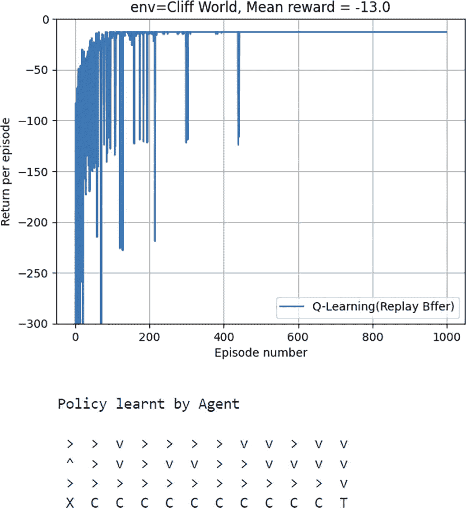

每集回报与情节编号的折线图。Q 学习的线波动上升。平均奖励在初始学习后稳定在约-13.0。列出了一组代理学习的策略。

图 4-20

在 Q 学习下使用经验回放进行学习时的奖励图和代理学习的策略

从图 4-20 中也可以明显看出，尽管情节回报达到最优行为更快，但它显示出更多的波动。探索越多，非最优动作的转换就越高。在纯 Q 学习中，由于 epsilon 探索降至零，你不会看到太多这些探索性动作。然而，在经验回放中，你根据回放缓冲区的采样逻辑和缓冲区长度，可能会多次使用这些探索性动作。这可能导致更新导致延迟收敛。

只是为了指出，在经验回放下学习到的策略与在纯 Q 学习下学习到的策略是相同的。

如前所述，`4.f-qlearning-exp-replay.ipynb`笔记本包含了训练代理的视频回放，以及在同一出租车环境中的运行。

总结来说，具有重放缓冲区的 Q 代理旨在通过反复从缓冲区采样来提高初始收敛速度。当查看 DQN 时，样本效率将变得更加明显。从长远来看，使用或未使用重放缓冲区学习的最优值之间不会有任何显著差异。它还有另一个优点，即打破样本之间的相关性。这一点在查看使用 Q 学习的深度学习（即 DQN）时也会变得明显。

## 连续状态空间的 Q-Learning

到目前为止，你看到的所有例子都具有离散状态空间。迄今为止研究的方法都可以归类为表格方法。状态动作空间用一个矩阵表示，状态沿着一个维度，动作沿着交叉轴。

你很快就会过渡到连续状态空间，并大量使用深度学习通过神经网络表示状态。然而，你仍然可以使用一些简单的方法解决许多连续状态问题。为了准备下一章，让我们看看将连续值转换为离散箱子的最简单方法。你将采取的方法是使用一些精度对连续浮点数进行舍入，例如，将介于-1 到 1 之间的连续状态空间值转换为-1，-0.9，-0.8，... 0，0.1，0.2，... 1.0。

`4.g-qlearning_continuous_env.ipynb`展示了这种方法的应用。你将继续使用来自`4.f-qlearning-exp-replay.ipynb`的 Q 学习代理、经验回放和学习算法。然而，这次你将在一个连续环境中应用学习，即`CartPole`，这在章节开头已经详细描述。你需要做的关键改变是接收来自环境的状态值，对这些值进行离散化，然后将这些值作为观测传递给代理。代理只能看到离散值，并使用这些离散值通过 Q 代理学习最优策略。列表 4-11 展示了将连续状态值转换为离散值的方法。这是通过扩展 Gymnasium 提供的`ObservationWrapper`并实现一个名为`observation`的函数来完成的，该函数接受来自`CartPole`环境的连续值并返回离散观测/状态值。

```py
# We will use ObservationWrapper class from gymnasium to wrap our environment.
# We need to implement observation() method which will receive the
# original state values from underlying environment
# In observation() we will discretize the state values
# which then will be passed to outside world by env
# the agent will use these discrete state values
# to learn an effective policy using q-learning
from gymnasium import ObservationWrapper
class Discretizer(ObservationWrapper):
def observation(self, state):
discrete_x_pos = round(state[0], 1)
discrete_x_vel = round(state[1], 1)
discrete_pole_angle = round(state[2], 1)
discrete_pole_ang_vel = round(state[3], 1)
return (discrete_x_pos, discrete_x_vel,
discrete_pole_angle, discrete_pole_ang_vel)
Listing 4-11
Q-Learning (Off-Policy) in a Continuous State Environment
```

一旦定义了`Discretizer`类来离散化观测值，你只需在创建环境时包装 Gymnasium 环境，如列表 4-12 所示。其余的代码在这两个 Python 笔记本——`4.f-qlearning_continuous_env.ipynb`和`4.f-qlearning-exp-replay.ipynb`之间没有变化。

```py
# create Cart Pole environment
env = gym.make('CartPole-v1')
# wrap our env with Discretizer
env = Discretizer(env)
Listing 4-12
Using Discretizer on the Continuous State Environment
```

具有状态离散化的 Q 代理与最大奖励 200 相比，可以得到大约 50 个奖励。这如图 4-21 所示。

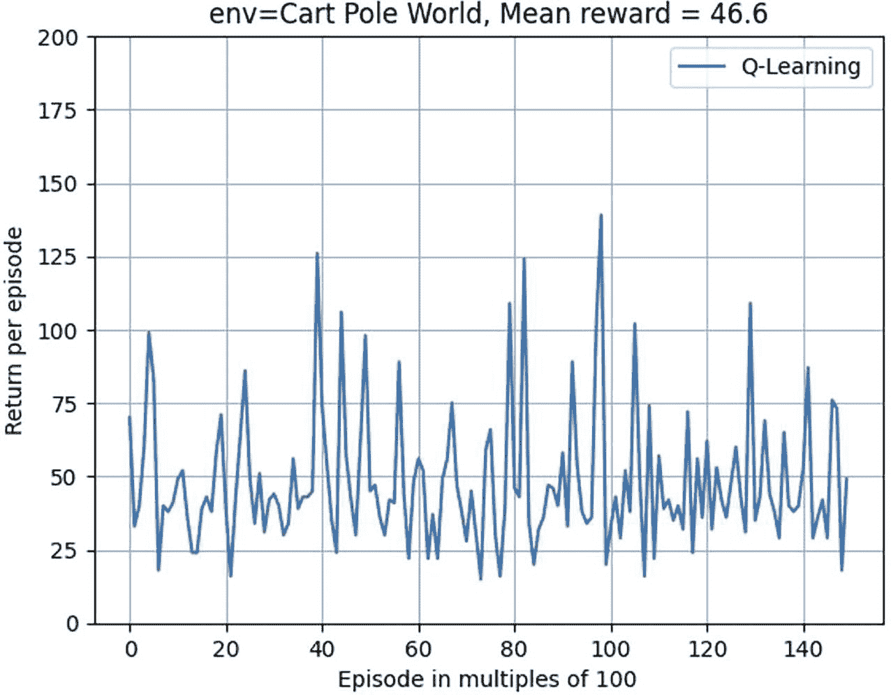

每个剧集的回报与剧集数（以 100 为倍数）的线图。线代表 Q-learning。线在 20 到 140 之间波动。数据是估计的。

图 4-21

在 CartPole 连续状态空间环境中使用 Q-learning 的奖励图

在随后的章节中，你将学习其他更强大的方法来获得更多的奖励。

## n-Step 返回

本节统一了 MC 和 TD 方法。MC 方法从状态采样直到剧集结束的回报，并且不进行回溯。因此，MC 方法不能应用于持续任务。另一方面，TD 使用单步回报来估计剩余奖励的价值。TD 方法对轨迹采取短视的观点，并在一步之后立即进行回溯。

这些方法是两种极端情况，但在许多情况下，中间方法可能会产生更好的结果。*n-step* 的想法是使用接下来 *n* 步的奖励，然后从 *n* + 1 步开始回溯以估计剩余奖励的价值。图 4-22 展示了不同 *n* 值的回溯图。一个极端是单步，这是你在 SARSA、Q-learning 和其他相关方法中刚刚看到的 *TD*(0) 方法。另一个极端是 ∞-step TD，这实际上就是一个 MC 方法。广泛的想法是看到 TD 和 MC 方法是同一连续体的两个极端。

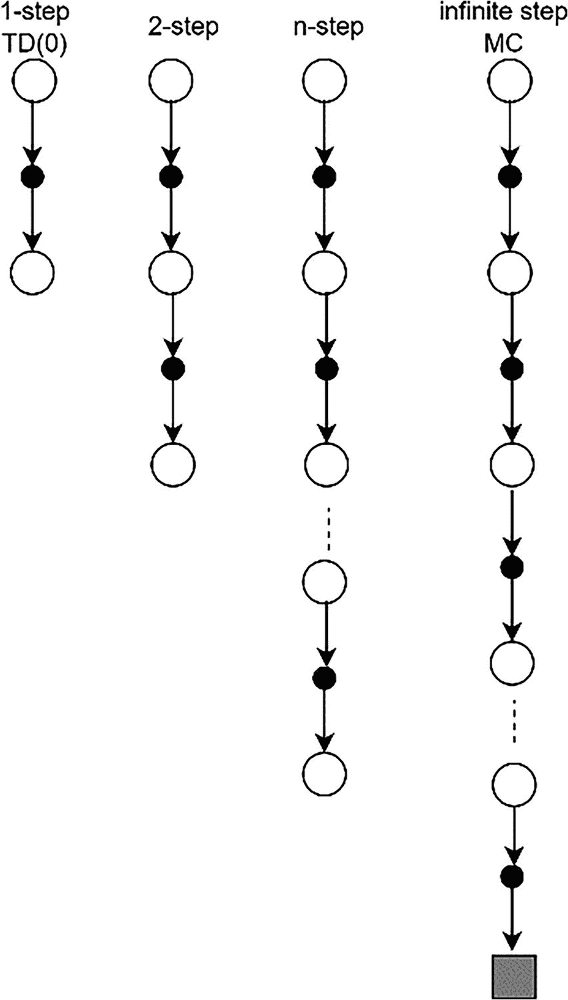

一个图表示了强化学习中回溯方法的比较，如 1-step TD 0、2-step、n-step 和无限蒙特卡洛。每一列代表由箭头连接的节点序列，步数从左到右增加。

图 4-22

n-step 方法的回溯图，包含 TD(0) 和 MC 在两个极端，*n* = 1 和 *n* = ∞（剧集结束）

n-step 方法可以在 on-policy 设置中使用。你可以有 n-step SARSA 和 n-step expected SARSA，这些都是你迄今为止所学内容的自然扩展。然而，在 off-policy 学习中使用 n-step 方法需要你考虑一个额外的概念——在行为策略下观察特定 n-step 转移相对于目标策略下的相对差异。为了使用行为策略 *b*(*a*| *s*) 的数据来优化目标策略 π(*a*| *s*)，你需要将行为策略下观察到的 n-step 返回与一个称为 *重要性采样比* 的比率相乘，该比率在本章的方程 4-4 中已经推导出来。这里重新呈现：


重要性采样比确保了在行为策略下观察到的轨迹的回报根据在目标策略下观察轨迹的相对概率与在行为策略下观察相同轨迹的概率进行比较，进行上下调整。

没有什么是免费的，这在重要性采样中也是如此。重要性采样比可能导致很大的方差。此外，这些方法在计算上并不高效。有许多高级技术，如我在早期关于重要性采样部分提到的**折扣感知重要性采样**和**按决策重要性采样**，这些方法以不同的方式看待重要性采样和奖励，以减少方差并使这些算法高效。

我不会在本书中详细介绍这些算法的实现细节。关键重点是概念性地介绍这些内容，并让你了解高级技术。

### **资格迹**和 TD(λ)

资格迹以算法高效的方式统一了蒙特卡洛（MC）和时序差分（TD）方法。当结合资格迹时，TD 方法产生**TD**(λ)，其中λ = 0，使其等同于你迄今为止所学习的单步 TD，这就是为什么单步 TD 也被称为 TD(0)。λ = 1 的值使其类似于常规的∞步 TD，换句话说，就是一个蒙特卡洛方法。资格迹使得将蒙特卡洛方法应用于非序列任务也成为可能。我将仅涵盖资格迹和**TD**(λ)的高级概念。

在上一节中，你看到了 n 步回报，其中 n = 1 带你到常规 TD 方法，n = ∞带你到蒙特卡洛（MC）。我也提到了这两种极端都不好。蒙特卡洛或 TD(0)有其自身的优缺点。算法在 n 的某个中间值时表现最佳。n 步提供了一种统一 TD 和 MC 的方法。资格迹提供了一种有效的方式将它们结合起来，而无需在每一步跟踪 n 步转换。到目前为止，你已经看到了一种基于未来 n 次转换更新状态值的方法。这被称为**前向视角**。然而，你也可以向后看——也就是说，在每一个时间步 t，看看时间步 t 的奖励对过去 n 个状态的影响。这被称为**后向视角**，构成了**TD**(λ)的核心。这种方法允许在 TD 学习中有效地整合 n 步回报。

回顾一下图 4-22。如果你不是选择不同的 n 值，而是将所有 n 步回报与某种权重结合起来会怎样？这被称为**λ回报**，其方程如下：

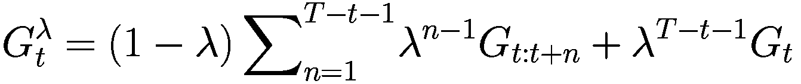

(4-12)

在这里，*G*[*t* : *t* + *n*]是 n 步回报，它使用在第*n*步末尾剩余步骤的引导值。它定义如下：

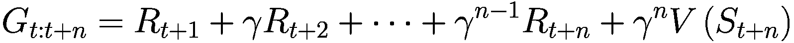

(4-13)

如果你在方程 4-12 中将λ = 0，你会得到以下结果：

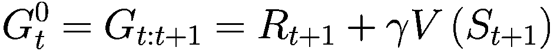

上述表达式类似于 TD(0)在方程 4-6 中状态-动作更新的目标值。

另一方面，将λ = 1 代入方程 4-12 中，使得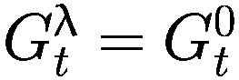模仿蒙特卡洛并返回*G*[*t*]如下：

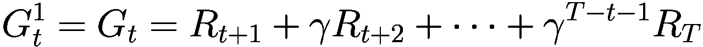

*TD*(*λ*)算法使用带有迹向量的前一个λ-回报，称为*资格迹*，以“向后”视角实现高效的在线 TD 方法。资格迹记录了状态被观察的时间以及当前回报对状态估计的影响程度。

我在这里就λ-回报、资格迹和*TD*(*λ*)的基本介绍停止。对于数学推导的详细审查以及基于它们的各种算法，请参阅 Barto 和 Sutton 所著的《强化学习：导论》第二版书籍.^(5)

## DP、MC 和 TD 之间的关系

在本章开始时，你学习了 DP、MC 和 TD 方法之间的比较。我介绍了 MC 方法，然后是 TD 方法，接着我使用了 n 步和 TD(*λ*)来结合 MC 和 TD 作为基于样本的无模型学习的两个极端。

为了总结本章内容，表 4-1 总结了 DP 和 TD 方法的比较。

表 4-1

在 Bellman 方程背景下的 DP 和 TD 方法比较

|   | 全量备份 (DP) | 样本备份 (TD) |
| --- | --- | --- |
| Bellman 期望方程对于*v**π* | 迭代策略评估 | TD 预测 |
| Bellman 期望方程对于*q**π* | Q 策略迭代 | SARSA |
| Bellman 最优方程对于*q**π* | Q 值迭代 | Q 学习 |

## 概述

本章探讨了强化学习的无模型方法。它首先使用蒙特卡洛方法估计状态值。它解释了“首次访问”和“每次访问”方法。然后，它探讨了一般情况下的偏差和方差权衡，以及在蒙特卡洛方法的具体背景下。

在 MC 估计的基础上，本章探讨了 MC 控制方法，将其与第三章中引入的 GPI 框架相结合，以改进策略。你看到了如何通过将方法中的估计步骤从基于 DP 的方法更改为基于 MC 的方法来应用 GPI。本章详细探讨了需要平衡的探索-利用困境，特别是在无模型世界中，过渡概率是未知的。

然后，我简要介绍了 MC 方法中的离策略方法。在这种情况下，你学习了重要性采样，其中收集样本的策略被称为行为策略，而正在优化的策略是目标策略。重要性采样允许将一个策略的回报仅放在另一个策略的背景下进行评估。

TD 是本章在无模型学习方面探讨的下一个方法。它从建立 TD 学习的基础开始，首先是基于 TD 的价值估计。随后深入探讨了 SARSA，这是一种基于策略的 TD 控制方法。接着，本章研究了 Q-learning，这是一种强大的离策略 TD 学习方法，以及它的一些变体，如期望 SARSA。

在 TD 学习的背景下，我还介绍了状态近似的概念，将连续状态空间转换为近似的离散状态值。状态近似的概念将成为下一章的主要内容，并允许你将深度学习与强化学习相结合。

在结束本章之前，你最终探讨了 n 步回报、资格痕迹和 TD(*λ*)作为将 TD 和 MC 结合到单一框架中的方法。
