# 5. 函数近似与深度学习

前三章探讨了规划与控制的多种方法——首先是动态规划（DP），然后是蒙特卡洛方法（MC），最后是时序差分（TD）方法。在所有这些方法中，你都看到了状态空间和动作是离散的问题。只有在上一章的结尾，我才讨论了连续状态空间中的 Q 学习。你使用任意方法对状态值进行离散化，并训练了一个学习模型。本章通过讨论近似理论的基础及其对强化学习设置的影响来扩展这种方法。然后，它将探讨近似值的各种方法，首先是具有良好理论基础的线性方法，然后是具有神经网络的非线性方法。将深度学习与强化学习结合的这一方面是最令人兴奋的发展，并将强化学习算法扩展到了规模。 

如同往常，方法首先是在**预测/估计**设置中观察事物，其中智能体遵循给定的策略以学习状态值和/或状态动作值。接下来将讨论**控制**——寻找最优策略。示例将继续在一个无模型的世界中进行，在这个世界中你不知道状态转移动态。介绍之后，我将讨论函数近似世界中收敛性和稳定性的问题。到目前为止，在精确和离散状态空间的情况下，收敛性并不是一个大问题。然而，函数近似带来了新的问题，这些新问题需要考虑理论保证和实际最佳实践。本章还涉及批量方法，并将它们与本章第一部分讨论的增量学习方法进行比较。

本章以对深度学习、基本理论和使用 PyTorch、PyTorch Lightning 和 TensorFlow 构建/训练模型的基本知识的快速概述结束。

## 引言

强化学习可以用来解决具有许多离散状态配置或连续状态空间的大问题。考虑国际象棋，它有接近 10²⁰个离散状态，或者考虑围棋，它有接近 10¹⁷⁰个离散状态。还考虑像自动驾驶汽车、无人机或机器人这样的环境——它们都具有连续状态空间。

到目前为止，你已经看到了一些状态空间是离散且规模较小的例子，例如有 ~100 个状态的网络世界或拥有 500 个状态的车世界。那么，你如何将你迄今为止学到的算法扩展到更大的环境或具有连续状态空间的环境呢？一直以来，状态值 *V*(*s*) 或动作值 *Q*(*s*, *a*) 都是通过一个表来表示的，每个状态 *s* 或状态 *s* 和动作 *a* 的组合都有一个条目。随着数字的增加，表的大小将会变得巨大，使得在表中存储状态或状态动作值变得不可行。此外，组合的数量将会太多，这可能会减慢策略的学习速度。算法可能会花费太多时间在环境中实际运行概率非常低的状态上。

现在让我们采取不同的方法。让我们用以下函数来表示状态值（或状态动作值）：


(5-1)

与在表格中表示值不同，它们现在是通过函数  或  来表示的，其中参数 *w* 是定义智能体遵循的策略 π(*a*| *s*) 的函数的参数。而 *s* 或 (*s*, *a*) 是状态或状态值函数的输入。参数 w 是深度学习神经网络的权重或定义策略的函数的可调参数。强化学习算法使用各种学习方法来调整 w 的值以获得智能体的期望行为，首先是策略 π(*a*| *s*)，这反过来又导致状态值函数  或状态动作值函数 。您选择参数数量 ∣*w*∣，这比状态数量 ∣*s*∣ 或状态动作对数量 (|*s*| × |*a*|) 要小得多。这种方法的后果是状态动作值的表示具有泛化性。当您根据某个特定状态 *s* 或状态动作对 (*s*, *a*) 的更新方程更新权重向量 *w* 时，它不仅更新了该特定 *s* 或 (*s*, *a*) 的值，而且还更新了接近原始 *s* 或 (*s*, *a*) 的许多其他状态或状态动作的值，即已经进行更新的状态或状态动作对。这取决于函数的几何形状。*s* 附近的状态的其他值也会受到这种更新的影响，如前所述。您正在用一个比状态数量更多的函数来近似值。具体来说，您不是直接更新 *v*(*s*) 或 *q*(*s*, *a*)，而是现在更新函数的参数集 *w*，这反过来又影响了值估计  或 。当然，像以前一样，您使用 MC 或 TD 方法执行 *w* 更新。函数逼近有各种方法。您可以提供状态向量（表示状态的变量的值，如位置、速度、位置等）并得到 ，或者您可以提供状态和动作向量并得到  作为输出。当动作是离散的且来自小集合时，一种非常占主导地位的方法是提供状态向量 *s* 并得到 ∣*A*∣ 个 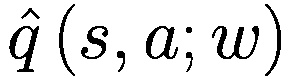，每个可能的动作一个（∣*A*∣ 表示可能动作的数量）。图 5-1 展示了使用函数表示  或  的各种方法的示意图。

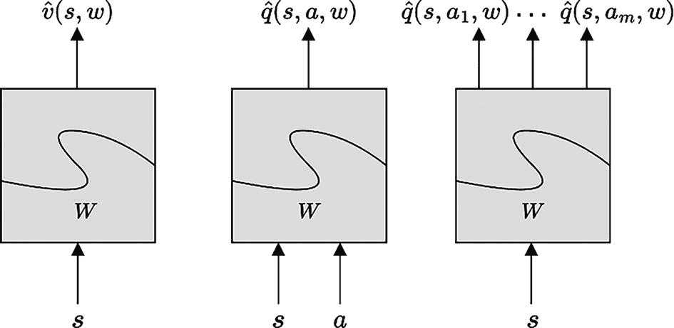

一个图展示了三个标记为 W 的块及其输入和输出。左侧。输入是 s，输出是 s 和 w 的 v^h。中间。输入是 s 和 a，输出是 s、a 和 w 的 q^h。右侧。输入是 s，输出是 s、a 1、w 到 s、a m、w 的 q^h。

图 5-1

使用函数逼近方法表示或的方法。本章中最常用的是第一个和最后一个。

建立这样的功能逼近器有多种方法，但本章探讨了两种常见的方法——使用瓦片技术的线性逼近器和使用神经网络的非线性逼近器。

然而，在深入探讨这个问题之前，我需要回顾一下理论基础，看看需要哪些操作才能使*w*移动，从而可以逐步减少目标值和当前状态或状态-动作值估计之间的误差，即*v*(s)或*q*(s, a)。

## 逼近理论

函数逼近是监督学习领域广泛研究的一个主题，其中基于训练数据，你构建了底层模型的泛化。监督学习的大部分理论都可以应用于具有函数逼近的强化学习。然而，具有函数逼近的强化学习提出了新的问题，例如如何自举以及它对非平稳性的影响。在监督学习中，当算法在学习时，生成训练数据的问题/模型不会改变。然而，当涉及到具有函数逼近的强化学习时，目标（在监督学习中标记为*输出*）的形成方式，会导致非平稳性，你需要想出新的方法来处理它。我所说的*非平稳性*是指你不知道*v*(s)或*q*(s, a)的实际目标值。你使用 MC 或 TD 方法形成估计，然后使用这些估计作为“目标”。随着你改进目标值的估计，你使用修订后的估计作为新的目标。在监督学习中，情况不同——目标在训练期间给出并固定。学习算法对目标没有影响。在强化学习中，你没有实际的目标，你使用目标值的估计。智能体试图找到最优动作，如*v*(s)或*q*(s, a)。学习算法中的目标会变化。因此，目标在学习过程中不是固定或平稳的。

让我们回顾一下 MC（方程 4-2）和 TD（方程 4-5）的更新方程。我已经修改了方程，使得 MC 和 TD 都使用相同的下标 *t* 表示当前时间，*t* + 1 表示下一个瞬间。这两个方程都执行相同的更新，将 *V**t* 接近其目标，在 MC 更新中是 *G**t*，在 TD(0)更新中是 *R*[*t*] + 1 + *γ* · *V**t*。

![V_{t+1}(s)=V_t(s)+\alpha\ \left[{G}_t(s)-{V}_t(s)\right]](img/502835_2_En_5_Chapter/502835_2_En_5_Chapter_TeX_Equ2.png)

(5-2)

![V_{t+1}(s)=V_t(s)+\alpha \left[{R}_{t+1}+\gamma \cdotp {V}_t\left({s}^{\prime}\right)-{V}_t(s)\right]](img/502835_2_En_5_Chapter/502835_2_En_5_Chapter_TeX_Equ3.png)

(5-3)

这与你在监督学习中所做的类似，特别是在线性最小二乘回归中。你有了输出值/目标 *y*(*t*) 和输入特征 *x*(*t*)，统称为*训练数据*。你可以选择一个模型 *Model*[*w*][*x*(*t*)]，如多项式线性模型、决策树或支持向量，甚至其他非线性模型如神经网络。训练数据用于最小化模型预测值与训练集的实际输出值之间的误差。这是通过最小化以下损失函数来实现的：

![J(w)={\left[y(t)-\hat{y}\left(t;w\right)\right]}²;\mathrm{where}\ \hat{y}\left(t;w\right)={Model}_w\left[x(t)\right]](img/502835_2_En_5_Chapter/502835_2_En_5_Chapter_TeX_Equ4.png)

(5-4)

当 *J*(*w*) 是一个可微函数，正如本书中的情况，你可以使用梯度下降来调整模型的权重/参数 *w* 以最小化误差/损失函数 *J*(*w*)。通常，更新操作会使用相同的训练数据多次批量执行，直到损失不再进一步减少。权重为 *w* 的模型现在已经学会了从输入 *x*(*t*) 到输出 *y*(*t*) 的底层映射。权重更新的方式如下所示：

*J*(*w*) 关于 *w* 的梯度：=∇[*w*]*J*(*w*)

对于方程 5-4 中给出的损失函数，这变成了：

![∇_wJ(w)=-2\cdotp \left[y(t)-\hat{y}\left(t;w\right)\right]\cdotp ∇_w\hat{y}\left(t;w\right)](img/502835_2_En_5_Chapter/502835_2_En_5_Chapter_TeX_Equb.png)

如果你记得你的微积分，你会记得 ∇[*w*]*J*(*w*) 是权重空间中的一个向量——也就是说，它有 ∣*w*∣ 个分量。这个向量的方向比分量的实际值更重要。∇[*w*]*J*(*w*) 的方向是 ∣*w*∣ 空间中的方向，这导致 *J*(*w*) 随 *w* 变化的最大变化率。由于 *J*(*w*) 是平方损失——即实际值和预测值之间的差异，你希望尽可能减少 *J*(*w*)，即错误。你可以通过将 *w* 参数移动到 ∇[*w*]*J*(*w*) 的负方向来实现这一点。这将给你一组新的 *w* 参数，使得 *J*(*w*) 的值降低。

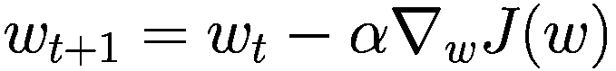

(5-5)

权重移动的方向是使损失最小化——即实际输出值和预测输出值之间的差异。

接下来，让我们花些时间来讨论函数逼近的各种方法。最常见的方法如下：

+   特征的线性组合。你将特征（如速度、速度、位置等）通过向量 *w* 加权组合，并使用计算出的值作为状态值。常见的方法如下：

    +   多项式

    +   傅里叶基函数

    +   径向基函数

    +   粗编码

    +   瓦片编码

+   非线性但可微的方法，其中神经网络是最受欢迎且目前趋势的方法。

+   非参数、基于记忆的方法。

本书主要讨论适用于非结构化输入的基于深度学习的神经网络方法，例如由智能体的视觉系统捕获的图像或使用自然语言处理（NLP）的自由格式文本。本章的后期部分和下一章将致力于使用基于深度学习的函数逼近，你将看到许多使用 PyTorch 的完整代码示例的变体。但我们先不要跑题。让我们首先检查一些常见的线性逼近方法，如粗编码和瓦片编码。由于本书的重点是强化学习中深度学习的使用，我没有花太多时间在其他各种线性逼近方法上。此外，仅仅因为我没有花时间在所有线性方法上，并不意味着它们缺乏有效性和力量。根据手头的问题，线性逼近方法可能是正确的选择；它有效、快速，并且有收敛保证。

### 粗编码

让我们回顾一下图 2-2 中讨论的山地车问题。汽车有两个维度的状态，一个位置和一个速度。假设你将二维状态空间划分为重叠的圆，每个圆代表一个特征。如果状态*S*位于一个圆内，那么该特征存在，其值为 1；否则，该特征不存在，其值为 0。特征的数量是圆的数量。假设你有*p*个圆，那么你将一个二维连续状态空间转换成了一个 p 维状态空间，其中每个维度可以是 0 或 1。换句话说，每个维度可以属于{0,1}。

注意

{0,1}代表可能的值的集合——0 或 1。（0,1）——用常规括号表示值的范围——即从 0 到 1 的任何值，不包括 0 和 1。0,1)代表 0 到 1 之间的值以及左侧的值——即 0 包含在范围内，而范围右侧的值 1 被排除。

所有的特征，由圆表示且状态*S*位于其中，都将被“开启”或等于 1。图[5-2 展示了示例。图中显示了两个状态，根据这些点所在的圆，相应的特征将被开启，而其他特征将被关闭。泛化将取决于圆的大小以及它们紧密排列的程度。如果用椭圆代替圆，泛化将更多地朝向拉伸方向。你也可以选择除圆以外的其他形状来控制泛化的程度。

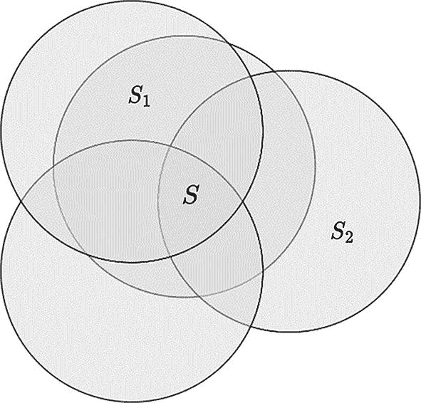

四个重叠的圆的维恩图代表了二维的粗编码。所有圆的中心重叠区域是 S，其他两个标记的圆是 S1 和 S2。

图 5-2

使用圆在二维中进行粗编码。泛化取决于圆的大小以及圆排列的密度

现在考虑大而密集排列的圆的情况。一个大圆使得初始泛化范围很广，因为两个远离的状态通过至少一个共同的圆连接在一起。然而，密度（即圆的数量）允许你控制细粒度泛化。通过拥有许多圆，你确保即使相邻的状态之间至少有一个特征在两个状态之间是不同的。即使每个单独的圆很大，这一点也会成立。通过进行不同圆的大小和数量配置的实验，你可以微调圆的大小和数量，以控制适合问题/域的泛化，通过形状的大小控制泛化，通过形状的密度控制粒度。

### 瓦片编码

瓷砖编码是一种可以程序化规划的粗编码形式。它在多维空间中表现良好，使其比通用的粗编码更有用。

让我们考虑一个类似于我刚才提到的山车问题的二维空间。你将空间划分为非重叠的网格，覆盖整个空间。这样的每个划分称为*填充*，如图 5-3 的左侧图示所示。这里的*瓷砖*是正方形的，并且根据状态*S*在这个 2*D*空间中的位置，只有一个瓷砖是 1，而所有其他瓷砖都是 0。

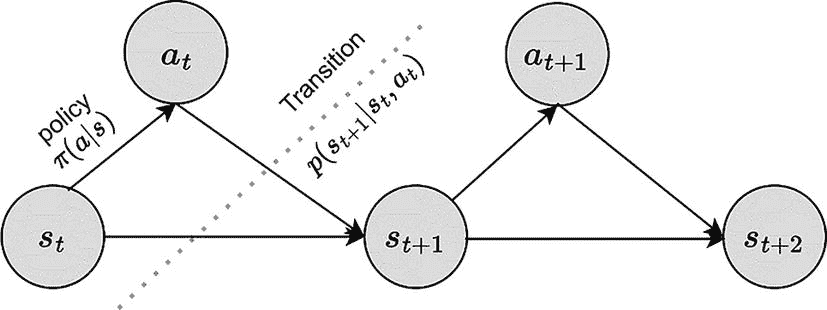

一个节点图。节点 s t 通过策略导致节点 a t。节点 s t 和 a t 导致节点 s t+1，该节点进一步导致节点 a t+1 和 s t+2。节点 a t+1 导致节点 s t+2。在节点 s t+1 和 a t 以及 s t+1 和 s t 之间画了一条标记为转移的虚线。

图 5-4

在马尔可夫假设下的策略和转移动力学

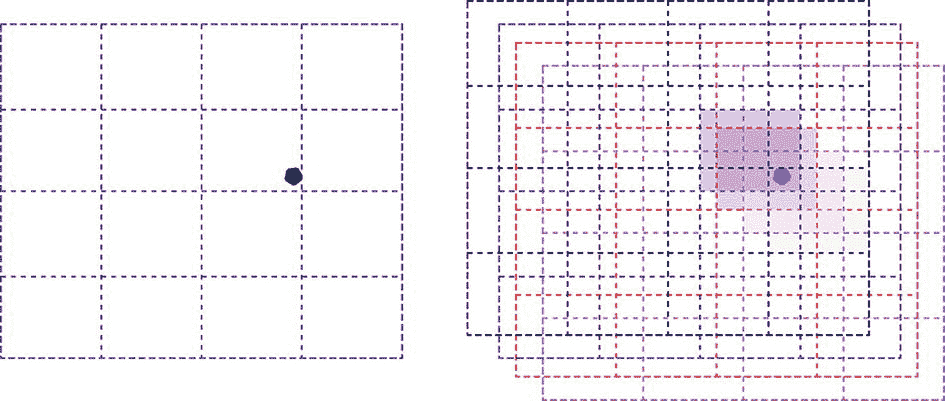

一个 4×4 的网格，在第三列第二行的单元格底部右方有一个高亮的点。在右侧，多个阴影重叠的 4×4 网格用第三列第二行含有点的单元格表示。

图 5-3

瓷砖编码。在一个单独的填充中，你有 4×4=16 个瓷砖，如图左侧所示。并且你有四个相互重叠的填充，如图右侧不同颜色所示。一个状态（绿色圆点）点亮了每个填充中的一个瓷砖。泛化程度由单个填充中的瓷砖数量以及总的填充数量控制。

然后，你会有许多这样的*填充*彼此偏移。假设你使用*n*个填充；那么对于一个状态，每个填充中只有一个瓷砖是开启的。换句话说，如果有*n*个填充，那么恰好有*n*个特征是 1，每个*n*个填充中的一个特征。图 5-3 展示了示例。

注意，如果步骤大小的学习率在方程 5-1 和 5-2 中是*α*(alpha)，你现在应该将其替换为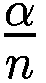，其中*n*是填充的数量。这使得算法与填充的数量无关。由于粗编码和瓷砖编码都使用二进制特征，数字计算机可以加速计算。

现在泛化的性质取决于以下因素：

1.  单个填充中的瓷砖数量（图 5-3 中的左侧图示）。

1.  图中填充的数量（图 5-3 中的右侧图示，展示了四种不同颜色的四种填充）。

1.  偏移的性质，无论是均匀对称还是非对称。

有一些一般策略可以确定前面的数字。考虑这种情况，一个单层铺砖中的每个砖块都是一个宽度为 *w* 的正方形。对于 *k* 维的连续空间，它将是一个 *k* 维的正方形，每边宽度为 *w*。假设你有 *n* 个铺砖，因此铺砖需要在所有维度上相互偏移一个距离 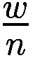。这被称为*位移向量*。第一个启发式方法是选择 *n* 使得 *n* = 2^(*i*) ≥ 4*k*。每个方向的位移是位移向量  的奇数倍（1, 3, 5, 7, ……，2*k* - 1）。接下来的例子将使用一个库来帮助你将二维的山地车状态空间划分为适当的铺砖。你将提供 2D 状态向量，库将返回活动砖块向量。

### 近似挑战

当我利用前面解释的基于监督学习的方法（如梯度下降）的知识时，你必须牢记两点，这使得基于梯度的方法在强化学习中的工作比在监督学习中更困难。

首先，在监督学习中，训练数据保持不变。数据由模型生成，在数据生成过程中不会发生变化。这是一个给予你的真实情况。你正在构建一个函数，其参数通过使用训练数据来学习输入到输出的映射来识别。提供给训练算法的数据是学习过程/算法之外的。它以任何方式都不依赖于算法。它被作为常数给出，并且独立于学习算法。不幸的是，在强化学习中，尤其是在无模型设置中，情况并非如此。用于生成训练样本的数据基于智能体遵循的策略，并且它并不是底层模型的完整图景。当你探索环境时，你会学到更多并调整策略。这种策略的变化会导致探索新的状态和动作，这反过来又为下一次迭代的下一步生成了一组新的训练数据。你可以使用基于 MC 的观察实际轨迹的方法，或者根据 TD 进行自举，以形成一个目标值 *y*(t) 的估计。随着你的探索、学习和调整策略，给定特定状态的目标值 *y*(t) 会发生变化，这在监督学习中是不存在的。这被称为*非平稳目标*问题。

其次，监督学习基于样本之间相互独立的理论前提，在数学上称为 i.i.d.（“独立同分布”）数据。所有回归、分类、树和支持向量机的算法都是基于这个 i.i.d. 假设。然而，在强化学习中，你看到的数据取决于代理生成数据时遵循的策略。在给定的一幕中，你看到的州取决于代理在那个时刻遵循的策略。在后续时间步中到来的状态取决于代理之前采取的行动（决策）。换句话说，数据是*相关的*。你看到的下一个状态 *s*[*t* + 1] 依赖于当前状态 *s*[*t*] 和代理在该状态下采取的行动 *a*[*t*]。请注意，这假设马尔可夫属性（未来的状态 *s*[*t* + 1]）只依赖于当前状态 *s*[*t*] 和你采取的行动 *a*[*t*]。没有对过去的依赖——也就是说，时间步 *t* − 1 或更早的行动或状态。这种关系可以通过依赖图来表示，如图 5-4 所示。

在强化学习（RL）中，数据的时间依赖性意味着你无法像在监督学习（supervised learning）中那样对数据进行洗牌，并且每个数据点都不能单独使用。从一幕开始到结束的整个数据点轨迹必须一起使用。

这两个问题使得在强化学习设置中函数逼近更加困难。随着你的深入，你会看到已经采取的各种方法来应对这些挑战。这些方法并不总是带有理论保证——而是带有实用的技巧和已经证明有用的方法，并且确实包含一些直观的推理。

在对方法有广泛理解之后，现在是时候开始通常的课程了，首先查看价值*预测/估计*来学习一个可以表示价值函数 *v*(*s*) 或状态-动作价值函数 *q*(*s*, *a*) 的函数。然后，你将查看*控制*方面——即优化代理应遵循的策略 π(*a*| *s*) 的过程。它将遵循与上一章中方法相同的模式——在预测/估计状态-动作值和使用贪婪策略来控制/识别最佳行动之间交替。并且你将在这个循环中迭代，直到观察到收敛。

## 增量预测：MC，TD，TD(***λ***)

本节探讨预测问题——即如何使用函数逼近估计状态值。

沿着这个思路，你现在将尝试扩展监督训练过程，使用由输入和目标组成的训练数据来调整模型。这是在强化学习下使用方程 5-4 中的损失函数和权重更新来进行函数逼近，如方程 5-5 所示。如果你比较方程 5-4 中的损失函数和方程 5-2 和 5-3 中的 MC/TD 更新，你可以通过将 MC 和 TD 更新视为操作来建立平行关系，这些操作试图最小化实际目标 *V*π 和当前估计 *V**t* 之间的误差。你可以将损失函数表示如下：

![$$ J(w)={E}_{\uppi}{\left[{V}_{\pi }(s)\hbox{--} {V}_t(s)\right]}² $$](img/502835_2_En_5_Chapter/502835_2_En_5_Chapter_TeX_Equ6.png)

(5-6)

这与监督学习的损失函数类似，如方程 5-4 所示。遵循与方程 5-5 相同的推导过程，并使用随机梯度下降（即在每个样本中用更新替换期望），可以写出权重向量 *w* 的更新方程如下：

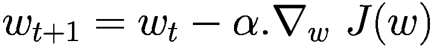

![$$ {w}_{t+1}={w}_t+\alpha .\left[{V}_{\pi }(s)-{V}_t\left(s;w\right)\right].{\nabla}_w\ {V}_t\left(s;w\right) $$](img/502835_2_En_5_Chapter/502835_2_En_5_Chapter_TeX_Equ7.png)

(5-7)

在这里，*w* 代表模型的权重向量——即模型的可调参数，这些参数会逐步改进以适应给定策略观察到的状态值。然而，与监督学习不同，你并没有实际的/目标输出值 *V*π；相反，你使用这些目标的估计值。在 MC 中，*V*π 的估计/目标是 *G**t*，而在 TD(0) 中，估计/目标是 *R*[*t* + 1] + *γ* · *V**t*。因此，MC 和 TD(0) 下的更新可以写成如下形式。

MC 更新：

![$$ {w}_{t+1}={w}_t+\alpha .\left[{G}_t(s)-{V}_t\left(s;w\right)\right].{\nabla}_w\ {V}_t\left(s;w\right) $$](img/502835_2_En_5_Chapter/502835_2_En_5_Chapter_TeX_Equ8.png)

(5-8)

TD(0) 更新：

![$$ {w}_{t+1}={w}_t+\alpha .\left[{R}_{t+1}+\gamma \bullet {V}_t\left({s}^{\prime };w\right)-{V}_t\left(s;w\right)\right].{\nabla}_w\ {V}_t\left(s;w\right) $$](img/502835_2_En_5_Chapter/502835_2_En_5_Chapter_TeX_Equ9.png)

(5-9)

可以为 q 值编写一组类似的方程。你将在下一节看到这一点。这与你在上一章的 MC 和 TD 控制部分所做的工作类似；首先，你在无模型的世界中使用状态动作值来构建当前策略下状态动作值的准确估计，然后使用贪婪更新来找到值，在每个单独的状态中最大化动作。回到权重更新方程的推导，让我们首先考虑线性近似设置，其中状态值 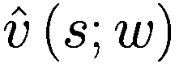 可以表示为状态向量 *x*(*s*) 和权重向量 *w* 的点积，每个向量的分量维度索引表示为 *i*：

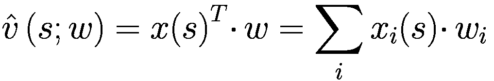

(5-10)

在前面的表达式中，关于 *w* 的  的梯度将是状态向量 *x*(*s*)——即：

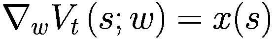

(5-11)

将方程 5-11 与方程 5-7 结合给出以下结果：

![$$ {w}_{t+1}={w}_t+\alpha .[V_{\pi }(s)-V_t\left(s;w\right)].x(s) $$](img/502835_2_En_5_Chapter/502835_2_En_5_Chapter_TeX_Equ12.png)

(5-12)

如前所述，你不知道真正的状态值 *V*π，因此你在蒙特卡洛方法中使用估计 *G*t，在 TD(0)方法中使用估计 *R*[t+1] + *γ* · *V*t。这给出了线性近似情况下 MC 和 TD 的权重更新规则如下。

MC 更新：

![w_{t+1}=w_t+α.[G_t(s)-V_t(s;w)].x(s)](img/502835_2_En_5_Chapter/502835_2_En_5_Chapter_TeX_Equ13.png)

(5-13)

TD(0)更新：

![$$ {w}_{t+1}={w}_t+\alpha .[R_{t+1}+\gamma \ast V_t\left({s}^{\prime };w\right)-V_t\left(s;w\right)].x(s) $$](img/502835_2_En_5_Chapter/502835_2_En_5_Chapter_TeX_Equ14.png)

(5-14)

简而言之，权重的更新——即方程 5-14 右侧的第二项——可以表示如下：

+   更新 = 学习率 x 预测误差 x 特征值

其中学习率是α，预测误差表示为 *R*[t+1] + *γ* · *V*t − *V*t，特征值是 *x*(*s*)。

让我们将其与之前章节中看到的基于表的离散状态方法联系起来。查找表，即使用状态或状态-动作值作为索引查找表或字典以获取值，是线性方法的一种特殊情况。考虑到*x*(s)的每个分量要么是 1 要么是 0，并且只有一个可以具有值为 1，其余特征为 0。*x*^(*table*)(*s*)是一个大小为 p 的列向量，其中在任何时刻只有一个元素可以具有值为 1，其余元素等于 0。根据代理所处的状态，相应的元素将是 1。因此，列向量中的元素数量(*p*)等于代理可以退出的状态数量。这如图所示：

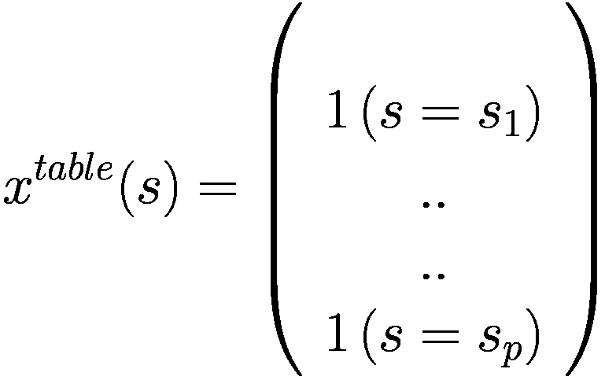

权重向量包含了每个状态 v(s)的值，对于每个 s = s[1], s[2], … s[p]。

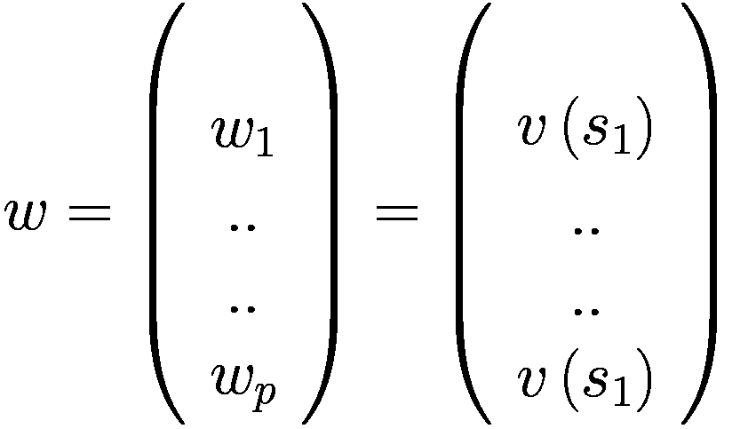

使用这些表达式在方程 5-10 中，你得到以下结果：

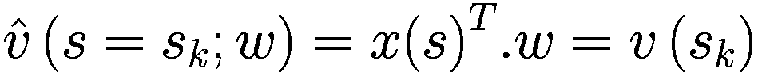

你可以看到状态 s = s[*k*]的值可以表示为状态向量*x*(s)和权重向量*w*的点积。如果你将这个表达式代入 MC 更新方程 5-13 或 TD(0)更新方程 5-14，你将得到在第四章直接为离散状态情况推导出的熟悉的更新规则。

这里是 MC 更新：

![V_{t+1}(s)=V_t(s)+α.[G_t(s)-V_t(s)], s∈s1, s1, ..., sp](img/502835_2_En_5_Chapter/502835_2_En_5_Chapter_TeX_Equ15.png)

(5-15)

这里是 TD(0)更新：

![V_{t+1}(s)=V_t(s)+α.[R_{t+1}+γ.V_t(s')-V_t(s)], s∈s1, s1, ..., sp](img/502835_2_En_5_Chapter/502835_2_En_5_Chapter_TeX_Equ16.png)

(5-16)

之前的推导是为了将查找表作为更一般线性函数逼近的特殊情况重新联系起来。

在推导更新方程时，我略过的一点是 MC 中的目标估计 *G**t* 和 TD(0) 中的 *R*[*t* + 1] + *γ* · *V**t* 的细节。这些估计不是某个固定的常数值。它们也依赖于策略——对于 MC，直接依赖于样本回放 *G**t* 和 TD(0) 中下一个状态 *V**t* 的值。作为一个例子，让我们回顾方程 5-6，并用 TD 目标替换 *V*π，然后取梯度。

![J(w)={\left[{V}_{\pi }(s)\hbox{--} {V}_t(s)\right]}²](img/502835_2_En_5_Chapter/502835_2_En_5_Chapter_TeX_Equg.png)

将 *V*π 替换为基于模型的预期目标值，你得到：

![J(w)={\left[{R}_{t+1}+\gamma \cdotp {V}_t\left({s}^{\prime };w\right)-{V}_t\left(s;w\right)\right]}²](img/502835_2_En_5_Chapter/502835_2_En_5_Chapter_TeX_Equh.png)

如果你对 *J*(*w*) 关于 *w* 求导，实际上你会得到两个项，一个是因为 *V**t* 的导数，下一个状态值，另一个是因为 *V**t* 的导数，当前状态值。这种同时考虑梯度贡献 ∇*V**t* 和 ∇*V**t* 的方法会导致目标值的变化，并且已被证明会降低学习的速度。首先，原因是你想让目标值保持不变，因此你需要忽略 ∇*V**t* 的贡献。其次，从概念上讲，使用梯度下降，你试图将当前状态 *V**t* 的值拉向其目标值。取第二个贡献项 ∇*V**t* 意味着你试图将下一个状态 *S* = *s*^′ 的值移动到当前状态 *S* = *s* 的值。

总结来说，你只对当前状态值 *V**t* 求导，并忽略下一个状态值 *V**t* 的导数。这种方法使得值估计看起来类似于使用具有固定目标值的监督学习方法。这也是为什么有时在方程 5-8 和 5-9 中使用的梯度下降方法也被称为 *半梯度* 方法的原因。这是因为你在对当前状态求梯度，而忽略由于下一个状态的梯度引起的任何权重更新。

正如我之前提到的，算法的收敛性不再有保证，这与由于收缩定理在表格设置中你拥有的保证不同。然而，大多数经过仔细考虑的算法在实践中确实收敛。表 5-1 展示了各种预测/估计算法的收敛性。我不会对这些收敛性质进行详细解释。这样的讨论更适合专注于学习理论方面的书籍。这本书是一本实用的书，其中包含足够的理论来理解背景并欣赏算法的细微差别。核心重点是使用深度学习库来编写这些算法。

表 5-1

预测/估计算法的收敛性

| 政策类型 | 算法 | 表查找 | 线性 | 非线性 |
| --- | --- | --- | --- | --- |
| 在策略 | MCTD(0)TD(λ) | YYY | YYY | YNN |
| 离策略 | MCTD(0)TD(λ) | YYY | YNN | YNN |

在后面的章节中，你将看到如何将自助（例如，TD）、函数逼近和离策略的组合同时呈现，如果不仔细考虑学习过程，可能会对稳定性产生不利影响。

下一节将探讨控制问题，这些问题定义了如何通过函数逼近来优化策略。

## 增量控制

本节从状态值预测转向控制，即寻找最优策略。本章遵循与上一章类似的方法。你从函数逼近开始来估计 q 值。q 值由一个具有权重/参数 *w* 的模型表示。


(5-17)

如前所述，你会在目标值和当前值之间形成一个损失函数。这样做是为了根据 q 值的样本，调整模型的参数来估计 q 值。

![公式 $${J(w)={E}_{\pi}\left[{\left({q}_{\pi}\left(s,a\right)-\hat{q}\left(s,a;w\right)\right)}²\right]}$$](img/502835_2_En_5_Chapter/502835_2_En_5_Chapter_TeX_Equ18.png)

(5-18)

为了更好地拟合，你需要减少方程 5-18 中的损失函数。你可以通过在权重 *w* 上进行梯度下降来实现这一点，从而迭代地减少损失。

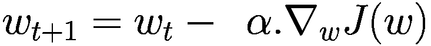

其中，

![公式 $${\nabla}_wJ(w)=\left[{q}_{\pi}\left(s,a\right)-\hat{q}\left(s,a;w\right)\right].{\nabla}_w\hat{q}\left(s,a;w\right)$$](img/502835_2_En_5_Chapter/502835_2_En_5_Chapter_TeX_Equ19.png)

(5-19)

和之前一样，在线性模型中，其中  被表示为线性方程 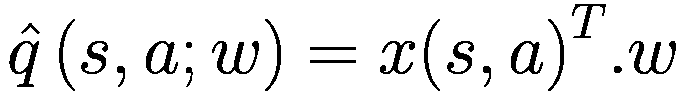，你可以简化方程。在线性情况下，如前所述，导数 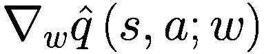 将成为 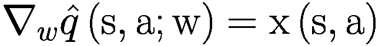。

你还需要对 5-19 方程进行一次修改，就像前一个章节中做的那样。你不知道真实的 q 值 *q*π。像之前一样，你用 MC 或 TD 的估计值来替换它，给你一组权重更新方程。

MC 更新：

![$$ {w}_{t+1}={w}_t+\alpha .\left[{G}_t(s)-{q}_t\left(s,a;w\right)\right].{\nabla}_w\hat{q}\left(\mathrm{s},\mathrm{a};\mathrm{w}\right) $$](img/502835_2_En_5_Chapter/502835_2_En_5_Chapter_TeX_Equ20.png)

(5-20)

TD(0) 更新：

![$$ {w}_{t+1}={w}_t+\upalpha \cdotp \left[{R}_{t+1}+\upgamma \cdotp {q}_t\left({s}^{'},{a}^{'};w\right)\hbox{--} {q}_t\left(s,a;w\right)\right]\cdotp {\nabla}_w\hat{q}\left(\mathrm{s},\mathrm{a};\mathrm{w}\right) $$](img/502835_2_En_5_Chapter/502835_2_En_5_Chapter_TeX_Equ21.png)

(5-21)

这些方程允许你执行 q 值估计/预测。这是广义策略迭代的*评估*步骤，其中你进行多轮梯度下降，以改进给定策略的 q 值估计，并使它们接近实际目标值。

*评估*之后是贪婪策略最大化以改进策略。图 5-5 展示了在 GPI 下使用函数近似进行迭代的过程。你可以观察到箭头没有触及底部线 *q*[*w*] = *q*[π]，这表明在收敛过程中你不需要走完全程。你可以执行几个梯度步骤，然后进行一次贪婪最大化的策略更新，接着再进行另一轮梯度步骤和贪婪策略更新。

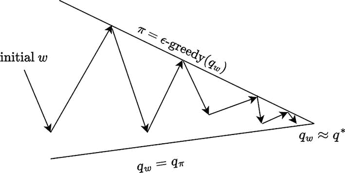

一个图表描绘了一条标有 pi = epsilon minus greedy 的下降线和一个标有 q w = q pi 的上升线。它们在标有 q w 近似等于 q asterisks 的点上相交。在两条线之间画了一条由箭头组成的之字形线。之字形线的起点标为 initial w。

图 5-5

使用函数近似的广义策略迭代

### **半梯度** ***n*****-步 SARSA 控制**

在查看理论推导之后，现在是时候将本章的所有学习应用到训练一个智能体上了。只需一点更多的理论——实现 SARS-A 控制的实际算法伪代码。如果您还记得上一章，SARS-A 是一个在线策略算法。您将使用 n 步回报来提高估计的方差，正如您在上一章中看到的。由于您将实现方程 5-20，这个算法将被称为“半梯度 n 步 SARS-A 控制”。图 5-6 显示了算法的伪代码。与标准 SARS-A 设置一样，您使用*ϵ*-贪婪策略来采样环境并收集状态、动作、奖励、下一个状态和下一个动作的元组(*s*[*t*], *a*[*t*], *r*[*t* + 1], *s*[*t* + 1], *a*[*t* + 1])，然后使用这些观察结果来形成 n 步回报。接下来是使用方程 5-20 的梯度步骤来迈出一步并改进 q 值的估计。随着 q 值的提高，您使用这些 q 值通过*ϵ*-贪婪策略运行下一个周期，您隐式地执行策略更新。请注意，您使用*ϵ*-贪婪策略，因为您处于在线策略设置中，您需要探索以确保您对状态空间进行了足够的探索。

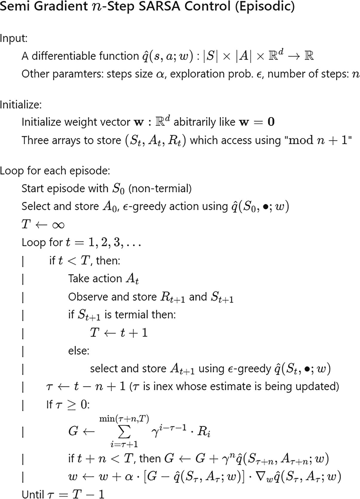

半梯度 n 步 SARS-A 算法用于周期性控制，由 25 行代码组成。它从输入一个可微函数 q hat 左括号 a，分号 w 右括号闭括号冒号 S 在模乘 A 在模乘由 R d 导致 R 开始。

图 5-6

周期性控制的 n 步半梯度 SARS-A

*w*更新使用方程 5-20，目标为*G*，n 步回报。

现在您将看到如何将此应用于具有连续状态空间的 mountain car 环境。您将使用本章前面研究过的 tile 编码来构建状态值的函数逼近器。Tile 编码是一种二进制特征逼近器。在设置中：

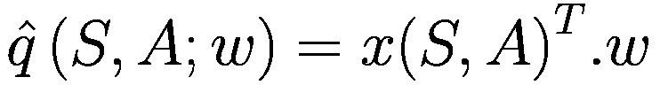

其中 *x*(*S*, *A*) 是 tile 编码的特征向量。

因此，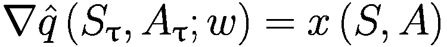

在这个瓦片编码的例子中，你使用 Rich Sutton 的瓦片编码实现，你可以在 Python 脚本文件 `tiles3.py` 中探索它。这是一个基于 UNH CMAC 代码的网格式瓦片编码实现，最初基于 UNH CMAC 代码，^(1) 但现在已经发生了很大的变化。你提供了一个名为“`tiles`”的函数，它将浮点数和整数变量映射到瓦片列表，以及第二个名为“`tiles-wrap`”的函数，它执行相同的操作，同时将一些浮点数包装到提供的宽度（包装的较低值始终为 0）。浮点变量以单位间隔进行网格化，因此泛化将在每个方向上大约为 1，任何缩放都必须在调用 tiles 之前外部完成。

`Num-tilings` 应该是 2 的幂，例如，16。为了使偏移正确工作，它还应该大于或等于浮点数的四倍。第一个参数是一个给定大小的索引哈希表（由 `make-iht(size)` 创建），一个整数“`size`”（索引的范围从 0），或者 nil（用于测试，表示瓦片坐标将返回而不转换为索引）。

你使用 `tiles3.py` 构建了 `QEstimator` 类，如列表 5-1 所示。`QEstimator` 类持有权重并将观察空间瓦片化。完整的代码在名为 `5.a-n-step-SARSA.ipynb` 的 Python 笔记本中给出。

```py
class QEstimator:
def __init__(self, step_size, num_of_tilings=8, tiles_per_dim=8, max_size=2048, epsilon=0.0):
self.max_size = max_size
self.num_of_tilings = num_of_tilings
self.tiles_per_dim = tiles_per_dim
self.epsilon = epsilon
self.step_size = step_size / num_of_tilings
self.table = IHT(max_size)
self.w = np.zeros(max_size)
self.pos_scale = self.tiles_per_dim / (env.observation_space.high[0] \
- env.observation_space.low[0])
self.vel_scale = self.tiles_per_dim / (env.observation_space.high[1] \
- env.observation_space.low[1])
Listing 5-1
n-Step SARSA Control: Mountain Car. Q-Estimator initialization
```

如列表 5-2 所示，`get_active_features` 函数接受 *S* 和离散输入动作 *A* 的连续二维值作为输入，以返回瓦片编码的 `active_feature` *x*(*S*, *A*)——即对于给定的 (*S*, *A*) 激活的二进制瓦片特征。`q_predict` 函数也接受 (*S*, *A*) 作为输入，并返回估计值 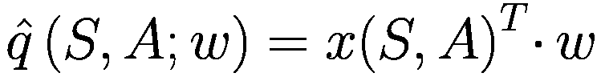。它内部调用 `get_active_features` 以首先获取特征，并与权重向量执行点积。

```py
def get_active_features(self, state, action):
pos, vel = state
active_features = tiles(self.table, self.num_of_tilings,
[self.pos_scale * (pos - env.observation_space.low[0]),
self.vel_scale * (vel- env.observation_space.low[1])],
[action])
return active_features
def q_predict(self, state, action):
pos, vel = state
if pos == env.observation_space.high[0]:  # reached goal
return 0.0
else:
active_features = self.get_active_features(state, action)
return np.sum(self.w[active_features])
Listing 5-2
n-Step SARSA Control: q-predict implementation in 5.a-n-step-SARSA.ipynb
```

图 5-6 算法末尾显示的权重更新方程是 `q_update` 函数执行的内容。`get_eps_greedy_action` 函数执行使用 ε-greedy 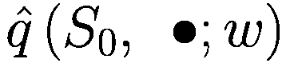 的动作选择。列表 5-3 显示了代码。

```py
# learn with given state, action and target
def q_update(self, state, action, target):
active_features = self.get_active_features(state, action)
q_s_a = np.sum(self.w[active_features])
delta = (target - q_s_a)
self.w[active_features] += self.step_size * delta
def get_eps_greedy_action(self, state):
pos, vel = state
if np.random.rand() < self.epsilon:
return np.random.choice(env.action_space.n)
else:
qvals = np.array([self.q_predict(state, action) for action in range(env.action_space.n)])
return np.argmax(qvals)
def get_action(self, state):
pos, vel = state
qvals = np.array([self.q_predict(state, action) for action in range(env.action_space.n)])
return np.argmax(qvals)
Listing 5-3
n-Step SARSA Control: q-update implementation in 5.a-n-step-SARSA.ipynb
```

SARSA 代理的主要训练算法，如图 5-6 所示，在 `sarsa_n` 函数中实现，根据需要调用 `QEstimator` 中的函数。列表 5-4 包含了代码。实现是遵循图 5-6 伪代码的简单 Python 代码。

```py
def sarsa_n(qhat, step_size=0.5, epsilon=0.0, n=1, gamma=1.0, episode_cnt = 10000):
episode_rewards = []
for _ in range(episode_cnt):
state,_ = env.reset()
action = qhat.get_eps_greedy_action(state)
T = float('inf')
t = 0
states = [state]
actions = [action]
rewards = [0.0]
while True:
if t = 0:
G = 0
for i in range(tau+1, min(tau+n, T)+1):
G += gamma ** (i-tau-1) * rewards[i]
if tau+n < T:
G += gamma**n * qhat.q_predict(states[tau+n], actions[tau+n])
qhat.q_update(states[tau], actions[tau], G)
if tau == T - 1:
episode_rewards.append(np.sum(rewards))
break
else:
t += 1
state = next_state
action = next_action
return np.array(episode_rewards)
Listing 5-4
n-Step SARSA Control: SARSA Agent Implementation in 5.a-n-step-SARSA.ipynb
```

与前一章中的许多示例类似，还有一个名为 `plot_rewards` 的辅助函数，它绘制每集的回报并记录训练代理的视频。

图 5-7 显示了运行此算法训练山车的结果。在 50 个集数内，智能体达到稳定状态，并在大约 110 个时间步内达到目标，即在山谷右侧击中旗帜。

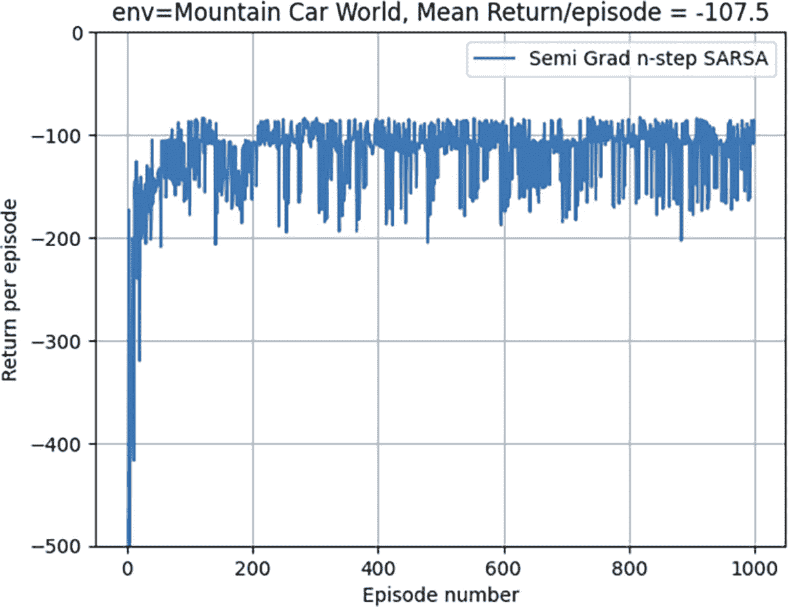

每一集的回报与集数之间的折线图。它绘制了λ的半梯度 SARSA 的线，从(0, -500)开始，向上攀升，急剧波动，最终到达(1000, -105)。数值是估算的。

图 5-7

带有 MountainCar 的 n 步半梯度 SARSA

这完成了 n 步半梯度 SARSA 的示例。

### 半梯度 SARSA(λ)控制

本节探讨了具有资格痕迹的半梯度 SARSA(λ)算法。正如你在上一章中看到的，在 MC 更新中使用完整集的回报——即λ=1，TD(0)使用一步后续状态估计来形成目标——即λ=0。n 步使用从 n 步后的回报以及 n 步后状态 q 值估计来形成目标估计，这介于完整集的 MC 和 TD(0)的一步之间。你如何决定 n 的值？资格痕迹通过添加所有可能的 n 值的所有奖励，使用从一步更新到完整集回报的全谱。这些回报的权重由λ的值控制，其值可以从 0 到 1 变化。换句话说，SARSA(λ)进一步泛化了 n 步 SARSA。当状态或状态-动作值由具有线性函数近似的二进制特征表示（如具有图块编码的山车的情况）时，你得到图 5-8 中的算法。此算法引入了一个与权重向量具有相同数量的组件的资格痕迹概念。*权重向量*是跨越许多集的长时记忆，用于从所有示例中泛化。*资格痕迹*是短时记忆，持续时间小于集的长度。它通过影响权重在学习过程中提供帮助。考虑一个在图中向上倾斜的波形模式。权重向量就像向上整体趋势的斜率，资格痕迹就像从波的一个峰值到另一个峰值的局部邻域波动，在该局部区域内上下波动。我不会深入探讨更新规则的详细推导。你可以参考名为《强化学习：导论》的书籍^(2)，以获得概念和数学推导的详细解释。

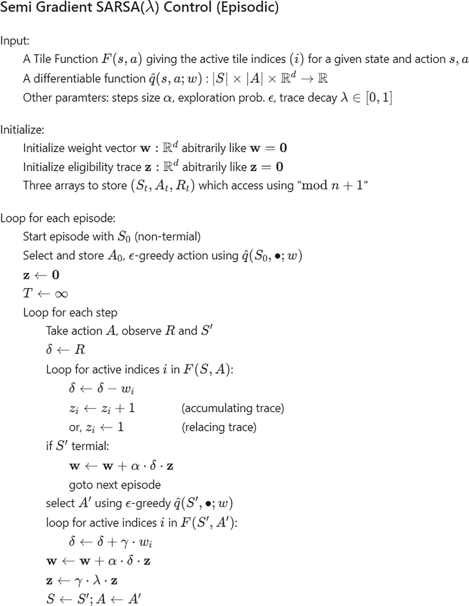

用于时序控制的半梯度 SARSA(λ)算法由 29 行代码组成。它从一个函数 F(s, a)开始，该函数给出给定状态和动作 s, a 的活跃图块索引 i。

图 5-8

当特征是二进制且值函数是特征向量和权重向量的线性组合时，用于时序控制的半梯度 SARSA(*λ*)

如前一小节所述，你将在山车环境中运行此算法。`5.b-lambda-sarsa.ipynb` 笔记本包含完整的代码。列表 5-5 给出了如图 5-8 所示的资格迹更新的代码实现。累积迹为活动图块增加一个，而替换迹使索引 *i* 的迹对于活动图块索引 *i* 为一。

```py
def accumulating_trace(trace, active_features, gamma, lambd):
trace *= gamma * lambd
trace[active_features] += 1
return trace
def replacing_trace(trace, active_features, gamma, lambd):
trace *= gamma * lambd
trace[active_features] = 1
return trace
Listing 5-5
Accumulating Trace and Replacing Trace Implementation from 5.b-lambda-sarsa.ipynb
```

从 n 步 SARSA 中修改的 `QEstimator` 类用于存储迹值，并在 `q_update` 权重更新函数中使用迹，如图 5-6 所示。

```py
# learn with given state, action and target
def q_update(self, state, action, reward, next_state, next_action):
active_features = self.get_active_features(state, action)
q_s_a = self.q_predict(state, action)
target = reward + self.gamma * self.q_predict(next_state, next_action)
delta = (target - q_s_a)
if self.trace_fn == accumulating_trace or self.trace_fn == replacing_trace:
self.trace = self.trace_fn(self.trace, active_features, self.gamma, self.lambd)
else:
self.trace = self.trace_fn(self.trace, active_features, self.gamma, 0)
self.w += self.step_size * delta * self.trace
Listing 5-6
q-update Implementation Using Trace from 5.b-lambda-sarsa.ipynb
```

`sarsa_lambda` 函数实现了图 5-8 中给出的整体学习算法。它是该图中伪代码的直接实现。列表 5-7 展示了代码。

```py
def sarsa_lambda(qhat, episode_cnt = 10000, max_size=2048, gamma=1.0):
episode_rewards = []
for i in range(episode_cnt):
state, _ = env.reset()
action = qhat.get_eps_greedy_action(state)
qhat.trace = np.zeros(max_size)
episode_reward = 0
while True:
next_state, reward, terminated, _, _ = env.step(action)
next_action = qhat.get_eps_greedy_action(next_state)
episode_reward += reward
qhat.q_update(state, action, reward, next_state, next_action)
if terminated:
episode_rewards.append(episode_reward)
break
state = next_state
action = next_action
return np.array(episode_rewards)
Listing 5-7
sarsa-lambda from 5.b-lambda-sarsa.ipynb
```

你还有一个函数来运行训练好的智能体通过一些集数并记录其行为。一旦你训练了智能体并生成了动画，你可以运行 MP4 文件并看到智能体遵循的策略以到达目标。

图 5-9 展示了运行 SARSA(λ) 算法训练山车环境的结果。你可以看到结果与图 5-7 中的结果相似。这是一个太小的问题，但对于更大的问题，基于资格迹的算法将显示出更好的和更快的收敛性。

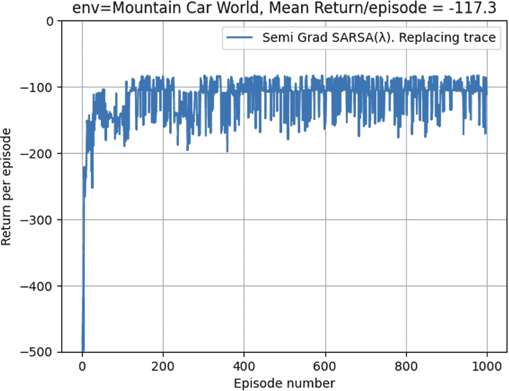

每一集回报与集数的关系线图。它绘制了半梯度 SARSA 的 lambda 线，从 (0, 负 500) 开始，向上上升，急剧波动，并在 (1000, 负 220) 结束。值是估计的。

图 5-9

带有山车环境的半梯度 SARSA(*λ*)

这就结束了在山车环境中运行 SARSA(λ) 的示例。

## 函数逼近中的收敛性

让我们从查看一个示例开始探索收敛性。如图 5-10 所示，让我们考虑一个两状态转移作为某个马尔可夫决策过程（MDP）的一部分。假设你将使用函数逼近，其中第一个状态的价值为 *w*，第二个状态的价值为 2*w*。请注意，*w* 是一个单独的数字，而不是一个向量。


一个表示 w 的圆圈图，在函数逼近下，对于两步转移，导致 2*w* 的圆圈。

图 5-10

函数逼近下的两步转移

假设 *w* = 10，并且智能体从第一个状态转移到第二个状态——即从价值为 10 的状态转移到价值为 20 的状态。这个例子还假设从第一个状态到第二个状态的转移是第一个状态中唯一可能的转移，并且每次转移的奖励为零。设学习率 *α* = 0.1。

现在我们将方程 5-14 应用到图 5-10 中的第一个状态。

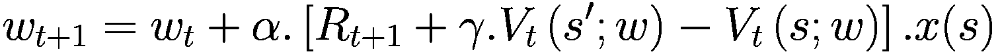

现在代入数值。代入 *α* = 0.1，这是你假设的，*R*[*t* + 1] = 0，这也是假设。状态价值在图 5-10 中给出——下一个状态 *V**t* = 2*w*[*t*]，当前状态价值 *V**t* = *w*[*t*]。状态特征向量是一维的，其值为 1——即 *x*(*s*) = ∇[*w*]*V**t* = 1。所有这些替换后，你得到：

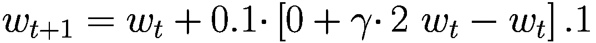

例如：

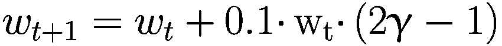

现在假设 γ 接近 1，当前权重 *w*[*t*] 是 10。更新的权重将如下所示：

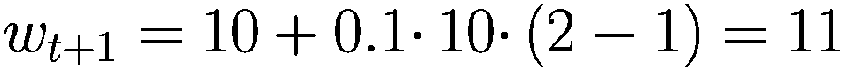

实际上，只要 (2γ - 1) > 0，每次更新都会导致权重 *w* 的发散。这表明函数逼近可能导致发散。这是因为值泛化，即更新给定状态的价值也会更新附近或相关状态的价值。不稳定问题可以从以下三个方面来考虑。

+   *函数逼近*：使用参数数量小于可能状态总数量的模型来对非常大的状态空间进行泛化的方法。

+   *自举法*：使用状态价值的估计来形成目标值，例如，在 TD(0) 中，目标值是估计 *R*[*t* + 1] + γ · *V**t*。

+   *离策略学习*：使用行为策略训练智能体，但学习不同的最优策略。

这三个组件同时存在显著增加了在简单预测/估计场景中发散的可能性。控制和优化问题分析起来更加复杂。也已经证明，只要这三个组件不同时存在，就可以避免不稳定性。这引发了一个问题，你是否可以去掉这三个中的任何一个，并评估这种去掉的影响？

函数逼近，特别是使用神经网络，使得强化学习适用于大型现实世界问题。其他替代方案不切实际。自助法使得过程样本效率高。通过观察整个剧集来形成目标的方法虽然可行，但不太实用。策略外学习可以替换为策略内，但再次强调，为了使强化学习接近人类的学习方式，你需要策略外通过探索另一个类似的问题来学习某些问题/情况。因此，对此没有简单的答案。你不能轻易放弃这三个要求中的任何一个而影响不大。这是理论方面。在实践中，大多数时候，算法在仔细监控和微调下收敛——例如使用重放缓冲区、学习率和像双 Q 学习这样的想法。第六章和 7 章讨论了在 DQN 上下文中的一些这些实用调整。

在训练过程中，定期评估代理并绘制每集回报曲线是很重要的。如果它显示出剧烈波动，这表明训练不稳定。记住，它几乎永远不会是一条平滑的曲线，但它也不应该剧烈波动。

## 梯度时序差分学习

如方程 5-9 所示的半梯度 TD 学习不遵循真实梯度。在计算损失函数的梯度时，你保持了目标估计的恒定——即 *R*[*t* + 1] + γ · *V**t*，它没有出现在关于权重 *w* 的导数中。真实的贝尔曼误差是 *R*[*t* + 1] + γ · *V**t* − *V**t*，而它的理想导数应该包含 *V**t* 和 *V**t* 的梯度项。

有一种这种算法的变体被称为*梯度时序差分学习*，它遵循真实梯度并在所有表格查找、线性和非线性功能逼近以及策略内和策略外方法的所有情况下提供收敛性。将此添加到算法组合中，表 5-1 可以修改为如表 5-2 所示。我在这本书中不深入探讨其数学证明，因为本书的重点是算法的实际实现。

表 5-2

预测/估计算法的收敛性

| 策略类型 | 算法 | 表格查找 | 线性 | 非线性 |
| --- | --- | --- | --- | --- |
| 策略内 | MCTD(0)TD(λ)梯度 TD | YYYY | YYYY | YNNY |
| 策略外 | MCTD(0)TD(λ)梯度 TD | YYYY | YNNY | YNNY |

进一步来说，表 5-3 列出了控制算法的收敛性。

表 5-3

控制算法的收敛性

| 算法 | 表格查找 | 线性 | 非线性 |
| --- | --- | --- | --- | --- |
| MC 控制 | Y | (Y) | N |
| 策略内 TD (SARSA) | Y | (Y) | N |
| 策略外 Q-Learning | Y | N | N |
| 梯度 Q-Learning | Y | Y | N |

(Y) 围绕近最优值函数波动。在所有非线性情况下，收敛的保证都不成立。

## 批量方法（DQN）

到目前为止，本章一直关注增量算法——也就是说，你采样转换，然后使用这些值在随机梯度下降的帮助下更新权重向量 *w*。但是这种方法并不高效。你只用了一次就丢弃了一个样本。然而，使用非线性函数逼近，特别是使用神经网络，你需要多次遍历网络才能使网络权重收敛到真实值。此外，在许多现实场景中，如机器人技术，你需要从两个方面提高样本效率：神经网络收敛速度慢，因此需要多次遍历，以及在实际生活中生成样本非常缓慢。在本节关于批量强化方法中，我将向您介绍使用批量方法，特别是与深度 Q 网络（Deep Q Networks）的结合，这是离策略 Q 学习的深度神经网络版本。

如前所述，你使用函数逼近估计状态值，如方程 5-1 所示：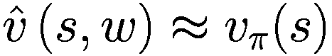。

考虑到你以某种方式知道实际状态值 *v*π，你正在尝试学习权重向量 *w* 以达到良好的估计 。你收集一批经验。

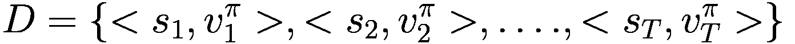

然后，你将最小二乘损失作为真实值与估计值之间差异的平均值，然后执行梯度下降以最小化误差。你使用小批量梯度下降来采样过去的经验，并使用学习率 α 移动权重向量。

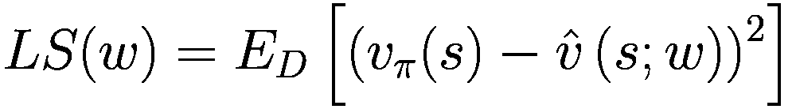

然后近似期望为样本的平均值：

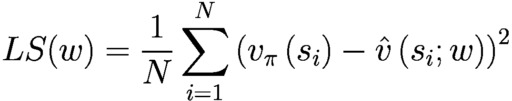

(5-22)

对 *LS*(*w*) 关于 *w* 求梯度，并使用负梯度来调整 *w*，你得到权重更新方程 5-23。请注意，它与方程 5-7 类似。

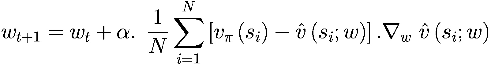

(5-23)

如前所述，您可以从状态值 *v*(*s*; *w*) 移动到状态-动作值 *q*(*s*, *a*; *w*)，并对 q 值进行类似的更新。为了再次提醒读者，从状态值移动到状态-动作值的目的在于能够找到给定状态的最优策略。由于您拥有该状态下所有可能动作的 q 值，您可以选择该状态下的最优动作，对所有状态都这样做，然后再次进行 q 值的估计/预测以及最优动作的选择。重复这些操作，直到策略和 q 值达到某种收敛。

![$$ {w}_{t+1}={w}_t+\alpha .\kern0.5em \frac{1}{N}\sum \limits_{i=1}^N\left[{q}_{\pi}\left({s}_i,{a}_i\right)-\hat{q}\left({s}_i,{a}_i;w\right)\right].{\nabla}_w\ \hat{q}\left({s}_i,{a}_i;w\right) $$](img/502835_2_En_5_Chapter/502835_2_En_5_Chapter_TeX_Equ24.png)

(5-24)

如果您还记得过去的推导，您不知道真正的值函数，*v*π 或 *q*π。和以前一样，您使用 MC 或 TD 方法用估计值替换真实值。现在让我们看看这种方法的变体，称为 DQN，这是在第四章节中展示的 Q-learning 的深度学习版本。在 DQN 中，一个离策略算法，您采样当前状态 *s*，根据当前行为策略采取一步 *a*，并使用当前 q 值的 ϵ-greedy 策略。您观察到奖励 *r* 和下一个状态 *s*^′。您使用 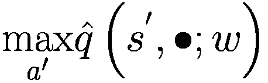 来形成目标，该目标在状态 *s*^′ 中对所有可能的动作 *a*^′ 进行了最大化。这在此处展示：

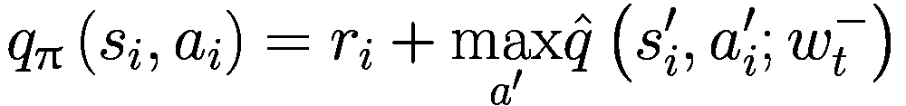

在这里，您使用了一个不同的权重向量  来计算目标估计。本质上，您有两个网络，一个称为 *在线* 网络带有权重 *w*，它根据方程 5-24 进行更新，另一个类似的网络称为 *目标网络*，但带有名为 *w*^− 的权重副本。权重向量 *w*^− 的更新频率较低，例如，在在线网络权重 *w* 更新后的每 100 次更新。这种方法使目标网络保持不变，并允许您使用监督学习的机制。此外，请注意，下标 *i* 表示迷你批次的样本，而 *t* 表示权重更新的索引。将所有这些放在一起，最终的更新方程可以写成以下形式：

![$$ {w}_{t+1}={w}_t+\alpha .\kern0.5em \frac{1}{N}\sum \limits_{i=1}^N\left[{r}_i+\gamma {\mathit{\max}}_{a_i^{\prime }}\overset{\sim }{q}\left({s}_i^{\prime },{a}_i^{\prime };{w_t}^{-}\right)-\hat{q}\left({s}_i,{a}_i;{w}_t\right)\right].{\nabla}_{w_t}\ \hat{q}\left({s}_i,{a}_i;{w}_t\right) $$](img/502835_2_En_5_Chapter/502835_2_En_5_Chapter_TeX_Equ25.png)

(5-25)

这个方程看起来非常令人畏惧。让我们来分解它。表达式 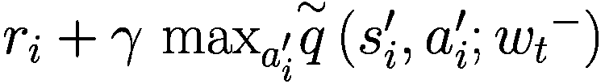 是 *q*(*s*[*i*], *a*[*i*]) 的目标值，并且使用具有权重  的不同神经网络形成。当前的 q 值估计由 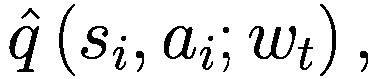 给出，这是使用权重 *w*[*t*] 的网络完成的。你通过从当前估计中减去目标并乘以当前估计的梯度来计算误差——即 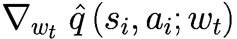。然后，将这个误差平均到所有的 *N* 个样本上，并使用学习率 α 添加到当前的权重 *w*[*t*] 上。为了收集样本，你使用 *ε*-贪婪策略运行智能体通过环境，并在称为重放缓冲区 *D* 的缓冲区中收集经验。

你也会偶尔更新目标网络权重 （比如说在每次 *w*[*t*] 的 100 个批量更新之后）。你使用更新的 q 值和 ϵ-探索来向重放缓冲区添加更多经验，并再次完成整个周期。这本质上就是 DQN 方法。关于这一点，下一章将有更多内容，它完全致力于 DQN 及其变体。现在，我将这个话题留在这里，继续前进。

## 线性最小二乘法

批量方法中使用的经验回放找到最小二乘解，最小化使用 TD 或 MC 估计的目标值与当前价值函数估计之间的误差。然而，它需要许多迭代才能收敛。然而，如果你使用线性函数逼近价值函数 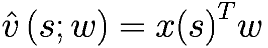 进行预测和 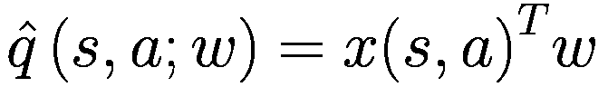 进行控制，你可以直接找到最小二乘解。我们先来看预测部分。

从方程 5-22 开始，并代入 ，你得到这个：

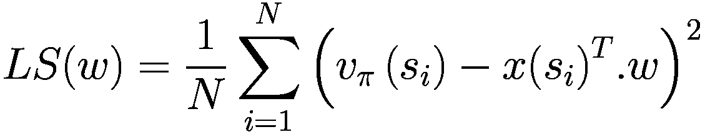

对 LS(*w*)关于 *w* 求梯度并将其设为零，得到以下结果：

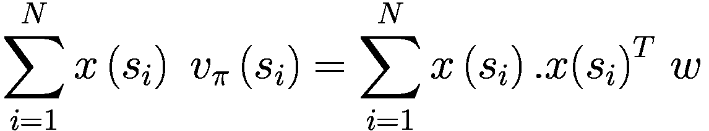

求解 *w* 得到以下结果：

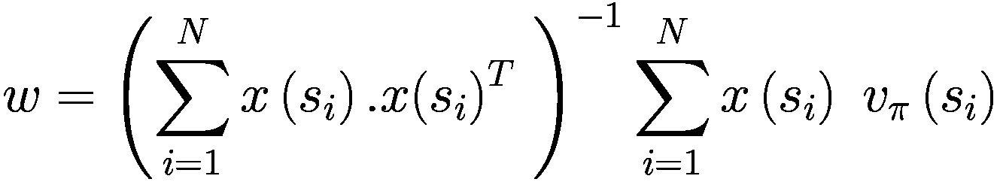

(5-26)

之前的解涉及到一个 *NxN* 矩阵的求逆，需要 *O*(*N*³) 次计算。然而，使用 Sherman-Morrison，你可以在 *O*(*N*²) 时间内解决这个问题。和之前一样，你不知道真正的值 *v*π。你用 MC、TD(0)或 TD(*λ*)的估计值来代替真实值，从而得到线性最小二乘 MC（LSMC）、LSTD 或 LSTD(*λ*)预测算法。

LSMC: *v**π* ≈ *G*[*i*]

LSTD: 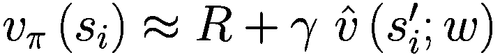

LSTD(λ): *v**π* ≈ *G*[*i*]^(*λ*)

所有这些预测算法在离策略和在线策略下都具有良好的收敛性。

在接下来的分析中，你将分析扩展到使用 q 值线性函数近似和 GPI 进行控制，其中之前的方法用于 q 值预测，然后在策略改进步骤中进行贪婪 q 值最大化。这被称为*线性最小二乘策略迭代*（LSPI）。你将迭代这些预测和改进的周期，直到策略收敛——也就是说，直到权重收敛。线性最小二乘 Q 学习（LSPI）的最终结果在此处展示，省略了推导过程。

这里是预测步骤：

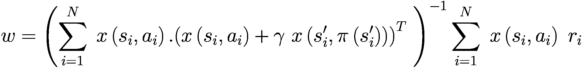

其中 (*i*) 是第 *i* 个样本 (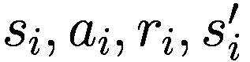) 来自经验回放 *D*，以及  ——即状态 *s*^′ 中的最大 q 值动作。

这里是控制步骤：


在控制步骤中，对于每个状态 *s*，你改变在之前的预测步骤中进行的权重更新 *w* 后最大化 q 值的策略。

随着你进一步阅读本书，状态值 *v*(*s*)、状态动作值 *q*(*s*, *a*) 和策略 π(*s*| *a*) 的函数逼近将基于某种神经网络模型。这些模型的训练由使用深度学习框架如 PyTorch、TensorFlow 或 JAX 来管理。在本版书中，我主要关注 PyTorch，自从本书的第一版以来，它已经获得了显著的吸引力。PyTorch 及其相关的库生态系统目前占据主导地位。为了完整性，我偶尔也会涵盖 TensorFlow 变体。为了让你做好准备，下一节是对这些底层深度学习框架的快速介绍。

## 深度学习库

本章前面的部分展示了，为了使用函数逼近方法，你需要有一种有效的方式来计算状态值函数  或动作值函数  的导数。如果你使用神经网络，你将使用反向传播来计算网络每一层的这些导数。这就是像 PyTorch 和 TensorFlow 这样的库发挥作用的地方。与 NumPy 库类似，它们也以高效的方式执行向量/矩阵计算。此外，这些库高度优化以处理张量（超过两个维度的数组），既使用 CPU 也使用 GPU。

在神经网络中，你需要能够反向传播以计算所有层权重相对于误差的梯度。这两个库都高度抽象并优化，以在幕后为你处理这些操作。你只需要构建正向计算，通过所有计算输入以给出最终输出。这些库会跟踪计算图，并允许你通过一个函数调用进行权重梯度的更新。

本节将带您了解流行的框架，如 PyTorch、PyTorch Lightning 和 TensorFlow。这是入门级别的覆盖。如果你熟悉这些库，你可以跳过这一节。此外，如果你对深入研究这个主题感兴趣，在获得基本介绍后，你最好进行进一步的学习。你可以参考互联网上的资源以获取更多详细信息。

### PyTorch

PyTorch 是一个框架，允许使用类似 NumPy 的构造操作张量。此外，它还包含模块，允许自动微分执行反向传播，这是训练神经网络的核心。

#### 什么是神经网络

深度学习基于人工神经网络，神经网络由神经元组成。神经元接收输入，计算加权求和，然后将求和通过某种非线性函数 *f*(*h*)（称为激活函数）传递，如图 5-11 所示。


神经网络图。输入层有 x 1、x 2 和 1 三个节点，通过 w 1、w 2 和 b 连接到求和节点。求和节点连接到 h 模式，然后是 h 的 f 节点，最后输出 y。

图 5-11

神经网络中的神经元

深度学习中的训练是指使用反向传播找到权重向量 [*w*[1], *w*[2], *b*]。当然，神经网络模型由数十亿个这样的神经元组成，这些神经元被分组到层中，并且许多这样的层堆叠在一起。神经网络层的排列有许多种类，产生了如 CNN（卷积神经网络）、RNN（循环神经网络）等架构。在最近几年，transformers 架构也应运而生。大型语言模型（LLMs）的核心由 transformers 控制，并包含数十亿甚至数百亿个权重参数。

基础级别的架构由简单的层组成，前一层中的所有神经元都与当前层的所有神经元相连。这种结构被称为 *线性密集层架构*，如图 5-12 所示。


神经网络图。输入层有 16 个节点，通过不同层传递，并在隐藏层生成一个输出节点。

图 5-12

一个简单的全连接神经网络

您可以使用 MNIST 图像数据集，并训练一个 PyTorch 模型来根据 24x24 像素的灰度图像预测数字。因此，输入层将有 768 个输入，对应于展平的 24x24 图像。输出将有十个单元，这将产生输入图像是“1”或“2”等的概率。完整的端到端 PyTorch 训练代码在名为 `5.c-Intro-to-pytorch.ipynb` 的 Python 笔记本中给出。

几个隐藏层将 768 维的输入传递到前 192 个单元，然后传递到 128 个单元，最终输出层将 128 个单元传递到 10 个单元。你通过扩展 PyTorch 的`Model`类并实现前向方法来创建 PyTorch 模型，该方法接受输入图像向量和输出一个十维输出向量。列表 5-8 展示了在 PyTorch 中创建此网络的代码。`__init__`函数使用 PyTorch 提供的`Linear`层模块定义网络的层。`forward`函数实现了输入张量通过网络的流动，输出十维输出向量。它返回原始分数，该分数在`predict`函数中通过`softmax`函数的帮助转换为概率。`predict`函数只是为了方便，不是必需的。所需做的只有两件事：在`init`中定义网络的层，并实现`forward`函数。

```py
class NN(nn.Module):
def __init__(self):
super().__init__()
self.fc1 = nn.Linear(784, 192)
self.fc2 = nn.Linear(192, 128)
self.fc3 = nn.Linear(128, 10)
def forward(self, x):
''' Forward pass through the network, returns the output logits '''
x = self.fc1(x)
x = F.relu(x)
x = self.fc2(x)
x = F.relu(x)
x = self.fc3(x)
return x
def predict(self, x):
''' To predict classes by calculating the softmax '''
logits = self.forward(x)
return F.softmax(logits, dim=1)
model = NN()
model
Listing 5-8
Custom Network for MNIST Digit Prediction from 5.c-Intro-to-pytorch.ipynb
```

你加载`MNIST`数据集并准备`dataloaders`，以便将图像按批次提供给训练代码，如列表 5-9 所示。它包括使用三个高级函数——`transforms`将图像转换为 PyTorch 张量并进行归一化等操作，`datasets`在本地下载数据集并将其包装到`DataLoader`中，该`DataLoader`按批次向代码的其余部分提供图像。这些函数高度优化，具有许多参数，可以根据特定需求调整行为。你可以在 PyTorch 文档中了解更多关于这些函数的信息。

```py
# Define a transform to normalize the data
transform = transforms.Compose([transforms.ToTensor(),
transforms.Normalize(0.5, 0.5),
])
# Download and load the training data
trainset = datasets.MNIST('MNIST_data/', download=True, train=True, transform=transform)
trainloader = torch.utils.data.DataLoader(trainset, batch_size=128, shuffle=True)
# Download and load the test data
testset = datasets.MNIST('MNIST_data/', download=True, train=False, transform=transform)
testloader = torch.utils.data.DataLoader(testset, batch_size=128, shuffle=True)
Listing 5-9
Data Loading in PyTorch from 5.c-Intro-to-pytorch.ipynb
```

#### 使用反向传播进行训练

在定义模型和准备数据之后，下一步是训练模型。这包括首先定义用于在反向传播过程中跟踪梯度的优化器以及调整神经网络权重的代码。Adam 是一个非常流行的优化器，它具有先进的自适应能力，可以调整随着训练进展的训练步长α。还有许多其他的优化器。优化器设计是独立的一个研究领域。你还需要定义一个损失函数，这是网络训练的一部分。列表 5-10 展示了这些步骤的代码。然后是训练代码，其中你按批次遍历训练数据，计算损失函数值，并使用优化器进行反向传播，调整权重。

```py
# Create an optimizer to train the network by carrying out back propagation
model = NN()
optimizer = optim.Adam(model.parameters(), lr=0.001)
loss_fn = nn.CrossEntropyLoss()
# Train network
epochs = 1
steps = 0
running_loss = 0
eval_freq = 10
for e in range(epochs):
for images, labels in iter(trainloader):
steps += 1
images.resize_(images.size()[0], 784)
optimizer.zero_grad()
output = model.forward(images)
loss = loss_fn(output, labels)
loss.backward()
optimizer.step()
running_loss += loss.item()
if steps % eval_freq == 0:
# Test accuracy
accuracy = 0
for ii, (images, labels) in enumerate(testloader):
images = images.resize_(images.size()[0], 784)
predicted = model.predict(images).data
equality = (labels == predicted.max(1)[1])
accuracy += equality.type_as(torch.FloatTensor()).mean()
print("Epoch: {}/{}".format(e+1, epochs),
"Loss: {:.4f}".format(running_loss/eval_freq),
"Test accuracy: {:.4f}".format(accuracy/(ii+1)))
running_loss = 0
Listing 5-10
Model Training in PyTorch from 5.c-Intro-to-pytorch.ipynb
```

一旦模型训练完成，你可以传递一个新的图像并观察模型预测的概率分布。我为此创建了一个名为`view_classification`的自定义函数。要通过网络传递图像并观察结果，你需要一段简短的三个代码行，如列表 5-11 所示。

```py
logits = model.forward(img[None,])
# Predict the class from the network output
prediction = F.softmax(logits, dim=1)
view_classification(img.reshape(1, 28, 28), prediction[0])
Listing 5-11
Prediction Using Trained Model from 5.c-Intro-to-pytorch.ipynb
```

通过传递 4 的图像输出的结果如图 5-13 所示。


数字 4 的处理模拟图像和标注为概率的水平条形图。条形图在 4 的位置获得了最高的 0.90 值。数值是估算的。

图 5-13

在输入图像为“4”数字的已训练模型上的预测

总结来说，涉及的步骤包括：1）根据问题和考虑特定的输入大小和输出大小来设计模型；2）准备训练数据；3）定义损失函数和优化器；最后；4）训练模型的代码。你将根据所讨论的代理学习算法的需求，以递增复杂的方式遵循这些步骤。 

### PyTorch Lightning

PyTorch Lightning 是一个编写来加速 PyTorch 中模型开发和训练的库。PyTorch Lightning 是一个为需要最大灵活性和在规模上超级提升性能的专业 AI 研究人员和机器学习工程师提供的“包含电池”的深度学习框架。

Lightning 组织 PyTorch 代码以移除样板代码并解锁可扩展性。在这样做的同时，它仍然提供了尝试任何想法的完全灵活性，而不需要样板代码。它帮助你专注于模型训练的核心部分，并提供了一种组织代码的标准方式。

大部分代码将与你在原始 PyTorch 笔记本中看到的一样。准备数据加载器的代码与之前相同。你首先在 PyTorch 中创建一个网络模型，就像之前一样。为了多样化，我使用了另一个更短的版本来创建神经网络，这次使用了 PyTorch 的`nn.Sequential`类，如列表 5-12 所示。使用 PyTorch Lightning 进行端到端训练的完整代码在`5.d-Intro-to-pytorch-lighning.ipynb`笔记本中给出。

```py
model = nn.Sequential(
nn.Linear(28 * 28, 192),
nn.ReLU(),
nn.Linear(192, 128),
nn.ReLU(),
nn.Linear(128,10)
)
# print model summary
model
#### OUTPUT ####
Sequential(
(0): Linear(in_features=784, out_features=192, bias=True)
(1): ReLU()
(2): Linear(in_features=192, out_features=128, bias=True)
(3): ReLU()
(4): Linear(in_features=128, out_features=10, bias=True)
)
Listing 5-12
PyTorch Model from 5.d-Intro-to-pytorch-lightning.ipynb
```

当使用 PyTorch Lightning 时，您通过扩展`pl.LightningModule`并实现特定函数来创建一个 lightning 模型。这消除了在使用不带 Lightning 的纯 PyTorch 进行训练时需要的大量样板代码的需求。在这种情况下，如图表 5-13 所示，您创建了一个名为`MNISTClassifier`的`LightningModule`。在`__init__`函数中，您初始化了列表 5-12 中定义的模型。接下来，您定义了`training_step`函数，该函数接收一批输入训练数据，将其通过模型传递，并计算需要最小化的损失。此函数必须返回损失，该损失将由优化器在反向传播期间用于计算梯度。然后您使用`self.log`来记录结果，这底层使用 TensorBoard 进行记录。您还可以选择将日志数据前向传递到“weights and biases”或其他类似的日志和实验服务。接下来，您实现一个`test_step`，它主要模仿`training_step`，生成您在模型性能评估期间想要跟踪的指标。您定义的最后一个函数是`configure_optimizers`，用于定义在训练阶段反向传播梯度期间将使用的优化器。

```py
# define the LightningModule
class MNISTClassifier(pl.LightningModule):
def __init__(self, model):
super().__init__()
self.model = model
def training_step(self, batch, batch_idx):
# training_step defines the train loop.
# it is independent of forward
x, y = batch
x = x.view(x.size(0), -1)
logits = self.model(x)
loss = F.cross_entropy(logits,y)
# Logging to TensorBoard (if installed) by default
self.log("train_loss", loss)
return loss
def test_step(self, batch, batch_idx):
# training_step defines the train loop.
# it is independent of forward
x, y = batch
x = x.view(x.size(0), -1)
logits = self.model(x)
loss = F.cross_entropy(logits, y)
self.log("test_loss", loss)
def configure_optimizers(self):
optimizer = optim.Adam(self.parameters(), lr=0.001)
return optimizer
# init the MNIST Classifier
classifier = MNISTClassifier(model)
Listing 5-13
PyTorch Lightning Module from 5.d-Intro-to-pytorch-lightning.ipynb
```

使用 PyTorch Lightning，一旦定义了 Lightning 模块，只需一行代码即可运行训练代码。无需在代码中循环加载数据并手动运行反向步骤。列表 5-14 显示了您需要执行的训练代码以训练模型。您只需定义一个`trainer`，并通过传递之前定义的`PyTorchLightning`模块和`dataloaders`来调用其`fit`方法。

```py
# train the model (hint: here are some helpful Trainer arguments for rapid idea iteration)
trainer = pl.Trainer(max_epochs=2)
trainer.fit(model=classifier, train_dataloaders=trainloader)
Listing 5-14
PyTorch Lightning Training from 5.d-Intro-to-pytorch-lightning.ipynb
```

使用训练好的模型进行预测的代码与 PyTorch 中相同。图 5-14 显示了训练模型对一个输入样本的性能。


数字 5 的加工模拟图像和标注为概率的水平条形图。条形图在 5 的位置获得了最高的 0.90 值。数值是估算的。

图 5-14

对一个“5”数字输入图像的训练模型预测

如您所见，使用 PyTorch Lightning 有助于减少样板代码的开销。

### TensorFlow

TensorFlow 在很大程度上遵循与 PyTorch 相同的模式。它有一套自己的数据加载器、模型构建模式、损失和优化器定义以及训练循环。我将快速介绍。TensorFlow 的端到端训练可以在`5.e-Intro-to-tensorflow.ipynb`笔记本中找到。列表 5-15 显示了在 TensorFlow 下下载和创建 MNIST 数据集的代码。

```py
mnist = tf.keras.datasets.mnist
(x_train, y_train), (x_test, y_test) = mnist.load_data()
x_train, x_test = x_train / 255.0, x_test / 255.0
Listing 5-15
TensorFlow Data Loading from 5.e-Intro-to-tensorflow.ipynb
```

与 PyTorch 类似，你使用 `tf.keras.model.Sequential` 类定义神经网络模型，如列表 5-16 所示。它还提供了剩余步骤的代码——即定义损失函数以及使用 `model.compile` 函数调用将模型与优化器和损失函数绑定。最后，像 PyTorch Lightning 一样，你使用 `model.fit` 来使用训练数据训练模型。

```py
model = tf.keras.models.Sequential([
tf.keras.layers.Flatten(input_shape=(28, 28)),
tf.keras.layers.Dense(192, activation='relu'),
tf.keras.layers.Dense(128, activation='relu'),
tf.keras.layers.Dense(10)
])
# Create loss_fn
loss_fn = tf.keras.losses.SparseCategoricalCrossentropy(from_logits=True)
# Train model
model.fit(x_train, y_train, epochs=2)
# evaluate model
model.evaluate(x_test,  y_test, verbose=2)
Listing 5-16
TensorFlow Model Training from 5.e-Intro-to-tensorflow.ipynb
```

评估训练模型在样本图像上输出的代码显示在列表 5-17 中。它与你在 PyTorch 的情况中看到的大致相同。

```py
# check the prediction on same image as the one used before training
logits = model(img)
# Predict the class from the network output
prediction = tf.nn.softmax(logits).numpy()
view_classification(img[0], prediction[0])
Listing 5-17
TensorFlow Model Prediction from 5.e-Intro-to-tensorflow.ipynb
```

与 PyTorch 或 PyTorch Lightning 类似，模型在训练后准确性非常高。模型在样本图像中的输出概率分布模仿你在图 5-13 和 5-14 中看到的值。

这完成了对流行三个框架的介绍。还有许多正在出现的框架，例如 JAX、FastAI、AWS、Microsoft 的 Glueon 等等。我大部分时间会坚持使用 PyTorch，偶尔也会展示一些使用 TensorFlow 的示例代码。

## 摘要

在本章中，主要关注的是查看函数逼近在非常大或连续的状态空间中的应用，这些状态空间无法使用你在前几章中看到的基于表的学习方法来处理。

本章讨论了使用函数逼近进行优化意味着什么。我还展示了监督学习中的训练概念，即训练模型产生接近目标的值，如何在强化学习中应用。本章强调了由于移动目标和强化学习（RL）中存在的样本相互依赖性，需要适当处理。

然后，你看到了各种函数逼近策略，包括线性和非线性。我还演示了基于表的方 法只是线性逼近的特殊情况。随后，对预测和控制增量方法进行了详细讨论。你看到了这些方法被应用于山车，用于构建使用 *n*-步 SARSA 和 SARSA(*λ*) 的训练代理。

接下来，本章讨论了批量方法的一般情况，并探讨了批量方法家族中流行的 DQN（深度 Q 网络）算法的更新规则的完整推导。然后，你看到了用于预测和控制的最小二乘法。在这个过程中，我一直在强调一般收敛问题以及所讨论的具体方法的收敛性。

我以对 PyTorch、PyTorch Lightning 和 TensorFlow 等深度学习框架的简要介绍结束了这一章。
